Linux - Hardware Trends
-----------------------

A project to identify most popular hardware characteristics and track their change
over time based on data collected by Linux users at https://Linux-Hardware.org.

Anyone can contribute to this report by the [hw-probe](https://github.com/linuxhw/hw-probe) tool:

    sudo -E hw-probe -all -upload

This is a report for all computer types. See also reports for [desktops](/Desktop/README.md) and [notebooks](/Notebook/README.md).

Distribution-specific reports: [Arch](/Dist/Arch), [ArcoLinux](/Dist/ArcoLinux), [BlackPanther](/Dist/BlackPanther), [CentOS](/Dist/CentOS), [Clear Linux](/Dist/Clear_Linux), [Debian](/Dist/Debian), [Elementary](/Dist/Elementary), [EndeavourOS](/Dist/EndeavourOS), [Endless](/Dist/Endless), [Fedora](/Dist/Fedora), [Garuda Linux](/Dist/Garuda_Linux), [Gentoo](/Dist/Gentoo), [Kali](/Dist/Kali), [KDE neon](/Dist/KDE_neon), [Kubuntu](/Dist/Kubuntu), [Linux Mint](/Dist/Linux_Mint), [Manjaro](/Dist/Manjaro), [OpenMandriva](/Dist/OpenMandriva), [openSUSE](/Dist/openSUSE), [Pop!_OS](/Dist/Pop!_OS), [Red OS](/Dist/Red_OS), [ROSA](/Dist/ROSA), [SteamOS](/Dist/SteamOS), [Ubuntu MATE](/Dist/Ubuntu_MATE), [Ubuntu](/Dist/Ubuntu), [Xubuntu](/Dist/Xubuntu), [Zorin](/Dist/Zorin).

This report is for one last month. Overall report since the beginning of time: [TestDays](https://github.com/linuxhw/TestDays)

Period: Dec, 2025.

Contents
--------

* [ System ](#system)
  - [ OS                       ](#os)
  - [ OS Family                ](#os-family)
  - [ Kernel                   ](#kernel)
  - [ Kernel Family            ](#kernel-family)
  - [ Kernel Major Ver.        ](#kernel-major-ver)
  - [ Arch                     ](#arch)
  - [ DE                       ](#de)
  - [ Display Server           ](#display-server)
  - [ Display Manager          ](#display-manager)
  - [ OS Lang                  ](#os-lang)
  - [ Boot Mode                ](#boot-mode)
  - [ Filesystem               ](#filesystem)
  - [ Part. scheme             ](#part-scheme)
  - [ Dual Boot with Linux/BSD ](#dual-boot-with-linuxbsd)
  - [ Dual Boot (Win)          ](#dual-boot-win)

* [ Board ](#board)
  - [ Vendor                   ](#vendor)
  - [ Model                    ](#model)
  - [ Model Family             ](#model-family)
  - [ MFG Year                 ](#mfg-year)
  - [ Form Factor              ](#form-factor)
  - [ Secure Boot              ](#secure-boot)
  - [ Coreboot                 ](#coreboot)
  - [ RAM Size                 ](#ram-size)
  - [ RAM Used                 ](#ram-used)
  - [ Total Drives             ](#total-drives)
  - [ Has CD-ROM               ](#has-cd-rom)
  - [ Has Ethernet             ](#has-ethernet)
  - [ Has WiFi                 ](#has-wifi)
  - [ Has Bluetooth            ](#has-bluetooth)

* [ Location ](#location)
  - [ Country                  ](#country)
  - [ City                     ](#city)

* [ Drives ](#drives)
  - [ Drive Vendor             ](#drive-vendor)
  - [ Drive Model              ](#drive-model)
  - [ HDD Vendor               ](#hdd-vendor)
  - [ SSD Vendor               ](#ssd-vendor)
  - [ Drive Kind               ](#drive-kind)
  - [ Drive Connector          ](#drive-connector)
  - [ Drive Size               ](#drive-size)
  - [ Space Total              ](#space-total)
  - [ Space Used               ](#space-used)
  - [ Malfunc. Drives          ](#malfunc-drives)
  - [ Malfunc. Drive Vendor    ](#malfunc-drive-vendor)
  - [ Malfunc. HDD Vendor      ](#malfunc-hdd-vendor)
  - [ Malfunc. Drive Kind      ](#malfunc-drive-kind)
  - [ Failed Drives            ](#failed-drives)
  - [ Failed Drive Vendor      ](#failed-drive-vendor)
  - [ Drive Status             ](#drive-status)

* [ Storage controller ](#storage-controller)
  - [ Storage Vendor           ](#storage-vendor)
  - [ Storage Model            ](#storage-model)
  - [ Storage Kind             ](#storage-kind)

* [ Processor ](#processor)
  - [ CPU Vendor               ](#cpu-vendor)
  - [ CPU Model                ](#cpu-model)
  - [ CPU Model Family         ](#cpu-model-family)
  - [ CPU Cores                ](#cpu-cores)
  - [ CPU Sockets              ](#cpu-sockets)
  - [ CPU Threads              ](#cpu-threads)
  - [ CPU Op-Modes             ](#cpu-op-modes)
  - [ CPU Microcode            ](#cpu-microcode)
  - [ CPU Microarch            ](#cpu-microarch)

* [ Graphics ](#graphics)
  - [ GPU Vendor               ](#gpu-vendor)
  - [ GPU Model                ](#gpu-model)
  - [ GPU Combo                ](#gpu-combo)
  - [ GPU Driver               ](#gpu-driver)
  - [ GPU Memory               ](#gpu-memory)

* [ Monitor ](#monitor)
  - [ Monitor Vendor           ](#monitor-vendor)
  - [ Monitor Model            ](#monitor-model)
  - [ Monitor Resolution       ](#monitor-resolution)
  - [ Monitor Diagonal         ](#monitor-diagonal)
  - [ Monitor Width            ](#monitor-width)
  - [ Aspect Ratio             ](#aspect-ratio)
  - [ Monitor Area             ](#monitor-area)
  - [ Pixel Density            ](#pixel-density)
  - [ Multiple Monitors        ](#multiple-monitors)

* [ Network ](#network)
  - [ Net Controller Vendor    ](#net-controller-vendor)
  - [ Net Controller Model     ](#net-controller-model)
  - [ Wireless Vendor          ](#wireless-vendor)
  - [ Wireless Model           ](#wireless-model)
  - [ Ethernet Vendor          ](#ethernet-vendor)
  - [ Ethernet Model           ](#ethernet-model)
  - [ Net Controller Kind      ](#net-controller-kind)
  - [ Used Controller          ](#used-controller)
  - [ NICs                     ](#nics)
  - [ IPv6                     ](#ipv6)

* [ Bluetooth ](#bluetooth)
  - [ Bluetooth Vendor         ](#bluetooth-vendor)
  - [ Bluetooth Model          ](#bluetooth-model)

* [ Sound ](#sound)
  - [ Sound Vendor             ](#sound-vendor)
  - [ Sound Model              ](#sound-model)

* [ Memory ](#memory)
  - [ Memory Vendor            ](#memory-vendor)
  - [ Memory Model             ](#memory-model)
  - [ Memory Kind              ](#memory-kind)
  - [ Memory Form Factor       ](#memory-form-factor)
  - [ Memory Size              ](#memory-size)
  - [ Memory Speed             ](#memory-speed)

* [ Printers & scanners ](#printers--scanners)
  - [ Printer Vendor           ](#printer-vendor)
  - [ Printer Model            ](#printer-model)
  - [ Scanner Vendor           ](#scanner-vendor)
  - [ Scanner Model            ](#scanner-model)

* [ Camera ](#camera)
  - [ Camera Vendor            ](#camera-vendor)
  - [ Camera Model             ](#camera-model)

* [ Security ](#security)
  - [ Fingerprint Vendor       ](#fingerprint-vendor)
  - [ Fingerprint Model        ](#fingerprint-model)
  - [ Chipcard Vendor          ](#chipcard-vendor)
  - [ Chipcard Model           ](#chipcard-model)

* [ Unsupported ](#unsupported)
  - [ Unsupported Devices      ](#unsupported-devices)
  - [ Unsupported Device Types ](#unsupported-device-types)

System
------

OS
--

Installed operating systems

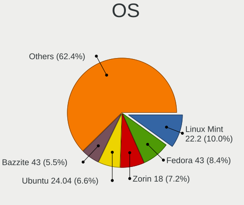

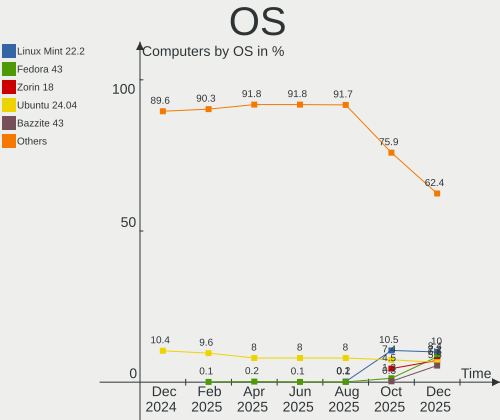

| Name                         | Computers | Percent |
|------------------------------|-----------|---------|
| Linux Mint 22.2              | 710       | 9.96%   |
| Fedora 43                    | 600       | 8.41%   |
| Zorin 18                     | 512       | 7.18%   |
| Ubuntu 24.04                 | 470       | 6.59%   |
| Bazzite 43                   | 393       | 5.51%   |
| Arch Rolling                 | 356       | 4.99%   |
| Debian 13                    | 314       | 4.4%    |
| OpenMandriva 6.0             | 251       | 3.52%   |
| OpenMandriva 25.90           | 208       | 2.92%   |
| Pop!_OS 24.04                | 193       | 2.71%   |
| OpenMandriva 25.11           | 172       | 2.41%   |
| Ubuntu 25.10                 | 154       | 2.16%   |
| ROSA 13.1                    | 132       | 1.85%   |
| Debian 12                    | 124       | 1.74%   |
| CachyOS Rolling              | 118       | 1.65%   |
| Pop!_OS 22.04                | 105       | 1.47%   |
| Zorin 17                     | 101       | 1.42%   |
| Kubuntu 25.10                | 83        | 1.16%   |
| Bazzite 42                   | 82        | 1.15%   |
| Ubuntu 22.04                 | 80        | 1.12%   |
| Linux Mint 22.1              | 78        | 1.09%   |
| Fedora 42                    | 73        | 1.02%   |
| EndeavourOS Rolling          | 67        | 0.94%   |
| LMDE 7                       | 65        | 0.91%   |
| CachyOS                      | 64        | 0.9%    |
| KDE neon 24.04               | 61        | 0.86%   |
| OpenMandriva 25.06           | 59        | 0.83%   |
| Debian                       | 50        | 0.7%    |
| Gentoo 2.18                  | 48        | 0.67%   |
| SteamOS 3.7.17               | 46        | 0.64%   |
| OpenMandriva 24.12           | 46        | 0.64%   |
| ALT Linux 11.0               | 43        | 0.6%    |
| ROSA 12                      | 41        | 0.57%   |
| Kubuntu 24.04                | 40        | 0.56%   |
| ROSA 12.5.1                  | 39        | 0.55%   |
| Nobara 43                    | 39        | 0.55%   |
| Linux Mint 21.3              | 39        | 0.55%   |
| openSUSE Tumbleweed-XXXXXXXX | 37        | 0.52%   |
| NixOS 26.05                  | 37        | 0.52%   |
| Manjaro                      | 35        | 0.49%   |

OS Family
---------

OS without a version

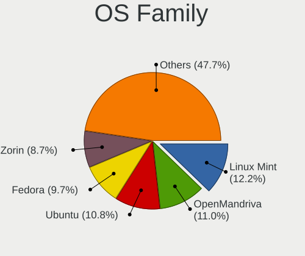

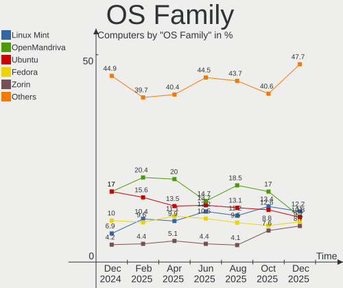

| Name             | Computers | Percent |
|------------------|-----------|---------|
| Linux Mint       | 872       | 12.22%  |
| OpenMandriva     | 785       | 11.01%  |
| Ubuntu           | 767       | 10.75%  |
| Fedora           | 691       | 9.69%   |
| Zorin            | 619       | 8.68%   |
| Debian           | 506       | 7.09%   |
| Bazzite          | 475       | 6.66%   |
| Arch             | 358       | 5.02%   |
| Pop!_OS          | 298       | 4.18%   |
| ROSA             | 226       | 3.17%   |
| CachyOS          | 182       | 2.55%   |
| Kubuntu          | 139       | 1.95%   |
| Manjaro          | 87        | 1.22%   |
| NixOS            | 73        | 1.02%   |
| LMDE             | 70        | 0.98%   |
| SteamOS          | 68        | 0.95%   |
| openSUSE         | 68        | 0.95%   |
| EndeavourOS      | 67        | 0.94%   |
| KDE neon         | 62        | 0.87%   |
| ALT Linux        | 58        | 0.81%   |
| Gentoo           | 50        | 0.7%    |
| Xubuntu          | 45        | 0.63%   |
| Nobara           | 42        | 0.59%   |
| BlackPanther     | 39        | 0.55%   |
| Elementary       | 34        | 0.48%   |
| Kali             | 33        | 0.46%   |
| MX               | 31        | 0.43%   |
| Garuda Linux     | 30        | 0.42%   |
| Lubuntu          | 27        | 0.38%   |
| Ubuntu MATE      | 20        | 0.28%   |
| TUXEDO OS        | 19        | 0.27%   |
| Anduinos         | 16        | 0.22%   |
| org.kde.Platform | 14        | 0.2%    |
| Solus            | 12        | 0.17%   |
| Artix            | 11        | 0.15%   |
| Void Linux       | 10        | 0.14%   |
| Red OS           | 10        | 0.14%   |
| Pikaos           | 10        | 0.14%   |
| Aurora           | 10        | 0.14%   |
| Parrot           | 9         | 0.13%   |

Kernel
------

Version of the Linux kernel

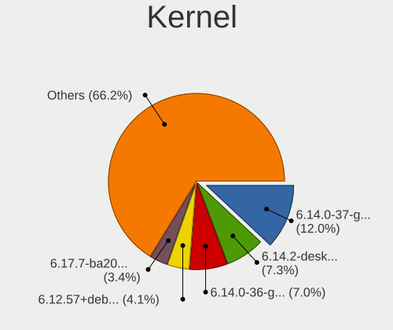

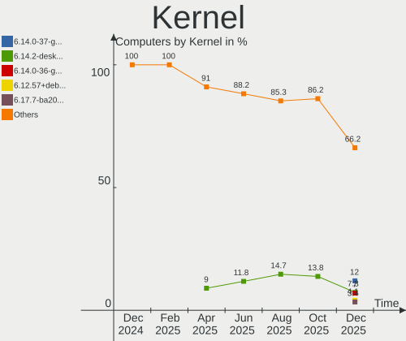

| Version                                     | Computers | Percent |
|---------------------------------------------|-----------|---------|
| 6.14.0-37-generic                           | 854       | 11.97%  |
| 6.14.2-desktop-3omv2590                     | 520       | 7.29%   |
| 6.14.0-36-generic                           | 502       | 7.04%   |
| 6.12.57+deb13-amd64                         | 293       | 4.11%   |
| 6.17.7-ba20.fc43.x86_64                     | 239       | 3.35%   |
| 6.8.0-90-generic                            | 231       | 3.24%   |
| 6.17.9-arch1-1                              | 202       | 2.83%   |
| 6.17.12-300.fc43.x86_64                     | 184       | 2.58%   |
| 6.17.9-76061709-generic                     | 165       | 2.31%   |
| 6.8.0-88-generic                            | 164       | 2.3%    |
| 6.17.7-ba19.fc43.x86_64                     | 144       | 2.02%   |
| 6.17.9-300.fc43.x86_64                      | 140       | 1.96%   |
| 6.17.0-8-generic                            | 128       | 1.79%   |
| 6.12.47-generic-5rosa13-x86_64              | 127       | 1.78%   |
| 6.17.4-76061704-generic                     | 99        | 1.39%   |
| 6.17.0-7-generic                            | 91        | 1.28%   |
| 6.17.1-300.fc43.x86_64                      | 90        | 1.26%   |
| 6.18.0-desktop-1omv2590                     | 86        | 1.21%   |
| 6.14.0-29-generic                           | 84        | 1.18%   |
| 6.17.10-300.fc43.x86_64                     | 76        | 1.07%   |
| 6.16.4-116.bazzite.fc42.x86_64              | 76        | 1.07%   |
| 6.8.0-87-generic                            | 71        | 1%      |
| 6.17.11-300.fc43.x86_64                     | 67        | 0.94%   |
| 6.17.7-desktop-1omv2590                     | 62        | 0.87%   |
| 6.17.9-zen1-1-zen                           | 58        | 0.81%   |
| 6.17.9-2-cachyos                            | 48        | 0.67%   |
| 6.14.0-33-generic                           | 45        | 0.63%   |
| 6.12.1-desktop-1omv2490                     | 45        | 0.63%   |
| 6.11.11-valve24-2-neptune-611-gfd0dd251480d | 45        | 0.63%   |
| 6.18.2-arch2-1                              | 42        | 0.59%   |
| 6.17.8-300.fc43.x86_64                      | 42        | 0.59%   |
| 6.12.48+deb13-amd64                         | 37        | 0.52%   |
| 6.1.0-41-amd64                              | 35        | 0.49%   |
| 6.18.0-3-cachyos                            | 32        | 0.45%   |
| 6.12.34-6.12-alt1                           | 32        | 0.45%   |
| 6.8.12-11-pve                               | 29        | 0.41%   |
| 6.14.0-35-generic                           | 28        | 0.39%   |
| 6.14.0-27-generic                           | 28        | 0.39%   |
| 6.17.0-5-generic                            | 25        | 0.35%   |
| 6.17.8-arch1-1                              | 24        | 0.34%   |

Kernel Family
-------------

Linux kernel without a distro release

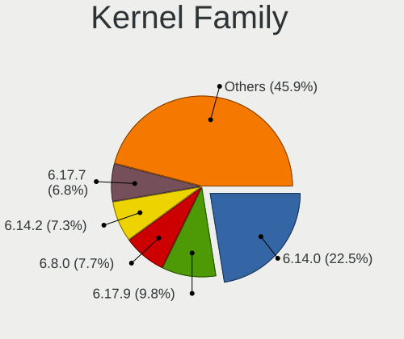

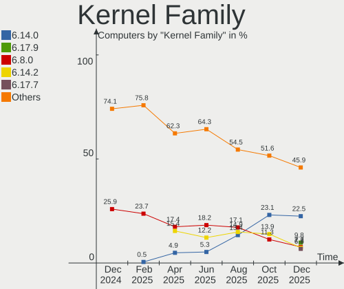

| Version | Computers | Percent |
|---------|-----------|---------|
| 6.14.0  | 1603      | 22.47%  |
| 6.17.9  | 696       | 9.76%   |
| 6.8.0   | 551       | 7.72%   |
| 6.14.2  | 524       | 7.35%   |
| 6.17.7  | 484       | 6.79%   |
| 6.12.57 | 308       | 4.32%   |
| 6.17.0  | 273       | 3.83%   |
| 6.18.0  | 240       | 3.36%   |
| 6.17.12 | 212       | 2.97%   |
| 6.18.2  | 168       | 2.36%   |
| 6.12.47 | 162       | 2.27%   |
| 6.17.10 | 139       | 1.95%   |
| 6.17.8  | 134       | 1.88%   |
| 6.17.4  | 114       | 1.6%    |
| 5.15.0  | 109       | 1.53%   |
| 6.17.1  | 106       | 1.49%   |
| 6.18.1  | 92        | 1.29%   |
| 6.17.11 | 88        | 1.23%   |
| 6.16.4  | 83        | 1.16%   |
| 6.8.12  | 61        | 0.86%   |
| 6.1.0   | 60        | 0.84%   |
| 6.11.11 | 58        | 0.81%   |
| 6.12.48 | 57        | 0.8%    |
| 6.12.1  | 47        | 0.66%   |
| 6.12.34 | 36        | 0.5%    |
| 6.12.61 | 30        | 0.42%   |
| 6.12.0  | 30        | 0.42%   |
| 6.16.3  | 26        | 0.36%   |
| 6.12.59 | 26        | 0.36%   |
| 6.6.106 | 25        | 0.35%   |
| 6.12.63 | 25        | 0.35%   |
| 6.16.12 | 24        | 0.34%   |
| 6.12.58 | 24        | 0.34%   |
| 6.17.13 | 20        | 0.28%   |
| 6.6.32  | 19        | 0.27%   |
| 6.12.62 | 18        | 0.25%   |
| 6.11.0  | 16        | 0.22%   |
| 6.17.2  | 15        | 0.21%   |
| 6.12.60 | 15        | 0.21%   |
| 6.16.8  | 14        | 0.2%    |

Kernel Major Ver.
-----------------

Linux kernel major version

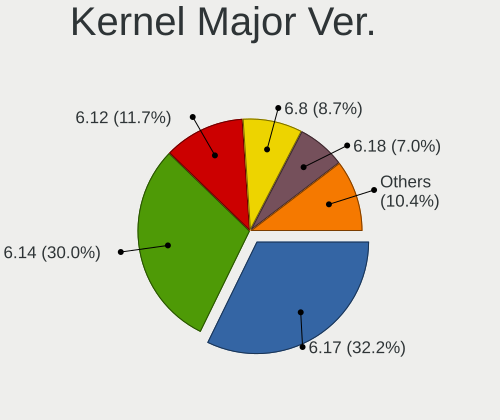

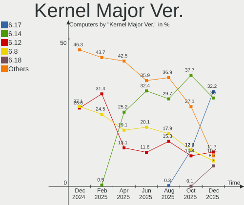

| Version | Computers | Percent |
|---------|-----------|---------|
| 6.17    | 2300      | 32.24%  |
| 6.14    | 2138      | 29.97%  |
| 6.12    | 837       | 11.73%  |
| 6.8     | 618       | 8.66%   |
| 6.18    | 500       | 7.01%   |
| 6.16    | 155       | 2.17%   |
| 5.15    | 133       | 1.86%   |
| 6.6     | 94        | 1.32%   |
| 6.1     | 93        | 1.3%    |
| 6.11    | 79        | 1.11%   |
| 6.4     | 28        | 0.39%   |
| 5.10    | 22        | 0.31%   |
| 6.15    | 21        | 0.29%   |
| 5.4     | 15        | 0.21%   |
| 4.18    | 14        | 0.2%    |
| 6.10    | 13        | 0.18%   |
| 6.5     | 12        | 0.17%   |
| 5.14    | 9         | 0.13%   |
| 4.15    | 8         | 0.11%   |
| 6.2     | 7         | 0.1%    |
| 6.13    | 6         | 0.08%   |
| 4.19    | 5         | 0.07%   |
| 6.19    | 3         | 0.04%   |
| 6.0     | 3         | 0.04%   |
| 5.19    | 3         | 0.04%   |
| 5.16    | 3         | 0.04%   |
| 6.9     | 2         | 0.03%   |
| 6.7     | 2         | 0.03%   |
| 5.11    | 2         | 0.03%   |
| 4.4     | 2         | 0.03%   |
| 6       | 1         | 0.01%   |
| 5.6     | 1         | 0.01%   |
| 5.18    | 1         | 0.01%   |
| 4.9     | 1         | 0.01%   |
| 4.16    | 1         | 0.01%   |
| 4.14    | 1         | 0.01%   |

Arch
----

OS architecture (x86_64, i586, etc.)

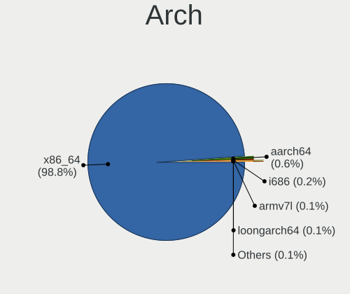

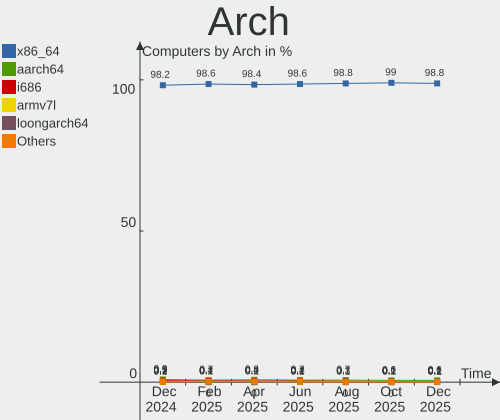

| Name        | Computers | Percent |
|-------------|-----------|---------|
| x86_64      | 7050      | 98.84%  |
| aarch64     | 46        | 0.64%   |
| i686        | 14        | 0.2%    |
| armv7l      | 9         | 0.13%   |
| loongarch64 | 5         | 0.07%   |
| riscv64     | 2         | 0.03%   |
| ppc         | 2         | 0.03%   |
| sw_64       | 1         | 0.01%   |
| sparc64     | 1         | 0.01%   |
| ppc64       | 1         | 0.01%   |
| mips        | 1         | 0.01%   |
| armv6l      | 1         | 0.01%   |

DE
--

Desktop Environment

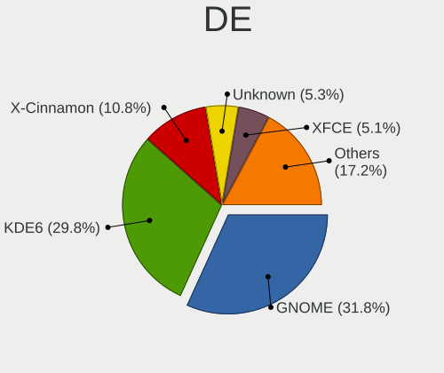

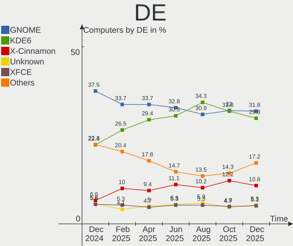

| Name                  | Computers | Percent |
|-----------------------|-----------|---------|
| GNOME                 | 2268      | 31.8%   |
| KDE6                  | 2123      | 29.76%  |
| X-Cinnamon            | 770       | 10.79%  |
| Unknown               | 379       | 5.31%   |
| XFCE                  | 366       | 5.13%   |
| KDE5                  | 226       | 3.17%   |
| COSMIC                | 205       | 2.87%   |
| KDE                   | 136       | 1.91%   |
| LXQt                  | 118       | 1.65%   |
| MATE                  | 115       | 1.61%   |
| Hyprland              | 102       | 1.43%   |
| niri                  | 41        | 0.57%   |
| KDE4                  | 41        | 0.57%   |
| Pantheon              | 36        | 0.5%    |
| Cinnamon              | 36        | 0.5%    |
| i3                    | 30        | 0.42%   |
| Budgie                | 26        | 0.36%   |
| sway                  | 17        | 0.24%   |
| LXDE                  | 16        | 0.22%   |
| Trinity               | 7         | 0.1%    |
| labwc:wlroots         | 7         | 0.1%    |
| GNOME Classic         | 7         | 0.1%    |
| Unity                 | 6         | 0.08%   |
| sway:wlroots          | 6         | 0.08%   |
| GNOME Flashback       | 6         | 0.08%   |
| icewm                 | 5         | 0.07%   |
| Endless:GNOME         | 5         | 0.07%   |
| Deepin                | 5         | 0.07%   |
| Enlightenment         | 3         | 0.04%   |
| LeftWM                | 2         | 0.03%   |
| DDE                   | 2         | 0.03%   |
| bspwm                 | 2         | 0.03%   |
| wlroots               | 1         | 0.01%   |
| UKUI                  | 1         | 0.01%   |
| TDE:                  | 1         | 0.01%   |
| TDE                   | 1         | 0.01%   |
| sway:wlroots:sway-run | 1         | 0.01%   |
| start-hyprland        | 1         | 0.01%   |
| qtile                 | 1         | 0.01%   |
| Phosh:GNOME           | 1         | 0.01%   |

Display Server
--------------

X11 or Wayland

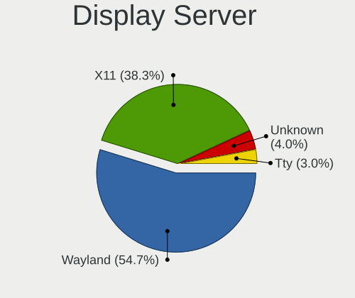

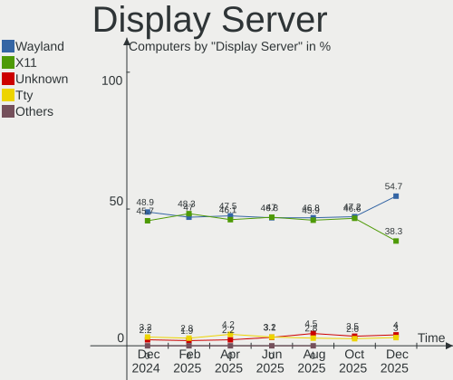

| Name    | Computers | Percent |
|---------|-----------|---------|
| Wayland | 3905      | 54.75%  |
| X11     | 2735      | 38.34%  |
| Unknown | 282       | 3.95%   |
| Tty     | 211       | 2.96%   |

Display Manager
---------------

SDDM, LightDM, etc.

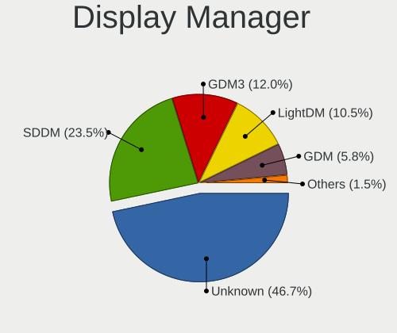

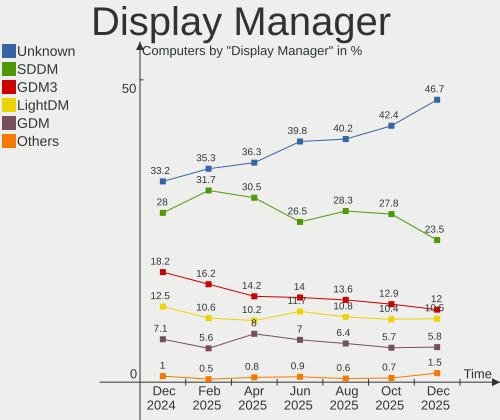

| Name                  | Computers | Percent |
|-----------------------|-----------|---------|
| Unknown               | 3330      | 46.68%  |
| SDDM                  | 1679      | 23.54%  |
| GDM3                  | 855       | 11.99%  |
| LightDM               | 752       | 10.54%  |
| GDM                   | 411       | 5.76%   |
| GREETD                | 36        | 0.5%    |
| COSMIC-GREETER        | 27        | 0.38%   |
| LY-DM                 | 13        | 0.18%   |
| TDM                   | 5         | 0.07%   |
| Ly                    | 5         | 0.07%   |
| KDM                   | 5         | 0.07%   |
| SLIMSKI               | 4         | 0.06%   |
| SLiM                  | 3         | 0.04%   |
| DISPLAY-MANAGER-START | 3         | 0.04%   |
| XDM                   | 1         | 0.01%   |
| PLASMALOGIN           | 1         | 0.01%   |
| MDM                   | 1         | 0.01%   |
| LXDM                  | 1         | 0.01%   |
| FLY-DM                | 1         | 0.01%   |

OS Lang
-------

Language

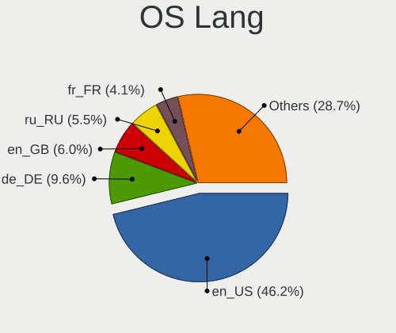

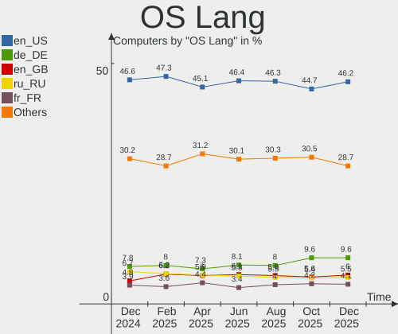

| Lang    | Computers | Percent |
|---------|-----------|---------|
| en_US   | 3294      | 46.18%  |
| de_DE   | 682       | 9.56%   |
| en_GB   | 429       | 6.01%   |
| ru_RU   | 390       | 5.47%   |
| fr_FR   | 293       | 4.11%   |
| pt_BR   | 233       | 3.27%   |
| it_IT   | 197       | 2.76%   |
| C       | 186       | 2.61%   |
| es_ES   | 154       | 2.16%   |
| en_CA   | 135       | 1.89%   |
| en_AU   | 123       | 1.72%   |
| pl_PL   | 112       | 1.57%   |
| Unknown | 75        | 1.05%   |
| es_MX   | 69        | 0.97%   |
| nl_NL   | 59        | 0.83%   |
| hu_HU   | 49        | 0.69%   |
| en_IN   | 42        | 0.59%   |
| de_AT   | 42        | 0.59%   |
| zh_CN   | 34        | 0.48%   |
| pt_PT   | 33        | 0.46%   |
| cs_CZ   | 32        | 0.45%   |
| en_NZ   | 27        | 0.38%   |
| en_ZA   | 26        | 0.36%   |
| tr_TR   | 25        | 0.35%   |
| es_AR   | 25        | 0.35%   |
| de_CH   | 25        | 0.35%   |
| sv_SE   | 24        | 0.34%   |
| en_IE   | 20        | 0.28%   |
| en_DK   | 19        | 0.27%   |
| es_CL   | 17        | 0.24%   |
| fi_FI   | 16        | 0.22%   |
| ja_JP   | 15        | 0.21%   |
| es_CO   | 15        | 0.21%   |
| fr_CA   | 14        | 0.2%    |
| en_PH   | 11        | 0.15%   |
| zh_TW   | 10        | 0.14%   |
| en_IL   | 10        | 0.14%   |
| da_DK   | 10        | 0.14%   |
| nl_BE   | 9         | 0.13%   |
| fr_CH   | 9         | 0.13%   |

Boot Mode
---------

EFI or BIOS

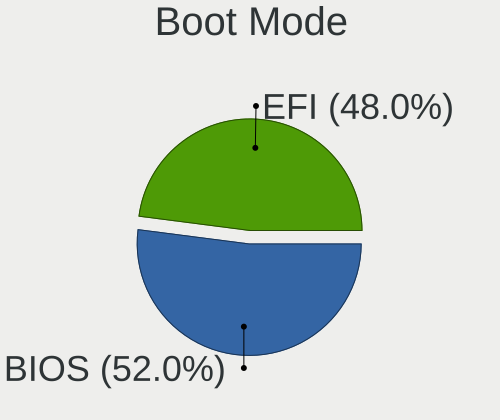

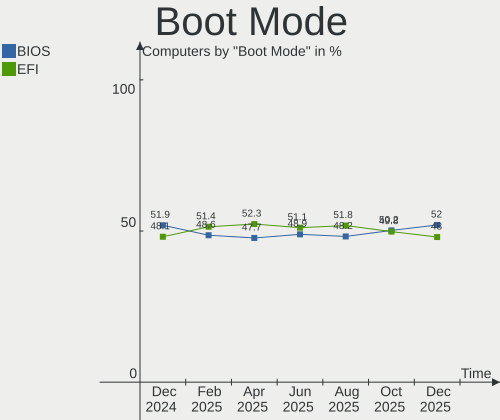

| Mode | Computers | Percent |
|------|-----------|---------|
| BIOS | 3712      | 52.04%  |
| EFI  | 3421      | 47.96%  |

Filesystem
----------

Type of filesystem

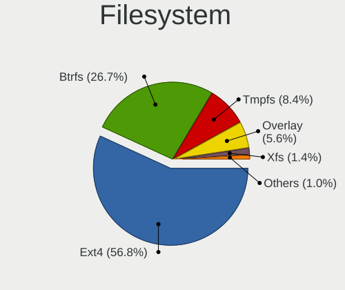

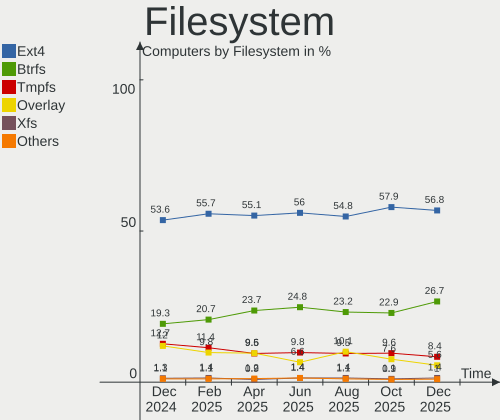

| Type     | Computers | Percent |
|----------|-----------|---------|
| Ext4     | 4054      | 56.83%  |
| Btrfs    | 1906      | 26.72%  |
| Tmpfs    | 602       | 8.44%   |
| Overlay  | 398       | 5.58%   |
| Xfs      | 99        | 1.39%   |
| Zfs      | 28        | 0.39%   |
| F2fs     | 18        | 0.25%   |
| Rootfs   | 6         | 0.08%   |
| Ext3     | 5         | 0.07%   |
| Unknown  | 5         | 0.07%   |
| Ext2     | 4         | 0.06%   |
| XXXXX    | 3         | 0.04%   |
| XXX4     | 2         | 0.03%   |
| Bcachefs | 2         | 0.03%   |
| Jfs      | 1         | 0.01%   |

Part. scheme
------------

Scheme of partitioning

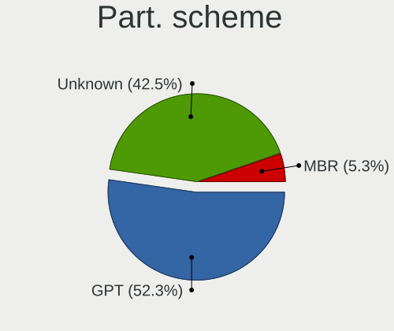

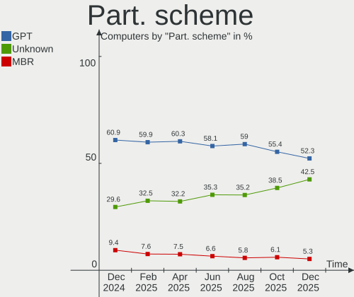

| Type    | Computers | Percent |
|---------|-----------|---------|
| GPT     | 3728      | 52.26%  |
| Unknown | 3030      | 42.48%  |
| MBR     | 375       | 5.26%   |

Dual Boot with Linux/BSD
------------------------

Hosting more than one Linux/BSD

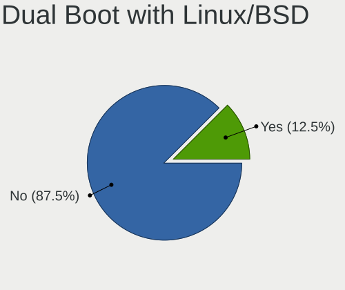

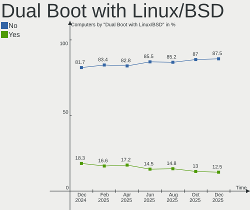

| Dual boot | Computers | Percent |
|-----------|-----------|---------|
| No        | 6243      | 87.52%  |
| Yes       | 890       | 12.48%  |

Dual Boot (Win)
---------------

Hosting Linux and Windows

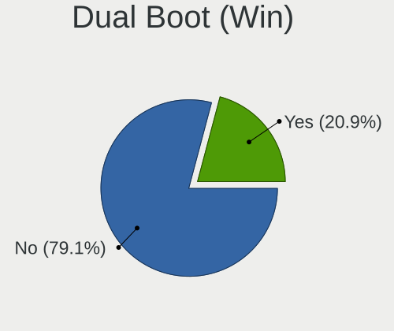

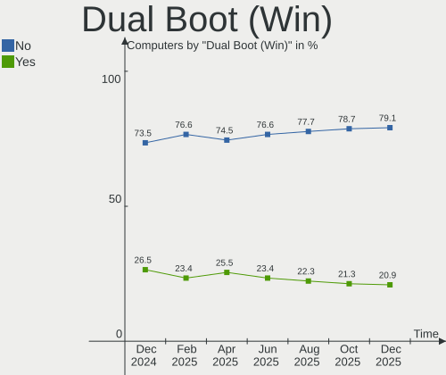

| Dual boot | Computers | Percent |
|-----------|-----------|---------|
| No        | 5645      | 79.14%  |
| Yes       | 1488      | 20.86%  |

Board
-----

Vendor
------

Motherboard manufacturer

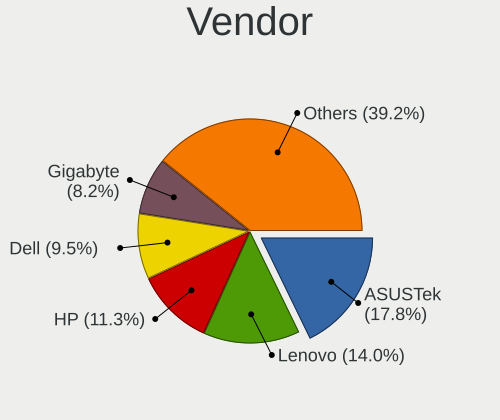

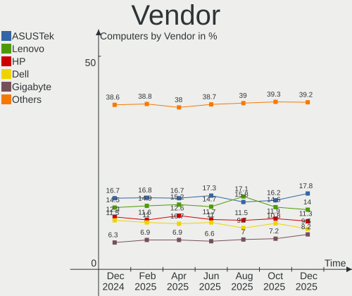

| Name                                 | Computers | Percent |
|--------------------------------------|-----------|---------|
| ASUSTek Computer                     | 1269      | 17.79%  |
| Lenovo                               | 996       | 13.96%  |
| Hewlett-Packard                      | 805       | 11.29%  |
| Dell                                 | 676       | 9.48%   |
| Gigabyte Technology                  | 588       | 8.24%   |
| MSI                                  | 578       | 8.1%    |
| Acer                                 | 297       | 4.16%   |
| ASRock                               | 284       | 3.98%   |
| Apple                                | 229       | 3.21%   |
| Intel                                | 116       | 1.63%   |
| Unknown                              | 96        | 1.35%   |
| Fujitsu                              | 62        | 0.87%   |
| Toshiba                              | 56        | 0.79%   |
| Samsung Electronics                  | 55        | 0.77%   |
| Microsoft                            | 48        | 0.67%   |
| Medion                               | 46        | 0.64%   |
| Framework                            | 46        | 0.64%   |
| HUAWEI                               | 41        | 0.57%   |
| Supermicro                           | 37        | 0.52%   |
| Google                               | 37        | 0.52%   |
| AZW                                  | 35        | 0.49%   |
| Valve                                | 34        | 0.48%   |
| Sony                                 | 28        | 0.39%   |
| Shenzhen Meigao Electronic Equipment | 27        | 0.38%   |
| Raspberry Pi Foundation              | 26        | 0.36%   |
| GMKtec                               | 25        | 0.35%   |
| Biostar                              | 23        | 0.32%   |
| Alienware                            | 23        | 0.32%   |
| Pegatron                             | 16        | 0.22%   |
| Chuwi                                | 15        | 0.21%   |
| TUXEDO                               | 14        | 0.2%    |
| Packard Bell                         | 14        | 0.2%    |
| Notebook                             | 13        | 0.18%   |
| Huanan                               | 12        | 0.17%   |
| System76                             | 11        | 0.15%   |
| GEEKOM                               | 11        | 0.15%   |
| Positivo                             | 10        | 0.14%   |
| Razer                                | 9         | 0.13%   |
| MACHINIST                            | 9         | 0.13%   |
| LG Electronics                       | 9         | 0.13%   |

Model
-----

Motherboard model

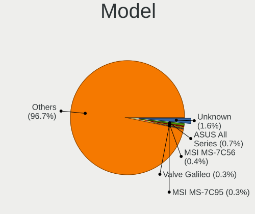

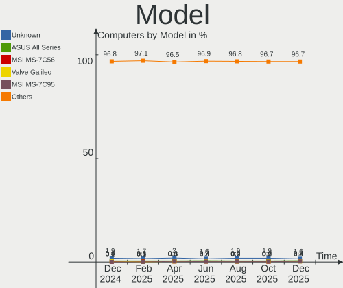

| Name                                                  | Computers | Percent |
|-------------------------------------------------------|-----------|---------|
| Unknown                                               | 115       | 1.61%   |
| ASUS All Series                                       | 48        | 0.67%   |
| MSI MS-7C56                                           | 26        | 0.36%   |
| Valve Galileo                                         | 22        | 0.31%   |
| MSI MS-7C95                                           | 22        | 0.31%   |
| MSI MS-7C37                                           | 22        | 0.31%   |
| HP ProLiant DL360 Gen9                                | 22        | 0.31%   |
| HP Notebook                                           | 21        | 0.29%   |
| ASUS TUF Gaming X570-PLUS                             | 21        | 0.29%   |
| MSI MS-7C91                                           | 20        | 0.28%   |
| Shenzhen Meigao Electronic Equipment EliteMini Series | 14        | 0.2%    |
| MSI MS-7C02                                           | 14        | 0.2%    |
| Framework Laptop 13 (AMD Ryzen 7040Series)            | 14        | 0.2%    |
| Apple MacBookPro9,2                                   | 14        | 0.2%    |
| Apple MacBookAir7,2                                   | 14        | 0.2%    |
| Supermicro Super Server                               | 13        | 0.18%   |
| HP ProLiant DL380 Gen9                                | 13        | 0.18%   |
| ASUS Vivobook Go E1504FA_E1504FA                      | 13        | 0.18%   |
| Apple MacBookPro8,1                                   | 13        | 0.18%   |
| Valve Jupiter                                         | 12        | 0.17%   |
| MSI MS-7D75                                           | 12        | 0.17%   |
| Gigabyte X870E AORUS ELITE WIFI7                      | 12        | 0.17%   |
| Framework Laptop 16 (AMD Ryzen 7040 Series)           | 12        | 0.17%   |
| Dell OptiPlex 7010                                    | 12        | 0.17%   |
| ASUS VivoBook_ASUSLaptop M1605YA_M1605YA              | 12        | 0.17%   |
| ASUS PRIME A320M-K                                    | 12        | 0.17%   |
| HP Laptop 15-fd0xxx                                   | 11        | 0.15%   |
| ASUS TUF Gaming B550-PLUS                             | 11        | 0.15%   |
| HP EliteBook 840 G6                                   | 10        | 0.14%   |
| Gigabyte X570 AORUS ELITE                             | 10        | 0.14%   |
| Gigabyte 970A-DS3P                                    | 10        | 0.14%   |
| Dell OptiPlex 7050                                    | 10        | 0.14%   |
| ASUS TUF Gaming B850-PLUS WIFI                        | 10        | 0.14%   |
| ASUS ROG STRIX B550-F GAMING WIFI II                  | 10        | 0.14%   |
| MSI MS-7D25                                           | 9         | 0.13%   |
| MSI MS-7C84                                           | 9         | 0.13%   |
| MSI MS-7B89                                           | 9         | 0.13%   |
| Lenovo Yoga 7 2-in-1 14AKP10 83JR                     | 9         | 0.13%   |
| HP Pavilion 15                                        | 9         | 0.13%   |
| HP 15                                                 | 9         | 0.13%   |

Model Family
------------

Motherboard model prefix

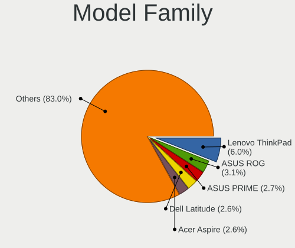

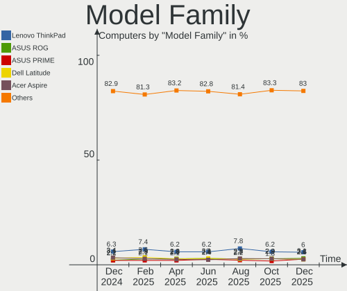

| Name               | Computers | Percent |
|--------------------|-----------|---------|
| Lenovo ThinkPad    | 428       | 6%      |
| ASUS ROG           | 221       | 3.1%    |
| ASUS PRIME         | 190       | 2.66%   |
| Dell Latitude      | 187       | 2.62%   |
| Acer Aspire        | 185       | 2.59%   |
| ASUS TUF           | 164       | 2.3%    |
| Lenovo IdeaPad     | 147       | 2.06%   |
| Dell Inspiron      | 141       | 1.98%   |
| ASUS Vivobook      | 131       | 1.84%   |
| Unknown            | 115       | 1.61%   |
| Dell OptiPlex      | 109       | 1.53%   |
| HP Pavilion        | 100       | 1.4%    |
| HP Laptop          | 90        | 1.26%   |
| Lenovo Legion      | 88        | 1.23%   |
| HP EliteBook       | 88        | 1.23%   |
| ASUS ASUS          | 80        | 1.12%   |
| Dell Precision     | 74        | 1.04%   |
| HP ProBook         | 70        | 0.98%   |
| Dell XPS           | 70        | 0.98%   |
| Lenovo ThinkCentre | 67        | 0.94%   |
| Lenovo Yoga        | 64        | 0.9%    |
| Microsoft Surface  | 48        | 0.67%   |
| HP Compaq          | 48        | 0.67%   |
| ASUS All           | 48        | 0.67%   |
| Framework Laptop   | 45        | 0.63%   |
| HP ProLiant        | 43        | 0.6%    |
| Toshiba Satellite  | 41        | 0.57%   |
| Gigabyte B550      | 34        | 0.48%   |
| HP Victus          | 33        | 0.46%   |
| Gigabyte X570      | 32        | 0.45%   |
| HP EliteDesk       | 31        | 0.43%   |
| Acer Nitro         | 31        | 0.43%   |
| HP ENVY            | 29        | 0.41%   |
| Lenovo ThinkBook   | 28        | 0.39%   |
| Gigabyte B650      | 28        | 0.39%   |
| ASUS ZenBook       | 28        | 0.39%   |
| Gigabyte X870E     | 27        | 0.38%   |
| Fujitsu ESPRIMO    | 27        | 0.38%   |
| RPi Raspberry      | 26        | 0.36%   |
| MSI MS-7C56        | 26        | 0.36%   |

MFG Year
--------

Motherboard manufacture year

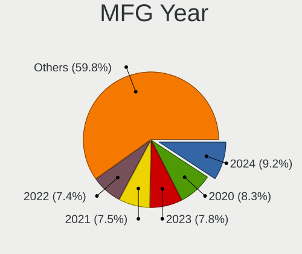

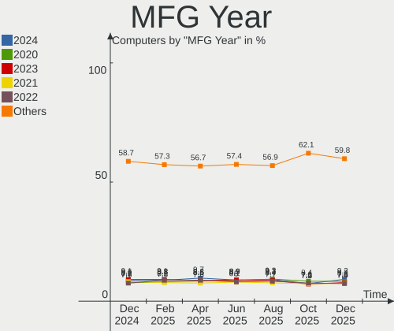

| Year    | Computers | Percent |
|---------|-----------|---------|
| 2024    | 658       | 9.22%   |
| 2020    | 590       | 8.27%   |
| 2023    | 554       | 7.77%   |
| 2021    | 538       | 7.54%   |
| 2022    | 525       | 7.36%   |
| 2019    | 514       | 7.21%   |
| 2025    | 504       | 7.07%   |
| 2018    | 471       | 6.6%    |
| 2017    | 379       | 5.31%   |
| 2013    | 373       | 5.23%   |
| 2012    | 356       | 4.99%   |
| 2015    | 303       | 4.25%   |
| 2011    | 283       | 3.97%   |
| 2014    | 275       | 3.86%   |
| 2016    | 268       | 3.76%   |
| 2009    | 156       | 2.19%   |
| 2010    | 141       | 1.98%   |
| 2008    | 104       | 1.46%   |
| Unknown | 58        | 0.81%   |
| 2007    | 46        | 0.64%   |
| 2006    | 32        | 0.45%   |
| 2003    | 2         | 0.03%   |
| 2005    | 1         | 0.01%   |
| 2004    | 1         | 0.01%   |
| 2001    | 1         | 0.01%   |

Form Factor
-----------

Physical design of the computer

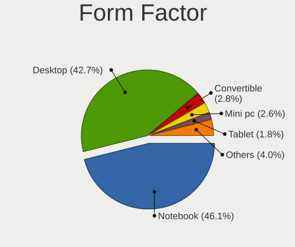

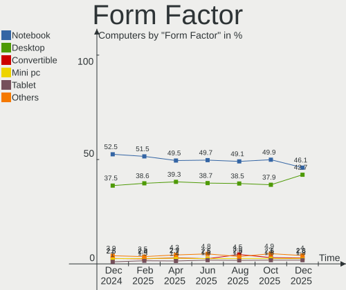

| Name           | Computers | Percent |
|----------------|-----------|---------|
| Notebook       | 3287      | 46.08%  |
| Desktop        | 3049      | 42.74%  |
| Convertible    | 200       | 2.8%    |
| Mini pc        | 184       | 2.58%   |
| Tablet         | 125       | 1.75%   |
| Server         | 124       | 1.74%   |
| All in one     | 108       | 1.51%   |
| System on chip | 48        | 0.67%   |
| Other          | 5         | 0.07%   |
| Phone          | 2         | 0.03%   |
| Stick pc       | 1         | 0.01%   |

Secure Boot
-----------

Enabled or disabled

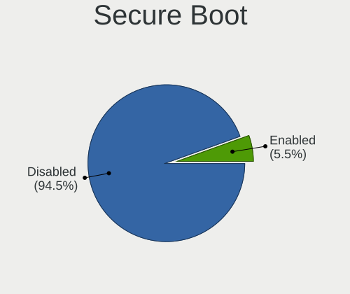

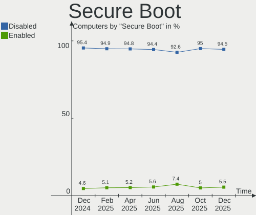

| State    | Computers | Percent |
|----------|-----------|---------|
| Disabled | 6741      | 94.5%   |
| Enabled  | 392       | 5.5%    |

Coreboot
--------

Have coreboot on board

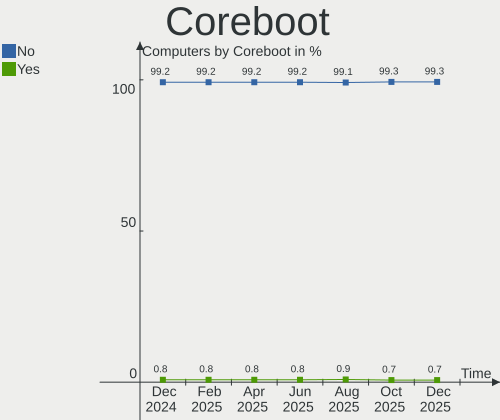

| Used | Computers | Percent |
|------|-----------|---------|
| No   | 7082      | 99.29%  |
| Yes  | 51        | 0.71%   |

RAM Size
--------

Total RAM memory

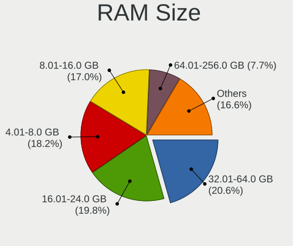

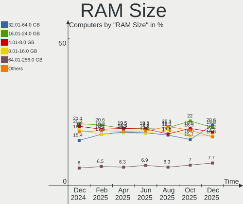

| Size in GB      | Computers | Percent |
|-----------------|-----------|---------|
| 32.01-64.0      | 1472      | 20.64%  |
| 16.01-24.0      | 1412      | 19.8%   |
| 4.01-8.0        | 1300      | 18.23%  |
| 8.01-16.0       | 1216      | 17.05%  |
| 64.01-256.0     | 552       | 7.74%   |
| 3.01-4.0        | 535       | 7.5%    |
| 24.01-32.0      | 468       | 6.56%   |
| 1.01-2.0        | 64        | 0.9%    |
| More than 256.0 | 49        | 0.69%   |
| 2.01-3.0        | 45        | 0.63%   |
| 0.51-1.0        | 12        | 0.17%   |
| 0.01-0.5        | 8         | 0.11%   |

RAM Used
--------

Used RAM memory

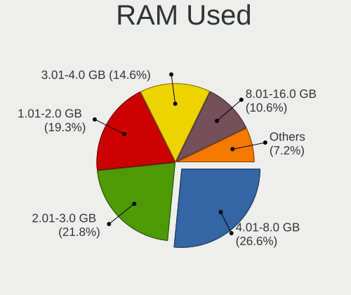

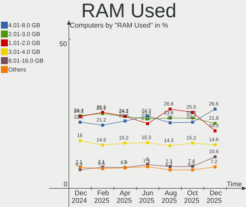

| Used GB         | Computers | Percent |
|-----------------|-----------|---------|
| 4.01-8.0        | 1894      | 26.55%  |
| 2.01-3.0        | 1555      | 21.8%   |
| 1.01-2.0        | 1375      | 19.28%  |
| 3.01-4.0        | 1041      | 14.59%  |
| 8.01-16.0       | 756       | 10.6%   |
| 0.51-1.0        | 218       | 3.06%   |
| 16.01-24.0      | 119       | 1.67%   |
| 0.01-0.5        | 50        | 0.7%    |
| 64.01-256.0     | 48        | 0.67%   |
| 24.01-32.0      | 41        | 0.57%   |
| 32.01-64.0      | 32        | 0.45%   |
| More than 256.0 | 3         | 0.04%   |
| 0               | 1         | 0.01%   |

Total Drives
------------

Number of drives on board

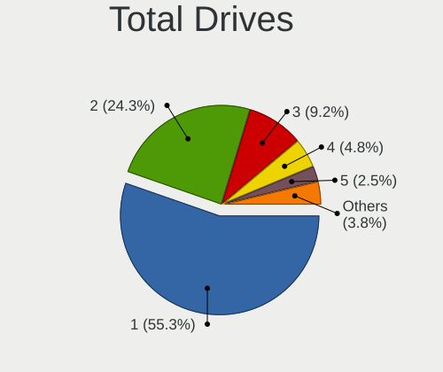

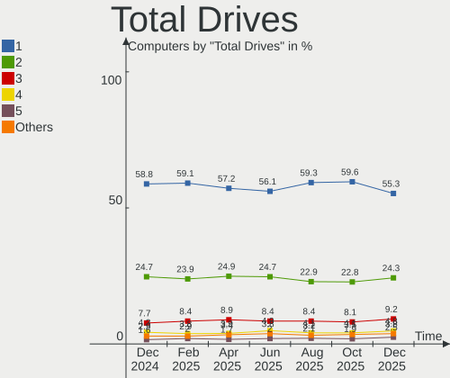

| Drives | Computers | Percent |
|--------|-----------|---------|
| 1      | 3947      | 55.33%  |
| 2      | 1736      | 24.34%  |
| 3      | 658       | 9.22%   |
| 4      | 344       | 4.82%   |
| 5      | 179       | 2.51%   |
| 6      | 102       | 1.43%   |
| 0      | 42        | 0.59%   |
| 7      | 40        | 0.56%   |
| 10     | 20        | 0.28%   |
| 8      | 17        | 0.24%   |
| 12     | 9         | 0.13%   |
| 14     | 8         | 0.11%   |
| 18     | 6         | 0.08%   |
| 13     | 6         | 0.08%   |
| 9      | 5         | 0.07%   |
| 11     | 3         | 0.04%   |
| 16     | 2         | 0.03%   |
| 111    | 1         | 0.01%   |
| 70     | 1         | 0.01%   |
| 40     | 1         | 0.01%   |
| 33     | 1         | 0.01%   |
| 31     | 1         | 0.01%   |
| 28     | 1         | 0.01%   |
| 19     | 1         | 0.01%   |
| 17     | 1         | 0.01%   |
| 15     | 1         | 0.01%   |

Has CD-ROM
----------

Has CD-ROM on board

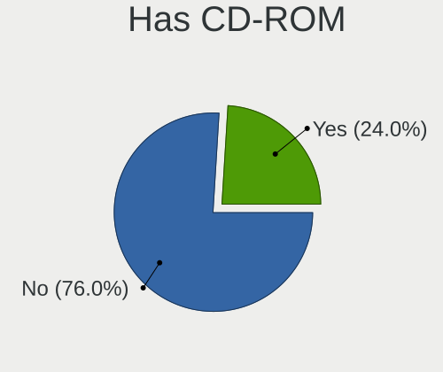

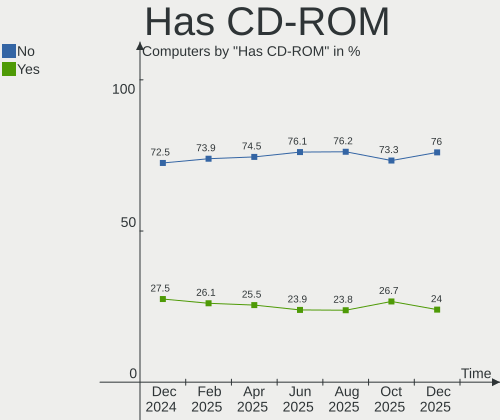

| Presented | Computers | Percent |
|-----------|-----------|---------|
| No        | 5419      | 75.97%  |
| Yes       | 1714      | 24.03%  |

Has Ethernet
------------

Has Ethernet on board

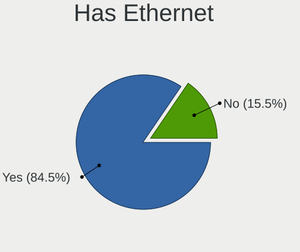

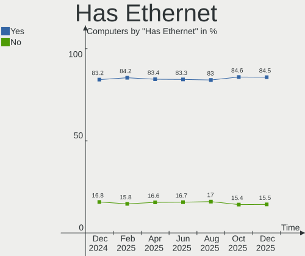

| Presented | Computers | Percent |
|-----------|-----------|---------|
| Yes       | 6030      | 84.54%  |
| No        | 1103      | 15.46%  |

Has WiFi
--------

Has WiFi module

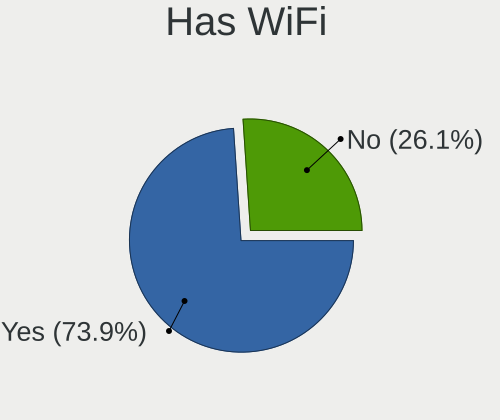

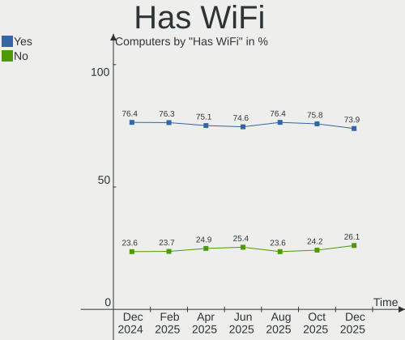

| Presented | Computers | Percent |
|-----------|-----------|---------|
| Yes       | 5274      | 73.94%  |
| No        | 1859      | 26.06%  |

Has Bluetooth
-------------

Has Bluetooth module

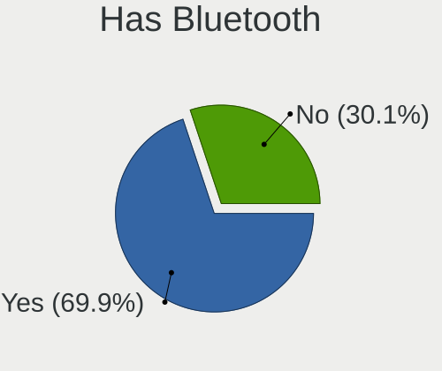

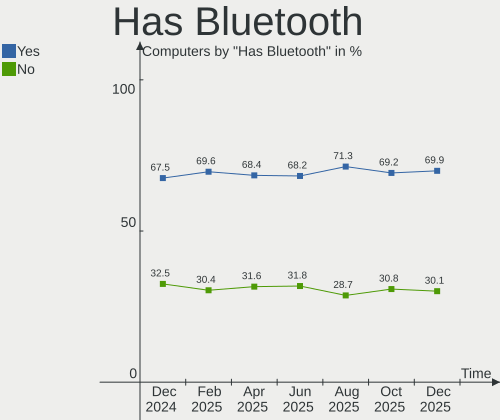

| Presented | Computers | Percent |
|-----------|-----------|---------|
| Yes       | 4986      | 69.9%   |
| No        | 2147      | 30.1%   |

Location
--------

Country
-------

Geographic location (country)

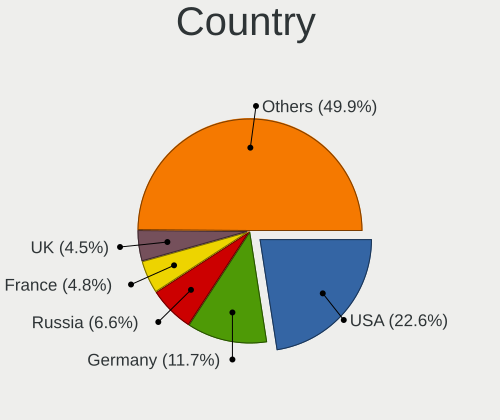

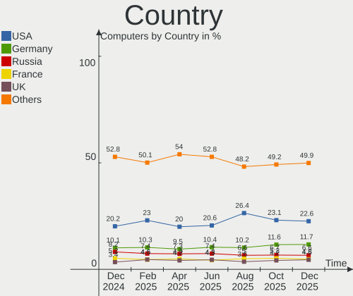

| Country         | Computers | Percent |
|-----------------|-----------|---------|
| USA             | 1609      | 22.56%  |
| Germany         | 831       | 11.65%  |
| Russia          | 473       | 6.63%   |
| France          | 343       | 4.81%   |
| UK              | 320       | 4.49%   |
| Brazil          | 310       | 4.35%   |
| Italy           | 274       | 3.84%   |
| Canada          | 233       | 3.27%   |
| Poland          | 195       | 2.73%   |
| Australia       | 181       | 2.54%   |
| Spain           | 157       | 2.2%    |
| Netherlands     | 126       | 1.77%   |
| India           | 115       | 1.61%   |
| Switzerland     | 104       | 1.46%   |
| Mexico          | 95        | 1.33%   |
| Hungary         | 92        | 1.29%   |
| Austria         | 91        | 1.28%   |
| Finland         | 86        | 1.21%   |
| Sweden          | 73        | 1.02%   |
| Portugal        | 59        | 0.83%   |
| Indonesia       | 59        | 0.83%   |
| China           | 59        | 0.83%   |
| Turkey          | 56        | 0.79%   |
| Czechia         | 56        | 0.79%   |
| Romania         | 54        | 0.76%   |
| Norway          | 47        | 0.66%   |
| Denmark         | 47        | 0.66%   |
| New Zealand     | 40        | 0.56%   |
| Belgium         | 40        | 0.56%   |
| South Africa    | 39        | 0.55%   |
| Greece          | 38        | 0.53%   |
| Japan           | 37        | 0.52%   |
| Argentina       | 37        | 0.52%   |
| Colombia        | 36        | 0.5%    |
| Bulgaria        | 36        | 0.5%    |
| Thailand        | 34        | 0.48%   |
| The Netherlands | 32        | 0.45%   |
| Chile           | 32        | 0.45%   |
| Israel          | 26        | 0.36%   |
| Philippines     | 25        | 0.35%   |

City
----

Geographic location (city)

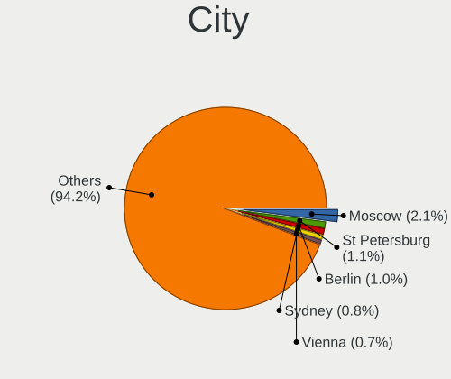

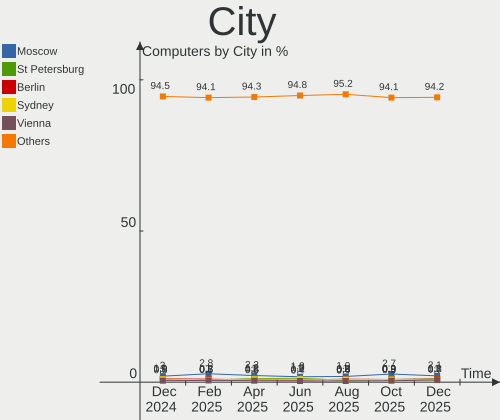

| City              | Computers | Percent |
|-------------------|-----------|---------|
| Moscow            | 147       | 2.06%   |
| St Petersburg     | 79        | 1.11%   |
| Berlin            | 74        | 1.04%   |
| Sydney            | 59        | 0.83%   |
| Vienna            | 53        | 0.74%   |
| Milan             | 53        | 0.74%   |
| Warsaw            | 46        | 0.64%   |
| Sao Paulo         | 46        | 0.64%   |
| Helsinki          | 44        | 0.62%   |
| Melbourne         | 43        | 0.6%    |
| Budapest          | 37        | 0.52%   |
| Seattle           | 34        | 0.48%   |
| Munich            | 33        | 0.46%   |
| Hamburg           | 33        | 0.46%   |
| Los Angeles       | 32        | 0.45%   |
| Frankfurt am Main | 30        | 0.42%   |
| Paris             | 29        | 0.41%   |
| Zurich            | 28        | 0.39%   |
| Madrid            | 28        | 0.39%   |
| Toronto           | 27        | 0.38%   |
| Rio de Janeiro    | 25        | 0.35%   |
| Amsterdam         | 25        | 0.35%   |
| Istanbul          | 24        | 0.34%   |
| Brisbane          | 24        | 0.34%   |
| Chicago           | 23        | 0.32%   |
| Krakow            | 20        | 0.28%   |
| Calgary           | 20        | 0.28%   |
| Rome              | 19        | 0.27%   |
| Denver            | 18        | 0.25%   |
| Bucharest         | 18        | 0.25%   |
| Bengaluru         | 18        | 0.25%   |
| Atlanta           | 18        | 0.25%   |
| Adelaide          | 18        | 0.25%   |
| Montreal          | 17        | 0.24%   |
| Cape Town         | 17        | 0.24%   |
| Athens            | 17        | 0.24%   |
| Portland          | 16        | 0.22%   |
| New York          | 16        | 0.22%   |
| London            | 16        | 0.22%   |
| Sofia             | 15        | 0.21%   |

Drives
------

Drive Vendor
------------

Hard drive vendors

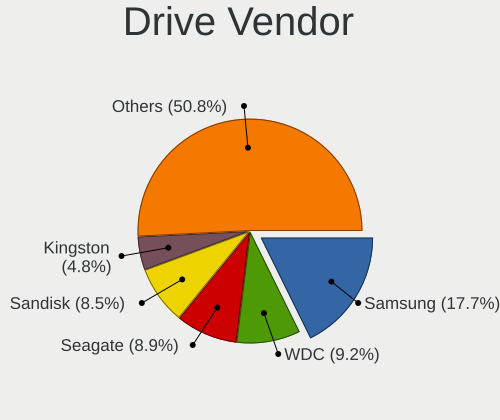

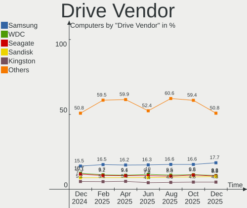

| Vendor                       | Computers | Drives | Percent |
|------------------------------|-----------|--------|---------|
| Samsung Electronics          | 1967      | 2875   | 17.71%  |
| WDC                          | 1026      | 1418   | 9.24%   |
| Seagate                      | 994       | 1354   | 8.95%   |
| Sandisk                      | 941       | 1043   | 8.47%   |
| Kingston                     | 538       | 604    | 4.84%   |
| Toshiba                      | 438       | 495    | 3.94%   |
| Crucial                      | 420       | 480    | 3.78%   |
| Micron Technology            | 336       | 345    | 3.02%   |
| SK hynix                     | 329       | 348    | 2.96%   |
| Unknown                      | 287       | 334    | 2.58%   |
| Micron/Crucial Technology    | 243       | 278    | 2.19%   |
| Intel                        | 221       | 275    | 1.99%   |
| Kingston Technology Company  | 210       | 224    | 1.89%   |
| Phison Electronics           | 182       | 202    | 1.64%   |
| MAXIO Technology (Hangzhou)  | 173       | 190    | 1.56%   |
| KIOXIA                       | 156       | 173    | 1.4%    |
| Hitachi                      | 154       | 169    | 1.39%   |
| A-DATA Technology            | 152       | 159    | 1.37%   |
| China                        | 130       | 135    | 1.17%   |
| HGST                         | 123       | 260    | 1.11%   |
| Apple                        | 121       | 151    | 1.09%   |
| Silicon Motion               | 81        | 83     | 0.73%   |
| ADATA Technology             | 79        | 83     | 0.71%   |
| Realtek Semiconductor        | 75        | 77     | 0.68%   |
| PNY                          | 72        | 80     | 0.65%   |
| Shenzhen Longsys Electronics | 67        | 70     | 0.6%    |
| Unknown                      | 67        | 70     | 0.6%    |
| SPCC                         | 63        | 71     | 0.57%   |
| Intenso                      | 63        | 73     | 0.57%   |
| Patriot                      | 61        | 65     | 0.55%   |
| KingSpec                     | 53        | 55     | 0.48%   |
| JMicron Technology           | 40        | 41     | 0.36%   |
| GOODRAM                      | 37        | 40     | 0.33%   |
| Transcend                    | 34        | 36     | 0.31%   |
| Netac                        | 34        | 34     | 0.31%   |
| Lexar                        | 32        | 33     | 0.29%   |
| Team                         | 31        | 33     | 0.28%   |
| Hewlett-Packard              | 28        | 97     | 0.25%   |
| SOLIDIGM                     | 26        | 33     | 0.23%   |
| Phison                       | 26        | 30     | 0.23%   |

Drive Model
-----------

Hard drive models

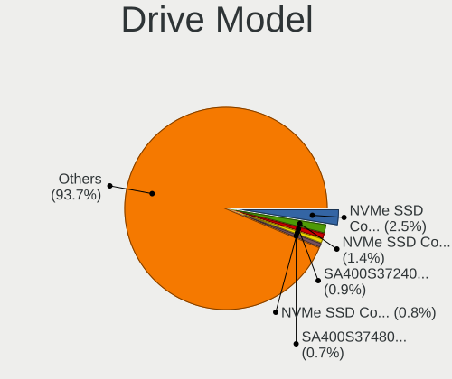

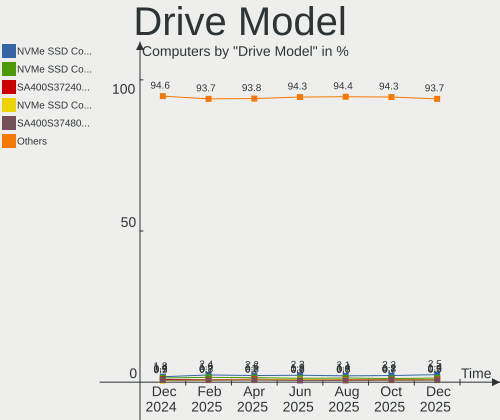

| Model                                                                   | Computers | Percent |
|-------------------------------------------------------------------------|-----------|---------|
| Samsung NVMe SSD Controller SM981/PM981/PM983 1TB                       | 313       | 2.53%   |
| Samsung NVMe SSD Controller PM9A1/PM9A3/980PRO 1TB                      | 176       | 1.42%   |
| Kingston SA400S37240G 240GB SSD                                         | 109       | 0.88%   |
| MAXIO (Hangzhou) NVMe SSD Controller MAP1202 2TB                        | 94        | 0.76%   |
| Kingston SA400S37480G 480GB SSD                                         | 89        | 0.72%   |
| Micron/Crucial P2 NVMe PCIe SSD 2TB                                     | 76        | 0.61%   |
| Samsung SSD 990 PRO 2TB                                                 | 73        | 0.59%   |
| Samsung SSD 870 EVO 1TB                                                 | 72        | 0.58%   |
| Samsung NVMe SSD Controller SM961/PM961/SM963 1024GB                    | 69        | 0.56%   |
| Crucial CT1000MX500SSD1 1TB                                             | 68        | 0.55%   |
| Unknown                                                                 | 67        | 0.54%   |
| Samsung SSD 850 EVO 500GB                                               | 61        | 0.49%   |
| Samsung SSD 860 EVO 500GB                                               | 59        | 0.48%   |
| Samsung SSD 860 EVO 1TB                                                 | 57        | 0.46%   |
| Samsung SSD 850 EVO 250GB                                               | 57        | 0.46%   |
| Samsung SSD 980 1TB                                                     | 54        | 0.44%   |
| Silicon Motion SM2263EN/SM2263XT SSD Controller 512GB                   | 53        | 0.43%   |
| Seagate ST1000DM010-2EP102 1TB                                          | 52        | 0.42%   |
| Unknown MMC Card  64GB                                                  | 50        | 0.4%    |
| Sandisk WD Black SN750 / PC SN730 NVMe SSD 500GB                        | 49        | 0.4%    |
| Samsung SSD 870 EVO 500GB                                               | 49        | 0.4%    |
| Samsung SSD 990 PRO 1TB                                                 | 47        | 0.38%   |
| Crucial CT500MX500SSD1 500GB                                            | 47        | 0.38%   |
| Seagate ST1000LM035-1RK172 1TB                                          | 46        | 0.37%   |
| Sandisk WD Blue SN550 NVMe SSD 1024GB                                   | 46        | 0.37%   |
| SanDisk NVMe SSD Drive 1TB                                              | 42        | 0.34%   |
| Phison E12 NVMe Controller 1TB                                          | 40        | 0.32%   |
| Crucial CT1000BX500SSD1 1TB                                             | 40        | 0.32%   |
| Seagate ST2000DM008-2FR102 2TB                                          | 39        | 0.31%   |
| Phison E16 PCIe4 NVMe Controller 1TB                                    | 39        | 0.31%   |
| Crucial CT240BX500SSD1 240GB                                            | 39        | 0.31%   |
| Unknown MMC Card  128GB                                                 | 38        | 0.31%   |
| Samsung SSD 990 PRO 4TB                                                 | 38        | 0.31%   |
| WDC WD10EZEX-08WN4A0 1TB                                                | 37        | 0.3%    |
| Seagate ST500DM002-1BD142 500GB                                         | 37        | 0.3%    |
| Sandisk WD Black SN770 / PC SN740 256GB / PC SN560 (DRAM-less) NVMe SSD | 37        | 0.3%    |
| Kingston Company SNV2S1000G 1TB                                         | 37        | 0.3%    |
| Unknown SD/MMC/MS PRO 2GB                                               | 36        | 0.29%   |
| Unknown MMC Card  32GB                                                  | 36        | 0.29%   |
| Seagate ST1000DM003-1CH162 1TB                                          | 36        | 0.29%   |

HDD Vendor
----------

Hard disk drive vendors

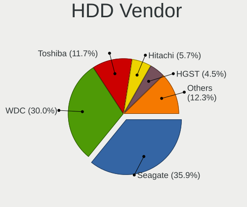

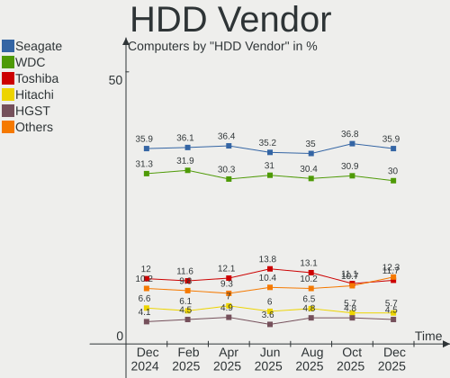

| Vendor              | Computers | Drives | Percent |
|---------------------|-----------|--------|---------|
| Seagate             | 963       | 1307   | 35.85%  |
| WDC                 | 805       | 1113   | 29.97%  |
| Toshiba             | 313       | 363    | 11.65%  |
| Hitachi             | 154       | 169    | 5.73%   |
| HGST                | 121       | 236    | 4.5%    |
| Samsung Electronics | 102       | 115    | 3.8%    |
| Unknown             | 39        | 40     | 1.45%   |
| Apple               | 35        | 36     | 1.3%    |
| Fujitsu             | 22        | 22     | 0.82%   |
| JMicron Technology  | 18        | 18     | 0.67%   |
| Hewlett-Packard     | 13        | 82     | 0.48%   |
| ASMT                | 10        | 13     | 0.37%   |
| T-FORCE             | 9         | 10     | 0.34%   |
| Maxtor              | 9         | 9      | 0.34%   |
| Intenso             | 8         | 8      | 0.3%    |
| HPE                 | 7         | 22     | 0.26%   |
| HGST HTS            | 5         | 5      | 0.19%   |
| External            | 5         | 5      | 0.19%   |
| TO Exter            | 4         | 4      | 0.15%   |
| SSK                 | 4         | 4      | 0.15%   |
| USB3.0              | 3         | 3      | 0.11%   |
| SABRENT             | 3         | 7      | 0.11%   |
| JetFlash            | 3         | 3      | 0.11%   |
| ExcelStor           | 3         | 3      | 0.11%   |
| Shenzhen            | 2         | 2      | 0.07%   |
| Min Yi U            | 2         | 2      | 0.07%   |
| Maxone              | 2         | 2      | 0.07%   |
| HGST HUH            | 2         | 3      | 0.07%   |
| ASMedia             | 2         | 2      | 0.07%   |
| Unknown             | 2         | 2      | 0.07%   |
| USB 3.1             | 1         | 1      | 0.04%   |
| TerraMas            | 1         | 3      | 0.04%   |
| Synology            | 1         | 1      | 0.04%   |
| SILICONMOTION       | 1         | 1      | 0.04%   |
| SAGE                | 1         | 1      | 0.04%   |
| RSH-339             | 1         | 1      | 0.04%   |
| PRO-T5              | 1         | 1      | 0.04%   |
| PRO Z               | 1         | 1      | 0.04%   |
| PASOUL 2            | 1         | 1      | 0.04%   |
| NETAPP              | 1         | 6      | 0.04%   |

SSD Vendor
----------

Solid state drive vendors

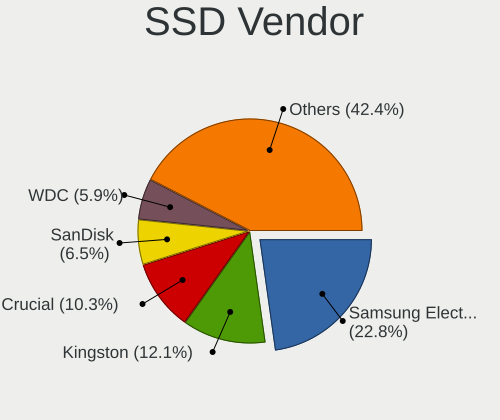

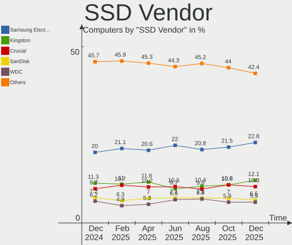

| Vendor              | Computers | Drives | Percent |
|---------------------|-----------|--------|---------|
| Samsung Electronics | 804       | 1198   | 22.78%  |
| Kingston            | 426       | 462    | 12.07%  |
| Crucial             | 363       | 411    | 10.29%  |
| SanDisk             | 230       | 249    | 6.52%   |
| WDC                 | 209       | 241    | 5.92%   |
| China               | 127       | 132    | 3.6%    |
| A-DATA Technology   | 115       | 121    | 3.26%   |
| Intel               | 74        | 101    | 2.1%    |
| PNY                 | 68        | 74     | 1.93%   |
| Micron Technology   | 66        | 67     | 1.87%   |
| SPCC                | 59        | 66     | 1.67%   |
| Apple               | 59        | 59     | 1.67%   |
| Patriot             | 56        | 60     | 1.59%   |
| SK hynix            | 51        | 62     | 1.45%   |
| Intenso             | 51        | 59     | 1.45%   |
| Toshiba             | 43        | 45     | 1.22%   |
| KingSpec            | 42        | 43     | 1.19%   |
| GOODRAM             | 34        | 37     | 0.96%   |
| Transcend           | 30        | 32     | 0.85%   |
| Netac               | 27        | 27     | 0.77%   |
| Team                | 25        | 27     | 0.71%   |
| Apacer              | 24        | 24     | 0.68%   |
| OCZ                 | 22        | 23     | 0.62%   |
| LITEON              | 21        | 21     | 0.6%    |
| Lexar               | 20        | 20     | 0.57%   |
| Unknown             | 18        | 18     | 0.51%   |
| SABRENT             | 16        | 17     | 0.45%   |
| KIOXIA-EXCERIA      | 15        | 17     | 0.43%   |
| Corsair             | 14        | 15     | 0.4%    |
| Fanxiang            | 13        | 13     | 0.37%   |
| T-FORCE             | 12        | 12     | 0.34%   |
| LITEONIT            | 12        | 13     | 0.34%   |
| Plextor             | 11        | 11     | 0.31%   |
| AMD                 | 11        | 12     | 0.31%   |
| Verbatim            | 10        | 11     | 0.28%   |
| Seagate             | 10        | 10     | 0.28%   |
| Hewlett-Packard     | 10        | 10     | 0.28%   |
| Gigabyte Technology | 10        | 10     | 0.28%   |
| Emtec               | 8         | 9      | 0.23%   |
| Mushkin             | 7         | 8      | 0.2%    |

Drive Kind
----------

HDD or SSD

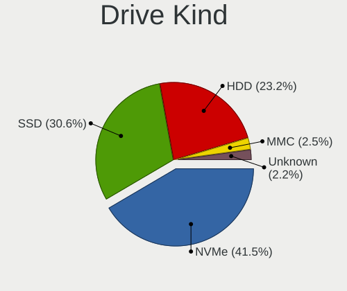

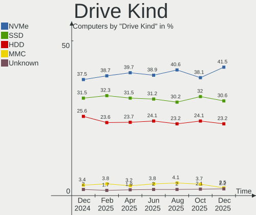

| Kind    | Computers | Drives | Percent |
|---------|-----------|--------|---------|
| NVMe    | 4063      | 5369   | 41.54%  |
| SSD     | 2996      | 4187   | 30.63%  |
| HDD     | 2268      | 3635   | 23.19%  |
| MMC     | 241       | 271    | 2.46%   |
| Unknown | 213       | 241    | 2.18%   |

Drive Connector
---------------

SATA, SAS, NVMe, etc.

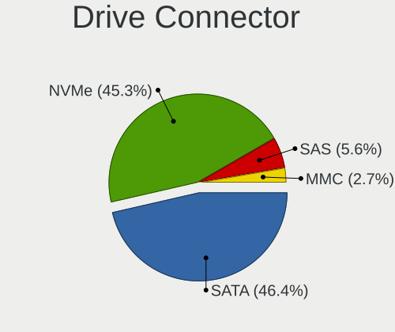

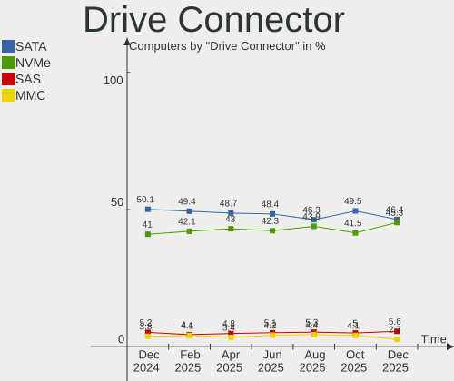

| Type | Computers | Drives | Percent |
|------|-----------|--------|---------|
| SATA | 4157      | 7469   | 46.42%  |
| NVMe | 4054      | 5314   | 45.27%  |
| SAS  | 504       | 649    | 5.63%   |
| MMC  | 241       | 271    | 2.69%   |

Drive Size
----------

Size of hard drive

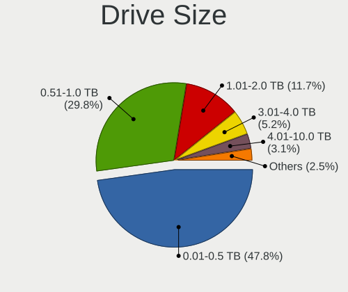

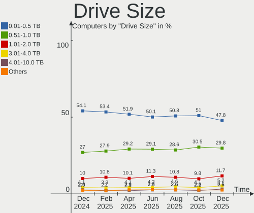

| Size in TB | Computers | Drives | Percent |
|------------|-----------|--------|---------|
| 0.01-0.5   | 2716      | 3504   | 47.79%  |
| 0.51-1.0   | 1693      | 2305   | 29.79%  |
| 1.01-2.0   | 663       | 866    | 11.67%  |
| 3.01-4.0   | 294       | 554    | 5.17%   |
| 4.01-10.0  | 176       | 375    | 3.1%    |
| 2.01-3.0   | 86        | 121    | 1.51%   |
| 10.01-20.0 | 50        | 92     | 0.88%   |
| 20.01-50.0 | 5         | 5      | 0.09%   |

Space Total
-----------

Amount of disk space available on the file system

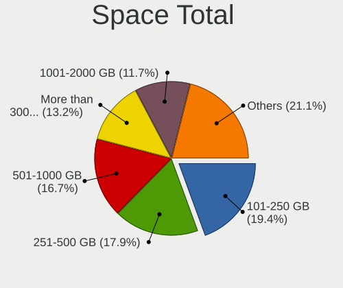

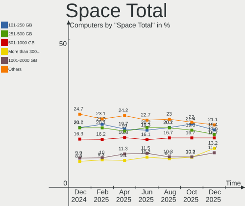

| Size in GB     | Computers | Percent |
|----------------|-----------|---------|
| 101-250        | 1385      | 19.42%  |
| 251-500        | 1279      | 17.93%  |
| 501-1000       | 1194      | 16.74%  |
| More than 3000 | 940       | 13.18%  |
| 1001-2000      | 832       | 11.66%  |
| 2001-3000      | 394       | 5.52%   |
| 1-20           | 375       | 5.26%   |
| Unknown        | 332       | 4.65%   |
| 51-100         | 236       | 3.31%   |
| 21-50          | 164       | 2.3%    |
| 0              | 2         | 0.03%   |

Space Used
----------

Amount of used disk space

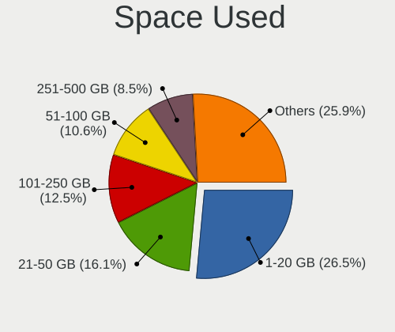

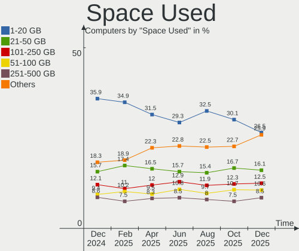

| Used GB        | Computers | Percent |
|----------------|-----------|---------|
| 1-20           | 1887      | 26.45%  |
| 21-50          | 1151      | 16.14%  |
| 101-250        | 893       | 12.52%  |
| 51-100         | 753       | 10.56%  |
| 251-500        | 605       | 8.48%   |
| 501-1000       | 543       | 7.61%   |
| 1001-2000      | 442       | 6.2%    |
| Unknown        | 332       | 4.65%   |
| More than 3000 | 310       | 4.35%   |
| 2001-3000      | 191       | 2.68%   |
| 0              | 26        | 0.36%   |

Malfunc. Drives
---------------

Drive models with a malfunction

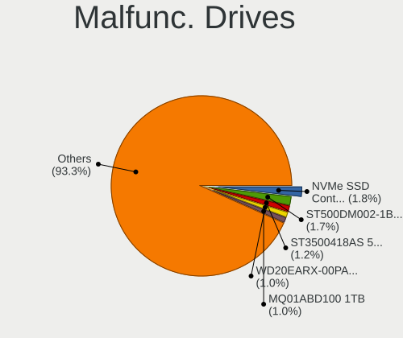

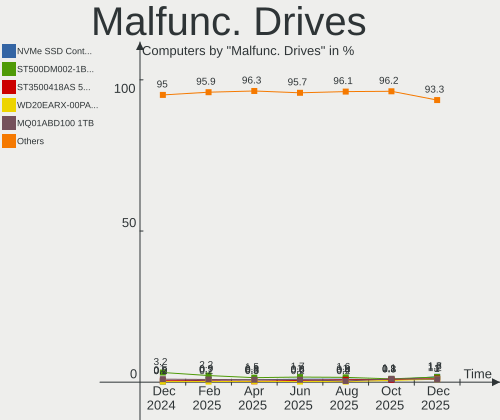

| Model                                                          | Computers | Drives | Percent |
|----------------------------------------------------------------|-----------|--------|---------|
| Samsung Electronics NVMe SSD Controller SM981/PM981/PM983 1TB  | 11        | 12     | 1.84%   |
| Seagate ST500DM002-1BD142 500GB                                | 10        | 11     | 1.67%   |
| Seagate ST3500418AS 500GB                                      | 7         | 7      | 1.17%   |
| WDC WD20EARX-00PASB0 2TB                                       | 6         | 6      | 1%      |
| Toshiba MQ01ABD100 1TB                                         | 6         | 6      | 1%      |
| Seagate ST1000LM035-1RK172 1TB                                 | 6         | 8      | 1%      |
| Seagate ST1000LM024 HN-M101MBB 1TB                             | 6         | 6      | 1%      |
| Seagate ST1000DM003-1CH162 1TB                                 | 6         | 6      | 1%      |
| Samsung Electronics SSD 980 1TB                                | 6         | 6      | 1%      |
| WDC WD5000AAKX-08U6AA0 500GB                                   | 5         | 5      | 0.84%   |
| Seagate ST9500325AS 500GB                                      | 5         | 5      | 0.84%   |
| Seagate ST500LT012-1DG142 500GB                                | 5         | 5      | 0.84%   |
| WDC WD20EZRX-00D8PB0 2TB                                       | 4         | 4      | 0.67%   |
| WDC WD20EFRX-68EUZN0 2TB                                       | 4         | 4      | 0.67%   |
| Seagate ST1000DM003-9YN162 1TB                                 | 4         | 4      | 0.67%   |
| Hitachi HDS721010CLA332 1TB                                    | 4         | 4      | 0.67%   |
| HGST HTS545050A7E680 500GB                                     | 4         | 4      | 0.67%   |
| HGST HTS541010A9E680 1TB                                       | 4         | 7      | 0.67%   |
| WDC WDS240G2G0A-00JH30 240GB SSD                               | 3         | 3      | 0.5%    |
| WDC WD5000AAKX-00ERMA0 500GB                                   | 3         | 3      | 0.5%    |
| WDC WD5000AADS-00S9B0 500GB                                    | 3         | 3      | 0.5%    |
| WDC WD20EZRZ-00Z5HB0 2TB                                       | 3         | 3      | 0.5%    |
| WDC WD20EARS-00MVWB0 2TB                                       | 3         | 3      | 0.5%    |
| Toshiba DT01ACA100 1TB                                         | 3         | 3      | 0.5%    |
| Toshiba DT01ACA050 500GB                                       | 3         | 3      | 0.5%    |
| SK hynix HFS128G3AMNB-2200A 128GB SSD                          | 3         | 3      | 0.5%    |
| Seagate ST31000524AS 1TB                                       | 3         | 3      | 0.5%    |
| Seagate ST2000DM006-2DM164 2TB                                 | 3         | 3      | 0.5%    |
| Seagate ST2000DM001-1ER164 2TB                                 | 3         | 4      | 0.5%    |
| Seagate ST1000DM010-2EP102 1TB                                 | 3         | 4      | 0.5%    |
| Samsung Electronics SSD 870 EVO 500GB                          | 3         | 4      | 0.5%    |
| Samsung Electronics SSD 870 EVO 250GB                          | 3         | 4      | 0.5%    |
| Samsung Electronics SSD 870 EVO 1TB                            | 3         | 3      | 0.5%    |
| Samsung Electronics NVMe SSD Controller PM9A1/PM9A3/980PRO 1TB | 3         | 3      | 0.5%    |
| Samsung Electronics HM321HI 320GB                              | 3         | 3      | 0.5%    |
| Realtek Semiconductor RTS5762 NVMe SSD Controller 1TB          | 3         | 3      | 0.5%    |
| Micron Technology 1100_MTFDDAK256TBN 256GB SSD                 | 3         | 3      | 0.5%    |
| Kingston SA400S37240G 240GB SSD                                | 3         | 3      | 0.5%    |
| Intel SSDSA2M160G2GC 160GB                                     | 3         | 3      | 0.5%    |
| Hitachi HTS545050A7E380 500GB                                  | 3         | 3      | 0.5%    |

Malfunc. Drive Vendor
---------------------

Vendors of faulty drives

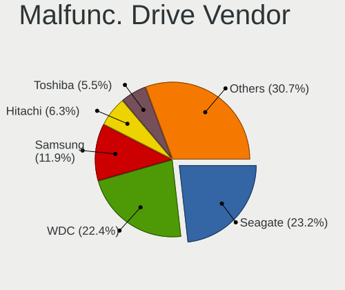

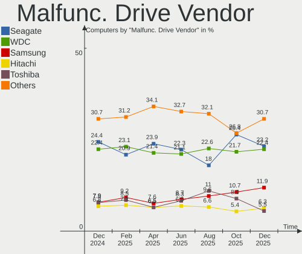

| Vendor                         | Computers | Drives | Percent |
|--------------------------------|-----------|--------|---------|
| Seagate                        | 136       | 150    | 23.21%  |
| WDC                            | 131       | 164    | 22.35%  |
| Samsung Electronics            | 70        | 76     | 11.95%  |
| Hitachi                        | 37        | 38     | 6.31%   |
| Toshiba                        | 32        | 33     | 5.46%   |
| Intel                          | 24        | 28     | 4.1%    |
| HGST                           | 20        | 23     | 3.41%   |
| Kingston                       | 13        | 14     | 2.22%   |
| SanDisk                        | 12        | 13     | 2.05%   |
| SK hynix                       | 11        | 11     | 1.88%   |
| Crucial                        | 11        | 11     | 1.88%   |
| A-DATA Technology              | 11        | 11     | 1.88%   |
| Micron Technology              | 10        | 10     | 1.71%   |
| China                          | 7         | 7      | 1.19%   |
| Fujitsu                        | 6         | 6      | 1.02%   |
| Transcend                      | 5         | 6      | 0.85%   |
| Apple                          | 4         | 4      | 0.68%   |
| Realtek Semiconductor          | 3         | 3      | 0.51%   |
| Maxtor                         | 3         | 3      | 0.51%   |
| SSSTC                          | 2         | 2      | 0.34%   |
| Netac                          | 2         | 2      | 0.34%   |
| MAXIO Technology (Hangzhou)    | 2         | 2      | 0.34%   |
| LITEON                         | 2         | 2      | 0.34%   |
| KIOXIA                         | 2         | 2      | 0.34%   |
| KingSpec                       | 2         | 2      | 0.34%   |
| Corsair                        | 2         | 2      | 0.34%   |
| ValueTech                      | 1         | 1      | 0.17%   |
| UnionSine                      | 1         | 1      | 0.17%   |
| Teelkoou                       | 1         | 1      | 0.17%   |
| tecmiyo                        | 1         | 1      | 0.17%   |
| Solid State Storage Technology | 1         | 1      | 0.17%   |
| SABRENT                        | 1         | 1      | 0.17%   |
| Philips                        | 1         | 1      | 0.17%   |
| Patriot                        | 1         | 1      | 0.17%   |
| OCZ                            | 1         | 1      | 0.17%   |
| Neo Forza                      | 1         | 1      | 0.17%   |
| Neo                            | 1         | 1      | 0.17%   |
| Mushkin                        | 1         | 1      | 0.17%   |
| Min Yi U                       | 1         | 1      | 0.17%   |
| LITEONIT                       | 1         | 2      | 0.17%   |

Malfunc. HDD Vendor
-------------------

Vendors of faulty HDD drives

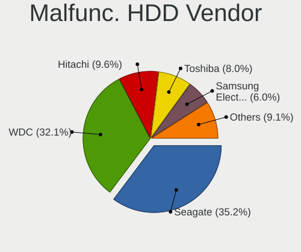

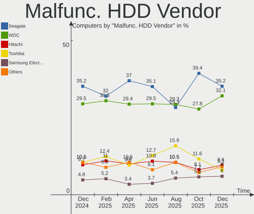

| Vendor              | Computers | Drives | Percent |
|---------------------|-----------|--------|---------|
| Seagate             | 136       | 149    | 35.23%  |
| WDC                 | 124       | 155    | 32.12%  |
| Hitachi             | 37        | 38     | 9.59%   |
| Toshiba             | 31        | 32     | 8.03%   |
| Samsung Electronics | 23        | 24     | 5.96%   |
| HGST                | 20        | 23     | 5.18%   |
| Fujitsu             | 6         | 6      | 1.55%   |
| Apple               | 4         | 4      | 1.04%   |
| Maxtor              | 3         | 3      | 0.78%   |
| Min Yi U            | 1         | 1      | 0.26%   |
| Hewlett-Packard     | 1         | 4      | 0.26%   |

Malfunc. Drive Kind
-------------------

Kinds of faulty drives

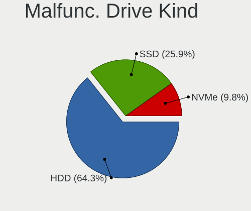

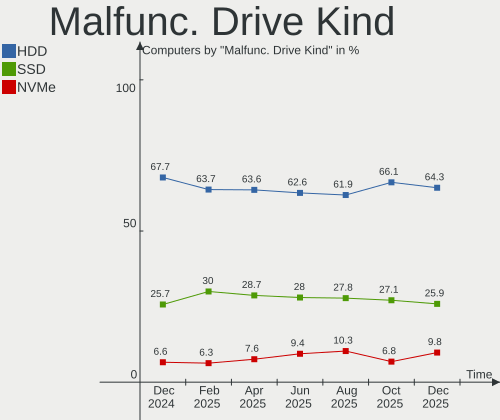

| Kind | Computers | Drives | Percent |
|------|-----------|--------|---------|
| HDD  | 360       | 439    | 64.29%  |
| SSD  | 145       | 160    | 25.89%  |
| NVMe | 55        | 56     | 9.82%   |

Failed Drives
-------------

Failed drive models

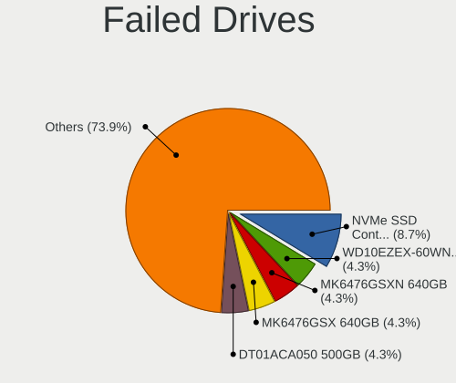

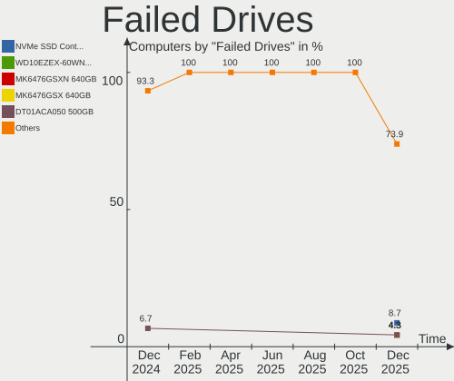

| Model                                                          | Computers | Drives | Percent |
|----------------------------------------------------------------|-----------|--------|---------|
| Samsung Electronics NVMe SSD Controller 980 (DRAM-less) 256GB  | 2         | 2      | 8.7%    |
| WDC WD10EZEX-60WN4A0 1TB                                       | 1         | 1      | 4.35%   |
| Toshiba MK6476GSXN 640GB                                       | 1         | 1      | 4.35%   |
| Toshiba MK6476GSX 640GB                                        | 1         | 1      | 4.35%   |
| Toshiba DT01ACA050 500GB                                       | 1         | 1      | 4.35%   |
| Solid State Storage NVMe CA5-8D512 512GB                       | 1         | 1      | 4.35%   |
| SK hynix SHGS31-1000GS-2 1TB SSD                               | 1         | 8      | 4.35%   |
| SK hynix BC501 NVMe Solid State Drive 512GB                    | 1         | 1      | 4.35%   |
| SK hynix BC501 HFM512GDJTNG-8310A 512GB                        | 1         | 1      | 4.35%   |
| Seagate ST750LX003-1AC154 752GB                                | 1         | 1      | 4.35%   |
| Seagate ST6000NM0034 6TB                                       | 1         | 6      | 4.35%   |
| Seagate ST2000DL003-9VT166 2TB                                 | 1         | 1      | 4.35%   |
| Seagate ST1000LM024 HN-M101MBB 1TB                             | 1         | 1      | 4.35%   |
| Sandisk WD PC SN810 / Black SN850 NVMe SSD 500GB               | 1         | 1      | 4.35%   |
| Samsung Electronics SSD PM871b M.2 2280 128GB                  | 1         | 1      | 4.35%   |
| Samsung Electronics NVMe SSD Controller PM9A1/PM9A3/980PRO 1TB | 1         | 1      | 4.35%   |
| Samsung Electronics MZMPC032HBCD-000H1 32GB SSD                | 1         | 1      | 4.35%   |
| LITEON IT LCS-128L9S-11 2.5 7mm 128GB SSD                      | 1         | 1      | 4.35%   |
| KIOXIA NVMe SSD 1TB                                            | 1         | 1      | 4.35%   |
| Hitachi HUA722020ALA330 2TB                                    | 1         | 1      | 4.35%   |
| Hitachi HTS543225L9SA02 250GB                                  | 1         | 1      | 4.35%   |
| Unknown                                                        | 1         | 1      | 4.35%   |

Failed Drive Vendor
-------------------

Failed drive vendors

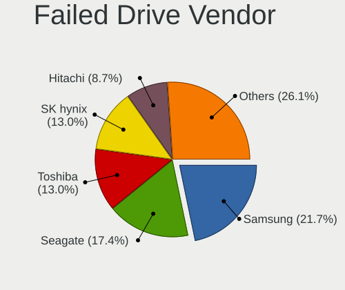

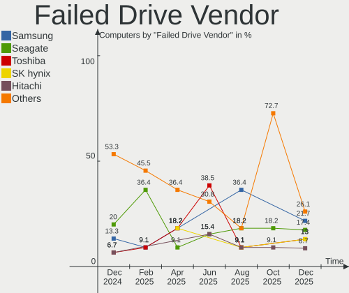

| Vendor              | Computers | Drives | Percent |
|---------------------|-----------|--------|---------|
| Samsung Electronics | 5         | 5      | 21.74%  |
| Seagate             | 4         | 9      | 17.39%  |
| Toshiba             | 3         | 3      | 13.04%  |
| SK hynix            | 3         | 10     | 13.04%  |
| Hitachi             | 2         | 2      | 8.7%    |
| WDC                 | 1         | 1      | 4.35%   |
| Solid State Storage | 1         | 1      | 4.35%   |
| Sandisk             | 1         | 1      | 4.35%   |
| LITEON              | 1         | 1      | 4.35%   |
| KIOXIA              | 1         | 1      | 4.35%   |
| Unknown             | 1         | 1      | 4.35%   |

Drive Status
------------

Number of failed and malfunc. drives

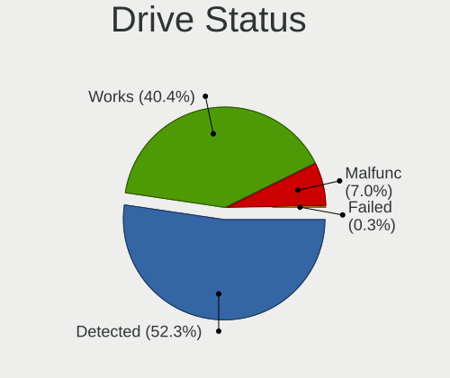

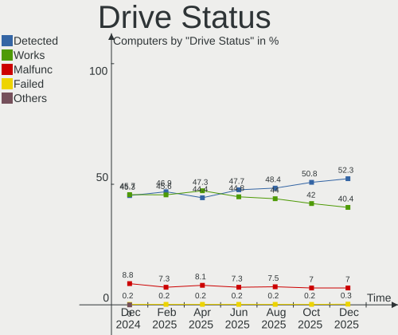

| Status   | Computers | Drives | Percent |
|----------|-----------|--------|---------|
| Detected | 4006      | 7238   | 52.33%  |
| Works    | 3091      | 5775   | 40.38%  |
| Malfunc  | 535       | 655    | 6.99%   |
| Failed   | 23        | 35     | 0.3%    |

Storage controller
------------------

Storage Vendor
--------------

Storage controller vendors

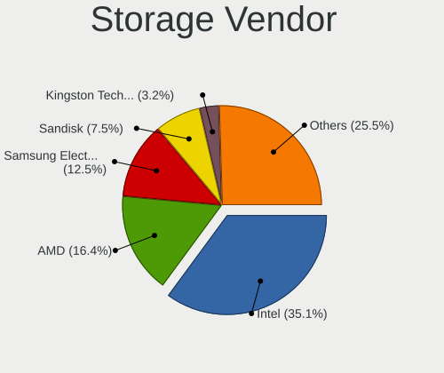

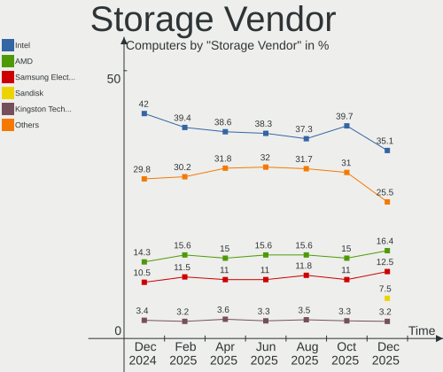

| Vendor                                  | Computers | Percent |
|-----------------------------------------|-----------|---------|
| Intel                                   | 3694      | 35.09%  |
| AMD                                     | 1722      | 16.36%  |
| Samsung Electronics                     | 1311      | 12.45%  |
| Sandisk                                 | 785       | 7.46%   |
| Kingston Technology Company             | 332       | 3.15%   |
| Micron/Crucial Technology               | 296       | 2.81%   |
| Micron Technology                       | 278       | 2.64%   |
| SK hynix                                | 276       | 2.62%   |
| Phison Electronics                      | 230       | 2.19%   |
| MAXIO Technology (Hangzhou)             | 210       | 2%      |
| ASMedia Technology                      | 209       | 1.99%   |
| KIOXIA                                  | 160       | 1.52%   |
| ADATA Technology                        | 109       | 1.04%   |
| Silicon Motion                          | 94        | 0.89%   |
| Shenzhen Longsys Electronics            | 92        | 0.87%   |
| Realtek Semiconductor                   | 88        | 0.84%   |
| Toshiba America Info Systems            | 85        | 0.81%   |
| Marvell Technology Group                | 54        | 0.51%   |
| Nvidia                                  | 53        | 0.5%    |
| JMicron Technology                      | 45        | 0.43%   |
| Broadcom / LSI                          | 40        | 0.38%   |
| Hewlett-Packard                         | 39        | 0.37%   |
| INNOGRIT                                | 34        | 0.32%   |
| Seagate Technology                      | 27        | 0.26%   |
| LSI Logic / Symbios Logic               | 25        | 0.24%   |
| Apple                                   | 25        | 0.24%   |
| Solidigm                                | 21        | 0.2%    |
| Solid State Storage Technology          | 21        | 0.2%    |
| Biwin Storage Technology                | 18        | 0.17%   |
| Yangtze Memory Technologies             | 16        | 0.15%   |
| Shenzhen Unionmemory Information System | 13        | 0.12%   |
| Hosin Global Electronics                | 13        | 0.12%   |
| Union Memory (Shenzhen)                 | 11        | 0.1%    |
| Unknown                                 | 8         | 0.08%   |
| Zhaoxin                                 | 7         | 0.07%   |
| Silicon Image                           | 7         | 0.07%   |
| VIA Technologies                        | 6         | 0.06%   |
| Lite-On Technology                      | 6         | 0.06%   |
| Adaptec                                 | 6         | 0.06%   |
| Shenzhen Techwinsemi Technology         | 5         | 0.05%   |

Storage Model
-------------

Storage controller models

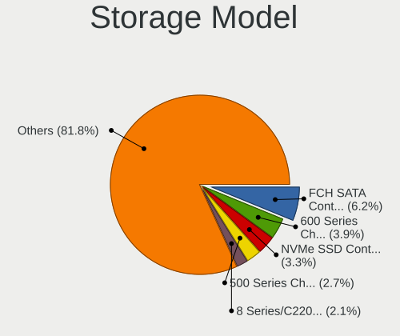

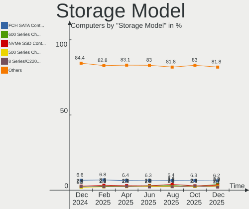

| Model                                                                          | Computers | Percent |
|--------------------------------------------------------------------------------|-----------|---------|
| AMD FCH SATA Controller [AHCI mode]                                            | 713       | 6.18%   |
| AMD 600 Series Chipset SATA Controller                                         | 447       | 3.87%   |
| Samsung NVMe SSD Controller SM981/PM981/PM983                                  | 385       | 3.34%   |
| AMD 500 Series Chipset SATA Controller                                         | 316       | 2.74%   |
| Intel 8 Series/C220 Series Chipset Family 6-port SATA Controller 1 [AHCI mode] | 240       | 2.08%   |
| Intel Sunrise Point-LP SATA Controller [AHCI mode]                             | 228       | 1.98%   |
| Samsung NVMe SSD Controller PM9A1/PM9A3/980PRO                                 | 216       | 1.87%   |
| Samsung NVMe SSD Controller S4LV008[Pascal]                                    | 202       | 1.75%   |
| Intel 7 Series Chipset Family 6-port SATA Controller [AHCI mode]               | 202       | 1.75%   |
| AMD 400 Series Chipset SATA Controller                                         | 202       | 1.75%   |
| Intel Volume Management Device NVMe RAID Controller                            | 196       | 1.7%    |
| SanDisk WD SN560/SN740/SN770/SN5000 NVMe SSD                                   | 177       | 1.53%   |
| Samsung NVMe SSD Controller 980 (DRAM-less)                                    | 172       | 1.49%   |
| ASMedia ASM1061/ASM1062 Serial ATA Controller                                  | 169       | 1.46%   |
| Intel Q170/Q150/B150/H170/H110/Z170/CM236 Chipset SATA Controller [AHCI Mode]  | 167       | 1.45%   |
| Samsung NVMe SSD Controller PM9C1a (DRAM-less)                                 | 163       | 1.41%   |
| Intel 82801 Mobile SATA Controller [RAID mode]                                 | 154       | 1.33%   |
| MAXIO (Hangzhou) NVMe SSD Controller MAP1202 (DRAM-less)                       | 143       | 1.24%   |
| Intel 200 Series PCH SATA controller [AHCI mode]                               | 139       | 1.2%    |
| Intel 6 Series/C200 Series Chipset Family 6 port Mobile SATA AHCI Controller   | 133       | 1.15%   |
| Intel Cannon Lake PCH SATA AHCI Controller                                     | 118       | 1.02%   |
| Intel SATA Controller [RAID mode]                                              | 116       | 1.01%   |
| Micron/Crucial P2 [Nick P2] / P3 / P3 Plus NVMe PCIe SSD (DRAM-less)           | 106       | 0.92%   |
| Sandisk WD Black SN850X NVMe SSD                                               | 105       | 0.91%   |
| Intel 6 Series/C200 Series Chipset Family 6 port Desktop SATA AHCI Controller  | 105       | 0.91%   |
| Intel Raptor Lake SATA AHCI Controller                                         | 104       | 0.9%    |
| Intel Alder Lake-S PCH SATA Controller [AHCI Mode]                             | 104       | 0.9%    |
| Intel 8 Series SATA Controller 1 [AHCI mode]                                   | 101       | 0.88%   |
| Intel 7 Series/C210 Series Chipset Family 6-port SATA Controller [AHCI mode]   | 93        | 0.81%   |
| Samsung NVMe SSD Controller SM961/PM961/SM963                                  | 91        | 0.79%   |
| Intel RST Volume Management Device Controller                                  | 90        | 0.78%   |
| Intel Comet Lake SATA AHCI Controller                                          | 85        | 0.74%   |
| Intel Alder Lake-P SATA AHCI Controller                                        | 84        | 0.73%   |
| AMD SB7x0/SB8x0/SB9x0 SATA Controller [AHCI mode]                              | 84        | 0.73%   |
| Intel Wildcat Point-LP SATA Controller [AHCI Mode]                             | 79        | 0.68%   |
| Silicon Motion SM2263EN/SM2263XT (DRAM-less) NVMe SSD Controllers              | 74        | 0.64%   |
| SanDisk Extreme Pro / WD Black SN750 / PC SN730 / Red SN700 NVMe SSD           | 74        | 0.64%   |
| Intel Tiger Lake-LP SATA Controller                                            | 71        | 0.62%   |
| SanDisk Ultra 3D / WD PC SN530, IX SN530, Blue SN550 NVMe SSD (DRAM-less)      | 66        | 0.57%   |
| AMD SB7x0/SB8x0/SB9x0 IDE Controller                                           | 66        | 0.57%   |

Storage Kind
------------

Kind of storage controller (IDE, SATA, NVMe, SAS, ...)

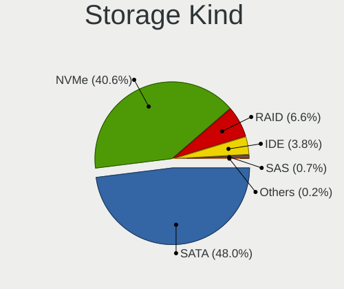

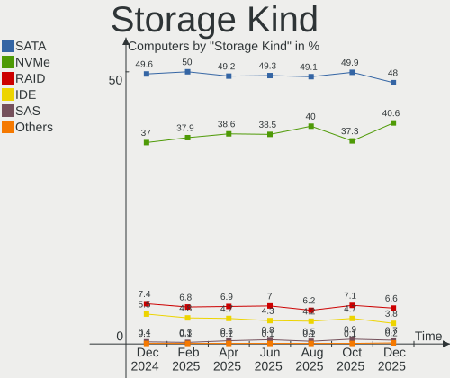

| Kind | Computers | Percent |
|------|-----------|---------|
| SATA | 4792      | 48.03%  |
| NVMe | 4054      | 40.63%  |
| RAID | 662       | 6.64%   |
| IDE  | 380       | 3.81%   |
| SAS  | 73        | 0.73%   |
| SCSI | 16        | 0.16%   |

Processor
---------

CPU Vendor
----------

Processor vendors

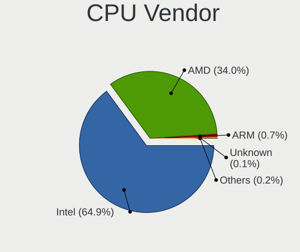

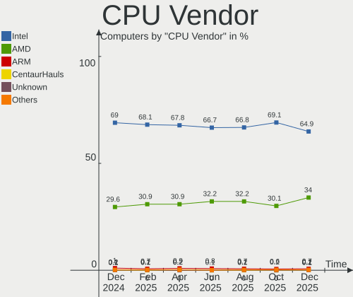

| Vendor                | Computers | Percent |
|-----------------------|-----------|---------|
| Intel                 | 4631      | 64.92%  |
| AMD                   | 2426      | 34.01%  |
| ARM                   | 47        | 0.66%   |
| CentaurHauls          | 7         | 0.1%    |
| Unknown               | 7         | 0.1%    |
| Loongson              | 5         | 0.07%   |
| Xenon Game Console    | 1         | 0.01%   |
| WIAT                  | 1         | 0.01%   |
| sifive,u74-mc         | 1         | 0.01%   |
| Qualcomm              | 1         | 0.01%   |
| PowerBook5,6          | 1         | 0.01%   |
| Nintendo Wii          | 1         | 0.01%   |
| MIPS                  | 1         | 0.01%   |
| Marvell Semiconductor | 1         | 0.01%   |
| ky,x60                | 1         | 0.01%   |
| Hisilicon             | 1         | 0.01%   |

CPU Model
---------

Processor models

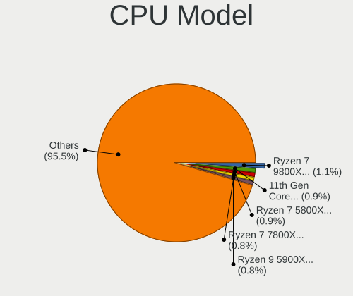

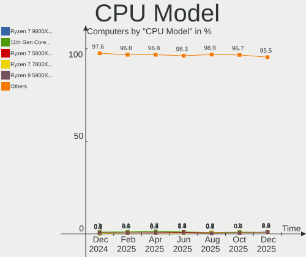

| Model                                   | Computers | Percent |
|-----------------------------------------|-----------|---------|
| AMD Ryzen 7 9800X3D 8-Core Processor    | 78        | 1.09%   |
| Intel 11th Gen Core i5-1135G7 @ 2.40GHz | 65        | 0.91%   |
| AMD Ryzen 7 5800X 8-Core Processor      | 64        | 0.9%    |
| AMD Ryzen 7 7800X3D 8-Core Processor    | 59        | 0.83%   |
| AMD Ryzen 9 5900X 12-Core Processor     | 58        | 0.81%   |
| AMD Ryzen 5 3600 6-Core Processor       | 55        | 0.77%   |
| AMD Ryzen 5 5600X 6-Core Processor      | 53        | 0.74%   |
| AMD Ryzen 7 5700X 8-Core Processor      | 52        | 0.73%   |
| Intel 11th Gen Core i7-1165G7 @ 2.80GHz | 45        | 0.63%   |
| Intel Core Ultra 7 155H                 | 43        | 0.6%    |
| AMD Ryzen 5 5600G with Radeon Graphics  | 43        | 0.6%    |
| Intel Core i5-8250U CPU @ 1.60GHz       | 40        | 0.56%   |
| Intel Core i5-7200U CPU @ 2.50GHz       | 40        | 0.56%   |
| AMD Ryzen 9 9950X3D 16-Core Processor   | 40        | 0.56%   |
| ARM Processor                           | 38        | 0.53%   |
| AMD Ryzen 9 5950X 16-Core Processor     | 37        | 0.52%   |
| Intel 12th Gen Core i5-1235U            | 36        | 0.5%    |
| Intel Core i5-3210M CPU @ 2.50GHz       | 35        | 0.49%   |
| Intel Core i5-8350U CPU @ 1.70GHz       | 34        | 0.48%   |
| AMD Ryzen 7 7730U with Radeon Graphics  | 34        | 0.48%   |
| AMD Ryzen 7 5800X3D 8-Core Processor    | 34        | 0.48%   |
| Intel Xeon CPU E5-2680 v4 @ 2.40GHz     | 33        | 0.46%   |
| Intel Core i5-3470 CPU @ 3.20GHz        | 33        | 0.46%   |
| AMD Ryzen 7 3700X 8-Core Processor      | 32        | 0.45%   |
| AMD Ryzen 5 7600X 6-Core Processor      | 31        | 0.43%   |
| Intel Core i5-6300U CPU @ 2.40GHz       | 30        | 0.42%   |
| Intel Core i5-6200U CPU @ 2.30GHz       | 30        | 0.42%   |
| AMD Ryzen 7 5700G with Radeon Graphics  | 30        | 0.42%   |
| AMD Ryzen 5 5500                        | 30        | 0.42%   |
| Intel Core i7-8550U CPU @ 1.80GHz       | 29        | 0.41%   |
| AMD Ryzen 7 9700X 8-Core Processor      | 29        | 0.41%   |
| Intel Core i5-7300U CPU @ 2.60GHz       | 28        | 0.39%   |
| Intel Core i5-6500 CPU @ 3.20GHz        | 28        | 0.39%   |
| Intel Core i5-8365U CPU @ 1.60GHz       | 27        | 0.38%   |
| Intel Core i5-8265U CPU @ 1.60GHz       | 27        | 0.38%   |
| AMD Ryzen 5 5500U with Radeon Graphics  | 27        | 0.38%   |
| Intel Core i7-9750H CPU @ 2.60GHz       | 26        | 0.36%   |
| Intel Core i7-4790 CPU @ 3.60GHz        | 26        | 0.36%   |
| AMD Ryzen AI 9 HX 370 w/ Radeon 890M    | 26        | 0.36%   |
| AMD Ryzen 9 9950X 16-Core Processor     | 26        | 0.36%   |

CPU Model Family
----------------

Processor model prefix

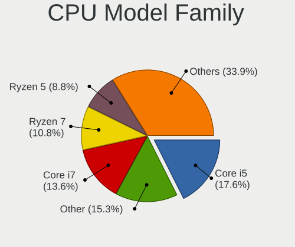

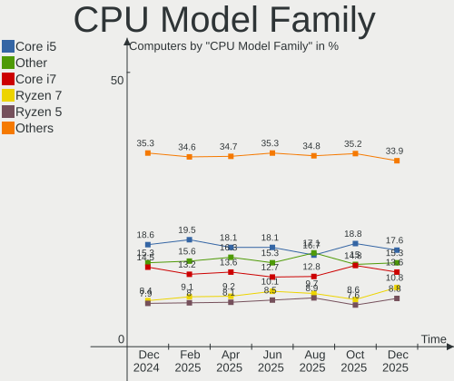

| Model                   | Computers | Percent |
|-------------------------|-----------|---------|
| Intel Core i5           | 1256      | 17.61%  |
| Other                   | 1092      | 15.31%  |
| Intel Core i7           | 971       | 13.61%  |
| AMD Ryzen 7             | 770       | 10.79%  |
| AMD Ryzen 5             | 628       | 8.8%    |
| Intel Core i3           | 377       | 5.29%   |
| AMD Ryzen 9             | 342       | 4.79%   |
| Intel Xeon              | 252       | 3.53%   |
| Intel Core              | 246       | 3.45%   |
| Intel Celeron           | 196       | 2.75%   |
| Intel Core 2 Duo        | 130       | 1.82%   |
| AMD Ryzen 3             | 83        | 1.16%   |
| Intel Pentium           | 82        | 1.15%   |
| Intel Core i9           | 76        | 1.07%   |
| AMD FX                  | 59        | 0.83%   |
| AMD Ryzen 7 PRO         | 38        | 0.53%   |
| Intel Atom              | 37        | 0.52%   |
| AMD A6                  | 37        | 0.52%   |
| Intel Pentium Dual-Core | 33        | 0.46%   |
| AMD Ryzen 5 PRO         | 32        | 0.45%   |
| AMD A8                  | 31        | 0.43%   |
| AMD A10                 | 29        | 0.41%   |
| AMD A4                  | 26        | 0.36%   |
| Intel Pentium Silver    | 21        | 0.29%   |
| Intel Core 2 Quad       | 20        | 0.28%   |
| AMD Athlon              | 19        | 0.27%   |
| AMD Phenom II X4        | 18        | 0.25%   |
| AMD Ryzen Threadripper  | 14        | 0.2%    |
| Intel Pentium Dual      | 13        | 0.18%   |
| Intel Core m3           | 13        | 0.18%   |
| AMD E1                  | 13        | 0.18%   |
| AMD E                   | 11        | 0.15%   |
| Intel Pentium Gold      | 9         | 0.13%   |
| AMD E2                  | 9         | 0.13%   |
| Intel Core M            | 8         | 0.11%   |
| Intel Core 2            | 8         | 0.11%   |
| AMD Phenom II X6        | 8         | 0.11%   |
| AMD Athlon II X2        | 8         | 0.11%   |
| ARM BCM                 | 7         | 0.1%    |
| Intel Xeon Silver       | 6         | 0.08%   |

CPU Cores
---------

Number of processor cores

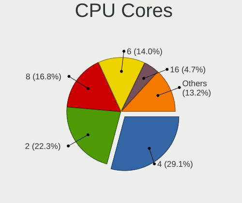

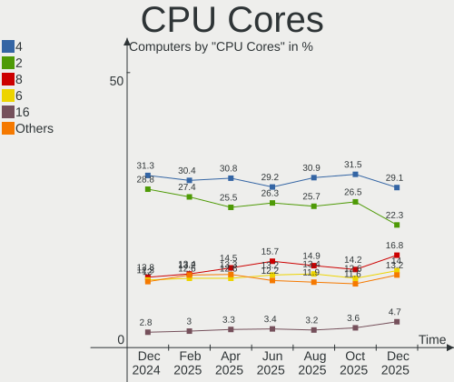

| Number  | Computers | Percent |
|---------|-----------|---------|
| 4       | 2078      | 29.13%  |
| 2       | 1588      | 22.26%  |
| 8       | 1196      | 16.77%  |
| 6       | 1000      | 14.02%  |
| 16      | 332       | 4.65%   |
| 12      | 302       | 4.23%   |
| 10      | 212       | 2.97%   |
| 14      | 142       | 1.99%   |
| 24      | 90        | 1.26%   |
| 20      | 71        | 1%      |
| 1       | 36        | 0.5%    |
| Unknown | 26        | 0.36%   |
| 28      | 22        | 0.31%   |
| 3       | 10        | 0.14%   |
| 32      | 7         | 0.1%    |
| 40      | 5         | 0.07%   |
| 44      | 3         | 0.04%   |
| 18      | 3         | 0.04%   |
| 128     | 2         | 0.03%   |
| 96      | 2         | 0.03%   |
| 48      | 2         | 0.03%   |
| 5       | 2         | 0.03%   |
| 64      | 1         | 0.01%   |
| 36      | 1         | 0.01%   |

CPU Sockets
-----------

Number of sockets

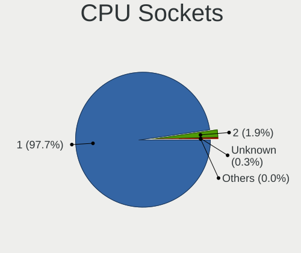

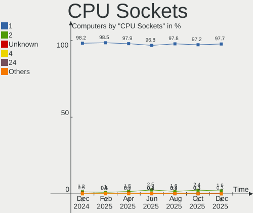

| Number  | Computers | Percent |
|---------|-----------|---------|
| 1       | 6969      | 97.7%   |
| 2       | 135       | 1.89%   |
| Unknown | 24        | 0.34%   |
| 4       | 3         | 0.04%   |
| 24      | 1         | 0.01%   |
| 16      | 1         | 0.01%   |

CPU Threads
-----------

Threads per core (Hyper-Threading)

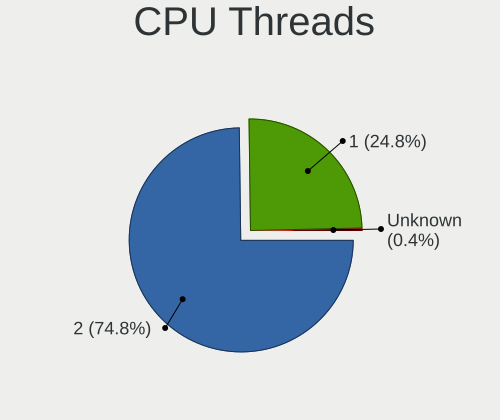

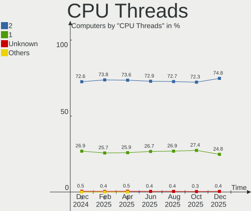

| Number  | Computers | Percent |
|---------|-----------|---------|
| 2       | 5335      | 74.79%  |
| 1       | 1772      | 24.84%  |
| Unknown | 26        | 0.36%   |

CPU Op-Modes
------------

CPU Operation Modes (32-bit, 64-bit)

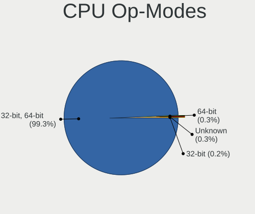

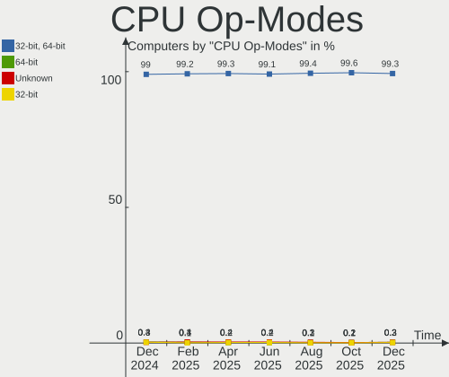

| Op mode        | Computers | Percent |
|----------------|-----------|---------|
| 32-bit, 64-bit | 7082      | 99.29%  |
| 64-bit         | 20        | 0.28%   |
| Unknown        | 18        | 0.25%   |
| 32-bit         | 13        | 0.18%   |

CPU Microcode
-------------

Microcode number

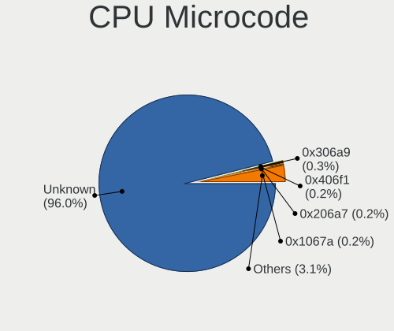

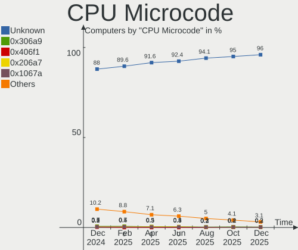

| Number     | Computers | Percent |
|------------|-----------|---------|
| Unknown    | 6851      | 96.05%  |
| 0x306a9    | 19        | 0.27%   |
| 0x406f1    | 17        | 0.24%   |
| 0x206a7    | 12        | 0.17%   |
| 0x1067a    | 12        | 0.17%   |
| 0x906ea    | 9         | 0.13%   |
| 0x806e9    | 8         | 0.11%   |
| 0x506e3    | 8         | 0.11%   |
| 0x306c3    | 8         | 0.11%   |
| 0x20655    | 8         | 0.11%   |
| 0x0b404035 | 7         | 0.1%    |
| 0x0b204037 | 7         | 0.1%    |
| 0x6fd      | 6         | 0.08%   |
| 0x6fb      | 6         | 0.08%   |
| 0x40651    | 6         | 0.08%   |
| 0x0b600037 | 6         | 0.08%   |
| 0x906e9    | 5         | 0.07%   |
| 0x906a3    | 4         | 0.06%   |
| 0x806c1    | 4         | 0.06%   |
| 0x406c4    | 4         | 0.06%   |
| 0x20652    | 4         | 0.06%   |
| 0x106c2    | 4         | 0.06%   |
| 0xa0653    | 3         | 0.04%   |
| 0x906ed    | 3         | 0.04%   |
| 0x906c0    | 3         | 0.04%   |
| 0x906a4    | 3         | 0.04%   |
| 0x90675    | 3         | 0.04%   |
| 0x806ec    | 3         | 0.04%   |
| 0x306e4    | 3         | 0.04%   |
| 0x206c2    | 3         | 0.04%   |
| 0x106ca    | 3         | 0.04%   |
| 0x106a5    | 3         | 0.04%   |
| 0x0a500011 | 3         | 0.04%   |
| 0x0a50000f | 3         | 0.04%   |
| 0xa0655    | 2         | 0.03%   |
| 0x6d8      | 2         | 0.03%   |
| 0x406e3    | 2         | 0.03%   |
| 0x306d4    | 2         | 0.03%   |
| 0x30678    | 2         | 0.03%   |
| 0x30661    | 2         | 0.03%   |

CPU Microarch
-------------

Microarchitecture

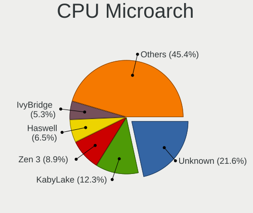

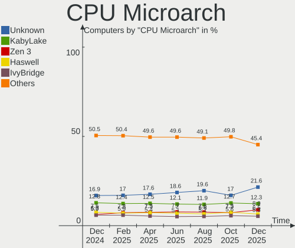

| Name               | Computers | Percent |
|--------------------|-----------|---------|
| Unknown            | 1540      | 21.59%  |
| KabyLake           | 878       | 12.31%  |
| Zen 3              | 632       | 8.86%   |
| Haswell            | 467       | 6.55%   |
| IvyBridge          | 375       | 5.26%   |
| Skylake            | 346       | 4.85%   |
| Alderlake Hybrid   | 340       | 4.77%   |
| SandyBridge        | 294       | 4.12%   |
| Zen 2              | 237       | 3.32%   |
| Broadwell          | 203       | 2.85%   |
| TigerLake          | 192       | 2.69%   |
| Zen+               | 183       | 2.57%   |
| CometLake          | 159       | 2.23%   |
| Penryn             | 156       | 2.19%   |
| Westmere           | 110       | 1.54%   |
| Icelake            | 98        | 1.37%   |
| Silvermont         | 89        | 1.25%   |
| Piledriver         | 81        | 1.14%   |
| Core               | 70        | 0.98%   |
| Zen                | 68        | 0.95%   |
| Goldmont plus      | 67        | 0.94%   |
| K10                | 57        | 0.8%    |
| Meteorlake Hybrid  | 55        | 0.77%   |
| Lunarlake Hybrid   | 52        | 0.73%   |
| Nehalem            | 51        | 0.71%   |
| Gracemont          | 47        | 0.66%   |
| Puma               | 42        | 0.59%   |
| Goldmont           | 40        | 0.56%   |
| Excavator          | 34        | 0.48%   |
| Tremont            | 26        | 0.36%   |
| Jaguar             | 21        | 0.29%   |
| Bobcat             | 21        | 0.29%   |
| Steamroller        | 18        | 0.25%   |
| K8 Hammer          | 16        | 0.22%   |
| K10 Llano          | 15        | 0.21%   |
| Bonnell            | 15        | 0.21%   |
| Bulldozer          | 13        | 0.18%   |
| ArrowLake-H Hybrid | 10        | 0.14%   |
| P6                 | 5         | 0.07%   |
| Sapphire Rapids    | 4         | 0.06%   |

Graphics
--------

GPU Vendor
----------

Vendors of graphics cards

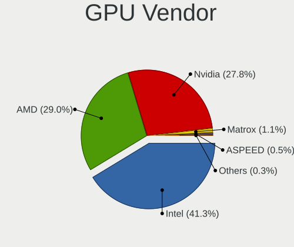

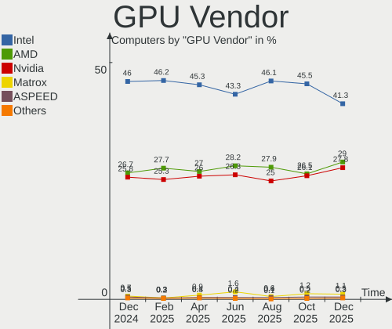

| Vendor                           | Computers | Percent |
|----------------------------------|-----------|---------|
| Intel                            | 3451      | 41.32%  |
| AMD                              | 2424      | 29.03%  |
| Nvidia                           | 2320      | 27.78%  |
| Matrox Electronics Systems       | 89        | 1.07%   |
| ASPEED Technology                | 43        | 0.51%   |
| Zhaoxin                          | 6         | 0.07%   |
| Loongson Technology              | 5         | 0.06%   |
| Red Hat                          | 4         | 0.05%   |
| Huawei Technologies              | 3         | 0.04%   |
| Silicon Integrated Systems [SiS] | 2         | 0.02%   |
| Qualcomm Atheros                 | 1         | 0.01%   |
| Microsoft                        | 1         | 0.01%   |
| Glenfly Tech                     | 1         | 0.01%   |
| ATI Technologies                 | 1         | 0.01%   |

GPU Model
---------

Graphics card models

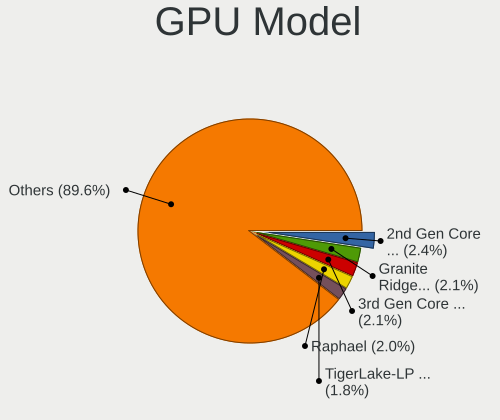

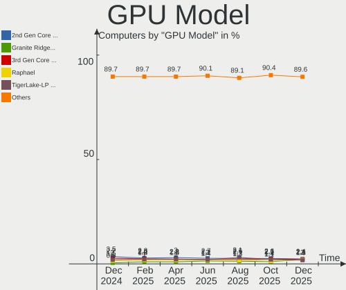

| Model                                                                       | Computers | Percent |
|-----------------------------------------------------------------------------|-----------|---------|
| Intel 2nd Generation Core Processor Family Integrated Graphics Controller   | 208       | 2.39%   |
| AMD Granite Ridge [Radeon Graphics]                                         | 185       | 2.12%   |
| Intel 3rd Gen Core processor Graphics Controller                            | 183       | 2.1%    |
| AMD Raphael                                                                 | 171       | 1.96%   |
| Intel TigerLake-LP GT2 [Iris Xe Graphics]                                   | 159       | 1.83%   |
| AMD Cezanne [Radeon Vega Series / Radeon Vega Mobile Series]                | 132       | 1.52%   |
| Intel Kaby Lake-R GT2 [UHD Graphics 620]                                    | 128       | 1.47%   |
| AMD Navi 48 [Radeon RX 9070/9070 XT/9070 GRE]                               | 126       | 1.45%   |
| Intel Haswell-ULT Integrated Graphics Controller                            | 120       | 1.38%   |
| Intel Kaby Lake-U GT2 [HD Graphics 620]                                     | 117       | 1.34%   |
| AMD Picasso/Raven 2 [Radeon Vega Series / Radeon Vega Mobile Series]        | 115       | 1.32%   |
| AMD Ellesmere [Radeon RX 470/480/570/570X/580/580X/590]                     | 109       | 1.25%   |
| Intel Skylake-U GT2 [HD Graphics 520]                                       | 104       | 1.19%   |
| AMD Phoenix1                                                                | 102       | 1.17%   |
| Intel Skylake-S GT2 [HD Graphics 530]                                       | 91        | 1.05%   |
| AMD Barcelo                                                                 | 91        | 1.05%   |
| Intel Xeon E3-1200 v3/4th Gen Core Processor Integrated Graphics Controller | 88        | 1.01%   |
| Intel CoffeeLake-H GT2 [UHD Graphics 630]                                   | 87        | 1%      |
| AMD Navi 31 [Radeon RX 7900 XT/7900 XTX/7900 GRE/7900M]                     | 87        | 1%      |
| Intel WhiskeyLake-U GT2 [UHD Graphics 620]                                  | 76        | 0.87%   |
| Intel Raptor Lake-P [Iris Xe Graphics]                                      | 76        | 0.87%   |
| Intel Broadwell-U GT2 [HD Graphics 5500]                                    | 75        | 0.86%   |
| Intel Alder Lake-P GT2 [Iris Xe Graphics]                                   | 75        | 0.86%   |
| AMD Renoir [Radeon Vega Series / Radeon Vega Mobile Series]                 | 75        | 0.86%   |
| AMD Rembrandt [Radeon 680M]                                                 | 75        | 0.86%   |
| Intel CoffeeLake-S GT2 [UHD Graphics 630]                                   | 74        | 0.85%   |
| AMD HawkPoint1                                                              | 69        | 0.79%   |
| Intel Meteor Lake-P [Intel Arc Graphics]                                    | 67        | 0.77%   |
| Intel CometLake-U GT2 [UHD Graphics]                                        | 67        | 0.77%   |
| Intel 4th Gen Core Processor Integrated Graphics Controller                 | 67        | 0.77%   |
| AMD Navi 23 [Radeon RX 6600/6600 XT/6600M]                                  | 64        | 0.73%   |
| AMD Navi 22 [Radeon RX 6700/6700 XT/6750 XT / 6800M/6850M XT]               | 63        | 0.72%   |
| Nvidia GA106 [GeForce RTX 3060 Lite Hash Rate]                              | 62        | 0.71%   |
| AMD Lucienne                                                                | 62        | 0.71%   |
| AMD Navi 44 [Radeon RX 9060 XT]                                             | 61        | 0.7%    |
| Intel Alder Lake-N [UHD Graphics]                                           | 58        | 0.67%   |
| Intel Xeon E3-1200 v2/3rd Gen Core processor Graphics Controller            | 57        | 0.65%   |
| Intel Raptor Lake-P [UHD Graphics]                                          | 56        | 0.64%   |
| Nvidia AD107M [GeForce RTX 4060 Max-Q / Mobile]                             | 55        | 0.63%   |
| Intel Core Processor Integrated Graphics Controller                         | 54        | 0.62%   |

GPU Combo
---------

Combinations of graphics cards

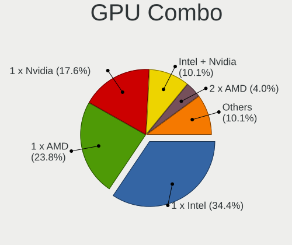

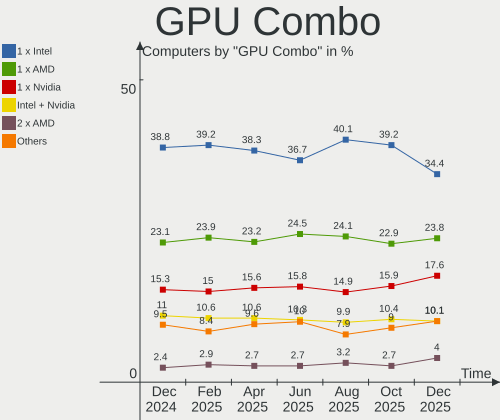

| Name                        | Computers | Percent |
|-----------------------------|-----------|---------|
| 1 x Intel                   | 2455      | 34.42%  |
| 1 x AMD                     | 1695      | 23.76%  |
| 1 x Nvidia                  | 1257      | 17.62%  |
| Intel + Nvidia              | 721       | 10.11%  |
| 2 x AMD                     | 286       | 4.01%   |
| AMD + Nvidia                | 271       | 3.8%    |
| Intel + AMD                 | 145       | 2.03%   |
| Other                       | 68        | 0.95%   |
| 1 x Matrox                  | 66        | 0.93%   |
| 2 x Intel                   | 47        | 0.66%   |
| 1 x ASPEED                  | 25        | 0.35%   |
| 2 x Nvidia                  | 21        | 0.29%   |
| Nvidia + Matrox             | 17        | 0.24%   |
| Nvidia + ASPEED             | 12        | 0.17%   |
| 1 x Zhaoxin                 | 6         | 0.08%   |
| 1 x Loongson Technology     | 5         | 0.07%   |
| 1 x Red Hat                 | 4         | 0.06%   |
| AMD + Matrox                | 4         | 0.06%   |
| AMD + ASPEED                | 4         | 0.06%   |
| Intel + 2 x Nvidia          | 3         | 0.04%   |
| 1 x Huawei Technologies     | 3         | 0.04%   |
| AMD + 2 x Nvidia            | 3         | 0.04%   |
| 3 x AMD                     | 2         | 0.03%   |
| 2 x AMD + 1 x Nvidia        | 2         | 0.03%   |
| 1 x SiS                     | 2         | 0.03%   |
| Intel + AMD + 1 x Nvidia    | 2         | 0.03%   |
| 4 x AMD                     | 1         | 0.01%   |
| 2 x Nvidia + 1 x Matrox     | 1         | 0.01%   |
| 1 x Microsoft               | 1         | 0.01%   |
| Intel + Nvidia + 1 x ASPEED | 1         | 0.01%   |
| Intel + Matrox              | 1         | 0.01%   |
| Intel + ASPEED              | 1         | 0.01%   |
| 1 x Glenfly Tech            | 1         | 0.01%   |

GPU Driver
----------

Free vs proprietary

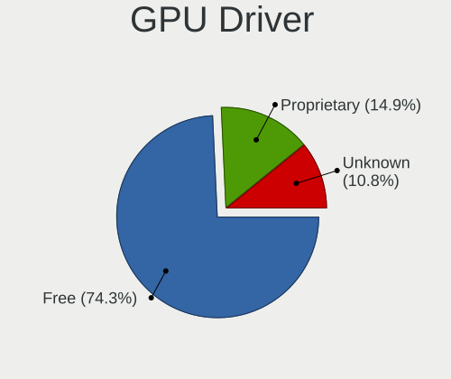

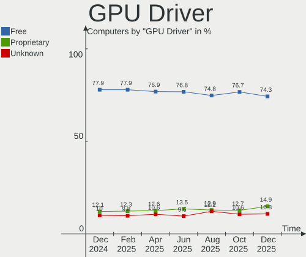

| Driver      | Computers | Percent |
|-------------|-----------|---------|
| Free        | 5297      | 74.26%  |
| Proprietary | 1063      | 14.9%   |
| Unknown     | 773       | 10.84%  |

GPU Memory
----------

Total video memory

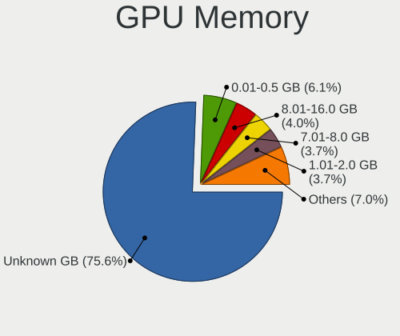

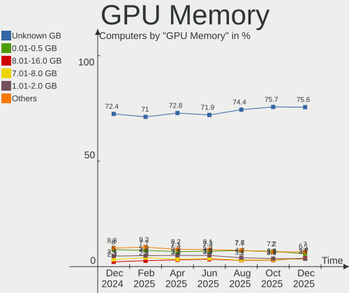

| Size in GB     | Computers | Percent |
|----------------|-----------|---------|
| Unknown        | 5393      | 75.61%  |
| 0.01-0.5       | 435       | 6.1%    |
| 8.01-16.0      | 283       | 3.97%   |
| 7.01-8.0       | 265       | 3.72%   |
| 1.01-2.0       | 261       | 3.66%   |
| 0.51-1.0       | 172       | 2.41%   |
| 3.01-4.0       | 160       | 2.24%   |
| 5.01-6.0       | 71        | 1%      |
| 16.01-24.0     | 51        | 0.71%   |
| 2.01-3.0       | 31        | 0.43%   |
| 24.01-32.0     | 6         | 0.08%   |
| More than 64.0 | 2         | 0.03%   |
| 32.01-64.0     | 2         | 0.03%   |
| 4.01-5.0       | 1         | 0.01%   |

Monitor
-------

Monitor Vendor
--------------

Monitor vendors

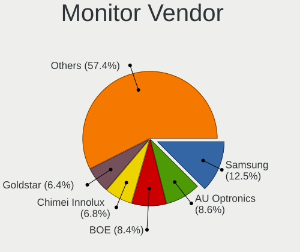

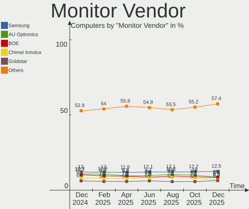

| Vendor                  | Computers | Percent |
|-------------------------|-----------|---------|
| Samsung Electronics     | 974       | 12.46%  |
| AU Optronics            | 673       | 8.61%   |
| BOE                     | 654       | 8.37%   |
| Chimei Innolux          | 529       | 6.77%   |
| Goldstar                | 497       | 6.36%   |
| Dell                    | 459       | 5.87%   |
| LG Display              | 453       | 5.8%    |
| Acer                    | 309       | 3.95%   |
| Lenovo                  | 254       | 3.25%   |
| AOC                     | 247       | 3.16%   |
| Apple                   | 208       | 2.66%   |
| Hewlett-Packard         | 205       | 2.62%   |
| Philips                 | 169       | 2.16%   |
| ASUSTek Computer        | 155       | 1.98%   |
| BenQ                    | 149       | 1.91%   |
| MSI                     | 134       | 1.71%   |
| Ancor Communications    | 131       | 1.68%   |
| Sharp                   | 100       | 1.28%   |
| ViewSonic               | 74        | 0.95%   |
| Iiyama                  | 70        | 0.9%    |
| Gigabyte Technology     | 62        | 0.79%   |
| Chi Mei Optoelectronics | 58        | 0.74%   |
| InfoVision              | 49        | 0.63%   |
| PANDA                   | 47        | 0.6%    |
| CSW                     | 47        | 0.6%    |
| CSOT                    | 47        | 0.6%    |
| Sony                    | 44        | 0.56%   |
| Valve                   | 40        | 0.51%   |
| HKC                     | 39        | 0.5%    |
| Mi                      | 36        | 0.46%   |
| Unknown                 | 34        | 0.43%   |
| SKG                     | 31        | 0.4%    |
| Vizio                   | 30        | 0.38%   |
| Sceptre Tech            | 30        | 0.38%   |
| Unknown (XXX)           | 28        | 0.36%   |
| RTK                     | 27        | 0.35%   |
| Toshiba                 | 25        | 0.32%   |
| Panasonic               | 25        | 0.32%   |
| Hitachi                 | 25        | 0.32%   |
| Eizo                    | 23        | 0.29%   |

Monitor Model
-------------

Monitor models

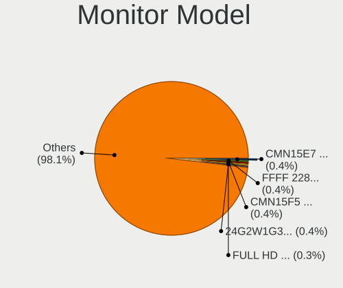

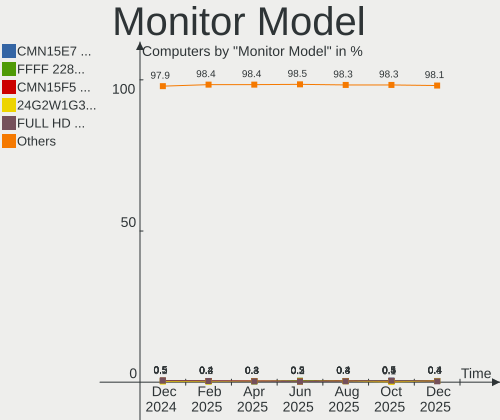

| Model                                                                 | Computers | Percent |
|-----------------------------------------------------------------------|-----------|---------|
| Chimei Innolux LCD Monitor CMN15E7 1920x1080 344x193mm 15.5-inch      | 35        | 0.43%   |
| Unknown LCD Monitor FFFF 2288x1287 2550x2550mm 142.0-inch             | 29        | 0.36%   |
| Chimei Innolux LCD Monitor CMN15F5 1920x1080 344x193mm 15.5-inch      | 29        | 0.36%   |
| AOC 24G2W1G3 AOC2402 1920x1080 527x296mm 23.8-inch                    | 29        | 0.36%   |
| Goldstar FULL HD GSM5B55 1920x1080 480x270mm 21.7-inch                | 28        | 0.35%   |
| Chimei Innolux LCD Monitor CMN1521 1920x1080 344x193mm 15.5-inch      | 28        | 0.35%   |
| Valve ANX7530 U VLV3003 800x1280 100x160mm 7.4-inch                   | 22        | 0.27%   |
| AOC 27G2G4 AOC2702 1920x1080 598x336mm 27.0-inch                      | 21        | 0.26%   |
| Chimei Innolux LCD Monitor CMN14D4 1920x1080 309x173mm 13.9-inch      | 20        | 0.25%   |
| AU Optronics LCD Monitor AUO21ED 1920x1080 344x193mm 15.5-inch        | 20        | 0.25%   |
| Goldstar 27GL850 GSM5B7F 2560x1440 597x336mm 27.0-inch                | 19        | 0.24%   |
| Samsung Electronics C27F390 SAM0D32 1920x1080 598x336mm 27.0-inch     | 18        | 0.22%   |
| LG Display LCD Monitor LGD0555 2736x1824 260x173mm 12.3-inch          | 16        | 0.2%    |
| Lenovo LCD Monitor LEN40A9 1920x1080 309x173mm 13.9-inch              | 16        | 0.2%    |
| Goldstar HDR 4K GSM7707 3840x2160 600x340mm 27.2-inch                 | 16        | 0.2%    |
| AU Optronics LCD Monitor AUO106C 1366x768 276x155mm 12.5-inch         | 16        | 0.2%    |
| AU Optronics LCD Monitor AUO61ED 1920x1080 344x194mm 15.5-inch        | 15        | 0.19%   |
| LG Display LCD Monitor LGD02DC 1366x768 344x194mm 15.5-inch           | 14        | 0.17%   |
| CSW MNE007ZA3-2 CSW1431 2880x1800 301x188mm 14.0-inch                 | 13        | 0.16%   |
| BOE LCD Monitor BOE0BCA 2256x1504 285x190mm 13.5-inch                 | 13        | 0.16%   |
| BOE LCD Monitor BOE084E 1920x1080 382x215mm 17.3-inch                 | 13        | 0.16%   |
| AU Optronics LCD Monitor AUO38ED 1920x1080 344x193mm 15.5-inch        | 13        | 0.16%   |
| Valve ANX7530 U VLV3001 800x1280 100x150mm 7.1-inch                   | 12        | 0.15%   |
| Samsung Electronics S24F350 SAM0D20 1920x1080 521x293mm 23.5-inch     | 12        | 0.15%   |
| Samsung Electronics LCD Monitor SEC5441 1280x800 331x207mm 15.4-inch  | 12        | 0.15%   |
| Samsung Electronics LCD Monitor SDC4171 2880x1800 302x189mm 14.0-inch | 12        | 0.15%   |
| Goldstar LG ULTRAWIDE GSM59F1 2560x1080 670x280mm 28.6-inch           | 12        | 0.15%   |
| BOE LCD Monitor BOE0BC9 2560x1600 345x215mm 16.0-inch                 | 12        | 0.15%   |
| AU Optronics LCD Monitor AUO10EC 1366x768 344x193mm 15.5-inch         | 12        | 0.15%   |
| Vestel Elektronik 40UHD_LCD_TV VES3700 3840x2160 880x500mm 39.8-inch  | 11        | 0.14%   |
| Samsung Electronics LCD Monitor SDC4208 1920x1200 302x189mm 14.0-inch | 11        | 0.14%   |
| Samsung Electronics LCD Monitor SDC419D 2880x1800 302x189mm 14.0-inch | 11        | 0.14%   |
| Samsung Electronics LCD Monitor SDC4187 1920x1200 302x189mm 14.0-inch | 11        | 0.14%   |
| Samsung Electronics C24F390 SAM0D2C 1920x1080 521x293mm 23.5-inch     | 11        | 0.14%   |
| PANDA LCD Monitor NCP004D 1920x1080 344x194mm 15.5-inch               | 11        | 0.14%   |
| Panasonic VVX11F009G00 MEI96A2 1920x1080 344x193mm 15.5-inch          | 11        | 0.14%   |
| Lenovo LCD Monitor LEN40BA 1920x1080 344x194mm 15.5-inch              | 11        | 0.14%   |
| Lenovo B140UAN02.7 LEN403A 1920x1200 302x188mm 14.0-inch              | 11        | 0.14%   |
| Goldstar ULTRAGEAR GSM5BD3 2560x1440 697x392mm 31.5-inch              | 11        | 0.14%   |
| Goldstar LG TV SSCR2 GSMC0C8 3840x2160                                | 11        | 0.14%   |

Monitor Resolution
------------------

Monitor screen resolution

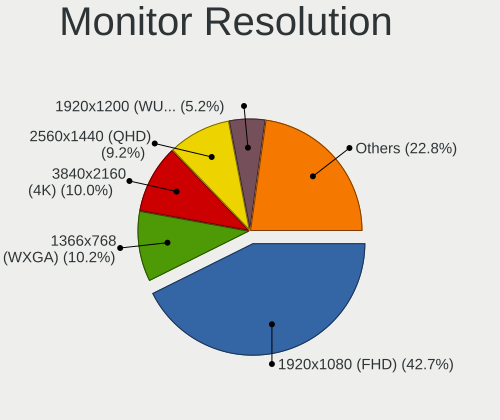

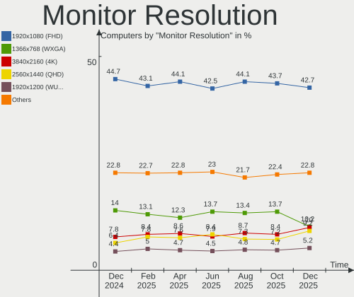

| Resolution         | Computers | Percent |
|--------------------|-----------|---------|
| 1920x1080 (FHD)    | 3202      | 42.65%  |
| 1366x768 (WXGA)    | 767       | 10.22%  |
| 3840x2160 (4K)     | 747       | 9.95%   |
| 2560x1440 (QHD)    | 688       | 9.16%   |
| 1920x1200 (WUXGA)  | 393       | 5.24%   |
| 1600x900 (HD+)     | 197       | 2.62%   |
| 3440x1440          | 175       | 2.33%   |
| 2560x1600          | 168       | 2.24%   |
| 2880x1800          | 139       | 1.85%   |
| 1440x900 (WXGA+)   | 127       | 1.69%   |
| 1680x1050 (WSXGA+) | 104       | 1.39%   |
| 1280x1024 (SXGA)   | 94        | 1.25%   |
| Unknown            | 82        | 1.09%   |
| 2560x1080          | 79        | 1.05%   |
| 1280x800 (WXGA)    | 76        | 1.01%   |
| 3840x1080          | 55        | 0.73%   |
| 800x1280           | 35        | 0.47%   |
| 2880x1920          | 33        | 0.44%   |
| 2288x1287          | 31        | 0.41%   |
| 1920x540           | 25        | 0.33%   |
| 2160x1440          | 23        | 0.31%   |
| 1360x768           | 23        | 0.31%   |
| 2256x1504          | 22        | 0.29%   |
| 3840x1600          | 18        | 0.24%   |
| 3840x2400          | 17        | 0.23%   |
| 1024x768 (XGA)     | 17        | 0.23%   |
| 3200x1800 (QHD+)   | 14        | 0.19%   |
| 1920x1280          | 13        | 0.17%   |
| 1600x1200          | 13        | 0.17%   |
| 3072x1920          | 12        | 0.16%   |
| 2240x1400          | 11        | 0.15%   |
| 1024x600           | 9         | 0.12%   |
| 2736x1824          | 8         | 0.11%   |
| 1280x720 (HD)      | 8         | 0.11%   |
| 3200x2000          | 5         | 0.07%   |
| 3000x2000          | 5         | 0.07%   |
| 2560x2880          | 5         | 0.07%   |
| 2520x1680          | 5         | 0.07%   |
| 1400x1050          | 5         | 0.07%   |
| 2560x1397          | 4         | 0.05%   |

Monitor Diagonal
----------------

Diagonal size in inches

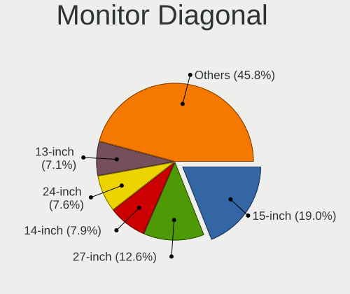

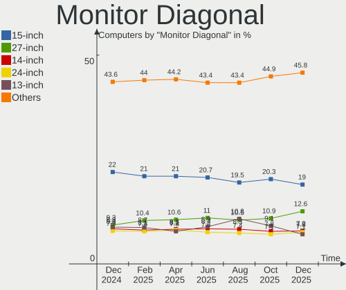

| Inches  | Computers | Percent |
|---------|-----------|---------|
| 15      | 1483      | 18.96%  |
| 27      | 983       | 12.57%  |
| 14      | 621       | 7.94%   |
| 24      | 598       | 7.65%   |
| 13      | 552       | 7.06%   |
| 23      | 476       | 6.09%   |
| 31      | 412       | 5.27%   |
| 21      | 359       | 4.59%   |
| 16      | 286       | 3.66%   |
| 17      | 284       | 3.63%   |
| 34      | 201       | 2.57%   |
| Unknown | 162       | 2.07%   |
| 19      | 119       | 1.52%   |
| 18      | 118       | 1.51%   |
| 12      | 98        | 1.25%   |
| 84      | 90        | 1.15%   |
| 20      | 77        | 0.98%   |
| 32      | 74        | 0.95%   |
| 22      | 74        | 0.95%   |
| 11      | 64        | 0.82%   |
| 26      | 59        | 0.75%   |
| 54      | 53        | 0.68%   |
| 48      | 47        | 0.6%    |
| 40      | 46        | 0.59%   |
| 72      | 43        | 0.55%   |
| 7       | 39        | 0.5%    |
| 63      | 38        | 0.49%   |
| 49      | 30        | 0.38%   |
| 142     | 29        | 0.37%   |
| 28      | 27        | 0.35%   |
| 25      | 26        | 0.33%   |
| 29      | 24        | 0.31%   |
| 8       | 22        | 0.28%   |
| 42      | 19        | 0.24%   |
| 37      | 18        | 0.23%   |
| 10      | 18        | 0.23%   |
| 65      | 14        | 0.18%   |
| 74      | 13        | 0.17%   |
| 36      | 12        | 0.15%   |
| 64      | 11        | 0.14%   |

Monitor Width
-------------

Physical width

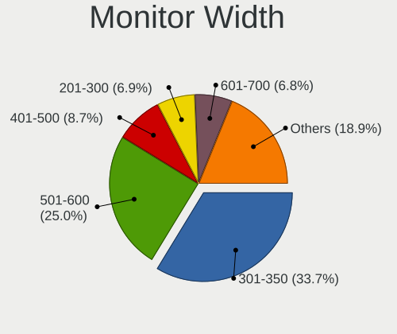

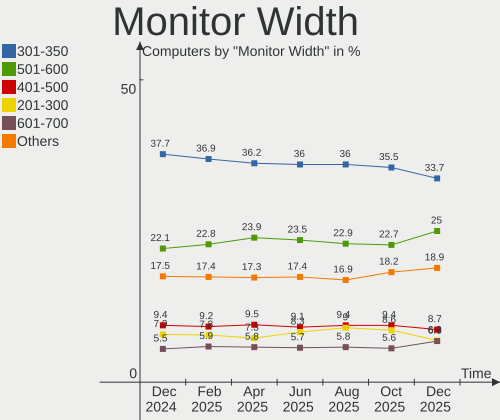

| Width in mm    | Computers | Percent |
|----------------|-----------|---------|
| 301-350        | 2568      | 33.73%  |
| 501-600        | 1904      | 25.01%  |
| 401-500        | 659       | 8.66%   |
| 201-300        | 528       | 6.94%   |
| 601-700        | 518       | 6.8%    |
| 351-400        | 377       | 4.95%   |
| 701-800        | 290       | 3.81%   |
| 1001-1500      | 243       | 3.19%   |
| Unknown        | 162       | 2.13%   |
| 1501-2000      | 158       | 2.08%   |
| 801-900        | 77        | 1.01%   |
| 901-1000       | 37        | 0.49%   |
| 1-100          | 34        | 0.45%   |
| More than 2000 | 31        | 0.41%   |
| 101-200        | 27        | 0.35%   |

Aspect Ratio
------------

Proportional relationship between the width and the height

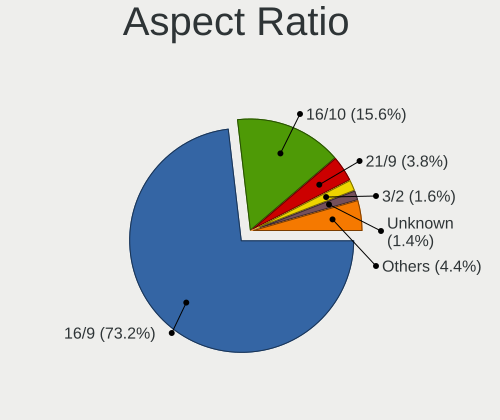

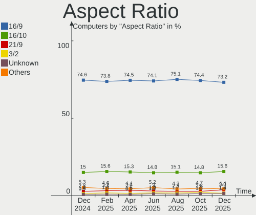

| Ratio   | Computers | Percent |
|---------|-----------|---------|
| 16/9    | 5166      | 73.15%  |
| 16/10   | 1101      | 15.59%  |
| 21/9    | 266       | 3.77%   |
| 3/2     | 115       | 1.63%   |
| Unknown | 100       | 1.42%   |
| 5/4     | 91        | 1.29%   |
| 32/9    | 70        | 0.99%   |
| 4/3     | 46        | 0.65%   |
| 1.00    | 30        | 0.42%   |
| 0.62    | 23        | 0.33%   |
| 0.67    | 12        | 0.17%   |
| 0.63    | 9         | 0.13%   |
| 0.56    | 7         | 0.1%    |
| 0.89    | 5         | 0.07%   |
| 6/5     | 4         | 0.06%   |
| 1.96    | 4         | 0.06%   |
| 3.20    | 3         | 0.04%   |
| 2.00    | 2         | 0.03%   |
| 3.75    | 1         | 0.01%   |
| 3.73    | 1         | 0.01%   |
| 3.40    | 1         | 0.01%   |
| 2.69    | 1         | 0.01%   |
| 2.67    | 1         | 0.01%   |
| 2.64    | 1         | 0.01%   |
| 0.79    | 1         | 0.01%   |
| 0.45    | 1         | 0.01%   |

Monitor Area
------------

Area in inch²

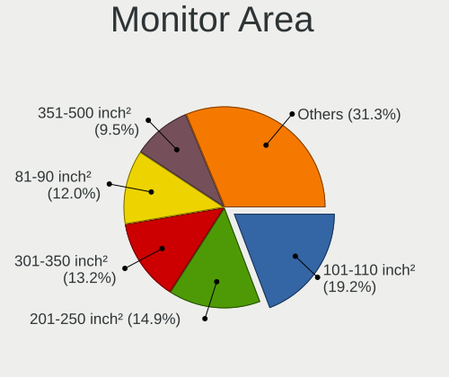

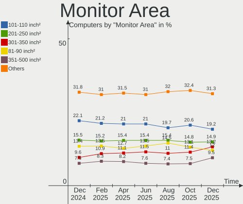

| Area in inch² | Computers | Percent |
|----------------|-----------|---------|
| 101-110        | 1485      | 19.23%  |
| 201-250        | 1147      | 14.85%  |
| 301-350        | 1022      | 13.23%  |
| 81-90          | 923       | 11.95%  |
| 351-500        | 731       | 9.47%   |
| More than 1000 | 341       | 4.42%   |
| 151-200        | 316       | 4.09%   |
| 111-120        | 273       | 3.54%   |
| 251-300        | 252       | 3.26%   |
| 71-80          | 233       | 3.02%   |
| 121-130        | 228       | 2.95%   |
| 501-1000       | 191       | 2.47%   |
| Unknown        | 162       | 2.1%    |
| 141-150        | 130       | 1.68%   |
| 61-70          | 92        | 1.19%   |
| 51-60          | 68        | 0.88%   |
| 1-40           | 61        | 0.79%   |
| 131-140        | 27        | 0.35%   |
| 91-100         | 25        | 0.32%   |
| 41-50          | 15        | 0.19%   |

Pixel Density
-------------

Pixels per inch

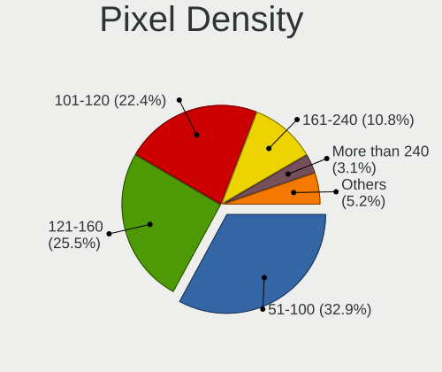

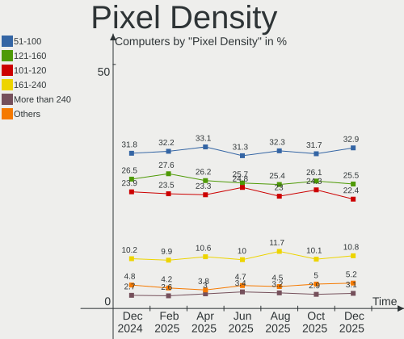

| Density       | Computers | Percent |
|---------------|-----------|---------|
| 51-100        | 2468      | 32.95%  |
| 121-160       | 1908      | 25.47%  |
| 101-120       | 1681      | 22.44%  |
| 161-240       | 808       | 10.79%  |
| More than 240 | 235       | 3.14%   |
| 1-50          | 229       | 3.06%   |
| Unknown       | 162       | 2.16%   |

Multiple Monitors
-----------------

Total monitors connected

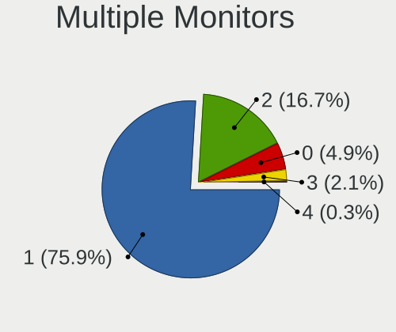

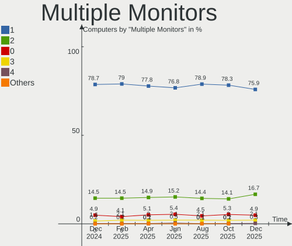

| Total | Computers | Percent |
|-------|-----------|---------|
| 1     | 5417      | 75.94%  |
| 2     | 1191      | 16.7%   |
| 0     | 353       | 4.95%   |
| 3     | 150       | 2.1%    |
| 4     | 22        | 0.31%   |

Network
-------

Net Controller Vendor
---------------------

Controller vendors

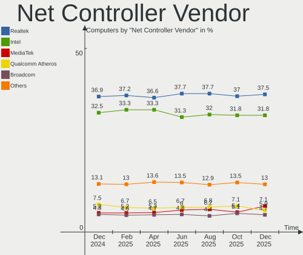

| Vendor                                 | Computers | Percent |
|----------------------------------------|-----------|---------|
| Realtek Semiconductor                  | 4010      | 37.52%  |
| Intel                                  | 3394      | 31.75%  |
| MediaTek                               | 760       | 7.11%   |
| Qualcomm Atheros                       | 632       | 5.91%   |
| Broadcom                               | 505       | 4.72%   |
| TP-Link                                | 115       | 1.08%   |
| Broadcom Limited                       | 98        | 0.92%   |
| ASIX Electronics                       | 92        | 0.86%   |
| Marvell Technology Group               | 67        | 0.63%   |
| Ralink Technology                      | 63        | 0.59%   |
| Qualcomm Technologies                  | 63        | 0.59%   |
| Samsung Electronics                    | 60        | 0.56%   |
| Ralink                                 | 59        | 0.55%   |
| Qualcomm                               | 56        | 0.52%   |
| Aquantia                               | 54        | 0.51%   |
| Nvidia                                 | 48        | 0.45%   |
| Microsoft                              | 44        | 0.41%   |
| Sierra Wireless                        | 31        | 0.29%   |
| NetGear                                | 26        | 0.24%   |
| Xiaomi                                 | 25        | 0.23%   |
| Shenzhen Goodix Technology             | 22        | 0.21%   |
| Qualcomm Atheros Communications        | 20        | 0.19%   |
| DisplayLink                            | 20        | 0.19%   |
| D-Link                                 | 20        | 0.19%   |
| Suzhou Motorcomm Electronic Technology | 19        | 0.18%   |
| Lenovo                                 | 19        | 0.18%   |
| ASUSTek Computer                       | 19        | 0.18%   |
| Dell                                   | 17        | 0.16%   |
| QinHeng Electronics                    | 16        | 0.15%   |
| OPPO Electronics                       | 15        | 0.14%   |
| Ericsson Business Mobile Networks      | 15        | 0.14%   |
| Raspberry Pi                           | 14        | 0.13%   |
| Google                                 | 14        | 0.13%   |
| Realtek                                | 13        | 0.12%   |
| Motorcomm Microelectronics.            | 13        | 0.12%   |
| Apple                                  | 11        | 0.1%    |
| Motorola PCS                           | 10        | 0.09%   |
| Hewlett-Packard                        | 10        | 0.09%   |
| Edimax Technology                      | 10        | 0.09%   |
| Huawei Technologies                    | 9         | 0.08%   |

Net Controller Model
--------------------

Controller models

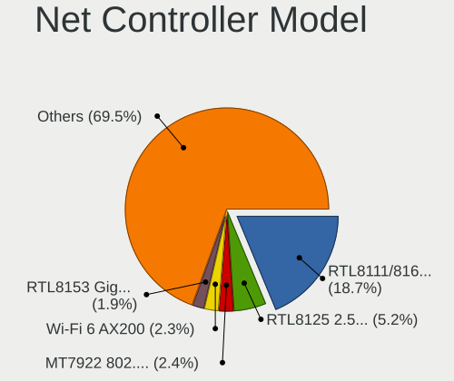

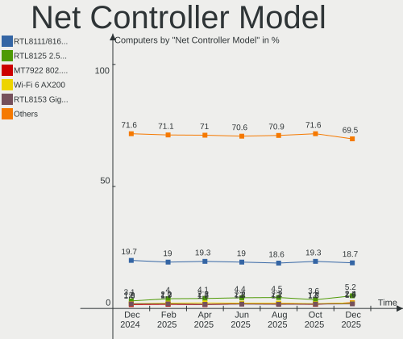

| Model                                                                           | Computers | Percent |
|---------------------------------------------------------------------------------|-----------|---------|
| Realtek RTL8111/8168/8211/8411 PCI Express Gigabit Ethernet Controller          | 2371      | 18.74%  |
| Realtek RTL8125 2.5GbE Controller                                               | 659       | 5.21%   |
| MediaTek MT7922 802.11ax PCI Express Wireless Network Adapter                   | 299       | 2.36%   |
| Intel Wi-Fi 6 AX200                                                             | 293       | 2.32%   |
| Realtek RTL8153 Gigabit Ethernet Adapter                                        | 239       | 1.89%   |
| Realtek RTL810xE PCI Express Fast Ethernet controller                           | 236       | 1.87%   |
| Intel Wi-Fi 6E(802.11ax) AX210/AX1675* 2x2 [Typhoon Peak]                       | 203       | 1.6%    |
| Intel Wireless 8265 / 8275                                                      | 179       | 1.41%   |
| Realtek RTL8821CE 802.11ac PCIe Wireless Network Adapter                        | 175       | 1.38%   |
| Intel 82579LM Gigabit Network Connection (Lewisville)                           | 172       | 1.36%   |
| Realtek RTL8852BE PCIe 802.11ax Wireless Network Controller                     | 151       | 1.19%   |
| Intel Wi-Fi 6 AX201                                                             | 139       | 1.1%    |
| Intel Wireless 7265                                                             | 137       | 1.08%   |
| Intel Alder Lake-P PCH CNVi WiFi                                                | 136       | 1.07%   |
| Intel I211 Gigabit Network Connection                                           | 134       | 1.06%   |
| Intel Ethernet Controller I225-V                                                | 133       | 1.05%   |
| Intel Ethernet Controller I226-V                                                | 124       | 0.98%   |
| Realtek RTL8822CE 802.11ac PCIe Wireless Network Adapter                        | 120       | 0.95%   |
| Intel Ethernet Connection (2) I219-V                                            | 112       | 0.89%   |
| MediaTek MT7925 802.11be 160MHz 2x2 PCIe Wireless Network Adapter [Filogic 360] | 110       | 0.87%   |
| MediaTek MT7921 802.11ax PCIe Wireless Network Adapter [Filogic 330]            | 108       | 0.85%   |
| MediaTek MT7902 802.11ax PCIe Wireless Network Adapter [Filogic 310]            | 108       | 0.85%   |
| Intel Wireless 8260                                                             | 100       | 0.79%   |
| Intel Raptor Lake PCH CNVi WiFi                                                 | 95        | 0.75%   |
| Realtek RTL8126 5GbE Controller                                                 | 93        | 0.74%   |
| Qualcomm Atheros QCA9377 802.11ac Wireless Network Adapter                      | 88        | 0.7%    |
| Realtek 802.11ac NIC                                                            | 87        | 0.69%   |
| ASIX AX88179 Gigabit Ethernet                                                   | 86        | 0.68%   |
| Qualcomm Atheros QCA9565 / AR9565 Wireless Network Adapter                      | 83        | 0.66%   |
| Qualcomm Atheros QCA6174 802.11ac Wireless Network Adapter                      | 83        | 0.66%   |
| Intel Ethernet Connection (4) I219-LM                                           | 83        | 0.66%   |
| Qualcomm Atheros AR9485 Wireless Network Adapter                                | 80        | 0.63%   |
| Intel Wireless 7260                                                             | 75        | 0.59%   |
| Intel Ethernet Connection I217-LM                                               | 75        | 0.59%   |
| Intel 700 Series Chipset CNVi WiFi                                              | 73        | 0.58%   |
| Intel Comet Lake PCH CNVi WiFi                                                  | 70        | 0.55%   |
| Intel Wi-Fi 5(802.11ac) Wireless-AC 9x6x [Thunder Peak]                         | 69        | 0.55%   |
| Intel Dual Band Wireless-AC 3168NGW [Stone Peak]                                | 67        | 0.53%   |
| Intel Comet Lake PCH-LP CNVi WiFi                                               | 66        | 0.52%   |
| Intel Wireless 3165                                                             | 64        | 0.51%   |

Wireless Vendor
---------------

Wireless vendors

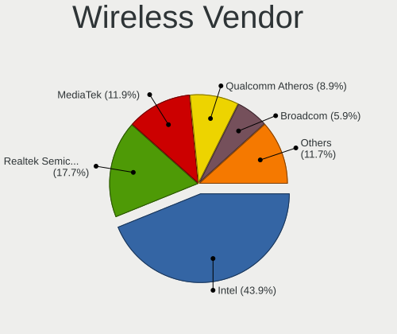

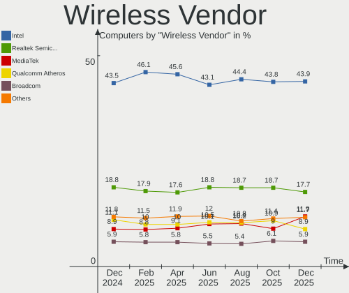

| Vendor                          | Computers | Percent |
|---------------------------------|-----------|---------|
| Intel                           | 2428      | 43.89%  |
| Realtek Semiconductor           | 978       | 17.68%  |
| MediaTek                        | 656       | 11.86%  |
| Qualcomm Atheros                | 495       | 8.95%   |
| Broadcom                        | 329       | 5.95%   |
| TP-Link                         | 107       | 1.93%   |
| Broadcom Limited                | 77        | 1.39%   |
| Ralink Technology               | 63        | 1.14%   |
| Ralink                          | 59        | 1.07%   |
| Qualcomm                        | 48        | 0.87%   |
| Microsoft                       | 37        | 0.67%   |
| Sierra Wireless                 | 31        | 0.56%   |
| NetGear                         | 26        | 0.47%   |
| Marvell Technology Group        | 25        | 0.45%   |
| Qualcomm Technologies           | 22        | 0.4%    |
| Qualcomm Atheros Communications | 20        | 0.36%   |
| D-Link                          | 19        | 0.34%   |
| ASUSTek Computer                | 18        | 0.33%   |
| Realtek                         | 13        | 0.23%   |
| Dell                            | 11        | 0.2%    |
| Edimax Technology               | 10        | 0.18%   |
| Mercucys                        | 8         | 0.14%   |
| AVM                             | 7         | 0.13%   |
| IMC Networks                    | 6         | 0.11%   |
| Fibocom                         | 6         | 0.11%   |
| D-Link System                   | 5         | 0.09%   |
| ZyDAS                           | 4         | 0.07%   |
| ZyXEL Communications            | 3         | 0.05%   |
| Quectel Wireless Solutions      | 3         | 0.05%   |
| Linksys                         | 3         | 0.05%   |
| Hewlett-Packard                 | 3         | 0.05%   |
| Belkin Components               | 3         | 0.05%   |
| TRENDnet                        | 1         | 0.02%   |
| Tenda                           | 1         | 0.02%   |
| Samsung Electronics             | 1         | 0.02%   |
| Ovislink                        | 1         | 0.02%   |
| LG Electronics                  | 1         | 0.02%   |
| I-O Data Device                 | 1         | 0.02%   |
| Gemtek                          | 1         | 0.02%   |
| Cypress Semiconductor           | 1         | 0.02%   |

Wireless Model
--------------

Wireless models

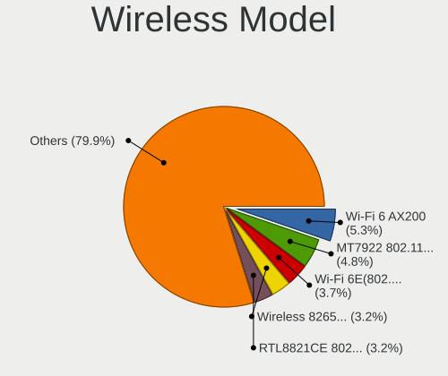

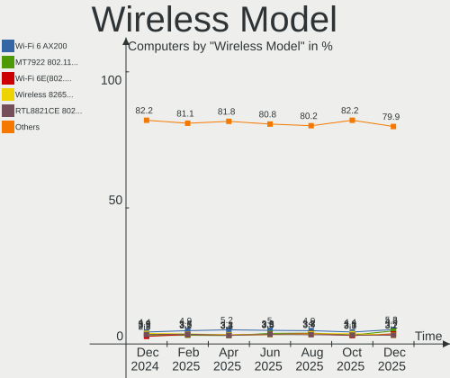

| Model                                                                           | Computers | Percent |
|---------------------------------------------------------------------------------|-----------|---------|
| Intel Wi-Fi 6 AX200                                                             | 293       | 5.28%   |
| MediaTek MT7922 802.11ax PCI Express Wireless Network Adapter                   | 267       | 4.81%   |
| Intel Wi-Fi 6E(802.11ax) AX210/AX1675* 2x2 [Typhoon Peak]                       | 203       | 3.66%   |
| Intel Wireless 8265 / 8275                                                      | 179       | 3.22%   |
| Realtek RTL8821CE 802.11ac PCIe Wireless Network Adapter                        | 175       | 3.15%   |
| Intel Wi-Fi 6 AX201                                                             | 139       | 2.5%    |
| Intel Wireless 7265                                                             | 137       | 2.47%   |
| Realtek RTL8822CE 802.11ac PCIe Wireless Network Adapter                        | 120       | 2.16%   |
| Realtek RTL8852BE PCIe 802.11ax Wireless Network Controller                     | 110       | 1.98%   |
| MediaTek MT7921 802.11ax PCIe Wireless Network Adapter [Filogic 330]            | 108       | 1.95%   |
| MediaTek MT7902 802.11ax PCIe Wireless Network Adapter [Filogic 310]            | 108       | 1.95%   |
| Intel Wireless 8260                                                             | 100       | 1.8%    |
| Intel Raptor Lake PCH CNVi WiFi                                                 | 93        | 1.68%   |
| Qualcomm Atheros QCA9377 802.11ac Wireless Network Adapter                      | 88        | 1.59%   |
| Realtek 802.11ac NIC                                                            | 87        | 1.57%   |
| Intel Alder Lake-P PCH CNVi WiFi                                                | 86        | 1.55%   |
| Qualcomm Atheros QCA9565 / AR9565 Wireless Network Adapter                      | 83        | 1.5%    |
| Qualcomm Atheros QCA6174 802.11ac Wireless Network Adapter                      | 83        | 1.5%    |
| Qualcomm Atheros AR9485 Wireless Network Adapter                                | 80        | 1.44%   |
| Intel Wireless 7260                                                             | 75        | 1.35%   |
| Intel 700 Series Chipset CNVi WiFi                                              | 72        | 1.3%    |
| Intel Comet Lake PCH CNVi WiFi                                                  | 70        | 1.26%   |
| Intel Wi-Fi 5(802.11ac) Wireless-AC 9x6x [Thunder Peak]                         | 69        | 1.24%   |
| Intel Dual Band Wireless-AC 3168NGW [Stone Peak]                                | 67        | 1.21%   |
| MediaTek MT7925 802.11be 160MHz 2x2 PCIe Wireless Network Adapter [Filogic 360] | 66        | 1.19%   |
| Intel Comet Lake PCH-LP CNVi WiFi                                               | 66        | 1.19%   |
| Intel Wireless 3165                                                             | 64        | 1.15%   |
| Intel Cannon Lake PCH CNVi WiFi                                                 | 64        | 1.15%   |
| Intel Centrino Advanced-N 6205 [Taylor Peak]                                    | 63        | 1.13%   |
| Intel Cannon Point-LP CNVi [Wireless-AC]                                        | 60        | 1.08%   |
| Intel Meteor Lake PCH CNVi WiFi                                                 | 59        | 1.06%   |
| Qualcomm Atheros AR9285 Wireless Network Adapter (PCI-Express)                  | 58        | 1.04%   |
| Broadcom BCM43142 802.11b/g/n                                                   | 50        | 0.9%    |
| Intel Wi-Fi 7(802.11be) AX1775*/AX1790*/BE20*/BE401/BE1750* 2x2                 | 49        | 0.88%   |
| Qualcomm QCNFA765 Wireless Network Adapter                                      | 47        | 0.85%   |
| Realtek RTL8723BE PCIe Wireless Network Adapter                                 | 45        | 0.81%   |
| Broadcom BCM4360 802.11ac Dual Band Wireless Network Adapter                    | 44        | 0.79%   |
| Broadcom BCM4331 802.11a/b/g/n                                                  | 42        | 0.76%   |
| Realtek RTL8852CE PCIe 802.11ax Wireless Network Controller                     | 39        | 0.7%    |
| Intel Tiger Lake PCH CNVi WiFi                                                  | 38        | 0.68%   |

Ethernet Vendor
---------------

Ethernet vendors

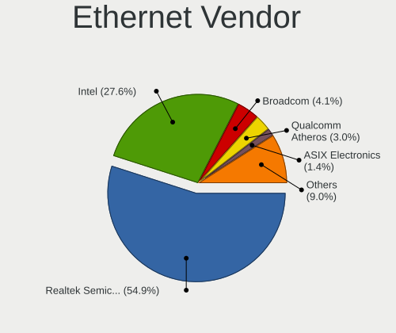

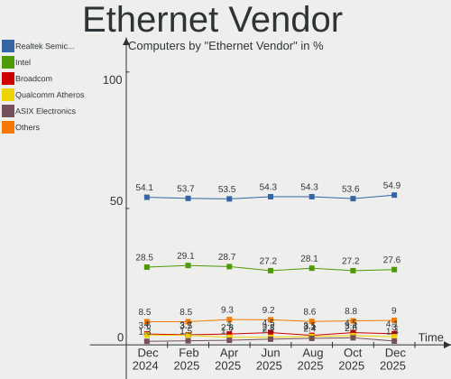

| Vendor                                 | Computers | Percent |
|----------------------------------------|-----------|---------|
| Realtek Semiconductor                  | 3638      | 54.95%  |
| Intel                                  | 1826      | 27.58%  |
| Broadcom                               | 271       | 4.09%   |
| Qualcomm Atheros                       | 196       | 2.96%   |
| ASIX Electronics                       | 92        | 1.39%   |
| MediaTek                               | 82        | 1.24%   |
| Samsung Electronics                    | 59        | 0.89%   |
| Aquantia                               | 54        | 0.82%   |
| Nvidia                                 | 48        | 0.72%   |
| Marvell Technology Group               | 42        | 0.63%   |
| Qualcomm Technologies                  | 41        | 0.62%   |
| Xiaomi                                 | 25        | 0.38%   |
| Broadcom Limited                       | 21        | 0.32%   |
| DisplayLink                            | 20        | 0.3%    |
| Suzhou Motorcomm Electronic Technology | 19        | 0.29%   |
| OPPO Electronics                       | 15        | 0.23%   |
| Lenovo                                 | 15        | 0.23%   |
| Raspberry Pi                           | 14        | 0.21%   |
| Motorcomm Microelectronics.            | 13        | 0.2%    |
| Google                                 | 13        | 0.2%    |
| Motorola PCS                           | 10        | 0.15%   |
| Apple                                  | 10        | 0.15%   |
| TP-Link                                | 8         | 0.12%   |
| Qualcomm                               | 8         | 0.12%   |
| JMicron Technology                     | 7         | 0.11%   |
| American Megatrends                    | 7         | 0.11%   |
| Insyde Software                        | 6         | 0.09%   |
| QinHeng Electronics                    | 5         | 0.08%   |
| ICS Advent                             | 5         | 0.08%   |
| Huawei Technologies                    | 5         | 0.08%   |
| Microsoft                              | 4         | 0.06%   |
| Microchip Technology                   | 4         | 0.06%   |
| Mellanox Technologies                  | 4         | 0.06%   |
| Hewlett-Packard                        | 4         | 0.06%   |
| Silicon Integrated Systems [SiS]       | 3         | 0.05%   |
| Dell                                   | 3         | 0.05%   |
| VIA Technologies                       | 2         | 0.03%   |
| T & A Mobile Phones                    | 2         | 0.03%   |
| Loongson Technology                    | 2         | 0.03%   |
| 3Com                                   | 2         | 0.03%   |

Ethernet Model
--------------

Ethernet models

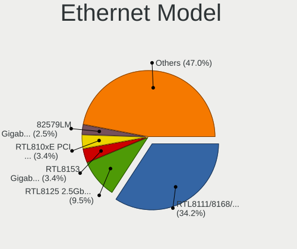

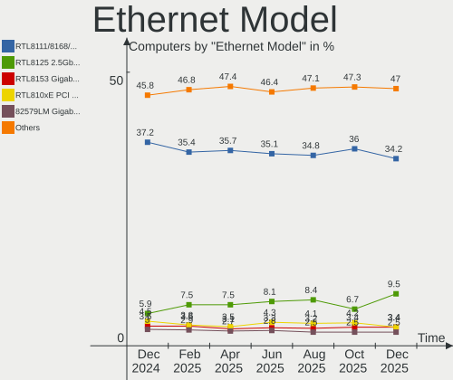

| Model                                                                           | Computers | Percent |
|---------------------------------------------------------------------------------|-----------|---------|
| Realtek RTL8111/8168/8211/8411 PCI Express Gigabit Ethernet Controller          | 2371      | 34.19%  |
| Realtek RTL8125 2.5GbE Controller                                               | 659       | 9.5%    |
| Realtek RTL8153 Gigabit Ethernet Adapter                                        | 239       | 3.45%   |
| Realtek RTL810xE PCI Express Fast Ethernet controller                           | 236       | 3.4%    |
| Intel 82579LM Gigabit Network Connection (Lewisville)                           | 172       | 2.48%   |
| Intel I211 Gigabit Network Connection                                           | 134       | 1.93%   |
| Intel Ethernet Controller I225-V                                                | 133       | 1.92%   |
| Intel Ethernet Controller I226-V                                                | 124       | 1.79%   |
| Intel Ethernet Connection (2) I219-V                                            | 112       | 1.61%   |
| Realtek RTL8126 5GbE Controller                                                 | 93        | 1.34%   |
| ASIX AX88179 Gigabit Ethernet                                                   | 86        | 1.24%   |
| Intel Ethernet Connection (4) I219-LM                                           | 83        | 1.2%    |
| Intel Ethernet Connection I217-LM                                               | 75        | 1.08%   |
| Intel Ethernet Connection (7) I219-V                                            | 53        | 0.76%   |
| Broadcom NetXtreme BCM57766 Gigabit Ethernet PCIe                               | 51        | 0.74%   |
| Intel Alder Lake-P PCH CNVi WiFi                                                | 50        | 0.72%   |
| Intel Ethernet Connection (7) I219-LM                                           | 47        | 0.68%   |
| Intel Ethernet Connection (2) I219-LM                                           | 47        | 0.68%   |
| Samsung Galaxy series, misc. (tethering mode)                                   | 44        | 0.63%   |
| MediaTek MT7925 802.11be 160MHz 2x2 PCIe Wireless Network Adapter [Filogic 360] | 44        | 0.63%   |
| Broadcom NetXtreme BCM57765 Gigabit Ethernet PCIe                               | 43        | 0.62%   |
| Realtek RTL8852BE PCIe 802.11ax Wireless Network Controller                     | 41        | 0.59%   |
| Qualcomm WCN785x Wi-Fi 7(802.11be) 320MHz 2x2 [FastConnect 7800]                | 41        | 0.59%   |
| Intel Ethernet Connection I219-LM                                               | 41        | 0.59%   |
| Intel Ethernet Connection I217-V                                                | 41        | 0.59%   |
| Broadcom NetXtreme BCM5719 Gigabit Ethernet PCIe                                | 40        | 0.58%   |
| Qualcomm Atheros AR8151 v2.0 Gigabit Ethernet                                   | 36        | 0.52%   |
| Realtek USB 10/100/1G/2.5 LAN                                                   | 32        | 0.46%   |
| MediaTek MT7922 802.11ax PCI Express Wireless Network Adapter                   | 32        | 0.46%   |
| Intel Ethernet Connection (13) I219-V                                           | 31        | 0.45%   |
| Realtek Killer E3000 2.5GbE Controller                                          | 30        | 0.43%   |
| Intel I210 Gigabit Network Connection                                           | 30        | 0.43%   |
| Intel I350 Gigabit Network Connection                                           | 29        | 0.42%   |
| Intel 82574L Gigabit Network Connection                                         | 29        | 0.42%   |
| Realtek Killer E2600 GbE Controller                                             | 28        | 0.4%    |
| Qualcomm Atheros Killer E220x Gigabit Ethernet Controller                       | 28        | 0.4%    |
| Intel Ethernet Connection (6) I219-LM                                           | 28        | 0.4%    |
| Intel Ethernet Connection (5) I219-LM                                           | 28        | 0.4%    |
| Intel Ethernet Connection (4) I219-V                                            | 28        | 0.4%    |
| Realtek RTL8152 Fast Ethernet Adapter                                           | 27        | 0.39%   |

Net Controller Kind
-------------------

Ethernet, WiFi or modem

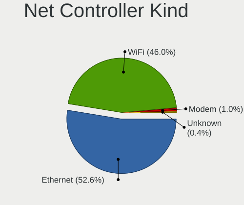

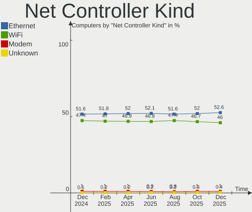

| Kind     | Computers | Percent |
|----------|-----------|---------|
| Ethernet | 6020      | 52.59%  |
| WiFi     | 5261      | 45.96%  |
| Modem    | 118       | 1.03%   |
| Unknown  | 48        | 0.42%   |

Used Controller
---------------

Currently used network controller

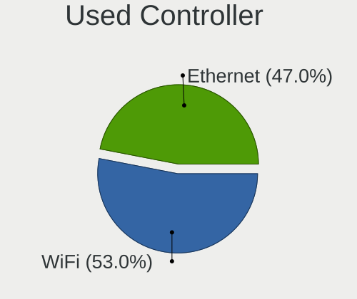

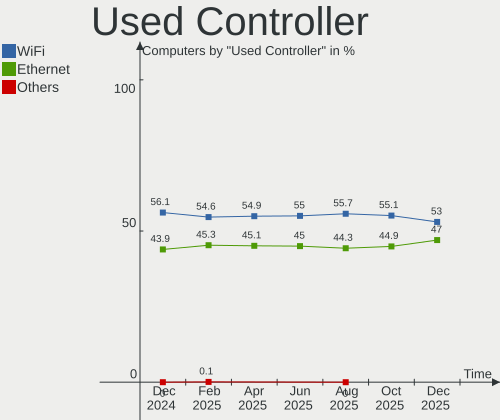

| Kind     | Computers | Percent |
|----------|-----------|---------|
| WiFi     | 3799      | 53.04%  |
| Ethernet | 3363      | 46.96%  |

NICs
----

Total network controllers on board

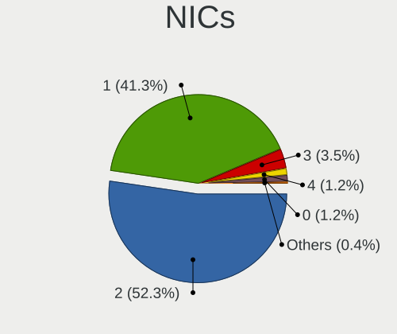

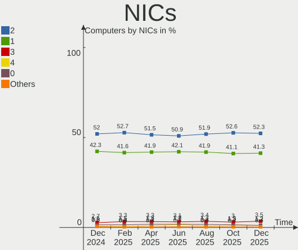

| Total | Computers | Percent |
|-------|-----------|---------|
| 2     | 3732      | 52.32%  |
| 1     | 2948      | 41.33%  |
| 3     | 253       | 3.55%   |
| 4     | 88        | 1.23%   |
| 0     | 86        | 1.21%   |
| 6     | 11        | 0.15%   |
| 5     | 8         | 0.11%   |
| 8     | 3         | 0.04%   |
| 10    | 2         | 0.03%   |
| 9     | 1         | 0.01%   |
| 7     | 1         | 0.01%   |

IPv6
----

IPv6 vs IPv4

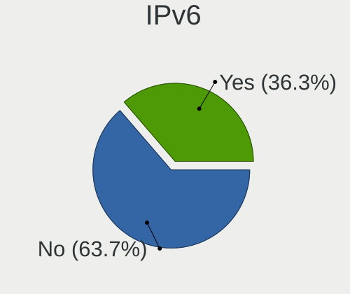

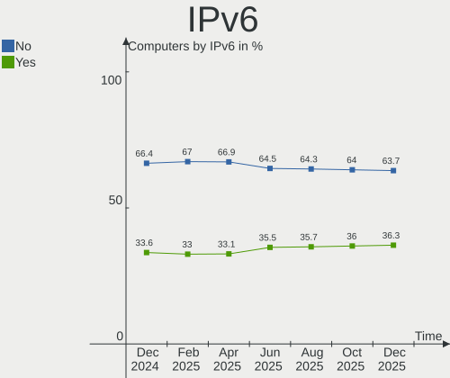

| Used | Computers | Percent |
|------|-----------|---------|
| No   | 4543      | 63.69%  |
| Yes  | 2590      | 36.31%  |

Bluetooth
---------

Bluetooth Vendor
----------------

Controller vendors

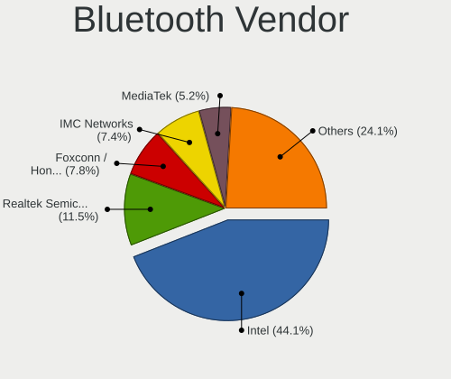

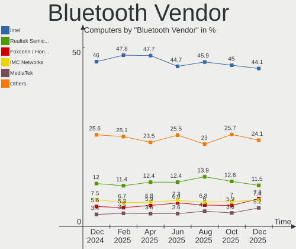

| Vendor                          | Computers | Percent |
|---------------------------------|-----------|---------|
| Intel                           | 2245      | 44.05%  |
| Realtek Semiconductor           | 587       | 11.52%  |
| Foxconn / Hon Hai               | 395       | 7.75%   |
| IMC Networks                    | 379       | 7.44%   |
| MediaTek                        | 263       | 5.16%   |
| Qualcomm Atheros Communications | 209       | 4.1%    |
| Apple                           | 195       | 3.83%   |
| Cambridge Silicon Radio         | 192       | 3.77%   |
| Broadcom                        | 126       | 2.47%   |
| Lite-On Technology              | 86        | 1.69%   |
| TP-Link                         | 81        | 1.59%   |
| ASUSTek Computer                | 75        | 1.47%   |
| Marvell Semiconductor           | 27        | 0.53%   |
| Unknown                         | 27        | 0.53%   |
| Ralink                          | 25        | 0.49%   |
| Realtek                         | 23        | 0.45%   |
| Toshiba                         | 22        | 0.43%   |
| Hewlett-Packard                 | 22        | 0.43%   |
| Dell                            | 21        | 0.41%   |
| Actions                         | 15        | 0.29%   |
| USI                             | 13        | 0.26%   |
| Foxconn International           | 12        | 0.24%   |
| Integrated System Solution      | 7         | 0.14%   |
| Edimax Technology               | 6         | 0.12%   |
| Quectel Wireless Solutions      | 5         | 0.1%    |
| Mercucys                        | 5         | 0.1%    |
| Askey Computer                  | 5         | 0.1%    |
| Dynex                           | 3         | 0.06%   |
| Chicony Electronics             | 3         | 0.06%   |
| Alps Electric                   | 3         | 0.06%   |
| AICSemi                         | 3         | 0.06%   |
| Smart Modular Technologies      | 2         | 0.04%   |
| Belkin Components               | 2         | 0.04%   |
| TDK                             | 1         | 0.02%   |
| SiW                             | 1         | 0.02%   |
| Ralink Technology               | 1         | 0.02%   |
| Qcom                            | 1         | 0.02%   |
| Primax Electronics              | 1         | 0.02%   |
| Opticis                         | 1         | 0.02%   |
| Nintendo                        | 1         | 0.02%   |

Bluetooth Model
---------------

Controller models

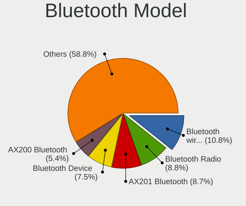

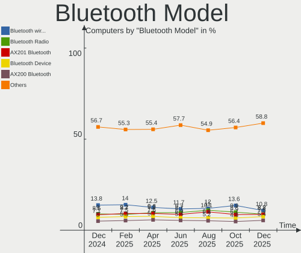

| Model                                               | Computers | Percent |
|-----------------------------------------------------|-----------|---------|
| Intel Bluetooth wireless interface                  | 549       | 10.77%  |
| Realtek Bluetooth Radio                             | 449       | 8.81%   |
| Intel AX201 Bluetooth                               | 446       | 8.75%   |
| Intel Bluetooth Device                              | 383       | 7.51%   |
| Intel AX200 Bluetooth                               | 275       | 5.39%   |
| MediaTek Wireless_Device                            | 262       | 5.14%   |
| Intel Bluetooth 9460/9560 Jefferson Peak (JfP)      | 204       | 4%      |
| Foxconn / Hon Hai Wireless_Device                   | 201       | 3.94%   |
| IMC Networks Wireless_Device                        | 196       | 3.84%   |
| Intel AX210 Bluetooth                               | 193       | 3.79%   |
| Cambridge Silicon Radio Bluetooth Dongle (HCI mode) | 192       | 3.77%   |
| IMC Networks Bluetooth Radio                        | 146       | 2.86%   |
| Qualcomm Atheros  Bluetooth Device                  | 108       | 2.12%   |
| Foxconn / Hon Hai Bluetooth Device                  | 105       | 2.06%   |
| Apple Bluetooth Host Controller                     | 92        | 1.8%    |
| TP-Link TP-T@- UB500 Adapter                        | 81        | 1.59%   |
| Realtek  Bluetooth 4.2 Adapter                      | 66        | 1.29%   |
| Intel Wireless-AC 9260 Bluetooth Adapter            | 65        | 1.27%   |
| Apple Bluetooth USB Host Controller                 | 64        | 1.26%   |
| Intel Wireless-AC 3168 Bluetooth                    | 63        | 1.24%   |
| Foxconn / Hon Hai MediaTek Bluetooth Adapter        | 41        | 0.8%    |
| Intel Centrino Bluetooth Wireless Transceiver       | 40        | 0.78%   |
| ASUS ASUS USB-BT500                                 | 36        | 0.71%   |
| Apple Built-in Bluetooth 2.0+EDR HCI                | 33        | 0.65%   |
| Qualcomm Atheros QCA61x4 Bluetooth 4.0              | 30        | 0.59%   |
| Qualcomm Atheros AR3012 Bluetooth 4.0               | 29        | 0.57%   |
| Unknown                                             | 27        | 0.53%   |
| Ralink RT3290 Bluetooth                             | 25        | 0.49%   |
| Realtek Bluetooth Radio                             | 23        | 0.45%   |
| Qualcomm Atheros AR3011 Bluetooth                   | 22        | 0.43%   |
| Lite-On Qualcomm Atheros QCA9377 Bluetooth          | 21        | 0.41%   |
| Lite-On Bluetooth Device                            | 21        | 0.41%   |
| Broadcom BCM2045B (BDC-2.1)                         | 21        | 0.41%   |
| Marvell Bluetooth and Wireless LAN Composite        | 20        | 0.39%   |
| Realtek Bluetooth 5.4 Radio                         | 19        | 0.37%   |
| Lite-On Wireless_Device                             | 19        | 0.37%   |
| Intel Bluetooth                                     | 18        | 0.35%   |
| HP Broadcom 2070 Bluetooth Combo                    | 18        | 0.35%   |
| Broadcom BCM20702A0 Bluetooth 4.0                   | 18        | 0.35%   |
| Realtek 802.11ac WLAN Adapter                       | 17        | 0.33%   |

Sound
-----

Sound Vendor
------------

Sound card vendors

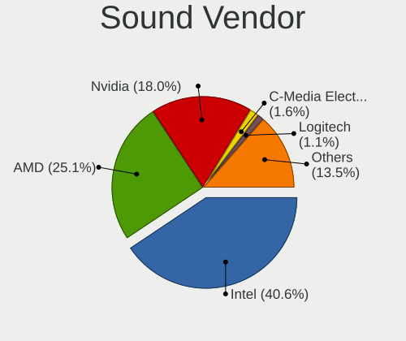

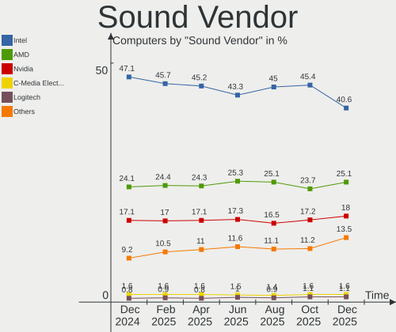

| Vendor                                       | Computers | Percent |
|----------------------------------------------|-----------|---------|
| Intel                                        | 4426      | 40.62%  |
| AMD                                          | 2736      | 25.11%  |
| Nvidia                                       | 1961      | 18%     |
| C-Media Electronics                          | 178       | 1.63%   |
| Logitech                                     | 120       | 1.1%    |
| ASUSTek Computer                             | 97        | 0.89%   |
| Micro Star International                     | 76        | 0.7%    |
| SteelSeries ApS                              | 65        | 0.6%    |
| Razer USA                                    | 65        | 0.6%    |
| Creative Labs                                | 58        | 0.53%   |
| JMTek                                        | 56        | 0.51%   |
| Hewlett-Packard                              | 50        | 0.46%   |
| Texas Instruments                            | 48        | 0.44%   |
| Sony                                         | 48        | 0.44%   |
| Realtek Semiconductor                        | 41        | 0.38%   |
| Kingston Technology                          | 41        | 0.38%   |
| Focusrite-Novation                           | 39        | 0.36%   |
| Generalplus Technology                       | 38        | 0.35%   |
| Zoran Co. Personal Media Division (Nogatech) | 30        | 0.28%   |
| Lenovo                                       | 30        | 0.28%   |
| Creative Technology                          | 27        | 0.25%   |
| Corsair                                      | 25        | 0.23%   |
| Jieli Technology                             | 23        | 0.21%   |
| KTMICRO                                      | 20        | 0.18%   |
| Apple                                        | 20        | 0.18%   |
| GN Netcom                                    | 19        | 0.17%   |
| ASRock                                       | 19        | 0.17%   |
| Blue Microphones                             | 18        | 0.17%   |
| Thesycon Systemsoftware & Consulting         | 16        | 0.15%   |
| Audio-Technica                               | 16        | 0.15%   |
| FiiO Electronics Technology                  | 14        | 0.13%   |
| DSEA A/S                                     | 14        | 0.13%   |
| BEHRINGER International                      | 14        | 0.13%   |
| Unknown                                      | 14        | 0.13%   |
| Yamaha                                       | 13        | 0.12%   |
| RODE Microphones                             | 13        | 0.12%   |
| Plantronics                                  | 13        | 0.12%   |
| XMOS                                         | 12        | 0.11%   |
| MV-SILICON                                   | 12        | 0.11%   |
| Walmart                                      | 11        | 0.1%    |

Sound Model
-----------

Sound card models

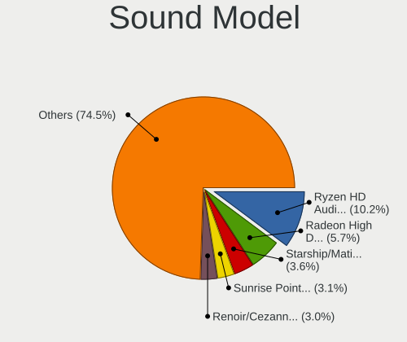

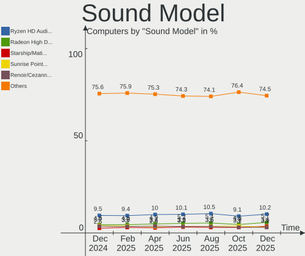

| Model                                                                      | Computers | Percent |
|----------------------------------------------------------------------------|-----------|---------|
| AMD Ryzen HD Audio Controller                                              | 1370      | 10.19%  |
| AMD Radeon High Definition Audio Controller                                | 764       | 5.68%   |
| AMD Starship/Matisse HD Audio Controller                                   | 485       | 3.61%   |
| Intel Sunrise Point-LP HD Audio                                            | 410       | 3.05%   |
| AMD Renoir/Cezanne HDMI/DP Audio Controller                                | 402       | 2.99%   |
| Intel 7 Series/C216 Chipset Family High Definition Audio Controller        | 333       | 2.48%   |
| Intel 8 Series/C220 Series Chipset High Definition Audio Controller        | 283       | 2.11%   |
| Intel 6 Series/C200 Series Chipset Family High Definition Audio Controller | 281       | 2.09%   |
| Intel Cannon Lake PCH cAVS                                                 | 223       | 1.66%   |
| AMD Navi 21/23 HDMI/DP Audio Controller                                    | 217       | 1.61%   |
| Intel 100 Series/C230 Series Chipset Family HD Audio Controller            | 202       | 1.5%    |
| Intel Tiger Lake-LP Smart Sound Technology Audio Controller                | 191       | 1.42%   |
| Intel Alder Lake PCH-P High Definition Audio Controller                    | 191       | 1.42%   |
| AMD Navi 48 HDMI/DP Audio Controller                                       | 189       | 1.41%   |
| AMD Navi 31 HDMI/DP Audio                                                  | 187       | 1.39%   |
| Intel Xeon E3-1200 v3/4th Gen Core Processor HD Audio Controller           | 166       | 1.24%   |
| Intel 200 Series PCH HD Audio                                              | 155       | 1.15%   |
| Intel Raptor Lake-P/U/H cAVS                                               | 149       | 1.11%   |
| Intel Raptor Lake High Definition Audio Controller                         | 148       | 1.1%    |
| AMD Ellesmere HDMI Audio [Radeon RX 470/480 / 570/580/590]                 | 139       | 1.03%   |
| AMD FCH Azalia Controller                                                  | 138       | 1.03%   |
| AMD Raven/Raven2/Fenghuang HDMI/DP Audio Controller                        | 135       | 1%      |
| Intel 5 Series/3400 Series Chipset High Definition Audio                   | 124       | 0.92%   |
| AMD SBx00 Azalia (Intel HDA)                                               | 122       | 0.91%   |
| Nvidia GA106 High Definition Audio Controller                              | 121       | 0.9%    |
| Intel Haswell-ULT HD Audio Controller                                      | 121       | 0.9%    |
| Intel 8 Series HD Audio Controller                                         | 121       | 0.9%    |
| Nvidia GA104 High Definition Audio Controller                              | 120       | 0.89%   |
| Intel Broadwell-U Audio Controller                                         | 113       | 0.84%   |
| Intel Alder Lake-S HD Audio Controller                                     | 112       | 0.83%   |
| Intel Wildcat Point-LP High Definition Audio Controller                    | 108       | 0.8%    |
| Nvidia AD107 High Definition Audio Controller                              | 106       | 0.79%   |
| Nvidia GP107GL High Definition Audio Controller                            | 100       | 0.74%   |
| AMD Family 17h (Models 00h-0fh) HD Audio Controller                        | 93        | 0.69%   |
| Intel Comet Lake PCH cAVS                                                  | 92        | 0.68%   |
| Intel Cannon Point-LP High Definition Audio Controller                     | 90        | 0.67%   |
| Intel Meteor Lake-P HD Audio Controller                                    | 88        | 0.65%   |
| Nvidia GP104 High Definition Audio Controller                              | 87        | 0.65%   |
| Intel 82801I (ICH9 Family) HD Audio Controller                             | 85        | 0.63%   |
| Intel Alder Lake-N PCH High Definition Audio Controller                    | 83        | 0.62%   |

Memory
------

Memory Vendor
-------------

Memory module vendors

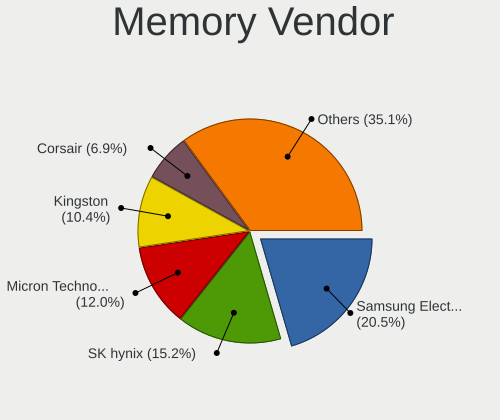

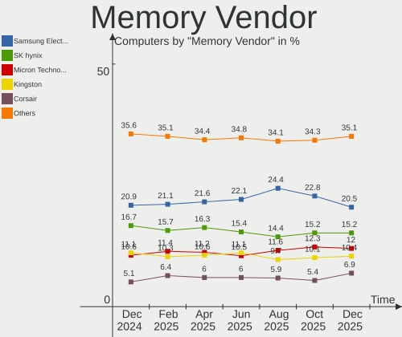

| Vendor                             | Computers | Percent |
|------------------------------------|-----------|---------|
| Samsung Electronics                | 853       | 20.51%  |
| SK hynix                           | 631       | 15.18%  |
| Micron Technology                  | 497       | 11.95%  |
| Kingston                           | 432       | 10.39%  |
| Corsair                            | 286       | 6.88%   |
| Unknown                            | 227       | 5.46%   |
| G.Skill                            | 216       | 5.19%   |
| Crucial                            | 202       | 4.86%   |
| Unknown                            | 156       | 3.75%   |
| A-DATA Technology                  | 110       | 2.65%   |
| Ramaxel Technology                 | 74        | 1.78%   |
| Team                               | 44        | 1.06%   |
| Nanya Technology                   | 30        | 0.72%   |
| Patriot                            | 29        | 0.7%    |
| Hewlett-Packard                    | 24        | 0.58%   |
| Elpida                             | 22        | 0.53%   |
| Unknown (ABCD)                     | 21        | 0.51%   |
| Smart                              | 18        | 0.43%   |
| Apacer                             | 16        | 0.38%   |
| AMD                                | 14        | 0.34%   |
| Transcend                          | 13        | 0.31%   |
| TeamGroup                          | 13        | 0.31%   |
| GOODRAM                            | 11        | 0.26%   |
| Timetec                            | 10        | 0.24%   |
| Patriot Memory (PDP Systems)       | 9         | 0.22%   |
| Foxline                            | 9         | 0.22%   |
| Silicon Power                      | 7         | 0.17%   |
| PNY                                | 6         | 0.14%   |
| Lexar                              | 6         | 0.14%   |
| ASint Technology                   | 6         | 0.14%   |
| Shenzhen Longsys                   | 5         | 0.12%   |
| Patriot Memory                     | 5         | 0.12%   |
| Hikvision                          | 5         | 0.12%   |
| GeIL                               | 5         | 0.12%   |
| 4ea5                               | 5         | 0.12%   |
| Wodposit                           | 4         | 0.1%    |
| Unknown (0x0B5E)                   | 4         | 0.1%    |
| Kimtigo Semiconductor (HK) Limited | 4         | 0.1%    |
| Avant                              | 4         | 0.1%    |
| Wilk Elektronik                    | 3         | 0.07%   |

Memory Model
------------

Memory module models

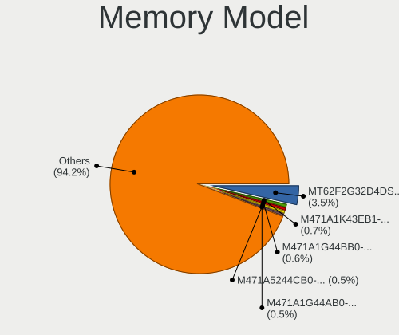

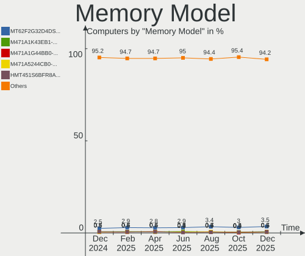

| Model                                                            | Computers | Percent |
|------------------------------------------------------------------|-----------|---------|
| Unknown                                                          | 156       | 3.54%   |
| Samsung RAM M471A1K43EB1-CWE 8GB SODIMM DDR4 3200MT/s            | 29        | 0.66%   |
| Samsung RAM M471A1G44BB0-CWE 8GB SODIMM DDR4 3200MT/s            | 25        | 0.57%   |
| Samsung RAM M471A5244CB0-CWE 4GB SODIMM DDR4 3200MT/s            | 24        | 0.54%   |
| SK hynix RAM HMT451S6BFR8A-PB 4GB SODIMM DDR3 1600MT/s           | 22        | 0.5%    |
| SK hynix RAM HMA81GS6AFR8N-UH 8GB SODIMM DDR4 2667MT/s           | 22        | 0.5%    |
| Samsung RAM M471A1G44AB0-CWE 8GiB SODIMM DDR4 3200MT/s           | 22        | 0.5%    |
| Samsung RAM M471B5173DB0-YK0 4GB SODIMM DDR3 1600MT/s            | 21        | 0.48%   |
| Micron RAM 4ATF1G64HZ-3G2F1 8GB SODIMM DDR4 3200MT/s             | 21        | 0.48%   |
| Corsair RAM CMK16GX4M2B3200C16 8GB DIMM DDR4 3600MT/s            | 20        | 0.45%   |
| Samsung RAM M471B5273DH0-CH9 4GB SODIMM DDR3 1600MT/s            | 19        | 0.43%   |
| Samsung RAM M425R2GA3EB0-CWMOL 16GB SODIMM DDR5 5600MT/s         | 19        | 0.43%   |
| Corsair RAM CMK32GX4M2E3200C16 16GB DIMM DDR4 3600MT/s           | 19        | 0.43%   |
| Samsung RAM M471A1K43DB1-CWE 8GB SODIMM DDR4 3200MT/s            | 16        | 0.36%   |
| Kingston RAM KF3200C16D4/8GX 8GiB DIMM DDR4 3600MT/s             | 16        | 0.36%   |
| SK hynix RAM HMAA1GS6CJR6N-XN 8GB SODIMM DDR4 3200MT/s           | 15        | 0.34%   |
| Samsung RAM M471A5244CB0-CTD 4GB SODIMM DDR4 3266MT/s            | 15        | 0.34%   |
| Micron RAM 8ATF1G64HZ-3G2R1 8GB SODIMM DDR4 3200MT/s             | 15        | 0.34%   |
| Unknown (ABCD) RAM 123456789012345678 2GB SODIMM LPDDR4 2400MT/s | 14        | 0.32%   |
| SK hynix RAM HMAG68EXNSA051N 8GB SODIMM DDR4 3200MT/s            | 14        | 0.32%   |
| Samsung RAM M471B5173QH0-YK0 4GB SODIMM DDR3 1600MT/s            | 14        | 0.32%   |
| Samsung RAM M471A1G44CB0-CWE 8GB SODIMM DDR4 3200MT/s            | 14        | 0.32%   |
| Samsung RAM M471B5273CH0-CH9 4GB SODIMM DDR3 1334MT/s            | 13        | 0.3%    |
| Samsung RAM M471A1K43CB1-CRC 8GB SODIMM DDR4 8400MT/s            | 13        | 0.3%    |
| Samsung RAM M471A1K43BB1-CRC 8GB SODIMM DDR4 2667MT/s            | 13        | 0.3%    |
| G.Skill RAM F5-6000J3636F16G 16GB DIMM DDR5 6400MT/s             | 12        | 0.27%   |
| SK hynix RAM HMCG78AGBSA095N 16GB SODIMM DDR5 5600MT/s           | 11        | 0.25%   |
| Samsung RAM M471B5273DH0-CK0 4GB SODIMM DDR3 2400MT/s            | 11        | 0.25%   |
| Samsung RAM M471A1K43CB1-CTD 8GB SODIMM DDR4 3200MT/s            | 11        | 0.25%   |
| Samsung RAM K3KL8L80CM-MGCT 2GB Row Of Chips LPDDR5 7500MT/s     | 11        | 0.25%   |
| Micron RAM MT62F2G32D4DS-026 WT 8GiB SODIMM LPDDR5 7500MT/s      | 11        | 0.25%   |
| Micron RAM Module 4GB Row Of Chips LPDDR5 8533MT/s               | 11        | 0.25%   |
| G.Skill RAM F5-6000J3040G32G 32GB DIMM DDR5 6200MT/s             | 11        | 0.25%   |
| Unknown RAM Module 4GB DIMM 1333MT/s                             | 10        | 0.23%   |
| SK hynix RAM HMT41GS6BFR8A-PB 8GB SODIMM DDR3 2667MT/s           | 10        | 0.23%   |
| SK hynix RAM HMA851S6AFR6N-UH 4GB SODIMM DDR4 2667MT/s           | 10        | 0.23%   |
| SK hynix RAM HMA81GS6DJR8N-XN 8GB SODIMM DDR4 3200MT/s           | 10        | 0.23%   |
| Samsung RAM M471A5244CB0-CWE 4GB Row Of Chips DDR4 3200MT/s      | 10        | 0.23%   |
| Micron RAM MTC4C10163S1SC56BD1 8GB SODIMM DDR5 5600MT/s          | 10        | 0.23%   |
| Micron RAM 4ATF1G64HZ-3G2E1 8GB SODIMM DDR4 3200MT/s             | 10        | 0.23%   |

Memory Kind
-----------

Memory module kinds

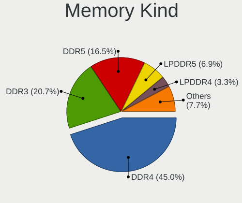

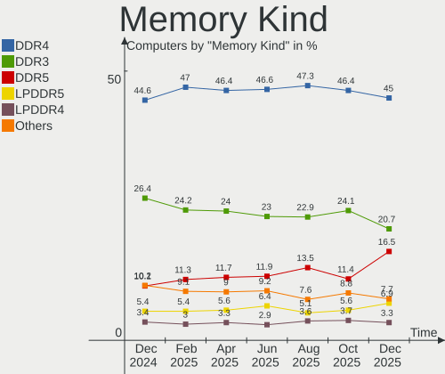

| Kind    | Computers | Percent |
|---------|-----------|---------|
| DDR4    | 1646      | 45%     |
| DDR3    | 756       | 20.67%  |
| DDR5    | 603       | 16.48%  |
| LPDDR5  | 251       | 6.86%   |
| LPDDR4  | 119       | 3.25%   |
| SDRAM   | 65        | 1.78%   |
| LPDDR3  | 64        | 1.75%   |
| DDR2    | 61        | 1.67%   |
| Unknown | 60        | 1.64%   |
| DRAM    | 20        | 0.55%   |
| DDR     | 8         | 0.22%   |
| RAM     | 5         | 0.14%   |

Memory Form Factor
------------------

Physical design of the memory module

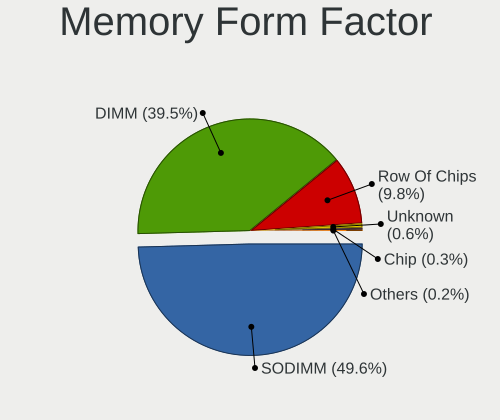

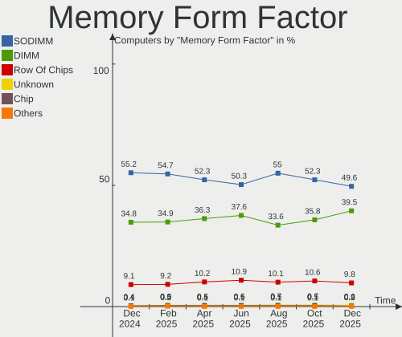

| Name         | Computers | Percent |
|--------------|-----------|---------|
| SODIMM       | 1807      | 49.56%  |
| DIMM         | 1441      | 39.52%  |
| Row Of Chips | 358       | 9.82%   |
| Unknown      | 23        | 0.63%   |
| Chip         | 11        | 0.3%    |
| RIMM         | 6         | 0.16%   |

Memory Size
-----------

Memory module size

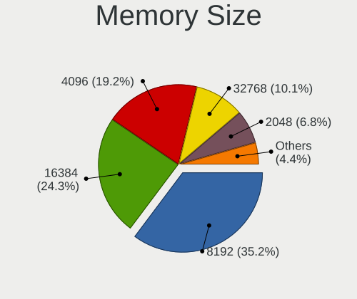

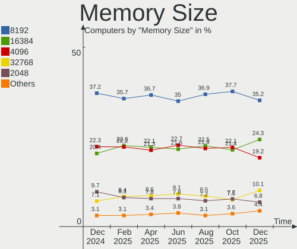

| Size  | Computers | Percent |
|-------|-----------|---------|
| 8192  | 1384      | 35.23%  |
| 16384 | 955       | 24.31%  |
| 4096  | 753       | 19.17%  |
| 32768 | 396       | 10.08%  |
| 2048  | 267       | 6.8%    |
| 1024  | 55        | 1.4%    |
| 49152 | 39        | 0.99%   |
| 65536 | 36        | 0.92%   |
| 24576 | 10        | 0.25%   |
| 3072  | 10        | 0.25%   |
| 12288 | 8         | 0.2%    |
| 6144  | 6         | 0.15%   |
| 512   | 6         | 0.15%   |
| 14336 | 1         | 0.03%   |
| 10240 | 1         | 0.03%   |
| 8124  | 1         | 0.03%   |
| 16    | 1         | 0.03%   |

Memory Speed
------------

Memory module speed

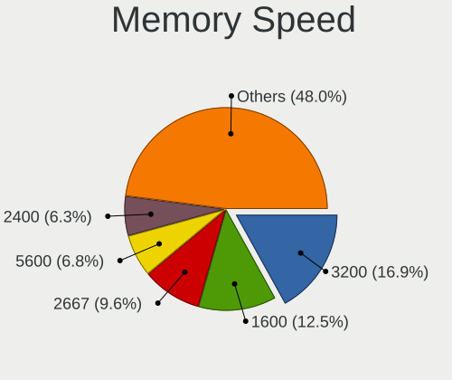

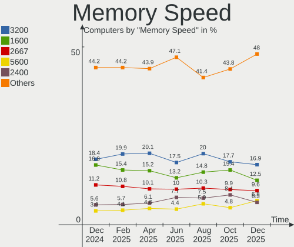

| Speed   | Computers | Percent |
|---------|-----------|---------|
| 3200    | 666       | 16.94%  |
| 1600    | 490       | 12.47%  |
| 2667    | 376       | 9.56%   |
| 5600    | 266       | 6.77%   |
| 2400    | 248       | 6.31%   |
| 3600    | 172       | 4.38%   |
| 1333    | 165       | 4.2%    |
| 2133    | 154       | 3.92%   |
| 6400    | 139       | 3.54%   |
| 6000    | 125       | 3.18%   |
| 4800    | 110       | 2.8%    |
| 7500    | 74        | 1.88%   |
| 1334    | 58        | 1.48%   |
| 3733    | 54        | 1.37%   |
| 4267    | 53        | 1.35%   |
| 8533    | 49        | 1.25%   |
| 1867    | 48        | 1.22%   |
| 3800    | 44        | 1.12%   |
| 800     | 44        | 1.12%   |
| Unknown | 42        | 1.07%   |
| 1067    | 35        | 0.89%   |
| 667     | 33        | 0.84%   |
| 2666    | 32        | 0.81%   |
| 2933    | 28        | 0.71%   |
| 1866    | 24        | 0.61%   |
| 3266    | 23        | 0.59%   |
| 6200    | 21        | 0.53%   |
| 1800    | 20        | 0.51%   |
| 8400    | 19        | 0.48%   |
| 5200    | 18        | 0.46%   |
| 3400    | 17        | 0.43%   |
| 3000    | 17        | 0.43%   |
| 4199    | 15        | 0.38%   |
| 4000    | 15        | 0.38%   |
| 3866    | 15        | 0.38%   |
| 1066    | 15        | 0.38%   |
| 2600    | 14        | 0.36%   |
| 8000    | 12        | 0.31%   |
| 7467    | 12        | 0.31%   |
| 4266    | 12        | 0.31%   |

Printers & scanners
-------------------

Printer Vendor
--------------

Printer device vendors

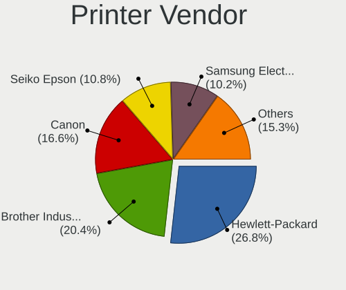

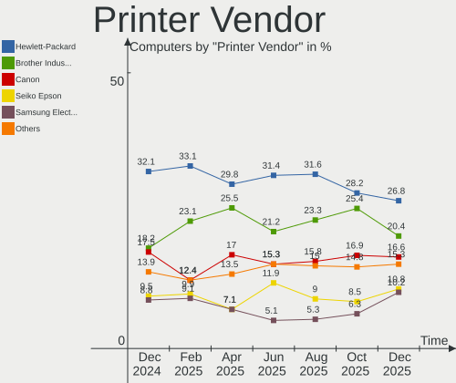

| Vendor                   | Computers | Percent |
|--------------------------|-----------|---------|
| Hewlett-Packard          | 42        | 26.75%  |
| Brother Industries       | 32        | 20.38%  |
| Canon                    | 26        | 16.56%  |
| Seiko Epson              | 17        | 10.83%  |
| Samsung Electronics      | 16        | 10.19%  |
| Pantum                   | 4         | 2.55%   |
| Kyocera                  | 4         | 2.55%   |
| Lexmark International    | 3         | 1.91%   |
| Xerox                    | 2         | 1.27%   |
| STMicroelectronics       | 2         | 1.27%   |
| Dymo-CoStar              | 2         | 1.27%   |
| Zhuhai Poskey Technology | 1         | 0.64%   |
| Zebra                    | 1         | 0.64%   |
| Ricoh                    | 1         | 0.64%   |
| Prolific Technology      | 1         | 0.64%   |
| PM                       | 1         | 0.64%   |
| Katusha"                 | 1         | 0.64%   |
| Fuji Xerox               | 1         | 0.64%   |

Printer Model
-------------

Printer device models

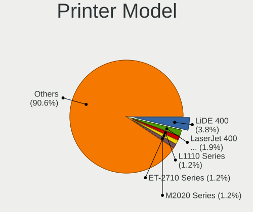

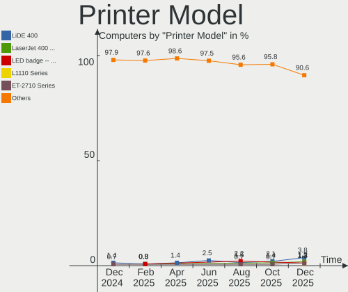

| Model                                                      | Computers | Percent |
|------------------------------------------------------------|-----------|---------|
| Canon LiDE 400                                             | 6         | 3.75%   |
| HP LaserJet 400 M401dne                                    | 3         | 1.88%   |
| STMicroelectronics LED badge -- mini LED display -- 11x44  | 2         | 1.25%   |
| Seiko Epson L1110 Series                                   | 2         | 1.25%   |
| Seiko Epson ET-2710 Series                                 | 2         | 1.25%   |
| Samsung M2020 Series                                       | 2         | 1.25%   |
| HP Smart Tank 5100 series                                  | 2         | 1.25%   |
| HP OfficeJet 3830 series                                   | 2         | 1.25%   |
| HP LaserJet P1006                                          | 2         | 1.25%   |
| HP LaserJet 1200                                           | 2         | 1.25%   |
| HP DeskJet 2700 series                                     | 2         | 1.25%   |
| Dymo-CoStar LabelWriter 450                                | 2         | 1.25%   |
| Canon PIXMA MG3600 Series                                  | 2         | 1.25%   |
| Canon PIXMA iX6850 Printer                                 | 2         | 1.25%   |
| Brother Printer                                            | 2         | 1.25%   |
| Brother MFC-L3770CDW                                       | 2         | 1.25%   |
| Brother HL-L2340D series                                   | 2         | 1.25%   |
| Zhuhai Poskey Z1                                           | 1         | 0.63%   |
| Zebra ZTC GX430t                                           | 1         | 0.63%   |
| Xerox Phaser 3140 and 3155                                 | 1         | 0.63%   |
| Xerox B230 Printer                                         | 1         | 0.63%   |
| Seiko Epson XP-4100 Series                                 | 1         | 0.63%   |
| Seiko Epson XP-3200 Series                                 | 1         | 0.63%   |
| Seiko Epson XP-2100 Series                                 | 1         | 0.63%   |
| Seiko Epson Workforce WF-7820/7840 Series                  | 1         | 0.63%   |
| Seiko Epson WF-2930 Series                                 | 1         | 0.63%   |
| Seiko Epson Printer                                        | 1         | 0.63%   |
| Seiko Epson L405 Series                                    | 1         | 0.63%   |
| Seiko Epson L1210 Series                                   | 1         | 0.63%   |
| Seiko Epson ET-4850 Series                                 | 1         | 0.63%   |
| Seiko Epson ET-4750 [WorkForce ET-4750 EcoTank All-in-One] | 1         | 0.63%   |
| Seiko Epson ET-2820 Series                                 | 1         | 0.63%   |
| Seiko Epson ET-2810 Series                                 | 1         | 0.63%   |
| Seiko Epson ET-2800 Series                                 | 1         | 0.63%   |
| Seiko Epson AL-MX200DNF                                    | 1         | 0.63%   |
| Samsung SCX-4600 Series                                    | 1         | 0.63%   |
| Samsung SCX-3200 Series                                    | 1         | 0.63%   |
| Samsung ML-3470 Series                                     | 1         | 0.63%   |
| Samsung ML-1865                                            | 1         | 0.63%   |
| Samsung ML-1710 Printer                                    | 1         | 0.63%   |

Scanner Vendor
--------------

Scanner device vendors

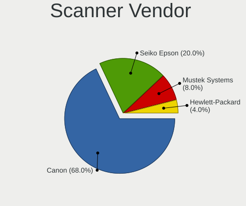

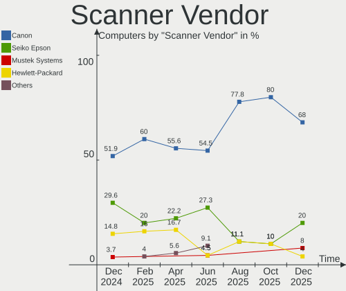

| Vendor          | Computers | Percent |
|-----------------|-----------|---------|
| Canon           | 17        | 68%     |
| Seiko Epson     | 5         | 20%     |
| Mustek Systems  | 2         | 8%      |
| Hewlett-Packard | 1         | 4%      |

Scanner Model
-------------

Scanner device models

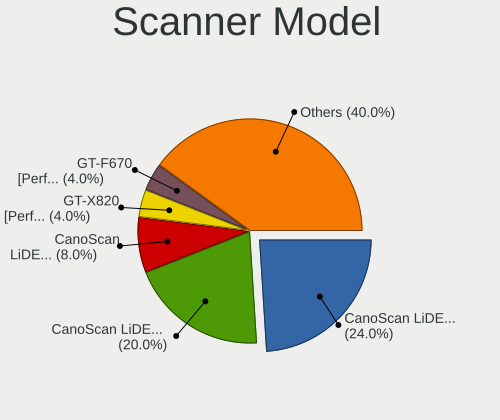

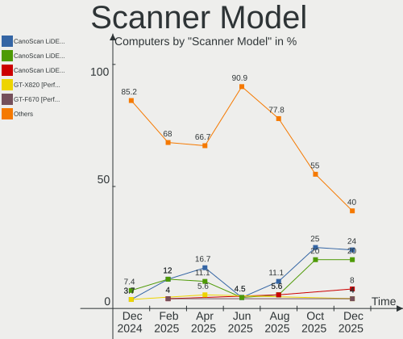

| Model                                                    | Computers | Percent |
|----------------------------------------------------------|-----------|---------|
| Canon CanoScan LiDE 110                                  | 6         | 24%     |
| Canon CanoScan LiDE 220                                  | 5         | 20%     |
| Canon CanoScan LiDE 700F                                 | 2         | 8%      |
| Seiko Epson GT-X820 [Perfection V600 Photo]              | 1         | 4%      |
| Seiko Epson GT-F670 [Perfection V200 Photo]              | 1         | 4%      |
| Seiko Epson GT-F650 [GT-S600/Perfection V10/V100]        | 1         | 4%      |
| Seiko Epson GT-F500/GT-F550 [Perfection 2480/2580 PHOTO] | 1         | 4%      |
| Seiko Epson GT-6600U [Perfection 610]                    | 1         | 4%      |
| Mustek Systems ScanExpress 600 CU                        | 1         | 4%      |
| Mustek Systems BearPaw 2448 CU Pro                       | 1         | 4%      |
| HP ScanJet 2200c                                         | 1         | 4%      |
| Canon CanoScan LiDE 90                                   | 1         | 4%      |
| Canon CanoScan LiDE 60                                   | 1         | 4%      |
| Canon CanoScan LiDE 210                                  | 1         | 4%      |
| Canon CanoScan LiDE 120                                  | 1         | 4%      |

Camera
------

Camera Vendor
-------------

Camera device vendors

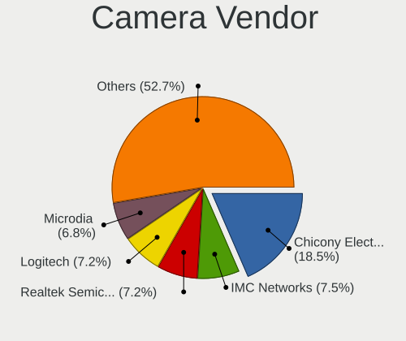

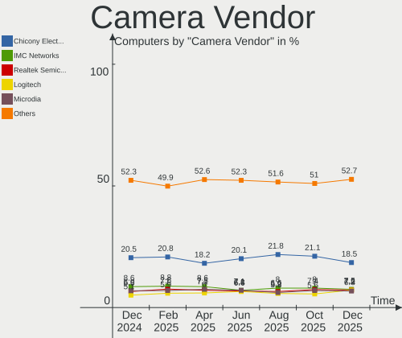

| Vendor                                 | Computers | Percent |
|----------------------------------------|-----------|---------|
| Chicony Electronics                    | 727       | 18.48%  |
| IMC Networks                           | 295       | 7.5%    |
| Realtek Semiconductor                  | 285       | 7.25%   |
| Logitech                               | 285       | 7.25%   |
| Microdia                               | 268       | 6.81%   |
| Bison Electronics                      | 261       | 6.64%   |
| Sunplus Innovation Technology          | 203       | 5.16%   |
| Quanta                                 | 202       | 5.14%   |
| Luxvisions Innotech Limited            | 177       | 4.5%    |
| Apple                                  | 157       | 3.99%   |
| Syntek                                 | 118       | 3%      |
| Cheng Uei Precision Industry (Foxlink) | 105       | 2.67%   |
| Shinetech                              | 69        | 1.75%   |
| Suyin                                  | 63        | 1.6%    |
| Lite-On Technology                     | 57        | 1.45%   |
| Sonix Technology                       | 53        | 1.35%   |
| Microsoft                              | 30        | 0.76%   |
| Silicon Motion                         | 29        | 0.74%   |
| Alcor Micro                            | 28        | 0.71%   |
| Samsung Electronics                    | 27        | 0.69%   |
| kingcome                               | 24        | 0.61%   |
| SunplusIT                              | 21        | 0.53%   |
| Razer USA                              | 21        | 0.53%   |
| Ricoh                                  | 20        | 0.51%   |
| Generalplus Technology                 | 18        | 0.46%   |
| Lenovo                                 | 17        | 0.43%   |
| Framework                              | 17        | 0.43%   |
| MacroSilicon                           | 16        | 0.41%   |
| Acer                                   | 14        | 0.36%   |
| Z-Star Microelectronics                | 13        | 0.33%   |
| Unknown                                | 13        | 0.33%   |
| Elgato Systems                         | 11        | 0.28%   |
| Creative Technology                    | 11        | 0.28%   |
| Shine-optics                           | 10        | 0.25%   |
| eMeet                                  | 10        | 0.25%   |
| Valve Software                         | 9         | 0.23%   |
| Primax Electronics                     | 9         | 0.23%   |
| ALi                                    | 9         | 0.23%   |
| webcam                                 | 8         | 0.2%    |
| KYE Systems (Mouse Systems)            | 8         | 0.2%    |

Camera Model
------------

Camera device models

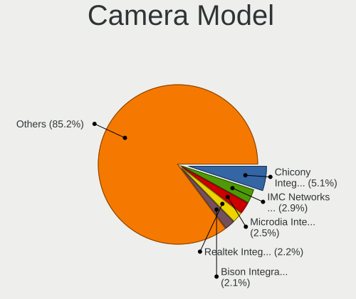

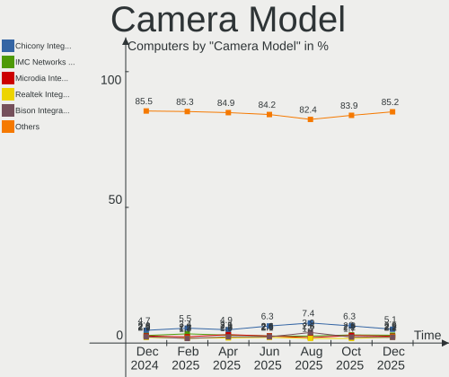

| Model                                               | Computers | Percent |
|-----------------------------------------------------|-----------|---------|
| Chicony Integrated Camera                           | 201       | 5.08%   |
| IMC Networks USB2.0 HD UVC WebCam                   | 115       | 2.9%    |
| Microdia Integrated_Webcam_HD                       | 98        | 2.47%   |
| Realtek Integrated_Webcam_HD                        | 88        | 2.22%   |
| Bison Integrated Camera                             | 84        | 2.12%   |
| IMC Networks Integrated Camera                      | 83        | 2.1%    |
| Syntek Integrated Camera                            | 80        | 2.02%   |
| Luxvisions Innotech Limited Integrated Camera       | 73        | 1.84%   |
| Chicony HD WebCam                                   | 69        | 1.74%   |
| Apple FaceTime HD Camera (Built-in)                 | 54        | 1.36%   |
| Logitech Webcam C270                                | 52        | 1.31%   |
| Sunplus Integrated_Webcam_HD                        | 48        | 1.21%   |
| Logitech HD Pro Webcam C920                         | 42        | 1.06%   |
| Apple Built-in iSight                               | 36        | 0.91%   |
| Apple FaceTime HD Camera                            | 35        | 0.88%   |
| Logitech C922 Pro Stream Webcam                     | 32        | 0.81%   |
| Microdia USB 2.0 Camera                             | 30        | 0.76%   |
| Realtek Integrated_Webcam_FHD                       | 29        | 0.73%   |
| Bison SunplusIT Integrated Camera                   | 29        | 0.73%   |
| Chicony HP HD Camera                                | 28        | 0.71%   |
| Samsung Galaxy series, misc. (MTP mode)             | 26        | 0.66%   |
| ShineTech USB2.0 HD UVC WebCam                      | 25        | 0.63%   |
| Realtek USB Camera                                  | 25        | 0.63%   |
| Logitech C920 PRO HD Webcam                         | 25        | 0.63%   |
| Quanta HD User Facing                               | 24        | 0.61%   |
| IMC Networks USB2.0 VGA UVC WebCam                  | 24        | 0.61%   |
| Chicony Chicony USB2.0 Camera                       | 24        | 0.61%   |
| Bison Lenovo EasyCamera                             | 24        | 0.61%   |
| Shinetech USB2.0 FHD UVC WebCam                     | 23        | 0.58%   |
| Quanta HP HD Camera                                 | 23        | 0.58%   |
| Microdia Webcam Vitade AF                           | 23        | 0.58%   |
| Logitech BRIO Ultra HD Webcam                       | 23        | 0.58%   |
| Lite-On Integrated Camera                           | 23        | 0.58%   |
| kingcome FHD WebCam                                 | 23        | 0.58%   |
| Apple iPhone 5/5C/5S/6/SE/7/8/X                     | 23        | 0.58%   |
| Sunplus Integrated Camera                           | 22        | 0.56%   |
| Quanta HP TrueVision HD Camera                      | 22        | 0.56%   |
| Luxvisions Innotech Limited HP TrueVision HD Camera | 22        | 0.56%   |
| Chicony ACER HD User Facing                         | 22        | 0.56%   |
| Chicony USB2.0 HD UVC WebCam                        | 21        | 0.53%   |

Security
--------

Fingerprint Vendor
------------------

Fingerprint sensor vendors

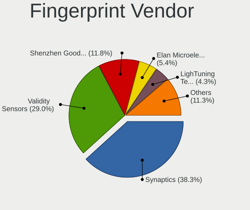

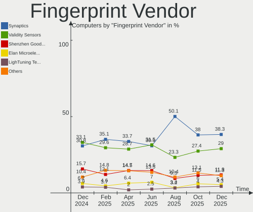

| Vendor                             | Computers | Percent |
|------------------------------------|-----------|---------|
| Synaptics                          | 207       | 38.26%  |
| Validity Sensors                   | 157       | 29.02%  |
| Shenzhen Goodix Technology         | 64        | 11.83%  |
| Elan Microelectronics              | 29        | 5.36%   |
| LighTuning Technology              | 23        | 4.25%   |
| Upek                               | 22        | 4.07%   |
| AuthenTec                          | 18        | 3.33%   |
| HOLTEK                             | 7         | 1.29%   |
| STMicroelectronics                 | 4         | 0.74%   |
| Focal-systems.Corp                 | 3         | 0.55%   |
| DigitalPersona                     | 3         | 0.55%   |
| Samsung Electronics                | 2         | 0.37%   |
| Realtek USB2.0 Finger Print Bridge | 1         | 0.18%   |
| GDMicroelectronics                 | 1         | 0.18%   |

Fingerprint Model
-----------------

Fingerprint sensor models

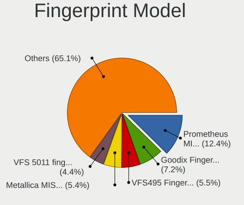

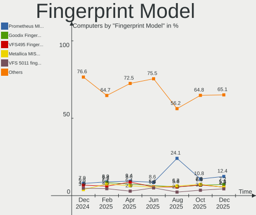

| Model                                                                      | Computers | Percent |
|----------------------------------------------------------------------------|-----------|---------|
| Synaptics Prometheus MIS Touch Fingerprint Reader                          | 67        | 12.38%  |
| Shenzhen Goodix  FingerPrint Device                                        | 39        | 7.21%   |
| Validity Sensors VFS495 Fingerprint Reader                                 | 30        | 5.55%   |
| Synaptics Metallica MIS Touch Fingerprint Reader                           | 29        | 5.36%   |
| Validity Sensors VFS 5011 fingerprint sensor                               | 24        | 4.44%   |
| Synaptics UWP WBDI Device                                                  | 22        | 4.07%   |
| Validity Sensors Synaptics WBDI                                            | 21        | 3.88%   |
| Upek Biometric Touchchip/Touchstrip Fingerprint Sensor                     | 21        | 3.88%   |
| Synaptics FS7604 Touch Fingerprint Sensor with PurePrint                   | 20        | 3.7%    |
| Shenzhen Goodix Fingerprint Reader                                         | 20        | 3.7%    |
| Synaptics Fingerprint reader [HP G6]                                       | 18        | 3.33%   |
| Synaptics Prometheus Fingerprint Reader                                    | 16        | 2.96%   |
| Elan ELAN:Fingerprint                                                      | 16        | 2.96%   |
| Validity Sensors Swipe Fingerprint Sensor                                  | 15        | 2.77%   |
| Validity Sensors VFS5011 Fingerprint Reader                                | 13        | 2.4%    |
| Elan ELAN:ARM-M4                                                           | 13        | 2.4%    |
| LighTuning EgisTec Touch Fingerprint Sensor                                | 11        | 2.03%   |
| Validity Sensors Synaptics VFS7552 Touch Fingerprint Sensor with PurePrint | 9         | 1.66%   |
| Validity Sensors VFS491                                                    | 8         | 1.48%   |
| Validity Sensors VFS471 Fingerprint Reader                                 | 8         | 1.48%   |
| Validity Sensors Fingerprint scanner                                       | 8         | 1.48%   |
| Validity Sensors VFS7500 Touch Fingerprint Sensor                          | 7         | 1.29%   |
| Synaptics  WBDI                                                            | 7         | 1.29%   |
| Synaptics  FS7604 Touch Fingerprint Sensor with PurePrint                  | 7         | 1.29%   |
| HOLTEK FocalTech Fingerprint Device                                        | 7         | 1.29%   |
| Synaptics WBDI                                                             | 6         | 1.11%   |
| Synaptics UWP WBDI                                                         | 5         | 0.92%   |
| Synaptics Metallica MOH Touch Fingerprint Reader                           | 5         | 0.92%   |
| Shenzhen Goodix FingerPrint                                                | 5         | 0.92%   |
| LighTuning Fingerprint Sensor                                              | 5         | 0.92%   |
| AuthenTec Fingerprint Sensor                                               | 5         | 0.92%   |
| AuthenTec AES2810                                                          | 5         | 0.92%   |
| AuthenTec AES2501 Fingerprint Sensor                                       | 5         | 0.92%   |
| Validity Sensors VFS451 Fingerprint Reader                                 | 4         | 0.74%   |
| Validity Sensors Synaptics VFS7552 Touch Fingerprint Sensor                | 4         | 0.74%   |
| STMicroelectronics Fingerprint Reader                                      | 4         | 0.74%   |
| LighTuning ES603 Swipe Fingerprint Sensor                                  | 4         | 0.74%   |
| Validity Sensors VFS7552 Touch Fingerprint Sensor                          | 3         | 0.55%   |
| LighTuning Fingerprint Reader                                              | 3         | 0.55%   |
| Focal-systems.Corp FT9201Fingerprint.                                      | 3         | 0.55%   |

Chipcard Vendor
---------------

Chipcard module vendors

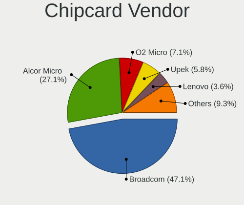

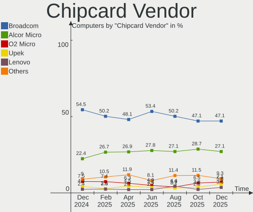

| Vendor                   | Computers | Percent |
|--------------------------|-----------|---------|
| Broadcom                 | 106       | 47.11%  |
| Alcor Micro              | 61        | 27.11%  |
| O2 Micro                 | 16        | 7.11%   |
| Upek                     | 13        | 5.78%   |
| Lenovo                   | 8         | 3.56%   |
| Reiner SCT Kartensysteme | 4         | 1.78%   |
| SCM Microsystems         | 3         | 1.33%   |
| OmniKey                  | 3         | 1.33%   |
| Aktiv                    | 3         | 1.33%   |
| Yubico.com               | 1         | 0.44%   |
| Thetis                   | 1         | 0.44%   |
| Realtek Semiconductor    | 1         | 0.44%   |
| NXP Semiconductors       | 1         | 0.44%   |
| Gemalto (was Gemplus)    | 1         | 0.44%   |
| Chicony Electronics      | 1         | 0.44%   |
| Cherry                   | 1         | 0.44%   |
| Advanced Card Systems    | 1         | 0.44%   |

Chipcard Model
--------------

Chipcard module models

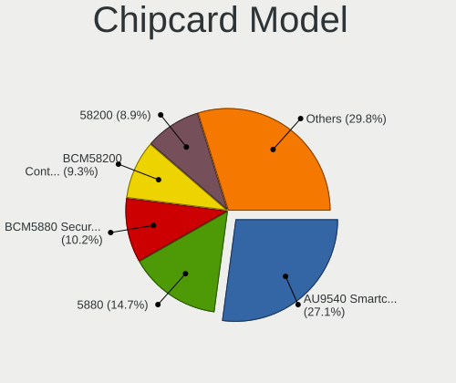

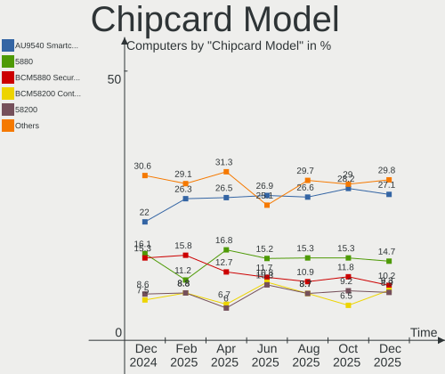

| Model                                                                        | Computers | Percent |
|------------------------------------------------------------------------------|-----------|---------|
| Alcor Micro AU9540 Smartcard Reader                                          | 61        | 27.11%  |
| Broadcom 5880                                                                | 33        | 14.67%  |
| Broadcom BCM5880 Secure Applications Processor                               | 23        | 10.22%  |
| Broadcom BCM58200 ControlVault 3 (FingerPrint sensor + Contacted SmartCard)  | 21        | 9.33%   |
| Broadcom 58200                                                               | 20        | 8.89%   |
| O2 Micro OZ776 CCID Smartcard Reader                                         | 15        | 6.67%   |
| Upek TouchChip Fingerprint Coprocessor (WBF advanced mode)                   | 13        | 5.78%   |
| Broadcom BCM5880 Secure Applications Processor with fingerprint swipe sensor | 9         | 4%      |
| Lenovo Integrated Smart Card Reader                                          | 8         | 3.56%   |
| Reiner SCT Kartensysteme cyberJack RFID basis contactless smartcard reader   | 4         | 1.78%   |
| Aktiv Rutoken lite                                                           | 3         | 1.33%   |
| Yubico.com Yubikey 4/5 CCID                                                  | 1         | 0.44%   |
| Thetis Security Key(F825)                                                    | 1         | 0.44%   |
| SCM Microsystems SCR3340 - ExpressCard54 Smart Card Reader                   | 1         | 0.44%   |
| SCM Microsystems SCR3310 CLOUD 2700 R                                        | 1         | 0.44%   |
| SCM Microsystems SCR331-LC1 / SCR3310 SmartCard Reader                       | 1         | 0.44%   |
| Realtek Semiconductor Smart Card Reader Interface                            | 1         | 0.44%   |
| OmniKey CardMan 3121 (HID Technologies)                                      | 1         | 0.44%   |
| OmniKey CardMan 3021 / 3121                                                  | 1         | 0.44%   |
| OmniKey CardMan 1021                                                         | 1         | 0.44%   |
| O2 Micro Oz776 SmartCard Reader                                              | 1         | 0.44%   |
| NXP Semiconductors PR533                                                     | 1         | 0.44%   |
| Gemalto (was Gemplus) GemPC Twin SmartCard Reader                            | 1         | 0.44%   |
| Chicony Electronics HP Skylab USB Smartcard Keyboard                         | 1         | 0.44%   |
| Cherry SmartTerminal ST-2xxx                                                 | 1         | 0.44%   |
| Advanced Card Systems ACR39U                                                 | 1         | 0.44%   |

Unsupported
-----------

Unsupported Devices
-------------------

Total unsupported devices on board

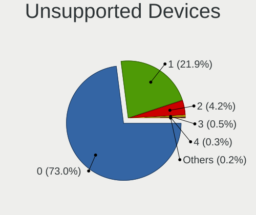

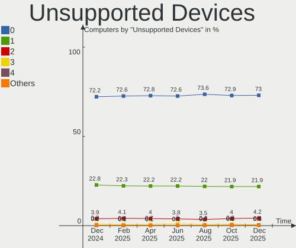

| Total | Computers | Percent |
|-------|-----------|---------|
| 0     | 5206      | 72.98%  |
| 1     | 1565      | 21.94%  |
| 2     | 298       | 4.18%   |
| 3     | 35        | 0.49%   |
| 4     | 18        | 0.25%   |
| 6     | 6         | 0.08%   |
| 5     | 4         | 0.06%   |
| 10    | 1         | 0.01%   |

Unsupported Device Types
------------------------

Types of unsupported devices

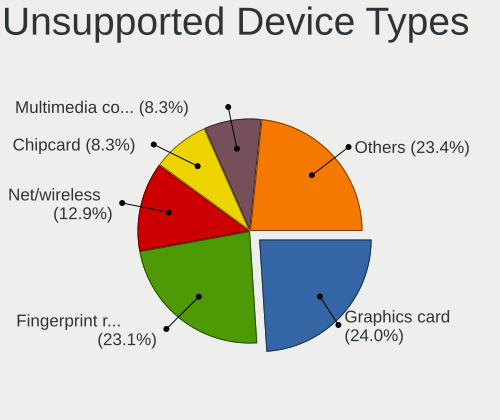

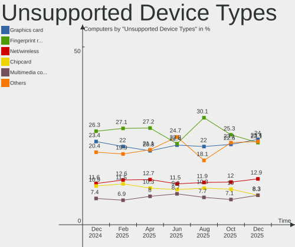

| Type                     | Computers | Percent |
|--------------------------|-----------|---------|
| Graphics card            | 553       | 23.97%  |
| Fingerprint reader       | 534       | 23.15%  |
| Net/wireless             | 298       | 12.92%  |
| Chipcard                 | 192       | 8.32%   |
| Multimedia controller    | 191       | 8.28%   |
| Communication controller | 141       | 6.11%   |
| Unassigned class         | 123       | 5.33%   |
| Bluetooth                | 64        | 2.77%   |
| Net/ethernet             | 39        | 1.69%   |
| Sound                    | 38        | 1.65%   |
| Network                  | 33        | 1.43%   |
| Camera                   | 32        | 1.39%   |
| Storage                  | 18        | 0.78%   |
| Card reader              | 18        | 0.78%   |
| Storage/raid             | 15        | 0.65%   |
| Modem                    | 4         | 0.17%   |
| Dvb card                 | 4         | 0.17%   |
| Storage/nvme             | 2         | 0.09%   |
| Storage/ide              | 2         | 0.09%   |
| Storage/ata              | 2         | 0.09%   |
| Flash memory             | 2         | 0.09%   |
| Firewire controller      | 2         | 0.09%   |

