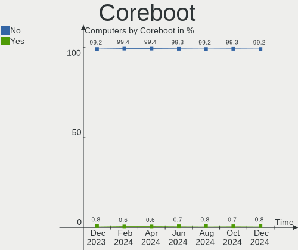
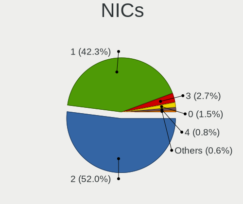
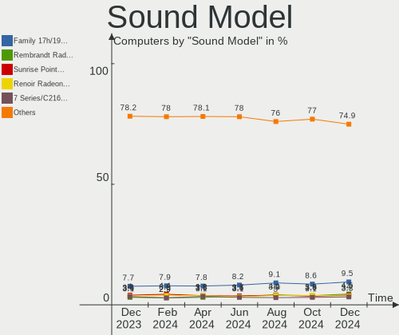

Linux - Hardware Trends
-----------------------

A project to identify most popular hardware characteristics and track their change
over time based on data collected by Linux users at https://Linux-Hardware.org.

Anyone can contribute to this report by the [hw-probe](https://github.com/linuxhw/hw-probe) tool:

    sudo -E hw-probe -all -upload

This is a report for all computer types. See also reports for [desktops](/Desktop/README.md) and [notebooks](/Notebook/README.md).

Distribution-specific reports: [Arch](/Dist/Arch), [ArcoLinux](/Dist/ArcoLinux), [BlackPanther](/Dist/BlackPanther), [CentOS](/Dist/CentOS), [Clear Linux](/Dist/Clear_Linux), [Debian](/Dist/Debian), [Elementary](/Dist/Elementary), [EndeavourOS](/Dist/EndeavourOS), [Endless](/Dist/Endless), [Fedora](/Dist/Fedora), [Garuda Linux](/Dist/Garuda_Linux), [Gentoo](/Dist/Gentoo), [Kali](/Dist/Kali), [KDE neon](/Dist/KDE_neon), [Kubuntu](/Dist/Kubuntu), [Linux Mint](/Dist/Linux_Mint), [Manjaro](/Dist/Manjaro), [OpenMandriva](/Dist/OpenMandriva), [openSUSE](/Dist/openSUSE), [Pop!_OS](/Dist/Pop!_OS), [Red OS](/Dist/Red_OS), [ROSA](/Dist/ROSA), [SteamOS](/Dist/SteamOS), [Ubuntu MATE](/Dist/Ubuntu_MATE), [Ubuntu](/Dist/Ubuntu), [Xubuntu](/Dist/Xubuntu), [Zorin](/Dist/Zorin).

This report is for one last month. Overall report since the beginning of time: [TestDays](https://github.com/linuxhw/TestDays)

Period: Dec, 2024.

Contents
--------

* [ System ](#system)
  - [ OS                       ](#os)
  - [ OS Family                ](#os-family)
  - [ Kernel                   ](#kernel)
  - [ Kernel Family            ](#kernel-family)
  - [ Kernel Major Ver.        ](#kernel-major-ver)
  - [ Arch                     ](#arch)
  - [ DE                       ](#de)
  - [ Display Server           ](#display-server)
  - [ Display Manager          ](#display-manager)
  - [ OS Lang                  ](#os-lang)
  - [ Boot Mode                ](#boot-mode)
  - [ Filesystem               ](#filesystem)
  - [ Part. scheme             ](#part-scheme)
  - [ Dual Boot with Linux/BSD ](#dual-boot-with-linuxbsd)
  - [ Dual Boot (Win)          ](#dual-boot-win)

* [ Board ](#board)
  - [ Vendor                   ](#vendor)
  - [ Model                    ](#model)
  - [ Model Family             ](#model-family)
  - [ MFG Year                 ](#mfg-year)
  - [ Form Factor              ](#form-factor)
  - [ Secure Boot              ](#secure-boot)
  - [ Coreboot                 ](#coreboot)
  - [ RAM Size                 ](#ram-size)
  - [ RAM Used                 ](#ram-used)
  - [ Total Drives             ](#total-drives)
  - [ Has CD-ROM               ](#has-cd-rom)
  - [ Has Ethernet             ](#has-ethernet)
  - [ Has WiFi                 ](#has-wifi)
  - [ Has Bluetooth            ](#has-bluetooth)

* [ Location ](#location)
  - [ Country                  ](#country)
  - [ City                     ](#city)

* [ Drives ](#drives)
  - [ Drive Vendor             ](#drive-vendor)
  - [ Drive Model              ](#drive-model)
  - [ HDD Vendor               ](#hdd-vendor)
  - [ SSD Vendor               ](#ssd-vendor)
  - [ Drive Kind               ](#drive-kind)
  - [ Drive Connector          ](#drive-connector)
  - [ Drive Size               ](#drive-size)
  - [ Space Total              ](#space-total)
  - [ Space Used               ](#space-used)
  - [ Malfunc. Drives          ](#malfunc-drives)
  - [ Malfunc. Drive Vendor    ](#malfunc-drive-vendor)
  - [ Malfunc. HDD Vendor      ](#malfunc-hdd-vendor)
  - [ Malfunc. Drive Kind      ](#malfunc-drive-kind)
  - [ Failed Drives            ](#failed-drives)
  - [ Failed Drive Vendor      ](#failed-drive-vendor)
  - [ Drive Status             ](#drive-status)

* [ Storage controller ](#storage-controller)
  - [ Storage Vendor           ](#storage-vendor)
  - [ Storage Model            ](#storage-model)
  - [ Storage Kind             ](#storage-kind)

* [ Processor ](#processor)
  - [ CPU Vendor               ](#cpu-vendor)
  - [ CPU Model                ](#cpu-model)
  - [ CPU Model Family         ](#cpu-model-family)
  - [ CPU Cores                ](#cpu-cores)
  - [ CPU Sockets              ](#cpu-sockets)
  - [ CPU Threads              ](#cpu-threads)
  - [ CPU Op-Modes             ](#cpu-op-modes)
  - [ CPU Microcode            ](#cpu-microcode)
  - [ CPU Microarch            ](#cpu-microarch)

* [ Graphics ](#graphics)
  - [ GPU Vendor               ](#gpu-vendor)
  - [ GPU Model                ](#gpu-model)
  - [ GPU Combo                ](#gpu-combo)
  - [ GPU Driver               ](#gpu-driver)
  - [ GPU Memory               ](#gpu-memory)

* [ Monitor ](#monitor)
  - [ Monitor Vendor           ](#monitor-vendor)
  - [ Monitor Model            ](#monitor-model)
  - [ Monitor Resolution       ](#monitor-resolution)
  - [ Monitor Diagonal         ](#monitor-diagonal)
  - [ Monitor Width            ](#monitor-width)
  - [ Aspect Ratio             ](#aspect-ratio)
  - [ Monitor Area             ](#monitor-area)
  - [ Pixel Density            ](#pixel-density)
  - [ Multiple Monitors        ](#multiple-monitors)

* [ Network ](#network)
  - [ Net Controller Vendor    ](#net-controller-vendor)
  - [ Net Controller Model     ](#net-controller-model)
  - [ Wireless Vendor          ](#wireless-vendor)
  - [ Wireless Model           ](#wireless-model)
  - [ Ethernet Vendor          ](#ethernet-vendor)
  - [ Ethernet Model           ](#ethernet-model)
  - [ Net Controller Kind      ](#net-controller-kind)
  - [ Used Controller          ](#used-controller)
  - [ NICs                     ](#nics)
  - [ IPv6                     ](#ipv6)

* [ Bluetooth ](#bluetooth)
  - [ Bluetooth Vendor         ](#bluetooth-vendor)
  - [ Bluetooth Model          ](#bluetooth-model)

* [ Sound ](#sound)
  - [ Sound Vendor             ](#sound-vendor)
  - [ Sound Model              ](#sound-model)

* [ Memory ](#memory)
  - [ Memory Vendor            ](#memory-vendor)
  - [ Memory Model             ](#memory-model)
  - [ Memory Kind              ](#memory-kind)
  - [ Memory Form Factor       ](#memory-form-factor)
  - [ Memory Size              ](#memory-size)
  - [ Memory Speed             ](#memory-speed)

* [ Printers & scanners ](#printers--scanners)
  - [ Printer Vendor           ](#printer-vendor)
  - [ Printer Model            ](#printer-model)
  - [ Scanner Vendor           ](#scanner-vendor)
  - [ Scanner Model            ](#scanner-model)

* [ Camera ](#camera)
  - [ Camera Vendor            ](#camera-vendor)
  - [ Camera Model             ](#camera-model)

* [ Security ](#security)
  - [ Fingerprint Vendor       ](#fingerprint-vendor)
  - [ Fingerprint Model        ](#fingerprint-model)
  - [ Chipcard Vendor          ](#chipcard-vendor)
  - [ Chipcard Model           ](#chipcard-model)

* [ Unsupported ](#unsupported)
  - [ Unsupported Devices      ](#unsupported-devices)
  - [ Unsupported Device Types ](#unsupported-device-types)

System
------

OS
--

Installed operating systems

| Name                         | Computers | Percent |
|------------------------------|-----------|---------|
| OpenMandriva 24.12           | 757       | 13.04%  |
| Ubuntu 24.04                 | 605       | 10.42%  |
| Fedora 41                    | 506       | 8.72%   |
| Debian 12                    | 320       | 5.51%   |
| Arch Rolling                 | 280       | 4.82%   |
| Linux Mint 22                | 269       | 4.63%   |
| Zorin 17                     | 224       | 3.86%   |
| Pop!_OS 22.04                | 201       | 3.46%   |
| Ubuntu 22.04                 | 181       | 3.12%   |
| Ubuntu 24.10                 | 135       | 2.33%   |
| ROSA 12.5.1                  | 123       | 2.12%   |
| OpenMandriva 5.0             | 93        | 1.6%    |
| Bazzite 41                   | 80        | 1.38%   |
| Linux Mint 21.3              | 79        | 1.36%   |
| ArcoLinux Rolling            | 78        | 1.34%   |
| Debian                       | 73        | 1.26%   |
| Kubuntu 24.04                | 68        | 1.17%   |
| Elementary 8                 | 62        | 1.07%   |
| KDE neon 24.04               | 60        | 1.03%   |
| openSUSE Tumbleweed-XXXXXXXX | 58        | 1%      |
| Manjaro                      | 53        | 0.91%   |
| Fedora 40                    | 52        | 0.9%    |
| OpenMandriva 24.07           | 51        | 0.88%   |
| Kubuntu 24.10                | 51        | 0.88%   |
| OpenMandriva 23.08           | 45        | 0.78%   |
| SteamOS 3.6.20               | 44        | 0.76%   |
| Ubuntu 20.04                 | 43        | 0.74%   |
| Kali 2024.4                  | 39        | 0.67%   |
| BlackPanther 18.1            | 37        | 0.64%   |
| Nobara 40                    | 36        | 0.62%   |
| EndeavourOS Rolling          | 35        | 0.6%    |
| Gentoo 2.17                  | 32        | 0.55%   |
| LMDE 6                       | 31        | 0.53%   |
| MX 23                        | 28        | 0.48%   |
| Elementary 7.1               | 27        | 0.47%   |
| Xubuntu 24.04                | 24        | 0.41%   |
| Manjaro 24.2.1               | 24        | 0.41%   |
| Manjaro 24.2.0               | 23        | 0.4%    |
| BlackPanther 22.1            | 22        | 0.38%   |
| openSUSE Leap-15.6           | 20        | 0.34%   |

OS Family
---------

OS without a version

| Name          | Computers | Percent |
|---------------|-----------|---------|
| Ubuntu        | 989       | 17.04%  |
| OpenMandriva  | 986       | 16.99%  |
| Fedora        | 583       | 10.04%  |
| Debian        | 417       | 7.18%   |
| Linux Mint    | 401       | 6.91%   |
| Arch          | 280       | 4.82%   |
| Zorin         | 242       | 4.17%   |
| Pop!_OS       | 216       | 3.72%   |
| ROSA          | 175       | 3.01%   |
| Kubuntu       | 133       | 2.29%   |
| Manjaro       | 107       | 1.84%   |
| Elementary    | 90        | 1.55%   |
| openSUSE      | 86        | 1.48%   |
| Bazzite       | 81        | 1.4%    |
| ArcoLinux     | 80        | 1.38%   |
| KDE neon      | 65        | 1.12%   |
| SteamOS       | 60        | 1.03%   |
| BlackPanther  | 59        | 1.02%   |
| Kali          | 48        | 0.83%   |
| Xubuntu       | 44        | 0.76%   |
| Nobara        | 42        | 0.72%   |
| Gentoo        | 35        | 0.6%    |
| EndeavourOS   | 35        | 0.6%    |
| NixOS         | 34        | 0.59%   |
| MX            | 31        | 0.53%   |
| LMDE          | 31        | 0.53%   |
| Garuda Linux  | 31        | 0.53%   |
| Red OS        | 28        | 0.48%   |
| Lubuntu       | 27        | 0.47%   |
| Ubuntu MATE   | 26        | 0.45%   |
| CachyOS       | 24        | 0.41%   |
| TUXEDO OS     | 19        | 0.33%   |
| ALT Linux     | 19        | 0.33%   |
| BigLinux      | 14        | 0.24%   |
| Vanilla       | 13        | 0.22%   |
| Parrot        | 12        | 0.21%   |
| Endless       | 12        | 0.21%   |
| Raspbian      | 11        | 0.19%   |
| Ubuntu Budgie | 10        | 0.17%   |
| CentOS        | 10        | 0.17%   |

Kernel
------

Version of the Linux kernel

| Version                                  | Computers | Percent |
|------------------------------------------|-----------|---------|
| 6.12.1-desktop-1omv2490                  | 697       | 12.01%  |
| 6.8.0-49-generic                         | 648       | 11.16%  |
| 6.8.0-51-generic                         | 388       | 6.68%   |
| 6.8.0-50-generic                         | 270       | 4.65%   |
| 6.9.3-76060903-generic                   | 210       | 3.62%   |
| 6.1.0-28-amd64                           | 195       | 3.36%   |
| 6.11.10-300.fc41.x86_64                  | 143       | 2.46%   |
| 6.6.2-desktop-1omv2390                   | 95        | 1.64%   |
| 6.6.47-generic-1rosa2021.1-x86_64        | 90        | 1.55%   |
| 6.12.4-arch1-1                           | 80        | 1.38%   |
| 6.11.0-9-generic                         | 76        | 1.31%   |
| 6.11.0-13-generic                        | 76        | 1.31%   |
| 6.12.1-arch1-1                           | 75        | 1.29%   |
| 6.12.6-200.fc41.x86_64                   | 70        | 1.21%   |
| 6.11.11-300.fc41.x86_64                  | 68        | 1.17%   |
| 5.15.0-126-generic                       | 68        | 1.17%   |
| 6.11.4-301.fc41.x86_64                   | 66        | 1.14%   |
| 6.12.4-200.fc41.x86_64                   | 62        | 1.07%   |
| 6.12.5-200.fc41.x86_64                   | 59        | 1.02%   |
| 6.12.6-desktop-1omv2490                  | 53        | 0.91%   |
| 6.10.0-desktop-1omv2490                  | 49        | 0.84%   |
| 6.11.8-1-default                         | 45        | 0.78%   |
| 6.8.0-41-generic                         | 44        | 0.76%   |
| 6.5.0-valve22-1-neptune-65-g9a338ed8a75e | 43        | 0.74%   |
| 6.12.1-zen1-1-zen                        | 43        | 0.74%   |
| 6.1.0-27-amd64                           | 43        | 0.74%   |
| 6.11.10-304.bazzite.fc41.x86_64          | 41        | 0.71%   |
| 6.8.0-48-generic                         | 38        | 0.65%   |
| 6.12.6-arch1-1                           | 36        | 0.62%   |
| 6.12.4-zen1-1-zen                        | 35        | 0.6%    |
| 6.11.2-amd64                             | 35        | 0.6%    |
| 6.8.0-38-generic                         | 33        | 0.57%   |
| 6.12.4-1-MANJARO                         | 33        | 0.57%   |
| 6.11.9-303.bazzite.fc41.x86_64           | 33        | 0.57%   |
| 6.11.9-200.fsync.fc40.x86_64             | 32        | 0.55%   |
| 6.11.10-amd64                            | 31        | 0.53%   |
| 6.4.8-desktop-2omv2390                   | 28        | 0.48%   |
| 6.12.7-arch1-1                           | 27        | 0.47%   |
| 6.6.27-generic-3rosa2021.1-x86_64        | 25        | 0.43%   |
| 6.11.10-2-MANJARO                        | 25        | 0.43%   |

Kernel Family
-------------

Linux kernel without a distro release

| Version | Computers | Percent |
|---------|-----------|---------|
| 6.8.0   | 1503      | 25.89%  |
| 6.12.1  | 865       | 14.9%   |
| 6.1.0   | 303       | 5.22%   |
| 6.11.10 | 279       | 4.81%   |
| 6.12.6  | 243       | 4.19%   |
| 6.12.4  | 237       | 4.08%   |
| 6.11.0  | 226       | 3.89%   |
| 6.9.3   | 211       | 3.63%   |
| 5.15.0  | 183       | 3.15%   |
| 6.6.2   | 95        | 1.64%   |
| 6.11.11 | 94        | 1.62%   |
| 6.6.47  | 91        | 1.57%   |
| 6.12.5  | 90        | 1.55%   |
| 6.5.0   | 78        | 1.34%   |
| 6.11.9  | 76        | 1.31%   |
| 6.11.8  | 76        | 1.31%   |
| 6.11.4  | 72        | 1.24%   |
| 6.10.0  | 50        | 0.86%   |
| 6.6.63  | 47        | 0.81%   |
| 6.12.7  | 45        | 0.78%   |
| 6.12.3  | 42        | 0.72%   |
| 5.4.0   | 42        | 0.72%   |
| 6.8.12  | 38        | 0.65%   |
| 6.11.2  | 38        | 0.65%   |
| 6.11.5  | 29        | 0.5%    |
| 6.4.8   | 28        | 0.48%   |
| 6.13.0  | 27        | 0.47%   |
| 6.6.65  | 25        | 0.43%   |
| 6.6.62  | 25        | 0.43%   |
| 6.6.27  | 25        | 0.43%   |
| 6.11.6  | 24        | 0.41%   |
| 6.6.32  | 22        | 0.38%   |
| 5.14.0  | 22        | 0.38%   |
| 6.4.0   | 20        | 0.34%   |
| 6.4.11  | 19        | 0.33%   |
| 6.10.11 | 19        | 0.33%   |
| 4.18.16 | 18        | 0.31%   |
| 4.15.0  | 16        | 0.28%   |
| 6.11.7  | 15        | 0.26%   |
| 5.10.0  | 15        | 0.26%   |

Kernel Major Ver.
-----------------

Linux kernel major version

| Version | Computers | Percent |
|---------|-----------|---------|
| 6.8     | 1575      | 27.13%  |
| 6.12    | 1542      | 26.56%  |
| 6.11    | 939       | 16.18%  |
| 6.6     | 410       | 7.06%   |
| 6.1     | 364       | 6.27%   |
| 6.9     | 236       | 4.07%   |
| 5.15    | 218       | 3.76%   |
| 6.10    | 96        | 1.65%   |
| 6.5     | 84        | 1.45%   |
| 6.4     | 67        | 1.15%   |
| 5.4     | 46        | 0.79%   |
| 5.10    | 38        | 0.65%   |
| 6.13    | 27        | 0.47%   |
| 5.14    | 26        | 0.45%   |
| 6.2     | 23        | 0.4%    |
| 4.18    | 21        | 0.36%   |
| 4.15    | 16        | 0.28%   |
| 5.6     | 12        | 0.21%   |
| 5.19    | 8         | 0.14%   |
| 5.16    | 8         | 0.14%   |
| 6.0     | 7         | 0.12%   |
| 3.10    | 7         | 0.12%   |
| 4.9     | 6         | 0.1%    |
| 6.7     | 5         | 0.09%   |
| 5.11    | 5         | 0.09%   |
| 5.17    | 4         | 0.07%   |
| 4.19    | 4         | 0.07%   |
| 5.8     | 2         | 0.03%   |
| 5.13    | 2         | 0.03%   |
| 6       | 1         | 0.02%   |
| 5.3     | 1         | 0.02%   |
| 5.18    | 1         | 0.02%   |
| 4.8     | 1         | 0.02%   |
| 4.4     | 1         | 0.02%   |
| 4.16    | 1         | 0.02%   |
| 2.6     | 1         | 0.02%   |

Arch
----

OS architecture (x86_64, i586, etc.)

| Name        | Computers | Percent |
|-------------|-----------|---------|
| x86_64      | 5702      | 98.23%  |
| aarch64     | 53        | 0.91%   |
| i686        | 30        | 0.52%   |
| armv7l      | 9         | 0.16%   |
| armv6l      | 5         | 0.09%   |
| loongarch64 | 3         | 0.05%   |
| riscv64     | 1         | 0.02%   |
| ppc64le     | 1         | 0.02%   |
| armv8l      | 1         | 0.02%   |

DE
--

Desktop Environment

| Name             | Computers | Percent |
|------------------|-----------|---------|
| GNOME            | 2181      | 37.57%  |
| Unknown          | 940       | 16.19%  |
| KDE6             | 674       | 11.61%  |
| KDE5             | 597       | 10.28%  |
| X-Cinnamon       | 386       | 6.65%   |
| XFCE             | 321       | 5.53%   |
| LXQt             | 170       | 2.93%   |
| MATE             | 119       | 2.05%   |
| Pantheon         | 90        | 1.55%   |
| KDE              | 44        | 0.76%   |
| Hyprland         | 40        | 0.69%   |
| Cinnamon         | 37        | 0.64%   |
| i3               | 24        | 0.41%   |
| Budgie           | 24        | 0.41%   |
| KDE4             | 22        | 0.38%   |
| COSMIC           | 20        | 0.34%   |
| sway             | 18        | 0.31%   |
| LXDE             | 9         | 0.16%   |
| GNOME Classic    | 9         | 0.16%   |
| Endless:GNOME    | 8         | 0.14%   |
| Trinity          | 7         | 0.12%   |
| openbox          | 7         | 0.12%   |
| Unity            | 6         | 0.1%    |
| ICEWM            | 6         | 0.1%    |
| Deepin           | 6         | 0.1%    |
| DDE              | 6         | 0.1%    |
| labwc:wlroots    | 5         | 0.09%   |
| Enlightenment    | 4         | 0.07%   |
| xmonad           | 2         | 0.03%   |
| wlroots          | 2         | 0.03%   |
| none+awesome     | 2         | 0.03%   |
| lightdm-xsession | 2         | 0.03%   |
| GNOME Flashback  | 2         | 0.03%   |
| fly              | 2         | 0.03%   |
| chadwm           | 2         | 0.03%   |
| BunsenLabs       | 2         | 0.03%   |
| awesome          | 2         | 0.03%   |
| Xsession         | 1         | 0.02%   |
| qtile            | 1         | 0.02%   |
| Phosh:GNOME      | 1         | 0.02%   |

Display Server
--------------

X11 or Wayland

| Name    | Computers | Percent |
|---------|-----------|---------|
| Wayland | 2836      | 48.85%  |
| X11     | 2655      | 45.74%  |
| Tty     | 183       | 3.15%   |
| Unknown | 129       | 2.22%   |
| Web     | 2         | 0.03%   |

Display Manager
---------------

SDDM, LightDM, etc.

| Name           | Computers | Percent |
|----------------|-----------|---------|
| Unknown        | 1927      | 33.2%   |
| SDDM           | 1625      | 27.99%  |
| GDM3           | 1055      | 18.17%  |
| LightDM        | 727       | 12.52%  |
| GDM            | 415       | 7.15%   |
| GREETD         | 14        | 0.24%   |
| XDM            | 9         | 0.16%   |
| LY-DM          | 7         | 0.12%   |
| TDM            | 5         | 0.09%   |
| KDM            | 5         | 0.09%   |
| LXDM           | 4         | 0.07%   |
| FLY-DM         | 3         | 0.05%   |
| COSMIC-GREETER | 3         | 0.05%   |
| SLIMSKI        | 2         | 0.03%   |
| SLiM           | 2         | 0.03%   |
| WDM            | 1         | 0.02%   |
| Ly             | 1         | 0.02%   |

OS Lang
-------

Language

| Lang    | Computers | Percent |
|---------|-----------|---------|
| en_US   | 2705      | 46.6%   |
| de_DE   | 453       | 7.8%    |
| ru_RU   | 387       | 6.67%   |
| en_GB   | 278       | 4.79%   |
| fr_FR   | 229       | 3.94%   |
| it_IT   | 217       | 3.74%   |
| pt_BR   | 203       | 3.5%    |
| C       | 168       | 2.89%   |
| es_ES   | 146       | 2.52%   |
| Unknown | 112       | 1.93%   |
| en_CA   | 109       | 1.88%   |
| pl_PL   | 105       | 1.81%   |
| en_AU   | 94        | 1.62%   |
| tr_TR   | 39        | 0.67%   |
| en_IN   | 37        | 0.64%   |
| nl_NL   | 36        | 0.62%   |
| es_MX   | 36        | 0.62%   |
| cs_CZ   | 35        | 0.6%    |
| hu_HU   | 28        | 0.48%   |
| de_AT   | 24        | 0.41%   |
| es_AR   | 22        | 0.38%   |
| sv_SE   | 17        | 0.29%   |
| nl_BE   | 16        | 0.28%   |
| de_CH   | 16        | 0.28%   |
| zh_CN   | 14        | 0.24%   |
| fi_FI   | 14        | 0.24%   |
| en_ZA   | 14        | 0.24%   |
| pt_PT   | 13        | 0.22%   |
| en_NZ   | 13        | 0.22%   |
| fr_BE   | 11        | 0.19%   |
| es_CL   | 11        | 0.19%   |
| ja_JP   | 10        | 0.17%   |
| da_DK   | 9         | 0.16%   |
| ro_RO   | 8         | 0.14%   |
| en_SG   | 8         | 0.14%   |
| bg_BG   | 8         | 0.14%   |
| nb_NO   | 7         | 0.12%   |
| ko_KR   | 7         | 0.12%   |
| el_GR   | 7         | 0.12%   |
| fr_CA   | 6         | 0.1%    |

Boot Mode
---------

EFI or BIOS

| Mode | Computers | Percent |
|------|-----------|---------|
| BIOS | 3010      | 51.85%  |
| EFI  | 2795      | 48.15%  |

Filesystem
----------

Type of filesystem

| Type     | Computers | Percent |
|----------|-----------|---------|
| Ext4     | 3111      | 53.59%  |
| Btrfs    | 1119      | 19.28%  |
| Tmpfs    | 740       | 12.75%  |
| Overlay  | 695       | 11.97%  |
| Xfs      | 76        | 1.31%   |
| Zfs      | 35        | 0.6%    |
| F2fs     | 9         | 0.16%   |
| Unknown  | 6         | 0.1%    |
| Ext3     | 4         | 0.07%   |
| Rootfs   | 3         | 0.05%   |
| Jfs      | 2         | 0.03%   |
| Ext2     | 2         | 0.03%   |
| Bcachefs | 2         | 0.03%   |
| Aufs     | 1         | 0.02%   |

Part. scheme
------------

Scheme of partitioning

| Type    | Computers | Percent |
|---------|-----------|---------|
| GPT     | 3537      | 60.93%  |
| Unknown | 1720      | 29.63%  |
| MBR     | 548       | 9.44%   |

Dual Boot with Linux/BSD
------------------------

Hosting more than one Linux/BSD

| Dual boot | Computers | Percent |
|-----------|-----------|---------|
| No        | 4743      | 81.71%  |
| Yes       | 1062      | 18.29%  |

Dual Boot (Win)
---------------

Hosting Linux and Windows

| Dual boot | Computers | Percent |
|-----------|-----------|---------|
| No        | 4264      | 73.45%  |
| Yes       | 1541      | 26.55%  |

Board
-----

Vendor
------

Motherboard manufacturer

| Name                                 | Computers | Percent |
|--------------------------------------|-----------|---------|
| ASUSTek Computer                     | 972       | 16.74%  |
| Lenovo                               | 843       | 14.52%  |
| Hewlett-Packard                      | 716       | 12.33%  |
| Dell                                 | 667       | 11.49%  |
| Gigabyte Technology                  | 366       | 6.3%    |
| MSI                                  | 362       | 6.24%   |
| Acer                                 | 299       | 5.15%   |
| ASRock                               | 200       | 3.45%   |
| Apple                                | 173       | 2.98%   |
| Intel                                | 96        | 1.65%   |
| Unknown                              | 94        | 1.62%   |
| Toshiba                              | 58        | 1%      |
| Samsung Electronics                  | 57        | 0.98%   |
| Valve                                | 55        | 0.95%   |
| Fujitsu                              | 49        | 0.84%   |
| HUAWEI                               | 48        | 0.83%   |
| AZW                                  | 46        | 0.79%   |
| Google                               | 38        | 0.65%   |
| Raspberry Pi Foundation              | 31        | 0.53%   |
| Supermicro                           | 24        | 0.41%   |
| Shenzhen Meigao Electronic Equipment | 24        | 0.41%   |
| Notebook                             | 24        | 0.41%   |
| Medion                               | 22        | 0.38%   |
| TUXEDO                               | 21        | 0.36%   |
| Framework                            | 20        | 0.34%   |
| Sony                                 | 19        | 0.33%   |
| Biostar                              | 19        | 0.33%   |
| Microsoft                            | 18        | 0.31%   |
| Foxconn                              | 15        | 0.26%   |
| Chuwi                                | 15        | 0.26%   |
| Fujitsu Siemens                      | 14        | 0.24%   |
| Pegatron                             | 11        | 0.19%   |
| Packard Bell                         | 11        | 0.19%   |
| AMI                                  | 11        | 0.19%   |
| System76                             | 10        | 0.17%   |
| Positivo                             | 9         | 0.16%   |
| Huanan                               | 9         | 0.16%   |
| GEEKOM                               | 9         | 0.16%   |
| ASRockRack                           | 9         | 0.16%   |
| MACHINIST                            | 8         | 0.14%   |

Model
-----

Motherboard model

| Name                                                  | Computers | Percent |
|-------------------------------------------------------|-----------|---------|
| Unknown                                               | 108       | 1.86%   |
| ASUS All Series                                       | 33        | 0.57%   |
| Valve Jupiter                                         | 32        | 0.55%   |
| Valve Galileo                                         | 23        | 0.4%    |
| HP Notebook                                           | 17        | 0.29%   |
| AZW SER                                               | 16        | 0.28%   |
| MSI MS-7C56                                           | 14        | 0.24%   |
| Dell OptiPlex 9020                                    | 14        | 0.24%   |
| Apple MacBookPro8,1                                   | 13        | 0.22%   |
| Dell OptiPlex 7010                                    | 12        | 0.21%   |
| AZW MINI S                                            | 12        | 0.21%   |
| ASUS TUF Gaming X570-PLUS                             | 11        | 0.19%   |
| ASUS PRIME A320M-K                                    | 11        | 0.19%   |
| Apple MacBookPro9,2                                   | 11        | 0.19%   |
| Shenzhen Meigao Electronic Equipment Venus series     | 10        | 0.17%   |
| AMI Intel                                             | 10        | 0.17%   |
| Acer Aspire A515-57                                   | 10        | 0.17%   |
| MSI MS-7C37                                           | 9         | 0.16%   |
| Dell OptiPlex 3050                                    | 9         | 0.16%   |
| Dell Latitude E6430                                   | 9         | 0.16%   |
| Supermicro Super Server                               | 8         | 0.14%   |
| Shenzhen Meigao Electronic Equipment EliteMini Series | 8         | 0.14%   |
| MSI MS-7C02                                           | 8         | 0.14%   |
| MSI MS-7A38                                           | 8         | 0.14%   |
| HP Pavilion dv6                                       | 8         | 0.14%   |
| Framework Laptop 16 (AMD Ryzen 7040 Series)           | 8         | 0.14%   |
| Dell Latitude 7490                                    | 8         | 0.14%   |
| ASUS VivoBook_ASUSLaptop X1404ZA_X1404ZA              | 8         | 0.14%   |
| ASUS TUF Gaming B550M-PLUS                            | 8         | 0.14%   |
| ASUS ROG STRIX B550-F GAMING                          | 8         | 0.14%   |
| Apple MacBookPro12,1                                  | 8         | 0.14%   |
| Apple MacBookAir6,2                                   | 8         | 0.14%   |
| RPi Raspberry Pi 5 Model B Rev 1.0                    | 7         | 0.12%   |
| MSI MS-7E51                                           | 7         | 0.12%   |
| MSI MS-7C95                                           | 7         | 0.12%   |
| MSI MS-7B89                                           | 7         | 0.12%   |
| Intel X99                                             | 7         | 0.12%   |
| HUAWEI KLVL-WXX9                                      | 7         | 0.12%   |
| Gigabyte B550 AORUS ELITE AX V2                       | 7         | 0.12%   |
| Gigabyte B450M DS3H                                   | 7         | 0.12%   |

Model Family
------------

Motherboard model prefix

| Name               | Computers | Percent |
|--------------------|-----------|---------|
| Lenovo ThinkPad    | 363       | 6.25%   |
| Acer Aspire        | 199       | 3.43%   |
| Dell Latitude      | 180       | 3.1%    |
| Dell Inspiron      | 143       | 2.46%   |
| Lenovo IdeaPad     | 141       | 2.43%   |
| ASUS ROG           | 129       | 2.22%   |
| Dell OptiPlex      | 120       | 2.07%   |
| ASUS PRIME         | 120       | 2.07%   |
| ASUS VivoBook      | 111       | 1.91%   |
| Unknown            | 108       | 1.86%   |
| HP Pavilion        | 107       | 1.84%   |
| HP EliteBook       | 103       | 1.77%   |
| ASUS TUF           | 90        | 1.55%   |
| HP Laptop          | 85        | 1.46%   |
| ASUS ASUS          | 81        | 1.4%    |
| Dell Precision     | 75        | 1.29%   |
| HP ProBook         | 66        | 1.14%   |
| Lenovo ThinkCentre | 64        | 1.1%    |
| Dell XPS           | 61        | 1.05%   |
| Toshiba Satellite  | 54        | 0.93%   |
| Lenovo Legion      | 49        | 0.84%   |
| HP Compaq          | 49        | 0.84%   |
| Lenovo Yoga        | 40        | 0.69%   |
| HP EliteDesk       | 40        | 0.69%   |
| ASUS All           | 33        | 0.57%   |
| Valve Jupiter      | 32        | 0.55%   |
| HP ENVY            | 32        | 0.55%   |
| RPi Raspberry      | 31        | 0.53%   |
| Lenovo ThinkBook   | 30        | 0.52%   |
| HP ProDesk         | 29        | 0.5%    |
| Acer Nitro         | 29        | 0.5%    |
| Dell Vostro        | 28        | 0.48%   |
| ASUS ZenBook       | 26        | 0.45%   |
| Dell PowerEdge     | 25        | 0.43%   |
| Fujitsu LIFEBOOK   | 24        | 0.41%   |
| Valve Galileo      | 23        | 0.4%    |
| Gigabyte B450M     | 23        | 0.4%    |
| Gigabyte B550M     | 22        | 0.38%   |
| Acer Swift         | 21        | 0.36%   |
| Gigabyte B550      | 20        | 0.34%   |

MFG Year
--------

Motherboard manufacture year

| Year    | Computers | Percent |
|---------|-----------|---------|
| 2023    | 537       | 9.25%   |
| 2024    | 514       | 8.85%   |
| 2021    | 472       | 8.13%   |
| 2020    | 460       | 7.92%   |
| 2022    | 451       | 7.77%   |
| 2018    | 420       | 7.24%   |
| 2019    | 362       | 6.24%   |
| 2017    | 349       | 6.01%   |
| 2012    | 346       | 5.96%   |
| 2013    | 306       | 5.27%   |
| 2011    | 289       | 4.98%   |
| 2014    | 272       | 4.69%   |
| 2015    | 232       | 4%      |
| 2016    | 196       | 3.38%   |
| 2010    | 186       | 3.2%    |
| 2009    | 131       | 2.26%   |
| 2008    | 125       | 2.15%   |
| 2007    | 69        | 1.19%   |
| Unknown | 62        | 1.07%   |
| 2006    | 18        | 0.31%   |
| 2005    | 4         | 0.07%   |
| 2004    | 1         | 0.02%   |
| 2003    | 1         | 0.02%   |
| 2002    | 1         | 0.02%   |
| 2000    | 1         | 0.02%   |

Form Factor
-----------

Physical design of the computer

| Name           | Computers | Percent |
|----------------|-----------|---------|
| Notebook       | 3050      | 52.54%  |
| Desktop        | 2180      | 37.55%  |
| Convertible    | 150       | 2.58%   |
| Mini pc        | 143       | 2.46%   |
| All in one     | 84        | 1.45%   |
| Server         | 78        | 1.34%   |
| Tablet         | 57        | 0.98%   |
| System on chip | 56        | 0.96%   |
| Other          | 4         | 0.07%   |
| Phone          | 3         | 0.05%   |

Secure Boot
-----------

Enabled or disabled

| State    | Computers | Percent |
|----------|-----------|---------|
| Disabled | 5540      | 95.43%  |
| Enabled  | 265       | 4.57%   |

Coreboot
--------

Have coreboot on board

| Used | Computers | Percent |
|------|-----------|---------|
| No   | 5758      | 99.19%  |
| Yes  | 47        | 0.81%   |

RAM Size
--------

Total RAM memory

| Size in GB      | Computers | Percent |
|-----------------|-----------|---------|
| 16.01-24.0      | 1226      | 21.12%  |
| 4.01-8.0        | 1172      | 20.19%  |
| 8.01-16.0       | 1103      | 19%     |
| 32.01-64.0      | 892       | 15.37%  |
| 3.01-4.0        | 606       | 10.44%  |
| 64.01-256.0     | 351       | 6.05%   |
| 24.01-32.0      | 280       | 4.82%   |
| 1.01-2.0        | 86        | 1.48%   |
| 2.01-3.0        | 47        | 0.81%   |
| 0.51-1.0        | 16        | 0.28%   |
| More than 256.0 | 15        | 0.26%   |
| 0.01-0.5        | 11        | 0.19%   |

RAM Used
--------

Used RAM memory

| Used GB         | Computers | Percent |
|-----------------|-----------|---------|
| 2.01-3.0        | 1415      | 24.38%  |
| 1.01-2.0        | 1397      | 24.07%  |
| 4.01-8.0        | 1288      | 22.19%  |
| 3.01-4.0        | 926       | 15.95%  |
| 8.01-16.0       | 366       | 6.3%    |
| 0.51-1.0        | 225       | 3.88%   |
| 16.01-24.0      | 67        | 1.15%   |
| 0.01-0.5        | 59        | 1.02%   |
| 24.01-32.0      | 26        | 0.45%   |
| 32.01-64.0      | 21        | 0.36%   |
| 64.01-256.0     | 13        | 0.22%   |
| More than 256.0 | 1         | 0.02%   |
| Unknown         | 1         | 0.02%   |

Total Drives
------------

Number of drives on board

| Drives | Computers | Percent |
|--------|-----------|---------|
| 1      | 3413      | 58.79%  |
| 2      | 1436      | 24.74%  |
| 3      | 449       | 7.73%   |
| 4      | 247       | 4.25%   |
| 5      | 92        | 1.58%   |
| 6      | 55        | 0.95%   |
| 0      | 50        | 0.86%   |
| 7      | 19        | 0.33%   |
| 8      | 11        | 0.19%   |
| 9      | 9         | 0.16%   |
| 10     | 7         | 0.12%   |
| 14     | 4         | 0.07%   |
| 11     | 2         | 0.03%   |
| 61     | 1         | 0.02%   |
| 44     | 1         | 0.02%   |
| 39     | 1         | 0.02%   |
| 35     | 1         | 0.02%   |
| 34     | 1         | 0.02%   |
| 24     | 1         | 0.02%   |
| 22     | 1         | 0.02%   |
| 20     | 1         | 0.02%   |
| 16     | 1         | 0.02%   |
| 15     | 1         | 0.02%   |
| 13     | 1         | 0.02%   |

Has CD-ROM
----------

Has CD-ROM on board

| Presented | Computers | Percent |
|-----------|-----------|---------|
| No        | 4199      | 72.33%  |
| Yes       | 1606      | 27.67%  |

Has Ethernet
------------

Has Ethernet on board

| Presented | Computers | Percent |
|-----------|-----------|---------|
| Yes       | 4851      | 83.57%  |
| No        | 954       | 16.43%  |

Has WiFi
--------

Has WiFi module

| Presented | Computers | Percent |
|-----------|-----------|---------|
| Yes       | 4406      | 75.9%   |
| No        | 1399      | 24.1%   |

Has Bluetooth
-------------

Has Bluetooth module

| Presented | Computers | Percent |
|-----------|-----------|---------|
| Yes       | 3917      | 67.48%  |
| No        | 1888      | 32.52%  |

Location
--------

Country
-------

Geographic location (country)

| Country      | Computers | Percent |
|--------------|-----------|---------|
| USA          | 1172      | 20.19%  |
| Germany      | 586       | 10.09%  |
| Russia       | 478       | 8.23%   |
| France       | 304       | 5.24%   |
| Brazil       | 283       | 4.88%   |
| Italy        | 273       | 4.7%    |
| Canada       | 208       | 3.58%   |
| UK           | 200       | 3.45%   |
| Spain        | 168       | 2.89%   |
| Poland       | 163       | 2.81%   |
| Australia    | 136       | 2.34%   |
| India        | 117       | 2.02%   |
| Hungary      | 104       | 1.79%   |
| Netherlands  | 90        | 1.55%   |
| Mexico       | 70        | 1.21%   |
| Turkey       | 68        | 1.17%   |
| Belgium      | 68        | 1.17%   |
| Austria      | 59        | 1.02%   |
| Czechia      | 57        | 0.98%   |
| Sweden       | 55        | 0.95%   |
| Romania      | 53        | 0.91%   |
| Switzerland  | 52        | 0.9%    |
| Finland      | 44        | 0.76%   |
| Argentina    | 41        | 0.71%   |
| Indonesia    | 40        | 0.69%   |
| Greece       | 39        | 0.67%   |
| Norway       | 38        | 0.65%   |
| Portugal     | 34        | 0.59%   |
| Japan        | 34        | 0.59%   |
| China        | 33        | 0.57%   |
| Bulgaria     | 31        | 0.53%   |
| Serbia       | 29        | 0.5%    |
| Chile        | 28        | 0.48%   |
| South Africa | 25        | 0.43%   |
| Malaysia     | 24        | 0.41%   |
| Slovakia     | 22        | 0.38%   |
| Denmark      | 21        | 0.36%   |
| Ukraine      | 20        | 0.34%   |
| Israel       | 19        | 0.33%   |
| Philippines  | 18        | 0.31%   |

City
----

Geographic location (city)

| City              | Computers | Percent |
|-------------------|-----------|---------|
| Moscow            | 114       | 1.96%   |
| Berlin            | 63        | 1.09%   |
| Sydney            | 57        | 0.98%   |
| St Petersburg     | 54        | 0.93%   |
| Budapest          | 36        | 0.62%   |
| Milan             | 34        | 0.59%   |
| Sao Paulo         | 31        | 0.53%   |
| Warsaw            | 30        | 0.52%   |
| Vienna            | 30        | 0.52%   |
| Melbourne         | 29        | 0.5%    |
| Paris             | 28        | 0.48%   |
| Munich            | 28        | 0.48%   |
| Amsterdam         | 28        | 0.48%   |
| Los Angeles       | 27        | 0.47%   |
| Helsinki          | 27        | 0.47%   |
| Rome              | 25        | 0.43%   |
| Toronto           | 24        | 0.41%   |
| Seattle           | 22        | 0.38%   |
| Istanbul          | 22        | 0.38%   |
| Prague            | 20        | 0.34%   |
| Sofia             | 18        | 0.31%   |
| Santiago          | 18        | 0.31%   |
| Bucharest         | 18        | 0.31%   |
| Bengaluru         | 18        | 0.31%   |
| Athens            | 18        | 0.31%   |
| Singapore         | 17        | 0.29%   |
| Milano            | 17        | 0.29%   |
| Frankfurt am Main | 17        | 0.29%   |
| Belgrade          | 17        | 0.29%   |
| Brisbane          | 16        | 0.28%   |
| Novosibirsk       | 15        | 0.26%   |
| Dublin            | 15        | 0.26%   |
| Dallas            | 15        | 0.26%   |
| Chicago           | 15        | 0.26%   |
| Rio de Janeiro    | 14        | 0.24%   |
| Montreal          | 14        | 0.24%   |
| Mexico City       | 14        | 0.24%   |
| Düsseldorf       | 14        | 0.24%   |
| Delhi             | 14        | 0.24%   |
| Chelyabinsk       | 14        | 0.24%   |

Drives
------

Drive Vendor
------------

Hard drive vendors

| Vendor                       | Computers | Drives | Percent |
|------------------------------|-----------|--------|---------|
| Samsung Electronics          | 1334      | 1707   | 15.5%   |
| WDC                          | 924       | 1213   | 10.74%  |
| Seagate                      | 871       | 1149   | 10.12%  |
| Sandisk                      | 659       | 710    | 7.66%   |
| Kingston                     | 447       | 498    | 5.2%    |
| Toshiba                      | 371       | 432    | 4.31%   |
| Unknown                      | 331       | 375    | 3.85%   |
| Crucial                      | 319       | 346    | 3.71%   |
| SK hynix                     | 261       | 273    | 3.03%   |
| Micron Technology            | 253       | 257    | 2.94%   |
| Intel                        | 198       | 235    | 2.3%    |
| Hitachi                      | 153       | 192    | 1.78%   |
| Phison Electronics           | 143       | 157    | 1.66%   |
| Kingston Technology Company  | 133       | 141    | 1.55%   |
| China                        | 119       | 121    | 1.38%   |
| Micron/Crucial Technology    | 117       | 124    | 1.36%   |
| A-DATA Technology            | 114       | 121    | 1.32%   |
| HGST                         | 97        | 164    | 1.13%   |
| KIOXIA                       | 96        | 97     | 1.12%   |
| MAXIO Technology (Hangzhou)  | 85        | 93     | 0.99%   |
| Silicon Motion               | 80        | 80     | 0.93%   |
| Apple                        | 80        | 97     | 0.93%   |
| Unknown                      | 73        | 77     | 0.85%   |
| SPCC                         | 66        | 66     | 0.77%   |
| PNY                          | 58        | 59     | 0.67%   |
| ADATA Technology             | 46        | 49     | 0.53%   |
| Patriot                      | 44        | 44     | 0.51%   |
| GOODRAM                      | 43        | 45     | 0.5%    |
| Intenso                      | 42        | 44     | 0.49%   |
| Shenzhen Longsys Electronics | 41        | 41     | 0.48%   |
| Realtek Semiconductor        | 38        | 40     | 0.44%   |
| Team                         | 32        | 35     | 0.37%   |
| JMicron Technology           | 32        | 37     | 0.37%   |
| Netac                        | 31        | 32     | 0.36%   |
| Transcend                    | 30        | 30     | 0.35%   |
| Fanxiang                     | 30        | 34     | 0.35%   |
| KingSpec                     | 28        | 28     | 0.33%   |
| Phison                       | 27        | 28     | 0.31%   |
| LITEON                       | 27        | 27     | 0.31%   |
| Apacer                       | 26        | 27     | 0.3%    |

Drive Model
-----------

Hard drive models

| Model                                                 | Computers | Percent |
|-------------------------------------------------------|-----------|---------|
| Samsung NVMe SSD Controller SM981/PM981/PM983 512GB   | 174       | 1.85%   |
| Samsung NVMe SSD Controller PM9A1/PM9A3/980PRO 512GB  | 130       | 1.38%   |
| Kingston SA400S37240G 240GB SSD                       | 83        | 0.88%   |
| Unknown                                               | 73        | 0.77%   |
| Kingston SA400S37480G 480GB SSD                       | 69        | 0.73%   |
| Samsung NVMe SSD Controller SM961/PM961/SM963 256GB   | 64        | 0.68%   |
| Unknown MMC Card  64GB                                | 60        | 0.64%   |
| Micron/Crucial P2 NVMe PCIe SSD 500GB                 | 58        | 0.62%   |
| Samsung SSD 860 EVO 500GB                             | 53        | 0.56%   |
| Sandisk WD Blue SN550 NVMe SSD 256GB                  | 50        | 0.53%   |
| Samsung SSD 850 EVO 250GB                             | 50        | 0.53%   |
| MAXIO (Hangzhou) NVMe SSD Controller MAP1202 512GB    | 50        | 0.53%   |
| Silicon Motion SM2263EN/SM2263XT SSD Controller 256GB | 49        | 0.52%   |
| Kingston Company SNV2S1000G 1TB                       | 49        | 0.52%   |
| Samsung SSD 980 1TB                                   | 47        | 0.5%    |
| Crucial CT500MX500SSD1 500GB                          | 47        | 0.5%    |
| Seagate ST500DM002-1BD142 500GB                       | 44        | 0.47%   |
| Seagate ST2000DM008-2FR102 2TB                        | 44        | 0.47%   |
| Samsung SSD 860 EVO 1TB                               | 44        | 0.47%   |
| Seagate ST1000DM010-2EP102 1TB                        | 40        | 0.42%   |
| Seagate ST1000LM035-1RK172 1TB                        | 38        | 0.4%    |
| SanDisk NVMe SSD Drive 1TB                            | 38        | 0.4%    |
| Unknown MMC Card  128GB                               | 36        | 0.38%   |
| Unknown MMC Card  32GB                                | 34        | 0.36%   |
| Samsung SSD 850 EVO 500GB                             | 34        | 0.36%   |
| Crucial CT240BX500SSD1 240GB                          | 34        | 0.36%   |
| Samsung SSD 990 PRO 1TB                               | 33        | 0.35%   |
| Kingston SNV2S500G 500GB                              | 33        | 0.35%   |
| Toshiba DT01ACA100 1TB                                | 32        | 0.34%   |
| Samsung SSD 870 EVO 1TB                               | 32        | 0.34%   |
| Kingston SA400S37120G 120GB SSD                       | 32        | 0.34%   |
| Intel SSD 660P Series 1024GB                          | 32        | 0.34%   |
| Phison PS5013 E13 NVMe Controller 512GB               | 31        | 0.33%   |
| Phison E12 NVMe Controller 480GB                      | 31        | 0.33%   |
| Sandisk WD Black SN750 / PC SN730 NVMe SSD 512GB      | 30        | 0.32%   |
| Crucial CT1000BX500SSD1 1TB                           | 30        | 0.32%   |
| Toshiba MQ01ABF050 500GB                              | 29        | 0.31%   |
| Seagate ST1000LM024 HN-M101MBB 1TB                    | 29        | 0.31%   |
| Toshiba MQ04ABF100 1TB                                | 28        | 0.3%    |
| Toshiba MQ01ABD100 1TB                                | 28        | 0.3%    |

HDD Vendor
----------

Hard disk drive vendors

| Vendor              | Computers | Drives  | Percent |
|---------------------|-----------|---------|---------|
| Seagate             | 844       | 1108    | 35.87%  |
| WDC                 | 735       | 968     | 31.24%  |
| Toshiba             | 282       | 338     | 11.98%  |
| Hitachi             | 152       | 191     | 6.46%   |
| HGST                | 97        | 161     | 4.12%   |
| Samsung Electronics | 80        | 88      | 3.4%    |
| Unknown             | 29        | 30      | 1.23%   |
| JMicron Technology  | 23        | 28      | 0.98%   |
| Fujitsu             | 17        | 17      | 0.72%   |
| Apple               | 17        | 17      | 0.72%   |
| Maxtor              | 14        | 15      | 0.59%   |
| SABRENT             | 13        | 16      | 0.55%   |
| Hewlett-Packard     | 12        | 57      | 0.51%   |
| ASMT                | 7         | 10      | 0.3%    |
| External            | 6         | 6       | 0.25%   |
| TO Exter            | 5         | 5       | 0.21%   |
| HGST HTS            | 2         | 2       | 0.08%   |
| WD MediaMax         | 1         | 1       | 0.04%   |
| Verbatim            | 1         | 1       | 0.04%   |
| StoreJet            | 1         | 1       | 0.04%   |
| SAGE                | 1         | Unknown | 0.04%   |
| RSH-319             | 1         | 1       | 0.04%   |
| QUANTUM             | 1         | 1       | 0.04%   |
| NETAPP              | 1         | 1       | 0.04%   |
| Min Yi U            | 1         | 1       | 0.04%   |
| Maxone              | 1         | 1       | 0.04%   |
| KESU                | 1         | 1       | 0.04%   |
| Intenso             | 1         | 1       | 0.04%   |
| Inateck             | 1         | 2       | 0.04%   |
| IBM-XIV             | 1         | 7       | 0.04%   |
| IBM-ESXS            | 1         | 1       | 0.04%   |
| HPE                 | 1         | 1       | 0.04%   |
| ExcelStor           | 1         | 1       | 0.04%   |
| 256MB               | 1         | 1       | 0.04%   |
| Unknown             | 1         | 1       | 0.04%   |

SSD Vendor
----------

Solid state drive vendors

| Vendor              | Computers | Drives | Percent |
|---------------------|-----------|--------|---------|
| Samsung Electronics | 559       | 658    | 20.31%  |
| Kingston            | 310       | 346    | 11.26%  |
| Crucial             | 269       | 287    | 9.77%   |
| SanDisk             | 199       | 211    | 7.23%   |
| WDC                 | 171       | 189    | 6.21%   |
| China               | 118       | 120    | 4.29%   |
| A-DATA Technology   | 88        | 93     | 3.2%    |
| Intel               | 65        | 87     | 2.36%   |
| SPCC                | 62        | 62     | 2.25%   |
| PNY                 | 57        | 58     | 2.07%   |
| SK hynix            | 54        | 55     | 1.96%   |
| Apple               | 49        | 49     | 1.78%   |
| Micron Technology   | 47        | 48     | 1.71%   |
| GOODRAM             | 42        | 44     | 1.53%   |
| Patriot             | 40        | 40     | 1.45%   |
| Intenso             | 39        | 41     | 1.42%   |
| Toshiba             | 34        | 36     | 1.24%   |
| KingSpec            | 28        | 28     | 1.02%   |
| Unknown             | 28        | 28     | 1.02%   |
| LITEON              | 26        | 26     | 0.94%   |
| Transcend           | 24        | 24     | 0.87%   |
| Team                | 22        | 23     | 0.8%    |
| Apacer              | 21        | 21     | 0.76%   |
| Netac               | 20        | 21     | 0.73%   |
| OCZ                 | 19        | 20     | 0.69%   |
| Fanxiang            | 17        | 19     | 0.62%   |
| Plextor             | 15        | 16     | 0.55%   |
| Verbatim            | 13        | 14     | 0.47%   |
| Lexar               | 13        | 13     | 0.47%   |
| LITEONIT            | 12        | 12     | 0.44%   |
| Emtec               | 11        | 12     | 0.4%    |
| Seagate             | 10        | 11     | 0.36%   |
| Gigabyte Technology | 8         | 8      | 0.29%   |
| KIOXIA-EXCERIA      | 7         | 7      | 0.25%   |
| Hewlett-Packard     | 7         | 7      | 0.25%   |
| Mushkin             | 6         | 7      | 0.22%   |
| EAGET               | 6         | 6      | 0.22%   |
| Corsair             | 6         | 6      | 0.22%   |
| XrayDisk            | 5         | 5      | 0.18%   |
| BR                  | 5         | 5      | 0.18%   |

Drive Kind
----------

HDD or SSD

| Kind    | Computers | Drives | Percent |
|---------|-----------|--------|---------|
| NVMe    | 2891      | 3555   | 37.43%  |
| SSD     | 2421      | 2990   | 31.34%  |
| HDD     | 1981      | 3081   | 25.65%  |
| MMC     | 265       | 284    | 3.43%   |
| Unknown | 166       | 198    | 2.15%   |

Drive Connector
---------------

SATA, SAS, NVMe, etc.

| Type | Computers | Drives | Percent |
|------|-----------|--------|---------|
| SATA | 3530      | 5824   | 50.1%   |
| NVMe | 2886      | 3528   | 40.96%  |
| SAS  | 365       | 472    | 5.18%   |
| MMC  | 265       | 284    | 3.76%   |

Drive Size
----------

Size of hard drive

| Size in TB | Computers | Drives | Percent |
|------------|-----------|--------|---------|
| 0.01-0.5   | 2521      | 3193   | 54.15%  |
| 0.51-1.0   | 1286      | 1591   | 27.62%  |
| 1.01-2.0   | 439       | 578    | 9.43%   |
| 3.01-4.0   | 174       | 243    | 3.74%   |
| 4.01-10.0  | 123       | 227    | 2.64%   |
| 2.01-3.0   | 63        | 133    | 1.35%   |
| 10.01-20.0 | 50        | 106    | 1.07%   |

Space Total
-----------

Amount of disk space available on the file system

| Size in GB     | Computers | Percent |
|----------------|-----------|---------|
| 101-250        | 1172      | 20.19%  |
| 251-500        | 1168      | 20.12%  |
| 501-1000       | 948       | 16.33%  |
| 1-20           | 617       | 10.63%  |
| 1001-2000      | 576       | 9.92%   |
| More than 3000 | 508       | 8.75%   |
| 51-100         | 260       | 4.48%   |
| 2001-3000      | 215       | 3.7%    |
| Unknown        | 196       | 3.38%   |
| 21-50          | 145       | 2.5%    |

Space Used
----------

Amount of used disk space

| Used GB        | Computers | Percent |
|----------------|-----------|---------|
| 1-20           | 2082      | 35.87%  |
| 21-50          | 909       | 15.66%  |
| 101-250        | 703       | 12.11%  |
| 51-100         | 548       | 9.44%   |
| 251-500        | 502       | 8.65%   |
| 501-1000       | 367       | 6.32%   |
| 1001-2000      | 209       | 3.6%    |
| Unknown        | 196       | 3.38%   |
| More than 3000 | 169       | 2.91%   |
| 2001-3000      | 92        | 1.58%   |
| 0              | 28        | 0.48%   |

Malfunc. Drives
---------------

Drive models with a malfunction

| Model                                 | Computers | Drives | Percent |
|---------------------------------------|-----------|--------|---------|
| Seagate ST500DM002-1BD142 500GB       | 20        | 21     | 3.22%   |
| HGST HTS545050A7E680 500GB            | 9         | 9      | 1.45%   |
| Seagate ST9500325AS 500GB             | 7         | 7      | 1.13%   |
| Seagate ST500LT012-9WS142 500GB       | 7         | 7      | 1.13%   |
| Toshiba MQ01ABD100 1TB                | 6         | 6      | 0.97%   |
| Seagate ST9250315AS 250GB             | 6         | 6      | 0.97%   |
| Seagate ST500LT012-1DG142 500GB       | 6         | 6      | 0.97%   |
| Seagate ST1000LM024 HN-M101MBB 1TB    | 6         | 6      | 0.97%   |
| WDC WDS240G2G0A-00JH30 240GB SSD      | 5         | 5      | 0.81%   |
| Toshiba MQ01ABF050 500GB              | 5         | 5      | 0.81%   |
| Samsung Electronics SSD 980 1TB       | 5         | 5      | 0.81%   |
| Samsung Electronics SSD 870 EVO 1TB   | 5         | 9      | 0.81%   |
| Toshiba MQ04ABF100 1TB                | 4         | 4      | 0.64%   |
| Toshiba DT01ACA100 1TB                | 4         | 4      | 0.64%   |
| Seagate ST9320325AS 320GB             | 4         | 5      | 0.64%   |
| Seagate ST500LM000-1EJ162 500GB       | 4         | 4      | 0.64%   |
| Seagate ST1000DM003-1ER162 1TB        | 4         | 4      | 0.64%   |
| Hitachi HTS545050B9A300 500GB         | 4         | 4      | 0.64%   |
| Crucial CT525MX300SSD1 528GB          | 4         | 5      | 0.64%   |
| WDC WD30EFRX-68EUZN0 3TB              | 3         | 4      | 0.48%   |
| WDC WD10EZEX-60ZF5A0 1TB              | 3         | 3      | 0.48%   |
| WDC WD10EARS-00Y5B1 1TB               | 3         | 3      | 0.48%   |
| WDC WD Green 2.5 240GB SSD            | 3         | 3      | 0.48%   |
| Toshiba DT01ACA050 500GB              | 3         | 3      | 0.48%   |
| Seagate ST3500418AS 500GB             | 3         | 3      | 0.48%   |
| Seagate ST3320620AS 320GB             | 3         | 4      | 0.48%   |
| Seagate ST3250318AS 250GB             | 3         | 3      | 0.48%   |
| Seagate ST2000DM006-2DM164 2TB        | 3         | 3      | 0.48%   |
| Seagate ST1000LM035-1RK172 1TB        | 3         | 3      | 0.48%   |
| Seagate ST1000DM003-1CH162 1TB        | 3         | 3      | 0.48%   |
| SanDisk SSD PLUS 480GB                | 3         | 3      | 0.48%   |
| SanDisk SSD PLUS 240GB                | 3         | 3      | 0.48%   |
| Samsung Electronics SSD 870 EVO 500GB | 3         | 3      | 0.48%   |
| Intel SSDSA2M160G2GC 160GB            | 3         | 3      | 0.48%   |
| Hitachi HTS545050A7E380 500GB         | 3         | 3      | 0.48%   |
| Hitachi HDT722516DLA380 165GB         | 3         | 3      | 0.48%   |
| HGST HTS725050A7E630 500GB            | 3         | 3      | 0.48%   |
| HGST HTS721010A9E630 1TB              | 3         | 3      | 0.48%   |
| Crucial CT2000MX500SSD1 2TB           | 3         | 3      | 0.48%   |
| XPG SPECTRIX S40G 1TB                 | 2         | 2      | 0.32%   |

Malfunc. Drive Vendor
---------------------

Vendors of faulty drives

| Vendor                       | Computers | Drives | Percent |
|------------------------------|-----------|--------|---------|
| Seagate                      | 148       | 162    | 24.42%  |
| WDC                          | 136       | 155    | 22.44%  |
| Samsung Electronics          | 48        | 54     | 7.92%   |
| Toshiba                      | 47        | 54     | 7.76%   |
| Hitachi                      | 41        | 42     | 6.77%   |
| HGST                         | 23        | 25     | 3.8%    |
| Crucial                      | 16        | 17     | 2.64%   |
| Kingston                     | 14        | 18     | 2.31%   |
| SanDisk                      | 13        | 13     | 2.15%   |
| Intel                        | 13        | 14     | 2.15%   |
| A-DATA Technology            | 11        | 11     | 1.82%   |
| SK hynix                     | 9         | 9      | 1.49%   |
| Micron Technology            | 9         | 9      | 1.49%   |
| Maxtor                       | 8         | 8      | 1.32%   |
| Fujitsu                      | 8         | 8      | 1.32%   |
| XPG                          | 4         | 4      | 0.66%   |
| China                        | 4         | 4      | 0.66%   |
| Transcend                    | 3         | 3      | 0.5%    |
| SSSTC                        | 3         | 3      | 0.5%    |
| Silicon Motion               | 3         | 3      | 0.5%    |
| Realtek Semiconductor        | 3         | 3      | 0.5%    |
| Apple                        | 3         | 3      | 0.5%    |
| SPCC                         | 2         | 2      | 0.33%   |
| PNY                          | 2         | 2      | 0.33%   |
| OCZ                          | 2         | 2      | 0.33%   |
| Netac                        | 2         | 2      | 0.33%   |
| Dogfish                      | 2         | 2      | 0.33%   |
| V-GeN                        | 1         | 1      | 0.17%   |
| TrekStor                     | 1         | 1      | 0.17%   |
| tecmiyo                      | 1         | 1      | 0.17%   |
| Shenzhen Longsys Electronics | 1         | 1      | 0.17%   |
| Mushkin                      | 1         | 1      | 0.17%   |
| Min Yi U                     | 1         | 1      | 0.17%   |
| LITEONIT                     | 1         | 1      | 0.17%   |
| LITEON                       | 1         | 1      | 0.17%   |
| Lexar                        | 1         | 1      | 0.17%   |
| Leven                        | 1         | 1      | 0.17%   |
| KingSpec                     | 1         | 1      | 0.17%   |
| Intenso                      | 1         | 1      | 0.17%   |
| HPE                          | 1         | 1      | 0.17%   |

Malfunc. HDD Vendor
-------------------

Vendors of faulty HDD drives

| Vendor              | Computers | Drives | Percent |
|---------------------|-----------|--------|---------|
| Seagate             | 148       | 162    | 35.07%  |
| WDC                 | 124       | 141    | 29.38%  |
| Toshiba             | 44        | 50     | 10.43%  |
| Hitachi             | 41        | 42     | 9.72%   |
| HGST                | 23        | 25     | 5.45%   |
| Samsung Electronics | 20        | 21     | 4.74%   |
| Maxtor              | 8         | 8      | 1.9%    |
| Fujitsu             | 8         | 8      | 1.9%    |
| Min Yi U            | 1         | 1      | 0.24%   |
| HPE                 | 1         | 1      | 0.24%   |
| ExcelStor           | 1         | 1      | 0.24%   |
| ASMT                | 1         | 1      | 0.24%   |
| Apple               | 1         | 1      | 0.24%   |
| Unknown             | 1         | 1      | 0.24%   |

Malfunc. Drive Kind
-------------------

Kinds of faulty drives

| Kind | Computers | Drives | Percent |
|------|-----------|--------|---------|
| HDD  | 393       | 463    | 67.88%  |
| SSD  | 148       | 159    | 25.56%  |
| NVMe | 38        | 39     | 6.56%   |

Failed Drives
-------------

Failed drive models

| Model                             | Computers | Drives | Percent |
|-----------------------------------|-----------|--------|---------|
| Seagate ST31000528AS 1TB          | 2         | 5      | 13.33%  |
| WDC WD7500BPVT-22HXZT1 752GB      | 1         | 1      | 6.67%   |
| WDC WD5000BPVT-22HXZT1 500GB      | 1         | 1      | 6.67%   |
| WDC WD2500BEVT-35A23T0 250GB      | 1         | 1      | 6.67%   |
| WDC WD20EARS-00S8B1 2TB           | 1         | 1      | 6.67%   |
| WDC WD20EARS-00MVWB0 2TB          | 1         | 1      | 6.67%   |
| WDC WD2000F9YZ-09N20L0 2TB        | 1         | 8      | 6.67%   |
| WDC WD1600BEVT-75ZCT1 160GB       | 1         | 1      | 6.67%   |
| Toshiba DT01ACA050 500GB          | 1         | 1      | 6.67%   |
| Seagate ST9250315AS 250GB         | 1         | 1      | 6.67%   |
| Samsung Electronics HM321HI 320GB | 1         | 4      | 6.67%   |
| Samsung Electronics HD322GJ 320GB | 1         | 1      | 6.67%   |
| JM icron Tech 2TB                 | 1         | 1      | 6.67%   |
| Hitachi HDS72101 1TB              | 1         | 1      | 6.67%   |

Failed Drive Vendor
-------------------

Failed drive vendors

| Vendor              | Computers | Drives | Percent |
|---------------------|-----------|--------|---------|
| WDC                 | 7         | 14     | 46.67%  |
| Seagate             | 3         | 6      | 20%     |
| Samsung Electronics | 2         | 5      | 13.33%  |
| Toshiba             | 1         | 1      | 6.67%   |
| JM icron            | 1         | 1      | 6.67%   |
| Hitachi             | 1         | 1      | 6.67%   |

Drive Status
------------

Number of failed and malfunc. drives

| Status   | Computers | Drives | Percent |
|----------|-----------|--------|---------|
| Works    | 2867      | 4645   | 45.71%  |
| Detected | 2840      | 4773   | 45.28%  |
| Malfunc  | 550       | 661    | 8.77%   |
| Failed   | 14        | 28     | 0.22%   |
| Fixed    | 1         | 1      | 0.02%   |

Storage controller
------------------

Storage Vendor
--------------

Storage controller vendors

| Vendor                                  | Computers | Percent |
|-----------------------------------------|-----------|---------|
| Intel                                   | 3331      | 41.95%  |
| AMD                                     | 1135      | 14.29%  |
| Samsung Electronics                     | 832       | 10.48%  |
| SanDisk                                 | 521       | 6.56%   |
| Kingston Technology Company             | 273       | 3.44%   |
| Micron Technology                       | 220       | 2.77%   |
| SK hynix                                | 205       | 2.58%   |
| Phison Electronics                      | 189       | 2.38%   |
| Micron/Crucial Technology               | 153       | 1.93%   |
| ASMedia Technology                      | 125       | 1.57%   |
| MAXIO Technology (Hangzhou)             | 107       | 1.35%   |
| KIOXIA                                  | 97        | 1.22%   |
| Silicon Motion                          | 93        | 1.17%   |
| ADATA Technology                        | 73        | 0.92%   |
| Nvidia                                  | 61        | 0.77%   |
| Toshiba America Info Systems            | 59        | 0.74%   |
| Shenzhen Longsys Electronics            | 54        | 0.68%   |
| Realtek Semiconductor                   | 52        | 0.65%   |
| Marvell Technology Group                | 47        | 0.59%   |
| JMicron Technology                      | 47        | 0.59%   |
| Broadcom / LSI                          | 27        | 0.34%   |
| Solidigm                                | 25        | 0.31%   |
| LSI Logic / Symbios Logic               | 25        | 0.31%   |
| Solid State Storage Technology          | 22        | 0.28%   |
| Yangtze Memory Technologies             | 15        | 0.19%   |
| INNOGRIT                                | 15        | 0.19%   |
| Seagate Technology                      | 14        | 0.18%   |
| Union Memory (Shenzhen)                 | 13        | 0.16%   |
| Apple                                   | 12        | 0.15%   |
| Hewlett-Packard                         | 9         | 0.11%   |
| Adaptec                                 | 9         | 0.11%   |
| VIA Technologies                        | 8         | 0.1%    |
| Unknown                                 | 8         | 0.1%    |
| Biwin Storage Technology                | 7         | 0.09%   |
| Zhaoxin                                 | 6         | 0.08%   |
| Shenzhen Unionmemory Information System | 6         | 0.08%   |
| Transcend                               | 5         | 0.06%   |
| Netac Technology                        | 5         | 0.06%   |
| Silicon Integrated Systems [SiS]        | 4         | 0.05%   |
| Lite-On Technology                      | 4         | 0.05%   |

Storage Model
-------------

Storage controller models

| Model                                                                          | Computers | Percent |
|--------------------------------------------------------------------------------|-----------|---------|
| AMD FCH SATA Controller [AHCI mode]                                            | 587       | 6.64%   |
| Intel Sunrise Point-LP SATA Controller [AHCI mode]                             | 244       | 2.76%   |
| Samsung NVMe SSD Controller SM981/PM981/PM983                                  | 238       | 2.69%   |
| Intel 8 Series/C220 Series Chipset Family 6-port SATA Controller 1 [AHCI mode] | 210       | 2.38%   |
| Intel Volume Management Device NVMe RAID Controller                            | 201       | 2.27%   |
| Intel 7 Series Chipset Family 6-port SATA Controller [AHCI mode]               | 200       | 2.26%   |
| Samsung NVMe SSD Controller PM9A1/PM9A3/980PRO                                 | 179       | 2.03%   |
| AMD 600 Series Chipset SATA Controller                                         | 173       | 1.96%   |
| AMD 500 Series Chipset SATA Controller                                         | 171       | 1.93%   |
| Samsung NVMe SSD Controller 980 (DRAM-less)                                    | 153       | 1.73%   |
| AMD 400 Series Chipset SATA Controller                                         | 151       | 1.71%   |
| Intel 82801 Mobile SATA Controller [RAID mode]                                 | 148       | 1.67%   |
| Intel 6 Series/C200 Series Chipset Family 6 port Mobile SATA AHCI Controller   | 134       | 1.52%   |
| SanDisk WD Black SN770 / PC SN740 256GB / PC SN560 (DRAM-less) NVMe SSD        | 124       | 1.4%    |
| Intel Q170/Q150/B150/H170/H110/Z170/CM236 Chipset SATA Controller [AHCI Mode]  | 112       | 1.27%   |
| Intel 200 Series PCH SATA controller [AHCI mode]                               | 107       | 1.21%   |
| Intel 7 Series/C210 Series Chipset Family 6-port SATA Controller [AHCI mode]   | 102       | 1.15%   |
| Intel 8 Series SATA Controller 1 [AHCI mode]                                   | 101       | 1.14%   |
| Intel 6 Series/C200 Series Chipset Family 6 port Desktop SATA AHCI Controller  | 101       | 1.14%   |
| ASMedia ASM1061/ASM1062 Serial ATA Controller                                  | 98        | 1.11%   |
| Samsung NVMe SSD Controller S4LV008[Pascal]                                    | 94        | 1.06%   |
| Intel SATA Controller [RAID mode]                                              | 88        | 1%      |
| Intel Cannon Lake PCH SATA AHCI Controller                                     | 88        | 1%      |
| AMD SB7x0/SB8x0/SB9x0 SATA Controller [AHCI mode]                              | 82        | 0.93%   |
| Intel Raptor Lake SATA AHCI Controller                                         | 81        | 0.92%   |
| Samsung NVMe SSD Controller SM961/PM961/SM963                                  | 80        | 0.91%   |
| AMD SB7x0/SB8x0/SB9x0 IDE Controller                                           | 79        | 0.89%   |
| Intel Volume Management Device NVMe RAID Controller Intel Corporation          | 76        | 0.86%   |
| Intel Alder Lake-S PCH SATA Controller [AHCI Mode]                             | 74        | 0.84%   |
| Micron/Crucial P2 [Nick P2] / P3 / P3 Plus NVMe PCIe SSD (DRAM-less)           | 73        | 0.83%   |
| Micron 2400 NVMe SSD (DRAM-less)                                               | 73        | 0.83%   |
| Intel Alder Lake-P SATA AHCI Controller                                        | 72        | 0.81%   |
| MAXIO (Hangzhou) NVMe SSD Controller MAP1202 (DRAM-less)                       | 71        | 0.8%    |
| Intel Celeron/Pentium Silver Processor SATA Controller                         | 71        | 0.8%    |
| Silicon Motion SM2263EN/SM2263XT (DRAM-less) NVMe SSD Controllers              | 70        | 0.79%   |
| Intel Wildcat Point-LP SATA Controller [AHCI Mode]                             | 68        | 0.77%   |
| Intel Tiger Lake-LP SATA Controller                                            | 68        | 0.77%   |
| SanDisk Ultra 3D / WD PC SN530, IX SN530, Blue SN550 NVMe SSD (DRAM-less)      | 63        | 0.71%   |
| Intel 82801IBM/IEM (ICH9M/ICH9M-E) 4 port SATA Controller [AHCI mode]          | 62        | 0.7%    |
| SK hynix Gold P31/BC711/PC711 NVMe Solid State Drive                           | 61        | 0.69%   |

Storage Kind
------------

Kind of storage controller (IDE, SATA, NVMe, SAS, ...)

| Kind | Computers | Percent |
|------|-----------|---------|
| SATA | 3876      | 49.67%  |
| NVMe | 2885      | 36.97%  |
| RAID | 580       | 7.43%   |
| IDE  | 427       | 5.47%   |
| SAS  | 28        | 0.36%   |
| SCSI | 8         | 0.1%    |

Processor
---------

CPU Vendor
----------

Processor vendors

| Vendor                   | Computers | Percent |
|--------------------------|-----------|---------|
| Intel                    | 4006      | 69.01%  |
| AMD                      | 1719      | 29.61%  |
| ARM                      | 59        | 1.02%   |
| CentaurHauls             | 7         | 0.12%   |
| Qualcomm                 | 5         | 0.09%   |
| Loongson                 | 3         | 0.05%   |
| Unknown                  | 3         | 0.05%   |
| sifive,u74-mc            | 1         | 0.02%   |
| PowerNV C1P9S01 REV 1.02 | 1         | 0.02%   |
| Hisilicon                | 1         | 0.02%   |

CPU Model
---------

Processor models

| Model                                      | Computers | Percent |
|--------------------------------------------|-----------|---------|
| Intel 11th Gen Core i5-1135G7 @ 2.40GHz    | 58        | 1%      |
| Intel 11th Gen Core i7-1165G7 @ 2.80GHz    | 47        | 0.81%   |
| Intel Core i5-7200U CPU @ 2.50GHz          | 45        | 0.78%   |
| ARM Processor                              | 45        | 0.78%   |
| Intel Core i5-8250U CPU @ 1.60GHz          | 42        | 0.72%   |
| AMD Ryzen 7 5700U with Radeon Graphics     | 41        | 0.71%   |
| Intel N100                                 | 40        | 0.69%   |
| AMD Ryzen 5 3600 6-Core Processor          | 40        | 0.69%   |
| Intel Core Ultra 7 155H                    | 39        | 0.67%   |
| AMD Ryzen 7 5800X 8-Core Processor         | 37        | 0.64%   |
| AMD Ryzen 5 5500U with Radeon Graphics     | 37        | 0.64%   |
| Intel Core i7-8550U CPU @ 1.80GHz          | 35        | 0.6%    |
| Intel 12th Gen Core i5-1235U               | 34        | 0.59%   |
| AMD Custom APU 0405                        | 32        | 0.55%   |
| AMD Ryzen 7 5700G with Radeon Graphics     | 31        | 0.53%   |
| AMD Ryzen 7 8845HS w/ Radeon 780M Graphics | 30        | 0.52%   |
| Intel Core i5-6300U CPU @ 2.40GHz          | 29        | 0.5%    |
| Intel Core i5-3210M CPU @ 2.50GHz          | 29        | 0.5%    |
| AMD Ryzen 5 5600G with Radeon Graphics     | 29        | 0.5%    |
| AMD Ryzen 5 7520U with Radeon Graphics     | 28        | 0.48%   |
| AMD Ryzen 5 5600X 6-Core Processor         | 28        | 0.48%   |
| Intel Core i5-2520M CPU @ 2.50GHz          | 27        | 0.47%   |
| AMD Ryzen 9 5900X 12-Core Processor        | 27        | 0.47%   |
| Intel Core i7-8750H CPU @ 2.20GHz          | 26        | 0.45%   |
| Intel Core i7-7500U CPU @ 2.70GHz          | 26        | 0.45%   |
| Intel Core i5-8265U CPU @ 1.60GHz          | 26        | 0.45%   |
| Intel Core i5-6200U CPU @ 2.30GHz          | 26        | 0.45%   |
| Intel Core i5-3470 CPU @ 3.20GHz           | 26        | 0.45%   |
| Intel Core i7-3770 CPU @ 3.40GHz           | 25        | 0.43%   |
| Intel Core i5-8350U CPU @ 1.70GHz          | 24        | 0.41%   |
| Intel Core i5-6500 CPU @ 3.20GHz           | 24        | 0.41%   |
| Intel Core i5-5200U CPU @ 2.20GHz          | 24        | 0.41%   |
| Intel 11th Gen Core i3-1115G4 @ 3.00GHz    | 24        | 0.41%   |
| Intel 12th Gen Core i7-12700H              | 23        | 0.4%    |
| AMD Ryzen 7 7730U with Radeon Graphics     | 23        | 0.4%    |
| AMD Ryzen 7 3700X 8-Core Processor         | 23        | 0.4%    |
| AMD Custom APU 0932                        | 23        | 0.4%    |
| Intel Core i7-4790 CPU @ 3.60GHz           | 22        | 0.38%   |
| AMD Ryzen 7 7840HS w/ Radeon 780M Graphics | 22        | 0.38%   |
| Intel Core i7-2600 CPU @ 3.40GHz           | 21        | 0.36%   |

CPU Model Family
----------------

Processor model prefix

| Model                   | Computers | Percent |
|-------------------------|-----------|---------|
| Intel Core i5           | 1079      | 18.59%  |
| Other                   | 888       | 15.3%   |
| Intel Core i7           | 839       | 14.45%  |
| AMD Ryzen 7             | 490       | 8.44%   |
| AMD Ryzen 5             | 458       | 7.89%   |
| Intel Core i3           | 333       | 5.74%   |
| Intel Celeron           | 232       | 4%      |
| AMD Ryzen 9             | 193       | 3.32%   |
| Intel Xeon              | 176       | 3.03%   |
| Intel Core 2 Duo        | 133       | 2.29%   |
| Intel Pentium           | 108       | 1.86%   |
| Intel Core              | 96        | 1.65%   |
| AMD Ryzen 3             | 67        | 1.15%   |
| Intel Core i9           | 60        | 1.03%   |
| AMD FX                  | 48        | 0.83%   |
| Intel Atom              | 45        | 0.78%   |
| Intel Pentium Dual-Core | 44        | 0.76%   |
| AMD Ryzen 5 PRO         | 40        | 0.69%   |
| AMD Ryzen 7 PRO         | 33        | 0.57%   |
| AMD A8                  | 29        | 0.5%    |
| AMD A6                  | 25        | 0.43%   |
| AMD A4                  | 24        | 0.41%   |
| Intel Pentium Silver    | 22        | 0.38%   |
| Intel Core 2 Quad       | 21        | 0.36%   |
| AMD A10                 | 19        | 0.33%   |
| AMD Athlon II X2        | 18        | 0.31%   |
| AMD Athlon 64 X2        | 18        | 0.31%   |
| AMD Phenom II X4        | 16        | 0.28%   |
| AMD E                   | 13        | 0.22%   |
| AMD Athlon              | 13        | 0.22%   |
| Intel Genuine           | 12        | 0.21%   |
| Intel Xeon Gold         | 11        | 0.19%   |
| Intel Pentium Dual      | 11        | 0.19%   |
| ARM BCM                 | 11        | 0.19%   |
| AMD Phenom II X6        | 11        | 0.19%   |
| Intel Core 2            | 10        | 0.17%   |
| Intel Pentium Gold      | 9         | 0.16%   |
| Intel Core m3           | 9         | 0.16%   |
| AMD E2                  | 9         | 0.16%   |
| AMD E1                  | 9         | 0.16%   |

CPU Cores
---------

Number of processor cores

| Number  | Computers | Percent |
|---------|-----------|---------|
| 4       | 1815      | 31.27%  |
| 2       | 1672      | 28.8%   |
| 8       | 743       | 12.8%   |
| 6       | 716       | 12.33%  |
| 12      | 224       | 3.86%   |
| 16      | 164       | 2.83%   |
| 10      | 161       | 2.77%   |
| 14      | 102       | 1.76%   |
| 24      | 61        | 1.05%   |
| 1       | 57        | 0.98%   |
| Unknown | 28        | 0.48%   |
| 20      | 16        | 0.28%   |
| 3       | 10        | 0.17%   |
| 28      | 7         | 0.12%   |
| 18      | 7         | 0.12%   |
| 32      | 6         | 0.1%    |
| 36      | 4         | 0.07%   |
| 48      | 3         | 0.05%   |
| 40      | 3         | 0.05%   |
| 128     | 1         | 0.02%   |
| 96      | 1         | 0.02%   |
| 64      | 1         | 0.02%   |
| 56      | 1         | 0.02%   |
| 22      | 1         | 0.02%   |
| 5       | 1         | 0.02%   |

CPU Sockets
-----------

Number of sockets

| Number  | Computers | Percent |
|---------|-----------|---------|
| 1       | 5701      | 98.21%  |
| 2       | 74        | 1.27%   |
| Unknown | 28        | 0.48%   |
| 4       | 1         | 0.02%   |
| 3       | 1         | 0.02%   |

CPU Threads
-----------

Threads per core (Hyper-Threading)

| Number  | Computers | Percent |
|---------|-----------|---------|
| 2       | 4215      | 72.61%  |
| 1       | 1560      | 26.87%  |
| Unknown | 28        | 0.48%   |
| 4       | 2         | 0.03%   |

CPU Op-Modes
------------

CPU Operation Modes (32-bit, 64-bit)

| Op mode        | Computers | Percent |
|----------------|-----------|---------|
| 32-bit, 64-bit | 5747      | 99%     |
| 64-bit         | 22        | 0.38%   |
| Unknown        | 20        | 0.34%   |
| 32-bit         | 16        | 0.28%   |

CPU Microcode
-------------

Microcode number

| Number     | Computers | Percent |
|------------|-----------|---------|
| Unknown    | 5108      | 87.99%  |
| 0x306a9    | 42        | 0.72%   |
| 0x306c3    | 32        | 0.55%   |
| 0x206a7    | 31        | 0.53%   |
| 0x1067a    | 23        | 0.4%    |
| 0x40651    | 14        | 0.24%   |
| 0x20655    | 14        | 0.24%   |
| 0x08608103 | 14        | 0.24%   |
| 0x406e3    | 13        | 0.22%   |
| 0x506e3    | 12        | 0.21%   |
| 0xa0653    | 11        | 0.19%   |
| 0x806e9    | 11        | 0.19%   |
| 0x806c1    | 11        | 0.19%   |
| 0x10676    | 11        | 0.19%   |
| 0x0a50000d | 11        | 0.19%   |
| 0x906ea    | 10        | 0.17%   |
| 0x806ea    | 10        | 0.17%   |
| 0x08600106 | 10        | 0.17%   |
| 0x906eb    | 9         | 0.16%   |
| 0x906e9    | 9         | 0.16%   |
| 0x806ec    | 9         | 0.16%   |
| 0x6fd      | 9         | 0.16%   |
| 0x406f1    | 9         | 0.16%   |
| 0x30678    | 9         | 0.16%   |
| 0xb06e0    | 8         | 0.14%   |
| 0xb06a2    | 8         | 0.14%   |
| 0x306d4    | 8         | 0.14%   |
| 0x0a601206 | 8         | 0.14%   |
| 0x90675    | 7         | 0.12%   |
| 0x0a50000f | 7         | 0.12%   |
| 0x06003106 | 7         | 0.12%   |
| 0xb0671    | 6         | 0.1%    |
| 0x906a3    | 6         | 0.1%    |
| 0x206c2    | 6         | 0.1%    |
| 0x106c2    | 6         | 0.1%    |
| 0x08701021 | 6         | 0.1%    |
| 0x08108109 | 6         | 0.1%    |
| 0x08101016 | 6         | 0.1%    |
| 0xb06a3    | 5         | 0.09%   |
| 0xa0652    | 5         | 0.09%   |

CPU Microarch
-------------

Microarchitecture

| Name              | Computers | Percent |
|-------------------|-----------|---------|
| Unknown           | 982       | 16.92%  |
| KabyLake          | 745       | 12.83%  |
| Haswell           | 435       | 7.49%   |
| Zen 3             | 366       | 6.3%    |
| IvyBridge         | 344       | 5.93%   |
| SandyBridge       | 310       | 5.34%   |
| Alderlake Hybrid  | 292       | 5.03%   |
| Skylake           | 291       | 5.01%   |
| Zen 2             | 206       | 3.55%   |
| Penryn            | 176       | 3.03%   |
| TigerLake         | 174       | 3%      |
| Zen+              | 127       | 2.19%   |
| Broadwell         | 127       | 2.19%   |
| CometLake         | 121       | 2.08%   |
| Westmere          | 116       | 2%      |
| Silvermont        | 103       | 1.77%   |
| Zen               | 92        | 1.58%   |
| Icelake           | 87        | 1.5%    |
| Goldmont plus     | 80        | 1.38%   |
| Core              | 76        | 1.31%   |
| K10               | 73        | 1.26%   |
| Piledriver        | 60        | 1.03%   |
| Excavator         | 53        | 0.91%   |
| Meteorlake Hybrid | 51        | 0.88%   |
| Nehalem           | 45        | 0.78%   |
| Gracemont         | 36        | 0.62%   |
| Goldmont          | 30        | 0.52%   |
| Puma              | 27        | 0.47%   |
| K8 Hammer         | 27        | 0.47%   |
| Tremont           | 22        | 0.38%   |
| Bobcat            | 21        | 0.36%   |
| Steamroller       | 20        | 0.34%   |
| K10 Llano         | 19        | 0.33%   |
| Bonnell           | 18        | 0.31%   |
| Jaguar            | 12        | 0.21%   |
| NetBurst          | 11        | 0.19%   |
| Bulldozer         | 10        | 0.17%   |
| P6                | 7         | 0.12%   |
| Lunarlake Hybrid  | 7         | 0.12%   |
| K8 & K10 hybrid   | 4         | 0.07%   |

Graphics
--------

GPU Vendor
----------

Vendors of graphics cards

| Vendor                           | Computers | Percent |
|----------------------------------|-----------|---------|
| Intel                            | 3119      | 45.97%  |
| AMD                              | 1811      | 26.69%  |
| Nvidia                           | 1753      | 25.84%  |
| Matrox Electronics Systems       | 46        | 0.68%   |
| ASPEED Technology                | 37        | 0.55%   |
| Zhaoxin                          | 7         | 0.1%    |
| Loongson Technology              | 3         | 0.04%   |
| Huawei Technologies              | 3         | 0.04%   |
| ATI Technologies                 | 3         | 0.04%   |
| VIA Technologies                 | 1         | 0.01%   |
| Silicon Integrated Systems [SiS] | 1         | 0.01%   |
| Red Hat                          | 1         | 0.01%   |

GPU Model
---------

Graphics card models

| Model                                                                                    | Computers | Percent |
|------------------------------------------------------------------------------------------|-----------|---------|
| Intel 2nd Generation Core Processor Family Integrated Graphics Controller                | 242       | 3.47%   |
| Intel 3rd Gen Core processor Graphics Controller                                         | 191       | 2.74%   |
| Intel TigerLake-LP GT2 [Iris Xe Graphics]                                                | 142       | 2.04%   |
| Intel Haswell-ULT Integrated Graphics Controller                                         | 123       | 1.76%   |
| Intel UHD Graphics 620                                                                   | 122       | 1.75%   |
| AMD Cezanne [Radeon Vega Series / Radeon Vega Mobile Series]                             | 119       | 1.71%   |
| Intel HD Graphics 620                                                                    | 115       | 1.65%   |
| Intel Skylake GT2 [HD Graphics 520]                                                      | 113       | 1.62%   |
| AMD Raphael                                                                              | 108       | 1.55%   |
| Intel HD Graphics 530                                                                    | 93        | 1.33%   |
| AMD Lucienne                                                                             | 90        | 1.29%   |
| Intel Xeon E3-1200 v3/4th Gen Core Processor Integrated Graphics Controller              | 85        | 1.22%   |
| AMD Ellesmere [Radeon RX 470/480/570/570X/580/580X/590]                                  | 84        | 1.21%   |
| AMD Picasso/Raven 2 [Radeon Vega Series / Radeon Vega Mobile Series]                     | 80        | 1.15%   |
| Intel CoffeeLake-H GT2 [UHD Graphics 630]                                                | 77        | 1.1%    |
| AMD Renoir [Radeon Vega Series / Radeon Vega Mobile Series]                              | 77        | 1.1%    |
| Intel WhiskeyLake-U GT2 [UHD Graphics 620]                                               | 74        | 1.06%   |
| Intel HD Graphics 630                                                                    | 74        | 1.06%   |
| AMD Rembrandt [Radeon 680M]                                                              | 74        | 1.06%   |
| AMD Phoenix1                                                                             | 74        | 1.06%   |
| Intel Raptor Lake-P [Iris Xe Graphics]                                                   | 70        | 1%      |
| Intel Core Processor Integrated Graphics Controller                                      | 69        | 0.99%   |
| Intel 4th Gen Core Processor Integrated Graphics Controller                              | 68        | 0.98%   |
| Intel Alder Lake-P GT2 [Iris Xe Graphics]                                                | 65        | 0.93%   |
| AMD Phoenix3                                                                             | 65        | 0.93%   |
| Intel HD Graphics 5500                                                                   | 64        | 0.92%   |
| Intel CoffeeLake-S GT2 [UHD Graphics 630]                                                | 64        | 0.92%   |
| Intel GeminiLake [UHD Graphics 600]                                                      | 62        | 0.89%   |
| AMD Barcelo                                                                              | 61        | 0.88%   |
| Intel Meteor Lake-P [Intel Arc Graphics]                                                 | 60        | 0.86%   |
| Intel Alder Lake-N [UHD Graphics]                                                        | 59        | 0.85%   |
| AMD Raven Ridge [Radeon Vega Series / Radeon Vega Mobile Series]                         | 53        | 0.76%   |
| Nvidia AD107M [GeForce RTX 4060 Max-Q / Mobile]                                          | 52        | 0.75%   |
| Intel Atom/Celeron/Pentium Processor x5-E8000/J3xxx/N3xxx Integrated Graphics Controller | 52        | 0.75%   |
| Intel Xeon E3-1200 v2/3rd Gen Core processor Graphics Controller                         | 51        | 0.73%   |
| Intel CometLake-U GT2 [UHD Graphics]                                                     | 51        | 0.73%   |
| Intel Atom Processor Z36xxx/Z37xxx Series Graphics & Display                             | 51        | 0.73%   |
| AMD Navi 31 [Radeon RX 7900 XT/7900 XTX/7900 GRE/7900M]                                  | 51        | 0.73%   |
| Intel Mobile 4 Series Chipset Integrated Graphics Controller                             | 50        | 0.72%   |
| Nvidia TU117M [GeForce GTX 1650 Mobile / Max-Q]                                          | 46        | 0.66%   |

GPU Combo
---------

Combinations of graphics cards

| Name                     | Computers | Percent |
|--------------------------|-----------|---------|
| 1 x Intel                | 2253      | 38.81%  |
| 1 x AMD                  | 1340      | 23.08%  |
| 1 x Nvidia               | 886       | 15.26%  |
| Intel + Nvidia           | 637       | 10.97%  |
| AMD + Nvidia             | 195       | 3.36%   |
| 2 x AMD                  | 138       | 2.38%   |
| Intel + AMD              | 126       | 2.17%   |
| Other                    | 71        | 1.22%   |
| 2 x Intel                | 47        | 0.81%   |
| 1 x Matrox               | 38        | 0.65%   |
| 1 x ASPEED               | 25        | 0.43%   |
| 2 x Nvidia               | 11        | 0.19%   |
| Nvidia + Matrox          | 8         | 0.14%   |
| 1 x Zhaoxin              | 7         | 0.12%   |
| AMD + ASPEED             | 6         | 0.1%    |
| Nvidia + ASPEED          | 5         | 0.09%   |
| 1 x Loongson Technology  | 3         | 0.05%   |
| 1 x Huawei Technologies  | 3         | 0.05%   |
| 2 x AMD + 2 x Nvidia     | 1         | 0.02%   |
| 1 x VIA                  | 1         | 0.02%   |
| 1 x SiS                  | 1         | 0.02%   |
| 1 x Red Hat              | 1         | 0.02%   |
| Intel + 2 x Nvidia       | 1         | 0.02%   |
| Intel + AMD + 1 x Nvidia | 1         | 0.02%   |

GPU Driver
----------

Free vs proprietary

| Driver      | Computers | Percent |
|-------------|-----------|---------|
| Free        | 4381      | 75.47%  |
| Proprietary | 841       | 14.49%  |
| Unknown     | 583       | 10.04%  |

GPU Memory
----------

Total video memory

| Size in GB | Computers | Percent |
|------------|-----------|---------|
| Unknown    | 4205      | 72.44%  |
| 0.01-0.5   | 465       | 8.01%   |
| 1.01-2.0   | 293       | 5.05%   |
| 0.51-1.0   | 211       | 3.63%   |
| 7.01-8.0   | 200       | 3.45%   |
| 3.01-4.0   | 180       | 3.1%    |
| 8.01-16.0  | 131       | 2.26%   |
| 5.01-6.0   | 62        | 1.07%   |
| 16.01-24.0 | 35        | 0.6%    |
| 2.01-3.0   | 20        | 0.34%   |
| 4.01-5.0   | 3         | 0.05%   |

Monitor
-------

Monitor Vendor
--------------

Monitor vendors

| Vendor                  | Computers | Percent |
|-------------------------|-----------|---------|
| Samsung Electronics     | 752       | 12.05%  |
| AU Optronics            | 667       | 10.69%  |
| BOE                     | 634       | 10.16%  |
| Chimei Innolux          | 506       | 8.11%   |
| LG Display              | 423       | 6.78%   |
| Goldstar                | 388       | 6.22%   |
| Dell                    | 318       | 5.09%   |
| Hewlett-Packard         | 210       | 3.36%   |
| Acer                    | 191       | 3.06%   |
| AOC                     | 162       | 2.6%    |
| Apple                   | 148       | 2.37%   |
| Philips                 | 143       | 2.29%   |
| BenQ                    | 131       | 2.1%    |
| Lenovo                  | 115       | 1.84%   |
| Ancor Communications    | 98        | 1.57%   |
| ASUSTek Computer        | 86        | 1.38%   |
| Sharp                   | 75        | 1.2%    |
| ViewSonic               | 69        | 1.11%   |
| Chi Mei Optoelectronics | 64        | 1.03%   |
| MSI                     | 63        | 1.01%   |
| Iiyama                  | 60        | 0.96%   |
| Valve                   | 57        | 0.91%   |
| CSO                     | 55        | 0.88%   |
| PANDA                   | 48        | 0.77%   |
| InfoVision              | 42        | 0.67%   |
| Unknown                 | 41        | 0.66%   |
| Gigabyte Technology     | 33        | 0.53%   |
| Sony                    | 27        | 0.43%   |
| Sceptre Tech            | 25        | 0.4%    |
| Eizo                    | 21        | 0.34%   |
| HKC                     | 20        | 0.32%   |
| NEC Computers           | 19        | 0.3%    |
| Mi                      | 19        | 0.3%    |
| LG Philips              | 18        | 0.29%   |
| HannStar                | 17        | 0.27%   |
| RTK                     | 16        | 0.26%   |
| Panasonic               | 16        | 0.26%   |
| Vizio                   | 15        | 0.24%   |
| TMX                     | 15        | 0.24%   |
| Fujitsu Siemens         | 15        | 0.24%   |

Monitor Model
-------------

Monitor models

| Model                                                                    | Computers | Percent |
|--------------------------------------------------------------------------|-----------|---------|
| Valve ANX7530 U VLV3001 800x1280 100x150mm 7.1-inch                      | 32        | 0.5%    |
| Unknown LCD Monitor FFFF 2288x1287 2550x2550mm 142.0-inch                | 30        | 0.47%   |
| Goldstar FULL HD GSM5B55 1920x1080 480x270mm 21.7-inch                   | 30        | 0.47%   |
| Chimei Innolux LCD Monitor CMN15F5 1920x1080 344x193mm 15.5-inch         | 30        | 0.47%   |
| Chimei Innolux LCD Monitor CMN15E7 1920x1080 344x193mm 15.5-inch         | 30        | 0.47%   |
| Valve ANX7530 U VLV3003 800x1280 100x160mm 7.4-inch                      | 22        | 0.34%   |
| Chimei Innolux LCD Monitor CMN1521 1920x1080 344x193mm 15.5-inch         | 22        | 0.34%   |
| AU Optronics LCD Monitor AUO38ED 1920x1080 344x193mm 15.5-inch           | 19        | 0.3%    |
| Samsung Electronics LCD Monitor SEC5441 1280x800 286x179mm 13.3-inch     | 18        | 0.28%   |
| Samsung Electronics C27F390 SAM0D32 1920x1080 600x340mm 27.2-inch        | 18        | 0.28%   |
| Chimei Innolux LCD Monitor CMN14D4 1920x1080 309x173mm 13.9-inch         | 18        | 0.28%   |
| LG Display LCD Monitor LGD02DC 1366x768 344x194mm 15.5-inch              | 17        | 0.27%   |
| AU Optronics LCD Monitor AUO26EC 1366x768 344x193mm 15.5-inch            | 16        | 0.25%   |
| AU Optronics LCD Monitor AUO403D 1920x1080 309x174mm 14.0-inch           | 15        | 0.24%   |
| AU Optronics LCD Monitor AUO21ED 1920x1080 344x193mm 15.5-inch           | 15        | 0.24%   |
| Goldstar LG TV SSCR2 GSMC0C8 3840x2160                                   | 14        | 0.22%   |
| LG Display LCD Monitor LGD033A 1366x768 340x190mm 15.3-inch              | 13        | 0.2%    |
| Chimei Innolux LCD Monitor CMN15CA 1366x768 344x193mm 15.5-inch          | 13        | 0.2%    |
| AU Optronics LCD Monitor AUO22EC 1366x768 344x193mm 15.5-inch            | 13        | 0.2%    |
| AOC 24G2W1G5 AOC2402 1920x1080 527x296mm 23.8-inch                       | 13        | 0.2%    |
| Vestel Elektronik 49FHD_LCD_TV VES3700 1920x1080 1280x720mm 57.8-inch    | 12        | 0.19%   |
| PANDA LCD Monitor NCP004D 1920x1080 344x194mm 15.5-inch                  | 12        | 0.19%   |
| LG Display LCD Monitor LGD046F 1920x1080 344x194mm 15.5-inch             | 12        | 0.19%   |
| Chimei Innolux LCD Monitor CMN14D6 1366x768 309x173mm 13.9-inch          | 12        | 0.19%   |
| AOC Q27G2WG4 AOC2702 2560x1440 597x336mm 27.0-inch                       | 12        | 0.19%   |
| Samsung Electronics S24F350 SAM0D20 1920x1080 521x293mm 23.5-inch        | 11        | 0.17%   |
| Samsung Electronics LCD Monitor SDC419D 2880x1800 302x189mm 14.0-inch    | 11        | 0.17%   |
| Chi Mei Optoelectronics LCD Monitor CMO15A7 1366x768 344x193mm 15.5-inch | 11        | 0.17%   |
| BenQ GW2480 BNQ78E7 1920x1080 527x296mm 23.8-inch                        | 11        | 0.17%   |
| AU Optronics LCD Monitor AUOAF90 1920x1080 344x193mm 15.5-inch           | 11        | 0.17%   |
| Samsung Electronics LCD Monitor SDC4171 2880x1800 302x189mm 14.0-inch    | 10        | 0.16%   |
| Philips PHL 243V7 PHLC155 1920x1080 527x296mm 23.8-inch                  | 10        | 0.16%   |
| Goldstar HDR 4K GSM7706 3840x2160 600x340mm 27.2-inch                    | 10        | 0.16%   |
| Chimei Innolux LCD Monitor CMN15E6 1366x768 344x193mm 15.5-inch          | 10        | 0.16%   |
| Chimei Innolux LCD Monitor CMN14D5 1920x1080 309x173mm 13.9-inch         | 10        | 0.16%   |
| Chimei Innolux LCD Monitor CMN14C9 1920x1080 309x173mm 13.9-inch         | 10        | 0.16%   |
| BOE LCD Monitor BOE0C8E 2560x1600 329x206mm 15.3-inch                    | 10        | 0.16%   |
| BOE LCD Monitor BOE0893 2160x1440 296x197mm 14.0-inch                    | 10        | 0.16%   |
| BOE LCD Monitor BOE0812 1920x1080 344x194mm 15.5-inch                    | 10        | 0.16%   |
| BOE LCD Monitor BOE0675 1366x768 344x194mm 15.5-inch                     | 10        | 0.16%   |

Monitor Resolution
------------------

Monitor screen resolution

| Resolution         | Computers | Percent |
|--------------------|-----------|---------|
| 1920x1080 (FHD)    | 2686      | 44.74%  |
| 1366x768 (WXGA)    | 839       | 13.97%  |
| 3840x2160 (4K)     | 466       | 7.76%   |
| 2560x1440 (QHD)    | 385       | 6.41%   |
| 1920x1200 (WUXGA)  | 262       | 4.36%   |
| 1600x900 (HD+)     | 189       | 3.15%   |
| 3440x1440          | 121       | 2.02%   |
| 1280x1024 (SXGA)   | 120       | 2%      |
| 2560x1600          | 117       | 1.95%   |
| 2880x1800          | 113       | 1.88%   |
| 1440x900 (WXGA+)   | 95        | 1.58%   |
| 1680x1050 (WSXGA+) | 94        | 1.57%   |
| 1280x800 (WXGA)    | 88        | 1.47%   |
| 800x1280           | 55        | 0.92%   |
| 2560x1080          | 44        | 0.73%   |
| 2288x1287          | 32        | 0.53%   |
| Unknown            | 27        | 0.45%   |
| 2160x1440          | 23        | 0.38%   |
| 3840x2400          | 19        | 0.32%   |
| 1920x540           | 19        | 0.32%   |
| 3200x2000          | 18        | 0.3%    |
| 1360x768           | 18        | 0.3%    |
| 3840x1080          | 16        | 0.27%   |
| 2256x1504          | 14        | 0.23%   |
| 1280x720 (HD)      | 12        | 0.2%    |
| 2880x1920          | 10        | 0.17%   |
| 1024x768 (XGA)     | 9         | 0.15%   |
| 1024x600           | 9         | 0.15%   |
| 3840x1600          | 8         | 0.13%   |
| 2240x1400          | 8         | 0.13%   |
| 1600x1200          | 8         | 0.13%   |
| 2880x1620          | 7         | 0.12%   |
| 1920x1280          | 7         | 0.12%   |
| 3072x1920          | 6         | 0.1%    |
| 3200x1800 (QHD+)   | 4         | 0.07%   |
| 3840x2560          | 3         | 0.05%   |
| 3000x2000          | 3         | 0.05%   |
| 2736x1824          | 3         | 0.05%   |
| 2520x1680          | 3         | 0.05%   |
| 2304x1440          | 3         | 0.05%   |

Monitor Diagonal
----------------

Diagonal size in inches

| Inches  | Computers | Percent |
|---------|-----------|---------|
| 15      | 1376      | 22.06%  |
| 27      | 581       | 9.31%   |
| 13      | 547       | 8.77%   |
| 14      | 523       | 8.38%   |
| 24      | 488       | 7.82%   |
| 23      | 380       | 6.09%   |
| 21      | 323       | 5.18%   |
| 17      | 279       | 4.47%   |
| 31      | 256       | 4.1%    |
| 16      | 197       | 3.16%   |
| 34      | 149       | 2.39%   |
| 19      | 127       | 2.04%   |
| Unknown | 96        | 1.54%   |
| 12      | 88        | 1.41%   |
| 18      | 84        | 1.35%   |
| 11      | 69        | 1.11%   |
| 20      | 64        | 1.03%   |
| 22      | 59        | 0.95%   |
| 7       | 56        | 0.9%    |
| 84      | 51        | 0.82%   |
| 32      | 46        | 0.74%   |
| 54      | 42        | 0.67%   |
| 40      | 39        | 0.63%   |
| 142     | 30        | 0.48%   |
| 72      | 30        | 0.48%   |
| 26      | 27        | 0.43%   |
| 25      | 23        | 0.37%   |
| 48      | 22        | 0.35%   |
| 49      | 21        | 0.34%   |
| 52      | 17        | 0.27%   |
| 28      | 17        | 0.27%   |
| 10      | 17        | 0.27%   |
| 42      | 13        | 0.21%   |
| 65      | 10        | 0.16%   |
| 46      | 10        | 0.16%   |
| 37      | 9         | 0.14%   |
| 33      | 9         | 0.14%   |
| 43      | 7         | 0.11%   |
| 29      | 6         | 0.1%    |
| 39      | 5         | 0.08%   |

Monitor Width
-------------

Physical width

| Width in mm    | Computers | Percent |
|----------------|-----------|---------|
| 301-350        | 2314      | 37.7%   |
| 501-600        | 1359      | 22.14%  |
| 401-500        | 579       | 9.43%   |
| 201-300        | 486       | 7.92%   |
| 351-400        | 362       | 5.9%    |
| 601-700        | 333       | 5.43%   |
| 701-800        | 208       | 3.39%   |
| 1001-1500      | 144       | 2.35%   |
| Unknown        | 96        | 1.56%   |
| 1501-2000      | 86        | 1.4%    |
| 801-900        | 61        | 0.99%   |
| 1-100          | 55        | 0.9%    |
| More than 2000 | 30        | 0.49%   |
| 901-1000       | 21        | 0.34%   |
| 101-200        | 4         | 0.07%   |

Aspect Ratio
------------

Proportional relationship between the width and the height

| Ratio   | Computers | Percent |
|---------|-----------|---------|
| 16/9    | 4245      | 74.49%  |
| 16/10   | 851       | 14.93%  |
| 21/9    | 171       | 3%      |
| 5/4     | 116       | 2.04%   |
| 3/2     | 78        | 1.37%   |
| Unknown | 58        | 1.02%   |
| 0.67    | 32        | 0.56%   |
| 1.00    | 31        | 0.54%   |
| 4/3     | 30        | 0.53%   |
| 32/9    | 26        | 0.46%   |
| 0.62    | 25        | 0.44%   |
| 6/5     | 9         | 0.16%   |
| 1.96    | 6         | 0.11%   |
| 0.56    | 6         | 0.11%   |
| 3.40    | 2         | 0.04%   |
| 3.20    | 2         | 0.04%   |
| 2.64    | 2         | 0.04%   |
| 0.45    | 2         | 0.04%   |
| 3.75    | 1         | 0.02%   |
| 2.70    | 1         | 0.02%   |
| 2.69    | 1         | 0.02%   |
| 2.12    | 1         | 0.02%   |
| 2.00    | 1         | 0.02%   |
| 0.89    | 1         | 0.02%   |
| 0.58    | 1         | 0.02%   |

Monitor Area
------------

Area in inch²

| Area in inch² | Computers | Percent |
|----------------|-----------|---------|
| 101-110        | 1376      | 22.25%  |
| 201-250        | 957       | 15.48%  |
| 81-90          | 829       | 13.41%  |
| 301-350        | 595       | 9.62%   |
| 351-500        | 475       | 7.68%   |
| 151-200        | 289       | 4.67%   |
| 71-80          | 225       | 3.64%   |
| More than 1000 | 217       | 3.51%   |
| 251-300        | 210       | 3.4%    |
| 121-130        | 203       | 3.28%   |
| 111-120        | 185       | 2.99%   |
| 501-1000       | 122       | 1.97%   |
| 141-150        | 120       | 1.94%   |
| Unknown        | 96        | 1.55%   |
| 61-70          | 81        | 1.31%   |
| 51-60          | 76        | 1.23%   |
| 1-40           | 59        | 0.95%   |
| 131-140        | 29        | 0.47%   |
| 91-100         | 27        | 0.44%   |
| 41-50          | 13        | 0.21%   |

Pixel Density
-------------

Pixels per inch

| Density       | Computers | Percent |
|---------------|-----------|---------|
| 51-100        | 1938      | 32.04%  |
| 121-160       | 1608      | 26.59%  |
| 101-120       | 1450      | 23.97%  |
| 161-240       | 617       | 10.2%   |
| 1-50          | 178       | 2.94%   |
| More than 240 | 160       | 2.65%   |
| Unknown       | 97        | 1.6%    |

Multiple Monitors
-----------------

Total monitors connected

| Total | Computers | Percent |
|-------|-----------|---------|
| 1     | 4569      | 78.71%  |
| 2     | 842       | 14.5%   |
| 0     | 285       | 4.91%   |
| 3     | 95        | 1.64%   |
| 4     | 12        | 0.21%   |
| 6     | 1         | 0.02%   |
| 5     | 1         | 0.02%   |

Network
-------

Net Controller Vendor
---------------------

Controller vendors

| Vendor                                 | Computers | Percent |
|----------------------------------------|-----------|---------|
| Realtek Semiconductor                  | 3181      | 37.02%  |
| Intel                                  | 2799      | 32.58%  |
| Qualcomm Atheros                       | 648       | 7.54%   |
| MediaTek                               | 447       | 5.2%    |
| Broadcom                               | 412       | 4.8%    |
| TP-Link                                | 107       | 1.25%   |
| Broadcom Limited                       | 93        | 1.08%   |
| Ralink Technology                      | 74        | 0.86%   |
| ASIX Electronics                       | 68        | 0.79%   |
| Marvell Technology Group               | 50        | 0.58%   |
| Qualcomm                               | 49        | 0.57%   |
| Samsung Electronics                    | 47        | 0.55%   |
| Nvidia                                 | 46        | 0.54%   |
| Ralink                                 | 42        | 0.49%   |
| Qualcomm Technologies                  | 34        | 0.4%    |
| Aquantia                               | 30        | 0.35%   |
| Dell                                   | 29        | 0.34%   |
| Microsoft                              | 26        | 0.3%    |
| Xiaomi                                 | 24        | 0.28%   |
| Sierra Wireless                        | 23        | 0.27%   |
| D-Link                                 | 21        | 0.24%   |
| Qualcomm Atheros Communications        | 20        | 0.23%   |
| Suzhou Motorcomm Electronic Technology | 18        | 0.21%   |
| Lenovo                                 | 15        | 0.17%   |
| QinHeng Electronics                    | 13        | 0.15%   |
| NetGear                                | 13        | 0.15%   |
| JMicron Technology                     | 13        | 0.15%   |
| Huawei Technologies                    | 13        | 0.15%   |
| ASUSTek Computer                       | 13        | 0.15%   |
| DisplayLink                            | 12        | 0.14%   |
| D-Link System                          | 12        | 0.14%   |
| Microchip Technology                   | 11        | 0.13%   |
| Hewlett-Packard                        | 11        | 0.13%   |
| Ericsson Business Mobile Networks      | 11        | 0.13%   |
| Raspberry Pi                           | 9         | 0.1%    |
| American Megatrends                    | 9         | 0.1%    |
| OPPO Electronics                       | 7         | 0.08%   |
| Mellanox Technologies                  | 7         | 0.08%   |
| Linksys                                | 7         | 0.08%   |
| Google                                 | 7         | 0.08%   |

Net Controller Model
--------------------

Controller models

| Model                                                                  | Computers | Percent |
|------------------------------------------------------------------------|-----------|---------|
| Realtek RTL8111/8168/8211/8411 PCI Express Gigabit Ethernet Controller | 2011      | 19.77%  |
| Realtek RTL8125 2.5GbE Controller                                      | 316       | 3.11%   |
| Realtek RTL810xE PCI Express Fast Ethernet controller                  | 242       | 2.38%   |
| Intel Wi-Fi 6 AX200                                                    | 206       | 2.02%   |
| Realtek RTL8153 Gigabit Ethernet Adapter                               | 197       | 1.94%   |
| Intel Wireless 8265 / 8275                                             | 184       | 1.81%   |
| MediaTek MT7922 802.11ax PCI Express Wireless Network Adapter          | 166       | 1.63%   |
| Realtek RTL8821CE 802.11ac PCIe Wireless Network Adapter               | 164       | 1.61%   |
| Intel 82579LM Gigabit Network Connection (Lewisville)                  | 160       | 1.57%   |
| Realtek RTL8822CE 802.11ac PCIe Wireless Network Adapter               | 143       | 1.41%   |
| Intel Wi-Fi 6E(802.11ax) AX210/AX1675* 2x2 [Typhoon Peak]              | 133       | 1.31%   |
| MediaTek MT7921 802.11ax PCI Express Wireless Network Adapter          | 129       | 1.27%   |
| Intel Wi-Fi 6 AX201                                                    | 124       | 1.22%   |
| Intel Alder Lake-P PCH CNVi WiFi                                       | 120       | 1.18%   |
| Intel Wireless 7265                                                    | 117       | 1.15%   |
| Intel Ethernet Controller I225-V                                       | 115       | 1.13%   |
| Realtek RTL8852BE PCIe 802.11ax Wireless Network Controller            | 98        | 0.96%   |
| Qualcomm Atheros QCA9377 802.11ac Wireless Network Adapter             | 97        | 0.95%   |
| Intel I211 Gigabit Network Connection                                  | 95        | 0.93%   |
| Intel Ethernet Connection I217-LM                                      | 92        | 0.9%    |
| Intel Wireless 8260                                                    | 89        | 0.87%   |
| Qualcomm Atheros AR9485 Wireless Network Adapter                       | 88        | 0.86%   |
| Intel Wireless 7260                                                    | 88        | 0.86%   |
| Qualcomm Atheros AR9285 Wireless Network Adapter (PCI-Express)         | 82        | 0.81%   |
| Intel Raptor Lake PCH CNVi WiFi                                        | 82        | 0.81%   |
| Qualcomm Atheros QCA9565 / AR9565 Wireless Network Adapter             | 81        | 0.8%    |
| Intel Ethernet Connection (2) I219-V                                   | 73        | 0.72%   |
| Realtek 802.11ac NIC                                                   | 68        | 0.67%   |
| Intel Raptor Lake-S PCH CNVi WiFi                                      | 68        | 0.67%   |
| Intel Wireless 3165                                                    | 65        | 0.64%   |
| MediaTek Wi-Fi 6E MT7902 Wireless Network Adapter                      | 63        | 0.62%   |
| ASIX AX88179 Gigabit Ethernet                                          | 63        | 0.62%   |
| Intel Ethernet Controller I226-V                                       | 62        | 0.61%   |
| Intel Ethernet Connection (4) I219-LM                                  | 62        | 0.61%   |
| Intel Cannon Lake PCH CNVi WiFi                                        | 62        | 0.61%   |
| Qualcomm Atheros QCA6174 802.11ac Wireless Network Adapter             | 61        | 0.6%    |
| Intel Centrino Advanced-N 6205 [Taylor Peak]                           | 60        | 0.59%   |
| Intel Meteor Lake PCH CNVi WiFi                                        | 58        | 0.57%   |
| Intel Dual Band Wireless-AC 3168NGW [Stone Peak]                       | 58        | 0.57%   |
| Intel Ethernet Connection (2) I219-LM                                  | 50        | 0.49%   |

Wireless Vendor
---------------

Wireless vendors

| Vendor                                | Computers | Percent |
|---------------------------------------|-----------|---------|
| Intel                                 | 2047      | 44.15%  |
| Realtek Semiconductor                 | 862       | 18.59%  |
| Qualcomm Atheros                      | 518       | 11.17%  |
| MediaTek                              | 373       | 8.05%   |
| Broadcom                              | 272       | 5.87%   |
| TP-Link                               | 102       | 2.2%    |
| Ralink Technology                     | 74        | 1.6%    |
| Broadcom Limited                      | 71        | 1.53%   |
| Qualcomm                              | 45        | 0.97%   |
| Ralink                                | 42        | 0.91%   |
| Qualcomm Technologies                 | 32        | 0.69%   |
| Microsoft                             | 24        | 0.52%   |
| Sierra Wireless                       | 23        | 0.5%    |
| Qualcomm Atheros Communications       | 20        | 0.43%   |
| Dell                                  | 20        | 0.43%   |
| D-Link                                | 19        | 0.41%   |
| NetGear                               | 13        | 0.28%   |
| ASUSTek Computer                      | 13        | 0.28%   |
| D-Link System                         | 10        | 0.22%   |
| Marvell Technology Group              | 7         | 0.15%   |
| Linksys                               | 7         | 0.15%   |
| Edimax Technology                     | 7         | 0.15%   |
| Belkin Components                     | 6         | 0.13%   |
| Realtek                               | 5         | 0.11%   |
| Hewlett-Packard                       | 4         | 0.09%   |
| Mercucys                              | 3         | 0.06%   |
| IMC Networks                          | 3         | 0.06%   |
| Fibocom                               | 3         | 0.06%   |
| Sitecom Europe                        | 2         | 0.04%   |
| AVM                                   | 2         | 0.04%   |
| ZyDAS                                 | 1         | 0.02%   |
| ZTopInc                               | 1         | 0.02%   |
| Wacom                                 | 1         | 0.02%   |
| VIA Technologies                      | 1         | 0.02%   |
| Micro Star International              | 1         | 0.02%   |
| Comneon                               | 1         | 0.02%   |
| 802.11g Adapter [Linksys WUSB54GC v3] | 1         | 0.02%   |

Wireless Model
--------------

Wireless models

| Model                                                          | Computers | Percent |
|----------------------------------------------------------------|-----------|---------|
| Intel Wi-Fi 6 AX200                                            | 206       | 4.42%   |
| Intel Wireless 8265 / 8275                                     | 184       | 3.95%   |
| Realtek RTL8821CE 802.11ac PCIe Wireless Network Adapter       | 164       | 3.52%   |
| Realtek RTL8822CE 802.11ac PCIe Wireless Network Adapter       | 143       | 3.07%   |
| Intel Wi-Fi 6E(802.11ax) AX210/AX1675* 2x2 [Typhoon Peak]      | 133       | 2.85%   |
| MediaTek MT7921 802.11ax PCI Express Wireless Network Adapter  | 129       | 2.77%   |
| Intel Wi-Fi 6 AX201                                            | 124       | 2.66%   |
| MediaTek MT7922 802.11ax PCI Express Wireless Network Adapter  | 119       | 2.55%   |
| Intel Wireless 7265                                            | 117       | 2.51%   |
| Intel Alder Lake-P PCH CNVi WiFi                               | 116       | 2.49%   |
| Qualcomm Atheros QCA9377 802.11ac Wireless Network Adapter     | 97        | 2.08%   |
| Intel Wireless 8260                                            | 89        | 1.91%   |
| Qualcomm Atheros AR9485 Wireless Network Adapter               | 88        | 1.89%   |
| Intel Wireless 7260                                            | 88        | 1.89%   |
| Qualcomm Atheros AR9285 Wireless Network Adapter (PCI-Express) | 82        | 1.76%   |
| Qualcomm Atheros QCA9565 / AR9565 Wireless Network Adapter     | 81        | 1.74%   |
| Intel Raptor Lake PCH CNVi WiFi                                | 81        | 1.74%   |
| Realtek RTL8852BE PCIe 802.11ax Wireless Network Controller    | 80        | 1.72%   |
| Realtek 802.11ac NIC                                           | 68        | 1.46%   |
| Intel Raptor Lake-S PCH CNVi WiFi                              | 66        | 1.42%   |
| Intel Wireless 3165                                            | 65        | 1.39%   |
| MediaTek Wi-Fi 6E MT7902 Wireless Network Adapter              | 63        | 1.35%   |
| Intel Cannon Lake PCH CNVi WiFi                                | 62        | 1.33%   |
| Qualcomm Atheros QCA6174 802.11ac Wireless Network Adapter     | 61        | 1.31%   |
| Intel Centrino Advanced-N 6205 [Taylor Peak]                   | 60        | 1.29%   |
| Intel Meteor Lake PCH CNVi WiFi                                | 58        | 1.24%   |
| Intel Dual Band Wireless-AC 3168NGW [Stone Peak]               | 58        | 1.24%   |
| Intel Comet Lake PCH-LP CNVi WiFi                              | 49        | 1.05%   |
| Intel Cannon Point-LP CNVi [Wireless-AC]                       | 46        | 0.99%   |
| Realtek RTL8723BE PCIe Wireless Network Adapter                | 45        | 0.96%   |
| Qualcomm QCNFA765 Wireless Network Adapter                     | 44        | 0.94%   |
| Intel Comet Lake PCH CNVi WiFi                                 | 43        | 0.92%   |
| Realtek RTL88x2bu [AC1200 Techkey]                             | 40        | 0.86%   |
| MediaTek MT7921K (RZ608) Wi-Fi 6E 80MHz                        | 40        | 0.86%   |
| Broadcom BCM4313 802.11bgn Wireless Network Adapter            | 40        | 0.86%   |
| Broadcom BCM4331 802.11a/b/g/n                                 | 39        | 0.84%   |
| Intel Wi-Fi 5(802.11ac) Wireless-AC 9x6x [Thunder Peak]        | 38        | 0.81%   |
| Ralink MT7601U Wireless Adapter                                | 37        | 0.79%   |
| Broadcom BCM43142 802.11b/g/n                                  | 36        | 0.77%   |
| Realtek RTL8188CE 802.11b/g/n WiFi Adapter                     | 34        | 0.73%   |

Ethernet Vendor
---------------

Ethernet vendors

| Vendor                                 | Computers | Percent |
|----------------------------------------|-----------|---------|
| Realtek Semiconductor                  | 2821      | 54.14%  |
| Intel                                  | 1476      | 28.32%  |
| Broadcom                               | 209       | 4.01%   |
| Qualcomm Atheros                       | 187       | 3.59%   |
| ASIX Electronics                       | 68        | 1.3%    |
| MediaTek                               | 63        | 1.21%   |
| Nvidia                                 | 46        | 0.88%   |
| Marvell Technology Group               | 43        | 0.83%   |
| Samsung Electronics                    | 32        | 0.61%   |
| Aquantia                               | 30        | 0.58%   |
| Xiaomi                                 | 24        | 0.46%   |
| Broadcom Limited                       | 24        | 0.46%   |
| Suzhou Motorcomm Electronic Technology | 18        | 0.35%   |
| Lenovo                                 | 15        | 0.29%   |
| JMicron Technology                     | 13        | 0.25%   |
| DisplayLink                            | 12        | 0.23%   |
| Raspberry Pi                           | 9         | 0.17%   |
| Microchip Technology                   | 9         | 0.17%   |
| Huawei Technologies                    | 9         | 0.17%   |
| American Megatrends                    | 9         | 0.17%   |
| OPPO Electronics                       | 7         | 0.13%   |
| Mellanox Technologies                  | 7         | 0.13%   |
| Google                                 | 7         | 0.13%   |
| TP-Link                                | 6         | 0.12%   |
| Motorola PCS                           | 6         | 0.12%   |
| VIA Technologies                       | 5         | 0.1%    |
| Hewlett-Packard                        | 5         | 0.1%    |
| Qualcomm                               | 4         | 0.08%   |
| Insyde Software                        | 4         | 0.08%   |
| T & A Mobile Phones                    | 3         | 0.06%   |
| Solarflare Communications              | 3         | 0.06%   |
| Silicon Integrated Systems [SiS]       | 3         | 0.06%   |
| Loongson Technology                    | 3         | 0.06%   |
| Dell                                   | 3         | 0.06%   |
| Unknown                                | 3         | 0.06%   |
| Sony Ericsson Mobile Communications AB | 2         | 0.04%   |
| Qualcomm Technologies                  | 2         | 0.04%   |
| Netchip Technology                     | 2         | 0.04%   |
| Microsoft                              | 2         | 0.04%   |
| IBM                                    | 2         | 0.04%   |

Ethernet Model
--------------

Ethernet models

| Model                                                                  | Computers | Percent |
|------------------------------------------------------------------------|-----------|---------|
| Realtek RTL8111/8168/8211/8411 PCI Express Gigabit Ethernet Controller | 2011      | 37.21%  |
| Realtek RTL8125 2.5GbE Controller                                      | 315       | 5.83%   |
| Realtek RTL810xE PCI Express Fast Ethernet controller                  | 242       | 4.48%   |
| Realtek RTL8153 Gigabit Ethernet Adapter                               | 197       | 3.64%   |
| Intel 82579LM Gigabit Network Connection (Lewisville)                  | 160       | 2.96%   |
| Intel Ethernet Controller I225-V                                       | 115       | 2.13%   |
| Intel I211 Gigabit Network Connection                                  | 95        | 1.76%   |
| Intel Ethernet Connection I217-LM                                      | 92        | 1.7%    |
| Intel Ethernet Connection (2) I219-V                                   | 73        | 1.35%   |
| ASIX AX88179 Gigabit Ethernet                                          | 63        | 1.17%   |
| Intel Ethernet Controller I226-V                                       | 62        | 1.15%   |
| Intel Ethernet Connection (4) I219-LM                                  | 62        | 1.15%   |
| Intel Ethernet Connection (2) I219-LM                                  | 50        | 0.93%   |
| MediaTek MT7922 802.11ax PCI Express Wireless Network Adapter          | 47        | 0.87%   |
| Intel Ethernet Connection (7) I219-V                                   | 45        | 0.83%   |
| Qualcomm Atheros AR8151 v2.0 Gigabit Ethernet                          | 43        | 0.8%    |
| Broadcom NetXtreme BCM57765 Gigabit Ethernet PCIe                      | 41        | 0.76%   |
| Intel Ethernet Connection I219-LM                                      | 40        | 0.74%   |
| Intel Ethernet Connection (7) I219-LM                                  | 35        | 0.65%   |
| Intel Ethernet Connection (4) I219-V                                   | 34        | 0.63%   |
| Samsung Galaxy series, misc. (tethering mode)                          | 32        | 0.59%   |
| Intel I210 Gigabit Network Connection                                  | 32        | 0.59%   |
| Intel 82579V Gigabit Network Connection                                | 29        | 0.54%   |
| Intel Ethernet Connection I218-LM                                      | 28        | 0.52%   |
| Intel Ethernet Connection (5) I219-LM                                  | 28        | 0.52%   |
| Broadcom NetXtreme BCM57766 Gigabit Ethernet PCIe                      | 28        | 0.52%   |
| Qualcomm Atheros AR8161 Gigabit Ethernet                               | 25        | 0.46%   |
| Intel 82577LM Gigabit Network Connection                               | 24        | 0.44%   |
| Realtek RTL8152 Fast Ethernet Adapter                                  | 23        | 0.43%   |
| Intel Ethernet Connection (6) I219-LM                                  | 23        | 0.43%   |
| Intel CNVi: Wi-Fi                                                      | 23        | 0.43%   |
| Realtek Killer E2600 GbE Controller                                    | 22        | 0.41%   |
| Xiaomi Mi/Redmi series (RNDIS)                                         | 21        | 0.39%   |
| Intel Ethernet Connection I217-V                                       | 21        | 0.39%   |
| Intel Ethernet Connection (3) I218-LM                                  | 21        | 0.39%   |
| Intel 82567LM-3 Gigabit Network Connection                             | 21        | 0.39%   |
| Realtek RT8126 PCIe Ethernet Controller                                | 20        | 0.37%   |
| Qualcomm Atheros Killer E220x Gigabit Ethernet Controller              | 20        | 0.37%   |
| Nvidia MCP79 Ethernet                                                  | 19        | 0.35%   |
| Intel I350 Gigabit Network Connection                                  | 19        | 0.35%   |

Net Controller Kind
-------------------

Ethernet, WiFi or modem

| Kind     | Computers | Percent |
|----------|-----------|---------|
| Ethernet | 4843      | 51.81%  |
| WiFi     | 4401      | 47.08%  |
| Modem    | 83        | 0.89%   |
| Unknown  | 20        | 0.21%   |

Used Controller
---------------

Currently used network controller

| Kind     | Computers | Percent |
|----------|-----------|---------|
| WiFi     | 3283      | 55.58%  |
| Ethernet | 2623      | 44.4%   |
| Unknown  | 1         | 0.02%   |

NICs
----

Total network controllers on board

| Total | Computers | Percent |
|-------|-----------|---------|
| 2     | 3019      | 52.01%  |
| 1     | 2457      | 42.33%  |
| 3     | 158       | 2.72%   |
| 0     | 89        | 1.53%   |
| 4     | 48        | 0.83%   |
| 6     | 11        | 0.19%   |
| 5     | 10        | 0.17%   |
| 8     | 8         | 0.14%   |
| 9     | 2         | 0.03%   |
| 11    | 1         | 0.02%   |
| 10    | 1         | 0.02%   |
| 7     | 1         | 0.02%   |

IPv6
----

IPv6 vs IPv4

| Used | Computers | Percent |
|------|-----------|---------|
| No   | 3853      | 66.37%  |
| Yes  | 1952      | 33.63%  |

Bluetooth
---------

Bluetooth Vendor
----------------

Controller vendors

| Vendor                          | Computers | Percent |
|---------------------------------|-----------|---------|
| Intel                           | 1833      | 45.96%  |
| Realtek Semiconductor           | 480       | 12.04%  |
| IMC Networks                    | 299       | 7.5%    |
| Foxconn / Hon Hai               | 223       | 5.59%   |
| Qualcomm Atheros Communications | 179       | 4.49%   |
| Cambridge Silicon Radio         | 170       | 4.26%   |
| Apple                           | 158       | 3.96%   |
| MediaTek                        | 134       | 3.36%   |
| Broadcom                        | 113       | 2.83%   |
| Lite-On Technology              | 110       | 2.76%   |
| ASUSTek Computer                | 53        | 1.33%   |
| TP-Link                         | 36        | 0.9%    |
| Dell                            | 36        | 0.9%    |
| Realtek                         | 28        | 0.7%    |
| Hewlett-Packard                 | 24        | 0.6%    |
| Toshiba                         | 22        | 0.55%   |
| Ralink                          | 16        | 0.4%    |
| USI                             | 13        | 0.33%   |
| Foxconn International           | 10        | 0.25%   |
| Actions                         | 9         | 0.23%   |
| Unknown                         | 8         | 0.2%    |
| Marvell Semiconductor           | 7         | 0.18%   |
| Alps Electric                   | 4         | 0.1%    |
| Edimax Technology               | 3         | 0.08%   |
| Dynex                           | 3         | 0.08%   |
| SINO WEALTH                     | 2         | 0.05%   |
| Ralink Technology               | 2         | 0.05%   |
| HTC (High Tech Computer)        | 2         | 0.05%   |
| Fujitsu                         | 2         | 0.05%   |
| Chicony Electronics             | 2         | 0.05%   |
| Taiyo Yuden                     | 1         | 0.03%   |
| Opticis                         | 1         | 0.03%   |
| Mercucys                        | 1         | 0.03%   |
| Kensington                      | 1         | 0.03%   |
| Integrated System Solution      | 1         | 0.03%   |
| Conwise Technology              | 1         | 0.03%   |
| Belkin Components               | 1         | 0.03%   |

Bluetooth Model
---------------

Controller models

| Model                                               | Computers | Percent |
|-----------------------------------------------------|-----------|---------|
| Intel Bluetooth wireless interface                  | 549       | 13.76%  |
| Intel AX201 Bluetooth                               | 338       | 8.47%   |
| Realtek Bluetooth Radio                             | 327       | 8.19%   |
| Intel AX211 Bluetooth                               | 247       | 6.19%   |
| Intel AX200 Bluetooth                               | 200       | 5.01%   |
| Intel Bluetooth 9460/9560 Jefferson Peak (JfP)      | 184       | 4.61%   |
| Cambridge Silicon Radio Bluetooth Dongle (HCI mode) | 170       | 4.26%   |
| IMC Networks Wireless_Device                        | 135       | 3.38%   |
| MediaTek Wireless_Device                            | 134       | 3.36%   |
| Intel AX210 Bluetooth                               | 123       | 3.08%   |
| IMC Networks Bluetooth Radio                        | 113       | 2.83%   |
| Foxconn / Hon Hai Wireless_Device                   | 96        | 2.41%   |
| Qualcomm Atheros  Bluetooth Device                  | 86        | 2.15%   |
| Apple Bluetooth Host Controller                     | 76        | 1.9%    |
| Realtek  Bluetooth 4.2 Adapter                      | 70        | 1.75%   |
| Intel Wireless-AC 3168 Bluetooth                    | 58        | 1.45%   |
| Foxconn / Hon Hai Bluetooth Device                  | 55        | 1.38%   |
| Intel Centrino Bluetooth Wireless Transceiver       | 51        | 1.28%   |
| Apple Bluetooth USB Host Controller                 | 49        | 1.23%   |
| Intel Bluetooth Device                              | 37        | 0.93%   |
| TP-Link TP-Link Bluetooth USB Adapter               | 36        | 0.9%    |
| Lite-On Qualcomm Atheros QCA9377 Bluetooth          | 35        | 0.88%   |
| Foxconn / Hon Hai MediaTek Bluetooth Adapter        | 35        | 0.88%   |
| Realtek 802.11ac WLAN Adapter                       | 34        | 0.85%   |
| Lite-On Wireless_Device                             | 32        | 0.8%    |
| Intel Wireless-AC 9260 Bluetooth Adapter            | 32        | 0.8%    |
| Qualcomm Atheros AR3011 Bluetooth                   | 30        | 0.75%   |
| Realtek Bluetooth Radio                             | 28        | 0.7%    |
| Apple Built-in Bluetooth 2.0+EDR HCI                | 26        | 0.65%   |
| IMC Networks Bluetooth Device                       | 24        | 0.6%    |
| Qualcomm Atheros QCA61x4 Bluetooth 4.0              | 22        | 0.55%   |
| ASUS ASUS USB-BT500                                 | 20        | 0.5%    |
| Qualcomm Atheros AR3012 Bluetooth 4.0               | 19        | 0.48%   |
| Lite-On Bluetooth Device                            | 17        | 0.43%   |
| Broadcom BCM20702 Bluetooth 4.0 [ThinkPad]          | 17        | 0.43%   |
| Ralink RT3290 Bluetooth                             | 16        | 0.4%    |
| HP Broadcom 2070 Bluetooth Combo                    | 16        | 0.4%    |
| Broadcom BCM2045B (BDC-2.1)                         | 16        | 0.4%    |
| Dell DW375 Bluetooth Module                         | 15        | 0.38%   |
| Broadcom BCM20702A0 Bluetooth 4.0                   | 15        | 0.38%   |

Sound
-----

Sound Vendor
------------

Sound card vendors

| Vendor                                       | Computers | Percent |
|----------------------------------------------|-----------|---------|
| Intel                                        | 3842      | 47.14%  |
| AMD                                          | 1966      | 24.12%  |
| Nvidia                                       | 1397      | 17.14%  |
| C-Media Electronics                          | 130       | 1.59%   |
| Logitech                                     | 64        | 0.79%   |
| ASUSTek Computer                             | 43        | 0.53%   |
| Micro Star International                     | 36        | 0.44%   |
| Texas Instruments                            | 35        | 0.43%   |
| Generalplus Technology                       | 31        | 0.38%   |
| JMTek                                        | 29        | 0.36%   |
| Creative Labs                                | 29        | 0.36%   |
| SteelSeries ApS                              | 28        | 0.34%   |
| Kingston Technology                          | 25        | 0.31%   |
| Razer USA                                    | 23        | 0.28%   |
| Creative Technology                          | 23        | 0.28%   |
| Sony                                         | 22        | 0.27%   |
| Jieli Technology                             | 21        | 0.26%   |
| GN Netcom                                    | 21        | 0.26%   |
| Zoran Co. Personal Media Division (Nogatech) | 20        | 0.25%   |
| Focusrite-Novation                           | 20        | 0.25%   |
| Hewlett-Packard                              | 18        | 0.22%   |
| Lenovo                                       | 15        | 0.18%   |
| Realtek Semiconductor                        | 13        | 0.16%   |
| KTMicro                                      | 12        | 0.15%   |
| Tenx Technology                              | 11        | 0.13%   |
| Corsair                                      | 11        | 0.13%   |
| Thesycon Systemsoftware & Consulting         | 9         | 0.11%   |
| Plantronics                                  | 9         | 0.11%   |
| DSEA A/S                                     | 9         | 0.11%   |
| Samson Technologies                          | 8         | 0.1%    |
| Apple                                        | 8         | 0.1%    |
| Zhaoxin                                      | 7         | 0.09%   |
| Walmart                                      | 7         | 0.09%   |
| RODE Microphones                             | 7         | 0.09%   |
| Dell                                         | 7         | 0.09%   |
| XMOS                                         | 6         | 0.07%   |
| Huawei Technologies                          | 6         | 0.07%   |
| Conexant Systems                             | 6         | 0.07%   |
| BEHRINGER International                      | 6         | 0.07%   |
| Unknown                                      | 6         | 0.07%   |

Sound Model
-----------

Sound card models

| Model                                                                      | Computers | Percent |
|----------------------------------------------------------------------------|-----------|---------|
| AMD Family 17h/19h/1ah HD Audio Controller                                 | 944       | 9.48%   |
| AMD Rembrandt Radeon High Definition Audio Controller                      | 453       | 4.55%   |
| Intel Sunrise Point-LP HD Audio                                            | 398       | 4%      |
| AMD Renoir Radeon High Definition Audio Controller                         | 370       | 3.71%   |
| Intel 7 Series/C216 Chipset Family High Definition Audio Controller        | 333       | 3.34%   |
| Intel 6 Series/C200 Series Chipset Family High Definition Audio Controller | 287       | 2.88%   |
| AMD Starship/Matisse HD Audio Controller                                   | 262       | 2.63%   |
| Intel 8 Series/C220 Series Chipset High Definition Audio Controller        | 256       | 2.57%   |
| Intel Cannon Lake PCH cAVS                                                 | 180       | 1.81%   |
| Intel Alder Lake PCH-P High Definition Audio Controller                    | 177       | 1.78%   |
| Intel Tiger Lake-LP Smart Sound Technology Audio Controller                | 173       | 1.74%   |
| Intel Xeon E3-1200 v3/4th Gen Core Processor HD Audio Controller           | 167       | 1.68%   |
| AMD SBx00 Azalia (Intel HDA)                                               | 134       | 1.35%   |
| Intel 100 Series/C230 Series Chipset Family HD Audio Controller            | 133       | 1.34%   |
| AMD Navi 21/23 HDMI/DP Audio Controller                                    | 130       | 1.31%   |
| AMD Navi 31 HDMI/DP Audio                                                  | 128       | 1.29%   |
| Intel 5 Series/3400 Series Chipset High Definition Audio                   | 127       | 1.28%   |
| AMD Raven/Raven2/Fenghuang HDMI/DP Audio Controller                        | 127       | 1.28%   |
| Intel 200 Series PCH HD Audio                                              | 126       | 1.27%   |
| Intel 8 Series HD Audio Controller                                         | 124       | 1.24%   |
| Intel Haswell-ULT HD Audio Controller                                      | 123       | 1.23%   |
| Intel Raptor Lake High Definition Audio Controller                         | 120       | 1.2%    |
| Intel Raptor Lake-P/U/H cAVS                                               | 110       | 1.1%    |
| AMD FCH Azalia Controller                                                  | 106       | 1.06%   |
| Nvidia AD107 High Definition Audio Controller                              | 101       | 1.01%   |
| AMD Ellesmere HDMI Audio [Radeon RX 470/480 / 570/580/590]                 | 95        | 0.95%   |
| Intel Broadwell-U Audio Controller                                         | 90        | 0.9%    |
| Nvidia GP107GL High Definition Audio Controller                            | 88        | 0.88%   |
| Intel Wildcat Point-LP High Definition Audio Controller                    | 87        | 0.87%   |
| Intel 82801I (ICH9 Family) HD Audio Controller                             | 85        | 0.85%   |
| Intel Cannon Point-LP High Definition Audio Controller                     | 84        | 0.84%   |
| Nvidia GA106 High Definition Audio Controller                              | 80        | 0.8%    |
| Nvidia GA104 High Definition Audio Controller                              | 80        | 0.8%    |
| Intel Meteor Lake-P HD Audio Controller                                    | 79        | 0.79%   |
| Intel Alder Lake-S HD Audio Controller                                     | 79        | 0.79%   |
| Intel Celeron/Pentium Silver Processor High Definition Audio               | 78        | 0.78%   |
| Nvidia GK208 HDMI/DP Audio Controller                                      | 69        | 0.69%   |
| Nvidia TU107 GeForce GTX 1650 High Definition Audio Controller             | 68        | 0.68%   |
| AMD Family 17h (Models 00h-0fh) HD Audio Controller                        | 68        | 0.68%   |
| Intel Comet Lake PCH cAVS                                                  | 67        | 0.67%   |

Memory
------

Memory Vendor
-------------

Memory module vendors

| Vendor              | Computers | Percent |
|---------------------|-----------|---------|
| Samsung Electronics | 851       | 20.89%  |
| SK hynix            | 680       | 16.69%  |
| Kingston            | 453       | 11.12%  |
| Micron Technology   | 432       | 10.6%   |
| Unknown             | 275       | 6.75%   |
| Crucial             | 252       | 6.19%   |
| Corsair             | 208       | 5.11%   |
| G.Skill             | 156       | 3.83%   |
| Unknown             | 109       | 2.68%   |
| A-DATA Technology   | 92        | 2.26%   |
| Ramaxel Technology  | 54        | 1.33%   |
| Elpida              | 54        | 1.33%   |
| Nanya Technology    | 44        | 1.08%   |
| Team                | 40        | 0.98%   |
| Patriot             | 31        | 0.76%   |
| Unknown (ABCD)      | 27        | 0.66%   |
| Smart               | 21        | 0.52%   |
| Timetec             | 20        | 0.49%   |
| GOODRAM             | 17        | 0.42%   |
| Transcend           | 15        | 0.37%   |
| Apacer              | 15        | 0.37%   |
| AMD                 | 15        | 0.37%   |
| Lexar               | 11        | 0.27%   |
| Hewlett-Packard     | 7         | 0.17%   |
| Atermiter           | 7         | 0.17%   |
| Silicon Power       | 6         | 0.15%   |
| PNY                 | 6         | 0.15%   |
| GeIL                | 6         | 0.15%   |
| Unknown (0x0E9D)    | 5         | 0.12%   |
| Unifosa             | 5         | 0.12%   |
| Lexar Co Limited    | 5         | 0.12%   |
| KINGBANK            | 5         | 0.12%   |
| Hikvision           | 5         | 0.12%   |
| Wodposit            | 4         | 0.1%    |
| Teikon              | 4         | 0.1%    |
| Kingmax             | 4         | 0.1%    |
| Goldkey             | 4         | 0.1%    |
| Unknown (0x0CC7)    | 3         | 0.07%   |
| SHARETRONIC         | 3         | 0.07%   |
| Qimonda             | 3         | 0.07%   |

Memory Model
------------

Memory module models

| Model                                                            | Computers | Percent |
|------------------------------------------------------------------|-----------|---------|
| Unknown                                                          | 109       | 2.5%    |
| SK hynix RAM HMA81GS6AFR8N-UH 8GB SODIMM DDR4 2667MT/s           | 29        | 0.67%   |
| Samsung RAM M471A1K43EB1-CWE 8GB SODIMM DDR4 3200MT/s            | 27        | 0.62%   |
| Samsung RAM M471B5173DB0-YK0 4GB SODIMM DDR3 1600MT/s            | 25        | 0.57%   |
| Samsung RAM M471A5244CB0-CTD 4GB SODIMM DDR4 3266MT/s            | 24        | 0.55%   |
| Samsung RAM M471A5244CB0-CWE 4096MB SODIMM DDR4 3200MT/s         | 22        | 0.51%   |
| SK hynix RAM HMT41GS6BFR8A-PB 8GB SODIMM DDR3 1600MT/s           | 21        | 0.48%   |
| Samsung RAM M471A1G44BB0-CWE 8GB SODIMM DDR4 3200MT/s            | 21        | 0.48%   |
| SK hynix RAM HMT451S6BFR8A-PB 4096MB SODIMM DDR3 1600MT/s        | 20        | 0.46%   |
| Corsair RAM CMK32GX4M2E3200C16 16GB DIMM DDR4 3534MT/s           | 19        | 0.44%   |
| Unknown (ABCD) RAM 123456789012345678 2GB SODIMM LPDDR3 2400MT/s | 18        | 0.41%   |
| SK hynix RAM HMAA1GS6CJR6N-XN 8GB SODIMM DDR4 3200MT/s           | 18        | 0.41%   |
| Samsung RAM M471B5273DH0-CH9 4GB SODIMM DDR3 1334MT/s            | 18        | 0.41%   |
| Samsung RAM M471A1G44AB0-CWE 8GB SODIMM DDR4 3200MT/s            | 18        | 0.41%   |
| Micron RAM 8ATF1G64HZ-3G2R1 8GB SODIMM DDR4 3200MT/s             | 18        | 0.41%   |
| Samsung RAM M471B5173EB0-YK0 4GB SODIMM DDR3 1600MT/s            | 17        | 0.39%   |
| Micron RAM 4ATF51264HZ-2G6E1 4GB SODIMM DDR4 2667MT/s            | 17        | 0.39%   |
| Samsung RAM M471B5173QH0-YK0 4GB SODIMM DDR3 1600MT/s            | 16        | 0.37%   |
| Micron RAM 4ATF1G64HZ-3G2F1 8GB SODIMM DDR4 3200MT/s             | 16        | 0.37%   |
| Corsair RAM CMK16GX4M2B3200C16 8GB DIMM DDR4 3600MT/s            | 16        | 0.37%   |
| Samsung RAM M471A5244CB0-CRC 4GB SODIMM DDR4 2667MT/s            | 15        | 0.34%   |
| SK hynix RAM HMA81GS6CJR8N-VK 8GB SODIMM DDR4 2667MT/s           | 14        | 0.32%   |
| Samsung RAM M471B1G73QH0-YK0 8GB SODIMM DDR3 1600MT/s            | 14        | 0.32%   |
| Micron RAM 4ATF1G64HZ-3G2E1 8GB SODIMM DDR4 3200MT/s             | 14        | 0.32%   |
| Kingston RAM KF3200C16D4/16GX 16GB DIMM DDR4 3200MT/s            | 14        | 0.32%   |
| Unknown RAM Module 2GB DIMM SDRAM                                | 13        | 0.3%    |
| SK hynix RAM HMT351S6CFR8C-PB 4GB SODIMM DDR3 1600MT/s           | 13        | 0.3%    |
| SK hynix RAM HMAA1GS6CJR6N-XN 8GB Row Of Chips DDR4 3200MT/s     | 13        | 0.3%    |
| Samsung RAM M471A1K43DB1-CWE 8GB SODIMM DDR4 3200MT/s            | 13        | 0.3%    |
| Samsung RAM M471A1G44AB0-CWE 8GB Row Of Chips DDR4 3200MT/s      | 13        | 0.3%    |
| SK hynix RAM HMT351S6EFR8A-PB 4GB SODIMM DDR3 1600MT/s           | 12        | 0.28%   |
| SK hynix RAM HMA81GS6DJR8N-XN 8GB SODIMM DDR4 3200MT/s           | 12        | 0.28%   |
| Samsung RAM M471A2K43CB1-CRC 16GB SODIMM DDR4 2667MT/s           | 12        | 0.28%   |
| Samsung RAM M471A1K43CB1-CRC 8GB SODIMM DDR4 2667MT/s            | 12        | 0.28%   |
| Unknown RAM Module 4GB DIMM 1333MT/s                             | 11        | 0.25%   |
| Unknown RAM Module 2GB SODIMM DDR2 667MT/s                       | 11        | 0.25%   |
| SK hynix RAM HMT451S6BFR8A-PB 4GB SODIMM DDR3 1600MT/s           | 11        | 0.25%   |
| SK hynix RAM HMT451S6AFR8A-PB 4GB SODIMM DDR3 1600MT/s           | 11        | 0.25%   |
| Samsung RAM M471A1K43DB1-CTD 8GB SODIMM DDR4 2667MT/s            | 11        | 0.25%   |
| Samsung RAM M471A1K43CB1-CTD 8GB SODIMM DDR4 2667MT/s            | 11        | 0.25%   |

Memory Kind
-----------

Memory module kinds

| Kind    | Computers | Percent |
|---------|-----------|---------|
| DDR4    | 1576      | 44.71%  |
| DDR3    | 936       | 26.55%  |
| DDR5    | 352       | 9.99%   |
| LPDDR5  | 192       | 5.45%   |
| LPDDR4  | 119       | 3.38%   |
| DDR2    | 104       | 2.95%   |
| SDRAM   | 82        | 2.33%   |
| Unknown | 76        | 2.16%   |
| LPDDR3  | 59        | 1.67%   |
| DDR     | 14        | 0.4%    |
| DRAM    | 13        | 0.37%   |
| RAM     | 2         | 0.06%   |

Memory Form Factor
------------------

Physical design of the memory module

| Name         | Computers | Percent |
|--------------|-----------|---------|
| SODIMM       | 1940      | 55.24%  |
| DIMM         | 1222      | 34.79%  |
| Row Of Chips | 321       | 9.14%   |
| Unknown      | 14        | 0.4%    |
| Chip         | 13        | 0.37%   |
| RIMM         | 1         | 0.03%   |
| FB-DIMM      | 1         | 0.03%   |

Memory Size
-----------

Memory module size

| Size  | Computers | Percent |
|-------|-----------|---------|
| 8192  | 1433      | 37.22%  |
| 4096  | 864       | 22.44%  |
| 16384 | 792       | 20.57%  |
| 2048  | 379       | 9.84%   |
| 32768 | 261       | 6.78%   |
| 1024  | 82        | 2.13%   |
| 49152 | 14        | 0.36%   |
| 3072  | 7         | 0.18%   |
| 512   | 7         | 0.18%   |
| 65536 | 5         | 0.13%   |
| 12288 | 2         | 0.05%   |
| 6144  | 1         | 0.03%   |
| 5120  | 1         | 0.03%   |
| 256   | 1         | 0.03%   |
| 16    | 1         | 0.03%   |

Memory Speed
------------

Memory module speed

| Speed   | Computers | Percent |
|---------|-----------|---------|
| 3200    | 708       | 18.56%  |
| 1600    | 640       | 16.78%  |
| 2667    | 422       | 11.06%  |
| 2400    | 218       | 5.71%   |
| 1333    | 207       | 5.43%   |
| 2133    | 152       | 3.98%   |
| 5600    | 151       | 3.96%   |
| 4800    | 115       | 3.01%   |
| 6400    | 95        | 2.49%   |
| 3600    | 93        | 2.44%   |
| 1334    | 89        | 2.33%   |
| 800     | 66        | 1.73%   |
| 667     | 59        | 1.55%   |
| 4267    | 56        | 1.47%   |
| 1867    | 55        | 1.44%   |
| 7500    | 54        | 1.42%   |
| 6000    | 53        | 1.39%   |
| Unknown | 49        | 1.28%   |
| 3733    | 35        | 0.92%   |
| 2666    | 32        | 0.84%   |
| 3266    | 30        | 0.79%   |
| 1067    | 29        | 0.76%   |
| 3800    | 28        | 0.73%   |
| 1866    | 27        | 0.71%   |
| 7467    | 22        | 0.58%   |
| 2933    | 22        | 0.58%   |
| 8533    | 20        | 0.52%   |
| 1066    | 20        | 0.52%   |
| 3534    | 19        | 0.5%    |
| 2048    | 17        | 0.45%   |
| 4199    | 16        | 0.42%   |
| 3400    | 16        | 0.42%   |
| 3000    | 14        | 0.37%   |
| 4000    | 13        | 0.34%   |
| 3466    | 12        | 0.31%   |
| 1800    | 12        | 0.31%   |
| 5200    | 11        | 0.29%   |
| 533     | 11        | 0.29%   |
| 5500    | 9         | 0.24%   |
| 4266    | 9         | 0.24%   |

Printers & scanners
-------------------

Printer Vendor
--------------

Printer device vendors

| Vendor                | Computers | Percent |
|-----------------------|-----------|---------|
| Hewlett-Packard       | 44        | 32.12%  |
| Brother Industries    | 25        | 18.25%  |
| Canon                 | 24        | 17.52%  |
| Seiko Epson           | 13        | 9.49%   |
| Samsung Electronics   | 12        | 8.76%   |
| Pantum                | 4         | 2.92%   |
| Lexmark International | 3         | 2.19%   |
| Zebra                 | 2         | 1.46%   |
| Xerox                 | 2         | 1.46%   |
| Ricoh                 | 2         | 1.46%   |
| Oki Data              | 2         | 1.46%   |
| Zebra Technologies    | 1         | 0.73%   |
| QinHeng Electronics   | 1         | 0.73%   |
| Kyocera               | 1         | 0.73%   |
| Dell                  | 1         | 0.73%   |

Printer Model
-------------

Printer device models

| Model                                | Computers | Percent |
|--------------------------------------|-----------|---------|
| HP DeskJet 2620 All-in-One Printer   | 4         | 2.84%   |
| Canon CanoScan LiDE 300              | 4         | 2.84%   |
| Samsung M2070 Series                 | 2         | 1.42%   |
| Ricoh SP 213w                        | 2         | 1.42%   |
| Pantum P2200 series                  | 2         | 1.42%   |
| HP Smart Tank 580-590 series         | 2         | 1.42%   |
| HP OfficeJet 4650 series             | 2         | 1.42%   |
| HP OfficeJet 3830 series             | 2         | 1.42%   |
| HP LaserJet P1005                    | 2         | 1.42%   |
| HP LaserJet 1020                     | 2         | 1.42%   |
| HP HP LaserJet M14-M17               | 2         | 1.42%   |
| HP DeskJet 3630 series               | 2         | 1.42%   |
| HP DeskJet 2700 series               | 2         | 1.42%   |
| HP DeskJet 2300 series               | 2         | 1.42%   |
| Canon LiDE 400                       | 2         | 1.42%   |
| Brother MFC-J200                     | 2         | 1.42%   |
| Brother HL-2270DW Laser Printer      | 2         | 1.42%   |
| Brother DCP-1610W                    | 2         | 1.42%   |
| Zebra ZTC ZM400-200dpi ZPL           | 1         | 0.71%   |
| Zebra GX420d Desktop Label Printer   | 1         | 0.71%   |
| Zebra GK420t Label Printer           | 1         | 0.71%   |
| Xerox Phaser 3140 and 3155           | 1         | 0.71%   |
| Xerox Phaser 3020                    | 1         | 0.71%   |
| Seiko Epson XP-7100 Series           | 1         | 0.71%   |
| Seiko Epson XP-4100 Series           | 1         | 0.71%   |
| Seiko Epson XP-3200 Series           | 1         | 0.71%   |
| Seiko Epson XP-3100 Series           | 1         | 0.71%   |
| Seiko Epson XP-2100 Series           | 1         | 0.71%   |
| Seiko Epson WF-3520 Series           | 1         | 0.71%   |
| Seiko Epson WF-2870 Series           | 1         | 0.71%   |
| Seiko Epson L6270 Series             | 1         | 0.71%   |
| Seiko Epson L386 Series              | 1         | 0.71%   |
| Seiko Epson L355 Series              | 1         | 0.71%   |
| Seiko Epson L3150 Series             | 1         | 0.71%   |
| Seiko Epson L3110 Series             | 1         | 0.71%   |
| Seiko Epson ET-2860 Series           | 1         | 0.71%   |
| Seiko Epson ET-2810 Series           | 1         | 0.71%   |
| Samsung SCX-4623 Series              | 1         | 0.71%   |
| Samsung ML-216x Series Laser Printer | 1         | 0.71%   |
| Samsung ML-1670 Series               | 1         | 0.71%   |

Scanner Vendor
--------------

Scanner device vendors

| Vendor          | Computers | Percent |
|-----------------|-----------|---------|
| Canon           | 14        | 51.85%  |
| Seiko Epson     | 8         | 29.63%  |
| Hewlett-Packard | 4         | 14.81%  |
| Mustek Systems  | 1         | 3.7%    |

Scanner Model
-------------

Scanner device models

| Model                                                   | Computers | Percent |
|---------------------------------------------------------|-----------|---------|
| Canon CanoScan LiDE 210                                 | 5         | 18.52%  |
| HP Scanjet G2710                                        | 3         | 11.11%  |
| Seiko Epson GT-F650 [GT-S600/Perfection V10/V100]       | 2         | 7.41%   |
| Canon CanoScan N670U/N676U/LiDE 20                      | 2         | 7.41%   |
| Canon CanoScan LIDE 25                                  | 2         | 7.41%   |
| Canon CanoScan LiDE 220                                 | 2         | 7.41%   |
| Seiko Epson Perfection V37/V370                         | 1         | 3.7%    |
| Seiko Epson GT-X900 [Perfection V700/V750 Photo]        | 1         | 3.7%    |
| Seiko Epson GT-X820 [Perfection V600 Photo]             | 1         | 3.7%    |
| Seiko Epson GT-X770 [Perfection V500]                   | 1         | 3.7%    |
| Seiko Epson GT-F720 [GT-S620/Perfection V30/V300 Photo] | 1         | 3.7%    |
| Seiko Epson GT-F600 [Perfection 4180]                   | 1         | 3.7%    |
| Mustek Systems BearPaw 1200 CU Plus                     | 1         | 3.7%    |
| HP ScanJet 3400cse                                      | 1         | 3.7%    |
| Canon CanoScan LiDE 200                                 | 1         | 3.7%    |
| Canon CanoScan LiDE 110                                 | 1         | 3.7%    |
| Canon CanoScan 4200F                                    | 1         | 3.7%    |

Camera
------

Camera Vendor
-------------

Camera device vendors

| Vendor                                 | Computers | Percent |
|----------------------------------------|-----------|---------|
| Chicony Electronics                    | 686       | 20.52%  |
| IMC Networks                           | 286       | 8.56%   |
| Microdia                               | 230       | 6.88%   |
| Realtek Semiconductor                  | 219       | 6.55%   |
| Quanta                                 | 193       | 5.77%   |
| Bison Electronics                      | 187       | 5.59%   |
| Sunplus Innovation Technology          | 180       | 5.38%   |
| Logitech                               | 172       | 5.15%   |
| Luxvisions Innotech Limited            | 126       | 3.77%   |
| Apple                                  | 115       | 3.44%   |
| Cheng Uei Precision Industry (Foxlink) | 103       | 3.08%   |
| Syntek                                 | 85        | 2.54%   |
| Suyin                                  | 74        | 2.21%   |
| Sonix Technology                       | 69        | 2.06%   |
| Lite-On Technology                     | 64        | 1.91%   |
| Shinetech                              | 54        | 1.62%   |
| Alcor Micro                            | 33        | 0.99%   |
| Samsung Electronics                    | 32        | 0.96%   |
| Acer                                   | 32        | 0.96%   |
| Silicon Motion                         | 31        | 0.93%   |
| Microsoft                              | 21        | 0.63%   |
| SunplusIT                              | 19        | 0.57%   |
| kingcome                               | 17        | 0.51%   |
| Importek                               | 17        | 0.51%   |
| Ricoh                                  | 15        | 0.45%   |
| Z-Star Microelectronics                | 13        | 0.39%   |
| Lenovo                                 | 13        | 0.39%   |
| Generalplus Technology                 | 13        | 0.39%   |
| Razer USA                              | 11        | 0.33%   |
| icSpring                               | 10        | 0.3%    |
| Unknown                                | 9         | 0.27%   |
| MacroSilicon                           | 8         | 0.24%   |
| GEMBIRD                                | 8         | 0.24%   |
| DigiTech                               | 8         | 0.24%   |
| Shine-optics                           | 7         | 0.21%   |
| Primax Electronics                     | 7         | 0.21%   |
| Jieli Technology                       | 7         | 0.21%   |
| eMeet                                  | 7         | 0.21%   |
| ARC International                      | 7         | 0.21%   |
| ALi                                    | 7         | 0.21%   |

Camera Model
------------

Camera device models

| Model                                               | Computers | Percent |
|-----------------------------------------------------|-----------|---------|
| Chicony Integrated Camera                           | 164       | 4.87%   |
| IMC Networks USB2.0 HD UVC WebCam                   | 94        | 2.79%   |
| Microdia Integrated_Webcam_HD                       | 86        | 2.55%   |
| Bison Integrated Camera                             | 73        | 2.17%   |
| Realtek Integrated_Webcam_HD                        | 71        | 2.11%   |
| IMC Networks Integrated Camera                      | 69        | 2.05%   |
| Syntek Integrated Camera                            | 59        | 1.75%   |
| Luxvisions Innotech Limited Integrated Camera       | 48        | 1.43%   |
| Chicony HD WebCam                                   | 45        | 1.34%   |
| Sunplus Integrated_Webcam_HD                        | 42        | 1.25%   |
| Logitech Webcam C270                                | 41        | 1.22%   |
| Sonix USB2.0 HD UVC WebCam                          | 36        | 1.07%   |
| Logitech HD Pro Webcam C920                         | 34        | 1.01%   |
| Chicony HP HD Camera                                | 34        | 1.01%   |
| Quanta ACER HD User Facing                          | 32        | 0.95%   |
| Apple Built-in iSight                               | 31        | 0.92%   |
| Quanta HD User Facing                               | 30        | 0.89%   |
| IMC Networks USB2.0 VGA UVC WebCam                  | 30        | 0.89%   |
| Samsung Galaxy series, misc. (MTP mode)             | 29        | 0.86%   |
| Shinetech USB2.0 FHD UVC WebCam                     | 28        | 0.83%   |
| Chicony HP TrueVision HD Camera                     | 28        | 0.83%   |
| Apple FaceTime HD Camera (Built-in)                 | 27        | 0.8%    |
| Apple FaceTime HD Camera                            | 27        | 0.8%    |
| Lite-On Integrated Camera                           | 26        | 0.77%   |
| Apple iPhone 5/5C/5S/6/SE/7/8/X/XR                  | 25        | 0.74%   |
| Microdia Integrated Webcam                          | 24        | 0.71%   |
| Sunplus HD WebCam                                   | 23        | 0.68%   |
| Luxvisions Innotech Limited HP TrueVision HD Camera | 23        | 0.68%   |
| Realtek USB Camera                                  | 21        | 0.62%   |
| Quanta HP HD Camera                                 | 21        | 0.62%   |
| Microdia USB 2.0 Camera                             | 21        | 0.62%   |
| Chicony HD User Facing                              | 21        | 0.62%   |
| Bison HD Webcam                                     | 21        | 0.62%   |
| Chicony Integrated Camera (1280x720@30)             | 20        | 0.59%   |
| Chicony HP Wide Vision HD Camera                    | 20        | 0.59%   |
| Chicony ACER HD User Facing                         | 20        | 0.59%   |
| Sunplus DICOTA 4K                                   | 19        | 0.56%   |
| Sonix USB2.0 FHD UVC WebCam                         | 19        | 0.56%   |
| Luxvisions Innotech Limited Integrated RGB Camera   | 19        | 0.56%   |
| Chicony FJ Camera                                   | 19        | 0.56%   |

Security
--------

Fingerprint Vendor
------------------

Fingerprint sensor vendors

| Vendor                             | Computers | Percent |
|------------------------------------|-----------|---------|
| Validity Sensors                   | 171       | 33.08%  |
| Synaptics                          | 159       | 30.75%  |
| Shenzhen Goodix Technology         | 81        | 15.67%  |
| Elan Microelectronics              | 32        | 6.19%   |
| LighTuning Technology              | 20        | 3.87%   |
| Upek                               | 19        | 3.68%   |
| AuthenTec                          | 17        | 3.29%   |
| Realtek USB2.0 Finger Print Bridge | 5         | 0.97%   |
| STMicroelectronics                 | 4         | 0.77%   |
| FocalTech                          | 3         | 0.58%   |
| Focal-systems.Corp                 | 3         | 0.58%   |
| Samsung Electronics                | 2         | 0.39%   |
| HOLTEK                             | 1         | 0.19%   |

Fingerprint Model
-----------------

Fingerprint sensor models

| Model                                                                      | Computers | Percent |
|----------------------------------------------------------------------------|-----------|---------|
| Shenzhen Goodix  Fingerprint Device                                        | 55        | 10.64%  |
| Synaptics Prometheus MIS Touch Fingerprint Reader                          | 41        | 7.93%   |
| Validity Sensors VFS495 Fingerprint Reader                                 | 35        | 6.77%   |
| Validity Sensors Synaptics WBDI                                            | 27        | 5.22%   |
| Validity Sensors VFS 5011 fingerprint sensor                               | 25        | 4.84%   |
| Synaptics FS7604 Touch Fingerprint Sensor with PurePrint                   | 21        | 4.06%   |
| Synaptics Metallica MIS Touch Fingerprint Reader                           | 20        | 3.87%   |
| Shenzhen Goodix Fingerprint Reader                                         | 19        | 3.68%   |
| Elan ELAN:ARM-M4                                                           | 18        | 3.48%   |
| Upek Biometric Touchchip/Touchstrip Fingerprint Sensor                     | 17        | 3.29%   |
| Validity Sensors VFS5011 Fingerprint Reader                                | 14        | 2.71%   |
| Synaptics UWP WBDI Device                                                  | 14        | 2.71%   |
| Synaptics Fingerprint reader [HP G6]                                       | 13        | 2.51%   |
| Elan ELAN:Fingerprint                                                      | 13        | 2.51%   |
| Synaptics Prometheus Fingerprint Reader                                    | 12        | 2.32%   |
| Validity Sensors Swipe Fingerprint Sensor                                  | 11        | 2.13%   |
| Validity Sensors VFS451 Fingerprint Reader                                 | 10        | 1.93%   |
| Validity Sensors Synaptics VFS7552 Touch Fingerprint Sensor with PurePrint | 10        | 1.93%   |
| Synaptics WBDI                                                             | 10        | 1.93%   |
| Synaptics  WBDI                                                            | 9         | 1.74%   |
| LighTuning EgisTec Touch Fingerprint Sensor                                | 9         | 1.74%   |
| Validity Sensors VFS471 Fingerprint Reader                                 | 8         | 1.55%   |
| Shenzhen Goodix FingerPrint                                                | 7         | 1.35%   |
| Validity Sensors VFS7500 Touch Fingerprint Sensor                          | 6         | 1.16%   |
| Validity Sensors Synaptics VFS7552 Touch Fingerprint Sensor                | 6         | 1.16%   |
| Validity Sensors Fingerprint scanner                                       | 6         | 1.16%   |
| AuthenTec AES2810                                                          | 6         | 1.16%   |
| Synaptics UWP WBDI                                                         | 5         | 0.97%   |
| Realtek USB2.0 Finger Print Bridge FocalTech Fingerprint Device            | 5         | 0.97%   |
| LighTuning ES603 Swipe Fingerprint Sensor                                  | 5         | 0.97%   |
| AuthenTec AES2501 Fingerprint Sensor                                       | 5         | 0.97%   |
| Validity Sensors VFS491                                                    | 4         | 0.77%   |
| Validity Sensors VFS301 Fingerprint Reader                                 | 4         | 0.77%   |
| Synaptics WBDI Fingerprint Reader USB 086                                  | 4         | 0.77%   |
| Synaptics  FS7604 Touch Fingerprint Sensor with PurePrint                  | 4         | 0.77%   |
| Synaptics Metallica MOH Touch Fingerprint Reader                           | 4         | 0.77%   |
| STMicroelectronics Fingerprint Reader                                      | 4         | 0.77%   |
| AuthenTec Fingerprint Sensor                                               | 4         | 0.77%   |
| Validity Sensors VFS101 Fingerprint Reader                                 | 3         | 0.58%   |
| LighTuning Fingerprint Sensor                                              | 3         | 0.58%   |

Chipcard Vendor
---------------

Chipcard module vendors

| Vendor                | Computers | Percent |
|-----------------------|-----------|---------|
| Broadcom              | 139       | 54.51%  |
| Alcor Micro           | 57        | 22.35%  |
| O2 Micro              | 19        | 7.45%   |
| Upek                  | 11        | 4.31%   |
| Lenovo                | 6         | 2.35%   |
| Gemalto (was Gemplus) | 4         | 1.57%   |
| Advanced Card Systems | 4         | 1.57%   |
| SCM Microsystems      | 3         | 1.18%   |
| Aktiv                 | 3         | 1.18%   |
| Realtek Semiconductor | 1         | 0.39%   |
| OmniKey               | 1         | 0.39%   |
| NXP Semiconductors    | 1         | 0.39%   |
| Jing-Mold Enterprise  | 1         | 0.39%   |
| Feitian Technologies  | 1         | 0.39%   |
| Chicony Electronics   | 1         | 0.39%   |
| CHERRY                | 1         | 0.39%   |
| Bit4id                | 1         | 0.39%   |
| Aladdin R.D.          | 1         | 0.39%   |

Chipcard Model
--------------

Chipcard module models

| Model                                                                        | Computers | Percent |
|------------------------------------------------------------------------------|-----------|---------|
| Alcor Micro AU9540 Smartcard Reader                                          | 56        | 21.96%  |
| Broadcom 5880                                                                | 41        | 16.08%  |
| Broadcom 58200                                                               | 41        | 16.08%  |
| Broadcom BCM5880 Secure Applications Processor                               | 39        | 15.29%  |
| O2 Micro OZ776 CCID Smartcard Reader                                         | 19        | 7.45%   |
| Broadcom BCM5880 Secure Applications Processor with fingerprint swipe sensor | 18        | 7.06%   |
| Upek TouchChip Fingerprint Coprocessor (WBF advanced mode)                   | 11        | 4.31%   |
| Lenovo Integrated Smart Card Reader                                          | 6         | 2.35%   |
| Gemalto (was Gemplus) GemPC Twin SmartCard Reader                            | 3         | 1.18%   |
| Aktiv Rutoken lite                                                           | 3         | 1.18%   |
| Advanced Card Systems ACR122U                                                | 3         | 1.18%   |
| SCM Microsystems SCR35xx Smart Card Reader                                   | 1         | 0.39%   |
| SCM Microsystems SCR3340 - ExpressCard54 Smart Card Reader                   | 1         | 0.39%   |
| SCM Microsystems SCR331-LC1 / SCR3310 SmartCard Reader                       | 1         | 0.39%   |
| Realtek Semiconductor Smart Card Reader Interface                            | 1         | 0.39%   |
| OmniKey CardMan 1021                                                         | 1         | 0.39%   |
| NXP Semiconductors PR533                                                     | 1         | 0.39%   |
| Jing-Mold Enterprise HP USB Business Slim Smartcard CCID Keyboard            | 1         | 0.39%   |
| Gemalto (was Gemplus) GemPC433-Swap                                          | 1         | 0.39%   |
| Feitian Technologies SCR301                                                  | 1         | 0.39%   |
| Chicony Electronics HP Skylab USB Smartcard Keyboard                         | 1         | 0.39%   |
| CHERRY SmartCard Reader Keyboard KC 1000 SC                                  | 1         | 0.39%   |
| Bit4id miniLector EVO                                                        | 1         | 0.39%   |
| Alcor Micro Watchdata W 1981                                                 | 1         | 0.39%   |
| Aladdin R.D. JaCarta                                                         | 1         | 0.39%   |
| Advanced Card Systems ACR39U                                                 | 1         | 0.39%   |

Unsupported
-----------

Unsupported Devices
-------------------

Total unsupported devices on board

| Total | Computers | Percent |
|-------|-----------|---------|
| 0     | 4185      | 72.09%  |
| 1     | 1324      | 22.81%  |
| 2     | 230       | 3.96%   |
| 3     | 44        | 0.76%   |
| 4     | 12        | 0.21%   |
| 5     | 4         | 0.07%   |
| 6     | 3         | 0.05%   |
| 8     | 2         | 0.03%   |
| 9     | 1         | 0.02%   |

Unsupported Device Types
------------------------

Types of unsupported devices

| Type                     | Computers | Percent |
|--------------------------|-----------|---------|
| Fingerprint reader       | 510       | 26.22%  |
| Graphics card            | 458       | 23.55%  |
| Net/wireless             | 218       | 11.21%  |
| Chipcard                 | 212       | 10.9%   |
| Multimedia controller    | 144       | 7.4%    |
| Communication controller | 103       | 5.3%    |
| Unassigned class         | 74        | 3.8%    |
| Bluetooth                | 46        | 2.37%   |
| Camera                   | 40        | 2.06%   |
| Net/ethernet             | 30        | 1.54%   |
| Sound                    | 28        | 1.44%   |
| Network                  | 22        | 1.13%   |
| Storage                  | 21        | 1.08%   |
| Card reader              | 16        | 0.82%   |
| Storage/raid             | 10        | 0.51%   |
| Dvb card                 | 4         | 0.21%   |
| Modem                    | 2         | 0.1%    |
| Flash memory             | 2         | 0.1%    |
| Firewire controller      | 2         | 0.1%    |
| Storage/nvme             | 1         | 0.05%   |
| Storage/ide              | 1         | 0.05%   |
| Storage/ata              | 1         | 0.05%   |

