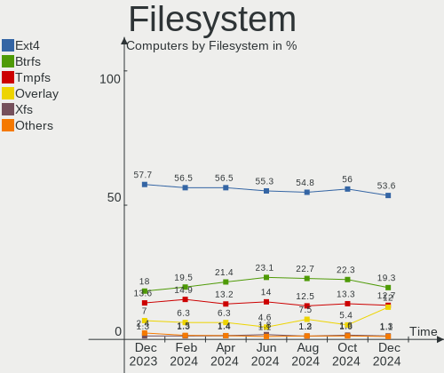
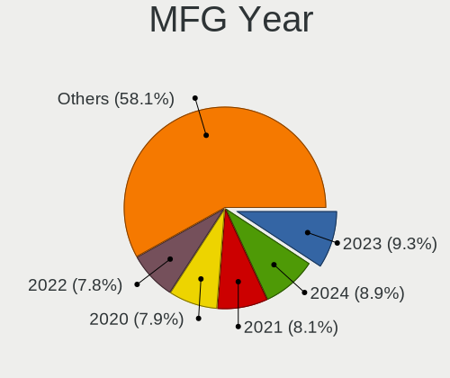
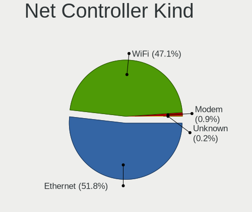
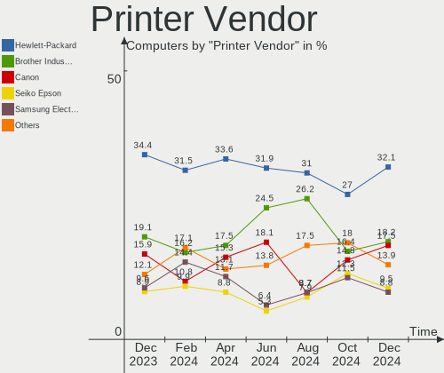

Linux Hardware Trends
---------------------

A project to identify most popular hardware characteristics and track their change
over time based on data collected by Linux users at https://Linux-Hardware.org.

Anyone can contribute to the study by uploading probes of their computers by
the [hw-probe](https://github.com/linuxhw/hw-probe) tool:

    sudo -E hw-probe -all -upload

This is a report for all computer types. See also reports for [desktops](/Desktop/README.md) and [notebooks](/Notebook/README.md).

Full-feature report is available here: https://linux-hardware.org/?view=trends

Distribution-specific reports: [Ubuntu](/Dist/Ubuntu), [ROSA](/Dist/ROSA), [Mint](/Dist/Mint), [Pop!_OS](/Dist/Pop!_OS), [Fedora](/Dist/Fedora), [BlackPanther](/Dist/BlackPanther), [Arch](/Dist/Arch), [Manjaro](/Dist/Manjaro), [Debian](/Dist/Debian), [Endless](/Dist/Endless), [Zorin](/Dist/Zorin), [Gentoo](/Dist/Gentoo), [Clear Linux](/Dist/Clear_Linux), [openSUSE](/Dist/openSUSE), [KDE neon](/Dist/KDE_neon), [Xubuntu](/Dist/Xubuntu), [Kubuntu](/Dist/Kubuntu), [ArcoLinux](/Dist/ArcoLinux), [OpenMandriva](/Dist/OpenMandriva).

Period: Apr, 2021.

Contents
--------

- [ OS                       ](#os)
- [ OS Family                ](#os-family)
- [ Kernel                   ](#kernel)
- [ Kernel Family            ](#kernel-family)
- [ Kernel Major Ver.        ](#kernel-major-ver)
- [ Arch                     ](#arch)
- [ DE                       ](#de)
- [ Display Server           ](#display-server)
- [ Display Manager          ](#display-manager)
- [ OS Lang                  ](#os-lang)
- [ Boot Mode                ](#boot-mode)
- [ Filesystem               ](#filesystem)
- [ Part. scheme             ](#part-scheme)
- [ Dual Boot with Linux/BSD ](#dual-boot-with-linux/bsd)
- [ Dual Boot (Win)          ](#dual-boot-win)
- [ Country                  ](#country)
- [ City                     ](#city)
- [ Vendor                   ](#vendor)
- [ Model                    ](#model)
- [ Model Family             ](#model-family)
- [ MFG Year                 ](#mfg-year)
- [ Form Factor              ](#form-factor)
- [ Secure Boot              ](#secure-boot)
- [ Coreboot                 ](#coreboot)
- [ RAM Size                 ](#ram-size)
- [ RAM Used                 ](#ram-used)
- [ Has CD-ROM               ](#has-cd-rom)
- [ Total Drives             ](#total-drives)
- [ Has Ethernet             ](#has-ethernet)
- [ Has WiFi                 ](#has-wifi)
- [ Has Bluetooth            ](#has-bluetooth)
- [ Drive Vendor             ](#drive-vendor)
- [ Drive Model              ](#drive-model)
- [ HDD Vendor               ](#hdd-vendor)
- [ SSD Vendor               ](#ssd-vendor)
- [ Drive Kind               ](#drive-kind)
- [ Drive Connector          ](#drive-connector)
- [ Drive Size               ](#drive-size)
- [ Space Total              ](#space-total)
- [ Space Used               ](#space-used)
- [ Malfunc. Drives          ](#malfunc-drives)
- [ Malfunc. Drive Vendor    ](#malfunc-drive-vendor)
- [ Malfunc. HDD Vendor      ](#malfunc-hdd-vendor)
- [ Malfunc. Drive Kind      ](#malfunc-drive-kind)
- [ Failed Drives            ](#failed-drives)
- [ Failed Drive Vendor      ](#failed-drive-vendor)
- [ Drive Status             ](#drive-status)
- [ Storage Vendor           ](#storage-vendor)
- [ Storage Model            ](#storage-model)
- [ Storage Kind             ](#storage-kind)
- [ CPU Vendor               ](#cpu-vendor)
- [ CPU Model                ](#cpu-model)
- [ CPU Model Family         ](#cpu-model-family)
- [ CPU Cores                ](#cpu-cores)
- [ CPU Sockets              ](#cpu-sockets)
- [ CPU Threads              ](#cpu-threads)
- [ CPU Op-Modes             ](#cpu-op-modes)
- [ CPU Microcode            ](#cpu-microcode)
- [ CPU Microarch            ](#cpu-microarch)
- [ GPU Vendor               ](#gpu-vendor)
- [ GPU Model                ](#gpu-model)
- [ GPU Combo                ](#gpu-combo)
- [ GPU Driver               ](#gpu-driver)
- [ GPU Memory               ](#gpu-memory)
- [ Monitor Vendor           ](#monitor-vendor)
- [ Monitor Model            ](#monitor-model)
- [ Monitor Resolution       ](#monitor-resolution)
- [ Monitor Diagonal         ](#monitor-diagonal)
- [ Monitor Width            ](#monitor-width)
- [ Aspect Ratio             ](#aspect-ratio)
- [ Monitor Area             ](#monitor-area)
- [ Pixel Density            ](#pixel-density)
- [ Multiple Monitors        ](#multiple-monitors)
- [ Net Controller Vendor    ](#net-controller-vendor)
- [ Net Controller Model     ](#net-controller-model)
- [ Wireless Vendor          ](#wireless-vendor)
- [ Wireless Model           ](#wireless-model)
- [ Ethernet Vendor          ](#ethernet-vendor)
- [ Ethernet Model           ](#ethernet-model)
- [ Net Controller Kind      ](#net-controller-kind)
- [ Used Controller          ](#used-controller)
- [ NICs                     ](#nics)
- [ IPv6                     ](#ipv6)
- [ Memory Vendor            ](#memory-vendor)
- [ Memory Model             ](#memory-model)
- [ Memory Kind              ](#memory-kind)
- [ Memory Form Factor       ](#memory-form-factor)
- [ Memory Size              ](#memory-size)
- [ Memory Speed             ](#memory-speed)
- [ Sound Vendor             ](#sound-vendor)
- [ Sound Model              ](#sound-model)
- [ Camera Vendor            ](#camera-vendor)
- [ Camera Model             ](#camera-model)
- [ Fingerprint Vendor       ](#fingerprint-vendor)
- [ Fingerprint Model        ](#fingerprint-model)
- [ Chipcard Vendor          ](#chipcard-vendor)
- [ Chipcard Model           ](#chipcard-model)
- [ Printer Vendor           ](#printer-vendor)
- [ Printer Model            ](#printer-model)
- [ Scanner Vendor           ](#scanner-vendor)
- [ Scanner Model            ](#scanner-model)
- [ Bluetooth Vendor         ](#bluetooth-vendor)
- [ Bluetooth Model          ](#bluetooth-model)
- [ Unsupported Devices      ](#unsupported-devices)
- [ Unsupported Device Types ](#unsupported-device-types)

OS
--

Installed operating systems

| Name                | Computers | Percent |
|---------------------|-----------|---------|
| Ubuntu 20.04        | 995       | 20.13%  |
| OpenMandriva 4.2    | 373       | 7.55%   |
| Mint 20.1           | 364       | 7.36%   |
| Ubuntu 20.10        | 263       | 5.32%   |
| Pop!_OS 20.10       | 216       | 4.37%   |
| Fedora 33           | 190       | 3.84%   |
| KDE neon 20.04      | 166       | 3.36%   |
| Fedora 34           | 156       | 3.16%   |
| ROSA R11.1          | 153       | 3.1%    |
| BlackPanther 18.1   | 152       | 3.08%   |
| Ubuntu 18.04        | 127       | 2.57%   |
| Arch                | 97        | 1.96%   |
| Debian 10           | 92        | 1.86%   |
| Manjaro             | 87        | 1.76%   |
| Xubuntu 20.04       | 83        | 1.68%   |
| Ubuntu 21.04        | 81        | 1.64%   |
| Kubuntu 20.04       | 66        | 1.34%   |
| Mint 19.3           | 63        | 1.27%   |
| Zorin 15            | 54        | 1.09%   |
| Mint 20             | 54        | 1.09%   |
| Arch Rolling        | 50        | 1.01%   |
| ArcoLinux Rolling   | 48        | 0.97%   |
| Endless 3.9.3       | 45        | 0.91%   |
| Pop!_OS 20.04       | 43        | 0.87%   |
| Kali 2021.1         | 36        | 0.73%   |
| Debian              | 36        | 0.73%   |
| Manjaro 21.0.2      | 34        | 0.69%   |
| Manjaro 21.0.1      | 33        | 0.67%   |
| Manjaro 21.0        | 33        | 0.67%   |
| Debian Testing      | 32        | 0.65%   |
| LMDE 4              | 28        | 0.57%   |
| Gentoo              | 27        | 0.55%   |
| Kubuntu 20.10       | 23        | 0.47%   |
| Xubuntu 18.04       | 22        | 0.45%   |
| ROSA R11            | 21        | 0.42%   |
| Elementary 5.1.7    | 18        | 0.36%   |
| Lubuntu 20.04       | 17        | 0.34%   |
| openSUSE Leap-15.2  | 15        | 0.3%    |
| Fedora 32           | 15        | 0.3%    |
| Ubuntu MATE 20.04   | 14        | 0.28%   |
| ROSA R12            | 14        | 0.28%   |
| Mint 19.1           | 14        | 0.28%   |
| Xubuntu 20.10       | 12        | 0.24%   |
| EndeavourOS Rolling | 12        | 0.24%   |
| Debian 11           | 12        | 0.24%   |
| CentOS 8            | 12        | 0.24%   |
| Mageia 8            | 11        | 0.22%   |
| Gentoo 2.7          | 11        | 0.22%   |
| Endless 3.9.4       | 11        | 0.22%   |
| Zorin 16            | 10        | 0.2%    |
| Manjaro 21.0.3      | 10        | 0.2%    |
| RHEL 8.3            | 9         | 0.18%   |
| EndeavourOS         | 9         | 0.18%   |
| Ubuntu Budgie 20.04 | 8         | 0.16%   |
| Peppermint 10       | 8         | 0.16%   |
| Kubuntu 21.04       | 8         | 0.16%   |
| Ubuntu MATE 20.10   | 7         | 0.14%   |
| Raspbian 10         | 7         | 0.14%   |
| Mint 19             | 7         | 0.14%   |
| Mint 18.3           | 7         | 0.14%   |

OS Family
---------

OS without a version

| Name          | Computers | Percent |
|---------------|-----------|---------|
| Ubuntu        | 1485      | 30.04%  |
| Mint          | 515       | 10.42%  |
| OpenMandriva  | 380       | 7.69%   |
| Fedora        | 366       | 7.4%    |
| Pop!_OS       | 261       | 5.28%   |
| Manjaro       | 199       | 4.03%   |
| ROSA          | 193       | 3.9%    |
| Debian        | 189       | 3.82%   |
| KDE neon      | 167       | 3.38%   |
| BlackPanther  | 156       | 3.16%   |
| Arch          | 147       | 2.97%   |
| Xubuntu       | 123       | 2.49%   |
| Kubuntu       | 106       | 2.14%   |
| Endless       | 69        | 1.4%    |
| Zorin         | 67        | 1.36%   |
| ArcoLinux     | 53        | 1.07%   |
| openSUSE      | 40        | 0.81%   |
| Kali          | 40        | 0.81%   |
| Gentoo        | 38        | 0.77%   |
| Lubuntu       | 34        | 0.69%   |
| Ubuntu MATE   | 31        | 0.63%   |
| LMDE          | 28        | 0.57%   |
| EndeavourOS   | 21        | 0.42%   |
| Clear Linux   | 19        | 0.38%   |
| Elementary    | 18        | 0.36%   |
| Ubuntu Budgie | 17        | 0.34%   |
| CentOS        | 17        | 0.34%   |
| MX            | 12        | 0.24%   |
| Mageia        | 11        | 0.22%   |
| Garuda        | 11        | 0.22%   |
| RHEL          | 10        | 0.2%    |
| Raspbian      | 8         | 0.16%   |
| Peppermint    | 8         | 0.16%   |
| Devuan        | 8         | 0.16%   |
| Solus         | 6         | 0.12%   |
| Artix         | 6         | 0.12%   |
| PCLinuxOS     | 5         | 0.1%    |
| ALT Linux     | 5         | 0.1%    |
| RELS          | 4         | 0.08%   |
| Red OS        | 4         | 0.08%   |
| Parrot        | 4         | 0.08%   |
| Deepin        | 4         | 0.08%   |
| ClearOS       | 4         | 0.08%   |
| Android       | 4         | 0.08%   |
| Void          | 3         | 0.06%   |
| RED           | 3         | 0.06%   |
| Reborn OS     | 3         | 0.06%   |
| GNOME OS      | 3         | 0.06%   |
| Scientific    | 2         | 0.04%   |
| PostmarketOS  | 2         | 0.04%   |
| Obarun        | 2         | 0.04%   |
| Manjaro-ARM   | 2         | 0.04%   |
| Kaisen        | 2         | 0.04%   |
| BlackArch     | 2         | 0.04%   |
| Xero          | 1         | 0.02%   |
| Sparky        | 1         | 0.02%   |
| Siduction     | 1         | 0.02%   |
| Regataos      | 1         | 0.02%   |
| Redcore       | 1         | 0.02%   |
| PureOS        | 1         | 0.02%   |

Kernel
------

Version of the Linux kernel

| Version                             | Computers | Percent |
|-------------------------------------|-----------|---------|
| 5.8.0-48-generic                    | 480       | 9.71%   |
| 5.8.0-50-generic                    | 404       | 8.17%   |
| 5.4.0-70-generic                    | 404       | 8.17%   |
| 5.10.14-desktop-1omv4002            | 362       | 7.32%   |
| 5.4.0-72-generic                    | 350       | 7.08%   |
| 5.11.0-7612-generic                 | 181       | 3.66%   |
| 5.8.0-49-generic                    | 145       | 2.93%   |
| 5.6.14-desktop-2bP                  | 98        | 1.98%   |
| 5.4.0-71-generic                    | 93        | 1.88%   |
| 5.11.11-200.fc33.x86_64             | 71        | 1.44%   |
| 4.19.0-16-amd64                     | 70        | 1.42%   |
| 5.11.0-16-generic                   | 65        | 1.31%   |
| 5.8.0-14-generic                    | 60        | 1.21%   |
| 4.18.16-desktop-1bP                 | 54        | 1.09%   |
| 5.4.32-generic-2rosa-x86_64         | 51        | 1.03%   |
| 5.8.0-43-generic                    | 50        | 1.01%   |
| 5.11.11-arch1-1                     | 47        | 0.95%   |
| 5.4.0-58-generic                    | 42        | 0.85%   |
| 5.11.11-300.fc34.x86_64             | 39        | 0.79%   |
| 5.11.0-7614-generic                 | 39        | 0.79%   |
| 5.4.83-generic-2rosa-x86_64         | 38        | 0.77%   |
| 5.11.14-200.fc33.x86_64             | 37        | 0.75%   |
| 5.11.15-arch1-2                     | 32        | 0.65%   |
| 4.15.0-142-generic                  | 32        | 0.65%   |
| 4.15.0-140-generic                  | 31        | 0.63%   |
| 5.11.16-arch1-1                     | 26        | 0.53%   |
| 5.10.0-5-amd64                      | 26        | 0.53%   |
| 5.10.23-1-MANJARO                   | 25        | 0.51%   |
| 4.15.0-desktop-122.124.1rosa-x86_64 | 25        | 0.51%   |
| 5.11.12-300.fc34.x86_64             | 24        | 0.49%   |
| 5.10.30-1-MANJARO                   | 24        | 0.49%   |
| 5.10.0-2-amd64                      | 24        | 0.49%   |
| 5.8.0-7642-generic                  | 23        | 0.47%   |
| 5.11.16-300.fc34.x86_64             | 23        | 0.47%   |
| 5.9.16-1-MANJARO                    | 22        | 0.45%   |
| 5.11.15-300.fc34.x86_64             | 20        | 0.4%    |
| 5.11.10-1-MANJARO                   | 20        | 0.4%    |
| 5.10.0-6-amd64                      | 20        | 0.4%    |
| 5.10.26-1-MANJARO                   | 19        | 0.38%   |
| 4.15.0-desktop-45.1rosa-x86_64      | 19        | 0.38%   |
| 5.8.0-45-generic                    | 18        | 0.36%   |
| 5.4.0-26-generic                    | 18        | 0.36%   |
| 5.11.12-arch1-1                     | 18        | 0.36%   |
| 5.4.0-66-generic                    | 17        | 0.34%   |
| 5.4.0-42-generic                    | 17        | 0.34%   |
| 5.11.0-13-generic                   | 17        | 0.34%   |
| 5.12.0-1-MANJARO                    | 16        | 0.32%   |
| 5.11.6-1-MANJARO                    | 16        | 0.32%   |
| 5.8.0-25-generic                    | 15        | 0.3%    |
| 5.11.15-200.fc33.x86_64             | 15        | 0.3%    |
| 5.4.32-generic-2rosa-i586           | 14        | 0.28%   |
| 5.11.14-1-MANJARO                   | 14        | 0.28%   |
| 5.8.0-44-generic                    | 13        | 0.26%   |
| 5.11.16-zen1-1-zen                  | 13        | 0.26%   |
| 5.8.0-1021-raspi                    | 12        | 0.24%   |
| 5.4.0-70-lowlatency                 | 12        | 0.24%   |
| 5.4.0-65-generic                    | 12        | 0.24%   |
| 5.11.3-300.fc34.x86_64              | 12        | 0.24%   |
| 5.11.13-arch1-1                     | 12        | 0.24%   |
| 5.11.10-200.fc33.x86_64             | 12        | 0.24%   |

Kernel Family
-------------

Linux kernel without a distro release

| Version | Computers | Percent |
|---------|-----------|---------|
| 5.8.0   | 1292      | 26.14%  |
| 5.4.0   | 1042      | 21.08%  |
| 5.10.14 | 362       | 7.32%   |
| 5.11.0  | 338       | 6.84%   |
| 5.11.11 | 209       | 4.23%   |
| 4.15.0  | 165       | 3.34%   |
| 5.10.0  | 135       | 2.73%   |
| 4.19.0  | 103       | 2.08%   |
| 5.6.14  | 99        | 2%      |
| 5.11.16 | 95        | 1.92%   |
| 5.11.15 | 84        | 1.7%    |
| 5.11.12 | 84        | 1.7%    |
| 5.11.14 | 83        | 1.68%   |
| 5.4.32  | 65        | 1.31%   |
| 5.11.10 | 54        | 1.09%   |
| 4.18.16 | 54        | 1.09%   |
| 5.4.83  | 45        | 0.91%   |
| 5.12.0  | 43        | 0.87%   |
| 5.11.13 | 43        | 0.87%   |
| 5.10.30 | 30        | 0.61%   |
| 5.10.27 | 30        | 0.61%   |
| 5.11.6  | 28        | 0.57%   |
| 5.10.23 | 27        | 0.55%   |
| 4.18.0  | 25        | 0.51%   |
| 5.9.16  | 23        | 0.47%   |
| 5.10.26 | 23        | 0.47%   |
| 5.3.0   | 19        | 0.38%   |
| 5.0.0   | 18        | 0.36%   |
| 5.3.18  | 15        | 0.3%    |
| 5.10.19 | 15        | 0.3%    |
| 3.10.0  | 13        | 0.26%   |
| 5.8.15  | 12        | 0.24%   |
| 5.11.3  | 12        | 0.24%   |
| 5.10.32 | 12        | 0.24%   |
| 5.10.28 | 11        | 0.22%   |
| 5.10.17 | 10        | 0.2%    |
| 5.6.0   | 8         | 0.16%   |
| 5.4.97  | 7         | 0.14%   |
| 5.11.8  | 7         | 0.14%   |
| 5.10.29 | 7         | 0.14%   |
| 5.4.106 | 6         | 0.12%   |
| 5.4.105 | 6         | 0.12%   |
| 5.10.31 | 6         | 0.12%   |
| 5.10.25 | 6         | 0.12%   |
| 4.9.0   | 6         | 0.12%   |
| 5.9.0   | 5         | 0.1%    |
| 5.10.18 | 5         | 0.1%    |
| 4.9.20  | 5         | 0.1%    |
| 5.4.108 | 4         | 0.08%   |
| 5.11.9  | 4         | 0.08%   |
| 5.11.2  | 4         | 0.08%   |
| 5.10.11 | 4         | 0.08%   |
| 5.9.1   | 3         | 0.06%   |
| 5.7.0   | 3         | 0.06%   |
| 5.4.111 | 3         | 0.06%   |
| 5.4.101 | 3         | 0.06%   |
| 5.11.7  | 3         | 0.06%   |
| 5.10.33 | 3         | 0.06%   |
| 5.10.24 | 3         | 0.06%   |
| 5.10.22 | 3         | 0.06%   |

Kernel Major Ver.
-----------------

Linux kernel major version

| Version | Computers | Percent |
|---------|-----------|---------|
| 5.8     | 1312      | 26.54%  |
| 5.4     | 1202      | 24.32%  |
| 5.11    | 1050      | 21.24%  |
| 5.10    | 701       | 14.18%  |
| 4.15    | 166       | 3.36%   |
| 5.6     | 113       | 2.29%   |
| 4.19    | 110       | 2.23%   |
| 4.18    | 80        | 1.62%   |
| 5.12    | 43        | 0.87%   |
| 5.9     | 35        | 0.71%   |
| 5.3     | 34        | 0.69%   |
| 4.9     | 23        | 0.47%   |
| 5.0     | 19        | 0.38%   |
| 3.10    | 14        | 0.28%   |
| 5.7     | 7         | 0.14%   |
| 4.4     | 7         | 0.14%   |
| 5.5     | 3         | 0.06%   |
| 4.16    | 3         | 0.06%   |
| Unknown | 3         | 0.06%   |
| 5.2     | 2         | 0.04%   |
| 4.14    | 2         | 0.04%   |
| 4.10    | 2         | 0.04%   |
| 3.16    | 2         | 0.04%   |
| 5.4.104 | 1         | 0.02%   |
| 5       | 1         | 0.02%   |
| 4.8     | 1         | 0.02%   |
| 4.2     | 1         | 0.02%   |
| 4.17    | 1         | 0.02%   |
| 4.12    | 1         | 0.02%   |
| 4.1     | 1         | 0.02%   |
| 3.18    | 1         | 0.02%   |
| 3.13    | 1         | 0.02%   |
| 3.0     | 1         | 0.02%   |

Arch
----

OS architecture (x86_64, i586, etc.)

| Name     | Computers | Percent |
|----------|-----------|---------|
| x86_64   | 4738      | 95.85%  |
| i686     | 132       | 2.67%   |
| aarch64  | 55        | 1.11%   |
| armv7l   | 13        | 0.26%   |
| armv8l   | 2         | 0.04%   |
| armv6l   | 1         | 0.02%   |
| armv5tel | 1         | 0.02%   |
| Unknown  | 1         | 0.02%   |

DE
--

Desktop Environment

| Name                | Computers | Percent |
|---------------------|-----------|---------|
| GNOME               | 2162      | 43.74%  |
| KDE5                | 846       | 17.12%  |
| X-Cinnamon          | 413       | 8.36%   |
| XFCE                | 360       | 7.28%   |
| KDE                 | 320       | 6.47%   |
| Unknown             | 317       | 6.41%   |
| MATE                | 133       | 2.69%   |
| KDE4                | 121       | 2.45%   |
| Cinnamon            | 45        | 0.91%   |
| LXQt                | 43        | 0.87%   |
| i3                  | 30        | 0.61%   |
| Budgie              | 29        | 0.59%   |
| LXDE                | 25        | 0.51%   |
| Unity               | 18        | 0.36%   |
| Pantheon            | 14        | 0.28%   |
| Deepin              | 11        | 0.22%   |
| GNOME Flashback     | 10        | 0.2%    |
| awesome             | 8         | 0.16%   |
| dwm                 | 6         | 0.12%   |
| bspwm               | 6         | 0.12%   |
| GNOME Classic       | 5         | 0.1%    |
| Openbox             | 3         | 0.06%   |
| xmonad              | 2         | 0.04%   |
| lightdm-xsession    | 2         | 0.04%   |
| i3-with-shmlog      | 2         | 0.04%   |
| GNUstep             | 2         | 0.04%   |
| Enlightenment       | 2         | 0.04%   |
| UKUI                | 1         | 0.02%   |
| sway                | 1         | 0.02%   |
| qtile               | 1         | 0.02%   |
| ICEWM               | 1         | 0.02%   |
| herbstluftwm        | 1         | 0.02%   |
| fluxbox             | 1         | 0.02%   |
| default             | 1         | 0.02%   |
| /usr/bin/startxfce4 | 1         | 0.02%   |

Display Server
--------------

X11 or Wayland

| Name        | Computers | Percent |
|-------------|-----------|---------|
| X11         | 4238      | 85.74%  |
| Wayland     | 446       | 9.02%   |
| Unknown     | 166       | 3.36%   |
| Tty         | 92        | 1.86%   |
| Unspecified | 1         | 0.02%   |

Display Manager
---------------

SDDM, LightDM, etc.

| Name    | Computers | Percent |
|---------|-----------|---------|
| Unknown | 2857      | 57.8%   |
| SDDM    | 880       | 17.8%   |
| GDM     | 588       | 11.9%   |
| TDM     | 378       | 7.65%   |
| KDM     | 123       | 2.49%   |
| LightDM | 86        | 1.74%   |
| XDM     | 13        | 0.26%   |
| SLiM    | 6         | 0.12%   |
| Ly      | 4         | 0.08%   |
| LXDM    | 3         | 0.06%   |
| GDM3    | 3         | 0.06%   |
| MDM     | 2         | 0.04%   |

OS Lang
-------

Language

| Lang    | Computers | Percent |
|---------|-----------|---------|
| en_US   | 1826      | 36.94%  |
| de_DE   | 407       | 8.23%   |
| ru_RU   | 372       | 7.53%   |
| pt_BR   | 264       | 5.34%   |
| fr_FR   | 259       | 5.24%   |
| Unknown | 246       | 4.98%   |
| en_GB   | 232       | 4.69%   |
| es_ES   | 132       | 2.67%   |
| it_IT   | 120       | 2.43%   |
| pl_PL   | 108       | 2.18%   |
| en_CA   | 93        | 1.88%   |
| en_AU   | 80        | 1.62%   |
| C       | 77        | 1.56%   |
| en_IN   | 65        | 1.31%   |
| nl_NL   | 34        | 0.69%   |
| sv_SE   | 31        | 0.63%   |
| es_MX   | 31        | 0.63%   |
| cs_CZ   | 30        | 0.61%   |
| hu_HU   | 29        | 0.59%   |
| es_AR   | 29        | 0.59%   |
| pt_PT   | 28        | 0.57%   |
| ru_UA   | 21        | 0.42%   |
| es_CL   | 21        | 0.42%   |
| de_AT   | 20        | 0.4%    |
| ja_JP   | 19        | 0.38%   |
| en_ZA   | 18        | 0.36%   |
| de_CH   | 18        | 0.36%   |
| tr_TR   | 17        | 0.34%   |
| fi_FI   | 17        | 0.34%   |
| zh_CN   | 16        | 0.32%   |
| nl_BE   | 16        | 0.32%   |
| ro_RO   | 14        | 0.28%   |
| fr_CA   | 12        | 0.24%   |
| fr_BE   | 12        | 0.24%   |
| uk_UA   | 11        | 0.22%   |
| en_IE   | 11        | 0.22%   |
| sk_SK   | 10        | 0.2%    |
| es_UY   | 10        | 0.2%    |
| ko_KR   | 9         | 0.18%   |
| es_CO   | 9         | 0.18%   |
| en_IL   | 9         | 0.18%   |
| el_GR   | 9         | 0.18%   |
| ca_ES   | 9         | 0.18%   |
| hr_HR   | 7         | 0.14%   |
| fr_CH   | 7         | 0.14%   |
| en_NZ   | 7         | 0.14%   |
| da_DK   | 7         | 0.14%   |
| id_ID   | 6         | 0.12%   |
| C.UTF8  | 6         | 0.12%   |
| bg_BG   | 6         | 0.12%   |
| sl_SI   | 5         | 0.1%    |
| nb_NO   | 5         | 0.1%    |
| es_PE   | 5         | 0.1%    |
| en_PH   | 5         | 0.1%    |
| zh_TW   | 4         | 0.08%   |
| es_VE   | 4         | 0.08%   |
| es_CR   | 4         | 0.08%   |
| en_DK   | 4         | 0.08%   |
| es_SV   | 3         | 0.06%   |
| es_EC   | 3         | 0.06%   |

Boot Mode
---------

EFI or BIOS

| Mode | Computers | Percent |
|------|-----------|---------|
| BIOS | 2731      | 55.25%  |
| EFI  | 2212      | 44.75%  |

Filesystem
----------

Type of filesystem

| Type                | Computers | Percent |
|---------------------|-----------|---------|
| Ext4                | 3871      | 78.31%  |
| Overlay             | 533       | 10.78%  |
| Btrfs               | 374       | 7.57%   |
| Xfs                 | 82        | 1.66%   |
| Zfs                 | 34        | 0.69%   |
| F2fs                | 15        | 0.3%    |
| Ext3                | 13        | 0.26%   |
| Unknown             | 8         | 0.16%   |
| Ext2                | 5         | 0.1%    |
| Tmpfs               | 2         | 0.04%   |
| Reiserfs            | 2         | 0.04%   |
| Aufs                | 2         | 0.04%   |
| XXXXXXX             | 1         | 0.02%   |
| Fuse.fuse-overlayfs | 1         | 0.02%   |

Part. scheme
------------

Scheme of partitioning

| Type    | Computers | Percent |
|---------|-----------|---------|
| Unknown | 2726      | 55.15%  |
| GPT     | 1463      | 29.6%   |
| MBR     | 754       | 15.25%  |

Dual Boot with Linux/BSD
------------------------

Hosting more than one Linux/BSD

| Dual boot | Computers | Percent |
|-----------|-----------|---------|
| No        | 4177      | 84.5%   |
| Yes       | 766       | 15.5%   |

Dual Boot (Win)
---------------

Hosting Linux and Windows

| Dual boot | Computers | Percent |
|-----------|-----------|---------|
| No        | 3477      | 70.34%  |
| Yes       | 1466      | 29.66%  |

Country
-------

Geographic location (country)

| Country      | Computers | Percent |
|--------------|-----------|---------|
| USA          | 750       | 15.17%  |
| Germany      | 535       | 10.82%  |
| Russia       | 450       | 9.1%    |
| Brazil       | 354       | 7.16%   |
| France       | 287       | 5.81%   |
| UK           | 186       | 3.76%   |
| Italy        | 171       | 3.46%   |
| Spain        | 170       | 3.44%   |
| Poland       | 159       | 3.22%   |
| Hungary      | 152       | 3.08%   |
| Canada       | 135       | 2.73%   |
| Netherlands  | 108       | 2.18%   |
| India        | 101       | 2.04%   |
| Australia    | 91        | 1.84%   |
| Ukraine      | 79        | 1.6%    |
| Sweden       | 62        | 1.25%   |
| Czechia      | 54        | 1.09%   |
| Belgium      | 54        | 1.09%   |
| Switzerland  | 53        | 1.07%   |
| Mexico       | 51        | 1.03%   |
| Turkey       | 47        | 0.95%   |
| Austria      | 47        | 0.95%   |
| Argentina    | 44        | 0.89%   |
| Romania      | 39        | 0.79%   |
| Portugal     | 36        | 0.73%   |
| Chile        | 35        | 0.71%   |
| Indonesia    | 32        | 0.65%   |
| Finland      | 32        | 0.65%   |
| Japan        | 31        | 0.63%   |
| Greece       | 27        | 0.55%   |
| Norway       | 25        | 0.51%   |
| China        | 25        | 0.51%   |
| Bulgaria     | 25        | 0.51%   |
| Denmark      | 24        | 0.49%   |
| South Africa | 23        | 0.47%   |
| Slovakia     | 22        | 0.45%   |
| Iran         | 21        | 0.42%   |
| New Zealand  | 19        | 0.38%   |
| Colombia     | 19        | 0.38%   |
| Belarus      | 18        | 0.36%   |
| Vietnam      | 17        | 0.34%   |
| Israel       | 15        | 0.3%    |
| Croatia      | 15        | 0.3%    |
| Egypt        | 14        | 0.28%   |
| Uruguay      | 13        | 0.26%   |
| South Korea  | 13        | 0.26%   |
| Slovenia     | 12        | 0.24%   |
| Philippines  | 11        | 0.22%   |
| Ireland      | 11        | 0.22%   |
| Serbia       | 10        | 0.2%    |
| Algeria      | 10        | 0.2%    |
| Peru         | 9         | 0.18%   |
| Pakistan     | 9         | 0.18%   |
| Lithuania    | 9         | 0.18%   |
| Malaysia     | 8         | 0.16%   |
| Costa Rica   | 8         | 0.16%   |
| Estonia      | 7         | 0.14%   |
| Ecuador      | 7         | 0.14%   |
| Taiwan       | 6         | 0.12%   |
| Singapore    | 6         | 0.12%   |

City
----

Geographic location (city)

| City              | Computers | Percent |
|-------------------|-----------|---------|
| Moscow            | 101       | 2.04%   |
| Budapest          | 47        | 0.95%   |
| Berlin            | 46        | 0.93%   |
| St Petersburg     | 45        | 0.91%   |
| São Paulo        | 42        | 0.85%   |
| Warsaw            | 38        | 0.77%   |
| Hamburg           | 31        | 0.63%   |
| Voronezh          | 26        | 0.53%   |
| Vienna            | 26        | 0.53%   |
| Milan             | 26        | 0.53%   |
| Rome              | 25        | 0.51%   |
| Paris             | 25        | 0.51%   |
| London            | 24        | 0.49%   |
| Kyiv              | 24        | 0.49%   |
| Prague            | 22        | 0.45%   |
| Madrid            | 22        | 0.45%   |
| Barcelona         | 21        | 0.42%   |
| Montreal          | 19        | 0.38%   |
| Amsterdam         | 19        | 0.38%   |
| Rio de Janeiro    | 18        | 0.36%   |
| Cologne           | 18        | 0.36%   |
| Istanbul          | 17        | 0.34%   |
| Athens            | 17        | 0.34%   |
| Tehran            | 16        | 0.32%   |
| Sydney            | 16        | 0.32%   |
| Munich            | 16        | 0.32%   |
| Zurich            | 14        | 0.28%   |
| Wroclaw           | 14        | 0.28%   |
| Toronto           | 14        | 0.28%   |
| Perm              | 14        | 0.28%   |
| Krasnodar         | 14        | 0.28%   |
| Krakow            | 14        | 0.28%   |
| Frankfurt am Main | 14        | 0.28%   |
| Brisbane          | 14        | 0.28%   |
| Belo Horizonte    | 14        | 0.28%   |
| Sofia             | 13        | 0.26%   |
| Yekaterinburg     | 12        | 0.24%   |
| The Hague         | 12        | 0.24%   |
| Santiago          | 12        | 0.24%   |
| Rostov-on-Don     | 12        | 0.24%   |
| Chipping Norton   | 12        | 0.24%   |
| Zagreb            | 11        | 0.22%   |
| New York          | 11        | 0.22%   |
| Montevideo        | 11        | 0.22%   |
| Minsk             | 11        | 0.22%   |
| Edmonton          | 11        | 0.22%   |
| Curitiba          | 11        | 0.22%   |
| Brasília         | 11        | 0.22%   |
| Lisbon            | 10        | 0.2%    |
| Leipzig           | 10        | 0.2%    |
| Bucharest         | 10        | 0.2%    |
| Ankara            | 10        | 0.2%    |
| Wooster           | 9         | 0.18%   |
| Tel Aviv          | 9         | 0.18%   |
| Saratov           | 9         | 0.18%   |
| Novosibirsk       | 9         | 0.18%   |
| Miami             | 9         | 0.18%   |
| Los Angeles       | 9         | 0.18%   |
| Kazan’          | 9         | 0.18%   |
| Ho Chi Minh City  | 9         | 0.18%   |

Vendor
------

Motherboard manufacturer

| Name                    | Computers | Percent |
|-------------------------|-----------|---------|
| ASUSTek Computer        | 801       | 16.2%   |
| Lenovo                  | 684       | 13.84%  |
| Hewlett-Packard         | 665       | 13.45%  |
| Dell                    | 633       | 12.81%  |
| Gigabyte Technology     | 374       | 7.57%   |
| Acer                    | 298       | 6.03%   |
| MSI                     | 285       | 5.77%   |
| ASRock                  | 216       | 4.37%   |
| Apple                   | 96        | 1.94%   |
| Intel                   | 86        | 1.74%   |
| Toshiba                 | 81        | 1.64%   |
| Unknown                 | 68        | 1.38%   |
| Samsung Electronics     | 60        | 1.21%   |
| Fujitsu                 | 35        | 0.71%   |
| Sony                    | 33        | 0.67%   |
| Pegatron                | 30        | 0.61%   |
| Medion                  | 30        | 0.61%   |
| Raspberry Pi Foundation | 27        | 0.55%   |
| Packard Bell            | 22        | 0.45%   |
| Notebook                | 22        | 0.45%   |
| Positivo                | 21        | 0.42%   |
| HUAWEI                  | 19        | 0.38%   |
| ECS                     | 18        | 0.36%   |
| Fujitsu Siemens         | 17        | 0.34%   |
| Biostar                 | 16        | 0.32%   |
| System76                | 15        | 0.3%    |
| Foxconn                 | 15        | 0.3%    |
| Supermicro              | 11        | 0.22%   |
| Alienware               | 11        | 0.22%   |
| TUXEDO                  | 10        | 0.2%    |
| Semp Toshiba            | 10        | 0.2%    |
| LG Electronics          | 10        | 0.2%    |
| Google                  | 10        | 0.2%    |
| Microsoft               | 8         | 0.16%   |
| Panasonic               | 7         | 0.14%   |
| Huanan                  | 7         | 0.14%   |
| Gateway                 | 7         | 0.14%   |
| Chuwi                   | 7         | 0.14%   |
| IBM                     | 6         | 0.12%   |
| eMachines               | 6         | 0.12%   |
| AMI                     | 6         | 0.12%   |
| TrekStor                | 5         | 0.1%    |
| Pine Microsystems       | 5         | 0.1%    |
| NEC Computers           | 4         | 0.08%   |
| Jumper                  | 4         | 0.08%   |
| ZOTAC                   | 3         | 0.06%   |
| Timi                    | 3         | 0.06%   |
| SLIMBOOK                | 3         | 0.06%   |
| Shuttle                 | 3         | 0.06%   |
| Schenker                | 3         | 0.06%   |
| Quanta                  | 3         | 0.06%   |
| Nvidia                  | 3         | 0.06%   |
| Itautec                 | 3         | 0.06%   |
| Clevo                   | 3         | 0.06%   |
| BESSTAR Tech            | 3         | 0.06%   |
| Wortmann AG             | 2         | 0.04%   |
| whyopencomputing        | 2         | 0.04%   |
| Teclast                 | 2         | 0.04%   |
| Sun Microsystems        | 2         | 0.04%   |
| Standard                | 2         | 0.04%   |

Model
-----

Motherboard model

| Name                                       | Computers | Percent |
|--------------------------------------------|-----------|---------|
| Unknown                                    | 83        | 1.68%   |
| ASUS All Series                            | 44        | 0.89%   |
| HP Notebook                                | 17        | 0.34%   |
| Gigabyte B450M DS3H                        | 14        | 0.28%   |
| ASUS PRIME A320M-K                         | 14        | 0.28%   |
| HP Pavilion g6                             | 13        | 0.26%   |
| Dell OptiPlex 7010                         | 12        | 0.24%   |
| HP Pavilion dv7                            | 11        | 0.22%   |
| ASUS ROG STRIX B450-F GAMING               | 11        | 0.22%   |
| HP Pavilion dv6                            | 10        | 0.2%    |
| Gigabyte A320M-S2H                         | 10        | 0.2%    |
| ASUS TUF GAMING X570-PLUS                  | 10        | 0.2%    |
| Dell Latitude E6420                        | 9         | 0.18%   |
| MSI MS-7C91                                | 8         | 0.16%   |
| MSI MS-7C37                                | 8         | 0.16%   |
| MSI MS-7C02                                | 8         | 0.16%   |
| HP Compaq Pro 6300 SFF                     | 8         | 0.16%   |
| Dell XPS 15 7590                           | 8         | 0.16%   |
| Dell OptiPlex 9020                         | 8         | 0.16%   |
| Dell Latitude E7440                        | 8         | 0.16%   |
| Dell Inspiron 15-3567                      | 8         | 0.16%   |
| Apple MacBookPro8,1                        | 8         | 0.16%   |
| RPi Raspberry Pi 4 Model B Rev 1.4         | 7         | 0.14%   |
| MSI MS-7A34                                | 7         | 0.14%   |
| MSI MS-7817                                | 7         | 0.14%   |
| MSI MS-7693                                | 7         | 0.14%   |
| HP Pavilion Gaming Laptop 15-ec1xxx        | 7         | 0.14%   |
| HP Pavilion 15                             | 7         | 0.14%   |
| HP EliteBook 8470p                         | 7         | 0.14%   |
| HP EliteBook 8460p                         | 7         | 0.14%   |
| HP 15                                      | 7         | 0.14%   |
| Gigabyte GA-78LMT-USB3 6.0                 | 7         | 0.14%   |
| Dell XPS 15 9570                           | 7         | 0.14%   |
| Dell XPS 15 9500                           | 7         | 0.14%   |
| Dell XPS 13 7390                           | 7         | 0.14%   |
| Dell OptiPlex 790                          | 7         | 0.14%   |
| Dell OptiPlex 755                          | 7         | 0.14%   |
| Dell OptiPlex 390                          | 7         | 0.14%   |
| ASRock A320M-HDV R4.0                      | 7         | 0.14%   |
| Samsung 300E4A/300E5A/300E7A/3430EA/3530EA | 6         | 0.12%   |
| MSI MS-7B89                                | 6         | 0.12%   |
| MSI MS-7A38                                | 6         | 0.12%   |
| HP Pavilion Notebook                       | 6         | 0.12%   |
| HP Laptop 15-da0xxx                        | 6         | 0.12%   |
| HP EliteBook 8440p                         | 6         | 0.12%   |
| HP EliteBook 840 G2                        | 6         | 0.12%   |
| HP 250 G6 Notebook PC                      | 6         | 0.12%   |
| Dell XPS 13 9360                           | 6         | 0.12%   |
| Dell OptiPlex 990                          | 6         | 0.12%   |
| Dell OptiPlex 780                          | 6         | 0.12%   |
| Dell OptiPlex 760                          | 6         | 0.12%   |
| Dell OptiPlex 3020                         | 6         | 0.12%   |
| Dell Latitude E6540                        | 6         | 0.12%   |
| Dell Latitude 5480                         | 6         | 0.12%   |
| Dell Inspiron N5110                        | 6         | 0.12%   |
| Dell Inspiron 5570                         | 6         | 0.12%   |
| ASUS ROG STRIX X570-E GAMING               | 6         | 0.12%   |
| ASUS PRIME B450M-A                         | 6         | 0.12%   |
| ASRock AB350 Pro4                          | 6         | 0.12%   |
| System76 Lemur Pro                         | 5         | 0.1%    |

Model Family
------------

Motherboard model prefix

| Name                    | Computers | Percent |
|-------------------------|-----------|---------|
| Lenovo ThinkPad         | 300       | 6.07%   |
| Acer Aspire             | 207       | 4.19%   |
| Dell Inspiron           | 168       | 3.4%    |
| Dell Latitude           | 148       | 2.99%   |
| Lenovo IdeaPad          | 141       | 2.85%   |
| HP Pavilion             | 126       | 2.55%   |
| Dell OptiPlex           | 104       | 2.1%    |
| ASUS PRIME              | 96        | 1.94%   |
| HP EliteBook            | 95        | 1.92%   |
| Unknown                 | 83        | 1.68%   |
| Dell XPS                | 82        | 1.66%   |
| ASUS ROG                | 73        | 1.48%   |
| HP Compaq               | 70        | 1.42%   |
| Toshiba Satellite       | 69        | 1.4%    |
| HP ProBook              | 59        | 1.19%   |
| HP Laptop               | 55        | 1.11%   |
| Dell Precision          | 51        | 1.03%   |
| Lenovo ThinkCentre      | 46        | 0.93%   |
| ASUS VivoBook           | 46        | 0.93%   |
| ASUS TUF                | 46        | 0.93%   |
| ASUS All                | 44        | 0.89%   |
| Dell Vostro             | 38        | 0.77%   |
| Lenovo Yoga             | 35        | 0.71%   |
| HP ENVY                 | 31        | 0.63%   |
| RPi Raspberry           | 27        | 0.55%   |
| Acer Nitro              | 24        | 0.49%   |
| Gigabyte B450M          | 23        | 0.47%   |
| ASUS M5A78L-M           | 21        | 0.42%   |
| Lenovo Legion           | 17        | 0.34%   |
| HP Notebook             | 17        | 0.34%   |
| Gigabyte B450           | 16        | 0.32%   |
| Fujitsu ESPRIMO         | 16        | 0.32%   |
| Packard Bell EasyNote   | 15        | 0.3%    |
| Lenovo IdeaCentre       | 15        | 0.3%    |
| Fujitsu LIFEBOOK        | 15        | 0.3%    |
| HP Spectre              | 14        | 0.28%   |
| HP 250                  | 14        | 0.28%   |
| Gigabyte X570           | 14        | 0.28%   |
| ASUS P8H61-M            | 14        | 0.28%   |
| Acer Swift              | 14        | 0.28%   |
| HP ProDesk              | 13        | 0.26%   |
| Gigabyte A320M-S2H      | 13        | 0.26%   |
| ASUS ZenBook            | 13        | 0.26%   |
| Gigabyte GA-78LMT-USB3  | 12        | 0.24%   |
| Gigabyte B550           | 12        | 0.24%   |
| HP ZBook                | 11        | 0.22%   |
| HP 255                  | 11        | 0.22%   |
| ASRock B450M            | 11        | 0.22%   |
| ASRock B450             | 11        | 0.22%   |
| HP ProLiant             | 10        | 0.2%    |
| HP OMEN                 | 10        | 0.2%    |
| Dell G3                 | 10        | 0.2%    |
| ASUS P5Q                | 10        | 0.2%    |
| ASUS ASUS               | 10        | 0.2%    |
| Apple MacBookPro8       | 10        | 0.2%    |
| Acer Extensa            | 10        | 0.2%    |
| HP EliteDesk            | 9         | 0.18%   |
| HP 15                   | 9         | 0.18%   |
| Gigabyte Z390           | 9         | 0.18%   |
| Fujitsu Siemens ESPRIMO | 9         | 0.18%   |

MFG Year
--------

Motherboard manufacture year

| Year    | Computers | Percent |
|---------|-----------|---------|
| 2020    | 1023      | 20.7%   |
| 2019    | 576       | 11.65%  |
| 2018    | 416       | 8.42%   |
| 2013    | 348       | 7.04%   |
| 2012    | 304       | 6.15%   |
| 2014    | 281       | 5.68%   |
| 2011    | 279       | 5.64%   |
| 2021    | 275       | 5.56%   |
| 2016    | 230       | 4.65%   |
| 2015    | 226       | 4.57%   |
| 2010    | 219       | 4.43%   |
| 2017    | 204       | 4.13%   |
| 2009    | 201       | 4.07%   |
| 2008    | 144       | 2.91%   |
| 2007    | 91        | 1.84%   |
| Unknown | 73        | 1.48%   |
| 2006    | 37        | 0.75%   |
| 2005    | 10        | 0.2%    |
| 2003    | 3         | 0.06%   |
| 2004    | 2         | 0.04%   |
| 2002    | 1         | 0.02%   |

Form Factor
-----------

Physical design of the computer

| Name           | Computers | Percent |
|----------------|-----------|---------|
| Notebook       | 2557      | 51.73%  |
| Desktop        | 2025      | 40.97%  |
| Convertible    | 120       | 2.43%   |
| All in one     | 72        | 1.46%   |
| System on chip | 54        | 1.09%   |
| Mini pc        | 54        | 1.09%   |
| Server         | 30        | 0.61%   |
| Tablet         | 23        | 0.47%   |
| Phone          | 7         | 0.14%   |
| Other          | 1         | 0.02%   |

Secure Boot
-----------

Enabled or disabled

| State    | Computers | Percent |
|----------|-----------|---------|
| Disabled | 4637      | 93.81%  |
| Enabled  | 306       | 6.19%   |

Coreboot
--------

Have coreboot on board

| Used | Computers | Percent |
|------|-----------|---------|
| No   | 4922      | 99.58%  |
| Yes  | 21        | 0.42%   |

RAM Size
--------

Total RAM memory

| Size in GB      | Computers | Percent |
|-----------------|-----------|---------|
| 4.01-8.0        | 1131      | 22.88%  |
| 3.01-4.0        | 1032      | 20.88%  |
| 16.01-24.0      | 918       | 18.57%  |
| 8.01-16.0       | 900       | 18.21%  |
| 32.01-64.0      | 426       | 8.62%   |
| 1.01-2.0        | 220       | 4.45%   |
| 64.01-256.0     | 114       | 2.31%   |
| 2.01-3.0        | 76        | 1.54%   |
| 24.01-32.0      | 69        | 1.4%    |
| 0.51-1.0        | 45        | 0.91%   |
| More than 256.0 | 6         | 0.12%   |
| 0.01-0.5        | 5         | 0.1%    |
| Unknown         | 1         | 0.02%   |

RAM Used
--------

Used RAM memory

| Used GB         | Computers | Percent |
|-----------------|-----------|---------|
| 1.01-2.0        | 1851      | 37.45%  |
| 2.01-3.0        | 1123      | 22.72%  |
| 4.01-8.0        | 658       | 13.31%  |
| 3.01-4.0        | 539       | 10.9%   |
| 0.51-1.0        | 454       | 9.18%   |
| 8.01-16.0       | 154       | 3.12%   |
| 0.01-0.5        | 117       | 2.37%   |
| 16.01-24.0      | 26        | 0.53%   |
| 32.01-64.0      | 9         | 0.18%   |
| 24.01-32.0      | 5         | 0.1%    |
| Unknown         | 4         | 0.08%   |
| 64.01-256.0     | 2         | 0.04%   |
| More than 256.0 | 1         | 0.02%   |

Has CD-ROM
----------

Has CD-ROM on board

| Presented | Computers | Percent |
|-----------|-----------|---------|
| No        | 2845      | 57.56%  |
| Yes       | 2098      | 42.44%  |

Total Drives
------------

Number of drives on board

| Drives | Computers | Percent |
|--------|-----------|---------|
| 1      | 2868      | 58.02%  |
| 2      | 1252      | 25.33%  |
| 3      | 397       | 8.03%   |
| 4      | 196       | 3.97%   |
| 5      | 97        | 1.96%   |
| 0      | 52        | 1.05%   |
| 6      | 47        | 0.95%   |
| 7      | 17        | 0.34%   |
| 8      | 6         | 0.12%   |
| 9      | 5         | 0.1%    |
| 36     | 1         | 0.02%   |
| 23     | 1         | 0.02%   |
| 16     | 1         | 0.02%   |
| 14     | 1         | 0.02%   |
| 13     | 1         | 0.02%   |
| 12     | 1         | 0.02%   |

Has Ethernet
------------

Has Ethernet on board

| Presented | Computers | Percent |
|-----------|-----------|---------|
| Yes       | 4399      | 88.99%  |
| No        | 544       | 11.01%  |

Has WiFi
--------

Has WiFi module

| Presented | Computers | Percent |
|-----------|-----------|---------|
| Yes       | 3602      | 72.87%  |
| No        | 1341      | 27.13%  |

Has Bluetooth
-------------

Has Bluetooth module

| Presented | Computers | Percent |
|-----------|-----------|---------|
| Yes       | 2732      | 55.27%  |
| No        | 2211      | 44.73%  |

Drive Vendor
------------

Hard drive vendors

| Vendor                    | Computers | Drives | Percent |
|---------------------------|-----------|--------|---------|
| WDC                       | 1232      | 1537   | 17.28%  |
| Seagate                   | 1114      | 1358   | 15.62%  |
| Samsung Electronics       | 1072      | 1365   | 15.03%  |
| Toshiba                   | 492       | 526    | 6.9%    |
| Kingston                  | 413       | 449    | 5.79%   |
| SanDisk                   | 302       | 316    | 4.24%   |
| Unknown                   | 300       | 339    | 4.21%   |
| Hitachi                   | 255       | 270    | 3.58%   |
| Crucial                   | 234       | 261    | 3.28%   |
| Intel                     | 175       | 204    | 2.45%   |
| SK Hynix                  | 157       | 163    | 2.2%    |
| HGST                      | 124       | 128    | 1.74%   |
| A-DATA Technology         | 98        | 105    | 1.37%   |
| Micron Technology         | 75        | 81     | 1.05%   |
| Phison                    | 64        | 79     | 0.9%    |
| China                     | 52        | 54     | 0.73%   |
| PNY                       | 49        | 53     | 0.69%   |
| Apple                     | 47        | 54     | 0.66%   |
| Maxtor                    | 40        | 43     | 0.56%   |
| Fujitsu                   | 40        | 41     | 0.56%   |
| SPCC                      | 39        | 41     | 0.55%   |
| Transcend                 | 35        | 35     | 0.49%   |
| GOODRAM                   | 33        | 34     | 0.46%   |
| LITEON                    | 32        | 32     | 0.45%   |
| Silicon Motion            | 30        | 39     | 0.42%   |
| OCZ                       | 29        | 33     | 0.41%   |
| Patriot                   | 28        | 29     | 0.39%   |
| XPG                       | 26        | 28     | 0.36%   |
| KIOXIA                    | 26        | 26     | 0.36%   |
| Corsair                   | 26        | 27     | 0.36%   |
| JMicron                   | 23        | 24     | 0.32%   |
| Micron/Crucial Technology | 21        | 23     | 0.29%   |
| Apacer                    | 21        | 21     | 0.29%   |
| Team                      | 19        | 20     | 0.27%   |
| Intenso                   | 18        | 18     | 0.25%   |
| Hewlett-Packard           | 17        | 18     | 0.24%   |
| ASMT                      | 17        | 22     | 0.24%   |
| LITEONIT                  | 16        | 16     | 0.22%   |
| KingSpec                  | 14        | 14     | 0.2%    |
| PLEXTOR                   | 12        | 13     | 0.17%   |
| Gigabyte Technology       | 12        | 15     | 0.17%   |
| Sabrent                   | 11        | 14     | 0.15%   |
| Union Memory              | 10        | 10     | 0.14%   |
| KingDian                  | 10        | 10     | 0.14%   |
| FORESEE                   | 9         | 9      | 0.13%   |
| Union Memory (Shenzhen)   | 8         | 8      | 0.11%   |
| Smartbuy                  | 8         | 9      | 0.11%   |
| Realtek Semiconductor     | 8         | 8      | 0.11%   |
| Lexar                     | 8         | 8      | 0.11%   |
| LaCie                     | 8         | 8      | 0.11%   |
| Phison Electronics        | 6         | 7      | 0.08%   |
| Lenovo                    | 6         | 6      | 0.08%   |
| AMD                       | 6         | 6      | 0.08%   |
| ADATA Technology          | 6         | 6      | 0.08%   |
| XrayDisk                  | 5         | 5      | 0.07%   |
| Mushkin                   | 5         | 5      | 0.07%   |
| DOGFISH                   | 5         | 5      | 0.07%   |
| Vaseky                    | 4         | 4      | 0.06%   |
| USB30                     | 4         | 4      | 0.06%   |
| PNY USB                   | 4         | 4      | 0.06%   |

Drive Model
-----------

Hard drive models

| Model                               | Computers | Percent |
|-------------------------------------|-----------|---------|
| Kingston SA400S37240G 240GB SSD     | 97        | 1.22%   |
| Samsung SSD 860 EVO 500GB           | 72        | 0.91%   |
| Seagate ST500DM002-1BD142 500GB     | 69        | 0.87%   |
| Seagate ST1000LM035-1RK172 1TB      | 67        | 0.85%   |
| Kingston SA400S37120G 120GB SSD     | 64        | 0.81%   |
| Samsung SSD 850 EVO 250GB           | 58        | 0.73%   |
| Samsung NVMe SSD Drive 500GB        | 56        | 0.71%   |
| Seagate ST1000DM010-2EP102 1TB      | 54        | 0.68%   |
| Seagate ST1000LM024 HN-M101MBB 1TB  | 52        | 0.66%   |
| Unknown MMC Card  32GB              | 50        | 0.63%   |
| WDC WD10EZEX-08WN4A0 1TB            | 45        | 0.57%   |
| Toshiba DT01ACA100 1TB              | 45        | 0.57%   |
| Samsung NVMe SSD Drive 512GB        | 45        | 0.57%   |
| Toshiba MQ01ABD100 1TB              | 43        | 0.54%   |
| Samsung SSD 850 EVO 500GB           | 43        | 0.54%   |
| Samsung SSD 860 EVO 1TB             | 42        | 0.53%   |
| Unknown MMC Card  64GB              | 41        | 0.52%   |
| Samsung NVMe SSD Drive 1TB          | 37        | 0.47%   |
| WDC WDS240G2G0A-00JH30 240GB SSD    | 36        | 0.45%   |
| Samsung SSD 860 EVO 250GB           | 36        | 0.45%   |
| Seagate ST500LT012-1DG142 500GB     | 35        | 0.44%   |
| Kingston SV300S37A120G 120GB SSD    | 35        | 0.44%   |
| Crucial CT240BX500SSD1 240GB        | 34        | 0.43%   |
| Toshiba MQ04ABF100 1TB              | 33        | 0.42%   |
| Samsung NVMe SSD Drive 256GB        | 33        | 0.42%   |
| Kingston SA400S37480G 480GB SSD     | 33        | 0.42%   |
| Toshiba MQ01ABF050 500GB            | 32        | 0.4%    |
| Seagate ST2000DM008-2FR102 2TB      | 32        | 0.4%    |
| Seagate ST1000DM003-1ER162 1TB      | 27        | 0.34%   |
| Seagate Expansion 4TB               | 27        | 0.34%   |
| Samsung NVMe SSD Drive 250GB        | 27        | 0.34%   |
| Intel NVMe SSD Drive 512GB          | 27        | 0.34%   |
| Crucial CT500MX500SSD1 500GB        | 27        | 0.34%   |
| Crucial CT1000MX500SSD1 1TB         | 27        | 0.34%   |
| Unknown SD/MMC/MS PRO 32GB          | 26        | 0.33%   |
| Seagate ST500LM012 HN-M500MBB 500GB | 26        | 0.33%   |
| HGST HTS721010A9E630 1TB            | 26        | 0.33%   |
| WDC WDS500G2B0A-00SM50 500GB SSD    | 25        | 0.32%   |
| Seagate ST3500418AS 500GB           | 25        | 0.32%   |
| Samsung NVMe SSD Drive 1024GB       | 25        | 0.32%   |
| Unknown MMC Card  128GB             | 24        | 0.3%    |
| Seagate ST4000DM004-2CV104 4TB      | 24        | 0.3%    |
| Seagate ST1000DM003-1CH162 1TB      | 24        | 0.3%    |
| Sandisk NVMe SSD Drive 512GB        | 24        | 0.3%    |
| WDC WD10JPVX-22JC3T0 1TB            | 23        | 0.29%   |
| SK Hynix NVMe SSD Drive 512GB       | 23        | 0.29%   |
| SK Hynix NVMe SSD Drive 256GB       | 23        | 0.29%   |
| Seagate ST9500325AS 500GB           | 23        | 0.29%   |
| Samsung SSD 970 EVO Plus 1TB        | 23        | 0.29%   |
| WDC WDS120G2G0A-00JH30 120GB SSD    | 22        | 0.28%   |
| WDC WD10SPZX-21Z10T0 1TB            | 22        | 0.28%   |
| SanDisk SSD PLUS 240GB              | 22        | 0.28%   |
| HGST HTS541010A9E680 1TB            | 22        | 0.28%   |
| Toshiba NVMe SSD Drive 512GB        | 21        | 0.26%   |
| Toshiba HDWD110 1TB                 | 20        | 0.25%   |
| Kingston SUV400S37240G 240GB SSD    | 20        | 0.25%   |
| Samsung SSD 970 EVO Plus 500GB      | 19        | 0.24%   |
| Kingston SV300S37A240G 240GB SSD    | 19        | 0.24%   |
| Samsung SSD 970 EVO 1TB             | 18        | 0.23%   |
| Samsung SSD 840 EVO 250GB           | 18        | 0.23%   |

HDD Vendor
----------

Hard disk drive vendors

| Vendor              | Computers | Drives | Percent |
|---------------------|-----------|--------|---------|
| Seagate             | 1091      | 1319   | 34.91%  |
| WDC                 | 987       | 1219   | 31.58%  |
| Toshiba             | 376       | 396    | 12.03%  |
| Hitachi             | 255       | 270    | 8.16%   |
| Samsung Electronics | 140       | 161    | 4.48%   |
| HGST                | 124       | 128    | 3.97%   |
| Fujitsu             | 40        | 41     | 1.28%   |
| Maxtor              | 38        | 41     | 1.22%   |
| Apple               | 21        | 22     | 0.67%   |
| ASMT                | 15        | 20     | 0.48%   |
| Sabrent             | 4         | 6      | 0.13%   |
| TO Exter            | 3         | 3      | 0.1%    |
| Intenso             | 3         | 3      | 0.1%    |
| Asmedia             | 3         | 3      | 0.1%    |
| Unknown             | 2         | 2      | 0.06%   |
| Maxone              | 2         | 2      | 0.06%   |
| KESU                | 2         | 2      | 0.06%   |
| IBM/Hitachi         | 2         | 2      | 0.06%   |
| Hewlett-Packard     | 2         | 3      | 0.06%   |
| ExcelStor           | 2         | 2      | 0.06%   |
| WD MediaMax         | 1         | 2      | 0.03%   |
| USB3.0              | 1         | 1      | 0.03%   |
| SYNOLOGY            | 1         | 1      | 0.03%   |
| PHD 3.0             | 1         | 1      | 0.03%   |
| OEM                 | 1         | 1      | 0.03%   |
| MARSHAL             | 1         | 1      | 0.03%   |
| LIO-ORG             | 1         | 9      | 0.03%   |
| LaCie               | 1         | 1      | 0.03%   |
| JMicron             | 1         | 1      | 0.03%   |
| Generic-            | 1         | 1      | 0.03%   |
| China               | 1         | 1      | 0.03%   |
| ASMT109x            | 1         | 1      | 0.03%   |
| ACASIS              | 1         | 1      | 0.03%   |

SSD Vendor
----------

Solid state drive vendors

| Vendor              | Computers | Drives | Percent |
|---------------------|-----------|--------|---------|
| Samsung Electronics | 580       | 675    | 23.63%  |
| Kingston            | 351       | 378    | 14.3%   |
| SanDisk             | 221       | 228    | 9.01%   |
| Crucial             | 218       | 242    | 8.88%   |
| WDC                 | 184       | 199    | 7.5%    |
| A-DATA Technology   | 87        | 92     | 3.55%   |
| Intel               | 65        | 70     | 2.65%   |
| China               | 50        | 52     | 2.04%   |
| PNY                 | 47        | 51     | 1.92%   |
| Toshiba             | 43        | 44     | 1.75%   |
| SK Hynix            | 39        | 39     | 1.59%   |
| Micron Technology   | 39        | 45     | 1.59%   |
| SPCC                | 36        | 38     | 1.47%   |
| Transcend           | 33        | 33     | 1.34%   |
| GOODRAM             | 33        | 34     | 1.34%   |
| OCZ                 | 29        | 33     | 1.18%   |
| Patriot             | 27        | 28     | 1.1%    |
| LITEON              | 27        | 27     | 1.1%    |
| Apple               | 19        | 19     | 0.77%   |
| Apacer              | 19        | 19     | 0.77%   |
| Unknown             | 17        | 18     | 0.69%   |
| Team                | 16        | 17     | 0.65%   |
| LITEONIT            | 16        | 16     | 0.65%   |
| JMicron             | 13        | 14     | 0.53%   |
| Corsair             | 13        | 13     | 0.53%   |
| KingSpec            | 12        | 12     | 0.49%   |
| Intenso             | 11        | 11     | 0.45%   |
| KingDian            | 10        | 10     | 0.41%   |
| Hewlett-Packard     | 10        | 10     | 0.41%   |
| Seagate             | 9         | 9      | 0.37%   |
| PLEXTOR             | 9         | 10     | 0.37%   |
| FORESEE             | 9         | 9      | 0.37%   |
| Smartbuy            | 8         | 9      | 0.33%   |
| Gigabyte Technology | 8         | 8      | 0.33%   |
| SABRENT             | 7         | 7      | 0.29%   |
| Lexar               | 7         | 7      | 0.29%   |
| AMD                 | 6         | 6      | 0.24%   |
| Mushkin             | 5         | 5      | 0.2%    |
| Dogfish             | 5         | 5      | 0.2%    |
| USB30               | 4         | 4      | 0.16%   |
| PNY USB             | 4         | 4      | 0.16%   |
| OWC                 | 4         | 4      | 0.16%   |
| Netac               | 4         | 4      | 0.16%   |
| Hoodisk             | 4         | 4      | 0.16%   |
| DREVO               | 4         | 4      | 0.16%   |
| WDC WDS             | 3         | 3      | 0.12%   |
| Vaseky              | 3         | 3      | 0.12%   |
| Leven               | 3         | 3      | 0.12%   |
| LDLC                | 3         | 3      | 0.12%   |
| KIOXIA-EXCERIA      | 3         | 3      | 0.12%   |
| External            | 3         | 3      | 0.12%   |
| Colorful            | 3         | 3      | 0.12%   |
| XrayDisk            | 2         | 2      | 0.08%   |
| W800S               | 2         | 2      | 0.08%   |
| Verbatim            | 2         | 2      | 0.08%   |
| Union Memory        | 2         | 2      | 0.08%   |
| Radeon              | 2         | 2      | 0.08%   |
| MyDigitalSSD        | 2         | 2      | 0.08%   |
| Maxtor              | 2         | 2      | 0.08%   |
| KingFast            | 2         | 2      | 0.08%   |

Drive Kind
----------

HDD or SSD

| Kind    | Computers | Drives | Percent |
|---------|-----------|--------|---------|
| HDD     | 2657      | 3667   | 41%     |
| SSD     | 2166      | 2685   | 33.42%  |
| NVMe    | 1281      | 1526   | 19.77%  |
| MMC     | 244       | 276    | 3.76%   |
| Unknown | 133       | 146    | 2.05%   |

Drive Connector
---------------

SATA, SAS, NVMe, etc.

| Type | Computers | Drives | Percent |
|------|-----------|--------|---------|
| SATA | 3924      | 6161   | 68.57%  |
| NVMe | 1278      | 1521   | 22.33%  |
| SAS  | 277       | 342    | 4.84%   |
| MMC  | 244       | 276    | 4.26%   |

Drive Size
----------

Size of hard drive

| Size in TB | Computers | Drives | Percent |
|------------|-----------|--------|---------|
| 0.01-0.5   | 2981      | 3871   | 59.48%  |
| 0.51-1.0   | 1394      | 1653   | 27.81%  |
| 1.01-2.0   | 355       | 437    | 7.08%   |
| 3.01-4.0   | 135       | 176    | 2.69%   |
| 2.01-3.0   | 77        | 98     | 1.54%   |
| 4.01-10.0  | 64        | 87     | 1.28%   |
| 10.01-20.0 | 5         | 29     | 0.1%    |
| 0          | 1         | 1      | 0.02%   |

Space Total
-----------

Amount of disk space available on the file system

| Size in GB     | Computers | Percent |
|----------------|-----------|---------|
| 101-250        | 1267      | 25.63%  |
| 251-500        | 1046      | 21.16%  |
| 501-1000       | 722       | 14.61%  |
| 1-20           | 392       | 7.93%   |
| 1001-2000      | 367       | 7.42%   |
| Unknown        | 304       | 6.15%   |
| 51-100         | 295       | 5.97%   |
| More than 3000 | 221       | 4.47%   |
| 21-50          | 189       | 3.82%   |
| 2001-3000      | 140       | 2.83%   |

Space Used
----------

Amount of used disk space

| Used GB        | Computers | Percent |
|----------------|-----------|---------|
| 1-20           | 1875      | 37.93%  |
| 21-50          | 747       | 15.11%  |
| 101-250        | 609       | 12.32%  |
| 51-100         | 500       | 10.12%  |
| 251-500        | 371       | 7.51%   |
| Unknown        | 304       | 6.15%   |
| 501-1000       | 253       | 5.12%   |
| 1001-2000      | 168       | 3.4%    |
| More than 3000 | 62        | 1.25%   |
| 2001-3000      | 54        | 1.09%   |

Malfunc. Drives
---------------

Drive models with a malfunction

| Model                               | Computers | Drives | Percent |
|-------------------------------------|-----------|--------|---------|
| Seagate ST500DM002-1BD142 500GB     | 16        | 17     | 2.87%   |
| Seagate ST9500325AS 500GB           | 9         | 9      | 1.62%   |
| Seagate ST1000LM024 HN-M101MBB 1TB  | 8         | 8      | 1.44%   |
| Seagate ST500LT012-1DG142 500GB     | 5         | 5      | 0.9%    |
| Seagate ST3500418AS 500GB           | 5         | 5      | 0.9%    |
| Seagate ST3160815AS 160GB           | 5         | 5      | 0.9%    |
| WDC WD20EARX-00PASB0 2TB            | 4         | 4      | 0.72%   |
| Toshiba MQ01ABF050 500GB            | 4         | 4      | 0.72%   |
| Seagate ST9320325AS 320GB           | 4         | 4      | 0.72%   |
| Seagate ST500LT012-9WS142 500GB     | 4         | 4      | 0.72%   |
| Seagate ST3250310AS 250GB           | 4         | 4      | 0.72%   |
| Seagate ST31000524AS 1TB            | 4         | 4      | 0.72%   |
| Samsung Electronics HD501LJ 500GB   | 4         | 4      | 0.72%   |
| Hitachi HTS547550A9E384 500GB       | 4         | 4      | 0.72%   |
| HGST HTS721010A9E630 1TB            | 4         | 4      | 0.72%   |
| HGST HTS541010A9E680 1TB            | 4         | 4      | 0.72%   |
| WDC WD6400AAKS-22A7B2 640GB         | 3         | 3      | 0.54%   |
| WDC WD5000AAKX-003CA0 500GB         | 3         | 3      | 0.54%   |
| WDC WD10JPVX-22JC3T0 1TB            | 3         | 3      | 0.54%   |
| Toshiba MQ01ABD100 1TB              | 3         | 3      | 0.54%   |
| Toshiba DT01ACA200 2TB              | 3         | 3      | 0.54%   |
| Seagate ST9120822AS 120GB           | 3         | 3      | 0.54%   |
| Seagate ST320LT020-9YG142 320GB     | 3         | 3      | 0.54%   |
| Seagate ST320LT007-9ZV142 320GB     | 3         | 3      | 0.54%   |
| Seagate ST31500341AS 1TB            | 3         | 3      | 0.54%   |
| Seagate ST2000LM007-1R8174 2TB      | 3         | 3      | 0.54%   |
| Seagate ST1000LM035-1RK172 1TB      | 3         | 3      | 0.54%   |
| Seagate ST1000DX001-1CM162 1TB      | 3         | 3      | 0.54%   |
| SanDisk SD9SN8W-128G-1006 128GB SSD | 3         | 3      | 0.54%   |
| Samsung Electronics HD502HI 500GB   | 3         | 4      | 0.54%   |
| Kingston SV300S37A120G 120GB SSD    | 3         | 3      | 0.54%   |
| Hitachi HTS547575A9E384 752GB       | 3         | 3      | 0.54%   |
| Hitachi HTS545050A7E380 500GB       | 3         | 3      | 0.54%   |
| Hitachi HTS545032B9A300 320GB       | 3         | 3      | 0.54%   |
| HGST HTS545050A7E380 500GB          | 3         | 3      | 0.54%   |
| WDC WDS240G2G0A-00JH30 240GB SSD    | 2         | 2      | 0.36%   |
| WDC WD5000AAKX-75U6AA0 500GB        | 2         | 2      | 0.36%   |
| WDC WD5000AAKX-00ERMA0 500GB        | 2         | 2      | 0.36%   |
| WDC WD5000AAKS-00V6A0 500GB         | 2         | 2      | 0.36%   |
| WDC WD5000AAKS-00D2B0 500GB         | 2         | 2      | 0.36%   |
| WDC WD40EFRX-68N32N0 4TB            | 2         | 2      | 0.36%   |
| WDC WD3200BPVT-22ZEST0 320GB        | 2         | 2      | 0.36%   |
| WDC WD30EZRX-00DC0B0 3TB            | 2         | 2      | 0.36%   |
| WDC WD2500BEVT-80A23T0 250GB        | 2         | 2      | 0.36%   |
| WDC WD10EZEX-60ZF5A0 1TB            | 2         | 2      | 0.36%   |
| WDC WD10EZEX-00RKKA0 1TB            | 2         | 2      | 0.36%   |
| WDC WD10EZEX-00MFCA0 1TB            | 2         | 2      | 0.36%   |
| WDC WD10EARS-00Y5B1 1TB             | 2         | 2      | 0.36%   |
| WDC WD10EARS-00MVWB0 1TB            | 2         | 2      | 0.36%   |
| WDC WD10EADS-22M2B0 1TB             | 2         | 2      | 0.36%   |
| WDC WD10EADS-00M2B0 1TB             | 2         | 2      | 0.36%   |
| WDC WD1003FZEX-00MK2A0 1TB          | 2         | 3      | 0.36%   |
| Toshiba MQ01ABD075 752GB            | 2         | 2      | 0.36%   |
| Toshiba MQ01ABD050 500GB            | 2         | 2      | 0.36%   |
| Toshiba MK7559GSXP 752GB            | 2         | 2      | 0.36%   |
| Toshiba MK3259GSXP 320GB            | 2         | 2      | 0.36%   |
| Toshiba MK1652GSX 160GB             | 2         | 2      | 0.36%   |
| Toshiba DT01ACA300 3TB              | 2         | 2      | 0.36%   |
| Seagate ST9500420AS 500GB           | 2         | 3      | 0.36%   |
| Seagate ST750LM022 HN-M750MBB 752GB | 2         | 2      | 0.36%   |

Malfunc. Drive Vendor
---------------------

Vendors of faulty drives

| Vendor              | Computers | Drives | Percent |
|---------------------|-----------|--------|---------|
| Seagate             | 162       | 170    | 30.06%  |
| WDC                 | 127       | 140    | 23.56%  |
| Hitachi             | 53        | 53     | 9.83%   |
| Toshiba             | 47        | 47     | 8.72%   |
| Samsung Electronics | 38        | 45     | 7.05%   |
| HGST                | 15        | 15     | 2.78%   |
| Kingston            | 12        | 12     | 2.23%   |
| Fujitsu             | 11        | 11     | 2.04%   |
| SanDisk             | 9         | 9      | 1.67%   |
| Maxtor              | 9         | 9      | 1.67%   |
| Intel               | 8         | 8      | 1.48%   |
| Crucial             | 8         | 8      | 1.48%   |
| SK Hynix            | 6         | 6      | 1.11%   |
| Micron Technology   | 5         | 5      | 0.93%   |
| China               | 5         | 5      | 0.93%   |
| A-DATA Technology   | 4         | 4      | 0.74%   |
| Unknown             | 3         | 3      | 0.56%   |
| OCZ                 | 3         | 3      | 0.56%   |
| SPCC                | 2         | 2      | 0.37%   |
| ASMT                | 2         | 2      | 0.37%   |
| Apple               | 2         | 2      | 0.37%   |
| Zheino              | 1         | 1      | 0.19%   |
| Silicon Motion      | 1         | 1      | 0.19%   |
| MARSHAL             | 1         | 1      | 0.19%   |
| LITEON              | 1         | 1      | 0.19%   |
| KingSpec            | 1         | 1      | 0.19%   |
| KingDian            | 1         | 1      | 0.19%   |
| Corsair             | 1         | 1      | 0.19%   |
| Colorful            | 1         | 1      | 0.19%   |

Malfunc. HDD Vendor
-------------------

Vendors of faulty HDD drives

| Vendor              | Computers | Drives | Percent |
|---------------------|-----------|--------|---------|
| Seagate             | 162       | 170    | 35.84%  |
| WDC                 | 120       | 133    | 26.55%  |
| Hitachi             | 53        | 53     | 11.73%  |
| Toshiba             | 45        | 45     | 9.96%   |
| Samsung Electronics | 30        | 37     | 6.64%   |
| HGST                | 15        | 15     | 3.32%   |
| Fujitsu             | 11        | 11     | 2.43%   |
| Maxtor              | 9         | 9      | 1.99%   |
| ASMT                | 2         | 2      | 0.44%   |
| Apple               | 2         | 2      | 0.44%   |
| Unknown             | 1         | 1      | 0.22%   |
| MARSHAL             | 1         | 1      | 0.22%   |
| China               | 1         | 1      | 0.22%   |

Malfunc. Drive Kind
-------------------

Kinds of faulty drives

| Kind | Computers | Drives | Percent |
|------|-----------|--------|---------|
| HDD  | 410       | 480    | 82.49%  |
| SSD  | 84        | 84     | 16.9%   |
| NVMe | 3         | 3      | 0.6%    |

Failed Drives
-------------

Failed drive models

| Model                                            | Computers | Drives | Percent |
|--------------------------------------------------|-----------|--------|---------|
| Hitachi HDS721010DLE630 1TB                      | 2         | 3      | 16.67%  |
| WDC WD5000M22K-24Z1LT0-SSHD-16GB                 | 1         | 1      | 8.33%   |
| WDC WD5000BEVT-60ZAT1 500GB                      | 1         | 1      | 8.33%   |
| WDC WD1600JB-00REA0 160GB                        | 1         | 1      | 8.33%   |
| Toshiba MK6475GSX 640GB                          | 1         | 1      | 8.33%   |
| Seagate ST3500830AS 500GB                        | 1         | 1      | 8.33%   |
| Samsung Electronics MZNTY128HDHP-000L1 128GB SSD | 1         | 1      | 8.33%   |
| Samsung Electronics MZNTY128HDHP-000H1 128GB SSD | 1         | 1      | 8.33%   |
| Hitachi HDS721075CLA332 752GB                    | 1         | 1      | 8.33%   |
| Hitachi HDS721010CLA332 1TB                      | 1         | 1      | 8.33%   |
| Hewlett-Packard SSD EX900 250GB                  | 1         | 1      | 8.33%   |

Failed Drive Vendor
-------------------

Failed drive vendors

| Vendor              | Computers | Drives | Percent |
|---------------------|-----------|--------|---------|
| Hitachi             | 4         | 5      | 33.33%  |
| WDC                 | 3         | 3      | 25%     |
| Samsung Electronics | 2         | 2      | 16.67%  |
| Toshiba             | 1         | 1      | 8.33%   |
| Seagate             | 1         | 1      | 8.33%   |
| Hewlett-Packard     | 1         | 1      | 8.33%   |

Drive Status
------------

Number of failed and malfunc. drives

| Status   | Computers | Drives | Percent |
|----------|-----------|--------|---------|
| Detected | 2879      | 4712   | 54.7%   |
| Works    | 1889      | 3008   | 35.89%  |
| Malfunc  | 483       | 567    | 9.18%   |
| Failed   | 12        | 13     | 0.23%   |

Storage Vendor
--------------

Storage controller vendors

| Vendor                           | Computers | Percent |
|----------------------------------|-----------|---------|
| Intel                            | 3264      | 54.13%  |
| AMD                              | 1052      | 17.45%  |
| Samsung Electronics              | 464       | 7.69%   |
| Sandisk                          | 187       | 3.1%    |
| SK Hynix                         | 113       | 1.87%   |
| Nvidia                           | 106       | 1.76%   |
| ASMedia Technology               | 94        | 1.56%   |
| Phison Electronics               | 92        | 1.53%   |
| Marvell Technology Group         | 81        | 1.34%   |
| Toshiba America Info Systems     | 75        | 1.24%   |
| JMicron Technology               | 71        | 1.18%   |
| Kingston Technology Company      | 67        | 1.11%   |
| Silicon Motion                   | 43        | 0.71%   |
| ADATA Technology                 | 39        | 0.65%   |
| Micron/Crucial Technology        | 37        | 0.61%   |
| Micron Technology                | 36        | 0.6%    |
| KIOXIA                           | 30        | 0.5%    |
| VIA Technologies                 | 28        | 0.46%   |
| Broadcom / LSI                   | 21        | 0.35%   |
| LSI Logic / Symbios Logic        | 15        | 0.25%   |
| Union Memory (Shenzhen)          | 14        | 0.23%   |
| Silicon Integrated Systems [SiS] | 14        | 0.23%   |
| Silicon Image                    | 14        | 0.23%   |
| Realtek Semiconductor            | 11        | 0.18%   |
| Lite-On Technology               | 11        | 0.18%   |
| Seagate Technology               | 9         | 0.15%   |
| Hewlett-Packard                  | 8         | 0.13%   |
| Apple                            | 8         | 0.13%   |
| Solid State Storage Technology   | 6         | 0.1%    |
| Adaptec                          | 5         | 0.08%   |
| Lenovo                           | 4         | 0.07%   |
| Shenzhen Longsys Electronics     | 3         | 0.05%   |
| Integrated Technology Express    | 2         | 0.03%   |
| ULi Electronics                  | 1         | 0.02%   |
| Promise Technology               | 1         | 0.02%   |
| OCZ Technology Group             | 1         | 0.02%   |
| Broadcom                         | 1         | 0.02%   |
| Areca Technology                 | 1         | 0.02%   |
| 3ware                            | 1         | 0.02%   |

Storage Model
-------------

Storage controller models

| Model                                                                                   | Computers | Percent |
|-----------------------------------------------------------------------------------------|-----------|---------|
| AMD FCH SATA Controller [AHCI mode]                                                     | 711       | 10%     |
| Samsung NVMe SSD Controller SM981/PM981/PM983                                           | 309       | 4.34%   |
| Intel 8 Series/C220 Series Chipset Family 6-port SATA Controller 1 [AHCI mode]          | 235       | 3.3%    |
| Intel Sunrise Point-LP SATA Controller [AHCI mode]                                      | 231       | 3.25%   |
| Intel 7 Series Chipset Family 6-port SATA Controller [AHCI mode]                        | 215       | 3.02%   |
| Intel 6 Series/C200 Series Chipset Family 6 port Mobile SATA AHCI Controller            | 198       | 2.78%   |
| Intel 82801 Mobile SATA Controller [RAID mode]                                          | 189       | 2.66%   |
| AMD 400 Series Chipset SATA Controller                                                  | 156       | 2.19%   |
| AMD SB7x0/SB8x0/SB9x0 SATA Controller [AHCI mode]                                       | 124       | 1.74%   |
| Intel 6 Series/C200 Series Chipset Family 6 port Desktop SATA AHCI Controller           | 122       | 1.72%   |
| AMD SB7x0/SB8x0/SB9x0 IDE Controller                                                    | 122       | 1.72%   |
| Intel NM10/ICH7 Family SATA Controller [IDE mode]                                       | 119       | 1.67%   |
| Intel 8 Series SATA Controller 1 [AHCI mode]                                            | 113       | 1.59%   |
| Intel 82801G (ICH7 Family) IDE Controller                                               | 111       | 1.56%   |
| Intel Q170/Q150/B150/H170/H110/Z170/CM236 Chipset SATA Controller [AHCI Mode]           | 103       | 1.45%   |
| Intel 82801IBM/IEM (ICH9M/ICH9M-E) 4 port SATA Controller [AHCI mode]                   | 95        | 1.34%   |
| Intel 200 Series PCH SATA controller [AHCI mode]                                        | 94        | 1.32%   |
| ASMedia ASM1062 Serial ATA Controller                                                   | 92        | 1.29%   |
| Intel 7 Series/C210 Series Chipset Family 6-port SATA Controller [AHCI mode]            | 84        | 1.18%   |
| Intel SATA Controller [RAID mode]                                                       | 82        | 1.15%   |
| Intel Cannon Lake Mobile PCH SATA AHCI Controller                                       | 78        | 1.1%    |
| AMD SB7x0/SB8x0/SB9x0 SATA Controller [IDE mode]                                        | 78        | 1.1%    |
| Intel Wildcat Point-LP SATA Controller [AHCI Mode]                                      | 77        | 1.08%   |
| Intel Comet Lake SATA AHCI Controller                                                   | 71        | 1%      |
| Intel Cannon Lake PCH SATA AHCI Controller                                              | 70        | 0.98%   |
| AMD Starship/Matisse Chipset SATA Controller [AHCI mode]                                | 69        | 0.97%   |
| Intel 5 Series/3400 Series Chipset 4 port SATA AHCI Controller                          | 68        | 0.96%   |
| Intel 82801HM/HEM (ICH8M/ICH8M-E) IDE Controller                                        | 60        | 0.84%   |
| Intel 6 Series/C200 Series Chipset Family Desktop SATA Controller (IDE mode, ports 4-5) | 60        | 0.84%   |
| Intel 6 Series/C200 Series Chipset Family Desktop SATA Controller (IDE mode, ports 0-3) | 60        | 0.84%   |
| Intel 5 Series/3400 Series Chipset 6 port SATA AHCI Controller                          | 60        | 0.84%   |
| Sandisk WD Black SN750 / PC SN730 NVMe SSD                                              | 56        | 0.79%   |
| Intel Celeron/Pentium Silver Processor SATA Controller                                  | 56        | 0.79%   |
| Intel 82801HM/HEM (ICH8M/ICH8M-E) SATA Controller [AHCI mode]                           | 53        | 0.75%   |
| Samsung NVMe Controller                                                                 | 52        | 0.73%   |
| Intel SSD 660P Series                                                                   | 52        | 0.73%   |
| Intel HM170/QM170 Chipset SATA Controller [AHCI Mode]                                   | 51        | 0.72%   |
| Sandisk WD Blue SN550 NVMe SSD                                                          | 49        | 0.69%   |
| Intel 400 Series Chipset Family SATA AHCI Controller                                    | 49        | 0.69%   |
| Samsung NVMe SSD Controller SM961/PM961/SM963                                           | 48        | 0.67%   |
| Phison E12 NVMe Controller                                                              | 45        | 0.63%   |
| AMD FCH SATA Controller D                                                               | 45        | 0.63%   |
| AMD 300 Series Chipset SATA Controller                                                  | 45        | 0.63%   |
| Nvidia MCP61 SATA Controller                                                            | 40        | 0.56%   |
| Intel 9 Series Chipset Family SATA Controller [AHCI Mode]                               | 40        | 0.56%   |
| Intel Atom Processor E3800 Series SATA AHCI Controller                                  | 39        | 0.55%   |
| SK Hynix BC511                                                                          | 36        | 0.51%   |
| Micron Non-Volatile memory controller                                                   | 36        | 0.51%   |
| Intel Cannon Point-LP SATA Controller [AHCI Mode]                                       | 36        | 0.51%   |
| Silicon Motion SM2263EN/SM2263XT SSD Controller                                         | 35        | 0.49%   |
| Intel Volume Management Device NVMe RAID Controller                                     | 35        | 0.49%   |
| Nvidia MCP61 IDE                                                                        | 34        | 0.48%   |
| Intel Celeron N3350/Pentium N4200/Atom E3900 Series SATA AHCI Controller                | 33        | 0.46%   |
| Intel Atom/Celeron/Pentium Processor x5-E8000/J3xxx/N3xxx Series SATA Controller        | 33        | 0.46%   |
| Kingston Company A2000 NVMe SSD                                                         | 32        | 0.45%   |
| Intel 82801JI (ICH10 Family) 4 port SATA IDE Controller #1                              | 32        | 0.45%   |
| JMicron JMB363 SATA/IDE Controller                                                      | 31        | 0.44%   |
| Intel 82801JI (ICH10 Family) 2 port SATA IDE Controller #2                              | 31        | 0.44%   |
| Toshiba America Info Systems XG6 NVMe SSD Controller                                    | 30        | 0.42%   |
| SK Hynix BC501 NVMe Solid State Drive 512GB                                             | 30        | 0.42%   |

Storage Kind
------------

Kind of storage controller (IDE, SATA, NVMe, SAS, ...)

| Kind | Computers | Percent |
|------|-----------|---------|
| SATA | 3602      | 58.92%  |
| NVMe | 1278      | 20.91%  |
| IDE  | 837       | 13.69%  |
| RAID | 362       | 5.92%   |
| SAS  | 17        | 0.28%   |
| SCSI | 17        | 0.28%   |

CPU Vendor
----------

Processor vendors

| Vendor                | Computers | Percent |
|-----------------------|-----------|---------|
| Intel                 | 3636      | 73.56%  |
| AMD                   | 1233      | 24.94%  |
| ARM                   | 63        | 1.27%   |
| QUALCOMM              | 4         | 0.08%   |
| Unknown               | 3         | 0.06%   |
| Marvell Semiconductor | 2         | 0.04%   |
| CentaurHauls          | 2         | 0.04%   |

CPU Model
---------

Processor models

| Model                                         | Computers | Percent |
|-----------------------------------------------|-----------|---------|
| AMD Ryzen 5 3600 6-Core Processor             | 56        | 1.13%   |
| Intel Core i5-8250U CPU @ 1.60GHz             | 55        | 1.11%   |
| Intel Core i5-7200U CPU @ 2.50GHz             | 52        | 1.05%   |
| ARM Processor                                 | 48        | 0.97%   |
| Intel Core i7-8550U CPU @ 1.80GHz             | 47        | 0.95%   |
| Intel Core i7-10510U CPU @ 1.80GHz            | 46        | 0.93%   |
| Intel Core i5-2520M CPU @ 2.50GHz             | 40        | 0.81%   |
| Intel Core i7-8565U CPU @ 1.80GHz             | 39        | 0.79%   |
| AMD Ryzen 5 3500U with Radeon Vega Mobile Gfx | 39        | 0.79%   |
| Intel Core i7-9750H CPU @ 2.60GHz             | 36        | 0.73%   |
| Intel Core i7-10750H CPU @ 2.60GHz            | 36        | 0.73%   |
| Intel Core i5-10210U CPU @ 1.60GHz            | 36        | 0.73%   |
| Intel Core 2 Duo CPU E8400 @ 3.00GHz          | 36        | 0.73%   |
| Intel Core i5-6200U CPU @ 2.30GHz             | 34        | 0.69%   |
| AMD Ryzen 7 3700X 8-Core Processor            | 34        | 0.69%   |
| Intel 11th Gen Core i7-1165G7 @ 2.80GHz       | 32        | 0.65%   |
| Intel Core i7-7700HQ CPU @ 2.80GHz            | 31        | 0.63%   |
| AMD Ryzen 7 4700U with Radeon Graphics        | 31        | 0.63%   |
| Intel Core i7-2600 CPU @ 3.40GHz              | 30        | 0.61%   |
| AMD Ryzen 7 4800H with Radeon Graphics        | 29        | 0.59%   |
| Intel Core i5-3320M CPU @ 2.60GHz             | 28        | 0.57%   |
| Intel Core i5-5200U CPU @ 2.20GHz             | 27        | 0.55%   |
| Intel Core i5-3470 CPU @ 3.20GHz              | 27        | 0.55%   |
| Intel Core i5-3210M CPU @ 2.50GHz             | 25        | 0.51%   |
| Intel Core i5-1035G1 CPU @ 1.00GHz            | 25        | 0.51%   |
| Intel Core 2 Quad CPU Q6600 @ 2.40GHz         | 25        | 0.51%   |
| AMD Ryzen 9 3900X 12-Core Processor           | 25        | 0.51%   |
| AMD Ryzen 5 2600 Six-Core Processor           | 25        | 0.51%   |
| AMD Ryzen 5 2500U with Radeon Vega Mobile Gfx | 25        | 0.51%   |
| Intel Core i7-4790 CPU @ 3.60GHz              | 24        | 0.49%   |
| Intel Core i7-2670QM CPU @ 2.20GHz            | 24        | 0.49%   |
| AMD Ryzen 5 1600 Six-Core Processor           | 24        | 0.49%   |
| AMD FX-8350 Eight-Core Processor              | 24        | 0.49%   |
| Intel Core i7-6700HQ CPU @ 2.60GHz            | 23        | 0.47%   |
| Intel Core i5-8265U CPU @ 1.60GHz             | 23        | 0.47%   |
| Intel Atom x5-Z8350 CPU @ 1.44GHz             | 23        | 0.47%   |
| AMD Ryzen 5 3400G with Radeon Vega Graphics   | 23        | 0.47%   |
| AMD Ryzen 5 4500U with Radeon Graphics        | 22        | 0.45%   |
| Intel Core i7-7500U CPU @ 2.70GHz             | 21        | 0.42%   |
| Intel Core i5-2450M CPU @ 2.50GHz             | 21        | 0.42%   |
| Intel Core i7-8750H CPU @ 2.20GHz             | 20        | 0.4%    |
| Intel Core i7-1065G7 CPU @ 1.30GHz            | 20        | 0.4%    |
| Intel 11th Gen Core i5-1135G7 @ 2.40GHz       | 20        | 0.4%    |
| Intel Core i5-2400 CPU @ 3.10GHz              | 19        | 0.38%   |
| Intel Core i3-2120 CPU @ 3.30GHz              | 19        | 0.38%   |
| AMD Ryzen 5 5600X 6-Core Processor            | 19        | 0.38%   |
| Intel Core i3-2350M CPU @ 2.30GHz             | 18        | 0.36%   |
| Intel Core i3-2100 CPU @ 3.10GHz              | 18        | 0.36%   |
| Intel Celeron N4000 CPU @ 1.10GHz             | 18        | 0.36%   |
| AMD FX-6300 Six-Core Processor                | 18        | 0.36%   |
| Intel Core i7-3630QM CPU @ 2.40GHz            | 17        | 0.34%   |
| Intel Core i5-9300H CPU @ 2.40GHz             | 17        | 0.34%   |
| Intel Core i5-4590 CPU @ 3.30GHz              | 17        | 0.34%   |
| Intel Core i5-3230M CPU @ 2.60GHz             | 17        | 0.34%   |
| Intel Core i7-5500U CPU @ 2.40GHz             | 16        | 0.32%   |
| Intel Core i7-4790K CPU @ 4.00GHz             | 16        | 0.32%   |
| Intel Core i5-8300H CPU @ 2.30GHz             | 16        | 0.32%   |
| Intel Core i5-6300U CPU @ 2.40GHz             | 16        | 0.32%   |
| Intel Core i5-2410M CPU @ 2.30GHz             | 16        | 0.32%   |
| Intel Core i3-2310M CPU @ 2.10GHz             | 16        | 0.32%   |

CPU Model Family
----------------

Processor model prefix

| Model                          | Computers | Percent |
|--------------------------------|-----------|---------|
| Intel Core i5                  | 1088      | 22.01%  |
| Intel Core i7                  | 936       | 18.94%  |
| Intel Core i3                  | 402       | 8.13%   |
| AMD Ryzen 5                    | 314       | 6.35%   |
| Intel Core 2 Duo               | 229       | 4.63%   |
| Intel Celeron                  | 203       | 4.11%   |
| AMD Ryzen 7                    | 189       | 3.82%   |
| Other                          | 146       | 2.95%   |
| Intel Pentium                  | 143       | 2.89%   |
| Intel Xeon                     | 120       | 2.43%   |
| AMD FX                         | 95        | 1.92%   |
| Intel Atom                     | 90        | 1.82%   |
| Intel Core 2 Quad              | 70        | 1.42%   |
| Intel Pentium Dual-Core        | 66        | 1.34%   |
| AMD Ryzen 3                    | 57        | 1.15%   |
| AMD Ryzen 9                    | 56        | 1.13%   |
| AMD A4                         | 45        | 0.91%   |
| AMD A6                         | 42        | 0.85%   |
| Intel Pentium Dual             | 41        | 0.83%   |
| AMD A8                         | 39        | 0.79%   |
| Intel Core 2                   | 37        | 0.75%   |
| Intel Core i9                  | 36        | 0.73%   |
| AMD Athlon II X2               | 31        | 0.63%   |
| AMD A10                        | 31        | 0.63%   |
| AMD Athlon 64 X2               | 29        | 0.59%   |
| AMD E1                         | 24        | 0.49%   |
| AMD Ryzen 7 PRO                | 23        | 0.47%   |
| AMD Phenom II X4               | 21        | 0.42%   |
| AMD E                          | 21        | 0.42%   |
| AMD Athlon II X4               | 18        | 0.36%   |
| AMD Athlon                     | 18        | 0.36%   |
| Intel Pentium Silver           | 17        | 0.34%   |
| Intel Pentium 4                | 17        | 0.34%   |
| AMD Ryzen 5 PRO                | 16        | 0.32%   |
| AMD Ryzen Threadripper         | 14        | 0.28%   |
| Intel Genuine                  | 13        | 0.26%   |
| AMD E2                         | 13        | 0.26%   |
| AMD Turion 64 X2 Mobile        | 10        | 0.2%    |
| AMD Phenom II X6               | 10        | 0.2%    |
| Intel Core m3                  | 9         | 0.18%   |
| Intel Celeron M                | 9         | 0.18%   |
| AMD Phenom                     | 9         | 0.18%   |
| AMD Athlon 64                  | 9         | 0.18%   |
| ARM BCM                        | 8         | 0.16%   |
| Intel Pentium Gold             | 7         | 0.14%   |
| AMD Turion X2 Dual-Core Mobile | 7         | 0.14%   |
| AMD Sempron                    | 7         | 0.14%   |
| AMD Athlon II X3               | 7         | 0.14%   |
| AMD GX                         | 6         | 0.12%   |
| AMD A12                        | 5         | 0.1%    |
| QUALCOMM AArch64               | 4         | 0.08%   |
| Intel Pentium D                | 4         | 0.08%   |
| Intel Core m7                  | 4         | 0.08%   |
| Intel Core m5                  | 4         | 0.08%   |
| AMD Turion II Dual-Core        | 4         | 0.08%   |
| AMD Athlon II Dual-Core        | 4         | 0.08%   |
| Intel Pentium M                | 3         | 0.06%   |
| Intel Core Duo                 | 3         | 0.06%   |
| Intel Celeron Dual-Core        | 3         | 0.06%   |
| AMD Phenom II X2               | 3         | 0.06%   |

CPU Cores
---------

Number of processor cores

| Number  | Computers | Percent |
|---------|-----------|---------|
| 2       | 2066      | 41.8%   |
| 4       | 1824      | 36.9%   |
| 6       | 479       | 9.69%   |
| 8       | 296       | 5.99%   |
| 1       | 141       | 2.85%   |
| 12      | 55        | 1.11%   |
| 3       | 35        | 0.71%   |
| 16      | 23        | 0.47%   |
| 10      | 8         | 0.16%   |
| 24      | 5         | 0.1%    |
| 40      | 2         | 0.04%   |
| 32      | 2         | 0.04%   |
| 20      | 2         | 0.04%   |
| 128     | 1         | 0.02%   |
| 96      | 1         | 0.02%   |
| 64      | 1         | 0.02%   |
| 18      | 1         | 0.02%   |
| Unknown | 1         | 0.02%   |

CPU Sockets
-----------

Number of sockets

| Number  | Computers | Percent |
|---------|-----------|---------|
| 1       | 4892      | 98.97%  |
| 2       | 46        | 0.93%   |
| 4       | 2         | 0.04%   |
| 3       | 2         | 0.04%   |
| Unknown | 1         | 0.02%   |

CPU Threads
-----------

Threads per core (Hyper-Threading)

| Number  | Computers | Percent |
|---------|-----------|---------|
| 2       | 3093      | 62.57%  |
| 1       | 1849      | 37.41%  |
| Unknown | 1         | 0.02%   |

CPU Op-Modes
------------

CPU Operation Modes (32-bit, 64-bit)

| Op mode        | Computers | Percent |
|----------------|-----------|---------|
| 32-bit, 64-bit | 4836      | 97.84%  |
| Unknown        | 52        | 1.05%   |
| 32-bit         | 48        | 0.97%   |
| 64-bit         | 7         | 0.14%   |

CPU Microcode
-------------

Microcode number

| Number     | Computers | Percent |
|------------|-----------|---------|
| Unknown    | 1069      | 21.63%  |
| 0x206a7    | 328       | 6.64%   |
| 0x306a9    | 282       | 5.71%   |
| 0x306c3    | 229       | 4.63%   |
| 0x1067a    | 189       | 3.82%   |
| 0x906ea    | 138       | 2.79%   |
| 0x806ec    | 133       | 2.69%   |
| 0x506e3    | 101       | 2.04%   |
| 0x40651    | 97        | 1.96%   |
| 0x08701021 | 95        | 1.92%   |
| 0x806ea    | 90        | 1.82%   |
| 0x806e9    | 86        | 1.74%   |
| 0x406e3    | 82        | 1.66%   |
| 0x906e9    | 81        | 1.64%   |
| 0x6fd      | 76        | 1.54%   |
| 0x306d4    | 74        | 1.5%    |
| 0x20655    | 74        | 1.5%    |
| 0x08108109 | 73        | 1.48%   |
| 0x10676    | 59        | 1.19%   |
| 0x806c1    | 58        | 1.17%   |
| 0xa0652    | 54        | 1.09%   |
| 0x06001119 | 53        | 1.07%   |
| 0x06000852 | 52        | 1.05%   |
| 0x08600106 | 49        | 0.99%   |
| 0x706e5    | 47        | 0.95%   |
| 0x0800820d | 46        | 0.93%   |
| 0x906ed    | 45        | 0.91%   |
| 0x6fb      | 45        | 0.91%   |
| 0x30678    | 43        | 0.87%   |
| 0x010000c8 | 42        | 0.85%   |
| 0x406c4    | 39        | 0.79%   |
| 0x706a1    | 35        | 0.71%   |
| 0x20652    | 34        | 0.69%   |
| 0x08600104 | 33        | 0.67%   |
| 0x0a201009 | 31        | 0.63%   |
| 0x08108102 | 30        | 0.61%   |
| 0x08600103 | 28        | 0.57%   |
| 0x6f6      | 27        | 0.55%   |
| 0x506c9    | 27        | 0.55%   |
| 0x406c3    | 26        | 0.53%   |
| 0x05000119 | 26        | 0.53%   |
| 0x806eb    | 24        | 0.49%   |
| 0x106e5    | 24        | 0.49%   |
| 0xa0653    | 23        | 0.47%   |
| 0x0810100b | 23        | 0.47%   |
| 0x08701013 | 22        | 0.45%   |
| 0x08001138 | 22        | 0.45%   |
| 0x06006705 | 22        | 0.45%   |
| 0x08101016 | 19        | 0.38%   |
| 0x08001137 | 19        | 0.38%   |
| 0x0700010f | 19        | 0.38%   |
| 0x07030105 | 18        | 0.36%   |
| 0xa0655    | 16        | 0.32%   |
| 0x906eb    | 16        | 0.32%   |
| 0x206d7    | 16        | 0.32%   |
| 0x206c2    | 16        | 0.32%   |
| 0x106ca    | 15        | 0.3%    |
| 0x106a5    | 15        | 0.3%    |
| 0x706a8    | 13        | 0.26%   |
| 0x106c2    | 13        | 0.26%   |

CPU Microarch
-------------

Microarchitecture

| Name            | Computers | Percent |
|-----------------|-----------|---------|
| KabyLake        | 794       | 16.06%  |
| Haswell         | 440       | 8.9%    |
| SandyBridge     | 431       | 8.72%   |
| IvyBridge       | 359       | 7.26%   |
| Penryn          | 300       | 6.07%   |
| Zen 2           | 299       | 6.05%   |
| Skylake         | 239       | 4.84%   |
| Zen+            | 205       | 4.15%   |
| Core            | 191       | 3.86%   |
| Westmere        | 153       | 3.1%    |
| Piledriver      | 145       | 2.93%   |
| CometLake       | 134       | 2.71%   |
| Zen             | 132       | 2.67%   |
| Silvermont      | 132       | 2.67%   |
| K10             | 120       | 2.43%   |
| Broadwell       | 98        | 1.98%   |
| Unknown         | 82        | 1.66%   |
| TigerLake       | 67        | 1.36%   |
| Excavator       | 61        | 1.23%   |
| IceLake         | 58        | 1.17%   |
| Goldmont plus   | 58        | 1.17%   |
| K8 Hammer       | 55        | 1.11%   |
| Zen 3           | 51        | 1.03%   |
| Nehalem         | 51        | 1.03%   |
| Bonnell         | 40        | 0.81%   |
| Bobcat          | 39        | 0.79%   |
| Goldmont        | 37        | 0.75%   |
| Puma            | 32        | 0.65%   |
| Jaguar          | 32        | 0.65%   |
| NetBurst        | 26        | 0.53%   |
| P6              | 21        | 0.42%   |
| Steamroller     | 19        | 0.38%   |
| K10 Llano       | 16        | 0.32%   |
| K8 & K10 hybrid | 14        | 0.28%   |
| Bulldozer       | 12        | 0.24%   |

GPU Vendor
----------

Vendors of graphics cards

| Vendor                           | Computers | Percent |
|----------------------------------|-----------|---------|
| Intel                            | 2712      | 47.35%  |
| Nvidia                           | 1646      | 28.74%  |
| AMD                              | 1320      | 23.05%  |
| Matrox Electronics Systems       | 19        | 0.33%   |
| ASPEED Technology                | 12        | 0.21%   |
| VIA Technologies                 | 9         | 0.16%   |
| Silicon Integrated Systems [SiS] | 8         | 0.14%   |
| ATI Technologies                 | 1         | 0.02%   |

GPU Model
---------

Graphics card models

| Model                                                                                    | Computers | Percent |
|------------------------------------------------------------------------------------------|-----------|---------|
| Intel 2nd Generation Core Processor Family Integrated Graphics Controller                | 310       | 5.25%   |
| Intel 3rd Gen Core processor Graphics Controller                                         | 206       | 3.49%   |
| AMD Renoir                                                                               | 136       | 2.3%    |
| AMD Picasso                                                                              | 127       | 2.15%   |
| Intel Haswell-ULT Integrated Graphics Controller                                         | 124       | 2.1%    |
| Intel UHD Graphics 620                                                                   | 114       | 1.93%   |
| Intel Xeon E3-1200 v3/4th Gen Core Processor Integrated Graphics Controller              | 105       | 1.78%   |
| Intel CometLake-U GT2 [UHD Graphics]                                                     | 104       | 1.76%   |
| AMD Ellesmere [Radeon RX 470/480/570/570X/580/580X/590]                                  | 103       | 1.74%   |
| Intel CoffeeLake-H GT2 [UHD Graphics 630]                                                | 98        | 1.66%   |
| Intel HD Graphics 620                                                                    | 96        | 1.63%   |
| Intel Core Processor Integrated Graphics Controller                                      | 95        | 1.61%   |
| Intel WhiskeyLake-U GT2 [UHD Graphics 620]                                               | 89        | 1.51%   |
| Intel Skylake GT2 [HD Graphics 520]                                                      | 89        | 1.51%   |
| Intel HD Graphics 5500                                                                   | 79        | 1.34%   |
| Intel Xeon E3-1200 v2/3rd Gen Core processor Graphics Controller                         | 78        | 1.32%   |
| Intel Mobile 4 Series Chipset Integrated Graphics Controller                             | 78        | 1.32%   |
| Intel Atom/Celeron/Pentium Processor x5-E8000/J3xxx/N3xxx Integrated Graphics Controller | 75        | 1.27%   |
| Intel 4th Gen Core Processor Integrated Graphics Controller                              | 75        | 1.27%   |
| Intel CometLake-H GT2 [UHD Graphics]                                                     | 70        | 1.19%   |
| Nvidia GK208B [GeForce GT 710]                                                           | 67        | 1.13%   |
| Intel TigerLake-LP GT2 [Iris Xe Graphics]                                                | 66        | 1.12%   |
| Intel HD Graphics 630                                                                    | 65        | 1.1%    |
| AMD Raven Ridge [Radeon Vega Series / Radeon Vega Mobile Series]                         | 63        | 1.07%   |
| Intel CometLake-S GT2 [UHD Graphics 630]                                                 | 58        | 0.98%   |
| Intel HD Graphics 530                                                                    | 55        | 0.93%   |
| Intel Atom Processor Z36xxx/Z37xxx Series Graphics & Display                             | 55        | 0.93%   |
| Nvidia GP107 [GeForce GTX 1050 Ti]                                                       | 53        | 0.9%    |
| Intel 4 Series Chipset Integrated Graphics Controller                                    | 49        | 0.83%   |
| Intel GeminiLake [UHD Graphics 600]                                                      | 42        | 0.71%   |
| Intel Mobile GM965/GL960 Integrated Graphics Controller (secondary)                      | 39        | 0.66%   |
| Intel Mobile GM965/GL960 Integrated Graphics Controller (primary)                        | 39        | 0.66%   |
| Nvidia GP107M [GeForce GTX 1050 Mobile]                                                  | 37        | 0.63%   |
| Nvidia GF117M [GeForce 610M/710M/810M/820M / GT 620M/625M/630M/720M]                     | 36        | 0.61%   |
| Intel Iris Plus Graphics G1 (Ice Lake)                                                   | 36        | 0.61%   |
| AMD Stoney [Radeon R2/R3/R4/R5 Graphics]                                                 | 36        | 0.61%   |
| Nvidia TU117M [GeForce GTX 1650 Mobile / Max-Q]                                          | 35        | 0.59%   |
| AMD Cedar [Radeon HD 5000/6000/7350/8350 Series]                                         | 34        | 0.58%   |
| Intel Mobile 945GM/GMS/GME, 943/940GML Express Integrated Graphics Controller            | 32        | 0.54%   |
| AMD Topaz XT [Radeon R7 M260/M265 / M340/M360 / M440/M445 / 530/535 / 620/625 Mobile]    | 31        | 0.52%   |
| AMD Navi 10 [Radeon RX 5600 OEM/5600 XT / 5700/5700 XT]                                  | 31        | 0.52%   |
| Nvidia GP106 [GeForce GTX 1060 6GB]                                                      | 30        | 0.51%   |
| Nvidia GT218 [GeForce 210]                                                               | 29        | 0.49%   |
| Intel CoffeeLake-S GT2 [UHD Graphics 630]                                                | 28        | 0.47%   |
| Nvidia GM206 [GeForce GTX 960]                                                           | 27        | 0.46%   |
| Intel HD Graphics 500                                                                    | 26        | 0.44%   |
| AMD Baffin [Radeon RX 460/560D / Pro 450/455/460/555/555X/560/560X]                      | 26        | 0.44%   |
| Nvidia TU116M [GeForce GTX 1660 Ti Mobile]                                               | 25        | 0.42%   |
| Intel 4th Generation Core Processor Family Integrated Graphics Controller                | 25        | 0.42%   |
| AMD Lexa PRO [Radeon 540/540X/550/550X / RX 540X/550/550X]                               | 25        | 0.42%   |
| Nvidia TU117M [GeForce GTX 1650 Ti Mobile]                                               | 24        | 0.41%   |
| Nvidia GP108M [GeForce MX150]                                                            | 24        | 0.41%   |
| Nvidia TU117M                                                                            | 22        | 0.37%   |
| Intel Mobile 945GM/GMS, 943/940GML Express Integrated Graphics Controller                | 22        | 0.37%   |
| Nvidia GP108 [GeForce GT 1030]                                                           | 21        | 0.36%   |
| Nvidia GM107 [GeForce GTX 750 Ti]                                                        | 21        | 0.36%   |
| AMD Wani [Radeon R5/R6/R7 Graphics]                                                      | 21        | 0.36%   |
| Nvidia TU106M [GeForce RTX 2060 Mobile]                                                  | 20        | 0.34%   |
| Nvidia GP107M [GeForce GTX 1050 Ti Mobile]                                               | 20        | 0.34%   |
| Nvidia GM204 [GeForce GTX 970]                                                           | 20        | 0.34%   |

GPU Combo
---------

Combinations of graphics cards

| Name                     | Computers | Percent |
|--------------------------|-----------|---------|
| 1 x Intel                | 1928      | 39%     |
| 1 x AMD                  | 1050      | 21.24%  |
| 1 x Nvidia               | 957       | 19.36%  |
| Intel + Nvidia           | 599       | 12.12%  |
| Intel + AMD              | 117       | 2.37%   |
| 2 x AMD                  | 85        | 1.72%   |
| Other                    | 76        | 1.54%   |
| AMD + Nvidia             | 63        | 1.27%   |
| 1 x Matrox               | 16        | 0.32%   |
| 2 x Nvidia               | 14        | 0.28%   |
| 1 x VIA                  | 9         | 0.18%   |
| 1 x ASPEED               | 9         | 0.18%   |
| 1 x SiS                  | 8         | 0.16%   |
| Intel + 2 x Nvidia       | 3         | 0.06%   |
| Nvidia + Matrox          | 2         | 0.04%   |
| Nvidia + ASPEED          | 2         | 0.04%   |
| 3 x AMD                  | 1         | 0.02%   |
| Intel + AMD + 1 x Nvidia | 1         | 0.02%   |
| AMD + 2 x Nvidia         | 1         | 0.02%   |
| AMD + Matrox             | 1         | 0.02%   |
| AMD + ASPEED             | 1         | 0.02%   |

GPU Driver
----------

Free vs proprietary

| Driver      | Computers | Percent |
|-------------|-----------|---------|
| Free        | 3842      | 77.73%  |
| Proprietary | 842       | 17.03%  |
| Unknown     | 259       | 5.24%   |

GPU Memory
----------

Total video memory

| Size in GB | Computers | Percent |
|------------|-----------|---------|
| Unknown    | 2702      | 54.66%  |
| 1.01-2.0   | 572       | 11.57%  |
| 0.01-0.5   | 536       | 10.84%  |
| 0.51-1.0   | 448       | 9.06%   |
| 3.01-4.0   | 321       | 6.49%   |
| 7.01-8.0   | 171       | 3.46%   |
| 5.01-6.0   | 114       | 2.31%   |
| 2.01-3.0   | 38        | 0.77%   |
| 8.01-16.0  | 36        | 0.73%   |
| 16.01-24.0 | 3         | 0.06%   |
| 4.01-5.0   | 2         | 0.04%   |

Monitor Vendor
--------------

Monitor vendors

| Vendor                  | Computers | Percent |
|-------------------------|-----------|---------|
| Samsung Electronics     | 690       | 13.17%  |
| AU Optronics            | 608       | 11.6%   |
| LG Display              | 458       | 8.74%   |
| Chimei Innolux          | 393       | 7.5%    |
| BOE                     | 368       | 7.02%   |
| Goldstar                | 295       | 5.63%   |
| Dell                    | 283       | 5.4%    |
| Hewlett-Packard         | 190       | 3.63%   |
| Acer                    | 181       | 3.45%   |
| BenQ                    | 145       | 2.77%   |
| Philips                 | 143       | 2.73%   |
| AOC                     | 134       | 2.56%   |
| Ancor Communications    | 121       | 2.31%   |
| Sharp                   | 99        | 1.89%   |
| Lenovo                  | 95        | 1.81%   |
| Chi Mei Optoelectronics | 88        | 1.68%   |
| Apple                   | 82        | 1.56%   |
| Iiyama                  | 51        | 0.97%   |
| ViewSonic               | 48        | 0.92%   |
| Sony                    | 46        | 0.88%   |
| PANDA                   | 41        | 0.78%   |
| LG Philips              | 39        | 0.74%   |
| LG Electronics          | 38        | 0.73%   |
| Unknown                 | 37        | 0.71%   |
| ASUSTek Computer        | 37        | 0.71%   |
| InfoVision              | 36        | 0.69%   |
| NEC Computers           | 30        | 0.57%   |
| HannStar                | 29        | 0.55%   |
| Eizo                    | 22        | 0.42%   |
| Fujitsu Siemens         | 20        | 0.38%   |
| Toshiba                 | 18        | 0.34%   |
| Vizio                   | 16        | 0.31%   |
| Sceptre Tech            | 15        | 0.29%   |
| Panasonic               | 15        | 0.29%   |
| MSI                     | 13        | 0.25%   |
| Vestel Elektronik       | 11        | 0.21%   |
| Medion                  | 11        | 0.21%   |
| CPT                     | 10        | 0.19%   |
| Hitachi                 | 9         | 0.17%   |
| CSO                     | 9         | 0.17%   |
| Packard Bell            | 7         | 0.13%   |
| Insignia                | 7         | 0.13%   |
| Idek Iiyama             | 7         | 0.13%   |
| Lenovo Group Limited    | 6         | 0.11%   |
| Belinea                 | 6         | 0.11%   |
| ONN                     | 5         | 0.1%    |
| OEM                     | 5         | 0.1%    |
| LGD                     | 5         | 0.1%    |
| InnoLux Display         | 5         | 0.1%    |
| Gigabyte Technology     | 5         | 0.1%    |
| SKY                     | 4         | 0.08%   |
| Microstep               | 4         | 0.08%   |
| Hyundai ImageQuest      | 4         | 0.08%   |
| HPN                     | 4         | 0.08%   |
| eMachines               | 4         | 0.08%   |
| Element                 | 4         | 0.08%   |
| AUS                     | 4         | 0.08%   |
| Unknown (XXX)           | 3         | 0.06%   |
| Positivo                | 3         | 0.06%   |
| Pixio                   | 3         | 0.06%   |

Monitor Model
-------------

Monitor models

| Model                                                                     | Computers | Percent |
|---------------------------------------------------------------------------|-----------|---------|
| Samsung Electronics LCD Monitor SEC5441 1366x768 344x194mm 15.5-inch      | 28        | 0.52%   |
| AU Optronics LCD Monitor AUO38ED 1920x1080 340x190mm 15.3-inch            | 27        | 0.5%    |
| LG Display LCD Monitor LGD02DC 1366x768 344x194mm 15.5-inch               | 24        | 0.45%   |
| AU Optronics LCD Monitor AUO61ED 1920x1080 340x190mm 15.3-inch            | 23        | 0.43%   |
| Chimei Innolux LCD Monitor CMN15DB 1366x768 344x193mm 15.5-inch           | 22        | 0.41%   |
| Goldstar FULL HD GSM5B55 1920x1080 480x270mm 21.7-inch                    | 21        | 0.39%   |
| AU Optronics LCD Monitor AUO22EC 1366x768 344x193mm 15.5-inch             | 18        | 0.34%   |
| AU Optronics LCD Monitor AUO21ED 1920x1080 344x194mm 15.5-inch            | 18        | 0.34%   |
| Chimei Innolux LCD Monitor CMN15F5 1920x1080 344x193mm 15.5-inch          | 17        | 0.32%   |
| Samsung Electronics S24F350 SAM0D20 1920x1080 521x293mm 23.5-inch         | 16        | 0.3%    |
| LG Display LCD Monitor LGD033A 1366x768 340x190mm 15.3-inch               | 16        | 0.3%    |
| Samsung Electronics C27F390 SAM0D32 1920x1080 600x340mm 27.2-inch         | 15        | 0.28%   |
| Chimei Innolux LCD Monitor CMN15E8 1920x1080 344x193mm 15.5-inch          | 15        | 0.28%   |
| AU Optronics LCD Monitor AUO71EC 1366x768 340x190mm 15.3-inch             | 15        | 0.28%   |
| LG Display LCD Monitor LGD046F 1920x1080 344x194mm 15.5-inch              | 13        | 0.24%   |
| Chimei Innolux LCD Monitor CMN14D4 1920x1080 309x173mm 13.9-inch          | 13        | 0.24%   |
| AU Optronics LCD Monitor AUO403D 1920x1080 309x173mm 13.9-inch            | 13        | 0.24%   |
| Goldstar LG ULTRAWIDE GSM59F1 1920x1080 580x240mm 24.7-inch               | 12        | 0.22%   |
| Chimei Innolux LCD Monitor CMN15E6 1366x768 344x193mm 15.5-inch           | 12        | 0.22%   |
| Chimei Innolux LCD Monitor CMN14D5 1920x1080 309x173mm 13.9-inch          | 12        | 0.22%   |
| AU Optronics LCD Monitor AUO26EC 1366x768 344x193mm 15.5-inch             | 12        | 0.22%   |
| Vestel Elektronik 50UHD_LCD_TV VES3700 3840x2160 1872x1053mm 84.6-inch    | 11        | 0.2%    |
| LG Display LCD Monitor LGD0395 1366x768 344x194mm 15.5-inch               | 11        | 0.2%    |
| Chi Mei Optoelectronics LCD Monitor CMO15A7 1366x768 350x190mm 15.7-inch  | 11        | 0.2%    |
| BOE LCD Monitor BOE0812 1920x1080 344x194mm 15.5-inch                     | 11        | 0.2%    |
| AU Optronics LCD Monitor AUO313C 1366x768 310x170mm 13.9-inch             | 11        | 0.2%    |
| LG Display LCD Monitor LGD02D8 1366x768 277x156mm 12.5-inch               | 10        | 0.19%   |
| Goldstar HDR WFHD GSM7714 2560x1080 798x334mm 34.1-inch                   | 10        | 0.19%   |
| Dell U2412M DELA07A 1920x1200 518x324mm 24.1-inch                         | 10        | 0.19%   |
| Chimei Innolux LCD Monitor CMN15E7 1920x1080 344x193mm 15.5-inch          | 10        | 0.19%   |
| Chi Mei Optoelectronics LCD Monitor CMO15A3 1366x768 344x193mm 15.5-inch  | 10        | 0.19%   |
| BOE LCD Monitor BOE06A4 1366x768 344x194mm 15.5-inch                      | 10        | 0.19%   |
| AU Optronics LCD Monitor AUO573D 1920x1080 309x174mm 14.0-inch            | 10        | 0.19%   |
| Philips PHL 243V7 PHLC155 1920x1080 530x300mm 24.0-inch                   | 9         | 0.17%   |
| LG Display LCD Monitor LGD0563 1920x1080 344x194mm 15.5-inch              | 9         | 0.17%   |
| Chimei Innolux LCD Monitor CMN1734 1600x900 382x214mm 17.2-inch           | 9         | 0.17%   |
| Chimei Innolux LCD Monitor CMN14C3 1366x768 309x173mm 13.9-inch           | 9         | 0.17%   |
| AU Optronics LCD Monitor AUO5B2D 1920x1080 293x162mm 13.2-inch            | 9         | 0.17%   |
| AU Optronics LCD Monitor AUO21EC 1366x768 340x190mm 15.3-inch             | 9         | 0.17%   |
| AU Optronics LCD Monitor AUO183C 1366x768 309x173mm 13.9-inch             | 9         | 0.17%   |
| Sharp LCD Monitor SHP149A 1920x1080 344x194mm 15.5-inch                   | 8         | 0.15%   |
| Samsung Electronics S24D330 SAM0D92 1920x1080 531x299mm 24.0-inch         | 8         | 0.15%   |
| PANDA LCD Monitor NCP004D 1920x1080 344x194mm 15.5-inch                   | 8         | 0.15%   |
| Lenovo LCD Monitor LEN40BA 1920x1080 344x194mm 15.5-inch                  | 8         | 0.15%   |
| Goldstar HDR 4K GSM7707 3840x2160 600x340mm 27.2-inch                     | 8         | 0.15%   |
| Chimei Innolux LCD Monitor CMN1728 1600x900 382x215mm 17.3-inch           | 8         | 0.15%   |
| Chimei Innolux LCD Monitor CMN15D5 1920x1080 340x190mm 15.3-inch          | 8         | 0.15%   |
| Chimei Innolux LCD Monitor CMN14D6 1366x768 309x173mm 13.9-inch           | 8         | 0.15%   |
| Chi Mei Optoelectronics LCD Monitor CMO1720 1920x1080 382x215mm 17.3-inch | 8         | 0.15%   |
| Chi Mei Optoelectronics LCD Monitor CMO1592 1366x768 344x193mm 15.5-inch  | 8         | 0.15%   |
| BOE LCD Monitor BOE0700 1920x1080 344x194mm 15.5-inch                     | 8         | 0.15%   |
| AU Optronics LCD Monitor AUO139E 1600x900 382x214mm 17.2-inch             | 8         | 0.15%   |
| AU Optronics LCD Monitor AUO106C 1366x768 277x156mm 12.5-inch             | 8         | 0.15%   |
| Ancor Communications ASUS VS247 ACI249A 1920x1080 521x293mm 23.5-inch     | 8         | 0.15%   |
| Sharp LCD Monitor SHP144A 3200x1800 294x165mm 13.3-inch                   | 7         | 0.13%   |
| Samsung Electronics LCD Monitor SEC324A 1366x768 344x194mm 15.5-inch      | 7         | 0.13%   |
| Samsung Electronics Color LCD SDCA029 2160x1440 252x168mm 11.9-inch       | 7         | 0.13%   |
| Samsung Electronics C24F390 SAM0D2C 1920x1080 520x290mm 23.4-inch         | 7         | 0.13%   |
| Hewlett-Packard 27fw HPN354A 1920x1080 598x336mm 27.0-inch                | 7         | 0.13%   |
| Goldstar 27GL850 GSM5B7F 2560x1440 597x336mm 27.0-inch                    | 7         | 0.13%   |

Monitor Resolution
------------------

Monitor screen resolution

| Resolution         | Computers | Percent |
|--------------------|-----------|---------|
| 1920x1080 (FHD)    | 2124      | 42.18%  |
| 1366x768 (WXGA)    | 1015      | 20.16%  |
| 3840x2160 (4K)     | 290       | 5.76%   |
| 1600x900 (HD+)     | 228       | 4.53%   |
| 1280x1024 (SXGA)   | 221       | 4.39%   |
| 2560x1440 (QHD)    | 176       | 3.5%    |
| 1280x800 (WXGA)    | 140       | 2.78%   |
| 1440x900 (WXGA+)   | 133       | 2.64%   |
| 1680x1050 (WSXGA+) | 132       | 2.62%   |
| 1920x1200 (WUXGA)  | 105       | 2.09%   |
| Unknown            | 73        | 1.45%   |
| 2560x1080          | 49        | 0.97%   |
| 1360x768           | 49        | 0.97%   |
| 3440x1440          | 30        | 0.6%    |
| 1024x600           | 24        | 0.48%   |
| 3840x1080          | 19        | 0.38%   |
| 1920x540           | 18        | 0.36%   |
| 1024x768 (XGA)     | 18        | 0.36%   |
| 2560x1600          | 16        | 0.32%   |
| 3200x1800 (QHD+)   | 14        | 0.28%   |
| 3840x2400          | 13        | 0.26%   |
| 2160x1440          | 11        | 0.22%   |
| 1600x1200          | 11        | 0.22%   |
| 1280x720 (HD)      | 11        | 0.22%   |
| 2880x1800          | 8         | 0.16%   |
| 4480x1440          | 6         | 0.12%   |
| 3840x1600          | 5         | 0.1%    |
| 2736x1824          | 5         | 0.1%    |
| 1920x1280          | 5         | 0.1%    |
| 1400x1050          | 5         | 0.1%    |
| 5760x1080          | 4         | 0.08%   |
| 3600x1080          | 4         | 0.08%   |
| 3000x2000          | 4         | 0.08%   |
| 7680x2160          | 3         | 0.06%   |
| 7680x1440          | 3         | 0.06%   |
| 5760x2160          | 3         | 0.06%   |
| 3520x1080          | 3         | 0.06%   |
| 2288x1287          | 3         | 0.06%   |
| 1680x945           | 3         | 0.06%   |
| 1080x2160          | 3         | 0.06%   |
| 800x480            | 2         | 0.04%   |
| 6400x2160          | 2         | 0.04%   |
| 5120x1440          | 2         | 0.04%   |
| 3200x1080          | 2         | 0.04%   |
| 3072x1920          | 2         | 0.04%   |
| 2256x1504          | 2         | 0.04%   |
| 1440x2560          | 2         | 0.04%   |
| 8246x2160          | 1         | 0.02%   |
| 7920x1440          | 1         | 0.02%   |
| 5760x1600          | 1         | 0.02%   |
| 5760x1200          | 1         | 0.02%   |
| 5360x1440          | 1         | 0.02%   |
| 5120x1080          | 1         | 0.02%   |
| 4240x1440          | 1         | 0.02%   |
| 4000x1440          | 1         | 0.02%   |
| 3926x1440          | 1         | 0.02%   |
| 3920x1440          | 1         | 0.02%   |
| 3840x1200          | 1         | 0.02%   |
| 3840x1100          | 1         | 0.02%   |
| 3840x1024          | 1         | 0.02%   |

Monitor Diagonal
----------------

Diagonal size in inches

| Inches  | Computers | Percent |
|---------|-----------|---------|
| 15      | 1341      | 25.71%  |
| 13      | 420       | 8.05%   |
| 14      | 376       | 7.21%   |
| 27      | 355       | 6.81%   |
| 23      | 348       | 6.67%   |
| 24      | 335       | 6.42%   |
| 21      | 332       | 6.37%   |
| 17      | 314       | 6.02%   |
| Unknown | 284       | 5.45%   |
| 19      | 212       | 4.07%   |
| 18      | 121       | 2.32%   |
| 31      | 95        | 1.82%   |
| 22      | 82        | 1.57%   |
| 20      | 82        | 1.57%   |
| 12      | 82        | 1.57%   |
| 34      | 68        | 1.3%    |
| 11      | 52        | 1%      |
| 84      | 38        | 0.73%   |
| 72      | 31        | 0.59%   |
| 32      | 29        | 0.56%   |
| 10      | 26        | 0.5%    |
| 40      | 24        | 0.46%   |
| 26      | 18        | 0.35%   |
| 54      | 17        | 0.33%   |
| 25      | 17        | 0.33%   |
| 16      | 13        | 0.25%   |
| 49      | 11        | 0.21%   |
| 37      | 9         | 0.17%   |
| 28      | 8         | 0.15%   |
| 36      | 7         | 0.13%   |
| 43      | 6         | 0.12%   |
| 42      | 6         | 0.12%   |
| 52      | 5         | 0.1%    |
| 48      | 5         | 0.1%    |
| 47      | 5         | 0.1%    |
| 29      | 5         | 0.1%    |
| 8       | 5         | 0.1%    |
| 33      | 4         | 0.08%   |
| 55      | 3         | 0.06%   |
| 46      | 3         | 0.06%   |
| 39      | 3         | 0.06%   |
| 5       | 3         | 0.06%   |
| 69      | 2         | 0.04%   |
| 41      | 2         | 0.04%   |
| 38      | 2         | 0.04%   |
| 74      | 1         | 0.02%   |
| 65      | 1         | 0.02%   |
| 63      | 1         | 0.02%   |
| 61      | 1         | 0.02%   |
| 57      | 1         | 0.02%   |
| 50      | 1         | 0.02%   |
| 44      | 1         | 0.02%   |
| 35      | 1         | 0.02%   |
| 9       | 1         | 0.02%   |

Monitor Width
-------------

Physical width

| Width in mm | Computers | Percent |
|-------------|-----------|---------|
| 301-350     | 1979      | 38.46%  |
| 501-600     | 969       | 18.83%  |
| 401-500     | 694       | 13.49%  |
| 351-400     | 416       | 8.09%   |
| 201-300     | 353       | 6.86%   |
| Unknown     | 284       | 5.52%   |
| 601-700     | 153       | 2.97%   |
| 701-800     | 108       | 2.1%    |
| 1501-2000   | 72        | 1.4%    |
| 1001-1500   | 55        | 1.07%   |
| 801-900     | 39        | 0.76%   |
| 901-1000    | 14        | 0.27%   |
| 101-200     | 6         | 0.12%   |
| 1-100       | 3         | 0.06%   |

Aspect Ratio
------------

Proportional relationship between the width and the height

| Ratio   | Computers | Percent |
|---------|-----------|---------|
| 16/9    | 3587      | 75.66%  |
| 16/10   | 513       | 10.82%  |
| Unknown | 233       | 4.91%   |
| 5/4     | 209       | 4.41%   |
| 21/9    | 75        | 1.58%   |
| 4/3     | 45        | 0.95%   |
| 3/2     | 43        | 0.91%   |
| 32/9    | 17        | 0.36%   |
| 6/5     | 8         | 0.17%   |
| 0.46    | 3         | 0.06%   |
| 1.96    | 2         | 0.04%   |
| 0.62    | 2         | 0.04%   |
| 3.88    | 1         | 0.02%   |
| 3.76    | 1         | 0.02%   |
| 3.40    | 1         | 0.02%   |
| 1.00    | 1         | 0.02%   |

Monitor Area
------------

Area in inch²

| Area in inch² | Computers | Percent |
|----------------|-----------|---------|
| 101-110        | 1329      | 25.69%  |
| 201-250        | 858       | 16.59%  |
| 81-90          | 630       | 12.18%  |
| 151-200        | 421       | 8.14%   |
| 301-350        | 365       | 7.06%   |
| Unknown        | 284       | 5.49%   |
| 351-500        | 206       | 3.98%   |
| 121-130        | 198       | 3.83%   |
| 141-150        | 179       | 3.46%   |
| 71-80          | 166       | 3.21%   |
| 251-300        | 124       | 2.4%    |
| More than 1000 | 107       | 2.07%   |
| 501-1000       | 79        | 1.53%   |
| 61-70          | 73        | 1.41%   |
| 51-60          | 52        | 1.01%   |
| 131-140        | 39        | 0.75%   |
| 41-50          | 26        | 0.5%    |
| 111-120        | 14        | 0.27%   |
| 91-100         | 13        | 0.25%   |
| 1-40           | 10        | 0.19%   |

Pixel Density
-------------

Pixels per inch

| Density       | Computers | Percent |
|---------------|-----------|---------|
| 51-100        | 1765      | 35%     |
| 101-120       | 1386      | 27.48%  |
| 121-160       | 1201      | 23.82%  |
| Unknown       | 284       | 5.63%   |
| 161-240       | 199       | 3.95%   |
| More than 240 | 104       | 2.06%   |
| 1-50          | 104       | 2.06%   |

Multiple Monitors
-----------------

Total monitors connected

| Total | Computers | Percent |
|-------|-----------|---------|
| 1     | 3939      | 79.69%  |
| 2     | 714       | 14.44%  |
| 0     | 221       | 4.47%   |
| 3     | 64        | 1.29%   |
| 5     | 2         | 0.04%   |
| 4     | 2         | 0.04%   |
| 6     | 1         | 0.02%   |

Net Controller Vendor
---------------------

Controller vendors

| Vendor                            | Computers | Percent |
|-----------------------------------|-----------|---------|
| Realtek Semiconductor             | 2735      | 36.97%  |
| Intel                             | 2183      | 29.51%  |
| Qualcomm Atheros                  | 959       | 12.96%  |
| Broadcom                          | 415       | 5.61%   |
| Broadcom Limited                  | 106       | 1.43%   |
| Ralink Technology                 | 96        | 1.3%    |
| Ralink                            | 87        | 1.18%   |
| Nvidia                            | 87        | 1.18%   |
| Marvell Technology Group          | 85        | 1.15%   |
| TP-Link                           | 67        | 0.91%   |
| Samsung Electronics               | 33        | 0.45%   |
| Qualcomm Atheros Communications   | 31        | 0.42%   |
| ASIX Electronics                  | 29        | 0.39%   |
| D-Link                            | 25        | 0.34%   |
| Dell                              | 24        | 0.32%   |
| Huawei Technologies               | 22        | 0.3%    |
| Ericsson Business Mobile Networks | 22        | 0.3%    |
| NetGear                           | 21        | 0.28%   |
| D-Link System                     | 20        | 0.27%   |
| Xiaomi                            | 19        | 0.26%   |
| Sierra Wireless                   | 18        | 0.24%   |
| JMicron Technology                | 18        | 0.24%   |
| ASUSTek Computer                  | 18        | 0.24%   |
| DisplayLink                       | 16        | 0.22%   |
| VIA Technologies                  | 15        | 0.2%    |
| Microsoft                         | 14        | 0.19%   |
| MediaTek                          | 14        | 0.19%   |
| Lenovo                            | 14        | 0.19%   |
| Aquantia                          | 14        | 0.19%   |
| Silicon Integrated Systems [SiS]  | 13        | 0.18%   |
| Qualcomm                          | 10        | 0.14%   |
| Hewlett-Packard                   | 10        | 0.14%   |
| Motorola PCS                      | 9         | 0.12%   |
| Microchip Technology              | 7         | 0.09%   |
| Linksys                           | 7         | 0.09%   |
| IMC Networks                      | 6         | 0.08%   |
| Edimax Technology                 | 6         | 0.08%   |
| Belkin Components                 | 6         | 0.08%   |
| ZTE WCDMA Technologies MSM        | 5         | 0.07%   |
| IBM                               | 5         | 0.07%   |
| Fibocom                           | 4         | 0.05%   |
| Attansic Technology               | 4         | 0.05%   |
| Apple                             | 4         | 0.05%   |
| OPPO Electronics                  | 3         | 0.04%   |
| NetXen Incorporated               | 3         | 0.04%   |
| InterBiometrics                   | 3         | 0.04%   |
| HMD Global                        | 3         | 0.04%   |
| Google                            | 3         | 0.04%   |
| Gemtek                            | 3         | 0.04%   |
| AVM                               | 3         | 0.04%   |
| Arduino SA                        | 3         | 0.04%   |
| 3Com                              | 3         | 0.04%   |
| U-Blox                            | 2         | 0.03%   |
| Texas Instruments                 | 2         | 0.03%   |
| T & A Mobile Phones               | 2         | 0.03%   |
| Sundance Technology Inc / IC Plus | 2         | 0.03%   |
| Standard Microsystems             | 2         | 0.03%   |
| Sitecom Europe                    | 2         | 0.03%   |
| SEGGER                            | 2         | 0.03%   |
| OnePlus Technology (Shenzhen)     | 2         | 0.03%   |

Net Controller Model
--------------------

Controller models

| Model                                                                   | Computers | Percent |
|-------------------------------------------------------------------------|-----------|---------|
| Realtek RTL8111/8168/8411 PCI Express Gigabit Ethernet Controller       | 1922      | 22.2%   |
| Realtek RTL810xE PCI Express Fast Ethernet controller                   | 371       | 4.28%   |
| Intel Wi-Fi 6 AX200                                                     | 286       | 3.3%    |
| Intel 82579LM Gigabit Network Connection (Lewisville)                   | 220       | 2.54%   |
| Qualcomm Atheros QCA9377 802.11ac Wireless Network Adapter              | 169       | 1.95%   |
| Intel I211 Gigabit Network Connection                                   | 117       | 1.35%   |
| Qualcomm Atheros QCA9565 / AR9565 Wireless Network Adapter              | 116       | 1.34%   |
| Qualcomm Atheros AR9485 Wireless Network Adapter                        | 115       | 1.33%   |
| Realtek RTL8153 Gigabit Ethernet Adapter                                | 111       | 1.28%   |
| Intel Wireless 8265 / 8275                                              | 106       | 1.22%   |
| Intel Wireless 7260                                                     | 97        | 1.12%   |
| Qualcomm Atheros AR9285 Wireless Network Adapter (PCI-Express)          | 95        | 1.1%    |
| Realtek RTL8821CE 802.11ac PCIe Wireless Network Adapter                | 93        | 1.07%   |
| Qualcomm Atheros QCA6174 802.11ac Wireless Network Adapter              | 88        | 1.02%   |
| Intel Wireless 7265                                                     | 87        | 1%      |
| Intel Centrino Advanced-N 6205 [Taylor Peak]                            | 86        | 0.99%   |
| Intel Comet Lake PCH-LP CNVi WiFi                                       | 85        | 0.98%   |
| Intel Ethernet Connection (2) I219-V                                    | 84        | 0.97%   |
| Intel Comet Lake PCH CNVi WiFi                                          | 75        | 0.87%   |
| Intel Wireless 8260                                                     | 72        | 0.83%   |
| Intel Wireless-AC 9560 [Jefferson Peak]                                 | 68        | 0.79%   |
| Realtek RTL8723BE PCIe Wireless Network Adapter                         | 65        | 0.75%   |
| Realtek RTL8822CE 802.11ac PCIe Wireless Network Adapter                | 62        | 0.72%   |
| Realtek RTL8125 2.5GbE Controller                                       | 61        | 0.7%    |
| Intel Ethernet Connection I217-LM                                       | 61        | 0.7%    |
| Intel Wi-Fi 6 AX201                                                     | 60        | 0.69%   |
| Broadcom BCM4313 802.11bgn Wireless Network Adapter                     | 58        | 0.67%   |
| Intel Wireless 3165                                                     | 55        | 0.64%   |
| Intel Dual Band Wireless-AC 3168NGW [Stone Peak]                        | 55        | 0.64%   |
| Realtek RTL-8100/8101L/8139 PCI Fast Ethernet Adapter                   | 52        | 0.6%    |
| Intel Cannon Point-LP CNVi [Wireless-AC]                                | 49        | 0.57%   |
| Intel Wireless-AC 9260                                                  | 48        | 0.55%   |
| Realtek RTL8822BE 802.11a/b/g/n/ac WiFi adapter                         | 47        | 0.54%   |
| Intel 82579V Gigabit Network Connection                                 | 47        | 0.54%   |
| Realtek RTL8188EUS 802.11n Wireless Network Adapter                     | 40        | 0.46%   |
| Intel Ethernet Connection (7) I219-V                                    | 39        | 0.45%   |
| Realtek RTL8188CE 802.11b/g/n WiFi Adapter                              | 38        | 0.44%   |
| Ralink MT7601U Wireless Adapter                                         | 37        | 0.43%   |
| Qualcomm Atheros AR9462 Wireless Network Adapter                        | 37        | 0.43%   |
| Qualcomm Atheros AR8151 v2.0 Gigabit Ethernet                           | 37        | 0.43%   |
| Qualcomm Atheros AR242x / AR542x Wireless Network Adapter (PCI-Express) | 37        | 0.43%   |
| Intel Wireless 3160                                                     | 37        | 0.43%   |
| Broadcom BCM43142 802.11b/g/n                                           | 37        | 0.43%   |
| Intel PRO/Wireless 3945ABG [Golan] Network Connection                   | 36        | 0.42%   |
| Intel Killer Wi-Fi 6 AX1650i 160MHz Wireless Network Adapter (201NGW)   | 36        | 0.42%   |
| Intel Ethernet Connection I217-V                                        | 34        | 0.39%   |
| Qualcomm Atheros QCA8171 Gigabit Ethernet                               | 33        | 0.38%   |
| Nvidia MCP61 Ethernet                                                   | 33        | 0.38%   |
| Intel 82577LM Gigabit Network Connection                                | 31        | 0.36%   |
| Qualcomm Atheros AR8121/AR8113/AR8114 Gigabit or Fast Ethernet          | 30        | 0.35%   |
| Intel Centrino Ultimate-N 6300                                          | 30        | 0.35%   |
| Qualcomm Atheros Killer E220x Gigabit Ethernet Controller               | 29        | 0.33%   |
| Intel Ethernet Connection I218-LM                                       | 29        | 0.33%   |
| Ralink RT3290 Wireless 802.11n 1T/1R PCIe                               | 28        | 0.32%   |
| Intel 82567LM-3 Gigabit Network Connection                              | 28        | 0.32%   |
| Qualcomm Atheros AR8131 Gigabit Ethernet                                | 27        | 0.31%   |
| Intel Ethernet Connection (4) I219-LM                                   | 27        | 0.31%   |
| Intel Dual Band Wireless-AC 3165 Plus Bluetooth                         | 26        | 0.3%    |
| Realtek RTL88x2bu [AC1200 Techkey]                                      | 25        | 0.29%   |
| Qualcomm Atheros AR9271 802.11n                                         | 25        | 0.29%   |

Wireless Vendor
---------------

Wireless vendors

| Vendor                                | Computers | Percent |
|---------------------------------------|-----------|---------|
| Intel                                 | 1612      | 42.65%  |
| Qualcomm Atheros                      | 762       | 20.16%  |
| Realtek Semiconductor                 | 617       | 16.32%  |
| Broadcom                              | 272       | 7.2%    |
| Ralink Technology                     | 96        | 2.54%   |
| Ralink                                | 87        | 2.3%    |
| Broadcom Limited                      | 60        | 1.59%   |
| TP-Link                               | 56        | 1.48%   |
| Qualcomm Atheros Communications       | 31        | 0.82%   |
| D-Link                                | 24        | 0.63%   |
| NetGear                               | 20        | 0.53%   |
| Sierra Wireless                       | 18        | 0.48%   |
| ASUSTek Computer                      | 18        | 0.48%   |
| Dell                                  | 14        | 0.37%   |
| Microsoft                             | 13        | 0.34%   |
| D-Link System                         | 12        | 0.32%   |
| MediaTek                              | 7         | 0.19%   |
| Linksys                               | 6         | 0.16%   |
| IMC Networks                          | 6         | 0.16%   |
| Edimax Technology                     | 6         | 0.16%   |
| Belkin Components                     | 6         | 0.16%   |
| Marvell Technology Group              | 5         | 0.13%   |
| Fibocom                               | 4         | 0.11%   |
| AVM                                   | 3         | 0.08%   |
| Texas Instruments                     | 2         | 0.05%   |
| Sitecom Europe                        | 2         | 0.05%   |
| Micro Star International              | 2         | 0.05%   |
| Mercucys                              | 2         | 0.05%   |
| Hewlett-Packard                       | 2         | 0.05%   |
| BUFFALO                               | 2         | 0.05%   |
| 802.11g Adapter [Linksys WUSB54GC v3] | 2         | 0.05%   |
| ZyXEL Communications                  | 1         | 0.03%   |
| Wilocity                              | 1         | 0.03%   |
| Wacom                                 | 1         | 0.03%   |
| TRENDnet                              | 1         | 0.03%   |
| PLANEX                                | 1         | 0.03%   |
| Panasonic (Matsushita)                | 1         | 0.03%   |
| Hawking Technologies                  | 1         | 0.03%   |
| Guillemot                             | 1         | 0.03%   |
| Gemtek                                | 1         | 0.03%   |
| Accton Technology                     | 1         | 0.03%   |
| AboCom Systems                        | 1         | 0.03%   |

Wireless Model
--------------

Wireless models

| Model                                                                   | Computers | Percent |
|-------------------------------------------------------------------------|-----------|---------|
| Intel Wi-Fi 6 AX200                                                     | 286       | 7.51%   |
| Qualcomm Atheros QCA9377 802.11ac Wireless Network Adapter              | 169       | 4.44%   |
| Qualcomm Atheros QCA9565 / AR9565 Wireless Network Adapter              | 116       | 3.05%   |
| Qualcomm Atheros AR9485 Wireless Network Adapter                        | 115       | 3.02%   |
| Intel Wireless 8265 / 8275                                              | 106       | 2.78%   |
| Intel Wireless 7260                                                     | 97        | 2.55%   |
| Qualcomm Atheros AR9285 Wireless Network Adapter (PCI-Express)          | 95        | 2.5%    |
| Realtek RTL8821CE 802.11ac PCIe Wireless Network Adapter                | 93        | 2.44%   |
| Qualcomm Atheros QCA6174 802.11ac Wireless Network Adapter              | 88        | 2.31%   |
| Intel Wireless 7265                                                     | 87        | 2.29%   |
| Intel Centrino Advanced-N 6205 [Taylor Peak]                            | 86        | 2.26%   |
| Intel Comet Lake PCH-LP CNVi WiFi                                       | 85        | 2.23%   |
| Intel Comet Lake PCH CNVi WiFi                                          | 75        | 1.97%   |
| Intel Wireless 8260                                                     | 72        | 1.89%   |
| Intel Wireless-AC 9560 [Jefferson Peak]                                 | 68        | 1.79%   |
| Realtek RTL8723BE PCIe Wireless Network Adapter                         | 65        | 1.71%   |
| Realtek RTL8822CE 802.11ac PCIe Wireless Network Adapter                | 62        | 1.63%   |
| Intel Wi-Fi 6 AX201                                                     | 60        | 1.58%   |
| Broadcom BCM4313 802.11bgn Wireless Network Adapter                     | 58        | 1.52%   |
| Intel Wireless 3165                                                     | 55        | 1.44%   |
| Intel Dual Band Wireless-AC 3168NGW [Stone Peak]                        | 55        | 1.44%   |
| Intel Cannon Point-LP CNVi [Wireless-AC]                                | 49        | 1.29%   |
| Intel Wireless-AC 9260                                                  | 48        | 1.26%   |
| Realtek RTL8822BE 802.11a/b/g/n/ac WiFi adapter                         | 47        | 1.23%   |
| Realtek RTL8188EUS 802.11n Wireless Network Adapter                     | 40        | 1.05%   |
| Realtek RTL8188CE 802.11b/g/n WiFi Adapter                              | 38        | 1%      |
| Ralink MT7601U Wireless Adapter                                         | 37        | 0.97%   |
| Qualcomm Atheros AR9462 Wireless Network Adapter                        | 37        | 0.97%   |
| Qualcomm Atheros AR242x / AR542x Wireless Network Adapter (PCI-Express) | 37        | 0.97%   |
| Intel Wireless 3160                                                     | 37        | 0.97%   |
| Broadcom BCM43142 802.11b/g/n                                           | 37        | 0.97%   |
| Intel PRO/Wireless 3945ABG [Golan] Network Connection                   | 36        | 0.95%   |
| Intel Killer Wi-Fi 6 AX1650i 160MHz Wireless Network Adapter (201NGW)   | 36        | 0.95%   |
| Intel Centrino Ultimate-N 6300                                          | 30        | 0.79%   |
| Ralink RT3290 Wireless 802.11n 1T/1R PCIe                               | 28        | 0.74%   |
| Intel Dual Band Wireless-AC 3165 Plus Bluetooth                         | 26        | 0.68%   |
| Realtek RTL88x2bu [AC1200 Techkey]                                      | 25        | 0.66%   |
| Qualcomm Atheros AR9271 802.11n                                         | 25        | 0.66%   |
| Realtek RTL8188EE Wireless Network Adapter                              | 24        | 0.63%   |
| Qualcomm Atheros AR93xx Wireless Network Adapter                        | 24        | 0.63%   |
| Intel Centrino Advanced-N 6235                                          | 24        | 0.63%   |
| Intel Centrino Advanced-N 6200                                          | 24        | 0.63%   |
| Qualcomm Atheros AR9287 Wireless Network Adapter (PCI-Express)          | 23        | 0.6%    |
| Realtek 802.11ac NIC                                                    | 22        | 0.58%   |
| Qualcomm Atheros AR928X Wireless Network Adapter (PCI-Express)          | 22        | 0.58%   |
| Broadcom BCM4312 802.11b/g LP-PHY                                       | 22        | 0.58%   |
| Ralink RT2870/RT3070 Wireless Adapter                                   | 21        | 0.55%   |
| Intel WiFi Link 5100                                                    | 21        | 0.55%   |
| Intel Centrino Wireless-N 1030 [Rainbow Peak]                           | 21        | 0.55%   |
| Realtek RTL8191SEvB Wireless LAN Controller                             | 20        | 0.53%   |
| Realtek RTL8821AE 802.11ac PCIe Wireless Network Adapter                | 19        | 0.5%    |
| Realtek RTL8723AE PCIe Wireless Network Adapter                         | 18        | 0.47%   |
| Intel Centrino Wireless-N 2230                                          | 18        | 0.47%   |
| Broadcom BCM43228 802.11a/b/g/n                                         | 18        | 0.47%   |
| Broadcom BCM4331 802.11a/b/g/n                                          | 17        | 0.45%   |
| Ralink RT5370 Wireless Adapter                                          | 16        | 0.42%   |
| Intel PRO/Wireless 5100 AGN [Shiloh] Network Connection                 | 16        | 0.42%   |
| Ralink RT3090 Wireless 802.11n 1T/1R PCIe                               | 15        | 0.39%   |
| Intel PRO/Wireless 4965 AG or AGN [Kedron] Network Connection           | 15        | 0.39%   |
| Broadcom BCM4360 802.11ac Wireless Network Adapter                      | 15        | 0.39%   |

Ethernet Vendor
---------------

Ethernet vendors

| Vendor                            | Computers | Percent |
|-----------------------------------|-----------|---------|
| Realtek Semiconductor             | 2523      | 54.22%  |
| Intel                             | 1144      | 24.59%  |
| Qualcomm Atheros                  | 284       | 6.1%    |
| Broadcom                          | 198       | 4.26%   |
| Nvidia                            | 87        | 1.87%   |
| Marvell Technology Group          | 80        | 1.72%   |
| Broadcom Limited                  | 47        | 1.01%   |
| Samsung Electronics               | 32        | 0.69%   |
| ASIX Electronics                  | 29        | 0.62%   |
| Xiaomi                            | 19        | 0.41%   |
| JMicron Technology                | 18        | 0.39%   |
| DisplayLink                       | 16        | 0.34%   |
| VIA Technologies                  | 15        | 0.32%   |
| Huawei Technologies               | 15        | 0.32%   |
| Aquantia                          | 14        | 0.3%    |
| Silicon Integrated Systems [SiS]  | 13        | 0.28%   |
| Lenovo                            | 13        | 0.28%   |
| TP-LINK                           | 12        | 0.26%   |
| Qualcomm                          | 10        | 0.21%   |
| D-Link System                     | 8         | 0.17%   |
| MediaTek                          | 7         | 0.15%   |
| Microchip Technology              | 5         | 0.11%   |
| ZTE WCDMA Technologies MSM        | 4         | 0.09%   |
| IBM                               | 4         | 0.09%   |
| Attansic Technology               | 4         | 0.09%   |
| Apple                             | 4         | 0.09%   |
| OPPO Electronics                  | 3         | 0.06%   |
| NetXen Incorporated               | 3         | 0.06%   |
| Motorola PCS                      | 3         | 0.06%   |
| HMD Global                        | 3         | 0.06%   |
| Google                            | 3         | 0.06%   |
| 3Com                              | 3         | 0.06%   |
| Sundance Technology Inc / IC Plus | 2         | 0.04%   |
| Standard Microsystems             | 2         | 0.04%   |
| OnePlus Technology (Shenzhen)     | 2         | 0.04%   |
| Mellanox Technologies             | 2         | 0.04%   |
| ICS Advent                        | 2         | 0.04%   |
| Hewlett-Packard                   | 2         | 0.04%   |
| Gemtek                            | 2         | 0.04%   |
| Tehuti Networks                   | 1         | 0.02%   |
| T & A Mobile Phones               | 1         | 0.02%   |
| QinHeng Electronics               | 1         | 0.02%   |
| NetGear                           | 1         | 0.02%   |
| Microsoft                         | 1         | 0.02%   |
| LSI                               | 1         | 0.02%   |
| Linksys                           | 1         | 0.02%   |
| HTC (High Tech Computer)          | 1         | 0.02%   |
| GCT Semiconductor                 | 1         | 0.02%   |
| Emulex                            | 1         | 0.02%   |
| Digitech Systems                  | 1         | 0.02%   |
| D-Link                            | 1         | 0.02%   |
| Broadcom Inc. and subsidiaries    | 1         | 0.02%   |
| Android                           | 1         | 0.02%   |
| American Megatrends               | 1         | 0.02%   |
| Accton Technology                 | 1         | 0.02%   |

Ethernet Model
--------------

Ethernet models

| Model                                                             | Computers | Percent |
|-------------------------------------------------------------------|-----------|---------|
| Realtek RTL8111/8168/8411 PCI Express Gigabit Ethernet Controller | 1922      | 40.41%  |
| Realtek RTL810xE PCI Express Fast Ethernet controller             | 371       | 7.8%    |
| Intel 82579LM Gigabit Network Connection (Lewisville)             | 220       | 4.63%   |
| Intel I211 Gigabit Network Connection                             | 117       | 2.46%   |
| Realtek RTL8153 Gigabit Ethernet Adapter                          | 111       | 2.33%   |
| Intel Ethernet Connection (2) I219-V                              | 84        | 1.77%   |
| Realtek RTL8125 2.5GbE Controller                                 | 61        | 1.28%   |
| Intel Ethernet Connection I217-LM                                 | 61        | 1.28%   |
| Realtek RTL-8100/8101L/8139 PCI Fast Ethernet Adapter             | 52        | 1.09%   |
| Intel 82579V Gigabit Network Connection                           | 47        | 0.99%   |
| Intel Ethernet Connection (7) I219-V                              | 39        | 0.82%   |
| Qualcomm Atheros AR8151 v2.0 Gigabit Ethernet                     | 37        | 0.78%   |
| Intel Ethernet Connection I217-V                                  | 34        | 0.71%   |
| Qualcomm Atheros QCA8171 Gigabit Ethernet                         | 33        | 0.69%   |
| Nvidia MCP61 Ethernet                                             | 33        | 0.69%   |
| Intel 82577LM Gigabit Network Connection                          | 31        | 0.65%   |
| Qualcomm Atheros AR8121/AR8113/AR8114 Gigabit or Fast Ethernet    | 30        | 0.63%   |
| Qualcomm Atheros Killer E220x Gigabit Ethernet Controller         | 29        | 0.61%   |
| Intel Ethernet Connection I218-LM                                 | 29        | 0.61%   |
| Intel 82567LM-3 Gigabit Network Connection                        | 28        | 0.59%   |
| Qualcomm Atheros AR8131 Gigabit Ethernet                          | 27        | 0.57%   |
| Intel Ethernet Connection (4) I219-LM                             | 27        | 0.57%   |
| Qualcomm Atheros AR8161 Gigabit Ethernet                          | 25        | 0.53%   |
| Intel Ethernet Connection (3) I218-LM                             | 25        | 0.53%   |
| Intel Ethernet Connection (2) I219-LM                             | 25        | 0.53%   |
| Broadcom NetXtreme BCM57765 Gigabit Ethernet PCIe                 | 24        | 0.5%    |
| Samsung Galaxy series, misc. (tethering mode)                     | 23        | 0.48%   |
| Intel Ethernet Connection I219-LM                                 | 23        | 0.48%   |
| Intel Ethernet Connection (10) I219-V                             | 23        | 0.48%   |
| Broadcom NetLink BCM57785 Gigabit Ethernet PCIe                   | 23        | 0.48%   |
| Intel I210 Gigabit Network Connection                             | 22        | 0.46%   |
| Intel Ethernet Connection (7) I219-LM                             | 22        | 0.46%   |
| Intel Ethernet Connection (6) I219-V                              | 21        | 0.44%   |
| Intel 82574L Gigabit Network Connection                           | 21        | 0.44%   |
| Qualcomm Atheros AR8152 v2.0 Fast Ethernet                        | 20        | 0.42%   |
| Intel Ethernet Connection (4) I219-V                              | 20        | 0.42%   |
| Intel 82567LM Gigabit Network Connection                          | 20        | 0.42%   |
| Qualcomm Atheros Killer E2500 Gigabit Ethernet Controller         | 19        | 0.4%    |
| ASIX AX88179 Gigabit Ethernet                                     | 19        | 0.4%    |
| Intel Ethernet Controller I225-V                                  | 18        | 0.38%   |
| Intel Ethernet Connection (2) I218-V                              | 18        | 0.38%   |
| Broadcom NetXtreme BCM5761 Gigabit Ethernet PCIe                  | 18        | 0.38%   |
| Marvell Group 88E8056 PCI-E Gigabit Ethernet Controller           | 17        | 0.36%   |
| Intel 82566DM-2 Gigabit Network Connection                        | 17        | 0.36%   |
| Broadcom NetXtreme BCM57766 Gigabit Ethernet PCIe                 | 17        | 0.36%   |
| Xiaomi Mi/Redmi series (RNDIS)                                    | 16        | 0.34%   |
| Qualcomm Atheros QCA8172 Fast Ethernet                            | 16        | 0.34%   |
| Realtek RTL8169 PCI Gigabit Ethernet Controller                   | 15        | 0.32%   |
| JMicron JMC250 PCI Express Gigabit Ethernet Controller            | 15        | 0.32%   |
| Nvidia MCP79 Ethernet                                             | 14        | 0.29%   |
| Marvell Group 88E8040 PCI-E Fast Ethernet Controller              | 14        | 0.29%   |
| Nvidia MCP77 Ethernet                                             | 13        | 0.27%   |
| VIA VT6102/VT6103 [Rhine-II]                                      | 12        | 0.25%   |
| Silicon Integrated Systems [SiS] 191 Gigabit Ethernet Adapter     | 12        | 0.25%   |
| Qualcomm Atheros AR8132 Fast Ethernet                             | 12        | 0.25%   |
| Intel Ethernet Connection I219-V                                  | 12        | 0.25%   |
| Intel 82578DM Gigabit Network Connection                          | 11        | 0.23%   |
| Broadcom NetXtreme BCM5764M Gigabit Ethernet PCIe                 | 11        | 0.23%   |
| Broadcom NetLink BCM5787M Gigabit Ethernet PCI Express            | 11        | 0.23%   |
| TP-Link UE300 10/100/1000 LAN (ethernet mode) [Realtek RTL8153]   | 10        | 0.21%   |

Net Controller Kind
-------------------

Ethernet, WiFi or modem

| Kind     | Computers | Percent |
|----------|-----------|---------|
| Ethernet | 4394      | 54.33%  |
| WiFi     | 3598      | 44.49%  |
| Modem    | 81        | 1%      |
| Unknown  | 14        | 0.17%   |

Used Controller
---------------

Currently used network controller

| Kind     | Computers | Percent |
|----------|-----------|---------|
| Ethernet | 3052      | 50.74%  |
| WiFi     | 2956      | 49.14%  |
| Modem    | 6         | 0.1%    |
| Unknown  | 1         | 0.02%   |

NICs
----

Total network controllers on board

| Total | Computers | Percent |
|-------|-----------|---------|
| 2     | 2711      | 54.85%  |
| 1     | 1957      | 39.59%  |
| 0     | 132       | 2.67%   |
| 3     | 106       | 2.14%   |
| 4     | 25        | 0.51%   |
| 5     | 4         | 0.08%   |
| 8     | 3         | 0.06%   |
| 6     | 2         | 0.04%   |
| 132   | 1         | 0.02%   |
| 11    | 1         | 0.02%   |
| 7     | 1         | 0.02%   |

IPv6
----

IPv6 vs IPv4

| Used | Computers | Percent |
|------|-----------|---------|
| No   | 3717      | 75.2%   |
| Yes  | 1226      | 24.8%   |

Memory Vendor
-------------

Memory module vendors

| Vendor                     | Computers | Percent |
|----------------------------|-----------|---------|
| Samsung Electronics        | 610       | 20.76%  |
| SK Hynix                   | 484       | 16.47%  |
| Unknown                    | 404       | 13.75%  |
| Kingston                   | 382       | 13%     |
| Micron Technology          | 227       | 7.72%   |
| Crucial                    | 174       | 5.92%   |
| Corsair                    | 155       | 5.27%   |
| G.Skill                    | 95        | 3.23%   |
| A-DATA Technology          | 63        | 2.14%   |
| Elpida                     | 47        | 1.6%    |
| Ramaxel Technology         | 43        | 1.46%   |
| Nanya Technology           | 34        | 1.16%   |
| Team                       | 24        | 0.82%   |
| Patriot                    | 22        | 0.75%   |
| AMD                        | 15        | 0.51%   |
| GOODRAM                    | 14        | 0.48%   |
| Transcend                  | 10        | 0.34%   |
| Unknown (ABCD)             | 9         | 0.31%   |
| Apacer                     | 9         | 0.31%   |
| Toshiba                    | 7         | 0.24%   |
| Qimonda                    | 7         | 0.24%   |
| CSX                        | 7         | 0.24%   |
| Smart                      | 6         | 0.2%    |
| Teikon                     | 4         | 0.14%   |
| Silicon Power              | 4         | 0.14%   |
| Goldkey                    | 4         | 0.14%   |
| ASint Technology           | 4         | 0.14%   |
| SMART Brazil               | 3         | 0.1%    |
| PNY                        | 3         | 0.1%    |
| Kllisre                    | 3         | 0.1%    |
| High Bridge                | 3         | 0.1%    |
| 48spaces                   | 3         | 0.1%    |
| Unknown (08AE)             | 2         | 0.07%   |
| Unifosa                    | 2         | 0.07%   |
| SHARETRONIC                | 2         | 0.07%   |
| S                          | 2         | 0.07%   |
| Qumo                       | 2         | 0.07%   |
| Neo Forza                  | 2         | 0.07%   |
| Multilaser                 | 2         | 0.07%   |
| Kingmax                    | 2         | 0.07%   |
| Hewlett-Packard            | 2         | 0.07%   |
| Foxline                    | 2         | 0.07%   |
| Avant                      | 2         | 0.07%   |
| Unknown (CD04)             | 1         | 0.03%   |
| Unknown (8C97)             | 1         | 0.03%   |
| Unknown (0x8C26)           | 1         | 0.03%   |
| Unknown (0x8551)           | 1         | 0.03%   |
| Unknown (0x801)            | 1         | 0.03%   |
| Unknown (0x29E)            | 1         | 0.03%   |
| Unknown (0B89)             | 1         | 0.03%   |
| Unknown (09DF)             | 1         | 0.03%   |
| Unknown (090D)             | 1         | 0.03%   |
| Unknown (07FB)             | 1         | 0.03%   |
| Unknown (02B5)             | 1         | 0.03%   |
| Unknown (00C2)             | 1         | 0.03%   |
| Unknown (000000000CE80)    | 1         | 0.03%   |
| Unknown (000000000000947F) | 1         | 0.03%   |
| Toshiba-0098               | 1         | 0.03%   |
| Thermaltake                | 1         | 0.03%   |
| Swissbit                   | 1         | 0.03%   |

Memory Model
------------

Memory module models

| Model                                                            | Computers | Percent |
|------------------------------------------------------------------|-----------|---------|
| Samsung RAM M471B5273DH0-CH9 4GB SODIMM DDR3 1334MT/s            | 29        | 0.91%   |
| Samsung RAM M471B5273CH0-CH9 4GB SODIMM DDR3 1334MT/s            | 24        | 0.75%   |
| SK Hynix RAM HMT451S6BFR8A-PB 4096MB SODIMM DDR3 1600MT/s        | 23        | 0.72%   |
| Samsung RAM M471A5244CB0-CRC 4096MB SODIMM DDR4 2667MT/s         | 23        | 0.72%   |
| Samsung RAM M471A1K43DB1-CWE 8192MB SODIMM DDR4 3200MT/s         | 22        | 0.69%   |
| SK Hynix RAM HMT41GS6BFR8A-PB 8GB SODIMM DDR3 1600MT/s           | 20        | 0.63%   |
| Samsung RAM M471A5244CB0-CTD 4GB SODIMM DDR4 2667MT/s            | 20        | 0.63%   |
| Corsair RAM CMK16GX4M2B3200C16 8GB DIMM DDR4 3266MT/s            | 20        | 0.63%   |
| Samsung RAM M471B5173EB0-YK0 4GB SODIMM DDR3 1600MT/s            | 19        | 0.59%   |
| Samsung RAM M471B5173DB0-YK0 4GB SODIMM DDR3 1600MT/s            | 19        | 0.59%   |
| Samsung RAM M471B5173QH0-YK0 4096MB SODIMM DDR3 1600MT/s         | 18        | 0.56%   |
| SK Hynix RAM HMA81GS6AFR8N-UH 8192MB SODIMM DDR4 2667MT/s        | 17        | 0.53%   |
| Samsung RAM M471A1K43CB1-CTD 8192MB SODIMM DDR4 2667MT/s         | 17        | 0.53%   |
| Unknown RAM Module 2048MB DIMM DDR2 800MT/s                      | 15        | 0.47%   |
| SK Hynix RAM HMA851S6CJR6N-VK 4096MB SODIMM DDR4 2667MT/s        | 15        | 0.47%   |
| SK Hynix RAM HMT351S6CFR8C-PB 4096MB SODIMM DDR3 1600MT/s        | 13        | 0.41%   |
| Samsung RAM M471A1K43DB1-CTD 8GB SODIMM DDR4 2667MT/s            | 13        | 0.41%   |
| Samsung RAM M471A1G44AB0-CWE 8GB SODIMM DDR4 3200MT/s            | 13        | 0.41%   |
| Unknown RAM Module 2048MB DIMM 800MT/s                           | 12        | 0.38%   |
| SK Hynix RAM HMA851S6AFR6N-UH 4GB SODIMM DDR4 2667MT/s           | 12        | 0.38%   |
| SK Hynix RAM HMT451S6AFR8A-PB 4GB SODIMM DDR3 1600MT/s           | 11        | 0.34%   |
| Samsung RAM M471B1G73DB0-YK0 8192MB SODIMM DDR3 1600MT/s         | 11        | 0.34%   |
| Samsung RAM M471A2K43DB1-CWE 16384MB SODIMM DDR4 3200MT/s        | 11        | 0.34%   |
| SK Hynix RAM HMT351S6BFR8C-H9 4GB SODIMM DDR3 1333MT/s           | 10        | 0.31%   |
| SK Hynix RAM HMA81GS6CJR8N-VK 8192MB SODIMM DDR4 2667MT/s        | 10        | 0.31%   |
| Samsung RAM M471A1K43BB1-CRC 8GB SODIMM DDR4 2667MT/s            | 10        | 0.31%   |
| Micron RAM 8ATF1G64HZ-3G2J1 8GB SODIMM DDR4 3200MT/s             | 10        | 0.31%   |
| Micron RAM 8ATF1G64HZ-2G6E1 8GB SODIMM DDR4 2667MT/s             | 10        | 0.31%   |
| Kingston RAM KHX1600C10D3/8G 4096MB DIMM DDR3 1867MT/s           | 10        | 0.31%   |
| Unknown RAM Module 4GB DIMM DDR3 1333MT/s                        | 9         | 0.28%   |
| Unknown RAM Module 2048MB DIMM SDRAM                             | 9         | 0.28%   |
| SK Hynix RAM HMA82GS6AFR8N-UH 16GB SODIMM DDR4 2400MT/s          | 9         | 0.28%   |
| Samsung RAM M471B5273DH0-CK0 4GB SODIMM DDR3 1600MT/s            | 9         | 0.28%   |
| Micron RAM 4ATF51264HZ-2G6E1 4096MB SODIMM DDR4 2667MT/s         | 9         | 0.28%   |
| Micron RAM 4ATF1G64HZ-3G2E1 8192MB SODIMM DDR4 3200MT/s          | 9         | 0.28%   |
| Kingston RAM KHX3200C16D4/8GX 8GB DIMM DDR4 3533MT/s             | 9         | 0.28%   |
| Kingston RAM KHX2666C16/8G 8GB DIMM DDR4 3200MT/s                | 9         | 0.28%   |
| Crucial RAM CT102464BF160B.C16 8GB SODIMM DDR3 1600MT/s          | 9         | 0.28%   |
| Unknown RAM Module 2GB DIMM 1333MT/s                             | 8         | 0.25%   |
| SK Hynix RAM HMA81GS6DJR8N-XN 8GB SODIMM DDR4 3200MT/s           | 8         | 0.25%   |
| Samsung RAM M471A1K43CB1-CRC 8GB SODIMM DDR4 2667MT/s            | 8         | 0.25%   |
| Samsung RAM M471A1G44AB0-CWE 8GB Row Of Chips DDR4 3200MT/s      | 8         | 0.25%   |
| Kingston RAM KHX1866C10D3/8G 8GB DIMM DDR3 2133MT/s              | 8         | 0.25%   |
| Kingston RAM 99U5428-018.A00LF 8GB SODIMM DDR3 1600MT/s          | 8         | 0.25%   |
| Unknown RAM Module 8GB SODIMM DDR3 1600MT/s                      | 7         | 0.22%   |
| Unknown RAM Module 4096MB DIMM 1333MT/s                          | 7         | 0.22%   |
| Unknown (ABCD) RAM 123456789012345678 2GB SODIMM LPDDR4 2400MT/s | 7         | 0.22%   |
| SK Hynix RAM HMT451S6MFR8C-PB 4GB SODIMM DDR3 1600MT/s           | 7         | 0.22%   |
| SK Hynix RAM HMA851S6CJR6N-VK 4GB Row Of Chips DDR4 2667MT/s     | 7         | 0.22%   |
| SK Hynix RAM HMA82GS6CJR8N-VK 16384MB SODIMM DDR4 2667MT/s       | 7         | 0.22%   |
| SK Hynix RAM HMA81GS6JJR8N-VK 8GB SODIMM DDR4 2667MT/s           | 7         | 0.22%   |
| Samsung RAM M471B5273CH0-CK0 4096MB SODIMM DDR3 1600MT/s         | 7         | 0.22%   |
| Samsung RAM M471A5244CB0-CWE 4096MB SODIMM DDR4 3200MT/s         | 7         | 0.22%   |
| Samsung RAM M471A2K43DB1-CTD 16384MB SODIMM DDR4 2667MT/s        | 7         | 0.22%   |
| Samsung RAM M471A2K43CB1-CRC 16384MB SODIMM DDR4 2667MT/s        | 7         | 0.22%   |
| Nanya RAM NT2GC64B88B0NS-CG 2GB SODIMM DDR3 1334MT/s             | 7         | 0.22%   |
| Micron RAM 4ATF51264HZ-3G2J1 4096MB SODIMM DDR4 3200MT/s         | 7         | 0.22%   |
| Kingston RAM KHX1600C9D3/4GX 4096MB DIMM DDR3 2400MT/s           | 7         | 0.22%   |
| G.Skill RAM F4-3200C16-8GVKB 8GB DIMM DDR4 3200MT/s              | 7         | 0.22%   |
| G.Skill RAM F4-3200C16-16GVK 16GB DIMM DDR4 3600MT/s             | 7         | 0.22%   |

Memory Kind
-----------

Memory module kinds

| Kind    | Computers | Percent |
|---------|-----------|---------|
| DDR4    | 1072      | 41.73%  |
| DDR3    | 984       | 38.3%   |
| DDR2    | 172       | 6.7%    |
| Unknown | 109       | 4.24%   |
| SDRAM   | 75        | 2.92%   |
| LPDDR3  | 60        | 2.34%   |
| LPDDR4  | 58        | 2.26%   |
| DDR     | 29        | 1.13%   |
| DRAM    | 9         | 0.35%   |
| RAM     | 1         | 0.04%   |

Memory Form Factor
------------------

Physical design of the memory module

| Name         | Computers | Percent |
|--------------|-----------|---------|
| SODIMM       | 1380      | 54.33%  |
| DIMM         | 1028      | 40.47%  |
| Row Of Chips | 112       | 4.41%   |
| Chip         | 14        | 0.55%   |
| Unknown      | 3         | 0.12%   |
| FB-DIMM      | 2         | 0.08%   |
| RIMM         | 1         | 0.04%   |

Memory Size
-----------

Memory module size

| Size    | Computers | Percent |
|---------|-----------|---------|
| 8192    | 923       | 32.98%  |
| 4096    | 877       | 31.33%  |
| 2048    | 470       | 16.79%  |
| 16384   | 307       | 10.97%  |
| 1024    | 138       | 4.93%   |
| 32768   | 52        | 1.86%   |
| 512     | 20        | 0.71%   |
| 256     | 6         | 0.21%   |
| 65536   | 2         | 0.07%   |
| 16      | 2         | 0.07%   |
| 32767   | 1         | 0.04%   |
| Unknown | 1         | 0.04%   |

Memory Speed
------------

Memory module speed

| Speed   | Computers | Percent |
|---------|-----------|---------|
| 1600    | 613       | 21.94%  |
| 2667    | 362       | 12.96%  |
| 3200    | 312       | 11.17%  |
| 1333    | 264       | 9.45%   |
| 2400    | 221       | 7.91%   |
| 2133    | 151       | 5.4%    |
| 667     | 106       | 3.79%   |
| 1334    | 97        | 3.47%   |
| 800     | 96        | 3.44%   |
| Unknown | 72        | 2.58%   |
| 1067    | 47        | 1.68%   |
| 1867    | 45        | 1.61%   |
| 3600    | 40        | 1.43%   |
| 1066    | 38        | 1.36%   |
| 2933    | 26        | 0.93%   |
| 2666    | 26        | 0.93%   |
| 4267    | 25        | 0.89%   |
| 3000    | 22        | 0.79%   |
| 3266    | 20        | 0.72%   |
| 1866    | 20        | 0.72%   |
| 400     | 17        | 0.61%   |
| 4199    | 15        | 0.54%   |
| 2048    | 15        | 0.54%   |
| 533     | 13        | 0.47%   |
| 3533    | 9         | 0.32%   |
| 3466    | 9         | 0.32%   |
| 1800    | 9         | 0.32%   |
| 975     | 9         | 0.32%   |
| 2800    | 8         | 0.29%   |
| 3733    | 6         | 0.21%   |
| 3334    | 6         | 0.21%   |
| 333     | 6         | 0.21%   |
| 4266    | 5         | 0.18%   |
| 3400    | 5         | 0.18%   |
| 3066    | 5         | 0.18%   |
| 3800    | 4         | 0.14%   |
| 3666    | 4         | 0.14%   |
| 2000    | 4         | 0.14%   |
| 1639    | 4         | 0.14%   |
| 4333    | 3         | 0.11%   |
| 3500    | 3         | 0.11%   |
| 2733    | 3         | 0.11%   |
| 2200    | 3         | 0.11%   |
| 1648    | 3         | 0.11%   |
| 4000    | 2         | 0.07%   |
| 3100    | 2         | 0.07%   |
| 2465    | 2         | 0.07%   |
| 200     | 2         | 0.07%   |
| 49926   | 1         | 0.04%   |
| 41632   | 1         | 0.04%   |
| 3333    | 1         | 0.04%   |
| 3007    | 1         | 0.04%   |
| 2802    | 1         | 0.04%   |
| 2448    | 1         | 0.04%   |
| 2176    | 1         | 0.04%   |
| 2134    | 1         | 0.04%   |
| 1777    | 1         | 0.04%   |
| 1776    | 1         | 0.04%   |
| 1400    | 1         | 0.04%   |
| 1332    | 1         | 0.04%   |

Sound Vendor
------------

Sound card vendors

| Vendor                                          | Computers | Percent |
|-------------------------------------------------|-----------|---------|
| Intel                                           | 3452      | 51.2%   |
| AMD                                             | 1440      | 21.36%  |
| Nvidia                                          | 1200      | 17.8%   |
| C-Media Electronics                             | 118       | 1.75%   |
| Creative Labs                                   | 55        | 0.82%   |
| Logitech                                        | 48        | 0.71%   |
| Texas Instruments                               | 23        | 0.34%   |
| Realtek Semiconductor                           | 22        | 0.33%   |
| VIA Technologies                                | 21        | 0.31%   |
| Plantronics                                     | 18        | 0.27%   |
| JMTek                                           | 18        | 0.27%   |
| Kingston Technology                             | 17        | 0.25%   |
| Generalplus Technology                          | 17        | 0.25%   |
| Creative Technology                             | 17        | 0.25%   |
| Razer USA                                       | 15        | 0.22%   |
| GN Netcom                                       | 14        | 0.21%   |
| Focusrite-Novation                              | 14        | 0.21%   |
| Silicon Integrated Systems [SiS]                | 13        | 0.19%   |
| Lenovo                                          | 11        | 0.16%   |
| SteelSeries ApS                                 | 8         | 0.12%   |
| Dell                                            | 8         | 0.12%   |
| Sennheiser Communications                       | 7         | 0.1%    |
| Samson Technologies                             | 7         | 0.1%    |
| Blue Microphones                                | 7         | 0.1%    |
| M-Audio                                         | 6         | 0.09%   |
| Hewlett-Packard                                 | 6         | 0.09%   |
| Corsair                                         | 6         | 0.09%   |
| Apple                                           | 6         | 0.09%   |
| Yamaha                                          | 5         | 0.07%   |
| XMOS                                            | 5         | 0.07%   |
| RODE Microphones                                | 5         | 0.07%   |
| BEHRINGER International                         | 5         | 0.07%   |
| ASUSTek Computer                                | 5         | 0.07%   |
| Asahi Kasei Microsystems                        | 5         | 0.07%   |
| SAVITECH                                        | 4         | 0.06%   |
| Astro Gaming                                    | 4         | 0.06%   |
| ZOOM                                            | 3         | 0.04%   |
| Tenx Technology                                 | 3         | 0.04%   |
| Syntek                                          | 3         | 0.04%   |
| Native Instruments                              | 3         | 0.04%   |
| GYROCOM C&C                                     | 3         | 0.04%   |
| Cambridge Silicon Radio                         | 3         | 0.04%   |
| Bose                                            | 3         | 0.04%   |
| Valve Software                                  | 2         | 0.03%   |
| Unknown                                         | 2         | 0.03%   |
| Turtle Beach                                    | 2         | 0.03%   |
| Thesycon Systemsoftware & Consulting            | 2         | 0.03%   |
| Shenzhen Riitek Technology                      | 2         | 0.03%   |
| PreSonus Audio Electronics                      | 2         | 0.03%   |
| Panasonic (Matsushita)                          | 2         | 0.03%   |
| ONN                                             | 2         | 0.03%   |
| Microdia                                        | 2         | 0.03%   |
| Licensed by Sony Computer Entertainment America | 2         | 0.03%   |
| Giga-Byte Technology                            | 2         | 0.03%   |
| Fry's Electronics                               | 2         | 0.03%   |
| Ensoniq                                         | 2         | 0.03%   |
| BY EDIFIER                                      | 2         | 0.03%   |
| Audio-Technica                                  | 2         | 0.03%   |
| Alesis                                          | 2         | 0.03%   |
| AKAI Professional M.I.                          | 2         | 0.03%   |

Sound Model
-----------

Sound card models

| Model                                                                                             | Computers | Percent |
|---------------------------------------------------------------------------------------------------|-----------|---------|
| Intel 6 Series/C200 Series Chipset Family High Definition Audio Controller                        | 397       | 4.97%   |
| Intel 7 Series/C216 Chipset Family High Definition Audio Controller                               | 352       | 4.41%   |
| Intel Sunrise Point-LP HD Audio                                                                   | 344       | 4.31%   |
| AMD Family 17h (Models 10h-1fh) HD Audio Controller                                               | 343       | 4.3%    |
| Intel 8 Series/C220 Series Chipset High Definition Audio Controller                               | 256       | 3.21%   |
| AMD SBx00 Azalia (Intel HDA)                                                                      | 209       | 2.62%   |
| AMD Starship/Matisse HD Audio Controller                                                          | 199       | 2.49%   |
| Intel Xeon E3-1200 v3/4th Gen Core Processor HD Audio Controller                                  | 190       | 2.38%   |
| Intel Cannon Lake PCH cAVS                                                                        | 188       | 2.36%   |
| AMD Raven/Raven2/Fenghuang HDMI/DP Audio Controller                                               | 184       | 2.31%   |
| Intel NM10/ICH7 Family High Definition Audio Controller                                           | 177       | 2.22%   |
| AMD FCH Azalia Controller                                                                         | 177       | 2.22%   |
| Intel 5 Series/3400 Series Chipset High Definition Audio                                          | 162       | 2.03%   |
| Intel 82801I (ICH9 Family) HD Audio Controller                                                    | 160       | 2%      |
| AMD Family 17h (Models 00h-0fh) HD Audio Controller                                               | 127       | 1.59%   |
| Intel Haswell-ULT HD Audio Controller                                                             | 126       | 1.58%   |
| Intel 8 Series HD Audio Controller                                                                | 126       | 1.58%   |
| Intel 100 Series/C230 Series Chipset Family HD Audio Controller                                   | 126       | 1.58%   |
| AMD Renoir Radeon High Definition Audio Controller                                                | 117       | 1.47%   |
| Intel Comet Lake PCH-LP cAVS                                                                      | 116       | 1.45%   |
| Nvidia GF108 High Definition Audio Controller                                                     | 108       | 1.35%   |
| Nvidia GK208 HDMI/DP Audio Controller                                                             | 105       | 1.32%   |
| AMD Ellesmere HDMI Audio [Radeon RX 470/480 / 570/580/590]                                        | 104       | 1.3%    |
| Intel 200 Series PCH HD Audio                                                                     | 101       | 1.27%   |
| Intel Cannon Point-LP High Definition Audio Controller                                            | 98        | 1.23%   |
| Intel Comet Lake PCH cAVS                                                                         | 97        | 1.22%   |
| Nvidia GP107GL High Definition Audio Controller                                                   | 95        | 1.19%   |
| Intel Wildcat Point-LP High Definition Audio Controller                                           | 90        | 1.13%   |
| Intel Broadwell-U Audio Controller                                                                | 90        | 1.13%   |
| AMD Kabini HDMI/DP Audio                                                                          | 82        | 1.03%   |
| Intel 82801H (ICH8 Family) HD Audio Controller                                                    | 78        | 0.98%   |
| Nvidia TU106 High Definition Audio Controller                                                     | 75        | 0.94%   |
| Nvidia TU116 High Definition Audio Controller                                                     | 72        | 0.9%    |
| Intel Tiger Lake-LP Smart Sound Technology Audio Controller                                       | 67        | 0.84%   |
| Nvidia TU107 GeForce GTX 1650 High Definition Audio Controller                                    | 66        | 0.83%   |
| AMD Oland/Hainan/Cape Verde/Pitcairn HDMI Audio [Radeon HD 7000 Series]                           | 62        | 0.78%   |
| AMD Family 15h (Models 60h-6fh) Audio Controller                                                  | 61        | 0.76%   |
| Nvidia GP104 High Definition Audio Controller                                                     | 58        | 0.73%   |
| Intel Celeron/Pentium Silver Processor High Definition Audio                                      | 58        | 0.73%   |
| Intel 82801JI (ICH10 Family) HD Audio Controller                                                  | 58        | 0.73%   |
| Nvidia GP106 High Definition Audio Controller                                                     | 57        | 0.71%   |
| Nvidia GM107 High Definition Audio Controller [GeForce 940MX]                                     | 57        | 0.71%   |
| Intel Ice Lake-LP Smart Sound Technology Audio Controller                                         | 57        | 0.71%   |
| Nvidia High Definition Audio Controller                                                           | 55        | 0.69%   |
| Intel CM238 HD Audio Controller                                                                   | 48        | 0.6%    |
| AMD Trinity HDMI Audio Controller                                                                 | 47        | 0.59%   |
| AMD Baffin HDMI/DP Audio [Radeon RX 550 640SP / RX 560/560X]                                      | 47        | 0.59%   |
| AMD Cedar HDMI Audio [Radeon HD 5400/6300/7300 Series]                                            | 46        | 0.58%   |
| Intel Atom Processor Z36xxx/Z37xxx Series High Definition Audio Controller                        | 43        | 0.54%   |
| AMD Navi 10 HDMI Audio                                                                            | 43        | 0.54%   |
| Nvidia GF119 HDMI Audio Controller                                                                | 42        | 0.53%   |
| Nvidia GK107 HDMI Audio Controller                                                                | 41        | 0.51%   |
| Nvidia MCP61 High Definition Audio                                                                | 40        | 0.5%    |
| Intel 9 Series Chipset Family HD Audio Controller                                                 | 40        | 0.5%    |
| Intel Atom/Celeron/Pentium Processor x5-E8000/J3xxx/N3xxx Series High Definition Audio Controller | 39        | 0.49%   |
| AMD High Definition Audio Controller                                                              | 36        | 0.45%   |
| AMD Caicos HDMI Audio [Radeon HD 6450 / 7450/8450/8490 OEM / R5 230/235/235X OEM]                 | 36        | 0.45%   |
| Intel Celeron N3350/Pentium N4200/Atom E3900 Series Audio Cluster                                 | 35        | 0.44%   |
| Nvidia GM204 High Definition Audio Controller                                                     | 34        | 0.43%   |
| Nvidia GM206 High Definition Audio Controller                                                     | 33        | 0.41%   |

Camera Vendor
-------------

Camera device vendors

| Vendor                                 | Computers | Percent |
|----------------------------------------|-----------|---------|
| Chicony Electronics                    | 637       | 22.61%  |
| IMC Networks                           | 247       | 8.77%   |
| Microdia                               | 237       | 8.41%   |
| Realtek Semiconductor                  | 231       | 8.2%    |
| Acer                                   | 208       | 7.38%   |
| Logitech                               | 159       | 5.64%   |
| Sunplus Innovation Technology          | 139       | 4.93%   |
| Quanta                                 | 125       | 4.44%   |
| Cheng Uei Precision Industry (Foxlink) | 95        | 3.37%   |
| Suyin                                  | 84        | 2.98%   |
| Syntek                                 | 80        | 2.84%   |
| Apple                                  | 72        | 2.56%   |
| Lite-On Technology                     | 60        | 2.13%   |
| Silicon Motion                         | 49        | 1.74%   |
| Alcor Micro                            | 43        | 1.53%   |
| Ricoh                                  | 36        | 1.28%   |
| Microsoft                              | 32        | 1.14%   |
| Samsung Electronics                    | 30        | 1.06%   |
| Z-Star Microelectronics                | 27        | 0.96%   |
| Luxvisions Innotech Limited            | 19        | 0.67%   |
| Lenovo                                 | 13        | 0.46%   |
| KYE Systems (Mouse Systems)            | 12        | 0.43%   |
| Generalplus Technology                 | 12        | 0.43%   |
| ALi                                    | 11        | 0.39%   |
| ARC International                      | 10        | 0.35%   |
| Primax Electronics                     | 9         | 0.32%   |
| Genesys Logic                          | 9         | 0.32%   |
| Creative Technology                    | 9         | 0.32%   |
| Importek                               | 8         | 0.28%   |
| Aveo Technology                        | 7         | 0.25%   |
| Sonix Technology                       | 6         | 0.21%   |
| Jieli Technology                       | 6         | 0.21%   |
| GEMBIRD                                | 6         | 0.21%   |
| Trust                                  | 5         | 0.18%   |
| Pixart Imaging                         | 5         | 0.18%   |
| Huawei Technologies                    | 5         | 0.18%   |
| Arkmicro Technologies                  | 5         | 0.18%   |
| Intel                                  | 4         | 0.14%   |
| DigiTech                               | 4         | 0.14%   |
| A4Tech                                 | 4         | 0.14%   |
| Unknown                                | 3         | 0.11%   |
| OmniVision Technologies                | 3         | 0.11%   |
| MacroSilicon                           | 3         | 0.11%   |
| LG Electronics                         | 3         | 0.11%   |
| Cubeternet                             | 3         | 0.11%   |
| Xiongmai                               | 2         | 0.07%   |
| WCM_USB                                | 2         | 0.07%   |
| Valve Software                         | 2         | 0.07%   |
| Tobii Technology AB                    | 2         | 0.07%   |
| SunplusIT                              | 2         | 0.07%   |
| SHENZHEN EMEET TECHNOLOGY              | 2         | 0.07%   |
| Novatek Microelectronics               | 2         | 0.07%   |
| Hewlett-Packard                        | 2         | 0.07%   |
| HD WEBCAM                              | 2         | 0.07%   |
| DJHAAA29IE6391                         | 2         | 0.07%   |
| AVerMedia Technologies                 | 2         | 0.07%   |
| Y Media                                | 1         | 0.04%   |
| USB3.0 HD Audio Capture                | 1         | 0.04%   |
| Telmax Communications                  | 1         | 0.04%   |
| Sweex                                  | 1         | 0.04%   |

Camera Model
------------

Camera device models

| Model                                                          | Computers | Percent |
|----------------------------------------------------------------|-----------|---------|
| Chicony Integrated Camera                                      | 119       | 4.2%    |
| Realtek Integrated_Webcam_HD                                   | 105       | 3.71%   |
| Microdia Integrated_Webcam_HD                                  | 90        | 3.18%   |
| IMC Networks Integrated Camera                                 | 62        | 2.19%   |
| IMC Networks USB2.0 HD UVC WebCam                              | 59        | 2.08%   |
| Chicony HD WebCam                                              | 55        | 1.94%   |
| Acer Integrated Camera                                         | 50        | 1.77%   |
| Syntek Integrated Camera                                       | 42        | 1.48%   |
| Sunplus Integrated_Webcam_HD                                   | 40        | 1.41%   |
| Logitech Webcam C270                                           | 39        | 1.38%   |
| Acer Lenovo EasyCamera                                         | 38        | 1.34%   |
| IMC Networks USB2.0 VGA UVC WebCam                             | 37        | 1.31%   |
| Samsung Galaxy A5 (MTP)                                        | 30        | 1.06%   |
| Quanta VGA WebCam                                              | 27        | 0.95%   |
| Logitech HD Pro Webcam C920                                    | 27        | 0.95%   |
| Chicony USB2.0 Camera                                          | 26        | 0.92%   |
| Microdia Integrated Webcam                                     | 25        | 0.88%   |
| Chicony HP HD Camera                                           | 25        | 0.88%   |
| Chicony EasyCamera                                             | 25        | 0.88%   |
| Sunplus HD WebCam                                              | 24        | 0.85%   |
| Chicony HP Truevision HD                                       | 24        | 0.85%   |
| Chicony USB 2.0 Camera                                         | 23        | 0.81%   |
| Apple FaceTime HD Camera (Built-in)                            | 22        | 0.78%   |
| Lite-On Integrated Camera                                      | 21        | 0.74%   |
| Chicony USB2.0 HD UVC WebCam                                   | 21        | 0.74%   |
| Chicony USB2.0 VGA UVC WebCam                                  | 20        | 0.71%   |
| Quanta HP TrueVision HD Camera                                 | 19        | 0.67%   |
| Quanta HD User Facing                                          | 19        | 0.67%   |
| Chicony VGA WebCam                                             | 19        | 0.67%   |
| Chicony Integrated Camera (1280x720@30)                        | 19        | 0.67%   |
| Realtek USB Camera                                             | 18        | 0.64%   |
| Microdia Webcam Vitade AF                                      | 17        | 0.6%    |
| Chicony HD User Facing                                         | 17        | 0.6%    |
| Acer EasyCamera                                                | 17        | 0.6%    |
| Syntek Lenovo EasyCamera                                       | 16        | 0.56%   |
| Chicony HP Truevision HD camera                                | 16        | 0.56%   |
| Acer SunplusIT Integrated Camera                               | 16        | 0.56%   |
| Apple Built-in iSight                                          | 15        | 0.53%   |
| Realtek Integrated Webcam                                      | 14        | 0.49%   |
| Chicony TOSHIBA Web Camera - HD                                | 14        | 0.49%   |
| Apple iPhone 5/5C/5S/6/SE                                      | 14        | 0.49%   |
| Microdia Laptop_Integrated_Webcam_HD                           | 13        | 0.46%   |
| Logitech C922 Pro Stream Webcam                                | 13        | 0.46%   |
| Lite-On HP HD Camera                                           | 13        | 0.46%   |
| Chicony HP Wide Vision HD Camera                               | 13        | 0.46%   |
| Syntek EasyCamera                                              | 12        | 0.42%   |
| Suyin HP Truevision HD                                         | 12        | 0.42%   |
| Quanta HP HD Camera                                            | 12        | 0.42%   |
| Chicony HP Webcam                                              | 12        | 0.42%   |
| Cheng Uei Precision Industry (Foxlink) HP TrueVision HD Camera | 12        | 0.42%   |
| Cheng Uei Precision Industry (Foxlink) HP TrueVision HD        | 12        | 0.42%   |
| Apple FaceTime HD Camera                                       | 12        | 0.42%   |
| Luxvisions Innotech Limited HP TrueVision HD Camera            | 11        | 0.39%   |
| Logitech Webcam C310                                           | 11        | 0.39%   |
| Logitech HD Webcam C525                                        | 11        | 0.39%   |
| Lite-On HP Wide Vision HD Camera                               | 11        | 0.39%   |
| Generalplus GENERAL WEBCAM                                     | 11        | 0.39%   |
| Chicony FJ Camera                                              | 11        | 0.39%   |
| Acer HD Webcam                                                 | 11        | 0.39%   |
| Acer BisonCam,NB Pro                                           | 11        | 0.39%   |

Fingerprint Vendor
------------------

Fingerprint sensor vendors

| Vendor                     | Computers | Percent |
|----------------------------|-----------|---------|
| Validity Sensors           | 180       | 35.16%  |
| Synaptics                  | 163       | 31.84%  |
| Shenzhen Goodix Technology | 62        | 12.11%  |
| Upek                       | 33        | 6.45%   |
| AuthenTec                  | 26        | 5.08%   |
| LighTuning Technology      | 19        | 3.71%   |
| Elan Microelectronics      | 18        | 3.52%   |
| STMicroelectronics         | 8         | 1.56%   |
| Focal-systems.Corp         | 2         | 0.39%   |
| Goodix                     | 1         | 0.2%    |

Fingerprint Model
-----------------

Fingerprint sensor models

| Model                                                                      | Computers | Percent |
|----------------------------------------------------------------------------|-----------|---------|
| Synaptics Prometheus MIS Touch Fingerprint Reader                          | 46        | 8.98%   |
| Unknown                                                                    | 40        | 7.81%   |
| Validity Sensors VFS495 Fingerprint Reader                                 | 33        | 6.45%   |
| Upek Biometric Touchchip/Touchstrip Fingerprint Sensor                     | 32        | 6.25%   |
| Validity Sensors VFS 5011 fingerprint sensor                               | 29        | 5.66%   |
| Shenzhen Goodix  Fingerprint Device                                        | 26        | 5.08%   |
| Synaptics  FS7604 Touch Fingerprint Sensor with PurePrint                  | 23        | 4.49%   |
| Shenzhen Goodix FingerPrint                                                | 19        | 3.71%   |
| Elan ELAN:Fingerprint                                                      | 18        | 3.52%   |
| Shenzhen Goodix Fingerprint Reader                                         | 17        | 3.32%   |
| Synaptics  WBDI                                                            | 16        | 3.13%   |
| Validity Sensors VFS5011 Fingerprint Reader                                | 14        | 2.73%   |
| Validity Sensors VFS491                                                    | 14        | 2.73%   |
| Validity Sensors VFS451 Fingerprint Reader                                 | 13        | 2.54%   |
| LighTuning EgisTec Touch Fingerprint Sensor                                | 13        | 2.54%   |
| Validity Sensors Synaptics WBDI                                            | 12        | 2.34%   |
| Synaptics Metallica MIS Touch Fingerprint Reader                           | 12        | 2.34%   |
| Validity Sensors VFS471 Fingerprint Reader                                 | 11        | 2.15%   |
| Validity Sensors Fingerprint scanner                                       | 11        | 2.15%   |
| Validity Sensors VFS7500 Touch Fingerprint Sensor                          | 10        | 1.95%   |
| Synaptics  VFS7552 Touch Fingerprint Sensor with PurePrint                 | 10        | 1.95%   |
| Synaptics Metallica MOH Touch Fingerprint Reader                           | 9         | 1.76%   |
| AuthenTec AES2810                                                          | 9         | 1.76%   |
| STMicroelectronics Fingerprint Reader                                      | 8         | 1.56%   |
| Validity Sensors VFS101 Fingerprint Reader                                 | 7         | 1.37%   |
| Validity Sensors Swipe Fingerprint Sensor                                  | 7         | 1.37%   |
| Synaptics WBDI Device                                                      | 6         | 1.17%   |
| Validity Sensors VFS7552 Touch Fingerprint Sensor                          | 5         | 0.98%   |
| AuthenTec AES2501 Fingerprint Sensor                                       | 5         | 0.98%   |
| AuthenTec AES1600                                                          | 5         | 0.98%   |
| Validity Sensors VFS301 Fingerprint Reader                                 | 4         | 0.78%   |
| Validity Sensors Synaptics VFS7552 Touch Fingerprint Sensor with PurePrint | 4         | 0.78%   |
| LighTuning ES603 Swipe Fingerprint Sensor                                  | 4         | 0.78%   |
| AuthenTec Fingerprint Sensor                                               | 4         | 0.78%   |
| Validity Sensors Synaptics VFS7552 Touch Fingerprint Sensor                | 3         | 0.59%   |
| Validity Sensors VFS Fingerprint sensor                                    | 2         | 0.39%   |
| LighTuning Fingerprint Reader                                              | 2         | 0.39%   |
| Focal-systems.Corp FT9201Fingerprint.                                      | 2         | 0.39%   |
| AuthenTec AES2550 Fingerprint Sensor                                       | 2         | 0.39%   |
| Validity Sensors VFS300 Fingerprint Reader                                 | 1         | 0.2%    |
| Upek TCS5B Fingerprint sensor                                              | 1         | 0.2%    |
| Synaptics  WBDI Fingerprint Reader - USB 052                               | 1         | 0.2%    |
| Goodix FingerPrint                                                         | 1         | 0.2%    |
| AuthenTec AES1660 Fingerprint Sensor                                       | 1         | 0.2%    |

Chipcard Vendor
---------------

Chipcard module vendors

| Vendor                    | Computers | Percent |
|---------------------------|-----------|---------|
| Broadcom                  | 91        | 41.74%  |
| Alcor Micro               | 59        | 27.06%  |
| Lenovo                    | 16        | 7.34%   |
| O2 Micro                  | 14        | 6.42%   |
| Upek                      | 13        | 5.96%   |
| Gemalto (was Gemplus)     | 7         | 3.21%   |
| Advanced Card Systems     | 3         | 1.38%   |
| Aladdin Knowledge Systems | 2         | 0.92%   |
| Yubico.com                | 1         | 0.46%   |
| SCM Microsystems          | 1         | 0.46%   |
| Realtek Semiconductor     | 1         | 0.46%   |
| OmniKey                   | 1         | 0.46%   |
| NXP Semiconductors        | 1         | 0.46%   |
| HID Global                | 1         | 0.46%   |
| Hewlett-Packard           | 1         | 0.46%   |
| Giesecke & Devrient       | 1         | 0.46%   |
| Chicony Electronics       | 1         | 0.46%   |
| Cherry                    | 1         | 0.46%   |
| C3PO                      | 1         | 0.46%   |
| BIT4ID                    | 1         | 0.46%   |
| Aktiv                     | 1         | 0.46%   |

Chipcard Model
--------------

Chipcard module models

| Model                                                                        | Computers | Percent |
|------------------------------------------------------------------------------|-----------|---------|
| Alcor Micro AU9540 Smartcard Reader                                          | 58        | 26.61%  |
| Broadcom BCM5880 Secure Applications Processor                               | 32        | 14.68%  |
| Broadcom 58200                                                               | 22        | 10.09%  |
| Broadcom 5880                                                                | 19        | 8.72%   |
| Lenovo Integrated Smart Card Reader                                          | 16        | 7.34%   |
| Broadcom BCM5880 Secure Applications Processor with fingerprint swipe sensor | 16        | 7.34%   |
| Upek TouchChip Fingerprint Coprocessor (WBF advanced mode)                   | 13        | 5.96%   |
| O2 Micro OZ776 CCID Smartcard Reader                                         | 11        | 5.05%   |
| Gemalto (was Gemplus) Compact Smart Card Reader Writer                       | 5         | 2.29%   |
| O2 Micro Oz776 SmartCard Reader                                              | 3         | 1.38%   |
| Gemalto (was Gemplus) GemPC Twin SmartCard Reader                            | 2         | 0.92%   |
| Broadcom BCM5880 Secure Applications Processor with fingerprint touch sensor | 2         | 0.92%   |
| Aladdin Knowledge Systems Token JC                                           | 2         | 0.92%   |
| Advanced Card Systems ACR38 SmartCard Reader                                 | 2         | 0.92%   |
| Yubico.com Yubikey NEO(-N) OTP+CCID                                          | 1         | 0.46%   |
| SCM Microsystems SCR331-LC1 / SCR3310 SmartCard Reader                       | 1         | 0.46%   |
| Realtek Semiconductor Smart Card Reader Interface                            | 1         | 0.46%   |
| OmniKey CardMan 3021 / 3121                                                  | 1         | 0.46%   |
| NXP Semiconductors PR533                                                     | 1         | 0.46%   |
| HID Global USB Reader V3                                                     | 1         | 0.46%   |
| Hewlett-Packard SC Keyboard - Apollo (Liteon)                                | 1         | 0.46%   |
| Giesecke & Devrient StarSign CUT                                             | 1         | 0.46%   |
| Chicony Electronics HP Skylab USB Smartcard Keyboard                         | 1         | 0.46%   |
| Cherry SmartTerminal XX1X                                                    | 1         | 0.46%   |
| C3PO USB SMART CARD READER                                                   | 1         | 0.46%   |
| BIT4ID miniLector EVO                                                        | 1         | 0.46%   |
| Alcor Micro Watchdata W 1981                                                 | 1         | 0.46%   |
| Aktiv Rutoken lite                                                           | 1         | 0.46%   |
| Advanced Card Systems ACR122U                                                | 1         | 0.46%   |

Printer Vendor
--------------

Printer device vendors

| Vendor                 | Computers | Percent |
|------------------------|-----------|---------|
| Hewlett-Packard        | 55        | 36.42%  |
| Brother Industries     | 31        | 20.53%  |
| Canon                  | 18        | 11.92%  |
| Seiko Epson            | 16        | 10.6%   |
| Samsung Electronics    | 11        | 7.28%   |
| QinHeng Electronics    | 3         | 1.99%   |
| Pantum                 | 3         | 1.99%   |
| Ricoh                  | 2         | 1.32%   |
| Panasonic (Matsushita) | 2         | 1.32%   |
| Lexmark International  | 2         | 1.32%   |
| Xerox                  | 1         | 0.66%   |
| TSC Auto ID Technology | 1         | 0.66%   |
| STMicroelectronics     | 1         | 0.66%   |
| Prolific Technology    | 1         | 0.66%   |
| Kyocera                | 1         | 0.66%   |
| GODEX INTERNATIONAL    | 1         | 0.66%   |
| Dymo-CoStar            | 1         | 0.66%   |
| Apple                  | 1         | 0.66%   |

Printer Model
-------------

Printer device models

| Model                                                        | Computers | Percent |
|--------------------------------------------------------------|-----------|---------|
| HP LaserJet 1020                                             | 4         | 2.65%   |
| Seiko Epson L3150 Series                                     | 3         | 1.99%   |
| QinHeng CH340S                                               | 3         | 1.99%   |
| HP OfficeJet 6950                                            | 3         | 1.99%   |
| HP DeskJet 2130 series                                       | 3         | 1.99%   |
| Seiko Epson Printer                                          | 2         | 1.32%   |
| Seiko Epson L120 Series                                      | 2         | 1.32%   |
| Samsung ML-1660 Series                                       | 2         | 1.32%   |
| Samsung M2020 Series                                         | 2         | 1.32%   |
| Pantum P2500W series                                         | 2         | 1.32%   |
| HP OfficeJet 5200 series                                     | 2         | 1.32%   |
| HP LaserJet M14-M17                                          | 2         | 1.32%   |
| HP ENVY 4520 series                                          | 2         | 1.32%   |
| HP DeskJet 2620 All-in-One Printer                           | 2         | 1.32%   |
| Canon PIXMA MP270 All-In-One Printer                         | 2         | 1.32%   |
| Canon PIXMA MG3600 Series                                    | 2         | 1.32%   |
| Canon PIXMA MG2500 Series                                    | 2         | 1.32%   |
| Brother Printer                                              | 2         | 1.32%   |
| Brother MFC-L2710DW series                                   | 2         | 1.32%   |
| Brother HL-2130 series                                       | 2         | 1.32%   |
| Brother HL-2030 Laser Printer                                | 2         | 1.32%   |
| Xerox Phaser 6000B                                           | 1         | 0.66%   |
| TSC Auto ID Printer                                          | 1         | 0.66%   |
| STMicroelectronics LED badge -- mini LED display -- 11x44    | 1         | 0.66%   |
| Seiko Epson PX-105 Series                                    | 1         | 0.66%   |
| Seiko Epson ME 320/330 Series [Stylus SX125]                 | 1         | 0.66%   |
| Seiko Epson L805 Series                                      | 1         | 0.66%   |
| Seiko Epson L555 Series                                      | 1         | 0.66%   |
| Seiko Epson L355 Series                                      | 1         | 0.66%   |
| Seiko Epson L210 Series                                      | 1         | 0.66%   |
| Seiko Epson L110 Series                                      | 1         | 0.66%   |
| Seiko Epson ET-3750 Series                                   | 1         | 0.66%   |
| Seiko Epson AL-M310DN                                        | 1         | 0.66%   |
| Samsung SCX-4623 Series                                      | 1         | 0.66%   |
| Samsung SCX-4200 series                                      | 1         | 0.66%   |
| Samsung ML-2010P Mono Laser Printer                          | 1         | 0.66%   |
| Samsung ML-1865                                              | 1         | 0.66%   |
| Samsung ML-1640 Series Laser Printer                         | 1         | 0.66%   |
| Samsung M267x 287x Series                                    | 1         | 0.66%   |
| Samsung C43x Series                                          | 1         | 0.66%   |
| Ricoh SP 150w                                                | 1         | 0.66%   |
| Ricoh Printing Support                                       | 1         | 0.66%   |
| Prolific PL2305 Parallel Port                                | 1         | 0.66%   |
| Pantum M6500 series                                          | 1         | 0.66%   |
| Panasonic (Matsushita) KX-MB2030 Multifunction Laser Printer | 1         | 0.66%   |
| Panasonic (Matsushita) KX-MB1500CX                           | 1         | 0.66%   |
| Lexmark International Lexmark CS410dn                        | 1         | 0.66%   |
| Lexmark International InkJet Color Printer                   | 1         | 0.66%   |
| Kyocera FS-1030D printer                                     | 1         | 0.66%   |
| HP Smart Tank Plus 650 series                                | 1         | 0.66%   |
| HP OfficeJet Pro 7730 series                                 | 1         | 0.66%   |
| HP OfficeJet 6960                                            | 1         | 0.66%   |
| HP Officejet 4630 series                                     | 1         | 0.66%   |
| HP Officejet 4620 series                                     | 1         | 0.66%   |
| HP Officejet 4500 G510g-m                                    | 1         | 0.66%   |
| HP OfficeJet 3830 series                                     | 1         | 0.66%   |
| HP Neverstop Laser 100x                                      | 1         | 0.66%   |
| HP LaserJet Professional P1566                               | 1         | 0.66%   |
| HP LaserJet Professional P1102w                              | 1         | 0.66%   |
| HP LaserJet Professional P 1102w                             | 1         | 0.66%   |

Scanner Vendor
--------------

Scanner device vendors

| Vendor             | Computers | Percent |
|--------------------|-----------|---------|
| Canon              | 24        | 70.59%  |
| Seiko Epson        | 5         | 14.71%  |
| Hewlett-Packard    | 4         | 11.76%  |
| Ultima Electronics | 1         | 2.94%   |

Scanner Model
-------------

Scanner device models

| Model                                                   | Computers | Percent |
|---------------------------------------------------------|-----------|---------|
| Canon CanoScan LiDE 110                                 | 6         | 17.65%  |
| Canon CanoScan N670U/N676U/LiDE 20                      | 3         | 8.82%   |
| Canon CanoScan LiDE 210                                 | 3         | 8.82%   |
| Seiko Epson GT-F520/GT-F570 [Perfection 3590 PHOTO]     | 2         | 5.88%   |
| Canon CanoScan LiDE 120                                 | 2         | 5.88%   |
| Ultima Artec E+ 48U                                     | 1         | 2.94%   |
| Seiko Epson Scanner                                     | 1         | 2.94%   |
| Seiko Epson GT-F730 [GT-S630/Perfection V33/V330 Photo] | 1         | 2.94%   |
| Seiko Epson GT-7200U [Perfection 1250/1250 PHOTO]       | 1         | 2.94%   |
| HP ScanJet G4050                                        | 1         | 2.94%   |
| HP ScanJet 3970c                                        | 1         | 2.94%   |
| HP ScanJet 3770                                         | 1         | 2.94%   |
| HP ScanJet 3400cse                                      | 1         | 2.94%   |
| Canon CanoScan N1240U/LiDE 30                           | 1         | 2.94%   |
| Canon CanoScan LiDE 700F                                | 1         | 2.94%   |
| Canon CanoScan LiDE 600F                                | 1         | 2.94%   |
| Canon CanoScan LiDE 60                                  | 1         | 2.94%   |
| Canon CanoScan LIDE 25                                  | 1         | 2.94%   |
| Canon CanoScan LiDE 220                                 | 1         | 2.94%   |
| Canon CanoScan LiDE 200                                 | 1         | 2.94%   |
| Canon CanoScan LiDE 100                                 | 1         | 2.94%   |
| Canon CanoScan 8000F                                    | 1         | 2.94%   |
| Canon CanoScan                                          | 1         | 2.94%   |

Bluetooth Vendor
----------------

Controller vendors

| Vendor                          | Computers | Percent |
|---------------------------------|-----------|---------|
| Intel                           | 1264      | 45.8%   |
| Qualcomm Atheros Communications | 281       | 10.18%  |
| Realtek Semiconductor           | 250       | 9.06%   |
| Cambridge Silicon Radio         | 192       | 6.96%   |
| Broadcom                        | 170       | 6.16%   |
| Lite-On Technology              | 123       | 4.46%   |
| IMC Networks                    | 97        | 3.51%   |
| Apple                           | 87        | 3.15%   |
| ASUSTek Computer                | 58        | 2.1%    |
| Foxconn / Hon Hai               | 49        | 1.78%   |
| Dell                            | 41        | 1.49%   |
| Hewlett-Packard                 | 33        | 1.2%    |
| Ralink                          | 28        | 1.01%   |
| Toshiba                         | 19        | 0.69%   |
| Realtek                         | 13        | 0.47%   |
| Alps Electric                   | 10        | 0.36%   |
| Foxconn International           | 9         | 0.33%   |
| Ralink Technology               | 5         | 0.18%   |
| Marvell Semiconductor           | 4         | 0.14%   |
| Belkin Components               | 4         | 0.14%   |
| Dynex                           | 3         | 0.11%   |
| Chicony Electronics             | 3         | 0.11%   |
| Unknown                         | 2         | 0.07%   |
| Qcom                            | 2         | 0.07%   |
| Micro Star International        | 2         | 0.07%   |
| Integrated System Solution      | 2         | 0.07%   |
| HTC (High Tech Computer)        | 2         | 0.07%   |
| Askey Computer                  | 2         | 0.07%   |
| Taiyo Yuden                     | 1         | 0.04%   |
| Microsoft                       | 1         | 0.04%   |
| Fujitsu                         | 1         | 0.04%   |
| Edimax Technology               | 1         | 0.04%   |
| D-Link System                   | 1         | 0.04%   |

Bluetooth Model
---------------

Controller models

| Model                                               | Computers | Percent |
|-----------------------------------------------------|-----------|---------|
| Intel Bluetooth Device                              | 807       | 29.22%  |
| Cambridge Silicon Radio Bluetooth Dongle (HCI mode) | 192       | 6.95%   |
| Intel Bluetooth 9460/9560 Jefferson Peak (JfP)      | 167       | 6.05%   |
| Qualcomm Atheros  Bluetooth Device                  | 159       | 5.76%   |
| Intel Bluetooth wireless interface                  | 159       | 5.76%   |
| Realtek Bluetooth Radio                             | 139       | 5.03%   |
| Realtek  Bluetooth 4.2 Adapter                      | 79        | 2.86%   |
| Lite-On Qualcomm Atheros QCA9377 Bluetooth          | 54        | 1.96%   |
| Intel Wireless-AC 3168 Bluetooth                    | 52        | 1.88%   |
| Intel Wireless-AC 9260 Bluetooth Adapter            | 48        | 1.74%   |
| Qualcomm Atheros AR3012 Bluetooth 4.0               | 40        | 1.45%   |
| Qualcomm Atheros AR3011 Bluetooth                   | 36        | 1.3%    |
| Lite-On Bluetooth Device                            | 35        | 1.27%   |
| IMC Networks Bluetooth Device                       | 35        | 1.27%   |
| Qualcomm Atheros QCA61x4 Bluetooth 4.0              | 34        | 1.23%   |
| Intel Centrino Advanced-N 6230 Bluetooth adapter    | 32        | 1.16%   |
| IMC Networks Bluetooth Radio                        | 32        | 1.16%   |
| Apple Bluetooth Host Controller                     | 32        | 1.16%   |
| Ralink RT3290 Bluetooth                             | 28        | 1.01%   |
| Broadcom BCM2045B (BDC-2.1)                         | 28        | 1.01%   |
| Apple Bluetooth USB Host Controller                 | 28        | 1.01%   |
| Broadcom BCM20702A0 Bluetooth 4.0                   | 25        | 0.91%   |
| Foxconn / Hon Hai Bluetooth Device                  | 22        | 0.8%    |
| ASUS Broadcom BCM20702A0 Bluetooth                  | 20        | 0.72%   |
| Realtek RTL8723B Bluetooth                          | 17        | 0.62%   |
| HP Bluetooth 2.0 Interface [Broadcom BCM2045]       | 17        | 0.62%   |
| Lite-On Atheros AR3012 Bluetooth                    | 16        | 0.58%   |
| Dell DW375 Bluetooth Module                         | 16        | 0.58%   |
| HP Broadcom 2070 Bluetooth Combo                    | 14        | 0.51%   |
| Broadcom HP Portable SoftSailing                    | 14        | 0.51%   |
| Broadcom BCM20702 Bluetooth 4.0 [ThinkPad]          | 14        | 0.51%   |
| Realtek Bluetooth Radio                             | 13        | 0.47%   |
| Apple Built-in Bluetooth 2.0+EDR HCI                | 13        | 0.47%   |
| Apple Bluetooth HCI                                 | 13        | 0.47%   |
| Realtek RTL8821A Bluetooth                          | 12        | 0.43%   |
| IMC Networks Atheros AR3012 Bluetooth 4.0 Adapter   | 12        | 0.43%   |
| Foxconn / Hon Hai BCM20702A0                        | 12        | 0.43%   |
| Broadcom BCM2070 Bluetooth 2.1 + EDR                | 12        | 0.43%   |
| Broadcom BCM2045 Bluetooth                          | 11        | 0.4%    |
| Broadcom HP Portable Bumble Bee                     | 10        | 0.36%   |
| ASUS Bluetooth Radio                                | 10        | 0.36%   |
| Foxconn International BCM43142A0 Bluetooth module   | 9         | 0.33%   |
| Broadcom BCM43142A0 Bluetooth 4.0                   | 8         | 0.29%   |
| Qualcomm Atheros Bluetooth USB Host Controller      | 7         | 0.25%   |
| IMC Networks Bluetooth                              | 7         | 0.25%   |
| Dell BCM20702A0 Bluetooth Module                    | 7         | 0.25%   |
| Broadcom BCM43142A0 Bluetooth Device                | 7         | 0.25%   |
| Broadcom BCM2070 Bluetooth Device                   | 7         | 0.25%   |
| ASUS BT-270 Bluetooth Adapter                       | 7         | 0.25%   |
| Toshiba RT Bluetooth Radio                          | 6         | 0.22%   |
| Toshiba Bluetooth Device                            | 6         | 0.22%   |
| Lite-On Qualcomm Atheros Bluetooth                  | 6         | 0.22%   |
| Lite-On Bluetooth Radio                             | 6         | 0.22%   |
| Dell Wireless 360 Bluetooth                         | 5         | 0.18%   |
| Broadcom BCM2046 Bluetooth Device                   | 5         | 0.18%   |
| ASUS Bluetooth Adapter                              | 5         | 0.18%   |
| Ralink CSR BS8510                                   | 4         | 0.14%   |
| IMC Networks BCM20702A0                             | 4         | 0.14%   |
| Foxconn / Hon Hai Bluetooth USB Host Controller     | 4         | 0.14%   |
| Dell Wireless 370 Bluetooth Mini-card               | 4         | 0.14%   |

Unsupported Devices
-------------------

Total unsupported devices on board

| Total | Computers | Percent |
|-------|-----------|---------|
| 0     | 3627      | 73.38%  |
| 1     | 1069      | 21.63%  |
| 2     | 209       | 4.23%   |
| 3     | 25        | 0.51%   |
| 4     | 8         | 0.16%   |
| 7     | 2         | 0.04%   |
| 5     | 2         | 0.04%   |
| 9     | 1         | 0.02%   |

Unsupported Device Types
------------------------

Types of unsupported devices

| Type                     | Computers | Percent |
|--------------------------|-----------|---------|
| Fingerprint reader       | 501       | 31.79%  |
| Graphics card            | 326       | 20.69%  |
| Chipcard                 | 179       | 11.36%  |
| Net/wireless             | 177       | 11.23%  |
| Multimedia controller    | 98        | 6.22%   |
| Communication controller | 57        | 3.62%   |
| Bluetooth                | 44        | 2.79%   |
| Storage                  | 34        | 2.16%   |
| Camera                   | 31        | 1.97%   |
| Sound                    | 30        | 1.9%    |
| Unassigned class         | 27        | 1.71%   |
| Card reader              | 14        | 0.89%   |
| Net/ethernet             | 13        | 0.82%   |
| Modem                    | 12        | 0.76%   |
| Network                  | 9         | 0.57%   |
| Dvb card                 | 8         | 0.51%   |
| Flash memory             | 6         | 0.38%   |
| Storage/ide              | 5         | 0.32%   |
| Storage/raid             | 3         | 0.19%   |
| Firewire controller      | 2         | 0.13%   |

