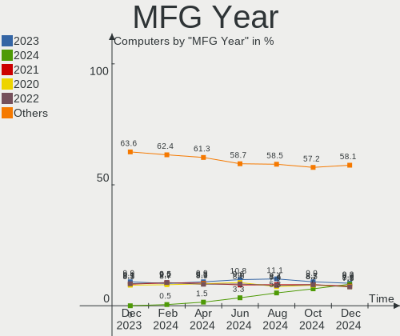
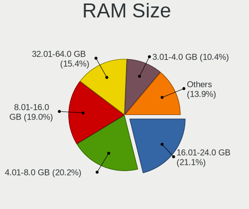
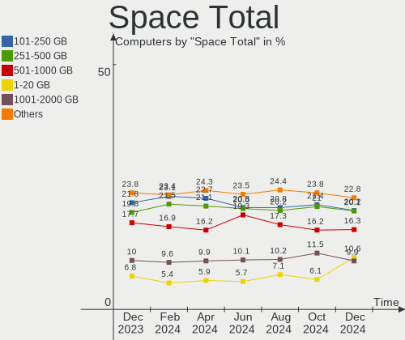
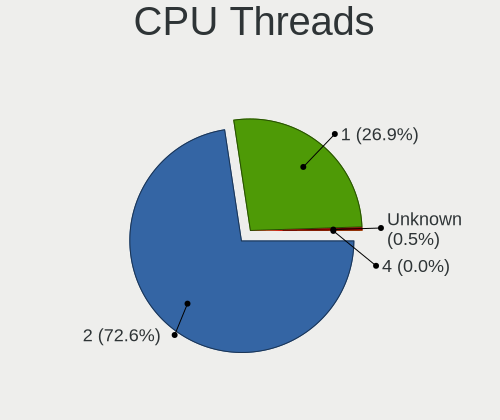

Linux Hardware Trends
---------------------

A project to identify most popular hardware characteristics and track their change
over time based on data collected by Linux users at https://Linux-Hardware.org.

Anyone can contribute to the study by uploading probes of their computers by
the [hw-probe](https://github.com/linuxhw/hw-probe) tool:

    sudo hw-probe -all -upload

This is a report for all computer types. See also reports for [desktops](/Desktop/README.md) and [notebooks](/Notebook/README.md).

Full-feature report is available here: https://linux-hardware.org/?view=trends

Distribution-specific reports: [Ubuntu](/Dist/Ubuntu), [ROSA](/Dist/ROSA), [Mint](/Dist/Mint), [Fedora](/Dist/Fedora), [BlackPanther](/Dist/BlackPanther), [Arch](/Dist/Arch), [Manjaro](/Dist/Manjaro), [Debian](/Dist/Debian), [Endless](/Dist/Endless), [Zorin](/Dist/Zorin), [Clear Linux](/Dist/Clear_Linux).

Period: Feb, 2020.

Contents
--------

- [ OS                       ](#os)
- [ OS Family                ](#os-family)
- [ Kernel                   ](#kernel)
- [ Kernel Family            ](#kernel-family)
- [ Kernel Major Ver.        ](#kernel-major-ver)
- [ Arch                     ](#arch)
- [ DE                       ](#de)
- [ Display Server           ](#display-server)
- [ OS Lang                  ](#os-lang)
- [ Boot Mode                ](#boot-mode)
- [ Filesystem               ](#filesystem)
- [ Dual Boot with Linux     ](#dual-boot-with-linux)
- [ Dual Boot (Win)          ](#dual-boot-win)
- [ Country                  ](#country)
- [ City                     ](#city)
- [ Vendor                   ](#vendor)
- [ Model                    ](#model)
- [ Model Family             ](#model-family)
- [ MFG Year                 ](#mfg-year)
- [ Form Factor              ](#form-factor)
- [ Secure Boot              ](#secure-boot)
- [ Coreboot                 ](#coreboot)
- [ RAM Size                 ](#ram-size)
- [ RAM Used                 ](#ram-used)
- [ Drive Vendor             ](#drive-vendor)
- [ Drive Model              ](#drive-model)
- [ Drive Kind               ](#drive-kind)
- [ Drive Connector          ](#drive-connector)
- [ Drive Size               ](#drive-size)
- [ Space Total              ](#space-total)
- [ Space Used               ](#space-used)
- [ Malfunc. Drives          ](#malfunc-drives)
- [ Malfunc. Drive Vendor    ](#malfunc-drive-vendor)
- [ Malfunc. Drive Kind      ](#malfunc-drive-kind)
- [ Failed Drives            ](#failed-drives)
- [ Failed Drive Vendor      ](#failed-drive-vendor)
- [ Drive Status             ](#drive-status)
- [ Storage Vendor           ](#storage-vendor)
- [ Storage Model            ](#storage-model)
- [ Storage Kind             ](#storage-kind)
- [ CPU Vendor               ](#cpu-vendor)
- [ CPU Model                ](#cpu-model)
- [ CPU Model Family         ](#cpu-model-family)
- [ CPU Cores                ](#cpu-cores)
- [ CPU Sockets              ](#cpu-sockets)
- [ CPU Threads              ](#cpu-threads)
- [ CPU Op-Modes             ](#cpu-op-modes)
- [ CPU Microarch            ](#cpu-microarch)
- [ CPU Microcode            ](#cpu-microcode)
- [ GPU Vendor               ](#gpu-vendor)
- [ GPU Model                ](#gpu-model)
- [ GPU Combo                ](#gpu-combo)
- [ GPU Driver               ](#gpu-driver)
- [ GPU Memory               ](#gpu-memory)
- [ Monitor Vendor           ](#monitor-vendor)
- [ Monitor Model            ](#monitor-model)
- [ Monitor Resolution       ](#monitor-resolution)
- [ Monitor Diagonal         ](#monitor-diagonal)
- [ Monitor Width            ](#monitor-width)
- [ Aspect Ratio             ](#aspect-ratio)
- [ Monitor Area             ](#monitor-area)
- [ Pixel Density            ](#pixel-density)
- [ Multiple Monitors        ](#multiple-monitors)
- [ Net Controller Vendor    ](#net-controller-vendor)
- [ Net Controller Model     ](#net-controller-model)
- [ Net Controller Kind      ](#net-controller-kind)
- [ Used Controller          ](#used-controller)
- [ NICs                     ](#nics)
- [ Unsupported Devices      ](#unsupported-devices)
- [ Unsupported Device Types ](#unsupported-device-types)

OS
--

Installed operating systems

| Name                         | Computers | Percent |
|------------------------------|-----------|---------|
| Ubuntu 18.04                 | 709       | 23.17%  |
| Ubuntu 19.10                 | 391       | 12.78%  |
| ROSA R11                     | 310       | 10.13%  |
| BlackPanther 18.1            | 240       | 7.84%   |
| Fedora 31                    | 218       | 7.12%   |
| Mint 19.3                    | 174       | 5.69%   |
| Manjaro 18.1.5               | 70        | 2.29%   |
| Zorin 15                     | 55        | 1.8%    |
| Arch                         | 55        | 1.8%    |
| Debian 10                    | 53        | 1.73%   |
| Endless 3.7.7                | 52        | 1.7%    |
| Manjaro                      | 47        | 1.54%   |
| Ubuntu 20.04                 | 37        | 1.21%   |
| Endless 3.7.6                | 37        | 1.21%   |
| Ubuntu 16.04                 | 33        | 1.08%   |
| Ubuntu 19.04                 | 32        | 1.05%   |
| KDE neon 18.04               | 29        | 0.95%   |
| Arch Rolling                 | 23        | 0.75%   |
| ROSA R8.1                    | 19        | 0.62%   |
| Mint 19.2                    | 18        | 0.59%   |
| ROSA R10                     | 17        | 0.56%   |
| Debian                       | 16        | 0.52%   |
| BlackPanther 16.2            | 16        | 0.52%   |
| Clear Linux 32270            | 15        | 0.49%   |
| Fedora 30                    | 14        | 0.46%   |
| Mint 19.1                    | 13        | 0.42%   |
| Kali 2020.1                  | 13        | 0.42%   |
| Gentoo                       | 12        | 0.39%   |
| Clear Linux 32480            | 11        | 0.36%   |
| Clear Linux 32380            | 11        | 0.36%   |
| Pop!_OS 19.10                | 10        | 0.33%   |
| Peppermint 10                | 10        | 0.33%   |
| Manjaro 19.0                 | 10        | 0.33%   |
| Debian Testing               | 10        | 0.33%   |
| Clear Linux 32330            | 10        | 0.33%   |
| CentOS 8                     | 10        | 0.33%   |
| Elementary 5.1.2             | 9         | 0.29%   |
| Mint 19                      | 8         | 0.26%   |
| Manjaro 19.0.0               | 8         | 0.26%   |
| Debian Unstable              | 7         | 0.23%   |
| Ubuntu 18.10                 | 6         | 0.2%    |
| RHEL 8.1                     | 6         | 0.2%    |
| RHEL 7.7                     | 6         | 0.2%    |
| Clear Linux 32390            | 6         | 0.2%    |
| CentOS 7                     | 6         | 0.2%    |
| Zorin 12                     | 5         | 0.16%   |
| Ubuntu                       | 5         | 0.16%   |
| Solus 4.1                    | 5         | 0.16%   |
| Parrot 4.8                   | 5         | 0.16%   |
| openSUSE 15.1                | 5         | 0.16%   |
| Mint 18.3                    | 5         | 0.16%   |
| Endless 3.3.20-nexthw1       | 5         | 0.16%   |
| Elementary 5.1               | 5         | 0.16%   |
| Clear Linux 32370            | 5         | 0.16%   |
| Clear Linux 32340            | 5         | 0.16%   |
| RED X4                       | 4         | 0.13%   |
| openSUSE Tumbleweed-20200128 | 4         | 0.13%   |
| MX 19                        | 4         | 0.13%   |
| Mageia 7                     | 4         | 0.13%   |
| Clear Linux 32310            | 4         | 0.13%   |

OS Family
---------

OS without a version

| Name         | Computers | Percent |
|--------------|-----------|---------|
| Ubuntu       | 1218      | 39.8%   |
| ROSA         | 349       | 11.41%  |
| BlackPanther | 257       | 8.4%    |
| Fedora       | 240       | 7.84%   |
| Mint         | 220       | 7.19%   |
| Manjaro      | 137       | 4.48%   |
| Endless      | 115       | 3.76%   |
| Debian       | 93        | 3.04%   |
| Clear Linux  | 85        | 2.78%   |
| Arch         | 78        | 2.55%   |
| Zorin        | 60        | 1.96%   |
| KDE neon     | 29        | 0.95%   |
| openSUSE     | 25        | 0.82%   |
| CentOS       | 17        | 0.56%   |
| Kali         | 16        | 0.52%   |
| Gentoo       | 15        | 0.49%   |
| Elementary   | 15        | 0.49%   |
| Peppermint   | 13        | 0.42%   |
| RHEL         | 12        | 0.39%   |
| Pop!_OS      | 11        | 0.36%   |
| Solus        | 5         | 0.16%   |
| Parrot       | 5         | 0.16%   |
| MX           | 5         | 0.16%   |
| Mageia       | 4         | 0.13%   |
| RED          | 3         | 0.1%    |
| Reborn OS    | 3         | 0.1%    |
| Oracle Linux | 3         | 0.1%    |
| Chrome OS    | 3         | 0.1%    |
| Arcolinux    | 3         | 0.1%    |
| Raspbian     | 2         | 0.07%   |
| EndeavourOS  | 2         | 0.07%   |
| Deepin       | 2         | 0.07%   |
| ClearOS      | 2         | 0.07%   |
| Android      | 2         | 0.07%   |
| Void         | 1         | 0.03%   |
| TTOS         | 1         | 0.03%   |
| Sabayon      | 1         | 0.03%   |
| Pardus       | 1         | 0.03%   |
| OpenMandriva | 1         | 0.03%   |
| Manjaro-ARM  | 1         | 0.03%   |
| Generic      | 1         | 0.03%   |
| GalliumOS    | 1         | 0.03%   |
| Devuan       | 1         | 0.03%   |
| Artix        | 1         | 0.03%   |
| Alpine       | 1         | 0.03%   |

Kernel
------

Version of the Linux kernel

| Version                          | Computers | Percent |
|----------------------------------|-----------|---------|
| 5.3.0-28-generic                 | 416       | 13.59%  |
| 5.3.0-40-generic                 | 387       | 12.65%  |
| 4.18.16-desktop-1bP              | 169       | 5.52%   |
| 5.3.0-29-generic                 | 164       | 5.36%   |
| 4.15.0-76-generic                | 135       | 4.41%   |
| 4.15.0-desktop-68.5rosa-x86_64   | 115       | 3.76%   |
| 4.15.0-desktop-45.1rosa-x86_64   | 106       | 3.46%   |
| 4.15.0-88-generic                | 72        | 2.35%   |
| 5.1.15-desktop-1bP               | 70        | 2.29%   |
| 5.5.5-200.fc31.x86_64            | 40        | 1.31%   |
| 5.4.15-2-MANJARO                 | 40        | 1.31%   |
| 5.3.0-23-generic                 | 38        | 1.24%   |
| 5.3.0-18-generic                 | 38        | 1.24%   |
| 5.4.17-200.fc31.x86_64           | 36        | 1.18%   |
| 5.0.0-23-generic                 | 35        | 1.14%   |
| 5.4.19-200.fc31.x86_64           | 33        | 1.08%   |
| 5.4.18-200.fc31.x86_64           | 33        | 1.08%   |
| 5.3.0-26-generic                 | 32        | 1.05%   |
| 4.15.0-desktop-68.5rosa-i586     | 30        | 0.98%   |
| 5.0.0-32-generic                 | 26        | 0.85%   |
| 5.4.20-200.fc31.x86_64           | 22        | 0.72%   |
| 5.4.18-902.native                | 22        | 0.72%   |
| 5.0.0-38-generic                 | 22        | 0.72%   |
| 5.0.0-37-generic                 | 22        | 0.72%   |
| 4.9.155-nrj-desktop-1rosa-x86_64 | 22        | 0.72%   |
| 4.19.0-6-amd64                   | 22        | 0.72%   |
| 4.15.0-desktop-45.1rosa-i586     | 22        | 0.72%   |
| 5.4.18-1-MANJARO                 | 21        | 0.69%   |
| 5.5.2-1-MANJARO                  | 20        | 0.65%   |
| 5.4.15-200.fc31.x86_64           | 20        | 0.65%   |
| 4.19.0-8-amd64                   | 20        | 0.65%   |
| 5.5.0-1-MANJARO                  | 16        | 0.52%   |
| 5.4.0-14-generic                 | 16        | 0.52%   |
| 4.15.0-74-generic                | 16        | 0.52%   |
| 5.5.6-914.native                 | 15        | 0.49%   |
| 5.3.0-41-generic                 | 15        | 0.49%   |
| 4.9.20-desktop-pae-1bP           | 15        | 0.49%   |
| 5.5.5-arch1-1                    | 14        | 0.46%   |
| 5.5.5-911.native                 | 12        | 0.39%   |
| 3.10.0-1062.12.1.el7.x86_64      | 12        | 0.39%   |
| 5.4.0-kali3-amd64                | 11        | 0.36%   |
| 5.5.2-arch1-1                    | 10        | 0.33%   |
| 5.5.3-908.native                 | 9         | 0.29%   |
| 5.4.0-4-amd64                    | 9         | 0.29%   |
| 5.4.0-12-generic                 | 9         | 0.29%   |
| 4.9.60-nrj-desktop-1rosa-x86_64  | 9         | 0.29%   |
| 4.9.155-nrj-desktop-1rosa-i586   | 8         | 0.26%   |
| 4.18.0-147.5.1.el8_1.x86_64      | 8         | 0.26%   |
| 5.5.4-arch1-1                    | 7         | 0.23%   |
| 5.5.4-909.native                 | 7         | 0.23%   |
| 5.4.15-arch1-1                   | 7         | 0.23%   |
| 5.4.0-3-amd64                    | 7         | 0.23%   |
| 5.4.0-0.bpo.2-amd64              | 7         | 0.23%   |
| 5.3.0-7625-generic               | 7         | 0.23%   |
| 5.3.0-40-lowlatency              | 7         | 0.23%   |
| 5.3.0-29-lowlatency              | 7         | 0.23%   |
| 5.4.6-2-MANJARO                  | 6         | 0.2%    |
| 5.4.13-201.fc31.x86_64           | 6         | 0.2%    |
| 5.3.7-301.fc31.x86_64            | 6         | 0.2%    |
| 5.3.18-1-MANJARO                 | 6         | 0.2%    |

Kernel Family
-------------

Linux kernel without a distro release

| Version  | Computers | Percent |
|----------|-----------|---------|
| 5.3.0    | 1139      | 37.22%  |
| 4.15.0   | 575       | 18.79%  |
| 4.18.16  | 169       | 5.52%   |
| 5.0.0    | 133       | 4.35%   |
| 5.4.18   | 85        | 2.78%   |
| 5.4.0    | 81        | 2.65%   |
| 5.5.5    | 73        | 2.39%   |
| 5.4.15   | 72        | 2.35%   |
| 5.1.15   | 72        | 2.35%   |
| 4.19.0   | 50        | 1.63%   |
| 5.5.2    | 45        | 1.47%   |
| 5.4.17   | 44        | 1.44%   |
| 4.18.0   | 40        | 1.31%   |
| 5.4.19   | 39        | 1.27%   |
| 4.9.155  | 30        | 0.98%   |
| 5.5.4    | 29        | 0.95%   |
| 5.5.6    | 25        | 0.82%   |
| 5.5.3    | 25        | 0.82%   |
| 5.5.0    | 25        | 0.82%   |
| 5.4.20   | 24        | 0.78%   |
| 5.6.0    | 17        | 0.56%   |
| 4.9.20   | 17        | 0.56%   |
| 4.9.0    | 16        | 0.52%   |
| 5.4.14   | 15        | 0.49%   |
| 4.9.60   | 15        | 0.49%   |
| 3.10.0   | 15        | 0.49%   |
| 5.5.1    | 13        | 0.42%   |
| 4.4.0    | 12        | 0.39%   |
| 5.4.13   | 11        | 0.36%   |
| 5.4.12   | 11        | 0.36%   |
| 5.3.18   | 10        | 0.33%   |
| 5.4.16   | 8         | 0.26%   |
| 4.12.14  | 8         | 0.26%   |
| 5.3.7    | 7         | 0.23%   |
| 4.13.0   | 7         | 0.23%   |
| 4.1.38   | 7         | 0.23%   |
| 5.4.6    | 6         | 0.2%    |
| 4.19.97  | 6         | 0.2%    |
| 4.9.9    | 5         | 0.16%   |
| 4.19.102 | 5         | 0.16%   |
| 4.16.18  | 4         | 0.13%   |
| 5.4.22   | 3         | 0.1%    |
| 5.4.21   | 3         | 0.1%    |
| 5.4.10   | 3         | 0.1%    |
| 5.3.6    | 3         | 0.1%    |
| 4.19.99  | 3         | 0.1%    |
| 4.19.101 | 3         | 0.1%    |
| 5.4.7    | 2         | 0.07%   |
| 5.4.11   | 2         | 0.07%   |
| 5.3.8    | 2         | 0.07%   |
| 5.3.16   | 2         | 0.07%   |
| 5.3.15   | 2         | 0.07%   |
| 5.2.21   | 2         | 0.07%   |
| 4.8.0    | 2         | 0.07%   |
| 4.19.81  | 2         | 0.07%   |
| 4.19.65  | 2         | 0.07%   |
| 4.10.0   | 2         | 0.07%   |
| 5.5.7    | 1         | 0.03%   |
| 5.4.2    | 1         | 0.03%   |
| 5.3.9    | 1         | 0.03%   |

Kernel Major Ver.
-----------------

Linux kernel major version

| Version | Computers | Percent |
|---------|-----------|---------|
| 5.3     | 1168      | 38.17%  |
| 4.15    | 575       | 18.79%  |
| 5.4     | 410       | 13.4%   |
| 5.5     | 236       | 7.71%   |
| 4.18    | 209       | 6.83%   |
| 5.0     | 134       | 4.38%   |
| 4.9     | 85        | 2.78%   |
| 4.19    | 79        | 2.58%   |
| 5.1     | 73        | 2.39%   |
| 5.6     | 17        | 0.56%   |
| 3.10    | 15        | 0.49%   |
| 4.4     | 14        | 0.46%   |
| 4.12    | 8         | 0.26%   |
| 4.1     | 8         | 0.26%   |
| 4.13    | 7         | 0.23%   |
| 5.2     | 5         | 0.16%   |
| 4.16    | 5         | 0.16%   |
| 4.8     | 2         | 0.07%   |
| 4.10    | 2         | 0.07%   |
| 4.7     | 1         | 0.03%   |
| 4.14    | 1         | 0.03%   |
| 4.11    | 1         | 0.03%   |
| 3.19    | 1         | 0.03%   |
| 3.18    | 1         | 0.03%   |
| 3.17    | 1         | 0.03%   |
| 3.16    | 1         | 0.03%   |
| Unknown | 1         | 0.03%   |

Arch
----

OS architecture (x86_64, i586, etc.)

| Name    | Computers | Percent |
|---------|-----------|---------|
| x86_64  | 2850      | 93.14%  |
| i686    | 196       | 6.41%   |
| aarch64 | 9         | 0.29%   |
| armv7l  | 3         | 0.1%    |
| armv8l  | 1         | 0.03%   |
| Unknown | 1         | 0.03%   |

DE
--

Desktop Environment

| Name            | Computers | Percent |
|-----------------|-----------|---------|
| GNOME           | 1346      | 43.99%  |
| KDE5            | 480       | 15.69%  |
| Unknown         | 242       | 7.91%   |
| KDE4            | 221       | 7.22%   |
| XFCE            | 180       | 5.88%   |
| X-Cinnamon      | 145       | 4.74%   |
| KDE             | 132       | 4.31%   |
| MATE            | 76        | 2.48%   |
| Cinnamon        | 56        | 1.83%   |
| Unity           | 37        | 1.21%   |
| Budgie          | 24        | 0.78%   |
| LXQt            | 22        | 0.72%   |
| LXDE            | 19        | 0.62%   |
| GNOME Flashback | 18        | 0.59%   |
| Pantheon        | 12        | 0.39%   |
| Openbox         | 11        | 0.36%   |
| i3              | 10        | 0.33%   |
| GNUstep         | 8         | 0.26%   |
| GNOME Classic   | 6         | 0.2%    |
| Deepin          | 6         | 0.2%    |
| Enlightenment   | 3         | 0.1%    |
| xubuntu         | 2         | 0.07%   |
| qt5ct           | 1         | 0.03%   |
| Peppermint      | 1         | 0.03%   |
| Lubuntu         | 1         | 0.03%   |
| Awesome         | 1         | 0.03%   |

Display Server
--------------

X11 or Wayland

| Name    | Computers | Percent |
|---------|-----------|---------|
| X11     | 2722      | 88.95%  |
| Wayland | 212       | 6.93%   |
| Unknown | 105       | 3.43%   |
| Tty     | 21        | 0.69%   |

OS Lang
-------

Language

| Lang       | Computers | Percent |
|------------|-----------|---------|
| en_US      | 914       | 29.87%  |
| Unknown    | 722       | 23.59%  |
| de_DE      | 178       | 5.82%   |
| ru_RU      | 148       | 4.84%   |
| en_GB      | 132       | 4.31%   |
| pt_BR      | 130       | 4.25%   |
| fr_FR      | 70        | 2.29%   |
| it_IT      | 62        | 2.03%   |
| es_ES      | 59        | 1.93%   |
| en_CA      | 55        | 1.8%    |
| en_AU      | 52        | 1.7%    |
| pl_PL      | 43        | 1.41%   |
| en_US.utf8 | 41        | 1.34%   |
| C          | 36        | 1.18%   |
| en_IN      | 30        | 0.98%   |
| ru_UA      | 23        | 0.75%   |
| es_MX      | 22        | 0.72%   |
| nl_NL      | 20        | 0.65%   |
| pt_BR.utf8 | 18        | 0.59%   |
| cs_CZ      | 16        | 0.52%   |
| hu_HU      | 15        | 0.49%   |
| es_AR      | 15        | 0.49%   |
| bg_BG      | 11        | 0.36%   |
| uk_UA      | 10        | 0.33%   |
| sv_SE      | 10        | 0.33%   |
| en_ZA      | 10        | 0.33%   |
| ro_RO      | 9         | 0.29%   |
| pt_PT      | 9         | 0.29%   |
| tr_TR      | 8         | 0.26%   |
| sk_SK      | 8         | 0.26%   |
| nl_BE      | 8         | 0.26%   |
| ja_JP      | 7         | 0.23%   |
| fi_FI      | 7         | 0.23%   |
| en_NZ      | 7         | 0.23%   |
| en_IE      | 7         | 0.23%   |
| es_PE      | 6         | 0.2%    |
| es_CO      | 6         | 0.2%    |
| en_PH      | 6         | 0.2%    |
| de_DE.utf8 | 6         | 0.2%    |
| zh_CN      | 5         | 0.16%   |
| fr_CA      | 5         | 0.16%   |
| es_CL      | 5         | 0.16%   |
| el_GR      | 5         | 0.16%   |
| de_AT      | 5         | 0.16%   |
| ca_ES      | 5         | 0.16%   |
| ru_RU.utf8 | 4         | 0.13%   |
| nb_NO      | 4         | 0.13%   |
| fr_BE      | 4         | 0.13%   |
| es_VE      | 4         | 0.13%   |
| en_GB.utf8 | 4         | 0.13%   |
| de_CH      | 4         | 0.13%   |
| da_DK      | 4         | 0.13%   |
| zh_TW      | 3         | 0.1%    |
| ko_KR      | 3         | 0.1%    |
| it_IT.utf8 | 3         | 0.1%    |
| et_EE      | 3         | 0.1%    |
| es_CR      | 3         | 0.1%    |
| en_DK      | 3         | 0.1%    |
| C          | 3         | 0.1%    |
| pl_PL.utf8 | 2         | 0.07%   |

Boot Mode
---------

EFI or BIOS

| Mode | Computers | Percent |
|------|-----------|---------|
| BIOS | 1764      | 57.65%  |
| EFI  | 1296      | 42.35%  |

Filesystem
----------

Type of filesystem

| Type     | Computers | Percent |
|----------|-----------|---------|
| Ext4     | 2793      | 91.27%  |
| Btrfs    | 84        | 2.75%   |
| Overlay  | 68        | 2.22%   |
| Xfs      | 67        | 2.19%   |
| Zfs      | 14        | 0.46%   |
| Ext3     | 11        | 0.36%   |
| Ext2     | 6         | 0.2%    |
| Tmpfs    | 4         | 0.13%   |
| Unknown  | 4         | 0.13%   |
| F2fs     | 3         | 0.1%    |
| Reiserfs | 2         | 0.07%   |
| Jfs      | 2         | 0.07%   |
| Rootfs   | 1         | 0.03%   |
| Aufs     | 1         | 0.03%   |

Dual Boot with Linux
--------------------

Hosting more than one Linux

| Dual boot | Computers | Percent |
|-----------|-----------|---------|
| No        | 2705      | 88.4%   |
| Yes       | 355       | 11.6%   |

Dual Boot (Win)
---------------

Hosting Linux and Windows

| Dual boot | Computers | Percent |
|-----------|-----------|---------|
| No        | 2132      | 69.67%  |
| Yes       | 928       | 30.33%  |

Country
-------

Geographic location (country)

| Country            | Computers | Percent |
|--------------------|-----------|---------|
| USA                | 466       | 15.23%  |
| Russia             | 434       | 14.18%  |
| Germany            | 253       | 8.27%   |
| Hungary            | 224       | 7.32%   |
| Brazil             | 184       | 6.01%   |
| UK                 | 116       | 3.79%   |
| Canada             | 92        | 3.01%   |
| Italy              | 88        | 2.88%   |
| Ukraine            | 87        | 2.84%   |
| France             | 82        | 2.68%   |
| Spain              | 77        | 2.52%   |
| Poland             | 66        | 2.16%   |
| Australia          | 62        | 2.03%   |
| Netherlands        | 52        | 1.7%    |
| India              | 48        | 1.57%   |
| Romania            | 38        | 1.24%   |
| Mexico             | 37        | 1.21%   |
| Norway             | 36        | 1.18%   |
| Czech Republic     | 27        | 0.88%   |
| Sweden             | 23        | 0.75%   |
| Argentina          | 23        | 0.75%   |
| Indonesia          | 22        | 0.72%   |
| Greece             | 21        | 0.69%   |
| Belgium            | 21        | 0.69%   |
| Turkey             | 20        | 0.65%   |
| Switzerland        | 20        | 0.65%   |
| Austria            | 20        | 0.65%   |
| Finland            | 18        | 0.59%   |
| Bulgaria           | 18        | 0.59%   |
| Belarus            | 17        | 0.56%   |
| Slovakia           | 16        | 0.52%   |
| Denmark            | 15        | 0.49%   |
| Portugal           | 14        | 0.46%   |
| China              | 14        | 0.46%   |
| South Africa       | 13        | 0.42%   |
| Serbia             | 13        | 0.42%   |
| Colombia           | 13        | 0.42%   |
| Japan              | 11        | 0.36%   |
| Thailand           | 10        | 0.33%   |
| New Zealand        | 10        | 0.33%   |
| Kazakhstan         | 10        | 0.33%   |
| Ireland            | 10        | 0.33%   |
| Philippines        | 9         | 0.29%   |
| Iran               | 9         | 0.29%   |
| Peru               | 8         | 0.26%   |
| Latvia             | 8         | 0.26%   |
| Israel             | 8         | 0.26%   |
| Lithuania          | 7         | 0.23%   |
| Hong Kong          | 7         | 0.23%   |
| Chile              | 7         | 0.23%   |
| Venezuela          | 6         | 0.2%    |
| Puerto Rico        | 6         | 0.2%    |
| Malaysia           | 6         | 0.2%    |
| Estonia            | 6         | 0.2%    |
| Vietnam            | 5         | 0.16%   |
| Taiwan             | 5         | 0.16%   |
| Singapore          | 5         | 0.16%   |
| Morocco            | 5         | 0.16%   |
| Korea, Republic of | 5         | 0.16%   |
| Egypt              | 5         | 0.16%   |

City
----

Geographic location (city)

| City              | Computers | Percent |
|-------------------|-----------|---------|
| Moscow            | 88        | 2.88%   |
| Budapest          | 64        | 2.09%   |
| St Petersburg     | 50        | 1.63%   |
| Berlin            | 28        | 0.92%   |
| São Paulo        | 23        | 0.75%   |
| Kyiv              | 19        | 0.62%   |
| Oslo              | 17        | 0.56%   |
| Warsaw            | 16        | 0.52%   |
| Novosibirsk       | 16        | 0.52%   |
| Yekaterinburg     | 15        | 0.49%   |
| Madrid            | 15        | 0.49%   |
| Rome              | 14        | 0.46%   |
| Frankfurt am Main | 14        | 0.46%   |
| Nuremberg         | 13        | 0.42%   |
| Amsterdam         | 13        | 0.42%   |
| Vienna            | 12        | 0.39%   |
| Toronto           | 12        | 0.39%   |
| Mexico City       | 12        | 0.39%   |
| Kharkiv           | 12        | 0.39%   |
| Paris             | 11        | 0.36%   |
| Barcelona         | 11        | 0.36%   |
| Athens            | 11        | 0.36%   |
| Voronezh          | 10        | 0.33%   |
| Montreal          | 10        | 0.33%   |
| Miskolc           | 10        | 0.33%   |
| Chicago           | 10        | 0.33%   |
| Sofia             | 9         | 0.29%   |
| Samara            | 9         | 0.29%   |
| Rio de Janeiro    | 9         | 0.29%   |
| Minsk             | 9         | 0.29%   |
| Krasnodar         | 9         | 0.29%   |
| Kazan’          | 9         | 0.29%   |
| Dublin            | 9         | 0.29%   |
| Cologne           | 9         | 0.29%   |
| Bucharest         | 9         | 0.29%   |
| Bengaluru         | 9         | 0.29%   |
| Belgrade          | 9         | 0.29%   |
| Zurich            | 8         | 0.26%   |
| Wrocław          | 8         | 0.26%   |
| Wahroonga         | 8         | 0.26%   |
| New York          | 8         | 0.26%   |
| Eger              | 8         | 0.26%   |
| Vilnius           | 7         | 0.23%   |
| Székesfehérvár | 7         | 0.23%   |
| San Francisco     | 7         | 0.23%   |
| Riga              | 7         | 0.23%   |
| Ottawa            | 7         | 0.23%   |
| Munich            | 7         | 0.23%   |
| Lima              | 7         | 0.23%   |
| Istanbul          | 7         | 0.23%   |
| Hamburg           | 7         | 0.23%   |
| Gödöllő        | 7         | 0.23%   |
| Brasília         | 7         | 0.23%   |
| Bogotá           | 7         | 0.23%   |
| Tehran            | 6         | 0.2%    |
| Szigetszentmiklos | 6         | 0.2%    |
| Stockholm         | 6         | 0.2%    |
| Prague            | 6         | 0.2%    |
| Omsk              | 6         | 0.2%    |
| Odesa             | 6         | 0.2%    |

Vendor
------

Motherboard manufacturer

| Name                    | Computers | Percent |
|-------------------------|-----------|---------|
| ASUSTek Computer        | 560       | 18.3%   |
| Hewlett-Packard         | 428       | 13.99%  |
| Lenovo                  | 395       | 12.91%  |
| Dell                    | 394       | 12.88%  |
| Gigabyte Technology     | 256       | 8.37%   |
| Acer                    | 204       | 6.67%   |
| MSI                     | 154       | 5.03%   |
| ASRock                  | 124       | 4.05%   |
| Intel                   | 50        | 1.63%   |
| Toshiba                 | 49        | 1.6%    |
| Apple                   | 48        | 1.57%   |
| Samsung Electronics     | 46        | 1.5%    |
| Fujitsu                 | 24        | 0.78%   |
| Sony                    | 22        | 0.72%   |
| Unknown                 | 22        | 0.72%   |
| Supermicro              | 17        | 0.56%   |
| ECS                     | 14        | 0.46%   |
| Medion                  | 13        | 0.42%   |
| Pegatron                | 12        | 0.39%   |
| Microsoft               | 12        | 0.39%   |
| Fujitsu Siemens         | 12        | 0.39%   |
| Biostar                 | 12        | 0.39%   |
| Packard Bell            | 10        | 0.33%   |
| HUAWEI                  | 9         | 0.29%   |
| Foxconn                 | 9         | 0.29%   |
| Alienware               | 9         | 0.29%   |
| Notebook                | 8         | 0.26%   |
| Google                  | 8         | 0.26%   |
| Raspberry Pi Foundation | 7         | 0.23%   |
| eMachines               | 7         | 0.23%   |
| Positivo                | 6         | 0.2%    |
| Gateway                 | 6         | 0.2%    |
| Timi                    | 5         | 0.16%   |
| LG Electronics          | 5         | 0.16%   |
| AMI                     | 5         | 0.16%   |
| PCWare                  | 4         | 0.13%   |
| Digma                   | 4         | 0.13%   |
| TrekStor                | 3         | 0.1%    |
| Shuttle                 | 3         | 0.1%    |
| Complet                 | 3         | 0.1%    |
| ZOTAC                   | 2         | 0.07%   |
| Razer                   | 2         | 0.07%   |
| PC Specialist           | 2         | 0.07%   |
| Nvidia                  | 2         | 0.07%   |
| IBM                     | 2         | 0.07%   |
| Huanan                  | 2         | 0.07%   |
| Digibras                | 2         | 0.07%   |
| CyberPowerPC            | 2         | 0.07%   |
| Clevo                   | 2         | 0.07%   |
| YIFANG                  | 1         | 0.03%   |
| Wortmann AG             | 1         | 0.03%   |
| WinFast                 | 1         | 0.03%   |
| VULCAN                  | 1         | 0.03%   |
| TYAN Computer           | 1         | 0.03%   |
| TUXEDO                  | 1         | 0.03%   |
| TMAX                    | 1         | 0.03%   |
| Thomson                 | 1         | 0.03%   |
| Teclast                 | 1         | 0.03%   |
| System76                | 1         | 0.03%   |
| Synology                | 1         | 0.03%   |

Model
-----

Motherboard model

| Name                                 | Computers | Percent |
|--------------------------------------|-----------|---------|
| ASUS All Series                      | 38        | 1.24%   |
| Unknown                              | 30        | 0.98%   |
| HP Notebook                          | 17        | 0.56%   |
| HP Pavilion g6                       | 11        | 0.36%   |
| HP Pavilion dv6                      | 10        | 0.33%   |
| MSI MS-7C02                          | 9         | 0.29%   |
| Acer Nitro AN515-52                  | 9         | 0.29%   |
| HP 15                                | 8         | 0.26%   |
| Gigabyte B450M DS3H                  | 8         | 0.26%   |
| Dell Latitude E6430                  | 8         | 0.26%   |
| HP Pavilion dv7                      | 7         | 0.23%   |
| HP Laptop 15-bw0xx                   | 7         | 0.23%   |
| Dell OptiPlex 7010                   | 7         | 0.23%   |
| ASUS X541NA                          | 7         | 0.23%   |
| ASUS K50IJ                           | 7         | 0.23%   |
| HP Laptop 15-db0xxx                  | 6         | 0.2%    |
| HP Laptop 15-bs0xx                   | 6         | 0.2%    |
| HP EliteBook 8460p                   | 6         | 0.2%    |
| HP EliteBook 840 G6                  | 6         | 0.2%    |
| Dell XPS 15 7590                     | 6         | 0.2%    |
| Dell OptiPlex 755                    | 6         | 0.2%    |
| Dell Inspiron 15-3567                | 6         | 0.2%    |
| ASUS VivoBook 15_ASUS Laptop X540UAR | 6         | 0.2%    |
| ASUS PRIME A320M-K                   | 6         | 0.2%    |
| ASRock N68C-S UCC                    | 6         | 0.2%    |
| RPi Raspberry Pi 4 Model B Rev 1.1   | 5         | 0.16%   |
| MSI MS-7B79                          | 5         | 0.16%   |
| Lenovo IdeaPad 330-15IKB 81DE        | 5         | 0.16%   |
| Lenovo IdeaPad 310-15ISK 80SM        | 5         | 0.16%   |
| HP Pavilion Gaming Laptop 15-cx0xxx  | 5         | 0.16%   |
| HP Laptop 15-bs1xx                   | 5         | 0.16%   |
| HP 250 G1                            | 5         | 0.16%   |
| Dell XPS 13 9360                     | 5         | 0.16%   |
| Dell Precision 5540                  | 5         | 0.16%   |
| Dell PowerEdge R230                  | 5         | 0.16%   |
| Dell OptiPlex 3020                   | 5         | 0.16%   |
| Dell Latitude E7240                  | 5         | 0.16%   |
| Dell Latitude E6400                  | 5         | 0.16%   |
| Dell Inspiron 15 7000 Gaming         | 5         | 0.16%   |
| ASUS 1005HA                          | 5         | 0.16%   |
| Acer Aspire A315-53                  | 5         | 0.16%   |
| Supermicro Super Server              | 4         | 0.13%   |
| MSI MS-7C37                          | 4         | 0.13%   |
| MSI MS-7817                          | 4         | 0.13%   |
| MSI MS-7309                          | 4         | 0.13%   |
| Microsoft Surface Book               | 4         | 0.13%   |
| Lenovo G500 20236                    | 4         | 0.13%   |
| Lenovo G50-30 80G0                   | 4         | 0.13%   |
| Lenovo B570e HuronRiver Platform     | 4         | 0.13%   |
| HP ProBook 650 G1                    | 4         | 0.13%   |
| HP Pavilion Gaming Laptop 15-ec0xxx  | 4         | 0.13%   |
| HP Pavilion g7                       | 4         | 0.13%   |
| HP Pavilion 15                       | 4         | 0.13%   |
| HP Laptop 17-by0xxx                  | 4         | 0.13%   |
| HP G62                               | 4         | 0.13%   |
| HP EliteBook 8470p                   | 4         | 0.13%   |
| HP EliteBook 840 G3                  | 4         | 0.13%   |
| Gigabyte GA-78LMT-USB3               | 4         | 0.13%   |
| Gigabyte G31M-ES2L                   | 4         | 0.13%   |
| Gigabyte B450 AORUS ELITE            | 4         | 0.13%   |

Model Family
------------

Motherboard model prefix

| Name                    | Computers | Percent |
|-------------------------|-----------|---------|
| Lenovo ThinkPad         | 168       | 5.49%   |
| Acer Aspire             | 141       | 4.61%   |
| Dell Inspiron           | 117       | 3.82%   |
| Dell Latitude           | 90        | 2.94%   |
| Lenovo IdeaPad          | 89        | 2.91%   |
| HP Pavilion             | 85        | 2.78%   |
| Dell OptiPlex           | 60        | 1.96%   |
| HP EliteBook            | 54        | 1.76%   |
| HP ProBook              | 48        | 1.57%   |
| HP Laptop               | 48        | 1.57%   |
| Dell Precision          | 43        | 1.41%   |
| ASUS PRIME              | 43        | 1.41%   |
| HP Compaq               | 42        | 1.37%   |
| Toshiba Satellite       | 38        | 1.24%   |
| ASUS All                | 38        | 1.24%   |
| Dell XPS                | 36        | 1.18%   |
| ASUS VivoBook           | 35        | 1.14%   |
| Unknown                 | 30        | 0.98%   |
| Lenovo ThinkCentre      | 27        | 0.88%   |
| Dell Vostro             | 20        | 0.65%   |
| ASUS ROG                | 20        | 0.65%   |
| HP Notebook             | 17        | 0.56%   |
| Acer Nitro              | 17        | 0.56%   |
| ASUS TUF                | 16        | 0.52%   |
| HP ENVY                 | 15        | 0.49%   |
| Lenovo Yoga             | 14        | 0.46%   |
| Dell PowerEdge          | 13        | 0.42%   |
| Microsoft Surface       | 12        | 0.39%   |
| HP 250                  | 12        | 0.39%   |
| Acer TravelMate         | 12        | 0.39%   |
| Gigabyte B450M          | 11        | 0.36%   |
| Fujitsu LIFEBOOK        | 11        | 0.36%   |
| Acer Veriton            | 10        | 0.33%   |
| MSI MS-7C02             | 9         | 0.29%   |
| HP ZBook                | 9         | 0.29%   |
| HP 15                   | 9         | 0.29%   |
| Gigabyte B450           | 9         | 0.29%   |
| ASUS M5A78L-M           | 9         | 0.29%   |
| Lenovo IdeaCentre       | 8         | 0.26%   |
| HP EliteDesk            | 8         | 0.26%   |
| Gigabyte X570           | 8         | 0.26%   |
| RPi Raspberry           | 7         | 0.23%   |
| Packard Bell EasyNote   | 7         | 0.23%   |
| Gigabyte H310M          | 7         | 0.23%   |
| Fujitsu ESPRIMO         | 7         | 0.23%   |
| ASUS ZenBook            | 7         | 0.23%   |
| ASUS X541NA             | 7         | 0.23%   |
| ASUS P5KPL-AM           | 7         | 0.23%   |
| ASUS M5A97              | 7         | 0.23%   |
| ASUS K50IJ              | 7         | 0.23%   |
| Lenovo ThinkBook        | 6         | 0.2%    |
| HP Spectre              | 6         | 0.2%    |
| Gigabyte GA-78LMT-USB3  | 6         | 0.2%    |
| Fujitsu Siemens ESPRIMO | 6         | 0.2%    |
| ASUS SABERTOOTH         | 6         | 0.2%    |
| ASUS Maximus            | 6         | 0.2%    |
| ASRock N68C-S           | 6         | 0.2%    |
| MSI MS-7B79             | 5         | 0.16%   |
| HP Stream               | 5         | 0.16%   |
| HP ProLiant             | 5         | 0.16%   |

MFG Year
--------

Motherboard manufacture year

| Year    | Computers | Percent |
|---------|-----------|---------|
| 2019    | 760       | 24.84%  |
| 2018    | 364       | 11.9%   |
| 2013    | 230       | 7.52%   |
| 2012    | 223       | 7.29%   |
| 2011    | 223       | 7.29%   |
| 2014    | 193       | 6.31%   |
| 2010    | 180       | 5.88%   |
| 2015    | 170       | 5.56%   |
| 2017    | 165       | 5.39%   |
| 2016    | 157       | 5.13%   |
| 2009    | 139       | 4.54%   |
| 2008    | 109       | 3.56%   |
| 2007    | 51        | 1.67%   |
| 2006    | 37        | 1.21%   |
| 2020    | 19        | 0.62%   |
| 2005    | 16        | 0.52%   |
| Unknown | 15        | 0.49%   |
| 2004    | 5         | 0.16%   |
| 2003    | 2         | 0.07%   |
| 2001    | 1         | 0.03%   |
| 2000    | 1         | 0.03%   |

Form Factor
-----------

Physical design of the computer

| Name           | Computers | Percent |
|----------------|-----------|---------|
| Notebook       | 1674      | 54.71%  |
| Desktop        | 1209      | 39.51%  |
| Convertible    | 56        | 1.83%   |
| Server         | 34        | 1.11%   |
| All in one     | 28        | 0.92%   |
| Mini pc        | 25        | 0.82%   |
| Tablet         | 21        | 0.69%   |
| System on chip | 11        | 0.36%   |
| Phone          | 2         | 0.07%   |

Secure Boot
-----------

Enabled or disabled

| State    | Computers | Percent |
|----------|-----------|---------|
| Disabled | 2847      | 93.04%  |
| Enabled  | 213       | 6.96%   |

Coreboot
--------

Have coreboot on board

| Used | Computers | Percent |
|------|-----------|---------|
| No   | 3052      | 99.74%  |
| Yes  | 8         | 0.26%   |

RAM Size
--------

Total RAM memory

| Size in GB      | Computers | Percent |
|-----------------|-----------|---------|
| 3.01-4.0        | 752       | 24.58%  |
| 4.01-8.0        | 619       | 20.23%  |
| 8.01-16.0       | 572       | 18.69%  |
| 16.01-24.0      | 559       | 18.27%  |
| 1.01-2.0        | 197       | 6.44%   |
| 32.01-64.0      | 176       | 5.75%   |
| 2.01-3.0        | 78        | 2.55%   |
| 64.01-256.0     | 37        | 1.21%   |
| 0.01-1.0        | 35        | 1.14%   |
| 24.01-32.0      | 26        | 0.85%   |
| More than 256.0 | 7         | 0.23%   |
| Unknown         | 2         | 0.07%   |

RAM Used
--------

Used RAM memory

| Used GB     | Computers | Percent |
|-------------|-----------|---------|
| 1.01-2.0    | 1178      | 38.5%   |
| 2.01-3.0    | 692       | 22.61%  |
| 0.01-1.0    | 515       | 16.83%  |
| 4.01-8.0    | 314       | 10.26%  |
| 3.01-4.0    | 279       | 9.12%   |
| 8.01-16.0   | 63        | 2.06%   |
| 16.01-24.0  | 8         | 0.26%   |
| 24.01-32.0  | 5         | 0.16%   |
| 32.01-64.0  | 2         | 0.07%   |
| 64.01-256.0 | 2         | 0.07%   |
| Unknown     | 2         | 0.07%   |

Drive Vendor
------------

Hard drive vendors

| Vendor              | Computers | Drives | Percent |
|---------------------|-----------|--------|---------|
| Seagate             | 763       | 947    | 19.45%  |
| WDC                 | 752       | 956    | 19.17%  |
| Samsung Electronics | 489       | 576    | 12.47%  |
| Toshiba             | 324       | 346    | 8.26%   |
| Kingston            | 235       | 254    | 5.99%   |
| Hitachi             | 202       | 214    | 5.15%   |
| SanDisk             | 146       | 157    | 3.72%   |
| HGST                | 119       | 127    | 3.03%   |
| Unknown             | 118       | 133    | 3.01%   |
| Crucial             | 118       | 128    | 3.01%   |
| Intel               | 78        | 87     | 1.99%   |
| A-DATA Technology   | 56        | 58     | 1.43%   |
| SK Hynix            | 46        | 46     | 1.17%   |
| China               | 35        | 36     | 0.89%   |
| Micron Technology   | 29        | 29     | 0.74%   |
| SPCC                | 28        | 28     | 0.71%   |
| OCZ                 | 22        | 22     | 0.56%   |
| Maxtor              | 20        | 21     | 0.51%   |
| Fujitsu             | 19        | 19     | 0.48%   |
| PNY                 | 16        | 16     | 0.41%   |
| Patriot             | 16        | 16     | 0.41%   |
| LITEONIT            | 15        | 15     | 0.38%   |
| LITEON              | 15        | 15     | 0.38%   |
| Hewlett-Packard     | 14        | 13     | 0.36%   |
| Generic             | 14        | 14     | 0.36%   |
| Transcend           | 13        | 13     | 0.33%   |
| Team                | 13        | 14     | 0.33%   |
| Corsair             | 13        | 13     | 0.33%   |
| Intenso             | 11        | 11     | 0.28%   |
| Apple               | 11        | 11     | 0.28%   |
| JMicron             | 9         | 9      | 0.23%   |
| GOODRAM             | 9         | 9      | 0.23%   |
| Apacer              | 9         | 11     | 0.23%   |
| Smartbuy            | 8         | 8      | 0.2%    |
| PLEXTOR             | 7         | 7      | 0.18%   |
| Phison              | 7         | 7      | 0.18%   |
| KingDian            | 6         | 9      | 0.15%   |
| HUAWEI              | 6         | 6      | 0.15%   |
| HL-DT-ST            | 6         | 1      | 0.15%   |
| Gigabyte Technology | 6         | 6      | 0.15%   |
| KingSpec            | 5         | 7      | 0.13%   |
| ASMT                | 5         | 6      | 0.13%   |
| XPG                 | 4         | 5      | 0.1%    |
| FORESEE             | 4         | 4      | 0.1%    |
| Drevo               | 4         | 4      | 0.1%    |
| SABRENT             | 3         | 5      | 0.08%   |
| Zheino              | 2         | 2      | 0.05%   |
| WDC WD20            | 2         | 2      | 0.05%   |
| Vaseky              | 2         | 2      | 0.05%   |
| TO Exter            | 2         | 2      | 0.05%   |
| ShineDisk           | 2         | 3      | 0.05%   |
| LaCie               | 2         | 2      | 0.05%   |
| KINGMAX             | 2         | 2      | 0.05%   |
| KingFast            | 2         | 2      | 0.05%   |
| KESU                | 2         | 2      | 0.05%   |
| Integral            | 2         | 2      | 0.05%   |
| IBM                 | 2         | 2      | 0.05%   |
| asmedia             | 2         | 2      | 0.05%   |
| AMD                 | 2         | 3      | 0.05%   |
| WDC WD50            | 1         | 1      | 0.03%   |

Drive Model
-----------

Hard drive models

| Model                        | Computers | Percent |
|------------------------------|-----------|---------|
| ST500DM002-1BD142 500GB      | 45        | 1.05%   |
| SA400S37120G 120GB SSD       | 44        | 1.02%   |
| ST1000LM035-1RK172 1TB       | 42        | 0.98%   |
| SSD 850 EVO 250GB            | 42        | 0.98%   |
| SA400S37240G 240GB SSD       | 42        | 0.98%   |
| ST1000LM024 HN-M101MBB 1TB   | 38        | 0.88%   |
| HTS721010A9E630 1TB          | 38        | 0.88%   |
| SV300S37A120G 120GB SSD      | 36        | 0.84%   |
| MMC Card  32GB               | 36        | 0.84%   |
| DT01ACA100 1TB               | 35        | 0.81%   |
| SSD 850 EVO 500GB            | 34        | 0.79%   |
| MQ01ABD100 1TB               | 34        | 0.79%   |
| WD10SPZX-21Z10T0 1TB         | 27        | 0.63%   |
| WD10EZEX-08WN4A0 1TB         | 27        | 0.63%   |
| MQ04ABF100 1TB               | 27        | 0.63%   |
| MQ01ABF050 500GB             | 27        | 0.63%   |
| ST1000DM010-2EP102 1TB       | 25        | 0.58%   |
| MMC Card  64GB               | 24        | 0.56%   |
| CT500MX500SSD1 500GB         | 24        | 0.56%   |
| ST500LT012-1DG142 500GB      | 21        | 0.49%   |
| SSD 860 EVO 500GB            | 21        | 0.49%   |
| SSD 860 EVO 250GB            | 21        | 0.49%   |
| SSD 860 EVO 1TB              | 18        | 0.42%   |
| SA400S37480G 480GB SSD       | 18        | 0.42%   |
| DT01ACA050 500GB             | 18        | 0.42%   |
| ST500LM012 HN-M500MBB 500GB  | 17        | 0.4%    |
| HTS545050A7E380 500GB        | 17        | 0.4%    |
| ST1000DM003-1ER162 1TB       | 16        | 0.37%   |
| HTS541010A9E680 1TB          | 16        | 0.37%   |
| ST9500325AS 500GB            | 15        | 0.35%   |
| ST1000LM049-2GH172 1TB       | 15        | 0.35%   |
| SSD PLUS 240GB               | 15        | 0.35%   |
| HTS725050A7E630 500GB        | 15        | 0.35%   |
| HTS545050A7E680 500GB        | 15        | 0.35%   |
| Expansion 1TB                | 15        | 0.35%   |
| ST3500418AS 500GB            | 14        | 0.33%   |
| ST3160815AS 160GB            | 14        | 0.33%   |
| ST2000LM007-1R8174 2TB       | 14        | 0.33%   |
| WD10JPVX-22JC3T0 1TB         | 13        | 0.3%    |
| ST2000DM001-1ER164 2TB       | 13        | 0.3%    |
| ST1000DM003-1CH162 1TB       | 13        | 0.3%    |
| SSD 840 EVO 120GB            | 13        | 0.3%    |
| HTS545025B9A300 250GB        | 13        | 0.3%    |
| WDS120G2G0A-00JH30 120GB SSD | 12        | 0.28%   |
| WD5000LPCX-24VHAT0 500GB     | 12        | 0.28%   |
| SV300S37A240G 240GB SSD      | 12        | 0.28%   |
| SUV400S37240G 240GB SSD      | 12        | 0.28%   |
| ST31000528AS 1TB             | 12        | 0.28%   |
| ST2000DM001-1CH164 2TB       | 12        | 0.28%   |
| SDSSDA240G 240GB             | 12        | 0.28%   |
| SD/MMC/MS PRO 64GB           | 12        | 0.28%   |
| HTS543232A7A384 320GB        | 12        | 0.28%   |
| HD103SJ 1TB                  | 12        | 0.28%   |
| CT240BX500SSD1 240GB         | 12        | 0.28%   |
| WDS240G2G0A-00JH30 240GB SSD | 11        | 0.26%   |
| WD5000LPVX-22V0TT0 500GB     | 11        | 0.26%   |
| WD10EZEX-00BN5A0 1TB         | 11        | 0.26%   |
| ST500LT012-9WS142 500GB      | 11        | 0.26%   |
| ST2000LX001-1RG174 2TB       | 11        | 0.26%   |
| ST2000DM006-2DM164 2TB       | 11        | 0.26%   |

Drive Kind
----------

HDD or SSD

| Kind    | Computers | Drives | Percent |
|---------|-----------|--------|---------|
| HDD     | 1930      | 2605   | 54.14%  |
| SSD     | 1230      | 1467   | 34.5%   |
| NVMe    | 194       | 211    | 5.44%   |
| MMC     | 111       | 127    | 3.11%   |
| Unknown | 100       | 106    | 2.81%   |

Drive Connector
---------------

SATA, SAS, NVMe, etc.

| Type | Computers | Drives | Percent |
|------|-----------|--------|---------|
| SATA | 2643      | 3993   | 85.67%  |
| NVMe | 194       | 211    | 6.29%   |
| SAS  | 137       | 185    | 4.44%   |
| MMC  | 111       | 127    | 3.6%    |

Drive Size
----------

Size of hard drive

| Size in TB | Computers | Drives | Percent |
|------------|-----------|--------|---------|
| 0.01-0.5   | 2190      | 2798   | 61.48%  |
| 0.51-1.0   | 999       | 1158   | 28.05%  |
| 1.01-2.0   | 241       | 334    | 6.77%   |
| 3.01-4.0   | 55        | 66     | 1.54%   |
| 2.01-3.0   | 38        | 59     | 1.07%   |
| 4.01-10.0  | 35        | 96     | 0.98%   |
| 10.01-20.0 | 4         | 5      | 0.11%   |

Space Total
-----------

Amount of disk space available on the file system

| Size in GB     | Computers | Percent |
|----------------|-----------|---------|
| 101-250        | 912       | 29.8%   |
| 251-500        | 684       | 22.35%  |
| 501-1000       | 458       | 14.97%  |
| 51-100         | 252       | 8.24%   |
| 1001-2000      | 196       | 6.41%   |
| 21-50          | 177       | 5.78%   |
| 1-20           | 119       | 3.89%   |
| More than 3000 | 114       | 3.73%   |
| 2001-3000      | 94        | 3.07%   |
| Unknown        | 54        | 1.76%   |

Space Used
----------

Amount of used disk space

| Used GB        | Computers | Percent |
|----------------|-----------|---------|
| 1-20           | 1378      | 45.03%  |
| 21-50          | 473       | 15.46%  |
| 101-250        | 333       | 10.88%  |
| 51-100         | 320       | 10.46%  |
| 251-500        | 196       | 6.41%   |
| 501-1000       | 143       | 4.67%   |
| 1001-2000      | 96        | 3.14%   |
| Unknown        | 54        | 1.76%   |
| More than 3000 | 39        | 1.27%   |
| 2001-3000      | 28        | 0.92%   |

Malfunc. Drives
---------------

Drive models with a malfunction

| Model                        | Computers | Drives | Percent |
|------------------------------|-----------|--------|---------|
| ST500DM002-1BD142 500GB      | 11        | 11     | 3.13%   |
| HTS545025B9A300 250GB        | 8         | 8      | 2.27%   |
| HTS545050A7E680 500GB        | 6         | 6      | 1.7%    |
| ST31000528AS 1TB             | 5         | 5      | 1.42%   |
| ST9500325AS 500GB            | 4         | 4      | 1.14%   |
| MQ01ABF050 500GB             | 4         | 4      | 1.14%   |
| HTS545032A7E380 320GB        | 4         | 4      | 1.14%   |
| HTS541010A9E680 1TB          | 4         | 4      | 1.14%   |
| WD5000AAKS-00UU3A0 500GB     | 3         | 3      | 0.85%   |
| ST9250315AS 250GB            | 3         | 3      | 0.85%   |
| ST3500418AS 500GB            | 3         | 3      | 0.85%   |
| ST3250410AS 250GB            | 3         | 3      | 0.85%   |
| ST3160815AS 160GB            | 3         | 4      | 0.85%   |
| ST2000LM007-1R8174 2TB       | 3         | 3      | 0.85%   |
| ST2000DM001-9YN164 2TB       | 3         | 3      | 0.85%   |
| ST1000DM003-9YN162 1TB       | 3         | 3      | 0.85%   |
| SSDSC2CT120A3 120GB          | 3         | 3      | 0.85%   |
| HTS545050A7E380 500GB        | 3         | 3      | 0.85%   |
| HTS543232A7A384 320GB        | 3         | 3      | 0.85%   |
| HDS721616PLA380 160GB        | 3         | 3      | 0.85%   |
| HDS721010CLA332 1TB          | 3         | 3      | 0.85%   |
| HD322HJ 320GB                | 3         | 3      | 0.85%   |
| WD5000AADS-00S9B0 500GB      | 2         | 2      | 0.57%   |
| WD3200BPVT-22ZEST0 320GB     | 2         | 2      | 0.57%   |
| WD30EFRX-68EUZN0 3TB         | 2         | 11     | 0.57%   |
| WD1600AVVS-63L2B0 160GB      | 2         | 2      | 0.57%   |
| WD10JPVX-60JC3T0 1TB         | 2         | 2      | 0.57%   |
| WD10EZEX-08WN4A0 1TB         | 2         | 2      | 0.57%   |
| WD10EARS-00Y5B1 1TB          | 2         | 2      | 0.57%   |
| SV300S37A120G 120GB SSD      | 2         | 2      | 0.57%   |
| ST980811AS 80GB              | 2         | 2      | 0.57%   |
| ST320LT020-9YG142 320GB      | 2         | 2      | 0.57%   |
| ST320LT012-9WS14C 320GB      | 2         | 2      | 0.57%   |
| ST320LT007-9ZV142 320GB      | 2         | 2      | 0.57%   |
| ST2000LX001-1RG174 2TB       | 2         | 2      | 0.57%   |
| ST1000LX015-1U7172 1TB       | 2         | 2      | 0.57%   |
| SP2504C 250GB                | 2         | 2      | 0.57%   |
| SHFS37A120G 120GB SSD        | 2         | 2      | 0.57%   |
| SD9SN8W-128G-1006 128GB SSD  | 2         | 2      | 0.57%   |
| SC210 2.5 7MM 128GB SSD      | 2         | 2      | 0.57%   |
| MQ01ABD050 500GB             | 2         | 2      | 0.57%   |
| MK5059GSXP 500GB             | 2         | 2      | 0.57%   |
| MK2565GSX 250GB              | 2         | 2      | 0.57%   |
| MK1637GSX 160GB              | 2         | 3      | 0.57%   |
| HTS721010A9E630 1TB          | 2         | 2      | 0.57%   |
| HTS547550A9E384 500GB        | 2         | 2      | 0.57%   |
| HD502HJ 500GB                | 2         | 2      | 0.57%   |
| HD300LJ 304GB                | 2         | 2      | 0.57%   |
| HD103UJ 1TB                  | 2         | 2      | 0.57%   |
| HD080HJ 80GB                 | 2         | 2      | 0.57%   |
| DT01ACA050 500GB             | 2         | 2      | 0.57%   |
| CV8-8E128-HP 128GB SSD       | 2         | 2      | 0.57%   |
| CT525MX300SSD1 528GB         | 2         | 2      | 0.57%   |
| X1 SSD 64GB                  | 1         | 1      | 0.28%   |
| WL2000GSA6454G 2TB           | 1         | 1      | 0.28%   |
| WDS240G2G0A-00JH30 240GB SSD | 1         | 1      | 0.28%   |
| WD800JB-00JJC0 80GB          | 1         | 1      | 0.28%   |
| WD7500BPVT-60HXZT3 752GB     | 1         | 1      | 0.28%   |
| WD7500BPKT-75PK4T0 752GB     | 1         | 1      | 0.28%   |
| WD6400BEVT-24A0RT0 640GB     | 1         | 1      | 0.28%   |

Malfunc. Drive Vendor
---------------------

Vendors of faulty drives

| Vendor                | Computers | Drives | Percent |
|-----------------------|-----------|--------|---------|
| Seagate               | 86        | 91     | 25.15%  |
| WDC                   | 77        | 90     | 22.51%  |
| Hitachi               | 46        | 49     | 13.45%  |
| Toshiba               | 30        | 31     | 8.77%   |
| Samsung Electronics   | 25        | 26     | 7.31%   |
| HGST                  | 20        | 20     | 5.85%   |
| Kingston              | 9         | 10     | 2.63%   |
| Intel                 | 7         | 8      | 2.05%   |
| Crucial               | 6         | 6      | 1.75%   |
| SanDisk               | 5         | 5      | 1.46%   |
| SK Hynix              | 3         | 3      | 0.88%   |
| Corsair               | 3         | 3      | 0.88%   |
| Micron Technology     | 2         | 2      | 0.58%   |
| MAXTOR                | 2         | 2      | 0.58%   |
| LITEON                | 2         | 2      | 0.58%   |
| Fujitsu               | 2         | 2      | 0.58%   |
| A-DATA Technology     | 2         | 2      | 0.58%   |
| WD MediaMax           | 1         | 1      | 0.29%   |
| Unknown               | 1         | 1      | 0.29%   |
| Transcend             | 1         | 1      | 0.29%   |
| SPCC                  | 1         | 1      | 0.29%   |
| Smartbuy              | 1         | 1      | 0.29%   |
| Realtek Semiconductor | 1         | 1      | 0.29%   |
| PNY                   | 1         | 1      | 0.29%   |
| PLEXTOR               | 1         | 1      | 0.29%   |
| OCZ                   | 1         | 1      | 0.29%   |
| LITEONIT              | 1         | 1      | 0.29%   |
| KINGMAX               | 1         | 1      | 0.29%   |
| Hewlett-Packard       | 1         | 1      | 0.29%   |
| DREVO                 | 1         | 1      | 0.29%   |
| China                 | 1         | 1      | 0.29%   |
| Apple                 | 1         | 1      | 0.29%   |

Malfunc. Drive Kind
-------------------

Kinds of faulty drives

| Kind | Computers | Drives | Percent |
|------|-----------|--------|---------|
| HDD  | 268       | 309    | 83.23%  |
| SSD  | 49        | 53     | 15.22%  |
| NVMe | 5         | 5      | 1.55%   |

Failed Drives
-------------

Failed drive models

| Model                            | Computers | Drives | Percent |
|----------------------------------|-----------|--------|---------|
| WDS256G1X0C-00ENX0 256GB         | 1         | 1      | 11.11%  |
| WD3200AAJS-40RYA0 320GB          | 1         | 1      | 11.11%  |
| WD15EARS-00MVWB0 1TB             | 1         | 1      | 11.11%  |
| ST9500420AS 500GB                | 1         | 1      | 11.11%  |
| ST9250315AS 250GB                | 1         | 1      | 11.11%  |
| ST380815AS 80GB                  | 1         | 1      | 11.11%  |
| ST1000LM024 HN-M101MBB 1TB       | 1         | 1      | 11.11%  |
| PC SN520 SDAPNUW-256G-1006 256GB | 1         | 1      | 11.11%  |
| DT01ACA050 500GB                 | 1         | 1      | 11.11%  |

Failed Drive Vendor
-------------------

Failed drive vendors

| Vendor  | Computers | Drives | Percent |
|---------|-----------|--------|---------|
| WDC     | 4         | 4      | 44.44%  |
| Seagate | 4         | 4      | 44.44%  |
| Toshiba | 1         | 1      | 11.11%  |

Drive Status
------------

Number of failed and malfunc. drives

| Status   | Computers | Drives | Percent |
|----------|-----------|--------|---------|
| Detected | 1811      | 2713   | 59.38%  |
| Works    | 913       | 1427   | 29.93%  |
| Malfunc  | 317       | 367    | 10.39%  |
| Failed   | 9         | 9      | 0.3%    |

Storage Vendor
--------------

Storage controller vendors

| Vendor                           | Computers | Percent |
|----------------------------------|-----------|---------|
| Intel                            | 2218      | 62.32%  |
| AMD                              | 557       | 15.65%  |
| Samsung Electronics              | 217       | 6.1%    |
| Nvidia                           | 75        | 2.11%   |
| Sandisk                          | 65        | 1.83%   |
| JMicron Technology               | 54        | 1.52%   |
| Marvell Technology Group         | 51        | 1.43%   |
| Toshiba America Info Systems     | 49        | 1.38%   |
| ASMedia Technology               | 49        | 1.38%   |
| Phison Electronics               | 33        | 0.93%   |
| SK Hynix                         | 32        | 0.9%    |
| VIA Technologies                 | 19        | 0.53%   |
| Kingston Technology Company      | 19        | 0.53%   |
| Silicon Integrated Systems [SiS] | 14        | 0.39%   |
| LSI Logic / Symbios Logic        | 14        | 0.39%   |
| Broadcom / LSI                   | 10        | 0.28%   |
| ADATA Technology                 | 10        | 0.28%   |
| Silicon Motion                   | 9         | 0.25%   |
| Realtek Semiconductor            | 9         | 0.25%   |
| Lite-On Technology               | 9         | 0.25%   |
| Silicon Image                    | 7         | 0.2%    |
| Unknown                          | 5         | 0.14%   |
| Micron Technology                | 5         | 0.14%   |
| Union Memory (Shenzhen)          | 4         | 0.11%   |
| Micron/Crucial Technology        | 4         | 0.11%   |
| Hewlett-Packard                  | 4         | 0.11%   |
| Lenovo                           | 3         | 0.08%   |
| Apple                            | 3         | 0.08%   |
| Seagate Technology               | 2         | 0.06%   |
| Integrated Technology Express    | 2         | 0.06%   |
| Areca Technology                 | 2         | 0.06%   |
| Adaptec                          | 2         | 0.06%   |
| VMware                           | 1         | 0.03%   |
| OCZ Technology Group             | 1         | 0.03%   |
| 3ware                            | 1         | 0.03%   |

Storage Model
-------------

Storage controller models

| Model                                                                             | Computers | Percent |
|-----------------------------------------------------------------------------------|-----------|---------|
| FCH SATA Controller [AHCI mode]                                                   | 358       | 8.34%   |
| Sunrise Point-LP SATA Controller [AHCI mode]                                      | 198       | 4.61%   |
| NVMe SSD Controller SM981/PM981/PM983                                             | 144       | 3.35%   |
| 7 Series Chipset Family 6-port SATA Controller [AHCI mode]                        | 144       | 3.35%   |
| 8 Series/C220 Series Chipset Family 6-port SATA Controller 1 [AHCI mode]          | 138       | 3.21%   |
| 82801 Mobile SATA Controller [RAID mode]                                          | 125       | 2.91%   |
| 6 Series/C200 Series Chipset Family 6 port Mobile SATA AHCI Controller            | 111       | 2.59%   |
| Non-Volatile memory controller                                                    | 105       | 2.45%   |
| NM10/ICH7 Family SATA Controller [IDE mode]                                       | 101       | 2.35%   |
| SB7x0/SB8x0/SB9x0 SATA Controller [AHCI mode]                                     | 97        | 2.26%   |
| 82801G (ICH7 Family) IDE Controller                                               | 88        | 2.05%   |
| Q170/Q150/B150/H170/H110/Z170/CM236 Chipset SATA Controller [AHCI Mode]           | 83        | 1.93%   |
| SB7x0/SB8x0/SB9x0 IDE Controller                                                  | 78        | 1.82%   |
| 400 Series Chipset SATA Controller                                                | 77        | 1.79%   |
| 82801IBM/IEM (ICH9M/ICH9M-E) 4 port SATA Controller [AHCI mode]                   | 76        | 1.77%   |
| 8 Series SATA Controller 1 [AHCI mode]                                            | 72        | 1.68%   |
| Cannon Lake Mobile PCH SATA AHCI Controller                                       | 70        | 1.63%   |
| 6 Series/C200 Series Chipset Family 6 port Desktop SATA AHCI Controller           | 68        | 1.58%   |
| Wildcat Point-LP SATA Controller [AHCI Mode]                                      | 67        | 1.56%   |
| SB7x0/SB8x0/SB9x0 SATA Controller [IDE mode]                                      | 53        | 1.23%   |
| 5 Series/3400 Series Chipset 4 port SATA AHCI Controller                          | 52        | 1.21%   |
| 200 Series PCH SATA controller [AHCI mode]                                        | 51        | 1.19%   |
| NVMe SSD Controller SM961/PM961                                                   | 49        | 1.14%   |
| 7 Series/C210 Series Chipset Family 6-port SATA Controller [AHCI mode]            | 49        | 1.14%   |
| HM170/QM170 Chipset SATA Controller [AHCI Mode]                                   | 47        | 1.09%   |
| ASM1062 Serial ATA Controller                                                     | 47        | 1.09%   |
| 5 Series/3400 Series Chipset 6 port SATA AHCI Controller                          | 46        | 1.07%   |
| Cannon Lake PCH SATA AHCI Controller                                              | 44        | 1.02%   |
| SATA Controller [RAID mode]                                                       | 42        | 0.98%   |
| SSD 660P Series                                                                   | 39        | 0.91%   |
| 82801HM/HEM (ICH8M/ICH8M-E) IDE Controller                                        | 39        | 0.91%   |
| MCP61 SATA Controller                                                             | 36        | 0.84%   |
| Atom Processor E3800 Series SATA AHCI Controller                                  | 36        | 0.84%   |
| 6 Series/C200 Series Chipset Family Desktop SATA Controller (IDE mode, ports 4-5) | 35        | 0.82%   |
| 6 Series/C200 Series Chipset Family Desktop SATA Controller (IDE mode, ports 0-3) | 35        | 0.82%   |
| Cannon Point-LP SATA Controller [AHCI Mode]                                       | 32        | 0.75%   |
| MCP61 IDE                                                                         | 31        | 0.72%   |
| Celeron N3350/Pentium N4200/Atom E3900 Series SATA AHCI Controller                | 31        | 0.72%   |
| 82801JI (ICH10 Family) 4 port SATA IDE Controller #1                              | 31        | 0.72%   |
| NM10/ICH7 Family SATA Controller [AHCI mode]                                      | 30        | 0.7%    |
| JMB363 SATA/IDE Controller                                                        | 30        | 0.7%    |
| SATA controller                                                                   | 29        | 0.68%   |
| 9 Series Chipset Family SATA Controller [AHCI Mode]                               | 29        | 0.68%   |
| 82801HM/HEM (ICH8M/ICH8M-E) SATA Controller [AHCI mode]                           | 29        | 0.68%   |
| 82801I (ICH9 Family) 2 port SATA Controller [IDE mode]                            | 28        | 0.65%   |
| 82801JI (ICH10 Family) 2 port SATA IDE Controller #2                              | 27        | 0.63%   |
| WD Black 2018/PC SN720 NVMe SSD                                                   | 23        | 0.54%   |
| Toshiba America Info Non-Volatile memory controller                               | 23        | 0.54%   |
| FCH IDE Controller                                                                | 22        | 0.51%   |
| Comet Lake SATA AHCI Controller                                                   | 22        | 0.51%   |
| E12 NVMe Controller                                                               | 20        | 0.47%   |
| 82801JI (ICH10 Family) SATA AHCI Controller                                       | 20        | 0.47%   |
| 5 Series/3400 Series Chipset 4 port SATA IDE Controller                           | 20        | 0.47%   |
| 300 Series Chipset SATA Controller                                                | 20        | 0.47%   |
| SSD Pro 7600p/760p/E 6100p Series                                                 | 19        | 0.44%   |
| FCH SATA Controller D                                                             | 19        | 0.44%   |
| Atom/Celeron/Pentium Processor x5-E8000/J3xxx/N3xxx Series SATA Controller        | 19        | 0.44%   |
| 82801IR/IO/IH (ICH9R/DO/DH) 4 port SATA Controller [IDE mode]                     | 19        | 0.44%   |
| JMB368 IDE controller                                                             | 17        | 0.4%    |
| 5 Series/3400 Series Chipset 2 port SATA IDE Controller                           | 17        | 0.4%    |

Storage Kind
------------

Kind of storage controller (IDE, SATA, NVMe, SAS, ...)

| Kind | Computers | Percent |
|------|-----------|---------|
| SATA | 2250      | 61.76%  |
| IDE  | 639       | 17.54%  |
| NVMe | 523       | 14.36%  |
| RAID | 215       | 5.9%    |
| SAS  | 12        | 0.33%   |
| SCSI | 4         | 0.11%   |

CPU Vendor
----------

Processor vendors

| Vendor       | Computers | Percent |
|--------------|-----------|---------|
| Intel        | 2405      | 78.59%  |
| AMD          | 641       | 20.95%  |
| ARM          | 12        | 0.39%   |
| QUALCOMM     | 1         | 0.03%   |
| CentaurHauls | 1         | 0.03%   |

CPU Model
---------

Processor models

| Model                                         | Computers | Percent |
|-----------------------------------------------|-----------|---------|
| Intel Core i5-8250U CPU @ 1.60GHz             | 46        | 1.5%    |
| Intel Core i7-8550U CPU @ 1.80GHz             | 39        | 1.27%   |
| Intel Core i5-7200U CPU @ 2.50GHz             | 37        | 1.21%   |
| Intel Core i7-9750H CPU @ 2.60GHz             | 36        | 1.18%   |
| Intel Core i7-8565U CPU @ 1.80GHz             | 31        | 1.01%   |
| Intel Core i5-8265U CPU @ 1.60GHz             | 31        | 1.01%   |
| Intel Core i7-7500U CPU @ 2.70GHz             | 29        | 0.95%   |
| Intel Core i7-7700HQ CPU @ 2.80GHz            | 27        | 0.88%   |
| Intel Core i5-3210M CPU @ 2.50GHz             | 23        | 0.75%   |
| Intel Core i5-5200U CPU @ 2.20GHz             | 22        | 0.72%   |
| Intel Core 2 Duo CPU E8400 @ 3.00GHz          | 22        | 0.72%   |
| Intel Core i7-8750H CPU @ 2.20GHz             | 20        | 0.65%   |
| Intel Core i5-6200U CPU @ 2.30GHz             | 20        | 0.65%   |
| Intel Core i7-10510U CPU @ 1.80GHz            | 19        | 0.62%   |
| Intel Core i3-6006U CPU @ 2.00GHz             | 19        | 0.62%   |
| Intel Atom x5-Z8350 CPU @ 1.44GHz             | 19        | 0.62%   |
| Intel Core i5-4460 CPU @ 3.20GHz              | 18        | 0.59%   |
| Intel Core i7-6700HQ CPU @ 2.60GHz            | 17        | 0.56%   |
| Intel Core i5-8300H CPU @ 2.30GHz             | 17        | 0.56%   |
| Intel Core i5-2520M CPU @ 2.50GHz             | 17        | 0.56%   |
| Intel Core i5-2400 CPU @ 3.10GHz              | 17        | 0.56%   |
| Intel Celeron N4000 CPU @ 1.10GHz             | 17        | 0.56%   |
| AMD Ryzen 7 2700X Eight-Core Processor        | 17        | 0.56%   |
| Intel Core 2 Quad CPU Q6600 @ 2.40GHz         | 16        | 0.52%   |
| Intel Core i5-2430M CPU @ 2.40GHz             | 15        | 0.49%   |
| Intel Celeron CPU N3350 @ 1.10GHz             | 15        | 0.49%   |
| AMD Ryzen 5 2500U with Radeon Vega Mobile Gfx | 15        | 0.49%   |
| Intel Core i7-6700K CPU @ 4.00GHz             | 14        | 0.46%   |
| Intel Core i5-3320M CPU @ 2.60GHz             | 14        | 0.46%   |
| Intel Core i5-10210U CPU @ 1.60GHz            | 14        | 0.46%   |
| AMD Ryzen 7 3700X 8-Core Processor            | 14        | 0.46%   |
| Intel Core i7-4790 CPU @ 3.60GHz              | 13        | 0.42%   |
| Intel Core i7-4510U CPU @ 2.00GHz             | 13        | 0.42%   |
| Intel Core i5-7400 CPU @ 3.00GHz              | 13        | 0.42%   |
| Intel Core i3-7020U CPU @ 2.30GHz             | 13        | 0.42%   |
| Intel Core 2 Duo CPU E7500 @ 2.93GHz          | 13        | 0.42%   |
| AMD Ryzen 5 3500U with Radeon Vega Mobile Gfx | 13        | 0.42%   |
| AMD FX-6300 Six-Core Processor                | 13        | 0.42%   |
| Intel Core i7-2670QM CPU @ 2.20GHz            | 12        | 0.39%   |
| Intel Core i5-4210U CPU @ 1.70GHz             | 12        | 0.39%   |
| Intel Core i5-3230M CPU @ 2.60GHz             | 12        | 0.39%   |
| Intel Core i5-2450M CPU @ 2.50GHz             | 12        | 0.39%   |
| Intel Core i3-5005U CPU @ 2.00GHz             | 12        | 0.39%   |
| Intel Core i3-2120 CPU @ 3.30GHz              | 12        | 0.39%   |
| Intel Core i3 CPU M 370 @ 2.40GHz             | 12        | 0.39%   |
| AMD Ryzen 7 2700 Eight-Core Processor         | 12        | 0.39%   |
| Intel Core i5-8400 CPU @ 2.80GHz              | 11        | 0.36%   |
| Intel Core i5-6300U CPU @ 2.40GHz             | 11        | 0.36%   |
| Intel Core i5-3317U CPU @ 1.70GHz             | 11        | 0.36%   |
| Intel Core i5 CPU M 520 @ 2.40GHz             | 11        | 0.36%   |
| Intel Core 2 Duo CPU P8600 @ 2.40GHz          | 11        | 0.36%   |
| AMD Ryzen 5 3600 6-Core Processor             | 11        | 0.36%   |
| AMD FX-8350 Eight-Core Processor              | 11        | 0.36%   |
| Intel Pentium 4 CPU 3.00GHz                   | 10        | 0.33%   |
| Intel Core i7-8700 CPU @ 3.20GHz              | 10        | 0.33%   |
| Intel Core i7-5600U CPU @ 2.60GHz             | 10        | 0.33%   |
| Intel Core i5-7300HQ CPU @ 2.50GHz            | 10        | 0.33%   |
| Intel Core i5-5300U CPU @ 2.30GHz             | 10        | 0.33%   |
| Intel Core i3-2350M CPU @ 2.30GHz             | 10        | 0.33%   |
| Intel Core i3-2100 CPU @ 3.10GHz              | 10        | 0.33%   |

CPU Model Family
----------------

Processor model prefix

| Model                   | Computers | Percent |
|-------------------------|-----------|---------|
| Intel Core i5           | 703       | 22.97%  |
| Intel Core i7           | 603       | 19.71%  |
| Intel Core i3           | 263       | 8.59%   |
| Intel Core 2 Duo        | 178       | 5.82%   |
| Intel Celeron           | 154       | 5.03%   |
| Intel Pentium           | 103       | 3.37%   |
| AMD Ryzen 5             | 89        | 2.91%   |
| Intel Xeon              | 83        | 2.71%   |
| Intel Atom              | 76        | 2.48%   |
| AMD Ryzen 7             | 70        | 2.29%   |
| AMD FX                  | 61        | 1.99%   |
| Intel Pentium Dual-Core | 44        | 1.44%   |
| Intel Core 2 Quad       | 44        | 1.44%   |
| AMD Ryzen 3             | 36        | 1.18%   |
| AMD A10                 | 34        | 1.11%   |
| AMD A8                  | 29        | 0.95%   |
| AMD Athlon 64 X2        | 26        | 0.85%   |
| AMD A4                  | 26        | 0.85%   |
| Intel Pentium Dual      | 24        | 0.78%   |
| AMD Athlon II X2        | 24        | 0.78%   |
| Other                   | 23        | 0.75%   |
| AMD A6                  | 23        | 0.75%   |
| AMD Phenom II X4        | 20        | 0.65%   |
| AMD E                   | 20        | 0.65%   |
| Intel Pentium 4         | 19        | 0.62%   |
| AMD E1                  | 19        | 0.62%   |
| Intel Core 2            | 18        | 0.59%   |
| Intel Genuine           | 17        | 0.56%   |
| Intel Pentium D         | 13        | 0.42%   |
| AMD Athlon              | 13        | 0.42%   |
| AMD Ryzen 9             | 12        | 0.39%   |
| AMD E2                  | 12        | 0.39%   |
| Intel Celeron Dual-Core | 11        | 0.36%   |
| Intel Core i9           | 9         | 0.29%   |
| Intel Pentium M         | 8         | 0.26%   |
| AMD Sempron             | 8         | 0.26%   |
| AMD Phenom II X6        | 8         | 0.26%   |
| AMD A12                 | 8         | 0.26%   |
| Intel Pentium Silver    | 7         | 0.23%   |
| AMD Ryzen Threadripper  | 7         | 0.23%   |
| AMD Athlon X4           | 7         | 0.23%   |
| AMD Athlon II X3        | 7         | 0.23%   |
| Intel Pentium Gold      | 6         | 0.2%    |
| AMD Athlon II X4        | 6         | 0.2%    |
| AMD Athlon II           | 6         | 0.2%    |
| AMD Athlon 64           | 6         | 0.2%    |
| AMD Turion 64 X2 Mobile | 5         | 0.16%   |
| AMD Phenom              | 5         | 0.16%   |
| Intel Celeron M         | 4         | 0.13%   |
| AMD Phenom II           | 4         | 0.13%   |
| Intel Xeon Silver       | 3         | 0.1%    |
| Intel Xeon Gold         | 3         | 0.1%    |
| Intel Core M            | 3         | 0.1%    |
| ARM BCM                 | 3         | 0.1%    |
| AMD Turion 64 Mobile    | 3         | 0.1%    |
| AMD Phenom II X2        | 3         | 0.1%    |
| AMD C-50                | 3         | 0.1%    |
| AMD Athlon X2           | 3         | 0.1%    |
| AMD Athlon II Dual-Core | 3         | 0.1%    |
| Intel Core m5           | 2         | 0.07%   |

CPU Cores
---------

Number of processor cores

| Number | Computers | Percent |
|--------|-----------|---------|
| 2      | 1511      | 49.38%  |
| 4      | 1072      | 35.03%  |
| 6      | 193       | 6.31%   |
| 1      | 131       | 4.28%   |
| 8      | 84        | 2.75%   |
| 3      | 26        | 0.85%   |
| 12     | 17        | 0.56%   |
| 16     | 16        | 0.52%   |
| 20     | 3         | 0.1%    |
| 128    | 2         | 0.07%   |
| 32     | 2         | 0.07%   |
| 24     | 2         | 0.07%   |
| 48     | 1         | 0.03%   |

CPU Sockets
-----------

Number of sockets

| Number | Computers | Percent |
|--------|-----------|---------|
| 1      | 3029      | 98.99%  |
| 2      | 30        | 0.98%   |
| 4      | 1         | 0.03%   |

CPU Threads
-----------

Threads per core (Hyper-Threading)

| Number | Computers | Percent |
|--------|-----------|---------|
| 2      | 1823      | 59.58%  |
| 1      | 1237      | 40.42%  |

CPU Op-Modes
------------

CPU Operation Modes (32-bit, 64-bit)

| Op mode        | Computers | Percent |
|----------------|-----------|---------|
| 32-bit, 64-bit | 3004      | 98.17%  |
| 32-bit         | 43        | 1.41%   |
| Unknown        | 13        | 0.42%   |

CPU Microarch
-------------

Microarchitecture

| Name            | Computers | Percent |
|-----------------|-----------|---------|
| Skylake         | 661       | 21.6%   |
| Core            | 333       | 10.88%  |
| Haswell         | 284       | 9.28%   |
| SandyBridge     | 262       | 8.56%   |
| IvyBridge       | 229       | 7.48%   |
| Westmere        | 120       | 3.92%   |
| KabyLake        | 112       | 3.66%   |
| Silvermont      | 100       | 3.27%   |
| Piledriver      | 98        | 3.2%    |
| Zen+            | 96        | 3.14%   |
| K10             | 89        | 2.91%   |
| Zen             | 80        | 2.61%   |
| Broadwell       | 77        | 2.52%   |
| Excavator       | 53        | 1.73%   |
| K8 Hammer       | 51        | 1.67%   |
| Zen 2           | 45        | 1.47%   |
| Bonnell         | 44        | 1.44%   |
| NetBurst        | 40        | 1.31%   |
| Nehalem         | 36        | 1.18%   |
| Bobcat          | 34        | 1.11%   |
| Goldmont plus   | 32        | 1.05%   |
| Goldmont        | 31        | 1.01%   |
| Unknown         | 26        | 0.85%   |
| Puma            | 19        | 0.62%   |
| P6              | 17        | 0.56%   |
| Steamroller     | 16        | 0.52%   |
| Penryn          | 16        | 0.52%   |
| Jaguar          | 16        | 0.52%   |
| Bulldozer       | 13        | 0.42%   |
| K10 Llano       | 12        | 0.39%   |
| Icelake         | 8         | 0.26%   |
| K8 & K10 hybrid | 7         | 0.23%   |
| K6              | 2         | 0.07%   |
| CometLake       | 1         | 0.03%   |

CPU Microcode
-------------

Microcode number

| Number     | Computers | Percent |
|------------|-----------|---------|
| Unknown    | 423       | 13.82%  |
| 0x206a7    | 229       | 7.48%   |
| 0x306a9    | 197       | 6.44%   |
| 0x306c3    | 173       | 5.65%   |
| 0x1067a    | 163       | 5.33%   |
| 0x906ea    | 115       | 3.76%   |
| 0x806ea    | 94        | 3.07%   |
| 0x806e9    | 87        | 2.84%   |
| 0x906e9    | 80        | 2.61%   |
| 0x806ec    | 72        | 2.35%   |
| 0x506e3    | 67        | 2.19%   |
| 0x40651    | 67        | 2.19%   |
| 0x306d4    | 60        | 1.96%   |
| 0x20655    | 60        | 1.96%   |
| 0x406e3    | 56        | 1.83%   |
| 0x6fd      | 47        | 1.54%   |
| 0x06001119 | 47        | 1.54%   |
| 0x10676    | 46        | 1.5%    |
| 0x010000c8 | 42        | 1.37%   |
| 0x6fb      | 40        | 1.31%   |
| 0x20652    | 37        | 1.21%   |
| 0x08701013 | 34        | 1.11%   |
| 0x06000852 | 34        | 1.11%   |
| 0x406c4    | 32        | 1.05%   |
| 0x0800820d | 32        | 1.05%   |
| 0x706a1    | 30        | 0.98%   |
| 0x30678    | 30        | 0.98%   |
| 0x08108102 | 28        | 0.92%   |
| 0x506c9    | 25        | 0.82%   |
| 0x806eb    | 24        | 0.78%   |
| 0x0810100b | 24        | 0.78%   |
| 0x06006705 | 24        | 0.78%   |
| 0x106e5    | 20        | 0.65%   |
| 0x05000119 | 20        | 0.65%   |
| 0x106ca    | 19        | 0.62%   |
| 0x06003106 | 17        | 0.56%   |
| 0x6f6      | 16        | 0.52%   |
| 0x406c3    | 15        | 0.49%   |
| 0x08108109 | 15        | 0.49%   |
| 0x206c2    | 14        | 0.46%   |
| 0x906ed    | 13        | 0.42%   |
| 0x106a5    | 13        | 0.42%   |
| 0x07030105 | 13        | 0.42%   |
| 0x0700010f | 13        | 0.42%   |
| 0x05000029 | 13        | 0.42%   |
| 0x03000027 | 13        | 0.42%   |
| 0x906eb    | 12        | 0.39%   |
| 0x106c2    | 12        | 0.39%   |
| 0x010000db | 11        | 0.36%   |
| 0x30661    | 10        | 0.33%   |
| 0x0800820b | 10        | 0.33%   |
| 0x08001137 | 10        | 0.33%   |
| 0x0600063e | 10        | 0.33%   |
| 0xa0660    | 9         | 0.29%   |
| 0x706e5    | 9         | 0.29%   |
| 0x6d8      | 9         | 0.29%   |
| 0x206d7    | 9         | 0.29%   |
| 0x08001138 | 9         | 0.29%   |
| 0x306f2    | 8         | 0.26%   |
| 0x010000dc | 8         | 0.26%   |

GPU Vendor
----------

Vendors of graphics cards

| Vendor                           | Computers | Percent |
|----------------------------------|-----------|---------|
| Intel                            | 1763      | 48.74%  |
| Nvidia                           | 1053      | 29.11%  |
| AMD                              | 750       | 20.74%  |
| Matrox Electronics Systems       | 19        | 0.53%   |
| ASPEED Technology                | 17        | 0.47%   |
| Silicon Integrated Systems [SiS] | 10        | 0.28%   |
| VIA Technologies                 | 2         | 0.06%   |
| ATI Technologies                 | 2         | 0.06%   |
| VMware                           | 1         | 0.03%   |

GPU Model
---------

Graphics card models

| Model                                                                              | Computers | Percent |
|------------------------------------------------------------------------------------|-----------|---------|
| 2nd Generation Core Processor Family Integrated Graphics Controller                | 187       | 5.01%   |
| 3rd Gen Core processor Graphics Controller                                         | 136       | 3.65%   |
| UHD Graphics 620                                                                   | 105       | 2.81%   |
| UHD Graphics 630 (Mobile)                                                          | 89        | 2.39%   |
| HD Graphics 620                                                                    | 84        | 2.25%   |
| UHD Graphics 620 (Whiskey Lake)                                                    | 81        | 2.17%   |
| Haswell-ULT Integrated Graphics Controller                                         | 77        | 2.06%   |
| Skylake GT2 [HD Graphics 520]                                                      | 69        | 1.85%   |
| Core Processor Integrated Graphics Controller                                      | 66        | 1.77%   |
| Mobile 4 Series Chipset Integrated Graphics Controller                             | 63        | 1.69%   |
| HD Graphics 630                                                                    | 61        | 1.63%   |
| HD Graphics 5500                                                                   | 60        | 1.61%   |
| Ellesmere [Radeon RX 470/480/570/570X/580/580X/590]                                | 59        | 1.58%   |
| Xeon E3-1200 v3/4th Gen Core Processor Integrated Graphics Controller              | 57        | 1.53%   |
| Atom/Celeron/Pentium Processor x5-E8000/J3xxx/N3xxx Integrated Graphics Controller | 54        | 1.45%   |
| 4th Gen Core Processor Integrated Graphics Controller                              | 53        | 1.42%   |
| Picasso                                                                            | 45        | 1.21%   |
| HD Graphics 530                                                                    | 45        | 1.21%   |
| Atom Processor Z36xxx/Z37xxx Series Graphics & Display                             | 45        | 1.21%   |
| UHD Graphics                                                                       | 42        | 1.13%   |
| Raven Ridge [Radeon Vega Series / Radeon Vega Mobile Series]                       | 37        | 0.99%   |
| Xeon E3-1200 v2/3rd Gen Core processor Graphics Controller                         | 35        | 0.94%   |
| 4 Series Chipset Integrated Graphics Controller                                    | 34        | 0.91%   |
| Stoney [Radeon R2/R3/R4/R5 Graphics]                                               | 33        | 0.88%   |
| UHD Graphics 605                                                                   | 32        | 0.86%   |
| GK208B [GeForce GT 710]                                                            | 31        | 0.83%   |
| Mobile GM965/GL960 Integrated Graphics Controller (secondary)                      | 30        | 0.8%    |
| Mobile GM965/GL960 Integrated Graphics Controller (primary)                        | 30        | 0.8%    |
| GP107M [GeForce GTX 1050 Mobile]                                                   | 29        | 0.78%   |
| GP107 [GeForce GTX 1050 Ti]                                                        | 29        | 0.78%   |
| Topaz XT [Radeon R7 M260/M265 / M340/M360 / M440/M445 / 530/535 / 620/625 Mobile]  | 28        | 0.75%   |
| HD Graphics 500                                                                    | 27        | 0.72%   |
| GF117M [GeForce 610M/710M/810M/820M / GT 620M/625M/630M/720M]                      | 26        | 0.7%    |
| GT218 [GeForce 210]                                                                | 23        | 0.62%   |
| GP106 [GeForce GTX 1060 6GB]                                                       | 22        | 0.59%   |
| Baffin [Radeon RX 460/560D / Pro 450/455/460/555/555X/560/560X]                    | 22        | 0.59%   |
| TU117M [GeForce GTX 1650 Mobile / Max-Q]                                           | 21        | 0.56%   |
| UHD Graphics 630 (Desktop)                                                         | 20        | 0.54%   |
| GP108M [GeForce MX150]                                                             | 20        | 0.54%   |
| GP104 [GeForce GTX 1070]                                                           | 20        | 0.54%   |
| Atom Processor D4xx/D5xx/N4xx/N5xx Integrated Graphics Controller                  | 20        | 0.54%   |
| 82G33/G31 Express Integrated Graphics Controller                                   | 20        | 0.54%   |
| Seymour [Radeon HD 6400M/7400M Series]                                             | 19        | 0.51%   |
| Sun XT [Radeon HD 8670A/8670M/8690M / R5 M330 / M430 / Radeon 520 Mobile]          | 18        | 0.48%   |
| Mobile 945GM/GMS/GME, 943/940GML Express Integrated Graphics Controller            | 18        | 0.48%   |
| GP107M [GeForce GTX 1050 Ti Mobile]                                                | 18        | 0.48%   |
| Cedar [Radeon HD 5000/6000/7350/8350 Series]                                       | 17        | 0.46%   |
| ASPEED Graphics Family                                                             | 17        | 0.46%   |
| Wani [Radeon R5/R6/R7 Graphics]                                                    | 16        | 0.43%   |
| Thames [Radeon HD 7500M/7600M Series]                                              | 15        | 0.4%    |
| GM108M [GeForce 840M]                                                              | 15        | 0.4%    |
| GM107 [GeForce GTX 750 Ti]                                                         | 15        | 0.4%    |
| GP106M [GeForce GTX 1060 Mobile]                                                   | 14        | 0.38%   |
| GF119 [GeForce GT 610]                                                             | 14        | 0.38%   |
| 4th Generation Core Processor Family Integrated Graphics Controller                | 14        | 0.38%   |
| RS880M [Mobility Radeon HD 4225/4250]                                              | 13        | 0.35%   |
| GK208B [GeForce GT 730]                                                            | 13        | 0.35%   |
| GF108M [GeForce GT 540M]                                                           | 13        | 0.35%   |
| Wrestler [Radeon HD 6310]                                                          | 12        | 0.32%   |
| RS780L [Radeon 3000]                                                               | 12        | 0.32%   |

GPU Combo
---------

Combinations of graphics cards

| Name            | Computers | Percent |
|-----------------|-----------|---------|
| 1 x Intel       | 1222      | 39.93%  |
| 1 x Nvidia      | 625       | 20.42%  |
| 1 x AMD         | 569       | 18.59%  |
| Intel + Nvidia  | 400       | 13.07%  |
| Intel + AMD     | 100       | 3.27%   |
| 2 x AMD         | 59        | 1.93%   |
| 1 x Matrox      | 17        | 0.56%   |
| Other           | 16        | 0.52%   |
| AMD + Nvidia    | 16        | 0.52%   |
| 1 x SiS         | 10        | 0.33%   |
| 1 x ASPEED      | 8         | 0.26%   |
| Nvidia + ASPEED | 6         | 0.2%    |
| 2 x Nvidia      | 3         | 0.1%    |
| AMD + ASPEED    | 3         | 0.1%    |
| 1 x VIA         | 2         | 0.07%   |
| AMD + Matrox    | 2         | 0.07%   |
| 1 x VMware      | 1         | 0.03%   |
| Intel + 2 x AMD | 1         | 0.03%   |

GPU Driver
----------

Free vs proprietary

| Driver      | Computers | Percent |
|-------------|-----------|---------|
| Free        | 2469      | 80.69%  |
| Proprietary | 466       | 15.23%  |
| Unknown     | 125       | 4.08%   |

GPU Memory
----------

Total video memory

| Size in GB | Computers | Percent |
|------------|-----------|---------|
| Unknown    | 1396      | 45.62%  |
| 1.01-2.0   | 484       | 15.82%  |
| 0.01-0.5   | 444       | 14.51%  |
| 0.51-1.0   | 305       | 9.97%   |
| 3.01-4.0   | 256       | 8.37%   |
| 7.01-8.0   | 91        | 2.97%   |
| 5.01-6.0   | 49        | 1.6%    |
| 2.01-3.0   | 17        | 0.56%   |
| 8.01-16.0  | 17        | 0.56%   |
| 0          | 1         | 0.03%   |

Monitor Vendor
--------------

Monitor vendors

| Vendor                  | Computers | Percent |
|-------------------------|-----------|---------|
| Samsung Electronics     | 414       | 13.06%  |
| AU Optronics            | 411       | 12.97%  |
| LG Display              | 308       | 9.72%   |
| BOE                     | 232       | 7.32%   |
| Chimei Innolux          | 231       | 7.29%   |
| Dell                    | 196       | 6.18%   |
| Goldstar                | 181       | 5.71%   |
| Acer                    | 123       | 3.88%   |
| Hewlett-Packard         | 103       | 3.25%   |
| BenQ                    | 76        | 2.4%    |
| AOC                     | 76        | 2.4%    |
| Ancor Communications    | 70        | 2.21%   |
| Lenovo                  | 63        | 1.99%   |
| Chi Mei Optoelectronics | 63        | 1.99%   |
| Philips                 | 60        | 1.89%   |
| Sharp                   | 45        | 1.42%   |
| ViewSonic               | 40        | 1.26%   |
| Apple                   | 40        | 1.26%   |
| Unknown                 | 33        | 1.04%   |
| Sony                    | 26        | 0.82%   |
| LG Philips              | 25        | 0.79%   |
| Iiyama                  | 21        | 0.66%   |
| LG Electronics          | 19        | 0.6%    |
| HannStar                | 19        | 0.6%    |
| PANDA                   | 17        | 0.54%   |
| Fujitsu Siemens         | 15        | 0.47%   |
| InfoVision              | 14        | 0.44%   |
| CPT                     | 13        | 0.41%   |
| Toshiba                 | 12        | 0.38%   |
| Panasonic               | 12        | 0.38%   |
| NEC Computers           | 12        | 0.38%   |
| Eizo                    | 9         | 0.28%   |
| ASUSTek Computer        | 8         | 0.25%   |
| Medion                  | 7         | 0.22%   |
| HKC                     | 7         | 0.22%   |
| ___                     | 6         | 0.19%   |
| Vestel Elektronik       | 6         | 0.19%   |
| InnoLux Display         | 6         | 0.19%   |
| ITE                     | 5         | 0.16%   |
| Idek Iiyama             | 5         | 0.16%   |
| IBM                     | 5         | 0.16%   |
| Vizio                   | 4         | 0.13%   |
| VIZ                     | 4         | 0.13%   |
| Plain Tree Systems      | 4         | 0.13%   |
| LPL                     | 4         | 0.13%   |
| LGD                     | 4         | 0.13%   |
| Gateway                 | 4         | 0.13%   |
| Seiko/Epson             | 3         | 0.09%   |
| Packard Bell            | 3         | 0.09%   |
| MStar                   | 3         | 0.09%   |
| JDI                     | 3         | 0.09%   |
| DENON                   | 3         | 0.09%   |
| CVT                     | 3         | 0.09%   |
| Belinea                 | 3         | 0.09%   |
| AUS                     | 3         | 0.09%   |
| Westinghouse            | 2         | 0.06%   |
| Vestel                  | 2         | 0.06%   |
| RTK                     | 2         | 0.06%   |
| Planar                  | 2         | 0.06%   |
| Onkyo                   | 2         | 0.06%   |

Monitor Model
-------------

Monitor models

| Model                                                | Computers | Percent |
|------------------------------------------------------|-----------|---------|
| LCD Monitor AUO38ED 1920x1080 340x190mm 15.3-inch    | 28        | 0.86%   |
| LCD Monitor CMN15DB 1366x768 344x193mm 15.5-inch     | 23        | 0.71%   |
| LCD Monitor AUO22EC 1366x768 344x193mm 15.5-inch     | 22        | 0.67%   |
| LCD Monitor CMO15A7 1366x768 350x190mm 15.7-inch     | 16        | 0.49%   |
| LCD Monitor BOE06A5 1366x768 344x194mm 15.5-inch     | 16        | 0.49%   |
| LCD Monitor SEC5441 1366x768 344x194mm 15.5-inch     | 15        | 0.46%   |
| LCD Monitor AUO61ED 1920x1080 340x190mm 15.3-inch    | 14        | 0.43%   |
| LG ULTRAWIDE GSM59F1 1920x1080 580x240mm 24.7-inch   | 12        | 0.37%   |
| LCD Monitor HSD03E9 1024x600 220x129mm 10.0-inch     | 12        | 0.37%   |
| LCD Monitor AUO21ED 1920x1080 344x194mm 15.5-inch    | 12        | 0.37%   |
| LCD Monitor AUO26EC 1366x768 344x193mm 15.5-inch     | 11        | 0.34%   |
| LCD Monitor CMN15F5 1920x1080 344x193mm 15.5-inch    | 10        | 0.31%   |
| LCD Monitor AUO71EC 1366x768 340x190mm 15.3-inch     | 10        | 0.31%   |
| LCD Monitor LGD02DC 1366x768 344x194mm 15.5-inch     | 9         | 0.28%   |
| LCD Monitor CMN14D4 1920x1080 309x173mm 13.9-inch    | 9         | 0.28%   |
| LCD Monitor BOE0687 1920x1080 344x193mm 15.5-inch    | 9         | 0.28%   |
| LCD Monitor BOE0675 1366x768 344x194mm 15.5-inch     | 9         | 0.28%   |
| LCD Monitor BOE0672 1366x768 344x194mm 15.5-inch     | 9         | 0.28%   |
| IPS FULLHD GSM5AB8 1920x1080 480x270mm 21.7-inch     | 9         | 0.28%   |
| U2412M DELA07A 1920x1200 518x324mm 24.1-inch         | 8         | 0.25%   |
| LCD Monitor LGD046F 1920x1080 344x194mm 15.5-inch    | 8         | 0.25%   |
| LCD Monitor CMN15D5 1920x1080 340x190mm 15.3-inch    | 8         | 0.25%   |
| LCD Monitor BOE06A4 1366x768 344x194mm 15.5-inch     | 8         | 0.25%   |
| LCD Monitor AUO313C 1366x768 310x170mm 13.9-inch     | 8         | 0.25%   |
| LCD Monitor AUO10EC 1366x768 340x190mm 15.3-inch     | 8         | 0.25%   |
| LCD Monitor 1920x1080                                | 8         | 0.25%   |
| LCD Monitor LGD056D 1920x1080 380x210mm 17.1-inch    | 7         | 0.21%   |
| LCD Monitor LGD0395 1366x768 344x194mm 15.5-inch     | 7         | 0.21%   |
| LCD Monitor LGD02E3 1366x768 344x194mm 15.5-inch     | 7         | 0.21%   |
| LCD Monitor LGD01E8 1366x768 340x190mm 15.3-inch     | 7         | 0.21%   |
| LCD Monitor LEN40B0 1366x768 344x194mm 15.5-inch     | 7         | 0.21%   |
| LCD Monitor CMN14D6 1366x768 309x173mm 13.9-inch     | 7         | 0.21%   |
| Q3279WG5B AOC3279 2560x1440 730x430mm 33.4-inch      | 6         | 0.18%   |
| LCD Monitor SHP14BA 1920x1080 344x194mm 15.5-inch    | 6         | 0.18%   |
| LCD Monitor SDC4951 1366x768 344x194mm 15.5-inch     | 6         | 0.18%   |
| LCD Monitor LGD038E 1366x768 340x190mm 15.3-inch     | 6         | 0.18%   |
| LCD Monitor LGD033A 1366x768 340x190mm 15.3-inch     | 6         | 0.18%   |
| LCD Monitor LEN40B1 1600x900 344x194mm 15.5-inch     | 6         | 0.18%   |
| LCD Monitor CMN15BF 1366x768 344x193mm 15.5-inch     | 6         | 0.18%   |
| LCD Monitor AUO61D2 1024x600 220x130mm 10.1-inch     | 6         | 0.18%   |
| LCD Monitor AUO21EC 1366x768 340x190mm 15.3-inch     | 6         | 0.18%   |
| LCD Monitor AUO133D 1920x1080 309x173mm 13.9-inch    | 6         | 0.18%   |
| LCD Monitor AUO123D 1920x1080 309x173mm 13.9-inch    | 6         | 0.18%   |
| 50UHD_LCD_TV VES3700 3840x2160 1872x1053mm 84.6-inch | 6         | 0.18%   |
| VVX13F009G00 MEI96A2 1920x1080 290x170mm 13.2-inch   | 5         | 0.15%   |
| Ultra HD GSM5B09 3840x2160 600x340mm 27.2-inch       | 5         | 0.15%   |
| U2412M DELA07B 1920x1200 518x324mm 24.1-inch         | 5         | 0.15%   |
| LCD Monitor SHP148D 3840x2160 344x194mm 15.5-inch    | 5         | 0.15%   |
| LCD Monitor SEC544B 1600x900 382x214mm 17.2-inch     | 5         | 0.15%   |
| LCD Monitor SDC4E51 1366x768 340x190mm 15.3-inch     | 5         | 0.15%   |
| LCD Monitor LGD0590 1920x1080 344x194mm 15.5-inch    | 5         | 0.15%   |
| LCD Monitor LGD04E8 1920x1080 382x215mm 17.3-inch    | 5         | 0.15%   |
| LCD Monitor LEN4036 1440x900 304x190mm 14.1-inch     | 5         | 0.15%   |
| LCD Monitor CPT14C7 1366x768 344x194mm 15.5-inch     | 5         | 0.15%   |
| LCD Monitor CMN1728 1600x900 382x215mm 17.3-inch     | 5         | 0.15%   |
| LCD Monitor CMN14C9 1920x1080 309x173mm 13.9-inch    | 5         | 0.15%   |
| LCD Monitor BOE0700 1920x1080 344x194mm 15.5-inch    | 5         | 0.15%   |
| LCD Monitor BOE06BA 1920x1080 344x193mm 15.5-inch    | 5         | 0.15%   |
| LCD Monitor AUO70EC 1366x768 340x190mm 15.3-inch     | 5         | 0.15%   |
| LCD Monitor AUO34ED 1920x1080 340x190mm 15.3-inch    | 5         | 0.15%   |

Monitor Resolution
------------------

Monitor screen resolution

| Resolution         | Computers | Percent |
|--------------------|-----------|---------|
| 1920x1080 (FHD)    | 1197      | 38.88%  |
| 1366x768 (WXGA)    | 734       | 23.84%  |
| 1600x900 (HD+)     | 161       | 5.23%   |
| 1280x1024 (SXGA)   | 159       | 5.16%   |
| 3840x2160 (4K)     | 108       | 3.51%   |
| 1680x1050 (WSXGA+) | 108       | 3.51%   |
| 1280x800 (WXGA)    | 94        | 3.05%   |
| 1440x900 (WXGA+)   | 85        | 2.76%   |
| 2560x1440 (QHD)    | 84        | 2.73%   |
| 1920x1200 (WUXGA)  | 59        | 1.92%   |
| Unknown            | 49        | 1.59%   |
| 1360x768           | 39        | 1.27%   |
| 1024x600           | 33        | 1.07%   |
| 1024x768 (XGA)     | 26        | 0.84%   |
| 2560x1080          | 21        | 0.68%   |
| 3440x1440          | 16        | 0.52%   |
| 3840x1080          | 11        | 0.36%   |
| 2560x1600          | 9         | 0.29%   |
| 3200x1800 (QHD+)   | 7         | 0.23%   |
| 1920x540           | 7         | 0.23%   |
| 2256x1504          | 5         | 0.16%   |
| 1280x960           | 5         | 0.16%   |
| 3200x1080          | 4         | 0.13%   |
| 2880x1800          | 4         | 0.13%   |
| 2736x1824          | 4         | 0.13%   |
| 1600x1200          | 4         | 0.13%   |
| 5760x2160          | 3         | 0.1%    |
| 3840x1200          | 3         | 0.1%    |
| 3000x2000          | 3         | 0.1%    |
| 1280x720 (HD)      | 3         | 0.1%    |
| 4480x1440          | 2         | 0.06%   |
| 3840x1600          | 2         | 0.06%   |
| 3600x1080          | 2         | 0.06%   |
| 3280x1080          | 2         | 0.06%   |
| 2304x1024          | 2         | 0.06%   |
| 2048x1152          | 2         | 0.06%   |
| 6400x2160          | 1         | 0.03%   |
| 5840x1440          | 1         | 0.03%   |
| 5760x1080          | 1         | 0.03%   |
| 5280x2160          | 1         | 0.03%   |
| 5200x1080          | 1         | 0.03%   |
| 5120x2160          | 1         | 0.03%   |
| 5120x1440          | 1         | 0.03%   |
| 5040x1080          | 1         | 0.03%   |
| 3520x1080          | 1         | 0.03%   |
| 3280x1200          | 1         | 0.03%   |
| 3240x2160          | 1         | 0.03%   |
| 3046x1050          | 1         | 0.03%   |
| 2944x1080          | 1         | 0.03%   |
| 2880x1920          | 1         | 0.03%   |
| 2800x900           | 1         | 0.03%   |
| 2200x1650          | 1         | 0.03%   |
| 2160x1440          | 1         | 0.03%   |
| 2048x1536          | 1         | 0.03%   |
| 1800x1200          | 1         | 0.03%   |
| 1680x945           | 1         | 0.03%   |
| 1360x765           | 1         | 0.03%   |
| 1280x768           | 1         | 0.03%   |

Monitor Diagonal
----------------

Diagonal size in inches

| Inches  | Computers | Percent |
|---------|-----------|---------|
| 15      | 896       | 28.43%  |
| 13      | 294       | 9.33%   |
| 14      | 216       | 6.85%   |
| 23      | 214       | 6.79%   |
| Unknown | 205       | 6.5%    |
| 17      | 194       | 6.15%   |
| 21      | 190       | 6.03%   |
| 27      | 151       | 4.79%   |
| 24      | 137       | 4.35%   |
| 19      | 123       | 3.9%    |
| 18      | 77        | 2.44%   |
| 22      | 65        | 2.06%   |
| 20      | 59        | 1.87%   |
| 12      | 51        | 1.62%   |
| 31      | 46        | 1.46%   |
| 10      | 41        | 1.3%    |
| 11      | 31        | 0.98%   |
| 32      | 22        | 0.7%    |
| 34      | 19        | 0.6%    |
| 72      | 17        | 0.54%   |
| 29      | 15        | 0.48%   |
| 40      | 14        | 0.44%   |
| 33      | 11        | 0.35%   |
| 25      | 11        | 0.35%   |
| 54      | 7         | 0.22%   |
| 16      | 6         | 0.19%   |
| 26      | 5         | 0.16%   |
| 84      | 4         | 0.13%   |
| 65      | 4         | 0.13%   |
| 42      | 4         | 0.13%   |
| 55      | 3         | 0.1%    |
| 35      | 3         | 0.1%    |
| 28      | 3         | 0.1%    |
| 49      | 2         | 0.06%   |
| 47      | 2         | 0.06%   |
| 39      | 2         | 0.06%   |
| 9       | 2         | 0.06%   |
| 61      | 1         | 0.03%   |
| 44      | 1         | 0.03%   |
| 43      | 1         | 0.03%   |
| 41      | 1         | 0.03%   |
| 37      | 1         | 0.03%   |
| 30      | 1         | 0.03%   |

Monitor Width
-------------

Physical width

| Width in mm | Computers | Percent |
|-------------|-----------|---------|
| 301-350     | 1343      | 43.11%  |
| 501-600     | 475       | 15.25%  |
| 401-500     | 423       | 13.58%  |
| 201-300     | 248       | 7.96%   |
| 351-400     | 218       | 7%      |
| Unknown     | 205       | 6.58%   |
| 601-700     | 82        | 2.63%   |
| 701-800     | 52        | 1.67%   |
| 1501-2000   | 21        | 0.67%   |
| 801-900     | 20        | 0.64%   |
| 1001-1500   | 19        | 0.61%   |
| 901-1000    | 7         | 0.22%   |
| 101-200     | 2         | 0.06%   |

Aspect Ratio
------------

Proportional relationship between the width and the height

| Ratio   | Computers | Percent |
|---------|-----------|---------|
| 16/9    | 2161      | 73.6%   |
| 16/10   | 337       | 11.48%  |
| Unknown | 180       | 6.13%   |
| 5/4     | 149       | 5.07%   |
| 4/3     | 44        | 1.5%    |
| 21/9    | 35        | 1.19%   |
| 3/2     | 22        | 0.75%   |
| 32/9    | 5         | 0.17%   |
| 6/5     | 3         | 0.1%    |

Monitor Area
------------

Area in inch²

| Area in inch² | Computers | Percent |
|----------------|-----------|---------|
| 101-110        | 883       | 28.19%  |
| 81-90          | 394       | 12.58%  |
| 201-250        | 394       | 12.58%  |
| 151-200        | 337       | 10.76%  |
| Unknown        | 205       | 6.55%   |
| 301-350        | 165       | 5.27%   |
| 141-150        | 124       | 3.96%   |
| 71-80          | 115       | 3.67%   |
| 121-130        | 109       | 3.48%   |
| 351-500        | 104       | 3.32%   |
| 251-300        | 80        | 2.55%   |
| 61-70          | 48        | 1.53%   |
| 41-50          | 43        | 1.37%   |
| More than 1000 | 38        | 1.21%   |
| 51-60          | 31        | 0.99%   |
| 501-1000       | 27        | 0.86%   |
| 131-140        | 15        | 0.48%   |
| 91-100         | 13        | 0.42%   |
| 111-120        | 7         | 0.22%   |

Pixel Density
-------------

Pixels per inch

| Density       | Computers | Percent |
|---------------|-----------|---------|
| 101-120       | 1026      | 33.37%  |
| 51-100        | 952       | 30.96%  |
| 121-160       | 684       | 22.24%  |
| Unknown       | 205       | 6.67%   |
| 161-240       | 102       | 3.32%   |
| More than 240 | 63        | 2.05%   |
| 1-50          | 43        | 1.4%    |

Multiple Monitors
-----------------

Total monitors connected

| Total | Computers | Percent |
|-------|-----------|---------|
| 1     | 2523      | 82.45%  |
| 2     | 371       | 12.12%  |
| 0     | 122       | 3.99%   |
| 3     | 41        | 1.34%   |
| 4     | 3         | 0.1%    |

Net Controller Vendor
---------------------

Controller vendors

| Vendor                                            | Computers | Percent |
|---------------------------------------------------|-----------|---------|
| Intel                                             | 469       | 59.29%  |
| Realtek Semiconductor                             | 103       | 13.02%  |
| Nvidia                                            | 38        | 4.8%    |
| Huawei Technologies                               | 23        | 2.91%   |
| Samsung Electronics                               | 14        | 1.77%   |
| Hewlett-Packard                                   | 9         | 1.14%   |
| Ericsson Business Mobile Networks                 | 9         | 1.14%   |
| ASIX Electronics                                  | 9         | 1.14%   |
| Dell                                              | 8         | 1.01%   |
| VIA Technologies                                  | 7         | 0.88%   |
| Sierra Wireless                                   | 7         | 0.88%   |
| MediaTek                                          | 7         | 0.88%   |
| Lenovo                                            | 6         | 0.76%   |
| Broadcom Limited                                  | 6         | 0.76%   |
| DisplayLink                                       | 5         | 0.63%   |
| Broadcom Inc. and subsidiaries                    | 5         | 0.63%   |
| Android                                           | 5         | 0.63%   |
| ZTE WCDMA Technologies MSM                        | 4         | 0.51%   |
| TP-Link                                           | 4         | 0.51%   |
| FIBOCOM                                           | 4         | 0.51%   |
| Edimax Technology                                 | 3         | 0.38%   |
| Arduino SA                                        | 3         | 0.38%   |
| 3Com                                              | 3         | 0.38%   |
| Van Ooijen Technische Informatica                 | 2         | 0.25%   |
| Silicon Integrated Systems [SiS]                  | 2         | 0.25%   |
| NetGear                                           | 2         | 0.25%   |
| Kontron (Industrial Computer Source / ICS Advent) | 2         | 0.25%   |
| HTC (High Tech Computer)                          | 2         | 0.25%   |
| Apple                                             | 2         | 0.25%   |
| Xiaomi                                            | 1         | 0.13%   |
| Westell                                           | 1         | 0.13%   |
| Vimtron Electronics                               | 1         | 0.13%   |
| U-Blox                                            | 1         | 0.13%   |
| T & A Mobile Phones                               | 1         | 0.13%   |
| Standard Microsystems                             | 1         | 0.13%   |
| Sony Ericsson Mobile Communications AB            | 1         | 0.13%   |
| QLogic                                            | 1         | 0.13%   |
| Novatek Microelectronics                          | 1         | 0.13%   |
| Nordic Semiconductor ASA                          | 1         | 0.13%   |
| Motorola PCS                                      | 1         | 0.13%   |
| Motorola                                          | 1         | 0.13%   |
| Microchip Technology                              | 1         | 0.13%   |
| Mellanox Technologies                             | 1         | 0.13%   |
| Meizu                                             | 1         | 0.13%   |
| Linksys                                           | 1         | 0.13%   |
| LG Electronics                                    | 1         | 0.13%   |
| LeafLabs                                          | 1         | 0.13%   |
| InterBiometrics                                   | 1         | 0.13%   |
| Giga-Byte Technology                              | 1         | 0.13%   |
| Exar                                              | 1         | 0.13%   |
| D-Link System                                     | 1         | 0.13%   |
| D-Link                                            | 1         | 0.13%   |
| Clay Logic                                        | 1         | 0.13%   |
| Belkin Components                                 | 1         | 0.13%   |
| Atmel                                             | 1         | 0.13%   |
| Archos                                            | 1         | 0.13%   |
| AMD                                               | 1         | 0.13%   |

Net Controller Model
--------------------

Controller models

| Model                                                              | Computers | Percent |
|--------------------------------------------------------------------|-----------|---------|
| 82579LM Gigabit Network Connection (Lewisville)                    | 109       | 12.25%  |
| I211 Gigabit Network Connection                                    | 61        | 6.85%   |
| Centrino Advanced-N 6205 [Taylor Peak]                             | 48        | 5.39%   |
| Wi-Fi 6 AX200                                                      | 46        | 5.17%   |
| RTL8153 Gigabit Ethernet Adapter                                   | 41        | 4.61%   |
| 82579V Gigabit Network Connection                                  | 39        | 4.38%   |
| RTL8723DE Wireless Network Adapter                                 | 36        | 4.04%   |
| MCP61 Ethernet                                                     | 32        | 3.6%    |
| Wireless 8265 / 8275                                               | 25        | 2.81%   |
| 82577LM Gigabit Network Connection                                 | 23        | 2.58%   |
| Centrino Advanced-N 6200                                           | 21        | 2.36%   |
| Centrino Ultimate-N 6300                                           | 19        | 2.13%   |
| 82567LM Gigabit Network Connection                                 | 18        | 2.02%   |
| I210 Gigabit Network Connection                                    | 17        | 1.91%   |
| 82567LM-3 Gigabit Network Connection                               | 17        | 1.91%   |
| Centrino Advanced-N 6235                                           | 14        | 1.57%   |
| 82574L Gigabit Network Connection                                  | 14        | 1.57%   |
| 82566DM-2 Gigabit Network Connection                               | 13        | 1.46%   |
| I350 Gigabit Network Connection                                    | 11        | 1.24%   |
| DLI-TL20                                                           | 9         | 1.01%   |
| Wireless-AC 9462                                                   | 8         | 0.9%    |
| BCM4401-B0 100Base-TX                                              | 8         | 0.9%    |
| 82578DM Gigabit Network Connection                                 | 8         | 0.9%    |
| 82566MM Gigabit Network Connection                                 | 8         | 0.9%    |
| GT-I9500 [Galaxy S4] / GT-I9250 [Galaxy Nexus] (network tethering) | 7         | 0.79%   |
| Centrino Advanced-N 6230 [Rainbow Peak]                            | 7         | 0.79%   |
| Power Ice Evo                                                      | 6         | 0.67%   |
| GT-I9070 (network tethering, USB debugging enabled)                | 6         | 0.67%   |
| E398 LTE/UMTS/GSM Modem/Networkcard                                | 6         | 0.67%   |
| VT6102/VT6103 [Rhine-II]                                           | 5         | 0.56%   |
| RTL8723BU 802.11n WLAN Adapter                                     | 5         | 0.56%   |
| NM10/ICH7 Family LAN Controller                                    | 5         | 0.56%   |
| 82801FB/FBM/FR/FW/FRW (ICH6 Family) AC'97 Modem Controller         | 5         | 0.56%   |
| SDM636-MTP _SN:5F93851E                                            | 4         | 0.45%   |
| RTL8153 TP-Link UE300 USB 10/100/1000 LAN                          | 4         | 0.45%   |
| RTL8152 Fast Ethernet Adapter                                      | 4         | 0.45%   |
| RTL8125 2.5GbE Controller                                          | 4         | 0.45%   |
| RTL8111/8168/8411 PCI Express Gigabit Ethernet Controller          | 4         | 0.45%   |
| MT65xx Android Phone                                               | 4         | 0.45%   |
| L830-EB-00                                                         | 4         | 0.45%   |
| DW5811e Snapdragon X7 LTE                                          | 4         | 0.45%   |
| 82578DC Gigabit Network Connection                                 | 4         | 0.45%   |
| RTL8822CE 802.11ac PCIe Wireless Network Adapter                   | 3         | 0.34%   |
| RTL8187 Wireless LAN Adapter                                       | 3         | 0.34%   |
| N5321 gw                                                           | 3         | 0.34%   |
| lt4112 Gobi 4G Module Network Device                               | 3         | 0.34%   |
| CK804 Ethernet Controller                                          | 3         | 0.34%   |
| Centrino Advanced-N + WiMAX 6250 [Kilmer Peak]                     | 3         | 0.34%   |
| AX88772A Fast Ethernet                                             | 3         | 0.34%   |
| AX88179 Gigabit Ethernet                                           | 3         | 0.34%   |
| 82583V Gigabit Network Connection                                  | 3         | 0.34%   |
| 82577LC Gigabit Network Connection                                 | 3         | 0.34%   |
| 82567LF-3 Gigabit Network Connection                               | 3         | 0.34%   |
| 82566DM Gigabit Network Connection                                 | 3         | 0.34%   |
| Uno R3 (CDC ACM)                                                   | 2         | 0.22%   |
| un2430 Mobile Broadband Module                                     | 2         | 0.22%   |
| ThinkPad TBT3 LAN                                                  | 2         | 0.22%   |
| Teensyduino Serial                                                 | 2         | 0.22%   |
| Mobile Broadband Module                                            | 2         | 0.22%   |
| Mobile                                                             | 2         | 0.22%   |

Net Controller Kind
-------------------

Ethernet, WiFi or modem

| Kind     | Computers | Percent |
|----------|-----------|---------|
| Ethernet | 534       | 62.46%  |
| WiFi     | 269       | 31.46%  |
| Modem    | 47        | 5.5%    |
| Unknown  | 5         | 0.58%   |

Used Controller
---------------

Currently used network controller

| Kind     | Computers | Percent |
|----------|-----------|---------|
| Ethernet | 299       | 63.62%  |
| WiFi     | 171       | 36.38%  |

NICs
----

Total network controllers on board

| Total | Computers | Percent |
|-------|-----------|---------|
| 2     | 1713      | 55.98%  |
| 1     | 1233      | 40.29%  |
| 3     | 51        | 1.67%   |
| 0     | 47        | 1.54%   |
| 4     | 11        | 0.36%   |
| 6     | 3         | 0.1%    |
| 10    | 1         | 0.03%   |
| 8     | 1         | 0.03%   |

Unsupported Devices
-------------------

Total unsupported devices on board

| Total | Computers | Percent |
|-------|-----------|---------|
| 0     | 2213      | 72.32%  |
| 1     | 696       | 22.75%  |
| 2     | 125       | 4.08%   |
| 3     | 15        | 0.49%   |
| 4     | 6         | 0.2%    |
| 6     | 3         | 0.1%    |
| 5     | 2         | 0.07%   |

Unsupported Device Types
------------------------

Types of unsupported devices

| Type                     | Computers | Percent |
|--------------------------|-----------|---------|
| Fingerprint reader       | 303       | 29.97%  |
| Graphics card            | 224       | 22.16%  |
| Chipcard                 | 130       | 12.86%  |
| Net/wireless             | 84        | 8.31%   |
| Communication controller | 53        | 5.24%   |
| Network                  | 39        | 3.86%   |
| Multimedia controller    | 34        | 3.36%   |
| Unassigned class         | 32        | 3.17%   |
| Bluetooth                | 32        | 3.17%   |
| Storage                  | 21        | 2.08%   |
| Camera                   | 21        | 2.08%   |
| Card reader              | 11        | 1.09%   |
| Sound                    | 10        | 0.99%   |
| Modem                    | 8         | 0.79%   |
| Flash memory             | 4         | 0.4%    |
| Firewire controller      | 2         | 0.2%    |
| Dvb card                 | 2         | 0.2%    |
| Unclassified device      | 1         | 0.1%    |

