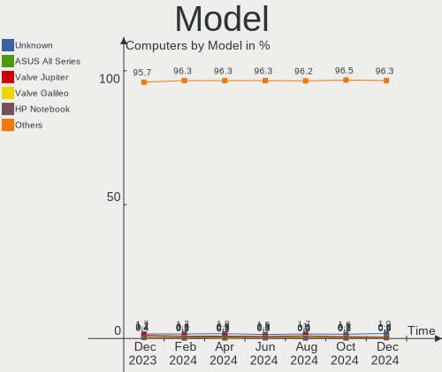
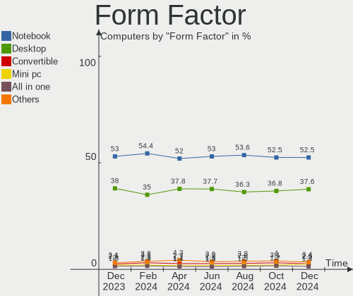
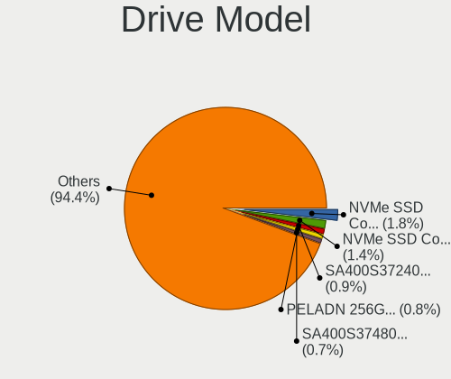
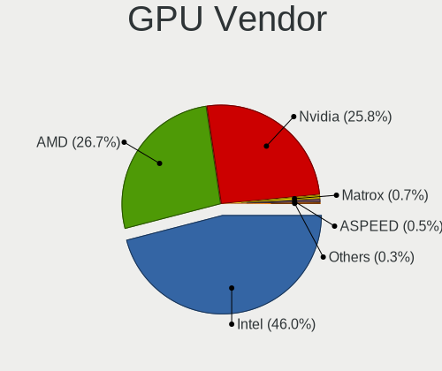
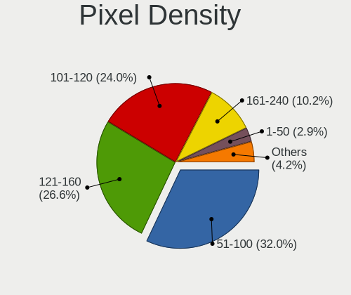
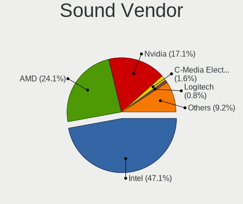
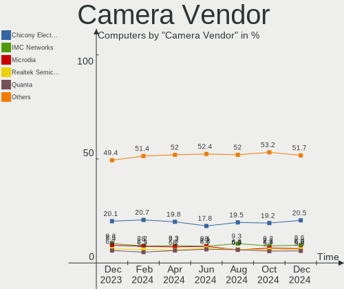

Linux Hardware Trends
---------------------

A project to identify most popular hardware characteristics and track their change
over time based on data collected by Linux users at https://Linux-Hardware.org.

Anyone can contribute to the study by uploading probes of their computers by
the [hw-probe](https://github.com/linuxhw/hw-probe) tool:

    sudo -E hw-probe -all -upload

This is a report for all computer types. See also reports for [desktops](/Desktop/README.md) and [notebooks](/Notebook/README.md).

Full-feature report is available here: https://linux-hardware.org/?view=trends

Distribution-specific reports: [Ubuntu](/Dist/Ubuntu), [ROSA](/Dist/ROSA), [Mint](/Dist/Mint), [Pop!_OS](/Dist/Pop!_OS), [Fedora](/Dist/Fedora), [BlackPanther](/Dist/BlackPanther), [Arch](/Dist/Arch), [Manjaro](/Dist/Manjaro), [Debian](/Dist/Debian), [Endless](/Dist/Endless), [Zorin](/Dist/Zorin), [Gentoo](/Dist/Gentoo), [Clear Linux](/Dist/Clear_Linux), [openSUSE](/Dist/openSUSE), [KDE neon](/Dist/KDE_neon), [ArcoLinux](/Dist/ArcoLinux).

Period: Nov, 2020.

Contents
--------

- [ OS                       ](#os)
- [ OS Family                ](#os-family)
- [ Kernel                   ](#kernel)
- [ Kernel Family            ](#kernel-family)
- [ Kernel Major Ver.        ](#kernel-major-ver)
- [ Arch                     ](#arch)
- [ DE                       ](#de)
- [ Display Server           ](#display-server)
- [ Display Manager          ](#display-manager)
- [ OS Lang                  ](#os-lang)
- [ Boot Mode                ](#boot-mode)
- [ Filesystem               ](#filesystem)
- [ Part. scheme             ](#part-scheme)
- [ Dual Boot with Linux/BSD ](#dual-boot-with-linux/bsd)
- [ Dual Boot (Win)          ](#dual-boot-win)
- [ Country                  ](#country)
- [ City                     ](#city)
- [ Vendor                   ](#vendor)
- [ Model                    ](#model)
- [ Model Family             ](#model-family)
- [ MFG Year                 ](#mfg-year)
- [ Form Factor              ](#form-factor)
- [ Secure Boot              ](#secure-boot)
- [ Coreboot                 ](#coreboot)
- [ RAM Size                 ](#ram-size)
- [ RAM Used                 ](#ram-used)
- [ Has CD-ROM               ](#has-cd-rom)
- [ Total Drives             ](#total-drives)
- [ Has Ethernet             ](#has-ethernet)
- [ Drive Vendor             ](#drive-vendor)
- [ Drive Model              ](#drive-model)
- [ HDD Vendor               ](#hdd-vendor)
- [ SSD Vendor               ](#ssd-vendor)
- [ Drive Kind               ](#drive-kind)
- [ Drive Connector          ](#drive-connector)
- [ Drive Size               ](#drive-size)
- [ Space Total              ](#space-total)
- [ Space Used               ](#space-used)
- [ Malfunc. Drives          ](#malfunc-drives)
- [ Malfunc. Drive Vendor    ](#malfunc-drive-vendor)
- [ Malfunc. HDD Vendor      ](#malfunc-hdd-vendor)
- [ Malfunc. Drive Kind      ](#malfunc-drive-kind)
- [ Failed Drives            ](#failed-drives)
- [ Failed Drive Vendor      ](#failed-drive-vendor)
- [ Drive Status             ](#drive-status)
- [ Storage Vendor           ](#storage-vendor)
- [ Storage Model            ](#storage-model)
- [ Storage Kind             ](#storage-kind)
- [ CPU Vendor               ](#cpu-vendor)
- [ CPU Model                ](#cpu-model)
- [ CPU Model Family         ](#cpu-model-family)
- [ CPU Cores                ](#cpu-cores)
- [ CPU Sockets              ](#cpu-sockets)
- [ CPU Threads              ](#cpu-threads)
- [ CPU Op-Modes             ](#cpu-op-modes)
- [ CPU Microcode            ](#cpu-microcode)
- [ CPU Microarch            ](#cpu-microarch)
- [ GPU Vendor               ](#gpu-vendor)
- [ GPU Model                ](#gpu-model)
- [ GPU Combo                ](#gpu-combo)
- [ GPU Driver               ](#gpu-driver)
- [ GPU Memory               ](#gpu-memory)
- [ Monitor Vendor           ](#monitor-vendor)
- [ Monitor Model            ](#monitor-model)
- [ Monitor Resolution       ](#monitor-resolution)
- [ Monitor Diagonal         ](#monitor-diagonal)
- [ Monitor Width            ](#monitor-width)
- [ Aspect Ratio             ](#aspect-ratio)
- [ Monitor Area             ](#monitor-area)
- [ Pixel Density            ](#pixel-density)
- [ Multiple Monitors        ](#multiple-monitors)
- [ Net Controller Vendor    ](#net-controller-vendor)
- [ Net Controller Model     ](#net-controller-model)
- [ Wireless Vendor          ](#wireless-vendor)
- [ Wireless Model           ](#wireless-model)
- [ Ethernet Vendor          ](#ethernet-vendor)
- [ Ethernet Model           ](#ethernet-model)
- [ Net Controller Kind      ](#net-controller-kind)
- [ Used Controller          ](#used-controller)
- [ NICs                     ](#nics)
- [ Memory Vendor            ](#memory-vendor)
- [ Memory Model             ](#memory-model)
- [ Memory Kind              ](#memory-kind)
- [ Memory Form Factor       ](#memory-form-factor)
- [ Memory Size              ](#memory-size)
- [ Memory Speed             ](#memory-speed)
- [ Sound Vendor             ](#sound-vendor)
- [ Sound Model              ](#sound-model)
- [ Camera Vendor            ](#camera-vendor)
- [ Camera Model             ](#camera-model)
- [ Fingerprint Vendor       ](#fingerprint-vendor)
- [ Fingerprint Model        ](#fingerprint-model)
- [ Chipcard Vendor          ](#chipcard-vendor)
- [ Chipcard Model           ](#chipcard-model)
- [ Printer Vendor           ](#printer-vendor)
- [ Printer Model            ](#printer-model)
- [ Scanner Vendor           ](#scanner-vendor)
- [ Scanner Model            ](#scanner-model)
- [ Bluetooth Vendor         ](#bluetooth-vendor)
- [ Bluetooth Model          ](#bluetooth-model)
- [ Unsupported Devices      ](#unsupported-devices)
- [ Unsupported Device Types ](#unsupported-device-types)

OS
--

Installed operating systems

| Name                | Computers | Percent |
|---------------------|-----------|---------|
| Ubuntu 20.04        | 1678      | 31.1%   |
| Ubuntu 20.10        | 471       | 8.73%   |
| Fedora 33           | 308       | 5.71%   |
| Ubuntu 18.04        | 302       | 5.6%    |
| Mint 20             | 213       | 3.95%   |
| Pop!_OS 20.10       | 201       | 3.72%   |
| KDE neon 20.04      | 194       | 3.6%    |
| BlackPanther 18.1   | 184       | 3.41%   |
| ROSA R11.1          | 144       | 2.67%   |
| Arch                | 131       | 2.43%   |
| Manjaro             | 117       | 2.17%   |
| Manjaro 20.2        | 106       | 1.96%   |
| Debian 10           | 90        | 1.67%   |
| ROSA R11            | 84        | 1.56%   |
| Endless 3.9.0       | 73        | 1.35%   |
| Zorin 15            | 72        | 1.33%   |
| Pop!_OS 20.04       | 67        | 1.24%   |
| ArcoLinux Rolling   | 65        | 1.2%    |
| Mint 19.3           | 60        | 1.11%   |
| Arch Rolling        | 56        | 1.04%   |
| Endless 3.8.7       | 53        | 0.98%   |
| Fedora 32           | 44        | 0.82%   |
| Debian Testing      | 40        | 0.74%   |
| Ubuntu 16.04        | 38        | 0.7%    |
| Gentoo              | 28        | 0.52%   |
| Manjaro 20.1.2      | 23        | 0.43%   |
| LMDE 4              | 22        | 0.41%   |
| Elementary 5.1.7    | 22        | 0.41%   |
| CentOS 8            | 21        | 0.39%   |
| Kali 2020.4         | 19        | 0.35%   |
| ROSA R8.1           | 18        | 0.33%   |
| Ubuntu 19.10        | 17        | 0.32%   |
| Debian              | 16        | 0.3%    |
| Gentoo 2.7          | 14        | 0.26%   |
| openSUSE 15.2       | 13        | 0.24%   |
| BlackPanther 16.2   | 13        | 0.24%   |
| Fedora 31           | 12        | 0.22%   |
| Peppermint 10       | 10        | 0.19%   |
| EndeavourOS Rolling | 10        | 0.19%   |
| ArcoLinux           | 10        | 0.19%   |
| Solus 4.1           | 8         | 0.15%   |
| RHEL 8.3            | 8         | 0.15%   |
| Reborn OS           | 8         | 0.15%   |
| openSUSE Leap-15.2  | 8         | 0.15%   |
| Ubuntu 21.04        | 7         | 0.13%   |
| ROSA R12            | 7         | 0.13%   |
| Raspbian 10         | 7         | 0.13%   |
| Mageia 7            | 7         | 0.13%   |
| Kali 2020.3         | 7         | 0.13%   |
| Debian Unstable     | 7         | 0.13%   |
| ALT Linux 9.1       | 7         | 0.13%   |
| Zorin 12            | 6         | 0.11%   |
| WindowsFX 10        | 6         | 0.11%   |
| Parrot 4.10         | 6         | 0.11%   |
| Mint 19.1           | 6         | 0.11%   |
| Garuda              | 6         | 0.11%   |
| Ubuntu 18.10        | 5         | 0.09%   |
| ROSA R10            | 5         | 0.09%   |
| MX 19.3             | 5         | 0.09%   |
| Fedora 34           | 5         | 0.09%   |

OS Family
---------

OS without a version

| Name         | Computers | Percent |
|--------------|-----------|---------|
| Ubuntu       | 2531      | 46.91%  |
| Fedora       | 374       | 6.93%   |
| Mint         | 286       | 5.3%    |
| Pop!_OS      | 269       | 4.99%   |
| ROSA         | 261       | 4.84%   |
| Manjaro      | 251       | 4.65%   |
| KDE neon     | 197       | 3.65%   |
| BlackPanther | 197       | 3.65%   |
| Arch         | 188       | 3.48%   |
| Debian       | 157       | 2.91%   |
| Endless      | 139       | 2.58%   |
| Zorin        | 78        | 1.45%   |
| ArcoLinux    | 77        | 1.43%   |
| openSUSE     | 43        | 0.8%    |
| Gentoo       | 42        | 0.78%   |
| CentOS       | 29        | 0.54%   |
| Kali         | 27        | 0.5%    |
| Elementary   | 23        | 0.43%   |
| LMDE         | 22        | 0.41%   |
| Clear Linux  | 15        | 0.28%   |
| EndeavourOS  | 14        | 0.26%   |
| MX           | 12        | 0.22%   |
| RHEL         | 11        | 0.2%    |
| Peppermint   | 10        | 0.19%   |
| Mageia       | 10        | 0.19%   |
| Garuda       | 10        | 0.19%   |
| ALT Linux    | 10        | 0.19%   |
| Solus        | 8         | 0.15%   |
| Reborn OS    | 8         | 0.15%   |
| Raspbian     | 7         | 0.13%   |
| Parrot       | 7         | 0.13%   |
| WindowsFX    | 6         | 0.11%   |
| Deepin       | 6         | 0.11%   |
| Artix        | 5         | 0.09%   |
| Android      | 5         | 0.09%   |
| Void         | 4         | 0.07%   |
| SkiffOS      | 4         | 0.07%   |
| BunsenLabs   | 4         | 0.07%   |
| ArchLabs     | 4         | 0.07%   |
| Slackware    | 3         | 0.06%   |
| Manjaro-ARM  | 3         | 0.06%   |
| Chrome OS    | 3         | 0.06%   |
| Sparky       | 2         | 0.04%   |
| RED          | 2         | 0.04%   |
| Nitrux       | 2         | 0.04%   |
| ClearOS      | 2         | 0.04%   |
| Calculate    | 2         | 0.04%   |
| BigLinux     | 2         | 0.04%   |
| Alpine       | 2         | 0.04%   |
| Sn3rpos      | 1         | 0.02%   |
| Siduction    | 1         | 0.02%   |
| Septor       | 1         | 0.02%   |
| Scientific   | 1         | 0.02%   |
| RED OS       | 1         | 0.02%   |
| PureOS       | 1         | 0.02%   |
| PCLinuxOS    | 1         | 0.02%   |
| Parabola     | 1         | 0.02%   |
| MicroOS      | 1         | 0.02%   |
| Manualinux   | 1         | 0.02%   |
| Mabox        | 1         | 0.02%   |

Kernel
------

Version of the Linux kernel

| Version                             | Computers | Percent |
|-------------------------------------|-----------|---------|
| 5.4.0-52-generic                    | 818       | 15.16%  |
| 5.4.0-54-generic                    | 754       | 13.97%  |
| 5.4.0-53-generic                    | 418       | 7.75%   |
| 4.18.16-desktop-1bP                 | 180       | 3.34%   |
| 5.4.0-42-generic                    | 169       | 3.13%   |
| 5.8.0-29-generic                    | 166       | 3.08%   |
| 5.8.0-26-generic                    | 138       | 2.56%   |
| 5.8.0-7630-generic                  | 125       | 2.32%   |
| 5.8.0-7625-generic                  | 108       | 2%      |
| 5.8.18-300.fc33.x86_64              | 79        | 1.46%   |
| 5.9.8-200.fc33.x86_64               | 77        | 1.43%   |
| 5.8.0-14-generic                    | 77        | 1.43%   |
| 5.8.0-28-generic                    | 75        | 1.39%   |
| 4.19.0-12-amd64                     | 71        | 1.32%   |
| 4.15.0-desktop-45.1rosa-x86_64      | 68        | 1.26%   |
| 5.8.18-1-MANJARO                    | 65        | 1.2%    |
| 4.15.0-desktop-122.124.1rosa-x86_64 | 54        | 1%      |
| 4.15.0-122-generic                  | 46        | 0.85%   |
| 5.9.10-200.fc33.x86_64              | 44        | 0.82%   |
| 5.9.8-arch1-1                       | 42        | 0.78%   |
| 5.9.3-1-MANJARO                     | 41        | 0.76%   |
| 5.8.0-25-generic                    | 41        | 0.76%   |
| 5.8.16-300.fc33.x86_64              | 38        | 0.7%    |
| 5.4.0-26-generic                    | 38        | 0.7%    |
| 5.9.10-arch1-1                      | 36        | 0.67%   |
| 5.9.6-arch1-1                       | 33        | 0.61%   |
| 4.15.0-124-generic                  | 31        | 0.57%   |
| 5.8.16-2-MANJARO                    | 29        | 0.54%   |
| 4.15.0-123-generic                  | 29        | 0.54%   |
| 5.4.0-48-generic                    | 28        | 0.52%   |
| 5.9.0-1-amd64                       | 27        | 0.5%    |
| 5.9.9-arch1-1                       | 26        | 0.48%   |
| 5.8.17-300.fc33.x86_64              | 25        | 0.46%   |
| 5.8.0-1006-raspi                    | 24        | 0.44%   |
| 5.4.0-7642-generic                  | 24        | 0.44%   |
| 5.4.0-52-lowlatency                 | 22        | 0.41%   |
| 5.9.3-arch1-1                       | 21        | 0.39%   |
| 4.15.0-desktop-45.1rosa-i586        | 20        | 0.37%   |
| 5.8.0-1007-raspi                    | 19        | 0.35%   |
| 5.4.40-generic-1rosa-x86_64         | 19        | 0.35%   |
| 4.18.0-193.28.1.el8_2.x86_64        | 19        | 0.35%   |
| 5.9.10-1-MANJARO                    | 18        | 0.33%   |
| 5.8.15-301.fc33.x86_64              | 17        | 0.32%   |
| 5.9.9-200.fc33.x86_64               | 16        | 0.3%    |
| 5.4.0-51-generic                    | 16        | 0.3%    |
| 5.9.8-2-MANJARO                     | 15        | 0.28%   |
| 5.9.2-arch1-1                       | 15        | 0.28%   |
| 5.9.1-1-MANJARO                     | 13        | 0.24%   |
| 5.8.18-200.fc32.x86_64              | 13        | 0.24%   |
| 5.8.0-30-generic                    | 13        | 0.24%   |
| 5.4.0-47-generic                    | 13        | 0.24%   |
| 5.0.0-32-generic                    | 13        | 0.24%   |
| 5.9.4-arch1-1                       | 12        | 0.22%   |
| 5.8.0-0.bpo.2-amd64                 | 12        | 0.22%   |
| 5.4.74-1-MANJARO                    | 12        | 0.22%   |
| 5.4.32-generic-2rosa-x86_64         | 12        | 0.22%   |
| 5.4.0-55-generic                    | 12        | 0.22%   |
| 5.4.0-54-lowlatency                 | 12        | 0.22%   |
| 5.3.18-lp152.50-default             | 12        | 0.22%   |
| 4.9.20-desktop-pae-1bP              | 12        | 0.22%   |

Kernel Family
-------------

Linux kernel without a distro release

| Version | Computers | Percent |
|---------|-----------|---------|
| 5.4.0   | 2384      | 44.18%  |
| 5.8.0   | 837       | 15.51%  |
| 4.15.0  | 330       | 6.12%   |
| 5.9.8   | 189       | 3.5%    |
| 4.18.16 | 180       | 3.34%   |
| 5.8.18  | 168       | 3.11%   |
| 5.9.10  | 120       | 2.22%   |
| 4.19.0  | 93        | 1.72%   |
| 5.8.16  | 84        | 1.56%   |
| 5.9.3   | 77        | 1.43%   |
| 5.9.0   | 75        | 1.39%   |
| 5.9.9   | 63        | 1.17%   |
| 5.9.6   | 62        | 1.15%   |
| 5.9.1   | 48        | 0.89%   |
| 5.3.0   | 42        | 0.78%   |
| 4.18.0  | 41        | 0.76%   |
| 5.4.72  | 38        | 0.7%    |
| 5.8.17  | 35        | 0.65%   |
| 5.0.0   | 29        | 0.54%   |
| 5.9.2   | 24        | 0.44%   |
| 5.9.11  | 24        | 0.44%   |
| 5.10.0  | 23        | 0.43%   |
| 5.8.15  | 20        | 0.37%   |
| 5.4.40  | 20        | 0.37%   |
| 5.3.18  | 20        | 0.37%   |
| 5.4.74  | 19        | 0.35%   |
| 4.4.0   | 19        | 0.35%   |
| 5.9.4   | 18        | 0.33%   |
| 4.9.155 | 18        | 0.33%   |
| 5.6.0   | 17        | 0.32%   |
| 5.4.77  | 15        | 0.28%   |
| 5.4.32  | 15        | 0.28%   |
| 5.7.0   | 13        | 0.24%   |
| 4.9.20  | 13        | 0.24%   |
| 5.7.19  | 11        | 0.2%    |
| 5.4.78  | 10        | 0.19%   |
| 3.10.0  | 9         | 0.17%   |
| 5.8.14  | 8         | 0.15%   |
| 5.6.19  | 8         | 0.15%   |
| 5.4.75  | 8         | 0.15%   |
| 5.4.73  | 8         | 0.15%   |
| 5.8.13  | 6         | 0.11%   |
| 5.8.11  | 6         | 0.11%   |
| 5.4.79  | 6         | 0.11%   |
| 5.9.7   | 5         | 0.09%   |
| 5.8.12  | 5         | 0.09%   |
| 5.6.14  | 5         | 0.09%   |
| 5.4.68  | 5         | 0.09%   |
| 4.9.60  | 5         | 0.09%   |
| 4.9.0   | 5         | 0.09%   |
| 5.8.10  | 4         | 0.07%   |
| 4.1.38  | 4         | 0.07%   |
| 5.8.9   | 3         | 0.06%   |
| 5.7.13  | 3         | 0.06%   |
| 5.4.80  | 3         | 0.06%   |
| 5.4.70  | 3         | 0.06%   |
| 5.4.53  | 3         | 0.06%   |
| 5.4.51  | 3         | 0.06%   |
| 4.9.41  | 3         | 0.06%   |
| 5.9     | 2         | 0.04%   |

Kernel Major Ver.
-----------------

Linux kernel major version

| Version | Computers | Percent |
|---------|-----------|---------|
| 5.4     | 2555      | 47.35%  |
| 5.8     | 1181      | 21.89%  |
| 5.9     | 706       | 13.08%  |
| 4.15    | 330       | 6.12%   |
| 4.18    | 221       | 4.1%    |
| 4.19    | 101       | 1.87%   |
| 5.3     | 66        | 1.22%   |
| 4.9     | 50        | 0.93%   |
| 5.6     | 37        | 0.69%   |
| 5.7     | 35        | 0.65%   |
| 5.0     | 31        | 0.57%   |
| 5.10    | 23        | 0.43%   |
| 4.4     | 20        | 0.37%   |
| 3.10    | 11        | 0.2%    |
| 4.1     | 5         | 0.09%   |
| 5.5     | 4         | 0.07%   |
| 4.14    | 3         | 0.06%   |
| 5       | 2         | 0.04%   |
| 4.16    | 2         | 0.04%   |
| 4.12    | 2         | 0.04%   |
| 4.10    | 2         | 0.04%   |
| 3.18    | 2         | 0.04%   |
| 5.1     | 1         | 0.02%   |
| 4.8     | 1         | 0.02%   |
| 4.20    | 1         | 0.02%   |
| 4.2     | 1         | 0.02%   |
| 4.13    | 1         | 0.02%   |
| 3.13    | 1         | 0.02%   |
| 2.6     | 1         | 0.02%   |

Arch
----

OS architecture (x86_64, i586, etc.)

| Name    | Computers | Percent |
|---------|-----------|---------|
| x86_64  | 5142      | 95.29%  |
| i686    | 177       | 3.28%   |
| aarch64 | 65        | 1.2%    |
| armv7l  | 9         | 0.17%   |
| armv8l  | 3         | 0.06%   |

DE
--

Desktop Environment

| Name             | Computers | Percent |
|------------------|-----------|---------|
| GNOME            | 2864      | 53.08%  |
| KDE5             | 534       | 9.9%    |
| XFCE             | 458       | 8.49%   |
| KDE              | 393       | 7.28%   |
| Unknown          | 243       | 4.5%    |
| X-Cinnamon       | 223       | 4.13%   |
| KDE4             | 170       | 3.15%   |
| MATE             | 118       | 2.19%   |
| Cinnamon         | 94        | 1.74%   |
| LXQt             | 69        | 1.28%   |
| Unity            | 45        | 0.83%   |
| Budgie           | 29        | 0.54%   |
| LXDE             | 27        | 0.5%    |
| Deepin           | 25        | 0.46%   |
| GNOME Flashback  | 24        | 0.44%   |
| i3               | 23        | 0.43%   |
| Pantheon         | 21        | 0.39%   |
| GNOME Classic    | 10        | 0.19%   |
| dwm              | 6         | 0.11%   |
| bspwm            | 4         | 0.07%   |
| lightdm-xsession | 3         | 0.06%   |
| sway             | 2         | 0.04%   |
| qtile            | 2         | 0.04%   |
| awesome          | 2         | 0.04%   |
| xubuntu          | 1         | 0.02%   |
| xmonad           | 1         | 0.02%   |
| xinitrc          | 1         | 0.02%   |
| openbox          | 1         | 0.02%   |
| ICEWM            | 1         | 0.02%   |
| i3-with-shmlog   | 1         | 0.02%   |
| Fluxbox          | 1         | 0.02%   |

Display Server
--------------

X11 or Wayland

| Name        | Computers | Percent |
|-------------|-----------|---------|
| X11         | 4786      | 88.7%   |
| Wayland     | 400       | 7.41%   |
| Unknown     | 109       | 2.02%   |
| Tty         | 96        | 1.78%   |
| Web         | 3         | 0.06%   |
| Unspecified | 2         | 0.04%   |

Display Manager
---------------

SDDM, LightDM, etc.

| Name    | Computers | Percent |
|---------|-----------|---------|
| Unknown | 3547      | 65.73%  |
| GDM     | 599       | 11.1%   |
| SDDM    | 550       | 10.19%  |
| TDM     | 398       | 7.38%   |
| KDM     | 169       | 3.13%   |
| LightDM | 107       | 1.98%   |
| XDM     | 11        | 0.2%    |
| SLiM    | 7         | 0.13%   |
| LXDM    | 3         | 0.06%   |
| NODM    | 2         | 0.04%   |
| Ly      | 1         | 0.02%   |
| LDM     | 1         | 0.02%   |
| GDM3    | 1         | 0.02%   |

OS Lang
-------

Language

| Lang       | Computers | Percent |
|------------|-----------|---------|
| en_US      | 1865      | 34.56%  |
| de_DE      | 436       | 8.08%   |
| Unknown    | 357       | 6.62%   |
| ru_RU      | 313       | 5.8%    |
| en_GB      | 267       | 4.95%   |
| fr_FR      | 215       | 3.98%   |
| pt_BR      | 214       | 3.97%   |
| it_IT      | 178       | 3.3%    |
| es_ES      | 127       | 2.35%   |
| en_US.utf8 | 110       | 2.04%   |
| pl_PL      | 101       | 1.87%   |
| en_CA      | 100       | 1.85%   |
| en_IN      | 84        | 1.56%   |
| C          | 71        | 1.32%   |
| en_AU      | 64        | 1.19%   |
| cs_CZ      | 42        | 0.78%   |
| nl_NL      | 40        | 0.74%   |
| hu_HU      | 40        | 0.74%   |
| es_AR      | 37        | 0.69%   |
| ja_JP      | 28        | 0.52%   |
| es_MX      | 28        | 0.52%   |
| pt_BR.utf8 | 26        | 0.48%   |
| de_AT      | 26        | 0.48%   |
| tr_TR      | 25        | 0.46%   |
| sv_SE      | 25        | 0.46%   |
| ro_RO      | 25        | 0.46%   |
| de_DE.utf8 | 25        | 0.46%   |
| en_ZA      | 24        | 0.44%   |
| pt_PT      | 22        | 0.41%   |
| ru_UA      | 21        | 0.39%   |
| en_GB.utf8 | 20        | 0.37%   |
| zh_CN      | 19        | 0.35%   |
| de_CH      | 18        | 0.33%   |
| fr_CA      | 15        | 0.28%   |
| fi_FI      | 15        | 0.28%   |
| es_CO      | 15        | 0.28%   |
| C          | 15        | 0.28%   |
| fr_FR.utf8 | 14        | 0.26%   |
| ru_RU.UTF8 | 13        | 0.24%   |
| sk_SK      | 12        | 0.22%   |
| en_NZ      | 12        | 0.22%   |
| en_IN      | 12        | 0.22%   |
| el_GR      | 12        | 0.22%   |
| uk_UA      | 11        | 0.2%    |
| es_CL      | 11        | 0.2%    |
| en_IE      | 11        | 0.2%    |
| da_DK      | 11        | 0.2%    |
| nl_BE      | 10        | 0.19%   |
| ko_KR      | 10        | 0.19%   |
| fr_BE      | 10        | 0.19%   |
| zh_TW      | 9         | 0.17%   |
| nb_NO      | 7         | 0.13%   |
| en_SG      | 7         | 0.13%   |
| sl_SI      | 6         | 0.11%   |
| pl_PL.utf8 | 6         | 0.11%   |
| it_IT.utf8 | 6         | 0.11%   |
| es_EC      | 6         | 0.11%   |
| en_IL      | 6         | 0.11%   |
| ca_ES      | 6         | 0.11%   |
| fr_CH      | 5         | 0.09%   |

Boot Mode
---------

EFI or BIOS

| Mode | Computers | Percent |
|------|-----------|---------|
| BIOS | 3063      | 56.76%  |
| EFI  | 2333      | 43.24%  |

Filesystem
----------

Type of filesystem

| Type     | Computers | Percent |
|----------|-----------|---------|
| Ext4     | 4619      | 85.6%   |
| Btrfs    | 312       | 5.78%   |
| Overlay  | 278       | 5.15%   |
| Xfs      | 95        | 1.76%   |
| Zfs      | 43        | 0.8%    |
| Ext3     | 12        | 0.22%   |
| F2fs     | 10        | 0.19%   |
| Unknown  | 10        | 0.19%   |
| Ext2     | 9         | 0.17%   |
| Tmpfs    | 4         | 0.07%   |
| Rootfs   | 1         | 0.02%   |
| Reiserfs | 1         | 0.02%   |
| Jfs      | 1         | 0.02%   |
| Aufs     | 1         | 0.02%   |

Part. scheme
------------

Scheme of partitioning

| Type    | Computers | Percent |
|---------|-----------|---------|
| Unknown | 3479      | 64.47%  |
| GPT     | 1288      | 23.87%  |
| MBR     | 629       | 11.66%  |

Dual Boot with Linux/BSD
------------------------

Hosting more than one Linux/BSD

| Dual boot | Computers | Percent |
|-----------|-----------|---------|
| No        | 4710      | 87.29%  |
| Yes       | 686       | 12.71%  |

Dual Boot (Win)
---------------

Hosting Linux and Windows

| Dual boot | Computers | Percent |
|-----------|-----------|---------|
| No        | 3760      | 69.68%  |
| Yes       | 1636      | 30.32%  |

Country
-------

Geographic location (country)

| Country            | Computers | Percent |
|--------------------|-----------|---------|
| USA                | 873       | 16.18%  |
| Germany            | 598       | 11.08%  |
| Russia             | 423       | 7.84%   |
| Brazil             | 310       | 5.74%   |
| France             | 266       | 4.93%   |
| Italy              | 242       | 4.48%   |
| UK                 | 205       | 3.8%    |
| Hungary            | 185       | 3.43%   |
| Spain              | 169       | 3.13%   |
| Canada             | 162       | 3%      |
| Poland             | 142       | 2.63%   |
| India              | 121       | 2.24%   |
| Netherlands        | 118       | 2.19%   |
| Ukraine            | 85        | 1.58%   |
| Romania            | 71        | 1.32%   |
| Australia          | 69        | 1.28%   |
| Czech Republic     | 62        | 1.15%   |
| Belgium            | 59        | 1.09%   |
| Argentina          | 57        | 1.06%   |
| Mexico             | 56        | 1.04%   |
| Austria            | 56        | 1.04%   |
| Sweden             | 55        | 1.02%   |
| Switzerland        | 54        | 1%      |
| Greece             | 50        | 0.93%   |
| Turkey             | 42        | 0.78%   |
| Finland            | 42        | 0.78%   |
| Portugal           | 39        | 0.72%   |
| South Africa       | 34        | 0.63%   |
| Japan              | 34        | 0.63%   |
| Indonesia          | 34        | 0.63%   |
| Belarus            | 30        | 0.56%   |
| Norway             | 29        | 0.54%   |
| China              | 29        | 0.54%   |
| Denmark            | 28        | 0.52%   |
| Serbia             | 26        | 0.48%   |
| Israel             | 25        | 0.46%   |
| New Zealand        | 23        | 0.43%   |
| Ireland            | 22        | 0.41%   |
| Slovenia           | 21        | 0.39%   |
| Colombia           | 21        | 0.39%   |
| Slovakia           | 20        | 0.37%   |
| Bulgaria           | 20        | 0.37%   |
| Singapore          | 17        | 0.32%   |
| Chile              | 17        | 0.32%   |
| Lithuania          | 15        | 0.28%   |
| Latvia             | 15        | 0.28%   |
| Iran               | 15        | 0.28%   |
| Hong Kong          | 15        | 0.28%   |
| Philippines        | 14        | 0.26%   |
| Egypt              | 14        | 0.26%   |
| Taiwan             | 13        | 0.24%   |
| Malaysia           | 13        | 0.24%   |
| Korea, Republic of | 12        | 0.22%   |
| Pakistan           | 11        | 0.2%    |
| Vietnam            | 9         | 0.17%   |
| Thailand           | 9         | 0.17%   |
| Saudi Arabia       | 9         | 0.17%   |
| Croatia            | 9         | 0.17%   |
| Ecuador            | 8         | 0.15%   |
| Algeria            | 8         | 0.15%   |

City
----

Geographic location (city)

| City              | Computers | Percent |
|-------------------|-----------|---------|
| Moscow            | 82        | 1.52%   |
| Budapest          | 68        | 1.26%   |
| St Petersburg     | 44        | 0.82%   |
| Berlin            | 44        | 0.82%   |
| São Paulo        | 42        | 0.78%   |
| Paris             | 36        | 0.67%   |
| Vienna            | 31        | 0.57%   |
| Rio de Janeiro    | 27        | 0.5%    |
| Athens            | 27        | 0.5%    |
| Milan             | 25        | 0.46%   |
| Rome              | 23        | 0.43%   |
| Madrid            | 23        | 0.43%   |
| Bucharest         | 23        | 0.43%   |
| Warsaw            | 22        | 0.41%   |
| Prague            | 22        | 0.41%   |
| Munich            | 22        | 0.41%   |
| Ekaterinburg      | 21        | 0.39%   |
| Kyiv              | 19        | 0.35%   |
| Hamburg           | 19        | 0.35%   |
| Amsterdam         | 19        | 0.35%   |
| London            | 18        | 0.33%   |
| Krasnodar         | 18        | 0.33%   |
| Helsinki          | 18        | 0.33%   |
| Toronto           | 17        | 0.32%   |
| Parabiago         | 16        | 0.3%    |
| Johannesburg      | 16        | 0.3%    |
| Buenos Aires      | 16        | 0.3%    |
| Singapore         | 15        | 0.28%   |
| Barcelona         | 15        | 0.28%   |
| Thessaloniki      | 14        | 0.26%   |
| Novosibirsk       | 14        | 0.26%   |
| Los Angeles       | 14        | 0.26%   |
| Krakow            | 14        | 0.26%   |
| Bengaluru         | 14        | 0.26%   |
| Minsk             | 13        | 0.24%   |
| Melbourne         | 13        | 0.24%   |
| Jakarta           | 13        | 0.24%   |
| Cologne           | 13        | 0.24%   |
| Austin            | 13        | 0.24%   |
| Zurich            | 12        | 0.22%   |
| Wrocław          | 12        | 0.22%   |
| Vancouver         | 12        | 0.22%   |
| Seattle           | 12        | 0.22%   |
| Istanbul          | 12        | 0.22%   |
| Houston           | 12        | 0.22%   |
| Frankfurt am Main | 12        | 0.22%   |
| Sydney            | 11        | 0.2%    |
| Stuttgart         | 11        | 0.2%    |
| Sofia             | 11        | 0.2%    |
| Riga              | 11        | 0.2%    |
| Portland          | 11        | 0.2%    |
| Miskolc           | 11        | 0.2%    |
| Mexico City       | 11        | 0.2%    |
| Karlsruhe         | 11        | 0.2%    |
| Genoa             | 11        | 0.2%    |
| Düsseldorf       | 11        | 0.2%    |
| Cairo             | 11        | 0.2%    |
| Valencia          | 10        | 0.19%   |
| Ottawa            | 10        | 0.19%   |
| Oslo              | 10        | 0.19%   |

Vendor
------

Motherboard manufacturer

| Name                    | Computers | Percent |
|-------------------------|-----------|---------|
| ASUSTek Computer        | 879       | 16.29%  |
| Lenovo                  | 755       | 13.99%  |
| Hewlett-Packard         | 754       | 13.97%  |
| Dell                    | 687       | 12.73%  |
| Gigabyte Technology     | 431       | 7.99%   |
| Acer                    | 338       | 6.26%   |
| MSI                     | 293       | 5.43%   |
| ASRock                  | 194       | 3.6%    |
| Toshiba                 | 121       | 2.24%   |
| Apple                   | 102       | 1.89%   |
| Intel                   | 76        | 1.41%   |
| Unknown                 | 71        | 1.32%   |
| Sony                    | 57        | 1.06%   |
| Samsung Electronics     | 57        | 1.06%   |
| Fujitsu                 | 47        | 0.87%   |
| Raspberry Pi Foundation | 44        | 0.82%   |
| Medion                  | 34        | 0.63%   |
| Pegatron                | 24        | 0.44%   |
| Supermicro              | 22        | 0.41%   |
| Packard Bell            | 22        | 0.41%   |
| HUAWEI                  | 21        | 0.39%   |
| System76                | 20        | 0.37%   |
| Fujitsu Siemens         | 20        | 0.37%   |
| Foxconn                 | 17        | 0.32%   |
| Positivo                | 16        | 0.3%    |
| Alienware               | 16        | 0.3%    |
| Biostar                 | 15        | 0.28%   |
| Notebook                | 14        | 0.26%   |
| Microsoft               | 14        | 0.26%   |
| ECS                     | 14        | 0.26%   |
| Gateway                 | 12        | 0.22%   |
| eMachines               | 12        | 0.22%   |
| TUXEDO                  | 10        | 0.19%   |
| Google                  | 9         | 0.17%   |
| Pine Microsystems       | 7         | 0.13%   |
| ZOTAC                   | 6         | 0.11%   |
| Timi                    | 6         | 0.11%   |
| AMI                     | 6         | 0.11%   |
| TYAN Computer           | 5         | 0.09%   |
| IBM                     | 5         | 0.09%   |
| PC Specialist           | 4         | 0.07%   |
| NEC Computers           | 4         | 0.07%   |
| HASEE Computer          | 4         | 0.07%   |
| Chuwi                   | 4         | 0.07%   |
| Wistron                 | 3         | 0.06%   |
| SLIMBOOK                | 3         | 0.06%   |
| Razer                   | 3         | 0.06%   |
| Panasonic               | 3         | 0.06%   |
| OEM                     | 3         | 0.06%   |
| Nvidia                  | 3         | 0.06%   |
| LG Electronics          | 3         | 0.06%   |
| Huanan                  | 3         | 0.06%   |
| Hardkernel              | 3         | 0.06%   |
| Clevo                   | 3         | 0.06%   |
| BESSTAR Tech            | 3         | 0.06%   |
| BANGHO                  | 3         | 0.06%   |
| Acidanthera             | 3         | 0.06%   |
| Teclast                 | 2         | 0.04%   |
| Shuttle                 | 2         | 0.04%   |
| Semp Toshiba            | 2         | 0.04%   |

Model
-----

Motherboard model

| Name                                       | Computers | Percent |
|--------------------------------------------|-----------|---------|
| Unknown                                    | 91        | 1.69%   |
| ASUS All Series                            | 52        | 0.96%   |
| HP Notebook                                | 17        | 0.32%   |
| RPi Raspberry Pi 4 Model B Rev 1.4         | 14        | 0.26%   |
| HP EliteDesk 800 G1 SFF                    | 14        | 0.26%   |
| MSI MS-7B86                                | 12        | 0.22%   |
| HP 250 G1                                  | 12        | 0.22%   |
| Dell OptiPlex 3020                         | 12        | 0.22%   |
| Dell Latitude E6430                        | 12        | 0.22%   |
| RPi Raspberry Pi 4 Model B Rev 1.1         | 11        | 0.2%    |
| HP Pavilion dv6                            | 11        | 0.2%    |
| Gigabyte B450M DS3H                        | 11        | 0.2%    |
| ASUS TUF GAMING X570-PLUS                  | 11        | 0.2%    |
| RPi Raspberry Pi 4 Model B Rev 1.2         | 10        | 0.19%   |
| Dell XPS 15 9570                           | 10        | 0.19%   |
| Dell XPS 15 7590                           | 10        | 0.19%   |
| Dell Latitude E6420                        | 10        | 0.19%   |
| Dell Inspiron 3542                         | 10        | 0.19%   |
| ASUS PRIME B450M-A                         | 10        | 0.19%   |
| ASUS M5A78L-M/USB3                         | 10        | 0.19%   |
| MSI MS-7C02                                | 9         | 0.17%   |
| HP Pavilion Notebook                       | 9         | 0.17%   |
| Gigabyte 970A-DS3P                         | 9         | 0.17%   |
| Dell XPS 13 7390                           | 9         | 0.17%   |
| ASUS ZenBook UX431DA_UM431DA               | 9         | 0.17%   |
| MSI MS-7C37                                | 8         | 0.15%   |
| MSI MS-7A38                                | 8         | 0.15%   |
| MSI MS-7817                                | 8         | 0.15%   |
| HP Pavilion Gaming Laptop 15-cx0xxx        | 8         | 0.15%   |
| HP Pavilion g6                             | 8         | 0.15%   |
| HP Pavilion 15                             | 8         | 0.15%   |
| HP 15                                      | 8         | 0.15%   |
| Dell OptiPlex 7010                         | 8         | 0.15%   |
| Dell Latitude E6410                        | 8         | 0.15%   |
| ASUS PRIME X370-PRO                        | 8         | 0.15%   |
| Acer Nitro AN515-54                        | 8         | 0.15%   |
| Acer Nitro AN515-43                        | 8         | 0.15%   |
| Supermicro H8DM8-2                         | 7         | 0.13%   |
| Lenovo Y520-15IKBN 80WK                    | 7         | 0.13%   |
| Lenovo Legion 5 15ARH05 82B5               | 7         | 0.13%   |
| Lenovo IdeaPad 330-15IKB 81DE              | 7         | 0.13%   |
| HP ProBook 450 G7                          | 7         | 0.13%   |
| HP Pavilion dv7                            | 7         | 0.13%   |
| HP Laptop 15-db0xxx                        | 7         | 0.13%   |
| HP EliteBook 8470p                         | 7         | 0.13%   |
| Gigabyte B450M S2H                         | 7         | 0.13%   |
| Dell XPS 15 9560                           | 7         | 0.13%   |
| Dell XPS 15 9500                           | 7         | 0.13%   |
| Dell XPS 13 9380                           | 7         | 0.13%   |
| Dell OptiPlex 755                          | 7         | 0.13%   |
| Dell Latitude E6530                        | 7         | 0.13%   |
| Dell Latitude E6400                        | 7         | 0.13%   |
| Dell Inspiron 5570                         | 7         | 0.13%   |
| ASUS VivoBook 15_ASUS Laptop X540MA_X543MA | 7         | 0.13%   |
| ASUS PRIME A320M-K                         | 7         | 0.13%   |
| ASUS M5A97 R2.0                            | 7         | 0.13%   |
| ASRock B450M Pro4                          | 7         | 0.13%   |
| MSI MS-7C91                                | 6         | 0.11%   |
| Lenovo G50-45 80E3                         | 6         | 0.11%   |
| HUAWEI NBLK-WAX9X                          | 6         | 0.11%   |

Model Family
------------

Motherboard model prefix

| Name                    | Computers | Percent |
|-------------------------|-----------|---------|
| Lenovo ThinkPad         | 342       | 6.34%   |
| Acer Aspire             | 233       | 4.32%   |
| Dell Inspiron           | 199       | 3.69%   |
| Dell Latitude           | 177       | 3.28%   |
| Lenovo IdeaPad          | 173       | 3.21%   |
| HP Pavilion             | 125       | 2.32%   |
| Toshiba Satellite       | 107       | 1.98%   |
| HP EliteBook            | 99        | 1.83%   |
| Dell XPS                | 95        | 1.76%   |
| ASUS PRIME              | 91        | 1.69%   |
| Unknown                 | 91        | 1.69%   |
| HP Compaq               | 90        | 1.67%   |
| HP ProBook              | 77        | 1.43%   |
| Dell OptiPlex           | 77        | 1.43%   |
| HP Laptop               | 72        | 1.33%   |
| ASUS VivoBook           | 66        | 1.22%   |
| ASUS ROG                | 56        | 1.04%   |
| ASUS All                | 52        | 0.96%   |
| Lenovo ThinkCentre      | 50        | 0.93%   |
| Dell Precision          | 50        | 0.93%   |
| ASUS TUF                | 46        | 0.85%   |
| RPi Raspberry           | 44        | 0.82%   |
| HP ENVY                 | 38        | 0.7%    |
| Dell Vostro             | 38        | 0.7%    |
| Acer Nitro              | 28        | 0.52%   |
| HP 250                  | 27        | 0.5%    |
| Lenovo Legion           | 26        | 0.48%   |
| Fujitsu LIFEBOOK        | 23        | 0.43%   |
| ASUS M5A78L-M           | 22        | 0.41%   |
| HP EliteDesk            | 21        | 0.39%   |
| Gigabyte X570           | 21        | 0.39%   |
| Lenovo Yoga             | 20        | 0.37%   |
| Gigabyte B450M          | 19        | 0.35%   |
| Packard Bell EasyNote   | 17        | 0.32%   |
| HP Notebook             | 17        | 0.32%   |
| ASUS ZenBook            | 17        | 0.32%   |
| HP Spectre              | 16        | 0.3%    |
| Gigabyte B450           | 16        | 0.3%    |
| Fujitsu ESPRIMO         | 16        | 0.3%    |
| ASUS M5A97              | 16        | 0.3%    |
| Microsoft Surface       | 14        | 0.26%   |
| Acer Veriton            | 14        | 0.26%   |
| Acer Swift              | 14        | 0.26%   |
| HP ZBook                | 13        | 0.24%   |
| ASUS Strix              | 13        | 0.24%   |
| ASRock B450             | 13        | 0.24%   |
| MSI MS-7B86             | 12        | 0.22%   |
| Fujitsu Siemens ESPRIMO | 12        | 0.22%   |
| Dell PowerEdge          | 12        | 0.22%   |
| Lenovo IdeaCentre       | 11        | 0.2%    |
| Gigabyte GA-78LMT-USB3  | 11        | 0.2%    |
| Dell Studio             | 11        | 0.2%    |
| ASUS SABERTOOTH         | 11        | 0.2%    |
| ASRock B450M            | 11        | 0.2%    |
| HP ProDesk              | 10        | 0.19%   |
| HP 255                  | 10        | 0.19%   |
| Gigabyte A320M-S2H      | 10        | 0.19%   |
| Gigabyte 970A-DS3P      | 10        | 0.19%   |
| Dell G3                 | 10        | 0.19%   |
| MSI MS-7C02             | 9         | 0.17%   |

MFG Year
--------

Motherboard manufacture year

| Year    | Computers | Percent |
|---------|-----------|---------|
| 2020    | 1026      | 19.01%  |
| 2019    | 808       | 14.97%  |
| 2018    | 517       | 9.58%   |
| 2013    | 367       | 6.8%    |
| 2014    | 337       | 6.25%   |
| 2012    | 323       | 5.99%   |
| 2011    | 322       | 5.97%   |
| 2015    | 284       | 5.26%   |
| 2010    | 255       | 4.73%   |
| 2009    | 242       | 4.48%   |
| 2017    | 239       | 4.43%   |
| 2016    | 227       | 4.21%   |
| 2008    | 180       | 3.34%   |
| 2007    | 111       | 2.06%   |
| Unknown | 83        | 1.54%   |
| 2006    | 39        | 0.72%   |
| 2005    | 28        | 0.52%   |
| 2004    | 4         | 0.07%   |
| 2003    | 1         | 0.02%   |
| 2002    | 1         | 0.02%   |
| 2001    | 1         | 0.02%   |
| 1999    | 1         | 0.02%   |

Form Factor
-----------

Physical design of the computer

| Name           | Computers | Percent |
|----------------|-----------|---------|
| Notebook       | 2922      | 54.15%  |
| Desktop        | 2089      | 38.71%  |
| Convertible    | 116       | 2.15%   |
| All in one     | 75        | 1.39%   |
| System on chip | 70        | 1.3%    |
| Mini pc        | 55        | 1.02%   |
| Tablet         | 33        | 0.61%   |
| Server         | 27        | 0.5%    |
| Phone          | 6         | 0.11%   |
| Other          | 3         | 0.06%   |

Secure Boot
-----------

Enabled or disabled

| State    | Computers | Percent |
|----------|-----------|---------|
| Disabled | 5061      | 93.79%  |
| Enabled  | 335       | 6.21%   |

Coreboot
--------

Have coreboot on board

| Used | Computers | Percent |
|------|-----------|---------|
| No   | 5379      | 99.68%  |
| Yes  | 17        | 0.32%   |

RAM Size
--------

Total RAM memory

| Size in GB      | Computers | Percent |
|-----------------|-----------|---------|
| 3.01-4.0        | 1178      | 21.83%  |
| 4.01-8.0        | 1153      | 21.37%  |
| 16.01-24.0      | 1081      | 20.03%  |
| 8.01-16.0       | 949       | 17.59%  |
| 32.01-64.0      | 382       | 7.08%   |
| 1.01-2.0        | 275       | 5.1%    |
| 64.01-256.0     | 137       | 2.54%   |
| 2.01-3.0        | 100       | 1.85%   |
| 24.01-32.0      | 88        | 1.63%   |
| 0.01-1.0        | 52        | 0.96%   |
| More than 256.0 | 1         | 0.02%   |

RAM Used
--------

Used RAM memory

| Used GB    | Computers | Percent |
|------------|-----------|---------|
| 1.01-2.0   | 2028      | 37.58%  |
| 2.01-3.0   | 1230      | 22.79%  |
| 4.01-8.0   | 706       | 13.08%  |
| 0.01-1.0   | 615       | 11.4%   |
| 3.01-4.0   | 587       | 10.88%  |
| 8.01-16.0  | 183       | 3.39%   |
| 16.01-24.0 | 25        | 0.46%   |
| 24.01-32.0 | 9         | 0.17%   |
| 32.01-64.0 | 8         | 0.15%   |
| Unknown    | 4         | 0.07%   |
| 0          | 1         | 0.02%   |

Has CD-ROM
----------

Has CD-ROM on board

| Presented | Computers | Percent |
|-----------|-----------|---------|
| No        | 3012      | 55.82%  |
| Yes       | 2384      | 44.18%  |

Total Drives
------------

Number of drives on board

| Drives | Computers | Percent |
|--------|-----------|---------|
| 1      | 3206      | 59.41%  |
| 2      | 1384      | 25.65%  |
| 3      | 425       | 7.88%   |
| 4      | 185       | 3.43%   |
| 5      | 75        | 1.39%   |
| 0      | 50        | 0.93%   |
| 6      | 36        | 0.67%   |
| 7      | 20        | 0.37%   |
| 8      | 6         | 0.11%   |
| 9      | 5         | 0.09%   |
| 16     | 1         | 0.02%   |
| 13     | 1         | 0.02%   |
| 11     | 1         | 0.02%   |
| 10     | 1         | 0.02%   |

Has Ethernet
------------

Has Ethernet on board

| Presented | Computers | Percent |
|-----------|-----------|---------|
| Yes       | 4775      | 88.49%  |
| No        | 621       | 11.51%  |

Drive Vendor
------------

Hard drive vendors

| Vendor                    | Computers | Drives | Percent |
|---------------------------|-----------|--------|---------|
| Seagate                   | 1308      | 1554   | 16.87%  |
| WDC                       | 1248      | 1489   | 16.09%  |
| Samsung Electronics       | 1179      | 1404   | 15.21%  |
| Toshiba                   | 584       | 621    | 7.53%   |
| Kingston                  | 445       | 470    | 5.74%   |
| SanDisk                   | 359       | 384    | 4.63%   |
| Unknown                   | 304       | 339    | 3.92%   |
| Hitachi                   | 299       | 324    | 3.86%   |
| Crucial                   | 247       | 263    | 3.19%   |
| Intel                     | 203       | 227    | 2.62%   |
| SK Hynix                  | 171       | 174    | 2.21%   |
| HGST                      | 162       | 175    | 2.09%   |
| A-DATA Technology         | 112       | 117    | 1.44%   |
| Micron Technology         | 79        | 79     | 1.02%   |
| Phison                    | 77        | 84     | 0.99%   |
| Patriot                   | 49        | 49     | 0.63%   |
| OCZ                       | 49        | 50     | 0.63%   |
| China                     | 47        | 48     | 0.61%   |
| Apple                     | 44        | 46     | 0.57%   |
| Intenso                   | 42        | 44     | 0.54%   |
| PNY                       | 41        | 42     | 0.53%   |
| Transcend                 | 36        | 37     | 0.46%   |
| Corsair                   | 36        | 36     | 0.46%   |
| MAXTOR                    | 35        | 36     | 0.45%   |
| SPCC                      | 32        | 35     | 0.41%   |
| Fujitsu                   | 31        | 31     | 0.4%    |
| LITEON                    | 29        | 30     | 0.37%   |
| Silicon Motion            | 26        | 27     | 0.34%   |
| Micron/Crucial Technology | 26        | 27     | 0.34%   |
| GOODRAM                   | 24        | 24     | 0.31%   |
| PLEXTOR                   | 23        | 26     | 0.3%    |
| LITEONIT                  | 23        | 24     | 0.3%    |
| KIOXIA                    | 22        | 22     | 0.28%   |
| XPG                       | 19        | 20     | 0.25%   |
| JMicron                   | 18        | 18     | 0.23%   |
| Team                      | 14        | 14     | 0.18%   |
| KingSpec                  | 14        | 16     | 0.18%   |
| ASMT                      | 14        | 17     | 0.18%   |
| Apacer                    | 12        | 12     | 0.15%   |
| ADATA Technology          | 12        | 12     | 0.15%   |
| Union Memory              | 11        | 11     | 0.14%   |
| Hewlett-Packard           | 11        | 12     | 0.14%   |
| KingDian                  | 9         | 9      | 0.12%   |
| Gigabyte Technology       | 8         | 8      | 0.1%    |
| AMD                       | 8         | 8      | 0.1%    |
| Realtek Semiconductor     | 7         | 7      | 0.09%   |
| Lite-On                   | 7         | 7      | 0.09%   |
| Leven                     | 7         | 7      | 0.09%   |
| Lenovo                    | 7         | 7      | 0.09%   |
| SABRENT                   | 6         | 6      | 0.08%   |
| Lexar                     | 5         | 5      | 0.06%   |
| ASMT109x                  | 5         | 5      | 0.06%   |
| Union Memory (Shenzhen)   | 4         | 4      | 0.05%   |
| TCSUNBOW                  | 4         | 4      | 0.05%   |
| Solid State Storage       | 4         | 4      | 0.05%   |
| Netac                     | 4         | 4      | 0.05%   |
| Mushkin                   | 4         | 4      | 0.05%   |
| Kingmax                   | 4         | 4      | 0.05%   |
| HUAWEI                    | 4         | 4      | 0.05%   |
| External                  | 4         | 4      | 0.05%   |

Drive Model
-----------

Hard drive models

| Model                              | Computers | Percent |
|------------------------------------|-----------|---------|
| Kingston SA400S37240G 240GB SSD    | 104       | 1.22%   |
| Seagate ST1000LM035-1RK172 1TB     | 82        | 0.96%   |
| Samsung SSD 860 EVO 500GB          | 79        | 0.93%   |
| Samsung SSD 850 EVO 250GB          | 71        | 0.83%   |
| Seagate ST1000LM024 HN-M101MBB 1TB | 67        | 0.79%   |
| Seagate ST500DM002-1BD142 500GB    | 66        | 0.78%   |
| Samsung NVMe SSD Drive 500GB       | 60        | 0.7%    |
| Unknown MMC Card  64GB             | 58        | 0.68%   |
| Samsung SSD 850 EVO 500GB          | 58        | 0.68%   |
| Kingston SA400S37120G 120GB SSD    | 58        | 0.68%   |
| Unknown MMC Card  32GB             | 57        | 0.67%   |
| Kingston SA400S37480G 480GB SSD    | 57        | 0.67%   |
| Toshiba MQ01ABD100 1TB             | 56        | 0.66%   |
| Samsung NVMe SSD Drive 512GB       | 56        | 0.66%   |
| WDC WD10EZEX-08WN4A0 1TB           | 54        | 0.63%   |
| Seagate ST1000DM010-2EP102 1TB     | 54        | 0.63%   |
| Samsung SSD 860 EVO 250GB          | 48        | 0.56%   |
| Samsung SSD 860 EVO 1TB            | 44        | 0.52%   |
| Samsung NVMe SSD Drive 256GB       | 43        | 0.51%   |
| Seagate ST500LT012-1DG142 500GB    | 42        | 0.49%   |
| Intel NVMe SSD Drive 512GB         | 42        | 0.49%   |
| Crucial CT500MX500SSD1 500GB       | 42        | 0.49%   |
| Toshiba MQ01ABF050 500GB           | 41        | 0.48%   |
| Toshiba MQ04ABF100 1TB             | 40        | 0.47%   |
| Kingston SV300S37A120G 120GB SSD   | 40        | 0.47%   |
| HGST HTS721010A9E630 1TB           | 39        | 0.46%   |
| WDC WD10SPZX-21Z10T0 1TB           | 38        | 0.45%   |
| Toshiba DT01ACA100 1TB             | 36        | 0.42%   |
| Seagate ST2000DM008-2FR102 2TB     | 36        | 0.42%   |
| Sandisk NVMe SSD Drive 512GB       | 35        | 0.41%   |
| Unknown SD/MMC/MS PRO 128GB        | 34        | 0.4%    |
| Seagate ST9500325AS 500GB          | 34        | 0.4%    |
| Seagate ST1000DM003-1CH162 1TB     | 34        | 0.4%    |
| Toshiba DT01ACA050 500GB           | 33        | 0.39%   |
| Seagate ST3500418AS 500GB          | 33        | 0.39%   |
| WDC WDS240G2G0A-00JH30 240GB SSD   | 32        | 0.38%   |
| Samsung NVMe SSD Drive 1TB         | 32        | 0.38%   |
| Unknown MMC Card  128GB            | 29        | 0.34%   |
| Unknown MMC Card  16GB             | 28        | 0.33%   |
| Seagate ST2000DM001-1ER164 2TB     | 28        | 0.33%   |
| Seagate Expansion 1TB              | 28        | 0.33%   |
| Samsung SSD 970 EVO Plus 500GB     | 28        | 0.33%   |
| SK Hynix NVMe SSD Drive 256GB      | 27        | 0.32%   |
| Seagate ST2000DM006-2DM164 2TB     | 27        | 0.32%   |
| Samsung SSD 840 EVO 250GB          | 27        | 0.32%   |
| Seagate ST31000528AS 1TB           | 26        | 0.31%   |
| HGST HTS545050A7E680 500GB         | 26        | 0.31%   |
| SK Hynix NVMe SSD Drive 512GB      | 25        | 0.29%   |
| Crucial CT240BX500SSD1 240GB       | 24        | 0.28%   |
| Seagate ST1000DM003-1ER162 1TB     | 23        | 0.27%   |
| SanDisk SSD PLUS 240GB             | 23        | 0.27%   |
| Samsung NVMe SSD Drive 250GB       | 22        | 0.26%   |
| Toshiba NVMe SSD Drive 256GB       | 21        | 0.25%   |
| Toshiba HDWD110 1TB                | 21        | 0.25%   |
| Seagate ST1000LX015-1U7172 1TB     | 21        | 0.25%   |
| Seagate ST1000LM049-2GH172 1TB     | 21        | 0.25%   |
| Sandisk NVMe SSD Drive 500GB       | 21        | 0.25%   |
| Samsung SSD 860 QVO 1TB            | 21        | 0.25%   |
| Samsung NVMe SSD Drive 1024GB      | 21        | 0.25%   |
| HGST HTS541010A9E680 1TB           | 21        | 0.25%   |

HDD Vendor
----------

Hard disk drive vendors

| Vendor              | Computers | Drives | Percent |
|---------------------|-----------|--------|---------|
| Seagate             | 1275      | 1499   | 36.34%  |
| WDC                 | 1036      | 1232   | 29.52%  |
| Toshiba             | 459       | 481    | 13.08%  |
| Hitachi             | 299       | 324    | 8.52%   |
| Samsung Electronics | 165       | 179    | 4.7%    |
| HGST                | 162       | 175    | 4.62%   |
| Maxtor              | 31        | 32     | 0.88%   |
| Fujitsu             | 30        | 30     | 0.85%   |
| Apple               | 12        | 12     | 0.34%   |
| Unknown             | 9         | 9      | 0.26%   |
| Intenso             | 5         | 5      | 0.14%   |
| ASMT109x            | 5         | 5      | 0.14%   |
| Msft                | 3         | 7      | 0.09%   |
| Hewlett-Packard     | 3         | 3      | 0.09%   |
| ASMT                | 3         | 4      | 0.09%   |
| USB3.0              | 2         | 2      | 0.06%   |
| TO Exter            | 2         | 2      | 0.06%   |
| IBM                 | 2         | 2      | 0.06%   |
| WD MediaMax         | 1         | 1      | 0.03%   |
| Unknown (583)       | 1         | 1      | 0.03%   |
| QC-FT-D             | 1         | 1      | 0.03%   |
| IBM/Hitachi         | 1         | 1      | 0.03%   |
| Fantom              | 1         | 1      | 0.03%   |
| ExcelStor           | 1         | 1      | 0.03%   |

SSD Vendor
----------

Solid state drive vendors

| Vendor              | Computers | Drives | Percent |
|---------------------|-----------|--------|---------|
| Samsung Electronics | 659       | 743    | 24.97%  |
| Kingston            | 389       | 408    | 14.74%  |
| SanDisk             | 255       | 272    | 9.66%   |
| Crucial             | 231       | 244    | 8.75%   |
| WDC                 | 157       | 160    | 5.95%   |
| A-DATA Technology   | 93        | 97     | 3.52%   |
| Intel               | 73        | 78     | 2.77%   |
| Micron Technology   | 58        | 58     | 2.2%    |
| Toshiba             | 50        | 57     | 1.89%   |
| OCZ                 | 49        | 50     | 1.86%   |
| SK Hynix            | 46        | 46     | 1.74%   |
| China               | 46        | 47     | 1.74%   |
| Patriot             | 45        | 45     | 1.71%   |
| PNY                 | 38        | 38     | 1.44%   |
| Intenso             | 32        | 32     | 1.21%   |
| Transcend           | 30        | 31     | 1.14%   |
| SPCC                | 29        | 31     | 1.1%    |
| Corsair             | 29        | 29     | 1.1%    |
| LITEON              | 27        | 28     | 1.02%   |
| Apple               | 27        | 27     | 1.02%   |
| GOODRAM             | 24        | 24     | 0.91%   |
| LITEONIT            | 23        | 24     | 0.87%   |
| PLEXTOR             | 20        | 22     | 0.76%   |
| Seagate             | 15        | 16     | 0.57%   |
| Team                | 13        | 13     | 0.49%   |
| KingSpec            | 13        | 15     | 0.49%   |
| Apacer              | 12        | 12     | 0.45%   |
| Unknown             | 9         | 9      | 0.34%   |
| KingDian            | 9         | 9      | 0.34%   |
| ASMT                | 9         | 9      | 0.34%   |
| Hewlett-Packard     | 7         | 7      | 0.27%   |
| AMD                 | 7         | 7      | 0.27%   |
| SABRENT             | 6         | 6      | 0.23%   |
| Leven               | 6         | 6      | 0.23%   |
| Gigabyte Technology | 6         | 6      | 0.23%   |
| Netac               | 4         | 4      | 0.15%   |
| Mushkin             | 4         | 4      | 0.15%   |
| Maxtor              | 4         | 4      | 0.15%   |
| Lexar               | 4         | 4      | 0.15%   |
| Kingmax             | 4         | 4      | 0.15%   |
| TCSUNBOW            | 3         | 3      | 0.11%   |
| External            | 3         | 3      | 0.11%   |
| DOGFISH             | 3         | 3      | 0.11%   |
| Verbatim            | 2         | 2      | 0.08%   |
| Teclast             | 2         | 2      | 0.08%   |
| SUNEAST             | 2         | 2      | 0.08%   |
| SMI                 | 2         | 2      | 0.08%   |
| ShanDianZhe         | 2         | 2      | 0.08%   |
| OWC                 | 2         | 3      | 0.08%   |
| Lenovo              | 2         | 2      | 0.08%   |
| InnoLite            | 2         | 2      | 0.08%   |
| Hoodisk             | 2         | 2      | 0.08%   |
| FORESEE             | 2         | 2      | 0.08%   |
| DREVO               | 2         | 2      | 0.08%   |
| BHT                 | 2         | 2      | 0.08%   |
| XrayDisk            | 1         | 1      | 0.04%   |
| WDC WDS             | 1         | 1      | 0.04%   |
| Vaseky              | 1         | 1      | 0.04%   |
| V7                  | 1         | 1      | 0.04%   |
| V-GeN               | 1         | 1      | 0.04%   |

Drive Kind
----------

HDD or SSD

| Kind    | Computers | Drives | Percent |
|---------|-----------|--------|---------|
| HDD     | 3025      | 4009   | 43.15%  |
| SSD     | 2316      | 2804   | 33.04%  |
| NVMe    | 1276      | 1458   | 18.2%   |
| MMC     | 240       | 277    | 3.42%   |
| Unknown | 153       | 167    | 2.18%   |

Drive Connector
---------------

SATA, SAS, NVMe, etc.

| Type | Computers | Drives | Percent |
|------|-----------|--------|---------|
| SATA | 4396      | 6629   | 71.01%  |
| NVMe | 1272      | 1449   | 20.55%  |
| SAS  | 283       | 360    | 4.57%   |
| MMC  | 240       | 277    | 3.88%   |

Drive Size
----------

Size of hard drive

| Size in TB | Computers | Drives | Percent |
|------------|-----------|--------|---------|
| 0.01-0.5   | 3347      | 4173   | 59.94%  |
| 0.51-1.0   | 1584      | 1828   | 28.37%  |
| 1.01-2.0   | 377       | 449    | 6.75%   |
| 3.01-4.0   | 123       | 149    | 2.2%    |
| 2.01-3.0   | 75        | 104    | 1.34%   |
| 4.01-10.0  | 70        | 101    | 1.25%   |
| 10.01-20.0 | 7         | 8      | 0.13%   |
| 20.01-50.0 | 1         | 1      | 0.02%   |

Space Total
-----------

Amount of disk space available on the file system

| Size in GB     | Computers | Percent |
|----------------|-----------|---------|
| 101-250        | 1461      | 27.08%  |
| 251-500        | 1264      | 23.42%  |
| 501-1000       | 796       | 14.75%  |
| 1001-2000      | 412       | 7.64%   |
| 51-100         | 358       | 6.63%   |
| More than 3000 | 254       | 4.71%   |
| Unknown        | 252       | 4.67%   |
| 1-20           | 251       | 4.65%   |
| 21-50          | 216       | 4%      |
| 2001-3000      | 132       | 2.45%   |

Space Used
----------

Amount of used disk space

| Used GB        | Computers | Percent |
|----------------|-----------|---------|
| 1-20           | 1992      | 36.92%  |
| 21-50          | 875       | 16.22%  |
| 101-250        | 656       | 12.16%  |
| 51-100         | 632       | 11.71%  |
| 251-500        | 383       | 7.1%    |
| 501-1000       | 298       | 5.52%   |
| Unknown        | 252       | 4.67%   |
| 1001-2000      | 161       | 2.98%   |
| More than 3000 | 94        | 1.74%   |
| 2001-3000      | 53        | 0.98%   |

Malfunc. Drives
---------------

Drive models with a malfunction

| Model                               | Computers | Drives | Percent |
|-------------------------------------|-----------|--------|---------|
| Seagate ST3500418AS 500GB           | 10        | 10     | 2.04%   |
| Seagate ST1000LM035-1RK172 1TB      | 9         | 9      | 1.84%   |
| Seagate ST31000528AS 1TB            | 8         | 8      | 1.63%   |
| HGST HTS545032A7E380 320GB          | 7         | 7      | 1.43%   |
| HGST HTS541010A9E680 1TB            | 7         | 7      | 1.43%   |
| Seagate ST9500325AS 500GB           | 6         | 6      | 1.22%   |
| Seagate ST500DM002-1BD142 500GB     | 6         | 6      | 1.22%   |
| HGST HTS545050A7E680 500GB          | 6         | 6      | 1.22%   |
| WDC WD5000AAKX-001CA0 500GB         | 5         | 5      | 1.02%   |
| Seagate ST1000LM024 HN-M101MBB 1TB  | 5         | 5      | 1.02%   |
| Hitachi HTS547575A9E384 752GB       | 5         | 5      | 1.02%   |
| Unknown MM0500EANCR 500GB           | 4         | 4      | 0.82%   |
| Seagate ST3250318AS 250GB           | 4         | 4      | 0.82%   |
| Seagate ST1000DM003-9YN162 1TB      | 4         | 4      | 0.82%   |
| Kingston SV300S37A120G 120GB SSD    | 4         | 4      | 0.82%   |
| Hitachi HTS545050B9A300 500GB       | 4         | 4      | 0.82%   |
| HGST HTS545050A7E380 500GB          | 4         | 4      | 0.82%   |
| Crucial CT120M500SSD1 120GB         | 4         | 4      | 0.82%   |
| WDC WD10EARS-00Y5B1 1TB             | 3         | 3      | 0.61%   |
| WDC WD10EADS-00L5B1 1TB             | 3         | 3      | 0.61%   |
| Toshiba MQ01ABD100 1TB              | 3         | 6      | 0.61%   |
| Toshiba MK1652GSX 160GB             | 3         | 3      | 0.61%   |
| Toshiba DT01ACA050 500GB            | 3         | 4      | 0.61%   |
| Seagate ST95005620AS 500GB          | 3         | 3      | 0.61%   |
| Seagate ST9250315AS 250GB           | 3         | 3      | 0.61%   |
| Seagate ST500LT012-9WS142 500GB     | 3         | 3      | 0.61%   |
| Seagate ST4000DM000-1F2168 4TB      | 3         | 3      | 0.61%   |
| Seagate ST3250310AS 250GB           | 3         | 3      | 0.61%   |
| Seagate ST320LT020-9YG142 320GB     | 3         | 3      | 0.61%   |
| Seagate ST31500341AS 1TB            | 3         | 3      | 0.61%   |
| Seagate ST2000DM001-1ER164 2TB      | 3         | 5      | 0.61%   |
| Seagate ST1000LX015-1U7172 1TB      | 3         | 3      | 0.61%   |
| Seagate ST1000LM049-2GH172 1TB      | 3         | 3      | 0.61%   |
| Seagate ST1000DM003-1ER162 1TB      | 3         | 3      | 0.61%   |
| Samsung Electronics HM160HI 160GB   | 3         | 3      | 0.61%   |
| Maxtor 2B020H1 20GB                 | 3         | 3      | 0.61%   |
| Hitachi HTS545032B9A300 320GB       | 3         | 3      | 0.61%   |
| Hitachi HDS721050CLA362 500GB       | 3         | 3      | 0.61%   |
| Hitachi HDS721010CLA332 1TB         | 3         | 3      | 0.61%   |
| HGST HTS725050A7E630 500GB          | 3         | 3      | 0.61%   |
| HGST HTS721010A9E630 1TB            | 3         | 3      | 0.61%   |
| WDC WD5000LPVX-75V0TT0 500GB        | 2         | 2      | 0.41%   |
| WDC WD5000AAKX-22ERMA0 500GB        | 2         | 2      | 0.41%   |
| WDC WD10JPVX-22JC3T0 1TB            | 2         | 2      | 0.41%   |
| WDC WD10JPCX-24UE4T0 1TB            | 2         | 2      | 0.41%   |
| WDC WD10EZEX-08WN4A0 1TB            | 2         | 2      | 0.41%   |
| WDC WD10EFRX-68FYTN0 1TB            | 2         | 2      | 0.41%   |
| WDC WD10EACS-22D6B0 1TB             | 2         | 2      | 0.41%   |
| Toshiba MQ01ABD075 752GB            | 2         | 2      | 0.41%   |
| Toshiba MQ01ABD050 500GB            | 2         | 2      | 0.41%   |
| Toshiba MK6475GSX 640GB             | 2         | 2      | 0.41%   |
| Seagate ST980811AS 80GB             | 2         | 2      | 0.41%   |
| Seagate ST9500530NS 500GB           | 2         | 2      | 0.41%   |
| Seagate ST9320423AS 320GB           | 2         | 2      | 0.41%   |
| Seagate ST9320325AS 320GB           | 2         | 2      | 0.41%   |
| Seagate ST8000AS0002-1NA17Z 8TB     | 2         | 2      | 0.41%   |
| Seagate ST500LT012-1DG142 500GB     | 2         | 2      | 0.41%   |
| Seagate ST500LM012 HN-M500MBB 500GB | 2         | 2      | 0.41%   |
| Seagate ST3320813AS 320GB           | 2         | 2      | 0.41%   |
| Seagate ST3250620AS 250GB           | 2         | 2      | 0.41%   |

Malfunc. Drive Vendor
---------------------

Vendors of faulty drives

| Vendor              | Computers | Drives | Percent |
|---------------------|-----------|--------|---------|
| Seagate             | 155       | 171    | 32.63%  |
| WDC                 | 86        | 89     | 18.11%  |
| Hitachi             | 50        | 50     | 10.53%  |
| Toshiba             | 33        | 37     | 6.95%   |
| Samsung Electronics | 32        | 32     | 6.74%   |
| HGST                | 31        | 31     | 6.53%   |
| Kingston            | 12        | 12     | 2.53%   |
| Crucial             | 9         | 9      | 1.89%   |
| Fujitsu             | 8         | 8      | 1.68%   |
| Intel               | 7         | 7      | 1.47%   |
| Maxtor              | 6         | 6      | 1.26%   |
| A-DATA Technology   | 6         | 6      | 1.26%   |
| Unknown             | 5         | 5      | 1.05%   |
| SK Hynix            | 5         | 5      | 1.05%   |
| SanDisk             | 4         | 4      | 0.84%   |
| OCZ                 | 4         | 4      | 0.84%   |
| Micron Technology   | 3         | 3      | 0.63%   |
| LITEONIT            | 3         | 3      | 0.63%   |
| Transcend           | 2         | 2      | 0.42%   |
| SPCC                | 2         | 2      | 0.42%   |
| PLEXTOR             | 2         | 2      | 0.42%   |
| Intenso             | 2         | 2      | 0.42%   |
| Corsair             | 2         | 2      | 0.42%   |
| WD MediaMax         | 1         | 1      | 0.21%   |
| KingSpec            | 1         | 1      | 0.21%   |
| IBM/Hitachi         | 1         | 1      | 0.21%   |
| China               | 1         | 1      | 0.21%   |
| ASMT                | 1         | 1      | 0.21%   |
| Apple               | 1         | 1      | 0.21%   |

Malfunc. HDD Vendor
-------------------

Vendors of faulty HDD drives

| Vendor              | Computers | Drives | Percent |
|---------------------|-----------|--------|---------|
| Seagate             | 155       | 171    | 38.75%  |
| WDC                 | 84        | 87     | 21%     |
| Hitachi             | 50        | 50     | 12.5%   |
| Toshiba             | 33        | 37     | 8.25%   |
| HGST                | 31        | 31     | 7.75%   |
| Samsung Electronics | 26        | 26     | 6.5%    |
| Fujitsu             | 8         | 8      | 2%      |
| Maxtor              | 6         | 6      | 1.5%    |
| Unknown             | 4         | 4      | 1%      |
| WD MediaMax         | 1         | 1      | 0.25%   |
| IBM/Hitachi         | 1         | 1      | 0.25%   |
| ASMT                | 1         | 1      | 0.25%   |

Malfunc. Drive Kind
-------------------

Kinds of faulty drives

| Kind | Computers | Drives | Percent |
|------|-----------|--------|---------|
| HDD  | 380       | 423    | 83.52%  |
| SSD  | 68        | 68     | 14.95%  |
| NVMe | 7         | 7      | 1.54%   |

Failed Drives
-------------

Failed drive models

| Model                             | Computers | Drives | Percent |
|-----------------------------------|-----------|--------|---------|
| Samsung Electronics HD502HJ 500GB | 2         | 2      | 11.76%  |
| WDC WD3200BEVT-08A23T1 320GB      | 1         | 1      | 5.88%   |
| WDC WD3000HLFS-01MZUV0 304GB      | 1         | 1      | 5.88%   |
| WDC WD2500JS-22NCB1 250GB         | 1         | 1      | 5.88%   |
| WDC WD2500AAKS-00F0A0 250GB       | 1         | 1      | 5.88%   |
| WDC WD10SPZX-21Z10T0 1TB          | 1         | 1      | 5.88%   |
| Toshiba MQ01ABD100 1TB            | 1         | 1      | 5.88%   |
| Toshiba MK5055GSX 500GB           | 1         | 1      | 5.88%   |
| Toshiba DT01ACA100 1TB            | 1         | 1      | 5.88%   |
| Seagate ST2000DL001-9VT156 2TB    | 1         | 1      | 5.88%   |
| Samsung Electronics HD321HJ 320GB | 1         | 2      | 5.88%   |
| Samsung Electronics HD252HJ 250GB | 1         | 1      | 5.88%   |
| Hitachi HTS547550A9E384 500GB     | 1         | 1      | 5.88%   |
| Hitachi HDP725040GLA360 400GB     | 1         | 1      | 5.88%   |
| HGST HTS545050A7E380 500GB        | 1         | 1      | 5.88%   |
| Crucial CT500P2SSD8 500GB         | 1         | 1      | 5.88%   |

Failed Drive Vendor
-------------------

Failed drive vendors

| Vendor              | Computers | Drives | Percent |
|---------------------|-----------|--------|---------|
| WDC                 | 5         | 5      | 29.41%  |
| Samsung Electronics | 4         | 5      | 23.53%  |
| Toshiba             | 3         | 3      | 17.65%  |
| Hitachi             | 2         | 2      | 11.76%  |
| Seagate             | 1         | 1      | 5.88%   |
| HGST                | 1         | 1      | 5.88%   |
| Crucial             | 1         | 1      | 5.88%   |

Drive Status
------------

Number of failed and malfunc. drives

| Status   | Computers | Drives | Percent |
|----------|-----------|--------|---------|
| Detected | 3583      | 5725   | 63.15%  |
| Works    | 1630      | 2474   | 28.73%  |
| Malfunc  | 444       | 498    | 7.83%   |
| Failed   | 17        | 18     | 0.3%    |

Storage Vendor
--------------

Storage controller vendors

| Vendor                           | Computers | Percent |
|----------------------------------|-----------|---------|
| Intel                            | 3660      | 55.98%  |
| AMD                              | 1128      | 17.25%  |
| Samsung Electronics              | 451       | 6.9%    |
| Sandisk                          | 183       | 2.8%    |
| SK Hynix                         | 122       | 1.87%   |
| Nvidia                           | 115       | 1.76%   |
| ASMedia Technology               | 107       | 1.64%   |
| JMicron Technology               | 99        | 1.51%   |
| Phison Electronics               | 98        | 1.5%    |
| Marvell Technology Group         | 89        | 1.36%   |
| Toshiba America Info Systems     | 76        | 1.16%   |
| Kingston Technology Company      | 59        | 0.9%    |
| Micron/Crucial Technology        | 40        | 0.61%   |
| Silicon Motion                   | 39        | 0.6%    |
| ADATA Technology                 | 39        | 0.6%    |
| KIOXIA                           | 28        | 0.43%   |
| VIA Technologies                 | 26        | 0.4%    |
| Micron Technology                | 22        | 0.34%   |
| Broadcom / LSI                   | 21        | 0.32%   |
| Silicon Image                    | 15        | 0.23%   |
| Adaptec                          | 15        | 0.23%   |
| Union Memory (Shenzhen)          | 14        | 0.21%   |
| Realtek Semiconductor            | 14        | 0.21%   |
| LSI Logic / Symbios Logic        | 12        | 0.18%   |
| Lite-On Technology               | 12        | 0.18%   |
| Silicon Integrated Systems [SiS] | 11        | 0.17%   |
| Seagate Technology               | 9         | 0.14%   |
| Apple                            | 6         | 0.09%   |
| Lenovo                           | 5         | 0.08%   |
| Solid State Storage Technology   | 4         | 0.06%   |
| Hewlett-Packard                  | 4         | 0.06%   |
| Broadcom                         | 3         | 0.05%   |
| ULi Electronics                  | 2         | 0.03%   |
| Promise Technology               | 2         | 0.03%   |
| Integrated Technology Express    | 2         | 0.03%   |
| 3ware                            | 2         | 0.03%   |
| Yangtze Memory Technologies      | 1         | 0.02%   |
| Shenzhen Longsys Electronics     | 1         | 0.02%   |
| Red Hat                          | 1         | 0.02%   |
| Artop Electronic                 | 1         | 0.02%   |

Storage Model
-------------

Storage controller models

| Model                                                                                   | Computers | Percent |
|-----------------------------------------------------------------------------------------|-----------|---------|
| AMD FCH SATA Controller [AHCI mode]                                                     | 759       | 9.83%   |
| Samsung Electronics NVMe SSD Controller SM981/PM981/PM983                               | 305       | 3.95%   |
| Intel Sunrise Point-LP SATA Controller [AHCI mode]                                      | 291       | 3.77%   |
| Intel 7 Series Chipset Family 6-port SATA Controller [AHCI mode]                        | 286       | 3.71%   |
| Intel 82801 Mobile SATA Controller [RAID mode]                                          | 250       | 3.24%   |
| Intel 8 Series/C220 Series Chipset Family 6-port SATA Controller 1 [AHCI mode]          | 249       | 3.23%   |
| Intel 6 Series/C200 Series Chipset Family 6 port Mobile SATA AHCI Controller            | 192       | 2.49%   |
| AMD SB7x0/SB8x0/SB9x0 SATA Controller [AHCI mode]                                       | 168       | 2.18%   |
| AMD 400 Series Chipset SATA Controller                                                  | 155       | 2.01%   |
| AMD SB7x0/SB8x0/SB9x0 IDE Controller                                                    | 145       | 1.88%   |
| Intel 8 Series SATA Controller 1 [AHCI mode]                                            | 134       | 1.74%   |
| Intel 82801IBM/IEM (ICH9M/ICH9M-E) 4 port SATA Controller [AHCI mode]                   | 130       | 1.68%   |
| Intel Q170/Q150/B150/H170/H110/Z170/CM236 Chipset SATA Controller [AHCI Mode]           | 119       | 1.54%   |
| Intel NM10/ICH7 Family SATA Controller [IDE mode]                                       | 115       | 1.49%   |
| Intel 82801G (ICH7 Family) IDE Controller                                               | 115       | 1.49%   |
| Intel 6 Series/C200 Series Chipset Family 6 port Desktop SATA AHCI Controller           | 115       | 1.49%   |
| Intel Cannon Lake Mobile PCH SATA AHCI Controller                                       | 109       | 1.41%   |
| ASMedia Technology ASM1062 Serial ATA Controller                                        | 98        | 1.27%   |
| AMD SB7x0/SB8x0/SB9x0 SATA Controller [IDE mode]                                        | 96        | 1.24%   |
| Intel Wildcat Point-LP SATA Controller [AHCI Mode]                                      | 95        | 1.23%   |
| Intel 200 Series PCH SATA controller [AHCI mode]                                        | 89        | 1.15%   |
| Intel 7 Series/C210 Series Chipset Family 6-port SATA Controller [AHCI mode]            | 87        | 1.13%   |
| Intel 5 Series/3400 Series Chipset 6 port SATA AHCI Controller                          | 82        | 1.06%   |
| Intel 82801HM/HEM (ICH8M/ICH8M-E) IDE Controller                                        | 80        | 1.04%   |
| Samsung Electronics NVMe SSD Controller SM961/PM961                                     | 76        | 0.98%   |
| Intel HM170/QM170 Chipset SATA Controller [AHCI Mode]                                   | 75        | 0.97%   |
| Intel 82801HM/HEM (ICH8M/ICH8M-E) SATA Controller [AHCI mode]                           | 72        | 0.93%   |
| SK Hynix Non-Volatile memory controller                                                 | 71        | 0.92%   |
| Intel SATA Controller [RAID mode]                                                       | 69        | 0.89%   |
| Intel Cannon Lake PCH SATA AHCI Controller                                              | 69        | 0.89%   |
| Intel SSD 660P Series                                                                   | 66        | 0.86%   |
| Intel 5 Series/3400 Series Chipset 4 port SATA AHCI Controller                          | 65        | 0.84%   |
| Sandisk WD Black 2019/PC SN750 NVMe SSD                                                 | 61        | 0.79%   |
| Intel SATA controller                                                                   | 60        | 0.78%   |
| Intel Comet Lake SATA AHCI Controller                                                   | 59        | 0.76%   |
| JMicron Technology JMB363 SATA/IDE Controller                                           | 57        | 0.74%   |
| Intel 6 Series/C200 Series Chipset Family Desktop SATA Controller (IDE mode, ports 4-5) | 57        | 0.74%   |
| Intel 6 Series/C200 Series Chipset Family Desktop SATA Controller (IDE mode, ports 0-3) | 57        | 0.74%   |
| Intel Cannon Point-LP SATA Controller [AHCI Mode]                                       | 54        | 0.7%    |
| Phison Electronics E12 NVMe Controller                                                  | 53        | 0.69%   |
| Intel Atom Processor E3800 Series SATA AHCI Controller                                  | 52        | 0.67%   |
| SK Hynix BC501 NVMe Solid State Drive 512GB                                             | 48        | 0.62%   |
| Toshiba America Info Systems Toshiba America Info Non-Volatile memory controller        | 44        | 0.57%   |
| Samsung Electronics Electronics Non-Volatile memory controller                          | 43        | 0.56%   |
| AMD SATA controller                                                                     | 43        | 0.56%   |
| Nvidia MCP61 SATA Controller                                                            | 41        | 0.53%   |
| Intel 9 Series Chipset Family SATA Controller [AHCI Mode]                               | 41        | 0.53%   |
| Intel 400 Series Chipset Family SATA AHCI Controller                                    | 41        | 0.53%   |
| Intel Atom/Celeron/Pentium Processor x5-E8000/J3xxx/N3xxx Series SATA Controller        | 40        | 0.52%   |
| Intel 82801I (ICH9 Family) 2 port SATA Controller [IDE mode]                            | 38        | 0.49%   |
| Sandisk WD Black 2018 / PC SN720 NVMe SSD                                               | 37        | 0.48%   |
| Sandisk WD Black 2018 / PC SN520 NVMe SSD                                               | 36        | 0.47%   |
| Intel Celeron N3350/Pentium N4200/Atom E3900 Series SATA AHCI Controller                | 36        | 0.47%   |
| AMD 300 Series Chipset SATA Controller                                                  | 36        | 0.47%   |
| Intel 82801JI (ICH10 Family) 4 port SATA IDE Controller #1                              | 35        | 0.45%   |
| AMD FCH SATA Controller D                                                               | 34        | 0.44%   |
| Phison Electronics E16 PCIe4 NVMe Controller                                            | 33        | 0.43%   |
| Nvidia MCP61 IDE                                                                        | 32        | 0.41%   |
| Intel NM10/ICH7 Family SATA Controller [AHCI mode]                                      | 31        | 0.4%    |
| Intel C600/X79 series chipset 6-Port SATA AHCI Controller                               | 31        | 0.4%    |

Storage Kind
------------

Kind of storage controller (IDE, SATA, NVMe, SAS, ...)

| Kind | Computers | Percent |
|------|-----------|---------|
| SATA | 4018      | 60.35%  |
| NVMe | 1273      | 19.12%  |
| IDE  | 935       | 14.04%  |
| RAID | 399       | 5.99%   |
| SAS  | 22        | 0.33%   |
| SCSI | 11        | 0.17%   |

CPU Vendor
----------

Processor vendors

| Vendor   | Computers | Percent |
|----------|-----------|---------|
| Intel    | 4008      | 74.28%  |
| AMD      | 1311      | 24.3%   |
| ARM      | 73        | 1.35%   |
| QUALCOMM | 3         | 0.06%   |
| Unknown  | 1         | 0.02%   |

CPU Model
---------

Processor models

| Model                                         | Computers | Percent |
|-----------------------------------------------|-----------|---------|
| Intel Core i5-8250U CPU @ 1.60GHz             | 75        | 1.39%   |
| Intel Core i7-10510U CPU @ 1.80GHz            | 63        | 1.17%   |
| ARM Processor                                 | 61        | 1.13%   |
| Intel Core i7-9750H CPU @ 2.60GHz             | 55        | 1.02%   |
| Intel Core i7-8550U CPU @ 1.80GHz             | 55        | 1.02%   |
| Intel Core i5-8265U CPU @ 1.60GHz             | 52        | 0.96%   |
| Intel Core i7-8565U CPU @ 1.80GHz             | 50        | 0.93%   |
| Intel Core i5-2520M CPU @ 2.50GHz             | 49        | 0.91%   |
| Intel Core i7-8750H CPU @ 2.20GHz             | 48        | 0.89%   |
| AMD Ryzen 5 3600 6-Core Processor             | 45        | 0.83%   |
| Intel Core i5-7200U CPU @ 2.50GHz             | 44        | 0.82%   |
| AMD Ryzen 7 3700X 8-Core Processor            | 43        | 0.8%    |
| Intel Core i7-7500U CPU @ 2.70GHz             | 40        | 0.74%   |
| AMD Ryzen 5 3500U with Radeon Vega Mobile Gfx | 39        | 0.72%   |
| Intel Core i5-5200U CPU @ 2.20GHz             | 38        | 0.7%    |
| Intel Core i7-7700HQ CPU @ 2.80GHz            | 37        | 0.69%   |
| Intel Core i7-6700HQ CPU @ 2.60GHz            | 37        | 0.69%   |
| Intel Core i5-10210U CPU @ 1.60GHz            | 36        | 0.67%   |
| Intel Core i5-6200U CPU @ 2.30GHz             | 35        | 0.65%   |
| AMD Ryzen 5 4500U with Radeon Graphics        | 34        | 0.63%   |
| AMD Ryzen 5 3400G with Radeon Vega Graphics   | 33        | 0.61%   |
| Intel Core i5-3320M CPU @ 2.60GHz             | 32        | 0.59%   |
| Intel Core i5-3210M CPU @ 2.50GHz             | 32        | 0.59%   |
| Intel Core 2 Duo CPU E8400 @ 3.00GHz          | 29        | 0.54%   |
| AMD Ryzen 9 3900X 12-Core Processor           | 29        | 0.54%   |
| Intel Core i7-10750H CPU @ 2.60GHz            | 28        | 0.52%   |
| Intel Core i5-4300U CPU @ 1.90GHz             | 28        | 0.52%   |
| AMD FX-8350 Eight-Core Processor              | 28        | 0.52%   |
| Intel Core i5-1035G1 CPU @ 1.00GHz            | 27        | 0.5%    |
| Intel Core i5-2400 CPU @ 3.10GHz              | 26        | 0.48%   |
| Intel Core i5-3470 CPU @ 3.20GHz              | 25        | 0.46%   |
| AMD Ryzen 7 2700X Eight-Core Processor        | 25        | 0.46%   |
| AMD Ryzen 5 2500U with Radeon Vega Mobile Gfx | 25        | 0.46%   |
| Intel Core i5-6300U CPU @ 2.40GHz             | 24        | 0.44%   |
| Intel Core i3-6006U CPU @ 2.00GHz             | 24        | 0.44%   |
| Intel Core i5-4570 CPU @ 3.20GHz              | 23        | 0.43%   |
| Intel Core i5-2450M CPU @ 2.50GHz             | 23        | 0.43%   |
| Intel Core i5-2410M CPU @ 2.30GHz             | 23        | 0.43%   |
| Intel Core i7-6700K CPU @ 4.00GHz             | 22        | 0.41%   |
| Intel Core i7-4790 CPU @ 3.60GHz              | 22        | 0.41%   |
| Intel Core i5-8300H CPU @ 2.30GHz             | 22        | 0.41%   |
| Intel Celeron N4000 CPU @ 1.10GHz             | 22        | 0.41%   |
| AMD Ryzen 7 3700U with Radeon Vega Mobile Gfx | 22        | 0.41%   |
| Intel Core i7-3770 CPU @ 3.40GHz              | 21        | 0.39%   |
| Intel Core i5-4200U CPU @ 1.60GHz             | 21        | 0.39%   |
| Intel Core i3-3110M CPU @ 2.40GHz             | 21        | 0.39%   |
| Intel Core i5-3230M CPU @ 2.60GHz             | 20        | 0.37%   |
| Intel Core i5 CPU M 520 @ 2.40GHz             | 20        | 0.37%   |
| AMD Ryzen 5 2600 Six-Core Processor           | 20        | 0.37%   |
| Intel Core i7-4770 CPU @ 3.40GHz              | 19        | 0.35%   |
| Intel Core i7-2600 CPU @ 3.40GHz              | 19        | 0.35%   |
| Intel Core i7-1065G7 CPU @ 1.30GHz            | 19        | 0.35%   |
| Intel Atom x5-Z8350 CPU @ 1.44GHz             | 19        | 0.35%   |
| AMD Ryzen 7 4700U with Radeon Graphics        | 19        | 0.35%   |
| AMD Ryzen 5 2400G with Radeon Vega Graphics   | 19        | 0.35%   |
| AMD FX-6300 Six-Core Processor                | 19        | 0.35%   |
| Intel Core i7-6500U CPU @ 2.50GHz             | 18        | 0.33%   |
| Intel Core i7-4700MQ CPU @ 2.40GHz            | 18        | 0.33%   |
| Intel Core i3-5005U CPU @ 2.00GHz             | 18        | 0.33%   |
| Intel Core i3 CPU M 370 @ 2.40GHz             | 18        | 0.33%   |

CPU Model Family
----------------

Processor model prefix

| Model                   | Computers | Percent |
|-------------------------|-----------|---------|
| Intel Core i5           | 1205      | 22.33%  |
| Intel Core i7           | 1087      | 20.14%  |
| Intel Core i3           | 448       | 8.3%    |
| AMD Ryzen 5             | 306       | 5.67%   |
| Intel Core 2 Duo        | 271       | 5.02%   |
| Intel Celeron           | 237       | 4.39%   |
| AMD Ryzen 7             | 181       | 3.35%   |
| Intel Pentium           | 147       | 2.72%   |
| Intel Xeon              | 130       | 2.41%   |
| AMD FX                  | 103       | 1.91%   |
| Other                   | 101       | 1.87%   |
| Intel Pentium Dual-Core | 87        | 1.61%   |
| Intel Atom              | 82        | 1.52%   |
| Intel Core 2 Quad       | 60        | 1.11%   |
| AMD Ryzen 3             | 57        | 1.06%   |
| AMD A6                  | 51        | 0.95%   |
| AMD A8                  | 50        | 0.93%   |
| AMD Ryzen 9             | 48        | 0.89%   |
| Intel Core 2            | 44        | 0.82%   |
| AMD Phenom II X4        | 42        | 0.78%   |
| Intel Pentium Dual      | 36        | 0.67%   |
| AMD Athlon II X2        | 36        | 0.67%   |
| AMD A4                  | 36        | 0.67%   |
| Intel Core i9           | 32        | 0.59%   |
| AMD A10                 | 31        | 0.57%   |
| AMD Athlon 64 X2        | 29        | 0.54%   |
| Intel Pentium 4         | 25        | 0.46%   |
| AMD Ryzen 7 PRO         | 22        | 0.41%   |
| AMD Ryzen Threadripper  | 21        | 0.39%   |
| AMD E2                  | 20        | 0.37%   |
| AMD E1                  | 20        | 0.37%   |
| Intel Genuine           | 19        | 0.35%   |
| AMD Ryzen 5 PRO         | 17        | 0.32%   |
| Intel Pentium D         | 14        | 0.26%   |
| AMD Phenom II X6        | 14        | 0.26%   |
| AMD E                   | 14        | 0.26%   |
| AMD Athlon II X4        | 14        | 0.26%   |
| Intel Pentium Silver    | 13        | 0.24%   |
| AMD Athlon              | 13        | 0.24%   |
| AMD Athlon II X3        | 12        | 0.22%   |
| AMD Six-Core Opteron    | 11        | 0.2%    |
| Intel Celeron Dual-Core | 10        | 0.19%   |
| AMD Sempron             | 10        | 0.19%   |
| AMD Phenom              | 10        | 0.19%   |
| ARM BCM                 | 9         | 0.17%   |
| AMD Turion 64 X2 Mobile | 9         | 0.17%   |
| AMD Athlon 64           | 9         | 0.17%   |
| AMD A12                 | 9         | 0.17%   |
| AMD Athlon II           | 8         | 0.15%   |
| Intel Pentium M         | 7         | 0.13%   |
| Intel Core m3           | 7         | 0.13%   |
| Intel Core M            | 7         | 0.13%   |
| Intel Celeron M         | 7         | 0.13%   |
| AMD Turion 64 Mobile    | 7         | 0.13%   |
| AMD C-60                | 7         | 0.13%   |
| AMD Athlon X4           | 6         | 0.11%   |
| AMD Phenom II X2        | 5         | 0.09%   |
| AMD C-50                | 5         | 0.09%   |
| AMD Athlon X2           | 5         | 0.09%   |
| Intel Xeon Gold         | 4         | 0.07%   |

CPU Cores
---------

Number of processor cores

| Number | Computers | Percent |
|--------|-----------|---------|
| 2      | 2326      | 43.11%  |
| 4      | 2018      | 37.4%   |
| 6      | 476       | 8.82%   |
| 8      | 248       | 4.6%    |
| 1      | 172       | 3.19%   |
| 12     | 62        | 1.15%   |
| 3      | 43        | 0.8%    |
| 16     | 26        | 0.48%   |
| 24     | 7         | 0.13%   |
| 10     | 7         | 0.13%   |
| 32     | 6         | 0.11%   |
| 28     | 2         | 0.04%   |
| 64     | 1         | 0.02%   |
| 36     | 1         | 0.02%   |
| 20     | 1         | 0.02%   |

CPU Sockets
-----------

Number of sockets

| Number | Computers | Percent |
|--------|-----------|---------|
| 1      | 5328      | 98.74%  |
| 2      | 67        | 1.24%   |
| 4      | 1         | 0.02%   |

CPU Threads
-----------

Threads per core (Hyper-Threading)

| Number | Computers | Percent |
|--------|-----------|---------|
| 2      | 3348      | 62.05%  |
| 1      | 2048      | 37.95%  |

CPU Op-Modes
------------

CPU Operation Modes (32-bit, 64-bit)

| Op mode        | Computers | Percent |
|----------------|-----------|---------|
| 32-bit, 64-bit | 5273      | 97.72%  |
| Unknown        | 64        | 1.19%   |
| 32-bit         | 52        | 0.96%   |
| 64-bit         | 7         | 0.13%   |

CPU Microcode
-------------

Microcode number

| Number     | Computers | Percent |
|------------|-----------|---------|
| Unknown    | 1205      | 22.33%  |
| 0x306a9    | 338       | 6.26%   |
| 0x206a7    | 307       | 5.69%   |
| 0x306c3    | 248       | 4.6%    |
| 0x1067a    | 222       | 4.11%   |
| 0x906ea    | 176       | 3.26%   |
| 0x806ec    | 155       | 2.87%   |
| 0x806ea    | 142       | 2.63%   |
| 0x506e3    | 116       | 2.15%   |
| 0x40651    | 108       | 2%      |
| 0x806e9    | 103       | 1.91%   |
| 0x406e3    | 95        | 1.76%   |
| 0x906e9    | 92        | 1.7%    |
| 0x6fd      | 90        | 1.67%   |
| 0x20655    | 89        | 1.65%   |
| 0x306d4    | 88        | 1.63%   |
| 0x08701021 | 82        | 1.52%   |
| 0x08108109 | 79        | 1.46%   |
| 0x010000c8 | 70        | 1.3%    |
| 0x0800820d | 59        | 1.09%   |
| 0x06000852 | 57        | 1.06%   |
| 0x08108102 | 52        | 0.96%   |
| 0x10676    | 50        | 0.93%   |
| 0x30678    | 49        | 0.91%   |
| 0x06001119 | 47        | 0.87%   |
| 0x706e5    | 45        | 0.83%   |
| 0xa0652    | 41        | 0.76%   |
| 0x706a1    | 39        | 0.72%   |
| 0x6fb      | 39        | 0.72%   |
| 0x806eb    | 37        | 0.69%   |
| 0x406c4    | 37        | 0.69%   |
| 0x20652    | 37        | 0.69%   |
| 0x106e5    | 37        | 0.69%   |
| 0x08701013 | 35        | 0.65%   |
| 0x08600103 | 34        | 0.63%   |
| 0x506c9    | 33        | 0.61%   |
| 0x06006705 | 33        | 0.61%   |
| 0x906ed    | 30        | 0.56%   |
| 0x0810100b | 30        | 0.56%   |
| 0x07030105 | 29        | 0.54%   |
| 0x05000119 | 28        | 0.52%   |
| 0x6f6      | 25        | 0.46%   |
| 0x106ca    | 25        | 0.46%   |
| 0x08600104 | 25        | 0.46%   |
| 0x406c3    | 22        | 0.41%   |
| 0x0700010f | 22        | 0.41%   |
| 0x206d7    | 20        | 0.37%   |
| 0x08600106 | 19        | 0.35%   |
| 0x106a5    | 18        | 0.33%   |
| 0x08600102 | 18        | 0.33%   |
| 0x010000db | 18        | 0.33%   |
| 0x08101016 | 17        | 0.32%   |
| 0x906eb    | 16        | 0.3%    |
| 0x306f2    | 16        | 0.3%    |
| 0x08001138 | 15        | 0.28%   |
| 0x08001137 | 15        | 0.28%   |
| 0x6f2      | 14        | 0.26%   |
| 0x206c2    | 14        | 0.26%   |
| 0x03000027 | 14        | 0.26%   |
| 0x010000dc | 14        | 0.26%   |

CPU Microarch
-------------

Microarchitecture

| Name            | Computers | Percent |
|-----------------|-----------|---------|
| KabyLake        | 968       | 17.94%  |
| Haswell         | 499       | 9.25%   |
| IvyBridge       | 434       | 8.04%   |
| SandyBridge     | 409       | 7.58%   |
| Penryn          | 342       | 6.34%   |
| Zen 2           | 287       | 5.32%   |
| Skylake         | 286       | 5.3%    |
| Zen+            | 242       | 4.48%   |
| Core            | 217       | 4.02%   |
| K10             | 178       | 3.3%    |
| Westmere        | 171       | 3.17%   |
| Piledriver      | 142       | 2.63%   |
| Silvermont      | 141       | 2.61%   |
| Zen             | 125       | 2.32%   |
| Broadwell       | 111       | 2.06%   |
| Excavator       | 83        | 1.54%   |
| Unknown         | 83        | 1.54%   |
| CometLake       | 79        | 1.46%   |
| Nehalem         | 67        | 1.24%   |
| K8 Hammer       | 67        | 1.24%   |
| Goldmont plus   | 61        | 1.13%   |
| IceLake         | 57        | 1.06%   |
| Puma            | 46        | 0.85%   |
| NetBurst        | 45        | 0.83%   |
| Bobcat          | 43        | 0.8%    |
| Bonnell         | 41        | 0.76%   |
| Goldmont        | 37        | 0.69%   |
| Jaguar          | 31        | 0.57%   |
| P6              | 29        | 0.54%   |
| Steamroller     | 18        | 0.33%   |
| K10 Llano       | 16        | 0.3%    |
| Bulldozer       | 16        | 0.3%    |
| TigerLake       | 14        | 0.26%   |
| K8 & K10 hybrid | 10        | 0.19%   |
| K6              | 1         | 0.02%   |

GPU Vendor
----------

Vendors of graphics cards

| Vendor                                       | Computers | Percent |
|----------------------------------------------|-----------|---------|
| Intel                                        | 2968      | 47.2%   |
| Nvidia                                       | 1830      | 29.1%   |
| AMD                                          | 1441      | 22.92%  |
| Matrox Electronics Systems                   | 17        | 0.27%   |
| ASPEED Technology                            | 10        | 0.16%   |
| Silicon Integrated Systems [SiS]             | 9         | 0.14%   |
| XGI Technology (eXtreme Graphics Innovation) | 4         | 0.06%   |
| ATI Technologies                             | 3         | 0.05%   |
| VIA Technologies                             | 2         | 0.03%   |
| S3 Graphics                                  | 1         | 0.02%   |
| Red Hat                                      | 1         | 0.02%   |
| Neomagic                                     | 1         | 0.02%   |
| Microsoft                                    | 1         | 0.02%   |

GPU Model
---------

Graphics card models

| Model                                                                                    | Computers | Percent |
|------------------------------------------------------------------------------------------|-----------|---------|
| Intel 2nd Generation Core Processor Family Integrated Graphics Controller                | 279       | 4.31%   |
| Intel 3rd Gen Core processor Graphics Controller                                         | 266       | 4.11%   |
| Intel UHD Graphics                                                                       | 170       | 2.62%   |
| Intel UHD Graphics 620                                                                   | 162       | 2.5%    |
| Intel UHD Graphics 630 (Mobile)                                                          | 153       | 2.36%   |
| AMD Picasso                                                                              | 151       | 2.33%   |
| Intel Haswell-ULT Integrated Graphics Controller                                         | 143       | 2.21%   |
| Intel UHD Graphics 620 (Whiskey Lake)                                                    | 130       | 2.01%   |
| AMD Renoir                                                                               | 117       | 1.81%   |
| Intel Skylake GT2 [HD Graphics 520]                                                      | 115       | 1.78%   |
| Intel HD Graphics 620                                                                    | 114       | 1.76%   |
| Intel Xeon E3-1200 v3/4th Gen Core Processor Integrated Graphics Controller              | 110       | 1.7%    |
| Intel Mobile 4 Series Chipset Integrated Graphics Controller                             | 110       | 1.7%    |
| AMD Ellesmere [Radeon RX 470/480/570/570X/580/580X/590]                                  | 99        | 1.53%   |
| Intel Core Processor Integrated Graphics Controller                                      | 98        | 1.51%   |
| Intel HD Graphics 5500                                                                   | 89        | 1.37%   |
| Intel HD Graphics 530                                                                    | 83        | 1.28%   |
| Intel HD Graphics 630                                                                    | 82        | 1.27%   |
| Intel 4th Gen Core Processor Integrated Graphics Controller                              | 82        | 1.27%   |
| Intel Atom/Celeron/Pentium Processor x5-E8000/J3xxx/N3xxx Integrated Graphics Controller | 77        | 1.19%   |
| Intel Xeon E3-1200 v2/3rd Gen Core processor Graphics Controller                         | 76        | 1.17%   |
| Intel Atom Processor Z36xxx/Z37xxx Series Graphics & Display                             | 64        | 0.99%   |
| Intel UHD Graphics 605                                                                   | 61        | 0.94%   |
| Nvidia GK208B [GeForce GT 710]                                                           | 60        | 0.93%   |
| Intel 4 Series Chipset Integrated Graphics Controller                                    | 58        | 0.9%    |
| AMD Raven Ridge [Radeon Vega Series / Radeon Vega Mobile Series]                         | 57        | 0.88%   |
| AMD Stoney [Radeon R2/R3/R4/R5 Graphics]                                                 | 54        | 0.83%   |
| Nvidia GP107 [GeForce GTX 1050 Ti]                                                       | 53        | 0.82%   |
| Nvidia TU117M [GeForce GTX 1650 Mobile / Max-Q]                                          | 52        | 0.8%    |
| Nvidia GP107M [GeForce GTX 1050 Mobile]                                                  | 51        | 0.79%   |
| Nvidia GP107M [GeForce GTX 1050 Ti Mobile]                                               | 48        | 0.74%   |
| Intel Mobile GM965/GL960 Integrated Graphics Controller (secondary)                      | 44        | 0.68%   |
| Intel Mobile GM965/GL960 Integrated Graphics Controller (primary)                        | 44        | 0.68%   |
| AMD Navi 10 [Radeon RX 5600 OEM/5600 XT / 5700/5700 XT]                                  | 44        | 0.68%   |
| Nvidia GP106 [GeForce GTX 1060 6GB]                                                      | 43        | 0.66%   |
| Intel Mobile 945GM/GMS/GME, 943/940GML Express Integrated Graphics Controller            | 41        | 0.63%   |
| Nvidia GF117M [GeForce 610M/710M/810M/820M / GT 620M/625M/630M/720M]                     | 38        | 0.59%   |
| Intel Iris Plus Graphics G1 (Ice Lake)                                                   | 36        | 0.56%   |
| AMD Topaz XT [Radeon R7 M260/M265 / M340/M360 / M440/M445 / 530/535 / 620/625 Mobile]    | 36        | 0.56%   |
| Nvidia GT218 [GeForce 210]                                                               | 33        | 0.51%   |
| Nvidia GP108 [GeForce GT 1030]                                                           | 33        | 0.51%   |
| AMD Mullins [Radeon R4/R5 Graphics]                                                      | 30        | 0.46%   |
| AMD Sun XT [Radeon HD 8670A/8670M/8690M / R5 M330 / M430 / Radeon 520 Mobile]            | 29        | 0.45%   |
| AMD Baffin [Radeon RX 460/560D / Pro 450/455/460/555/555X/560/560X]                      | 29        | 0.45%   |
| Intel HD Graphics 500                                                                    | 28        | 0.43%   |
| Intel Mobile 945GM/GMS, 943/940GML Express Integrated Graphics Controller                | 27        | 0.42%   |
| AMD Cedar [Radeon HD 5000/6000/7350/8350 Series]                                         | 27        | 0.42%   |
| Intel Atom Processor D4xx/D5xx/N4xx/N5xx Integrated Graphics Controller                  | 26        | 0.4%    |
| Nvidia GM206 [GeForce GTX 960]                                                           | 25        | 0.39%   |
| Nvidia TU116M [GeForce GTX 1660 Ti Mobile]                                               | 24        | 0.37%   |
| Nvidia GP104 [GeForce GTX 1070]                                                          | 24        | 0.37%   |
| Intel 82G33/G31 Express Integrated Graphics Controller                                   | 24        | 0.37%   |
| AMD Wani [Radeon R5/R6/R7 Graphics]                                                      | 24        | 0.37%   |
| Nvidia GP108M [GeForce MX250]                                                            | 23        | 0.36%   |
| Nvidia GM204 [GeForce GTX 970]                                                           | 23        | 0.36%   |
| Nvidia GM107 [GeForce GTX 750 Ti]                                                        | 23        | 0.36%   |
| Nvidia GP106M [GeForce GTX 1060 Mobile]                                                  | 22        | 0.34%   |
| Nvidia GP106 [GeForce GTX 1060 3GB]                                                      | 22        | 0.34%   |
| Nvidia GM108M [GeForce 940MX]                                                            | 22        | 0.34%   |
| AMD Lexa PRO [Radeon 540/540X/550/550X / RX 540X/550/550X]                               | 22        | 0.34%   |

GPU Combo
---------

Combinations of graphics cards

| Name               | Computers | Percent |
|--------------------|-----------|---------|
| 1 x Intel          | 2062      | 38.21%  |
| 1 x AMD            | 1155      | 21.4%   |
| 1 x Nvidia         | 1061      | 19.66%  |
| Intel + Nvidia     | 692       | 12.82%  |
| Intel + AMD        | 153       | 2.84%   |
| Other              | 81        | 1.5%    |
| 2 x AMD            | 78        | 1.45%   |
| AMD + Nvidia       | 52        | 0.96%   |
| 2 x Nvidia         | 12        | 0.22%   |
| 1 x Matrox         | 11        | 0.2%    |
| 1 x SiS            | 9         | 0.17%   |
| 1 x ASPEED         | 8         | 0.15%   |
| Nvidia + Matrox    | 5         | 0.09%   |
| 1 x XGI            | 4         | 0.07%   |
| 2 x Intel          | 2         | 0.04%   |
| 1 x VIA            | 2         | 0.04%   |
| Nvidia + ASPEED    | 2         | 0.04%   |
| 1 x S3 Graphics    | 1         | 0.02%   |
| 1 x Red Hat        | 1         | 0.02%   |
| 1 x Neomagic       | 1         | 0.02%   |
| 1 x Microsoft      | 1         | 0.02%   |
| Intel + 2 x Nvidia | 1         | 0.02%   |
| Intel + 2 x AMD    | 1         | 0.02%   |
| AMD + Matrox       | 1         | 0.02%   |

GPU Driver
----------

Free vs proprietary

| Driver      | Computers | Percent |
|-------------|-----------|---------|
| Free        | 4189      | 77.63%  |
| Proprietary | 956       | 17.72%  |
| Unknown     | 251       | 4.65%   |

GPU Memory
----------

Total video memory

| Size in GB | Computers | Percent |
|------------|-----------|---------|
| Unknown    | 2892      | 53.6%   |
| 1.01-2.0   | 698       | 12.94%  |
| 0.01-0.5   | 627       | 11.62%  |
| 0.51-1.0   | 458       | 8.49%   |
| 3.01-4.0   | 342       | 6.34%   |
| 7.01-8.0   | 182       | 3.37%   |
| 5.01-6.0   | 123       | 2.28%   |
| 2.01-3.0   | 41        | 0.76%   |
| 8.01-16.0  | 28        | 0.52%   |
| 4.01-5.0   | 4         | 0.07%   |
| 16.01-24.0 | 1         | 0.02%   |

Monitor Vendor
--------------

Monitor vendors

| Vendor                  | Computers | Percent |
|-------------------------|-----------|---------|
| Samsung Electronics     | 799       | 13.88%  |
| AU Optronics            | 723       | 12.56%  |
| LG Display              | 531       | 9.23%   |
| Chimei Innolux          | 433       | 7.52%   |
| BOE                     | 414       | 7.19%   |
| Dell                    | 345       | 5.99%   |
| Goldstar                | 298       | 5.18%   |
| Acer                    | 234       | 4.07%   |
| Hewlett-Packard         | 170       | 2.95%   |
| Ancor Communications    | 136       | 2.36%   |
| BenQ                    | 128       | 2.22%   |
| AOC                     | 126       | 2.19%   |
| Philips                 | 110       | 1.91%   |
| Lenovo                  | 108       | 1.88%   |
| Sharp                   | 104       | 1.81%   |
| Chi Mei Optoelectronics | 97        | 1.69%   |
| Apple                   | 81        | 1.41%   |
| ViewSonic               | 65        | 1.13%   |
| Iiyama                  | 60        | 1.04%   |
| PANDA                   | 56        | 0.97%   |
| Sony                    | 49        | 0.85%   |
| Unknown                 | 46        | 0.8%    |
| LG Electronics          | 41        | 0.71%   |
| LG Philips              | 36        | 0.63%   |
| HannStar                | 29        | 0.5%    |
| ASUSTek Computer        | 29        | 0.5%    |
| InfoVision              | 26        | 0.45%   |
| Fujitsu Siemens         | 20        | 0.35%   |
| Panasonic               | 19        | 0.33%   |
| Eizo                    | 19        | 0.33%   |
| NEC Computers           | 17        | 0.3%    |
| Vizio                   | 16        | 0.28%   |
| Toshiba                 | 16        | 0.28%   |
| MSI                     | 14        | 0.24%   |
| Sceptre Tech            | 11        | 0.19%   |
| CPT                     | 10        | 0.17%   |
| Medion                  | 9         | 0.16%   |
| Idek Iiyama             | 9         | 0.16%   |
| Belinea                 | 9         | 0.16%   |
| Insignia                | 8         | 0.14%   |
| Vestel Elektronik       | 7         | 0.12%   |
| Seiko/Epson             | 7         | 0.12%   |
| MStar                   | 7         | 0.12%   |
| LGD                     | 7         | 0.12%   |
| InnoLux Display         | 7         | 0.12%   |
| Quanta Display          | 6         | 0.1%    |
| HPN                     | 6         | 0.1%    |
| Hitachi                 | 6         | 0.1%    |
| ___                     | 5         | 0.09%   |
| SKY                     | 5         | 0.09%   |
| RTK                     | 5         | 0.09%   |
| Pixio                   | 5         | 0.09%   |
| IOD                     | 5         | 0.09%   |
| IBM                     | 5         | 0.09%   |
| Gateway                 | 5         | 0.09%   |
| CVT                     | 5         | 0.09%   |
| CHR                     | 5         | 0.09%   |
| Packard Bell            | 4         | 0.07%   |
| Onkyo                   | 4         | 0.07%   |
| Nvidia                  | 4         | 0.07%   |

Monitor Model
-------------

Monitor models

| Model                                                                     | Computers | Percent |
|---------------------------------------------------------------------------|-----------|---------|
| AU Optronics LCD Monitor AUO21ED 1920x1080 344x194mm 15.5-inch            | 29        | 0.49%   |
| Chimei Innolux LCD Monitor CMN15DB 1366x768 344x193mm 15.5-inch           | 27        | 0.46%   |
| AU Optronics LCD Monitor AUO61ED 1920x1080 340x190mm 15.3-inch            | 25        | 0.42%   |
| AU Optronics LCD Monitor AUO403D 1920x1080 309x173mm 13.9-inch            | 23        | 0.39%   |
| AU Optronics LCD Monitor AUO38ED 1920x1080 340x190mm 15.3-inch            | 23        | 0.39%   |
| Samsung Electronics LCD Monitor SEC5441 1366x768 344x194mm 15.5-inch      | 19        | 0.32%   |
| LG Display LCD Monitor LGD02DC 1366x768 344x194mm 15.5-inch               | 19        | 0.32%   |
| Chimei Innolux LCD Monitor CMN15E8 1920x1080 344x193mm 15.5-inch          | 19        | 0.32%   |
| AU Optronics LCD Monitor AUO22EC 1366x768 344x193mm 15.5-inch             | 18        | 0.3%    |
| Goldstar IPS FULLHD GSM5AB8 1920x1080 480x270mm 21.7-inch                 | 17        | 0.29%   |
| Chimei Innolux LCD Monitor CMN15F5 1920x1080 344x193mm 15.5-inch          | 17        | 0.29%   |
| BOE LCD Monitor BOE06A5 1366x768 344x194mm 15.5-inch                      | 17        | 0.29%   |
| LG Display LCD Monitor LGD033A 1366x768 340x190mm 15.3-inch               | 16        | 0.27%   |
| Dell U2412M DELA07A 1920x1200 518x324mm 24.1-inch                         | 16        | 0.27%   |
| AU Optronics LCD Monitor AUO20EC 1366x768 344x193mm 15.5-inch             | 16        | 0.27%   |
| LG Display LCD Monitor LGD05E5 1920x1080 344x194mm 15.5-inch              | 15        | 0.25%   |
| Goldstar LG ULTRAWIDE GSM59F1 1920x1080 580x240mm 24.7-inch               | 15        | 0.25%   |
| PANDA LCD Monitor NCP0035 1920x1080 309x174mm 14.0-inch                   | 14        | 0.24%   |
| LG Display LCD Monitor LGD02D8 1366x768 277x156mm 12.5-inch               | 14        | 0.24%   |
| BOE LCD Monitor BOE0687 1920x1080 344x193mm 15.5-inch                     | 14        | 0.24%   |
| Samsung Electronics C27F390 SAM0D32 1920x1080 600x340mm 27.2-inch         | 13        | 0.22%   |
| LG Display LCD Monitor LGD0395 1366x768 344x194mm 15.5-inch               | 13        | 0.22%   |
| Chimei Innolux LCD Monitor CMN14D4 1920x1080 309x173mm 13.9-inch          | 13        | 0.22%   |
| AU Optronics LCD Monitor AUO71EC 1366x768 340x190mm 15.3-inch             | 13        | 0.22%   |
| AU Optronics LCD Monitor AUO40EC 1366x768 340x190mm 15.3-inch             | 13        | 0.22%   |
| Samsung Electronics C24F390 SAM0D2C 1920x1080 520x290mm 23.4-inch         | 12        | 0.2%    |
| Goldstar FULL HD GSM5B55 1920x1080 480x270mm 21.7-inch                    | 12        | 0.2%    |
| Chimei Innolux LCD Monitor CMN15DC 1366x768 344x193mm 15.5-inch           | 12        | 0.2%    |
| Chimei Innolux LCD Monitor CMN15D5 1920x1080 340x190mm 15.3-inch          | 12        | 0.2%    |
| Chimei Innolux LCD Monitor CMN14D5 1920x1080 309x173mm 13.9-inch          | 12        | 0.2%    |
| BOE LCD Monitor BOE0700 1920x1080 344x194mm 15.5-inch                     | 12        | 0.2%    |
| BOE LCD Monitor BOE06A4 1366x768 344x194mm 15.5-inch                      | 12        | 0.2%    |
| AU Optronics LCD Monitor AUO26EC 1366x768 344x193mm 15.5-inch             | 12        | 0.2%    |
| AU Optronics LCD Monitor AUO193C 1366x768 309x173mm 13.9-inch             | 12        | 0.2%    |
| Chimei Innolux LCD Monitor CMN15C4 1920x1080 344x193mm 15.5-inch          | 11        | 0.19%   |
| BOE LCD Monitor BOE0852 1920x1080 344x194mm 15.5-inch                     | 11        | 0.19%   |
| AU Optronics LCD Monitor AUO5B2D 1920x1080 293x162mm 13.2-inch            | 11        | 0.19%   |
| AU Optronics LCD Monitor AUO45EC 1366x768 340x190mm 15.3-inch             | 11        | 0.19%   |
| AU Optronics LCD Monitor AUO213E 1600x900 309x174mm 14.0-inch             | 11        | 0.19%   |
| AU Optronics LCD Monitor AUO123D 1920x1080 309x173mm 13.9-inch            | 11        | 0.19%   |
| Samsung Electronics S24F350 SAM0D20 1920x1080 521x293mm 23.5-inch         | 10        | 0.17%   |
| Samsung Electronics LCD Monitor SEC544B 1600x900 382x214mm 17.2-inch      | 10        | 0.17%   |
| Goldstar HDR 4K GSM7707 3840x2160 600x340mm 27.2-inch                     | 10        | 0.17%   |
| Chi Mei Optoelectronics LCD Monitor CMO15A7 1366x768 350x190mm 15.7-inch  | 10        | 0.17%   |
| Samsung Electronics LCD Monitor SEC5541 1366x768 344x193mm 15.5-inch      | 9         | 0.15%   |
| LG Display LCD Monitor LGD0533 1920x1080 344x194mm 15.5-inch              | 9         | 0.15%   |
| Dell P2419H DELD0DA 1920x1080 527x296mm 23.8-inch                         | 9         | 0.15%   |
| Chimei Innolux LCD Monitor CMN1735 1920x1080 382x215mm 17.3-inch          | 9         | 0.15%   |
| Chimei Innolux LCD Monitor CMN15E7 1920x1080 344x193mm 15.5-inch          | 9         | 0.15%   |
| Chimei Innolux LCD Monitor CMN15CA 1366x768 340x190mm 15.3-inch           | 9         | 0.15%   |
| Chimei Innolux LCD Monitor CMN14D6 1366x768 309x173mm 13.9-inch           | 9         | 0.15%   |
| Chi Mei Optoelectronics LCD Monitor CMO1720 1920x1080 382x215mm 17.3-inch | 9         | 0.15%   |
| BOE LCD Monitor BOE07CE 1366x768 344x193mm 15.5-inch                      | 9         | 0.15%   |
| BOE LCD Monitor BOE069C 1920x1080 344x193mm 15.5-inch                     | 9         | 0.15%   |
| BOE LCD Monitor BOE0675 1366x768 344x194mm 15.5-inch                      | 9         | 0.15%   |
| AU Optronics LCD Monitor AUO2E3C 1366x768 309x173mm 13.9-inch             | 9         | 0.15%   |
| AU Optronics LCD Monitor AUO139D 1920x1080 381x214mm 17.2-inch            | 9         | 0.15%   |
| AU Optronics LCD Monitor AUO109D 1920x1080 381x214mm 17.2-inch            | 9         | 0.15%   |
| Samsung Electronics LCD Monitor SEC3741 1280x800 331x207mm 15.4-inch      | 8         | 0.14%   |
| Samsung Electronics LCD Monitor SEC325A 1366x768 344x194mm 15.5-inch      | 8         | 0.14%   |

Monitor Resolution
------------------

Monitor screen resolution

| Resolution         | Computers | Percent |
|--------------------|-----------|---------|
| 1920x1080 (FHD)    | 2321      | 41.8%   |
| 1366x768 (WXGA)    | 1148      | 20.68%  |
| 1600x900 (HD+)     | 294       | 5.3%    |
| 3840x2160 (4K)     | 275       | 4.95%   |
| 1280x1024 (SXGA)   | 219       | 3.94%   |
| 1680x1050 (WSXGA+) | 199       | 3.58%   |
| 2560x1440 (QHD)    | 198       | 3.57%   |
| 1440x900 (WXGA+)   | 179       | 3.22%   |
| 1280x800 (WXGA)    | 143       | 2.58%   |
| 1920x1200 (WUXGA)  | 116       | 2.09%   |
| Unknown            | 64        | 1.15%   |
| 1360x768           | 58        | 1.04%   |
| 1024x768 (XGA)     | 37        | 0.67%   |
| 3440x1440          | 35        | 0.63%   |
| 2560x1080          | 35        | 0.63%   |
| 3840x1080          | 27        | 0.49%   |
| 1024x600           | 27        | 0.49%   |
| 2160x1440          | 15        | 0.27%   |
| 1600x1200          | 14        | 0.25%   |
| 1920x540           | 13        | 0.23%   |
| 3200x1800 (QHD+)   | 12        | 0.22%   |
| 2560x1600          | 12        | 0.22%   |
| 2880x1800          | 11        | 0.2%    |
| 3840x2400          | 8         | 0.14%   |
| 3200x1080          | 6         | 0.11%   |
| 4480x1440          | 5         | 0.09%   |
| 3840x1600          | 5         | 0.09%   |
| 3000x2000          | 5         | 0.09%   |
| 1680x945           | 5         | 0.09%   |
| 1280x720 (HD)      | 5         | 0.09%   |
| 2048x1152          | 4         | 0.07%   |
| 7680x2160          | 3         | 0.05%   |
| 5760x2160          | 3         | 0.05%   |
| 2880x1920          | 3         | 0.05%   |
| 2736x1824          | 3         | 0.05%   |
| 1400x1050          | 3         | 0.05%   |
| 640x480            | 2         | 0.04%   |
| 5760x1080          | 2         | 0.04%   |
| 3840x1200          | 2         | 0.04%   |
| 3600x1080          | 2         | 0.04%   |
| 3286x1080          | 2         | 0.04%   |
| 1920x1280          | 2         | 0.04%   |
| 1440x2560          | 2         | 0.04%   |
| 1280x960           | 2         | 0.04%   |
| 8960x2160          | 1         | 0.02%   |
| 800x800            | 1         | 0.02%   |
| 800x480            | 1         | 0.02%   |
| 7680x1440          | 1         | 0.02%   |
| 7040x1440          | 1         | 0.02%   |
| 5520x2160          | 1         | 0.02%   |
| 5440x1080          | 1         | 0.02%   |
| 5360x1440          | 1         | 0.02%   |
| 5120x1440          | 1         | 0.02%   |
| 5120x1080          | 1         | 0.02%   |
| 4880x1080          | 1         | 0.02%   |
| 4864x1080          | 1         | 0.02%   |
| 3520x1080          | 1         | 0.02%   |
| 3360x1080          | 1         | 0.02%   |
| 3280x1200          | 1         | 0.02%   |
| 3200x1204          | 1         | 0.02%   |

Monitor Diagonal
----------------

Diagonal size in inches

| Inches  | Computers | Percent |
|---------|-----------|---------|
| 15      | 1549      | 27%     |
| 13      | 465       | 8.11%   |
| 14      | 382       | 6.66%   |
| 27      | 376       | 6.55%   |
| 17      | 373       | 6.5%    |
| 23      | 371       | 6.47%   |
| 24      | 338       | 5.89%   |
| Unknown | 328       | 5.72%   |
| 21      | 310       | 5.4%    |
| 19      | 193       | 3.36%   |
| 18      | 134       | 2.34%   |
| 20      | 119       | 2.07%   |
| 22      | 118       | 2.06%   |
| 12      | 116       | 2.02%   |
| 31      | 87        | 1.52%   |
| 11      | 69        | 1.2%    |
| 34      | 53        | 0.92%   |
| 10      | 35        | 0.61%   |
| 84      | 33        | 0.58%   |
| 72      | 33        | 0.58%   |
| 40      | 32        | 0.56%   |
| 32      | 32        | 0.56%   |
| 25      | 29        | 0.51%   |
| 54      | 13        | 0.23%   |
| 16      | 12        | 0.21%   |
| 49      | 11        | 0.19%   |
| 48      | 11        | 0.19%   |
| 37      | 11        | 0.19%   |
| 26      | 10        | 0.17%   |
| 65      | 9         | 0.16%   |
| 52      | 8         | 0.14%   |
| 47      | 8         | 0.14%   |
| 46      | 8         | 0.14%   |
| 28      | 8         | 0.14%   |
| 43      | 5         | 0.09%   |
| 39      | 5         | 0.09%   |
| 35      | 5         | 0.09%   |
| 33      | 5         | 0.09%   |
| 29      | 5         | 0.09%   |
| 74      | 4         | 0.07%   |
| 42      | 4         | 0.07%   |
| 36      | 4         | 0.07%   |
| 41      | 3         | 0.05%   |
| 55      | 2         | 0.03%   |
| 7       | 2         | 0.03%   |
| 142     | 1         | 0.02%   |
| 99      | 1         | 0.02%   |
| 64      | 1         | 0.02%   |
| 60      | 1         | 0.02%   |
| 57      | 1         | 0.02%   |
| 50      | 1         | 0.02%   |
| 45      | 1         | 0.02%   |
| 38      | 1         | 0.02%   |
| 30      | 1         | 0.02%   |

Monitor Width
-------------

Physical width

| Width in mm    | Computers | Percent |
|----------------|-----------|---------|
| 301-350        | 2249      | 39.71%  |
| 501-600        | 1006      | 17.76%  |
| 401-500        | 760       | 13.42%  |
| 201-300        | 436       | 7.7%    |
| 351-400        | 424       | 7.49%   |
| Unknown        | 328       | 5.79%   |
| 601-700        | 152       | 2.68%   |
| 701-800        | 94        | 1.66%   |
| 1001-1500      | 75        | 1.32%   |
| 1501-2000      | 70        | 1.24%   |
| 801-900        | 54        | 0.95%   |
| 901-1000       | 12        | 0.21%   |
| More than 2000 | 2         | 0.04%   |
| 101-200        | 1         | 0.02%   |
| 1-100          | 1         | 0.02%   |

Aspect Ratio
------------

Proportional relationship between the width and the height

| Ratio   | Computers | Percent |
|---------|-----------|---------|
| 16/9    | 3922      | 74.93%  |
| 16/10   | 614       | 11.73%  |
| Unknown | 288       | 5.5%    |
| 5/4     | 197       | 3.76%   |
| 4/3     | 69        | 1.32%   |
| 21/9    | 66        | 1.26%   |
| 3/2     | 48        | 0.92%   |
| 32/9    | 12        | 0.23%   |
| 6/5     | 10        | 0.19%   |
| 11/10   | 2         | 0.04%   |
| 1.96    | 2         | 0.04%   |
| 1.00    | 2         | 0.04%   |
| 2.00    | 1         | 0.02%   |
| 0.56    | 1         | 0.02%   |

Monitor Area
------------

Area in inch²

| Area in inch² | Computers | Percent |
|----------------|-----------|---------|
| 101-110        | 1538      | 26.94%  |
| 201-250        | 887       | 15.54%  |
| 81-90          | 662       | 11.6%   |
| 151-200        | 450       | 7.88%   |
| 301-350        | 383       | 6.71%   |
| Unknown        | 328       | 5.75%   |
| 121-130        | 231       | 4.05%   |
| 141-150        | 197       | 3.45%   |
| 71-80          | 191       | 3.35%   |
| 351-500        | 191       | 3.35%   |
| 251-300        | 151       | 2.64%   |
| More than 1000 | 120       | 2.1%    |
| 61-70          | 106       | 1.86%   |
| 501-1000       | 92        | 1.61%   |
| 51-60          | 70        | 1.23%   |
| 131-140        | 50        | 0.88%   |
| 41-50          | 34        | 0.6%    |
| 91-100         | 15        | 0.26%   |
| 111-120        | 11        | 0.19%   |
| 1-40           | 2         | 0.04%   |

Pixel Density
-------------

Pixels per inch

| Density       | Computers | Percent |
|---------------|-----------|---------|
| 51-100        | 1865      | 33.52%  |
| 101-120       | 1530      | 27.5%   |
| 121-160       | 1357      | 24.39%  |
| Unknown       | 328       | 5.9%    |
| 161-240       | 243       | 4.37%   |
| 1-50          | 131       | 2.35%   |
| More than 240 | 110       | 1.98%   |

Multiple Monitors
-----------------

Total monitors connected

| Total | Computers | Percent |
|-------|-----------|---------|
| 1     | 4369      | 80.97%  |
| 2     | 733       | 13.58%  |
| 0     | 201       | 3.72%   |
| 3     | 88        | 1.63%   |
| 4     | 5         | 0.09%   |

Net Controller Vendor
---------------------

Controller vendors

| Vendor                                | Computers | Percent |
|---------------------------------------|-----------|---------|
| Realtek Semiconductor                 | 2929      | 36.56%  |
| Intel                                 | 2397      | 29.92%  |
| Qualcomm Atheros                      | 1039      | 12.97%  |
| Broadcom Inc. and subsidiaries        | 474       | 5.92%   |
| Marvell Technology Group              | 122       | 1.52%   |
| Broadcom Limited                      | 115       | 1.44%   |
| Ralink Technology                     | 94        | 1.17%   |
| Nvidia                                | 93        | 1.16%   |
| Ralink                                | 90        | 1.12%   |
| TP-Link                               | 82        | 1.02%   |
| Qualcomm Atheros Communications       | 42        | 0.52%   |
| Samsung Electronics                   | 28        | 0.35%   |
| D-Link System                         | 23        | 0.29%   |
| Broadcom                              | 22        | 0.27%   |
| NetGear                               | 21        | 0.26%   |
| ASIX Electronics                      | 21        | 0.26%   |
| Ericsson Business Mobile Networks     | 20        | 0.25%   |
| D-Link                                | 20        | 0.25%   |
| VIA Technologies                      | 19        | 0.24%   |
| Lenovo                                | 19        | 0.24%   |
| Huawei Technologies                   | 19        | 0.24%   |
| ASUSTek Computer                      | 19        | 0.24%   |
| DisplayLink                           | 18        | 0.22%   |
| Dell                                  | 18        | 0.22%   |
| Xiaomi                                | 17        | 0.21%   |
| Sierra Wireless                       | 16        | 0.2%    |
| MediaTek                              | 16        | 0.2%    |
| JMicron Technology                    | 14        | 0.17%   |
| Aquantia                              | 12        | 0.15%   |
| Microsoft                             | 11        | 0.14%   |
| Silicon Integrated Systems [SiS]      | 10        | 0.12%   |
| Motorola PCS                          | 9         | 0.11%   |
| Hewlett-Packard                       | 9         | 0.11%   |
| Microchip Technology                  | 8         | 0.1%    |
| Edimax Technology                     | 7         | 0.09%   |
| Belkin Components                     | 7         | 0.09%   |
| ZTE WCDMA Technologies MSM            | 6         | 0.07%   |
| Linksys                               | 6         | 0.07%   |
| IMC Networks                          | 5         | 0.06%   |
| ICS Advent                            | 5         | 0.06%   |
| Gemtek                                | 5         | 0.06%   |
| Fibocom                               | 5         | 0.06%   |
| AVM                                   | 5         | 0.06%   |
| AMD                                   | 5         | 0.06%   |
| 3Com                                  | 5         | 0.06%   |
| Qualcomm                              | 4         | 0.05%   |
| OPPO Electronics                      | 4         | 0.05%   |
| Attansic Technology                   | 4         | 0.05%   |
| ZyDAS                                 | 3         | 0.04%   |
| Wilocity                              | 3         | 0.04%   |
| U.S. Robotics                         | 3         | 0.04%   |
| 802.11g Adapter [Linksys WUSB54GC v3] | 3         | 0.04%   |
| T & A Mobile Phones                   | 2         | 0.02%   |
| Sitecom Europe                        | 2         | 0.02%   |
| OnePlus Technology (Shenzhen)         | 2         | 0.02%   |
| Mellanox Technologies                 | 2         | 0.02%   |
| LSI                                   | 2         | 0.02%   |
| Google                                | 2         | 0.02%   |
| Apple                                 | 2         | 0.02%   |
| Accton Technology                     | 2         | 0.02%   |

Net Controller Model
--------------------

Controller models

| Model                                                                     | Computers | Percent |
|---------------------------------------------------------------------------|-----------|---------|
| Realtek RTL8111/8168/8411 PCI Express Gigabit Ethernet Controller         | 2070      | 22.02%  |
| Realtek RTL810xE PCI Express Fast Ethernet controller                     | 418       | 4.45%   |
| Intel Wi-Fi 6 AX200                                                       | 252       | 2.68%   |
| Intel 82579LM Gigabit Network Connection (Lewisville)                     | 221       | 2.35%   |
| Qualcomm Atheros QCA9377 802.11ac Wireless Network Adapter                | 172       | 1.83%   |
| Intel Wireless 8265 / 8275                                                | 154       | 1.64%   |
| Intel I211 Gigabit Network Connection                                     | 137       | 1.46%   |
| Qualcomm Atheros QCA9565 / AR9565 Wireless Network Adapter                | 130       | 1.38%   |
| Qualcomm Atheros AR9285 Wireless Network Adapter (PCI-Express)            | 123       | 1.31%   |
| Realtek RTL8821CE 802.11ac PCIe Wireless Network Adapter                  | 112       | 1.19%   |
| Qualcomm Atheros AR9485 Wireless Network Adapter                          | 112       | 1.19%   |
| Intel Wireless 7260                                                       | 108       | 1.15%   |
| Qualcomm Atheros QCA6174 802.11ac Wireless Network Adapter                | 100       | 1.06%   |
| Intel Wireless 7265                                                       | 99        | 1.05%   |
| Intel Centrino Advanced-N 6205 [Taylor Peak]                              | 96        | 1.02%   |
| Intel Wireless-AC 9560 [Jefferson Peak]                                   | 94        | 1%      |
| Realtek RTL8153 Gigabit Ethernet Adapter                                  | 93        | 0.99%   |
| Intel Wireless 8260                                                       | 92        | 0.98%   |
| Intel Comet Lake PCH-LP CNVi WiFi                                         | 86        | 0.91%   |
| Intel Ethernet Connection (2) I219-V                                      | 81        | 0.86%   |
| Intel Wireless 3165                                                       | 77        | 0.82%   |
| Broadcom Inc. and subsidiaries BCM4313 802.11bgn Wireless Network Adapter | 77        | 0.82%   |
| Intel Cannon Point-LP CNVi [Wireless-AC]                                  | 76        | 0.81%   |
| Intel Ethernet Connection I217-LM                                         | 74        | 0.79%   |
| Intel Dual Band Wireless-AC 3168NGW [Stone Peak]                          | 69        | 0.73%   |
| Realtek RTL8822BE 802.11a/b/g/n/ac WiFi adapter                           | 64        | 0.68%   |
| Realtek RTL8723BE PCIe Wireless Network Adapter                           | 64        | 0.68%   |
| Realtek RTL8822CE 802.11ac PCIe Wireless Network Adapter                  | 62        | 0.66%   |
| Qualcomm Atheros AR8151 v2.0 Gigabit Ethernet                             | 60        | 0.64%   |
| Intel Wireless-AC 9260                                                    | 55        | 0.59%   |
| Realtek RTL-8100/8101L/8139 PCI Fast Ethernet Adapter                     | 54        | 0.57%   |
| Realtek RTL8125 2.5GbE Controller                                         | 52        | 0.55%   |
| Intel 82579V Gigabit Network Connection                                   | 52        | 0.55%   |
| Intel Wireless 3160                                                       | 51        | 0.54%   |
| Intel PRO/Wireless 3945ABG [Golan] Network Connection                     | 49        | 0.52%   |
| Intel Comet Lake PCH CNVi WiFi                                            | 48        | 0.51%   |
| Broadcom Inc. and subsidiaries BCM43142 802.11b/g/n                       | 48        | 0.51%   |
| Intel Ethernet Connection (7) I219-V                                      | 47        | 0.5%    |
| Ralink MT7601U Wireless Adapter                                           | 46        | 0.49%   |
| Realtek RTL8188EUS 802.11n Wireless Network Adapter                       | 43        | 0.46%   |
| Qualcomm Atheros AR9462 Wireless Network Adapter                          | 42        | 0.45%   |
| Intel Ethernet Connection I218-LM                                         | 42        | 0.45%   |
| Qualcomm Atheros AR242x / AR542x Wireless Network Adapter (PCI-Express)   | 39        | 0.41%   |
| Qualcomm Atheros Killer E220x Gigabit Ethernet Controller                 | 37        | 0.39%   |
| Intel Centrino Ultimate-N 6300                                            | 37        | 0.39%   |
| Intel 82577LM Gigabit Network Connection                                  | 37        | 0.39%   |
| Ralink RT3290 Wireless 802.11n 1T/1R PCIe                                 | 36        | 0.38%   |
| Intel Dual Band Wireless-AC 3165 Plus Bluetooth                           | 36        | 0.38%   |
| Qualcomm Atheros AR9271 802.11n                                           | 35        | 0.37%   |
| Nvidia MCP61 Ethernet                                                     | 35        | 0.37%   |
| Realtek RTL8821AE 802.11ac PCIe Wireless Network Adapter                  | 34        | 0.36%   |
| Intel PRO/Wireless 4965 AG or AGN [Kedron] Network Connection             | 33        | 0.35%   |
| Intel Ethernet Connection I217-V                                          | 33        | 0.35%   |
| Qualcomm Atheros AR8161 Gigabit Ethernet                                  | 32        | 0.34%   |
| Intel WiFi Link 5100                                                      | 32        | 0.34%   |
| Intel Ethernet Connection (6) I219-V                                      | 32        | 0.34%   |
| Realtek RTL8188CE 802.11b/g/n WiFi Adapter                                | 31        | 0.33%   |
| Intel 82574L Gigabit Network Connection                                   | 31        | 0.33%   |
| Intel 82567LM-3 Gigabit Network Connection                                | 31        | 0.33%   |
| Intel Ethernet Connection I219-LM                                         | 30        | 0.32%   |

Wireless Vendor
---------------

Wireless vendors

| Vendor                                | Computers | Percent |
|---------------------------------------|-----------|---------|
| Intel                                 | 1768      | 42.9%   |
| Qualcomm Atheros                      | 818       | 19.85%  |
| Realtek Semiconductor                 | 661       | 16.04%  |
| Broadcom Inc. and subsidiaries        | 307       | 7.45%   |
| Ralink Technology                     | 94        | 2.28%   |
| Ralink                                | 90        | 2.18%   |
| TP-Link                               | 75        | 1.82%   |
| Broadcom Limited                      | 67        | 1.63%   |
| Qualcomm Atheros Communications       | 42        | 1.02%   |
| NetGear                               | 21        | 0.51%   |
| ASUSTek Computer                      | 19        | 0.46%   |
| D-Link                                | 18        | 0.44%   |
| Sierra Wireless                       | 16        | 0.39%   |
| Marvell Technology Group              | 13        | 0.32%   |
| D-Link System                         | 11        | 0.27%   |
| Dell                                  | 10        | 0.24%   |
| Microsoft                             | 9         | 0.22%   |
| Broadcom                              | 9         | 0.22%   |
| MEDIATEK                              | 7         | 0.17%   |
| Edimax Technology                     | 7         | 0.17%   |
| Belkin Components                     | 7         | 0.17%   |
| Linksys                               | 6         | 0.15%   |
| IMC Networks                          | 5         | 0.12%   |
| Gemtek                                | 5         | 0.12%   |
| FIBOCOM                               | 5         | 0.12%   |
| AVM                                   | 5         | 0.12%   |
| ZyDAS                                 | 3         | 0.07%   |
| Wilocity                              | 3         | 0.07%   |
| 802.11g Adapter [Linksys WUSB54GC v3] | 3         | 0.07%   |
| U.S. Robotics                         | 2         | 0.05%   |
| Sitecom Europe                        | 2         | 0.05%   |
| Hewlett-Packard                       | 2         | 0.05%   |
| ZyXEL Communications                  | 1         | 0.02%   |
| Wacom                                 | 1         | 0.02%   |
| VIA Technologies                      | 1         | 0.02%   |
| Realtek                               | 1         | 0.02%   |
| Philips (or NXP)                      | 1         | 0.02%   |
| Micro Star International              | 1         | 0.02%   |
| Hawking Technologies                  | 1         | 0.02%   |
| Fujitsu Siemens Computers             | 1         | 0.02%   |
| Chu Yuen Enterprise                   | 1         | 0.02%   |
| Accton Technology                     | 1         | 0.02%   |
| AboCom Systems                        | 1         | 0.02%   |

Wireless Model
--------------

Wireless models

| Model                                                                        | Computers | Percent |
|------------------------------------------------------------------------------|-----------|---------|
| Intel Wi-Fi 6 AX200                                                          | 252       | 6.07%   |
| Qualcomm Atheros QCA9377 802.11ac Wireless Network Adapter                   | 172       | 4.14%   |
| Intel Wireless 8265 / 8275                                                   | 154       | 3.71%   |
| Qualcomm Atheros QCA9565 / AR9565 Wireless Network Adapter                   | 130       | 3.13%   |
| Qualcomm Atheros AR9285 Wireless Network Adapter (PCI-Express)               | 123       | 2.96%   |
| Realtek RTL8821CE 802.11ac PCIe Wireless Network Adapter                     | 112       | 2.7%    |
| Qualcomm Atheros AR9485 Wireless Network Adapter                             | 112       | 2.7%    |
| Intel Wireless 7260                                                          | 108       | 2.6%    |
| Qualcomm Atheros QCA6174 802.11ac Wireless Network Adapter                   | 100       | 2.41%   |
| Intel Wireless 7265                                                          | 99        | 2.38%   |
| Intel Centrino Advanced-N 6205 [Taylor Peak]                                 | 96        | 2.31%   |
| Intel Wireless-AC 9560 [Jefferson Peak]                                      | 94        | 2.26%   |
| Intel Wireless 8260                                                          | 92        | 2.22%   |
| Intel Comet Lake PCH-LP CNVi WiFi                                            | 86        | 2.07%   |
| Intel Wireless 3165                                                          | 77        | 1.85%   |
| Broadcom Inc. and subsidiaries BCM4313 802.11bgn Wireless Network Adapter    | 77        | 1.85%   |
| Intel Cannon Point-LP CNVi [Wireless-AC]                                     | 76        | 1.83%   |
| Intel Dual Band Wireless-AC 3168NGW [Stone Peak]                             | 69        | 1.66%   |
| Realtek RTL8822BE 802.11a/b/g/n/ac WiFi adapter                              | 64        | 1.54%   |
| Realtek RTL8723BE PCIe Wireless Network Adapter                              | 64        | 1.54%   |
| Realtek RTL8822CE 802.11ac PCIe Wireless Network Adapter                     | 62        | 1.49%   |
| Intel Wireless-AC 9260                                                       | 55        | 1.32%   |
| Intel Wireless 3160                                                          | 51        | 1.23%   |
| Intel PRO/Wireless 3945ABG [Golan] Network Connection                        | 49        | 1.18%   |
| Intel Comet Lake PCH CNVi WiFi                                               | 48        | 1.16%   |
| Broadcom Inc. and subsidiaries BCM43142 802.11b/g/n                          | 48        | 1.16%   |
| Ralink MT7601U Wireless Adapter                                              | 46        | 1.11%   |
| Realtek RTL8188EUS 802.11n Wireless Network Adapter                          | 43        | 1.04%   |
| Qualcomm Atheros AR9462 Wireless Network Adapter                             | 42        | 1.01%   |
| Qualcomm Atheros AR242x / AR542x Wireless Network Adapter (PCI-Express)      | 39        | 0.94%   |
| Intel Centrino Ultimate-N 6300                                               | 37        | 0.89%   |
| Ralink RT3290 Wireless 802.11n 1T/1R PCIe                                    | 36        | 0.87%   |
| Intel Dual Band Wireless-AC 3165 Plus Bluetooth                              | 36        | 0.87%   |
| Qualcomm Atheros AR9271 802.11n                                              | 35        | 0.84%   |
| Realtek RTL8821AE 802.11ac PCIe Wireless Network Adapter                     | 34        | 0.82%   |
| Intel PRO/Wireless 4965 AG or AGN [Kedron] Network Connection                | 33        | 0.79%   |
| Intel WiFi Link 5100                                                         | 32        | 0.77%   |
| Realtek RTL8188CE 802.11b/g/n WiFi Adapter                                   | 31        | 0.75%   |
| TP-Link 802.11ac WLAN Adapter                                                | 29        | 0.7%    |
| Realtek RTL8188EE Wireless Network Adapter                                   | 29        | 0.7%    |
| Qualcomm Atheros AR928X Wireless Network Adapter (PCI-Express)               | 29        | 0.7%    |
| Broadcom Inc. and subsidiaries BCM4312 802.11b/g LP-PHY                      | 29        | 0.7%    |
| Intel Killer Wi-Fi 6 AX1650i 160MHz Wireless Network Adapter (201NGW)        | 28        | 0.67%   |
| Intel Centrino Advanced-N 6200                                               | 28        | 0.67%   |
| Qualcomm Atheros AR9287 Wireless Network Adapter (PCI-Express)               | 27        | 0.65%   |
| Intel Centrino Advanced-N 6235                                               | 27        | 0.65%   |
| Realtek RTL88x2bu [AC1200 Techkey]                                           | 26        | 0.63%   |
| Realtek RTL8723DE Wireless Network Adapter                                   | 24        | 0.58%   |
| Intel Centrino Wireless-N 2230                                               | 23        | 0.55%   |
| TP-Link TL-WN823N v2/v3 [Realtek RTL8192EU]                                  | 22        | 0.53%   |
| Broadcom Inc. and subsidiaries BCM43228 802.11a/b/g/n                        | 21        | 0.51%   |
| Broadcom Inc. and subsidiaries BCM4322 802.11a/b/g/n Wireless LAN Controller | 21        | 0.51%   |
| Intel PRO/Wireless 5100 AGN [Shiloh] Network Connection                      | 19        | 0.46%   |
| Broadcom Inc. and subsidiaries BCM4331 802.11a/b/g/n                         | 18        | 0.43%   |
| Ralink RT2870/RT3070 Wireless Adapter                                        | 17        | 0.41%   |
| Broadcom Limited BCM4312 802.11b/g LP-PHY                                    | 17        | 0.41%   |
| Realtek RTL8723AE PCIe Wireless Network Adapter                              | 15        | 0.36%   |
| Realtek RTL8191SEvB Wireless LAN Controller                                  | 15        | 0.36%   |
| Realtek 802.11ac NIC                                                         | 14        | 0.34%   |
| Ralink RT5370 Wireless Adapter                                               | 14        | 0.34%   |

Ethernet Vendor
---------------

Ethernet vendors

| Vendor                            | Computers | Percent |
|-----------------------------------|-----------|---------|
| Realtek Semiconductor             | 2694      | 53.31%  |
| Intel                             | 1273      | 25.19%  |
| Qualcomm Atheros                  | 335       | 6.63%   |
| Broadcom Inc. and subsidiaries    | 221       | 4.37%   |
| Marvell Technology Group          | 109       | 2.16%   |
| Nvidia                            | 93        | 1.84%   |
| Broadcom Limited                  | 49        | 0.97%   |
| Samsung Electronics               | 28        | 0.55%   |
| ASIX Electronics                  | 21        | 0.42%   |
| Lenovo                            | 19        | 0.38%   |
| DisplayLink                       | 18        | 0.36%   |
| Xiaomi                            | 17        | 0.34%   |
| VIA Technologies                  | 16        | 0.32%   |
| JMicron Technology                | 14        | 0.28%   |
| Broadcom                          | 13        | 0.26%   |
| Huawei Technologies               | 12        | 0.24%   |
| D-Link System                     | 12        | 0.24%   |
| Aquantia                          | 12        | 0.24%   |
| Silicon Integrated Systems [SiS]  | 10        | 0.2%    |
| MediaTek                          | 9         | 0.18%   |
| Motorola PCS                      | 8         | 0.16%   |
| TP-Link                           | 7         | 0.14%   |
| Microchip Technology              | 6         | 0.12%   |
| ZTE WCDMA Technologies MSM        | 5         | 0.1%    |
| ICS Advent                        | 5         | 0.1%    |
| 3Com                              | 5         | 0.1%    |
| Qualcomm                          | 4         | 0.08%   |
| OPPO Electronics                  | 4         | 0.08%   |
| Attansic Technology               | 4         | 0.08%   |
| Hewlett-Packard                   | 3         | 0.06%   |
| T & A Mobile Phones               | 2         | 0.04%   |
| OnePlus Technology (Shenzhen)     | 2         | 0.04%   |
| Microsoft                         | 2         | 0.04%   |
| Mellanox Technologies             | 2         | 0.04%   |
| Google                            | 2         | 0.04%   |
| D-Link                            | 2         | 0.04%   |
| Apple                             | 2         | 0.04%   |
| ULi Electronics                   | 1         | 0.02%   |
| Tehuti Networks                   | 1         | 0.02%   |
| Sundance Technology Inc / IC Plus | 1         | 0.02%   |
| Spreadtrum Communications         | 1         | 0.02%   |
| QLogic                            | 1         | 0.02%   |
| NetGear                           | 1         | 0.02%   |
| Netchip Technology                | 1         | 0.02%   |
| IBM                               | 1         | 0.02%   |
| HMD Global                        | 1         | 0.02%   |
| Hisense                           | 1         | 0.02%   |
| Compex                            | 1         | 0.02%   |
| ADMtek                            | 1         | 0.02%   |
| Accton Technology                 | 1         | 0.02%   |

Ethernet Model
--------------

Ethernet models

| Model                                                                   | Computers | Percent |
|-------------------------------------------------------------------------|-----------|---------|
| Realtek RTL8111/8168/8411 PCI Express Gigabit Ethernet Controller       | 2070      | 40.12%  |
| Realtek RTL810xE PCI Express Fast Ethernet controller                   | 418       | 8.1%    |
| Intel 82579LM Gigabit Network Connection (Lewisville)                   | 221       | 4.28%   |
| Intel I211 Gigabit Network Connection                                   | 137       | 2.66%   |
| Realtek RTL8153 Gigabit Ethernet Adapter                                | 93        | 1.8%    |
| Intel Ethernet Connection (2) I219-V                                    | 81        | 1.57%   |
| Intel Ethernet Connection I217-LM                                       | 74        | 1.43%   |
| Qualcomm Atheros AR8151 v2.0 Gigabit Ethernet                           | 60        | 1.16%   |
| Realtek RTL-8100/8101L/8139 PCI Fast Ethernet Adapter                   | 54        | 1.05%   |
| Intel 82579V Gigabit Network Connection                                 | 52        | 1.01%   |
| Realtek RTL8125 2.5GbE Controller                                       | 50        | 0.97%   |
| Intel Ethernet Connection (7) I219-V                                    | 47        | 0.91%   |
| Intel Ethernet Connection I218-LM                                       | 42        | 0.81%   |
| Qualcomm Atheros Killer E220x Gigabit Ethernet Controller               | 37        | 0.72%   |
| Intel 82577LM Gigabit Network Connection                                | 37        | 0.72%   |
| Nvidia MCP61 Ethernet                                                   | 35        | 0.68%   |
| Intel Ethernet Connection I217-V                                        | 33        | 0.64%   |
| Qualcomm Atheros AR8161 Gigabit Ethernet                                | 32        | 0.62%   |
| Intel Ethernet Connection (6) I219-V                                    | 32        | 0.62%   |
| Intel 82574L Gigabit Network Connection                                 | 31        | 0.6%    |
| Intel 82567LM-3 Gigabit Network Connection                              | 31        | 0.6%    |
| Intel Ethernet Connection I219-LM                                       | 30        | 0.58%   |
| Intel Ethernet Connection (4) I219-V                                    | 28        | 0.54%   |
| Qualcomm Atheros QCA8171 Gigabit Ethernet                               | 27        | 0.52%   |
| Intel Ethernet Connection (4) I219-LM                                   | 27        | 0.52%   |
| Qualcomm Atheros AR8162 Fast Ethernet                                   | 26        | 0.5%    |
| Intel Ethernet Connection (2) I218-V                                    | 26        | 0.5%    |
| Intel 82567LM Gigabit Network Connection                                | 26        | 0.5%    |
| Intel Ethernet Connection (2) I219-LM                                   | 25        | 0.48%   |
| Broadcom Inc. and subsidiaries NetLink BCM57785 Gigabit Ethernet PCIe   | 24        | 0.47%   |
| Qualcomm Atheros AR8152 v2.0 Fast Ethernet                              | 23        | 0.45%   |
| Qualcomm Atheros AR8132 Fast Ethernet                                   | 23        | 0.45%   |
| Qualcomm Atheros AR8131 Gigabit Ethernet                                | 23        | 0.45%   |
| Qualcomm Atheros AR8121/AR8113/AR8114 Gigabit or Fast Ethernet          | 22        | 0.43%   |
| Intel Ethernet Connection (7) I219-LM                                   | 22        | 0.43%   |
| Intel Ethernet Connection (3) I218-LM                                   | 22        | 0.43%   |
| Intel I210 Gigabit Network Connection                                   | 20        | 0.39%   |
| Broadcom Inc. and subsidiaries NetXtreme BCM57765 Gigabit Ethernet PCIe | 20        | 0.39%   |
| Samsung Galaxy series, misc. (tethering mode)                           | 19        | 0.37%   |
| Intel Ethernet Connection I219-V                                        | 19        | 0.37%   |
| Broadcom Inc. and subsidiaries NetLink BCM57780 Gigabit Ethernet PCIe   | 19        | 0.37%   |
| Realtek RTL8169 PCI Gigabit Ethernet Controller                         | 18        | 0.35%   |
| Intel Ethernet Connection (10) I219-V                                   | 18        | 0.35%   |
| Qualcomm Atheros Killer E2500 Gigabit Ethernet Controller               | 17        | 0.33%   |
| Marvell Group 88E8040 PCI-E Fast Ethernet Controller                    | 17        | 0.33%   |
| Qualcomm Atheros Killer E2400 Gigabit Ethernet Controller               | 15        | 0.29%   |
| Broadcom Inc. and subsidiaries NetXtreme BCM5764M Gigabit Ethernet PCIe | 15        | 0.29%   |
| Realtek RTL8152 Fast Ethernet Adapter                                   | 14        | 0.27%   |
| Nvidia MCP79 Ethernet                                                   | 14        | 0.27%   |
| Marvell Group 88E8056 PCI-E Gigabit Ethernet Controller                 | 14        | 0.27%   |
| Intel 82566DM-2 Gigabit Network Connection                              | 14        | 0.27%   |
| Broadcom Inc. and subsidiaries NetXtreme BCM57786 Gigabit Ethernet PCIe | 14        | 0.27%   |
| Broadcom Inc. and subsidiaries NetXtreme BCM57766 Gigabit Ethernet PCIe | 14        | 0.27%   |
| ASIX AX88179 Gigabit Ethernet                                           | 14        | 0.27%   |
| Marvell Group 88E8055 PCI-E Gigabit Ethernet Controller                 | 13        | 0.25%   |
| JMicron JMC250 PCI Express Gigabit Ethernet Controller                  | 13        | 0.25%   |
| Intel 82578DM Gigabit Network Connection                                | 13        | 0.25%   |
| Broadcom Inc. and subsidiaries NetXtreme BCM5761 Gigabit Ethernet PCIe  | 13        | 0.25%   |
| Xiaomi Mi A3                                                            | 12        | 0.23%   |
| VIA VT6102/VT6103 [Rhine-II]                                            | 12        | 0.23%   |

Net Controller Kind
-------------------

Ethernet, WiFi or modem

| Kind     | Computers | Percent |
|----------|-----------|---------|
| Ethernet | 4771      | 54.24%  |
| WiFi     | 3935      | 44.74%  |
| Modem    | 79        | 0.9%    |
| Unknown  | 11        | 0.13%   |

Used Controller
---------------

Currently used network controller

| Kind     | Computers | Percent |
|----------|-----------|---------|
| WiFi     | 3361      | 51.37%  |
| Ethernet | 3175      | 48.53%  |
| Modem    | 4         | 0.06%   |
| Unknown  | 3         | 0.05%   |

NICs
----

Total network controllers on board

| Total | Computers | Percent |
|-------|-----------|---------|
| 2     | 3013      | 55.84%  |
| 1     | 2094      | 38.81%  |
| 0     | 132       | 2.45%   |
| 3     | 120       | 2.22%   |
| 4     | 24        | 0.44%   |
| 5     | 8         | 0.15%   |
| 6     | 3         | 0.06%   |
| 8     | 2         | 0.04%   |

Memory Vendor
-------------

Memory module vendors

| Vendor                  | Computers | Percent |
|-------------------------|-----------|---------|
| Samsung Electronics     | 552       | 20.62%  |
| SK Hynix                | 473       | 17.67%  |
| Kingston                | 364       | 13.6%   |
| Unknown                 | 345       | 12.89%  |
| Micron Technology       | 222       | 8.29%   |
| Crucial                 | 146       | 5.45%   |
| Corsair                 | 143       | 5.34%   |
| G.Skill                 | 87        | 3.25%   |
| A-DATA Technology       | 68        | 2.54%   |
| Elpida                  | 49        | 1.83%   |
| Ramaxel Technology      | 39        | 1.46%   |
| Nanya Technology        | 24        | 0.9%    |
| Patriot                 | 17        | 0.64%   |
| Unknown (ABCD)          | 14        | 0.52%   |
| Team                    | 14        | 0.52%   |
| AMD                     | 12        | 0.45%   |
| Transcend               | 11        | 0.41%   |
| Smart                   | 7         | 0.26%   |
| GOODRAM                 | 7         | 0.26%   |
| Apacer                  | 7         | 0.26%   |
| Silicon Power           | 6         | 0.22%   |
| Avant                   | 5         | 0.19%   |
| CSX                     | 4         | 0.15%   |
| 48spaces                | 4         | 0.15%   |
| SHARETRONIC             | 3         | 0.11%   |
| Qimonda                 | 3         | 0.11%   |
| Kingmax                 | 3         | 0.11%   |
| Unifosa                 | 2         | 0.07%   |
| Teikon                  | 2         | 0.07%   |
| SMART Brazil            | 2         | 0.07%   |
| PNY                     | 2         | 0.07%   |
| Kllisre                 | 2         | 0.07%   |
| KLEVV                   | 2         | 0.07%   |
| Goldkey                 | 2         | 0.07%   |
| GeIL                    | 2         | 0.07%   |
| ASint Technology        | 2         | 0.07%   |
| Wilk Elektronik         | 1         | 0.04%   |
| Uroad                   | 1         | 0.04%   |
| Unknown (9B)            | 1         | 0.04%   |
| Unknown (0x0702)        | 1         | 0.04%   |
| Unknown (0x0194)        | 1         | 0.04%   |
| Unknown (02B5)          | 1         | 0.04%   |
| Unknown (009C23240000)  | 1         | 0.04%   |
| TwinMOS                 | 1         | 0.04%   |
| Toshiba                 | 1         | 0.04%   |
| SanMax                  | 1         | 0.04%   |
| Reboto                  | 1         | 0.04%   |
| OnBoard                 | 1         | 0.04%   |
| OCZ                     | 1         | 0.04%   |
| Multilaser              | 1         | 0.04%   |
| MLLSE                   | 1         | 0.04%   |
| Micron/Elpida           | 1         | 0.04%   |
| Memox                   | 1         | 0.04%   |
| Magnum Tech             | 1         | 0.04%   |
| Level One Communication | 1         | 0.04%   |
| Kreton                  | 1         | 0.04%   |
| Kingmax Semiconductor   | 1         | 0.04%   |
| KETECH                  | 1         | 0.04%   |
| Innodisk                | 1         | 0.04%   |
| HPE                     | 1         | 0.04%   |

Memory Model
------------

Memory module models

| Model                                                             | Computers | Percent |
|-------------------------------------------------------------------|-----------|---------|
| SK Hynix RAM HMA81GS6AFR8N-UH 8192MB SODIMM DDR4 2667MT/s         | 29        | 1%      |
| Samsung RAM M471A5244CB0-CTD 4GB SODIMM DDR4 2667MT/s             | 29        | 1%      |
| SK Hynix RAM HMT451S6BFR8A-PB 4GB SODIMM DDR3 1600MT/s            | 24        | 0.83%   |
| Samsung RAM M471A5244CB0-CRC 4GB SODIMM DDR4 2667MT/s             | 24        | 0.83%   |
| Micron RAM 4ATF51264HZ-2G6E1 4096MB SODIMM DDR4 2667MT/s          | 23        | 0.79%   |
| Samsung RAM M471A1K43DB1-CWE 8192MB SODIMM DDR4 3200MT/s          | 18        | 0.62%   |
| Samsung RAM M471B5273DH0-CH9 4096MB SODIMM DDR3 1334MT/s          | 17        | 0.59%   |
| Samsung RAM M471B5273CH0-CH9 4GB SODIMM DDR3 1334MT/s             | 17        | 0.59%   |
| Samsung RAM M471B5173DB0-YK0 4096MB SODIMM DDR3 1600MT/s          | 17        | 0.59%   |
| Samsung RAM M471A1K43CB1-CRC 8GB SODIMM DDR4 2667MT/s             | 16        | 0.55%   |
| Unknown RAM Module 4096MB DIMM 1333MT/s                           | 15        | 0.52%   |
| SK Hynix RAM HMT351S6CFR8C-PB 4096MB SODIMM DDR3 1600MT/s         | 15        | 0.52%   |
| Samsung RAM M471B5173QH0-YK0 4GB SODIMM DDR3 1600MT/s             | 15        | 0.52%   |
| SK Hynix RAM HMT451S6AFR8A-PB 4096MB SODIMM DDR3 1600MT/s         | 14        | 0.48%   |
| Samsung RAM M471B5173EB0-YK0 4096MB SODIMM DDR3 1600MT/s          | 14        | 0.48%   |
| Samsung RAM M471A1K43DB1-CTD 8192MB SODIMM DDR4 2667MT/s          | 14        | 0.48%   |
| Samsung RAM M471A1K43CB1-CTD 8192MB SODIMM DDR4 2667MT/s          | 14        | 0.48%   |
| Unknown RAM Module 4096MB DIMM DDR2 266MT/s                       | 13        | 0.45%   |
| Unknown RAM Module 2048MB DIMM 1333MT/s                           | 13        | 0.45%   |
| SK Hynix RAM HMA81GS6JJR8N-VK 8GB SODIMM DDR4 2667MT/s            | 13        | 0.45%   |
| SK Hynix RAM HMA81GS6CJR8N-VK 8192MB SODIMM DDR4 2667MT/s         | 13        | 0.45%   |
| SK Hynix RAM H9CCNNNCLGALAR-NVD 8GB Row Of Chips LPDDR3 2133MT/s  | 13        | 0.45%   |
| Corsair RAM CMK16GX4M2B3200C16 8192MB DIMM DDR4 3266MT/s          | 13        | 0.45%   |
| Unknown (ABCD) RAM 123456789012345678 1536MB SODIMM DDR3 2400MT/s | 11        | 0.38%   |
| SK Hynix RAM HMT41GS6BFR8A-PB 8192MB SODIMM DDR3 1600MT/s         | 11        | 0.38%   |
| Samsung RAM M471B1G73DB0-YK0 8GB SODIMM DDR3 1600MT/s             | 11        | 0.38%   |
| Samsung RAM M471A2K43CB1-CTD 16GB SODIMM DDR4 2667MT/s            | 11        | 0.38%   |
| Corsair RAM CMK16GX4M2B3000C15 8GB DIMM DDR4 3466MT/s             | 11        | 0.38%   |
| Micron RAM 8KTF51264HZ-1G6E1 4096MB SODIMM DDR3 1600MT/s          | 10        | 0.35%   |
| G.Skill RAM F4-3200C16-16GVK 16384MB DIMM DDR4 3600MT/s           | 10        | 0.35%   |
| Unknown RAM Module 2048MB DIMM DDR2 800MT/s                       | 9         | 0.31%   |
| SK Hynix RAM HMA82GS6CJR8N-VK 16GB SODIMM DDR4 2667MT/s           | 9         | 0.31%   |
| SK Hynix RAM HMA41GS6AFR8N-TF 8192MB SODIMM DDR4 2133MT/s         | 9         | 0.31%   |
| Samsung RAM M471A2K43DB1-CWE 16384MB SODIMM DDR4 3200MT/s         | 9         | 0.31%   |
| Samsung RAM M471A2K43DB1-CTD 16GB SODIMM DDR4 2667MT/s            | 9         | 0.31%   |
| Samsung RAM M471A1G44AB0-CWE 8GB SODIMM DDR4 3200MT/s             | 9         | 0.31%   |
| Corsair RAM CMK32GX4M2B3200C16 16GB DIMM DDR4 3400MT/s            | 9         | 0.31%   |
| Unknown SODIMM 2048MB SODIMM DDR2 667MT/s                         | 8         | 0.28%   |
| Unknown RAM Module 4GB DIMM 1333MT/s                              | 8         | 0.28%   |
| Unknown RAM Module 2048MB SODIMM DDR2 667MT/s                     | 8         | 0.28%   |
| SK Hynix RAM HMT351S6EFR8A-PB 4096MB SODIMM DDR3 1600MT/s         | 8         | 0.28%   |
| SK Hynix RAM HMA851S6CJR6N-VK 4GB Row Of Chips DDR4 2667MT/s      | 8         | 0.28%   |
| Samsung RAM M471B5773DH0-CH9 2048MB SODIMM DDR3 1600MT/s          | 8         | 0.28%   |
| Samsung RAM M471B5673FH0-CH9 2GB SODIMM DDR3 1333MT/s             | 8         | 0.28%   |
| Samsung RAM M471B1G73EB0-YK0 8192MB SODIMM DDR3 1600MT/s          | 8         | 0.28%   |
| Samsung RAM M471A4G43MB1-CTD 32GB SODIMM DDR4 2667MT/s            | 8         | 0.28%   |
| Samsung RAM M471A1K43BB1-CRC 8192MB SODIMM DDR4 2667MT/s          | 8         | 0.28%   |
| Ramaxel RAM RMSA3270ME86H9F-2666 4GB SODIMM DDR4 2667MT/s         | 8         | 0.28%   |
| Kingston RAM KHX1866C10D3/8G 8GB DIMM DDR3 1904MT/s               | 8         | 0.28%   |
| Crucial RAM CT102464BF160B.M16 8GB SODIMM DDR3 1600MT/s           | 8         | 0.28%   |
| Unknown RAM Module 2048MB DIMM SDRAM                              | 7         | 0.24%   |
| Unknown RAM Module 2048MB DIMM 800MT/s                            | 7         | 0.24%   |
| SK Hynix RAM HMA82GS6JJR8N-VK 16GB SODIMM DDR4 2667MT/s           | 7         | 0.24%   |
| Samsung RAM M471B1G73QH0-YK0 8192MB SODIMM DDR3 1600MT/s          | 7         | 0.24%   |
| Micron RAM 8ATF1G64HZ-3G2J1 8GB SODIMM DDR4 3200MT/s              | 7         | 0.24%   |
| Micron RAM 8ATF1G64HZ-2G6E1 8GB SODIMM DDR4 2667MT/s              | 7         | 0.24%   |
| Kingston RAM KHX3200C16D4/8GX 8GB DIMM DDR4 3533MT/s              | 7         | 0.24%   |
| Kingston RAM KHX1600C9D3/4GX 4096MB DIMM DDR3 2400MT/s            | 7         | 0.24%   |
| Elpida RAM EBJ41UF8BCS0-DJ-F 4096MB SODIMM DDR3 1334MT/s          | 7         | 0.24%   |
| Unknown RAM Module 8192MB DIMM 1333MT/s                           | 6         | 0.21%   |

Memory Kind
-----------

Memory module kinds

| Kind    | Computers | Percent |
|---------|-----------|---------|
| DDR4    | 1014      | 43.31%  |
| DDR3    | 871       | 37.21%  |
| DDR2    | 175       | 7.48%   |
| Unknown | 90        | 3.84%   |
| LPDDR3  | 69        | 2.95%   |
| SDRAM   | 62        | 2.65%   |
| LPDDR4  | 34        | 1.45%   |
| DDR     | 20        | 0.85%   |
| DRAM    | 6         | 0.26%   |

Memory Form Factor
------------------

Physical design of the memory module

| Name         | Computers | Percent |
|--------------|-----------|---------|
| SODIMM       | 1327      | 57.05%  |
| DIMM         | 877       | 37.7%   |
| Row Of Chips | 96        | 4.13%   |
| Chip         | 18        | 0.77%   |
| Unknown      | 6         | 0.26%   |
| RIMM         | 1         | 0.04%   |
| FB-DIMM      | 1         | 0.04%   |

Memory Size
-----------

Memory module size

| Size  | Computers | Percent |
|-------|-----------|---------|
| 8192  | 843       | 33.12%  |
| 4096  | 784       | 30.81%  |
| 2048  | 420       | 16.5%   |
| 16384 | 312       | 12.26%  |
| 1024  | 114       | 4.48%   |
| 32768 | 51        | 2%      |
| 512   | 14        | 0.55%   |
| 1536  | 2         | 0.08%   |
| 128   | 2         | 0.08%   |
| 256   | 1         | 0.04%   |
| 64    | 1         | 0.04%   |
| 32    | 1         | 0.04%   |

Memory Speed
------------

Memory module speed

| Speed   | Computers | Percent |
|---------|-----------|---------|
| 1600    | 551       | 21.8%   |
| 2667    | 438       | 17.33%  |
| 1333    | 226       | 8.94%   |
| 2400    | 212       | 8.39%   |
| 3200    | 203       | 8.03%   |
| 2133    | 171       | 6.77%   |
| 1334    | 85        | 3.36%   |
| 667     | 84        | 3.32%   |
| 800     | 77        | 3.05%   |
| Unknown | 71        | 2.81%   |
| 1867    | 43        | 1.7%    |
| 1067    | 35        | 1.39%   |
| 3600    | 29        | 1.15%   |
| 1066    | 27        | 1.07%   |
| 3000    | 25        | 0.99%   |
| 1866    | 25        | 0.99%   |
| 533     | 20        | 0.79%   |
| 2666    | 16        | 0.63%   |
| 266     | 16        | 0.63%   |
| 3400    | 14        | 0.55%   |
| 2933    | 14        | 0.55%   |
| 975     | 14        | 0.55%   |
| 3266    | 13        | 0.51%   |
| 3466    | 12        | 0.47%   |
| 2048    | 12        | 0.47%   |
| 4199    | 10        | 0.4%    |
| 4267    | 9         | 0.36%   |
| 2800    | 9         | 0.36%   |
| 3533    | 8         | 0.32%   |
| 400     | 8         | 0.32%   |
| 333     | 7         | 0.28%   |
| 1800    | 5         | 0.2%    |
| 1639    | 5         | 0.2%    |
| 49926   | 4         | 0.16%   |
| 4266    | 3         | 0.12%   |
| 3733    | 3         | 0.12%   |
| 3066    | 3         | 0.12%   |
| 2000    | 3         | 0.12%   |
| 3333    | 2         | 0.08%   |
| 2134    | 2         | 0.08%   |
| 1400    | 2         | 0.08%   |
| 1332    | 2         | 0.08%   |
| 4133    | 1         | 0.04%   |
| 4000    | 1         | 0.04%   |
| 3666    | 1         | 0.04%   |
| 3500    | 1         | 0.04%   |
| 2465    | 1         | 0.04%   |
| 2267    | 1         | 0.04%   |
| 2200    | 1         | 0.04%   |
| 1776    | 1         | 0.04%   |
| 200     | 1         | 0.04%   |

Sound Vendor
------------

Sound card vendors

| Vendor                                          | Computers | Percent |
|-------------------------------------------------|-----------|---------|
| Intel                                           | 3830      | 52.63%  |
| AMD                                             | 1530      | 21.03%  |
| Nvidia                                          | 1286      | 17.67%  |
| C-Media Electronics                             | 116       | 1.59%   |
| Creative Labs                                   | 42        | 0.58%   |
| Logitech                                        | 41        | 0.56%   |
| Realtek Semiconductor                           | 30        | 0.41%   |
| Texas Instruments                               | 27        | 0.37%   |
| Creative Technology                             | 23        | 0.32%   |
| Plantronics                                     | 20        | 0.27%   |
| Lenovo                                          | 19        | 0.26%   |
| VIA Technologies                                | 18        | 0.25%   |
| GN Netcom                                       | 18        | 0.25%   |
| JMTek                                           | 13        | 0.18%   |
| Focusrite-Novation                              | 13        | 0.18%   |
| Corsair                                         | 12        | 0.16%   |
| Silicon Integrated Systems [SiS]                | 11        | 0.15%   |
| Kingston Technology                             | 11        | 0.15%   |
| Generalplus Technology                          | 11        | 0.15%   |
| Tenx Technology                                 | 10        | 0.14%   |
| Dell                                            | 10        | 0.14%   |
| Hewlett-Packard                                 | 9         | 0.12%   |
| BEHRINGER International                         | 9         | 0.12%   |
| ASUSTek Computer                                | 8         | 0.11%   |
| M-Audio                                         | 7         | 0.1%    |
| Apple                                           | 7         | 0.1%    |
| Sennheiser Communications                       | 6         | 0.08%   |
| Razer USA                                       | 6         | 0.08%   |
| RODE Microphones                                | 5         | 0.07%   |
| Giga-Byte Technology                            | 5         | 0.07%   |
| Yamaha                                          | 4         | 0.05%   |
| SteelSeries ApS                                 | 4         | 0.05%   |
| SAVITECH                                        | 4         | 0.05%   |
| GYROCOM C&C                                     | 4         | 0.05%   |
| XMOS                                            | 3         | 0.04%   |
| Thesycon Systemsoftware & Consulting            | 3         | 0.04%   |
| Sony                                            | 3         | 0.04%   |
| Samsung Electronics                             | 3         | 0.04%   |
| Microsoft                                       | 3         | 0.04%   |
| Blue Microphones                                | 3         | 0.04%   |
| Veho                                            | 2         | 0.03%   |
| Unknown                                         | 2         | 0.03%   |
| ULi Electronics                                 | 2         | 0.03%   |
| Turtle Beach                                    | 2         | 0.03%   |
| TerraTec Electronic                             | 2         | 0.03%   |
| Syntek                                          | 2         | 0.03%   |
| Samson Technologies                             | 2         | 0.03%   |
| PreSonus Audio Electronics                      | 2         | 0.03%   |
| Native Instruments                              | 2         | 0.03%   |
| Licensed by Sony Computer Entertainment America | 2         | 0.03%   |
| Griffin Technology                              | 2         | 0.03%   |
| FiiO                                            | 2         | 0.03%   |
| EGO SYStems                                     | 2         | 0.03%   |
| CMX Systems                                     | 2         | 0.03%   |
| CalDigit                                        | 2         | 0.03%   |
| AudioQuest                                      | 2         | 0.03%   |
| ATI Technologies                                | 2         | 0.03%   |
| Alesis                                          | 2         | 0.03%   |
| ZOOM                                            | 1         | 0.01%   |
| Trust                                           | 1         | 0.01%   |

Sound Model
-----------

Sound card models

| Model                                                                                             | Computers | Percent |
|---------------------------------------------------------------------------------------------------|-----------|---------|
| Intel Sunrise Point-LP HD Audio                                                                   | 427       | 4.97%   |
| Intel 7 Series/C216 Chipset Family High Definition Audio Controller                               | 412       | 4.8%    |
| Intel 6 Series/C200 Series Chipset Family High Definition Audio Controller                        | 383       | 4.46%   |
| AMD Family 17h (Models 10h-1fh) HD Audio Controller                                               | 347       | 4.04%   |
| Intel 8 Series/C220 Series Chipset High Definition Audio Controller                               | 283       | 3.29%   |
| AMD SBx00 Azalia (Intel HDA)                                                                      | 275       | 3.2%    |
| Intel Cannon Lake PCH cAVS                                                                        | 239       | 2.78%   |
| Intel 82801I (ICH9 Family) HD Audio Controller                                                    | 210       | 2.44%   |
| AMD Raven/Raven2/Fenghuang HDMI/DP Audio Controller                                               | 199       | 2.32%   |
| Intel Xeon E3-1200 v3/4th Gen Core Processor HD Audio Controller                                  | 194       | 2.26%   |
| Intel NM10/ICH7 Family High Definition Audio Controller                                           | 189       | 2.2%    |
| Intel 5 Series/3400 Series Chipset High Definition Audio                                          | 185       | 2.15%   |
| AMD FCH Azalia Controller                                                                         | 181       | 2.11%   |
| AMD Starship/Matisse HD Audio Controller                                                          | 167       | 1.94%   |
| Intel 100 Series/C230 Series Chipset Family HD Audio Controller                                   | 155       | 1.8%    |
| Intel Cannon Point-LP High Definition Audio Controller                                            | 144       | 1.68%   |
| Intel 8 Series HD Audio Controller                                                                | 144       | 1.68%   |
| Intel Haswell-ULT HD Audio Controller                                                             | 142       | 1.65%   |
| AMD Family 17h (Models 00h-0fh) HD Audio Controller                                               | 132       | 1.54%   |
| Intel Comet Lake PCH-LP cAVS                                                                      | 120       | 1.4%    |
| Nvidia GP107GL High Definition Audio Controller                                                   | 109       | 1.27%   |
| Intel 82801H (ICH8 Family) HD Audio Controller                                                    | 107       | 1.25%   |
| Intel Broadwell-U Audio Controller                                                                | 106       | 1.23%   |
| Intel Wildcat Point-LP High Definition Audio Controller                                           | 102       | 1.19%   |
| Nvidia GF108 High Definition Audio Controller                                                     | 101       | 1.18%   |
| AMD Kabini HDMI/DP Audio                                                                          | 101       | 1.18%   |
| Nvidia GK208 HDMI/DP Audio Controller                                                             | 99        | 1.15%   |
| AMD Ellesmere HDMI Audio [Radeon RX 470/480 / 570/580/590]                                        | 99        | 1.15%   |
| AMD Renoir Radeon High Definition Audio Controller                                                | 98        | 1.14%   |
| Intel 200 Series PCH HD Audio                                                                     | 93        | 1.08%   |
| Nvidia GP106 High Definition Audio Controller                                                     | 88        | 1.02%   |
| AMD Family 15h (Models 60h-6fh) Audio Controller                                                  | 82        | 0.95%   |
| Nvidia TU107 GeForce GTX 1650 High Definition Audio Controller                                    | 77        | 0.9%    |
| Nvidia High Definition Audio Controller                                                           | 77        | 0.9%    |
| AMD Navi 10 HDMI Audio                                                                            | 64        | 0.74%   |
| AMD Oland/Hainan/Cape Verde/Pitcairn HDMI Audio [Radeon HD 7000 Series]                           | 63        | 0.73%   |
| Intel CM238 HD Audio Controller                                                                   | 62        | 0.72%   |
| Intel Comet Lake PCH cAVS                                                                         | 61        | 0.71%   |
| Intel Celeron/Pentium Silver Processor High Definition Audio                                      | 60        | 0.7%    |
| Intel 82801JI (ICH10 Family) HD Audio Controller                                                  | 60        | 0.7%    |
| Nvidia GM107 High Definition Audio Controller [GeForce 940MX]                                     | 58        | 0.68%   |
| Nvidia GK107 HDMI Audio Controller                                                                | 58        | 0.68%   |
| Intel Smart Sound Technology Audio Controller                                                     | 57        | 0.66%   |
| Nvidia TU106 High Definition Audio Controller                                                     | 55        | 0.64%   |
| Nvidia TU116 High Definition Audio Controller                                                     | 54        | 0.63%   |
| Intel Atom Processor Z36xxx/Z37xxx Series High Definition Audio Controller                        | 54        | 0.63%   |
| AMD High Definition Audio Controller                                                              | 54        | 0.63%   |
| Nvidia GP104 High Definition Audio Controller                                                     | 52        | 0.61%   |
| AMD Cedar HDMI Audio [Radeon HD 5400/6300/7300 Series]                                            | 49        | 0.57%   |
| Intel Atom/Celeron/Pentium Processor x5-E8000/J3xxx/N3xxx Series High Definition Audio Controller | 47        | 0.55%   |
| AMD Baffin HDMI/DP Audio [Radeon RX 550 640SP / RX 560/560X]                                      | 46        | 0.54%   |
| Nvidia GF119 HDMI Audio Controller                                                                | 44        | 0.51%   |
| Intel 9 Series Chipset Family HD Audio Controller                                                 | 44        | 0.51%   |
| Nvidia MCP61 High Definition Audio                                                                | 41        | 0.48%   |
| AMD Trinity HDMI Audio Controller                                                                 | 41        | 0.48%   |
| AMD Caicos HDMI Audio [Radeon HD 6450 / 7450/8450/8490 OEM / R5 230/235/235X OEM]                 | 39        | 0.45%   |
| AMD Turks HDMI Audio [Radeon HD 6500/6600 / 6700M Series]                                         | 38        | 0.44%   |
| Nvidia TU104 HD Audio Controller                                                                  | 37        | 0.43%   |
| Intel Celeron N3350/Pentium N4200/Atom E3900 Series Audio Cluster                                 | 37        | 0.43%   |
| AMD RV710/730 HDMI Audio [Radeon HD 4000 series]                                                  | 35        | 0.41%   |

Camera Vendor
-------------

Camera device vendors

| Vendor                                 | Computers | Percent |
|----------------------------------------|-----------|---------|
| Chicony Electronics                    | 749       | 23.6%   |
| IMC Networks                           | 303       | 9.55%   |
| Microdia                               | 271       | 8.54%   |
| Realtek Semiconductor                  | 269       | 8.48%   |
| Acer                                   | 205       | 6.46%   |
| Logitech                               | 194       | 6.11%   |
| Sunplus Innovation Technology          | 155       | 4.88%   |
| Cheng Uei Precision Industry (Foxlink) | 121       | 3.81%   |
| Quanta                                 | 119       | 3.75%   |
| Suyin                                  | 107       | 3.37%   |
| Apple                                  | 88        | 2.77%   |
| Lite-On Technology                     | 76        | 2.39%   |
| Syntek                                 | 66        | 2.08%   |
| Silicon Motion                         | 46        | 1.45%   |
| Microsoft                              | 41        | 1.29%   |
| Ricoh                                  | 40        | 1.26%   |
| Alcor Micro                            | 35        | 1.1%    |
| Samsung Electronics                    | 31        | 0.98%   |
| Z-Star Microelectronics                | 26        | 0.82%   |
| Lenovo                                 | 19        | 0.6%    |
| Luxvisions Innotech Limited            | 18        | 0.57%   |
| Importek                               | 17        | 0.54%   |
| ALi                                    | 14        | 0.44%   |
| Primax Electronics                     | 11        | 0.35%   |
| Cubeternet                             | 9         | 0.28%   |
| Creative Technology                    | 9         | 0.28%   |
| Intel                                  | 8         | 0.25%   |
| Generalplus Technology                 | 8         | 0.25%   |
| Jieli Technology                       | 7         | 0.22%   |
| Huawei Technologies                    | 7         | 0.22%   |
| GEMBIRD                                | 7         | 0.22%   |
| ARC International                      | 7         | 0.22%   |
| Pixart Imaging                         | 6         | 0.19%   |
| KYE Systems (Mouse Systems)            | 6         | 0.19%   |
| OmniVision Technologies                | 5         | 0.16%   |
| MacroSilicon                           | 5         | 0.16%   |
| Hewlett-Packard                        | 5         | 0.16%   |
| DigiTech                               | 5         | 0.16%   |
| Unknown                                | 3         | 0.09%   |
| Trust                                  | 3         | 0.09%   |
| Sunplus Technology                     | 3         | 0.09%   |
| Novatek Microelectronics               | 3         | 0.09%   |
| LG Electronics                         | 3         | 0.09%   |
| DJJHFA19IDXEOQ                         | 3         | 0.09%   |
| SunplusIT                              | 2         | 0.06%   |
| Sunplus IT                             | 2         | 0.06%   |
| SJ-180517-N                            | 2         | 0.06%   |
| Philips (or NXP)                       | 2         | 0.06%   |
| Linux Foundation                       | 2         | 0.06%   |
| lihappe8                               | 2         | 0.06%   |
| Guillemot                              | 2         | 0.06%   |
| eMPIA Technology                       | 2         | 0.06%   |
| Aveo Technology                        | 2         | 0.06%   |
| YJXU502S                               | 1         | 0.03%   |
| WaveRider Communications               | 1         | 0.03%   |
| USB3.0 HD Audio Capture                | 1         | 0.03%   |
| TANDBERG                               | 1         | 0.03%   |
| Sweex                                  | 1         | 0.03%   |
| Spreadtrum Communications              | 1         | 0.03%   |
| Speed Tech                             | 1         | 0.03%   |

Camera Model
------------

Camera device models

| Model                                                                      | Computers | Percent |
|----------------------------------------------------------------------------|-----------|---------|
| Chicony Integrated Camera                                                  | 135       | 4.22%   |
| Microdia Integrated_Webcam_HD                                              | 105       | 3.28%   |
| Realtek Integrated_Webcam_HD                                               | 98        | 3.06%   |
| IMC Networks Integrated Camera                                             | 81        | 2.53%   |
| IMC Networks USB2.0 HD UVC WebCam                                          | 70        | 2.19%   |
| Chicony HD WebCam                                                          | 57        | 1.78%   |
| IMC Networks USB2.0 VGA UVC WebCam                                         | 53        | 1.66%   |
| Logitech Webcam C270                                                       | 46        | 1.44%   |
| Acer Integrated Camera                                                     | 42        | 1.31%   |
| Sunplus Integrated_Webcam_HD                                               | 37        | 1.16%   |
| Acer Lenovo EasyCamera                                                     | 35        | 1.09%   |
| Sunplus HD WebCam                                                          | 31        | 0.97%   |
| Samsung Galaxy A5 (MTP)                                                    | 30        | 0.94%   |
| Syntek Integrated Camera                                                   | 29        | 0.91%   |
| Chicony USB2.0 Camera                                                      | 29        | 0.91%   |
| Chicony HP Truevision HD                                                   | 28        | 0.88%   |
| Lite-On Integrated Camera                                                  | 27        | 0.84%   |
| Chicony EasyCamera                                                         | 27        | 0.84%   |
| Apple iPhone 5/5C/5S/6/SE                                                  | 27        | 0.84%   |
| Chicony TOSHIBA Web Camera - HD                                            | 26        | 0.81%   |
| Logitech HD Pro Webcam C920                                                | 25        | 0.78%   |
| Chicony USB2.0 VGA UVC WebCam                                              | 25        | 0.78%   |
| Apple Built-in iSight                                                      | 25        | 0.78%   |
| Quanta VGA WebCam                                                          | 24        | 0.75%   |
| Lite-On HP HD Camera                                                       | 23        | 0.72%   |
| Chicony HP HD Camera                                                       | 23        | 0.72%   |
| Chicony HD User Facing                                                     | 23        | 0.72%   |
| Quanta HD Webcam                                                           | 21        | 0.66%   |
| Microdia Integrated Webcam                                                 | 21        | 0.66%   |
| Chicony VGA WebCam                                                         | 21        | 0.66%   |
| Chicony FJ Camera                                                          | 21        | 0.66%   |
| Realtek USB2.0 HD UVC WebCam                                               | 20        | 0.63%   |
| Logitech Webcam C310                                                       | 20        | 0.63%   |
| Chicony USB 2.0 Camera                                                     | 20        | 0.63%   |
| Chicony HP Wide Vision HD Camera                                           | 20        | 0.63%   |
| Cheng Uei Precision Industry (Foxlink) HP Webcam                           | 20        | 0.63%   |
| Microdia Laptop_Integrated_Webcam_HD                                       | 19        | 0.59%   |
| Chicony Lenovo EasyCamera                                                  | 19        | 0.59%   |
| Chicony HP Truevision HD camera                                            | 19        | 0.59%   |
| Apple FaceTime HD Camera (Built-in)                                        | 19        | 0.59%   |
| Realtek Integrated Webcam                                                  | 18        | 0.56%   |
| Realtek USB2.0 VGA UVC WebCam                                              | 17        | 0.53%   |
| Chicony USB2.0 HD UVC WebCam                                               | 17        | 0.53%   |
| Acer Lenovo Integrated Webcam                                              | 17        | 0.53%   |
| Acer EasyCamera                                                            | 17        | 0.53%   |
| Suyin HP Truevision HD                                                     | 16        | 0.5%    |
| Realtek USB Camera                                                         | 16        | 0.5%    |
| Chicony Integrated Camera (1280x720@30)                                    | 16        | 0.5%    |
| Cheng Uei Precision Industry (Foxlink) HP Wide Vision HD Integrated Webcam | 16        | 0.5%    |
| Acer BisonCam, NB Pro                                                      | 16        | 0.5%    |
| Syntek EasyCamera                                                          | 15        | 0.47%   |
| Microsoft LifeCam HD-3000                                                  | 15        | 0.47%   |
| Realtek HD WebCam                                                          | 14        | 0.44%   |
| Quanta HP TrueVision HD Camera                                             | 14        | 0.44%   |
| Quanta HD User Facing                                                      | 14        | 0.44%   |
| Chicony Lenovo Integrated Camera (0.3MP)                                   | 14        | 0.44%   |
| Acer SunplusIT Integrated Camera                                           | 14        | 0.44%   |
| Microdia Webcam Vitade AF                                                  | 13        | 0.41%   |
| Logitech HD Webcam C525                                                    | 13        | 0.41%   |
| Cheng Uei Precision Industry (Foxlink) HP TrueVision HD Camera             | 13        | 0.41%   |

Fingerprint Vendor
------------------

Fingerprint sensor vendors

| Vendor                     | Computers | Percent |
|----------------------------|-----------|---------|
| Validity Sensors           | 214       | 36.71%  |
| Synaptics                  | 165       | 28.3%   |
| Shenzhen Goodix Technology | 58        | 9.95%   |
| AuthenTec                  | 42        | 7.2%    |
| Upek                       | 37        | 6.35%   |
| LighTuning Technology      | 27        | 4.63%   |
| Elan Microelectronics      | 25        | 4.29%   |
| STMicroelectronics         | 11        | 1.89%   |
| Samsung Electronics        | 3         | 0.51%   |
| Microsoft                  | 1         | 0.17%   |

Fingerprint Model
-----------------

Fingerprint sensor models

| Model                                                                      | Computers | Percent |
|----------------------------------------------------------------------------|-----------|---------|
| Synaptics Prometheus MIS Touch Fingerprint Reader                          | 52        | 8.9%    |
| Unknown                                                                    | 52        | 8.9%    |
| Validity Sensors VFS495 Fingerprint Reader                                 | 41        | 7.02%   |
| Shenzhen Goodix  Fingerprint Device                                        | 33        | 5.65%   |
| Upek Biometric Touchchip/Touchstrip Fingerprint Sensor                     | 31        | 5.31%   |
| Validity Sensors VFS 5011 fingerprint sensor                               | 26        | 4.45%   |
| Shenzhen Goodix Fingerprint Reader                                         | 25        | 4.28%   |
| Elan ELAN:Fingerprint                                                      | 25        | 4.28%   |
| Validity Sensors VFS7500 Touch Fingerprint Sensor                          | 20        | 3.42%   |
| Synaptics Metallica MIS Touch Fingerprint Reader                           | 20        | 3.42%   |
| Validity Sensors VFS5011 Fingerprint Reader                                | 19        | 3.25%   |
| Validity Sensors VFS491                                                    | 18        | 3.08%   |
| Validity Sensors VFS471 Fingerprint Reader                                 | 18        | 3.08%   |
| Synaptics  WBDI                                                            | 18        | 3.08%   |
| Validity Sensors Synaptics WBDI                                            | 17        | 2.91%   |
| AuthenTec AES2501 Fingerprint Sensor                                       | 15        | 2.57%   |
| LighTuning EgisTec Touch Fingerprint Sensor                                | 13        | 2.23%   |
| AuthenTec AES2810                                                          | 12        | 2.05%   |
| Validity Sensors VFS451 Fingerprint Reader                                 | 11        | 1.88%   |
| Validity Sensors Swipe Fingerprint Sensor                                  | 11        | 1.88%   |
| Synaptics Metallica MOH Touch Fingerprint Reader                           | 11        | 1.88%   |
| STMicroelectronics Fingerprint Reader                                      | 11        | 1.88%   |
| Validity Sensors Fingerprint scanner                                       | 10        | 1.71%   |
| Synaptics  VFS7552 Touch Fingerprint Sensor with PurePrint                 | 10        | 1.71%   |
| LighTuning ES603 Swipe Fingerprint Sensor                                  | 9         | 1.54%   |
| AuthenTec AES1600                                                          | 9         | 1.54%   |
| Validity Sensors Synaptics VFS7552 Touch Fingerprint Sensor with PurePrint | 7         | 1.2%    |
| Validity Sensors VFS101 Fingerprint Reader                                 | 5         | 0.86%   |
| Upek TCS5B Fingerprint sensor                                              | 5         | 0.86%   |
| LighTuning Fingerprint Reader                                              | 5         | 0.86%   |
| Validity Sensors VFS Fingerprint sensor                                    | 4         | 0.68%   |
| Validity Sensors VFS301 Fingerprint Reader                                 | 3         | 0.51%   |
| AuthenTec Fingerprint Sensor                                               | 3         | 0.51%   |
| AuthenTec AES1660 Fingerprint Sensor                                       | 3         | 0.51%   |
| Validity Sensors VFS7552 Touch Fingerprint Sensor                          | 2         | 0.34%   |
| Validity Sensors Synaptics VFS7552 Touch Fingerprint Sensor                | 2         | 0.34%   |
| Synaptics  WBDI Fingerprint Reader - USB 052                               | 2         | 0.34%   |
| Samsung Fingerprint Device                                                 | 2         | 0.34%   |
| Upek TCS1C EIM/STM32 Fingerprint sensor                                    | 1         | 0.17%   |
| Synaptics WBDI Device                                                      | 1         | 0.17%   |
| Samsung Fingerprint Sensor Device - 730B                                   | 1         | 0.17%   |
| Microsoft Fingerprint Reader                                               | 1         | 0.17%   |

Chipcard Vendor
---------------

Chipcard module vendors

| Vendor                            | Computers | Percent |
|-----------------------------------|-----------|---------|
| Broadcom                          | 105       | 44.12%  |
| Alcor Micro                       | 57        | 23.95%  |
| O2 Micro                          | 20        | 8.4%    |
| Upek                              | 17        | 7.14%   |
| Lenovo                            | 14        | 5.88%   |
| Yubico.com                        | 4         | 1.68%   |
| Gemalto (was Gemplus)             | 4         | 1.68%   |
| SCM Microsystems                  | 3         | 1.26%   |
| Chicony Electronics               | 2         | 0.84%   |
| Cherry                            | 2         | 0.84%   |
| Advanced Card Systems             | 2         | 0.84%   |
| VASCO Data Security International | 1         | 0.42%   |
| Reiner SCT Kartensysteme          | 1         | 0.42%   |
| Realtek Semiconductor             | 1         | 0.42%   |
| OmniKey                           | 1         | 0.42%   |
| Fujitsu Siemens Computers         | 1         | 0.42%   |
| Clay Logic                        | 1         | 0.42%   |
| BIT4ID                            | 1         | 0.42%   |
| Aladdin Knowledge Systems         | 1         | 0.42%   |

Chipcard Model
--------------

Chipcard module models

| Model                                                                        | Computers | Percent |
|------------------------------------------------------------------------------|-----------|---------|
| Alcor Micro AU9540 Smartcard Reader                                          | 57        | 23.95%  |
| Broadcom BCM5880 Secure Applications Processor                               | 46        | 19.33%  |
| Broadcom 5880                                                                | 22        | 9.24%   |
| Broadcom BCM5880 Secure Applications Processor with fingerprint swipe sensor | 18        | 7.56%   |
| Upek TouchChip Fingerprint Coprocessor (WBF advanced mode)                   | 17        | 7.14%   |
| Broadcom 58200                                                               | 17        | 7.14%   |
| O2 Micro OZ776 CCID Smartcard Reader                                         | 16        | 6.72%   |
| Lenovo Integrated Smart Card Reader                                          | 14        | 5.88%   |
| O2 Micro Oz776 SmartCard Reader                                              | 4         | 1.68%   |
| Yubico.com Yubikey 4/5 U2F+CCID                                              | 3         | 1.26%   |
| SCM Microsystems SCR335 SmartCard Reader                                     | 2         | 0.84%   |
| Chicony Electronics HP Skylab USB Smartcard Keyboard                         | 2         | 0.84%   |
| Broadcom BCM5880 Secure Applications Processor with fingerprint touch sensor | 2         | 0.84%   |
| Yubico.com Yubikey NEO(-N) OTP+CCID                                          | 1         | 0.42%   |
| VASCO Data Security International Digipass 905 SmartCard Reader              | 1         | 0.42%   |
| SCM Microsystems SCR3500 C Contact Reader                                    | 1         | 0.42%   |
| Reiner SCT Kartensysteme tanJack USB                                         | 1         | 0.42%   |
| Realtek Semiconductor Smart Card Reader Interface                            | 1         | 0.42%   |
| OmniKey CardMan 1021                                                         | 1         | 0.42%   |
| Gemalto (was Gemplus) GemPC433-Swap                                          | 1         | 0.42%   |
| Gemalto (was Gemplus) GemPC Twin SmartCard Reader                            | 1         | 0.42%   |
| Gemalto (was Gemplus) GemPC Key SmartCard Reader                             | 1         | 0.42%   |
| Gemalto (was Gemplus) Compact Smart Card Reader Writer                       | 1         | 0.42%   |
| Fujitsu Siemens Computers SmartCard Reader 2A                                | 1         | 0.42%   |
| Clay Logic Nitrokey Pro                                                      | 1         | 0.42%   |
| Cherry SmartTerminal XX44                                                    | 1         | 0.42%   |
| Cherry KC 1000 SC                                                            | 1         | 0.42%   |
| BIT4ID miniLector EVO                                                        | 1         | 0.42%   |
| Aladdin Knowledge Systems Token JC                                           | 1         | 0.42%   |
| Advanced Card Systems ACR38 SmartCard Reader                                 | 1         | 0.42%   |
| Advanced Card Systems ACR122U                                                | 1         | 0.42%   |

Printer Vendor
--------------

Printer device vendors

| Vendor                 | Computers | Percent |
|------------------------|-----------|---------|
| Hewlett-Packard        | 61        | 35.26%  |
| Brother Industries     | 28        | 16.18%  |
| Canon                  | 24        | 13.87%  |
| Samsung Electronics    | 22        | 12.72%  |
| Seiko Epson            | 20        | 11.56%  |
| Prolific Technology    | 5         | 2.89%   |
| Lexmark International  | 2         | 1.16%   |
| Fuji Xerox             | 2         | 1.16%   |
| Zebra                  | 1         | 0.58%   |
| Xerox                  | 1         | 0.58%   |
| Ricoh                  | 1         | 0.58%   |
| QinHeng Electronics    | 1         | 0.58%   |
| Pantum                 | 1         | 0.58%   |
| Panasonic (Matsushita) | 1         | 0.58%   |
| Oki Data               | 1         | 0.58%   |
| Kyocera                | 1         | 0.58%   |
| Dymo-CoStar            | 1         | 0.58%   |

Printer Model
-------------

Printer device models

| Model                                                      | Computers | Percent |
|------------------------------------------------------------|-----------|---------|
| Prolific PL2305 Parallel Port                              | 5         | 2.86%   |
| HP Deskjet 3050 J610 series                                | 5         | 2.86%   |
| Samsung M2020 Series                                       | 4         | 2.29%   |
| HP Deskjet F4500 series                                    | 3         | 1.71%   |
| HP Deskjet 3520 series                                     | 3         | 1.71%   |
| HP DeskJet 2600 series                                     | 3         | 1.71%   |
| Seiko Epson Printer                                        | 2         | 1.14%   |
| Seiko Epson L555 Series                                    | 2         | 1.14%   |
| Seiko Epson L120 Series                                    | 2         | 1.14%   |
| Samsung SCX-4200 series                                    | 2         | 1.14%   |
| Samsung ML-331x Series Laser Printer                       | 2         | 1.14%   |
| Samsung M2070 Series                                       | 2         | 1.14%   |
| Samsung C48x Series                                        | 2         | 1.14%   |
| HP OfficeJet Pro 8020 series                               | 2         | 1.14%   |
| HP OfficeJet 3830 series                                   | 2         | 1.14%   |
| HP LaserJet 1320                                           | 2         | 1.14%   |
| HP LaserJet 1022                                           | 2         | 1.14%   |
| HP LaserJet 1020                                           | 2         | 1.14%   |
| HP LaserJet 1018                                           | 2         | 1.14%   |
| HP ENVY 5000 series                                        | 2         | 1.14%   |
| HP Deskjet 2540 series                                     | 2         | 1.14%   |
| Canon TS5100 series                                        | 2         | 1.14%   |
| Canon LiDE 400                                             | 2         | 1.14%   |
| Canon LiDE 300                                             | 2         | 1.14%   |
| Brother HL-L2340D series                                   | 2         | 1.14%   |
| Brother HL-5250DN Printer                                  | 2         | 1.14%   |
| Brother DCP-J140W                                          | 2         | 1.14%   |
| Brother DCP-7030                                           | 2         | 1.14%   |
| Zebra ZTC S4M-200dpi ZPL                                   | 1         | 0.57%   |
| Xerox Phaser 3140 and 3155                                 | 1         | 0.57%   |
| Seiko Epson XP-3100 Series                                 | 1         | 0.57%   |
| Seiko Epson XP-225 Series                                  | 1         | 0.57%   |
| Seiko Epson WF-3010 Series                                 | 1         | 0.57%   |
| Seiko Epson ME Office 600F/Stylus Office BX300F/TX300F     | 1         | 0.57%   |
| Seiko Epson L4150 Series                                   | 1         | 0.57%   |
| Seiko Epson L395 Series                                    | 1         | 0.57%   |
| Seiko Epson L355 Series                                    | 1         | 0.57%   |
| Seiko Epson L3110 Series                                   | 1         | 0.57%   |
| Seiko Epson L200 Series                                    | 1         | 0.57%   |
| Seiko Epson ET-4750 [WorkForce ET-4750 EcoTank All-in-One] | 1         | 0.57%   |
| Seiko Epson ET-4700 Series                                 | 1         | 0.57%   |
| Seiko Epson ET-3760 Series                                 | 1         | 0.57%   |
| Seiko Epson ET-2710 Series                                 | 1         | 0.57%   |
| Seiko Epson AcuLaser CX17NF                                | 1         | 0.57%   |
| Samsung ML-216x Series Laser Printer                       | 1         | 0.57%   |
| Samsung ML-2010P Mono Laser Printer                        | 1         | 0.57%   |
| Samsung ML-1865W Series                                    | 1         | 0.57%   |
| Samsung M301x Series                                       | 1         | 0.57%   |
| Samsung M267x 287x Series                                  | 1         | 0.57%   |
| Samsung M262x/M282x Xpress Series Laser Printer            | 1         | 0.57%   |
| Samsung Composite Device                                   | 1         | 0.57%   |
| Samsung CLX-8380 Series                                    | 1         | 0.57%   |
| Samsung CLP-310 Color Laser Printer                        | 1         | 0.57%   |
| Samsung C43x Series                                        | 1         | 0.57%   |
| Ricoh SP 150SU                                             | 1         | 0.57%   |
| QinHeng CH340S                                             | 1         | 0.57%   |
| Pantum M6500 series                                        | 1         | 0.57%   |
| Panasonic (Matsushita) KX-MB1500RU                         | 1         | 0.57%   |
| Oki Data USB Device                                        | 1         | 0.57%   |
| Lexmark International Lexmark MS510dn                      | 1         | 0.57%   |

Scanner Vendor
--------------

Scanner device vendors

| Vendor             | Computers | Percent |
|--------------------|-----------|---------|
| Canon              | 24        | 68.57%  |
| Seiko Epson        | 7         | 20%     |
| Hewlett-Packard    | 2         | 5.71%   |
| UMAX               | 1         | 2.86%   |
| Ultima Electronics | 1         | 2.86%   |

Scanner Model
-------------

Scanner device models

| Model                                                                                 | Computers | Percent |
|---------------------------------------------------------------------------------------|-----------|---------|
| Canon CanoScan LiDE 110                                                               | 5         | 14.29%  |
| Canon CanoScan LIDE 25                                                                | 3         | 8.57%   |
| Seiko Epson GT-F720 [GT-S620/Perfection V30/V300 Photo]                               | 2         | 5.71%   |
| Canon CanoScan N670U/N676U/LiDE 20                                                    | 2         | 5.71%   |
| Canon CanoScan N1240U/LiDE 30                                                         | 2         | 5.71%   |
| Canon CanoScan LiDE 210                                                               | 2         | 5.71%   |
| Canon CanoScan LiDE 120                                                               | 2         | 5.71%   |
| UMAX Astra 2200/2200SU                                                                | 1         | 2.86%   |
| Ultima Artec Ultima 2000 (GT6801 based)/Lifetec LT9385/ScanMagic 1200 UB Plus Scanner | 1         | 2.86%   |
| Seiko Epson GT-F700 [Perfection V350]                                                 | 1         | 2.86%   |
| Seiko Epson GT-F500/GT-F550 [Perfection 2480/2580 PHOTO]                              | 1         | 2.86%   |
| Seiko Epson GT-9300UF [Perfection 2400 PHOTO]                                         | 1         | 2.86%   |
| Seiko Epson GT-8200U/GT-8200UF [Perfection 1650/1650 PHOTO]                           | 1         | 2.86%   |
| Seiko Epson GT-6600U [Perfection 610]                                                 | 1         | 2.86%   |
| HP ScanJet 3400cse                                                                    | 1         | 2.86%   |
| HP ScanJet 2400c                                                                      | 1         | 2.86%   |
| Canon CanoScan N650U/N656U                                                            | 1         | 2.86%   |
| Canon CanoScan LiDE 90                                                                | 1         | 2.86%   |
| Canon CanoScan LiDE 50/LiDE 35/LiDE 40                                                | 1         | 2.86%   |
| Canon CanoScan LiDE 220                                                               | 1         | 2.86%   |
| Canon CanoScan LiDE 100                                                               | 1         | 2.86%   |
| Canon CanoScan 9000F Mark II                                                          | 1         | 2.86%   |
| Canon CanoScan 4400F                                                                  | 1         | 2.86%   |
| Canon CanoScan 4200F                                                                  | 1         | 2.86%   |

Bluetooth Vendor
----------------

Controller vendors

| Vendor                          | Computers | Percent |
|---------------------------------|-----------|---------|
| Intel                           | 1316      | 44.19%  |
| Qualcomm Atheros Communications | 285       | 9.57%   |
| Realtek Semiconductor           | 270       | 9.07%   |
| Broadcom                        | 190       | 6.38%   |
| Cambridge Silicon Radio         | 177       | 5.94%   |
| Lite-On Technology              | 126       | 4.23%   |
| IMC Networks                    | 122       | 4.1%    |
| Apple                           | 94        | 3.16%   |
| Foxconn / Hon Hai               | 77        | 2.59%   |
| Dell                            | 52        | 1.75%   |
| ASUSTek Computer                | 51        | 1.71%   |
| Hewlett-Packard                 | 40        | 1.34%   |
| Ralink                          | 36        | 1.21%   |
| Toshiba                         | 32        | 1.07%   |
| Realtek                         | 18        | 0.6%    |
| Alps Electric                   | 15        | 0.5%    |
| Marvell Semiconductor           | 13        | 0.44%   |
| Foxconn International           | 12        | 0.4%    |
| Ralink Technology               | 7         | 0.24%   |
| Taiyo Yuden                     | 6         | 0.2%    |
| Integrated System Solution      | 6         | 0.2%    |
| Chicony Electronics             | 4         | 0.13%   |
| Logitech                        | 3         | 0.1%    |
| Dynex                           | 3         | 0.1%    |
| Conwise Technology              | 3         | 0.1%    |
| Belkin Components               | 3         | 0.1%    |
| Askey Computer                  | 3         | 0.1%    |
| Unknown                         | 2         | 0.07%   |
| Bluetooth Device                | 2         | 0.07%   |
| USI                             | 1         | 0.03%   |
| Roper                           | 1         | 0.03%   |
| Qcom                            | 1         | 0.03%   |
| Primax Electronics              | 1         | 0.03%   |
| MediaTek                        | 1         | 0.03%   |
| Kensington                      | 1         | 0.03%   |
| HTC (High Tech Computer)        | 1         | 0.03%   |
| Fujitsu                         | 1         | 0.03%   |
| Edimax Technology               | 1         | 0.03%   |
| Creative Technology             | 1         | 0.03%   |

Bluetooth Model
---------------

Controller models

| Model                                                                               | Computers | Percent |
|-------------------------------------------------------------------------------------|-----------|---------|
| Intel Bluetooth wireless interface                                                  | 556       | 18.67%  |
| Intel AX200 Bluetooth                                                               | 240       | 8.06%   |
| Intel Bluetooth 9460/9560 Jefferson Peak (JfP)                                      | 211       | 7.09%   |
| Cambridge Silicon Radio Bluetooth Dongle (HCI mode)                                 | 177       | 5.94%   |
| Qualcomm Atheros  Bluetooth Device                                                  | 168       | 5.64%   |
| Intel Bluetooth Device                                                              | 122       | 4.1%    |
| Realtek Bluetooth Radio                                                             | 116       | 3.9%    |
| Realtek  Bluetooth 4.2 Adapter                                                      | 101       | 3.39%   |
| Lite-On Bluetooth Device                                                            | 85        | 2.85%   |
| Intel Wireless-AC 3168 Bluetooth                                                    | 68        | 2.28%   |
| IMC Networks Bluetooth Radio                                                        | 54        | 1.81%   |
| Intel Wireless-AC 9260 Bluetooth Adapter                                            | 52        | 1.75%   |
| Intel Centrino Bluetooth Wireless Transceiver                                       | 46        | 1.54%   |
| IMC Networks Bluetooth Device                                                       | 44        | 1.48%   |
| Qualcomm Atheros AR3011 Bluetooth                                                   | 42        | 1.41%   |
| Ralink RT3290 Bluetooth                                                             | 36        | 1.21%   |
| Foxconn / Hon Hai Bluetooth Device                                                  | 36        | 1.21%   |
| Apple Bluetooth Host Controller                                                     | 33        | 1.11%   |
| Qualcomm Atheros AR9462 Bluetooth                                                   | 31        | 1.04%   |
| Qualcomm Atheros AR3012 Bluetooth 4.0                                               | 30        | 1.01%   |
| Lite-On Atheros AR3012 Bluetooth                                                    | 28        | 0.94%   |
| Broadcom BCM20702A0 Bluetooth 4.0                                                   | 27        | 0.91%   |
| Broadcom BCM2045B (BDC-2.1)                                                         | 26        | 0.87%   |
| Apple Bluetooth USB Host Controller                                                 | 24        | 0.81%   |
| Intel Centrino Advanced-N 6230 Bluetooth adapter                                    | 21        | 0.71%   |
| Apple Built-in Bluetooth 2.0+EDR HCI                                                | 21        | 0.71%   |
| HP Bluetooth 2.0 Interface [Broadcom BCM2045]                                       | 20        | 0.67%   |
| Realtek RTL8821A Bluetooth                                                          | 19        | 0.64%   |
| Realtek Bluetooth Radio                                                             | 18        | 0.6%    |
| HP Broadcom 2070 Bluetooth Combo                                                    | 18        | 0.6%    |
| Realtek RTL8723B Bluetooth                                                          | 17        | 0.57%   |
| Dell DW375 Bluetooth Module                                                         | 17        | 0.57%   |
| Realtek RTL8822BE Bluetooth 4.2 Adapter                                             | 15        | 0.5%    |
| Dell BCM20702A0 Bluetooth Module                                                    | 15        | 0.5%    |
| Apple Bluetooth HCI                                                                 | 15        | 0.5%    |
| IMC Networks Atheros AR3012 Bluetooth 4.0 Adapter                                   | 14        | 0.47%   |
| Foxconn / Hon Hai Bluetooth USB Host Controller                                     | 13        | 0.44%   |
| Broadcom HP Portable SoftSailing                                                    | 13        | 0.44%   |
| ASUS Broadcom BCM20702A0 Bluetooth                                                  | 13        | 0.44%   |
| Foxconn International BCM43142A0 Bluetooth module                                   | 12        | 0.4%    |
| Broadcom BCM43142A0 Bluetooth 4.0                                                   | 12        | 0.4%    |
| Broadcom BCM20702 Bluetooth 4.0 [ThinkPad]                                          | 12        | 0.4%    |
| Broadcom BCM2070 Bluetooth 2.1 + EDR                                                | 12        | 0.4%    |
| Broadcom BCM2045 Bluetooth                                                          | 12        | 0.4%    |
| Qualcomm Atheros Bluetooth USB Host Controller                                      | 11        | 0.37%   |
| Broadcom BCM2045B (BDC-2.1) [Bluetooth Controller]                                  | 9         | 0.3%    |
| ASUS Bluetooth Radio                                                                | 8         | 0.27%   |
| Toshiba RT Bluetooth Radio                                                          | 7         | 0.24%   |
| Marvell Bluetooth and Wireless LAN Composite                                        | 7         | 0.24%   |
| Foxconn / Hon Hai BCM20702A0                                                        | 7         | 0.24%   |
| Broadcom HP Portable Bumble Bee                                                     | 7         | 0.24%   |
| Broadcom BCM43142 Bluetooth 4.0                                                     | 7         | 0.24%   |
| Broadcom BCM2070 Bluetooth Device                                                   | 7         | 0.24%   |
| Toshiba BCM43142A0                                                                  | 6         | 0.2%    |
| Marvell Bluetooth and Wireless LAN Composite Device                                 | 6         | 0.2%    |
| Foxconn / Hon Hai Foxconn T77H114 BCM2070 [Single-Chip Bluetooth 2.1 + EDR Adapter] | 6         | 0.2%    |
| Dell Wireless 365 Bluetooth                                                         | 6         | 0.2%    |
| Broadcom BCM20702A0                                                                 | 6         | 0.2%    |
| Toshiba Integrated Bluetooth HCI                                                    | 5         | 0.17%   |
| Ralink Motorola BC4 Bluetooth 3.0+HS Adapter                                        | 5         | 0.17%   |

Unsupported Devices
-------------------

Total unsupported devices on board

| Total | Computers | Percent |
|-------|-----------|---------|
| 0     | 3919      | 72.63%  |
| 1     | 1187      | 22%     |
| 2     | 248       | 4.6%    |
| 3     | 29        | 0.54%   |
| 4     | 8         | 0.15%   |
| 6     | 2         | 0.04%   |
| 5     | 2         | 0.04%   |
| 8     | 1         | 0.02%   |

Unsupported Device Types
------------------------

Types of unsupported devices

| Type                     | Computers | Percent |
|--------------------------|-----------|---------|
| Fingerprint reader       | 575       | 32.52%  |
| Graphics card            | 359       | 20.31%  |
| Net/wireless             | 215       | 12.16%  |
| Chipcard                 | 201       | 11.37%  |
| Multimedia controller    | 92        | 5.2%    |
| Communication controller | 64        | 3.62%   |
| Bluetooth                | 47        | 2.66%   |
| Storage                  | 39        | 2.21%   |
| Unassigned class         | 37        | 2.09%   |
| Camera                   | 28        | 1.58%   |
| Sound                    | 23        | 1.3%    |
| Card reader              | 23        | 1.3%    |
| Network                  | 14        | 0.79%   |
| Net/ethernet             | 14        | 0.79%   |
| Modem                    | 10        | 0.57%   |
| Firewire controller      | 8         | 0.45%   |
| Storage/raid             | 5         | 0.28%   |
| Flash memory             | 5         | 0.28%   |
| Storage/ide              | 3         | 0.17%   |
| Storage/ata              | 2         | 0.11%   |
| Dvb card                 | 2         | 0.11%   |
| Tv card                  | 1         | 0.06%   |
| Storage/nvme             | 1         | 0.06%   |

