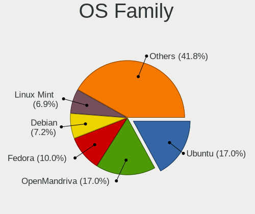
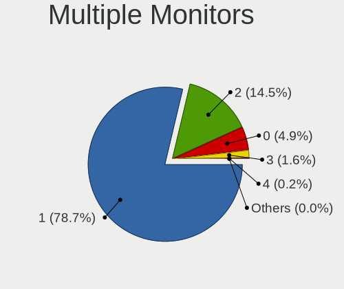

Linux - Hardware Trends
-----------------------

A project to identify most popular hardware characteristics and track their change
over time based on data collected by Linux users at https://Linux-Hardware.org.

Anyone can contribute to this report by the [hw-probe](https://github.com/linuxhw/hw-probe) tool:

    sudo -E hw-probe -all -upload

This is a report for all computer types. See also reports for [desktops](/Desktop/README.md) and [notebooks](/Notebook/README.md).

Distribution-specific reports: [Arch](/Dist/Arch), [ArcoLinux](/Dist/ArcoLinux), [BlackPanther](/Dist/BlackPanther), [CentOS](/Dist/CentOS), [Clear Linux](/Dist/Clear_Linux), [Debian](/Dist/Debian), [Elementary](/Dist/Elementary), [EndeavourOS](/Dist/EndeavourOS), [Endless](/Dist/Endless), [Fedora](/Dist/Fedora), [Garuda Linux](/Dist/Garuda_Linux), [Gentoo](/Dist/Gentoo), [Kali](/Dist/Kali), [KDE neon](/Dist/KDE_neon), [Kubuntu](/Dist/Kubuntu), [Linux Mint](/Dist/Linux_Mint), [Manjaro](/Dist/Manjaro), [OpenMandriva](/Dist/OpenMandriva), [openSUSE](/Dist/openSUSE), [Pop!_OS](/Dist/Pop!_OS), [Red OS](/Dist/Red_OS), [ROSA](/Dist/ROSA), [SteamOS](/Dist/SteamOS), [Ubuntu MATE](/Dist/Ubuntu_MATE), [Ubuntu](/Dist/Ubuntu), [Xubuntu](/Dist/Xubuntu), [Zorin](/Dist/Zorin).

This report is for one last month. Overall report since the beginning of time: [TestDays](https://github.com/linuxhw/TestDays)

Period: Nov, 2023.

Contents
--------

* [ System ](#system)
  - [ OS                       ](#os)
  - [ OS Family                ](#os-family)
  - [ Kernel                   ](#kernel)
  - [ Kernel Family            ](#kernel-family)
  - [ Kernel Major Ver.        ](#kernel-major-ver)
  - [ Arch                     ](#arch)
  - [ DE                       ](#de)
  - [ Display Server           ](#display-server)
  - [ Display Manager          ](#display-manager)
  - [ OS Lang                  ](#os-lang)
  - [ Boot Mode                ](#boot-mode)
  - [ Filesystem               ](#filesystem)
  - [ Part. scheme             ](#part-scheme)
  - [ Dual Boot with Linux/BSD ](#dual-boot-with-linuxbsd)
  - [ Dual Boot (Win)          ](#dual-boot-win)

* [ Board ](#board)
  - [ Vendor                   ](#vendor)
  - [ Model                    ](#model)
  - [ Model Family             ](#model-family)
  - [ MFG Year                 ](#mfg-year)
  - [ Form Factor              ](#form-factor)
  - [ Secure Boot              ](#secure-boot)
  - [ Coreboot                 ](#coreboot)
  - [ RAM Size                 ](#ram-size)
  - [ RAM Used                 ](#ram-used)
  - [ Total Drives             ](#total-drives)
  - [ Has CD-ROM               ](#has-cd-rom)
  - [ Has Ethernet             ](#has-ethernet)
  - [ Has WiFi                 ](#has-wifi)
  - [ Has Bluetooth            ](#has-bluetooth)

* [ Location ](#location)
  - [ Country                  ](#country)
  - [ City                     ](#city)

* [ Drives ](#drives)
  - [ Drive Vendor             ](#drive-vendor)
  - [ Drive Model              ](#drive-model)
  - [ HDD Vendor               ](#hdd-vendor)
  - [ SSD Vendor               ](#ssd-vendor)
  - [ Drive Kind               ](#drive-kind)
  - [ Drive Connector          ](#drive-connector)
  - [ Drive Size               ](#drive-size)
  - [ Space Total              ](#space-total)
  - [ Space Used               ](#space-used)
  - [ Malfunc. Drives          ](#malfunc-drives)
  - [ Malfunc. Drive Vendor    ](#malfunc-drive-vendor)
  - [ Malfunc. HDD Vendor      ](#malfunc-hdd-vendor)
  - [ Malfunc. Drive Kind      ](#malfunc-drive-kind)
  - [ Failed Drives            ](#failed-drives)
  - [ Failed Drive Vendor      ](#failed-drive-vendor)
  - [ Drive Status             ](#drive-status)

* [ Storage controller ](#storage-controller)
  - [ Storage Vendor           ](#storage-vendor)
  - [ Storage Model            ](#storage-model)
  - [ Storage Kind             ](#storage-kind)

* [ Processor ](#processor)
  - [ CPU Vendor               ](#cpu-vendor)
  - [ CPU Model                ](#cpu-model)
  - [ CPU Model Family         ](#cpu-model-family)
  - [ CPU Cores                ](#cpu-cores)
  - [ CPU Sockets              ](#cpu-sockets)
  - [ CPU Threads              ](#cpu-threads)
  - [ CPU Op-Modes             ](#cpu-op-modes)
  - [ CPU Microcode            ](#cpu-microcode)
  - [ CPU Microarch            ](#cpu-microarch)

* [ Graphics ](#graphics)
  - [ GPU Vendor               ](#gpu-vendor)
  - [ GPU Model                ](#gpu-model)
  - [ GPU Combo                ](#gpu-combo)
  - [ GPU Driver               ](#gpu-driver)
  - [ GPU Memory               ](#gpu-memory)

* [ Monitor ](#monitor)
  - [ Monitor Vendor           ](#monitor-vendor)
  - [ Monitor Model            ](#monitor-model)
  - [ Monitor Resolution       ](#monitor-resolution)
  - [ Monitor Diagonal         ](#monitor-diagonal)
  - [ Monitor Width            ](#monitor-width)
  - [ Aspect Ratio             ](#aspect-ratio)
  - [ Monitor Area             ](#monitor-area)
  - [ Pixel Density            ](#pixel-density)
  - [ Multiple Monitors        ](#multiple-monitors)

* [ Network ](#network)
  - [ Net Controller Vendor    ](#net-controller-vendor)
  - [ Net Controller Model     ](#net-controller-model)
  - [ Wireless Vendor          ](#wireless-vendor)
  - [ Wireless Model           ](#wireless-model)
  - [ Ethernet Vendor          ](#ethernet-vendor)
  - [ Ethernet Model           ](#ethernet-model)
  - [ Net Controller Kind      ](#net-controller-kind)
  - [ Used Controller          ](#used-controller)
  - [ NICs                     ](#nics)
  - [ IPv6                     ](#ipv6)

* [ Bluetooth ](#bluetooth)
  - [ Bluetooth Vendor         ](#bluetooth-vendor)
  - [ Bluetooth Model          ](#bluetooth-model)

* [ Sound ](#sound)
  - [ Sound Vendor             ](#sound-vendor)
  - [ Sound Model              ](#sound-model)

* [ Memory ](#memory)
  - [ Memory Vendor            ](#memory-vendor)
  - [ Memory Model             ](#memory-model)
  - [ Memory Kind              ](#memory-kind)
  - [ Memory Form Factor       ](#memory-form-factor)
  - [ Memory Size              ](#memory-size)
  - [ Memory Speed             ](#memory-speed)

* [ Printers & scanners ](#printers--scanners)
  - [ Printer Vendor           ](#printer-vendor)
  - [ Printer Model            ](#printer-model)
  - [ Scanner Vendor           ](#scanner-vendor)
  - [ Scanner Model            ](#scanner-model)

* [ Camera ](#camera)
  - [ Camera Vendor            ](#camera-vendor)
  - [ Camera Model             ](#camera-model)

* [ Security ](#security)
  - [ Fingerprint Vendor       ](#fingerprint-vendor)
  - [ Fingerprint Model        ](#fingerprint-model)
  - [ Chipcard Vendor          ](#chipcard-vendor)
  - [ Chipcard Model           ](#chipcard-model)

* [ Unsupported ](#unsupported)
  - [ Unsupported Devices      ](#unsupported-devices)
  - [ Unsupported Device Types ](#unsupported-device-types)

System
------

OS
--

Installed operating systems

| Name                         | Computers | Percent |
|------------------------------|-----------|---------|
| Ubuntu 22.04                 | 852       | 13.47%  |
| Linux Mint 21.2              | 460       | 7.27%   |
| Fedora 39                    | 449       | 7.1%    |
| Debian 12                    | 363       | 5.74%   |
| Arch Rolling                 | 289       | 4.57%   |
| Ubuntu 23.10                 | 257       | 4.06%   |
| OpenMandriva 5.0             | 213       | 3.37%   |
| OpenMandriva 23.08           | 203       | 3.21%   |
| Pop!_OS 22.04                | 198       | 3.13%   |
| Fedora 38                    | 172       | 2.72%   |
| ROSA 12.4                    | 157       | 2.48%   |
| Zorin 16                     | 156       | 2.47%   |
| ArcoLinux Rolling            | 115       | 1.82%   |
| Ubuntu 20.04                 | 106       | 1.68%   |
| BlackPanther 18.1            | 103       | 1.63%   |
| openSUSE Tumbleweed-XXXXXXXX | 79        | 1.25%   |
| OpenMandriva 23.11           | 77        | 1.22%   |
| EndeavourOS Rolling          | 76        | 1.2%    |
| Debian 11                    | 71        | 1.12%   |
| Kubuntu 23.10                | 68        | 1.08%   |
| Ubuntu 23.04                 | 66        | 1.04%   |
| Manjaro                      | 65        | 1.03%   |
| Kali 2023.3                  | 65        | 1.03%   |
| KDE neon 22.04               | 64        | 1.01%   |
| Kubuntu 22.04                | 62        | 0.98%   |
| Gentoo 2.14                  | 59        | 0.93%   |
| LMDE 6                       | 52        | 0.82%   |
| Nobara 38                    | 47        | 0.74%   |
| Manjaro 23.1.0               | 45        | 0.71%   |
| Debian                       | 43        | 0.68%   |
| Linux Mint 21.1              | 42        | 0.66%   |
| Xero Rolling                 | 41        | 0.65%   |
| Red OS 7.3                   | 39        | 0.62%   |
| Elementary 7.1               | 39        | 0.62%   |
| Linux Mint 20.3              | 37        | 0.59%   |
| openSUSE Leap-15.5           | 35        | 0.55%   |
| ROSA 12                      | 33        | 0.52%   |
| Xubuntu 22.04                | 28        | 0.44%   |
| OpenMandriva 4.3             | 28        | 0.44%   |
| SteamOS 3.4.11               | 24        | 0.38%   |

OS Family
---------

OS without a version

| Name          | Computers | Percent |
|---------------|-----------|---------|
| Ubuntu        | 1321      | 20.89%  |
| Fedora        | 642       | 10.15%  |
| OpenMandriva  | 605       | 9.57%   |
| Linux Mint    | 584       | 9.23%   |
| Debian        | 484       | 7.65%   |
| Arch          | 289       | 4.57%   |
| ROSA          | 219       | 3.46%   |
| Pop!_OS       | 199       | 3.15%   |
| Zorin         | 161       | 2.55%   |
| Kubuntu       | 143       | 2.26%   |
| Manjaro       | 136       | 2.15%   |
| openSUSE      | 123       | 1.94%   |
| ArcoLinux     | 119       | 1.88%   |
| BlackPanther  | 116       | 1.83%   |
| SteamOS       | 95        | 1.5%    |
| EndeavourOS   | 76        | 1.2%    |
| Kali          | 73        | 1.15%   |
| Xubuntu       | 70        | 1.11%   |
| KDE neon      | 65        | 1.03%   |
| Gentoo        | 61        | 0.96%   |
| LMDE          | 60        | 0.95%   |
| Nobara        | 50        | 0.79%   |
| Elementary    | 48        | 0.76%   |
| Red OS        | 45        | 0.71%   |
| Xero          | 41        | 0.65%   |
| Ubuntu MATE   | 39        | 0.62%   |
| NixOS         | 35        | 0.55%   |
| ALT Linux     | 30        | 0.47%   |
| MX            | 27        | 0.43%   |
| ChimeraOS     | 25        | 0.4%    |
| Lubuntu       | 23        | 0.36%   |
| Garuda Linux  | 23        | 0.36%   |
| Parrot        | 16        | 0.25%   |
| Rocky Linux   | 14        | 0.22%   |
| Ubuntu Unity  | 13        | 0.21%   |
| Endless       | 13        | 0.21%   |
| BigLinux      | 13        | 0.21%   |
| Ubuntu Budgie | 12        | 0.19%   |
| TUXEDO OS     | 12        | 0.19%   |
| Devuan        | 11        | 0.17%   |

Kernel
------

Version of the Linux kernel

| Version                           | Computers | Percent |
|-----------------------------------|-----------|---------|
| 6.2.0-36-generic                  | 618       | 9.77%   |
| 5.15.0-88-generic                 | 432       | 6.83%   |
| 6.1.0-13-amd64                    | 301       | 4.76%   |
| 6.6.2-desktop-1omv2390            | 232       | 3.67%   |
| 6.5.0-10-generic                  | 232       | 3.67%   |
| 6.2.0-37-generic                  | 227       | 3.59%   |
| 6.5.11-300.fc39.x86_64            | 201       | 3.18%   |
| 6.4.11-desktop-1omv2390           | 192       | 3.04%   |
| 5.15.0-89-generic                 | 186       | 2.94%   |
| 6.5.6-76060506-generic            | 154       | 2.44%   |
| 6.6.1-arch1-1                     | 129       | 2.04%   |
| 6.5.9-arch2-1                     | 123       | 1.94%   |
| 6.5.12-300.fc39.x86_64            | 99        | 1.57%   |
| 6.1.58-generic-1rosa2021.1-x86_64 | 97        | 1.53%   |
| 6.5.0-13-generic                  | 76        | 1.2%    |
| 6.6.2-arch1-1                     | 71        | 1.12%   |
| 5.19.0-38-generic                 | 63        | 1%      |
| 6.2.0-26-generic                  | 55        | 0.87%   |
| 6.5.0-kali3-amd64                 | 54        | 0.85%   |
| 6.5.8-200.fc38.x86_64             | 53        | 0.84%   |
| 6.5.6-300.fc39.x86_64             | 52        | 0.82%   |
| 6.2.0-35-generic                  | 50        | 0.79%   |
| 6.1.20-generic-2rosa2021.1-x86_64 | 50        | 0.79%   |
| 5.15.0-76-generic                 | 46        | 0.73%   |
| 5.10.0-26-amd64                   | 44        | 0.7%    |
| 6.6.1-zen1-1-zen                  | 43        | 0.68%   |
| 5.4.0-166-generic                 | 43        | 0.68%   |
| 6.5.10-300.fc39.x86_64            | 42        | 0.66%   |
| 6.5.9-200.fc38.x86_64             | 41        | 0.65%   |
| 6.5.9-1-default                   | 41        | 0.65%   |
| 5.15.85-desktop-1bP               | 39        | 0.62%   |
| 6.5.10-200.fc38.x86_64            | 38        | 0.6%    |
| 5.15.0-87-generic                 | 37        | 0.59%   |
| 5.6.14-desktop-2bP                | 36        | 0.57%   |
| 6.1.0-4-amd64                     | 32        | 0.51%   |
| 6.5.4-76060504-generic            | 27        | 0.43%   |
| 6.5.0-4-amd64                     | 27        | 0.43%   |
| 6.6.2-1-default                   | 26        | 0.41%   |
| 6.5.9-zen2-1-zen                  | 26        | 0.41%   |
| 6.5.11-1-MANJARO                  | 26        | 0.41%   |

Kernel Family
-------------

Linux kernel without a distro release

| Version | Computers | Percent |
|---------|-----------|---------|
| 6.2.0   | 1017      | 16.08%  |
| 5.15.0  | 820       | 12.97%  |
| 6.5.0   | 483       | 7.64%   |
| 6.1.0   | 426       | 6.74%   |
| 6.6.2   | 389       | 6.15%   |
| 6.5.9   | 294       | 4.65%   |
| 6.6.1   | 261       | 4.13%   |
| 6.5.11  | 250       | 3.95%   |
| 6.5.6   | 235       | 3.72%   |
| 6.4.11  | 196       | 3.1%    |
| 6.5.12  | 114       | 1.8%    |
| 6.5.10  | 105       | 1.66%   |
| 6.1.58  | 105       | 1.66%   |
| 5.4.0   | 100       | 1.58%   |
| 5.19.0  | 99        | 1.57%   |
| 6.6.0   | 91        | 1.44%   |
| 6.5.8   | 81        | 1.28%   |
| 6.1.52  | 80        | 1.27%   |
| 5.10.0  | 69        | 1.09%   |
| 6.5.5   | 61        | 0.96%   |
| 6.1.20  | 51        | 0.81%   |
| 6.5.7   | 39        | 0.62%   |
| 5.15.85 | 39        | 0.62%   |
| 5.6.14  | 37        | 0.59%   |
| 5.14.21 | 37        | 0.59%   |
| 6.2.16  | 34        | 0.54%   |
| 5.13.0  | 34        | 0.54%   |
| 6.5.4   | 31        | 0.49%   |
| 6.1.62  | 30        | 0.47%   |
| 6.2.6   | 28        | 0.44%   |
| 6.1.61  | 26        | 0.41%   |
| 6.1.57  | 26        | 0.41%   |
| 4.15.0  | 26        | 0.41%   |
| 6.4.8   | 25        | 0.4%    |
| 5.14.0  | 25        | 0.4%    |
| 6.1.60  | 23        | 0.36%   |
| 4.18.16 | 23        | 0.36%   |
| 6.4.10  | 22        | 0.35%   |
| 6.1.55  | 20        | 0.32%   |
| 5.16.7  | 18        | 0.28%   |

Kernel Major Ver.
-----------------

Linux kernel major version

| Version | Computers | Percent |
|---------|-----------|---------|
| 6.5     | 1719      | 27.18%  |
| 6.2     | 1100      | 17.39%  |
| 5.15    | 915       | 14.47%  |
| 6.1     | 851       | 13.46%  |
| 6.6     | 757       | 11.97%  |
| 6.4     | 285       | 4.51%   |
| 5.10    | 132       | 2.09%   |
| 5.4     | 110       | 1.74%   |
| 5.19    | 103       | 1.63%   |
| 5.14    | 64        | 1.01%   |
| 6.3     | 48        | 0.76%   |
| 5.6     | 37        | 0.59%   |
| 5.13    | 34        | 0.54%   |
| 4.18    | 32        | 0.51%   |
| 5.16    | 29        | 0.46%   |
| 4.15    | 26        | 0.41%   |
| 6.0     | 13        | 0.21%   |
| 6.7     | 12        | 0.19%   |
| 5.11    | 9         | 0.14%   |
| 3.10    | 9         | 0.14%   |
| 5.8     | 8         | 0.13%   |
| 5.17    | 6         | 0.09%   |
| 5.18    | 5         | 0.08%   |
| 4.9     | 5         | 0.08%   |
| 4.4     | 3         | 0.05%   |
| 5.9     | 2         | 0.03%   |
| 5.0     | 2         | 0.03%   |
| 4.8     | 2         | 0.03%   |
| 6.6.0   | 1         | 0.02%   |
| 5.3     | 1         | 0.02%   |
| 4.20    | 1         | 0.02%   |
| 4.19    | 1         | 0.02%   |
| 3.18    | 1         | 0.02%   |
| 3.16    | 1         | 0.02%   |

Arch
----

OS architecture (x86_64, i586, etc.)

| Name        | Computers | Percent |
|-------------|-----------|---------|
| x86_64      | 6227      | 98.47%  |
| aarch64     | 43        | 0.68%   |
| i686        | 37        | 0.59%   |
| armv7l      | 11        | 0.17%   |
| loongarch64 | 2         | 0.03%   |
| armv6l      | 2         | 0.03%   |
| riscv64     | 1         | 0.02%   |
| e2k         | 1         | 0.02%   |

DE
--

Desktop Environment

| Name                    | Computers | Percent |
|-------------------------|-----------|---------|
| GNOME                   | 2564      | 40.54%  |
| KDE5                    | 1751      | 27.69%  |
| X-Cinnamon              | 540       | 8.54%   |
| XFCE                    | 421       | 6.66%   |
| Unknown                 | 361       | 5.71%   |
| MATE                    | 209       | 3.3%    |
| LXQt                    | 111       | 1.76%   |
| Cinnamon                | 60        | 0.95%   |
| Pantheon                | 48        | 0.76%   |
| i3                      | 42        | 0.66%   |
| Hyprland                | 29        | 0.46%   |
| Budgie                  | 27        | 0.43%   |
| LXDE                    | 17        | 0.27%   |
| Unity                   | 16        | 0.25%   |
| sway                    | 15        | 0.24%   |
| KDE                     | 13        | 0.21%   |
| KDE4                    | 12        | 0.19%   |
| GNOME Flashback         | 9         | 0.14%   |
| Deepin                  | 9         | 0.14%   |
| Endless:GNOME           | 8         | 0.13%   |
| openbox                 | 7         | 0.11%   |
| DDE                     | 6         | 0.09%   |
| qtile                   | 4         | 0.06%   |
| GNOME Classic           | 4         | 0.06%   |
| dwm                     | 4         | 0.06%   |
| LXDE-pi-wayfire         | 3         | 0.05%   |
| lightdm-xsession        | 3         | 0.05%   |
| chadwm                  | 3         | 0.05%   |
| UKUI                    | 2         | 0.03%   |
| Trinity                 | 2         | 0.03%   |
| LeftWM                  | 2         | 0.03%   |
| KDE6                    | 2         | 0.03%   |
| i3-with-shmlog          | 2         | 0.03%   |
| Enlightenment           | 2         | 0.03%   |
| BunsenLabs              | 2         | 0.03%   |
| bspwm                   | 2         | 0.03%   |
| X-Generic               | 1         | 0.02%   |
| wlroots                 | 1         | 0.02%   |
| wayland                 | 1         | 0.02%   |
| Wayfire:wayfire:wlroots | 1         | 0.02%   |

Display Server
--------------

X11 or Wayland

| Name    | Computers | Percent |
|---------|-----------|---------|
| X11     | 3449      | 54.54%  |
| Wayland | 2468      | 39.03%  |
| Unknown | 206       | 3.26%   |
| Tty     | 200       | 3.16%   |
| Web     | 1         | 0.02%   |

Display Manager
---------------

SDDM, LightDM, etc.

| Name    | Computers | Percent |
|---------|-----------|---------|
| Unknown | 2250      | 35.58%  |
| SDDM    | 1471      | 23.26%  |
| GDM3    | 1244      | 19.67%  |
| LightDM | 813       | 12.86%  |
| GDM     | 502       | 7.94%   |
| KDM     | 12        | 0.19%   |
| SLiM    | 7         | 0.11%   |
| LXDM    | 7         | 0.11%   |
| LY-DM   | 6         | 0.09%   |
| NODM    | 4         | 0.06%   |
| Ly      | 3         | 0.05%   |
| XDM     | 1         | 0.02%   |
| WDM     | 1         | 0.02%   |
| LDM     | 1         | 0.02%   |
| GREETD  | 1         | 0.02%   |
| EMPTTY  | 1         | 0.02%   |

OS Lang
-------

Language

| Lang    | Computers | Percent |
|---------|-----------|---------|
| en_US   | 2661      | 42.08%  |
| ru_RU   | 510       | 8.06%   |
| de_DE   | 506       | 8%      |
| en_GB   | 333       | 5.27%   |
| it_IT   | 278       | 4.4%    |
| fr_FR   | 267       | 4.22%   |
| C       | 220       | 3.48%   |
| pt_BR   | 216       | 3.42%   |
| Unknown | 183       | 2.89%   |
| es_ES   | 129       | 2.04%   |
| pl_PL   | 112       | 1.77%   |
| en_CA   | 110       | 1.74%   |
| en_AU   | 95        | 1.5%    |
| en_IN   | 52        | 0.82%   |
| es_MX   | 38        | 0.6%    |
| hu_HU   | 36        | 0.57%   |
| nl_NL   | 34        | 0.54%   |
| zh_CN   | 33        | 0.52%   |
| cs_CZ   | 32        | 0.51%   |
| tr_TR   | 28        | 0.44%   |
| pt_PT   | 27        | 0.43%   |
| es_AR   | 27        | 0.43%   |
| de_AT   | 21        | 0.33%   |
| de_CH   | 19        | 0.3%    |
| da_DK   | 19        | 0.3%    |
| en_ZA   | 18        | 0.28%   |
| ja_JP   | 16        | 0.25%   |
| es_CO   | 16        | 0.25%   |
| en_NZ   | 16        | 0.25%   |
| en_IE   | 16        | 0.25%   |
| sv_SE   | 15        | 0.24%   |
| fi_FI   | 13        | 0.21%   |
| fr_BE   | 12        | 0.19%   |
| sk_SK   | 11        | 0.17%   |
| es_CL   | 11        | 0.17%   |
| zh_TW   | 10        | 0.16%   |
| fr_CA   | 9         | 0.14%   |
| es_VE   | 9         | 0.14%   |
| nl_BE   | 8         | 0.13%   |
| ko_KR   | 8         | 0.13%   |

Boot Mode
---------

EFI or BIOS

| Mode | Computers | Percent |
|------|-----------|---------|
| EFI  | 3555      | 56.21%  |
| BIOS | 2769      | 43.79%  |

Filesystem
----------

Type of filesystem

| Type     | Computers | Percent |
|----------|-----------|---------|
| Ext4     | 3514      | 55.57%  |
| Btrfs    | 1195      | 18.9%   |
| Tmpfs    | 855       | 13.52%  |
| Overlay  | 565       | 8.93%   |
| Xfs      | 94        | 1.49%   |
| Zfs      | 40        | 0.63%   |
| F2fs     | 25        | 0.4%    |
| Ext3     | 12        | 0.19%   |
| Ext2     | 6         | 0.09%   |
| Unknown  | 5         | 0.08%   |
| Rootfs   | 4         | 0.06%   |
| Aufs     | 4         | 0.06%   |
| XXXXXXX  | 1         | 0.02%   |
| XXXXX    | 1         | 0.02%   |
| Reiserfs | 1         | 0.02%   |
| Fake     | 1         | 0.02%   |
| Bcachefs | 1         | 0.02%   |

Part. scheme
------------

Scheme of partitioning

| Type    | Computers | Percent |
|---------|-----------|---------|
| GPT     | 3672      | 58.06%  |
| Unknown | 1963      | 31.04%  |
| MBR     | 689       | 10.9%   |

Dual Boot with Linux/BSD
------------------------

Hosting more than one Linux/BSD

| Dual boot | Computers | Percent |
|-----------|-----------|---------|
| No        | 5263      | 83.22%  |
| Yes       | 1061      | 16.78%  |

Dual Boot (Win)
---------------

Hosting Linux and Windows

| Dual boot | Computers | Percent |
|-----------|-----------|---------|
| No        | 4580      | 72.42%  |
| Yes       | 1744      | 27.58%  |

Board
-----

Vendor
------

Motherboard manufacturer

| Name                                 | Computers | Percent |
|--------------------------------------|-----------|---------|
| ASUSTek Computer                     | 994       | 15.72%  |
| Lenovo                               | 920       | 14.55%  |
| Hewlett-Packard                      | 887       | 14.03%  |
| Dell                                 | 668       | 10.56%  |
| Gigabyte Technology                  | 403       | 6.37%   |
| MSI                                  | 382       | 6.04%   |
| Acer                                 | 303       | 4.79%   |
| ASRock                               | 201       | 3.18%   |
| Apple                                | 178       | 2.81%   |
| Intel                                | 94        | 1.49%   |
| Valve                                | 87        | 1.38%   |
| Unknown                              | 85        | 1.34%   |
| Samsung Electronics                  | 72        | 1.14%   |
| Toshiba                              | 70        | 1.11%   |
| HUAWEI                               | 67        | 1.06%   |
| Supermicro                           | 64        | 1.01%   |
| Fujitsu                              | 61        | 0.96%   |
| Google                               | 43        | 0.68%   |
| Medion                               | 34        | 0.54%   |
| Sony                                 | 31        | 0.49%   |
| Raspberry Pi Foundation              | 27        | 0.43%   |
| AZW                                  | 27        | 0.43%   |
| Timi                                 | 21        | 0.33%   |
| Pegatron                             | 19        | 0.3%    |
| Notebook                             | 19        | 0.3%    |
| Microsoft                            | 19        | 0.3%    |
| Alienware                            | 18        | 0.28%   |
| TUXEDO                               | 17        | 0.27%   |
| Framework                            | 17        | 0.27%   |
| Foxconn                              | 17        | 0.27%   |
| Shenzhen Meigao Electronic Equipment | 15        | 0.24%   |
| AMI                                  | 15        | 0.24%   |
| Packard Bell                         | 13        | 0.21%   |
| ECS                                  | 13        | 0.21%   |
| ICL                                  | 11        | 0.17%   |
| Aquarius                             | 10        | 0.16%   |
| Positivo                             | 9         | 0.14%   |
| HONOR                                | 9         | 0.14%   |
| eMachines                            | 9         | 0.14%   |
| Chuwi                                | 9         | 0.14%   |

Model
-----

Motherboard model

| Name                                       | Computers | Percent |
|--------------------------------------------|-----------|---------|
| Unknown                                    | 102       | 1.61%   |
| Valve Jupiter                              | 83        | 1.31%   |
| ASUS All Series                            | 39        | 0.62%   |
| HP Notebook                                | 17        | 0.27%   |
| Supermicro X9DRW                           | 15        | 0.24%   |
| MSI MS-7C91                                | 15        | 0.24%   |
| HP Pavilion dv6                            | 14        | 0.22%   |
| MSI MS-7C37                                | 13        | 0.21%   |
| MSI MS-7C56                                | 12        | 0.19%   |
| HP Pavilion Notebook                       | 12        | 0.19%   |
| Gigabyte B450M DS3H                        | 11        | 0.17%   |
| ASUS TUF Gaming X570-PLUS                  | 11        | 0.17%   |
| ASUS PRIME A320M-K                         | 11        | 0.17%   |
| Supermicro X8DTU                           | 10        | 0.16%   |
| Supermicro Super Server                    | 10        | 0.16%   |
| ICL RAY Si105.Mi                           | 10        | 0.16%   |
| HP Pavilion g6                             | 10        | 0.16%   |
| Apple MacBookPro8,1                        | 10        | 0.16%   |
| Apple MacBookPro11,1                       | 10        | 0.16%   |
| MSI MS-7C52                                | 9         | 0.14%   |
| MSI MS-7B86                                | 9         | 0.14%   |
| MSI MS-7B79                                | 9         | 0.14%   |
| MSI MS-7721                                | 9         | 0.14%   |
| Dell OptiPlex 780                          | 9         | 0.14%   |
| Dell Latitude E6430                        | 9         | 0.14%   |
| Apple iMac12,2                             | 9         | 0.14%   |
| MSI MS-7C95                                | 8         | 0.13%   |
| MSI MS-7C02                                | 8         | 0.13%   |
| MSI MS-7B89                                | 8         | 0.13%   |
| HP Laptop 15s-eq2xxx                       | 8         | 0.13%   |
| Gigabyte A320M-S2H                         | 8         | 0.13%   |
| ETegro Hyperion RS125 G4                   | 8         | 0.13%   |
| Dell OptiPlex 3020                         | 8         | 0.13%   |
| Acer Nitro AN515-54                        | 8         | 0.13%   |
| MSI MS-7D75                                | 7         | 0.11%   |
| Intel SKYBAY                               | 7         | 0.11%   |
| Intel H61                                  | 7         | 0.11%   |
| HUAWEI BOM-WXX9                            | 7         | 0.11%   |
| HP Compaq 8200 Elite SFF PC                | 7         | 0.11%   |
| Framework Laptop 13 (AMD Ryzen 7040Series) | 7         | 0.11%   |

Model Family
------------

Motherboard model prefix

| Name               | Computers | Percent |
|--------------------|-----------|---------|
| Lenovo ThinkPad    | 395       | 6.25%   |
| Dell Latitude      | 194       | 3.07%   |
| Acer Aspire        | 185       | 2.93%   |
| Lenovo IdeaPad     | 177       | 2.8%    |
| ASUS ROG           | 154       | 2.44%   |
| HP Pavilion        | 149       | 2.36%   |
| ASUS Vivobook      | 138       | 2.18%   |
| ASUS PRIME         | 134       | 2.12%   |
| Dell Inspiron      | 129       | 2.04%   |
| Dell OptiPlex      | 120       | 1.9%    |
| Unknown            | 102       | 1.61%   |
| HP EliteBook       | 96        | 1.52%   |
| HP Laptop          | 94        | 1.49%   |
| ASUS TUF           | 88        | 1.39%   |
| Valve Jupiter      | 83        | 1.31%   |
| HP ProBook         | 83        | 1.31%   |
| Dell Precision     | 69        | 1.09%   |
| Dell XPS           | 68        | 1.08%   |
| HP Compaq          | 66        | 1.04%   |
| Lenovo Legion      | 59        | 0.93%   |
| Toshiba Satellite  | 56        | 0.89%   |
| Lenovo ThinkCentre | 54        | 0.85%   |
| Lenovo Yoga        | 45        | 0.71%   |
| HP EliteDesk       | 45        | 0.71%   |
| HP ENVY            | 44        | 0.7%    |
| ASUS ASUS          | 39        | 0.62%   |
| ASUS All           | 39        | 0.62%   |
| Dell Vostro        | 37        | 0.59%   |
| Acer Nitro         | 37        | 0.59%   |
| ASUS Zenbook       | 29        | 0.46%   |
| RPi Raspberry      | 27        | 0.43%   |
| Lenovo ThinkBook   | 25        | 0.4%    |
| Fujitsu ESPRIMO    | 25        | 0.4%    |
| HP ZBook           | 24        | 0.38%   |
| Fujitsu LIFEBOOK   | 24        | 0.38%   |
| Lenovo IdeaPadFlex | 23        | 0.36%   |
| Gigabyte X570      | 23        | 0.36%   |
| Lenovo IdeaCentre  | 22        | 0.35%   |
| HP ProLiant        | 22        | 0.35%   |
| Gigabyte B450M     | 22        | 0.35%   |

MFG Year
--------

Motherboard manufacture year

| Year    | Computers | Percent |
|---------|-----------|---------|
| 2021    | 637       | 10.07%  |
| 2020    | 613       | 9.69%   |
| 2022    | 608       | 9.61%   |
| 2023    | 529       | 8.36%   |
| 2019    | 493       | 7.8%    |
| 2018    | 480       | 7.59%   |
| 2012    | 419       | 6.63%   |
| 2017    | 383       | 6.06%   |
| 2013    | 358       | 5.66%   |
| 2011    | 327       | 5.17%   |
| 2014    | 282       | 4.46%   |
| 2015    | 255       | 4.03%   |
| 2016    | 252       | 3.98%   |
| 2010    | 220       | 3.48%   |
| 2009    | 152       | 2.4%    |
| 2008    | 145       | 2.29%   |
| 2007    | 76        | 1.2%    |
| Unknown | 61        | 0.96%   |
| 2006    | 24        | 0.38%   |
| 2005    | 5         | 0.08%   |
| 2004    | 3         | 0.05%   |
| 2003    | 1         | 0.02%   |
| 2001    | 1         | 0.02%   |

Form Factor
-----------

Physical design of the computer

| Name           | Computers | Percent |
|----------------|-----------|---------|
| Notebook       | 3352      | 53%     |
| Desktop        | 2335      | 36.92%  |
| Convertible    | 179       | 2.83%   |
| All in one     | 123       | 1.94%   |
| Mini pc        | 116       | 1.83%   |
| Server         | 114       | 1.8%    |
| Tablet         | 56        | 0.89%   |
| System on chip | 48        | 0.76%   |
| Phone          | 1         | 0.02%   |

Secure Boot
-----------

Enabled or disabled

| State    | Computers | Percent |
|----------|-----------|---------|
| Disabled | 5897      | 93.25%  |
| Enabled  | 427       | 6.75%   |

Coreboot
--------

Have coreboot on board

| Used | Computers | Percent |
|------|-----------|---------|
| No   | 6273      | 99.19%  |
| Yes  | 51        | 0.81%   |

RAM Size
--------

Total RAM memory

| Size in GB      | Computers | Percent |
|-----------------|-----------|---------|
| 4.01-8.0        | 1433      | 22.66%  |
| 16.01-24.0      | 1359      | 21.49%  |
| 8.01-16.0       | 1138      | 17.99%  |
| 32.01-64.0      | 861       | 13.61%  |
| 3.01-4.0        | 816       | 12.9%   |
| 64.01-256.0     | 321       | 5.08%   |
| 24.01-32.0      | 184       | 2.91%   |
| 1.01-2.0        | 106       | 1.68%   |
| 2.01-3.0        | 68        | 1.08%   |
| More than 256.0 | 17        | 0.27%   |
| 0.51-1.0        | 17        | 0.27%   |
| 0.01-0.5        | 4         | 0.06%   |

RAM Used
--------

Used RAM memory

| Used GB         | Computers | Percent |
|-----------------|-----------|---------|
| 1.01-2.0        | 1707      | 26.99%  |
| 2.01-3.0        | 1540      | 24.35%  |
| 4.01-8.0        | 1233      | 19.5%   |
| 3.01-4.0        | 997       | 15.77%  |
| 8.01-16.0       | 367       | 5.8%    |
| 0.51-1.0        | 289       | 4.57%   |
| 16.01-24.0      | 75        | 1.19%   |
| 0.01-0.5        | 71        | 1.12%   |
| 24.01-32.0      | 21        | 0.33%   |
| 32.01-64.0      | 13        | 0.21%   |
| 64.01-256.0     | 9         | 0.14%   |
| More than 256.0 | 1         | 0.02%   |
| Unknown         | 1         | 0.02%   |

Total Drives
------------

Number of drives on board

| Drives | Computers | Percent |
|--------|-----------|---------|
| 1      | 3737      | 59.09%  |
| 2      | 1526      | 24.13%  |
| 3      | 512       | 8.1%    |
| 4      | 246       | 3.89%   |
| 5      | 117       | 1.85%   |
| 6      | 65        | 1.03%   |
| 0      | 39        | 0.62%   |
| 7      | 29        | 0.46%   |
| 8      | 16        | 0.25%   |
| 9      | 11        | 0.17%   |
| 11     | 9         | 0.14%   |
| 13     | 3         | 0.05%   |
| 10     | 3         | 0.05%   |
| 20     | 2         | 0.03%   |
| 14     | 2         | 0.03%   |
| 12     | 2         | 0.03%   |
| 31     | 1         | 0.02%   |
| 27     | 1         | 0.02%   |
| 21     | 1         | 0.02%   |
| 19     | 1         | 0.02%   |
| 17     | 1         | 0.02%   |

Has CD-ROM
----------

Has CD-ROM on board

| Presented | Computers | Percent |
|-----------|-----------|---------|
| No        | 4475      | 70.76%  |
| Yes       | 1849      | 29.24%  |

Has Ethernet
------------

Has Ethernet on board

| Presented | Computers | Percent |
|-----------|-----------|---------|
| Yes       | 5259      | 83.16%  |
| No        | 1065      | 16.84%  |

Has WiFi
--------

Has WiFi module

| Presented | Computers | Percent |
|-----------|-----------|---------|
| Yes       | 4891      | 77.34%  |
| No        | 1433      | 22.66%  |

Has Bluetooth
-------------

Has Bluetooth module

| Presented | Computers | Percent |
|-----------|-----------|---------|
| Yes       | 4172      | 65.97%  |
| No        | 2152      | 34.03%  |

Location
--------

Country
-------

Geographic location (country)

| Country      | Computers | Percent |
|--------------|-----------|---------|
| USA          | 1096      | 17.33%  |
| Germany      | 689       | 10.9%   |
| Russia       | 666       | 10.53%  |
| Italy        | 389       | 6.15%   |
| France       | 306       | 4.84%   |
| Brazil       | 292       | 4.62%   |
| UK           | 256       | 4.05%   |
| Canada       | 185       | 2.93%   |
| Poland       | 168       | 2.66%   |
| Spain        | 166       | 2.62%   |
| Hungary      | 162       | 2.56%   |
| Australia    | 122       | 1.93%   |
| Netherlands  | 114       | 1.8%    |
| India        | 95        | 1.5%    |
| Mexico       | 84        | 1.33%   |
| Switzerland  | 76        | 1.2%    |
| Austria      | 67        | 1.06%   |
| China        | 64        | 1.01%   |
| Sweden       | 62        | 0.98%   |
| Turkey       | 60        | 0.95%   |
| Belgium      | 60        | 0.95%   |
| Czechia      | 57        | 0.9%    |
| Portugal     | 54        | 0.85%   |
| Argentina    | 51        | 0.81%   |
| Romania      | 46        | 0.73%   |
| Greece       | 45        | 0.71%   |
| Norway       | 38        | 0.6%    |
| Slovakia     | 35        | 0.55%   |
| Denmark      | 33        | 0.52%   |
| Finland      | 32        | 0.51%   |
| Indonesia    | 31        | 0.49%   |
| Bulgaria     | 31        | 0.49%   |
| Colombia     | 30        | 0.47%   |
| Ireland      | 26        | 0.41%   |
| Serbia       | 25        | 0.4%    |
| South Africa | 24        | 0.38%   |
| New Zealand  | 24        | 0.38%   |
| Ukraine      | 22        | 0.35%   |
| Chile        | 22        | 0.35%   |
| Japan        | 21        | 0.33%   |

City
----

Geographic location (city)

| City              | Computers | Percent |
|-------------------|-----------|---------|
| Moscow            | 214       | 3.38%   |
| Berlin            | 76        | 1.2%    |
| St Petersburg     | 68        | 1.08%   |
| Budapest          | 56        | 0.89%   |
| Sydney            | 51        | 0.81%   |
| Voronezh          | 45        | 0.71%   |
| Milan             | 44        | 0.7%    |
| Warsaw            | 41        | 0.65%   |
| Rome              | 41        | 0.65%   |
| Paris             | 41        | 0.65%   |
| Vienna            | 36        | 0.57%   |
| Sao Paulo         | 33        | 0.52%   |
| Toronto           | 29        | 0.46%   |
| Madrid            | 28        | 0.44%   |
| Hamburg           | 28        | 0.44%   |
| Milano            | 25        | 0.4%    |
| Athens            | 25        | 0.4%    |
| Melbourne         | 24        | 0.38%   |
| Munich            | 23        | 0.36%   |
| Rio de Janeiro    | 22        | 0.35%   |
| Prague            | 21        | 0.33%   |
| Istanbul          | 20        | 0.32%   |
| Frankfurt am Main | 20        | 0.32%   |
| Dublin            | 20        | 0.32%   |
| Amsterdam         | 20        | 0.32%   |
| Los Angeles       | 19        | 0.3%    |
| Leipzig           | 19        | 0.3%    |
| Brisbane          | 19        | 0.3%    |
| Barcelona         | 19        | 0.3%    |
| Krakow            | 18        | 0.28%   |
| Cologne           | 17        | 0.27%   |
| Stockholm         | 16        | 0.25%   |
| Brussels          | 16        | 0.25%   |
| Zurich            | 15        | 0.24%   |
| Yekaterinburg     | 15        | 0.24%   |
| Stuttgart         | 15        | 0.24%   |
| Sofia             | 15        | 0.24%   |
| Perth             | 15        | 0.24%   |
| Helsinki          | 15        | 0.24%   |
| Delhi             | 15        | 0.24%   |

Drives
------

Drive Vendor
------------

Hard drive vendors

| Vendor                      | Computers | Drives | Percent |
|-----------------------------|-----------|--------|---------|
| Samsung Electronics         | 1516      | 1913   | 16.15%  |
| WDC                         | 1063      | 1350   | 11.32%  |
| Seagate                     | 975       | 1262   | 10.39%  |
| SanDisk                     | 583       | 631    | 6.21%   |
| Kingston                    | 525       | 581    | 5.59%   |
| Toshiba                     | 447       | 510    | 4.76%   |
| Unknown                     | 373       | 419    | 3.97%   |
| Crucial                     | 368       | 418    | 3.92%   |
| Intel                       | 273       | 323    | 2.91%   |
| SK hynix                    | 257       | 265    | 2.74%   |
| Micron Technology           | 251       | 254    | 2.67%   |
| Hitachi                     | 188       | 228    | 2%      |
| A-DATA Technology           | 153       | 163    | 1.63%   |
| HGST                        | 141       | 168    | 1.5%    |
| Phison Electronics          | 136       | 142    | 1.45%   |
| China                       | 131       | 146    | 1.4%    |
| Micron/Crucial Technology   | 110       | 117    | 1.17%   |
| Kingston Technology Company | 96        | 101    | 1.02%   |
| KIOXIA                      | 90        | 92     | 0.96%   |
| Apple                       | 83        | 93     | 0.88%   |
| Unknown                     | 80        | 84     | 0.85%   |
| Silicon Motion              | 76        | 78     | 0.81%   |
| SPCC                        | 68        | 73     | 0.72%   |
| Fujitsu                     | 63        | 96     | 0.67%   |
| PNY                         | 61        | 69     | 0.65%   |
| Intenso                     | 56        | 59     | 0.6%    |
| Patriot                     | 45        | 47     | 0.48%   |
| MAXIO Technology (Hangzhou) | 43        | 44     | 0.46%   |
| JMicron Technology          | 42        | 42     | 0.45%   |
| ADATA Technology            | 42        | 48     | 0.45%   |
| Phison                      | 37        | 38     | 0.39%   |
| APACER                      | 36        | 37     | 0.38%   |
| Hewlett-Packard             | 35        | 89     | 0.37%   |
| GOODRAM                     | 35        | 38     | 0.37%   |
| Transcend                   | 33        | 33     | 0.35%   |
| LITEON                      | 29        | 29     | 0.31%   |
| Team                        | 26        | 27     | 0.28%   |
| Realtek Semiconductor       | 26        | 28     | 0.28%   |
| Fanxiang                    | 26        | 31     | 0.28%   |
| Netac                       | 25        | 28     | 0.27%   |

Drive Model
-----------

Hard drive models

| Model                                                 | Computers | Percent |
|-------------------------------------------------------|-----------|---------|
| Samsung NVMe SSD Controller SM981/PM981/PM983 250GB   | 229       | 2.22%   |
| Samsung NVMe SSD Controller PM9A1/PM9A3/980PRO 2TB    | 141       | 1.37%   |
| Kingston SA400S37240G 240GB SSD                       | 112       | 1.09%   |
| Kingston SA400S37480G 480GB SSD                       | 93        | 0.9%    |
| Unknown                                               | 80        | 0.78%   |
| Micron/Crucial P2 NVMe PCIe SSD 1TB                   | 68        | 0.66%   |
| Crucial CT500MX500SSD1 500GB                          | 65        | 0.63%   |
| Unknown MMC Card  64GB                                | 62        | 0.6%    |
| Toshiba DT01ACA100 1TB                                | 55        | 0.53%   |
| Seagate ST1000LM035-1RK172 1TB                        | 54        | 0.52%   |
| Samsung SSD 980 1TB                                   | 54        | 0.52%   |
| Samsung SSD 850 EVO 250GB                             | 54        | 0.52%   |
| Seagate ST500DM002-1BD142 500GB                       | 53        | 0.51%   |
| Samsung SSD 860 EVO 500GB                             | 53        | 0.51%   |
| Crucial CT1000MX500SSD1 1TB                           | 53        | 0.51%   |
| Phison PS5013 E13 NVMe Controller 512GB               | 52        | 0.51%   |
| Sandisk WD Blue SN550 NVMe SSD 512GB                  | 51        | 0.5%    |
| Unknown MMC Card  32GB                                | 47        | 0.46%   |
| Seagate ST2000DM008-2FR102 2TB                        | 47        | 0.46%   |
| Silicon Motion SM2263EN/SM2263XT SSD Controller 256GB | 45        | 0.44%   |
| Seagate ST1000DM010-2EP102 1TB                        | 45        | 0.44%   |
| Kingston SA400S37120G 120GB SSD                       | 45        | 0.44%   |
| Samsung NVMe SSD Controller SM961/PM961/SM963 256GB   | 43        | 0.42%   |
| Samsung SSD 850 EVO 500GB                             | 42        | 0.41%   |
| Samsung SSD 860 EVO 1TB                               | 41        | 0.4%    |
| Intel SSDPEKNU512GZ 512GB                             | 39        | 0.38%   |
| Seagate ST1000LM024 HN-M101MBB 1TB                    | 38        | 0.37%   |
| Sandisk WD Black SN750 / PC SN730 NVMe SSD 500GB      | 38        | 0.37%   |
| Samsung SSD 870 EVO 500GB                             | 36        | 0.35%   |
| Crucial CT240BX500SSD1 240GB                          | 36        | 0.35%   |
| Unknown MMC Card  128GB                               | 35        | 0.34%   |
| Toshiba MQ01ABD100 1TB                                | 35        | 0.34%   |
| Unknown SD/MMC/MS PRO 128GB                           | 34        | 0.33%   |
| Toshiba MQ04ABF100 1TB                                | 33        | 0.32%   |
| Samsung SSD 870 EVO 1TB                               | 33        | 0.32%   |
| WDC WD10EZEX-08WN4A0 1TB                              | 32        | 0.31%   |
| Phison E12 NVMe Controller 512GB                      | 31        | 0.3%    |
| Intel SSD 660P Series 512GB                           | 30        | 0.29%   |
| Samsung SSD 870 QVO 1TB                               | 29        | 0.28%   |
| SanDisk SSD PLUS 240GB                                | 28        | 0.27%   |

HDD Vendor
----------

Hard disk drive vendors

| Vendor              | Computers | Drives | Percent |
|---------------------|-----------|--------|---------|
| Seagate             | 947       | 1226   | 34.08%  |
| WDC                 | 849       | 1073   | 30.55%  |
| Toshiba             | 340       | 397    | 12.23%  |
| Hitachi             | 188       | 228    | 6.77%   |
| HGST                | 141       | 168    | 5.07%   |
| Samsung Electronics | 93        | 105    | 3.35%   |
| Fujitsu             | 62        | 95     | 2.23%   |
| Unknown             | 38        | 38     | 1.37%   |
| Apple               | 22        | 22     | 0.79%   |
| Maxtor              | 13        | 13     | 0.47%   |
| Hewlett-Packard     | 10        | 42     | 0.36%   |
| USB3.0              | 8         | 8      | 0.29%   |
| TO Exter            | 7         | 7      | 0.25%   |
| StoreJet            | 5         | 5      | 0.18%   |
| External            | 5         | 8      | 0.18%   |
| ASMT                | 5         | 6      | 0.18%   |
| USB                 | 4         | 4      | 0.14%   |
| ExcelStor           | 4         | 4      | 0.14%   |
| Unknown             | 4         | 5      | 0.14%   |
| WD MediaMax         | 3         | 3      | 0.11%   |
| SABRENT             | 3         | 3      | 0.11%   |
| Intenso             | 3         | 3      | 0.11%   |
| HPE                 | 3         | 18     | 0.11%   |
| HGST HTS            | 3         | 3      | 0.11%   |
| Maxone              | 2         | 2      | 0.07%   |
| Inateck             | 2         | 2      | 0.07%   |
| XrayDisk            | 1         | 1      | 0.04%   |
| TDAS                | 1         | 3      | 0.04%   |
| SSK                 | 1         | 1      | 0.04%   |
| Pioneer             | 1         | 1      | 0.04%   |
| NeoTech             | 1         | 1      | 0.04%   |
| Mobius              | 1         | 2      | 0.04%   |
| MARSHAL             | 1         | 1      | 0.04%   |
| LaCie               | 1         | 1      | 0.04%   |
| KESU                | 1         | 1      | 0.04%   |
| JMicron Technology  | 1         | 1      | 0.04%   |
| IB-377U3            | 1         | 1      | 0.04%   |
| HPQ                 | 1         | 1      | 0.04%   |
| CIRAGO              | 1         | 1      | 0.04%   |
| ASMedia             | 1         | 1      | 0.04%   |

SSD Vendor
----------

Solid state drive vendors

| Vendor              | Computers | Drives | Percent |
|---------------------|-----------|--------|---------|
| Samsung Electronics | 644       | 780    | 21.18%  |
| Kingston            | 395       | 428    | 12.99%  |
| Crucial             | 316       | 344    | 10.39%  |
| SanDisk             | 210       | 223    | 6.91%   |
| WDC                 | 160       | 165    | 5.26%   |
| China               | 130       | 144    | 4.27%   |
| A-DATA Technology   | 116       | 120    | 3.81%   |
| Intel               | 67        | 95     | 2.2%    |
| SPCC                | 60        | 64     | 1.97%   |
| PNY                 | 59        | 67     | 1.94%   |
| Micron Technology   | 55        | 55     | 1.81%   |
| Intenso             | 47        | 49     | 1.55%   |
| Apple               | 44        | 44     | 1.45%   |
| Patriot             | 42        | 44     | 1.38%   |
| SK hynix            | 34        | 39     | 1.12%   |
| GOODRAM             | 34        | 37     | 1.12%   |
| Toshiba             | 33        | 33     | 1.09%   |
| Apacer              | 30        | 31     | 0.99%   |
| LITEON              | 27        | 27     | 0.89%   |
| Transcend           | 26        | 26     | 0.85%   |
| Team                | 22        | 23     | 0.72%   |
| OCZ                 | 20        | 20     | 0.66%   |
| JMicron Technology  | 20        | 20     | 0.66%   |
| Hewlett-Packard     | 19        | 31     | 0.62%   |
| Fanxiang            | 19        | 22     | 0.62%   |
| Netac               | 17        | 19     | 0.56%   |
| Unknown             | 17        | 18     | 0.56%   |
| Lexar               | 16        | 17     | 0.53%   |
| KingSpec            | 11        | 11     | 0.36%   |
| XrayDisk            | 10        | 10     | 0.33%   |
| Gigabyte Technology | 10        | 10     | 0.33%   |
| Emtec               | 10        | 10     | 0.33%   |
| Plextor             | 9         | 9      | 0.3%    |
| LITEONIT            | 9         | 9      | 0.3%    |
| Dogfish             | 9         | 9      | 0.3%    |
| Corsair             | 9         | 9      | 0.3%    |
| AMD                 | 9         | 9      | 0.3%    |
| Phison              | 8         | 8      | 0.26%   |
| DEXP                | 8         | 8      | 0.26%   |
| Verbatim            | 7         | 7      | 0.23%   |

Drive Kind
----------

HDD or SSD

| Kind    | Computers | Drives | Percent |
|---------|-----------|--------|---------|
| NVMe    | 2952      | 3556   | 34.96%  |
| SSD     | 2644      | 3362   | 31.32%  |
| HDD     | 2344      | 3507   | 27.76%  |
| MMC     | 327       | 360    | 3.87%   |
| Unknown | 176       | 209    | 2.08%   |

Drive Connector
---------------

SATA, SAS, NVMe, etc.

| Type | Computers | Drives | Percent |
|------|-----------|--------|---------|
| SATA | 4008      | 6509   | 51.9%   |
| NVMe | 2940      | 3527   | 38.07%  |
| SAS  | 448       | 598    | 5.8%    |
| MMC  | 327       | 360    | 4.23%   |

Drive Size
----------

Size of hard drive

| Size in TB | Computers | Drives | Percent |
|------------|-----------|--------|---------|
| 0.01-0.5   | 2893      | 3670   | 54.56%  |
| 0.51-1.0   | 1520      | 1895   | 28.67%  |
| 1.01-2.0   | 452       | 627    | 8.53%   |
| 3.01-4.0   | 190       | 299    | 3.58%   |
| 4.01-10.0  | 112       | 195    | 2.11%   |
| 2.01-3.0   | 106       | 138    | 2%      |
| 10.01-20.0 | 27        | 42     | 0.51%   |
| 20.01-50.0 | 2         | 3      | 0.04%   |

Space Total
-----------

Amount of disk space available on the file system

| Size in GB     | Computers | Percent |
|----------------|-----------|---------|
| 101-250        | 1388      | 21.95%  |
| 251-500        | 1351      | 21.36%  |
| 501-1000       | 1019      | 16.11%  |
| 1001-2000      | 567       | 8.97%   |
| More than 3000 | 507       | 8.02%   |
| 1-20           | 455       | 7.19%   |
| Unknown        | 345       | 5.46%   |
| 51-100         | 299       | 4.73%   |
| 2001-3000      | 209       | 3.3%    |
| 21-50          | 184       | 2.91%   |

Space Used
----------

Amount of used disk space

| Used GB        | Computers | Percent |
|----------------|-----------|---------|
| 1-20           | 1941      | 30.69%  |
| 21-50          | 1090      | 17.24%  |
| 101-250        | 841       | 13.3%   |
| 51-100         | 681       | 10.77%  |
| 251-500        | 514       | 8.13%   |
| 501-1000       | 408       | 6.45%   |
| Unknown        | 345       | 5.46%   |
| 1001-2000      | 246       | 3.89%   |
| More than 3000 | 167       | 2.64%   |
| 2001-3000      | 81        | 1.28%   |
| 0              | 10        | 0.16%   |

Malfunc. Drives
---------------

Drive models with a malfunction

| Model                                                           | Computers | Drives | Percent |
|-----------------------------------------------------------------|-----------|--------|---------|
| Seagate ST500DM002-1BD142 500GB                                 | 13        | 13     | 1.98%   |
| Seagate ST9250315AS 250GB                                       | 8         | 8      | 1.22%   |
| Seagate ST3500418AS 500GB                                       | 8         | 9      | 1.22%   |
| Seagate ST1000LM024 HN-M101MBB 1TB                              | 8         | 8      | 1.22%   |
| Seagate ST9500325AS 500GB                                       | 7         | 7      | 1.06%   |
| Toshiba MQ01ABD100 1TB                                          | 6         | 6      | 0.91%   |
| Toshiba DT01ACA100 1TB                                          | 6         | 6      | 0.91%   |
| Seagate ST500LT012-1DG142 500GB                                 | 6         | 6      | 0.91%   |
| Seagate ST1000DM010-2EP102 1TB                                  | 6         | 6      | 0.91%   |
| HGST HTS541010A9E680 1TB                                        | 6         | 6      | 0.91%   |
| WDC WD20EARS-00MVWB0 2TB                                        | 5         | 5      | 0.76%   |
| Seagate ST500LM021-1KJ152 500GB                                 | 5         | 5      | 0.76%   |
| Seagate ST1000LM035-1RK172 1TB                                  | 5         | 5      | 0.76%   |
| Kingston SA400S37480G 480GB SSD                                 | 5         | 5      | 0.76%   |
| HGST HTS721010A9E630 1TB                                        | 5         | 5      | 0.76%   |
| HGST HTS545050A7E380 500GB                                      | 5         | 5      | 0.76%   |
| WDC WD5000LPVX-22V0TT0 500GB                                    | 4         | 4      | 0.61%   |
| Toshiba MQ01ABF050 500GB                                        | 4         | 4      | 0.61%   |
| Toshiba DT01ACA050 500GB                                        | 4         | 4      | 0.61%   |
| Seagate ST9320325AS 320GB                                       | 4         | 4      | 0.61%   |
| SanDisk SSD PLUS 480GB                                          | 4         | 4      | 0.61%   |
| SanDisk SSD PLUS 240GB                                          | 4         | 4      | 0.61%   |
| Hitachi HTS545050B9A300 500GB                                   | 4         | 4      | 0.61%   |
| HGST HTS545050A7E680 500GB                                      | 4         | 4      | 0.61%   |
| WDC WD5000BEVT-22A0RT0 500GB                                    | 3         | 3      | 0.46%   |
| WDC WD5000AAKX-60U6AA0 500GB                                    | 3         | 3      | 0.46%   |
| WDC WD5000AAKX-001CA0 500GB                                     | 3         | 3      | 0.46%   |
| WDC WD20EZRZ-00Z5HB0 2TB                                        | 3         | 3      | 0.46%   |
| WDC WD20EARX-00PASB0 2TB                                        | 3         | 3      | 0.46%   |
| WDC WD10JPVX-22JC3T0 1TB                                        | 3         | 3      | 0.46%   |
| WDC WD10EARS-00Y5B1 1TB                                         | 3         | 3      | 0.46%   |
| Seagate ST3250620AS 250GB                                       | 3         | 3      | 0.46%   |
| Seagate ST3250410AS 250GB                                       | 3         | 3      | 0.46%   |
| Samsung Electronics SSD 870 EVO 1TB                             | 3         | 3      | 0.46%   |
| Samsung Electronics NVMe SSD Controller SM981/PM981/PM983 250GB | 3         | 3      | 0.46%   |
| Samsung Electronics HD103UJ 1TB                                 | 3         | 4      | 0.46%   |
| Samsung Electronics HD103SI 1TB                                 | 3         | 3      | 0.46%   |
| Kingston SV300S37A120G 120GB SSD                                | 3         | 3      | 0.46%   |
| Kingston SA400S37120G 120GB SSD                                 | 3         | 3      | 0.46%   |
| Intel SSDSC2BB800G7 800GB                                       | 3         | 3      | 0.46%   |

Malfunc. Drive Vendor
---------------------

Vendors of faulty drives

| Vendor                    | Computers | Drives | Percent |
|---------------------------|-----------|--------|---------|
| Seagate                   | 159       | 172    | 24.8%   |
| WDC                       | 130       | 147    | 20.28%  |
| Samsung Electronics       | 55        | 66     | 8.58%   |
| Hitachi                   | 44        | 46     | 6.86%   |
| Toshiba                   | 42        | 44     | 6.55%   |
| HGST                      | 32        | 32     | 4.99%   |
| SanDisk                   | 21        | 21     | 3.28%   |
| Intel                     | 21        | 26     | 3.28%   |
| Kingston                  | 18        | 18     | 2.81%   |
| Crucial                   | 14        | 15     | 2.18%   |
| A-DATA Technology         | 14        | 14     | 2.18%   |
| SK hynix                  | 13        | 13     | 2.03%   |
| Fujitsu                   | 8         | 8      | 1.25%   |
| China                     | 8         | 8      | 1.25%   |
| Maxtor                    | 6         | 6      | 0.94%   |
| Apple                     | 6         | 6      | 0.94%   |
| WD MediaMax               | 3         | 3      | 0.47%   |
| Micron Technology         | 3         | 3      | 0.47%   |
| Corsair                   | 3         | 3      | 0.47%   |
| XrayDisk                  | 2         | 2      | 0.31%   |
| Unknown                   | 2         | 2      | 0.31%   |
| Transcend                 | 2         | 2      | 0.31%   |
| SSSTC                     | 2         | 2      | 0.31%   |
| Realtek Semiconductor     | 2         | 2      | 0.31%   |
| Patriot                   | 2         | 2      | 0.31%   |
| LITEON                    | 2         | 2      | 0.31%   |
| Intenso                   | 2         | 2      | 0.31%   |
| Unknown                   | 2         | 2      | 0.31%   |
| Timetec                   | 1         | 1      | 0.16%   |
| tecmiyo                   | 1         | 1      | 0.16%   |
| StoreJet                  | 1         | 1      | 0.16%   |
| Silicon Motion            | 1         | 1      | 0.16%   |
| SandForce                 | 1         | 1      | 0.16%   |
| Ramsta                    | 1         | 1      | 0.16%   |
| RADIUM                    | 1         | 1      | 0.16%   |
| Plextor                   | 1         | 1      | 0.16%   |
| OCZ                       | 1         | 1      | 0.16%   |
| Netac                     | 1         | 1      | 0.16%   |
| Neo                       | 1         | 1      | 0.16%   |
| Micron/Crucial Technology | 1         | 1      | 0.16%   |

Malfunc. HDD Vendor
-------------------

Vendors of faulty HDD drives

| Vendor              | Computers | Drives | Percent |
|---------------------|-----------|--------|---------|
| Seagate             | 159       | 172    | 35.89%  |
| WDC                 | 118       | 135    | 26.64%  |
| Hitachi             | 44        | 46     | 9.93%   |
| Toshiba             | 41        | 43     | 9.26%   |
| HGST                | 32        | 32     | 7.22%   |
| Samsung Electronics | 23        | 25     | 5.19%   |
| Fujitsu             | 8         | 8      | 1.81%   |
| Maxtor              | 6         | 6      | 1.35%   |
| WD MediaMax         | 3         | 3      | 0.68%   |
| Apple               | 3         | 3      | 0.68%   |
| Unknown             | 2         | 2      | 0.45%   |
| StoreJet            | 1         | 1      | 0.23%   |
| ExcelStor           | 1         | 1      | 0.23%   |
| ASMedia             | 1         | 1      | 0.23%   |
| Unknown             | 1         | 1      | 0.23%   |

Malfunc. Drive Kind
-------------------

Kinds of faulty drives

| Kind | Computers | Drives | Percent |
|------|-----------|--------|---------|
| HDD  | 415       | 479    | 67.92%  |
| SSD  | 164       | 181    | 26.84%  |
| NVMe | 32        | 32     | 5.24%   |

Failed Drives
-------------

Failed drive models

| Model                                            | Computers | Drives | Percent |
|--------------------------------------------------|-----------|--------|---------|
| SK hynix BC501 NVMe Solid State Drive 512GB      | 1         | 1      | 7.69%   |
| SK hynix BC501 HFM256GDJTNG-8310A 256GB          | 1         | 1      | 7.69%   |
| Seagate ST31000528AS 1TB                         | 1         | 1      | 7.69%   |
| Sandisk WD Black SN750 / PC SN730 NVMe SSD 500GB | 1         | 1      | 7.69%   |
| Samsung Electronics SSD 980 1TB                  | 1         | 1      | 7.69%   |
| Samsung Electronics HM160HC 160GB                | 1         | 1      | 7.69%   |
| Samsung Electronics HD103SJ 1TB                  | 1         | 1      | 7.69%   |
| Mushkin MKNSSDEC120GB                            | 1         | 1      | 7.69%   |
| Intel SSDSCKKF256H6 SATA 256GB                   | 1         | 1      | 7.69%   |
| Hitachi HUS724040ALE640 4TB                      | 1         | 1      | 7.69%   |
| Hitachi HDS721010DLE630 1TB                      | 1         | 2      | 7.69%   |
| HGST HTS541010A9E680 1TB                         | 1         | 1      | 7.69%   |
| Apple SSD TS256C 256GB                           | 1         | 1      | 7.69%   |

Failed Drive Vendor
-------------------

Failed drive vendors

| Vendor              | Computers | Drives | Percent |
|---------------------|-----------|--------|---------|
| Samsung Electronics | 3         | 3      | 23.08%  |
| SK hynix            | 2         | 2      | 15.38%  |
| Hitachi             | 2         | 3      | 15.38%  |
| Seagate             | 1         | 1      | 7.69%   |
| Sandisk             | 1         | 1      | 7.69%   |
| Mushkin             | 1         | 1      | 7.69%   |
| Intel               | 1         | 1      | 7.69%   |
| HGST                | 1         | 1      | 7.69%   |
| Apple               | 1         | 1      | 7.69%   |

Drive Status
------------

Number of failed and malfunc. drives

| Status   | Computers | Drives | Percent |
|----------|-----------|--------|---------|
| Detected | 3238      | 5165   | 46.79%  |
| Works    | 3076      | 5123   | 44.44%  |
| Malfunc  | 594       | 692    | 8.58%   |
| Failed   | 13        | 14     | 0.19%   |

Storage controller
------------------

Storage Vendor
--------------

Storage controller vendors

| Vendor                         | Computers | Percent |
|--------------------------------|-----------|---------|
| Intel                          | 3778      | 44.13%  |
| AMD                            | 1292      | 15.09%  |
| Samsung Electronics            | 912       | 10.65%  |
| SanDisk                        | 480       | 5.61%   |
| Kingston Technology Company    | 238       | 2.78%   |
| SK hynix                       | 222       | 2.59%   |
| Phison Electronics             | 201       | 2.35%   |
| Micron Technology              | 198       | 2.31%   |
| Micron/Crucial Technology      | 166       | 1.94%   |
| ASMedia Technology             | 136       | 1.59%   |
| Silicon Motion                 | 102       | 1.19%   |
| KIOXIA                         | 95        | 1.11%   |
| Toshiba America Info Systems   | 79        | 0.92%   |
| ADATA Technology               | 79        | 0.92%   |
| MAXIO Technology (Hangzhou)    | 60        | 0.7%    |
| Nvidia                         | 59        | 0.69%   |
| Marvell Technology Group       | 59        | 0.69%   |
| LSI Logic / Symbios Logic      | 50        | 0.58%   |
| JMicron Technology             | 44        | 0.51%   |
| Realtek Semiconductor          | 39        | 0.46%   |
| Broadcom / LSI                 | 33        | 0.39%   |
| Shenzhen Longsys Electronics   | 25        | 0.29%   |
| Solid State Storage Technology | 24        | 0.28%   |
| Union Memory (Shenzhen)        | 16        | 0.19%   |
| O2 Micro                       | 16        | 0.19%   |
| INNOGRIT                       | 16        | 0.19%   |
| Apple                          | 15        | 0.18%   |
| Solidigm                       | 14        | 0.16%   |
| Hewlett-Packard                | 14        | 0.16%   |
| Adaptec                        | 14        | 0.16%   |
| VIA Technologies               | 12        | 0.14%   |
| Seagate Technology             | 10        | 0.12%   |
| Yangtze Memory Technologies    | 8         | 0.09%   |
| Lite-On Technology             | 8         | 0.09%   |
| Silicon Image                  | 5         | 0.06%   |
| Netac Technology               | 5         | 0.06%   |
| Transcend                      | 4         | 0.05%   |
| Nextorage                      | 4         | 0.05%   |
| Biwin Storage Technology       | 4         | 0.05%   |
| Lenovo                         | 3         | 0.04%   |

Storage Model
-------------

Storage controller models

| Model                                                                          | Computers | Percent |
|--------------------------------------------------------------------------------|-----------|---------|
| AMD FCH SATA Controller [AHCI mode]                                            | 853       | 8.9%    |
| Samsung NVMe SSD Controller SM981/PM981/PM983                                  | 349       | 3.64%   |
| Intel Sunrise Point-LP SATA Controller [AHCI mode]                             | 268       | 2.8%    |
| Intel 8 Series/C220 Series Chipset Family 6-port SATA Controller 1 [AHCI mode] | 260       | 2.71%   |
| Samsung NVMe SSD Controller 980 (DRAM-less)                                    | 231       | 2.41%   |
| Intel Volume Management Device NVMe RAID Controller                            | 230       | 2.4%    |
| Samsung NVMe SSD Controller PM9A1/PM9A3/980PRO                                 | 210       | 2.19%   |
| Intel 7 Series Chipset Family 6-port SATA Controller [AHCI mode]               | 203       | 2.12%   |
| AMD 500 Series Chipset SATA Controller                                         | 189       | 1.97%   |
| Intel 82801 Mobile SATA Controller [RAID mode]                                 | 173       | 1.8%    |
| AMD 400 Series Chipset SATA Controller                                         | 169       | 1.76%   |
| Intel Q170/Q150/B150/H170/H110/Z170/CM236 Chipset SATA Controller [AHCI Mode]  | 150       | 1.56%   |
| Intel 6 Series/C200 Series Chipset Family 6 port Mobile SATA AHCI Controller   | 146       | 1.52%   |
| Intel 6 Series/C200 Series Chipset Family 6 port Desktop SATA AHCI Controller  | 128       | 1.34%   |
| ASMedia ASM1062 Serial ATA Controller                                          | 118       | 1.23%   |
| Intel 200 Series PCH SATA controller [AHCI mode]                               | 114       | 1.19%   |
| Micron/Crucial P2 [Nick P2] / P3 / P3 Plus NVMe PCIe SSD (DRAM-less)           | 105       | 1.1%    |
| Intel Comet Lake SATA AHCI Controller                                          | 104       | 1.08%   |
| Intel Celeron/Pentium Silver Processor SATA Controller                         | 103       | 1.07%   |
| AMD SB7x0/SB8x0/SB9x0 SATA Controller [AHCI mode]                              | 101       | 1.05%   |
| Intel Tiger Lake-LP SATA Controller                                            | 97        | 1.01%   |
| Intel Cannon Lake PCH SATA AHCI Controller                                     | 94        | 0.98%   |
| Intel SSD 670p Series [Keystone Harbor]                                        | 90        | 0.94%   |
| Intel 8 Series SATA Controller 1 [AHCI mode]                                   | 86        | 0.9%    |
| Intel Wildcat Point-LP SATA Controller [AHCI Mode]                             | 85        | 0.89%   |
| AMD SB7x0/SB8x0/SB9x0 IDE Controller                                           | 85        | 0.89%   |
| SanDisk WD Black SN770 / PC SN740 256GB / PC SN560 (DRAM-less) NVMe SSD        | 84        | 0.88%   |
| Intel 7 Series/C210 Series Chipset Family 6-port SATA Controller [AHCI mode]   | 83        | 0.87%   |
| SK hynix Gold P31/BC711/PC711 NVMe Solid State Drive                           | 82        | 0.86%   |
| Phison PS5013-E13 PCIe3 NVMe Controller (DRAM-less)                            | 82        | 0.86%   |
| SanDisk Ultra 3D / WD Blue SN550 NVMe SSD                                      | 79        | 0.82%   |
| Intel 82801IBM/IEM (ICH9M/ICH9M-E) 4 port SATA Controller [AHCI mode]          | 74        | 0.77%   |
| Silicon Motion SM2263EN/SM2263XT (DRAM-less) NVMe SSD Controllers              | 72        | 0.75%   |
| Intel SATA Controller [RAID mode]                                              | 72        | 0.75%   |
| Intel 500 Series Chipset Family SATA AHCI Controller                           | 72        | 0.75%   |
| Intel Alder Lake-S PCH SATA Controller [AHCI Mode]                             | 69        | 0.72%   |
| SanDisk Extreme Pro / WD Black SN750 / PC SN730 / Red SN700 NVMe SSD           | 68        | 0.71%   |
| Intel NM10/ICH7 Family SATA Controller [IDE mode]                              | 62        | 0.65%   |
| Samsung NVMe SSD Controller SM961/PM961/SM963                                  | 58        | 0.6%    |
| Intel Cannon Lake Mobile PCH SATA AHCI Controller                              | 58        | 0.6%    |

Storage Kind
------------

Kind of storage controller (IDE, SATA, NVMe, SAS, ...)

| Kind | Computers | Percent |
|------|-----------|---------|
| SATA | 4321      | 50.9%   |
| NVMe | 2941      | 34.64%  |
| RAID | 622       | 7.33%   |
| IDE  | 531       | 6.25%   |
| SAS  | 54        | 0.64%   |
| SCSI | 21        | 0.25%   |

Processor
---------

CPU Vendor
----------

Processor vendors

| Vendor        | Computers | Percent |
|---------------|-----------|---------|
| Intel         | 4451      | 70.38%  |
| AMD           | 1808      | 28.59%  |
| ARM           | 52        | 0.82%   |
| CentaurHauls  | 4         | 0.06%   |
| Qualcomm      | 2         | 0.03%   |
| Loongson      | 2         | 0.03%   |
| Unknown       | 2         | 0.03%   |
| sifive,u74-mc | 1         | 0.02%   |
| iSH           | 1         | 0.02%   |
| EL2S4         | 1         | 0.02%   |

CPU Model
---------

Processor models

| Model                                         | Computers | Percent |
|-----------------------------------------------|-----------|---------|
| AMD Custom APU 0405                           | 87        | 1.38%   |
| Intel 11th Gen Core i5-1135G7 @ 2.40GHz       | 83        | 1.31%   |
| Intel 11th Gen Core i7-1165G7 @ 2.80GHz       | 68        | 1.08%   |
| AMD Ryzen 5 5500U with Radeon Graphics        | 53        | 0.84%   |
| AMD Ryzen 5 3600 6-Core Processor             | 53        | 0.84%   |
| Intel Core i5-8250U CPU @ 1.60GHz             | 46        | 0.73%   |
| Intel Core i5-7200U CPU @ 2.50GHz             | 46        | 0.73%   |
| Intel Celeron N4020 CPU @ 1.10GHz             | 45        | 0.71%   |
| AMD Ryzen 5 5600G with Radeon Graphics        | 44        | 0.7%    |
| Intel Core i5-10210U CPU @ 1.60GHz            | 43        | 0.68%   |
| AMD Ryzen 7 5700U with Radeon Graphics        | 42        | 0.66%   |
| AMD Ryzen 5 5600X 6-Core Processor            | 41        | 0.65%   |
| AMD Ryzen 7 5800H with Radeon Graphics        | 39        | 0.62%   |
| AMD Ryzen 5 3500U with Radeon Vega Mobile Gfx | 39        | 0.62%   |
| Intel Core i7-8550U CPU @ 1.80GHz             | 37        | 0.59%   |
| Intel Core i5-3210M CPU @ 2.50GHz             | 36        | 0.57%   |
| Intel 11th Gen Core i3-1115G4 @ 3.00GHz       | 35        | 0.55%   |
| ARM Processor                                 | 35        | 0.55%   |
| AMD Ryzen 9 5900X 12-Core Processor           | 34        | 0.54%   |
| Intel Core i7-9750H CPU @ 2.60GHz             | 33        | 0.52%   |
| Intel Core i5-6200U CPU @ 2.30GHz             | 33        | 0.52%   |
| AMD Ryzen 7 4800H with Radeon Graphics        | 32        | 0.51%   |
| Intel Core i7-8650U CPU @ 1.90GHz             | 31        | 0.49%   |
| Intel Core i5-3470 CPU @ 3.20GHz              | 31        | 0.49%   |
| Intel 12th Gen Core i5-1235U                  | 31        | 0.49%   |
| AMD Ryzen 7 3700X 8-Core Processor            | 31        | 0.49%   |
| Intel Core i7-7500U CPU @ 2.70GHz             | 30        | 0.47%   |
| Intel 12th Gen Core i7-1260P                  | 29        | 0.46%   |
| Intel Core i7-4790 CPU @ 3.60GHz              | 27        | 0.43%   |
| Intel Core i7-10510U CPU @ 1.80GHz            | 27        | 0.43%   |
| Intel Core i5-6300U CPU @ 2.40GHz             | 27        | 0.43%   |
| AMD Ryzen 7 5800X 8-Core Processor            | 27        | 0.43%   |
| Intel Core i7-8565U CPU @ 1.80GHz             | 26        | 0.41%   |
| Intel Core i7-7700HQ CPU @ 2.80GHz            | 26        | 0.41%   |
| Intel Core i7-2600 CPU @ 3.40GHz              | 26        | 0.41%   |
| Intel 12th Gen Core i7-12700H                 | 26        | 0.41%   |
| Intel Core i5-7300U CPU @ 2.60GHz             | 25        | 0.4%    |
| Intel Core i5-3230M CPU @ 2.60GHz             | 25        | 0.4%    |
| Intel Core i5-2520M CPU @ 2.50GHz             | 25        | 0.4%    |
| Intel 12th Gen Core i7-1255U                  | 25        | 0.4%    |

CPU Model Family
----------------

Processor model prefix

| Model                   | Computers | Percent |
|-------------------------|-----------|---------|
| Intel Core i5           | 1199      | 18.96%  |
| Other                   | 987       | 15.61%  |
| Intel Core i7           | 892       | 14.1%   |
| AMD Ryzen 5             | 497       | 7.86%   |
| AMD Ryzen 7             | 425       | 6.72%   |
| Intel Core i3           | 405       | 6.4%    |
| Intel Celeron           | 284       | 4.49%   |
| Intel Xeon              | 219       | 3.46%   |
| AMD Ryzen 9             | 185       | 2.93%   |
| Intel Core 2 Duo        | 170       | 2.69%   |
| Intel Pentium           | 119       | 1.88%   |
| AMD Ryzen 3             | 91        | 1.44%   |
| Intel Atom              | 70        | 1.11%   |
| AMD FX                  | 62        | 0.98%   |
| AMD A6                  | 50        | 0.79%   |
| Intel Core i9           | 49        | 0.77%   |
| Intel Pentium Dual-Core | 45        | 0.71%   |
| AMD Ryzen 7 PRO         | 43        | 0.68%   |
| AMD A10                 | 40        | 0.63%   |
| AMD A8                  | 39        | 0.62%   |
| AMD Ryzen 5 PRO         | 35        | 0.55%   |
| Intel Core 2 Quad       | 28        | 0.44%   |
| Intel Pentium Silver    | 24        | 0.38%   |
| AMD Phenom II X4        | 20        | 0.32%   |
| AMD A4                  | 19        | 0.3%    |
| Intel Core 2            | 18        | 0.28%   |
| AMD E                   | 17        | 0.27%   |
| AMD E2                  | 16        | 0.25%   |
| AMD E1                  | 16        | 0.25%   |
| Intel Pentium Dual      | 15        | 0.24%   |
| AMD Athlon              | 15        | 0.24%   |
| AMD Athlon II X2        | 13        | 0.21%   |
| AMD Athlon 64 X2        | 13        | 0.21%   |
| ARM BCM                 | 12        | 0.19%   |
| Intel Pentium Gold      | 11        | 0.17%   |
| Intel Genuine           | 11        | 0.17%   |
| AMD Athlon II           | 9         | 0.14%   |
| Intel Xeon Gold         | 8         | 0.13%   |
| AMD Athlon II X4        | 8         | 0.13%   |
| AMD Phenom II X6        | 7         | 0.11%   |

CPU Cores
---------

Number of processor cores

| Number  | Computers | Percent |
|---------|-----------|---------|
| 4       | 2095      | 33.13%  |
| 2       | 1955      | 30.91%  |
| 6       | 747       | 11.81%  |
| 8       | 695       | 10.99%  |
| 12      | 252       | 3.98%   |
| 10      | 151       | 2.39%   |
| 16      | 120       | 1.9%    |
| 14      | 100       | 1.58%   |
| 1       | 75        | 1.19%   |
| 24      | 49        | 0.77%   |
| 3       | 23        | 0.36%   |
| Unknown | 21        | 0.33%   |
| 28      | 14        | 0.22%   |
| 20      | 6         | 0.09%   |
| 18      | 5         | 0.08%   |
| 32      | 4         | 0.06%   |
| 40      | 3         | 0.05%   |
| 48      | 2         | 0.03%   |
| 44      | 2         | 0.03%   |
| 36      | 2         | 0.03%   |
| 5       | 2         | 0.03%   |
| 26      | 1         | 0.02%   |

CPU Sockets
-----------

Number of sockets

| Number  | Computers | Percent |
|---------|-----------|---------|
| 1       | 6163      | 97.45%  |
| 2       | 133       | 2.1%    |
| Unknown | 21        | 0.33%   |
| 4       | 4         | 0.06%   |
| 3       | 2         | 0.03%   |
| 6       | 1         | 0.02%   |

CPU Threads
-----------

Threads per core (Hyper-Threading)

| Number  | Computers | Percent |
|---------|-----------|---------|
| 2       | 4550      | 71.95%  |
| 1       | 1752      | 27.7%   |
| Unknown | 21        | 0.33%   |
| 4       | 1         | 0.02%   |

CPU Op-Modes
------------

CPU Operation Modes (32-bit, 64-bit)

| Op mode        | Computers | Percent |
|----------------|-----------|---------|
| 32-bit, 64-bit | 6272      | 99.18%  |
| Unknown        | 24        | 0.38%   |
| 32-bit         | 17        | 0.27%   |
| 64-bit         | 11        | 0.17%   |

CPU Microcode
-------------

Microcode number

| Number     | Computers | Percent |
|------------|-----------|---------|
| Unknown    | 3603      | 56.97%  |
| 0x306a9    | 132       | 2.09%   |
| 0x206a7    | 129       | 2.04%   |
| 0x306c3    | 103       | 1.63%   |
| 0x0a50000d | 94        | 1.49%   |
| 0x08108109 | 90        | 1.42%   |
| 0x0a50000c | 89        | 1.41%   |
| 0x1067a    | 76        | 1.2%    |
| 0x806c1    | 58        | 0.92%   |
| 0x08600106 | 57        | 0.9%    |
| 0x08608103 | 56        | 0.89%   |
| 0x08701021 | 55        | 0.87%   |
| 0x0a404102 | 52        | 0.82%   |
| 0x0a20120a | 46        | 0.73%   |
| 0x906e9    | 45        | 0.71%   |
| 0x806ec    | 45        | 0.71%   |
| 0x0a601203 | 45        | 0.71%   |
| 0x506e3    | 44        | 0.7%    |
| 0x806ea    | 43        | 0.68%   |
| 0x08701030 | 41        | 0.65%   |
| 0x806e9    | 40        | 0.63%   |
| 0x40651    | 38        | 0.6%    |
| 0x706a8    | 37        | 0.59%   |
| 0x0800820d | 37        | 0.59%   |
| 0x906ea    | 34        | 0.54%   |
| 0x406e3    | 34        | 0.54%   |
| 0x010000c8 | 31        | 0.49%   |
| 0x20655    | 29        | 0.46%   |
| 0x0a704103 | 27        | 0.43%   |
| 0x06000852 | 25        | 0.4%    |
| 0x406f1    | 24        | 0.38%   |
| 0x06001119 | 23        | 0.36%   |
| 0xa0655    | 22        | 0.35%   |
| 0x906a3    | 22        | 0.35%   |
| 0x08608104 | 22        | 0.35%   |
| 0x08108102 | 22        | 0.35%   |
| 0x206c2    | 21        | 0.33%   |
| 0xa0653    | 20        | 0.32%   |
| 0x306e4    | 19        | 0.3%    |
| 0x06003106 | 19        | 0.3%    |

CPU Microarch
-------------

Microarchitecture

| Name             | Computers | Percent |
|------------------|-----------|---------|
| KabyLake         | 830       | 13.12%  |
| Unknown          | 660       | 10.44%  |
| Haswell          | 464       | 7.34%   |
| Zen 3            | 420       | 6.64%   |
| IvyBridge        | 381       | 6.02%   |
| SandyBridge      | 367       | 5.8%    |
| Alderlake Hybrid | 334       | 5.28%   |
| Skylake          | 328       | 5.19%   |
| Zen 2            | 274       | 4.33%   |
| TigerLake        | 261       | 4.13%   |
| Zen+             | 209       | 3.3%    |
| Penryn           | 208       | 3.29%   |
| CometLake        | 169       | 2.67%   |
| Broadwell        | 144       | 2.28%   |
| Westmere         | 133       | 2.1%    |
| Icelake          | 129       | 2.04%   |
| Goldmont plus    | 117       | 1.85%   |
| Silvermont       | 112       | 1.77%   |
| Core             | 105       | 1.66%   |
| Piledriver       | 89        | 1.41%   |
| K10              | 81        | 1.28%   |
| Zen              | 74        | 1.17%   |
| Excavator        | 68        | 1.08%   |
| Nehalem          | 49        | 0.77%   |
| Goldmont         | 40        | 0.63%   |
| Bobcat           | 34        | 0.54%   |
| Tremont          | 33        | 0.52%   |
| Steamroller      | 32        | 0.51%   |
| Puma             | 31        | 0.49%   |
| Bonnell          | 29        | 0.46%   |
| K8 Hammer        | 22        | 0.35%   |
| Jaguar           | 21        | 0.33%   |
| K10 Llano        | 20        | 0.32%   |
| Gracemont        | 20        | 0.32%   |
| P6               | 11        | 0.17%   |
| NetBurst         | 9         | 0.14%   |
| Bulldozer        | 9         | 0.14%   |
| K8 & K10 hybrid  | 7         | 0.11%   |

Graphics
--------

GPU Vendor
----------

Vendors of graphics cards

| Vendor                           | Computers | Percent |
|----------------------------------|-----------|---------|
| Intel                            | 3427      | 46.87%  |
| AMD                              | 1898      | 25.96%  |
| Nvidia                           | 1844      | 25.22%  |
| Matrox Electronics Systems       | 78        | 1.07%   |
| ASPEED Technology                | 49        | 0.67%   |
| ATI Technologies                 | 4         | 0.05%   |
| Zhaoxin                          | 3         | 0.04%   |
| Red Hat                          | 2         | 0.03%   |
| Loongson Technology              | 2         | 0.03%   |
| VIA Technologies                 | 1         | 0.01%   |
| Silicon Motion                   | 1         | 0.01%   |
| Silicon Integrated Systems [SiS] | 1         | 0.01%   |
| S3 Graphics                      | 1         | 0.01%   |
| Huawei Technologies              | 1         | 0.01%   |

GPU Model
---------

Graphics card models

| Model                                                                                    | Computers | Percent |
|------------------------------------------------------------------------------------------|-----------|---------|
| Intel 2nd Generation Core Processor Family Integrated Graphics Controller                | 257       | 3.42%   |
| Intel TigerLake-LP GT2 [Iris Xe Graphics]                                                | 212       | 2.82%   |
| Intel 3rd Gen Core processor Graphics Controller                                         | 197       | 2.62%   |
| AMD Cezanne [Radeon Vega Series / Radeon Vega Mobile Series]                             | 153       | 2.04%   |
| Intel UHD Graphics 620                                                                   | 149       | 1.98%   |
| AMD Picasso/Raven 2 [Radeon Vega Series / Radeon Vega Mobile Series]                     | 140       | 1.86%   |
| AMD Renoir [Radeon RX Vega 6 (Ryzen 4000/5000 Mobile Series)]                            | 124       | 1.65%   |
| Intel HD Graphics 620                                                                    | 122       | 1.62%   |
| Intel Xeon E3-1200 v3/4th Gen Core Processor Integrated Graphics Controller              | 119       | 1.58%   |
| Intel Skylake GT2 [HD Graphics 520]                                                      | 116       | 1.54%   |
| Intel Alder Lake-P GT2 [Iris Xe Graphics]                                                | 110       | 1.46%   |
| Intel Haswell-ULT Integrated Graphics Controller                                         | 107       | 1.42%   |
| Intel HD Graphics 530                                                                    | 103       | 1.37%   |
| AMD Lucienne                                                                             | 103       | 1.37%   |
| Intel GeminiLake [UHD Graphics 600]                                                      | 101       | 1.34%   |
| AMD Ellesmere [Radeon RX 470/480/570/570X/580/580X/590]                                  | 99        | 1.32%   |
| Intel Raptor Lake-P [Iris Xe Graphics]                                                   | 94        | 1.25%   |
| Intel CometLake-U GT2 [UHD Graphics]                                                     | 88        | 1.17%   |
| AMD VanGogh [AMD Custom GPU 0405]                                                        | 83        | 1.1%    |
| Intel HD Graphics 630                                                                    | 82        | 1.09%   |
| Intel HD Graphics 5500                                                                   | 78        | 1.04%   |
| Intel WhiskeyLake-U GT2 [UHD Graphics 620]                                               | 76        | 1.01%   |
| Intel 4th Gen Core Processor Integrated Graphics Controller                              | 76        | 1.01%   |
| AMD Rembrandt [Radeon 680M]                                                              | 76        | 1.01%   |
| Intel CoffeeLake-S GT2 [UHD Graphics 630]                                                | 72        | 0.96%   |
| Nvidia TU117M [GeForce GTX 1650 Mobile / Max-Q]                                          | 69        | 0.92%   |
| Intel CoffeeLake-H GT2 [UHD Graphics 630]                                                | 68        | 0.9%    |
| AMD Raphael                                                                              | 66        | 0.88%   |
| Intel Xeon E3-1200 v2/3rd Gen Core processor Graphics Controller                         | 65        | 0.86%   |
| Intel Mobile 4 Series Chipset Integrated Graphics Controller                             | 65        | 0.86%   |
| AMD Barcelo                                                                              | 61        | 0.81%   |
| Intel Core Processor Integrated Graphics Controller                                      | 60        | 0.8%    |
| Intel Atom/Celeron/Pentium Processor x5-E8000/J3xxx/N3xxx Integrated Graphics Controller | 58        | 0.77%   |
| Intel Atom Processor Z36xxx/Z37xxx Series Graphics & Display                             | 54        | 0.72%   |
| AMD Navi 23 [Radeon RX 6600/6600 XT/6600M]                                               | 52        | 0.69%   |
| Intel CometLake-S GT2 [UHD Graphics 630]                                                 | 50        | 0.67%   |
| ASPEED Technology ASPEED Graphics Family                                                 | 49        | 0.65%   |
| Nvidia GK208B [GeForce GT 710]                                                           | 48        | 0.64%   |
| Intel CometLake-H GT2 [UHD Graphics]                                                     | 48        | 0.64%   |
| AMD Phoenix1                                                                             | 48        | 0.64%   |

GPU Combo
---------

Combinations of graphics cards

| Name                     | Computers | Percent |
|--------------------------|-----------|---------|
| 1 x Intel                | 2508      | 39.66%  |
| 1 x AMD                  | 1500      | 23.72%  |
| 1 x Nvidia               | 969       | 15.32%  |
| Intel + Nvidia           | 686       | 10.85%  |
| AMD + Nvidia             | 159       | 2.51%   |
| 2 x AMD                  | 117       | 1.85%   |
| Intel + AMD              | 113       | 1.79%   |
| 1 x Matrox               | 71        | 1.12%   |
| Other                    | 65        | 1.03%   |
| 2 x Intel                | 51        | 0.81%   |
| 1 x ASPEED               | 41        | 0.65%   |
| 2 x Nvidia               | 15        | 0.24%   |
| AMD + ASPEED             | 4         | 0.06%   |
| 1 x Zhaoxin              | 3         | 0.05%   |
| Nvidia + Matrox          | 3         | 0.05%   |
| Nvidia + ASPEED          | 3         | 0.05%   |
| 2 x Nvidia + 1 x Matrox  | 2         | 0.03%   |
| 1 x Red Hat              | 2         | 0.03%   |
| AMD + Matrox             | 2         | 0.03%   |
| 3 x AMD                  | 1         | 0.02%   |
| 2 x Nvidia + 1 x ASPEED  | 1         | 0.02%   |
| 1 x SiS                  | 1         | 0.02%   |
| 1 x Silicon Motion       | 1         | 0.02%   |
| 1 x Loongson Technology  | 1         | 0.02%   |
| Intel + S3 Graphics      | 1         | 0.02%   |
| Intel + AMD + 1 x Nvidia | 1         | 0.02%   |
| 1 x Huawei Technologies  | 1         | 0.02%   |
| AMD + 2 x Nvidia         | 1         | 0.02%   |
| AMD + VIA                | 1         | 0.02%   |

GPU Driver
----------

Free vs proprietary

| Driver      | Computers | Percent |
|-------------|-----------|---------|
| Free        | 5010      | 79.22%  |
| Proprietary | 973       | 15.39%  |
| Unknown     | 341       | 5.39%   |

GPU Memory
----------

Total video memory

| Size in GB | Computers | Percent |
|------------|-----------|---------|
| Unknown    | 4064      | 64.26%  |
| 0.01-0.5   | 583       | 9.22%   |
| 1.01-2.0   | 489       | 7.73%   |
| 0.51-1.0   | 300       | 4.74%   |
| 3.01-4.0   | 295       | 4.66%   |
| 7.01-8.0   | 249       | 3.94%   |
| 8.01-16.0  | 159       | 2.51%   |
| 5.01-6.0   | 112       | 1.77%   |
| 16.01-24.0 | 42        | 0.66%   |
| 2.01-3.0   | 29        | 0.46%   |
| 32.01-64.0 | 1         | 0.02%   |
| 4.01-5.0   | 1         | 0.02%   |

Monitor
-------

Monitor Vendor
--------------

Monitor vendors

| Vendor                  | Computers | Percent |
|-------------------------|-----------|---------|
| Samsung Electronics     | 830       | 12.27%  |
| AU Optronics            | 727       | 10.74%  |
| BOE                     | 705       | 10.42%  |
| Chimei Innolux          | 555       | 8.2%    |
| LG Display              | 441       | 6.52%   |
| Dell                    | 405       | 5.98%   |
| Goldstar                | 353       | 5.22%   |
| Hewlett-Packard         | 237       | 3.5%    |
| Acer                    | 229       | 3.38%   |
| Philips                 | 171       | 2.53%   |
| Apple                   | 153       | 2.26%   |
| AOC                     | 145       | 2.14%   |
| Lenovo                  | 127       | 1.88%   |
| BenQ                    | 126       | 1.86%   |
| Ancor Communications    | 116       | 1.71%   |
| Sharp                   | 115       | 1.7%    |
| Valve                   | 89        | 1.32%   |
| ASUSTek Computer        | 73        | 1.08%   |
| PANDA                   | 72        | 1.06%   |
| Chi Mei Optoelectronics | 71        | 1.05%   |
| Iiyama                  | 58        | 0.86%   |
| ViewSonic               | 53        | 0.78%   |
| CSO                     | 51        | 0.75%   |
| InfoVision              | 44        | 0.65%   |
| MSI                     | 42        | 0.62%   |
| Sony                    | 38        | 0.56%   |
| Unknown                 | 31        | 0.46%   |
| Gigabyte Technology     | 31        | 0.46%   |
| LG Philips              | 28        | 0.41%   |
| Sceptre Tech            | 26        | 0.38%   |
| Fujitsu Siemens         | 25        | 0.37%   |
| NEC Computers           | 22        | 0.33%   |
| Panasonic               | 19        | 0.28%   |
| Eizo                    | 19        | 0.28%   |
| HKC                     | 18        | 0.27%   |
| Unknown                 | 17        | 0.25%   |
| LG Electronics          | 16        | 0.24%   |
| HannStar                | 16        | 0.24%   |
| TMX                     | 15        | 0.22%   |
| CHR                     | 15        | 0.22%   |

Monitor Model
-------------

Monitor models

| Model                                                                    | Computers | Percent |
|--------------------------------------------------------------------------|-----------|---------|
| Valve ANX7530 U VLV3001 800x1280 100x150mm 7.1-inch                      | 80        | 1.16%   |
| Chimei Innolux LCD Monitor CMN15F5 1920x1080 344x193mm 15.5-inch         | 35        | 0.51%   |
| Chimei Innolux LCD Monitor CMN14D4 1920x1080 309x173mm 13.9-inch         | 34        | 0.49%   |
| AU Optronics LCD Monitor AUO38ED 1920x1080 344x193mm 15.5-inch           | 24        | 0.35%   |
| Chimei Innolux LCD Monitor CMN15E7 1920x1080 344x193mm 15.5-inch         | 23        | 0.33%   |
| AU Optronics LCD Monitor AUO21ED 1920x1080 344x194mm 15.5-inch           | 23        | 0.33%   |
| Chimei Innolux LCD Monitor CMN1521 1920x1080 344x193mm 15.5-inch         | 21        | 0.3%    |
| Unknown LCD Monitor FFFF 2288x1287 2550x2550mm 142.0-inch                | 20        | 0.29%   |
| Goldstar FULL HD GSM5B55 1920x1080 480x270mm 21.7-inch                   | 20        | 0.29%   |
| BOE LCD Monitor BOE0872 1920x1080 344x194mm 15.5-inch                    | 20        | 0.29%   |
| Goldstar ULTRAWIDE GSM59F1 2560x1080 798x334mm 34.1-inch                 | 18        | 0.26%   |
| AU Optronics LCD Monitor AUO403D 1920x1080 309x174mm 14.0-inch           | 17        | 0.25%   |
| Unknown                                                                  | 17        | 0.25%   |
| Chimei Innolux LCD Monitor CMN15DB 1366x768 344x193mm 15.5-inch          | 16        | 0.23%   |
| AOC 27V2G5 AOC2702 1920x1080 598x336mm 27.0-inch                         | 16        | 0.23%   |
| Samsung Electronics C24F390 SAM0D2C 1920x1080 521x293mm 23.5-inch        | 15        | 0.22%   |
| Chimei Innolux LCD Monitor CMN15E6 1366x768 344x193mm 15.5-inch          | 15        | 0.22%   |
| BOE LCD Monitor BOE084E 1920x1080 382x215mm 17.3-inch                    | 15        | 0.22%   |
| Samsung Electronics LCD Monitor SDC4161 1920x1080 344x194mm 15.5-inch    | 14        | 0.2%    |
| Samsung Electronics C27F390 SAM0D32 1920x1080 598x336mm 27.0-inch        | 14        | 0.2%    |
| CHR CH7511B CHR7511 1920x1080 519x324mm 24.1-inch                        | 14        | 0.2%    |
| Chimei Innolux LCD Monitor CMN15E8 1920x1080 344x193mm 15.5-inch         | 14        | 0.2%    |
| AU Optronics LCD Monitor AUOAF90 1920x1080 344x193mm 15.5-inch           | 14        | 0.2%    |
| AU Optronics LCD Monitor AUO61ED 1920x1080 344x194mm 15.5-inch           | 14        | 0.2%    |
| Samsung Electronics LCD Monitor SEC5441 1366x768 309x174mm 14.0-inch     | 13        | 0.19%   |
| Samsung Electronics LCD Monitor SDC4171 2880x1800 302x189mm 14.0-inch    | 13        | 0.19%   |
| LG Display LCD Monitor LGD02DC 1366x768 344x194mm 15.5-inch              | 13        | 0.19%   |
| Goldstar LG TV SSCR2 GSMC0C8 3840x2160                                   | 13        | 0.19%   |
| Goldstar HDR WFHD GSM7714 2560x1080 798x334mm 34.1-inch                  | 13        | 0.19%   |
| Samsung Electronics U28E590 SAM0C4D 3840x2160 610x350mm 27.7-inch        | 12        | 0.17%   |
| Samsung Electronics LF24T35 SAM707D 1920x1080 528x297mm 23.9-inch        | 12        | 0.17%   |
| Philips PHL 243V7 PHLC155 1920x1080 527x296mm 23.8-inch                  | 12        | 0.17%   |
| LG Display LCD Monitor LGD0521 1920x1080 309x174mm 14.0-inch             | 12        | 0.17%   |
| Goldstar HDR 4K GSM7707 3840x2160 600x340mm 27.2-inch                    | 12        | 0.17%   |
| Chimei Innolux LCD Monitor CMN15D5 1920x1080 344x193mm 15.5-inch         | 12        | 0.17%   |
| Chi Mei Optoelectronics LCD Monitor CMO15A7 1366x768 344x193mm 15.5-inch | 12        | 0.17%   |
| BOE LCD Monitor BOE0877 1920x1080 309x173mm 13.9-inch                    | 12        | 0.17%   |
| AU Optronics LCD Monitor AUO45EC 1366x768 344x193mm 15.5-inch            | 12        | 0.17%   |
| PANDA LCD Monitor NCP004D 1920x1080 344x194mm 15.5-inch                  | 11        | 0.16%   |
| Panasonic LCD Monitor MEI96A2 2880x1620 344x193mm 15.5-inch              | 11        | 0.16%   |

Monitor Resolution
------------------

Monitor screen resolution

| Resolution         | Computers | Percent |
|--------------------|-----------|---------|
| 1920x1080 (FHD)    | 2954      | 45.58%  |
| 1366x768 (WXGA)    | 917       | 14.15%  |
| 3840x2160 (4K)     | 468       | 7.22%   |
| 2560x1440 (QHD)    | 393       | 6.06%   |
| 1920x1200 (WUXGA)  | 238       | 3.67%   |
| 1600x900 (HD+)     | 219       | 3.38%   |
| 1280x1024 (SXGA)   | 157       | 2.42%   |
| 1680x1050 (WSXGA+) | 132       | 2.04%   |
| 1440x900 (WXGA+)   | 118       | 1.82%   |
| 2560x1600          | 108       | 1.67%   |
| 1280x800 (WXGA)    | 100       | 1.54%   |
| 800x1280           | 84        | 1.3%    |
| 3440x1440          | 83        | 1.28%   |
| 2560x1080          | 70        | 1.08%   |
| 2880x1800          | 65        | 1%      |
| 1360x768           | 35        | 0.54%   |
| Unknown            | 32        | 0.49%   |
| 3840x1080          | 23        | 0.35%   |
| 3840x2400          | 22        | 0.34%   |
| 2288x1287          | 22        | 0.34%   |
| 1024x768 (XGA)     | 22        | 0.34%   |
| 2256x1504          | 17        | 0.26%   |
| 1920x1280          | 16        | 0.25%   |
| 3200x2000          | 14        | 0.22%   |
| 1024x600           | 14        | 0.22%   |
| 2160x1440          | 13        | 0.2%    |
| 1600x1200          | 13        | 0.2%    |
| 1920x540           | 12        | 0.19%   |
| 3200x1800 (QHD+)   | 11        | 0.17%   |
| 2880x1620          | 10        | 0.15%   |
| 2736x1824          | 10        | 0.15%   |
| 3000x2000          | 8         | 0.12%   |
| 1280x720 (HD)      | 7         | 0.11%   |
| 3840x1600          | 6         | 0.09%   |
| 3072x1920          | 5         | 0.08%   |
| 2240x1400          | 5         | 0.08%   |
| 2048x1152          | 5         | 0.08%   |
| 4480x1440          | 4         | 0.06%   |
| 3456x2160          | 4         | 0.06%   |
| 2520x1680          | 4         | 0.06%   |

Monitor Diagonal
----------------

Diagonal size in inches

| Inches  | Computers | Percent |
|---------|-----------|---------|
| 15      | 1593      | 23.55%  |
| 13      | 600       | 8.87%   |
| 27      | 580       | 8.58%   |
| 14      | 559       | 8.27%   |
| 24      | 513       | 7.59%   |
| 23      | 394       | 5.83%   |
| 21      | 383       | 5.66%   |
| 17      | 323       | 4.78%   |
| 31      | 191       | 2.82%   |
| 19      | 164       | 2.42%   |
| Unknown | 161       | 2.38%   |
| 16      | 157       | 2.32%   |
| 34      | 127       | 1.88%   |
| 22      | 97        | 1.43%   |
| 18      | 95        | 1.4%    |
| 12      | 93        | 1.38%   |
| 7       | 88        | 1.3%    |
| 20      | 87        | 1.29%   |
| 11      | 67        | 0.99%   |
| 84      | 60        | 0.89%   |
| 32      | 50        | 0.74%   |
| 72      | 41        | 0.61%   |
| 40      | 35        | 0.52%   |
| 54      | 33        | 0.49%   |
| 26      | 33        | 0.49%   |
| 10      | 26        | 0.38%   |
| 28      | 21        | 0.31%   |
| 25      | 21        | 0.31%   |
| 142     | 20        | 0.3%    |
| 48      | 18        | 0.27%   |
| 65      | 15        | 0.22%   |
| 42      | 12        | 0.18%   |
| 52      | 9         | 0.13%   |
| 49      | 9         | 0.13%   |
| 29      | 9         | 0.13%   |
| 37      | 8         | 0.12%   |
| 36      | 8         | 0.12%   |
| 43      | 7         | 0.1%    |
| 35      | 7         | 0.1%    |
| 33      | 7         | 0.1%    |

Monitor Width
-------------

Physical width

| Width in mm    | Computers | Percent |
|----------------|-----------|---------|
| 301-350        | 2572      | 38.64%  |
| 501-600        | 1388      | 20.85%  |
| 401-500        | 723       | 10.86%  |
| 201-300        | 534       | 8.02%   |
| 351-400        | 396       | 5.95%   |
| 601-700        | 287       | 4.31%   |
| 701-800        | 191       | 2.87%   |
| Unknown        | 161       | 2.42%   |
| 1501-2000      | 109       | 1.64%   |
| 1001-1500      | 107       | 1.61%   |
| 1-100          | 84        | 1.26%   |
| 801-900        | 52        | 0.78%   |
| 901-1000       | 24        | 0.36%   |
| More than 2000 | 21        | 0.32%   |
| 101-200        | 8         | 0.12%   |

Aspect Ratio
------------

Proportional relationship between the width and the height

| Ratio   | Computers | Percent |
|---------|-----------|---------|
| 16/9    | 4586      | 74.59%  |
| 16/10   | 853       | 13.87%  |
| 21/9    | 152       | 2.47%   |
| 5/4     | 149       | 2.42%   |
| Unknown | 123       | 2%      |
| 3/2     | 84        | 1.37%   |
| 0.67    | 80        | 1.3%    |
| 4/3     | 55        | 0.89%   |
| 32/9    | 22        | 0.36%   |
| 1.00    | 21        | 0.34%   |
| 0.62    | 6         | 0.1%    |
| 6/5     | 5         | 0.08%   |
| 3.40    | 3         | 0.05%   |
| 0.56    | 3         | 0.05%   |
| 3.20    | 2         | 0.03%   |
| 1.96    | 2         | 0.03%   |
| 0.89    | 1         | 0.02%   |
| 0.45    | 1         | 0.02%   |

Monitor Area
------------

Area in inch

| Area in inch | Computers | Percent |
|----------------|-----------|---------|
| 101-110        | 1600      | 23.86%  |
| 201-250        | 1080      | 16.1%   |
| 81-90          | 883       | 13.17%  |
| 301-350        | 607       | 9.05%   |
| 351-500        | 392       | 5.85%   |
| 151-200        | 371       | 5.53%   |
| 71-80          | 270       | 4.03%   |
| 121-130        | 237       | 3.53%   |
| More than 1000 | 201       | 3%      |
| 251-300        | 192       | 2.86%   |
| Unknown        | 161       | 2.4%    |
| 141-150        | 143       | 2.13%   |
| 111-120        | 142       | 2.12%   |
| 501-1000       | 111       | 1.66%   |
| 1-40           | 92        | 1.37%   |
| 61-70          | 77        | 1.15%   |
| 51-60          | 75        | 1.12%   |
| 131-140        | 28        | 0.42%   |
| 91-100         | 23        | 0.34%   |
| 41-50          | 21        | 0.31%   |

Pixel Density
-------------

Pixels per inch

| Density       | Computers | Percent |
|---------------|-----------|---------|
| 51-100        | 2090      | 31.88%  |
| 121-160       | 1819      | 27.75%  |
| 101-120       | 1524      | 23.25%  |
| 161-240       | 641       | 9.78%   |
| More than 240 | 177       | 2.7%    |
| Unknown       | 161       | 2.46%   |
| 1-50          | 143       | 2.18%   |

Multiple Monitors
-----------------

Total monitors connected

| Total | Computers | Percent |
|-------|-----------|---------|
| 1     | 4924      | 77.86%  |
| 2     | 896       | 14.17%  |
| 0     | 370       | 5.85%   |
| 3     | 120       | 1.9%    |
| 4     | 14        | 0.22%   |

Network
-------

Net Controller Vendor
---------------------

Controller vendors

| Vendor                            | Computers | Percent |
|-----------------------------------|-----------|---------|
| Realtek Semiconductor             | 3583      | 38.02%  |
| Intel                             | 3130      | 33.22%  |
| Qualcomm Atheros                  | 721       | 7.65%   |
| Broadcom                          | 489       | 5.19%   |
| MediaTek                          | 328       | 3.48%   |
| TP-Link                           | 125       | 1.33%   |
| ASIX Electronics                  | 98        | 1.04%   |
| Broadcom Limited                  | 96        | 1.02%   |
| Marvell Technology Group          | 78        | 0.83%   |
| Ralink                            | 74        | 0.79%   |
| Ralink Technology                 | 72        | 0.76%   |
| Nvidia                            | 45        | 0.48%   |
| Qualcomm                          | 41        | 0.44%   |
| Xiaomi                            | 34        | 0.36%   |
| Samsung Electronics               | 30        | 0.32%   |
| Microsoft                         | 30        | 0.32%   |
| DisplayLink                       | 30        | 0.32%   |
| Dell                              | 25        | 0.27%   |
| Aquantia                          | 24        | 0.25%   |
| Sierra Wireless                   | 23        | 0.24%   |
| Qualcomm Atheros Communications   | 23        | 0.24%   |
| D-Link                            | 20        | 0.21%   |
| ASUSTek Computer                  | 19        | 0.2%    |
| D-Link System                     | 18        | 0.19%   |
| NetGear                           | 17        | 0.18%   |
| Lenovo                            | 17        | 0.18%   |
| Huawei Technologies               | 13        | 0.14%   |
| Edimax Technology                 | 12        | 0.13%   |
| Hewlett-Packard                   | 11        | 0.12%   |
| Google                            | 11        | 0.12%   |
| QinHeng Electronics               | 10        | 0.11%   |
| Mellanox Technologies             | 10        | 0.11%   |
| Ericsson Business Mobile Networks | 10        | 0.11%   |
| OPPO Electronics                  | 8         | 0.08%   |
| Linksys                           | 8         | 0.08%   |
| Motorola PCS                      | 7         | 0.07%   |
| Microchip Technology              | 6         | 0.06%   |
| JMicron Technology                | 6         | 0.06%   |
| ICS Advent                        | 6         | 0.06%   |
| Fibocom                           | 6         | 0.06%   |

Net Controller Model
--------------------

Controller models

| Model                                                             | Computers | Percent |
|-------------------------------------------------------------------|-----------|---------|
| Realtek RTL8111/8168/8411 PCI Express Gigabit Ethernet Controller | 2281      | 20.63%  |
| Realtek RTL810xE PCI Express Fast Ethernet controller             | 284       | 2.57%   |
| Realtek RTL8125 2.5GbE Controller                                 | 267       | 2.41%   |
| Intel Wi-Fi 6 AX200                                               | 264       | 2.39%   |
| Realtek RTL8153 Gigabit Ethernet Adapter                          | 209       | 1.89%   |
| Realtek RTL8822CE 802.11ac PCIe Wireless Network Adapter          | 197       | 1.78%   |
| Intel Wireless 8265 / 8275                                        | 189       | 1.71%   |
| Intel Wi-Fi 6 AX201                                               | 186       | 1.68%   |
| Realtek RTL8821CE 802.11ac PCIe Wireless Network Adapter          | 184       | 1.66%   |
| Intel 82579LM Gigabit Network Connection (Lewisville)             | 175       | 1.58%   |
| Intel Alder Lake-P PCH CNVi WiFi                                  | 174       | 1.57%   |
| Intel Wireless 7265                                               | 143       | 1.29%   |
| Intel Wi-Fi 6 AX210/AX211/AX411 160MHz                            | 127       | 1.15%   |
| Intel Ethernet Controller I225-V                                  | 122       | 1.1%    |
| Intel I211 Gigabit Network Connection                             | 118       | 1.07%   |
| Qualcomm Atheros QCA9377 802.11ac Wireless Network Adapter        | 116       | 1.05%   |
| MediaTek MT7921 802.11ax PCI Express Wireless Network Adapter     | 116       | 1.05%   |
| MediaTek MT7922 802.11ax PCI Express Wireless Network Adapter     | 102       | 0.92%   |
| Intel Wireless 8260                                               | 98        | 0.89%   |
| Qualcomm Atheros AR9485 Wireless Network Adapter                  | 96        | 0.87%   |
| ASIX AX88179 Gigabit Ethernet                                     | 91        | 0.82%   |
| Intel Ethernet Connection I217-LM                                 | 87        | 0.79%   |
| Intel Ethernet Connection (2) I219-V                              | 84        | 0.76%   |
| Qualcomm Atheros QCA9565 / AR9565 Wireless Network Adapter        | 82        | 0.74%   |
| Intel Wireless 7260                                               | 81        | 0.73%   |
| Intel Raptor Lake PCH CNVi WiFi                                   | 79        | 0.71%   |
| Intel Comet Lake PCH-LP CNVi WiFi                                 | 77        | 0.7%    |
| Realtek RTL8852BE PCIe 802.11ax Wireless Network Controller       | 76        | 0.69%   |
| Qualcomm Atheros QCA6174 802.11ac Wireless Network Adapter        | 75        | 0.68%   |
| Intel Cannon Lake PCH CNVi WiFi                                   | 75        | 0.68%   |
| Intel Wireless 3165                                               | 74        | 0.67%   |
| Qualcomm Atheros AR9285 Wireless Network Adapter (PCI-Express)    | 72        | 0.65%   |
| Intel Dual Band Wireless-AC 3168NGW [Stone Peak]                  | 72        | 0.65%   |
| Intel Comet Lake PCH CNVi WiFi                                    | 72        | 0.65%   |
| Intel Centrino Advanced-N 6205 [Taylor Peak]                      | 70        | 0.63%   |
| Intel Ethernet Connection (4) I219-LM                             | 69        | 0.62%   |
| Intel I350 Gigabit Network Connection                             | 59        | 0.53%   |
| Realtek RTL8723BE PCIe Wireless Network Adapter                   | 57        | 0.52%   |
| Broadcom BCM4313 802.11bgn Wireless Network Adapter               | 57        | 0.52%   |
| MediaTek MT7921K (RZ608) Wi-Fi 6E 80MHz                           | 53        | 0.48%   |

Wireless Vendor
---------------

Wireless vendors

| Vendor                            | Computers | Percent |
|-----------------------------------|-----------|---------|
| Intel                             | 2327      | 45.25%  |
| Realtek Semiconductor             | 996       | 19.37%  |
| Qualcomm Atheros                  | 565       | 10.99%  |
| Broadcom                          | 345       | 6.71%   |
| MediaTek                          | 317       | 6.16%   |
| TP-Link                           | 118       | 2.29%   |
| Ralink                            | 74        | 1.44%   |
| Ralink Technology                 | 72        | 1.4%    |
| Broadcom Limited                  | 63        | 1.23%   |
| Qualcomm                          | 37        | 0.72%   |
| Microsoft                         | 26        | 0.51%   |
| Sierra Wireless                   | 23        | 0.45%   |
| Qualcomm Atheros Communications   | 23        | 0.45%   |
| Dell                              | 19        | 0.37%   |
| D-Link                            | 19        | 0.37%   |
| NetGear                           | 17        | 0.33%   |
| ASUSTek Computer                  | 17        | 0.33%   |
| Marvell Technology Group          | 13        | 0.25%   |
| Edimax Technology                 | 12        | 0.23%   |
| D-Link System                     | 8         | 0.16%   |
| Linksys                           | 7         | 0.14%   |
| Fibocom                           | 6         | 0.12%   |
| Belkin Components                 | 5         | 0.1%    |
| AVM                               | 5         | 0.1%    |
| ZyXEL Communications              | 4         | 0.08%   |
| IMC Networks                      | 3         | 0.06%   |
| Mercucys                          | 2         | 0.04%   |
| Ericsson Business Mobile Networks | 2         | 0.04%   |
| BUFFALO                           | 2         | 0.04%   |
| ZyDAS                             | 1         | 0.02%   |
| Xiaomi                            | 1         | 0.02%   |
| Wilocity                          | 1         | 0.02%   |
| Texas Instruments                 | 1         | 0.02%   |
| Samsung Electronics               | 1         | 0.02%   |
| Quectel Wireless Solutions        | 1         | 0.02%   |
| Qualcomm Technologies             | 1         | 0.02%   |
| Micro Star International          | 1         | 0.02%   |
| Memorex                           | 1         | 0.02%   |
| Logitec                           | 1         | 0.02%   |
| Hewlett-Packard                   | 1         | 0.02%   |

Wireless Model
--------------

Wireless models

| Model                                                          | Computers | Percent |
|----------------------------------------------------------------|-----------|---------|
| Intel Wi-Fi 6 AX200                                            | 264       | 5.11%   |
| Realtek RTL8822CE 802.11ac PCIe Wireless Network Adapter       | 197       | 3.81%   |
| Intel Wireless 8265 / 8275                                     | 189       | 3.66%   |
| Intel Wi-Fi 6 AX201                                            | 186       | 3.6%    |
| Realtek RTL8821CE 802.11ac PCIe Wireless Network Adapter       | 184       | 3.56%   |
| Intel Alder Lake-P PCH CNVi WiFi                               | 174       | 3.37%   |
| Intel Wireless 7265                                            | 143       | 2.77%   |
| Intel Wi-Fi 6 AX210/AX211/AX411 160MHz                         | 127       | 2.46%   |
| Qualcomm Atheros QCA9377 802.11ac Wireless Network Adapter     | 116       | 2.24%   |
| MediaTek MT7921 802.11ax PCI Express Wireless Network Adapter  | 116       | 2.24%   |
| MediaTek MT7922 802.11ax PCI Express Wireless Network Adapter  | 100       | 1.93%   |
| Intel Wireless 8260                                            | 98        | 1.9%    |
| Qualcomm Atheros AR9485 Wireless Network Adapter               | 96        | 1.86%   |
| Qualcomm Atheros QCA9565 / AR9565 Wireless Network Adapter     | 82        | 1.59%   |
| Intel Wireless 7260                                            | 81        | 1.57%   |
| Intel Raptor Lake PCH CNVi WiFi                                | 79        | 1.53%   |
| Intel Comet Lake PCH-LP CNVi WiFi                              | 77        | 1.49%   |
| Qualcomm Atheros QCA6174 802.11ac Wireless Network Adapter     | 75        | 1.45%   |
| Intel Cannon Lake PCH CNVi WiFi                                | 75        | 1.45%   |
| Intel Wireless 3165                                            | 74        | 1.43%   |
| Qualcomm Atheros AR9285 Wireless Network Adapter (PCI-Express) | 72        | 1.39%   |
| Intel Dual Band Wireless-AC 3168NGW [Stone Peak]               | 72        | 1.39%   |
| Intel Comet Lake PCH CNVi WiFi                                 | 72        | 1.39%   |
| Realtek RTL8852BE PCIe 802.11ax Wireless Network Controller    | 71        | 1.37%   |
| Intel Centrino Advanced-N 6205 [Taylor Peak]                   | 70        | 1.35%   |
| Realtek RTL8723BE PCIe Wireless Network Adapter                | 57        | 1.1%    |
| Broadcom BCM4313 802.11bgn Wireless Network Adapter            | 57        | 1.1%    |
| MediaTek MT7921K (RZ608) Wi-Fi 6E 80MHz                        | 53        | 1.03%   |
| Broadcom BCM43142 802.11b/g/n                                  | 52        | 1.01%   |
| Intel Cannon Point-LP CNVi [Wireless-AC]                       | 51        | 0.99%   |
| Intel Tiger Lake PCH CNVi WiFi                                 | 48        | 0.93%   |
| Intel 700 Series Chipset Family Wi-Fi                          | 48        | 0.93%   |
| Realtek RTL88x2bu [AC1200 Techkey]                             | 47        | 0.91%   |
| Realtek 802.11ac NIC                                           | 41        | 0.79%   |
| Realtek RTL8188EUS 802.11n Wireless Network Adapter            | 39        | 0.75%   |
| Intel Ice Lake-LP PCH CNVi WiFi                                | 37        | 0.72%   |
| Realtek RTL8188CE 802.11b/g/n WiFi Adapter                     | 36        | 0.7%    |
| Realtek RTL8852AE 802.11ax PCIe Wireless Network Adapter       | 35        | 0.68%   |
| Intel Wireless-AC 9260                                         | 35        | 0.68%   |
| Qualcomm QCNFA765 Wireless Network Adapter                     | 34        | 0.66%   |

Ethernet Vendor
---------------

Ethernet vendors

| Vendor                                 | Computers | Percent |
|----------------------------------------|-----------|---------|
| Realtek Semiconductor                  | 3106      | 55.15%  |
| Intel                                  | 1573      | 27.93%  |
| Qualcomm Atheros                       | 220       | 3.91%   |
| Broadcom                               | 217       | 3.85%   |
| ASIX Electronics                       | 98        | 1.74%   |
| Marvell Technology Group               | 65        | 1.15%   |
| Nvidia                                 | 45        | 0.8%    |
| Xiaomi                                 | 33        | 0.59%   |
| Broadcom Limited                       | 33        | 0.59%   |
| DisplayLink                            | 30        | 0.53%   |
| Aquantia                               | 24        | 0.43%   |
| Samsung Electronics                    | 21        | 0.37%   |
| Lenovo                                 | 17        | 0.3%    |
| MediaTek                               | 12        | 0.21%   |
| Huawei Technologies                    | 11        | 0.2%    |
| Google                                 | 11        | 0.2%    |
| D-Link System                          | 10        | 0.18%   |
| OPPO Electronics                       | 8         | 0.14%   |
| Mellanox Technologies                  | 8         | 0.14%   |
| TP-Link                                | 7         | 0.12%   |
| Hewlett-Packard                        | 7         | 0.12%   |
| Motorola PCS                           | 6         | 0.11%   |
| Microchip Technology                   | 6         | 0.11%   |
| JMicron Technology                     | 6         | 0.11%   |
| ICS Advent                             | 6         | 0.11%   |
| Qualcomm                               | 4         | 0.07%   |
| Unknown                                | 4         | 0.07%   |
| Spreadtrum Communications              | 3         | 0.05%   |
| Microsoft                              | 3         | 0.05%   |
| Insyde Software                        | 3         | 0.05%   |
| IBM                                    | 3         | 0.05%   |
| Emulex                                 | 3         | 0.05%   |
| Apple                                  | 3         | 0.05%   |
| American Megatrends                    | 3         | 0.05%   |
| Standard Microsystems                  | 2         | 0.04%   |
| Sony Ericsson Mobile Communications AB | 2         | 0.04%   |
| Silicon Integrated Systems [SiS]       | 2         | 0.04%   |
| Dell                                   | 2         | 0.04%   |
| Attansic Technology                    | 2         | 0.04%   |
| ASUSTek Computer                       | 2         | 0.04%   |

Ethernet Model
--------------

Ethernet models

| Model                                                             | Computers | Percent |
|-------------------------------------------------------------------|-----------|---------|
| Realtek RTL8111/8168/8411 PCI Express Gigabit Ethernet Controller | 2281      | 39.29%  |
| Realtek RTL810xE PCI Express Fast Ethernet controller             | 284       | 4.89%   |
| Realtek RTL8125 2.5GbE Controller                                 | 267       | 4.6%    |
| Realtek RTL8153 Gigabit Ethernet Adapter                          | 209       | 3.6%    |
| Intel 82579LM Gigabit Network Connection (Lewisville)             | 175       | 3.01%   |
| Intel Ethernet Controller I225-V                                  | 122       | 2.1%    |
| Intel I211 Gigabit Network Connection                             | 118       | 2.03%   |
| ASIX AX88179 Gigabit Ethernet                                     | 91        | 1.57%   |
| Intel Ethernet Connection I217-LM                                 | 87        | 1.5%    |
| Intel Ethernet Connection (2) I219-V                              | 84        | 1.45%   |
| Intel Ethernet Connection (4) I219-LM                             | 69        | 1.19%   |
| Intel I350 Gigabit Network Connection                             | 59        | 1.02%   |
| Intel Ethernet Connection (2) I219-LM                             | 52        | 0.9%    |
| Qualcomm Atheros AR8151 v2.0 Gigabit Ethernet                     | 46        | 0.79%   |
| Intel Ethernet Connection I219-LM                                 | 44        | 0.76%   |
| Realtek RTL8152 Fast Ethernet Adapter                             | 41        | 0.71%   |
| Intel 82579V Gigabit Network Connection                           | 39        | 0.67%   |
| Intel Ethernet Connection (7) I219-V                              | 38        | 0.65%   |
| Intel I210 Gigabit Network Connection                             | 37        | 0.64%   |
| Broadcom NetXtreme BCM57765 Gigabit Ethernet PCIe                 | 35        | 0.6%    |
| Intel Ethernet Connection (4) I219-V                              | 33        | 0.57%   |
| Intel Ethernet Connection (3) I218-LM                             | 33        | 0.57%   |
| Intel 82574L Gigabit Network Connection                           | 31        | 0.53%   |
| Realtek Killer E2600 Gigabit Ethernet Controller                  | 30        | 0.52%   |
| Intel Ethernet Connection I217-V                                  | 29        | 0.5%    |
| Intel Ethernet Controller I226-V                                  | 28        | 0.48%   |
| Qualcomm Atheros Killer E220x Gigabit Ethernet Controller         | 27        | 0.47%   |
| Intel Ethernet Connection (7) I219-LM                             | 27        | 0.47%   |
| Intel Ethernet Connection (13) I219-V                             | 27        | 0.47%   |
| Intel 82577LM Gigabit Network Connection                          | 27        | 0.47%   |
| Broadcom NetXtreme BCM57766 Gigabit Ethernet PCIe                 | 27        | 0.47%   |
| Intel Ethernet Connection (5) I219-LM                             | 25        | 0.43%   |
| Intel Ethernet Connection (2) I218-V                              | 24        | 0.41%   |
| Intel Ethernet Connection I218-LM                                 | 23        | 0.4%    |
| Xiaomi Mi/Redmi series (RNDIS)                                    | 22        | 0.38%   |
| Nvidia MCP79 Ethernet                                             | 22        | 0.38%   |
| Intel Ethernet Connection (6) I219-V                              | 22        | 0.38%   |
| Intel 82567LM-3 Gigabit Network Connection                        | 22        | 0.38%   |
| Realtek RTL-8100/8101L/8139 PCI Fast Ethernet Adapter             | 21        | 0.36%   |
| Realtek Killer E3000 2.5GbE Controller                            | 21        | 0.36%   |

Net Controller Kind
-------------------

Ethernet, WiFi or modem

| Kind     | Computers | Percent |
|----------|-----------|---------|
| Ethernet | 5248      | 51.38%  |
| WiFi     | 4885      | 47.82%  |
| Modem    | 63        | 0.62%   |
| Unknown  | 19        | 0.19%   |

Used Controller
---------------

Currently used network controller

| Kind     | Computers | Percent |
|----------|-----------|---------|
| WiFi     | 3597      | 56%     |
| Ethernet | 2824      | 43.97%  |
| Modem    | 1         | 0.02%   |
| Unknown  | 1         | 0.02%   |

NICs
----

Total network controllers on board

| Total | Computers | Percent |
|-------|-----------|---------|
| 2     | 3293      | 52.07%  |
| 1     | 2651      | 41.92%  |
| 3     | 164       | 2.59%   |
| 0     | 133       | 2.1%    |
| 4     | 49        | 0.77%   |
| 5     | 15        | 0.24%   |
| 6     | 9         | 0.14%   |
| 10    | 4         | 0.06%   |
| 8     | 4         | 0.06%   |
| 11    | 1         | 0.02%   |
| 7     | 1         | 0.02%   |

IPv6
----

IPv6 vs IPv4

| Used | Computers | Percent |
|------|-----------|---------|
| No   | 4385      | 69.34%  |
| Yes  | 1939      | 30.66%  |

Bluetooth
---------

Bluetooth Vendor
----------------

Controller vendors

| Vendor                          | Computers | Percent |
|---------------------------------|-----------|---------|
| Intel                           | 2023      | 47.9%   |
| Realtek Semiconductor           | 482       | 11.41%  |
| IMC Networks                    | 302       | 7.15%   |
| Qualcomm Atheros Communications | 209       | 4.95%   |
| Cambridge Silicon Radio         | 189       | 4.48%   |
| Apple                           | 160       | 3.79%   |
| Foxconn / Hon Hai               | 151       | 3.58%   |
| Broadcom                        | 145       | 3.43%   |
| Lite-On Technology              | 121       | 2.87%   |
| MediaTek                        | 88        | 2.08%   |
| ASUSTek Computer                | 81        | 1.92%   |
| Dell                            | 42        | 0.99%   |
| Hewlett-Packard                 | 36        | 0.85%   |
| TP-Link                         | 32        | 0.76%   |
| Realtek                         | 30        | 0.71%   |
| Ralink                          | 25        | 0.59%   |
| USI                             | 23        | 0.54%   |
| Marvell Semiconductor           | 13        | 0.31%   |
| Toshiba                         | 12        | 0.28%   |
| Foxconn International           | 10        | 0.24%   |
| Actions                         | 6         | 0.14%   |
| Integrated System Solution      | 5         | 0.12%   |
| Edimax Technology               | 5         | 0.12%   |
| Ralink Technology               | 4         | 0.09%   |
| Opticis                         | 4         | 0.09%   |
| Alps Electric                   | 4         | 0.09%   |
| Dynex                           | 3         | 0.07%   |
| Askey Computer                  | 3         | 0.07%   |
| Unknown                         | 3         | 0.07%   |
| HTC (High Tech Computer)        | 2         | 0.05%   |
| Chicony Electronics             | 2         | 0.05%   |
| Smart Modular Technologies      | 1         | 0.02%   |
| Qcom                            | 1         | 0.02%   |
| Motorola PCS                    | 1         | 0.02%   |
| Micro Star International        | 1         | 0.02%   |
| Kensington                      | 1         | 0.02%   |
| GN Netcom                       | 1         | 0.02%   |
| BUFFALO                         | 1         | 0.02%   |
| Belkin Components               | 1         | 0.02%   |

Bluetooth Model
---------------

Controller models

| Model                                               | Computers | Percent |
|-----------------------------------------------------|-----------|---------|
| Intel Bluetooth wireless interface                  | 591       | 13.99%  |
| Intel AX201 Bluetooth                               | 436       | 10.32%  |
| Realtek Bluetooth Radio                             | 321       | 7.6%    |
| Intel AX200 Bluetooth                               | 248       | 5.87%   |
| Intel Bluetooth Device                              | 237       | 5.61%   |
| Intel Bluetooth 9460/9560 Jefferson Peak (JfP)      | 228       | 5.4%    |
| Cambridge Silicon Radio Bluetooth Dongle (HCI mode) | 189       | 4.47%   |
| IMC Networks Bluetooth Radio                        | 153       | 3.62%   |
| Intel AX210 Bluetooth                               | 121       | 2.86%   |
| IMC Networks Wireless_Device                        | 102       | 2.41%   |
| Qualcomm Atheros  Bluetooth Device                  | 89        | 2.11%   |
| MediaTek Wireless_Device                            | 85        | 2.01%   |
| Realtek  Bluetooth 4.2 Adapter                      | 76        | 1.8%    |
| Apple Bluetooth Host Controller                     | 74        | 1.75%   |
| Intel Wireless-AC 3168 Bluetooth                    | 72        | 1.7%    |
| Realtek 802.11ac WLAN Adapter                       | 50        | 1.18%   |
| Foxconn / Hon Hai MediaTek Bluetooth Adapter        | 44        | 1.04%   |
| Intel Centrino Bluetooth Wireless Transceiver       | 42        | 0.99%   |
| Foxconn / Hon Hai Wireless_Device                   | 39        | 0.92%   |
| Apple Bluetooth USB Host Controller                 | 39        | 0.92%   |
| Lite-On Qualcomm Atheros QCA9377 Bluetooth          | 35        | 0.83%   |
| Qualcomm Atheros AR3011 Bluetooth                   | 34        | 0.8%    |
| Qualcomm Atheros QCA61x4 Bluetooth 4.0              | 33        | 0.78%   |
| Intel Wireless-AC 9260 Bluetooth Adapter            | 33        | 0.78%   |
| Apple Built-in Bluetooth 2.0+EDR HCI                | 33        | 0.78%   |
| TP-Link TP-Cdj+ UB5A Adapter                        | 32        | 0.76%   |
| Lite-On Bluetooth Device                            | 29        | 0.69%   |
| ASUS ASUS USB-BT500                                 | 27        | 0.64%   |
| IMC Networks Bluetooth Device                       | 26        | 0.62%   |
| Ralink RT3290 Bluetooth                             | 25        | 0.59%   |
| Broadcom BCM2045B (BDC-2.1)                         | 25        | 0.59%   |
| Qualcomm Atheros AR3012 Bluetooth 4.0               | 24        | 0.57%   |
| USI Bluetooth Device                                | 22        | 0.52%   |
| HP Broadcom 2070 Bluetooth Combo                    | 22        | 0.52%   |
| Realtek 802.11ac WLAN Adapter                       | 21        | 0.5%    |
| ASUS Broadcom BCM20702A0 Bluetooth                  | 20        | 0.47%   |
| Lite-On Atheros AR3012 Bluetooth                    | 18        | 0.43%   |
| Foxconn / Hon Hai Bluetooth Device                  | 18        | 0.43%   |
| Realtek RTL8723B Bluetooth                          | 17        | 0.4%    |
| Intel Centrino Advanced-N 6230 Bluetooth adapter    | 17        | 0.4%    |

Sound
-----

Sound Vendor
------------

Sound card vendors

| Vendor                                       | Computers | Percent |
|----------------------------------------------|-----------|---------|
| Intel                                        | 4198      | 48.38%  |
| AMD                                          | 2076      | 23.93%  |
| Nvidia                                       | 1421      | 16.38%  |
| C-Media Electronics                          | 136       | 1.57%   |
| Logitech                                     | 65        | 0.75%   |
| ASUSTek Computer                             | 47        | 0.54%   |
| Creative Labs                                | 44        | 0.51%   |
| Kingston Technology                          | 32        | 0.37%   |
| JMTek                                        | 32        | 0.37%   |
| Generalplus Technology                       | 32        | 0.37%   |
| Texas Instruments                            | 31        | 0.36%   |
| SteelSeries ApS                              | 30        | 0.35%   |
| Realtek Semiconductor                        | 28        | 0.32%   |
| GN Netcom                                    | 28        | 0.32%   |
| Micro Star International                     | 26        | 0.3%    |
| Razer USA                                    | 23        | 0.27%   |
| Creative Technology                          | 21        | 0.24%   |
| Lenovo                                       | 20        | 0.23%   |
| Hewlett-Packard                              | 20        | 0.23%   |
| Focusrite-Novation                           | 20        | 0.23%   |
| Sony                                         | 15        | 0.17%   |
| Plantronics                                  | 15        | 0.17%   |
| DSEA A/S                                     | 15        | 0.17%   |
| BR25                                         | 14        | 0.16%   |
| Zoran Co. Personal Media Division (Nogatech) | 12        | 0.14%   |
| Dell                                         | 11        | 0.13%   |
| Corsair                                      | 11        | 0.13%   |
| Apple                                        | 11        | 0.13%   |
| Thesycon Systemsoftware & Consulting         | 10        | 0.12%   |
| Blue Microphones                             | 9         | 0.1%    |
| KTMicro                                      | 8         | 0.09%   |
| Astro Gaming                                 | 8         | 0.09%   |
| Valve Software                               | 6         | 0.07%   |
| RODE Microphones                             | 6         | 0.07%   |
| Microsoft                                    | 6         | 0.07%   |
| M-Audio                                      | 6         | 0.07%   |
| DCMT Technology                              | 6         | 0.07%   |
| VIA Technologies                             | 5         | 0.06%   |
| GYROCOM C&C                                  | 5         | 0.06%   |
| FIFINE Microphones                           | 5         | 0.06%   |

Sound Model
-----------

Sound card models

| Model                                                                      | Computers | Percent |
|----------------------------------------------------------------------------|-----------|---------|
| AMD Family 17h/19h HD Audio Controller                                     | 859       | 8.2%    |
| AMD Renoir Radeon High Definition Audio Controller                         | 444       | 4.24%   |
| Intel Sunrise Point-LP HD Audio                                            | 432       | 4.12%   |
| Intel 7 Series/C216 Chipset Family High Definition Audio Controller        | 353       | 3.37%   |
| Intel 6 Series/C200 Series Chipset Family High Definition Audio Controller | 334       | 3.19%   |
| AMD Starship/Matisse HD Audio Controller                                   | 289       | 2.76%   |
| Intel 8 Series/C220 Series Chipset High Definition Audio Controller        | 287       | 2.74%   |
| AMD Rembrandt Radeon High Definition Audio Controller                      | 283       | 2.7%    |
| Intel Tiger Lake-LP Smart Sound Technology Audio Controller                | 261       | 2.49%   |
| Intel Alder Lake PCH-P High Definition Audio Controller                    | 210       | 2%      |
| Intel Xeon E3-1200 v3/4th Gen Core Processor HD Audio Controller           | 197       | 1.88%   |
| Intel Cannon Lake PCH cAVS                                                 | 181       | 1.73%   |
| Intel 100 Series/C230 Series Chipset Family HD Audio Controller            | 174       | 1.66%   |
| AMD Raven/Raven2/Fenghuang HDMI/DP Audio Controller                        | 166       | 1.58%   |
| AMD SBx00 Azalia (Intel HDA)                                               | 158       | 1.51%   |
| AMD FCH Azalia Controller                                                  | 154       | 1.47%   |
| AMD Navi 21/23 HDMI/DP Audio Controller                                    | 150       | 1.43%   |
| Nvidia Audio device                                                        | 145       | 1.38%   |
| Intel 5 Series/3400 Series Chipset High Definition Audio                   | 125       | 1.19%   |
| Intel 200 Series PCH HD Audio                                              | 121       | 1.15%   |
| Intel Celeron/Pentium Silver Processor High Definition Audio               | 117       | 1.12%   |
| AMD Ellesmere HDMI Audio [Radeon RX 470/480 / 570/580/590]                 | 116       | 1.11%   |
| Intel 8 Series HD Audio Controller                                         | 109       | 1.04%   |
| Intel Haswell-ULT HD Audio Controller                                      | 108       | 1.03%   |
| Intel Raptor Lake-P/U/H cAVS                                               | 104       | 0.99%   |
| Intel 82801I (ICH9 Family) HD Audio Controller                             | 104       | 0.99%   |
| Intel Comet Lake PCH-LP cAVS                                               | 101       | 0.96%   |
| Intel Broadwell-U Audio Controller                                         | 101       | 0.96%   |
| Intel Wildcat Point-LP High Definition Audio Controller                    | 100       | 0.95%   |
| Nvidia GA106 High Definition Audio Controller                              | 99        | 0.94%   |
| Intel NM10/ICH7 Family High Definition Audio Controller                    | 97        | 0.93%   |
| Intel Comet Lake PCH cAVS                                                  | 97        | 0.93%   |
| Nvidia GA104 High Definition Audio Controller                              | 93        | 0.89%   |
| AMD Family 17h (Models 00h-0fh) HD Audio Controller                        | 92        | 0.88%   |
| Nvidia TU107 GeForce GTX 1650 High Definition Audio Controller             | 85        | 0.81%   |
| Nvidia GP107GL High Definition Audio Controller                            | 84        | 0.8%    |
| Nvidia GK208 HDMI/DP Audio Controller                                      | 84        | 0.8%    |
| Intel Cannon Point-LP High Definition Audio Controller                     | 82        | 0.78%   |
| Intel Tiger Lake-H HD Audio Controller                                     | 80        | 0.76%   |
| AMD Kabini HDMI/DP Audio                                                   | 79        | 0.75%   |

Memory
------

Memory Vendor
-------------

Memory module vendors

| Vendor                                  | Computers | Percent |
|-----------------------------------------|-----------|---------|
| Samsung Electronics                     | 960       | 21.83%  |
| SK hynix                                | 695       | 15.81%  |
| Kingston                                | 521       | 11.85%  |
| Micron Technology                       | 484       | 11.01%  |
| Unknown                                 | 300       | 6.82%   |
| Crucial                                 | 286       | 6.5%    |
| Corsair                                 | 246       | 5.59%   |
| G.Skill                                 | 164       | 3.73%   |
| A-DATA Technology                       | 90        | 2.05%   |
| Unknown                                 | 76        | 1.73%   |
| Ramaxel Technology                      | 68        | 1.55%   |
| Elpida                                  | 48        | 1.09%   |
| Nanya Technology                        | 46        | 1.05%   |
| Unknown (ABCD)                          | 44        | 1%      |
| Team                                    | 40        | 0.91%   |
| Patriot                                 | 29        | 0.66%   |
| Transcend                               | 17        | 0.39%   |
| Hewlett-Packard                         | 15        | 0.34%   |
| AMD                                     | 14        | 0.32%   |
| Smart                                   | 13        | 0.3%    |
| Apacer                                  | 12        | 0.27%   |
| Lexar                                   | 9         | 0.2%    |
| GOODRAM                                 | 9         | 0.2%    |
| Timetec                                 | 8         | 0.18%   |
| Kingmax                                 | 8         | 0.18%   |
| Juhor                                   | 7         | 0.16%   |
| KLEVV                                   | 6         | 0.14%   |
| Teikon                                  | 5         | 0.11%   |
| Silicon Power                           | 5         | 0.11%   |
| Hikvision                               | 5         | 0.11%   |
| Foxline                                 | 5         | 0.11%   |
| ASint Technology                        | 5         | 0.11%   |
| ACPI Digital                            | 5         | 0.11%   |
| Qimonda                                 | 4         | 0.09%   |
| Atermiter                               | 4         | 0.09%   |
| 4ea5                                    | 4         | 0.09%   |
| Unifosa                                 | 3         | 0.07%   |
| Smart Brazil                            | 3         | 0.07%   |
| Silicon Power Computer & Communications | 3         | 0.07%   |
| Sesame                                  | 3         | 0.07%   |

Memory Model
------------

Memory module models

| Model                                                            | Computers | Percent |
|------------------------------------------------------------------|-----------|---------|
| Unknown                                                          | 76        | 1.61%   |
| Samsung RAM M471A1K43EB1-CWE 8GB SODIMM DDR4 3200MT/s            | 42        | 0.89%   |
| Samsung RAM M471A1G44BB0-CWE 8GB SODIMM DDR4 3200MT/s            | 39        | 0.83%   |
| Unknown (ABCD) RAM 123456789012345678 2GB SODIMM LPDDR4 2400MT/s | 36        | 0.76%   |
| Samsung RAM M471A5244CB0-CTD 4GB SODIMM DDR4 3266MT/s            | 36        | 0.76%   |
| Samsung RAM M471B5273DH0-CH9 4GB SODIMM DDR3 1334MT/s            | 31        | 0.66%   |
| Samsung RAM M471A1G44AB0-CWE 8GB SODIMM DDR4 3200MT/s            | 30        | 0.64%   |
| Samsung RAM M471A5244CB0-CWE 4GB SODIMM DDR4 3200MT/s            | 26        | 0.55%   |
| SK hynix RAM HMA81GS6AFR8N-UH 8GB SODIMM DDR4 2667MT/s           | 25        | 0.53%   |
| SK hynix RAM HMAA1GS6CJR6N-XN 8GB SODIMM DDR4 3200MT/s           | 23        | 0.49%   |
| SK hynix RAM HMA81GS6DJR8N-XN 8GB SODIMM DDR4 3200MT/s           | 22        | 0.47%   |
| Samsung RAM M471A1G44AB0-CWE 8GB Row Of Chips DDR4 3200MT/s      | 21        | 0.45%   |
| Samsung RAM M471B5173QH0-YK0 4GB SODIMM DDR3 1600MT/s            | 20        | 0.42%   |
| Samsung RAM M471B5173DB0-YK0 4GB SODIMM DDR3 1600MT/s            | 20        | 0.42%   |
| Samsung RAM M471A1K43DB1-CTD 8GB SODIMM DDR4 2667MT/s            | 20        | 0.42%   |
| Micron RAM 8ATF1G64HZ-3G2R1 8GB SODIMM DDR4 3200MT/s             | 20        | 0.42%   |
| SK hynix RAM HMT41GS6BFR8A-PB 8GB SODIMM DDR3 1600MT/s           | 19        | 0.4%    |
| Micron RAM 4ATF1G64HZ-3G2F1 8GB SODIMM DDR4 3200MT/s             | 19        | 0.4%    |
| Corsair RAM CMK16GX4M2B3200C16 8GB DIMM DDR4 3600MT/s            | 19        | 0.4%    |
| SK hynix RAM HMT451S6BFR8A-PB 4GB SODIMM DDR3 1600MT/s           | 18        | 0.38%   |
| Samsung RAM M471A1K43CB1-CRC 8GB SODIMM DDR4 2667MT/s            | 18        | 0.38%   |
| Samsung RAM M471A1K43BB1-CRC 8192MB SODIMM DDR4 2667MT/s         | 18        | 0.38%   |
| Samsung RAM M471A5244CB0-CRC 4096MB SODIMM DDR4 2667MT/s         | 16        | 0.34%   |
| Samsung RAM M471A1K43CB1-CTD 8GB SODIMM DDR4 2667MT/s            | 16        | 0.34%   |
| Micron RAM 4ATF1G64HZ-3G2E1 8GB SODIMM DDR4 3200MT/s             | 16        | 0.34%   |
| Micron RAM 4ATF1G64HZ-3G2E1 8GB Row Of Chips DDR4 3200MT/s       | 16        | 0.34%   |
| SK hynix RAM HMT351S6CFR8C-PB 4GB SODIMM DDR3 1600MT/s           | 15        | 0.32%   |
| SK hynix RAM HMA851S6AFR6N-UH 4GB SODIMM DDR4 2667MT/s           | 14        | 0.3%    |
| Micron RAM MTC4C10163S1SC48BA1 8GB SODIMM DDR5 4800MT/s          | 14        | 0.3%    |
| Corsair RAM CMK32GX4M2E3200C16 16GB DIMM DDR4 3534MT/s           | 14        | 0.3%    |
| Unknown RAM Module 2GB DIMM DDR2 800MT/s                         | 13        | 0.28%   |
| SK hynix RAM HMA851S6DJR6N-XN 4GB SODIMM DDR4 3200MT/s           | 13        | 0.28%   |
| Samsung RAM M471B1G73QH0-YK0 8GB SODIMM DDR3 1867MT/s            | 13        | 0.28%   |
| Samsung RAM M471A5244CB0-CWE 4GB Row Of Chips DDR4 3200MT/s      | 13        | 0.28%   |
| Samsung RAM M425R1GB4BB0-CQKOL 8GB SODIMM 4800MT/s               | 13        | 0.28%   |
| Micron RAM 4ATF1G64HZ-3G2E2 8GB SODIMM DDR4 3200MT/s             | 13        | 0.28%   |
| SK hynix RAM Module 4GB SODIMM DDR3 1600MT/s                     | 12        | 0.25%   |
| Samsung RAM M471B5273CH0-CH9 4GB SODIMM DDR3 1334MT/s            | 12        | 0.25%   |
| Samsung RAM M471B5173EB0-YK0 4GB SODIMM DDR3 1600MT/s            | 12        | 0.25%   |
| Samsung RAM M471B1G73DB0-YK0 8GB SODIMM DDR3 1600MT/s            | 12        | 0.25%   |

Memory Kind
-----------

Memory module kinds

| Kind    | Computers | Percent |
|---------|-----------|---------|
| DDR4    | 1853      | 49.1%   |
| DDR3    | 1033      | 27.37%  |
| DDR5    | 197       | 5.22%   |
| LPDDR4  | 166       | 4.4%    |
| LPDDR5  | 133       | 3.52%   |
| DDR2    | 127       | 3.37%   |
| Unknown | 93        | 2.46%   |
| SDRAM   | 78        | 2.07%   |
| LPDDR3  | 66        | 1.75%   |
| DDR     | 16        | 0.42%   |
| DRAM    | 10        | 0.26%   |
| RAM     | 2         | 0.05%   |

Memory Form Factor
------------------

Physical design of the memory module

| Name            | Computers | Percent |
|-----------------|-----------|---------|
| SODIMM          | 2015      | 53.78%  |
| DIMM            | 1370      | 36.56%  |
| Row Of Chips    | 323       | 8.62%   |
| Unknown         | 21        | 0.56%   |
| Chip            | 13        | 0.35%   |
| FB-DIMM         | 3         | 0.08%   |
| RIMM            | 1         | 0.03%   |
| Proprietary Car | 1         | 0.03%   |

Memory Size
-----------

Memory module size

| Size  | Computers | Percent |
|-------|-----------|---------|
| 8192  | 1592      | 38.64%  |
| 4096  | 993       | 24.1%   |
| 16384 | 735       | 17.84%  |
| 2048  | 437       | 10.61%  |
| 32768 | 232       | 5.63%   |
| 1024  | 101       | 2.45%   |
| 512   | 9         | 0.22%   |
| 65536 | 7         | 0.17%   |
| 49152 | 6         | 0.15%   |
| 3072  | 4         | 0.1%    |
| 12536 | 1         | 0.02%   |
| 12288 | 1         | 0.02%   |
| 6144  | 1         | 0.02%   |
| 256   | 1         | 0.02%   |

Memory Speed
------------

Memory module speed

| Speed   | Computers | Percent |
|---------|-----------|---------|
| 3200    | 778       | 18.92%  |
| 1600    | 645       | 15.68%  |
| 2667    | 483       | 11.74%  |
| 2400    | 296       | 7.2%    |
| 1333    | 257       | 6.25%   |
| 2133    | 184       | 4.47%   |
| 6400    | 126       | 3.06%   |
| 3600    | 114       | 2.77%   |
| 4800    | 107       | 2.6%    |
| 1334    | 93        | 2.26%   |
| 667     | 73        | 1.77%   |
| 4267    | 68        | 1.65%   |
| 800     | 65        | 1.58%   |
| 1867    | 61        | 1.48%   |
| 5600    | 55        | 1.34%   |
| Unknown | 53        | 1.29%   |
| 3733    | 46        | 1.12%   |
| 2666    | 41        | 1%      |
| 1067    | 41        | 1%      |
| 3266    | 39        | 0.95%   |
| 2933    | 31        | 0.75%   |
| 1066    | 31        | 0.75%   |
| 1866    | 29        | 0.71%   |
| 3800    | 24        | 0.58%   |
| 3400    | 24        | 0.58%   |
| 1800    | 24        | 0.58%   |
| 6000    | 20        | 0.49%   |
| 3000    | 20        | 0.49%   |
| 2048    | 18        | 0.44%   |
| 4266    | 16        | 0.39%   |
| 4199    | 14        | 0.34%   |
| 3534    | 14        | 0.34%   |
| 3533    | 13        | 0.32%   |
| 975     | 12        | 0.29%   |
| 533     | 12        | 0.29%   |
| 3666    | 11        | 0.27%   |
| 2800    | 10        | 0.24%   |
| 400     | 10        | 0.24%   |
| 3866    | 9         | 0.22%   |
| 3933    | 8         | 0.19%   |

Printers & scanners
-------------------

Printer Vendor
--------------

Printer device vendors

| Vendor                        | Computers | Percent |
|-------------------------------|-----------|---------|
| Hewlett-Packard               | 50        | 34.25%  |
| Brother Industries            | 26        | 17.81%  |
| Canon                         | 21        | 14.38%  |
| Samsung Electronics           | 14        | 9.59%   |
| Seiko Epson                   | 12        | 8.22%   |
| Dymo-CoStar                   | 4         | 2.74%   |
| Pantum                        | 3         | 2.05%   |
| Xerox                         | 2         | 1.37%   |
| STMicroelectronics            | 2         | 1.37%   |
| Ricoh                         | 2         | 1.37%   |
| Prolific Technology           | 2         | 1.37%   |
| Lexmark International         | 2         | 1.37%   |
| Kyocera                       | 2         | 1.37%   |
| Samsung Info. Systems America | 1         | 0.68%   |
| QinHeng Electronics           | 1         | 0.68%   |
| KODAK                         | 1         | 0.68%   |
| Apple                         | 1         | 0.68%   |

Printer Model
-------------

Printer device models

| Model                                                     | Computers | Percent |
|-----------------------------------------------------------|-----------|---------|
| HP DeskJet 2700 series                                    | 4         | 2.72%   |
| Seiko Epson L3150 Series                                  | 3         | 2.04%   |
| HP Color LaserJet CP1215                                  | 3         | 2.04%   |
| Brother DCP-7010                                          | 3         | 2.04%   |
| Samsung ML-1640 Series Laser Printer                      | 2         | 1.36%   |
| Samsung M2070 Series                                      | 2         | 1.36%   |
| Samsung M2020 Series                                      | 2         | 1.36%   |
| Prolific PL2305 Parallel Port                             | 2         | 1.36%   |
| HP OfficeJet 3830 series                                  | 2         | 1.36%   |
| HP LaserJet M14-M17                                       | 2         | 1.36%   |
| HP LaserJet 1018                                          | 2         | 1.36%   |
| HP ENVY Photo 6200 series                                 | 2         | 1.36%   |
| HP ENVY 5540 series                                       | 2         | 1.36%   |
| HP DeskJet 2620 All-in-One Printer                        | 2         | 1.36%   |
| Dymo-CoStar LabelWriter 450                               | 2         | 1.36%   |
| Canon TS3400 series                                       | 2         | 1.36%   |
| Canon PIXMA MG2500 Series                                 | 2         | 1.36%   |
| Canon iP4200                                              | 2         | 1.36%   |
| Brother Printer                                           | 2         | 1.36%   |
| Brother MFC-7360N                                         | 2         | 1.36%   |
| Brother HL-2240D series                                   | 2         | 1.36%   |
| Brother HL-1210W series                                   | 2         | 1.36%   |
| Xerox WorkCentre 6015N/NI                                 | 1         | 0.68%   |
| Xerox VersaLink B405                                      | 1         | 0.68%   |
| STMicroelectronics USB Printer P                          | 1         | 0.68%   |
| STMicroelectronics LED badge -- mini LED display -- 11x44 | 1         | 0.68%   |
| Seiko Epson L6270 Series                                  | 1         | 0.68%   |
| Seiko Epson L365 Series                                   | 1         | 0.68%   |
| Seiko Epson L3210 Series                                  | 1         | 0.68%   |
| Seiko Epson L3110 Series                                  | 1         | 0.68%   |
| Seiko Epson L1300 Series                                  | 1         | 0.68%   |
| Seiko Epson ET-3760 Series                                | 1         | 0.68%   |
| Seiko Epson ET-2820 Series                                | 1         | 0.68%   |
| Seiko Epson ET-2810 Series                                | 1         | 0.68%   |
| Seiko Epson AL-M310DN                                     | 1         | 0.68%   |
| Samsung Info. Systems America SAMSUNG SRP-270             | 1         | 0.68%   |
| Samsung SCX-472x Series                                   | 1         | 0.68%   |
| Samsung SCX-4200 series                                   | 1         | 0.68%   |
| Samsung SCX-4100 Scanner                                  | 1         | 0.68%   |
| Samsung ML-2010P Mono Laser Printer                       | 1         | 0.68%   |

Scanner Vendor
--------------

Scanner device vendors

| Vendor           | Computers | Percent |
|------------------|-----------|---------|
| Canon            | 17        | 62.96%  |
| Seiko Epson      | 4         | 14.81%  |
| Hewlett-Packard  | 4         | 14.81%  |
| UMAX             | 1         | 3.7%    |
| Salix Technology | 1         | 3.7%    |

Scanner Model
-------------

Scanner device models

| Model                                       | Computers | Percent |
|---------------------------------------------|-----------|---------|
| Canon CanoScan LiDE 110                     | 5         | 18.52%  |
| Seiko Epson GT-X820 [Perfection V600 Photo] | 2         | 7.41%   |
| Canon CanoScan LiDE 50/LiDE 35/LiDE 40      | 2         | 7.41%   |
| Canon CanoScan LiDE 220                     | 2         | 7.41%   |
| Canon CanoScan LiDE 210                     | 2         | 7.41%   |
| Canon CanoScan LiDE 120                     | 2         | 7.41%   |
| UMAX Astra 2200/2200SU                      | 1         | 3.7%    |
| Seiko Epson GT-X770 [Perfection V500]       | 1         | 3.7%    |
| Seiko Epson GT-X750 [Perfection 4490 Photo] | 1         | 3.7%    |
| Salix USB Scanner.                          | 1         | 3.7%    |
| HP ScanJet G4010                            | 1         | 3.7%    |
| HP ScanJet 82x0C                            | 1         | 3.7%    |
| HP ScanJet 7400c                            | 1         | 3.7%    |
| HP Scanjet 200                              | 1         | 3.7%    |
| Canon CanoScan N670U/N676U/LiDE 20          | 1         | 3.7%    |
| Canon CanoScan N650U/N656U                  | 1         | 3.7%    |
| Canon CanoScan LIDE 25                      | 1         | 3.7%    |
| Canon CanoScan LiDE 100                     | 1         | 3.7%    |

Camera
------

Camera Vendor
-------------

Camera device vendors

| Vendor                                 | Computers | Percent |
|----------------------------------------|-----------|---------|
| Chicony Electronics                    | 749       | 20.14%  |
| IMC Networks                           | 351       | 9.44%   |
| Microdia                               | 285       | 7.66%   |
| Realtek Semiconductor                  | 251       | 6.75%   |
| Bison Electronics                      | 242       | 6.51%   |
| Quanta                                 | 221       | 5.94%   |
| Sunplus Innovation Technology          | 192       | 5.16%   |
| Logitech                               | 179       | 4.81%   |
| Apple                                  | 128       | 3.44%   |
| Cheng Uei Precision Industry (Foxlink) | 123       | 3.31%   |
| Syntek                                 | 109       | 2.93%   |
| Luxvisions Innotech Limited            | 108       | 2.9%    |
| Suyin                                  | 75        | 2.02%   |
| Lite-On Technology                     | 68        | 1.83%   |
| Sonix Technology                       | 63        | 1.69%   |
| Acer                                   | 55        | 1.48%   |
| Silicon Motion                         | 49        | 1.32%   |
| Alcor Micro                            | 44        | 1.18%   |
| Microsoft                              | 35        | 0.94%   |
| SunplusIT                              | 30        | 0.81%   |
| Samsung Electronics                    | 26        | 0.7%    |
| Ricoh                                  | 24        | 0.65%   |
| Z-Star Microelectronics                | 19        | 0.51%   |
| Lenovo                                 | 16        | 0.43%   |
| icSpring                               | 16        | 0.43%   |
| Importek                               | 14        | 0.38%   |
| ShineTech                              | 13        | 0.35%   |
| Creative Technology                    | 13        | 0.35%   |
| ARC International                      | 13        | 0.35%   |
| Trust                                  | 11        | 0.3%    |
| MacroSilicon                           | 10        | 0.27%   |
| GEMBIRD                                | 10        | 0.27%   |
| Primax Electronics                     | 9         | 0.24%   |
| Razer USA                              | 8         | 0.22%   |
| KYE Systems (Mouse Systems)            | 8         | 0.22%   |
| Y Media                                | 6         | 0.16%   |
| Valve Software                         | 6         | 0.16%   |
| Sunplus Technology                     | 6         | 0.16%   |
| Jieli Technology                       | 6         | 0.16%   |
| HDR webcam                             | 6         | 0.16%   |

Camera Model
------------

Camera device models

| Model                                                   | Computers | Percent |
|---------------------------------------------------------|-----------|---------|
| Chicony Integrated Camera                               | 205       | 5.48%   |
| IMC Networks USB2.0 HD UVC WebCam                       | 129       | 3.45%   |
| IMC Networks Integrated Camera                          | 96        | 2.57%   |
| Bison Integrated Camera                                 | 94        | 2.51%   |
| Microdia Integrated_Webcam_HD                           | 86        | 2.3%    |
| Syntek Integrated Camera                                | 79        | 2.11%   |
| Realtek Integrated_Webcam_HD                            | 75        | 2.01%   |
| Chicony HD WebCam                                       | 53        | 1.42%   |
| Realtek USB Camera                                      | 47        | 1.26%   |
| Sunplus Integrated_Webcam_HD                            | 46        | 1.23%   |
| Sonix USB2.0 HD UVC WebCam                              | 38        | 1.02%   |
| Quanta HD User Facing                                   | 37        | 0.99%   |
| Logitech Webcam C270                                    | 34        | 0.91%   |
| Apple iPhone 5/5C/5S/6/SE/7/8/X/XR                      | 34        | 0.91%   |
| Apple FaceTime HD Camera (Built-in)                     | 34        | 0.91%   |
| IMC Networks USB2.0 VGA UVC WebCam                      | 33        | 0.88%   |
| Apple Built-in iSight                                   | 33        | 0.88%   |
| Luxvisions Innotech Limited HP TrueVision HD Camera     | 31        | 0.83%   |
| Lite-On Integrated Camera                               | 31        | 0.83%   |
| Chicony HP HD Camera                                    | 31        | 0.83%   |
| Logitech HD Pro Webcam C920                             | 30        | 0.8%    |
| Chicony HD User Facing                                  | 30        | 0.8%    |
| Bison HD Webcam                                         | 30        | 0.8%    |
| Samsung Galaxy series, misc. (MTP mode)                 | 26        | 0.7%    |
| Quanta HP HD Camera                                     | 26        | 0.7%    |
| Quanta HP TrueVision HD Camera                          | 25        | 0.67%   |
| Chicony HP Truevision HD camera                         | 25        | 0.67%   |
| Chicony HP Wide Vision HD Camera                        | 24        | 0.64%   |
| Chicony HP Truevision HD                                | 24        | 0.64%   |
| Microdia Integrated Webcam                              | 23        | 0.61%   |
| Microdia Webcam Vitade AF                               | 22        | 0.59%   |
| Luxvisions Innotech Limited Integrated Camera           | 22        | 0.59%   |
| Sonix USB2.0 FHD UVC WebCam                             | 21        | 0.56%   |
| Chicony USB2.0 Camera                                   | 21        | 0.56%   |
| IMC Networks HD Camera                                  | 20        | 0.53%   |
| Chicony HP HD Webcam                                    | 20        | 0.53%   |
| Cheng Uei Precision Industry (Foxlink) HP Truevision HD | 19        | 0.51%   |
| Apple FaceTime HD Camera                                | 19        | 0.51%   |
| Quanta ACER HD User Facing                              | 18        | 0.48%   |
| Microdia USB Camera                                     | 18        | 0.48%   |

Security
--------

Fingerprint Vendor
------------------

Fingerprint sensor vendors

| Vendor                             | Computers | Percent |
|------------------------------------|-----------|---------|
| Validity Sensors                   | 188       | 30.52%  |
| Synaptics                          | 178       | 28.9%   |
| Shenzhen Goodix Technology         | 94        | 15.26%  |
| Elan Microelectronics              | 56        | 9.09%   |
| AuthenTec                          | 26        | 4.22%   |
| Upek                               | 23        | 3.73%   |
| Realtek USB2.0 Finger Print Bridge | 18        | 2.92%   |
| LighTuning Technology              | 15        | 2.44%   |
| HOLTEK                             | 5         | 0.81%   |
| Samsung Electronics                | 4         | 0.65%   |
| Focal-systems.Corp                 | 4         | 0.65%   |
| STMicroelectronics                 | 2         | 0.32%   |
| Microsoft                          | 1         | 0.16%   |
| DigitalPersona                     | 1         | 0.16%   |
| Dell                               | 1         | 0.16%   |

Fingerprint Model
-----------------

Fingerprint sensor models

| Model                                                                      | Computers | Percent |
|----------------------------------------------------------------------------|-----------|---------|
| Shenzhen Goodix  FingerPrint Device                                        | 65        | 10.55%  |
| Synaptics Prometheus MIS Touch Fingerprint Reader                          | 46        | 7.47%   |
| Validity Sensors VFS495 Fingerprint Reader                                 | 45        | 7.31%   |
| Elan ELAN:ARM-M4                                                           | 30        | 4.87%   |
| Synaptics Metallica MIS Touch Fingerprint Reader                           | 28        | 4.55%   |
| Elan ELAN:Fingerprint                                                      | 26        | 4.22%   |
| Upek Biometric Touchchip/Touchstrip Fingerprint Sensor                     | 22        | 3.57%   |
| Shenzhen Goodix Fingerprint Reader                                         | 22        | 3.57%   |
| Validity Sensors Synaptics WBDI                                            | 20        | 3.25%   |
| Synaptics FS7604 Touch Fingerprint Sensor with PurePrint                   | 20        | 3.25%   |
| Validity Sensors VFS 5011 fingerprint sensor                               | 18        | 2.92%   |
| Realtek USB2.0 Finger Print Bridge FocalTech Fingerprint Device            | 18        | 2.92%   |
| Validity Sensors VFS491                                                    | 14        | 2.27%   |
| Validity Sensors VFS5011 Fingerprint Reader                                | 12        | 1.95%   |
| Validity Sensors Fingerprint scanner                                       | 12        | 1.95%   |
| Synaptics WBDI Fingerprint Reader USB 086                                  | 12        | 1.95%   |
| Synaptics UWP WBDI                                                         | 12        | 1.95%   |
| Synaptics Fingerprint reader [HP G6]                                       | 12        | 1.95%   |
| Validity Sensors VFS7500 Touch Fingerprint Sensor                          | 11        | 1.79%   |
| Synaptics WBDI                                                             | 11        | 1.79%   |
| Synaptics UWP WBDI Device                                                  | 11        | 1.79%   |
| Validity Sensors VFS471 Fingerprint Reader                                 | 10        | 1.62%   |
| Validity Sensors Swipe Fingerprint Sensor                                  | 9         | 1.46%   |
| AuthenTec AES2810                                                          | 9         | 1.46%   |
| Validity Sensors Synaptics VFS7552 Touch Fingerprint Sensor with PurePrint | 8         | 1.3%    |
| Synaptics  FS7604 Touch Fingerprint Sensor with PurePrint                  | 7         | 1.14%   |
| Shenzhen Goodix FingerPrint                                                | 7         | 1.14%   |
| Validity Sensors VFS7552 Touch Fingerprint Sensor                          | 6         | 0.97%   |
| Validity Sensors VFS301 Fingerprint Reader                                 | 6         | 0.97%   |
| Synaptics  WBDI                                                            | 6         | 0.97%   |
| Synaptics Metallica MOH Touch Fingerprint Reader                           | 6         | 0.97%   |
| AuthenTec AES2501 Fingerprint Sensor                                       | 6         | 0.97%   |
| Validity Sensors VFS451 Fingerprint Reader                                 | 5         | 0.81%   |
| Validity Sensors VFS101 Fingerprint Reader                                 | 5         | 0.81%   |
| HOLTEK FocalTech Fingerprint Device                                        | 5         | 0.81%   |
| LighTuning Fingerprint Reader                                              | 4         | 0.65%   |
| LighTuning ES603 Swipe Fingerprint Sensor                                  | 4         | 0.65%   |
| LighTuning EgisTec Touch Fingerprint Sensor                                | 4         | 0.65%   |
| Focal-systems.Corp FT9201Fingerprint.                                      | 4         | 0.65%   |
| AuthenTec AES1660 Fingerprint Sensor                                       | 4         | 0.65%   |

Chipcard Vendor
---------------

Chipcard module vendors

| Vendor                            | Computers | Percent |
|-----------------------------------|-----------|---------|
| Broadcom                          | 114       | 43.68%  |
| Alcor Micro                       | 91        | 34.87%  |
| O2 Micro                          | 13        | 4.98%   |
| Lenovo                            | 10        | 3.83%   |
| Upek                              | 7         | 2.68%   |
| Gemalto (was Gemplus)             | 4         | 1.53%   |
| Aktiv                             | 4         | 1.53%   |
| Yubico.com                        | 3         | 1.15%   |
| Reiner SCT Kartensysteme          | 3         | 1.15%   |
| VASCO Data Security International | 2         | 0.77%   |
| SCM Microsystems                  | 2         | 0.77%   |
| OmniKey                           | 2         | 0.77%   |
| Realtek Semiconductor             | 1         | 0.38%   |
| Microchip Technology              | 1         | 0.38%   |
| Giesecke & Devrient               | 1         | 0.38%   |
| Cherry                            | 1         | 0.38%   |
| Bit4id                            | 1         | 0.38%   |
| Advanced Card Systems             | 1         | 0.38%   |

Chipcard Model
--------------

Chipcard module models

| Model                                                                        | Computers | Percent |
|------------------------------------------------------------------------------|-----------|---------|
| Alcor Micro AU9540 Smartcard Reader                                          | 90        | 34.48%  |
| Broadcom 58200                                                               | 33        | 12.64%  |
| Broadcom 5880                                                                | 32        | 12.26%  |
| Broadcom BCM5880 Secure Applications Processor                               | 31        | 11.88%  |
| Broadcom BCM5880 Secure Applications Processor with fingerprint swipe sensor | 16        | 6.13%   |
| O2 Micro OZ776 CCID Smartcard Reader                                         | 12        | 4.6%    |
| Lenovo Integrated Smart Card Reader                                          | 10        | 3.83%   |
| Upek TouchChip Fingerprint Coprocessor (WBF advanced mode)                   | 7         | 2.68%   |
| Aktiv Rutoken lite                                                           | 4         | 1.53%   |
| Reiner SCT Kartensysteme cyberJack RFID basis contactless smartcard reader   | 3         | 1.15%   |
| Yubico.com Yubikey 4/5 U2F+CCID                                              | 2         | 0.77%   |
| OmniKey CardMan 3121 (HID Technologies)                                      | 2         | 0.77%   |
| Gemalto (was Gemplus) GemPC Twin SmartCard Reader                            | 2         | 0.77%   |
| Broadcom BCM5880 Secure Applications Processor with fingerprint touch sensor | 2         | 0.77%   |
| Yubico.com Yubikey 4/5 CCID                                                  | 1         | 0.38%   |
| VASCO Data Security International Digipass 905 SmartCard Reader              | 1         | 0.38%   |
| VASCO Data Security International DIGIPASS 870                               | 1         | 0.38%   |
| SCM Microsystems SCR331-LC1 / SCR3310 SmartCard Reader                       | 1         | 0.38%   |
| SCM Microsystems Identiv SmartOS Reader                                      | 1         | 0.38%   |
| Realtek Semiconductor Smart Card Reader Interface                            | 1         | 0.38%   |
| O2 Micro Oz776 SmartCard Reader                                              | 1         | 0.38%   |
| Microchip Technology SMSC USX101x Reader                                     | 1         | 0.38%   |
| Giesecke & Devrient StarSign CUT S                                           | 1         | 0.38%   |
| Gemalto (was Gemplus) GemPC Key SmartCard Reader                             | 1         | 0.38%   |
| Gemalto (was Gemplus) Compact Smart Card Reader Writer                       | 1         | 0.38%   |
| Cherry SmartCard Reader Keyboard KC 1000 SC                                  | 1         | 0.38%   |
| Bit4id miniLector-s                                                          | 1         | 0.38%   |
| Alcor Micro Watchdata W 1981                                                 | 1         | 0.38%   |
| Advanced Card Systems ACR1252 CL Reader PICC                                 | 1         | 0.38%   |

Unsupported
-----------

Unsupported Devices
-------------------

Total unsupported devices on board

| Total | Computers | Percent |
|-------|-----------|---------|
| 0     | 4383      | 69.31%  |
| 1     | 1542      | 24.38%  |
| 2     | 275       | 4.35%   |
| 3     | 76        | 1.2%    |
| 4     | 32        | 0.51%   |
| 6     | 7         | 0.11%   |
| 5     | 6         | 0.09%   |
| 7     | 2         | 0.03%   |
| 9     | 1         | 0.02%   |

Unsupported Device Types
------------------------

Types of unsupported devices

| Type                     | Computers | Percent |
|--------------------------|-----------|---------|
| Graphics card            | 607       | 25.21%  |
| Fingerprint reader       | 605       | 25.12%  |
| Net/wireless             | 268       | 11.13%  |
| Chipcard                 | 209       | 8.68%   |
| Multimedia controller    | 180       | 7.48%   |
| Communication controller | 126       | 5.23%   |
| Camera                   | 87        | 3.61%   |
| Unassigned class         | 85        | 3.53%   |
| Bluetooth                | 71        | 2.95%   |
| Sound                    | 44        | 1.83%   |
| Storage                  | 32        | 1.33%   |
| Net/ethernet             | 22        | 0.91%   |
| Card reader              | 20        | 0.83%   |
| Network                  | 14        | 0.58%   |
| Storage/raid             | 13        | 0.54%   |
| Modem                    | 7         | 0.29%   |
| Flash memory             | 6         | 0.25%   |
| Storage/ide              | 4         | 0.17%   |
| Dvb card                 | 4         | 0.17%   |
| Firewire controller      | 3         | 0.12%   |
| Wireless                 | 1         | 0.04%   |

