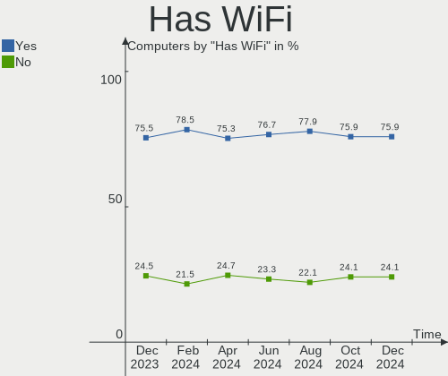
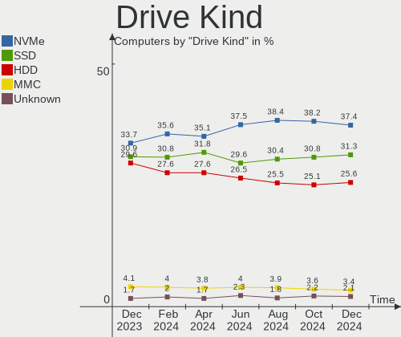
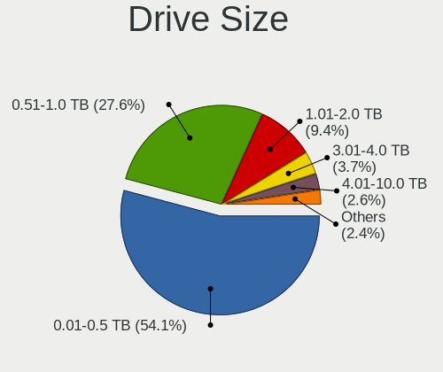
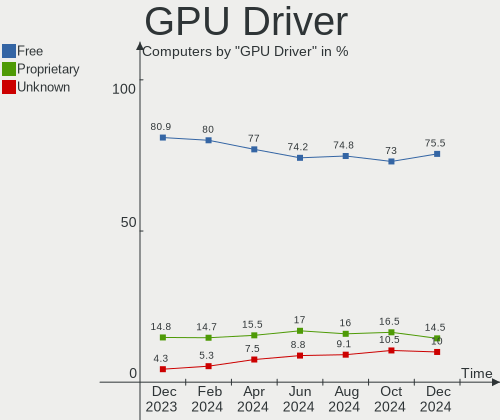
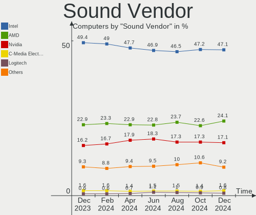
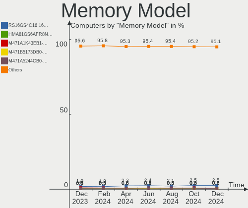
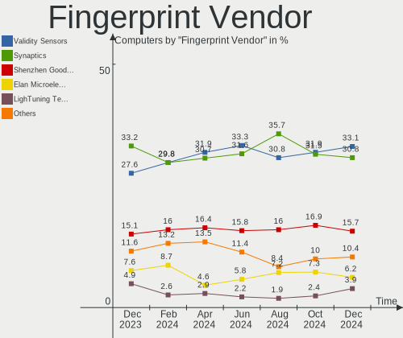

Linux - Hardware Trends
-----------------------

A project to identify most popular hardware characteristics and track their change
over time based on data collected by Linux users at https://Linux-Hardware.org.

Anyone can contribute to this report by the [hw-probe](https://github.com/linuxhw/hw-probe) tool:

    sudo -E hw-probe -all -upload

This is a report for all computer types. See also reports for [desktops](/Desktop/README.md) and [notebooks](/Notebook/README.md).

Distribution-specific reports: [Arch](/Dist/Arch), [ArcoLinux](/Dist/ArcoLinux), [BlackPanther](/Dist/BlackPanther), [CentOS](/Dist/CentOS), [Clear Linux](/Dist/Clear_Linux), [Debian](/Dist/Debian), [Elementary](/Dist/Elementary), [EndeavourOS](/Dist/EndeavourOS), [Endless](/Dist/Endless), [Fedora](/Dist/Fedora), [Garuda Linux](/Dist/Garuda_Linux), [Gentoo](/Dist/Gentoo), [Kali](/Dist/Kali), [KDE neon](/Dist/KDE_neon), [Kubuntu](/Dist/Kubuntu), [Linux Mint](/Dist/Linux_Mint), [Manjaro](/Dist/Manjaro), [OpenMandriva](/Dist/OpenMandriva), [openSUSE](/Dist/openSUSE), [Pop!_OS](/Dist/Pop!_OS), [Red OS](/Dist/Red_OS), [ROSA](/Dist/ROSA), [SteamOS](/Dist/SteamOS), [Ubuntu MATE](/Dist/Ubuntu_MATE), [Ubuntu](/Dist/Ubuntu), [Xubuntu](/Dist/Xubuntu), [Zorin](/Dist/Zorin).

This report is for one last month. Overall report since the beginning of time: [TestDays](https://github.com/linuxhw/TestDays)

Period: Mar, 2023.

Contents
--------

* [ System ](#system)
  - [ OS                       ](#os)
  - [ OS Family                ](#os-family)
  - [ Kernel                   ](#kernel)
  - [ Kernel Family            ](#kernel-family)
  - [ Kernel Major Ver.        ](#kernel-major-ver)
  - [ Arch                     ](#arch)
  - [ DE                       ](#de)
  - [ Display Server           ](#display-server)
  - [ Display Manager          ](#display-manager)
  - [ OS Lang                  ](#os-lang)
  - [ Boot Mode                ](#boot-mode)
  - [ Filesystem               ](#filesystem)
  - [ Part. scheme             ](#part-scheme)
  - [ Dual Boot with Linux/BSD ](#dual-boot-with-linuxbsd)
  - [ Dual Boot (Win)          ](#dual-boot-win)

* [ Board ](#board)
  - [ Vendor                   ](#vendor)
  - [ Model                    ](#model)
  - [ Model Family             ](#model-family)
  - [ MFG Year                 ](#mfg-year)
  - [ Form Factor              ](#form-factor)
  - [ Secure Boot              ](#secure-boot)
  - [ Coreboot                 ](#coreboot)
  - [ RAM Size                 ](#ram-size)
  - [ RAM Used                 ](#ram-used)
  - [ Total Drives             ](#total-drives)
  - [ Has CD-ROM               ](#has-cd-rom)
  - [ Has Ethernet             ](#has-ethernet)
  - [ Has WiFi                 ](#has-wifi)
  - [ Has Bluetooth            ](#has-bluetooth)

* [ Location ](#location)
  - [ Country                  ](#country)
  - [ City                     ](#city)

* [ Drives ](#drives)
  - [ Drive Vendor             ](#drive-vendor)
  - [ Drive Model              ](#drive-model)
  - [ HDD Vendor               ](#hdd-vendor)
  - [ SSD Vendor               ](#ssd-vendor)
  - [ Drive Kind               ](#drive-kind)
  - [ Drive Connector          ](#drive-connector)
  - [ Drive Size               ](#drive-size)
  - [ Space Total              ](#space-total)
  - [ Space Used               ](#space-used)
  - [ Malfunc. Drives          ](#malfunc-drives)
  - [ Malfunc. Drive Vendor    ](#malfunc-drive-vendor)
  - [ Malfunc. HDD Vendor      ](#malfunc-hdd-vendor)
  - [ Malfunc. Drive Kind      ](#malfunc-drive-kind)
  - [ Failed Drives            ](#failed-drives)
  - [ Failed Drive Vendor      ](#failed-drive-vendor)
  - [ Drive Status             ](#drive-status)

* [ Storage controller ](#storage-controller)
  - [ Storage Vendor           ](#storage-vendor)
  - [ Storage Model            ](#storage-model)
  - [ Storage Kind             ](#storage-kind)

* [ Processor ](#processor)
  - [ CPU Vendor               ](#cpu-vendor)
  - [ CPU Model                ](#cpu-model)
  - [ CPU Model Family         ](#cpu-model-family)
  - [ CPU Cores                ](#cpu-cores)
  - [ CPU Sockets              ](#cpu-sockets)
  - [ CPU Threads              ](#cpu-threads)
  - [ CPU Op-Modes             ](#cpu-op-modes)
  - [ CPU Microcode            ](#cpu-microcode)
  - [ CPU Microarch            ](#cpu-microarch)

* [ Graphics ](#graphics)
  - [ GPU Vendor               ](#gpu-vendor)
  - [ GPU Model                ](#gpu-model)
  - [ GPU Combo                ](#gpu-combo)
  - [ GPU Driver               ](#gpu-driver)
  - [ GPU Memory               ](#gpu-memory)

* [ Monitor ](#monitor)
  - [ Monitor Vendor           ](#monitor-vendor)
  - [ Monitor Model            ](#monitor-model)
  - [ Monitor Resolution       ](#monitor-resolution)
  - [ Monitor Diagonal         ](#monitor-diagonal)
  - [ Monitor Width            ](#monitor-width)
  - [ Aspect Ratio             ](#aspect-ratio)
  - [ Monitor Area             ](#monitor-area)
  - [ Pixel Density            ](#pixel-density)
  - [ Multiple Monitors        ](#multiple-monitors)

* [ Network ](#network)
  - [ Net Controller Vendor    ](#net-controller-vendor)
  - [ Net Controller Model     ](#net-controller-model)
  - [ Wireless Vendor          ](#wireless-vendor)
  - [ Wireless Model           ](#wireless-model)
  - [ Ethernet Vendor          ](#ethernet-vendor)
  - [ Ethernet Model           ](#ethernet-model)
  - [ Net Controller Kind      ](#net-controller-kind)
  - [ Used Controller          ](#used-controller)
  - [ NICs                     ](#nics)
  - [ IPv6                     ](#ipv6)

* [ Bluetooth ](#bluetooth)
  - [ Bluetooth Vendor         ](#bluetooth-vendor)
  - [ Bluetooth Model          ](#bluetooth-model)

* [ Sound ](#sound)
  - [ Sound Vendor             ](#sound-vendor)
  - [ Sound Model              ](#sound-model)

* [ Memory ](#memory)
  - [ Memory Vendor            ](#memory-vendor)
  - [ Memory Model             ](#memory-model)
  - [ Memory Kind              ](#memory-kind)
  - [ Memory Form Factor       ](#memory-form-factor)
  - [ Memory Size              ](#memory-size)
  - [ Memory Speed             ](#memory-speed)

* [ Printers & scanners ](#printers--scanners)
  - [ Printer Vendor           ](#printer-vendor)
  - [ Printer Model            ](#printer-model)
  - [ Scanner Vendor           ](#scanner-vendor)
  - [ Scanner Model            ](#scanner-model)

* [ Camera ](#camera)
  - [ Camera Vendor            ](#camera-vendor)
  - [ Camera Model             ](#camera-model)

* [ Security ](#security)
  - [ Fingerprint Vendor       ](#fingerprint-vendor)
  - [ Fingerprint Model        ](#fingerprint-model)
  - [ Chipcard Vendor          ](#chipcard-vendor)
  - [ Chipcard Model           ](#chipcard-model)

* [ Unsupported ](#unsupported)
  - [ Unsupported Devices      ](#unsupported-devices)
  - [ Unsupported Device Types ](#unsupported-device-types)

System
------

OS
--

Installed operating systems

| Name                         | Computers | Percent |
|------------------------------|-----------|---------|
| Ubuntu 22.04                 | 890       | 14.05%  |
| Linux Mint 21.1              | 440       | 6.95%   |
| Fedora 37                    | 392       | 6.19%   |
| Debian 11                    | 369       | 5.82%   |
| OpenMandriva 23.03           | 365       | 5.76%   |
| OpenMandriva 23.01           | 285       | 4.5%    |
| Pop!_OS 22.04                | 269       | 4.25%   |
| Ubuntu 22.10                 | 267       | 4.21%   |
| ROSA 12.3                    | 222       | 3.5%    |
| Arch Rolling                 | 215       | 3.39%   |
| Zorin 16                     | 186       | 2.94%   |
| Ubuntu 20.04                 | 134       | 2.12%   |
| KDE neon 22.04               | 101       | 1.59%   |
| Manjaro                      | 100       | 1.58%   |
| OpenMandriva 4.3             | 97        | 1.53%   |
| Linux Mint 20.3              | 87        | 1.37%   |
| Kali 2023.1                  | 83        | 1.31%   |
| ArcoLinux Rolling            | 81        | 1.28%   |
| Kubuntu 22.04                | 71        | 1.12%   |
| Kubuntu 22.10                | 65        | 1.03%   |
| openSUSE Tumbleweed-XXXXXXXX | 64        | 1.01%   |
| Debian                       | 61        | 0.96%   |
| EndeavourOS Rolling          | 60        | 0.95%   |
| Nobara 37                    | 55        | 0.87%   |
| Linux Mint 21                | 53        | 0.84%   |
| Gentoo 2.13                  | 49        | 0.77%   |
| Xubuntu 22.04                | 42        | 0.66%   |
| SteamOS 3.4.6                | 41        | 0.65%   |
| BlackPanther 18.1            | 41        | 0.65%   |
| Fedora 38                    | 38        | 0.6%    |
| Elementary 7                 | 37        | 0.58%   |
| Manjaro 22.0.4               | 36        | 0.57%   |
| LMDE 5                       | 35        | 0.55%   |
| ROSA 12.4                    | 34        | 0.54%   |
| Manjaro 22.0.5               | 34        | 0.54%   |
| Debian 12                    | 34        | 0.54%   |
| OpenMandriva 4.2             | 31        | 0.49%   |
| Ubuntu 18.04                 | 30        | 0.47%   |
| SteamOS 3.4.4                | 30        | 0.47%   |
| Ubuntu MATE 22.04            | 28        | 0.44%   |

OS Family
---------

OS without a version

| Name          | Computers | Percent |
|---------------|-----------|---------|
| Ubuntu        | 1344      | 21.22%  |
| OpenMandriva  | 797       | 12.58%  |
| Linux Mint    | 613       | 9.68%   |
| Debian        | 478       | 7.55%   |
| Fedora        | 464       | 7.32%   |
| ROSA          | 281       | 4.44%   |
| Pop!_OS       | 275       | 4.34%   |
| Arch          | 215       | 3.39%   |
| Zorin         | 198       | 3.13%   |
| Manjaro       | 172       | 2.72%   |
| Kubuntu       | 152       | 2.4%    |
| KDE neon      | 103       | 1.63%   |
| Kali          | 93        | 1.47%   |
| openSUSE      | 89        | 1.4%    |
| SteamOS       | 88        | 1.39%   |
| ArcoLinux     | 83        | 1.31%   |
| Xubuntu       | 72        | 1.14%   |
| Nobara        | 61        | 0.96%   |
| Gentoo        | 60        | 0.95%   |
| EndeavourOS   | 60        | 0.95%   |
| Elementary    | 48        | 0.76%   |
| BlackPanther  | 43        | 0.68%   |
| Lubuntu       | 40        | 0.63%   |
| Endless       | 39        | 0.62%   |
| Ubuntu MATE   | 37        | 0.58%   |
| LMDE          | 35        | 0.55%   |
| Red OS        | 29        | 0.46%   |
| MX            | 24        | 0.38%   |
| ALT Linux     | 24        | 0.38%   |
| Ubuntu Budgie | 19        | 0.3%    |
| TUXEDO OS     | 16        | 0.25%   |
| Garuda Linux  | 16        | 0.25%   |
| Raspbian      | 13        | 0.21%   |
| CentOS        | 13        | 0.21%   |
| Xero          | 12        | 0.19%   |
| Parrot        | 12        | 0.19%   |
| Ubuntu Unity  | 11        | 0.17%   |
| Clear Linux   | 11        | 0.17%   |
| Siduction     | 10        | 0.16%   |
| RHEL          | 10        | 0.16%   |

Kernel
------

Version of the Linux kernel

| Version                            | Computers | Percent |
|------------------------------------|-----------|---------|
| 5.19.0-35-generic                  | 893       | 14.1%   |
| 5.15.0-67-generic                  | 611       | 9.64%   |
| 6.2.6-desktop-1omv2390             | 304       | 4.8%    |
| 6.1.1-desktop-1omv2290             | 273       | 4.31%   |
| 5.10.0-21-amd64                    | 197       | 3.11%   |
| 5.19.0-38-generic                  | 162       | 2.56%   |
| 5.19.0-32-generic                  | 146       | 2.3%    |
| 5.15.0-60-generic                  | 119       | 1.88%   |
| 5.4.0-144-generic                  | 117       | 1.85%   |
| 6.2.0-76060200-generic             | 109       | 1.72%   |
| 6.1.14-200.fc37.x86_64             | 96        | 1.52%   |
| 6.1.18-200.fc37.x86_64             | 90        | 1.42%   |
| 5.15.0-69-generic                  | 85        | 1.34%   |
| 5.15.75-generic-1rosa2021.1-x86_64 | 83        | 1.31%   |
| 5.10.0-20-amd64                    | 74        | 1.17%   |
| 6.1.0-kali5-amd64                  | 72        | 1.14%   |
| 5.13.0-valve36-1-neptune           | 72        | 1.14%   |
| 5.15.79-generic-1rosa2021.1-x86_64 | 68        | 1.07%   |
| 6.1.12-1-MANJARO                   | 65        | 1.03%   |
| 6.2.7-200.fc37.x86_64              | 64        | 1.01%   |
| 6.2.8-arch1-1                      | 63        | 0.99%   |
| 5.15.0-56-generic                  | 63        | 0.99%   |
| 5.16.7-desktop-1omv4003            | 60        | 0.95%   |
| 6.1.11-76060111-generic            | 57        | 0.9%    |
| 6.2.6-76060206-generic             | 53        | 0.84%   |
| 6.2.2-arch1-1                      | 53        | 0.84%   |
| 6.1.15-200.fc37.x86_64             | 51        | 0.81%   |
| 6.2.2-desktop-1omv2390             | 41        | 0.65%   |
| 6.1.0-6-amd64                      | 40        | 0.63%   |
| 6.2.6-arch1-1                      | 39        | 0.62%   |
| 5.16.13-desktop-1omv4003           | 38        | 0.6%    |
| 6.0.12-76060006-generic            | 37        | 0.58%   |
| 6.1.19-1-MANJARO                   | 33        | 0.52%   |
| 6.2.7-arch1-1                      | 32        | 0.51%   |
| 6.2.1-arch1-1                      | 27        | 0.43%   |
| 6.1.0-5-amd64                      | 27        | 0.43%   |
| 5.19.0-31-generic                  | 26        | 0.41%   |
| 5.10.14-desktop-1omv4002           | 26        | 0.41%   |
| 6.2.8-200.fc37.x86_64              | 25        | 0.39%   |
| 6.1.14-201.fsync.fc37.x86_64       | 25        | 0.39%   |

Kernel Family
-------------

Linux kernel without a distro release

| Version  | Computers | Percent |
|----------|-----------|---------|
| 5.19.0   | 1300      | 20.52%  |
| 5.15.0   | 998       | 15.75%  |
| 6.2.6    | 486       | 7.67%   |
| 5.10.0   | 321       | 5.07%   |
| 6.1.1    | 275       | 4.34%   |
| 6.1.0    | 209       | 3.3%    |
| 6.2.2    | 178       | 2.81%   |
| 5.4.0    | 177       | 2.79%   |
| 6.2.7    | 152       | 2.4%    |
| 6.2.8    | 144       | 2.27%   |
| 6.1.14   | 141       | 2.23%   |
| 6.2.0    | 139       | 2.19%   |
| 6.1.12   | 119       | 1.88%   |
| 6.1.18   | 98        | 1.55%   |
| 6.1.11   | 97        | 1.53%   |
| 5.15.75  | 97        | 1.53%   |
| 5.13.0   | 95        | 1.5%    |
| 6.2.1    | 88        | 1.39%   |
| 5.15.79  | 70        | 1.1%    |
| 6.0.0    | 69        | 1.09%   |
| 6.1.15   | 68        | 1.07%   |
| 5.16.7   | 60        | 0.95%   |
| 6.0.12   | 56        | 0.88%   |
| 6.1.19   | 54        | 0.85%   |
| 5.16.13  | 40        | 0.63%   |
| 6.2.5    | 38        | 0.6%    |
| 6.1.20   | 35        | 0.55%   |
| 5.14.0   | 31        | 0.49%   |
| 4.15.0   | 29        | 0.46%   |
| 5.10.14  | 26        | 0.41%   |
| 5.6.14   | 25        | 0.39%   |
| 5.15.94  | 23        | 0.36%   |
| 6.1.13   | 22        | 0.35%   |
| 6.0.7    | 22        | 0.35%   |
| 5.11.0   | 21        | 0.33%   |
| 5.10.155 | 21        | 0.33%   |
| 5.15.102 | 18        | 0.28%   |
| 5.14.21  | 17        | 0.27%   |
| 4.18.16  | 16        | 0.25%   |
| 5.15.84  | 15        | 0.24%   |

Kernel Major Ver.
-----------------

Linux kernel major version

| Version | Computers | Percent |
|---------|-----------|---------|
| 5.15    | 1330      | 20.99%  |
| 5.19    | 1319      | 20.82%  |
| 6.2     | 1242      | 19.61%  |
| 6.1     | 1181      | 18.64%  |
| 5.10    | 410       | 6.47%   |
| 5.4     | 189       | 2.98%   |
| 6.0     | 183       | 2.89%   |
| 5.16    | 108       | 1.7%    |
| 5.13    | 99        | 1.56%   |
| 5.14    | 57        | 0.9%    |
| 5.11    | 30        | 0.47%   |
| 4.15    | 29        | 0.46%   |
| 4.18    | 27        | 0.43%   |
| 5.6     | 25        | 0.39%   |
| 5.17    | 19        | 0.3%    |
| 5.18    | 17        | 0.27%   |
| 3.10    | 16        | 0.25%   |
| 5.8     | 13        | 0.21%   |
| 4.9     | 10        | 0.16%   |
| 6.3     | 8         | 0.13%   |
| 4.19    | 7         | 0.11%   |
| 4.4     | 4         | 0.06%   |
| 5.9     | 2         | 0.03%   |
| 5.3     | 2         | 0.03%   |
| 5.15.96 | 2         | 0.03%   |
| 5.0     | 2         | 0.03%   |
| 5.7     | 1         | 0.02%   |
| 5.2     | 1         | 0.02%   |
| 4.7     | 1         | 0.02%   |
| 4       | 1         | 0.02%   |

Arch
----

OS architecture (x86_64, i586, etc.)

| Name    | Computers | Percent |
|---------|-----------|---------|
| x86_64  | 6222      | 98.22%  |
| i686    | 58        | 0.92%   |
| aarch64 | 35        | 0.55%   |
| armv7l  | 11        | 0.17%   |
| armv6l  | 5         | 0.08%   |
| riscv64 | 3         | 0.05%   |
| ppc64   | 1         | 0.02%   |

DE
--

Desktop Environment

| Name              | Computers | Percent |
|-------------------|-----------|---------|
| GNOME             | 2624      | 41.42%  |
| KDE5              | 1806      | 28.51%  |
| X-Cinnamon        | 538       | 8.49%   |
| XFCE              | 406       | 6.41%   |
| Unknown           | 326       | 5.15%   |
| MATE              | 167       | 2.64%   |
| LXQt              | 109       | 1.72%   |
| Cinnamon          | 61        | 0.96%   |
| Pantheon          | 49        | 0.77%   |
| LXDE              | 30        | 0.47%   |
| Budgie            | 30        | 0.47%   |
| i3                | 26        | 0.41%   |
| Hyprland          | 22        | 0.35%   |
| KDE               | 19        | 0.3%    |
| KDE4              | 12        | 0.19%   |
| Unity             | 11        | 0.17%   |
| sway              | 11        | 0.17%   |
| Openbox           | 11        | 0.17%   |
| GNOME Flashback   | 11        | 0.17%   |
| GNOME Classic     | 8         | 0.13%   |
| bspwm             | 7         | 0.11%   |
| ICEWM             | 6         | 0.09%   |
| awesome           | 6         | 0.09%   |
| qtile             | 5         | 0.08%   |
| Trinity           | 4         | 0.06%   |
| DWM               | 4         | 0.06%   |
| Deepin            | 4         | 0.06%   |
| xmonad            | 3         | 0.05%   |
| lightdm-xsession  | 3         | 0.05%   |
| GNUstep           | 2         | 0.03%   |
| Enlightenment     | 2         | 0.03%   |
| BunsenLabs        | 2         | 0.03%   |
| Yaru:ubuntu:GNOME | 1         | 0.02%   |
| xsession          | 1         | 0.02%   |
| xinit-compat      | 1         | 0.02%   |
| x-session-manager | 1         | 0.02%   |
| ubuntu:pika:GNOME | 1         | 0.02%   |
| ratpoison         | 1         | 0.02%   |
| onyx:GNOME        | 1         | 0.02%   |
| LeftWM            | 1         | 0.02%   |

Display Server
--------------

X11 or Wayland

| Name    | Computers | Percent |
|---------|-----------|---------|
| X11     | 4184      | 66.05%  |
| Wayland | 1781      | 28.11%  |
| Tty     | 196       | 3.09%   |
| Unknown | 172       | 2.72%   |
| Web     | 2         | 0.03%   |

Display Manager
---------------

SDDM, LightDM, etc.

| Name    | Computers | Percent |
|---------|-----------|---------|
| Unknown | 2126      | 33.56%  |
| SDDM    | 1461      | 23.06%  |
| GDM3    | 1274      | 20.11%  |
| LightDM | 824       | 13.01%  |
| GDM     | 593       | 9.36%   |
| LXDM    | 11        | 0.17%   |
| KDM     | 11        | 0.17%   |
| XDM     | 9         | 0.14%   |
| SLiM    | 8         | 0.13%   |
| GREETD  | 8         | 0.13%   |
| NODM    | 4         | 0.06%   |
| TDM     | 3         | 0.05%   |
| SLIMSKI | 1         | 0.02%   |
| Ly      | 1         | 0.02%   |
| EMPTTY  | 1         | 0.02%   |

OS Lang
-------

Language

| Lang    | Computers | Percent |
|---------|-----------|---------|
| en_US   | 2630      | 41.52%  |
| de_DE   | 636       | 10.04%  |
| ru_RU   | 566       | 8.93%   |
| en_GB   | 324       | 5.11%   |
| fr_FR   | 261       | 4.12%   |
| pt_BR   | 229       | 3.61%   |
| it_IT   | 192       | 3.03%   |
| Unknown | 156       | 2.46%   |
| es_ES   | 133       | 2.1%    |
| pl_PL   | 121       | 1.91%   |
| en_CA   | 102       | 1.61%   |
| C       | 97        | 1.53%   |
| en_AU   | 90        | 1.42%   |
| en_IN   | 83        | 1.31%   |
| nl_NL   | 53        | 0.84%   |
| es_MX   | 50        | 0.79%   |
| de_AT   | 35        | 0.55%   |
| cs_CZ   | 32        | 0.51%   |
| hu_HU   | 30        | 0.47%   |
| de_CH   | 28        | 0.44%   |
| tr_TR   | 24        | 0.38%   |
| es_AR   | 24        | 0.38%   |
| en_ZA   | 24        | 0.38%   |
| zh_CN   | 23        | 0.36%   |
| pt_PT   | 21        | 0.33%   |
| fi_FI   | 21        | 0.33%   |
| sv_SE   | 18        | 0.28%   |
| en_NZ   | 17        | 0.27%   |
| nl_BE   | 16        | 0.25%   |
| ja_jp   | 16        | 0.25%   |
| es_CO   | 16        | 0.25%   |
| es_CL   | 16        | 0.25%   |
| en_IE   | 16        | 0.25%   |
| nb_NO   | 12        | 0.19%   |
| fr_BE   | 12        | 0.19%   |
| el_GR   | 12        | 0.19%   |
| zh_TW   | 10        | 0.16%   |
| sk_SK   | 10        | 0.16%   |
| en_PH   | 10        | 0.16%   |
| fr_CA   | 9         | 0.14%   |

Boot Mode
---------

EFI or BIOS

| Mode | Computers | Percent |
|------|-----------|---------|
| EFI  | 3398      | 53.64%  |
| BIOS | 2937      | 46.36%  |

Filesystem
----------

Type of filesystem

| Type    | Computers | Percent |
|---------|-----------|---------|
| Ext4    | 4555      | 71.9%   |
| Btrfs   | 952       | 15.03%  |
| Overlay | 589       | 9.3%    |
| Xfs     | 111       | 1.75%   |
| Zfs     | 71        | 1.12%   |
| F2fs    | 18        | 0.28%   |
| Ext3    | 12        | 0.19%   |
| Unknown | 7         | 0.11%   |
| Tmpfs   | 6         | 0.09%   |
| Ext2    | 6         | 0.09%   |
| Rootfs  | 4         | 0.06%   |
| XXXXXXX | 2         | 0.03%   |
| Aufs    | 2         | 0.03%   |

Part. scheme
------------

Scheme of partitioning

| Type    | Computers | Percent |
|---------|-----------|---------|
| GPT     | 3683      | 58.14%  |
| Unknown | 1821      | 28.75%  |
| MBR     | 831       | 13.12%  |

Dual Boot with Linux/BSD
------------------------

Hosting more than one Linux/BSD

| Dual boot | Computers | Percent |
|-----------|-----------|---------|
| No        | 5249      | 82.86%  |
| Yes       | 1086      | 17.14%  |

Dual Boot (Win)
---------------

Hosting Linux and Windows

| Dual boot | Computers | Percent |
|-----------|-----------|---------|
| No        | 4564      | 72.04%  |
| Yes       | 1771      | 27.96%  |

Board
-----

Vendor
------

Motherboard manufacturer

| Name                    | Computers | Percent |
|-------------------------|-----------|---------|
| ASUSTek Computer        | 983       | 15.52%  |
| Lenovo                  | 870       | 13.73%  |
| Hewlett-Packard         | 847       | 13.37%  |
| Dell                    | 696       | 10.99%  |
| Gigabyte Technology     | 445       | 7.02%   |
| MSI                     | 387       | 6.11%   |
| Acer                    | 338       | 5.34%   |
| ASRock                  | 205       | 3.24%   |
| Apple                   | 195       | 3.08%   |
| Intel                   | 121       | 1.91%   |
| Toshiba                 | 83        | 1.31%   |
| Valve                   | 74        | 1.17%   |
| Fujitsu                 | 63        | 0.99%   |
| Unknown                 | 63        | 0.99%   |
| Samsung Electronics     | 60        | 0.95%   |
| HUAWEI                  | 56        | 0.88%   |
| Sony                    | 37        | 0.58%   |
| Google                  | 37        | 0.58%   |
| Supermicro              | 36        | 0.57%   |
| Medion                  | 35        | 0.55%   |
| AZW                     | 30        | 0.47%   |
| TUXEDO                  | 29        | 0.46%   |
| Raspberry Pi Foundation | 29        | 0.46%   |
| Microsoft               | 26        | 0.41%   |
| Notebook                | 25        | 0.39%   |
| Pegatron                | 24        | 0.38%   |
| Packard Bell            | 19        | 0.3%    |
| Foxconn                 | 19        | 0.3%    |
| Biostar                 | 19        | 0.3%    |
| Positivo                | 18        | 0.28%   |
| HONOR                   | 18        | 0.28%   |
| Chuwi                   | 17        | 0.27%   |
| Fujitsu Siemens         | 16        | 0.25%   |
| Timi                    | 14        | 0.22%   |
| ECS                     | 12        | 0.19%   |
| Huanan                  | 11        | 0.17%   |
| Clevo                   | 11        | 0.17%   |
| ASRockRack              | 10        | 0.16%   |
| Alienware               | 10        | 0.16%   |
| ZOTAC                   | 9         | 0.14%   |

Model
-----

Motherboard model

| Name                         | Computers | Percent |
|------------------------------|-----------|---------|
| Valve Jupiter                | 74        | 1.17%   |
| Unknown                      | 73        | 1.15%   |
| Apple MacBook5,2             | 47        | 0.74%   |
| ASUS All Series              | 45        | 0.71%   |
| MSI MS-7C02                  | 15        | 0.24%   |
| MSI MS-7C56                  | 14        | 0.22%   |
| HP Notebook                  | 13        | 0.21%   |
| Gigabyte A320M-S2H           | 13        | 0.21%   |
| Dell OptiPlex 9020           | 13        | 0.21%   |
| Apple MacBookPro9,2          | 13        | 0.21%   |
| MSI MS-7C37                  | 12        | 0.19%   |
| ASUS TUF Gaming X570-PLUS    | 12        | 0.19%   |
| ASUS PRIME A320M-K           | 12        | 0.19%   |
| MSI MS-7C91                  | 11        | 0.17%   |
| HP Pavilion dv6              | 11        | 0.17%   |
| Dell OptiPlex 780            | 11        | 0.17%   |
| ASUS ROG STRIX B550-F GAMING | 11        | 0.17%   |
| MSI MS-7B86                  | 10        | 0.16%   |
| MSI MS-7721                  | 10        | 0.16%   |
| HP Pavilion Notebook         | 10        | 0.16%   |
| Dell OptiPlex 7010           | 10        | 0.16%   |
| HP Pavilion 15               | 9         | 0.14%   |
| Dell XPS 15 9570             | 9         | 0.14%   |
| Dell Latitude 5420           | 9         | 0.14%   |
| ASUS TUF Gaming B550M-PLUS   | 9         | 0.14%   |
| Dell XPS 15 9520             | 8         | 0.13%   |
| Dell OptiPlex 3050           | 8         | 0.13%   |
| Dell OptiPlex 3020           | 8         | 0.13%   |
| Dell Latitude E6430          | 8         | 0.13%   |
| Dell Latitude E6420          | 8         | 0.13%   |
| AZW GTR                      | 8         | 0.13%   |
| ASUS PRIME B450M-A           | 8         | 0.13%   |
| Supermicro AS -1014S-WTRT    | 7         | 0.11%   |
| MSI MS-7B79                  | 7         | 0.11%   |
| MSI MS-7A38                  | 7         | 0.11%   |
| MSI MS-7817                  | 7         | 0.11%   |
| Lenovo IdeaPad 3 15ITL6 82H8 | 7         | 0.11%   |
| Lenovo IdeaPad 3 15ALC6 82KU | 7         | 0.11%   |
| HP Z440 Workstation          | 7         | 0.11%   |
| HP Pavilion dv7              | 7         | 0.11%   |

Model Family
------------

Motherboard model prefix

| Name               | Computers | Percent |
|--------------------|-----------|---------|
| Lenovo ThinkPad    | 395       | 6.24%   |
| Acer Aspire        | 222       | 3.5%    |
| Dell Latitude      | 185       | 2.92%   |
| Lenovo IdeaPad     | 165       | 2.6%    |
| HP Pavilion        | 144       | 2.27%   |
| ASUS PRIME         | 144       | 2.27%   |
| Dell Inspiron      | 137       | 2.16%   |
| ASUS ROG           | 127       | 2%      |
| Dell OptiPlex      | 115       | 1.82%   |
| HP EliteBook       | 101       | 1.59%   |
| HP Laptop          | 89        | 1.4%    |
| ASUS VivoBook      | 89        | 1.4%    |
| HP Compaq          | 84        | 1.33%   |
| Dell XPS           | 79        | 1.25%   |
| Valve Jupiter      | 74        | 1.17%   |
| Dell Precision     | 73        | 1.15%   |
| ASUS TUF           | 73        | 1.15%   |
| Unknown            | 73        | 1.15%   |
| Toshiba Satellite  | 65        | 1.03%   |
| HP ProBook         | 65        | 1.03%   |
| Lenovo ThinkCentre | 58        | 0.92%   |
| Apple MacBook5     | 53        | 0.84%   |
| HP ENVY            | 52        | 0.82%   |
| Dell Vostro        | 48        | 0.76%   |
| ASUS All           | 45        | 0.71%   |
| Lenovo Yoga        | 38        | 0.6%    |
| Lenovo Legion      | 35        | 0.55%   |
| ASUS ASUS          | 31        | 0.49%   |
| HP ZBook           | 30        | 0.47%   |
| HP EliteDesk       | 30        | 0.47%   |
| RPi Raspberry      | 29        | 0.46%   |
| HP ProDesk         | 27        | 0.43%   |
| ASUS ZenBook       | 27        | 0.43%   |
| Microsoft Surface  | 26        | 0.41%   |
| Fujitsu LIFEBOOK   | 26        | 0.41%   |
| Fujitsu ESPRIMO    | 26        | 0.41%   |
| Acer Swift         | 26        | 0.41%   |
| Gigabyte B550      | 25        | 0.39%   |
| Acer Nitro         | 25        | 0.39%   |
| Lenovo ThinkBook   | 22        | 0.35%   |

MFG Year
--------

Motherboard manufacture year

| Year    | Computers | Percent |
|---------|-----------|---------|
| 2021    | 696       | 10.99%  |
| 2022    | 684       | 10.8%   |
| 2020    | 636       | 10.04%  |
| 2018    | 523       | 8.26%   |
| 2019    | 507       | 8%      |
| 2012    | 450       | 7.1%    |
| 2013    | 360       | 5.68%   |
| 2011    | 348       | 5.49%   |
| 2017    | 347       | 5.48%   |
| 2014    | 302       | 4.77%   |
| 2016    | 281       | 4.44%   |
| 2015    | 279       | 4.4%    |
| 2010    | 260       | 4.1%    |
| 2009    | 241       | 3.8%    |
| 2008    | 147       | 2.32%   |
| 2007    | 96        | 1.52%   |
| Unknown | 58        | 0.92%   |
| 2023    | 52        | 0.82%   |
| 2006    | 52        | 0.82%   |
| 2005    | 9         | 0.14%   |
| 2004    | 5         | 0.08%   |
| 2003    | 1         | 0.02%   |
| 2002    | 1         | 0.02%   |

Form Factor
-----------

Physical design of the computer

| Name           | Computers | Percent |
|----------------|-----------|---------|
| Notebook       | 3345      | 52.8%   |
| Desktop        | 2425      | 38.28%  |
| Convertible    | 164       | 2.59%   |
| Mini pc        | 124       | 1.96%   |
| All in one     | 101       | 1.59%   |
| Server         | 72        | 1.14%   |
| Tablet         | 55        | 0.87%   |
| System on chip | 47        | 0.74%   |
| Other          | 1         | 0.02%   |
| Phone          | 1         | 0.02%   |

Secure Boot
-----------

Enabled or disabled

| State    | Computers | Percent |
|----------|-----------|---------|
| Disabled | 5906      | 93.23%  |
| Enabled  | 429       | 6.77%   |

Coreboot
--------

Have coreboot on board

| Used | Computers | Percent |
|------|-----------|---------|
| No   | 6286      | 99.23%  |
| Yes  | 49        | 0.77%   |

RAM Size
--------

Total RAM memory

| Size in GB      | Computers | Percent |
|-----------------|-----------|---------|
| 4.01-8.0        | 1422      | 22.45%  |
| 16.01-24.0      | 1303      | 20.57%  |
| 8.01-16.0       | 1164      | 18.37%  |
| 3.01-4.0        | 939       | 14.82%  |
| 32.01-64.0      | 808       | 12.75%  |
| 64.01-256.0     | 247       | 3.9%    |
| 1.01-2.0        | 162       | 2.56%   |
| 24.01-32.0      | 153       | 2.42%   |
| 2.01-3.0        | 79        | 1.25%   |
| 0.51-1.0        | 26        | 0.41%   |
| More than 256.0 | 22        | 0.35%   |
| 0.01-0.5        | 10        | 0.16%   |

RAM Used
--------

Used RAM memory

| Used GB         | Computers | Percent |
|-----------------|-----------|---------|
| 1.01-2.0        | 1938      | 30.59%  |
| 2.01-3.0        | 1562      | 24.66%  |
| 4.01-8.0        | 1185      | 18.71%  |
| 3.01-4.0        | 830       | 13.1%   |
| 8.01-16.0       | 322       | 5.08%   |
| 0.51-1.0        | 304       | 4.8%    |
| 0.01-0.5        | 79        | 1.25%   |
| 16.01-24.0      | 53        | 0.84%   |
| 32.01-64.0      | 25        | 0.39%   |
| 24.01-32.0      | 21        | 0.33%   |
| 64.01-256.0     | 11        | 0.17%   |
| More than 256.0 | 2         | 0.03%   |
| 0               | 2         | 0.03%   |
| Unknown         | 1         | 0.02%   |

Total Drives
------------

Number of drives on board

| Drives | Computers | Percent |
|--------|-----------|---------|
| 1      | 3691      | 58.26%  |
| 2      | 1601      | 25.27%  |
| 3      | 502       | 7.92%   |
| 4      | 248       | 3.91%   |
| 5      | 125       | 1.97%   |
| 6      | 51        | 0.81%   |
| 0      | 40        | 0.63%   |
| 7      | 22        | 0.35%   |
| 8      | 20        | 0.32%   |
| 9      | 8         | 0.13%   |
| 13     | 7         | 0.11%   |
| 10     | 5         | 0.08%   |
| 14     | 3         | 0.05%   |
| 17     | 2         | 0.03%   |
| 12     | 2         | 0.03%   |
| 11     | 2         | 0.03%   |
| 29     | 1         | 0.02%   |
| 27     | 1         | 0.02%   |
| 25     | 1         | 0.02%   |
| 24     | 1         | 0.02%   |
| 22     | 1         | 0.02%   |
| 16     | 1         | 0.02%   |

Has CD-ROM
----------

Has CD-ROM on board

| Presented | Computers | Percent |
|-----------|-----------|---------|
| No        | 4252      | 67.12%  |
| Yes       | 2083      | 32.88%  |

Has Ethernet
------------

Has Ethernet on board

| Presented | Computers | Percent |
|-----------|-----------|---------|
| Yes       | 5337      | 84.25%  |
| No        | 998       | 15.75%  |

Has WiFi
--------

Has WiFi module

| Presented | Computers | Percent |
|-----------|-----------|---------|
| Yes       | 4854      | 76.62%  |
| No        | 1481      | 23.38%  |

Has Bluetooth
-------------

Has Bluetooth module

| Presented | Computers | Percent |
|-----------|-----------|---------|
| Yes       | 4031      | 63.63%  |
| No        | 2304      | 36.37%  |

Location
--------

Country
-------

Geographic location (country)

| Country      | Computers | Percent |
|--------------|-----------|---------|
| USA          | 1167      | 18.42%  |
| Germany      | 816       | 12.88%  |
| Russia       | 607       | 9.58%   |
| France       | 319       | 5.04%   |
| Brazil       | 309       | 4.88%   |
| Italy        | 268       | 4.23%   |
| UK           | 236       | 3.73%   |
| Poland       | 209       | 3.3%    |
| Spain        | 181       | 2.86%   |
| Canada       | 165       | 2.6%    |
| India        | 123       | 1.94%   |
| Netherlands  | 120       | 1.89%   |
| Australia    | 112       | 1.77%   |
| Hungary      | 80        | 1.26%   |
| Switzerland  | 76        | 1.2%    |
| Austria      | 74        | 1.17%   |
| Finland      | 69        | 1.09%   |
| Sweden       | 66        | 1.04%   |
| Mexico       | 66        | 1.04%   |
| Turkey       | 59        | 0.93%   |
| Belgium      | 57        | 0.9%    |
| Czechia      | 53        | 0.84%   |
| Portugal     | 44        | 0.69%   |
| Japan        | 43        | 0.68%   |
| Argentina    | 42        | 0.66%   |
| Norway       | 37        | 0.58%   |
| Bulgaria     | 36        | 0.57%   |
| Romania      | 35        | 0.55%   |
| South Africa | 34        | 0.54%   |
| China        | 34        | 0.54%   |
| Belarus      | 34        | 0.54%   |
| Colombia     | 33        | 0.52%   |
| Slovakia     | 32        | 0.51%   |
| Indonesia    | 32        | 0.51%   |
| Denmark      | 32        | 0.51%   |
| Greece       | 29        | 0.46%   |
| New Zealand  | 28        | 0.44%   |
| Ireland      | 28        | 0.44%   |
| Ukraine      | 27        | 0.43%   |
| Chile        | 26        | 0.41%   |

City
----

Geographic location (city)

| City              | Computers | Percent |
|-------------------|-----------|---------|
| Moscow            | 151       | 2.38%   |
| Berlin            | 68        | 1.07%   |
| St Petersburg     | 58        | 0.92%   |
| Bangor            | 55        | 0.87%   |
| Warsaw            | 47        | 0.74%   |
| Paris             | 44        | 0.69%   |
| Vienna            | 43        | 0.68%   |
| Sydney            | 36        | 0.57%   |
| Munich            | 35        | 0.55%   |
| Sao Paulo         | 34        | 0.54%   |
| Madrid            | 34        | 0.54%   |
| Helsinki          | 33        | 0.52%   |
| Frankfurt am Main | 31        | 0.49%   |
| Milan             | 30        | 0.47%   |
| London            | 30        | 0.47%   |
| Budapest          | 30        | 0.47%   |
| Voronezh          | 29        | 0.46%   |
| Hamburg           | 29        | 0.46%   |
| Melbourne         | 25        | 0.39%   |
| Rome              | 24        | 0.38%   |
| Krasnodar         | 23        | 0.36%   |
| Amsterdam         | 23        | 0.36%   |
| Stuttgart         | 22        | 0.35%   |
| Rio de Janeiro    | 22        | 0.35%   |
| Milano            | 21        | 0.33%   |
| Stockholm         | 19        | 0.3%    |
| Samara            | 19        | 0.3%    |
| Lisbon            | 19        | 0.3%    |
| Dublin            | 19        | 0.3%    |
| Cologne           | 18        | 0.28%   |
| Barcelona         | 18        | 0.28%   |
| Wroclaw           | 17        | 0.27%   |
| Los Angeles       | 17        | 0.27%   |
| Istanbul          | 17        | 0.27%   |
| Houston           | 17        | 0.27%   |
| Zurich            | 16        | 0.25%   |
| Prague            | 16        | 0.25%   |
| Chelyabinsk       | 16        | 0.25%   |
| Bogotá           | 16        | 0.25%   |
| Singapore         | 15        | 0.24%   |

Drives
------

Drive Vendor
------------

Hard drive vendors

| Vendor                      | Computers | Drives | Percent |
|-----------------------------|-----------|--------|---------|
| Samsung Electronics         | 1563      | 1940   | 16.52%  |
| WDC                         | 1251      | 1582   | 13.22%  |
| Seagate                     | 1138      | 1433   | 12.03%  |
| SanDisk                     | 555       | 607    | 5.87%   |
| Toshiba                     | 527       | 588    | 5.57%   |
| Kingston                    | 480       | 518    | 5.07%   |
| Crucial                     | 379       | 420    | 4.01%   |
| Unknown                     | 354       | 393    | 3.74%   |
| SK hynix                    | 236       | 237    | 2.49%   |
| Hitachi                     | 224       | 242    | 2.37%   |
| Intel                       | 204       | 231    | 2.16%   |
| Micron Technology           | 184       | 202    | 1.94%   |
| HGST                        | 138       | 151    | 1.46%   |
| China                       | 134       | 148    | 1.42%   |
| A-DATA Technology           | 134       | 139    | 1.42%   |
| Phison Electronics          | 109       | 133    | 1.15%   |
| KIOXIA                      | 98        | 99     | 1.04%   |
| Kingston Technology Company | 78        | 80     | 0.82%   |
| Micron/Crucial Technology   | 76        | 82     | 0.8%    |
| SPCC                        | 66        | 70     | 0.7%    |
| PNY                         | 65        | 75     | 0.69%   |
| Intenso                     | 65        | 68     | 0.69%   |
| Unknown                     | 63        | 64     | 0.67%   |
| Silicon Motion              | 61        | 66     | 0.64%   |
| Apple                       | 61        | 72     | 0.64%   |
| Fujitsu                     | 57        | 58     | 0.6%    |
| GOODRAM                     | 43        | 46     | 0.45%   |
| Netac                       | 42        | 44     | 0.44%   |
| Patriot                     | 37        | 38     | 0.39%   |
| Transcend                   | 36        | 37     | 0.38%   |
| Phison                      | 35        | 35     | 0.37%   |
| Apacer                      | 35        | 35     | 0.37%   |
| JMicron Technology          | 34        | 34     | 0.36%   |
| ADATA Technology            | 32        | 35     | 0.34%   |
| Hewlett-Packard             | 30        | 88     | 0.32%   |
| Corsair                     | 29        | 32     | 0.31%   |
| OCZ                         | 28        | 32     | 0.3%    |
| Realtek Semiconductor       | 25        | 27     | 0.26%   |
| Team                        | 24        | 25     | 0.25%   |
| Maxtor                      | 24        | 24     | 0.25%   |

Drive Model
-----------

Hard drive models

| Model                                                  | Computers | Percent |
|--------------------------------------------------------|-----------|---------|
| Samsung NVMe SSD Controller SM981/PM981/PM983 250GB    | 203       | 1.97%   |
| Kingston SA400S37240G 240GB SSD                        | 108       | 1.05%   |
| Samsung NVMe SSD Controller PM9A1/PM9A3/980PRO 1TB     | 103       | 1%      |
| Samsung SSD 860 EVO 500GB                              | 72        | 0.7%    |
| Unknown                                                | 63        | 0.61%   |
| Seagate ST1000LM035-1RK172 1TB                         | 61        | 0.59%   |
| Samsung SSD 850 EVO 250GB                              | 61        | 0.59%   |
| Seagate ST1000DM010-2EP102 1TB                         | 59        | 0.57%   |
| Seagate ST500DM002-1BD142 500GB                        | 58        | 0.56%   |
| Kingston SA400S37480G 480GB SSD                        | 58        | 0.56%   |
| Samsung SSD 850 EVO 500GB                              | 56        | 0.54%   |
| Crucial CT1000MX500SSD1 1TB                            | 54        | 0.52%   |
| Micron/Crucial P2 NVMe PCIe SSD 1TB                    | 52        | 0.5%    |
| Kingston SA400S37120G 120GB SSD                        | 50        | 0.48%   |
| Unknown MMC Card  32GB                                 | 47        | 0.46%   |
| Seagate ST1000LM024 HN-M101MBB 1TB                     | 47        | 0.46%   |
| Crucial CT500MX500SSD1 500GB                           | 47        | 0.46%   |
| Unknown MMC Card  64GB                                 | 46        | 0.45%   |
| Seagate ST2000DM008-2FR102 2TB                         | 46        | 0.45%   |
| Toshiba MQ01ABF050 500GB                               | 44        | 0.43%   |
| Samsung SSD 980 1TB                                    | 44        | 0.43%   |
| Phison PS5013 E13 NVMe Controller 256GB                | 44        | 0.43%   |
| Seagate ST500LT012-1DG142 500GB                        | 42        | 0.41%   |
| Toshiba MQ01ABD100 1TB                                 | 41        | 0.4%    |
| WDC WD10EZEX-08WN4A0 1TB                               | 39        | 0.38%   |
| Samsung SSD 860 EVO 250GB                              | 39        | 0.38%   |
| Toshiba MQ04ABF100 1TB                                 | 38        | 0.37%   |
| Sandisk WD Blue SN550 NVMe SSD 256GB                   | 38        | 0.37%   |
| Crucial CT240BX500SSD1 240GB                           | 38        | 0.37%   |
| Samsung NVMe SSD Controller SM961/PM961/SM963 256GB    | 37        | 0.36%   |
| Toshiba DT01ACA100 1TB                                 | 36        | 0.35%   |
| Samsung SSD 860 EVO 1TB                                | 36        | 0.35%   |
| Fujitsu MHZ2160BH FFS G1 160GB                         | 36        | 0.35%   |
| Silicon Motion SM2263EN/SM2263XT SSD Controller 1024GB | 35        | 0.34%   |
| WDC WDS240G2G0A-00JH30 240GB SSD                       | 34        | 0.33%   |
| Sandisk WD Black SN750 / PC SN730 NVMe SSD 1TB         | 34        | 0.33%   |
| HGST HTS721010A9E630 1TB                               | 34        | 0.33%   |
| Samsung SSD 970 EVO Plus 1TB                           | 33        | 0.32%   |
| Unknown SD/MMC/MS PRO 64GB                             | 31        | 0.3%    |
| Phison E12 NVMe Controller 256GB                       | 31        | 0.3%    |

HDD Vendor
----------

Hard disk drive vendors

| Vendor              | Computers | Drives | Percent |
|---------------------|-----------|--------|---------|
| Seagate             | 1112      | 1396   | 35.47%  |
| WDC                 | 951       | 1224   | 30.33%  |
| Toshiba             | 397       | 441    | 12.66%  |
| Hitachi             | 224       | 242    | 7.15%   |
| HGST                | 137       | 150    | 4.37%   |
| Samsung Electronics | 117       | 130    | 3.73%   |
| Fujitsu             | 57        | 58     | 1.82%   |
| Unknown             | 31        | 31     | 0.99%   |
| Maxtor              | 20        | 20     | 0.64%   |
| Apple               | 17        | 17     | 0.54%   |
| ASMT                | 16        | 21     | 0.51%   |
| SABRENT             | 12        | 14     | 0.38%   |
| Hewlett-Packard     | 8         | 29     | 0.26%   |
| Intenso             | 5         | 5      | 0.16%   |
| USB3.0              | 4         | 4      | 0.13%   |
| QUANTUM             | 3         | 3      | 0.1%    |
| PHD 3.0             | 3         | 3      | 0.1%    |
| USB                 | 2         | 2      | 0.06%   |
| QNAP                | 2         | 6      | 0.06%   |
| LaCie               | 2         | 2      | 0.06%   |
| IET                 | 2         | 2      | 0.06%   |
| HGST HTS            | 2         | 2      | 0.06%   |
| ASMedia             | 2         | 2      | 0.06%   |
| T-CREATE            | 1         | 1      | 0.03%   |
| Super Talent        | 1         | 1      | 0.03%   |
| SD                  | 1         | 1      | 0.03%   |
| JMicron Technology  | 1         | 1      | 0.03%   |
| IBM/Hitachi         | 1         | 1      | 0.03%   |
| H/W                 | 1         | 3      | 0.03%   |
| Generic-            | 1         | 1      | 0.03%   |
| External            | 1         | 1      | 0.03%   |
| CSD                 | 1         | 1      | 0.03%   |

SSD Vendor
----------

Solid state drive vendors

| Vendor              | Computers | Drives | Percent |
|---------------------|-----------|--------|---------|
| Samsung Electronics | 690       | 808    | 21.83%  |
| Kingston            | 361       | 389    | 11.42%  |
| Crucial             | 340       | 370    | 10.76%  |
| SanDisk             | 262       | 280    | 8.29%   |
| WDC                 | 188       | 202    | 5.95%   |
| China               | 131       | 144    | 4.14%   |
| A-DATA Technology   | 100       | 103    | 3.16%   |
| Intel               | 61        | 78     | 1.93%   |
| PNY                 | 57        | 65     | 1.8%    |
| Toshiba             | 54        | 63     | 1.71%   |
| SPCC                | 51        | 53     | 1.61%   |
| Intenso             | 51        | 54     | 1.61%   |
| SK hynix            | 47        | 47     | 1.49%   |
| Micron Technology   | 42        | 59     | 1.33%   |
| GOODRAM             | 40        | 40     | 1.27%   |
| Transcend           | 33        | 34     | 1.04%   |
| Patriot             | 33        | 34     | 1.04%   |
| Netac               | 32        | 33     | 1.01%   |
| Apacer              | 32        | 32     | 1.01%   |
| OCZ                 | 28        | 32     | 0.89%   |
| Apple               | 26        | 26     | 0.82%   |
| Team                | 21        | 22     | 0.66%   |
| JMicron Technology  | 21        | 21     | 0.66%   |
| KingSpec            | 20        | 21     | 0.63%   |
| LITEON              | 18        | 18     | 0.57%   |
| Gigabyte Technology | 18        | 19     | 0.57%   |
| Corsair             | 18        | 19     | 0.57%   |
| LITEONIT            | 15        | 15     | 0.47%   |
| XrayDisk            | 14        | 14     | 0.44%   |
| Fanxiang            | 14        | 15     | 0.44%   |
| Unknown             | 14        | 15     | 0.44%   |
| Lexar               | 13        | 13     | 0.41%   |
| Hewlett-Packard     | 13        | 16     | 0.41%   |
| Plextor             | 12        | 12     | 0.38%   |
| Seagate             | 11        | 11     | 0.35%   |
| KingFast            | 11        | 11     | 0.35%   |
| Verbatim            | 9         | 9      | 0.28%   |
| Kimtigo             | 8         | 8      | 0.25%   |
| TO Exter            | 6         | 6      | 0.19%   |
| Mushkin             | 6         | 7      | 0.19%   |

Drive Kind
----------

HDD or SSD

| Kind    | Computers | Drives | Percent |
|---------|-----------|--------|---------|
| SSD     | 2710      | 3464   | 32.11%  |
| HDD     | 2649      | 3815   | 31.38%  |
| NVMe    | 2586      | 3104   | 30.64%  |
| MMC     | 345       | 375    | 4.09%   |
| Unknown | 151       | 212    | 1.79%   |

Drive Connector
---------------

SATA, SAS, NVMe, etc.

| Type | Computers | Drives | Percent |
|------|-----------|--------|---------|
| SATA | 4324      | 6999   | 56.67%  |
| NVMe | 2576      | 3079   | 33.76%  |
| SAS  | 385       | 517    | 5.05%   |
| MMC  | 345       | 375    | 4.52%   |

Drive Size
----------

Size of hard drive

| Size in TB      | Computers | Drives | Percent |
|-----------------|-----------|--------|---------|
| 0.01-0.5        | 3172      | 4137   | 56.49%  |
| 0.51-1.0        | 1583      | 1902   | 28.19%  |
| 1.01-2.0        | 494       | 648    | 8.8%    |
| 3.01-4.0        | 149       | 216    | 2.65%   |
| 4.01-10.0       | 118       | 204    | 2.1%    |
| 2.01-3.0        | 80        | 119    | 1.42%   |
| 10.01-20.0      | 18        | 52     | 0.32%   |
| More than 100.0 | 1         | 1      | 0.02%   |

Space Total
-----------

Amount of disk space available on the file system

| Size in GB     | Computers | Percent |
|----------------|-----------|---------|
| 101-250        | 1498      | 23.65%  |
| 251-500        | 1345      | 21.23%  |
| 501-1000       | 976       | 15.41%  |
| 1001-2000      | 581       | 9.17%   |
| 1-20           | 497       | 7.85%   |
| More than 3000 | 362       | 5.71%   |
| 51-100         | 358       | 5.65%   |
| Unknown        | 304       | 4.8%    |
| 2001-3000      | 216       | 3.41%   |
| 21-50          | 198       | 3.13%   |

Space Used
----------

Amount of used disk space

| Used GB        | Computers | Percent |
|----------------|-----------|---------|
| 1-20           | 2105      | 33.23%  |
| 21-50          | 1105      | 17.44%  |
| 101-250        | 779       | 12.3%   |
| 51-100         | 721       | 11.38%  |
| 251-500        | 513       | 8.1%    |
| 501-1000       | 393       | 6.2%    |
| Unknown        | 304       | 4.8%    |
| 1001-2000      | 217       | 3.43%   |
| More than 3000 | 117       | 1.85%   |
| 2001-3000      | 79        | 1.25%   |
| 0              | 2         | 0.03%   |

Malfunc. Drives
---------------

Drive models with a malfunction

| Model                               | Computers | Drives | Percent |
|-------------------------------------|-----------|--------|---------|
| Seagate ST500DM002-1BD142 500GB     | 19        | 23     | 2.38%   |
| Seagate ST1000LM024 HN-M101MBB 1TB  | 16        | 17     | 2.01%   |
| Seagate ST9500325AS 500GB           | 11        | 12     | 1.38%   |
| Toshiba MQ01ABF050 500GB            | 10        | 10     | 1.25%   |
| Seagate ST3500418AS 500GB           | 9         | 9      | 1.13%   |
| Toshiba MQ01ABD100 1TB              | 8         | 8      | 1%      |
| Seagate ST500LT012-1DG142 500GB     | 7         | 7      | 0.88%   |
| Seagate ST1000DM003-1CH162 1TB      | 7         | 7      | 0.88%   |
| Toshiba DT01ACA100 1TB              | 6         | 6      | 0.75%   |
| HGST HTS721010A9E630 1TB            | 6         | 6      | 0.75%   |
| HGST HTS545050A7E680 500GB          | 6         | 6      | 0.75%   |
| Seagate ST9320325AS 320GB           | 5         | 5      | 0.63%   |
| Seagate ST500LM012 HN-M500MBB 500GB | 5         | 5      | 0.63%   |
| SanDisk SSD PLUS 480GB              | 5         | 6      | 0.63%   |
| Kingston SV300S37A120G 120GB SSD    | 5         | 5      | 0.63%   |
| Hitachi HTS543216L9SA02 160GB       | 5         | 5      | 0.63%   |
| HGST HTS725050A7E630 500GB          | 5         | 5      | 0.63%   |
| Fujitsu MHZ2160BH FFS G1 160GB      | 5         | 5      | 0.63%   |
| WDC WD5000AAKX-75U6AA0 500GB        | 4         | 4      | 0.5%    |
| WDC WD20EARX-00PASB0 2TB            | 4         | 4      | 0.5%    |
| Toshiba MQ01ABD050 500GB            | 4         | 4      | 0.5%    |
| Seagate ST9250315AS 250GB           | 4         | 4      | 0.5%    |
| Seagate ST500LT012-9WS142 500GB     | 4         | 4      | 0.5%    |
| Seagate ST500LM021-1KJ152 500GB     | 4         | 4      | 0.5%    |
| Seagate ST1000LM035-1RK172 1TB      | 4         | 4      | 0.5%    |
| Seagate ST1000DM010-2EP102 1TB      | 4         | 4      | 0.5%    |
| China G521N256GB SSD                | 4         | 4      | 0.5%    |
| WDC WDS240G2G0B-00EPW0 240GB SSD    | 3         | 3      | 0.38%   |
| WDC WDS120G2G0A-00JH30 120GB SSD    | 3         | 3      | 0.38%   |
| WDC WD5000LPVX-22V0TT0 500GB        | 3         | 3      | 0.38%   |
| WDC WD5000AAKX-00ERMA0 500GB        | 3         | 3      | 0.38%   |
| WDC WD3200BPVT-22JJ5T0 320GB        | 3         | 3      | 0.38%   |
| WDC WD10EZEX-22MFCA0 1TB            | 3         | 3      | 0.38%   |
| Toshiba MQ04ABF100 1TB              | 3         | 3      | 0.38%   |
| Toshiba MQ01ABD075 752GB            | 3         | 3      | 0.38%   |
| Toshiba MK5065GSX 500GB             | 3         | 3      | 0.38%   |
| Toshiba MK2555GSXF 250GB            | 3         | 3      | 0.38%   |
| Seagate ST9250827AS 250GB           | 3         | 3      | 0.38%   |
| Seagate ST500DM002-1BC142 500GB     | 3         | 3      | 0.38%   |
| Seagate ST3500413AS 500GB           | 3         | 3      | 0.38%   |

Malfunc. Drive Vendor
---------------------

Vendors of faulty drives

| Vendor              | Computers | Drives | Percent |
|---------------------|-----------|--------|---------|
| Seagate             | 223       | 249    | 28.85%  |
| WDC                 | 147       | 162    | 19.02%  |
| Toshiba             | 71        | 72     | 9.18%   |
| Hitachi             | 55        | 56     | 7.12%   |
| Samsung Electronics | 46        | 47     | 5.95%   |
| HGST                | 25        | 25     | 3.23%   |
| Kingston            | 21        | 21     | 2.72%   |
| Intel               | 20        | 21     | 2.59%   |
| SanDisk             | 18        | 19     | 2.33%   |
| Crucial             | 18        | 19     | 2.33%   |
| SK hynix            | 17        | 17     | 2.2%    |
| China               | 13        | 13     | 1.68%   |
| Fujitsu             | 11        | 11     | 1.42%   |
| Netac               | 7         | 7      | 0.91%   |
| Maxtor              | 7         | 7      | 0.91%   |
| A-DATA Technology   | 7         | 7      | 0.91%   |
| Micron Technology   | 6         | 11     | 0.78%   |
| KingSpec            | 5         | 5      | 0.65%   |
| Hewlett-Packard     | 5         | 5      | 0.65%   |
| OCZ                 | 4         | 4      | 0.52%   |
| Corsair             | 4         | 4      | 0.52%   |
| Transcend           | 3         | 3      | 0.39%   |
| Team                | 2         | 2      | 0.26%   |
| SSSTC               | 2         | 2      | 0.26%   |
| PNY                 | 2         | 4      | 0.26%   |
| Intenso             | 2         | 2      | 0.26%   |
| ASMT                | 2         | 3      | 0.26%   |
| Apple               | 2         | 2      | 0.26%   |
| XSTAR               | 1         | 1      | 0.13%   |
| XrayDisk            | 1         | 1      | 0.13%   |
| XPG                 | 1         | 1      | 0.13%   |
| WINTEC              | 1         | 1      | 0.13%   |
| Wellcomm            | 1         | 1      | 0.13%   |
| Teclast             | 1         | 1      | 0.13%   |
| Silicon Motion      | 1         | 1      | 0.13%   |
| Realtek             | 1         | 1      | 0.13%   |
| Qumo                | 1         | 1      | 0.13%   |
| QUANTUM             | 1         | 1      | 0.13%   |
| Plextor             | 1         | 1      | 0.13%   |
| Neo                 | 1         | 1      | 0.13%   |

Malfunc. HDD Vendor
-------------------

Vendors of faulty HDD drives

| Vendor              | Computers | Drives | Percent |
|---------------------|-----------|--------|---------|
| Seagate             | 222       | 248    | 40.44%  |
| WDC                 | 132       | 145    | 24.04%  |
| Toshiba             | 68        | 69     | 12.39%  |
| Hitachi             | 55        | 56     | 10.02%  |
| HGST                | 25        | 25     | 4.55%   |
| Samsung Electronics | 19        | 19     | 3.46%   |
| Fujitsu             | 11        | 11     | 2%      |
| Maxtor              | 7         | 7      | 1.28%   |
| Hewlett-Packard     | 2         | 2      | 0.36%   |
| ASMT                | 2         | 3      | 0.36%   |
| QUANTUM             | 1         | 1      | 0.18%   |
| LaCie               | 1         | 1      | 0.18%   |
| IBM/Hitachi         | 1         | 1      | 0.18%   |
| CSD                 | 1         | 1      | 0.18%   |
| ASMedia             | 1         | 1      | 0.18%   |
| Apple               | 1         | 1      | 0.18%   |

Malfunc. Drive Kind
-------------------

Kinds of faulty drives

| Kind | Computers | Drives | Percent |
|------|-----------|--------|---------|
| HDD  | 514       | 591    | 69.55%  |
| SSD  | 186       | 198    | 25.17%  |
| NVMe | 39        | 39     | 5.28%   |

Failed Drives
-------------

Failed drive models

| Model                                            | Computers | Drives | Percent |
|--------------------------------------------------|-----------|--------|---------|
| WDC WD3200AAJS-22VWA0 320GB                      | 1         | 1      | 9.09%   |
| Toshiba DT01ACA100 1TB                           | 1         | 1      | 9.09%   |
| Samsung Electronics SSD 980 250GB                | 1         | 1      | 9.09%   |
| Samsung Electronics SSD 960 EVO 250GB            | 1         | 1      | 9.09%   |
| Samsung Electronics MZNTY128HDHP-00000 128GB SSD | 1         | 1      | 9.09%   |
| Samsung Electronics HD753LJ 752GB                | 1         | 1      | 9.09%   |
| Samsung Electronics HD252HJ 250GB                | 1         | 1      | 9.09%   |
| Samsung Electronics HD103UJ 1TB                  | 1         | 1      | 9.09%   |
| Hitachi HTS545016B9A300 160GB                    | 1         | 1      | 9.09%   |
| Apple HDD HTS541010A9E662 1TB                    | 1         | 1      | 9.09%   |
| Acer SSD FA100 256GB                             | 1         | 1      | 9.09%   |

Failed Drive Vendor
-------------------

Failed drive vendors

| Vendor              | Computers | Drives | Percent |
|---------------------|-----------|--------|---------|
| Samsung Electronics | 6         | 6      | 54.55%  |
| WDC                 | 1         | 1      | 9.09%   |
| Toshiba             | 1         | 1      | 9.09%   |
| Hitachi             | 1         | 1      | 9.09%   |
| Apple               | 1         | 1      | 9.09%   |
| Acer                | 1         | 1      | 9.09%   |

Drive Status
------------

Number of failed and malfunc. drives

| Status   | Computers | Drives | Percent |
|----------|-----------|--------|---------|
| Works    | 3158      | 5059   | 45.54%  |
| Detected | 3057      | 5072   | 44.08%  |
| Malfunc  | 709       | 828    | 10.22%  |
| Failed   | 11        | 11     | 0.16%   |

Storage controller
------------------

Storage Vendor
--------------

Storage controller vendors

| Vendor                           | Computers | Percent |
|----------------------------------|-----------|---------|
| Intel                            | 3861      | 46.03%  |
| AMD                              | 1311      | 15.63%  |
| Samsung Electronics              | 904       | 10.78%  |
| SanDisk                          | 427       | 5.09%   |
| Kingston Technology Company      | 200       | 2.38%   |
| SK hynix                         | 183       | 2.18%   |
| Phison Electronics               | 181       | 2.16%   |
| Micron Technology                | 143       | 1.7%    |
| ASMedia Technology               | 132       | 1.57%   |
| Micron/Crucial Technology        | 121       | 1.44%   |
| Nvidia                           | 120       | 1.43%   |
| KIOXIA                           | 93        | 1.11%   |
| Toshiba America Info Systems     | 90        | 1.07%   |
| Silicon Motion                   | 90        | 1.07%   |
| JMicron Technology               | 78        | 0.93%   |
| Marvell Technology Group         | 74        | 0.88%   |
| ADATA Technology                 | 70        | 0.83%   |
| Realtek Semiconductor            | 41        | 0.49%   |
| Solid State Storage Technology   | 30        | 0.36%   |
| Broadcom / LSI                   | 26        | 0.31%   |
| MAXIO Technology (Hangzhou)      | 25        | 0.3%    |
| LSI Logic / Symbios Logic        | 23        | 0.27%   |
| Union Memory (Shenzhen)          | 17        | 0.2%    |
| Hewlett-Packard                  | 16        | 0.19%   |
| Apple                            | 16        | 0.19%   |
| VIA Technologies                 | 15        | 0.18%   |
| Shenzhen Longsys Electronics     | 12        | 0.14%   |
| Silicon Image                    | 10        | 0.12%   |
| Seagate Technology               | 9         | 0.11%   |
| O2 Micro                         | 8         | 0.1%    |
| INNOGRIT                         | 8         | 0.1%    |
| Adaptec                          | 8         | 0.1%    |
| Yangtze Memory Technologies      | 6         | 0.07%   |
| Netac Technology                 | 6         | 0.07%   |
| Lite-On Technology               | 5         | 0.06%   |
| Biwin Storage Technology         | 5         | 0.06%   |
| Silicon Integrated Systems [SiS] | 4         | 0.05%   |
| Lenovo                           | 3         | 0.04%   |
| Zhaoxin                          | 2         | 0.02%   |
| Transcend                        | 2         | 0.02%   |

Storage Model
-------------

Storage controller models

| Model                                                                          | Computers | Percent |
|--------------------------------------------------------------------------------|-----------|---------|
| AMD FCH SATA Controller [AHCI mode]                                            | 882       | 9.29%   |
| Samsung NVMe SSD Controller SM981/PM981/PM983                                  | 378       | 3.98%   |
| Intel 8 Series/C220 Series Chipset Family 6-port SATA Controller 1 [AHCI mode] | 266       | 2.8%    |
| Intel Sunrise Point-LP SATA Controller [AHCI mode]                             | 249       | 2.62%   |
| Samsung NVMe SSD Controller 980                                                | 229       | 2.41%   |
| Intel 7 Series Chipset Family 6-port SATA Controller [AHCI mode]               | 229       | 2.41%   |
| Samsung NVMe SSD Controller PM9A1/PM9A3/980PRO                                 | 209       | 2.2%    |
| Intel Volume Management Device NVMe RAID Controller                            | 206       | 2.17%   |
| Intel 82801 Mobile SATA Controller [RAID mode]                                 | 196       | 2.06%   |
| AMD 400 Series Chipset SATA Controller                                         | 178       | 1.87%   |
| AMD 500 Series Chipset SATA Controller                                         | 164       | 1.73%   |
| Intel 6 Series/C200 Series Chipset Family 6 port Mobile SATA AHCI Controller   | 162       | 1.71%   |
| Intel Q170/Q150/B150/H170/H110/Z170/CM236 Chipset SATA Controller [AHCI Mode]  | 141       | 1.48%   |
| Micron NVMe Storage Controller                                                 | 135       | 1.42%   |
| Intel 200 Series PCH SATA controller [AHCI mode]                               | 134       | 1.41%   |
| Intel 6 Series/C200 Series Chipset Family 6 port Desktop SATA AHCI Controller  | 125       | 1.32%   |
| ASMedia ASM1062 Serial ATA Controller                                          | 117       | 1.23%   |
| Intel 7 Series/C210 Series Chipset Family 6-port SATA Controller [AHCI mode]   | 108       | 1.14%   |
| AMD SB7x0/SB8x0/SB9x0 SATA Controller [AHCI mode]                              | 105       | 1.11%   |
| SK hynix Gold P31/PC711 NVMe Solid State Drive                                 | 99        | 1.04%   |
| Intel 82801IBM/IEM (ICH9M/ICH9M-E) 4 port SATA Controller [AHCI mode]          | 98        | 1.03%   |
| Intel Celeron/Pentium Silver Processor SATA Controller                         | 97        | 1.02%   |
| Intel 8 Series SATA Controller 1 [AHCI mode]                                   | 93        | 0.98%   |
| AMD SB7x0/SB8x0/SB9x0 IDE Controller                                           | 92        | 0.97%   |
| Intel NM10/ICH7 Family SATA Controller [IDE mode]                              | 91        | 0.96%   |
| Intel Wildcat Point-LP SATA Controller [AHCI Mode]                             | 90        | 0.95%   |
| Intel Cannon Lake PCH SATA AHCI Controller                                     | 90        | 0.95%   |
| Intel Tiger Lake-LP SATA Controller                                            | 87        | 0.92%   |
| SanDisk WD Blue SN550 NVMe SSD                                                 | 85        | 0.89%   |
| Intel Comet Lake SATA AHCI Controller                                          | 85        | 0.89%   |
| Intel 82801G (ICH7 Family) IDE Controller                                      | 85        | 0.89%   |
| Micron/Crucial P2 NVMe PCIe SSD                                                | 82        | 0.86%   |
| Intel SATA Controller [RAID mode]                                              | 81        | 0.85%   |
| Intel 500 Series Chipset Family SATA AHCI Controller                           | 81        | 0.85%   |
| Intel Cannon Lake Mobile PCH SATA AHCI Controller                              | 77        | 0.81%   |
| SanDisk WD Black SN750 / PC SN730 NVMe SSD                                     | 72        | 0.76%   |
| Intel 5 Series/3400 Series Chipset 4 port SATA AHCI Controller                 | 72        | 0.76%   |
| KIOXIA NVMe SSD Controller BG4                                                 | 71        | 0.75%   |
| Samsung NVMe SSD Controller SM961/PM961/SM963                                  | 70        | 0.74%   |
| Kingston Company Company Non-Volatile memory controller                        | 70        | 0.74%   |

Storage Kind
------------

Kind of storage controller (IDE, SATA, NVMe, SAS, ...)

| Kind | Computers | Percent |
|------|-----------|---------|
| SATA | 4444      | 53.45%  |
| NVMe | 2578      | 31%     |
| IDE  | 654       | 7.87%   |
| RAID | 585       | 7.04%   |
| SAS  | 48        | 0.58%   |
| SCSI | 6         | 0.07%   |

Processor
---------

CPU Vendor
----------

Processor vendors

| Vendor            | Computers | Percent |
|-------------------|-----------|---------|
| Intel             | 4547      | 71.78%  |
| AMD               | 1731      | 27.32%  |
| ARM               | 45        | 0.71%   |
| Unknown           | 5         | 0.08%   |
| sifive,u74-mc     | 2         | 0.03%   |
| CentaurHauls      | 2         | 0.03%   |
| thead,c906        | 1         | 0.02%   |
| Qualcomm          | 1         | 0.02%   |
| CHRP IBM,8233-E8B | 1         | 0.02%   |

CPU Model
---------

Processor models

| Model                                         | Computers | Percent |
|-----------------------------------------------|-----------|---------|
| Intel 11th Gen Core i7-1165G7 @ 2.80GHz       | 90        | 1.42%   |
| Intel 11th Gen Core i5-1135G7 @ 2.40GHz       | 84        | 1.33%   |
| AMD Custom APU 0405                           | 74        | 1.17%   |
| AMD Ryzen 5 3600 6-Core Processor             | 61        | 0.96%   |
| Intel Core 2 Duo CPU P7450 @ 2.13GHz          | 51        | 0.81%   |
| AMD Ryzen 5 5600G with Radeon Graphics        | 51        | 0.81%   |
| Intel Core i5-8250U CPU @ 1.60GHz             | 50        | 0.79%   |
| Intel Core i5-10210U CPU @ 1.60GHz            | 47        | 0.74%   |
| Intel Core i7-8550U CPU @ 1.80GHz             | 44        | 0.69%   |
| AMD Ryzen 7 5800H with Radeon Graphics        | 44        | 0.69%   |
| AMD Ryzen 5 5500U with Radeon Graphics        | 44        | 0.69%   |
| Intel Core i7-9750H CPU @ 2.60GHz             | 43        | 0.68%   |
| Intel Core i5-7200U CPU @ 2.50GHz             | 43        | 0.68%   |
| Intel 12th Gen Core i7-12700H                 | 43        | 0.68%   |
| AMD Ryzen 7 5700U with Radeon Graphics        | 40        | 0.63%   |
| Intel Core i7-10510U CPU @ 1.80GHz            | 39        | 0.62%   |
| Intel Core i7-3770 CPU @ 3.40GHz              | 36        | 0.57%   |
| Intel Core i5-8265U CPU @ 1.60GHz             | 34        | 0.54%   |
| Intel 11th Gen Core i3-1115G4 @ 3.00GHz       | 34        | 0.54%   |
| Intel Core i7-8750H CPU @ 2.20GHz             | 33        | 0.52%   |
| Intel 12th Gen Core i7-1260P                  | 33        | 0.52%   |
| AMD Ryzen 7 3700X 8-Core Processor            | 32        | 0.51%   |
| Intel Core i5-6300U CPU @ 2.40GHz             | 31        | 0.49%   |
| Intel Core i7-10750H CPU @ 2.60GHz            | 30        | 0.47%   |
| Intel Core i5-3210M CPU @ 2.50GHz             | 30        | 0.47%   |
| Intel Core i7-8565U CPU @ 1.80GHz             | 29        | 0.46%   |
| Intel Celeron N4020 CPU @ 1.10GHz             | 29        | 0.46%   |
| AMD Ryzen 5 5600X 6-Core Processor            | 29        | 0.46%   |
| Intel 11th Gen Core i7-1185G7 @ 3.00GHz       | 28        | 0.44%   |
| ARM Processor                                 | 28        | 0.44%   |
| AMD Ryzen 5 3500U with Radeon Vega Mobile Gfx | 28        | 0.44%   |
| Intel Core i7-4790 CPU @ 3.60GHz              | 27        | 0.43%   |
| Intel Core i5-6500 CPU @ 3.20GHz              | 27        | 0.43%   |
| Intel Core i5-6200U CPU @ 2.30GHz             | 27        | 0.43%   |
| AMD Ryzen 7 5700G with Radeon Graphics        | 27        | 0.43%   |
| AMD Ryzen 5 5600H with Radeon Graphics        | 27        | 0.43%   |
| Intel Core i5-3320M CPU @ 2.60GHz             | 26        | 0.41%   |
| Intel Celeron CPU N3350 @ 1.10GHz             | 26        | 0.41%   |
| AMD Ryzen 7 2700X Eight-Core Processor        | 26        | 0.41%   |
| Intel Core i7-6700HQ CPU @ 2.60GHz            | 25        | 0.39%   |

CPU Model Family
----------------

Processor model prefix

| Model                   | Computers | Percent |
|-------------------------|-----------|---------|
| Intel Core i5           | 1164      | 18.37%  |
| Intel Core i7           | 1018      | 16.07%  |
| Other                   | 775       | 12.23%  |
| Intel Core i3           | 461       | 7.28%   |
| AMD Ryzen 5             | 457       | 7.21%   |
| AMD Ryzen 7             | 388       | 6.12%   |
| Intel Celeron           | 307       | 4.85%   |
| Intel Core 2 Duo        | 239       | 3.77%   |
| Intel Xeon              | 191       | 3.01%   |
| AMD Ryzen 9             | 152       | 2.4%    |
| Intel Pentium           | 147       | 2.32%   |
| AMD Ryzen 3             | 82        | 1.29%   |
| AMD FX                  | 82        | 1.29%   |
| Intel Atom              | 74        | 1.17%   |
| Intel Core 2 Quad       | 53        | 0.84%   |
| Intel Pentium Dual-Core | 52        | 0.82%   |
| AMD A8                  | 47        | 0.74%   |
| AMD A10                 | 44        | 0.69%   |
| AMD Ryzen 7 PRO         | 39        | 0.62%   |
| Intel Pentium Silver    | 35        | 0.55%   |
| Intel Core i9           | 32        | 0.51%   |
| AMD A4                  | 31        | 0.49%   |
| AMD A6                  | 30        | 0.47%   |
| AMD Ryzen 5 PRO         | 25        | 0.39%   |
| AMD Athlon 64 X2        | 25        | 0.39%   |
| Intel Pentium Dual      | 24        | 0.38%   |
| Intel Core 2            | 21        | 0.33%   |
| AMD E2                  | 18        | 0.28%   |
| Intel Genuine           | 17        | 0.27%   |
| AMD Athlon              | 17        | 0.27%   |
| AMD Phenom II X6        | 16        | 0.25%   |
| AMD Phenom II X4        | 16        | 0.25%   |
| ARM BCM                 | 14        | 0.22%   |
| AMD E1                  | 14        | 0.22%   |
| AMD Athlon II X2        | 14        | 0.22%   |
| AMD Ryzen Threadripper  | 13        | 0.21%   |
| AMD EPYC                | 12        | 0.19%   |
| AMD E                   | 12        | 0.19%   |
| AMD Athlon II X4        | 12        | 0.19%   |
| Intel Pentium Gold      | 11        | 0.17%   |

CPU Cores
---------

Number of processor cores

| Number  | Computers | Percent |
|---------|-----------|---------|
| 4       | 2249      | 35.5%   |
| 2       | 2127      | 33.58%  |
| 6       | 741       | 11.7%   |
| 8       | 621       | 9.8%    |
| 12      | 172       | 2.72%   |
| 1       | 102       | 1.61%   |
| 16      | 86        | 1.36%   |
| 10      | 83        | 1.31%   |
| 14      | 72        | 1.14%   |
| 3       | 30        | 0.47%   |
| 24      | 17        | 0.27%   |
| Unknown | 12        | 0.19%   |
| 20      | 6         | 0.09%   |
| 64      | 3         | 0.05%   |
| 32      | 3         | 0.05%   |
| 44      | 2         | 0.03%   |
| 36      | 2         | 0.03%   |
| 5       | 2         | 0.03%   |
| 128     | 1         | 0.02%   |
| 96      | 1         | 0.02%   |
| 80      | 1         | 0.02%   |
| 40      | 1         | 0.02%   |
| 28      | 1         | 0.02%   |

CPU Sockets
-----------

Number of sockets

| Number  | Computers | Percent |
|---------|-----------|---------|
| 1       | 6255      | 98.74%  |
| 2       | 64        | 1.01%   |
| Unknown | 12        | 0.19%   |
| 16      | 1         | 0.02%   |
| 4       | 1         | 0.02%   |
| 3       | 1         | 0.02%   |
| 0       | 1         | 0.02%   |

CPU Threads
-----------

Threads per core (Hyper-Threading)

| Number  | Computers | Percent |
|---------|-----------|---------|
| 2       | 4426      | 69.87%  |
| 1       | 1891      | 29.85%  |
| Unknown | 12        | 0.19%   |
| 12      | 2         | 0.03%   |
| 8       | 2         | 0.03%   |
| 4       | 2         | 0.03%   |

CPU Op-Modes
------------

CPU Operation Modes (32-bit, 64-bit)

| Op mode        | Computers | Percent |
|----------------|-----------|---------|
| 32-bit, 64-bit | 6272      | 99.01%  |
| Unknown        | 29        | 0.46%   |
| 32-bit         | 27        | 0.43%   |
| 64-bit         | 7         | 0.11%   |

CPU Microcode
-------------

Microcode number

| Number     | Computers | Percent |
|------------|-----------|---------|
| Unknown    | 2465      | 38.91%  |
| 0x306a9    | 222       | 3.5%    |
| 0x206a7    | 209       | 3.3%    |
| 0x1067a    | 174       | 2.75%   |
| 0x306c3    | 172       | 2.72%   |
| 0x806c1    | 161       | 2.54%   |
| 0x0a50000c | 119       | 1.88%   |
| 0x806ea    | 108       | 1.7%    |
| 0x806ec    | 99        | 1.56%   |
| 0x906ea    | 87        | 1.37%   |
| 0x506e3    | 87        | 1.37%   |
| 0x0a50000d | 81        | 1.28%   |
| 0x08701021 | 76        | 1.2%    |
| 0x906a3    | 74        | 1.17%   |
| 0x406e3    | 74        | 1.17%   |
| 0x40651    | 68        | 1.07%   |
| 0x906e9    | 64        | 1.01%   |
| 0x08108109 | 64        | 1.01%   |
| 0x806e9    | 62        | 0.98%   |
| 0x08608103 | 60        | 0.95%   |
| 0x20655    | 59        | 0.93%   |
| 0x08600106 | 54        | 0.85%   |
| 0x306d4    | 50        | 0.79%   |
| 0x0800820d | 48        | 0.76%   |
| 0x706a8    | 47        | 0.74%   |
| 0x0a601203 | 47        | 0.74%   |
| 0x906a4    | 43        | 0.68%   |
| 0xa0652    | 40        | 0.63%   |
| 0x906c0    | 37        | 0.58%   |
| 0x6fd      | 37        | 0.58%   |
| 0x406c4    | 37        | 0.58%   |
| 0x30678    | 37        | 0.58%   |
| 0x706e5    | 33        | 0.52%   |
| 0x20652    | 33        | 0.52%   |
| 0xa0653    | 30        | 0.47%   |
| 0x90672    | 29        | 0.46%   |
| 0x106e5    | 28        | 0.44%   |
| 0x0a404102 | 28        | 0.44%   |
| 0x0a20120a | 28        | 0.44%   |
| 0x06001119 | 28        | 0.44%   |

CPU Microarch
-------------

Microarchitecture

| Name             | Computers | Percent |
|------------------|-----------|---------|
| KabyLake         | 889       | 14.03%  |
| Haswell          | 483       | 7.62%   |
| Unknown          | 480       | 7.58%   |
| IvyBridge        | 413       | 6.52%   |
| Zen 3            | 387       | 6.11%   |
| SandyBridge      | 387       | 6.11%   |
| Skylake          | 304       | 4.8%    |
| Penryn           | 304       | 4.8%    |
| Zen 2            | 285       | 4.5%    |
| TigerLake        | 277       | 4.37%   |
| Alderlake Hybrid | 204       | 3.22%   |
| Zen+             | 188       | 2.97%   |
| Westmere         | 166       | 2.62%   |
| CometLake        | 161       | 2.54%   |
| Silvermont       | 147       | 2.32%   |
| Broadwell        | 129       | 2.04%   |
| Core             | 127       | 2%      |
| Piledriver       | 119       | 1.88%   |
| Goldmont plus    | 108       | 1.7%    |
| Zen              | 107       | 1.69%   |
| IceLake          | 104       | 1.64%   |
| K10              | 87        | 1.37%   |
| Excavator        | 72        | 1.14%   |
| Nehalem          | 60        | 0.95%   |
| Goldmont         | 47        | 0.74%   |
| Tremont          | 45        | 0.71%   |
| K8 Hammer        | 35        | 0.55%   |
| Puma             | 33        | 0.52%   |
| Steamroller      | 32        | 0.51%   |
| Bonnell          | 32        | 0.51%   |
| Bobcat           | 27        | 0.43%   |
| Jaguar           | 22        | 0.35%   |
| P6               | 19        | 0.3%    |
| NetBurst         | 17        | 0.27%   |
| K10 Llano        | 16        | 0.25%   |
| Bulldozer        | 13        | 0.21%   |
| K8 & K10 hybrid  | 8         | 0.13%   |
| K6               | 1         | 0.02%   |

Graphics
--------

GPU Vendor
----------

Vendors of graphics cards

| Vendor                           | Computers | Percent |
|----------------------------------|-----------|---------|
| Intel                            | 3452      | 46.87%  |
| Nvidia                           | 2004      | 27.21%  |
| AMD                              | 1826      | 24.79%  |
| ASPEED Technology                | 42        | 0.57%   |
| Matrox Electronics Systems       | 35        | 0.48%   |
| Zhaoxin                          | 2         | 0.03%   |
| ATI Technologies                 | 2         | 0.03%   |
| VIA Technologies                 | 1         | 0.01%   |
| Silicon Integrated Systems [SiS] | 1         | 0.01%   |

GPU Model
---------

Graphics card models

| Model                                                                                    | Computers | Percent |
|------------------------------------------------------------------------------------------|-----------|---------|
| Intel 2nd Generation Core Processor Family Integrated Graphics Controller                | 272       | 3.6%    |
| Intel TigerLake-LP GT2 [Iris Xe Graphics]                                                | 234       | 3.1%    |
| Intel 3rd Gen Core processor Graphics Controller                                         | 219       | 2.9%    |
| AMD Cezanne [Radeon Vega Series / Radeon Vega Mobile Series]                             | 199       | 2.64%   |
| Intel UHD Graphics 620                                                                   | 141       | 1.87%   |
| Intel Alder Lake-P Integrated Graphics Controller                                        | 120       | 1.59%   |
| AMD Renoir                                                                               | 114       | 1.51%   |
| AMD Picasso/Raven 2 [Radeon Vega Series / Radeon Vega Mobile Series]                     | 114       | 1.51%   |
| Intel CometLake-U GT2 [UHD Graphics]                                                     | 113       | 1.5%    |
| AMD Ellesmere [Radeon RX 470/480/570/570X/580/580X/590]                                  | 113       | 1.5%    |
| Intel Skylake GT2 [HD Graphics 520]                                                      | 111       | 1.47%   |
| Intel Xeon E3-1200 v3/4th Gen Core Processor Integrated Graphics Controller              | 107       | 1.42%   |
| Intel CoffeeLake-H GT2 [UHD Graphics 630]                                                | 106       | 1.4%    |
| Intel HD Graphics 620                                                                    | 105       | 1.39%   |
| Intel HD Graphics 530                                                                    | 105       | 1.39%   |
| Intel Haswell-ULT Integrated Graphics Controller                                         | 102       | 1.35%   |
| AMD Lucienne                                                                             | 100       | 1.32%   |
| Intel Core Processor Integrated Graphics Controller                                      | 93        | 1.23%   |
| Intel WhiskeyLake-U GT2 [UHD Graphics 620]                                               | 86        | 1.14%   |
| Intel HD Graphics 5500                                                                   | 84        | 1.11%   |
| Intel 4th Gen Core Processor Integrated Graphics Controller                              | 84        | 1.11%   |
| Intel Atom/Celeron/Pentium Processor x5-E8000/J3xxx/N3xxx Integrated Graphics Controller | 83        | 1.1%    |
| Intel GeminiLake [UHD Graphics 600]                                                      | 82        | 1.09%   |
| AMD VanGogh [AMD Custom GPU 0405]                                                        | 74        | 0.98%   |
| Intel Mobile 4 Series Chipset Integrated Graphics Controller                             | 73        | 0.97%   |
| Intel CometLake-H GT2 [UHD Graphics]                                                     | 71        | 0.94%   |
| Intel HD Graphics 630                                                                    | 69        | 0.91%   |
| Intel CoffeeLake-S GT2 [UHD Graphics 630]                                                | 69        | 0.91%   |
| Intel Atom Processor Z36xxx/Z37xxx Series Graphics & Display                             | 63        | 0.83%   |
| Intel Xeon E3-1200 v2/3rd Gen Core processor Graphics Controller                         | 60        | 0.79%   |
| AMD Rembrandt [Radeon 680M]                                                              | 55        | 0.73%   |
| Nvidia GA106M [GeForce RTX 3060 Mobile / Max-Q]                                          | 54        | 0.72%   |
| Nvidia GK208B [GeForce GT 710]                                                           | 53        | 0.7%    |
| Intel 4 Series Chipset Integrated Graphics Controller                                    | 53        | 0.7%    |
| Intel JasperLake [UHD Graphics]                                                          | 49        | 0.65%   |
| Nvidia TU117M [GeForce GTX 1650 Mobile / Max-Q]                                          | 47        | 0.62%   |
| Nvidia C79 [GeForce 9400M G]                                                             | 47        | 0.62%   |
| AMD Raphael                                                                              | 47        | 0.62%   |
| Nvidia GP107 [GeForce GTX 1050 Ti]                                                       | 44        | 0.58%   |
| Intel TigerLake-H GT1 [UHD Graphics]                                                     | 44        | 0.58%   |

GPU Combo
---------

Combinations of graphics cards

| Name                     | Computers | Percent |
|--------------------------|-----------|---------|
| 1 x Intel                | 2494      | 39.37%  |
| 1 x AMD                  | 1444      | 22.79%  |
| 1 x Nvidia               | 1090      | 17.21%  |
| Intel + Nvidia           | 732       | 11.55%  |
| AMD + Nvidia             | 146       | 2.3%    |
| Intel + AMD              | 115       | 1.82%   |
| 2 x AMD                  | 109       | 1.72%   |
| Other                    | 63        | 0.99%   |
| 2 x Intel                | 43        | 0.68%   |
| 1 x ASPEED               | 32        | 0.51%   |
| 1 x Matrox               | 24        | 0.38%   |
| 2 x Nvidia               | 15        | 0.24%   |
| Nvidia + Matrox          | 7         | 0.11%   |
| Nvidia + ASPEED          | 7         | 0.11%   |
| AMD + Matrox             | 4         | 0.06%   |
| 1 x Zhaoxin              | 2         | 0.03%   |
| AMD + ASPEED             | 2         | 0.03%   |
| 3 x AMD                  | 1         | 0.02%   |
| 2 x AMD + 1 x ASPEED     | 1         | 0.02%   |
| 1 x VIA                  | 1         | 0.02%   |
| 1 x SiS                  | 1         | 0.02%   |
| Intel + 2 x Nvidia       | 1         | 0.02%   |
| Intel + AMD + 1 x Nvidia | 1         | 0.02%   |

GPU Driver
----------

Free vs proprietary

| Driver      | Computers | Percent |
|-------------|-----------|---------|
| Free        | 5121      | 80.84%  |
| Proprietary | 971       | 15.33%  |
| Unknown     | 243       | 3.84%   |

GPU Memory
----------

Total video memory

| Size in GB | Computers | Percent |
|------------|-----------|---------|
| Unknown    | 3954      | 62.42%  |
| 0.01-0.5   | 626       | 9.88%   |
| 1.01-2.0   | 517       | 8.16%   |
| 0.51-1.0   | 392       | 6.19%   |
| 3.01-4.0   | 322       | 5.08%   |
| 7.01-8.0   | 235       | 3.71%   |
| 8.01-16.0  | 119       | 1.88%   |
| 5.01-6.0   | 115       | 1.82%   |
| 2.01-3.0   | 34        | 0.54%   |
| 16.01-24.0 | 19        | 0.3%    |
| 4.01-5.0   | 2         | 0.03%   |

Monitor
-------

Monitor Vendor
--------------

Monitor vendors

| Vendor                  | Computers | Percent |
|-------------------------|-----------|---------|
| Samsung Electronics     | 772       | 11.61%  |
| AU Optronics            | 739       | 11.11%  |
| BOE                     | 577       | 8.68%   |
| Chimei Innolux          | 542       | 8.15%   |
| LG Display              | 519       | 7.8%    |
| Dell                    | 366       | 5.5%    |
| Goldstar                | 317       | 4.77%   |
| Hewlett-Packard         | 227       | 3.41%   |
| Acer                    | 211       | 3.17%   |
| BenQ                    | 178       | 2.68%   |
| Apple                   | 170       | 2.56%   |
| AOC                     | 158       | 2.38%   |
| Philips                 | 141       | 2.12%   |
| Sharp                   | 122       | 1.83%   |
| Ancor Communications    | 116       | 1.74%   |
| Lenovo                  | 111       | 1.67%   |
| Chi Mei Optoelectronics | 89        | 1.34%   |
| ASUSTek Computer        | 88        | 1.32%   |
| Iiyama                  | 76        | 1.14%   |
| Valve                   | 75        | 1.13%   |
| ViewSonic               | 68        | 1.02%   |
| PANDA                   | 62        | 0.93%   |
| InfoVision              | 56        | 0.84%   |
| Sony                    | 49        | 0.74%   |
| MSI                     | 33        | 0.5%    |
| CSO                     | 33        | 0.5%    |
| Unknown                 | 32        | 0.48%   |
| LG Electronics          | 31        | 0.47%   |
| Eizo                    | 27        | 0.41%   |
| Unknown                 | 26        | 0.39%   |
| LG Philips              | 26        | 0.39%   |
| Fujitsu Siemens         | 26        | 0.39%   |
| NEC Computers           | 25        | 0.38%   |
| Toshiba                 | 21        | 0.32%   |
| Gigabyte Technology     | 21        | 0.32%   |
| Sceptre Tech            | 20        | 0.3%    |
| HannStar                | 19        | 0.29%   |
| Vizio                   | 17        | 0.26%   |
| Panasonic               | 17        | 0.26%   |
| Mi                      | 15        | 0.23%   |

Monitor Model
-------------

Monitor models

| Model                                                                    | Computers | Percent |
|--------------------------------------------------------------------------|-----------|---------|
| Valve ANX7530 U VLV3001 800x1280 100x150mm 7.1-inch                      | 74        | 1.09%   |
| Apple LCD Monitor APP9C5F 1280x800 286x179mm 13.3-inch                   | 38        | 0.56%   |
| Chimei Innolux LCD Monitor CMN15F5 1920x1080 344x193mm 15.5-inch         | 37        | 0.55%   |
| Unknown                                                                  | 32        | 0.47%   |
| Chimei Innolux LCD Monitor CMN14D4 1920x1080 309x173mm 13.9-inch         | 24        | 0.35%   |
| AU Optronics LCD Monitor AUO21ED 1920x1080 344x194mm 15.5-inch           | 24        | 0.35%   |
| AOC 27B2G5 AOC2702 1920x1080 598x336mm 27.0-inch                         | 23        | 0.34%   |
| Chimei Innolux LCD Monitor CMN1521 1920x1080 344x193mm 15.5-inch         | 22        | 0.32%   |
| AU Optronics LCD Monitor AUO61ED 1920x1080 344x194mm 15.5-inch           | 22        | 0.32%   |
| AU Optronics LCD Monitor AUO38ED 1920x1080 344x193mm 15.5-inch           | 20        | 0.29%   |
| Goldstar FULL HD GSM5B55 1920x1080 480x270mm 21.7-inch                   | 18        | 0.27%   |
| Chimei Innolux LCD Monitor CMN15E7 1920x1080 344x193mm 15.5-inch         | 18        | 0.27%   |
| Chimei Innolux LCD Monitor CMN15DB 1366x768 344x193mm 15.5-inch          | 18        | 0.27%   |
| LG Display LCD Monitor LGD033A 1366x768 344x194mm 15.5-inch              | 16        | 0.24%   |
| Chi Mei Optoelectronics LCD Monitor CMO15A7 1366x768 344x193mm 15.5-inch | 15        | 0.22%   |
| AU Optronics LCD Monitor AUO403D 1920x1080 309x173mm 13.9-inch           | 15        | 0.22%   |
| LG Display LCD Monitor LGD02DC 1366x768 344x194mm 15.5-inch              | 14        | 0.21%   |
| Goldstar HDR 4K GSM7706 3840x2160 600x340mm 27.2-inch                    | 14        | 0.21%   |
| AU Optronics LCD Monitor AUO235C 1366x768 256x144mm 11.6-inch            | 14        | 0.21%   |
| AU Optronics LCD Monitor AUO22EC 1366x768 344x193mm 15.5-inch            | 14        | 0.21%   |
| Samsung Electronics C24F390 SAM0D2C 1920x1080 521x293mm 23.5-inch        | 13        | 0.19%   |
| PANDA LCD Monitor NCP004D 1920x1080 344x194mm 15.5-inch                  | 13        | 0.19%   |
| Chimei Innolux LCD Monitor CMN14D5 1920x1080 309x173mm 13.9-inch         | 13        | 0.19%   |
| BOE LCD Monitor BOE0893 2160x1440 296x197mm 14.0-inch                    | 13        | 0.19%   |
| AU Optronics LCD Monitor AUO26EC 1366x768 344x193mm 15.5-inch            | 13        | 0.19%   |
| Samsung Electronics LCD Monitor SEC5441 1366x768 344x194mm 15.5-inch     | 12        | 0.18%   |
| Goldstar HDR 4K GSM7707 3840x2160 600x340mm 27.2-inch                    | 12        | 0.18%   |
| Chimei Innolux LCD Monitor CMN1735 1920x1080 382x215mm 17.3-inch         | 12        | 0.18%   |
| BOE LCD Monitor BOE06A5 1366x768 344x194mm 15.5-inch                     | 12        | 0.18%   |
| AU Optronics LCD Monitor AUO46EC 1366x768 344x193mm 15.5-inch            | 12        | 0.18%   |
| AOC 24G2W1G5 AOC2402 1920x1080 527x296mm 23.8-inch                       | 12        | 0.18%   |
| Samsung Electronics C27F390 SAM0D32 1920x1080 598x336mm 27.0-inch        | 11        | 0.16%   |
| Philips PHL 243V7 PHLC155 1920x1080 527x296mm 23.8-inch                  | 11        | 0.16%   |
| LG Display LCD Monitor LGD05E5 1920x1080 344x194mm 15.5-inch             | 11        | 0.16%   |
| Goldstar IPS FULLHD GSM5AB8 1920x1080 480x270mm 21.7-inch                | 11        | 0.16%   |
| Chimei Innolux LCD Monitor CMN151E 1920x1080 344x193mm 15.5-inch         | 11        | 0.16%   |
| Chimei Innolux LCD Monitor CMN1404 1920x1080 309x173mm 13.9-inch         | 11        | 0.16%   |
| BenQ GW2270 BNQ78DB 1920x1080 476x268mm 21.5-inch                        | 11        | 0.16%   |
| AU Optronics LCD Monitor AUO21EC 1366x768 344x193mm 15.5-inch            | 11        | 0.16%   |
| Samsung Electronics S24F350 SAM0D20 1920x1080 521x293mm 23.5-inch        | 10        | 0.15%   |

Monitor Resolution
------------------

Monitor screen resolution

| Resolution         | Computers | Percent |
|--------------------|-----------|---------|
| 1920x1080 (FHD)    | 2870      | 45.01%  |
| 1366x768 (WXGA)    | 997       | 15.63%  |
| 3840x2160 (4K)     | 446       | 6.99%   |
| 2560x1440 (QHD)    | 335       | 5.25%   |
| 1600x900 (HD+)     | 210       | 3.29%   |
| 1920x1200 (WUXGA)  | 173       | 2.71%   |
| 1280x800 (WXGA)    | 151       | 2.37%   |
| 1280x1024 (SXGA)   | 144       | 2.26%   |
| 1680x1050 (WSXGA+) | 139       | 2.18%   |
| 1440x900 (WXGA+)   | 115       | 1.8%    |
| 3440x1440          | 101       | 1.58%   |
| 800x1280           | 74        | 1.16%   |
| 2560x1600          | 74        | 1.16%   |
| Unknown            | 74        | 1.16%   |
| 2880x1800          | 51        | 0.8%    |
| 2560x1080          | 47        | 0.74%   |
| 3840x2400          | 39        | 0.61%   |
| 1360x768           | 34        | 0.53%   |
| 3840x1080          | 32        | 0.5%    |
| 2160x1440          | 27        | 0.42%   |
| 1920x540           | 23        | 0.36%   |
| 2736x1824          | 14        | 0.22%   |
| 1024x600           | 14        | 0.22%   |
| 2288x1287          | 12        | 0.19%   |
| 1024x768 (XGA)     | 12        | 0.19%   |
| 1920x1280          | 11        | 0.17%   |
| 1600x1200          | 11        | 0.17%   |
| 2256x1504          | 8         | 0.13%   |
| 1280x720 (HD)      | 8         | 0.13%   |
| 3200x1800 (QHD+)   | 7         | 0.11%   |
| 3840x1600          | 6         | 0.09%   |
| 3072x1920          | 6         | 0.09%   |
| 2880x1920          | 6         | 0.09%   |
| 3000x2000          | 5         | 0.08%   |
| 2240x1400          | 5         | 0.08%   |
| 5120x1440          | 4         | 0.06%   |
| 3840x1200          | 4         | 0.06%   |
| 3456x2160          | 4         | 0.06%   |
| 3200x1080          | 4         | 0.06%   |
| 2880x1620          | 4         | 0.06%   |

Monitor Diagonal
----------------

Diagonal size in inches

| Inches  | Computers | Percent |
|---------|-----------|---------|
| 15      | 1591      | 24.1%   |
| 13      | 623       | 9.44%   |
| 27      | 558       | 8.45%   |
| 14      | 471       | 7.13%   |
| 24      | 459       | 6.95%   |
| 23      | 397       | 6.01%   |
| 17      | 352       | 5.33%   |
| 21      | 349       | 5.29%   |
| Unknown | 270       | 4.09%   |
| 31      | 170       | 2.57%   |
| 19      | 142       | 2.15%   |
| 34      | 111       | 1.68%   |
| 12      | 108       | 1.64%   |
| 18      | 103       | 1.56%   |
| 16      | 103       | 1.56%   |
| 22      | 93        | 1.41%   |
| 20      | 78        | 1.18%   |
| 7       | 76        | 1.15%   |
| 11      | 72        | 1.09%   |
| 84      | 51        | 0.77%   |
| 72      | 48        | 0.73%   |
| 32      | 48        | 0.73%   |
| 40      | 40        | 0.61%   |
| 54      | 29        | 0.44%   |
| 10      | 26        | 0.39%   |
| 25      | 25        | 0.38%   |
| 26      | 19        | 0.29%   |
| 48      | 16        | 0.24%   |
| 52      | 15        | 0.23%   |
| 29      | 15        | 0.23%   |
| 28      | 14        | 0.21%   |
| 42      | 12        | 0.18%   |
| 65      | 11        | 0.17%   |
| 49      | 11        | 0.17%   |
| 35      | 11        | 0.17%   |
| 142     | 9         | 0.14%   |
| 47      | 8         | 0.12%   |
| 74      | 7         | 0.11%   |
| 36      | 7         | 0.11%   |
| 46      | 6         | 0.09%   |

Monitor Width
-------------

Physical width

| Width in mm    | Computers | Percent |
|----------------|-----------|---------|
| 301-350        | 2436      | 37.36%  |
| 501-600        | 1343      | 20.6%   |
| 401-500        | 685       | 10.51%  |
| 201-300        | 565       | 8.67%   |
| 351-400        | 415       | 6.37%   |
| Unknown        | 270       | 4.14%   |
| 601-700        | 243       | 3.73%   |
| 701-800        | 170       | 2.61%   |
| 1001-1500      | 113       | 1.73%   |
| 1501-2000      | 110       | 1.69%   |
| 1-100          | 74        | 1.13%   |
| 801-900        | 63        | 0.97%   |
| 901-1000       | 20        | 0.31%   |
| More than 2000 | 10        | 0.15%   |
| 101-200        | 3         | 0.05%   |

Aspect Ratio
------------

Proportional relationship between the width and the height

| Ratio   | Computers | Percent |
|---------|-----------|---------|
| 16/9    | 4492      | 74.3%   |
| 16/10   | 788       | 13.03%  |
| Unknown | 237       | 3.92%   |
| 21/9    | 142       | 2.35%   |
| 5/4     | 139       | 2.3%    |
| 3/2     | 91        | 1.51%   |
| 0.67    | 74        | 1.22%   |
| 4/3     | 39        | 0.65%   |
| 32/9    | 22        | 0.36%   |
| 1.00    | 9         | 0.15%   |
| 1.96    | 5         | 0.08%   |
| 3.40    | 3         | 0.05%   |
| 6/5     | 1         | 0.02%   |
| 3.20    | 1         | 0.02%   |
| 11/10   | 1         | 0.02%   |
| 0.62    | 1         | 0.02%   |
| 0.56    | 1         | 0.02%   |

Monitor Area
------------

Area in inch²

| Area in inch² | Computers | Percent |
|----------------|-----------|---------|
| 101-110        | 1601      | 24.4%   |
| 201-250        | 1019      | 15.53%  |
| 81-90          | 838       | 12.77%  |
| 301-350        | 579       | 8.82%   |
| 351-500        | 353       | 5.38%   |
| 151-200        | 335       | 5.11%   |
| Unknown        | 270       | 4.12%   |
| 71-80          | 260       | 3.96%   |
| 121-130        | 246       | 3.75%   |
| More than 1000 | 196       | 2.99%   |
| 251-300        | 188       | 2.87%   |
| 141-150        | 147       | 2.24%   |
| 501-1000       | 116       | 1.77%   |
| 61-70          | 94        | 1.43%   |
| 111-120        | 87        | 1.33%   |
| 51-60          | 78        | 1.19%   |
| 1-40           | 77        | 1.17%   |
| 131-140        | 43        | 0.66%   |
| 41-50          | 23        | 0.35%   |
| 91-100         | 11        | 0.17%   |

Pixel Density
-------------

Pixels per inch

| Density       | Computers | Percent |
|---------------|-----------|---------|
| 51-100        | 1989      | 30.99%  |
| 121-160       | 1734      | 27.01%  |
| 101-120       | 1582      | 24.65%  |
| 161-240       | 529       | 8.24%   |
| Unknown       | 270       | 4.21%   |
| 1-50          | 160       | 2.49%   |
| More than 240 | 155       | 2.41%   |

Multiple Monitors
-----------------

Total monitors connected

| Total | Computers | Percent |
|-------|-----------|---------|
| 1     | 4999      | 78.91%  |
| 2     | 898       | 14.18%  |
| 0     | 346       | 5.46%   |
| 3     | 89        | 1.4%    |
| 4     | 3         | 0.05%   |

Network
-------

Net Controller Vendor
---------------------

Controller vendors

| Vendor                            | Computers | Percent |
|-----------------------------------|-----------|---------|
| Realtek Semiconductor             | 3436      | 36.58%  |
| Intel                             | 3133      | 33.35%  |
| Qualcomm Atheros                  | 833       | 8.87%   |
| Broadcom                          | 512       | 5.45%   |
| MediaTek                          | 222       | 2.36%   |
| Broadcom Limited                  | 104       | 1.11%   |
| Ralink Technology                 | 102       | 1.09%   |
| Nvidia                            | 102       | 1.09%   |
| TP-Link                           | 95        | 1.01%   |
| Marvell Technology Group          | 83        | 0.88%   |
| ASIX Electronics                  | 73        | 0.78%   |
| Ralink                            | 68        | 0.72%   |
| Samsung Electronics               | 47        | 0.5%    |
| D-Link                            | 34        | 0.36%   |
| Qualcomm                          | 33        | 0.35%   |
| Xiaomi                            | 29        | 0.31%   |
| NetGear                           | 27        | 0.29%   |
| Qualcomm Atheros Communications   | 26        | 0.28%   |
| Sierra Wireless                   | 25        | 0.27%   |
| Dell                              | 25        | 0.27%   |
| Aquantia                          | 25        | 0.27%   |
| Lenovo                            | 24        | 0.26%   |
| D-Link System                     | 21        | 0.22%   |
| Microsoft                         | 20        | 0.21%   |
| Huawei Technologies               | 17        | 0.18%   |
| DisplayLink                       | 17        | 0.18%   |
| JMicron Technology                | 16        | 0.17%   |
| Mellanox Technologies             | 15        | 0.16%   |
| ASUSTek Computer                  | 15        | 0.16%   |
| Motorola PCS                      | 13        | 0.14%   |
| Linksys                           | 12        | 0.13%   |
| Microchip Technology              | 11        | 0.12%   |
| Hewlett-Packard                   | 11        | 0.12%   |
| Ericsson Business Mobile Networks | 11        | 0.12%   |
| OPPO Electronics                  | 10        | 0.11%   |
| Edimax Technology                 | 9         | 0.1%    |
| Google                            | 8         | 0.09%   |
| Belkin Components                 | 8         | 0.09%   |
| VIA Technologies                  | 6         | 0.06%   |
| ICS Advent                        | 6         | 0.06%   |

Net Controller Model
--------------------

Controller models

| Model                                                             | Computers | Percent |
|-------------------------------------------------------------------|-----------|---------|
| Realtek RTL8111/8168/8411 PCI Express Gigabit Ethernet Controller | 2272      | 20.56%  |
| Intel Wi-Fi 6 AX200                                               | 296       | 2.68%   |
| Realtek RTL810xE PCI Express Fast Ethernet controller             | 277       | 2.51%   |
| Realtek RTL8125 2.5GbE Controller                                 | 234       | 2.12%   |
| Intel Wi-Fi 6 AX201                                               | 226       | 2.05%   |
| Intel 82579LM Gigabit Network Connection (Lewisville)             | 216       | 1.95%   |
| Realtek RTL8822CE 802.11ac PCIe Wireless Network Adapter          | 199       | 1.8%    |
| Realtek RTL8153 Gigabit Ethernet Adapter                          | 189       | 1.71%   |
| Intel Wireless 8265 / 8275                                        | 186       | 1.68%   |
| Intel Alder Lake-P PCH CNVi WiFi                                  | 164       | 1.48%   |
| Realtek RTL8821CE 802.11ac PCIe Wireless Network Adapter          | 152       | 1.38%   |
| Intel Wireless 7265                                               | 144       | 1.3%    |
| Intel Ethernet Controller I225-V                                  | 130       | 1.18%   |
| Qualcomm Atheros QCA9377 802.11ac Wireless Network Adapter        | 118       | 1.07%   |
| Intel I211 Gigabit Network Connection                             | 114       | 1.03%   |
| Qualcomm Atheros AR9485 Wireless Network Adapter                  | 109       | 0.99%   |
| Intel Wi-Fi 6 AX210/AX211/AX411 160MHz                            | 107       | 0.97%   |
| Intel Wireless 7260                                               | 106       | 0.96%   |
| MediaTek MT7921 802.11ax PCI Express Wireless Network Adapter     | 102       | 0.92%   |
| Qualcomm Atheros QCA9565 / AR9565 Wireless Network Adapter        | 99        | 0.9%    |
| Qualcomm Atheros AR9285 Wireless Network Adapter (PCI-Express)    | 92        | 0.83%   |
| Intel Wireless 8260                                               | 89        | 0.81%   |
| Intel Wireless 3165                                               | 89        | 0.81%   |
| Intel Ethernet Connection I217-LM                                 | 88        | 0.8%    |
| Intel Comet Lake PCH-LP CNVi WiFi                                 | 86        | 0.78%   |
| Intel Ethernet Connection (2) I219-V                              | 85        | 0.77%   |
| Intel Dual Band Wireless-AC 3168NGW [Stone Peak]                  | 84        | 0.76%   |
| Qualcomm Atheros QCA6174 802.11ac Wireless Network Adapter        | 78        | 0.71%   |
| Intel Comet Lake PCH CNVi WiFi                                    | 75        | 0.68%   |
| Intel Centrino Advanced-N 6205 [Taylor Peak]                      | 73        | 0.66%   |
| Intel Cannon Lake PCH CNVi WiFi                                   | 70        | 0.63%   |
| ASIX AX88179 Gigabit Ethernet                                     | 70        | 0.63%   |
| Intel Ethernet Connection (4) I219-LM                             | 66        | 0.6%    |
| Nvidia MCP79 Ethernet                                             | 65        | 0.59%   |
| Broadcom BCM4322 802.11a/b/g/n Wireless LAN Controller            | 63        | 0.57%   |
| Intel Ethernet Connection (7) I219-V                              | 51        | 0.46%   |
| Realtek RTL8852AE 802.11ax PCIe Wireless Network Adapter          | 50        | 0.45%   |
| MediaTek MT7922 802.11ax PCI Express Wireless Network Adapter     | 50        | 0.45%   |
| Broadcom BCM4313 802.11bgn Wireless Network Adapter               | 49        | 0.44%   |
| Realtek RTL8188EUS 802.11n Wireless Network Adapter               | 48        | 0.43%   |

Wireless Vendor
---------------

Wireless vendors

| Vendor                                | Computers | Percent |
|---------------------------------------|-----------|---------|
| Intel                                 | 2360      | 46.46%  |
| Realtek Semiconductor                 | 938       | 18.46%  |
| Qualcomm Atheros                      | 652       | 12.83%  |
| Broadcom                              | 334       | 6.57%   |
| MediaTek                              | 216       | 4.25%   |
| Ralink Technology                     | 102       | 2.01%   |
| TP-Link                               | 88        | 1.73%   |
| Ralink                                | 68        | 1.34%   |
| Broadcom Limited                      | 53        | 1.04%   |
| D-Link                                | 30        | 0.59%   |
| Qualcomm Atheros Communications       | 26        | 0.51%   |
| Sierra Wireless                       | 25        | 0.49%   |
| Qualcomm                              | 25        | 0.49%   |
| NetGear                               | 25        | 0.49%   |
| Dell                                  | 18        | 0.35%   |
| Microsoft                             | 17        | 0.33%   |
| ASUSTek Computer                      | 14        | 0.28%   |
| D-Link System                         | 12        | 0.24%   |
| Marvell Technology Group              | 11        | 0.22%   |
| Linksys                               | 10        | 0.2%    |
| Edimax Technology                     | 9         | 0.18%   |
| Belkin Components                     | 8         | 0.16%   |
| Fibocom                               | 5         | 0.1%    |
| AVM                                   | 5         | 0.1%    |
| 802.11g Adapter [Linksys WUSB54GC v3] | 4         | 0.08%   |
| ZyDAS                                 | 3         | 0.06%   |
| Wacom                                 | 3         | 0.06%   |
| Tenda                                 | 3         | 0.06%   |
| IMC Networks                          | 2         | 0.04%   |
| Hewlett-Packard                       | 2         | 0.04%   |
| Gemtek                                | 2         | 0.04%   |
| Toshiba                               | 1         | 0.02%   |
| Senao                                 | 1         | 0.02%   |
| Quectel Wireless Solutions            | 1         | 0.02%   |
| Philips (or NXP)                      | 1         | 0.02%   |
| Micro Star International              | 1         | 0.02%   |
| Mercucys                              | 1         | 0.02%   |
| Cypress Semiconductor                 | 1         | 0.02%   |
| Cisco Aironet Wireless Communications | 1         | 0.02%   |
| BUFFALO                               | 1         | 0.02%   |

Wireless Model
--------------

Wireless models

| Model                                                          | Computers | Percent |
|----------------------------------------------------------------|-----------|---------|
| Intel Wi-Fi 6 AX200                                            | 296       | 5.78%   |
| Intel Wi-Fi 6 AX201                                            | 226       | 4.42%   |
| Realtek RTL8822CE 802.11ac PCIe Wireless Network Adapter       | 199       | 3.89%   |
| Intel Wireless 8265 / 8275                                     | 186       | 3.63%   |
| Intel Alder Lake-P PCH CNVi WiFi                               | 164       | 3.21%   |
| Realtek RTL8821CE 802.11ac PCIe Wireless Network Adapter       | 152       | 2.97%   |
| Intel Wireless 7265                                            | 144       | 2.81%   |
| Qualcomm Atheros QCA9377 802.11ac Wireless Network Adapter     | 118       | 2.31%   |
| Qualcomm Atheros AR9485 Wireless Network Adapter               | 109       | 2.13%   |
| Intel Wi-Fi 6 AX210/AX211/AX411 160MHz                         | 107       | 2.09%   |
| Intel Wireless 7260                                            | 106       | 2.07%   |
| MediaTek MT7921 802.11ax PCI Express Wireless Network Adapter  | 102       | 1.99%   |
| Qualcomm Atheros QCA9565 / AR9565 Wireless Network Adapter     | 99        | 1.93%   |
| Qualcomm Atheros AR9285 Wireless Network Adapter (PCI-Express) | 92        | 1.8%    |
| Intel Wireless 8260                                            | 89        | 1.74%   |
| Intel Wireless 3165                                            | 89        | 1.74%   |
| Intel Comet Lake PCH-LP CNVi WiFi                              | 86        | 1.68%   |
| Intel Dual Band Wireless-AC 3168NGW [Stone Peak]               | 84        | 1.64%   |
| Qualcomm Atheros QCA6174 802.11ac Wireless Network Adapter     | 78        | 1.52%   |
| Intel Comet Lake PCH CNVi WiFi                                 | 75        | 1.47%   |
| Intel Centrino Advanced-N 6205 [Taylor Peak]                   | 73        | 1.43%   |
| Intel Cannon Lake PCH CNVi WiFi                                | 70        | 1.37%   |
| Broadcom BCM4322 802.11a/b/g/n Wireless LAN Controller         | 63        | 1.23%   |
| Realtek RTL8852AE 802.11ax PCIe Wireless Network Adapter       | 50        | 0.98%   |
| MediaTek MT7922 802.11ax PCI Express Wireless Network Adapter  | 50        | 0.98%   |
| Broadcom BCM4313 802.11bgn Wireless Network Adapter            | 49        | 0.96%   |
| Realtek RTL8188EUS 802.11n Wireless Network Adapter            | 48        | 0.94%   |
| Realtek 802.11ac NIC                                           | 48        | 0.94%   |
| Intel Cannon Point-LP CNVi [Wireless-AC]                       | 48        | 0.94%   |
| MediaTek MT7921K (RZ608) Wi-Fi 6E 80MHz                        | 45        | 0.88%   |
| Realtek RTL8852BE PCIe 802.11ax Wireless Network Controller    | 44        | 0.86%   |
| Intel Wireless-AC 9260                                         | 44        | 0.86%   |
| Broadcom BCM43142 802.11b/g/n                                  | 43        | 0.84%   |
| Realtek RTL88x2bu [AC1200 Techkey]                             | 42        | 0.82%   |
| Ralink MT7601U Wireless Adapter                                | 42        | 0.82%   |
| Intel Wireless 3160                                            | 40        | 0.78%   |
| Intel Tiger Lake PCH CNVi WiFi                                 | 40        | 0.78%   |
| Realtek RTL8723BE PCIe Wireless Network Adapter                | 39        | 0.76%   |
| Intel Dual Band Wireless-AC 3165 Plus Bluetooth                | 38        | 0.74%   |
| Qualcomm Atheros AR9462 Wireless Network Adapter               | 37        | 0.72%   |

Ethernet Vendor
---------------

Ethernet vendors

| Vendor                           | Computers | Percent |
|----------------------------------|-----------|---------|
| Realtek Semiconductor            | 3005      | 52.73%  |
| Intel                            | 1566      | 27.48%  |
| Qualcomm Atheros                 | 277       | 4.86%   |
| Broadcom                         | 246       | 4.32%   |
| Nvidia                           | 102       | 1.79%   |
| ASIX Electronics                 | 73        | 1.28%   |
| Marvell Technology Group         | 72        | 1.26%   |
| Broadcom Limited                 | 51        | 0.89%   |
| Samsung Electronics              | 47        | 0.82%   |
| Xiaomi                           | 29        | 0.51%   |
| Aquantia                         | 25        | 0.44%   |
| Lenovo                           | 23        | 0.4%    |
| DisplayLink                      | 17        | 0.3%    |
| JMicron Technology               | 16        | 0.28%   |
| Huawei Technologies              | 12        | 0.21%   |
| Microchip Technology             | 11        | 0.19%   |
| OPPO Electronics                 | 10        | 0.18%   |
| Motorola PCS                     | 9         | 0.16%   |
| Mellanox Technologies            | 9         | 0.16%   |
| D-Link System                    | 9         | 0.16%   |
| Qualcomm                         | 8         | 0.14%   |
| TP-Link                          | 7         | 0.12%   |
| Google                           | 7         | 0.12%   |
| VIA Technologies                 | 6         | 0.11%   |
| MediaTek                         | 6         | 0.11%   |
| ICS Advent                       | 6         | 0.11%   |
| Apple                            | 5         | 0.09%   |
| ZTE WCDMA Technologies MSM       | 4         | 0.07%   |
| Silicon Integrated Systems [SiS] | 4         | 0.07%   |
| D-Link                           | 4         | 0.07%   |
| American Megatrends              | 4         | 0.07%   |
| Microsoft                        | 3         | 0.05%   |
| Hewlett-Packard                  | 3         | 0.05%   |
| Spreadtrum Communications        | 2         | 0.04%   |
| OnePlus Technology (Shenzhen)    | 2         | 0.04%   |
| NetGear                          | 2         | 0.04%   |
| Linksys                          | 2         | 0.04%   |
| Attansic Technology              | 2         | 0.04%   |
| Vimtron Electronics              | 1         | 0.02%   |
| SysKonnect                       | 1         | 0.02%   |

Ethernet Model
--------------

Ethernet models

| Model                                                             | Computers | Percent |
|-------------------------------------------------------------------|-----------|---------|
| Realtek RTL8111/8168/8411 PCI Express Gigabit Ethernet Controller | 2272      | 38.86%  |
| Realtek RTL810xE PCI Express Fast Ethernet controller             | 277       | 4.74%   |
| Realtek RTL8125 2.5GbE Controller                                 | 234       | 4%      |
| Intel 82579LM Gigabit Network Connection (Lewisville)             | 216       | 3.69%   |
| Realtek RTL8153 Gigabit Ethernet Adapter                          | 189       | 3.23%   |
| Intel Ethernet Controller I225-V                                  | 130       | 2.22%   |
| Intel I211 Gigabit Network Connection                             | 114       | 1.95%   |
| Intel Ethernet Connection I217-LM                                 | 88        | 1.51%   |
| Intel Ethernet Connection (2) I219-V                              | 85        | 1.45%   |
| ASIX AX88179 Gigabit Ethernet                                     | 70        | 1.2%    |
| Intel Ethernet Connection (4) I219-LM                             | 66        | 1.13%   |
| Nvidia MCP79 Ethernet                                             | 65        | 1.11%   |
| Intel Ethernet Connection (7) I219-V                              | 51        | 0.87%   |
| Intel Ethernet Connection (2) I219-LM                             | 47        | 0.8%    |
| Qualcomm Atheros AR8151 v2.0 Gigabit Ethernet                     | 46        | 0.79%   |
| Intel 82579V Gigabit Network Connection                           | 44        | 0.75%   |
| Intel Ethernet Connection I219-LM                                 | 43        | 0.74%   |
| Broadcom NetXtreme BCM57765 Gigabit Ethernet PCIe                 | 39        | 0.67%   |
| Intel Ethernet Connection I217-V                                  | 38        | 0.65%   |
| Samsung Galaxy series, misc. (tethering mode)                     | 33        | 0.56%   |
| Qualcomm Atheros AR8161 Gigabit Ethernet                          | 31        | 0.53%   |
| Intel I210 Gigabit Network Connection                             | 31        | 0.53%   |
| Intel Ethernet Connection (4) I219-V                              | 31        | 0.53%   |
| Intel 82577LM Gigabit Network Connection                          | 31        | 0.53%   |
| Intel 82567LM-3 Gigabit Network Connection                        | 29        | 0.5%    |
| Intel 82574L Gigabit Network Connection                           | 27        | 0.46%   |
| Intel Ethernet Connection I218-LM                                 | 26        | 0.44%   |
| Intel Ethernet Connection (3) I218-LM                             | 26        | 0.44%   |
| Intel Ethernet Connection (13) I219-V                             | 26        | 0.44%   |
| Xiaomi Mi/Redmi series (RNDIS)                                    | 25        | 0.43%   |
| Realtek RTL-8100/8101L/8139 PCI Fast Ethernet Adapter             | 25        | 0.43%   |
| Qualcomm Atheros Killer E220x Gigabit Ethernet Controller         | 25        | 0.43%   |
| Intel Ethernet Connection (7) I219-LM                             | 25        | 0.43%   |
| Broadcom NetXtreme BCM57766 Gigabit Ethernet PCIe                 | 25        | 0.43%   |
| Realtek Killer E2600 Gigabit Ethernet Controller                  | 24        | 0.41%   |
| Qualcomm Atheros AR8131 Gigabit Ethernet                          | 22        | 0.38%   |
| Intel I350 Gigabit Network Connection                             | 22        | 0.38%   |
| Intel Ethernet Connection (5) I219-LM                             | 22        | 0.38%   |
| Qualcomm Atheros AR8152 v2.0 Fast Ethernet                        | 21        | 0.36%   |
| Intel Ethernet Connection (2) I218-V                              | 21        | 0.36%   |

Net Controller Kind
-------------------

Ethernet, WiFi or modem

| Kind     | Computers | Percent |
|----------|-----------|---------|
| Ethernet | 5328      | 51.92%  |
| WiFi     | 4849      | 47.25%  |
| Modem    | 63        | 0.61%   |
| Unknown  | 22        | 0.21%   |

Used Controller
---------------

Currently used network controller

| Kind     | Computers | Percent |
|----------|-----------|---------|
| WiFi     | 3579      | 55.56%  |
| Ethernet | 2862      | 44.43%  |
| Unknown  | 1         | 0.02%   |

NICs
----

Total network controllers on board

| Total | Computers | Percent |
|-------|-----------|---------|
| 2     | 3337      | 52.68%  |
| 1     | 2647      | 41.78%  |
| 3     | 149       | 2.35%   |
| 0     | 135       | 2.13%   |
| 4     | 40        | 0.63%   |
| 6     | 13        | 0.21%   |
| 5     | 10        | 0.16%   |
| 8     | 2         | 0.03%   |
| 7     | 2         | 0.03%   |

IPv6
----

IPv6 vs IPv4

| Used | Computers | Percent |
|------|-----------|---------|
| No   | 4468      | 70.53%  |
| Yes  | 1867      | 29.47%  |

Bluetooth
---------

Bluetooth Vendor
----------------

Controller vendors

| Vendor                          | Computers | Percent |
|---------------------------------|-----------|---------|
| Intel                           | 2007      | 49.14%  |
| Realtek Semiconductor           | 431       | 10.55%  |
| IMC Networks                    | 250       | 6.12%   |
| Qualcomm Atheros Communications | 227       | 5.56%   |
| Cambridge Silicon Radio         | 224       | 5.48%   |
| Apple                           | 177       | 4.33%   |
| Broadcom                        | 139       | 3.4%    |
| Foxconn / Hon Hai               | 124       | 3.04%   |
| Lite-On Technology              | 116       | 2.84%   |
| MediaTek                        | 63        | 1.54%   |
| ASUSTek Computer                | 60        | 1.47%   |
| Hewlett-Packard                 | 44        | 1.08%   |
| Dell                            | 34        | 0.83%   |
| Toshiba                         | 30        | 0.73%   |
| Realtek                         | 27        | 0.66%   |
| TP-Link                         | 24        | 0.59%   |
| Ralink                          | 19        | 0.47%   |
| USI                             | 10        | 0.24%   |
| Marvell Semiconductor           | 9         | 0.22%   |
| Foxconn International           | 6         | 0.15%   |
| Ralink Technology               | 5         | 0.12%   |
| Opticis                         | 5         | 0.12%   |
| Integrated System Solution      | 5         | 0.12%   |
| Chicony Electronics             | 5         | 0.12%   |
| Askey Computer                  | 5         | 0.12%   |
| Alps Electric                   | 5         | 0.12%   |
| Edimax Technology               | 4         | 0.1%    |
| Belkin Components               | 4         | 0.1%    |
| Taiyo Yuden                     | 3         | 0.07%   |
| Micro Star International        | 3         | 0.07%   |
| Dynex                           | 3         | 0.07%   |
| Actions                         | 3         | 0.07%   |
| SINO WEALTH                     | 2         | 0.05%   |
| Qcom                            | 2         | 0.05%   |
| Fujitsu                         | 2         | 0.05%   |
| Roper                           | 1         | 0.02%   |
| Primax Electronics              | 1         | 0.02%   |
| Plugable                        | 1         | 0.02%   |
| Motorola PCS                    | 1         | 0.02%   |
| D-Link System                   | 1         | 0.02%   |

Bluetooth Model
---------------

Controller models

| Model                                               | Computers | Percent |
|-----------------------------------------------------|-----------|---------|
| Intel Bluetooth wireless interface                  | 625       | 15.3%   |
| Intel AX201 Bluetooth                               | 444       | 10.87%  |
| Realtek Bluetooth Radio                             | 303       | 7.42%   |
| Intel AX200 Bluetooth                               | 281       | 6.88%   |
| Intel Bluetooth 9460/9560 Jefferson Peak (JfP)      | 237       | 5.8%    |
| Cambridge Silicon Radio Bluetooth Dongle (HCI mode) | 224       | 5.48%   |
| IMC Networks Bluetooth Radio                        | 130       | 3.18%   |
| Intel Bluetooth Device                              | 126       | 3.08%   |
| Qualcomm Atheros  Bluetooth Device                  | 109       | 2.67%   |
| Intel AX210 Bluetooth                               | 102       | 2.5%    |
| Intel Wireless-AC 3168 Bluetooth                    | 81        | 1.98%   |
| Realtek  Bluetooth 4.2 Adapter                      | 79        | 1.93%   |
| Apple Built-in Bluetooth 2.0+EDR HCI                | 68        | 1.66%   |
| MediaTek Wireless_Device                            | 63        | 1.54%   |
| IMC Networks Wireless_Device                        | 61        | 1.49%   |
| Apple Bluetooth Host Controller                     | 59        | 1.44%   |
| Foxconn / Hon Hai Wireless_Device                   | 58        | 1.42%   |
| Intel Centrino Bluetooth Wireless Transceiver       | 45        | 1.1%    |
| Intel Wireless-AC 9260 Bluetooth Adapter            | 41        | 1%      |
| Qualcomm Atheros AR3012 Bluetooth 4.0               | 37        | 0.91%   |
| Apple Bluetooth USB Host Controller                 | 36        | 0.88%   |
| Foxconn / Hon Hai Bluetooth Device                  | 33        | 0.81%   |
| Lite-On Qualcomm Atheros QCA9377 Bluetooth          | 32        | 0.78%   |
| Qualcomm Atheros AR3011 Bluetooth                   | 31        | 0.76%   |
| Lite-On Bluetooth Device                            | 29        | 0.71%   |
| Realtek Bluetooth Radio                             | 27        | 0.66%   |
| Qualcomm Atheros QCA61x4 Bluetooth 4.0              | 27        | 0.66%   |
| IMC Networks Bluetooth Device                       | 27        | 0.66%   |
| HP Broadcom 2070 Bluetooth Combo                    | 26        | 0.64%   |
| Intel Centrino Advanced-N 6230 Bluetooth adapter    | 25        | 0.61%   |
| TP-Link UB500 Adapter                               | 24        | 0.59%   |
| Broadcom BCM2045B (BDC-2.1)                         | 24        | 0.59%   |
| Realtek RTL8821A Bluetooth                          | 22        | 0.54%   |
| Lite-On Atheros AR3012 Bluetooth                    | 21        | 0.51%   |
| ASUS ASUS USB-BT500                                 | 20        | 0.49%   |
| Ralink RT3290 Bluetooth                             | 19        | 0.47%   |
| Broadcom BCM20702A0 Bluetooth 4.0                   | 19        | 0.47%   |
| Lite-On Wireless_Device                             | 18        | 0.44%   |
| HP Bluetooth 2.0 Interface [Broadcom BCM2045]       | 17        | 0.42%   |
| Broadcom BCM20702 Bluetooth 4.0 [ThinkPad]          | 16        | 0.39%   |

Sound
-----

Sound Vendor
------------

Sound card vendors

| Vendor                               | Computers | Percent |
|--------------------------------------|-----------|---------|
| Intel                                | 4312      | 48.91%  |
| AMD                                  | 1994      | 22.62%  |
| Nvidia                               | 1521      | 17.25%  |
| C-Media Electronics                  | 139       | 1.58%   |
| Logitech                             | 60        | 0.68%   |
| Creative Labs                        | 58        | 0.66%   |
| ASUSTek Computer                     | 43        | 0.49%   |
| JMTek                                | 38        | 0.43%   |
| Texas Instruments                    | 36        | 0.41%   |
| Generalplus Technology               | 34        | 0.39%   |
| Lenovo                               | 32        | 0.36%   |
| Realtek Semiconductor                | 31        | 0.35%   |
| GN Netcom                            | 27        | 0.31%   |
| Creative Technology                  | 25        | 0.28%   |
| Kingston Technology                  | 24        | 0.27%   |
| Razer USA                            | 23        | 0.26%   |
| Plantronics                          | 21        | 0.24%   |
| Micro Star International             | 21        | 0.24%   |
| Focusrite-Novation                   | 20        | 0.23%   |
| Corsair                              | 19        | 0.22%   |
| SteelSeries ApS                      | 15        | 0.17%   |
| Sony                                 | 15        | 0.17%   |
| KTMicro                              | 15        | 0.17%   |
| Hewlett-Packard                      | 15        | 0.17%   |
| Apple                                | 14        | 0.16%   |
| VIA Technologies                     | 12        | 0.14%   |
| Sennheiser Communications            | 8         | 0.09%   |
| Giga-Byte Technology                 | 8         | 0.09%   |
| XMOS                                 | 7         | 0.08%   |
| Thesycon Systemsoftware & Consulting | 7         | 0.08%   |
| RODE Microphones                     | 7         | 0.08%   |
| Blue Microphones                     | 7         | 0.08%   |
| Tenx Technology                      | 6         | 0.07%   |
| Samson Technologies                  | 6         | 0.07%   |
| M-Audio                              | 6         | 0.07%   |
| Dell                                 | 6         | 0.07%   |
| Cambridge Silicon Radio              | 6         | 0.07%   |
| Huawei Technologies                  | 5         | 0.06%   |
| GYROCOM C&C                          | 5         | 0.06%   |
| BEHRINGER International              | 5         | 0.06%   |

Sound Model
-----------

Sound card models

| Model                                                                      | Computers | Percent |
|----------------------------------------------------------------------------|-----------|---------|
| AMD Family 17h/19h HD Audio Controller                                     | 744       | 7.09%   |
| AMD Renoir Radeon High Definition Audio Controller                         | 447       | 4.26%   |
| Intel 7 Series/C216 Chipset Family High Definition Audio Controller        | 402       | 3.83%   |
| Intel Sunrise Point-LP HD Audio                                            | 398       | 3.79%   |
| Intel 6 Series/C200 Series Chipset Family High Definition Audio Controller | 343       | 3.27%   |
| Intel 8 Series/C220 Series Chipset High Definition Audio Controller        | 305       | 2.91%   |
| Intel Tiger Lake-LP Smart Sound Technology Audio Controller                | 277       | 2.64%   |
| AMD Starship/Matisse HD Audio Controller                                   | 267       | 2.54%   |
| Intel Xeon E3-1200 v3/4th Gen Core Processor HD Audio Controller           | 201       | 1.92%   |
| Intel Cannon Lake PCH cAVS                                                 | 200       | 1.91%   |
| Intel Alder Lake PCH-P High Definition Audio Controller                    | 192       | 1.83%   |
| Intel 5 Series/3400 Series Chipset High Definition Audio                   | 185       | 1.76%   |
| AMD Rembrandt Radeon High Definition Audio Controller                      | 172       | 1.64%   |
| AMD SBx00 Azalia (Intel HDA)                                               | 169       | 1.61%   |
| Intel 100 Series/C230 Series Chipset Family HD Audio Controller            | 164       | 1.56%   |
| AMD FCH Azalia Controller                                                  | 163       | 1.55%   |
| AMD Raven/Raven2/Fenghuang HDMI/DP Audio Controller                        | 147       | 1.4%    |
| Intel 82801I (ICH9 Family) HD Audio Controller                             | 142       | 1.35%   |
| Intel 200 Series PCH HD Audio                                              | 141       | 1.34%   |
| Intel NM10/ICH7 Family High Definition Audio Controller                    | 135       | 1.29%   |
| AMD Navi 21/23 HDMI/DP Audio Controller                                    | 132       | 1.26%   |
| AMD Ellesmere HDMI Audio [Radeon RX 470/480 / 570/580/590]                 | 128       | 1.22%   |
| AMD Family 17h (Models 00h-0fh) HD Audio Controller                        | 119       | 1.13%   |
| Intel Comet Lake PCH-LP cAVS                                               | 117       | 1.12%   |
| Intel Celeron/Pentium Silver Processor High Definition Audio               | 108       | 1.03%   |
| Nvidia TU107 GeForce GTX 1650 High Definition Audio Controller             | 104       | 0.99%   |
| Intel Haswell-ULT HD Audio Controller                                      | 104       | 0.99%   |
| Intel Broadwell-U Audio Controller                                         | 103       | 0.98%   |
| Intel 8 Series HD Audio Controller                                         | 103       | 0.98%   |
| Intel Comet Lake PCH cAVS                                                  | 102       | 0.97%   |
| Intel Cannon Point-LP High Definition Audio Controller                     | 101       | 0.96%   |
| Intel Wildcat Point-LP High Definition Audio Controller                    | 100       | 0.95%   |
| Nvidia GA106 High Definition Audio Controller                              | 99        | 0.94%   |
| Nvidia GP107GL High Definition Audio Controller                            | 97        | 0.92%   |
| Nvidia GA104 High Definition Audio Controller                              | 95        | 0.91%   |
| Nvidia GK208 HDMI/DP Audio Controller                                      | 93        | 0.89%   |
| Nvidia GF108 High Definition Audio Controller                              | 86        | 0.82%   |
| AMD Kabini HDMI/DP Audio                                                   | 82        | 0.78%   |
| Nvidia GP106 High Definition Audio Controller                              | 77        | 0.73%   |
| Intel Tiger Lake-H HD Audio Controller                                     | 76        | 0.72%   |

Memory
------

Memory Vendor
-------------

Memory module vendors

| Vendor              | Computers | Percent |
|---------------------|-----------|---------|
| Samsung Electronics | 928       | 20.91%  |
| SK hynix            | 729       | 16.43%  |
| Micron Technology   | 471       | 10.61%  |
| Kingston            | 466       | 10.5%   |
| Unknown             | 408       | 9.19%   |
| Crucial             | 299       | 6.74%   |
| Corsair             | 230       | 5.18%   |
| G.Skill             | 145       | 3.27%   |
| A-DATA Technology   | 96        | 2.16%   |
| Ramaxel Technology  | 86        | 1.94%   |
| Elpida              | 62        | 1.4%    |
| Unknown             | 55        | 1.24%   |
| Unknown (ABCD)      | 51        | 1.15%   |
| Patriot             | 40        | 0.9%    |
| Nanya Technology    | 39        | 0.88%   |
| Team                | 35        | 0.79%   |
| AMD                 | 26        | 0.59%   |
| GOODRAM             | 24        | 0.54%   |
| Smart               | 20        | 0.45%   |
| Transcend           | 15        | 0.34%   |
| Apacer              | 14        | 0.32%   |
| Qimonda             | 8         | 0.18%   |
| Unifosa             | 7         | 0.16%   |
| PNY                 | 7         | 0.16%   |
| Silicon Power       | 6         | 0.14%   |
| Neo Forza           | 6         | 0.14%   |
| GeIL                | 6         | 0.14%   |
| Foxline             | 6         | 0.14%   |
| Atermiter           | 6         | 0.14%   |
| Teikon              | 5         | 0.11%   |
| Hewlett-Packard     | 5         | 0.11%   |
| Goldkey             | 5         | 0.11%   |
| Avant               | 5         | 0.11%   |
| ASint Technology    | 5         | 0.11%   |
| Timetec             | 4         | 0.09%   |
| Qumo                | 4         | 0.09%   |
| Kingmax             | 4         | 0.09%   |
| GSkill              | 4         | 0.09%   |
| fef5                | 4         | 0.09%   |
| ACPI Digital        | 4         | 0.09%   |

Memory Model
------------

Memory module models

| Model                                                            | Computers | Percent |
|------------------------------------------------------------------|-----------|---------|
| Unknown                                                          | 55        | 1.16%   |
| SK hynix RAM HMAA1GS6CJR6N-XN 8GB SODIMM DDR4 3200MT/s           | 40        | 0.84%   |
| Samsung RAM M471A1K43EB1-CWE 8GB SODIMM DDR4 3200MT/s            | 36        | 0.76%   |
| Unknown (ABCD) RAM 123456789012345678 2GB SODIMM LPDDR4 2400MT/s | 31        | 0.65%   |
| Unknown RAM Module 2GB SODIMM DDR2 800MT/s                       | 30        | 0.63%   |
| Samsung RAM M471A5244CB0-CTD 4GB SODIMM DDR4 3266MT/s            | 30        | 0.63%   |
| SK hynix RAM HMA81GS6AFR8N-UH 8GB SODIMM DDR4 2667MT/s           | 29        | 0.61%   |
| SK hynix RAM HMT451S6BFR8A-PB 4GB SODIMM DDR3 1600MT/s           | 28        | 0.59%   |
| Samsung RAM M471A1G44BB0-CWE 8GB SODIMM DDR4 3200MT/s            | 26        | 0.55%   |
| Samsung RAM M471A1G44AB0-CWE 8GB SODIMM DDR4 3200MT/s            | 24        | 0.5%    |
| SK hynix RAM HMA81GS6DJR8N-XN 8GB SODIMM DDR4 3200MT/s           | 23        | 0.48%   |
| Samsung RAM M471B5273DH0-CH9 4GB SODIMM DDR3 1334MT/s            | 23        | 0.48%   |
| Samsung RAM M471A1K43CB1-CRC 8GB SODIMM DDR4 2667MT/s            | 23        | 0.48%   |
| SK hynix RAM HMT351S6CFR8C-PB 4GB SODIMM DDR3 1600MT/s           | 21        | 0.44%   |
| Samsung RAM M471A5244CB0-CWE 4GB SODIMM DDR4 3200MT/s            | 21        | 0.44%   |
| Micron RAM 8ATF1G64HZ-3G2R1 8GB SODIMM DDR4 3200MT/s             | 21        | 0.44%   |
| Unknown (ABCD) RAM 123456789012345678 1GB DIMM DDR3 2400MT/s     | 20        | 0.42%   |
| Samsung RAM M471A5244CB0-CRC 4GB SODIMM DDR4 2667MT/s            | 20        | 0.42%   |
| SK hynix RAM HMT41GS6BFR8A-PB 8GB SODIMM DDR3 1600MT/s           | 19        | 0.4%    |
| Samsung RAM M471B5173QH0-YK0 4GB SODIMM DDR3 1600MT/s            | 19        | 0.4%    |
| Samsung RAM M471B1G73QH0-YK0 8GB SODIMM DDR3 1867MT/s            | 19        | 0.4%    |
| Samsung RAM M471A1K43DB1-CWE 8GB SODIMM DDR4 3200MT/s            | 19        | 0.4%    |
| Samsung RAM M471A1G44AB0-CWE 8GB Row Of Chips DDR4 3200MT/s      | 19        | 0.4%    |
| Samsung RAM M471B5273CH0-CH9 4GB SODIMM DDR3 1334MT/s            | 18        | 0.38%   |
| Micron RAM Module 2GB SODIMM DDR2 800MT/s                        | 18        | 0.38%   |
| Samsung RAM M471B5173EB0-YK0 4GB SODIMM DDR3 1600MT/s            | 17        | 0.36%   |
| Unknown RAM Module 2GB SODIMM DDR2 667MT/s                       | 16        | 0.34%   |
| Samsung RAM M471B1G73DB0-YK0 8GB SODIMM DDR3 1600MT/s            | 16        | 0.34%   |
| Samsung RAM M471A1K43CB1-CTD 8GB SODIMM DDR4 2667MT/s            | 16        | 0.34%   |
| Micron RAM 4ATF1G64HZ-3G2E1 8GB SODIMM DDR4 3200MT/s             | 16        | 0.34%   |
| Corsair RAM CMK16GX4M2B3200C16 8GB DIMM DDR4 3600MT/s            | 16        | 0.34%   |
| A-DATA RAM DDR4 3200 8GB DIMM DDR4 3400MT/s                      | 16        | 0.34%   |
| Samsung RAM M471A2K43DB1-CWE 16GB SODIMM DDR4 3200MT/s           | 15        | 0.32%   |
| Micron RAM 4ATF51264HZ-3G2J1 4GB SODIMM DDR4 3200MT/s            | 15        | 0.32%   |
| Unknown RAM Module 4GB DIMM 1333MT/s                             | 14        | 0.29%   |
| Unknown RAM Module 2GB DIMM DDR2 800MT/s                         | 14        | 0.29%   |
| SK hynix RAM HMT351S6EFR8A-PB 4GB SODIMM DDR3 1600MT/s           | 14        | 0.29%   |
| SK hynix RAM HMA81GS6CJR8N-VK 8GB SODIMM DDR4 2667MT/s           | 14        | 0.29%   |
| Micron RAM 4ATF1G64HZ-3G2E2 8GB SODIMM DDR4 3200MT/s             | 14        | 0.29%   |
| Corsair RAM CMK16GX4M2B3000C15 8GB DIMM DDR4 3200MT/s            | 14        | 0.29%   |

Memory Kind
-----------

Memory module kinds

| Kind    | Computers | Percent |
|---------|-----------|---------|
| DDR4    | 1870      | 48.45%  |
| DDR3    | 1120      | 29.02%  |
| DDR2    | 208       | 5.39%   |
| LPDDR4  | 182       | 4.72%   |
| SDRAM   | 110       | 2.85%   |
| Unknown | 110       | 2.85%   |
| DDR5    | 108       | 2.8%    |
| LPDDR3  | 70        | 1.81%   |
| LPDDR5  | 53        | 1.37%   |
| DDR     | 21        | 0.54%   |
| DRAM    | 8         | 0.21%   |

Memory Form Factor
------------------

Physical design of the memory module

| Name            | Computers | Percent |
|-----------------|-----------|---------|
| SODIMM          | 2112      | 54.91%  |
| DIMM            | 1391      | 36.17%  |
| Row Of Chips    | 296       | 7.7%    |
| Unknown         | 23        | 0.6%    |
| Chip            | 15        | 0.39%   |
| RIMM            | 6         | 0.16%   |
| FB-DIMM         | 2         | 0.05%   |
| Proprietary Car | 1         | 0.03%   |

Memory Size
-----------

Memory module size

| Size   | Computers | Percent |
|--------|-----------|---------|
| 8192   | 1573      | 37.74%  |
| 4096   | 1040      | 24.95%  |
| 16384  | 633       | 15.19%  |
| 2048   | 556       | 13.34%  |
| 32768  | 203       | 4.87%   |
| 1024   | 138       | 3.31%   |
| 512    | 15        | 0.36%   |
| 65536  | 8         | 0.19%   |
| 131072 | 1         | 0.02%   |
| 32767  | 1         | 0.02%   |

Memory Speed
------------

Memory module speed

| Speed   | Computers | Percent |
|---------|-----------|---------|
| 3200    | 750       | 17.96%  |
| 1600    | 718       | 17.19%  |
| 2667    | 499       | 11.95%  |
| 2400    | 344       | 8.24%   |
| 1333    | 269       | 6.44%   |
| 2133    | 173       | 4.14%   |
| 800     | 136       | 3.26%   |
| 3600    | 115       | 2.75%   |
| 1334    | 106       | 2.54%   |
| 4800    | 92        | 2.2%    |
| 667     | 88        | 2.11%   |
| Unknown | 72        | 1.72%   |
| 4267    | 66        | 1.58%   |
| 1867    | 66        | 1.58%   |
| 6400    | 59        | 1.41%   |
| 3400    | 47        | 1.13%   |
| 3266    | 47        | 1.13%   |
| 1067    | 42        | 1.01%   |
| 2666    | 33        | 0.79%   |
| 3733    | 30        | 0.72%   |
| 3000    | 30        | 0.72%   |
| 3466    | 27        | 0.65%   |
| 1066    | 27        | 0.65%   |
| 1866    | 26        | 0.62%   |
| 2933    | 25        | 0.6%    |
| 4199    | 23        | 0.55%   |
| 4266    | 19        | 0.45%   |
| 3800    | 19        | 0.45%   |
| 2048    | 17        | 0.41%   |
| 1800    | 15        | 0.36%   |
| 400     | 15        | 0.36%   |
| 3866    | 14        | 0.34%   |
| 3666    | 13        | 0.31%   |
| 533     | 13        | 0.31%   |
| 975     | 12        | 0.29%   |
| 333     | 10        | 0.24%   |
| 2800    | 8         | 0.19%   |
| 8400    | 7         | 0.17%   |
| 3100    | 6         | 0.14%   |
| 3066    | 6         | 0.14%   |

Printers & scanners
-------------------

Printer Vendor
--------------

Printer device vendors

| Vendor                | Computers | Percent |
|-----------------------|-----------|---------|
| Hewlett-Packard       | 61        | 30.81%  |
| Brother Industries    | 34        | 17.17%  |
| Canon                 | 33        | 16.67%  |
| Samsung Electronics   | 25        | 12.63%  |
| Seiko Epson           | 17        | 8.59%   |
| Dymo-CoStar           | 6         | 3.03%   |
| Lexmark International | 5         | 2.53%   |
| Xerox                 | 4         | 2.02%   |
| Zebra                 | 2         | 1.01%   |
| Prolific Technology   | 2         | 1.01%   |
| STMicroelectronics    | 1         | 0.51%   |
| QinHeng Electronics   | 1         | 0.51%   |
| Printer               | 1         | 0.51%   |
| Oki Data              | 1         | 0.51%   |
| Kyocera               | 1         | 0.51%   |
| Konica Minolta        | 1         | 0.51%   |
| Dell                  | 1         | 0.51%   |
| Citizen               | 1         | 0.51%   |
| Apple                 | 1         | 0.51%   |

Printer Model
-------------

Printer device models

| Model                                                     | Computers | Percent |
|-----------------------------------------------------------|-----------|---------|
| Samsung M2020 Series                                      | 4         | 2.02%   |
| HP LaserJet 1012                                          | 4         | 2.02%   |
| HP DeskJet 2700 series                                    | 4         | 2.02%   |
| HP DeskJet 2600 series                                    | 4         | 2.02%   |
| Samsung M267x 287x Series                                 | 3         | 1.52%   |
| Samsung M2070 Series                                      | 3         | 1.52%   |
| HP LaserJet 1018                                          | 3         | 1.52%   |
| HP DeskJet 5650c                                          | 3         | 1.52%   |
| HP DeskJet 2130 series                                    | 3         | 1.52%   |
| Seiko Epson WF-3520 Series                                | 2         | 1.01%   |
| Samsung SCX-4200 series                                   | 2         | 1.01%   |
| Samsung SCX-3400 Series                                   | 2         | 1.01%   |
| Prolific PL2305 Parallel Port                             | 2         | 1.01%   |
| HP Ink Tank Wireless 410 series                           | 2         | 1.01%   |
| HP ENVY 5000 series                                       | 2         | 1.01%   |
| HP ENVY 4520 series                                       | 2         | 1.01%   |
| HP Deskjet 2050 J510                                      | 2         | 1.01%   |
| HP DeskJet 1110 series                                    | 2         | 1.01%   |
| Dymo-CoStar LabelWriter 450                               | 2         | 1.01%   |
| Dymo-CoStar LabelWriter 400                               | 2         | 1.01%   |
| Canon TS5100 series                                       | 2         | 1.01%   |
| Canon PIXMA MG2500 Series                                 | 2         | 1.01%   |
| Canon LiDE 400                                            | 2         | 1.01%   |
| Brother MFC-L2710DW series                                | 2         | 1.01%   |
| Brother HL-L2320D series                                  | 2         | 1.01%   |
| Brother HL-3140CW series                                  | 2         | 1.01%   |
| Brother HL-2270DW Laser Printer                           | 2         | 1.01%   |
| Zebra ZTC ZP 500 (ZPL)                                    | 1         | 0.51%   |
| Zebra Printer                                             | 1         | 0.51%   |
| Xerox WorkCentre 6025                                     | 1         | 0.51%   |
| Xerox WorkCentre 6015N/NI                                 | 1         | 0.51%   |
| Xerox Printing Support                                    | 1         | 0.51%   |
| Xerox B210                                                | 1         | 0.51%   |
| STMicroelectronics LED badge -- mini LED display -- 11x44 | 1         | 0.51%   |
| Seiko Epson XP-7100 Series                                | 1         | 0.51%   |
| Seiko Epson XP-4100 Series                                | 1         | 0.51%   |
| Seiko Epson XP-2150 Series                                | 1         | 0.51%   |
| Seiko Epson XP-2100 Series                                | 1         | 0.51%   |
| Seiko Epson WP-4020 Series                                | 1         | 0.51%   |
| Seiko Epson WF-2860 Series                                | 1         | 0.51%   |

Scanner Vendor
--------------

Scanner device vendors

| Vendor                      | Computers | Percent |
|-----------------------------|-----------|---------|
| Seiko Epson                 | 11        | 35.48%  |
| Canon                       | 10        | 32.26%  |
| Hewlett-Packard             | 7         | 22.58%  |
| Acer Peripherals (now BenQ) | 2         | 6.45%   |
| Salix Technology            | 1         | 3.23%   |

Scanner Model
-------------

Scanner device models

| Model                                                         | Computers | Percent |
|---------------------------------------------------------------|-----------|---------|
| Canon CanoScan LiDE 210                                       | 3         | 9.68%   |
| Canon CanoScan LiDE 100                                       | 3         | 9.68%   |
| Seiko Epson GT-X900 [Perfection V700/V750 Photo]              | 2         | 6.45%   |
| Seiko Epson GT-X770 [Perfection V500]                         | 2         | 6.45%   |
| Canon CanoScan LiDE 110                                       | 2         | 6.45%   |
| Seiko Epson GT-F650 [GT-S600/Perfection V10/V100]             | 1         | 3.23%   |
| Seiko Epson GT-F500/GT-F550 [Perfection 2480/2580 PHOTO]      | 1         | 3.23%   |
| Seiko Epson GT-8700/GT-8700F [Perfection 1640SU/1640SU PHOTO] | 1         | 3.23%   |
| Seiko Epson GT-8400UF [Perfection 1670/1670 PHOTO]            | 1         | 3.23%   |
| Seiko Epson GT-7700U [Perfection 1240U]                       | 1         | 3.23%   |
| Seiko Epson GT-6600U [Perfection 610]                         | 1         | 3.23%   |
| Seiko Epson ES-D200 [GT-S50]                                  | 1         | 3.23%   |
| Salix USB Scanner.                                            | 1         | 3.23%   |
| HP ScanJet G4010                                              | 1         | 3.23%   |
| HP ScanJet 4300c                                              | 1         | 3.23%   |
| HP ScanJet 3970c                                              | 1         | 3.23%   |
| HP ScanJet 3800c                                              | 1         | 3.23%   |
| HP ScanJet 3670                                               | 1         | 3.23%   |
| HP ScanJet 3400cse                                            | 1         | 3.23%   |
| HP Scanjet 300                                                | 1         | 3.23%   |
| Canon CanoScan N670U/N676U/LiDE 20                            | 1         | 3.23%   |
| Canon CanoScan 9000F Mark II                                  | 1         | 3.23%   |
| Acer Peripherals (now BenQ) S2W 3300U/4300U                   | 1         | 3.23%   |
| Acer Peripherals (now BenQ) Prisa 1240UT                      | 1         | 3.23%   |

Camera
------

Camera Vendor
-------------

Camera device vendors

| Vendor                                 | Computers | Percent |
|----------------------------------------|-----------|---------|
| Chicony Electronics                    | 763       | 21.07%  |
| IMC Networks                           | 348       | 9.61%   |
| Microdia                               | 310       | 8.56%   |
| Realtek Semiconductor                  | 242       | 6.68%   |
| Logitech                               | 239       | 6.6%    |
| Quanta                                 | 209       | 5.77%   |
| Acer                                   | 208       | 5.74%   |
| Sunplus Innovation Technology          | 184       | 5.08%   |
| Apple                                  | 119       | 3.29%   |
| Cheng Uei Precision Industry (Foxlink) | 109       | 3.01%   |
| Syntek                                 | 106       | 2.93%   |
| Suyin                                  | 91        | 2.51%   |
| Luxvisions Innotech Limited            | 67        | 1.85%   |
| Lite-On Technology                     | 60        | 1.66%   |
| Alcor Micro                            | 50        | 1.38%   |
| Silicon Motion                         | 43        | 1.19%   |
| Bison Electronics                      | 42        | 1.16%   |
| Sonix Technology                       | 36        | 0.99%   |
| Microsoft                              | 36        | 0.99%   |
| SunplusIT                              | 27        | 0.75%   |
| Ricoh                                  | 27        | 0.75%   |
| Samsung Electronics                    | 23        | 0.64%   |
| Lenovo                                 | 22        | 0.61%   |
| Z-Star Microelectronics                | 18        | 0.5%    |
| Generalplus Technology                 | 16        | 0.44%   |
| USB Camera                             | 15        | 0.41%   |
| Importek                               | 11        | 0.3%    |
| Cubeternet                             | 11        | 0.3%    |
| ALi                                    | 11        | 0.3%    |
| Primax Electronics                     | 10        | 0.28%   |
| MacroSilicon                           | 8         | 0.22%   |
| KYE Systems (Mouse Systems)            | 7         | 0.19%   |
| ARC International                      | 7         | 0.19%   |
| Creative Technology                    | 6         | 0.17%   |
| Razer USA                              | 5         | 0.14%   |
| Jieli Technology                       | 5         | 0.14%   |
| Hewlett-Packard                        | 5         | 0.14%   |
| GEMBIRD                                | 5         | 0.14%   |
| YGTek                                  | 4         | 0.11%   |
| Y Media                                | 4         | 0.11%   |

Camera Model
------------

Camera device models

| Model                                               | Computers | Percent |
|-----------------------------------------------------|-----------|---------|
| Chicony Integrated Camera                           | 173       | 4.75%   |
| Microdia Integrated_Webcam_HD                       | 128       | 3.51%   |
| IMC Networks USB2.0 HD UVC WebCam                   | 99        | 2.72%   |
| IMC Networks Integrated Camera                      | 95        | 2.61%   |
| Realtek Integrated_Webcam_HD                        | 78        | 2.14%   |
| Chicony HD WebCam                                   | 75        | 2.06%   |
| Syntek Integrated Camera                            | 71        | 1.95%   |
| Logitech Webcam C270                                | 55        | 1.51%   |
| Acer Integrated Camera                              | 53        | 1.45%   |
| Sunplus Integrated_Webcam_HD                        | 48        | 1.32%   |
| Chicony HP HD Camera                                | 44        | 1.21%   |
| Logitech HD Pro Webcam C920                         | 35        | 0.96%   |
| Quanta HD User Facing                               | 34        | 0.93%   |
| IMC Networks USB2.0 VGA UVC WebCam                  | 33        | 0.91%   |
| Chicony USB2.0 Camera                               | 32        | 0.88%   |
| Apple FaceTime HD Camera (Built-in)                 | 31        | 0.85%   |
| Quanta HP TrueVision HD Camera                      | 30        | 0.82%   |
| Acer HD Webcam                                      | 29        | 0.8%    |
| Apple iPhone 5/5C/5S/6/SE/7/8/X                     | 28        | 0.77%   |
| Apple Built-in iSight                               | 28        | 0.77%   |
| Microdia USB 2.0 Camera                             | 27        | 0.74%   |
| Chicony USB2.0 HD UVC WebCam                        | 27        | 0.74%   |
| Chicony HP Wide Vision HD Camera                    | 27        | 0.74%   |
| Quanta HP HD Camera                                 | 25        | 0.69%   |
| Sunplus HD WebCam                                   | 24        | 0.66%   |
| Realtek USB Camera                                  | 24        | 0.66%   |
| Microdia Webcam Vitade AF                           | 24        | 0.66%   |
| IMC Networks HD Camera                              | 24        | 0.66%   |
| Chicony HD User Facing                              | 24        | 0.66%   |
| Samsung Galaxy A5 (MTP)                             | 23        | 0.63%   |
| Apple FaceTime HD Camera                            | 23        | 0.63%   |
| Realtek Integrated Webcam                           | 21        | 0.58%   |
| Microdia Integrated_Webcam_FHD                      | 21        | 0.58%   |
| Luxvisions Innotech Limited HP TrueVision HD Camera | 20        | 0.55%   |
| Logitech C922 Pro Stream Webcam                     | 20        | 0.55%   |
| Chicony TOSHIBA Web Camera - HD                     | 20        | 0.55%   |
| Chicony Lenovo EasyCamera                           | 20        | 0.55%   |
| Chicony HP TrueVision HD Camera                     | 20        | 0.55%   |
| Sonix USB2.0 HD UVC WebCam                          | 19        | 0.52%   |
| Chicony USB 2.0 Camera                              | 18        | 0.49%   |

Security
--------

Fingerprint Vendor
------------------

Fingerprint sensor vendors

| Vendor                             | Computers | Percent |
|------------------------------------|-----------|---------|
| Synaptics                          | 206       | 31.02%  |
| Validity Sensors                   | 202       | 30.42%  |
| Shenzhen Goodix Technology         | 101       | 15.21%  |
| Elan Microelectronics              | 45        | 6.78%   |
| AuthenTec                          | 28        | 4.22%   |
| Upek                               | 27        | 4.07%   |
| LighTuning Technology              | 26        | 3.92%   |
| Realtek USB2.0 Finger Print Bridge | 13        | 1.96%   |
| STMicroelectronics                 | 6         | 0.9%    |
| Focal-systems.Corp                 | 4         | 0.6%    |
| Samsung Electronics                | 3         | 0.45%   |
| Microsoft                          | 1         | 0.15%   |
| HOLTEK                             | 1         | 0.15%   |
| DigitalPersona                     | 1         | 0.15%   |

Fingerprint Model
-----------------

Fingerprint sensor models

| Model                                                                      | Computers | Percent |
|----------------------------------------------------------------------------|-----------|---------|
| Shenzhen Goodix  FingerPrint Device                                        | 68        | 10.24%  |
| Synaptics Prometheus MIS Touch Fingerprint Reader                          | 65        | 9.79%   |
| Validity Sensors VFS495 Fingerprint Reader                                 | 37        | 5.57%   |
| Elan ELAN:ARM-M4                                                           | 27        | 4.07%   |
| Upek Biometric Touchchip/Touchstrip Fingerprint Sensor                     | 26        | 3.92%   |
| Synaptics Metallica MIS Touch Fingerprint Reader                           | 24        | 3.61%   |
| Validity Sensors Synaptics WBDI                                            | 22        | 3.31%   |
| Synaptics UWP WBDI Device                                                  | 22        | 3.31%   |
| Synaptics UWP WBDI                                                         | 21        | 3.16%   |
| Validity Sensors VFS 5011 fingerprint sensor                               | 19        | 2.86%   |
| Validity Sensors VFS471 Fingerprint Reader                                 | 18        | 2.71%   |
| Shenzhen Goodix Fingerprint Reader                                         | 17        | 2.56%   |
| Validity Sensors VFS5011 Fingerprint Reader                                | 16        | 2.41%   |
| Synaptics FS7604 Touch Fingerprint Sensor with PurePrint                   | 16        | 2.41%   |
| Shenzhen Goodix FingerPrint                                                | 16        | 2.41%   |
| Elan ELAN:Fingerprint                                                      | 16        | 2.41%   |
| Validity Sensors VFS7500 Touch Fingerprint Sensor                          | 15        | 2.26%   |
| Validity Sensors Synaptics VFS7552 Touch Fingerprint Sensor with PurePrint | 14        | 2.11%   |
| Realtek USB2.0 Finger Print Bridge FocalTech Fingerprint Device            | 13        | 1.96%   |
| Validity Sensors VFS491                                                    | 12        | 1.81%   |
| Synaptics WBDI                                                             | 12        | 1.81%   |
| LighTuning EgisTec Touch Fingerprint Sensor                                | 12        | 1.81%   |
| Synaptics  VFS7552 Touch Fingerprint Sensor with PurePrint                 | 11        | 1.66%   |
| Validity Sensors Swipe Fingerprint Sensor                                  | 10        | 1.51%   |
| Validity Sensors VFS451 Fingerprint Reader                                 | 9         | 1.36%   |
| Synaptics  FS7604 Touch Fingerprint Sensor with PurePrint                  | 9         | 1.36%   |
| AuthenTec AES2810                                                          | 9         | 1.36%   |
| Synaptics  WBDI                                                            | 8         | 1.2%    |
| LighTuning Fingerprint Sensor                                              | 8         | 1.2%    |
| Validity Sensors Fingerprint scanner                                       | 7         | 1.05%   |
| Synaptics Metallica MOH Touch Fingerprint Reader                           | 7         | 1.05%   |
| Validity Sensors VFS301 Fingerprint Reader                                 | 6         | 0.9%    |
| Validity Sensors Synaptics VFS7552 Touch Fingerprint Sensor                | 6         | 0.9%    |
| STMicroelectronics Fingerprint Reader                                      | 6         | 0.9%    |
| Validity Sensors VFS Fingerprint sensor                                    | 5         | 0.75%   |
| AuthenTec AES2550 Fingerprint Sensor                                       | 5         | 0.75%   |
| AuthenTec AES2501 Fingerprint Sensor                                       | 5         | 0.75%   |
| Unknown                                                                    | 5         | 0.75%   |
| Validity Sensors VFS101 Fingerprint Reader                                 | 4         | 0.6%    |
| Synaptics WBDI Fingerprint Reader USB 086                                  | 4         | 0.6%    |

Chipcard Vendor
---------------

Chipcard module vendors

| Vendor                    | Computers | Percent |
|---------------------------|-----------|---------|
| Broadcom                  | 127       | 47.04%  |
| Alcor Micro               | 83        | 30.74%  |
| O2 Micro                  | 16        | 5.93%   |
| Upek                      | 15        | 5.56%   |
| Gemalto (was Gemplus)     | 5         | 1.85%   |
| Yubico.com                | 4         | 1.48%   |
| Lenovo                    | 4         | 1.48%   |
| Reiner SCT Kartensysteme  | 2         | 0.74%   |
| Realtek Semiconductor     | 2         | 0.74%   |
| Cherry                    | 2         | 0.74%   |
| Aladdin Knowledge Systems | 2         | 0.74%   |
| SCM Microsystems          | 1         | 0.37%   |
| Purism, SPC               | 1         | 0.37%   |
| OmniKey                   | 1         | 0.37%   |
| NXP Semiconductors        | 1         | 0.37%   |
| Clay Logic                | 1         | 0.37%   |
| Bit4id                    | 1         | 0.37%   |
| Aladdin R.D.              | 1         | 0.37%   |
| Advanced Card Systems     | 1         | 0.37%   |

Chipcard Model
--------------

Chipcard module models

| Model                                                                        | Computers | Percent |
|------------------------------------------------------------------------------|-----------|---------|
| Alcor Micro AU9540 Smartcard Reader                                          | 81        | 30%     |
| Broadcom 58200                                                               | 39        | 14.44%  |
| Broadcom 5880                                                                | 36        | 13.33%  |
| Broadcom BCM5880 Secure Applications Processor                               | 28        | 10.37%  |
| Broadcom BCM5880 Secure Applications Processor with fingerprint swipe sensor | 23        | 8.52%   |
| Upek TouchChip Fingerprint Coprocessor (WBF advanced mode)                   | 15        | 5.56%   |
| O2 Micro OZ776 CCID Smartcard Reader                                         | 15        | 5.56%   |
| Lenovo Integrated Smart Card Reader                                          | 4         | 1.48%   |
| Gemalto (was Gemplus) GemPC Twin SmartCard Reader                            | 4         | 1.48%   |
| Yubico.com Yubikey 4/5 U2F+CCID                                              | 2         | 0.74%   |
| Reiner SCT Kartensysteme cyberJack RFID basis contactless smartcard reader   | 2         | 0.74%   |
| Realtek Semiconductor Smart Card Reader Interface                            | 2         | 0.74%   |
| Cherry SmartCard Reader Keyboard KC 1000 SC                                  | 2         | 0.74%   |
| Aladdin Knowledge Systems Token JC                                           | 2         | 0.74%   |
| Yubico.com Yubikey NEO(-N) U2F+CCID                                          | 1         | 0.37%   |
| Yubico.com Yubikey 4/5 CCID                                                  | 1         | 0.37%   |
| SCM Microsystems SCR333 SmartCard Reader                                     | 1         | 0.37%   |
| Purism, SPC Librem Key                                                       | 1         | 0.37%   |
| OmniKey CardMan 3121 (HID Technologies)                                      | 1         | 0.37%   |
| O2 Micro Oz776 SmartCard Reader                                              | 1         | 0.37%   |
| NXP Semiconductors PN7462au CCID                                             | 1         | 0.37%   |
| Gemalto (was Gemplus) Compact Smart Card Reader Writer                       | 1         | 0.37%   |
| Clay Logic Nitrokey Pro                                                      | 1         | 0.37%   |
| Broadcom BCM5880 Secure Applications Processor with fingerprint touch sensor | 1         | 0.37%   |
| Bit4id miniLector-s                                                          | 1         | 0.37%   |
| Alcor Micro Watchdata W 1981                                                 | 1         | 0.37%   |
| Alcor Micro EMV Smartcard Reader                                             | 1         | 0.37%   |
| Aladdin R.D. JaCarta                                                         | 1         | 0.37%   |
| Advanced Card Systems ACR39U                                                 | 1         | 0.37%   |

Unsupported
-----------

Unsupported Devices
-------------------

Total unsupported devices on board

| Total | Computers | Percent |
|-------|-----------|---------|
| 0     | 4521      | 71.37%  |
| 1     | 1451      | 22.9%   |
| 2     | 293       | 4.63%   |
| 3     | 48        | 0.76%   |
| 4     | 10        | 0.16%   |
| 5     | 6         | 0.09%   |
| 8     | 3         | 0.05%   |
| 7     | 3         | 0.05%   |

Unsupported Device Types
------------------------

Types of unsupported devices

| Type                     | Computers | Percent |
|--------------------------|-----------|---------|
| Fingerprint reader       | 650       | 29.56%  |
| Graphics card            | 484       | 22.01%  |
| Net/wireless             | 246       | 11.19%  |
| Chipcard                 | 218       | 9.91%   |
| Multimedia controller    | 159       | 7.23%   |
| Communication controller | 95        | 4.32%   |
| Camera                   | 76        | 3.46%   |
| Unassigned class         | 69        | 3.14%   |
| Bluetooth                | 52        | 2.36%   |
| Sound                    | 42        | 1.91%   |
| Storage                  | 29        | 1.32%   |
| Net/ethernet             | 21        | 0.95%   |
| Network                  | 12        | 0.55%   |
| Card reader              | 10        | 0.45%   |
| Storage/raid             | 8         | 0.36%   |
| Modem                    | 8         | 0.36%   |
| Flash memory             | 7         | 0.32%   |
| Storage/nvme             | 3         | 0.14%   |
| Storage/ide              | 2         | 0.09%   |
| Storage/ata              | 2         | 0.09%   |
| Firewire controller      | 2         | 0.09%   |
| Dvb card                 | 2         | 0.09%   |
| Wireless                 | 1         | 0.05%   |
| Unclassified device      | 1         | 0.05%   |

