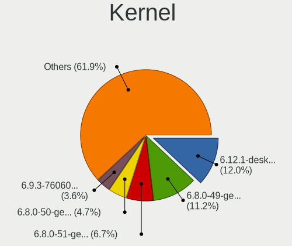
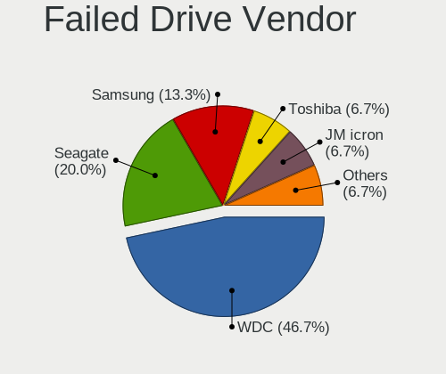

Linux Hardware Trends
---------------------

A project to identify most popular hardware characteristics and track their change
over time based on data collected by Linux users at https://Linux-Hardware.org.

Anyone can contribute to the study by uploading probes of their computers by
the [hw-probe](https://github.com/linuxhw/hw-probe) tool:

    sudo -E hw-probe -all -upload

This is a report for all computer types. See also reports for [desktops](/Desktop/README.md) and [notebooks](/Notebook/README.md).

Full-feature report is available here: https://linux-hardware.org/?view=trends

Distribution-specific reports: [Ubuntu](/Dist/Ubuntu), [ROSA](/Dist/ROSA), [Mint](/Dist/Mint), [Pop!_OS](/Dist/Pop!_OS), [Fedora](/Dist/Fedora), [BlackPanther](/Dist/BlackPanther), [Arch](/Dist/Arch), [Manjaro](/Dist/Manjaro), [Debian](/Dist/Debian), [Endless](/Dist/Endless), [Zorin](/Dist/Zorin), [Gentoo](/Dist/Gentoo), [Clear Linux](/Dist/Clear_Linux), [openSUSE](/Dist/openSUSE), [KDE neon](/Dist/KDE_neon), [ArcoLinux](/Dist/ArcoLinux).

Period: Jan, 2021.

Contents
--------

- [ OS                       ](#os)
- [ OS Family                ](#os-family)
- [ Kernel                   ](#kernel)
- [ Kernel Family            ](#kernel-family)
- [ Kernel Major Ver.        ](#kernel-major-ver)
- [ Arch                     ](#arch)
- [ DE                       ](#de)
- [ Display Server           ](#display-server)
- [ Display Manager          ](#display-manager)
- [ OS Lang                  ](#os-lang)
- [ Boot Mode                ](#boot-mode)
- [ Filesystem               ](#filesystem)
- [ Part. scheme             ](#part-scheme)
- [ Dual Boot with Linux/BSD ](#dual-boot-with-linux/bsd)
- [ Dual Boot (Win)          ](#dual-boot-win)
- [ Country                  ](#country)
- [ City                     ](#city)
- [ Vendor                   ](#vendor)
- [ Model                    ](#model)
- [ Model Family             ](#model-family)
- [ MFG Year                 ](#mfg-year)
- [ Form Factor              ](#form-factor)
- [ Secure Boot              ](#secure-boot)
- [ Coreboot                 ](#coreboot)
- [ RAM Size                 ](#ram-size)
- [ RAM Used                 ](#ram-used)
- [ Has CD-ROM               ](#has-cd-rom)
- [ Total Drives             ](#total-drives)
- [ Has Ethernet             ](#has-ethernet)
- [ Drive Vendor             ](#drive-vendor)
- [ Drive Model              ](#drive-model)
- [ HDD Vendor               ](#hdd-vendor)
- [ SSD Vendor               ](#ssd-vendor)
- [ Drive Kind               ](#drive-kind)
- [ Drive Connector          ](#drive-connector)
- [ Drive Size               ](#drive-size)
- [ Space Total              ](#space-total)
- [ Space Used               ](#space-used)
- [ Malfunc. Drives          ](#malfunc-drives)
- [ Malfunc. Drive Vendor    ](#malfunc-drive-vendor)
- [ Malfunc. HDD Vendor      ](#malfunc-hdd-vendor)
- [ Malfunc. Drive Kind      ](#malfunc-drive-kind)
- [ Failed Drives            ](#failed-drives)
- [ Failed Drive Vendor      ](#failed-drive-vendor)
- [ Drive Status             ](#drive-status)
- [ Storage Vendor           ](#storage-vendor)
- [ Storage Model            ](#storage-model)
- [ Storage Kind             ](#storage-kind)
- [ CPU Vendor               ](#cpu-vendor)
- [ CPU Model                ](#cpu-model)
- [ CPU Model Family         ](#cpu-model-family)
- [ CPU Cores                ](#cpu-cores)
- [ CPU Sockets              ](#cpu-sockets)
- [ CPU Threads              ](#cpu-threads)
- [ CPU Op-Modes             ](#cpu-op-modes)
- [ CPU Microcode            ](#cpu-microcode)
- [ CPU Microarch            ](#cpu-microarch)
- [ GPU Vendor               ](#gpu-vendor)
- [ GPU Model                ](#gpu-model)
- [ GPU Combo                ](#gpu-combo)
- [ GPU Driver               ](#gpu-driver)
- [ GPU Memory               ](#gpu-memory)
- [ Monitor Vendor           ](#monitor-vendor)
- [ Monitor Model            ](#monitor-model)
- [ Monitor Resolution       ](#monitor-resolution)
- [ Monitor Diagonal         ](#monitor-diagonal)
- [ Monitor Width            ](#monitor-width)
- [ Aspect Ratio             ](#aspect-ratio)
- [ Monitor Area             ](#monitor-area)
- [ Pixel Density            ](#pixel-density)
- [ Multiple Monitors        ](#multiple-monitors)
- [ Net Controller Vendor    ](#net-controller-vendor)
- [ Net Controller Model     ](#net-controller-model)
- [ Wireless Vendor          ](#wireless-vendor)
- [ Wireless Model           ](#wireless-model)
- [ Ethernet Vendor          ](#ethernet-vendor)
- [ Ethernet Model           ](#ethernet-model)
- [ Net Controller Kind      ](#net-controller-kind)
- [ Used Controller          ](#used-controller)
- [ NICs                     ](#nics)
- [ Memory Vendor            ](#memory-vendor)
- [ Memory Model             ](#memory-model)
- [ Memory Kind              ](#memory-kind)
- [ Memory Form Factor       ](#memory-form-factor)
- [ Memory Size              ](#memory-size)
- [ Memory Speed             ](#memory-speed)
- [ Sound Vendor             ](#sound-vendor)
- [ Sound Model              ](#sound-model)
- [ Camera Vendor            ](#camera-vendor)
- [ Camera Model             ](#camera-model)
- [ Fingerprint Vendor       ](#fingerprint-vendor)
- [ Fingerprint Model        ](#fingerprint-model)
- [ Chipcard Vendor          ](#chipcard-vendor)
- [ Chipcard Model           ](#chipcard-model)
- [ Printer Vendor           ](#printer-vendor)
- [ Printer Model            ](#printer-model)
- [ Scanner Vendor           ](#scanner-vendor)
- [ Scanner Model            ](#scanner-model)
- [ Bluetooth Vendor         ](#bluetooth-vendor)
- [ Bluetooth Model          ](#bluetooth-model)
- [ Unsupported Devices      ](#unsupported-devices)
- [ Unsupported Device Types ](#unsupported-device-types)

OS
--

Installed operating systems

| Name               | Computers | Percent |
|--------------------|-----------|---------|
| Ubuntu 20.04       | 1573      | 28.77%  |
| Ubuntu 20.10       | 484       | 8.85%   |
| Fedora 33          | 275       | 5.03%   |
| Mint 20.1          | 272       | 4.97%   |
| Ubuntu 18.04       | 264       | 4.83%   |
| Pop!_OS 20.10      | 257       | 4.7%    |
| Mint 20            | 228       | 4.17%   |
| BlackPanther 18.1  | 217       | 3.97%   |
| KDE neon 20.04     | 154       | 2.82%   |
| ROSA R11.1         | 126       | 2.3%    |
| Manjaro            | 106       | 1.94%   |
| Debian 10          | 96        | 1.76%   |
| Manjaro 20.2.1     | 95        | 1.74%   |
| Arch               | 90        | 1.65%   |
| Mint 19.3          | 88        | 1.61%   |
| Endless 3.9.1      | 81        | 1.48%   |
| Zorin 15           | 77        | 1.41%   |
| Pop!_OS 20.04      | 68        | 1.24%   |
| Arch Rolling       | 62        | 1.13%   |
| ROSA R11           | 53        | 0.97%   |
| ArcoLinux Rolling  | 52        | 0.95%   |
| Ubuntu 16.04       | 38        | 0.69%   |
| Manjaro 20.2       | 33        | 0.6%    |
| Debian Testing     | 29        | 0.53%   |
| Gentoo             | 28        | 0.51%   |
| Fedora 32          | 27        | 0.49%   |
| Kali 2020.4        | 26        | 0.48%   |
| Gentoo 2.7         | 21        | 0.38%   |
| LMDE 4             | 17        | 0.31%   |
| Elementary 5.1.7   | 17        | 0.31%   |
| openSUSE Leap-15.2 | 16        | 0.29%   |
| Endless 3.9.2      | 16        | 0.29%   |
| Ubuntu 21.04       | 15        | 0.27%   |
| Reborn OS          | 14        | 0.26%   |
| Debian             | 14        | 0.26%   |
| Raspbian 10        | 12        | 0.22%   |
| Mint 19.1          | 12        | 0.22%   |
| CentOS 8           | 12        | 0.22%   |
| BlackPanther 16.2  | 11        | 0.2%    |
| Artix Rolling      | 11        | 0.2%    |
| MX 19.3            | 10        | 0.18%   |
| Mint 19            | 10        | 0.18%   |
| Ubuntu             | 9         | 0.16%   |
| ROSA R10           | 9         | 0.16%   |
| RHEL 8.3           | 9         | 0.16%   |
| Peppermint 10      | 9         | 0.16%   |
| Garuda Soaring     | 9         | 0.16%   |
| Garuda             | 9         | 0.16%   |
| Debian Unstable    | 9         | 0.16%   |
| ALT Linux 9.1      | 9         | 0.16%   |
| Solus 4.1          | 7         | 0.13%   |
| ROSA R12           | 7         | 0.13%   |
| RELS 7.3           | 6         | 0.11%   |
| WindowsFX 10       | 5         | 0.09%   |
| RHEL 7.5           | 5         | 0.09%   |
| Parrot 4.10        | 5         | 0.09%   |
| openSUSE 20210114  | 5         | 0.09%   |
| OpenMandriva 4.2   | 5         | 0.09%   |
| Mint 19.2          | 5         | 0.09%   |
| Mageia 7           | 5         | 0.09%   |

OS Family
---------

OS without a version

| Name         | Computers | Percent |
|--------------|-----------|---------|
| Ubuntu       | 2395      | 43.8%   |
| Mint         | 617       | 11.28%  |
| Pop!_OS      | 325       | 5.94%   |
| Fedora       | 314       | 5.74%   |
| Manjaro      | 235       | 4.3%    |
| BlackPanther | 229       | 4.19%   |
| ROSA         | 200       | 3.66%   |
| Debian       | 159       | 2.91%   |
| KDE neon     | 157       | 2.87%   |
| Arch         | 153       | 2.8%    |
| Endless      | 113       | 2.07%   |
| Zorin        | 80        | 1.46%   |
| ArcoLinux    | 58        | 1.06%   |
| openSUSE     | 55        | 1.01%   |
| Gentoo       | 50        | 0.91%   |
| Kali         | 29        | 0.53%   |
| Clear Linux  | 22        | 0.4%    |
| CentOS       | 20        | 0.37%   |
| Garuda       | 18        | 0.33%   |
| Elementary   | 18        | 0.33%   |
| LMDE         | 17        | 0.31%   |
| Artix        | 17        | 0.31%   |
| RHEL         | 16        | 0.29%   |
| Reborn OS    | 14        | 0.26%   |
| MX           | 13        | 0.24%   |
| Raspbian     | 12        | 0.22%   |
| ALT Linux    | 11        | 0.2%    |
| Peppermint   | 10        | 0.18%   |
| EndeavourOS  | 9         | 0.16%   |
| Solus        | 7         | 0.13%   |
| RELS         | 6         | 0.11%   |
| OpenMandriva | 6         | 0.11%   |
| Deepin       | 6         | 0.11%   |
| WindowsFX    | 5         | 0.09%   |
| Parrot       | 5         | 0.09%   |
| Mageia       | 5         | 0.09%   |
| Void         | 4         | 0.07%   |
| Devuan       | 4         | 0.07%   |
| Chrome OS    | 4         | 0.07%   |
| Android      | 4         | 0.07%   |
| Alpine       | 4         | 0.07%   |
| RED          | 3         | 0.05%   |
| Hefftor      | 3         | 0.05%   |
| GalliumOS    | 3         | 0.05%   |
| Sparky       | 2         | 0.04%   |
| Slackware    | 2         | 0.04%   |
| PCLinuxOS    | 2         | 0.04%   |
| Pardus       | 2         | 0.04%   |
| Oracle Linux | 2         | 0.04%   |
| BunsenLabs   | 2         | 0.04%   |
| antiX        | 2         | 0.04%   |
| SkiffOS      | 1         | 0.02%   |
| Siduction    | 1         | 0.02%   |
| Redcore      | 1         | 0.02%   |
| Progress     | 1         | 0.02%   |
| Pearl        | 1         | 0.02%   |
| Parabola     | 1         | 0.02%   |
| NST          | 1         | 0.02%   |
| Manjaro-ARM  | 1         | 0.02%   |
| LFS          | 1         | 0.02%   |

Kernel
------

Version of the Linux kernel

| Version                             | Computers | Percent |
|-------------------------------------|-----------|---------|
| 5.4.0-58-generic                    | 420       | 7.68%   |
| 5.8.0-7630-generic                  | 304       | 5.56%   |
| 5.8.0-36-generic                    | 282       | 5.16%   |
| 5.8.0-38-generic                    | 273       | 4.99%   |
| 5.4.0-62-generic                    | 255       | 4.66%   |
| 5.4.0-60-generic                    | 243       | 4.44%   |
| 5.8.0-40-generic                    | 219       | 4.01%   |
| 5.4.0-59-generic                    | 209       | 3.82%   |
| 4.18.16-desktop-1bP                 | 200       | 3.66%   |
| 5.4.0-64-generic                    | 196       | 3.58%   |
| 5.8.0-41-generic                    | 151       | 2.76%   |
| 5.9.16-200.fc33.x86_64              | 128       | 2.34%   |
| 5.4.0-65-generic                    | 112       | 2.05%   |
| 5.8.0-14-generic                    | 102       | 1.87%   |
| 5.8.0-34-generic                    | 98        | 1.79%   |
| 5.4.0-42-generic                    | 94        | 1.72%   |
| 5.8.0-33-generic                    | 84        | 1.54%   |
| 5.9.16-1-MANJARO                    | 83        | 1.52%   |
| 4.19.0-13-amd64                     | 72        | 1.32%   |
| 5.10.2-2-MANJARO                    | 60        | 1.1%    |
| 4.15.0-desktop-122.124.1rosa-x86_64 | 57        | 1.04%   |
| 4.15.0-128-generic                  | 42        | 0.77%   |
| 4.15.0-desktop-45.1rosa-x86_64      | 40        | 0.73%   |
| 5.10.7-3-MANJARO                    | 35        | 0.64%   |
| 5.4.0-26-generic                    | 34        | 0.62%   |
| 5.10.9-201.fc33.x86_64              | 30        | 0.55%   |
| 5.10.7-200.fc33.x86_64              | 29        | 0.53%   |
| 5.8.0-25-generic                    | 28        | 0.51%   |
| 5.4.0-52-generic                    | 28        | 0.51%   |
| 5.10.7-arch1-1                      | 28        | 0.51%   |
| 5.4.83-generic-2rosa-x86_64         | 26        | 0.48%   |
| 5.10.4-arch2-1                      | 26        | 0.48%   |
| 4.15.0-132-generic                  | 25        | 0.46%   |
| 5.10.6-arch1-1                      | 24        | 0.44%   |
| 5.10.0-1-amd64                      | 24        | 0.44%   |
| 4.15.0-130-generic                  | 23        | 0.42%   |
| 5.10.10-200.fc33.x86_64             | 22        | 0.4%    |
| 5.10.3-arch1-1                      | 18        | 0.33%   |
| 5.8.0-1011-raspi                    | 17        | 0.31%   |
| 5.6.14-desktop-2bP                  | 16        | 0.29%   |
| 5.10.7-1-default                    | 16        | 0.29%   |
| 5.9.0-5-amd64                       | 15        | 0.27%   |
| 5.4.0-54-generic                    | 15        | 0.27%   |
| 5.10.9-arch1-1                      | 15        | 0.27%   |
| 5.10.8-200.fc33.x86_64              | 15        | 0.27%   |
| 5.10.6-200.fc33.x86_64              | 15        | 0.27%   |
| 5.8.15-301.fc33.x86_64              | 14        | 0.26%   |
| 5.4.85-1-MANJARO                    | 14        | 0.26%   |
| 5.10.10-arch1-1                     | 14        | 0.26%   |
| 5.0.0-32-generic                    | 13        | 0.24%   |
| 4.15.0-135-generic                  | 13        | 0.24%   |
| 5.9.14-arch1-1                      | 12        | 0.22%   |
| 5.9.0-kali5-amd64                   | 12        | 0.22%   |
| 5.9.0-0.bpo.2-amd64                 | 12        | 0.22%   |
| 4.15.0-desktop-45.1rosa-i586        | 12        | 0.22%   |
| 5.9.16-100.fc32.x86_64              | 11        | 0.2%    |
| 5.8.0-37-generic                    | 11        | 0.2%    |
| 5.4.0-56-generic                    | 11        | 0.2%    |
| 5.10.5-arch1-1                      | 11        | 0.2%    |
| 5.10.4-051004-generic               | 11        | 0.2%    |

Kernel Family
-------------

Linux kernel without a distro release

| Version  | Computers | Percent |
|----------|-----------|---------|
| 5.4.0    | 1711      | 31.29%  |
| 5.8.0    | 1630      | 29.81%  |
| 4.15.0   | 288       | 5.27%   |
| 5.9.16   | 235       | 4.3%    |
| 4.18.16  | 200       | 3.66%   |
| 5.10.7   | 141       | 2.58%   |
| 4.19.0   | 92        | 1.68%   |
| 5.10.4   | 86        | 1.57%   |
| 5.10.2   | 71        | 1.3%    |
| 5.9.0    | 66        | 1.21%   |
| 5.10.6   | 65        | 1.19%   |
| 5.10.9   | 63        | 1.15%   |
| 5.10.10  | 56        | 1.02%   |
| 5.10.0   | 49        | 0.9%    |
| 5.10.8   | 43        | 0.79%   |
| 5.4.83   | 40        | 0.73%   |
| 5.10.5   | 35        | 0.64%   |
| 5.10.3   | 34        | 0.62%   |
| 4.18.0   | 32        | 0.59%   |
| 5.9.14   | 28        | 0.51%   |
| 5.0.0    | 26        | 0.48%   |
| 5.3.0    | 25        | 0.46%   |
| 5.10.11  | 18        | 0.33%   |
| 5.3.18   | 17        | 0.31%   |
| 5.6.14   | 16        | 0.29%   |
| 5.6.0    | 16        | 0.29%   |
| 5.4.85   | 16        | 0.29%   |
| 5.11.0   | 16        | 0.29%   |
| 5.4.80   | 15        | 0.27%   |
| 4.4.0    | 15        | 0.27%   |
| 5.8.15   | 14        | 0.26%   |
| 4.9.155  | 14        | 0.26%   |
| 5.9.11   | 12        | 0.22%   |
| 4.9.20   | 12        | 0.22%   |
| 5.4.89   | 11        | 0.2%    |
| 3.10.0   | 11        | 0.2%    |
| 5.9.12   | 10        | 0.18%   |
| 5.4.32   | 9         | 0.16%   |
| 4.9.60   | 9         | 0.16%   |
| 4.9.0    | 9         | 0.16%   |
| 5.8.18   | 8         | 0.15%   |
| 5.4.86   | 8         | 0.15%   |
| 5.9.15   | 7         | 0.13%   |
| 5.4.78   | 7         | 0.13%   |
| 4.19.128 | 7         | 0.13%   |
| 5.9.13   | 6         | 0.11%   |
| 5.9.1    | 6         | 0.11%   |
| 5.7.1    | 6         | 0.11%   |
| 5.4.91   | 6         | 0.11%   |
| 5.10.1   | 6         | 0.11%   |
| 4.16.18  | 6         | 0.11%   |
| 5.7.0    | 5         | 0.09%   |
| 5.4.88   | 5         | 0.09%   |
| 5.4.70   | 5         | 0.09%   |
| 5.4.66   | 5         | 0.09%   |
| 5.7.19   | 4         | 0.07%   |
| 5.5.19   | 4         | 0.07%   |
| 5.4.87   | 4         | 0.07%   |
| 5.9.8    | 3         | 0.05%   |
| 5.9.10   | 3         | 0.05%   |

Kernel Major Ver.
-----------------

Linux kernel major version

| Version | Computers | Percent |
|---------|-----------|---------|
| 5.4     | 1872      | 34.24%  |
| 5.8     | 1662      | 30.4%   |
| 5.10    | 667       | 12.2%   |
| 5.9     | 379       | 6.93%   |
| 4.15    | 288       | 5.27%   |
| 4.18    | 232       | 4.24%   |
| 4.19    | 110       | 2.01%   |
| 4.9     | 52        | 0.95%   |
| 5.3     | 44        | 0.8%    |
| 5.6     | 39        | 0.71%   |
| 5.0     | 27        | 0.49%   |
| 5.7     | 17        | 0.31%   |
| 4.4     | 17        | 0.31%   |
| 5.11    | 16        | 0.29%   |
| 3.10    | 11        | 0.2%    |
| 5.5     | 9         | 0.16%   |
| 4.16    | 7         | 0.13%   |
| 4.10    | 4         | 0.07%   |
| 4.14    | 3         | 0.05%   |
| 4.7     | 2         | 0.04%   |
| 4.1     | 2         | 0.04%   |
| 5.2     | 1         | 0.02%   |
| 5       | 1         | 0.02%   |
| 4.8     | 1         | 0.02%   |
| 4.13    | 1         | 0.02%   |
| 4.12    | 1         | 0.02%   |
| 4.11    | 1         | 0.02%   |
| 3.14    | 1         | 0.02%   |
| 2.6     | 1         | 0.02%   |

Arch
----

OS architecture (x86_64, i586, etc.)

| Name    | Computers | Percent |
|---------|-----------|---------|
| x86_64  | 5205      | 95.19%  |
| i686    | 190       | 3.47%   |
| aarch64 | 56        | 1.02%   |
| armv7l  | 12        | 0.22%   |
| armv8l  | 3         | 0.05%   |
| armv6l  | 2         | 0.04%   |

DE
--

Desktop Environment

| Name              | Computers | Percent |
|-------------------|-----------|---------|
| GNOME             | 2735      | 50.02%  |
| KDE5              | 530       | 9.69%   |
| X-Cinnamon        | 504       | 9.22%   |
| XFCE              | 471       | 8.61%   |
| KDE               | 358       | 6.55%   |
| Unknown           | 280       | 5.12%   |
| MATE              | 157       | 2.87%   |
| KDE4              | 125       | 2.29%   |
| Unity             | 44        | 0.8%    |
| LXQt              | 44        | 0.8%    |
| Cinnamon          | 44        | 0.8%    |
| LXDE              | 32        | 0.59%   |
| i3                | 26        | 0.48%   |
| Budgie            | 23        | 0.42%   |
| Pantheon          | 18        | 0.33%   |
| GNOME Flashback   | 13        | 0.24%   |
| Deepin            | 11        | 0.2%    |
| bspwm             | 10        | 0.18%   |
| GNOME Classic     | 6         | 0.11%   |
| dwm               | 6         | 0.11%   |
| xmonad            | 5         | 0.09%   |
| awesome           | 5         | 0.09%   |
| Yaru:ubuntu:GNOME | 2         | 0.04%   |
| Trinity           | 2         | 0.04%   |
| sway              | 2         | 0.04%   |
| qtile             | 2         | 0.04%   |
| Openbox           | 2         | 0.04%   |
| leftwm            | 2         | 0.04%   |
| i3-with-shmlog    | 2         | 0.04%   |
| enlightenment     | 2         | 0.04%   |
| XSession          | 1         | 0.02%   |
| Xpra              | 1         | 0.02%   |
| Lumina            | 1         | 0.02%   |
| dwm-sc            | 1         | 0.02%   |
| custom            | 1         | 0.02%   |

Display Server
--------------

X11 or Wayland

| Name        | Computers | Percent |
|-------------|-----------|---------|
| X11         | 4873      | 89.12%  |
| Wayland     | 368       | 6.73%   |
| Unknown     | 137       | 2.51%   |
| Tty         | 87        | 1.59%   |
| Unspecified | 2         | 0.04%   |
| Web         | 1         | 0.02%   |

Display Manager
---------------

SDDM, LightDM, etc.

| Name    | Computers | Percent |
|---------|-----------|---------|
| Unknown | 3604      | 65.91%  |
| GDM     | 640       | 11.7%   |
| SDDM    | 557       | 10.19%  |
| TDM     | 395       | 7.22%   |
| LightDM | 126       | 2.3%    |
| KDM     | 125       | 2.29%   |
| XDM     | 9         | 0.16%   |
| SLiM    | 5         | 0.09%   |
| GDM3    | 3         | 0.05%   |
| NODM    | 1         | 0.02%   |
| MDM     | 1         | 0.02%   |
| Ly      | 1         | 0.02%   |
| LXDM    | 1         | 0.02%   |

OS Lang
-------

Language

| Lang    | Computers | Percent |
|---------|-----------|---------|
| en_US   | 1966      | 35.95%  |
| de_DE   | 505       | 9.24%   |
| Unknown | 357       | 6.53%   |
| ru_RU   | 317       | 5.8%    |
| en_GB   | 298       | 5.45%   |
| fr_FR   | 282       | 5.16%   |
| pt_BR   | 271       | 4.96%   |
| it_IT   | 158       | 2.89%   |
| es_ES   | 153       | 2.8%    |
| en_CA   | 128       | 2.34%   |
| pl_PL   | 97        | 1.77%   |
| C       | 92        | 1.68%   |
| en_AU   | 82        | 1.5%    |
| en_IN   | 70        | 1.28%   |
| es_MX   | 39        | 0.71%   |
| nl_NL   | 38        | 0.69%   |
| cs_CZ   | 38        | 0.69%   |
| hu_HU   | 37        | 0.68%   |
| tr_TR   | 33        | 0.6%    |
| pt_PT   | 25        | 0.46%   |
| sk_SK   | 24        | 0.44%   |
| en_ZA   | 24        | 0.44%   |
| sv_SE   | 22        | 0.4%    |
| ja_JP   | 22        | 0.4%    |
| de_AT   | 22        | 0.4%    |
| zh_CN   | 20        | 0.37%   |
| es_AR   | 20        | 0.37%   |
| ru_UA   | 19        | 0.35%   |
| ro_RO   | 19        | 0.35%   |
| de_CH   | 18        | 0.33%   |
| fr_CA   | 17        | 0.31%   |
| el_GR   | 17        | 0.31%   |
| en_IE   | 16        | 0.29%   |
| es_CL   | 15        | 0.27%   |
| fi_FI   | 14        | 0.26%   |
| es_CO   | 13        | 0.24%   |
| POSIX   | 11        | 0.2%    |
| da_DK   | 9         | 0.16%   |
| ca_ES   | 9         | 0.16%   |
| bg_BG   | 9         | 0.16%   |
| nl_BE   | 8         | 0.15%   |
| hr_HR   | 8         | 0.15%   |
| sl_SI   | 7         | 0.13%   |
| ko_KR   | 7         | 0.13%   |
| fr_BE   | 7         | 0.13%   |
| en_PH   | 7         | 0.13%   |
| uk_UA   | 6         | 0.11%   |
| nb_NO   | 6         | 0.11%   |
| fr_CH   | 6         | 0.11%   |
| en_SG   | 6         | 0.11%   |
| en_IL   | 6         | 0.11%   |
| he_IL   | 5         | 0.09%   |
| es_UY   | 5         | 0.09%   |
| zh_TW   | 4         | 0.07%   |
| es_VE   | 4         | 0.07%   |
| es_PE   | 4         | 0.07%   |
| en_NZ   | 4         | 0.07%   |
| es_EC   | 3         | 0.05%   |
| en_NG   | 3         | 0.05%   |
| vi_VN   | 2         | 0.04%   |

Boot Mode
---------

EFI or BIOS

| Mode | Computers | Percent |
|------|-----------|---------|
| BIOS | 3167      | 57.92%  |
| EFI  | 2301      | 42.08%  |

Filesystem
----------

Type of filesystem

| Type    | Computers | Percent |
|---------|-----------|---------|
| Ext4    | 4667      | 85.35%  |
| Btrfs   | 354       | 6.47%   |
| Overlay | 285       | 5.21%   |
| Xfs     | 85        | 1.55%   |
| Zfs     | 37        | 0.68%   |
| Ext2    | 12        | 0.22%   |
| Unknown | 9         | 0.16%   |
| Tmpfs   | 6         | 0.11%   |
| Ext3    | 6         | 0.11%   |
| Jfs     | 2         | 0.04%   |
| F2fs    | 2         | 0.04%   |
| Aufs    | 2         | 0.04%   |
| ExX4    | 1         | 0.02%   |

Part. scheme
------------

Scheme of partitioning

| Type    | Computers | Percent |
|---------|-----------|---------|
| Unknown | 3530      | 64.56%  |
| GPT     | 1284      | 23.48%  |
| MBR     | 654       | 11.96%  |

Dual Boot with Linux/BSD
------------------------

Hosting more than one Linux/BSD

| Dual boot | Computers | Percent |
|-----------|-----------|---------|
| No        | 4769      | 87.22%  |
| Yes       | 699       | 12.78%  |

Dual Boot (Win)
---------------

Hosting Linux and Windows

| Dual boot | Computers | Percent |
|-----------|-----------|---------|
| No        | 3831      | 70.06%  |
| Yes       | 1637      | 29.94%  |

Country
-------

Geographic location (country)

| Country            | Computers | Percent |
|--------------------|-----------|---------|
| USA                | 910       | 16.64%  |
| Germany            | 643       | 11.76%  |
| Russia             | 416       | 7.61%   |
| Brazil             | 327       | 5.98%   |
| France             | 291       | 5.32%   |
| Hungary            | 230       | 4.21%   |
| UK                 | 225       | 4.11%   |
| Italy              | 208       | 3.8%    |
| Canada             | 183       | 3.35%   |
| Spain              | 166       | 3.04%   |
| Poland             | 116       | 2.12%   |
| Netherlands        | 106       | 1.94%   |
| India              | 106       | 1.94%   |
| Ukraine            | 90        | 1.65%   |
| Australia          | 88        | 1.61%   |
| Switzerland        | 64        | 1.17%   |
| Mexico             | 62        | 1.13%   |
| Belgium            | 58        | 1.06%   |
| Romania            | 56        | 1.02%   |
| Sweden             | 55        | 1.01%   |
| Austria            | 55        | 1.01%   |
| Turkey             | 51        | 0.93%   |
| Czech Republic     | 51        | 0.93%   |
| Finland            | 47        | 0.86%   |
| Slovakia           | 45        | 0.82%   |
| Greece             | 45        | 0.82%   |
| Argentina          | 39        | 0.71%   |
| Indonesia          | 35        | 0.64%   |
| South Africa       | 34        | 0.62%   |
| Bulgaria           | 32        | 0.59%   |
| Portugal           | 30        | 0.55%   |
| Japan              | 30        | 0.55%   |
| Colombia           | 29        | 0.53%   |
| China              | 27        | 0.49%   |
| Norway             | 25        | 0.46%   |
| Israel             | 25        | 0.46%   |
| Chile              | 22        | 0.4%    |
| Denmark            | 21        | 0.38%   |
| Ireland            | 18        | 0.33%   |
| Belarus            | 18        | 0.33%   |
| Philippines        | 16        | 0.29%   |
| Croatia            | 15        | 0.27%   |
| Serbia             | 14        | 0.26%   |
| Egypt              | 14        | 0.26%   |
| Iran               | 13        | 0.24%   |
| Slovenia           | 12        | 0.22%   |
| Singapore          | 12        | 0.22%   |
| Taiwan             | 11        | 0.2%    |
| Korea, Republic of | 11        | 0.2%    |
| Hong Kong          | 11        | 0.2%    |
| New Zealand        | 10        | 0.18%   |
| Malaysia           | 10        | 0.18%   |
| Lithuania          | 10        | 0.18%   |
| Vietnam            | 9         | 0.16%   |
| Thailand           | 9         | 0.16%   |
| Pakistan           | 9         | 0.16%   |
| Uruguay            | 8         | 0.15%   |
| UAE                | 8         | 0.15%   |
| Tunisia            | 8         | 0.15%   |
| Saudi Arabia       | 8         | 0.15%   |

City
----

Geographic location (city)

| City              | Computers | Percent |
|-------------------|-----------|---------|
| Moscow            | 91        | 1.66%   |
| Budapest          | 88        | 1.61%   |
| Berlin            | 59        | 1.08%   |
| Paris             | 45        | 0.82%   |
| St Petersburg     | 41        | 0.75%   |
| Rome              | 34        | 0.62%   |
| Munich            | 34        | 0.62%   |
| Vienna            | 33        | 0.6%    |
| São Paulo        | 32        | 0.59%   |
| Kyiv              | 28        | 0.51%   |
| Hamburg           | 28        | 0.51%   |
| Athens            | 26        | 0.48%   |
| Madrid            | 24        | 0.44%   |
| Bratislava        | 23        | 0.42%   |
| Warsaw            | 22        | 0.4%    |
| Rio de Janeiro    | 22        | 0.4%    |
| Frankfurt am Main | 22        | 0.4%    |
| Istanbul          | 21        | 0.38%   |
| Toronto           | 20        | 0.37%   |
| Prague            | 20        | 0.37%   |
| Helsinki          | 19        | 0.35%   |
| New York          | 18        | 0.33%   |
| Montreal          | 17        | 0.31%   |
| Milan             | 17        | 0.31%   |
| Krasnodar         | 15        | 0.27%   |
| Amsterdam         | 15        | 0.27%   |
| Sydney            | 14        | 0.26%   |
| Johannesburg      | 14        | 0.26%   |
| Cologne           | 14        | 0.26%   |
| Bengaluru         | 14        | 0.26%   |
| Vancouver         | 13        | 0.24%   |
| Stuttgart         | 13        | 0.24%   |
| Novosibirsk       | 13        | 0.24%   |
| Düsseldorf       | 13        | 0.24%   |
| Denver            | 13        | 0.24%   |
| Debrecen          | 13        | 0.24%   |
| Chicago           | 13        | 0.24%   |
| Brasília         | 13        | 0.24%   |
| Barcelona         | 13        | 0.24%   |
| Wrocław          | 12        | 0.22%   |
| London            | 12        | 0.22%   |
| Jakarta           | 12        | 0.22%   |
| Ekaterinburg      | 12        | 0.22%   |
| Calgary           | 12        | 0.22%   |
| Buenos Aires      | 12        | 0.22%   |
| Brisbane          | 12        | 0.22%   |
| Thessaloniki      | 11        | 0.2%    |
| Sofia             | 11        | 0.2%    |
| Nuremberg         | 11        | 0.2%    |
| Hyderabad         | 11        | 0.2%    |
| Cairo             | 11        | 0.2%    |
| Bucharest         | 11        | 0.2%    |
| Birmingham        | 11        | 0.2%    |
| Stockholm         | 10        | 0.18%   |
| Singapore         | 10        | 0.18%   |
| Seattle           | 10        | 0.18%   |
| Perm              | 10        | 0.18%   |
| Leipzig           | 10        | 0.18%   |
| Dublin            | 10        | 0.18%   |
| Dallas            | 10        | 0.18%   |

Vendor
------

Motherboard manufacturer

| Name                    | Computers | Percent |
|-------------------------|-----------|---------|
| ASUSTek Computer        | 931       | 17.03%  |
| Hewlett-Packard         | 751       | 13.73%  |
| Dell                    | 723       | 13.22%  |
| Lenovo                  | 713       | 13.04%  |
| Gigabyte Technology     | 406       | 7.43%   |
| Acer                    | 335       | 6.13%   |
| MSI                     | 312       | 5.71%   |
| ASRock                  | 208       | 3.8%    |
| Apple                   | 98        | 1.79%   |
| Intel                   | 93        | 1.7%    |
| Unknown                 | 82        | 1.5%    |
| Toshiba                 | 81        | 1.48%   |
| Samsung Electronics     | 68        | 1.24%   |
| Sony                    | 64        | 1.17%   |
| Fujitsu                 | 44        | 0.8%    |
| Raspberry Pi Foundation | 31        | 0.57%   |
| HUAWEI                  | 31        | 0.57%   |
| Medion                  | 29        | 0.53%   |
| Packard Bell            | 28        | 0.51%   |
| Positivo                | 20        | 0.37%   |
| Pegatron                | 19        | 0.35%   |
| Foxconn                 | 18        | 0.33%   |
| ECS                     | 17        | 0.31%   |
| Biostar                 | 17        | 0.31%   |
| Notebook                | 16        | 0.29%   |
| Microsoft               | 15        | 0.27%   |
| Fujitsu Siemens         | 15        | 0.27%   |
| Google                  | 14        | 0.26%   |
| Supermicro              | 12        | 0.22%   |
| Alienware               | 12        | 0.22%   |
| System76                | 11        | 0.2%    |
| IBM                     | 11        | 0.2%    |
| eMachines               | 11        | 0.2%    |
| AMI                     | 9         | 0.16%   |
| TUXEDO                  | 7         | 0.13%   |
| Timi                    | 7         | 0.13%   |
| LG Electronics          | 7         | 0.13%   |
| Gateway                 | 6         | 0.11%   |
| ZOTAC                   | 5         | 0.09%   |
| Shuttle                 | 5         | 0.09%   |
| Razer                   | 5         | 0.09%   |
| PCWare                  | 5         | 0.09%   |
| Huanan                  | 5         | 0.09%   |
| Chuwi                   | 5         | 0.09%   |
| Star Labs               | 4         | 0.07%   |
| NEC Computers           | 4         | 0.07%   |
| Clevo                   | 4         | 0.07%   |
| Wortmann AG             | 3         | 0.05%   |
| TYAN Computer           | 3         | 0.05%   |
| Semp Toshiba            | 3         | 0.05%   |
| Schenker                | 3         | 0.05%   |
| PC Specialist           | 3         | 0.05%   |
| Nvidia                  | 3         | 0.05%   |
| Itautec                 | 3         | 0.05%   |
| Inventec                | 3         | 0.05%   |
| HARDKERNEL              | 3         | 0.05%   |
| Hampoo                  | 3         | 0.05%   |
| EVGA                    | 3         | 0.05%   |
| BESSTAR Tech            | 3         | 0.05%   |
| whyopencomputing        | 2         | 0.04%   |

Model
-----

Motherboard model

| Name                               | Computers | Percent |
|------------------------------------|-----------|---------|
| Unknown                            | 98        | 1.79%   |
| ASUS All Series                    | 59        | 1.08%   |
| HP Notebook                        | 22        | 0.4%    |
| Gigabyte B450M DS3H                | 18        | 0.33%   |
| ASUS TUF GAMING X570-PLUS          | 15        | 0.27%   |
| HP Pavilion dv6                    | 14        | 0.26%   |
| MSI MS-7C02                        | 12        | 0.22%   |
| Dell OptiPlex 7010                 | 12        | 0.22%   |
| Acer Nitro AN515-54                | 12        | 0.22%   |
| HP Pavilion g6                     | 11        | 0.2%    |
| Gigabyte 970A-DS3P                 | 11        | 0.2%    |
| Dell XPS 13 7390                   | 11        | 0.2%    |
| HP Pavilion dv7                    | 10        | 0.18%   |
| HP Pavilion 15                     | 10        | 0.18%   |
| HP 255 G7 Notebook PC              | 10        | 0.18%   |
| Dell OptiPlex 780                  | 10        | 0.18%   |
| Dell Latitude E6430                | 10        | 0.18%   |
| ASUS ROG STRIX B450-F GAMING       | 10        | 0.18%   |
| MSI MS-7C37                        | 9         | 0.16%   |
| MSI MS-7B79                        | 9         | 0.16%   |
| HP Pavilion Notebook               | 9         | 0.16%   |
| Dell XPS 15 9500                   | 9         | 0.16%   |
| Dell XPS 15 7590                   | 9         | 0.16%   |
| Dell Latitude E6420                | 9         | 0.16%   |
| ASUS PRIME B450M-A                 | 9         | 0.16%   |
| ASRock B450M Pro4                  | 9         | 0.16%   |
| RPi Raspberry Pi 4 Model B Rev 1.1 | 8         | 0.15%   |
| MSI MS-7693                        | 8         | 0.15%   |
| Dell XPS 13 9360                   | 8         | 0.15%   |
| Dell OptiPlex 9020                 | 8         | 0.15%   |
| Dell Inspiron 1545                 | 8         | 0.15%   |
| ASUS ROG STRIX B550-F GAMING       | 8         | 0.15%   |
| RPi Raspberry Pi 4 Model B Rev 1.4 | 7         | 0.13%   |
| MSI MS-7A38                        | 7         | 0.13%   |
| Lenovo IdeaPad S145-15IWL 81S9     | 7         | 0.13%   |
| HP ProBook 650 G1                  | 7         | 0.13%   |
| HP EliteBook 840 G1                | 7         | 0.13%   |
| HP Compaq Elite 8300 SFF           | 7         | 0.13%   |
| HP 15                              | 7         | 0.13%   |
| Gigabyte G41M-Combo                | 7         | 0.13%   |
| Dell XPS 13 9370                   | 7         | 0.13%   |
| Dell XPS 13 9310                   | 7         | 0.13%   |
| Dell PowerEdge FC630               | 7         | 0.13%   |
| Dell OptiPlex 790                  | 7         | 0.13%   |
| Dell Latitude E6410                | 7         | 0.13%   |
| Dell Latitude E6400                | 7         | 0.13%   |
| Dell Latitude D630                 | 7         | 0.13%   |
| Dell Inspiron N5110                | 7         | 0.13%   |
| ASUS PRIME A320M-K                 | 7         | 0.13%   |
| Intel B75                          | 6         | 0.11%   |
| HUAWEI NBLK-WAX9X                  | 6         | 0.11%   |
| HP Presario CQ57                   | 6         | 0.11%   |
| HP Pavilion g7                     | 6         | 0.11%   |
| HP Laptop 15s-eq0xxx               | 6         | 0.11%   |
| HP Laptop 15-dy1xxx                | 6         | 0.11%   |
| HP 250 G7 Notebook PC              | 6         | 0.11%   |
| Gigabyte X570 AORUS ELITE          | 6         | 0.11%   |
| Gigabyte GA-78LMT-USB3 6.0         | 6         | 0.11%   |
| Gigabyte G31M-ES2L                 | 6         | 0.11%   |
| Dell XPS 17 9700                   | 6         | 0.11%   |

Model Family
------------

Motherboard model prefix

| Name                   | Computers | Percent |
|------------------------|-----------|---------|
| Lenovo ThinkPad        | 294       | 5.38%   |
| Acer Aspire            | 225       | 4.11%   |
| Dell Inspiron          | 201       | 3.68%   |
| Dell Latitude          | 165       | 3.02%   |
| Lenovo IdeaPad         | 163       | 2.98%   |
| HP Pavilion            | 146       | 2.67%   |
| Dell XPS               | 103       | 1.88%   |
| Unknown                | 98        | 1.79%   |
| Dell OptiPlex          | 95        | 1.74%   |
| HP EliteBook           | 87        | 1.59%   |
| ASUS PRIME             | 85        | 1.55%   |
| ASUS ROG               | 78        | 1.43%   |
| HP ProBook             | 76        | 1.39%   |
| HP Compaq              | 76        | 1.39%   |
| Toshiba Satellite      | 71        | 1.3%    |
| ASUS TUF               | 71        | 1.3%    |
| Dell Precision         | 67        | 1.23%   |
| HP Laptop              | 62        | 1.13%   |
| ASUS VivoBook          | 60        | 1.1%    |
| ASUS All               | 59        | 1.08%   |
| Lenovo ThinkCentre     | 58        | 1.06%   |
| Dell Vostro            | 38        | 0.69%   |
| HP ENVY                | 37        | 0.68%   |
| RPi Raspberry          | 31        | 0.57%   |
| Acer Nitro             | 27        | 0.49%   |
| Gigabyte X570          | 26        | 0.48%   |
| Gigabyte B450M         | 26        | 0.48%   |
| Lenovo Legion          | 23        | 0.42%   |
| HP Notebook            | 22        | 0.4%    |
| Packard Bell EasyNote  | 20        | 0.37%   |
| Lenovo Yoga            | 20        | 0.37%   |
| HP ZBook               | 18        | 0.33%   |
| HP 250                 | 18        | 0.33%   |
| Dell PowerEdge         | 18        | 0.33%   |
| Fujitsu ESPRIMO        | 17        | 0.31%   |
| ASUS M5A78L-M          | 17        | 0.31%   |
| HP ProDesk             | 16        | 0.29%   |
| HP 255                 | 16        | 0.29%   |
| ASUS ZenBook           | 16        | 0.29%   |
| Microsoft Surface      | 15        | 0.27%   |
| ASUS M5A97             | 15        | 0.27%   |
| Fujitsu LIFEBOOK       | 14        | 0.26%   |
| Dell Studio            | 14        | 0.26%   |
| ASUS P8Z77-V           | 14        | 0.26%   |
| Acer Swift             | 14        | 0.26%   |
| ASRock B450M           | 13        | 0.24%   |
| MSI MS-7C02            | 12        | 0.22%   |
| HP Spectre             | 12        | 0.22%   |
| HP ProLiant            | 12        | 0.22%   |
| HP OMEN                | 12        | 0.22%   |
| Gigabyte B450          | 12        | 0.22%   |
| ASUS P8H61-M           | 12        | 0.22%   |
| Acer TravelMate        | 12        | 0.22%   |
| Acer Extensa           | 12        | 0.22%   |
| Gigabyte GA-78LMT-USB3 | 11        | 0.2%    |
| Gigabyte 970A-DS3P     | 11        | 0.2%    |
| ASRock X570            | 11        | 0.2%    |
| HP EliteDesk           | 10        | 0.18%   |
| HP 15                  | 10        | 0.18%   |
| ASUS Crosshair         | 10        | 0.18%   |

MFG Year
--------

Motherboard manufacture year

| Year    | Computers | Percent |
|---------|-----------|---------|
| 2020    | 1215      | 22.22%  |
| 2019    | 699       | 12.78%  |
| 2018    | 493       | 9.02%   |
| 2013    | 378       | 6.91%   |
| 2012    | 357       | 6.53%   |
| 2011    | 347       | 6.35%   |
| 2014    | 318       | 5.82%   |
| 2010    | 304       | 5.56%   |
| 2016    | 259       | 4.74%   |
| 2015    | 255       | 4.66%   |
| 2009    | 198       | 3.62%   |
| 2017    | 197       | 3.6%    |
| 2008    | 185       | 3.38%   |
| 2007    | 104       | 1.9%    |
| Unknown | 84        | 1.54%   |
| 2006    | 35        | 0.64%   |
| 2005    | 20        | 0.37%   |
| 2021    | 12        | 0.22%   |
| 2004    | 7         | 0.13%   |
| 2003    | 1         | 0.02%   |

Form Factor
-----------

Physical design of the computer

| Name           | Computers | Percent |
|----------------|-----------|---------|
| Notebook       | 2892      | 52.89%  |
| Desktop        | 2214      | 40.49%  |
| Convertible    | 91        | 1.66%   |
| Mini pc        | 66        | 1.21%   |
| All in one     | 64        | 1.17%   |
| System on chip | 62        | 1.13%   |
| Server         | 37        | 0.68%   |
| Tablet         | 34        | 0.62%   |
| Phone          | 6         | 0.11%   |
| Other          | 1         | 0.02%   |
| Stick pc       | 1         | 0.02%   |

Secure Boot
-----------

Enabled or disabled

| State    | Computers | Percent |
|----------|-----------|---------|
| Disabled | 5114      | 93.53%  |
| Enabled  | 354       | 6.47%   |

Coreboot
--------

Have coreboot on board

| Used | Computers | Percent |
|------|-----------|---------|
| No   | 5444      | 99.56%  |
| Yes  | 24        | 0.44%   |

RAM Size
--------

Total RAM memory

| Size in GB      | Computers | Percent |
|-----------------|-----------|---------|
| 4.01-8.0        | 1289      | 23.57%  |
| 3.01-4.0        | 1079      | 19.73%  |
| 16.01-24.0      | 1054      | 19.28%  |
| 8.01-16.0       | 988       | 18.07%  |
| 32.01-64.0      | 464       | 8.49%   |
| 1.01-2.0        | 243       | 4.44%   |
| 64.01-256.0     | 120       | 2.19%   |
| 2.01-3.0        | 117       | 2.14%   |
| 24.01-32.0      | 56        | 1.02%   |
| 0.51-1.0        | 40        | 0.73%   |
| More than 256.0 | 10        | 0.18%   |
| 0.01-0.5        | 8         | 0.15%   |

RAM Used
--------

Used RAM memory

| Used GB     | Computers | Percent |
|-------------|-----------|---------|
| 1.01-2.0    | 1990      | 36.39%  |
| 2.01-3.0    | 1221      | 22.33%  |
| 4.01-8.0    | 701       | 12.82%  |
| 3.01-4.0    | 652       | 11.92%  |
| 0.51-1.0    | 501       | 9.16%   |
| 8.01-16.0   | 194       | 3.55%   |
| 0.01-0.5    | 171       | 3.13%   |
| 16.01-24.0  | 23        | 0.42%   |
| 32.01-64.0  | 7         | 0.13%   |
| 24.01-32.0  | 6         | 0.11%   |
| 64.01-256.0 | 1         | 0.02%   |
| Unknown     | 1         | 0.02%   |

Has CD-ROM
----------

Has CD-ROM on board

| Presented | Computers | Percent |
|-----------|-----------|---------|
| No        | 3138      | 57.39%  |
| Yes       | 2330      | 42.61%  |

Total Drives
------------

Number of drives on board

| Drives | Computers | Percent |
|--------|-----------|---------|
| 1      | 3100      | 56.69%  |
| 2      | 1460      | 26.7%   |
| 3      | 491       | 8.98%   |
| 4      | 199       | 3.64%   |
| 5      | 90        | 1.65%   |
| 6      | 45        | 0.82%   |
| 0      | 42        | 0.77%   |
| 7      | 21        | 0.38%   |
| 8      | 7         | 0.13%   |
| 9      | 6         | 0.11%   |
| 12     | 3         | 0.05%   |
| 11     | 2         | 0.04%   |
| 13     | 1         | 0.02%   |
| 10     | 1         | 0.02%   |

Has Ethernet
------------

Has Ethernet on board

| Presented | Computers | Percent |
|-----------|-----------|---------|
| Yes       | 4802      | 87.82%  |
| No        | 666       | 12.18%  |

Drive Vendor
------------

Hard drive vendors

| Vendor                    | Computers | Drives | Percent |
|---------------------------|-----------|--------|---------|
| WDC                       | 1371      | 1681   | 17.11%  |
| Seagate                   | 1307      | 1622   | 16.31%  |
| Samsung Electronics       | 1176      | 1441   | 14.68%  |
| Toshiba                   | 549       | 586    | 6.85%   |
| Kingston                  | 489       | 522    | 6.1%    |
| SanDisk                   | 363       | 383    | 4.53%   |
| Unknown                   | 332       | 367    | 4.14%   |
| Hitachi                   | 289       | 300    | 3.61%   |
| Crucial                   | 272       | 297    | 3.39%   |
| Intel                     | 219       | 234    | 2.73%   |
| HGST                      | 155       | 168    | 1.93%   |
| SK Hynix                  | 141       | 148    | 1.76%   |
| A-DATA Technology         | 124       | 130    | 1.55%   |
| Micron Technology         | 75        | 76     | 0.94%   |
| Phison                    | 72        | 83     | 0.9%    |
| China                     | 61        | 62     | 0.76%   |
| Apple                     | 51        | 55     | 0.64%   |
| SPCC                      | 47        | 51     | 0.59%   |
| MAXTOR                    | 44        | 50     | 0.55%   |
| Fujitsu                   | 40        | 41     | 0.5%    |
| PNY                       | 39        | 42     | 0.49%   |
| OCZ                       | 37        | 37     | 0.46%   |
| Patriot                   | 36        | 38     | 0.45%   |
| Transcend                 | 34        | 36     | 0.42%   |
| Intenso                   | 34        | 35     | 0.42%   |
| Silicon Motion            | 33        | 33     | 0.41%   |
| KIOXIA                    | 31        | 32     | 0.39%   |
| LITEON                    | 27        | 27     | 0.34%   |
| Corsair                   | 26        | 27     | 0.32%   |
| Micron/Crucial Technology | 25        | 26     | 0.31%   |
| Hewlett-Packard           | 25        | 29     | 0.31%   |
| Apacer                    | 25        | 26     | 0.31%   |
| ASMT                      | 21        | 27     | 0.26%   |
| XPG                       | 20        | 22     | 0.25%   |
| JMicron                   | 20        | 22     | 0.25%   |
| GOODRAM                   | 19        | 20     | 0.24%   |
| KingSpec                  | 18        | 19     | 0.22%   |
| Team                      | 17        | 17     | 0.21%   |
| LITEONIT                  | 17        | 18     | 0.21%   |
| PLEXTOR                   | 15        | 16     | 0.19%   |
| Realtek Semiconductor     | 11        | 11     | 0.14%   |
| Union Memory              | 10        | 10     | 0.12%   |
| Lexar                     | 10        | 10     | 0.12%   |
| Gigabyte Technology       | 10        | 10     | 0.12%   |
| Mushkin                   | 9         | 10     | 0.11%   |
| Msft                      | 9         | 18     | 0.11%   |
| Kingmax                   | 9         | 9      | 0.11%   |
| Union Memory (Shenzhen)   | 7         | 7      | 0.09%   |
| SABRENT                   | 7         | 7      | 0.09%   |
| KIOXIA-EXCERIA            | 7         | 7      | 0.09%   |
| ADATA Technology          | 7         | 7      | 0.09%   |
| WD MediaMax               | 6         | 6      | 0.07%   |
| Netac                     | 6         | 6      | 0.07%   |
| Lenovo                    | 6         | 6      | 0.07%   |
| Dell                      | 6         | 10     | 0.07%   |
| AMD                       | 6         | 7      | 0.07%   |
| Verbatim                  | 5         | 5      | 0.06%   |
| KingFast                  | 5         | 5      | 0.06%   |
| External                  | 5         | 5      | 0.06%   |
| TCSUNBOW                  | 4         | 4      | 0.05%   |

Drive Model
-----------

Hard drive models

| Model                               | Computers | Percent |
|-------------------------------------|-----------|---------|
| Kingston SA400S37240G 240GB SSD     | 89        | 1.01%   |
| Samsung SSD 860 EVO 500GB           | 85        | 0.97%   |
| Seagate ST1000LM035-1RK172 1TB      | 84        | 0.95%   |
| Kingston SA400S37120G 120GB SSD     | 82        | 0.93%   |
| Unknown MMC Card  32GB              | 75        | 0.85%   |
| Samsung SSD 850 EVO 250GB           | 74        | 0.84%   |
| Seagate ST500DM002-1BD142 500GB     | 63        | 0.72%   |
| Kingston SA400S37480G 480GB SSD     | 62        | 0.7%    |
| Samsung NVMe SSD Drive 512GB        | 54        | 0.61%   |
| Samsung NVMe SSD Drive 500GB        | 53        | 0.6%    |
| Seagate ST1000DM010-2EP102 1TB      | 52        | 0.59%   |
| Samsung SSD 860 EVO 1TB             | 52        | 0.59%   |
| Unknown MMC Card  64GB              | 51        | 0.58%   |
| Seagate ST1000LM024 HN-M101MBB 1TB  | 51        | 0.58%   |
| Samsung SSD 850 EVO 500GB           | 50        | 0.57%   |
| Samsung SSD 860 EVO 250GB           | 44        | 0.5%    |
| Kingston SV300S37A120G 120GB SSD    | 43        | 0.49%   |
| WDC WD10EZEX-08WN4A0 1TB            | 42        | 0.48%   |
| Intel NVMe SSD Drive 512GB          | 42        | 0.48%   |
| Crucial CT500MX500SSD1 500GB        | 42        | 0.48%   |
| Toshiba DT01ACA100 1TB              | 40        | 0.45%   |
| Seagate ST2000DM008-2FR102 2TB      | 40        | 0.45%   |
| Unknown SD/MMC/MS PRO 32GB          | 38        | 0.43%   |
| Samsung NVMe SSD Drive 256GB        | 38        | 0.43%   |
| Samsung NVMe SSD Drive 1TB          | 38        | 0.43%   |
| Toshiba MQ01ABD100 1TB              | 37        | 0.42%   |
| Crucial CT240BX500SSD1 240GB        | 36        | 0.41%   |
| Seagate ST9500325AS 500GB           | 35        | 0.4%    |
| Seagate ST3500418AS 500GB           | 35        | 0.4%    |
| Toshiba MQ04ABF100 1TB              | 33        | 0.38%   |
| Toshiba MQ01ABF050 500GB            | 33        | 0.38%   |
| Seagate ST1000DM003-1CH162 1TB      | 33        | 0.38%   |
| WDC WDS500G2B0A-00SM50 500GB SSD    | 32        | 0.36%   |
| Sandisk NVMe SSD Drive 512GB        | 32        | 0.36%   |
| Seagate ST500LT012-1DG142 500GB     | 31        | 0.35%   |
| Samsung NVMe SSD Drive 250GB        | 31        | 0.35%   |
| Unknown MMC Card  128GB             | 29        | 0.33%   |
| Seagate ST1000DM003-1ER162 1TB      | 29        | 0.33%   |
| Crucial CT1000MX500SSD1 1TB         | 29        | 0.33%   |
| WDC WD10SPZX-21Z10T0 1TB            | 27        | 0.31%   |
| Seagate ST2000DM006-2DM164 2TB      | 27        | 0.31%   |
| Seagate ST2000DM001-1ER164 2TB      | 27        | 0.31%   |
| Samsung SSD 840 EVO 250GB           | 27        | 0.31%   |
| HGST HTS721010A9E630 1TB            | 27        | 0.31%   |
| WDC WD20EZRZ-00Z5HB0 2TB            | 26        | 0.3%    |
| Sandisk NVMe SSD Drive 500GB        | 26        | 0.3%    |
| WDC WDS240G2G0A-00JH30 240GB SSD    | 25        | 0.28%   |
| Toshiba HDWD110 1TB                 | 25        | 0.28%   |
| Seagate ST500LM012 HN-M500MBB 500GB | 25        | 0.28%   |
| Seagate ST4000DM004-2CV104 4TB      | 25        | 0.28%   |
| Seagate Expansion 1TB               | 25        | 0.28%   |
| WDC WD10SPZX-24Z10 1TB              | 24        | 0.27%   |
| WDC WD10EZEX-00BN5A0 1TB            | 24        | 0.27%   |
| Toshiba DT01ACA200 2TB              | 24        | 0.27%   |
| SanDisk SSD PLUS 240GB              | 24        | 0.27%   |
| Samsung SSD 840 EVO 120GB           | 24        | 0.27%   |
| Kingston SV300S37A240G 240GB SSD    | 24        | 0.27%   |
| HGST HTS725050A7E630 500GB          | 24        | 0.27%   |
| Toshiba NVMe SSD Drive 512GB        | 23        | 0.26%   |
| SK Hynix NVMe SSD Drive 256GB       | 23        | 0.26%   |

HDD Vendor
----------

Hard disk drive vendors

| Vendor              | Computers | Drives | Percent |
|---------------------|-----------|--------|---------|
| Seagate             | 1279      | 1579   | 35.27%  |
| WDC                 | 1152      | 1404   | 31.77%  |
| Toshiba             | 409       | 437    | 11.28%  |
| Hitachi             | 289       | 300    | 7.97%   |
| Samsung Electronics | 178       | 210    | 4.91%   |
| HGST                | 155       | 168    | 4.27%   |
| Maxtor              | 41        | 47     | 1.13%   |
| Fujitsu             | 39        | 40     | 1.08%   |
| Apple               | 21        | 21     | 0.58%   |
| ASMT                | 15        | 16     | 0.41%   |
| Msft                | 9         | 18     | 0.25%   |
| Hewlett-Packard     | 9         | 12     | 0.25%   |
| WD MediaMax         | 4         | 4      | 0.11%   |
| Dell                | 4         | 8      | 0.11%   |
| USB3.0              | 3         | 3      | 0.08%   |
| asmedia             | 3         | 5      | 0.08%   |
| Intenso             | 2         | 2      | 0.06%   |
| HGST HTS            | 2         | 2      | 0.06%   |
| VBOX                | 1         | 1      | 0.03%   |
| Unknown             | 1         | 1      | 0.03%   |
| TO Exter            | 1         | 1      | 0.03%   |
| Maxone              | 1         | 1      | 0.03%   |
| KESU                | 1         | 1      | 0.03%   |
| Inateck             | 1         | 1      | 0.03%   |
| IET                 | 1         | 3      | 0.03%   |
| IBM/Hitachi         | 1         | 1      | 0.03%   |
| H/W                 | 1         | 1      | 0.03%   |
| Ext Hard            | 1         | 1      | 0.03%   |
| Config              | 1         | 1      | 0.03%   |
| ASMT109x            | 1         | 1      | 0.03%   |

SSD Vendor
----------

Solid state drive vendors

| Vendor              | Computers | Drives | Percent |
|---------------------|-----------|--------|---------|
| Samsung Electronics | 638       | 734    | 23.51%  |
| Kingston            | 427       | 452    | 15.73%  |
| SanDisk             | 258       | 266    | 9.51%   |
| Crucial             | 258       | 282    | 9.51%   |
| WDC                 | 165       | 172    | 6.08%   |
| A-DATA Technology   | 112       | 117    | 4.13%   |
| Intel               | 79        | 83     | 2.91%   |
| China               | 61        | 62     | 2.25%   |
| Toshiba             | 48        | 49     | 1.77%   |
| SPCC                | 43        | 46     | 1.58%   |
| Micron Technology   | 40        | 40     | 1.47%   |
| PNY                 | 37        | 40     | 1.36%   |
| OCZ                 | 37        | 37     | 1.36%   |
| Patriot             | 36        | 38     | 1.33%   |
| Transcend           | 31        | 33     | 1.14%   |
| SK Hynix            | 31        | 37     | 1.14%   |
| LITEON              | 25        | 25     | 0.92%   |
| Apacer              | 25        | 26     | 0.92%   |
| Intenso             | 23        | 24     | 0.85%   |
| Apple               | 23        | 23     | 0.85%   |
| GOODRAM             | 18        | 19     | 0.66%   |
| LITEONIT            | 17        | 18     | 0.63%   |
| KingSpec            | 17        | 18     | 0.63%   |
| Team                | 16        | 16     | 0.59%   |
| Hewlett-Packard     | 15        | 17     | 0.55%   |
| Corsair             | 15        | 15     | 0.55%   |
| Unknown             | 13        | 13     | 0.48%   |
| PLEXTOR             | 13        | 14     | 0.48%   |
| Seagate             | 12        | 14     | 0.44%   |
| JMicron             | 11        | 11     | 0.41%   |
| Lexar               | 10        | 10     | 0.37%   |
| Kingmax             | 9         | 9      | 0.33%   |
| Mushkin             | 8         | 9      | 0.29%   |
| Gigabyte Technology | 8         | 8      | 0.29%   |
| SABRENT             | 7         | 7      | 0.26%   |
| Netac               | 6         | 6      | 0.22%   |
| Verbatim            | 5         | 5      | 0.18%   |
| KIOXIA-EXCERIA      | 5         | 5      | 0.18%   |
| MyDigitalSSD        | 4         | 4      | 0.15%   |
| AMD                 | 4         | 4      | 0.15%   |
| TCSUNBOW            | 3         | 3      | 0.11%   |
| Star                | 3         | 3      | 0.11%   |
| Pioneer             | 3         | 3      | 0.11%   |
| Maxtor              | 3         | 3      | 0.11%   |
| LDLC                | 3         | 3      | 0.11%   |
| KingDian            | 3         | 3      | 0.11%   |
| INNOVATION IT       | 3         | 3      | 0.11%   |
| FORESEE             | 3         | 3      | 0.11%   |
| External            | 3         | 3      | 0.11%   |
| BIWIN               | 3         | 3      | 0.11%   |
| ASMT                | 3         | 3      | 0.11%   |
| ACASIS              | 3         | 3      | 0.11%   |
| Zheino              | 2         | 2      | 0.07%   |
| Vaseky              | 2         | 3      | 0.07%   |
| V7                  | 2         | 2      | 0.07%   |
| USB30               | 2         | 2      | 0.07%   |
| Teclast             | 2         | 2      | 0.07%   |
| ShanDianZhe         | 2         | 2      | 0.07%   |
| NGFF                | 2         | 2      | 0.07%   |
| Lenovo              | 2         | 2      | 0.07%   |

Drive Kind
----------

HDD or SSD

| Kind    | Computers | Drives | Percent |
|---------|-----------|--------|---------|
| HDD     | 3090      | 4290   | 42.8%   |
| SSD     | 2398      | 2914   | 33.22%  |
| NVMe    | 1297      | 1503   | 17.97%  |
| MMC     | 270       | 303    | 3.74%   |
| Unknown | 164       | 187    | 2.27%   |

Drive Connector
---------------

SATA, SAS, NVMe, etc.

| Type | Computers | Drives | Percent |
|------|-----------|--------|---------|
| SATA | 4470      | 7008   | 70.39%  |
| NVMe | 1297      | 1502   | 20.43%  |
| SAS  | 313       | 384    | 4.93%   |
| MMC  | 270       | 303    | 4.25%   |

Drive Size
----------

Size of hard drive

| Size in TB | Computers | Drives | Percent |
|------------|-----------|--------|---------|
| 0.01-0.5   | 3378      | 4363   | 59.18%  |
| 0.51-1.0   | 1591      | 1844   | 27.87%  |
| 1.01-2.0   | 450       | 602    | 7.88%   |
| 3.01-4.0   | 114       | 146    | 2%      |
| 4.01-10.0  | 84        | 125    | 1.47%   |
| 2.01-3.0   | 80        | 105    | 1.4%    |
| 10.01-20.0 | 6         | 10     | 0.11%   |
| 20.01-50.0 | 4         | 8      | 0.07%   |
| 0          | 1         | 1      | 0.02%   |

Space Total
-----------

Amount of disk space available on the file system

| Size in GB     | Computers | Percent |
|----------------|-----------|---------|
| 101-250        | 1537      | 28.11%  |
| 251-500        | 1201      | 21.96%  |
| 501-1000       | 807       | 14.76%  |
| 1001-2000      | 421       | 7.7%    |
| 51-100         | 358       | 6.55%   |
| Unknown        | 284       | 5.19%   |
| More than 3000 | 266       | 4.86%   |
| 21-50          | 223       | 4.08%   |
| 1-20           | 204       | 3.73%   |
| 2001-3000      | 167       | 3.05%   |

Space Used
----------

Amount of used disk space

| Used GB        | Computers | Percent |
|----------------|-----------|---------|
| 1-20           | 1943      | 35.53%  |
| 21-50          | 921       | 16.84%  |
| 101-250        | 686       | 12.55%  |
| 51-100         | 602       | 11.01%  |
| 251-500        | 399       | 7.3%    |
| 501-1000       | 305       | 5.58%   |
| Unknown        | 284       | 5.19%   |
| 1001-2000      | 186       | 3.4%    |
| More than 3000 | 79        | 1.44%   |
| 2001-3000      | 62        | 1.13%   |
| 0              | 1         | 0.02%   |

Malfunc. Drives
---------------

Drive models with a malfunction

| Model                               | Computers | Drives | Percent |
|-------------------------------------|-----------|--------|---------|
| Seagate ST500DM002-1BD142 500GB     | 10        | 11     | 2.06%   |
| Seagate ST1000LM024 HN-M101MBB 1TB  | 8         | 8      | 1.65%   |
| Seagate ST3500418AS 500GB           | 6         | 7      | 1.23%   |
| Kingston SV300S37A120G 120GB SSD    | 6         | 6      | 1.23%   |
| HGST HTS545050A7E680 500GB          | 6         | 6      | 1.23%   |
| Toshiba MK7575GSX 752GB             | 5         | 5      | 1.03%   |
| Seagate ST500LT012-1DG142 500GB     | 5         | 5      | 1.03%   |
| Seagate ST500LM012 HN-M500MBB 500GB | 5         | 5      | 1.03%   |
| HGST HTS545050A7E380 500GB          | 5         | 5      | 1.03%   |
| HGST HTS541010A9E680 1TB            | 5         | 5      | 1.03%   |
| WDC WD10EZEX-00RKKA0 1TB            | 4         | 4      | 0.82%   |
| Toshiba MQ01ABF050 500GB            | 4         | 4      | 0.82%   |
| Seagate ST9500325AS 500GB           | 4         | 4      | 0.82%   |
| Seagate ST9320325AS 320GB           | 4         | 4      | 0.82%   |
| Seagate ST1000LM035-1RK172 1TB      | 4         | 4      | 0.82%   |
| WDC WD5000AAKS-00V1A0 500GB         | 3         | 3      | 0.62%   |
| WDC WD3200AAJS-22B4A0 320GB         | 3         | 3      | 0.62%   |
| Toshiba MQ01ABD100 1TB              | 3         | 3      | 0.62%   |
| Seagate ST9250827AS 250GB           | 3         | 3      | 0.62%   |
| Seagate ST500LM021-1KJ152 500GB     | 3         | 3      | 0.62%   |
| Seagate ST380811AS 80GB             | 3         | 3      | 0.62%   |
| Seagate ST3320613AS 320GB           | 3         | 3      | 0.62%   |
| Seagate ST320LT020-9YG142 320GB     | 3         | 3      | 0.62%   |
| Seagate ST3160815AS 160GB           | 3         | 3      | 0.62%   |
| Seagate ST2000DM006-2DM164 2TB      | 3         | 3      | 0.62%   |
| Samsung Electronics HD161HJ 160GB   | 3         | 3      | 0.62%   |
| Hitachi HTS547550A9E384 500GB       | 3         | 3      | 0.62%   |
| Hitachi HTS545050A7E380 500GB       | 3         | 3      | 0.62%   |
| Hitachi HTS545032B9A300 320GB       | 3         | 3      | 0.62%   |
| Hitachi HTS543232A7A384 320GB       | 3         | 3      | 0.62%   |
| HGST HTS721010A9E630 1TB            | 3         | 3      | 0.62%   |
| HGST HTS541075A9E680 752GB          | 3         | 3      | 0.62%   |
| WDC WD5002ABYS-01B1B0 500GB         | 2         | 2      | 0.41%   |
| WDC WD5000LPVX-22V0TT0 500GB        | 2         | 2      | 0.41%   |
| WDC WD5000AVDS-63U7B1 500GB         | 2         | 2      | 0.41%   |
| WDC WD5000AAKX-08U6AA0 500GB        | 2         | 2      | 0.41%   |
| WDC WD5000AAKX-07U6AA0 500GB        | 2         | 2      | 0.41%   |
| WDC WD5000AAKX-00ERMA0 500GB        | 2         | 2      | 0.41%   |
| WDC WD5000AADS-00S9B0 500GB         | 2         | 2      | 0.41%   |
| WDC WD20EARS-00MVWB0 2TB            | 2         | 2      | 0.41%   |
| WDC WD15EARS-00MVWB0 1TB            | 2         | 2      | 0.41%   |
| WDC WD10EZEX-08WN4A0 1TB            | 2         | 2      | 0.41%   |
| WDC WD10EADS-65M2B1 1TB             | 2         | 2      | 0.41%   |
| Toshiba MQ01ABD050 500GB            | 2         | 2      | 0.41%   |
| Toshiba MK5076GSX 500GB             | 2         | 2      | 0.41%   |
| Toshiba MK5061GSYN 500GB            | 2         | 2      | 0.41%   |
| Toshiba MK5059GSXP 500GB            | 2         | 2      | 0.41%   |
| Toshiba DT01ACA100 1TB              | 2         | 2      | 0.41%   |
| Toshiba DT01ACA050 500GB            | 2         | 2      | 0.41%   |
| SPCC Solid State Disk 240GB         | 2         | 2      | 0.41%   |
| Seagate ST9320328CS 320GB           | 2         | 2      | 0.41%   |
| Seagate ST500LM000-SSHD-8GB         | 2         | 2      | 0.41%   |
| Seagate ST500DM002-1BC142 500GB     | 2         | 2      | 0.41%   |
| Seagate ST380815AS 80GB             | 2         | 2      | 0.41%   |
| Seagate ST3250410AS 250GB           | 2         | 2      | 0.41%   |
| Seagate ST3160813AS 160GB           | 2         | 2      | 0.41%   |
| Seagate ST31000528AS 1TB            | 2         | 2      | 0.41%   |
| Seagate ST31000524AS 1TB            | 2         | 2      | 0.41%   |
| Seagate ST3000DM001-9YN166 3TB      | 2         | 2      | 0.41%   |
| Seagate ST1000DX001-1NS162 1TB      | 2         | 2      | 0.41%   |

Malfunc. Drive Vendor
---------------------

Vendors of faulty drives

| Vendor              | Computers | Drives | Percent |
|---------------------|-----------|--------|---------|
| Seagate             | 134       | 144    | 28.39%  |
| WDC                 | 99        | 108    | 20.97%  |
| Hitachi             | 46        | 46     | 9.75%   |
| Toshiba             | 41        | 41     | 8.69%   |
| Samsung Electronics | 32        | 34     | 6.78%   |
| HGST                | 25        | 25     | 5.3%    |
| Kingston            | 16        | 16     | 3.39%   |
| Intel               | 11        | 11     | 2.33%   |
| MAXTOR              | 10        | 11     | 2.12%   |
| A-DATA Technology   | 7         | 7      | 1.48%   |
| SK Hynix            | 6         | 6      | 1.27%   |
| OCZ                 | 4         | 4      | 0.85%   |
| Fujitsu             | 4         | 4      | 0.85%   |
| Crucial             | 4         | 4      | 0.85%   |
| SanDisk             | 3         | 3      | 0.64%   |
| PLEXTOR             | 3         | 3      | 0.64%   |
| Micron Technology   | 3         | 3      | 0.64%   |
| SPCC                | 2         | 2      | 0.42%   |
| LITEONIT            | 2         | 3      | 0.42%   |
| LITEON              | 2         | 2      | 0.42%   |
| Kingmax             | 2         | 2      | 0.42%   |
| Intenso             | 2         | 2      | 0.42%   |
| Corsair             | 2         | 2      | 0.42%   |
| Apple               | 2         | 2      | 0.42%   |
| WD MediaMax         | 1         | 1      | 0.21%   |
| Unknown             | 1         | 1      | 0.21%   |
| Transcend           | 1         | 1      | 0.21%   |
| Patriot             | 1         | 1      | 0.21%   |
| Mushkin             | 1         | 1      | 0.21%   |
| KingSpec            | 1         | 1      | 0.21%   |
| HGST HTS            | 1         | 1      | 0.21%   |
| Hewlett-Packard     | 1         | 1      | 0.21%   |
| ASMT                | 1         | 2      | 0.21%   |
| Asmedia             | 1         | 1      | 0.21%   |

Malfunc. HDD Vendor
-------------------

Vendors of faulty HDD drives

| Vendor              | Computers | Drives | Percent |
|---------------------|-----------|--------|---------|
| Seagate             | 134       | 144    | 34.99%  |
| WDC                 | 95        | 104    | 24.8%   |
| Hitachi             | 46        | 46     | 12.01%  |
| Toshiba             | 38        | 38     | 9.92%   |
| HGST                | 25        | 25     | 6.53%   |
| Samsung Electronics | 24        | 25     | 6.27%   |
| Maxtor              | 10        | 11     | 2.61%   |
| Fujitsu             | 4         | 4      | 1.04%   |
| Apple               | 2         | 2      | 0.52%   |
| WD MediaMax         | 1         | 1      | 0.26%   |
| HGST HTS            | 1         | 1      | 0.26%   |
| Hewlett-Packard     | 1         | 1      | 0.26%   |
| ASMT                | 1         | 2      | 0.26%   |
| Asmedia             | 1         | 1      | 0.26%   |

Malfunc. Drive Kind
-------------------

Kinds of faulty drives

| Kind | Computers | Drives | Percent |
|------|-----------|--------|---------|
| HDD  | 357       | 405    | 80.59%  |
| SSD  | 72        | 76     | 16.25%  |
| NVMe | 14        | 15     | 3.16%   |

Failed Drives
-------------

Failed drive models

| Model                             | Computers | Drives | Percent |
|-----------------------------------|-----------|--------|---------|
| WDC WD40EZRZ-00GXCB0 4TB          | 1         | 2      | 7.14%   |
| WDC WD1200BEVS-07LAT0 120GB       | 1         | 1      | 7.14%   |
| Seagate ST9320325AS 320GB         | 1         | 1      | 7.14%   |
| Seagate ST9160821AS 160GB         | 1         | 1      | 7.14%   |
| Seagate ST3500418AS 500GB         | 1         | 1      | 7.14%   |
| Seagate ST3320613AS 320GB         | 1         | 1      | 7.14%   |
| Seagate ST3250620AS 250GB         | 1         | 1      | 7.14%   |
| Seagate ST32000644NS 2TB          | 1         | 1      | 7.14%   |
| Seagate ST1000LM048-2E7172 1TB    | 1         | 1      | 7.14%   |
| Samsung Electronics HM320JI 320GB | 1         | 1      | 7.14%   |
| Samsung Electronics HE103SJ 1TB   | 1         | 2      | 7.14%   |
| Samsung Electronics HD103SJ 1TB   | 1         | 1      | 7.14%   |
| Hitachi HDS721010DLE630 1TB       | 1         | 1      | 7.14%   |
| HGST HTS545050A7E380 500GB        | 1         | 1      | 7.14%   |

Failed Drive Vendor
-------------------

Failed drive vendors

| Vendor              | Computers | Drives | Percent |
|---------------------|-----------|--------|---------|
| Seagate             | 7         | 7      | 50%     |
| Samsung Electronics | 3         | 4      | 21.43%  |
| WDC                 | 2         | 3      | 14.29%  |
| Hitachi             | 1         | 1      | 7.14%   |
| HGST                | 1         | 1      | 7.14%   |

Drive Status
------------

Number of failed and malfunc. drives

| Status   | Computers | Drives | Percent |
|----------|-----------|--------|---------|
| Detected | 3671      | 6021   | 63.58%  |
| Works    | 1656      | 2664   | 28.68%  |
| Malfunc  | 433       | 496    | 7.5%    |
| Failed   | 14        | 16     | 0.24%   |

Storage Vendor
--------------

Storage controller vendors

| Vendor                           | Computers | Percent |
|----------------------------------|-----------|---------|
| Intel                            | 3719      | 56.28%  |
| AMD                              | 1132      | 17.13%  |
| Samsung Electronics              | 459       | 6.95%   |
| Sandisk                          | 201       | 3.04%   |
| ASMedia Technology               | 117       | 1.77%   |
| SK Hynix                         | 107       | 1.62%   |
| Nvidia                           | 104       | 1.57%   |
| Toshiba America Info Systems     | 92        | 1.39%   |
| JMicron Technology               | 92        | 1.39%   |
| Phison Electronics               | 88        | 1.33%   |
| Marvell Technology Group         | 81        | 1.23%   |
| Kingston Technology Company      | 68        | 1.03%   |
| Silicon Motion                   | 42        | 0.64%   |
| KIOXIA                           | 40        | 0.61%   |
| ADATA Technology                 | 37        | 0.56%   |
| Micron Technology                | 36        | 0.54%   |
| Micron/Crucial Technology        | 35        | 0.53%   |
| VIA Technologies                 | 23        | 0.35%   |
| Broadcom / LSI                   | 22        | 0.33%   |
| LSI Logic / Symbios Logic        | 21        | 0.32%   |
| Union Memory (Shenzhen)          | 14        | 0.21%   |
| Silicon Integrated Systems [SiS] | 13        | 0.2%    |
| Realtek Semiconductor            | 13        | 0.2%    |
| Silicon Image                    | 8         | 0.12%   |
| Lite-On Technology               | 7         | 0.11%   |
| Hewlett-Packard                  | 6         | 0.09%   |
| Apple                            | 5         | 0.08%   |
| Lenovo                           | 4         | 0.06%   |
| ULi Electronics                  | 3         | 0.05%   |
| Adaptec                          | 3         | 0.05%   |
| Solid State Storage Technology   | 2         | 0.03%   |
| Shenzhen Longsys Electronics     | 2         | 0.03%   |
| Integrated Technology Express    | 2         | 0.03%   |
| Yangtze Memory Technologies      | 1         | 0.02%   |
| Seagate Technology               | 1         | 0.02%   |
| Lite-On IT Corp. / Plextor       | 1         | 0.02%   |
| Huawei Technologies              | 1         | 0.02%   |
| HighPoint Technologies           | 1         | 0.02%   |
| Dell                             | 1         | 0.02%   |
| Biwin Storage Technology         | 1         | 0.02%   |
| Beijing Starblaze Technology     | 1         | 0.02%   |
| Advanced System Products         | 1         | 0.02%   |
| 3ware                            | 1         | 0.02%   |

Storage Model
-------------

Storage controller models

| Model                                                                                   | Computers | Percent |
|-----------------------------------------------------------------------------------------|-----------|---------|
| AMD FCH SATA Controller [AHCI mode]                                                     | 747       | 9.53%   |
| Samsung NVMe SSD Controller SM981/PM981/PM983                                           | 292       | 3.72%   |
| Intel Sunrise Point-LP SATA Controller [AHCI mode]                                      | 280       | 3.57%   |
| Intel 7 Series Chipset Family 6-port SATA Controller [AHCI mode]                        | 255       | 3.25%   |
| Intel 8 Series/C220 Series Chipset Family 6-port SATA Controller 1 [AHCI mode]          | 250       | 3.19%   |
| Intel 82801 Mobile SATA Controller [RAID mode]                                          | 229       | 2.92%   |
| Intel 6 Series/C200 Series Chipset Family 6 port Mobile SATA AHCI Controller            | 206       | 2.63%   |
| AMD 400 Series Chipset SATA Controller                                                  | 173       | 2.21%   |
| AMD SB7x0/SB8x0/SB9x0 SATA Controller [AHCI mode]                                       | 150       | 1.91%   |
| AMD SB7x0/SB8x0/SB9x0 IDE Controller                                                    | 139       | 1.77%   |
| Intel 82801IBM/IEM (ICH9M/ICH9M-E) 4 port SATA Controller [AHCI mode]                   | 135       | 1.72%   |
| Intel NM10/ICH7 Family SATA Controller [IDE mode]                                       | 133       | 1.7%    |
| Intel Q170/Q150/B150/H170/H110/Z170/CM236 Chipset SATA Controller [AHCI Mode]           | 127       | 1.62%   |
| Intel 8 Series SATA Controller 1 [AHCI mode]                                            | 123       | 1.57%   |
| Intel 82801G (ICH7 Family) IDE Controller                                               | 122       | 1.56%   |
| Intel 6 Series/C200 Series Chipset Family 6 port Desktop SATA AHCI Controller           | 116       | 1.48%   |
| Intel 200 Series PCH SATA controller [AHCI mode]                                        | 116       | 1.48%   |
| Intel 7 Series/C210 Series Chipset Family 6-port SATA Controller [AHCI mode]            | 115       | 1.47%   |
| ASMedia ASM1062 Serial ATA Controller                                                   | 112       | 1.43%   |
| Intel Wildcat Point-LP SATA Controller [AHCI Mode]                                      | 94        | 1.2%    |
| AMD SB7x0/SB8x0/SB9x0 SATA Controller [IDE mode]                                        | 91        | 1.16%   |
| Intel Cannon Lake Mobile PCH SATA AHCI Controller                                       | 87        | 1.11%   |
| Intel 5 Series/3400 Series Chipset 6 port SATA AHCI Controller                          | 87        | 1.11%   |
| Intel 5 Series/3400 Series Chipset 4 port SATA AHCI Controller                          | 85        | 1.08%   |
| Intel 82801HM/HEM (ICH8M/ICH8M-E) IDE Controller                                        | 77        | 0.98%   |
| Intel SATA Controller [RAID mode]                                                       | 75        | 0.96%   |
| Intel SSD 660P Series                                                                   | 73        | 0.93%   |
| Samsung NVMe SSD Controller SM961/PM961/SM963                                           | 72        | 0.92%   |
| Intel Celeron/Pentium Silver Processor SATA Controller                                  | 67        | 0.85%   |
| Intel 82801HM/HEM (ICH8M/ICH8M-E) SATA Controller [AHCI mode]                           | 66        | 0.84%   |
| AMD SATA controller                                                                     | 65        | 0.83%   |
| Sandisk WD Black SN750 / PC SN730 NVMe SSD                                              | 62        | 0.79%   |
| Samsung Electronics Non-Volatile memory controller                                      | 62        | 0.79%   |
| Intel Cannon Lake PCH SATA AHCI Controller                                              | 61        | 0.78%   |
| SK Hynix Non-Volatile memory controller                                                 | 58        | 0.74%   |
| Intel Cannon Point-LP SATA Controller [AHCI Mode]                                       | 58        | 0.74%   |
| Intel 400 Series Chipset Family SATA AHCI Controller                                    | 58        | 0.74%   |
| Intel Comet Lake SATA AHCI Controller                                                   | 54        | 0.69%   |
| Intel Atom Processor E3800 Series SATA AHCI Controller                                  | 53        | 0.68%   |
| Intel 6 Series/C200 Series Chipset Family Desktop SATA Controller (IDE mode, ports 4-5) | 51        | 0.65%   |
| Intel 6 Series/C200 Series Chipset Family Desktop SATA Controller (IDE mode, ports 0-3) | 50        | 0.64%   |
| Intel HM170/QM170 Chipset SATA Controller [AHCI Mode]                                   | 49        | 0.63%   |
| Phison E12 NVMe Controller                                                              | 48        | 0.61%   |
| Sandisk WD Blue SN550 NVMe SSD                                                          | 44        | 0.56%   |
| Intel 5 Series/3400 Series Chipset 4 port SATA IDE Controller                           | 44        | 0.56%   |
| Nvidia MCP61 SATA Controller                                                            | 43        | 0.55%   |
| JMicron JMB363 SATA/IDE Controller                                                      | 43        | 0.55%   |
| KIOXIA Non-Volatile memory controller                                                   | 38        | 0.48%   |
| Nvidia MCP61 IDE                                                                        | 37        | 0.47%   |
| Intel 82801I (ICH9 Family) 2 port SATA Controller [IDE mode]                            | 37        | 0.47%   |
| Sandisk WD Black 2018 / PC SN720 NVMe SSD                                               | 36        | 0.46%   |
| Kingston Company A2000 NVMe SSD                                                         | 36        | 0.46%   |
| Intel Celeron N3350/Pentium N4200/Atom E3900 Series SATA AHCI Controller                | 36        | 0.46%   |
| Micron Non-Volatile memory controller                                                   | 35        | 0.45%   |
| Intel 5 Series/3400 Series Chipset 2 port SATA IDE Controller                           | 35        | 0.45%   |
| AMD FCH SATA Controller D                                                               | 35        | 0.45%   |
| SK Hynix BC501 NVMe Solid State Drive 512GB                                             | 33        | 0.42%   |
| Intel 9 Series Chipset Family SATA Controller [AHCI Mode]                               | 33        | 0.42%   |
| Intel 82801JI (ICH10 Family) 2 port SATA IDE Controller #2                              | 33        | 0.42%   |
| AMD FCH IDE Controller                                                                  | 33        | 0.42%   |

Storage Kind
------------

Kind of storage controller (IDE, SATA, NVMe, SAS, ...)

| Kind | Computers | Percent |
|------|-----------|---------|
| SATA | 4058      | 60.1%   |
| NVMe | 1298      | 19.22%  |
| IDE  | 966       | 14.31%  |
| RAID | 387       | 5.73%   |
| SAS  | 27        | 0.4%    |
| SCSI | 16        | 0.24%   |

CPU Vendor
----------

Processor vendors

| Vendor       | Computers | Percent |
|--------------|-----------|---------|
| Intel        | 4084      | 74.69%  |
| AMD          | 1310      | 23.96%  |
| ARM          | 66        | 1.21%   |
| QUALCOMM     | 6         | 0.11%   |
| CentaurHauls | 1         | 0.02%   |
| Unknown      | 1         | 0.02%   |

CPU Model
---------

Processor models

| Model                                         | Computers | Percent |
|-----------------------------------------------|-----------|---------|
| Intel Core i7-8550U CPU @ 1.80GHz             | 69        | 1.26%   |
| Intel Core i5-8250U CPU @ 1.60GHz             | 56        | 1.02%   |
| Intel Core i5-7200U CPU @ 2.50GHz             | 55        | 1.01%   |
| Intel Core i7-8565U CPU @ 1.80GHz             | 52        | 0.95%   |
| Intel Core i7-10510U CPU @ 1.80GHz            | 51        | 0.93%   |
| ARM Processor                                 | 50        | 0.91%   |
| AMD Ryzen 5 3600 6-Core Processor             | 49        | 0.9%    |
| AMD Ryzen 7 3700X 8-Core Processor            | 48        | 0.88%   |
| Intel Core i7-9750H CPU @ 2.60GHz             | 46        | 0.84%   |
| AMD Ryzen 5 3500U with Radeon Vega Mobile Gfx | 45        | 0.82%   |
| Intel Core i5-8265U CPU @ 1.60GHz             | 43        | 0.79%   |
| Intel Core i7-8750H CPU @ 2.20GHz             | 38        | 0.69%   |
| Intel Core i5-2520M CPU @ 2.50GHz             | 38        | 0.69%   |
| Intel Core i5-6200U CPU @ 2.30GHz             | 36        | 0.66%   |
| Intel Core i5-10210U CPU @ 1.60GHz            | 33        | 0.6%    |
| Intel Core i7-7500U CPU @ 2.70GHz             | 30        | 0.55%   |
| Intel Core i5-5200U CPU @ 2.20GHz             | 30        | 0.55%   |
| Intel Core i5-3210M CPU @ 2.50GHz             | 30        | 0.55%   |
| Intel Core 2 Duo CPU E8400 @ 3.00GHz          | 30        | 0.55%   |
| AMD Ryzen 9 3900X 12-Core Processor           | 29        | 0.53%   |
| AMD Ryzen 5 2600 Six-Core Processor           | 29        | 0.53%   |
| Intel Core i5-2410M CPU @ 2.30GHz             | 28        | 0.51%   |
| Intel Core i5-1035G1 CPU @ 1.00GHz            | 28        | 0.51%   |
| Intel Core i5-3470 CPU @ 3.20GHz              | 27        | 0.49%   |
| Intel Atom x5-Z8350 CPU @ 1.44GHz             | 27        | 0.49%   |
| Intel Core i5-9300H CPU @ 2.40GHz             | 26        | 0.48%   |
| AMD Ryzen 7 4700U with Radeon Graphics        | 26        | 0.48%   |
| Intel Core i5-4570 CPU @ 3.20GHz              | 25        | 0.46%   |
| AMD Ryzen 7 2700X Eight-Core Processor        | 25        | 0.46%   |
| AMD FX-8350 Eight-Core Processor              | 25        | 0.46%   |
| AMD FX-6300 Six-Core Processor                | 25        | 0.46%   |
| Intel Core i7-3770 CPU @ 3.40GHz              | 24        | 0.44%   |
| Intel Core i5-3320M CPU @ 2.60GHz             | 24        | 0.44%   |
| AMD Ryzen 7 4800H with Radeon Graphics        | 24        | 0.44%   |
| Intel Core i5-3230M CPU @ 2.60GHz             | 23        | 0.42%   |
| Intel Core i5-2450M CPU @ 2.50GHz             | 23        | 0.42%   |
| AMD Ryzen 5 4500U with Radeon Graphics        | 23        | 0.42%   |
| Intel Core i7-6700HQ CPU @ 2.60GHz            | 22        | 0.4%    |
| AMD Ryzen 5 3400G with Radeon Vega Graphics   | 22        | 0.4%    |
| Intel Core i7-7700HQ CPU @ 2.80GHz            | 21        | 0.38%   |
| Intel Core i7-2670QM CPU @ 2.20GHz            | 21        | 0.38%   |
| Intel Core i7-10750H CPU @ 2.60GHz            | 21        | 0.38%   |
| Intel Celeron N4000 CPU @ 1.10GHz             | 21        | 0.38%   |
| Intel Core i5-4300U CPU @ 1.90GHz             | 20        | 0.37%   |
| Intel Core i3-2120 CPU @ 3.30GHz              | 20        | 0.37%   |
| Intel Core 2 Duo CPU P8600 @ 2.40GHz          | 20        | 0.37%   |
| Intel Core i7-5500U CPU @ 2.40GHz             | 19        | 0.35%   |
| Intel Core i7-4790 CPU @ 3.60GHz              | 19        | 0.35%   |
| Intel Core i7-1065G7 CPU @ 1.30GHz            | 19        | 0.35%   |
| Intel Core i5-4210U CPU @ 1.70GHz             | 19        | 0.35%   |
| Intel Core i3 CPU M 370 @ 2.40GHz             | 19        | 0.35%   |
| Intel Celeron CPU N2840 @ 2.16GHz             | 19        | 0.35%   |
| AMD Ryzen 5 2500U with Radeon Vega Mobile Gfx | 19        | 0.35%   |
| Intel Core i7-6700 CPU @ 3.40GHz              | 18        | 0.33%   |
| Intel Core i5-2400 CPU @ 3.10GHz              | 18        | 0.33%   |
| Intel Core 2 Quad CPU Q6600 @ 2.40GHz         | 18        | 0.33%   |
| Intel 11th Gen Core i7-1165G7 @ 2.80GHz       | 18        | 0.33%   |
| AMD Ryzen 7 3700U with Radeon Vega Mobile Gfx | 18        | 0.33%   |
| Intel Core i5-6300U CPU @ 2.40GHz             | 17        | 0.31%   |
| Intel Core i5-4200U CPU @ 1.60GHz             | 17        | 0.31%   |

CPU Model Family
----------------

Processor model prefix

| Model                          | Computers | Percent |
|--------------------------------|-----------|---------|
| Intel Core i5                  | 1202      | 21.98%  |
| Intel Core i7                  | 1075      | 19.66%  |
| Intel Core i3                  | 450       | 8.23%   |
| AMD Ryzen 5                    | 291       | 5.32%   |
| Intel Core 2 Duo               | 273       | 4.99%   |
| Intel Celeron                  | 231       | 4.22%   |
| AMD Ryzen 7                    | 216       | 3.95%   |
| Intel Pentium                  | 160       | 2.93%   |
| Intel Xeon                     | 157       | 2.87%   |
| Other                          | 119       | 2.18%   |
| AMD FX                         | 113       | 2.07%   |
| Intel Atom                     | 101       | 1.85%   |
| Intel Pentium Dual-Core        | 90        | 1.65%   |
| Intel Core 2 Quad              | 66        | 1.21%   |
| AMD Ryzen 9                    | 59        | 1.08%   |
| AMD Ryzen 3                    | 57        | 1.04%   |
| AMD A8                         | 51        | 0.93%   |
| Intel Core 2                   | 47        | 0.86%   |
| AMD A6                         | 44        | 0.8%    |
| AMD A4                         | 42        | 0.77%   |
| AMD Athlon 64 X2               | 41        | 0.75%   |
| AMD A10                        | 40        | 0.73%   |
| AMD Phenom II X4               | 37        | 0.68%   |
| Intel Core i9                  | 32        | 0.59%   |
| AMD Athlon II X2               | 30        | 0.55%   |
| Intel Genuine                  | 29        | 0.53%   |
| Intel Pentium Dual             | 26        | 0.48%   |
| Intel Pentium 4                | 24        | 0.44%   |
| AMD E                          | 21        | 0.38%   |
| AMD Athlon                     | 21        | 0.38%   |
| AMD Ryzen 7 PRO                | 20        | 0.37%   |
| AMD E1                         | 20        | 0.37%   |
| Intel Pentium Silver           | 19        | 0.35%   |
| AMD Ryzen Threadripper         | 17        | 0.31%   |
| ARM BCM                        | 14        | 0.26%   |
| AMD Ryzen 5 PRO                | 14        | 0.26%   |
| AMD Phenom II X6               | 13        | 0.24%   |
| Intel Pentium M                | 12        | 0.22%   |
| Intel Celeron Dual-Core        | 12        | 0.22%   |
| AMD A12                        | 11        | 0.2%    |
| AMD Sempron                    | 10        | 0.18%   |
| AMD E2                         | 10        | 0.18%   |
| AMD Athlon II X4               | 10        | 0.18%   |
| AMD Turion 64 X2 Mobile        | 9         | 0.16%   |
| AMD Athlon 64                  | 9         | 0.16%   |
| Intel Celeron M                | 8         | 0.15%   |
| AMD Athlon X4                  | 8         | 0.15%   |
| Intel Pentium D                | 7         | 0.13%   |
| AMD C-60                       | 7         | 0.13%   |
| QUALCOMM AArch64               | 6         | 0.11%   |
| Intel Pentium Gold             | 6         | 0.11%   |
| AMD Phenom II X2               | 6         | 0.11%   |
| AMD Phenom                     | 6         | 0.11%   |
| AMD G                          | 5         | 0.09%   |
| Intel Core m3                  | 4         | 0.07%   |
| AMD Turion X2 Dual-Core Mobile | 4         | 0.07%   |
| AMD Turion II                  | 4         | 0.07%   |
| AMD Athlon X2                  | 4         | 0.07%   |
| AMD Athlon II                  | 4         | 0.07%   |
| Intel Core Duo                 | 3         | 0.05%   |

CPU Cores
---------

Number of processor cores

| Number | Computers | Percent |
|--------|-----------|---------|
| 2      | 2352      | 43.01%  |
| 4      | 2000      | 36.58%  |
| 6      | 474       | 8.67%   |
| 8      | 297       | 5.43%   |
| 1      | 176       | 3.22%   |
| 12     | 62        | 1.13%   |
| 3      | 41        | 0.75%   |
| 16     | 31        | 0.57%   |
| 10     | 15        | 0.27%   |
| 24     | 8         | 0.15%   |
| 32     | 4         | 0.07%   |
| 40     | 2         | 0.04%   |
| 96     | 1         | 0.02%   |
| 64     | 1         | 0.02%   |
| 28     | 1         | 0.02%   |
| 20     | 1         | 0.02%   |
| 14     | 1         | 0.02%   |
| 5      | 1         | 0.02%   |

CPU Sockets
-----------

Number of sockets

| Number | Computers | Percent |
|--------|-----------|---------|
| 1      | 5408      | 98.9%   |
| 2      | 54        | 0.99%   |
| 4      | 4         | 0.07%   |
| 3      | 2         | 0.04%   |

CPU Threads
-----------

Threads per core (Hyper-Threading)

| Number | Computers | Percent |
|--------|-----------|---------|
| 2      | 3393      | 62.05%  |
| 1      | 2074      | 37.93%  |
| 112    | 1         | 0.02%   |

CPU Op-Modes
------------

CPU Operation Modes (32-bit, 64-bit)

| Op mode        | Computers | Percent |
|----------------|-----------|---------|
| 32-bit, 64-bit | 5345      | 97.75%  |
| 32-bit         | 60        | 1.1%    |
| Unknown        | 58        | 1.06%   |
| 64-bit         | 5         | 0.09%   |

CPU Microcode
-------------

Microcode number

| Number     | Computers | Percent |
|------------|-----------|---------|
| Unknown    | 1239      | 22.66%  |
| 0x206a7    | 361       | 6.6%    |
| 0x306a9    | 311       | 5.69%   |
| 0x306c3    | 252       | 4.61%   |
| 0x1067a    | 228       | 4.17%   |
| 0x906ea    | 152       | 2.78%   |
| 0x806ec    | 139       | 2.54%   |
| 0x806ea    | 121       | 2.21%   |
| 0x40651    | 112       | 2.05%   |
| 0x20655    | 108       | 1.98%   |
| 0x806e9    | 107       | 1.96%   |
| 0x506e3    | 97        | 1.77%   |
| 0x406e3    | 95        | 1.74%   |
| 0x08701021 | 92        | 1.68%   |
| 0x306d4    | 87        | 1.59%   |
| 0x906e9    | 83        | 1.52%   |
| 0x10676    | 73        | 1.34%   |
| 0x08108109 | 69        | 1.26%   |
| 0x0800820d | 61        | 1.12%   |
| 0x06000852 | 61        | 1.12%   |
| 0x010000c8 | 60        | 1.1%    |
| 0x6fd      | 59        | 1.08%   |
| 0x30678    | 53        | 0.97%   |
| 0x06001119 | 53        | 0.97%   |
| 0x706a1    | 48        | 0.88%   |
| 0x08108102 | 47        | 0.86%   |
| 0x706e5    | 45        | 0.82%   |
| 0x6fb      | 43        | 0.79%   |
| 0x20652    | 43        | 0.79%   |
| 0xa0652    | 40        | 0.73%   |
| 0x406c4    | 40        | 0.73%   |
| 0x106e5    | 39        | 0.71%   |
| 0x806eb    | 38        | 0.69%   |
| 0x906ed    | 34        | 0.62%   |
| 0x08600104 | 34        | 0.62%   |
| 0x806c1    | 32        | 0.59%   |
| 0x08701013 | 31        | 0.57%   |
| 0x08600103 | 29        | 0.53%   |
| 0x08600106 | 28        | 0.51%   |
| 0x6f6      | 27        | 0.49%   |
| 0x506c9    | 26        | 0.48%   |
| 0x06006705 | 26        | 0.48%   |
| 0x0810100b | 25        | 0.46%   |
| 0x406c3    | 24        | 0.44%   |
| 0x05000119 | 24        | 0.44%   |
| 0x106ca    | 23        | 0.42%   |
| 0x07030105 | 23        | 0.42%   |
| 0x306f2    | 22        | 0.4%    |
| 0x08001138 | 21        | 0.38%   |
| 0x0a201009 | 20        | 0.37%   |
| 0x0700010f | 20        | 0.37%   |
| 0x106a5    | 19        | 0.35%   |
| 0x0600063e | 19        | 0.35%   |
| 0x03000027 | 19        | 0.35%   |
| 0xa0655    | 18        | 0.33%   |
| 0x906eb    | 18        | 0.33%   |
| 0x6f2      | 18        | 0.33%   |
| 0xa0653    | 16        | 0.29%   |
| 0x206c2    | 16        | 0.29%   |
| 0xa0660    | 15        | 0.27%   |

CPU Microarch
-------------

Microarchitecture

| Name            | Computers | Percent |
|-----------------|-----------|---------|
| KabyLake        | 906       | 16.57%  |
| Haswell         | 490       | 8.96%   |
| SandyBridge     | 458       | 8.38%   |
| IvyBridge       | 401       | 7.33%   |
| Penryn          | 380       | 6.95%   |
| Zen 2           | 317       | 5.8%    |
| Skylake         | 268       | 4.9%    |
| Zen+            | 233       | 4.26%   |
| Westmere        | 200       | 3.66%   |
| Core            | 198       | 3.62%   |
| Piledriver      | 156       | 2.85%   |
| Silvermont      | 148       | 2.71%   |
| K10             | 131       | 2.4%    |
| CometLake       | 119       | 2.18%   |
| Broadwell       | 119       | 2.18%   |
| Zen             | 112       | 2.05%   |
| Unknown         | 103       | 1.88%   |
| K8 Hammer       | 74        | 1.35%   |
| Nehalem         | 72        | 1.32%   |
| Goldmont plus   | 72        | 1.32%   |
| Excavator       | 66        | 1.21%   |
| IceLake         | 59        | 1.08%   |
| Bonnell         | 48        | 0.88%   |
| Bobcat          | 44        | 0.8%    |
| Puma            | 41        | 0.75%   |
| TigerLake       | 40        | 0.73%   |
| Goldmont        | 37        | 0.68%   |
| NetBurst        | 35        | 0.64%   |
| P6              | 34        | 0.62%   |
| K10 Llano       | 26        | 0.48%   |
| Jaguar          | 25        | 0.46%   |
| Bulldozer       | 23        | 0.42%   |
| Steamroller     | 22        | 0.4%    |
| K8 & K10 hybrid | 10        | 0.18%   |
| K6              | 1         | 0.02%   |

GPU Vendor
----------

Vendors of graphics cards

| Vendor                                       | Computers | Percent |
|----------------------------------------------|-----------|---------|
| Intel                                        | 2994      | 47.22%  |
| Nvidia                                       | 1805      | 28.47%  |
| AMD                                          | 1474      | 23.25%  |
| Matrox Electronics Systems                   | 28        | 0.44%   |
| ASPEED Technology                            | 13        | 0.21%   |
| Silicon Integrated Systems [SiS]             | 10        | 0.16%   |
| VIA Technologies                             | 6         | 0.09%   |
| ATI Technologies                             | 3         | 0.05%   |
| VMware                                       | 2         | 0.03%   |
| Red Hat                                      | 2         | 0.03%   |
| Huawei Technologies                          | 2         | 0.03%   |
| XGI Technology (eXtreme Graphics Innovation) | 1         | 0.02%   |
| S3 Graphics                                  | 1         | 0.02%   |

GPU Model
---------

Graphics card models

| Model                                                                                    | Computers | Percent |
|------------------------------------------------------------------------------------------|-----------|---------|
| Intel 2nd Generation Core Processor Family Integrated Graphics Controller                | 332       | 5.07%   |
| Intel 3rd Gen Core processor Graphics Controller                                         | 224       | 3.42%   |
| Intel UHD Graphics 620                                                                   | 157       | 2.4%    |
| AMD Picasso                                                                              | 139       | 2.12%   |
| Intel Haswell-ULT Integrated Graphics Controller                                         | 138       | 2.11%   |
| Intel UHD Graphics 630 (Mobile)                                                          | 129       | 1.97%   |
| AMD Renoir                                                                               | 125       | 1.91%   |
| AMD Ellesmere [Radeon RX 470/480/570/570X/580/580X/590]                                  | 121       | 1.85%   |
| Intel Core Processor Integrated Graphics Controller                                      | 120       | 1.83%   |
| Intel HD Graphics 620                                                                    | 115       | 1.76%   |
| Intel UHD Graphics 620 (Whiskey Lake)                                                    | 113       | 1.73%   |
| Intel Xeon E3-1200 v3/4th Gen Core Processor Integrated Graphics Controller              | 111       | 1.7%    |
| Intel Mobile 4 Series Chipset Integrated Graphics Controller                             | 108       | 1.65%   |
| Intel Skylake GT2 [HD Graphics 520]                                                      | 99        | 1.51%   |
| Intel CometLake-U GT2 [UHD Graphics]                                                     | 96        | 1.47%   |
| Intel HD Graphics 5500                                                                   | 92        | 1.41%   |
| Intel 4th Gen Core Processor Integrated Graphics Controller                              | 85        | 1.3%    |
| Intel HD Graphics 530                                                                    | 78        | 1.19%   |
| Intel Atom/Celeron/Pentium Processor x5-E8000/J3xxx/N3xxx Integrated Graphics Controller | 75        | 1.15%   |
| Intel Xeon E3-1200 v2/3rd Gen Core processor Graphics Controller                         | 74        | 1.13%   |
| Intel UHD Graphics 605                                                                   | 72        | 1.1%    |
| Intel Atom Processor Z36xxx/Z37xxx Series Graphics & Display                             | 72        | 1.1%    |
| Intel 4 Series Chipset Integrated Graphics Controller                                    | 62        | 0.95%   |
| Nvidia GP107 [GeForce GTX 1050 Ti]                                                       | 61        | 0.93%   |
| Nvidia GK208B [GeForce GT 710]                                                           | 61        | 0.93%   |
| Intel HD Graphics 630                                                                    | 58        | 0.89%   |
| Nvidia TU117M [GeForce GTX 1650 Mobile / Max-Q]                                          | 57        | 0.87%   |
| Intel CometLake-H GT2 [UHD Graphics]                                                     | 48        | 0.73%   |
| Nvidia GP106 [GeForce GTX 1060 6GB]                                                      | 44        | 0.67%   |
| AMD Raven Ridge [Radeon Vega Series / Radeon Vega Mobile Series]                         | 44        | 0.67%   |
| AMD Navi 10 [Radeon RX 5600 OEM/5600 XT / 5700/5700 XT]                                  | 44        | 0.67%   |
| Intel Mobile GM965/GL960 Integrated Graphics Controller (secondary)                      | 42        | 0.64%   |
| Intel Mobile GM965/GL960 Integrated Graphics Controller (primary)                        | 42        | 0.64%   |
| Intel TigerLake GT2 [Iris Xe Graphics]                                                   | 39        | 0.6%    |
| Nvidia GT218 [GeForce 210]                                                               | 38        | 0.58%   |
| Intel Mobile 945GM/GMS/GME, 943/940GML Express Integrated Graphics Controller            | 37        | 0.57%   |
| Intel Iris Plus Graphics G1 (Ice Lake)                                                   | 37        | 0.57%   |
| AMD Stoney [Radeon R2/R3/R4/R5 Graphics]                                                 | 36        | 0.55%   |
| Nvidia GP108 [GeForce GT 1030]                                                           | 35        | 0.53%   |
| AMD Topaz XT [Radeon R7 M260/M265 / M340/M360 / M440/M445 / 530/535 / 620/625 Mobile]    | 33        | 0.5%    |
| AMD Cedar [Radeon HD 5000/6000/7350/8350 Series]                                         | 33        | 0.5%    |
| Nvidia GF117M [GeForce 610M/710M/810M/820M / GT 620M/625M/630M/720M]                     | 31        | 0.47%   |
| Nvidia GP108M [GeForce MX150]                                                            | 30        | 0.46%   |
| Nvidia GP107M [GeForce GTX 1050 Mobile]                                                  | 30        | 0.46%   |
| Nvidia GP104 [GeForce GTX 1070]                                                          | 30        | 0.46%   |
| AMD Seymour [Radeon HD 6400M/7400M Series]                                               | 29        | 0.44%   |
| Nvidia GP106 [GeForce GTX 1060 3GB]                                                      | 28        | 0.43%   |
| AMD Sun XT [Radeon HD 8670A/8670M/8690M / R5 M330 / M430 / Radeon 520 Mobile]            | 28        | 0.43%   |
| AMD Baffin [Radeon RX 460/560D / Pro 450/455/460/555/555X/560/560X]                      | 28        | 0.43%   |
| Intel Mobile 945GM/GMS, 943/940GML Express Integrated Graphics Controller                | 27        | 0.41%   |
| Intel Atom Processor D4xx/D5xx/N4xx/N5xx Integrated Graphics Controller                  | 27        | 0.41%   |
| Intel 82G33/G31 Express Integrated Graphics Controller                                   | 27        | 0.41%   |
| Intel HD Graphics 500                                                                    | 26        | 0.4%    |
| Intel CometLake-S GT2 [UHD Graphics 630]                                                 | 26        | 0.4%    |
| AMD Mullins [Radeon R4/R5 Graphics]                                                      | 26        | 0.4%    |
| AMD Lexa PRO [Radeon 540/540X/550/550X / RX 540X/550/550X]                               | 26        | 0.4%    |
| AMD Wani [Radeon R5/R6/R7 Graphics]                                                      | 25        | 0.38%   |
| Nvidia TU117 [GeForce GTX 1650]                                                          | 24        | 0.37%   |
| Nvidia GM206 [GeForce GTX 960]                                                           | 24        | 0.37%   |
| Nvidia GM107 [GeForce GTX 750 Ti]                                                        | 24        | 0.37%   |

GPU Combo
---------

Combinations of graphics cards

| Name                     | Computers | Percent |
|--------------------------|-----------|---------|
| 1 x Intel                | 2122      | 38.81%  |
| 1 x AMD                  | 1128      | 20.63%  |
| 1 x Nvidia               | 1059      | 19.37%  |
| Intel + Nvidia           | 648       | 11.85%  |
| Intel + AMD              | 182       | 3.33%   |
| 2 x AMD                  | 99        | 1.81%   |
| Other                    | 81        | 1.48%   |
| AMD + Nvidia             | 59        | 1.08%   |
| 1 x Matrox               | 27        | 0.49%   |
| 2 x Nvidia               | 18        | 0.33%   |
| 1 x ASPEED               | 11        | 0.2%    |
| 1 x SiS                  | 10        | 0.18%   |
| 1 x VIA                  | 6         | 0.11%   |
| 1 x VMware               | 2         | 0.04%   |
| 1 x Red Hat              | 2         | 0.04%   |
| Nvidia + ASPEED          | 2         | 0.04%   |
| 1 x Huawei Technologies  | 2         | 0.04%   |
| 3 x Nvidia               | 1         | 0.02%   |
| 2 x Intel                | 1         | 0.02%   |
| 2 x AMD + 1 x Nvidia     | 1         | 0.02%   |
| 1 x XGI                  | 1         | 0.02%   |
| 1 x S3 Graphics          | 1         | 0.02%   |
| Nvidia + Matrox          | 1         | 0.02%   |
| Intel + 2 x Nvidia       | 1         | 0.02%   |
| Intel + 2 x AMD          | 1         | 0.02%   |
| Intel + AMD + 1 x Nvidia | 1         | 0.02%   |
| AMD + 2 x Nvidia         | 1         | 0.02%   |

GPU Driver
----------

Free vs proprietary

| Driver      | Computers | Percent |
|-------------|-----------|---------|
| Free        | 4242      | 77.58%  |
| Proprietary | 976       | 17.85%  |
| Unknown     | 250       | 4.57%   |

GPU Memory
----------

Total video memory

| Size in GB | Computers | Percent |
|------------|-----------|---------|
| Unknown    | 3027      | 55.36%  |
| 1.01-2.0   | 660       | 12.07%  |
| 0.01-0.5   | 603       | 11.03%  |
| 0.51-1.0   | 473       | 8.65%   |
| 3.01-4.0   | 314       | 5.74%   |
| 7.01-8.0   | 173       | 3.16%   |
| 5.01-6.0   | 132       | 2.41%   |
| 2.01-3.0   | 50        | 0.91%   |
| 8.01-16.0  | 31        | 0.57%   |
| 16.01-24.0 | 4         | 0.07%   |
| 4.01-5.0   | 1         | 0.02%   |

Monitor Vendor
--------------

Monitor vendors

| Vendor                  | Computers | Percent |
|-------------------------|-----------|---------|
| Samsung Electronics     | 778       | 13.37%  |
| AU Optronics            | 689       | 11.84%  |
| LG Display              | 536       | 9.21%   |
| BOE                     | 404       | 6.94%   |
| Chimei Innolux          | 392       | 6.73%   |
| Dell                    | 351       | 6.03%   |
| Goldstar                | 328       | 5.63%   |
| Acer                    | 225       | 3.87%   |
| Hewlett-Packard         | 202       | 3.47%   |
| BenQ                    | 145       | 2.49%   |
| Ancor Communications    | 145       | 2.49%   |
| Philips                 | 143       | 2.46%   |
| AOC                     | 137       | 2.35%   |
| Sharp                   | 101       | 1.74%   |
| Lenovo                  | 97        | 1.67%   |
| Chi Mei Optoelectronics | 90        | 1.55%   |
| Apple                   | 82        | 1.41%   |
| Sony                    | 73        | 1.25%   |
| Iiyama                  | 61        | 1.05%   |
| ViewSonic               | 58        | 1%      |
| PANDA                   | 46        | 0.79%   |
| LG Electronics          | 42        | 0.72%   |
| Unknown                 | 41        | 0.7%    |
| LG Philips              | 38        | 0.65%   |
| ASUSTek Computer        | 35        | 0.6%    |
| Eizo                    | 34        | 0.58%   |
| HannStar                | 33        | 0.57%   |
| Fujitsu Siemens         | 27        | 0.46%   |
| InfoVision              | 25        | 0.43%   |
| NEC Computers           | 22        | 0.38%   |
| Panasonic               | 20        | 0.34%   |
| Medion                  | 20        | 0.34%   |
| Vizio                   | 16        | 0.27%   |
| Toshiba                 | 15        | 0.26%   |
| Vestel Elektronik       | 14        | 0.24%   |
| CPT                     | 14        | 0.24%   |
| MSI                     | 11        | 0.19%   |
| Sceptre Tech            | 10        | 0.17%   |
| MStar                   | 10        | 0.17%   |
| Hitachi                 | 10        | 0.17%   |
| Seiko/Epson             | 8         | 0.14%   |
| Belinea                 | 8         | 0.14%   |
| IBM                     | 7         | 0.12%   |
| RTK                     | 6         | 0.1%    |
| Packard Bell            | 6         | 0.1%    |
| Microstep               | 6         | 0.1%    |
| Insignia                | 6         | 0.1%    |
| InnoLux Display         | 6         | 0.1%    |
| Idek Iiyama             | 6         | 0.1%    |
| STD                     | 5         | 0.09%   |
| QCM                     | 5         | 0.09%   |
| Gateway                 | 5         | 0.09%   |
| ___                     | 4         | 0.07%   |
| Quanta Display          | 4         | 0.07%   |
| Pioneer                 | 4         | 0.07%   |
| LPL                     | 4         | 0.07%   |
| FUS                     | 4         | 0.07%   |
| CVT                     | 4         | 0.07%   |
| Compaq Computer         | 4         | 0.07%   |
| CHR                     | 4         | 0.07%   |

Monitor Model
-------------

Monitor models

| Model                                                                     | Computers | Percent |
|---------------------------------------------------------------------------|-----------|---------|
| Samsung Electronics LCD Monitor SEC5441 1366x768 344x194mm 15.5-inch      | 38        | 0.63%   |
| AU Optronics LCD Monitor AUO21ED 1920x1080 344x194mm 15.5-inch            | 33        | 0.55%   |
| LG Display LCD Monitor LGD02DC 1366x768 344x194mm 15.5-inch               | 30        | 0.5%    |
| Chimei Innolux LCD Monitor CMN15DB 1366x768 344x193mm 15.5-inch           | 25        | 0.42%   |
| AU Optronics LCD Monitor AUO38ED 1920x1080 340x190mm 15.3-inch            | 24        | 0.4%    |
| Chimei Innolux LCD Monitor CMN14D4 1920x1080 309x173mm 13.9-inch          | 21        | 0.35%   |
| AU Optronics LCD Monitor AUO26EC 1366x768 344x193mm 15.5-inch             | 21        | 0.35%   |
| AU Optronics LCD Monitor AUO22EC 1366x768 344x193mm 15.5-inch             | 21        | 0.35%   |
| Chimei Innolux LCD Monitor CMN15F5 1920x1080 344x193mm 15.5-inch          | 20        | 0.33%   |
| AU Optronics LCD Monitor AUO61ED 1920x1080 340x190mm 15.3-inch            | 20        | 0.33%   |
| Ancor Communications ASUS VS247 ACI249A 1920x1080 521x293mm 23.5-inch     | 16        | 0.27%   |
| Goldstar LG ULTRAWIDE GSM59F1 1920x1080 580x240mm 24.7-inch               | 15        | 0.25%   |
| Goldstar FULL HD GSM5B55 1920x1080 480x270mm 21.7-inch                    | 15        | 0.25%   |
| AU Optronics LCD Monitor AUO71EC 1366x768 340x190mm 15.3-inch             | 15        | 0.25%   |
| Vestel Elektronik 50UHD_LCD_TV VES3700 3840x2160 1872x1053mm 84.6-inch    | 14        | 0.23%   |
| Samsung Electronics LCD Monitor SEC544B 1600x900 382x214mm 17.2-inch      | 14        | 0.23%   |
| Goldstar IPS FULLHD GSM5AB8 1920x1080 480x270mm 21.7-inch                 | 14        | 0.23%   |
| Chimei Innolux LCD Monitor CMN15E8 1920x1080 344x193mm 15.5-inch          | 14        | 0.23%   |
| AU Optronics LCD Monitor AUO403D 1920x1080 309x173mm 13.9-inch            | 14        | 0.23%   |
| AU Optronics LCD Monitor AUO23EC 1366x768 344x193mm 15.5-inch             | 13        | 0.22%   |
| Philips PHL 243V5 PHLC0D1 1920x1080 521x293mm 23.5-inch                   | 12        | 0.2%    |
| AU Optronics LCD Monitor AUO45EC 1366x768 340x190mm 15.3-inch             | 12        | 0.2%    |
| AU Optronics LCD Monitor AUO313C 1366x768 310x170mm 13.9-inch             | 12        | 0.2%    |
| Samsung Electronics LCD Monitor SEC3245 1366x768 344x194mm 15.5-inch      | 11        | 0.18%   |
| LG Display LCD Monitor LGD065A 1920x1080 344x194mm 15.5-inch              | 11        | 0.18%   |
| LG Display LCD Monitor LGD033A 1366x768 340x190mm 15.3-inch               | 11        | 0.18%   |
| Goldstar HDR WFHD GSM7714 2560x1080 798x334mm 34.1-inch                   | 11        | 0.18%   |
| Chimei Innolux LCD Monitor CMN15E6 1366x768 344x193mm 15.5-inch           | 11        | 0.18%   |
| Chimei Innolux LCD Monitor CMN15D5 1920x1080 340x190mm 15.3-inch          | 11        | 0.18%   |
| Chi Mei Optoelectronics LCD Monitor CMO1720 1920x1080 382x215mm 17.3-inch | 11        | 0.18%   |
| BOE LCD Monitor BOE0812 1920x1080 344x194mm 15.5-inch                     | 11        | 0.18%   |
| AU Optronics LCD Monitor AUO5B2D 1920x1080 293x162mm 13.2-inch            | 11        | 0.18%   |
| AU Optronics LCD Monitor AUO21EC 1366x768 340x190mm 15.3-inch             | 11        | 0.18%   |
| AU Optronics LCD Monitor AUO139E 1600x900 382x214mm 17.2-inch             | 11        | 0.18%   |
| AU Optronics LCD Monitor AUO10EC 1366x768 340x190mm 15.3-inch             | 11        | 0.18%   |
| Samsung Electronics Color LCD SDCA029 2160x1440 252x168mm 11.9-inch       | 10        | 0.17%   |
| Chimei Innolux LCD Monitor CMN14C9 1920x1080 309x173mm 13.9-inch          | 10        | 0.17%   |
| Chi Mei Optoelectronics LCD Monitor CMO15A7 1366x768 350x190mm 15.7-inch  | 10        | 0.17%   |
| BOE LCD Monitor BOE06A5 1366x768 344x194mm 15.5-inch                      | 10        | 0.17%   |
| BOE LCD Monitor BOE0687 1920x1080 344x193mm 15.5-inch                     | 10        | 0.17%   |
| AU Optronics LCD Monitor AUO81EC 1366x768 344x193mm 15.5-inch             | 10        | 0.17%   |
| AU Optronics LCD Monitor AUO70EC 1366x768 340x190mm 15.3-inch             | 10        | 0.17%   |
| Samsung Electronics LCD Monitor SEC4251 1366x768 344x194mm 15.5-inch      | 9         | 0.15%   |
| Samsung Electronics C27F390 SAM0D32 1920x1080 600x340mm 27.2-inch         | 9         | 0.15%   |
| LG Display LCD Monitor LGD02F2 1366x768 344x194mm 15.5-inch               | 9         | 0.15%   |
| Chimei Innolux LCD Monitor CMN15E7 1920x1080 344x193mm 15.5-inch          | 9         | 0.15%   |
| BOE LCD Monitor BOE06BA 1920x1080 344x193mm 15.5-inch                     | 9         | 0.15%   |
| BOE LCD Monitor BOE06A4 1366x768 344x194mm 15.5-inch                      | 9         | 0.15%   |
| BOE LCD Monitor BOE0675 1366x768 344x194mm 15.5-inch                      | 9         | 0.15%   |
| AU Optronics LCD Monitor AUO23ED 1920x1080 344x193mm 15.5-inch            | 9         | 0.15%   |
| AU Optronics LCD Monitor AUO213E 1600x900 309x174mm 14.0-inch             | 9         | 0.15%   |
| Sony Nvidia Defaul SNY05FA 1366x768 290x170mm 13.2-inch                   | 8         | 0.13%   |
| Samsung Electronics U28E590 SAM0C4D 3840x2160 607x345mm 27.5-inch         | 8         | 0.13%   |
| MStar TV_MONITOR MST0030 1440x900 1150x650mm 52.0-inch                    | 8         | 0.13%   |
| LG Display LCD Monitor LGD038E 1366x768 340x190mm 15.3-inch               | 8         | 0.13%   |
| LG Display LCD Monitor LGD02E9 1366x768 309x174mm 14.0-inch               | 8         | 0.13%   |
| Dell U2412M DELA07A 1920x1200 518x324mm 24.1-inch                         | 8         | 0.13%   |
| Chimei Innolux LCD Monitor CMN15BE 1366x768 340x190mm 15.3-inch           | 8         | 0.13%   |
| BOE LCD Monitor BOE0757 1366x768 344x194mm 15.5-inch                      | 8         | 0.13%   |
| BOE LCD Monitor BOE0696 1366x768 309x173mm 13.9-inch                      | 8         | 0.13%   |

Monitor Resolution
------------------

Monitor screen resolution

| Resolution         | Computers | Percent |
|--------------------|-----------|---------|
| 1920x1080 (FHD)    | 2355      | 42%     |
| 1366x768 (WXGA)    | 1125      | 20.06%  |
| 1600x900 (HD+)     | 289       | 5.15%   |
| 3840x2160 (4K)     | 273       | 4.87%   |
| 1280x1024 (SXGA)   | 259       | 4.62%   |
| 2560x1440 (QHD)    | 191       | 3.41%   |
| 1680x1050 (WSXGA+) | 183       | 3.26%   |
| 1440x900 (WXGA+)   | 155       | 2.76%   |
| 1280x800 (WXGA)    | 148       | 2.64%   |
| 1920x1200 (WUXGA)  | 104       | 1.85%   |
| Unknown            | 74        | 1.32%   |
| 1360x768           | 64        | 1.14%   |
| 3440x1440          | 49        | 0.87%   |
| 2560x1080          | 45        | 0.8%    |
| 3840x1080          | 30        | 0.54%   |
| 1024x600           | 29        | 0.52%   |
| 1600x1200          | 26        | 0.46%   |
| 1024x768 (XGA)     | 22        | 0.39%   |
| 3200x1800 (QHD+)   | 19        | 0.34%   |
| 3840x2400          | 16        | 0.29%   |
| 2160x1440          | 14        | 0.25%   |
| 1920x540           | 14        | 0.25%   |
| 2560x1600          | 12        | 0.21%   |
| 1280x720 (HD)      | 11        | 0.2%    |
| 2736x1824          | 8         | 0.14%   |
| 1440x2560          | 5         | 0.09%   |
| 1400x1050          | 5         | 0.09%   |
| 5760x2160          | 4         | 0.07%   |
| 3840x1200          | 4         | 0.07%   |
| 3600x1080          | 4         | 0.07%   |
| 3200x1080          | 4         | 0.07%   |
| 3000x2000          | 4         | 0.07%   |
| 2880x1800          | 4         | 0.07%   |
| 2048x1152          | 4         | 0.07%   |
| 1080x2160          | 4         | 0.07%   |
| 5760x1080          | 3         | 0.05%   |
| 4480x1440          | 3         | 0.05%   |
| 3840x1600          | 3         | 0.05%   |
| 1920x1280          | 3         | 0.05%   |
| 1280x960           | 3         | 0.05%   |
| 7680x2160          | 2         | 0.04%   |
| 2160x1200          | 2         | 0.04%   |
| 1920x1440          | 2         | 0.04%   |
| 1280x768           | 2         | 0.04%   |
| 8320x2160          | 1         | 0.02%   |
| 8160x4627          | 1         | 0.02%   |
| 800x480            | 1         | 0.02%   |
| 6400x2160          | 1         | 0.02%   |
| 6400x1440          | 1         | 0.02%   |
| 5520x1080          | 1         | 0.02%   |
| 5200x2160          | 1         | 0.02%   |
| 5120x1440          | 1         | 0.02%   |
| 4880x1848          | 1         | 0.02%   |
| 4096x1152          | 1         | 0.02%   |
| 4000x1440          | 1         | 0.02%   |
| 3968x1280          | 1         | 0.02%   |
| 3840x1440          | 1         | 0.02%   |
| 3840x1100          | 1         | 0.02%   |
| 3640x1920          | 1         | 0.02%   |
| 3520x1080          | 1         | 0.02%   |

Monitor Diagonal
----------------

Diagonal size in inches

| Inches  | Computers | Percent |
|---------|-----------|---------|
| 15      | 1539      | 26.53%  |
| 13      | 459       | 7.91%   |
| 23      | 422       | 7.28%   |
| 14      | 390       | 6.72%   |
| 17      | 376       | 6.48%   |
| 24      | 366       | 6.31%   |
| 27      | 358       | 6.17%   |
| Unknown | 323       | 5.57%   |
| 21      | 308       | 5.31%   |
| 19      | 199       | 3.43%   |
| 22      | 124       | 2.14%   |
| 18      | 124       | 2.14%   |
| 20      | 116       | 2%      |
| 31      | 103       | 1.78%   |
| 34      | 86        | 1.48%   |
| 12      | 82        | 1.41%   |
| 84      | 51        | 0.88%   |
| 11      | 49        | 0.84%   |
| 72      | 47        | 0.81%   |
| 32      | 38        | 0.66%   |
| 10      | 35        | 0.6%    |
| 25      | 24        | 0.41%   |
| 54      | 16        | 0.28%   |
| 40      | 15        | 0.26%   |
| 52      | 14        | 0.24%   |
| 26      | 13        | 0.22%   |
| 46      | 11        | 0.19%   |
| 48      | 10        | 0.17%   |
| 36      | 10        | 0.17%   |
| 37      | 9         | 0.16%   |
| 33      | 8         | 0.14%   |
| 42      | 7         | 0.12%   |
| 39      | 7         | 0.12%   |
| 29      | 6         | 0.1%    |
| 28      | 6         | 0.1%    |
| 16      | 6         | 0.1%    |
| 65      | 5         | 0.09%   |
| 49      | 5         | 0.09%   |
| 41      | 5         | 0.09%   |
| 55      | 4         | 0.07%   |
| 5       | 4         | 0.07%   |
| 57      | 3         | 0.05%   |
| 38      | 3         | 0.05%   |
| 74      | 2         | 0.03%   |
| 47      | 2         | 0.03%   |
| 35      | 2         | 0.03%   |
| 142     | 1         | 0.02%   |
| 61      | 1         | 0.02%   |
| 50      | 1         | 0.02%   |
| 44      | 1         | 0.02%   |
| 43      | 1         | 0.02%   |
| 30      | 1         | 0.02%   |
| 8       | 1         | 0.02%   |
| 6       | 1         | 0.02%   |

Monitor Width
-------------

Physical width

| Width in mm    | Computers | Percent |
|----------------|-----------|---------|
| 301-350        | 2199      | 38.57%  |
| 501-600        | 1080      | 18.94%  |
| 401-500        | 731       | 12.82%  |
| 351-400        | 448       | 7.86%   |
| 201-300        | 399       | 7%      |
| Unknown        | 323       | 5.67%   |
| 601-700        | 152       | 2.67%   |
| 701-800        | 140       | 2.46%   |
| 1501-2000      | 100       | 1.75%   |
| 1001-1500      | 71        | 1.25%   |
| 801-900        | 37        | 0.65%   |
| 901-1000       | 14        | 0.25%   |
| 1-100          | 4         | 0.07%   |
| 101-200        | 2         | 0.04%   |
| More than 2000 | 1         | 0.02%   |

Aspect Ratio
------------

Proportional relationship between the width and the height

| Ratio   | Computers | Percent |
|---------|-----------|---------|
| 16/9    | 3947      | 74.68%  |
| 16/10   | 596       | 11.28%  |
| Unknown | 268       | 5.07%   |
| 5/4     | 227       | 4.3%    |
| 21/9    | 95        | 1.8%    |
| 4/3     | 66        | 1.25%   |
| 3/2     | 48        | 0.91%   |
| 32/9    | 14        | 0.26%   |
| 6/5     | 11        | 0.21%   |
| 0.46    | 4         | 0.08%   |
| 1.96    | 3         | 0.06%   |
| 1.00    | 2         | 0.04%   |
| 3.40    | 1         | 0.02%   |
| 2.00    | 1         | 0.02%   |
| 1.98    | 1         | 0.02%   |
| 1.03    | 1         | 0.02%   |

Monitor Area
------------

Area in inch²

| Area in inch² | Computers | Percent |
|----------------|-----------|---------|
| 101-110        | 1520      | 26.38%  |
| 201-250        | 983       | 17.06%  |
| 81-90          | 642       | 11.14%  |
| 151-200        | 434       | 7.53%   |
| 301-350        | 368       | 6.39%   |
| Unknown        | 323       | 5.61%   |
| 351-500        | 235       | 4.08%   |
| 121-130        | 231       | 4.01%   |
| 71-80          | 202       | 3.51%   |
| 141-150        | 199       | 3.45%   |
| 251-300        | 150       | 2.6%    |
| More than 1000 | 147       | 2.55%   |
| 501-1000       | 86        | 1.49%   |
| 61-70          | 80        | 1.39%   |
| 51-60          | 50        | 0.87%   |
| 131-140        | 43        | 0.75%   |
| 41-50          | 35        | 0.61%   |
| 91-100         | 16        | 0.28%   |
| 111-120        | 12        | 0.21%   |
| 1-40           | 6         | 0.1%    |

Pixel Density
-------------

Pixels per inch

| Density       | Computers | Percent |
|---------------|-----------|---------|
| 51-100        | 1969      | 35.19%  |
| 101-120       | 1582      | 28.28%  |
| 121-160       | 1254      | 22.41%  |
| Unknown       | 323       | 5.77%   |
| 161-240       | 200       | 3.57%   |
| 1-50          | 143       | 2.56%   |
| More than 240 | 124       | 2.22%   |

Multiple Monitors
-----------------

Total monitors connected

| Total | Computers | Percent |
|-------|-----------|---------|
| 1     | 4358      | 79.7%   |
| 2     | 809       | 14.8%   |
| 0     | 218       | 3.99%   |
| 3     | 75        | 1.37%   |
| 4     | 8         | 0.15%   |

Net Controller Vendor
---------------------

Controller vendors

| Vendor                                 | Computers | Percent |
|----------------------------------------|-----------|---------|
| Realtek Semiconductor                  | 2927      | 35.99%  |
| Intel                                  | 2461      | 30.26%  |
| Qualcomm Atheros                       | 1025      | 12.6%   |
| Broadcom Inc. and subsidiaries         | 523       | 6.43%   |
| Marvell Technology Group               | 138       | 1.7%    |
| Broadcom Limited                       | 125       | 1.54%   |
| Ralink Technology                      | 118       | 1.45%   |
| Nvidia                                 | 82        | 1.01%   |
| TP-Link                                | 75        | 0.92%   |
| Ralink                                 | 73        | 0.9%    |
| Samsung Electronics                    | 33        | 0.41%   |
| Qualcomm Atheros Communications        | 29        | 0.36%   |
| Huawei Technologies                    | 26        | 0.32%   |
| ASIX Electronics                       | 25        | 0.31%   |
| Xiaomi                                 | 23        | 0.28%   |
| Broadcom                               | 22        | 0.27%   |
| Dell                                   | 21        | 0.26%   |
| D-Link                                 | 19        | 0.23%   |
| JMicron Technology                     | 18        | 0.22%   |
| D-Link System                          | 18        | 0.22%   |
| NetGear                                | 17        | 0.21%   |
| Microsoft                              | 17        | 0.21%   |
| Linksys                                | 16        | 0.2%    |
| Aquantia                               | 16        | 0.2%    |
| Sierra Wireless                        | 14        | 0.17%   |
| DisplayLink                            | 14        | 0.17%   |
| VIA Technologies                       | 13        | 0.16%   |
| MediaTek                               | 13        | 0.16%   |
| Lenovo                                 | 13        | 0.16%   |
| Ericsson Business Mobile Networks      | 13        | 0.16%   |
| ASUSTek Computer                       | 13        | 0.16%   |
| Silicon Integrated Systems [SiS]       | 12        | 0.15%   |
| Qualcomm                               | 9         | 0.11%   |
| Microchip Technology                   | 9         | 0.11%   |
| Edimax Technology                      | 9         | 0.11%   |
| IMC Networks                           | 8         | 0.1%    |
| Hewlett-Packard                        | 8         | 0.1%    |
| Attansic Technology                    | 7         | 0.09%   |
| ZyDAS                                  | 6         | 0.07%   |
| LG Electronics                         | 5         | 0.06%   |
| Gemtek                                 | 5         | 0.06%   |
| Apple                                  | 5         | 0.06%   |
| Texas Instruments                      | 4         | 0.05%   |
| Sitecom Europe                         | 4         | 0.05%   |
| Motorola PCS                           | 4         | 0.05%   |
| IBM                                    | 4         | 0.05%   |
| Belkin Components                      | 4         | 0.05%   |
| ZTE WCDMA Technologies MSM             | 3         | 0.04%   |
| Vimtron Electronics                    | 3         | 0.04%   |
| OPPO Electronics                       | 3         | 0.04%   |
| OnePlus Technology (Shenzhen)          | 3         | 0.04%   |
| Mellanox Technologies                  | 3         | 0.04%   |
| HMD Global                             | 3         | 0.04%   |
| Fibocom                                | 3         | 0.04%   |
| Accton Technology                      | 3         | 0.04%   |
| ZyXEL Communications                   | 2         | 0.02%   |
| ULi Electronics                        | 2         | 0.02%   |
| TRENDnet                               | 2         | 0.02%   |
| Sundance Technology Inc / IC Plus      | 2         | 0.02%   |
| Sony Ericsson Mobile Communications AB | 2         | 0.02%   |

Net Controller Model
--------------------

Controller models

| Model                                                                     | Computers | Percent |
|---------------------------------------------------------------------------|-----------|---------|
| Realtek RTL8111/8168/8411 PCI Express Gigabit Ethernet Controller         | 2114      | 22.39%  |
| Realtek RTL810xE PCI Express Fast Ethernet controller                     | 380       | 4.03%   |
| Intel Wi-Fi 6 AX200                                                       | 288       | 3.05%   |
| Intel 82579LM Gigabit Network Connection (Lewisville)                     | 199       | 2.11%   |
| Qualcomm Atheros QCA9377 802.11ac Wireless Network Adapter                | 158       | 1.67%   |
| Intel Wireless 8265 / 8275                                                | 145       | 1.54%   |
| Intel I211 Gigabit Network Connection                                     | 140       | 1.48%   |
| Qualcomm Atheros AR9285 Wireless Network Adapter (PCI-Express)            | 132       | 1.4%    |
| Intel Wireless 7260                                                       | 129       | 1.37%   |
| Qualcomm Atheros AR9485 Wireless Network Adapter                          | 128       | 1.36%   |
| Qualcomm Atheros QCA9565 / AR9565 Wireless Network Adapter                | 106       | 1.12%   |
| Intel Wireless 7265                                                       | 101       | 1.07%   |
| Realtek RTL8821CE 802.11ac PCIe Wireless Network Adapter                  | 98        | 1.04%   |
| Intel Ethernet Connection (2) I219-V                                      | 92        | 0.97%   |
| Qualcomm Atheros QCA6174 802.11ac Wireless Network Adapter                | 86        | 0.91%   |
| Broadcom Inc. and subsidiaries BCM4313 802.11bgn Wireless Network Adapter | 84        | 0.89%   |
| Realtek RTL8153 Gigabit Ethernet Adapter                                  | 82        | 0.87%   |
| Intel Ethernet Connection I217-LM                                         | 82        | 0.87%   |
| Intel Comet Lake PCH-LP CNVi WiFi                                         | 81        | 0.86%   |
| Intel Wireless 8260                                                       | 80        | 0.85%   |
| Intel Centrino Advanced-N 6205 [Taylor Peak]                              | 80        | 0.85%   |
| Realtek RTL8822CE 802.11ac PCIe Wireless Network Adapter                  | 75        | 0.79%   |
| Intel Wireless-AC 9560 [Jefferson Peak]                                   | 74        | 0.78%   |
| Intel Wireless 3165                                                       | 69        | 0.73%   |
| Intel Dual Band Wireless-AC 3168NGW [Stone Peak]                          | 64        | 0.68%   |
| Realtek RTL8723BE PCIe Wireless Network Adapter                           | 59        | 0.63%   |
| Intel Comet Lake PCH CNVi WiFi                                            | 58        | 0.61%   |
| Qualcomm Atheros AR8151 v2.0 Gigabit Ethernet                             | 55        | 0.58%   |
| Broadcom Inc. and subsidiaries BCM43142 802.11b/g/n                       | 55        | 0.58%   |
| Realtek RTL8125 2.5GbE Controller                                         | 54        | 0.57%   |
| Intel Cannon Point-LP CNVi [Wireless-AC]                                  | 52        | 0.55%   |
| Ralink MT7601U Wireless Adapter                                           | 49        | 0.52%   |
| Realtek RTL8822BE 802.11a/b/g/n/ac WiFi adapter                           | 47        | 0.5%    |
| Intel 82579V Gigabit Network Connection                                   | 47        | 0.5%    |
| Qualcomm Atheros AR9287 Wireless Network Adapter (PCI-Express)            | 46        | 0.49%   |
| Intel Wireless-AC 9260                                                    | 44        | 0.47%   |
| Intel PRO/Wireless 3945ABG [Golan] Network Connection                     | 44        | 0.47%   |
| Intel Centrino Advanced-N 6200                                            | 44        | 0.47%   |
| Qualcomm Atheros AR9462 Wireless Network Adapter                          | 43        | 0.46%   |
| Intel Dual Band Wireless-AC 3165 Plus Bluetooth                           | 43        | 0.46%   |
| Intel 82577LM Gigabit Network Connection                                  | 43        | 0.46%   |
| Intel Wireless 3160                                                       | 42        | 0.44%   |
| Intel 82567LM-3 Gigabit Network Connection                                | 42        | 0.44%   |
| Intel Ethernet Connection (7) I219-V                                      | 40        | 0.42%   |
| Intel Ethernet Connection (2) I219-LM                                     | 39        | 0.41%   |
| Realtek RTL8188CE 802.11b/g/n WiFi Adapter                                | 37        | 0.39%   |
| Intel Ethernet Connection I217-V                                          | 37        | 0.39%   |
| Intel Ethernet Connection (4) I219-LM                                     | 37        | 0.39%   |
| Realtek RTL-8100/8101L/8139 PCI Fast Ethernet Adapter                     | 36        | 0.38%   |
| Qualcomm Atheros AR242x / AR542x Wireless Network Adapter (PCI-Express)   | 36        | 0.38%   |
| Nvidia MCP61 Ethernet                                                     | 35        | 0.37%   |
| Intel Centrino Ultimate-N 6300                                            | 35        | 0.37%   |
| Realtek RTL88x2bu [AC1200 Techkey]                                        | 34        | 0.36%   |
| Intel Ethernet Connection I218-LM                                         | 34        | 0.36%   |
| Realtek RTL8188EUS 802.11n Wireless Network Adapter                       | 33        | 0.35%   |
| Intel 82567LM Gigabit Network Connection                                  | 31        | 0.33%   |
| Intel WiFi Link 5100                                                      | 30        | 0.32%   |
| Intel Wi-Fi 6 AX201                                                       | 30        | 0.32%   |
| Intel Killer Wi-Fi 6 AX1650i 160MHz Wireless Network Adapter (201NGW)     | 30        | 0.32%   |
| Intel Ethernet Connection (2) I218-V                                      | 30        | 0.32%   |

Wireless Vendor
---------------

Wireless vendors

| Vendor                                | Computers | Percent |
|---------------------------------------|-----------|---------|
| Intel                                 | 1786      | 43.05%  |
| Qualcomm Atheros                      | 813       | 19.6%   |
| Realtek Semiconductor                 | 638       | 15.38%  |
| Broadcom Inc. and subsidiaries        | 340       | 8.19%   |
| Ralink Technology                     | 118       | 2.84%   |
| Broadcom Limited                      | 75        | 1.81%   |
| Ralink                                | 73        | 1.76%   |
| TP-Link                               | 71        | 1.71%   |
| Qualcomm Atheros Communications       | 29        | 0.7%    |
| D-Link                                | 19        | 0.46%   |
| NetGear                               | 17        | 0.41%   |
| Marvell Technology Group              | 17        | 0.41%   |
| Sierra Wireless                       | 14        | 0.34%   |
| Microsoft                             | 14        | 0.34%   |
| Linksys                               | 13        | 0.31%   |
| ASUSTek Computer                      | 13        | 0.31%   |
| Edimax Technology                     | 9         | 0.22%   |
| D-Link System                         | 9         | 0.22%   |
| IMC Networks                          | 8         | 0.19%   |
| Broadcom                              | 8         | 0.19%   |
| ZyDAS                                 | 6         | 0.14%   |
| Dell                                  | 6         | 0.14%   |
| Qualcomm                              | 5         | 0.12%   |
| Sitecom Europe                        | 4         | 0.1%    |
| MEDIATEK                              | 4         | 0.1%    |
| Gemtek                                | 4         | 0.1%    |
| Belkin Components                     | 4         | 0.1%    |
| Hewlett-Packard                       | 3         | 0.07%   |
| Fibocom                               | 3         | 0.07%   |
| Ericsson Business Mobile Networks     | 3         | 0.07%   |
| Accton Technology                     | 3         | 0.07%   |
| ZyXEL Communications                  | 2         | 0.05%   |
| TRENDnet                              | 2         | 0.05%   |
| Texas Instruments                     | 2         | 0.05%   |
| Realtek                               | 2         | 0.05%   |
| AVM                                   | 2         | 0.05%   |
| 802.11g Adapter [Linksys WUSB54GC v3] | 2         | 0.05%   |
| Xiaomi                                | 1         | 0.02%   |
| Wilocity                              | 1         | 0.02%   |
| Wacom                                 | 1         | 0.02%   |
| Thales Norway A/S                     | 1         | 0.02%   |
| Philips (or NXP)                      | 1         | 0.02%   |
| NEC Computers                         | 1         | 0.02%   |
| Micro Star International              | 1         | 0.02%   |
| Encore Electronics                    | 1         | 0.02%   |

Wireless Model
--------------

Wireless models

| Model                                                                     | Computers | Percent |
|---------------------------------------------------------------------------|-----------|---------|
| Intel Wi-Fi 6 AX200                                                       | 288       | 6.89%   |
| Qualcomm Atheros QCA9377 802.11ac Wireless Network Adapter                | 158       | 3.78%   |
| Intel Wireless 8265 / 8275                                                | 145       | 3.47%   |
| Qualcomm Atheros AR9285 Wireless Network Adapter (PCI-Express)            | 132       | 3.16%   |
| Intel Wireless 7260                                                       | 129       | 3.09%   |
| Qualcomm Atheros AR9485 Wireless Network Adapter                          | 128       | 3.06%   |
| Qualcomm Atheros QCA9565 / AR9565 Wireless Network Adapter                | 106       | 2.54%   |
| Intel Wireless 7265                                                       | 101       | 2.42%   |
| Realtek RTL8821CE 802.11ac PCIe Wireless Network Adapter                  | 98        | 2.35%   |
| Qualcomm Atheros QCA6174 802.11ac Wireless Network Adapter                | 86        | 2.06%   |
| Broadcom Inc. and subsidiaries BCM4313 802.11bgn Wireless Network Adapter | 84        | 2.01%   |
| Intel Comet Lake PCH-LP CNVi WiFi                                         | 81        | 1.94%   |
| Intel Wireless 8260                                                       | 80        | 1.92%   |
| Intel Centrino Advanced-N 6205 [Taylor Peak]                              | 80        | 1.92%   |
| Realtek RTL8822CE 802.11ac PCIe Wireless Network Adapter                  | 75        | 1.8%    |
| Intel Wireless-AC 9560 [Jefferson Peak]                                   | 74        | 1.77%   |
| Intel Wireless 3165                                                       | 69        | 1.65%   |
| Intel Dual Band Wireless-AC 3168NGW [Stone Peak]                          | 64        | 1.53%   |
| Realtek RTL8723BE PCIe Wireless Network Adapter                           | 59        | 1.41%   |
| Intel Comet Lake PCH CNVi WiFi                                            | 58        | 1.39%   |
| Broadcom Inc. and subsidiaries BCM43142 802.11b/g/n                       | 55        | 1.32%   |
| Intel Cannon Point-LP CNVi [Wireless-AC]                                  | 52        | 1.24%   |
| Ralink MT7601U Wireless Adapter                                           | 49        | 1.17%   |
| Realtek RTL8822BE 802.11a/b/g/n/ac WiFi adapter                           | 47        | 1.13%   |
| Qualcomm Atheros AR9287 Wireless Network Adapter (PCI-Express)            | 46        | 1.1%    |
| Intel Wireless-AC 9260                                                    | 44        | 1.05%   |
| Intel PRO/Wireless 3945ABG [Golan] Network Connection                     | 44        | 1.05%   |
| Intel Centrino Advanced-N 6200                                            | 44        | 1.05%   |
| Qualcomm Atheros AR9462 Wireless Network Adapter                          | 43        | 1.03%   |
| Intel Dual Band Wireless-AC 3165 Plus Bluetooth                           | 43        | 1.03%   |
| Intel Wireless 3160                                                       | 42        | 1.01%   |
| Realtek RTL8188CE 802.11b/g/n WiFi Adapter                                | 37        | 0.89%   |
| Qualcomm Atheros AR242x / AR542x Wireless Network Adapter (PCI-Express)   | 36        | 0.86%   |
| Intel Centrino Ultimate-N 6300                                            | 35        | 0.84%   |
| Realtek RTL88x2bu [AC1200 Techkey]                                        | 34        | 0.81%   |
| Realtek RTL8188EUS 802.11n Wireless Network Adapter                       | 33        | 0.79%   |
| Intel WiFi Link 5100                                                      | 30        | 0.72%   |
| Intel Wi-Fi 6 AX201                                                       | 30        | 0.72%   |
| Intel Killer Wi-Fi 6 AX1650i 160MHz Wireless Network Adapter (201NGW)     | 30        | 0.72%   |
| Broadcom Inc. and subsidiaries BCM4360 802.11ac Wireless Network Adapter  | 30        | 0.72%   |
| Qualcomm Atheros AR9271 802.11n                                           | 29        | 0.69%   |
| Qualcomm Atheros AR928X Wireless Network Adapter (PCI-Express)            | 29        | 0.69%   |
| Realtek 802.11ac NIC                                                      | 28        | 0.67%   |
| Realtek RTL8821AE 802.11ac PCIe Wireless Network Adapter                  | 27        | 0.65%   |
| Intel Centrino Wireless-N 2230                                            | 27        | 0.65%   |
| Intel Centrino Advanced-N 6235                                            | 27        | 0.65%   |
| Broadcom Inc. and subsidiaries BCM43228 802.11a/b/g/n                     | 27        | 0.65%   |
| Realtek RTL8188EE Wireless Network Adapter                                | 25        | 0.6%    |
| Intel PRO/Wireless 5100 AGN [Shiloh] Network Connection                   | 25        | 0.6%    |
| Intel PRO/Wireless 4965 AG or AGN [Kedron] Network Connection             | 24        | 0.57%   |
| Ralink RT3290 Wireless 802.11n 1T/1R PCIe                                 | 23        | 0.55%   |
| Intel AC 1550i Wireless                                                   | 23        | 0.55%   |
| Ralink RT5370 Wireless Adapter                                            | 21        | 0.5%    |
| Ralink RT2870/RT3070 Wireless Adapter                                     | 21        | 0.5%    |
| Broadcom Limited BCM4360 802.11ac Wireless Network Adapter                | 21        | 0.5%    |
| Broadcom Inc. and subsidiaries BCM4312 802.11b/g LP-PHY                   | 21        | 0.5%    |
| Realtek RTL8723DE Wireless Network Adapter                                | 20        | 0.48%   |
| Realtek RTL8192CU 802.11n WLAN Adapter                                    | 20        | 0.48%   |
| Ralink RT3090 Wireless 802.11n 1T/1R PCIe                                 | 18        | 0.43%   |
| Intel Centrino Wireless-N 1000 [Condor Peak]                              | 18        | 0.43%   |

Ethernet Vendor
---------------

Ethernet vendors

| Vendor                                 | Computers | Percent |
|----------------------------------------|-----------|---------|
| Realtek Semiconductor                  | 2685      | 52.78%  |
| Intel                                  | 1290      | 25.36%  |
| Qualcomm Atheros                       | 309       | 6.07%   |
| Broadcom Inc. and subsidiaries         | 242       | 4.76%   |
| Marvell Technology Group               | 121       | 2.38%   |
| Nvidia                                 | 82        | 1.61%   |
| Broadcom Limited                       | 55        | 1.08%   |
| Samsung Electronics                    | 33        | 0.65%   |
| ASIX Electronics                       | 25        | 0.49%   |
| Xiaomi                                 | 22        | 0.43%   |
| JMicron Technology                     | 18        | 0.35%   |
| Huawei Technologies                    | 18        | 0.35%   |
| Aquantia                               | 16        | 0.31%   |
| Broadcom                               | 15        | 0.29%   |
| DisplayLink                            | 14        | 0.28%   |
| VIA Technologies                       | 13        | 0.26%   |
| Lenovo                                 | 13        | 0.26%   |
| Silicon Integrated Systems [SiS]       | 12        | 0.24%   |
| D-Link System                          | 9         | 0.18%   |
| MediaTek                               | 8         | 0.16%   |
| Microchip Technology                   | 7         | 0.14%   |
| Attansic Technology                    | 7         | 0.14%   |
| TP-Link                                | 4         | 0.08%   |
| Qualcomm                               | 4         | 0.08%   |
| LG Electronics                         | 4         | 0.08%   |
| IBM                                    | 4         | 0.08%   |
| Apple                                  | 4         | 0.08%   |
| ZTE WCDMA Technologies MSM             | 3         | 0.06%   |
| Vimtron Electronics                    | 3         | 0.06%   |
| OPPO Electronics                       | 3         | 0.06%   |
| OnePlus Technology (Shenzhen)          | 3         | 0.06%   |
| Microsoft                              | 3         | 0.06%   |
| Mellanox Technologies                  | 3         | 0.06%   |
| Linksys                                | 3         | 0.06%   |
| HMD Global                             | 3         | 0.06%   |
| Sundance Technology Inc / IC Plus      | 2         | 0.04%   |
| Sony Ericsson Mobile Communications AB | 2         | 0.04%   |
| ICS Advent                             | 2         | 0.04%   |
| Hewlett-Packard                        | 2         | 0.04%   |
| Cypress Semiconductor                  | 2         | 0.04%   |
| 3Com                                   | 2         | 0.04%   |
| ULi Electronics                        | 1         | 0.02%   |
| T & A Mobile Phones                    | 1         | 0.02%   |
| QNAP System                            | 1         | 0.02%   |
| NTmore                                 | 1         | 0.02%   |
| NetXen Incorporated                    | 1         | 0.02%   |
| Motorola PCS                           | 1         | 0.02%   |
| MosChip Semiconductor                  | 1         | 0.02%   |
| LSI                                    | 1         | 0.02%   |
| Google                                 | 1         | 0.02%   |
| Gemtek                                 | 1         | 0.02%   |
| Foxconn / Hon Hai                      | 1         | 0.02%   |
| Emulex                                 | 1         | 0.02%   |
| Elecom                                 | 1         | 0.02%   |
| Digitech Systems                       | 1         | 0.02%   |
| American Megatrends                    | 1         | 0.02%   |
| ADMtek                                 | 1         | 0.02%   |
| 3DSP                                   | 1         | 0.02%   |

Ethernet Model
--------------

Ethernet models

| Model                                                                          | Computers | Percent |
|--------------------------------------------------------------------------------|-----------|---------|
| Realtek RTL8111/8168/8411 PCI Express Gigabit Ethernet Controller              | 2114      | 40.83%  |
| Realtek RTL810xE PCI Express Fast Ethernet controller                          | 380       | 7.34%   |
| Intel 82579LM Gigabit Network Connection (Lewisville)                          | 199       | 3.84%   |
| Intel I211 Gigabit Network Connection                                          | 140       | 2.7%    |
| Intel Ethernet Connection (2) I219-V                                           | 92        | 1.78%   |
| Realtek RTL8153 Gigabit Ethernet Adapter                                       | 82        | 1.58%   |
| Intel Ethernet Connection I217-LM                                              | 82        | 1.58%   |
| Qualcomm Atheros AR8151 v2.0 Gigabit Ethernet                                  | 55        | 1.06%   |
| Realtek RTL8125 2.5GbE Controller                                              | 52        | 1%      |
| Intel 82579V Gigabit Network Connection                                        | 47        | 0.91%   |
| Intel 82577LM Gigabit Network Connection                                       | 43        | 0.83%   |
| Intel 82567LM-3 Gigabit Network Connection                                     | 42        | 0.81%   |
| Intel Ethernet Connection (7) I219-V                                           | 40        | 0.77%   |
| Intel Ethernet Connection (2) I219-LM                                          | 39        | 0.75%   |
| Intel Ethernet Connection I217-V                                               | 37        | 0.71%   |
| Intel Ethernet Connection (4) I219-LM                                          | 37        | 0.71%   |
| Realtek RTL-8100/8101L/8139 PCI Fast Ethernet Adapter                          | 36        | 0.7%    |
| Nvidia MCP61 Ethernet                                                          | 35        | 0.68%   |
| Intel Ethernet Connection I218-LM                                              | 34        | 0.66%   |
| Intel 82567LM Gigabit Network Connection                                       | 31        | 0.6%    |
| Intel Ethernet Connection (2) I218-V                                           | 30        | 0.58%   |
| Qualcomm Atheros Killer E220x Gigabit Ethernet Controller                      | 29        | 0.56%   |
| Qualcomm Atheros AR8161 Gigabit Ethernet                                       | 28        | 0.54%   |
| Marvell Group 88E8040 PCI-E Fast Ethernet Controller                           | 27        | 0.52%   |
| Intel Ethernet Connection I219-LM                                              | 27        | 0.52%   |
| Broadcom Inc. and subsidiaries NetLink BCM57785 Gigabit Ethernet PCIe          | 27        | 0.52%   |
| Intel Ethernet Connection (4) I219-V                                           | 26        | 0.5%    |
| Intel Ethernet Connection (3) I218-LM                                          | 26        | 0.5%    |
| Qualcomm Atheros AR8131 Gigabit Ethernet                                       | 25        | 0.48%   |
| Broadcom Inc. and subsidiaries NetLink BCM57780 Gigabit Ethernet PCIe          | 25        | 0.48%   |
| Qualcomm Atheros Killer E2400 Gigabit Ethernet Controller                      | 24        | 0.46%   |
| Qualcomm Atheros AR8121/AR8113/AR8114 Gigabit or Fast Ethernet                 | 24        | 0.46%   |
| Intel 82574L Gigabit Network Connection                                        | 24        | 0.46%   |
| Realtek RTL8169 PCI Gigabit Ethernet Controller                                | 23        | 0.44%   |
| Samsung Galaxy series, misc. (tethering mode)                                  | 22        | 0.42%   |
| Qualcomm Atheros AR8152 v2.0 Fast Ethernet                                     | 22        | 0.42%   |
| Intel I210 Gigabit Network Connection                                          | 22        | 0.42%   |
| Intel Ethernet Connection (10) I219-V                                          | 21        | 0.41%   |
| Qualcomm Atheros QCA8171 Gigabit Ethernet                                      | 20        | 0.39%   |
| Marvell Group Yukon Optima 88E8059 [PCIe Gigabit Ethernet Controller with AVB] | 20        | 0.39%   |
| Broadcom Inc. and subsidiaries NetXtreme BCM5764M Gigabit Ethernet PCIe        | 20        | 0.39%   |
| Intel Ethernet Connection I219-V                                               | 19        | 0.37%   |
| Qualcomm Atheros AR8132 Fast Ethernet                                          | 18        | 0.35%   |
| Intel Ethernet Controller I225-V                                               | 18        | 0.35%   |
| Intel Ethernet Connection (7) I219-LM                                          | 18        | 0.35%   |
| Marvell Group 88E8056 PCI-E Gigabit Ethernet Controller                        | 17        | 0.33%   |
| Marvell Group 88E8055 PCI-E Gigabit Ethernet Controller                        | 17        | 0.33%   |
| Intel Ethernet Connection (6) I219-V                                           | 17        | 0.33%   |
| Broadcom Inc. and subsidiaries NetXtreme BCM57766 Gigabit Ethernet PCIe        | 17        | 0.33%   |
| ASIX AX88179 Gigabit Ethernet                                                  | 17        | 0.33%   |
| Xiaomi Mi/Redmi series (RNDIS)                                                 | 16        | 0.31%   |
| Intel 82566DM-2 Gigabit Network Connection                                     | 16        | 0.31%   |
| JMicron JMC250 PCI Express Gigabit Ethernet Controller                         | 15        | 0.29%   |
| Broadcom Inc. and subsidiaries NetXtreme BCM57765 Gigabit Ethernet PCIe        | 15        | 0.29%   |
| Qualcomm Atheros QCA8172 Fast Ethernet                                         | 14        | 0.27%   |
| Qualcomm Atheros Killer E2500 Gigabit Ethernet Controller                      | 14        | 0.27%   |
| Nvidia MCP79 Ethernet                                                          | 14        | 0.27%   |
| Marvell Group 88E8058 PCI-E Gigabit Ethernet Controller                        | 14        | 0.27%   |
| Broadcom Inc. and subsidiaries NetXtreme BCM5761 Gigabit Ethernet PCIe         | 14        | 0.27%   |
| Broadcom Inc. and subsidiaries NetXtreme BCM5754 Gigabit Ethernet PCI Express  | 12        | 0.23%   |

Net Controller Kind
-------------------

Ethernet, WiFi or modem

| Kind     | Computers | Percent |
|----------|-----------|---------|
| Ethernet | 4800      | 54.21%  |
| WiFi     | 3970      | 44.84%  |
| Modem    | 65        | 0.73%   |
| Unknown  | 19        | 0.21%   |

Used Controller
---------------

Currently used network controller

| Kind     | Computers | Percent |
|----------|-----------|---------|
| WiFi     | 3351      | 50.41%  |
| Ethernet | 3291      | 49.5%   |
| Modem    | 4         | 0.06%   |
| Unknown  | 2         | 0.03%   |

NICs
----

Total network controllers on board

| Total | Computers | Percent |
|-------|-----------|---------|
| 2     | 2997      | 54.81%  |
| 1     | 2176      | 39.8%   |
| 0     | 150       | 2.74%   |
| 3     | 107       | 1.96%   |
| 4     | 23        | 0.42%   |
| 6     | 8         | 0.15%   |
| 5     | 5         | 0.09%   |
| 8     | 2         | 0.04%   |

Memory Vendor
-------------

Memory module vendors

| Vendor                                           | Computers | Percent |
|--------------------------------------------------|-----------|---------|
| Samsung Electronics                              | 572       | 20.85%  |
| SK Hynix                                         | 448       | 16.33%  |
| Unknown                                          | 373       | 13.59%  |
| Kingston                                         | 324       | 11.81%  |
| Micron Technology                                | 236       | 8.6%    |
| Corsair                                          | 157       | 5.72%   |
| Crucial                                          | 144       | 5.25%   |
| G.Skill                                          | 113       | 4.12%   |
| Ramaxel Technology                               | 56        | 2.04%   |
| Elpida                                           | 51        | 1.86%   |
| A-DATA Technology                                | 37        | 1.35%   |
| Nanya Technology                                 | 32        | 1.17%   |
| Patriot                                          | 27        | 0.98%   |
| Team                                             | 19        | 0.69%   |
| Transcend                                        | 17        | 0.62%   |
| Unknown (ABCD)                                   | 14        | 0.51%   |
| Smart                                            | 13        | 0.47%   |
| AMD                                              | 10        | 0.36%   |
| GOODRAM                                          | 9         | 0.33%   |
| Silicon Power                                    | 7         | 0.26%   |
| ASint Technology                                 | 7         | 0.26%   |
| Apacer                                           | 7         | 0.26%   |
| CSX                                              | 6         | 0.22%   |
| Avant                                            | 5         | 0.18%   |
| Qimonda                                          | 4         | 0.15%   |
| PNY                                              | 4         | 0.15%   |
| OCZ                                              | 4         | 0.15%   |
| SMART Brazil                                     | 3         | 0.11%   |
| GeIL                                             | 3         | 0.11%   |
| Unknown (7F7F7F8300000000)                       | 2         | 0.07%   |
| Unifosa                                          | 2         | 0.07%   |
| Teikon                                           | 2         | 0.07%   |
| Kingmax Semiconductor                            | 2         | 0.07%   |
| Kingmax                                          | 2         | 0.07%   |
| H                                                | 2         | 0.07%   |
| Goldkey                                          | 2         | 0.07%   |
| Unknown (8A76)                                   | 1         | 0.04%   |
| Unknown (898F)                                   | 1         | 0.04%   |
| Unknown (4D41)                                   | 1         | 0.04%   |
| Unknown (0x36345431323830323145444C335342322020) | 1         | 0.04%   |
| Unknown (07FB)                                   | 1         | 0.04%   |
| Unknown (01F3)                                   | 1         | 0.04%   |
| Unknown (00C2)                                   | 1         | 0.04%   |
| Unknown (00000B160000)                           | 1         | 0.04%   |
| TOP MEDIA                                        | 1         | 0.04%   |
| Reboto                                           | 1         | 0.04%   |
| Ramos Technology                                 | 1         | 0.04%   |
| Qumo                                             | 1         | 0.04%   |
| Princeton                                        | 1         | 0.04%   |
| Multilaser                                       | 1         | 0.04%   |
| Kreton                                           | 1         | 0.04%   |
| Kllisre                                          | 1         | 0.04%   |
| Klevv                                            | 1         | 0.04%   |
| Infineon                                         | 1         | 0.04%   |
| High Bridge                                      | 1         | 0.04%   |
| Hewlett-Packard                                  | 1         | 0.04%   |
| HBS                                              | 1         | 0.04%   |
| Gloway                                           | 1         | 0.04%   |
| Exceleram                                        | 1         | 0.04%   |
| atermiter                                        | 1         | 0.04%   |

Memory Model
------------

Memory module models

| Model                                                               | Computers | Percent |
|---------------------------------------------------------------------|-----------|---------|
| Samsung RAM M471A5244CB0-CTD 4096MB SODIMM DDR4 2667MT/s            | 35        | 1.19%   |
| Samsung RAM M471A1K43CB1-CTD 8GB SODIMM DDR4 2667MT/s               | 25        | 0.85%   |
| SK Hynix RAM HMA81GS6AFR8N-UH 8GB SODIMM DDR4 2667MT/s              | 23        | 0.78%   |
| Samsung RAM M471B5273DH0-CH9 4GB SODIMM DDR3 1334MT/s               | 19        | 0.64%   |
| Samsung RAM M471A5244CB0-CRC 4096MB SODIMM DDR4 2667MT/s            | 19        | 0.64%   |
| Samsung RAM M471A2K43DB1-CWE 16GB SODIMM DDR4 3200MT/s              | 19        | 0.64%   |
| Samsung RAM M471A1K43DB1-CWE 8192MB SODIMM DDR4 3200MT/s            | 19        | 0.64%   |
| Samsung RAM M471B5173DB0-YK0 4GB SODIMM DDR3 1600MT/s               | 18        | 0.61%   |
| Samsung RAM M471A1K43DB1-CTD 8GB SODIMM DDR4 2667MT/s               | 16        | 0.54%   |
| Corsair RAM CMK16GX4M2B3200C16 8GB DIMM DDR4 3266MT/s               | 15        | 0.51%   |
| SK Hynix RAM H9CCNNNCLGALAR-NVD 8192MB Row Of Chips LPDDR3 2133MT/s | 14        | 0.47%   |
| Micron RAM 4ATF1G64HZ-3G2E1 8192MB SODIMM DDR4 3200MT/s             | 14        | 0.47%   |
| SK Hynix RAM HMT451S6BFR8A-PB 4GB SODIMM DDR3 1600MT/s              | 12        | 0.41%   |
| SK Hynix RAM HMT41GS6AFR8A-PB 8192MB SODIMM DDR3 1600MT/s           | 12        | 0.41%   |
| SK Hynix RAM HMT351S6CFR8C-PB 4096MB SODIMM DDR3 1600MT/s           | 12        | 0.41%   |
| SK Hynix RAM HMA81GS6JJR8N-VK 8192MB SODIMM DDR4 2667MT/s           | 12        | 0.41%   |
| Samsung RAM M471B5273CH0-CH9 4096MB SODIMM DDR3 1334MT/s            | 12        | 0.41%   |
| Samsung RAM M471B1G73QH0-YK0 8GB SODIMM DDR3 1600MT/s               | 12        | 0.41%   |
| Samsung RAM M471A1G44AB0-CWE 8GB SODIMM DDR4 3200MT/s               | 12        | 0.41%   |
| Unknown RAM Module 2048MB DIMM 800MT/s                              | 11        | 0.37%   |
| SK Hynix RAM HMT41GS6BFR8A-PB 8192MB SODIMM DDR3 1600MT/s           | 11        | 0.37%   |
| Samsung RAM M471B5173QH0-YK0 4096MB SODIMM DDR3 1600MT/s            | 11        | 0.37%   |
| Samsung RAM M471B1G73EB0-YK0 8192MB SODIMM DDR3 1600MT/s            | 11        | 0.37%   |
| Samsung RAM M471B1G73DB0-YK0 8GB SODIMM DDR3 1600MT/s               | 11        | 0.37%   |
| Samsung RAM M471A1K43CB1-CRC 8192MB SODIMM DDR4 2667MT/s            | 11        | 0.37%   |
| Kingston RAM KHX1600C9D3/4GX 4GB DIMM DDR3 2400MT/s                 | 11        | 0.37%   |
| Unknown RAM Module 2048MB DIMM DDR2 800MT/s                         | 10        | 0.34%   |
| SK Hynix RAM HMT451S6BFR8A-PB 4096MB SODIMM DDR3 1600MT/s           | 10        | 0.34%   |
| Samsung RAM M471B5773DH0-CH9 2048MB SODIMM DDR3 1600MT/s            | 10        | 0.34%   |
| Micron RAM 8KTF51264HZ-1G6E1 4GB SODIMM DDR3 1600MT/s               | 10        | 0.34%   |
| Micron RAM 4ATF51264HZ-2G6E1 4GB SODIMM DDR4 2667MT/s               | 10        | 0.34%   |
| Samsung RAM M471A2K43CB1-CTD 16384MB SODIMM DDR4 2667MT/s           | 9         | 0.3%    |
| Samsung RAM M471A2K43CB1-CRC 16384MB SODIMM DDR4 2667MT/s           | 9         | 0.3%    |
| Ramaxel RAM RMSA3260ME78HAF-2666 8GB SODIMM DDR4 2667MT/s           | 9         | 0.3%    |
| Micron RAM MT52L1G32D4PG-093 8192MB Row Of Chips LPDDR3 2133MT/s    | 9         | 0.3%    |
| Kingston RAM KHX2666C16/8G 8192MB DIMM DDR4 2800MT/s                | 9         | 0.3%    |
| Elpida RAM EBJ41UF8BCS0-DJ-F 4GB SODIMM DDR3 1334MT/s               | 9         | 0.3%    |
| Unknown RAM Module 4GB DIMM 1333MT/s                                | 8         | 0.27%   |
| Unknown RAM Module 4096MB SODIMM DDR3                               | 8         | 0.27%   |
| Unknown RAM Module 2048MB DIMM SDRAM                                | 8         | 0.27%   |
| Unknown (ABCD) RAM 123456789012345678 1024MB SODIMM LPDDR4 2400MT/s | 8         | 0.27%   |
| SK Hynix RAM HMT451S6AFR8A-PB 4GB SODIMM DDR3 1600MT/s              | 8         | 0.27%   |
| SK Hynix RAM HMA851S6AFR6N-UH 4GB SODIMM DDR4 2400MT/s              | 8         | 0.27%   |
| SK Hynix RAM HMA81GS6DJR8N-XN 8GB SODIMM DDR4 3200MT/s              | 8         | 0.27%   |
| Samsung RAM M471B5673FH0-CF8 2GB SODIMM DDR3 1067MT/s               | 8         | 0.27%   |
| Micron RAM 8ATF1G64HZ-3G2J1 8GB SODIMM DDR4 3200MT/s                | 8         | 0.27%   |
| G.Skill RAM F4-3200C16-16GVK 16384MB DIMM DDR4 3600MT/s             | 8         | 0.27%   |
| G.Skill RAM F4-3000C16-8GISB 8GB DIMM DDR4 3200MT/s                 | 8         | 0.27%   |
| Corsair RAM CMW32GX4M2C3200C16 16GB DIMM DDR4 3200MT/s              | 8         | 0.27%   |
| Corsair RAM CMK16GX4M2B3000C15 8192MB DIMM DDR4 3466MT/s            | 8         | 0.27%   |
| Unknown RAM Module 1024MB DIMM 667MT/s                              | 7         | 0.24%   |
| SK Hynix RAM HMT351S6CFR8C-H9 4096MB SODIMM DDR3 1333MT/s           | 7         | 0.24%   |
| SK Hynix RAM HMA82GS6JJR8N-VK 16GB SODIMM DDR4 2667MT/s             | 7         | 0.24%   |
| SK Hynix RAM HMA81GS6CJR8N-VK 8192MB SODIMM DDR4 2667MT/s           | 7         | 0.24%   |
| SK Hynix RAM HMA41GS6AFR8N-TF 8GB SODIMM DDR4 2133MT/s              | 7         | 0.24%   |
| Samsung RAM Module 16384MB SODIMM DDR4 2667MT/s                     | 7         | 0.24%   |
| Samsung RAM M471B5273DH0-CK0 4096MB SODIMM DDR3 1600MT/s            | 7         | 0.24%   |
| Samsung RAM M471B5173EB0-YK0 4096MB SODIMM DDR3 1600MT/s            | 7         | 0.24%   |
| Samsung RAM M471A2K43DB1-CTD 16384MB SODIMM DDR4 2667MT/s           | 7         | 0.24%   |
| Micron RAM 4ATF51264HZ-3G2J1 4GB SODIMM DDR4 3200MT/s               | 7         | 0.24%   |

Memory Kind
-----------

Memory module kinds

| Kind    | Computers | Percent |
|---------|-----------|---------|
| DDR4    | 1029      | 43.44%  |
| DDR3    | 871       | 36.77%  |
| DDR2    | 143       | 6.04%   |
| Unknown | 96        | 4.05%   |
| LPDDR3  | 82        | 3.46%   |
| SDRAM   | 62        | 2.62%   |
| LPDDR4  | 44        | 1.86%   |
| DDR     | 36        | 1.52%   |
| DRAM    | 6         | 0.25%   |

Memory Form Factor
------------------

Physical design of the memory module

| Name         | Computers | Percent |
|--------------|-----------|---------|
| SODIMM       | 1291      | 54.7%   |
| DIMM         | 918       | 38.9%   |
| Row Of Chips | 126       | 5.34%   |
| Chip         | 16        | 0.68%   |
| FB-DIMM      | 4         | 0.17%   |
| Unknown      | 3         | 0.13%   |
| RIMM         | 2         | 0.08%   |

Memory Size
-----------

Memory module size

| Size  | Computers | Percent |
|-------|-----------|---------|
| 8192  | 843       | 32.67%  |
| 4096  | 800       | 31.01%  |
| 2048  | 404       | 15.66%  |
| 16384 | 333       | 12.91%  |
| 1024  | 129       | 5%      |
| 32768 | 44        | 1.71%   |
| 512   | 19        | 0.74%   |
| 256   | 6         | 0.23%   |
| 65536 | 2         | 0.08%   |

Memory Speed
------------

Memory module speed

| Speed   | Computers | Percent |
|---------|-----------|---------|
| 1600    | 532       | 20.69%  |
| 2667    | 393       | 15.29%  |
| 3200    | 241       | 9.37%   |
| 1333    | 231       | 8.98%   |
| 2400    | 221       | 8.6%    |
| 2133    | 157       | 6.11%   |
| 800     | 98        | 3.81%   |
| 1334    | 89        | 3.46%   |
| 667     | 88        | 3.42%   |
| Unknown | 77        | 2.99%   |
| 3600    | 55        | 2.14%   |
| 1067    | 43        | 1.67%   |
| 1867    | 39        | 1.52%   |
| 1066    | 30        | 1.17%   |
| 1866    | 28        | 1.09%   |
| 2933    | 19        | 0.74%   |
| 4267    | 18        | 0.7%    |
| 2666    | 18        | 0.7%    |
| 533     | 18        | 0.7%    |
| 400     | 18        | 0.7%    |
| 3266    | 15        | 0.58%   |
| 2800    | 14        | 0.54%   |
| 3400    | 13        | 0.51%   |
| 4199    | 12        | 0.47%   |
| 3000    | 11        | 0.43%   |
| 3466    | 8         | 0.31%   |
| 1800    | 7         | 0.27%   |
| 1639    | 7         | 0.27%   |
| 3533    | 6         | 0.23%   |
| 333     | 6         | 0.23%   |
| 2134    | 5         | 0.19%   |
| 2048    | 5         | 0.19%   |
| 1400    | 5         | 0.19%   |
| 4266    | 4         | 0.16%   |
| 3733    | 4         | 0.16%   |
| 3333    | 4         | 0.16%   |
| 2465    | 4         | 0.16%   |
| 49926   | 3         | 0.12%   |
| 3100    | 3         | 0.12%   |
| 975     | 3         | 0.12%   |
| 4333    | 2         | 0.08%   |
| 4000    | 2         | 0.08%   |
| 3800    | 2         | 0.08%   |
| 3666    | 2         | 0.08%   |
| 3066    | 2         | 0.08%   |
| 266     | 2         | 0.08%   |
| 65535   | 1         | 0.04%   |
| 4400    | 1         | 0.04%   |
| 3866    | 1         | 0.04%   |
| 3500    | 1         | 0.04%   |
| 2733    | 1         | 0.04%   |
| 1648    | 1         | 0.04%   |
| 1360    | 1         | 0.04%   |

Sound Vendor
------------

Sound card vendors

| Vendor                                          | Computers | Percent |
|-------------------------------------------------|-----------|---------|
| Intel                                           | 3870      | 52.14%  |
| AMD                                             | 1583      | 21.33%  |
| Nvidia                                          | 1268      | 17.08%  |
| C-Media Electronics                             | 132       | 1.78%   |
| Logitech                                        | 58        | 0.78%   |
| Creative Labs                                   | 53        | 0.71%   |
| Texas Instruments                               | 33        | 0.44%   |
| JMTek                                           | 28        | 0.38%   |
| Realtek Semiconductor                           | 23        | 0.31%   |
| GN Netcom                                       | 23        | 0.31%   |
| Creative Technology                             | 21        | 0.28%   |
| Plantronics                                     | 18        | 0.24%   |
| Generalplus Technology                          | 16        | 0.22%   |
| VIA Technologies                                | 15        | 0.2%    |
| Lenovo                                          | 15        | 0.2%    |
| Silicon Integrated Systems [SiS]                | 13        | 0.18%   |
| Sennheiser Communications                       | 13        | 0.18%   |
| GYROCOM C&C                                     | 13        | 0.18%   |
| Focusrite-Novation                              | 13        | 0.18%   |
| Corsair                                         | 12        | 0.16%   |
| Kingston Technology                             | 10        | 0.13%   |
| SteelSeries ApS                                 | 9         | 0.12%   |
| Razer USA                                       | 9         | 0.12%   |
| BEHRINGER International                         | 8         | 0.11%   |
| ASUSTek Computer                                | 8         | 0.11%   |
| Sony                                            | 6         | 0.08%   |
| Dell                                            | 6         | 0.08%   |
| Samson Technologies                             | 5         | 0.07%   |
| AKAI Professional M.I.                          | 5         | 0.07%   |
| XMOS                                            | 4         | 0.05%   |
| Tenx Technology                                 | 4         | 0.05%   |
| M-Audio                                         | 4         | 0.05%   |
| Cambridge Silicon Radio                         | 4         | 0.05%   |
| AudioQuest                                      | 4         | 0.05%   |
| Audio-Technica                                  | 4         | 0.05%   |
| Yamaha                                          | 3         | 0.04%   |
| Valve Software                                  | 3         | 0.04%   |
| Unknown                                         | 3         | 0.04%   |
| ULi Electronics                                 | 3         | 0.04%   |
| Turtle Beach                                    | 3         | 0.04%   |
| SAVITECH                                        | 3         | 0.04%   |
| Licensed by Sony Computer Entertainment America | 3         | 0.04%   |
| Giga-Byte Technology                            | 3         | 0.04%   |
| Ensoniq                                         | 3         | 0.04%   |
| Blue Microphones                                | 3         | 0.04%   |
| Apple                                           | 3         | 0.04%   |
| TEAC                                            | 2         | 0.03%   |
| Shure                                           | 2         | 0.03%   |
| Samsung Electronics                             | 2         | 0.03%   |
| Roland                                          | 2         | 0.03%   |
| ROCCAT                                          | 2         | 0.03%   |
| QinHeng Electronics                             | 2         | 0.03%   |
| PreSonus Audio Electronics                      | 2         | 0.03%   |
| OPPO Electronics                                | 2         | 0.03%   |
| Native Instruments                              | 2         | 0.03%   |
| Microsoft                                       | 2         | 0.03%   |
| Micro Star International                        | 2         | 0.03%   |
| Harman                                          | 2         | 0.03%   |
| Conexant Systems                                | 2         | 0.03%   |
| CMX Systems                                     | 2         | 0.03%   |

Sound Model
-----------

Sound card models

| Model                                                                             | Computers | Percent |
|-----------------------------------------------------------------------------------|-----------|---------|
| Intel 7 Series/C216 Chipset Family High Definition Audio Controller               | 417       | 4.76%   |
| Intel Sunrise Point-LP HD Audio                                                   | 412       | 4.7%    |
| Intel 6 Series/C200 Series Chipset Family High Definition Audio Controller        | 394       | 4.5%    |
| AMD Family 17h (Models 10h-1fh) HD Audio Controller                               | 324       | 3.7%    |
| Intel 8 Series/C220 Series Chipset High Definition Audio Controller               | 277       | 3.16%   |
| AMD SBx00 Azalia (Intel HDA)                                                      | 265       | 3.03%   |
| Intel 5 Series/3400 Series Chipset High Definition Audio                          | 221       | 2.52%   |
| Intel 82801I (ICH9 Family) HD Audio Controller                                    | 214       | 2.44%   |
| AMD Starship/Matisse HD Audio Controller                                          | 211       | 2.41%   |
| Intel NM10/ICH7 Family High Definition Audio Controller                           | 208       | 2.37%   |
| Intel Cannon Lake PCH cAVS                                                        | 202       | 2.31%   |
| Intel Xeon E3-1200 v3/4th Gen Core Processor HD Audio Controller                  | 199       | 2.27%   |
| AMD FCH Azalia Controller                                                         | 195       | 2.23%   |
| AMD Raven/Raven2/Fenghuang HDMI/DP Audio Controller                               | 177       | 2.02%   |
| Intel 100 Series/C230 Series Chipset Family HD Audio Controller                   | 149       | 1.7%    |
| AMD Family 17h (Models 00h-0fh) HD Audio Controller                               | 145       | 1.66%   |
| Intel Haswell-ULT HD Audio Controller                                             | 139       | 1.59%   |
| Intel 8 Series HD Audio Controller                                                | 138       | 1.58%   |
| AMD Ellesmere HDMI Audio [Radeon RX 470/480 / 570/580/590]                        | 125       | 1.43%   |
| Intel Cannon Point-LP High Definition Audio Controller                            | 122       | 1.39%   |
| Intel 200 Series PCH HD Audio                                                     | 120       | 1.37%   |
| Intel Comet Lake PCH-LP cAVS                                                      | 118       | 1.35%   |
| Nvidia GP107GL High Definition Audio Controller                                   | 111       | 1.27%   |
| Intel Broadwell-U Audio Controller                                                | 109       | 1.24%   |
| AMD Renoir Radeon High Definition Audio Controller                                | 108       | 1.23%   |
| Intel Wildcat Point-LP High Definition Audio Controller                           | 106       | 1.21%   |
| Nvidia GK208 HDMI/DP Audio Controller                                             | 96        | 1.1%    |
| Nvidia GF108 High Definition Audio Controller                                     | 92        | 1.05%   |
| Intel 82801H (ICH8 Family) HD Audio Controller                                    | 89        | 1.02%   |
| Nvidia GP106 High Definition Audio Controller                                     | 87        | 0.99%   |
| Nvidia TU107 GeForce GTX 1650 High Definition Audio Controller                    | 86        | 0.98%   |
| AMD Kabini HDMI/DP Audio                                                          | 86        | 0.98%   |
| AMD Oland/Hainan/Cape Verde/Pitcairn HDMI Audio [Radeon HD 7000 Series]           | 79        | 0.9%    |
| Nvidia TU116 High Definition Audio Controller                                     | 76        | 0.87%   |
| Intel Comet Lake PCH cAVS                                                         | 74        | 0.84%   |
| Nvidia High Definition Audio Controller                                           | 71        | 0.81%   |
| Intel Celeron/Pentium Silver Processor High Definition Audio                      | 71        | 0.81%   |
| Intel 82801JI (ICH10 Family) HD Audio Controller                                  | 65        | 0.74%   |
| AMD Family 15h (Models 60h-6fh) Audio Controller                                  | 62        | 0.71%   |
| AMD Cedar HDMI Audio [Radeon HD 5400/6300/7300 Series]                            | 61        | 0.7%    |
| Intel Atom Processor Z36xxx/Z37xxx Series High Definition Audio Controller        | 60        | 0.69%   |
| Nvidia GP104 High Definition Audio Controller                                     | 59        | 0.67%   |
| Intel Ice Lake-LP Smart Sound Technology Audio Controller                         | 58        | 0.66%   |
| AMD Navi 10 HDMI Audio                                                            | 58        | 0.66%   |
| AMD Trinity HDMI Audio Controller                                                 | 54        | 0.62%   |
| Nvidia TU106 High Definition Audio Controller                                     | 53        | 0.61%   |
| AMD Baffin HDMI/DP Audio [Radeon RX 550 640SP / RX 560/560X]                      | 50        | 0.57%   |
| Nvidia GK107 HDMI Audio Controller                                                | 48        | 0.55%   |
| Nvidia GF119 HDMI Audio Controller                                                | 46        | 0.53%   |
| Intel 82801JD/DO (ICH10 Family) HD Audio Controller                               | 45        | 0.51%   |
| AMD Turks HDMI Audio [Radeon HD 6500/6600 / 6700M Series]                         | 45        | 0.51%   |
| Nvidia GM107 High Definition Audio Controller [GeForce 940MX]                     | 44        | 0.5%    |
| Intel CM238 HD Audio Controller                                                   | 43        | 0.49%   |
| Nvidia MCP61 High Definition Audio                                                | 42        | 0.48%   |
| AMD RV710/730 HDMI Audio [Radeon HD 4000 series]                                  | 42        | 0.48%   |
| Intel Tiger Lake-LP Smart Sound Technology Audio Controller                       | 40        | 0.46%   |
| AMD Caicos HDMI Audio [Radeon HD 6450 / 7450/8450/8490 OEM / R5 230/235/235X OEM] | 40        | 0.46%   |
| Intel 9 Series Chipset Family HD Audio Controller                                 | 38        | 0.43%   |
| Nvidia GM204 High Definition Audio Controller                                     | 37        | 0.42%   |
| Intel Celeron N3350/Pentium N4200/Atom E3900 Series Audio Cluster                 | 36        | 0.41%   |

Camera Vendor
-------------

Camera device vendors

| Vendor                                            | Computers | Percent |
|---------------------------------------------------|-----------|---------|
| Chicony Electronics                               | 659       | 21.12%  |
| Microdia                                          | 283       | 9.07%   |
| IMC Networks                                      | 280       | 8.97%   |
| Realtek Semiconductor                             | 270       | 8.65%   |
| Acer                                              | 206       | 6.6%    |
| Logitech                                          | 178       | 5.71%   |
| Sunplus Innovation Technology                     | 164       | 5.26%   |
| Cheng Uei Precision Industry (Foxlink)            | 132       | 4.23%   |
| Suyin                                             | 127       | 4.07%   |
| Quanta                                            | 103       | 3.3%    |
| Lite-On Technology                                | 81        | 2.6%    |
| Syntek                                            | 68        | 2.18%   |
| Apple                                             | 66        | 2.12%   |
| Alcor Micro                                       | 53        | 1.7%    |
| Silicon Motion                                    | 49        | 1.57%   |
| Microsoft                                         | 43        | 1.38%   |
| Ricoh                                             | 33        | 1.06%   |
| Samsung Electronics                               | 30        | 0.96%   |
| Z-Star Microelectronics                           | 26        | 0.83%   |
| Lenovo                                            | 21        | 0.67%   |
| Importek                                          | 18        | 0.58%   |
| Generalplus Technology                            | 15        | 0.48%   |
| Luxvisions Innotech Limited                       | 14        | 0.45%   |
| KYE Systems (Mouse Systems)                       | 12        | 0.38%   |
| ALi                                               | 12        | 0.38%   |
| Creative Technology                               | 11        | 0.35%   |
| DigiTech                                          | 9         | 0.29%   |
| ARC International                                 | 9         | 0.29%   |
| Primax Electronics                                | 8         | 0.26%   |
| OmniVision Technologies                           | 8         | 0.26%   |
| GEMBIRD                                           | 8         | 0.26%   |
| Aveo Technology                                   | 8         | 0.26%   |
| Sunplus Technology                                | 7         | 0.22%   |
| MACROSILICON                                      | 6         | 0.19%   |
| Intel                                             | 6         | 0.19%   |
| Genesys Logic                                     | 6         | 0.19%   |
| DJKCVA1G4E5NDI                                    | 6         | 0.19%   |
| Jieli Technology                                  | 5         | 0.16%   |
| Huawei Technologies                               | 5         | 0.16%   |
| Cubeternet                                        | 5         | 0.16%   |
| Arkmicro Technologies                             | 5         | 0.16%   |
| Hewlett-Packard                                   | 4         | 0.13%   |
| HD 2MP WEBCAM                                     | 4         | 0.13%   |
| Foxconn / Hon Hai                                 | 4         | 0.13%   |
| eMPIA Technology                                  | 4         | 0.13%   |
| Valve Software                                    | 3         | 0.1%    |
| Unknown                                           | 3         | 0.1%    |
| Razer USA                                         | 3         | 0.1%    |
| LG Electronics                                    | 3         | 0.1%    |
| A4Tech                                            | 3         | 0.1%    |
| YGTek                                             | 2         | 0.06%   |
| WaveRider Communications                          | 2         | 0.06%   |
| Sonix Technology                                  | 2         | 0.06%   |
| lihappe8                                          | 2         | 0.06%   |
| GenesysLogic Technology                           | 2         | 0.06%   |
| AVerMedia Technologies                            | 2         | 0.06%   |
| YSD-2053--200409                                  | 1         | 0.03%   |
| USB3.0 HD Audio Capture                           | 1         | 0.03%   |
| Trust                                             | 1         | 0.03%   |
| STMicroelectronics Imaging Division (VLSI Vision) | 1         | 0.03%   |

Camera Model
------------

Camera device models

| Model                                                          | Computers | Percent |
|----------------------------------------------------------------|-----------|---------|
| Chicony Integrated Camera                                      | 129       | 4.11%   |
| Microdia Integrated_Webcam_HD                                  | 96        | 3.06%   |
| Realtek Integrated_Webcam_HD                                   | 94        | 2.99%   |
| IMC Networks Integrated Camera                                 | 68        | 2.17%   |
| Acer Integrated Camera                                         | 66        | 2.1%    |
| IMC Networks USB2.0 HD UVC WebCam                              | 63        | 2.01%   |
| Chicony HD Webcam                                              | 63        | 2.01%   |
| Logitech Webcam C270                                           | 49        | 1.56%   |
| IMC Networks USB2.0 VGA UVC WebCam                             | 44        | 1.4%    |
| Sunplus Integrated_Webcam_HD                                   | 34        | 1.08%   |
| Lite-On Integrated Camera                                      | 31        | 0.99%   |
| Samsung Galaxy series, misc. (MTP mode)                        | 30        | 0.96%   |
| Chicony HD User Facing                                         | 29        | 0.92%   |
| Microdia Integrated Webcam                                     | 28        | 0.89%   |
| Acer Lenovo EasyCamera                                         | 28        | 0.89%   |
| Logitech HD Pro Webcam C920                                    | 24        | 0.76%   |
| Chicony HP Wide Vision HD Camera                               | 24        | 0.76%   |
| Syntek Integrated Camera                                       | 23        | 0.73%   |
| Sunplus HD WebCam                                              | 23        | 0.73%   |
| Chicony HP Truevision HD                                       | 23        | 0.73%   |
| Apple Built-in iSight                                          | 23        | 0.73%   |
| Microdia Laptop_Integrated_Webcam_HD                           | 22        | 0.7%    |
| Chicony USB2.0 Camera                                          | 22        | 0.7%    |
| Cheng Uei Precision Industry (Foxlink) HP Webcam               | 22        | 0.7%    |
| Lite-On HP HD Camera                                           | 21        | 0.67%   |
| Chicony TOSHIBA Web Camera - HD                                | 21        | 0.67%   |
| Chicony HP HD Camera                                           | 21        | 0.67%   |
| Cheng Uei Precision Industry (Foxlink) Webcam                  | 21        | 0.67%   |
| Chicony USB 2.0 Camera                                         | 20        | 0.64%   |
| Cheng Uei Precision Industry (Foxlink) HP HD Webcam            | 20        | 0.64%   |
| Quanta VGA WebCam                                              | 19        | 0.61%   |
| Chicony VGA WebCam                                             | 19        | 0.61%   |
| Chicony USB2.0 VGA UVC WebCam                                  | 19        | 0.61%   |
| Acer EasyCamera                                                | 19        | 0.61%   |
| Suyin HP Truevision HD                                         | 18        | 0.57%   |
| Realtek Integrated Webcam                                      | 18        | 0.57%   |
| Microdia Webcam Vitade AF                                      | 18        | 0.57%   |
| Chicony EasyCamera                                             | 18        | 0.57%   |
| Syntek Lenovo EasyCamera                                       | 17        | 0.54%   |
| Realtek USB Camera                                             | 17        | 0.54%   |
| Realtek Integrated Webcam HD                                   | 17        | 0.54%   |
| Quanta HP TrueVision HD Camera                                 | 17        | 0.54%   |
| Chicony Integrated Camera (1280x720@30)                        | 17        | 0.54%   |
| Chicony HP Webcam                                              | 17        | 0.54%   |
| Apple FaceTime HD Camera (Built-in)                            | 17        | 0.54%   |
| Chicony USB2.0 HD UVC WebCam                                   | 15        | 0.48%   |
| Chicony Lenovo EasyCamera                                      | 15        | 0.48%   |
| Alcor Micro USB Camera                                         | 15        | 0.48%   |
| Acer BisonCam, NB Pro                                          | 15        | 0.48%   |
| Sunplus Asus Webcam                                            | 14        | 0.45%   |
| Quanta HP Webcam                                               | 14        | 0.45%   |
| Quanta HD User Facing                                          | 14        | 0.45%   |
| Suyin Acer/HP Integrated Webcam [CN0314]                       | 13        | 0.41%   |
| Suyin 1.3M HD WebCam                                           | 13        | 0.41%   |
| Realtek Lenovo EasyCamera                                      | 13        | 0.41%   |
| Lenovo Integrated Webcam [R5U877]                              | 13        | 0.41%   |
| Cheng Uei Precision Industry (Foxlink) HP TrueVision HD Camera | 13        | 0.41%   |
| Apple iPhone 5/5C/5S/6/SE                                      | 13        | 0.41%   |
| Alcor Micro Asus Integrated Webcam                             | 13        | 0.41%   |
| Acer HD Webcam                                                 | 13        | 0.41%   |

Fingerprint Vendor
------------------

Fingerprint sensor vendors

| Vendor                     | Computers | Percent |
|----------------------------|-----------|---------|
| Validity Sensors           | 216       | 37.24%  |
| Synaptics                  | 142       | 24.48%  |
| Shenzhen Goodix Technology | 82        | 14.14%  |
| AuthenTec                  | 42        | 7.24%   |
| Upek                       | 33        | 5.69%   |
| LighTuning Technology      | 29        | 5%      |
| Elan Microelectronics      | 22        | 3.79%   |
| STMicroelectronics         | 12        | 2.07%   |
| Samsung Electronics        | 2         | 0.34%   |

Fingerprint Model
-----------------

Fingerprint sensor models

| Model                                                                      | Computers | Percent |
|----------------------------------------------------------------------------|-----------|---------|
| Validity Sensors VFS495 Fingerprint Reader                                 | 57        | 9.83%   |
| Unknown                                                                    | 43        | 7.41%   |
| Synaptics Prometheus MIS Touch Fingerprint Reader                          | 40        | 6.9%    |
| Upek Biometric Touchchip/Touchstrip Fingerprint Sensor                     | 30        | 5.17%   |
| Shenzhen Goodix  Fingerprint Device                                        | 28        | 4.83%   |
| Shenzhen Goodix FingerPrint                                                | 28        | 4.83%   |
| Validity Sensors VFS 5011 fingerprint sensor                               | 27        | 4.66%   |
| Shenzhen Goodix Fingerprint Reader                                         | 26        | 4.48%   |
| Elan ELAN:Fingerprint                                                      | 22        | 3.79%   |
| Synaptics Metallica MIS Touch Fingerprint Reader                           | 21        | 3.62%   |
| AuthenTec AES2810                                                          | 17        | 2.93%   |
| Validity Sensors VFS5011 Fingerprint Reader                                | 16        | 2.76%   |
| Validity Sensors VFS471 Fingerprint Reader                                 | 16        | 2.76%   |
| Validity Sensors Fingerprint scanner                                       | 16        | 2.76%   |
| LighTuning EgisTec Touch Fingerprint Sensor                                | 16        | 2.76%   |
| Validity Sensors Synaptics WBDI                                            | 14        | 2.41%   |
| Synaptics  WBDI                                                            | 14        | 2.41%   |
| Validity Sensors VFS491                                                    | 13        | 2.24%   |
| Synaptics  VFS7552 Touch Fingerprint Sensor with PurePrint                 | 12        | 2.07%   |
| STMicroelectronics Fingerprint Reader                                      | 12        | 2.07%   |
| Validity Sensors Synaptics VFS7552 Touch Fingerprint Sensor with PurePrint | 11        | 1.9%    |
| Validity Sensors VFS451 Fingerprint Reader                                 | 10        | 1.72%   |
| Validity Sensors Swipe Fingerprint Sensor                                  | 10        | 1.72%   |
| Synaptics Metallica MOH Touch Fingerprint Reader                           | 8         | 1.38%   |
| LighTuning ES603 Swipe Fingerprint Sensor                                  | 8         | 1.38%   |
| AuthenTec AES2501 Fingerprint Sensor                                       | 8         | 1.38%   |
| AuthenTec Fingerprint Sensor                                               | 7         | 1.21%   |
| Validity Sensors VFS7500 Touch Fingerprint Sensor                          | 6         | 1.03%   |
| Validity Sensors VFS301 Fingerprint Reader                                 | 6         | 1.03%   |
| Validity Sensors VFS101 Fingerprint Reader                                 | 6         | 1.03%   |
| AuthenTec AES1660 Fingerprint Sensor                                       | 6         | 1.03%   |
| Synaptics WBDI Device                                                      | 4         | 0.69%   |
| LighTuning Fingerprint Reader                                              | 4         | 0.69%   |
| AuthenTec AES1600                                                          | 4         | 0.69%   |
| Validity Sensors VFS7552 Touch Fingerprint Sensor                          | 3         | 0.52%   |
| Upek TCS5B Fingerprint sensor                                              | 3         | 0.52%   |
| Validity Sensors VFS300 Fingerprint Reader                                 | 2         | 0.34%   |
| Validity Sensors VFS Fingerprint sensor                                    | 2         | 0.34%   |
| Validity Sensors Synaptics VFS7552 Touch Fingerprint Sensor                | 1         | 0.17%   |
| Samsung Fingerprint Sensor Device - 730B                                   | 1         | 0.17%   |
| Samsung Fingerprint Device                                                 | 1         | 0.17%   |
| LighTuning Fingerprint Sensor                                              | 1         | 0.17%   |

Chipcard Vendor
---------------

Chipcard module vendors

| Vendor                            | Computers | Percent |
|-----------------------------------|-----------|---------|
| Broadcom                          | 113       | 43.13%  |
| Alcor Micro                       | 72        | 27.48%  |
| O2 Micro                          | 24        | 9.16%   |
| Lenovo                            | 18        | 6.87%   |
| Upek                              | 13        | 4.96%   |
| Gemalto (was Gemplus)             | 5         | 1.91%   |
| SCM Microsystems                  | 3         | 1.15%   |
| Advanced Card Systems             | 3         | 1.15%   |
| VASCO Data Security International | 2         | 0.76%   |
| Fujitsu Siemens Computers         | 2         | 0.76%   |
| BIT4ID                            | 2         | 0.76%   |
| Aladdin Knowledge Systems         | 2         | 0.76%   |
| Yubico.com                        | 1         | 0.38%   |
| OmniKey                           | 1         | 0.38%   |
| Aktiv                             | 1         | 0.38%   |

Chipcard Model
--------------

Chipcard module models

| Model                                                                        | Computers | Percent |
|------------------------------------------------------------------------------|-----------|---------|
| Alcor Micro AU9540 Smartcard Reader                                          | 71        | 27%     |
| Broadcom BCM5880 Secure Applications Processor                               | 47        | 17.87%  |
| Broadcom BCM5880 Secure Applications Processor with fingerprint swipe sensor | 25        | 9.51%   |
| O2 Micro OZ776 CCID Smartcard Reader                                         | 20        | 7.6%    |
| Broadcom 58200                                                               | 19        | 7.22%   |
| Broadcom 5880                                                                | 18        | 6.84%   |
| Lenovo Integrated Smart Card Reader                                          | 17        | 6.46%   |
| Upek TouchChip Fingerprint Coprocessor (WBF advanced mode)                   | 13        | 4.94%   |
| Broadcom BCM5880 Secure Applications Processor with fingerprint touch sensor | 5         | 1.9%    |
| O2 Micro Oz776 SmartCard Reader                                              | 4         | 1.52%   |
| Gemalto (was Gemplus) GemPC Twin SmartCard Reader                            | 3         | 1.14%   |
| Advanced Card Systems ACR38 SmartCard Reader                                 | 3         | 1.14%   |
| BIT4ID miniLector EVO                                                        | 2         | 0.76%   |
| Aladdin Knowledge Systems Token JC                                           | 2         | 0.76%   |
| Yubico.com Yubikey NEO(-N) OTP+CCID                                          | 1         | 0.38%   |
| VASCO Data Security International Digipass 905 SmartCard Reader              | 1         | 0.38%   |
| VASCO Data Security International DIGIPASS 870                               | 1         | 0.38%   |
| SCM Microsystems SCR3340 - ExpressCard54 Smart Card Reader                   | 1         | 0.38%   |
| SCM Microsystems SCR331-LC1 / SCR3310 SmartCard Reader                       | 1         | 0.38%   |
| SCM Microsystems SCR331 SmartCard Reader                                     | 1         | 0.38%   |
| OmniKey 3x21 Smart Card Reader                                               | 1         | 0.38%   |
| Lenovo Smartcard Keyboard                                                    | 1         | 0.38%   |
| Gemalto (was Gemplus) GemPC433-Swap                                          | 1         | 0.38%   |
| Gemalto (was Gemplus) Compact Smart Card Reader Writer                       | 1         | 0.38%   |
| Fujitsu Siemens Computers Smartcard Reader D323                              | 1         | 0.38%   |
| Fujitsu Siemens Computers Keyboard KB SCR                                    | 1         | 0.38%   |
| Alcor Micro Watchdata W 1981                                                 | 1         | 0.38%   |
| Aktiv Rutoken lite                                                           | 1         | 0.38%   |

Printer Vendor
--------------

Printer device vendors

| Vendor                 | Computers | Percent |
|------------------------|-----------|---------|
| Hewlett-Packard        | 70        | 36.84%  |
| Canon                  | 37        | 19.47%  |
| Brother Industries     | 29        | 15.26%  |
| Samsung Electronics    | 26        | 13.68%  |
| Seiko Epson            | 14        | 7.37%   |
| Panasonic (Matsushita) | 3         | 1.58%   |
| Dymo-CoStar            | 3         | 1.58%   |
| Zebra                  | 1         | 0.53%   |
| Xerox                  | 1         | 0.53%   |
| QinHeng Electronics    | 1         | 0.53%   |
| Pantum                 | 1         | 0.53%   |
| Kyocera                | 1         | 0.53%   |
| Konica Minolta         | 1         | 0.53%   |
| Custom Engineering SPA | 1         | 0.53%   |
| Agere Systems (Lucent) | 1         | 0.53%   |

Printer Model
-------------

Printer device models

| Model                                                                 | Computers | Percent |
|-----------------------------------------------------------------------|-----------|---------|
| HP DeskJet 2620 All-in-One Printer                                    | 7         | 3.66%   |
| Samsung SCX-4200 series                                               | 4         | 2.09%   |
| Canon PIXMA MG2500 Series                                             | 4         | 2.09%   |
| Brother Printer                                                       | 4         | 2.09%   |
| Samsung SCX-3400 Series                                               | 3         | 1.57%   |
| Samsung M2020 Series                                                  | 3         | 1.57%   |
| HP LaserJet 1320                                                      | 3         | 1.57%   |
| HP ENVY 4520 series                                                   | 3         | 1.57%   |
| HP DeskJet 2130 series                                                | 3         | 1.57%   |
| Canon LiDE 300                                                        | 3         | 1.57%   |
| Canon iP7200 series                                                   | 3         | 1.57%   |
| Brother HL-1210W series                                               | 3         | 1.57%   |
| Seiko Epson WF-3520 Series                                            | 2         | 1.05%   |
| Seiko Epson L120 Series                                               | 2         | 1.05%   |
| Samsung SCX-3200 Series                                               | 2         | 1.05%   |
| Samsung ML-216x Series Laser Printer                                  | 2         | 1.05%   |
| Samsung M2070 Series                                                  | 2         | 1.05%   |
| Samsung C48x Series Color Laser Multifunction Printer                 | 2         | 1.05%   |
| Panasonic (Matsushita) KX-MB1500RU                                    | 2         | 1.05%   |
| HP OfficeJet Pro 8020 series                                          | 2         | 1.05%   |
| HP Officejet 6600                                                     | 2         | 1.05%   |
| HP LaserJet P1102                                                     | 2         | 1.05%   |
| HP LaserJet P1005                                                     | 2         | 1.05%   |
| HP LaserJet 1020                                                      | 2         | 1.05%   |
| HP ENVY Photo 7100 series                                             | 2         | 1.05%   |
| HP ENVY 5540 series                                                   | 2         | 1.05%   |
| HP DeskJet 5650c                                                      | 2         | 1.05%   |
| HP DeskJet 3700 series                                                | 2         | 1.05%   |
| Canon TS3300 series                                                   | 2         | 1.05%   |
| Canon TR8500 series                                                   | 2         | 1.05%   |
| Canon PIXMA MX920 Series                                              | 2         | 1.05%   |
| Canon MG5700 series                                                   | 2         | 1.05%   |
| Brother HL-3170CDW series                                             | 2         | 1.05%   |
| Brother HL-1200 series                                                | 2         | 1.05%   |
| Zebra LP2844 Printer                                                  | 1         | 0.52%   |
| Xerox Phaser 8400N                                                    | 1         | 0.52%   |
| Seiko Epson XP-235 Series                                             | 1         | 0.52%   |
| Seiko Epson XP-15000 Series                                           | 1         | 0.52%   |
| Seiko Epson WF-2510 Series                                            | 1         | 0.52%   |
| Seiko Epson ME OFFICE 620F Series/Stylus Office BX305F/BX305FW/TX320F | 1         | 0.52%   |
| Seiko Epson LQ-310                                                    | 1         | 0.52%   |
| Seiko Epson L366 Series                                               | 1         | 0.52%   |
| Seiko Epson L100 Series                                               | 1         | 0.52%   |
| Seiko Epson ET-4750 [WorkForce ET-4750 EcoTank All-in-One]            | 1         | 0.52%   |
| Seiko Epson ET-3750 Series                                            | 1         | 0.52%   |
| Seiko Epson ET-2720 Series                                            | 1         | 0.52%   |
| Samsung Xerox Phaser 3117 Laser Printer                               | 1         | 0.52%   |
| Samsung ML-1865W Series                                               | 1         | 0.52%   |
| Samsung ML-1660 Series                                                | 1         | 0.52%   |
| Samsung ML-1640 Series Laser Printer                                  | 1         | 0.52%   |
| Samsung M288x Series                                                  | 1         | 0.52%   |
| Samsung Color Laser Printer                                           | 1         | 0.52%   |
| Samsung CLX-3300 Series                                               | 1         | 0.52%   |
| Samsung C43x Series                                                   | 1         | 0.52%   |
| QinHeng CH340S                                                        | 1         | 0.52%   |
| Pantum P2200 series                                                   | 1         | 0.52%   |
| Panasonic (Matsushita) KX-MB2030 Multifunction Laser Printer          | 1         | 0.52%   |
| Kyocera FS-1100                                                       | 1         | 0.52%   |
| Konica Minolta magicolor 1680MF scan                                  | 1         | 0.52%   |
| HP PSC 1500 series                                                    | 1         | 0.52%   |

Scanner Vendor
--------------

Scanner device vendors

| Vendor             | Computers | Percent |
|--------------------|-----------|---------|
| Canon              | 23        | 60.53%  |
| Seiko Epson        | 7         | 18.42%  |
| Hewlett-Packard    | 6         | 15.79%  |
| Ultima Electronics | 1         | 2.63%   |
| AGFA-Gevaert NV    | 1         | 2.63%   |

Scanner Model
-------------

Scanner device models

| Model                                                                                 | Computers | Percent |
|---------------------------------------------------------------------------------------|-----------|---------|
| Canon CanoScan LiDE 110                                                               | 5         | 13.16%  |
| Seiko Epson GT-F730 [GT-S630/Perfection V33/V330 Photo]                               | 3         | 7.89%   |
| Canon CanoScan N1240U/LiDE 30                                                         | 3         | 7.89%   |
| Canon CanoScan LiDE 220                                                               | 3         | 7.89%   |
| HP ScanJet 5300c/5370c                                                                | 2         | 5.26%   |
| Canon CanoScan LIDE 25                                                                | 2         | 5.26%   |
| Canon CanoScan LiDE 210                                                               | 2         | 5.26%   |
| Ultima Artec Ultima 2000 (GT6801 based)/Lifetec LT9385/ScanMagic 1200 UB Plus Scanner | 1         | 2.63%   |
| Seiko Epson GT-X770 [Perfection V500]                                                 | 1         | 2.63%   |
| Seiko Epson GT-F720 [GT-S620/Perfection V30/V300 Photo]                               | 1         | 2.63%   |
| Seiko Epson GT-8400UF [Perfection 1670/1670 PHOTO]                                    | 1         | 2.63%   |
| Seiko Epson GT-7400U [Perfection 1270]                                                | 1         | 2.63%   |
| HP ScanJet 4570c                                                                      | 1         | 2.63%   |
| HP ScanJet 4370                                                                       | 1         | 2.63%   |
| HP ScanJet 3670                                                                       | 1         | 2.63%   |
| HP Scanjet 200                                                                        | 1         | 2.63%   |
| Canon CanoScan N670U/N676U/LiDE 20                                                    | 1         | 2.63%   |
| Canon CanoScan N650U/N656U                                                            | 1         | 2.63%   |
| Canon CanoScan LiDE 200                                                               | 1         | 2.63%   |
| Canon CanoScan LiDE 120                                                               | 1         | 2.63%   |
| Canon CanoScan LiDE 100                                                               | 1         | 2.63%   |
| Canon CanoScan 9000F Mark II                                                          | 1         | 2.63%   |
| Canon CanoScan 8800F                                                                  | 1         | 2.63%   |
| Canon CanoScan 4200F                                                                  | 1         | 2.63%   |
| AGFA-Gevaert NV SnapScan e26                                                          | 1         | 2.63%   |

Bluetooth Vendor
----------------

Controller vendors

| Vendor                          | Computers | Percent |
|---------------------------------|-----------|---------|
| Intel                           | 1337      | 44.94%  |
| Qualcomm Atheros Communications | 280       | 9.41%   |
| Realtek Semiconductor           | 256       | 8.61%   |
| Broadcom                        | 213       | 7.16%   |
| Cambridge Silicon Radio         | 205       | 6.89%   |
| Lite-On Technology              | 123       | 4.13%   |
| IMC Networks                    | 95        | 3.19%   |
| Apple                           | 94        | 3.16%   |
| Foxconn / Hon Hai               | 77        | 2.59%   |
| Dell                            | 59        | 1.98%   |
| ASUSTek Computer                | 55        | 1.85%   |
| Hewlett-Packard                 | 37        | 1.24%   |
| Ralink                          | 23        | 0.77%   |
| Toshiba                         | 22        | 0.74%   |
| Realtek                         | 22        | 0.74%   |
| Marvell Semiconductor           | 15        | 0.5%    |
| Alps Electric                   | 10        | 0.34%   |
| Ralink Technology               | 9         | 0.3%    |
| Foxconn International           | 9         | 0.3%    |
| Dynex                           | 4         | 0.13%   |
| Chicony Electronics             | 4         | 0.13%   |
| Micro Star International        | 3         | 0.1%    |
| Logitech                        | 3         | 0.1%    |
| Integrated System Solution      | 3         | 0.1%    |
| HTC (High Tech Computer)        | 3         | 0.1%    |
| Belkin Components               | 3         | 0.1%    |
| Taiyo Yuden                     | 2         | 0.07%   |
| USI                             | 1         | 0.03%   |
| Roper                           | 1         | 0.03%   |
| Qcom                            | 1         | 0.03%   |
| MediaTek                        | 1         | 0.03%   |
| Fujitsu                         | 1         | 0.03%   |
| D-Link System                   | 1         | 0.03%   |
| Creative Technology             | 1         | 0.03%   |
| Corsair                         | 1         | 0.03%   |
| Askey Computer                  | 1         | 0.03%   |

Bluetooth Model
---------------

Controller models

| Model                                                                               | Computers | Percent |
|-------------------------------------------------------------------------------------|-----------|---------|
| Intel Bluetooth wireless interface                                                  | 556       | 18.68%  |
| Intel AX200 Bluetooth                                                               | 271       | 9.11%   |
| Intel Bluetooth Device                                                              | 207       | 6.96%   |
| Cambridge Silicon Radio Bluetooth Dongle (HCI mode)                                 | 205       | 6.89%   |
| Intel Bluetooth 9460/9560 Jefferson Peak (JfP)                                      | 176       | 5.91%   |
| Qualcomm Atheros  Bluetooth Device                                                  | 138       | 4.64%   |
| Realtek Bluetooth Radio                                                             | 137       | 4.6%    |
| Realtek  Bluetooth 4.2 Adapter                                                      | 72        | 2.42%   |
| Intel Wireless-AC 3168 Bluetooth                                                    | 63        | 2.12%   |
| Qualcomm Atheros AR3011 Bluetooth                                                   | 52        | 1.75%   |
| Lite-On Qualcomm Atheros QCA9377 Bluetooth                                          | 47        | 1.58%   |
| Lite-On Bluetooth Device                                                            | 39        | 1.31%   |
| Intel Wireless-AC 9260 Bluetooth Adapter                                            | 39        | 1.31%   |
| Apple Bluetooth USB Host Controller                                                 | 38        | 1.28%   |
| IMC Networks Bluetooth Radio                                                        | 37        | 1.24%   |
| Foxconn / Hon Hai Bluetooth Device                                                  | 37        | 1.24%   |
| Broadcom BCM20702A0 Bluetooth 4.0                                                   | 37        | 1.24%   |
| Qualcomm Atheros QCA61x4 Bluetooth 4.0                                              | 27        | 0.91%   |
| Qualcomm Atheros AR3012 Bluetooth 4.0                                               | 27        | 0.91%   |
| IMC Networks Bluetooth Device                                                       | 27        | 0.91%   |
| Intel Centrino Advanced-N 6230 Bluetooth adapter                                    | 25        | 0.84%   |
| Apple Bluetooth Host Controller                                                     | 25        | 0.84%   |
| Ralink RT3290 Bluetooth                                                             | 23        | 0.77%   |
| Broadcom BCM2045B (BDC-2.1)                                                         | 23        | 0.77%   |
| Realtek Bluetooth Radio                                                             | 22        | 0.74%   |
| Realtek 802.11n WLAN Adapter                                                        | 19        | 0.64%   |
| Broadcom BCM20702 Bluetooth 4.0 [ThinkPad]                                          | 19        | 0.64%   |
| Lite-On Atheros AR3012 Bluetooth                                                    | 18        | 0.6%    |
| Apple Bluetooth HCI                                                                 | 18        | 0.6%    |
| Qualcomm Atheros AR9462 Bluetooth                                                   | 17        | 0.57%   |
| HP Broadcom 2070 Bluetooth Combo                                                    | 17        | 0.57%   |
| HP Bluetooth 2.0 Interface [Broadcom BCM2045]                                       | 16        | 0.54%   |
| Dell DW375 Bluetooth Module                                                         | 16        | 0.54%   |
| ASUS Broadcom BCM20702A0 Bluetooth                                                  | 16        | 0.54%   |
| Realtek RTL8723B Bluetooth                                                          | 15        | 0.5%    |
| Marvell Bluetooth and Wireless LAN Composite Device                                 | 15        | 0.5%    |
| Broadcom BCM2070 Bluetooth 2.1 + EDR                                                | 15        | 0.5%    |
| Dell BCM20702A0 Bluetooth Module                                                    | 14        | 0.47%   |
| Broadcom HP Portable SoftSailing                                                    | 14        | 0.47%   |
| Broadcom BCM43142A0 Bluetooth 4.0                                                   | 14        | 0.47%   |
| Apple Built-in Bluetooth 2.0+EDR HCI                                                | 13        | 0.44%   |
| Qualcomm Atheros Bluetooth USB Host Controller                                      | 12        | 0.4%    |
| IMC Networks Atheros AR3012 Bluetooth 4.0 Adapter                                   | 12        | 0.4%    |
| Broadcom BCM2045 Bluetooth                                                          | 12        | 0.4%    |
| Realtek RTL8822BE Bluetooth 4.2 Adapter                                             | 11        | 0.37%   |
| Foxconn / Hon Hai Foxconn T77H114 BCM2070 [Single-Chip Bluetooth 2.1 + EDR Adapter] | 11        | 0.37%   |
| Dell Wireless 365 Bluetooth                                                         | 10        | 0.34%   |
| ASUS Bluetooth Radio                                                                | 10        | 0.34%   |
| Foxconn International BCM43142A0 Bluetooth module                                   | 9         | 0.3%    |
| Broadcom BCM43142A0 Bluetooth Device                                                | 9         | 0.3%    |
| Broadcom BCM2070 Bluetooth Device                                                   | 9         | 0.3%    |
| Ralink Motorola BC4 Bluetooth 3.0+HS Adapter                                        | 8         | 0.27%   |
| Lite-On Bluetooth Radio                                                             | 8         | 0.27%   |
| Broadcom HP Portable Bumble Bee                                                     | 8         | 0.27%   |
| Broadcom BCM43142 Bluetooth 4.0                                                     | 8         | 0.27%   |
| Foxconn / Hon Hai Broadcom Bluetooth 2.1 Device                                     | 7         | 0.24%   |
| Foxconn / Hon Hai BCM20702A0                                                        | 7         | 0.24%   |
| Dell Wireless 370 Bluetooth Mini-card                                               | 7         | 0.24%   |
| ASUS BT-253 Bluetooth Adapter                                                       | 7         | 0.24%   |
| Qualcomm Atheros Bluetooth                                                          | 6         | 0.2%    |

Unsupported Devices
-------------------

Total unsupported devices on board

| Total | Computers | Percent |
|-------|-----------|---------|
| 0     | 3962      | 72.46%  |
| 1     | 1201      | 21.96%  |
| 2     | 241       | 4.41%   |
| 3     | 36        | 0.66%   |
| 4     | 13        | 0.24%   |
| 6     | 7         | 0.13%   |
| 5     | 4         | 0.07%   |
| 7     | 2         | 0.04%   |
| 10    | 1         | 0.02%   |
| 8     | 1         | 0.02%   |

Unsupported Device Types
------------------------

Types of unsupported devices

| Type                     | Computers | Percent |
|--------------------------|-----------|---------|
| Fingerprint reader       | 576       | 31.07%  |
| Graphics card            | 360       | 19.42%  |
| Chipcard                 | 234       | 12.62%  |
| Net/wireless             | 233       | 12.57%  |
| Multimedia controller    | 99        | 5.34%   |
| Communication controller | 86        | 4.64%   |
| Unassigned class         | 48        | 2.59%   |
| Bluetooth                | 46        | 2.48%   |
| Sound                    | 39        | 2.1%    |
| Camera                   | 35        | 1.89%   |
| Storage                  | 34        | 1.83%   |
| Net/ethernet             | 11        | 0.59%   |
| Network                  | 10        | 0.54%   |
| Card reader              | 10        | 0.54%   |
| Modem                    | 8         | 0.43%   |
| Storage/ide              | 6         | 0.32%   |
| Storage/raid             | 5         | 0.27%   |
| Flash memory             | 4         | 0.22%   |
| Dvb card                 | 4         | 0.22%   |
| Firewire controller      | 3         | 0.16%   |
| Tv card                  | 2         | 0.11%   |
| Storage/ata              | 1         | 0.05%   |

