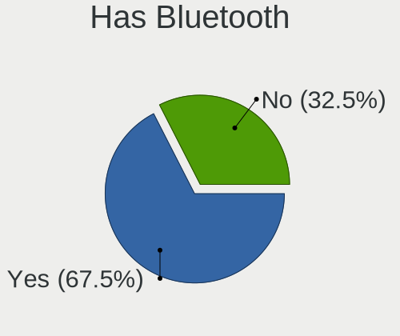
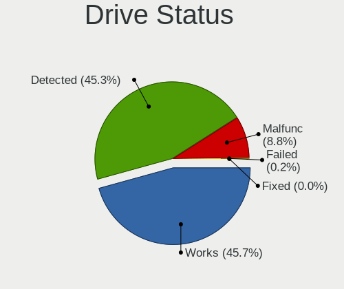
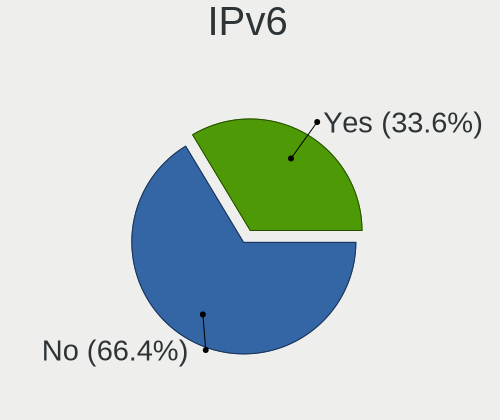
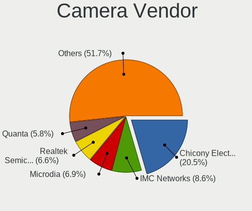

Linux - Hardware Trends
-----------------------

A project to identify most popular hardware characteristics and track their change
over time based on data collected by Linux users at https://Linux-Hardware.org.

Anyone can contribute to this report by the [hw-probe](https://github.com/linuxhw/hw-probe) tool:

    sudo -E hw-probe -all -upload

This is a report for all computer types. See also reports for [desktops](/Desktop/README.md) and [notebooks](/Notebook/README.md).

Distribution-specific reports: [Arch](/Dist/Arch), [ArcoLinux](/Dist/ArcoLinux), [BlackPanther](/Dist/BlackPanther), [CentOS](/Dist/CentOS), [Clear Linux](/Dist/Clear_Linux), [Debian](/Dist/Debian), [Elementary](/Dist/Elementary), [EndeavourOS](/Dist/EndeavourOS), [Endless](/Dist/Endless), [Fedora](/Dist/Fedora), [Garuda Linux](/Dist/Garuda_Linux), [Gentoo](/Dist/Gentoo), [Kali](/Dist/Kali), [KDE neon](/Dist/KDE_neon), [Kubuntu](/Dist/Kubuntu), [Linux Mint](/Dist/Linux_Mint), [Manjaro](/Dist/Manjaro), [OpenMandriva](/Dist/OpenMandriva), [openSUSE](/Dist/openSUSE), [Pop!_OS](/Dist/Pop!_OS), [Red OS](/Dist/Red_OS), [ROSA](/Dist/ROSA), [SteamOS](/Dist/SteamOS), [Ubuntu MATE](/Dist/Ubuntu_MATE), [Ubuntu](/Dist/Ubuntu), [Xubuntu](/Dist/Xubuntu), [Zorin](/Dist/Zorin).

This report is for one last month. Overall report since the beginning of time: [TestCoverage](https://github.com/linuxhw/TestCoverage)

Period: Dec, 2022.

Contents
--------

* [ System ](#system)
  - [ OS                       ](#os)
  - [ OS Family                ](#os-family)
  - [ Kernel                   ](#kernel)
  - [ Kernel Family            ](#kernel-family)
  - [ Kernel Major Ver.        ](#kernel-major-ver)
  - [ Arch                     ](#arch)
  - [ DE                       ](#de)
  - [ Display Server           ](#display-server)
  - [ Display Manager          ](#display-manager)
  - [ OS Lang                  ](#os-lang)
  - [ Boot Mode                ](#boot-mode)
  - [ Filesystem               ](#filesystem)
  - [ Part. scheme             ](#part-scheme)
  - [ Dual Boot with Linux/BSD ](#dual-boot-with-linuxbsd)
  - [ Dual Boot (Win)          ](#dual-boot-win)

* [ Board ](#board)
  - [ Vendor                   ](#vendor)
  - [ Model                    ](#model)
  - [ Model Family             ](#model-family)
  - [ MFG Year                 ](#mfg-year)
  - [ Form Factor              ](#form-factor)
  - [ Secure Boot              ](#secure-boot)
  - [ Coreboot                 ](#coreboot)
  - [ RAM Size                 ](#ram-size)
  - [ RAM Used                 ](#ram-used)
  - [ Total Drives             ](#total-drives)
  - [ Has CD-ROM               ](#has-cd-rom)
  - [ Has Ethernet             ](#has-ethernet)
  - [ Has WiFi                 ](#has-wifi)
  - [ Has Bluetooth            ](#has-bluetooth)

* [ Location ](#location)
  - [ Country                  ](#country)
  - [ City                     ](#city)

* [ Drives ](#drives)
  - [ Drive Vendor             ](#drive-vendor)
  - [ Drive Model              ](#drive-model)
  - [ HDD Vendor               ](#hdd-vendor)
  - [ SSD Vendor               ](#ssd-vendor)
  - [ Drive Kind               ](#drive-kind)
  - [ Drive Connector          ](#drive-connector)
  - [ Drive Size               ](#drive-size)
  - [ Space Total              ](#space-total)
  - [ Space Used               ](#space-used)
  - [ Malfunc. Drives          ](#malfunc-drives)
  - [ Malfunc. Drive Vendor    ](#malfunc-drive-vendor)
  - [ Malfunc. HDD Vendor      ](#malfunc-hdd-vendor)
  - [ Malfunc. Drive Kind      ](#malfunc-drive-kind)
  - [ Failed Drives            ](#failed-drives)
  - [ Failed Drive Vendor      ](#failed-drive-vendor)
  - [ Drive Status             ](#drive-status)

* [ Storage controller ](#storage-controller)
  - [ Storage Vendor           ](#storage-vendor)
  - [ Storage Model            ](#storage-model)
  - [ Storage Kind             ](#storage-kind)

* [ Processor ](#processor)
  - [ CPU Vendor               ](#cpu-vendor)
  - [ CPU Model                ](#cpu-model)
  - [ CPU Model Family         ](#cpu-model-family)
  - [ CPU Cores                ](#cpu-cores)
  - [ CPU Sockets              ](#cpu-sockets)
  - [ CPU Threads              ](#cpu-threads)
  - [ CPU Op-Modes             ](#cpu-op-modes)
  - [ CPU Microcode            ](#cpu-microcode)
  - [ CPU Microarch            ](#cpu-microarch)

* [ Graphics ](#graphics)
  - [ GPU Vendor               ](#gpu-vendor)
  - [ GPU Model                ](#gpu-model)
  - [ GPU Combo                ](#gpu-combo)
  - [ GPU Driver               ](#gpu-driver)
  - [ GPU Memory               ](#gpu-memory)

* [ Monitor ](#monitor)
  - [ Monitor Vendor           ](#monitor-vendor)
  - [ Monitor Model            ](#monitor-model)
  - [ Monitor Resolution       ](#monitor-resolution)
  - [ Monitor Diagonal         ](#monitor-diagonal)
  - [ Monitor Width            ](#monitor-width)
  - [ Aspect Ratio             ](#aspect-ratio)
  - [ Monitor Area             ](#monitor-area)
  - [ Pixel Density            ](#pixel-density)
  - [ Multiple Monitors        ](#multiple-monitors)

* [ Network ](#network)
  - [ Net Controller Vendor    ](#net-controller-vendor)
  - [ Net Controller Model     ](#net-controller-model)
  - [ Wireless Vendor          ](#wireless-vendor)
  - [ Wireless Model           ](#wireless-model)
  - [ Ethernet Vendor          ](#ethernet-vendor)
  - [ Ethernet Model           ](#ethernet-model)
  - [ Net Controller Kind      ](#net-controller-kind)
  - [ Used Controller          ](#used-controller)
  - [ NICs                     ](#nics)
  - [ IPv6                     ](#ipv6)

* [ Bluetooth ](#bluetooth)
  - [ Bluetooth Vendor         ](#bluetooth-vendor)
  - [ Bluetooth Model          ](#bluetooth-model)

* [ Sound ](#sound)
  - [ Sound Vendor             ](#sound-vendor)
  - [ Sound Model              ](#sound-model)

* [ Memory ](#memory)
  - [ Memory Vendor            ](#memory-vendor)
  - [ Memory Model             ](#memory-model)
  - [ Memory Kind              ](#memory-kind)
  - [ Memory Form Factor       ](#memory-form-factor)
  - [ Memory Size              ](#memory-size)
  - [ Memory Speed             ](#memory-speed)

* [ Printers & scanners ](#printers--scanners)
  - [ Printer Vendor           ](#printer-vendor)
  - [ Printer Model            ](#printer-model)
  - [ Scanner Vendor           ](#scanner-vendor)
  - [ Scanner Model            ](#scanner-model)

* [ Camera ](#camera)
  - [ Camera Vendor            ](#camera-vendor)
  - [ Camera Model             ](#camera-model)

* [ Security ](#security)
  - [ Fingerprint Vendor       ](#fingerprint-vendor)
  - [ Fingerprint Model        ](#fingerprint-model)
  - [ Chipcard Vendor          ](#chipcard-vendor)
  - [ Chipcard Model           ](#chipcard-model)

* [ Unsupported ](#unsupported)
  - [ Unsupported Devices      ](#unsupported-devices)
  - [ Unsupported Device Types ](#unsupported-device-types)

System
------

OS
--

Installed operating systems

| Name                         | Computers | Percent |
|------------------------------|-----------|---------|
| Ubuntu 22.04                 | 836       | 15.36%  |
| Fedora 37                    | 393       | 7.22%   |
| Debian 11                    | 311       | 5.71%   |
| Linux Mint 21                | 278       | 5.11%   |
| Pop!_OS 22.04                | 253       | 4.65%   |
| Ubuntu 22.10                 | 230       | 4.22%   |
| ROSA 12.3                    | 230       | 4.22%   |
| OpenMandriva 4.3             | 205       | 3.77%   |
| Arch Rolling                 | 193       | 3.55%   |
| Zorin 16                     | 181       | 3.32%   |
| Ubuntu 20.04                 | 171       | 3.14%   |
| Linux Mint 20.3              | 111       | 2.04%   |
| Linux Mint 21.1              | 107       | 1.97%   |
| Manjaro 22.0.0               | 93        | 1.71%   |
| KDE neon 22.04               | 88        | 1.62%   |
| Manjaro                      | 86        | 1.58%   |
| openSUSE Tumbleweed-XXXXXXXX | 73        | 1.34%   |
| Kubuntu 22.04                | 69        | 1.27%   |
| Kali 2022.4                  | 58        | 1.07%   |
| Gentoo 2.9                   | 57        | 1.05%   |
| OpenMandriva 22.12           | 54        | 0.99%   |
| Debian                       | 53        | 0.97%   |
| OpenMandriva 4.50            | 51        | 0.94%   |
| Xubuntu 22.04                | 50        | 0.92%   |
| Fedora 36                    | 47        | 0.86%   |
| Elementary 6.1               | 47        | 0.86%   |
| Nobara 36                    | 41        | 0.75%   |
| Kubuntu 22.10                | 41        | 0.75%   |
| EndeavourOS Rolling          | 39        | 0.72%   |
| ArcoLinux Rolling            | 39        | 0.72%   |
| Ubuntu 18.04                 | 35        | 0.64%   |
| LMDE 5                       | 30        | 0.55%   |
| BlackPanther 18.1            | 29        | 0.53%   |
| SteamOS 3.3.2                | 26        | 0.48%   |
| Ubuntu MATE 22.04            | 25        | 0.46%   |
| Lubuntu 22.04                | 22        | 0.4%    |
| SteamOS 3.4.2                | 21        | 0.39%   |
| Garuda Linux Soaring         | 21        | 0.39%   |
| MX 21                        | 20        | 0.37%   |
| ROSA R11.1                   | 18        | 0.33%   |

OS Family
---------

OS without a version

| Name          | Computers | Percent |
|---------------|-----------|---------|
| Ubuntu        | 1291      | 23.71%  |
| Linux Mint    | 538       | 9.88%   |
| Fedora        | 452       | 8.3%    |
| Debian        | 381       | 7%      |
| OpenMandriva  | 341       | 6.26%   |
| ROSA          | 271       | 4.98%   |
| Pop!_OS       | 260       | 4.78%   |
| Arch          | 193       | 3.55%   |
| Zorin         | 189       | 3.47%   |
| Manjaro       | 189       | 3.47%   |
| Kubuntu       | 130       | 2.39%   |
| SteamOS       | 99        | 1.82%   |
| openSUSE      | 94        | 1.73%   |
| KDE neon      | 91        | 1.67%   |
| Xubuntu       | 78        | 1.43%   |
| Kali          | 66        | 1.21%   |
| Gentoo        | 61        | 1.12%   |
| Elementary    | 52        | 0.96%   |
| Ubuntu MATE   | 47        | 0.86%   |
| ArcoLinux     | 43        | 0.79%   |
| Nobara        | 41        | 0.75%   |
| Lubuntu       | 40        | 0.73%   |
| EndeavourOS   | 39        | 0.72%   |
| Endless       | 31        | 0.57%   |
| LMDE          | 30        | 0.55%   |
| BlackPanther  | 29        | 0.53%   |
| Red OS        | 28        | 0.51%   |
| Garuda Linux  | 28        | 0.51%   |
| ALT Linux     | 23        | 0.42%   |
| Ubuntu Unity  | 21        | 0.39%   |
| MX            | 20        | 0.37%   |
| Ubuntu Budgie | 17        | 0.31%   |
| CentOS        | 17        | 0.31%   |
| NixOS         | 14        | 0.26%   |
| Parrot        | 12        | 0.22%   |
| Clear Linux   | 12        | 0.22%   |
| Raspbian      | 9         | 0.17%   |
| Slackware     | 8         | 0.15%   |
| Rocky Linux   | 8         | 0.15%   |
| Ubuntu Studio | 7         | 0.13%   |

Kernel
------

Version of the Linux kernel

| Version                             | Computers | Percent |
|-------------------------------------|-----------|---------|
| 5.15.0-56-generic                   | 1440      | 26.45%  |
| 5.19.0-26-generic                   | 215       | 3.95%   |
| 5.16.7-desktop-1omv4003             | 195       | 3.58%   |
| 6.0.6-76060006-generic              | 172       | 3.16%   |
| 5.4.0-135-generic                   | 143       | 2.63%   |
| 5.10.0-19-amd64                     | 116       | 2.13%   |
| 5.15.0-53-generic                   | 114       | 2.09%   |
| 6.0.12-300.fc37.x86_64              | 104       | 1.91%   |
| 5.10.0-20-amd64                     | 97        | 1.78%   |
| 5.15.79-generic-1rosa2021.1-x86_64  | 82        | 1.51%   |
| 5.15.75-generic-1rosa2021.1-x86_64  | 72        | 1.32%   |
| 6.0.11-300.fc37.x86_64              | 68        | 1.25%   |
| 6.0.15-300.fc37.x86_64              | 64        | 1.18%   |
| 6.0.12-arch1-1                      | 64        | 1.18%   |
| 6.0.12-76060006-generic             | 64        | 1.18%   |
| 5.15.0-43-generic                   | 62        | 1.14%   |
| 6.0.10-300.fc37.x86_64              | 58        | 1.07%   |
| 5.15.0-57-generic                   | 58        | 1.07%   |
| 6.0.10-desktop-2omv22090            | 53        | 0.97%   |
| 5.13.0-valve21.3-1-neptune          | 49        | 0.9%    |
| 6.1.1-arch1-1                       | 43        | 0.79%   |
| 5.15.81-1-MANJARO                   | 42        | 0.77%   |
| 5.13.0-valve36-1-neptune            | 38        | 0.7%    |
| 6.0.11-arch1-1                      | 37        | 0.68%   |
| 5.19.12-desktop-2omv4090            | 36        | 0.66%   |
| 5.15.0-41-generic                   | 34        | 0.62%   |
| 6.0.10-201.fc36.x86_64              | 32        | 0.59%   |
| 5.10.0-18-amd64                     | 32        | 0.59%   |
| 5.15.0-52-generic                   | 31        | 0.57%   |
| 6.0.0-kali3-amd64                   | 26        | 0.48%   |
| 6.1.1-1-MANJARO                     | 25        | 0.46%   |
| 6.0.14-300.fc37.x86_64              | 25        | 0.46%   |
| 6.0.12-1-default                    | 25        | 0.46%   |
| 6.0.0-5-amd64                       | 25        | 0.46%   |
| 5.10.155-generic-1rosa2021.1-x86_64 | 25        | 0.46%   |
| 6.0.10-arch2-1                      | 24        | 0.44%   |
| 6.0.0-0.deb11.2-amd64               | 24        | 0.44%   |
| 5.19.0-21-generic                   | 24        | 0.44%   |
| 5.11.0-35-generic                   | 23        | 0.42%   |
| 6.1.1-zen1-1-zen                    | 22        | 0.4%    |

Kernel Family
-------------

Linux kernel without a distro release

| Version  | Computers | Percent |
|----------|-----------|---------|
| 5.15.0   | 1820      | 33.43%  |
| 5.19.0   | 314       | 5.77%   |
| 5.10.0   | 298       | 5.47%   |
| 6.0.12   | 292       | 5.36%   |
| 6.0.10   | 234       | 4.3%    |
| 5.4.0    | 205       | 3.77%   |
| 5.16.7   | 196       | 3.6%    |
| 6.0.6    | 174       | 3.2%    |
| 6.0.0    | 174       | 3.2%    |
| 6.0.11   | 170       | 3.12%   |
| 5.13.0   | 117       | 2.15%   |
| 6.1.1    | 109       | 2%      |
| 5.15.75  | 91        | 1.67%   |
| 5.15.79  | 87        | 1.6%    |
| 6.1.0    | 78        | 1.43%   |
| 6.0.15   | 73        | 1.34%   |
| 6.0.9    | 62        | 1.14%   |
| 4.15.0   | 50        | 0.92%   |
| 5.15.81  | 47        | 0.86%   |
| 5.11.0   | 44        | 0.81%   |
| 6.0.8    | 42        | 0.77%   |
| 6.0.14   | 38        | 0.7%    |
| 5.19.12  | 38        | 0.7%    |
| 5.14.0   | 37        | 0.68%   |
| 5.15.80  | 34        | 0.62%   |
| 5.10.155 | 26        | 0.48%   |
| 6.0.7    | 25        | 0.46%   |
| 6.0.13   | 25        | 0.46%   |
| 5.15.78  | 23        | 0.42%   |
| 5.6.14   | 20        | 0.37%   |
| 5.18.0   | 18        | 0.33%   |
| 5.15.85  | 18        | 0.33%   |
| 5.15.74  | 17        | 0.31%   |
| 5.15.72  | 17        | 0.31%   |
| 5.8.0    | 15        | 0.28%   |
| 5.17.0   | 15        | 0.28%   |
| 5.15.76  | 15        | 0.28%   |
| 5.15.84  | 13        | 0.24%   |
| 5.15.77  | 13        | 0.24%   |
| 5.10.74  | 13        | 0.24%   |

Kernel Major Ver.
-----------------

Linux kernel major version

| Version | Computers | Percent |
|---------|-----------|---------|
| 5.15    | 2245      | 41.24%  |
| 6.0     | 1331      | 24.45%  |
| 5.19    | 400       | 7.35%   |
| 5.10    | 389       | 7.15%   |
| 5.4     | 216       | 3.97%   |
| 5.16    | 215       | 3.95%   |
| 6.1     | 187       | 3.43%   |
| 5.13    | 119       | 2.19%   |
| 4.15    | 51        | 0.94%   |
| 5.14    | 50        | 0.92%   |
| 5.11    | 49        | 0.9%    |
| 5.18    | 47        | 0.86%   |
| 5.17    | 38        | 0.7%    |
| 5.6     | 20        | 0.37%   |
| 4.18    | 19        | 0.35%   |
| 5.8     | 15        | 0.28%   |
| 3.10    | 13        | 0.24%   |
| 4.19    | 11        | 0.2%    |
| 4.4     | 8         | 0.15%   |
| 4.9     | 5         | 0.09%   |
| 5.3     | 4         | 0.07%   |
| 6.2     | 3         | 0.06%   |
| 5.0     | 3         | 0.06%   |
| 4.16    | 1         | 0.02%   |
| 4.14    | 1         | 0.02%   |
| 4.12    | 1         | 0.02%   |
| 4.10    | 1         | 0.02%   |
| 3.18    | 1         | 0.02%   |
| 3.16    | 1         | 0.02%   |

Arch
----

OS architecture (x86_64, i586, etc.)

| Name     | Computers | Percent |
|----------|-----------|---------|
| x86_64   | 5328      | 97.87%  |
| aarch64  | 53        | 0.97%   |
| i686     | 46        | 0.84%   |
| armv7l   | 11        | 0.2%    |
| riscv64  | 2         | 0.04%   |
| armv6l   | 2         | 0.04%   |
| e2k      | 1         | 0.02%   |
| armv5tel | 1         | 0.02%   |

DE
--

Desktop Environment

| Name                   | Computers | Percent |
|------------------------|-----------|---------|
| GNOME                  | 2415      | 44.36%  |
| KDE5                   | 1347      | 24.74%  |
| X-Cinnamon             | 477       | 8.76%   |
| XFCE                   | 390       | 7.16%   |
| Unknown                | 244       | 4.48%   |
| MATE                   | 166       | 3.05%   |
| LXQt                   | 88        | 1.62%   |
| Pantheon               | 48        | 0.88%   |
| Cinnamon               | 40        | 0.73%   |
| LXDE                   | 32        | 0.59%   |
| i3                     | 28        | 0.51%   |
| Budgie                 | 24        | 0.44%   |
| Unity                  | 20        | 0.37%   |
| KDE4                   | 18        | 0.33%   |
| sway                   | 13        | 0.24%   |
| KDE                    | 11        | 0.2%    |
| GNOME Classic          | 9         | 0.17%   |
| GNOME Flashback        | 8         | 0.15%   |
| awesome                | 7         | 0.13%   |
| openbox                | 6         | 0.11%   |
| Deepin                 | 6         | 0.11%   |
| bspwm                  | 5         | 0.09%   |
| Trinity                | 4         | 0.07%   |
| lightdm-xsession       | 4         | 0.07%   |
| Hyprland               | 4         | 0.07%   |
| Enlightenment          | 4         | 0.07%   |
| qtile                  | 3         | 0.06%   |
| LeftWM                 | 3         | 0.06%   |
| dwm                    | 3         | 0.06%   |
| icewm                  | 2         | 0.04%   |
| fluxbox                | 2         | 0.04%   |
| BunsenLabs             | 2         | 0.04%   |
| xmonad                 | 1         | 0.02%   |
| x-session-manager      | 1         | 0.02%   |
| X-Generic              | 1         | 0.02%   |
| UKUI                   | 1         | 0.02%   |
| Phosh:GNOME            | 1         | 0.02%   |
| i3-with-shmlog         | 1         | 0.02%   |
| herbstluftwm           | 1         | 0.02%   |
| graphite:Wayfire:GNOME | 1         | 0.02%   |

Display Server
--------------

X11 or Wayland

| Name        | Computers | Percent |
|-------------|-----------|---------|
| X11         | 3586      | 65.87%  |
| Wayland     | 1559      | 28.64%  |
| Tty         | 164       | 3.01%   |
| Unknown     | 131       | 2.41%   |
| Web         | 3         | 0.06%   |
| Unspecified | 1         | 0.02%   |

Display Manager
---------------

SDDM, LightDM, etc.

| Name    | Computers | Percent |
|---------|-----------|---------|
| Unknown | 1816      | 33.36%  |
| GDM3    | 1240      | 22.78%  |
| SDDM    | 996       | 18.3%   |
| LightDM | 804       | 14.77%  |
| GDM     | 534       | 9.81%   |
| KDM     | 19        | 0.35%   |
| XDM     | 12        | 0.22%   |
| LXDM    | 8         | 0.15%   |
| SLiM    | 5         | 0.09%   |
| TDM     | 3         | 0.06%   |
| Ly      | 2         | 0.04%   |
| GREETD  | 2         | 0.04%   |
| WDM     | 1         | 0.02%   |
| LDM     | 1         | 0.02%   |
| FLY-DM  | 1         | 0.02%   |

OS Lang
-------

Language

| Lang    | Computers | Percent |
|---------|-----------|---------|
| en_US   | 2357      | 43.3%   |
| ru_RU   | 511       | 9.39%   |
| de_DE   | 410       | 7.53%   |
| en_GB   | 260       | 4.78%   |
| fr_FR   | 242       | 4.45%   |
| pt_BR   | 205       | 3.77%   |
| it_IT   | 187       | 3.43%   |
| es_ES   | 111       | 2.04%   |
| Unknown | 101       | 1.86%   |
| en_CA   | 96        | 1.76%   |
| C       | 95        | 1.75%   |
| pl_PL   | 84        | 1.54%   |
| en_AU   | 80        | 1.47%   |
| en_IN   | 71        | 1.3%    |
| es_MX   | 42        | 0.77%   |
| nl_NL   | 35        | 0.64%   |
| hu_HU   | 30        | 0.55%   |
| zh_CN   | 28        | 0.51%   |
| de_AT   | 28        | 0.51%   |
| cs_CZ   | 28        | 0.51%   |
| pt_PT   | 23        | 0.42%   |
| es_AR   | 23        | 0.42%   |
| en_ZA   | 23        | 0.42%   |
| de_CH   | 19        | 0.35%   |
| sv_SE   | 18        | 0.33%   |
| tr_TR   | 17        | 0.31%   |
| en_NZ   | 15        | 0.28%   |
| en_SG   | 14        | 0.26%   |
| POSIX   | 13        | 0.24%   |
| ja_JP   | 13        | 0.24%   |
| fr_BE   | 13        | 0.24%   |
| nl_BE   | 12        | 0.22%   |
| ko_KR   | 12        | 0.22%   |
| da_DK   | 12        | 0.22%   |
| en_IE   | 11        | 0.2%    |
| fr_CA   | 10        | 0.18%   |
| es_CO   | 10        | 0.18%   |
| fi_FI   | 9         | 0.17%   |
| bg_BG   | 9         | 0.17%   |
| es_CL   | 8         | 0.15%   |

Boot Mode
---------

EFI or BIOS

| Mode | Computers | Percent |
|------|-----------|---------|
| EFI  | 2825      | 51.89%  |
| BIOS | 2619      | 48.11%  |

Filesystem
----------

Type of filesystem

| Type     | Computers | Percent |
|----------|-----------|---------|
| Ext4     | 3969      | 72.91%  |
| Btrfs    | 832       | 15.28%  |
| Overlay  | 448       | 8.23%   |
| Xfs      | 86        | 1.58%   |
| Zfs      | 63        | 1.16%   |
| F2fs     | 14        | 0.26%   |
| Tmpfs    | 10        | 0.18%   |
| Ext3     | 6         | 0.11%   |
| Reiserfs | 4         | 0.07%   |
| Ext2     | 4         | 0.07%   |
| Unknown  | 3         | 0.06%   |
| XXXXXXX  | 2         | 0.04%   |
| Rootfs   | 2         | 0.04%   |
| Aufs     | 1         | 0.02%   |

Part. scheme
------------

Scheme of partitioning

| Type    | Computers | Percent |
|---------|-----------|---------|
| GPT     | 3095      | 56.85%  |
| Unknown | 1591      | 29.22%  |
| MBR     | 758       | 13.92%  |

Dual Boot with Linux/BSD
------------------------

Hosting more than one Linux/BSD

| Dual boot | Computers | Percent |
|-----------|-----------|---------|
| No        | 4665      | 85.69%  |
| Yes       | 779       | 14.31%  |

Dual Boot (Win)
---------------

Hosting Linux and Windows

| Dual boot | Computers | Percent |
|-----------|-----------|---------|
| No        | 3890      | 71.45%  |
| Yes       | 1554      | 28.55%  |

Board
-----

Vendor
------

Motherboard manufacturer

| Name                    | Computers | Percent |
|-------------------------|-----------|---------|
| ASUSTek Computer        | 911       | 16.73%  |
| Lenovo                  | 771       | 14.16%  |
| Hewlett-Packard         | 700       | 12.86%  |
| Dell                    | 625       | 11.48%  |
| Gigabyte Technology     | 360       | 6.61%   |
| MSI                     | 331       | 6.08%   |
| Acer                    | 300       | 5.51%   |
| ASRock                  | 176       | 3.23%   |
| Apple                   | 132       | 2.42%   |
| Valve                   | 89        | 1.63%   |
| Intel                   | 86        | 1.58%   |
| Toshiba                 | 68        | 1.25%   |
| Unknown                 | 61        | 1.12%   |
| Samsung Electronics     | 59        | 1.08%   |
| HUAWEI                  | 58        | 1.07%   |
| Google                  | 43        | 0.79%   |
| Fujitsu                 | 35        | 0.64%   |
| Raspberry Pi Foundation | 32        | 0.59%   |
| Sony                    | 27        | 0.5%    |
| Supermicro              | 25        | 0.46%   |
| Pegatron                | 21        | 0.39%   |
| System76                | 17        | 0.31%   |
| Notebook                | 17        | 0.31%   |
| Microsoft               | 17        | 0.31%   |
| Medion                  | 17        | 0.31%   |
| Biostar                 | 17        | 0.31%   |
| Alienware               | 16        | 0.29%   |
| AZW                     | 15        | 0.28%   |
| Packard Bell            | 14        | 0.26%   |
| LG Electronics          | 14        | 0.26%   |
| GPU Company             | 14        | 0.26%   |
| Timi                    | 13        | 0.24%   |
| BESSTAR Tech            | 13        | 0.24%   |
| Positivo                | 12        | 0.22%   |
| Foxconn                 | 12        | 0.22%   |
| TUXEDO                  | 10        | 0.18%   |
| ECS                     | 9         | 0.17%   |
| Aquarius                | 9         | 0.17%   |
| Schenker                | 8         | 0.15%   |
| Clevo                   | 8         | 0.15%   |

Model
-----

Motherboard model

| Name                            | Computers | Percent |
|---------------------------------|-----------|---------|
| Valve Jupiter                   | 89        | 1.63%   |
| Unknown                         | 70        | 1.29%   |
| ASUS All Series                 | 37        | 0.68%   |
| ASUS TUF Gaming X570-PLUS       | 15        | 0.28%   |
| HP Notebook                     | 13        | 0.24%   |
| ASUS PRIME A320M-K              | 13        | 0.24%   |
| MSI MS-7C91                     | 12        | 0.22%   |
| MSI MS-7C56                     | 12        | 0.22%   |
| Dell OptiPlex 7010              | 12        | 0.22%   |
| Supermicro Super Server         | 10        | 0.18%   |
| HP Pavilion g6                  | 10        | 0.18%   |
| Dell Latitude E7440             | 10        | 0.18%   |
| Lenovo ThinkBook 15 G3 ACL 21A4 | 9         | 0.17%   |
| Dell OptiPlex 3010              | 9         | 0.17%   |
| ASUS ROG STRIX B550-F GAMING    | 9         | 0.17%   |
| ASUS PRIME B450M-A              | 9         | 0.17%   |
| Apple MacBookPro8,1             | 9         | 0.17%   |
| Dell OptiPlex 790               | 8         | 0.15%   |
| Dell OptiPlex 3020              | 8         | 0.15%   |
| Dell Latitude E6430             | 8         | 0.15%   |
| ASUS ROG STRIX B450-F GAMING    | 8         | 0.15%   |
| Lenovo IdeaPad 330-15IKB 81DE   | 7         | 0.13%   |
| HP Pavilion dv7                 | 7         | 0.13%   |
| HP Pavilion dv6                 | 7         | 0.13%   |
| HP Pavilion 15                  | 7         | 0.13%   |
| Gigabyte B450M DS3H             | 7         | 0.13%   |
| ASUS UX31E                      | 7         | 0.13%   |
| ASUS PRIME B550M-A              | 7         | 0.13%   |
| ASUS PRIME B450-PLUS            | 7         | 0.13%   |
| ASUS M5A97 R2.0                 | 7         | 0.13%   |
| Apple MacBookPro9,2             | 7         | 0.13%   |
| Apple MacBookAir7,2             | 7         | 0.13%   |
| MSI MS-7C37                     | 6         | 0.11%   |
| MSI MS-7C02                     | 6         | 0.11%   |
| MSI MS-7B86                     | 6         | 0.11%   |
| MSI MS-7B79                     | 6         | 0.11%   |
| MSI MS-7A34                     | 6         | 0.11%   |
| MSI MS-7817                     | 6         | 0.11%   |
| Lenovo Y520-15IKBN 80WK         | 6         | 0.11%   |
| Intel X99                       | 6         | 0.11%   |

Model Family
------------

Motherboard model prefix

| Name               | Computers | Percent |
|--------------------|-----------|---------|
| Lenovo ThinkPad    | 321       | 5.9%    |
| Acer Aspire        | 192       | 3.53%   |
| Dell Inspiron      | 174       | 3.2%    |
| Dell Latitude      | 147       | 2.7%    |
| Lenovo IdeaPad     | 143       | 2.63%   |
| ASUS PRIME         | 136       | 2.5%    |
| HP Pavilion        | 130       | 2.39%   |
| ASUS ROG           | 125       | 2.3%    |
| Dell OptiPlex      | 100       | 1.84%   |
| HP EliteBook       | 93        | 1.71%   |
| Valve Jupiter      | 89        | 1.63%   |
| ASUS VivoBook      | 79        | 1.45%   |
| Unknown            | 70        | 1.29%   |
| HP Laptop          | 66        | 1.21%   |
| Dell XPS           | 65        | 1.19%   |
| ASUS TUF           | 62        | 1.14%   |
| Toshiba Satellite  | 52        | 0.96%   |
| HP ProBook         | 52        | 0.96%   |
| HP Compaq          | 52        | 0.96%   |
| Lenovo ThinkCentre | 50        | 0.92%   |
| Dell Vostro        | 46        | 0.84%   |
| Dell Precision     | 43        | 0.79%   |
| Lenovo Yoga        | 39        | 0.72%   |
| Lenovo Legion      | 37        | 0.68%   |
| ASUS All           | 37        | 0.68%   |
| ASUS ZenBook       | 35        | 0.64%   |
| Lenovo ThinkBook   | 34        | 0.62%   |
| RPi Raspberry      | 32        | 0.59%   |
| HP ENVY            | 32        | 0.59%   |
| Acer Nitro         | 30        | 0.55%   |
| ASUS ASUS          | 29        | 0.53%   |
| Acer Swift         | 25        | 0.46%   |
| HP EliteDesk       | 22        | 0.4%    |
| HP ZBook           | 21        | 0.39%   |
| HP Spectre         | 19        | 0.35%   |
| HP ProLiant        | 18        | 0.33%   |
| HP ProDesk         | 18        | 0.33%   |
| Microsoft Surface  | 17        | 0.31%   |
| Gigabyte B550      | 17        | 0.31%   |
| Lenovo IdeaPadFlex | 16        | 0.29%   |

MFG Year
--------

Motherboard manufacture year

| Year    | Computers | Percent |
|---------|-----------|---------|
| 2021    | 680       | 12.49%  |
| 2022    | 571       | 10.49%  |
| 2020    | 519       | 9.53%   |
| 2019    | 468       | 8.6%    |
| 2018    | 440       | 8.08%   |
| 2012    | 369       | 6.78%   |
| 2013    | 356       | 6.54%   |
| 2017    | 350       | 6.43%   |
| 2011    | 297       | 5.46%   |
| 2015    | 248       | 4.56%   |
| 2014    | 246       | 4.52%   |
| 2010    | 228       | 4.19%   |
| 2016    | 208       | 3.82%   |
| 2009    | 161       | 2.96%   |
| 2008    | 129       | 2.37%   |
| 2007    | 70        | 1.29%   |
| Unknown | 61        | 1.12%   |
| 2006    | 29        | 0.53%   |
| 2005    | 9         | 0.17%   |
| 2004    | 4         | 0.07%   |
| 2002    | 1         | 0.02%   |

Form Factor
-----------

Physical design of the computer

| Name           | Computers | Percent |
|----------------|-----------|---------|
| Notebook       | 2920      | 53.64%  |
| Desktop        | 2014      | 36.99%  |
| Convertible    | 171       | 3.14%   |
| Mini pc        | 91        | 1.67%   |
| All in one     | 88        | 1.62%   |
| System on chip | 54        | 0.99%   |
| Server         | 53        | 0.97%   |
| Tablet         | 48        | 0.88%   |
| Phone          | 4         | 0.07%   |
| Other          | 1         | 0.02%   |

Secure Boot
-----------

Enabled or disabled

| State    | Computers | Percent |
|----------|-----------|---------|
| Disabled | 5067      | 93.07%  |
| Enabled  | 377       | 6.93%   |

Coreboot
--------

Have coreboot on board

| Used | Computers | Percent |
|------|-----------|---------|
| No   | 5389      | 98.99%  |
| Yes  | 55        | 1.01%   |

RAM Size
--------

Total RAM memory

| Size in GB      | Computers | Percent |
|-----------------|-----------|---------|
| 4.01-8.0        | 1216      | 22.34%  |
| 16.01-24.0      | 1152      | 21.16%  |
| 8.01-16.0       | 1053      | 19.34%  |
| 3.01-4.0        | 841       | 15.45%  |
| 32.01-64.0      | 638       | 11.72%  |
| 64.01-256.0     | 190       | 3.49%   |
| 1.01-2.0        | 141       | 2.59%   |
| 24.01-32.0      | 121       | 2.22%   |
| 2.01-3.0        | 55        | 1.01%   |
| 0.51-1.0        | 26        | 0.48%   |
| More than 256.0 | 7         | 0.13%   |
| 0.01-0.5        | 4         | 0.07%   |

RAM Used
--------

Used RAM memory

| Used GB     | Computers | Percent |
|-------------|-----------|---------|
| 1.01-2.0    | 1578      | 28.99%  |
| 2.01-3.0    | 1374      | 25.24%  |
| 4.01-8.0    | 937       | 17.21%  |
| 3.01-4.0    | 815       | 14.97%  |
| 0.51-1.0    | 324       | 5.95%   |
| 8.01-16.0   | 279       | 5.12%   |
| 0.01-0.5    | 70        | 1.29%   |
| 16.01-24.0  | 44        | 0.81%   |
| 32.01-64.0  | 10        | 0.18%   |
| 24.01-32.0  | 8         | 0.15%   |
| 64.01-256.0 | 3         | 0.06%   |
| 0           | 1         | 0.02%   |
| Unknown     | 1         | 0.02%   |

Total Drives
------------

Number of drives on board

| Drives | Computers | Percent |
|--------|-----------|---------|
| 1      | 3229      | 59.31%  |
| 2      | 1374      | 25.24%  |
| 3      | 388       | 7.13%   |
| 4      | 220       | 4.04%   |
| 5      | 103       | 1.89%   |
| 6      | 42        | 0.77%   |
| 7      | 25        | 0.46%   |
| 0      | 23        | 0.42%   |
| 8      | 13        | 0.24%   |
| 9      | 8         | 0.15%   |
| 10     | 4         | 0.07%   |
| 13     | 3         | 0.06%   |
| 21     | 2         | 0.04%   |
| 12     | 2         | 0.04%   |
| 11     | 2         | 0.04%   |
| 32     | 1         | 0.02%   |
| 26     | 1         | 0.02%   |
| 23     | 1         | 0.02%   |
| 20     | 1         | 0.02%   |
| 18     | 1         | 0.02%   |
| 17     | 1         | 0.02%   |

Has CD-ROM
----------

Has CD-ROM on board

| Presented | Computers | Percent |
|-----------|-----------|---------|
| No        | 3756      | 68.99%  |
| Yes       | 1688      | 31.01%  |

Has Ethernet
------------

Has Ethernet on board

| Presented | Computers | Percent |
|-----------|-----------|---------|
| Yes       | 4526      | 83.14%  |
| No        | 918       | 16.86%  |

Has WiFi
--------

Has WiFi module

| Presented | Computers | Percent |
|-----------|-----------|---------|
| Yes       | 4187      | 76.91%  |
| No        | 1257      | 23.09%  |

Has Bluetooth
-------------

Has Bluetooth module

| Presented | Computers | Percent |
|-----------|-----------|---------|
| Yes       | 3514      | 64.55%  |
| No        | 1930      | 35.45%  |

Location
--------

Country
-------

Geographic location (country)

| Country      | Computers | Percent |
|--------------|-----------|---------|
| USA          | 1003      | 18.42%  |
| Russia       | 598       | 10.98%  |
| Germany      | 568       | 10.43%  |
| France       | 300       | 5.51%   |
| Italy        | 281       | 5.16%   |
| Brazil       | 267       | 4.9%    |
| UK           | 190       | 3.49%   |
| Canada       | 173       | 3.18%   |
| Spain        | 150       | 2.76%   |
| Poland       | 137       | 2.52%   |
| India        | 102       | 1.87%   |
| Netherlands  | 100       | 1.84%   |
| Australia    | 96        | 1.76%   |
| Hungary      | 77        | 1.41%   |
| Mexico       | 68        | 1.25%   |
| Sweden       | 62        | 1.14%   |
| Switzerland  | 57        | 1.05%   |
| Belgium      | 55        | 1.01%   |
| Austria      | 54        | 0.99%   |
| Czechia      | 51        | 0.94%   |
| Indonesia    | 47        | 0.86%   |
| Romania      | 44        | 0.81%   |
| Greece       | 41        | 0.75%   |
| China        | 41        | 0.75%   |
| Turkey       | 40        | 0.73%   |
| Argentina    | 39        | 0.72%   |
| Portugal     | 38        | 0.7%    |
| Finland      | 35        | 0.64%   |
| Denmark      | 35        | 0.64%   |
| Bulgaria     | 34        | 0.62%   |
| Japan        | 30        | 0.55%   |
| South Africa | 28        | 0.51%   |
| Belarus      | 28        | 0.51%   |
| Serbia       | 25        | 0.46%   |
| Norway       | 25        | 0.46%   |
| South Korea  | 24        | 0.44%   |
| Slovakia     | 22        | 0.4%    |
| New Zealand  | 22        | 0.4%    |
| Ukraine      | 18        | 0.33%   |
| Taiwan       | 18        | 0.33%   |

City
----

Geographic location (city)

| City              | Computers | Percent |
|-------------------|-----------|---------|
| Moscow            | 144       | 2.65%   |
| St Petersburg     | 55        | 1.01%   |
| Berlin            | 49        | 0.9%    |
| Milan             | 47        | 0.86%   |
| Paris             | 43        | 0.79%   |
| Warsaw            | 36        | 0.66%   |
| London            | 36        | 0.66%   |
| Hamburg           | 36        | 0.66%   |
| Madrid            | 32        | 0.59%   |
| Vienna            | 31        | 0.57%   |
| Bangor            | 30        | 0.55%   |
| Melbourne         | 27        | 0.5%    |
| Voronezh          | 26        | 0.48%   |
| Sao Paulo         | 25        | 0.46%   |
| Seattle           | 24        | 0.44%   |
| Rome              | 23        | 0.42%   |
| Munich            | 23        | 0.42%   |
| Krasnodar         | 23        | 0.42%   |
| Brisbane          | 23        | 0.42%   |
| Sydney            | 22        | 0.4%    |
| Novosibirsk       | 22        | 0.4%    |
| Frankfurt am Main | 21        | 0.39%   |
| Amsterdam         | 21        | 0.39%   |
| Budapest          | 20        | 0.37%   |
| Prague            | 19        | 0.35%   |
| Sofia             | 18        | 0.33%   |
| Helsinki          | 17        | 0.31%   |
| Yekaterinburg     | 16        | 0.29%   |
| Toronto           | 16        | 0.29%   |
| Istanbul          | 16        | 0.29%   |
| Chicago           | 16        | 0.29%   |
| Bengaluru         | 16        | 0.29%   |
| New York          | 15        | 0.28%   |
| Lisbon            | 14        | 0.26%   |
| Athens            | 14        | 0.26%   |
| Stuttgart         | 13        | 0.24%   |
| Stockholm         | 13        | 0.24%   |
| Singapore         | 13        | 0.24%   |
| San Antonio       | 13        | 0.24%   |
| Rio de Janeiro    | 13        | 0.24%   |

Drives
------

Drive Vendor
------------

Hard drive vendors

| Vendor                      | Computers | Drives | Percent |
|-----------------------------|-----------|--------|---------|
| Samsung Electronics         | 1369      | 1681   | 16.87%  |
| WDC                         | 1059      | 1349   | 13.05%  |
| Seagate                     | 963       | 1252   | 11.87%  |
| Toshiba                     | 463       | 529    | 5.71%   |
| SanDisk                     | 461       | 502    | 5.68%   |
| Kingston                    | 453       | 489    | 5.58%   |
| Unknown                     | 356       | 400    | 4.39%   |
| Crucial                     | 298       | 333    | 3.67%   |
| Intel                       | 221       | 251    | 2.72%   |
| SK hynix                    | 218       | 225    | 2.69%   |
| Hitachi                     | 198       | 228    | 2.44%   |
| Micron Technology           | 147       | 150    | 1.81%   |
| A-DATA Technology           | 146       | 150    | 1.8%    |
| HGST                        | 111       | 140    | 1.37%   |
| Phison Electronics          | 109       | 116    | 1.34%   |
| China                       | 98        | 103    | 1.21%   |
| KIOXIA                      | 76        | 76     | 0.94%   |
| Kingston Technology Company | 71        | 72     | 0.87%   |
| Unknown                     | 64        | 68     | 0.79%   |
| Silicon Motion              | 58        | 59     | 0.71%   |
| Apple                       | 58        | 64     | 0.71%   |
| SPCC                        | 56        | 58     | 0.69%   |
| Micron/Crucial Technology   | 45        | 46     | 0.55%   |
| Intenso                     | 45        | 48     | 0.55%   |
| PNY                         | 44        | 47     | 0.54%   |
| Phison                      | 35        | 39     | 0.43%   |
| Apacer                      | 35        | 36     | 0.43%   |
| ADATA Technology            | 35        | 38     | 0.43%   |
| Patriot                     | 31        | 31     | 0.38%   |
| JMicron Technology          | 29        | 32     | 0.36%   |
| Netac                       | 27        | 30     | 0.33%   |
| Team                        | 25        | 26     | 0.31%   |
| GOODRAM                     | 25        | 25     | 0.31%   |
| Transcend                   | 24        | 24     | 0.3%    |
| LITEON                      | 22        | 22     | 0.27%   |
| Hewlett-Packard             | 21        | 25     | 0.26%   |
| Corsair                     | 21        | 26     | 0.26%   |
| AMD                         | 21        | 22     | 0.26%   |
| OCZ                         | 19        | 20     | 0.23%   |
| Maxtor                      | 19        | 20     | 0.23%   |

Drive Model
-----------

Hard drive models

| Model                                                  | Computers | Percent |
|--------------------------------------------------------|-----------|---------|
| Samsung NVMe SSD Controller SM981/PM981/PM983 500GB    | 197       | 2.22%   |
| Kingston SA400S37240G 240GB SSD                        | 127       | 1.43%   |
| Samsung NVMe SSD Controller PM9A1/PM9A3/980PRO 2TB     | 96        | 1.08%   |
| Unknown                                                | 64        | 0.72%   |
| Kingston SA400S37480G 480GB SSD                        | 56        | 0.63%   |
| Unknown MMC Card  32GB                                 | 55        | 0.62%   |
| Seagate ST1000DM010-2EP102 1TB                         | 53        | 0.6%    |
| Seagate ST500DM002-1BD142 500GB                        | 51        | 0.57%   |
| Samsung SSD 860 EVO 500GB                              | 51        | 0.57%   |
| Samsung SSD 850 EVO 250GB                              | 49        | 0.55%   |
| Seagate ST1000LM035-1RK172 1TB                         | 45        | 0.51%   |
| Unknown MMC Card  128GB                                | 44        | 0.5%    |
| Unknown MMC Card  64GB                                 | 42        | 0.47%   |
| Seagate ST2000DM008-2FR102 2TB                         | 42        | 0.47%   |
| Samsung SSD 850 EVO 500GB                              | 42        | 0.47%   |
| Phison PS5013 E13 NVMe Controller 512GB                | 42        | 0.47%   |
| Toshiba MQ01ABF050 500GB                               | 40        | 0.45%   |
| WDC WD10EZEX-08WN4A0 1TB                               | 39        | 0.44%   |
| Crucial CT240BX500SSD1 240GB                           | 39        | 0.44%   |
| Crucial CT1000MX500SSD1 1TB                            | 39        | 0.44%   |
| Samsung NVMe SSD Controller SM961/PM961/SM963 256GB    | 38        | 0.43%   |
| Kingston SA400S37120G 120GB SSD                        | 38        | 0.43%   |
| Toshiba MQ01ABD100 1TB                                 | 37        | 0.42%   |
| Sandisk WD Black SN750 / PC SN730 NVMe SSD 512GB       | 37        | 0.42%   |
| Samsung SSD 860 EVO 1TB                                | 35        | 0.39%   |
| Kingston Company OM3PDP3 NVMe SSD 512GB                | 35        | 0.39%   |
| Unknown SD/MMC/MS PRO 64GB                             | 34        | 0.38%   |
| Seagate ST1000LM024 HN-M101MBB 1TB                     | 34        | 0.38%   |
| Toshiba DT01ACA100 1TB                                 | 33        | 0.37%   |
| Phison E12 NVMe Controller 1TB                         | 33        | 0.37%   |
| Crucial CT500MX500SSD1 500GB                           | 32        | 0.36%   |
| Silicon Motion SM2263EN/SM2263XT SSD Controller 1024GB | 31        | 0.35%   |
| Samsung SSD 980 1TB                                    | 31        | 0.35%   |
| Intel SSD 660P Series 1024GB                           | 31        | 0.35%   |
| Micron/Crucial P2 NVMe PCIe SSD 500GB                  | 30        | 0.34%   |
| Toshiba MQ04ABF100 1TB                                 | 29        | 0.33%   |
| Sandisk WD Blue SN550 NVMe SSD 500GB                   | 29        | 0.33%   |
| Seagate ST500LT012-1DG142 500GB                        | 27        | 0.3%    |
| Samsung SSD 870 EVO 500GB                              | 27        | 0.3%    |
| Samsung SSD 980 500GB                                  | 26        | 0.29%   |

HDD Vendor
----------

Hard disk drive vendors

| Vendor              | Computers | Drives | Percent |
|---------------------|-----------|--------|---------|
| Seagate             | 936       | 1209   | 34.81%  |
| WDC                 | 841       | 1075   | 31.28%  |
| Toshiba             | 352       | 409    | 13.09%  |
| Hitachi             | 198       | 228    | 7.36%   |
| HGST                | 110       | 138    | 4.09%   |
| Samsung Electronics | 109       | 120    | 4.05%   |
| Unknown             | 37        | 38     | 1.38%   |
| Apple               | 21        | 21     | 0.78%   |
| Maxtor              | 19        | 20     | 0.71%   |
| Fujitsu             | 14        | 15     | 0.52%   |
| ASMT                | 9         | 11     | 0.33%   |
| Intenso             | 8         | 8      | 0.3%    |
| USB3.0              | 5         | 5      | 0.19%   |
| HGST HTS            | 4         | 4      | 0.15%   |
| Hewlett-Packard     | 4         | 7      | 0.15%   |
| JMicron Technology  | 3         | 5      | 0.11%   |
| ASMedia             | 3         | 3      | 0.11%   |
| Pioneer             | 2         | 2      | 0.07%   |
| PHD 3.0             | 2         | 2      | 0.07%   |
| WD MediaMax         | 1         | 1      | 0.04%   |
| USB 3.0             | 1         | 1      | 0.04%   |
| StoreJet            | 1         | 1      | 0.04%   |
| SABRENT             | 1         | 1      | 0.04%   |
| RSH-339             | 1         | 1      | 0.04%   |
| QEMU                | 1         | 1      | 0.04%   |
| MARSHAL             | 1         | 1      | 0.04%   |
| LaCie               | 1         | 1      | 0.04%   |
| HPE                 | 1         | 1      | 0.04%   |
| External            | 1         | 1      | 0.04%   |
| AFAYA               | 1         | 1      | 0.04%   |
| Unknown             | 1         | 2      | 0.04%   |

SSD Vendor
----------

Solid state drive vendors

| Vendor              | Computers | Drives | Percent |
|---------------------|-----------|--------|---------|
| Samsung Electronics | 553       | 651    | 21%     |
| Kingston            | 342       | 371    | 12.99%  |
| Crucial             | 266       | 298    | 10.1%   |
| SanDisk             | 232       | 247    | 8.81%   |
| WDC                 | 150       | 156    | 5.7%    |
| A-DATA Technology   | 113       | 116    | 4.29%   |
| China               | 98        | 103    | 3.72%   |
| Intel               | 59        | 62     | 2.24%   |
| SPCC                | 49        | 50     | 1.86%   |
| Toshiba             | 44        | 45     | 1.67%   |
| Micron Technology   | 44        | 45     | 1.67%   |
| PNY                 | 39        | 41     | 1.48%   |
| SK hynix            | 35        | 35     | 1.33%   |
| Apacer              | 30        | 31     | 1.14%   |
| Intenso             | 28        | 30     | 1.06%   |
| Patriot             | 27        | 27     | 1.03%   |
| GOODRAM             | 25        | 25     | 0.95%   |
| Unknown             | 24        | 26     | 0.91%   |
| Apple               | 23        | 23     | 0.87%   |
| Netac               | 22        | 23     | 0.84%   |
| Team                | 21        | 22     | 0.8%    |
| Transcend           | 20        | 20     | 0.76%   |
| OCZ                 | 19        | 20     | 0.72%   |
| LITEON              | 19        | 19     | 0.72%   |
| KingSpec            | 18        | 18     | 0.68%   |
| AMD                 | 16        | 16     | 0.61%   |
| JMicron Technology  | 14        | 14     | 0.53%   |
| Hewlett-Packard     | 13        | 14     | 0.49%   |
| Gigabyte Technology | 12        | 13     | 0.46%   |
| Corsair             | 12        | 14     | 0.46%   |
| Verbatim            | 11        | 11     | 0.42%   |
| Lexar               | 11        | 11     | 0.42%   |
| Seagate             | 10        | 11     | 0.38%   |
| LITEONIT            | 10        | 10     | 0.38%   |
| Plextor             | 9         | 9      | 0.34%   |
| TO Exter            | 8         | 8      | 0.3%    |
| NGFF                | 7         | 7      | 0.27%   |
| KingFast            | 7         | 7      | 0.27%   |
| FORESEE             | 7         | 7      | 0.27%   |
| Dogfish             | 7         | 7      | 0.27%   |

Drive Kind
----------

HDD or SSD

| Kind    | Computers | Drives | Percent |
|---------|-----------|--------|---------|
| NVMe    | 2305      | 2703   | 31.57%  |
| SSD     | 2277      | 2856   | 31.18%  |
| HDD     | 2250      | 3333   | 30.81%  |
| MMC     | 338       | 371    | 4.63%   |
| Unknown | 132       | 160    | 1.81%   |

Drive Connector
---------------

SATA, SAS, NVMe, etc.

| Type | Computers | Drives | Percent |
|------|-----------|--------|---------|
| SATA | 3614      | 5884   | 54.77%  |
| NVMe | 2299      | 2686   | 34.84%  |
| SAS  | 347       | 482    | 5.26%   |
| MMC  | 338       | 371    | 5.12%   |

Drive Size
----------

Size of hard drive

| Size in TB | Computers | Drives | Percent |
|------------|-----------|--------|---------|
| 0.01-0.5   | 2648      | 3380   | 55.54%  |
| 0.51-1.0   | 1326      | 1623   | 27.81%  |
| 1.01-2.0   | 402       | 538    | 8.43%   |
| 3.01-4.0   | 159       | 224    | 3.33%   |
| 4.01-10.0  | 126       | 239    | 2.64%   |
| 2.01-3.0   | 87        | 139    | 1.82%   |
| 10.01-20.0 | 19        | 45     | 0.4%    |
| 0          | 1         | 1      | 0.02%   |

Space Total
-----------

Amount of disk space available on the file system

| Size in GB     | Computers | Percent |
|----------------|-----------|---------|
| 101-250        | 1369      | 25.15%  |
| 251-500        | 1212      | 22.26%  |
| 501-1000       | 818       | 15.03%  |
| 1001-2000      | 454       | 8.34%   |
| 1-20           | 395       | 7.26%   |
| More than 3000 | 348       | 6.39%   |
| 51-100         | 307       | 5.64%   |
| Unknown        | 214       | 3.93%   |
| 21-50          | 180       | 3.31%   |
| 2001-3000      | 147       | 2.7%    |

Space Used
----------

Amount of used disk space

| Used GB        | Computers | Percent |
|----------------|-----------|---------|
| 1-20           | 1859      | 34.15%  |
| 21-50          | 913       | 16.77%  |
| 101-250        | 725       | 13.32%  |
| 51-100         | 629       | 11.55%  |
| 251-500        | 440       | 8.08%   |
| 501-1000       | 305       | 5.6%    |
| Unknown        | 214       | 3.93%   |
| 1001-2000      | 180       | 3.31%   |
| More than 3000 | 114       | 2.09%   |
| 2001-3000      | 63        | 1.16%   |
| 0              | 2         | 0.04%   |

Malfunc. Drives
---------------

Drive models with a malfunction

| Model                                    | Computers | Drives | Percent |
|------------------------------------------|-----------|--------|---------|
| Seagate ST500DM002-1BD142 500GB          | 10        | 13     | 1.76%   |
| Seagate ST9500325AS 500GB                | 8         | 8      | 1.41%   |
| Toshiba MQ01ABD075 752GB                 | 6         | 6      | 1.05%   |
| Seagate ST500LT012-9WS142 500GB          | 6         | 6      | 1.05%   |
| Seagate ST500LT012-1DG142 500GB          | 6         | 6      | 1.05%   |
| Seagate ST1000LM035-1RK172 1TB           | 6         | 6      | 1.05%   |
| WDC WDS240G2G0A-00JH30 240GB SSD         | 5         | 5      | 0.88%   |
| HGST HTS545050A7E680 500GB               | 5         | 5      | 0.88%   |
| HGST HTS545050A7E380 500GB               | 5         | 5      | 0.88%   |
| Seagate ST3500418AS 500GB                | 4         | 4      | 0.7%    |
| Seagate ST3320613AS 320GB                | 4         | 4      | 0.7%    |
| Seagate ST1000LM024 HN-M101MBB 1TB       | 4         | 4      | 0.7%    |
| Seagate ST1000DM010-2EP102 1TB           | 4         | 4      | 0.7%    |
| Seagate ST1000DM003-9YN162 1TB           | 4         | 4      | 0.7%    |
| SanDisk SSD U100 256GB                   | 4         | 4      | 0.7%    |
| SanDisk SSD PLUS 240GB                   | 4         | 4      | 0.7%    |
| WDC WD5000AAKX-60U6AA0 500GB             | 3         | 3      | 0.53%   |
| WDC WD2500AAKX-00ERMA0 250GB             | 3         | 3      | 0.53%   |
| WDC WD20EARX-00PASB0 2TB                 | 3         | 3      | 0.53%   |
| Toshiba MQ01ABF050 500GB                 | 3         | 3      | 0.53%   |
| Toshiba MQ01ABD100 1TB                   | 3         | 3      | 0.53%   |
| Seagate ST9320325AS 320GB                | 3         | 3      | 0.53%   |
| Seagate ST500LM021-1KJ152 500GB          | 3         | 3      | 0.53%   |
| Seagate ST2000LM007-1R8174 2TB           | 3         | 3      | 0.53%   |
| Seagate ST2000DM006-2DM164 2TB           | 3         | 3      | 0.53%   |
| Seagate ST1000DM003-1ER162 1TB           | 3         | 3      | 0.53%   |
| SanDisk SSD PLUS 480GB                   | 3         | 3      | 0.53%   |
| Samsung Electronics SSD 870 EVO 500GB    | 3         | 3      | 0.53%   |
| Samsung Electronics SSD 840 Series 120GB | 3         | 3      | 0.53%   |
| Samsung Electronics HD103SI 1TB          | 3         | 3      | 0.53%   |
| Kingston SV300S37A120G 120GB SSD         | 3         | 3      | 0.53%   |
| Hitachi HDS721616PLA380 160GB            | 3         | 3      | 0.53%   |
| HGST HTS725050A7E630 500GB               | 3         | 6      | 0.53%   |
| HGST HTS541010A9E680 1TB                 | 3         | 3      | 0.53%   |
| WDC WDS120G2G0A-00JH30 120GB SSD         | 2         | 2      | 0.35%   |
| WDC WD800JD-08LSA0 80GB                  | 2         | 2      | 0.35%   |
| WDC WD6400AAKS-65A7B0 640GB              | 2         | 2      | 0.35%   |
| WDC WD5000BEVT-22A0RT0 500GB             | 2         | 2      | 0.35%   |
| WDC WD5000AAKX-22ERMA0 500GB             | 2         | 2      | 0.35%   |
| WDC WD5000AAKX-001CA0 500GB              | 2         | 3      | 0.35%   |

Malfunc. Drive Vendor
---------------------

Vendors of faulty drives

| Vendor                | Computers | Drives | Percent |
|-----------------------|-----------|--------|---------|
| Seagate               | 140       | 150    | 25.36%  |
| WDC                   | 126       | 142    | 22.83%  |
| Samsung Electronics   | 49        | 54     | 8.88%   |
| Toshiba               | 46        | 51     | 8.33%   |
| Hitachi               | 37        | 38     | 6.7%    |
| SanDisk               | 18        | 18     | 3.26%   |
| Kingston              | 16        | 16     | 2.9%    |
| HGST                  | 16        | 22     | 2.9%    |
| Intel                 | 15        | 15     | 2.72%   |
| Crucial               | 13        | 13     | 2.36%   |
| A-DATA Technology     | 13        | 13     | 2.36%   |
| SK hynix              | 8         | 8      | 1.45%   |
| Micron Technology     | 7         | 7      | 1.27%   |
| Maxtor                | 5         | 6      | 0.91%   |
| Corsair               | 3         | 3      | 0.54%   |
| China                 | 3         | 3      | 0.54%   |
| XrayDisk              | 2         | 2      | 0.36%   |
| Realtek Semiconductor | 2         | 2      | 0.36%   |
| Intenso               | 2         | 2      | 0.36%   |
| Apple                 | 2         | 2      | 0.36%   |
| AMD                   | 2         | 2      | 0.36%   |
| Unknown               | 2         | 2      | 0.36%   |
| XPG                   | 1         | 1      | 0.18%   |
| USB3.0                | 1         | 1      | 0.18%   |
| SSSTC                 | 1         | 1      | 0.18%   |
| SPCC                  | 1         | 1      | 0.18%   |
| ShiJi                 | 1         | 1      | 0.18%   |
| RX7                   | 1         | 1      | 0.18%   |
| R580                  | 1         | 1      | 0.18%   |
| Patriot               | 1         | 1      | 0.18%   |
| OSCOO                 | 1         | 1      | 0.18%   |
| OCZ-VERTEX3           | 1         | 1      | 0.18%   |
| NGFF                  | 1         | 1      | 0.18%   |
| Neo                   | 1         | 1      | 0.18%   |
| LITEONIT              | 1         | 1      | 0.18%   |
| LITEON                | 1         | 1      | 0.18%   |
| LaCie                 | 1         | 1      | 0.18%   |
| KingSpec              | 1         | 1      | 0.18%   |
| HGST HTS              | 1         | 1      | 0.18%   |
| GLOWAY                | 1         | 1      | 0.18%   |

Malfunc. HDD Vendor
-------------------

Vendors of faulty HDD drives

| Vendor              | Computers | Drives | Percent |
|---------------------|-----------|--------|---------|
| Seagate             | 140       | 150    | 36.46%  |
| WDC                 | 117       | 132    | 30.47%  |
| Toshiba             | 39        | 44     | 10.16%  |
| Hitachi             | 37        | 38     | 9.64%   |
| Samsung Electronics | 23        | 24     | 5.99%   |
| HGST                | 16        | 22     | 4.17%   |
| Maxtor              | 5         | 6      | 1.3%    |
| Apple               | 2         | 2      | 0.52%   |
| USB3.0              | 1         | 1      | 0.26%   |
| LaCie               | 1         | 1      | 0.26%   |
| HGST HTS            | 1         | 1      | 0.26%   |
| Fujitsu             | 1         | 1      | 0.26%   |
| ASMT                | 1         | 1      | 0.26%   |

Malfunc. Drive Kind
-------------------

Kinds of faulty drives

| Kind | Computers | Drives | Percent |
|------|-----------|--------|---------|
| HDD  | 365       | 423    | 68.61%  |
| SSD  | 137       | 142    | 25.75%  |
| NVMe | 30        | 32     | 5.64%   |

Failed Drives
-------------

Failed drive models

| Model                             | Computers | Drives | Percent |
|-----------------------------------|-----------|--------|---------|
| Samsung Electronics SSD 980 1TB   | 3         | 3      | 16.67%  |
| WDC WD800JB-00FMA0 80GB           | 1         | 1      | 5.56%   |
| WDC WD7501AALS-00J7B0 752GB       | 1         | 1      | 5.56%   |
| WDC WD7500BPVT-22HXZT1 752GB      | 1         | 1      | 5.56%   |
| WDC WD20EARS-00J99B0 2TB          | 1         | 1      | 5.56%   |
| Toshiba MQ01ABD050 500GB          | 1         | 1      | 5.56%   |
| Toshiba MG03ACA300 3TB            | 1         | 1      | 5.56%   |
| Toshiba DT01ACA100 1TB            | 1         | 1      | 5.56%   |
| SPCC M.2 PCIe SSD 2TB             | 1         | 1      | 5.56%   |
| Seagate ST3500418AS 500GB         | 1         | 1      | 5.56%   |
| Seagate ST3500410AS 500GB         | 1         | 1      | 5.56%   |
| Seagate ST3250820AS 250GB         | 1         | 1      | 5.56%   |
| Seagate ST31500341AS 1TB          | 1         | 1      | 5.56%   |
| Samsung Electronics HM500JI 500GB | 1         | 1      | 5.56%   |
| Samsung Electronics HD503HI 500GB | 1         | 1      | 5.56%   |
| HGST HTS545050A7E380 500GB        | 1         | 1      | 5.56%   |

Failed Drive Vendor
-------------------

Failed drive vendors

| Vendor              | Computers | Drives | Percent |
|---------------------|-----------|--------|---------|
| Samsung Electronics | 5         | 5      | 29.41%  |
| WDC                 | 4         | 4      | 23.53%  |
| Toshiba             | 3         | 3      | 17.65%  |
| Seagate             | 3         | 4      | 17.65%  |
| SPCC                | 1         | 1      | 5.88%   |
| HGST                | 1         | 1      | 5.88%   |

Drive Status
------------

Number of failed and malfunc. drives

| Status   | Computers | Drives | Percent |
|----------|-----------|--------|---------|
| Detected | 2908      | 4846   | 49.3%   |
| Works    | 2467      | 3962   | 41.82%  |
| Malfunc  | 508       | 597    | 8.61%   |
| Failed   | 16        | 18     | 0.27%   |

Storage controller
------------------

Storage Vendor
--------------

Storage controller vendors

| Vendor                           | Computers | Percent |
|----------------------------------|-----------|---------|
| Intel                            | 3308      | 46.03%  |
| AMD                              | 1160      | 16.14%  |
| Samsung Electronics              | 822       | 11.44%  |
| SanDisk                          | 336       | 4.68%   |
| SK hynix                         | 179       | 2.49%   |
| Kingston Technology Company      | 179       | 2.49%   |
| Phison Electronics               | 169       | 2.35%   |
| Micron Technology                | 107       | 1.49%   |
| ASMedia Technology               | 105       | 1.46%   |
| Silicon Motion                   | 80        | 1.11%   |
| Toshiba America Info Systems     | 79        | 1.1%    |
| Micron/Crucial Technology        | 77        | 1.07%   |
| KIOXIA                           | 75        | 1.04%   |
| Nvidia                           | 74        | 1.03%   |
| ADATA Technology                 | 61        | 0.85%   |
| Marvell Technology Group         | 58        | 0.81%   |
| JMicron Technology               | 58        | 0.81%   |
| Realtek Semiconductor            | 28        | 0.39%   |
| Solid State Storage Technology   | 24        | 0.33%   |
| Broadcom / LSI                   | 23        | 0.32%   |
| Union Memory (Shenzhen)          | 18        | 0.25%   |
| LSI Logic / Symbios Logic        | 18        | 0.25%   |
| O2 Micro                         | 16        | 0.22%   |
| MAXIO Technology (Hangzhou)      | 15        | 0.21%   |
| VIA Technologies                 | 13        | 0.18%   |
| Apple                            | 11        | 0.15%   |
| Hewlett-Packard                  | 10        | 0.14%   |
| Silicon Image                    | 8         | 0.11%   |
| Seagate Technology               | 8         | 0.11%   |
| INNOGRIT                         | 7         | 0.1%    |
| Adaptec                          | 7         | 0.1%    |
| Lite-On Technology               | 6         | 0.08%   |
| Yangtze Memory Technologies      | 5         | 0.07%   |
| Netac Technology                 | 5         | 0.07%   |
| Zhaoxin                          | 4         | 0.06%   |
| Transcend                        | 4         | 0.06%   |
| Shenzhen Longsys Electronics     | 4         | 0.06%   |
| Biwin Storage Technology         | 4         | 0.06%   |
| Silicon Integrated Systems [SiS] | 3         | 0.04%   |
| Lenovo                           | 3         | 0.04%   |

Storage Model
-------------

Storage controller models

| Model                                                                          | Computers | Percent |
|--------------------------------------------------------------------------------|-----------|---------|
| AMD FCH SATA Controller [AHCI mode]                                            | 745       | 9.14%   |
| Samsung NVMe SSD Controller SM981/PM981/PM983                                  | 347       | 4.26%   |
| Samsung NVMe SSD Controller 980                                                | 223       | 2.74%   |
| Intel 7 Series Chipset Family 6-port SATA Controller [AHCI mode]               | 223       | 2.74%   |
| Intel Volume Management Device NVMe RAID Controller                            | 222       | 2.72%   |
| Intel 8 Series/C220 Series Chipset Family 6-port SATA Controller 1 [AHCI mode] | 216       | 2.65%   |
| Intel Sunrise Point-LP SATA Controller [AHCI mode]                             | 215       | 2.64%   |
| Samsung NVMe SSD Controller PM9A1/PM9A3/980PRO                                 | 173       | 2.12%   |
| Intel 82801 Mobile SATA Controller [RAID mode]                                 | 157       | 1.93%   |
| AMD 400 Series Chipset SATA Controller                                         | 152       | 1.86%   |
| AMD 500 Series Chipset SATA Controller                                         | 129       | 1.58%   |
| Intel 6 Series/C200 Series Chipset Family 6 port Mobile SATA AHCI Controller   | 125       | 1.53%   |
| Intel Q170/Q150/B150/H170/H110/Z170/CM236 Chipset SATA Controller [AHCI Mode]  | 112       | 1.37%   |
| SanDisk Non-Volatile memory controller                                         | 106       | 1.3%    |
| Micron Non-Volatile memory controller                                          | 105       | 1.29%   |
| Intel 6 Series/C200 Series Chipset Family 6 port Desktop SATA AHCI Controller  | 105       | 1.29%   |
| AMD SB7x0/SB8x0/SB9x0 IDE Controller                                           | 102       | 1.25%   |
| Intel 200 Series PCH SATA controller [AHCI mode]                               | 99        | 1.21%   |
| Intel Celeron/Pentium Silver Processor SATA Controller                         | 95        | 1.17%   |
| Intel 8 Series SATA Controller 1 [AHCI mode]                                   | 95        | 1.17%   |
| ASMedia ASM1062 Serial ATA Controller                                          | 94        | 1.15%   |
| AMD SB7x0/SB8x0/SB9x0 SATA Controller [AHCI mode]                              | 93        | 1.14%   |
| SK hynix Gold P31/PC711 NVMe Solid State Drive                                 | 90        | 1.1%    |
| Intel Tiger Lake-LP SATA Controller                                            | 79        | 0.97%   |
| Intel Comet Lake SATA AHCI Controller                                          | 78        | 0.96%   |
| Intel 500 Series Chipset Family SATA AHCI Controller                           | 78        | 0.96%   |
| Intel 7 Series/C210 Series Chipset Family 6-port SATA Controller [AHCI mode]   | 77        | 0.94%   |
| Intel 82801IBM/IEM (ICH9M/ICH9M-E) 4 port SATA Controller [AHCI mode]          | 74        | 0.91%   |
| Kingston Company Company Non-Volatile memory controller                        | 73        | 0.9%    |
| Intel Wildcat Point-LP SATA Controller [AHCI Mode]                             | 71        | 0.87%   |
| Intel SATA Controller [RAID mode]                                              | 70        | 0.86%   |
| AMD SB7x0/SB8x0/SB9x0 SATA Controller [IDE mode]                               | 70        | 0.86%   |
| SanDisk WD Blue SN550 NVMe SSD                                                 | 66        | 0.81%   |
| Intel Alder Lake-S PCH SATA Controller [AHCI Mode]                             | 65        | 0.8%    |
| Phison PS5013 E13 NVMe Controller                                              | 64        | 0.79%   |
| Intel Cannon Lake Mobile PCH SATA AHCI Controller                              | 64        | 0.79%   |
| SanDisk WD Black SN750 / PC SN730 NVMe SSD                                     | 63        | 0.77%   |
| Intel Cannon Lake PCH SATA AHCI Controller                                     | 63        | 0.77%   |
| Samsung NVMe SSD Controller SM961/PM961/SM963                                  | 60        | 0.74%   |
| Intel SSD 660P Series                                                          | 60        | 0.74%   |

Storage Kind
------------

Kind of storage controller (IDE, SATA, NVMe, SAS, ...)

| Kind | Computers | Percent |
|------|-----------|---------|
| SATA | 3817      | 52.67%  |
| NVMe | 2298      | 31.71%  |
| IDE  | 568       | 7.84%   |
| RAID | 519       | 7.16%   |
| SAS  | 35        | 0.48%   |
| SCSI | 10        | 0.14%   |

Processor
---------

CPU Vendor
----------

Processor vendors

| Vendor                | Computers | Percent |
|-----------------------|-----------|---------|
| Intel                 | 3821      | 70.19%  |
| AMD                   | 1548      | 28.43%  |
| ARM                   | 56        | 1.03%   |
| CentaurHauls          | 5         | 0.09%   |
| Phytium               | 4         | 0.07%   |
| Qualcomm              | 3         | 0.06%   |
| Unknown               | 2         | 0.04%   |
| thead,c906            | 1         | 0.02%   |
| sifive,u74-mc         | 1         | 0.02%   |
| Marvell Semiconductor | 1         | 0.02%   |
| HISILICON             | 1         | 0.02%   |
| Elbrus-MCST           | 1         | 0.02%   |

CPU Model
---------

Processor models

| Model                                         | Computers | Percent |
|-----------------------------------------------|-----------|---------|
| Intel 11th Gen Core i5-1135G7 @ 2.40GHz       | 89        | 1.63%   |
| AMD Custom APU 0405                           | 89        | 1.63%   |
| Intel 11th Gen Core i7-1165G7 @ 2.80GHz       | 77        | 1.41%   |
| AMD Ryzen 5 3600 6-Core Processor             | 50        | 0.92%   |
| AMD Ryzen 5 5500U with Radeon Graphics        | 49        | 0.9%    |
| Intel Celeron N4020 CPU @ 1.10GHz             | 47        | 0.86%   |
| Intel Core i5-8250U CPU @ 1.60GHz             | 46        | 0.84%   |
| Intel Core i5-7200U CPU @ 2.50GHz             | 44        | 0.81%   |
| AMD Ryzen 7 5800H with Radeon Graphics        | 44        | 0.81%   |
| AMD Ryzen 7 5700U with Radeon Graphics        | 43        | 0.79%   |
| Intel Core i7-8550U CPU @ 1.80GHz             | 42        | 0.77%   |
| AMD Ryzen 5 3500U with Radeon Vega Mobile Gfx | 42        | 0.77%   |
| Intel Core i5-10210U CPU @ 1.60GHz            | 41        | 0.75%   |
| ARM Processor                                 | 41        | 0.75%   |
| Intel 12th Gen Core i7-12700H                 | 38        | 0.7%    |
| Intel 12th Gen Core i7-1260P                  | 38        | 0.7%    |
| AMD Ryzen 5 5600G with Radeon Graphics        | 34        | 0.62%   |
| Intel Core i7-9750H CPU @ 2.60GHz             | 31        | 0.57%   |
| Intel Core i7-8565U CPU @ 1.80GHz             | 31        | 0.57%   |
| Intel Core i7-10750H CPU @ 2.60GHz            | 31        | 0.57%   |
| Intel Core i5-6200U CPU @ 2.30GHz             | 31        | 0.57%   |
| AMD Ryzen 5 5600X 6-Core Processor            | 31        | 0.57%   |
| Intel Core i7-10510U CPU @ 1.80GHz            | 30        | 0.55%   |
| Intel Core i5-8265U CPU @ 1.60GHz             | 30        | 0.55%   |
| Intel Core i5-3320M CPU @ 2.60GHz             | 29        | 0.53%   |
| Intel 11th Gen Core i7-11800H @ 2.30GHz       | 28        | 0.51%   |
| AMD Ryzen 9 5900X 12-Core Processor           | 28        | 0.51%   |
| AMD Ryzen 5 2600 Six-Core Processor           | 26        | 0.48%   |
| Intel Core i7-7700HQ CPU @ 2.80GHz            | 25        | 0.46%   |
| Intel 12th Gen Core i5-1235U                  | 25        | 0.46%   |
| AMD Ryzen 7 3700X 8-Core Processor            | 24        | 0.44%   |
| Intel Core i5-1035G1 CPU @ 1.00GHz            | 23        | 0.42%   |
| Intel Celeron CPU N2840 @ 2.16GHz             | 23        | 0.42%   |
| Intel Core i7-1065G7 CPU @ 1.30GHz            | 22        | 0.4%    |
| Intel Core i5-3210M CPU @ 2.50GHz             | 22        | 0.4%    |
| Intel Core i5-2400 CPU @ 3.10GHz              | 22        | 0.4%    |
| AMD Ryzen 9 5900HX with Radeon Graphics       | 22        | 0.4%    |
| Intel Core i5-5200U CPU @ 2.20GHz             | 21        | 0.39%   |
| AMD Ryzen 9 3900X 12-Core Processor           | 21        | 0.39%   |
| AMD Ryzen 7 4800H with Radeon Graphics        | 21        | 0.39%   |

CPU Model Family
----------------

Processor model prefix

| Model                   | Computers | Percent |
|-------------------------|-----------|---------|
| Intel Core i5           | 1077      | 19.78%  |
| Intel Core i7           | 799       | 14.68%  |
| Other                   | 732       | 13.45%  |
| AMD Ryzen 5             | 422       | 7.75%   |
| Intel Core i3           | 379       | 6.96%   |
| AMD Ryzen 7             | 341       | 6.26%   |
| Intel Celeron           | 284       | 5.22%   |
| Intel Core 2 Duo        | 152       | 2.79%   |
| Intel Xeon              | 151       | 2.77%   |
| AMD Ryzen 9             | 134       | 2.46%   |
| Intel Pentium           | 120       | 2.2%    |
| AMD FX                  | 78        | 1.43%   |
| Intel Atom              | 70        | 1.29%   |
| AMD Ryzen 3             | 66        | 1.21%   |
| Intel Pentium Dual-Core | 49        | 0.9%    |
| Intel Core 2 Quad       | 34        | 0.62%   |
| AMD Ryzen 7 PRO         | 34        | 0.62%   |
| AMD A6                  | 33        | 0.61%   |
| AMD A4                  | 30        | 0.55%   |
| AMD A10                 | 28        | 0.51%   |
| AMD A8                  | 27        | 0.5%    |
| AMD Athlon II X2        | 26        | 0.48%   |
| Intel Pentium Silver    | 25        | 0.46%   |
| Intel Core i9           | 25        | 0.46%   |
| AMD Ryzen 5 PRO         | 24        | 0.44%   |
| Intel Core 2            | 18        | 0.33%   |
| AMD Athlon 64 X2        | 16        | 0.29%   |
| AMD Athlon              | 16        | 0.29%   |
| AMD Phenom II X4        | 15        | 0.28%   |
| AMD E1                  | 14        | 0.26%   |
| Intel Pentium Gold      | 13        | 0.24%   |
| AMD Athlon II X4        | 13        | 0.24%   |
| Intel Pentium Dual      | 12        | 0.22%   |
| Intel Genuine           | 12        | 0.22%   |
| AMD E                   | 12        | 0.22%   |
| AMD Ryzen Threadripper  | 10        | 0.18%   |
| AMD Phenom              | 10        | 0.18%   |
| AMD E2                  | 10        | 0.18%   |
| ARM BCM                 | 9         | 0.17%   |
| AMD Phenom II X6        | 9         | 0.17%   |

CPU Cores
---------

Number of processor cores

| Number  | Computers | Percent |
|---------|-----------|---------|
| 4       | 1928      | 35.42%  |
| 2       | 1812      | 33.28%  |
| 6       | 621       | 11.41%  |
| 8       | 536       | 9.85%   |
| 12      | 163       | 2.99%   |
| 1       | 90        | 1.65%   |
| 16      | 78        | 1.43%   |
| 10      | 68        | 1.25%   |
| 14      | 63        | 1.16%   |
| 3       | 36        | 0.66%   |
| Unknown | 18        | 0.33%   |
| 24      | 17        | 0.31%   |
| 32      | 3         | 0.06%   |
| 28      | 3         | 0.06%   |
| 40      | 2         | 0.04%   |
| 20      | 2         | 0.04%   |
| 18      | 2         | 0.04%   |
| 64      | 1         | 0.02%   |
| 5       | 1         | 0.02%   |

CPU Sockets
-----------

Number of sockets

| Number  | Computers | Percent |
|---------|-----------|---------|
| 1       | 5372      | 98.68%  |
| 2       | 49        | 0.9%    |
| Unknown | 18        | 0.33%   |
| 4       | 3         | 0.06%   |
| 3       | 2         | 0.04%   |

CPU Threads
-----------

Threads per core (Hyper-Threading)

| Number  | Computers | Percent |
|---------|-----------|---------|
| 2       | 3793      | 69.67%  |
| 1       | 1629      | 29.92%  |
| Unknown | 18        | 0.33%   |
| 4       | 2         | 0.04%   |
| 8       | 1         | 0.02%   |
| 6       | 1         | 0.02%   |

CPU Op-Modes
------------

CPU Operation Modes (32-bit, 64-bit)

| Op mode        | Computers | Percent |
|----------------|-----------|---------|
| 32-bit, 64-bit | 5395      | 99.1%   |
| Unknown        | 23        | 0.42%   |
| 32-bit         | 15        | 0.28%   |
| 64-bit         | 11        | 0.2%    |

CPU Microcode
-------------

Microcode number

| Number     | Computers | Percent |
|------------|-----------|---------|
| Unknown    | 1643      | 30.18%  |
| 0x306a9    | 239       | 4.39%   |
| 0x206a7    | 224       | 4.11%   |
| 0x306c3    | 173       | 3.18%   |
| 0x806c1    | 168       | 3.09%   |
| 0x1067a    | 120       | 2.2%    |
| 0x806ea    | 108       | 1.98%   |
| 0x906a3    | 100       | 1.84%   |
| 0x0a50000c | 100       | 1.84%   |
| 0x806ec    | 98        | 1.8%    |
| 0x906ea    | 96        | 1.76%   |
| 0x806e9    | 85        | 1.56%   |
| 0x506e3    | 85        | 1.56%   |
| 0x40651    | 82        | 1.51%   |
| 0x906e9    | 76        | 1.4%    |
| 0x406e3    | 72        | 1.32%   |
| 0x08108109 | 69        | 1.27%   |
| 0x08701021 | 68        | 1.25%   |
| 0x306d4    | 62        | 1.14%   |
| 0x08608103 | 62        | 1.14%   |
| 0x20655    | 56        | 1.03%   |
| 0x706a8    | 54        | 0.99%   |
| 0x08600106 | 51        | 0.94%   |
| 0xa0652    | 46        | 0.84%   |
| 0x0a50000d | 46        | 0.84%   |
| 0x706e5    | 41        | 0.75%   |
| 0x0800820d | 40        | 0.73%   |
| 0x406c4    | 39        | 0.72%   |
| 0x30678    | 38        | 0.7%    |
| 0x90672    | 37        | 0.68%   |
| 0x906a4    | 34        | 0.62%   |
| 0x10676    | 33        | 0.61%   |
| 0xa0653    | 32        | 0.59%   |
| 0x906ed    | 32        | 0.59%   |
| 0x010000c8 | 32        | 0.59%   |
| 0x6fd      | 31        | 0.57%   |
| 0x806d1    | 29        | 0.53%   |
| 0x706a1    | 29        | 0.53%   |
| 0x0a201016 | 29        | 0.53%   |
| 0x20652    | 28        | 0.51%   |

CPU Microarch
-------------

Microarchitecture

| Name             | Computers | Percent |
|------------------|-----------|---------|
| KabyLake         | 765       | 14.05%  |
| Unknown          | 462       | 8.49%   |
| Haswell          | 411       | 7.55%   |
| SandyBridge      | 339       | 6.23%   |
| IvyBridge        | 333       | 6.12%   |
| Zen 3            | 327       | 6.01%   |
| Zen 2            | 253       | 4.65%   |
| Skylake          | 240       | 4.41%   |
| TigerLake        | 237       | 4.35%   |
| Zen+             | 198       | 3.64%   |
| Penryn           | 194       | 3.56%   |
| Alderlake Hybrid | 178       | 3.27%   |
| Westmere         | 149       | 2.74%   |
| Silvermont       | 139       | 2.55%   |
| CometLake        | 134       | 2.46%   |
| IceLake          | 112       | 2.06%   |
| Goldmont plus    | 111       | 2.04%   |
| Broadwell        | 106       | 1.95%   |
| Piledriver       | 104       | 1.91%   |
| Core             | 102       | 1.87%   |
| K10              | 95        | 1.75%   |
| Zen              | 93        | 1.71%   |
| Excavator        | 49        | 0.9%    |
| Nehalem          | 42        | 0.77%   |
| Goldmont         | 41        | 0.75%   |
| Bonnell          | 32        | 0.59%   |
| K8 Hammer        | 29        | 0.53%   |
| Puma             | 26        | 0.48%   |
| Bobcat           | 23        | 0.42%   |
| Bulldozer        | 20        | 0.37%   |
| Steamroller      | 19        | 0.35%   |
| K10 Llano        | 18        | 0.33%   |
| Tremont          | 16        | 0.29%   |
| Jaguar           | 16        | 0.29%   |
| NetBurst         | 13        | 0.24%   |
| P6               | 10        | 0.18%   |
| K8 & K10 hybrid  | 8         | 0.15%   |

Graphics
--------

GPU Vendor
----------

Vendors of graphics cards

| Vendor                           | Computers | Percent |
|----------------------------------|-----------|---------|
| Intel                            | 3000      | 47.06%  |
| Nvidia                           | 1685      | 26.43%  |
| AMD                              | 1624      | 25.47%  |
| Matrox Electronics Systems       | 30        | 0.47%   |
| ASPEED Technology                | 24        | 0.38%   |
| Zhaoxin                          | 4         | 0.06%   |
| Silicon Integrated Systems [SiS] | 2         | 0.03%   |
| Phytium Technology               | 2         | 0.03%   |
| VIA Technologies                 | 1         | 0.02%   |
| Red Hat                          | 1         | 0.02%   |
| Conexant Systems                 | 1         | 0.02%   |
| ATI Technologies                 | 1         | 0.02%   |

GPU Model
---------

Graphics card models

| Model                                                                                    | Computers | Percent |
|------------------------------------------------------------------------------------------|-----------|---------|
| Intel 2nd Generation Core Processor Family Integrated Graphics Controller                | 248       | 3.81%   |
| Intel TigerLake-LP GT2 [Iris Xe Graphics]                                                | 210       | 3.22%   |
| Intel 3rd Gen Core processor Graphics Controller                                         | 186       | 2.85%   |
| AMD Cezanne [Radeon Vega Series / Radeon Vega Mobile Series]                             | 159       | 2.44%   |
| AMD Picasso/Raven 2 [Radeon Vega Series / Radeon Vega Mobile Series]                     | 130       | 1.99%   |
| Intel Alder Lake-P Integrated Graphics Controller                                        | 121       | 1.86%   |
| Intel UHD Graphics 620                                                                   | 119       | 1.83%   |
| AMD Renoir                                                                               | 112       | 1.72%   |
| Intel HD Graphics 620                                                                    | 111       | 1.7%    |
| Intel Haswell-ULT Integrated Graphics Controller                                         | 111       | 1.7%    |
| AMD Lucienne                                                                             | 99        | 1.52%   |
| AMD Ellesmere [Radeon RX 470/480/570/570X/580/580X/590]                                  | 99        | 1.52%   |
| Intel GeminiLake [UHD Graphics 600]                                                      | 95        | 1.46%   |
| Intel Xeon E3-1200 v3/4th Gen Core Processor Integrated Graphics Controller              | 93        | 1.43%   |
| AMD VanGogh [AMD Custom GPU 0405]                                                        | 89        | 1.37%   |
| Intel CometLake-U GT2 [UHD Graphics]                                                     | 88        | 1.35%   |
| Intel Skylake GT2 [HD Graphics 520]                                                      | 85        | 1.3%    |
| Intel CoffeeLake-H GT2 [UHD Graphics 630]                                                | 84        | 1.29%   |
| Intel Core Processor Integrated Graphics Controller                                      | 81        | 1.24%   |
| Intel HD Graphics 630                                                                    | 78        | 1.2%    |
| Intel Atom/Celeron/Pentium Processor x5-E8000/J3xxx/N3xxx Integrated Graphics Controller | 74        | 1.14%   |
| Intel WhiskeyLake-U GT2 [UHD Graphics 620]                                               | 73        | 1.12%   |
| Intel HD Graphics 530                                                                    | 72        | 1.1%    |
| Intel HD Graphics 5500                                                                   | 68        | 1.04%   |
| Intel 4th Gen Core Processor Integrated Graphics Controller                              | 67        | 1.03%   |
| Intel Atom Processor Z36xxx/Z37xxx Series Graphics & Display                             | 65        | 1%      |
| Intel Mobile 4 Series Chipset Integrated Graphics Controller                             | 61        | 0.94%   |
| Intel CometLake-H GT2 [UHD Graphics]                                                     | 58        | 0.89%   |
| Intel Xeon E3-1200 v2/3rd Gen Core processor Graphics Controller                         | 54        | 0.83%   |
| Nvidia GA106M [GeForce RTX 3060 Mobile / Max-Q]                                          | 53        | 0.81%   |
| Nvidia TU117M [GeForce GTX 1650 Mobile / Max-Q]                                          | 50        | 0.77%   |
| Intel CoffeeLake-S GT2 [UHD Graphics 630]                                                | 48        | 0.74%   |
| Intel TigerLake-H GT1 [UHD Graphics]                                                     | 47        | 0.72%   |
| Nvidia GP107 [GeForce GTX 1050 Ti]                                                       | 46        | 0.71%   |
| Nvidia GK208B [GeForce GT 710]                                                           | 46        | 0.71%   |
| AMD Rembrandt [Radeon 680M]                                                              | 40        | 0.61%   |
| AMD Navi 23 [Radeon RX 6600/6600 XT/6600M]                                               | 40        | 0.61%   |
| Intel Iris Plus Graphics G1 (Ice Lake)                                                   | 38        | 0.58%   |
| AMD Raphael                                                                              | 38        | 0.58%   |
| AMD Navi 22 [Radeon RX 6700/6700 XT/6750 XT / 6800M]                                     | 38        | 0.58%   |

GPU Combo
---------

Combinations of graphics cards

| Name                     | Computers | Percent |
|--------------------------|-----------|---------|
| 1 x Intel                | 2146      | 39.42%  |
| 1 x AMD                  | 1265      | 23.24%  |
| 1 x Nvidia               | 862       | 15.83%  |
| Intel + Nvidia           | 654       | 12.01%  |
| AMD + Nvidia             | 143       | 2.63%   |
| Intel + AMD              | 121       | 2.22%   |
| 2 x AMD                  | 87        | 1.6%    |
| Other                    | 74        | 1.36%   |
| 1 x Matrox               | 26        | 0.48%   |
| 1 x ASPEED               | 17        | 0.31%   |
| 2 x Intel                | 15        | 0.28%   |
| 2 x Nvidia               | 10        | 0.18%   |
| Nvidia + ASPEED          | 5         | 0.09%   |
| 1 x Zhaoxin              | 4         | 0.07%   |
| Nvidia + Matrox          | 3         | 0.06%   |
| 1 x SiS                  | 2         | 0.04%   |
| 1 x Phytium Technology   | 2         | 0.04%   |
| AMD + ASPEED             | 2         | 0.04%   |
| 1 x VIA                  | 1         | 0.02%   |
| 1 x Red Hat              | 1         | 0.02%   |
| Intel + 2 x Nvidia       | 1         | 0.02%   |
| Intel + Conexant Systems | 1         | 0.02%   |
| Intel + AMD + 1 x Nvidia | 1         | 0.02%   |
| AMD + Matrox             | 1         | 0.02%   |

GPU Driver
----------

Free vs proprietary

| Driver      | Computers | Percent |
|-------------|-----------|---------|
| Free        | 4316      | 79.28%  |
| Proprietary | 877       | 16.11%  |
| Unknown     | 251       | 4.61%   |

GPU Memory
----------

Total video memory

| Size in GB | Computers | Percent |
|------------|-----------|---------|
| Unknown    | 3500      | 64.29%  |
| 0.01-0.5   | 498       | 9.15%   |
| 1.01-2.0   | 479       | 8.8%    |
| 0.51-1.0   | 302       | 5.55%   |
| 3.01-4.0   | 234       | 4.3%    |
| 7.01-8.0   | 211       | 3.88%   |
| 8.01-16.0  | 98        | 1.8%    |
| 5.01-6.0   | 85        | 1.56%   |
| 2.01-3.0   | 28        | 0.51%   |
| 16.01-24.0 | 8         | 0.15%   |
| 24.01-32.0 | 1         | 0.02%   |

Monitor
-------

Monitor Vendor
--------------

Monitor vendors

| Vendor                  | Computers | Percent |
|-------------------------|-----------|---------|
| Samsung Electronics     | 687       | 11.74%  |
| AU Optronics            | 654       | 11.18%  |
| BOE                     | 587       | 10.03%  |
| Chimei Innolux          | 477       | 8.15%   |
| LG Display              | 457       | 7.81%   |
| Dell                    | 352       | 6.02%   |
| Goldstar                | 291       | 4.97%   |
| Hewlett-Packard         | 201       | 3.43%   |
| Acer                    | 200       | 3.42%   |
| BenQ                    | 141       | 2.41%   |
| AOC                     | 125       | 2.14%   |
| Ancor Communications    | 119       | 2.03%   |
| Philips                 | 117       | 2%      |
| Apple                   | 112       | 1.91%   |
| Lenovo                  | 100       | 1.71%   |
| Sharp                   | 79        | 1.35%   |
| ViewSonic               | 69        | 1.18%   |
| ASUSTek Computer        | 61        | 1.04%   |
| Chi Mei Optoelectronics | 60        | 1.03%   |
| PANDA                   | 58        | 0.99%   |
| Iiyama                  | 55        | 0.94%   |
| InfoVision              | 53        | 0.91%   |
| Valve                   | 51        | 0.87%   |
| Analogix                | 41        | 0.7%    |
| Sony                    | 39        | 0.67%   |
| CSO                     | 33        | 0.56%   |
| MSI                     | 27        | 0.46%   |
| Eizo                    | 25        | 0.43%   |
| NEC Computers           | 24        | 0.41%   |
| LG Philips              | 23        | 0.39%   |
| Vizio                   | 19        | 0.32%   |
| LG Electronics          | 19        | 0.32%   |
| Gigabyte Technology     | 18        | 0.31%   |
| Unknown                 | 17        | 0.29%   |
| Panasonic               | 17        | 0.29%   |
| Sceptre Tech            | 14        | 0.24%   |
| RTK                     | 13        | 0.22%   |
| HKC                     | 12        | 0.21%   |
| Unknown                 | 12        | 0.21%   |
| Toshiba                 | 11        | 0.19%   |

Monitor Model
-------------

Monitor models

| Model                                                                 | Computers | Percent |
|-----------------------------------------------------------------------|-----------|---------|
| Valve ANX7530 U VLV3001 800x1280 100x150mm 7.1-inch                   | 50        | 0.83%   |
| Analogix ANX7530 U ANX7539 800x1280                                   | 41        | 0.68%   |
| Chimei Innolux LCD Monitor CMN14D4 1920x1080 309x173mm 13.9-inch      | 28        | 0.47%   |
| AU Optronics LCD Monitor AUO21ED 1920x1080 344x193mm 15.5-inch        | 27        | 0.45%   |
| Chimei Innolux LCD Monitor CMN15F5 1920x1080 344x193mm 15.5-inch      | 26        | 0.43%   |
| AU Optronics LCD Monitor AUO38ED 1920x1080 344x193mm 15.5-inch        | 20        | 0.33%   |
| Chimei Innolux LCD Monitor CMN15E7 1920x1080 344x193mm 15.5-inch      | 18        | 0.3%    |
| BOE LCD Monitor BOE0872 1920x1080 344x194mm 15.5-inch                 | 18        | 0.3%    |
| AU Optronics LCD Monitor AUO61ED 1920x1080 344x194mm 15.5-inch        | 18        | 0.3%    |
| LG Display LCD Monitor LGD02DC 1366x768 344x194mm 15.5-inch           | 17        | 0.28%   |
| Chimei Innolux LCD Monitor CMN14D5 1920x1080 309x173mm 13.9-inch      | 17        | 0.28%   |
| Samsung Electronics LCD Monitor SEC5441 1366x768 344x194mm 15.5-inch  | 16        | 0.27%   |
| Goldstar FULL HD GSM5B55 1920x1080 480x270mm 21.7-inch                | 15        | 0.25%   |
| PANDA LCD Monitor NCP004D 1920x1080 344x194mm 15.5-inch               | 14        | 0.23%   |
| Goldstar ULTRAWIDE GSM59F1 2560x1080 798x334mm 34.1-inch              | 14        | 0.23%   |
| Chimei Innolux LCD Monitor CMN15DB 1366x768 344x193mm 15.5-inch       | 14        | 0.23%   |
| Samsung Electronics C24F390 SAM0D2C 1920x1080 521x293mm 23.5-inch     | 13        | 0.22%   |
| Chimei Innolux LCD Monitor CMN151E 1920x1080 344x193mm 15.5-inch      | 13        | 0.22%   |
| Goldstar IPS FULLHD GSM5AB8 1920x1080 480x270mm 21.7-inch             | 12        | 0.2%    |
| Goldstar HDR 4K GSM7707 3840x2160 600x340mm 27.2-inch                 | 12        | 0.2%    |
| Chimei Innolux LCD Monitor CMN15D5 1920x1080 344x193mm 15.5-inch      | 12        | 0.2%    |
| AU Optronics LCD Monitor AUO403D 1920x1080 309x173mm 13.9-inch        | 12        | 0.2%    |
| AU Optronics LCD Monitor AUO22EC 1366x768 344x193mm 15.5-inch         | 12        | 0.2%    |
| AU Optronics LCD Monitor AUO21EC 1366x768 344x193mm 15.5-inch         | 12        | 0.2%    |
| Unknown                                                               | 12        | 0.2%    |
| Samsung Electronics LCD Monitor SDC4171 2880x1800 302x189mm 14.0-inch | 11        | 0.18%   |
| Goldstar HDR WFHD GSM7714 2560x1080 798x334mm 34.1-inch               | 11        | 0.18%   |
| Dell U2412M DELA07B 1920x1200 518x324mm 24.1-inch                     | 11        | 0.18%   |
| Chimei Innolux LCD Monitor CMN1735 1920x1080 382x215mm 17.3-inch      | 11        | 0.18%   |
| Chimei Innolux LCD Monitor CMN14C3 1366x768 309x173mm 13.9-inch       | 11        | 0.18%   |
| Samsung Electronics U28E590 SAM0C4D 3840x2160 607x345mm 27.5-inch     | 10        | 0.17%   |
| Samsung Electronics C27F390 SAM0D32 1920x1080 598x336mm 27.0-inch     | 10        | 0.17%   |
| Chimei Innolux LCD Monitor CMN1521 1920x1080 344x193mm 15.5-inch      | 10        | 0.17%   |
| Chimei Innolux LCD Monitor CMN1406 1920x1080 309x173mm 13.9-inch      | 10        | 0.17%   |
| BOE LCD Monitor BOE06A4 1366x768 344x194mm 15.5-inch                  | 10        | 0.17%   |
| AU Optronics LCD Monitor AUO235C 1366x768 256x144mm 11.6-inch         | 10        | 0.17%   |
| Samsung Electronics S24F350 SAM0D20 1920x1080 520x290mm 23.4-inch     | 9         | 0.15%   |
| LG Display LCD Monitor LGD033A 1366x768 344x194mm 15.5-inch           | 9         | 0.15%   |
| Dell U2412M DELA07A 1920x1200 518x324mm 24.1-inch                     | 9         | 0.15%   |
| Chimei Innolux LCD Monitor CMN14D6 1366x768 309x173mm 13.9-inch       | 9         | 0.15%   |

Monitor Resolution
------------------

Monitor screen resolution

| Resolution         | Computers | Percent |
|--------------------|-----------|---------|
| 1920x1080 (FHD)    | 2552      | 45.66%  |
| 1366x768 (WXGA)    | 866       | 15.49%  |
| 3840x2160 (4K)     | 371       | 6.64%   |
| 2560x1440 (QHD)    | 282       | 5.05%   |
| 1600x900 (HD+)     | 231       | 4.13%   |
| 1920x1200 (WUXGA)  | 165       | 2.95%   |
| 1280x1024 (SXGA)   | 147       | 2.63%   |
| 1680x1050 (WSXGA+) | 144       | 2.58%   |
| 1440x900 (WXGA+)   | 107       | 1.91%   |
| 1280x800 (WXGA)    | 92        | 1.65%   |
| 800x1280           | 89        | 1.59%   |
| 3440x1440          | 66        | 1.18%   |
| 2560x1600          | 64        | 1.15%   |
| 2560x1080          | 52        | 0.93%   |
| 2880x1800          | 42        | 0.75%   |
| 1360x768           | 39        | 0.7%    |
| Unknown            | 34        | 0.61%   |
| 3840x1080          | 27        | 0.48%   |
| 3840x2400          | 19        | 0.34%   |
| 1600x1200          | 19        | 0.34%   |
| 1920x540           | 16        | 0.29%   |
| 2160x1440          | 14        | 0.25%   |
| 2736x1824          | 11        | 0.2%    |
| 2256x1504          | 11        | 0.2%    |
| 1024x600           | 11        | 0.2%    |
| 1024x768 (XGA)     | 10        | 0.18%   |
| 2288x1287          | 9         | 0.16%   |
| 3000x2000          | 7         | 0.13%   |
| 2240x1400          | 7         | 0.13%   |
| 1280x720 (HD)      | 7         | 0.13%   |
| 3200x1800 (QHD+)   | 6         | 0.11%   |
| 3840x1600          | 5         | 0.09%   |
| 2520x1680          | 5         | 0.09%   |
| 5760x1080          | 4         | 0.07%   |
| 3200x2000          | 4         | 0.07%   |
| 3072x1920          | 4         | 0.07%   |
| 2880x1620          | 4         | 0.07%   |
| 3840x1200          | 3         | 0.05%   |
| 3200x1080          | 3         | 0.05%   |
| 2048x1152          | 3         | 0.05%   |

Monitor Diagonal
----------------

Diagonal size in inches

| Inches  | Computers | Percent |
|---------|-----------|---------|
| 15      | 1401      | 23.98%  |
| 13      | 516       | 8.83%   |
| 27      | 492       | 8.42%   |
| 14      | 453       | 7.75%   |
| 24      | 405       | 6.93%   |
| 23      | 378       | 6.47%   |
| 21      | 336       | 5.75%   |
| 17      | 328       | 5.61%   |
| Unknown | 197       | 3.37%   |
| 31      | 158       | 2.7%    |
| 19      | 132       | 2.26%   |
| 20      | 107       | 1.83%   |
| 34      | 103       | 1.76%   |
| 18      | 93        | 1.59%   |
| 12      | 91        | 1.56%   |
| 22      | 86        | 1.47%   |
| 16      | 85        | 1.45%   |
| 11      | 83        | 1.42%   |
| 7       | 50        | 0.86%   |
| 84      | 41        | 0.7%    |
| 25      | 29        | 0.5%    |
| 32      | 28        | 0.48%   |
| 72      | 26        | 0.44%   |
| 26      | 24        | 0.41%   |
| 40      | 22        | 0.38%   |
| 28      | 19        | 0.33%   |
| 54      | 18        | 0.31%   |
| 48      | 14        | 0.24%   |
| 10      | 13        | 0.22%   |
| 49      | 9         | 0.15%   |
| 33      | 9         | 0.15%   |
| 37      | 8         | 0.14%   |
| 29      | 8         | 0.14%   |
| 52      | 7         | 0.12%   |
| 42      | 7         | 0.12%   |
| 142     | 6         | 0.1%    |
| 65      | 6         | 0.1%    |
| 60      | 5         | 0.09%   |
| 57      | 5         | 0.09%   |
| 43      | 5         | 0.09%   |

Monitor Width
-------------

Physical width

| Width in mm    | Computers | Percent |
|----------------|-----------|---------|
| 301-350        | 2201      | 38.34%  |
| 501-600        | 1193      | 20.78%  |
| 401-500        | 664       | 11.57%  |
| 201-300        | 448       | 7.8%    |
| 351-400        | 393       | 6.85%   |
| 601-700        | 238       | 4.15%   |
| Unknown        | 197       | 3.43%   |
| 701-800        | 147       | 2.56%   |
| 1001-1500      | 78        | 1.36%   |
| 1501-2000      | 70        | 1.22%   |
| 1-100          | 50        | 0.87%   |
| 801-900        | 34        | 0.59%   |
| 901-1000       | 16        | 0.28%   |
| More than 2000 | 6         | 0.1%    |
| 101-200        | 5         | 0.09%   |

Aspect Ratio
------------

Proportional relationship between the width and the height

| Ratio   | Computers | Percent |
|---------|-----------|---------|
| 16/9    | 4026      | 75.82%  |
| 16/10   | 656       | 12.35%  |
| 5/4     | 138       | 2.6%    |
| 21/9    | 120       | 2.26%   |
| Unknown | 110       | 2.07%   |
| 3/2     | 66        | 1.24%   |
| 4/3     | 58        | 1.09%   |
| 0.67    | 50        | 0.94%   |
| 0.62    | 43        | 0.81%   |
| 32/9    | 22        | 0.41%   |
| 6/5     | 6         | 0.11%   |
| 1.00    | 6         | 0.11%   |
| 0.56    | 2         | 0.04%   |
| 3.73    | 1         | 0.02%   |
| 3.40    | 1         | 0.02%   |
| 3.20    | 1         | 0.02%   |
| 2.65    | 1         | 0.02%   |
| 2.00    | 1         | 0.02%   |
| 1.96    | 1         | 0.02%   |
| 0.25    | 1         | 0.02%   |

Monitor Area
------------

Area in inch

| Area in inch | Computers | Percent |
|----------------|-----------|---------|
| 101-110        | 1406      | 24.23%  |
| 201-250        | 937       | 16.15%  |
| 81-90          | 770       | 13.27%  |
| 301-350        | 511       | 8.81%   |
| 151-200        | 350       | 6.03%   |
| 351-500        | 316       | 5.45%   |
| 121-130        | 235       | 4.05%   |
| 71-80          | 202       | 3.48%   |
| Unknown        | 197       | 3.39%   |
| 251-300        | 188       | 3.24%   |
| 141-150        | 133       | 2.29%   |
| More than 1000 | 131       | 2.26%   |
| 51-60          | 84        | 1.45%   |
| 61-70          | 77        | 1.33%   |
| 501-1000       | 77        | 1.33%   |
| 111-120        | 65        | 1.12%   |
| 1-40           | 54        | 0.93%   |
| 131-140        | 36        | 0.62%   |
| 91-100         | 20        | 0.34%   |
| 41-50          | 14        | 0.24%   |

Pixel Density
-------------

Pixels per inch

| Density       | Computers | Percent |
|---------------|-----------|---------|
| 51-100        | 1810      | 32.13%  |
| 121-160       | 1601      | 28.42%  |
| 101-120       | 1338      | 23.75%  |
| 161-240       | 436       | 7.74%   |
| Unknown       | 197       | 3.5%    |
| More than 240 | 138       | 2.45%   |
| 1-50          | 114       | 2.02%   |

Multiple Monitors
-----------------

Total monitors connected

| Total | Computers | Percent |
|-------|-----------|---------|
| 1     | 4225      | 77.61%  |
| 2     | 804       | 14.77%  |
| 0     | 296       | 5.44%   |
| 3     | 108       | 1.98%   |
| 4     | 11        | 0.2%    |

Network
-------

Net Controller Vendor
---------------------

Controller vendors

| Vendor                            | Computers | Percent |
|-----------------------------------|-----------|---------|
| Realtek Semiconductor             | 3081      | 38.14%  |
| Intel                             | 2592      | 32.08%  |
| Qualcomm Atheros                  | 781       | 9.67%   |
| Broadcom                          | 390       | 4.83%   |
| MediaTek                          | 210       | 2.6%    |
| Broadcom Limited                  | 96        | 1.19%   |
| TP-Link                           | 92        | 1.14%   |
| Ralink Technology                 | 80        | 0.99%   |
| Ralink                            | 68        | 0.84%   |
| Marvell Technology Group          | 67        | 0.83%   |
| ASIX Electronics                  | 62        | 0.77%   |
| Nvidia                            | 55        | 0.68%   |
| Samsung Electronics               | 44        | 0.54%   |
| Lenovo                            | 26        | 0.32%   |
| DisplayLink                       | 24        | 0.3%    |
| NetGear                           | 21        | 0.26%   |
| Xiaomi                            | 20        | 0.25%   |
| Sierra Wireless                   | 18        | 0.22%   |
| Aquantia                          | 18        | 0.22%   |
| Qualcomm                          | 17        | 0.21%   |
| D-Link                            | 17        | 0.21%   |
| Microsoft                         | 16        | 0.2%    |
| ASUSTek Computer                  | 16        | 0.2%    |
| Qualcomm Atheros Communications   | 15        | 0.19%   |
| Hewlett-Packard                   | 15        | 0.19%   |
| Ericsson Business Mobile Networks | 15        | 0.19%   |
| JMicron Technology                | 14        | 0.17%   |
| Huawei Technologies               | 13        | 0.16%   |
| Dell                              | 13        | 0.16%   |
| Edimax Technology                 | 12        | 0.15%   |
| D-Link System                     | 9         | 0.11%   |
| OPPO Electronics                  | 8         | 0.1%    |
| Belkin Components                 | 8         | 0.1%    |
| ICS Advent                        | 7         | 0.09%   |
| Microchip Technology              | 6         | 0.07%   |
| Google                            | 6         | 0.07%   |
| ZTE WCDMA Technologies MSM        | 5         | 0.06%   |
| VIA Technologies                  | 5         | 0.06%   |
| OnePlus Technology (Shenzhen)     | 5         | 0.06%   |
| Motorola PCS                      | 5         | 0.06%   |

Net Controller Model
--------------------

Controller models

| Model                                                             | Computers | Percent |
|-------------------------------------------------------------------|-----------|---------|
| Realtek RTL8111/8168/8411 PCI Express Gigabit Ethernet Controller | 2017      | 21.31%  |
| Realtek RTL810xE PCI Express Fast Ethernet controller             | 268       | 2.83%   |
| Intel Wi-Fi 6 AX200                                               | 262       | 2.77%   |
| Realtek RTL8822CE 802.11ac PCIe Wireless Network Adapter          | 221       | 2.33%   |
| Intel Wi-Fi 6 AX201                                               | 185       | 1.95%   |
| Realtek RTL8125 2.5GbE Controller                                 | 178       | 1.88%   |
| Realtek RTL8153 Gigabit Ethernet Adapter                          | 171       | 1.81%   |
| Intel 82579LM Gigabit Network Connection (Lewisville)             | 153       | 1.62%   |
| Intel Alder Lake-P PCH CNVi WiFi                                  | 139       | 1.47%   |
| Realtek RTL8821CE 802.11ac PCIe Wireless Network Adapter          | 138       | 1.46%   |
| Intel Wireless 8265 / 8275                                        | 138       | 1.46%   |
| Qualcomm Atheros QCA9377 802.11ac Wireless Network Adapter        | 134       | 1.42%   |
| Intel I211 Gigabit Network Connection                             | 121       | 1.28%   |
| Intel Wireless 7265                                               | 120       | 1.27%   |
| Intel Ethernet Controller I225-V                                  | 111       | 1.17%   |
| Qualcomm Atheros AR9485 Wireless Network Adapter                  | 106       | 1.12%   |
| Qualcomm Atheros QCA9565 / AR9565 Wireless Network Adapter        | 101       | 1.07%   |
| MediaTek MT7921 802.11ax PCI Express Wireless Network Adapter     | 94        | 0.99%   |
| Intel Wi-Fi 6 AX210/AX211/AX411 160MHz                            | 92        | 0.97%   |
| Qualcomm Atheros AR9285 Wireless Network Adapter (PCI-Express)    | 85        | 0.9%    |
| Intel Wireless 7260                                               | 83        | 0.88%   |
| Intel Ethernet Connection (2) I219-V                              | 80        | 0.85%   |
| Qualcomm Atheros QCA6174 802.11ac Wireless Network Adapter        | 78        | 0.82%   |
| Intel Ethernet Connection I217-LM                                 | 78        | 0.82%   |
| Intel Comet Lake PCH-LP CNVi WiFi                                 | 78        | 0.82%   |
| Intel Wireless 3165                                               | 69        | 0.73%   |
| Intel Dual Band Wireless-AC 3168NGW [Stone Peak]                  | 68        | 0.72%   |
| Intel Wireless 8260                                               | 60        | 0.63%   |
| Intel Cannon Lake PCH CNVi WiFi                                   | 60        | 0.63%   |
| Intel Comet Lake PCH CNVi WiFi                                    | 59        | 0.62%   |
| ASIX AX88179 Gigabit Ethernet                                     | 55        | 0.58%   |
| Intel Centrino Advanced-N 6205 [Taylor Peak]                      | 54        | 0.57%   |
| Realtek RTL8852AE 802.11ax PCIe Wireless Network Adapter          | 52        | 0.55%   |
| Intel Ethernet Connection (4) I219-LM                             | 51        | 0.54%   |
| MediaTek MT7922 802.11ax PCI Express Wireless Network Adapter     | 48        | 0.51%   |
| Intel Cannon Point-LP CNVi [Wireless-AC]                          | 48        | 0.51%   |
| Broadcom BCM43142 802.11b/g/n                                     | 47        | 0.5%    |
| Realtek 802.11ac NIC                                              | 45        | 0.48%   |
| Realtek RTL8723BE PCIe Wireless Network Adapter                   | 43        | 0.45%   |
| Intel Tiger Lake PCH CNVi WiFi                                    | 43        | 0.45%   |

Wireless Vendor
---------------

Wireless vendors

| Vendor                          | Computers | Percent |
|---------------------------------|-----------|---------|
| Intel                           | 1981      | 45.15%  |
| Realtek Semiconductor           | 840       | 19.14%  |
| Qualcomm Atheros                | 637       | 14.52%  |
| Broadcom                        | 242       | 5.52%   |
| MediaTek                        | 201       | 4.58%   |
| TP-Link                         | 82        | 1.87%   |
| Ralink Technology               | 80        | 1.82%   |
| Ralink                          | 68        | 1.55%   |
| Broadcom Limited                | 64        | 1.46%   |
| NetGear                         | 21        | 0.48%   |
| Sierra Wireless                 | 18        | 0.41%   |
| ASUSTek Computer                | 16        | 0.36%   |
| Qualcomm Atheros Communications | 15        | 0.34%   |
| Microsoft                       | 15        | 0.34%   |
| D-Link                          | 14        | 0.32%   |
| Edimax Technology               | 12        | 0.27%   |
| Dell                            | 11        | 0.25%   |
| Qualcomm                        | 9         | 0.21%   |
| Marvell Technology Group        | 8         | 0.18%   |
| Belkin Components               | 8         | 0.18%   |
| Linksys                         | 5         | 0.11%   |
| Hewlett-Packard                 | 5         | 0.11%   |
| IMC Networks                    | 4         | 0.09%   |
| D-Link System                   | 4         | 0.09%   |
| Sitecom Europe                  | 2         | 0.05%   |
| Mercucys                        | 2         | 0.05%   |
| Fibocom                         | 2         | 0.05%   |
| ZyXEL Communications            | 1         | 0.02%   |
| Z-Com                           | 1         | 0.02%   |
| VIA Technologies                | 1         | 0.02%   |
| TRENDnet                        | 1         | 0.02%   |
| Texas Instruments               | 1         | 0.02%   |
| Tenda                           | 1         | 0.02%   |
| Sweex                           | 1         | 0.02%   |
| Senao                           | 1         | 0.02%   |
| Sagem                           | 1         | 0.02%   |
| Quectel Wireless Solutions      | 1         | 0.02%   |
| PLANEX                          | 1         | 0.02%   |
| Panasonic (Matsushita)          | 1         | 0.02%   |
| Micro Star International        | 1         | 0.02%   |

Wireless Model
--------------

Wireless models

| Model                                                          | Computers | Percent |
|----------------------------------------------------------------|-----------|---------|
| Intel Wi-Fi 6 AX200                                            | 262       | 5.93%   |
| Realtek RTL8822CE 802.11ac PCIe Wireless Network Adapter       | 221       | 5%      |
| Intel Wi-Fi 6 AX201                                            | 185       | 4.19%   |
| Intel Alder Lake-P PCH CNVi WiFi                               | 139       | 3.15%   |
| Realtek RTL8821CE 802.11ac PCIe Wireless Network Adapter       | 138       | 3.12%   |
| Intel Wireless 8265 / 8275                                     | 138       | 3.12%   |
| Qualcomm Atheros QCA9377 802.11ac Wireless Network Adapter     | 134       | 3.03%   |
| Intel Wireless 7265                                            | 120       | 2.72%   |
| Qualcomm Atheros AR9485 Wireless Network Adapter               | 106       | 2.4%    |
| Qualcomm Atheros QCA9565 / AR9565 Wireless Network Adapter     | 101       | 2.29%   |
| MediaTek MT7921 802.11ax PCI Express Wireless Network Adapter  | 94        | 2.13%   |
| Intel Wi-Fi 6 AX210/AX211/AX411 160MHz                         | 92        | 2.08%   |
| Qualcomm Atheros AR9285 Wireless Network Adapter (PCI-Express) | 85        | 1.92%   |
| Intel Wireless 7260                                            | 83        | 1.88%   |
| Qualcomm Atheros QCA6174 802.11ac Wireless Network Adapter     | 78        | 1.77%   |
| Intel Comet Lake PCH-LP CNVi WiFi                              | 78        | 1.77%   |
| Intel Wireless 3165                                            | 69        | 1.56%   |
| Intel Dual Band Wireless-AC 3168NGW [Stone Peak]               | 68        | 1.54%   |
| Intel Wireless 8260                                            | 60        | 1.36%   |
| Intel Cannon Lake PCH CNVi WiFi                                | 60        | 1.36%   |
| Intel Comet Lake PCH CNVi WiFi                                 | 59        | 1.34%   |
| Intel Centrino Advanced-N 6205 [Taylor Peak]                   | 54        | 1.22%   |
| Realtek RTL8852AE 802.11ax PCIe Wireless Network Adapter       | 52        | 1.18%   |
| MediaTek MT7922 802.11ax PCI Express Wireless Network Adapter  | 48        | 1.09%   |
| Intel Cannon Point-LP CNVi [Wireless-AC]                       | 48        | 1.09%   |
| Broadcom BCM43142 802.11b/g/n                                  | 47        | 1.06%   |
| Realtek 802.11ac NIC                                           | 45        | 1.02%   |
| Realtek RTL8723BE PCIe Wireless Network Adapter                | 43        | 0.97%   |
| Intel Tiger Lake PCH CNVi WiFi                                 | 43        | 0.97%   |
| Broadcom BCM4313 802.11bgn Wireless Network Adapter            | 42        | 0.95%   |
| MediaTek MT7921K (RZ608) Wi-Fi 6E 80MHz                        | 41        | 0.93%   |
| Intel Wireless-AC 9260                                         | 41        | 0.93%   |
| Intel Ice Lake-LP PCH CNVi WiFi                                | 41        | 0.93%   |
| Qualcomm Atheros AR9462 Wireless Network Adapter               | 37        | 0.84%   |
| Ralink MT7601U Wireless Adapter                                | 35        | 0.79%   |
| Realtek 802.11n WLAN Adapter                                   | 34        | 0.77%   |
| Intel Alder Lake-S PCH CNVi WiFi                               | 33        | 0.75%   |
| Realtek RTL88x2bu [AC1200 Techkey]                             | 29        | 0.66%   |
| Realtek Realtek Network controller                             | 29        | 0.66%   |
| Realtek RTL8188EUS 802.11n Wireless Network Adapter            | 28        | 0.63%   |

Ethernet Vendor
---------------

Ethernet vendors

| Vendor                        | Computers | Percent |
|-------------------------------|-----------|---------|
| Realtek Semiconductor         | 2691      | 55.65%  |
| Intel                         | 1260      | 26.05%  |
| Broadcom                      | 206       | 4.26%   |
| Qualcomm Atheros              | 202       | 4.18%   |
| ASIX Electronics              | 62        | 1.28%   |
| Marvell Technology Group      | 59        | 1.22%   |
| Nvidia                        | 55        | 1.14%   |
| Samsung Electronics           | 44        | 0.91%   |
| Broadcom Limited              | 32        | 0.66%   |
| Lenovo                        | 24        | 0.5%    |
| DisplayLink                   | 24        | 0.5%    |
| Xiaomi                        | 20        | 0.41%   |
| Aquantia                      | 18        | 0.37%   |
| JMicron Technology            | 14        | 0.29%   |
| TP-Link                       | 10        | 0.21%   |
| Qualcomm                      | 8         | 0.17%   |
| OPPO Electronics              | 8         | 0.17%   |
| MediaTek                      | 8         | 0.17%   |
| ICS Advent                    | 7         | 0.14%   |
| Huawei Technologies           | 7         | 0.14%   |
| Google                        | 6         | 0.12%   |
| D-Link System                 | 5         | 0.1%    |
| ZTE WCDMA Technologies MSM    | 4         | 0.08%   |
| VIA Technologies              | 4         | 0.08%   |
| OnePlus Technology (Shenzhen) | 4         | 0.08%   |
| Motorola PCS                  | 4         | 0.08%   |
| Microchip Technology          | 4         | 0.08%   |
| Hewlett-Packard               | 4         | 0.08%   |
| D-Link                        | 4         | 0.08%   |
| Apple                         | 4         | 0.08%   |
| Standard Microsystems         | 3         | 0.06%   |
| QLogic                        | 3         | 0.06%   |
| Mellanox Technologies         | 3         | 0.06%   |
| HTC (High Tech Computer)      | 3         | 0.06%   |
| Spreadtrum Communications     | 2         | 0.04%   |
| MosChip Semiconductor         | 2         | 0.04%   |
| IBM                           | 2         | 0.04%   |
| Emulex                        | 2         | 0.04%   |
| Attansic Technology           | 2         | 0.04%   |
| vivo                          | 1         | 0.02%   |

Ethernet Model
--------------

Ethernet models

| Model                                                             | Computers | Percent |
|-------------------------------------------------------------------|-----------|---------|
| Realtek RTL8111/8168/8411 PCI Express Gigabit Ethernet Controller | 2017      | 40.62%  |
| Realtek RTL810xE PCI Express Fast Ethernet controller             | 268       | 5.4%    |
| Realtek RTL8125 2.5GbE Controller                                 | 178       | 3.59%   |
| Realtek RTL8153 Gigabit Ethernet Adapter                          | 171       | 3.44%   |
| Intel 82579LM Gigabit Network Connection (Lewisville)             | 153       | 3.08%   |
| Intel I211 Gigabit Network Connection                             | 121       | 2.44%   |
| Intel Ethernet Controller I225-V                                  | 111       | 2.24%   |
| Intel Ethernet Connection (2) I219-V                              | 80        | 1.61%   |
| Intel Ethernet Connection I217-LM                                 | 78        | 1.57%   |
| ASIX AX88179 Gigabit Ethernet                                     | 55        | 1.11%   |
| Intel Ethernet Connection (4) I219-LM                             | 51        | 1.03%   |
| Intel Ethernet Connection (7) I219-V                              | 37        | 0.75%   |
| Intel 82579V Gigabit Network Connection                           | 36        | 0.73%   |
| Qualcomm Atheros AR8151 v2.0 Gigabit Ethernet                     | 34        | 0.68%   |
| Intel 82574L Gigabit Network Connection                           | 34        | 0.68%   |
| Broadcom NetXtreme BCM57765 Gigabit Ethernet PCIe                 | 33        | 0.66%   |
| Intel I210 Gigabit Network Connection                             | 31        | 0.62%   |
| Intel Ethernet Connection I218-LM                                 | 31        | 0.62%   |
| Intel Ethernet Connection (2) I219-LM                             | 31        | 0.62%   |
| Samsung Galaxy series, misc. (tethering mode)                     | 29        | 0.58%   |
| Realtek RTL-8100/8101L/8139 PCI Fast Ethernet Adapter             | 27        | 0.54%   |
| Intel Ethernet Connection I219-LM                                 | 27        | 0.54%   |
| Realtek Killer E2600 Gigabit Ethernet Controller                  | 25        | 0.5%    |
| Intel Ethernet Connection (13) I219-V                             | 25        | 0.5%    |
| Intel Ethernet Connection (3) I218-LM                             | 24        | 0.48%   |
| Intel Ethernet Connection (10) I219-V                             | 24        | 0.48%   |
| Intel 82577LM Gigabit Network Connection                          | 24        | 0.48%   |
| Broadcom NetXtreme BCM57766 Gigabit Ethernet PCIe                 | 23        | 0.46%   |
| Realtek RTL8152 Fast Ethernet Adapter                             | 21        | 0.42%   |
| Intel Ethernet Connection (7) I219-LM                             | 21        | 0.42%   |
| Intel Ethernet Connection (4) I219-V                              | 21        | 0.42%   |
| Intel Ethernet Connection I217-V                                  | 19        | 0.38%   |
| Intel Ethernet Connection (6) I219-V                              | 19        | 0.38%   |
| Xiaomi Mi/Redmi series (RNDIS)                                    | 18        | 0.36%   |
| Realtek Killer E3000 2.5GbE Controller                            | 18        | 0.36%   |
| Qualcomm Atheros Killer E220x Gigabit Ethernet Controller         | 18        | 0.36%   |
| Intel Ethernet Connection (5) I219-LM                             | 18        | 0.36%   |
| Broadcom NetXtreme BCM5764M Gigabit Ethernet PCIe                 | 18        | 0.36%   |
| Nvidia MCP61 Ethernet                                             | 17        | 0.34%   |
| Intel Ethernet Connection (2) I218-V                              | 17        | 0.34%   |

Net Controller Kind
-------------------

Ethernet, WiFi or modem

| Kind     | Computers | Percent |
|----------|-----------|---------|
| Ethernet | 4516      | 51.45%  |
| WiFi     | 4183      | 47.65%  |
| Modem    | 64        | 0.73%   |
| Unknown  | 15        | 0.17%   |

Used Controller
---------------

Currently used network controller

| Kind     | Computers | Percent |
|----------|-----------|---------|
| WiFi     | 3154      | 56.96%  |
| Ethernet | 2381      | 43%     |
| Unknown  | 2         | 0.04%   |

NICs
----

Total network controllers on board

| Total | Computers | Percent |
|-------|-----------|---------|
| 2     | 2848      | 52.31%  |
| 1     | 2255      | 41.42%  |
| 0     | 151       | 2.77%   |
| 3     | 148       | 2.72%   |
| 4     | 29        | 0.53%   |
| 5     | 7         | 0.13%   |
| 20    | 2         | 0.04%   |
| 10    | 1         | 0.02%   |
| 8     | 1         | 0.02%   |
| 7     | 1         | 0.02%   |
| 6     | 1         | 0.02%   |

IPv6
----

IPv6 vs IPv4

| Used | Computers | Percent |
|------|-----------|---------|
| No   | 3909      | 71.8%   |
| Yes  | 1535      | 28.2%   |

Bluetooth
---------

Bluetooth Vendor
----------------

Controller vendors

| Vendor                          | Computers | Percent |
|---------------------------------|-----------|---------|
| Intel                           | 1679      | 47.32%  |
| Realtek Semiconductor           | 395       | 11.13%  |
| IMC Networks                    | 233       | 6.57%   |
| Qualcomm Atheros Communications | 220       | 6.2%    |
| Cambridge Silicon Radio         | 180       | 5.07%   |
| Broadcom                        | 158       | 4.45%   |
| Foxconn / Hon Hai               | 128       | 3.61%   |
| Lite-On Technology              | 124       | 3.49%   |
| Apple                           | 123       | 3.47%   |
| MediaTek                        | 50        | 1.41%   |
| ASUSTek Computer                | 46        | 1.3%    |
| Realtek                         | 33        | 0.93%   |
| Hewlett-Packard                 | 25        | 0.7%    |
| Toshiba                         | 23        | 0.65%   |
| Dell                            | 22        | 0.62%   |
| TP-Link                         | 21        | 0.59%   |
| Ralink                          | 20        | 0.56%   |
| Marvell Semiconductor           | 10        | 0.28%   |
| Foxconn International           | 10        | 0.28%   |
| USI                             | 5         | 0.14%   |
| Integrated System Solution      | 4         | 0.11%   |
| Edimax Technology               | 4         | 0.11%   |
| Belkin Components               | 4         | 0.11%   |
| Alps Electric                   | 4         | 0.11%   |
| SINO WEALTH                     | 3         | 0.08%   |
| Ralink Technology               | 3         | 0.08%   |
| Opticis                         | 3         | 0.08%   |
| Actions                         | 3         | 0.08%   |
| Unknown                         | 2         | 0.06%   |
| Taiyo Yuden                     | 2         | 0.06%   |
| Logitech                        | 2         | 0.06%   |
| HTC (High Tech Computer)        | 2         | 0.06%   |
| Motorola PCS                    | 1         | 0.03%   |
| Micro Star International        | 1         | 0.03%   |
| Fujitsu Siemens Computers       | 1         | 0.03%   |
| Fujitsu                         | 1         | 0.03%   |
| Dynex                           | 1         | 0.03%   |
| Corsair                         | 1         | 0.03%   |
| Conwise Technology              | 1         | 0.03%   |

Bluetooth Model
---------------

Controller models

| Model                                               | Computers | Percent |
|-----------------------------------------------------|-----------|---------|
| Intel Bluetooth wireless interface                  | 477       | 13.43%  |
| Intel AX201 Bluetooth                               | 369       | 10.39%  |
| Realtek Bluetooth Radio                             | 293       | 8.25%   |
| Intel AX200 Bluetooth                               | 248       | 6.98%   |
| Intel Bluetooth 9460/9560 Jefferson Peak (JfP)      | 209       | 5.88%   |
| Cambridge Silicon Radio Bluetooth Dongle (HCI mode) | 180       | 5.07%   |
| IMC Networks Bluetooth Radio                        | 140       | 3.94%   |
| Intel Bluetooth Device                              | 124       | 3.49%   |
| Qualcomm Atheros  Bluetooth Device                  | 113       | 3.18%   |
| Intel AX210 Bluetooth                               | 88        | 2.48%   |
| Realtek  Bluetooth 4.2 Adapter                      | 76        | 2.14%   |
| Foxconn / Hon Hai Wireless_Device                   | 68        | 1.91%   |
| Intel Wireless-AC 3168 Bluetooth                    | 66        | 1.86%   |
| MediaTek Wireless_Device                            | 49        | 1.38%   |
| Lite-On Qualcomm Atheros QCA9377 Bluetooth          | 46        | 1.3%    |
| Apple Bluetooth USB Host Controller                 | 46        | 1.3%    |
| IMC Networks Wireless_Device                        | 44        | 1.24%   |
| Apple Bluetooth Host Controller                     | 43        | 1.21%   |
| Intel Centrino Bluetooth Wireless Transceiver       | 42        | 1.18%   |
| Intel Wireless-AC 9260 Bluetooth Adapter            | 40        | 1.13%   |
| Realtek Bluetooth Radio                             | 33        | 0.93%   |
| Qualcomm Atheros AR3012 Bluetooth 4.0               | 33        | 0.93%   |
| Lite-On Bluetooth Device                            | 30        | 0.84%   |
| Qualcomm Atheros QCA61x4 Bluetooth 4.0              | 27        | 0.76%   |
| IMC Networks Bluetooth Device                       | 26        | 0.73%   |
| Foxconn / Hon Hai Bluetooth Device                  | 26        | 0.73%   |
| Qualcomm Atheros AR3011 Bluetooth                   | 25        | 0.7%    |
| Apple Built-in Bluetooth 2.0+EDR HCI                | 25        | 0.7%    |
| Broadcom BCM20702A0 Bluetooth 4.0                   | 24        | 0.68%   |
| TP-Link UB500 Adapter                               | 21        | 0.59%   |
| Ralink RT3290 Bluetooth                             | 20        | 0.56%   |
| Broadcom BCM20702 Bluetooth 4.0 [ThinkPad]          | 20        | 0.56%   |
| Lite-On Wireless_Device                             | 19        | 0.53%   |
| Intel Centrino Advanced-N 6230 Bluetooth adapter    | 19        | 0.53%   |
| Lite-On Atheros AR3012 Bluetooth                    | 16        | 0.45%   |
| Broadcom HP Portable SoftSailing                    | 15        | 0.42%   |
| ASUS Bluetooth Device                               | 15        | 0.42%   |
| Broadcom BCM2045B (BDC-2.1)                         | 14        | 0.39%   |
| HP Broadcom 2070 Bluetooth Combo                    | 13        | 0.37%   |
| Qualcomm Atheros AR9462 Bluetooth                   | 12        | 0.34%   |

Sound
-----

Sound Vendor
------------

Sound card vendors

| Vendor                                       | Computers | Percent |
|----------------------------------------------|-----------|---------|
| Intel                                        | 3657      | 48.31%  |
| AMD                                          | 1782      | 23.54%  |
| Nvidia                                       | 1292      | 17.07%  |
| C-Media Electronics                          | 135       | 1.78%   |
| Logitech                                     | 55        | 0.73%   |
| ASUSTek Computer                             | 40        | 0.53%   |
| Creative Labs                                | 39        | 0.52%   |
| Realtek Semiconductor                        | 32        | 0.42%   |
| Lenovo                                       | 27        | 0.36%   |
| Texas Instruments                            | 26        | 0.34%   |
| Kingston Technology                          | 26        | 0.34%   |
| GN Netcom                                    | 26        | 0.34%   |
| JMTek                                        | 25        | 0.33%   |
| Plantronics                                  | 20        | 0.26%   |
| Razer USA                                    | 18        | 0.24%   |
| Focusrite-Novation                           | 18        | 0.24%   |
| Corsair                                      | 17        | 0.22%   |
| Generalplus Technology                       | 16        | 0.21%   |
| SteelSeries ApS                              | 15        | 0.2%    |
| Hewlett-Packard                              | 14        | 0.18%   |
| Micro Star International                     | 13        | 0.17%   |
| Creative Technology                          | 13        | 0.17%   |
| Giga-Byte Technology                         | 12        | 0.16%   |
| VIA Technologies                             | 10        | 0.13%   |
| Sony                                         | 10        | 0.13%   |
| KTMicro                                      | 9         | 0.12%   |
| Samson Technologies                          | 8         | 0.11%   |
| RODE Microphones                             | 7         | 0.09%   |
| BR25                                         | 7         | 0.09%   |
| Apple                                        | 7         | 0.09%   |
| Trust                                        | 6         | 0.08%   |
| FiiO Electronics Technology                  | 6         | 0.08%   |
| BEHRINGER International                      | 6         | 0.08%   |
| XMOS                                         | 5         | 0.07%   |
| Thesycon Systemsoftware & Consulting         | 5         | 0.07%   |
| DSEA A/S                                     | 5         | 0.07%   |
| Zoran Co. Personal Media Division (Nogatech) | 4         | 0.05%   |
| Zhaoxin                                      | 4         | 0.05%   |
| Yamaha                                       | 4         | 0.05%   |
| Tenx Technology                              | 4         | 0.05%   |

Sound Model
-----------

Sound card models

| Model                                                                      | Computers | Percent |
|----------------------------------------------------------------------------|-----------|---------|
| AMD Family 17h/19h HD Audio Controller                                     | 635       | 7.04%   |
| AMD Renoir Radeon High Definition Audio Controller                         | 380       | 4.21%   |
| Intel Sunrise Point-LP HD Audio                                            | 357       | 3.96%   |
| Intel 7 Series/C216 Chipset Family High Definition Audio Controller        | 336       | 3.73%   |
| Intel 6 Series/C200 Series Chipset Family High Definition Audio Controller | 289       | 3.21%   |
| AMD Starship/Matisse HD Audio Controller                                   | 250       | 2.77%   |
| Intel Tiger Lake-LP Smart Sound Technology Audio Controller                | 236       | 2.62%   |
| Intel 8 Series/C220 Series Chipset High Definition Audio Controller        | 236       | 2.62%   |
| Intel Xeon E3-1200 v3/4th Gen Core Processor HD Audio Controller           | 170       | 1.89%   |
| Intel Alder Lake PCH-P High Definition Audio Controller                    | 170       | 1.89%   |
| AMD SBx00 Azalia (Intel HDA)                                               | 167       | 1.85%   |
| AMD Rembrandt Radeon High Definition Audio Controller                      | 161       | 1.79%   |
| Intel Cannon Lake PCH cAVS                                                 | 159       | 1.76%   |
| AMD Raven/Raven2/Fenghuang HDMI/DP Audio Controller                        | 153       | 1.7%    |
| Intel 5 Series/3400 Series Chipset High Definition Audio                   | 145       | 1.61%   |
| Intel 100 Series/C230 Series Chipset Family HD Audio Controller            | 129       | 1.43%   |
| AMD FCH Azalia Controller                                                  | 129       | 1.43%   |
| AMD Navi 21/23 HDMI/DP Audio Controller                                    | 125       | 1.39%   |
| AMD Family 17h (Models 00h-0fh) HD Audio Controller                        | 115       | 1.28%   |
| Intel Haswell-ULT HD Audio Controller                                      | 113       | 1.25%   |
| Intel 8 Series HD Audio Controller                                         | 113       | 1.25%   |
| Intel Celeron/Pentium Silver Processor High Definition Audio               | 111       | 1.23%   |
| Intel 82801I (ICH9 Family) HD Audio Controller                             | 111       | 1.23%   |
| Intel 200 Series PCH HD Audio                                              | 105       | 1.16%   |
| AMD Ellesmere HDMI Audio [Radeon RX 470/480 / 570/580/590]                 | 102       | 1.13%   |
| Intel NM10/ICH7 Family High Definition Audio Controller                    | 96        | 1.06%   |
| Intel Broadwell-U Audio Controller                                         | 96        | 1.06%   |
| Nvidia GA104 High Definition Audio Controller                              | 95        | 1.05%   |
| Nvidia GP107GL High Definition Audio Controller                            | 94        | 1.04%   |
| Intel Comet Lake PCH-LP cAVS                                               | 94        | 1.04%   |
| Intel Cannon Point-LP High Definition Audio Controller                     | 90        | 1%      |
| Intel Wildcat Point-LP High Definition Audio Controller                    | 87        | 0.96%   |
| Nvidia GK208 HDMI/DP Audio Controller                                      | 86        | 0.95%   |
| Nvidia GA106 High Definition Audio Controller                              | 83        | 0.92%   |
| Intel Comet Lake PCH cAVS                                                  | 81        | 0.9%    |
| Nvidia GF108 High Definition Audio Controller                              | 79        | 0.88%   |
| Nvidia TU107 GeForce GTX 1650 High Definition Audio Controller             | 78        | 0.87%   |
| Intel Tiger Lake-H HD Audio Controller                                     | 75        | 0.83%   |
| Nvidia TU116 High Definition Audio Controller                              | 72        | 0.8%    |
| Intel Alder Lake-S HD Audio Controller                                     | 70        | 0.78%   |

Memory
------

Memory Vendor
-------------

Memory module vendors

| Vendor              | Computers | Percent |
|---------------------|-----------|---------|
| Samsung Electronics | 810       | 22.35%  |
| SK hynix            | 599       | 16.53%  |
| Kingston            | 417       | 11.51%  |
| Micron Technology   | 347       | 9.58%   |
| Unknown             | 313       | 8.64%   |
| Crucial             | 250       | 6.9%    |
| Corsair             | 179       | 4.94%   |
| G.Skill             | 90        | 2.48%   |
| A-DATA Technology   | 81        | 2.24%   |
| Unknown             | 61        | 1.68%   |
| Ramaxel Technology  | 47        | 1.3%    |
| Elpida              | 46        | 1.27%   |
| Unknown (ABCD)      | 41        | 1.13%   |
| Nanya Technology    | 36        | 0.99%   |
| Patriot             | 30        | 0.83%   |
| Team                | 29        | 0.8%    |
| AMD                 | 21        | 0.58%   |
| Smart               | 17        | 0.47%   |
| GOODRAM             | 16        | 0.44%   |
| Transcend           | 12        | 0.33%   |
| Foxline             | 11        | 0.3%    |
| Apacer              | 10        | 0.28%   |
| PNY                 | 7         | 0.19%   |
| Kllisre             | 6         | 0.17%   |
| Goldkey             | 6         | 0.17%   |
| Avant               | 6         | 0.17%   |
| Teikon              | 5         | 0.14%   |
| Silicon Power       | 5         | 0.14%   |
| Neo Forza           | 5         | 0.14%   |
| Atermiter           | 5         | 0.14%   |
| Unifosa             | 4         | 0.11%   |
| Timetec             | 4         | 0.11%   |
| Hewlett-Packard     | 4         | 0.11%   |
| ChangXin Memory     | 4         | 0.11%   |
| ACPI Digital        | 4         | 0.11%   |
| Wilk                | 3         | 0.08%   |
| Toshiba             | 3         | 0.08%   |
| Super Talent        | 3         | 0.08%   |
| SHARETRONIC         | 3         | 0.08%   |
| Qumo                | 3         | 0.08%   |

Memory Model
------------

Memory module models

| Model                                                            | Computers | Percent |
|------------------------------------------------------------------|-----------|---------|
| Unknown                                                          | 61        | 1.58%   |
| Samsung RAM M471A1G44AB0-CWE 8GB SODIMM DDR4 3200MT/s            | 37        | 0.96%   |
| SK hynix RAM HMAA1GS6CJR6N-XN 8GB SODIMM DDR4 3200MT/s           | 32        | 0.83%   |
| Samsung RAM M471A5244CB0-CTD 4GB SODIMM DDR4 3266MT/s            | 30        | 0.78%   |
| Unknown (ABCD) RAM 123456789012345678 2GB SODIMM LPDDR4 2400MT/s | 28        | 0.73%   |
| Samsung RAM M471A1K43EB1-CWE 8GB SODIMM DDR4 3200MT/s            | 25        | 0.65%   |
| SK hynix RAM HMT451S6BFR8A-PB 4GB SODIMM DDR3 1600MT/s           | 21        | 0.54%   |
| SK hynix RAM HMA81GS6AFR8N-UH 8GB SODIMM DDR4 2667MT/s           | 21        | 0.54%   |
| Samsung RAM M471B5173QH0-YK0 4GB SODIMM DDR3 1600MT/s            | 21        | 0.54%   |
| Samsung RAM M471B5173DB0-YK0 4GB SODIMM DDR3 1600MT/s            | 21        | 0.54%   |
| Samsung RAM M471A1K43DB1-CWE 8GB SODIMM DDR4 3200MT/s            | 21        | 0.54%   |
| Samsung RAM M471B5173EB0-YK0 4GB SODIMM DDR3 1600MT/s            | 20        | 0.52%   |
| Samsung RAM M471A5244CB0-CWE 4GB SODIMM DDR4 3200MT/s            | 20        | 0.52%   |
| Samsung RAM M471A5244CB0-CRC 4GB SODIMM DDR4 2667MT/s            | 20        | 0.52%   |
| SK hynix RAM HMT41GS6BFR8A-PB 8GB SODIMM DDR3 1600MT/s           | 19        | 0.49%   |
| SK hynix RAM HMA81GS6DJR8N-XN 8GB SODIMM DDR4 3200MT/s           | 18        | 0.47%   |
| Samsung RAM M471A2K43DB1-CWE 16GB SODIMM DDR4 3200MT/s           | 17        | 0.44%   |
| Corsair RAM CMK16GX4M2B3200C16 8GB DIMM DDR4 3600MT/s            | 17        | 0.44%   |
| Samsung RAM M471B5273DH0-CH9 4096MB SODIMM DDR3 1334MT/s         | 16        | 0.41%   |
| Samsung RAM M471A1K43CB1-CTD 8GB SODIMM DDR4 2667MT/s            | 16        | 0.41%   |
| Samsung RAM M471B5273CH0-CH9 4GB SODIMM DDR3 1334MT/s            | 15        | 0.39%   |
| Samsung RAM M471A1G44BB0-CWE 8GB SODIMM DDR4 3200MT/s            | 15        | 0.39%   |
| Unknown RAM Module 2GB SODIMM DDR2 667MT/s                       | 14        | 0.36%   |
| SK hynix RAM HMT451S6AFR8A-PB 4GB SODIMM DDR3 1600MT/s           | 14        | 0.36%   |
| SK hynix RAM HMT351S6CFR8C-PB 4GB SODIMM DDR3 1600MT/s           | 14        | 0.36%   |
| Unknown (ABCD) RAM 123456789012345678 4GB DIMM DDR4 2400MT/s     | 13        | 0.34%   |
| Samsung RAM M471B5273DH0-CK0 4GB SODIMM DDR3 1600MT/s            | 13        | 0.34%   |
| Samsung RAM M471A1K43DB1-CTD 8GB SODIMM DDR4 2667MT/s            | 13        | 0.34%   |
| Samsung RAM M471A1K43CB1-CRC 8GB SODIMM DDR4 2667MT/s            | 13        | 0.34%   |
| Micron RAM 4ATF1G64HZ-3G2E1 8GB SODIMM DDR4 3200MT/s             | 13        | 0.34%   |
| SK hynix RAM HMA851S6AFR6N-UH 2GB SODIMM LPDDR4 2667MT/s         | 12        | 0.31%   |
| SK hynix RAM HMA81GS6JJR8N-VK 8GB SODIMM DDR4 2667MT/s           | 12        | 0.31%   |
| Samsung RAM M471A5244CB0-CWE 4GB Row Of Chips DDR4 3200MT/s      | 12        | 0.31%   |
| Samsung RAM M471A1K43BB1-CRC 8192MB SODIMM DDR4 2667MT/s         | 12        | 0.31%   |
| Samsung RAM M471A1G44AB0-CWE 8GB Row Of Chips DDR4 3200MT/s      | 12        | 0.31%   |
| Micron RAM 8ATF1G64HZ-3G2R1 8GB SODIMM DDR4 3200MT/s             | 12        | 0.31%   |
| Micron RAM 4ATF1G64HZ-3G2E1 8GB Row Of Chips DDR4 3200MT/s       | 12        | 0.31%   |
| SK hynix RAM HMA851S6CJR6N-VK 4GB SODIMM DDR4 2667MT/s           | 11        | 0.28%   |
| Samsung RAM M471B1G73EB0-YK0 8GB SODIMM DDR3 1600MT/s            | 11        | 0.28%   |
| Samsung RAM M471B1G73DB0-YK0 8GB SODIMM DDR3 1600MT/s            | 11        | 0.28%   |

Memory Kind
-----------

Memory module kinds

| Kind    | Computers | Percent |
|---------|-----------|---------|
| DDR4    | 1539      | 48.97%  |
| DDR3    | 939       | 29.88%  |
| LPDDR4  | 134       | 4.26%   |
| DDR2    | 130       | 4.14%   |
| DDR5    | 104       | 3.31%   |
| Unknown | 81        | 2.58%   |
| LPDDR3  | 74        | 2.35%   |
| SDRAM   | 68        | 2.16%   |
| LPDDR5  | 39        | 1.24%   |
| DDR     | 27        | 0.86%   |
| DRAM    | 7         | 0.22%   |
| RAM     | 1         | 0.03%   |

Memory Form Factor
------------------

Physical design of the memory module

| Name         | Computers | Percent |
|--------------|-----------|---------|
| SODIMM       | 1754      | 55.91%  |
| DIMM         | 1105      | 35.22%  |
| Row Of Chips | 244       | 7.78%   |
| Unknown      | 18        | 0.57%   |
| Chip         | 11        | 0.35%   |
| FB-DIMM      | 3         | 0.1%    |
| RIMM         | 2         | 0.06%   |

Memory Size
-----------

Memory module size

| Size  | Computers | Percent |
|-------|-----------|---------|
| 8192  | 1288      | 37.94%  |
| 4096  | 902       | 26.57%  |
| 16384 | 526       | 15.49%  |
| 2048  | 421       | 12.4%   |
| 32768 | 142       | 4.18%   |
| 1024  | 101       | 2.97%   |
| 512   | 7         | 0.21%   |
| 256   | 4         | 0.12%   |
| 6144  | 2         | 0.06%   |
| 65536 | 1         | 0.03%   |
| 3072  | 1         | 0.03%   |

Memory Speed
------------

Memory module speed

| Speed   | Computers | Percent |
|---------|-----------|---------|
| 3200    | 640       | 18.9%   |
| 1600    | 630       | 18.61%  |
| 2667    | 432       | 12.76%  |
| 2400    | 231       | 6.82%   |
| 1333    | 212       | 6.26%   |
| 2133    | 149       | 4.4%    |
| 3600    | 102       | 3.01%   |
| 4800    | 91        | 2.69%   |
| 800     | 79        | 2.33%   |
| 1334    | 77        | 2.27%   |
| 667     | 67        | 1.98%   |
| 1867    | 57        | 1.68%   |
| 4267    | 48        | 1.42%   |
| Unknown | 48        | 1.42%   |
| 1066    | 43        | 1.27%   |
| 6400    | 41        | 1.21%   |
| 2666    | 32        | 0.95%   |
| 3400    | 30        | 0.89%   |
| 3266    | 30        | 0.89%   |
| 1866    | 30        | 0.89%   |
| 3733    | 29        | 0.86%   |
| 1067    | 29        | 0.86%   |
| 3466    | 24        | 0.71%   |
| 3000    | 21        | 0.62%   |
| 2933    | 21        | 0.62%   |
| 4266    | 16        | 0.47%   |
| 4199    | 16        | 0.47%   |
| 400     | 15        | 0.44%   |
| 2048    | 14        | 0.41%   |
| 3800    | 13        | 0.38%   |
| 533     | 11        | 0.32%   |
| 1800    | 8         | 0.24%   |
| 8400    | 7         | 0.21%   |
| 975     | 7         | 0.21%   |
| 5200    | 6         | 0.18%   |
| 5600    | 5         | 0.15%   |
| 3866    | 5         | 0.15%   |
| 1639    | 5         | 0.15%   |
| 333     | 5         | 0.15%   |
| 6000    | 4         | 0.12%   |

Printers & scanners
-------------------

Printer Vendor
--------------

Printer device vendors

| Vendor                 | Computers | Percent |
|------------------------|-----------|---------|
| Hewlett-Packard        | 39        | 29.77%  |
| Canon                  | 29        | 22.14%  |
| Brother Industries     | 17        | 12.98%  |
| Samsung Electronics    | 16        | 12.21%  |
| Seiko Epson            | 11        | 8.4%    |
| Pantum                 | 3         | 2.29%   |
| Dymo-CoStar            | 3         | 2.29%   |
| Prolific Technology    | 2         | 1.53%   |
| Lexmark International  | 2         | 1.53%   |
| Xerox                  | 1         | 0.76%   |
| Ricoh                  | 1         | 0.76%   |
| QinHeng Electronics    | 1         | 0.76%   |
| Panasonic (Matsushita) | 1         | 0.76%   |
| MIIIW                  | 1         | 0.76%   |
| Kyocera                | 1         | 0.76%   |
| Graphtec America       | 1         | 0.76%   |
| Citizen                | 1         | 0.76%   |
| Apple                  | 1         | 0.76%   |

Printer Model
-------------

Printer device models

| Model                                   | Computers | Percent |
|-----------------------------------------|-----------|---------|
| Samsung M2020 Series                    | 3         | 2.27%   |
| Canon TS5100 series                     | 3         | 2.27%   |
| Seiko Epson L355 Series                 | 2         | 1.52%   |
| Seiko Epson L3150 Series                | 2         | 1.52%   |
| Samsung M2070 Series                    | 2         | 1.52%   |
| Prolific PL2305 Parallel Port           | 2         | 1.52%   |
| HP Color LaserJet CP1215                | 2         | 1.52%   |
| Canon TS3100 series                     | 2         | 1.52%   |
| Canon PIXMA MX920 Series                | 2         | 1.52%   |
| Canon MF4800 Series                     | 2         | 1.52%   |
| Canon MF4410                            | 2         | 1.52%   |
| Canon LiDE 400                          | 2         | 1.52%   |
| Brother MFC-7460DN                      | 2         | 1.52%   |
| Xerox Phaser 3260                       | 1         | 0.76%   |
| Seiko Epson XP-4100 Series              | 1         | 0.76%   |
| Seiko Epson XP-3100 Series              | 1         | 0.76%   |
| Seiko Epson XP-2100 Series              | 1         | 0.76%   |
| Seiko Epson WF-7310 Series              | 1         | 0.76%   |
| Seiko Epson L365 Series                 | 1         | 0.76%   |
| Seiko Epson L220 Series                 | 1         | 0.76%   |
| Seiko Epson L1250 Series                | 1         | 0.76%   |
| Samsung Xerox Phaser 3117 Laser Printer | 1         | 0.76%   |
| Samsung SF-760 Series                   | 1         | 0.76%   |
| Samsung SCX-472x Series                 | 1         | 0.76%   |
| Samsung SCX-3400 Series                 | 1         | 0.76%   |
| Samsung ML-2855 Series                  | 1         | 0.76%   |
| Samsung ML-216x Series Laser Printer    | 1         | 0.76%   |
| Samsung ML-191x/ML-252x Laser Printer   | 1         | 0.76%   |
| Samsung ML-1640 Series Laser Printer    | 1         | 0.76%   |
| Samsung CLX-3180 Series                 | 1         | 0.76%   |
| Samsung C48x Series                     | 1         | 0.76%   |
| Samsung C460 Series                     | 1         | 0.76%   |
| Ricoh SP 150                            | 1         | 0.76%   |
| QinHeng CH340S                          | 1         | 0.76%   |
| Pantum P2510 series                     | 1         | 0.76%   |
| Pantum M6550NW series                   | 1         | 0.76%   |
| Pantum BM5100ADN series                 | 1         | 0.76%   |
| Panasonic (Matsushita) KX-MB283RU       | 1         | 0.76%   |
| MIIIW MW Keyboard Air Mini              | 1         | 0.76%   |
| Lexmark International B2236dw           | 1         | 0.76%   |

Scanner Vendor
--------------

Scanner device vendors

| Vendor                      | Computers | Percent |
|-----------------------------|-----------|---------|
| Canon                       | 17        | 58.62%  |
| Seiko Epson                 | 7         | 24.14%  |
| Hewlett-Packard             | 3         | 10.34%  |
| Mustek Systems              | 1         | 3.45%   |
| Acer Peripherals (now BenQ) | 1         | 3.45%   |

Scanner Model
-------------

Scanner device models

| Model                                                    | Computers | Percent |
|----------------------------------------------------------|-----------|---------|
| Canon CanoScan LiDE 120                                  | 4         | 13.79%  |
| Canon CanoScan LIDE 25                                   | 3         | 10.34%  |
| Canon CanoScan LiDE 210                                  | 3         | 10.34%  |
| Canon CanoScan LiDE 110                                  | 2         | 6.9%    |
| Seiko Epson GT-X820 [Perfection V600 Photo]              | 1         | 3.45%   |
| Seiko Epson GT-F650 [GT-S600/Perfection V10/V100]        | 1         | 3.45%   |
| Seiko Epson GT-F500/GT-F550 [Perfection 2480/2580 PHOTO] | 1         | 3.45%   |
| Seiko Epson GT-7700U [Perfection 1240U]                  | 1         | 3.45%   |
| Seiko Epson GT-7600UF [Perfection 1200U/1200U Photo]     | 1         | 3.45%   |
| Seiko Epson GT-7300U [Perfection 1260/1260 PHOTO]        | 1         | 3.45%   |
| Seiko Epson GT-6600U [Perfection 610]                    | 1         | 3.45%   |
| Mustek Systems ScanExpress 1200 UB                       | 1         | 3.45%   |
| HP ScanJet G4010                                         | 1         | 3.45%   |
| HP ScanJet 5200c                                         | 1         | 3.45%   |
| HP ScanJet 3970c                                         | 1         | 3.45%   |
| Canon CanoScan N670U/N676U/LiDE 20                       | 1         | 3.45%   |
| Canon CanoScan LiDE 60                                   | 1         | 3.45%   |
| Canon CanoScan LiDE 50/LiDE 35/LiDE 40                   | 1         | 3.45%   |
| Canon CanoScan LiDE 220                                  | 1         | 3.45%   |
| Canon CanoScan 9000F Mark II                             | 1         | 3.45%   |
| Acer Peripherals (now BenQ) Benq 5560                    | 1         | 3.45%   |

Camera
------

Camera Vendor
-------------

Camera device vendors

| Vendor                                 | Computers | Percent |
|----------------------------------------|-----------|---------|
| Chicony Electronics                    | 605       | 18.86%  |
| IMC Networks                           | 311       | 9.7%    |
| Microdia                               | 282       | 8.79%   |
| Acer                                   | 266       | 8.29%   |
| Realtek Semiconductor                  | 229       | 7.14%   |
| Quanta                                 | 206       | 6.42%   |
| Logitech                               | 181       | 5.64%   |
| Sunplus Innovation Technology          | 141       | 4.4%    |
| Apple                                  | 109       | 3.4%    |
| Cheng Uei Precision Industry (Foxlink) | 108       | 3.37%   |
| Syntek                                 | 87        | 2.71%   |
| Suyin                                  | 79        | 2.46%   |
| Luxvisions Innotech Limited            | 70        | 2.18%   |
| Lite-On Technology                     | 61        | 1.9%    |
| Microsoft                              | 37        | 1.15%   |
| Silicon Motion                         | 36        | 1.12%   |
| Sonix Technology                       | 34        | 1.06%   |
| Alcor Micro                            | 33        | 1.03%   |
| Samsung Electronics                    | 28        | 0.87%   |
| USB Camera                             | 20        | 0.62%   |
| Lenovo                                 | 19        | 0.59%   |
| Generalplus Technology                 | 17        | 0.53%   |
| Z-Star Microelectronics                | 16        | 0.5%    |
| SunplusIT                              | 16        | 0.5%    |
| Primax Electronics                     | 15        | 0.47%   |
| Ricoh                                  | 12        | 0.37%   |
| KYE Systems (Mouse Systems)            | 10        | 0.31%   |
| Importek                               | 10        | 0.31%   |
| ALi                                    | 9         | 0.28%   |
| ARC International                      | 8         | 0.25%   |
| Unknown                                | 6         | 0.19%   |
| Y Media                                | 5         | 0.16%   |
| Hewlett-Packard                        | 5         | 0.16%   |
| GEMBIRD                                | 5         | 0.16%   |
| Cubeternet                             | 5         | 0.16%   |
| Creative Technology                    | 5         | 0.16%   |
| Unknown                                | 5         | 0.16%   |
| USB Camera CS                          | 4         | 0.12%   |
| Trust                                  | 4         | 0.12%   |
| Tripath Technology                     | 4         | 0.12%   |

Camera Model
------------

Camera device models

| Model                                         | Computers | Percent |
|-----------------------------------------------|-----------|---------|
| Chicony Integrated Camera                     | 137       | 4.24%   |
| Microdia Integrated_Webcam_HD                 | 106       | 3.28%   |
| Acer Integrated Camera                        | 99        | 3.07%   |
| IMC Networks USB2.0 HD UVC WebCam             | 91        | 2.82%   |
| IMC Networks Integrated Camera                | 84        | 2.6%    |
| Realtek Integrated_Webcam_HD                  | 82        | 2.54%   |
| Chicony HD WebCam                             | 71        | 2.2%    |
| Syntek Integrated Camera                      | 53        | 1.64%   |
| Logitech Webcam C270                          | 40        | 1.24%   |
| Apple FaceTime HD Camera (Built-in)           | 36        | 1.12%   |
| Quanta HD User Facing                         | 35        | 1.08%   |
| Sunplus Integrated_Webcam_HD                  | 34        | 1.05%   |
| Microdia USB 2.0 Camera                       | 30        | 0.93%   |
| Chicony HD User Facing                        | 30        | 0.93%   |
| Samsung Galaxy A5 (MTP)                       | 28        | 0.87%   |
| Microdia Webcam Vitade AF                     | 28        | 0.87%   |
| IMC Networks USB2.0 VGA UVC WebCam            | 28        | 0.87%   |
| Chicony HP TrueVision HD Camera               | 28        | 0.87%   |
| Apple iPhone5/5C/5S/6                         | 28        | 0.87%   |
| Chicony HP HD Camera                          | 26        | 0.81%   |
| Acer BisonCam,NB Pro                          | 26        | 0.81%   |
| Realtek USB Camera                            | 25        | 0.77%   |
| Microdia Integrated Webcam                    | 25        | 0.77%   |
| Logitech HD Pro Webcam C920                   | 24        | 0.74%   |
| Quanta HP TrueVision HD Camera                | 22        | 0.68%   |
| Apple Built-in iSight                         | 22        | 0.68%   |
| Acer Lenovo EasyCamera                        | 22        | 0.68%   |
| Acer HD Webcam                                | 22        | 0.68%   |
| Sonix USB2.0 HD UVC WebCam                    | 21        | 0.65%   |
| Quanta HP Wide Vision HD Camera               | 21        | 0.65%   |
| Lite-On Integrated Camera                     | 21        | 0.65%   |
| USB Camera USB Camera                         | 20        | 0.62%   |
| Quanta VGA WebCam                             | 19        | 0.59%   |
| Luxvisions Innotech Limited Integrated Camera | 19        | 0.59%   |
| IMC Networks HD Camera                        | 19        | 0.59%   |
| Chicony HP Wide Vision HD Camera              | 19        | 0.59%   |
| Apple FaceTime HD Camera                      | 18        | 0.56%   |
| Chicony USB2.0 HD UVC WebCam                  | 17        | 0.53%   |
| Chicony HP Truevision HD                      | 17        | 0.53%   |
| Syntek Lenovo EasyCamera                      | 16        | 0.5%    |

Security
--------

Fingerprint Vendor
------------------

Fingerprint sensor vendors

| Vendor                             | Computers | Percent |
|------------------------------------|-----------|---------|
| Synaptics                          | 156       | 28.16%  |
| Validity Sensors                   | 148       | 26.71%  |
| Shenzhen Goodix Technology         | 115       | 20.76%  |
| Elan Microelectronics              | 31        | 5.6%    |
| AuthenTec                          | 31        | 5.6%    |
| Upek                               | 25        | 4.51%   |
| LighTuning Technology              | 20        | 3.61%   |
| Focal-systems.Corp                 | 10        | 1.81%   |
| STMicroelectronics                 | 8         | 1.44%   |
| Realtek USB2.0 Finger Print Bridge | 5         | 0.9%    |
| Samsung Electronics                | 2         | 0.36%   |
| Next Biometrics                    | 1         | 0.18%   |
| Microsoft                          | 1         | 0.18%   |
| Futronic Technology                | 1         | 0.18%   |

Fingerprint Model
-----------------

Fingerprint sensor models

| Model                                                                      | Computers | Percent |
|----------------------------------------------------------------------------|-----------|---------|
| Shenzhen Goodix  Fingerprint Device                                        | 75        | 13.54%  |
| Synaptics Prometheus MIS Touch Fingerprint Reader                          | 57        | 10.29%  |
| Unknown                                                                    | 56        | 10.11%  |
| Shenzhen Goodix Fingerprint Reader                                         | 30        | 5.42%   |
| Validity Sensors VFS495 Fingerprint Reader                                 | 25        | 4.51%   |
| Upek Biometric Touchchip/Touchstrip Fingerprint Sensor                     | 23        | 4.15%   |
| Validity Sensors Synaptics WBDI                                            | 20        | 3.61%   |
| Synaptics Metallica MIS Touch Fingerprint Reader                           | 19        | 3.43%   |
| Elan ELAN:ARM-M4                                                           | 19        | 3.43%   |
| Validity Sensors VFS 5011 fingerprint sensor                               | 18        | 3.25%   |
| Validity Sensors Synaptics VFS7552 Touch Fingerprint Sensor with PurePrint | 13        | 2.35%   |
| Elan ELAN:Fingerprint                                                      | 12        | 2.17%   |
| Validity Sensors VFS5011 Fingerprint Reader                                | 11        | 1.99%   |
| AuthenTec AES2810                                                          | 11        | 1.99%   |
| Validity Sensors VFS491                                                    | 10        | 1.81%   |
| Shenzhen Goodix FingerPrint                                                | 10        | 1.81%   |
| LighTuning EgisTec Touch Fingerprint Sensor                                | 10        | 1.81%   |
| Focal-systems.Corp FT9201Fingerprint.                                      | 10        | 1.81%   |
| Validity Sensors VFS471 Fingerprint Reader                                 | 9         | 1.62%   |
| Validity Sensors Fingerprint scanner                                       | 9         | 1.62%   |
| Validity Sensors VFS451 Fingerprint Reader                                 | 8         | 1.44%   |
| Synaptics  FS7604 Touch Fingerprint Sensor with PurePrint                  | 8         | 1.44%   |
| STMicroelectronics Fingerprint Reader                                      | 8         | 1.44%   |
| Synaptics  VFS7552 Touch Fingerprint Sensor with PurePrint                 | 7         | 1.26%   |
| AuthenTec Fingerprint Sensor                                               | 7         | 1.26%   |
| Validity Sensors VFS7500 Touch Fingerprint Sensor                          | 6         | 1.08%   |
| AuthenTec AES1600                                                          | 6         | 1.08%   |
| Validity Sensors VFS7552 Touch Fingerprint Sensor                          | 5         | 0.9%    |
| Validity Sensors Swipe Fingerprint Sensor                                  | 5         | 0.9%    |
| Synaptics Metallica MOH Touch Fingerprint Reader                           | 5         | 0.9%    |
| Realtek USB2.0 Finger Print Bridge FocalTech Fingerprint Device            | 5         | 0.9%    |
| AuthenTec AES2501 Fingerprint Sensor                                       | 5         | 0.9%    |
| Validity Sensors VFS Fingerprint sensor                                    | 4         | 0.72%   |
| Validity Sensors Synaptics VFS7552 Touch Fingerprint Sensor                | 4         | 0.72%   |
| LighTuning Fingerprint Sensor                                              | 4         | 0.72%   |
| LighTuning Fingerprint Reader                                              | 4         | 0.72%   |
| Synaptics  WBDI                                                            | 3         | 0.54%   |
| Upek TCS5B Fingerprint sensor                                              | 2         | 0.36%   |
| Samsung Fingerprint Device                                                 | 2         | 0.36%   |
| LighTuning ES603 Swipe Fingerprint Sensor                                  | 2         | 0.36%   |

Chipcard Vendor
---------------

Chipcard module vendors

| Vendor                            | Computers | Percent |
|-----------------------------------|-----------|---------|
| Broadcom                          | 74        | 36.63%  |
| Alcor Micro                       | 70        | 34.65%  |
| Lenovo                            | 15        | 7.43%   |
| Upek                              | 13        | 6.44%   |
| O2 Micro                          | 10        | 4.95%   |
| SCM Microsystems                  | 4         | 1.98%   |
| Gemalto (was Gemplus)             | 3         | 1.49%   |
| Yubico.com                        | 2         | 0.99%   |
| Chicony Electronics               | 2         | 0.99%   |
| VASCO Data Security International | 1         | 0.5%    |
| Reiner SCT Kartensysteme          | 1         | 0.5%    |
| Realtek Semiconductor             | 1         | 0.5%    |
| Precise Biometrics                | 1         | 0.5%    |
| OmniKey                           | 1         | 0.5%    |
| Feitian Technologies              | 1         | 0.5%    |
| Clay Logic                        | 1         | 0.5%    |
| Aktiv                             | 1         | 0.5%    |
| Advanced Card Systems             | 1         | 0.5%    |

Chipcard Model
--------------

Chipcard module models

| Model                                                                        | Computers | Percent |
|------------------------------------------------------------------------------|-----------|---------|
| Alcor Micro AU9540 Smartcard Reader                                          | 69        | 34.16%  |
| Broadcom BCM5880 Secure Applications Processor                               | 20        | 9.9%    |
| Broadcom BCM5880 Secure Applications Processor with fingerprint swipe sensor | 18        | 8.91%   |
| Broadcom 5880                                                                | 18        | 8.91%   |
| Broadcom 58200                                                               | 18        | 8.91%   |
| Lenovo Integrated Smart Card Reader                                          | 14        | 6.93%   |
| Upek TouchChip Fingerprint Coprocessor (WBF advanced mode)                   | 13        | 6.44%   |
| O2 Micro OZ776 CCID Smartcard Reader                                         | 7         | 3.47%   |
| SCM Microsystems SCR331-LC1 / SCR3310 SmartCard Reader                       | 3         | 1.49%   |
| O2 Micro Oz776 SmartCard Reader                                              | 3         | 1.49%   |
| Gemalto (was Gemplus) GemPC Twin SmartCard Reader                            | 3         | 1.49%   |
| Chicony Electronics HP Skylab USB Smartcard Keyboard                         | 2         | 0.99%   |
| Yubico.com Yubikey 4/5 U2F+CCID                                              | 1         | 0.5%    |
| Yubico.com Yubikey 4/5 CCID                                                  | 1         | 0.5%    |
| VASCO Data Security International DIGIPASS 920                               | 1         | 0.5%    |
| SCM Microsystems CLOUD 2900 R Smart Card Reader                              | 1         | 0.5%    |
| Reiner SCT Kartensysteme cyberJack one                                       | 1         | 0.5%    |
| Realtek Semiconductor Smart Card Reader Interface                            | 1         | 0.5%    |
| Precise Biometrics 200 MC FingerPrint and SmartCard Reader                   | 1         | 0.5%    |
| OmniKey 3x21 Smart Card Reader                                               | 1         | 0.5%    |
| Lenovo Smartcard Keyboard                                                    | 1         | 0.5%    |
| Feitian Technologies SCR301                                                  | 1         | 0.5%    |
| Clay Logic Nitrokey Pro                                                      | 1         | 0.5%    |
| Alcor Micro Watchdata W 1981                                                 | 1         | 0.5%    |
| Aktiv Rutoken lite                                                           | 1         | 0.5%    |
| Advanced Card Systems ACR38 SmartCard Reader                                 | 1         | 0.5%    |

Unsupported
-----------

Unsupported Devices
-------------------

Total unsupported devices on board

| Total | Computers | Percent |
|-------|-----------|---------|
| 0     | 3868      | 71.05%  |
| 1     | 1254      | 23.03%  |
| 2     | 253       | 4.65%   |
| 3     | 45        | 0.83%   |
| 5     | 11        | 0.2%    |
| 4     | 9         | 0.17%   |
| 6     | 3         | 0.06%   |
| 7     | 1         | 0.02%   |

Unsupported Device Types
------------------------

Types of unsupported devices

| Type                     | Computers | Percent |
|--------------------------|-----------|---------|
| Fingerprint reader       | 548       | 28.1%   |
| Graphics card            | 439       | 22.51%  |
| Net/wireless             | 222       | 11.38%  |
| Chipcard                 | 167       | 8.56%   |
| Multimedia controller    | 145       | 7.44%   |
| Communication controller | 83        | 4.26%   |
| Camera                   | 76        | 3.9%    |
| Bluetooth                | 52        | 2.67%   |
| Unassigned class         | 43        | 2.21%   |
| Sound                    | 38        | 1.95%   |
| Card reader              | 31        | 1.59%   |
| Net/ethernet             | 29        | 1.49%   |
| Storage                  | 20        | 1.03%   |
| Network                  | 17        | 0.87%   |
| Storage/raid             | 13        | 0.67%   |
| Modem                    | 8         | 0.41%   |
| Storage/ide              | 5         | 0.26%   |
| Tv card                  | 4         | 0.21%   |
| Dvb card                 | 4         | 0.21%   |
| Storage/ata              | 3         | 0.15%   |
| Flash memory             | 2         | 0.1%    |
| Storage/nvme             | 1         | 0.05%   |

