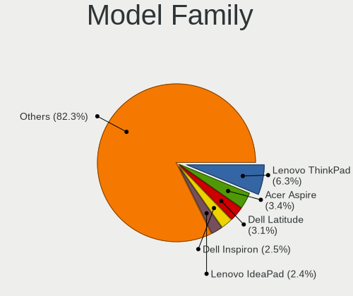
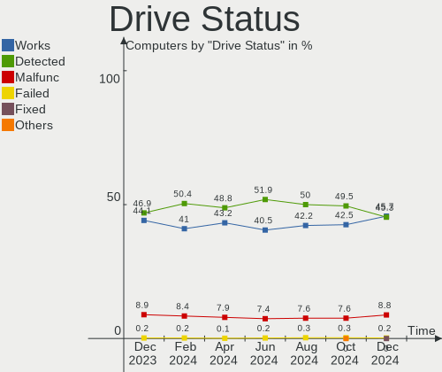
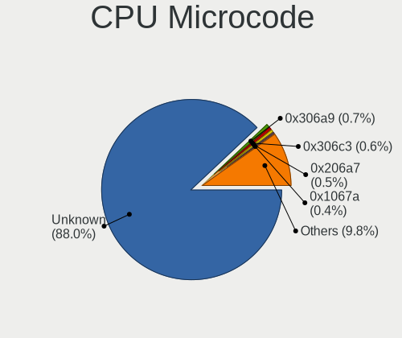
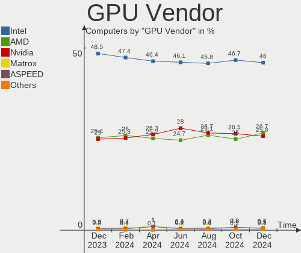
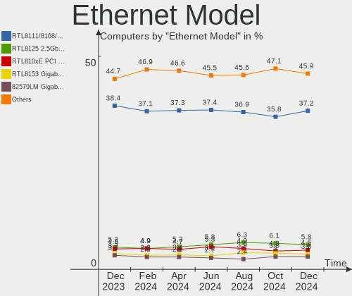
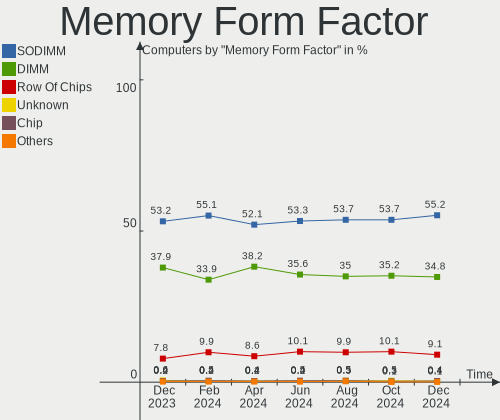

Linux - Hardware Trends
-----------------------

A project to identify most popular hardware characteristics and track their change
over time based on data collected by Linux users at https://Linux-Hardware.org.

Anyone can contribute to this report by the [hw-probe](https://github.com/linuxhw/hw-probe) tool:

    sudo -E hw-probe -all -upload

This is a report for all computer types. See also reports for [desktops](/Desktop/README.md) and [notebooks](/Notebook/README.md).

Distribution-specific reports: [Arch](/Dist/Arch), [ArcoLinux](/Dist/ArcoLinux), [BlackPanther](/Dist/BlackPanther), [CentOS](/Dist/CentOS), [Clear Linux](/Dist/Clear_Linux), [Debian](/Dist/Debian), [Elementary](/Dist/Elementary), [EndeavourOS](/Dist/EndeavourOS), [Endless](/Dist/Endless), [Fedora](/Dist/Fedora), [Gentoo](/Dist/Gentoo), [Kali](/Dist/Kali), [KDE neon](/Dist/KDE_neon), [Kubuntu](/Dist/Kubuntu), [Linux Mint](/Dist/Linux_Mint), [Manjaro](/Dist/Manjaro), [OpenMandriva](/Dist/OpenMandriva), [openSUSE](/Dist/openSUSE), [Pop!_OS](/Dist/Pop!_OS), [ROSA](/Dist/ROSA), [SteamOS](/Dist/SteamOS), [Ubuntu MATE](/Dist/Ubuntu_MATE), [Ubuntu](/Dist/Ubuntu), [Xubuntu](/Dist/Xubuntu), [Zorin](/Dist/Zorin).

This report is for one last month. Overall report since the beginning of time: [TestCoverage](https://github.com/linuxhw/TestCoverage)

Period: Jul, 2022.

Contents
--------

* [ System ](#system)
  - [ OS                       ](#os)
  - [ OS Family                ](#os-family)
  - [ Kernel                   ](#kernel)
  - [ Kernel Family            ](#kernel-family)
  - [ Kernel Major Ver.        ](#kernel-major-ver)
  - [ Arch                     ](#arch)
  - [ DE                       ](#de)
  - [ Display Server           ](#display-server)
  - [ Display Manager          ](#display-manager)
  - [ OS Lang                  ](#os-lang)
  - [ Boot Mode                ](#boot-mode)
  - [ Filesystem               ](#filesystem)
  - [ Part. scheme             ](#part-scheme)
  - [ Dual Boot with Linux/BSD ](#dual-boot-with-linuxbsd)
  - [ Dual Boot (Win)          ](#dual-boot-win)

* [ Board ](#board)
  - [ Vendor                   ](#vendor)
  - [ Model                    ](#model)
  - [ Model Family             ](#model-family)
  - [ MFG Year                 ](#mfg-year)
  - [ Form Factor              ](#form-factor)
  - [ Secure Boot              ](#secure-boot)
  - [ Coreboot                 ](#coreboot)
  - [ RAM Size                 ](#ram-size)
  - [ RAM Used                 ](#ram-used)
  - [ Total Drives             ](#total-drives)
  - [ Has CD-ROM               ](#has-cd-rom)
  - [ Has Ethernet             ](#has-ethernet)
  - [ Has WiFi                 ](#has-wifi)
  - [ Has Bluetooth            ](#has-bluetooth)

* [ Location ](#location)
  - [ Country                  ](#country)
  - [ City                     ](#city)

* [ Drives ](#drives)
  - [ Drive Vendor             ](#drive-vendor)
  - [ Drive Model              ](#drive-model)
  - [ HDD Vendor               ](#hdd-vendor)
  - [ SSD Vendor               ](#ssd-vendor)
  - [ Drive Kind               ](#drive-kind)
  - [ Drive Connector          ](#drive-connector)
  - [ Drive Size               ](#drive-size)
  - [ Space Total              ](#space-total)
  - [ Space Used               ](#space-used)
  - [ Malfunc. Drives          ](#malfunc-drives)
  - [ Malfunc. Drive Vendor    ](#malfunc-drive-vendor)
  - [ Malfunc. HDD Vendor      ](#malfunc-hdd-vendor)
  - [ Malfunc. Drive Kind      ](#malfunc-drive-kind)
  - [ Failed Drives            ](#failed-drives)
  - [ Failed Drive Vendor      ](#failed-drive-vendor)
  - [ Drive Status             ](#drive-status)

* [ Storage controller ](#storage-controller)
  - [ Storage Vendor           ](#storage-vendor)
  - [ Storage Model            ](#storage-model)
  - [ Storage Kind             ](#storage-kind)

* [ Processor ](#processor)
  - [ CPU Vendor               ](#cpu-vendor)
  - [ CPU Model                ](#cpu-model)
  - [ CPU Model Family         ](#cpu-model-family)
  - [ CPU Cores                ](#cpu-cores)
  - [ CPU Sockets              ](#cpu-sockets)
  - [ CPU Threads              ](#cpu-threads)
  - [ CPU Op-Modes             ](#cpu-op-modes)
  - [ CPU Microcode            ](#cpu-microcode)
  - [ CPU Microarch            ](#cpu-microarch)

* [ Graphics ](#graphics)
  - [ GPU Vendor               ](#gpu-vendor)
  - [ GPU Model                ](#gpu-model)
  - [ GPU Combo                ](#gpu-combo)
  - [ GPU Driver               ](#gpu-driver)
  - [ GPU Memory               ](#gpu-memory)

* [ Monitor ](#monitor)
  - [ Monitor Vendor           ](#monitor-vendor)
  - [ Monitor Model            ](#monitor-model)
  - [ Monitor Resolution       ](#monitor-resolution)
  - [ Monitor Diagonal         ](#monitor-diagonal)
  - [ Monitor Width            ](#monitor-width)
  - [ Aspect Ratio             ](#aspect-ratio)
  - [ Monitor Area             ](#monitor-area)
  - [ Pixel Density            ](#pixel-density)
  - [ Multiple Monitors        ](#multiple-monitors)

* [ Network ](#network)
  - [ Net Controller Vendor    ](#net-controller-vendor)
  - [ Net Controller Model     ](#net-controller-model)
  - [ Wireless Vendor          ](#wireless-vendor)
  - [ Wireless Model           ](#wireless-model)
  - [ Ethernet Vendor          ](#ethernet-vendor)
  - [ Ethernet Model           ](#ethernet-model)
  - [ Net Controller Kind      ](#net-controller-kind)
  - [ Used Controller          ](#used-controller)
  - [ NICs                     ](#nics)
  - [ IPv6                     ](#ipv6)

* [ Bluetooth ](#bluetooth)
  - [ Bluetooth Vendor         ](#bluetooth-vendor)
  - [ Bluetooth Model          ](#bluetooth-model)

* [ Sound ](#sound)
  - [ Sound Vendor             ](#sound-vendor)
  - [ Sound Model              ](#sound-model)

* [ Memory ](#memory)
  - [ Memory Vendor            ](#memory-vendor)
  - [ Memory Model             ](#memory-model)
  - [ Memory Kind              ](#memory-kind)
  - [ Memory Form Factor       ](#memory-form-factor)
  - [ Memory Size              ](#memory-size)
  - [ Memory Speed             ](#memory-speed)

* [ Printers & scanners ](#printers--scanners)
  - [ Printer Vendor           ](#printer-vendor)
  - [ Printer Model            ](#printer-model)
  - [ Scanner Vendor           ](#scanner-vendor)
  - [ Scanner Model            ](#scanner-model)

* [ Camera ](#camera)
  - [ Camera Vendor            ](#camera-vendor)
  - [ Camera Model             ](#camera-model)

* [ Security ](#security)
  - [ Fingerprint Vendor       ](#fingerprint-vendor)
  - [ Fingerprint Model        ](#fingerprint-model)
  - [ Chipcard Vendor          ](#chipcard-vendor)
  - [ Chipcard Model           ](#chipcard-model)

* [ Unsupported ](#unsupported)
  - [ Unsupported Devices      ](#unsupported-devices)
  - [ Unsupported Device Types ](#unsupported-device-types)

System
------

OS
--

Installed operating systems

| Name                         | Computers | Percent |
|------------------------------|-----------|---------|
| Ubuntu 22.04                 | 578       | 12.33%  |
| Linux Mint 20.3              | 389       | 8.3%    |
| OpenMandriva 4.3             | 354       | 7.55%   |
| Ubuntu 20.04                 | 324       | 6.91%   |
| ROSA 12.2                    | 307       | 6.55%   |
| Fedora 36                    | 305       | 6.51%   |
| Debian 11                    | 237       | 5.06%   |
| Pop!_OS 22.04                | 232       | 4.95%   |
| OpenMandriva 4.90            | 155       | 3.31%   |
| Zorin 16                     | 136       | 2.9%    |
| KDE neon 20.04               | 131       | 2.8%    |
| Arch                         | 96        | 2.05%   |
| Manjaro                      | 87        | 1.86%   |
| Arch Rolling                 | 61        | 1.3%    |
| Kubuntu 22.04                | 51        | 1.09%   |
| Gentoo 2.8                   | 47        | 1%      |
| Elementary 6.1               | 45        | 0.96%   |
| Xubuntu 20.04                | 37        | 0.79%   |
| openSUSE Tumbleweed-XXXXXXXX | 35        | 0.75%   |
| Ubuntu 18.04                 | 33        | 0.7%    |
| Kali 2022.2                  | 32        | 0.68%   |
| ROSA R11.1                   | 31        | 0.66%   |
| Linux Mint 20.2              | 30        | 0.64%   |
| Debian Testing               | 28        | 0.6%    |
| ArcoLinux Rolling            | 28        | 0.6%    |
| Xubuntu 22.04                | 26        | 0.55%   |
| LMDE 5                       | 26        | 0.55%   |
| Ubuntu 21.10                 | 25        | 0.53%   |
| SteamOS 3.2                  | 25        | 0.53%   |
| BlackPanther 18.1            | 25        | 0.53%   |
| Red OS 7.3.1                 | 24        | 0.51%   |
| Manjaro 21.3.2               | 23        | 0.49%   |
| Fedora 35                    | 21        | 0.45%   |
| Parrot 5.0                   | 19        | 0.41%   |
| Linux Mint 19.3              | 18        | 0.38%   |
| Kubuntu 20.04                | 18        | 0.38%   |
| Endless 4.0.7                | 18        | 0.38%   |
| OpenMandriva 4.2             | 17        | 0.36%   |
| Manjaro 21.3.5               | 16        | 0.34%   |
| EndeavourOS Rolling          | 16        | 0.34%   |
| SteamOS 3.3                  | 15        | 0.32%   |
| MX 21                        | 15        | 0.32%   |
| Lubuntu 22.04                | 15        | 0.32%   |
| Ubuntu MATE 22.04            | 13        | 0.28%   |
| Manjaro 21.3.3               | 13        | 0.28%   |
| openSUSE Leap-15.4           | 12        | 0.26%   |
| Linux Mint 20.1              | 12        | 0.26%   |
| Garuda Linux Soaring         | 12        | 0.26%   |
| Debian Unstable              | 12        | 0.26%   |
| Zorin 15                     | 11        | 0.23%   |
| Ubuntu MATE 20.04            | 10        | 0.21%   |
| Manjaro 21.3.1               | 10        | 0.21%   |
| Lubuntu 20.04                | 10        | 0.21%   |
| Linux Mint 21                | 9         | 0.19%   |
| Pop!_OS 20.04                | 8         | 0.17%   |
| Manjaro 21.3.6               | 8         | 0.17%   |
| Linux Mint 20                | 8         | 0.17%   |
| Kubuntu 11.1                 | 8         | 0.17%   |
| EndeavourOS                  | 8         | 0.17%   |
| Xubuntu 18.04                | 7         | 0.15%   |

OS Family
---------

OS without a version

| Name              | Computers | Percent |
|-------------------|-----------|---------|
| Ubuntu            | 977       | 20.85%  |
| OpenMandriva      | 530       | 11.31%  |
| Linux Mint        | 471       | 10.05%  |
| ROSA              | 348       | 7.43%   |
| Fedora            | 335       | 7.15%   |
| Debian            | 287       | 6.12%   |
| Pop!_OS           | 250       | 5.34%   |
| Manjaro           | 168       | 3.59%   |
| Arch              | 157       | 3.35%   |
| Zorin             | 147       | 3.14%   |
| KDE neon          | 131       | 2.8%    |
| Kubuntu           | 83        | 1.77%   |
| Xubuntu           | 76        | 1.62%   |
| openSUSE          | 50        | 1.07%   |
| SteamOS           | 48        | 1.02%   |
| Gentoo            | 48        | 1.02%   |
| Elementary        | 46        | 0.98%   |
| Kali              | 43        | 0.92%   |
| Lubuntu           | 33        | 0.7%    |
| ArcoLinux         | 33        | 0.7%    |
| Red OS            | 31        | 0.66%   |
| Endless           | 29        | 0.62%   |
| LMDE              | 28        | 0.6%    |
| Ubuntu MATE       | 27        | 0.58%   |
| BlackPanther      | 25        | 0.53%   |
| EndeavourOS       | 24        | 0.51%   |
| Parrot            | 22        | 0.47%   |
| Clear Linux       | 18        | 0.38%   |
| MX                | 16        | 0.34%   |
| Garuda Linux      | 15        | 0.32%   |
| Ubuntu Budgie     | 12        | 0.26%   |
| ALT Linux         | 12        | 0.26%   |
| RHEL              | 9         | 0.19%   |
| CentOS            | 9         | 0.19%   |
| Devuan            | 8         | 0.17%   |
| antiX             | 8         | 0.17%   |
| Peppermint        | 7         | 0.15%   |
| Nobara            | 7         | 0.15%   |
| Raspbian          | 6         | 0.13%   |
| Lilidog           | 6         | 0.13%   |
| Void Linux        | 5         | 0.11%   |
| Solus             | 5         | 0.11%   |
| Manjaro-ARM       | 5         | 0.11%   |
| Artix             | 5         | 0.11%   |
| Rocky Linux       | 4         | 0.09%   |
| PureOS            | 4         | 0.09%   |
| Linux Lite        | 4         | 0.09%   |
| ClearOS           | 4         | 0.09%   |
| Alpine            | 4         | 0.09%   |
| Ultramarine Linux | 3         | 0.06%   |
| Ubuntu Studio     | 3         | 0.06%   |
| Reborn OS         | 3         | 0.06%   |
| PCLinuxOS         | 3         | 0.06%   |
| Pardus            | 3         | 0.06%   |
| Kaisen            | 3         | 0.06%   |
| BigLinux          | 3         | 0.06%   |
| Astra Linux       | 3         | 0.06%   |
| AlmaLinux         | 3         | 0.06%   |
| Xero              | 2         | 0.04%   |
| Trisquel          | 2         | 0.04%   |

Kernel
------

Version of the Linux kernel

| Version                                      | Computers | Percent |
|----------------------------------------------|-----------|---------|
| 5.15.0-41-generic                            | 597       | 12.74%  |
| 5.16.7-desktop-1omv4003                      | 327       | 6.98%   |
| 5.13.0-52-generic                            | 255       | 5.44%   |
| 5.4.0-122-generic                            | 231       | 4.93%   |
| 5.15.0-40-generic                            | 208       | 4.44%   |
| 5.17.15-76051715-generic                     | 163       | 3.48%   |
| 5.4.0-121-generic                            | 153       | 3.27%   |
| 5.18.12-desktop-3omv4090                     | 148       | 3.16%   |
| 5.10.74-generic-2rosa2021.1-x86_64           | 142       | 3.03%   |
| 5.10.118-generic-2rosa2021.1-x86_64          | 105       | 2.24%   |
| 5.10.0-16-amd64                              | 98        | 2.09%   |
| 5.18.11-200.fc36.x86_64                      | 85        | 1.81%   |
| 5.18.13-200.fc36.x86_64                      | 65        | 1.39%   |
| 5.15.0-43-generic                            | 60        | 1.28%   |
| 5.18.10-76051810-generic                     | 55        | 1.17%   |
| 5.10.0-15-amd64                              | 54        | 1.15%   |
| 5.18.9-200.fc36.x86_64                       | 48        | 1.02%   |
| 5.10.0-7-amd64                               | 47        | 1%      |
| 5.18.10-200.fc36.x86_64                      | 45        | 0.96%   |
| 5.18.0-2-amd64                               | 45        | 0.96%   |
| 5.13.0-51-generic                            | 45        | 0.96%   |
| 5.15.0-25-generic                            | 41        | 0.87%   |
| 5.4.0-91-generic                             | 37        | 0.79%   |
| 5.18.12-arch1-1                              | 37        | 0.79%   |
| 5.18.7-200.fc36.x86_64                       | 30        | 0.64%   |
| 5.13.0-valve15-1-neptune-02197-gf6ec7ad3762a | 26        | 0.55%   |
| 5.18.9-arch1-1                               | 25        | 0.53%   |
| 5.18.14-arch1-1                              | 24        | 0.51%   |
| 5.15.0-39-generic                            | 23        | 0.49%   |
| 5.15.55-1-MANJARO                            | 21        | 0.45%   |
| 5.17.5-76051705-generic                      | 20        | 0.43%   |
| 5.18.0-kali5-amd64                           | 19        | 0.41%   |
| 5.16.13-desktop-1omv4003                     | 19        | 0.41%   |
| 5.15.0-33-generic                            | 19        | 0.41%   |
| 5.11.0-35-generic                            | 19        | 0.41%   |
| 5.15.49-1-MANJARO                            | 18        | 0.38%   |
| 5.18.12-3-MANJARO                            | 17        | 0.36%   |
| 4.18.16-desktop-1bP                          | 17        | 0.36%   |
| 5.15.53-1-MANJARO                            | 16        | 0.34%   |
| 5.15.50-1-MANJARO                            | 16        | 0.34%   |
| 5.15.43-generic-2rosa2021.1-x86_64           | 16        | 0.34%   |
| 5.18.8.xm1-1.klp-xanmod-rosa2021.1-x86_64    | 15        | 0.32%   |
| 5.17.5-300.fc36.x86_64                       | 15        | 0.32%   |
| 5.15.10-1.el7.x86_64                         | 15        | 0.32%   |
| 5.10.14-desktop-1omv4002                     | 15        | 0.32%   |
| 5.18.10-arch1-1                              | 14        | 0.3%    |
| 5.18.0-1parrot1-amd64                        | 14        | 0.3%    |
| 4.15.0-189-generic                           | 14        | 0.3%    |
| 5.4.0-120-generic                            | 13        | 0.28%   |
| 5.18.7-arch1-1                               | 13        | 0.28%   |
| 5.18.6-1-default                             | 13        | 0.28%   |
| 5.18.13-arch1-1                              | 13        | 0.28%   |
| 5.10.0-13-amd64                              | 13        | 0.28%   |
| 5.18.10-1-MANJARO                            | 12        | 0.26%   |
| 5.14.0-1044-oem                              | 12        | 0.26%   |
| 5.13.0-44-generic                            | 12        | 0.26%   |
| 5.13.0-30-generic                            | 12        | 0.26%   |
| 5.18.12-zen1-1-zen                           | 11        | 0.23%   |
| 5.18.11-arch1-1                              | 11        | 0.23%   |
| 5.18.0-0.bpo.1-amd64                         | 11        | 0.23%   |

Kernel Family
-------------

Linux kernel without a distro release

| Version  | Computers | Percent |
|----------|-----------|---------|
| 5.15.0   | 996       | 21.25%  |
| 5.4.0    | 501       | 10.69%  |
| 5.13.0   | 410       | 8.75%   |
| 5.16.7   | 327       | 6.98%   |
| 5.10.0   | 241       | 5.14%   |
| 5.18.12  | 233       | 4.97%   |
| 5.17.15  | 173       | 3.69%   |
| 5.18.10  | 156       | 3.33%   |
| 5.10.74  | 145       | 3.09%   |
| 5.18.11  | 128       | 2.73%   |
| 5.18.0   | 125       | 2.67%   |
| 5.18.9   | 111       | 2.37%   |
| 5.10.118 | 106       | 2.26%   |
| 5.18.13  | 92        | 1.96%   |
| 5.18.7   | 60        | 1.28%   |
| 5.18.14  | 42        | 0.9%    |
| 4.15.0   | 42        | 0.9%    |
| 5.18.6   | 40        | 0.85%   |
| 5.11.0   | 40        | 0.85%   |
| 5.14.0   | 39        | 0.83%   |
| 5.18.8   | 36        | 0.77%   |
| 5.17.5   | 35        | 0.75%   |
| 5.16.0   | 28        | 0.6%    |
| 5.15.55  | 25        | 0.53%   |
| 5.16.13  | 23        | 0.49%   |
| 5.15.50  | 22        | 0.47%   |
| 5.19.0   | 20        | 0.43%   |
| 5.17.0   | 20        | 0.43%   |
| 5.15.53  | 20        | 0.43%   |
| 5.15.52  | 19        | 0.41%   |
| 5.15.49  | 19        | 0.41%   |
| 5.15.43  | 19        | 0.41%   |
| 4.18.16  | 18        | 0.38%   |
| 5.8.0    | 17        | 0.36%   |
| 5.4.83   | 15        | 0.32%   |
| 5.15.10  | 15        | 0.32%   |
| 5.10.14  | 15        | 0.32%   |
| 5.15.32  | 14        | 0.3%    |
| 5.15.35  | 13        | 0.28%   |
| 5.14.21  | 12        | 0.26%   |
| 4.18.0   | 12        | 0.26%   |
| 5.17.11  | 11        | 0.23%   |
| 5.18.5   | 10        | 0.21%   |
| 5.18.3   | 10        | 0.21%   |
| 5.4.32   | 9         | 0.19%   |
| 4.19.0   | 9         | 0.19%   |
| 5.6.14   | 8         | 0.17%   |
| 3.10.0   | 8         | 0.17%   |
| 5.18.15  | 7         | 0.15%   |
| 5.18.1   | 7         | 0.15%   |
| 5.15.57  | 7         | 0.15%   |
| 5.15.41  | 7         | 0.15%   |
| 4.4.0    | 7         | 0.15%   |
| 5.17.1   | 6         | 0.13%   |
| 5.15.39  | 6         | 0.13%   |
| 5.15.46  | 5         | 0.11%   |
| 5.13.19  | 5         | 0.11%   |
| 4.9.0    | 5         | 0.11%   |
| 5.18.2   | 4         | 0.09%   |
| 5.17.6   | 4         | 0.09%   |

Kernel Major Ver.
-----------------

Linux kernel major version

| Version | Computers | Percent |
|---------|-----------|---------|
| 5.15    | 1212      | 25.86%  |
| 5.18    | 1063      | 22.68%  |
| 5.10    | 536       | 11.44%  |
| 5.4     | 530       | 11.31%  |
| 5.13    | 415       | 8.86%   |
| 5.16    | 394       | 8.41%   |
| 5.17    | 263       | 5.61%   |
| 5.14    | 58        | 1.24%   |
| 5.11    | 47        | 1%      |
| 4.15    | 42        | 0.9%    |
| 4.18    | 30        | 0.64%   |
| 5.19    | 20        | 0.43%   |
| 5.8     | 18        | 0.38%   |
| 4.19    | 10        | 0.21%   |
| 5.6     | 8         | 0.17%   |
| 4.9     | 8         | 0.17%   |
| 4.4     | 8         | 0.17%   |
| 3.10    | 8         | 0.17%   |
| 5.3     | 4         | 0.09%   |
| 5.0     | 3         | 0.06%   |
| 5.9     | 2         | 0.04%   |
| 5.7     | 1         | 0.02%   |
| 5.5     | 1         | 0.02%   |
| 5       | 1         | 0.02%   |
| 4.14    | 1         | 0.02%   |
| 4.10    | 1         | 0.02%   |
| 3.13    | 1         | 0.02%   |
| 3.0     | 1         | 0.02%   |

Arch
----

OS architecture (x86_64, i586, etc.)

| Name     | Computers | Percent |
|----------|-----------|---------|
| x86_64   | 4572      | 97.57%  |
| i686     | 63        | 1.34%   |
| aarch64  | 40        | 0.85%   |
| armv7l   | 8         | 0.17%   |
| riscv64  | 1         | 0.02%   |
| armv6l   | 1         | 0.02%   |
| armv5tel | 1         | 0.02%   |

DE
--

Desktop Environment

| Name              | Computers | Percent |
|-------------------|-----------|---------|
| GNOME             | 1939      | 41.38%  |
| KDE5              | 1314      | 28.04%  |
| X-Cinnamon        | 357       | 7.62%   |
| XFCE              | 339       | 7.23%   |
| Unknown           | 234       | 4.99%   |
| MATE              | 163       | 3.48%   |
| LXQt              | 61        | 1.3%    |
| Cinnamon          | 59        | 1.26%   |
| Pantheon          | 46        | 0.98%   |
| KDE4              | 27        | 0.58%   |
| LXDE              | 22        | 0.47%   |
| Budgie            | 22        | 0.47%   |
| i3                | 15        | 0.32%   |
| Unity             | 11        | 0.23%   |
| openbox           | 8         | 0.17%   |
| GNOME Flashback   | 8         | 0.17%   |
| bspwm             | 8         | 0.17%   |
| lightdm-xsession  | 7         | 0.15%   |
| sway              | 6         | 0.13%   |
| GNOME Classic     | 5         | 0.11%   |
| Deepin            | 5         | 0.11%   |
| awesome           | 5         | 0.11%   |
| qtile             | 4         | 0.09%   |
| icewm             | 4         | 0.09%   |
| KDE               | 3         | 0.06%   |
| fly               | 3         | 0.06%   |
| trinity           | 2         | 0.04%   |
| Phosh:GNOME       | 2         | 0.04%   |
| xmonad            | 1         | 0.02%   |
| x-session-manager | 1         | 0.02%   |
| TOS:GNOME         | 1         | 0.02%   |
| hyprland          | 1         | 0.02%   |
| GNUstep           | 1         | 0.02%   |
| Enlightenment     | 1         | 0.02%   |
| dwm               | 1         | 0.02%   |

Display Server
--------------

X11 or Wayland

| Name    | Computers | Percent |
|---------|-----------|---------|
| X11     | 3368      | 71.87%  |
| Wayland | 1086      | 23.18%  |
| Unknown | 125       | 2.67%   |
| Tty     | 106       | 2.26%   |
| Web     | 1         | 0.02%   |

Display Manager
---------------

SDDM, LightDM, etc.

| Name    | Computers | Percent |
|---------|-----------|---------|
| Unknown | 1553      | 33.14%  |
| SDDM    | 1015      | 21.66%  |
| GDM3    | 837       | 17.86%  |
| LightDM | 664       | 14.17%  |
| GDM     | 559       | 11.93%  |
| KDM     | 26        | 0.55%   |
| LXDM    | 11        | 0.23%   |
| XDM     | 7         | 0.15%   |
| SLiM    | 6         | 0.13%   |
| Ly      | 2         | 0.04%   |
| GREETD  | 2         | 0.04%   |
| FLY-DM  | 2         | 0.04%   |
| TDM     | 1         | 0.02%   |
| SLIMSKI | 1         | 0.02%   |

OS Lang
-------

Language

| Lang    | Computers | Percent |
|---------|-----------|---------|
| en_US   | 2009      | 42.87%  |
| ru_RU   | 563       | 12.01%  |
| de_DE   | 329       | 7.02%   |
| fr_FR   | 203       | 4.33%   |
| en_GB   | 201       | 4.29%   |
| pt_BR   | 187       | 3.99%   |
| Unknown | 110       | 2.35%   |
| en_AU   | 83        | 1.77%   |
| en_CA   | 82        | 1.75%   |
| es_ES   | 81        | 1.73%   |
| it_IT   | 77        | 1.64%   |
| C       | 68        | 1.45%   |
| pl_PL   | 65        | 1.39%   |
| en_IN   | 60        | 1.28%   |
| nl_NL   | 37        | 0.79%   |
| es_MX   | 36        | 0.77%   |
| cs_CZ   | 35        | 0.75%   |
| es_AR   | 30        | 0.64%   |
| hu_HU   | 26        | 0.55%   |
| en_ZA   | 22        | 0.47%   |
| zh_CN   | 21        | 0.45%   |
| pt_PT   | 20        | 0.43%   |
| tr_TR   | 18        | 0.38%   |
| es_CL   | 17        | 0.36%   |
| ja_JP   | 16        | 0.34%   |
| de_CH   | 14        | 0.3%    |
| de_AT   | 14        | 0.3%    |
| sv_SE   | 12        | 0.26%   |
| fi_FI   | 12        | 0.26%   |
| en_NZ   | 12        | 0.26%   |
| en_PH   | 11        | 0.23%   |
| es_CO   | 10        | 0.21%   |
| el_GR   | 10        | 0.21%   |
| ru_UA   | 9         | 0.19%   |
| nl_BE   | 9         | 0.19%   |
| nb_NO   | 9         | 0.19%   |
| fr_CA   | 9         | 0.19%   |
| en_AG   | 9         | 0.19%   |
| POSIX   | 8         | 0.17%   |
| en_IE   | 7         | 0.15%   |
| en_DK   | 7         | 0.15%   |
| ko_KR   | 6         | 0.13%   |
| hr_HR   | 6         | 0.13%   |
| fr_BE   | 6         | 0.13%   |
| en_IL   | 6         | 0.13%   |
| da_DK   | 6         | 0.13%   |
| fr_CH   | 5         | 0.11%   |
| en_SG   | 5         | 0.11%   |
| C.UTF8  | 5         | 0.11%   |
| zh_TW   | 4         | 0.09%   |
| ro_RO   | 4         | 0.09%   |
| es_PE   | 4         | 0.09%   |
| en_DE   | 4         | 0.09%   |
| ca_ES   | 4         | 0.09%   |
| uk_UA   | 3         | 0.06%   |
| sk_SK   | 3         | 0.06%   |
| lt_LT   | 3         | 0.06%   |
| id_ID   | 3         | 0.06%   |
| es_VE   | 3         | 0.06%   |
| es_UY   | 3         | 0.06%   |

Boot Mode
---------

EFI or BIOS

| Mode | Computers | Percent |
|------|-----------|---------|
| EFI  | 2405      | 51.32%  |
| BIOS | 2281      | 48.68%  |

Filesystem
----------

Type of filesystem

| Type     | Computers | Percent |
|----------|-----------|---------|
| Ext4     | 3405      | 72.66%  |
| Overlay  | 594       | 12.68%  |
| Btrfs    | 552       | 11.78%  |
| Xfs      | 66        | 1.41%   |
| Zfs      | 36        | 0.77%   |
| F2fs     | 16        | 0.34%   |
| Ext2     | 4         | 0.09%   |
| Unknown  | 4         | 0.09%   |
| Tmpfs    | 3         | 0.06%   |
| Ext3     | 3         | 0.06%   |
| XXXXXXX  | 1         | 0.02%   |
| Jfs      | 1         | 0.02%   |
| Bcachefs | 1         | 0.02%   |

Part. scheme
------------

Scheme of partitioning

| Type    | Computers | Percent |
|---------|-----------|---------|
| Unknown | 2091      | 44.62%  |
| GPT     | 1941      | 41.42%  |
| MBR     | 654       | 13.96%  |

Dual Boot with Linux/BSD
------------------------

Hosting more than one Linux/BSD

| Dual boot | Computers | Percent |
|-----------|-----------|---------|
| No        | 3870      | 82.59%  |
| Yes       | 816       | 17.41%  |

Dual Boot (Win)
---------------

Hosting Linux and Windows

| Dual boot | Computers | Percent |
|-----------|-----------|---------|
| No        | 3301      | 70.44%  |
| Yes       | 1385      | 29.56%  |

Board
-----

Vendor
------

Motherboard manufacturer

| Name                    | Computers | Percent |
|-------------------------|-----------|---------|
| ASUSTek Computer        | 759       | 16.2%   |
| Lenovo                  | 605       | 12.91%  |
| Hewlett-Packard         | 598       | 12.76%  |
| Dell                    | 573       | 12.23%  |
| Gigabyte Technology     | 362       | 7.73%   |
| MSI                     | 315       | 6.72%   |
| Acer                    | 259       | 5.53%   |
| ASRock                  | 166       | 3.54%   |
| Apple                   | 101       | 2.16%   |
| Intel                   | 95        | 2.03%   |
| Toshiba                 | 57        | 1.22%   |
| Samsung Electronics     | 49        | 1.05%   |
| Unknown                 | 46        | 0.98%   |
| Sony                    | 43        | 0.92%   |
| HUAWEI                  | 38        | 0.81%   |
| Raspberry Pi Foundation | 33        | 0.7%    |
| Valve                   | 31        | 0.66%   |
| Fujitsu                 | 29        | 0.62%   |
| Biostar                 | 21        | 0.45%   |
| Google                  | 19        | 0.41%   |
| Pegatron                | 18        | 0.38%   |
| ECS                     | 17        | 0.36%   |
| Alienware               | 17        | 0.36%   |
| Notebook                | 15        | 0.32%   |
| Microsoft               | 15        | 0.32%   |
| Medion                  | 15        | 0.32%   |
| Timi                    | 14        | 0.3%    |
| Supermicro              | 13        | 0.28%   |
| Positivo                | 13        | 0.28%   |
| Packard Bell            | 13        | 0.28%   |
| Foxconn                 | 13        | 0.28%   |
| AZW                     | 12        | 0.26%   |
| Chuwi                   | 11        | 0.23%   |
| AMI                     | 11        | 0.23%   |
| System76                | 10        | 0.21%   |
| GPU Company             | 10        | 0.21%   |
| Panasonic               | 9         | 0.19%   |
| eMachines               | 9         | 0.19%   |
| Huanan                  | 8         | 0.17%   |
| BESSTAR Tech            | 8         | 0.17%   |
| Razer                   | 7         | 0.15%   |
| PCWare                  | 7         | 0.15%   |
| LG Electronics          | 7         | 0.15%   |
| Gateway                 | 7         | 0.15%   |
| TUXEDO                  | 6         | 0.13%   |
| MACHINIST               | 6         | 0.13%   |
| Framework               | 6         | 0.13%   |
| ZOTAC                   | 5         | 0.11%   |
| Schenker                | 5         | 0.11%   |
| HONOR                   | 5         | 0.11%   |
| DEPO Computers          | 5         | 0.11%   |
| Aquarius                | 5         | 0.11%   |
| Fujitsu Siemens         | 4         | 0.09%   |
| Wortmann AG             | 3         | 0.06%   |
| Shuttle                 | 3         | 0.06%   |
| Pine Microsystems       | 3         | 0.06%   |
| OEM                     | 3         | 0.06%   |
| NEC Computers           | 3         | 0.06%   |
| Jumper                  | 3         | 0.06%   |
| IP3 Tech                | 3         | 0.06%   |

Model
-----

Motherboard model

| Name                               | Computers | Percent |
|------------------------------------|-----------|---------|
| Unknown                            | 62        | 1.32%   |
| ASUS All Series                    | 33        | 0.7%    |
| Valve Jupiter                      | 31        | 0.66%   |
| HP Notebook                        | 19        | 0.41%   |
| Lenovo V15-IWL 81YE                | 17        | 0.36%   |
| ASUS TUF Gaming X570-PLUS          | 15        | 0.32%   |
| RPi Raspberry Pi                   | 14        | 0.3%    |
| MSI MS-7996                        | 13        | 0.28%   |
| MSI MS-7C02                        | 12        | 0.26%   |
| ASUS ROG STRIX B550-F GAMING       | 12        | 0.26%   |
| MSI MS-7C91                        | 11        | 0.23%   |
| HP Pavilion g6                     | 10        | 0.21%   |
| Dell OptiPlex 780                  | 10        | 0.21%   |
| Dell OptiPlex 7010                 | 10        | 0.21%   |
| ASUS TUF Gaming B550-PLUS          | 10        | 0.21%   |
| ASRock H470M-HVS                   | 10        | 0.21%   |
| MSI MS-7C37                        | 9         | 0.19%   |
| Dell OptiPlex 755                  | 9         | 0.19%   |
| Apple MacBookAir7,2                | 9         | 0.19%   |
| Gigabyte X570 AORUS MASTER         | 8         | 0.17%   |
| Gigabyte B450M DS3H                | 8         | 0.17%   |
| Dell OptiPlex 3010                 | 8         | 0.17%   |
| Dell Latitude 5420                 | 8         | 0.17%   |
| Dell Latitude 3310                 | 8         | 0.17%   |
| MSI MS-7B86                        | 7         | 0.15%   |
| MSI MS-7B79                        | 7         | 0.15%   |
| MSI MS-7A38                        | 7         | 0.15%   |
| HP Pavilion 15                     | 7         | 0.15%   |
| Dell Latitude E7440                | 7         | 0.15%   |
| Dell Latitude E6420                | 7         | 0.15%   |
| ASUS M5A97 R2.0                    | 7         | 0.15%   |
| RPi Raspberry Pi 4 Model B Rev 1.2 | 6         | 0.13%   |
| MSI MS-7D43                        | 6         | 0.13%   |
| Lenovo G50-45 80E3                 | 6         | 0.13%   |
| HUAWEI NBLK-WAX9X                  | 6         | 0.13%   |
| HP Pavilion Aero Laptop 13-be0xxx  | 6         | 0.13%   |
| HP EliteBook 8470p                 | 6         | 0.13%   |
| Gigabyte X570 I AORUS PRO WIFI     | 6         | 0.13%   |
| Gigabyte 970A-DS3P                 | 6         | 0.13%   |
| Framework Laptop                   | 6         | 0.13%   |
| Dell XPS 15 9520                   | 6         | 0.13%   |
| Dell OptiPlex 790                  | 6         | 0.13%   |
| Dell OptiPlex 7020                 | 6         | 0.13%   |
| Dell OptiPlex 3020                 | 6         | 0.13%   |
| Dell Latitude E7450                | 6         | 0.13%   |
| ASUS ROG STRIX B550-I GAMING       | 6         | 0.13%   |
| ASUS ROG STRIX B450-F GAMING       | 6         | 0.13%   |
| ASUS PRIME Z390-A                  | 6         | 0.13%   |
| ASUS PRIME X470-PRO                | 6         | 0.13%   |
| ASUS PRIME A320M-K                 | 6         | 0.13%   |
| Apple MacPro5,1                    | 6         | 0.13%   |
| Apple MacBookPro9,2                | 6         | 0.13%   |
| MSI MS-7C75                        | 5         | 0.11%   |
| MSI MS-7C35                        | 5         | 0.11%   |
| MSI MS-7B89                        | 5         | 0.11%   |
| MSI MS-7A74                        | 5         | 0.11%   |
| MSI MS-7817                        | 5         | 0.11%   |
| MSI MS-7693                        | 5         | 0.11%   |
| MSI MS-7529                        | 5         | 0.11%   |
| HUAWEI KLVL-WXXW                   | 5         | 0.11%   |

Model Family
------------

Motherboard model prefix

| Name                  | Computers | Percent |
|-----------------------|-----------|---------|
| Lenovo ThinkPad       | 224       | 4.78%   |
| Dell Latitude         | 180       | 3.84%   |
| Acer Aspire           | 177       | 3.78%   |
| Lenovo IdeaPad        | 130       | 2.77%   |
| Dell Inspiron         | 127       | 2.71%   |
| Dell OptiPlex         | 99        | 2.11%   |
| HP Pavilion           | 98        | 2.09%   |
| ASUS ROG              | 97        | 2.07%   |
| ASUS PRIME            | 87        | 1.86%   |
| HP EliteBook          | 77        | 1.64%   |
| HP Laptop             | 69        | 1.47%   |
| ASUS VivoBook         | 68        | 1.45%   |
| ASUS TUF              | 65        | 1.39%   |
| Unknown               | 62        | 1.32%   |
| HP ProBook            | 61        | 1.3%    |
| Dell XPS              | 52        | 1.11%   |
| HP Compaq             | 49        | 1.05%   |
| Lenovo ThinkCentre    | 42        | 0.9%    |
| Dell Vostro           | 42        | 0.9%    |
| Toshiba Satellite     | 40        | 0.85%   |
| Dell Precision        | 39        | 0.83%   |
| RPi Raspberry         | 33        | 0.7%    |
| ASUS All              | 33        | 0.7%    |
| Valve Jupiter         | 31        | 0.66%   |
| HP ENVY               | 29        | 0.62%   |
| Gigabyte X570         | 29        | 0.62%   |
| Lenovo Yoga           | 22        | 0.47%   |
| Lenovo ThinkBook      | 22        | 0.47%   |
| Lenovo Legion         | 22        | 0.47%   |
| Acer Nitro            | 22        | 0.47%   |
| ASUS ASUS             | 21        | 0.45%   |
| HP Notebook           | 20        | 0.43%   |
| HP ZBook              | 19        | 0.41%   |
| Lenovo V15-IWL        | 17        | 0.36%   |
| Gigabyte B450M        | 17        | 0.36%   |
| Microsoft Surface     | 15        | 0.32%   |
| HP 250                | 15        | 0.32%   |
| HP ProDesk            | 14        | 0.3%    |
| HP EliteDesk          | 14        | 0.3%    |
| MSI MS-7996           | 13        | 0.28%   |
| HP OMEN               | 13        | 0.28%   |
| ASUS P8H61-M          | 13        | 0.28%   |
| ASRock B450M          | 13        | 0.28%   |
| Acer Swift            | 13        | 0.28%   |
| MSI MS-7C02           | 12        | 0.26%   |
| Fujitsu LIFEBOOK      | 12        | 0.26%   |
| ASUS M5A78L-M         | 12        | 0.26%   |
| MSI MS-7C91           | 11        | 0.23%   |
| Packard Bell EasyNote | 10        | 0.21%   |
| Lenovo IdeaPadFlex    | 10        | 0.21%   |
| Fujitsu ESPRIMO       | 10        | 0.21%   |
| ASUS Zenbook          | 10        | 0.21%   |
| ASUS M5A97            | 10        | 0.21%   |
| ASRock H470M-HVS      | 10        | 0.21%   |
| Apple MacBookAir7     | 10        | 0.21%   |
| MSI MS-7C37           | 9         | 0.19%   |
| MSI GF63              | 9         | 0.19%   |
| Lenovo IdeaCentre     | 9         | 0.19%   |
| Acer Predator         | 9         | 0.19%   |
| HP Stream             | 8         | 0.17%   |

MFG Year
--------

Motherboard manufacture year

| Year    | Computers | Percent |
|---------|-----------|---------|
| 2021    | 590       | 12.59%  |
| 2020    | 504       | 10.76%  |
| 2019    | 454       | 9.69%   |
| 2018    | 402       | 8.58%   |
| 2012    | 322       | 6.87%   |
| 2017    | 272       | 5.8%    |
| 2011    | 268       | 5.72%   |
| 2013    | 265       | 5.66%   |
| 2014    | 243       | 5.19%   |
| 2010    | 233       | 4.97%   |
| 2015    | 220       | 4.69%   |
| 2022    | 218       | 4.65%   |
| 2016    | 211       | 4.5%    |
| 2009    | 163       | 3.48%   |
| 2008    | 133       | 2.84%   |
| 2007    | 85        | 1.81%   |
| Unknown | 48        | 1.02%   |
| 2006    | 40        | 0.85%   |
| 2005    | 10        | 0.21%   |
| 2001    | 3         | 0.06%   |
| 1999    | 2         | 0.04%   |

Form Factor
-----------

Physical design of the computer

| Name           | Computers | Percent |
|----------------|-----------|---------|
| Notebook       | 2441      | 52.09%  |
| Desktop        | 1854      | 39.56%  |
| Convertible    | 128       | 2.73%   |
| Mini pc        | 85        | 1.81%   |
| All in one     | 69        | 1.47%   |
| System on chip | 42        | 0.9%    |
| Tablet         | 41        | 0.87%   |
| Server         | 24        | 0.51%   |
| Phone          | 2         | 0.04%   |

Secure Boot
-----------

Enabled or disabled

| State    | Computers | Percent |
|----------|-----------|---------|
| Disabled | 4386      | 93.6%   |
| Enabled  | 300       | 6.4%    |

Coreboot
--------

Have coreboot on board

| Used | Computers | Percent |
|------|-----------|---------|
| No   | 4658      | 99.4%   |
| Yes  | 28        | 0.6%    |

RAM Size
--------

Total RAM memory

| Size in GB      | Computers | Percent |
|-----------------|-----------|---------|
| 4.01-8.0        | 1139      | 24.31%  |
| 16.01-24.0      | 941       | 20.08%  |
| 8.01-16.0       | 844       | 18.01%  |
| 3.01-4.0        | 780       | 16.65%  |
| 32.01-64.0      | 494       | 10.54%  |
| 64.01-256.0     | 162       | 3.46%   |
| 1.01-2.0        | 152       | 3.24%   |
| 24.01-32.0      | 89        | 1.9%    |
| 2.01-3.0        | 47        | 1%      |
| 0.51-1.0        | 24        | 0.51%   |
| 0.01-0.5        | 8         | 0.17%   |
| More than 256.0 | 6         | 0.13%   |

RAM Used
--------

Used RAM memory

| Used GB         | Computers | Percent |
|-----------------|-----------|---------|
| 1.01-2.0        | 1729      | 36.9%   |
| 2.01-3.0        | 1068      | 22.79%  |
| 4.01-8.0        | 640       | 13.66%  |
| 3.01-4.0        | 619       | 13.21%  |
| 0.51-1.0        | 349       | 7.45%   |
| 8.01-16.0       | 169       | 3.61%   |
| 0.01-0.5        | 55        | 1.17%   |
| 16.01-24.0      | 31        | 0.66%   |
| 32.01-64.0      | 10        | 0.21%   |
| 24.01-32.0      | 10        | 0.21%   |
| 64.01-256.0     | 2         | 0.04%   |
| Unknown         | 2         | 0.04%   |
| More than 256.0 | 1         | 0.02%   |
| 0               | 1         | 0.02%   |

Total Drives
------------

Number of drives on board

| Drives | Computers | Percent |
|--------|-----------|---------|
| 1      | 2716      | 57.96%  |
| 2      | 1175      | 25.07%  |
| 3      | 393       | 8.39%   |
| 4      | 202       | 4.31%   |
| 5      | 92        | 1.96%   |
| 6      | 42        | 0.9%    |
| 0      | 28        | 0.6%    |
| 7      | 17        | 0.36%   |
| 8      | 8         | 0.17%   |
| 9      | 4         | 0.09%   |
| 11     | 3         | 0.06%   |
| 10     | 2         | 0.04%   |
| 17     | 1         | 0.02%   |
| 16     | 1         | 0.02%   |
| 14     | 1         | 0.02%   |
| 12     | 1         | 0.02%   |

Has CD-ROM
----------

Has CD-ROM on board

| Presented | Computers | Percent |
|-----------|-----------|---------|
| No        | 3104      | 66.24%  |
| Yes       | 1582      | 33.76%  |

Has Ethernet
------------

Has Ethernet on board

| Presented | Computers | Percent |
|-----------|-----------|---------|
| Yes       | 3943      | 84.14%  |
| No        | 743       | 15.86%  |

Has WiFi
--------

Has WiFi module

| Presented | Computers | Percent |
|-----------|-----------|---------|
| Yes       | 3508      | 74.86%  |
| No        | 1178      | 25.14%  |

Has Bluetooth
-------------

Has Bluetooth module

| Presented | Computers | Percent |
|-----------|-----------|---------|
| Yes       | 2806      | 59.88%  |
| No        | 1880      | 40.12%  |

Location
--------

Country
-------

Geographic location (country)

| Country      | Computers | Percent |
|--------------|-----------|---------|
| USA          | 930       | 19.85%  |
| Russia       | 619       | 13.21%  |
| Germany      | 448       | 9.56%   |
| Brazil       | 270       | 5.76%   |
| France       | 241       | 5.14%   |
| UK           | 176       | 3.76%   |
| Canada       | 133       | 2.84%   |
| Italy        | 116       | 2.48%   |
| Poland       | 105       | 2.24%   |
| Australia    | 98        | 2.09%   |
| Netherlands  | 97        | 2.07%   |
| India        | 94        | 2.01%   |
| Spain        | 93        | 1.98%   |
| Hungary      | 63        | 1.34%   |
| Mexico       | 57        | 1.22%   |
| Switzerland  | 48        | 1.02%   |
| Sweden       | 47        | 1%      |
| Argentina    | 47        | 1%      |
| Czechia      | 45        | 0.96%   |
| Turkey       | 42        | 0.9%    |
| Belgium      | 42        | 0.9%    |
| China        | 39        | 0.83%   |
| Austria      | 36        | 0.77%   |
| Portugal     | 35        | 0.75%   |
| Japan        | 35        | 0.75%   |
| Greece       | 31        | 0.66%   |
| Finland      | 31        | 0.66%   |
| Romania      | 29        | 0.62%   |
| Indonesia    | 28        | 0.6%    |
| Norway       | 27        | 0.58%   |
| Ukraine      | 26        | 0.55%   |
| South Africa | 25        | 0.53%   |
| Chile        | 24        | 0.51%   |
| Colombia     | 21        | 0.45%   |
| Belarus      | 21        | 0.45%   |
| Bulgaria     | 19        | 0.41%   |
| Denmark      | 18        | 0.38%   |
| Philippines  | 17        | 0.36%   |
| Taiwan       | 16        | 0.34%   |
| Slovakia     | 16        | 0.34%   |
| New Zealand  | 16        | 0.34%   |
| Croatia      | 16        | 0.34%   |
| Malaysia     | 14        | 0.3%    |
| Serbia       | 13        | 0.28%   |
| Egypt        | 13        | 0.28%   |
| Hong Kong    | 12        | 0.26%   |
| Peru         | 11        | 0.23%   |
| Israel       | 11        | 0.23%   |
| Ireland      | 11        | 0.23%   |
| Iran         | 11        | 0.23%   |
| Venezuela    | 10        | 0.21%   |
| Thailand     | 10        | 0.21%   |
| Kazakhstan   | 10        | 0.21%   |
| Singapore    | 9         | 0.19%   |
| Latvia       | 9         | 0.19%   |
| Sri Lanka    | 8         | 0.17%   |
| South Korea  | 8         | 0.17%   |
| Puerto Rico  | 8         | 0.17%   |
| Pakistan     | 8         | 0.17%   |
| Uruguay      | 7         | 0.15%   |

City
----

Geographic location (city)

| City              | Computers | Percent |
|-------------------|-----------|---------|
| Moscow            | 112       | 2.39%   |
| Voronezh          | 55        | 1.17%   |
| St Petersburg     | 40        | 0.85%   |
| Berlin            | 38        | 0.81%   |
| Sao Paulo         | 29        | 0.62%   |
| Paris             | 27        | 0.58%   |
| Warsaw            | 25        | 0.53%   |
| Sydney            | 25        | 0.53%   |
| Budapest          | 24        | 0.51%   |
| Salekhard         | 22        | 0.47%   |
| Milan             | 22        | 0.47%   |
| Vienna            | 21        | 0.45%   |
| Novosibirsk       | 21        | 0.45%   |
| Prague            | 20        | 0.43%   |
| Seattle           | 19        | 0.41%   |
| Rio de Janeiro    | 19        | 0.41%   |
| Hamburg           | 19        | 0.41%   |
| Perm              | 18        | 0.38%   |
| Mexico City       | 18        | 0.38%   |
| Brisbane          | 18        | 0.38%   |
| Munich            | 17        | 0.36%   |
| Istanbul          | 16        | 0.34%   |
| Yekaterinburg     | 15        | 0.32%   |
| Athens            | 15        | 0.32%   |
| Schagen           | 14        | 0.3%    |
| Frankfurt am Main | 14        | 0.3%    |
| Chicago           | 14        | 0.3%    |
| Chelyabinsk       | 14        | 0.3%    |
| Bucharest         | 14        | 0.3%    |
| San Jose          | 13        | 0.28%   |
| Melbourne         | 13        | 0.28%   |
| Madrid            | 13        | 0.28%   |
| Helsinki          | 13        | 0.28%   |
| Amsterdam         | 13        | 0.28%   |
| New York          | 12        | 0.26%   |
| London            | 12        | 0.26%   |
| Krasnodar         | 12        | 0.26%   |
| Bengaluru         | 12        | 0.26%   |
| Ufa               | 11        | 0.23%   |
| Toronto           | 11        | 0.23%   |
| Nizhniy Novgorod  | 11        | 0.23%   |
| Montreal          | 11        | 0.23%   |
| Miami             | 11        | 0.23%   |
| Belo Horizonte    | 11        | 0.23%   |
| Belgrade          | 11        | 0.23%   |
| Zurich            | 10        | 0.21%   |
| Taipei            | 10        | 0.21%   |
| Stockholm         | 10        | 0.21%   |
| San Antonio       | 10        | 0.21%   |
| Porto Alegre      | 10        | 0.21%   |
| Ottawa            | 10        | 0.21%   |
| Krakow            | 10        | 0.21%   |
| Dublin            | 10        | 0.21%   |
| Cologne           | 10        | 0.21%   |
| Cairo             | 10        | 0.21%   |
| Buenos Aires      | 10        | 0.21%   |
| Atlanta           | 10        | 0.21%   |
| Wroclaw           | 9         | 0.19%   |
| Valencia          | 9         | 0.19%   |
| Singapore         | 9         | 0.19%   |

Drives
------

Drive Vendor
------------

Hard drive vendors

| Vendor                    | Computers | Drives | Percent |
|---------------------------|-----------|--------|---------|
| Samsung Electronics       | 1063      | 1327   | 15.13%  |
| WDC                       | 1014      | 1256   | 14.43%  |
| Seagate                   | 974       | 1232   | 13.86%  |
| Toshiba                   | 437       | 469    | 6.22%   |
| Kingston                  | 390       | 423    | 5.55%   |
| SanDisk                   | 384       | 415    | 5.46%   |
| Unknown                   | 254       | 290    | 3.61%   |
| Crucial                   | 249       | 282    | 3.54%   |
| Hitachi                   | 197       | 210    | 2.8%    |
| SK hynix                  | 192       | 194    | 2.73%   |
| Intel                     | 149       | 181    | 2.12%   |
| A-DATA Technology         | 127       | 135    | 1.81%   |
| HGST                      | 121       | 128    | 1.72%   |
| Phison                    | 94        | 103    | 1.34%   |
| Micron Technology         | 92        | 95     | 1.31%   |
| China                     | 85        | 92     | 1.21%   |
| KIOXIA                    | 65        | 66     | 0.93%   |
| SPCC                      | 60        | 63     | 0.85%   |
| Apple                     | 59        | 73     | 0.84%   |
| Unknown                   | 54        | 54     | 0.77%   |
| PNY                       | 49        | 49     | 0.7%    |
| Netac                     | 35        | 36     | 0.5%    |
| Gigabyte Technology       | 34        | 37     | 0.48%   |
| Patriot                   | 33        | 35     | 0.47%   |
| OCZ                       | 33        | 34     | 0.47%   |
| Intenso                   | 33        | 34     | 0.47%   |
| Silicon Motion            | 32        | 32     | 0.46%   |
| GOODRAM                   | 32        | 32     | 0.46%   |
| Apacer                    | 26        | 28     | 0.37%   |
| Corsair                   | 25        | 27     | 0.36%   |
| Team                      | 23        | 23     | 0.33%   |
| Micron/Crucial Technology | 23        | 23     | 0.33%   |
| Transcend                 | 22        | 22     | 0.31%   |
| XPG                       | 21        | 22     | 0.3%    |
| Maxtor                    | 20        | 20     | 0.28%   |
| JMicron Technology        | 20        | 21     | 0.28%   |
| LITEON                    | 18        | 18     | 0.26%   |
| Hewlett-Packard           | 17        | 18     | 0.24%   |
| Fujitsu                   | 16        | 16     | 0.23%   |
| Plextor                   | 15        | 15     | 0.21%   |
| UMIS                      | 14        | 14     | 0.2%    |
| SSSTC                     | 13        | 13     | 0.19%   |
| ASMT                      | 13        | 15     | 0.19%   |
| Lexar                     | 12        | 12     | 0.17%   |
| Smartbuy                  | 11        | 12     | 0.16%   |
| SABRENT                   | 11        | 13     | 0.16%   |
| KingSpec                  | 11        | 11     | 0.16%   |
| Realtek Semiconductor     | 10        | 11     | 0.14%   |
| TO Exter                  | 8         | 8      | 0.11%   |
| NGFF                      | 8         | 8      | 0.11%   |
| Mushkin                   | 8         | 9      | 0.11%   |
| AMD                       | 8         | 9      | 0.11%   |
| ADATA Technology          | 8         | 8      | 0.11%   |
| KIOXIA-EXCERIA            | 7         | 7      | 0.1%    |
| Dogfish                   | 7         | 7      | 0.1%    |
| Realtek                   | 6         | 6      | 0.09%   |
| LITEONIT                  | 6         | 6      | 0.09%   |
| Lite-On                   | 6         | 6      | 0.09%   |
| GALAX                     | 6         | 6      | 0.09%   |
| XrayDisk                  | 5         | 6      | 0.07%   |

Drive Model
-----------

Hard drive models

| Model                              | Computers | Percent |
|------------------------------------|-----------|---------|
| Kingston SA400S37240G 240GB SSD    | 74        | 0.96%   |
| Samsung NVMe SSD Drive 1TB         | 65        | 0.84%   |
| Seagate ST500DM002-1BD142 500GB    | 58        | 0.75%   |
| Unknown                            | 54        | 0.7%    |
| Seagate ST1000DM010-2EP102 1TB     | 52        | 0.67%   |
| Seagate ST1000LM035-1RK172 1TB     | 46        | 0.59%   |
| Seagate ST2000DM008-2FR102 2TB     | 45        | 0.58%   |
| Samsung SSD 850 EVO 250GB          | 44        | 0.57%   |
| Samsung SSD 860 EVO 500GB          | 43        | 0.55%   |
| Kingston SA400S37480G 480GB SSD    | 42        | 0.54%   |
| Toshiba DT01ACA100 1TB             | 41        | 0.53%   |
| Crucial CT500MX500SSD1 500GB       | 41        | 0.53%   |
| SanDisk NVMe SSD Drive 1TB         | 38        | 0.49%   |
| Crucial CT1000MX500SSD1 1TB        | 38        | 0.49%   |
| Samsung NVMe SSD Drive 512GB       | 37        | 0.48%   |
| Seagate ST1000LM024 HN-M101MBB 1TB | 35        | 0.45%   |
| Toshiba MQ01ABF050 500GB           | 34        | 0.44%   |
| SanDisk NVMe SSD Drive 256GB       | 34        | 0.44%   |
| Samsung NVMe SSD Drive 500GB       | 34        | 0.44%   |
| Samsung SSD 850 EVO 500GB          | 33        | 0.43%   |
| Kingston SA400S37120G 120GB SSD    | 33        | 0.43%   |
| SanDisk NVMe SSD Drive 512GB       | 32        | 0.41%   |
| HGST HTS721010A9E630 1TB           | 32        | 0.41%   |
| Unknown MMC Card  32GB             | 31        | 0.4%    |
| Toshiba MQ01ABD100 1TB             | 31        | 0.4%    |
| WDC WD10EZEX-08WN4A0 1TB           | 30        | 0.39%   |
| Toshiba MQ04ABF100 1TB             | 30        | 0.39%   |
| Kingston SV300S37A120G 120GB SSD   | 30        | 0.39%   |
| Crucial CT240BX500SSD1 240GB       | 29        | 0.37%   |
| Seagate ST500LT012-1DG142 500GB    | 28        | 0.36%   |
| SanDisk NVMe SSD Drive 500GB       | 28        | 0.36%   |
| Samsung SSD 860 EVO 250GB          | 28        | 0.36%   |
| Samsung NVMe SSD Drive 1024GB      | 28        | 0.36%   |
| WDC WDS240G2G0A-00JH30 240GB SSD   | 27        | 0.35%   |
| Unknown SD/MMC/MS PRO 64GB         | 26        | 0.34%   |
| Intel NVMe SSD Drive 512GB         | 26        | 0.34%   |
| Unknown MMC Card  64GB             | 25        | 0.32%   |
| Seagate ST3500418AS 500GB          | 25        | 0.32%   |
| Samsung SSD 980 PRO 1TB            | 25        | 0.32%   |
| Samsung SSD 860 EVO 1TB            | 25        | 0.32%   |
| Samsung NVMe SSD Drive 256GB       | 25        | 0.32%   |
| Seagate ST1000DM003-1CH162 1TB     | 24        | 0.31%   |
| Seagate Expansion 1TB              | 24        | 0.31%   |
| Samsung SSD 980 1TB                | 23        | 0.3%    |
| Kingston NVMe SSD Drive 512GB      | 23        | 0.3%    |
| Toshiba HDWD110 1TB                | 22        | 0.28%   |
| Seagate ST4000DM004-2CV104 4TB     | 22        | 0.28%   |
| Seagate ST2000DM001-1ER164 2TB     | 22        | 0.28%   |
| Seagate ST1000DM003-1ER162 1TB     | 21        | 0.27%   |
| Samsung SSD 970 EVO Plus 500GB     | 21        | 0.27%   |
| Samsung SSD 970 EVO Plus 1TB       | 21        | 0.27%   |
| Crucial CT480BX500SSD1 480GB       | 21        | 0.27%   |
| Toshiba DT01ACA050 500GB           | 20        | 0.26%   |
| SK hynix NVMe SSD Drive 512GB      | 20        | 0.26%   |
| SK hynix NVMe SSD Drive 256GB      | 20        | 0.26%   |
| Samsung MZALQ256HAJD-000L2 256GB   | 20        | 0.26%   |
| WDC WDS500G2B0A-00SM50 500GB SSD   | 19        | 0.25%   |
| Phison NVMe SSD Drive 512GB        | 19        | 0.25%   |
| Unknown MMC Card  128GB            | 18        | 0.23%   |
| SPCC Solid State Disk 120GB        | 18        | 0.23%   |

HDD Vendor
----------

Hard disk drive vendors

| Vendor              | Computers | Drives | Percent |
|---------------------|-----------|--------|---------|
| Seagate             | 949       | 1195   | 35.64%  |
| WDC                 | 786       | 968    | 29.52%  |
| Toshiba             | 356       | 382    | 13.37%  |
| Hitachi             | 197       | 210    | 7.4%    |
| Samsung Electronics | 122       | 143    | 4.58%   |
| HGST                | 121       | 128    | 4.54%   |
| Unknown             | 29        | 29     | 1.09%   |
| Apple               | 18        | 19     | 0.68%   |
| Maxtor              | 16        | 16     | 0.6%    |
| Fujitsu             | 14        | 14     | 0.53%   |
| SABRENT             | 11        | 13     | 0.41%   |
| ASMT                | 10        | 12     | 0.38%   |
| Intenso             | 6         | 6      | 0.23%   |
| SATAFIRM            | 3         | 3      | 0.11%   |
| SAGE                | 3         | 3      | 0.11%   |
| ASMedia             | 3         | 3      | 0.11%   |
| WD MediaMax         | 2         | 2      | 0.08%   |
| KESU                | 2         | 2      | 0.08%   |
| HGST HTS            | 2         | 2      | 0.08%   |
| UD0401              | 1         | 1      | 0.04%   |
| RSH-319             | 1         | 1      | 0.04%   |
| PHD 3.0             | 1         | 1      | 0.04%   |
| Magnetic Data       | 1         | 1      | 0.04%   |
| LaCie               | 1         | 1      | 0.04%   |
| IET                 | 1         | 1      | 0.04%   |
| HPE                 | 1         | 1      | 0.04%   |
| Hewlett-Packard     | 1         | 1      | 0.04%   |
| Fantom              | 1         | 1      | 0.04%   |
| External            | 1         | 1      | 0.04%   |
| ASMT106x            | 1         | 1      | 0.04%   |
| Apricorn            | 1         | 1      | 0.04%   |
| Unknown             | 1         | 1      | 0.04%   |

SSD Vendor
----------

Solid state drive vendors

| Vendor              | Computers | Drives | Percent |
|---------------------|-----------|--------|---------|
| Samsung Electronics | 450       | 516    | 19.85%  |
| Kingston            | 271       | 291    | 11.95%  |
| Crucial             | 223       | 253    | 9.84%   |
| SanDisk             | 210       | 230    | 9.26%   |
| WDC                 | 133       | 140    | 5.87%   |
| A-DATA Technology   | 88        | 90     | 3.88%   |
| China               | 85        | 92     | 3.75%   |
| SPCC                | 54        | 57     | 2.38%   |
| PNY                 | 43        | 43     | 1.9%    |
| Intel               | 43        | 48     | 1.9%    |
| SK hynix            | 34        | 35     | 1.5%    |
| Patriot             | 32        | 34     | 1.41%   |
| OCZ                 | 31        | 31     | 1.37%   |
| Netac               | 31        | 32     | 1.37%   |
| Micron Technology   | 31        | 31     | 1.37%   |
| GOODRAM             | 29        | 29     | 1.28%   |
| Apple               | 28        | 28     | 1.24%   |
| Toshiba             | 25        | 26     | 1.1%    |
| Intenso             | 24        | 25     | 1.06%   |
| Unknown             | 24        | 24     | 1.06%   |
| Team                | 21        | 21     | 0.93%   |
| Transcend           | 20        | 20     | 0.88%   |
| Gigabyte Technology | 19        | 20     | 0.84%   |
| Apacer              | 18        | 20     | 0.79%   |
| LITEON              | 17        | 17     | 0.75%   |
| Corsair             | 15        | 16     | 0.66%   |
| Hewlett-Packard     | 14        | 15     | 0.62%   |
| Plextor             | 13        | 13     | 0.57%   |
| Smartbuy            | 11        | 12     | 0.49%   |
| KingSpec            | 11        | 11     | 0.49%   |
| Lexar               | 10        | 10     | 0.44%   |
| TO Exter            | 8         | 8      | 0.35%   |
| NGFF                | 8         | 8      | 0.35%   |
| Mushkin             | 7         | 8      | 0.31%   |
| Dogfish             | 7         | 7      | 0.31%   |
| LITEONIT            | 6         | 6      | 0.26%   |
| KIOXIA-EXCERIA      | 6         | 6      | 0.26%   |
| AMD                 | 6         | 6      | 0.26%   |
| Seagate             | 5         | 6      | 0.22%   |
| Leven               | 5         | 5      | 0.22%   |
| TEXTORM             | 4         | 4      | 0.18%   |
| OWC                 | 4         | 4      | 0.18%   |
| Maxtor              | 4         | 4      | 0.18%   |
| KingDian            | 4         | 4      | 0.18%   |
| WALRAM              | 3         | 3      | 0.13%   |
| S3+                 | 3         | 3      | 0.13%   |
| LDLC                | 3         | 4      | 0.13%   |
| Inateck             | 3         | 3      | 0.13%   |
| GALAX               | 3         | 3      | 0.13%   |
| BHT                 | 3         | 3      | 0.13%   |
| Argon               | 3         | 3      | 0.13%   |
| Zheino              | 2         | 3      | 0.09%   |
| XrayDisk            | 2         | 2      | 0.09%   |
| Win Memory          | 2         | 2      | 0.09%   |
| W800S               | 2         | 2      | 0.09%   |
| USB3.0              | 2         | 2      | 0.09%   |
| Unknown             | 2         | 2      | 0.09%   |
| Timetec             | 2         | 2      | 0.09%   |
| Teclast             | 2         | 2      | 0.09%   |
| RZX                 | 2         | 2      | 0.09%   |

Drive Kind
----------

HDD or SSD

| Kind    | Computers | Drives | Percent |
|---------|-----------|--------|---------|
| HDD     | 2230      | 3163   | 35.56%  |
| SSD     | 1967      | 2443   | 31.37%  |
| NVMe    | 1725      | 2079   | 27.51%  |
| MMC     | 250       | 287    | 3.99%   |
| Unknown | 99        | 114    | 1.58%   |

Drive Connector
---------------

SATA, SAS, NVMe, etc.

| Type | Computers | Drives | Percent |
|------|-----------|--------|---------|
| SATA | 3364      | 5408   | 59.9%   |
| NVMe | 1715      | 2055   | 30.54%  |
| SAS  | 287       | 336    | 5.11%   |
| MMC  | 250       | 287    | 4.45%   |

Drive Size
----------

Size of hard drive

| Size in TB | Computers | Drives | Percent |
|------------|-----------|--------|---------|
| 0.01-0.5   | 2483      | 3188   | 56.18%  |
| 0.51-1.0   | 1286      | 1552   | 29.1%   |
| 1.01-2.0   | 355       | 425    | 8.03%   |
| 3.01-4.0   | 126       | 170    | 2.85%   |
| 4.01-10.0  | 79        | 116    | 1.79%   |
| 2.01-3.0   | 74        | 102    | 1.67%   |
| 10.01-20.0 | 17        | 53     | 0.38%   |

Space Total
-----------

Amount of disk space available on the file system

| Size in GB     | Computers | Percent |
|----------------|-----------|---------|
| 101-250        | 1175      | 25.07%  |
| 251-500        | 930       | 19.85%  |
| 501-1000       | 684       | 14.6%   |
| 1-20           | 503       | 10.73%  |
| 1001-2000      | 356       | 7.6%    |
| More than 3000 | 273       | 5.83%   |
| 51-100         | 239       | 5.1%    |
| Unknown        | 198       | 4.23%   |
| 21-50          | 181       | 3.86%   |
| 2001-3000      | 147       | 3.14%   |

Space Used
----------

Amount of used disk space

| Used GB        | Computers | Percent |
|----------------|-----------|---------|
| 1-20           | 1883      | 40.18%  |
| 21-50          | 709       | 15.13%  |
| 101-250        | 533       | 11.37%  |
| 51-100         | 473       | 10.09%  |
| 251-500        | 341       | 7.28%   |
| 501-1000       | 250       | 5.34%   |
| Unknown        | 198       | 4.23%   |
| 1001-2000      | 143       | 3.05%   |
| More than 3000 | 105       | 2.24%   |
| 2001-3000      | 51        | 1.09%   |

Malfunc. Drives
---------------

Drive models with a malfunction

| Model                                 | Computers | Drives | Percent |
|---------------------------------------|-----------|--------|---------|
| Seagate ST500DM002-1BD142 500GB       | 17        | 18     | 2.77%   |
| Seagate ST500LT012-9WS142 500GB       | 8         | 8      | 1.3%    |
| Seagate ST3500418AS 500GB             | 8         | 9      | 1.3%    |
| Kingston SV300S37A120G 120GB SSD      | 8         | 8      | 1.3%    |
| Toshiba MQ01ABD100 1TB                | 7         | 7      | 1.14%   |
| Seagate ST1000LM024 HN-M101MBB 1TB    | 7         | 7      | 1.14%   |
| HGST HTS721010A9E630 1TB              | 7         | 7      | 1.14%   |
| Seagate ST1000DM003-1CH162 1TB        | 6         | 8      | 0.98%   |
| HGST HTS545050A7E680 500GB            | 6         | 6      | 0.98%   |
| Seagate ST9500325AS 500GB             | 5         | 5      | 0.81%   |
| Hitachi HTS545050B9A300 500GB         | 5         | 5      | 0.81%   |
| WDC WD5000BEVT-22A0RT0 500GB          | 4         | 4      | 0.65%   |
| WDC WD5000AAKX-08U6AA0 500GB          | 4         | 5      | 0.65%   |
| WDC WD5000AADS-00S9B0 500GB           | 4         | 4      | 0.65%   |
| Seagate ST9250315AS 250GB             | 4         | 4      | 0.65%   |
| Seagate ST500LT012-1DG142 500GB       | 4         | 4      | 0.65%   |
| Seagate ST3500413AS 500GB             | 4         | 5      | 0.65%   |
| Seagate ST320LT020-9YG142 320GB       | 4         | 4      | 0.65%   |
| Seagate ST1000LX015-1U7172 1TB        | 4         | 4      | 0.65%   |
| SanDisk SSD U100 256GB                | 4         | 4      | 0.65%   |
| HGST HTS725050A7E630 500GB            | 4         | 4      | 0.65%   |
| HGST HTS541010A9E680 1TB              | 4         | 4      | 0.65%   |
| WDC WDS240G2G0A-00JH30 240GB SSD      | 3         | 3      | 0.49%   |
| WDC WD20EARS-00MVWB0 2TB              | 3         | 3      | 0.49%   |
| WDC WD10EZEX-60ZF5A0 1TB              | 3         | 3      | 0.49%   |
| Toshiba MQ01ABF050 500GB              | 3         | 3      | 0.49%   |
| Seagate ST9320325AS 320GB             | 3         | 3      | 0.49%   |
| Seagate ST31500341AS 1TB              | 3         | 3      | 0.49%   |
| SanDisk SSD PLUS 480GB                | 3         | 3      | 0.49%   |
| Samsung Electronics SSD 870 EVO 500GB | 3         | 3      | 0.49%   |
| Samsung Electronics SSD 870 EVO 1TB   | 3         | 4      | 0.49%   |
| Samsung Electronics HD501LJ 500GB     | 3         | 4      | 0.49%   |
| Hitachi HTS545032B9A300 320GB         | 3         | 3      | 0.49%   |
| WDC WDS120G2G0A-00JH30 120GB SSD      | 2         | 2      | 0.33%   |
| WDC WD5000LPVX-22V0TT0 500GB          | 2         | 2      | 0.33%   |
| WDC WD5000LPCX-60VHAT0 500GB          | 2         | 2      | 0.33%   |
| WDC WD2500BEKT-60A25T1 250GB          | 2         | 2      | 0.33%   |
| WDC WD20EFRX-68EUZN0 2TB              | 2         | 4      | 0.33%   |
| WDC WD20EFRX-68AX9N0 2TB              | 2         | 2      | 0.33%   |
| WDC WD2002FAEX-007BA0 2TB             | 2         | 2      | 0.33%   |
| WDC WD2000JD-00HBB0 200GB             | 2         | 2      | 0.33%   |
| WDC WD15EARS-00MVWB0 1TB              | 2         | 2      | 0.33%   |
| WDC WD10JPVX-22JC3T0 1TB              | 2         | 2      | 0.33%   |
| WDC WD10JPCX-24UE4T0 1TB              | 2         | 2      | 0.33%   |
| WDC WD10EZEX-22MFCA0 1TB              | 2         | 2      | 0.33%   |
| WDC WD10EZEX-08M2NA0 1TB              | 2         | 2      | 0.33%   |
| WDC WD10EARS-22Y5B1 1TB               | 2         | 2      | 0.33%   |
| WDC WD1003FBYX-01Y7B1 752GB           | 2         | 2      | 0.33%   |
| Toshiba MQ04ABF100 1TB                | 2         | 2      | 0.33%   |
| Toshiba MQ01ABD075 752GB              | 2         | 2      | 0.33%   |
| Toshiba MQ01ABD050 500GB              | 2         | 2      | 0.33%   |
| Toshiba MK1665GSX 160GB               | 2         | 2      | 0.33%   |
| Toshiba MK1652GSX 160GB               | 2         | 2      | 0.33%   |
| SK hynix PC711 HFS001TDE9X073N 1TB    | 2         | 2      | 0.33%   |
| SK hynix HFS256G39TND-N210A 256GB SSD | 2         | 2      | 0.33%   |
| Seagate ST500LM021-1KJ152 500GB       | 2         | 2      | 0.33%   |
| Seagate ST3250318AS 250GB             | 2         | 2      | 0.33%   |
| Seagate ST320LT007-9ZV142 320GB       | 2         | 2      | 0.33%   |
| Seagate ST320LM001 HN-M320MBB 320GB   | 2         | 2      | 0.33%   |
| Seagate ST31000524AS 1TB              | 2         | 2      | 0.33%   |

Malfunc. Drive Vendor
---------------------

Vendors of faulty drives

| Vendor              | Computers | Drives | Percent |
|---------------------|-----------|--------|---------|
| Seagate             | 164       | 178    | 27.33%  |
| WDC                 | 138       | 155    | 23%     |
| Samsung Electronics | 53        | 56     | 8.83%   |
| Hitachi             | 50        | 50     | 8.33%   |
| Toshiba             | 44        | 49     | 7.33%   |
| HGST                | 27        | 27     | 4.5%    |
| Kingston            | 17        | 18     | 2.83%   |
| SanDisk             | 15        | 15     | 2.5%    |
| SK hynix            | 11        | 11     | 1.83%   |
| A-DATA Technology   | 9         | 9      | 1.5%    |
| Crucial             | 7         | 7      | 1.17%   |
| China               | 7         | 7      | 1.17%   |
| Intel               | 6         | 6      | 1%      |
| SPCC                | 5         | 6      | 0.83%   |
| OCZ                 | 4         | 4      | 0.67%   |
| Maxtor              | 3         | 3      | 0.5%    |
| Fujitsu             | 3         | 3      | 0.5%    |
| Corsair             | 3         | 3      | 0.5%    |
| Netac               | 2         | 2      | 0.33%   |
| Micron Technology   | 2         | 2      | 0.33%   |
| Unknown             | 2         | 2      | 0.33%   |
| XPG                 | 1         | 1      | 0.17%   |
| WellcommMaster      | 1         | 1      | 0.17%   |
| walram              | 1         | 1      | 0.17%   |
| TEXTORM             | 1         | 1      | 0.17%   |
| SSSTC               | 1         | 1      | 0.17%   |
| Smartbuy            | 1         | 1      | 0.17%   |
| ShiJi               | 1         | 1      | 0.17%   |
| s60                 | 1         | 1      | 0.17%   |
| Qumo                | 1         | 1      | 0.17%   |
| PNY                 | 1         | 1      | 0.17%   |
| Plextor             | 1         | 1      | 0.17%   |
| OCZ-VERTEX3         | 1         | 1      | 0.17%   |
| Neo                 | 1         | 1      | 0.17%   |
| LITEONIT            | 1         | 1      | 0.17%   |
| LITEON              | 1         | 1      | 0.17%   |
| Lexar               | 1         | 1      | 0.17%   |
| Leven               | 1         | 1      | 0.17%   |
| Lenovo              | 1         | 1      | 0.17%   |
| Intenso             | 1         | 1      | 0.17%   |
| HGST HTS            | 1         | 1      | 0.17%   |
| Hewlett-Packard     | 1         | 1      | 0.17%   |
| GOODRAM             | 1         | 1      | 0.17%   |
| Drevo               | 1         | 1      | 0.17%   |
| Dogfish             | 1         | 1      | 0.17%   |
| BAITITON            | 1         | 1      | 0.17%   |
| ASMT                | 1         | 2      | 0.17%   |
| ASMedia             | 1         | 1      | 0.17%   |
| Apple               | 1         | 2      | 0.17%   |

Malfunc. HDD Vendor
-------------------

Vendors of faulty HDD drives

| Vendor              | Computers | Drives | Percent |
|---------------------|-----------|--------|---------|
| Seagate             | 164       | 178    | 35.89%  |
| WDC                 | 130       | 144    | 28.45%  |
| Hitachi             | 50        | 50     | 10.94%  |
| Toshiba             | 43        | 48     | 9.41%   |
| Samsung Electronics | 32        | 34     | 7%      |
| HGST                | 27        | 27     | 5.91%   |
| Maxtor              | 3         | 3      | 0.66%   |
| Fujitsu             | 3         | 3      | 0.66%   |
| HGST HTS            | 1         | 1      | 0.22%   |
| Hewlett-Packard     | 1         | 1      | 0.22%   |
| ASMT                | 1         | 2      | 0.22%   |
| ASMedia             | 1         | 1      | 0.22%   |
| Apple               | 1         | 2      | 0.22%   |

Malfunc. Drive Kind
-------------------

Kinds of faulty drives

| Kind | Computers | Drives | Percent |
|------|-----------|--------|---------|
| HDD  | 427       | 494    | 74.78%  |
| SSD  | 123       | 128    | 21.54%  |
| NVMe | 21        | 21     | 3.68%   |

Failed Drives
-------------

Failed drive models

| Model                             | Computers | Drives | Percent |
|-----------------------------------|-----------|--------|---------|
| WDC WD5000LPCX-24VHAT0 500GB      | 1         | 1      | 5.88%   |
| WDC WD5000BEVT-22A0RT0 500GB      | 1         | 1      | 5.88%   |
| WDC WD4001FFSX-68JNUN0 4TB        | 1         | 1      | 5.88%   |
| WDC WD3200BEVT-11ZCT0 320GB       | 1         | 1      | 5.88%   |
| WDC WD10EZEX-60WN4A0 1TB          | 1         | 1      | 5.88%   |
| Toshiba MQ01ABD100 1TB            | 1         | 1      | 5.88%   |
| Toshiba MQ01ABD032 320GB          | 1         | 1      | 5.88%   |
| Toshiba MK1646GSX 160GB           | 1         | 1      | 5.88%   |
| Seagate ST9500420AS 500GB         | 1         | 1      | 5.88%   |
| Samsung Electronics HM320HJ 320GB | 1         | 1      | 5.88%   |
| Samsung Electronics HD502IJ 500GB | 1         | 1      | 5.88%   |
| Samsung Electronics HD252HJ 250GB | 1         | 1      | 5.88%   |
| KingDian S400 120GB SSD           | 1         | 1      | 5.88%   |
| Intel SSDSA2BW160G3 160GB         | 1         | 1      | 5.88%   |
| Hitachi HTS547550A9E384 500GB     | 1         | 1      | 5.88%   |
| Hitachi HDS721010CLA332 1TB       | 1         | 1      | 5.88%   |
| External USB3.0 1TB               | 1         | 1      | 5.88%   |

Failed Drive Vendor
-------------------

Failed drive vendors

| Vendor              | Computers | Drives | Percent |
|---------------------|-----------|--------|---------|
| WDC                 | 5         | 5      | 29.41%  |
| Toshiba             | 3         | 3      | 17.65%  |
| Samsung Electronics | 3         | 3      | 17.65%  |
| Hitachi             | 2         | 2      | 11.76%  |
| Seagate             | 1         | 1      | 5.88%   |
| KingDian            | 1         | 1      | 5.88%   |
| Intel               | 1         | 1      | 5.88%   |
| External            | 1         | 1      | 5.88%   |

Drive Status
------------

Number of failed and malfunc. drives

| Status   | Computers | Drives | Percent |
|----------|-----------|--------|---------|
| Detected | 2364      | 3893   | 46.05%  |
| Works    | 2209      | 3533   | 43.03%  |
| Malfunc  | 546       | 643    | 10.63%  |
| Failed   | 15        | 17     | 0.29%   |

Storage controller
------------------

Storage Vendor
--------------

Storage controller vendors

| Vendor                           | Computers | Percent |
|----------------------------------|-----------|---------|
| Intel                            | 2944      | 49.15%  |
| AMD                              | 996       | 16.63%  |
| Samsung Electronics              | 593       | 9.9%    |
| SanDisk                          | 289       | 4.82%   |
| SK hynix                         | 152       | 2.54%   |
| Phison Electronics               | 143       | 2.39%   |
| Kingston Technology Company      | 125       | 2.09%   |
| ASMedia Technology               | 84        | 1.4%    |
| KIOXIA                           | 66        | 1.1%    |
| Micron Technology                | 63        | 1.05%   |
| Nvidia                           | 62        | 1.04%   |
| Toshiba America Info Systems     | 60        | 1%      |
| Silicon Motion                   | 55        | 0.92%   |
| ADATA Technology                 | 55        | 0.92%   |
| JMicron Technology               | 52        | 0.87%   |
| Micron/Crucial Technology        | 49        | 0.82%   |
| Marvell Technology Group         | 43        | 0.72%   |
| Realtek Semiconductor            | 26        | 0.43%   |
| Union Memory (Shenzhen)          | 18        | 0.3%    |
| Solid State Storage Technology   | 16        | 0.27%   |
| Apple                            | 14        | 0.23%   |
| Seagate Technology               | 13        | 0.22%   |
| LSI Logic / Symbios Logic        | 10        | 0.17%   |
| VIA Technologies                 | 8         | 0.13%   |
| Shenzhen Longsys Electronics     | 6         | 0.1%    |
| Lite-On Technology               | 6         | 0.1%    |
| Broadcom / LSI                   | 6         | 0.1%    |
| MAXIO Technology (Hangzhou)      | 5         | 0.08%   |
| Unknown                          | 4         | 0.07%   |
| Silicon Image                    | 4         | 0.07%   |
| Adaptec                          | 4         | 0.07%   |
| Silicon Integrated Systems [SiS] | 3         | 0.05%   |
| Lenovo                           | 3         | 0.05%   |
| Hewlett-Packard                  | 3         | 0.05%   |
| Yangtze Memory Technologies      | 2         | 0.03%   |
| OCZ Technology Group             | 2         | 0.03%   |
| Biwin Storage Technology         | 2         | 0.03%   |
| Zhaoxin                          | 1         | 0.02%   |
| Western Digital                  | 1         | 0.02%   |
| Promise Technology               | 1         | 0.02%   |
| O2 Micro                         | 1         | 0.02%   |

Storage Model
-------------

Storage controller models

| Model                                                                                   | Computers | Percent |
|-----------------------------------------------------------------------------------------|-----------|---------|
| AMD FCH SATA Controller [AHCI mode]                                                     | 649       | 9.52%   |
| Samsung NVMe SSD Controller SM981/PM981/PM983                                           | 235       | 3.45%   |
| Intel Sunrise Point-LP SATA Controller [AHCI mode]                                      | 193       | 2.83%   |
| Intel 7 Series Chipset Family 6-port SATA Controller [AHCI mode]                        | 186       | 2.73%   |
| Samsung NVMe SSD Controller 980                                                         | 170       | 2.49%   |
| Intel 8 Series/C220 Series Chipset Family 6-port SATA Controller 1 [AHCI mode]          | 170       | 2.49%   |
| AMD 400 Series Chipset SATA Controller                                                  | 139       | 2.04%   |
| Intel 82801 Mobile SATA Controller [RAID mode]                                          | 130       | 1.91%   |
| Intel Volume Management Device NVMe RAID Controller                                     | 128       | 1.88%   |
| Samsung NVMe SSD Controller PM9A1/PM9A3/980PRO                                          | 117       | 1.72%   |
| AMD 500 Series Chipset SATA Controller                                                  | 116       | 1.7%    |
| Intel 6 Series/C200 Series Chipset Family 6 port Mobile SATA AHCI Controller            | 112       | 1.64%   |
| Intel Q170/Q150/B150/H170/H110/Z170/CM236 Chipset SATA Controller [AHCI Mode]           | 110       | 1.61%   |
| AMD SB7x0/SB8x0/SB9x0 SATA Controller [AHCI mode]                                       | 107       | 1.57%   |
| Intel 6 Series/C200 Series Chipset Family 6 port Desktop SATA AHCI Controller           | 106       | 1.56%   |
| Intel 200 Series PCH SATA controller [AHCI mode]                                        | 104       | 1.53%   |
| Intel 8 Series SATA Controller 1 [AHCI mode]                                            | 98        | 1.44%   |
| AMD SB7x0/SB8x0/SB9x0 IDE Controller                                                    | 89        | 1.31%   |
| Intel Celeron/Pentium Silver Processor SATA Controller                                  | 84        | 1.23%   |
| SanDisk WD Blue SN550 NVMe SSD                                                          | 82        | 1.2%    |
| SK hynix Gold P31 SSD                                                                   | 75        | 1.1%    |
| Intel NM10/ICH7 Family SATA Controller [IDE mode]                                       | 75        | 1.1%    |
| ASMedia ASM1062 Serial ATA Controller                                                   | 75        | 1.1%    |
| Intel 7 Series/C210 Series Chipset Family 6-port SATA Controller [AHCI mode]            | 74        | 1.09%   |
| Intel Comet Lake SATA AHCI Controller                                                   | 73        | 1.07%   |
| Intel Wildcat Point-LP SATA Controller [AHCI Mode]                                      | 72        | 1.06%   |
| Intel SATA Controller [RAID mode]                                                       | 72        | 1.06%   |
| SanDisk WD Black SN750 / PC SN730 NVMe SSD                                              | 71        | 1.04%   |
| Intel 82801IBM/IEM (ICH9M/ICH9M-E) 4 port SATA Controller [AHCI mode]                   | 70        | 1.03%   |
| Intel 500 Series Chipset Family SATA AHCI Controller                                    | 69        | 1.01%   |
| Intel 5 Series/3400 Series Chipset 4 port SATA AHCI Controller                          | 69        | 1.01%   |
| SanDisk Non-Volatile memory controller                                                  | 67        | 0.98%   |
| Intel 82801G (ICH7 Family) IDE Controller                                               | 64        | 0.94%   |
| Intel Cannon Point-LP SATA Controller [AHCI Mode]                                       | 63        | 0.92%   |
| Micron Non-Volatile memory controller                                                   | 62        | 0.91%   |
| Intel Tiger Lake-LP SATA Controller                                                     | 57        | 0.84%   |
| Intel Cannon Lake Mobile PCH SATA AHCI Controller                                       | 57        | 0.84%   |
| Phison PS5013 E13 NVMe Controller                                                       | 56        | 0.82%   |
| KIOXIA NVMe SSD Controller BG4                                                          | 56        | 0.82%   |
| Intel Cannon Lake PCH SATA AHCI Controller                                              | 53        | 0.78%   |
| AMD SB7x0/SB8x0/SB9x0 SATA Controller [IDE mode]                                        | 53        | 0.78%   |
| Samsung NVMe SSD Controller SM961/PM961/SM963                                           | 52        | 0.76%   |
| Phison E12 NVMe Controller                                                              | 51        | 0.75%   |
| Intel 5 Series/3400 Series Chipset 6 port SATA AHCI Controller                          | 47        | 0.69%   |
| Intel Atom Processor E3800 Series SATA AHCI Controller                                  | 44        | 0.65%   |
| Intel 6 Series/C200 Series Chipset Family Desktop SATA Controller (IDE mode, ports 4-5) | 43        | 0.63%   |
| Intel 6 Series/C200 Series Chipset Family Desktop SATA Controller (IDE mode, ports 0-3) | 43        | 0.63%   |
| Intel Non-Volatile memory controller                                                    | 40        | 0.59%   |
| Intel 82801HM/HEM (ICH8M/ICH8M-E) IDE Controller                                        | 40        | 0.59%   |
| Intel 400 Series Chipset Family SATA AHCI Controller                                    | 40        | 0.59%   |
| Intel Alder Lake-S PCH SATA Controller [AHCI Mode]                                      | 39        | 0.57%   |
| Intel 9 Series Chipset Family SATA Controller [AHCI Mode]                               | 39        | 0.57%   |
| Intel SSD 660P Series                                                                   | 38        | 0.56%   |
| Silicon Motion SM2263EN/SM2263XT SSD Controller                                         | 37        | 0.54%   |
| Kingston Company Company Non-Volatile memory controller                                 | 37        | 0.54%   |
| Intel HM170/QM170 Chipset SATA Controller [AHCI Mode]                                   | 35        | 0.51%   |
| Intel 82801HM/HEM (ICH8M/ICH8M-E) SATA Controller [AHCI mode]                           | 34        | 0.5%    |
| AMD FCH SATA Controller D                                                               | 33        | 0.48%   |
| AMD 300 Series Chipset SATA Controller                                                  | 33        | 0.48%   |
| Toshiba America Info Systems XG6 NVMe SSD Controller                                    | 31        | 0.45%   |

Storage Kind
------------

Kind of storage controller (IDE, SATA, NVMe, SAS, ...)

| Kind | Computers | Percent |
|------|-----------|---------|
| SATA | 3375      | 55.93%  |
| NVMe | 1715      | 28.42%  |
| IDE  | 563       | 9.33%   |
| RAID | 365       | 6.05%   |
| SAS  | 10        | 0.17%   |
| SCSI | 6         | 0.1%    |

Processor
---------

CPU Vendor
----------

Processor vendors

| Vendor                | Computers | Percent |
|-----------------------|-----------|---------|
| Intel                 | 3368      | 71.87%  |
| AMD                   | 1265      | 27%     |
| ARM                   | 47        | 1%      |
| Unknown               | 2         | 0.04%   |
| sifive,bullet0        | 1         | 0.02%   |
| Phytium               | 1         | 0.02%   |
| Marvell Semiconductor | 1         | 0.02%   |
| CentaurHauls          | 1         | 0.02%   |

CPU Model
---------

Processor models

| Model                                         | Computers | Percent |
|-----------------------------------------------|-----------|---------|
| Intel 11th Gen Core i7-1165G7 @ 2.80GHz       | 60        | 1.28%   |
| Intel 11th Gen Core i5-1135G7 @ 2.40GHz       | 58        | 1.24%   |
| AMD Ryzen 5 3600 6-Core Processor             | 52        | 1.11%   |
| Intel Core i5-8265U CPU @ 1.60GHz             | 48        | 1.02%   |
| AMD Ryzen 5 5600X 6-Core Processor            | 42        | 0.9%    |
| AMD Ryzen 5 3500U with Radeon Vega Mobile Gfx | 39        | 0.83%   |
| ARM Processor                                 | 38        | 0.81%   |
| Intel Core i5-8250U CPU @ 1.60GHz             | 36        | 0.77%   |
| Intel Core i5-7200U CPU @ 2.50GHz             | 36        | 0.77%   |
| AMD Ryzen 5 5500U with Radeon Graphics        | 36        | 0.77%   |
| Intel Core i7-8550U CPU @ 1.80GHz             | 35        | 0.75%   |
| Intel 11th Gen Core i7-11800H @ 2.30GHz       | 35        | 0.75%   |
| AMD Ryzen 7 3700X 8-Core Processor            | 31        | 0.66%   |
| AMD Custom APU 0405                           | 31        | 0.66%   |
| AMD Ryzen 7 5700U with Radeon Graphics        | 29        | 0.62%   |
| Intel Core i7-7500U CPU @ 2.70GHz             | 28        | 0.6%    |
| Intel Core i7-10510U CPU @ 1.80GHz            | 28        | 0.6%    |
| Intel Core i5-1035G1 CPU @ 1.00GHz            | 27        | 0.58%   |
| Intel Core i7-9750H CPU @ 2.60GHz             | 26        | 0.55%   |
| Intel Core i5-10210U CPU @ 1.60GHz            | 26        | 0.55%   |
| Intel Core i5-3470 CPU @ 3.20GHz              | 25        | 0.53%   |
| AMD Ryzen 9 5900X 12-Core Processor           | 25        | 0.53%   |
| Intel Core 2 Duo CPU E8400 @ 3.00GHz          | 24        | 0.51%   |
| Intel Celeron N4020 CPU @ 1.10GHz             | 23        | 0.49%   |
| Intel Core i5-5200U CPU @ 2.20GHz             | 22        | 0.47%   |
| Intel Core i5-3320M CPU @ 2.60GHz             | 22        | 0.47%   |
| Intel Core i5-4210U CPU @ 1.70GHz             | 21        | 0.45%   |
| Intel Celeron CPU N2840 @ 2.16GHz             | 21        | 0.45%   |
| AMD Ryzen 7 5800X 8-Core Processor            | 21        | 0.45%   |
| AMD Ryzen 7 5800H with Radeon Graphics        | 21        | 0.45%   |
| Intel Core i5-3210M CPU @ 2.50GHz             | 20        | 0.43%   |
| Intel Core i3-1005G1 CPU @ 1.20GHz            | 20        | 0.43%   |
| Intel Atom x5-Z8350 CPU @ 1.44GHz             | 20        | 0.43%   |
| AMD Ryzen 7 5700G with Radeon Graphics        | 20        | 0.43%   |
| AMD Ryzen 7 2700X Eight-Core Processor        | 20        | 0.43%   |
| Intel Core i5-6200U CPU @ 2.30GHz             | 19        | 0.41%   |
| Intel Core i5-4200U CPU @ 1.60GHz             | 19        | 0.41%   |
| Intel Core i5-2520M CPU @ 2.50GHz             | 19        | 0.41%   |
| Intel Core i3-3220 CPU @ 3.30GHz              | 19        | 0.41%   |
| AMD Ryzen 5 2600 Six-Core Processor           | 19        | 0.41%   |
| Intel Core i7-8750H CPU @ 2.20GHz             | 18        | 0.38%   |
| Intel Core i7-4790K CPU @ 4.00GHz             | 18        | 0.38%   |
| Intel Core i7-2600 CPU @ 3.40GHz              | 18        | 0.38%   |
| Intel Core i7-10750H CPU @ 2.60GHz            | 18        | 0.38%   |
| Intel Core i5-6500 CPU @ 3.20GHz              | 18        | 0.38%   |
| Intel Core i5-3230M CPU @ 2.60GHz             | 18        | 0.38%   |
| AMD Ryzen 7 4800H with Radeon Graphics        | 18        | 0.38%   |
| AMD Ryzen 5 5600G with Radeon Graphics        | 18        | 0.38%   |
| Intel Core i7-7700HQ CPU @ 2.80GHz            | 17        | 0.36%   |
| Intel Core i7-3770 CPU @ 3.40GHz              | 17        | 0.36%   |
| Intel Core i7-10700 CPU @ 2.90GHz             | 17        | 0.36%   |
| Intel Core i3-6006U CPU @ 2.00GHz             | 17        | 0.36%   |
| AMD Ryzen 9 5950X 16-Core Processor           | 17        | 0.36%   |
| AMD FX-8350 Eight-Core Processor              | 17        | 0.36%   |
| Intel Core i7-8565U CPU @ 1.80GHz             | 16        | 0.34%   |
| Intel Core i7-6700HQ CPU @ 2.60GHz            | 16        | 0.34%   |
| Intel Core i5-9400F CPU @ 2.90GHz             | 16        | 0.34%   |
| Intel Core i5-6300U CPU @ 2.40GHz             | 16        | 0.34%   |
| Intel Core i5-2400 CPU @ 3.10GHz              | 16        | 0.34%   |
| Intel Core i3-5005U CPU @ 2.00GHz             | 16        | 0.34%   |

CPU Model Family
----------------

Processor model prefix

| Model                   | Computers | Percent |
|-------------------------|-----------|---------|
| Intel Core i5           | 969       | 20.68%  |
| Intel Core i7           | 697       | 14.87%  |
| Other                   | 452       | 9.65%   |
| Intel Core i3           | 364       | 7.77%   |
| AMD Ryzen 5             | 341       | 7.28%   |
| Intel Celeron           | 266       | 5.68%   |
| AMD Ryzen 7             | 254       | 5.42%   |
| Intel Core 2 Duo        | 164       | 3.5%    |
| Intel Pentium           | 113       | 2.41%   |
| Intel Xeon              | 111       | 2.37%   |
| AMD Ryzen 9             | 94        | 2.01%   |
| Intel Atom              | 75        | 1.6%    |
| AMD FX                  | 67        | 1.43%   |
| AMD Ryzen 3             | 56        | 1.2%    |
| Intel Pentium Dual-Core | 45        | 0.96%   |
| AMD A8                  | 45        | 0.96%   |
| Intel Core 2 Quad       | 39        | 0.83%   |
| AMD A6                  | 36        | 0.77%   |
| Intel Core i9           | 35        | 0.75%   |
| AMD A10                 | 30        | 0.64%   |
| Intel Pentium Silver    | 25        | 0.53%   |
| AMD Athlon              | 25        | 0.53%   |
| Intel Pentium Dual      | 24        | 0.51%   |
| AMD Ryzen 7 PRO         | 23        | 0.49%   |
| AMD Ryzen 5 PRO         | 21        | 0.45%   |
| AMD Athlon II X2        | 21        | 0.45%   |
| AMD Phenom II X4        | 20        | 0.43%   |
| AMD A4                  | 19        | 0.41%   |
| Intel Core 2            | 17        | 0.36%   |
| AMD Athlon 64 X2        | 16        | 0.34%   |
| Intel Pentium Gold      | 15        | 0.32%   |
| Intel Genuine           | 13        | 0.28%   |
| AMD Phenom II X6        | 12        | 0.26%   |
| AMD E1                  | 12        | 0.26%   |
| AMD E                   | 12        | 0.26%   |
| AMD Athlon II X4        | 12        | 0.26%   |
| AMD Turion 64 X2 Mobile | 9         | 0.19%   |
| AMD Ryzen Threadripper  | 9         | 0.19%   |
| AMD Phenom              | 9         | 0.19%   |
| ARM BCM                 | 7         | 0.15%   |
| Intel Celeron M         | 6         | 0.13%   |
| AMD E2                  | 6         | 0.13%   |
| Intel Pentium 4         | 5         | 0.11%   |
| AMD Sempron             | 5         | 0.11%   |
| AMD Phenom II X2        | 5         | 0.11%   |
| AMD Phenom II           | 5         | 0.11%   |
| Intel Xeon Silver       | 4         | 0.09%   |
| Intel Pentium M         | 4         | 0.09%   |
| Intel Pentium D         | 4         | 0.09%   |
| AMD EPYC                | 4         | 0.09%   |
| AMD Athlon X4           | 4         | 0.09%   |
| AMD Athlon 64           | 4         | 0.09%   |
| AMD A12                 | 4         | 0.09%   |
| Intel Core m3           | 3         | 0.06%   |
| Intel Celeron Dual-Core | 3         | 0.06%   |
| AMD GX                  | 3         | 0.06%   |
| AMD Athlon X2           | 3         | 0.06%   |
| AMD Athlon II           | 3         | 0.06%   |
| Intel Xeon Gold         | 2         | 0.04%   |
| Intel Core Duo          | 2         | 0.04%   |

CPU Cores
---------

Number of processor cores

| Number  | Computers | Percent |
|---------|-----------|---------|
| 2       | 1743      | 37.2%   |
| 4       | 1634      | 34.87%  |
| 6       | 556       | 11.87%  |
| 8       | 432       | 9.22%   |
| 1       | 89        | 1.9%    |
| 12      | 82        | 1.75%   |
| 16      | 41        | 0.87%   |
| 14      | 29        | 0.62%   |
| 10      | 28        | 0.6%    |
| 3       | 24        | 0.51%   |
| Unknown | 9         | 0.19%   |
| 32      | 5         | 0.11%   |
| 24      | 4         | 0.09%   |
| 20      | 4         | 0.09%   |
| 48      | 2         | 0.04%   |
| 80      | 1         | 0.02%   |
| 28      | 1         | 0.02%   |
| 22      | 1         | 0.02%   |
| 18      | 1         | 0.02%   |

CPU Sockets
-----------

Number of sockets

| Number  | Computers | Percent |
|---------|-----------|---------|
| 1       | 4646      | 99.15%  |
| 2       | 32        | 0.68%   |
| Unknown | 7         | 0.15%   |
| 3       | 1         | 0.02%   |

CPU Threads
-----------

Threads per core (Hyper-Threading)

| Number  | Computers | Percent |
|---------|-----------|---------|
| 2       | 3156      | 67.35%  |
| 1       | 1517      | 32.37%  |
| Unknown | 9         | 0.19%   |
| 4       | 2         | 0.04%   |
| 8       | 1         | 0.02%   |
| 6       | 1         | 0.02%   |

CPU Op-Modes
------------

CPU Operation Modes (32-bit, 64-bit)

| Op mode        | Computers | Percent |
|----------------|-----------|---------|
| 32-bit, 64-bit | 4618      | 98.55%  |
| Unknown        | 33        | 0.7%    |
| 32-bit         | 29        | 0.62%   |
| 64-bit         | 6         | 0.13%   |

CPU Microcode
-------------

Microcode number

| Number     | Computers | Percent |
|------------|-----------|---------|
| Unknown    | 1178      | 25.14%  |
| 0x306a9    | 234       | 4.99%   |
| 0x206a7    | 216       | 4.61%   |
| 0x306c3    | 163       | 3.48%   |
| 0x1067a    | 158       | 3.37%   |
| 0x806c1    | 130       | 2.77%   |
| 0x906ea    | 106       | 2.26%   |
| 0x806ec    | 106       | 2.26%   |
| 0x0a50000c | 96        | 2.05%   |
| 0x506e3    | 90        | 1.92%   |
| 0x806e9    | 85        | 1.81%   |
| 0x40651    | 82        | 1.75%   |
| 0x806ea    | 81        | 1.73%   |
| 0x08701021 | 73        | 1.56%   |
| 0x08108109 | 71        | 1.52%   |
| 0x906e9    | 69        | 1.47%   |
| 0x20655    | 65        | 1.39%   |
| 0x306d4    | 63        | 1.34%   |
| 0x406e3    | 61        | 1.3%    |
| 0x6fd      | 51        | 1.09%   |
| 0x0800820d | 48        | 1.02%   |
| 0x706e5    | 47        | 1%      |
| 0x706a8    | 46        | 0.98%   |
| 0x08608103 | 44        | 0.94%   |
| 0x08600106 | 44        | 0.94%   |
| 0x406c4    | 43        | 0.92%   |
| 0x0a201016 | 43        | 0.92%   |
| 0x30678    | 42        | 0.9%    |
| 0x806d1    | 38        | 0.81%   |
| 0xa0653    | 34        | 0.73%   |
| 0xa0652    | 34        | 0.73%   |
| 0x906a3    | 33        | 0.7%    |
| 0x06001119 | 32        | 0.68%   |
| 0x010000c8 | 29        | 0.62%   |
| 0xa0655    | 28        | 0.6%    |
| 0x906c0    | 28        | 0.6%    |
| 0x06000852 | 28        | 0.6%    |
| 0x90672    | 27        | 0.58%   |
| 0x906ed    | 26        | 0.55%   |
| 0x706a1    | 25        | 0.53%   |
| 0x20652    | 25        | 0.53%   |
| 0x10676    | 25        | 0.53%   |
| 0xa0671    | 24        | 0.51%   |
| 0x07030105 | 23        | 0.49%   |
| 0x806eb    | 22        | 0.47%   |
| 0x08108102 | 22        | 0.47%   |
| 0x506c9    | 21        | 0.45%   |
| 0x6fb      | 17        | 0.36%   |
| 0x06006705 | 17        | 0.36%   |
| 0x106e5    | 16        | 0.34%   |
| 0x406c3    | 15        | 0.32%   |
| 0x306f2    | 15        | 0.32%   |
| 0x106ca    | 15        | 0.32%   |
| 0x08600104 | 15        | 0.32%   |
| 0x206d7    | 14        | 0.3%    |
| 0x6f6      | 13        | 0.28%   |
| 0x306e4    | 13        | 0.28%   |
| 0x0a50000d | 13        | 0.28%   |
| 0x0a201009 | 13        | 0.28%   |
| 0x08701013 | 13        | 0.28%   |

CPU Microarch
-------------

Microarchitecture

| Name             | Computers | Percent |
|------------------|-----------|---------|
| KabyLake         | 684       | 14.6%   |
| Haswell          | 361       | 7.7%    |
| IvyBridge        | 308       | 6.57%   |
| SandyBridge      | 295       | 6.3%    |
| Zen 3            | 257       | 5.48%   |
| Unknown          | 247       | 5.27%   |
| Zen 2            | 227       | 4.84%   |
| Penryn           | 223       | 4.76%   |
| Skylake          | 216       | 4.61%   |
| Zen+             | 187       | 3.99%   |
| TigerLake        | 181       | 3.86%   |
| Westmere         | 133       | 2.84%   |
| CometLake        | 129       | 2.75%   |
| Silvermont       | 128       | 2.73%   |
| IceLake          | 118       | 2.52%   |
| Core             | 107       | 2.28%   |
| Broadwell        | 104       | 2.22%   |
| Piledriver       | 98        | 2.09%   |
| K10              | 98        | 2.09%   |
| Goldmont plus    | 91        | 1.94%   |
| Zen              | 73        | 1.56%   |
| Alderlake Hybrid | 64        | 1.37%   |
| Excavator        | 51        | 1.09%   |
| K8 Hammer        | 39        | 0.83%   |
| Goldmont         | 33        | 0.7%    |
| Bonnell          | 33        | 0.7%    |
| Nehalem          | 32        | 0.68%   |
| Puma             | 31        | 0.66%   |
| Steamroller      | 23        | 0.49%   |
| Tremont          | 22        | 0.47%   |
| Bobcat           | 22        | 0.47%   |
| P6               | 20        | 0.43%   |
| K10 Llano        | 17        | 0.36%   |
| Jaguar           | 11        | 0.23%   |
| NetBurst         | 10        | 0.21%   |
| Bulldozer        | 9         | 0.19%   |
| K8 & K10 hybrid  | 4         | 0.09%   |

Graphics
--------

GPU Vendor
----------

Vendors of graphics cards

| Vendor                           | Computers | Percent |
|----------------------------------|-----------|---------|
| Intel                            | 2522      | 46.83%  |
| Nvidia                           | 1497      | 27.79%  |
| AMD                              | 1327      | 24.64%  |
| ASPEED Technology                | 16        | 0.3%    |
| Matrox Electronics Systems       | 13        | 0.24%   |
| VIA Technologies                 | 3         | 0.06%   |
| Silicon Integrated Systems [SiS] | 3         | 0.06%   |
| Neomagic                         | 2         | 0.04%   |
| Zhaoxin                          | 1         | 0.02%   |
| Phytium Technology               | 1         | 0.02%   |
| ATI Technologies                 | 1         | 0.02%   |

GPU Model
---------

Graphics card models

| Model                                                                                    | Computers | Percent |
|------------------------------------------------------------------------------------------|-----------|---------|
| Intel 2nd Generation Core Processor Family Integrated Graphics Controller                | 208       | 3.78%   |
| Intel TigerLake-LP GT2 [Iris Xe Graphics]                                                | 159       | 2.89%   |
| Intel 3rd Gen Core processor Graphics Controller                                         | 159       | 2.89%   |
| AMD Picasso/Raven 2 [Radeon Vega Series / Radeon Vega Mobile Series]                     | 121       | 2.2%    |
| AMD Cezanne                                                                              | 117       | 2.13%   |
| Intel Haswell-ULT Integrated Graphics Controller                                         | 110       | 2%      |
| Intel HD Graphics 620                                                                    | 99        | 1.8%    |
| Intel UHD Graphics 620                                                                   | 91        | 1.65%   |
| AMD Renoir                                                                               | 89        | 1.62%   |
| AMD Ellesmere [Radeon RX 470/480/570/570X/580/580X/590]                                  | 89        | 1.62%   |
| Intel Xeon E3-1200 v3/4th Gen Core Processor Integrated Graphics Controller              | 84        | 1.53%   |
| Intel Skylake GT2 [HD Graphics 520]                                                      | 76        | 1.38%   |
| Intel WhiskeyLake-U GT2 [UHD Graphics 620]                                               | 75        | 1.36%   |
| Intel GeminiLake [UHD Graphics 600]                                                      | 74        | 1.35%   |
| Intel HD Graphics 5500                                                                   | 70        | 1.27%   |
| Intel CoffeeLake-H GT2 [UHD Graphics 630]                                                | 70        | 1.27%   |
| AMD Lucienne                                                                             | 70        | 1.27%   |
| Intel CometLake-U GT2 [UHD Graphics]                                                     | 69        | 1.25%   |
| Nvidia GP107 [GeForce GTX 1050 Ti]                                                       | 67        | 1.22%   |
| Intel Mobile 4 Series Chipset Integrated Graphics Controller                             | 65        | 1.18%   |
| Intel Core Processor Integrated Graphics Controller                                      | 65        | 1.18%   |
| Intel Atom/Celeron/Pentium Processor x5-E8000/J3xxx/N3xxx Integrated Graphics Controller | 65        | 1.18%   |
| Intel Atom Processor Z36xxx/Z37xxx Series Graphics & Display                             | 63        | 1.15%   |
| Intel HD Graphics 530                                                                    | 62        | 1.13%   |
| Intel TigerLake-H GT1 [UHD Graphics]                                                     | 58        | 1.05%   |
| Intel 4th Gen Core Processor Integrated Graphics Controller                              | 55        | 1%      |
| Intel CoffeeLake-S GT2 [UHD Graphics 630]                                                | 51        | 0.93%   |
| Intel Xeon E3-1200 v2/3rd Gen Core processor Graphics Controller                         | 49        | 0.89%   |
| Intel HD Graphics 630                                                                    | 49        | 0.89%   |
| Intel Iris Plus Graphics G1 (Ice Lake)                                                   | 48        | 0.87%   |
| Nvidia GK208B [GeForce GT 710]                                                           | 43        | 0.78%   |
| Intel CometLake-H GT2 [UHD Graphics]                                                     | 41        | 0.75%   |
| Intel 4 Series Chipset Integrated Graphics Controller                                    | 41        | 0.75%   |
| Intel Alder Lake-P Integrated Graphics Controller                                        | 38        | 0.69%   |
| Nvidia GA106M [GeForce RTX 3060 Mobile / Max-Q]                                          | 32        | 0.58%   |
| AMD VanGogh [AMD Custom GPU 0405]                                                        | 31        | 0.56%   |
| Nvidia GA107M [GeForce RTX 3050 Ti Mobile]                                               | 30        | 0.55%   |
| Intel HD Graphics 500                                                                    | 30        | 0.55%   |
| Intel Mobile GM965/GL960 Integrated Graphics Controller (secondary)                      | 29        | 0.53%   |
| Intel Mobile GM965/GL960 Integrated Graphics Controller (primary)                        | 29        | 0.53%   |
| AMD Stoney [Radeon R2/R3/R4/R5 Graphics]                                                 | 29        | 0.53%   |
| Nvidia TU117M [GeForce GTX 1650 Mobile / Max-Q]                                          | 28        | 0.51%   |
| Intel JasperLake [UHD Graphics]                                                          | 28        | 0.51%   |
| Nvidia GK208B [GeForce GT 730]                                                           | 26        | 0.47%   |
| AMD Raven Ridge [Radeon Vega Series / Radeon Vega Mobile Series]                         | 26        | 0.47%   |
| AMD Lexa PRO [Radeon 540/540X/550/550X / RX 540X/550/550X]                               | 26        | 0.47%   |
| Nvidia GT218 [GeForce 210]                                                               | 25        | 0.45%   |
| AMD Navi 10 [Radeon RX 5600 OEM/5600 XT / 5700/5700 XT]                                  | 24        | 0.44%   |
| AMD Mullins [Radeon R4/R5 Graphics]                                                      | 24        | 0.44%   |
| Nvidia GP108 [GeForce GT 1030]                                                           | 23        | 0.42%   |
| Intel CometLake-S GT2 [UHD Graphics 630]                                                 | 23        | 0.42%   |
| AMD Sun XT [Radeon HD 8670A/8670M/8690M / R5 M330 / M430 / Radeon 520 Mobile]            | 21        | 0.38%   |
| Nvidia GM107 [GeForce GTX 750 Ti]                                                        | 20        | 0.36%   |
| Nvidia GF117M [GeForce 610M/710M/810M/820M / GT 620M/625M/630M/720M]                     | 20        | 0.36%   |
| AMD Navi 23 [Radeon RX 6600/6600 XT/6600M]                                               | 20        | 0.36%   |
| AMD Navi 21 [Radeon RX 6800/6800 XT / 6900 XT]                                           | 20        | 0.36%   |
| Nvidia TU106 [GeForce RTX 2060 Rev. A]                                                   | 19        | 0.35%   |
| Nvidia GP107M [GeForce GTX 1050 Ti Mobile]                                               | 18        | 0.33%   |
| Nvidia GM108M [GeForce 940MX]                                                            | 18        | 0.33%   |
| Nvidia GA107M [GeForce RTX 3050 Mobile]                                                  | 18        | 0.33%   |

GPU Combo
---------

Combinations of graphics cards

| Name                    | Computers | Percent |
|-------------------------|-----------|---------|
| 1 x Intel               | 1860      | 39.69%  |
| 1 x AMD                 | 1083      | 23.11%  |
| 1 x Nvidia              | 879       | 18.76%  |
| Intel + Nvidia          | 515       | 10.99%  |
| Intel + AMD             | 92        | 1.96%   |
| AMD + Nvidia            | 86        | 1.84%   |
| 2 x AMD                 | 60        | 1.28%   |
| Other                   | 52        | 1.11%   |
| 1 x Matrox              | 12        | 0.26%   |
| 2 x Nvidia              | 11        | 0.23%   |
| 1 x ASPEED              | 10        | 0.21%   |
| 2 x Intel               | 9         | 0.19%   |
| 1 x VIA                 | 3         | 0.06%   |
| 1 x SiS                 | 3         | 0.06%   |
| AMD + ASPEED            | 3         | 0.06%   |
| Nvidia + ASPEED         | 2         | 0.04%   |
| 1 x Neomagic            | 2         | 0.04%   |
| 2 x Nvidia + 1 x ASPEED | 1         | 0.02%   |
| 1 x Phytium Technology  | 1         | 0.02%   |
| Nvidia + Zhaoxin        | 1         | 0.02%   |
| AMD + Matrox            | 1         | 0.02%   |

GPU Driver
----------

Free vs proprietary

| Driver      | Computers | Percent |
|-------------|-----------|---------|
| Free        | 3694      | 78.83%  |
| Proprietary | 733       | 15.64%  |
| Unknown     | 259       | 5.53%   |

GPU Memory
----------

Total video memory

| Size in GB | Computers | Percent |
|------------|-----------|---------|
| Unknown    | 2843      | 60.67%  |
| 0.01-0.5   | 469       | 10.01%  |
| 1.01-2.0   | 441       | 9.41%   |
| 0.51-1.0   | 306       | 6.53%   |
| 3.01-4.0   | 272       | 5.8%    |
| 7.01-8.0   | 194       | 4.14%   |
| 5.01-6.0   | 69        | 1.47%   |
| 8.01-16.0  | 65        | 1.39%   |
| 2.01-3.0   | 23        | 0.49%   |
| 16.01-24.0 | 3         | 0.06%   |
| 24.01-32.0 | 1         | 0.02%   |

Monitor
-------

Monitor Vendor
--------------

Monitor vendors

| Vendor                  | Computers | Percent |
|-------------------------|-----------|---------|
| Samsung Electronics     | 587       | 11.92%  |
| AU Optronics            | 575       | 11.67%  |
| BOE                     | 477       | 9.68%   |
| Chimei Innolux          | 380       | 7.71%   |
| LG Display              | 360       | 7.31%   |
| Goldstar                | 313       | 6.35%   |
| Dell                    | 273       | 5.54%   |
| Hewlett-Packard         | 158       | 3.21%   |
| Acer                    | 143       | 2.9%    |
| BenQ                    | 124       | 2.52%   |
| AOC                     | 109       | 2.21%   |
| Philips                 | 100       | 2.03%   |
| Lenovo                  | 91        | 1.85%   |
| Ancor Communications    | 90        | 1.83%   |
| Sharp                   | 88        | 1.79%   |
| Apple                   | 79        | 1.6%    |
| ViewSonic               | 66        | 1.34%   |
| Chi Mei Optoelectronics | 63        | 1.28%   |
| Iiyama                  | 56        | 1.14%   |
| Sony                    | 47        | 0.95%   |
| ASUSTek Computer        | 44        | 0.89%   |
| PANDA                   | 40        | 0.81%   |
| InfoVision              | 40        | 0.81%   |
| ANX                     | 30        | 0.61%   |
| Unknown                 | 24        | 0.49%   |
| Toshiba                 | 22        | 0.45%   |
| Eizo                    | 22        | 0.45%   |
| CSO                     | 22        | 0.45%   |
| NEC Computers           | 21        | 0.43%   |
| Sceptre Tech            | 19        | 0.39%   |
| LG Electronics          | 19        | 0.39%   |
| Fujitsu Siemens         | 19        | 0.39%   |
| Panasonic               | 18        | 0.37%   |
| MSI                     | 18        | 0.37%   |
| LG Philips              | 18        | 0.37%   |
| Vizio                   | 17        | 0.35%   |
| HannStar                | 15        | 0.3%    |
| CPT                     | 14        | 0.28%   |
| Gigabyte Technology     | 13        | 0.26%   |
| Unknown                 | 12        | 0.24%   |
| Vestel Elektronik       | 10        | 0.2%    |
| Mi                      | 8         | 0.16%   |
| ___                     | 7         | 0.14%   |
| TMX                     | 7         | 0.14%   |
| Pixio                   | 7         | 0.14%   |
| ONN                     | 7         | 0.14%   |
| Hitachi                 | 7         | 0.14%   |
| AGO                     | 7         | 0.14%   |
| RTK                     | 6         | 0.12%   |
| MStar                   | 6         | 0.12%   |
| ITE                     | 6         | 0.12%   |
| Idek Iiyama             | 6         | 0.12%   |
| Plain Tree Systems      | 5         | 0.1%    |
| OEM                     | 5         | 0.1%    |
| MiTAC                   | 5         | 0.1%    |
| Insignia                | 5         | 0.1%    |
| SAC                     | 4         | 0.08%   |
| Quanta Display          | 4         | 0.08%   |
| Medion                  | 4         | 0.08%   |
| Lenovo Group Limited    | 4         | 0.08%   |

Monitor Model
-------------

Monitor models

| Model                                                                    | Computers | Percent |
|--------------------------------------------------------------------------|-----------|---------|
| ANX ANX7530 U ANX7539 800x1280                                           | 30        | 0.59%   |
| BOE LCD Monitor BOE0812 1920x1080 344x194mm 15.5-inch                    | 24        | 0.48%   |
| Chimei Innolux LCD Monitor CMN15F5 1920x1080 344x193mm 15.5-inch         | 23        | 0.46%   |
| AU Optronics LCD Monitor AUO21ED 1920x1080 344x194mm 15.5-inch           | 23        | 0.46%   |
| Goldstar FULL HD GSM5B55 1920x1080 480x270mm 21.7-inch                   | 22        | 0.44%   |
| Chimei Innolux LCD Monitor CMN14D4 1920x1080 309x173mm 13.9-inch         | 22        | 0.44%   |
| AU Optronics LCD Monitor AUO38ED 1920x1080 344x193mm 15.5-inch           | 21        | 0.42%   |
| AU Optronics LCD Monitor AUO22EC 1366x768 344x193mm 15.5-inch            | 20        | 0.4%    |
| Chimei Innolux LCD Monitor CMN15DB 1366x768 344x193mm 15.5-inch          | 18        | 0.36%   |
| AU Optronics LCD Monitor AUO61ED 1920x1080 344x193mm 15.5-inch           | 18        | 0.36%   |
| Samsung Electronics LCD Monitor SEC5441 1366x768 344x194mm 15.5-inch     | 16        | 0.32%   |
| LG Display LCD Monitor LGD02DC 1366x768 344x194mm 15.5-inch              | 15        | 0.3%    |
| Samsung Electronics C24F390 SAM0D2C 1920x1080 521x293mm 23.5-inch        | 13        | 0.26%   |
| Chimei Innolux LCD Monitor CMN15E6 1366x768 344x193mm 15.5-inch          | 13        | 0.26%   |
| Samsung Electronics S24F350 SAM0D20 1920x1080 521x293mm 23.5-inch        | 12        | 0.24%   |
| Samsung Electronics C27F390 SAM0D32 1920x1080 598x336mm 27.0-inch        | 12        | 0.24%   |
| Chimei Innolux LCD Monitor CMN1521 1920x1080 344x193mm 15.5-inch         | 12        | 0.24%   |
| BenQ GW2480 BNQ78E7 1920x1080 527x296mm 23.8-inch                        | 12        | 0.24%   |
| AU Optronics LCD Monitor AUO71EC 1366x768 344x193mm 15.5-inch            | 12        | 0.24%   |
| AU Optronics LCD Monitor AUO26EC 1366x768 344x193mm 15.5-inch            | 12        | 0.24%   |
| Unknown                                                                  | 12        | 0.24%   |
| Goldstar ULTRAWIDE GSM59F1 2560x1080 673x284mm 28.8-inch                 | 11        | 0.22%   |
| Vestel Elektronik 39FHD_LCD_TV VES3700 1920x1080 1280x720mm 57.8-inch    | 10        | 0.2%    |
| Goldstar IPS FULLHD GSM5AB8 1920x1080 480x270mm 21.7-inch                | 10        | 0.2%    |
| Chimei Innolux LCD Monitor CMN15C4 1920x1080 344x193mm 15.5-inch         | 10        | 0.2%    |
| PANDA LCD Monitor NCP004D 1920x1080 344x194mm 15.5-inch                  | 9         | 0.18%   |
| LG Display LCD Monitor LGD0563 1920x1080 344x194mm 15.5-inch             | 9         | 0.18%   |
| Goldstar ULTRAWIDE GSM76F9 2560x1080 531x298mm 24.0-inch                 | 9         | 0.18%   |
| Chimei Innolux LCD Monitor CMN14D5 1920x1080 309x173mm 13.9-inch         | 9         | 0.18%   |
| Chimei Innolux LCD Monitor CMN1132 1366x768 256x144mm 11.6-inch          | 9         | 0.18%   |
| BOE LCD Monitor BOE06A4 1366x768 344x194mm 15.5-inch                     | 9         | 0.18%   |
| AU Optronics LCD Monitor AUO235C 1366x768 256x144mm 11.6-inch            | 9         | 0.18%   |
| AOC 27G2G4 AOC2702 1920x1080 598x336mm 27.0-inch                         | 9         | 0.18%   |
| AOC 24G2W1G4 AOC2402 1920x1080 527x296mm 23.8-inch                       | 9         | 0.18%   |
| Samsung Electronics U28E590 SAM0C4D 3840x2160 607x345mm 27.5-inch        | 8         | 0.16%   |
| Goldstar HDR 4K GSM7706 3840x2160 600x340mm 27.2-inch                    | 8         | 0.16%   |
| Dell U2412M DELA07B 1920x1200 518x324mm 24.1-inch                        | 8         | 0.16%   |
| Dell U2412M DELA07A 1920x1200 518x324mm 24.1-inch                        | 8         | 0.16%   |
| Chimei Innolux LCD Monitor CMN14FF 1920x1080 309x173mm 13.9-inch         | 8         | 0.16%   |
| Chimei Innolux LCD Monitor CMN14D6 1366x768 309x173mm 13.9-inch          | 8         | 0.16%   |
| Chi Mei Optoelectronics LCD Monitor CMO15A7 1366x768 344x193mm 15.5-inch | 8         | 0.16%   |
| BOE LCD Monitor BOE0687 1920x1080 344x193mm 15.5-inch                    | 8         | 0.16%   |
| AU Optronics LCD Monitor AUO243D 1920x1080 309x173mm 13.9-inch           | 8         | 0.16%   |
| Sony LCD Monitor SNY05FA 1366x768 310x170mm 13.9-inch                    | 7         | 0.14%   |
| Samsung Electronics S24D300 SAM0B43 1920x1080 531x299mm 24.0-inch        | 7         | 0.14%   |
| Samsung Electronics LCD Monitor SDC4852 1366x768 344x194mm 15.5-inch     | 7         | 0.14%   |
| Lenovo LCD Monitor LEN40BA 1920x1080 344x194mm 15.5-inch                 | 7         | 0.14%   |
| Chimei Innolux LCD Monitor CMN14C9 1920x1080 309x173mm 13.9-inch         | 7         | 0.14%   |
| BOE LCD Monitor BOE095F 2256x1504 285x190mm 13.5-inch                    | 7         | 0.14%   |
| BOE LCD Monitor BOE08A8 1920x1080 344x194mm 15.5-inch                    | 7         | 0.14%   |
| BOE LCD Monitor BOE0893 2160x1440 296x197mm 14.0-inch                    | 7         | 0.14%   |
| BOE LCD Monitor BOE0872 1920x1080 344x194mm 15.5-inch                    | 7         | 0.14%   |
| AU Optronics LCD Monitor AUO81EC 1366x768 344x193mm 15.5-inch            | 7         | 0.14%   |
| AU Optronics LCD Monitor AUO45EC 1366x768 344x193mm 15.5-inch            | 7         | 0.14%   |
| AU Optronics LCD Monitor AUO313C 1366x768 309x173mm 13.9-inch            | 7         | 0.14%   |
| AU Optronics LCD Monitor AUO20EC 1366x768 344x193mm 15.5-inch            | 7         | 0.14%   |
| AU Optronics LCD Monitor AUO193C 1366x768 309x173mm 13.9-inch            | 7         | 0.14%   |
| AU Optronics LCD Monitor AUO133D 1920x1080 309x173mm 13.9-inch           | 7         | 0.14%   |
| AU Optronics LCD Monitor AUO10EC 1366x768 344x193mm 15.5-inch            | 7         | 0.14%   |
| Apple Color LCD APP9CF0 1440x900 290x180mm 13.4-inch                     | 7         | 0.14%   |

Monitor Resolution
------------------

Monitor screen resolution

| Resolution         | Computers | Percent |
|--------------------|-----------|---------|
| 1920x1080 (FHD)    | 2120      | 44.96%  |
| 1366x768 (WXGA)    | 854       | 18.11%  |
| 3840x2160 (4K)     | 307       | 6.51%   |
| 2560x1440 (QHD)    | 220       | 4.67%   |
| 1600x900 (HD+)     | 177       | 3.75%   |
| 1280x1024 (SXGA)   | 150       | 3.18%   |
| 1920x1200 (WUXGA)  | 103       | 2.18%   |
| 1680x1050 (WSXGA+) | 101       | 2.14%   |
| 1440x900 (WXGA+)   | 93        | 1.97%   |
| 1280x800 (WXGA)    | 85        | 1.8%    |
| 2560x1080          | 51        | 1.08%   |
| 3440x1440          | 48        | 1.02%   |
| 2560x1600          | 47        | 1%      |
| 1360x768           | 40        | 0.85%   |
| Unknown            | 35        | 0.74%   |
| 800x1280           | 31        | 0.66%   |
| 3840x2400          | 22        | 0.47%   |
| 2880x1800          | 21        | 0.45%   |
| 3840x1080          | 19        | 0.4%    |
| 1024x768 (XGA)     | 19        | 0.4%    |
| 1920x540           | 16        | 0.34%   |
| 2160x1440          | 13        | 0.28%   |
| 1600x1200          | 13        | 0.28%   |
| 1280x720 (HD)      | 13        | 0.28%   |
| 1024x600           | 10        | 0.21%   |
| 2736x1824          | 8         | 0.17%   |
| 2288x1287          | 8         | 0.17%   |
| 2256x1504          | 8         | 0.17%   |
| 1920x1280          | 7         | 0.15%   |
| 4480x1440          | 4         | 0.08%   |
| 3456x2160          | 4         | 0.08%   |
| 3200x1800 (QHD+)   | 4         | 0.08%   |
| 2520x1680          | 4         | 0.08%   |
| 2240x1400          | 4         | 0.08%   |
| 3840x1600          | 3         | 0.06%   |
| 3840x1200          | 3         | 0.06%   |
| 3200x2000          | 3         | 0.06%   |
| 3200x1080          | 3         | 0.06%   |
| 3072x1920          | 3         | 0.06%   |
| 2048x1152          | 3         | 0.06%   |
| 1600x2560          | 3         | 0.06%   |
| 1280x768           | 3         | 0.06%   |
| 2160x1350          | 2         | 0.04%   |
| 1400x1050          | 2         | 0.04%   |
| 7920x1440          | 1         | 0.02%   |
| 7680x2160          | 1         | 0.02%   |
| 6400x2160          | 1         | 0.02%   |
| 6000x1440          | 1         | 0.02%   |
| 5760x2160          | 1         | 0.02%   |
| 5760x1200          | 1         | 0.02%   |
| 5760x1080          | 1         | 0.02%   |
| 5504x1440          | 1         | 0.02%   |
| 5440x1080          | 1         | 0.02%   |
| 4310x1080          | 1         | 0.02%   |
| 4080x2058          | 1         | 0.02%   |
| 3840x2560          | 1         | 0.02%   |
| 3840x1100          | 1         | 0.02%   |
| 3600x1080          | 1         | 0.02%   |
| 3520x1080          | 1         | 0.02%   |
| 3360x1080          | 1         | 0.02%   |

Monitor Diagonal
----------------

Diagonal size in inches

| Inches  | Computers | Percent |
|---------|-----------|---------|
| 15      | 1220      | 24.83%  |
| 13      | 442       | 8.99%   |
| 14      | 359       | 7.31%   |
| 27      | 358       | 7.29%   |
| 23      | 346       | 7.04%   |
| 24      | 339       | 6.9%    |
| 21      | 284       | 5.78%   |
| 17      | 262       | 5.33%   |
| Unknown | 191       | 3.89%   |
| 19      | 130       | 2.65%   |
| 31      | 129       | 2.63%   |
| 18      | 99        | 2.01%   |
| 12      | 77        | 1.57%   |
| 34      | 76        | 1.55%   |
| 20      | 74        | 1.51%   |
| 11      | 74        | 1.51%   |
| 22      | 65        | 1.32%   |
| 16      | 53        | 1.08%   |
| 84      | 49        | 1%      |
| 72      | 34        | 0.69%   |
| 32      | 27        | 0.55%   |
| 26      | 20        | 0.41%   |
| 25      | 19        | 0.39%   |
| 54      | 17        | 0.35%   |
| 29      | 17        | 0.35%   |
| 48      | 15        | 0.31%   |
| 40      | 13        | 0.26%   |
| 10      | 13        | 0.26%   |
| 28      | 11        | 0.22%   |
| 52      | 9         | 0.18%   |
| 46      | 9         | 0.18%   |
| 49      | 8         | 0.16%   |
| 37      | 8         | 0.16%   |
| 36      | 8         | 0.16%   |
| 65      | 6         | 0.12%   |
| 33      | 5         | 0.1%    |
| 142     | 4         | 0.08%   |
| 42      | 4         | 0.08%   |
| 39      | 4         | 0.08%   |
| 8       | 4         | 0.08%   |
| 7       | 4         | 0.08%   |
| 57      | 3         | 0.06%   |
| 43      | 3         | 0.06%   |
| 75      | 2         | 0.04%   |
| 74      | 2         | 0.04%   |
| 69      | 2         | 0.04%   |
| 55      | 2         | 0.04%   |
| 47      | 2         | 0.04%   |
| 41      | 2         | 0.04%   |
| 38      | 2         | 0.04%   |
| 35      | 2         | 0.04%   |
| 86      | 1         | 0.02%   |
| 85      | 1         | 0.02%   |
| 63      | 1         | 0.02%   |
| 60      | 1         | 0.02%   |
| 50      | 1         | 0.02%   |
| 5       | 1         | 0.02%   |

Monitor Width
-------------

Physical width

| Width in mm    | Computers | Percent |
|----------------|-----------|---------|
| 301-350        | 1866      | 38.62%  |
| 501-600        | 975       | 20.18%  |
| 401-500        | 565       | 11.69%  |
| 201-300        | 387       | 8.01%   |
| 351-400        | 325       | 6.73%   |
| 601-700        | 191       | 3.95%   |
| Unknown        | 191       | 3.95%   |
| 701-800        | 115       | 2.38%   |
| 1501-2000      | 91        | 1.88%   |
| 1001-1500      | 75        | 1.55%   |
| 801-900        | 30        | 0.62%   |
| 101-200        | 8         | 0.17%   |
| 901-1000       | 8         | 0.17%   |
| More than 2000 | 4         | 0.08%   |
| 1-100          | 1         | 0.02%   |

Aspect Ratio
------------

Proportional relationship between the width and the height

| Ratio   | Computers | Percent |
|---------|-----------|---------|
| 16/9    | 3439      | 77.3%   |
| 16/10   | 484       | 10.88%  |
| 5/4     | 137       | 3.08%   |
| Unknown | 126       | 2.83%   |
| 21/9    | 89        | 2%      |
| 3/2     | 60        | 1.35%   |
| 4/3     | 47        | 1.06%   |
| 0.62    | 31        | 0.7%    |
| 32/9    | 11        | 0.25%   |
| 6/5     | 9         | 0.2%    |
| 1.00    | 5         | 0.11%   |
| 2.65    | 4         | 0.09%   |
| 0.58    | 3         | 0.07%   |
| 3.40    | 1         | 0.02%   |
| 3.20    | 1         | 0.02%   |
| 1.98    | 1         | 0.02%   |
| 0.67    | 1         | 0.02%   |

Monitor Area
------------

Area in inch

| Area in inch | Computers | Percent |
|----------------|-----------|---------|
| 101-110        | 1224      | 25.1%   |
| 201-250        | 813       | 16.67%  |
| 81-90          | 623       | 12.77%  |
| 301-350        | 378       | 7.75%   |
| 151-200        | 315       | 6.46%   |
| 351-500        | 251       | 5.15%   |
| Unknown        | 191       | 3.92%   |
| 71-80          | 189       | 3.88%   |
| 121-130        | 177       | 3.63%   |
| More than 1000 | 147       | 3.01%   |
| 141-150        | 140       | 2.87%   |
| 251-300        | 131       | 2.69%   |
| 51-60          | 75        | 1.54%   |
| 501-1000       | 66        | 1.35%   |
| 61-70          | 61        | 1.25%   |
| 111-120        | 33        | 0.68%   |
| 131-140        | 26        | 0.53%   |
| 91-100         | 15        | 0.31%   |
| 41-50          | 13        | 0.27%   |
| 1-40           | 9         | 0.18%   |

Pixel Density
-------------

Pixels per inch

| Density       | Computers | Percent |
|---------------|-----------|---------|
| 51-100        | 1583      | 33.28%  |
| 121-160       | 1241      | 26.09%  |
| 101-120       | 1207      | 25.37%  |
| 161-240       | 292       | 6.14%   |
| Unknown       | 191       | 4.02%   |
| 1-50          | 128       | 2.69%   |
| More than 240 | 115       | 2.42%   |

Multiple Monitors
-----------------

Total monitors connected

| Total | Computers | Percent |
|-------|-----------|---------|
| 1     | 3681      | 78.55%  |
| 2     | 663       | 14.15%  |
| 0     | 266       | 5.68%   |
| 3     | 63        | 1.34%   |
| 4     | 12        | 0.26%   |
| 7     | 1         | 0.02%   |

Network
-------

Net Controller Vendor
---------------------

Controller vendors

| Vendor                            | Computers | Percent |
|-----------------------------------|-----------|---------|
| Realtek Semiconductor             | 2649      | 38.47%  |
| Intel                             | 2135      | 31.01%  |
| Qualcomm Atheros                  | 723       | 10.5%   |
| Broadcom                          | 350       | 5.08%   |
| MediaTek                          | 110       | 1.6%    |
| Broadcom Limited                  | 88        | 1.28%   |
| Ralink Technology                 | 84        | 1.22%   |
| TP-Link                           | 70        | 1.02%   |
| Marvell Technology Group          | 70        | 1.02%   |
| Ralink                            | 68        | 0.99%   |
| Nvidia                            | 48        | 0.7%    |
| Samsung Electronics               | 40        | 0.58%   |
| ASIX Electronics                  | 36        | 0.52%   |
| Xiaomi                            | 26        | 0.38%   |
| Aquantia                          | 22        | 0.32%   |
| Qualcomm Atheros Communications   | 20        | 0.29%   |
| Huawei Technologies               | 17        | 0.25%   |
| DisplayLink                       | 17        | 0.25%   |
| Dell                              | 16        | 0.23%   |
| NetGear                           | 15        | 0.22%   |
| Lenovo                            | 15        | 0.22%   |
| Sierra Wireless                   | 14        | 0.2%    |
| Qualcomm                          | 14        | 0.2%    |
| Microsoft                         | 13        | 0.19%   |
| D-Link                            | 13        | 0.19%   |
| D-Link System                     | 12        | 0.17%   |
| ASUSTek Computer                  | 12        | 0.17%   |
| VIA Technologies                  | 8         | 0.12%   |
| JMicron Technology                | 8         | 0.12%   |
| Hewlett-Packard                   | 8         | 0.12%   |
| Motorola PCS                      | 7         | 0.1%    |
| Microchip Technology              | 7         | 0.1%    |
| Linksys                           | 7         | 0.1%    |
| Apple                             | 7         | 0.1%    |
| ZTE WCDMA Technologies MSM        | 6         | 0.09%   |
| IMC Networks                      | 6         | 0.09%   |
| ICS Advent                        | 6         | 0.09%   |
| Belkin Components                 | 6         | 0.09%   |
| OPPO Electronics                  | 5         | 0.07%   |
| Google                            | 5         | 0.07%   |
| AVM                               | 5         | 0.07%   |
| OnePlus Technology (Shenzhen)     | 4         | 0.06%   |
| Mellanox Technologies             | 4         | 0.06%   |
| Fibocom                           | 4         | 0.06%   |
| Ericsson Business Mobile Networks | 4         | 0.06%   |
| Edimax Technology                 | 4         | 0.06%   |
| Cypress Semiconductor             | 4         | 0.06%   |
| Toshiba                           | 3         | 0.04%   |
| T & A Mobile Phones               | 3         | 0.04%   |
| Silicon Integrated Systems [SiS]  | 3         | 0.04%   |
| LG Electronics                    | 3         | 0.04%   |
| InterBiometrics                   | 3         | 0.04%   |
| Arduino SA                        | 3         | 0.04%   |
| ZyXEL Communications              | 2         | 0.03%   |
| Sundance Technology Inc / IC Plus | 2         | 0.03%   |
| Realtek                           | 2         | 0.03%   |
| Raspberry Pi                      | 2         | 0.03%   |
| Micro Star International          | 2         | 0.03%   |
| Attansic Technology               | 2         | 0.03%   |
| Accton Technology                 | 2         | 0.03%   |

Net Controller Model
--------------------

Controller models

| Model                                                                   | Computers | Percent |
|-------------------------------------------------------------------------|-----------|---------|
| Realtek RTL8111/8168/8411 PCI Express Gigabit Ethernet Controller       | 1736      | 21.45%  |
| Realtek RTL810xE PCI Express Fast Ethernet controller                   | 269       | 3.32%   |
| Intel Wi-Fi 6 AX200                                                     | 228       | 2.82%   |
| Intel 82579LM Gigabit Network Connection (Lewisville)                   | 152       | 1.88%   |
| Realtek RTL8822CE 802.11ac PCIe Wireless Network Adapter                | 140       | 1.73%   |
| Realtek RTL8125 2.5GbE Controller                                       | 140       | 1.73%   |
| Intel Wi-Fi 6 AX201                                                     | 140       | 1.73%   |
| Realtek RTL8821CE 802.11ac PCIe Wireless Network Adapter                | 138       | 1.71%   |
| Qualcomm Atheros QCA9377 802.11ac Wireless Network Adapter              | 122       | 1.51%   |
| Intel Wireless 8265 / 8275                                              | 118       | 1.46%   |
| Realtek RTL8153 Gigabit Ethernet Adapter                                | 115       | 1.42%   |
| Intel I211 Gigabit Network Connection                                   | 103       | 1.27%   |
| Intel Wireless 7265                                                     | 99        | 1.22%   |
| Qualcomm Atheros AR9485 Wireless Network Adapter                        | 85        | 1.05%   |
| Qualcomm Atheros QCA9565 / AR9565 Wireless Network Adapter              | 84        | 1.04%   |
| Intel Ethernet Controller I225-V                                        | 82        | 1.01%   |
| Qualcomm Atheros AR9285 Wireless Network Adapter (PCI-Express)          | 81        | 1%      |
| Intel Wireless 7260                                                     | 81        | 1%      |
| Intel Wi-Fi 6 AX210/AX211/AX411 160MHz                                  | 74        | 0.91%   |
| Intel Ethernet Connection (2) I219-V                                    | 69        | 0.85%   |
| Qualcomm Atheros QCA6174 802.11ac Wireless Network Adapter              | 68        | 0.84%   |
| Intel Wireless 3165                                                     | 64        | 0.79%   |
| MediaTek MT7921 802.11ax PCI Express Wireless Network Adapter           | 57        | 0.7%    |
| Intel Comet Lake PCH-LP CNVi WiFi                                       | 57        | 0.7%    |
| Intel Cannon Lake PCH CNVi WiFi                                         | 57        | 0.7%    |
| Intel Wireless 8260                                                     | 52        | 0.64%   |
| Intel Ethernet Connection I217-LM                                       | 51        | 0.63%   |
| Intel Comet Lake PCH CNVi WiFi                                          | 49        | 0.61%   |
| Intel Centrino Advanced-N 6205 [Taylor Peak]                            | 48        | 0.59%   |
| Intel Tiger Lake PCH CNVi WiFi                                          | 47        | 0.58%   |
| Intel Alder Lake-P PCH CNVi WiFi                                        | 45        | 0.56%   |
| Broadcom BCM4313 802.11bgn Wireless Network Adapter                     | 45        | 0.56%   |
| Realtek RTL8723BE PCIe Wireless Network Adapter                         | 44        | 0.54%   |
| Intel Ice Lake-LP PCH CNVi WiFi                                         | 43        | 0.53%   |
| Intel Cannon Point-LP CNVi [Wireless-AC]                                | 42        | 0.52%   |
| Broadcom BCM43142 802.11b/g/n                                           | 42        | 0.52%   |
| Realtek 802.11ac NIC                                                    | 41        | 0.51%   |
| Intel Ethernet Connection (7) I219-V                                    | 41        | 0.51%   |
| Realtek RTL88x2bu [AC1200 Techkey]                                      | 39        | 0.48%   |
| Intel Dual Band Wireless-AC 3168NGW [Stone Peak]                        | 39        | 0.48%   |
| Intel 82579V Gigabit Network Connection                                 | 39        | 0.48%   |
| Realtek RTL8188EUS 802.11n Wireless Network Adapter                     | 37        | 0.46%   |
| Realtek RTL8822BE 802.11a/b/g/n/ac WiFi adapter                         | 36        | 0.44%   |
| Ralink MT7601U Wireless Adapter                                         | 36        | 0.44%   |
| Qualcomm Atheros AR9462 Wireless Network Adapter                        | 36        | 0.44%   |
| Qualcomm Atheros AR8151 v2.0 Gigabit Ethernet                           | 36        | 0.44%   |
| Intel Wireless-AC 9260                                                  | 34        | 0.42%   |
| Samsung Galaxy series, misc. (tethering mode)                           | 31        | 0.38%   |
| Realtek RTL8188CE 802.11b/g/n WiFi Adapter                              | 31        | 0.38%   |
| Intel Ethernet Connection (4) I219-LM                                   | 31        | 0.38%   |
| Intel Ethernet Connection (2) I219-LM                                   | 31        | 0.38%   |
| Intel 82567LM-3 Gigabit Network Connection                              | 31        | 0.38%   |
| Realtek RTL8852AE 802.11ax PCIe Wireless Network Adapter                | 30        | 0.37%   |
| Intel Wireless 3160                                                     | 30        | 0.37%   |
| Intel Ethernet Connection I218-LM                                       | 29        | 0.36%   |
| ASIX AX88179 Gigabit Ethernet                                           | 28        | 0.35%   |
| Qualcomm Atheros AR242x / AR542x Wireless Network Adapter (PCI-Express) | 27        | 0.33%   |
| Intel Ethernet Connection I217-V                                        | 27        | 0.33%   |
| Intel Ethernet Connection (4) I219-V                                    | 27        | 0.33%   |
| Intel 82574L Gigabit Network Connection                                 | 27        | 0.33%   |

Wireless Vendor
---------------

Wireless vendors

| Vendor                                | Computers | Percent |
|---------------------------------------|-----------|---------|
| Intel                                 | 1587      | 43.03%  |
| Realtek Semiconductor                 | 730       | 19.79%  |
| Qualcomm Atheros                      | 582       | 15.78%  |
| Broadcom                              | 242       | 6.56%   |
| MediaTek                              | 102       | 2.77%   |
| Ralink Technology                     | 84        | 2.28%   |
| Ralink                                | 68        | 1.84%   |
| TP-Link                               | 66        | 1.79%   |
| Broadcom Limited                      | 63        | 1.71%   |
| Qualcomm Atheros Communications       | 20        | 0.54%   |
| NetGear                               | 15        | 0.41%   |
| Sierra Wireless                       | 14        | 0.38%   |
| Microsoft                             | 11        | 0.3%    |
| Dell                                  | 11        | 0.3%    |
| D-Link                                | 11        | 0.3%    |
| ASUSTek Computer                      | 11        | 0.3%    |
| Marvell Technology Group              | 9         | 0.24%   |
| Linksys                               | 7         | 0.19%   |
| D-Link System                         | 7         | 0.19%   |
| Qualcomm                              | 6         | 0.16%   |
| IMC Networks                          | 6         | 0.16%   |
| Belkin Components                     | 6         | 0.16%   |
| AVM                                   | 5         | 0.14%   |
| Edimax Technology                     | 4         | 0.11%   |
| Hewlett-Packard                       | 3         | 0.08%   |
| Fibocom                               | 3         | 0.08%   |
| ZyXEL Communications                  | 2         | 0.05%   |
| Realtek                               | 2         | 0.05%   |
| Micro Star International              | 2         | 0.05%   |
| TRENDnet                              | 1         | 0.03%   |
| Texas Instruments                     | 1         | 0.03%   |
| Sitecom Europe                        | 1         | 0.03%   |
| Quectel Wireless Solutions            | 1         | 0.03%   |
| Philips (or NXP)                      | 1         | 0.03%   |
| Mercucys                              | 1         | 0.03%   |
| Gemtek                                | 1         | 0.03%   |
| Accton Technology                     | 1         | 0.03%   |
| 802.11g Adapter [Linksys WUSB54GC v3] | 1         | 0.03%   |

Wireless Model
--------------

Wireless models

| Model                                                                   | Computers | Percent |
|-------------------------------------------------------------------------|-----------|---------|
| Intel Wi-Fi 6 AX200                                                     | 228       | 6.16%   |
| Realtek RTL8822CE 802.11ac PCIe Wireless Network Adapter                | 140       | 3.78%   |
| Intel Wi-Fi 6 AX201                                                     | 140       | 3.78%   |
| Realtek RTL8821CE 802.11ac PCIe Wireless Network Adapter                | 138       | 3.73%   |
| Qualcomm Atheros QCA9377 802.11ac Wireless Network Adapter              | 122       | 3.3%    |
| Intel Wireless 8265 / 8275                                              | 118       | 3.19%   |
| Intel Wireless 7265                                                     | 99        | 2.67%   |
| Qualcomm Atheros AR9485 Wireless Network Adapter                        | 85        | 2.3%    |
| Qualcomm Atheros QCA9565 / AR9565 Wireless Network Adapter              | 84        | 2.27%   |
| Qualcomm Atheros AR9285 Wireless Network Adapter (PCI-Express)          | 81        | 2.19%   |
| Intel Wireless 7260                                                     | 81        | 2.19%   |
| Intel Wi-Fi 6 AX210/AX211/AX411 160MHz                                  | 74        | 2%      |
| Qualcomm Atheros QCA6174 802.11ac Wireless Network Adapter              | 68        | 1.84%   |
| Intel Wireless 3165                                                     | 64        | 1.73%   |
| MediaTek MT7921 802.11ax PCI Express Wireless Network Adapter           | 57        | 1.54%   |
| Intel Comet Lake PCH-LP CNVi WiFi                                       | 57        | 1.54%   |
| Intel Cannon Lake PCH CNVi WiFi                                         | 57        | 1.54%   |
| Intel Wireless 8260                                                     | 52        | 1.4%    |
| Intel Comet Lake PCH CNVi WiFi                                          | 49        | 1.32%   |
| Intel Centrino Advanced-N 6205 [Taylor Peak]                            | 48        | 1.3%    |
| Intel Tiger Lake PCH CNVi WiFi                                          | 47        | 1.27%   |
| Broadcom BCM4313 802.11bgn Wireless Network Adapter                     | 45        | 1.22%   |
| Realtek RTL8723BE PCIe Wireless Network Adapter                         | 44        | 1.19%   |
| Intel Alder Lake-P PCH CNVi WiFi                                        | 44        | 1.19%   |
| Intel Ice Lake-LP PCH CNVi WiFi                                         | 43        | 1.16%   |
| Intel Cannon Point-LP CNVi [Wireless-AC]                                | 42        | 1.13%   |
| Broadcom BCM43142 802.11b/g/n                                           | 42        | 1.13%   |
| Realtek 802.11ac NIC                                                    | 41        | 1.11%   |
| Realtek RTL88x2bu [AC1200 Techkey]                                      | 39        | 1.05%   |
| Intel Dual Band Wireless-AC 3168NGW [Stone Peak]                        | 39        | 1.05%   |
| Realtek RTL8188EUS 802.11n Wireless Network Adapter                     | 37        | 1%      |
| Realtek RTL8822BE 802.11a/b/g/n/ac WiFi adapter                         | 36        | 0.97%   |
| Ralink MT7601U Wireless Adapter                                         | 36        | 0.97%   |
| Qualcomm Atheros AR9462 Wireless Network Adapter                        | 36        | 0.97%   |
| Intel Wireless-AC 9260                                                  | 34        | 0.92%   |
| Realtek RTL8188CE 802.11b/g/n WiFi Adapter                              | 31        | 0.84%   |
| Realtek RTL8852AE 802.11ax PCIe Wireless Network Adapter                | 30        | 0.81%   |
| Intel Wireless 3160                                                     | 30        | 0.81%   |
| Qualcomm Atheros AR242x / AR542x Wireless Network Adapter (PCI-Express) | 27        | 0.73%   |
| Intel Dual Band Wireless-AC 3165 Plus Bluetooth                         | 25        | 0.68%   |
| Intel Centrino Ultimate-N 6300                                          | 25        | 0.68%   |
| Qualcomm Atheros AR928X Wireless Network Adapter (PCI-Express)          | 23        | 0.62%   |
| Broadcom BCM4360 802.11ac Wireless Network Adapter                      | 23        | 0.62%   |
| Broadcom Limited BCM4360 802.11ac Wireless Network Adapter              | 22        | 0.59%   |
| Realtek RTL8188EE Wireless Network Adapter                              | 21        | 0.57%   |
| Qualcomm Atheros AR9287 Wireless Network Adapter (PCI-Express)          | 19        | 0.51%   |
| Intel PRO/Wireless 3945ABG [Golan] Network Connection                   | 19        | 0.51%   |
| Realtek RTL8723DE Wireless Network Adapter                              | 18        | 0.49%   |
| Qualcomm Atheros AR9271 802.11n                                         | 18        | 0.49%   |
| Intel WiFi Link 5100                                                    | 18        | 0.49%   |
| Broadcom BCM43228 802.11a/b/g/n                                         | 18        | 0.49%   |
| Qualcomm Atheros AR93xx Wireless Network Adapter                        | 17        | 0.46%   |
| TP-Link TL-WN722N v2/v3 [Realtek RTL8188EUS]                            | 16        | 0.43%   |
| Realtek 802.11n WLAN Adapter                                            | 16        | 0.43%   |
| Ralink RT3290 Wireless 802.11n 1T/1R PCIe                               | 16        | 0.43%   |
| Intel Gemini Lake PCH CNVi WiFi                                         | 16        | 0.43%   |
| Broadcom BCM4331 802.11a/b/g/n                                          | 16        | 0.43%   |
| MediaTek MT7921K (RZ608) Wi-Fi 6E 80MHz                                 | 15        | 0.41%   |
| Intel Wi-Fi 6 AX201 160MHz                                              | 15        | 0.41%   |
| Realtek RTL8192EU 802.11b/g/n WLAN Adapter                              | 14        | 0.38%   |

Ethernet Vendor
---------------

Ethernet vendors

| Vendor                            | Computers | Percent |
|-----------------------------------|-----------|---------|
| Realtek Semiconductor             | 2306      | 54.71%  |
| Intel                             | 1105      | 26.22%  |
| Qualcomm Atheros                  | 216       | 5.12%   |
| Broadcom                          | 160       | 3.8%    |
| Marvell Technology Group          | 61        | 1.45%   |
| Nvidia                            | 48        | 1.14%   |
| Samsung Electronics               | 40        | 0.95%   |
| ASIX Electronics                  | 36        | 0.85%   |
| Xiaomi                            | 26        | 0.62%   |
| Broadcom Limited                  | 26        | 0.62%   |
| Aquantia                          | 22        | 0.52%   |
| DisplayLink                       | 17        | 0.4%    |
| Lenovo                            | 15        | 0.36%   |
| Huawei Technologies               | 15        | 0.36%   |
| VIA Technologies                  | 8         | 0.19%   |
| Qualcomm                          | 8         | 0.19%   |
| JMicron Technology                | 8         | 0.19%   |
| MediaTek                          | 7         | 0.17%   |
| Apple                             | 7         | 0.17%   |
| Motorola PCS                      | 6         | 0.14%   |
| ICS Advent                        | 6         | 0.14%   |
| TP-Link                           | 5         | 0.12%   |
| OPPO Electronics                  | 5         | 0.12%   |
| Google                            | 5         | 0.12%   |
| D-Link System                     | 5         | 0.12%   |
| ZTE WCDMA Technologies MSM        | 4         | 0.09%   |
| Microchip Technology              | 4         | 0.09%   |
| Cypress Semiconductor             | 4         | 0.09%   |
| Silicon Integrated Systems [SiS]  | 3         | 0.07%   |
| Mellanox Technologies             | 3         | 0.07%   |
| LG Electronics                    | 3         | 0.07%   |
| Hewlett-Packard                   | 3         | 0.07%   |
| T & A Mobile Phones               | 2         | 0.05%   |
| Sundance Technology Inc / IC Plus | 2         | 0.05%   |
| Microsoft                         | 2         | 0.05%   |
| D-Link                            | 2         | 0.05%   |
| Attansic Technology               | 2         | 0.05%   |
| Vimtron Electronics               | 1         | 0.02%   |
| Spreadtrum Communications         | 1         | 0.02%   |
| Research In Motion                | 1         | 0.02%   |
| QNAP System                       | 1         | 0.02%   |
| QLogic                            | 1         | 0.02%   |
| OnePlus Technology (Shenzhen)     | 1         | 0.02%   |
| Insyde Software                   | 1         | 0.02%   |
| Fibocom                           | 1         | 0.02%   |
| Emulex                            | 1         | 0.02%   |
| Davicom Semiconductor             | 1         | 0.02%   |
| Beceem Communications             | 1         | 0.02%   |
| ATEN International                | 1         | 0.02%   |
| ASUSTek Computer                  | 1         | 0.02%   |
| American Megatrends               | 1         | 0.02%   |
| Adnaco Technology                 | 1         | 0.02%   |
| ADMtek                            | 1         | 0.02%   |
| Accton Technology                 | 1         | 0.02%   |
| 3Com                              | 1         | 0.02%   |

Ethernet Model
--------------

Ethernet models

| Model                                                                          | Computers | Percent |
|--------------------------------------------------------------------------------|-----------|---------|
| Realtek RTL8111/8168/8411 PCI Express Gigabit Ethernet Controller              | 1736      | 40.12%  |
| Realtek RTL810xE PCI Express Fast Ethernet controller                          | 269       | 6.22%   |
| Intel 82579LM Gigabit Network Connection (Lewisville)                          | 152       | 3.51%   |
| Realtek RTL8125 2.5GbE Controller                                              | 140       | 3.24%   |
| Realtek RTL8153 Gigabit Ethernet Adapter                                       | 115       | 2.66%   |
| Intel I211 Gigabit Network Connection                                          | 103       | 2.38%   |
| Intel Ethernet Controller I225-V                                               | 82        | 1.9%    |
| Intel Ethernet Connection (2) I219-V                                           | 69        | 1.59%   |
| Intel Ethernet Connection I217-LM                                              | 51        | 1.18%   |
| Intel Ethernet Connection (7) I219-V                                           | 41        | 0.95%   |
| Intel 82579V Gigabit Network Connection                                        | 39        | 0.9%    |
| Qualcomm Atheros AR8151 v2.0 Gigabit Ethernet                                  | 36        | 0.83%   |
| Samsung Galaxy series, misc. (tethering mode)                                  | 31        | 0.72%   |
| Intel Ethernet Connection (4) I219-LM                                          | 31        | 0.72%   |
| Intel Ethernet Connection (2) I219-LM                                          | 31        | 0.72%   |
| Intel 82567LM-3 Gigabit Network Connection                                     | 31        | 0.72%   |
| Intel Ethernet Connection I218-LM                                              | 29        | 0.67%   |
| ASIX AX88179 Gigabit Ethernet                                                  | 28        | 0.65%   |
| Intel Ethernet Connection I217-V                                               | 27        | 0.62%   |
| Intel Ethernet Connection (4) I219-V                                           | 27        | 0.62%   |
| Intel 82574L Gigabit Network Connection                                        | 27        | 0.62%   |
| Realtek RTL-8100/8101L/8139 PCI Fast Ethernet Adapter                          | 24        | 0.55%   |
| Intel Ethernet Connection I219-LM                                              | 24        | 0.55%   |
| Qualcomm Atheros Killer E220x Gigabit Ethernet Controller                      | 22        | 0.51%   |
| Intel Ethernet Connection (7) I219-LM                                          | 22        | 0.51%   |
| Qualcomm Atheros AR8161 Gigabit Ethernet                                       | 21        | 0.49%   |
| Qualcomm Atheros AR8152 v2.0 Fast Ethernet                                     | 21        | 0.49%   |
| Intel I210 Gigabit Network Connection                                          | 21        | 0.49%   |
| Intel Ethernet Connection (3) I218-LM                                          | 21        | 0.49%   |
| Realtek RTL8152 Fast Ethernet Adapter                                          | 20        | 0.46%   |
| Realtek Killer E2600 Gigabit Ethernet Controller                               | 20        | 0.46%   |
| Xiaomi Mi/Redmi series (RNDIS)                                                 | 19        | 0.44%   |
| Qualcomm Atheros Killer E2400 Gigabit Ethernet Controller                      | 19        | 0.44%   |
| Intel 82577LM Gigabit Network Connection                                       | 19        | 0.44%   |
| Broadcom NetLink BCM57780 Gigabit Ethernet PCIe                                | 19        | 0.44%   |
| Intel Ethernet Connection (10) I219-V                                          | 18        | 0.42%   |
| Qualcomm Atheros AR8131 Gigabit Ethernet                                       | 17        | 0.39%   |
| Intel 82567LM Gigabit Network Connection                                       | 17        | 0.39%   |
| Qualcomm Atheros Killer E2500 Gigabit Ethernet Controller                      | 16        | 0.37%   |
| Nvidia MCP61 Ethernet                                                          | 16        | 0.37%   |
| Intel Ethernet Connection (6) I219-V                                           | 16        | 0.37%   |
| Intel Ethernet Connection (2) I218-V                                           | 16        | 0.37%   |
| Intel Ethernet Connection (13) I219-V                                          | 16        | 0.37%   |
| Broadcom NetXtreme BCM57765 Gigabit Ethernet PCIe                              | 16        | 0.37%   |
| Intel 82566DM-2 Gigabit Network Connection                                     | 15        | 0.35%   |
| Qualcomm Atheros QCA8171 Gigabit Ethernet                                      | 14        | 0.32%   |
| Qualcomm Atheros AR8121/AR8113/AR8114 Gigabit or Fast Ethernet                 | 14        | 0.32%   |
| Broadcom NetXtreme BCM57766 Gigabit Ethernet PCIe                              | 14        | 0.32%   |
| Realtek Killer E3000 2.5GbE Controller                                         | 13        | 0.3%    |
| Intel Ethernet Connection (14) I219-V                                          | 13        | 0.3%    |
| Broadcom NetXtreme BCM5764M Gigabit Ethernet PCIe                              | 13        | 0.3%    |
| Broadcom NetXtreme BCM5761 Gigabit Ethernet PCIe                               | 13        | 0.3%    |
| Broadcom NetLink BCM57785 Gigabit Ethernet PCIe                                | 13        | 0.3%    |
| Marvell Group Yukon Optima 88E8059 [PCIe Gigabit Ethernet Controller with AVB] | 12        | 0.28%   |
| Intel Ethernet Connection (14) I219-LM                                         | 12        | 0.28%   |
| Nvidia MCP79 Ethernet                                                          | 11        | 0.25%   |
| Marvell Group 88E8040 PCI-E Fast Ethernet Controller                           | 10        | 0.23%   |
| Intel Ethernet Connection (13) I219-LM                                         | 10        | 0.23%   |
| Huawei LYA-L09                                                                 | 10        | 0.23%   |
| Aquantia AQC107 NBase-T/IEEE 802.3bz Ethernet Controller [AQtion]              | 10        | 0.23%   |

Net Controller Kind
-------------------

Ethernet, WiFi or modem

| Kind     | Computers | Percent |
|----------|-----------|---------|
| Ethernet | 3937      | 52.49%  |
| WiFi     | 3504      | 46.71%  |
| Modem    | 43        | 0.57%   |
| Unknown  | 17        | 0.23%   |

Used Controller
---------------

Currently used network controller

| Kind     | Computers | Percent |
|----------|-----------|---------|
| WiFi     | 2599      | 54.54%  |
| Ethernet | 2164      | 45.41%  |
| Unknown  | 2         | 0.04%   |

NICs
----

Total network controllers on board

| Total | Computers | Percent |
|-------|-----------|---------|
| 2     | 2402      | 51.26%  |
| 1     | 2037      | 43.47%  |
| 0     | 123       | 2.62%   |
| 3     | 93        | 1.98%   |
| 4     | 23        | 0.49%   |
| 8     | 2         | 0.04%   |
| 7     | 2         | 0.04%   |
| 6     | 2         | 0.04%   |
| 5     | 2         | 0.04%   |

IPv6
----

IPv6 vs IPv4

| Used | Computers | Percent |
|------|-----------|---------|
| No   | 3353      | 71.55%  |
| Yes  | 1333      | 28.45%  |

Bluetooth
---------

Bluetooth Vendor
----------------

Controller vendors

| Vendor                          | Computers | Percent |
|---------------------------------|-----------|---------|
| Intel                           | 1321      | 46.63%  |
| Realtek Semiconductor           | 324       | 11.44%  |
| Qualcomm Atheros Communications | 196       | 6.92%   |
| Cambridge Silicon Radio         | 184       | 6.49%   |
| IMC Networks                    | 159       | 5.61%   |
| Broadcom                        | 131       | 4.62%   |
| Lite-On Technology              | 110       | 3.88%   |
| Foxconn / Hon Hai               | 92        | 3.25%   |
| Apple                           | 88        | 3.11%   |
| Dell                            | 36        | 1.27%   |
| ASUSTek Computer                | 31        | 1.09%   |
| Realtek                         | 28        | 0.99%   |
| Hewlett-Packard                 | 21        | 0.74%   |
| Ralink                          | 16        | 0.56%   |
| Toshiba                         | 14        | 0.49%   |
| MediaTek                        | 14        | 0.49%   |
| Marvell Semiconductor           | 10        | 0.35%   |
| Foxconn International           | 10        | 0.35%   |
| TP-Link                         | 7         | 0.25%   |
| Ralink Technology               | 6         | 0.21%   |
| Integrated System Solution      | 5         | 0.18%   |
| Edimax Technology               | 5         | 0.18%   |
| SINO WEALTH                     | 3         | 0.11%   |
| Micro Star International        | 3         | 0.11%   |
| USI                             | 2         | 0.07%   |
| Fujitsu                         | 2         | 0.07%   |
| Chicony Electronics             | 2         | 0.07%   |
| Belkin Components               | 2         | 0.07%   |
| Alps Electric                   | 2         | 0.07%   |
| Unknown                         | 1         | 0.04%   |
| Primax Electronics              | 1         | 0.04%   |
| Opticis                         | 1         | 0.04%   |
| Motorola PCS                    | 1         | 0.04%   |
| Mobile Action Technology        | 1         | 0.04%   |
| Logitech                        | 1         | 0.04%   |
| Kensington                      | 1         | 0.04%   |
| HTC (High Tech Computer)        | 1         | 0.04%   |
| Dynex                           | 1         | 0.04%   |

Bluetooth Model
---------------

Controller models

| Model                                                                               | Computers | Percent |
|-------------------------------------------------------------------------------------|-----------|---------|
| Intel Bluetooth wireless interface                                                  | 433       | 15.28%  |
| Intel AX201 Bluetooth                                                               | 280       | 9.88%   |
| Realtek Bluetooth Radio                                                             | 219       | 7.73%   |
| Intel AX200 Bluetooth                                                               | 215       | 7.59%   |
| Intel Bluetooth 9460/9560 Jefferson Peak (JfP)                                      | 186       | 6.57%   |
| Cambridge Silicon Radio Bluetooth Dongle (HCI mode)                                 | 184       | 6.49%   |
| Qualcomm Atheros  Bluetooth Device                                                  | 130       | 4.59%   |
| Intel Bluetooth Device                                                              | 84        | 2.97%   |
| IMC Networks Bluetooth Radio                                                        | 78        | 2.75%   |
| Realtek  Bluetooth 4.2 Adapter                                                      | 70        | 2.47%   |
| Intel AX210 Bluetooth                                                               | 68        | 2.4%    |
| Lite-On Qualcomm Atheros QCA9377 Bluetooth                                          | 40        | 1.41%   |
| Apple Bluetooth USB Host Controller                                                 | 39        | 1.38%   |
| Intel Wireless-AC 3168 Bluetooth                                                    | 34        | 1.2%    |
| IMC Networks Wireless_Device                                                        | 34        | 1.2%    |
| Foxconn / Hon Hai Wireless_Device                                                   | 29        | 1.02%   |
| Realtek Bluetooth Radio                                                             | 28        | 0.99%   |
| Lite-On Bluetooth Device                                                            | 26        | 0.92%   |
| IMC Networks Bluetooth Device                                                       | 26        | 0.92%   |
| Qualcomm Atheros AR3012 Bluetooth 4.0                                               | 25        | 0.88%   |
| Apple Bluetooth Host Controller                                                     | 25        | 0.88%   |
| Foxconn / Hon Hai Bluetooth Device                                                  | 22        | 0.78%   |
| Intel Centrino Bluetooth Wireless Transceiver                                       | 21        | 0.74%   |
| Qualcomm Atheros AR3011 Bluetooth                                                   | 20        | 0.71%   |
| Broadcom BCM20702A0 Bluetooth 4.0                                                   | 19        | 0.67%   |
| Apple Built-in Bluetooth 2.0+EDR HCI                                                | 17        | 0.6%    |
| Ralink RT3290 Bluetooth                                                             | 16        | 0.56%   |
| Lite-On Atheros AR3012 Bluetooth                                                    | 15        | 0.53%   |
| Broadcom HP Portable SoftSailing                                                    | 15        | 0.53%   |
| IMC Networks Atheros AR3012 Bluetooth 4.0 Adapter                                   | 14        | 0.49%   |
| Realtek RTL8723B Bluetooth                                                          | 13        | 0.46%   |
| MediaTek Wireless_Device                                                            | 13        | 0.46%   |
| Broadcom BCM2045B (BDC-2.1)                                                         | 13        | 0.46%   |
| Foxconn / Hon Hai Foxconn T77H114 BCM2070 [Single-Chip Bluetooth 2.1 + EDR Adapter] | 12        | 0.42%   |
| Realtek RTL8822BE Bluetooth 4.2 Adapter                                             | 11        | 0.39%   |
| Qualcomm Atheros AR9462 Bluetooth                                                   | 11        | 0.39%   |
| HP Broadcom 2070 Bluetooth Combo                                                    | 11        | 0.39%   |
| Dell BCM20702A0 Bluetooth Module                                                    | 11        | 0.39%   |
| Lite-On Broadcom BCM43142A0 Bluetooth Device                                        | 10        | 0.35%   |
| Foxconn International BCM43142A0 Bluetooth module                                   | 10        | 0.35%   |
| ASUS ASUS USB-BT500                                                                 | 10        | 0.35%   |
| Marvell Bluetooth and Wireless LAN Composite                                        | 9         | 0.32%   |
| HP Bluetooth 2.0 Interface [Broadcom BCM2045]                                       | 9         | 0.32%   |
| Foxconn / Hon Hai Bluetooth USB Host Controller                                     | 9         | 0.32%   |
| Dell DW375 Bluetooth Module                                                         | 9         | 0.32%   |
| Broadcom BCM43142A0 Bluetooth 4.0                                                   | 9         | 0.32%   |
| Broadcom BCM20702 Bluetooth 4.0 [ThinkPad]                                          | 9         | 0.32%   |
| ASUS Broadcom BCM20702A0 Bluetooth                                                  | 9         | 0.32%   |
| Lite-On Wireless_Device                                                             | 8         | 0.28%   |
| Broadcom BCM2070 Bluetooth 2.1 + EDR                                                | 8         | 0.28%   |
| TP-Link TP-hink UB500 Adapter                                                       | 7         | 0.25%   |
| Broadcom BCM43142A0 Bluetooth Device                                                | 7         | 0.25%   |
| Apple Bluetooth HCI                                                                 | 7         | 0.25%   |
| Toshiba Integrated Bluetooth HCI                                                    | 6         | 0.21%   |
| Realtek RTL8821A Bluetooth                                                          | 6         | 0.21%   |
| Lite-On Bluetooth Radio                                                             | 6         | 0.21%   |
| Broadcom BCM43142 Bluetooth 4.0                                                     | 6         | 0.21%   |
| Foxconn / Hon Hai BT                                                                | 5         | 0.18%   |
| Broadcom HP Portable Valentine                                                      | 5         | 0.18%   |
| Ralink Motorola BC4 Bluetooth 3.0+HS Adapter                                        | 4         | 0.14%   |

Sound
-----

Sound Vendor
------------

Sound card vendors

| Vendor                                       | Computers | Percent |
|----------------------------------------------|-----------|---------|
| Intel                                        | 3229      | 49.42%  |
| AMD                                          | 1489      | 22.79%  |
| Nvidia                                       | 1135      | 17.37%  |
| C-Media Electronics                          | 121       | 1.85%   |
| Logitech                                     | 51        | 0.78%   |
| Creative Labs                                | 40        | 0.61%   |
| Texas Instruments                            | 26        | 0.4%    |
| JMTek                                        | 25        | 0.38%   |
| SteelSeries ApS                              | 20        | 0.31%   |
| Razer USA                                    | 17        | 0.26%   |
| Kingston Technology                          | 17        | 0.26%   |
| GN Netcom                                    | 17        | 0.26%   |
| Creative Technology                          | 17        | 0.26%   |
| Realtek Semiconductor                        | 16        | 0.24%   |
| Generalplus Technology                       | 16        | 0.24%   |
| Lenovo                                       | 15        | 0.23%   |
| Plantronics                                  | 12        | 0.18%   |
| Apple                                        | 10        | 0.15%   |
| Micro Star International                     | 9         | 0.14%   |
| Hewlett-Packard                              | 9         | 0.14%   |
| Blue Microphones                             | 9         | 0.14%   |
| ASUSTek Computer                             | 9         | 0.14%   |
| VIA Technologies                             | 8         | 0.12%   |
| Dell                                         | 7         | 0.11%   |
| Zoran Co. Personal Media Division (Nogatech) | 6         | 0.09%   |
| Sennheiser Communications                    | 6         | 0.09%   |
| GYROCOM C&C                                  | 6         | 0.09%   |
| Focusrite-Novation                           | 6         | 0.09%   |
| Corsair                                      | 6         | 0.09%   |
| Sony                                         | 5         | 0.08%   |
| RODE Microphones                             | 5         | 0.08%   |
| KTMicro                                      | 5         | 0.08%   |
| Tenx Technology                              | 4         | 0.06%   |
| M-Audio                                      | 4         | 0.06%   |
| DCMT Technology                              | 4         | 0.06%   |
| Conexant Systems                             | 4         | 0.06%   |
| Cambridge Silicon Radio                      | 4         | 0.06%   |
| Astro Gaming                                 | 4         | 0.06%   |
| Yamaha                                       | 3         | 0.05%   |
| Unknown                                      | 3         | 0.05%   |
| Thesycon Systemsoftware & Consulting         | 3         | 0.05%   |
| Silicon Integrated Systems [SiS]             | 3         | 0.05%   |
| PreSonus Audio Electronics                   | 3         | 0.05%   |
| Native Instruments                           | 3         | 0.05%   |
| Microsoft                                    | 3         | 0.05%   |
| KORG                                         | 3         | 0.05%   |
| FiiO Electronics Technology                  | 3         | 0.05%   |
| Elgato Systems                               | 3         | 0.05%   |
| BEHRINGER International                      | 3         | 0.05%   |
| Barco Display Systems                        | 3         | 0.05%   |
| AudioQuest                                   | 3         | 0.05%   |
| Audio-Technica                               | 3         | 0.05%   |
| Audient                                      | 3         | 0.05%   |
| Unknown                                      | 3         | 0.05%   |
| XMOS                                         | 2         | 0.03%   |
| USB MICROPHONE                               | 2         | 0.03%   |
| TerraTec Electronic                          | 2         | 0.03%   |
| Solid State System                           | 2         | 0.03%   |
| Schiit Audio                                 | 2         | 0.03%   |
| SAVITECH                                     | 2         | 0.03%   |

Sound Model
-----------

Sound card models

| Model                                                                                             | Computers | Percent |
|---------------------------------------------------------------------------------------------------|-----------|---------|
| AMD Family 17h/19h HD Audio Controller                                                            | 464       | 5.99%   |
| Intel Sunrise Point-LP HD Audio                                                                   | 301       | 3.89%   |
| Intel 7 Series/C216 Chipset Family High Definition Audio Controller                               | 298       | 3.85%   |
| AMD Renoir Radeon High Definition Audio Controller                                                | 270       | 3.49%   |
| Intel 6 Series/C200 Series Chipset Family High Definition Audio Controller                        | 268       | 3.46%   |
| AMD Starship/Matisse HD Audio Controller                                                          | 232       | 2.99%   |
| Intel 8 Series/C220 Series Chipset High Definition Audio Controller                               | 190       | 2.45%   |
| Intel Tiger Lake-LP Smart Sound Technology Audio Controller                                       | 180       | 2.32%   |
| AMD SBx00 Azalia (Intel HDA)                                                                      | 168       | 2.17%   |
| Intel Cannon Lake PCH cAVS                                                                        | 142       | 1.83%   |
| Intel Xeon E3-1200 v3/4th Gen Core Processor HD Audio Controller                                  | 140       | 1.81%   |
| Intel 100 Series/C230 Series Chipset Family HD Audio Controller                                   | 140       | 1.81%   |
| AMD Raven/Raven2/Fenghuang HDMI/DP Audio Controller                                               | 139       | 1.79%   |
| Intel 5 Series/3400 Series Chipset High Definition Audio                                          | 136       | 1.76%   |
| AMD FCH Azalia Controller                                                                         | 133       | 1.72%   |
| Intel NM10/ICH7 Family High Definition Audio Controller                                           | 116       | 1.5%    |
| Intel 82801I (ICH9 Family) HD Audio Controller                                                    | 114       | 1.47%   |
| Intel 8 Series HD Audio Controller                                                                | 113       | 1.46%   |
| Intel Haswell-ULT HD Audio Controller                                                             | 111       | 1.43%   |
| Intel 200 Series PCH HD Audio                                                                     | 110       | 1.42%   |
| Nvidia GP107GL High Definition Audio Controller                                                   | 105       | 1.36%   |
| Intel Cannon Point-LP High Definition Audio Controller                                            | 98        | 1.27%   |
| AMD Family 17h (Models 00h-0fh) HD Audio Controller                                               | 98        | 1.27%   |
| Intel Broadwell-U Audio Controller                                                                | 95        | 1.23%   |
| Intel Wildcat Point-LP High Definition Audio Controller                                           | 94        | 1.21%   |
| Intel Tiger Lake-H HD Audio Controller                                                            | 93        | 1.2%    |
| Intel Celeron/Pentium Silver Processor High Definition Audio                                      | 91        | 1.17%   |
| AMD Ellesmere HDMI Audio [Radeon RX 470/480 / 570/580/590]                                        | 89        | 1.15%   |
| Intel Comet Lake PCH cAVS                                                                         | 83        | 1.07%   |
| Nvidia GK208 HDMI/DP Audio Controller                                                             | 81        | 1.05%   |
| Nvidia GA104 High Definition Audio Controller                                                     | 79        | 1.02%   |
| Intel Comet Lake PCH-LP cAVS                                                                      | 79        | 1.02%   |
| Nvidia TU106 High Definition Audio Controller                                                     | 65        | 0.84%   |
| Nvidia TU107 GeForce GTX 1650 High Definition Audio Controller                                    | 64        | 0.83%   |
| Intel Ice Lake-LP Smart Sound Technology Audio Controller                                         | 64        | 0.83%   |
| AMD Navi 21/23 HDMI/DP Audio Controller                                                           | 64        | 0.83%   |
| Nvidia GF108 High Definition Audio Controller                                                     | 63        | 0.81%   |
| Nvidia High Definition Audio Controller                                                           | 59        | 0.76%   |
| Nvidia GA106 High Definition Audio Controller                                                     | 58        | 0.75%   |
| AMD Kabini HDMI/DP Audio                                                                          | 57        | 0.74%   |
| AMD Oland/Hainan/Cape Verde/Pitcairn HDMI Audio [Radeon HD 7000 Series]                           | 54        | 0.7%    |
| Nvidia TU116 High Definition Audio Controller                                                     | 53        | 0.68%   |
| Intel Atom Processor Z36xxx/Z37xxx Series High Definition Audio Controller                        | 53        | 0.68%   |
| AMD Baffin HDMI/DP Audio [Radeon RX 550 640SP / RX 560/560X]                                      | 53        | 0.68%   |
| Nvidia GM107 High Definition Audio Controller [GeForce 940MX]                                     | 52        | 0.67%   |
| Intel Alder Lake PCH-P High Definition Audio Controller                                           | 48        | 0.62%   |
| AMD Family 15h (Models 60h-6fh) Audio Controller                                                  | 48        | 0.62%   |
| Intel 82801H (ICH8 Family) HD Audio Controller                                                    | 47        | 0.61%   |
| Intel 82801JI (ICH10 Family) HD Audio Controller                                                  | 46        | 0.59%   |
| AMD Rembrandt Radeon High Definition Audio Controller                                             | 46        | 0.59%   |
| Nvidia GK107 HDMI Audio Controller                                                                | 45        | 0.58%   |
| Nvidia GP104 High Definition Audio Controller                                                     | 43        | 0.56%   |
| AMD Navi 10 HDMI Audio                                                                            | 40        | 0.52%   |
| Nvidia GP106 High Definition Audio Controller                                                     | 38        | 0.49%   |
| Intel 9 Series Chipset Family HD Audio Controller                                                 | 38        | 0.49%   |
| Intel Alder Lake-S HD Audio Controller                                                            | 36        | 0.46%   |
| AMD Cedar HDMI Audio [Radeon HD 5400/6300/7300 Series]                                            | 36        | 0.46%   |
| Intel Celeron N3350/Pentium N4200/Atom E3900 Series Audio Cluster                                 | 33        | 0.43%   |
| Intel Atom/Celeron/Pentium Processor x5-E8000/J3xxx/N3xxx Series High Definition Audio Controller | 32        | 0.41%   |
| AMD Trinity HDMI Audio Controller                                                                 | 32        | 0.41%   |

Memory
------

Memory Vendor
-------------

Memory module vendors

| Vendor                       | Computers | Percent |
|------------------------------|-----------|---------|
| Samsung Electronics          | 678       | 21.04%  |
| SK hynix                     | 503       | 15.61%  |
| Kingston                     | 356       | 11.05%  |
| Unknown                      | 327       | 10.15%  |
| Micron Technology            | 298       | 9.25%   |
| Crucial                      | 208       | 6.45%   |
| Corsair                      | 171       | 5.31%   |
| G.Skill                      | 110       | 3.41%   |
| A-DATA Technology            | 75        | 2.33%   |
| Unknown                      | 47        | 1.46%   |
| Ramaxel Technology           | 42        | 1.3%    |
| Elpida                       | 42        | 1.3%    |
| Unknown (ABCD)               | 39        | 1.21%   |
| Nanya Technology             | 31        | 0.96%   |
| Smart                        | 30        | 0.93%   |
| Patriot                      | 30        | 0.93%   |
| Team                         | 28        | 0.87%   |
| AMD                          | 24        | 0.74%   |
| GOODRAM                      | 18        | 0.56%   |
| Hikvision                    | 12        | 0.37%   |
| Transcend                    | 11        | 0.34%   |
| Foxline                      | 11        | 0.34%   |
| Teikon                       | 8         | 0.25%   |
| Kllisre                      | 7         | 0.22%   |
| Kingmax                      | 7         | 0.22%   |
| PNY                          | 6         | 0.19%   |
| Goldkey                      | 6         | 0.19%   |
| Silicon Power                | 5         | 0.16%   |
| Qimonda                      | 4         | 0.12%   |
| Neo Forza                    | 4         | 0.12%   |
| Avant                        | 4         | 0.12%   |
| Atermiter                    | 4         | 0.12%   |
| Apacer                       | 4         | 0.12%   |
| Unifosa                      | 3         | 0.09%   |
| Toshiba                      | 3         | 0.09%   |
| Smart Brazil                 | 3         | 0.09%   |
| ASint Technology             | 3         | 0.09%   |
| Unknown (0x5846)             | 2         | 0.06%   |
| Timetec                      | 2         | 0.06%   |
| Super Talent                 | 2         | 0.06%   |
| SHARETRONIC                  | 2         | 0.06%   |
| Ramos Technology             | 2         | 0.06%   |
| Qumo                         | 2         | 0.06%   |
| Patriot Memory (PDP Systems) | 2         | 0.06%   |
| Innodisk                     | 2         | 0.06%   |
| GLOWAY                       | 2         | 0.06%   |
| GeIL                         | 2         | 0.06%   |
| Essencore                    | 2         | 0.06%   |
| CSX                          | 2         | 0.06%   |
| Ankowall                     | 2         | 0.06%   |
| ZION                         | 1         | 0.03%   |
| Wilk Elektronik              | 1         | 0.03%   |
| Wilk                         | 1         | 0.03%   |
| Unknown (8AFD)               | 1         | 0.03%   |
| Unknown (0x0C97)             | 1         | 0.03%   |
| Unknown (0B38)               | 1         | 0.03%   |
| Unknown (08C8)               | 1         | 0.03%   |
| Unknown (07F7)               | 1         | 0.03%   |
| UMAX                         | 1         | 0.03%   |
| tigo                         | 1         | 0.03%   |

Memory Model
------------

Memory module models

| Model                                                            | Computers | Percent |
|------------------------------------------------------------------|-----------|---------|
| Unknown                                                          | 47        | 1.36%   |
| Samsung RAM M471A1G44AB0-CWE 8192MB SODIMM DDR4 3200MT/s         | 37        | 1.07%   |
| Unknown (ABCD) RAM 123456789012345678 4GB SODIMM LPDDR4 2400MT/s | 31        | 0.9%    |
| Samsung RAM M471A5244CB0-CTD 4096MB SODIMM DDR4 3266MT/s         | 28        | 0.81%   |
| SK hynix RAM HMAA1GS6CJR6N-XN 8GB SODIMM DDR4 3200MT/s           | 26        | 0.75%   |
| Samsung RAM M471A1K43DB1-CTD 8192MB SODIMM DDR4 2667MT/s         | 25        | 0.73%   |
| SK hynix RAM HMA81GS6AFR8N-UH 8GB SODIMM DDR4 2667MT/s           | 24        | 0.7%    |
| SK hynix RAM HMT451S6BFR8A-PB 4GB SODIMM DDR3 1600MT/s           | 22        | 0.64%   |
| Samsung RAM M471B5173QH0-YK0 4GB SODIMM DDR3 1600MT/s            | 22        | 0.64%   |
| Samsung RAM M471B5173EB0-YK0 4GB SODIMM DDR3 1600MT/s            | 21        | 0.61%   |
| Samsung RAM M471B5173DB0-YK0 4GB SODIMM DDR3 1600MT/s            | 20        | 0.58%   |
| Corsair RAM CMK16GX4M2B3200C16 8GB DIMM DDR4 3600MT/s            | 20        | 0.58%   |
| Unknown RAM Module 4GB DIMM 1333MT/s                             | 19        | 0.55%   |
| Samsung RAM M471A1K43EB1-CWE 8192MB SODIMM DDR4 3200MT/s         | 18        | 0.52%   |
| SK hynix RAM HMA81GS6DJR8N-XN 8GB SODIMM DDR4 3200MT/s           | 17        | 0.49%   |
| Samsung RAM M471B5273DH0-CH9 4GB SODIMM DDR3 1334MT/s            | 17        | 0.49%   |
| Samsung RAM M471A1K43DB1-CWE 8GB SODIMM DDR4 3200MT/s            | 17        | 0.49%   |
| Micron RAM 4ATF51264HZ-2G6E1 4GB SODIMM DDR4 2667MT/s            | 16        | 0.46%   |
| Samsung RAM M471A5244CB0-CWE 4GB SODIMM DDR4 3200MT/s            | 14        | 0.41%   |
| Micron RAM 4ATF1G64HZ-3G2E1 8GB SODIMM DDR4 3200MT/s             | 14        | 0.41%   |
| Micron RAM 4ATF1G64HZ-3G2E1 8GB Row Of Chips DDR4 3200MT/s       | 14        | 0.41%   |
| SK hynix RAM HMA851S6AFR6N-UH 4GB SODIMM DDR4 2667MT/s           | 13        | 0.38%   |
| Samsung RAM M471A1K43CB1-CTD 8GB SODIMM DDR4 2667MT/s            | 13        | 0.38%   |
| Samsung RAM M471A1K43BB1-CRC 8GB SODIMM DDR4 2667MT/s            | 13        | 0.38%   |
| Samsung RAM M471A5244CB0-CRC 4GB SODIMM DDR4 2667MT/s            | 12        | 0.35%   |
| Unknown RAM Module 2GB SODIMM DDR2 667MT/s                       | 11        | 0.32%   |
| Unknown RAM Module 2GB DIMM SDRAM                                | 11        | 0.32%   |
| Unknown RAM Module 2GB DIMM 1333MT/s                             | 11        | 0.32%   |
| Samsung RAM M471B5273CH0-CH9 4GB SODIMM DDR3 1334MT/s            | 11        | 0.32%   |
| Samsung RAM M471A1K43CB1-CRC 8GB SODIMM DDR4 2667MT/s            | 11        | 0.32%   |
| Samsung RAM M471A1G44AB0-CWE 8GB Row Of Chips DDR4 3200MT/s      | 11        | 0.32%   |
| Micron RAM 8ATF1G64HZ-2G6E1 8GB SODIMM DDR4 2667MT/s             | 11        | 0.32%   |
| Micron RAM 4ATF51264HZ-3G2J1 4GB SODIMM DDR4 3200MT/s            | 11        | 0.32%   |
| Hikvision RAM HKED4161DAA1D0MA1 16GB DIMM DDR4 2667MT/s          | 11        | 0.32%   |
| Unknown RAM Module 4GB SODIMM DDR3                               | 10        | 0.29%   |
| Unknown RAM Module 2GB SODIMM DDR2                               | 10        | 0.29%   |
| Unknown RAM Module 2GB DIMM 800MT/s                              | 10        | 0.29%   |
| SK hynix RAM HMT351S6CFR8C-PB 4GB SODIMM DDR3 1600MT/s           | 10        | 0.29%   |
| SK hynix RAM HMAA1GS6CJR6N-XN 8GB Row Of Chips DDR4 3200MT/s     | 10        | 0.29%   |
| SK hynix RAM HMA851S6CJR6N-VK 4GB SODIMM DDR4 2667MT/s           | 10        | 0.29%   |
| G.Skill RAM F4-3200C16-8GVKB 8GB DIMM DDR4 3200MT/s              | 10        | 0.29%   |
| Unknown RAM Module 2GB DIMM DDR2 800MT/s                         | 9         | 0.26%   |
| SK hynix RAM HMT451S6AFR8A-PB 4GB SODIMM DDR3 1600MT/s           | 9         | 0.26%   |
| SK hynix RAM HMA851S6DJR6N-XN 4GB SODIMM DDR4 3200MT/s           | 9         | 0.26%   |
| SK hynix RAM HMA81GS6JJR8N-VK 8GB SODIMM DDR4 2667MT/s           | 9         | 0.26%   |
| Samsung RAM M471B5673FH0-CF8 2GB SODIMM DDR3 1067MT/s            | 9         | 0.26%   |
| Samsung RAM M471B1G73QH0-YK0 8GB SODIMM DDR3 1600MT/s            | 9         | 0.26%   |
| Samsung RAM M471B1G73DB0-YK0 8GB SODIMM DDR3 1600MT/s            | 9         | 0.26%   |
| Unknown RAM Module 2GB DIMM DDR3 1333MT/s                        | 8         | 0.23%   |
| Unknown (ABCD) RAM 123456789012345678 4GB DIMM LPDDR4 2400MT/s   | 8         | 0.23%   |
| SK hynix RAM HMT41GS6BFR8A-PB 8GB SODIMM DDR3 1600MT/s           | 8         | 0.23%   |
| SK hynix RAM HMT41GS6AFR8A-PB 8GB SODIMM DDR3 1600MT/s           | 8         | 0.23%   |
| Samsung RAM M471A2K43DB1-CWE 16GB SODIMM DDR4 3200MT/s           | 8         | 0.23%   |
| Samsung RAM M471A2G43AB2-CWE 16GB SODIMM DDR4 3200MT/s           | 8         | 0.23%   |
| Micron RAM 8KTF51264HZ-1G6E1 4GB SODIMM DDR3 1600MT/s            | 8         | 0.23%   |
| Micron RAM 4ATF1G64HZ-3G2E2 8GB SODIMM DDR4 3200MT/s             | 8         | 0.23%   |
| Foxline RAM FL2666D4S19-8G 8GB SODIMM DDR4 2667MT/s              | 8         | 0.23%   |
| Team RAM TEAMGROUP-UD4-3200 16GB DIMM DDR4 3200MT/s              | 7         | 0.2%    |
| SK hynix RAM HYMP125S64CP8-S6 2GB SODIMM DDR 800MT/s             | 7         | 0.2%    |
| SK hynix RAM HMT425S6AFR6A-PB 2GB SODIMM DDR3 1600MT/s           | 7         | 0.2%    |

Memory Kind
-----------

Memory module kinds

| Kind    | Computers | Percent |
|---------|-----------|---------|
| DDR4    | 1359      | 49.15%  |
| DDR3    | 861       | 31.14%  |
| DDR2    | 135       | 4.88%   |
| LPDDR4  | 127       | 4.59%   |
| Unknown | 123       | 4.45%   |
| SDRAM   | 81        | 2.93%   |
| LPDDR3  | 45        | 1.63%   |
| DDR     | 18        | 0.65%   |
| LPDDR5  | 8         | 0.29%   |
| DRAM    | 4         | 0.14%   |
| DDR5    | 4         | 0.14%   |

Memory Form Factor
------------------

Physical design of the memory module

| Name         | Computers | Percent |
|--------------|-----------|---------|
| SODIMM       | 1475      | 53.6%   |
| DIMM         | 1075      | 39.06%  |
| Row Of Chips | 190       | 6.9%    |
| Chip         | 8         | 0.29%   |
| Unknown      | 3         | 0.11%   |
| RIMM         | 1         | 0.04%   |

Memory Size
-----------

Memory module size

| Size  | Computers | Percent |
|-------|-----------|---------|
| 8192  | 1054      | 35.24%  |
| 4096  | 888       | 29.69%  |
| 2048  | 413       | 13.81%  |
| 16384 | 394       | 13.17%  |
| 32768 | 109       | 3.64%   |
| 1024  | 109       | 3.64%   |
| 512   | 14        | 0.47%   |
| 65536 | 4         | 0.13%   |
| 256   | 3         | 0.1%    |
| 64    | 2         | 0.07%   |
| 128   | 1         | 0.03%   |

Memory Speed
------------

Memory module speed

| Speed   | Computers | Percent |
|---------|-----------|---------|
| 1600    | 534       | 17.75%  |
| 3200    | 520       | 17.28%  |
| 2667    | 427       | 14.19%  |
| 2400    | 221       | 7.34%   |
| 1333    | 217       | 7.21%   |
| 2133    | 136       | 4.52%   |
| 3600    | 86        | 2.86%   |
| 800     | 86        | 2.86%   |
| 1334    | 74        | 2.46%   |
| 667     | 73        | 2.43%   |
| Unknown | 72        | 2.39%   |
| 1867    | 49        | 1.63%   |
| 1067    | 45        | 1.5%    |
| 4267    | 42        | 1.4%    |
| 1066    | 35        | 1.16%   |
| 3266    | 31        | 1.03%   |
| 3466    | 27        | 0.9%    |
| 4800    | 26        | 0.86%   |
| 2933    | 24        | 0.8%    |
| 3000    | 23        | 0.76%   |
| 2666    | 23        | 0.76%   |
| 1866    | 23        | 0.76%   |
| 3733    | 18        | 0.6%    |
| 3400    | 18        | 0.6%    |
| 533     | 16        | 0.53%   |
| 6400    | 14        | 0.47%   |
| 4199    | 14        | 0.47%   |
| 2048    | 12        | 0.4%    |
| 400     | 11        | 0.37%   |
| 975     | 10        | 0.33%   |
| 4266    | 9         | 0.3%    |
| 1800    | 9         | 0.3%    |
| 1400    | 7         | 0.23%   |
| 2800    | 6         | 0.2%    |
| 3066    | 5         | 0.17%   |
| 2866    | 5         | 0.17%   |
| 2000    | 5         | 0.17%   |
| 333     | 5         | 0.17%   |
| 8400    | 4         | 0.13%   |
| 3334    | 4         | 0.13%   |
| 2733    | 4         | 0.13%   |
| 49926   | 3         | 0.1%    |
| 3666    | 3         | 0.1%    |
| 5200    | 2         | 0.07%   |
| 4333    | 2         | 0.07%   |
| 3866    | 2         | 0.07%   |
| 3800    | 2         | 0.07%   |
| 3467    | 2         | 0.07%   |
| 3333    | 2         | 0.07%   |
| 3100    | 2         | 0.07%   |
| 1639    | 2         | 0.07%   |
| 65535   | 1         | 0.03%   |
| 57535   | 1         | 0.03%   |
| 6000    | 1         | 0.03%   |
| 4000    | 1         | 0.03%   |
| 3500    | 1         | 0.03%   |
| 3280    | 1         | 0.03%   |
| 3151    | 1         | 0.03%   |
| 3067    | 1         | 0.03%   |
| 2465    | 1         | 0.03%   |

Printers & scanners
-------------------

Printer Vendor
--------------

Printer device vendors

| Vendor                 | Computers | Percent |
|------------------------|-----------|---------|
| Hewlett-Packard        | 46        | 35.11%  |
| Brother Industries     | 25        | 19.08%  |
| Canon                  | 19        | 14.5%   |
| Samsung Electronics    | 12        | 9.16%   |
| Seiko Epson            | 6         | 4.58%   |
| Dymo-CoStar            | 6         | 4.58%   |
| Prolific Technology    | 4         | 3.05%   |
| Xerox                  | 3         | 2.29%   |
| Lexmark International  | 2         | 1.53%   |
| Xiaomi                 | 1         | 0.76%   |
| QinHeng Electronics    | 1         | 0.76%   |
| Pantum                 | 1         | 0.76%   |
| Panasonic (Matsushita) | 1         | 0.76%   |
| NXP Semiconductors     | 1         | 0.76%   |
| Minolta                | 1         | 0.76%   |
| ICS Advent             | 1         | 0.76%   |
| Graphtec America       | 1         | 0.76%   |

Printer Model
-------------

Printer device models

| Model                                  | Computers | Percent |
|----------------------------------------|-----------|---------|
| Prolific PL2305 Parallel Port          | 4         | 3.05%   |
| HP LaserJet Professional P1102w        | 3         | 2.29%   |
| Brother Printer                        | 3         | 2.29%   |
| Xerox Phaser 3140 and 3155             | 2         | 1.53%   |
| Seiko Epson L3150 Series               | 2         | 1.53%   |
| Samsung M267x 287x Series              | 2         | 1.53%   |
| Samsung M2070 Series                   | 2         | 1.53%   |
| HP OfficeJet 5200 series               | 2         | 1.53%   |
| HP LaserJet P2055 series               | 2         | 1.53%   |
| HP LaserJet M14-M17                    | 2         | 1.53%   |
| HP LaserJet 400 M401dne                | 2         | 1.53%   |
| HP LaserJet 1320                       | 2         | 1.53%   |
| HP DeskJet 3630 series                 | 2         | 1.53%   |
| HP DeskJet 2620 All-in-One Printer     | 2         | 1.53%   |
| Dymo-CoStar DYMO LabelWriter 450 Turbo | 2         | 1.53%   |
| Canon PIXMA MG2500 Series              | 2         | 1.53%   |
| Canon LiDE 400                         | 2         | 1.53%   |
| Brother HL-5250DN Printer              | 2         | 1.53%   |
| Xiaomi MiMouse 2                       | 1         | 0.76%   |
| Xerox Phaser 6022                      | 1         | 0.76%   |
| Seiko Epson WF-4830 Series             | 1         | 0.76%   |
| Seiko Epson L3210 Series               | 1         | 0.76%   |
| Seiko Epson L3110 Series               | 1         | 0.76%   |
| Seiko Epson L220 Series                | 1         | 0.76%   |
| Samsung SCX-4500 Laser Printer         | 1         | 0.76%   |
| Samsung SCX-4216F Scanner              | 1         | 0.76%   |
| Samsung ML-2950 Series                 | 1         | 0.76%   |
| Samsung ML-216x Series Laser Printer   | 1         | 0.76%   |
| Samsung ML-2010P Mono Laser Printer    | 1         | 0.76%   |
| Samsung ML-1740 Printer                | 1         | 0.76%   |
| Samsung Composite Device               | 1         | 0.76%   |
| Samsung CLX-3180 Series                | 1         | 0.76%   |
| QinHeng CH340S                         | 1         | 0.76%   |
| Pantum P2200 series                    | 1         | 0.76%   |
| Panasonic (Matsushita) KX-MB1500RU     | 1         | 0.76%   |
| NXP Semiconductors Printer-80          | 1         | 0.76%   |
| Minolta PagePro 1300W                  | 1         | 0.76%   |
| Lexmark International E360d            | 1         | 0.76%   |
| Lexmark International E120(n)          | 1         | 0.76%   |
| ICS Advent Parallel Adapter            | 1         | 0.76%   |
| HP PhotoSmart P1000                    | 1         | 0.76%   |
| HP Officejet Pro 8100                  | 1         | 0.76%   |
| HP OfficeJet Pro 8020 series           | 1         | 0.76%   |
| HP OfficeJet 6950                      | 1         | 0.76%   |
| HP Officejet 4630 series               | 1         | 0.76%   |
| HP Officejet 4500 G510n-z              | 1         | 0.76%   |
| HP LaserJet Pro M202dw                 | 1         | 0.76%   |
| HP LaserJet P1102                      | 1         | 0.76%   |
| HP LaserJet P1005                      | 1         | 0.76%   |
| HP LaserJet 1022                       | 1         | 0.76%   |
| HP LaserJet 1020                       | 1         | 0.76%   |
| HP LaserJet 1012                       | 1         | 0.76%   |
| HP LaserJet 1010                       | 1         | 0.76%   |
| HP Laser 107w                          | 1         | 0.76%   |
| HP Ink Tank Wireless 410 series        | 1         | 0.76%   |
| HP ENVY 5540 series                    | 1         | 0.76%   |
| HP DeskJet F300 series                 | 1         | 0.76%   |
| HP DeskJet 840c                        | 1         | 0.76%   |
| HP DeskJet 5810 series                 | 1         | 0.76%   |
| HP DeskJet 5650c                       | 1         | 0.76%   |

Scanner Vendor
--------------

Scanner device vendors

| Vendor          | Computers | Percent |
|-----------------|-----------|---------|
| Canon           | 21        | 72.41%  |
| Seiko Epson     | 6         | 20.69%  |
| Hewlett-Packard | 1         | 3.45%   |
| AGFA-Gevaert NV | 1         | 3.45%   |

Scanner Model
-------------

Scanner device models

| Model                                                   | Computers | Percent |
|---------------------------------------------------------|-----------|---------|
| Canon CanoScan LIDE 25                                  | 3         | 10.34%  |
| Canon CanoScan LiDE 110                                 | 3         | 10.34%  |
| Canon CanoScan LiDE 100                                 | 3         | 10.34%  |
| Seiko Epson GT-X770 [Perfection V500]                   | 2         | 6.9%    |
| Canon CanoScan N670U/N676U/LiDE 20                      | 2         | 6.9%    |
| Canon CanoScan N1240U/LiDE 30                           | 2         | 6.9%    |
| Seiko Epson GT-F720 [GT-S620/Perfection V30/V300 Photo] | 1         | 3.45%   |
| Seiko Epson GT-F520/GT-F570 [Perfection 3590 PHOTO]     | 1         | 3.45%   |
| Seiko Epson GT-9300UF [Perfection 2400 PHOTO]           | 1         | 3.45%   |
| Seiko Epson GT-8400UF [Perfection 1670/1670 PHOTO]      | 1         | 3.45%   |
| HP scanjet 8270                                         | 1         | 3.45%   |
| Canon CanoScan LiDE 60                                  | 1         | 3.45%   |
| Canon CanoScan LiDE 220                                 | 1         | 3.45%   |
| Canon CanoScan LiDE 210                                 | 1         | 3.45%   |
| Canon CanoScan LiDE 120                                 | 1         | 3.45%   |
| Canon CanoScan D660U                                    | 1         | 3.45%   |
| Canon CanoScan 9000F Mark II                            | 1         | 3.45%   |
| Canon CanoScan 5600F                                    | 1         | 3.45%   |
| Canon CanoScan 1220U                                    | 1         | 3.45%   |
| AGFA-Gevaert NV SnapScan 1212U (?)                      | 1         | 3.45%   |

Camera
------

Camera Vendor
-------------

Camera device vendors

| Vendor                                 | Computers | Percent |
|----------------------------------------|-----------|---------|
| Chicony Electronics                    | 552       | 20.8%   |
| Microdia                               | 252       | 9.5%    |
| IMC Networks                           | 243       | 9.16%   |
| Realtek Semiconductor                  | 208       | 7.84%   |
| Acer                                   | 177       | 6.67%   |
| Logitech                               | 151       | 5.69%   |
| Quanta                                 | 144       | 5.43%   |
| Sunplus Innovation Technology          | 126       | 4.75%   |
| Cheng Uei Precision Industry (Foxlink) | 106       | 3.99%   |
| Suyin                                  | 81        | 3.05%   |
| Syntek                                 | 79        | 2.98%   |
| Apple                                  | 66        | 2.49%   |
| Luxvisions Innotech Limited            | 43        | 1.62%   |
| Lite-On Technology                     | 36        | 1.36%   |
| Silicon Motion                         | 32        | 1.21%   |
| Alcor Micro                            | 30        | 1.13%   |
| Microsoft                              | 28        | 1.06%   |
| Ricoh                                  | 27        | 1.02%   |
| Z-Star Microelectronics                | 20        | 0.75%   |
| Sonix Technology                       | 17        | 0.64%   |
| Lenovo                                 | 17        | 0.64%   |
| Samsung Electronics                    | 16        | 0.6%    |
| ALi                                    | 14        | 0.53%   |
| KYE Systems (Mouse Systems)            | 12        | 0.45%   |
| SunplusIT                              | 11        | 0.41%   |
| Primax Electronics                     | 11        | 0.41%   |
| Importek                               | 10        | 0.38%   |
| ARC International                      | 9         | 0.34%   |
| Jieli Technology                       | 8         | 0.3%    |
| Generalplus Technology                 | 8         | 0.3%    |
| Unknown                                | 7         | 0.26%   |
| Creative Technology                    | 7         | 0.26%   |
| icSpring                               | 6         | 0.23%   |
| Hewlett-Packard                        | 6         | 0.23%   |
| Cubeternet                             | 6         | 0.23%   |
| GEMBIRD                                | 5         | 0.19%   |
| Sunplus Technology                     | 4         | 0.15%   |
| MacroSilicon                           | 4         | 0.15%   |
| Genesys Logic                          | 4         | 0.15%   |
| AVerMedia Technologies                 | 4         | 0.15%   |
| Y Media                                | 3         | 0.11%   |
| Linux Foundation                       | 3         | 0.11%   |
| Intel                                  | 3         | 0.11%   |
| Dell                                   | 3         | 0.11%   |
| Aveo Technology                        | 3         | 0.11%   |
| 2M UVC CAMERA                          | 3         | 0.11%   |
| Unknown                                | 3         | 0.11%   |
| WaveRider Communications               | 2         | 0.08%   |
| USB Camera CS                          | 2         | 0.08%   |
| ShineTech                              | 2         | 0.08%   |
| Razer USA                              | 2         | 0.08%   |
| OmniVision Technologies                | 2         | 0.08%   |
| Google                                 | 2         | 0.08%   |
| eMeet                                  | 2         | 0.08%   |
| DigiTech                               | 2         | 0.08%   |
| 8SSC20F27142V1GZ17M2049                | 2         | 0.08%   |
| YGTek                                  | 1         | 0.04%   |
| Xiongmai                               | 1         | 0.04%   |
| Xiaomi                                 | 1         | 0.04%   |
| XHT-210518                             | 1         | 0.04%   |

Camera Model
------------

Camera device models

| Model                                                   | Computers | Percent |
|---------------------------------------------------------|-----------|---------|
| Chicony Integrated Camera                               | 118       | 4.41%   |
| Microdia Integrated_Webcam_HD                           | 106       | 3.97%   |
| IMC Networks USB2.0 HD UVC WebCam                       | 75        | 2.81%   |
| Realtek Integrated_Webcam_HD                            | 62        | 2.32%   |
| IMC Networks Integrated Camera                          | 62        | 2.32%   |
| Chicony HD WebCam                                       | 57        | 2.13%   |
| Syntek Integrated Camera                                | 56        | 2.1%    |
| Acer Integrated Camera                                  | 52        | 1.95%   |
| Logitech Webcam C270                                    | 44        | 1.65%   |
| Sunplus Integrated_Webcam_HD                            | 43        | 1.61%   |
| IMC Networks USB2.0 VGA UVC WebCam                      | 36        | 1.35%   |
| Quanta HD User Facing                                   | 35        | 1.31%   |
| Logitech HD Pro Webcam C920                             | 25        | 0.94%   |
| Quanta HP TrueVision HD Camera                          | 23        | 0.86%   |
| Apple iPhone 5/5C/5S/6/SE                               | 23        | 0.86%   |
| Acer HD Webcam                                          | 23        | 0.86%   |
| Quanta HP HD Camera                                     | 22        | 0.82%   |
| Microdia Integrated Webcam                              | 22        | 0.82%   |
| Acer Lenovo EasyCamera                                  | 20        | 0.75%   |
| Chicony HP HD Camera                                    | 19        | 0.71%   |
| Chicony HD User Facing                                  | 19        | 0.71%   |
| Chicony EasyCamera                                      | 19        | 0.71%   |
| Chicony USB2.0 VGA UVC WebCam                           | 18        | 0.67%   |
| Chicony HP Truevision HD                                | 18        | 0.67%   |
| Apple Built-in iSight                                   | 18        | 0.67%   |
| Samsung Galaxy A5 (MTP)                                 | 16        | 0.6%    |
| Realtek USB Camera                                      | 16        | 0.6%    |
| Microdia Amcrest AWC2198 USB Webcam                     | 16        | 0.6%    |
| Chicony HP Wide Vision HD Camera                        | 16        | 0.6%    |
| Suyin HP Truevision HD                                  | 15        | 0.56%   |
| Microdia HDP Webcam USB                                 | 15        | 0.56%   |
| Chicony USB2.0 Camera                                   | 15        | 0.56%   |
| Chicony USB 2.0 Camera                                  | 15        | 0.56%   |
| Chicony Lenovo EasyCamera                               | 15        | 0.56%   |
| Chicony HP TrueVision HD Camera                         | 15        | 0.56%   |
| Cheng Uei Precision Industry (Foxlink) HP Webcam        | 15        | 0.56%   |
| Sunplus HD WebCam                                       | 14        | 0.52%   |
| Quanta VGA WebCam                                       | 14        | 0.52%   |
| Microdia Laptop_Integrated_Webcam_HD                    | 14        | 0.52%   |
| Luxvisions Innotech Limited HP TrueVision HD Camera     | 14        | 0.52%   |
| Lite-On Integrated Camera                               | 14        | 0.52%   |
| IMC Networks HD Camera                                  | 14        | 0.52%   |
| Chicony Integrated Camera (1280x720@30)                 | 14        | 0.52%   |
| Chicony USB2.0 HD UVC WebCam                            | 13        | 0.49%   |
| Chicony HP Webcam                                       | 13        | 0.49%   |
| Cheng Uei Precision Industry (Foxlink) Webcam           | 13        | 0.49%   |
| Sonix USB2.0 HD UVC WebCam                              | 12        | 0.45%   |
| Realtek MTD camera                                      | 12        | 0.45%   |
| Chicony TOSHIBA Web Camera - HD                         | 12        | 0.45%   |
| Cheng Uei Precision Industry (Foxlink) HP Truevision HD | 12        | 0.45%   |
| Apple FaceTime HD Camera (Built-in)                     | 12        | 0.45%   |
| ALi Gateway Webcam                                      | 12        | 0.45%   |
| Realtek Integrated Webcam                               | 11        | 0.41%   |
| Microdia Integrated_Webcam_FHD                          | 11        | 0.41%   |
| Luxvisions Innotech Limited HP Wide Vision HD Camera    | 11        | 0.41%   |
| IMC Networks ov9734_azurewave_camera                    | 11        | 0.41%   |
| Chicony Integrated HP HD Webcam                         | 11        | 0.41%   |
| Apple FaceTime HD Camera                                | 11        | 0.41%   |
| Acer SunplusIT Integrated Camera                        | 11        | 0.41%   |
| Acer Lenovo Integrated Webcam                           | 11        | 0.41%   |

Security
--------

Fingerprint Vendor
------------------

Fingerprint sensor vendors

| Vendor                     | Computers | Percent |
|----------------------------|-----------|---------|
| Validity Sensors           | 152       | 32.14%  |
| Synaptics                  | 127       | 26.85%  |
| Shenzhen Goodix Technology | 77        | 16.28%  |
| Elan Microelectronics      | 34        | 7.19%   |
| AuthenTec                  | 25        | 5.29%   |
| Upek                       | 22        | 4.65%   |
| LighTuning Technology      | 17        | 3.59%   |
| STMicroelectronics         | 8         | 1.69%   |
| Focal-systems.Corp         | 4         | 0.85%   |
| HOLTEK                     | 3         | 0.63%   |
| DigitalPersona             | 3         | 0.63%   |
| Samsung Electronics        | 1         | 0.21%   |

Fingerprint Model
-----------------

Fingerprint sensor models

| Model                                                                      | Computers | Percent |
|----------------------------------------------------------------------------|-----------|---------|
| Shenzhen Goodix  Fingerprint Device                                        | 50        | 10.57%  |
| Validity Sensors VFS495 Fingerprint Reader                                 | 42        | 8.88%   |
| Synaptics Prometheus MIS Touch Fingerprint Reader                          | 42        | 8.88%   |
| Unknown                                                                    | 36        | 7.61%   |
| Upek Biometric Touchchip/Touchstrip Fingerprint Sensor                     | 19        | 4.02%   |
| Validity Sensors VFS5011 Fingerprint Reader                                | 18        | 3.81%   |
| Elan ELAN:ARM-M4                                                           | 18        | 3.81%   |
| Validity Sensors Synaptics WBDI                                            | 17        | 3.59%   |
| Shenzhen Goodix Fingerprint Reader                                         | 17        | 3.59%   |
| Elan ELAN:Fingerprint                                                      | 16        | 3.38%   |
| Synaptics Metallica MIS Touch Fingerprint Reader                           | 15        | 3.17%   |
| Validity Sensors VFS491                                                    | 13        | 2.75%   |
| Validity Sensors VFS 5011 fingerprint sensor                               | 11        | 2.33%   |
| Validity Sensors Synaptics VFS7552 Touch Fingerprint Sensor with PurePrint | 10        | 2.11%   |
| Synaptics  WBDI                                                            | 10        | 2.11%   |
| Synaptics  FS7604 Touch Fingerprint Sensor with PurePrint                  | 10        | 2.11%   |
| Shenzhen Goodix FingerPrint                                                | 10        | 2.11%   |
| AuthenTec AES2810                                                          | 10        | 2.11%   |
| Validity Sensors VFS7500 Touch Fingerprint Sensor                          | 8         | 1.69%   |
| STMicroelectronics Fingerprint Reader                                      | 8         | 1.69%   |
| AuthenTec Fingerprint Sensor                                               | 8         | 1.69%   |
| Validity Sensors VFS471 Fingerprint Reader                                 | 7         | 1.48%   |
| Validity Sensors Swipe Fingerprint Sensor                                  | 7         | 1.48%   |
| Validity Sensors Fingerprint scanner                                       | 7         | 1.48%   |
| Synaptics  VFS7552 Touch Fingerprint Sensor with PurePrint                 | 7         | 1.48%   |
| LighTuning ES603 Swipe Fingerprint Sensor                                  | 7         | 1.48%   |
| LighTuning EgisTec Touch Fingerprint Sensor                                | 6         | 1.27%   |
| Synaptics Metallica MOH Touch Fingerprint Reader                           | 5         | 1.06%   |
| AuthenTec AES2501 Fingerprint Sensor                                       | 5         | 1.06%   |
| LighTuning Fingerprint Reader                                              | 4         | 0.85%   |
| Focal-systems.Corp FT9201Fingerprint.                                      | 4         | 0.85%   |
| Validity Sensors VFS7552 Touch Fingerprint Sensor                          | 3         | 0.63%   |
| Validity Sensors VFS451 Fingerprint Reader                                 | 3         | 0.63%   |
| Validity Sensors VFS301 Fingerprint Reader                                 | 3         | 0.63%   |
| Upek TCS5B Fingerprint sensor                                              | 3         | 0.63%   |
| HOLTEK FocalTech Fingerprint Device                                        | 3         | 0.63%   |
| DigitalPersona Fingerprint Reader                                          | 3         | 0.63%   |
| Validity Sensors Synaptics VFS7552 Touch Fingerprint Sensor                | 2         | 0.42%   |
| AuthenTec AES1660 Fingerprint Sensor                                       | 2         | 0.42%   |
| Validity Sensors VFS300 Fingerprint Reader                                 | 1         | 0.21%   |
| Synaptics WBDI Device                                                      | 1         | 0.21%   |
| Synaptics  WBDI Fingerprint Reader - USB 052                               | 1         | 0.21%   |
| Samsung Fingerprint Device                                                 | 1         | 0.21%   |

Chipcard Vendor
---------------

Chipcard module vendors

| Vendor                    | Computers | Percent |
|---------------------------|-----------|---------|
| Broadcom                  | 92        | 46%     |
| Alcor Micro               | 55        | 27.5%   |
| O2 Micro                  | 17        | 8.5%    |
| Lenovo                    | 8         | 4%      |
| Upek                      | 7         | 3.5%    |
| Gemalto (was Gemplus)     | 6         | 3%      |
| Yubico.com                | 4         | 2%      |
| OmniKey                   | 2         | 1%      |
| Clay Logic                | 2         | 1%      |
| Advanced Card Systems     | 2         | 1%      |
| SCM Microsystems          | 1         | 0.5%    |
| Reiner SCT Kartensysteme  | 1         | 0.5%    |
| Realtek Semiconductor     | 1         | 0.5%    |
| Fujitsu Siemens Computers | 1         | 0.5%    |
| Aktiv                     | 1         | 0.5%    |

Chipcard Model
--------------

Chipcard module models

| Model                                                                        | Computers | Percent |
|------------------------------------------------------------------------------|-----------|---------|
| Alcor Micro AU9540 Smartcard Reader                                          | 54        | 27%     |
| Broadcom BCM5880 Secure Applications Processor                               | 30        | 15%     |
| Broadcom 58200                                                               | 28        | 14%     |
| Broadcom 5880                                                                | 17        | 8.5%    |
| Broadcom BCM5880 Secure Applications Processor with fingerprint swipe sensor | 15        | 7.5%    |
| O2 Micro OZ776 CCID Smartcard Reader                                         | 12        | 6%      |
| Lenovo Integrated Smart Card Reader                                          | 8         | 4%      |
| Upek TouchChip Fingerprint Coprocessor (WBF advanced mode)                   | 7         | 3.5%    |
| O2 Micro Oz776 SmartCard Reader                                              | 5         | 2.5%    |
| Yubico.com Yubikey 4/5 U2F+CCID                                              | 4         | 2%      |
| Gemalto (was Gemplus) Compact Smart Card Reader Writer                       | 3         | 1.5%    |
| Gemalto (was Gemplus) GemPC Twin SmartCard Reader                            | 2         | 1%      |
| Clay Logic Nitrokey Pro                                                      | 2         | 1%      |
| Broadcom BCM5880 Secure Applications Processor with fingerprint touch sensor | 2         | 1%      |
| SCM Microsystems SCR35xx Smart Card Reader                                   | 1         | 0.5%    |
| Reiner SCT Kartensysteme cyberJack RFID basis contactless smartcard reader   | 1         | 0.5%    |
| Realtek Semiconductor Smart Card Reader Interface                            | 1         | 0.5%    |
| OmniKey CardMan 1021                                                         | 1         | 0.5%    |
| OmniKey 3x21 Smart Card Reader                                               | 1         | 0.5%    |
| Gemalto (was Gemplus) GemPC Key SmartCard Reader                             | 1         | 0.5%    |
| Fujitsu Siemens Computers SmartCard Reader 2A                                | 1         | 0.5%    |
| Alcor Micro Watchdata W 1981                                                 | 1         | 0.5%    |
| Aktiv Rutoken lite                                                           | 1         | 0.5%    |
| Advanced Card Systems ACR1281 1S Dual Reader                                 | 1         | 0.5%    |
| Advanced Card Systems ACR122U                                                | 1         | 0.5%    |

Unsupported
-----------

Unsupported Devices
-------------------

Total unsupported devices on board

| Total | Computers | Percent |
|-------|-----------|---------|
| 0     | 3272      | 69.83%  |
| 1     | 1125      | 24.01%  |
| 2     | 230       | 4.91%   |
| 3     | 35        | 0.75%   |
| 4     | 13        | 0.28%   |
| 6     | 5         | 0.11%   |
| 5     | 5         | 0.11%   |
| 8     | 1         | 0.02%   |

Unsupported Device Types
------------------------

Types of unsupported devices

| Type                     | Computers | Percent |
|--------------------------|-----------|---------|
| Fingerprint reader       | 469       | 27.03%  |
| Graphics card            | 409       | 23.57%  |
| Net/wireless             | 221       | 12.74%  |
| Chipcard                 | 176       | 10.14%  |
| Multimedia controller    | 126       | 7.26%   |
| Communication controller | 72        | 4.15%   |
| Bluetooth                | 50        | 2.88%   |
| Sound                    | 45        | 2.59%   |
| Camera                   | 38        | 2.19%   |
| Unassigned class         | 37        | 2.13%   |
| Net/ethernet             | 20        | 1.15%   |
| Storage                  | 19        | 1.1%    |
| Network                  | 15        | 0.86%   |
| Card reader              | 12        | 0.69%   |
| Flash memory             | 7         | 0.4%    |
| Modem                    | 6         | 0.35%   |
| Storage/ide              | 4         | 0.23%   |
| Wireless                 | 2         | 0.12%   |
| Firewire controller      | 2         | 0.12%   |
| Dvb card                 | 2         | 0.12%   |
| Video                    | 1         | 0.06%   |
| Storage/raid             | 1         | 0.06%   |
| Storage/ata              | 1         | 0.06%   |

