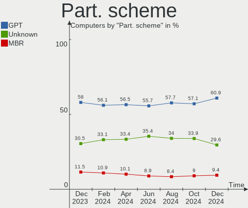
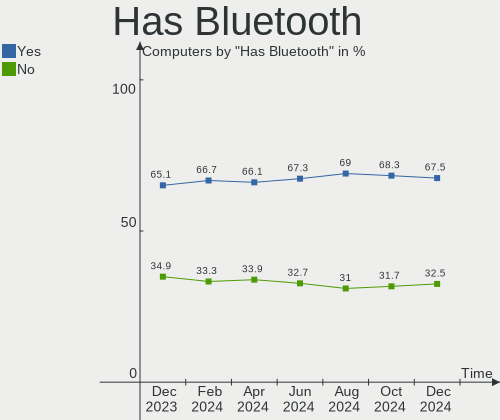
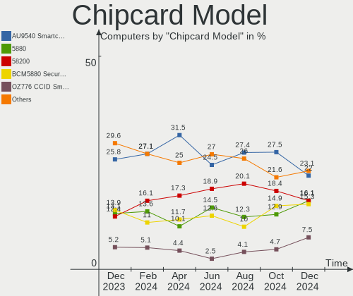

Linux - Hardware Trends
-----------------------

A project to identify most popular hardware characteristics and track their change
over time based on data collected by Linux users at https://Linux-Hardware.org.

Anyone can contribute to this report by the [hw-probe](https://github.com/linuxhw/hw-probe) tool:

    sudo -E hw-probe -all -upload

This is a report for all computer types. See also reports for [desktops](/Desktop/README.md) and [notebooks](/Notebook/README.md).

Distribution-specific reports: [Arch](/Dist/Arch), [ArcoLinux](/Dist/ArcoLinux), [BlackPanther](/Dist/BlackPanther), [CentOS](/Dist/CentOS), [Clear Linux](/Dist/Clear_Linux), [Debian](/Dist/Debian), [Elementary](/Dist/Elementary), [EndeavourOS](/Dist/EndeavourOS), [Endless](/Dist/Endless), [Fedora](/Dist/Fedora), [Garuda Linux](/Dist/Garuda_Linux), [Gentoo](/Dist/Gentoo), [Kali](/Dist/Kali), [KDE neon](/Dist/KDE_neon), [Kubuntu](/Dist/Kubuntu), [Linux Mint](/Dist/Linux_Mint), [Manjaro](/Dist/Manjaro), [OpenMandriva](/Dist/OpenMandriva), [openSUSE](/Dist/openSUSE), [Pop!_OS](/Dist/Pop!_OS), [Red OS](/Dist/Red_OS), [ROSA](/Dist/ROSA), [SteamOS](/Dist/SteamOS), [Ubuntu MATE](/Dist/Ubuntu_MATE), [Ubuntu](/Dist/Ubuntu), [Xubuntu](/Dist/Xubuntu), [Zorin](/Dist/Zorin).

This report is for one last month. Overall report since the beginning of time: [TestDays](https://github.com/linuxhw/TestDays)

Period: Aug, 2023.

Contents
--------

* [ System ](#system)
  - [ OS                       ](#os)
  - [ OS Family                ](#os-family)
  - [ Kernel                   ](#kernel)
  - [ Kernel Family            ](#kernel-family)
  - [ Kernel Major Ver.        ](#kernel-major-ver)
  - [ Arch                     ](#arch)
  - [ DE                       ](#de)
  - [ Display Server           ](#display-server)
  - [ Display Manager          ](#display-manager)
  - [ OS Lang                  ](#os-lang)
  - [ Boot Mode                ](#boot-mode)
  - [ Filesystem               ](#filesystem)
  - [ Part. scheme             ](#part-scheme)
  - [ Dual Boot with Linux/BSD ](#dual-boot-with-linuxbsd)
  - [ Dual Boot (Win)          ](#dual-boot-win)

* [ Board ](#board)
  - [ Vendor                   ](#vendor)
  - [ Model                    ](#model)
  - [ Model Family             ](#model-family)
  - [ MFG Year                 ](#mfg-year)
  - [ Form Factor              ](#form-factor)
  - [ Secure Boot              ](#secure-boot)
  - [ Coreboot                 ](#coreboot)
  - [ RAM Size                 ](#ram-size)
  - [ RAM Used                 ](#ram-used)
  - [ Total Drives             ](#total-drives)
  - [ Has CD-ROM               ](#has-cd-rom)
  - [ Has Ethernet             ](#has-ethernet)
  - [ Has WiFi                 ](#has-wifi)
  - [ Has Bluetooth            ](#has-bluetooth)

* [ Location ](#location)
  - [ Country                  ](#country)
  - [ City                     ](#city)

* [ Drives ](#drives)
  - [ Drive Vendor             ](#drive-vendor)
  - [ Drive Model              ](#drive-model)
  - [ HDD Vendor               ](#hdd-vendor)
  - [ SSD Vendor               ](#ssd-vendor)
  - [ Drive Kind               ](#drive-kind)
  - [ Drive Connector          ](#drive-connector)
  - [ Drive Size               ](#drive-size)
  - [ Space Total              ](#space-total)
  - [ Space Used               ](#space-used)
  - [ Malfunc. Drives          ](#malfunc-drives)
  - [ Malfunc. Drive Vendor    ](#malfunc-drive-vendor)
  - [ Malfunc. HDD Vendor      ](#malfunc-hdd-vendor)
  - [ Malfunc. Drive Kind      ](#malfunc-drive-kind)
  - [ Failed Drives            ](#failed-drives)
  - [ Failed Drive Vendor      ](#failed-drive-vendor)
  - [ Drive Status             ](#drive-status)

* [ Storage controller ](#storage-controller)
  - [ Storage Vendor           ](#storage-vendor)
  - [ Storage Model            ](#storage-model)
  - [ Storage Kind             ](#storage-kind)

* [ Processor ](#processor)
  - [ CPU Vendor               ](#cpu-vendor)
  - [ CPU Model                ](#cpu-model)
  - [ CPU Model Family         ](#cpu-model-family)
  - [ CPU Cores                ](#cpu-cores)
  - [ CPU Sockets              ](#cpu-sockets)
  - [ CPU Threads              ](#cpu-threads)
  - [ CPU Op-Modes             ](#cpu-op-modes)
  - [ CPU Microcode            ](#cpu-microcode)
  - [ CPU Microarch            ](#cpu-microarch)

* [ Graphics ](#graphics)
  - [ GPU Vendor               ](#gpu-vendor)
  - [ GPU Model                ](#gpu-model)
  - [ GPU Combo                ](#gpu-combo)
  - [ GPU Driver               ](#gpu-driver)
  - [ GPU Memory               ](#gpu-memory)

* [ Monitor ](#monitor)
  - [ Monitor Vendor           ](#monitor-vendor)
  - [ Monitor Model            ](#monitor-model)
  - [ Monitor Resolution       ](#monitor-resolution)
  - [ Monitor Diagonal         ](#monitor-diagonal)
  - [ Monitor Width            ](#monitor-width)
  - [ Aspect Ratio             ](#aspect-ratio)
  - [ Monitor Area             ](#monitor-area)
  - [ Pixel Density            ](#pixel-density)
  - [ Multiple Monitors        ](#multiple-monitors)

* [ Network ](#network)
  - [ Net Controller Vendor    ](#net-controller-vendor)
  - [ Net Controller Model     ](#net-controller-model)
  - [ Wireless Vendor          ](#wireless-vendor)
  - [ Wireless Model           ](#wireless-model)
  - [ Ethernet Vendor          ](#ethernet-vendor)
  - [ Ethernet Model           ](#ethernet-model)
  - [ Net Controller Kind      ](#net-controller-kind)
  - [ Used Controller          ](#used-controller)
  - [ NICs                     ](#nics)
  - [ IPv6                     ](#ipv6)

* [ Bluetooth ](#bluetooth)
  - [ Bluetooth Vendor         ](#bluetooth-vendor)
  - [ Bluetooth Model          ](#bluetooth-model)

* [ Sound ](#sound)
  - [ Sound Vendor             ](#sound-vendor)
  - [ Sound Model              ](#sound-model)

* [ Memory ](#memory)
  - [ Memory Vendor            ](#memory-vendor)
  - [ Memory Model             ](#memory-model)
  - [ Memory Kind              ](#memory-kind)
  - [ Memory Form Factor       ](#memory-form-factor)
  - [ Memory Size              ](#memory-size)
  - [ Memory Speed             ](#memory-speed)

* [ Printers & scanners ](#printers--scanners)
  - [ Printer Vendor           ](#printer-vendor)
  - [ Printer Model            ](#printer-model)
  - [ Scanner Vendor           ](#scanner-vendor)
  - [ Scanner Model            ](#scanner-model)

* [ Camera ](#camera)
  - [ Camera Vendor            ](#camera-vendor)
  - [ Camera Model             ](#camera-model)

* [ Security ](#security)
  - [ Fingerprint Vendor       ](#fingerprint-vendor)
  - [ Fingerprint Model        ](#fingerprint-model)
  - [ Chipcard Vendor          ](#chipcard-vendor)
  - [ Chipcard Model           ](#chipcard-model)

* [ Unsupported ](#unsupported)
  - [ Unsupported Devices      ](#unsupported-devices)
  - [ Unsupported Device Types ](#unsupported-device-types)

System
------

OS
--

Installed operating systems

| Name                         | Computers | Percent |
|------------------------------|-----------|---------|
| Ubuntu 22.04                 | 810       | 13.97%  |
| OpenMandriva 23.08           | 484       | 8.35%   |
| Fedora 38                    | 459       | 7.92%   |
| Linux Mint 21.2              | 351       | 6.05%   |
| Debian 12                    | 341       | 5.88%   |
| Ubuntu 23.04                 | 249       | 4.29%   |
| Arch Rolling                 | 210       | 3.62%   |
| Pop!_OS 22.04                | 199       | 3.43%   |
| Zorin 16                     | 152       | 2.62%   |
| ArcoLinux Rolling            | 147       | 2.53%   |
| ROSA 12.4                    | 143       | 2.47%   |
| Ubuntu 20.04                 | 123       | 2.12%   |
| OpenMandriva 23.03           | 99        | 1.71%   |
| BlackPanther 18.1            | 96        | 1.66%   |
| Linux Mint 21.1              | 93        | 1.6%    |
| openSUSE Tumbleweed-XXXXXXXX | 73        | 1.26%   |
| KDE neon 22.04               | 69        | 1.19%   |
| Xero Rolling                 | 68        | 1.17%   |
| Manjaro                      | 65        | 1.12%   |
| Debian 11                    | 61        | 1.05%   |
| EndeavourOS Rolling          | 60        | 1.03%   |
| Kubuntu 22.04                | 58        | 1%      |
| Kubuntu 23.04                | 57        | 0.98%   |
| Manjaro 23.0.0               | 53        | 0.91%   |
| Xubuntu 22.04                | 44        | 0.76%   |
| SteamOS 3.4.8                | 44        | 0.76%   |
| Kali 2023.3                  | 43        | 0.74%   |
| OpenMandriva 4.3             | 41        | 0.71%   |
| Elementary 7                 | 39        | 0.67%   |
| Linux Mint 20.3              | 38        | 0.66%   |
| Debian                       | 35        | 0.6%    |
| openSUSE Leap-15.5           | 34        | 0.59%   |
| Nobara 38                    | 31        | 0.53%   |
| Gentoo 2.14                  | 29        | 0.5%    |
| Fedora 37                    | 27        | 0.47%   |
| Ubuntu 18.04                 | 24        | 0.41%   |
| OpenMandriva 23.90           | 24        | 0.41%   |
| OpenMandriva 23.07           | 24        | 0.41%   |
| LMDE 5                       | 24        | 0.41%   |
| Linux Mint 21                | 24        | 0.41%   |

OS Family
---------

OS without a version

| Name          | Computers | Percent |
|---------------|-----------|---------|
| Ubuntu        | 1239      | 21.37%  |
| OpenMandriva  | 698       | 12.04%  |
| Linux Mint    | 527       | 9.09%   |
| Fedora        | 506       | 8.73%   |
| Debian        | 440       | 7.59%   |
| Arch          | 210       | 3.62%   |
| Pop!_OS       | 203       | 3.5%    |
| ROSA          | 177       | 3.05%   |
| Zorin         | 156       | 2.69%   |
| ArcoLinux     | 150       | 2.59%   |
| openSUSE      | 128       | 2.21%   |
| Kubuntu       | 126       | 2.17%   |
| Manjaro       | 118       | 2.03%   |
| BlackPanther  | 101       | 1.74%   |
| KDE neon      | 70        | 1.21%   |
| Xubuntu       | 69        | 1.19%   |
| Xero          | 68        | 1.17%   |
| Kali          | 63        | 1.09%   |
| SteamOS       | 60        | 1.03%   |
| EndeavourOS   | 60        | 1.03%   |
| Gentoo        | 54        | 0.93%   |
| Elementary    | 50        | 0.86%   |
| Nobara        | 38        | 0.66%   |
| Lubuntu       | 33        | 0.57%   |
| MX            | 32        | 0.55%   |
| Ubuntu MATE   | 30        | 0.52%   |
| Garuda Linux  | 28        | 0.48%   |
| LMDE          | 25        | 0.43%   |
| Endless       | 24        | 0.41%   |
| Parrot        | 21        | 0.36%   |
| ALT Linux     | 17        | 0.29%   |
| NixOS         | 16        | 0.28%   |
| TUXEDO OS     | 11        | 0.19%   |
| Raspbian      | 11        | 0.19%   |
| CentOS        | 11        | 0.19%   |
| Ubuntu Unity  | 10        | 0.17%   |
| Ubuntu Studio | 10        | 0.17%   |
| Ubuntu Budgie | 10        | 0.17%   |
| Rocky Linux   | 10        | 0.17%   |
| Red OS        | 10        | 0.17%   |

Kernel
------

Version of the Linux kernel

| Version                           | Computers | Percent |
|-----------------------------------|-----------|---------|
| 6.2.0-26-generic                  | 752       | 12.97%  |
| 5.15.0-78-generic                 | 345       | 5.95%   |
| 6.4.11-desktop-1omv2390           | 322       | 5.55%   |
| 5.15.0-79-generic                 | 255       | 4.4%    |
| 6.1.0-11-amd64                    | 201       | 3.47%   |
| 6.4.8-desktop-2omv2390            | 178       | 3.07%   |
| 6.2.0-27-generic                  | 139       | 2.4%    |
| 6.4.6-76060406-generic            | 121       | 2.09%   |
| 5.19.0-50-generic                 | 119       | 2.05%   |
| 6.1.0-10-amd64                    | 110       | 1.9%    |
| 6.2.6-desktop-1omv2390            | 100       | 1.72%   |
| 6.4.11-200.fc38.x86_64            | 84        | 1.45%   |
| 6.1.38-generic-1rosa2021.1-x86_64 | 80        | 1.38%   |
| 6.2.0-31-generic                  | 78        | 1.35%   |
| 6.4.7-200.fc38.x86_64             | 74        | 1.28%   |
| 5.15.0-76-generic                 | 72        | 1.24%   |
| 6.2.6-76060206-generic            | 71        | 1.22%   |
| 6.4.10-200.fc38.x86_64            | 68        | 1.17%   |
| 6.4.10-arch1-1                    | 63        | 1.09%   |
| 6.4.12-arch1-1                    | 56        | 0.97%   |
| 6.4.6-200.fc38.x86_64             | 54        | 0.93%   |
| 6.2.9-300.fc38.x86_64             | 51        | 0.88%   |
| 6.4.11-arch2-1                    | 49        | 0.84%   |
| 6.4.9-arch1-1                     | 47        | 0.81%   |
| 6.4.8-arch1-1                     | 47        | 0.81%   |
| 6.4.12-200.fc38.x86_64            | 47        | 0.81%   |
| 6.3.0-kali1-amd64                 | 47        | 0.81%   |
| 5.13.0-valve36-1-neptune          | 46        | 0.79%   |
| 5.19.0-46-generic                 | 43        | 0.74%   |
| 6.4.9-200.fc38.x86_64             | 42        | 0.72%   |
| 6.1.20-generic-2rosa2021.1-x86_64 | 42        | 0.72%   |
| 5.6.14-desktop-2bP                | 39        | 0.67%   |
| 5.15.0-82-generic                 | 36        | 0.62%   |
| 4.18.16-desktop-1bP               | 32        | 0.55%   |
| 5.19.0-32-generic                 | 31        | 0.53%   |
| 5.16.7-desktop-1omv4003           | 31        | 0.53%   |
| 6.1.44-1-MANJARO                  | 29        | 0.5%    |
| 5.4.0-156-generic                 | 28        | 0.48%   |
| 5.15.0-69-generic                 | 28        | 0.48%   |
| 6.3.5-desktop-3omv2390            | 24        | 0.41%   |

Kernel Family
-------------

Linux kernel without a distro release

| Version | Computers | Percent |
|---------|-----------|---------|
| 6.2.0   | 1043      | 17.99%  |
| 5.15.0  | 843       | 14.54%  |
| 6.4.11  | 527       | 9.09%   |
| 6.1.0   | 383       | 6.6%    |
| 6.4.8   | 296       | 5.1%    |
| 5.19.0  | 228       | 3.93%   |
| 6.4.6   | 227       | 3.91%   |
| 6.4.10  | 198       | 3.41%   |
| 6.2.6   | 172       | 2.97%   |
| 6.4.7   | 159       | 2.74%   |
| 6.4.9   | 146       | 2.52%   |
| 6.4.12  | 135       | 2.33%   |
| 5.4.0   | 109       | 1.88%   |
| 6.1.38  | 98        | 1.69%   |
| 5.10.0  | 74        | 1.28%   |
| 6.3.0   | 59        | 1.02%   |
| 5.13.0  | 56        | 0.97%   |
| 6.2.9   | 52        | 0.9%    |
| 6.4.0   | 49        | 0.84%   |
| 6.1.20  | 44        | 0.76%   |
| 5.14.21 | 42        | 0.72%   |
| 5.6.14  | 40        | 0.69%   |
| 6.1.44  | 39        | 0.67%   |
| 6.1.41  | 38        | 0.66%   |
| 6.5.0   | 33        | 0.57%   |
| 4.18.16 | 32        | 0.55%   |
| 5.16.7  | 31        | 0.53%   |
| 6.3.12  | 27        | 0.47%   |
| 6.3.5   | 26        | 0.45%   |
| 4.15.0  | 26        | 0.45%   |
| 6.4.4   | 24        | 0.41%   |
| 6.4.3   | 24        | 0.41%   |
| 6.3.9   | 24        | 0.41%   |
| 5.15.85 | 21        | 0.36%   |
| 5.14.0  | 21        | 0.36%   |
| 6.3.8   | 20        | 0.34%   |
| 6.2.16  | 18        | 0.31%   |
| 5.11.0  | 18        | 0.31%   |
| 6.1.46  | 17        | 0.29%   |
| 6.1.39  | 16        | 0.28%   |

Kernel Major Ver.
-----------------

Linux kernel major version

| Version | Computers | Percent |
|---------|-----------|---------|
| 6.4     | 1797      | 30.99%  |
| 6.2     | 1301      | 22.43%  |
| 5.15    | 921       | 15.88%  |
| 6.1     | 721       | 12.43%  |
| 5.19    | 231       | 3.98%   |
| 6.3     | 182       | 3.14%   |
| 5.4     | 117       | 2.02%   |
| 5.10    | 116       | 2%      |
| 5.14    | 65        | 1.12%   |
| 5.13    | 57        | 0.98%   |
| 5.16    | 46        | 0.79%   |
| 4.18    | 45        | 0.78%   |
| 5.6     | 40        | 0.69%   |
| 6.5     | 33        | 0.57%   |
| 6.0     | 29        | 0.5%    |
| 4.15    | 26        | 0.45%   |
| 5.11    | 19        | 0.33%   |
| 5.17    | 12        | 0.21%   |
| 4.9     | 9         | 0.16%   |
| 5.8     | 6         | 0.1%    |
| 5.18    | 6         | 0.1%    |
| 4.19    | 6         | 0.1%    |
| 3.10    | 6         | 0.1%    |
| 5.3     | 2         | 0.03%   |
| 4.4     | 2         | 0.03%   |
| 6.3.3   | 1         | 0.02%   |
| 5.9     | 1         | 0.02%   |
| 4.14    | 1         | 0.02%   |
| 3.18    | 1         | 0.02%   |

Arch
----

OS architecture (x86_64, i586, etc.)

| Name        | Computers | Percent |
|-------------|-----------|---------|
| x86_64      | 5711      | 98.48%  |
| aarch64     | 36        | 0.62%   |
| i686        | 34        | 0.59%   |
| armv7l      | 10        | 0.17%   |
| armv6l      | 3         | 0.05%   |
| riscv64     | 2         | 0.03%   |
| loongarch64 | 2         | 0.03%   |
| e2k         | 1         | 0.02%   |

DE
--

Desktop Environment

| Name              | Computers | Percent |
|-------------------|-----------|---------|
| GNOME             | 2331      | 40.2%   |
| KDE5              | 1688      | 29.11%  |
| X-Cinnamon        | 473       | 8.16%   |
| XFCE              | 398       | 6.86%   |
| Unknown           | 358       | 6.17%   |
| MATE              | 132       | 2.28%   |
| LXQt              | 99        | 1.71%   |
| Pantheon          | 50        | 0.86%   |
| Cinnamon          | 42        | 0.72%   |
| i3                | 41        | 0.71%   |
| Hyprland          | 24        | 0.41%   |
| Budgie            | 23        | 0.4%    |
| LXDE              | 21        | 0.36%   |
| sway              | 15        | 0.26%   |
| Unity             | 11        | 0.19%   |
| KDE4              | 11        | 0.19%   |
| Deepin            | 11        | 0.19%   |
| KDE               | 8         | 0.14%   |
| GNOME Classic     | 8         | 0.14%   |
| lightdm-xsession  | 7         | 0.12%   |
| GNOME Flashback   | 7         | 0.12%   |
| openbox           | 5         | 0.09%   |
| dwm               | 4         | 0.07%   |
| BunsenLabs        | 4         | 0.07%   |
| bspwm             | 4         | 0.07%   |
| Xpra              | 3         | 0.05%   |
| qtile             | 3         | 0.05%   |
| awesome           | 3         | 0.05%   |
| icewm             | 2         | 0.03%   |
| chadwm            | 2         | 0.03%   |
| ubuntu:pika:GNOME | 1         | 0.02%   |
| Trinity           | 1         | 0.02%   |
| Phosh:GNOME       | 1         | 0.02%   |
| none+i3           | 1         | 0.02%   |
| none+awesome      | 1         | 0.02%   |
| mwm               | 1         | 0.02%   |
| Lubuntu           | 1         | 0.02%   |
| Jwm               | 1         | 0.02%   |
| Hypr              | 1         | 0.02%   |
| fluxbox           | 1         | 0.02%   |

Display Server
--------------

X11 or Wayland

| Name    | Computers | Percent |
|---------|-----------|---------|
| X11     | 3216      | 55.46%  |
| Wayland | 2192      | 37.8%   |
| Unknown | 258       | 4.45%   |
| Tty     | 133       | 2.29%   |

Display Manager
---------------

SDDM, LightDM, etc.

| Name    | Computers | Percent |
|---------|-----------|---------|
| Unknown | 1996      | 34.42%  |
| SDDM    | 1449      | 24.99%  |
| GDM3    | 1157      | 19.95%  |
| LightDM | 731       | 12.61%  |
| GDM     | 422       | 7.28%   |
| XDM     | 10        | 0.17%   |
| SLiM    | 9         | 0.16%   |
| KDM     | 9         | 0.16%   |
| LXDM    | 7         | 0.12%   |
| Ly      | 2         | 0.03%   |
| GREETD  | 2         | 0.03%   |
| EMPTTY  | 2         | 0.03%   |
| WDM     | 1         | 0.02%   |
| TDM     | 1         | 0.02%   |
| SLIMSKI | 1         | 0.02%   |

OS Lang
-------

Language

| Lang    | Computers | Percent |
|---------|-----------|---------|
| en_US   | 2415      | 41.65%  |
| de_DE   | 481       | 8.29%   |
| ru_RU   | 381       | 6.57%   |
| en_GB   | 308       | 5.31%   |
| Unknown | 265       | 4.57%   |
| pt_BR   | 254       | 4.38%   |
| fr_FR   | 243       | 4.19%   |
| it_IT   | 141       | 2.43%   |
| C       | 132       | 2.28%   |
| es_ES   | 122       | 2.1%    |
| en_AU   | 103       | 1.78%   |
| en_CA   | 100       | 1.72%   |
| es_MX   | 76        | 1.31%   |
| pl_PL   | 74        | 1.28%   |
| en_IN   | 72        | 1.24%   |
| zh_CN   | 43        | 0.74%   |
| es_AR   | 32        | 0.55%   |
| nl_NL   | 30        | 0.52%   |
| hu_HU   | 29        | 0.5%    |
| cs_CZ   | 27        | 0.47%   |
| tr_TR   | 25        | 0.43%   |
| en_ZA   | 21        | 0.36%   |
| de_CH   | 21        | 0.36%   |
| pt_PT   | 20        | 0.34%   |
| ja_JP   | 18        | 0.31%   |
| fr_CA   | 18        | 0.31%   |
| es_CL   | 18        | 0.31%   |
| es_CO   | 17        | 0.29%   |
| sv_SE   | 16        | 0.28%   |
| es_VE   | 15        | 0.26%   |
| en_IE   | 15        | 0.26%   |
| de_AT   | 14        | 0.24%   |
| en_IL   | 13        | 0.22%   |
| fr_BE   | 11        | 0.19%   |
| en_NZ   | 11        | 0.19%   |
| en_DK   | 11        | 0.19%   |
| nl_BE   | 10        | 0.17%   |
| POSIX   | 9         | 0.16%   |
| da_DK   | 9         | 0.16%   |
| fi_FI   | 8         | 0.14%   |

Boot Mode
---------

EFI or BIOS

| Mode | Computers | Percent |
|------|-----------|---------|
| EFI  | 3178      | 54.8%   |
| BIOS | 2621      | 45.2%   |

Filesystem
----------

Type of filesystem

| Type     | Computers | Percent |
|----------|-----------|---------|
| Ext4     | 3294      | 56.8%   |
| Btrfs    | 968       | 16.69%  |
| Tmpfs    | 773       | 13.33%  |
| Overlay  | 600       | 10.35%  |
| Xfs      | 94        | 1.62%   |
| Zfs      | 32        | 0.55%   |
| F2fs     | 16        | 0.28%   |
| Ext3     | 9         | 0.16%   |
| Jfs      | 3         | 0.05%   |
| Ext2     | 3         | 0.05%   |
| XXX4     | 2         | 0.03%   |
| Aufs     | 2         | 0.03%   |
| Unknown  | 2         | 0.03%   |
| Reiserfs | 1         | 0.02%   |

Part. scheme
------------

Scheme of partitioning

| Type    | Computers | Percent |
|---------|-----------|---------|
| GPT     | 3434      | 59.22%  |
| Unknown | 1725      | 29.75%  |
| MBR     | 640       | 11.04%  |

Dual Boot with Linux/BSD
------------------------

Hosting more than one Linux/BSD

| Dual boot | Computers | Percent |
|-----------|-----------|---------|
| No        | 4800      | 82.77%  |
| Yes       | 999       | 17.23%  |

Dual Boot (Win)
---------------

Hosting Linux and Windows

| Dual boot | Computers | Percent |
|-----------|-----------|---------|
| No        | 4227      | 72.89%  |
| Yes       | 1572      | 27.11%  |

Board
-----

Vendor
------

Motherboard manufacturer

| Name                    | Computers | Percent |
|-------------------------|-----------|---------|
| Lenovo                  | 915       | 15.78%  |
| ASUSTek Computer        | 891       | 15.36%  |
| Hewlett-Packard         | 773       | 13.33%  |
| Dell                    | 712       | 12.28%  |
| Gigabyte Technology     | 368       | 6.35%   |
| MSI                     | 322       | 5.55%   |
| Acer                    | 299       | 5.16%   |
| Apple                   | 176       | 3.04%   |
| ASRock                  | 165       | 2.85%   |
| Intel                   | 101       | 1.74%   |
| Unknown                 | 68        | 1.17%   |
| HUAWEI                  | 56        | 0.97%   |
| Valve                   | 54        | 0.93%   |
| Toshiba                 | 50        | 0.86%   |
| Fujitsu                 | 50        | 0.86%   |
| Samsung Electronics     | 48        | 0.83%   |
| Supermicro              | 47        | 0.81%   |
| Sony                    | 31        | 0.53%   |
| Google                  | 31        | 0.53%   |
| AZW                     | 29        | 0.5%    |
| Microsoft               | 27        | 0.47%   |
| Medion                  | 26        | 0.45%   |
| Notebook                | 24        | 0.41%   |
| Raspberry Pi Foundation | 21        | 0.36%   |
| System76                | 19        | 0.33%   |
| Positivo                | 19        | 0.33%   |
| Alienware               | 19        | 0.33%   |
| Timi                    | 18        | 0.31%   |
| Pegatron                | 18        | 0.31%   |
| Packard Bell            | 17        | 0.29%   |
| Chuwi                   | 16        | 0.28%   |
| Biostar                 | 15        | 0.26%   |
| Foxconn                 | 14        | 0.24%   |
| Huanan                  | 12        | 0.21%   |
| Panasonic               | 11        | 0.19%   |
| Gateway                 | 11        | 0.19%   |
| TUXEDO                  | 10        | 0.17%   |
| GPU Company             | 9         | 0.16%   |
| LG Electronics          | 8         | 0.14%   |
| Framework               | 8         | 0.14%   |

Model
-----

Motherboard model

| Name                                      | Computers | Percent |
|-------------------------------------------|-----------|---------|
| Lenovo ThinkPad L13 Yoga Gen 2 20VK0019US | 98        | 1.69%   |
| Unknown                                   | 75        | 1.29%   |
| Valve Jupiter                             | 54        | 0.93%   |
| ASUS All Series                           | 38        | 0.66%   |
| HP Notebook                               | 17        | 0.29%   |
| Dell OptiPlex 7010                        | 14        | 0.24%   |
| AZW SER                                   | 14        | 0.24%   |
| Supermicro Super Server                   | 13        | 0.22%   |
| ASUS TUF Gaming X570-PLUS                 | 13        | 0.22%   |
| Apple MacBookPro9,2                       | 13        | 0.22%   |
| MSI MS-7C91                               | 11        | 0.19%   |
| HP EliteBook 840 G3                       | 11        | 0.19%   |
| ASUS ROG STRIX B550-F GAMING              | 11        | 0.19%   |
| MSI MS-7C02                               | 9         | 0.16%   |
| ASUS VivoBook_ASUSLaptop X515EA_X515EA    | 9         | 0.16%   |
| ASUS PRIME A320M-K                        | 9         | 0.16%   |
| Apple MacBookPro8,1                       | 9         | 0.16%   |
| MSI MS-7B86                               | 8         | 0.14%   |
| MSI MS-7B79                               | 8         | 0.14%   |
| HP Pavilion 15                            | 8         | 0.14%   |
| Dell OptiPlex 990                         | 8         | 0.14%   |
| Dell OptiPlex 790                         | 8         | 0.14%   |
| Dell Latitude E5470                       | 8         | 0.14%   |
| Chuwi GemiBook Pro                        | 8         | 0.14%   |
| MSI MS-7721                               | 7         | 0.12%   |
| HUAWEI BOM-WXX9                           | 7         | 0.12%   |
| HP Pavilion Notebook                      | 7         | 0.12%   |
| HP Pavilion g6                            | 7         | 0.12%   |
| Gigabyte B450M DS3H                       | 7         | 0.12%   |
| Dell XPS 15 9500                          | 7         | 0.12%   |
| Dell XPS 15 7590                          | 7         | 0.12%   |
| Dell OptiPlex 9020                        | 7         | 0.12%   |
| Dell Latitude E6420                       | 7         | 0.12%   |
| ASUS M5A97 R2.0                           | 7         | 0.12%   |
| Apple Macmini7,1                          | 7         | 0.12%   |
| Apple MacBookAir6,2                       | 7         | 0.12%   |
| MSI MS-7D22                               | 6         | 0.1%    |
| MSI MS-7C95                               | 6         | 0.1%    |
| MSI MS-7C94                               | 6         | 0.1%    |
| MSI MS-7C56                               | 6         | 0.1%    |

Model Family
------------

Motherboard model prefix

| Name               | Computers | Percent |
|--------------------|-----------|---------|
| Lenovo ThinkPad    | 443       | 7.64%   |
| Acer Aspire        | 195       | 3.36%   |
| Dell Latitude      | 194       | 3.35%   |
| Lenovo IdeaPad     | 161       | 2.78%   |
| Dell Inspiron      | 160       | 2.76%   |
| ASUS ROG           | 145       | 2.5%    |
| Dell OptiPlex      | 116       | 2%      |
| ASUS PRIME         | 110       | 1.9%    |
| HP Pavilion        | 107       | 1.85%   |
| HP EliteBook       | 105       | 1.81%   |
| HP Laptop          | 93        | 1.6%    |
| ASUS VivoBook      | 92        | 1.59%   |
| Dell XPS           | 77        | 1.33%   |
| ASUS TUF           | 75        | 1.29%   |
| Unknown            | 75        | 1.29%   |
| HP ProBook         | 66        | 1.14%   |
| Dell Precision     | 65        | 1.12%   |
| HP Compaq          | 58        | 1%      |
| Lenovo Legion      | 55        | 0.95%   |
| Valve Jupiter      | 54        | 0.93%   |
| Lenovo ThinkCentre | 48        | 0.83%   |
| Toshiba Satellite  | 45        | 0.78%   |
| Lenovo Yoga        | 40        | 0.69%   |
| ASUS All           | 38        | 0.66%   |
| HP ENVY            | 37        | 0.64%   |
| Dell Vostro        | 35        | 0.6%    |
| ASUS ZenBook       | 34        | 0.59%   |
| HP EliteDesk       | 31        | 0.53%   |
| HP ProDesk         | 29        | 0.5%    |
| Acer Nitro         | 29        | 0.5%    |
| Microsoft Surface  | 27        | 0.47%   |
| ASUS ASUS          | 26        | 0.45%   |
| Lenovo IdeaPadFlex | 25        | 0.43%   |
| Lenovo ThinkBook   | 24        | 0.41%   |
| Fujitsu ESPRIMO    | 24        | 0.41%   |
| Dell PowerEdge     | 24        | 0.41%   |
| HP ZBook           | 22        | 0.38%   |
| RPi Raspberry      | 21        | 0.36%   |
| Gigabyte B450M     | 20        | 0.34%   |
| Gigabyte X570      | 19        | 0.33%   |

MFG Year
--------

Motherboard manufacture year

| Year    | Computers | Percent |
|---------|-----------|---------|
| 2020    | 626       | 10.79%  |
| 2021    | 611       | 10.54%  |
| 2022    | 588       | 10.14%  |
| 2019    | 446       | 7.69%   |
| 2018    | 444       | 7.66%   |
| 2012    | 382       | 6.59%   |
| 2011    | 335       | 5.78%   |
| 2013    | 329       | 5.67%   |
| 2017    | 319       | 5.5%    |
| 2014    | 274       | 4.72%   |
| 2023    | 270       | 4.66%   |
| 2015    | 260       | 4.48%   |
| 2016    | 259       | 4.47%   |
| 2010    | 218       | 3.76%   |
| 2009    | 151       | 2.6%    |
| 2008    | 135       | 2.33%   |
| 2007    | 73        | 1.26%   |
| Unknown | 51        | 0.88%   |
| 2006    | 19        | 0.33%   |
| 2005    | 5         | 0.09%   |
| 2004    | 2         | 0.03%   |
| 2003    | 2         | 0.03%   |

Form Factor
-----------

Physical design of the computer

| Name           | Computers | Percent |
|----------------|-----------|---------|
| Notebook       | 3031      | 52.27%  |
| Desktop        | 2097      | 36.16%  |
| Convertible    | 271       | 4.67%   |
| Mini pc        | 127       | 2.19%   |
| All in one     | 90        | 1.55%   |
| Server         | 78        | 1.35%   |
| Tablet         | 56        | 0.97%   |
| System on chip | 47        | 0.81%   |
| Phone          | 2         | 0.03%   |

Secure Boot
-----------

Enabled or disabled

| State    | Computers | Percent |
|----------|-----------|---------|
| Disabled | 5416      | 93.4%   |
| Enabled  | 383       | 6.6%    |

Coreboot
--------

Have coreboot on board

| Used | Computers | Percent |
|------|-----------|---------|
| No   | 5750      | 99.16%  |
| Yes  | 49        | 0.84%   |

RAM Size
--------

Total RAM memory

| Size in GB      | Computers | Percent |
|-----------------|-----------|---------|
| 4.01-8.0        | 1307      | 22.54%  |
| 16.01-24.0      | 1258      | 21.69%  |
| 8.01-16.0       | 1133      | 19.54%  |
| 3.01-4.0        | 728       | 12.55%  |
| 32.01-64.0      | 724       | 12.48%  |
| 64.01-256.0     | 274       | 4.72%   |
| 24.01-32.0      | 164       | 2.83%   |
| 1.01-2.0        | 114       | 1.97%   |
| 2.01-3.0        | 51        | 0.88%   |
| More than 256.0 | 22        | 0.38%   |
| 0.51-1.0        | 16        | 0.28%   |
| 0.01-0.5        | 8         | 0.14%   |

RAM Used
--------

Used RAM memory

| Used GB     | Computers | Percent |
|-------------|-----------|---------|
| 1.01-2.0    | 1707      | 29.44%  |
| 2.01-3.0    | 1431      | 24.68%  |
| 4.01-8.0    | 1063      | 18.33%  |
| 3.01-4.0    | 857       | 14.78%  |
| 8.01-16.0   | 328       | 5.66%   |
| 0.51-1.0    | 265       | 4.57%   |
| 0.01-0.5    | 64        | 1.1%    |
| 16.01-24.0  | 50        | 0.86%   |
| 24.01-32.0  | 18        | 0.31%   |
| 32.01-64.0  | 11        | 0.19%   |
| 64.01-256.0 | 4         | 0.07%   |
| Unknown     | 1         | 0.02%   |

Total Drives
------------

Number of drives on board

| Drives | Computers | Percent |
|--------|-----------|---------|
| 1      | 3357      | 57.89%  |
| 2      | 1497      | 25.81%  |
| 3      | 460       | 7.93%   |
| 4      | 223       | 3.85%   |
| 5      | 108       | 1.86%   |
| 6      | 55        | 0.95%   |
| 0      | 38        | 0.66%   |
| 7      | 22        | 0.38%   |
| 8      | 14        | 0.24%   |
| 11     | 7         | 0.12%   |
| 10     | 7         | 0.12%   |
| 9      | 4         | 0.07%   |
| 13     | 2         | 0.03%   |
| 12     | 2         | 0.03%   |
| 40     | 1         | 0.02%   |
| 32     | 1         | 0.02%   |
| 19     | 1         | 0.02%   |

Has CD-ROM
----------

Has CD-ROM on board

| Presented | Computers | Percent |
|-----------|-----------|---------|
| No        | 4125      | 71.13%  |
| Yes       | 1674      | 28.87%  |

Has Ethernet
------------

Has Ethernet on board

| Presented | Computers | Percent |
|-----------|-----------|---------|
| Yes       | 4844      | 83.53%  |
| No        | 955       | 16.47%  |

Has WiFi
--------

Has WiFi module

| Presented | Computers | Percent |
|-----------|-----------|---------|
| Yes       | 4528      | 78.08%  |
| No        | 1271      | 21.92%  |

Has Bluetooth
-------------

Has Bluetooth module

| Presented | Computers | Percent |
|-----------|-----------|---------|
| Yes       | 3840      | 66.22%  |
| No        | 1959      | 33.78%  |

Location
--------

Country
-------

Geographic location (country)

| Country      | Computers | Percent |
|--------------|-----------|---------|
| USA          | 1124      | 19.38%  |
| Germany      | 634       | 10.93%  |
| Russia       | 454       | 7.83%   |
| Brazil       | 340       | 5.86%   |
| France       | 286       | 4.93%   |
| UK           | 218       | 3.76%   |
| Italy        | 200       | 3.45%   |
| Canada       | 185       | 3.19%   |
| Spain        | 152       | 2.62%   |
| Australia    | 140       | 2.41%   |
| Poland       | 125       | 2.16%   |
| Hungary      | 123       | 2.12%   |
| India        | 119       | 2.05%   |
| Netherlands  | 99        | 1.71%   |
| Mexico       | 96        | 1.66%   |
| Czechia      | 65        | 1.12%   |
| Switzerland  | 60        | 1.03%   |
| Argentina    | 60        | 1.03%   |
| Sweden       | 58        | 1%      |
| China        | 58        | 1%      |
| Turkey       | 57        | 0.98%   |
| Austria      | 46        | 0.79%   |
| Indonesia    | 45        | 0.78%   |
| Belgium      | 44        | 0.76%   |
| Japan        | 40        | 0.69%   |
| Finland      | 40        | 0.69%   |
| Romania      | 39        | 0.67%   |
| Portugal     | 36        | 0.62%   |
| Colombia     | 34        | 0.59%   |
| Norway       | 33        | 0.57%   |
| Denmark      | 32        | 0.55%   |
| Chile        | 32        | 0.55%   |
| South Africa | 30        | 0.52%   |
| Bulgaria     | 29        | 0.5%    |
| Israel       | 28        | 0.48%   |
| Slovakia     | 26        | 0.45%   |
| Venezuela    | 24        | 0.41%   |
| Greece       | 24        | 0.41%   |
| Serbia       | 21        | 0.36%   |
| Ireland      | 21        | 0.36%   |

City
----

Geographic location (city)

| City              | Computers | Percent |
|-------------------|-----------|---------|
| Moscow            | 133       | 2.29%   |
| Bangor            | 113       | 1.95%   |
| Berlin            | 53        | 0.91%   |
| Sydney            | 46        | 0.79%   |
| Melbourne         | 44        | 0.76%   |
| Budapest          | 39        | 0.67%   |
| St Petersburg     | 38        | 0.66%   |
| Sao Paulo         | 35        | 0.6%    |
| Hamburg           | 33        | 0.57%   |
| Paris             | 32        | 0.55%   |
| Rio de Janeiro    | 31        | 0.53%   |
| Prague            | 30        | 0.52%   |
| Warsaw            | 28        | 0.48%   |
| Madrid            | 27        | 0.47%   |
| Vienna            | 25        | 0.43%   |
| Milan             | 24        | 0.41%   |
| Istanbul          | 24        | 0.41%   |
| Rome              | 22        | 0.38%   |
| Cologne           | 22        | 0.38%   |
| Voronezh          | 20        | 0.34%   |
| Toronto           | 20        | 0.34%   |
| Singapore         | 20        | 0.34%   |
| Montreal          | 20        | 0.34%   |
| Seattle           | 18        | 0.31%   |
| Helsinki          | 18        | 0.31%   |
| Stockholm         | 17        | 0.29%   |
| Los Angeles       | 17        | 0.29%   |
| Dublin            | 17        | 0.29%   |
| Brisbane          | 17        | 0.29%   |
| Amsterdam         | 17        | 0.29%   |
| Yekaterinburg     | 16        | 0.28%   |
| Novosibirsk       | 16        | 0.28%   |
| Munich            | 16        | 0.28%   |
| Milano            | 16        | 0.28%   |
| Bengaluru         | 16        | 0.28%   |
| Belgrade          | 16        | 0.28%   |
| Frankfurt am Main | 15        | 0.26%   |
| Perth             | 14        | 0.24%   |
| Delhi             | 14        | 0.24%   |
| Curitiba          | 14        | 0.24%   |

Drives
------

Drive Vendor
------------

Hard drive vendors

| Vendor                      | Computers | Drives | Percent |
|-----------------------------|-----------|--------|---------|
| Samsung Electronics         | 1440      | 1790   | 16.55%  |
| WDC                         | 994       | 1302   | 11.43%  |
| Seagate                     | 949       | 1152   | 10.91%  |
| Sandisk                     | 570       | 628    | 6.55%   |
| Kingston                    | 465       | 501    | 5.35%   |
| Toshiba                     | 449       | 485    | 5.16%   |
| Crucial                     | 347       | 393    | 3.99%   |
| Unknown                     | 306       | 352    | 3.52%   |
| SK hynix                    | 248       | 260    | 2.85%   |
| Intel                       | 248       | 280    | 2.85%   |
| Hitachi                     | 197       | 209    | 2.26%   |
| Micron Technology           | 179       | 179    | 2.06%   |
| A-DATA Technology           | 125       | 130    | 1.44%   |
| China                       | 115       | 121    | 1.32%   |
| Phison Electronics          | 107       | 116    | 1.23%   |
| HGST                        | 101       | 149    | 1.16%   |
| Kingston Technology Company | 97        | 100    | 1.12%   |
| KIOXIA                      | 93        | 93     | 1.07%   |
| Apple                       | 87        | 101    | 1%      |
| Micron/Crucial Technology   | 81        | 88     | 0.93%   |
| Silicon Motion              | 73        | 75     | 0.84%   |
| Unknown                     | 63        | 65     | 0.72%   |
| SPCC                        | 61        | 64     | 0.7%    |
| PNY                         | 55        | 59     | 0.63%   |
| Intenso                     | 50        | 54     | 0.57%   |
| Patriot                     | 48        | 48     | 0.55%   |
| ADATA Technology            | 48        | 50     | 0.55%   |
| Phison                      | 38        | 39     | 0.44%   |
| MAXIO Technology (Hangzhou) | 36        | 40     | 0.41%   |
| JMicron Technology          | 35        | 36     | 0.4%    |
| Netac                       | 34        | 35     | 0.39%   |
| Team                        | 31        | 34     | 0.36%   |
| Apacer                      | 31        | 32     | 0.36%   |
| Fujitsu                     | 30        | 41     | 0.34%   |
| GOODRAM                     | 29        | 31     | 0.33%   |
| LITEON                      | 28        | 32     | 0.32%   |
| OCZ                         | 24        | 24     | 0.28%   |
| Hewlett-Packard             | 24        | 29     | 0.28%   |
| Lexar                       | 23        | 23     | 0.26%   |
| Gigabyte Technology         | 23        | 24     | 0.26%   |

Drive Model
-----------

Hard drive models

| Model                                                 | Computers | Percent |
|-------------------------------------------------------|-----------|---------|
| Samsung NVMe SSD Controller SM981/PM981/PM983 500GB   | 172       | 1.81%   |
| Kingston SA400S37240G 240GB SSD                       | 115       | 1.21%   |
| Samsung NVMe SSD Controller PM9A1/PM9A3/980PRO 1024GB | 113       | 1.19%   |
| Samsung MZVLB512HBJQ-000L7 512GB                      | 97        | 1.02%   |
| Samsung SSD 860 EVO 500GB                             | 70        | 0.74%   |
| Kingston SA400S37480G 480GB SSD                       | 69        | 0.73%   |
| Micron/Crucial P2 NVMe PCIe SSD 1TB                   | 68        | 0.72%   |
| Unknown                                               | 63        | 0.66%   |
| Seagate ST1000DM010-2EP102 1TB                        | 60        | 0.63%   |
| Unknown MMC Card  64GB                                | 54        | 0.57%   |
| Seagate ST1000LM035-1RK172 1TB                        | 51        | 0.54%   |
| Sandisk WD Blue SN550 NVMe SSD 250GB                  | 51        | 0.54%   |
| Samsung NVMe SSD Controller SM961/PM961/SM963 1024GB  | 51        | 0.54%   |
| Crucial CT500MX500SSD1 500GB                          | 48        | 0.51%   |
| Seagate ST2000DM008-2FR102 2TB                        | 46        | 0.48%   |
| Phison E12 NVMe Controller 256GB                      | 44        | 0.46%   |
| Crucial CT1000MX500SSD1 1TB                           | 44        | 0.46%   |
| Samsung SSD 870 EVO 500GB                             | 43        | 0.45%   |
| Samsung SSD 860 EVO 1TB                               | 43        | 0.45%   |
| Samsung SSD 850 EVO 500GB                             | 42        | 0.44%   |
| Kingston SA400S37120G 120GB SSD                       | 41        | 0.43%   |
| Intel SSDPEKNU512GZ 512GB                             | 40        | 0.42%   |
| Samsung SSD 980 1TB                                   | 39        | 0.41%   |
| Toshiba MQ01ABD100 1TB                                | 37        | 0.39%   |
| Sandisk WD Black SN750 / PC SN730 NVMe SSD 1024GB     | 37        | 0.39%   |
| Samsung SSD 870 EVO 1TB                               | 37        | 0.39%   |
| Samsung SSD 850 EVO 250GB                             | 36        | 0.38%   |
| Unknown MMC Card  32GB                                | 35        | 0.37%   |
| Seagate ST1000LM024 HN-M101MBB 1TB                    | 35        | 0.37%   |
| WDC WD10EZEX-08WN4A0 1TB                              | 34        | 0.36%   |
| Unknown SD/MMC/MS PRO 1GB                             | 34        | 0.36%   |
| Toshiba MQ01ABF050 500GB                              | 34        | 0.36%   |
| Seagate ST500DM002-1BD142 500GB                       | 34        | 0.36%   |
| Intel SSD 660P Series 512GB                           | 33        | 0.35%   |
| Seagate ST4000DM004-2CV104 4TB                        | 32        | 0.34%   |
| Toshiba DT01ACA100 1TB                                | 31        | 0.33%   |
| Kingston Company SNV2S1000G 1TB                       | 31        | 0.33%   |
| Sandisk WD Black SN850 256GB                          | 30        | 0.32%   |
| Phison PS5013 E13 NVMe Controller 512GB               | 30        | 0.32%   |
| Silicon Motion SM2263EN/SM2263XT SSD Controller 256GB | 29        | 0.31%   |

HDD Vendor
----------

Hard disk drive vendors

| Vendor              | Computers | Drives | Percent |
|---------------------|-----------|--------|---------|
| Seagate             | 924       | 1107   | 35.03%  |
| WDC                 | 784       | 1021   | 29.72%  |
| Toshiba             | 342       | 374    | 12.96%  |
| Hitachi             | 195       | 206    | 7.39%   |
| HGST                | 101       | 149    | 3.83%   |
| Samsung Electronics | 90        | 102    | 3.41%   |
| Unknown             | 36        | 36     | 1.36%   |
| Fujitsu             | 30        | 41     | 1.14%   |
| Apple               | 29        | 29     | 1.1%    |
| Maxtor              | 20        | 26     | 0.76%   |
| SABRENT             | 14        | 15     | 0.53%   |
| Hewlett-Packard     | 7         | 10     | 0.27%   |
| USB3.0              | 6         | 6      | 0.23%   |
| USB                 | 6         | 7      | 0.23%   |
| LaCie               | 5         | 5      | 0.19%   |
| Intenso             | 4         | 4      | 0.15%   |
| WD MediaMax         | 3         | 3      | 0.11%   |
| Maxone              | 3         | 3      | 0.11%   |
| External            | 3         | 4      | 0.11%   |
| Unknown             | 3         | 3      | 0.11%   |
| StoreJet            | 2         | 2      | 0.08%   |
| SAGE                | 2         | 2      | 0.08%   |
| PHD 3.0             | 2         | 2      | 0.08%   |
| Min Yi U            | 2         | 2      | 0.08%   |
| Initio              | 2         | 1      | 0.08%   |
| HGST HTS            | 2         | 2      | 0.08%   |
| ExcelStor           | 2         | 2      | 0.08%   |
| DELLBOSS            | 2         | 2      | 0.08%   |
| ASMT                | 2         | 4      | 0.08%   |
| WD_BLACK            | 1         | 1      | 0.04%   |
| WALRAM              | 1         | 1      | 0.04%   |
| Teleplan            | 1         | 1      | 0.04%   |
| SSK                 | 1         | 1      | 0.04%   |
| SINTECHI            | 1         | 1      | 0.04%   |
| MaxDigital          | 1         | 1      | 0.04%   |
| Inateck             | 1         | 1      | 0.04%   |
| IBM/Hitachi         | 1         | 1      | 0.04%   |
| IB-AC703            | 1         | 1      | 0.04%   |
| H/W                 | 1         | 3      | 0.04%   |
| Generic-            | 1         | 1      | 0.04%   |

SSD Vendor
----------

Solid state drive vendors

| Vendor              | Computers | Drives | Percent |
|---------------------|-----------|--------|---------|
| Samsung Electronics | 604       | 729    | 20.64%  |
| Kingston            | 368       | 390    | 12.58%  |
| Crucial             | 302       | 327    | 10.32%  |
| SanDisk             | 217       | 230    | 7.42%   |
| WDC                 | 160       | 182    | 5.47%   |
| China               | 115       | 121    | 3.93%   |
| A-DATA Technology   | 94        | 96     | 3.21%   |
| Intel               | 74        | 87     | 2.53%   |
| Micron Technology   | 53        | 53     | 1.81%   |
| PNY                 | 52        | 56     | 1.78%   |
| SPCC                | 49        | 51     | 1.67%   |
| SK hynix            | 47        | 47     | 1.61%   |
| Patriot             | 44        | 44     | 1.5%    |
| Intenso             | 42        | 46     | 1.44%   |
| Apple               | 37        | 37     | 1.26%   |
| Toshiba             | 34        | 35     | 1.16%   |
| Netac               | 30        | 31     | 1.03%   |
| GOODRAM             | 29        | 31     | 0.99%   |
| Team                | 28        | 31     | 0.96%   |
| LITEON              | 27        | 31     | 0.92%   |
| OCZ                 | 24        | 24     | 0.82%   |
| Apacer              | 24        | 25     | 0.82%   |
| JMicron Technology  | 22        | 23     | 0.75%   |
| Gigabyte Technology | 20        | 20     | 0.68%   |
| Transcend           | 19        | 20     | 0.65%   |
| Lexar               | 18        | 18     | 0.62%   |
| KingSpec            | 15        | 16     | 0.51%   |
| Unknown             | 14        | 14     | 0.48%   |
| Verbatim            | 13        | 14     | 0.44%   |
| Hewlett-Packard     | 13        | 15     | 0.44%   |
| Fanxiang            | 13        | 13     | 0.44%   |
| Emtec               | 13        | 14     | 0.44%   |
| AMD                 | 12        | 12     | 0.41%   |
| Seagate             | 11        | 14     | 0.38%   |
| LITEONIT            | 10        | 10     | 0.34%   |
| Corsair             | 10        | 10     | 0.34%   |
| KingFast            | 8         | 8      | 0.27%   |
| Mushkin             | 7         | 7      | 0.24%   |
| FORESEE             | 7         | 7      | 0.24%   |
| Phison              | 6         | 6      | 0.21%   |

Drive Kind
----------

HDD or SSD

| Kind    | Computers | Drives | Percent |
|---------|-----------|--------|---------|
| NVMe    | 2599      | 3156   | 33.48%  |
| SSD     | 2518      | 3196   | 32.44%  |
| HDD     | 2219      | 3190   | 28.59%  |
| MMC     | 280       | 316    | 3.61%   |
| Unknown | 146       | 165    | 1.88%   |

Drive Connector
---------------

SATA, SAS, NVMe, etc.

| Type | Computers | Drives | Percent |
|------|-----------|--------|---------|
| SATA | 3790      | 6075   | 53.77%  |
| NVMe | 2597      | 3138   | 36.84%  |
| SAS  | 382       | 494    | 5.42%   |
| MMC  | 280       | 316    | 3.97%   |

Drive Size
----------

Size of hard drive

| Size in TB | Computers | Drives | Percent |
|------------|-----------|--------|---------|
| 0.01-0.5   | 2694      | 3478   | 54.13%  |
| 0.51-1.0   | 1498      | 1811   | 30.1%   |
| 1.01-2.0   | 456       | 573    | 9.16%   |
| 3.01-4.0   | 145       | 199    | 2.91%   |
| 4.01-10.0  | 88        | 161    | 1.77%   |
| 2.01-3.0   | 72        | 93     | 1.45%   |
| 10.01-20.0 | 24        | 71     | 0.48%   |

Space Total
-----------

Amount of disk space available on the file system

| Size in GB     | Computers | Percent |
|----------------|-----------|---------|
| 101-250        | 1317      | 22.71%  |
| 251-500        | 1266      | 21.83%  |
| 501-1000       | 953       | 16.43%  |
| 1001-2000      | 516       | 8.9%    |
| 1-20           | 447       | 7.71%   |
| More than 3000 | 425       | 7.33%   |
| 51-100         | 307       | 5.29%   |
| Unknown        | 208       | 3.59%   |
| 2001-3000      | 192       | 3.31%   |
| 21-50          | 168       | 2.9%    |

Space Used
----------

Amount of used disk space

| Used GB        | Computers | Percent |
|----------------|-----------|---------|
| 1-20           | 2046      | 35.28%  |
| 21-50          | 962       | 16.59%  |
| 101-250        | 713       | 12.3%   |
| 51-100         | 632       | 10.9%   |
| 251-500        | 485       | 8.36%   |
| 501-1000       | 342       | 5.9%    |
| Unknown        | 208       | 3.59%   |
| 1001-2000      | 189       | 3.26%   |
| More than 3000 | 143       | 2.47%   |
| 2001-3000      | 79        | 1.36%   |

Malfunc. Drives
---------------

Drive models with a malfunction

| Model                                 | Computers | Drives | Percent |
|---------------------------------------|-----------|--------|---------|
| Toshiba MQ01ABD100 1TB                | 9         | 9      | 1.34%   |
| Seagate ST9500325AS 500GB             | 9         | 9      | 1.34%   |
| Seagate ST500LT012-1DG142 500GB       | 8         | 8      | 1.19%   |
| Toshiba MQ01ABF050 500GB              | 7         | 7      | 1.04%   |
| Seagate ST1000LM024 HN-M101MBB 1TB    | 7         | 7      | 1.04%   |
| Seagate ST1000DM003-1CH162 1TB        | 7         | 7      | 1.04%   |
| Seagate ST500DM002-1BD142 500GB       | 6         | 6      | 0.9%    |
| HGST HTS721010A9E630 1TB              | 6         | 6      | 0.9%    |
| HGST HTS545050A7E680 500GB            | 6         | 6      | 0.9%    |
| WDC WDS240G2G0A-00JH30 240GB SSD      | 5         | 5      | 0.75%   |
| Toshiba DT01ACA100 1TB                | 5         | 5      | 0.75%   |
| Seagate ST3500418AS 500GB             | 5         | 5      | 0.75%   |
| Seagate ST1000LM035-1RK172 1TB        | 5         | 5      | 0.75%   |
| LITEON CV8-8E128-HP 128GB SSD         | 5         | 5      | 0.75%   |
| Toshiba DT01ACA050 500GB              | 4         | 4      | 0.6%    |
| Seagate ST500LT012-9WS142 500GB       | 4         | 4      | 0.6%    |
| Seagate ST320LT012-9WS14C 320GB       | 4         | 4      | 0.6%    |
| Hitachi HTS547550A9E384 500GB         | 4         | 4      | 0.6%    |
| Hitachi HTS543225L9A300 250GB         | 4         | 4      | 0.6%    |
| HGST HTS541010A9E680 1TB              | 4         | 4      | 0.6%    |
| WDC WD5000AAKS-007AA0 500GB           | 3         | 3      | 0.45%   |
| WDC WD30EFRX-68EUZN0 3TB              | 3         | 4      | 0.45%   |
| WDC WD2500BEVT-80A23T0 250GB          | 3         | 3      | 0.45%   |
| WDC WD10PURZ-85U8XY0 1TB              | 3         | 3      | 0.45%   |
| WDC WD10EALX-009BA0 1TB               | 3         | 3      | 0.45%   |
| WDC WD1003FZEX-00MK2A0 1TB            | 3         | 3      | 0.45%   |
| WDC WD1002FAEX-00Z3A0 1TB             | 3         | 3      | 0.45%   |
| Toshiba MK2555GSX 250GB               | 3         | 3      | 0.45%   |
| SK hynix HFS128G39TND-N210A 128GB SSD | 3         | 3      | 0.45%   |
| SK hynix BC711 HFM512GD3JX013N 512GB  | 3         | 3      | 0.45%   |
| Seagate ST500LM021-1KJ152 500GB       | 3         | 3      | 0.45%   |
| Seagate ST500LM012 HN-M500MBB 500GB   | 3         | 3      | 0.45%   |
| Seagate ST3160815AS 160GB             | 3         | 3      | 0.45%   |
| Seagate ST31000528AS 1TB              | 3         | 3      | 0.45%   |
| Seagate ST2000LM007-1R8174 2TB        | 3         | 3      | 0.45%   |
| Seagate ST2000DL003-9VT166 2TB        | 3         | 3      | 0.45%   |
| Seagate ST1000LM014-1EJ164 1TB        | 3         | 3      | 0.45%   |
| Seagate ST1000DM010-2EP102 1TB        | 3         | 3      | 0.45%   |
| Samsung Electronics SSD 980 1TB       | 3         | 3      | 0.45%   |
| Samsung Electronics SSD 870 EVO 500GB | 3         | 3      | 0.45%   |

Malfunc. Drive Vendor
---------------------

Vendors of faulty drives

| Vendor                      | Computers | Drives | Percent |
|-----------------------------|-----------|--------|---------|
| Seagate                     | 156       | 164    | 23.85%  |
| WDC                         | 143       | 157    | 21.87%  |
| Toshiba                     | 55        | 57     | 8.41%   |
| Hitachi                     | 55        | 55     | 8.41%   |
| Samsung Electronics         | 45        | 47     | 6.88%   |
| HGST                        | 26        | 29     | 3.98%   |
| Intel                       | 23        | 24     | 3.52%   |
| Kingston                    | 18        | 20     | 2.75%   |
| SK hynix                    | 17        | 17     | 2.6%    |
| SanDisk                     | 13        | 13     | 1.99%   |
| Maxtor                      | 9         | 13     | 1.38%   |
| Crucial                     | 8         | 8      | 1.22%   |
| A-DATA Technology           | 8         | 8      | 1.22%   |
| Netac                       | 7         | 7      | 1.07%   |
| China                       | 7         | 7      | 1.07%   |
| LITEON                      | 5         | 5      | 0.76%   |
| Fujitsu                     | 5         | 5      | 0.76%   |
| Apple                       | 5         | 5      | 0.76%   |
| Micron Technology           | 4         | 4      | 0.61%   |
| Intenso                     | 4         | 4      | 0.61%   |
| SPCC                        | 3         | 3      | 0.46%   |
| JMicron Technology          | 3         | 3      | 0.46%   |
| SSSTC                       | 2         | 2      | 0.31%   |
| Realtek Semiconductor       | 2         | 2      | 0.31%   |
| OCZ                         | 2         | 2      | 0.31%   |
| LITEONIT                    | 2         | 2      | 0.31%   |
| XrayDisk                    | 1         | 1      | 0.15%   |
| Timetec                     | 1         | 1      | 0.15%   |
| Team                        | 1         | 1      | 0.15%   |
| ShiJi                       | 1         | 1      | 0.15%   |
| SAGE                        | 1         | 1      | 0.15%   |
| SABRENT                     | 1         | 1      | 0.15%   |
| RDM-II                      | 1         | 1      | 0.15%   |
| POWER                       | 1         | 1      | 0.15%   |
| Neo                         | 1         | 1      | 0.15%   |
| MAXIO Technology (Hangzhou) | 1         | 1      | 0.15%   |
| Lexar                       | 1         | 1      | 0.15%   |
| Kingmax                     | 1         | 1      | 0.15%   |
| KingDian                    | 1         | 1      | 0.15%   |
| KEEPDATA                    | 1         | 1      | 0.15%   |

Malfunc. HDD Vendor
-------------------

Vendors of faulty HDD drives

| Vendor              | Computers | Drives | Percent |
|---------------------|-----------|--------|---------|
| Seagate             | 156       | 164    | 33.55%  |
| WDC                 | 130       | 143    | 27.96%  |
| Hitachi             | 55        | 55     | 11.83%  |
| Toshiba             | 53        | 55     | 11.4%   |
| HGST                | 26        | 29     | 5.59%   |
| Samsung Electronics | 22        | 23     | 4.73%   |
| Maxtor              | 9         | 13     | 1.94%   |
| Fujitsu             | 5         | 5      | 1.08%   |
| Apple               | 4         | 4      | 0.86%   |
| SAGE                | 1         | 1      | 0.22%   |
| SABRENT             | 1         | 1      | 0.22%   |
| IBM/Hitachi         | 1         | 1      | 0.22%   |
| ExcelStor           | 1         | 1      | 0.22%   |
| CLOVER              | 1         | 1      | 0.22%   |

Malfunc. Drive Kind
-------------------

Kinds of faulty drives

| Kind | Computers | Drives | Percent |
|------|-----------|--------|---------|
| HDD  | 419       | 496    | 69.03%  |
| SSD  | 156       | 163    | 25.7%   |
| NVMe | 32        | 32     | 5.27%   |

Failed Drives
-------------

Failed drive models

| Model                                           | Computers | Drives | Percent |
|-------------------------------------------------|-----------|--------|---------|
| WDC WD800JD-00MSA1 80GB                         | 1         | 1      | 7.14%   |
| WDC WD3200BPVT-22JJ5T0 320GB                    | 1         | 1      | 7.14%   |
| WDC WD1002FAEX-00Z3A0 1TB                       | 1         | 1      | 7.14%   |
| Union Memory (Shenzhen) RPFTJ128PDD2EWX 128GB   | 1         | 1      | 7.14%   |
| Seagate ST9320325AS 320GB                       | 1         | 1      | 7.14%   |
| Seagate ST3320613AS 320GB                       | 1         | 1      | 7.14%   |
| Seagate ST3250318AS 250GB                       | 1         | 1      | 7.14%   |
| Seagate ST31000528AS 1TB                        | 1         | 1      | 7.14%   |
| Samsung Electronics SSD 980 1TB                 | 1         | 1      | 7.14%   |
| Samsung Electronics MZMPC032HBCD-000H1 32GB SSD | 1         | 1      | 7.14%   |
| Samsung Electronics HM160HC 160GB               | 1         | 1      | 7.14%   |
| Samsung Electronics HD502HJ 500GB               | 1         | 2      | 7.14%   |
| Hitachi HTS545050B9SA00 500GB                   | 1         | 1      | 7.14%   |
| Hitachi HTS545032B9A300 320GB                   | 1         | 1      | 7.14%   |

Failed Drive Vendor
-------------------

Failed drive vendors

| Vendor                  | Computers | Drives | Percent |
|-------------------------|-----------|--------|---------|
| Seagate                 | 4         | 4      | 28.57%  |
| Samsung Electronics     | 4         | 5      | 28.57%  |
| WDC                     | 3         | 3      | 21.43%  |
| Hitachi                 | 2         | 2      | 14.29%  |
| Union Memory (Shenzhen) | 1         | 1      | 7.14%   |

Drive Status
------------

Number of failed and malfunc. drives

| Status   | Computers | Drives | Percent |
|----------|-----------|--------|---------|
| Detected | 2859      | 4797   | 45.39%  |
| Works    | 2835      | 4520   | 45.01%  |
| Malfunc  | 591       | 691    | 9.38%   |
| Failed   | 14        | 15     | 0.22%   |

Storage controller
------------------

Storage Vendor
--------------

Storage controller vendors

| Vendor                                  | Computers | Percent |
|-----------------------------------------|-----------|---------|
| Intel                                   | 3526      | 45.43%  |
| AMD                                     | 1142      | 14.71%  |
| Samsung Electronics                     | 872       | 11.23%  |
| SanDisk                                 | 440       | 5.67%   |
| Kingston Technology Company             | 200       | 2.58%   |
| SK hynix                                | 198       | 2.55%   |
| Phison Electronics                      | 158       | 2.04%   |
| Micron/Crucial Technology               | 131       | 1.69%   |
| Micron Technology                       | 128       | 1.65%   |
| ASMedia Technology                      | 108       | 1.39%   |
| KIOXIA                                  | 95        | 1.22%   |
| Silicon Motion                          | 91        | 1.17%   |
| ADATA Technology                        | 79        | 1.02%   |
| Toshiba America Info Systems            | 77        | 0.99%   |
| Nvidia                                  | 56        | 0.72%   |
| Marvell Technology Group                | 56        | 0.72%   |
| JMicron Technology                      | 55        | 0.71%   |
| MAXIO Technology (Hangzhou)             | 45        | 0.58%   |
| Realtek Semiconductor                   | 36        | 0.46%   |
| LSI Logic / Symbios Logic               | 28        | 0.36%   |
| Broadcom / LSI                          | 24        | 0.31%   |
| Solid State Storage Technology          | 23        | 0.3%    |
| Apple                                   | 23        | 0.3%    |
| Union Memory (Shenzhen)                 | 22        | 0.28%   |
| Shenzhen Longsys Electronics            | 18        | 0.23%   |
| Seagate Technology                      | 18        | 0.23%   |
| INNOGRIT                                | 18        | 0.23%   |
| VIA Technologies                        | 11        | 0.14%   |
| Adaptec                                 | 11        | 0.14%   |
| O2 Micro                                | 9         | 0.12%   |
| Hewlett-Packard                         | 7         | 0.09%   |
| Yangtze Memory Technologies             | 6         | 0.08%   |
| Solidigm                                | 6         | 0.08%   |
| Silicon Image                           | 6         | 0.08%   |
| Lenovo                                  | 5         | 0.06%   |
| Lite-On Technology                      | 4         | 0.05%   |
| Silicon Integrated Systems [SiS]        | 3         | 0.04%   |
| Shenzhen Unionmemory Information System | 3         | 0.04%   |
| Netac Technology                        | 3         | 0.04%   |
| Biwin Storage Technology                | 3         | 0.04%   |

Storage Model
-------------

Storage controller models

| Model                                                                          | Computers | Percent |
|--------------------------------------------------------------------------------|-----------|---------|
| AMD FCH SATA Controller [AHCI mode]                                            | 750       | 8.58%   |
| Samsung NVMe SSD Controller SM981/PM981/PM983                                  | 375       | 4.29%   |
| Intel Sunrise Point-LP SATA Controller [AHCI mode]                             | 246       | 2.82%   |
| Intel 7 Series Chipset Family 6-port SATA Controller [AHCI mode]               | 238       | 2.72%   |
| Intel Volume Management Device NVMe RAID Controller                            | 214       | 2.45%   |
| Intel 8 Series/C220 Series Chipset Family 6-port SATA Controller 1 [AHCI mode] | 189       | 2.16%   |
| Samsung NVMe SSD Controller 980                                                | 188       | 2.15%   |
| Samsung NVMe SSD Controller PM9A1/PM9A3/980PRO                                 | 186       | 2.13%   |
| Intel 82801 Mobile SATA Controller [RAID mode]                                 | 164       | 1.88%   |
| AMD 400 Series Chipset SATA Controller                                         | 157       | 1.8%    |
| Intel 6 Series/C200 Series Chipset Family 6 port Mobile SATA AHCI Controller   | 152       | 1.74%   |
| AMD 500 Series Chipset SATA Controller                                         | 145       | 1.66%   |
| Intel Q170/Q150/B150/H170/H110/Z170/CM236 Chipset SATA Controller [AHCI Mode]  | 132       | 1.51%   |
| Intel 8 Series SATA Controller 1 [AHCI mode]                                   | 117       | 1.34%   |
| Intel 200 Series PCH SATA controller [AHCI mode]                               | 116       | 1.33%   |
| Intel 6 Series/C200 Series Chipset Family 6 port Desktop SATA AHCI Controller  | 113       | 1.29%   |
| Micron/Crucial P2 [Nick P2] / P3 / P3 Plus NVMe PCIe SSD (DRAM-less)           | 102       | 1.17%   |
| ASMedia ASM1062 Serial ATA Controller                                          | 96        | 1.1%    |
| AMD SB7x0/SB8x0/SB9x0 SATA Controller [AHCI mode]                              | 95        | 1.09%   |
| Intel Tiger Lake-LP SATA Controller                                            | 93        | 1.06%   |
| Intel Wildcat Point-LP SATA Controller [AHCI Mode]                             | 92        | 1.05%   |
| AMD SB7x0/SB8x0/SB9x0 IDE Controller                                           | 89        | 1.02%   |
| SanDisk WD Blue SN550 NVMe SSD                                                 | 85        | 0.97%   |
| Intel SATA Controller [RAID mode]                                              | 85        | 0.97%   |
| Intel Cannon Lake PCH SATA AHCI Controller                                     | 85        | 0.97%   |
| Intel 7 Series/C210 Series Chipset Family 6-port SATA Controller [AHCI mode]   | 84        | 0.96%   |
| SK hynix Gold P31/BC711/PC711 NVMe Solid State Drive                           | 83        | 0.95%   |
| Intel Celeron/Pentium Silver Processor SATA Controller                         | 80        | 0.92%   |
| Intel SSD 670p Series [Keystone Harbor]                                        | 74        | 0.85%   |
| Samsung NVMe SSD Controller SM961/PM961/SM963                                  | 72        | 0.82%   |
| Intel Cannon Lake Mobile PCH SATA AHCI Controller                              | 72        | 0.82%   |
| Intel Comet Lake SATA AHCI Controller                                          | 71        | 0.81%   |
| Intel 82801IBM/IEM (ICH9M/ICH9M-E) 4 port SATA Controller [AHCI mode]          | 69        | 0.79%   |
| Intel NM10/ICH7 Family SATA Controller [IDE mode]                              | 64        | 0.73%   |
| Kingston Company Company Non-Volatile memory controller                        | 63        | 0.72%   |
| AMD SB7x0/SB8x0/SB9x0 SATA Controller [IDE mode]                               | 62        | 0.71%   |
| Phison E12 NVMe Controller                                                     | 61        | 0.7%    |
| SanDisk WD Black SN750 / PC SN730 NVMe SSD                                     | 60        | 0.69%   |
| Intel Alder Lake-S PCH SATA Controller [AHCI Mode]                             | 59        | 0.68%   |
| Silicon Motion SM2263EN/SM2263XT (DRAM-less) NVMe SSD Controllers              | 56        | 0.64%   |

Storage Kind
------------

Kind of storage controller (IDE, SATA, NVMe, SAS, ...)

| Kind | Computers | Percent |
|------|-----------|---------|
| SATA | 3998      | 51.73%  |
| NVMe | 2600      | 33.64%  |
| RAID | 567       | 7.34%   |
| IDE  | 507       | 6.56%   |
| SAS  | 46        | 0.6%    |
| SCSI | 10        | 0.13%   |

Processor
---------

CPU Vendor
----------

Processor vendors

| Vendor        | Computers | Percent |
|---------------|-----------|---------|
| Intel         | 4183      | 72.13%  |
| AMD           | 1560      | 26.9%   |
| ARM           | 47        | 0.81%   |
| sifive,u74-mc | 2         | 0.03%   |
| Qualcomm      | 2         | 0.03%   |
| Loongson      | 2         | 0.03%   |
| CentaurHauls  | 2         | 0.03%   |
| E8C-mITX      | 1         | 0.02%   |

CPU Model
---------

Processor models

| Model                                         | Computers | Percent |
|-----------------------------------------------|-----------|---------|
| Intel 11th Gen Core i7-1165G7 @ 2.80GHz       | 158       | 2.72%   |
| Intel 11th Gen Core i5-1135G7 @ 2.40GHz       | 74        | 1.28%   |
| AMD Ryzen 7 5800H with Radeon Graphics        | 54        | 0.93%   |
| AMD Custom APU 0405                           | 54        | 0.93%   |
| AMD Ryzen 5 3600 6-Core Processor             | 48        | 0.83%   |
| AMD Ryzen 5 5500U with Radeon Graphics        | 47        | 0.81%   |
| Intel Core i5-7200U CPU @ 2.50GHz             | 46        | 0.79%   |
| AMD Ryzen 7 5700U with Radeon Graphics        | 45        | 0.78%   |
| Intel Core i5-8250U CPU @ 1.60GHz             | 43        | 0.74%   |
| AMD Ryzen 5 5600G with Radeon Graphics        | 41        | 0.71%   |
| Intel Core i5-6300U CPU @ 2.40GHz             | 37        | 0.64%   |
| Intel Core i7-9750H CPU @ 2.60GHz             | 34        | 0.59%   |
| Intel Core i7-8550U CPU @ 1.80GHz             | 34        | 0.59%   |
| Intel Core i5-3210M CPU @ 2.50GHz             | 34        | 0.59%   |
| Intel 12th Gen Core i7-12700H                 | 34        | 0.59%   |
| AMD Ryzen 5 5600X 6-Core Processor            | 33        | 0.57%   |
| Intel Core i5-8265U CPU @ 1.60GHz             | 31        | 0.53%   |
| Intel Core i5-6500 CPU @ 3.20GHz              | 31        | 0.53%   |
| AMD Ryzen 5 3500U with Radeon Vega Mobile Gfx | 31        | 0.53%   |
| Intel Core i5-6200U CPU @ 2.30GHz             | 30        | 0.52%   |
| Intel 11th Gen Core i3-1115G4 @ 3.00GHz       | 30        | 0.52%   |
| ARM Processor                                 | 30        | 0.52%   |
| AMD Ryzen 7 3700X 8-Core Processor            | 30        | 0.52%   |
| Intel Core i5-1035G1 CPU @ 1.00GHz            | 29        | 0.5%    |
| AMD Ryzen 7 5700G with Radeon Graphics        | 29        | 0.5%    |
| Intel Celeron N4020 CPU @ 1.10GHz             | 27        | 0.47%   |
| Intel 11th Gen Core i7-11800H @ 2.30GHz       | 27        | 0.47%   |
| Intel Core i7-8750H CPU @ 2.20GHz             | 26        | 0.45%   |
| Intel Core i5-3320M CPU @ 2.60GHz             | 26        | 0.45%   |
| Intel Core i5-10210U CPU @ 1.60GHz            | 25        | 0.43%   |
| Intel Core i5-5200U CPU @ 2.20GHz             | 24        | 0.41%   |
| Intel Core i5-4210U CPU @ 1.70GHz             | 24        | 0.41%   |
| Intel Core i5-3470 CPU @ 3.20GHz              | 24        | 0.41%   |
| Intel Core i7-7700HQ CPU @ 2.80GHz            | 23        | 0.4%    |
| Intel Core i7-6600U CPU @ 2.60GHz             | 23        | 0.4%    |
| Intel Core i7-3770 CPU @ 3.40GHz              | 23        | 0.4%    |
| Intel Core i7-10510U CPU @ 1.80GHz            | 23        | 0.4%    |
| Intel Core i5-2520M CPU @ 2.50GHz             | 23        | 0.4%    |
| AMD Ryzen 5 5600H with Radeon Graphics        | 23        | 0.4%    |
| Intel Core i7-8650U CPU @ 1.90GHz             | 22        | 0.38%   |

CPU Model Family
----------------

Processor model prefix

| Model                   | Computers | Percent |
|-------------------------|-----------|---------|
| Intel Core i5           | 1184      | 20.42%  |
| Other                   | 872       | 15.04%  |
| Intel Core i7           | 858       | 14.8%   |
| AMD Ryzen 5             | 423       | 7.29%   |
| AMD Ryzen 7             | 393       | 6.78%   |
| Intel Core i3           | 379       | 6.54%   |
| Intel Celeron           | 260       | 4.48%   |
| Intel Xeon              | 195       | 3.36%   |
| Intel Core 2 Duo        | 151       | 2.6%    |
| AMD Ryzen 9             | 148       | 2.55%   |
| Intel Pentium           | 104       | 1.79%   |
| AMD FX                  | 63        | 1.09%   |
| AMD Ryzen 3             | 61        | 1.05%   |
| Intel Atom              | 53        | 0.91%   |
| Intel Pentium Dual-Core | 49        | 0.84%   |
| AMD A6                  | 44        | 0.76%   |
| Intel Core 2 Quad       | 41        | 0.71%   |
| Intel Core i9           | 36        | 0.62%   |
| AMD A8                  | 32        | 0.55%   |
| AMD Ryzen 5 PRO         | 31        | 0.53%   |
| AMD Phenom II X4        | 28        | 0.48%   |
| Intel Pentium Silver    | 26        | 0.45%   |
| AMD Ryzen 7 PRO         | 25        | 0.43%   |
| AMD A4                  | 24        | 0.41%   |
| AMD A10                 | 24        | 0.41%   |
| AMD Athlon              | 20        | 0.34%   |
| Intel Core 2            | 15        | 0.26%   |
| AMD Athlon 64 X2        | 15        | 0.26%   |
| ARM BCM                 | 14        | 0.24%   |
| AMD E                   | 14        | 0.24%   |
| Intel Genuine           | 13        | 0.22%   |
| AMD E1                  | 13        | 0.22%   |
| AMD Athlon II X2        | 13        | 0.22%   |
| Intel Pentium 4         | 11        | 0.19%   |
| AMD E2                  | 11        | 0.19%   |
| Intel Pentium Gold      | 10        | 0.17%   |
| Intel Pentium Dual      | 10        | 0.17%   |
| AMD Ryzen Threadripper  | 9         | 0.16%   |
| Intel Xeon Silver       | 8         | 0.14%   |
| AMD Phenom II X6        | 8         | 0.14%   |

CPU Cores
---------

Number of processor cores

| Number  | Computers | Percent |
|---------|-----------|---------|
| 4       | 2037      | 35.13%  |
| 2       | 1826      | 31.49%  |
| 6       | 669       | 11.54%  |
| 8       | 607       | 10.47%  |
| 12      | 168       | 2.9%    |
| 10      | 107       | 1.85%   |
| 14      | 93        | 1.6%    |
| 16      | 89        | 1.53%   |
| 1       | 83        | 1.43%   |
| 24      | 31        | 0.53%   |
| 3       | 31        | 0.53%   |
| Unknown | 17        | 0.29%   |
| 28      | 16        | 0.28%   |
| 32      | 6         | 0.1%    |
| 20      | 6         | 0.1%    |
| 44      | 4         | 0.07%   |
| 5       | 3         | 0.05%   |
| 64      | 2         | 0.03%   |
| 18      | 2         | 0.03%   |
| 40      | 1         | 0.02%   |
| 36      | 1         | 0.02%   |

CPU Sockets
-----------

Number of sockets

| Number  | Computers | Percent |
|---------|-----------|---------|
| 1       | 5691      | 98.14%  |
| 2       | 88        | 1.52%   |
| Unknown | 16        | 0.28%   |
| 4       | 2         | 0.03%   |
| 16      | 1         | 0.02%   |
| 14      | 1         | 0.02%   |

CPU Threads
-----------

Threads per core (Hyper-Threading)

| Number  | Computers | Percent |
|---------|-----------|---------|
| 2       | 4172      | 71.94%  |
| 1       | 1608      | 27.73%  |
| Unknown | 17        | 0.29%   |
| 12      | 1         | 0.02%   |
| 4       | 1         | 0.02%   |

CPU Op-Modes
------------

CPU Operation Modes (32-bit, 64-bit)

| Op mode        | Computers | Percent |
|----------------|-----------|---------|
| 32-bit, 64-bit | 5757      | 99.28%  |
| Unknown        | 23        | 0.4%    |
| 32-bit         | 11        | 0.19%   |
| 64-bit         | 8         | 0.14%   |

CPU Microcode
-------------

Microcode number

| Number     | Computers | Percent |
|------------|-----------|---------|
| Unknown    | 3253      | 56.1%   |
| 0x806c1    | 160       | 2.76%   |
| 0x206a7    | 127       | 2.19%   |
| 0x306a9    | 120       | 2.07%   |
| 0x306c3    | 102       | 1.76%   |
| 0x0a50000c | 98        | 1.69%   |
| 0x0a50000d | 97        | 1.67%   |
| 0x1067a    | 75        | 1.29%   |
| 0x08108109 | 71        | 1.22%   |
| 0x08608103 | 57        | 0.98%   |
| 0x08701021 | 51        | 0.88%   |
| 0x0a601203 | 50        | 0.86%   |
| 0x506e3    | 48        | 0.83%   |
| 0x906ea    | 47        | 0.81%   |
| 0x306d4    | 47        | 0.81%   |
| 0x0a404102 | 45        | 0.78%   |
| 0x40651    | 43        | 0.74%   |
| 0x806e9    | 41        | 0.71%   |
| 0x08600106 | 36        | 0.62%   |
| 0x406e3    | 35        | 0.6%    |
| 0x806ec    | 34        | 0.59%   |
| 0x906e9    | 32        | 0.55%   |
| 0x20655    | 32        | 0.55%   |
| 0x0800820d | 32        | 0.55%   |
| 0x0a20120a | 31        | 0.53%   |
| 0x08701030 | 31        | 0.53%   |
| 0x806ea    | 26        | 0.45%   |
| 0x406f1    | 23        | 0.4%    |
| 0x010000c8 | 23        | 0.4%    |
| 0x08001138 | 22        | 0.38%   |
| 0x06006705 | 22        | 0.38%   |
| 0x706a8    | 20        | 0.34%   |
| 0x30678    | 20        | 0.34%   |
| 0x0a201025 | 20        | 0.34%   |
| 0x06001119 | 20        | 0.34%   |
| 0x06000852 | 20        | 0.34%   |
| 0x706e5    | 19        | 0.33%   |
| 0x706a1    | 19        | 0.33%   |
| 0x08108102 | 19        | 0.33%   |
| 0xb06a2    | 17        | 0.29%   |

CPU Microarch
-------------

Microarchitecture

| Name             | Computers | Percent |
|------------------|-----------|---------|
| KabyLake         | 772       | 13.31%  |
| Unknown          | 525       | 9.05%   |
| Haswell          | 418       | 7.21%   |
| Zen 3            | 384       | 6.62%   |
| SandyBridge      | 372       | 6.41%   |
| IvyBridge        | 365       | 6.29%   |
| Skylake          | 324       | 5.59%   |
| TigerLake        | 322       | 5.55%   |
| Alderlake Hybrid | 238       | 4.1%    |
| Zen 2            | 229       | 3.95%   |
| Penryn           | 213       | 3.67%   |
| Zen+             | 165       | 2.85%   |
| Broadwell        | 153       | 2.64%   |
| CometLake        | 141       | 2.43%   |
| Westmere         | 132       | 2.28%   |
| Icelake          | 125       | 2.16%   |
| Silvermont       | 119       | 2.05%   |
| Core             | 92        | 1.59%   |
| Piledriver       | 90        | 1.55%   |
| Goldmont plus    | 90        | 1.55%   |
| K10              | 82        | 1.41%   |
| Zen              | 81        | 1.4%    |
| Excavator        | 58        | 1%      |
| Nehalem          | 49        | 0.84%   |
| Goldmont         | 39        | 0.67%   |
| K8 Hammer        | 29        | 0.5%    |
| Puma             | 26        | 0.45%   |
| Bobcat           | 24        | 0.41%   |
| Tremont          | 23        | 0.4%    |
| Steamroller      | 23        | 0.4%    |
| K10 Llano        | 18        | 0.31%   |
| Jaguar           | 18        | 0.31%   |
| Bonnell          | 18        | 0.31%   |
| NetBurst         | 13        | 0.22%   |
| Bulldozer        | 10        | 0.17%   |
| Gracemont        | 9         | 0.16%   |
| P6               | 5         | 0.09%   |
| K8 & K10 hybrid  | 5         | 0.09%   |

Graphics
--------

GPU Vendor
----------

Vendors of graphics cards

| Vendor                           | Computers | Percent |
|----------------------------------|-----------|---------|
| Intel                            | 3270      | 48.32%  |
| Nvidia                           | 1749      | 25.85%  |
| AMD                              | 1649      | 24.37%  |
| Matrox Electronics Systems       | 46        | 0.68%   |
| ASPEED Technology                | 38        | 0.56%   |
| ATI Technologies                 | 5         | 0.07%   |
| Silicon Integrated Systems [SiS] | 3         | 0.04%   |
| Red Hat                          | 2         | 0.03%   |
| Loongson Technology              | 2         | 0.03%   |
| Zhaoxin                          | 1         | 0.01%   |
| VIA Technologies                 | 1         | 0.01%   |
| Silicon Motion                   | 1         | 0.01%   |

GPU Model
---------

Graphics card models

| Model                                                                                    | Computers | Percent |
|------------------------------------------------------------------------------------------|-----------|---------|
| Intel TigerLake-LP GT2 [Iris Xe Graphics]                                                | 286       | 4.13%   |
| Intel 2nd Generation Core Processor Family Integrated Graphics Controller                | 268       | 3.87%   |
| Intel 3rd Gen Core processor Graphics Controller                                         | 211       | 3.05%   |
| AMD Cezanne [Radeon Vega Series / Radeon Vega Mobile Series]                             | 181       | 2.62%   |
| Intel Haswell-ULT Integrated Graphics Controller                                         | 137       | 1.98%   |
| Intel UHD Graphics 620                                                                   | 127       | 1.84%   |
| Intel Skylake GT2 [HD Graphics 520]                                                      | 122       | 1.76%   |
| AMD Picasso/Raven 2 [Radeon Vega Series / Radeon Vega Mobile Series]                     | 120       | 1.73%   |
| Intel HD Graphics 530                                                                    | 107       | 1.55%   |
| Intel HD Graphics 620                                                                    | 106       | 1.53%   |
| AMD Lucienne                                                                             | 103       | 1.49%   |
| Intel Xeon E3-1200 v3/4th Gen Core Processor Integrated Graphics Controller              | 98        | 1.42%   |
| Intel Alder Lake-P Integrated Graphics Controller                                        | 95        | 1.37%   |
| Intel CoffeeLake-H GT2 [UHD Graphics 630]                                                | 92        | 1.33%   |
| Intel HD Graphics 5500                                                                   | 90        | 1.3%    |
| AMD Renoir                                                                               | 88        | 1.27%   |
| AMD Ellesmere [Radeon RX 470/480/570/570X/580/580X/590]                                  | 80        | 1.16%   |
| Intel Core Processor Integrated Graphics Controller                                      | 79        | 1.14%   |
| Intel GeminiLake [UHD Graphics 600]                                                      | 74        | 1.07%   |
| Intel WhiskeyLake-U GT2 [UHD Graphics 620]                                               | 73        | 1.06%   |
| Intel HD Graphics 630                                                                    | 69        | 1%      |
| Intel CometLake-U GT2 [UHD Graphics]                                                     | 69        | 1%      |
| AMD Rembrandt [Radeon 680M]                                                              | 65        | 0.94%   |
| Intel Raptor Lake-P [Iris Xe Graphics]                                                   | 64        | 0.93%   |
| Intel CoffeeLake-S GT2 [UHD Graphics 630]                                                | 62        | 0.9%    |
| Intel Atom Processor Z36xxx/Z37xxx Series Graphics & Display                             | 60        | 0.87%   |
| Intel Atom/Celeron/Pentium Processor x5-E8000/J3xxx/N3xxx Integrated Graphics Controller | 59        | 0.85%   |
| AMD Barcelo                                                                              | 59        | 0.85%   |
| AMD Raphael                                                                              | 57        | 0.82%   |
| Nvidia GA107M [GeForce RTX 3050 Mobile]                                                  | 56        | 0.81%   |
| Intel Mobile 4 Series Chipset Integrated Graphics Controller                             | 56        | 0.81%   |
| AMD VanGogh [AMD Custom GPU 0405]                                                        | 54        | 0.78%   |
| Intel 4th Gen Core Processor Integrated Graphics Controller                              | 51        | 0.74%   |
| Intel Xeon E3-1200 v2/3rd Gen Core processor Graphics Controller                         | 48        | 0.69%   |
| AMD Navi 22 [Radeon RX 6700/6700 XT/6750 XT / 6800M/6850M XT]                            | 47        | 0.68%   |
| Nvidia GA106M [GeForce RTX 3060 Mobile / Max-Q]                                          | 46        | 0.66%   |
| Intel TigerLake-H GT1 [UHD Graphics]                                                     | 46        | 0.66%   |
| Intel CometLake-H GT2 [UHD Graphics]                                                     | 44        | 0.64%   |
| Nvidia TU117M [GeForce GTX 1650 Mobile / Max-Q]                                          | 43        | 0.62%   |
| Nvidia GP107 [GeForce GTX 1050 Ti]                                                       | 42        | 0.61%   |

GPU Combo
---------

Combinations of graphics cards

| Name                      | Computers | Percent |
|---------------------------|-----------|---------|
| 1 x Intel                 | 2388      | 41.18%  |
| 1 x AMD                   | 1266      | 21.83%  |
| 1 x Nvidia                | 898       | 15.49%  |
| Intel + Nvidia            | 664       | 11.45%  |
| AMD + Nvidia              | 148       | 2.55%   |
| Intel + AMD               | 134       | 2.31%   |
| 2 x AMD                   | 97        | 1.67%   |
| Other                     | 56        | 0.97%   |
| 2 x Intel                 | 38        | 0.66%   |
| 1 x Matrox                | 38        | 0.66%   |
| 1 x ASPEED                | 27        | 0.47%   |
| 2 x Nvidia                | 15        | 0.26%   |
| Nvidia + ASPEED           | 8         | 0.14%   |
| Nvidia + Matrox           | 7         | 0.12%   |
| 1 x SiS                   | 3         | 0.05%   |
| 1 x Red Hat               | 2         | 0.03%   |
| AMD + Loongson Technology | 2         | 0.03%   |
| AMD + ASPEED              | 2         | 0.03%   |
| 2 x Nvidia + 1 x ASPEED   | 1         | 0.02%   |
| 2 x Intel + 1 x Nvidia    | 1         | 0.02%   |
| 1 x Zhaoxin               | 1         | 0.02%   |
| 1 x VIA                   | 1         | 0.02%   |
| 1 x Silicon Motion        | 1         | 0.02%   |
| AMD + Matrox              | 1         | 0.02%   |

GPU Driver
----------

Free vs proprietary

| Driver      | Computers | Percent |
|-------------|-----------|---------|
| Free        | 4662      | 80.39%  |
| Proprietary | 909       | 15.68%  |
| Unknown     | 228       | 3.93%   |

GPU Memory
----------

Total video memory

| Size in GB | Computers | Percent |
|------------|-----------|---------|
| Unknown    | 3745      | 64.58%  |
| 0.01-0.5   | 495       | 8.54%   |
| 1.01-2.0   | 474       | 8.17%   |
| 0.51-1.0   | 283       | 4.88%   |
| 3.01-4.0   | 274       | 4.72%   |
| 7.01-8.0   | 246       | 4.24%   |
| 8.01-16.0  | 132       | 2.28%   |
| 5.01-6.0   | 83        | 1.43%   |
| 2.01-3.0   | 37        | 0.64%   |
| 16.01-24.0 | 27        | 0.47%   |
| 4.01-5.0   | 2         | 0.03%   |
| 32.01-64.0 | 1         | 0.02%   |

Monitor
-------

Monitor Vendor
--------------

Monitor vendors

| Vendor                  | Computers | Percent |
|-------------------------|-----------|---------|
| AU Optronics            | 778       | 12.32%  |
| Samsung Electronics     | 725       | 11.48%  |
| BOE                     | 639       | 10.12%  |
| Chimei Innolux          | 518       | 8.21%   |
| LG Display              | 448       | 7.1%    |
| Goldstar                | 356       | 5.64%   |
| Dell                    | 353       | 5.59%   |
| Hewlett-Packard         | 205       | 3.25%   |
| Acer                    | 200       | 3.17%   |
| Apple                   | 148       | 2.34%   |
| AOC                     | 144       | 2.28%   |
| Philips                 | 137       | 2.17%   |
| BenQ                    | 127       | 2.01%   |
| Lenovo                  | 121       | 1.92%   |
| Sharp                   | 106       | 1.68%   |
| Ancor Communications    | 96        | 1.52%   |
| ASUSTek Computer        | 80        | 1.27%   |
| ViewSonic               | 65        | 1.03%   |
| Chi Mei Optoelectronics | 64        | 1.01%   |
| Iiyama                  | 63        | 1%      |
| PANDA                   | 59        | 0.93%   |
| Valve                   | 56        | 0.89%   |
| InfoVision              | 54        | 0.86%   |
| Sony                    | 47        | 0.74%   |
| MSI                     | 41        | 0.65%   |
| CSO                     | 37        | 0.59%   |
| Unknown                 | 26        | 0.41%   |
| Gigabyte Technology     | 26        | 0.41%   |
| Eizo                    | 22        | 0.35%   |
| Sceptre Tech            | 21        | 0.33%   |
| LG Philips              | 21        | 0.33%   |
| LG Electronics          | 20        | 0.32%   |
| NEC Computers           | 19        | 0.3%    |
| HKC                     | 19        | 0.3%    |
| Fujitsu Siemens         | 19        | 0.3%    |
| Unknown                 | 17        | 0.27%   |
| Toshiba                 | 16        | 0.25%   |
| RTK                     | 14        | 0.22%   |
| Panasonic               | 14        | 0.22%   |
| Mi                      | 14        | 0.22%   |

Monitor Model
-------------

Monitor models

| Model                                                                 | Computers | Percent |
|-----------------------------------------------------------------------|-----------|---------|
| AU Optronics LCD Monitor AUO592D 1920x1080 293x165mm 13.2-inch        | 90        | 1.39%   |
| Valve ANX7530 U VLV3001 800x1280 100x150mm 7.1-inch                   | 54        | 0.83%   |
| Chimei Innolux LCD Monitor CMN15F5 1920x1080 344x193mm 15.5-inch      | 29        | 0.45%   |
| Chimei Innolux LCD Monitor CMN14D4 1920x1080 309x173mm 13.9-inch      | 26        | 0.4%    |
| Chimei Innolux LCD Monitor CMN15E7 1920x1080 344x193mm 15.5-inch      | 23        | 0.36%   |
| Goldstar FULL HD GSM5B55 1920x1080 480x270mm 21.7-inch                | 22        | 0.34%   |
| Chimei Innolux LCD Monitor CMN15DB 1366x768 344x193mm 15.5-inch       | 22        | 0.34%   |
| Chimei Innolux LCD Monitor CMN1521 1920x1080 344x193mm 15.5-inch      | 22        | 0.34%   |
| Goldstar ULTRAWIDE GSM59F1 2560x1080 673x284mm 28.8-inch              | 19        | 0.29%   |
| AU Optronics LCD Monitor AUO22EC 1366x768 344x193mm 15.5-inch         | 19        | 0.29%   |
| Samsung Electronics LCD Monitor SEC5441 1280x800 331x207mm 15.4-inch  | 18        | 0.28%   |
| Samsung Electronics C24F390 SAM0D2C 1920x1080 521x293mm 23.5-inch     | 18        | 0.28%   |
| BOE LCD Monitor BOE0872 1920x1080 344x194mm 15.5-inch                 | 18        | 0.28%   |
| LG Display LCD Monitor LGD02DC 1366x768 344x194mm 15.5-inch           | 17        | 0.26%   |
| AU Optronics LCD Monitor AUO21ED 1920x1080 344x193mm 15.5-inch        | 17        | 0.26%   |
| Unknown                                                               | 17        | 0.26%   |
| AU Optronics LCD Monitor AUO26EC 1366x768 344x193mm 15.5-inch         | 16        | 0.25%   |
| Goldstar HDR 4K GSM7707 3840x2160 600x340mm 27.2-inch                 | 15        | 0.23%   |
| Unknown LCD Monitor FFFF 2288x1287 2550x2550mm 142.0-inch             | 14        | 0.22%   |
| Samsung Electronics LCD Monitor SDC4171 2880x1800 302x189mm 14.0-inch | 14        | 0.22%   |
| Samsung Electronics S24F350 SAM0D20 1920x1080 521x293mm 23.5-inch     | 13        | 0.2%    |
| Goldstar HDR WFHD GSM7714 2560x1080 798x334mm 34.1-inch               | 13        | 0.2%    |
| AU Optronics LCD Monitor AUO71EC 1366x768 344x193mm 15.5-inch         | 13        | 0.2%    |
| AU Optronics LCD Monitor AUO106C 1366x768 276x155mm 12.5-inch         | 13        | 0.2%    |
| Goldstar HDR 4K GSM7706 3840x2160 600x340mm 27.2-inch                 | 12        | 0.19%   |
| Dell U2412M DELA07B 1920x1200 518x324mm 24.1-inch                     | 12        | 0.19%   |
| AU Optronics LCD Monitor AUOE48D 1920x1080 344x194mm 15.5-inch        | 12        | 0.19%   |
| Samsung Electronics LCD Monitor SDC4161 1920x1080 344x194mm 15.5-inch | 11        | 0.17%   |
| Samsung Electronics C27F390 SAM0D32 1920x1080 598x336mm 27.0-inch     | 11        | 0.17%   |
| Chimei Innolux LCD Monitor CMN15E6 1366x768 344x193mm 15.5-inch       | 11        | 0.17%   |
| Chimei Innolux LCD Monitor CMN1406 1920x1080 309x173mm 13.9-inch      | 11        | 0.17%   |
| BOE LCD Monitor BOE084E 1920x1080 382x215mm 17.3-inch                 | 11        | 0.17%   |
| BOE LCD Monitor BOE0812 1920x1080 344x194mm 15.5-inch                 | 11        | 0.17%   |
| AU Optronics LCD Monitor AUO38ED 1920x1080 344x193mm 15.5-inch        | 11        | 0.17%   |
| AU Optronics LCD Monitor AUO133D 1920x1080 309x173mm 13.9-inch        | 11        | 0.17%   |
| AU Optronics LCD Monitor AUO10EC 1366x768 344x193mm 15.5-inch         | 11        | 0.17%   |
| AOC 24B1W1 AOC2401 1920x1080 527x296mm 23.8-inch                      | 11        | 0.17%   |
| Philips PHL 223V5 PHLC0CF 1920x1080 477x268mm 21.5-inch               | 10        | 0.15%   |
| PANDA LCD Monitor NCP004D 1920x1080 344x194mm 15.5-inch               | 10        | 0.15%   |
| Chimei Innolux LCD Monitor CMN15D5 1920x1080 344x193mm 15.5-inch      | 10        | 0.15%   |

Monitor Resolution
------------------

Monitor screen resolution

| Resolution         | Computers | Percent |
|--------------------|-----------|---------|
| 1920x1080 (FHD)    | 2751      | 45.6%   |
| 1366x768 (WXGA)    | 945       | 15.66%  |
| 3840x2160 (4K)     | 439       | 7.28%   |
| 2560x1440 (QHD)    | 334       | 5.54%   |
| 1600x900 (HD+)     | 205       | 3.4%    |
| 1920x1200 (WUXGA)  | 197       | 3.27%   |
| 1680x1050 (WSXGA+) | 133       | 2.2%    |
| 1280x1024 (SXGA)   | 119       | 1.97%   |
| 1440x900 (WXGA+)   | 117       | 1.94%   |
| 2560x1600          | 102       | 1.69%   |
| 1280x800 (WXGA)    | 94        | 1.56%   |
| 3440x1440          | 81        | 1.34%   |
| 2560x1080          | 68        | 1.13%   |
| 800x1280           | 54        | 0.9%    |
| 2880x1800          | 53        | 0.88%   |
| 1360x768           | 29        | 0.48%   |
| 3840x2400          | 27        | 0.45%   |
| 2160x1440          | 27        | 0.45%   |
| Unknown            | 26        | 0.43%   |
| 1024x768 (XGA)     | 19        | 0.31%   |
| 3840x1080          | 17        | 0.28%   |
| 1920x540           | 16        | 0.27%   |
| 2736x1824          | 15        | 0.25%   |
| 2288x1287          | 15        | 0.25%   |
| 1920x1280          | 13        | 0.22%   |
| 2256x1504          | 11        | 0.18%   |
| 3072x1920          | 9         | 0.15%   |
| 3200x1800 (QHD+)   | 8         | 0.13%   |
| 1600x1200          | 8         | 0.13%   |
| 1024x600           | 8         | 0.13%   |
| 3456x2160          | 7         | 0.12%   |
| 2240x1400          | 7         | 0.12%   |
| 1280x720 (HD)      | 7         | 0.12%   |
| 3200x2000          | 5         | 0.08%   |
| 3000x2000          | 5         | 0.08%   |
| 2880x1620          | 4         | 0.07%   |
| 1600x2560          | 4         | 0.07%   |
| 5120x1440          | 3         | 0.05%   |
| 2520x1680          | 3         | 0.05%   |
| 2304x1440          | 3         | 0.05%   |

Monitor Diagonal
----------------

Diagonal size in inches

| Inches  | Computers | Percent |
|---------|-----------|---------|
| 15      | 1416      | 22.45%  |
| 13      | 658       | 10.43%  |
| 14      | 520       | 8.25%   |
| 27      | 508       | 8.06%   |
| 24      | 454       | 7.2%    |
| 23      | 406       | 6.44%   |
| 21      | 357       | 5.66%   |
| 17      | 325       | 5.15%   |
| 31      | 186       | 2.95%   |
| Unknown | 141       | 2.24%   |
| 16      | 133       | 2.11%   |
| 19      | 132       | 2.09%   |
| 34      | 130       | 2.06%   |
| 12      | 117       | 1.86%   |
| 18      | 96        | 1.52%   |
| 22      | 91        | 1.44%   |
| 20      | 87        | 1.38%   |
| 11      | 67        | 1.06%   |
| 7       | 55        | 0.87%   |
| 84      | 48        | 0.76%   |
| 54      | 41        | 0.65%   |
| 32      | 33        | 0.52%   |
| 72      | 29        | 0.46%   |
| 40      | 29        | 0.46%   |
| 26      | 25        | 0.4%    |
| 28      | 19        | 0.3%    |
| 10      | 19        | 0.3%    |
| 46      | 17        | 0.27%   |
| 25      | 15        | 0.24%   |
| 142     | 14        | 0.22%   |
| 65      | 11        | 0.17%   |
| 52      | 11        | 0.17%   |
| 48      | 11        | 0.17%   |
| 35      | 11        | 0.17%   |
| 29      | 11        | 0.17%   |
| 42      | 9         | 0.14%   |
| 43      | 8         | 0.13%   |
| 36      | 7         | 0.11%   |
| 49      | 6         | 0.1%    |
| 39      | 6         | 0.1%    |

Monitor Width
-------------

Physical width

| Width in mm    | Computers | Percent |
|----------------|-----------|---------|
| 301-350        | 2323      | 37.43%  |
| 501-600        | 1270      | 20.46%  |
| 401-500        | 702       | 11.31%  |
| 201-300        | 600       | 9.67%   |
| 351-400        | 383       | 6.17%   |
| 601-700        | 268       | 4.32%   |
| 701-800        | 175       | 2.82%   |
| Unknown        | 141       | 2.27%   |
| 1001-1500      | 105       | 1.69%   |
| 1501-2000      | 87        | 1.4%    |
| 801-900        | 55        | 0.89%   |
| 1-100          | 54        | 0.87%   |
| 901-1000       | 21        | 0.34%   |
| More than 2000 | 14        | 0.23%   |
| 101-200        | 8         | 0.13%   |

Aspect Ratio
------------

Proportional relationship between the width and the height

| Ratio   | Computers | Percent |
|---------|-----------|---------|
| 16/9    | 4329      | 75.73%  |
| 16/10   | 762       | 13.33%  |
| 21/9    | 151       | 2.64%   |
| 5/4     | 112       | 1.96%   |
| Unknown | 108       | 1.89%   |
| 3/2     | 98        | 1.71%   |
| 0.67    | 54        | 0.94%   |
| 4/3     | 50        | 0.87%   |
| 1.00    | 14        | 0.24%   |
| 32/9    | 12        | 0.21%   |
| 6/5     | 8         | 0.14%   |
| 0.56    | 4         | 0.07%   |
| 0.62    | 3         | 0.05%   |
| 3.40    | 2         | 0.03%   |
| 2.65    | 2         | 0.03%   |
| 2.00    | 2         | 0.03%   |
| 1.96    | 1         | 0.02%   |
| 0.75    | 1         | 0.02%   |
| 0.63    | 1         | 0.02%   |
| 0.58    | 1         | 0.02%   |
| 0.45    | 1         | 0.02%   |

Monitor Area
------------

Area in inch

| Area in inch | Computers | Percent |
|----------------|-----------|---------|
| 101-110        | 1426      | 22.81%  |
| 201-250        | 997       | 15.95%  |
| 81-90          | 854       | 13.66%  |
| 301-350        | 526       | 8.41%   |
| 351-500        | 381       | 6.09%   |
| 151-200        | 332       | 5.31%   |
| 71-80          | 325       | 5.2%    |
| 121-130        | 235       | 3.76%   |
| 251-300        | 199       | 3.18%   |
| More than 1000 | 183       | 2.93%   |
| Unknown        | 141       | 2.26%   |
| 141-150        | 139       | 2.22%   |
| 111-120        | 116       | 1.86%   |
| 61-70          | 100       | 1.6%    |
| 501-1000       | 96        | 1.54%   |
| 51-60          | 70        | 1.12%   |
| 1-40           | 61        | 0.98%   |
| 131-140        | 30        | 0.48%   |
| 91-100         | 22        | 0.35%   |
| 41-50          | 19        | 0.3%    |

Pixel Density
-------------

Pixels per inch

| Density       | Computers | Percent |
|---------------|-----------|---------|
| 51-100        | 1878      | 30.77%  |
| 121-160       | 1633      | 26.76%  |
| 101-120       | 1502      | 24.61%  |
| 161-240       | 632       | 10.36%  |
| More than 240 | 165       | 2.7%    |
| 1-50          | 152       | 2.49%   |
| Unknown       | 141       | 2.31%   |

Multiple Monitors
-----------------

Total monitors connected

| Total | Computers | Percent |
|-------|-----------|---------|
| 1     | 4527      | 78.07%  |
| 2     | 890       | 15.35%  |
| 0     | 262       | 4.52%   |
| 3     | 114       | 1.97%   |
| 4     | 4         | 0.07%   |
| 6     | 1         | 0.02%   |
| 5     | 1         | 0.02%   |

Network
-------

Net Controller Vendor
---------------------

Controller vendors

| Vendor                            | Computers | Percent |
|-----------------------------------|-----------|---------|
| Realtek Semiconductor             | 3089      | 36.23%  |
| Intel                             | 2897      | 33.98%  |
| Qualcomm Atheros                  | 726       | 8.52%   |
| Broadcom                          | 457       | 5.36%   |
| MediaTek                          | 252       | 2.96%   |
| TP-Link                           | 112       | 1.31%   |
| Broadcom Limited                  | 102       | 1.2%    |
| Ralink Technology                 | 77        | 0.9%    |
| ASIX Electronics                  | 74        | 0.87%   |
| Marvell Technology Group          | 62        | 0.73%   |
| Ralink                            | 58        | 0.68%   |
| Nvidia                            | 43        | 0.5%    |
| Samsung Electronics               | 38        | 0.45%   |
| Qualcomm                          | 29        | 0.34%   |
| Aquantia                          | 27        | 0.32%   |
| Sierra Wireless                   | 26        | 0.3%    |
| Dell                              | 25        | 0.29%   |
| D-Link                            | 25        | 0.29%   |
| Lenovo                            | 23        | 0.27%   |
| Qualcomm Atheros Communications   | 22        | 0.26%   |
| Microsoft                         | 21        | 0.25%   |
| Xiaomi                            | 20        | 0.23%   |
| Hewlett-Packard                   | 20        | 0.23%   |
| Huawei Technologies               | 19        | 0.22%   |
| DisplayLink                       | 19        | 0.22%   |
| ASUSTek Computer                  | 17        | 0.2%    |
| NetGear                           | 16        | 0.19%   |
| OPPO Electronics                  | 14        | 0.16%   |
| JMicron Technology                | 13        | 0.15%   |
| Mellanox Technologies             | 11        | 0.13%   |
| Ericsson Business Mobile Networks | 10        | 0.12%   |
| Edimax Technology                 | 10        | 0.12%   |
| Google                            | 9         | 0.11%   |
| D-Link System                     | 9         | 0.11%   |
| Motorola PCS                      | 8         | 0.09%   |
| Microchip Technology              | 8         | 0.09%   |
| ZTE WCDMA Technologies MSM        | 7         | 0.08%   |
| U-Blox                            | 7         | 0.08%   |
| Linksys                           | 6         | 0.07%   |
| AVM                               | 6         | 0.07%   |

Net Controller Model
--------------------

Controller models

| Model                                                             | Computers | Percent |
|-------------------------------------------------------------------|-----------|---------|
| Realtek RTL8111/8168/8411 PCI Express Gigabit Ethernet Controller | 1976      | 19.43%  |
| Realtek RTL810xE PCI Express Fast Ethernet controller             | 299       | 2.94%   |
| Intel Wi-Fi 6 AX201                                               | 258       | 2.54%   |
| Intel Wi-Fi 6 AX200                                               | 254       | 2.5%    |
| Realtek RTL8125 2.5GbE Controller                                 | 205       | 2.02%   |
| Intel 82579LM Gigabit Network Connection (Lewisville)             | 198       | 1.95%   |
| Realtek RTL8153 Gigabit Ethernet Adapter                          | 182       | 1.79%   |
| Realtek RTL8822CE 802.11ac PCIe Wireless Network Adapter          | 176       | 1.73%   |
| Intel Wireless 8265 / 8275                                        | 165       | 1.62%   |
| Realtek RTL8821CE 802.11ac PCIe Wireless Network Adapter          | 139       | 1.37%   |
| Intel Ethernet Controller I225-V                                  | 128       | 1.26%   |
| Intel Alder Lake-P PCH CNVi WiFi                                  | 127       | 1.25%   |
| Intel Wireless 7265                                               | 121       | 1.19%   |
| Intel Ethernet Connection (13) I219-V                             | 115       | 1.13%   |
| Intel Wireless 8260                                               | 113       | 1.11%   |
| Qualcomm Atheros QCA9377 802.11ac Wireless Network Adapter        | 111       | 1.09%   |
| Intel I211 Gigabit Network Connection                             | 108       | 1.06%   |
| Intel Wi-Fi 6 AX210/AX211/AX411 160MHz                            | 107       | 1.05%   |
| Qualcomm Atheros QCA9565 / AR9565 Wireless Network Adapter        | 104       | 1.02%   |
| MediaTek MT7921 802.11ax PCI Express Wireless Network Adapter     | 104       | 1.02%   |
| Intel Wireless 7260                                               | 88        | 0.87%   |
| MediaTek MT7922 802.11ax PCI Express Wireless Network Adapter     | 86        | 0.85%   |
| Qualcomm Atheros AR9485 Wireless Network Adapter                  | 81        | 0.8%    |
| Intel Centrino Advanced-N 6205 [Taylor Peak]                      | 79        | 0.78%   |
| Qualcomm Atheros QCA6174 802.11ac Wireless Network Adapter        | 77        | 0.76%   |
| Intel Ethernet Connection (2) I219-V                              | 74        | 0.73%   |
| Intel Ethernet Connection I217-LM                                 | 70        | 0.69%   |
| Intel Dual Band Wireless-AC 3168NGW [Stone Peak]                  | 69        | 0.68%   |
| Qualcomm Atheros AR9285 Wireless Network Adapter (PCI-Express)    | 68        | 0.67%   |
| Intel Cannon Lake PCH CNVi WiFi                                   | 66        | 0.65%   |
| Intel Ethernet Connection (4) I219-LM                             | 64        | 0.63%   |
| ASIX AX88179 Gigabit Ethernet                                     | 64        | 0.63%   |
| Intel Comet Lake PCH-LP CNVi WiFi                                 | 63        | 0.62%   |
| Intel Wireless 3165                                               | 62        | 0.61%   |
| Realtek RTL8852BE PCIe 802.11ax Wireless Network Controller       | 61        | 0.6%    |
| Realtek 802.11ac NIC                                              | 60        | 0.59%   |
| Intel Raptor Lake PCH CNVi WiFi                                   | 60        | 0.59%   |
| Intel Ethernet Connection I219-LM                                 | 54        | 0.53%   |
| Intel Ethernet Connection (2) I219-LM                             | 54        | 0.53%   |
| Intel Wireless-AC 9260                                            | 52        | 0.51%   |

Wireless Vendor
---------------

Wireless vendors

| Vendor                            | Computers | Percent |
|-----------------------------------|-----------|---------|
| Intel                             | 2217      | 46.68%  |
| Realtek Semiconductor             | 873       | 18.38%  |
| Qualcomm Atheros                  | 571       | 12.02%  |
| Broadcom                          | 281       | 5.92%   |
| MediaTek                          | 246       | 5.18%   |
| TP-Link                           | 105       | 2.21%   |
| Ralink Technology                 | 77        | 1.62%   |
| Broadcom Limited                  | 72        | 1.52%   |
| Ralink                            | 58        | 1.22%   |
| Sierra Wireless                   | 26        | 0.55%   |
| D-Link                            | 24        | 0.51%   |
| Qualcomm Atheros Communications   | 22        | 0.46%   |
| Qualcomm                          | 22        | 0.46%   |
| Microsoft                         | 19        | 0.4%    |
| Marvell Technology Group          | 18        | 0.38%   |
| NetGear                           | 16        | 0.34%   |
| ASUSTek Computer                  | 16        | 0.34%   |
| Dell                              | 14        | 0.29%   |
| Edimax Technology                 | 10        | 0.21%   |
| Linksys                           | 6         | 0.13%   |
| AVM                               | 6         | 0.13%   |
| Hewlett-Packard                   | 5         | 0.11%   |
| D-Link System                     | 5         | 0.11%   |
| Belkin Components                 | 5         | 0.11%   |
| Tenda                             | 4         | 0.08%   |
| Qualcomm Technologies             | 4         | 0.08%   |
| Fibocom                           | 4         | 0.08%   |
| Wilocity                          | 3         | 0.06%   |
| Mercucys                          | 3         | 0.06%   |
| IMC Networks                      | 3         | 0.06%   |
| ZyDAS                             | 2         | 0.04%   |
| Guillemot                         | 2         | 0.04%   |
| ZyXEL Communications              | 1         | 0.02%   |
| Xiaomi                            | 1         | 0.02%   |
| Sitecom Europe                    | 1         | 0.02%   |
| Quectel Wireless Solutions        | 1         | 0.02%   |
| Micro Star International          | 1         | 0.02%   |
| Fujitsu Siemens Computers         | 1         | 0.02%   |
| Ericsson Business Mobile Networks | 1         | 0.02%   |
| BUFFALO                           | 1         | 0.02%   |

Wireless Model
--------------

Wireless models

| Model                                                          | Computers | Percent |
|----------------------------------------------------------------|-----------|---------|
| Intel Wi-Fi 6 AX201                                            | 258       | 5.4%    |
| Intel Wi-Fi 6 AX200                                            | 254       | 5.32%   |
| Realtek RTL8822CE 802.11ac PCIe Wireless Network Adapter       | 176       | 3.69%   |
| Intel Wireless 8265 / 8275                                     | 165       | 3.46%   |
| Realtek RTL8821CE 802.11ac PCIe Wireless Network Adapter       | 139       | 2.91%   |
| Intel Alder Lake-P PCH CNVi WiFi                               | 127       | 2.66%   |
| Intel Wireless 7265                                            | 121       | 2.53%   |
| Intel Wireless 8260                                            | 113       | 2.37%   |
| Qualcomm Atheros QCA9377 802.11ac Wireless Network Adapter     | 111       | 2.32%   |
| Intel Wi-Fi 6 AX210/AX211/AX411 160MHz                         | 107       | 2.24%   |
| Qualcomm Atheros QCA9565 / AR9565 Wireless Network Adapter     | 104       | 2.18%   |
| MediaTek MT7921 802.11ax PCI Express Wireless Network Adapter  | 104       | 2.18%   |
| Intel Wireless 7260                                            | 88        | 1.84%   |
| MediaTek MT7922 802.11ax PCI Express Wireless Network Adapter  | 86        | 1.8%    |
| Qualcomm Atheros AR9485 Wireless Network Adapter               | 81        | 1.7%    |
| Intel Centrino Advanced-N 6205 [Taylor Peak]                   | 79        | 1.65%   |
| Qualcomm Atheros QCA6174 802.11ac Wireless Network Adapter     | 77        | 1.61%   |
| Intel Dual Band Wireless-AC 3168NGW [Stone Peak]               | 69        | 1.45%   |
| Qualcomm Atheros AR9285 Wireless Network Adapter (PCI-Express) | 68        | 1.42%   |
| Intel Cannon Lake PCH CNVi WiFi                                | 66        | 1.38%   |
| Intel Comet Lake PCH-LP CNVi WiFi                              | 63        | 1.32%   |
| Intel Wireless 3165                                            | 62        | 1.3%    |
| Realtek RTL8852BE PCIe 802.11ax Wireless Network Controller    | 61        | 1.28%   |
| Realtek 802.11ac NIC                                           | 60        | 1.26%   |
| Intel Raptor Lake PCH CNVi WiFi                                | 60        | 1.26%   |
| Intel Wireless-AC 9260                                         | 52        | 1.09%   |
| Intel Comet Lake PCH CNVi WiFi                                 | 51        | 1.07%   |
| Realtek RTL8723BE PCIe Wireless Network Adapter                | 50        | 1.05%   |
| Intel Cannon Point-LP CNVi [Wireless-AC]                       | 45        | 0.94%   |
| Realtek RTL8852AE 802.11ax PCIe Wireless Network Adapter       | 44        | 0.92%   |
| Intel 700 Series Chipset Family Wi-Fi                          | 39        | 0.82%   |
| Qualcomm Atheros AR9462 Wireless Network Adapter               | 38        | 0.8%    |
| Intel Ice Lake-LP PCH CNVi WiFi                                | 38        | 0.8%    |
| Realtek RTL8188EUS 802.11n Wireless Network Adapter            | 37        | 0.77%   |
| MediaTek MT7921K (RZ608) Wi-Fi 6E 80MHz                        | 37        | 0.77%   |
| Intel Tiger Lake PCH CNVi WiFi                                 | 37        | 0.77%   |
| Broadcom BCM4331 802.11a/b/g/n                                 | 37        | 0.77%   |
| Realtek RTL8822BE 802.11a/b/g/n/ac WiFi adapter                | 34        | 0.71%   |
| Realtek RTL8188CE 802.11b/g/n WiFi Adapter                     | 33        | 0.69%   |
| Ralink MT7601U Wireless Adapter                                | 33        | 0.69%   |

Ethernet Vendor
---------------

Ethernet vendors

| Vendor                           | Computers | Percent |
|----------------------------------|-----------|---------|
| Realtek Semiconductor            | 2704      | 52.18%  |
| Intel                            | 1533      | 29.58%  |
| Broadcom                         | 259       | 5%      |
| Qualcomm Atheros                 | 213       | 4.11%   |
| ASIX Electronics                 | 74        | 1.43%   |
| Marvell Technology Group         | 44        | 0.85%   |
| Nvidia                           | 43        | 0.83%   |
| Samsung Electronics              | 38        | 0.73%   |
| Broadcom Limited                 | 31        | 0.6%    |
| Aquantia                         | 27        | 0.52%   |
| Lenovo                           | 21        | 0.41%   |
| Xiaomi                           | 19        | 0.37%   |
| DisplayLink                      | 19        | 0.37%   |
| Huawei Technologies              | 17        | 0.33%   |
| OPPO Electronics                 | 14        | 0.27%   |
| JMicron Technology               | 13        | 0.25%   |
| Hewlett-Packard                  | 9         | 0.17%   |
| Google                           | 9         | 0.17%   |
| Microchip Technology             | 8         | 0.15%   |
| TP-Link                          | 7         | 0.14%   |
| Qualcomm                         | 7         | 0.14%   |
| ZTE WCDMA Technologies MSM       | 6         | 0.12%   |
| Motorola PCS                     | 6         | 0.12%   |
| MediaTek                         | 6         | 0.12%   |
| VIA Technologies                 | 5         | 0.1%    |
| Insyde Software                  | 5         | 0.1%    |
| Mellanox Technologies            | 4         | 0.08%   |
| ICS Advent                       | 4         | 0.08%   |
| D-Link System                    | 4         | 0.08%   |
| Apple                            | 4         | 0.08%   |
| Attansic Technology              | 3         | 0.06%   |
| Standard Microsystems            | 2         | 0.04%   |
| Solarflare Communications        | 2         | 0.04%   |
| Silicon Integrated Systems [SiS] | 2         | 0.04%   |
| Microsoft                        | 2         | 0.04%   |
| Loongson Technology              | 2         | 0.04%   |
| D-Link                           | 2         | 0.04%   |
| Cypress Semiconductor            | 2         | 0.04%   |
| American Megatrends              | 2         | 0.04%   |
| 3Com                             | 2         | 0.04%   |

Ethernet Model
--------------

Ethernet models

| Model                                                             | Computers | Percent |
|-------------------------------------------------------------------|-----------|---------|
| Realtek RTL8111/8168/8411 PCI Express Gigabit Ethernet Controller | 1976      | 37.22%  |
| Realtek RTL810xE PCI Express Fast Ethernet controller             | 299       | 5.63%   |
| Realtek RTL8125 2.5GbE Controller                                 | 205       | 3.86%   |
| Intel 82579LM Gigabit Network Connection (Lewisville)             | 198       | 3.73%   |
| Realtek RTL8153 Gigabit Ethernet Adapter                          | 182       | 3.43%   |
| Intel Ethernet Controller I225-V                                  | 128       | 2.41%   |
| Intel Ethernet Connection (13) I219-V                             | 115       | 2.17%   |
| Intel I211 Gigabit Network Connection                             | 108       | 2.03%   |
| Intel Ethernet Connection (2) I219-V                              | 74        | 1.39%   |
| Intel Ethernet Connection I217-LM                                 | 70        | 1.32%   |
| Intel Ethernet Connection (4) I219-LM                             | 64        | 1.21%   |
| ASIX AX88179 Gigabit Ethernet                                     | 64        | 1.21%   |
| Intel Ethernet Connection I219-LM                                 | 54        | 1.02%   |
| Intel Ethernet Connection (2) I219-LM                             | 54        | 1.02%   |
| Qualcomm Atheros AR8151 v2.0 Gigabit Ethernet                     | 50        | 0.94%   |
| Broadcom NetXtreme BCM57765 Gigabit Ethernet PCIe                 | 41        | 0.77%   |
| Intel Ethernet Connection (7) I219-V                              | 36        | 0.68%   |
| Intel 82579V Gigabit Network Connection                           | 36        | 0.68%   |
| Broadcom NetXtreme BCM57766 Gigabit Ethernet PCIe                 | 36        | 0.68%   |
| Intel 82577LM Gigabit Network Connection                          | 35        | 0.66%   |
| Intel Ethernet Connection (4) I219-V                              | 33        | 0.62%   |
| Intel Ethernet Connection (3) I218-LM                             | 32        | 0.6%    |
| Realtek RTL8152 Fast Ethernet Adapter                             | 31        | 0.58%   |
| Samsung Galaxy series, misc. (tethering mode)                     | 30        | 0.57%   |
| Broadcom NetLink BCM57785 Gigabit Ethernet PCIe                   | 30        | 0.57%   |
| Realtek Killer E2600 Gigabit Ethernet Controller                  | 29        | 0.55%   |
| Intel Ethernet Connection I218-LM                                 | 29        | 0.55%   |
| Intel I210 Gigabit Network Connection                             | 28        | 0.53%   |
| Qualcomm Atheros Killer E220x Gigabit Ethernet Controller         | 27        | 0.51%   |
| Intel 82574L Gigabit Network Connection                           | 25        | 0.47%   |
| Realtek RTL-8100/8101L/8139 PCI Fast Ethernet Adapter             | 23        | 0.43%   |
| Broadcom NetXtreme BCM5761 Gigabit Ethernet PCIe                  | 23        | 0.43%   |
| Intel I350 Gigabit Network Connection                             | 22        | 0.41%   |
| Intel Ethernet Connection (7) I219-LM                             | 22        | 0.41%   |
| Intel Ethernet Connection (5) I219-LM                             | 22        | 0.41%   |
| Intel 82567LM-3 Gigabit Network Connection                        | 22        | 0.41%   |
| Broadcom NetXtreme BCM5764M Gigabit Ethernet PCIe                 | 21        | 0.4%    |
| Qualcomm Atheros AR8161 Gigabit Ethernet                          | 20        | 0.38%   |
| Intel Ethernet Connection I217-V                                  | 19        | 0.36%   |
| Intel Ethernet Connection (2) I218-V                              | 19        | 0.36%   |

Net Controller Kind
-------------------

Ethernet, WiFi or modem

| Kind     | Computers | Percent |
|----------|-----------|---------|
| Ethernet | 4836      | 51.18%  |
| WiFi     | 4525      | 47.89%  |
| Modem    | 66        | 0.7%    |
| Unknown  | 22        | 0.23%   |

Used Controller
---------------

Currently used network controller

| Kind     | Computers | Percent |
|----------|-----------|---------|
| WiFi     | 3425      | 57.61%  |
| Ethernet | 2517      | 42.34%  |
| Unknown  | 2         | 0.03%   |
| Modem    | 1         | 0.02%   |

NICs
----

Total network controllers on board

| Total | Computers | Percent |
|-------|-----------|---------|
| 2     | 3088      | 53.25%  |
| 1     | 2415      | 41.65%  |
| 3     | 123       | 2.12%   |
| 0     | 110       | 1.9%    |
| 4     | 47        | 0.81%   |
| 6     | 8         | 0.14%   |
| 5     | 5         | 0.09%   |
| 33    | 1         | 0.02%   |
| 10    | 1         | 0.02%   |
| 7     | 1         | 0.02%   |

IPv6
----

IPv6 vs IPv4

| Used | Computers | Percent |
|------|-----------|---------|
| No   | 4023      | 69.37%  |
| Yes  | 1776      | 30.63%  |

Bluetooth
---------

Bluetooth Vendor
----------------

Controller vendors

| Vendor                          | Computers | Percent |
|---------------------------------|-----------|---------|
| Intel                           | 1905      | 48.95%  |
| Realtek Semiconductor           | 439       | 11.28%  |
| Qualcomm Atheros Communications | 245       | 6.29%   |
| IMC Networks                    | 218       | 5.6%    |
| Cambridge Silicon Radio         | 200       | 5.14%   |
| Foxconn / Hon Hai               | 163       | 4.19%   |
| Apple                           | 150       | 3.85%   |
| Broadcom                        | 117       | 3.01%   |
| Lite-On Technology              | 101       | 2.6%    |
| MediaTek                        | 59        | 1.52%   |
| ASUSTek Computer                | 52        | 1.34%   |
| Dell                            | 38        | 0.98%   |
| Realtek                         | 36        | 0.92%   |
| TP-Link                         | 29        | 0.75%   |
| Hewlett-Packard                 | 23        | 0.59%   |
| Ralink                          | 22        | 0.57%   |
| Toshiba                         | 17        | 0.44%   |
| Marvell Semiconductor           | 17        | 0.44%   |
| Alps Electric                   | 8         | 0.21%   |
| USI                             | 7         | 0.18%   |
| Unknown                         | 6         | 0.15%   |
| Opticis                         | 4         | 0.1%    |
| HTC (High Tech Computer)        | 4         | 0.1%    |
| Belkin Components               | 4         | 0.1%    |
| Integrated System Solution      | 3         | 0.08%   |
| Edimax Technology               | 3         | 0.08%   |
| Dynex                           | 3         | 0.08%   |
| Askey Computer                  | 3         | 0.08%   |
| Ralink Technology               | 2         | 0.05%   |
| Foxconn International           | 2         | 0.05%   |
| Taiyo Yuden                     | 1         | 0.03%   |
| Syntek                          | 1         | 0.03%   |
| SINO WEALTH                     | 1         | 0.03%   |
| Roper                           | 1         | 0.03%   |
| Micro Star International        | 1         | 0.03%   |
| Logitech                        | 1         | 0.03%   |
| Fujitsu                         | 1         | 0.03%   |
| D-Link                          | 1         | 0.03%   |
| Conwise Technology              | 1         | 0.03%   |
| Chicony Electronics             | 1         | 0.03%   |

Bluetooth Model
---------------

Controller models

| Model                                               | Computers | Percent |
|-----------------------------------------------------|-----------|---------|
| Intel Bluetooth wireless interface                  | 560       | 14.38%  |
| Intel AX201 Bluetooth                               | 451       | 11.58%  |
| Realtek Bluetooth Radio                             | 339       | 8.71%   |
| Intel AX200 Bluetooth                               | 244       | 6.27%   |
| Intel Bluetooth Device                              | 241       | 6.19%   |
| Intel Bluetooth 9460/9560 Jefferson Peak (JfP)      | 219       | 5.62%   |
| Cambridge Silicon Radio Bluetooth Dongle (HCI mode) | 200       | 5.14%   |
| Qualcomm Atheros  Bluetooth Device                  | 113       | 2.9%    |
| IMC Networks Bluetooth Radio                        | 106       | 2.72%   |
| Intel AX210 Bluetooth                               | 93        | 2.39%   |
| Realtek  Bluetooth 4.2 Adapter                      | 78        | 2%      |
| IMC Networks Wireless_Device                        | 72        | 1.85%   |
| Apple Bluetooth Host Controller                     | 68        | 1.75%   |
| MediaTek Wireless_Device                            | 58        | 1.49%   |
| Foxconn / Hon Hai Wireless_Device                   | 57        | 1.46%   |
| Intel Wireless-AC 9260 Bluetooth Adapter            | 50        | 1.28%   |
| Apple Bluetooth USB Host Controller                 | 47        | 1.21%   |
| Intel Centrino Bluetooth Wireless Transceiver       | 41        | 1.05%   |
| Qualcomm Atheros AR3012 Bluetooth 4.0               | 39        | 1%      |
| Foxconn / Hon Hai Bluetooth Device                  | 38        | 0.98%   |
| Qualcomm Atheros QCA61x4 Bluetooth 4.0              | 37        | 0.95%   |
| Qualcomm Atheros AR3011 Bluetooth                   | 35        | 0.9%    |
| TP-Link UB5A Adapter                                | 29        | 0.74%   |
| Realtek 802.11ac WLAN Adapter                       | 27        | 0.69%   |
| Apple Built-in Bluetooth 2.0+EDR HCI                | 26        | 0.67%   |
| Lite-On Qualcomm Atheros QCA9377 Bluetooth          | 25        | 0.64%   |
| Foxconn / Hon Hai MediaTek Bluetooth Adapter        | 25        | 0.64%   |
| Ralink RT3290 Bluetooth                             | 22        | 0.56%   |
| Broadcom BCM2045B (BDC-2.1)                         | 22        | 0.56%   |
| ASUS ASUS USB-BT500                                 | 22        | 0.56%   |
| Lite-On Wireless_Device                             | 21        | 0.54%   |
| Lite-On Bluetooth Device                            | 21        | 0.54%   |
| Lite-On Atheros AR3012 Bluetooth                    | 20        | 0.51%   |
| IMC Networks Bluetooth Device                       | 20        | 0.51%   |
| Dell DW375 Bluetooth Module                         | 18        | 0.46%   |
| Broadcom BCM20702A0 Bluetooth 4.0                   | 18        | 0.46%   |
| Broadcom BCM20702 Bluetooth 4.0 [ThinkPad]          | 16        | 0.41%   |
| HP Broadcom 2070 Bluetooth Combo                    | 15        | 0.39%   |
| Marvell Bluetooth and Wireless LAN Composite        | 13        | 0.33%   |
| Qualcomm Atheros AR9462 Bluetooth                   | 11        | 0.28%   |

Sound
-----

Sound Vendor
------------

Sound card vendors

| Vendor                                       | Computers | Percent |
|----------------------------------------------|-----------|---------|
| Intel                                        | 4003      | 49.71%  |
| AMD                                          | 1785      | 22.17%  |
| Nvidia                                       | 1342      | 16.66%  |
| C-Media Electronics                          | 117       | 1.45%   |
| Logitech                                     | 67        | 0.83%   |
| ASUSTek Computer                             | 45        | 0.56%   |
| Realtek Semiconductor                        | 43        | 0.53%   |
| Creative Labs                                | 38        | 0.47%   |
| Generalplus Technology                       | 33        | 0.41%   |
| GN Netcom                                    | 32        | 0.4%    |
| Texas Instruments                            | 31        | 0.38%   |
| Lenovo                                       | 31        | 0.38%   |
| Kingston Technology                          | 30        | 0.37%   |
| JMTek                                        | 26        | 0.32%   |
| Razer USA                                    | 25        | 0.31%   |
| Creative Technology                          | 21        | 0.26%   |
| SteelSeries ApS                              | 20        | 0.25%   |
| Hewlett-Packard                              | 20        | 0.25%   |
| Focusrite-Novation                           | 20        | 0.25%   |
| Plantronics                                  | 14        | 0.17%   |
| Micro Star International                     | 14        | 0.17%   |
| Apple                                        | 14        | 0.17%   |
| Corsair                                      | 11        | 0.14%   |
| BEHRINGER International                      | 11        | 0.14%   |
| Zoran Co. Personal Media Division (Nogatech) | 9         | 0.11%   |
| Jieli Technology                             | 9         | 0.11%   |
| Sony                                         | 8         | 0.1%    |
| Yamaha                                       | 7         | 0.09%   |
| SAVITECH                                     | 7         | 0.09%   |
| Samson Technologies                          | 7         | 0.09%   |
| Tenx Technology                              | 6         | 0.07%   |
| PreSonus Audio Electronics                   | 6         | 0.07%   |
| FiiO Electronics Technology                  | 6         | 0.07%   |
| DSEA A/S                                     | 6         | 0.07%   |
| XMOS                                         | 5         | 0.06%   |
| VIA Technologies                             | 5         | 0.06%   |
| M-Audio                                      | 5         | 0.06%   |
| DCMT Technology                              | 5         | 0.06%   |
| Turtle Beach                                 | 4         | 0.05%   |
| Nordic Semiconductor ASA                     | 4         | 0.05%   |

Sound Model
-----------

Sound card models

| Model                                                                      | Computers | Percent |
|----------------------------------------------------------------------------|-----------|---------|
| AMD Family 17h/19h HD Audio Controller                                     | 734       | 7.63%   |
| AMD Renoir Radeon High Definition Audio Controller                         | 414       | 4.3%    |
| Intel Sunrise Point-LP HD Audio                                            | 402       | 4.18%   |
| Intel 7 Series/C216 Chipset Family High Definition Audio Controller        | 364       | 3.78%   |
| Intel 6 Series/C200 Series Chipset Family High Definition Audio Controller | 326       | 3.39%   |
| Intel Tiger Lake-LP Smart Sound Technology Audio Controller                | 321       | 3.34%   |
| AMD Starship/Matisse HD Audio Controller                                   | 236       | 2.45%   |
| Intel 8 Series/C220 Series Chipset High Definition Audio Controller        | 218       | 2.26%   |
| Intel Cannon Lake PCH cAVS                                                 | 193       | 2.01%   |
| AMD Rembrandt Radeon High Definition Audio Controller                      | 187       | 1.94%   |
| Intel Xeon E3-1200 v3/4th Gen Core Processor HD Audio Controller           | 162       | 1.68%   |
| Intel 100 Series/C230 Series Chipset Family HD Audio Controller            | 155       | 1.61%   |
| AMD SBx00 Azalia (Intel HDA)                                               | 155       | 1.61%   |
| Intel Alder Lake PCH-P High Definition Audio Controller                    | 153       | 1.59%   |
| AMD Raven/Raven2/Fenghuang HDMI/DP Audio Controller                        | 150       | 1.56%   |
| Intel Haswell-ULT HD Audio Controller                                      | 139       | 1.44%   |
| Intel 8 Series HD Audio Controller                                         | 139       | 1.44%   |
| AMD Navi 21/23 HDMI/DP Audio Controller                                    | 139       | 1.44%   |
| Intel 5 Series/3400 Series Chipset High Definition Audio                   | 131       | 1.36%   |
| AMD FCH Azalia Controller                                                  | 130       | 1.35%   |
| Nvidia Audio device                                                        | 128       | 1.33%   |
| Intel 200 Series PCH HD Audio                                              | 123       | 1.28%   |
| Intel Broadwell-U Audio Controller                                         | 112       | 1.16%   |
| Intel Wildcat Point-LP High Definition Audio Controller                    | 108       | 1.12%   |
| Intel 82801I (ICH9 Family) HD Audio Controller                             | 103       | 1.07%   |
| Nvidia GA106 High Definition Audio Controller                              | 102       | 1.06%   |
| AMD Ellesmere HDMI Audio [Radeon RX 470/480 / 570/580/590]                 | 93        | 0.97%   |
| Nvidia GP107GL High Definition Audio Controller                            | 91        | 0.95%   |
| Intel Celeron/Pentium Silver Processor High Definition Audio               | 89        | 0.92%   |
| AMD Family 17h (Models 00h-0fh) HD Audio Controller                        | 87        | 0.9%    |
| Nvidia GF108 High Definition Audio Controller                              | 86        | 0.89%   |
| Intel NM10/ICH7 Family High Definition Audio Controller                    | 86        | 0.89%   |
| Intel Cannon Point-LP High Definition Audio Controller                     | 84        | 0.87%   |
| Nvidia TU107 GeForce GTX 1650 High Definition Audio Controller             | 78        | 0.81%   |
| Intel Tiger Lake-H HD Audio Controller                                     | 77        | 0.8%    |
| Intel Comet Lake PCH-LP cAVS                                               | 77        | 0.8%    |
| Intel Comet Lake PCH cAVS                                                  | 77        | 0.8%    |
| Nvidia GA104 High Definition Audio Controller                              | 74        | 0.77%   |
| Intel Raptor Lake-P/U/H cAVS                                               | 72        | 0.75%   |
| Nvidia GK208 HDMI/DP Audio Controller                                      | 62        | 0.64%   |

Memory
------

Memory Vendor
-------------

Memory module vendors

| Vendor                       | Computers | Percent |
|------------------------------|-----------|---------|
| Samsung Electronics          | 910       | 22.35%  |
| SK hynix                     | 702       | 17.24%  |
| Micron Technology            | 425       | 10.44%  |
| Kingston                     | 419       | 10.29%  |
| Unknown                      | 293       | 7.2%    |
| Crucial                      | 240       | 5.9%    |
| Corsair                      | 206       | 5.06%   |
| G.Skill                      | 154       | 3.78%   |
| A-DATA Technology            | 104       | 2.55%   |
| Ramaxel Technology           | 62        | 1.52%   |
| Unknown                      | 58        | 1.42%   |
| Elpida                       | 54        | 1.33%   |
| Nanya Technology             | 45        | 1.11%   |
| Unknown (ABCD)               | 41        | 1.01%   |
| Team                         | 35        | 0.86%   |
| Smart                        | 31        | 0.76%   |
| Patriot                      | 28        | 0.69%   |
| AMD                          | 19        | 0.47%   |
| Apacer                       | 13        | 0.32%   |
| GOODRAM                      | 12        | 0.29%   |
| Transcend                    | 9         | 0.22%   |
| Timetec                      | 9         | 0.22%   |
| ASint Technology             | 9         | 0.22%   |
| Silicon Power                | 8         | 0.2%    |
| Avant                        | 8         | 0.2%    |
| Hewlett-Packard              | 7         | 0.17%   |
| PNY                          | 6         | 0.15%   |
| Patriot Memory (PDP Systems) | 6         | 0.15%   |
| Kingmax                      | 6         | 0.15%   |
| Goldkey                      | 6         | 0.15%   |
| CSX                          | 5         | 0.12%   |
| ChangXin Memory              | 5         | 0.12%   |
| 4ea5                         | 5         | 0.12%   |
| Smart Brazil                 | 4         | 0.1%    |
| Kllisre                      | 4         | 0.1%    |
| ff                           | 4         | 0.1%    |
| Wodposit                     | 3         | 0.07%   |
| Unifosa                      | 3         | 0.07%   |
| Teikon                       | 3         | 0.07%   |
| Super Talent                 | 3         | 0.07%   |

Memory Model
------------

Memory module models

| Model                                                            | Computers | Percent |
|------------------------------------------------------------------|-----------|---------|
| Samsung RAM M471A1G44AB0-CWE 8GB SODIMM DDR4 3200MT/s            | 131       | 3%      |
| Unknown                                                          | 58        | 1.33%   |
| Unknown (ABCD) RAM 123456789012345678 4GB SODIMM LPDDR4 2400MT/s | 33        | 0.76%   |
| SK hynix RAM HMA81GS6AFR8N-UH 8GB SODIMM DDR4 2667MT/s           | 29        | 0.66%   |
| SK hynix RAM HMT451S6BFR8A-PB 4GB SODIMM DDR3 1600MT/s           | 28        | 0.64%   |
| SK hynix RAM HMAA1GS6CJR6N-XN 8GB SODIMM DDR4 3200MT/s           | 28        | 0.64%   |
| Samsung RAM M471A1K43EB1-CWE 8GB SODIMM DDR4 3200MT/s            | 27        | 0.62%   |
| Samsung RAM M471A1G44BB0-CWE 8GB SODIMM DDR4 3200MT/s            | 23        | 0.53%   |
| SK hynix RAM HMT351S6CFR8C-PB 4GB SODIMM DDR3 1600MT/s           | 22        | 0.5%    |
| Corsair RAM CMK16GX4M2B3200C16 8GB DIMM DDR4 3600MT/s            | 21        | 0.48%   |
| Samsung RAM M471A5244CB0-CTD 4GB SODIMM DDR4 3266MT/s            | 20        | 0.46%   |
| Samsung RAM M471B5173EB0-YK0 4GB SODIMM DDR3 1600MT/s            | 19        | 0.43%   |
| Samsung RAM M471B5173DB0-YK0 4GB SODIMM DDR3 1600MT/s            | 19        | 0.43%   |
| SK hynix RAM HMA81GS6DJR8N-XN 8GB SODIMM DDR4 3200MT/s           | 18        | 0.41%   |
| Samsung RAM M471A5244CB0-CWE 4GB SODIMM DDR4 3200MT/s            | 18        | 0.41%   |
| Micron RAM 8ATF1G64HZ-3G2R1 8GB SODIMM DDR4 3200MT/s             | 18        | 0.41%   |
| Samsung RAM M471B5273DH0-CH9 4GB SODIMM DDR3 1334MT/s            | 17        | 0.39%   |
| Samsung RAM M471B5173QH0-YK0 4GB SODIMM DDR3 1600MT/s            | 17        | 0.39%   |
| Samsung RAM M471A1K43CB1-CTD 8GB SODIMM DDR4 2667MT/s            | 17        | 0.39%   |
| Samsung RAM M471A1G44AB0-CWE 8GB Row Of Chips DDR4 3200MT/s      | 16        | 0.37%   |
| Micron RAM 4ATF1G64HZ-3G2E1 8GB Row Of Chips DDR4 3200MT/s       | 16        | 0.37%   |
| Micron RAM 4ATF1G64HZ-3G2E1 8GB SODIMM DDR4 3200MT/s             | 15        | 0.34%   |
| Unknown RAM Module 4GB DIMM 1333MT/s                             | 14        | 0.32%   |
| SK hynix RAM HMT41GS6BFR8A-PB 8192MB SODIMM DDR3 1600MT/s        | 14        | 0.32%   |
| Samsung RAM M471B5273DH0-CK0 4GB SODIMM DDR3 1600MT/s            | 14        | 0.32%   |
| Samsung RAM M471B1G73DB0-YK0 8GB SODIMM DDR3 1600MT/s            | 14        | 0.32%   |
| Samsung RAM M471A1K43BB1-CRC 8GB SODIMM DDR4 2667MT/s            | 14        | 0.32%   |
| Micron RAM 4ATF51264HZ-2G6E1 4GB SODIMM DDR4 2667MT/s            | 14        | 0.32%   |
| Micron RAM 4ATF1G64HZ-3G2F1 8GB SODIMM DDR4 3200MT/s             | 14        | 0.32%   |
| Crucial RAM CT102464BF160B.C16 8GB SODIMM DDR3 1600MT/s          | 14        | 0.32%   |
| SK hynix RAM HMA851S6CJR6N-VK 4GB SODIMM DDR4 2667MT/s           | 13        | 0.3%    |
| Samsung RAM M471B1G73EB0-YK0 8GB SODIMM DDR3 1600MT/s            | 13        | 0.3%    |
| Samsung RAM M471A1K43DB1-CWE 8GB SODIMM DDR4 3200MT/s            | 13        | 0.3%    |
| Micron RAM 4ATF1G64HZ-3G2E2 8GB SODIMM DDR4 3200MT/s             | 13        | 0.3%    |
| SK hynix RAM HMT351S6BFR8C-H9 4GB SODIMM DDR3 1333MT/s           | 12        | 0.27%   |
| SK hynix RAM HMA851S6DJR6N-XN 4GB SODIMM DDR4 3200MT/s           | 12        | 0.27%   |
| SK hynix RAM HMA81GS6JJR8N-VK 8GB SODIMM DDR4 2667MT/s           | 12        | 0.27%   |
| Samsung RAM M471B5273CH0-CH9 4GB SODIMM DDR3 1334MT/s            | 12        | 0.27%   |
| Unknown RAM Module 2GB DIMM SDRAM                                | 11        | 0.25%   |
| SK hynix RAM HMT451S6AFR8A-PB 4GB SODIMM DDR3 1600MT/s           | 11        | 0.25%   |

Memory Kind
-----------

Memory module kinds

| Kind         | Computers | Percent |
|--------------|-----------|---------|
| DDR4         | 1750      | 50.04%  |
| DDR3         | 1011      | 28.91%  |
| DDR5         | 153       | 4.38%   |
| LPDDR4       | 143       | 4.09%   |
| DDR2         | 104       | 2.97%   |
| Unknown      | 94        | 2.69%   |
| SDRAM        | 77        | 2.2%    |
| LPDDR5       | 73        | 2.09%   |
| LPDDR3       | 61        | 1.74%   |
| DRAM         | 18        | 0.51%   |
| DDR          | 10        | 0.29%   |
| RAM          | 2         | 0.06%   |
| DDR2 FB-DIMM | 1         | 0.03%   |

Memory Form Factor
------------------

Physical design of the memory module

| Name         | Computers | Percent |
|--------------|-----------|---------|
| SODIMM       | 1967      | 56.31%  |
| DIMM         | 1211      | 34.67%  |
| Row Of Chips | 276       | 7.9%    |
| Unknown      | 20        | 0.57%   |
| Chip         | 13        | 0.37%   |
| RIMM         | 5         | 0.14%   |
| FB-DIMM      | 1         | 0.03%   |

Memory Size
-----------

Memory module size

| Size   | Computers | Percent |
|--------|-----------|---------|
| 8192   | 1563      | 40.76%  |
| 4096   | 944       | 24.62%  |
| 16384  | 612       | 15.96%  |
| 2048   | 397       | 10.35%  |
| 32768  | 201       | 5.24%   |
| 1024   | 92        | 2.4%    |
| 512    | 12        | 0.31%   |
| 65536  | 5         | 0.13%   |
| 49152  | 2         | 0.05%   |
| 256    | 2         | 0.05%   |
| 131072 | 1         | 0.03%   |
| 15616  | 1         | 0.03%   |
| 12333  | 1         | 0.03%   |
| 12288  | 1         | 0.03%   |
| 6144   | 1         | 0.03%   |

Memory Speed
------------

Memory module speed

| Speed   | Computers | Percent |
|---------|-----------|---------|
| 3200    | 811       | 21.35%  |
| 1600    | 646       | 17%     |
| 2667    | 414       | 10.9%   |
| 2400    | 271       | 7.13%   |
| 1333    | 248       | 6.53%   |
| 2133    | 186       | 4.9%    |
| 3600    | 109       | 2.87%   |
| 4800    | 102       | 2.68%   |
| 1334    | 98        | 2.58%   |
| 6400    | 79        | 2.08%   |
| 667     | 67        | 1.76%   |
| 1867    | 65        | 1.71%   |
| Unknown | 59        | 1.55%   |
| 800     | 56        | 1.47%   |
| 4267    | 44        | 1.16%   |
| 1067    | 44        | 1.16%   |
| 2666    | 31        | 0.82%   |
| 2933    | 30        | 0.79%   |
| 3733    | 26        | 0.68%   |
| 3266    | 26        | 0.68%   |
| 1866    | 25        | 0.66%   |
| 5600    | 24        | 0.63%   |
| 1066    | 23        | 0.61%   |
| 3000    | 22        | 0.58%   |
| 1800    | 22        | 0.58%   |
| 3400    | 20        | 0.53%   |
| 4199    | 18        | 0.47%   |
| 3800    | 17        | 0.45%   |
| 4266    | 14        | 0.37%   |
| 2800    | 12        | 0.32%   |
| 2048    | 10        | 0.26%   |
| 6000    | 9         | 0.24%   |
| 3333    | 9         | 0.24%   |
| 975     | 9         | 0.24%   |
| 400     | 9         | 0.24%   |
| 8400    | 8         | 0.21%   |
| 3866    | 8         | 0.21%   |
| 533     | 8         | 0.21%   |
| 3533    | 7         | 0.18%   |
| 2000    | 7         | 0.18%   |

Printers & scanners
-------------------

Printer Vendor
--------------

Printer device vendors

| Vendor                 | Computers | Percent |
|------------------------|-----------|---------|
| Hewlett-Packard        | 49        | 36.03%  |
| Brother Industries     | 30        | 22.06%  |
| Canon                  | 22        | 16.18%  |
| Seiko Epson            | 12        | 8.82%   |
| Samsung Electronics    | 5         | 3.68%   |
| Xerox                  | 3         | 2.21%   |
| Dymo-CoStar            | 3         | 2.21%   |
| STMicroelectronics     | 2         | 1.47%   |
| Pantum                 | 2         | 1.47%   |
| Seiko Instruments      | 1         | 0.74%   |
| Sato                   | 1         | 0.74%   |
| Ricoh                  | 1         | 0.74%   |
| QinHeng Electronics    | 1         | 0.74%   |
| Lexmark International  | 1         | 0.74%   |
| Kyocera                | 1         | 0.74%   |
| Custom Engineering SPA | 1         | 0.74%   |
| Agere Systems (Lucent) | 1         | 0.74%   |

Printer Model
-------------

Printer device models

| Model                                                                 | Computers | Percent |
|-----------------------------------------------------------------------|-----------|---------|
| HP DeskJet 2700 series                                                | 5         | 3.68%   |
| HP LaserJet P1102                                                     | 4         | 2.94%   |
| HP LaserJet M14-M17                                                   | 3         | 2.21%   |
| HP LaserJet 1020                                                      | 3         | 2.21%   |
| HP ENVY 6000 series                                                   | 3         | 2.21%   |
| Canon PIXMA MG3600 Series                                             | 3         | 2.21%   |
| Seiko Epson ET-8550 Series                                            | 2         | 1.47%   |
| HP OfficeJet 6950                                                     | 2         | 1.47%   |
| HP LaserJet 1018                                                      | 2         | 1.47%   |
| HP DeskJet F4200 series                                               | 2         | 1.47%   |
| HP DeskJet 2600 series                                                | 2         | 1.47%   |
| Canon TS6300 series                                                   | 2         | 1.47%   |
| Canon LiDE 400                                                        | 2         | 1.47%   |
| Brother MFC-9340CDW                                                   | 2         | 1.47%   |
| Brother DCP-J140W                                                     | 2         | 1.47%   |
| Xerox WorkCentre 6015N/NI                                             | 1         | 0.74%   |
| Xerox WorkCentre 5016/5020                                            | 1         | 0.74%   |
| Xerox Phaser 6022                                                     | 1         | 0.74%   |
| STMicroelectronics USB Printing Support                               | 1         | 0.74%   |
| STMicroelectronics USB Printer P                                      | 1         | 0.74%   |
| Seiko Instruments Smart Label Printer 620                             | 1         | 0.74%   |
| Seiko Epson XP-7100 Series                                            | 1         | 0.74%   |
| Seiko Epson XP-2200 Series                                            | 1         | 0.74%   |
| Seiko Epson WF-7310 Series                                            | 1         | 0.74%   |
| Seiko Epson Printer                                                   | 1         | 0.74%   |
| Seiko Epson ME OFFICE 620F Series/Stylus Office BX305F/BX305FW/TX320F | 1         | 0.74%   |
| Seiko Epson M105 Series                                               | 1         | 0.74%   |
| Seiko Epson L360 Series                                               | 1         | 0.74%   |
| Seiko Epson ET-4850 Series                                            | 1         | 0.74%   |
| Seiko Epson ET-3850 Series                                            | 1         | 0.74%   |
| Seiko Epson ET-2810 Series                                            | 1         | 0.74%   |
| Sato WS408 SBPL                                                       | 1         | 0.74%   |
| Samsung SCX-3200 Series                                               | 1         | 0.74%   |
| Samsung ML-1660 Series                                                | 1         | 0.74%   |
| Samsung M2020 Series                                                  | 1         | 0.74%   |
| Samsung C48x Series Color Laser Multifunction Printer                 | 1         | 0.74%   |
| Samsung C1860 Series                                                  | 1         | 0.74%   |
| Ricoh SP 311DN                                                        | 1         | 0.74%   |
| QinHeng CH340S                                                        | 1         | 0.74%   |
| Pantum P2500W-series                                                  | 1         | 0.74%   |

Scanner Vendor
--------------

Scanner device vendors

| Vendor          | Computers | Percent |
|-----------------|-----------|---------|
| Canon           | 16        | 61.54%  |
| Seiko Epson     | 6         | 23.08%  |
| Hewlett-Packard | 2         | 7.69%   |
| Plustek         | 1         | 3.85%   |
| Mustek Systems  | 1         | 3.85%   |

Scanner Model
-------------

Scanner device models

| Model                                                         | Computers | Percent |
|---------------------------------------------------------------|-----------|---------|
| Canon CanoScan LiDE 210                                       | 3         | 11.54%  |
| Canon CanoScan LiDE 120                                       | 3         | 11.54%  |
| Canon CanoScan LiDE 110                                       | 3         | 11.54%  |
| Seiko Epson GT-F650 [GT-S600/Perfection V10/V100]             | 2         | 7.69%   |
| Canon CanoScan N670U/N676U/LiDE 20                            | 2         | 7.69%   |
| Canon CanoScan LIDE 25                                        | 2         | 7.69%   |
| Canon CanoScan LiDE 200                                       | 2         | 7.69%   |
| Seiko Epson Scanner                                           | 1         | 3.85%   |
| Seiko Epson GT-X770 [Perfection V500]                         | 1         | 3.85%   |
| Seiko Epson GT-X750 [Perfection 4490 Photo]                   | 1         | 3.85%   |
| Seiko Epson GT-8700/GT-8700F [Perfection 1640SU/1640SU PHOTO] | 1         | 3.85%   |
| Plustek 1200dpi USB Scanner                                   | 1         | 3.85%   |
| Mustek Systems BearPaw 2448 TA Pro                            | 1         | 3.85%   |
| HP Scanjet G2710                                              | 1         | 3.85%   |
| HP ScanJet 2200c                                              | 1         | 3.85%   |
| Canon CanoScan LiDE 50/LiDE 35/LiDE 40                        | 1         | 3.85%   |

Camera
------

Camera Vendor
-------------

Camera device vendors

| Vendor                                 | Computers | Percent |
|----------------------------------------|-----------|---------|
| Chicony Electronics                    | 764       | 21.77%  |
| IMC Networks                           | 299       | 8.52%   |
| Bison Electronics                      | 299       | 8.52%   |
| Microdia                               | 296       | 8.44%   |
| Realtek Semiconductor                  | 220       | 6.27%   |
| Logitech                               | 201       | 5.73%   |
| Quanta                                 | 181       | 5.16%   |
| Sunplus Innovation Technology          | 171       | 4.87%   |
| Apple                                  | 128       | 3.65%   |
| Cheng Uei Precision Industry (Foxlink) | 124       | 3.53%   |
| Luxvisions Innotech Limited            | 100       | 2.85%   |
| Suyin                                  | 85        | 2.42%   |
| Syntek                                 | 81        | 2.31%   |
| Lite-On Technology                     | 67        | 1.91%   |
| Sonix Technology                       | 54        | 1.54%   |
| Acer                                   | 44        | 1.25%   |
| Silicon Motion                         | 38        | 1.08%   |
| Microsoft                              | 34        | 0.97%   |
| Alcor Micro                            | 29        | 0.83%   |
| Samsung Electronics                    | 24        | 0.68%   |
| Ricoh                                  | 17        | 0.48%   |
| Lenovo                                 | 17        | 0.48%   |
| SunplusIT                              | 14        | 0.4%    |
| Z-Star Microelectronics                | 11        | 0.31%   |
| icSpring                               | 11        | 0.31%   |
| ARC International                      | 11        | 0.31%   |
| Unknown                                | 10        | 0.28%   |
| MacroSilicon                           | 9         | 0.26%   |
| Importek                               | 9         | 0.26%   |
| Hewlett-Packard                        | 8         | 0.23%   |
| Generalplus Technology                 | 8         | 0.23%   |
| ALi                                    | 7         | 0.2%    |
| ShineTech                              | 6         | 0.17%   |
| Razer USA                              | 6         | 0.17%   |
| KYE Systems (Mouse Systems)            | 6         | 0.17%   |
| Creative Technology                    | 6         | 0.17%   |
| Sunplus Technology                     | 5         | 0.14%   |
| Shine-optics                           | 5         | 0.14%   |
| OmniVision Technologies                | 5         | 0.14%   |
| Genesys Logic                          | 5         | 0.14%   |

Camera Model
------------

Camera device models

| Model                                               | Computers | Percent |
|-----------------------------------------------------|-----------|---------|
| Chicony Integrated Camera                           | 192       | 5.38%   |
| Bison Integrated Camera                             | 130       | 3.64%   |
| Microdia Integrated_Webcam_HD                       | 117       | 3.28%   |
| IMC Networks USB2.0 HD UVC WebCam                   | 99        | 2.77%   |
| Realtek Integrated_Webcam_HD                        | 89        | 2.49%   |
| IMC Networks Integrated Camera                      | 80        | 2.24%   |
| Chicony HD Webcam                                   | 72        | 2.02%   |
| Syntek Integrated Camera                            | 60        | 1.68%   |
| Bison Integrated 5M Camera                          | 60        | 1.68%   |
| Sunplus Integrated_Webcam_HD                        | 50        | 1.4%    |
| Chicony HP HD Camera                                | 41        | 1.15%   |
| Logitech HD Pro Webcam C920                         | 40        | 1.12%   |
| Chicony Integrated 5M Camera                        | 38        | 1.07%   |
| Apple FaceTime HD Camera (Built-in)                 | 37        | 1.04%   |
| Quanta HD User Facing                               | 35        | 0.98%   |
| Apple Built-in iSight                               | 33        | 0.92%   |
| Logitech Webcam C270                                | 31        | 0.87%   |
| Chicony USB2.0 Camera                               | 30        | 0.84%   |
| IMC Networks USB2.0 VGA UVC WebCam                  | 29        | 0.81%   |
| Sonix USB2.0 HD UVC WebCam                          | 28        | 0.78%   |
| Apple iPhone 5/5C/5S/6/SE/7/8/X                     | 28        | 0.78%   |
| Luxvisions Innotech Limited HP TrueVision HD Camera | 27        | 0.76%   |
| Chicony HP TrueVision HD Camera                     | 27        | 0.76%   |
| Apple FaceTime HD Camera                            | 26        | 0.73%   |
| Lite-On Integrated Camera                           | 25        | 0.7%    |
| Microdia Webcam Vitade AF                           | 24        | 0.67%   |
| Samsung Galaxy series, misc. (MTP mode)             | 23        | 0.64%   |
| Microdia Integrated Webcam                          | 23        | 0.64%   |
| Logitech C922 Pro Stream Webcam                     | 23        | 0.64%   |
| Bison HD Webcam                                     | 23        | 0.64%   |
| Quanta HP Wide Vision HD Camera                     | 22        | 0.62%   |
| Chicony HD User Facing                              | 22        | 0.62%   |
| Bison BisonCam,NB Pro                               | 22        | 0.62%   |
| Microdia Integrated_Webcam_FHD                      | 20        | 0.56%   |
| Chicony HP Wide Vision HD Camera                    | 20        | 0.56%   |
| Microdia GC02M2                                     | 19        | 0.53%   |
| Luxvisions Innotech Limited Integrated Camera       | 19        | 0.53%   |
| Chicony HP Truevision HD                            | 19        | 0.53%   |
| Sonix USB2.0 FHD UVC WebCam                         | 18        | 0.5%    |
| Quanta HP TrueVision HD Camera                      | 18        | 0.5%    |

Security
--------

Fingerprint Vendor
------------------

Fingerprint sensor vendors

| Vendor                             | Computers | Percent |
|------------------------------------|-----------|---------|
| Synaptics                          | 250       | 37.04%  |
| Validity Sensors                   | 189       | 28%     |
| Shenzhen Goodix Technology         | 111       | 16.44%  |
| Elan Microelectronics              | 40        | 5.93%   |
| AuthenTec                          | 23        | 3.41%   |
| Upek                               | 18        | 2.67%   |
| LighTuning Technology              | 18        | 2.67%   |
| Realtek USB2.0 Finger Print Bridge | 11        | 1.63%   |
| STMicroelectronics                 | 6         | 0.89%   |
| Focal-systems.Corp                 | 6         | 0.89%   |
| Samsung Electronics                | 2         | 0.3%    |
| GDMicroelectronics                 | 1         | 0.15%   |

Fingerprint Model
-----------------

Fingerprint sensor models

| Model                                                                      | Computers | Percent |
|----------------------------------------------------------------------------|-----------|---------|
| Synaptics Prometheus MIS Touch Fingerprint Reader                          | 136       | 20.15%  |
| Shenzhen Goodix  Fingerprint Device                                        | 66        | 9.78%   |
| Validity Sensors VFS495 Fingerprint Reader                                 | 48        | 7.11%   |
| Shenzhen Goodix Fingerprint Reader                                         | 31        | 4.59%   |
| Validity Sensors Synaptics WBDI                                            | 29        | 4.3%    |
| Validity Sensors VFS 5011 fingerprint sensor                               | 24        | 3.56%   |
| Elan ELAN:ARM-M4                                                           | 23        | 3.41%   |
| Synaptics FS7604 Touch Fingerprint Sensor with PurePrint                   | 22        | 3.26%   |
| Synaptics Metallica MIS Touch Fingerprint Reader                           | 20        | 2.96%   |
| Upek Biometric Touchchip/Touchstrip Fingerprint Sensor                     | 15        | 2.22%   |
| Synaptics WBDI                                                             | 15        | 2.22%   |
| Validity Sensors VFS5011 Fingerprint Reader                                | 14        | 2.07%   |
| Shenzhen Goodix FingerPrint                                                | 14        | 2.07%   |
| Validity Sensors VFS7500 Touch Fingerprint Sensor                          | 13        | 1.93%   |
| Validity Sensors VFS491                                                    | 13        | 1.93%   |
| Synaptics UWP WBDI Device                                                  | 12        | 1.78%   |
| Realtek USB2.0 Finger Print Bridge FocalTech Fingerprint Device            | 11        | 1.63%   |
| Elan ELAN:Fingerprint                                                      | 10        | 1.48%   |
| Validity Sensors VFS451 Fingerprint Reader                                 | 9         | 1.33%   |
| Synaptics  FS7604 Touch Fingerprint Sensor with PurePrint                  | 9         | 1.33%   |
| Validity Sensors Synaptics VFS7552 Touch Fingerprint Sensor with PurePrint | 8         | 1.19%   |
| Synaptics UWP WBDI                                                         | 8         | 1.19%   |
| Synaptics  WBDI                                                            | 8         | 1.19%   |
| LighTuning EgisTec Touch Fingerprint Sensor                                | 8         | 1.19%   |
| AuthenTec AES2810                                                          | 8         | 1.19%   |
| Validity Sensors Fingerprint scanner                                       | 7         | 1.04%   |
| Synaptics Fingerprint reader [HP G6]                                       | 7         | 1.04%   |
| Validity Sensors VFS471 Fingerprint Reader                                 | 6         | 0.89%   |
| STMicroelectronics Fingerprint Reader                                      | 6         | 0.89%   |
| Focal-systems.Corp FT9201Fingerprint.                                      | 6         | 0.89%   |
| Elan WBF Fingerprint Sensor                                                | 6         | 0.89%   |
| AuthenTec AES2501 Fingerprint Sensor                                       | 6         | 0.89%   |
| Validity Sensors Swipe Fingerprint Sensor                                  | 5         | 0.74%   |
| LighTuning Fingerprint Sensor                                              | 5         | 0.74%   |
| Validity Sensors VFS7552 Touch Fingerprint Sensor                          | 4         | 0.59%   |
| Validity Sensors Synaptics VFS7552 Touch Fingerprint Sensor                | 4         | 0.59%   |
| Synaptics Metallica MOH Touch Fingerprint Reader                           | 4         | 0.59%   |
| AuthenTec Fingerprint Sensor                                               | 4         | 0.59%   |
| Upek TCS5B Fingerprint sensor                                              | 3         | 0.44%   |
| LighTuning ES603 Swipe Fingerprint Sensor                                  | 3         | 0.44%   |

Chipcard Vendor
---------------

Chipcard module vendors

| Vendor                    | Computers | Percent |
|---------------------------|-----------|---------|
| Broadcom                  | 132       | 55%     |
| Alcor Micro               | 63        | 26.25%  |
| Upek                      | 15        | 6.25%   |
| O2 Micro                  | 6         | 2.5%    |
| Lenovo                    | 4         | 1.67%   |
| Cherry                    | 4         | 1.67%   |
| SCM Microsystems          | 3         | 1.25%   |
| Gemalto (was Gemplus)     | 3         | 1.25%   |
| Realtek Semiconductor     | 2         | 0.83%   |
| OmniKey                   | 2         | 0.83%   |
| NXP Semiconductors        | 1         | 0.42%   |
| Clay Logic                | 1         | 0.42%   |
| Chicony Electronics       | 1         | 0.42%   |
| Aladdin Knowledge Systems | 1         | 0.42%   |
| Aktiv                     | 1         | 0.42%   |
| Advanced Card Systems     | 1         | 0.42%   |

Chipcard Model
--------------

Chipcard module models

| Model                                                                        | Computers | Percent |
|------------------------------------------------------------------------------|-----------|---------|
| Alcor Micro AU9540 Smartcard Reader                                          | 63        | 26.25%  |
| Broadcom 5880                                                                | 42        | 17.5%   |
| Broadcom BCM5880 Secure Applications Processor                               | 39        | 16.25%  |
| Broadcom 58200                                                               | 31        | 12.92%  |
| Broadcom BCM5880 Secure Applications Processor with fingerprint swipe sensor | 20        | 8.33%   |
| Upek TouchChip Fingerprint Coprocessor (WBF advanced mode)                   | 15        | 6.25%   |
| O2 Micro OZ776 CCID Smartcard Reader                                         | 6         | 2.5%    |
| Lenovo Integrated Smart Card Reader                                          | 4         | 1.67%   |
| SCM Microsystems SCR331-LC1 / SCR3310 SmartCard Reader                       | 3         | 1.25%   |
| Cherry SmartCard Reader Keyboard KC 1000 SC                                  | 3         | 1.25%   |
| Realtek Semiconductor Smart Card Reader Interface                            | 2         | 0.83%   |
| Gemalto (was Gemplus) Compact Smart Card Reader Writer                       | 2         | 0.83%   |
| OmniKey CardMan 3121 (HID Technologies)                                      | 1         | 0.42%   |
| OmniKey CardMan 3021 / 3121                                                  | 1         | 0.42%   |
| NXP Semiconductors PR533                                                     | 1         | 0.42%   |
| Gemalto (was Gemplus) GemPC Twin SmartCard Reader                            | 1         | 0.42%   |
| Clay Logic Nitrokey Pro                                                      | 1         | 0.42%   |
| Chicony Electronics HP Skylab USB Smartcard Keyboard                         | 1         | 0.42%   |
| Cherry Smart Terminal XX44                                                   | 1         | 0.42%   |
| Aladdin Knowledge Systems Token JC                                           | 1         | 0.42%   |
| Aktiv Rutoken lite                                                           | 1         | 0.42%   |
| Advanced Card Systems ACR122U                                                | 1         | 0.42%   |

Unsupported
-----------

Unsupported Devices
-------------------

Total unsupported devices on board

| Total | Computers | Percent |
|-------|-----------|---------|
| 0     | 4039      | 69.65%  |
| 1     | 1421      | 24.5%   |
| 2     | 256       | 4.41%   |
| 3     | 48        | 0.83%   |
| 4     | 23        | 0.4%    |
| 6     | 6         | 0.1%    |
| 5     | 4         | 0.07%   |
| 10    | 1         | 0.02%   |
| 7     | 1         | 0.02%   |

Unsupported Device Types
------------------------

Types of unsupported devices

| Type                     | Computers | Percent |
|--------------------------|-----------|---------|
| Fingerprint reader       | 667       | 31.29%  |
| Graphics card            | 456       | 21.39%  |
| Net/wireless             | 197       | 9.24%   |
| Chipcard                 | 191       | 8.96%   |
| Multimedia controller    | 161       | 7.55%   |
| Communication controller | 103       | 4.83%   |
| Unassigned class         | 77        | 3.61%   |
| Bluetooth                | 71        | 3.33%   |
| Camera                   | 67        | 3.14%   |
| Sound                    | 36        | 1.69%   |
| Storage                  | 30        | 1.41%   |
| Net/ethernet             | 17        | 0.8%    |
| Network                  | 15        | 0.7%    |
| Card reader              | 15        | 0.7%    |
| Storage/raid             | 7         | 0.33%   |
| Modem                    | 6         | 0.28%   |
| Storage/ide              | 5         | 0.23%   |
| Firewire controller      | 3         | 0.14%   |
| Dvb card                 | 3         | 0.14%   |
| Flash memory             | 2         | 0.09%   |
| Wireless                 | 1         | 0.05%   |
| Storage/nvme             | 1         | 0.05%   |
| Storage/ata              | 1         | 0.05%   |

