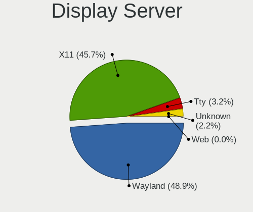
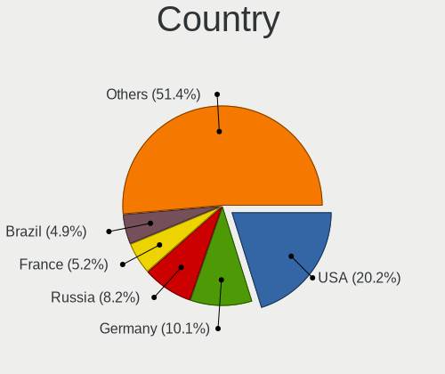
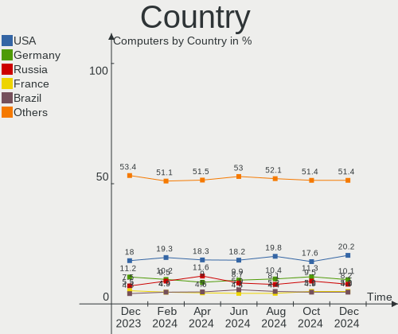
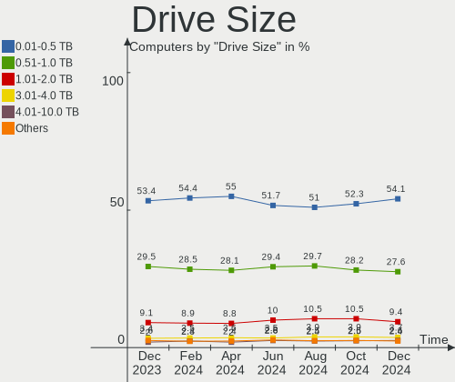
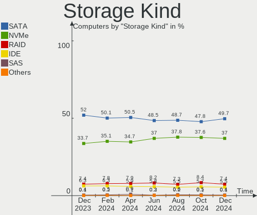
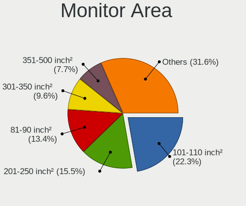
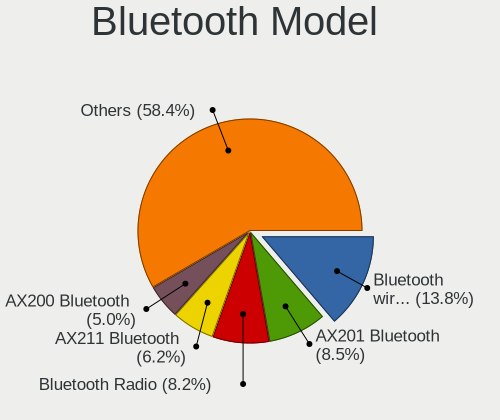

Linux Hardware Trends
---------------------

A project to identify most popular hardware characteristics and track their change
over time based on data collected by Linux users at https://Linux-Hardware.org.

Anyone can contribute to this report by the [hw-probe](https://github.com/linuxhw/hw-probe) tool:

    sudo -E hw-probe -all -upload

This is a report for all computer types. See also reports for [desktops](/Desktop/README.md) and [notebooks](/Notebook/README.md).

Full-feature report is available here: https://linux-hardware.org/?view=trends

Distribution-specific reports: [Ubuntu](/Dist/Ubuntu), [ROSA](/Dist/ROSA), [Mint](/Dist/Mint), [Pop!_OS](/Dist/Pop!_OS), [Fedora](/Dist/Fedora), [BlackPanther](/Dist/BlackPanther), [Arch](/Dist/Arch), [Manjaro](/Dist/Manjaro), [Debian](/Dist/Debian), [Endless](/Dist/Endless), [Zorin](/Dist/Zorin), [Gentoo](/Dist/Gentoo), [Clear Linux](/Dist/Clear_Linux), [openSUSE](/Dist/openSUSE), [KDE neon](/Dist/KDE_neon), [Xubuntu](/Dist/Xubuntu), [Kubuntu](/Dist/Kubuntu), [ArcoLinux](/Dist/ArcoLinux), [OpenMandriva](/Dist/OpenMandriva).

Period: Jul, 2021.

Contents
--------

* [ System ](#system)
  - [ OS                       ](#os)
  - [ OS Family                ](#os-family)
  - [ Kernel                   ](#kernel)
  - [ Kernel Family            ](#kernel-family)
  - [ Kernel Major Ver.        ](#kernel-major-ver)
  - [ Arch                     ](#arch)
  - [ DE                       ](#de)
  - [ Display Server           ](#display-server)
  - [ Display Manager          ](#display-manager)
  - [ OS Lang                  ](#os-lang)
  - [ Boot Mode                ](#boot-mode)
  - [ Filesystem               ](#filesystem)
  - [ Part. scheme             ](#part-scheme)
  - [ Dual Boot with Linux/BSD ](#dual-boot-with-linuxbsd)
  - [ Dual Boot (Win)          ](#dual-boot-win)

* [ Board ](#board)
  - [ Vendor                   ](#vendor)
  - [ Model                    ](#model)
  - [ Model Family             ](#model-family)
  - [ MFG Year                 ](#mfg-year)
  - [ Form Factor              ](#form-factor)
  - [ Secure Boot              ](#secure-boot)
  - [ Coreboot                 ](#coreboot)
  - [ RAM Size                 ](#ram-size)
  - [ RAM Used                 ](#ram-used)
  - [ Total Drives             ](#total-drives)
  - [ Has CD-ROM               ](#has-cd-rom)
  - [ Has Ethernet             ](#has-ethernet)
  - [ Has WiFi                 ](#has-wifi)
  - [ Has Bluetooth            ](#has-bluetooth)

* [ Location ](#location)
  - [ Country                  ](#country)
  - [ City                     ](#city)

* [ Drives ](#drives)
  - [ Drive Vendor             ](#drive-vendor)
  - [ Drive Model              ](#drive-model)
  - [ HDD Vendor               ](#hdd-vendor)
  - [ SSD Vendor               ](#ssd-vendor)
  - [ Drive Kind               ](#drive-kind)
  - [ Drive Connector          ](#drive-connector)
  - [ Drive Size               ](#drive-size)
  - [ Space Total              ](#space-total)
  - [ Space Used               ](#space-used)
  - [ Malfunc. Drives          ](#malfunc-drives)
  - [ Malfunc. Drive Vendor    ](#malfunc-drive-vendor)
  - [ Malfunc. HDD Vendor      ](#malfunc-hdd-vendor)
  - [ Malfunc. Drive Kind      ](#malfunc-drive-kind)
  - [ Failed Drives            ](#failed-drives)
  - [ Failed Drive Vendor      ](#failed-drive-vendor)
  - [ Drive Status             ](#drive-status)

* [ Storage controller ](#storage-controller)
  - [ Storage Vendor           ](#storage-vendor)
  - [ Storage Model            ](#storage-model)
  - [ Storage Kind             ](#storage-kind)

* [ Processor ](#processor)
  - [ CPU Vendor               ](#cpu-vendor)
  - [ CPU Model                ](#cpu-model)
  - [ CPU Model Family         ](#cpu-model-family)
  - [ CPU Cores                ](#cpu-cores)
  - [ CPU Sockets              ](#cpu-sockets)
  - [ CPU Threads              ](#cpu-threads)
  - [ CPU Op-Modes             ](#cpu-op-modes)
  - [ CPU Microcode            ](#cpu-microcode)
  - [ CPU Microarch            ](#cpu-microarch)

* [ Graphics ](#graphics)
  - [ GPU Vendor               ](#gpu-vendor)
  - [ GPU Model                ](#gpu-model)
  - [ GPU Combo                ](#gpu-combo)
  - [ GPU Driver               ](#gpu-driver)
  - [ GPU Memory               ](#gpu-memory)

* [ Monitor ](#monitor)
  - [ Monitor Vendor           ](#monitor-vendor)
  - [ Monitor Model            ](#monitor-model)
  - [ Monitor Resolution       ](#monitor-resolution)
  - [ Monitor Diagonal         ](#monitor-diagonal)
  - [ Monitor Width            ](#monitor-width)
  - [ Aspect Ratio             ](#aspect-ratio)
  - [ Monitor Area             ](#monitor-area)
  - [ Pixel Density            ](#pixel-density)
  - [ Multiple Monitors        ](#multiple-monitors)

* [ Network ](#network)
  - [ Net Controller Vendor    ](#net-controller-vendor)
  - [ Net Controller Model     ](#net-controller-model)
  - [ Wireless Vendor          ](#wireless-vendor)
  - [ Wireless Model           ](#wireless-model)
  - [ Ethernet Vendor          ](#ethernet-vendor)
  - [ Ethernet Model           ](#ethernet-model)
  - [ Net Controller Kind      ](#net-controller-kind)
  - [ Used Controller          ](#used-controller)
  - [ NICs                     ](#nics)
  - [ IPv6                     ](#ipv6)

* [ Bluetooth ](#bluetooth)
  - [ Bluetooth Vendor         ](#bluetooth-vendor)
  - [ Bluetooth Model          ](#bluetooth-model)

* [ Sound ](#sound)
  - [ Sound Vendor             ](#sound-vendor)
  - [ Sound Model              ](#sound-model)

* [ Memory ](#memory)
  - [ Memory Vendor            ](#memory-vendor)
  - [ Memory Model             ](#memory-model)
  - [ Memory Kind              ](#memory-kind)
  - [ Memory Form Factor       ](#memory-form-factor)
  - [ Memory Size              ](#memory-size)
  - [ Memory Speed             ](#memory-speed)

* [ Printers & scanners ](#printers--scanners)
  - [ Printer Vendor           ](#printer-vendor)
  - [ Printer Model            ](#printer-model)
  - [ Scanner Vendor           ](#scanner-vendor)
  - [ Scanner Model            ](#scanner-model)

* [ Camera ](#camera)
  - [ Camera Vendor            ](#camera-vendor)
  - [ Camera Model             ](#camera-model)

* [ Security ](#security)
  - [ Fingerprint Vendor       ](#fingerprint-vendor)
  - [ Fingerprint Model        ](#fingerprint-model)
  - [ Chipcard Vendor          ](#chipcard-vendor)
  - [ Chipcard Model           ](#chipcard-model)

* [ Unsupported ](#unsupported)
  - [ Unsupported Devices      ](#unsupported-devices)
  - [ Unsupported Device Types ](#unsupported-device-types)

System
------

OS
--

Installed operating systems

| Name                | Computers | Percent |
|---------------------|-----------|---------|
| Ubuntu 20.04        | 829       | 17.32%  |
| Pop!_OS 21.04       | 335       | 7%      |
| OpenMandriva 4.2    | 324       | 6.77%   |
| Ubuntu 21.04        | 291       | 6.08%   |
| Fedora 34           | 266       | 5.56%   |
| Debian 11           | 259       | 5.41%   |
| Mint 20.2           | 247       | 5.16%   |
| Mint 20.1           | 155       | 3.24%   |
| ROSA R11.1          | 118       | 2.47%   |
| BlackPanther 18.1   | 109       | 2.28%   |
| Ubuntu 18.04        | 105       | 2.19%   |
| KDE neon 20.04      | 95        | 1.99%   |
| Arch                | 95        | 1.99%   |
| OpenMandriva 4.50   | 77        | 1.61%   |
| Debian 10           | 74        | 1.55%   |
| Arch Rolling        | 74        | 1.55%   |
| Manjaro             | 67        | 1.4%    |
| Manjaro 21.1.0      | 63        | 1.32%   |
| Xubuntu 20.04       | 60        | 1.25%   |
| Manjaro 21.0.7      | 59        | 1.23%   |
| Mint 19.3           | 56        | 1.17%   |
| ArcoLinux Rolling   | 53        | 1.11%   |
| Kubuntu 20.04       | 52        | 1.09%   |
| Endless 3.9.5       | 47        | 0.98%   |
| Pop!_OS 20.04       | 45        | 0.94%   |
| Kubuntu 21.04       | 43        | 0.9%    |
| Zorin 15            | 40        | 0.84%   |
| Mint 20             | 37        | 0.77%   |
| Ubuntu 20.10        | 33        | 0.69%   |
| LMDE 4              | 25        | 0.52%   |
| Kali 2021.2         | 23        | 0.48%   |
| Pop!_OS 20.10       | 21        | 0.44%   |
| Fedora 33           | 21        | 0.44%   |
| Xubuntu 18.04       | 20        | 0.42%   |
| Ubuntu MATE 20.04   | 20        | 0.42%   |
| Debian              | 18        | 0.38%   |
| Gentoo 2.7          | 17        | 0.36%   |
| EndeavourOS Rolling | 17        | 0.36%   |
| Lubuntu 20.04       | 16        | 0.33%   |
| Gentoo              | 16        | 0.33%   |
| ROSA R11            | 14        | 0.29%   |
| Ubuntu 16.04        | 13        | 0.27%   |
| Lubuntu 21.04       | 13        | 0.27%   |
| Elementary 5.1.7    | 13        | 0.27%   |
| Clear Linux 34820   | 11        | 0.23%   |
| Xubuntu 21.04       | 10        | 0.21%   |
| Ubuntu MATE 21.04   | 10        | 0.21%   |
| RHEL 8.4            | 10        | 0.21%   |
| Clear Linux 34860   | 10        | 0.21%   |
| CentOS 8            | 10        | 0.21%   |
| Ubuntu 21.10        | 9         | 0.19%   |
| openSUSE Leap-15.3  | 9         | 0.19%   |
| Zorin 16            | 8         | 0.17%   |
| ROSA R12            | 8         | 0.17%   |
| Raspbian 10         | 8         | 0.17%   |
| Mint 19.1           | 8         | 0.17%   |
| ArcoLinux           | 8         | 0.17%   |
| Kubuntu 20.10       | 7         | 0.15%   |
| Endless 3.9.4       | 7         | 0.15%   |
| Ubuntu Budgie 20.04 | 6         | 0.13%   |

OS Family
---------

OS without a version

| Name          | Computers | Percent |
|---------------|-----------|---------|
| Ubuntu        | 1290      | 26.95%  |
| Mint          | 515       | 10.76%  |
| OpenMandriva  | 402       | 8.4%    |
| Pop!_OS       | 401       | 8.38%   |
| Debian        | 359       | 7.5%    |
| Fedora        | 296       | 6.18%   |
| Manjaro       | 196       | 4.1%    |
| Arch          | 169       | 3.53%   |
| ROSA          | 145       | 3.03%   |
| Kubuntu       | 109       | 2.28%   |
| BlackPanther  | 109       | 2.28%   |
| Xubuntu       | 95        | 1.98%   |
| KDE neon      | 95        | 1.98%   |
| ArcoLinux     | 61        | 1.27%   |
| Endless       | 58        | 1.21%   |
| Zorin         | 48        | 1%      |
| openSUSE      | 43        | 0.9%    |
| Ubuntu MATE   | 34        | 0.71%   |
| Lubuntu       | 33        | 0.69%   |
| Gentoo        | 33        | 0.69%   |
| Kali          | 28        | 0.59%   |
| Clear Linux   | 26        | 0.54%   |
| LMDE          | 25        | 0.52%   |
| EndeavourOS   | 22        | 0.46%   |
| Elementary    | 16        | 0.33%   |
| CentOS        | 15        | 0.31%   |
| Ubuntu Budgie | 13        | 0.27%   |
| RHEL          | 11        | 0.23%   |
| MX            | 9         | 0.19%   |
| Garuda        | 9         | 0.19%   |
| Raspbian      | 8         | 0.17%   |
| Deepin        | 7         | 0.15%   |
| Artix         | 6         | 0.13%   |
| ALT Linux     | 6         | 0.13%   |
| RHCOS         | 5         | 0.1%    |
| Parrot        | 5         | 0.1%    |
| Manjaro-ARM   | 5         | 0.1%    |
| Mageia        | 5         | 0.1%    |
| Void          | 4         | 0.08%   |
| Solus         | 4         | 0.08%   |
| PostmarketOS  | 4         | 0.08%   |
| Peppermint    | 4         | 0.08%   |
| PureOS        | 3         | 0.06%   |
| NixOS         | 3         | 0.06%   |
| Kaisen        | 3         | 0.06%   |
| Hash Linux    | 3         | 0.06%   |
| Devuan        | 3         | 0.06%   |
| ClearOS       | 3         | 0.06%   |
| Alpine        | 3         | 0.06%   |
| Siduction     | 2         | 0.04%   |
| RED           | 2         | 0.04%   |
| Q4OS          | 2         | 0.04%   |
| Oracle Linux  | 2         | 0.04%   |
| Makulu        | 2         | 0.04%   |
| GNOME OS      | 2         | 0.04%   |
| Calculate     | 2         | 0.04%   |
| Android       | 2         | 0.04%   |
| AlmaLinux     | 2         | 0.04%   |
| Xero          | 1         | 0.02%   |
| WindowsFX     | 1         | 0.02%   |

Kernel
------

Version of the Linux kernel

| Version                             | Computers | Percent |
|-------------------------------------|-----------|---------|
| 5.8.0-59-generic                    | 507       | 10.59%  |
| 5.4.0-77-generic                    | 421       | 8.8%    |
| 5.11.0-7620-generic                 | 360       | 7.52%   |
| 5.10.14-desktop-1omv4002            | 258       | 5.39%   |
| 5.8.0-63-generic                    | 211       | 4.41%   |
| 5.11.0-22-generic                   | 211       | 4.41%   |
| 5.4.0-80-generic                    | 209       | 4.37%   |
| 5.10.0-8-amd64                      | 164       | 3.43%   |
| 5.11.0-25-generic                   | 97        | 2.03%   |
| 5.6.14-desktop-2bP                  | 92        | 1.92%   |
| 5.12.13-300.fc34.x86_64             | 76        | 1.59%   |
| 5.10.0-7-amd64                      | 72        | 1.5%    |
| 5.11.12-desktop-1omv4002            | 66        | 1.38%   |
| 4.19.0-17-amd64                     | 57        | 1.19%   |
| 5.8.0-14-generic                    | 56        | 1.17%   |
| 5.12.4-desktop-1omv4050             | 54        | 1.13%   |
| 5.12.14-300.fc34.x86_64             | 53        | 1.11%   |
| 5.8.0-43-generic                    | 50        | 1.04%   |
| 5.12.15-arch1-1                     | 50        | 1.04%   |
| 5.10.42-1-MANJARO                   | 50        | 1.04%   |
| 5.12.14-arch1-1                     | 44        | 0.92%   |
| 5.13.4-200.fc34.x86_64              | 38        | 0.79%   |
| 5.4.83-generic-2rosa-x86_64         | 35        | 0.73%   |
| 5.12.15-300.fc34.x86_64             | 35        | 0.73%   |
| 5.12.9-1-MANJARO                    | 34        | 0.71%   |
| 5.4.0-74-generic                    | 33        | 0.69%   |
| 5.4.32-generic-2rosa-x86_64         | 32        | 0.67%   |
| 4.15.0-151-generic                  | 30        | 0.63%   |
| 4.15.0-147-generic                  | 27        | 0.56%   |
| 5.11.0-16-generic                   | 25        | 0.52%   |
| 5.4.0-58-generic                    | 23        | 0.48%   |
| 5.10.49-1-MANJARO                   | 20        | 0.42%   |
| 5.11.0-7614-generic                 | 19        | 0.4%    |
| 5.10.0-2-amd64                      | 19        | 0.4%    |
| 5.8.0-55-generic                    | 18        | 0.38%   |
| 5.13.5-arch1-1                      | 18        | 0.38%   |
| 5.11.0-24-generic                   | 18        | 0.38%   |
| 5.10.52-1-MANJARO                   | 18        | 0.38%   |
| 4.15.0-desktop-122.124.1rosa-x86_64 | 18        | 0.38%   |
| 4.18.16-desktop-1bP                 | 17        | 0.36%   |
| 5.4.0-42-generic                    | 16        | 0.33%   |
| 5.4.0-26-generic                    | 16        | 0.33%   |
| 5.12.13-arch1-2                     | 16        | 0.33%   |
| 5.11.12-300.fc34.x86_64             | 16        | 0.33%   |
| 5.11.0-26-generic                   | 16        | 0.33%   |
| 5.13.4-arch2-1                      | 15        | 0.31%   |
| 5.10.0-kali9-amd64                  | 15        | 0.31%   |
| 5.8.0-61-generic                    | 14        | 0.29%   |
| 5.4.0-73-generic                    | 14        | 0.29%   |
| 5.12.7-desktop-1omv4003             | 14        | 0.29%   |
| 5.12.15-zen1-1-zen                  | 14        | 0.29%   |
| 5.4.32-generic-2rosa-i586           | 13        | 0.27%   |
| 5.12.14-1051.native                 | 13        | 0.27%   |
| 5.11.0-1012-raspi                   | 13        | 0.27%   |
| 5.4.0-72-generic                    | 11        | 0.23%   |
| 5.12.14-zen1-1-zen                  | 11        | 0.23%   |
| 4.15.0-desktop-45.1rosa-x86_64      | 11        | 0.23%   |
| 5.4.83-generic-2rosa-i586           | 10        | 0.21%   |
| 5.13.4-arch1-1                      | 10        | 0.21%   |
| 5.13.1-3-MANJARO                    | 10        | 0.21%   |

Kernel Family
-------------

Linux kernel without a distro release

| Version | Computers | Percent |
|---------|-----------|---------|
| 5.8.0   | 906       | 18.93%  |
| 5.4.0   | 806       | 16.84%  |
| 5.11.0  | 785       | 16.4%   |
| 5.10.0  | 325       | 6.79%   |
| 5.10.14 | 258       | 5.39%   |
| 5.12.14 | 137       | 2.86%   |
| 4.15.0  | 128       | 2.67%   |
| 5.12.13 | 114       | 2.38%   |
| 5.12.15 | 111       | 2.32%   |
| 5.13.4  | 101       | 2.11%   |
| 5.6.14  | 92        | 1.92%   |
| 5.11.12 | 82        | 1.71%   |
| 4.19.0  | 82        | 1.71%   |
| 5.12.4  | 54        | 1.13%   |
| 5.10.42 | 51        | 1.07%   |
| 5.4.83  | 46        | 0.96%   |
| 5.4.32  | 45        | 0.94%   |
| 5.13.0  | 44        | 0.92%   |
| 5.13.1  | 40        | 0.84%   |
| 5.13.5  | 37        | 0.77%   |
| 5.12.9  | 37        | 0.77%   |
| 5.10.52 | 35        | 0.73%   |
| 4.18.0  | 29        | 0.61%   |
| 5.12.12 | 27        | 0.56%   |
| 5.10.49 | 24        | 0.5%    |
| 5.13.2  | 19        | 0.4%    |
| 4.18.16 | 17        | 0.36%   |
| 5.12.7  | 16        | 0.33%   |
| 5.11.22 | 15        | 0.31%   |
| 5.3.18  | 14        | 0.29%   |
| 5.10.47 | 14        | 0.29%   |
| 5.12.16 | 13        | 0.27%   |
| 5.10.53 | 13        | 0.27%   |
| 5.10.27 | 13        | 0.27%   |
| 5.0.0   | 13        | 0.27%   |
| 4.4.0   | 12        | 0.25%   |
| 5.13.6  | 11        | 0.23%   |
| 5.12.17 | 10        | 0.21%   |
| 5.12.0  | 10        | 0.21%   |
| 5.14.0  | 9         | 0.19%   |
| 5.9.0   | 8         | 0.17%   |
| 5.10.48 | 8         | 0.17%   |
| 5.10.17 | 8         | 0.17%   |
| 3.10.0  | 7         | 0.15%   |
| 5.3.0   | 5         | 0.1%    |
| 5.12.19 | 5         | 0.1%    |
| 5.10.50 | 5         | 0.1%    |
| 5.10.46 | 5         | 0.1%    |
| 5.10.43 | 5         | 0.1%    |
| 4.9.155 | 5         | 0.1%    |
| 5.6.0   | 4         | 0.08%   |
| 5.12.8  | 4         | 0.08%   |
| 5.12.11 | 4         | 0.08%   |
| 5.12.10 | 4         | 0.08%   |
| 5.10.36 | 4         | 0.08%   |
| 4.9.0   | 4         | 0.08%   |
| 5.4.124 | 3         | 0.06%   |
| 5.4.106 | 3         | 0.06%   |
| 5.12.1  | 3         | 0.06%   |
| 5.11.4  | 3         | 0.06%   |

Kernel Major Ver.
-----------------

Linux kernel major version

| Version  | Computers | Percent |
|----------|-----------|---------|
| 5.4      | 920       | 19.22%  |
| 5.8      | 911       | 19.03%  |
| 5.11     | 894       | 18.68%  |
| 5.10     | 789       | 16.49%  |
| 5.12     | 552       | 11.53%  |
| 5.13     | 253       | 5.29%   |
| 4.15     | 129       | 2.7%    |
| 5.6      | 97        | 2.03%   |
| 4.19     | 87        | 1.82%   |
| 4.18     | 46        | 0.96%   |
| 5.3      | 20        | 0.42%   |
| 5.0      | 13        | 0.27%   |
| 5.9      | 12        | 0.25%   |
| 4.9      | 12        | 0.25%   |
| 4.4      | 12        | 0.25%   |
| 3.10     | 11        | 0.23%   |
| 5.14     | 9         | 0.19%   |
| 5.7      | 3         | 0.06%   |
| 5.5      | 2         | 0.04%   |
| 5.2      | 2         | 0.04%   |
| 4.16     | 2         | 0.04%   |
| 4.13     | 2         | 0.04%   |
| 4.10     | 2         | 0.04%   |
| 4.9.273~ | 1         | 0.02%   |
| 4.8      | 1         | 0.02%   |
| 4.20     | 1         | 0.02%   |
| 4.14     | 1         | 0.02%   |
| 4.1      | 1         | 0.02%   |
| 3.13     | 1         | 0.02%   |

Arch
----

OS architecture (x86_64, i586, etc.)

| Name    | Computers | Percent |
|---------|-----------|---------|
| x86_64  | 4636      | 96.87%  |
| i686    | 94        | 1.96%   |
| aarch64 | 41        | 0.86%   |
| armv7l  | 12        | 0.25%   |
| armv6l  | 2         | 0.04%   |
| armv8l  | 1         | 0.02%   |

DE
--

Desktop Environment

| Name                     | Computers | Percent |
|--------------------------|-----------|---------|
| GNOME                    | 2102      | 43.92%  |
| KDE5                     | 875       | 18.28%  |
| X-Cinnamon               | 399       | 8.34%   |
| Unknown                  | 323       | 6.75%   |
| XFCE                     | 321       | 6.71%   |
| KDE                      | 210       | 4.39%   |
| MATE                     | 147       | 3.07%   |
| KDE4                     | 90        | 1.88%   |
| LXQt                     | 57        | 1.19%   |
| Cinnamon                 | 51        | 1.07%   |
| i3                       | 35        | 0.73%   |
| LXDE                     | 29        | 0.61%   |
| Unity                    | 22        | 0.46%   |
| Budgie                   | 21        | 0.44%   |
| Deepin                   | 19        | 0.4%    |
| Pantheon                 | 15        | 0.31%   |
| GNOME Flashback          | 15        | 0.31%   |
| GNOME Classic            | 7         | 0.15%   |
| Trinity                  | 6         | 0.13%   |
| sway                     | 6         | 0.13%   |
| awesome                  | 5         | 0.1%    |
| openbox                  | 4         | 0.08%   |
| bspwm                    | 4         | 0.08%   |
| xmonad                   | 3         | 0.06%   |
| qtile                    | 3         | 0.06%   |
| lightdm-xsession         | 3         | 0.06%   |
| Enlightenment            | 3         | 0.06%   |
| XSession                 | 2         | 0.04%   |
| Yaru:ubuntu:GNOME        | 1         | 0.02%   |
| ubuntustudio             | 1         | 0.02%   |
| swayLANG=en_CA.UTF-8     | 1         | 0.02%   |
| ICEWM                    | 1         | 0.02%   |
| i3-with-shmlog           | 1         | 0.02%   |
| herbstluftwm             | 1         | 0.02%   |
| dwm                      | 1         | 0.02%   |
| /usr/local/bin/i3        | 1         | 0.02%   |
| /usr/bin/openbox-session | 1         | 0.02%   |

Display Server
--------------

X11 or Wayland

| Name    | Computers | Percent |
|---------|-----------|---------|
| X11     | 3893      | 81.34%  |
| Wayland | 620       | 12.95%  |
| Unknown | 155       | 3.24%   |
| Tty     | 118       | 2.47%   |

Display Manager
---------------

SDDM, LightDM, etc.

| Name    | Computers | Percent |
|---------|-----------|---------|
| Unknown | 2568      | 53.66%  |
| SDDM    | 931       | 19.45%  |
| GDM     | 667       | 13.94%  |
| TDM     | 413       | 8.63%   |
| LightDM | 90        | 1.88%   |
| KDM     | 89        | 1.86%   |
| XDM     | 13        | 0.27%   |
| GDM3    | 7         | 0.15%   |
| SLiM    | 3         | 0.06%   |
| Ly      | 3         | 0.06%   |
| LXDM    | 2         | 0.04%   |

OS Lang
-------

Language

| Lang    | Computers | Percent |
|---------|-----------|---------|
| en_US   | 1960      | 40.95%  |
| de_DE   | 400       | 8.36%   |
| ru_RU   | 321       | 6.71%   |
| en_GB   | 262       | 5.47%   |
| pt_BR   | 216       | 4.51%   |
| fr_FR   | 203       | 4.24%   |
| Unknown | 180       | 3.76%   |
| en_IN   | 102       | 2.13%   |
| es_ES   | 92        | 1.92%   |
| en_AU   | 90        | 1.88%   |
| C       | 89        | 1.86%   |
| it_IT   | 88        | 1.84%   |
| pl_PL   | 81        | 1.69%   |
| en_CA   | 79        | 1.65%   |
| es_MX   | 44        | 0.92%   |
| cs_CZ   | 32        | 0.67%   |
| pt_PT   | 31        | 0.65%   |
| en_ZA   | 31        | 0.65%   |
| nl_NL   | 28        | 0.59%   |
| hu_HU   | 27        | 0.56%   |
| ja_JP   | 25        | 0.52%   |
| es_AR   | 23        | 0.48%   |
| de_AT   | 21        | 0.44%   |
| zh_CN   | 17        | 0.36%   |
| sv_SE   | 17        | 0.36%   |
| ru_UA   | 17        | 0.36%   |
| de_CH   | 16        | 0.33%   |
| es_CL   | 15        | 0.31%   |
| es_CO   | 14        | 0.29%   |
| en_SG   | 13        | 0.27%   |
| en_NZ   | 12        | 0.25%   |
| ro_RO   | 11        | 0.23%   |
| uk_UA   | 10        | 0.21%   |
| fr_BE   | 10        | 0.21%   |
| fi_FI   | 10        | 0.21%   |
| sk_SK   | 9         | 0.19%   |
| en_PH   | 9         | 0.19%   |
| da_DK   | 9         | 0.19%   |
| tr_TR   | 8         | 0.17%   |
| hr_HR   | 8         | 0.17%   |
| fr_CA   | 8         | 0.17%   |
| el_GR   | 8         | 0.17%   |
| zh_TW   | 7         | 0.15%   |
| nb_NO   | 7         | 0.15%   |
| en_IE   | 7         | 0.15%   |
| POSIX   | 6         | 0.13%   |
| nl_BE   | 6         | 0.13%   |
| ko_KR   | 6         | 0.13%   |
| es_VE   | 6         | 0.13%   |
| fr_CH   | 5         | 0.1%    |
| es_UY   | 5         | 0.1%    |
| es_EC   | 5         | 0.1%    |
| es_CR   | 5         | 0.1%    |
| en_IL   | 5         | 0.1%    |
| en_DK   | 5         | 0.1%    |
| id_ID   | 4         | 0.08%   |
| es_SV   | 4         | 0.08%   |
| es_NI   | 4         | 0.08%   |
| ca_ES   | 4         | 0.08%   |
| es_PE   | 3         | 0.06%   |

Boot Mode
---------

EFI or BIOS

| Mode | Computers | Percent |
|------|-----------|---------|
| BIOS | 2518      | 52.61%  |
| EFI  | 2268      | 47.39%  |

Filesystem
----------

Type of filesystem

| Type    | Computers | Percent |
|---------|-----------|---------|
| Ext4    | 3734      | 78.02%  |
| Overlay | 483       | 10.09%  |
| Btrfs   | 404       | 8.44%   |
| Xfs     | 83        | 1.73%   |
| Zfs     | 33        | 0.69%   |
| F2fs    | 14        | 0.29%   |
| Unknown | 11        | 0.23%   |
| Ext3    | 9         | 0.19%   |
| Tmpfs   | 5         | 0.1%    |
| Ext2    | 3         | 0.06%   |
| XXXXX   | 2         | 0.04%   |
| Aufs    | 2         | 0.04%   |
| XXXfs   | 1         | 0.02%   |
| Nfs     | 1         | 0.02%   |
| Jfs     | 1         | 0.02%   |

Part. scheme
------------

Scheme of partitioning

| Type    | Computers | Percent |
|---------|-----------|---------|
| Unknown | 2403      | 50.21%  |
| GPT     | 1702      | 35.56%  |
| MBR     | 681       | 14.23%  |

Dual Boot with Linux/BSD
------------------------

Hosting more than one Linux/BSD

| Dual boot | Computers | Percent |
|-----------|-----------|---------|
| No        | 4025      | 84.1%   |
| Yes       | 761       | 15.9%   |

Dual Boot (Win)
---------------

Hosting Linux and Windows

| Dual boot | Computers | Percent |
|-----------|-----------|---------|
| No        | 3279      | 68.51%  |
| Yes       | 1507      | 31.49%  |

Board
-----

Vendor
------

Motherboard manufacturer

| Name                    | Computers | Percent |
|-------------------------|-----------|---------|
| ASUSTek Computer        | 800       | 16.72%  |
| Lenovo                  | 680       | 14.21%  |
| Hewlett-Packard         | 632       | 13.21%  |
| Dell                    | 624       | 13.04%  |
| Gigabyte Technology     | 351       | 7.33%   |
| Acer                    | 293       | 6.12%   |
| MSI                     | 268       | 5.6%    |
| ASRock                  | 191       | 3.99%   |
| Apple                   | 91        | 1.9%    |
| Intel                   | 81        | 1.69%   |
| Toshiba                 | 65        | 1.36%   |
| Unknown                 | 58        | 1.21%   |
| Samsung Electronics     | 51        | 1.07%   |
| Fujitsu                 | 41        | 0.86%   |
| Sony                    | 40        | 0.84%   |
| Pegatron                | 23        | 0.48%   |
| Raspberry Pi Foundation | 22        | 0.46%   |
| Medion                  | 21        | 0.44%   |
| Biostar                 | 21        | 0.44%   |
| System76                | 18        | 0.38%   |
| Google                  | 18        | 0.38%   |
| Foxconn                 | 18        | 0.38%   |
| TUXEDO                  | 17        | 0.36%   |
| Notebook                | 17        | 0.36%   |
| HUAWEI                  | 16        | 0.33%   |
| Supermicro              | 15        | 0.31%   |
| ECS                     | 14        | 0.29%   |
| Positivo                | 13        | 0.27%   |
| Packard Bell            | 13        | 0.27%   |
| AMI                     | 12        | 0.25%   |
| Timi                    | 11        | 0.23%   |
| Microsoft               | 11        | 0.23%   |
| Huanan                  | 10        | 0.21%   |
| Fujitsu Siemens         | 10        | 0.21%   |
| eMachines               | 9         | 0.19%   |
| Alienware               | 9         | 0.19%   |
| LG Electronics          | 7         | 0.15%   |
| Gateway                 | 7         | 0.15%   |
| Chuwi                   | 7         | 0.15%   |
| Itautec                 | 6         | 0.13%   |
| Shuttle                 | 5         | 0.1%    |
| EVGA                    | 5         | 0.1%    |
| Teclast                 | 4         | 0.08%   |
| SLIMBOOK                | 4         | 0.08%   |
| PC Specialist           | 4         | 0.08%   |
| Panasonic               | 4         | 0.08%   |
| Casper                  | 4         | 0.08%   |
| Semp Toshiba            | 3         | 0.06%   |
| Razer                   | 3         | 0.06%   |
| Purism                  | 3         | 0.06%   |
| Pine Microsystems       | 3         | 0.06%   |
| PCWare                  | 3         | 0.06%   |
| OEM                     | 3         | 0.06%   |
| IBM                     | 3         | 0.06%   |
| Digibras                | 3         | 0.06%   |
| Clevo                   | 3         | 0.06%   |
| AVITA                   | 3         | 0.06%   |
| AMD                     | 3         | 0.06%   |
| ZOTAC                   | 2         | 0.04%   |
| TrekStor                | 2         | 0.04%   |

Model
-----

Motherboard model

| Name                               | Computers | Percent |
|------------------------------------|-----------|---------|
| Unknown                            | 70        | 1.46%   |
| ASUS All Series                    | 46        | 0.96%   |
| HP Notebook                        | 14        | 0.29%   |
| ASUS TUF GAMING X570-PLUS          | 14        | 0.29%   |
| HP Pavilion dv6                    | 12        | 0.25%   |
| MSI MS-7817                        | 11        | 0.23%   |
| ASUS PRIME A320M-K                 | 11        | 0.23%   |
| MSI MS-7C56                        | 10        | 0.21%   |
| HP Laptop 15s-eq2xxx               | 10        | 0.21%   |
| Dell OptiPlex 790                  | 10        | 0.21%   |
| ASUS ROG STRIX B550-F GAMING       | 10        | 0.21%   |
| MSI MS-7C37                        | 9         | 0.19%   |
| HP EliteBook 8470p                 | 9         | 0.19%   |
| Lenovo IdeaPad 5 14ARE05 81YM      | 8         | 0.17%   |
| HP Pavilion g6                     | 8         | 0.17%   |
| HP Pavilion 15                     | 8         | 0.17%   |
| Gigabyte B450M DS3H                | 8         | 0.17%   |
| Dell XPS 15 9500                   | 8         | 0.17%   |
| Dell OptiPlex 990                  | 8         | 0.17%   |
| Dell OptiPlex 9020                 | 8         | 0.17%   |
| Dell Latitude E6420                | 8         | 0.17%   |
| Dell Inspiron N5110                | 8         | 0.17%   |
| ASUS ROG STRIX X570-E GAMING       | 8         | 0.17%   |
| Acer Nitro AN515-54                | 8         | 0.17%   |
| MSI MS-7C02                        | 7         | 0.15%   |
| MSI MS-7A38                        | 7         | 0.15%   |
| HP Pavilion Notebook               | 7         | 0.15%   |
| HP 250 G7 Notebook PC              | 7         | 0.15%   |
| Gigabyte X570 AORUS MASTER         | 7         | 0.15%   |
| Dell XPS 13 9310                   | 7         | 0.15%   |
| Dell OptiPlex 780                  | 7         | 0.15%   |
| Dell OptiPlex 7010                 | 7         | 0.15%   |
| Dell Latitude E5470                | 7         | 0.15%   |
| Dell Inspiron 1545                 | 7         | 0.15%   |
| ASUS ROG STRIX B450-F GAMING       | 7         | 0.15%   |
| ASUS PRIME B350-PLUS               | 7         | 0.15%   |
| ASUS M5A97 R2.0                    | 7         | 0.15%   |
| Apple MacBookAir7,2                | 7         | 0.15%   |
| RPi Raspberry Pi 4 Model B Rev 1.1 | 6         | 0.13%   |
| Lenovo IdeaPad 5 15ARE05 81YQ      | 6         | 0.13%   |
| HP Compaq 8200 Elite SFF PC        | 6         | 0.13%   |
| Gigabyte A320M-S2H                 | 6         | 0.13%   |
| Dell XPS 15 9560                   | 6         | 0.13%   |
| Dell Latitude E7440                | 6         | 0.13%   |
| Dell Latitude E5520                | 6         | 0.13%   |
| Dell Latitude 5480                 | 6         | 0.13%   |
| Dell Inspiron 5570                 | 6         | 0.13%   |
| Dell Inspiron 5558                 | 6         | 0.13%   |
| ASUS TUF B450M-PLUS GAMING         | 6         | 0.13%   |
| ASUS ROG STRIX B550-I GAMING       | 6         | 0.13%   |
| ASUS PRIME B450M-A                 | 6         | 0.13%   |
| ASRock B450 Pro4                   | 6         | 0.13%   |
| Apple MacBookPro9,2                | 6         | 0.13%   |
| RPi Raspberry Pi 4 Model B Rev 1.4 | 5         | 0.1%    |
| MSI MS-7C91                        | 5         | 0.1%    |
| MSI MS-7B89                        | 5         | 0.1%    |
| MSI MS-7B86                        | 5         | 0.1%    |
| MSI MS-7996                        | 5         | 0.1%    |
| Lenovo G50-80 80E5                 | 5         | 0.1%    |
| HP Pavilion g7                     | 5         | 0.1%    |

Model Family
------------

Motherboard model prefix

| Name                  | Computers | Percent |
|-----------------------|-----------|---------|
| Lenovo ThinkPad       | 311       | 6.5%    |
| Acer Aspire           | 199       | 4.16%   |
| Dell Inspiron         | 179       | 3.74%   |
| Lenovo IdeaPad        | 145       | 3.03%   |
| Dell Latitude         | 139       | 2.9%    |
| HP Pavilion           | 112       | 2.34%   |
| ASUS PRIME            | 102       | 2.13%   |
| Dell OptiPlex         | 95        | 1.98%   |
| ASUS ROG              | 93        | 1.94%   |
| HP EliteBook          | 86        | 1.8%    |
| Dell XPS              | 80        | 1.67%   |
| HP ProBook            | 72        | 1.5%    |
| Unknown               | 70        | 1.46%   |
| HP Compaq             | 68        | 1.42%   |
| HP Laptop             | 67        | 1.4%    |
| ASUS TUF              | 62        | 1.3%    |
| Toshiba Satellite     | 50        | 1.04%   |
| Dell Precision        | 49        | 1.02%   |
| ASUS VivoBook         | 49        | 1.02%   |
| ASUS All              | 46        | 0.96%   |
| Dell Vostro           | 39        | 0.81%   |
| Lenovo ThinkCentre    | 34        | 0.71%   |
| Lenovo Yoga           | 32        | 0.67%   |
| Lenovo Legion         | 28        | 0.59%   |
| RPi Raspberry         | 22        | 0.46%   |
| Gigabyte X570         | 21        | 0.44%   |
| Acer Nitro            | 20        | 0.42%   |
| HP ENVY               | 19        | 0.4%    |
| HP 250                | 19        | 0.4%    |
| Fujitsu LIFEBOOK      | 18        | 0.38%   |
| ASUS P8H61-M          | 18        | 0.38%   |
| Acer Swift            | 18        | 0.38%   |
| Lenovo ThinkBook      | 17        | 0.36%   |
| HP EliteDesk          | 17        | 0.36%   |
| ASUS M5A97            | 16        | 0.33%   |
| ASUS M5A78L-M         | 16        | 0.33%   |
| Gigabyte B450M        | 15        | 0.31%   |
| Fujitsu ESPRIMO       | 15        | 0.31%   |
| Dell PowerEdge        | 15        | 0.31%   |
| HP Notebook           | 14        | 0.29%   |
| ASUS ZenBook          | 14        | 0.29%   |
| MSI MS-7817           | 11        | 0.23%   |
| Microsoft Surface     | 11        | 0.23%   |
| HP ZBook              | 11        | 0.23%   |
| HP ProLiant           | 11        | 0.23%   |
| HP ProDesk            | 11        | 0.23%   |
| Gigabyte B450         | 11        | 0.23%   |
| Gigabyte A320M-S2H    | 11        | 0.23%   |
| Dell G3               | 11        | 0.23%   |
| ASUS ASUS             | 11        | 0.23%   |
| Apple MacBookPro11    | 11        | 0.23%   |
| MSI MS-7C56           | 10        | 0.21%   |
| Gigabyte Z390         | 10        | 0.21%   |
| ASRock B450M          | 10        | 0.21%   |
| ASRock B450           | 10        | 0.21%   |
| Acer Predator         | 10        | 0.21%   |
| Packard Bell EasyNote | 9         | 0.19%   |
| MSI MS-7C37           | 9         | 0.19%   |
| HP Stream             | 9         | 0.19%   |
| HP Spectre            | 9         | 0.19%   |

MFG Year
--------

Motherboard manufacture year

| Year    | Computers | Percent |
|---------|-----------|---------|
| 2020    | 817       | 17.07%  |
| 2021    | 689       | 14.4%   |
| 2019    | 494       | 10.32%  |
| 2018    | 437       | 9.13%   |
| 2013    | 285       | 5.95%   |
| 2012    | 283       | 5.91%   |
| 2011    | 280       | 5.85%   |
| 2014    | 235       | 4.91%   |
| 2015    | 229       | 4.78%   |
| 2010    | 224       | 4.68%   |
| 2016    | 201       | 4.2%    |
| 2017    | 178       | 3.72%   |
| 2009    | 173       | 3.61%   |
| 2008    | 111       | 2.32%   |
| 2007    | 60        | 1.25%   |
| Unknown | 56        | 1.17%   |
| 2006    | 25        | 0.52%   |
| 2005    | 4         | 0.08%   |
| 2004    | 4         | 0.08%   |
| 2001    | 1         | 0.02%   |

Form Factor
-----------

Physical design of the computer

| Name           | Computers | Percent |
|----------------|-----------|---------|
| Notebook       | 2520      | 52.65%  |
| Desktop        | 1943      | 40.6%   |
| Convertible    | 106       | 2.21%   |
| Mini pc        | 48        | 1%      |
| All in one     | 47        | 0.98%   |
| System on chip | 45        | 0.94%   |
| Tablet         | 36        | 0.75%   |
| Server         | 35        | 0.73%   |
| Phone          | 4         | 0.08%   |
| Other          | 2         | 0.04%   |

Secure Boot
-----------

Enabled or disabled

| State    | Computers | Percent |
|----------|-----------|---------|
| Disabled | 4495      | 93.92%  |
| Enabled  | 291       | 6.08%   |

Coreboot
--------

Have coreboot on board

| Used | Computers | Percent |
|------|-----------|---------|
| No   | 4757      | 99.39%  |
| Yes  | 29        | 0.61%   |

RAM Size
--------

Total RAM memory

| Size in GB      | Computers | Percent |
|-----------------|-----------|---------|
| 4.01-8.0        | 1131      | 23.63%  |
| 16.01-24.0      | 989       | 20.66%  |
| 3.01-4.0        | 862       | 18.01%  |
| 8.01-16.0       | 850       | 17.76%  |
| 32.01-64.0      | 470       | 9.82%   |
| 1.01-2.0        | 188       | 3.93%   |
| 64.01-256.0     | 145       | 3.03%   |
| 24.01-32.0      | 58        | 1.21%   |
| 2.01-3.0        | 54        | 1.13%   |
| 0.51-1.0        | 23        | 0.48%   |
| More than 256.0 | 9         | 0.19%   |
| 0.01-0.5        | 6         | 0.13%   |
| Unknown         | 1         | 0.02%   |

RAM Used
--------

Used RAM memory

| Used GB         | Computers | Percent |
|-----------------|-----------|---------|
| 1.01-2.0        | 1730      | 36.15%  |
| 2.01-3.0        | 1098      | 22.94%  |
| 4.01-8.0        | 648       | 13.54%  |
| 3.01-4.0        | 597       | 12.47%  |
| 0.51-1.0        | 356       | 7.44%   |
| 8.01-16.0       | 205       | 4.28%   |
| 0.01-0.5        | 96        | 2.01%   |
| 16.01-24.0      | 26        | 0.54%   |
| 24.01-32.0      | 11        | 0.23%   |
| 32.01-64.0      | 9         | 0.19%   |
| Unknown         | 6         | 0.13%   |
| 64.01-256.0     | 3         | 0.06%   |
| More than 256.0 | 1         | 0.02%   |

Total Drives
------------

Number of drives on board

| Drives | Computers | Percent |
|--------|-----------|---------|
| 1      | 2765      | 57.77%  |
| 2      | 1212      | 25.32%  |
| 3      | 398       | 8.32%   |
| 4      | 181       | 3.78%   |
| 5      | 96        | 2.01%   |
| 0      | 43        | 0.9%    |
| 6      | 41        | 0.86%   |
| 7      | 15        | 0.31%   |
| 8      | 13        | 0.27%   |
| 9      | 12        | 0.25%   |
| 10     | 4         | 0.08%   |
| 11     | 2         | 0.04%   |
| 32     | 1         | 0.02%   |
| 23     | 1         | 0.02%   |
| 15     | 1         | 0.02%   |
| 12     | 1         | 0.02%   |

Has CD-ROM
----------

Has CD-ROM on board

| Presented | Computers | Percent |
|-----------|-----------|---------|
| No        | 2945      | 61.53%  |
| Yes       | 1841      | 38.47%  |

Has Ethernet
------------

Has Ethernet on board

| Presented | Computers | Percent |
|-----------|-----------|---------|
| Yes       | 4166      | 87.05%  |
| No        | 620       | 12.95%  |

Has WiFi
--------

Has WiFi module

| Presented | Computers | Percent |
|-----------|-----------|---------|
| Yes       | 3482      | 72.75%  |
| No        | 1304      | 27.25%  |

Has Bluetooth
-------------

Has Bluetooth module

| Presented | Computers | Percent |
|-----------|-----------|---------|
| Yes       | 2700      | 56.41%  |
| No        | 2086      | 43.59%  |

Location
--------

Country
-------

Geographic location (country)

| Country      | Computers | Percent |
|--------------|-----------|---------|
| USA          | 863       | 18.03%  |
| Germany      | 523       | 10.93%  |
| Russia       | 362       | 7.56%   |
| Brazil       | 305       | 6.37%   |
| France       | 235       | 4.91%   |
| UK           | 197       | 4.12%   |
| India        | 147       | 3.07%   |
| Canada       | 131       | 2.74%   |
| Spain        | 116       | 2.42%   |
| Poland       | 116       | 2.42%   |
| Italy        | 116       | 2.42%   |
| Hungary      | 114       | 2.38%   |
| Australia    | 104       | 2.17%   |
| Netherlands  | 99        | 2.07%   |
| Ukraine      | 84        | 1.76%   |
| Mexico       | 74        | 1.55%   |
| Czechia      | 66        | 1.38%   |
| Austria      | 51        | 1.07%   |
| Switzerland  | 50        | 1.04%   |
| Indonesia    | 44        | 0.92%   |
| Romania      | 42        | 0.88%   |
| Belgium      | 41        | 0.86%   |
| Portugal     | 40        | 0.84%   |
| South Africa | 39        | 0.81%   |
| Sweden       | 38        | 0.79%   |
| Finland      | 38        | 0.79%   |
| Argentina    | 36        | 0.75%   |
| Japan        | 31        | 0.65%   |
| Greece       | 29        | 0.61%   |
| China        | 29        | 0.61%   |
| Turkey       | 28        | 0.59%   |
| Norway       | 26        | 0.54%   |
| Denmark      | 25        | 0.52%   |
| Colombia     | 24        | 0.5%    |
| Bulgaria     | 24        | 0.5%    |
| Chile        | 22        | 0.46%   |
| Belarus      | 22        | 0.46%   |
| New Zealand  | 21        | 0.44%   |
| Malaysia     | 21        | 0.44%   |
| Slovakia     | 20        | 0.42%   |
| Thailand     | 17        | 0.36%   |
| Croatia      | 16        | 0.33%   |
| Iran         | 15        | 0.31%   |
| Taiwan       | 12        | 0.25%   |
| Philippines  | 12        | 0.25%   |
| South Korea  | 11        | 0.23%   |
| Singapore    | 11        | 0.23%   |
| Pakistan     | 11        | 0.23%   |
| Kazakhstan   | 10        | 0.21%   |
| Ecuador      | 10        | 0.21%   |
| Vietnam      | 9         | 0.19%   |
| Serbia       | 9         | 0.19%   |
| Israel       | 9         | 0.19%   |
| Ireland      | 9         | 0.19%   |
| Egypt        | 9         | 0.19%   |
| Venezuela    | 8         | 0.17%   |
| Puerto Rico  | 8         | 0.17%   |
| Latvia       | 8         | 0.17%   |
| Estonia      | 8         | 0.17%   |
| Peru         | 7         | 0.15%   |

City
----

Geographic location (city)

| City              | Computers | Percent |
|-------------------|-----------|---------|
| Moscow            | 77        | 1.61%   |
| Berlin            | 40        | 0.84%   |
| St Petersburg     | 39        | 0.81%   |
| Paris             | 37        | 0.77%   |
| Sydney            | 34        | 0.71%   |
| Budapest          | 33        | 0.69%   |
| Vienna            | 30        | 0.63%   |
| Prague            | 27        | 0.56%   |
| Munich            | 27        | 0.56%   |
| Warsaw            | 25        | 0.52%   |
| Frankfurt am Main | 24        | 0.5%    |
| Voronezh          | 23        | 0.48%   |
| London            | 22        | 0.46%   |
| Rio de Janeiro    | 21        | 0.44%   |
| Kyiv              | 21        | 0.44%   |
| Athens            | 19        | 0.4%    |
| Helsinki          | 18        | 0.38%   |
| Bucharest         | 18        | 0.38%   |
| Bengaluru         | 18        | 0.38%   |
| Yekaterinburg     | 17        | 0.36%   |
| Cape Town         | 17        | 0.36%   |
| S??o Paulo        | 16        | 0.33%   |
| Mexico City       | 16        | 0.33%   |
| Stuttgart         | 15        | 0.31%   |
| Portland          | 15        | 0.31%   |
| Vancouver         | 14        | 0.29%   |
| Milan             | 14        | 0.29%   |
| Madrid            | 14        | 0.29%   |
| Los Angeles       | 14        | 0.29%   |
| Toronto           | 13        | 0.27%   |
| São Paulo        | 13        | 0.27%   |
| Sofia             | 13        | 0.27%   |
| Minsk             | 13        | 0.27%   |
| Zurich            | 12        | 0.25%   |
| Novosibirsk       | 12        | 0.25%   |
| Mumbai            | 12        | 0.25%   |
| Lyon              | 12        | 0.25%   |
| Hyderabad         | 12        | 0.25%   |
| Hamburg           | 12        | 0.25%   |
| Denver            | 12        | 0.25%   |
| Dallas            | 12        | 0.25%   |
| Amsterdam         | 12        | 0.25%   |
| Tehran            | 11        | 0.23%   |
| Houston           | 11        | 0.23%   |
| Copenhagen        | 11        | 0.23%   |
| Bras?­lia         | 11        | 0.23%   |
| Wroclaw           | 10        | 0.21%   |
| Singapore         | 10        | 0.21%   |
| Pune              | 10        | 0.21%   |
| Montreal          | 10        | 0.21%   |
| Brisbane          | 10        | 0.21%   |
| Austin            | 10        | 0.21%   |
| Zagreb            | 9         | 0.19%   |
| Winnipeg          | 9         | 0.19%   |
| Valencia          | 9         | 0.19%   |
| Oslo              | 9         | 0.19%   |
| New York          | 9         | 0.19%   |
| Melbourne         | 9         | 0.19%   |
| Kuala Lumpur      | 9         | 0.19%   |
| Essen             | 9         | 0.19%   |

Drives
------

Drive Vendor
------------

Hard drive vendors

| Vendor                    | Computers | Drives | Percent |
|---------------------------|-----------|--------|---------|
| WDC                       | 1197      | 1502   | 17.21%  |
| Samsung Electronics       | 1095      | 1423   | 15.75%  |
| Seagate                   | 1036      | 1319   | 14.9%   |
| Toshiba                   | 464       | 509    | 6.67%   |
| Kingston                  | 379       | 407    | 5.45%   |
| Sandisk                   | 339       | 369    | 4.87%   |
| Unknown                   | 286       | 333    | 4.11%   |
| Crucial                   | 255       | 281    | 3.67%   |
| Hitachi                   | 210       | 229    | 3.02%   |
| SK Hynix                  | 163       | 168    | 2.34%   |
| Intel                     | 161       | 191    | 2.32%   |
| HGST                      | 140       | 160    | 2.01%   |
| A-DATA Technology         | 103       | 109    | 1.48%   |
| Phison                    | 75        | 92     | 1.08%   |
| Micron Technology         | 72        | 78     | 1.04%   |
| China                     | 60        | 67     | 0.86%   |
| Apple                     | 48        | 49     | 0.69%   |
| KIOXIA                    | 45        | 49     | 0.65%   |
| PNY                       | 41        | 42     | 0.59%   |
| Silicon Motion            | 38        | 40     | 0.55%   |
| SPCC                      | 36        | 36     | 0.52%   |
| Corsair                   | 35        | 36     | 0.5%    |
| Maxtor                    | 31        | 32     | 0.45%   |
| Intenso                   | 31        | 31     | 0.45%   |
| OCZ                       | 30        | 31     | 0.43%   |
| LITEON                    | 29        | 29     | 0.42%   |
| Transcend                 | 28        | 30     | 0.4%    |
| JMicron                   | 23        | 24     | 0.33%   |
| GOODRAM                   | 23        | 23     | 0.33%   |
| Patriot                   | 22        | 23     | 0.32%   |
| XPG                       | 21        | 22     | 0.3%    |
| Fujitsu                   | 18        | 19     | 0.26%   |
| LITEONIT                  | 17        | 17     | 0.24%   |
| Hewlett-Packard           | 17        | 21     | 0.24%   |
| Micron/Crucial Technology | 16        | 17     | 0.23%   |
| Apacer                    | 16        | 18     | 0.23%   |
| Lexar                     | 15        | 15     | 0.22%   |
| Netac                     | 14        | 14     | 0.2%    |
| Gigabyte Technology       | 14        | 15     | 0.2%    |
| Union Memory              | 12        | 12     | 0.17%   |
| KingSpec                  | 12        | 12     | 0.17%   |
| PLEXTOR                   | 11        | 11     | 0.16%   |
| Mushkin                   | 10        | 10     | 0.14%   |
| Realtek Semiconductor     | 9         | 9      | 0.13%   |
| KingFast                  | 9         | 9      | 0.13%   |
| Team                      | 8         | 8      | 0.12%   |
| Lenovo                    | 8         | 9      | 0.12%   |
| ASMT                      | 8         | 9      | 0.12%   |
| LaCie                     | 7         | 9      | 0.1%    |
| FORESEE                   | 7         | 7      | 0.1%    |
| Verbatim                  | 6         | 6      | 0.09%   |
| Solid State Storage       | 6         | 6      | 0.09%   |
| SABRENT                   | 6         | 6      | 0.09%   |
| Lite-On                   | 6         | 7      | 0.09%   |
| KingDian                  | 6         | 6      | 0.09%   |
| DOGFISH                   | 6         | 6      | 0.09%   |
| Union Memory (Shenzhen)   | 5         | 5      | 0.07%   |
| LDLC                      | 5         | 5      | 0.07%   |
| EMTEC                     | 5         | 5      | 0.07%   |
| ASMedia                   | 5         | 6      | 0.07%   |

Drive Model
-----------

Hard drive models

| Model                              | Computers | Percent |
|------------------------------------|-----------|---------|
| Kingston SA400S37240G 240GB SSD    | 77        | 1%      |
| Samsung SSD 860 EVO 500GB          | 70        | 0.91%   |
| Seagate ST1000LM035-1RK172 1TB     | 67        | 0.87%   |
| Seagate ST1000LM024 HN-M101MBB 1TB | 61        | 0.79%   |
| Samsung NVMe SSD Drive 512GB       | 57        | 0.74%   |
| Seagate ST500DM002-1BD142 500GB    | 56        | 0.72%   |
| Samsung SSD 860 EVO 1TB            | 56        | 0.72%   |
| Samsung NVMe SSD Drive 500GB       | 55        | 0.71%   |
| Samsung SSD 850 EVO 250GB          | 50        | 0.65%   |
| Seagate ST1000DM010-2EP102 1TB     | 49        | 0.63%   |
| Samsung SSD 850 EVO 500GB          | 48        | 0.62%   |
| Unknown MMC Card  32GB             | 47        | 0.61%   |
| Toshiba MQ01ABD100 1TB             | 47        | 0.61%   |
| Kingston SA400S37120G 120GB SSD    | 43        | 0.56%   |
| Toshiba MQ01ABF050 500GB           | 42        | 0.54%   |
| Samsung SSD 860 EVO 250GB          | 41        | 0.53%   |
| Kingston SA400S37480G 480GB SSD    | 39        | 0.5%    |
| Seagate ST2000DM008-2FR102 2TB     | 37        | 0.48%   |
| Samsung NVMe SSD Drive 1TB         | 36        | 0.47%   |
| Unknown MMC Card  64GB             | 35        | 0.45%   |
| Crucial CT500MX500SSD1 500GB       | 35        | 0.45%   |
| Toshiba DT01ACA100 1TB             | 33        | 0.43%   |
| Toshiba MQ04ABF100 1TB             | 32        | 0.41%   |
| HGST HTS721010A9E630 1TB           | 32        | 0.41%   |
| Samsung NVMe SSD Drive 256GB       | 31        | 0.4%    |
| Crucial CT1000MX500SSD1 1TB        | 30        | 0.39%   |
| Seagate ST4000DM004-2CV104 4TB     | 29        | 0.38%   |
| Crucial CT240BX500SSD1 240GB       | 29        | 0.38%   |
| WDC WD10EZEX-08WN4A0 1TB           | 28        | 0.36%   |
| Sandisk NVMe SSD Drive 256GB       | 28        | 0.36%   |
| WDC WDS500G2B0A-00SM50 500GB SSD   | 27        | 0.35%   |
| Unknown MMC Card  16GB             | 27        | 0.35%   |
| Seagate ST2000DM001-1ER164 2TB     | 27        | 0.35%   |
| Sandisk NVMe SSD Drive 512GB       | 27        | 0.35%   |
| Unknown SD/MMC/MS PRO 128GB        | 26        | 0.34%   |
| Samsung SSD 970 EVO Plus 500GB     | 26        | 0.34%   |
| Seagate ST500LT012-1DG142 500GB    | 25        | 0.32%   |
| Intel NVMe SSD Drive 512GB         | 25        | 0.32%   |
| WDC WD10SPZX-21Z10T0 1TB           | 24        | 0.31%   |
| SK Hynix NVMe SSD Drive 512GB      | 24        | 0.31%   |
| Seagate ST9500325AS 500GB          | 24        | 0.31%   |
| Seagate ST1000DM003-1ER162 1TB     | 24        | 0.31%   |
| WDC WDS240G2G0A-00JH30 240GB SSD   | 23        | 0.3%    |
| Unknown MMC Card  128GB            | 23        | 0.3%    |
| Kingston SV300S37A120G 120GB SSD   | 22        | 0.28%   |
| WDC WDS120G2G0A-00JH30 120GB SSD   | 21        | 0.27%   |
| Seagate ST1000DM003-1CH162 1TB     | 21        | 0.27%   |
| Sandisk NVMe SSD Drive 500GB       | 21        | 0.27%   |
| SanDisk SDSSDA240G 240GB           | 20        | 0.26%   |
| Samsung SSD 970 EVO Plus 1TB       | 20        | 0.26%   |
| Samsung SSD 840 EVO 250GB          | 20        | 0.26%   |
| Toshiba DT01ACA050 500GB           | 19        | 0.25%   |
| Seagate Expansion 4TB              | 19        | 0.25%   |
| Sandisk NVMe SSD Drive 1TB         | 19        | 0.25%   |
| WDC WD20EZRZ-00Z5HB0 2TB           | 18        | 0.23%   |
| Seagate ST3500418AS 500GB          | 18        | 0.23%   |
| Samsung SSD 970 EVO 500GB          | 18        | 0.23%   |
| Samsung NVMe SSD Drive 250GB       | 17        | 0.22%   |
| Kingston SV300S37A240G 240GB SSD   | 17        | 0.22%   |
| HGST HTS545050A7E680 500GB         | 17        | 0.22%   |

HDD Vendor
----------

Hard disk drive vendors

| Vendor              | Computers | Drives | Percent |
|---------------------|-----------|--------|---------|
| Seagate             | 1009      | 1267   | 34.91%  |
| WDC                 | 928       | 1172   | 32.11%  |
| Toshiba             | 356       | 389    | 12.32%  |
| Hitachi             | 210       | 229    | 7.27%   |
| Samsung Electronics | 153       | 168    | 5.29%   |
| HGST                | 140       | 160    | 4.84%   |
| Maxtor              | 27        | 28     | 0.93%   |
| Fujitsu             | 16        | 17     | 0.55%   |
| Apple               | 14        | 14     | 0.48%   |
| Hewlett-Packard     | 6         | 8      | 0.21%   |
| ASMT                | 5         | 6      | 0.17%   |
| Unknown             | 3         | 6      | 0.1%    |
| SILICONMOTION       | 2         | 2      | 0.07%   |
| LaCie               | 2         | 2      | 0.07%   |
| Intenso             | 2         | 2      | 0.07%   |
| asmedia             | 2         | 2      | 0.07%   |
| USB3.0              | 1         | 1      | 0.03%   |
| Sabrent             | 1         | 1      | 0.03%   |
| PI-041              | 1         | 1      | 0.03%   |
| PHD 3.0             | 1         | 1      | 0.03%   |
| MDT                 | 1         | 1      | 0.03%   |
| Maxone              | 1         | 1      | 0.03%   |
| MaxDigital          | 1         | 2      | 0.03%   |
| InnoDisk            | 1         | 1      | 0.03%   |
| Inateck             | 1         | 1      | 0.03%   |
| IBM/Hitachi         | 1         | 1      | 0.03%   |
| IBM-ESXS            | 1         | 2      | 0.03%   |
| HPE                 | 1         | 1      | 0.03%   |
| ExcelStor           | 1         | 1      | 0.03%   |
| ASMT109x            | 1         | 2      | 0.03%   |
| ASMT106x            | 1         | 1      | 0.03%   |

SSD Vendor
----------

Solid state drive vendors

| Vendor              | Computers | Drives | Percent |
|---------------------|-----------|--------|---------|
| Samsung Electronics | 545       | 678    | 23.62%  |
| Kingston            | 304       | 326    | 13.18%  |
| Crucial             | 225       | 251    | 9.75%   |
| SanDisk             | 217       | 241    | 9.41%   |
| WDC                 | 170       | 177    | 7.37%   |
| A-DATA Technology   | 77        | 81     | 3.34%   |
| Intel               | 61        | 64     | 2.64%   |
| China               | 60        | 67     | 2.6%    |
| Micron Technology   | 39        | 43     | 1.69%   |
| PNY                 | 37        | 38     | 1.6%    |
| Toshiba             | 34        | 36     | 1.47%   |
| SK Hynix            | 33        | 33     | 1.43%   |
| OCZ                 | 30        | 31     | 1.3%    |
| SPCC                | 29        | 29     | 1.26%   |
| LITEON              | 28        | 28     | 1.21%   |
| Apple               | 28        | 28     | 1.21%   |
| Intenso             | 27        | 27     | 1.17%   |
| Transcend           | 26        | 28     | 1.13%   |
| GOODRAM             | 23        | 23     | 1%      |
| Patriot             | 22        | 23     | 0.95%   |
| JMicron             | 18        | 19     | 0.78%   |
| Corsair             | 18        | 18     | 0.78%   |
| LITEONIT            | 17        | 17     | 0.74%   |
| Apacer              | 16        | 18     | 0.69%   |
| Lexar               | 15        | 15     | 0.65%   |
| Seagate             | 12        | 12     | 0.52%   |
| Netac               | 11        | 11     | 0.48%   |
| Unknown             | 9         | 9      | 0.39%   |
| PLEXTOR             | 9         | 9      | 0.39%   |
| KingSpec            | 9         | 9      | 0.39%   |
| Gigabyte Technology | 9         | 9      | 0.39%   |
| Hewlett-Packard     | 8         | 8      | 0.35%   |
| Team                | 7         | 7      | 0.3%    |
| Mushkin             | 7         | 7      | 0.3%    |
| Verbatim            | 6         | 6      | 0.26%   |
| KingDian            | 6         | 6      | 0.26%   |
| Dogfish             | 6         | 6      | 0.26%   |
| FORESEE             | 5         | 5      | 0.22%   |
| Maxtor              | 4         | 4      | 0.17%   |
| Leven               | 4         | 4      | 0.17%   |
| EMTEC               | 4         | 4      | 0.17%   |
| Vaseky              | 3         | 3      | 0.13%   |
| TO Exter            | 3         | 3      | 0.13%   |
| LDLC                | 3         | 3      | 0.13%   |
| Kingmax             | 3         | 4      | 0.13%   |
| ASMT                | 3         | 3      | 0.13%   |
| ASMedia             | 3         | 4      | 0.13%   |
| TrueNAS             | 2         | 3      | 0.09%   |
| TCSUNBOW            | 2         | 3      | 0.09%   |
| Smartbuy            | 2         | 2      | 0.09%   |
| SMART               | 2         | 3      | 0.09%   |
| KLEVV               | 2         | 2      | 0.09%   |
| KIOXIA-EXCERIA      | 2         | 2      | 0.09%   |
| Hikvision           | 2         | 2      | 0.09%   |
| Fujitsu             | 2         | 2      | 0.09%   |
| DREVO               | 2         | 2      | 0.09%   |
| BIWIN               | 2         | 2      | 0.09%   |
| BHT                 | 2         | 2      | 0.09%   |
| ZTC                 | 1         | 1      | 0.04%   |
| ZHITAI              | 1         | 1      | 0.04%   |

Drive Kind
----------

HDD or SSD

| Kind    | Computers | Drives | Percent |
|---------|-----------|--------|---------|
| HDD     | 2478      | 3490   | 39.2%   |
| SSD     | 2040      | 2554   | 32.27%  |
| NVMe    | 1426      | 1709   | 22.56%  |
| MMC     | 239       | 275    | 3.78%   |
| Unknown | 138       | 170    | 2.18%   |

Drive Connector
---------------

SATA, SAS, NVMe, etc.

| Type | Computers | Drives | Percent |
|------|-----------|--------|---------|
| SATA | 3691      | 5869   | 65.64%  |
| NVMe | 1424      | 1701   | 25.32%  |
| SAS  | 269       | 353    | 4.78%   |
| MMC  | 239       | 275    | 4.25%   |

Drive Size
----------

Size of hard drive

| Size in TB | Computers | Drives | Percent |
|------------|-----------|--------|---------|
| 0.01-0.5   | 2666      | 3389   | 55.81%  |
| 0.51-1.0   | 1401      | 1673   | 29.33%  |
| 1.01-2.0   | 368       | 458    | 7.7%    |
| 3.01-4.0   | 157       | 240    | 3.29%   |
| 2.01-3.0   | 100       | 146    | 2.09%   |
| 4.01-10.0  | 69        | 109    | 1.44%   |
| 10.01-20.0 | 14        | 27     | 0.29%   |
| 0          | 2         | 2      | 0.04%   |

Space Total
-----------

Amount of disk space available on the file system

| Size in GB     | Computers | Percent |
|----------------|-----------|---------|
| 101-250        | 1134      | 23.69%  |
| 251-500        | 1014      | 21.19%  |
| 501-1000       | 708       | 14.79%  |
| 1-20           | 385       | 8.04%   |
| 1001-2000      | 378       | 7.9%    |
| Unknown        | 292       | 6.1%    |
| 51-100         | 287       | 6%      |
| More than 3000 | 280       | 5.85%   |
| 21-50          | 193       | 4.03%   |
| 2001-3000      | 115       | 2.4%    |

Space Used
----------

Amount of used disk space

| Used GB        | Computers | Percent |
|----------------|-----------|---------|
| 1-20           | 1729      | 36.13%  |
| 21-50          | 761       | 15.9%   |
| 101-250        | 594       | 12.41%  |
| 51-100         | 478       | 9.99%   |
| 251-500        | 348       | 7.27%   |
| Unknown        | 292       | 6.1%    |
| 501-1000       | 273       | 5.7%    |
| 1001-2000      | 147       | 3.07%   |
| More than 3000 | 106       | 2.21%   |
| 2001-3000      | 54        | 1.13%   |
| 0              | 4         | 0.08%   |

Malfunc. Drives
---------------

Drive models with a malfunction

| Model                              | Computers | Drives | Percent |
|------------------------------------|-----------|--------|---------|
| Seagate ST500DM002-1BD142 500GB    | 15        | 16     | 2.58%   |
| Seagate ST1000LM024 HN-M101MBB 1TB | 9         | 9      | 1.55%   |
| Seagate ST1000LM035-1RK172 1TB     | 8         | 8      | 1.37%   |
| Toshiba MQ01ABD100 1TB             | 7         | 7      | 1.2%    |
| Seagate ST9500325AS 500GB          | 7         | 7      | 1.2%    |
| Seagate ST500LT012-9WS142 500GB    | 7         | 7      | 1.2%    |
| Seagate ST3500418AS 500GB          | 7         | 8      | 1.2%    |
| HGST HTS545050A7E680 500GB         | 6         | 6      | 1.03%   |
| HGST HTS545050A7E380 500GB         | 6         | 6      | 1.03%   |
| WDC WD20EFRX-68EUZN0 2TB           | 5         | 8      | 0.86%   |
| Toshiba MQ01ABF050 500GB           | 5         | 5      | 0.86%   |
| Samsung Electronics HD103SJ 1TB    | 5         | 5      | 0.86%   |
| Toshiba DT01ACA050 500GB           | 4         | 4      | 0.69%   |
| Seagate ST9320325AS 320GB          | 4         | 4      | 0.69%   |
| Seagate ST500LT012-1DG142 500GB    | 4         | 4      | 0.69%   |
| Seagate ST3250318AS 250GB          | 4         | 4      | 0.69%   |
| Samsung Electronics HM160HI 160GB  | 4         | 4      | 0.69%   |
| Hitachi HTS547550A9E384 500GB      | 4         | 4      | 0.69%   |
| WDC WD6400AAKS-22A7B2 640GB        | 3         | 3      | 0.52%   |
| WDC WD5000LPVX-22V0TT0 500GB       | 3         | 3      | 0.52%   |
| WDC WD5000AAKX-083CA1 500GB        | 3         | 3      | 0.52%   |
| WDC WD5000AAKX-001CA0 500GB        | 3         | 3      | 0.52%   |
| WDC WD3200AAKS-00L9A0 320GB        | 3         | 3      | 0.52%   |
| WDC WD10EZEX-60WN4A0 1TB           | 3         | 3      | 0.52%   |
| WDC WD10EZEX-08WN4A0 1TB           | 3         | 3      | 0.52%   |
| WDC WD1003FZEX-00MK2A0 1TB         | 3         | 3      | 0.52%   |
| Toshiba MQ04ABF100 1TB             | 3         | 3      | 0.52%   |
| Toshiba MQ01ABD075 752GB           | 3         | 3      | 0.52%   |
| Toshiba MK5056GSY 500GB            | 3         | 3      | 0.52%   |
| Toshiba DT01ACA100 1TB             | 3         | 3      | 0.52%   |
| Seagate ST9500420AS 500GB          | 3         | 3      | 0.52%   |
| Seagate ST9250410AS 250GB          | 3         | 3      | 0.52%   |
| Seagate ST320LT007-9ZV142 320GB    | 3         | 3      | 0.52%   |
| Samsung Electronics HD161HJ 160GB  | 3         | 3      | 0.52%   |
| Samsung Electronics HD103UJ 1TB    | 3         | 3      | 0.52%   |
| Samsung Electronics HD103SI 1TB    | 3         | 3      | 0.52%   |
| Kingston SV300S37A120G 120GB SSD   | 3         | 3      | 0.52%   |
| Kingston SA400S37240G 240GB SSD    | 3         | 3      | 0.52%   |
| Hitachi HTS547575A9E384 752GB      | 3         | 3      | 0.52%   |
| Hitachi HTS545050A7E380 500GB      | 3         | 3      | 0.52%   |
| Hitachi HDS721050CLA362 500GB      | 3         | 3      | 0.52%   |
| HGST HTS721010A9E630 1TB           | 3         | 3      | 0.52%   |
| HGST HTS541075A9E680 752GB         | 3         | 3      | 0.52%   |
| HGST HTS541010A9E680 1TB           | 3         | 3      | 0.52%   |
| Crucial CT275MX300SSD1 275GB       | 3         | 4      | 0.52%   |
| WDC WD6400AAKS-22A7B0 640GB        | 2         | 2      | 0.34%   |
| WDC WD5000BPVT-22HXZT1 500GB       | 2         | 2      | 0.34%   |
| WDC WD5000AAKX-08U6AA0 500GB       | 2         | 2      | 0.34%   |
| WDC WD5000AAKS-22V1A0 500GB        | 2         | 2      | 0.34%   |
| WDC WD5000AADS-00S9B0 500GB        | 2         | 2      | 0.34%   |
| WDC WD3200AAJS-56M0A0 320GB        | 2         | 2      | 0.34%   |
| WDC WD3200AAJS-00RYA0 320GB        | 2         | 2      | 0.34%   |
| WDC WD20EARS-00MVWB0 2TB           | 2         | 2      | 0.34%   |
| WDC WD2002FYPS-02W3B0 2TB          | 2         | 2      | 0.34%   |
| WDC WD2002FAEX-007BA0 2TB          | 2         | 2      | 0.34%   |
| WDC WD1600BEVT-22ZCT0 160GB        | 2         | 2      | 0.34%   |
| WDC WD10EARS-00Y5B1 1TB            | 2         | 2      | 0.34%   |
| WDC WD10EALX-009BA0 1TB            | 2         | 2      | 0.34%   |
| WDC WD1002FBYS-02A6B0 1TB          | 2         | 2      | 0.34%   |
| Toshiba MK3259GSXP 320GB           | 2         | 2      | 0.34%   |

Malfunc. Drive Vendor
---------------------

Vendors of faulty drives

| Vendor              | Computers | Drives | Percent |
|---------------------|-----------|--------|---------|
| Seagate             | 150       | 165    | 26.55%  |
| WDC                 | 148       | 165    | 26.19%  |
| Toshiba             | 50        | 51     | 8.85%   |
| Samsung Electronics | 48        | 50     | 8.5%    |
| Hitachi             | 38        | 40     | 6.73%   |
| HGST                | 28        | 28     | 4.96%   |
| Intel               | 15        | 16     | 2.65%   |
| SanDisk             | 11        | 11     | 1.95%   |
| Kingston            | 11        | 11     | 1.95%   |
| Crucial             | 10        | 11     | 1.77%   |
| Maxtor              | 8         | 8      | 1.42%   |
| SK Hynix            | 5         | 6      | 0.88%   |
| A-DATA Technology   | 4         | 5      | 0.71%   |
| Micron Technology   | 3         | 6      | 0.53%   |
| LITEON              | 3         | 3      | 0.53%   |
| Corsair             | 3         | 3      | 0.53%   |
| China               | 3         | 4      | 0.53%   |
| PLEXTOR             | 2         | 2      | 0.35%   |
| OCZ                 | 2         | 2      | 0.35%   |
| Kingmax             | 2         | 2      | 0.35%   |
| Apple               | 2         | 2      | 0.35%   |
| Verbatim            | 1         | 1      | 0.18%   |
| Union Memory        | 1         | 1      | 0.18%   |
| TrekStor            | 1         | 1      | 0.18%   |
| Transcend           | 1         | 1      | 0.18%   |
| takeMS              | 1         | 1      | 0.18%   |
| SSSTC               | 1         | 1      | 0.18%   |
| SPCC                | 1         | 1      | 0.18%   |
| PNY                 | 1         | 1      | 0.18%   |
| Platinet            | 1         | 1      | 0.18%   |
| Netac               | 1         | 1      | 0.18%   |
| Mushkin             | 1         | 1      | 0.18%   |
| LITEONIT            | 1         | 1      | 0.18%   |
| KingSpec            | 1         | 1      | 0.18%   |
| KingDian            | 1         | 1      | 0.18%   |
| Intenso             | 1         | 1      | 0.18%   |
| Fujitsu             | 1         | 1      | 0.18%   |
| BLueRay             | 1         | 1      | 0.18%   |
| ASMT                | 1         | 1      | 0.18%   |
| Apacer              | 1         | 2      | 0.18%   |

Malfunc. HDD Vendor
-------------------

Vendors of faulty HDD drives

| Vendor              | Computers | Drives | Percent |
|---------------------|-----------|--------|---------|
| Seagate             | 150       | 165    | 32.75%  |
| WDC                 | 146       | 163    | 31.88%  |
| Toshiba             | 47        | 48     | 10.26%  |
| Samsung Electronics | 38        | 40     | 8.3%    |
| Hitachi             | 38        | 40     | 8.3%    |
| HGST                | 28        | 28     | 6.11%   |
| Maxtor              | 8         | 8      | 1.75%   |
| Fujitsu             | 1         | 1      | 0.22%   |
| ASMT                | 1         | 1      | 0.22%   |
| Apple               | 1         | 1      | 0.22%   |

Malfunc. Drive Kind
-------------------

Kinds of faulty drives

| Kind | Computers | Drives | Percent |
|------|-----------|--------|---------|
| HDD  | 438       | 495    | 80.66%  |
| SSD  | 91        | 101    | 16.76%  |
| NVMe | 14        | 15     | 2.58%   |

Failed Drives
-------------

Failed drive models

| Model                             | Computers | Drives | Percent |
|-----------------------------------|-----------|--------|---------|
| WDC WD20EZRX-00D8PB0 2TB          | 2         | 2      | 25%     |
| WDC WD10SPZX-21Z10T0 1TB          | 1         | 1      | 12.5%   |
| Seagate ST3500418AS 500GB         | 1         | 1      | 12.5%   |
| Seagate ST3250318AS 250GB         | 1         | 1      | 12.5%   |
| Samsung Electronics HD252HJ 250GB | 1         | 1      | 12.5%   |
| Samsung Electronics HD103UJ 1TB   | 1         | 1      | 12.5%   |
| Intenso SSD SATAIII 1TB           | 1         | 1      | 12.5%   |

Failed Drive Vendor
-------------------

Failed drive vendors

| Vendor              | Computers | Drives | Percent |
|---------------------|-----------|--------|---------|
| WDC                 | 3         | 3      | 37.5%   |
| Seagate             | 2         | 2      | 25%     |
| Samsung Electronics | 2         | 2      | 25%     |
| Intenso             | 1         | 1      | 12.5%   |

Drive Status
------------

Number of failed and malfunc. drives

| Status   | Computers | Drives | Percent |
|----------|-----------|--------|---------|
| Detected | 2603      | 4221   | 50.45%  |
| Works    | 2020      | 3358   | 39.15%  |
| Malfunc  | 529       | 611    | 10.25%  |
| Failed   | 8         | 8      | 0.16%   |

Storage controller
------------------

Storage Vendor
--------------

Storage controller vendors

| Vendor                           | Computers | Percent |
|----------------------------------|-----------|---------|
| Intel                            | 3148      | 52.58%  |
| AMD                              | 1010      | 16.87%  |
| Samsung Electronics              | 512       | 8.55%   |
| Sandisk                          | 246       | 4.11%   |
| SK Hynix                         | 124       | 2.07%   |
| Phison Electronics               | 111       | 1.85%   |
| ASMedia Technology               | 90        | 1.5%    |
| Nvidia                           | 80        | 1.34%   |
| Kingston Technology Company      | 80        | 1.34%   |
| Marvell Technology Group         | 79        | 1.32%   |
| Toshiba America Info Systems     | 71        | 1.19%   |
| JMicron Technology               | 67        | 1.12%   |
| Silicon Motion                   | 53        | 0.89%   |
| KIOXIA                           | 51        | 0.85%   |
| ADATA Technology                 | 45        | 0.75%   |
| Micron/Crucial Technology        | 43        | 0.72%   |
| Micron Technology                | 35        | 0.58%   |
| Broadcom / LSI                   | 18        | 0.3%    |
| LSI Logic / Symbios Logic        | 17        | 0.28%   |
| Union Memory (Shenzhen)          | 15        | 0.25%   |
| VIA Technologies                 | 14        | 0.23%   |
| Realtek Semiconductor            | 14        | 0.23%   |
| Solid State Storage Technology   | 12        | 0.2%    |
| Silicon Image                    | 7         | 0.12%   |
| Lite-On Technology               | 7         | 0.12%   |
| Lenovo                           | 7         | 0.12%   |
| Hewlett-Packard                  | 7         | 0.12%   |
| Apple                            | 6         | 0.1%    |
| Shenzhen Longsys Electronics     | 3         | 0.05%   |
| Seagate Technology               | 3         | 0.05%   |
| Unknown                          | 2         | 0.03%   |
| Silicon Integrated Systems [SiS] | 2         | 0.03%   |
| Biwin Storage Technology         | 2         | 0.03%   |
| Adaptec                          | 2         | 0.03%   |
| ULi Electronics                  | 1         | 0.02%   |
| OCZ Technology Group             | 1         | 0.02%   |
| ATTO Technology                  | 1         | 0.02%   |
| 3ware                            | 1         | 0.02%   |

Storage Model
-------------

Storage controller models

| Model                                                                                   | Computers | Percent |
|-----------------------------------------------------------------------------------------|-----------|---------|
| AMD FCH SATA Controller [AHCI mode]                                                     | 678       | 9.69%   |
| Samsung NVMe SSD Controller SM981/PM981/PM983                                           | 287       | 4.1%    |
| Intel Sunrise Point-LP SATA Controller [AHCI mode]                                      | 248       | 3.55%   |
| Intel 8 Series/C220 Series Chipset Family 6-port SATA Controller 1 [AHCI mode]          | 214       | 3.06%   |
| Intel 7 Series Chipset Family 6-port SATA Controller [AHCI mode]                        | 211       | 3.02%   |
| Intel 82801 Mobile SATA Controller [RAID mode]                                          | 188       | 2.69%   |
| Intel 6 Series/C200 Series Chipset Family 6 port Mobile SATA AHCI Controller            | 164       | 2.34%   |
| AMD 400 Series Chipset SATA Controller                                                  | 143       | 2.04%   |
| Intel 6 Series/C200 Series Chipset Family 6 port Desktop SATA AHCI Controller           | 125       | 1.79%   |
| AMD SB7x0/SB8x0/SB9x0 SATA Controller [AHCI mode]                                       | 114       | 1.63%   |
| AMD SB7x0/SB8x0/SB9x0 IDE Controller                                                    | 113       | 1.62%   |
| Intel 8 Series SATA Controller 1 [AHCI mode]                                            | 103       | 1.47%   |
| Intel Q170/Q150/B150/H170/H110/Z170/CM236 Chipset SATA Controller [AHCI Mode]           | 101       | 1.44%   |
| Intel 200 Series PCH SATA controller [AHCI mode]                                        | 99        | 1.42%   |
| Samsung NVMe Controller                                                                 | 93        | 1.33%   |
| Intel Comet Lake SATA AHCI Controller                                                   | 89        | 1.27%   |
| Intel 82801IBM/IEM (ICH9M/ICH9M-E) 4 port SATA Controller [AHCI mode]                   | 87        | 1.24%   |
| AMD SB7x0/SB8x0/SB9x0 SATA Controller [IDE mode]                                        | 86        | 1.23%   |
| Intel SATA Controller [RAID mode]                                                       | 85        | 1.22%   |
| Intel NM10/ICH7 Family SATA Controller [IDE mode]                                       | 85        | 1.22%   |
| ASMedia ASM1062 Serial ATA Controller                                                   | 84        | 1.2%    |
| AMD Starship/Matisse Chipset SATA Controller [AHCI mode]                                | 83        | 1.19%   |
| Intel Cannon Lake Mobile PCH SATA AHCI Controller                                       | 82        | 1.17%   |
| Intel Wildcat Point-LP SATA Controller [AHCI Mode]                                      | 80        | 1.14%   |
| Intel 82801G (ICH7 Family) IDE Controller                                               | 76        | 1.09%   |
| Samsung NVMe SSD Controller SM961/PM961/SM963                                           | 71        | 1.02%   |
| Sandisk WD Blue SN550 NVMe SSD                                                          | 70        | 1%      |
| Intel Cannon Lake PCH SATA AHCI Controller                                              | 69        | 0.99%   |
| Intel 7 Series/C210 Series Chipset Family 6-port SATA Controller [AHCI mode]            | 68        | 0.97%   |
| Sandisk WD Black SN750 / PC SN730 NVMe SSD                                              | 67        | 0.96%   |
| Intel 5 Series/3400 Series Chipset 6 port SATA AHCI Controller                          | 63        | 0.9%    |
| Intel Volume Management Device NVMe RAID Controller                                     | 62        | 0.89%   |
| Intel 82801HM/HEM (ICH8M/ICH8M-E) IDE Controller                                        | 61        | 0.87%   |
| Intel 6 Series/C200 Series Chipset Family Desktop SATA Controller (IDE mode, ports 4-5) | 59        | 0.84%   |
| Intel 6 Series/C200 Series Chipset Family Desktop SATA Controller (IDE mode, ports 0-3) | 59        | 0.84%   |
| Phison E12 NVMe Controller                                                              | 57        | 0.81%   |
| Intel 5 Series/3400 Series Chipset 4 port SATA AHCI Controller                          | 57        | 0.81%   |
| Intel 82801HM/HEM (ICH8M/ICH8M-E) SATA Controller [AHCI mode]                           | 55        | 0.79%   |
| Intel Celeron/Pentium Silver Processor SATA Controller                                  | 51        | 0.73%   |
| KIOXIA Non-Volatile memory controller                                                   | 50        | 0.71%   |
| Intel Atom Processor E3800 Series SATA AHCI Controller                                  | 50        | 0.71%   |
| Intel HM170/QM170 Chipset SATA Controller [AHCI Mode]                                   | 48        | 0.69%   |
| Intel 400 Series Chipset Family SATA AHCI Controller                                    | 46        | 0.66%   |
| Samsung NVMe SSD Controller PM9A1/PM9A3/980PRO                                          | 45        | 0.64%   |
| Intel SSD 660P Series                                                                   | 42        | 0.6%    |
| AMD FCH SATA Controller D                                                               | 42        | 0.6%    |
| Kingston Company A2000 NVMe SSD                                                         | 41        | 0.59%   |
| AMD 300 Series Chipset SATA Controller                                                  | 41        | 0.59%   |
| Nvidia MCP61 SATA Controller                                                            | 37        | 0.53%   |
| Intel 82801JI (ICH10 Family) 4 port SATA IDE Controller #1                              | 36        | 0.51%   |
| Micron Non-Volatile memory controller                                                   | 35        | 0.5%    |
| Intel Cannon Point-LP SATA Controller [AHCI Mode]                                       | 35        | 0.5%    |
| ADATA XPG SX8200 Pro PCIe Gen3x4 M.2 2280 Solid State Drive                             | 35        | 0.5%    |
| Silicon Motion SM2263EN/SM2263XT SSD Controller                                         | 33        | 0.47%   |
| Intel 5 Series/3400 Series Chipset 4 port SATA IDE Controller                           | 33        | 0.47%   |
| Toshiba America Info Systems XG6 NVMe SSD Controller                                    | 32        | 0.46%   |
| SK Hynix NVMe SSD Controller                                                            | 32        | 0.46%   |
| SK Hynix BC511                                                                          | 32        | 0.46%   |
| Sandisk Non-Volatile memory controller                                                  | 32        | 0.46%   |
| Sandisk WD Blue SN500 / PC SN520 NVMe SSD                                               | 31        | 0.44%   |

Storage Kind
------------

Kind of storage controller (IDE, SATA, NVMe, SAS, ...)

| Kind | Computers | Percent |
|------|-----------|---------|
| SATA | 3496      | 57.64%  |
| NVMe | 1425      | 23.5%   |
| IDE  | 712       | 11.74%  |
| RAID | 393       | 6.48%   |
| SAS  | 31        | 0.51%   |
| SCSI | 8         | 0.13%   |

Processor
---------

CPU Vendor
----------

Processor vendors

| Vendor   | Computers | Percent |
|----------|-----------|---------|
| Intel    | 3526      | 73.67%  |
| AMD      | 1204      | 25.16%  |
| ARM      | 52        | 1.09%   |
| QUALCOMM | 4         | 0.08%   |

CPU Model
---------

Processor models

| Model                                         | Computers | Percent |
|-----------------------------------------------|-----------|---------|
| Intel 11th Gen Core i7-1165G7 @ 2.80GHz       | 56        | 1.17%   |
| Intel Core i5-8250U CPU @ 1.60GHz             | 53        | 1.11%   |
| Intel 11th Gen Core i5-1135G7 @ 2.40GHz       | 52        | 1.09%   |
| AMD Ryzen 7 3700X 8-Core Processor            | 45        | 0.94%   |
| Intel Core i7-8550U CPU @ 1.80GHz             | 44        | 0.92%   |
| AMD Ryzen 5 3600 6-Core Processor             | 44        | 0.92%   |
| Intel Core i7-10510U CPU @ 1.80GHz            | 41        | 0.86%   |
| Intel Core i5-7200U CPU @ 2.50GHz             | 41        | 0.86%   |
| Intel Core i5-6200U CPU @ 2.30GHz             | 41        | 0.86%   |
| AMD Ryzen 5 3500U with Radeon Vega Mobile Gfx | 41        | 0.86%   |
| ARM Processor                                 | 37        | 0.77%   |
| Intel Core i5-8265U CPU @ 1.60GHz             | 35        | 0.73%   |
| Intel Core i7-7700HQ CPU @ 2.80GHz            | 33        | 0.69%   |
| Intel Core i7-9750H CPU @ 2.60GHz             | 32        | 0.67%   |
| Intel Core i5-3210M CPU @ 2.50GHz             | 32        | 0.67%   |
| Intel Core i7-8565U CPU @ 1.80GHz             | 31        | 0.65%   |
| Intel Core i5-10210U CPU @ 1.60GHz            | 31        | 0.65%   |
| AMD Ryzen 7 4700U with Radeon Graphics        | 31        | 0.65%   |
| AMD Ryzen 5 2600 Six-Core Processor           | 30        | 0.63%   |
| Intel Core i7-7500U CPU @ 2.70GHz             | 29        | 0.61%   |
| Intel Core i7-10750H CPU @ 2.60GHz            | 29        | 0.61%   |
| Intel Core i5-2520M CPU @ 2.50GHz             | 29        | 0.61%   |
| Intel Core i5-2400 CPU @ 3.10GHz              | 29        | 0.61%   |
| Intel Core 2 Duo CPU E8400 @ 3.00GHz          | 29        | 0.61%   |
| Intel Core i7-8750H CPU @ 2.20GHz             | 27        | 0.56%   |
| Intel Core i5-3470 CPU @ 3.20GHz              | 27        | 0.56%   |
| AMD FX-6300 Six-Core Processor                | 27        | 0.56%   |
| Intel Core i5-6300U CPU @ 2.40GHz             | 26        | 0.54%   |
| AMD Ryzen 9 3900X 12-Core Processor           | 26        | 0.54%   |
| AMD Ryzen 5 4500U with Radeon Graphics        | 25        | 0.52%   |
| Intel Core i7-4790 CPU @ 3.60GHz              | 24        | 0.5%    |
| Intel Core i5-4210U CPU @ 1.70GHz             | 23        | 0.48%   |
| AMD Ryzen 7 4800H with Radeon Graphics        | 23        | 0.48%   |
| Intel Core i7-1065G7 CPU @ 1.30GHz            | 22        | 0.46%   |
| AMD Ryzen 7 PRO 4750U with Radeon Graphics    | 22        | 0.46%   |
| AMD Ryzen 5 5600X 6-Core Processor            | 22        | 0.46%   |
| Intel Core i5-3320M CPU @ 2.60GHz             | 21        | 0.44%   |
| Intel Core i5-3230M CPU @ 2.60GHz             | 21        | 0.44%   |
| Intel Core i3-2100 CPU @ 3.10GHz              | 21        | 0.44%   |
| Intel Core i7-3770 CPU @ 3.40GHz              | 20        | 0.42%   |
| Intel Core i5-5200U CPU @ 2.20GHz             | 20        | 0.42%   |
| Intel Core i5 CPU M 520 @ 2.40GHz             | 20        | 0.42%   |
| Intel Core i3-6006U CPU @ 2.00GHz             | 20        | 0.42%   |
| Intel Celeron CPU N2840 @ 2.16GHz             | 20        | 0.42%   |
| Intel Core i5-5300U CPU @ 2.30GHz             | 19        | 0.4%    |
| Intel Core i3-1005G1 CPU @ 1.20GHz            | 19        | 0.4%    |
| AMD Ryzen 5 1600 Six-Core Processor           | 19        | 0.4%    |
| Intel Core i7-6700K CPU @ 4.00GHz             | 18        | 0.38%   |
| Intel Core i5-1035G1 CPU @ 1.00GHz            | 18        | 0.38%   |
| Intel Core i3-5005U CPU @ 2.00GHz             | 18        | 0.38%   |
| Intel Core i3-2310M CPU @ 2.10GHz             | 18        | 0.38%   |
| Intel Core i3-2120 CPU @ 3.30GHz              | 18        | 0.38%   |
| Intel Atom x5-Z8350 CPU @ 1.44GHz             | 18        | 0.38%   |
| Intel Core i7-8700 CPU @ 3.20GHz              | 17        | 0.36%   |
| Intel Core i5-9300H CPU @ 2.40GHz             | 17        | 0.36%   |
| Intel Celeron CPU N3350 @ 1.10GHz             | 17        | 0.36%   |
| AMD Ryzen 5 2400G with Radeon Vega Graphics   | 17        | 0.36%   |
| Intel Core i7-6700HQ CPU @ 2.60GHz            | 16        | 0.33%   |
| Intel Core i5-2410M CPU @ 2.30GHz             | 16        | 0.33%   |
| Intel Core 2 Duo CPU P8400 @ 2.26GHz          | 16        | 0.33%   |

CPU Model Family
----------------

Processor model prefix

| Model                   | Computers | Percent |
|-------------------------|-----------|---------|
| Intel Core i5           | 1072      | 22.4%   |
| Intel Core i7           | 902       | 18.85%  |
| Intel Core i3           | 384       | 8.02%   |
| AMD Ryzen 5             | 306       | 6.39%   |
| Other                   | 210       | 4.39%   |
| Intel Core 2 Duo        | 205       | 4.28%   |
| AMD Ryzen 7             | 201       | 4.2%    |
| Intel Celeron           | 184       | 3.84%   |
| Intel Xeon              | 133       | 2.78%   |
| Intel Pentium           | 133       | 2.78%   |
| AMD FX                  | 85        | 1.78%   |
| AMD Ryzen 9             | 77        | 1.61%   |
| Intel Atom              | 76        | 1.59%   |
| AMD Ryzen 3             | 69        | 1.44%   |
| Intel Pentium Dual-Core | 53        | 1.11%   |
| Intel Core i9           | 52        | 1.09%   |
| Intel Core 2 Quad       | 48        | 1%      |
| AMD A4                  | 38        | 0.79%   |
| AMD A8                  | 37        | 0.77%   |
| AMD A6                  | 34        | 0.71%   |
| AMD Ryzen 7 PRO         | 32        | 0.67%   |
| AMD Athlon II X2        | 32        | 0.67%   |
| AMD A10                 | 30        | 0.63%   |
| AMD Phenom II X4        | 26        | 0.54%   |
| Intel Core 2            | 24        | 0.5%    |
| AMD Athlon 64 X2        | 24        | 0.5%    |
| Intel Pentium Dual      | 19        | 0.4%    |
| AMD Athlon              | 19        | 0.4%    |
| AMD Ryzen Threadripper  | 18        | 0.38%   |
| AMD E                   | 17        | 0.36%   |
| AMD E1                  | 15        | 0.31%   |
| Intel Genuine           | 14        | 0.29%   |
| AMD Athlon II X4        | 13        | 0.27%   |
| Intel Pentium Silver    | 11        | 0.23%   |
| ARM BCM                 | 11        | 0.23%   |
| AMD Ryzen 5 PRO         | 10        | 0.21%   |
| Intel Pentium Gold      | 9         | 0.19%   |
| Intel Pentium 4         | 9         | 0.19%   |
| AMD Phenom II X6        | 9         | 0.19%   |
| AMD E2                  | 9         | 0.19%   |
| AMD Phenom II X2        | 8         | 0.17%   |
| AMD Turion 64 X2 Mobile | 7         | 0.15%   |
| AMD Sempron             | 7         | 0.15%   |
| Intel Pentium D         | 6         | 0.13%   |
| Intel Core m3           | 6         | 0.13%   |
| AMD C-60                | 6         | 0.13%   |
| AMD Athlon X4           | 6         | 0.13%   |
| Intel Celeron M         | 5         | 0.1%    |
| Intel Celeron Dual-Core | 5         | 0.1%    |
| AMD A12                 | 5         | 0.1%    |
| Intel Pentium M         | 4         | 0.08%   |
| Intel Core m7           | 4         | 0.08%   |
| AMD Athlon II           | 4         | 0.08%   |
| AMD Athlon Dual Core    | 4         | 0.08%   |
| Intel Core m5           | 3         | 0.06%   |
| ARM ARMv7               | 3         | 0.06%   |
| AMD Ryzen 3 PRO         | 3         | 0.06%   |
| AMD Phenom              | 3         | 0.06%   |
| AMD G                   | 3         | 0.06%   |
| AMD Athlon II X3        | 3         | 0.06%   |

CPU Cores
---------

Number of processor cores

| Number  | Computers | Percent |
|---------|-----------|---------|
| 2       | 1921      | 40.14%  |
| 4       | 1741      | 36.38%  |
| 6       | 482       | 10.07%  |
| 8       | 342       | 7.15%   |
| 1       | 106       | 2.21%   |
| 12      | 71        | 1.48%   |
| 3       | 48        | 1%      |
| 16      | 28        | 0.59%   |
| 10      | 14        | 0.29%   |
| 32      | 6         | 0.13%   |
| 24      | 5         | 0.1%    |
| 28      | 4         | 0.08%   |
| 14      | 4         | 0.08%   |
| 40      | 3         | 0.06%   |
| Unknown | 3         | 0.06%   |
| 64      | 2         | 0.04%   |
| 20      | 2         | 0.04%   |
| 44      | 1         | 0.02%   |
| 36      | 1         | 0.02%   |
| 22      | 1         | 0.02%   |
| 18      | 1         | 0.02%   |

CPU Sockets
-----------

Number of sockets

| Number  | Computers | Percent |
|---------|-----------|---------|
| 1       | 4732      | 98.87%  |
| 2       | 48        | 1%      |
| 4       | 3         | 0.06%   |
| Unknown | 2         | 0.04%   |
| 3       | 1         | 0.02%   |

CPU Threads
-----------

Threads per core (Hyper-Threading)

| Number  | Computers | Percent |
|---------|-----------|---------|
| 2       | 3157      | 65.96%  |
| 1       | 1625      | 33.95%  |
| Unknown | 3         | 0.06%   |
| 8       | 1         | 0.02%   |

CPU Op-Modes
------------

CPU Operation Modes (32-bit, 64-bit)

| Op mode        | Computers | Percent |
|----------------|-----------|---------|
| 32-bit, 64-bit | 4710      | 98.41%  |
| Unknown        | 39        | 0.81%   |
| 32-bit         | 31        | 0.65%   |
| 64-bit         | 6         | 0.13%   |

CPU Microcode
-------------

Microcode number

| Number     | Computers | Percent |
|------------|-----------|---------|
| Unknown    | 1088      | 22.73%  |
| 0x206a7    | 313       | 6.54%   |
| 0x306a9    | 246       | 5.14%   |
| 0x306c3    | 213       | 4.45%   |
| 0x1067a    | 155       | 3.24%   |
| 0x906ea    | 121       | 2.53%   |
| 0x806c1    | 112       | 2.34%   |
| 0x406e3    | 108       | 2.26%   |
| 0x806ec    | 103       | 2.15%   |
| 0x08701021 | 101       | 2.11%   |
| 0x806ea    | 100       | 2.09%   |
| 0x806e9    | 89        | 1.86%   |
| 0x40651    | 83        | 1.73%   |
| 0x906e9    | 79        | 1.65%   |
| 0x306d4    | 78        | 1.63%   |
| 0x506e3    | 77        | 1.61%   |
| 0x20655    | 75        | 1.57%   |
| 0x08600106 | 64        | 1.34%   |
| 0x08108109 | 64        | 1.34%   |
| 0x6fd      | 56        | 1.17%   |
| 0x30678    | 51        | 1.07%   |
| 0x0800820d | 50        | 1.04%   |
| 0x010000c8 | 50        | 1.04%   |
| 0x706e5    | 49        | 1.02%   |
| 0xa0652    | 45        | 0.94%   |
| 0x10676    | 44        | 0.92%   |
| 0x06000852 | 40        | 0.84%   |
| 0x906ed    | 38        | 0.79%   |
| 0x08600104 | 34        | 0.71%   |
| 0x06001119 | 34        | 0.71%   |
| 0x106e5    | 33        | 0.69%   |
| 0x0a201009 | 32        | 0.67%   |
| 0xa0655    | 31        | 0.65%   |
| 0x20652    | 31        | 0.65%   |
| 0x406c4    | 30        | 0.63%   |
| 0x706a1    | 29        | 0.61%   |
| 0x806eb    | 28        | 0.59%   |
| 0x08108102 | 28        | 0.59%   |
| 0x6fb      | 24        | 0.5%    |
| 0x506c9    | 22        | 0.46%   |
| 0x0810100b | 22        | 0.46%   |
| 0x05000119 | 22        | 0.46%   |
| 0x08701013 | 21        | 0.44%   |
| 0x06003106 | 20        | 0.42%   |
| 0xa0653    | 19        | 0.4%    |
| 0x206d7    | 19        | 0.4%    |
| 0x106a5    | 19        | 0.4%    |
| 0x706a8    | 18        | 0.38%   |
| 0x306f2    | 18        | 0.38%   |
| 0x06006705 | 18        | 0.38%   |
| 0x6f6      | 17        | 0.36%   |
| 0x0a50000c | 17        | 0.36%   |
| 0x406c3    | 16        | 0.33%   |
| 0x08608102 | 16        | 0.33%   |
| 0x08600103 | 16        | 0.33%   |
| 0x07030105 | 16        | 0.33%   |
| 0x0700010f | 16        | 0.33%   |
| 0x206c2    | 15        | 0.31%   |
| 0x106ca    | 15        | 0.31%   |
| 0x08101016 | 15        | 0.31%   |

CPU Microarch
-------------

Microarchitecture

| Name            | Computers | Percent |
|-----------------|-----------|---------|
| KabyLake        | 776       | 16.21%  |
| Haswell         | 417       | 8.71%   |
| SandyBridge     | 414       | 8.65%   |
| IvyBridge       | 322       | 6.73%   |
| Zen 2           | 307       | 6.41%   |
| Skylake         | 252       | 5.27%   |
| Penryn          | 252       | 5.27%   |
| Zen+            | 191       | 3.99%   |
| Westmere        | 146       | 3.05%   |
| CometLake       | 141       | 2.95%   |
| TigerLake       | 136       | 2.84%   |
| Core            | 134       | 2.8%    |
| Silvermont      | 129       | 2.7%    |
| K10             | 118       | 2.47%   |
| Piledriver      | 117       | 2.44%   |
| Broadwell       | 109       | 2.28%   |
| Zen             | 104       | 2.17%   |
| Unknown         | 103       | 2.15%   |
| Zen 3           | 99        | 2.07%   |
| IceLake         | 71        | 1.48%   |
| Nehalem         | 61        | 1.27%   |
| Goldmont plus   | 57        | 1.19%   |
| Excavator       | 54        | 1.13%   |
| K8 Hammer       | 43        | 0.9%    |
| Bobcat          | 38        | 0.79%   |
| Bonnell         | 31        | 0.65%   |
| Goldmont        | 30        | 0.63%   |
| Puma            | 26        | 0.54%   |
| Jaguar          | 22        | 0.46%   |
| Steamroller     | 21        | 0.44%   |
| NetBurst        | 18        | 0.38%   |
| P6              | 15        | 0.31%   |
| K10 Llano       | 15        | 0.31%   |
| Bulldozer       | 14        | 0.29%   |
| Tremont         | 1         | 0.02%   |
| K8 & K10 hybrid | 1         | 0.02%   |
| K6              | 1         | 0.02%   |

Graphics
--------

GPU Vendor
----------

Vendors of graphics cards

| Vendor                                       | Computers | Percent |
|----------------------------------------------|-----------|---------|
| Intel                                        | 2641      | 47.76%  |
| Nvidia                                       | 1565      | 28.3%   |
| AMD                                          | 1275      | 23.06%  |
| Matrox Electronics Systems                   | 28        | 0.51%   |
| ASPEED Technology                            | 13        | 0.24%   |
| VIA Technologies                             | 2         | 0.04%   |
| Silicon Integrated Systems [SiS]             | 2         | 0.04%   |
| ATI Technologies                             | 2         | 0.04%   |
| XGI Technology (eXtreme Graphics Innovation) | 1         | 0.02%   |
| S3 Graphics                                  | 1         | 0.02%   |

GPU Model
---------

Graphics card models

| Model                                                                                    | Computers | Percent |
|------------------------------------------------------------------------------------------|-----------|---------|
| Intel 2nd Generation Core Processor Family Integrated Graphics Controller                | 280       | 4.94%   |
| Intel 3rd Gen Core processor Graphics Controller                                         | 184       | 3.25%   |
| AMD Renoir                                                                               | 137       | 2.42%   |
| Intel UHD Graphics 620                                                                   | 132       | 2.33%   |
| Intel TigerLake-LP GT2 [Iris Xe Graphics]                                                | 127       | 2.24%   |
| Intel Haswell-ULT Integrated Graphics Controller                                         | 115       | 2.03%   |
| AMD Picasso                                                                              | 114       | 2.01%   |
| Intel Skylake GT2 [HD Graphics 520]                                                      | 109       | 1.92%   |
| Intel CoffeeLake-H GT2 [UHD Graphics 630]                                                | 105       | 1.85%   |
| Intel Xeon E3-1200 v3/4th Gen Core Processor Integrated Graphics Controller              | 102       | 1.8%    |
| AMD Ellesmere [Radeon RX 470/480/570/570X/580/580X/590]                                  | 102       | 1.8%    |
| Intel HD Graphics 620                                                                    | 97        | 1.71%   |
| Intel Core Processor Integrated Graphics Controller                                      | 88        | 1.55%   |
| Intel WhiskeyLake-U GT2 [UHD Graphics 620]                                               | 87        | 1.53%   |
| Intel CometLake-U GT2 [UHD Graphics]                                                     | 84        | 1.48%   |
| Intel HD Graphics 5500                                                                   | 82        | 1.45%   |
| Nvidia GK208B [GeForce GT 710]                                                           | 74        | 1.31%   |
| Intel HD Graphics 630                                                                    | 74        | 1.31%   |
| Intel Atom Processor Z36xxx/Z37xxx Series Graphics & Display                             | 73        | 1.29%   |
| Intel Mobile 4 Series Chipset Integrated Graphics Controller                             | 71        | 1.25%   |
| Intel CometLake-S GT2 [UHD Graphics 630]                                                 | 65        | 1.15%   |
| Intel 4th Gen Core Processor Integrated Graphics Controller                              | 64        | 1.13%   |
| Intel HD Graphics 530                                                                    | 58        | 1.02%   |
| Intel Atom/Celeron/Pentium Processor x5-E8000/J3xxx/N3xxx Integrated Graphics Controller | 55        | 0.97%   |
| Intel CometLake-H GT2 [UHD Graphics]                                                     | 54        | 0.95%   |
| Intel Xeon E3-1200 v2/3rd Gen Core processor Graphics Controller                         | 52        | 0.92%   |
| Nvidia GP107 [GeForce GTX 1050 Ti]                                                       | 50        | 0.88%   |
| Intel GeminiLake [UHD Graphics 600]                                                      | 48        | 0.85%   |
| AMD Raven Ridge [Radeon Vega Series / Radeon Vega Mobile Series]                         | 43        | 0.76%   |
| Intel Mobile GM965/GL960 Integrated Graphics Controller (secondary)                      | 39        | 0.69%   |
| Intel Mobile GM965/GL960 Integrated Graphics Controller (primary)                        | 39        | 0.69%   |
| Intel 4 Series Chipset Integrated Graphics Controller                                    | 39        | 0.69%   |
| Nvidia GT218 [GeForce 210]                                                               | 38        | 0.67%   |
| AMD Topaz XT [Radeon R7 M260/M265 / M340/M360 / M440/M445 / 530/535 / 620/625 Mobile]    | 38        | 0.67%   |
| AMD Navi 10 [Radeon RX 5600 OEM/5600 XT / 5700/5700 XT]                                  | 38        | 0.67%   |
| Intel Iris Plus Graphics G1 (Ice Lake)                                                   | 37        | 0.65%   |
| Nvidia TU117M [GeForce GTX 1650 Mobile / Max-Q]                                          | 35        | 0.62%   |
| Nvidia GP107M [GeForce GTX 1050 Mobile]                                                  | 33        | 0.58%   |
| AMD Cezanne                                                                              | 33        | 0.58%   |
| AMD Lucienne                                                                             | 32        | 0.56%   |
| Nvidia GP108 [GeForce GT 1030]                                                           | 29        | 0.51%   |
| Nvidia GF117M [GeForce 610M/710M/810M/820M / GT 620M/625M/630M/720M]                     | 28        | 0.49%   |
| AMD Stoney [Radeon R2/R3/R4/R5 Graphics]                                                 | 26        | 0.46%   |
| Nvidia TU117M [GeForce GTX 1650 Ti Mobile]                                               | 25        | 0.44%   |
| Nvidia TU116M [GeForce GTX 1660 Ti Mobile]                                               | 25        | 0.44%   |
| Intel HD Graphics 500                                                                    | 25        | 0.44%   |
| Nvidia GP107M [GeForce GTX 1050 Ti Mobile]                                               | 24        | 0.42%   |
| Nvidia GP108M [GeForce MX150]                                                            | 23        | 0.41%   |
| Nvidia GM107 [GeForce GTX 750 Ti]                                                        | 23        | 0.41%   |
| AMD Baffin [Radeon RX 460/560D / Pro 450/455/460/555/555X/560/560X]                      | 23        | 0.41%   |
| Nvidia GP104 [GeForce GTX 1080]                                                          | 22        | 0.39%   |
| Nvidia GM204 [GeForce GTX 970]                                                           | 22        | 0.39%   |
| Intel Iris Plus Graphics G7                                                              | 22        | 0.39%   |
| Intel 82G33/G31 Express Integrated Graphics Controller                                   | 22        | 0.39%   |
| Intel 4th Generation Core Processor Family Integrated Graphics Controller                | 22        | 0.39%   |
| Intel CoffeeLake-S GT2 [UHD Graphics 630]                                                | 21        | 0.37%   |
| Nvidia GP106 [GeForce GTX 1060 6GB]                                                      | 20        | 0.35%   |
| Nvidia GP102 [GeForce GTX 1080 Ti]                                                       | 20        | 0.35%   |
| Nvidia GM206 [GeForce GTX 960]                                                           | 20        | 0.35%   |
| Nvidia GK208B [GeForce GT 730]                                                           | 20        | 0.35%   |

GPU Combo
---------

Combinations of graphics cards

| Name                 | Computers | Percent |
|----------------------|-----------|---------|
| 1 x Intel            | 1926      | 40.24%  |
| 1 x AMD              | 1007      | 21.04%  |
| 1 x Nvidia           | 928       | 19.39%  |
| Intel + Nvidia       | 543       | 11.35%  |
| Intel + AMD          | 133       | 2.78%   |
| AMD + Nvidia         | 66        | 1.38%   |
| 2 x AMD              | 60        | 1.25%   |
| Other                | 58        | 1.21%   |
| 1 x Matrox           | 24        | 0.5%    |
| 2 x Nvidia           | 14        | 0.29%   |
| 1 x ASPEED           | 9         | 0.19%   |
| Nvidia + Matrox      | 3         | 0.06%   |
| 1 x SiS              | 2         | 0.04%   |
| Nvidia + ASPEED      | 2         | 0.04%   |
| AMD + ASPEED         | 2         | 0.04%   |
| 3 x Nvidia           | 1         | 0.02%   |
| 3 x AMD + 1 x Nvidia | 1         | 0.02%   |
| 1 x VIA              | 1         | 0.02%   |
| 1 x S3 Graphics      | 1         | 0.02%   |
| Nvidia + XGI         | 1         | 0.02%   |
| Nvidia + VIA         | 1         | 0.02%   |
| 1 x Intel + 4 x AMD  | 1         | 0.02%   |
| AMD + 2 x Nvidia     | 1         | 0.02%   |
| AMD + Matrox         | 1         | 0.02%   |

GPU Driver
----------

Free vs proprietary

| Driver      | Computers | Percent |
|-------------|-----------|---------|
| Free        | 4069      | 85.02%  |
| Proprietary | 494       | 10.32%  |
| Unknown     | 223       | 4.66%   |

GPU Memory
----------

Total video memory

| Size in GB | Computers | Percent |
|------------|-----------|---------|
| Unknown    | 2712      | 56.67%  |
| 1.01-2.0   | 547       | 11.43%  |
| 0.01-0.5   | 490       | 10.24%  |
| 0.51-1.0   | 362       | 7.56%   |
| 3.01-4.0   | 305       | 6.37%   |
| 7.01-8.0   | 176       | 3.68%   |
| 5.01-6.0   | 94        | 1.96%   |
| 8.01-16.0  | 53        | 1.11%   |
| 2.01-3.0   | 33        | 0.69%   |
| 16.01-24.0 | 8         | 0.17%   |
| 4.01-5.0   | 3         | 0.06%   |
| 24.01-32.0 | 2         | 0.04%   |
| 32.01-64.0 | 1         | 0.02%   |

Monitor
-------

Monitor Vendor
--------------

Monitor vendors

| Vendor                  | Computers | Percent |
|-------------------------|-----------|---------|
| Samsung Electronics     | 610       | 12.1%   |
| AU Optronics            | 594       | 11.78%  |
| Chimei Innolux          | 455       | 9.02%   |
| LG Display              | 429       | 8.51%   |
| BOE                     | 343       | 6.8%    |
| Dell                    | 320       | 6.35%   |
| Goldstar                | 302       | 5.99%   |
| Acer                    | 190       | 3.77%   |
| Hewlett-Packard         | 188       | 3.73%   |
| Ancor Communications    | 134       | 2.66%   |
| BenQ                    | 129       | 2.56%   |
| AOC                     | 126       | 2.5%    |
| Philips                 | 116       | 2.3%    |
| Sharp                   | 95        | 1.88%   |
| Lenovo                  | 83        | 1.65%   |
| Apple                   | 77        | 1.53%   |
| Chi Mei Optoelectronics | 74        | 1.47%   |
| ViewSonic               | 52        | 1.03%   |
| PANDA                   | 43        | 0.85%   |
| Iiyama                  | 40        | 0.79%   |
| Sony                    | 36        | 0.71%   |
| InfoVision              | 35        | 0.69%   |
| ASUSTek Computer        | 35        | 0.69%   |
| LG Electronics          | 34        | 0.67%   |
| Unknown                 | 30        | 0.59%   |
| LG Philips              | 25        | 0.5%    |
| Fujitsu Siemens         | 23        | 0.46%   |
| NEC Computers           | 22        | 0.44%   |
| HannStar                | 21        | 0.42%   |
| Sceptre Tech            | 19        | 0.38%   |
| Eizo                    | 19        | 0.38%   |
| Vizio                   | 14        | 0.28%   |
| Panasonic               | 14        | 0.28%   |
| Toshiba                 | 13        | 0.26%   |
| MSI                     | 13        | 0.26%   |
| Hitachi                 | 12        | 0.24%   |
| CSO                     | 10        | 0.2%    |
| CPT                     | 10        | 0.2%    |
| InnoLux Display         | 8         | 0.16%   |
| RTK                     | 7         | 0.14%   |
| Vestel Elektronik       | 6         | 0.12%   |
| Medion                  | 6         | 0.12%   |
| ___                     | 5         | 0.1%    |
| Unknown (XXX)           | 5         | 0.1%    |
| Pixio                   | 5         | 0.1%    |
| LGD                     | 5         | 0.1%    |
| KTC                     | 5         | 0.1%    |
| Insignia                | 5         | 0.1%    |
| Gigabyte Technology     | 5         | 0.1%    |
| CHR                     | 5         | 0.1%    |
| AUS                     | 5         | 0.1%    |
| Westinghouse            | 4         | 0.08%   |
| SKY                     | 4         | 0.08%   |
| Sanyo                   | 4         | 0.08%   |
| Plain Tree Systems      | 4         | 0.08%   |
| Mitsubishi              | 4         | 0.08%   |
| Mi                      | 4         | 0.08%   |
| Idek Iiyama             | 4         | 0.08%   |
| Grundig                 | 4         | 0.08%   |
| Seiko/Epson             | 3         | 0.06%   |

Monitor Model
-------------

Monitor models

| Model                                                                    | Computers | Percent |
|--------------------------------------------------------------------------|-----------|---------|
| Samsung Electronics LCD Monitor SEC5441 1366x768 344x194mm 15.5-inch     | 34        | 0.65%   |
| Chimei Innolux LCD Monitor CMN14D4 1920x1080 309x173mm 13.9-inch         | 34        | 0.65%   |
| AU Optronics LCD Monitor AUO38ED 1920x1080 340x190mm 15.3-inch           | 31        | 0.6%    |
| Chimei Innolux LCD Monitor CMN15F5 1920x1080 344x193mm 15.5-inch         | 28        | 0.54%   |
| AU Optronics LCD Monitor AUO21ED 1920x1080 344x194mm 15.5-inch           | 25        | 0.48%   |
| Goldstar FULL HD GSM5B55 1920x1080 480x270mm 21.7-inch                   | 21        | 0.4%    |
| LG Display LCD Monitor LGD02DC 1366x768 344x194mm 15.5-inch              | 20        | 0.38%   |
| Goldstar LG ULTRAWIDE GSM59F1 1920x1080 580x240mm 24.7-inch              | 17        | 0.33%   |
| AU Optronics LCD Monitor AUO403D 1920x1080 309x173mm 13.9-inch           | 17        | 0.33%   |
| Chimei Innolux LCD Monitor CMN15DB 1366x768 344x193mm 15.5-inch          | 16        | 0.31%   |
| AU Optronics LCD Monitor AUO61ED 1920x1080 340x190mm 15.3-inch           | 16        | 0.31%   |
| Chimei Innolux LCD Monitor CMN14D5 1920x1080 309x173mm 13.9-inch         | 15        | 0.29%   |
| Chi Mei Optoelectronics LCD Monitor CMO15A7 1366x768 350x190mm 15.7-inch | 14        | 0.27%   |
| AU Optronics LCD Monitor AUO71EC 1366x768 340x190mm 15.3-inch            | 14        | 0.27%   |
| Dell U2412M DELA07A 1920x1200 518x324mm 24.1-inch                        | 13        | 0.25%   |
| Chimei Innolux LCD Monitor CMN15E7 1920x1080 344x193mm 15.5-inch         | 13        | 0.25%   |
| Chimei Innolux LCD Monitor CMN15E6 1366x768 344x193mm 15.5-inch          | 13        | 0.25%   |
| AU Optronics LCD Monitor AUO26EC 1366x768 344x193mm 15.5-inch            | 12        | 0.23%   |
| AU Optronics LCD Monitor AUO106C 1366x768 277x156mm 12.5-inch            | 12        | 0.23%   |
| Chimei Innolux LCD Monitor CMN1521 1920x1080 344x193mm 15.5-inch         | 11        | 0.21%   |
| Samsung Electronics C24F390 SAM0D2C 1920x1080 520x290mm 23.4-inch        | 10        | 0.19%   |
| Philips PHL 243V5 PHLC0D1 1920x1080 521x293mm 23.5-inch                  | 10        | 0.19%   |
| Chimei Innolux LCD Monitor CMN14D6 1366x768 309x173mm 13.9-inch          | 10        | 0.19%   |
| Chimei Innolux LCD Monitor CMN14C3 1366x768 309x173mm 13.9-inch          | 10        | 0.19%   |
| BOE LCD Monitor BOE06A4 1366x768 344x194mm 15.5-inch                     | 10        | 0.19%   |
| AU Optronics LCD Monitor AUO235C 1366x768 260x140mm 11.6-inch            | 10        | 0.19%   |
| AU Optronics LCD Monitor AUO213E 1600x900 309x174mm 14.0-inch            | 10        | 0.19%   |
| LG Display LCD Monitor LGD033A 1366x768 340x190mm 15.3-inch              | 9         | 0.17%   |
| Lenovo LCD Monitor LEN40BA 1920x1080 344x194mm 15.5-inch                 | 9         | 0.17%   |
| Goldstar IPS FULLHD GSM5AB8 1920x1080 480x270mm 21.7-inch                | 9         | 0.17%   |
| Dell P2419H DELD0DA 1920x1080 527x296mm 23.8-inch                        | 9         | 0.17%   |
| Chimei Innolux LCD Monitor CMN15E8 1920x1080 344x193mm 15.5-inch         | 9         | 0.17%   |
| BOE LCD Monitor BOE0672 1366x768 344x194mm 15.5-inch                     | 9         | 0.17%   |
| BenQ GL2450H BNQ78A7 1920x1080 530x300mm 24.0-inch                       | 9         | 0.17%   |
| AU Optronics LCD Monitor AUO20EC 1366x768 344x193mm 15.5-inch            | 9         | 0.17%   |
| Samsung Electronics S24F350 SAM0D20 1920x1080 521x293mm 23.5-inch        | 8         | 0.15%   |
| Samsung Electronics C27F390 SAM0D32 1920x1080 600x340mm 27.2-inch        | 8         | 0.15%   |
| LG Display LCD Monitor LGD02D8 1366x768 277x156mm 12.5-inch              | 8         | 0.15%   |
| Goldstar HDR 4K GSM7707 3840x2160 600x340mm 27.2-inch                    | 8         | 0.15%   |
| Chimei Innolux LCD Monitor CMN15D5 1920x1080 340x190mm 15.3-inch         | 8         | 0.15%   |
| Chimei Innolux LCD Monitor CMN15C6 1366x768 340x190mm 15.3-inch          | 8         | 0.15%   |
| Chimei Innolux LCD Monitor CMN15C5 1366x768 344x193mm 15.5-inch          | 8         | 0.15%   |
| Chimei Innolux LCD Monitor CMN14E5 1920x1080 309x173mm 13.9-inch         | 8         | 0.15%   |
| BOE LCD Monitor BOE0868 1920x1080 309x174mm 14.0-inch                    | 8         | 0.15%   |
| AU Optronics LCD Monitor AUO45EC 1366x768 340x190mm 15.3-inch            | 8         | 0.15%   |
| AU Optronics LCD Monitor AUO22EC 1366x768 344x193mm 15.5-inch            | 8         | 0.15%   |
| AU Optronics LCD Monitor AUO223E 1600x900 309x174mm 14.0-inch            | 8         | 0.15%   |
| AU Optronics LCD Monitor AUO133D 1920x1080 309x173mm 13.9-inch           | 8         | 0.15%   |
| AOC 24B1W AOC2401 1920x1080 521x293mm 23.5-inch                          | 8         | 0.15%   |
| Samsung Electronics LCD Monitor SEC544B 1600x900 382x214mm 17.2-inch     | 7         | 0.13%   |
| PANDA LCD Monitor NCP004D 1920x1080 344x194mm 15.5-inch                  | 7         | 0.13%   |
| PANDA LCD Monitor NCP002D 1920x1080 344x194mm 15.5-inch                  | 7         | 0.13%   |
| LG Display LCD Monitor LGD064C 1920x1080 344x194mm 15.5-inch             | 7         | 0.13%   |
| LG Display LCD Monitor LGD0521 1920x1080 309x174mm 14.0-inch             | 7         | 0.13%   |
| LG Display LCD Monitor LGD039F 1366x768 345x194mm 15.6-inch              | 7         | 0.13%   |
| Dell E176FP DELA014 1280x1024 340x270mm 17.1-inch                        | 7         | 0.13%   |
| Chimei Innolux LCD Monitor CMN15BE 1366x768 340x190mm 15.3-inch          | 7         | 0.13%   |
| Chimei Innolux LCD Monitor CMN14C9 1920x1080 309x173mm 13.9-inch         | 7         | 0.13%   |
| BOE LCD Monitor BOE08E8 1920x1080 344x194mm 15.5-inch                    | 7         | 0.13%   |
| BOE LCD Monitor BOE08D7 1920x1080 309x174mm 14.0-inch                    | 7         | 0.13%   |

Monitor Resolution
------------------

Monitor screen resolution

| Resolution         | Computers | Percent |
|--------------------|-----------|---------|
| 1920x1080 (FHD)    | 2123      | 43.65%  |
| 1366x768 (WXGA)    | 943       | 19.39%  |
| 3840x2160 (4K)     | 276       | 5.67%   |
| 1600x900 (HD+)     | 212       | 4.36%   |
| 1280x1024 (SXGA)   | 201       | 4.13%   |
| 2560x1440 (QHD)    | 199       | 4.09%   |
| 1680x1050 (WSXGA+) | 161       | 3.31%   |
| 1440x900 (WXGA+)   | 134       | 2.75%   |
| 1920x1200 (WUXGA)  | 99        | 2.04%   |
| 1280x800 (WXGA)    | 93        | 1.91%   |
| Unknown            | 48        | 0.99%   |
| 2560x1080          | 46        | 0.95%   |
| 3440x1440          | 42        | 0.86%   |
| 1360x768           | 36        | 0.74%   |
| 1600x1200          | 22        | 0.45%   |
| 3840x1080          | 19        | 0.39%   |
| 2560x1600          | 18        | 0.37%   |
| 1024x768 (XGA)     | 18        | 0.37%   |
| 1024x600           | 17        | 0.35%   |
| 2880x1800          | 15        | 0.31%   |
| 1920x540           | 15        | 0.31%   |
| 3840x2400          | 11        | 0.23%   |
| 3200x1800 (QHD+)   | 9         | 0.19%   |
| 3456x2160          | 6         | 0.12%   |
| 2160x1440          | 6         | 0.12%   |
| 1280x720 (HD)      | 6         | 0.12%   |
| 2288x1287          | 5         | 0.1%    |
| 5760x1080          | 4         | 0.08%   |
| 4480x1440          | 4         | 0.08%   |
| 3840x1600          | 4         | 0.08%   |
| 3000x2000          | 4         | 0.08%   |
| 2256x1504          | 4         | 0.08%   |
| 2240x1400          | 4         | 0.08%   |
| 1400x1050          | 4         | 0.08%   |
| 5120x1440          | 3         | 0.06%   |
| 2048x1152          | 3         | 0.06%   |
| 1920x1280          | 3         | 0.06%   |
| 1800x1200          | 3         | 0.06%   |
| 3840x1200          | 2         | 0.04%   |
| 3280x1050          | 2         | 0.04%   |
| 3240x2160          | 2         | 0.04%   |
| 2736x1824          | 2         | 0.04%   |
| 2304x1440          | 2         | 0.04%   |
| 2160x1200          | 2         | 0.04%   |
| 1440x2560          | 2         | 0.04%   |
| 1280x960           | 2         | 0.04%   |
| 1280x768           | 2         | 0.04%   |
| 1152x864           | 2         | 0.04%   |
| 800x480            | 1         | 0.02%   |
| 7680x4320          | 1         | 0.02%   |
| 7680x2160          | 1         | 0.02%   |
| 6400x1080          | 1         | 0.02%   |
| 5760x2160          | 1         | 0.02%   |
| 5760x1200          | 1         | 0.02%   |
| 5206x1200          | 1         | 0.02%   |
| 5120x1080          | 1         | 0.02%   |
| 4721x1050          | 1         | 0.02%   |
| 4640x1080          | 1         | 0.02%   |
| 4480x1080          | 1         | 0.02%   |
| 3600x1080          | 1         | 0.02%   |

Monitor Diagonal
----------------

Diagonal size in inches

| Inches  | Computers | Percent |
|---------|-----------|---------|
| 15      | 1258      | 24.93%  |
| 13      | 475       | 9.41%   |
| 24      | 381       | 7.55%   |
| 14      | 373       | 7.39%   |
| 23      | 341       | 6.76%   |
| 27      | 328       | 6.5%    |
| 17      | 311       | 6.16%   |
| 21      | 284       | 5.63%   |
| Unknown | 218       | 4.32%   |
| 19      | 167       | 3.31%   |
| 18      | 108       | 2.14%   |
| 22      | 106       | 2.1%    |
| 31      | 97        | 1.92%   |
| 20      | 89        | 1.76%   |
| 34      | 75        | 1.49%   |
| 12      | 71        | 1.41%   |
| 11      | 55        | 1.09%   |
| 72      | 34        | 0.67%   |
| 84      | 32        | 0.63%   |
| 10      | 32        | 0.63%   |
| 32      | 30        | 0.59%   |
| 40      | 21        | 0.42%   |
| 25      | 20        | 0.4%    |
| 16      | 17        | 0.34%   |
| 54      | 12        | 0.24%   |
| 26      | 11        | 0.22%   |
| 65      | 10        | 0.2%    |
| 48      | 10        | 0.2%    |
| 37      | 9         | 0.18%   |
| 46      | 8         | 0.16%   |
| 28      | 8         | 0.16%   |
| 42      | 6         | 0.12%   |
| 29      | 6         | 0.12%   |
| 39      | 5         | 0.1%    |
| 36      | 5         | 0.1%    |
| 33      | 5         | 0.1%    |
| 47      | 4         | 0.08%   |
| 142     | 3         | 0.06%   |
| 55      | 3         | 0.06%   |
| 52      | 3         | 0.06%   |
| 43      | 3         | 0.06%   |
| 8       | 3         | 0.06%   |
| 30      | 2         | 0.04%   |
| 95      | 1         | 0.02%   |
| 74      | 1         | 0.02%   |
| 63      | 1         | 0.02%   |
| 59      | 1         | 0.02%   |
| 49      | 1         | 0.02%   |
| 41      | 1         | 0.02%   |
| 35      | 1         | 0.02%   |
| 5       | 1         | 0.02%   |

Monitor Width
-------------

Physical width

| Width in mm    | Computers | Percent |
|----------------|-----------|---------|
| 301-350        | 1944      | 39.21%  |
| 501-600        | 976       | 19.69%  |
| 401-500        | 648       | 13.07%  |
| 351-400        | 370       | 7.46%   |
| 201-300        | 370       | 7.46%   |
| Unknown        | 218       | 4.4%    |
| 601-700        | 145       | 2.92%   |
| 701-800        | 113       | 2.28%   |
| 1501-2000      | 68        | 1.37%   |
| 1001-1500      | 53        | 1.07%   |
| 801-900        | 37        | 0.75%   |
| 901-1000       | 9         | 0.18%   |
| More than 2000 | 3         | 0.06%   |
| 101-200        | 3         | 0.06%   |
| 1-100          | 1         | 0.02%   |

Aspect Ratio
------------

Proportional relationship between the width and the height

| Ratio   | Computers | Percent |
|---------|-----------|---------|
| 16/9    | 3487      | 75.66%  |
| 16/10   | 541       | 11.74%  |
| 5/4     | 192       | 4.17%   |
| Unknown | 180       | 3.91%   |
| 21/9    | 86        | 1.87%   |
| 4/3     | 55        | 1.19%   |
| 3/2     | 41        | 0.89%   |
| 32/9    | 9         | 0.2%    |
| 6/5     | 7         | 0.15%   |
| 1.00    | 4         | 0.09%   |
| 1.96    | 2         | 0.04%   |
| 0.62    | 2         | 0.04%   |
| 3.20    | 1         | 0.02%   |
| 11/10   | 1         | 0.02%   |
| 0.46    | 1         | 0.02%   |

Monitor Area
------------

Area in inch²

| Area in inch² | Computers | Percent |
|----------------|-----------|---------|
| 101-110        | 1253      | 25.07%  |
| 201-250        | 889       | 17.78%  |
| 81-90          | 663       | 13.26%  |
| 151-200        | 349       | 6.98%   |
| 301-350        | 336       | 6.72%   |
| Unknown        | 218       | 4.36%   |
| 351-500        | 214       | 4.28%   |
| 121-130        | 184       | 3.68%   |
| 71-80          | 182       | 3.64%   |
| 141-150        | 175       | 3.5%    |
| 251-300        | 149       | 2.98%   |
| More than 1000 | 104       | 2.08%   |
| 501-1000       | 69        | 1.38%   |
| 61-70          | 68        | 1.36%   |
| 51-60          | 56        | 1.12%   |
| 131-140        | 33        | 0.66%   |
| 41-50          | 31        | 0.62%   |
| 111-120        | 13        | 0.26%   |
| 91-100         | 9         | 0.18%   |
| 1-40           | 4         | 0.08%   |

Pixel Density
-------------

Pixels per inch

| Density       | Computers | Percent |
|---------------|-----------|---------|
| 51-100        | 1716      | 35.23%  |
| 101-120       | 1261      | 25.89%  |
| 121-160       | 1246      | 25.58%  |
| 161-240       | 240       | 4.93%   |
| Unknown       | 218       | 4.48%   |
| More than 240 | 95        | 1.95%   |
| 1-50          | 95        | 1.95%   |

Multiple Monitors
-----------------

Total monitors connected

| Total | Computers | Percent |
|-------|-----------|---------|
| 1     | 3787      | 79.13%  |
| 2     | 710       | 14.83%  |
| 0     | 219       | 4.58%   |
| 3     | 63        | 1.32%   |
| 4     | 7         | 0.15%   |

Network
-------

Net Controller Vendor
---------------------

Controller vendors

| Vendor                                | Computers | Percent |
|---------------------------------------|-----------|---------|
| Realtek Semiconductor                 | 2641      | 37.24%  |
| Intel                                 | 2266      | 31.95%  |
| Qualcomm Atheros                      | 838       | 11.82%  |
| Broadcom                              | 349       | 4.92%   |
| Broadcom Limited                      | 107       | 1.51%   |
| Marvell Technology Group              | 96        | 1.35%   |
| Ralink Technology                     | 80        | 1.13%   |
| TP-Link                               | 77        | 1.09%   |
| Nvidia                                | 69        | 0.97%   |
| Ralink                                | 67        | 0.94%   |
| Samsung Electronics                   | 34        | 0.48%   |
| MEDIATEK                              | 32        | 0.45%   |
| D-Link                                | 25        | 0.35%   |
| ASIX Electronics                      | 25        | 0.35%   |
| Lenovo                                | 24        | 0.34%   |
| Qualcomm Atheros Communications       | 22        | 0.31%   |
| NetGear                               | 22        | 0.31%   |
| Microsoft                             | 21        | 0.3%    |
| Huawei Technologies                   | 19        | 0.27%   |
| Xiaomi                                | 17        | 0.24%   |
| Dell                                  | 16        | 0.23%   |
| Sierra Wireless                       | 13        | 0.18%   |
| Qualcomm                              | 12        | 0.17%   |
| Aquantia                              | 12        | 0.17%   |
| Ericsson Business Mobile Networks     | 11        | 0.16%   |
| DisplayLink                           | 11        | 0.16%   |
| D-Link System                         | 11        | 0.16%   |
| JMicron Technology                    | 10        | 0.14%   |
| Hewlett-Packard                       | 10        | 0.14%   |
| Microchip Technology                  | 9         | 0.13%   |
| Edimax Technology                     | 8         | 0.11%   |
| ASUSTek Computer                      | 8         | 0.11%   |
| Motorola PCS                          | 7         | 0.1%    |
| Linksys                               | 7         | 0.1%    |
| InterBiometrics                       | 6         | 0.08%   |
| Google                                | 6         | 0.08%   |
| VIA Technologies                      | 5         | 0.07%   |
| ICS Advent                            | 4         | 0.06%   |
| Fibocom                               | 4         | 0.06%   |
| Arduino SA                            | 4         | 0.06%   |
| Apple                                 | 4         | 0.06%   |
| ZTE WCDMA Technologies MSM            | 3         | 0.04%   |
| U-Blox                                | 3         | 0.04%   |
| Sundance Technology Inc / IC Plus     | 3         | 0.04%   |
| OPPO Electronics                      | 3         | 0.04%   |
| Mellanox Technologies                 | 3         | 0.04%   |
| Gemtek                                | 3         | 0.04%   |
| Davicom Semiconductor                 | 3         | 0.04%   |
| Belkin Components                     | 3         | 0.04%   |
| 802.11g Adapter [Linksys WUSB54GC v3] | 3         | 0.04%   |
| ZyXEL Communications                  | 2         | 0.03%   |
| ZyDAS                                 | 2         | 0.03%   |
| T & A Mobile Phones                   | 2         | 0.03%   |
| Silicon Integrated Systems [SiS]      | 2         | 0.03%   |
| Mercucys                              | 2         | 0.03%   |
| Manta                                 | 2         | 0.03%   |
| LSI                                   | 2         | 0.03%   |
| IMC Networks                          | 2         | 0.03%   |
| IBM                                   | 2         | 0.03%   |
| Elecom                                | 2         | 0.03%   |

Net Controller Model
--------------------

Controller models

| Model                                                             | Computers | Percent |
|-------------------------------------------------------------------|-----------|---------|
| Realtek RTL8111/8168/8411 PCI Express Gigabit Ethernet Controller | 1897      | 22.94%  |
| Realtek RTL810xE PCI Express Fast Ethernet controller             | 305       | 3.69%   |
| Intel Wi-Fi 6 AX200                                               | 298       | 3.6%    |
| Intel 82579LM Gigabit Network Connection (Lewisville)             | 191       | 2.31%   |
| Qualcomm Atheros QCA9377 802.11ac Wireless Network Adapter        | 153       | 1.85%   |
| Intel Wireless 8265 / 8275                                        | 125       | 1.51%   |
| Intel I211 Gigabit Network Connection                             | 119       | 1.44%   |
| Qualcomm Atheros AR9485 Wireless Network Adapter                  | 118       | 1.43%   |
| Realtek RTL8821CE 802.11ac PCIe Wireless Network Adapter          | 104       | 1.26%   |
| Qualcomm Atheros AR9285 Wireless Network Adapter (PCI-Express)    | 103       | 1.25%   |
| Realtek RTL8153 Gigabit Ethernet Adapter                          | 98        | 1.18%   |
| Qualcomm Atheros QCA9565 / AR9565 Wireless Network Adapter        | 98        | 1.18%   |
| Intel Wi-Fi 6 AX201                                               | 94        | 1.14%   |
| Intel Wireless 8260                                               | 92        | 1.11%   |
| Realtek RTL8125 2.5GbE Controller                                 | 85        | 1.03%   |
| Intel Wireless 7260                                               | 84        | 1.02%   |
| Intel Centrino Advanced-N 6205 [Taylor Peak]                      | 80        | 0.97%   |
| Realtek RTL8822CE 802.11ac PCIe Wireless Network Adapter          | 78        | 0.94%   |
| Intel Wireless 7265                                               | 78        | 0.94%   |
| Intel Comet Lake PCH-LP CNVi WiFi                                 | 78        | 0.94%   |
| Intel Ethernet Connection (2) I219-V                              | 76        | 0.92%   |
| Qualcomm Atheros QCA6174 802.11ac Wireless Network Adapter        | 71        | 0.86%   |
| Intel Cannon Lake PCH CNVi WiFi                                   | 69        | 0.83%   |
| Intel Comet Lake PCH CNVi WiFi                                    | 64        | 0.77%   |
| Intel Ethernet Connection I217-LM                                 | 59        | 0.71%   |
| Intel Wireless 3165                                               | 58        | 0.7%    |
| Intel Dual Band Wireless-AC 3168NGW [Stone Peak]                  | 57        | 0.69%   |
| Intel Wireless-AC 9260                                            | 55        | 0.66%   |
| Intel Cannon Point-LP CNVi [Wireless-AC]                          | 54        | 0.65%   |
| Intel 82579V Gigabit Network Connection                           | 53        | 0.64%   |
| Realtek RTL8723BE PCIe Wireless Network Adapter                   | 50        | 0.6%    |
| Broadcom BCM4313 802.11bgn Wireless Network Adapter               | 47        | 0.57%   |
| Intel Wireless 3160                                               | 44        | 0.53%   |
| Intel Ethernet Connection (7) I219-V                              | 43        | 0.52%   |
| Broadcom BCM43142 802.11b/g/n                                     | 40        | 0.48%   |
| Intel Ice Lake-LP PCH CNVi WiFi                                   | 37        | 0.45%   |
| Intel Ethernet Connection I219-LM                                 | 35        | 0.42%   |
| Intel 82577LM Gigabit Network Connection                          | 35        | 0.42%   |
| Realtek RTL8188EUS 802.11n Wireless Network Adapter               | 34        | 0.41%   |
| Qualcomm Atheros AR8151 v2.0 Gigabit Ethernet                     | 34        | 0.41%   |
| Realtek RTL8822BE 802.11a/b/g/n/ac WiFi adapter                   | 33        | 0.4%    |
| Realtek RTL8188CE 802.11b/g/n WiFi Adapter                        | 33        | 0.4%    |
| Nvidia MCP61 Ethernet                                             | 33        | 0.4%    |
| Intel Ethernet Controller I225-V                                  | 33        | 0.4%    |
| Intel Ethernet Connection I217-V                                  | 33        | 0.4%    |
| Intel PRO/Wireless 3945ABG [Golan] Network Connection             | 32        | 0.39%   |
| Realtek RTL-8100/8101L/8139 PCI Fast Ethernet Adapter             | 31        | 0.37%   |
| Ralink MT7601U Wireless Adapter                                   | 31        | 0.37%   |
| Qualcomm Atheros AR9287 Wireless Network Adapter (PCI-Express)    | 31        | 0.37%   |
| Intel Dual Band Wireless-AC 3165 Plus Bluetooth                   | 31        | 0.37%   |
| Intel Ethernet Connection (2) I219-LM                             | 30        | 0.36%   |
| Intel Ethernet Connection I218-LM                                 | 29        | 0.35%   |
| Intel 82574L Gigabit Network Connection                           | 29        | 0.35%   |
| Qualcomm Atheros AR9462 Wireless Network Adapter                  | 28        | 0.34%   |
| Intel WiFi Link 5100                                              | 28        | 0.34%   |
| Intel Ethernet Connection (4) I219-LM                             | 27        | 0.33%   |
| Qualcomm Atheros AR8152 v2.0 Fast Ethernet                        | 26        | 0.31%   |
| Intel I210 Gigabit Network Connection                             | 26        | 0.31%   |
| Intel Ethernet Connection (4) I219-V                              | 26        | 0.31%   |
| Intel Ethernet Connection (3) I218-LM                             | 26        | 0.31%   |

Wireless Vendor
---------------

Wireless vendors

| Vendor                                | Computers | Percent |
|---------------------------------------|-----------|---------|
| Intel                                 | 1655      | 45.47%  |
| Qualcomm Atheros                      | 684       | 18.79%  |
| Realtek Semiconductor                 | 575       | 15.8%   |
| Broadcom                              | 230       | 6.32%   |
| Ralink Technology                     | 80        | 2.2%    |
| TP-Link                               | 68        | 1.87%   |
| Ralink                                | 67        | 1.84%   |
| Broadcom Limited                      | 66        | 1.81%   |
| D-Link                                | 23        | 0.63%   |
| Qualcomm Atheros Communications       | 22        | 0.6%    |
| NetGear                               | 22        | 0.6%    |
| MEDIATEK                              | 22        | 0.6%    |
| Microsoft                             | 17        | 0.47%   |
| Sierra Wireless                       | 13        | 0.36%   |
| Dell                                  | 12        | 0.33%   |
| Qualcomm                              | 8         | 0.22%   |
| Edimax Technology                     | 8         | 0.22%   |
| ASUSTek Computer                      | 8         | 0.22%   |
| Marvell Technology Group              | 6         | 0.16%   |
| Linksys                               | 5         | 0.14%   |
| Huawei Technologies                   | 5         | 0.14%   |
| Fibocom                               | 4         | 0.11%   |
| D-Link System                         | 4         | 0.11%   |
| Hewlett-Packard                       | 3         | 0.08%   |
| Belkin Components                     | 3         | 0.08%   |
| 802.11g Adapter [Linksys WUSB54GC v3] | 3         | 0.08%   |
| ZyXEL Communications                  | 2         | 0.05%   |
| ZyDAS                                 | 2         | 0.05%   |
| Mercucys                              | 2         | 0.05%   |
| IMC Networks                          | 2         | 0.05%   |
| Gemtek                                | 2         | 0.05%   |
| Elecom                                | 2         | 0.05%   |
| BUFFALO                               | 2         | 0.05%   |
| AVM                                   | 2         | 0.05%   |
| Xiaomi                                | 1         | 0.03%   |
| Wilocity                              | 1         | 0.03%   |
| Sitecom Europe                        | 1         | 0.03%   |
| Samsung Electronics                   | 1         | 0.03%   |
| Sagem                                 | 1         | 0.03%   |
| PLANEX                                | 1         | 0.03%   |
| Micro Star International              | 1         | 0.03%   |
| Guillemot                             | 1         | 0.03%   |
| CyberTAN Technology                   | 1         | 0.03%   |
| Belkin                                | 1         | 0.03%   |
| Accton Technology                     | 1         | 0.03%   |

Wireless Model
--------------

Wireless models

| Model                                                                   | Computers | Percent |
|-------------------------------------------------------------------------|-----------|---------|
| Intel Wi-Fi 6 AX200                                                     | 298       | 8.16%   |
| Qualcomm Atheros QCA9377 802.11ac Wireless Network Adapter              | 153       | 4.19%   |
| Intel Wireless 8265 / 8275                                              | 125       | 3.42%   |
| Qualcomm Atheros AR9485 Wireless Network Adapter                        | 118       | 3.23%   |
| Realtek RTL8821CE 802.11ac PCIe Wireless Network Adapter                | 104       | 2.85%   |
| Qualcomm Atheros AR9285 Wireless Network Adapter (PCI-Express)          | 103       | 2.82%   |
| Qualcomm Atheros QCA9565 / AR9565 Wireless Network Adapter              | 98        | 2.68%   |
| Intel Wi-Fi 6 AX201                                                     | 94        | 2.57%   |
| Intel Wireless 8260                                                     | 92        | 2.52%   |
| Intel Wireless 7260                                                     | 84        | 2.3%    |
| Intel Centrino Advanced-N 6205 [Taylor Peak]                            | 80        | 2.19%   |
| Realtek RTL8822CE 802.11ac PCIe Wireless Network Adapter                | 78        | 2.14%   |
| Intel Wireless 7265                                                     | 78        | 2.14%   |
| Intel Comet Lake PCH-LP CNVi WiFi                                       | 78        | 2.14%   |
| Qualcomm Atheros QCA6174 802.11ac Wireless Network Adapter              | 71        | 1.94%   |
| Intel Cannon Lake PCH CNVi WiFi                                         | 69        | 1.89%   |
| Intel Comet Lake PCH CNVi WiFi                                          | 64        | 1.75%   |
| Intel Wireless 3165                                                     | 58        | 1.59%   |
| Intel Dual Band Wireless-AC 3168NGW [Stone Peak]                        | 57        | 1.56%   |
| Intel Wireless-AC 9260                                                  | 55        | 1.51%   |
| Intel Cannon Point-LP CNVi [Wireless-AC]                                | 54        | 1.48%   |
| Realtek RTL8723BE PCIe Wireless Network Adapter                         | 50        | 1.37%   |
| Broadcom BCM4313 802.11bgn Wireless Network Adapter                     | 47        | 1.29%   |
| Intel Wireless 3160                                                     | 44        | 1.2%    |
| Broadcom BCM43142 802.11b/g/n                                           | 40        | 1.1%    |
| Intel Ice Lake-LP PCH CNVi WiFi                                         | 37        | 1.01%   |
| Realtek RTL8188EUS 802.11n Wireless Network Adapter                     | 34        | 0.93%   |
| Realtek RTL8822BE 802.11a/b/g/n/ac WiFi adapter                         | 33        | 0.9%    |
| Realtek RTL8188CE 802.11b/g/n WiFi Adapter                              | 33        | 0.9%    |
| Intel PRO/Wireless 3945ABG [Golan] Network Connection                   | 32        | 0.88%   |
| Ralink MT7601U Wireless Adapter                                         | 31        | 0.85%   |
| Qualcomm Atheros AR9287 Wireless Network Adapter (PCI-Express)          | 31        | 0.85%   |
| Intel Dual Band Wireless-AC 3165 Plus Bluetooth                         | 31        | 0.85%   |
| Qualcomm Atheros AR9462 Wireless Network Adapter                        | 28        | 0.77%   |
| Intel WiFi Link 5100                                                    | 28        | 0.77%   |
| Intel Centrino Advanced-N 6200                                          | 25        | 0.68%   |
| Qualcomm Atheros AR242x / AR542x Wireless Network Adapter (PCI-Express) | 24        | 0.66%   |
| Ralink RT3290 Wireless 802.11n 1T/1R PCIe                               | 23        | 0.63%   |
| Realtek RTL88x2bu [AC1200 Techkey]                                      | 22        | 0.6%    |
| Realtek 802.11ac NIC                                                    | 22        | 0.6%    |
| Broadcom Limited BCM4312 802.11b/g LP-PHY                               | 22        | 0.6%    |
| Realtek RTL8188EE Wireless Network Adapter                              | 21        | 0.58%   |
| Ralink RT5370 Wireless Adapter                                          | 20        | 0.55%   |
| Qualcomm Atheros AR9271 802.11n                                         | 20        | 0.55%   |
| Intel Centrino Wireless-N 2230                                          | 20        | 0.55%   |
| Intel Centrino Ultimate-N 6300                                          | 20        | 0.55%   |
| Realtek RTL8821AE 802.11ac PCIe Wireless Network Adapter                | 19        | 0.52%   |
| Realtek RTL8723DE Wireless Network Adapter                              | 19        | 0.52%   |
| Broadcom BCM4360 802.11ac Wireless Network Adapter                      | 18        | 0.49%   |
| Qualcomm Atheros AR93xx Wireless Network Adapter                        | 17        | 0.47%   |
| MEDIATEK Network controller                                             | 17        | 0.47%   |
| Intel Centrino Advanced-N 6235                                          | 17        | 0.47%   |
| Broadcom Limited BCM4360 802.11ac Wireless Network Adapter              | 17        | 0.47%   |
| Qualcomm Atheros AR928X Wireless Network Adapter (PCI-Express)          | 16        | 0.44%   |
| Broadcom BCM43602 802.11ac Wireless LAN SoC                             | 16        | 0.44%   |
| Realtek RTL8723AE PCIe Wireless Network Adapter                         | 15        | 0.41%   |
| Broadcom BCM43228 802.11a/b/g/n                                         | 15        | 0.41%   |
| Intel Wi-Fi 6 AX210/AX211/AX411 160MHz                                  | 14        | 0.38%   |
| Intel Centrino Wireless-N 1030 [Rainbow Peak]                           | 14        | 0.38%   |
| Broadcom BCM4331 802.11a/b/g/n                                          | 14        | 0.38%   |

Ethernet Vendor
---------------

Ethernet vendors

| Vendor                            | Computers | Percent |
|-----------------------------------|-----------|---------|
| Realtek Semiconductor             | 2422      | 54.43%  |
| Intel                             | 1193      | 26.81%  |
| Qualcomm Atheros                  | 230       | 5.17%   |
| Broadcom                          | 163       | 3.66%   |
| Marvell Technology Group          | 90        | 2.02%   |
| Nvidia                            | 69        | 1.55%   |
| Broadcom Limited                  | 43        | 0.97%   |
| Samsung Electronics               | 32        | 0.72%   |
| ASIX Electronics                  | 25        | 0.56%   |
| Lenovo                            | 24        | 0.54%   |
| Xiaomi                            | 16        | 0.36%   |
| Aquantia                          | 12        | 0.27%   |
| Huawei Technologies               | 11        | 0.25%   |
| DisplayLink                       | 11        | 0.25%   |
| JMicron Technology                | 10        | 0.22%   |
| TP-Link                           | 9         | 0.2%    |
| MediaTek                          | 9         | 0.2%    |
| Microchip Technology              | 8         | 0.18%   |
| D-Link System                     | 7         | 0.16%   |
| Motorola PCS                      | 6         | 0.13%   |
| Google                            | 6         | 0.13%   |
| VIA Technologies                  | 5         | 0.11%   |
| Qualcomm                          | 4         | 0.09%   |
| Microsoft                         | 4         | 0.09%   |
| ICS Advent                        | 4         | 0.09%   |
| Sundance Technology Inc / IC Plus | 3         | 0.07%   |
| OPPO Electronics                  | 3         | 0.07%   |
| Davicom Semiconductor             | 3         | 0.07%   |
| Apple                             | 3         | 0.07%   |
| T & A Mobile Phones               | 2         | 0.04%   |
| Silicon Integrated Systems [SiS]  | 2         | 0.04%   |
| Mellanox Technologies             | 2         | 0.04%   |
| Linksys                           | 2         | 0.04%   |
| IBM                               | 2         | 0.04%   |
| D-Link                            | 2         | 0.04%   |
| Cypress Semiconductor             | 2         | 0.04%   |
| Attansic Technology               | 2         | 0.04%   |
| vivo                              | 1         | 0.02%   |
| Netchip Technology                | 1         | 0.02%   |
| MosChip Semiconductor             | 1         | 0.02%   |
| LSI                               | 1         | 0.02%   |
| LG Electronics                    | 1         | 0.02%   |
| Hewlett-Packard                   | 1         | 0.02%   |
| Gemtek                            | 1         | 0.02%   |
| American Megatrends               | 1         | 0.02%   |
| 3Com                              | 1         | 0.02%   |

Ethernet Model
--------------

Ethernet models

| Model                                                             | Computers | Percent |
|-------------------------------------------------------------------|-----------|---------|
| Realtek RTL8111/8168/8411 PCI Express Gigabit Ethernet Controller | 1897      | 41.67%  |
| Realtek RTL810xE PCI Express Fast Ethernet controller             | 305       | 6.7%    |
| Intel 82579LM Gigabit Network Connection (Lewisville)             | 191       | 4.2%    |
| Intel I211 Gigabit Network Connection                             | 119       | 2.61%   |
| Realtek RTL8153 Gigabit Ethernet Adapter                          | 98        | 2.15%   |
| Realtek RTL8125 2.5GbE Controller                                 | 85        | 1.87%   |
| Intel Ethernet Connection (2) I219-V                              | 76        | 1.67%   |
| Intel Ethernet Connection I217-LM                                 | 59        | 1.3%    |
| Intel 82579V Gigabit Network Connection                           | 53        | 1.16%   |
| Intel Ethernet Connection (7) I219-V                              | 43        | 0.94%   |
| Intel Ethernet Connection I219-LM                                 | 35        | 0.77%   |
| Intel 82577LM Gigabit Network Connection                          | 35        | 0.77%   |
| Qualcomm Atheros AR8151 v2.0 Gigabit Ethernet                     | 34        | 0.75%   |
| Nvidia MCP61 Ethernet                                             | 33        | 0.72%   |
| Intel Ethernet Controller I225-V                                  | 33        | 0.72%   |
| Intel Ethernet Connection I217-V                                  | 33        | 0.72%   |
| Realtek RTL-8100/8101L/8139 PCI Fast Ethernet Adapter             | 31        | 0.68%   |
| Intel Ethernet Connection (2) I219-LM                             | 30        | 0.66%   |
| Intel Ethernet Connection I218-LM                                 | 29        | 0.64%   |
| Intel 82574L Gigabit Network Connection                           | 29        | 0.64%   |
| Intel Ethernet Connection (4) I219-LM                             | 27        | 0.59%   |
| Qualcomm Atheros AR8152 v2.0 Fast Ethernet                        | 26        | 0.57%   |
| Intel I210 Gigabit Network Connection                             | 26        | 0.57%   |
| Intel Ethernet Connection (4) I219-V                              | 26        | 0.57%   |
| Intel Ethernet Connection (3) I218-LM                             | 26        | 0.57%   |
| Intel Ethernet Connection (6) I219-V                              | 25        | 0.55%   |
| Qualcomm Atheros AR8161 Gigabit Ethernet                          | 24        | 0.53%   |
| Intel Ethernet Connection (7) I219-LM                             | 24        | 0.53%   |
| Marvell Group 88E8040 PCI-E Fast Ethernet Controller              | 23        | 0.51%   |
| Samsung Galaxy series, misc. (tethering mode)                     | 22        | 0.48%   |
| Intel 82567LM-3 Gigabit Network Connection                        | 22        | 0.48%   |
| Qualcomm Atheros Killer E2500 Gigabit Ethernet Controller         | 21        | 0.46%   |
| Qualcomm Atheros Killer E2400 Gigabit Ethernet Controller         | 19        | 0.42%   |
| Intel Ethernet Connection (10) I219-V                             | 19        | 0.42%   |
| Intel 82567LM Gigabit Network Connection                          | 19        | 0.42%   |
| Intel Ethernet Connection (2) I218-V                              | 17        | 0.37%   |
| Broadcom NetXtreme BCM5761 Gigabit Ethernet PCIe                  | 17        | 0.37%   |
| Intel Ethernet Connection I219-V                                  | 16        | 0.35%   |
| Broadcom NetXtreme BCM57765 Gigabit Ethernet PCIe                 | 16        | 0.35%   |
| Broadcom NetXtreme BCM5764M Gigabit Ethernet PCIe                 | 16        | 0.35%   |
| Qualcomm Atheros QCA8171 Gigabit Ethernet                         | 15        | 0.33%   |
| Broadcom NetLink BCM57785 Gigabit Ethernet PCIe                   | 15        | 0.33%   |
| Qualcomm Atheros Killer E220x Gigabit Ethernet Controller         | 14        | 0.31%   |
| Qualcomm Atheros AR8131 Gigabit Ethernet                          | 14        | 0.31%   |
| Intel Ethernet Connection (5) I219-LM                             | 14        | 0.31%   |
| Broadcom NetXtreme BCM57766 Gigabit Ethernet PCIe                 | 14        | 0.31%   |
| Xiaomi Mi/Redmi series (RNDIS)                                    | 13        | 0.29%   |
| Realtek RTL8152 Fast Ethernet Adapter                             | 13        | 0.29%   |
| Qualcomm Atheros AR8121/AR8113/AR8114 Gigabit or Fast Ethernet    | 13        | 0.29%   |
| Nvidia MCP79 Ethernet                                             | 13        | 0.29%   |
| Marvell Group 88E8056 PCI-E Gigabit Ethernet Controller           | 13        | 0.29%   |
| Intel I350 Gigabit Network Connection                             | 13        | 0.29%   |
| Broadcom NetLink BCM57780 Gigabit Ethernet PCIe                   | 13        | 0.29%   |
| ASIX AX88179 Gigabit Ethernet                                     | 13        | 0.29%   |
| Intel Ethernet Connection (6) I219-LM                             | 12        | 0.26%   |
| Intel Ethernet Connection (11) I219-V                             | 12        | 0.26%   |
| Realtek Killer E2600 Gigabit Ethernet Controller                  | 11        | 0.24%   |
| Samsung GT-I9070 (network tethering, USB debugging enabled)       | 10        | 0.22%   |
| Qualcomm Atheros QCA8172 Fast Ethernet                            | 10        | 0.22%   |
| Qualcomm Atheros AR8162 Fast Ethernet                             | 10        | 0.22%   |

Net Controller Kind
-------------------

Ethernet, WiFi or modem

| Kind     | Computers | Percent |
|----------|-----------|---------|
| Ethernet | 4162      | 54%     |
| WiFi     | 3479      | 45.13%  |
| Modem    | 58        | 0.75%   |
| Unknown  | 9         | 0.12%   |

Used Controller
---------------

Currently used network controller

| Kind     | Computers | Percent |
|----------|-----------|---------|
| Ethernet | 2932      | 50.33%  |
| WiFi     | 2889      | 49.59%  |
| Modem    | 3         | 0.05%   |
| Unknown  | 2         | 0.03%   |

NICs
----

Total network controllers on board

| Total | Computers | Percent |
|-------|-----------|---------|
| 2     | 2590      | 54.12%  |
| 1     | 1960      | 40.95%  |
| 0     | 107       | 2.24%   |
| 3     | 95        | 1.98%   |
| 4     | 21        | 0.44%   |
| 5     | 6         | 0.13%   |
| 6     | 5         | 0.1%    |
| 13    | 1         | 0.02%   |
| 7     | 1         | 0.02%   |

IPv6
----

IPv6 vs IPv4

| Used | Computers | Percent |
|------|-----------|---------|
| No   | 3587      | 74.95%  |
| Yes  | 1199      | 25.05%  |

Bluetooth
---------

Bluetooth Vendor
----------------

Controller vendors

| Vendor                          | Computers | Percent |
|---------------------------------|-----------|---------|
| Intel                           | 1318      | 48.19%  |
| Realtek Semiconductor           | 270       | 9.87%   |
| Qualcomm Atheros Communications | 235       | 8.59%   |
| Cambridge Silicon Radio         | 177       | 6.47%   |
| Broadcom                        | 144       | 5.27%   |
| Lite-On Technology              | 124       | 4.53%   |
| IMC Networks                    | 104       | 3.8%    |
| Apple                           | 84        | 3.07%   |
| ASUSTek Computer                | 51        | 1.86%   |
| Foxconn / Hon Hai               | 49        | 1.79%   |
| Dell                            | 38        | 1.39%   |
| Hewlett-Packard                 | 25        | 0.91%   |
| Ralink                          | 23        | 0.84%   |
| Toshiba                         | 18        | 0.66%   |
| Realtek                         | 15        | 0.55%   |
| Foxconn International           | 8         | 0.29%   |
| Alps Electric                   | 8         | 0.29%   |
| Marvell Semiconductor           | 7         | 0.26%   |
| Ralink Technology               | 6         | 0.22%   |
| Chicony Electronics             | 5         | 0.18%   |
| Taiyo Yuden                     | 3         | 0.11%   |
| HTC (High Tech Computer)        | 3         | 0.11%   |
| Conwise Technology              | 3         | 0.11%   |
| Belkin Components               | 3         | 0.11%   |
| Unknown                         | 2         | 0.07%   |
| Integrated System Solution      | 2         | 0.07%   |
| D-Link                          | 2         | 0.07%   |
| Askey Computer                  | 2         | 0.07%   |
| Qcom                            | 1         | 0.04%   |
| Micro Star International        | 1         | 0.04%   |
| Kensington                      | 1         | 0.04%   |
| i.Tech Dynamic Limited          | 1         | 0.04%   |
| Edimax Technology               | 1         | 0.04%   |
| Dynex                           | 1         | 0.04%   |

Bluetooth Model
---------------

Controller models

| Model                                               | Computers | Percent |
|-----------------------------------------------------|-----------|---------|
| Intel Bluetooth wireless interface                  | 461       | 16.86%  |
| Intel AX200 Bluetooth                               | 289       | 10.57%  |
| Intel AX201 Bluetooth                               | 227       | 8.3%    |
| Cambridge Silicon Radio Bluetooth Dongle (HCI mode) | 177       | 6.47%   |
| Intel Bluetooth 9460/9560 Jefferson Peak (JfP)      | 167       | 6.11%   |
| Realtek Bluetooth Radio                             | 163       | 5.96%   |
| Qualcomm Atheros  Bluetooth Device                  | 115       | 4.2%    |
| Realtek  Bluetooth 4.2 Adapter                      | 76        | 2.78%   |
| Lite-On Qualcomm Atheros QCA9377 Bluetooth          | 57        | 2.08%   |
| Intel Wireless-AC 3168 Bluetooth                    | 55        | 2.01%   |
| Intel Wireless-AC 9260 Bluetooth Adapter            | 51        | 1.86%   |
| IMC Networks Bluetooth Radio                        | 41        | 1.5%    |
| Qualcomm Atheros AR3011 Bluetooth                   | 36        | 1.32%   |
| Intel Centrino Bluetooth Wireless Transceiver       | 34        | 1.24%   |
| Apple Bluetooth Host Controller                     | 34        | 1.24%   |
| IMC Networks Bluetooth Device                       | 33        | 1.21%   |
| Qualcomm Atheros QCA61x4 Bluetooth 4.0              | 30        | 1.1%    |
| Apple Bluetooth USB Host Controller                 | 30        | 1.1%    |
| Qualcomm Atheros AR3012 Bluetooth 4.0               | 27        | 0.99%   |
| Lite-On Bluetooth Device                            | 25        | 0.91%   |
| Ralink RT3290 Bluetooth                             | 23        | 0.84%   |
| Intel Centrino Advanced-N 6230 Bluetooth adapter    | 23        | 0.84%   |
| Lite-On Atheros AR3012 Bluetooth                    | 22        | 0.8%    |
| Broadcom BCM2045B (BDC-2.1)                         | 22        | 0.8%    |
| Realtek RTL8723B Bluetooth                          | 18        | 0.66%   |
| Foxconn / Hon Hai Bluetooth Device                  | 18        | 0.66%   |
| Broadcom BCM20702A0 Bluetooth 4.0                   | 16        | 0.59%   |
| Realtek Bluetooth Radio                             | 15        | 0.55%   |
| HP Broadcom 2070 Bluetooth Combo                    | 15        | 0.55%   |
| Broadcom HP Portable SoftSailing                    | 15        | 0.55%   |
| ASUS Broadcom BCM20702A0 Bluetooth                  | 15        | 0.55%   |
| Broadcom BCM2045 Bluetooth                          | 13        | 0.48%   |
| Broadcom BCM20702 Bluetooth 4.0 [ThinkPad]          | 12        | 0.44%   |
| Intel Bluetooth Device                              | 11        | 0.4%    |
| Foxconn / Hon Hai Bluetooth USB Host Controller     | 11        | 0.4%    |
| Dell DW375 Bluetooth Module                         | 11        | 0.4%    |
| Realtek RTL8821A Bluetooth                          | 10        | 0.37%   |
| Qualcomm Atheros Bluetooth USB Host Controller      | 10        | 0.37%   |
| IMC Networks Atheros AR3012 Bluetooth 4.0 Adapter   | 10        | 0.37%   |
| HP Bluetooth 2.0 Interface [Broadcom BCM2045]       | 10        | 0.37%   |
| Qualcomm Atheros AR9462 Bluetooth                   | 9         | 0.33%   |
| IMC Networks Wireless_Device                        | 9         | 0.33%   |
| Foxconn / Hon Hai BCM20702A0                        | 9         | 0.33%   |
| Dell BCM20702A0 Bluetooth Module                    | 9         | 0.33%   |
| Broadcom BCM43142 Bluetooth 4.0                     | 9         | 0.33%   |
| Apple Built-in Bluetooth 2.0+EDR HCI                | 9         | 0.33%   |
| Apple Bluetooth HCI                                 | 9         | 0.33%   |
| Lite-On Wireless_Device                             | 8         | 0.29%   |
| Foxconn International BCM43142A0 Bluetooth module   | 8         | 0.29%   |
| Marvell Bluetooth and Wireless LAN Composite Device | 7         | 0.26%   |
| Dell Wireless 355 Bluetooth                         | 7         | 0.26%   |
| Broadcom BCM43142A0 Bluetooth 4.0                   | 7         | 0.26%   |
| Broadcom BCM2070 Bluetooth 2.1 + EDR                | 7         | 0.26%   |
| ASUS ASUS USB-BT500                                 | 7         | 0.26%   |
| Toshiba Bluetooth Device                            | 6         | 0.22%   |
| Broadcom BCM2070 Bluetooth Device                   | 6         | 0.22%   |
| ASUS Bluetooth Radio                                | 6         | 0.22%   |
| Toshiba RT Bluetooth Radio                          | 5         | 0.18%   |
| Chicony Bluetooth Radio                             | 5         | 0.18%   |
| Broadcom BCM43142A0 Bluetooth Device                | 5         | 0.18%   |

Sound
-----

Sound Vendor
------------

Sound card vendors

| Vendor                               | Computers | Percent |
|--------------------------------------|-----------|---------|
| Intel                                | 3371      | 51.24%  |
| AMD                                  | 1391      | 21.14%  |
| Nvidia                               | 1175      | 17.86%  |
| C-Media Electronics                  | 111       | 1.69%   |
| Creative Labs                        | 42        | 0.64%   |
| Logitech                             | 38        | 0.58%   |
| JMTek                                | 32        | 0.49%   |
| Generalplus Technology               | 26        | 0.4%    |
| Kingston Technology                  | 22        | 0.33%   |
| Creative Technology                  | 20        | 0.3%    |
| Plantronics                          | 19        | 0.29%   |
| Texas Instruments                    | 18        | 0.27%   |
| Realtek Semiconductor                | 17        | 0.26%   |
| GN Netcom                            | 16        | 0.24%   |
| SteelSeries ApS                      | 15        | 0.23%   |
| Lenovo                               | 15        | 0.23%   |
| Focusrite-Novation                   | 15        | 0.23%   |
| GYROCOM C&C                          | 12        | 0.18%   |
| Razer USA                            | 11        | 0.17%   |
| Corsair                              | 10        | 0.15%   |
| VIA Technologies                     | 8         | 0.12%   |
| Tenx Technology                      | 8         | 0.12%   |
| Sennheiser Communications            | 8         | 0.12%   |
| BEHRINGER International              | 8         | 0.12%   |
| ASUSTek Computer                     | 8         | 0.12%   |
| Samson Technologies                  | 6         | 0.09%   |
| RODE Microphones                     | 6         | 0.09%   |
| Blue Microphones                     | 6         | 0.09%   |
| Yamaha                               | 5         | 0.08%   |
| Native Instruments                   | 5         | 0.08%   |
| TerraTec Electronic                  | 4         | 0.06%   |
| Microsoft                            | 4         | 0.06%   |
| Hewlett-Packard                      | 4         | 0.06%   |
| Giga-Byte Technology                 | 4         | 0.06%   |
| Dell                                 | 4         | 0.06%   |
| Cambridge Silicon Radio              | 4         | 0.06%   |
| Astro Gaming                         | 4         | 0.06%   |
| Thesycon Systemsoftware & Consulting | 3         | 0.05%   |
| Sony                                 | 3         | 0.05%   |
| Schiit Audio                         | 3         | 0.05%   |
| PreSonus Audio Electronics           | 3         | 0.05%   |
| M-Audio                              | 3         | 0.05%   |
| KORG                                 | 3         | 0.05%   |
| Apple                                | 3         | 0.05%   |
| AKAI Professional M.I.               | 3         | 0.05%   |
| AKAI                                 | 3         | 0.05%   |
| XMOS                                 | 2         | 0.03%   |
| Xilinx                               | 2         | 0.03%   |
| USB MICROPHONE                       | 2         | 0.03%   |
| Unknown                              | 2         | 0.03%   |
| Trust                                | 2         | 0.03%   |
| Silicon Integrated Systems [SiS]     | 2         | 0.03%   |
| Shure                                | 2         | 0.03%   |
| QinHeng Electronics                  | 2         | 0.03%   |
| Pioneer DJ                           | 2         | 0.03%   |
| iConnectivity                        | 2         | 0.03%   |
| Hangzhou Worlde                      | 2         | 0.03%   |
| Ensoniq                              | 2         | 0.03%   |
| CMX Systems                          | 2         | 0.03%   |
| Bose                                 | 2         | 0.03%   |

Sound Model
-----------

Sound card models

| Model                                                                      | Computers | Percent |
|----------------------------------------------------------------------------|-----------|---------|
| AMD Family 17h (Models 10h-1fh) HD Audio Controller                        | 379       | 4.87%   |
| Intel Sunrise Point-LP HD Audio                                            | 371       | 4.76%   |
| Intel 6 Series/C200 Series Chipset Family High Definition Audio Controller | 367       | 4.71%   |
| Intel 7 Series/C216 Chipset Family High Definition Audio Controller        | 319       | 4.1%    |
| Intel 8 Series/C220 Series Chipset High Definition Audio Controller        | 236       | 3.03%   |
| AMD Starship/Matisse HD Audio Controller                                   | 222       | 2.85%   |
| AMD SBx00 Azalia (Intel HDA)                                               | 210       | 2.7%    |
| Intel Cannon Lake PCH cAVS                                                 | 190       | 2.44%   |
| Intel Xeon E3-1200 v3/4th Gen Core Processor HD Audio Controller           | 180       | 2.31%   |
| AMD Renoir Radeon High Definition Audio Controller                         | 177       | 2.27%   |
| Intel 5 Series/3400 Series Chipset High Definition Audio                   | 162       | 2.08%   |
| AMD Raven/Raven2/Fenghuang HDMI/DP Audio Controller                        | 149       | 1.91%   |
| AMD FCH Azalia Controller                                                  | 144       | 1.85%   |
| Intel Tiger Lake-LP Smart Sound Technology Audio Controller                | 136       | 1.75%   |
| Intel 82801I (ICH9 Family) HD Audio Controller                             | 136       | 1.75%   |
| Intel NM10/ICH7 Family High Definition Audio Controller                    | 122       | 1.57%   |
| Intel 100 Series/C230 Series Chipset Family HD Audio Controller            | 120       | 1.54%   |
| Intel 8 Series HD Audio Controller                                         | 116       | 1.49%   |
| Nvidia GP107GL High Definition Audio Controller                            | 115       | 1.48%   |
| Intel Haswell-ULT HD Audio Controller                                      | 114       | 1.46%   |
| AMD Family 17h (Models 00h-0fh) HD Audio Controller                        | 113       | 1.45%   |
| Nvidia GK208 HDMI/DP Audio Controller                                      | 112       | 1.44%   |
| Intel 200 Series PCH HD Audio                                              | 111       | 1.43%   |
| AMD Ellesmere HDMI Audio [Radeon RX 470/480 / 570/580/590]                 | 104       | 1.34%   |
| Intel Broadwell-U Audio Controller                                         | 97        | 1.25%   |
| Intel Wildcat Point-LP High Definition Audio Controller                    | 96        | 1.23%   |
| Intel Comet Lake PCH-LP cAVS                                               | 96        | 1.23%   |
| Intel Cannon Point-LP High Definition Audio Controller                     | 89        | 1.14%   |
| Intel Comet Lake PCH cAVS                                                  | 87        | 1.12%   |
| Nvidia GF108 High Definition Audio Controller                              | 77        | 0.99%   |
| Nvidia TU107 GeForce GTX 1650 High Definition Audio Controller             | 75        | 0.96%   |
| Intel 82801H (ICH8 Family) HD Audio Controller                             | 75        | 0.96%   |
| AMD Kabini HDMI/DP Audio                                                   | 68        | 0.87%   |
| Nvidia High Definition Audio Controller                                    | 63        | 0.81%   |
| Intel Ice Lake-LP Smart Sound Technology Audio Controller                  | 62        | 0.8%    |
| Intel Atom Processor Z36xxx/Z37xxx Series High Definition Audio Controller | 60        | 0.77%   |
| Nvidia TU106 High Definition Audio Controller                              | 59        | 0.76%   |
| Intel Celeron/Pentium Silver Processor High Definition Audio               | 57        | 0.73%   |
| Nvidia TU116 High Definition Audio Controller                              | 56        | 0.72%   |
| Nvidia GP104 High Definition Audio Controller                              | 56        | 0.72%   |
| Intel 82801JI (ICH10 Family) HD Audio Controller                           | 56        | 0.72%   |
| Nvidia GP106 High Definition Audio Controller                              | 55        | 0.71%   |
| AMD Oland/Hainan/Cape Verde/Pitcairn HDMI Audio [Radeon HD 7000 Series]    | 55        | 0.71%   |
| AMD Baffin HDMI/DP Audio [Radeon RX 550 640SP / RX 560/560X]               | 54        | 0.69%   |
| AMD Family 15h (Models 60h-6fh) Audio Controller                           | 51        | 0.65%   |
| Nvidia GM107 High Definition Audio Controller [GeForce 940MX]              | 49        | 0.63%   |
| AMD Navi 10 HDMI Audio                                                     | 48        | 0.62%   |
| Intel CM238 HD Audio Controller                                            | 47        | 0.6%    |
| Nvidia GF119 HDMI Audio Controller                                         | 43        | 0.55%   |
| Nvidia GK107 HDMI Audio Controller                                         | 42        | 0.54%   |
| AMD Turks HDMI Audio [Radeon HD 6500/6600 / 6700M Series]                  | 35        | 0.45%   |
| AMD Trinity HDMI Audio Controller                                          | 35        | 0.45%   |
| AMD Cedar HDMI Audio [Radeon HD 5400/6300/7300 Series]                     | 35        | 0.45%   |
| Nvidia MCP61 High Definition Audio                                         | 34        | 0.44%   |
| Nvidia GM204 High Definition Audio Controller                              | 32        | 0.41%   |
| Nvidia TU104 HD Audio Controller                                           | 31        | 0.4%    |
| Nvidia GK104 HDMI Audio Controller                                         | 30        | 0.39%   |
| Intel Comet Lake PCH-V Smart Sound Technology Audio Controller             | 30        | 0.39%   |
| Intel Celeron N3350/Pentium N4200/Atom E3900 Series Audio Cluster          | 30        | 0.39%   |
| Nvidia GP108 High Definition Audio Controller                              | 29        | 0.37%   |

Memory
------

Memory Vendor
-------------

Memory module vendors

| Vendor                       | Computers | Percent |
|------------------------------|-----------|---------|
| Samsung Electronics          | 662       | 20.92%  |
| SK Hynix                     | 503       | 15.89%  |
| Kingston                     | 402       | 12.7%   |
| Unknown                      | 373       | 11.79%  |
| Micron Technology            | 286       | 9.04%   |
| Crucial                      | 180       | 5.69%   |
| Corsair                      | 171       | 5.4%    |
| G.Skill                      | 126       | 3.98%   |
| A-DATA Technology            | 62        | 1.96%   |
| Ramaxel Technology           | 54        | 1.71%   |
| Nanya Technology             | 50        | 1.58%   |
| Elpida                       | 41        | 1.3%    |
| Team                         | 30        | 0.95%   |
| Smart                        | 29        | 0.92%   |
| Patriot                      | 23        | 0.73%   |
| Unknown (ABCD)               | 17        | 0.54%   |
| GOODRAM                      | 16        | 0.51%   |
| Kllisre                      | 9         | 0.28%   |
| Kingmax                      | 9         | 0.28%   |
| Teikon                       | 8         | 0.25%   |
| Silicon Power                | 7         | 0.22%   |
| GeIL                         | 7         | 0.22%   |
| Apacer                       | 7         | 0.22%   |
| AMD                          | 7         | 0.22%   |
| Goldkey                      | 6         | 0.19%   |
| Transcend                    | 4         | 0.13%   |
| Neo Forza                    | 4         | 0.13%   |
| Avant                        | 4         | 0.13%   |
| ASint Technology             | 4         | 0.13%   |
| Toshiba                      | 3         | 0.09%   |
| Exceleram                    | 3         | 0.09%   |
| Super Talent                 | 2         | 0.06%   |
| SMART Brazil                 | 2         | 0.06%   |
| S                            | 2         | 0.06%   |
| Qimonda                      | 2         | 0.06%   |
| PNY                          | 2         | 0.06%   |
| OnBoard                      | 2         | 0.06%   |
| Klevv                        | 2         | 0.06%   |
| Hikvision                    | 2         | 0.06%   |
| High Bridge                  | 2         | 0.06%   |
| Hewlett-Packard              | 2         | 0.06%   |
| CSX                          | 2         | 0.06%   |
| Wilk Elektronik              | 1         | 0.03%   |
| Unknown (89D0)               | 1         | 0.03%   |
| Unknown (768A)               | 1         | 0.03%   |
| Unknown (0x0702)             | 1         | 0.03%   |
| Unknown (094A)               | 1         | 0.03%   |
| Unknown (08C8)               | 1         | 0.03%   |
| Unknown (07FB)               | 1         | 0.03%   |
| Unknown (02BA)               | 1         | 0.03%   |
| Unifosa                      | 1         | 0.03%   |
| TIMETEC                      | 1         | 0.03%   |
| Tigo                         | 1         | 0.03%   |
| TakeMS                       | 1         | 0.03%   |
| Smart Modular                | 1         | 0.03%   |
| SHARETRONIC                  | 1         | 0.03%   |
| SanDisk                      | 1         | 0.03%   |
| Qumo                         | 1         | 0.03%   |
| Patriot Memory (PDP Systems) | 1         | 0.03%   |
| OLOY                         | 1         | 0.03%   |

Memory Model
------------

Memory module models

| Model                                                               | Computers | Percent |
|---------------------------------------------------------------------|-----------|---------|
| Samsung RAM M471A5244CB0-CTD 4GB SODIMM DDR4 2667MT/s               | 32        | 0.93%   |
| SK Hynix RAM HMA81GS6AFR8N-UH 8GB SODIMM DDR4 2667MT/s              | 28        | 0.82%   |
| Samsung RAM M471A1K43DB1-CWE 8GB SODIMM DDR4 3200MT/s               | 28        | 0.82%   |
| Samsung RAM M471B5173DB0-YK0 4096MB SODIMM DDR3 1600MT/s            | 25        | 0.73%   |
| Samsung RAM M471A1G44AB0-CWE 8GB SODIMM DDR4 3200MT/s               | 25        | 0.73%   |
| Samsung RAM M471B5273DH0-CH9 4GB SODIMM DDR3 1334MT/s               | 21        | 0.61%   |
| Micron RAM 4ATF1G64HZ-3G2E1 8192MB SODIMM DDR4 3200MT/s             | 20        | 0.58%   |
| Samsung RAM M471B5173EB0-YK0 4GB SODIMM DDR3 1600MT/s               | 19        | 0.55%   |
| Samsung RAM M471A5244CB0-CRC 4GB SODIMM DDR4 2667MT/s               | 19        | 0.55%   |
| SK Hynix RAM HMA81GS6DJR8N-XN 8GB SODIMM DDR4 3200MT/s              | 18        | 0.53%   |
| Corsair RAM CMK16GX4M2B3200C16 8GB DIMM DDR4 3600MT/s               | 18        | 0.53%   |
| Samsung RAM M471B5173QH0-YK0 4GB SODIMM DDR3 1600MT/s               | 16        | 0.47%   |
| Samsung RAM M471A1K43DB1-CTD 8GB SODIMM DDR4 2667MT/s               | 16        | 0.47%   |
| Samsung RAM M471A1K43CB1-CRC 8GB SODIMM DDR4 2667MT/s               | 16        | 0.47%   |
| SK Hynix RAM HMT41GS6BFR8A-PB 8GB SODIMM DDR3 1600MT/s              | 15        | 0.44%   |
| SK Hynix RAM HMT451S6BFR8A-PB 4096MB SODIMM DDR3 1600MT/s           | 14        | 0.41%   |
| Samsung RAM M471B1G73QH0-YK0 8GB SODIMM DDR3 1600MT/s               | 14        | 0.41%   |
| Samsung RAM M471A1K43CB1-CTD 8192MB SODIMM DDR4 2667MT/s            | 14        | 0.41%   |
| Samsung RAM M471A1G44AB0-CWE 8192MB Row Of Chips DDR4 3200MT/s      | 14        | 0.41%   |
| Micron RAM 4ATF51264HZ-3G2J1 4096MB SODIMM DDR4 3200MT/s            | 14        | 0.41%   |
| SK Hynix RAM HMT351S6CFR8C-PB 4GB SODIMM DDR3 1600MT/s              | 13        | 0.38%   |
| Samsung RAM M471B5273CH0-CH9 4096MB SODIMM DDR3 1334MT/s            | 13        | 0.38%   |
| Samsung RAM M471A5244CB0-CWE 4GB SODIMM DDR4 3200MT/s               | 13        | 0.38%   |
| Kingston RAM KHX3200C16D4/32GX 32GB DIMM DDR4 3200MT/s              | 13        | 0.38%   |
| Unknown (ABCD) RAM 123456789012345678 1536MB SODIMM LPDDR3 2400MT/s | 12        | 0.35%   |
| Nanya RAM NT2GC64B88B0NS-CG 2048MB SODIMM DDR3 1334MT/s             | 12        | 0.35%   |
| Micron RAM 8ATF1G64HZ-3G2J1 8GB SODIMM DDR4 3200MT/s                | 12        | 0.35%   |
| SK Hynix RAM HMT41GS6AFR8A-PB 8GB SODIMM DDR3 1600MT/s              | 11        | 0.32%   |
| Kingston RAM KHX3200C16D4/8GX 8GB DIMM DDR4 3533MT/s                | 11        | 0.32%   |
| Unknown RAM Module 4GB DIMM 1333MT/s                                | 10        | 0.29%   |
| Unknown RAM Module 2048MB DIMM DDR2 800MT/s                         | 10        | 0.29%   |
| SK Hynix RAM HMA851S6AFR6N-UH 4096MB SODIMM DDR4 2667MT/s           | 10        | 0.29%   |
| Samsung RAM M471B5273DH0-CK0 4GB SODIMM DDR3 1600MT/s               | 10        | 0.29%   |
| Samsung RAM M471A2K43DB1-CWE 16GB SODIMM DDR4 3200MT/s              | 10        | 0.29%   |
| Samsung RAM M471A2K43CB1-CTD 16384MB SODIMM DDR4 2667MT/s           | 10        | 0.29%   |
| Corsair RAM CMK16GX4M2B3000C15 8GB DIMM DDR4 3466MT/s               | 10        | 0.29%   |
| SK Hynix RAM HMT351S6EFR8A-PB 4GB SODIMM DDR3 1600MT/s              | 9         | 0.26%   |
| SK Hynix RAM H9CCNNNCLGALAR-NVD 8GB Row Of Chips LPDDR3 2133MT/s    | 9         | 0.26%   |
| Samsung RAM M471B5673FH0-CH9 2048MB SODIMM DDR3 1334MT/s            | 9         | 0.26%   |
| Samsung RAM M471B1G73EB0-YK0 8192MB SODIMM DDR3 1600MT/s            | 9         | 0.26%   |
| Samsung RAM M471B1G73DB0-YK0 8GB SODIMM DDR3 1600MT/s               | 9         | 0.26%   |
| Kingston RAM KHX2666C16/8G 8GB DIMM DDR4 3200MT/s                   | 9         | 0.26%   |
| Unknown SODIMM 2048MB SODIMM DDR2 667MT/s                           | 8         | 0.23%   |
| Unknown RAM Module 4GB DIMM DDR3 1333MT/s                           | 8         | 0.23%   |
| Unknown RAM Module 2048MB DIMM 1333MT/s                             | 8         | 0.23%   |
| SK Hynix RAM HMA851S6CJR6N-VK 4096MB SODIMM DDR4 2667MT/s           | 8         | 0.23%   |
| SK Hynix RAM HMA81GS6CJR8N-VK 8192MB SODIMM DDR4 2667MT/s           | 8         | 0.23%   |
| Samsung RAM M471B5273CH0-CK0 4096MB SODIMM DDR3 1600MT/s            | 8         | 0.23%   |
| Samsung RAM M471A5244BB0-CRC 4096MB SODIMM DDR4 2667MT/s            | 8         | 0.23%   |
| Samsung RAM M471A2K43DB1-CTD 16GB SODIMM DDR4 2667MT/s              | 8         | 0.23%   |
| Samsung RAM M471A2K43CB1-CRC 16GB SODIMM DDR4 2667MT/s              | 8         | 0.23%   |
| Samsung RAM M471A2G44AM0-CWE 16GB SODIMM DDR4 3200MT/s              | 8         | 0.23%   |
| Micron RAM 4ATF51264HZ-2G6E1 4GB SODIMM DDR4 2667MT/s               | 8         | 0.23%   |
| Unknown RAM Module 2GB DIMM DDR2 800MT/s                            | 7         | 0.2%    |
| Unknown RAM Module 2GB DIMM 800MT/s                                 | 7         | 0.2%    |
| Unknown RAM Module 2048MB DIMM 800MT/s                              | 7         | 0.2%    |
| SK Hynix RAM Module 4GB SODIMM DDR3 1600MT/s                        | 7         | 0.2%    |
| SK Hynix RAM HMT351S6CFR8C-H9 4GB SODIMM DDR3 1333MT/s              | 7         | 0.2%    |
| SK Hynix RAM HMA851S6JJR6N-VK 4GB SODIMM DDR4 2667MT/s              | 7         | 0.2%    |
| SK Hynix RAM HMA81GS6JJR8N-VK 8GB SODIMM DDR4 2667MT/s              | 7         | 0.2%    |

Memory Kind
-----------

Memory module kinds

| Kind    | Computers | Percent |
|---------|-----------|---------|
| DDR4    | 1274      | 46.41%  |
| DDR3    | 992       | 36.14%  |
| DDR2    | 161       | 5.87%   |
| Unknown | 96        | 3.5%    |
| LPDDR4  | 80        | 2.91%   |
| SDRAM   | 62        | 2.26%   |
| LPDDR3  | 54        | 1.97%   |
| DDR     | 22        | 0.8%    |
| DRAM    | 4         | 0.15%   |

Memory Form Factor
------------------

Physical design of the memory module

| Name         | Computers | Percent |
|--------------|-----------|---------|
| SODIMM       | 1468      | 53.85%  |
| DIMM         | 1090      | 39.99%  |
| Row Of Chips | 151       | 5.54%   |
| Chip         | 8         | 0.29%   |
| Unknown      | 4         | 0.15%   |
| RIMM         | 3         | 0.11%   |
| FB-DIMM      | 2         | 0.07%   |

Memory Size
-----------

Memory module size

| Size  | Computers | Percent |
|-------|-----------|---------|
| 8192  | 988       | 33.15%  |
| 4096  | 953       | 31.98%  |
| 2048  | 449       | 15.07%  |
| 16384 | 380       | 12.75%  |
| 1024  | 106       | 3.56%   |
| 32768 | 74        | 2.48%   |
| 512   | 21        | 0.7%    |
| 256   | 6         | 0.2%    |
| 65536 | 2         | 0.07%   |
| 128   | 1         | 0.03%   |

Memory Speed
------------

Memory module speed

| Speed   | Computers | Percent |
|---------|-----------|---------|
| 1600    | 631       | 21.14%  |
| 2667    | 443       | 14.84%  |
| 3200    | 407       | 13.63%  |
| 1333    | 273       | 9.15%   |
| 2400    | 226       | 7.57%   |
| 2133    | 148       | 4.96%   |
| 1334    | 103       | 3.45%   |
| 667     | 96        | 3.22%   |
| 3600    | 85        | 2.85%   |
| 800     | 78        | 2.61%   |
| Unknown | 55        | 1.84%   |
| 1867    | 48        | 1.61%   |
| 4267    | 40        | 1.34%   |
| 1066    | 39        | 1.31%   |
| 1067    | 33        | 1.11%   |
| 2933    | 24        | 0.8%    |
| 3000    | 22        | 0.74%   |
| 2666    | 22        | 0.74%   |
| 1866    | 19        | 0.64%   |
| 533     | 17        | 0.57%   |
| 4199    | 15        | 0.5%    |
| 400     | 14        | 0.47%   |
| 3400    | 12        | 0.4%    |
| 3533    | 11        | 0.37%   |
| 2048    | 11        | 0.37%   |
| 1800    | 11        | 0.37%   |
| 3466    | 10        | 0.34%   |
| 2800    | 9         | 0.3%    |
| 975     | 9         | 0.3%    |
| 333     | 7         | 0.23%   |
| 3800    | 6         | 0.2%    |
| 3733    | 5         | 0.17%   |
| 4266    | 4         | 0.13%   |
| 3100    | 4         | 0.13%   |
| 3066    | 4         | 0.13%   |
| 2200    | 4         | 0.13%   |
| 4333    | 3         | 0.1%    |
| 3866    | 3         | 0.1%    |
| 3500    | 3         | 0.1%    |
| 49926   | 2         | 0.07%   |
| 4000    | 2         | 0.07%   |
| 3334    | 2         | 0.07%   |
| 3333    | 2         | 0.07%   |
| 3151    | 2         | 0.07%   |
| 2465    | 2         | 0.07%   |
| 2000    | 2         | 0.07%   |
| 1639    | 2         | 0.07%   |
| 200     | 2         | 0.07%   |
| 66      | 2         | 0.07%   |
| 3666    | 1         | 0.03%   |
| 3007    | 1         | 0.03%   |
| 2934    | 1         | 0.03%   |
| 2747    | 1         | 0.03%   |
| 2473    | 1         | 0.03%   |
| 2448    | 1         | 0.03%   |
| 2134    | 1         | 0.03%   |
| 1776    | 1         | 0.03%   |
| 1200    | 1         | 0.03%   |
| 1162    | 1         | 0.03%   |
| 933     | 1         | 0.03%   |

Printers & scanners
-------------------

Printer Vendor
--------------

Printer device vendors

| Vendor                   | Computers | Percent |
|--------------------------|-----------|---------|
| Hewlett-Packard          | 51        | 33.77%  |
| Brother Industries       | 23        | 15.23%  |
| Canon                    | 19        | 12.58%  |
| Seiko Epson              | 18        | 11.92%  |
| Samsung Electronics      | 18        | 11.92%  |
| Prolific Technology      | 4         | 2.65%   |
| QinHeng Electronics      | 3         | 1.99%   |
| Dymo-CoStar              | 3         | 1.99%   |
| Citizen                  | 3         | 1.99%   |
| Dell                     | 2         | 1.32%   |
| Zhuhai Poskey Technology | 1         | 0.66%   |
| Zebra                    | 1         | 0.66%   |
| STMicroelectronics       | 1         | 0.66%   |
| Panasonic (Matsushita)   | 1         | 0.66%   |
| Oki Data                 | 1         | 0.66%   |
| ARGOX                    | 1         | 0.66%   |
| Agere Systems (Lucent)   | 1         | 0.66%   |

Printer Model
-------------

Printer device models

| Model                                                                 | Computers | Percent |
|-----------------------------------------------------------------------|-----------|---------|
| Prolific PL2305 Parallel Port                                         | 4         | 2.58%   |
| HP LaserJet Professional P 1102w                                      | 4         | 2.58%   |
| HP DeskJet 2620 All-in-One Printer                                    | 4         | 2.58%   |
| QinHeng CH340S                                                        | 3         | 1.94%   |
| HP LaserJet M14-M17                                                   | 3         | 1.94%   |
| HP ENVY 4520 series                                                   | 3         | 1.94%   |
| HP Deskjet 3050 J610 series                                           | 3         | 1.94%   |
| HP Deskjet 2050 J510                                                  | 3         | 1.94%   |
| Citizen Thermal Receipt Printer [CT-E351]                             | 3         | 1.94%   |
| Brother Printer                                                       | 3         | 1.94%   |
| Seiko Epson XP-243 245 247 Series                                     | 2         | 1.29%   |
| Seiko Epson L395 Series                                               | 2         | 1.29%   |
| Samsung Xerox Phaser 3117 Laser Printer                               | 2         | 1.29%   |
| Samsung SCX-3400 Series                                               | 2         | 1.29%   |
| Samsung C48x Series Color Laser Multifunction Printer                 | 2         | 1.29%   |
| HP LaserJet 1010                                                      | 2         | 1.29%   |
| HP ENVY 5000 series                                                   | 2         | 1.29%   |
| HP Deskjet F4500 series                                               | 2         | 1.29%   |
| HP Deskjet F2280 series                                               | 2         | 1.29%   |
| HP Deskjet 3050A                                                      | 2         | 1.29%   |
| HP DeskJet 2700 series                                                | 2         | 1.29%   |
| HP DeskJet 2130 series                                                | 2         | 1.29%   |
| Canon PIXMA MX450 Series                                              | 2         | 1.29%   |
| Brother HL-L2300D series                                              | 2         | 1.29%   |
| Brother HL-2270DW Laser Printer                                       | 2         | 1.29%   |
| Zhuhai Poskey Printer                                                 | 1         | 0.65%   |
| Zebra LP2844 Printer                                                  | 1         | 0.65%   |
| STMicroelectronics LED badge -- mini LED display -- 11x44             | 1         | 0.65%   |
| Seiko Epson XP-7100 Series                                            | 1         | 0.65%   |
| Seiko Epson XP-4100 Series                                            | 1         | 0.65%   |
| Seiko Epson XP-2100 Series                                            | 1         | 0.65%   |
| Seiko Epson WF-2830 Series                                            | 1         | 0.65%   |
| Seiko Epson USB2.0 Printer (Hi-speed)                                 | 1         | 0.65%   |
| Seiko Epson Printer                                                   | 1         | 0.65%   |
| Seiko Epson ME OFFICE 620F Series/Stylus Office BX305F/BX305FW/TX320F | 1         | 0.65%   |
| Seiko Epson ME 320/330 Series [Stylus SX125]                          | 1         | 0.65%   |
| Seiko Epson L555 Series                                               | 1         | 0.65%   |
| Seiko Epson L3150 Series                                              | 1         | 0.65%   |
| Seiko Epson L3110 Series                                              | 1         | 0.65%   |
| Seiko Epson L120 Series                                               | 1         | 0.65%   |
| Seiko Epson ET-4750 [WorkForce ET-4750 EcoTank All-in-One]            | 1         | 0.65%   |
| Seiko Epson AL-M310DN                                                 | 1         | 0.65%   |
| Samsung SCX-4623 Series                                               | 1         | 0.65%   |
| Samsung SCX-4600 Series                                               | 1         | 0.65%   |
| Samsung SCX-4300 Series                                               | 1         | 0.65%   |
| Samsung ML-216x Series Laser Printer                                  | 1         | 0.65%   |
| Samsung ML-2010P Mono Laser Printer                                   | 1         | 0.65%   |
| Samsung ML-1865                                                       | 1         | 0.65%   |
| Samsung ML-1660 Series                                                | 1         | 0.65%   |
| Samsung ML-1450                                                       | 1         | 0.65%   |
| Samsung M283x Series                                                  | 1         | 0.65%   |
| Samsung M267x 287x Series                                             | 1         | 0.65%   |
| Samsung CLX-3300 Series                                               | 1         | 0.65%   |
| Samsung C43x Series                                                   | 1         | 0.65%   |
| Panasonic (Matsushita) KX-MB2030 Multifunction Laser Printer          | 1         | 0.65%   |
| Oki Data USB Device                                                   | 1         | 0.65%   |
| HP Officejet Pro 8000 A809                                            | 1         | 0.65%   |
| HP Officejet 4620 series                                              | 1         | 0.65%   |
| HP LaserJet Pro M148f-M149f                                           | 1         | 0.65%   |
| HP LaserJet P1006                                                     | 1         | 0.65%   |

Scanner Vendor
--------------

Scanner device vendors

| Vendor          | Computers | Percent |
|-----------------|-----------|---------|
| Canon           | 16        | 55.17%  |
| Seiko Epson     | 11        | 37.93%  |
| Plustek         | 1         | 3.45%   |
| Hewlett-Packard | 1         | 3.45%   |

Scanner Model
-------------

Scanner device models

| Model                                             | Computers | Percent |
|---------------------------------------------------|-----------|---------|
| Canon CanoScan N1240U/LiDE 30                     | 3         | 10.34%  |
| Canon CanoScan LiDE 210                           | 3         | 10.34%  |
| Canon CanoScan LiDE 110                           | 3         | 10.34%  |
| Seiko Epson Stylus Photo RX500/510                | 2         | 6.9%    |
| Seiko Epson GT-X820 [Perfection V600 Photo]       | 2         | 6.9%    |
| Seiko Epson GT-X770 [Perfection V500]             | 2         | 6.9%    |
| Canon CanoScan LiDE 120                           | 2         | 6.9%    |
| Seiko Epson Scanner                               | 1         | 3.45%   |
| Seiko Epson GT-X700 [Perfection 4870]             | 1         | 3.45%   |
| Seiko Epson GT-F670 [Perfection V200 Photo]       | 1         | 3.45%   |
| Seiko Epson GT-8300UF [Perfection 1660 PHOTO]     | 1         | 3.45%   |
| Seiko Epson GT-7300U [Perfection 1260/1260 PHOTO] | 1         | 3.45%   |
| Plustek 600DPI USB Scanner                        | 1         | 3.45%   |
| HP ScanJet G4010                                  | 1         | 3.45%   |
| Canon CanoScan N670U/N676U/LiDE 20                | 1         | 3.45%   |
| Canon CanoScan LiDE 600F                          | 1         | 3.45%   |
| Canon CanoScan LiDE 500F                          | 1         | 3.45%   |
| Canon CanoScan LIDE 25                            | 1         | 3.45%   |
| Canon CanoScan LiDE 220                           | 1         | 3.45%   |

Camera
------

Camera Vendor
-------------

Camera device vendors

| Vendor                                 | Computers | Percent |
|----------------------------------------|-----------|---------|
| Chicony Electronics                    | 642       | 23.42%  |
| IMC Networks                           | 273       | 9.96%   |
| Microdia                               | 238       | 8.68%   |
| Acer                                   | 200       | 7.3%    |
| Realtek Semiconductor                  | 195       | 7.11%   |
| Logitech                               | 160       | 5.84%   |
| Sunplus Innovation Technology          | 152       | 5.55%   |
| Quanta                                 | 119       | 4.34%   |
| Suyin                                  | 93        | 3.39%   |
| Cheng Uei Precision Industry (Foxlink) | 90        | 3.28%   |
| Apple                                  | 69        | 2.52%   |
| Syntek                                 | 64        | 2.33%   |
| Lite-On Technology                     | 60        | 2.19%   |
| Silicon Motion                         | 42        | 1.53%   |
| Samsung Electronics                    | 32        | 1.17%   |
| Alcor Micro                            | 32        | 1.17%   |
| Ricoh                                  | 27        | 0.99%   |
| Microsoft                              | 27        | 0.99%   |
| Luxvisions Innotech Limited            | 20        | 0.73%   |
| Z-Star Microelectronics                | 14        | 0.51%   |
| Generalplus Technology                 | 13        | 0.47%   |
| Lenovo                                 | 12        | 0.44%   |
| ALi                                    | 11        | 0.4%    |
| OmniVision Technologies                | 10        | 0.36%   |
| DLEQNA19IESZE9                         | 8         | 0.29%   |
| Unknown                                | 7         | 0.26%   |
| Primax Electronics                     | 7         | 0.26%   |
| Importek                               | 7         | 0.26%   |
| KYE Systems (Mouse Systems)            | 6         | 0.22%   |
| GEMBIRD                                | 6         | 0.22%   |
| DigiTech                               | 6         | 0.22%   |
| Jieli Technology                       | 5         | 0.18%   |
| ARC International                      | 5         | 0.18%   |
| Y Media                                | 4         | 0.15%   |
| Pixart Imaging                         | 4         | 0.15%   |
| LG Electronics                         | 4         | 0.15%   |
| Intel                                  | 4         | 0.15%   |
| Huawei Technologies                    | 4         | 0.15%   |
| Hewlett-Packard                        | 4         | 0.15%   |
| Cubeternet                             | 4         | 0.15%   |
| Creative Technology                    | 4         | 0.15%   |
| Trust                                  | 3         | 0.11%   |
| Sunplus Technology                     | 3         | 0.11%   |
| Sonix Technology                       | 3         | 0.11%   |
| Nebraska Furniture Mart                | 3         | 0.11%   |
| MacroSilicon                           | 3         | 0.11%   |
| Foxconn / Hon Hai                      | 3         | 0.11%   |
| Aveo Technology                        | 3         | 0.11%   |
| Arkmicro Technologies                  | 3         | 0.11%   |
| A4Tech                                 | 3         | 0.11%   |
| Xiaomi                                 | 2         | 0.07%   |
| Philips (or NXP)                       | 2         | 0.07%   |
| eMPIA Technology                       | 2         | 0.07%   |
| DJKANA1RSEXXVE                         | 2         | 0.07%   |
| Xiongmai                               | 1         | 0.04%   |
| WCM_USB                                | 1         | 0.04%   |
| Sony                                   | 1         | 0.04%   |
| SiGma Micro                            | 1         | 0.04%   |
| Razer USA                              | 1         | 0.04%   |
| OPPO Electronics                       | 1         | 0.04%   |

Camera Model
------------

Camera device models

| Model                                                   | Computers | Percent |
|---------------------------------------------------------|-----------|---------|
| Chicony Integrated Camera                               | 149       | 5.39%   |
| IMC Networks Integrated Camera                          | 89        | 3.22%   |
| Microdia Integrated_Webcam_HD                           | 88        | 3.19%   |
| Realtek Integrated_Webcam_HD                            | 76        | 2.75%   |
| Chicony HD WebCam                                       | 71        | 2.57%   |
| IMC Networks USB2.0 HD UVC WebCam                       | 60        | 2.17%   |
| Acer Integrated Camera                                  | 50        | 1.81%   |
| Logitech Webcam C270                                    | 42        | 1.52%   |
| Sunplus Integrated_Webcam_HD                            | 41        | 1.48%   |
| Syntek Integrated Camera                                | 36        | 1.3%    |
| IMC Networks USB2.0 VGA UVC WebCam                      | 36        | 1.3%    |
| Samsung Galaxy A5 (MTP)                                 | 32        | 1.16%   |
| Acer Lenovo EasyCamera                                  | 29        | 1.05%   |
| Chicony USB2.0 Camera                                   | 27        | 0.98%   |
| Chicony HP HD Camera                                    | 27        | 0.98%   |
| Lite-On Integrated Camera                               | 25        | 0.91%   |
| Quanta HD User Facing                                   | 24        | 0.87%   |
| Logitech HD Pro Webcam C920                             | 24        | 0.87%   |
| Chicony EasyCamera                                      | 24        | 0.87%   |
| Apple iPhone 5/5C/5S/6/SE                               | 22        | 0.8%    |
| Microdia Webcam Vitade AF                               | 21        | 0.76%   |
| Chicony HD User Facing                                  | 21        | 0.76%   |
| Realtek USB Camera                                      | 20        | 0.72%   |
| Microdia Integrated Webcam                              | 19        | 0.69%   |
| Chicony USB2.0 HD UVC WebCam                            | 19        | 0.69%   |
| Chicony HP Wide Vision HD Camera                        | 19        | 0.69%   |
| Apple Built-in iSight                                   | 19        | 0.69%   |
| Acer BisonCam, NB Pro                                   | 19        | 0.69%   |
| Sunplus HD Webcam                                       | 18        | 0.65%   |
| Realtek Integrated Webcam                               | 18        | 0.65%   |
| Quanta HP TrueVision HD Camera                          | 18        | 0.65%   |
| Acer EasyCamera                                         | 17        | 0.62%   |
| Acer HD Webcam                                          | 16        | 0.58%   |
| Chicony HP TrueVision HD Camera                         | 15        | 0.54%   |
| Chicony HP TrueVision HD                                | 15        | 0.54%   |
| Quanta VGA WebCam                                       | 14        | 0.51%   |
| Chicony VGA WebCam                                      | 14        | 0.51%   |
| Chicony USB2.0 VGA UVC WebCam                           | 14        | 0.51%   |
| Chicony Integrated HP HD Webcam                         | 14        | 0.51%   |
| Chicony FJ Camera                                       | 14        | 0.51%   |
| Acer SunplusIT Integrated Camera                        | 14        | 0.51%   |
| Syntek Lenovo EasyCamera                                | 13        | 0.47%   |
| Chicony TOSHIBA Web Camera - HD                         | 13        | 0.47%   |
| Apple FaceTime HD Camera (Built-in)                     | 13        | 0.47%   |
| Suyin HP TrueVision HD                                  | 12        | 0.43%   |
| Microsoft LifeCam HD-3000                               | 12        | 0.43%   |
| Microdia Laptop_Integrated_Webcam_HD                    | 12        | 0.43%   |
| Chicony Lenovo Integrated Camera (0.3MP)                | 12        | 0.43%   |
| Chicony HP HD Webcam                                    | 12        | 0.43%   |
| Cheng Uei Precision Industry (Foxlink) HP Truevision HD | 12        | 0.43%   |
| Quanta HP HD Camera                                     | 11        | 0.4%    |
| Microdia Sonix USB 2.0 Camera                           | 11        | 0.4%    |
| Lite-On HP HD Camera                                    | 11        | 0.4%    |
| Generalplus GENERAL WEBCAM                              | 11        | 0.4%    |
| Chicony USB 2.0 Camera                                  | 11        | 0.4%    |
| Chicony Lenovo EasyCamera                               | 11        | 0.4%    |
| Cheng Uei Precision Industry (Foxlink) HP HD Camera     | 11        | 0.4%    |
| Apple FaceTime HD Camera                                | 11        | 0.4%    |
| Acer BisonCam,NB Pro                                    | 11        | 0.4%    |
| Quanta HD Webcam                                        | 10        | 0.36%   |

Security
--------

Fingerprint Vendor
------------------

Fingerprint sensor vendors

| Vendor                     | Computers | Percent |
|----------------------------|-----------|---------|
| Validity Sensors           | 179       | 33.71%  |
| Synaptics                  | 161       | 30.32%  |
| Shenzhen Goodix Technology | 87        | 16.38%  |
| AuthenTec                  | 30        | 5.65%   |
| Upek                       | 27        | 5.08%   |
| LighTuning Technology      | 19        | 3.58%   |
| Elan Microelectronics      | 18        | 3.39%   |
| STMicroelectronics         | 8         | 1.51%   |
| Focal-systems.Corp         | 1         | 0.19%   |
| Dell                       | 1         | 0.19%   |

Fingerprint Model
-----------------

Fingerprint sensor models

| Model                                                                      | Computers | Percent |
|----------------------------------------------------------------------------|-----------|---------|
| Synaptics Prometheus MIS Touch Fingerprint Reader                          | 51        | 9.6%    |
| Shenzhen Goodix  Fingerprint Device                                        | 41        | 7.72%   |
| Unknown                                                                    | 35        | 6.59%   |
| Validity Sensors VFS495 Fingerprint Reader                                 | 34        | 6.4%    |
| Shenzhen Goodix Fingerprint Reader                                         | 27        | 5.08%   |
| Upek Biometric Touchchip/Touchstrip Fingerprint Sensor                     | 26        | 4.9%    |
| Synaptics Metallica MIS Touch Fingerprint Reader                           | 22        | 4.14%   |
| Validity Sensors VFS 5011 fingerprint sensor                               | 20        | 3.77%   |
| Shenzhen Goodix FingerPrint                                                | 19        | 3.58%   |
| Elan ELAN:Fingerprint                                                      | 17        | 3.2%    |
| Validity Sensors VFS471 Fingerprint Reader                                 | 16        | 3.01%   |
| Validity Sensors VFS5011 Fingerprint Reader                                | 15        | 2.82%   |
| Validity Sensors Synaptics WBDI                                            | 15        | 2.82%   |
| Synaptics  WBDI                                                            | 14        | 2.64%   |
| Validity Sensors VFS491                                                    | 13        | 2.45%   |
| Synaptics  FS7604 Touch Fingerprint Sensor with PurePrint                  | 12        | 2.26%   |
| Validity Sensors Synaptics VFS7552 Touch Fingerprint Sensor with PurePrint | 11        | 2.07%   |
| Synaptics  VFS7552 Touch Fingerprint Sensor with PurePrint                 | 11        | 2.07%   |
| Validity Sensors VFS451 Fingerprint Reader                                 | 10        | 1.88%   |
| LighTuning EgisTec Touch Fingerprint Sensor                                | 10        | 1.88%   |
| Validity Sensors VFS7500 Touch Fingerprint Sensor                          | 9         | 1.69%   |
| Validity Sensors Fingerprint scanner                                       | 9         | 1.69%   |
| Validity Sensors Swipe Fingerprint Sensor                                  | 8         | 1.51%   |
| Synaptics Metallica MOH Touch Fingerprint Reader                           | 8         | 1.51%   |
| STMicroelectronics Fingerprint Reader                                      | 8         | 1.51%   |
| Synaptics WBDI Device                                                      | 7         | 1.32%   |
| AuthenTec Fingerprint Sensor                                               | 7         | 1.32%   |
| AuthenTec AES2501 Fingerprint Sensor                                       | 7         | 1.32%   |
| LighTuning ES603 Swipe Fingerprint Sensor                                  | 6         | 1.13%   |
| AuthenTec AES2810                                                          | 6         | 1.13%   |
| Validity Sensors VFS7552 Touch Fingerprint Sensor                          | 5         | 0.94%   |
| Validity Sensors VFS101 Fingerprint Reader                                 | 4         | 0.75%   |
| Validity Sensors VFS Fingerprint sensor                                    | 4         | 0.75%   |
| Validity Sensors Synaptics VFS7552 Touch Fingerprint Sensor                | 4         | 0.75%   |
| AuthenTec AES2550 Fingerprint Sensor                                       | 4         | 0.75%   |
| AuthenTec AES1600                                                          | 4         | 0.75%   |
| LighTuning Fingerprint Reader                                              | 2         | 0.38%   |
| AuthenTec AES1660 Fingerprint Sensor                                       | 2         | 0.38%   |
| Validity Sensors VFS301 Fingerprint Reader                                 | 1         | 0.19%   |
| Validity Sensors VFS300 Fingerprint Reader                                 | 1         | 0.19%   |
| Upek TCS5B Fingerprint sensor                                              | 1         | 0.19%   |
| Synaptics  WBDI Fingerprint Reader - USB 052                               | 1         | 0.19%   |
| LighTuning EgisTec EH577                                                   | 1         | 0.19%   |
| Focal-systems.Corp FT9201Fingerprint.                                      | 1         | 0.19%   |
| Elan fingerprint sensor [FeinTech FPS00200]                                | 1         | 0.19%   |
| Dell MS819 Wired Mouse With Fingerprint Reader                             | 1         | 0.19%   |

Chipcard Vendor
---------------

Chipcard module vendors

| Vendor                   | Computers | Percent |
|--------------------------|-----------|---------|
| Broadcom                 | 104       | 45.61%  |
| Alcor Micro              | 70        | 30.7%   |
| O2 Micro                 | 15        | 6.58%   |
| Upek                     | 12        | 5.26%   |
| Lenovo                   | 11        | 4.82%   |
| Yubico.com               | 2         | 0.88%   |
| SCM Microsystems         | 2         | 0.88%   |
| OmniKey                  | 2         | 0.88%   |
| Gemalto (was Gemplus)    | 2         | 0.88%   |
| Watchdata                | 1         | 0.44%   |
| Reiner SCT Kartensysteme | 1         | 0.44%   |
| Realtek Semiconductor    | 1         | 0.44%   |
| Jing-Mold Enterprise     | 1         | 0.44%   |
| Hewlett-Packard          | 1         | 0.44%   |
| Clay Logic               | 1         | 0.44%   |
| Cherry                   | 1         | 0.44%   |
| Advanced Card Systems    | 1         | 0.44%   |

Chipcard Model
--------------

Chipcard module models

| Model                                                                        | Computers | Percent |
|------------------------------------------------------------------------------|-----------|---------|
| Alcor Micro AU9540 Smartcard Reader                                          | 68        | 29.82%  |
| Broadcom BCM5880 Secure Applications Processor                               | 33        | 14.47%  |
| Broadcom 5880                                                                | 31        | 13.6%   |
| Broadcom BCM5880 Secure Applications Processor with fingerprint swipe sensor | 21        | 9.21%   |
| Broadcom 58200                                                               | 19        | 8.33%   |
| O2 Micro OZ776 CCID Smartcard Reader                                         | 14        | 6.14%   |
| Upek TouchChip Fingerprint Coprocessor (WBF advanced mode)                   | 12        | 5.26%   |
| Lenovo Integrated Smart Card Reader                                          | 11        | 4.82%   |
| SCM Microsystems SCR3340 - ExpressCard54 Smart Card Reader                   | 2         | 0.88%   |
| OmniKey CardMan 1021                                                         | 2         | 0.88%   |
| Alcor Micro Watchdata W 1981                                                 | 2         | 0.88%   |
| Yubico.com Yubikey NEO(-N) OTP+CCID                                          | 1         | 0.44%   |
| Yubico.com Yubikey 4 CCID                                                    | 1         | 0.44%   |
| Watchdata USB Key                                                            | 1         | 0.44%   |
| Reiner SCT Kartensysteme cyberJack RFID basis contactless smartcard reader   | 1         | 0.44%   |
| Realtek Semiconductor Smart Card Reader Interface                            | 1         | 0.44%   |
| O2 Micro Oz776 SmartCard Reader                                              | 1         | 0.44%   |
| Jing-Mold Enterprise HP USB Business Slim Smartcard CCID Keyboard            | 1         | 0.44%   |
| Hewlett-Packard SC Keyboard - Apollo (Liteon)                                | 1         | 0.44%   |
| Gemalto (was Gemplus) GemPC Twin SmartCard Reader                            | 1         | 0.44%   |
| Gemalto (was Gemplus) Compact Smart Card Reader Writer                       | 1         | 0.44%   |
| Clay Logic CanoKey                                                           | 1         | 0.44%   |
| Cherry SmartCard Reader Keyboard KC 1000 SC                                  | 1         | 0.44%   |
| Advanced Card Systems ACR38 SmartCard Reader                                 | 1         | 0.44%   |

Unsupported
-----------

Unsupported Devices
-------------------

Total unsupported devices on board

| Total | Computers | Percent |
|-------|-----------|---------|
| 0     | 3453      | 72.15%  |
| 1     | 1100      | 22.98%  |
| 2     | 192       | 4.01%   |
| 3     | 26        | 0.54%   |
| 4     | 6         | 0.13%   |
| 5     | 4         | 0.08%   |
| 7     | 2         | 0.04%   |
| 6     | 2         | 0.04%   |
| 9     | 1         | 0.02%   |

Unsupported Device Types
------------------------

Types of unsupported devices

| Type                     | Computers | Percent |
|--------------------------|-----------|---------|
| Fingerprint reader       | 524       | 32.83%  |
| Graphics card            | 294       | 18.42%  |
| Chipcard                 | 193       | 12.09%  |
| Net/wireless             | 184       | 11.53%  |
| Multimedia controller    | 104       | 6.52%   |
| Communication controller | 66        | 4.14%   |
| Unassigned class         | 47        | 2.94%   |
| Bluetooth                | 46        | 2.88%   |
| Storage                  | 34        | 2.13%   |
| Sound                    | 30        | 1.88%   |
| Camera                   | 26        | 1.63%   |
| Card reader              | 15        | 0.94%   |
| Network                  | 8         | 0.5%    |
| Net/ethernet             | 8         | 0.5%    |
| Modem                    | 7         | 0.44%   |
| Firewire controller      | 4         | 0.25%   |
| Dvb card                 | 2         | 0.13%   |
| Video                    | 1         | 0.06%   |
| Storage/raid             | 1         | 0.06%   |
| Storage/ide              | 1         | 0.06%   |
| Flash memory             | 1         | 0.06%   |

