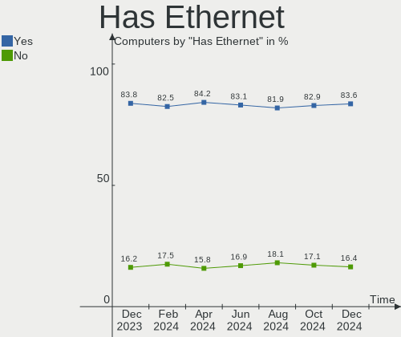
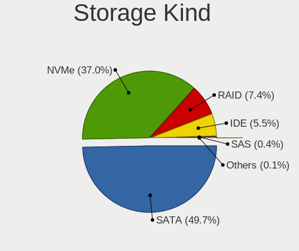
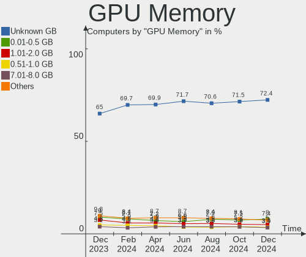
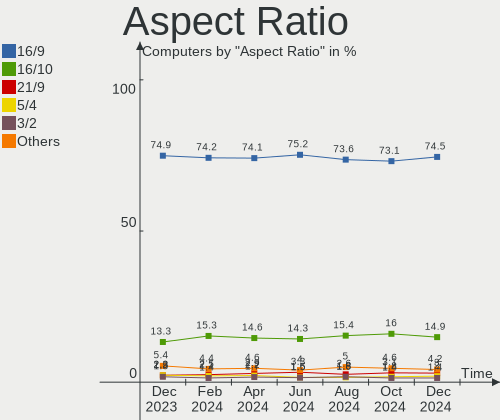
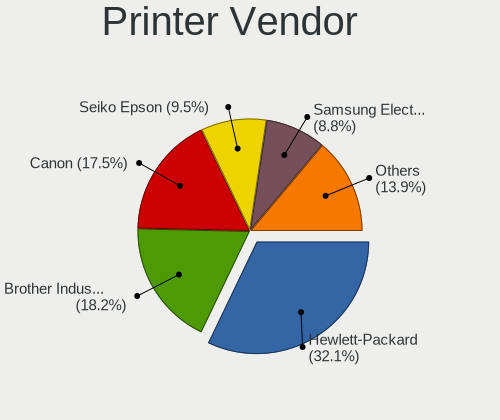
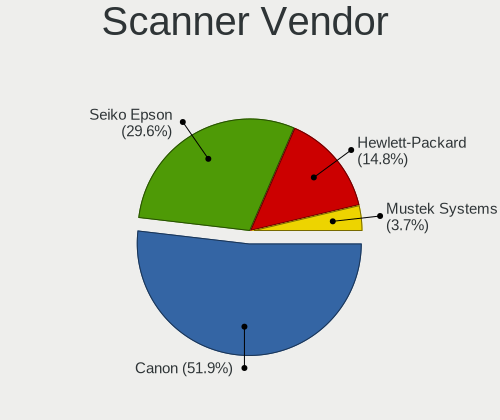
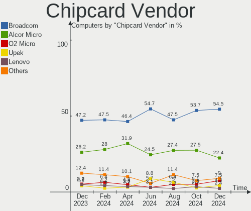
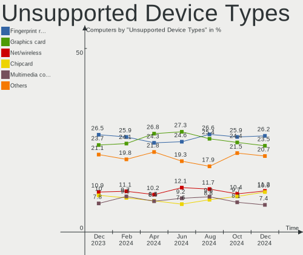

Linux Hardware Trends
---------------------

A project to identify most popular hardware characteristics and track their change
over time based on data collected by Linux users at https://Linux-Hardware.org.

Anyone can contribute to this report by the [hw-probe](https://github.com/linuxhw/hw-probe) tool:

    sudo -E hw-probe -all -upload

This is a report for all computer types. See also reports for [desktops](/Desktop/README.md) and [notebooks](/Notebook/README.md).

Full-feature report is available here: https://linux-hardware.org/?view=trends

Distribution-specific reports: [Ubuntu](/Dist/Ubuntu), [Debian](/Dist/Debian), [Linux Mint](/Dist/Linux_Mint), [Pop!_OS](/Dist/Pop!_OS), [Fedora](/Dist/Fedora), [OpenMandriva](/Dist/OpenMandriva), [Manjaro](/Dist/Manjaro), [Zorin](/Dist/Zorin), [Arch](/Dist/Arch), [KDE neon](/Dist/KDE_neon), [ROSA](/Dist/ROSA), [Xubuntu](/Dist/Xubuntu), [Kubuntu](/Dist/Kubuntu), [ArcoLinux](/Dist/ArcoLinux), [CentOS](/Dist/CentOS), [BlackPanther](/Dist/BlackPanther), [openSUSE](/Dist/openSUSE), [Clear Linux](/Dist/Clear_Linux), [Endless](/Dist/Endless), [Gentoo](/Dist/Gentoo).

Period: Oct, 2021.

Contents
--------

* [ System ](#system)
  - [ OS                       ](#os)
  - [ OS Family                ](#os-family)
  - [ Kernel                   ](#kernel)
  - [ Kernel Family            ](#kernel-family)
  - [ Kernel Major Ver.        ](#kernel-major-ver)
  - [ Arch                     ](#arch)
  - [ DE                       ](#de)
  - [ Display Server           ](#display-server)
  - [ Display Manager          ](#display-manager)
  - [ OS Lang                  ](#os-lang)
  - [ Boot Mode                ](#boot-mode)
  - [ Filesystem               ](#filesystem)
  - [ Part. scheme             ](#part-scheme)
  - [ Dual Boot with Linux/BSD ](#dual-boot-with-linuxbsd)
  - [ Dual Boot (Win)          ](#dual-boot-win)

* [ Board ](#board)
  - [ Vendor                   ](#vendor)
  - [ Model                    ](#model)
  - [ Model Family             ](#model-family)
  - [ MFG Year                 ](#mfg-year)
  - [ Form Factor              ](#form-factor)
  - [ Secure Boot              ](#secure-boot)
  - [ Coreboot                 ](#coreboot)
  - [ RAM Size                 ](#ram-size)
  - [ RAM Used                 ](#ram-used)
  - [ Total Drives             ](#total-drives)
  - [ Has CD-ROM               ](#has-cd-rom)
  - [ Has Ethernet             ](#has-ethernet)
  - [ Has WiFi                 ](#has-wifi)
  - [ Has Bluetooth            ](#has-bluetooth)

* [ Location ](#location)
  - [ Country                  ](#country)
  - [ City                     ](#city)

* [ Drives ](#drives)
  - [ Drive Vendor             ](#drive-vendor)
  - [ Drive Model              ](#drive-model)
  - [ HDD Vendor               ](#hdd-vendor)
  - [ SSD Vendor               ](#ssd-vendor)
  - [ Drive Kind               ](#drive-kind)
  - [ Drive Connector          ](#drive-connector)
  - [ Drive Size               ](#drive-size)
  - [ Space Total              ](#space-total)
  - [ Space Used               ](#space-used)
  - [ Malfunc. Drives          ](#malfunc-drives)
  - [ Malfunc. Drive Vendor    ](#malfunc-drive-vendor)
  - [ Malfunc. HDD Vendor      ](#malfunc-hdd-vendor)
  - [ Malfunc. Drive Kind      ](#malfunc-drive-kind)
  - [ Failed Drives            ](#failed-drives)
  - [ Failed Drive Vendor      ](#failed-drive-vendor)
  - [ Drive Status             ](#drive-status)

* [ Storage controller ](#storage-controller)
  - [ Storage Vendor           ](#storage-vendor)
  - [ Storage Model            ](#storage-model)
  - [ Storage Kind             ](#storage-kind)

* [ Processor ](#processor)
  - [ CPU Vendor               ](#cpu-vendor)
  - [ CPU Model                ](#cpu-model)
  - [ CPU Model Family         ](#cpu-model-family)
  - [ CPU Cores                ](#cpu-cores)
  - [ CPU Sockets              ](#cpu-sockets)
  - [ CPU Threads              ](#cpu-threads)
  - [ CPU Op-Modes             ](#cpu-op-modes)
  - [ CPU Microcode            ](#cpu-microcode)
  - [ CPU Microarch            ](#cpu-microarch)

* [ Graphics ](#graphics)
  - [ GPU Vendor               ](#gpu-vendor)
  - [ GPU Model                ](#gpu-model)
  - [ GPU Combo                ](#gpu-combo)
  - [ GPU Driver               ](#gpu-driver)
  - [ GPU Memory               ](#gpu-memory)

* [ Monitor ](#monitor)
  - [ Monitor Vendor           ](#monitor-vendor)
  - [ Monitor Model            ](#monitor-model)
  - [ Monitor Resolution       ](#monitor-resolution)
  - [ Monitor Diagonal         ](#monitor-diagonal)
  - [ Monitor Width            ](#monitor-width)
  - [ Aspect Ratio             ](#aspect-ratio)
  - [ Monitor Area             ](#monitor-area)
  - [ Pixel Density            ](#pixel-density)
  - [ Multiple Monitors        ](#multiple-monitors)

* [ Network ](#network)
  - [ Net Controller Vendor    ](#net-controller-vendor)
  - [ Net Controller Model     ](#net-controller-model)
  - [ Wireless Vendor          ](#wireless-vendor)
  - [ Wireless Model           ](#wireless-model)
  - [ Ethernet Vendor          ](#ethernet-vendor)
  - [ Ethernet Model           ](#ethernet-model)
  - [ Net Controller Kind      ](#net-controller-kind)
  - [ Used Controller          ](#used-controller)
  - [ NICs                     ](#nics)
  - [ IPv6                     ](#ipv6)

* [ Bluetooth ](#bluetooth)
  - [ Bluetooth Vendor         ](#bluetooth-vendor)
  - [ Bluetooth Model          ](#bluetooth-model)

* [ Sound ](#sound)
  - [ Sound Vendor             ](#sound-vendor)
  - [ Sound Model              ](#sound-model)

* [ Memory ](#memory)
  - [ Memory Vendor            ](#memory-vendor)
  - [ Memory Model             ](#memory-model)
  - [ Memory Kind              ](#memory-kind)
  - [ Memory Form Factor       ](#memory-form-factor)
  - [ Memory Size              ](#memory-size)
  - [ Memory Speed             ](#memory-speed)

* [ Printers & scanners ](#printers--scanners)
  - [ Printer Vendor           ](#printer-vendor)
  - [ Printer Model            ](#printer-model)
  - [ Scanner Vendor           ](#scanner-vendor)
  - [ Scanner Model            ](#scanner-model)

* [ Camera ](#camera)
  - [ Camera Vendor            ](#camera-vendor)
  - [ Camera Model             ](#camera-model)

* [ Security ](#security)
  - [ Fingerprint Vendor       ](#fingerprint-vendor)
  - [ Fingerprint Model        ](#fingerprint-model)
  - [ Chipcard Vendor          ](#chipcard-vendor)
  - [ Chipcard Model           ](#chipcard-model)

* [ Unsupported ](#unsupported)
  - [ Unsupported Devices      ](#unsupported-devices)
  - [ Unsupported Device Types ](#unsupported-device-types)

System
------

OS
--

Installed operating systems

| Name                | Computers | Percent |
|---------------------|-----------|---------|
| Ubuntu 20.04        | 973       | 19.21%  |
| Linux Mint 20.2     | 398       | 7.86%   |
| Pop!_OS 21.04       | 339       | 6.69%   |
| Ubuntu 21.10        | 252       | 4.97%   |
| OpenMandriva 4.2    | 219       | 4.32%   |
| Debian 11           | 210       | 4.15%   |
| Ubuntu 21.04        | 204       | 4.03%   |
| Fedora 34           | 204       | 4.03%   |
| Zorin 16            | 181       | 3.57%   |
| ROSA R11.1          | 108       | 2.13%   |
| ROSA 12             | 102       | 2.01%   |
| KDE neon 20.04      | 102       | 2.01%   |
| BlackPanther 18.1   | 86        | 1.7%    |
| Xubuntu 20.04       | 81        | 1.6%    |
| ArcoLinux Rolling   | 80        | 1.58%   |
| Arch                | 78        | 1.54%   |
| Ubuntu 18.04        | 64        | 1.26%   |
| Fedora 35           | 60        | 1.18%   |
| Manjaro             | 57        | 1.13%   |
| Kubuntu 20.04       | 53        | 1.05%   |
| Arch Rolling        | 50        | 0.99%   |
| Kali 2021.3         | 46        | 0.91%   |
| Gentoo 2.7          | 46        | 0.91%   |
| Manjaro 21.1.6      | 44        | 0.87%   |
| Endless 3.9.5       | 40        | 0.79%   |
| Linux Mint 20.1     | 36        | 0.71%   |
| Linux Mint 19.3     | 36        | 0.71%   |
| Pop!_OS 20.04       | 35        | 0.69%   |
| OpenMandriva 4.50   | 32        | 0.63%   |
| Zorin 15            | 31        | 0.61%   |
| Elementary 6        | 29        | 0.57%   |
| Debian 10           | 28        | 0.55%   |
| Kubuntu 21.04       | 27        | 0.53%   |
| Manjaro 21.1.4      | 25        | 0.49%   |
| EndeavourOS Rolling | 24        | 0.47%   |
| Manjaro 21.1.5      | 23        | 0.45%   |
| Ubuntu MATE 20.04   | 22        | 0.43%   |
| Xubuntu 18.04       | 21        | 0.41%   |
| Linux Mint 20       | 20        | 0.39%   |
| Lubuntu 20.04       | 18        | 0.36%   |
| LinuxFX 11          | 18        | 0.36%   |
| Kubuntu 21.10       | 17        | 0.34%   |
| Debian Testing      | 17        | 0.34%   |
| openSUSE Leap-15.3  | 16        | 0.32%   |
| Gentoo 2.8          | 15        | 0.3%    |
| Ubuntu 16.04        | 13        | 0.26%   |
| LMDE 4              | 13        | 0.26%   |
| Xubuntu 21.04       | 12        | 0.24%   |
| MX 19               | 12        | 0.24%   |
| Ubuntu 20.10        | 11        | 0.22%   |
| RELS 7.3            | 11        | 0.22%   |
| Peppermint 10       | 10        | 0.2%    |
| Garuda Soaring      | 10        | 0.2%    |
| Raspbian 10         | 9         | 0.18%   |
| MX 20               | 9         | 0.18%   |
| CentOS 8            | 9         | 0.18%   |
| Xubuntu 21.10       | 8         | 0.16%   |
| Clear Linux 35110   | 8         | 0.16%   |
| Xero Rolling        | 7         | 0.14%   |
| RHEL 8              | 7         | 0.14%   |

OS Family
---------

OS without a version

| Name          | Computers | Percent |
|---------------|-----------|---------|
| Ubuntu        | 1527      | 30.14%  |
| Linux Mint    | 503       | 9.93%   |
| Pop!_OS       | 385       | 7.6%    |
| Fedora        | 279       | 5.51%   |
| Debian        | 269       | 5.31%   |
| OpenMandriva  | 251       | 4.95%   |
| ROSA          | 218       | 4.3%    |
| Zorin         | 213       | 4.2%    |
| Manjaro       | 157       | 3.1%    |
| Arch          | 128       | 2.53%   |
| Xubuntu       | 124       | 2.45%   |
| Kubuntu       | 108       | 2.13%   |
| KDE neon      | 102       | 2.01%   |
| BlackPanther  | 90        | 1.78%   |
| ArcoLinux     | 82        | 1.62%   |
| openSUSE      | 65        | 1.28%   |
| Gentoo        | 64        | 1.26%   |
| Endless       | 56        | 1.11%   |
| Kali          | 48        | 0.95%   |
| Lubuntu       | 33        | 0.65%   |
| Ubuntu MATE   | 32        | 0.63%   |
| Elementary    | 31        | 0.61%   |
| EndeavourOS   | 28        | 0.55%   |
| MX            | 26        | 0.51%   |
| Clear Linux   | 25        | 0.49%   |
| LinuxFX       | 22        | 0.43%   |
| CentOS        | 16        | 0.32%   |
| LMDE          | 13        | 0.26%   |
| Garuda        | 13        | 0.26%   |
| Raspbian      | 12        | 0.24%   |
| Ubuntu Budgie | 11        | 0.22%   |
| RELS          | 11        | 0.22%   |
| Parrot        | 11        | 0.22%   |
| Xero          | 10        | 0.2%    |
| Peppermint    | 10        | 0.2%    |
| RHEL          | 7         | 0.14%   |
| Devuan        | 7         | 0.14%   |
| ClearOS       | 7         | 0.14%   |
| ALT Linux     | 5         | 0.1%    |
| Alpine        | 5         | 0.1%    |
| Void          | 4         | 0.08%   |
| Solus         | 4         | 0.08%   |
| Slackware     | 4         | 0.08%   |
| Makulu        | 4         | 0.08%   |
| NixOS         | 3         | 0.06%   |
| Manjaro-ARM   | 3         | 0.06%   |
| Deepin        | 3         | 0.06%   |
| Artix         | 3         | 0.06%   |
| Red OS        | 2         | 0.04%   |
| Pardus        | 2         | 0.04%   |
| Mageia        | 2         | 0.04%   |
| Calculate     | 2         | 0.04%   |
| BuildRoot     | 2         | 0.04%   |
| antiX         | 2         | 0.04%   |
| SuperX Pro    | 1         | 0.02%   |
| Sparky        | 1         | 0.02%   |
| SLES          | 1         | 0.02%   |
| Rocky Linux   | 1         | 0.02%   |
| Redcore       | 1         | 0.02%   |
| RED           | 1         | 0.02%   |

Kernel
------

Version of the Linux kernel

| Version                             | Computers | Percent |
|-------------------------------------|-----------|---------|
| 5.11.0-37-generic                   | 818       | 16.15%  |
| 5.11.0-38-generic                   | 493       | 9.73%   |
| 5.13.0-7614-generic                 | 335       | 6.61%   |
| 5.4.0-88-generic                    | 311       | 6.14%   |
| 5.10.14-desktop-1omv4002            | 208       | 4.11%   |
| 5.4.0-89-generic                    | 189       | 3.73%   |
| 5.13.0-20-generic                   | 133       | 2.63%   |
| 5.13.0-19-generic                   | 110       | 2.17%   |
| 5.10.71-generic-1rosa2021.1-x86_64  | 101       | 1.99%   |
| 5.10.0-8-amd64                      | 83        | 1.64%   |
| 5.10.0-9-amd64                      | 82        | 1.62%   |
| 5.4.0-87-generic                    | 74        | 1.46%   |
| 5.11.0-27-generic                   | 69        | 1.36%   |
| 5.13.19-2-MANJARO                   | 56        | 1.11%   |
| 5.6.14-desktop-2bP                  | 54        | 1.07%   |
| 5.14.9-200.fc34.x86_64              | 53        | 1.05%   |
| 5.14.14-arch1-1                     | 48        | 0.95%   |
| 5.8.0-14-generic                    | 42        | 0.83%   |
| 5.14.12-arch1-1                     | 39        | 0.77%   |
| 5.11.0-36-generic                   | 35        | 0.69%   |
| 5.14.13-200.fc34.x86_64             | 34        | 0.67%   |
| 5.10.0-7-amd64                      | 34        | 0.67%   |
| 5.14.11-200.fc34.x86_64             | 33        | 0.65%   |
| 4.18.16-desktop-1bP                 | 32        | 0.63%   |
| 5.4.83-generic-2rosa-x86_64         | 31        | 0.61%   |
| 5.4.0-74-generic                    | 29        | 0.57%   |
| 5.14.8-arch1-1                      | 29        | 0.57%   |
| 5.10.0-kali9-amd64                  | 29        | 0.57%   |
| 5.14.9-arch2-1                      | 27        | 0.53%   |
| 5.13.19-200.fc34.x86_64             | 27        | 0.53%   |
| 5.14.10-1-MANJARO                   | 25        | 0.49%   |
| 4.15.0-desktop-122.124.1rosa-x86_64 | 24        | 0.47%   |
| 4.15.0-159-generic                  | 22        | 0.43%   |
| 5.11.0-34-generic                   | 20        | 0.39%   |
| 5.10.70-1-MANJARO                   | 20        | 0.39%   |
| 5.4.32-generic-2rosa-x86_64         | 18        | 0.36%   |
| 5.14.7-desktop-1omv4050             | 18        | 0.36%   |
| 5.14.10-300.fc35.x86_64             | 18        | 0.36%   |
| 4.19.0-18-amd64                     | 18        | 0.36%   |
| 5.8.0-63-generic                    | 17        | 0.34%   |
| 5.14.11-arch1-1                     | 17        | 0.34%   |
| 5.14.9-300.fc35.x86_64              | 15        | 0.3%    |
| 5.8.0-43-generic                    | 14        | 0.28%   |
| 5.14.0-2-amd64                      | 14        | 0.28%   |
| 5.12.4-desktop-1omv4050             | 14        | 0.28%   |
| 5.11.0-7620-generic                 | 14        | 0.28%   |
| 5.4.32-generic-2rosa-i586           | 13        | 0.26%   |
| 5.14.9-zen2-1-zen                   | 13        | 0.26%   |
| 5.14.0-kali2-amd64                  | 13        | 0.26%   |
| 5.13.0-21-generic                   | 13        | 0.26%   |
| 5.11.0-40-generic                   | 13        | 0.26%   |
| 5.11.0-16-generic                   | 13        | 0.26%   |
| 5.15.0-1-MANJARO                    | 12        | 0.24%   |
| 5.14.14-zen1-1-zen                  | 12        | 0.24%   |
| 5.13.0-7620-generic                 | 12        | 0.24%   |
| 5.13.0-16-generic                   | 12        | 0.24%   |
| 5.10.68-1-MANJARO                   | 12        | 0.24%   |
| 5.10.61-gentoo                      | 12        | 0.24%   |
| 4.15.0-142-generic                  | 12        | 0.24%   |
| 5.4.0-84-generic                    | 11        | 0.22%   |

Kernel Family
-------------

Linux kernel without a distro release

| Version | Computers | Percent |
|---------|-----------|---------|
| 5.11.0  | 1525      | 30.1%   |
| 5.4.0   | 713       | 14.07%  |
| 5.13.0  | 638       | 12.59%  |
| 5.10.0  | 277       | 5.47%   |
| 5.10.14 | 208       | 4.11%   |
| 5.14.9  | 145       | 2.86%   |
| 5.8.0   | 106       | 2.09%   |
| 5.10.71 | 104       | 2.05%   |
| 5.13.19 | 92        | 1.82%   |
| 4.15.0  | 92        | 1.82%   |
| 5.14.14 | 88        | 1.74%   |
| 5.14.11 | 82        | 1.62%   |
| 5.14.12 | 71        | 1.4%    |
| 5.14.10 | 67        | 1.32%   |
| 5.14.0  | 67        | 1.32%   |
| 5.14.8  | 56        | 1.11%   |
| 5.6.14  | 54        | 1.07%   |
| 5.14.13 | 47        | 0.93%   |
| 5.4.83  | 42        | 0.83%   |
| 4.19.0  | 41        | 0.81%   |
| 5.14.7  | 36        | 0.71%   |
| 4.18.16 | 32        | 0.63%   |
| 5.4.32  | 31        | 0.61%   |
| 5.15.0  | 30        | 0.59%   |
| 5.10.70 | 27        | 0.53%   |
| 5.3.18  | 25        | 0.49%   |
| 4.18.0  | 24        | 0.47%   |
| 3.10.0  | 23        | 0.45%   |
| 5.11.12 | 22        | 0.43%   |
| 5.14.6  | 21        | 0.41%   |
| 5.10.61 | 21        | 0.41%   |
| 5.13.13 | 19        | 0.38%   |
| 5.12.4  | 14        | 0.28%   |
| 5.10.68 | 14        | 0.28%   |
| 5.10.63 | 12        | 0.24%   |
| 5.11.22 | 11        | 0.22%   |
| 5.0.0   | 11        | 0.22%   |
| 5.14.15 | 9         | 0.18%   |
| 5.13.12 | 8         | 0.16%   |
| 5.3.0   | 7         | 0.14%   |
| 5.14.2  | 6         | 0.12%   |
| 5.10.60 | 6         | 0.12%   |
| 5.13.16 | 5         | 0.1%    |
| 5.10.75 | 5         | 0.1%    |
| 5.10.72 | 5         | 0.1%    |
| 5.10.69 | 5         | 0.1%    |
| 4.9.20  | 5         | 0.1%    |
| 5.4.150 | 4         | 0.08%   |
| 4.9.155 | 4         | 0.08%   |
| 4.9.0   | 4         | 0.08%   |
| 4.4.0   | 4         | 0.08%   |
| 5.13.9  | 3         | 0.06%   |
| 5.12.9  | 3         | 0.06%   |
| 5.12.19 | 3         | 0.06%   |
| 5.10.74 | 3         | 0.06%   |
| 5.10.23 | 3         | 0.06%   |
| 4.12.14 | 3         | 0.06%   |
| 5.9.0   | 2         | 0.04%   |
| 5.8.18  | 2         | 0.04%   |
| 5.6.0   | 2         | 0.04%   |

Kernel Major Ver.
-----------------

Linux kernel major version

| Version | Computers | Percent |
|---------|-----------|---------|
| 5.11    | 1559      | 30.77%  |
| 5.4     | 801       | 15.81%  |
| 5.13    | 775       | 15.3%   |
| 5.10    | 708       | 13.98%  |
| 5.14    | 702       | 13.86%  |
| 5.8     | 110       | 2.17%   |
| 4.15    | 92        | 1.82%   |
| 5.6     | 58        | 1.14%   |
| 4.18    | 56        | 1.11%   |
| 4.19    | 43        | 0.85%   |
| 5.3     | 33        | 0.65%   |
| 5.15    | 30        | 0.59%   |
| 3.10    | 24        | 0.47%   |
| 5.12    | 23        | 0.45%   |
| 4.9     | 16        | 0.32%   |
| 5.0     | 11        | 0.22%   |
| 4.4     | 10        | 0.2%    |
| 5.9     | 4         | 0.08%   |
| 4.16    | 3         | 0.06%   |
| 4.12    | 3         | 0.06%   |
| 5.5     | 1         | 0.02%   |
| 5.2     | 1         | 0.02%   |
| 4.14    | 1         | 0.02%   |
| 4.13    | 1         | 0.02%   |
| 4.10    | 1         | 0.02%   |

Arch
----

OS architecture (x86_64, i586, etc.)

| Name    | Computers | Percent |
|---------|-----------|---------|
| x86_64  | 4908      | 96.88%  |
| i686    | 110       | 2.17%   |
| aarch64 | 31        | 0.61%   |
| armv7l  | 14        | 0.28%   |
| armv6l  | 3         | 0.06%   |

DE
--

Desktop Environment

| Name             | Computers | Percent |
|------------------|-----------|---------|
| GNOME            | 2423      | 47.83%  |
| KDE5             | 1005      | 19.84%  |
| X-Cinnamon       | 416       | 8.21%   |
| XFCE             | 376       | 7.42%   |
| Unknown          | 320       | 6.32%   |
| MATE             | 138       | 2.72%   |
| KDE4             | 61        | 1.2%    |
| Cinnamon         | 55        | 1.09%   |
| LXQt             | 50        | 0.99%   |
| i3               | 33        | 0.65%   |
| LXDE             | 30        | 0.59%   |
| Pantheon         | 29        | 0.57%   |
| KDE              | 22        | 0.43%   |
| Unity            | 17        | 0.34%   |
| Budgie           | 17        | 0.34%   |
| GNOME Flashback  | 12        | 0.24%   |
| GNOME Classic    | 8         | 0.16%   |
| xmonad           | 7         | 0.14%   |
| sway             | 6         | 0.12%   |
| Deepin           | 6         | 0.12%   |
| awesome          | 6         | 0.12%   |
| qtile            | 5         | 0.1%    |
| openbox          | 5         | 0.1%    |
| Trinity          | 3         | 0.06%   |
| dwm              | 3         | 0.06%   |
| bspwm            | 3         | 0.06%   |
| i3-with-shmlog   | 2         | 0.04%   |
| herbstluftwm     | 2         | 0.04%   |
| UKUI             | 1         | 0.02%   |
| lightdm-xsession | 1         | 0.02%   |
| ICEWM            | 1         | 0.02%   |
| GNUstep          | 1         | 0.02%   |
| GNOME:Phosh      | 1         | 0.02%   |
| enlightenment    | 1         | 0.02%   |

Display Server
--------------

X11 or Wayland

| Name    | Computers | Percent |
|---------|-----------|---------|
| X11     | 4063      | 80.2%   |
| Wayland | 738       | 14.57%  |
| Unknown | 156       | 3.08%   |
| Tty     | 108       | 2.13%   |
| Web     | 1         | 0.02%   |

Display Manager
---------------

SDDM, LightDM, etc.

| Name    | Computers | Percent |
|---------|-----------|---------|
| Unknown | 1635      | 32.27%  |
| GDM3    | 1029      | 20.31%  |
| SDDM    | 817       | 16.13%  |
| GDM     | 765       | 15.1%   |
| LightDM | 737       | 14.55%  |
| KDM     | 61        | 1.2%    |
| XDM     | 11        | 0.22%   |
| SLiM    | 5         | 0.1%    |
| LXDM    | 2         | 0.04%   |
| TDM     | 1         | 0.02%   |
| NODM    | 1         | 0.02%   |
| Ly      | 1         | 0.02%   |
| GREETD  | 1         | 0.02%   |

OS Lang
-------

Language

| Lang        | Computers | Percent |
|-------------|-----------|---------|
| en_US       | 1951      | 38.51%  |
| de_DE       | 435       | 8.59%   |
| ru_RU       | 419       | 8.27%   |
| fr_FR       | 281       | 5.55%   |
| en_GB       | 272       | 5.37%   |
| pt_BR       | 221       | 4.36%   |
| Unknown     | 150       | 2.96%   |
| es_ES       | 132       | 2.61%   |
| it_IT       | 108       | 2.13%   |
| en_AU       | 106       | 2.09%   |
| en_CA       | 103       | 2.03%   |
| pl_PL       | 94        | 1.86%   |
| C           | 89        | 1.76%   |
| en_IN       | 76        | 1.5%    |
| cs_CZ       | 47        | 0.93%   |
| nl_NL       | 38        | 0.75%   |
| es_MX       | 28        | 0.55%   |
| hu_HU       | 25        | 0.49%   |
| es_AR       | 25        | 0.49%   |
| en_ZA       | 24        | 0.47%   |
| de_AT       | 24        | 0.47%   |
| ru_UA       | 23        | 0.45%   |
| de_CH       | 22        | 0.43%   |
| pt_PT       | 19        | 0.38%   |
| en_NZ       | 19        | 0.38%   |
| zh_CN       | 18        | 0.36%   |
| sv_SE       | 17        | 0.34%   |
| ja_JP       | 17        | 0.34%   |
| es_CO       | 17        | 0.34%   |
| tr_TR       | 16        | 0.32%   |
| nl_BE       | 15        | 0.3%    |
| fr_BE       | 15        | 0.3%    |
| es_CL       | 12        | 0.24%   |
| fr_CA       | 11        | 0.22%   |
| en_IE       | 11        | 0.22%   |
| POSIX       | 10        | 0.2%    |
| en_IL       | 10        | 0.2%    |
| ro_RO       | 9         | 0.18%   |
| sk_SK       | 8         | 0.16%   |
| fi_FI       | 8         | 0.16%   |
| el_GR       | 8         | 0.16%   |
| da_DK       | 8         | 0.16%   |
| zh_TW       | 7         | 0.14%   |
| uk_UA       | 7         | 0.14%   |
| hr_HR       | 7         | 0.14%   |
| fr_CH       | 7         | 0.14%   |
| es_CR       | 7         | 0.14%   |
| ru_RU.UTF_8 | 6         | 0.12%   |
| nb_NO       | 6         | 0.12%   |
| es_VE       | 6         | 0.12%   |
| en_SG       | 6         | 0.12%   |
| en_DK       | 6         | 0.12%   |
| es_PE       | 5         | 0.1%    |
| es_EC       | 5         | 0.1%    |
| ko_KR       | 3         | 0.06%   |
| en_PH       | 3         | 0.06%   |
| ca_ES       | 3         | 0.06%   |
| C.UTF8      | 3         | 0.06%   |
| bg_BG       | 3         | 0.06%   |
| vi_VN       | 2         | 0.04%   |

Boot Mode
---------

EFI or BIOS

| Mode | Computers | Percent |
|------|-----------|---------|
| BIOS | 2690      | 53.1%   |
| EFI  | 2376      | 46.9%   |

Filesystem
----------

Type of filesystem

| Type       | Computers | Percent |
|------------|-----------|---------|
| Ext4       | 4034      | 79.63%  |
| Btrfs      | 441       | 8.71%   |
| Overlay    | 420       | 8.29%   |
| Xfs        | 88        | 1.74%   |
| Zfs        | 36        | 0.71%   |
| F2fs       | 15        | 0.3%    |
| Ext3       | 10        | 0.2%    |
| Ext2       | 7         | 0.14%   |
| Tmpfs      | 5         | 0.1%    |
| Unknown    | 5         | 0.1%    |
| Reiserfs   | 1         | 0.02%   |
| Jfs        | 1         | 0.02%   |
| Fuse.sshfs | 1         | 0.02%   |
| ExX4       | 1         | 0.02%   |
| Aufs       | 1         | 0.02%   |

Part. scheme
------------

Scheme of partitioning

| Type    | Computers | Percent |
|---------|-----------|---------|
| Unknown | 2749      | 54.26%  |
| GPT     | 1641      | 32.39%  |
| MBR     | 676       | 13.34%  |

Dual Boot with Linux/BSD
------------------------

Hosting more than one Linux/BSD

| Dual boot | Computers | Percent |
|-----------|-----------|---------|
| No        | 4360      | 86.06%  |
| Yes       | 706       | 13.94%  |

Dual Boot (Win)
---------------

Hosting Linux and Windows

| Dual boot | Computers | Percent |
|-----------|-----------|---------|
| No        | 3493      | 68.95%  |
| Yes       | 1573      | 31.05%  |

Board
-----

Vendor
------

Motherboard manufacturer

| Name                           | Computers | Percent |
|--------------------------------|-----------|---------|
| ASUSTek Computer               | 824       | 16.27%  |
| Lenovo                         | 714       | 14.09%  |
| Hewlett-Packard                | 698       | 13.78%  |
| Dell                           | 637       | 12.57%  |
| Gigabyte Technology            | 345       | 6.81%   |
| MSI                            | 300       | 5.92%   |
| Acer                           | 289       | 5.7%    |
| ASRock                         | 215       | 4.24%   |
| Apple                          | 110       | 2.17%   |
| Intel                          | 79        | 1.56%   |
| Toshiba                        | 73        | 1.44%   |
| Samsung Electronics            | 71        | 1.4%    |
| Unknown                        | 56        | 1.11%   |
| Fujitsu                        | 50        | 0.99%   |
| Sony                           | 39        | 0.77%   |
| Medion                         | 39        | 0.77%   |
| HUAWEI                         | 34        | 0.67%   |
| Raspberry Pi Foundation        | 22        | 0.43%   |
| Pegatron                       | 22        | 0.43%   |
| Notebook                       | 22        | 0.43%   |
| Alienware                      | 21        | 0.41%   |
| Packard Bell                   | 18        | 0.36%   |
| Fujitsu Siemens                | 18        | 0.36%   |
| Microsoft                      | 17        | 0.34%   |
| Foxconn                        | 16        | 0.32%   |
| TUXEDO                         | 14        | 0.28%   |
| Timi                           | 14        | 0.28%   |
| Supermicro                     | 14        | 0.28%   |
| Biostar                        | 14        | 0.28%   |
| Google                         | 12        | 0.24%   |
| Aquarius                       | 12        | 0.24%   |
| Huanan                         | 11        | 0.22%   |
| eMachines                      | 11        | 0.22%   |
| System76                       | 10        | 0.2%    |
| LG Electronics                 | 8         | 0.16%   |
| Razer                          | 7         | 0.14%   |
| Positivo                       | 7         | 0.14%   |
| Gateway                        | 7         | 0.14%   |
| ECS                            | 7         | 0.14%   |
| Shuttle                        | 6         | 0.12%   |
| IBM                            | 6         | 0.12%   |
| BESSTAR Tech                   | 5         | 0.1%    |
| TrekStor                       | 4         | 0.08%   |
| Schenker                       | 4         | 0.08%   |
| Pine Microsystems              | 4         | 0.08%   |
| OEM                            | 4         | 0.08%   |
| Nvidia                         | 4         | 0.08%   |
| HONOR                          | 4         | 0.08%   |
| Framework                      | 4         | 0.08%   |
| Chuwi                          | 4         | 0.08%   |
| Wortmann AG                    | 3         | 0.06%   |
| Teclast                        | 3         | 0.06%   |
| Rockchip                       | 3         | 0.06%   |
| realme                         | 3         | 0.06%   |
| Quanta                         | 3         | 0.06%   |
| Matsushita Electric Industrial | 3         | 0.06%   |
| GPU Company                    | 3         | 0.06%   |
| AZW                            | 3         | 0.06%   |
| ZOTAC                          | 2         | 0.04%   |
| Wistron                        | 2         | 0.04%   |

Model
-----

Motherboard model

| Name                                | Computers | Percent |
|-------------------------------------|-----------|---------|
| Unknown                             | 74        | 1.46%   |
| ASUS All Series                     | 41        | 0.81%   |
| RPi Raspberry Pi                    | 22        | 0.43%   |
| HP Notebook                         | 20        | 0.39%   |
| HP Pavilion dv6                     | 15        | 0.3%    |
| Dell OptiPlex 7010                  | 14        | 0.28%   |
| MSI MS-7C37                         | 13        | 0.26%   |
| Gigabyte B450M DS3H                 | 13        | 0.26%   |
| Dell OptiPlex 790                   | 12        | 0.24%   |
| Acer Nitro AN515-54                 | 12        | 0.24%   |
| Aquarius NS585                      | 11        | 0.22%   |
| MSI MS-7B86                         | 10        | 0.2%    |
| HP Pavilion Notebook                | 10        | 0.2%    |
| HP Pavilion g6                      | 10        | 0.2%    |
| Dell XPS 15 7590                    | 10        | 0.2%    |
| Dell OptiPlex 9020                  | 10        | 0.2%    |
| ASUS TUF GAMING X570-PLUS           | 10        | 0.2%    |
| Dell OptiPlex 9010                  | 9         | 0.18%   |
| Dell Latitude E6420                 | 9         | 0.18%   |
| Dell Inspiron N5110                 | 9         | 0.18%   |
| Intel H61                           | 8         | 0.16%   |
| HP 15                               | 8         | 0.16%   |
| Gigabyte X570 AORUS MASTER          | 8         | 0.16%   |
| ASUS PRIME B450M-A                  | 8         | 0.16%   |
| Apple MacBookPro8,1                 | 8         | 0.16%   |
| MSI MS-7C02                         | 7         | 0.14%   |
| MSI MS-7592                         | 7         | 0.14%   |
| Lenovo IdeaPad S145-15API 81V7      | 7         | 0.14%   |
| Lenovo IdeaPad 3 15IIL05 81WE       | 7         | 0.14%   |
| HP Pavilion dv7                     | 7         | 0.14%   |
| HP EliteBook 840 G3                 | 7         | 0.14%   |
| Dell OptiPlex 3020                  | 7         | 0.14%   |
| Dell OptiPlex 3010                  | 7         | 0.14%   |
| Dell Latitude E6520                 | 7         | 0.14%   |
| Dell Latitude E6410                 | 7         | 0.14%   |
| Dell Inspiron 15-3567               | 7         | 0.14%   |
| ASUS UX31E                          | 7         | 0.14%   |
| ASUS PRIME B450-PLUS                | 7         | 0.14%   |
| ASRock B450M Pro4                   | 7         | 0.14%   |
| Apple MacBookPro12,1                | 7         | 0.14%   |
| Apple MacBookAir7,2                 | 7         | 0.14%   |
| Acer Nitro AN515-45                 | 7         | 0.14%   |
| MSI MS-7C35                         | 6         | 0.12%   |
| MSI MS-7A34                         | 6         | 0.12%   |
| MSI MS-7817                         | 6         | 0.12%   |
| MSI MS-7693                         | 6         | 0.12%   |
| HUAWEI NBLK-WAX9X                   | 6         | 0.12%   |
| HUAWEI KLVL-WXX9                    | 6         | 0.12%   |
| HP ProBook 450 G7                   | 6         | 0.12%   |
| HP Pavilion Gaming Laptop 15-ec1xxx | 6         | 0.12%   |
| HP Pavilion 15                      | 6         | 0.12%   |
| HP Laptop 15-db0xxx                 | 6         | 0.12%   |
| HP Laptop 15-da0xxx                 | 6         | 0.12%   |
| HP EliteDesk 800 G1 SFF             | 6         | 0.12%   |
| HP EliteBook 8460p                  | 6         | 0.12%   |
| HP EliteBook 8440p                  | 6         | 0.12%   |
| Gigabyte B450 AORUS ELITE           | 6         | 0.12%   |
| Dell XPS 15 9570                    | 6         | 0.12%   |
| Dell XPS 13 9310                    | 6         | 0.12%   |
| Dell OptiPlex 990                   | 6         | 0.12%   |

Model Family
------------

Motherboard model prefix

| Name                  | Computers | Percent |
|-----------------------|-----------|---------|
| Lenovo ThinkPad       | 308       | 6.08%   |
| Acer Aspire           | 175       | 3.45%   |
| Dell Inspiron         | 172       | 3.4%    |
| Lenovo IdeaPad        | 160       | 3.16%   |
| Dell Latitude         | 149       | 2.94%   |
| HP Pavilion           | 137       | 2.7%    |
| ASUS PRIME            | 109       | 2.15%   |
| Dell OptiPlex         | 107       | 2.11%   |
| ASUS ROG              | 93        | 1.84%   |
| HP EliteBook          | 79        | 1.56%   |
| Unknown               | 74        | 1.46%   |
| Dell XPS              | 71        | 1.4%    |
| HP Laptop             | 67        | 1.32%   |
| HP ProBook            | 65        | 1.28%   |
| ASUS VivoBook         | 64        | 1.26%   |
| Toshiba Satellite     | 62        | 1.22%   |
| HP Compaq             | 61        | 1.2%    |
| Dell Precision        | 52        | 1.03%   |
| Lenovo ThinkCentre    | 45        | 0.89%   |
| ASUS All              | 41        | 0.81%   |
| ASUS TUF              | 40        | 0.79%   |
| Acer Nitro            | 35        | 0.69%   |
| HP ENVY               | 34        | 0.67%   |
| Dell Vostro           | 34        | 0.67%   |
| Gigabyte X570         | 27        | 0.53%   |
| Lenovo Yoga           | 25        | 0.49%   |
| Acer Swift            | 24        | 0.47%   |
| Lenovo ThinkBook      | 23        | 0.45%   |
| Lenovo Legion         | 23        | 0.45%   |
| RPi Raspberry         | 22        | 0.43%   |
| Gigabyte B450M        | 22        | 0.43%   |
| HP Notebook           | 20        | 0.39%   |
| Fujitsu LIFEBOOK      | 20        | 0.39%   |
| Fujitsu ESPRIMO       | 20        | 0.39%   |
| ASUS ASUS             | 20        | 0.39%   |
| Gigabyte B450         | 19        | 0.38%   |
| HP ZBook              | 18        | 0.36%   |
| Microsoft Surface     | 17        | 0.34%   |
| ASUS M5A97            | 17        | 0.34%   |
| Acer TravelMate       | 16        | 0.32%   |
| HP 255                | 15        | 0.3%    |
| ASUS P8Z77-V          | 15        | 0.3%    |
| HP EliteDesk          | 14        | 0.28%   |
| HP 250                | 14        | 0.28%   |
| MSI MS-7C37           | 13        | 0.26%   |
| HP OMEN               | 13        | 0.26%   |
| Dell PowerEdge        | 13        | 0.26%   |
| Apple MacBookPro8     | 13        | 0.26%   |
| Apple MacBookPro11    | 13        | 0.26%   |
| Packard Bell EasyNote | 12        | 0.24%   |
| HP ProLiant           | 12        | 0.24%   |
| HP ProDesk            | 12        | 0.24%   |
| ASUS P8H61-M          | 12        | 0.24%   |
| Aquarius NS585        | 11        | 0.22%   |
| MSI MS-7B86           | 10        | 0.2%    |
| HP Stream             | 10        | 0.2%    |
| ASUS ZenBook          | 10        | 0.2%    |
| HP Presario           | 9         | 0.18%   |
| Gigabyte A320M-S2H    | 9         | 0.18%   |
| Fujitsu Siemens AMILO | 9         | 0.18%   |

MFG Year
--------

Motherboard manufacture year

| Year    | Computers | Percent |
|---------|-----------|---------|
| 2021    | 993       | 19.6%   |
| 2020    | 690       | 13.62%  |
| 2019    | 508       | 10.03%  |
| 2018    | 414       | 8.17%   |
| 2012    | 320       | 6.32%   |
| 2013    | 301       | 5.94%   |
| 2011    | 293       | 5.78%   |
| 2015    | 251       | 4.95%   |
| 2014    | 228       | 4.5%    |
| 2010    | 223       | 4.4%    |
| 2016    | 208       | 4.11%   |
| 2009    | 174       | 3.43%   |
| 2017    | 166       | 3.28%   |
| 2008    | 130       | 2.57%   |
| 2007    | 74        | 1.46%   |
| Unknown | 51        | 1.01%   |
| 2006    | 26        | 0.51%   |
| 2005    | 11        | 0.22%   |
| 2004    | 3         | 0.06%   |
| 2003    | 1         | 0.02%   |
| 1970    | 1         | 0.02%   |

Form Factor
-----------

Physical design of the computer

| Name           | Computers | Percent |
|----------------|-----------|---------|
| Notebook       | 2715      | 53.59%  |
| Desktop        | 2001      | 39.5%   |
| Convertible    | 112       | 2.21%   |
| All in one     | 66        | 1.3%    |
| Mini pc        | 54        | 1.07%   |
| System on chip | 39        | 0.77%   |
| Tablet         | 39        | 0.77%   |
| Server         | 35        | 0.69%   |
| Phone          | 3         | 0.06%   |
| Other          | 2         | 0.04%   |

Secure Boot
-----------

Enabled or disabled

| State    | Computers | Percent |
|----------|-----------|---------|
| Disabled | 4668      | 92.14%  |
| Enabled  | 398       | 7.86%   |

Coreboot
--------

Have coreboot on board

| Used | Computers | Percent |
|------|-----------|---------|
| No   | 5045      | 99.59%  |
| Yes  | 21        | 0.41%   |

RAM Size
--------

Total RAM memory

| Size in GB      | Computers | Percent |
|-----------------|-----------|---------|
| 4.01-8.0        | 1209      | 23.86%  |
| 16.01-24.0      | 1015      | 20.04%  |
| 8.01-16.0       | 952       | 18.79%  |
| 3.01-4.0        | 923       | 18.22%  |
| 32.01-64.0      | 482       | 9.51%   |
| 1.01-2.0        | 180       | 3.55%   |
| 64.01-256.0     | 134       | 2.65%   |
| 24.01-32.0      | 65        | 1.28%   |
| 2.01-3.0        | 62        | 1.22%   |
| 0.51-1.0        | 34        | 0.67%   |
| More than 256.0 | 5         | 0.1%    |
| 0.01-0.5        | 4         | 0.08%   |
| Unknown         | 1         | 0.02%   |

RAM Used
--------

Used RAM memory

| Used GB    | Computers | Percent |
|------------|-----------|---------|
| 1.01-2.0   | 1880      | 37.11%  |
| 2.01-3.0   | 1205      | 23.79%  |
| 4.01-8.0   | 673       | 13.28%  |
| 3.01-4.0   | 600       | 11.84%  |
| 0.51-1.0   | 397       | 7.84%   |
| 8.01-16.0  | 176       | 3.47%   |
| 0.01-0.5   | 97        | 1.91%   |
| 16.01-24.0 | 19        | 0.38%   |
| 24.01-32.0 | 11        | 0.22%   |
| 32.01-64.0 | 7         | 0.14%   |
| Unknown    | 1         | 0.02%   |

Total Drives
------------

Number of drives on board

| Drives | Computers | Percent |
|--------|-----------|---------|
| 1      | 2973      | 58.69%  |
| 2      | 1281      | 25.29%  |
| 3      | 394       | 7.78%   |
| 4      | 190       | 3.75%   |
| 5      | 103       | 2.03%   |
| 0      | 36        | 0.71%   |
| 6      | 35        | 0.69%   |
| 7      | 26        | 0.51%   |
| 8      | 15        | 0.3%    |
| 9      | 3         | 0.06%   |
| 16     | 2         | 0.04%   |
| 13     | 2         | 0.04%   |
| 11     | 2         | 0.04%   |
| 68     | 1         | 0.02%   |
| 22     | 1         | 0.02%   |
| 14     | 1         | 0.02%   |
| 10     | 1         | 0.02%   |

Has CD-ROM
----------

Has CD-ROM on board

| Presented | Computers | Percent |
|-----------|-----------|---------|
| No        | 3118      | 61.55%  |
| Yes       | 1948      | 38.45%  |

Has Ethernet
------------

Has Ethernet on board

| Presented | Computers | Percent |
|-----------|-----------|---------|
| Yes       | 4398      | 86.81%  |
| No        | 668       | 13.19%  |

Has WiFi
--------

Has WiFi module

| Presented | Computers | Percent |
|-----------|-----------|---------|
| Yes       | 3736      | 73.75%  |
| No        | 1330      | 26.25%  |

Has Bluetooth
-------------

Has Bluetooth module

| Presented | Computers | Percent |
|-----------|-----------|---------|
| Yes       | 2944      | 58.11%  |
| No        | 2122      | 41.89%  |

Location
--------

Country
-------

Geographic location (country)

| Country      | Computers | Percent |
|--------------|-----------|---------|
| USA          | 841       | 16.6%   |
| Germany      | 548       | 10.82%  |
| Russia       | 435       | 8.59%   |
| France       | 322       | 6.36%   |
| Brazil       | 293       | 5.78%   |
| UK           | 217       | 4.28%   |
| Canada       | 157       | 3.1%    |
| Spain        | 155       | 3.06%   |
| Poland       | 146       | 2.88%   |
| Italy        | 137       | 2.7%    |
| India        | 121       | 2.39%   |
| Hungary      | 118       | 2.33%   |
| Australia    | 113       | 2.23%   |
| Netherlands  | 100       | 1.97%   |
| Ukraine      | 83        | 1.64%   |
| Czechia      | 62        | 1.22%   |
| Mexico       | 61        | 1.2%    |
| Sweden       | 58        | 1.14%   |
| Switzerland  | 57        | 1.13%   |
| Austria      | 57        | 1.13%   |
| Belgium      | 56        | 1.11%   |
| Argentina    | 41        | 0.81%   |
| South Africa | 38        | 0.75%   |
| Romania      | 37        | 0.73%   |
| Portugal     | 35        | 0.69%   |
| China        | 32        | 0.63%   |
| Greece       | 31        | 0.61%   |
| Denmark      | 30        | 0.59%   |
| Finland      | 29        | 0.57%   |
| Turkey       | 28        | 0.55%   |
| Japan        | 28        | 0.55%   |
| New Zealand  | 27        | 0.53%   |
| Indonesia    | 26        | 0.51%   |
| Norway       | 24        | 0.47%   |
| Egypt        | 21        | 0.41%   |
| Israel       | 20        | 0.39%   |
| Belarus      | 20        | 0.39%   |
| Colombia     | 19        | 0.38%   |
| Chile        | 18        | 0.36%   |
| Slovakia     | 17        | 0.34%   |
| Ireland      | 17        | 0.34%   |
| Bulgaria     | 17        | 0.34%   |
| Morocco      | 16        | 0.32%   |
| Taiwan       | 15        | 0.3%    |
| Serbia       | 15        | 0.3%    |
| Vietnam      | 14        | 0.28%   |
| Pakistan     | 13        | 0.26%   |
| Iran         | 13        | 0.26%   |
| Philippines  | 12        | 0.24%   |
| Kazakhstan   | 12        | 0.24%   |
| Ecuador      | 11        | 0.22%   |
| Croatia      | 11        | 0.22%   |
| Lithuania    | 10        | 0.2%    |
| Costa Rica   | 10        | 0.2%    |
| Venezuela    | 9         | 0.18%   |
| Malaysia     | 9         | 0.18%   |
| Hong Kong    | 9         | 0.18%   |
| Thailand     | 8         | 0.16%   |
| Slovenia     | 8         | 0.16%   |
| Saudi Arabia | 8         | 0.16%   |

City
----

Geographic location (city)

| City              | Computers | Percent |
|-------------------|-----------|---------|
| Moscow            | 83        | 1.64%   |
| Berlin            | 52        | 1.03%   |
| St Petersburg     | 47        | 0.93%   |
| Paris             | 46        | 0.91%   |
| Voronezh          | 43        | 0.85%   |
| Sydney            | 38        | 0.75%   |
| Vienna            | 37        | 0.73%   |
| Budapest          | 37        | 0.73%   |
| Warsaw            | 34        | 0.67%   |
| S??o Paulo        | 29        | 0.57%   |
| Madrid            | 29        | 0.57%   |
| Kyiv              | 29        | 0.57%   |
| Rio de Janeiro    | 25        | 0.49%   |
| Amsterdam         | 25        | 0.49%   |
| Munich            | 22        | 0.43%   |
| Prague            | 19        | 0.38%   |
| Hamburg           | 19        | 0.38%   |
| Montreal          | 18        | 0.36%   |
| London            | 18        | 0.36%   |
| Athens            | 18        | 0.36%   |
| Yekaterinburg     | 16        | 0.32%   |
| Milan             | 16        | 0.32%   |
| Barcelona         | 16        | 0.32%   |
| Melbourne         | 15        | 0.3%    |
| Seattle           | 14        | 0.28%   |
| Portland          | 14        | 0.28%   |
| Minsk             | 14        | 0.28%   |
| Bengaluru         | 14        | 0.28%   |
| Rome              | 13        | 0.26%   |
| Perth             | 13        | 0.26%   |
| Mexico City       | 13        | 0.26%   |
| Bucharest         | 13        | 0.26%   |
| Auckland          | 13        | 0.26%   |
| Zurich            | 12        | 0.24%   |
| Valencia          | 12        | 0.24%   |
| Novosibirsk       | 12        | 0.24%   |
| M??laga           | 12        | 0.24%   |
| Johannesburg      | 12        | 0.24%   |
| Frankfurt am Main | 12        | 0.24%   |
| Dallas            | 12        | 0.24%   |
| Buenos Aires      | 12        | 0.24%   |
| Brussels          | 12        | 0.24%   |
| Austin            | 12        | 0.24%   |
| Toronto           | 11        | 0.22%   |
| Phoenix           | 11        | 0.22%   |
| Krakow            | 11        | 0.22%   |
| Helsinki          | 11        | 0.22%   |
| Cairo             | 11        | 0.22%   |
| Brisbane          | 11        | 0.22%   |
| Wroclaw           | 10        | 0.2%    |
| Stuttgart         | 10        | 0.2%    |
| Sofia             | 10        | 0.2%    |
| Santiago          | 10        | 0.2%    |
| Nizhniy Novgorod  | 10        | 0.2%    |
| Los Angeles       | 10        | 0.2%    |
| Lisbon            | 10        | 0.2%    |
| Istanbul          | 10        | 0.2%    |
| Essen             | 10        | 0.2%    |
| Dublin            | 10        | 0.2%    |
| San Antonio       | 9         | 0.18%   |

Drives
------

Drive Vendor
------------

Hard drive vendors

| Vendor                    | Computers | Drives | Percent |
|---------------------------|-----------|--------|---------|
| WDC                       | 1207      | 1482   | 16.36%  |
| Samsung Electronics       | 1142      | 1415   | 15.47%  |
| Seagate                   | 1121      | 1438   | 15.19%  |
| Toshiba                   | 467       | 520    | 6.33%   |
| Kingston                  | 407       | 436    | 5.51%   |
| Sandisk                   | 352       | 366    | 4.77%   |
| Unknown                   | 272       | 322    | 3.69%   |
| Crucial                   | 255       | 285    | 3.46%   |
| Hitachi                   | 243       | 259    | 3.29%   |
| Intel                     | 189       | 221    | 2.56%   |
| SK Hynix                  | 181       | 190    | 2.45%   |
| HGST                      | 148       | 188    | 2.01%   |
| A-DATA Technology         | 111       | 115    | 1.5%    |
| Micron Technology         | 93        | 102    | 1.26%   |
| Phison                    | 69        | 75     | 0.93%   |
| KIOXIA                    | 63        | 66     | 0.85%   |
| China                     | 62        | 67     | 0.84%   |
| Apple                     | 56        | 66     | 0.76%   |
| MAXTOR                    | 47        | 48     | 0.64%   |
| PNY                       | 43        | 45     | 0.58%   |
| GOODRAM                   | 39        | 40     | 0.53%   |
| OCZ                       | 36        | 37     | 0.49%   |
| Silicon Motion            | 34        | 35     | 0.46%   |
| JMicron                   | 34        | 37     | 0.46%   |
| SPCC                      | 32        | 34     | 0.43%   |
| Intenso                   | 32        | 33     | 0.43%   |
| Transcend                 | 29        | 32     | 0.39%   |
| Hewlett-Packard           | 28        | 31     | 0.38%   |
| LITEON                    | 27        | 27     | 0.37%   |
| Unknown                   | 25        | 26     | 0.34%   |
| Fujitsu                   | 23        | 24     | 0.31%   |
| Micron/Crucial Technology | 22        | 22     | 0.3%    |
| Team                      | 21        | 21     | 0.28%   |
| LITEONIT                  | 20        | 20     | 0.27%   |
| XPG                       | 19        | 23     | 0.26%   |
| Patriot                   | 18        | 19     | 0.24%   |
| Corsair                   | 18        | 19     | 0.24%   |
| Realtek Semiconductor     | 16        | 17     | 0.22%   |
| Gigabyte Technology       | 16        | 17     | 0.22%   |
| KingSpec                  | 15        | 15     | 0.2%    |
| Apacer                    | 15        | 15     | 0.2%    |
| ASMT                      | 13        | 13     | 0.18%   |
| PLEXTOR                   | 12        | 12     | 0.16%   |
| Mushkin                   | 12        | 12     | 0.16%   |
| SABRENT                   | 10        | 14     | 0.14%   |
| Smartbuy                  | 9         | 9      | 0.12%   |
| Lexar                     | 8         | 8      | 0.11%   |
| KingDian                  | 8         | 8      | 0.11%   |
| UMIS                      | 7         | 7      | 0.09%   |
| Verbatim                  | 6         | 6      | 0.08%   |
| Netac                     | 6         | 7      | 0.08%   |
| Lite-On                   | 6         | 6      | 0.08%   |
| Lenovo                    | 6         | 6      | 0.08%   |
| AMD                       | 6         | 7      | 0.08%   |
| Union Memory              | 5         | 5      | 0.07%   |
| StoreJet                  | 5         | 5      | 0.07%   |
| SSSTC                     | 5         | 5      | 0.07%   |
| LaCie                     | 5         | 5      | 0.07%   |
| Vaseky                    | 4         | 4      | 0.05%   |
| TO Exter                  | 4         | 4      | 0.05%   |

Drive Model
-----------

Hard drive models

| Model                                  | Computers | Percent |
|----------------------------------------|-----------|---------|
| Kingston SA400S37240G 240GB SSD        | 91        | 1.12%   |
| Samsung SSD 860 EVO 500GB              | 66        | 0.81%   |
| Seagate ST1000LM035-1RK172 1TB         | 64        | 0.79%   |
| Seagate ST500DM002-1BD142 500GB        | 58        | 0.71%   |
| Unknown MMC Card  32GB                 | 57        | 0.7%    |
| Samsung NVMe SSD Drive 1TB             | 55        | 0.68%   |
| Samsung PM963 2.5" NVMe PCIe SSD 512GB | 51        | 0.63%   |
| Seagate ST1000DM010-2EP102 1TB         | 50        | 0.62%   |
| Seagate ST1000LM024 HN-M101MBB 1TB     | 49        | 0.6%    |
| Kingston SA400S37120G 120GB SSD        | 49        | 0.6%    |
| Samsung NVMe SSD Drive 500GB           | 48        | 0.59%   |
| Kingston SA400S37480G 480GB SSD        | 48        | 0.59%   |
| Samsung SSD 850 EVO 250GB              | 47        | 0.58%   |
| Samsung SSD 860 EVO 1TB                | 46        | 0.57%   |
| Toshiba MQ04ABF100 1TB                 | 44        | 0.54%   |
| Seagate ST2000DM008-2FR102 2TB         | 44        | 0.54%   |
| Toshiba MQ01ABF050 500GB               | 42        | 0.52%   |
| Samsung SSD 860 EVO 250GB              | 42        | 0.52%   |
| Samsung SSD 850 EVO 500GB              | 42        | 0.52%   |
| Samsung NVMe SSD Drive 256GB           | 42        | 0.52%   |
| Crucial CT500MX500SSD1 500GB           | 38        | 0.47%   |
| HGST HTS721010A9E630 1TB               | 37        | 0.46%   |
| Unknown MMC Card  64GB                 | 36        | 0.44%   |
| Seagate ST3500418AS 500GB              | 36        | 0.44%   |
| WDC WDS240G2G0A-00JH30 240GB SSD       | 35        | 0.43%   |
| WDC WD10EZEX-08WN4A0 1TB               | 35        | 0.43%   |
| Crucial CT1000MX500SSD1 1TB            | 35        | 0.43%   |
| Toshiba MQ01ABD100 1TB                 | 34        | 0.42%   |
| Intel NVMe SSD Drive 512GB             | 33        | 0.41%   |
| Seagate Expansion 1TB                  | 32        | 0.39%   |
| Sandisk NVMe SSD Drive 512GB           | 32        | 0.39%   |
| Toshiba DT01ACA100 1TB                 | 31        | 0.38%   |
| Crucial CT240BX500SSD1 240GB           | 31        | 0.38%   |
| Kingston SV300S37A120G 120GB SSD       | 30        | 0.37%   |
| Unknown MMC Card  128GB                | 29        | 0.36%   |
| Seagate ST1000DM003-1CH162 1TB         | 29        | 0.36%   |
| Unknown SD/MMC/MS PRO 128GB            | 27        | 0.33%   |
| Toshiba DT01ACA050 500GB               | 27        | 0.33%   |
| SK Hynix NVMe SSD Drive 256GB          | 27        | 0.33%   |
| Seagate ST500LT012-1DG142 500GB        | 27        | 0.33%   |
| Samsung SM963 2.5" NVMe PCIe SSD 250GB | 25        | 0.31%   |
| Unknown                                | 25        | 0.31%   |
| Seagate ST2000DM006-2DM164 2TB         | 24        | 0.3%    |
| Seagate ST2000DM001-1ER164 2TB         | 24        | 0.3%    |
| Unknown MMC Card  16GB                 | 23        | 0.28%   |
| Seagate ST9500325AS 500GB              | 23        | 0.28%   |
| Sandisk NVMe SSD Drive 256GB           | 23        | 0.28%   |
| HGST HTS545050A7E680 500GB             | 23        | 0.28%   |
| Seagate ST1000DM003-1ER162 1TB         | 22        | 0.27%   |
| Samsung SSD 970 EVO Plus 500GB         | 22        | 0.27%   |
| WDC WDS500G2B0A-00SM50 500GB SSD       | 21        | 0.26%   |
| SanDisk SSD PLUS 240GB                 | 21        | 0.26%   |
| WDC WD10SPZX-21Z10T0 1TB               | 20        | 0.25%   |
| Toshiba NVMe SSD Drive 512GB           | 20        | 0.25%   |
| Toshiba HDWD110 1TB                    | 20        | 0.25%   |
| Crucial CT480BX500SSD1 480GB           | 20        | 0.25%   |
| Crucial CT250MX500SSD1 250GB           | 20        | 0.25%   |
| Seagate ST4000DM004-2CV104 4TB         | 19        | 0.23%   |
| SanDisk SSD PLUS 480GB                 | 19        | 0.23%   |
| Samsung SSD 840 EVO 250GB              | 19        | 0.23%   |

HDD Vendor
----------

Hard disk drive vendors

| Vendor              | Computers | Drives | Percent |
|---------------------|-----------|--------|---------|
| Seagate             | 1098      | 1397   | 35.25%  |
| WDC                 | 934       | 1159   | 29.98%  |
| Toshiba             | 346       | 383    | 11.11%  |
| Hitachi             | 243       | 259    | 7.8%    |
| Samsung Electronics | 162       | 187    | 5.2%    |
| HGST                | 148       | 188    | 4.75%   |
| MAXTOR              | 45        | 46     | 1.44%   |
| Unknown             | 29        | 42     | 0.93%   |
| Fujitsu             | 23        | 24     | 0.74%   |
| JMicron             | 15        | 17     | 0.48%   |
| Apple               | 14        | 14     | 0.45%   |
| SABRENT             | 10        | 14     | 0.32%   |
| Intenso             | 6         | 6      | 0.19%   |
| TO Exter            | 4         | 4      | 0.13%   |
| Hewlett-Packard     | 4         | 6      | 0.13%   |
| USB3.0              | 3         | 3      | 0.1%    |
| ExcelStor           | 3         | 3      | 0.1%    |
| LaCie               | 2         | 2      | 0.06%   |
| Inateck             | 2         | 2      | 0.06%   |
| ASMT109x            | 2         | 2      | 0.06%   |
| ASMT                | 2         | 2      | 0.06%   |
| ASMedia             | 2         | 2      | 0.06%   |
| USB 3.0             | 1         | 2      | 0.03%   |
| USB                 | 1         | 1      | 0.03%   |
| Realtek             | 1         | 1      | 0.03%   |
| QEMU                | 1         | 1      | 0.03%   |
| Promise             | 1         | 1      | 0.03%   |
| PHD 3.0             | 1         | 1      | 0.03%   |
| MDT                 | 1         | 1      | 0.03%   |
| MaxDigital          | 1         | 1      | 0.03%   |
| MARVELL             | 1         | 1      | 0.03%   |
| MARSHAL             | 1         | 1      | 0.03%   |
| ICY BOX             | 1         | 1      | 0.03%   |
| IBM/Hitachi         | 1         | 1      | 0.03%   |
| IBM                 | 1         | 3      | 0.03%   |
| IB                  | 1         | 2      | 0.03%   |
| HPE                 | 1         | 1      | 0.03%   |
| H/W                 | 1         | 1      | 0.03%   |
| ASMT106x            | 1         | 1      | 0.03%   |
| Unknown             | 1         | 1      | 0.03%   |

SSD Vendor
----------

Solid state drive vendors

| Vendor              | Computers | Drives | Percent |
|---------------------|-----------|--------|---------|
| Samsung Electronics | 571       | 643    | 23.27%  |
| Kingston            | 327       | 348    | 13.33%  |
| SanDisk             | 233       | 239    | 9.49%   |
| Crucial             | 230       | 254    | 9.37%   |
| WDC                 | 160       | 167    | 6.52%   |
| A-DATA Technology   | 85        | 87     | 3.46%   |
| Intel               | 65        | 69     | 2.65%   |
| China               | 62        | 67     | 2.53%   |
| Toshiba             | 44        | 50     | 1.79%   |
| SK Hynix            | 44        | 45     | 1.79%   |
| PNY                 | 43        | 45     | 1.75%   |
| Micron Technology   | 42        | 48     | 1.71%   |
| Apple               | 36        | 36     | 1.47%   |
| GOODRAM             | 35        | 36     | 1.43%   |
| OCZ                 | 34        | 34     | 1.39%   |
| SPCC                | 26        | 28     | 1.06%   |
| Intenso             | 25        | 26     | 1.02%   |
| Transcend           | 24        | 24     | 0.98%   |
| LITEON              | 24        | 24     | 0.98%   |
| LITEONIT            | 20        | 20     | 0.81%   |
| Team                | 19        | 19     | 0.77%   |
| Patriot             | 17        | 18     | 0.69%   |
| KingSpec            | 15        | 15     | 0.61%   |
| Hewlett-Packard     | 15        | 15     | 0.61%   |
| Apacer              | 14        | 14     | 0.57%   |
| PLEXTOR             | 12        | 12     | 0.49%   |
| Mushkin             | 12        | 12     | 0.49%   |
| Corsair             | 12        | 13     | 0.49%   |
| Unknown             | 12        | 12     | 0.49%   |
| Gigabyte Technology | 9         | 10     | 0.37%   |
| ASMT                | 9         | 9      | 0.37%   |
| Lexar               | 8         | 8      | 0.33%   |
| KingDian            | 8         | 8      | 0.33%   |
| Unknown             | 7         | 7      | 0.29%   |
| Smartbuy            | 7         | 7      | 0.29%   |
| Verbatim            | 6         | 6      | 0.24%   |
| Netac               | 6         | 7      | 0.24%   |
| AMD                 | 6         | 7      | 0.24%   |
| Phison              | 5         | 5      | 0.2%    |
| Vaseky              | 4         | 4      | 0.16%   |
| Union Memory        | 4         | 4      | 0.16%   |
| Seagate             | 4         | 4      | 0.16%   |
| GALAX               | 4         | 4      | 0.16%   |
| Dogfish             | 4         | 4      | 0.16%   |
| TCSUNBOW            | 3         | 4      | 0.12%   |
| StoreJet            | 3         | 3      | 0.12%   |
| KIOXIA-EXCERIA      | 3         | 3      | 0.12%   |
| INNOVATION IT       | 3         | 3      | 0.12%   |
| XrayDisk            | 2         | 2      | 0.08%   |
| USB30               | 2         | 3      | 0.08%   |
| TrekStor            | 2         | 2      | 0.08%   |
| Teclast             | 2         | 2      | 0.08%   |
| Super Talent        | 2         | 2      | 0.08%   |
| S3+                 | 2         | 2      | 0.08%   |
| MyDigitalSSD        | 2         | 2      | 0.08%   |
| MAXTOR              | 2         | 2      | 0.08%   |
| Leven               | 2         | 2      | 0.08%   |
| KingFast            | 2         | 2      | 0.08%   |
| JMicron             | 2         | 2      | 0.08%   |
| Integral            | 2         | 2      | 0.08%   |

Drive Kind
----------

HDD or SSD

| Kind    | Computers | Drives | Percent |
|---------|-----------|--------|---------|
| HDD     | 2615      | 3784   | 39.26%  |
| SSD     | 2176      | 2623   | 32.67%  |
| NVMe    | 1523      | 1794   | 22.87%  |
| MMC     | 236       | 274    | 3.54%   |
| Unknown | 110       | 133    | 1.65%   |

Drive Connector
---------------

SATA, SAS, NVMe, etc.

| Type | Computers | Drives | Percent |
|------|-----------|--------|---------|
| SATA | 3878      | 6111   | 65.45%  |
| NVMe | 1523      | 1792   | 25.7%   |
| SAS  | 288       | 431    | 4.86%   |
| MMC  | 236       | 274    | 3.98%   |

Drive Size
----------

Size of hard drive

| Size in TB | Computers | Drives | Percent |
|------------|-----------|--------|---------|
| 0.01-0.5   | 2917      | 3718   | 58.28%  |
| 0.51-1.0   | 1415      | 1674   | 28.27%  |
| 1.01-2.0   | 398       | 520    | 7.95%   |
| 3.01-4.0   | 118       | 206    | 2.36%   |
| 2.01-3.0   | 81        | 117    | 1.62%   |
| 4.01-10.0  | 62        | 126    | 1.24%   |
| 10.01-20.0 | 13        | 45     | 0.26%   |
| 0          | 1         | 1      | 0.02%   |

Space Total
-----------

Amount of disk space available on the file system

| Size in GB     | Computers | Percent |
|----------------|-----------|---------|
| 101-250        | 1363      | 26.9%   |
| 251-500        | 1139      | 22.48%  |
| 501-1000       | 727       | 14.35%  |
| 1001-2000      | 380       | 7.5%    |
| 1-20           | 327       | 6.45%   |
| 51-100         | 325       | 6.42%   |
| More than 3000 | 243       | 4.8%    |
| Unknown        | 238       | 4.7%    |
| 21-50          | 167       | 3.3%    |
| 2001-3000      | 157       | 3.1%    |

Space Used
----------

Amount of used disk space

| Used GB        | Computers | Percent |
|----------------|-----------|---------|
| 1-20           | 1861      | 36.74%  |
| 21-50          | 861       | 17%     |
| 101-250        | 625       | 12.34%  |
| 51-100         | 564       | 11.13%  |
| 251-500        | 355       | 7.01%   |
| 501-1000       | 263       | 5.19%   |
| Unknown        | 238       | 4.7%    |
| 1001-2000      | 148       | 2.92%   |
| More than 3000 | 99        | 1.95%   |
| 2001-3000      | 50        | 0.99%   |
| 0              | 2         | 0.04%   |

Malfunc. Drives
---------------

Drive models with a malfunction

| Model                                 | Computers | Drives | Percent |
|---------------------------------------|-----------|--------|---------|
| Seagate ST500DM002-1BD142 500GB       | 13        | 13     | 2.27%   |
| Seagate ST1000LM024 HN-M101MBB 1TB    | 9         | 9      | 1.57%   |
| Seagate ST500LT012-9WS142 500GB       | 7         | 7      | 1.22%   |
| Seagate ST3500418AS 500GB             | 7         | 7      | 1.22%   |
| SanDisk SSD U100 256GB                | 7         | 7      | 1.22%   |
| HGST HTS721010A9E630 1TB              | 7         | 7      | 1.22%   |
| HGST HTS545050A7E680 500GB            | 7         | 7      | 1.22%   |
| Toshiba MQ01ABF050 500GB              | 6         | 6      | 1.05%   |
| Seagate ST9500325AS 500GB             | 6         | 6      | 1.05%   |
| Samsung Electronics HD103UJ 1TB       | 6         | 7      | 1.05%   |
| HGST HTS725050A7E630 500GB            | 6         | 7      | 1.05%   |
| WDC WD5000AAKX-001CA0 500GB           | 5         | 5      | 0.87%   |
| Toshiba DT01ACA050 500GB              | 5         | 6      | 0.87%   |
| Seagate ST1000LM035-1RK172 1TB        | 5         | 5      | 0.87%   |
| Samsung Electronics HM160HI 160GB     | 5         | 5      | 0.87%   |
| Kingston SV300S37A120G 120GB SSD      | 5         | 5      | 0.87%   |
| Seagate ST9320325AS 320GB             | 4         | 4      | 0.7%    |
| Seagate ST500LM021-1KJ152 500GB       | 4         | 4      | 0.7%    |
| Seagate ST3500413AS 500GB             | 4         | 5      | 0.7%    |
| WDC WD5000AAKX-60U6AA0 500GB          | 3         | 3      | 0.52%   |
| WDC WD10JPVX-22JC3T0 1TB              | 3         | 3      | 0.52%   |
| Seagate ST9250315AS 250GB             | 3         | 3      | 0.52%   |
| Seagate ST500LT012-1DG142 500GB       | 3         | 3      | 0.52%   |
| Seagate ST2000DL003-9VT166 2TB        | 3         | 3      | 0.52%   |
| Seagate ST1000DM010-2EP102 1TB        | 3         | 3      | 0.52%   |
| SanDisk SSD PLUS 240GB                | 3         | 3      | 0.52%   |
| Hitachi HTS547550A9E384 500GB         | 3         | 3      | 0.52%   |
| Hitachi HTS543216L9A300 160GB         | 3         | 3      | 0.52%   |
| HGST HTS545050A7E380 500GB            | 3         | 3      | 0.52%   |
| Crucial CT275MX300SSD1 275GB          | 3         | 3      | 0.52%   |
| A-DATA Technology SU630 240GB SSD     | 3         | 3      | 0.52%   |
| WDC WD7500BPVT-80HXZT3 752GB          | 2         | 2      | 0.35%   |
| WDC WD6400AAKS-65A7B2 640GB           | 2         | 2      | 0.35%   |
| WDC WD5000LPCX-24C6HT0 500GB          | 2         | 2      | 0.35%   |
| WDC WD5000BEVT-22A0RT0 500GB          | 2         | 2      | 0.35%   |
| WDC WD5000AAKX-08U6AA0 500GB          | 2         | 2      | 0.35%   |
| WDC WD5000AAKX-083CA1 500GB           | 2         | 2      | 0.35%   |
| WDC WD5000AAKS-00A7B0 500GB           | 2         | 2      | 0.35%   |
| WDC WD3200BEKT-75PVMT1 320GB          | 2         | 2      | 0.35%   |
| WDC WD3200AAJS-00L7A0 320GB           | 2         | 2      | 0.35%   |
| WDC WD3000BLFS-60YBU2 304GB           | 2         | 14     | 0.35%   |
| WDC WD20EFRX-68EUZN0 2TB              | 2         | 3      | 0.35%   |
| WDC WD10JPVT-08A1YT2 1TB              | 2         | 2      | 0.35%   |
| WDC WD10EZEX-08WN4A0 1TB              | 2         | 2      | 0.35%   |
| WDC WD10EADS-65M2B0 1TB               | 2         | 2      | 0.35%   |
| Toshiba MQ04ABF100 1TB                | 2         | 2      | 0.35%   |
| Toshiba MK3276GSX 320GB               | 2         | 2      | 0.35%   |
| Toshiba DT01ACA100 1TB                | 2         | 2      | 0.35%   |
| SK Hynix HFS064G3AMNB-2200A 64GB SSD  | 2         | 2      | 0.35%   |
| Seagate ST9120822AS 120GB             | 2         | 2      | 0.35%   |
| Seagate ST3320620AS 320GB             | 2         | 2      | 0.35%   |
| Seagate ST3250310AS 250GB             | 2         | 2      | 0.35%   |
| Seagate ST320LT012-1DG14C 320GB       | 2         | 2      | 0.35%   |
| Seagate ST3160023AS 160GB             | 2         | 2      | 0.35%   |
| Seagate ST3000DM001-1CH166 3TB        | 2         | 2      | 0.35%   |
| Seagate ST2000DM006-2DM164 2TB        | 2         | 2      | 0.35%   |
| Seagate ST2000DM001-9YN164 2TB        | 2         | 2      | 0.35%   |
| Seagate ST2000DM001-1CH164 2TB        | 2         | 2      | 0.35%   |
| Seagate ST1000DM003-1CH162 1TB        | 2         | 2      | 0.35%   |
| Samsung Electronics SSD 960 EVO 250GB | 2         | 2      | 0.35%   |

Malfunc. Drive Vendor
---------------------

Vendors of faulty drives

| Vendor              | Computers | Drives | Percent |
|---------------------|-----------|--------|---------|
| Seagate             | 136       | 143    | 24.16%  |
| WDC                 | 129       | 149    | 22.91%  |
| Hitachi             | 56        | 57     | 9.95%   |
| Samsung Electronics | 51        | 55     | 9.06%   |
| Toshiba             | 34        | 35     | 6.04%   |
| HGST                | 31        | 32     | 5.51%   |
| SanDisk             | 20        | 20     | 3.55%   |
| Kingston            | 13        | 13     | 2.31%   |
| Intel               | 13        | 14     | 2.31%   |
| Crucial             | 11        | 11     | 1.95%   |
| SK Hynix            | 10        | 10     | 1.78%   |
| MAXTOR              | 10        | 10     | 1.78%   |
| A-DATA Technology   | 8         | 8      | 1.42%   |
| OCZ                 | 7         | 7      | 1.24%   |
| Micron Technology   | 5         | 5      | 0.89%   |
| Transcend           | 3         | 3      | 0.53%   |
| Fujitsu             | 3         | 3      | 0.53%   |
| LITEONIT            | 2         | 2      | 0.36%   |
| Hewlett-Packard     | 2         | 2      | 0.36%   |
| Apple               | 2         | 2      | 0.36%   |
| XPG                 | 1         | 1      | 0.18%   |
| PLEXTOR             | 1         | 1      | 0.18%   |
| Phison              | 1         | 1      | 0.18%   |
| MDT                 | 1         | 1      | 0.18%   |
| Lenovo              | 1         | 1      | 0.18%   |
| KingSpec            | 1         | 1      | 0.18%   |
| INNOVATION IT       | 1         | 1      | 0.18%   |
| IM3D                | 1         | 1      | 0.18%   |
| ICY BOX             | 1         | 1      | 0.18%   |
| IB                  | 1         | 1      | 0.18%   |
| Corsair             | 1         | 1      | 0.18%   |
| China               | 1         | 1      | 0.18%   |
| BAITITON            | 1         | 1      | 0.18%   |
| Apacer              | 1         | 1      | 0.18%   |
| Anobit              | 1         | 1      | 0.18%   |
| AMD                 | 1         | 1      | 0.18%   |
| Unknown             | 1         | 1      | 0.18%   |

Malfunc. HDD Vendor
-------------------

Vendors of faulty HDD drives

| Vendor              | Computers | Drives | Percent |
|---------------------|-----------|--------|---------|
| Seagate             | 136       | 143    | 31.26%  |
| WDC                 | 127       | 147    | 29.2%   |
| Hitachi             | 56        | 57     | 12.87%  |
| Samsung Electronics | 37        | 41     | 8.51%   |
| Toshiba             | 31        | 32     | 7.13%   |
| HGST                | 31        | 32     | 7.13%   |
| MAXTOR              | 10        | 10     | 2.3%    |
| Fujitsu             | 3         | 3      | 0.69%   |
| MDT                 | 1         | 1      | 0.23%   |
| ICY BOX             | 1         | 1      | 0.23%   |
| IB                  | 1         | 1      | 0.23%   |
| Apple               | 1         | 1      | 0.23%   |

Malfunc. Drive Kind
-------------------

Kinds of faulty drives

| Kind | Computers | Drives | Percent |
|------|-----------|--------|---------|
| HDD  | 400       | 469    | 75.76%  |
| SSD  | 110       | 111    | 20.83%  |
| NVMe | 18        | 18     | 3.41%   |

Failed Drives
-------------

Failed drive models

| Model                            | Computers | Drives | Percent |
|----------------------------------|-----------|--------|---------|
| WDC WD800JD-00LSA0 80GB          | 1         | 1      | 9.09%   |
| WDC WD3200AAJS-00L7A0 320GB      | 1         | 1      | 9.09%   |
| WDC WD2500BEVT-75A23T0 250GB     | 1         | 1      | 9.09%   |
| Toshiba THNSN5512GPUK NVMe 512GB | 1         | 1      | 9.09%   |
| Seagate ST9500325AS 500GB        | 1         | 1      | 9.09%   |
| Seagate ST9320423AS 320GB        | 1         | 1      | 9.09%   |
| Seagate ST500DM002-1BD142 500GB  | 1         | 1      | 9.09%   |
| Seagate ST3320613AS 320GB        | 1         | 1      | 9.09%   |
| Samsung Electronics HD204UI 2TB  | 1         | 1      | 9.09%   |
| Hitachi HDS721010DLE630 1TB      | 1         | 2      | 9.09%   |
| HGST HDN724040ALE640 4TB         | 1         | 1      | 9.09%   |

Failed Drive Vendor
-------------------

Failed drive vendors

| Vendor              | Computers | Drives | Percent |
|---------------------|-----------|--------|---------|
| Seagate             | 4         | 4      | 36.36%  |
| WDC                 | 3         | 3      | 27.27%  |
| Toshiba             | 1         | 1      | 9.09%   |
| Samsung Electronics | 1         | 1      | 9.09%   |
| Hitachi             | 1         | 2      | 9.09%   |
| HGST                | 1         | 1      | 9.09%   |

Drive Status
------------

Number of failed and malfunc. drives

| Status   | Computers | Drives | Percent |
|----------|-----------|--------|---------|
| Detected | 2913      | 4812   | 53.34%  |
| Works    | 2026      | 3186   | 37.1%   |
| Malfunc  | 511       | 598    | 9.36%   |
| Failed   | 11        | 12     | 0.2%    |

Storage controller
------------------

Storage Vendor
--------------

Storage controller vendors

| Vendor                           | Computers | Percent |
|----------------------------------|-----------|---------|
| Intel                            | 3347      | 52.51%  |
| AMD                              | 1062      | 16.66%  |
| Samsung Electronics              | 540       | 8.47%   |
| Sandisk                          | 253       | 3.97%   |
| SK Hynix                         | 134       | 2.1%    |
| ASMedia Technology               | 109       | 1.71%   |
| Nvidia                           | 90        | 1.41%   |
| Kingston Technology Company      | 84        | 1.32%   |
| Toshiba America Info Systems     | 82        | 1.29%   |
| Phison Electronics               | 82        | 1.29%   |
| JMicron Technology               | 68        | 1.07%   |
| KIOXIA                           | 64        | 1%      |
| Marvell Technology Group         | 63        | 0.99%   |
| Micron Technology                | 52        | 0.82%   |
| Silicon Motion                   | 50        | 0.78%   |
| Micron/Crucial Technology        | 49        | 0.77%   |
| ADATA Technology                 | 35        | 0.55%   |
| Realtek Semiconductor            | 29        | 0.45%   |
| VIA Technologies                 | 21        | 0.33%   |
| LSI Logic / Symbios Logic        | 21        | 0.33%   |
| Silicon Image                    | 18        | 0.28%   |
| Broadcom / LSI                   | 14        | 0.22%   |
| Adaptec                          | 13        | 0.2%    |
| Union Memory (Shenzhen)          | 11        | 0.17%   |
| Solid State Storage Technology   | 10        | 0.16%   |
| Silicon Integrated Systems [SiS] | 9         | 0.14%   |
| Hewlett-Packard                  | 8         | 0.13%   |
| Apple                            | 8         | 0.13%   |
| Seagate Technology               | 7         | 0.11%   |
| Lite-On Technology               | 7         | 0.11%   |
| Shenzhen Longsys Electronics     | 5         | 0.08%   |
| Lenovo                           | 5         | 0.08%   |
| Unknown                          | 4         | 0.06%   |
| Promise Technology               | 4         | 0.06%   |
| Yangtze Memory Technologies      | 3         | 0.05%   |
| ULi Electronics                  | 2         | 0.03%   |
| OCZ Technology Group             | 2         | 0.03%   |
| Biwin Storage Technology         | 2         | 0.03%   |
| ScaleFlux                        | 1         | 0.02%   |
| Red Hat                          | 1         | 0.02%   |
| HighPoint Technologies           | 1         | 0.02%   |
| Enmotus                          | 1         | 0.02%   |
| Beijing Starblaze Technology     | 1         | 0.02%   |
| Advanced System Products         | 1         | 0.02%   |
| 3ware                            | 1         | 0.02%   |

Storage Model
-------------

Storage controller models

| Model                                                                                   | Computers | Percent |
|-----------------------------------------------------------------------------------------|-----------|---------|
| AMD FCH SATA Controller [AHCI mode]                                                     | 737       | 9.94%   |
| Samsung NVMe SSD Controller SM981/PM981/PM983                                           | 272       | 3.67%   |
| Intel 7 Series Chipset Family 6-port SATA Controller [AHCI mode]                        | 211       | 2.85%   |
| Intel Sunrise Point-LP SATA Controller [AHCI mode]                                      | 206       | 2.78%   |
| Intel 8 Series/C220 Series Chipset Family 6-port SATA Controller 1 [AHCI mode]          | 196       | 2.64%   |
| Intel 82801 Mobile SATA Controller [RAID mode]                                          | 194       | 2.62%   |
| Intel 6 Series/C200 Series Chipset Family 6 port Mobile SATA AHCI Controller            | 191       | 2.58%   |
| AMD 400 Series Chipset SATA Controller                                                  | 151       | 2.04%   |
| AMD SB7x0/SB8x0/SB9x0 SATA Controller [AHCI mode]                                       | 139       | 1.87%   |
| Intel Q170/Q150/B150/H170/H110/Z170/CM236 Chipset SATA Controller [AHCI Mode]           | 137       | 1.85%   |
| Intel 6 Series/C200 Series Chipset Family 6 port Desktop SATA AHCI Controller           | 130       | 1.75%   |
| Samsung NVMe SSD Controller 980                                                         | 119       | 1.61%   |
| Intel NM10/ICH7 Family SATA Controller [IDE mode]                                       | 117       | 1.58%   |
| Intel 8 Series SATA Controller 1 [AHCI mode]                                            | 112       | 1.51%   |
| Intel 82801G (ICH7 Family) IDE Controller                                               | 111       | 1.5%    |
| AMD SB7x0/SB8x0/SB9x0 IDE Controller                                                    | 108       | 1.46%   |
| ASMedia ASM1062 Serial ATA Controller                                                   | 101       | 1.36%   |
| Intel 82801IBM/IEM (ICH9M/ICH9M-E) 4 port SATA Controller [AHCI mode]                   | 100       | 1.35%   |
| Intel Volume Management Device NVMe RAID Controller                                     | 98        | 1.32%   |
| Intel SATA Controller [RAID mode]                                                       | 97        | 1.31%   |
| Intel 7 Series/C210 Series Chipset Family 6-port SATA Controller [AHCI mode]            | 94        | 1.27%   |
| Intel 200 Series PCH SATA controller [AHCI mode]                                        | 94        | 1.27%   |
| Intel Wildcat Point-LP SATA Controller [AHCI Mode]                                      | 88        | 1.19%   |
| Intel Cannon Lake PCH SATA AHCI Controller                                              | 80        | 1.08%   |
| Sandisk WD Black SN750 / PC SN730 NVMe SSD                                              | 79        | 1.07%   |
| Sandisk WD Blue SN550 NVMe SSD                                                          | 74        | 1%      |
| Intel Cannon Lake Mobile PCH SATA AHCI Controller                                       | 73        | 0.98%   |
| Intel Comet Lake SATA AHCI Controller                                                   | 72        | 0.97%   |
| Samsung NVMe SSD Controller SM961/PM961/SM963                                           | 68        | 0.92%   |
| AMD SB7x0/SB8x0/SB9x0 SATA Controller [IDE mode]                                        | 66        | 0.89%   |
| AMD Starship/Matisse Chipset SATA Controller [AHCI mode]                                | 64        | 0.86%   |
| KIOXIA Non-Volatile memory controller                                                   | 61        | 0.82%   |
| Samsung NVMe SSD Controller PM9A1/PM9A3/980PRO                                          | 56        | 0.76%   |
| Intel 82801HM/HEM (ICH8M/ICH8M-E) IDE Controller                                        | 55        | 0.74%   |
| Intel SSD 660P Series                                                                   | 53        | 0.71%   |
| Intel 5 Series/3400 Series Chipset 6 port SATA AHCI Controller                          | 53        | 0.71%   |
| Intel 5 Series/3400 Series Chipset 4 port SATA AHCI Controller                          | 53        | 0.71%   |
| Micron Non-Volatile memory controller                                                   | 52        | 0.7%    |
| Intel 6 Series/C200 Series Chipset Family Desktop SATA Controller (IDE mode, ports 4-5) | 52        | 0.7%    |
| Intel 6 Series/C200 Series Chipset Family Desktop SATA Controller (IDE mode, ports 0-3) | 51        | 0.69%   |
| Intel 400 Series Chipset Family SATA AHCI Controller                                    | 51        | 0.69%   |
| Intel HM170/QM170 Chipset SATA Controller [AHCI Mode]                                   | 48        | 0.65%   |
| Intel 82801HM/HEM (ICH8M/ICH8M-E) SATA Controller [AHCI mode]                           | 48        | 0.65%   |
| SK Hynix Gold P31 SSD                                                                   | 47        | 0.63%   |
| Intel Celeron/Pentium Silver Processor SATA Controller                                  | 47        | 0.63%   |
| Intel 500 Series Chipset Family SATA AHCI Controller                                    | 46        | 0.62%   |
| AMD 300 Series Chipset SATA Controller                                                  | 45        | 0.61%   |
| Toshiba America Info Systems XG6 NVMe SSD Controller                                    | 44        | 0.59%   |
| Intel Cannon Point-LP SATA Controller [AHCI Mode]                                       | 43        | 0.58%   |
| Intel Atom Processor E3800 Series SATA AHCI Controller                                  | 43        | 0.58%   |
| Silicon Motion SM2263EN/SM2263XT SSD Controller                                         | 41        | 0.55%   |
| JMicron JMB363 SATA/IDE Controller                                                      | 40        | 0.54%   |
| Intel Tiger Lake-LP SATA Controller [AHCI mode]                                         | 40        | 0.54%   |
| Nvidia MCP61 SATA Controller                                                            | 37        | 0.5%    |
| Intel Atom/Celeron/Pentium Processor x5-E8000/J3xxx/N3xxx Series SATA Controller        | 37        | 0.5%    |
| Intel 82801JI (ICH10 Family) SATA AHCI Controller                                       | 34        | 0.46%   |
| Phison E12 NVMe Controller                                                              | 33        | 0.45%   |
| Kingston Company A2000 NVMe SSD                                                         | 33        | 0.45%   |
| AMD FCH SATA Controller D                                                               | 33        | 0.45%   |
| Intel Ice Lake-LP SATA Controller [AHCI mode]                                           | 32        | 0.43%   |

Storage Kind
------------

Kind of storage controller (IDE, SATA, NVMe, SAS, ...)

| Kind | Computers | Percent |
|------|-----------|---------|
| SATA | 3695      | 57.06%  |
| NVMe | 1525      | 23.55%  |
| IDE  | 751       | 11.6%   |
| RAID | 467       | 7.21%   |
| SAS  | 21        | 0.32%   |
| SCSI | 17        | 0.26%   |

Processor
---------

CPU Vendor
----------

Processor vendors

| Vendor | Computers | Percent |
|--------|-----------|---------|
| Intel  | 3741      | 73.85%  |
| AMD    | 1277      | 25.21%  |
| ARM    | 48        | 0.95%   |

CPU Model
---------

Processor models

| Model                                         | Computers | Percent |
|-----------------------------------------------|-----------|---------|
| Intel 11th Gen Core i7-1165G7 @ 2.80GHz       | 66        | 1.3%    |
| Intel 11th Gen Core i5-1135G7 @ 2.40GHz       | 59        | 1.16%   |
| Intel Core i7-10510U CPU @ 1.80GHz            | 49        | 0.97%   |
| Intel Core i5-8250U CPU @ 1.60GHz             | 49        | 0.97%   |
| AMD Ryzen 5 3600 6-Core Processor             | 42        | 0.83%   |
| AMD Ryzen 5 3500U with Radeon Vega Mobile Gfx | 41        | 0.81%   |
| Intel Core i5-8265U CPU @ 1.60GHz             | 37        | 0.73%   |
| Intel Core i7-10750H CPU @ 2.60GHz            | 36        | 0.71%   |
| Intel Core i5-10210U CPU @ 1.60GHz            | 36        | 0.71%   |
| Intel Core i5-2520M CPU @ 2.50GHz             | 35        | 0.69%   |
| Intel Core i7-9750H CPU @ 2.60GHz             | 34        | 0.67%   |
| Intel Core i7-8550U CPU @ 1.80GHz             | 33        | 0.65%   |
| AMD Ryzen 7 3700X 8-Core Processor            | 33        | 0.65%   |
| Intel Core i5-7200U CPU @ 2.50GHz             | 32        | 0.63%   |
| Intel Core i7-8565U CPU @ 1.80GHz             | 31        | 0.61%   |
| AMD Ryzen 7 4700U with Radeon Graphics        | 31        | 0.61%   |
| ARM Processor                                 | 30        | 0.59%   |
| Intel Core i7-8750H CPU @ 2.20GHz             | 29        | 0.57%   |
| Intel Core i5-3470 CPU @ 3.20GHz              | 29        | 0.57%   |
| AMD Ryzen 7 4800H with Radeon Graphics        | 28        | 0.55%   |
| Intel Core i5-2400 CPU @ 3.10GHz              | 27        | 0.53%   |
| AMD Ryzen 5 1600 Six-Core Processor           | 27        | 0.53%   |
| Intel Core i7-3770 CPU @ 3.40GHz              | 26        | 0.51%   |
| Intel Core i5-3320M CPU @ 2.60GHz             | 26        | 0.51%   |
| Intel Core i5-3210M CPU @ 2.50GHz             | 26        | 0.51%   |
| Intel Core i5-1035G1 CPU @ 1.00GHz            | 26        | 0.51%   |
| Intel Atom x5-Z8350 CPU @ 1.44GHz             | 26        | 0.51%   |
| Intel Core i7-7700HQ CPU @ 2.80GHz            | 25        | 0.49%   |
| AMD Ryzen 5 5600X 6-Core Processor            | 25        | 0.49%   |
| Intel Core i5-6200U CPU @ 2.30GHz             | 24        | 0.47%   |
| AMD Ryzen 7 5800H with Radeon Graphics        | 24        | 0.47%   |
| AMD Ryzen 7 2700X Eight-Core Processor        | 24        | 0.47%   |
| Intel Core i7-1065G7 CPU @ 1.30GHz            | 23        | 0.45%   |
| AMD Ryzen 9 3900X 12-Core Processor           | 23        | 0.45%   |
| AMD Ryzen 5 5500U with Radeon Graphics        | 23        | 0.45%   |
| AMD Ryzen 5 4500U with Radeon Graphics        | 23        | 0.45%   |
| Intel Core i7-6700HQ CPU @ 2.60GHz            | 22        | 0.43%   |
| Intel Core i7-2600 CPU @ 3.40GHz              | 22        | 0.43%   |
| Intel Core i5-6300U CPU @ 2.40GHz             | 22        | 0.43%   |
| Intel Core i5-5200U CPU @ 2.20GHz             | 22        | 0.43%   |
| Intel Core i5-2410M CPU @ 2.30GHz             | 22        | 0.43%   |
| AMD Ryzen 5 2600 Six-Core Processor           | 22        | 0.43%   |
| AMD FX-8350 Eight-Core Processor              | 22        | 0.43%   |
| Intel Core 2 Duo CPU E8400 @ 3.00GHz          | 21        | 0.41%   |
| Intel 11th Gen Core i7-1185G7 @ 3.00GHz       | 21        | 0.41%   |
| AMD Ryzen 5 4600H with Radeon Graphics        | 21        | 0.41%   |
| AMD Ryzen 3 2200G with Radeon Vega Graphics   | 21        | 0.41%   |
| AMD Ryzen 7 5700U with Radeon Graphics        | 20        | 0.39%   |
| Intel Core i7-8700 CPU @ 3.20GHz              | 19        | 0.38%   |
| Intel Core i7-3630QM CPU @ 2.40GHz            | 19        | 0.38%   |
| Intel Core i5-3230M CPU @ 2.60GHz             | 19        | 0.38%   |
| Intel Celeron CPU N2840 @ 2.16GHz             | 19        | 0.38%   |
| Intel Core i7-2670QM CPU @ 2.20GHz            | 18        | 0.36%   |
| Intel Core i5-5300U CPU @ 2.30GHz             | 18        | 0.36%   |
| Intel 11th Gen Core i7-11800H @ 2.30GHz       | 18        | 0.36%   |
| Intel Core i7-7500U CPU @ 2.70GHz             | 17        | 0.34%   |
| Intel Core i7-6700K CPU @ 4.00GHz             | 17        | 0.34%   |
| Intel Core i5-4210U CPU @ 1.70GHz             | 17        | 0.34%   |
| Intel Core i3-5005U CPU @ 2.00GHz             | 17        | 0.34%   |
| Intel Core i3-2350M CPU @ 2.30GHz             | 17        | 0.34%   |

CPU Model Family
----------------

Processor model prefix

| Model                   | Computers | Percent |
|-------------------------|-----------|---------|
| Intel Core i5           | 1073      | 21.18%  |
| Intel Core i7           | 911       | 17.98%  |
| Intel Core i3           | 414       | 8.17%   |
| AMD Ryzen 5             | 323       | 6.38%   |
| Other                   | 270       | 5.33%   |
| AMD Ryzen 7             | 242       | 4.78%   |
| Intel Core 2 Duo        | 220       | 4.34%   |
| Intel Celeron           | 201       | 3.97%   |
| Intel Xeon              | 148       | 2.92%   |
| Intel Pentium           | 136       | 2.68%   |
| Intel Atom              | 87        | 1.72%   |
| AMD FX                  | 84        | 1.66%   |
| AMD Ryzen 9             | 76        | 1.5%    |
| Intel Pentium Dual-Core | 74        | 1.46%   |
| AMD A6                  | 57        | 1.13%   |
| AMD Ryzen 3             | 52        | 1.03%   |
| Intel Core 2 Quad       | 49        | 0.97%   |
| AMD A8                  | 47        | 0.93%   |
| AMD A10                 | 43        | 0.85%   |
| Intel Core i9           | 40        | 0.79%   |
| AMD A4                  | 35        | 0.69%   |
| AMD Athlon II X2        | 31        | 0.61%   |
| Intel Core 2            | 29        | 0.57%   |
| AMD Phenom II X4        | 28        | 0.55%   |
| Intel Pentium Dual      | 25        | 0.49%   |
| AMD Athlon 64 X2        | 22        | 0.43%   |
| AMD Athlon              | 22        | 0.43%   |
| Intel Pentium Silver    | 20        | 0.39%   |
| Intel Genuine           | 20        | 0.39%   |
| AMD E                   | 16        | 0.32%   |
| AMD Athlon II X4        | 16        | 0.32%   |
| Intel Pentium 4         | 15        | 0.3%    |
| AMD E2                  | 14        | 0.28%   |
| AMD E1                  | 14        | 0.28%   |
| ARM BCM                 | 13        | 0.26%   |
| AMD Ryzen 7 PRO         | 13        | 0.26%   |
| AMD Ryzen 5 PRO         | 13        | 0.26%   |
| AMD Ryzen Threadripper  | 12        | 0.24%   |
| Intel Pentium Gold      | 9         | 0.18%   |
| AMD Phenom II X6        | 9         | 0.18%   |
| Intel Pentium D         | 8         | 0.16%   |
| AMD Phenom II X2        | 7         | 0.14%   |
| AMD Athlon II           | 7         | 0.14%   |
| Intel Pentium M         | 6         | 0.12%   |
| Intel Core m5           | 6         | 0.12%   |
| AMD Athlon X4           | 6         | 0.12%   |
| Intel Xeon Silver       | 5         | 0.1%    |
| Intel Core Duo          | 5         | 0.1%    |
| Intel Core 2 Extreme    | 5         | 0.1%    |
| AMD Sempron             | 5         | 0.1%    |
| AMD C-60                | 5         | 0.1%    |
| AMD Turion 64 X2 Mobile | 4         | 0.08%   |
| AMD Phenom II X3        | 4         | 0.08%   |
| AMD Phenom              | 4         | 0.08%   |
| Intel Core m3           | 3         | 0.06%   |
| Intel Celeron M         | 3         | 0.06%   |
| AMD Opteron             | 3         | 0.06%   |
| AMD G                   | 3         | 0.06%   |
| AMD EPYC                | 3         | 0.06%   |
| AMD Athlon X2           | 3         | 0.06%   |

CPU Cores
---------

Number of processor cores

| Number  | Computers | Percent |
|---------|-----------|---------|
| 2       | 2003      | 39.54%  |
| 4       | 1850      | 36.52%  |
| 6       | 522       | 10.3%   |
| 8       | 384       | 7.58%   |
| 1       | 124       | 2.45%   |
| 12      | 63        | 1.24%   |
| 16      | 36        | 0.71%   |
| 3       | 34        | 0.67%   |
| 10      | 21        | 0.41%   |
| Unknown | 9         | 0.18%   |
| 24      | 5         | 0.1%    |
| 20      | 5         | 0.1%    |
| 64      | 2         | 0.04%   |
| 18      | 2         | 0.04%   |
| 14      | 2         | 0.04%   |
| 36      | 1         | 0.02%   |
| 32      | 1         | 0.02%   |
| 28      | 1         | 0.02%   |
| 7       | 1         | 0.02%   |

CPU Sockets
-----------

Number of sockets

| Number  | Computers | Percent |
|---------|-----------|---------|
| 1       | 4997      | 98.64%  |
| 2       | 60        | 1.18%   |
| Unknown | 9         | 0.18%   |

CPU Threads
-----------

Threads per core (Hyper-Threading)

| Number  | Computers | Percent |
|---------|-----------|---------|
| 2       | 3308      | 65.3%   |
| 1       | 1749      | 34.52%  |
| Unknown | 9         | 0.18%   |

CPU Op-Modes
------------

CPU Operation Modes (32-bit, 64-bit)

| Op mode        | Computers | Percent |
|----------------|-----------|---------|
| 32-bit, 64-bit | 4984      | 98.38%  |
| 32-bit         | 39        | 0.77%   |
| Unknown        | 34        | 0.67%   |
| 64-bit         | 9         | 0.18%   |

CPU Microcode
-------------

Microcode number

| Number     | Computers | Percent |
|------------|-----------|---------|
| Unknown    | 1162      | 22.94%  |
| 0x206a7    | 320       | 6.32%   |
| 0x306a9    | 281       | 5.55%   |
| 0x306c3    | 200       | 3.95%   |
| 0x1067a    | 181       | 3.57%   |
| 0x806c1    | 150       | 2.96%   |
| 0x806ec    | 124       | 2.45%   |
| 0x906ea    | 110       | 2.17%   |
| 0x40651    | 103       | 2.03%   |
| 0x506e3    | 93        | 1.84%   |
| 0x806ea    | 91        | 1.8%    |
| 0x906e9    | 87        | 1.72%   |
| 0x306d4    | 84        | 1.66%   |
| 0x08701021 | 80        | 1.58%   |
| 0x406e3    | 76        | 1.5%    |
| 0x806e9    | 72        | 1.42%   |
| 0xa0652    | 64        | 1.26%   |
| 0x6fd      | 64        | 1.26%   |
| 0x08108109 | 58        | 1.14%   |
| 0x706e5    | 57        | 1.13%   |
| 0x08600106 | 55        | 1.09%   |
| 0x20655    | 52        | 1.03%   |
| 0x010000c8 | 52        | 1.03%   |
| 0x0800820d | 51        | 1.01%   |
| 0x30678    | 44        | 0.87%   |
| 0x10676    | 44        | 0.87%   |
| 0x0a50000c | 44        | 0.87%   |
| 0x06000852 | 44        | 0.87%   |
| 0x06001119 | 43        | 0.85%   |
| 0x20652    | 39        | 0.77%   |
| 0x406c4    | 38        | 0.75%   |
| 0x906ed    | 37        | 0.73%   |
| 0x6fb      | 33        | 0.65%   |
| 0x906eb    | 29        | 0.57%   |
| 0x08608103 | 27        | 0.53%   |
| 0x08108102 | 27        | 0.53%   |
| 0xa0653    | 26        | 0.51%   |
| 0x806eb    | 26        | 0.51%   |
| 0xa0655    | 25        | 0.49%   |
| 0x08600104 | 24        | 0.47%   |
| 0x08600103 | 24        | 0.47%   |
| 0x05000119 | 24        | 0.47%   |
| 0x706a1    | 23        | 0.45%   |
| 0x406c3    | 23        | 0.45%   |
| 0x08701013 | 23        | 0.45%   |
| 0x07030105 | 23        | 0.45%   |
| 0x706a8    | 22        | 0.43%   |
| 0x106ca    | 22        | 0.43%   |
| 0x0a201016 | 22        | 0.43%   |
| 0x06006705 | 22        | 0.43%   |
| 0x0a201009 | 21        | 0.41%   |
| 0xa0671    | 20        | 0.39%   |
| 0x806d1    | 20        | 0.39%   |
| 0x306f2    | 19        | 0.38%   |
| 0x0810100b | 19        | 0.38%   |
| 0x03000027 | 19        | 0.38%   |
| 0x506c9    | 18        | 0.36%   |
| 0x106e5    | 18        | 0.36%   |
| 0x206c2    | 17        | 0.34%   |
| 0x06003106 | 17        | 0.34%   |

CPU Microarch
-------------

Microarchitecture

| Name            | Computers | Percent |
|-----------------|-----------|---------|
| KabyLake        | 766       | 15.12%  |
| SandyBridge     | 426       | 8.41%   |
| Haswell         | 407       | 8.03%   |
| IvyBridge       | 371       | 7.32%   |
| Penryn          | 290       | 5.72%   |
| Zen 2           | 275       | 5.43%   |
| Skylake         | 242       | 4.78%   |
| Zen+            | 192       | 3.79%   |
| TigerLake       | 177       | 3.49%   |
| Core            | 163       | 3.22%   |
| CometLake       | 156       | 3.08%   |
| Zen 3           | 137       | 2.7%    |
| Westmere        | 137       | 2.7%    |
| Silvermont      | 137       | 2.7%    |
| K10             | 125       | 2.47%   |
| Piledriver      | 124       | 2.45%   |
| Broadwell       | 121       | 2.39%   |
| Unknown         | 113       | 2.23%   |
| Zen             | 104       | 2.05%   |
| Icelake         | 104       | 2.05%   |
| Excavator       | 66        | 1.3%    |
| Goldmont plus   | 54        | 1.07%   |
| Nehalem         | 49        | 0.97%   |
| Bonnell         | 44        | 0.87%   |
| K8 Hammer       | 36        | 0.71%   |
| Bobcat          | 36        | 0.71%   |
| Puma            | 35        | 0.69%   |
| Goldmont        | 31        | 0.61%   |
| NetBurst        | 27        | 0.53%   |
| Jaguar          | 27        | 0.53%   |
| K10 Llano       | 26        | 0.51%   |
| Steamroller     | 20        | 0.39%   |
| P6              | 19        | 0.38%   |
| Bulldozer       | 16        | 0.32%   |
| K8 & K10 hybrid | 10        | 0.2%    |
| K6              | 2         | 0.04%   |
| Tremont         | 1         | 0.02%   |

Graphics
--------

GPU Vendor
----------

Vendors of graphics cards

| Vendor                                       | Computers | Percent |
|----------------------------------------------|-----------|---------|
| Intel                                        | 2812      | 47.6%   |
| Nvidia                                       | 1703      | 28.83%  |
| AMD                                          | 1339      | 22.67%  |
| Matrox Electronics Systems                   | 23        | 0.39%   |
| ASPEED Technology                            | 14        | 0.24%   |
| Silicon Integrated Systems [SiS]             | 7         | 0.12%   |
| VIA Technologies                             | 6         | 0.1%    |
| XGI Technology (eXtreme Graphics Innovation) | 1         | 0.02%   |
| Silicon Motion                               | 1         | 0.02%   |
| Huawei Technologies                          | 1         | 0.02%   |

GPU Model
---------

Graphics card models

| Model                                                                                    | Computers | Percent |
|------------------------------------------------------------------------------------------|-----------|---------|
| Intel 2nd Generation Core Processor Family Integrated Graphics Controller                | 310       | 5.11%   |
| Intel 3rd Gen Core processor Graphics Controller                                         | 194       | 3.2%    |
| Intel TigerLake-LP GT2 [Iris Xe Graphics]                                                | 161       | 2.66%   |
| AMD Renoir                                                                               | 133       | 2.19%   |
| Intel Haswell-ULT Integrated Graphics Controller                                         | 119       | 1.96%   |
| AMD Picasso                                                                              | 109       | 1.8%    |
| Intel UHD Graphics 620                                                                   | 107       | 1.77%   |
| Intel CometLake-U GT2 [UHD Graphics]                                                     | 101       | 1.67%   |
| Intel CoffeeLake-H GT2 [UHD Graphics 630]                                                | 95        | 1.57%   |
| AMD Ellesmere [Radeon RX 470/480/570/570X/580/580X/590]                                  | 93        | 1.53%   |
| Intel Xeon E3-1200 v3/4th Gen Core Processor Integrated Graphics Controller              | 89        | 1.47%   |
| Intel WhiskeyLake-U GT2 [UHD Graphics 620]                                               | 89        | 1.47%   |
| Intel Skylake GT2 [HD Graphics 520]                                                      | 87        | 1.44%   |
| Intel Mobile 4 Series Chipset Integrated Graphics Controller                             | 86        | 1.42%   |
| Intel HD Graphics 5500                                                                   | 86        | 1.42%   |
| Intel Atom/Celeron/Pentium Processor x5-E8000/J3xxx/N3xxx Integrated Graphics Controller | 82        | 1.35%   |
| Intel HD Graphics 620                                                                    | 81        | 1.34%   |
| Intel CometLake-H GT2 [UHD Graphics]                                                     | 78        | 1.29%   |
| Intel Core Processor Integrated Graphics Controller                                      | 77        | 1.27%   |
| Intel HD Graphics 630                                                                    | 72        | 1.19%   |
| Intel Xeon E3-1200 v2/3rd Gen Core processor Graphics Controller                         | 68        | 1.12%   |
| Intel HD Graphics 530                                                                    | 67        | 1.11%   |
| AMD Cezanne                                                                              | 65        | 1.07%   |
| Intel CometLake-S GT2 [UHD Graphics 630]                                                 | 59        | 0.97%   |
| Nvidia GK208B [GeForce GT 710]                                                           | 57        | 0.94%   |
| Intel Atom Processor Z36xxx/Z37xxx Series Graphics & Display                             | 56        | 0.92%   |
| Intel 4th Gen Core Processor Integrated Graphics Controller                              | 55        | 0.91%   |
| Nvidia GP107 [GeForce GTX 1050 Ti]                                                       | 49        | 0.81%   |
| Intel CoffeeLake-S GT2 [UHD Graphics 630]                                                | 48        | 0.79%   |
| Intel 4 Series Chipset Integrated Graphics Controller                                    | 46        | 0.76%   |
| AMD Lucienne                                                                             | 45        | 0.74%   |
| Intel Iris Plus Graphics G1 (Ice Lake)                                                   | 43        | 0.71%   |
| AMD Raven Ridge [Radeon Vega Series / Radeon Vega Mobile Series]                         | 42        | 0.69%   |
| Nvidia TU117M [GeForce GTX 1650 Mobile / Max-Q]                                          | 41        | 0.68%   |
| Intel Mobile GM965/GL960 Integrated Graphics Controller (secondary)                      | 39        | 0.64%   |
| Intel Mobile GM965/GL960 Integrated Graphics Controller (primary)                        | 39        | 0.64%   |
| AMD Stoney [Radeon R2/R3/R4/R5 Graphics]                                                 | 38        | 0.63%   |
| Intel GeminiLake [UHD Graphics 600]                                                      | 37        | 0.61%   |
| Nvidia GT218 [GeForce 210]                                                               | 32        | 0.53%   |
| Nvidia GP107M [GeForce GTX 1050 Mobile]                                                  | 31        | 0.51%   |
| Nvidia GP108 [GeForce GT 1030]                                                           | 29        | 0.48%   |
| Intel Mobile 945GM/GMS/GME, 943/940GML Express Integrated Graphics Controller            | 29        | 0.48%   |
| Nvidia GP107M [GeForce GTX 1050 Ti Mobile]                                               | 28        | 0.46%   |
| Nvidia GM107 [GeForce GTX 750 Ti]                                                        | 28        | 0.46%   |
| Nvidia GF117M [GeForce 610M/710M/810M/820M / GT 620M/625M/630M/720M]                     | 28        | 0.46%   |
| Nvidia GP106 [GeForce GTX 1060 6GB]                                                      | 27        | 0.45%   |
| Nvidia GP106 [GeForce GTX 1060 3GB]                                                      | 27        | 0.45%   |
| AMD Mullins [Radeon R4/R5 Graphics]                                                      | 27        | 0.45%   |
| Nvidia GA106M [GeForce RTX 3060 Mobile / Max-Q]                                          | 26        | 0.43%   |
| Intel 4th Generation Core Processor Family Integrated Graphics Controller                | 26        | 0.43%   |
| Nvidia TU117M                                                                            | 25        | 0.41%   |
| Nvidia GP108M [GeForce MX250]                                                            | 25        | 0.41%   |
| AMD Topaz XT [Radeon R7 M260/M265 / M340/M360 / M440/M445 / 530/535 / 620/625 Mobile]    | 25        | 0.41%   |
| AMD Navi 10 [Radeon RX 5600 OEM/5600 XT / 5700/5700 XT]                                  | 25        | 0.41%   |
| AMD Cedar [Radeon HD 5000/6000/7350/8350 Series]                                         | 25        | 0.41%   |
| Nvidia TU117M [GeForce GTX 1650 Ti Mobile]                                               | 24        | 0.4%    |
| Intel TigerLake-H GT1 [UHD Graphics]                                                     | 24        | 0.4%    |
| Intel HD Graphics 500                                                                    | 24        | 0.4%    |
| AMD Wani [Radeon R5/R6/R7 Graphics]                                                      | 24        | 0.4%    |
| Intel Iris Plus Graphics G7                                                              | 23        | 0.38%   |

GPU Combo
---------

Combinations of graphics cards

| Name                     | Computers | Percent |
|--------------------------|-----------|---------|
| 1 x Intel                | 2032      | 40.11%  |
| 1 x AMD                  | 1067      | 21.06%  |
| 1 x Nvidia               | 981       | 19.36%  |
| Intel + Nvidia           | 599       | 11.82%  |
| Intel + AMD              | 114       | 2.25%   |
| AMD + Nvidia             | 90        | 1.78%   |
| 2 x AMD                  | 60        | 1.18%   |
| Other                    | 52        | 1.03%   |
| 1 x Matrox               | 19        | 0.38%   |
| 2 x Nvidia               | 15        | 0.3%    |
| 1 x ASPEED               | 11        | 0.22%   |
| 1 x SiS                  | 7         | 0.14%   |
| 1 x VIA                  | 6         | 0.12%   |
| 2 x Intel                | 3         | 0.06%   |
| Nvidia + ASPEED          | 2         | 0.04%   |
| 2 x Nvidia + 1 x Matrox  | 1         | 0.02%   |
| 2 x AMD + 1 x ASPEED     | 1         | 0.02%   |
| 1 x XGI                  | 1         | 0.02%   |
| Nvidia + Matrox          | 1         | 0.02%   |
| Intel + Silicon Motion   | 1         | 0.02%   |
| Intel + AMD + 1 x Nvidia | 1         | 0.02%   |
| 1 x Huawei Technologies  | 1         | 0.02%   |
| AMD + Matrox             | 1         | 0.02%   |

GPU Driver
----------

Free vs proprietary

| Driver      | Computers | Percent |
|-------------|-----------|---------|
| Free        | 3920      | 77.38%  |
| Proprietary | 898       | 17.73%  |
| Unknown     | 248       | 4.9%    |

GPU Memory
----------

Total video memory

| Size in GB | Computers | Percent |
|------------|-----------|---------|
| Unknown    | 2918      | 57.6%   |
| 1.01-2.0   | 542       | 10.7%   |
| 0.01-0.5   | 541       | 10.68%  |
| 0.51-1.0   | 374       | 7.38%   |
| 3.01-4.0   | 280       | 5.53%   |
| 7.01-8.0   | 177       | 3.49%   |
| 5.01-6.0   | 112       | 2.21%   |
| 2.01-3.0   | 57        | 1.13%   |
| 8.01-16.0  | 57        | 1.13%   |
| 16.01-24.0 | 7         | 0.14%   |
| 4.01-5.0   | 1         | 0.02%   |

Monitor
-------

Monitor Vendor
--------------

Monitor vendors

| Vendor                  | Computers | Percent |
|-------------------------|-----------|---------|
| Samsung Electronics     | 714       | 13.3%   |
| AU Optronics            | 630       | 11.73%  |
| LG Display              | 472       | 8.79%   |
| Chimei Innolux          | 418       | 7.78%   |
| BOE                     | 401       | 7.47%   |
| Dell                    | 330       | 6.15%   |
| Goldstar                | 269       | 5.01%   |
| Hewlett-Packard         | 205       | 3.82%   |
| Acer                    | 194       | 3.61%   |
| BenQ                    | 138       | 2.57%   |
| Ancor Communications    | 128       | 2.38%   |
| AOC                     | 124       | 2.31%   |
| Philips                 | 110       | 2.05%   |
| Lenovo                  | 97        | 1.81%   |
| Apple                   | 95        | 1.77%   |
| Sharp                   | 88        | 1.64%   |
| Chi Mei Optoelectronics | 75        | 1.4%    |
| PANDA                   | 68        | 1.27%   |
| ViewSonic               | 66        | 1.23%   |
| Iiyama                  | 43        | 0.8%    |
| ASUSTek Computer        | 39        | 0.73%   |
| Sony                    | 35        | 0.65%   |
| InfoVision              | 30        | 0.56%   |
| Unknown                 | 27        | 0.5%    |
| LG Electronics          | 26        | 0.48%   |
| HannStar                | 26        | 0.48%   |
| Eizo                    | 24        | 0.45%   |
| LG Philips              | 23        | 0.43%   |
| CPT                     | 19        | 0.35%   |
| Fujitsu Siemens         | 18        | 0.34%   |
| MSI                     | 16        | 0.3%    |
| Unknown                 | 16        | 0.3%    |
| Vizio                   | 15        | 0.28%   |
| CSO                     | 15        | 0.28%   |
| NEC Computers           | 14        | 0.26%   |
| Medion                  | 12        | 0.22%   |
| Sceptre Tech            | 11        | 0.2%    |
| RTK                     | 11        | 0.2%    |
| Panasonic               | 11        | 0.2%    |
| Toshiba                 | 10        | 0.19%   |
| Insignia                | 10        | 0.19%   |
| Vestel Elektronik       | 9         | 0.17%   |
| MStar                   | 9         | 0.17%   |
| Gigabyte Technology     | 9         | 0.17%   |
| GDH                     | 8         | 0.15%   |
| Gateway                 | 8         | 0.15%   |
| Hitachi                 | 7         | 0.13%   |
| InnoLux Display         | 6         | 0.11%   |
| eMachines               | 6         | 0.11%   |
| Compaq Computer         | 6         | 0.11%   |
| Denver                  | 5         | 0.09%   |
| STD                     | 4         | 0.07%   |
| Sanyo                   | 4         | 0.07%   |
| PRI                     | 4         | 0.07%   |
| OEM                     | 4         | 0.07%   |
| MiTAC                   | 4         | 0.07%   |
| Lenovo Group Limited    | 4         | 0.07%   |
| HPN                     | 4         | 0.07%   |
| FUS                     | 4         | 0.07%   |
| Compal                  | 4         | 0.07%   |

Monitor Model
-------------

Monitor models

| Model                                                                    | Computers | Percent |
|--------------------------------------------------------------------------|-----------|---------|
| Chimei Innolux LCD Monitor CMN14D4 1920x1080 309x173mm 13.9-inch         | 36        | 0.66%   |
| Samsung Electronics LCD Monitor SEC5441 1366x768 344x194mm 15.5-inch     | 28        | 0.51%   |
| AU Optronics LCD Monitor AUO38ED 1920x1080 340x190mm 15.3-inch           | 28        | 0.51%   |
| AU Optronics LCD Monitor AUO21ED 1920x1080 344x194mm 15.5-inch           | 26        | 0.47%   |
| Chimei Innolux LCD Monitor CMN15F5 1920x1080 344x193mm 15.5-inch         | 24        | 0.44%   |
| AU Optronics LCD Monitor AUO61ED 1920x1080 340x190mm 15.3-inch           | 23        | 0.42%   |
| Goldstar FULL HD GSM5B55 1920x1080 480x270mm 21.7-inch                   | 20        | 0.36%   |
| AU Optronics LCD Monitor AUO22EC 1366x768 344x193mm 15.5-inch            | 20        | 0.36%   |
| Samsung Electronics C24F390 SAM0D2C 1920x1080 520x290mm 23.4-inch        | 18        | 0.33%   |
| LG Display LCD Monitor LGD02DC 1366x768 344x194mm 15.5-inch              | 18        | 0.33%   |
| Chimei Innolux LCD Monitor CMN15DB 1366x768 344x193mm 15.5-inch          | 18        | 0.33%   |
| Goldstar LG ULTRAWIDE GSM59F1 1920x1080 580x240mm 24.7-inch              | 16        | 0.29%   |
| Unknown                                                                  | 16        | 0.29%   |
| PANDA LCD Monitor NCP004D 1920x1080 344x194mm 15.5-inch                  | 15        | 0.27%   |
| AU Optronics LCD Monitor AUO403D 1920x1080 309x173mm 13.9-inch           | 15        | 0.27%   |
| LG Display LCD Monitor LGD02D8 1366x768 277x156mm 12.5-inch              | 13        | 0.24%   |
| Dell U2412M DELA07A 1920x1200 518x324mm 24.1-inch                        | 13        | 0.24%   |
| Chimei Innolux LCD Monitor CMN1521 1920x1080 344x193mm 15.5-inch         | 13        | 0.24%   |
| Chi Mei Optoelectronics LCD Monitor CMO15A7 1366x768 350x190mm 15.7-inch | 13        | 0.24%   |
| AU Optronics LCD Monitor AUO10EC 1366x768 340x190mm 15.3-inch            | 13        | 0.24%   |
| Chimei Innolux LCD Monitor CMN15E7 1920x1080 344x193mm 15.5-inch         | 12        | 0.22%   |
| Chimei Innolux LCD Monitor CMN15E6 1366x768 344x193mm 15.5-inch          | 12        | 0.22%   |
| AU Optronics LCD Monitor AUO71EC 1366x768 340x190mm 15.3-inch            | 12        | 0.22%   |
| Samsung Electronics LCD Monitor SEC4251 1366x768 344x194mm 15.5-inch     | 11        | 0.2%    |
| Chimei Innolux LCD Monitor CMN1735 1920x1080 382x215mm 17.3-inch         | 11        | 0.2%    |
| AU Optronics LCD Monitor AUO81EC 1366x768 344x193mm 15.5-inch            | 11        | 0.2%    |
| Goldstar IPS FULLHD GSM5AB8 1920x1080 480x270mm 21.7-inch                | 10        | 0.18%   |
| BOE LCD Monitor BOE0812 1920x1080 344x194mm 15.5-inch                    | 10        | 0.18%   |
| BOE LCD Monitor BOE0687 1920x1080 344x193mm 15.5-inch                    | 10        | 0.18%   |
| AU Optronics LCD Monitor AUO26EC 1366x768 344x193mm 15.5-inch            | 10        | 0.18%   |
| AU Optronics LCD Monitor AUO21EC 1366x768 340x190mm 15.3-inch            | 10        | 0.18%   |
| Vestel Elektronik 50UHD_LCD_TV VES3700 3840x2160 1872x1053mm 84.6-inch   | 9         | 0.16%   |
| Sharp LQ156M1JW01 SHP14C3 1920x1080 344x194mm 15.5-inch                  | 9         | 0.16%   |
| Samsung Electronics LCD Monitor SEC3245 1366x768 344x194mm 15.5-inch     | 9         | 0.16%   |
| LG Display LCD Monitor LGD039F 1366x768 345x194mm 15.6-inch              | 9         | 0.16%   |
| Goldstar HDR 4K GSM7707 3840x2160 600x340mm 27.2-inch                    | 9         | 0.16%   |
| Chimei Innolux LCD Monitor CMN15CA 1366x768 340x190mm 15.3-inch          | 9         | 0.16%   |
| BOE LCD Monitor BOE0877 1920x1080 309x173mm 13.9-inch                    | 9         | 0.16%   |
| BOE LCD Monitor BOE06A5 1366x768 344x194mm 15.5-inch                     | 9         | 0.16%   |
| BOE LCD Monitor BOE06A4 1366x768 344x194mm 15.5-inch                     | 9         | 0.16%   |
| Samsung Electronics C27F390 SAM0D32 1920x1080 600x340mm 27.2-inch        | 8         | 0.15%   |
| Philips PHL 243V5 PHLC0D1 1920x1080 521x293mm 23.5-inch                  | 8         | 0.15%   |
| LG Display LCD Monitor LGD05E5 1920x1080 344x194mm 15.5-inch             | 8         | 0.15%   |
| LG Display LCD Monitor LGD0563 1920x1080 344x194mm 15.5-inch             | 8         | 0.15%   |
| Lenovo LCD Monitor LEN40B1 1600x900 344x194mm 15.5-inch                  | 8         | 0.15%   |
| Chimei Innolux LCD Monitor CMN1738 1920x1080 381x214mm 17.2-inch         | 8         | 0.15%   |
| BOE LCD Monitor BOE08D7 1920x1080 309x174mm 14.0-inch                    | 8         | 0.15%   |
| BOE LCD Monitor BOE0757 1366x768 344x194mm 15.5-inch                     | 8         | 0.15%   |
| AU Optronics LCD Monitor AUO70EC 1366x768 340x190mm 15.3-inch            | 8         | 0.15%   |
| AOC 24V2W1G5 AOC2402 1920x1080 527x296mm 23.8-inch                       | 8         | 0.15%   |
| Ancor Communications ASUS VP228 ACI22C3 1920x1080 480x270mm 21.7-inch    | 8         | 0.15%   |
| Sharp LCD Monitor SHP14BA 1920x1080 344x194mm 15.5-inch                  | 7         | 0.13%   |
| Samsung Electronics LCD Monitor SDC4C48 1920x1080 409x230mm 18.5-inch    | 7         | 0.13%   |
| MStar TV_MONITOR MST0030 1440x900 1150x650mm 52.0-inch                   | 7         | 0.13%   |
| LG Display LCD Monitor LGD065A 1920x1080 344x194mm 15.5-inch             | 7         | 0.13%   |
| LG Display LCD Monitor LGD0555 2736x1824 260x173mm 12.3-inch             | 7         | 0.13%   |
| LG Display LCD Monitor LGD0456 1366x768 344x194mm 15.5-inch              | 7         | 0.13%   |
| LG Display LCD Monitor LGD033A 1366x768 340x190mm 15.3-inch              | 7         | 0.13%   |
| Goldstar HDR WFHD GSM7714 2560x1080 798x334mm 34.1-inch                  | 7         | 0.13%   |
| GDH Smart TV GDH0030 3840x2160 708x398mm 32.0-inch                       | 7         | 0.13%   |

Monitor Resolution
------------------

Monitor screen resolution

| Resolution         | Computers | Percent |
|--------------------|-----------|---------|
| 1920x1080 (FHD)    | 2252      | 43.88%  |
| 1366x768 (WXGA)    | 991       | 19.31%  |
| 3840x2160 (4K)     | 276       | 5.38%   |
| 1600x900 (HD+)     | 217       | 4.23%   |
| 2560x1440 (QHD)    | 210       | 4.09%   |
| 1280x1024 (SXGA)   | 184       | 3.59%   |
| 1680x1050 (WSXGA+) | 153       | 2.98%   |
| 1280x800 (WXGA)    | 129       | 2.51%   |
| 1440x900 (WXGA+)   | 119       | 2.32%   |
| 1920x1200 (WUXGA)  | 111       | 2.16%   |
| Unknown            | 62        | 1.21%   |
| 3440x1440          | 47        | 0.92%   |
| 1360x768           | 39        | 0.76%   |
| 2560x1080          | 37        | 0.72%   |
| 2560x1600          | 35        | 0.68%   |
| 3840x1080          | 31        | 0.6%    |
| 1024x600           | 24        | 0.47%   |
| 2160x1440          | 20        | 0.39%   |
| 1024x768 (XGA)     | 19        | 0.37%   |
| 1920x540           | 18        | 0.35%   |
| 2880x1800          | 14        | 0.27%   |
| 3840x2400          | 11        | 0.21%   |
| 1600x1200          | 11        | 0.21%   |
| 3200x1800 (QHD+)   | 7         | 0.14%   |
| 2736x1824          | 7         | 0.14%   |
| 2256x1504          | 7         | 0.14%   |
| 4480x1440          | 6         | 0.12%   |
| 1280x720 (HD)      | 6         | 0.12%   |
| 3000x2000          | 5         | 0.1%    |
| 2288x1287          | 5         | 0.1%    |
| 1400x1050          | 5         | 0.1%    |
| 5760x1080          | 4         | 0.08%   |
| 3840x1600          | 3         | 0.06%   |
| 3456x2160          | 3         | 0.06%   |
| 3072x1920          | 3         | 0.06%   |
| 1680x945           | 3         | 0.06%   |
| 7680x2160          | 2         | 0.04%   |
| 4480x1080          | 2         | 0.04%   |
| 3360x1050          | 2         | 0.04%   |
| 2048x1152          | 2         | 0.04%   |
| 1920x1280          | 2         | 0.04%   |
| 1360x765           | 2         | 0.04%   |
| 1280x768           | 2         | 0.04%   |
| 1152x864           | 2         | 0.04%   |
| 9840x3840          | 1         | 0.02%   |
| 8960x2160          | 1         | 0.02%   |
| 8704x2160          | 1         | 0.02%   |
| 800x480            | 1         | 0.02%   |
| 800x1280           | 1         | 0.02%   |
| 7680x2164          | 1         | 0.02%   |
| 7680x1080          | 1         | 0.02%   |
| 7040x1440          | 1         | 0.02%   |
| 6400x1440          | 1         | 0.02%   |
| 6400x1080          | 1         | 0.02%   |
| 5760x2160          | 1         | 0.02%   |
| 5520x2160          | 1         | 0.02%   |
| 5360x1440          | 1         | 0.02%   |
| 5040x1080          | 1         | 0.02%   |
| 4480x1600          | 1         | 0.02%   |
| 4480x1200          | 1         | 0.02%   |

Monitor Diagonal
----------------

Diagonal size in inches

| Inches  | Computers | Percent |
|---------|-----------|---------|
| 15      | 1399      | 26.35%  |
| 13      | 460       | 8.66%   |
| 27      | 398       | 7.5%    |
| 14      | 387       | 7.29%   |
| 23      | 355       | 6.69%   |
| 24      | 338       | 6.37%   |
| 17      | 298       | 5.61%   |
| 21      | 294       | 5.54%   |
| Unknown | 255       | 4.8%    |
| 19      | 171       | 3.22%   |
| 18      | 113       | 2.13%   |
| 22      | 109       | 2.05%   |
| 31      | 95        | 1.79%   |
| 20      | 84        | 1.58%   |
| 12      | 83        | 1.56%   |
| 34      | 77        | 1.45%   |
| 11      | 59        | 1.11%   |
| 10      | 31        | 0.58%   |
| 25      | 30        | 0.57%   |
| 72      | 29        | 0.55%   |
| 32      | 28        | 0.53%   |
| 84      | 27        | 0.51%   |
| 16      | 24        | 0.45%   |
| 40      | 22        | 0.41%   |
| 26      | 15        | 0.28%   |
| 48      | 14        | 0.26%   |
| 54      | 12        | 0.23%   |
| 52      | 11        | 0.21%   |
| 49      | 10        | 0.19%   |
| 28      | 8         | 0.15%   |
| 46      | 7         | 0.13%   |
| 29      | 6         | 0.11%   |
| 142     | 5         | 0.09%   |
| 65      | 5         | 0.09%   |
| 47      | 5         | 0.09%   |
| 37      | 5         | 0.09%   |
| 35      | 5         | 0.09%   |
| 42      | 4         | 0.08%   |
| 74      | 3         | 0.06%   |
| 64      | 3         | 0.06%   |
| 55      | 3         | 0.06%   |
| 43      | 3         | 0.06%   |
| 39      | 3         | 0.06%   |
| 33      | 3         | 0.06%   |
| 8       | 3         | 0.06%   |
| 59      | 2         | 0.04%   |
| 57      | 2         | 0.04%   |
| 30      | 2         | 0.04%   |
| 60      | 1         | 0.02%   |
| 41      | 1         | 0.02%   |
| 36      | 1         | 0.02%   |
| 5       | 1         | 0.02%   |

Monitor Width
-------------

Physical width

| Width in mm    | Computers | Percent |
|----------------|-----------|---------|
| 301-350        | 2045      | 39.06%  |
| 501-600        | 1032      | 19.71%  |
| 401-500        | 657       | 12.55%  |
| 201-300        | 409       | 7.81%   |
| 351-400        | 384       | 7.33%   |
| Unknown        | 255       | 4.87%   |
| 601-700        | 161       | 3.07%   |
| 701-800        | 110       | 2.1%    |
| 1001-1500      | 74        | 1.41%   |
| 1501-2000      | 58        | 1.11%   |
| 801-900        | 34        | 0.65%   |
| 901-1000       | 8         | 0.15%   |
| More than 2000 | 5         | 0.1%    |
| 101-200        | 3         | 0.06%   |
| 1-100          | 1         | 0.02%   |

Aspect Ratio
------------

Proportional relationship between the width and the height

| Ratio   | Computers | Percent |
|---------|-----------|---------|
| 16/9    | 3659      | 75.35%  |
| 16/10   | 579       | 11.92%  |
| Unknown | 224       | 4.61%   |
| 5/4     | 175       | 3.6%    |
| 21/9    | 84        | 1.73%   |
| 3/2     | 50        | 1.03%   |
| 4/3     | 47        | 0.97%   |
| 32/9    | 17        | 0.35%   |
| 6/5     | 9         | 0.19%   |
| 1.00    | 5         | 0.1%    |
| 3.40    | 1         | 0.02%   |
| 2.01    | 1         | 0.02%   |
| 1.96    | 1         | 0.02%   |
| 0.89    | 1         | 0.02%   |
| 0.80    | 1         | 0.02%   |
| 0.62    | 1         | 0.02%   |
| 0.56    | 1         | 0.02%   |

Monitor Area
------------

Area in inch

| Area in inch | Computers | Percent |
|----------------|-----------|---------|
| 101-110        | 1399      | 26.58%  |
| 201-250        | 892       | 16.95%  |
| 81-90          | 664       | 12.61%  |
| 301-350        | 407       | 7.73%   |
| 151-200        | 354       | 6.72%   |
| Unknown        | 255       | 4.84%   |
| 351-500        | 212       | 4.03%   |
| 121-130        | 192       | 3.65%   |
| 71-80          | 184       | 3.5%    |
| 141-150        | 159       | 3.02%   |
| 251-300        | 133       | 2.53%   |
| More than 1000 | 113       | 2.15%   |
| 61-70          | 75        | 1.42%   |
| 501-1000       | 67        | 1.27%   |
| 51-60          | 61        | 1.16%   |
| 131-140        | 33        | 0.63%   |
| 41-50          | 30        | 0.57%   |
| 111-120        | 17        | 0.32%   |
| 91-100         | 13        | 0.25%   |
| 1-40           | 4         | 0.08%   |

Pixel Density
-------------

Pixels per inch

| Density       | Computers | Percent |
|---------------|-----------|---------|
| 51-100        | 1700      | 33.17%  |
| 101-120       | 1387      | 27.06%  |
| 121-160       | 1333      | 26.01%  |
| 161-240       | 255       | 4.98%   |
| Unknown       | 255       | 4.98%   |
| 1-50          | 114       | 2.22%   |
| More than 240 | 81        | 1.58%   |

Multiple Monitors
-----------------

Total monitors connected

| Total | Computers | Percent |
|-------|-----------|---------|
| 1     | 4001      | 78.98%  |
| 2     | 717       | 14.15%  |
| 0     | 257       | 5.07%   |
| 3     | 85        | 1.68%   |
| 4     | 6         | 0.12%   |

Network
-------

Net Controller Vendor
---------------------

Controller vendors

| Vendor                            | Computers | Percent |
|-----------------------------------|-----------|---------|
| Realtek Semiconductor             | 2855      | 37.41%  |
| Intel                             | 2328      | 30.5%   |
| Qualcomm Atheros                  | 894       | 11.71%  |
| Broadcom                          | 420       | 5.5%    |
| Ralink Technology                 | 107       | 1.4%    |
| Broadcom Limited                  | 94        | 1.23%   |
| Ralink                            | 91        | 1.19%   |
| Marvell Technology Group          | 90        | 1.18%   |
| Nvidia                            | 73        | 0.96%   |
| TP-LINK                           | 58        | 0.76%   |
| MEDIATEK                          | 58        | 0.76%   |
| Samsung Electronics               | 42        | 0.55%   |
| Xiaomi                            | 33        | 0.43%   |
| Qualcomm Atheros Communications   | 26        | 0.34%   |
| DisplayLink                       | 26        | 0.34%   |
| ASIX Electronics                  | 25        | 0.33%   |
| Hewlett-Packard                   | 20        | 0.26%   |
| Microsoft                         | 19        | 0.25%   |
| Dell                              | 19        | 0.25%   |
| Realtek                           | 18        | 0.24%   |
| Sierra Wireless                   | 15        | 0.2%    |
| Huawei Technologies               | 15        | 0.2%    |
| ASUSTek Computer                  | 15        | 0.2%    |
| VIA Technologies                  | 14        | 0.18%   |
| D-Link System                     | 14        | 0.18%   |
| Aquantia                          | 14        | 0.18%   |
| NetGear                           | 13        | 0.17%   |
| Linksys                           | 12        | 0.16%   |
| JMicron Technology                | 12        | 0.16%   |
| Ericsson Business Mobile Networks | 12        | 0.16%   |
| D-Link                            | 12        | 0.16%   |
| Qualcomm                          | 11        | 0.14%   |
| Lenovo                            | 9         | 0.12%   |
| Belkin Components                 | 8         | 0.1%    |
| Standard Microsystems             | 7         | 0.09%   |
| Silicon Integrated Systems [SiS]  | 7         | 0.09%   |
| Edimax Technology                 | 7         | 0.09%   |
| ZTE WCDMA Technologies MSM        | 5         | 0.07%   |
| OPPO Electronics                  | 5         | 0.07%   |
| Motorola PCS                      | 5         | 0.07%   |
| Microchip Technology              | 5         | 0.07%   |
| ICS Advent                        | 5         | 0.07%   |
| Fibocom                           | 5         | 0.07%   |
| Apple                             | 5         | 0.07%   |
| Mercucys                          | 4         | 0.05%   |
| IMC Networks                      | 4         | 0.05%   |
| Google                            | 4         | 0.05%   |
| AVM                               | 4         | 0.05%   |
| Attansic Technology               | 4         | 0.05%   |
| T & A Mobile Phones               | 3         | 0.04%   |
| Mellanox Technologies             | 3         | 0.04%   |
| HMD Global                        | 3         | 0.04%   |
| Xilinx                            | 2         | 0.03%   |
| Wilocity                          | 2         | 0.03%   |
| ULi Electronics                   | 2         | 0.03%   |
| TRENDnet                          | 2         | 0.03%   |
| Texas Instruments                 | 2         | 0.03%   |
| STMicroelectronics                | 2         | 0.03%   |
| Solarflare Communications         | 2         | 0.03%   |
| QLogic                            | 2         | 0.03%   |

Net Controller Model
--------------------

Controller models

| Model                                                                   | Computers | Percent |
|-------------------------------------------------------------------------|-----------|---------|
| Realtek RTL8111/8168/8411 PCI Express Gigabit Ethernet Controller       | 1983      | 22.35%  |
| Realtek RTL810xE PCI Express Fast Ethernet controller                   | 364       | 4.1%    |
| Intel Wi-Fi 6 AX200                                                     | 275       | 3.1%    |
| Intel 82579LM Gigabit Network Connection (Lewisville)                   | 204       | 2.3%    |
| Qualcomm Atheros QCA9377 802.11ac Wireless Network Adapter              | 143       | 1.61%   |
| Intel Wi-Fi 6 AX201                                                     | 133       | 1.5%    |
| Qualcomm Atheros QCA9565 / AR9565 Wireless Network Adapter              | 121       | 1.36%   |
| Intel I211 Gigabit Network Connection                                   | 119       | 1.34%   |
| Realtek RTL8153 Gigabit Ethernet Adapter                                | 114       | 1.28%   |
| Intel Wireless 8265 / 8275                                              | 113       | 1.27%   |
| Qualcomm Atheros AR9485 Wireless Network Adapter                        | 108       | 1.22%   |
| Qualcomm Atheros AR9285 Wireless Network Adapter (PCI-Express)          | 108       | 1.22%   |
| Realtek RTL8821CE 802.11ac PCIe Wireless Network Adapter                | 103       | 1.16%   |
| Intel Wireless 7265                                                     | 96        | 1.08%   |
| Intel Ethernet Connection (2) I219-V                                    | 88        | 0.99%   |
| Intel Comet Lake PCH-LP CNVi WiFi                                       | 88        | 0.99%   |
| Realtek RTL8125 2.5GbE Controller                                       | 87        | 0.98%   |
| Intel Wireless 8260                                                     | 83        | 0.94%   |
| Intel Comet Lake PCH CNVi WiFi                                          | 83        | 0.94%   |
| Qualcomm Atheros QCA6174 802.11ac Wireless Network Adapter              | 80        | 0.9%    |
| Realtek RTL8822CE 802.11ac PCIe Wireless Network Adapter                | 79        | 0.89%   |
| Intel Wireless 7260                                                     | 77        | 0.87%   |
| Intel Centrino Advanced-N 6205 [Taylor Peak]                            | 69        | 0.78%   |
| Intel Ethernet Connection I217-LM                                       | 68        | 0.77%   |
| Intel Wireless 3165                                                     | 65        | 0.73%   |
| Intel Cannon Lake PCH CNVi WiFi                                         | 65        | 0.73%   |
| Broadcom BCM4313 802.11bgn Wireless Network Adapter                     | 62        | 0.7%    |
| Intel Cannon Point-LP CNVi [Wireless-AC]                                | 59        | 0.66%   |
| Qualcomm Atheros AR8151 v2.0 Gigabit Ethernet                           | 54        | 0.61%   |
| Realtek RTL8723BE PCIe Wireless Network Adapter                         | 53        | 0.6%    |
| Ralink MT7601U Wireless Adapter                                         | 50        | 0.56%   |
| Intel Dual Band Wireless-AC 3168NGW [Stone Peak]                        | 49        | 0.55%   |
| Intel 82579V Gigabit Network Connection                                 | 49        | 0.55%   |
| Intel Wireless-AC 9260                                                  | 47        | 0.53%   |
| Intel Ice Lake-LP PCH CNVi WiFi                                         | 47        | 0.53%   |
| Broadcom BCM43142 802.11b/g/n                                           | 42        | 0.47%   |
| Realtek 802.11ac NIC                                                    | 40        | 0.45%   |
| Realtek RTL8822BE 802.11a/b/g/n/ac WiFi adapter                         | 39        | 0.44%   |
| Realtek RTL8188CE 802.11b/g/n WiFi Adapter                              | 39        | 0.44%   |
| MEDIATEK Network controller                                             | 39        | 0.44%   |
| Intel Ethernet Connection (2) I219-LM                                   | 39        | 0.44%   |
| Realtek RTL88x2bu [AC1200 Techkey]                                      | 36        | 0.41%   |
| Intel Ethernet Connection (7) I219-V                                    | 36        | 0.41%   |
| Intel Wireless 3160                                                     | 35        | 0.39%   |
| Intel Wi-Fi 6 AX210/AX211/AX411 160MHz                                  | 35        | 0.39%   |
| Intel PRO/Wireless 3945ABG [Golan] Network Connection                   | 34        | 0.38%   |
| Nvidia MCP61 Ethernet                                                   | 33        | 0.37%   |
| Realtek RTL8852AE 802.11ax PCIe Wireless Network Adapter                | 32        | 0.36%   |
| Qualcomm Atheros AR242x / AR542x Wireless Network Adapter (PCI-Express) | 32        | 0.36%   |
| Intel WiFi Link 5100                                                    | 31        | 0.35%   |
| Intel Ethernet Connection I219-LM                                       | 31        | 0.35%   |
| Intel Ethernet Connection (3) I218-LM                                   | 31        | 0.35%   |
| Intel Centrino Ultimate-N 6300                                          | 31        | 0.35%   |
| Samsung Galaxy series, misc. (tethering mode)                           | 30        | 0.34%   |
| Realtek RTL8188EUS 802.11n Wireless Network Adapter                     | 29        | 0.33%   |
| Intel Ethernet Controller I225-V                                        | 29        | 0.33%   |
| Intel Ethernet Connection (4) I219-LM                                   | 29        | 0.33%   |
| Intel Ethernet Connection (10) I219-V                                   | 29        | 0.33%   |
| Ralink RT3290 Wireless 802.11n 1T/1R PCIe                               | 28        | 0.32%   |
| Qualcomm Atheros AR9462 Wireless Network Adapter                        | 28        | 0.32%   |

Wireless Vendor
---------------

Wireless vendors

| Vendor                          | Computers | Percent |
|---------------------------------|-----------|---------|
| Intel                           | 1750      | 44.35%  |
| Qualcomm Atheros                | 704       | 17.84%  |
| Realtek Semiconductor           | 653       | 16.55%  |
| Broadcom                        | 277       | 7.02%   |
| Ralink Technology               | 107       | 2.71%   |
| Ralink                          | 90        | 2.28%   |
| Broadcom Limited                | 54        | 1.37%   |
| TP-Link                         | 52        | 1.32%   |
| MediaTek                        | 47        | 1.19%   |
| Qualcomm Atheros Communications | 26        | 0.66%   |
| Realtek                         | 18        | 0.46%   |
| Sierra Wireless                 | 15        | 0.38%   |
| Microsoft                       | 15        | 0.38%   |
| ASUSTek Computer                | 15        | 0.38%   |
| NetGear                         | 13        | 0.33%   |
| Linksys                         | 11        | 0.28%   |
| Dell                            | 11        | 0.28%   |
| D-Link                          | 11        | 0.28%   |
| Marvell Technology Group        | 10        | 0.25%   |
| D-Link System                   | 8         | 0.2%    |
| Belkin Components               | 8         | 0.2%    |
| Edimax Technology               | 7         | 0.18%   |
| Mercucys                        | 4         | 0.1%    |
| IMC Networks                    | 4         | 0.1%    |
| Hewlett-Packard                 | 4         | 0.1%    |
| Fibocom                         | 4         | 0.1%    |
| AVM                             | 4         | 0.1%    |
| Qualcomm                        | 3         | 0.08%   |
| Wilocity                        | 2         | 0.05%   |
| VIA Technologies                | 2         | 0.05%   |
| TRENDnet                        | 2         | 0.05%   |
| Gemtek                          | 2         | 0.05%   |
| ZyXEL Communications            | 1         | 0.03%   |
| ZyDAS                           | 1         | 0.03%   |
| Xiaomi                          | 1         | 0.03%   |
| Tenda                           | 1         | 0.03%   |
| Samsung Electronics             | 1         | 0.03%   |
| Quectel Wireless Solutions      | 1         | 0.03%   |
| PLANEX                          | 1         | 0.03%   |
| Panasonic (Matsushita)          | 1         | 0.03%   |
| Lite-On Technology              | 1         | 0.03%   |
| Guillemot                       | 1         | 0.03%   |
| Cinterion                       | 1         | 0.03%   |
| BUFFALO                         | 1         | 0.03%   |
| ADMtek                          | 1         | 0.03%   |

Wireless Model
--------------

Wireless models

| Model                                                                   | Computers | Percent |
|-------------------------------------------------------------------------|-----------|---------|
| Intel Wi-Fi 6 AX200                                                     | 275       | 6.93%   |
| Qualcomm Atheros QCA9377 802.11ac Wireless Network Adapter              | 143       | 3.6%    |
| Intel Wi-Fi 6 AX201                                                     | 133       | 3.35%   |
| Qualcomm Atheros QCA9565 / AR9565 Wireless Network Adapter              | 121       | 3.05%   |
| Intel Wireless 8265 / 8275                                              | 113       | 2.85%   |
| Qualcomm Atheros AR9485 Wireless Network Adapter                        | 108       | 2.72%   |
| Qualcomm Atheros AR9285 Wireless Network Adapter (PCI-Express)          | 108       | 2.72%   |
| Realtek RTL8821CE 802.11ac PCIe Wireless Network Adapter                | 103       | 2.6%    |
| Intel Wireless 7265                                                     | 96        | 2.42%   |
| Intel Comet Lake PCH-LP CNVi WiFi                                       | 88        | 2.22%   |
| Intel Wireless 8260                                                     | 83        | 2.09%   |
| Intel Comet Lake PCH CNVi WiFi                                          | 83        | 2.09%   |
| Qualcomm Atheros QCA6174 802.11ac Wireless Network Adapter              | 80        | 2.02%   |
| Realtek RTL8822CE 802.11ac PCIe Wireless Network Adapter                | 79        | 1.99%   |
| Intel Wireless 7260                                                     | 77        | 1.94%   |
| Intel Centrino Advanced-N 6205 [Taylor Peak]                            | 69        | 1.74%   |
| Intel Wireless 3165                                                     | 65        | 1.64%   |
| Intel Cannon Lake PCH CNVi WiFi                                         | 65        | 1.64%   |
| Broadcom BCM4313 802.11bgn Wireless Network Adapter                     | 62        | 1.56%   |
| Intel Cannon Point-LP CNVi [Wireless-AC]                                | 59        | 1.49%   |
| Realtek RTL8723BE PCIe Wireless Network Adapter                         | 53        | 1.34%   |
| Ralink MT7601U Wireless Adapter                                         | 50        | 1.26%   |
| Intel Dual Band Wireless-AC 3168NGW [Stone Peak]                        | 49        | 1.23%   |
| Intel Wireless-AC 9260                                                  | 47        | 1.18%   |
| Intel Ice Lake-LP PCH CNVi WiFi                                         | 47        | 1.18%   |
| Broadcom BCM43142 802.11b/g/n                                           | 42        | 1.06%   |
| Realtek 802.11ac NIC                                                    | 40        | 1.01%   |
| Realtek RTL8822BE 802.11a/b/g/n/ac WiFi adapter                         | 39        | 0.98%   |
| Realtek RTL8188CE 802.11b/g/n WiFi Adapter                              | 39        | 0.98%   |
| MEDIATEK Network controller                                             | 39        | 0.98%   |
| Realtek RTL88x2bu [AC1200 Techkey]                                      | 36        | 0.91%   |
| Intel Wireless 3160                                                     | 35        | 0.88%   |
| Intel Wi-Fi 6 AX210/AX211/AX411 160MHz                                  | 35        | 0.88%   |
| Intel PRO/Wireless 3945ABG [Golan] Network Connection                   | 34        | 0.86%   |
| Realtek RTL8852AE 802.11ax PCIe Wireless Network Adapter                | 32        | 0.81%   |
| Qualcomm Atheros AR242x / AR542x Wireless Network Adapter (PCI-Express) | 32        | 0.81%   |
| Intel WiFi Link 5100                                                    | 31        | 0.78%   |
| Intel Centrino Ultimate-N 6300                                          | 31        | 0.78%   |
| Realtek RTL8188EUS 802.11n Wireless Network Adapter                     | 29        | 0.73%   |
| Ralink RT3290 Wireless 802.11n 1T/1R PCIe                               | 28        | 0.71%   |
| Qualcomm Atheros AR9462 Wireless Network Adapter                        | 28        | 0.71%   |
| Qualcomm Atheros AR928X Wireless Network Adapter (PCI-Express)          | 27        | 0.68%   |
| Intel Dual Band Wireless-AC 3165 Plus Bluetooth                         | 27        | 0.68%   |
| Broadcom BCM4360 802.11ac Wireless Network Adapter                      | 27        | 0.68%   |
| Intel Centrino Wireless-N 2230                                          | 25        | 0.63%   |
| Intel Centrino Advanced-N 6235                                          | 25        | 0.63%   |
| Qualcomm Atheros AR9271 802.11n                                         | 24        | 0.6%    |
| Broadcom BCM4331 802.11a/b/g/n                                          | 22        | 0.55%   |
| Realtek RTL8723DE Wireless Network Adapter                              | 21        | 0.53%   |
| Realtek RTL8188EE Wireless Network Adapter                              | 21        | 0.53%   |
| Qualcomm Atheros AR9287 Wireless Network Adapter (PCI-Express)          | 21        | 0.53%   |
| Ralink RT2870/RT3070 Wireless Adapter                                   | 20        | 0.5%    |
| Intel Tiger Lake PCH CNVi WiFi                                          | 20        | 0.5%    |
| Realtek 802.11n NIC                                                     | 18        | 0.45%   |
| Ralink RT5370 Wireless Adapter                                          | 18        | 0.45%   |
| Intel Centrino Advanced-N 6200                                          | 18        | 0.45%   |
| Broadcom BCM43228 802.11a/b/g/n                                         | 18        | 0.45%   |
| Broadcom BCM4312 802.11b/g LP-PHY                                       | 18        | 0.45%   |
| Intel Centrino Wireless-N 1030 [Rainbow Peak]                           | 17        | 0.43%   |
| Realtek RTL8192EE PCIe Wireless Network Adapter                         | 16        | 0.4%    |

Ethernet Vendor
---------------

Ethernet vendors

| Vendor                                 | Computers | Percent |
|----------------------------------------|-----------|---------|
| Realtek Semiconductor                  | 2575      | 54.56%  |
| Intel                                  | 1174      | 24.87%  |
| Qualcomm Atheros                       | 272       | 5.76%   |
| Broadcom                               | 203       | 4.3%    |
| Marvell Technology Group               | 80        | 1.69%   |
| Nvidia                                 | 73        | 1.55%   |
| Samsung Electronics                    | 41        | 0.87%   |
| Broadcom Limited                       | 40        | 0.85%   |
| Xiaomi                                 | 32        | 0.68%   |
| DisplayLink                            | 26        | 0.55%   |
| ASIX Electronics                       | 25        | 0.53%   |
| Aquantia                               | 14        | 0.3%    |
| VIA Technologies                       | 12        | 0.25%   |
| MediaTek                               | 12        | 0.25%   |
| JMicron Technology                     | 12        | 0.25%   |
| Huawei Technologies                    | 11        | 0.23%   |
| Lenovo                                 | 9         | 0.19%   |
| Standard Microsystems                  | 7         | 0.15%   |
| Silicon Integrated Systems [SiS]       | 7         | 0.15%   |
| Qualcomm                               | 7         | 0.15%   |
| Hewlett-Packard                        | 7         | 0.15%   |
| TP-Link                                | 6         | 0.13%   |
| D-Link System                          | 6         | 0.13%   |
| ZTE WCDMA Technologies MSM             | 5         | 0.11%   |
| OPPO Electronics                       | 5         | 0.11%   |
| ICS Advent                             | 5         | 0.11%   |
| Apple                                  | 5         | 0.11%   |
| Motorola PCS                           | 4         | 0.08%   |
| Microsoft                              | 4         | 0.08%   |
| Attansic Technology                    | 4         | 0.08%   |
| Mellanox Technologies                  | 3         | 0.06%   |
| HMD Global                             | 3         | 0.06%   |
| Google                                 | 3         | 0.06%   |
| Solarflare Communications              | 2         | 0.04%   |
| QLogic                                 | 2         | 0.04%   |
| OnePlus Technology (Shenzhen)          | 2         | 0.04%   |
| IBM                                    | 2         | 0.04%   |
| Accton Technology                      | 2         | 0.04%   |
| Vimtron Electronics                    | 1         | 0.02%   |
| ULi Electronics                        | 1         | 0.02%   |
| U.S. Robotics                          | 1         | 0.02%   |
| SysKonnect                             | 1         | 0.02%   |
| Sundance Technology Inc / IC Plus      | 1         | 0.02%   |
| Sun Microsystems                       | 1         | 0.02%   |
| Sony Ericsson Mobile Communications AB | 1         | 0.02%   |
| Novatel Wireless                       | 1         | 0.02%   |
| NetXen Incorporated                    | 1         | 0.02%   |
| Netchip Technology                     | 1         | 0.02%   |
| Motorola BCS                           | 1         | 0.02%   |
| MosChip Semiconductor                  | 1         | 0.02%   |
| Microchip Technology                   | 1         | 0.02%   |
| Linksys                                | 1         | 0.02%   |
| GoPro                                  | 1         | 0.02%   |
| Emulex                                 | 1         | 0.02%   |
| D-Link                                 | 1         | 0.02%   |
| Corega K.K.                            | 1         | 0.02%   |

Ethernet Model
--------------

Ethernet models

| Model                                                                          | Computers | Percent |
|--------------------------------------------------------------------------------|-----------|---------|
| Realtek RTL8111/8168/8411 PCI Express Gigabit Ethernet Controller              | 1983      | 41.14%  |
| Realtek RTL810xE PCI Express Fast Ethernet controller                          | 364       | 7.55%   |
| Intel 82579LM Gigabit Network Connection (Lewisville)                          | 204       | 4.23%   |
| Intel I211 Gigabit Network Connection                                          | 119       | 2.47%   |
| Realtek RTL8153 Gigabit Ethernet Adapter                                       | 114       | 2.37%   |
| Intel Ethernet Connection (2) I219-V                                           | 88        | 1.83%   |
| Realtek RTL8125 2.5GbE Controller                                              | 86        | 1.78%   |
| Intel Ethernet Connection I217-LM                                              | 68        | 1.41%   |
| Qualcomm Atheros AR8151 v2.0 Gigabit Ethernet                                  | 54        | 1.12%   |
| Intel 82579V Gigabit Network Connection                                        | 49        | 1.02%   |
| Intel Ethernet Connection (2) I219-LM                                          | 39        | 0.81%   |
| Intel Ethernet Connection (7) I219-V                                           | 36        | 0.75%   |
| Nvidia MCP61 Ethernet                                                          | 33        | 0.68%   |
| Intel Ethernet Connection I219-LM                                              | 31        | 0.64%   |
| Intel Ethernet Connection (3) I218-LM                                          | 31        | 0.64%   |
| Samsung Galaxy series, misc. (tethering mode)                                  | 30        | 0.62%   |
| Intel Ethernet Controller I225-V                                               | 29        | 0.6%    |
| Intel Ethernet Connection (4) I219-LM                                          | 29        | 0.6%    |
| Intel Ethernet Connection (10) I219-V                                          | 29        | 0.6%    |
| Intel 82567LM-3 Gigabit Network Connection                                     | 26        | 0.54%   |
| Broadcom NetXtreme BCM57765 Gigabit Ethernet PCIe                              | 26        | 0.54%   |
| Xiaomi Mi/Redmi series (RNDIS)                                                 | 25        | 0.52%   |
| Qualcomm Atheros QCA8171 Gigabit Ethernet                                      | 25        | 0.52%   |
| Intel Ethernet Connection (6) I219-V                                           | 25        | 0.52%   |
| Qualcomm Atheros AR8152 v2.0 Fast Ethernet                                     | 24        | 0.5%    |
| Qualcomm Atheros AR8131 Gigabit Ethernet                                       | 24        | 0.5%    |
| Intel 82577LM Gigabit Network Connection                                       | 24        | 0.5%    |
| Broadcom NetXtreme BCM5761 Gigabit Ethernet PCIe                               | 23        | 0.48%   |
| Realtek RTL-8100/8101L/8139 PCI Fast Ethernet Adapter                          | 22        | 0.46%   |
| Intel Ethernet Connection I218-LM                                              | 21        | 0.44%   |
| Intel Ethernet Connection I217-V                                               | 21        | 0.44%   |
| Qualcomm Atheros Killer E220x Gigabit Ethernet Controller                      | 20        | 0.41%   |
| Qualcomm Atheros AR8161 Gigabit Ethernet                                       | 20        | 0.41%   |
| Qualcomm Atheros AR8132 Fast Ethernet                                          | 20        | 0.41%   |
| Intel Ethernet Connection (4) I219-V                                           | 19        | 0.39%   |
| Intel 82574L Gigabit Network Connection                                        | 19        | 0.39%   |
| Qualcomm Atheros Killer E2400 Gigabit Ethernet Controller                      | 18        | 0.37%   |
| Marvell Group 88E8040 PCI-E Fast Ethernet Controller                           | 18        | 0.37%   |
| Intel I210 Gigabit Network Connection                                          | 18        | 0.37%   |
| ASIX AX88179 Gigabit Ethernet                                                  | 18        | 0.37%   |
| Qualcomm Atheros AR8162 Fast Ethernet                                          | 17        | 0.35%   |
| Intel 82567LM Gigabit Network Connection                                       | 17        | 0.35%   |
| Broadcom NetXtreme BCM57766 Gigabit Ethernet PCIe                              | 17        | 0.35%   |
| Realtek Killer E2600 Gigabit Ethernet Controller                               | 16        | 0.33%   |
| Intel Ethernet Connection (13) I219-V                                          | 15        | 0.31%   |
| Broadcom NetLink BCM57780 Gigabit Ethernet PCIe                                | 15        | 0.31%   |
| Broadcom NetLink BCM57785 Gigabit Ethernet PCIe                                | 14        | 0.29%   |
| Nvidia MCP79 Ethernet                                                          | 13        | 0.27%   |
| Intel Ethernet Connection (7) I219-LM                                          | 13        | 0.27%   |
| Intel Ethernet Connection (14) I219-V                                          | 12        | 0.25%   |
| Broadcom NetXtreme BCM5764M Gigabit Ethernet PCIe                              | 12        | 0.25%   |
| Samsung GT-I9070 (network tethering, USB debugging enabled)                    | 11        | 0.23%   |
| Qualcomm Atheros Killer E2500 Gigabit Ethernet Controller                      | 11        | 0.23%   |
| Qualcomm Atheros AR8121/AR8113/AR8114 Gigabit or Fast Ethernet                 | 11        | 0.23%   |
| Marvell Group 88E8055 PCI-E Gigabit Ethernet Controller                        | 11        | 0.23%   |
| Intel Ethernet Connection (6) I219-LM                                          | 11        | 0.23%   |
| Realtek RTL8169 PCI Gigabit Ethernet Controller                                | 10        | 0.21%   |
| Realtek RTL8152 Fast Ethernet Adapter                                          | 10        | 0.21%   |
| Marvell Group Yukon Optima 88E8059 [PCIe Gigabit Ethernet Controller with AVB] | 10        | 0.21%   |
| JMicron JMC250 PCI Express Gigabit Ethernet Controller                         | 10        | 0.21%   |

Net Controller Kind
-------------------

Ethernet, WiFi or modem

| Kind     | Computers | Percent |
|----------|-----------|---------|
| Ethernet | 4397      | 53.48%  |
| WiFi     | 3740      | 45.49%  |
| Modem    | 69        | 0.84%   |
| Unknown  | 16        | 0.19%   |

Used Controller
---------------

Currently used network controller

| Kind     | Computers | Percent |
|----------|-----------|---------|
| WiFi     | 3139      | 50.07%  |
| Ethernet | 3121      | 49.78%  |
| Modem    | 5         | 0.08%   |
| Unknown  | 4         | 0.06%   |

NICs
----

Total network controllers on board

| Total | Computers | Percent |
|-------|-----------|---------|
| 2     | 2703      | 53.36%  |
| 1     | 2105      | 41.55%  |
| 3     | 119       | 2.35%   |
| 0     | 103       | 2.03%   |
| 4     | 20        | 0.39%   |
| 5     | 10        | 0.2%    |
| 6     | 3         | 0.06%   |
| 8     | 2         | 0.04%   |
| 12    | 1         | 0.02%   |

IPv6
----

IPv6 vs IPv4

| Used | Computers | Percent |
|------|-----------|---------|
| No   | 3760      | 74.22%  |
| Yes  | 1306      | 25.78%  |

Bluetooth
---------

Bluetooth Vendor
----------------

Controller vendors

| Vendor                          | Computers | Percent |
|---------------------------------|-----------|---------|
| Intel                           | 1408      | 47.28%  |
| Realtek Semiconductor           | 291       | 9.77%   |
| Qualcomm Atheros Communications | 263       | 8.83%   |
| Cambridge Silicon Radio         | 209       | 7.02%   |
| Broadcom                        | 174       | 5.84%   |
| Lite-On Technology              | 126       | 4.23%   |
| IMC Networks                    | 101       | 3.39%   |
| Apple                           | 101       | 3.39%   |
| Foxconn / Hon Hai               | 71        | 2.38%   |
| Dell                            | 42        | 1.41%   |
| ASUSTek Computer                | 37        | 1.24%   |
| Ralink                          | 28        | 0.94%   |
| Toshiba                         | 22        | 0.74%   |
| Hewlett-Packard                 | 22        | 0.74%   |
| Realtek                         | 21        | 0.71%   |
| Foxconn International           | 11        | 0.37%   |
| Marvell Semiconductor           | 10        | 0.34%   |
| Alps Electric                   | 6         | 0.2%    |
| Ralink Technology               | 4         | 0.13%   |
| Edimax Technology               | 4         | 0.13%   |
| Askey Computer                  | 4         | 0.13%   |
| Taiyo Yuden                     | 3         | 0.1%    |
| Dynex                           | 3         | 0.1%    |
| Belkin Components               | 3         | 0.1%    |
| Logitech                        | 2         | 0.07%   |
| HTC (High Tech Computer)        | 2         | 0.07%   |
| USI                             | 1         | 0.03%   |
| Unknown                         | 1         | 0.03%   |
| SINO WEALTH                     | 1         | 0.03%   |
| Qcom                            | 1         | 0.03%   |
| Primax Electronics              | 1         | 0.03%   |
| MediaTek                        | 1         | 0.03%   |
| Integrated System Solution      | 1         | 0.03%   |
| Creative Technology             | 1         | 0.03%   |
| Conwise Technology              | 1         | 0.03%   |
| Chicony Electronics             | 1         | 0.03%   |

Bluetooth Model
---------------

Controller models

| Model                                                                               | Computers | Percent |
|-------------------------------------------------------------------------------------|-----------|---------|
| Intel AX201 Bluetooth                                                               | 302       | 10.14%  |
| Intel Bluetooth wireless interface                                                  | 279       | 9.37%   |
| Intel AX200 Bluetooth                                                               | 267       | 8.96%   |
| Intel Bluetooth Device                                                              | 245       | 8.22%   |
| Cambridge Silicon Radio Bluetooth Dongle (HCI mode)                                 | 208       | 6.98%   |
| Intel Bluetooth 9460/9560 Jefferson Peak (JfP)                                      | 196       | 6.58%   |
| Realtek Bluetooth Radio                                                             | 181       | 6.08%   |
| Qualcomm Atheros  Bluetooth Device                                                  | 124       | 4.16%   |
| Realtek  Bluetooth 4.2 Adapter                                                      | 76        | 2.55%   |
| Lite-On Bluetooth Device                                                            | 73        | 2.45%   |
| Apple Bluetooth Host Controller                                                     | 48        | 1.61%   |
| Intel Wireless-AC 3168 Bluetooth                                                    | 44        | 1.48%   |
| Intel Wireless-AC 9260 Bluetooth Adapter                                            | 43        | 1.44%   |
| IMC Networks Bluetooth Radio                                                        | 41        | 1.38%   |
| Qualcomm Atheros AR3011 Bluetooth                                                   | 39        | 1.31%   |
| Qualcomm Atheros AR3012 Bluetooth 4.0                                               | 38        | 1.28%   |
| Apple Bluetooth USB Host Controller                                                 | 34        | 1.14%   |
| Intel AX210 Bluetooth                                                               | 33        | 1.11%   |
| Ralink RT3290 Bluetooth                                                             | 28        | 0.94%   |
| Broadcom BCM2045B (BDC-2.1)                                                         | 28        | 0.94%   |
| Qualcomm Atheros QCA61x4 Bluetooth 4.0                                              | 27        | 0.91%   |
| Lite-On Atheros AR3012 Bluetooth                                                    | 27        | 0.91%   |
| Foxconn / Hon Hai Bluetooth Device                                                  | 25        | 0.84%   |
| Broadcom BCM20702A0 Bluetooth 4.0                                                   | 24        | 0.81%   |
| Realtek Bluetooth Radio                                                             | 21        | 0.7%    |
| Broadcom BCM20702 Bluetooth 4.0 [ThinkPad]                                          | 21        | 0.7%    |
| Qualcomm Atheros AR9462 Bluetooth                                                   | 20        | 0.67%   |
| IMC Networks Bluetooth Device                                                       | 19        | 0.64%   |
| IMC Networks Wireless_Device                                                        | 17        | 0.57%   |
| Realtek RTL8723B Bluetooth                                                          | 16        | 0.54%   |
| HP Broadcom 2070 Bluetooth Combo                                                    | 14        | 0.47%   |
| IMC Networks Atheros AR3012 Bluetooth 4.0 Adapter                                   | 13        | 0.44%   |
| Foxconn / Hon Hai Wireless_Device                                                   | 12        | 0.4%    |
| Broadcom BCM2070 Bluetooth 2.1 + EDR                                                | 12        | 0.4%    |
| Broadcom BCM2045 Bluetooth                                                          | 12        | 0.4%    |
| Foxconn International BCM43142A0 Bluetooth module                                   | 11        | 0.37%   |
| Dell DW375 Bluetooth Module                                                         | 11        | 0.37%   |
| Broadcom HP Portable SoftSailing                                                    | 11        | 0.37%   |
| Broadcom BCM43142A0 Bluetooth 4.0                                                   | 11        | 0.37%   |
| Qualcomm Atheros Bluetooth USB Host Controller                                      | 10        | 0.34%   |
| Lite-On Wireless_Device                                                             | 10        | 0.34%   |
| ASUS Broadcom BCM20702A0 Bluetooth                                                  | 10        | 0.34%   |
| Apple Built-in Bluetooth 2.0+EDR HCI                                                | 10        | 0.34%   |
| Realtek RTL8822BE Bluetooth 4.2 Adapter                                             | 9         | 0.3%    |
| Foxconn / Hon Hai BCM20702A0                                                        | 9         | 0.3%    |
| Dell BCM20702A0 Bluetooth Module                                                    | 9         | 0.3%    |
| Realtek RTL8821A Bluetooth                                                          | 8         | 0.27%   |
| HP Bluetooth 2.0 Interface [Broadcom BCM2045]                                       | 8         | 0.27%   |
| Foxconn / Hon Hai Broadcom Bluetooth 2.1 Device                                     | 8         | 0.27%   |
| Broadcom BCM43142 Bluetooth 4.0                                                     | 8         | 0.27%   |
| Apple Bluetooth HCI                                                                 | 7         | 0.23%   |
| Marvell Bluetooth and Wireless LAN Composite Device                                 | 6         | 0.2%    |
| Lite-On Bluetooth Radio                                                             | 6         | 0.2%    |
| Foxconn / Hon Hai Foxconn T77H114 BCM2070 [Single-Chip Bluetooth 2.1 + EDR Adapter] | 6         | 0.2%    |
| ASUS Bluetooth Device                                                               | 6         | 0.2%    |
| Foxconn / Hon Hai Bluetooth USB Host Controller                                     | 5         | 0.17%   |
| Dell Wireless 365 Bluetooth                                                         | 5         | 0.17%   |
| Dell Wireless 360 Bluetooth                                                         | 5         | 0.17%   |
| Dell Wireless 355 Bluetooth                                                         | 5         | 0.17%   |
| Broadcom HP Portable Bumble Bee                                                     | 5         | 0.17%   |

Sound
-----

Sound Vendor
------------

Sound card vendors

| Vendor                                          | Computers | Percent |
|-------------------------------------------------|-----------|---------|
| Intel                                           | 3566      | 50.95%  |
| AMD                                             | 1493      | 21.33%  |
| Nvidia                                          | 1279      | 18.27%  |
| C-Media Electronics                             | 96        | 1.37%   |
| Logitech                                        | 53        | 0.76%   |
| Creative Labs                                   | 43        | 0.61%   |
| JMTek                                           | 27        | 0.39%   |
| GN Netcom                                       | 27        | 0.39%   |
| Texas Instruments                               | 26        | 0.37%   |
| Kingston Technology                             | 20        | 0.29%   |
| Creative Technology                             | 20        | 0.29%   |
| Corsair                                         | 19        | 0.27%   |
| Realtek Semiconductor                           | 18        | 0.26%   |
| VIA Technologies                                | 16        | 0.23%   |
| SteelSeries ApS                                 | 16        | 0.23%   |
| Focusrite-Novation                              | 15        | 0.21%   |
| Sennheiser Communications                       | 14        | 0.2%    |
| Plantronics                                     | 14        | 0.2%    |
| Generalplus Technology                          | 14        | 0.2%    |
| ASUSTek Computer                                | 13        | 0.19%   |
| Hewlett-Packard                                 | 12        | 0.17%   |
| Silicon Integrated Systems [SiS]                | 9         | 0.13%   |
| Lenovo                                          | 9         | 0.13%   |
| Sony                                            | 8         | 0.11%   |
| Razer USA                                       | 8         | 0.11%   |
| Tenx Technology                                 | 7         | 0.1%    |
| RODE Microphones                                | 7         | 0.1%    |
| SAVITECH                                        | 6         | 0.09%   |
| Blue Microphones                                | 6         | 0.09%   |
| BEHRINGER International                         | 6         | 0.09%   |
| Yamaha                                          | 4         | 0.06%   |
| Thesycon Systemsoftware & Consulting            | 4         | 0.06%   |
| Samson Technologies                             | 4         | 0.06%   |
| PreSonus Audio Electronics                      | 4         | 0.06%   |
| Apple                                           | 4         | 0.06%   |
| M-Audio                                         | 3         | 0.04%   |
| Licensed by Sony Computer Entertainment America | 3         | 0.04%   |
| FIFINE Microphones                              | 3         | 0.04%   |
| Elgato Systems                                  | 3         | 0.04%   |
| CMX Systems                                     | 3         | 0.04%   |
| Cambridge Silicon Radio                         | 3         | 0.04%   |
| Bose                                            | 3         | 0.04%   |
| Audio-Technica                                  | 3         | 0.04%   |
| AKAI Professional M.I.                          | 3         | 0.04%   |
| Yealink Network Technology                      | 2         | 0.03%   |
| XMOS                                            | 2         | 0.03%   |
| Unknown                                         | 2         | 0.03%   |
| ULi Electronics                                 | 2         | 0.03%   |
| Thomann                                         | 2         | 0.03%   |
| TerraTec Electronic                             | 2         | 0.03%   |
| Schiit Audio                                    | 2         | 0.03%   |
| ROCCAT                                          | 2         | 0.03%   |
| Nordic Semiconductor ASA                        | 2         | 0.03%   |
| Microsoft                                       | 2         | 0.03%   |
| MAG Technology                                  | 2         | 0.03%   |
| JBL                                             | 2         | 0.03%   |
| iConnectivity                                   | 2         | 0.03%   |
| Harman                                          | 2         | 0.03%   |
| GYROCOM C&C                                     | 2         | 0.03%   |
| Fry's Electronics                               | 2         | 0.03%   |

Sound Model
-----------

Sound card models

| Model                                                                                             | Computers | Percent |
|---------------------------------------------------------------------------------------------------|-----------|---------|
| AMD Family 17h (Models 10h-1fh) HD Audio Controller                                               | 406       | 4.95%   |
| Intel 6 Series/C200 Series Chipset Family High Definition Audio Controller                        | 403       | 4.91%   |
| Intel 7 Series/C216 Chipset Family High Definition Audio Controller                               | 363       | 4.42%   |
| Intel Sunrise Point-LP HD Audio                                                                   | 302       | 3.68%   |
| Intel 8 Series/C220 Series Chipset High Definition Audio Controller                               | 228       | 2.78%   |
| AMD SBx00 Azalia (Intel HDA)                                                                      | 204       | 2.49%   |
| AMD Renoir Radeon High Definition Audio Controller                                                | 198       | 2.41%   |
| AMD Starship/Matisse HD Audio Controller                                                          | 197       | 2.4%    |
| Intel Cannon Lake PCH cAVS                                                                        | 183       | 2.23%   |
| AMD FCH Azalia Controller                                                                         | 179       | 2.18%   |
| Intel Tiger Lake-LP Smart Sound Technology Audio Controller                                       | 177       | 2.16%   |
| Intel NM10/ICH7 Family High Definition Audio Controller                                           | 170       | 2.07%   |
| Intel 82801I (ICH9 Family) HD Audio Controller                                                    | 158       | 1.92%   |
| Intel Xeon E3-1200 v3/4th Gen Core Processor HD Audio Controller                                  | 155       | 1.89%   |
| Intel 100 Series/C230 Series Chipset Family HD Audio Controller                                   | 150       | 1.83%   |
| AMD Raven/Raven2/Fenghuang HDMI/DP Audio Controller                                               | 146       | 1.78%   |
| Intel 5 Series/3400 Series Chipset High Definition Audio                                          | 137       | 1.67%   |
| AMD Family 17h (Models 00h-0fh) HD Audio Controller                                               | 125       | 1.52%   |
| Intel Haswell-ULT HD Audio Controller                                                             | 123       | 1.5%    |
| Intel 8 Series HD Audio Controller                                                                | 123       | 1.5%    |
| Intel Comet Lake PCH-LP cAVS                                                                      | 112       | 1.36%   |
| Intel Broadwell-U Audio Controller                                                                | 111       | 1.35%   |
| Intel Wildcat Point-LP High Definition Audio Controller                                           | 109       | 1.33%   |
| Intel Comet Lake PCH cAVS                                                                         | 105       | 1.28%   |
| Intel 200 Series PCH HD Audio                                                                     | 104       | 1.27%   |
| Nvidia GF108 High Definition Audio Controller                                                     | 101       | 1.23%   |
| Nvidia GP107GL High Definition Audio Controller                                                   | 99        | 1.21%   |
| Intel Cannon Point-LP High Definition Audio Controller                                            | 99        | 1.21%   |
| Nvidia GK208 HDMI/DP Audio Controller                                                             | 95        | 1.16%   |
| AMD Ellesmere HDMI Audio [Radeon RX 470/480 / 570/580/590]                                        | 93        | 1.13%   |
| AMD Kabini HDMI/DP Audio                                                                          | 84        | 1.02%   |
| Nvidia TU107 GeForce GTX 1650 High Definition Audio Controller                                    | 74        | 0.9%    |
| Intel 82801H (ICH8 Family) HD Audio Controller                                                    | 73        | 0.89%   |
| Intel Ice Lake-LP Smart Sound Technology Audio Controller                                         | 69        | 0.84%   |
| Nvidia TU116 High Definition Audio Controller                                                     | 67        | 0.82%   |
| Nvidia GP106 High Definition Audio Controller                                                     | 67        | 0.82%   |
| Nvidia GM107 High Definition Audio Controller [GeForce 940MX]                                     | 66        | 0.8%    |
| AMD Oland/Hainan/Cape Verde/Pitcairn HDMI Audio [Radeon HD 7000 Series]                           | 65        | 0.79%   |
| Nvidia TU106 High Definition Audio Controller                                                     | 63        | 0.77%   |
| AMD Family 15h (Models 60h-6fh) Audio Controller                                                  | 62        | 0.76%   |
| Nvidia High Definition Audio Controller                                                           | 61        | 0.74%   |
| Nvidia GK107 HDMI Audio Controller                                                                | 60        | 0.73%   |
| Intel Celeron/Pentium Silver Processor High Definition Audio                                      | 54        | 0.66%   |
| Intel 82801JI (ICH10 Family) HD Audio Controller                                                  | 52        | 0.63%   |
| Nvidia GP104 High Definition Audio Controller                                                     | 51        | 0.62%   |
| Intel Atom Processor Z36xxx/Z37xxx Series High Definition Audio Controller                        | 49        | 0.6%    |
| AMD Baffin HDMI/DP Audio [Radeon RX 550 640SP / RX 560/560X]                                      | 48        | 0.58%   |
| Intel Tiger Lake-H HD Audio Controller                                                            | 47        | 0.57%   |
| Intel Atom/Celeron/Pentium Processor x5-E8000/J3xxx/N3xxx Series High Definition Audio Controller | 47        | 0.57%   |
| Nvidia GF119 HDMI Audio Controller                                                                | 46        | 0.56%   |
| Nvidia GA104 High Definition Audio Controller                                                     | 44        | 0.54%   |
| Intel CM238 HD Audio Controller                                                                   | 44        | 0.54%   |
| AMD Cedar HDMI Audio [Radeon HD 5400/6300/7300 Series]                                            | 44        | 0.54%   |
| Nvidia Audio device                                                                               | 43        | 0.52%   |
| AMD High Definition Audio Controller                                                              | 38        | 0.46%   |
| Nvidia MCP61 High Definition Audio                                                                | 37        | 0.45%   |
| AMD Navi 10 HDMI Audio                                                                            | 36        | 0.44%   |
| Nvidia TU104 HD Audio Controller                                                                  | 34        | 0.41%   |
| AMD Turks HDMI Audio [Radeon HD 6500/6600 / 6700M Series]                                         | 34        | 0.41%   |
| AMD Trinity HDMI Audio Controller                                                                 | 34        | 0.41%   |

Memory
------

Memory Vendor
-------------

Memory module vendors

| Vendor                       | Computers | Percent |
|------------------------------|-----------|---------|
| Samsung Electronics          | 662       | 20.89%  |
| SK Hynix                     | 562       | 17.73%  |
| Unknown                      | 391       | 12.34%  |
| Kingston                     | 354       | 11.17%  |
| Micron Technology            | 289       | 9.12%   |
| Crucial                      | 180       | 5.68%   |
| Corsair                      | 163       | 5.14%   |
| G.Skill                      | 98        | 3.09%   |
| A-DATA Technology            | 71        | 2.24%   |
| Ramaxel Technology           | 56        | 1.77%   |
| Nanya Technology             | 46        | 1.45%   |
| Elpida                       | 40        | 1.26%   |
| Team                         | 30        | 0.95%   |
| Smart                        | 23        | 0.73%   |
| Patriot                      | 20        | 0.63%   |
| Unknown (ABCD)               | 17        | 0.54%   |
| GOODRAM                      | 17        | 0.54%   |
| AMD                          | 12        | 0.38%   |
| Kingmax                      | 9         | 0.28%   |
| Teikon                       | 8         | 0.25%   |
| Transcend                    | 7         | 0.22%   |
| ASint Technology             | 7         | 0.22%   |
| Smart Brazil                 | 6         | 0.19%   |
| Apacer                       | 6         | 0.19%   |
| Unknown                      | 6         | 0.19%   |
| Qimonda                      | 5         | 0.16%   |
| Goldkey                      | 5         | 0.16%   |
| Silicon Power                | 3         | 0.09%   |
| SHARETRONIC                  | 3         | 0.09%   |
| PNY                          | 3         | 0.09%   |
| Multilaser                   | 3         | 0.09%   |
| GEIL                         | 3         | 0.09%   |
| Avant                        | 3         | 0.09%   |
| Wilk                         | 2         | 0.06%   |
| Toshiba                      | 2         | 0.06%   |
| Strontium                    | 2         | 0.06%   |
| Ramos Technology             | 2         | 0.06%   |
| OCZ                          | 2         | 0.06%   |
| Neo Forza                    | 2         | 0.06%   |
| Kllisre                      | 2         | 0.06%   |
| CSX                          | 2         | 0.06%   |
| Centon                       | 2         | 0.06%   |
| AXIOM                        | 2         | 0.06%   |
| Vaseky                       | 1         | 0.03%   |
| Unknown (F301)               | 1         | 0.03%   |
| Unknown (8A02)               | 1         | 0.03%   |
| Unknown (768A)               | 1         | 0.03%   |
| Unknown (0x8783)             | 1         | 0.03%   |
| Unknown (0x8001440000000000) | 1         | 0.03%   |
| Unknown (0x02BA)             | 1         | 0.03%   |
| Unknown (0B7A)               | 1         | 0.03%   |
| Unknown (01F3)               | 1         | 0.03%   |
| Unifosa                      | 1         | 0.03%   |
| Undefi                       | 1         | 0.03%   |
| UMAX                         | 1         | 0.03%   |
| TOP MEDIA                    | 1         | 0.03%   |
| TIMETEC                      | 1         | 0.03%   |
| SKHynix                      | 1         | 0.03%   |
| Red Hat                      | 1         | 0.03%   |
| Qumo                         | 1         | 0.03%   |

Memory Model
------------

Memory module models

| Model                                                             | Computers | Percent |
|-------------------------------------------------------------------|-----------|---------|
| Samsung RAM M471A5244CB0-CTD 4GB SODIMM DDR4 3266MT/s             | 37        | 1.09%   |
| Samsung RAM M471A1G44AB0-CWE 8GB SODIMM DDR4 3200MT/s             | 35        | 1.03%   |
| SK Hynix RAM HMA81GS6AFR8N-UH 8GB SODIMM DDR4 2667MT/s            | 23        | 0.68%   |
| Samsung RAM M471A1K43DB1-CWE 8GB SODIMM DDR4 3200MT/s             | 22        | 0.65%   |
| Samsung RAM M471A1G44AB0-CWE 8192MB Row Of Chips DDR4 3200MT/s    | 21        | 0.62%   |
| Micron RAM 4ATF1G64HZ-3G2E2 8GB SODIMM DDR4 3200MT/s              | 20        | 0.59%   |
| SK Hynix RAM HMT451S6BFR8A-PB 4GB SODIMM DDR3 1600MT/s            | 17        | 0.5%    |
| SK Hynix RAM HMAA1GS6CJR6N-XN 8GB SODIMM DDR4 3200MT/s            | 17        | 0.5%    |
| Samsung RAM M471A1K43CB1-CRC 8GB SODIMM DDR4 2667MT/s             | 16        | 0.47%   |
| SK Hynix RAM HMT351S6CFR8C-PB 4096MB SODIMM DDR3 1600MT/s         | 15        | 0.44%   |
| Samsung RAM M471B5173QH0-YK0 4GB SODIMM DDR3 1600MT/s             | 15        | 0.44%   |
| Samsung RAM M471B5173DB0-YK0 4GB SODIMM DDR3 1600MT/s             | 15        | 0.44%   |
| Samsung RAM M471A5244CB0-CWE 4GB SODIMM DDR4 3200MT/s             | 15        | 0.44%   |
| Samsung RAM M471A1K43CB1-CTD 8GB SODIMM DDR4 2667MT/s             | 15        | 0.44%   |
| Micron RAM 8ATF1G64HZ-3G2J1 8GB SODIMM DDR4 3200MT/s              | 15        | 0.44%   |
| Kingston RAM KHX1600C9D3/4GX 4096MB DIMM DDR3 2400MT/s            | 15        | 0.44%   |
| Unknown RAM Module 2GB DIMM 800MT/s                               | 14        | 0.41%   |
| SK Hynix RAM HMA81GS6JJR8N-VK 8192MB SODIMM DDR4 2667MT/s         | 14        | 0.41%   |
| Samsung RAM M471B5273DH0-CH9 4GB SODIMM DDR3 1334MT/s             | 14        | 0.41%   |
| Samsung RAM M471B5273CH0-CH9 4096MB SODIMM DDR3 1334MT/s          | 14        | 0.41%   |
| Samsung RAM M471A2K43DB1-CWE 16GB SODIMM DDR4 3200MT/s            | 14        | 0.41%   |
| Micron RAM 4ATF51264HZ-2G6E1 4096MB SODIMM DDR4 2667MT/s          | 14        | 0.41%   |
| Unknown RAM Module 2GB DIMM SDRAM                                 | 13        | 0.38%   |
| SK Hynix RAM HMT451S6AFR8A-PB 4GB SODIMM DDR3 1600MT/s            | 13        | 0.38%   |
| SK Hynix RAM HMA81GS6DJR8N-XN 8GB SODIMM DDR4 3200MT/s            | 13        | 0.38%   |
| Samsung RAM M471A5244CB0-CRC 4GB SODIMM DDR4 2667MT/s             | 13        | 0.38%   |
| Micron RAM 4ATF1G64HZ-3G2E1 8192MB Row Of Chips DDR4 3200MT/s     | 13        | 0.38%   |
| Corsair RAM CMK16GX4M2B3200C16 8GB DIMM DDR4 3600MT/s             | 13        | 0.38%   |
| Unknown (ABCD) RAM 123456789012345678 2048MB SODIMM DDR3 2400MT/s | 12        | 0.35%   |
| SK Hynix RAM HMT41GS6BFR8A-PB 8192MB SODIMM DDR3 1600MT/s         | 11        | 0.32%   |
| SK Hynix RAM HMA81GS6CJR8N-VK 8GB SODIMM DDR4 2667MT/s            | 11        | 0.32%   |
| Samsung RAM M471B1G73EB0-YK0 8192MB SODIMM DDR3 1600MT/s          | 11        | 0.32%   |
| Samsung RAM M471B1G73DB0-YK0 8GB SODIMM DDR3 1600MT/s             | 11        | 0.32%   |
| Crucial RAM CT8G4SFRA266.C8FD1 8GB SODIMM DDR4 2667MT/s           | 11        | 0.32%   |
| Corsair RAM CMK32GX4M2B3200C16 16GB DIMM DDR4 3400MT/s            | 11        | 0.32%   |
| SK Hynix RAM HMA851S6CJR6N-VK 4GB SODIMM DDR4 2667MT/s            | 10        | 0.29%   |
| Samsung RAM M471A1K43EB1-CWE 8GB SODIMM DDR4 3200MT/s             | 10        | 0.29%   |
| Micron RAM 4ATF1G64HZ-3G2E1 8GB SODIMM DDR4 3200MT/s              | 10        | 0.29%   |
| Unknown RAM Module 4GB DIMM 1333MT/s                              | 9         | 0.26%   |
| SK Hynix RAM HMA851S6AFR6N-UH 4GB SODIMM DDR4 2667MT/s            | 9         | 0.26%   |
| Samsung RAM M471B5173EB0-YK0 4GB SODIMM DDR3 1600MT/s             | 9         | 0.26%   |
| Samsung RAM M471A1K43DB1-CTD 8192MB SODIMM DDR4 2667MT/s          | 9         | 0.26%   |
| G.Skill RAM F4-3000C16-8GISB 8GB DIMM DDR4 3200MT/s               | 9         | 0.26%   |
| Unknown RAM Module 4096MB DIMM DDR3 1333MT/s                      | 8         | 0.23%   |
| SK Hynix RAM HYMP125S64CP8-S6 2GB SODIMM DDR2 975MT/s             | 8         | 0.23%   |
| SK Hynix RAM HMT351S6EFR8A-PB 4096MB SODIMM DDR3 1600MT/s         | 8         | 0.23%   |
| SK Hynix RAM HMA851S6JJR6N-VK 4096MB SODIMM DDR4 2667MT/s         | 8         | 0.23%   |
| SK Hynix RAM HMA41GS6AFR8N-TF 8192MB SODIMM DDR4 2667MT/s         | 8         | 0.23%   |
| Samsung RAM M471B5773CHS-CH9 2048MB SODIMM DDR3 4199MT/s          | 8         | 0.23%   |
| Samsung RAM M471B5273DH0-CK0 4GB SODIMM DDR3 1600MT/s             | 8         | 0.23%   |
| Samsung RAM M471A2K43CB1-CTD 16GB SODIMM DDR4 2667MT/s            | 8         | 0.23%   |
| Samsung RAM M4 70T5663EH3-CF7 2048MB SODIMM DDR2 667MT/s          | 8         | 0.23%   |
| Micron RAM 53E1G32D2NP-046 2048MB Row Of Chips LPDDR4 4267MT/s    | 8         | 0.23%   |
| Kingston RAM KHX3200C16D4/16GX 16GB DIMM DDR4 3600MT/s            | 8         | 0.23%   |
| Kingston RAM KHX1600C10D3/8G 8192MB DIMM 1867MT/s                 | 8         | 0.23%   |
| Kingston RAM 99U5428-063.A00LF 8GB SODIMM DDR3 1600MT/s           | 8         | 0.23%   |
| Corsair RAM CMK16GX4M2B3000C15 8GB DIMM DDR4 3466MT/s             | 8         | 0.23%   |
| A-DATA RAM DDR4 3200 8GB DIMM DDR4 3200MT/s                       | 8         | 0.23%   |
| Unknown RAM Module 4GB DIMM DDR3 1333MT/s                         | 7         | 0.21%   |
| Unknown RAM Module 2048MB SODIMM DDR3 1600MT/s                    | 7         | 0.21%   |

Memory Kind
-----------

Memory module kinds

| Kind    | Computers | Percent |
|---------|-----------|---------|
| DDR4    | 1281      | 46.99%  |
| DDR3    | 925       | 33.93%  |
| DDR2    | 151       | 5.54%   |
| Unknown | 103       | 3.78%   |
| LPDDR4  | 99        | 3.63%   |
| SDRAM   | 89        | 3.26%   |
| LPDDR3  | 43        | 1.58%   |
| DDR     | 28        | 1.03%   |
| DRAM    | 6         | 0.22%   |
| RAM     | 1         | 0.04%   |

Memory Form Factor
------------------

Physical design of the memory module

| Name            | Computers | Percent |
|-----------------|-----------|---------|
| SODIMM          | 1492      | 55.06%  |
| DIMM            | 1024      | 37.79%  |
| Row Of Chips    | 172       | 6.35%   |
| Chip            | 11        | 0.41%   |
| Unknown         | 6         | 0.22%   |
| RIMM            | 2         | 0.07%   |
| FB-DIMM         | 2         | 0.07%   |
| Proprietary Car | 1         | 0.04%   |

Memory Size
-----------

Memory module size

| Size  | Computers | Percent |
|-------|-----------|---------|
| 8192  | 1032      | 34.85%  |
| 4096  | 915       | 30.9%   |
| 2048  | 449       | 15.16%  |
| 16384 | 364       | 12.29%  |
| 1024  | 111       | 3.75%   |
| 32768 | 72        | 2.43%   |
| 512   | 15        | 0.51%   |
| 65536 | 2         | 0.07%   |
| 256   | 1         | 0.03%   |

Memory Speed
------------

Memory module speed

| Speed   | Computers | Percent |
|---------|-----------|---------|
| 1600    | 594       | 19.93%  |
| 3200    | 466       | 15.63%  |
| 2667    | 403       | 13.52%  |
| 1333    | 250       | 8.39%   |
| 2400    | 230       | 7.72%   |
| 2133    | 133       | 4.46%   |
| 800     | 89        | 2.99%   |
| 667     | 87        | 2.92%   |
| Unknown | 83        | 2.78%   |
| 1334    | 79        | 2.65%   |
| 3600    | 59        | 1.98%   |
| 4267    | 49        | 1.64%   |
| 1867    | 43        | 1.44%   |
| 3266    | 38        | 1.27%   |
| 1067    | 34        | 1.14%   |
| 3000    | 31        | 1.04%   |
| 2666    | 30        | 1.01%   |
| 2933    | 27        | 0.91%   |
| 1066    | 27        | 0.91%   |
| 2048    | 20        | 0.67%   |
| 533     | 18        | 0.6%    |
| 4199    | 17        | 0.57%   |
| 3400    | 17        | 0.57%   |
| 1866    | 17        | 0.57%   |
| 4266    | 16        | 0.54%   |
| 3733    | 12        | 0.4%    |
| 400     | 12        | 0.4%    |
| 1800    | 11        | 0.37%   |
| 975     | 10        | 0.34%   |
| 3466    | 9         | 0.3%    |
| 3800    | 7         | 0.23%   |
| 2800    | 6         | 0.2%    |
| 3533    | 5         | 0.17%   |
| 1639    | 4         | 0.13%   |
| 49926   | 3         | 0.1%    |
| 3866    | 3         | 0.1%    |
| 3500    | 3         | 0.1%    |
| 3151    | 3         | 0.1%    |
| 2000    | 3         | 0.1%    |
| 4333    | 2         | 0.07%   |
| 3467    | 2         | 0.07%   |
| 3333    | 2         | 0.07%   |
| 3067    | 2         | 0.07%   |
| 2465    | 2         | 0.07%   |
| 2200    | 2         | 0.07%   |
| 2134    | 2         | 0.07%   |
| 333     | 2         | 0.07%   |
| 4133    | 1         | 0.03%   |
| 4000    | 1         | 0.03%   |
| 3666    | 1         | 0.03%   |
| 3334    | 1         | 0.03%   |
| 3100    | 1         | 0.03%   |
| 3066    | 1         | 0.03%   |
| 3007    | 1         | 0.03%   |
| 2934    | 1         | 0.03%   |
| 1777    | 1         | 0.03%   |
| 1599    | 1         | 0.03%   |
| 1450    | 1         | 0.03%   |
| 1166    | 1         | 0.03%   |
| 880     | 1         | 0.03%   |

Printers & scanners
-------------------

Printer Vendor
--------------

Printer device vendors

| Vendor                | Computers | Percent |
|-----------------------|-----------|---------|
| Hewlett-Packard       | 43        | 29.86%  |
| Brother Industries    | 31        | 21.53%  |
| Seiko Epson           | 22        | 15.28%  |
| Canon                 | 18        | 12.5%   |
| Samsung Electronics   | 14        | 9.72%   |
| Lexmark International | 3         | 2.08%   |
| QinHeng Electronics   | 2         | 1.39%   |
| Kyocera               | 2         | 1.39%   |
| Dymo-CoStar           | 2         | 1.39%   |
| Star Micronics        | 1         | 0.69%   |
| Prolific Technology   | 1         | 0.69%   |
| MIIIW                 | 1         | 0.69%   |
| Konica Minolta        | 1         | 0.69%   |
| Dell                  | 1         | 0.69%   |
| Boca Systems          | 1         | 0.69%   |
| Unknown               | 1         | 0.69%   |

Printer Model
-------------

Printer device models

| Model                                                      | Computers | Percent |
|------------------------------------------------------------|-----------|---------|
| HP LaserJet 1020                                           | 3         | 2.08%   |
| Seiko Epson WF-2510 Series                                 | 2         | 1.39%   |
| Seiko Epson ME Office 600F/Stylus Office BX300F/TX300F     | 2         | 1.39%   |
| Seiko Epson L3110 Series                                   | 2         | 1.39%   |
| Samsung SCX-3200 Series                                    | 2         | 1.39%   |
| Samsung M2070 Series                                       | 2         | 1.39%   |
| QinHeng CH340S                                             | 2         | 1.39%   |
| Lexmark International InkJet Color Printer                 | 2         | 1.39%   |
| HP LaserJet M14-M17                                        | 2         | 1.39%   |
| HP ENVY 4520 series                                        | 2         | 1.39%   |
| HP Deskjet F2280 series                                    | 2         | 1.39%   |
| HP Deskjet 2540 series                                     | 2         | 1.39%   |
| HP DeskJet 2130 series                                     | 2         | 1.39%   |
| Canon TR4500 series                                        | 2         | 1.39%   |
| Canon PIXMA MG3600 Series                                  | 2         | 1.39%   |
| Canon PIXMA MG2500 Series                                  | 2         | 1.39%   |
| Brother Printer                                            | 2         | 1.39%   |
| Brother HL-5370DW series                                   | 2         | 1.39%   |
| Brother HL-1210W series                                    | 2         | 1.39%   |
| Star Micronics TUP592 (STR_T-001)                          | 1         | 0.69%   |
| Seiko Epson XP-4100 Series                                 | 1         | 0.69%   |
| Seiko Epson XP-255 257 Series                              | 1         | 0.69%   |
| Seiko Epson XP-2100 Series                                 | 1         | 0.69%   |
| Seiko Epson XP-202 203 206 Series                          | 1         | 0.69%   |
| Seiko Epson Stylus NX230/SX235W Series                     | 1         | 0.69%   |
| Seiko Epson ME 320/330 Series [Stylus SX125]               | 1         | 0.69%   |
| Seiko Epson L805 Series                                    | 1         | 0.69%   |
| Seiko Epson L380 Series                                    | 1         | 0.69%   |
| Seiko Epson L365 Series                                    | 1         | 0.69%   |
| Seiko Epson L3150 Series                                   | 1         | 0.69%   |
| Seiko Epson L310 Series                                    | 1         | 0.69%   |
| Seiko Epson L222 Series                                    | 1         | 0.69%   |
| Seiko Epson L210 Series                                    | 1         | 0.69%   |
| Seiko Epson L120 Series                                    | 1         | 0.69%   |
| Seiko Epson ET-4750 [WorkForce ET-4750 EcoTank All-in-One] | 1         | 0.69%   |
| Seiko Epson AL-M310DN                                      | 1         | 0.69%   |
| Samsung SCX-4200 series                                    | 1         | 0.69%   |
| Samsung SCX-4100 Scanner                                   | 1         | 0.69%   |
| Samsung Phaser 3121                                        | 1         | 0.69%   |
| Samsung ML-1640 Series Laser Printer                       | 1         | 0.69%   |
| Samsung ML-1210 Printer                                    | 1         | 0.69%   |
| Samsung M283x Series                                       | 1         | 0.69%   |
| Samsung Composite Device                                   | 1         | 0.69%   |
| Samsung CLX-6260 Series                                    | 1         | 0.69%   |
| Samsung C48x Series Color Laser Multifunction Printer      | 1         | 0.69%   |
| Samsung C43x Series                                        | 1         | 0.69%   |
| Prolific PL2305 Parallel Port                              | 1         | 0.69%   |
| MIIIW MW Keyboard Air Mini                                 | 1         | 0.69%   |
| Lexmark International Lexmark MX410de                      | 1         | 0.69%   |
| Kyocera Mita FS-920                                        | 1         | 0.69%   |
| Kyocera ECOSYS M5526cdw                                    | 1         | 0.69%   |
| Konica Minolta 206                                         | 1         | 0.69%   |
| HP Smart Tank Plus 550 series                              | 1         | 0.69%   |
| HP PSC 1100 series                                         | 1         | 0.69%   |
| HP OfficeJet Pro 8740                                      | 1         | 0.69%   |
| HP Officejet J4500 series                                  | 1         | 0.69%   |
| HP Officejet 2620 series                                   | 1         | 0.69%   |
| HP LaserJet Professional P 1102w                           | 1         | 0.69%   |
| HP LaserJet Pro M404-M405                                  | 1         | 0.69%   |
| HP LaserJet P2015 series                                   | 1         | 0.69%   |

Scanner Vendor
--------------

Scanner device vendors

| Vendor          | Computers | Percent |
|-----------------|-----------|---------|
| Canon           | 20        | 68.97%  |
| Hewlett-Packard | 4         | 13.79%  |
| Seiko Epson     | 3         | 10.34%  |
| Visioneer       | 1         | 3.45%   |
| Mustek Systems  | 1         | 3.45%   |

Scanner Model
-------------

Scanner device models

| Model                                             | Computers | Percent |
|---------------------------------------------------|-----------|---------|
| Canon CanoScan N1240U/LiDE 30                     | 3         | 10.34%  |
| Canon CanoScan LiDE 50/LiDE 35/LiDE 40            | 3         | 10.34%  |
| Canon CanoScan LiDE 210                           | 3         | 10.34%  |
| Canon CanoScan LiDE 110                           | 3         | 10.34%  |
| Canon CanoScan N670U/N676U/LiDE 20                | 2         | 6.9%    |
| Canon CanoScan LIDE 25                            | 2         | 6.9%    |
| Canon CanoScan LiDE 220                           | 2         | 6.9%    |
| Visioneer OneTouch 5300 USB                       | 1         | 3.45%   |
| Seiko Epson GT-X770 [Perfection V500]             | 1         | 3.45%   |
| Seiko Epson GT-F650 [GT-S600/Perfection V10/V100] | 1         | 3.45%   |
| Seiko Epson GT-9400UF [Perfection 3170]           | 1         | 3.45%   |
| Mustek Systems BearPaw 2448 CU Pro                | 1         | 3.45%   |
| HP ScanJet 3970c                                  | 1         | 3.45%   |
| HP ScanJet 3570c                                  | 1         | 3.45%   |
| HP ScanJet 2400c                                  | 1         | 3.45%   |
| HP ScanJet 2200c                                  | 1         | 3.45%   |
| Canon CanoScan N650U/N656U                        | 1         | 3.45%   |
| Canon CanoScan 8800F                              | 1         | 3.45%   |

Camera
------

Camera Vendor
-------------

Camera device vendors

| Vendor                                 | Computers | Percent |
|----------------------------------------|-----------|---------|
| Chicony Electronics                    | 629       | 20.81%  |
| IMC Networks                           | 273       | 9.03%   |
| Microdia                               | 241       | 7.97%   |
| Acer                                   | 218       | 7.21%   |
| Realtek Semiconductor                  | 213       | 7.05%   |
| Logitech                               | 201       | 6.65%   |
| Sunplus Innovation Technology          | 158       | 5.23%   |
| Quanta                                 | 144       | 4.77%   |
| Cheng Uei Precision Industry (Foxlink) | 115       | 3.81%   |
| Apple                                  | 94        | 3.11%   |
| Suyin                                  | 93        | 3.08%   |
| Lite-On Technology                     | 75        | 2.48%   |
| Syntek                                 | 74        | 2.45%   |
| Silicon Motion                         | 53        | 1.75%   |
| Alcor Micro                            | 39        | 1.29%   |
| Microsoft                              | 31        | 1.03%   |
| Ricoh                                  | 30        | 0.99%   |
| Luxvisions Innotech Limited            | 27        | 0.89%   |
| Samsung Electronics                    | 26        | 0.86%   |
| Z-Star Microelectronics                | 21        | 0.69%   |
| Lenovo                                 | 18        | 0.6%    |
| Generalplus Technology                 | 18        | 0.6%    |
| Creative Technology                    | 12        | 0.4%    |
| ARC International                      | 11        | 0.36%   |
| GEMBIRD                                | 10        | 0.33%   |
| DigiTech                               | 10        | 0.33%   |
| ALi                                    | 10        | 0.33%   |
| Sonix Technology                       | 9         | 0.3%    |
| lihappe8                               | 8         | 0.26%   |
| DJKANA1RSF34LM                         | 8         | 0.26%   |
| SunplusIT                              | 7         | 0.23%   |
| Primax Electronics                     | 7         | 0.23%   |
| OmniVision Technologies                | 7         | 0.23%   |
| MacroSilicon                           | 7         | 0.23%   |
| KYE Systems (Mouse Systems)            | 7         | 0.23%   |
| webcam vendor                          | 5         | 0.17%   |
| Unknown                                | 5         | 0.17%   |
| Jieli Technology                       | 5         | 0.17%   |
| Importek                               | 5         | 0.17%   |
| Genesys Logic                          | 5         | 0.17%   |
| 8SSC20F27114V1SR0C71XEG                | 5         | 0.17%   |
| Sunplus Technology                     | 4         | 0.13%   |
| Intel                                  | 4         | 0.13%   |
| Hewlett-Packard                        | 4         | 0.13%   |
| A4Tech                                 | 4         | 0.13%   |
| Trust                                  | 3         | 0.1%    |
| SHENZHEN EMEET TECHNOLOGY              | 3         | 0.1%    |
| Razer USA                              | 3         | 0.1%    |
| Cubeternet                             | 3         | 0.1%    |
| Sunplus IT                             | 2         | 0.07%   |
| Pixart Imaging                         | 2         | 0.07%   |
| Philips (or NXP)                       | 2         | 0.07%   |
| Novatek Microelectronics               | 2         | 0.07%   |
| LG Electronics                         | 2         | 0.07%   |
| JMicron Technology                     | 2         | 0.07%   |
| Huawei Technologies                    | 2         | 0.07%   |
| AVerMedia Technologies                 | 2         | 0.07%   |
| Aveo Technology                        | 2         | 0.07%   |
| Arkmicro Technologies                  | 2         | 0.07%   |
| ANYKA                                  | 2         | 0.07%   |

Camera Model
------------

Camera device models

| Model                                               | Computers | Percent |
|-----------------------------------------------------|-----------|---------|
| Chicony Integrated Camera                           | 131       | 4.31%   |
| Microdia Integrated_Webcam_HD                       | 91        | 2.99%   |
| IMC Networks Integrated Camera                      | 89        | 2.93%   |
| Realtek Integrated_Webcam_HD                        | 68        | 2.24%   |
| Sunplus Integrated_Webcam_HD                        | 60        | 1.97%   |
| Chicony HD Webcam                                   | 60        | 1.97%   |
| Acer Integrated Camera                              | 57        | 1.87%   |
| Logitech Webcam C270                                | 56        | 1.84%   |
| IMC Networks USB2.0 HD UVC WebCam                   | 51        | 1.68%   |
| Syntek Integrated Camera                            | 49        | 1.61%   |
| IMC Networks USB2.0 VGA UVC WebCam                  | 42        | 1.38%   |
| Quanta HD User Facing                               | 40        | 1.32%   |
| Apple iPhone 5/5C/5S/6/SE                           | 35        | 1.15%   |
| Logitech HD Pro Webcam C920                         | 30        | 0.99%   |
| Realtek USB Camera                                  | 27        | 0.89%   |
| Samsung Galaxy A5 (MTP)                             | 25        | 0.82%   |
| Chicony USB 2.0 Camera                              | 25        | 0.82%   |
| Chicony HD User Facing                              | 24        | 0.79%   |
| Acer Lenovo EasyCamera                              | 24        | 0.79%   |
| Chicony HP Webcam                                   | 22        | 0.72%   |
| Chicony HP HD Camera                                | 22        | 0.72%   |
| Sunplus HD WebCam                                   | 21        | 0.69%   |
| Quanta HP TrueVision HD Camera                      | 21        | 0.69%   |
| Lite-On Integrated Camera                           | 21        | 0.69%   |
| Lite-On HP HD Camera                                | 21        | 0.69%   |
| Chicony HP Truevision HD                            | 21        | 0.69%   |
| Quanta VGA WebCam                                   | 20        | 0.66%   |
| Chicony VGA Webcam                                  | 20        | 0.66%   |
| Chicony EasyCamera                                  | 20        | 0.66%   |
| Apple FaceTime HD Camera                            | 20        | 0.66%   |
| Acer HD Webcam                                      | 20        | 0.66%   |
| Microdia Laptop_Integrated_Webcam_HD                | 19        | 0.62%   |
| Logitech C922 Pro Stream Webcam                     | 19        | 0.62%   |
| Chicony USB2.0 HD UVC WebCam                        | 19        | 0.62%   |
| Acer BisonCam, NB Pro                               | 19        | 0.62%   |
| Acer BisonCam,NB Pro                                | 18        | 0.59%   |
| Luxvisions Innotech Limited HP TrueVision HD Camera | 17        | 0.56%   |
| Chicony USB2.0 Camera                               | 17        | 0.56%   |
| Chicony HP Wide Vision HD Camera                    | 17        | 0.56%   |
| Chicony USB2.0 VGA UVC WebCam                       | 16        | 0.53%   |
| Apple FaceTime HD Camera (Built-in)                 | 16        | 0.53%   |
| Suyin HP TrueVision HD Integrated Webcam            | 15        | 0.49%   |
| Quanta HP HD Camera                                 | 15        | 0.49%   |
| Chicony Lenovo EasyCamera                           | 15        | 0.49%   |
| Chicony Integrated Camera (1280x720@30)             | 15        | 0.49%   |
| Chicony HP TrueVision HD Camera                     | 15        | 0.49%   |
| Apple Built-in iSight                               | 15        | 0.49%   |
| Microdia Integrated Webcam                          | 14        | 0.46%   |
| Chicony TOSHIBA Web Camera - HD                     | 14        | 0.46%   |
| Realtek Integrated Webcam                           | 13        | 0.43%   |
| Microdia USB 2.0 Camera                             | 13        | 0.43%   |
| Logitech HD Webcam C525                             | 13        | 0.43%   |
| Generalplus GENERAL WEBCAM                          | 13        | 0.43%   |
| Cheng Uei Precision Industry (Foxlink) HP Webcam    | 13        | 0.43%   |
| Alcor Micro USB 2.0 Camera                          | 13        | 0.43%   |
| Syntek Lenovo EasyCamera                            | 12        | 0.39%   |
| Suyin Acer/HP Integrated Webcam [CN0314]            | 12        | 0.39%   |
| Realtek USB2.0 HD UVC WebCam                        | 12        | 0.39%   |
| Realtek Lenovo EasyCamera                           | 12        | 0.39%   |
| Chicony Lenovo Integrated Camera (0.3MP)            | 12        | 0.39%   |

Security
--------

Fingerprint Vendor
------------------

Fingerprint sensor vendors

| Vendor                     | Computers | Percent |
|----------------------------|-----------|---------|
| Validity Sensors           | 154       | 30.56%  |
| Synaptics                  | 146       | 28.97%  |
| Shenzhen Goodix Technology | 94        | 18.65%  |
| Upek                       | 26        | 5.16%   |
| AuthenTec                  | 26        | 5.16%   |
| LighTuning Technology      | 25        | 4.96%   |
| Elan Microelectronics      | 17        | 3.37%   |
| STMicroelectronics         | 11        | 2.18%   |
| Samsung Electronics        | 3         | 0.6%    |
| Suprema                    | 1         | 0.2%    |
| DigitalPersona             | 1         | 0.2%    |

Fingerprint Model
-----------------

Fingerprint sensor models

| Model                                                                      | Computers | Percent |
|----------------------------------------------------------------------------|-----------|---------|
| Synaptics Prometheus MIS Touch Fingerprint Reader                          | 54        | 10.71%  |
| Shenzhen Goodix  FingerPrint Device                                        | 49        | 9.72%   |
| Unknown                                                                    | 36        | 7.14%   |
| Validity Sensors VFS495 Fingerprint Reader                                 | 35        | 6.94%   |
| Shenzhen Goodix Fingerprint Reader                                         | 29        | 5.75%   |
| Upek Biometric Touchchip/Touchstrip Fingerprint Sensor                     | 26        | 5.16%   |
| Validity Sensors VFS 5011 fingerprint sensor                               | 17        | 3.37%   |
| Synaptics Metallica MIS Touch Fingerprint Reader                           | 17        | 3.37%   |
| Elan ELAN:Fingerprint                                                      | 17        | 3.37%   |
| Shenzhen Goodix FingerPrint                                                | 16        | 3.17%   |
| Validity Sensors VFS5011 Fingerprint Reader                                | 15        | 2.98%   |
| Validity Sensors VFS491                                                    | 15        | 2.98%   |
| Validity Sensors Synaptics WBDI                                            | 15        | 2.98%   |
| Validity Sensors Fingerprint scanner                                       | 15        | 2.98%   |
| LighTuning EgisTec Touch Fingerprint Sensor                                | 15        | 2.98%   |
| Validity Sensors VFS7500 Touch Fingerprint Sensor                          | 12        | 2.38%   |
| Synaptics  FS7604 Touch Fingerprint Sensor with PurePrint                  | 12        | 2.38%   |
| STMicroelectronics Fingerprint Reader                                      | 11        | 2.18%   |
| AuthenTec AES2810                                                          | 10        | 1.98%   |
| Validity Sensors VFS451 Fingerprint Reader                                 | 9         | 1.79%   |
| Synaptics Metallica MOH Touch Fingerprint Reader                           | 9         | 1.79%   |
| LighTuning ES603 Swipe Fingerprint Sensor                                  | 8         | 1.59%   |
| Validity Sensors VFS471 Fingerprint Reader                                 | 7         | 1.39%   |
| Synaptics  VFS7552 Touch Fingerprint Sensor with PurePrint                 | 7         | 1.39%   |
| Synaptics  WBDI                                                            | 6         | 1.19%   |
| Validity Sensors Synaptics VFS7552 Touch Fingerprint Sensor with PurePrint | 5         | 0.99%   |
| AuthenTec Fingerprint Sensor                                               | 5         | 0.99%   |
| Synaptics WBDI Device                                                      | 4         | 0.79%   |
| AuthenTec AES1600                                                          | 4         | 0.79%   |
| AuthenTec AES2501 Fingerprint Sensor                                       | 3         | 0.6%    |
| Validity Sensors VFS301 Fingerprint Reader                                 | 2         | 0.4%    |
| Validity Sensors VFS Fingerprint sensor                                    | 2         | 0.4%    |
| Validity Sensors Synaptics VFS7552 Touch Fingerprint Sensor                | 2         | 0.4%    |
| Samsung Fingerprint Sensor Device - 730B                                   | 2         | 0.4%    |
| LighTuning Fingerprint Reader                                              | 2         | 0.4%    |
| AuthenTec AES2550 Fingerprint Sensor                                       | 2         | 0.4%    |
| AuthenTec AES1660 Fingerprint Sensor                                       | 2         | 0.4%    |
| Validity Sensors VFS7552 Touch Fingerprint Sensor                          | 1         | 0.2%    |
| Validity Sensors VFS300 Fingerprint Reader                                 | 1         | 0.2%    |
| Validity Sensors VFS101 Fingerprint Reader                                 | 1         | 0.2%    |
| Synaptics  WBDI Fingerprint Reader - USB 052                               | 1         | 0.2%    |
| Suprema SUP-SFR400(A) BioMini Fingerprint Reader                           | 1         | 0.2%    |
| Samsung Fingerprint Device                                                 | 1         | 0.2%    |
| DigitalPersona Fingerprint Reader                                          | 1         | 0.2%    |

Chipcard Vendor
---------------

Chipcard module vendors

| Vendor                            | Computers | Percent |
|-----------------------------------|-----------|---------|
| Broadcom                          | 101       | 44.49%  |
| Alcor Micro                       | 62        | 27.31%  |
| O2 Micro                          | 18        | 7.93%   |
| Upek                              | 14        | 6.17%   |
| Lenovo                            | 11        | 4.85%   |
| OmniKey                           | 3         | 1.32%   |
| SCM Microsystems                  | 2         | 0.88%   |
| Hewlett-Packard                   | 2         | 0.88%   |
| Giesecke & Devrient               | 2         | 0.88%   |
| Yubico.com                        | 1         | 0.44%   |
| VASCO Data Security International | 1         | 0.44%   |
| Reiner SCT Kartensysteme          | 1         | 0.44%   |
| Purism, SPC                       | 1         | 0.44%   |
| In Focus Systems                  | 1         | 0.44%   |
| Gemalto (was Gemplus)             | 1         | 0.44%   |
| Fujitsu Siemens Computers         | 1         | 0.44%   |
| C3PO                              | 1         | 0.44%   |
| BIT4ID                            | 1         | 0.44%   |
| Athena Smartcard Solutions        | 1         | 0.44%   |
| Aktiv                             | 1         | 0.44%   |
| Advanced Card Systems             | 1         | 0.44%   |

Chipcard Model
--------------

Chipcard module models

| Model                                                                        | Computers | Percent |
|------------------------------------------------------------------------------|-----------|---------|
| Alcor Micro AU9540 Smartcard Reader                                          | 61        | 26.75%  |
| Broadcom BCM5880 Secure Applications Processor                               | 36        | 15.79%  |
| Broadcom 5880                                                                | 29        | 12.72%  |
| Broadcom BCM5880 Secure Applications Processor with fingerprint swipe sensor | 18        | 7.89%   |
| Broadcom 58200                                                               | 17        | 7.46%   |
| O2 Micro OZ776 CCID Smartcard Reader                                         | 15        | 6.58%   |
| Upek TouchChip Fingerprint Coprocessor (WBF advanced mode)                   | 14        | 6.14%   |
| Lenovo Integrated Smart Card Reader                                          | 11        | 4.82%   |
| O2 Micro Oz776 SmartCard Reader                                              | 3         | 1.32%   |
| Hewlett-Packard SC Keyboard - Apollo (Liteon)                                | 2         | 0.88%   |
| Giesecke & Devrient StarSign CUT                                             | 2         | 0.88%   |
| Broadcom BCM5880 Secure Applications Processor with fingerprint touch sensor | 2         | 0.88%   |
| Yubico.com Yubikey 4/5 U2F+CCID                                              | 1         | 0.44%   |
| VASCO Data Security International DIGIPASS 870                               | 1         | 0.44%   |
| SCM Microsystems SCR335 SmartCard Reader                                     | 1         | 0.44%   |
| SCM Microsystems SCR3340 - ExpressCard54 Smart Card Reader                   | 1         | 0.44%   |
| Reiner SCT Kartensysteme tanJack USB                                         | 1         | 0.44%   |
| Purism, SPC Librem Key                                                       | 1         | 0.44%   |
| OmniKey CardMan 4321                                                         | 1         | 0.44%   |
| OmniKey CardMan 3021 / 3121                                                  | 1         | 0.44%   |
| OmniKey CardMan 1021                                                         | 1         | 0.44%   |
| In Focus Systems EMV Smartcard Reader                                        | 1         | 0.44%   |
| Gemalto (was Gemplus) GemPC Twin SmartCard Reader                            | 1         | 0.44%   |
| Fujitsu Siemens Computers SmartCard Reader 2A                                | 1         | 0.44%   |
| C3PO LTC31v2                                                                 | 1         | 0.44%   |
| BIT4ID miniLector EVO                                                        | 1         | 0.44%   |
| Athena Smartcard Solutions ASEDrive CCID                                     | 1         | 0.44%   |
| Alcor Micro Watchdata W 1981                                                 | 1         | 0.44%   |
| Aktiv Rutoken lite                                                           | 1         | 0.44%   |
| Advanced Card Systems ACR38 SmartCard Reader                                 | 1         | 0.44%   |

Unsupported
-----------

Unsupported Devices
-------------------

Total unsupported devices on board

| Total | Computers | Percent |
|-------|-----------|---------|
| 0     | 3623      | 71.52%  |
| 1     | 1169      | 23.08%  |
| 2     | 212       | 4.18%   |
| 3     | 50        | 0.99%   |
| 4     | 7         | 0.14%   |
| 8     | 3         | 0.06%   |
| 10    | 1         | 0.02%   |
| 5     | 1         | 0.02%   |

Unsupported Device Types
------------------------

Types of unsupported devices

| Type                     | Computers | Percent |
|--------------------------|-----------|---------|
| Fingerprint reader       | 496       | 28.41%  |
| Graphics card            | 376       | 21.53%  |
| Net/wireless             | 220       | 12.6%   |
| Chipcard                 | 187       | 10.71%  |
| Multimedia controller    | 118       | 6.76%   |
| Communication controller | 76        | 4.35%   |
| Bluetooth                | 65        | 3.72%   |
| Unassigned class         | 47        | 2.69%   |
| Storage                  | 30        | 1.72%   |
| Camera                   | 28        | 1.6%    |
| Sound                    | 22        | 1.26%   |
| Card reader              | 18        | 1.03%   |
| Net/ethernet             | 16        | 0.92%   |
| Network                  | 10        | 0.57%   |
| Modem                    | 10        | 0.57%   |
| Storage/ide              | 7         | 0.4%    |
| Storage/ata              | 5         | 0.29%   |
| Firewire controller      | 3         | 0.17%   |
| Dvb card                 | 3         | 0.17%   |
| Storage/raid             | 2         | 0.11%   |
| Storage/nvme             | 2         | 0.11%   |
| Flash memory             | 2         | 0.11%   |
| Video                    | 1         | 0.06%   |
| Unclassified device      | 1         | 0.06%   |
| Tv card                  | 1         | 0.06%   |

