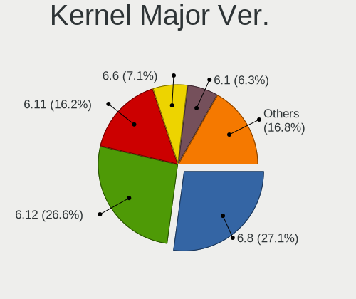
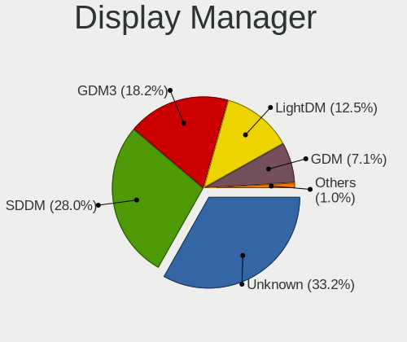
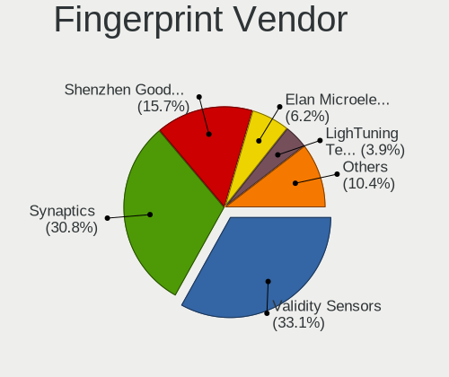

Linux Hardware Trends
---------------------

A project to identify most popular hardware characteristics and track their change
over time based on data collected by Linux users at https://Linux-Hardware.org.

Anyone can contribute to this report by the [hw-probe](https://github.com/linuxhw/hw-probe) tool:

    sudo -E hw-probe -all -upload

This is a report for all computer types. See also reports for [desktops](/Desktop/README.md) and [notebooks](/Notebook/README.md).

Full-feature report is available here: https://linux-hardware.org/?view=trends

Distribution-specific reports: [Ubuntu](/Dist/Ubuntu), [Debian](/Dist/Debian), [Linux Mint](/Dist/Linux_Mint), [Pop!_OS](/Dist/Pop!_OS), [Fedora](/Dist/Fedora), [OpenMandriva](/Dist/OpenMandriva), [Manjaro](/Dist/Manjaro), [Zorin](/Dist/Zorin), [Arch](/Dist/Arch), [KDE neon](/Dist/KDE_neon), [ROSA](/Dist/ROSA), [Xubuntu](/Dist/Xubuntu), [Kubuntu](/Dist/Kubuntu), [ArcoLinux](/Dist/ArcoLinux), [CentOS](/Dist/CentOS), [BlackPanther](/Dist/BlackPanther), [openSUSE](/Dist/openSUSE), [Clear Linux](/Dist/Clear_Linux), [Endless](/Dist/Endless), [Gentoo](/Dist/Gentoo), [Elementary](/Dist/Elementary), [EndeavourOS](/Dist/EndeavourOS), [Ubuntu MATE](/Dist/Ubuntu_MATE), [Kali](/Dist/Kali).

Period: Jan, 2022.

Contents
--------

* [ System ](#system)
  - [ OS                       ](#os)
  - [ OS Family                ](#os-family)
  - [ Kernel                   ](#kernel)
  - [ Kernel Family            ](#kernel-family)
  - [ Kernel Major Ver.        ](#kernel-major-ver)
  - [ Arch                     ](#arch)
  - [ DE                       ](#de)
  - [ Display Server           ](#display-server)
  - [ Display Manager          ](#display-manager)
  - [ OS Lang                  ](#os-lang)
  - [ Boot Mode                ](#boot-mode)
  - [ Filesystem               ](#filesystem)
  - [ Part. scheme             ](#part-scheme)
  - [ Dual Boot with Linux/BSD ](#dual-boot-with-linuxbsd)
  - [ Dual Boot (Win)          ](#dual-boot-win)

* [ Board ](#board)
  - [ Vendor                   ](#vendor)
  - [ Model                    ](#model)
  - [ Model Family             ](#model-family)
  - [ MFG Year                 ](#mfg-year)
  - [ Form Factor              ](#form-factor)
  - [ Secure Boot              ](#secure-boot)
  - [ Coreboot                 ](#coreboot)
  - [ RAM Size                 ](#ram-size)
  - [ RAM Used                 ](#ram-used)
  - [ Total Drives             ](#total-drives)
  - [ Has CD-ROM               ](#has-cd-rom)
  - [ Has Ethernet             ](#has-ethernet)
  - [ Has WiFi                 ](#has-wifi)
  - [ Has Bluetooth            ](#has-bluetooth)

* [ Location ](#location)
  - [ Country                  ](#country)
  - [ City                     ](#city)

* [ Drives ](#drives)
  - [ Drive Vendor             ](#drive-vendor)
  - [ Drive Model              ](#drive-model)
  - [ HDD Vendor               ](#hdd-vendor)
  - [ SSD Vendor               ](#ssd-vendor)
  - [ Drive Kind               ](#drive-kind)
  - [ Drive Connector          ](#drive-connector)
  - [ Drive Size               ](#drive-size)
  - [ Space Total              ](#space-total)
  - [ Space Used               ](#space-used)
  - [ Malfunc. Drives          ](#malfunc-drives)
  - [ Malfunc. Drive Vendor    ](#malfunc-drive-vendor)
  - [ Malfunc. HDD Vendor      ](#malfunc-hdd-vendor)
  - [ Malfunc. Drive Kind      ](#malfunc-drive-kind)
  - [ Failed Drives            ](#failed-drives)
  - [ Failed Drive Vendor      ](#failed-drive-vendor)
  - [ Drive Status             ](#drive-status)

* [ Storage controller ](#storage-controller)
  - [ Storage Vendor           ](#storage-vendor)
  - [ Storage Model            ](#storage-model)
  - [ Storage Kind             ](#storage-kind)

* [ Processor ](#processor)
  - [ CPU Vendor               ](#cpu-vendor)
  - [ CPU Model                ](#cpu-model)
  - [ CPU Model Family         ](#cpu-model-family)
  - [ CPU Cores                ](#cpu-cores)
  - [ CPU Sockets              ](#cpu-sockets)
  - [ CPU Threads              ](#cpu-threads)
  - [ CPU Op-Modes             ](#cpu-op-modes)
  - [ CPU Microcode            ](#cpu-microcode)
  - [ CPU Microarch            ](#cpu-microarch)

* [ Graphics ](#graphics)
  - [ GPU Vendor               ](#gpu-vendor)
  - [ GPU Model                ](#gpu-model)
  - [ GPU Combo                ](#gpu-combo)
  - [ GPU Driver               ](#gpu-driver)
  - [ GPU Memory               ](#gpu-memory)

* [ Monitor ](#monitor)
  - [ Monitor Vendor           ](#monitor-vendor)
  - [ Monitor Model            ](#monitor-model)
  - [ Monitor Resolution       ](#monitor-resolution)
  - [ Monitor Diagonal         ](#monitor-diagonal)
  - [ Monitor Width            ](#monitor-width)
  - [ Aspect Ratio             ](#aspect-ratio)
  - [ Monitor Area             ](#monitor-area)
  - [ Pixel Density            ](#pixel-density)
  - [ Multiple Monitors        ](#multiple-monitors)

* [ Network ](#network)
  - [ Net Controller Vendor    ](#net-controller-vendor)
  - [ Net Controller Model     ](#net-controller-model)
  - [ Wireless Vendor          ](#wireless-vendor)
  - [ Wireless Model           ](#wireless-model)
  - [ Ethernet Vendor          ](#ethernet-vendor)
  - [ Ethernet Model           ](#ethernet-model)
  - [ Net Controller Kind      ](#net-controller-kind)
  - [ Used Controller          ](#used-controller)
  - [ NICs                     ](#nics)
  - [ IPv6                     ](#ipv6)

* [ Bluetooth ](#bluetooth)
  - [ Bluetooth Vendor         ](#bluetooth-vendor)
  - [ Bluetooth Model          ](#bluetooth-model)

* [ Sound ](#sound)
  - [ Sound Vendor             ](#sound-vendor)
  - [ Sound Model              ](#sound-model)

* [ Memory ](#memory)
  - [ Memory Vendor            ](#memory-vendor)
  - [ Memory Model             ](#memory-model)
  - [ Memory Kind              ](#memory-kind)
  - [ Memory Form Factor       ](#memory-form-factor)
  - [ Memory Size              ](#memory-size)
  - [ Memory Speed             ](#memory-speed)

* [ Printers & scanners ](#printers--scanners)
  - [ Printer Vendor           ](#printer-vendor)
  - [ Printer Model            ](#printer-model)
  - [ Scanner Vendor           ](#scanner-vendor)
  - [ Scanner Model            ](#scanner-model)

* [ Camera ](#camera)
  - [ Camera Vendor            ](#camera-vendor)
  - [ Camera Model             ](#camera-model)

* [ Security ](#security)
  - [ Fingerprint Vendor       ](#fingerprint-vendor)
  - [ Fingerprint Model        ](#fingerprint-model)
  - [ Chipcard Vendor          ](#chipcard-vendor)
  - [ Chipcard Model           ](#chipcard-model)

* [ Unsupported ](#unsupported)
  - [ Unsupported Devices      ](#unsupported-devices)
  - [ Unsupported Device Types ](#unsupported-device-types)

System
------

OS
--

Installed operating systems

| Name                 | Computers | Percent |
|----------------------|-----------|---------|
| Ubuntu 20.04         | 764       | 15.88%  |
| Ubuntu 21.10         | 325       | 6.75%   |
| Linux Mint 20.3      | 319       | 6.63%   |
| Pop!_OS 21.10        | 267       | 5.55%   |
| Debian 11            | 238       | 4.95%   |
| Fedora 35            | 236       | 4.9%    |
| OpenMandriva 4.2     | 182       | 3.78%   |
| Linux Mint 20.2      | 172       | 3.57%   |
| Zorin 16             | 166       | 3.45%   |
| KDE neon 20.04       | 119       | 2.47%   |
| Elementary 6.1       | 108       | 2.24%   |
| ROSA 12.1            | 79        | 1.64%   |
| Arch Rolling         | 78        | 1.62%   |
| Manjaro 21.2.1       | 72        | 1.5%    |
| ArcoLinux Rolling    | 72        | 1.5%    |
| Arch                 | 69        | 1.43%   |
| BlackPanther 18.1    | 65        | 1.35%   |
| Manjaro              | 61        | 1.27%   |
| Xubuntu 20.04        | 60        | 1.25%   |
| Ubuntu 18.04         | 59        | 1.23%   |
| ROSA R11.1           | 59        | 1.23%   |
| OpenMandriva 4.50    | 43        | 0.89%   |
| EndeavourOS Rolling  | 42        | 0.87%   |
| Ubuntu 21.04         | 39        | 0.81%   |
| Kali 2021.4          | 39        | 0.81%   |
| Kubuntu 20.04        | 37        | 0.77%   |
| Pop!_OS 20.04        | 34        | 0.71%   |
| Kubuntu 21.10        | 34        | 0.71%   |
| Linux Mint 19.3      | 32        | 0.67%   |
| Manjaro 21.2.2       | 30        | 0.62%   |
| Endless 4.0.2        | 30        | 0.62%   |
| Ubuntu MATE 20.04    | 29        | 0.6%    |
| Pop!_OS 21.04        | 27        | 0.56%   |
| Linux Mint 20.1      | 26        | 0.54%   |
| Xubuntu 21.10        | 22        | 0.46%   |
| Fedora 34            | 22        | 0.46%   |
| Zorin 15             | 20        | 0.42%   |
| LinuxFX 11           | 20        | 0.42%   |
| Gentoo 2.8           | 20        | 0.42%   |
| Gentoo 2.6           | 20        | 0.42%   |
| LMDE 4               | 19        | 0.39%   |
| Ubuntu MATE 18.04    | 17        | 0.35%   |
| Gentoo 2.7           | 17        | 0.35%   |
| Debian Unstable      | 17        | 0.35%   |
| Xubuntu 18.04        | 16        | 0.33%   |
| Raspbian 11          | 16        | 0.33%   |
| Debian Testing       | 16        | 0.33%   |
| Ubuntu 22.04         | 15        | 0.31%   |
| Garuda Linux Soaring | 15        | 0.31%   |
| Lubuntu 21.10        | 14        | 0.29%   |
| Lubuntu 20.04        | 13        | 0.27%   |
| Linux Mint 20        | 13        | 0.27%   |
| MX 21                | 12        | 0.25%   |
| EndeavourOS          | 12        | 0.25%   |
| Debian 10            | 12        | 0.25%   |
| openSUSE Leap-15.3   | 11        | 0.23%   |
| Kubuntu 11           | 11        | 0.23%   |
| CentOS 8             | 11        | 0.23%   |
| Ubuntu MATE 21.10    | 10        | 0.21%   |
| Ubuntu Budgie 21.10  | 10        | 0.21%   |

OS Family
---------

OS without a version

| Name          | Computers | Percent |
|---------------|-----------|---------|
| Ubuntu        | 1213      | 25.21%  |
| Linux Mint    | 575       | 11.95%  |
| Pop!_OS       | 332       | 6.9%    |
| Debian        | 298       | 6.19%   |
| Fedora        | 267       | 5.55%   |
| OpenMandriva  | 225       | 4.68%   |
| Zorin         | 186       | 3.87%   |
| Manjaro       | 173       | 3.6%    |
| ROSA          | 154       | 3.2%    |
| Arch          | 147       | 3.05%   |
| Elementary    | 121       | 2.51%   |
| KDE neon      | 120       | 2.49%   |
| Xubuntu       | 101       | 2.1%    |
| Kubuntu       | 94        | 1.95%   |
| ArcoLinux     | 77        | 1.6%    |
| BlackPanther  | 66        | 1.37%   |
| Ubuntu MATE   | 60        | 1.25%   |
| Gentoo        | 58        | 1.21%   |
| EndeavourOS   | 54        | 1.12%   |
| Endless       | 47        | 0.98%   |
| openSUSE      | 46        | 0.96%   |
| Kali          | 43        | 0.89%   |
| Lubuntu       | 35        | 0.73%   |
| Garuda Linux  | 23        | 0.48%   |
| LinuxFX       | 20        | 0.42%   |
| Ubuntu Budgie | 19        | 0.39%   |
| LMDE          | 19        | 0.39%   |
| Clear Linux   | 19        | 0.39%   |
| Raspbian      | 17        | 0.35%   |
| MX            | 17        | 0.35%   |
| CentOS        | 16        | 0.33%   |
| Parrot        | 11        | 0.23%   |
| Xero          | 10        | 0.21%   |
| Artix         | 10        | 0.21%   |
| RHEL          | 9         | 0.19%   |
| ALT Linux     | 9         | 0.19%   |
| Rocky Linux   | 8         | 0.17%   |
| Devuan        | 8         | 0.17%   |
| Void Linux    | 7         | 0.15%   |
| Ubuntu Studio | 7         | 0.15%   |
| Alpine        | 6         | 0.12%   |
| Slackware     | 5         | 0.1%    |
| UbuntuDDE     | 4         | 0.08%   |
| Solus         | 4         | 0.08%   |
| Mageia        | 4         | 0.08%   |
| Linux Lite    | 4         | 0.08%   |
| ClearOS       | 4         | 0.08%   |
| Siduction     | 3         | 0.06%   |
| Red OS        | 3         | 0.06%   |
| Peppermint    | 3         | 0.06%   |
| Pardus        | 3         | 0.06%   |
| Manjaro-ARM   | 3         | 0.06%   |
| Deepin        | 3         | 0.06%   |
| Archcraft     | 3         | 0.06%   |
| antiX         | 3         | 0.06%   |
| Redcore       | 2         | 0.04%   |
| Reborn OS     | 2         | 0.04%   |
| Q4OS          | 2         | 0.04%   |
| NixOS         | 2         | 0.04%   |
| Nitrux        | 2         | 0.04%   |

Kernel
------

Version of the Linux kernel

| Version                             | Computers | Percent |
|-------------------------------------|-----------|---------|
| 5.13.0-27-generic                   | 456       | 9.48%   |
| 5.11.0-46-generic                   | 212       | 4.41%   |
| 5.11.0-44-generic                   | 212       | 4.41%   |
| 5.4.0-96-generic                    | 211       | 4.38%   |
| 5.11.0-43-generic                   | 208       | 4.32%   |
| 5.10.14-desktop-1omv4002            | 168       | 3.49%   |
| 5.4.0-92-generic                    | 158       | 3.28%   |
| 5.4.0-91-generic                    | 153       | 3.18%   |
| 5.13.0-25-generic                   | 138       | 2.87%   |
| 5.4.0-94-generic                    | 131       | 2.72%   |
| 5.10.0-10-amd64                     | 105       | 2.18%   |
| 5.15.8-76051508-generic             | 92        | 1.91%   |
| 5.15.11-76051511-generic            | 92        | 1.91%   |
| 5.13.0-23-generic                   | 81        | 1.68%   |
| 5.15.12-1-MANJARO                   | 79        | 1.64%   |
| 5.10.74-generic-2rosa2021.1-x86_64  | 79        | 1.64%   |
| 5.15.15-76051515-generic            | 73        | 1.52%   |
| 5.13.0-22-generic                   | 67        | 1.39%   |
| 5.15.12-200.fc35.x86_64             | 62        | 1.29%   |
| 5.15.12-arch1-1                     | 53        | 1.1%    |
| 5.16.2-arch1-1                      | 45        | 0.94%   |
| 5.15.5-76051505-generic             | 44        | 0.91%   |
| 5.6.14-desktop-2bP                  | 43        | 0.89%   |
| 5.15.16-200.fc35.x86_64             | 42        | 0.87%   |
| 5.11.0-27-generic                   | 40        | 0.83%   |
| 5.10.0-11-amd64                     | 39        | 0.81%   |
| 5.11.0-35-generic                   | 36        | 0.75%   |
| 5.13.0-19-generic                   | 33        | 0.69%   |
| 5.15.14-200.fc35.x86_64             | 32        | 0.67%   |
| 5.15.0-2-amd64                      | 31        | 0.64%   |
| 5.15.13-200.fc35.x86_64             | 29        | 0.6%    |
| 5.11.0-41-generic                   | 29        | 0.6%    |
| 5.15.13-arch1-1                     | 28        | 0.58%   |
| 4.15.0-166-generic                  | 28        | 0.58%   |
| 4.15.0-163-generic                  | 28        | 0.58%   |
| 5.15.0-kali2-amd64                  | 26        | 0.54%   |
| 5.10.0-7-amd64                      | 24        | 0.5%    |
| 4.19.0-18-amd64                     | 22        | 0.46%   |
| 4.18.16-desktop-1bP                 | 22        | 0.46%   |
| 5.16.1-arch1-1                      | 21        | 0.44%   |
| 5.13.0-28-generic                   | 21        | 0.44%   |
| 5.12.4-desktop-1omv4050             | 20        | 0.42%   |
| 5.4.0-74-generic                    | 19        | 0.39%   |
| 5.16.0-arch1-1                      | 19        | 0.39%   |
| 4.15.0-desktop-122.124.1rosa-x86_64 | 19        | 0.39%   |
| 5.15.12-zen1-1-zen                  | 18        | 0.37%   |
| 5.11.0-38-generic                   | 17        | 0.35%   |
| 5.10.0-9-amd64                      | 16        | 0.33%   |
| 5.4.83-generic-2rosa-x86_64         | 15        | 0.31%   |
| 5.15.15-200.fc35.x86_64             | 15        | 0.31%   |
| 5.14.0-9parrot1-amd64               | 15        | 0.31%   |
| 5.15.16-1-MANJARO                   | 14        | 0.29%   |
| 5.14.7-desktop-1omv4050             | 14        | 0.29%   |
| 5.11.12-desktop-1omv4002            | 14        | 0.29%   |
| 5.15.10-arch1-1                     | 13        | 0.27%   |
| 5.11.0-40-generic                   | 13        | 0.27%   |
| 4.18.0-348.7.1.el8_5.x86_64         | 13        | 0.27%   |
| 5.16.2-zen1-1-zen                   | 12        | 0.25%   |
| 5.15.13-zen1-1-zen                  | 12        | 0.25%   |
| 5.13.19-2-MANJARO                   | 12        | 0.25%   |

Kernel Family
-------------

Linux kernel without a distro release

| Version | Computers | Percent |
|---------|-----------|---------|
| 5.13.0  | 849       | 17.64%  |
| 5.11.0  | 818       | 17%     |
| 5.4.0   | 739       | 15.36%  |
| 5.15.12 | 261       | 5.42%   |
| 5.10.0  | 230       | 4.78%   |
| 5.10.14 | 168       | 3.49%   |
| 5.15.11 | 136       | 2.83%   |
| 4.15.0  | 105       | 2.18%   |
| 5.15.15 | 102       | 2.12%   |
| 5.15.8  | 96        | 2%      |
| 5.15.13 | 93        | 1.93%   |
| 5.15.0  | 92        | 1.91%   |
| 5.16.2  | 91        | 1.89%   |
| 5.10.74 | 80        | 1.66%   |
| 5.15.16 | 78        | 1.62%   |
| 5.16.0  | 74        | 1.54%   |
| 5.15.5  | 50        | 1.04%   |
| 5.16.1  | 47        | 0.98%   |
| 5.15.14 | 44        | 0.91%   |
| 5.6.14  | 43        | 0.89%   |
| 5.14.0  | 40        | 0.83%   |
| 5.8.0   | 35        | 0.73%   |
| 4.19.0  | 34        | 0.71%   |
| 5.13.19 | 29        | 0.6%    |
| 4.18.0  | 29        | 0.6%    |
| 5.15.10 | 25        | 0.52%   |
| 4.18.16 | 22        | 0.46%   |
| 5.12.4  | 20        | 0.42%   |
| 5.4.83  | 19        | 0.39%   |
| 5.11.12 | 18        | 0.37%   |
| 5.10.63 | 18        | 0.37%   |
| 5.10.89 | 16        | 0.33%   |
| 5.15.7  | 15        | 0.31%   |
| 5.16.3  | 14        | 0.29%   |
| 5.14.7  | 14        | 0.29%   |
| 5.4.32  | 13        | 0.27%   |
| 5.3.18  | 13        | 0.27%   |
| 5.14.10 | 11        | 0.23%   |
| 5.13.13 | 11        | 0.23%   |
| 5.10.88 | 10        | 0.21%   |
| 3.10.0  | 10        | 0.21%   |
| 5.15.17 | 9         | 0.19%   |
| 5.10.93 | 9         | 0.19%   |
| 5.16.4  | 8         | 0.17%   |
| 5.14.21 | 8         | 0.17%   |
| 5.14.14 | 8         | 0.17%   |
| 5.14.18 | 7         | 0.15%   |
| 5.10.71 | 7         | 0.15%   |
| 5.0.0   | 7         | 0.15%   |
| 5.15.6  | 6         | 0.12%   |
| 5.3.0   | 5         | 0.1%    |
| 5.10.90 | 5         | 0.1%    |
| 4.9.155 | 5         | 0.1%    |
| 4.4.0   | 5         | 0.1%    |
| 5.14.9  | 4         | 0.08%   |
| 5.10.92 | 4         | 0.08%   |
| 5.10.61 | 4         | 0.08%   |
| 4.9.0   | 4         | 0.08%   |
| 5.9.16  | 3         | 0.06%   |
| 5.8.18  | 3         | 0.06%   |

Kernel Major Ver.
-----------------

Linux kernel major version

| Version | Computers | Percent |
|---------|-----------|---------|
| 5.15    | 1012      | 21.03%  |
| 5.13    | 893       | 18.56%  |
| 5.11    | 840       | 17.46%  |
| 5.4     | 777       | 16.15%  |
| 5.10    | 579       | 12.03%  |
| 5.16    | 234       | 4.86%   |
| 4.15    | 105       | 2.18%   |
| 5.14    | 104       | 2.16%   |
| 4.18    | 51        | 1.06%   |
| 5.6     | 45        | 0.94%   |
| 5.8     | 39        | 0.81%   |
| 4.19    | 37        | 0.77%   |
| 5.12    | 21        | 0.44%   |
| 5.3     | 19        | 0.39%   |
| 4.9     | 16        | 0.33%   |
| 3.10    | 11        | 0.23%   |
| 5.0     | 7         | 0.15%   |
| 4.4     | 6         | 0.12%   |
| 5.9     | 5         | 0.1%    |
| 3.16    | 3         | 0.06%   |
| 5.17    | 2         | 0.04%   |
| 5       | 2         | 0.04%   |
| 4.14    | 2         | 0.04%   |
| 4.1     | 1         | 0.02%   |
| Unknown | 1         | 0.02%   |

Arch
----

OS architecture (x86_64, i586, etc.)

| Name    | Computers | Percent |
|---------|-----------|---------|
| x86_64  | 4663      | 96.9%   |
| i686    | 86        | 1.79%   |
| aarch64 | 42        | 0.87%   |
| armv7l  | 18        | 0.37%   |
| armv6l  | 2         | 0.04%   |
| Unknown | 1         | 0.02%   |

DE
--

Desktop Environment

| Name                         | Computers | Percent |
|------------------------------|-----------|---------|
| GNOME                        | 2149      | 44.66%  |
| KDE5                         | 972       | 20.2%   |
| X-Cinnamon                   | 443       | 9.21%   |
| XFCE                         | 388       | 8.06%   |
| Unknown                      | 217       | 4.51%   |
| MATE                         | 160       | 3.33%   |
| Pantheon                     | 122       | 2.54%   |
| Cinnamon                     | 60        | 1.25%   |
| LXQt                         | 48        | 1%      |
| KDE4                         | 42        | 0.87%   |
| LXDE                         | 33        | 0.69%   |
| i3                           | 27        | 0.56%   |
| Budgie                       | 26        | 0.54%   |
| Unity                        | 19        | 0.39%   |
| awesome                      | 15        | 0.31%   |
| KDE                          | 13        | 0.27%   |
| GNOME Flashback              | 12        | 0.25%   |
| Openbox                      | 9         | 0.19%   |
| sway                         | 8         | 0.17%   |
| Deepin                       | 8         | 0.17%   |
| lightdm-xsession             | 5         | 0.1%    |
| GNOME Classic                | 4         | 0.08%   |
| bspwm                        | 4         | 0.08%   |
| xmonad                       | 3         | 0.06%   |
| qtile                        | 3         | 0.06%   |
| LeftWM                       | 3         | 0.06%   |
| trinity                      | 2         | 0.04%   |
| icewm                        | 2         | 0.04%   |
| Enlightenment                | 2         | 0.04%   |
| Cutefish                     | 2         | 0.04%   |
| UKUI                         | 1         | 0.02%   |
| spectrwm                     | 1         | 0.02%   |
| river                        | 1         | 0.02%   |
| jwm                          | 1         | 0.02%   |
| i3-with-shmlog               | 1         | 0.02%   |
| GNOME-Subgraph-Classic:GNOME | 1         | 0.02%   |
| fvwm                         | 1         | 0.02%   |
| dwm                          | 1         | 0.02%   |
| cwm                          | 1         | 0.02%   |
| awesomeminimal               | 1         | 0.02%   |
| /usr/bin/openbox-session     | 1         | 0.02%   |

Display Server
--------------

X11 or Wayland

| Name        | Computers | Percent |
|-------------|-----------|---------|
| X11         | 3856      | 80.13%  |
| Wayland     | 719       | 14.94%  |
| Tty         | 129       | 2.68%   |
| Unknown     | 105       | 2.18%   |
| Unspecified | 2         | 0.04%   |
| Web         | 1         | 0.02%   |

Display Manager
---------------

SDDM, LightDM, etc.

| Name    | Computers | Percent |
|---------|-----------|---------|
| Unknown | 1631      | 33.89%  |
| LightDM | 802       | 16.67%  |
| GDM     | 777       | 16.15%  |
| SDDM    | 768       | 15.96%  |
| GDM3    | 759       | 15.77%  |
| KDM     | 43        | 0.89%   |
| XDM     | 9         | 0.19%   |
| SLiM    | 9         | 0.19%   |
| LXDM    | 4         | 0.08%   |
| GREETD  | 4         | 0.08%   |
| TDM     | 2         | 0.04%   |
| NODM    | 2         | 0.04%   |
| Ly      | 2         | 0.04%   |

OS Lang
-------

Language

| Lang        | Computers | Percent |
|-------------|-----------|---------|
| en_US       | 1929      | 40.09%  |
| de_DE       | 496       | 10.31%  |
| ru_RU       | 295       | 6.13%   |
| en_GB       | 251       | 5.22%   |
| fr_FR       | 227       | 4.72%   |
| pt_BR       | 193       | 4.01%   |
| Unknown     | 123       | 2.56%   |
| it_IT       | 122       | 2.54%   |
| pl_PL       | 108       | 2.24%   |
| en_CA       | 103       | 2.14%   |
| C           | 91        | 1.89%   |
| en_AU       | 78        | 1.62%   |
| es_ES       | 77        | 1.6%    |
| en_IN       | 64        | 1.33%   |
| nl_NL       | 45        | 0.94%   |
| hu_HU       | 45        | 0.94%   |
| el_GR       | 42        | 0.87%   |
| es_MX       | 39        | 0.81%   |
| cs_CZ       | 31        | 0.64%   |
| es_AR       | 23        | 0.48%   |
| de_CH       | 23        | 0.48%   |
| fi_FI       | 21        | 0.44%   |
| zh_CN       | 20        | 0.42%   |
| ru_UA       | 20        | 0.42%   |
| pt_PT       | 20        | 0.42%   |
| fr_CA       | 20        | 0.42%   |
| de_AT       | 20        | 0.42%   |
| sv_SE       | 19        | 0.39%   |
| ja_JP       | 19        | 0.39%   |
| en_ZA       | 16        | 0.33%   |
| nl_BE       | 15        | 0.31%   |
| tr_TR       | 12        | 0.25%   |
| da_DK       | 12        | 0.25%   |
| ro_RO       | 11        | 0.23%   |
| sk_SK       | 9         | 0.19%   |
| es_CO       | 9         | 0.19%   |
| en_IL       | 9         | 0.19%   |
| en_DK       | 9         | 0.19%   |
| es_CL       | 8         | 0.17%   |
| en_NZ       | 8         | 0.17%   |
| fr_BE       | 7         | 0.15%   |
| en_IE       | 7         | 0.15%   |
| id_ID       | 6         | 0.12%   |
| hr_HR       | 6         | 0.12%   |
| uk_UA       | 5         | 0.1%    |
| nb_NO       | 5         | 0.1%    |
| fr_CH       | 5         | 0.1%    |
| es_PE       | 5         | 0.1%    |
| en_SG       | 5         | 0.1%    |
| ca_ES       | 5         | 0.1%    |
| C.UTF8      | 5         | 0.1%    |
| POSIX       | 4         | 0.08%   |
| es_VE       | 4         | 0.08%   |
| en_NG       | 4         | 0.08%   |
| bg_BG       | 4         | 0.08%   |
| zh_TW       | 3         | 0.06%   |
| sr_RS       | 3         | 0.06%   |
| sl_SI       | 3         | 0.06%   |
| ar_EG       | 3         | 0.06%   |
| ru_RU.UTF_8 | 2         | 0.04%   |

Boot Mode
---------

EFI or BIOS

| Mode | Computers | Percent |
|------|-----------|---------|
| BIOS | 2451      | 50.94%  |
| EFI  | 2361      | 49.06%  |

Filesystem
----------

Type of filesystem

| Type     | Computers | Percent |
|----------|-----------|---------|
| Ext4     | 3844      | 79.88%  |
| Btrfs    | 422       | 8.77%   |
| Overlay  | 387       | 8.04%   |
| Xfs      | 84        | 1.75%   |
| Zfs      | 31        | 0.64%   |
| F2fs     | 14        | 0.29%   |
| Ext3     | 13        | 0.27%   |
| Ext2     | 9         | 0.19%   |
| Unknown  | 3         | 0.06%   |
| Tmpfs    | 2         | 0.04%   |
| Xtrfs    | 1         | 0.02%   |
| Reiserfs | 1         | 0.02%   |
| Aufs     | 1         | 0.02%   |

Part. scheme
------------

Scheme of partitioning

| Type    | Computers | Percent |
|---------|-----------|---------|
| Unknown | 2459      | 51.1%   |
| GPT     | 1713      | 35.6%   |
| MBR     | 640       | 13.3%   |

Dual Boot with Linux/BSD
------------------------

Hosting more than one Linux/BSD

| Dual boot | Computers | Percent |
|-----------|-----------|---------|
| No        | 4172      | 86.7%   |
| Yes       | 640       | 13.3%   |

Dual Boot (Win)
---------------

Hosting Linux and Windows

| Dual boot | Computers | Percent |
|-----------|-----------|---------|
| No        | 3452      | 71.74%  |
| Yes       | 1360      | 28.26%  |

Board
-----

Vendor
------

Motherboard manufacturer

| Name                    | Computers | Percent |
|-------------------------|-----------|---------|
| ASUSTek Computer        | 763       | 15.86%  |
| Lenovo                  | 694       | 14.42%  |
| Dell                    | 626       | 13.01%  |
| Hewlett-Packard         | 617       | 12.82%  |
| Gigabyte Technology     | 323       | 6.71%   |
| MSI                     | 293       | 6.09%   |
| Acer                    | 278       | 5.78%   |
| ASRock                  | 160       | 3.33%   |
| Apple                   | 118       | 2.45%   |
| Intel                   | 73        | 1.52%   |
| Toshiba                 | 64        | 1.33%   |
| Samsung Electronics     | 54        | 1.12%   |
| Raspberry Pi Foundation | 48        | 1%      |
| Unknown                 | 46        | 0.96%   |
| Sony                    | 44        | 0.91%   |
| Fujitsu                 | 39        | 0.81%   |
| Medion                  | 37        | 0.77%   |
| HUAWEI                  | 36        | 0.75%   |
| Packard Bell            | 26        | 0.54%   |
| Positivo                | 19        | 0.39%   |
| Google                  | 18        | 0.37%   |
| Timi                    | 17        | 0.35%   |
| Supermicro              | 17        | 0.35%   |
| Alienware               | 16        | 0.33%   |
| Microsoft               | 15        | 0.31%   |
| System76                | 14        | 0.29%   |
| Notebook                | 14        | 0.29%   |
| Fujitsu Siemens         | 14        | 0.29%   |
| TUXEDO                  | 12        | 0.25%   |
| Pegatron                | 12        | 0.25%   |
| Foxconn                 | 11        | 0.23%   |
| Biostar                 | 11        | 0.23%   |
| ECS                     | 10        | 0.21%   |
| Gateway                 | 9         | 0.19%   |
| Razer                   | 8         | 0.17%   |
| LG Electronics          | 8         | 0.17%   |
| BESSTAR Tech            | 8         | 0.17%   |
| IBM                     | 7         | 0.15%   |
| Chuwi                   | 7         | 0.15%   |
| AQUARIUS                | 7         | 0.15%   |
| Huanan                  | 6         | 0.12%   |
| Framework               | 6         | 0.12%   |
| eMachines               | 6         | 0.12%   |
| Clevo                   | 6         | 0.12%   |
| Wortmann AG             | 5         | 0.1%    |
| Jumper                  | 5         | 0.1%    |
| HONOR                   | 5         | 0.1%    |
| AZW                     | 5         | 0.1%    |
| AMI                     | 5         | 0.1%    |
| ZOTAC                   | 4         | 0.08%   |
| Teclast                 | 4         | 0.08%   |
| Schenker                | 4         | 0.08%   |
| Nvidia                  | 4         | 0.08%   |
| Compal                  | 4         | 0.08%   |
| Star Labs               | 3         | 0.06%   |
| Shuttle                 | 3         | 0.06%   |
| Semp Toshiba            | 3         | 0.06%   |
| Panasonic               | 3         | 0.06%   |
| Multilaser              | 3         | 0.06%   |
| Monster                 | 3         | 0.06%   |

Model
-----

Motherboard model

| Name                                   | Computers | Percent |
|----------------------------------------|-----------|---------|
| Unknown                                | 57        | 1.18%   |
| ASUS All Series                        | 52        | 1.08%   |
| RPi Raspberry Pi                       | 46        | 0.96%   |
| HP Notebook                            | 18        | 0.37%   |
| ASUS TUF GAMING X570-PLUS              | 16        | 0.33%   |
| MSI MS-7C37                            | 10        | 0.21%   |
| HP ProDesk 600 G1 SFF                  | 10        | 0.21%   |
| Dell OptiPlex 7010                     | 10        | 0.21%   |
| HP Pavilion Gaming Laptop 15-ec1xxx    | 9         | 0.19%   |
| Acer Swift SF114-34                    | 8         | 0.17%   |
| MSI MS-7B86                            | 7         | 0.15%   |
| HP EliteDesk 800 G1 SFF                | 7         | 0.15%   |
| Gigabyte A320M-S2H                     | 7         | 0.15%   |
| Gigabyte 970A-DS3P                     | 7         | 0.15%   |
| Dell OptiPlex 9020                     | 7         | 0.15%   |
| Dell OptiPlex 790                      | 7         | 0.15%   |
| Dell Inspiron 5570                     | 7         | 0.15%   |
| Dell Inspiron 15-3567                  | 7         | 0.15%   |
| Apple MacBookPro9,2                    | 7         | 0.15%   |
| Supermicro Super Server                | 6         | 0.12%   |
| MSI MS-7C56                            | 6         | 0.12%   |
| MSI MS-7C02                            | 6         | 0.12%   |
| MSI MS-7721                            | 6         | 0.12%   |
| Lenovo G50-70 20351                    | 6         | 0.12%   |
| HUAWEI NBLK-WAX9X                      | 6         | 0.12%   |
| HP ProBook 6470b                       | 6         | 0.12%   |
| HP Pavilion g6                         | 6         | 0.12%   |
| HP Pavilion dv7                        | 6         | 0.12%   |
| HP Laptop 15-db0xxx                    | 6         | 0.12%   |
| HP ENVY x360 Convertible 13-ay0xxx     | 6         | 0.12%   |
| HP EliteBook 820 G1                    | 6         | 0.12%   |
| Framework Laptop                       | 6         | 0.12%   |
| Dell XPS 15 9570                       | 6         | 0.12%   |
| Dell XPS 15 7590                       | 6         | 0.12%   |
| Dell XPS 13 9310                       | 6         | 0.12%   |
| Dell XPS 13 7390                       | 6         | 0.12%   |
| Dell OptiPlex 9010                     | 6         | 0.12%   |
| Dell Latitude E7440                    | 6         | 0.12%   |
| Dell Latitude 7490                     | 6         | 0.12%   |
| Dell Latitude 5480                     | 6         | 0.12%   |
| Dell Inspiron N5110                    | 6         | 0.12%   |
| Dell Inspiron 3451                     | 6         | 0.12%   |
| ASUS VivoBook_ASUSLaptop X515DA_M515DA | 6         | 0.12%   |
| ASUS UX31E                             | 6         | 0.12%   |
| ASUS PRIME B450M-A                     | 6         | 0.12%   |
| ASUS M5A78L-M/USB3                     | 6         | 0.12%   |
| Aquarius NS585                         | 6         | 0.12%   |
| Apple MacBookPro8,1                    | 6         | 0.12%   |
| Apple MacBookPro5,5                    | 6         | 0.12%   |
| Toshiba Satellite A300                 | 5         | 0.1%    |
| MSI MS-7D25                            | 5         | 0.1%    |
| MSI MS-7C52                            | 5         | 0.1%    |
| MSI MS-7B79                            | 5         | 0.1%    |
| MSI MS-7817                            | 5         | 0.1%    |
| Lenovo Legion Y530-15ICH 81FV          | 5         | 0.1%    |
| Lenovo IdeaPad 330-15IKB 81DE          | 5         | 0.1%    |
| Lenovo IdeaPad 3 15IIL05 81WE          | 5         | 0.1%    |
| Jumper EZbook                          | 5         | 0.1%    |
| Intel NUC8i7BEH                        | 5         | 0.1%    |
| HP ProBook 445 G7                      | 5         | 0.1%    |

Model Family
------------

Motherboard model prefix

| Name                  | Computers | Percent |
|-----------------------|-----------|---------|
| Lenovo ThinkPad       | 296       | 6.15%   |
| Acer Aspire           | 182       | 3.78%   |
| Dell Latitude         | 167       | 3.47%   |
| Dell Inspiron         | 166       | 3.45%   |
| Lenovo IdeaPad        | 138       | 2.87%   |
| HP Pavilion           | 117       | 2.43%   |
| Dell OptiPlex         | 99        | 2.06%   |
| ASUS ROG              | 87        | 1.81%   |
| HP ProBook            | 80        | 1.66%   |
| HP EliteBook          | 78        | 1.62%   |
| ASUS PRIME            | 73        | 1.52%   |
| Dell XPS              | 71        | 1.48%   |
| HP Compaq             | 61        | 1.27%   |
| HP Laptop             | 60        | 1.25%   |
| ASUS VivoBook         | 57        | 1.18%   |
| Unknown               | 57        | 1.18%   |
| Toshiba Satellite     | 52        | 1.08%   |
| ASUS All              | 52        | 1.08%   |
| ASUS TUF              | 51        | 1.06%   |
| Dell Precision        | 50        | 1.04%   |
| RPi Raspberry         | 47        | 0.98%   |
| Dell Vostro           | 45        | 0.94%   |
| Lenovo ThinkCentre    | 42        | 0.87%   |
| Lenovo Yoga           | 39        | 0.81%   |
| Lenovo Legion         | 31        | 0.64%   |
| HP ENVY               | 28        | 0.58%   |
| Acer Swift            | 27        | 0.56%   |
| Lenovo ThinkBook      | 25        | 0.52%   |
| Packard Bell EasyNote | 20        | 0.42%   |
| ASUS ZenBook          | 20        | 0.42%   |
| Acer Nitro            | 20        | 0.42%   |
| Fujitsu LIFEBOOK      | 19        | 0.39%   |
| HP ProDesk            | 18        | 0.37%   |
| HP Notebook           | 18        | 0.37%   |
| Gigabyte X570         | 16        | 0.33%   |
| ASUS ASUS             | 16        | 0.33%   |
| Microsoft Surface     | 15        | 0.31%   |
| HP EliteDesk          | 15        | 0.31%   |
| HP 250                | 14        | 0.29%   |
| ASUS M5A78L-M         | 14        | 0.29%   |
| Lenovo IdeaCentre     | 13        | 0.27%   |
| Gigabyte B450M        | 13        | 0.27%   |
| HP OMEN               | 12        | 0.25%   |
| Fujitsu ESPRIMO       | 12        | 0.25%   |
| Gigabyte B450         | 11        | 0.23%   |
| MSI MS-7C37           | 10        | 0.21%   |
| HP ZBook              | 10        | 0.21%   |
| Lenovo ThinkStation   | 9         | 0.19%   |
| Lenovo IdeaPadFlex    | 9         | 0.19%   |
| HP 255                | 9         | 0.19%   |
| Gigabyte Z390         | 9         | 0.19%   |
| Gigabyte B550         | 9         | 0.19%   |
| Gigabyte 970A-DS3P    | 9         | 0.19%   |
| ASRock B450M          | 9         | 0.19%   |
| Apple MacBookPro9     | 9         | 0.19%   |
| Apple MacBookPro8     | 9         | 0.19%   |
| Acer TravelMate       | 9         | 0.19%   |
| Acer Predator         | 9         | 0.19%   |
| MSI GF63              | 8         | 0.17%   |
| Medion Akoya          | 8         | 0.17%   |

MFG Year
--------

Motherboard manufacture year

| Year    | Computers | Percent |
|---------|-----------|---------|
| 2020    | 574       | 11.93%  |
| 2021    | 517       | 10.74%  |
| 2019    | 462       | 9.6%    |
| 2018    | 413       | 8.58%   |
| 2012    | 349       | 7.25%   |
| 2013    | 315       | 6.55%   |
| 2011    | 304       | 6.32%   |
| 2017    | 294       | 6.11%   |
| 2014    | 288       | 5.99%   |
| 2010    | 262       | 5.44%   |
| 2016    | 244       | 5.07%   |
| 2015    | 218       | 4.53%   |
| 2009    | 183       | 3.8%    |
| 2008    | 167       | 3.47%   |
| 2007    | 101       | 2.1%    |
| Unknown | 61        | 1.27%   |
| 2006    | 33        | 0.69%   |
| 2005    | 18        | 0.37%   |
| 2003    | 4         | 0.08%   |
| 2004    | 2         | 0.04%   |
| 2002    | 2         | 0.04%   |
| 2022    | 1         | 0.02%   |

Form Factor
-----------

Physical design of the computer

| Name           | Computers | Percent |
|----------------|-----------|---------|
| Notebook       | 2669      | 55.47%  |
| Desktop        | 1750      | 36.37%  |
| Convertible    | 122       | 2.54%   |
| All in one     | 69        | 1.43%   |
| Mini pc        | 61        | 1.27%   |
| System on chip | 59        | 1.23%   |
| Server         | 44        | 0.91%   |
| Tablet         | 36        | 0.75%   |
| Other          | 2         | 0.04%   |

Secure Boot
-----------

Enabled or disabled

| State    | Computers | Percent |
|----------|-----------|---------|
| Disabled | 4419      | 91.83%  |
| Enabled  | 393       | 8.17%   |

Coreboot
--------

Have coreboot on board

| Used | Computers | Percent |
|------|-----------|---------|
| No   | 4780      | 99.33%  |
| Yes  | 32        | 0.67%   |

RAM Size
--------

Total RAM memory

| Size in GB      | Computers | Percent |
|-----------------|-----------|---------|
| 4.01-8.0        | 1193      | 24.79%  |
| 16.01-24.0      | 972       | 20.2%   |
| 3.01-4.0        | 880       | 18.29%  |
| 8.01-16.0       | 835       | 17.35%  |
| 32.01-64.0      | 446       | 9.27%   |
| 1.01-2.0        | 155       | 3.22%   |
| 64.01-256.0     | 135       | 2.81%   |
| 24.01-32.0      | 84        | 1.75%   |
| 2.01-3.0        | 67        | 1.39%   |
| 0.51-1.0        | 33        | 0.69%   |
| 0.01-0.5        | 6         | 0.12%   |
| More than 256.0 | 5         | 0.1%    |
| Unknown         | 1         | 0.02%   |

RAM Used
--------

Used RAM memory

| Used GB     | Computers | Percent |
|-------------|-----------|---------|
| 1.01-2.0    | 1708      | 35.49%  |
| 2.01-3.0    | 1149      | 23.88%  |
| 4.01-8.0    | 699       | 14.53%  |
| 3.01-4.0    | 575       | 11.95%  |
| 0.51-1.0    | 365       | 7.59%   |
| 8.01-16.0   | 181       | 3.76%   |
| 0.01-0.5    | 93        | 1.93%   |
| 16.01-24.0  | 21        | 0.44%   |
| 24.01-32.0  | 12        | 0.25%   |
| 32.01-64.0  | 6         | 0.12%   |
| Unknown     | 2         | 0.04%   |
| 64.01-256.0 | 1         | 0.02%   |

Total Drives
------------

Number of drives on board

| Drives | Computers | Percent |
|--------|-----------|---------|
| 1      | 2870      | 59.64%  |
| 2      | 1182      | 24.56%  |
| 3      | 385       | 8%      |
| 4      | 172       | 3.57%   |
| 5      | 93        | 1.93%   |
| 6      | 39        | 0.81%   |
| 0      | 35        | 0.73%   |
| 7      | 13        | 0.27%   |
| 8      | 6         | 0.12%   |
| 9      | 4         | 0.08%   |
| 20     | 3         | 0.06%   |
| 11     | 2         | 0.04%   |
| 10     | 2         | 0.04%   |
| 93     | 1         | 0.02%   |
| 30     | 1         | 0.02%   |
| 28     | 1         | 0.02%   |
| 27     | 1         | 0.02%   |
| 17     | 1         | 0.02%   |
| 14     | 1         | 0.02%   |

Has CD-ROM
----------

Has CD-ROM on board

| Presented | Computers | Percent |
|-----------|-----------|---------|
| No        | 3034      | 63.05%  |
| Yes       | 1778      | 36.95%  |

Has Ethernet
------------

Has Ethernet on board

| Presented | Computers | Percent |
|-----------|-----------|---------|
| Yes       | 4115      | 85.52%  |
| No        | 697       | 14.48%  |

Has WiFi
--------

Has WiFi module

| Presented | Computers | Percent |
|-----------|-----------|---------|
| Yes       | 3694      | 76.77%  |
| No        | 1118      | 23.23%  |

Has Bluetooth
-------------

Has Bluetooth module

| Presented | Computers | Percent |
|-----------|-----------|---------|
| Yes       | 2904      | 60.35%  |
| No        | 1908      | 39.65%  |

Location
--------

Country
-------

Geographic location (country)

| Country      | Computers | Percent |
|--------------|-----------|---------|
| USA          | 861       | 17.89%  |
| Germany      | 590       | 12.26%  |
| Russia       | 322       | 6.69%   |
| France       | 266       | 5.53%   |
| Brazil       | 258       | 5.36%   |
| UK           | 180       | 3.74%   |
| Canada       | 164       | 3.41%   |
| Italy        | 161       | 3.35%   |
| Poland       | 159       | 3.3%    |
| Hungary      | 124       | 2.58%   |
| Spain        | 111       | 2.31%   |
| India        | 111       | 2.31%   |
| Netherlands  | 100       | 2.08%   |
| Australia    | 93        | 1.93%   |
| Ukraine      | 76        | 1.58%   |
| Mexico       | 62        | 1.29%   |
| Czechia      | 61        | 1.27%   |
| Sweden       | 60        | 1.25%   |
| Greece       | 60        | 1.25%   |
| Austria      | 60        | 1.25%   |
| Switzerland  | 55        | 1.14%   |
| Belgium      | 54        | 1.12%   |
| Romania      | 48        | 1%      |
| Finland      | 45        | 0.94%   |
| Turkey       | 38        | 0.79%   |
| Portugal     | 38        | 0.79%   |
| Argentina    | 34        | 0.71%   |
| Norway       | 33        | 0.69%   |
| Indonesia    | 28        | 0.58%   |
| Denmark      | 28        | 0.58%   |
| China        | 28        | 0.58%   |
| Japan        | 27        | 0.56%   |
| Bulgaria     | 26        | 0.54%   |
| South Africa | 22        | 0.46%   |
| Belarus      | 22        | 0.46%   |
| Slovakia     | 17        | 0.35%   |
| Serbia       | 16        | 0.33%   |
| Chile        | 15        | 0.31%   |
| New Zealand  | 14        | 0.29%   |
| Croatia      | 14        | 0.29%   |
| Bangladesh   | 14        | 0.29%   |
| Colombia     | 13        | 0.27%   |
| Ireland      | 12        | 0.25%   |
| Morocco      | 11        | 0.23%   |
| Israel       | 11        | 0.23%   |
| Thailand     | 10        | 0.21%   |
| Iran         | 10        | 0.21%   |
| Slovenia     | 9         | 0.19%   |
| Egypt        | 9         | 0.19%   |
| Philippines  | 8         | 0.17%   |
| Malaysia     | 8         | 0.17%   |
| Luxembourg   | 8         | 0.17%   |
| Kenya        | 8         | 0.17%   |
| Taiwan       | 7         | 0.15%   |
| Saudi Arabia | 7         | 0.15%   |
| Peru         | 7         | 0.15%   |
| Lithuania    | 7         | 0.15%   |
| Vietnam      | 6         | 0.12%   |
| South Korea  | 6         | 0.12%   |
| Singapore    | 6         | 0.12%   |

City
----

Geographic location (city)

| City              | Computers | Percent |
|-------------------|-----------|---------|
| Moscow            | 75        | 1.56%   |
| Berlin            | 54        | 1.12%   |
| Vienna            | 39        | 0.81%   |
| Sydney            | 38        | 0.79%   |
| Paris             | 34        | 0.71%   |
| Budapest          | 34        | 0.71%   |
| S??o Paulo        | 33        | 0.69%   |
| Warsaw            | 30        | 0.62%   |
| Voronezh          | 29        | 0.6%    |
| Prague            | 29        | 0.6%    |
| St Petersburg     | 24        | 0.5%    |
| Kyiv              | 24        | 0.5%    |
| Milan             | 23        | 0.48%   |
| Chicago           | 23        | 0.48%   |
| Krakow            | 22        | 0.46%   |
| Hamburg           | 22        | 0.46%   |
| Thessaloniki      | 20        | 0.42%   |
| Munich            | 20        | 0.42%   |
| Helsinki          | 20        | 0.42%   |
| Montreal          | 18        | 0.37%   |
| Frankfurt am Main | 18        | 0.37%   |
| Amsterdam         | 17        | 0.35%   |
| Melbourne         | 16        | 0.33%   |
| Madrid            | 16        | 0.33%   |
| Athens            | 16        | 0.33%   |
| Rome              | 15        | 0.31%   |
| Zurich            | 14        | 0.29%   |
| Stuttgart         | 14        | 0.29%   |
| Brisbane          | 14        | 0.29%   |
| Poznan            | 13        | 0.27%   |
| Oslo              | 13        | 0.27%   |
| Belgrade          | 13        | 0.27%   |
| Yekaterinburg     | 12        | 0.25%   |
| Novosibirsk       | 12        | 0.25%   |
| New York          | 12        | 0.25%   |
| Minsk             | 12        | 0.25%   |
| Buenos Aires      | 12        | 0.25%   |
| Barcelona         | 12        | 0.25%   |
| Valencia          | 11        | 0.23%   |
| Sofia             | 11        | 0.23%   |
| Phoenix           | 11        | 0.23%   |
| Old Faliron       | 11        | 0.23%   |
| Bucharest         | 11        | 0.23%   |
| Stockholm         | 10        | 0.21%   |
| Rostov-on-Don     | 10        | 0.21%   |
| London            | 10        | 0.21%   |
| Leipzig           | 10        | 0.21%   |
| Guadalajara       | 10        | 0.21%   |
| Dresden           | 10        | 0.21%   |
| Dallas            | 10        | 0.21%   |
| Belo Horizonte    | 10        | 0.21%   |
| Ankara            | 10        | 0.21%   |
| Seattle           | 9         | 0.19%   |
| Perth             | 9         | 0.19%   |
| Mexico City       | 9         | 0.19%   |
| Los Angeles       | 9         | 0.19%   |
| Istanbul          | 9         | 0.19%   |
| Bengaluru         | 9         | 0.19%   |
| Wroclaw           | 8         | 0.17%   |
| Turin             | 8         | 0.17%   |

Drives
------

Drive Vendor
------------

Hard drive vendors

| Vendor                    | Computers | Drives | Percent |
|---------------------------|-----------|--------|---------|
| Samsung Electronics       | 1162      | 1424   | 16.5%   |
| WDC                       | 1113      | 1352   | 15.81%  |
| Seagate                   | 998       | 1291   | 14.17%  |
| Toshiba                   | 446       | 518    | 6.33%   |
| Kingston                  | 404       | 429    | 5.74%   |
| SanDisk                   | 393       | 414    | 5.58%   |
| Unknown                   | 287       | 328    | 4.08%   |
| Crucial                   | 267       | 287    | 3.79%   |
| Hitachi                   | 198       | 222    | 2.81%   |
| Intel                     | 182       | 199    | 2.58%   |
| SK Hynix                  | 176       | 181    | 2.5%    |
| A-DATA Technology         | 122       | 128    | 1.73%   |
| HGST                      | 117       | 168    | 1.66%   |
| KIOXIA                    | 77        | 81     | 1.09%   |
| Micron Technology         | 75        | 76     | 1.07%   |
| China                     | 57        | 61     | 0.81%   |
| Phison                    | 51        | 55     | 0.72%   |
| PNY                       | 40        | 41     | 0.57%   |
| Intenso                   | 40        | 44     | 0.57%   |
| Apple                     | 40        | 43     | 0.57%   |
| Patriot                   | 32        | 33     | 0.45%   |
| Unknown                   | 32        | 33     | 0.45%   |
| SPCC                      | 30        | 30     | 0.43%   |
| Silicon Motion            | 29        | 31     | 0.41%   |
| LITEON                    | 29        | 29     | 0.41%   |
| Corsair                   | 29        | 30     | 0.41%   |
| MAXTOR                    | 28        | 31     | 0.4%    |
| GOODRAM                   | 28        | 31     | 0.4%    |
| Transcend                 | 26        | 41     | 0.37%   |
| XPG                       | 24        | 26     | 0.34%   |
| Apacer                    | 24        | 25     | 0.34%   |
| Fujitsu                   | 22        | 22     | 0.31%   |
| KingSpec                  | 20        | 20     | 0.28%   |
| JMicron                   | 20        | 24     | 0.28%   |
| OCZ                       | 18        | 18     | 0.26%   |
| Micron/Crucial Technology | 18        | 19     | 0.26%   |
| Team                      | 14        | 14     | 0.2%    |
| Netac                     | 13        | 13     | 0.18%   |
| LITEONIT                  | 13        | 14     | 0.18%   |
| PLEXTOR                   | 12        | 12     | 0.17%   |
| Hewlett-Packard           | 12        | 12     | 0.17%   |
| Realtek Semiconductor     | 11        | 11     | 0.16%   |
| Gigabyte Technology       | 11        | 11     | 0.16%   |
| ASMT                      | 11        | 11     | 0.16%   |
| UMIS                      | 10        | 10     | 0.14%   |
| SSSTC                     | 10        | 10     | 0.14%   |
| KingFast                  | 10        | 11     | 0.14%   |
| SABRENT                   | 9         | 9      | 0.13%   |
| Lexar                     | 9         | 10     | 0.13%   |
| KIOXIA-EXCERIA            | 7         | 7      | 0.1%    |
| Verbatim                  | 6         | 7      | 0.09%   |
| Mushkin                   | 6         | 6      | 0.09%   |
| Leven                     | 6         | 7      | 0.09%   |
| Biwin                     | 6         | 7      | 0.09%   |
| TCSUNBOW                  | 5         | 6      | 0.07%   |
| Phison Electronics        | 5         | 5      | 0.07%   |
| LDLC                      | 5         | 5      | 0.07%   |
| LaCie                     | 5         | 5      | 0.07%   |
| KingDian                  | 5         | 5      | 0.07%   |
| EMTEC                     | 5         | 5      | 0.07%   |

Drive Model
-----------

Hard drive models

| Model                              | Computers | Percent |
|------------------------------------|-----------|---------|
| Kingston SA400S37240G 240GB SSD    | 79        | 1.02%   |
| Samsung SSD 860 EVO 500GB          | 70        | 0.91%   |
| Samsung NVMe SSD Drive 512GB       | 57        | 0.74%   |
| Seagate ST1000LM035-1RK172 1TB     | 56        | 0.73%   |
| Samsung SSD 850 EVO 250GB          | 54        | 0.7%    |
| Unknown MMC Card  32GB             | 53        | 0.69%   |
| Seagate ST2000DM008-2FR102 2TB     | 53        | 0.69%   |
| Kingston SA400S37480G 480GB SSD    | 49        | 0.64%   |
| Seagate ST500DM002-1BD142 500GB    | 48        | 0.62%   |
| Samsung NVMe SSD Drive 1TB         | 47        | 0.61%   |
| Seagate ST1000LM024 HN-M101MBB 1TB | 44        | 0.57%   |
| Samsung SSD 860 EVO 1TB            | 44        | 0.57%   |
| Seagate ST1000DM010-2EP102 1TB     | 43        | 0.56%   |
| Samsung NVMe SSD Drive 500GB       | 42        | 0.54%   |
| Kingston SA400S37120G 120GB SSD    | 42        | 0.54%   |
| Toshiba MQ04ABF100 1TB             | 41        | 0.53%   |
| Sandisk NVMe SSD Drive 512GB       | 41        | 0.53%   |
| Seagate ST500LT012-1DG142 500GB    | 38        | 0.49%   |
| Unknown SD/MMC/MS PRO 128GB        | 37        | 0.48%   |
| Samsung SSD 850 EVO 500GB          | 35        | 0.45%   |
| Samsung NVMe SSD Drive 256GB       | 35        | 0.45%   |
| Crucial CT240BX500SSD1 240GB       | 35        | 0.45%   |
| Samsung SSD 970 EVO Plus 1TB       | 34        | 0.44%   |
| HGST HTS721010A9E630 1TB           | 33        | 0.43%   |
| Toshiba DT01ACA100 1TB             | 32        | 0.41%   |
| Sandisk NVMe SSD Drive 1TB         | 32        | 0.41%   |
| Crucial CT500MX500SSD1 500GB       | 32        | 0.41%   |
| Unknown                            | 32        | 0.41%   |
| Unknown MMC Card  64GB             | 31        | 0.4%    |
| Toshiba MQ01ABD100 1TB             | 31        | 0.4%    |
| Samsung SSD 860 EVO 250GB          | 31        | 0.4%    |
| Crucial CT1000MX500SSD1 1TB        | 31        | 0.4%    |
| Seagate ST9500325AS 500GB          | 29        | 0.38%   |
| Samsung NVMe SSD Drive 1024GB      | 29        | 0.38%   |
| Kingston SV300S37A120G 120GB SSD   | 29        | 0.38%   |
| SK Hynix NVMe SSD Drive 512GB      | 28        | 0.36%   |
| Seagate ST1000DM003-1CH162 1TB     | 28        | 0.36%   |
| Samsung NVMe SSD Drive 250GB       | 27        | 0.35%   |
| Unknown MMC Card  128GB            | 26        | 0.34%   |
| Sandisk NVMe SSD Drive 500GB       | 25        | 0.32%   |
| Sandisk NVMe SSD Drive 256GB       | 25        | 0.32%   |
| WDC WDS240G2G0A-00JH30 240GB SSD   | 24        | 0.31%   |
| Toshiba MQ01ABF050 500GB           | 23        | 0.3%    |
| Seagate ST4000DM004-2CV104 4TB     | 23        | 0.3%    |
| Intel NVMe SSD Drive 512GB         | 23        | 0.3%    |
| WDC WD10EZEX-08WN4A0 1TB           | 22        | 0.29%   |
| WDC WDS500G2B0A-00SM50 500GB SSD   | 21        | 0.27%   |
| Toshiba HDWD110 1TB                | 21        | 0.27%   |
| Seagate ST3500418AS 500GB          | 21        | 0.27%   |
| Samsung SSD 870 EVO 500GB          | 21        | 0.27%   |
| HGST HTS725050A7E630 500GB         | 20        | 0.26%   |
| Toshiba DT01ACA200 2TB             | 19        | 0.25%   |
| Crucial CT480BX500SSD1 480GB       | 19        | 0.25%   |
| Seagate ST2000DM001-1ER164 2TB     | 18        | 0.23%   |
| SanDisk SSD PLUS 240GB             | 18        | 0.23%   |
| Samsung SSD 840 EVO 250GB          | 18        | 0.23%   |
| KIOXIA NVMe SSD Drive 256GB        | 18        | 0.23%   |
| Seagate ST1000LM049-2GH172 1TB     | 17        | 0.22%   |
| Samsung SSD 970 EVO Plus 500GB     | 17        | 0.22%   |
| Crucial CT120BX500SSD1 120GB       | 17        | 0.22%   |

HDD Vendor
----------

Hard disk drive vendors

| Vendor              | Computers | Drives | Percent |
|---------------------|-----------|--------|---------|
| Seagate             | 970       | 1250   | 35.81%  |
| WDC                 | 830       | 1012   | 30.64%  |
| Toshiba             | 336       | 401    | 12.4%   |
| Hitachi             | 198       | 222    | 7.31%   |
| HGST                | 117       | 145    | 4.32%   |
| Samsung Electronics | 113       | 129    | 4.17%   |
| Unknown             | 41        | 50     | 1.51%   |
| MAXTOR              | 25        | 28     | 0.92%   |
| Fujitsu             | 22        | 22     | 0.81%   |
| Apple               | 13        | 13     | 0.48%   |
| Intenso             | 7         | 8      | 0.26%   |
| External            | 4         | 5      | 0.15%   |
| TO Exter            | 3         | 3      | 0.11%   |
| LaCie               | 3         | 3      | 0.11%   |
| Hewlett-Packard     | 3         | 3      | 0.11%   |
| StoreJet            | 2         | 2      | 0.07%   |
| Sabrent             | 2         | 2      | 0.07%   |
| PHD 3.0             | 2         | 2      | 0.07%   |
| JMicron             | 2         | 4      | 0.07%   |
| Inateck             | 2         | 2      | 0.07%   |
| ASMedia             | 2         | 2      | 0.07%   |
| USB3.0              | 1         | 1      | 0.04%   |
| USB                 | 1         | 1      | 0.04%   |
| SYNOLOGY            | 1         | 1      | 0.04%   |
| SATAFIRM            | 1         | 1      | 0.04%   |
| Pear 2TB            | 1         | 1      | 0.04%   |
| NAS                 | 1         | 5      | 0.04%   |
| Maxtor 6            | 1         | 1      | 0.04%   |
| MARSHAL             | 1         | 1      | 0.04%   |
| IBM/Hitachi         | 1         | 1      | 0.04%   |
| Glyph               | 1         | 1      | 0.04%   |
| China               | 1         | 1      | 0.04%   |
| Unknown             | 1         | 1      | 0.04%   |

SSD Vendor
----------

Solid state drive vendors

| Vendor              | Computers | Drives | Percent |
|---------------------|-----------|--------|---------|
| Samsung Electronics | 590       | 685    | 24.45%  |
| Kingston            | 310       | 328    | 12.85%  |
| SanDisk             | 237       | 248    | 9.82%   |
| Crucial             | 237       | 254    | 9.82%   |
| WDC                 | 157       | 164    | 6.51%   |
| A-DATA Technology   | 101       | 105    | 4.19%   |
| Intel               | 73        | 78     | 3.03%   |
| China               | 56        | 60     | 2.32%   |
| Toshiba             | 47        | 48     | 1.95%   |
| PNY                 | 37        | 38     | 1.53%   |
| Micron Technology   | 33        | 33     | 1.37%   |
| Patriot             | 29        | 30     | 1.2%    |
| SK Hynix            | 28        | 28     | 1.16%   |
| LITEON              | 28        | 28     | 1.16%   |
| Intenso             | 28        | 30     | 1.16%   |
| GOODRAM             | 28        | 31     | 1.16%   |
| SPCC                | 26        | 26     | 1.08%   |
| Apacer              | 24        | 25     | 0.99%   |
| Transcend           | 23        | 38     | 0.95%   |
| KingSpec            | 20        | 20     | 0.83%   |
| OCZ                 | 18        | 18     | 0.75%   |
| Apple               | 18        | 18     | 0.75%   |
| Corsair             | 15        | 15     | 0.62%   |
| Seagate             | 13        | 13     | 0.54%   |
| LITEONIT            | 13        | 14     | 0.54%   |
| Netac               | 12        | 12     | 0.5%    |
| Unknown             | 11        | 11     | 0.46%   |
| Team                | 10        | 10     | 0.41%   |
| PLEXTOR             | 10        | 10     | 0.41%   |
| Gigabyte Technology | 9         | 9      | 0.37%   |
| ASMT                | 9         | 9      | 0.37%   |
| Lexar               | 7         | 7      | 0.29%   |
| Verbatim            | 6         | 7      | 0.25%   |
| SABRENT             | 6         | 6      | 0.25%   |
| Leven               | 6         | 7      | 0.25%   |
| Hewlett-Packard     | 6         | 7      | 0.25%   |
| Unknown             | 5         | 5      | 0.21%   |
| KingDian            | 5         | 5      | 0.21%   |
| TCSUNBOW            | 4         | 5      | 0.17%   |
| Mushkin             | 4         | 4      | 0.17%   |
| KingFast            | 4         | 4      | 0.17%   |
| Emtec               | 4         | 4      | 0.17%   |
| Dogfish             | 4         | 4      | 0.17%   |
| Teclast             | 3         | 3      | 0.12%   |
| NGFF                | 3         | 3      | 0.12%   |
| MAXTOR              | 3         | 3      | 0.12%   |
| KIOXIA-EXCERIA      | 3         | 3      | 0.12%   |
| FORESEE             | 3         | 3      | 0.12%   |
| BIWIN               | 3         | 3      | 0.12%   |
| XrayDisk            | 2         | 2      | 0.08%   |
| Vaseky              | 2         | 2      | 0.08%   |
| TYPEC 1T            | 2         | 2      | 0.08%   |
| Super Talent        | 2         | 2      | 0.08%   |
| SSSTC               | 2         | 2      | 0.08%   |
| Smartbuy            | 2         | 2      | 0.08%   |
| Pioneer             | 2         | 2      | 0.08%   |
| MyDigitalSSD        | 2         | 2      | 0.08%   |
| LDLC                | 2         | 2      | 0.08%   |
| Kingmax             | 2         | 3      | 0.08%   |
| INNOVATION IT       | 2         | 2      | 0.08%   |

Drive Kind
----------

HDD or SSD

| Kind    | Computers | Drives | Percent |
|---------|-----------|--------|---------|
| HDD     | 2274      | 3324   | 36%     |
| SSD     | 2114      | 2605   | 33.47%  |
| NVMe    | 1581      | 1847   | 25.03%  |
| MMC     | 255       | 286    | 4.04%   |
| Unknown | 93        | 125    | 1.47%   |

Drive Connector
---------------

SATA, SAS, NVMe, etc.

| Type | Computers | Drives | Percent |
|------|-----------|--------|---------|
| SATA | 3557      | 5631   | 62.88%  |
| NVMe | 1571      | 1830   | 27.77%  |
| SAS  | 274       | 440    | 4.84%   |
| MMC  | 255       | 286    | 4.51%   |

Drive Size
----------

Size of hard drive

| Size in TB | Computers | Drives | Percent |
|------------|-----------|--------|---------|
| 0.01-0.5   | 2650      | 3398   | 57.6%   |
| 0.51-1.0   | 1298      | 1527   | 28.21%  |
| 1.01-2.0   | 382       | 462    | 8.3%    |
| 3.01-4.0   | 111       | 195    | 2.41%   |
| 4.01-10.0  | 87        | 201    | 1.89%   |
| 2.01-3.0   | 59        | 97     | 1.28%   |
| 10.01-20.0 | 14        | 49     | 0.3%    |

Space Total
-----------

Amount of disk space available on the file system

| Size in GB     | Computers | Percent |
|----------------|-----------|---------|
| 101-250        | 1271      | 26.41%  |
| 251-500        | 1052      | 21.86%  |
| 501-1000       | 719       | 14.94%  |
| 1001-2000      | 354       | 7.36%   |
| 1-20           | 311       | 6.46%   |
| 51-100         | 286       | 5.94%   |
| More than 3000 | 251       | 5.22%   |
| Unknown        | 239       | 4.97%   |
| 21-50          | 169       | 3.51%   |
| 2001-3000      | 160       | 3.33%   |

Space Used
----------

Amount of used disk space

| Used GB        | Computers | Percent |
|----------------|-----------|---------|
| 1-20           | 1668      | 34.66%  |
| 21-50          | 838       | 17.41%  |
| 101-250        | 625       | 12.99%  |
| 51-100         | 532       | 11.06%  |
| 251-500        | 341       | 7.09%   |
| 501-1000       | 253       | 5.26%   |
| Unknown        | 239       | 4.97%   |
| 1001-2000      | 172       | 3.57%   |
| More than 3000 | 87        | 1.81%   |
| 2001-3000      | 55        | 1.14%   |
| 0              | 2         | 0.04%   |

Malfunc. Drives
---------------

Drive models with a malfunction

| Model                                   | Computers | Drives | Percent |
|-----------------------------------------|-----------|--------|---------|
| Seagate ST9500325AS 500GB               | 8         | 9      | 1.61%   |
| Seagate ST500DM002-1BD142 500GB         | 8         | 8      | 1.61%   |
| Seagate ST1000LM035-1RK172 1TB          | 7         | 7      | 1.41%   |
| Seagate ST1000LM024 HN-M101MBB 1TB      | 7         | 8      | 1.41%   |
| Toshiba MQ01ABD100 1TB                  | 6         | 6      | 1.2%    |
| Seagate ST3500418AS 500GB               | 6         | 6      | 1.2%    |
| SanDisk SSD U100 256GB                  | 6         | 6      | 1.2%    |
| Toshiba MQ01ABF050 500GB                | 5         | 5      | 1%      |
| Seagate ST500LT012-9WS142 500GB         | 5         | 5      | 1%      |
| Seagate ST500LT012-1DG142 500GB         | 5         | 5      | 1%      |
| HGST HTS725050A7E630 500GB              | 5         | 5      | 1%      |
| HGST HTS721010A9E630 1TB                | 5         | 5      | 1%      |
| Seagate ST9250315AS 250GB               | 4         | 4      | 0.8%    |
| Seagate ST1000DM003-1CH162 1TB          | 4         | 4      | 0.8%    |
| HGST HTS545050A7E680 500GB              | 4         | 4      | 0.8%    |
| HGST HTS541010A9E680 1TB                | 4         | 4      | 0.8%    |
| WDC WD3200AAJS-08L7A0 320GB             | 3         | 3      | 0.6%    |
| WDC WD10JPVX-60JC3T0 1TB                | 3         | 3      | 0.6%    |
| WDC WD10EZEX-00WN4A0 1TB                | 3         | 5      | 0.6%    |
| Toshiba THNSFJ256GCSU 256GB SSD         | 3         | 3      | 0.6%    |
| Toshiba KSG60ZMV256G M.2 2280 256GB SSD | 3         | 3      | 0.6%    |
| Toshiba DT01ACA100 1TB                  | 3         | 3      | 0.6%    |
| Seagate ST3500312CS 500GB               | 3         | 3      | 0.6%    |
| Seagate ST31500341AS 1TB                | 3         | 3      | 0.6%    |
| Seagate ST31000528AS 1TB                | 3         | 3      | 0.6%    |
| LITEON CV8-8E128-HP 128GB SSD           | 3         | 3      | 0.6%    |
| Kingston SV300S37A120G 120GB SSD        | 3         | 3      | 0.6%    |
| HGST HTS725032A7E630 320GB              | 3         | 3      | 0.6%    |
| HGST HTS545050A7E380 500GB              | 3         | 3      | 0.6%    |
| WDC WD5000LPCX-60VHAT1 500GB            | 2         | 2      | 0.4%    |
| WDC WD5000BPVT-22HXZT1 500GB            | 2         | 2      | 0.4%    |
| WDC WD5000AAKX-60U6AA0 500GB            | 2         | 2      | 0.4%    |
| WDC WD5000AAKX-22ERMA0 500GB            | 2         | 2      | 0.4%    |
| WDC WD5000AAKX-001CA0 500GB             | 2         | 2      | 0.4%    |
| WDC WD5000AAKS-00UU3A0 500GB            | 2         | 2      | 0.4%    |
| WDC WD20EARX-00PASB0 2TB                | 2         | 2      | 0.4%    |
| WDC WD10JPVX-22JC3T0 1TB                | 2         | 2      | 0.4%    |
| WDC WD10EZRX-00A8LB0 1TB                | 2         | 2      | 0.4%    |
| WDC WD10EZEX-60ZF5A0 1TB                | 2         | 2      | 0.4%    |
| WDC WD10EZEX-00RKKA0 1TB                | 2         | 2      | 0.4%    |
| WDC WD1002FAEX-00Z3A0 1TB               | 2         | 2      | 0.4%    |
| Toshiba MQ04ABF100 1TB                  | 2         | 2      | 0.4%    |
| Toshiba MQ01ABD075 752GB                | 2         | 2      | 0.4%    |
| Toshiba MQ01ABD050 500GB                | 2         | 2      | 0.4%    |
| Toshiba MK5065GSX 500GB                 | 2         | 2      | 0.4%    |
| Toshiba MK3265GSX 320GB                 | 2         | 2      | 0.4%    |
| Toshiba MK2552GSX 250GB                 | 2         | 2      | 0.4%    |
| SK Hynix PC711 HFS512GDE9X073N 512GB    | 2         | 2      | 0.4%    |
| Seagate ST9320325AS 320GB               | 2         | 2      | 0.4%    |
| Seagate ST9250410AS 250GB               | 2         | 2      | 0.4%    |
| Seagate ST9160821AS 160GB               | 2         | 2      | 0.4%    |
| Seagate ST3320613AS 320GB               | 2         | 2      | 0.4%    |
| Seagate ST320LT020-9YG142 320GB         | 2         | 2      | 0.4%    |
| Seagate ST3160215AS 160GB               | 2         | 2      | 0.4%    |
| Seagate ST2000DM001-1E6164 2TB          | 2         | 2      | 0.4%    |
| Seagate ST2000DM001-1CH164 2TB          | 2         | 2      | 0.4%    |
| Seagate ST1000DM003-9YN162 1TB          | 2         | 2      | 0.4%    |
| Samsung Electronics SP2504C 250GB       | 2         | 2      | 0.4%    |
| Samsung Electronics HM321HI 320GB       | 2         | 2      | 0.4%    |
| Samsung Electronics HD080HJ/ 80GB       | 2         | 2      | 0.4%    |

Malfunc. Drive Vendor
---------------------

Vendors of faulty drives

| Vendor              | Computers | Drives | Percent |
|---------------------|-----------|--------|---------|
| Seagate             | 129       | 150    | 26.38%  |
| WDC                 | 103       | 111    | 21.06%  |
| Toshiba             | 51        | 52     | 10.43%  |
| Hitachi             | 37        | 37     | 7.57%   |
| Samsung Electronics | 30        | 30     | 6.13%   |
| HGST                | 29        | 29     | 5.93%   |
| Kingston            | 15        | 15     | 3.07%   |
| SanDisk             | 14        | 14     | 2.86%   |
| Intel               | 13        | 14     | 2.66%   |
| Crucial             | 13        | 14     | 2.66%   |
| SK Hynix            | 8         | 8      | 1.64%   |
| MAXTOR              | 8         | 8      | 1.64%   |
| A-DATA Technology   | 6         | 6      | 1.23%   |
| LITEON              | 5         | 5      | 1.02%   |
| Fujitsu             | 5         | 5      | 1.02%   |
| SPCC                | 3         | 3      | 0.61%   |
| Transcend           | 2         | 2      | 0.41%   |
| Micron Technology   | 2         | 2      | 0.41%   |
| Corsair             | 2         | 2      | 0.41%   |
| Unknown             | 2         | 2      | 0.41%   |
| WDC WDS2            | 1         | 1      | 0.2%    |
| SSSTC               | 1         | 1      | 0.2%    |
| PLEXTOR             | 1         | 1      | 0.2%    |
| MARSHAL             | 1         | 1      | 0.2%    |
| KingSpec            | 1         | 1      | 0.2%    |
| KingFast            | 1         | 1      | 0.2%    |
| JMicron             | 1         | 1      | 0.2%    |
| Intenso             | 1         | 1      | 0.2%    |
| GOODRAM             | 1         | 1      | 0.2%    |
| EMTEC               | 1         | 1      | 0.2%    |
| DREVO               | 1         | 1      | 0.2%    |
| Apacer              | 1         | 1      | 0.2%    |

Malfunc. HDD Vendor
-------------------

Vendors of faulty HDD drives

| Vendor              | Computers | Drives | Percent |
|---------------------|-----------|--------|---------|
| Seagate             | 129       | 150    | 34.96%  |
| WDC                 | 99        | 107    | 26.83%  |
| Toshiba             | 42        | 43     | 11.38%  |
| Hitachi             | 37        | 37     | 10.03%  |
| HGST                | 29        | 29     | 7.86%   |
| Samsung Electronics | 18        | 18     | 4.88%   |
| MAXTOR              | 8         | 8      | 2.17%   |
| Fujitsu             | 5         | 5      | 1.36%   |
| MARSHAL             | 1         | 1      | 0.27%   |
| Unknown             | 1         | 1      | 0.27%   |

Malfunc. Drive Kind
-------------------

Kinds of faulty drives

| Kind | Computers | Drives | Percent |
|------|-----------|--------|---------|
| HDD  | 346       | 399    | 74.41%  |
| SSD  | 103       | 106    | 22.15%  |
| NVMe | 16        | 16     | 3.44%   |

Failed Drives
-------------

Failed drive models

| Model                                      | Computers | Drives | Percent |
|--------------------------------------------|-----------|--------|---------|
| WDC WD7500BPVT-22HXZT1 752GB               | 1         | 1      | 12.5%   |
| WDC WD5000LPLX-75ZNTT0 500GB               | 1         | 1      | 12.5%   |
| Seagate STM3250318AS 250GB                 | 1         | 1      | 12.5%   |
| Seagate ST9500325AS 500GB                  | 1         | 1      | 12.5%   |
| Seagate ST500LT012-1DG142 500GB            | 1         | 1      | 12.5%   |
| Seagate ST31000528AS 1TB                   | 1         | 1      | 12.5%   |
| Samsung Electronics MZVLB1T0HALR-00000 1TB | 1         | 1      | 12.5%   |
| Hitachi HTS547575A9E384 752GB              | 1         | 1      | 12.5%   |

Failed Drive Vendor
-------------------

Failed drive vendors

| Vendor              | Computers | Drives | Percent |
|---------------------|-----------|--------|---------|
| Seagate             | 4         | 4      | 50%     |
| WDC                 | 2         | 2      | 25%     |
| Samsung Electronics | 1         | 1      | 12.5%   |
| Hitachi             | 1         | 1      | 12.5%   |

Drive Status
------------

Number of failed and malfunc. drives

| Status   | Computers | Drives | Percent |
|----------|-----------|--------|---------|
| Detected | 2735      | 4539   | 52.67%  |
| Works    | 1998      | 3119   | 38.47%  |
| Malfunc  | 452       | 521    | 8.7%    |
| Failed   | 8         | 8      | 0.15%   |

Storage controller
------------------

Storage Vendor
--------------

Storage controller vendors

| Vendor                           | Computers | Percent |
|----------------------------------|-----------|---------|
| Intel                            | 3144      | 51.91%  |
| AMD                              | 949       | 15.67%  |
| Samsung Electronics              | 547       | 9.03%   |
| Sandisk                          | 309       | 5.1%    |
| SK Hynix                         | 147       | 2.43%   |
| Kingston Technology Company      | 99        | 1.63%   |
| Nvidia                           | 88        | 1.45%   |
| ASMedia Technology               | 86        | 1.42%   |
| Phison Electronics               | 84        | 1.39%   |
| KIOXIA                           | 78        | 1.29%   |
| Toshiba America Info Systems     | 68        | 1.12%   |
| Marvell Technology Group         | 65        | 1.07%   |
| JMicron Technology               | 59        | 0.97%   |
| Micron/Crucial Technology        | 49        | 0.81%   |
| Silicon Motion                   | 45        | 0.74%   |
| Micron Technology                | 43        | 0.71%   |
| ADATA Technology                 | 35        | 0.58%   |
| Realtek Semiconductor            | 23        | 0.38%   |
| LSI Logic / Symbios Logic        | 17        | 0.28%   |
| VIA Technologies                 | 15        | 0.25%   |
| Solid State Storage Technology   | 12        | 0.2%    |
| Seagate Technology               | 12        | 0.2%    |
| Union Memory (Shenzhen)          | 11        | 0.18%   |
| Broadcom / LSI                   | 10        | 0.17%   |
| Silicon Integrated Systems [SiS] | 9         | 0.15%   |
| Apple                            | 7         | 0.12%   |
| Silicon Image                    | 6         | 0.1%    |
| Adaptec                          | 6         | 0.1%    |
| Yangtze Memory Technologies      | 5         | 0.08%   |
| Unknown                          | 5         | 0.08%   |
| Lite-On Technology               | 4         | 0.07%   |
| Hewlett-Packard                  | 4         | 0.07%   |
| Lenovo                           | 3         | 0.05%   |
| ULi Electronics                  | 2         | 0.03%   |
| Shenzhen Longsys Electronics     | 2         | 0.03%   |
| Integrated Technology Express    | 2         | 0.03%   |
| Biwin Storage Technology         | 2         | 0.03%   |
| Toshiba                          | 1         | 0.02%   |
| MAXIO Technology (Hangzhou)      | 1         | 0.02%   |
| Dell                             | 1         | 0.02%   |
| Beijing Starblaze Technology     | 1         | 0.02%   |
| Unknown                          | 1         | 0.02%   |

Storage Model
-------------

Storage controller models

| Model                                                                                   | Computers | Percent |
|-----------------------------------------------------------------------------------------|-----------|---------|
| AMD FCH SATA Controller [AHCI mode]                                                     | 643       | 9.21%   |
| Samsung NVMe SSD Controller SM981/PM981/PM983                                           | 292       | 4.18%   |
| Intel Sunrise Point-LP SATA Controller [AHCI mode]                                      | 241       | 3.45%   |
| Intel 8 Series/C220 Series Chipset Family 6-port SATA Controller 1 [AHCI mode]          | 217       | 3.11%   |
| Intel 7 Series Chipset Family 6-port SATA Controller [AHCI mode]                        | 212       | 3.04%   |
| Intel 82801 Mobile SATA Controller [RAID mode]                                          | 150       | 2.15%   |
| Samsung NVMe SSD Controller 980                                                         | 128       | 1.83%   |
| Intel 6 Series/C200 Series Chipset Family 6 port Mobile SATA AHCI Controller            | 123       | 1.76%   |
| Intel 8 Series SATA Controller 1 [AHCI mode]                                            | 121       | 1.73%   |
| AMD 400 Series Chipset SATA Controller                                                  | 120       | 1.72%   |
| Intel Volume Management Device NVMe RAID Controller                                     | 110       | 1.58%   |
| AMD SB7x0/SB8x0/SB9x0 SATA Controller [AHCI mode]                                       | 110       | 1.58%   |
| Intel Q170/Q150/B150/H170/H110/Z170/CM236 Chipset SATA Controller [AHCI Mode]           | 105       | 1.5%    |
| Intel 6 Series/C200 Series Chipset Family 6 port Desktop SATA AHCI Controller           | 105       | 1.5%    |
| Intel 82801IBM/IEM (ICH9M/ICH9M-E) 4 port SATA Controller [AHCI mode]                   | 103       | 1.48%   |
| AMD SB7x0/SB8x0/SB9x0 IDE Controller                                                    | 101       | 1.45%   |
| Intel NM10/ICH7 Family SATA Controller [IDE mode]                                       | 86        | 1.23%   |
| Sandisk WD Black SN750 / PC SN730 NVMe SSD                                              | 80        | 1.15%   |
| Intel 82801G (ICH7 Family) IDE Controller                                               | 80        | 1.15%   |
| Intel SATA Controller [RAID mode]                                                       | 79        | 1.13%   |
| Intel 7 Series/C210 Series Chipset Family 6-port SATA Controller [AHCI mode]            | 79        | 1.13%   |
| ASMedia ASM1062 Serial ATA Controller                                                   | 79        | 1.13%   |
| Intel Cannon Lake Mobile PCH SATA AHCI Controller                                       | 78        | 1.12%   |
| Sandisk WD Blue SN550 NVMe SSD                                                          | 76        | 1.09%   |
| KIOXIA Non-Volatile memory controller                                                   | 75        | 1.07%   |
| Intel 82801HM/HEM (ICH8M/ICH8M-E) IDE Controller                                        | 74        | 1.06%   |
| Intel 200 Series PCH SATA controller [AHCI mode]                                        | 74        | 1.06%   |
| AMD SB7x0/SB8x0/SB9x0 SATA Controller [IDE mode]                                        | 70        | 1%      |
| Intel Celeron/Pentium Silver Processor SATA Controller                                  | 68        | 0.97%   |
| Intel Wildcat Point-LP SATA Controller [AHCI Mode]                                      | 66        | 0.95%   |
| Intel Cannon Lake PCH SATA AHCI Controller                                              | 65        | 0.93%   |
| AMD Starship/Matisse Chipset SATA Controller [AHCI mode]                                | 65        | 0.93%   |
| SK Hynix Gold P31 SSD                                                                   | 64        | 0.92%   |
| Sandisk Non-Volatile memory controller                                                  | 64        | 0.92%   |
| Intel Comet Lake SATA AHCI Controller                                                   | 64        | 0.92%   |
| Intel 5 Series/3400 Series Chipset 4 port SATA AHCI Controller                          | 62        | 0.89%   |
| Samsung NVMe SSD Controller PM9A1/PM9A3/980PRO                                          | 61        | 0.87%   |
| Intel 5 Series/3400 Series Chipset 6 port SATA AHCI Controller                          | 59        | 0.85%   |
| Samsung NVMe SSD Controller SM961/PM961/SM963                                           | 57        | 0.82%   |
| Intel 82801HM/HEM (ICH8M/ICH8M-E) SATA Controller [AHCI mode]                           | 56        | 0.8%    |
| Intel Tiger Lake-LP SATA Controller [AHCI mode]                                         | 55        | 0.79%   |
| Intel SSD 660P Series                                                                   | 51        | 0.73%   |
| Intel 400 Series Chipset Family SATA AHCI Controller                                    | 50        | 0.72%   |
| Intel 500 Series Chipset Family SATA AHCI Controller                                    | 49        | 0.7%    |
| Intel Cannon Point-LP SATA Controller [AHCI Mode]                                       | 45        | 0.64%   |
| Intel 6 Series/C200 Series Chipset Family Desktop SATA Controller (IDE mode, ports 4-5) | 44        | 0.63%   |
| Intel 6 Series/C200 Series Chipset Family Desktop SATA Controller (IDE mode, ports 0-3) | 44        | 0.63%   |
| Micron Non-Volatile memory controller                                                   | 43        | 0.62%   |
| Intel 9 Series Chipset Family SATA Controller [AHCI Mode]                               | 42        | 0.6%    |
| Intel HM170/QM170 Chipset SATA Controller [AHCI Mode]                                   | 41        | 0.59%   |
| Phison E12 NVMe Controller                                                              | 40        | 0.57%   |
| Intel Atom Processor E3800 Series SATA AHCI Controller                                  | 40        | 0.57%   |
| Intel Celeron N3350/Pentium N4200/Atom E3900 Series SATA AHCI Controller                | 39        | 0.56%   |
| AMD 300 Series Chipset SATA Controller                                                  | 36        | 0.52%   |
| Silicon Motion SM2263EN/SM2263XT SSD Controller                                         | 34        | 0.49%   |
| Intel Atom/Celeron/Pentium Processor x5-E8000/J3xxx/N3xxx Series SATA Controller        | 34        | 0.49%   |
| JMicron JMB363 SATA/IDE Controller                                                      | 33        | 0.47%   |
| AMD FCH SATA Controller D                                                               | 33        | 0.47%   |
| Intel NM10/ICH7 Family SATA Controller [AHCI mode]                                      | 32        | 0.46%   |
| Nvidia MCP79 AHCI Controller                                                            | 30        | 0.43%   |

Storage Kind
------------

Kind of storage controller (IDE, SATA, NVMe, SAS, ...)

| Kind | Computers | Percent |
|------|-----------|---------|
| SATA | 3475      | 56.73%  |
| NVMe | 1574      | 25.69%  |
| IDE  | 653       | 10.66%  |
| RAID | 388       | 6.33%   |
| SAS  | 27        | 0.44%   |
| SCSI | 9         | 0.15%   |

Processor
---------

CPU Vendor
----------

Processor vendors

| Vendor  | Computers | Percent |
|---------|-----------|---------|
| Intel   | 3556      | 73.9%   |
| AMD     | 1194      | 24.81%  |
| ARM     | 59        | 1.23%   |
| PHYTIUM | 3         | 0.06%   |

CPU Model
---------

Processor models

| Model                                         | Computers | Percent |
|-----------------------------------------------|-----------|---------|
| Intel 11th Gen Core i7-1165G7 @ 2.80GHz       | 77        | 1.6%    |
| Intel 11th Gen Core i5-1135G7 @ 2.40GHz       | 72        | 1.5%    |
| Intel Core i7-8550U CPU @ 1.80GHz             | 54        | 1.12%   |
| Intel Core i5-8265U CPU @ 1.60GHz             | 40        | 0.83%   |
| Intel Core i5-7200U CPU @ 2.50GHz             | 37        | 0.77%   |
| Intel Core i5-8250U CPU @ 1.60GHz             | 35        | 0.73%   |
| Intel Core i5-10210U CPU @ 1.60GHz            | 35        | 0.73%   |
| AMD Ryzen 5 5500U with Radeon Graphics        | 35        | 0.73%   |
| ARM Processor                                 | 34        | 0.71%   |
| Intel Core i7-9750H CPU @ 2.60GHz             | 32        | 0.67%   |
| AMD Ryzen 7 3700X 8-Core Processor            | 32        | 0.67%   |
| AMD Ryzen 5 3600 6-Core Processor             | 31        | 0.64%   |
| AMD Ryzen 5 3500U with Radeon Vega Mobile Gfx | 31        | 0.64%   |
| Intel Core i7-8565U CPU @ 1.80GHz             | 30        | 0.62%   |
| Intel Core i5-3210M CPU @ 2.50GHz             | 30        | 0.62%   |
| AMD Ryzen 7 4700U with Radeon Graphics        | 30        | 0.62%   |
| Intel Core i7-10750H CPU @ 2.60GHz            | 29        | 0.6%    |
| Intel Core i7-8750H CPU @ 2.20GHz             | 28        | 0.58%   |
| Intel Core i5-2520M CPU @ 2.50GHz             | 27        | 0.56%   |
| Intel Core i7-4790 CPU @ 3.60GHz              | 26        | 0.54%   |
| Intel Core i5-6300U CPU @ 2.40GHz             | 26        | 0.54%   |
| Intel Core i7-10510U CPU @ 1.80GHz            | 25        | 0.52%   |
| Intel Core i5-6200U CPU @ 2.30GHz             | 25        | 0.52%   |
| AMD Ryzen 5 4500U with Radeon Graphics        | 25        | 0.52%   |
| Intel Core i7-7500U CPU @ 2.70GHz             | 24        | 0.5%    |
| Intel Core i7-6700HQ CPU @ 2.60GHz            | 24        | 0.5%    |
| Intel Core i5-3470 CPU @ 3.20GHz              | 24        | 0.5%    |
| AMD Ryzen 7 5800H with Radeon Graphics        | 24        | 0.5%    |
| AMD Ryzen 7 4800H with Radeon Graphics        | 23        | 0.48%   |
| Intel Core i5-4210U CPU @ 1.70GHz             | 22        | 0.46%   |
| Intel Core i5-3230M CPU @ 2.60GHz             | 22        | 0.46%   |
| Intel Core i3-6006U CPU @ 2.00GHz             | 22        | 0.46%   |
| Intel 11th Gen Core i7-11800H @ 2.30GHz       | 22        | 0.46%   |
| AMD Ryzen 7 5700U with Radeon Graphics        | 22        | 0.46%   |
| Intel Core i5-3320M CPU @ 2.60GHz             | 21        | 0.44%   |
| Intel Core i7-4790K CPU @ 4.00GHz             | 20        | 0.42%   |
| Intel Core i5-5200U CPU @ 2.20GHz             | 20        | 0.42%   |
| Intel Celeron N4000 CPU @ 1.10GHz             | 20        | 0.42%   |
| AMD Ryzen 7 3700U with Radeon Vega Mobile Gfx | 20        | 0.42%   |
| AMD Ryzen 5 5600X 6-Core Processor            | 20        | 0.42%   |
| AMD Ryzen 5 4600H with Radeon Graphics        | 20        | 0.42%   |
| Intel Core i7-7700HQ CPU @ 2.80GHz            | 19        | 0.39%   |
| Intel Core i3-5005U CPU @ 2.00GHz             | 19        | 0.39%   |
| Intel Core i5-4590 CPU @ 3.30GHz              | 18        | 0.37%   |
| Intel Atom x5-Z8350 CPU @ 1.44GHz             | 18        | 0.37%   |
| Intel Core i7-8700 CPU @ 3.20GHz              | 17        | 0.35%   |
| Intel Core i5-6500 CPU @ 3.20GHz              | 17        | 0.35%   |
| Intel Core i5-4200U CPU @ 1.60GHz             | 17        | 0.35%   |
| Intel Core i5 CPU M 520 @ 2.40GHz             | 17        | 0.35%   |
| Intel Celeron CPU N3350 @ 1.10GHz             | 17        | 0.35%   |
| Intel 11th Gen Core i3-1115G4 @ 3.00GHz       | 17        | 0.35%   |
| AMD Ryzen 5 2600 Six-Core Processor           | 17        | 0.35%   |
| AMD Ryzen 3 2200G with Radeon Vega Graphics   | 17        | 0.35%   |
| Intel Core i7-6500U CPU @ 2.50GHz             | 16        | 0.33%   |
| Intel Core i7-3770 CPU @ 3.40GHz              | 16        | 0.33%   |
| Intel Core i7-1065G7 CPU @ 1.30GHz            | 16        | 0.33%   |
| Intel Core i5-8300H CPU @ 2.30GHz             | 16        | 0.33%   |
| Intel Core i5-2400 CPU @ 3.10GHz              | 16        | 0.33%   |
| Intel Celeron CPU N2840 @ 2.16GHz             | 16        | 0.33%   |
| Intel 11th Gen Core i7-1185G7 @ 3.00GHz       | 16        | 0.33%   |

CPU Model Family
----------------

Processor model prefix

| Model                   | Computers | Percent |
|-------------------------|-----------|---------|
| Intel Core i5           | 999       | 20.76%  |
| Intel Core i7           | 858       | 17.83%  |
| Intel Core i3           | 357       | 7.42%   |
| Other                   | 351       | 7.29%   |
| AMD Ryzen 5             | 299       | 6.21%   |
| AMD Ryzen 7             | 248       | 5.15%   |
| Intel Celeron           | 235       | 4.88%   |
| Intel Core 2 Duo        | 223       | 4.63%   |
| Intel Xeon              | 112       | 2.33%   |
| Intel Pentium           | 111       | 2.31%   |
| Intel Atom              | 77        | 1.6%    |
| AMD Ryzen 9             | 71        | 1.48%   |
| AMD FX                  | 69        | 1.43%   |
| AMD Ryzen 3             | 63        | 1.31%   |
| Intel Core 2 Quad       | 47        | 0.98%   |
| Intel Pentium Dual-Core | 44        | 0.91%   |
| AMD A8                  | 42        | 0.87%   |
| Intel Pentium Dual      | 37        | 0.77%   |
| AMD A6                  | 37        | 0.77%   |
| Intel Core i9           | 35        | 0.73%   |
| AMD A10                 | 29        | 0.6%    |
| Intel Pentium Silver    | 27        | 0.56%   |
| AMD Ryzen 7 PRO         | 26        | 0.54%   |
| AMD Athlon              | 24        | 0.5%    |
| AMD A4                  | 24        | 0.5%    |
| AMD Athlon II X2        | 22        | 0.46%   |
| ARM BCM                 | 20        | 0.42%   |
| Intel Core 2            | 19        | 0.39%   |
| AMD Phenom II X6        | 18        | 0.37%   |
| AMD Phenom II X4        | 18        | 0.37%   |
| Intel Genuine           | 17        | 0.35%   |
| AMD Athlon II X4        | 16        | 0.33%   |
| AMD Athlon 64 X2        | 16        | 0.33%   |
| Intel Pentium 4         | 14        | 0.29%   |
| AMD E                   | 13        | 0.27%   |
| Intel Pentium Gold      | 11        | 0.23%   |
| AMD Ryzen 5 PRO         | 11        | 0.23%   |
| Intel Pentium D         | 10        | 0.21%   |
| AMD E2                  | 10        | 0.21%   |
| AMD Sempron             | 9         | 0.19%   |
| AMD Ryzen Threadripper  | 9         | 0.19%   |
| AMD E1                  | 9         | 0.19%   |
| AMD Athlon II           | 7         | 0.15%   |
| AMD Athlon 64           | 7         | 0.15%   |
| Intel Pentium M         | 6         | 0.12%   |
| Intel Celeron Dual-Core | 6         | 0.12%   |
| AMD Turion 64 X2 Mobile | 6         | 0.12%   |
| AMD Athlon X4           | 6         | 0.12%   |
| AMD Athlon X2           | 6         | 0.12%   |
| Intel Core m5           | 5         | 0.1%    |
| Intel Core 2 Extreme    | 5         | 0.1%    |
| AMD PRO A10             | 4         | 0.08%   |
| AMD Phenom              | 4         | 0.08%   |
| AMD Mobile Sempron      | 4         | 0.08%   |
| AMD A12                 | 4         | 0.08%   |
| Intel Core m3           | 3         | 0.06%   |
| AMD Phenom II           | 3         | 0.06%   |
| AMD GX                  | 3         | 0.06%   |
| AMD C-50                | 3         | 0.06%   |
| AMD Athlon II X3        | 3         | 0.06%   |

CPU Cores
---------

Number of processor cores

| Number  | Computers | Percent |
|---------|-----------|---------|
| 2       | 1910      | 39.69%  |
| 4       | 1757      | 36.51%  |
| 6       | 498       | 10.35%  |
| 8       | 401       | 8.33%   |
| 1       | 99        | 2.06%   |
| 12      | 56        | 1.16%   |
| 16      | 36        | 0.75%   |
| 3       | 25        | 0.52%   |
| 10      | 10        | 0.21%   |
| Unknown | 6         | 0.12%   |
| 32      | 4         | 0.08%   |
| 24      | 3         | 0.06%   |
| 40      | 2         | 0.04%   |
| 20      | 2         | 0.04%   |
| 64      | 1         | 0.02%   |
| 28      | 1         | 0.02%   |
| 15      | 1         | 0.02%   |

CPU Sockets
-----------

Number of sockets

| Number  | Computers | Percent |
|---------|-----------|---------|
| 1       | 4763      | 98.98%  |
| 2       | 41        | 0.85%   |
| Unknown | 6         | 0.12%   |
| 4       | 2         | 0.04%   |

CPU Threads
-----------

Threads per core (Hyper-Threading)

| Number  | Computers | Percent |
|---------|-----------|---------|
| 2       | 3137      | 65.19%  |
| 1       | 1669      | 34.68%  |
| Unknown | 6         | 0.12%   |

CPU Op-Modes
------------

CPU Operation Modes (32-bit, 64-bit)

| Op mode        | Computers | Percent |
|----------------|-----------|---------|
| 32-bit, 64-bit | 4732      | 98.34%  |
| Unknown        | 47        | 0.98%   |
| 32-bit         | 29        | 0.6%    |
| 64-bit         | 4         | 0.08%   |

CPU Microcode
-------------

Microcode number

| Number     | Computers | Percent |
|------------|-----------|---------|
| Unknown    | 1102      | 22.9%   |
| 0x306a9    | 251       | 5.22%   |
| 0x206a7    | 242       | 5.03%   |
| 0x306c3    | 210       | 4.36%   |
| 0x806c1    | 170       | 3.53%   |
| 0x1067a    | 170       | 3.53%   |
| 0x906ea    | 119       | 2.47%   |
| 0x506e3    | 103       | 2.14%   |
| 0x40651    | 103       | 2.14%   |
| 0x806ec    | 101       | 2.1%    |
| 0x406e3    | 95        | 1.97%   |
| 0x806ea    | 94        | 1.95%   |
| 0x806e9    | 89        | 1.85%   |
| 0x6fd      | 76        | 1.58%   |
| 0x20655    | 75        | 1.56%   |
| 0x0a50000c | 70        | 1.45%   |
| 0x08701021 | 61        | 1.27%   |
| 0x08600106 | 61        | 1.27%   |
| 0x08108109 | 61        | 1.27%   |
| 0x306d4    | 59        | 1.23%   |
| 0x906e9    | 54        | 1.12%   |
| 0xa0652    | 47        | 0.98%   |
| 0x08608103 | 45        | 0.94%   |
| 0x010000c8 | 44        | 0.91%   |
| 0x08108102 | 41        | 0.85%   |
| 0x706e5    | 39        | 0.81%   |
| 0x406c4    | 39        | 0.81%   |
| 0x706a1    | 37        | 0.77%   |
| 0x30678    | 36        | 0.75%   |
| 0x06000852 | 35        | 0.73%   |
| 0x906ed    | 34        | 0.71%   |
| 0x0800820d | 33        | 0.69%   |
| 0x506c9    | 32        | 0.67%   |
| 0x10676    | 32        | 0.67%   |
| 0x706a8    | 31        | 0.64%   |
| 0x06001119 | 27        | 0.56%   |
| 0x806d1    | 26        | 0.54%   |
| 0x20652    | 26        | 0.54%   |
| 0x0a201016 | 26        | 0.54%   |
| 0xa0671    | 25        | 0.52%   |
| 0x406c3    | 25        | 0.52%   |
| 0x106e5    | 24        | 0.5%    |
| 0x06006705 | 24        | 0.5%    |
| 0x806eb    | 23        | 0.48%   |
| 0x106ca    | 23        | 0.48%   |
| 0x08600104 | 23        | 0.48%   |
| 0x6fb      | 22        | 0.46%   |
| 0x08600103 | 22        | 0.46%   |
| 0xa0653    | 21        | 0.44%   |
| 0x206d7    | 20        | 0.42%   |
| 0x08701013 | 20        | 0.42%   |
| 0x07030105 | 20        | 0.42%   |
| 0xa0655    | 19        | 0.39%   |
| 0x08001138 | 19        | 0.39%   |
| 0x0600611a | 19        | 0.39%   |
| 0x906eb    | 16        | 0.33%   |
| 0x906c0    | 16        | 0.33%   |
| 0x0a201009 | 15        | 0.31%   |
| 0x0810100b | 14        | 0.29%   |
| 0x0700010f | 13        | 0.27%   |

CPU Microarch
-------------

Microarchitecture

| Name             | Computers | Percent |
|------------------|-----------|---------|
| KabyLake         | 704       | 14.63%  |
| Haswell          | 434       | 9.02%   |
| IvyBridge        | 341       | 7.09%   |
| SandyBridge      | 335       | 6.96%   |
| Skylake          | 254       | 5.28%   |
| Penryn           | 254       | 5.28%   |
| Zen 2            | 252       | 5.24%   |
| TigerLake        | 212       | 4.41%   |
| Zen+             | 179       | 3.72%   |
| Zen 3            | 163       | 3.39%   |
| Unknown          | 163       | 3.39%   |
| Core             | 151       | 3.14%   |
| Westmere         | 142       | 2.95%   |
| CometLake        | 134       | 2.78%   |
| Silvermont       | 125       | 2.6%    |
| K10              | 108       | 2.24%   |
| Piledriver       | 96        | 2%      |
| IceLake          | 93        | 1.93%   |
| Zen              | 91        | 1.89%   |
| Broadwell        | 78        | 1.62%   |
| Goldmont plus    | 75        | 1.56%   |
| Excavator        | 65        | 1.35%   |
| Nehalem          | 47        | 0.98%   |
| K8 Hammer        | 40        | 0.83%   |
| Goldmont         | 40        | 0.83%   |
| Bonnell          | 39        | 0.81%   |
| Puma             | 37        | 0.77%   |
| Bobcat           | 27        | 0.56%   |
| NetBurst         | 25        | 0.52%   |
| Steamroller      | 20        | 0.42%   |
| Jaguar           | 18        | 0.37%   |
| P6               | 17        | 0.35%   |
| K10 Llano        | 16        | 0.33%   |
| Tremont          | 12        | 0.25%   |
| Bulldozer        | 10        | 0.21%   |
| K8 & K10 hybrid  | 9         | 0.19%   |
| Alderlake Hybrid | 5         | 0.1%    |
| K6               | 1         | 0.02%   |

Graphics
--------

GPU Vendor
----------

Vendors of graphics cards

| Vendor                                       | Computers | Percent |
|----------------------------------------------|-----------|---------|
| Intel                                        | 2701      | 48.13%  |
| Nvidia                                       | 1542      | 27.48%  |
| AMD                                          | 1326      | 23.63%  |
| Matrox Electronics Systems                   | 15        | 0.27%   |
| ASPEED Technology                            | 10        | 0.18%   |
| Silicon Integrated Systems [SiS]             | 8         | 0.14%   |
| VIA Technologies                             | 5         | 0.09%   |
| XGI Technology (eXtreme Graphics Innovation) | 2         | 0.04%   |
| S3 Graphics                                  | 2         | 0.04%   |
| ATI Technologies                             | 1         | 0.02%   |

GPU Model
---------

Graphics card models

| Model                                                                                    | Computers | Percent |
|------------------------------------------------------------------------------------------|-----------|---------|
| Intel 2nd Generation Core Processor Family Integrated Graphics Controller                | 229       | 4%      |
| Intel 3rd Gen Core processor Graphics Controller                                         | 201       | 3.51%   |
| Intel TigerLake-LP GT2 [Iris Xe Graphics]                                                | 186       | 3.25%   |
| Intel Haswell-ULT Integrated Graphics Controller                                         | 134       | 2.34%   |
| AMD Picasso/Raven 2 [Radeon Vega Series / Radeon Vega Mobile Series]                     | 131       | 2.29%   |
| AMD Renoir                                                                               | 125       | 2.18%   |
| Intel UHD Graphics 620                                                                   | 113       | 1.97%   |
| Intel Skylake GT2 [HD Graphics 520]                                                      | 103       | 1.8%    |
| AMD Cezanne                                                                              | 102       | 1.78%   |
| Intel HD Graphics 620                                                                    | 99        | 1.73%   |
| Intel Xeon E3-1200 v3/4th Gen Core Processor Integrated Graphics Controller              | 98        | 1.71%   |
| Intel CoffeeLake-H GT2 [UHD Graphics 630]                                                | 97        | 1.69%   |
| AMD Ellesmere [Radeon RX 470/480/570/570X/580/580X/590]                                  | 88        | 1.54%   |
| Intel WhiskeyLake-U GT2 [UHD Graphics 620]                                               | 84        | 1.47%   |
| Intel Mobile 4 Series Chipset Integrated Graphics Controller                             | 82        | 1.43%   |
| Intel Core Processor Integrated Graphics Controller                                      | 74        | 1.29%   |
| Intel HD Graphics 530                                                                    | 73        | 1.27%   |
| Intel CometLake-U GT2 [UHD Graphics]                                                     | 73        | 1.27%   |
| Intel Atom/Celeron/Pentium Processor x5-E8000/J3xxx/N3xxx Integrated Graphics Controller | 72        | 1.26%   |
| Intel HD Graphics 5500                                                                   | 63        | 1.1%    |
| Intel 4th Gen Core Processor Integrated Graphics Controller                              | 63        | 1.1%    |
| Intel GeminiLake [UHD Graphics 600]                                                      | 61        | 1.06%   |
| AMD Lucienne                                                                             | 61        | 1.06%   |
| Intel CometLake-H GT2 [UHD Graphics]                                                     | 59        | 1.03%   |
| Intel Atom Processor Z36xxx/Z37xxx Series Graphics & Display                             | 52        | 0.91%   |
| Nvidia GK208B [GeForce GT 710]                                                           | 51        | 0.89%   |
| Intel Xeon E3-1200 v2/3rd Gen Core processor Graphics Controller                         | 51        | 0.89%   |
| Intel CoffeeLake-S GT2 [UHD Graphics 630]                                                | 50        | 0.87%   |
| Intel HD Graphics 630                                                                    | 47        | 0.82%   |
| AMD Raven Ridge [Radeon Vega Series / Radeon Vega Mobile Series]                         | 40        | 0.7%    |
| Nvidia GP107 [GeForce GTX 1050 Ti]                                                       | 39        | 0.68%   |
| Nvidia TU117M [GeForce GTX 1650 Mobile / Max-Q]                                          | 38        | 0.66%   |
| Intel 4 Series Chipset Integrated Graphics Controller                                    | 38        | 0.66%   |
| Intel Mobile GM965/GL960 Integrated Graphics Controller (secondary)                      | 35        | 0.61%   |
| Intel Mobile GM965/GL960 Integrated Graphics Controller (primary)                        | 35        | 0.61%   |
| AMD Stoney [Radeon R2/R3/R4/R5 Graphics]                                                 | 35        | 0.61%   |
| Nvidia GF117M [GeForce 610M/710M/810M/820M / GT 620M/625M/630M/720M]                     | 34        | 0.59%   |
| Nvidia GA106M [GeForce RTX 3060 Mobile / Max-Q]                                          | 33        | 0.58%   |
| Intel TigerLake-H GT1 [UHD Graphics]                                                     | 33        | 0.58%   |
| Intel HD Graphics 500                                                                    | 33        | 0.58%   |
| Nvidia GT218 [GeForce 210]                                                               | 30        | 0.52%   |
| Nvidia GP108M [GeForce MX150]                                                            | 28        | 0.49%   |
| Nvidia GP107M [GeForce GTX 1050 Ti Mobile]                                               | 28        | 0.49%   |
| Nvidia GP106 [GeForce GTX 1060 6GB]                                                      | 28        | 0.49%   |
| Intel Iris Plus Graphics G1 (Ice Lake)                                                   | 28        | 0.49%   |
| Nvidia GP108 [GeForce GT 1030]                                                           | 27        | 0.47%   |
| AMD Topaz XT [Radeon R7 M260/M265 / M340/M360 / M440/M445 / 530/535 / 620/625 Mobile]    | 27        | 0.47%   |
| AMD Wani [Radeon R5/R6/R7 Graphics]                                                      | 24        | 0.42%   |
| AMD Navi 10 [Radeon RX 5600 OEM/5600 XT / 5700/5700 XT]                                  | 24        | 0.42%   |
| AMD Mullins [Radeon R4/R5 Graphics]                                                      | 24        | 0.42%   |
| AMD Cedar [Radeon HD 5000/6000/7350/8350 Series]                                         | 24        | 0.42%   |
| Intel Tiger Lake UHD Graphics                                                            | 23        | 0.4%    |
| Intel CometLake-S GT2 [UHD Graphics 630]                                                 | 23        | 0.4%    |
| Nvidia TU117M [GeForce GTX 1650 Ti Mobile]                                               | 22        | 0.38%   |
| Nvidia GF119 [GeForce GT 610]                                                            | 22        | 0.38%   |
| Intel Atom Processor D4xx/D5xx/N4xx/N5xx Integrated Graphics Controller                  | 22        | 0.38%   |
| Nvidia GM107 [GeForce GTX 750 Ti]                                                        | 21        | 0.37%   |
| Nvidia TU106M [GeForce RTX 2060 Mobile]                                                  | 20        | 0.35%   |
| Nvidia GP107M [GeForce GTX 1050 Mobile]                                                  | 20        | 0.35%   |
| Intel 4th Generation Core Processor Family Integrated Graphics Controller                | 20        | 0.35%   |

GPU Combo
---------

Combinations of graphics cards

| Name             | Computers | Percent |
|------------------|-----------|---------|
| 1 x Intel        | 1954      | 40.61%  |
| 1 x AMD          | 1062      | 22.07%  |
| 1 x Nvidia       | 832       | 17.29%  |
| Intel + Nvidia   | 584       | 12.14%  |
| Intel + AMD      | 108       | 2.24%   |
| AMD + Nvidia     | 99        | 2.06%   |
| Other            | 62        | 1.29%   |
| 2 x AMD          | 50        | 1.04%   |
| 2 x Nvidia       | 15        | 0.31%   |
| 1 x Matrox       | 13        | 0.27%   |
| 1 x SiS          | 8         | 0.17%   |
| 1 x VIA          | 5         | 0.1%    |
| 1 x ASPEED       | 5         | 0.1%    |
| Nvidia + ASPEED  | 4         | 0.08%   |
| 1 x S3 Graphics  | 2         | 0.04%   |
| 3 x AMD          | 1         | 0.02%   |
| 2 x Intel        | 1         | 0.02%   |
| 1 x XGI          | 1         | 0.02%   |
| Nvidia + XGI     | 1         | 0.02%   |
| Nvidia + Matrox  | 1         | 0.02%   |
| Intel + 2 x AMD  | 1         | 0.02%   |
| AMD + 2 x Nvidia | 1         | 0.02%   |
| AMD + Matrox     | 1         | 0.02%   |
| AMD + ASPEED     | 1         | 0.02%   |

GPU Driver
----------

Free vs proprietary

| Driver      | Computers | Percent |
|-------------|-----------|---------|
| Free        | 3691      | 76.7%   |
| Proprietary | 846       | 17.58%  |
| Unknown     | 275       | 5.71%   |

GPU Memory
----------

Total video memory

| Size in GB | Computers | Percent |
|------------|-----------|---------|
| Unknown    | 2786      | 57.9%   |
| 0.01-0.5   | 576       | 11.97%  |
| 1.01-2.0   | 517       | 10.74%  |
| 0.51-1.0   | 327       | 6.8%    |
| 3.01-4.0   | 262       | 5.44%   |
| 7.01-8.0   | 149       | 3.1%    |
| 5.01-6.0   | 106       | 2.2%    |
| 8.01-16.0  | 54        | 1.12%   |
| 2.01-3.0   | 28        | 0.58%   |
| 16.01-24.0 | 6         | 0.12%   |
| 32.01-64.0 | 1         | 0.02%   |

Monitor
-------

Monitor Vendor
--------------

Monitor vendors

| Vendor                  | Computers | Percent |
|-------------------------|-----------|---------|
| Samsung Electronics     | 596       | 11.65%  |
| AU Optronics            | 589       | 11.51%  |
| LG Display              | 446       | 8.72%   |
| Chimei Innolux          | 438       | 8.56%   |
| BOE                     | 416       | 8.13%   |
| Dell                    | 282       | 5.51%   |
| Goldstar                | 276       | 5.39%   |
| Acer                    | 180       | 3.52%   |
| Hewlett-Packard         | 170       | 3.32%   |
| AOC                     | 141       | 2.76%   |
| BenQ                    | 116       | 2.27%   |
| Sharp                   | 108       | 2.11%   |
| Ancor Communications    | 108       | 2.11%   |
| Apple                   | 105       | 2.05%   |
| Philips                 | 102       | 1.99%   |
| Lenovo                  | 86        | 1.68%   |
| Chi Mei Optoelectronics | 78        | 1.52%   |
| ViewSonic               | 65        | 1.27%   |
| PANDA                   | 56        | 1.09%   |
| ASUSTek Computer        | 50        | 0.98%   |
| Iiyama                  | 47        | 0.92%   |
| Sony                    | 42        | 0.82%   |
| LG Philips              | 34        | 0.66%   |
| LG Electronics          | 30        | 0.59%   |
| InfoVision              | 26        | 0.51%   |
| Unknown                 | 24        | 0.47%   |
| HannStar                | 24        | 0.47%   |
| Panasonic               | 22        | 0.43%   |
| NEC Computers           | 21        | 0.41%   |
| Eizo                    | 20        | 0.39%   |
| Vizio                   | 19        | 0.37%   |
| Fujitsu Siemens         | 19        | 0.37%   |
| CSO                     | 17        | 0.33%   |
| Toshiba                 | 16        | 0.31%   |
| CPT                     | 15        | 0.29%   |
| Sceptre Tech            | 14        | 0.27%   |
| MSI                     | 14        | 0.27%   |
| Medion                  | 11        | 0.21%   |
| Belinea                 | 10        | 0.2%    |
| Vestel Elektronik       | 9         | 0.18%   |
| TMX                     | 9         | 0.18%   |
| RTK                     | 9         | 0.18%   |
| Packard Bell            | 9         | 0.18%   |
| Gigabyte Technology     | 8         | 0.16%   |
| Hitachi                 | 7         | 0.14%   |
| AUS                     | 7         | 0.14%   |
| InnoLux Display         | 6         | 0.12%   |
| Unknown                 | 6         | 0.12%   |
| Quanta Display          | 5         | 0.1%    |
| ONN                     | 5         | 0.1%    |
| Onkyo                   | 5         | 0.1%    |
| Mi                      | 5         | 0.1%    |
| IBM                     | 5         | 0.1%    |
| Gateway                 | 5         | 0.1%    |
| CVT                     | 5         | 0.1%    |
| SLD                     | 4         | 0.08%   |
| Seiko/Epson             | 4         | 0.08%   |
| Pixio                   | 4         | 0.08%   |
| MStar                   | 4         | 0.08%   |
| Lenovo Group Limited    | 4         | 0.08%   |

Monitor Model
-------------

Monitor models

| Model                                                                     | Computers | Percent |
|---------------------------------------------------------------------------|-----------|---------|
| Chimei Innolux LCD Monitor CMN14D4 1920x1080 309x173mm 13.9-inch          | 35        | 0.67%   |
| AU Optronics LCD Monitor AUO38ED 1920x1080 344x193mm 15.5-inch            | 29        | 0.55%   |
| Chimei Innolux LCD Monitor CMN15F5 1920x1080 344x193mm 15.5-inch          | 26        | 0.5%    |
| Chimei Innolux LCD Monitor CMN15DB 1366x768 344x193mm 15.5-inch           | 24        | 0.46%   |
| AU Optronics LCD Monitor AUO21ED 1920x1080 344x193mm 15.5-inch            | 24        | 0.46%   |
| Samsung Electronics LCD Monitor SEC5441 1366x768 344x194mm 15.5-inch      | 22        | 0.42%   |
| LG Display LCD Monitor LGD02DC 1366x768 344x194mm 15.5-inch               | 22        | 0.42%   |
| Goldstar LG FULL HD GSM5B55 1920x1080 480x270mm 21.7-inch                 | 22        | 0.42%   |
| Samsung Electronics C27F390 SAM0D32 1920x1080 598x336mm 27.0-inch         | 18        | 0.34%   |
| Chimei Innolux LCD Monitor CMN15E6 1366x768 344x193mm 15.5-inch           | 18        | 0.34%   |
| Chi Mei Optoelectronics LCD Monitor CMO15A7 1366x768 344x193mm 15.5-inch  | 15        | 0.29%   |
| LG Display LCD Monitor LGD033A 1366x768 344x194mm 15.5-inch               | 14        | 0.27%   |
| AU Optronics LCD Monitor AUO61ED 1920x1080 344x194mm 15.5-inch            | 14        | 0.27%   |
| AU Optronics LCD Monitor AUO403D 1920x1080 309x173mm 13.9-inch            | 13        | 0.25%   |
| Samsung Electronics C24F390 SAM0D2C 1920x1080 521x293mm 23.5-inch         | 12        | 0.23%   |
| Goldstar ULTRAWIDE GSM59F1 2560x1080 677x290mm 29.0-inch                  | 12        | 0.23%   |
| Goldstar HDR 4K GSM7706 3840x2160 600x340mm 27.2-inch                     | 12        | 0.23%   |
| AU Optronics LCD Monitor AUO21EC 1366x768 344x193mm 15.5-inch             | 12        | 0.23%   |
| Samsung Electronics S24F350 SAM0D20 1920x1080 521x293mm 23.5-inch         | 11        | 0.21%   |
| LG Display LCD Monitor LGD0521 1920x1080 309x174mm 14.0-inch              | 11        | 0.21%   |
| Chimei Innolux LCD Monitor CMN1521 1920x1080 344x193mm 15.5-inch          | 11        | 0.21%   |
| AU Optronics LCD Monitor AUO71EC 1366x768 344x193mm 15.5-inch             | 11        | 0.21%   |
| AU Optronics LCD Monitor AUO26EC 1366x768 344x193mm 15.5-inch             | 11        | 0.21%   |
| Samsung Electronics LCD Monitor SEC3358 1280x800 331x207mm 15.4-inch      | 10        | 0.19%   |
| Samsung Electronics Color LCD SDCA029 2160x1440 252x168mm 11.9-inch       | 10        | 0.19%   |
| LG Display LCD Monitor LGD046F 1920x1080 340x190mm 15.3-inch              | 10        | 0.19%   |
| Lenovo LCD Monitor LEN40BA 1920x1080 344x194mm 15.5-inch                  | 10        | 0.19%   |
| Goldstar HDR 4K GSM7707 3840x2160 600x340mm 27.2-inch                     | 10        | 0.19%   |
| Chimei Innolux LCD Monitor CMN15E7 1920x1080 344x193mm 15.5-inch          | 10        | 0.19%   |
| BOE LCD Monitor BOE0700 1920x1080 344x194mm 15.5-inch                     | 10        | 0.19%   |
| AU Optronics LCD Monitor AUO70EC 1366x768 344x193mm 15.5-inch             | 10        | 0.19%   |
| AU Optronics LCD Monitor AUO235C 1366x768 256x144mm 11.6-inch             | 10        | 0.19%   |
| AU Optronics LCD Monitor AUO213E 1600x900 309x174mm 14.0-inch             | 10        | 0.19%   |
| Vestel Elektronik LCD Monitor VES3700 1920x540                            | 9         | 0.17%   |
| Panasonic LCD Monitor MEI96A2 2880x1620 344x193mm 15.5-inch               | 9         | 0.17%   |
| LG Display LCD Monitor LGD05E5 1920x1080 344x194mm 15.5-inch              | 9         | 0.17%   |
| Chimei Innolux LCD Monitor CMN15BE 1366x768 344x193mm 15.5-inch           | 9         | 0.17%   |
| Chimei Innolux LCD Monitor CMN14D5 1920x1080 309x173mm 13.9-inch          | 9         | 0.17%   |
| Chimei Innolux LCD Monitor CMN14C9 1920x1080 309x173mm 13.9-inch          | 9         | 0.17%   |
| BOE LCD Monitor BOE0877 1920x1080 309x173mm 13.9-inch                     | 9         | 0.17%   |
| BOE LCD Monitor BOE0812 1920x1080 344x194mm 15.5-inch                     | 9         | 0.17%   |
| BOE LCD Monitor BOE0672 1366x768 344x194mm 15.5-inch                      | 9         | 0.17%   |
| AOC 24G2W1G4 AOC2402 1920x1080 527x296mm 23.8-inch                        | 9         | 0.17%   |
| Samsung Electronics LCD Monitor SDC324C 1920x1080 344x194mm 15.5-inch     | 8         | 0.15%   |
| PANDA LCD Monitor NCP004D 1920x1080 344x194mm 15.5-inch                   | 8         | 0.15%   |
| LG Philips LP154WX4-TLC8 LPL0120 1280x800 331x207mm 15.4-inch             | 8         | 0.15%   |
| Goldstar LCD Monitor GSM5AB8 1920x1080 480x270mm 21.7-inch                | 8         | 0.15%   |
| Goldstar HDR WFHD GSM7714 2560x1080 798x334mm 34.1-inch                   | 8         | 0.15%   |
| Chimei Innolux LCD Monitor CMN1735 1920x1080 382x215mm 17.3-inch          | 8         | 0.15%   |
| Chimei Innolux LCD Monitor CMN15E8 1920x1080 344x193mm 15.5-inch          | 8         | 0.15%   |
| Chimei Innolux LCD Monitor CMN15DC 1366x768 344x193mm 15.5-inch           | 8         | 0.15%   |
| Chi Mei Optoelectronics LCD Monitor CMO1720 1920x1080 382x215mm 17.3-inch | 8         | 0.15%   |
| Chi Mei Optoelectronics LCD Monitor CMO1592 1366x768 344x193mm 15.5-inch  | 8         | 0.15%   |
| BOE LCD Monitor BOE0687 1920x1080 344x193mm 15.5-inch                     | 8         | 0.15%   |
| Unknown LCD Monitor FFFF 2288x1287 2550x2550mm 142.0-inch                 | 7         | 0.13%   |
| Samsung Electronics LCD Monitor SEC544B 1600x900 344x194mm 15.5-inch      | 7         | 0.13%   |
| Lenovo LCD Monitor LEN40B2 1920x1080 344x193mm 15.5-inch                  | 7         | 0.13%   |
| Dell U2412M DELA07A 1920x1200 518x324mm 24.1-inch                         | 7         | 0.13%   |
| BOE LCD Monitor BOE08D7 1920x1080 309x174mm 14.0-inch                     | 7         | 0.13%   |
| BOE LCD Monitor BOE07C9 1920x1080 309x173mm 13.9-inch                     | 7         | 0.13%   |

Monitor Resolution
------------------

Monitor screen resolution

| Resolution         | Computers | Percent |
|--------------------|-----------|---------|
| 1920x1080 (FHD)    | 2151      | 43.86%  |
| 1366x768 (WXGA)    | 907       | 18.5%   |
| 3840x2160 (4K)     | 329       | 6.71%   |
| 2560x1440 (QHD)    | 217       | 4.42%   |
| 1600x900 (HD+)     | 196       | 4%      |
| 1280x1024 (SXGA)   | 182       | 3.71%   |
| 1920x1200 (WUXGA)  | 125       | 2.55%   |
| 1440x900 (WXGA+)   | 123       | 2.51%   |
| 1680x1050 (WSXGA+) | 120       | 2.45%   |
| 1280x800 (WXGA)    | 114       | 2.32%   |
| 3440x1440          | 52        | 1.06%   |
| Unknown            | 47        | 0.96%   |
| 2560x1080          | 43        | 0.88%   |
| 2560x1600          | 34        | 0.69%   |
| 1360x768           | 33        | 0.67%   |
| 3840x1080          | 22        | 0.45%   |
| 1600x1200          | 19        | 0.39%   |
| 1920x540           | 14        | 0.29%   |
| 1024x768 (XGA)     | 14        | 0.29%   |
| 1024x600           | 14        | 0.29%   |
| 2160x1440          | 13        | 0.27%   |
| 2880x1800          | 12        | 0.24%   |
| 3200x1800 (QHD+)   | 10        | 0.2%    |
| 3840x2400          | 9         | 0.18%   |
| 1280x720 (HD)      | 8         | 0.16%   |
| 2736x1824          | 7         | 0.14%   |
| 2288x1287          | 7         | 0.14%   |
| 4480x1440          | 6         | 0.12%   |
| 3200x2000          | 6         | 0.12%   |
| 3000x2000          | 6         | 0.12%   |
| 2256x1504          | 6         | 0.12%   |
| 3072x1920          | 5         | 0.1%    |
| 1920x1280          | 4         | 0.08%   |
| 1680x945           | 4         | 0.08%   |
| 3200x1080          | 3         | 0.06%   |
| 2880x1920          | 3         | 0.06%   |
| 2048x1152          | 3         | 0.06%   |
| 1400x1050          | 3         | 0.06%   |
| 5760x1200          | 2         | 0.04%   |
| 5120x1440          | 2         | 0.04%   |
| 3840x1200          | 2         | 0.04%   |
| 3600x1080          | 2         | 0.04%   |
| 2520x1680          | 2         | 0.04%   |
| 2240x1400          | 2         | 0.04%   |
| 1800x1200          | 2         | 0.04%   |
| 1280x960           | 2         | 0.04%   |
| 800x480            | 1         | 0.02%   |
| 7680x1080          | 1         | 0.02%   |
| 6400x2160          | 1         | 0.02%   |
| 5760x2160          | 1         | 0.02%   |
| 5760x1080          | 1         | 0.02%   |
| 4480x1600          | 1         | 0.02%   |
| 3840x2560          | 1         | 0.02%   |
| 3840x1600          | 1         | 0.02%   |
| 3840x1100          | 1         | 0.02%   |
| 3456x2160          | 1         | 0.02%   |
| 3200x900           | 1         | 0.02%   |
| 2880x1620          | 1         | 0.02%   |
| 2680x1050          | 1         | 0.02%   |
| 2160x1350          | 1         | 0.02%   |

Monitor Diagonal
----------------

Diagonal size in inches

| Inches  | Computers | Percent |
|---------|-----------|---------|
| 15      | 1330      | 26.02%  |
| 13      | 494       | 9.66%   |
| 27      | 400       | 7.82%   |
| 14      | 387       | 7.57%   |
| 24      | 361       | 7.06%   |
| 23      | 306       | 5.99%   |
| 17      | 287       | 5.61%   |
| 21      | 269       | 5.26%   |
| Unknown | 224       | 4.38%   |
| 19      | 155       | 3.03%   |
| 18      | 101       | 1.98%   |
| 31      | 97        | 1.9%    |
| 20      | 80        | 1.56%   |
| 22      | 78        | 1.53%   |
| 34      | 76        | 1.49%   |
| 12      | 72        | 1.41%   |
| 11      | 68        | 1.33%   |
| 84      | 35        | 0.68%   |
| 72      | 30        | 0.59%   |
| 16      | 29        | 0.57%   |
| 10      | 24        | 0.47%   |
| 32      | 23        | 0.45%   |
| 54      | 20        | 0.39%   |
| 40      | 19        | 0.37%   |
| 25      | 18        | 0.35%   |
| 26      | 17        | 0.33%   |
| 52      | 11        | 0.22%   |
| 65      | 10        | 0.2%    |
| 28      | 10        | 0.2%    |
| 48      | 9         | 0.18%   |
| 33      | 8         | 0.16%   |
| 142     | 7         | 0.14%   |
| 74      | 7         | 0.14%   |
| 46      | 6         | 0.12%   |
| 35      | 6         | 0.12%   |
| 43      | 5         | 0.1%    |
| 29      | 5         | 0.1%    |
| 49      | 4         | 0.08%   |
| 39      | 4         | 0.08%   |
| 42      | 3         | 0.06%   |
| 55      | 2         | 0.04%   |
| 50      | 2         | 0.04%   |
| 41      | 2         | 0.04%   |
| 37      | 2         | 0.04%   |
| 30      | 2         | 0.04%   |
| 95      | 1         | 0.02%   |
| 75      | 1         | 0.02%   |
| 69      | 1         | 0.02%   |
| 64      | 1         | 0.02%   |
| 47      | 1         | 0.02%   |
| 44      | 1         | 0.02%   |
| 36      | 1         | 0.02%   |

Monitor Width
-------------

Physical width

| Width in mm    | Computers | Percent |
|----------------|-----------|---------|
| 301-350        | 2007      | 39.95%  |
| 501-600        | 999       | 19.88%  |
| 401-500        | 566       | 11.27%  |
| 201-300        | 435       | 8.66%   |
| 351-400        | 341       | 6.79%   |
| Unknown        | 224       | 4.46%   |
| 601-700        | 154       | 3.07%   |
| 701-800        | 108       | 2.15%   |
| 1501-2000      | 75        | 1.49%   |
| 1001-1500      | 66        | 1.31%   |
| 801-900        | 31        | 0.62%   |
| 901-1000       | 11        | 0.22%   |
| More than 2000 | 7         | 0.14%   |

Aspect Ratio
------------

Proportional relationship between the width and the height

| Ratio   | Computers | Percent |
|---------|-----------|---------|
| 16/9    | 3511      | 75.98%  |
| 16/10   | 548       | 11.86%  |
| Unknown | 180       | 3.9%    |
| 5/4     | 170       | 3.68%   |
| 21/9    | 88        | 1.9%    |
| 3/2     | 47        | 1.02%   |
| 4/3     | 43        | 0.93%   |
| 32/9    | 12        | 0.26%   |
| 6/5     | 11        | 0.24%   |
| 1.00    | 7         | 0.15%   |
| 2.65    | 2         | 0.04%   |
| 3.40    | 1         | 0.02%   |
| 1.96    | 1         | 0.02%   |

Monitor Area
------------

Area in inch

| Area in inch | Computers | Percent |
|----------------|-----------|---------|
| 101-110        | 1329      | 26.31%  |
| 201-250        | 785       | 15.54%  |
| 81-90          | 651       | 12.89%  |
| 301-350        | 407       | 8.06%   |
| 151-200        | 329       | 6.51%   |
| 71-80          | 236       | 4.67%   |
| Unknown        | 224       | 4.43%   |
| 351-500        | 212       | 4.2%    |
| 121-130        | 173       | 3.42%   |
| 141-150        | 158       | 3.13%   |
| 251-300        | 148       | 2.93%   |
| More than 1000 | 132       | 2.61%   |
| 51-60          | 70        | 1.39%   |
| 61-70          | 60        | 1.19%   |
| 501-1000       | 52        | 1.03%   |
| 131-140        | 30        | 0.59%   |
| 41-50          | 23        | 0.46%   |
| 111-120        | 20        | 0.4%    |
| 91-100         | 13        | 0.26%   |

Pixel Density
-------------

Pixels per inch

| Density       | Computers | Percent |
|---------------|-----------|---------|
| 51-100        | 1621      | 32.87%  |
| 121-160       | 1314      | 26.65%  |
| 101-120       | 1235      | 25.05%  |
| 161-240       | 315       | 6.39%   |
| Unknown       | 224       | 4.54%   |
| More than 240 | 113       | 2.29%   |
| 1-50          | 109       | 2.21%   |

Multiple Monitors
-----------------

Total monitors connected

| Total | Computers | Percent |
|-------|-----------|---------|
| 1     | 3774      | 78.43%  |
| 2     | 699       | 14.53%  |
| 0     | 248       | 5.15%   |
| 3     | 85        | 1.77%   |
| 4     | 5         | 0.1%    |
| 5     | 1         | 0.02%   |

Network
-------

Net Controller Vendor
---------------------

Controller vendors

| Vendor                            | Computers | Percent |
|-----------------------------------|-----------|---------|
| Realtek Semiconductor             | 2598      | 35.8%   |
| Intel                             | 2332      | 32.13%  |
| Qualcomm Atheros                  | 779       | 10.73%  |
| Broadcom                          | 390       | 5.37%   |
| Broadcom Limited                  | 108       | 1.49%   |
| Ralink Technology                 | 105       | 1.45%   |
| Marvell Technology Group          | 98        | 1.35%   |
| TP-Link                           | 84        | 1.16%   |
| MEDIATEK                          | 77        | 1.06%   |
| Nvidia                            | 76        | 1.05%   |
| Ralink                            | 70        | 0.96%   |
| Samsung Electronics               | 45        | 0.62%   |
| ASIX Electronics                  | 28        | 0.39%   |
| Sierra Wireless                   | 24        | 0.33%   |
| Qualcomm Atheros Communications   | 23        | 0.32%   |
| Huawei Technologies               | 22        | 0.3%    |
| Dell                              | 22        | 0.3%    |
| Xiaomi                            | 19        | 0.26%   |
| Aquantia                          | 16        | 0.22%   |
| NetGear                           | 15        | 0.21%   |
| Microsoft                         | 15        | 0.21%   |
| DisplayLink                       | 15        | 0.21%   |
| D-Link                            | 15        | 0.21%   |
| Qualcomm                          | 14        | 0.19%   |
| Ericsson Business Mobile Networks | 14        | 0.19%   |
| Hewlett-Packard                   | 13        | 0.18%   |
| ASUSTek Computer                  | 13        | 0.18%   |
| VIA Technologies                  | 12        | 0.17%   |
| JMicron Technology                | 11        | 0.15%   |
| Google                            | 11        | 0.15%   |
| D-Link System                     | 11        | 0.15%   |
| Lenovo                            | 10        | 0.14%   |
| Microchip Technology              | 9         | 0.12%   |
| Silicon Integrated Systems [SiS]  | 8         | 0.11%   |
| Linksys                           | 8         | 0.11%   |
| IMC Networks                      | 8         | 0.11%   |
| ICS Advent                        | 8         | 0.11%   |
| Apple                             | 8         | 0.11%   |
| Motorola PCS                      | 7         | 0.1%    |
| Belkin Components                 | 7         | 0.1%    |
| Toshiba                           | 6         | 0.08%   |
| Mellanox Technologies             | 6         | 0.08%   |
| Standard Microsystems             | 5         | 0.07%   |
| OPPO Electronics                  | 5         | 0.07%   |
| 3Com                              | 5         | 0.07%   |
| Edimax Technology                 | 4         | 0.06%   |
| Attansic Technology               | 4         | 0.06%   |
| ZTE WCDMA Technologies MSM        | 3         | 0.04%   |
| Wilocity                          | 3         | 0.04%   |
| U-Blox                            | 3         | 0.04%   |
| Sitecom Europe                    | 3         | 0.04%   |
| Mercucys                          | 3         | 0.04%   |
| Fibocom                           | 3         | 0.04%   |
| Cypress Semiconductor             | 3         | 0.04%   |
| BUFFALO                           | 3         | 0.04%   |
| ZyXEL Communications              | 2         | 0.03%   |
| Wacom                             | 2         | 0.03%   |
| Sundance Technology Inc / IC Plus | 2         | 0.03%   |
| Pulse-Eight                       | 2         | 0.03%   |
| HMD Global                        | 2         | 0.03%   |

Net Controller Model
--------------------

Controller models

| Model                                                                   | Computers | Percent |
|-------------------------------------------------------------------------|-----------|---------|
| Realtek RTL8111/8168/8411 PCI Express Gigabit Ethernet Controller       | 1796      | 21.14%  |
| Realtek RTL810xE PCI Express Fast Ethernet controller                   | 290       | 3.41%   |
| Intel Wi-Fi 6 AX200                                                     | 257       | 3.02%   |
| Intel 82579LM Gigabit Network Connection (Lewisville)                   | 189       | 2.22%   |
| Intel Wi-Fi 6 AX201                                                     | 161       | 1.89%   |
| Qualcomm Atheros QCA9377 802.11ac Wireless Network Adapter              | 140       | 1.65%   |
| Realtek RTL8153 Gigabit Ethernet Adapter                                | 132       | 1.55%   |
| Intel Wireless 8265 / 8275                                              | 129       | 1.52%   |
| Realtek RTL8821CE 802.11ac PCIe Wireless Network Adapter                | 114       | 1.34%   |
| Qualcomm Atheros QCA9565 / AR9565 Wireless Network Adapter              | 101       | 1.19%   |
| Qualcomm Atheros AR9285 Wireless Network Adapter (PCI-Express)          | 94        | 1.11%   |
| Intel I211 Gigabit Network Connection                                   | 93        | 1.09%   |
| Intel Wireless 7260                                                     | 92        | 1.08%   |
| Intel Wireless 8260                                                     | 90        | 1.06%   |
| Realtek RTL8822CE 802.11ac PCIe Wireless Network Adapter                | 87        | 1.02%   |
| Realtek RTL8125 2.5GbE Controller                                       | 81        | 0.95%   |
| Qualcomm Atheros AR9485 Wireless Network Adapter                        | 81        | 0.95%   |
| Intel Centrino Advanced-N 6205 [Taylor Peak]                            | 79        | 0.93%   |
| Intel Ethernet Connection I217-LM                                       | 78        | 0.92%   |
| Intel Cannon Lake PCH CNVi WiFi                                         | 77        | 0.91%   |
| Qualcomm Atheros QCA6174 802.11ac Wireless Network Adapter              | 70        | 0.82%   |
| Intel Comet Lake PCH-LP CNVi WiFi                                       | 66        | 0.78%   |
| Intel Comet Lake PCH CNVi WiFi                                          | 66        | 0.78%   |
| Intel Ethernet Connection (2) I219-V                                    | 65        | 0.76%   |
| Intel Wireless-AC 9260                                                  | 62        | 0.73%   |
| Intel Wireless 7265                                                     | 62        | 0.73%   |
| Intel Wireless 3165                                                     | 62        | 0.73%   |
| Intel Wi-Fi 6 AX210/AX211/AX411 160MHz                                  | 57        | 0.67%   |
| MEDIATEK MT7921 802.11ax PCI Express Wireless Network Adapter           | 55        | 0.65%   |
| Intel Cannon Point-LP CNVi [Wireless-AC]                                | 55        | 0.65%   |
| Realtek RTL8723BE PCIe Wireless Network Adapter                         | 52        | 0.61%   |
| Intel Dual Band Wireless-AC 3168NGW [Stone Peak]                        | 48        | 0.56%   |
| Intel Ethernet Controller I225-V                                        | 47        | 0.55%   |
| Realtek 802.11ac NIC                                                    | 45        | 0.53%   |
| Ralink MT7601U Wireless Adapter                                         | 44        | 0.52%   |
| Realtek RTL8852AE 802.11ax PCIe Wireless Network Adapter                | 43        | 0.51%   |
| Intel Ethernet Connection (7) I219-V                                    | 42        | 0.49%   |
| Intel Ethernet Connection I219-LM                                       | 41        | 0.48%   |
| Broadcom BCM43142 802.11b/g/n                                           | 41        | 0.48%   |
| Broadcom BCM4313 802.11bgn Wireless Network Adapter                     | 39        | 0.46%   |
| Intel Ethernet Connection (4) I219-LM                                   | 38        | 0.45%   |
| Intel 82579V Gigabit Network Connection                                 | 37        | 0.44%   |
| Intel Wireless 3160                                                     | 36        | 0.42%   |
| Intel Dual Band Wireless-AC 3165 Plus Bluetooth                         | 36        | 0.42%   |
| Intel Ice Lake-LP PCH CNVi WiFi                                         | 35        | 0.41%   |
| Intel Ethernet Connection I218-LM                                       | 35        | 0.41%   |
| Realtek RTL8188CE 802.11b/g/n WiFi Adapter                              | 34        | 0.4%    |
| Qualcomm Atheros AR8151 v2.0 Gigabit Ethernet                           | 34        | 0.4%    |
| Realtek RTL8188EUS 802.11n Wireless Network Adapter                     | 32        | 0.38%   |
| Qualcomm Atheros AR242x / AR542x Wireless Network Adapter (PCI-Express) | 31        | 0.36%   |
| Intel 82577LM Gigabit Network Connection                                | 31        | 0.36%   |
| Realtek RTL8822BE 802.11a/b/g/n/ac WiFi adapter                         | 30        | 0.35%   |
| Qualcomm Atheros AR9462 Wireless Network Adapter                        | 30        | 0.35%   |
| Intel WiFi Link 5100                                                    | 30        | 0.35%   |
| Samsung Galaxy series, misc. (tethering mode)                           | 29        | 0.34%   |
| Intel Tiger Lake PCH CNVi WiFi                                          | 29        | 0.34%   |
| Intel Ethernet Connection (2) I219-LM                                   | 28        | 0.33%   |
| Intel Centrino Ultimate-N 6300                                          | 28        | 0.33%   |
| Intel 82574L Gigabit Network Connection                                 | 28        | 0.33%   |
| Realtek RTL88x2bu [AC1200 Techkey]                                      | 27        | 0.32%   |

Wireless Vendor
---------------

Wireless vendors

| Vendor                                | Computers | Percent |
|---------------------------------------|-----------|---------|
| Intel                                 | 1787      | 45.82%  |
| Realtek Semiconductor                 | 658       | 16.87%  |
| Qualcomm Atheros                      | 633       | 16.23%  |
| Broadcom                              | 256       | 6.56%   |
| Ralink Technology                     | 105       | 2.69%   |
| TP-Link                               | 73        | 1.87%   |
| Ralink                                | 70        | 1.79%   |
| MEDIATEK                              | 70        | 1.79%   |
| Broadcom Limited                      | 53        | 1.36%   |
| Sierra Wireless                       | 24        | 0.62%   |
| Qualcomm Atheros Communications       | 23        | 0.59%   |
| NetGear                               | 15        | 0.38%   |
| Microsoft                             | 13        | 0.33%   |
| D-Link                                | 12        | 0.31%   |
| ASUSTek Computer                      | 12        | 0.31%   |
| Marvell Technology Group              | 11        | 0.28%   |
| Dell                                  | 9         | 0.23%   |
| Linksys                               | 8         | 0.21%   |
| IMC Networks                          | 8         | 0.21%   |
| D-Link System                         | 7         | 0.18%   |
| Belkin Components                     | 7         | 0.18%   |
| Qualcomm                              | 6         | 0.15%   |
| Hewlett-Packard                       | 4         | 0.1%    |
| Edimax Technology                     | 4         | 0.1%    |
| Wilocity                              | 3         | 0.08%   |
| Sitecom Europe                        | 3         | 0.08%   |
| Mercucys                              | 3         | 0.08%   |
| Fibocom                               | 3         | 0.08%   |
| BUFFALO                               | 3         | 0.08%   |
| Apple                                 | 3         | 0.08%   |
| ZyXEL Communications                  | 2         | 0.05%   |
| Wacom                                 | 2         | 0.05%   |
| Fujitsu Siemens Computers             | 2         | 0.05%   |
| 802.11g Adapter [Linksys WUSB54GC v3] | 2         | 0.05%   |
| ZyDAS                                 | 1         | 0.03%   |
| VIA Technologies                      | 1         | 0.03%   |
| Gemtek                                | 1         | 0.03%   |
| Chu Yuen Enterprise                   | 1         | 0.03%   |
| AVM                                   | 1         | 0.03%   |
| Accton Technology                     | 1         | 0.03%   |

Wireless Model
--------------

Wireless models

| Model                                                                   | Computers | Percent |
|-------------------------------------------------------------------------|-----------|---------|
| Intel Wi-Fi 6 AX200                                                     | 257       | 6.55%   |
| Intel Wi-Fi 6 AX201                                                     | 161       | 4.1%    |
| Qualcomm Atheros QCA9377 802.11ac Wireless Network Adapter              | 140       | 3.57%   |
| Intel Wireless 8265 / 8275                                              | 129       | 3.29%   |
| Realtek RTL8821CE 802.11ac PCIe Wireless Network Adapter                | 114       | 2.9%    |
| Qualcomm Atheros QCA9565 / AR9565 Wireless Network Adapter              | 101       | 2.57%   |
| Qualcomm Atheros AR9285 Wireless Network Adapter (PCI-Express)          | 94        | 2.39%   |
| Intel Wireless 7260                                                     | 92        | 2.34%   |
| Intel Wireless 8260                                                     | 90        | 2.29%   |
| Realtek RTL8822CE 802.11ac PCIe Wireless Network Adapter                | 87        | 2.22%   |
| Qualcomm Atheros AR9485 Wireless Network Adapter                        | 81        | 2.06%   |
| Intel Centrino Advanced-N 6205 [Taylor Peak]                            | 79        | 2.01%   |
| Intel Cannon Lake PCH CNVi WiFi                                         | 77        | 1.96%   |
| Qualcomm Atheros QCA6174 802.11ac Wireless Network Adapter              | 70        | 1.78%   |
| Intel Comet Lake PCH-LP CNVi WiFi                                       | 66        | 1.68%   |
| Intel Comet Lake PCH CNVi WiFi                                          | 66        | 1.68%   |
| Intel Wireless-AC 9260                                                  | 62        | 1.58%   |
| Intel Wireless 7265                                                     | 62        | 1.58%   |
| Intel Wireless 3165                                                     | 62        | 1.58%   |
| Intel Wi-Fi 6 AX210/AX211/AX411 160MHz                                  | 57        | 1.45%   |
| Intel Cannon Point-LP CNVi [Wireless-AC]                                | 55        | 1.4%    |
| MEDIATEK MT7921 802.11ax PCI Express Wireless Network Adapter           | 54        | 1.38%   |
| Realtek RTL8723BE PCIe Wireless Network Adapter                         | 52        | 1.32%   |
| Intel Dual Band Wireless-AC 3168NGW [Stone Peak]                        | 48        | 1.22%   |
| Realtek 802.11ac NIC                                                    | 45        | 1.15%   |
| Ralink MT7601U Wireless Adapter                                         | 44        | 1.12%   |
| Realtek RTL8852AE 802.11ax PCIe Wireless Network Adapter                | 43        | 1.1%    |
| Broadcom BCM43142 802.11b/g/n                                           | 41        | 1.04%   |
| Broadcom BCM4313 802.11bgn Wireless Network Adapter                     | 39        | 0.99%   |
| Intel Wireless 3160                                                     | 36        | 0.92%   |
| Intel Dual Band Wireless-AC 3165 Plus Bluetooth                         | 36        | 0.92%   |
| Intel Ice Lake-LP PCH CNVi WiFi                                         | 35        | 0.89%   |
| Realtek RTL8188CE 802.11b/g/n WiFi Adapter                              | 34        | 0.87%   |
| Realtek RTL8188EUS 802.11n Wireless Network Adapter                     | 32        | 0.82%   |
| Qualcomm Atheros AR242x / AR542x Wireless Network Adapter (PCI-Express) | 31        | 0.79%   |
| Realtek RTL8822BE 802.11a/b/g/n/ac WiFi adapter                         | 30        | 0.76%   |
| Qualcomm Atheros AR9462 Wireless Network Adapter                        | 30        | 0.76%   |
| Intel WiFi Link 5100                                                    | 30        | 0.76%   |
| Intel Tiger Lake PCH CNVi WiFi                                          | 29        | 0.74%   |
| Intel Centrino Ultimate-N 6300                                          | 28        | 0.71%   |
| Realtek RTL88x2bu [AC1200 Techkey]                                      | 27        | 0.69%   |
| Intel PRO/Wireless 4965 AG or AGN [Kedron] Network Connection           | 27        | 0.69%   |
| Intel Centrino Advanced-N 6200                                          | 26        | 0.66%   |
| Qualcomm Atheros AR928X Wireless Network Adapter (PCI-Express)          | 24        | 0.61%   |
| Intel Centrino Wireless-N 2230                                          | 24        | 0.61%   |
| Qualcomm Atheros AR9287 Wireless Network Adapter (PCI-Express)          | 23        | 0.59%   |
| Intel PRO/Wireless 3945ABG [Golan] Network Connection                   | 21        | 0.53%   |
| Broadcom BCM4322 802.11a/b/g/n Wireless LAN Controller                  | 21        | 0.53%   |
| TP-Link 802.11ac WLAN Adapter                                           | 20        | 0.51%   |
| Realtek RTL8188EE Wireless Network Adapter                              | 20        | 0.51%   |
| Broadcom BCM43228 802.11a/b/g/n                                         | 20        | 0.51%   |
| Realtek RTL8821AE 802.11ac PCIe Wireless Network Adapter                | 19        | 0.48%   |
| Ralink RT2870/RT3070 Wireless Adapter                                   | 19        | 0.48%   |
| Intel Centrino Advanced-N 6235                                          | 19        | 0.48%   |
| Broadcom BCM4331 802.11a/b/g/n                                          | 19        | 0.48%   |
| Realtek RTL8723BU 802.11b/g/n WLAN Adapter                              | 18        | 0.46%   |
| Ralink RT5370 Wireless Adapter                                          | 18        | 0.46%   |
| Broadcom BCM4312 802.11b/g LP-PHY                                       | 18        | 0.46%   |
| Ralink RT3090 Wireless 802.11n 1T/1R PCIe                               | 17        | 0.43%   |
| Broadcom BCM4360 802.11ac Wireless Network Adapter                      | 17        | 0.43%   |

Ethernet Vendor
---------------

Ethernet vendors

| Vendor                            | Computers | Percent |
|-----------------------------------|-----------|---------|
| Realtek Semiconductor             | 2325      | 53.2%   |
| Intel                             | 1143      | 26.16%  |
| Qualcomm Atheros                  | 209       | 4.78%   |
| Broadcom                          | 185       | 4.23%   |
| Marvell Technology Group          | 87        | 1.99%   |
| Nvidia                            | 75        | 1.72%   |
| Broadcom Limited                  | 58        | 1.33%   |
| Samsung Electronics               | 45        | 1.03%   |
| ASIX Electronics                  | 28        | 0.64%   |
| Xiaomi                            | 19        | 0.43%   |
| Aquantia                          | 16        | 0.37%   |
| DisplayLink                       | 15        | 0.34%   |
| Huawei Technologies               | 14        | 0.32%   |
| VIA Technologies                  | 11        | 0.25%   |
| TP-Link                           | 11        | 0.25%   |
| JMicron Technology                | 11        | 0.25%   |
| Lenovo                            | 10        | 0.23%   |
| Google                            | 9         | 0.21%   |
| Silicon Integrated Systems [SiS]  | 8         | 0.18%   |
| ICS Advent                        | 8         | 0.18%   |
| Microchip Technology              | 7         | 0.16%   |
| Qualcomm                          | 6         | 0.14%   |
| Motorola PCS                      | 6         | 0.14%   |
| MediaTek                          | 6         | 0.14%   |
| Standard Microsystems             | 5         | 0.11%   |
| OPPO Electronics                  | 5         | 0.11%   |
| Apple                             | 5         | 0.11%   |
| 3Com                              | 5         | 0.11%   |
| D-Link System                     | 4         | 0.09%   |
| Attansic Technology               | 4         | 0.09%   |
| Mellanox Technologies             | 3         | 0.07%   |
| Hewlett-Packard                   | 3         | 0.07%   |
| D-Link                            | 3         | 0.07%   |
| Cypress Semiconductor             | 3         | 0.07%   |
| ZTE WCDMA Technologies MSM        | 2         | 0.05%   |
| Sundance Technology Inc / IC Plus | 2         | 0.05%   |
| HMD Global                        | 2         | 0.05%   |
| ULi Electronics                   | 1         | 0.02%   |
| Sun Microsystems                  | 1         | 0.02%   |
| Spreadtrum Communications         | 1         | 0.02%   |
| Solarflare Communications         | 1         | 0.02%   |
| OnePlus Technology (Shenzhen)     | 1         | 0.02%   |
| NetXen Incorporated               | 1         | 0.02%   |
| Microsoft                         | 1         | 0.02%   |
| IBM                               | 1         | 0.02%   |
| HTC (High Tech Computer)          | 1         | 0.02%   |
| Foxconn / Hon Hai                 | 1         | 0.02%   |
| ASUSTek Computer                  | 1         | 0.02%   |
| Archos                            | 1         | 0.02%   |

Ethernet Model
--------------

Ethernet models

| Model                                                             | Computers | Percent |
|-------------------------------------------------------------------|-----------|---------|
| Realtek RTL8111/8168/8411 PCI Express Gigabit Ethernet Controller | 1796      | 40.12%  |
| Realtek RTL810xE PCI Express Fast Ethernet controller             | 290       | 6.48%   |
| Intel 82579LM Gigabit Network Connection (Lewisville)             | 189       | 4.22%   |
| Realtek RTL8153 Gigabit Ethernet Adapter                          | 132       | 2.95%   |
| Intel I211 Gigabit Network Connection                             | 93        | 2.08%   |
| Realtek RTL8125 2.5GbE Controller                                 | 81        | 1.81%   |
| Intel Ethernet Connection I217-LM                                 | 78        | 1.74%   |
| Intel Ethernet Connection (2) I219-V                              | 65        | 1.45%   |
| Intel Ethernet Controller I225-V                                  | 47        | 1.05%   |
| Intel Ethernet Connection (7) I219-V                              | 42        | 0.94%   |
| Intel Ethernet Connection I219-LM                                 | 41        | 0.92%   |
| Intel Ethernet Connection (4) I219-LM                             | 38        | 0.85%   |
| Intel 82579V Gigabit Network Connection                           | 37        | 0.83%   |
| Intel Ethernet Connection I218-LM                                 | 35        | 0.78%   |
| Qualcomm Atheros AR8151 v2.0 Gigabit Ethernet                     | 34        | 0.76%   |
| Intel 82577LM Gigabit Network Connection                          | 31        | 0.69%   |
| Samsung Galaxy series, misc. (tethering mode)                     | 29        | 0.65%   |
| Intel Ethernet Connection (2) I219-LM                             | 28        | 0.63%   |
| Intel 82574L Gigabit Network Connection                           | 28        | 0.63%   |
| Broadcom NetXtreme BCM57765 Gigabit Ethernet PCIe                 | 27        | 0.6%    |
| Nvidia MCP79 Ethernet                                             | 26        | 0.58%   |
| Qualcomm Atheros Killer E220x Gigabit Ethernet Controller         | 24        | 0.54%   |
| Nvidia MCP61 Ethernet                                             | 24        | 0.54%   |
| Intel I210 Gigabit Network Connection                             | 24        | 0.54%   |
| Intel Ethernet Connection I217-V                                  | 24        | 0.54%   |
| Intel Ethernet Connection (6) I219-V                              | 24        | 0.54%   |
| Intel Ethernet Connection (13) I219-V                             | 24        | 0.54%   |
| Intel Ethernet Connection (2) I218-V                              | 23        | 0.51%   |
| Marvell Group 88E8040 PCI-E Fast Ethernet Controller              | 22        | 0.49%   |
| Intel Ethernet Connection (4) I219-V                              | 22        | 0.49%   |
| Intel 82567LM-3 Gigabit Network Connection                        | 22        | 0.49%   |
| Qualcomm Atheros AR8161 Gigabit Ethernet                          | 21        | 0.47%   |
| Realtek RTL-8100/8101L/8139 PCI Fast Ethernet Adapter             | 20        | 0.45%   |
| Broadcom NetLink BCM57785 Gigabit Ethernet PCIe                   | 20        | 0.45%   |
| Xiaomi Mi/Redmi series (RNDIS)                                    | 19        | 0.42%   |
| Qualcomm Atheros Killer E2400 Gigabit Ethernet Controller         | 19        | 0.42%   |
| Qualcomm Atheros AR8121/AR8113/AR8114 Gigabit or Fast Ethernet    | 19        | 0.42%   |
| Broadcom NetLink BCM57780 Gigabit Ethernet PCIe                   | 19        | 0.42%   |
| ASIX AX88179 Gigabit Ethernet                                     | 18        | 0.4%    |
| Realtek Killer E2600 Gigabit Ethernet Controller                  | 17        | 0.38%   |
| Broadcom NetXtreme BCM5764M Gigabit Ethernet PCIe                 | 17        | 0.38%   |
| Realtek RTL8152 Fast Ethernet Adapter                             | 16        | 0.36%   |
| Qualcomm Atheros Killer E2500 Gigabit Ethernet Controller         | 16        | 0.36%   |
| Intel 82567LM Gigabit Network Connection                          | 16        | 0.36%   |
| Intel Ethernet Connection (7) I219-LM                             | 15        | 0.34%   |
| Intel Ethernet Connection (3) I218-LM                             | 15        | 0.34%   |
| Samsung GT-I9070 (network tethering, USB debugging enabled)       | 14        | 0.31%   |
| Qualcomm Atheros AR8131 Gigabit Ethernet                          | 14        | 0.31%   |
| Intel Ethernet Connection I219-V                                  | 14        | 0.31%   |
| Qualcomm Atheros AR8132 Fast Ethernet                             | 13        | 0.29%   |
| Intel Ethernet Connection (10) I219-V                             | 13        | 0.29%   |
| Broadcom NetXtreme BCM57766 Gigabit Ethernet PCIe                 | 12        | 0.27%   |
| TP-Link UE300 10/100/1000 LAN (ethernet mode) [Realtek RTL8153]   | 11        | 0.25%   |
| Marvell Group 88E8058 PCI-E Gigabit Ethernet Controller           | 11        | 0.25%   |
| Intel Ethernet Connection (5) I219-LM                             | 11        | 0.25%   |
| Intel Ethernet Connection (14) I219-V                             | 11        | 0.25%   |
| Intel Ethernet Connection (11) I219-LM                            | 11        | 0.25%   |
| Broadcom Limited NetLink BCM57780 Gigabit Ethernet PCIe           | 11        | 0.25%   |
| Aquantia AQC107 NBase-T/IEEE 802.3bz Ethernet Controller [AQtion] | 11        | 0.25%   |
| Realtek RTL8169 PCI Gigabit Ethernet Controller                   | 10        | 0.22%   |

Net Controller Kind
-------------------

Ethernet, WiFi or modem

| Kind     | Computers | Percent |
|----------|-----------|---------|
| Ethernet | 4108      | 52.04%  |
| WiFi     | 3693      | 46.78%  |
| Modem    | 76        | 0.96%   |
| Unknown  | 17        | 0.22%   |

Used Controller
---------------

Currently used network controller

| Kind     | Computers | Percent |
|----------|-----------|---------|
| Ethernet | 3354      | 51.07%  |
| WiFi     | 3193      | 48.62%  |
| Modem    | 13        | 0.2%    |
| Unknown  | 7         | 0.11%   |

NICs
----

Total network controllers on board

| Total | Computers | Percent |
|-------|-----------|---------|
| 2     | 2621      | 54.47%  |
| 1     | 1943      | 40.38%  |
| 0     | 117       | 2.43%   |
| 3     | 100       | 2.08%   |
| 4     | 19        | 0.39%   |
| 6     | 5         | 0.1%    |
| 5     | 4         | 0.08%   |
| 18    | 2         | 0.04%   |
| 10    | 1         | 0.02%   |

IPv6
----

IPv6 vs IPv4

| Used | Computers | Percent |
|------|-----------|---------|
| No   | 3490      | 72.53%  |
| Yes  | 1322      | 27.47%  |

Bluetooth
---------

Bluetooth Vendor
----------------

Controller vendors

| Vendor                          | Computers | Percent |
|---------------------------------|-----------|---------|
| Intel                           | 1426      | 48.6%   |
| Realtek Semiconductor           | 325       | 11.08%  |
| Qualcomm Atheros Communications | 223       | 7.6%    |
| Cambridge Silicon Radio         | 162       | 5.52%   |
| Broadcom                        | 146       | 4.98%   |
| IMC Networks                    | 115       | 3.92%   |
| Lite-On Technology              | 108       | 3.68%   |
| Apple                           | 107       | 3.65%   |
| Foxconn / Hon Hai               | 91        | 3.1%    |
| ASUSTek Computer                | 40        | 1.36%   |
| Dell                            | 39        | 1.33%   |
| Hewlett-Packard                 | 34        | 1.16%   |
| Realtek                         | 20        | 0.68%   |
| Ralink                          | 16        | 0.55%   |
| Toshiba                         | 13        | 0.44%   |
| Marvell Semiconductor           | 10        | 0.34%   |
| Foxconn International           | 9         | 0.31%   |
| Integrated System Solution      | 6         | 0.2%    |
| Ralink Technology               | 5         | 0.17%   |
| TP-Link                         | 4         | 0.14%   |
| Qcom                            | 3         | 0.1%    |
| MediaTek                        | 3         | 0.1%    |
| HTC (High Tech Computer)        | 3         | 0.1%    |
| Belkin Components               | 3         | 0.1%    |
| Alps Electric                   | 3         | 0.1%    |
| Unknown                         | 2         | 0.07%   |
| Opticis                         | 2         | 0.07%   |
| Edimax Technology               | 2         | 0.07%   |
| Chicony Electronics             | 2         | 0.07%   |
| Askey Computer                  | 2         | 0.07%   |
| SINO WEALTH                     | 1         | 0.03%   |
| Primax Electronics              | 1         | 0.03%   |
| Logitech                        | 1         | 0.03%   |
| Fujitsu Siemens Computers       | 1         | 0.03%   |
| Dynex                           | 1         | 0.03%   |
| D-Link System                   | 1         | 0.03%   |
| Creative Technology             | 1         | 0.03%   |
| Conwise Technology              | 1         | 0.03%   |
| AboCom Systems                  | 1         | 0.03%   |
| Unknown                         | 1         | 0.03%   |

Bluetooth Model
---------------

Controller models

| Model                                                                               | Computers | Percent |
|-------------------------------------------------------------------------------------|-----------|---------|
| Intel Bluetooth Device                                                              | 811       | 27.6%   |
| Realtek Bluetooth Radio                                                             | 225       | 7.66%   |
| Intel Bluetooth 9460/9560 Jefferson Peak (JfP)                                      | 206       | 7.01%   |
| Intel Bluetooth wireless interface                                                  | 188       | 6.4%    |
| Cambridge Silicon Radio Bluetooth Dongle (HCI mode)                                 | 162       | 5.51%   |
| Qualcomm Atheros  Bluetooth Device                                                  | 119       | 4.05%   |
| Realtek  Bluetooth 4.2 Adapter                                                      | 67        | 2.28%   |
| Intel Wireless-AC 9260 Bluetooth Adapter                                            | 58        | 1.97%   |
| Intel AX210 Bluetooth                                                               | 54        | 1.84%   |
| Intel Wireless-AC 3168 Bluetooth                                                    | 48        | 1.63%   |
| Intel Centrino Bluetooth Wireless Transceiver                                       | 45        | 1.53%   |
| Apple Bluetooth Host Controller                                                     | 44        | 1.5%    |
| Lite-On Qualcomm Atheros QCA9377 Bluetooth                                          | 41        | 1.4%    |
| IMC Networks Bluetooth Radio                                                        | 35        | 1.19%   |
| IMC Networks Wireless_Device                                                        | 31        | 1.06%   |
| Apple Bluetooth USB Host Controller                                                 | 31        | 1.06%   |
| Qualcomm Atheros QCA61x4 Bluetooth 4.0                                              | 30        | 1.02%   |
| Qualcomm Atheros AR3011 Bluetooth                                                   | 30        | 1.02%   |
| IMC Networks Bluetooth Device                                                       | 26        | 0.88%   |
| Foxconn / Hon Hai Bluetooth Device                                                  | 24        | 0.82%   |
| Qualcomm Atheros AR3012 Bluetooth 4.0                                               | 22        | 0.75%   |
| Broadcom BCM20702A0 Bluetooth 4.0                                                   | 22        | 0.75%   |
| Lite-On Bluetooth Device                                                            | 21        | 0.71%   |
| Realtek Bluetooth Radio                                                             | 20        | 0.68%   |
| HP Broadcom 2070 Bluetooth Combo                                                    | 20        | 0.68%   |
| Lite-On Atheros AR3012 Bluetooth                                                    | 19        | 0.65%   |
| Apple Built-in Bluetooth 2.0+EDR HCI                                                | 19        | 0.65%   |
| Foxconn / Hon Hai Wireless_Device                                                   | 18        | 0.61%   |
| Broadcom HP Portable SoftSailing                                                    | 18        | 0.61%   |
| Intel Centrino Advanced-N 6230 Bluetooth adapter                                    | 17        | 0.58%   |
| Broadcom BCM2045B (BDC-2.1)                                                         | 17        | 0.58%   |
| Ralink RT3290 Bluetooth                                                             | 16        | 0.54%   |
| Broadcom BCM20702 Bluetooth 4.0 [ThinkPad]                                          | 16        | 0.54%   |
| HP Bluetooth 2.0 Interface [Broadcom BCM2045]                                       | 13        | 0.44%   |
| Foxconn / Hon Hai Foxconn T77H114 BCM2070 [Single-Chip Bluetooth 2.1 + EDR Adapter] | 13        | 0.44%   |
| Broadcom BCM2070 Bluetooth Device                                                   | 13        | 0.44%   |
| Qualcomm Atheros AR9462 Bluetooth                                                   | 12        | 0.41%   |
| ASUS Broadcom BCM20702A0 Bluetooth                                                  | 12        | 0.41%   |
| Realtek RTL8723B Bluetooth                                                          | 11        | 0.37%   |
| Realtek RTL8822BE Bluetooth 4.2 Adapter                                             | 10        | 0.34%   |
| Marvell Bluetooth and Wireless LAN Composite Device                                 | 10        | 0.34%   |
| Apple Bluetooth HCI                                                                 | 10        | 0.34%   |
| Realtek RTL8821A Bluetooth                                                          | 9         | 0.31%   |
| Foxconn International BCM43142A0 Bluetooth module                                   | 9         | 0.31%   |
| Dell DW375 Bluetooth Module                                                         | 9         | 0.31%   |
| Foxconn / Hon Hai Bluetooth USB Host Controller                                     | 8         | 0.27%   |
| Dell Wireless 360 Bluetooth                                                         | 8         | 0.27%   |
| Dell BCM20702A0 Bluetooth Module                                                    | 8         | 0.27%   |
| Broadcom BCM43142A0 Bluetooth 4.0                                                   | 8         | 0.27%   |
| IMC Networks Atheros AR3012 Bluetooth 4.0 Adapter                                   | 7         | 0.24%   |
| Dell Wireless 365 Bluetooth                                                         | 7         | 0.24%   |
| Broadcom HP Portable Bumble Bee                                                     | 7         | 0.24%   |
| Broadcom BCM43142 Bluetooth 4.0                                                     | 7         | 0.24%   |
| Broadcom BCM2045 Bluetooth                                                          | 7         | 0.24%   |
| Qualcomm Atheros Bluetooth USB Host Controller                                      | 6         | 0.2%    |
| Lite-On Wireless_Device                                                             | 6         | 0.2%    |
| IMC Networks Bluetooth                                                              | 6         | 0.2%    |
| Foxconn / Hon Hai BT                                                                | 6         | 0.2%    |
| Broadcom BCM43142A0 Bluetooth Device                                                | 6         | 0.2%    |
| ASUS ASUS USB-BT500                                                                 | 6         | 0.2%    |

Sound
-----

Sound Vendor
------------

Sound card vendors

| Vendor                                       | Computers | Percent |
|----------------------------------------------|-----------|---------|
| Intel                                        | 3386      | 51.58%  |
| AMD                                          | 1402      | 21.36%  |
| Nvidia                                       | 1120      | 17.06%  |
| C-Media Electronics                          | 108       | 1.65%   |
| Logitech                                     | 49        | 0.75%   |
| Creative Labs                                | 35        | 0.53%   |
| Realtek Semiconductor                        | 28        | 0.43%   |
| Texas Instruments                            | 27        | 0.41%   |
| Kingston Technology                          | 22        | 0.34%   |
| Creative Technology                          | 22        | 0.34%   |
| Generalplus Technology                       | 21        | 0.32%   |
| Focusrite-Novation                           | 21        | 0.32%   |
| JMTek                                        | 20        | 0.3%    |
| GN Netcom                                    | 18        | 0.27%   |
| SteelSeries ApS                              | 15        | 0.23%   |
| Razer USA                                    | 15        | 0.23%   |
| Plantronics                                  | 15        | 0.23%   |
| Lenovo                                       | 13        | 0.2%    |
| Corsair                                      | 13        | 0.2%    |
| ASUSTek Computer                             | 12        | 0.18%   |
| VIA Technologies                             | 10        | 0.15%   |
| Silicon Integrated Systems [SiS]             | 9         | 0.14%   |
| Hewlett-Packard                              | 9         | 0.14%   |
| Sennheiser Communications                    | 7         | 0.11%   |
| SAVITECH                                     | 6         | 0.09%   |
| Apple                                        | 6         | 0.09%   |
| Yamaha                                       | 5         | 0.08%   |
| XMOS                                         | 5         | 0.08%   |
| Tenx Technology                              | 5         | 0.08%   |
| RODE Microphones                             | 5         | 0.08%   |
| GYROCOM C&C                                  | 5         | 0.08%   |
| Unknown                                      | 5         | 0.08%   |
| Sony                                         | 4         | 0.06%   |
| Samson Technologies                          | 4         | 0.06%   |
| Giga-Byte Technology                         | 4         | 0.06%   |
| Dell                                         | 4         | 0.06%   |
| Blue Microphones                             | 4         | 0.06%   |
| BEHRINGER International                      | 4         | 0.06%   |
| Unknown                                      | 3         | 0.05%   |
| ROCCAT                                       | 3         | 0.05%   |
| FiiO Electronics Technology                  | 3         | 0.05%   |
| Ensoniq                                      | 3         | 0.05%   |
| Digidesign                                   | 3         | 0.05%   |
| BR25                                         | 3         | 0.05%   |
| Zoran Co. Personal Media Division (Nogatech) | 2         | 0.03%   |
| Valve Software                               | 2         | 0.03%   |
| ULi Electronics                              | 2         | 0.03%   |
| Thesycon Systemsoftware & Consulting         | 2         | 0.03%   |
| TerraTec Electronic                          | 2         | 0.03%   |
| Roland                                       | 2         | 0.03%   |
| QinHeng Electronics                          | 2         | 0.03%   |
| Microsoft                                    | 2         | 0.03%   |
| Micro Star International                     | 2         | 0.03%   |
| M-Audio                                      | 2         | 0.03%   |
| FIFINE Microphones                           | 2         | 0.03%   |
| Conexant Systems                             | 2         | 0.03%   |
| CalDigit                                     | 2         | 0.03%   |
| AudioQuest                                   | 2         | 0.03%   |
| A4Tech                                       | 2         | 0.03%   |
| ZOOM                                         | 1         | 0.02%   |

Sound Model
-----------

Sound card models

| Model                                                                                             | Computers | Percent |
|---------------------------------------------------------------------------------------------------|-----------|---------|
| AMD Family 17h (Models 10h-1fh) HD Audio Controller                                               | 467       | 5.98%   |
| Intel Sunrise Point-LP HD Audio                                                                   | 351       | 4.49%   |
| Intel 7 Series/C216 Chipset Family High Definition Audio Controller                               | 348       | 4.46%   |
| Intel 6 Series/C200 Series Chipset Family High Definition Audio Controller                        | 286       | 3.66%   |
| AMD Renoir Radeon High Definition Audio Controller                                                | 252       | 3.23%   |
| Intel 8 Series/C220 Series Chipset High Definition Audio Controller                               | 230       | 2.95%   |
| Intel Tiger Lake-LP Smart Sound Technology Audio Controller                                       | 212       | 2.71%   |
| AMD SBx00 Azalia (Intel HDA)                                                                      | 188       | 2.41%   |
| Intel Cannon Lake PCH cAVS                                                                        | 179       | 2.29%   |
| Intel Xeon E3-1200 v3/4th Gen Core Processor HD Audio Controller                                  | 174       | 2.23%   |
| AMD Starship/Matisse HD Audio Controller                                                          | 170       | 2.18%   |
| AMD Raven/Raven2/Fenghuang HDMI/DP Audio Controller                                               | 162       | 2.07%   |
| Intel 5 Series/3400 Series Chipset High Definition Audio                                          | 151       | 1.93%   |
| Intel 82801I (ICH9 Family) HD Audio Controller                                                    | 138       | 1.77%   |
| Intel Haswell-ULT HD Audio Controller                                                             | 135       | 1.73%   |
| Intel 8 Series HD Audio Controller                                                                | 135       | 1.73%   |
| AMD FCH Azalia Controller                                                                         | 134       | 1.72%   |
| Intel 100 Series/C230 Series Chipset Family HD Audio Controller                                   | 131       | 1.68%   |
| Intel NM10/ICH7 Family High Definition Audio Controller                                           | 120       | 1.54%   |
| Nvidia GP107GL High Definition Audio Controller                                                   | 95        | 1.22%   |
| Intel Cannon Point-LP High Definition Audio Controller                                            | 95        | 1.22%   |
| Intel 82801H (ICH8 Family) HD Audio Controller                                                    | 88        | 1.13%   |
| AMD Ellesmere HDMI Audio [Radeon RX 470/480 / 570/580/590]                                        | 88        | 1.13%   |
| Intel Comet Lake PCH cAVS                                                                         | 87        | 1.11%   |
| Intel Comet Lake PCH-LP cAVS                                                                      | 84        | 1.08%   |
| AMD Family 17h (Models 00h-0fh) HD Audio Controller                                               | 83        | 1.06%   |
| Nvidia GK208 HDMI/DP Audio Controller                                                             | 81        | 1.04%   |
| Intel 200 Series PCH HD Audio                                                                     | 81        | 1.04%   |
| AMD Kabini HDMI/DP Audio                                                                          | 77        | 0.99%   |
| Intel Broadwell-U Audio Controller                                                                | 75        | 0.96%   |
| Intel Wildcat Point-LP High Definition Audio Controller                                           | 74        | 0.95%   |
| Intel Celeron/Pentium Silver Processor High Definition Audio                                      | 74        | 0.95%   |
| Nvidia TU107 GeForce GTX 1650 High Definition Audio Controller                                    | 65        | 0.83%   |
| Nvidia TU106 High Definition Audio Controller                                                     | 65        | 0.83%   |
| AMD Oland/Hainan/Cape Verde/Pitcairn HDMI Audio [Radeon HD 7000 Series]                           | 63        | 0.81%   |
| AMD Family 15h (Models 60h-6fh) Audio Controller                                                  | 62        | 0.79%   |
| Intel Tiger Lake-H HD Audio Controller                                                            | 60        | 0.77%   |
| Nvidia GF108 High Definition Audio Controller                                                     | 59        | 0.76%   |
| Nvidia GP106 High Definition Audio Controller                                                     | 55        | 0.7%    |
| Nvidia High Definition Audio Controller                                                           | 54        | 0.69%   |
| Nvidia Audio device                                                                               | 49        | 0.63%   |
| Nvidia GM107 High Definition Audio Controller [GeForce 940MX]                                     | 48        | 0.61%   |
| Intel Ice Lake-LP Smart Sound Technology Audio Controller                                         | 48        | 0.61%   |
| Intel 82801JI (ICH10 Family) HD Audio Controller                                                  | 47        | 0.6%    |
| Nvidia TU116 High Definition Audio Controller                                                     | 45        | 0.58%   |
| Nvidia GK107 HDMI Audio Controller                                                                | 45        | 0.58%   |
| Intel Atom/Celeron/Pentium Processor x5-E8000/J3xxx/N3xxx Series High Definition Audio Controller | 45        | 0.58%   |
| Nvidia GA104 High Definition Audio Controller                                                     | 44        | 0.56%   |
| Intel Atom Processor Z36xxx/Z37xxx Series High Definition Audio Controller                        | 44        | 0.56%   |
| Intel 9 Series Chipset Family HD Audio Controller                                                 | 44        | 0.56%   |
| Nvidia GF119 HDMI Audio Controller                                                                | 43        | 0.55%   |
| AMD Navi 10 HDMI Audio                                                                            | 42        | 0.54%   |
| Intel Celeron N3350/Pentium N4200/Atom E3900 Series Audio Cluster                                 | 39        | 0.5%    |
| Nvidia GP104 High Definition Audio Controller                                                     | 38        | 0.49%   |
| AMD Navi 21 HDMI Audio [Radeon RX 6800/6800 XT / 6900 XT]                                         | 38        | 0.49%   |
| AMD Cedar HDMI Audio [Radeon HD 5400/6300/7300 Series]                                            | 38        | 0.49%   |
| Nvidia TU104 HD Audio Controller                                                                  | 36        | 0.46%   |
| AMD High Definition Audio Controller                                                              | 35        | 0.45%   |
| AMD Baffin HDMI/DP Audio [Radeon RX 550 640SP / RX 560/560X]                                      | 33        | 0.42%   |
| Nvidia MCP79 High Definition Audio                                                                | 31        | 0.4%    |

Memory
------

Memory Vendor
-------------

Memory module vendors

| Vendor              | Computers | Percent |
|---------------------|-----------|---------|
| Samsung Electronics | 648       | 21.74%  |
| SK Hynix            | 474       | 15.9%   |
| Kingston            | 326       | 10.94%  |
| Micron Technology   | 311       | 10.43%  |
| Unknown             | 298       | 10%     |
| Crucial             | 196       | 6.57%   |
| Corsair             | 147       | 4.93%   |
| G.Skill             | 104       | 3.49%   |
| Ramaxel Technology  | 57        | 1.91%   |
| A-DATA Technology   | 46        | 1.54%   |
| Elpida              | 44        | 1.48%   |
| Unknown (ABCD)      | 35        | 1.17%   |
| Nanya Technology    | 33        | 1.11%   |
| Patriot             | 28        | 0.94%   |
| Unknown             | 27        | 0.91%   |
| Smart               | 23        | 0.77%   |
| GOODRAM             | 22        | 0.74%   |
| Transcend           | 15        | 0.5%    |
| Team                | 14        | 0.47%   |
| ASint Technology    | 9         | 0.3%    |
| Kingmax             | 8         | 0.27%   |
| Apacer              | 8         | 0.27%   |
| Qimonda             | 7         | 0.23%   |
| GeIL                | 7         | 0.23%   |
| AMD                 | 6         | 0.2%    |
| SMART Brazil        | 5         | 0.17%   |
| Neo Forza           | 5         | 0.17%   |
| Goldkey             | 5         | 0.17%   |
| Silicon Power       | 4         | 0.13%   |
| Avant               | 4         | 0.13%   |
| 48spaces            | 4         | 0.13%   |
| SHARETRONIC         | 3         | 0.1%    |
| PNY                 | 3         | 0.1%    |
| V-GeN               | 2         | 0.07%   |
| Unifosa             | 2         | 0.07%   |
| TOP MEDIA           | 2         | 0.07%   |
| Reboto              | 2         | 0.07%   |
| OCZ                 | 2         | 0.07%   |
| Klevv               | 2         | 0.07%   |
| Hikvision           | 2         | 0.07%   |
| Wilk                | 1         | 0.03%   |
| V-Color             | 1         | 0.03%   |
| Unknown (AB)        | 1         | 0.03%   |
| Unknown (8AF1)      | 1         | 0.03%   |
| Unknown (0x4509)    | 1         | 0.03%   |
| Unknown (0x0C26)    | 1         | 0.03%   |
| Unknown (09D5)      | 1         | 0.03%   |
| Unknown (08C8)      | 1         | 0.03%   |
| TwinMOS             | 1         | 0.03%   |
| Timetec             | 1         | 0.03%   |
| Teikon              | 1         | 0.03%   |
| T-FORCE             | 1         | 0.03%   |
| Super Talent        | 1         | 0.03%   |
| Strontium           | 1         | 0.03%   |
| Smart Modular       | 1         | 0.03%   |
| SemsoTai            | 1         | 0.03%   |
| RZX                 | 1         | 0.03%   |
| Qumo                | 1         | 0.03%   |
| PUSKILL             | 1         | 0.03%   |
| pqi                 | 1         | 0.03%   |

Memory Model
------------

Memory module models

| Model                                                            | Computers | Percent |
|------------------------------------------------------------------|-----------|---------|
| Samsung RAM M471A1G44AB0-CWE 8192MB SODIMM DDR4 3200MT/s         | 48        | 1.51%   |
| Unknown                                                          | 27        | 0.85%   |
| Samsung RAM M471A1K43DB1-CWE 8GB SODIMM DDR4 3200MT/s            | 24        | 0.75%   |
| Unknown (ABCD) RAM 123456789012345678 4GB SODIMM LPDDR3 2400MT/s | 23        | 0.72%   |
| SK Hynix RAM HMA81GS6AFR8N-UH 8192MB SODIMM DDR4 2667MT/s        | 21        | 0.66%   |
| Samsung RAM M471B5173DB0-YK0 4GB SODIMM DDR3 1600MT/s            | 21        | 0.66%   |
| Micron RAM 4ATF1G64HZ-3G2E1 8GB SODIMM DDR4 3200MT/s             | 21        | 0.66%   |
| Samsung RAM M471A5244CB0-CRC 4096MB SODIMM DDR4 2667MT/s         | 20        | 0.63%   |
| Samsung RAM M471A2K43DB1-CWE 16GB SODIMM DDR4 3200MT/s           | 20        | 0.63%   |
| Samsung RAM M471A5244CB0-CWE 4GB SODIMM DDR4 3200MT/s            | 19        | 0.6%    |
| SK Hynix RAM HMA81GS6DJR8N-XN 8GB SODIMM DDR4 3200MT/s           | 18        | 0.57%   |
| Samsung RAM M471A1K43CB1-CTD 8GB SODIMM DDR4 2667MT/s            | 18        | 0.57%   |
| Samsung RAM M471A5244CB0-CTD 4GB SODIMM DDR4 3266MT/s            | 17        | 0.53%   |
| Samsung RAM M471B5173QH0-YK0 4GB SODIMM DDR3 1600MT/s            | 16        | 0.5%    |
| Samsung RAM M471B1G73DB0-YK0 8GB SODIMM DDR3 1600MT/s            | 16        | 0.5%    |
| Samsung RAM M471A1G44AB0-CWE 8GB Row Of Chips DDR4 3200MT/s      | 16        | 0.5%    |
| Samsung RAM M471A2K43CB1-CTD 16384MB SODIMM DDR4 2667MT/s        | 15        | 0.47%   |
| Micron RAM 4ATF51264HZ-3G2J1 4GB SODIMM DDR4 3200MT/s            | 14        | 0.44%   |
| SK Hynix RAM HMA81GS6CJR8N-VK 8GB SODIMM DDR4 2667MT/s           | 13        | 0.41%   |
| Samsung RAM M471A1K43CB1-CRC 8GB SODIMM DDR4 2667MT/s            | 13        | 0.41%   |
| Unknown RAM Module 2GB DIMM 1333MT/s                             | 12        | 0.38%   |
| Unknown (ABCD) RAM 123456789012345678 4GB DIMM LPDDR4 2400MT/s   | 12        | 0.38%   |
| Samsung RAM M471B5773CHS-CH9 2GB SODIMM DDR3 4199MT/s            | 11        | 0.35%   |
| Samsung RAM M471A1K43DB1-CTD 8GB SODIMM DDR4 2667MT/s            | 11        | 0.35%   |
| Crucial RAM CT102464BF160B.C16 8GB SODIMM DDR3 1600MT/s          | 11        | 0.35%   |
| SK Hynix RAM HMT41GS6BFR8A-PB 8192MB SODIMM DDR3 1600MT/s        | 10        | 0.31%   |
| SK Hynix RAM HMT351S6CFR8C-PB 4GB SODIMM DDR3 1600MT/s           | 10        | 0.31%   |
| SK Hynix RAM HMA851S6CJR6N-VK 4GB SODIMM DDR4 2667MT/s           | 10        | 0.31%   |
| SK Hynix RAM HMA82GS6AFR8N-UH 16GB SODIMM DDR4 2667MT/s          | 10        | 0.31%   |
| Samsung RAM M471B5773DH0-CH9 2GB SODIMM DDR3 1600MT/s            | 10        | 0.31%   |
| Samsung RAM M471B5173EB0-YK0 4GB SODIMM DDR3 1600MT/s            | 10        | 0.31%   |
| Samsung RAM M471A1K43BB1-CRC 8192MB SODIMM DDR4 2667MT/s         | 10        | 0.31%   |
| Micron RAM 8ATF1G64HZ-2G6E1 8192MB SODIMM DDR4 2667MT/s          | 10        | 0.31%   |
| Micron RAM 4ATF51264HZ-3G2J1 4GB Row Of Chips DDR4 3200MT/s      | 10        | 0.31%   |
| Corsair RAM CMK16GX4M2B3200C16 8GB DIMM DDR4 3600MT/s            | 10        | 0.31%   |
| Unknown RAM Module 4GB SODIMM DDR3                               | 9         | 0.28%   |
| SK Hynix RAM HMA81GS6JJR8N-VK 8GB SODIMM DDR4 2667MT/s           | 9         | 0.28%   |
| Samsung RAM M471B5273CH0-CH9 4GB SODIMM DDR3 1334MT/s            | 9         | 0.28%   |
| Samsung RAM M471B1G73QH0-YK0 8192MB SODIMM DDR3 2667MT/s         | 9         | 0.28%   |
| Samsung RAM M471A1K43EB1-CWE 8192MB SODIMM DDR4 3200MT/s         | 9         | 0.28%   |
| Crucial RAM CT102464BF160B.M16 8192MB SODIMM DDR3 1600MT/s       | 9         | 0.28%   |
| Corsair RAM CMK16GX4M2B3000C15 8192MB DIMM DDR4 2400MT/s         | 9         | 0.28%   |
| Unknown RAM Module 4GB DIMM 1333MT/s                             | 8         | 0.25%   |
| Unknown RAM Module 2GB DIMM SDRAM                                | 8         | 0.25%   |
| SK Hynix RAM HMT451S6BFR8A-PB 4096MB SODIMM DDR3 1600MT/s        | 8         | 0.25%   |
| SK Hynix RAM HMT451S6AFR8A-PB 4GB SODIMM DDR3 1600MT/s           | 8         | 0.25%   |
| SK Hynix RAM HMAA1GS6CJR6N-XN 8192MB SODIMM DDR4 3200MT/s        | 8         | 0.25%   |
| SK Hynix RAM HMA82GS6JJR8N-VK 16384MB SODIMM DDR4 2667MT/s       | 8         | 0.25%   |
| Samsung RAM M471B5273DH0-CH9 4GB SODIMM DDR3 1334MT/s            | 8         | 0.25%   |
| Samsung RAM M471B5173BH0-YK0 4GB SODIMM DDR3 1600MT/s            | 8         | 0.25%   |
| Micron RAM 8ATF1G64HZ-3G2J1 8GB SODIMM DDR4 3200MT/s             | 8         | 0.25%   |
| Micron RAM 4ATF1G64HZ-3G2E2 8GB SODIMM DDR4 3200MT/s             | 8         | 0.25%   |
| Micron RAM 16KTF1G64HZ-1G6E1 8192MB SODIMM DDR3 1600MT/s         | 8         | 0.25%   |
| Kingston RAM KHX1600C10D3/8G 8192MB DIMM DDR3 1867MT/s           | 8         | 0.25%   |
| Unknown RAM Module 8GB DIMM DDR3 1600MT/s                        | 7         | 0.22%   |
| Unknown RAM Module 4GB DIMM DDR3 1333MT/s                        | 7         | 0.22%   |
| Unknown RAM Module 2GB SODIMM DDR2                               | 7         | 0.22%   |
| Unknown RAM Module 2048MB DIMM SDRAM                             | 7         | 0.22%   |
| Samsung RAM M471B5273DH0-CK0 4096MB SODIMM DDR3 1600MT/s         | 7         | 0.22%   |
| Samsung RAM M471A5244CB0-CWE 4GB Row Of Chips DDR4 3200MT/s      | 7         | 0.22%   |

Memory Kind
-----------

Memory module kinds

| Kind         | Computers | Percent |
|--------------|-----------|---------|
| DDR4         | 1235      | 48.2%   |
| DDR3         | 841       | 32.83%  |
| DDR2         | 126       | 4.92%   |
| LPDDR4       | 119       | 4.64%   |
| Unknown      | 77        | 3.01%   |
| SDRAM        | 70        | 2.73%   |
| LPDDR3       | 59        | 2.3%    |
| DDR          | 24        | 0.94%   |
| DRAM         | 10        | 0.39%   |
| DDR2 FB-DIMM | 1         | 0.04%   |

Memory Form Factor
------------------

Physical design of the memory module

| Name         | Computers | Percent |
|--------------|-----------|---------|
| SODIMM       | 1459      | 57.31%  |
| DIMM         | 885       | 34.76%  |
| Row Of Chips | 185       | 7.27%   |
| Chip         | 10        | 0.39%   |
| Unknown      | 4         | 0.16%   |
| RIMM         | 2         | 0.08%   |
| FB-DIMM      | 1         | 0.04%   |

Memory Size
-----------

Memory module size

| Size  | Computers | Percent |
|-------|-----------|---------|
| 8192  | 1044      | 37.69%  |
| 4096  | 786       | 28.38%  |
| 2048  | 385       | 13.9%   |
| 16384 | 373       | 13.47%  |
| 1024  | 92        | 3.32%   |
| 32768 | 75        | 2.71%   |
| 512   | 11        | 0.4%    |
| 256   | 2         | 0.07%   |
| 65536 | 1         | 0.04%   |
| 64    | 1         | 0.04%   |

Memory Speed
------------

Memory module speed

| Speed   | Computers | Percent |
|---------|-----------|---------|
| 1600    | 539       | 19.43%  |
| 3200    | 491       | 17.7%   |
| 2667    | 427       | 15.39%  |
| 1333    | 208       | 7.5%    |
| 2400    | 202       | 7.28%   |
| 2133    | 121       | 4.36%   |
| 667     | 78        | 2.81%   |
| Unknown | 74        | 2.67%   |
| 800     | 73        | 2.63%   |
| 1334    | 62        | 2.24%   |
| 3600    | 58        | 2.09%   |
| 4267    | 46        | 1.66%   |
| 1867    | 44        | 1.59%   |
| 1067    | 32        | 1.15%   |
| 1066    | 24        | 0.87%   |
| 1866    | 22        | 0.79%   |
| 4266    | 20        | 0.72%   |
| 3266    | 19        | 0.68%   |
| 4199    | 17        | 0.61%   |
| 3000    | 17        | 0.61%   |
| 2933    | 15        | 0.54%   |
| 2048    | 14        | 0.5%    |
| 533     | 14        | 0.5%    |
| 3733    | 13        | 0.47%   |
| 2666    | 13        | 0.47%   |
| 1800    | 11        | 0.4%    |
| 3466    | 9         | 0.32%   |
| 3400    | 9         | 0.32%   |
| 975     | 8         | 0.29%   |
| 3533    | 6         | 0.22%   |
| 2800    | 6         | 0.22%   |
| 400     | 6         | 0.22%   |
| 4000    | 5         | 0.18%   |
| 3800    | 5         | 0.18%   |
| 2000    | 5         | 0.18%   |
| 4333    | 4         | 0.14%   |
| 1639    | 4         | 0.14%   |
| 266     | 4         | 0.14%   |
| 3151    | 3         | 0.11%   |
| 2733    | 3         | 0.11%   |
| 1400    | 3         | 0.11%   |
| 49926   | 2         | 0.07%   |
| 3866    | 2         | 0.07%   |
| 2934    | 2         | 0.07%   |
| 2668    | 2         | 0.07%   |
| 2465    | 2         | 0.07%   |
| 2200    | 2         | 0.07%   |
| 2134    | 2         | 0.07%   |
| 933     | 2         | 0.07%   |
| 333     | 2         | 0.07%   |
| 6400    | 1         | 0.04%   |
| 6000    | 1         | 0.04%   |
| 4800    | 1         | 0.04%   |
| 4400    | 1         | 0.04%   |
| 4200    | 1         | 0.04%   |
| 4133    | 1         | 0.04%   |
| 3333    | 1         | 0.04%   |
| 3067    | 1         | 0.04%   |
| 3007    | 1         | 0.04%   |
| 2802    | 1         | 0.04%   |

Printers & scanners
-------------------

Printer Vendor
--------------

Printer device vendors

| Vendor                 | Computers | Percent |
|------------------------|-----------|---------|
| Hewlett-Packard        | 38        | 31.4%   |
| Brother Industries     | 19        | 15.7%   |
| Canon                  | 18        | 14.88%  |
| Samsung Electronics    | 12        | 9.92%   |
| Seiko Epson            | 11        | 9.09%   |
| Xerox                  | 5         | 4.13%   |
| Zebra                  | 3         | 2.48%   |
| QinHeng Electronics    | 3         | 2.48%   |
| Prolific Technology    | 2         | 1.65%   |
| Dymo-CoStar            | 2         | 1.65%   |
| Seiko Instruments      | 1         | 0.83%   |
| Pantum                 | 1         | 0.83%   |
| Panasonic (Matsushita) | 1         | 0.83%   |
| Lexmark International  | 1         | 0.83%   |
| Kyocera                | 1         | 0.83%   |
| GODEX INTERNATIONAL    | 1         | 0.83%   |
| Dell                   | 1         | 0.83%   |
| Agere Systems (Lucent) | 1         | 0.83%   |

Printer Model
-------------

Printer device models

| Model                                                      | Computers | Percent |
|------------------------------------------------------------|-----------|---------|
| QinHeng CH340S                                             | 3         | 2.48%   |
| HP LaserJet M14-M17                                        | 3         | 2.48%   |
| HP LaserJet 1020                                           | 3         | 2.48%   |
| HP DeskJet 2130 series                                     | 3         | 2.48%   |
| Xerox B205                                                 | 2         | 1.65%   |
| Samsung M2020 Series                                       | 2         | 1.65%   |
| Samsung Composite Device                                   | 2         | 1.65%   |
| Prolific PL2305 Parallel Port                              | 2         | 1.65%   |
| HP Officejet 4500 G510n-z                                  | 2         | 1.65%   |
| HP LaserJet 400 M401dne                                    | 2         | 1.65%   |
| HP DeskJet 2700 series                                     | 2         | 1.65%   |
| Brother Printer                                            | 2         | 1.65%   |
| Brother HL-2030 Laser Printer                              | 2         | 1.65%   |
| Brother HL-1110 series                                     | 2         | 1.65%   |
| Zebra ZTC LP2844-Z-200dpi                                  | 1         | 0.83%   |
| Zebra ZTC GX420t                                           | 1         | 0.83%   |
| Zebra ZP 450 Printer                                       | 1         | 0.83%   |
| Xerox Phaser 6500DN                                        | 1         | 0.83%   |
| Xerox Phaser 6000B                                         | 1         | 0.83%   |
| Xerox Phaser 3140 and 3155                                 | 1         | 0.83%   |
| Seiko Instruments Smart Label Printer 620                  | 1         | 0.83%   |
| Seiko Epson XP-255 257 Series                              | 1         | 0.83%   |
| Seiko Epson XP-243 245 247 Series                          | 1         | 0.83%   |
| Seiko Epson XP-235 Series                                  | 1         | 0.83%   |
| Seiko Epson WF-2510 Series                                 | 1         | 0.83%   |
| Seiko Epson WF-2010 Series                                 | 1         | 0.83%   |
| Seiko Epson Printer                                        | 1         | 0.83%   |
| Seiko Epson L310 Series                                    | 1         | 0.83%   |
| Seiko Epson L222 Series                                    | 1         | 0.83%   |
| Seiko Epson ET-4750 [WorkForce ET-4750 EcoTank All-in-One] | 1         | 0.83%   |
| Seiko Epson ET-2710 Series                                 | 1         | 0.83%   |
| Seiko Epson AL-M310DN                                      | 1         | 0.83%   |
| Samsung SF-760 Series                                      | 1         | 0.83%   |
| Samsung SCX-4200 series                                    | 1         | 0.83%   |
| Samsung SCX-3400 Series                                    | 1         | 0.83%   |
| Samsung SCX-3200 Series                                    | 1         | 0.83%   |
| Samsung ML-1740 Printer                                    | 1         | 0.83%   |
| Samsung ML-1670 Series                                     | 1         | 0.83%   |
| Samsung C48x Series Color Laser Multifunction Printer      | 1         | 0.83%   |
| Samsung C460 Series                                        | 1         | 0.83%   |
| Pantum P2000 Series                                        | 1         | 0.83%   |
| Panasonic (Matsushita) KX-MB1500RU                         | 1         | 0.83%   |
| Lexmark International InkJet Color Printer                 | 1         | 0.83%   |
| Kyocera FS-1041                                            | 1         | 0.83%   |
| HP Printing Support                                        | 1         | 0.83%   |
| HP OfficeJet Pro 9010 series                               | 1         | 0.83%   |
| HP Officejet Pro 8100                                      | 1         | 0.83%   |
| HP OfficeJet 6960                                          | 1         | 0.83%   |
| HP LaserJet Professional P 1102w                           | 1         | 0.83%   |
| HP LaserJet P2055 series                                   | 1         | 0.83%   |
| HP LaserJet CP1025nw                                       | 1         | 0.83%   |
| HP LaserJet 400 colorMFP M475dw                            | 1         | 0.83%   |
| HP LaserJet 3050                                           | 1         | 0.83%   |
| HP LaserJet 1200                                           | 1         | 0.83%   |
| HP LaserJet 1010                                           | 1         | 0.83%   |
| HP Ink Tank 110 series                                     | 1         | 0.83%   |
| HP ENVY Photo 7800 series                                  | 1         | 0.83%   |
| HP ENVY 5000 series                                        | 1         | 0.83%   |
| HP DeskJet F4100 Printer series                            | 1         | 0.83%   |
| HP DeskJet F300 series                                     | 1         | 0.83%   |

Scanner Vendor
--------------

Scanner device vendors

| Vendor            | Computers | Percent |
|-------------------|-----------|---------|
| Canon             | 23        | 53.49%  |
| Seiko Epson       | 12        | 27.91%  |
| Hewlett-Packard   | 6         | 13.95%  |
| Mustek Systems    | 1         | 2.33%   |
| Canon Electronics | 1         | 2.33%   |

Scanner Model
-------------

Scanner device models

| Model                                                   | Computers | Percent |
|---------------------------------------------------------|-----------|---------|
| Canon CanoScan N670U/N676U/LiDE 20                      | 4         | 9.3%    |
| Canon CanoScan LiDE 110                                 | 4         | 9.3%    |
| Canon CanoScan LiDE 220                                 | 3         | 6.98%   |
| Seiko Epson Scanner                                     | 2         | 4.65%   |
| Seiko Epson GT-X770 [Perfection V500]                   | 2         | 4.65%   |
| Seiko Epson GT-X750 [Perfection 4490 Photo]             | 2         | 4.65%   |
| HP ScanJet 2200c                                        | 2         | 4.65%   |
| Canon CanoScan N1240U/LiDE 30                           | 2         | 4.65%   |
| Canon CanoScan LIDE 25                                  | 2         | 4.65%   |
| Seiko Epson GT-X900 [Perfection V700/V750 Photo]        | 1         | 2.33%   |
| Seiko Epson GT-X800 [Perfection 4990 PHOTO]             | 1         | 2.33%   |
| Seiko Epson GT-F720 [GT-S620/Perfection V30/V300 Photo] | 1         | 2.33%   |
| Seiko Epson GT-F650 [GT-S600/Perfection V10/V100]       | 1         | 2.33%   |
| Seiko Epson GT-7200U [Perfection 1250/1250 PHOTO]       | 1         | 2.33%   |
| Seiko Epson ES-D200 [GT-S50]                            | 1         | 2.33%   |
| Mustek Systems BearPaw 2448 TA Plus                     | 1         | 2.33%   |
| HP ScanJet 82x0C                                        | 1         | 2.33%   |
| HP ScanJet 7400c                                        | 1         | 2.33%   |
| HP ScanJet 3970c                                        | 1         | 2.33%   |
| HP Scanjet 300                                          | 1         | 2.33%   |
| Canon P-150 Scanner                                     | 1         | 2.33%   |
| Canon CanoScan LiDE 600F                                | 1         | 2.33%   |
| Canon CanoScan LiDE 60                                  | 1         | 2.33%   |
| Canon CanoScan LiDE 50/LiDE 35/LiDE 40                  | 1         | 2.33%   |
| Canon CanoScan LiDE 210                                 | 1         | 2.33%   |
| Canon CanoScan LiDE 120                                 | 1         | 2.33%   |
| Canon CanoScan LiDE 100                                 | 1         | 2.33%   |
| Canon CanoScan 3200F                                    | 1         | 2.33%   |
| Canon CanoScan                                          | 1         | 2.33%   |

Camera
------

Camera Vendor
-------------

Camera device vendors

| Vendor                                 | Computers | Percent |
|----------------------------------------|-----------|---------|
| Chicony Electronics                    | 622       | 21.43%  |
| IMC Networks                           | 295       | 10.16%  |
| Microdia                               | 260       | 8.96%   |
| Acer                                   | 228       | 7.85%   |
| Realtek Semiconductor                  | 198       | 6.82%   |
| Sunplus Innovation Technology          | 171       | 5.89%   |
| Logitech                               | 164       | 5.65%   |
| Quanta                                 | 155       | 5.34%   |
| Apple                                  | 95        | 3.27%   |
| Cheng Uei Precision Industry (Foxlink) | 93        | 3.2%    |
| Suyin                                  | 83        | 2.86%   |
| Syntek                                 | 72        | 2.48%   |
| Lite-On Technology                     | 59        | 2.03%   |
| Alcor Micro                            | 47        | 1.62%   |
| Silicon Motion                         | 37        | 1.27%   |
| Luxvisions Innotech Limited            | 32        | 1.1%    |
| Microsoft                              | 27        | 0.93%   |
| Samsung Electronics                    | 24        | 0.83%   |
| Ricoh                                  | 21        | 0.72%   |
| Z-Star Microelectronics                | 13        | 0.45%   |
| OmniVision Technologies                | 12        | 0.41%   |
| Creative Technology                    | 12        | 0.41%   |
| GEMBIRD                                | 11        | 0.38%   |
| Unknown                                | 9         | 0.31%   |
| Sonix Technology                       | 9         | 0.31%   |
| Lenovo                                 | 9         | 0.31%   |
| Primax Electronics                     | 7         | 0.24%   |
| MacroSilicon                           | 7         | 0.24%   |
| KYE Systems (Mouse Systems)            | 7         | 0.24%   |
| Importek                               | 7         | 0.24%   |
| Generalplus Technology                 | 6         | 0.21%   |
| Jieli Technology                       | 5         | 0.17%   |
| ARC International                      | 5         | 0.17%   |
| USB2.0 Webcamera                       | 4         | 0.14%   |
| Sony                                   | 4         | 0.14%   |
| LG Electronics                         | 4         | 0.14%   |
| Intel                                  | 4         | 0.14%   |
| DLUPCA1UIFL9ZS                         | 4         | 0.14%   |
| DigiTech                               | 4         | 0.14%   |
| ALi                                    | 4         | 0.14%   |
| Trust                                  | 3         | 0.1%    |
| PC-LM1E                                | 3         | 0.1%    |
| Google                                 | 3         | 0.1%    |
| DJJHFA1BIEW726                         | 3         | 0.1%    |
| Cubeternet                             | 3         | 0.1%    |
| USB Camera CS                          | 2         | 0.07%   |
| SunplusIT                              | 2         | 0.07%   |
| Ruision                                | 2         | 0.07%   |
| Pixart Imaging                         | 2         | 0.07%   |
| Hewlett-Packard                        | 2         | 0.07%   |
| GenesysLogic Technology                | 2         | 0.07%   |
| Genesys Logic                          | 2         | 0.07%   |
| AVerMedia Technologies                 | 2         | 0.07%   |
| Unknown                                | 2         | 0.07%   |
| YGTek                                  | 1         | 0.03%   |
| Y Media                                | 1         | 0.03%   |
| WCM_USB                                | 1         | 0.03%   |
| WaveRider Communications               | 1         | 0.03%   |
| Valve Software                         | 1         | 0.03%   |
| Unknown (3730304231393931305153)       | 1         | 0.03%   |

Camera Model
------------

Camera device models

| Model                                                                      | Computers | Percent |
|----------------------------------------------------------------------------|-----------|---------|
| Chicony Integrated Camera                                                  | 138       | 4.72%   |
| Microdia Integrated_Webcam_HD                                              | 124       | 4.24%   |
| IMC Networks Integrated Camera                                             | 96        | 3.29%   |
| Acer Integrated Camera                                                     | 78        | 2.67%   |
| Chicony HD WebCam                                                          | 71        | 2.43%   |
| Realtek Integrated_Webcam_HD                                               | 63        | 2.16%   |
| IMC Networks USB2.0 HD UVC WebCam                                          | 63        | 2.16%   |
| Sunplus Integrated_Webcam_HD                                               | 48        | 1.64%   |
| Syntek Integrated Camera                                                   | 44        | 1.51%   |
| Logitech Webcam C270                                                       | 44        | 1.51%   |
| Apple Built-in iSight                                                      | 39        | 1.33%   |
| Quanta HD User Facing                                                      | 37        | 1.27%   |
| IMC Networks USB2.0 VGA UVC WebCam                                         | 37        | 1.27%   |
| Logitech HD Pro Webcam C920                                                | 30        | 1.03%   |
| Samsung Galaxy A5 (MTP)                                                    | 23        | 0.79%   |
| Quanta HP TrueVision HD Camera                                             | 22        | 0.75%   |
| Chicony HP HD Camera                                                       | 22        | 0.75%   |
| Acer BisonCam, NB Pro                                                      | 22        | 0.75%   |
| Chicony HP Wide Vision HD Camera                                           | 21        | 0.72%   |
| Chicony HD User Facing                                                     | 21        | 0.72%   |
| Apple FaceTime HD Camera (Built-in)                                        | 21        | 0.72%   |
| Alcor Micro USB 2.0 Web Camera                                             | 21        | 0.72%   |
| Acer Lenovo EasyCamera                                                     | 21        | 0.72%   |
| Acer HD Webcam                                                             | 21        | 0.72%   |
| Acer EasyCamera                                                            | 21        | 0.72%   |
| Realtek USB Camera                                                         | 20        | 0.68%   |
| Chicony USB2.0 HD UVC WebCam                                               | 20        | 0.68%   |
| Quanta VGA WebCam                                                          | 19        | 0.65%   |
| Microdia Integrated Webcam                                                 | 19        | 0.65%   |
| Chicony EasyCamera                                                         | 19        | 0.65%   |
| Sunplus HD WebCam                                                          | 18        | 0.62%   |
| Apple iPhone 5/5C/5S/6/SE                                                  | 18        | 0.62%   |
| Lite-On Integrated Camera                                                  | 17        | 0.58%   |
| Chicony USB 2.0 Camera                                                     | 17        | 0.58%   |
| Chicony HP TrueVision HD Camera                                            | 17        | 0.58%   |
| Luxvisions Innotech Limited HP TrueVision HD Camera                        | 16        | 0.55%   |
| Chicony USB2.0 VGA UVC WebCam                                              | 16        | 0.55%   |
| Chicony Lenovo EasyCamera                                                  | 16        | 0.55%   |
| Apple FaceTime HD Camera                                                   | 16        | 0.55%   |
| Quanta HP Webcam                                                           | 15        | 0.51%   |
| Lite-On HP HD Camera                                                       | 15        | 0.51%   |
| Chicony VGA Webcam                                                         | 15        | 0.51%   |
| Acer SunplusIT Integrated Camera                                           | 15        | 0.51%   |
| Quanta HP HD Camera                                                        | 14        | 0.48%   |
| Logitech C922 Pro Stream Webcam                                            | 14        | 0.48%   |
| Chicony USB2.0 Camera                                                      | 14        | 0.48%   |
| Realtek Integrated Webcam                                                  | 13        | 0.44%   |
| Microsoft LifeCam HD-3000                                                  | 13        | 0.44%   |
| Luxvisions Innotech Limited HP Wide Vision HD Camera                       | 13        | 0.44%   |
| IMC Networks HD Camera                                                     | 13        | 0.44%   |
| Chicony TOSHIBA Web Camera - HD                                            | 13        | 0.44%   |
| Quanta HD Webcam                                                           | 12        | 0.41%   |
| Microdia Laptop_Integrated_Webcam_HD                                       | 12        | 0.41%   |
| Chicony Integrated Camera (1280x720@30)                                    | 12        | 0.41%   |
| Chicony HP Webcam                                                          | 12        | 0.41%   |
| Chicony HP TrueVision HD                                                   | 12        | 0.41%   |
| Cheng Uei Precision Industry (Foxlink) HP Wide Vision HD Integrated Webcam | 12        | 0.41%   |
| Microdia Webcam Vitade AF                                                  | 11        | 0.38%   |
| Logitech HD Webcam C615                                                    | 11        | 0.38%   |
| Chicony FJ Camera                                                          | 11        | 0.38%   |

Security
--------

Fingerprint Vendor
------------------

Fingerprint sensor vendors

| Vendor                     | Computers | Percent |
|----------------------------|-----------|---------|
| Validity Sensors           | 171       | 32.45%  |
| Synaptics                  | 148       | 28.08%  |
| Shenzhen Goodix Technology | 91        | 17.27%  |
| AuthenTec                  | 32        | 6.07%   |
| Upek                       | 24        | 4.55%   |
| Elan Microelectronics      | 21        | 3.98%   |
| LighTuning Technology      | 19        | 3.61%   |
| STMicroelectronics         | 12        | 2.28%   |
| Samsung Electronics        | 5         | 0.95%   |
| DigitalPersona             | 2         | 0.38%   |
| HOLTEK                     | 1         | 0.19%   |
| Focal-systems.Corp         | 1         | 0.19%   |

Fingerprint Model
-----------------

Fingerprint sensor models

| Model                                                                      | Computers | Percent |
|----------------------------------------------------------------------------|-----------|---------|
| Shenzhen Goodix  Fingerprint Device                                        | 56        | 10.63%  |
| Synaptics Prometheus MIS Touch Fingerprint Reader                          | 52        | 9.87%   |
| Validity Sensors VFS495 Fingerprint Reader                                 | 43        | 8.16%   |
| Unknown                                                                    | 41        | 7.78%   |
| Shenzhen Goodix Fingerprint Reader                                         | 23        | 4.36%   |
| Validity Sensors VFS 5011 fingerprint sensor                               | 22        | 4.17%   |
| Upek Biometric Touchchip/Touchstrip Fingerprint Sensor                     | 22        | 4.17%   |
| Elan ELAN:Fingerprint                                                      | 21        | 3.98%   |
| Validity Sensors VFS5011 Fingerprint Reader                                | 20        | 3.8%    |
| Synaptics Metallica MIS Touch Fingerprint Reader                           | 18        | 3.42%   |
| Validity Sensors Synaptics WBDI                                            | 16        | 3.04%   |
| Validity Sensors VFS491                                                    | 13        | 2.47%   |
| Synaptics  WBDI                                                            | 12        | 2.28%   |
| STMicroelectronics Fingerprint Reader                                      | 12        | 2.28%   |
| Shenzhen Goodix FingerPrint                                                | 12        | 2.28%   |
| LighTuning EgisTec Touch Fingerprint Sensor                                | 11        | 2.09%   |
| Validity Sensors VFS451 Fingerprint Reader                                 | 9         | 1.71%   |
| Validity Sensors Synaptics VFS7552 Touch Fingerprint Sensor with PurePrint | 9         | 1.71%   |
| Synaptics Metallica MOH Touch Fingerprint Reader                           | 9         | 1.71%   |
| Validity Sensors VFS7500 Touch Fingerprint Sensor                          | 8         | 1.52%   |
| Synaptics  FS7604 Touch Fingerprint Sensor with PurePrint                  | 8         | 1.52%   |
| AuthenTec AES2501 Fingerprint Sensor                                       | 8         | 1.52%   |
| Validity Sensors VFS471 Fingerprint Reader                                 | 7         | 1.33%   |
| Validity Sensors Fingerprint scanner                                       | 7         | 1.33%   |
| AuthenTec Fingerprint Sensor                                               | 7         | 1.33%   |
| AuthenTec AES2810                                                          | 7         | 1.33%   |
| Validity Sensors Swipe Fingerprint Sensor                                  | 6         | 1.14%   |
| Synaptics  VFS7552 Touch Fingerprint Sensor with PurePrint                 | 6         | 1.14%   |
| AuthenTec AES1660 Fingerprint Sensor                                       | 6         | 1.14%   |
| LighTuning ES603 Swipe Fingerprint Sensor                                  | 5         | 0.95%   |
| Validity Sensors VFS7552 Touch Fingerprint Sensor                          | 3         | 0.57%   |
| Validity Sensors VFS101 Fingerprint Reader                                 | 3         | 0.57%   |
| Validity Sensors VFS Fingerprint sensor                                    | 3         | 0.57%   |
| Samsung Fingerprint Device                                                 | 3         | 0.57%   |
| LighTuning Fingerprint Reader                                              | 3         | 0.57%   |
| Upek TCS5B Fingerprint sensor                                              | 2         | 0.38%   |
| Synaptics WBDI Device                                                      | 2         | 0.38%   |
| Samsung Fingerprint Sensor Device - 730B                                   | 2         | 0.38%   |
| DigitalPersona Fingerprint Reader                                          | 2         | 0.38%   |
| AuthenTec AES2550 Fingerprint Sensor                                       | 2         | 0.38%   |
| AuthenTec AES1600                                                          | 2         | 0.38%   |
| Validity Sensors VFS300 Fingerprint Reader                                 | 1         | 0.19%   |
| Validity Sensors Synaptics VFS7552 Touch Fingerprint Sensor                | 1         | 0.19%   |
| HOLTEK FocalTech Fingerprint Device                                        | 1         | 0.19%   |
| Focal-systems.Corp FT9201Fingerprint.                                      | 1         | 0.19%   |

Chipcard Vendor
---------------

Chipcard module vendors

| Vendor                            | Computers | Percent |
|-----------------------------------|-----------|---------|
| Broadcom                          | 93        | 40.09%  |
| Alcor Micro                       | 62        | 26.72%  |
| O2 Micro                          | 21        | 9.05%   |
| Lenovo                            | 18        | 7.76%   |
| Upek                              | 12        | 5.17%   |
| SCM Microsystems                  | 6         | 2.59%   |
| Aladdin Knowledge Systems         | 4         | 1.72%   |
| Reiner SCT Kartensysteme          | 3         | 1.29%   |
| OmniKey                           | 3         | 1.29%   |
| VASCO Data Security International | 2         | 0.86%   |
| Gemalto (was Gemplus)             | 2         | 0.86%   |
| Realtek Semiconductor             | 1         | 0.43%   |
| Hewlett-Packard                   | 1         | 0.43%   |
| Giesecke & Devrient               | 1         | 0.43%   |
| Fujitsu Siemens Computers         | 1         | 0.43%   |
| Clay Logic                        | 1         | 0.43%   |
| Advanced Card Systems             | 1         | 0.43%   |

Chipcard Model
--------------

Chipcard module models

| Model                                                                        | Computers | Percent |
|------------------------------------------------------------------------------|-----------|---------|
| Alcor Micro AU9540 Smartcard Reader                                          | 60        | 25.86%  |
| Broadcom BCM5880 Secure Applications Processor                               | 34        | 14.66%  |
| Broadcom 5880                                                                | 28        | 12.07%  |
| O2 Micro OZ776 CCID Smartcard Reader                                         | 20        | 8.62%   |
| Broadcom 58200                                                               | 20        | 8.62%   |
| Lenovo Integrated Smart Card Reader                                          | 18        | 7.76%   |
| Upek TouchChip Fingerprint Coprocessor (WBF advanced mode)                   | 12        | 5.17%   |
| Broadcom BCM5880 Secure Applications Processor with fingerprint swipe sensor | 11        | 4.74%   |
| Aladdin Knowledge Systems Token JC                                           | 4         | 1.72%   |
| SCM Microsystems SCR331-LC1 / SCR3310 SmartCard Reader                       | 3         | 1.29%   |
| VASCO Data Security International DIGIPASS 870                               | 2         | 0.86%   |
| Reiner SCT Kartensysteme cyberJack one                                       | 2         | 0.86%   |
| Gemalto (was Gemplus) GemPC Twin SmartCard Reader                            | 2         | 0.86%   |
| Alcor Micro Watchdata W 1981                                                 | 2         | 0.86%   |
| SCM Microsystems SCR335 SmartCard Reader                                     | 1         | 0.43%   |
| SCM Microsystems SCR3340 - ExpressCard54 Smart Card Reader                   | 1         | 0.43%   |
| SCM Microsystems SCR333 SmartCard Reader                                     | 1         | 0.43%   |
| Reiner SCT Kartensysteme cyberJack RFID basis contactless smartcard reader   | 1         | 0.43%   |
| Realtek Semiconductor Smart Card Reader Interface                            | 1         | 0.43%   |
| OmniKey CardMan Smart@Link                                                   | 1         | 0.43%   |
| OmniKey CardMan 3021 / 3121                                                  | 1         | 0.43%   |
| OmniKey CardMan 1021                                                         | 1         | 0.43%   |
| O2 Micro Oz776 SmartCard Reader                                              | 1         | 0.43%   |
| Hewlett-Packard SC Keyboard - Apollo (Liteon)                                | 1         | 0.43%   |
| Giesecke & Devrient StarSign CUT S                                           | 1         | 0.43%   |
| Fujitsu Siemens Computers Keyboard KB SCR                                    | 1         | 0.43%   |
| Clay Logic Nitrokey Pro                                                      | 1         | 0.43%   |
| Advanced Card Systems ACR38 SmartCard Reader                                 | 1         | 0.43%   |

Unsupported
-----------

Unsupported Devices
-------------------

Total unsupported devices on board

| Total | Computers | Percent |
|-------|-----------|---------|
| 0     | 3378      | 70.2%   |
| 1     | 1153      | 23.96%  |
| 2     | 218       | 4.53%   |
| 3     | 45        | 0.94%   |
| 4     | 10        | 0.21%   |
| 5     | 5         | 0.1%    |
| 6     | 2         | 0.04%   |
| 7     | 1         | 0.02%   |

Unsupported Device Types
------------------------

Types of unsupported devices

| Type                     | Computers | Percent |
|--------------------------|-----------|---------|
| Fingerprint reader       | 523       | 29.61%  |
| Graphics card            | 391       | 22.14%  |
| Net/wireless             | 232       | 13.14%  |
| Chipcard                 | 194       | 10.99%  |
| Multimedia controller    | 114       | 6.46%   |
| Communication controller | 87        | 4.93%   |
| Bluetooth                | 46        | 2.6%    |
| Camera                   | 36        | 2.04%   |
| Unassigned class         | 24        | 1.36%   |
| Storage                  | 24        | 1.36%   |
| Card reader              | 20        | 1.13%   |
| Net/ethernet             | 18        | 1.02%   |
| Sound                    | 16        | 0.91%   |
| Network                  | 11        | 0.62%   |
| Modem                    | 7         | 0.4%    |
| Storage/raid             | 5         | 0.28%   |
| Dvb card                 | 5         | 0.28%   |
| Storage/ide              | 3         | 0.17%   |
| Storage/ata              | 3         | 0.17%   |
| Wireless                 | 2         | 0.11%   |
| Flash memory             | 2         | 0.11%   |
| Firewire controller      | 2         | 0.11%   |
| Storage/nvme             | 1         | 0.06%   |

