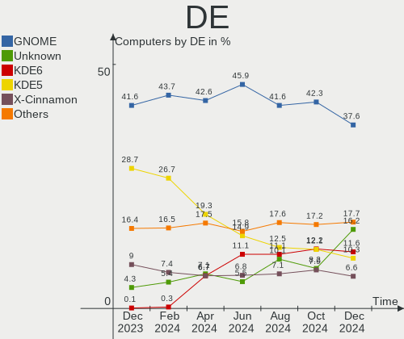
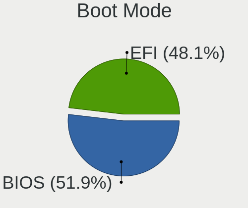
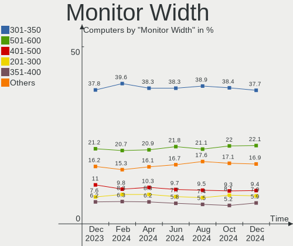

Linux Hardware Trends
---------------------

A project to identify most popular hardware characteristics and track their change
over time based on data collected by Linux users at https://Linux-Hardware.org.

Anyone can contribute to the study by uploading probes of their computers by
the [hw-probe](https://github.com/linuxhw/hw-probe) tool:

    sudo hw-probe -all -upload

This is a report for all computer types. See also reports for [desktops](/Desktop/README.md) and [notebooks](/Notebook/README.md).

Full-feature report is available here: https://linux-hardware.org/?view=trends

Period: Dec, 2019.

Contents
--------

- [ OS                       ](#os)
- [ OS Family                ](#os-family)
- [ Kernel                   ](#kernel)
- [ Kernel Family            ](#kernel-family)
- [ Kernel Major Ver.        ](#kernel-major-ver)
- [ Arch                     ](#arch)
- [ DE                       ](#de)
- [ Display Server           ](#display-server)
- [ OS Lang                  ](#os-lang)
- [ Boot Mode                ](#boot-mode)
- [ Filesystem               ](#filesystem)
- [ Dual Boot with Linux     ](#dual-boot-with-linux)
- [ Dual Boot (Win)          ](#dual-boot-win)
- [ Country                  ](#country)
- [ City                     ](#city)
- [ Vendor                   ](#vendor)
- [ Model                    ](#model)
- [ Model Family             ](#model-family)
- [ MFG Year                 ](#mfg-year)
- [ Form Factor              ](#form-factor)
- [ Secure Boot              ](#secure-boot)
- [ Coreboot                 ](#coreboot)
- [ RAM Size                 ](#ram-size)
- [ RAM Used                 ](#ram-used)
- [ Drive Vendor             ](#drive-vendor)
- [ Drive Model              ](#drive-model)
- [ Drive Kind               ](#drive-kind)
- [ Drive Connector          ](#drive-connector)
- [ Drive Size               ](#drive-size)
- [ Space Total              ](#space-total)
- [ Space Used               ](#space-used)
- [ Malfunc. Drives          ](#malfunc-drives)
- [ Malfunc. Drive Vendor    ](#malfunc-drive-vendor)
- [ Malfunc. Drive Kind      ](#malfunc-drive-kind)
- [ Failed Drives            ](#failed-drives)
- [ Failed Drive Vendor      ](#failed-drive-vendor)
- [ Drive Status             ](#drive-status)
- [ CPU Vendor               ](#cpu-vendor)
- [ CPU Model                ](#cpu-model)
- [ CPU Model Family         ](#cpu-model-family)
- [ CPU Cores                ](#cpu-cores)
- [ CPU Sockets              ](#cpu-sockets)
- [ CPU Threads              ](#cpu-threads)
- [ CPU Op-Modes             ](#cpu-op-modes)
- [ CPU Microarch            ](#cpu-microarch)
- [ CPU Microcode            ](#cpu-microcode)
- [ GPU Vendor               ](#gpu-vendor)
- [ GPU Model                ](#gpu-model)
- [ GPU Combo                ](#gpu-combo)
- [ GPU Driver               ](#gpu-driver)
- [ GPU Memory               ](#gpu-memory)
- [ Monitor Vendor           ](#monitor-vendor)
- [ Monitor Model            ](#monitor-model)
- [ Monitor Resolution       ](#monitor-resolution)
- [ Monitor Diagonal         ](#monitor-diagonal)
- [ Monitor Width            ](#monitor-width)
- [ Aspect Ratio             ](#aspect-ratio)
- [ Monitor Area             ](#monitor-area)
- [ Pixel Density            ](#pixel-density)
- [ Multiple Monitors        ](#multiple-monitors)
- [ Net Controller Vendor    ](#net-controller-vendor)
- [ Net Controller Model     ](#net-controller-model)
- [ Net Controller Kind      ](#net-controller-kind)
- [ Used Controller          ](#used-controller)
- [ NICs                     ](#nics)
- [ Unsupported Devices      ](#unsupported-devices)
- [ Unsupported Device Types ](#unsupported-device-types)

OS
--

Installed operating systems

| Name                   | Computers | Percent |
|------------------------|-----------|---------|
| Ubuntu 18.04           | 641       | 25.6%   |
| ROSA R11               | 303       | 12.1%   |
| Ubuntu 19.10           | 292       | 11.66%  |
| BlackPanther 18.1      | 145       | 5.79%   |
| Fedora 31              | 118       | 4.71%   |
| Mint 19.2              | 116       | 4.63%   |
| Mint 19.3              | 80        | 3.19%   |
| Endless 3.7.5          | 70        | 2.8%    |
| Ubuntu 19.04           | 58        | 2.32%   |
| Debian 10              | 53        | 2.12%   |
| Zorin 15               | 51        | 2.04%   |
| Ubuntu 16.04           | 51        | 2.04%   |
| Arch                   | 34        | 1.36%   |
| Mint 19.1              | 29        | 1.16%   |
| Manjaro 18.1.4         | 27        | 1.08%   |
| Manjaro                | 27        | 1.08%   |
| Arch Rolling           | 26        | 1.04%   |
| ROSA R8.1              | 25        | 1%      |
| Elementary 5.1         | 21        | 0.84%   |
| KDE neon 18.04         | 18        | 0.72%   |
| ROSA R10               | 16        | 0.64%   |
| Debian                 | 16        | 0.64%   |
| Ubuntu 20.04           | 14        | 0.56%   |
| Fedora 30              | 14        | 0.56%   |
| Zorin 12               | 13        | 0.52%   |
| Manjaro 18.1.3         | 12        | 0.48%   |
| Solus 4.0              | 9         | 0.36%   |
| Debian Testing         | 9         | 0.36%   |
| Ubuntu 18.10           | 8         | 0.32%   |
| Mint 18.3              | 8         | 0.32%   |
| Gentoo                 | 8         | 0.32%   |
| Debian Unstable        | 8         | 0.32%   |
| Kali 2019.4            | 7         | 0.28%   |
| CentOS 8               | 7         | 0.28%   |
| CentOS 7               | 7         | 0.28%   |
| Endless 3.7.4          | 6         | 0.24%   |
| Endless 3.3.19-nexthw1 | 6         | 0.24%   |
| Mint 19                | 5         | 0.2%    |
| Fedora 32              | 5         | 0.2%    |
| Peppermint 10          | 4         | 0.16%   |
| Deepin 15.11           | 4         | 0.16%   |
| Debian 9.11            | 4         | 0.16%   |
| ClearOS 7.7.2          | 4         | 0.16%   |
| RED X4                 | 3         | 0.12%   |
| Parrot 4.7             | 3         | 0.12%   |
| MX 18.3                | 3         | 0.12%   |
| Manjaro 18.1.5         | 3         | 0.12%   |
| Gentoo 2.6             | 3         | 0.12%   |
| Endless 3.7.3          | 3         | 0.12%   |
| Endless 3.5.7-nexthw1  | 3         | 0.12%   |
| Clear Linux 31930      | 3         | 0.12%   |
| ROSA R9                | 2         | 0.08%   |
| ROSA R12               | 2         | 0.08%   |
| RHEL 8.1               | 2         | 0.08%   |
| Reborn OS              | 2         | 0.08%   |
| Raspbian 10            | 2         | 0.08%   |
| openSUSE 20191128      | 2         | 0.08%   |
| Mint 18.2              | 2         | 0.08%   |
| Mint 18                | 2         | 0.08%   |
| Freedesktop 18.08.38   | 2         | 0.08%   |

OS Family
---------

OS without a version

| Name         | Computers | Percent |
|--------------|-----------|---------|
| Ubuntu       | 1067      | 42.61%  |
| ROSA         | 351       | 14.02%  |
| Mint         | 243       | 9.7%    |
| BlackPanther | 145       | 5.79%   |
| Fedora       | 139       | 5.55%   |
| Endless      | 102       | 4.07%   |
| Debian       | 92        | 3.67%   |
| Manjaro      | 70        | 2.8%    |
| Zorin        | 64        | 2.56%   |
| Arch         | 60        | 2.4%    |
| Elementary   | 22        | 0.88%   |
| KDE neon     | 18        | 0.72%   |
| CentOS       | 17        | 0.68%   |
| Clear Linux  | 15        | 0.6%    |
| openSUSE     | 11        | 0.44%   |
| Gentoo       | 11        | 0.44%   |
| Solus        | 9         | 0.36%   |
| Kali         | 7         | 0.28%   |
| ClearOS      | 6         | 0.24%   |
| Peppermint   | 4         | 0.16%   |
| Deepin       | 4         | 0.16%   |
| Arcolinux    | 4         | 0.16%   |
| RHEL         | 3         | 0.12%   |
| RED          | 3         | 0.12%   |
| Parrot       | 3         | 0.12%   |
| MX           | 3         | 0.12%   |
| Devuan       | 3         | 0.12%   |
| Void         | 2         | 0.08%   |
| Reborn OS    | 2         | 0.08%   |
| Raspbian     | 2         | 0.08%   |
| Freedesktop  | 2         | 0.08%   |
| EndeavourOS  | 2         | 0.08%   |
| Alpine       | 2         | 0.08%   |
| Slackware    | 1         | 0.04%   |
| Scientific   | 1         | 0.04%   |
| PureOS       | 1         | 0.04%   |
| Pearl        | 1         | 0.04%   |
| OpenWrt      | 1         | 0.04%   |
| Novos        | 1         | 0.04%   |
| Mageia       | 1         | 0.04%   |
| KaOS         | 1         | 0.04%   |
| Generic      | 1         | 0.04%   |
| BunsenLabs   | 1         | 0.04%   |
| Blackarch    | 1         | 0.04%   |
| Antix        | 1         | 0.04%   |
| antergos     | 1         | 0.04%   |
| Android      | 1         | 0.04%   |
| ALT Linux    | 1         | 0.04%   |
| ACI          | 1         | 0.04%   |

Kernel
------

Version of the Linux kernel

| Version                          | Computers | Percent |
|----------------------------------|-----------|---------|
| 5.0.0-37-generic                 | 438       | 17.49%  |
| 4.15.0-72-generic                | 240       | 9.58%   |
| 5.3.0-24-generic                 | 219       | 8.75%   |
| 5.3.0-23-generic                 | 106       | 4.23%   |
| 4.18.16-desktop-1bP              | 102       | 4.07%   |
| 4.15.0-desktop-68.5rosa-x86_64   | 99        | 3.95%   |
| 4.15.0-desktop-45.1rosa-x86_64   | 82        | 3.27%   |
| 5.0.0-36-generic                 | 70        | 2.8%    |
| 4.15.0-70-generic                | 45        | 1.8%    |
| 5.1.15-desktop-1bP               | 42        | 1.68%   |
| 4.19.0-6-amd64                   | 37        | 1.48%   |
| 5.0.0-23-generic                 | 36        | 1.44%   |
| 5.3.16-300.fc31.x86_64           | 35        | 1.4%    |
| 4.9.155-nrj-desktop-1rosa-x86_64 | 33        | 1.32%   |
| 5.3.15-300.fc31.x86_64           | 26        | 1.04%   |
| 5.3.0-18-generic                 | 25        | 1%      |
| 5.0.0-32-generic                 | 24        | 0.96%   |
| 4.15.0-desktop-60.7rosa-x86_64   | 24        | 0.96%   |
| 4.15.0-54-generic                | 22        | 0.88%   |
| 5.4.2-1-MANJARO                  | 20        | 0.8%    |
| 5.3.0-26-generic                 | 20        | 0.8%    |
| 4.15.0-desktop-45.1rosa-i586     | 20        | 0.8%    |
| 5.4.2-arch1-1                    | 17        | 0.68%   |
| 4.15.0-desktop-68.5rosa-i586     | 17        | 0.68%   |
| 5.3.12-1-MANJARO                 | 16        | 0.64%   |
| 5.3.0-25-generic                 | 16        | 0.64%   |
| 5.3.13-300.fc31.x86_64           | 15        | 0.6%    |
| 4.15.0-20-generic                | 15        | 0.6%    |
| 5.3.12-300.fc31.x86_64           | 14        | 0.56%   |
| 5.3.0-2-amd64                    | 13        | 0.52%   |
| 5.3.13-arch1-1                   | 11        | 0.44%   |
| 4.9.60-nrj-desktop-1rosa-x86_64  | 11        | 0.44%   |
| 4.9.155-nrj-desktop-1rosa-i586   | 11        | 0.44%   |
| 4.9.0-11-amd64                   | 11        | 0.44%   |
| 4.4.0-170-generic                | 10        | 0.4%    |
| 5.3.15-1-MANJARO                 | 9         | 0.36%   |
| 4.15.0-73-generic                | 9         | 0.36%   |
| 4.15.0-29-generic                | 9         | 0.36%   |
| 5.3.14-300.fc31.x86_64           | 8         | 0.32%   |
| 5.3.0-19-generic                 | 8         | 0.32%   |
| 4.15.0-66-generic                | 8         | 0.32%   |
| 5.4.1-arch1-1                    | 7         | 0.28%   |
| 5.3.7-301.fc31.x86_64            | 7         | 0.28%   |
| 4.18.0-25-generic                | 7         | 0.28%   |
| 5.3.12-1-default                 | 6         | 0.24%   |
| 4.15.0-72-lowlatency             | 6         | 0.24%   |
| 4.15.0-55-generic                | 6         | 0.24%   |
| 4.15.0-15-generic                | 6         | 0.24%   |
| 4.15.0-1065-oem                  | 6         | 0.24%   |
| 5.4.5-300.fc31.x86_64            | 5         | 0.2%    |
| 5.4.1-050401-generic             | 5         | 0.2%    |
| 5.4.0-050400-generic             | 5         | 0.2%    |
| 5.3.0-24-lowlatency              | 5         | 0.2%    |
| 5.0.0-13-generic                 | 5         | 0.2%    |
| 4.19.85-1-MANJARO                | 5         | 0.2%    |
| 4.18.0-15-generic                | 5         | 0.2%    |
| 4.15.0-30deepin-generic          | 5         | 0.2%    |
| 4.1.38-nrj-desktop-2rosa-x86_64  | 5         | 0.2%    |
| 4.1.38-nrj-desktop-2rosa-i586    | 5         | 0.2%    |
| 3.10.0-1062.9.1.el7.x86_64       | 5         | 0.2%    |

Kernel Family
-------------

Linux kernel without a distro release

| Version  | Computers | Percent |
|----------|-----------|---------|
| 4.15.0   | 676       | 27%     |
| 5.0.0    | 605       | 24.16%  |
| 5.3.0    | 452       | 18.05%  |
| 4.18.16  | 103       | 4.11%   |
| 5.4.2    | 52        | 2.08%   |
| 4.19.0   | 48        | 1.92%   |
| 5.3.12   | 46        | 1.84%   |
| 4.9.155  | 46        | 1.84%   |
| 5.3.15   | 42        | 1.68%   |
| 5.1.15   | 42        | 1.68%   |
| 5.3.16   | 37        | 1.48%   |
| 4.18.0   | 33        | 1.32%   |
| 5.3.13   | 31        | 1.24%   |
| 4.4.0    | 23        | 0.92%   |
| 5.4.1    | 22        | 0.88%   |
| 5.4.6    | 18        | 0.72%   |
| 5.4.0    | 17        | 0.68%   |
| 3.10.0   | 16        | 0.64%   |
| 5.3.14   | 14        | 0.56%   |
| 4.9.60   | 14        | 0.56%   |
| 4.9.0    | 14        | 0.56%   |
| 5.4.5    | 11        | 0.44%   |
| 5.3.7    | 10        | 0.4%    |
| 5.3.11   | 10        | 0.4%    |
| 4.1.38   | 10        | 0.4%    |
| 5.4.3    | 8         | 0.32%   |
| 5.3.8    | 5         | 0.2%    |
| 4.9.124  | 5         | 0.2%    |
| 4.19.88  | 5         | 0.2%    |
| 4.19.85  | 5         | 0.2%    |
| 5.4.4    | 4         | 0.16%   |
| 4.19.91  | 4         | 0.16%   |
| 4.13.0   | 4         | 0.16%   |
| 5.3.9    | 3         | 0.12%   |
| 5.2.0    | 3         | 0.12%   |
| 4.9.9    | 3         | 0.12%   |
| 4.9.20   | 3         | 0.12%   |
| 4.19.86  | 3         | 0.12%   |
| 5.5.0    | 2         | 0.08%   |
| 5.1.0    | 2         | 0.08%   |
| 4.9.140  | 2         | 0.08%   |
| 4.8.0    | 2         | 0.08%   |
| 4.19.75  | 2         | 0.08%   |
| 4.19.65  | 2         | 0.08%   |
| 4.16.0   | 2         | 0.08%   |
| 4.15.18  | 2         | 0.08%   |
| 4.14.158 | 2         | 0.08%   |
| 4.12.14  | 2         | 0.08%   |
| 4.10.0   | 2         | 0.08%   |
| 5.3.10   | 1         | 0.04%   |
| 5.3.1    | 1         | 0.04%   |
| 5.2.8    | 1         | 0.04%   |
| 5.2.2    | 1         | 0.04%   |
| 5.2.18   | 1         | 0.04%   |
| 5.2.16   | 1         | 0.04%   |
| 5.2.13   | 1         | 0.04%   |
| 5.2.1    | 1         | 0.04%   |
| 5.0.9    | 1         | 0.04%   |
| 5.0.21   | 1         | 0.04%   |
| 5.0.11   | 1         | 0.04%   |

Kernel Major Ver.
-----------------

Linux kernel major version

| Version | Computers | Percent |
|---------|-----------|---------|
| 4.15    | 678       | 27.08%  |
| 5.3     | 652       | 26.04%  |
| 5.0     | 608       | 24.28%  |
| 4.18    | 136       | 5.43%   |
| 5.4     | 132       | 5.27%   |
| 4.9     | 91        | 3.63%   |
| 4.19    | 74        | 2.96%   |
| 5.1     | 44        | 1.76%   |
| 4.4     | 25        | 1%      |
| 3.10    | 16        | 0.64%   |
| 4.1     | 11        | 0.44%   |
| 5.2     | 9         | 0.36%   |
| 4.14    | 5         | 0.2%    |
| 4.16    | 4         | 0.16%   |
| 4.13    | 4         | 0.16%   |
| 4.8     | 3         | 0.12%   |
| 5.5     | 2         | 0.08%   |
| 4.12    | 2         | 0.08%   |
| 4.10    | 2         | 0.08%   |
| 4.20    | 1         | 0.04%   |
| 4.17    | 1         | 0.04%   |
| 3.4     | 1         | 0.04%   |
| 3.18    | 1         | 0.04%   |
| 2.6     | 1         | 0.04%   |
| Unknown | 1         | 0.04%   |

Arch
----

OS architecture (x86_64, i586, etc.)

| Name    | Computers | Percent |
|---------|-----------|---------|
| x86_64  | 2301      | 91.89%  |
| i686    | 188       | 7.51%   |
| aarch64 | 10        | 0.4%    |
| armv7l  | 3         | 0.12%   |
| mips    | 1         | 0.04%   |
| Unknown | 1         | 0.04%   |

DE
--

Desktop Environment

| Name                      | Computers | Percent |
|---------------------------|-----------|---------|
| GNOME                     | 963       | 38.46%  |
| KDE5                      | 490       | 19.57%  |
| Unknown                   | 372       | 14.86%  |
| XFCE                      | 221       | 8.83%   |
| X-Cinnamon                | 135       | 5.39%   |
| MATE                      | 84        | 3.35%   |
| KDE                       | 60        | 2.4%    |
| Cinnamon                  | 51        | 2.04%   |
| Unity                     | 39        | 1.56%   |
| LXQt                      | 24        | 0.96%   |
| Pantheon                  | 19        | 0.76%   |
| Deepin                    | 9         | 0.36%   |
| Budgie                    | 9         | 0.36%   |
| LXDE                      | 8         | 0.32%   |
| GNOME-Classic:GNOME       | 5         | 0.2%    |
| GNOME Flashback           | 4         | 0.16%   |
| communitheme:ubuntu:GNOME | 4         | 0.16%   |
| KDE4                      | 3         | 0.12%   |
| openbox                   | 2         | 0.08%   |
| Lubuntu                   | 1         | 0.04%   |
| i3                        | 1         | 0.04%   |

Display Server
--------------

X11 or Wayland

| Name    | Computers | Percent |
|---------|-----------|---------|
| X11     | 1266      | 50.56%  |
| Unknown | 1157      | 46.21%  |
| Wayland | 77        | 3.08%   |
| Tty     | 4         | 0.16%   |

OS Lang
-------

Language

| Lang        | Computers | Percent |
|-------------|-----------|---------|
| Unknown     | 875       | 34.94%  |
| en_US       | 542       | 21.65%  |
| de_DE       | 141       | 5.63%   |
| pt_BR       | 109       | 4.35%   |
| ru_RU       | 106       | 4.23%   |
| en_GB       | 80        | 3.19%   |
| it_IT       | 73        | 2.92%   |
| es_ES       | 62        | 2.48%   |
| fr_FR       | 51        | 2.04%   |
| en_CA       | 39        | 1.56%   |
| pl_PL       | 32        | 1.28%   |
| en_US.utf8  | 29        | 1.16%   |
| C           | 29        | 1.16%   |
| en_IN       | 28        | 1.12%   |
| en_AU       | 24        | 0.96%   |
| pt_BR.utf8  | 17        | 0.68%   |
| hu_HU       | 16        | 0.64%   |
| pt_PT       | 14        | 0.56%   |
| es_MX       | 12        | 0.48%   |
| nl_NL       | 11        | 0.44%   |
| tr_TR       | 10        | 0.4%    |
| de_AT       | 10        | 0.4%    |
| es_AR       | 9         | 0.36%   |
| en_ZA       | 9         | 0.36%   |
| de_CH       | 9         | 0.36%   |
| cs_CZ       | 9         | 0.36%   |
| sv_SE       | 8         | 0.32%   |
| ru_UA       | 8         | 0.32%   |
| ro_RO       | 8         | 0.32%   |
| ja_JP       | 8         | 0.32%   |
| zh_CN       | 7         | 0.28%   |
| en_NZ       | 7         | 0.28%   |
| nl_BE       | 6         | 0.24%   |
| uk_UA       | 5         | 0.2%    |
| sk_SK       | 5         | 0.2%    |
| en_IN       | 5         | 0.2%    |
| el_GR       | 5         | 0.2%    |
| da_DK       | 5         | 0.2%    |
| bg_BG       | 5         | 0.2%    |
| zh_TW       | 4         | 0.16%   |
| nb_NO       | 4         | 0.16%   |
| fr_CA       | 4         | 0.16%   |
| fr_BE       | 4         | 0.16%   |
| fi_FI       | 4         | 0.16%   |
| es_CL       | 4         | 0.16%   |
| es_VE       | 3         | 0.12%   |
| es_CO       | 3         | 0.12%   |
| en_IL       | 3         | 0.12%   |
| en_IE       | 3         | 0.12%   |
| ca_ES       | 3         | 0.12%   |
| sr_RS@latin | 2         | 0.08%   |
| sl_SI       | 2         | 0.08%   |
| nl_BE.utf8  | 2         | 0.08%   |
| ko_KR       | 2         | 0.08%   |
| fr_CH       | 2         | 0.08%   |
| es_PE       | 2         | 0.08%   |
| en_SG       | 2         | 0.08%   |
| en_HK       | 2         | 0.08%   |
| en_GB.utf8  | 2         | 0.08%   |
| zh_HK       | 1         | 0.04%   |

Boot Mode
---------

EFI or BIOS

| Mode | Computers | Percent |
|------|-----------|---------|
| BIOS | 1476      | 58.95%  |
| EFI  | 1028      | 41.05%  |

Filesystem
----------

Type of filesystem

| Type    | Computers | Percent |
|---------|-----------|---------|
| Ext4    | 2317      | 92.53%  |
| Btrfs   | 57        | 2.28%   |
| Overlay | 55        | 2.2%    |
| Xfs     | 44        | 1.76%   |
| Ext3    | 9         | 0.36%   |
| Ext2    | 9         | 0.36%   |
| Unknown | 4         | 0.16%   |
| Zfs     | 3         | 0.12%   |
| Tmpfs   | 3         | 0.12%   |
| Rootfs  | 1         | 0.04%   |
| Jfs     | 1         | 0.04%   |
| F2fs    | 1         | 0.04%   |

Dual Boot with Linux
--------------------

Hosting more than one Linux

| Dual boot | Computers | Percent |
|-----------|-----------|---------|
| No        | 2170      | 86.66%  |
| Yes       | 334       | 13.34%  |

Dual Boot (Win)
---------------

Hosting Linux and Windows

| Dual boot | Computers | Percent |
|-----------|-----------|---------|
| No        | 1742      | 69.57%  |
| Yes       | 762       | 30.43%  |

Country
-------

Geographic location (country)

| Country        | Computers | Percent |
|----------------|-----------|---------|
| Russia         | 450       | 17.97%  |
| USA            | 324       | 12.94%  |
| Germany        | 215       | 8.59%   |
| Brazil         | 161       | 6.43%   |
| Hungary        | 133       | 5.31%   |
| Italy          | 91        | 3.63%   |
| France         | 90        | 3.59%   |
| UK             | 84        | 3.35%   |
| Spain          | 75        | 3%      |
| Ukraine        | 68        | 2.72%   |
| Canada         | 63        | 2.52%   |
| Poland         | 61        | 2.44%   |
| India          | 51        | 2.04%   |
| Netherlands    | 44        | 1.76%   |
| Australia      | 42        | 1.68%   |
| Romania        | 28        | 1.12%   |
| Czech Republic | 24        | 0.96%   |
| Belarus        | 24        | 0.96%   |
| Bulgaria       | 20        | 0.8%    |
| Switzerland    | 19        | 0.76%   |
| Portugal       | 19        | 0.76%   |
| Mexico         | 19        | 0.76%   |
| Sweden         | 18        | 0.72%   |
| China          | 18        | 0.72%   |
| Belgium        | 17        | 0.68%   |
| Turkey         | 16        | 0.64%   |
| Slovakia       | 16        | 0.64%   |
| Austria        | 16        | 0.64%   |
| Japan          | 14        | 0.56%   |
| Serbia         | 13        | 0.52%   |
| Greece         | 13        | 0.52%   |
| South Africa   | 12        | 0.48%   |
| New Zealand    | 12        | 0.48%   |
| Finland        | 10        | 0.4%    |
| Colombia       | 10        | 0.4%    |
| Israel         | 9         | 0.36%   |
| Denmark        | 9         | 0.36%   |
| Argentina      | 9         | 0.36%   |
| Thailand       | 8         | 0.32%   |
| Kazakhstan     | 8         | 0.32%   |
| Taiwan         | 7         | 0.28%   |
| Philippines    | 7         | 0.28%   |
| Norway         | 7         | 0.28%   |
| Latvia         | 7         | 0.28%   |
| Ireland        | 7         | 0.28%   |
| Croatia        | 7         | 0.28%   |
| Singapore      | 6         | 0.24%   |
| Lithuania      | 6         | 0.24%   |
| Iran           | 6         | 0.24%   |
| Indonesia      | 6         | 0.24%   |
| Egypt          | 6         | 0.24%   |
| Malaysia       | 5         | 0.2%    |
| Estonia        | 5         | 0.2%    |
| Cyprus         | 5         | 0.2%    |
| Tunisia        | 4         | 0.16%   |
| Saudi Arabia   | 4         | 0.16%   |
| Hong Kong      | 4         | 0.16%   |
| Chile          | 4         | 0.16%   |
| Bangladesh     | 4         | 0.16%   |
| Venezuela      | 3         | 0.12%   |

City
----

Geographic location (city)

| City             | Computers | Percent |
|------------------|-----------|---------|
| Moscow           | 95        | 3.79%   |
| St Petersburg    | 40        | 1.6%    |
| Budapest         | 34        | 1.36%   |
| São Paulo       | 22        | 0.88%   |
| Berlin           | 18        | 0.72%   |
| Novosibirsk      | 16        | 0.64%   |
| Yekaterinburg    | 14        | 0.56%   |
| Rome             | 14        | 0.56%   |
| Paris            | 14        | 0.56%   |
| Kyiv             | 14        | 0.56%   |
| Munich           | 13        | 0.52%   |
| Minsk            | 13        | 0.52%   |
| Vogue            | 12        | 0.48%   |
| Sofia            | 12        | 0.48%   |
| Rostov-on-Don    | 12        | 0.48%   |
| Warsaw           | 11        | 0.44%   |
| Vienna           | 11        | 0.44%   |
| Amsterdam        | 11        | 0.44%   |
| Rio de Janeiro   | 10        | 0.4%    |
| Krakow           | 10        | 0.4%    |
| Bengaluru        | 9         | 0.36%   |
| Belgrade         | 9         | 0.36%   |
| Auckland         | 9         | 0.36%   |
| Nuremberg        | 8         | 0.32%   |
| Lviv             | 8         | 0.32%   |
| Krasnodar        | 8         | 0.32%   |
| Fortaleza        | 8         | 0.32%   |
| Debrecen         | 8         | 0.32%   |
| Athens           | 8         | 0.32%   |
| Ufa              | 7         | 0.28%   |
| Toronto          | 7         | 0.28%   |
| Samara           | 7         | 0.28%   |
| Prague           | 7         | 0.28%   |
| Omsk             | 7         | 0.28%   |
| Miskolc          | 7         | 0.28%   |
| Bucharest        | 7         | 0.28%   |
| Bratislava       | 7         | 0.28%   |
| Wahroonga        | 6         | 0.24%   |
| Tel Aviv         | 6         | 0.24%   |
| Stockholm        | 6         | 0.24%   |
| Saratov          | 6         | 0.24%   |
| Perm             | 6         | 0.24%   |
| Leipzig          | 6         | 0.24%   |
| Kharkiv          | 6         | 0.24%   |
| Hamburg          | 6         | 0.24%   |
| Győr            | 6         | 0.24%   |
| Chicago          | 6         | 0.24%   |
| Zagreb           | 5         | 0.2%    |
| Volgograd        | 5         | 0.2%    |
| Tyumen           | 5         | 0.2%    |
| Singapore        | 5         | 0.2%    |
| Seville          | 5         | 0.2%    |
| Regensburg       | 5         | 0.2%    |
| Pittsburgh       | 5         | 0.2%    |
| Osasco           | 5         | 0.2%    |
| Nizhniy Novgorod | 5         | 0.2%    |
| Mumbai           | 5         | 0.2%    |
| Montreal         | 5         | 0.2%    |
| Mesa             | 5         | 0.2%    |
| Madrid           | 5         | 0.2%    |

Vendor
------

Motherboard manufacturer

| Name                     | Computers | Percent |
|--------------------------|-----------|---------|
| ASUSTek Computer         | 428       | 17.09%  |
| Lenovo                   | 328       | 13.1%   |
| Hewlett-Packard          | 314       | 12.54%  |
| Dell                     | 282       | 11.26%  |
| Gigabyte Technology      | 197       | 7.87%   |
| Acer                     | 189       | 7.55%   |
| ASRock                   | 114       | 4.55%   |
| MSI                      | 113       | 4.51%   |
| Toshiba                  | 47        | 1.88%   |
| Intel                    | 45        | 1.8%    |
| Samsung Electronics      | 39        | 1.56%   |
| Apple                    | 34        | 1.36%   |
| Sony                     | 27        | 1.08%   |
| Unknown                  | 27        | 1.08%   |
| Fujitsu                  | 24        | 0.96%   |
| Pegatron                 | 17        | 0.68%   |
| Medion                   | 17        | 0.68%   |
| Packard Bell             | 15        | 0.6%    |
| Notebook                 | 15        | 0.6%    |
| Positivo                 | 13        | 0.52%   |
| Fujitsu Siemens          | 11        | 0.44%   |
| ECS                      | 11        | 0.44%   |
| Foxconn                  | 9         | 0.36%   |
| eMachines                | 9         | 0.36%   |
| Gateway                  | 8         | 0.32%   |
| Supermicro               | 7         | 0.28%   |
| LG Electronics           | 7         | 0.28%   |
| HUAWEI                   | 7         | 0.28%   |
| Biostar                  | 7         | 0.28%   |
| TUXEDO                   | 5         | 0.2%    |
| Raspberry Pi Foundation  | 5         | 0.2%    |
| Timi                     | 4         | 0.16%   |
| Quanta                   | 4         | 0.16%   |
| PCWare                   | 4         | 0.16%   |
| Microsoft                | 4         | 0.16%   |
| Insyde                   | 4         | 0.16%   |
| Google                   | 4         | 0.16%   |
| Chuwi                    | 4         | 0.16%   |
| AMI                      | 4         | 0.16%   |
| Panasonic                | 3         | 0.12%   |
| Digibras                 | 3         | 0.12%   |
| Compal                   | 3         | 0.12%   |
| Clevo                    | 3         | 0.12%   |
| Akstron                  | 3         | 0.12%   |
| WinFast                  | 2         | 0.08%   |
| Shuttle                  | 2         | 0.08%   |
| Philco                   | 2         | 0.08%   |
| OEM                      | 2         | 0.08%   |
| Nvidia                   | 2         | 0.08%   |
| NEC Computers            | 2         | 0.08%   |
| Multilaser Industrial SA | 2         | 0.08%   |
| MEGA                     | 2         | 0.08%   |
| Itautec                  | 2         | 0.08%   |
| HARDKERNEL               | 2         | 0.08%   |
| Hampoo                   | 2         | 0.08%   |
| Digma                    | 2         | 0.08%   |
| DEXP                     | 2         | 0.08%   |
| Alienware                | 2         | 0.08%   |
| AIC                      | 2         | 0.08%   |
| ZOTAC                    | 1         | 0.04%   |

Model
-----

Motherboard model

| Name                               | Computers | Percent |
|------------------------------------|-----------|---------|
| Unknown                            | 44        | 1.76%   |
| All Series                         | 29        | 1.16%   |
| Pavilion g6                        | 9         | 0.36%   |
| Pavilion 15                        | 9         | 0.36%   |
| Nitro AN515-52                     | 9         | 0.36%   |
| Pavilion dv7                       | 8         | 0.32%   |
| Notebook                           | 8         | 0.32%   |
| M5A78L-M/USB3                      | 8         | 0.32%   |
| B450M DS3H                         | 8         | 0.32%   |
| 970A-DS3P                          | 8         | 0.32%   |
| PRIME A320M-K                      | 6         | 0.24%   |
| Latitude E7450                     | 6         | 0.24%   |
| Laptop 15-db0xxx                   | 6         | 0.24%   |
| IdeaPad 330-15AST 81D6             | 6         | 0.24%   |
| XPS 15 9570                        | 5         | 0.2%    |
| Pavilion dv6                       | 5         | 0.2%    |
| OptiPlex 760                       | 5         | 0.2%    |
| Laptop 15-da0xxx                   | 5         | 0.2%    |
| Inspiron 7520                      | 5         | 0.2%    |
| IdeaPad 330-15IKB 81DE             | 5         | 0.2%    |
| G50-70 20351                       | 5         | 0.2%    |
| G31M-ES2L                          | 5         | 0.2%    |
| Aspire A315-53                     | 5         | 0.2%    |
| 255 G7 Notebook PC                 | 5         | 0.2%    |
| XPS 13 9380                        | 4         | 0.16%   |
| VivoBook 15_ASUS Laptop X540UAR    | 4         | 0.16%   |
| SABERTOOTH 990FX R2.0              | 4         | 0.16%   |
| Precision WorkStation T7500        | 4         | 0.16%   |
| Pavilion Notebook                  | 4         | 0.16%   |
| OptiPlex 780                       | 4         | 0.16%   |
| NUC8i7BEH                          | 4         | 0.16%   |
| MS-7B89                            | 4         | 0.16%   |
| MS-7A38                            | 4         | 0.16%   |
| MS-7996                            | 4         | 0.16%   |
| Latitude E5470                     | 4         | 0.16%   |
| Laptop 15-bw0xx                    | 4         | 0.16%   |
| Laptop 15-bs0xx                    | 4         | 0.16%   |
| Inspiron 3542                      | 4         | 0.16%   |
| Inspiron 15-3567                   | 4         | 0.16%   |
| G62                                | 4         | 0.16%   |
| G50-30 80G0                        | 4         | 0.16%   |
| Extensa 5620                       | 4         | 0.16%   |
| EliteBook 840 G6                   | 4         | 0.16%   |
| Aspire E5-553G                     | 4         | 0.16%   |
| Aspire A315-21                     | 4         | 0.16%   |
| 300V3A/300V4A/300V5A/200A4B/200A5B | 4         | 0.16%   |
| 15                                 | 4         | 0.16%   |
| ZenBook UX431DA_UM431DA            | 3         | 0.12%   |
| Z50-70 20354                       | 3         | 0.12%   |
| XPS 13 9370                        | 3         | 0.12%   |
| X570 AORUS MASTER                  | 3         | 0.12%   |
| X556UQK                            | 3         | 0.12%   |
| X553MA                             | 3         | 0.12%   |
| X550MJ                             | 3         | 0.12%   |
| Vostro 3550                        | 3         | 0.12%   |
| V145-15AST 81MT                    | 3         | 0.12%   |
| S14CT01                            | 3         | 0.12%   |
| Raspberry Pi 4 Model B Rev 1.1     | 3         | 0.12%   |
| ProBook 6550b                      | 3         | 0.12%   |
| ProBook 650 G1                     | 3         | 0.12%   |

Model Family
------------

Motherboard model prefix

| Name                       | Computers | Percent |
|----------------------------|-----------|---------|
| Acer Aspire                | 137       | 5.47%   |
| Lenovo ThinkPad            | 131       | 5.23%   |
| Dell Inspiron              | 102       | 4.07%   |
| Lenovo IdeaPad             | 69        | 2.76%   |
| HP Pavilion                | 69        | 2.76%   |
| Dell Latitude              | 66        | 2.64%   |
| Unknown                    | 47        | 1.88%   |
| Toshiba Satellite          | 41        | 1.64%   |
| HP EliteBook               | 38        | 1.52%   |
| Dell OptiPlex              | 38        | 1.52%   |
| HP ProBook                 | 37        | 1.48%   |
| HP Compaq                  | 37        | 1.48%   |
| ASUS PRIME                 | 36        | 1.44%   |
| HP Laptop                  | 35        | 1.4%    |
| ASUS All                   | 29        | 1.16%   |
| Dell XPS                   | 26        | 1.04%   |
| ASUS VivoBook              | 26        | 1.04%   |
| Lenovo ThinkCentre         | 19        | 0.76%   |
| Dell Precision             | 19        | 0.76%   |
| HP ENVY                    | 17        | 0.68%   |
| ASUS M5A78L-M              | 17        | 0.68%   |
| ASUS ROG                   | 16        | 0.64%   |
| Acer Nitro                 | 12        | 0.48%   |
| Packard Bell EasyNote      | 10        | 0.4%    |
| Dell Studio                | 10        | 0.4%    |
| Lenovo Yoga                | 9         | 0.36%   |
| Gigabyte B450M             | 9         | 0.36%   |
| Gigabyte 970A-DS3P         | 9         | 0.36%   |
| Fujitsu LIFEBOOK           | 9         | 0.36%   |
| ASUS ZenBook               | 9         | 0.36%   |
| ASUS TUF                   | 9         | 0.36%   |
| HP Notebook                | 8         | 0.32%   |
| Dell Vostro                | 8         | 0.32%   |
| Acer Veriton               | 8         | 0.32%   |
| HP 255                     | 7         | 0.28%   |
| Fujitsu ESPRIMO            | 7         | 0.28%   |
| ASUS P8H61-M               | 7         | 0.28%   |
| Acer TravelMate            | 6         | 0.24%   |
| Acer Swift                 | 6         | 0.24%   |
| Samsung Electronics 300V3A | 5         | 0.2%    |
| RPi Raspberry              | 5         | 0.2%    |
| Lenovo IdeaCentre          | 5         | 0.2%    |
| Lenovo G50-70              | 5         | 0.2%    |
| HP ZBook                   | 5         | 0.2%    |
| HP ProDesk                 | 5         | 0.2%    |
| HP 250                     | 5         | 0.2%    |
| HP 15                      | 5         | 0.2%    |
| Gigabyte H310M             | 5         | 0.2%    |
| Gigabyte G31M-ES2L         | 5         | 0.2%    |
| Fujitsu Siemens ESPRIMO    | 5         | 0.2%    |
| Dell PowerEdge             | 5         | 0.2%    |
| ASUS SABERTOOTH            | 5         | 0.2%    |
| ASUS P8Z68-V               | 5         | 0.2%    |
| ASUS M5A97                 | 5         | 0.2%    |
| Acer Extensa               | 5         | 0.2%    |
| MSI MS-7B89                | 4         | 0.16%   |
| MSI MS-7A38                | 4         | 0.16%   |
| MSI MS-7996                | 4         | 0.16%   |
| Microsoft Surface          | 4         | 0.16%   |
| Lenovo ThinkStation        | 4         | 0.16%   |

MFG Year
--------

Motherboard manufacture year

| Year    | Computers | Percent |
|---------|-----------|---------|
| 2019    | 472       | 18.85%  |
| 2018    | 309       | 12.34%  |
| 2011    | 205       | 8.19%   |
| 2013    | 189       | 7.55%   |
| 2012    | 181       | 7.23%   |
| 2014    | 175       | 6.99%   |
| 2016    | 166       | 6.63%   |
| 2010    | 164       | 6.55%   |
| 2017    | 139       | 5.55%   |
| 2015    | 131       | 5.23%   |
| 2009    | 129       | 5.15%   |
| 2008    | 97        | 3.87%   |
| 2007    | 69        | 2.76%   |
| 2006    | 31        | 1.24%   |
| 2005    | 19        | 0.76%   |
| Unknown | 15        | 0.6%    |
| 2004    | 5         | 0.2%    |
| 2003    | 5         | 0.2%    |
| 2002    | 3         | 0.12%   |

Form Factor
-----------

Physical design of the computer

| Name           | Computers | Percent |
|----------------|-----------|---------|
| Notebook       | 1371      | 54.75%  |
| Desktop        | 1001      | 39.98%  |
| Convertible    | 32        | 1.28%   |
| Mini pc        | 29        | 1.16%   |
| All in one     | 25        | 1%      |
| Tablet         | 18        | 0.72%   |
| Server         | 15        | 0.6%    |
| System on chip | 12        | 0.48%   |
| Phone          | 1         | 0.04%   |

Secure Boot
-----------

Enabled or disabled

| State    | Computers | Percent |
|----------|-----------|---------|
| Disabled | 1885      | 75.28%  |
| Unknown  | 462       | 18.45%  |
| Enabled  | 157       | 6.27%   |

Coreboot
--------

Have coreboot on board

| Used | Computers | Percent |
|------|-----------|---------|
| No   | 2496      | 99.68%  |
| Yes  | 8         | 0.32%   |

RAM Size
--------

Total RAM memory

| Size in GB      | Computers | Percent |
|-----------------|-----------|---------|
| 3.01-4.0        | 691       | 27.6%   |
| 4.01-8.0        | 524       | 20.93%  |
| 8.01-16.0       | 469       | 18.73%  |
| 16.01-24.0      | 355       | 14.18%  |
| 1.01-2.0        | 192       | 7.67%   |
| 32.01-64.0      | 121       | 4.83%   |
| 2.01-3.0        | 60        | 2.4%    |
| 0.01-1.0        | 34        | 1.36%   |
| 64.01-256.0     | 33        | 1.32%   |
| 24.01-32.0      | 22        | 0.88%   |
| Unknown         | 2         | 0.08%   |
| More than 256.0 | 1         | 0.04%   |

RAM Used
--------

Used RAM memory

| Used GB    | Computers | Percent |
|------------|-----------|---------|
| 1.01-2.0   | 968       | 38.66%  |
| 2.01-3.0   | 534       | 21.33%  |
| 0.01-1.0   | 479       | 19.13%  |
| 3.01-4.0   | 230       | 9.19%   |
| 4.01-8.0   | 226       | 9.03%   |
| 8.01-16.0  | 54        | 2.16%   |
| 16.01-24.0 | 5         | 0.2%    |
| Unknown    | 4         | 0.16%   |
| 32.01-64.0 | 2         | 0.08%   |
| 24.01-32.0 | 1         | 0.04%   |
| 0          | 1         | 0.04%   |

Drive Vendor
------------

Hard drive vendors

| Vendor              | Computers | Drives  | Percent |
|---------------------|-----------|---------|---------|
| WDC                 | 656       | 762     | 20.04%  |
| Seagate             | 636       | 726     | 19.43%  |
| Samsung Electronics | 381       | 415     | 11.64%  |
| Toshiba             | 272       | 283     | 8.31%   |
| Kingston            | 170       | 177     | 5.19%   |
| Hitachi             | 170       | 179     | 5.19%   |
| Unknown             | 118       | 138     | 3.6%    |
| SanDisk             | 115       | 127     | 3.51%   |
| Crucial             | 88        | 91      | 2.69%   |
| HGST                | 86        | 89      | 2.63%   |
| Intel               | 84        | 92      | 2.57%   |
| A-DATA Technology   | 50        | 51      | 1.53%   |
| SPCC                | 28        | 28      | 0.86%   |
| SK Hynix            | 27        | 27      | 0.82%   |
| China               | 25        | 26      | 0.76%   |
| Transcend           | 22        | 22      | 0.67%   |
| Fujitsu             | 21        | 21      | 0.64%   |
| Micron Technology   | 18        | 18      | 0.55%   |
| OCZ                 | 16        | 16      | 0.49%   |
| LITEON              | 16        | 16      | 0.49%   |
| Patriot             | 15        | 15      | 0.46%   |
| MAXTOR              | 15        | 15      | 0.46%   |
| PNY                 | 14        | 14      | 0.43%   |
| Apple               | 14        | 14      | 0.43%   |
| Corsair             | 13        | 13      | 0.4%    |
| PLEXTOR             | 12        | 11      | 0.37%   |
| KingDian            | 12        | 12      | 0.37%   |
| Generic             | 12        | 12      | 0.37%   |
| HL-DT-ST            | 10        | Unknown | 0.31%   |
| GOODRAM             | 10        | 11      | 0.31%   |
| LITEONIT            | 9         | 10      | 0.27%   |
| Intenso             | 9         | 10      | 0.27%   |
| Hewlett-Packard     | 8         | 8       | 0.24%   |
| Gigabyte Technology | 8         | 8       | 0.24%   |
| Team                | 7         | 7       | 0.21%   |
| Apacer              | 7         | 7       | 0.21%   |
| KingSpec            | 6         | 6       | 0.18%   |
| Drevo               | 6         | 6       | 0.18%   |
| ASMT                | 5         | 6       | 0.15%   |
| KINGMAX             | 4         | 4       | 0.12%   |
| JMicron             | 4         | 4       | 0.12%   |
| IBM/Hitachi         | 3         | 3       | 0.09%   |
| ExcelStor           | 3         | 3       | 0.09%   |
| AMD                 | 3         | 4       | 0.09%   |
| Zheino              | 2         | 2       | 0.06%   |
| XPG                 | 2         | 2       | 0.06%   |
| Vi550               | 2         | 2       | 0.06%   |
| TO Exter            | 2         | 2       | 0.06%   |
| Silicon Motion      | 2         | 2       | 0.06%   |
| SABRENT             | 2         | 2       | 0.06%   |
| Phison              | 2         | 2       | 0.06%   |
| Netac               | 2         | 2       | 0.06%   |
| Mushkin             | 2         | 2       | 0.06%   |
| Lexar               | 2         | 2       | 0.06%   |
| LDLC                | 2         | 2       | 0.06%   |
| WDC WD75            | 1         | 1       | 0.03%   |
| WDC WD50            | 1         | 1       | 0.03%   |
| WDC WD20            | 1         | 1       | 0.03%   |
| WDC WD10            | 1         | 1       | 0.03%   |
| WD MediaMax         | 1         | 1       | 0.03%   |

Drive Model
-----------

Hard drive models

| Model                        | Computers | Percent |
|------------------------------|-----------|---------|
| SSD 850 EVO 250GB            | 33        | 0.92%   |
| MQ01ABD100 1TB               | 33        | 0.92%   |
| ST500DM002-1BD142 500GB      | 32        | 0.9%    |
| ST1000LM035-1RK172 1TB       | 32        | 0.9%    |
| SA400S37240G 240GB SSD       | 30        | 0.84%   |
| MQ01ABF050 500GB             | 29        | 0.81%   |
| ST1000LM024 HN-M101MBB 1TB   | 28        | 0.78%   |
| SSD 860 EVO 500GB            | 27        | 0.76%   |
| SA400S37120G 120GB SSD       | 26        | 0.73%   |
| ST500LT012-1DG142 500GB      | 25        | 0.7%    |
| WD10SPZX-21Z10T0 1TB         | 23        | 0.64%   |
| SV300S37A120G 120GB SSD      | 21        | 0.59%   |
| SSD 850 EVO 500GB            | 21        | 0.59%   |
| MMC Card  4GB                | 21        | 0.59%   |
| HTS721010A9E630 1TB          | 21        | 0.59%   |
| DT01ACA100 1TB               | 21        | 0.59%   |
| WD10EZEX-08WN4A0 1TB         | 20        | 0.56%   |
| ST1000DM010-2EP102 1TB       | 20        | 0.56%   |
| MQ04ABF100 1TB               | 19        | 0.53%   |
| ST3500418AS 500GB            | 17        | 0.48%   |
| SA400S37480G 480GB SSD       | 17        | 0.48%   |
| WDS240G2G0A-00JH30 240GB SSD | 16        | 0.45%   |
| SSD 860 EVO 250GB            | 16        | 0.45%   |
| HTS545050A7E680 500GB        | 16        | 0.45%   |
| ST9500325AS 500GB            | 15        | 0.42%   |
| ST31000528AS 1TB             | 14        | 0.39%   |
| HTS545050A7E380 500GB        | 14        | 0.39%   |
| Expansion 2TB                | 14        | 0.39%   |
| ST1000DM003-1ER162 1TB       | 13        | 0.36%   |
| SSD 860 EVO 1TB              | 13        | 0.36%   |
| MQ01ABD050 500GB             | 13        | 0.36%   |
| WD10JPVX-22JC3T0 1TB         | 12        | 0.34%   |
| Solid State Disk 128GB       | 12        | 0.34%   |
| WD5000AAKX-001CA0 500GB      | 11        | 0.31%   |
| SD/MMC/MS PRO 128GB          | 11        | 0.31%   |
| DT01ACA050 500GB             | 11        | 0.31%   |
| CT500MX500SSD1 500GB         | 11        | 0.31%   |
| WD5000LPCX-24VHAT0 500GB     | 10        | 0.28%   |
| ST3250310AS 250GB            | 10        | 0.28%   |
| SATA 120GB SSD               | 10        | 0.28%   |
| HTS545050B9A300 500GB        | 10        | 0.28%   |
| HDS721010CLA332 1TB          | 10        | 0.28%   |
| DVDRAM GUC0N 1GB             | 10        | 0.28%   |
| CT120BX500SSD1 120GB         | 10        | 0.28%   |
| WD10EZEX-00BN5A0 1TB         | 9         | 0.25%   |
| SSDSC2CW120A3 120GB          | 9         | 0.25%   |
| HTS547575A9E384 752GB        | 9         | 0.25%   |
| HTS547550A9E384 500GB        | 9         | 0.25%   |
| HDWD110 1TB                  | 9         | 0.25%   |
| HD161HJ 160GB                | 9         | 0.25%   |
| CT240BX500SSD1 240GB         | 9         | 0.25%   |
| WD10SPZX-75Z10T2 1TB         | 8         | 0.22%   |
| WD10EARS-00Y5B1 1TB          | 8         | 0.22%   |
| SV300S37A240G 240GB SSD      | 8         | 0.22%   |
| ST9320423AS 320GB            | 8         | 0.22%   |
| ST9250315AS 250GB            | 8         | 0.22%   |
| ST500LM021-1KJ152 500GB      | 8         | 0.22%   |
| ST380011A 80GB               | 8         | 0.22%   |
| ST31000524AS 1TB             | 8         | 0.22%   |
| ST2000DM006-2DM164 2TB       | 8         | 0.22%   |

Drive Kind
----------

HDD or SSD

| Kind    | Computers | Drives | Percent |
|---------|-----------|--------|---------|
| HDD     | 1650      | 2097   | 55.84%  |
| SSD     | 990       | 1132   | 33.5%   |
| NVMe    | 129       | 136    | 4.37%   |
| MMC     | 112       | 138    | 3.79%   |
| Unknown | 74        | 70     | 2.5%    |

Drive Connector
---------------

SATA, SAS, NVMe, etc.

| Type | Computers | Drives | Percent |
|------|-----------|--------|---------|
| SATA | 2217      | 3203   | 86.81%  |
| NVMe | 129       | 136    | 5.05%   |
| MMC  | 112       | 138    | 4.39%   |
| SAS  | 96        | 96     | 3.76%   |

Drive Size
----------

Size of hard drive

| Size in TB | Computers | Drives | Percent |
|------------|-----------|--------|---------|
| 0.01-0.5   | 1871      | 2372   | 63.68%  |
| 0.51-1.0   | 788       | 887    | 26.82%  |
| 1.01-2.0   | 168       | 190    | 5.72%   |
| 3.01-4.0   | 47        | 53     | 1.6%    |
| 2.01-3.0   | 42        | 44     | 1.43%   |
| 4.01-10.0  | 16        | 21     | 0.54%   |
| 10.01-20.0 | 4         | 5      | 0.14%   |
| Unknown    | 2         | 1      | 0.07%   |

Space Total
-----------

Amount of disk space available on the file system

| Size in GB     | Computers | Percent |
|----------------|-----------|---------|
| 101-250        | 740       | 29.55%  |
| 251-500        | 557       | 22.24%  |
| 501-1000       | 376       | 15.02%  |
| 51-100         | 230       | 9.19%   |
| 1001-2000      | 154       | 6.15%   |
| 21-50          | 138       | 5.51%   |
| 1-20           | 122       | 4.87%   |
| More than 3000 | 92        | 3.67%   |
| 2001-3000      | 53        | 2.12%   |
| Unknown        | 42        | 1.68%   |

Space Used
----------

Amount of used disk space

| Used GB        | Computers | Percent |
|----------------|-----------|---------|
| 1-20           | 1085      | 43.33%  |
| 21-50          | 387       | 15.46%  |
| 101-250        | 314       | 12.54%  |
| 51-100         | 277       | 11.06%  |
| 251-500        | 169       | 6.75%   |
| 501-1000       | 124       | 4.95%   |
| 1001-2000      | 56        | 2.24%   |
| Unknown        | 42        | 1.68%   |
| More than 3000 | 30        | 1.2%    |
| 2001-3000      | 20        | 0.8%    |

Malfunc. Drives
---------------

Drive models with a malfunction

| Model                      | Computers | Drives | Percent |
|----------------------------|-----------|--------|---------|
| HTS545050A7E680 500GB      | 6         | 6      | 1.91%   |
| ST9500325AS 500GB          | 5         | 5      | 1.59%   |
| ST500DM002-1BD142 500GB    | 5         | 5      | 1.59%   |
| ST31000528AS 1TB           | 5         | 5      | 1.59%   |
| WD5000AAKX-001CA0 500GB    | 4         | 4      | 1.27%   |
| ST3500418AS 500GB          | 4         | 4      | 1.27%   |
| MQ01ABD032 320GB           | 4         | 4      | 1.27%   |
| SV300S37A120G 120GB SSD    | 3         | 3      | 0.96%   |
| ST9250315AS 250GB          | 3         | 3      | 0.96%   |
| ST500LT012-1DG142 500GB    | 3         | 3      | 0.96%   |
| ST3320613AS 320GB          | 3         | 3      | 0.96%   |
| ST3250410AS 250GB          | 3         | 3      | 0.96%   |
| ST3250310AS 250GB          | 3         | 3      | 0.96%   |
| ST1000LM035-1RK172 1TB     | 3         | 3      | 0.96%   |
| ST1000LM024 HN-M101MBB 1TB | 3         | 3      | 0.96%   |
| MQ01ABF050 500GB           | 3         | 3      | 0.96%   |
| MQ01ABD100 1TB             | 3         | 3      | 0.96%   |
| HTS545050A7E380 500GB      | 3         | 3      | 0.96%   |
| HD161HJ 160GB              | 3         | 3      | 0.96%   |
| DT01ACA100 1TB             | 3         | 3      | 0.96%   |
| WD5000AADS-00S9B0 500GB    | 2         | 2      | 0.64%   |
| WD3200AAJS-00L7A0 320GB    | 2         | 2      | 0.64%   |
| WD20EFRX-68EUZN0 2TB       | 2         | 2      | 0.64%   |
| WD10EZEX-75WN4A0 1TB       | 2         | 2      | 0.64%   |
| WD10EARS-00Y5B1 1TB        | 2         | 2      | 0.64%   |
| WD10EALX-009BA0 1TB        | 2         | 2      | 0.64%   |
| WD10EADS-00M2B0 1TB        | 2         | 2      | 0.64%   |
| ST9320423AS 320GB          | 2         | 2      | 0.64%   |
| ST9320325AS 320GB          | 2         | 2      | 0.64%   |
| ST500LT012-9WS142 500GB    | 2         | 2      | 0.64%   |
| ST500DM002-1BD14 500GB     | 2         | 3      | 0.64%   |
| ST380811AS 80GB            | 2         | 2      | 0.64%   |
| ST380011A 80GB             | 2         | 2      | 0.64%   |
| ST320LT020-9YG142 320GB    | 2         | 2      | 0.64%   |
| ST3160815AS 160GB          | 2         | 2      | 0.64%   |
| SSD 60GB                   | 2         | 2      | 0.64%   |
| SA400S37120G 120GB SSD     | 2         | 2      | 0.64%   |
| MQ01ABD050 500GB           | 2         | 2      | 0.64%   |
| MK3259GSXP 320GB           | 2         | 2      | 0.64%   |
| HTS547575A9E384 752GB      | 2         | 2      | 0.64%   |
| HTS547564A9E384 640GB      | 2         | 2      | 0.64%   |
| HTS541612J9SA00 120GB      | 2         | 2      | 0.64%   |
| HTS541010A9E680 1TB        | 2         | 2      | 0.64%   |
| HN-M500MBB 500GB           | 2         | 2      | 0.64%   |
| HDT722525DLA380 250GB      | 2         | 2      | 0.64%   |
| HD160JJ 160GB              | 2         | 2      | 0.64%   |
| HD103UJ 1TB                | 2         | 2      | 0.64%   |
| HD080HJ 80GB               | 2         | 2      | 0.64%   |
| DT01ACA050 500GB           | 2         | 2      | 0.64%   |
| XM11 128GB-V2 SSD          | 1         | 1      | 0.32%   |
| X1 SSD 120GB               | 1         | 1      | 0.32%   |
| WD800JD-00MSA1 80GB        | 1         | 1      | 0.32%   |
| WD800BEVS-07RST0 80GB      | 1         | 1      | 0.32%   |
| WD800BB-56JKC0 80GB        | 1         | 1      | 0.32%   |
| WD800BB-00JHC0 80GB        | 1         | 1      | 0.32%   |
| WD6400BEVT-22A0RT0 640GB   | 1         | 1      | 0.32%   |
| WD5000LPVX-80V0TT0 500GB   | 1         | 1      | 0.32%   |
| WD5000LPCX-60VHAT0 500GB   | 1         | 1      | 0.32%   |
| WD5000LPCX-24C6HT0 500GB   | 1         | 1      | 0.32%   |
| WD5000BPVT-55HXZT3 500GB   | 1         | 1      | 0.32%   |

Malfunc. Drive Vendor
---------------------

Vendors of faulty drives

| Vendor              | Computers | Drives | Percent |
|---------------------|-----------|--------|---------|
| Seagate             | 95        | 102    | 32.65%  |
| WDC                 | 59        | 72     | 20.27%  |
| Toshiba             | 35        | 35     | 12.03%  |
| Hitachi             | 28        | 29     | 9.62%   |
| Samsung Electronics | 22        | 23     | 7.56%   |
| HGST                | 10        | 11     | 3.44%   |
| Kingston            | 6         | 6      | 2.06%   |
| Intel               | 4         | 4      | 1.37%   |
| Crucial             | 4         | 4      | 1.37%   |
| Corsair             | 4         | 4      | 1.37%   |
| SK Hynix            | 3         | 3      | 1.03%   |
| KingSpec            | 3         | 3      | 1.03%   |
| IBM/Hitachi         | 3         | 3      | 1.03%   |
| A-DATA Technology   | 3         | 3      | 1.03%   |
| SanDisk             | 2         | 2      | 0.69%   |
| Maxtor              | 2         | 2      | 0.69%   |
| KINGMAX             | 2         | 2      | 0.69%   |
| Zheino              | 1         | 1      | 0.34%   |
| Silicon Motion      | 1         | 1      | 0.34%   |
| Patriot             | 1         | 1      | 0.34%   |
| LITEONIT            | 1         | 2      | 0.34%   |
| Fujitsu             | 1         | 1      | 0.34%   |
| DREVO               | 1         | 1      | 0.34%   |

Malfunc. Drive Kind
-------------------

Kinds of faulty drives

| Kind | Computers | Drives | Percent |
|------|-----------|--------|---------|
| HDD  | 236       | 275    | 86.13%  |
| SSD  | 34        | 36     | 12.41%  |
| NVMe | 4         | 4      | 1.46%   |

Failed Drives
-------------

Failed drive models

| Model                    | Computers | Drives | Percent |
|--------------------------|-----------|--------|---------|
| ST380815AS 80GB          | 2         | 2      | 22.22%  |
| WD5000AAKS-00V1A0 500GB  | 1         | 1      | 11.11%  |
| WD2500BEVT-22ZCT0 250GB  | 1         | 1      | 11.11%  |
| WD2500BEVT-22A23T0 250GB | 1         | 1      | 11.11%  |
| WD1600BEVT-22ZCT0 160GB  | 1         | 1      | 11.11%  |
| MK5065GSX 500GB          | 1         | 1      | 11.11%  |
| HTS54322 250GB           | 1         | 1      | 11.11%  |
| HD642JJ 640GB            | 1         | 1      | 11.11%  |

Failed Drive Vendor
-------------------

Failed drive vendors

| Vendor              | Computers | Drives | Percent |
|---------------------|-----------|--------|---------|
| WDC                 | 4         | 4      | 44.44%  |
| Seagate             | 2         | 2      | 22.22%  |
| Toshiba             | 1         | 1      | 11.11%  |
| Samsung Electronics | 1         | 1      | 11.11%  |
| Hitachi             | 1         | 1      | 11.11%  |

Drive Status
------------

Number of failed and malfunc. drives

| Status   | Computers | Drives | Percent |
|----------|-----------|--------|---------|
| Detected | 1537      | 2241   | 60.56%  |
| Works    | 721       | 1008   | 28.41%  |
| Malfunc  | 271       | 315    | 10.68%  |
| Failed   | 9         | 9      | 0.35%   |

CPU Vendor
----------

Processor vendors

| Vendor       | Computers | Percent |
|--------------|-----------|---------|
| Intel        | 1948      | 77.8%   |
| AMD          | 536       | 21.41%  |
| ARM          | 13        | 0.52%   |
| CentaurHauls | 6         | 0.24%   |
| MIPS         | 1         | 0.04%   |

CPU Model
---------

Processor models

| Model                                         | Computers | Percent |
|-----------------------------------------------|-----------|---------|
| Intel Core i7-8565U CPU @ 1.80GHz             | 38        | 1.52%   |
| Intel Core i5-8250U CPU @ 1.60GHz             | 33        | 1.32%   |
| Intel Core i7-8750H CPU @ 2.20GHz             | 31        | 1.24%   |
| Intel Core i7-8550U CPU @ 1.80GHz             | 25        | 1%      |
| Intel Core i5-7200U CPU @ 2.50GHz             | 25        | 1%      |
| Intel Core i5-2520M CPU @ 2.50GHz             | 25        | 1%      |
| Intel Atom x5-Z8350 CPU @ 1.44GHz             | 23        | 0.92%   |
| Intel Core i7-9750H CPU @ 2.60GHz             | 19        | 0.76%   |
| Intel Core i5-8265U CPU @ 1.60GHz             | 19        | 0.76%   |
| Intel Celeron N4000 CPU @ 1.10GHz             | 16        | 0.64%   |
| Intel Celeron CPU N2840 @ 2.16GHz             | 16        | 0.64%   |
| AMD Ryzen 7 2700X Eight-Core Processor        | 16        | 0.64%   |
| Intel Core i5-4210U CPU @ 1.70GHz             | 15        | 0.6%    |
| AMD FX-8350 Eight-Core Processor              | 15        | 0.6%    |
| Intel Core i7-6700HQ CPU @ 2.60GHz            | 14        | 0.56%   |
| AMD Ryzen 5 2500U with Radeon Vega Mobile Gfx | 14        | 0.56%   |
| Intel Core i5-3210M CPU @ 2.50GHz             | 13        | 0.52%   |
| Intel Core i5-2450M CPU @ 2.50GHz             | 13        | 0.52%   |
| Intel Core i3-6006U CPU @ 2.00GHz             | 13        | 0.52%   |
| Intel Core i3 CPU M 370 @ 2.40GHz             | 13        | 0.52%   |
| Intel Celeron CPU N3060 @ 1.60GHz             | 13        | 0.52%   |
| Intel Core i7-7700HQ CPU @ 2.80GHz            | 12        | 0.48%   |
| Intel Core i3-3220 CPU @ 3.30GHz              | 12        | 0.48%   |
| AMD Ryzen 5 3500U with Radeon Vega Mobile Gfx | 12        | 0.48%   |
| Intel Core i7-3770 CPU @ 3.40GHz              | 11        | 0.44%   |
| Intel Core i7-2600 CPU @ 3.40GHz              | 11        | 0.44%   |
| Intel Core i5 CPU M 520 @ 2.40GHz             | 11        | 0.44%   |
| Intel Core 2 Duo CPU E8400 @ 3.00GHz          | 11        | 0.44%   |
| Intel Celeron CPU N3350 @ 1.10GHz             | 11        | 0.44%   |
| AMD Ryzen 5 2400G with Radeon Vega Graphics   | 11        | 0.44%   |
| AMD FX-6300 Six-Core Processor                | 11        | 0.44%   |
| Intel Core i7-6700K CPU @ 4.00GHz             | 10        | 0.4%    |
| Intel Core i7-2670QM CPU @ 2.20GHz            | 10        | 0.4%    |
| Intel Core i5-6200U CPU @ 2.30GHz             | 10        | 0.4%    |
| Intel Core i5-3320M CPU @ 2.60GHz             | 10        | 0.4%    |
| Intel Core i5-2400 CPU @ 3.10GHz              | 10        | 0.4%    |
| Intel Core i3-2350M CPU @ 2.30GHz             | 10        | 0.4%    |
| Intel Core 2 Quad CPU Q6600 @ 2.40GHz         | 10        | 0.4%    |
| Intel Pentium CPU N3540 @ 2.16GHz             | 9         | 0.36%   |
| Intel Pentium 4 CPU 3.00GHz                   | 9         | 0.36%   |
| Intel Core i7-6700 CPU @ 3.40GHz              | 9         | 0.36%   |
| Intel Core i5-5200U CPU @ 2.20GHz             | 9         | 0.36%   |
| Intel Core i5-4460 CPU @ 3.20GHz              | 9         | 0.36%   |
| Intel Core i5-4200U CPU @ 1.60GHz             | 9         | 0.36%   |
| Intel Core i5-3230M CPU @ 2.60GHz             | 9         | 0.36%   |
| Intel Core i5-2430M CPU @ 2.40GHz             | 9         | 0.36%   |
| Intel Core i3-8100 CPU @ 3.60GHz              | 9         | 0.36%   |
| Intel Core i3-2310M CPU @ 2.10GHz             | 9         | 0.36%   |
| Intel Core 2 CPU 6300 @ 1.86GHz               | 9         | 0.36%   |
| ARM Processor                                 | 9         | 0.36%   |
| AMD Ryzen 3 2200G with Radeon Vega Graphics   | 9         | 0.36%   |
| AMD A4-9125 RADEON R3, 4 COMPUTE CORES 2C+2G  | 9         | 0.36%   |
| Intel Pentium CPU N3710 @ 1.60GHz             | 8         | 0.32%   |
| Intel Core i7-8700 CPU @ 3.20GHz              | 8         | 0.32%   |
| Intel Core i7-8650U CPU @ 1.90GHz             | 8         | 0.32%   |
| Intel Core i5-4200M CPU @ 2.50GHz             | 8         | 0.32%   |
| Intel Core i5-3337U CPU @ 1.80GHz             | 8         | 0.32%   |
| Intel Core i5-2410M CPU @ 2.30GHz             | 8         | 0.32%   |
| Intel Core i3-7020U CPU @ 2.30GHz             | 8         | 0.32%   |
| Intel Core i3-6100 CPU @ 3.70GHz              | 8         | 0.32%   |

CPU Model Family
----------------

Processor model prefix

| Model                   | Computers | Percent |
|-------------------------|-----------|---------|
| Intel Core i5           | 499       | 19.93%  |
| Intel Core i7           | 441       | 17.61%  |
| Intel Core i3           | 241       | 9.62%   |
| Intel Celeron           | 160       | 6.39%   |
| Intel Core 2 Duo        | 134       | 5.35%   |
| Intel Pentium           | 116       | 4.63%   |
| Intel Atom              | 76        | 3.04%   |
| AMD Ryzen 5             | 69        | 2.76%   |
| AMD FX                  | 59        | 2.36%   |
| Intel Xeon              | 52        | 2.08%   |
| Intel Pentium Dual-Core | 49        | 1.96%   |
| AMD Ryzen 7             | 44        | 1.76%   |
| Intel Core 2            | 40        | 1.6%    |
| AMD A6                  | 36        | 1.44%   |
| AMD A4                  | 34        | 1.36%   |
| Intel Core 2 Quad       | 33        | 1.32%   |
| AMD Athlon II X2        | 31        | 1.24%   |
| AMD Athlon 64 X2        | 31        | 1.24%   |
| AMD A10                 | 26        | 1.04%   |
| AMD Ryzen 3             | 24        | 0.96%   |
| Intel Pentium Dual      | 22        | 0.88%   |
| AMD A8                  | 21        | 0.84%   |
| Other                   | 18        | 0.72%   |
| Intel Pentium 4         | 18        | 0.72%   |
| AMD Phenom II X4        | 16        | 0.64%   |
| Intel Genuine           | 15        | 0.6%    |
| AMD E1                  | 15        | 0.6%    |
| Intel Celeron M         | 13        | 0.52%   |
| AMD Athlon II X4        | 13        | 0.52%   |
| AMD Athlon              | 12        | 0.48%   |
| AMD E2                  | 9         | 0.36%   |
| Intel Core i9           | 8         | 0.32%   |
| Intel Pentium Silver    | 6         | 0.24%   |
| Intel Pentium D         | 6         | 0.24%   |
| AMD Phenom II X6        | 6         | 0.24%   |
| AMD Phenom              | 6         | 0.24%   |
| AMD E                   | 6         | 0.24%   |
| Intel Pentium Gold      | 5         | 0.2%    |
| AMD Turion 64 X2 Mobile | 5         | 0.2%    |
| AMD Sempron             | 5         | 0.2%    |
| AMD Phenom II           | 5         | 0.2%    |
| Intel Pentium M         | 4         | 0.16%   |
| AMD Ryzen Threadripper  | 4         | 0.16%   |
| AMD Ryzen 9             | 4         | 0.16%   |
| AMD Ryzen 5 PRO         | 4         | 0.16%   |
| AMD Athlon II X3        | 4         | 0.16%   |
| AMD Athlon 64           | 4         | 0.16%   |
| AMD A12                 | 4         | 0.16%   |
| Intel Celeron Dual-Core | 3         | 0.12%   |
| AMD Turion 64 Mobile    | 3         | 0.12%   |
| AMD Phenom II X2        | 3         | 0.12%   |
| AMD Opteron             | 3         | 0.12%   |
| AMD Athlon X2           | 3         | 0.12%   |
| AMD Athlon II           | 3         | 0.12%   |
| Intel Core Duo          | 2         | 0.08%   |
| Intel Core 2 Extreme    | 2         | 0.08%   |
| CentaurHauls VIA Nano   | 2         | 0.08%   |
| CentaurHauls VIA C7     | 2         | 0.08%   |
| ARM BCM                 | 2         | 0.08%   |
| AMD Athlon XP           | 2         | 0.08%   |

CPU Cores
---------

Number of processor cores

| Number  | Computers | Percent |
|---------|-----------|---------|
| 2       | 1307      | 52.2%   |
| 4       | 814       | 32.51%  |
| 6       | 147       | 5.87%   |
| 1       | 128       | 5.11%   |
| 8       | 56        | 2.24%   |
| 3       | 24        | 0.96%   |
| 12      | 10        | 0.4%    |
| 16      | 7         | 0.28%   |
| 32      | 3         | 0.12%   |
| 24      | 3         | 0.12%   |
| 20      | 2         | 0.08%   |
| 48      | 1         | 0.04%   |
| 10      | 1         | 0.04%   |
| Unknown | 1         | 0.04%   |

CPU Sockets
-----------

Number of sockets

| Number  | Computers | Percent |
|---------|-----------|---------|
| 1       | 2475      | 98.84%  |
| 2       | 26        | 1.04%   |
| 4       | 2         | 0.08%   |
| Unknown | 1         | 0.04%   |

CPU Threads
-----------

Threads per core (Hyper-Threading)

| Number  | Computers | Percent |
|---------|-----------|---------|
| 2       | 1406      | 56.15%  |
| 1       | 1097      | 43.81%  |
| Unknown | 1         | 0.04%   |

CPU Op-Modes
------------

CPU Operation Modes (32-bit, 64-bit)

| Op mode        | Computers | Percent |
|----------------|-----------|---------|
| 32-bit, 64-bit | 2417      | 96.53%  |
| 32-bit         | 53        | 2.12%   |
| Unknown        | 34        | 1.36%   |

CPU Microarch
-------------

Microarchitecture

| Name            | Computers | Percent |
|-----------------|-----------|---------|
| Skylake         | 437       | 17.45%  |
| Core            | 293       | 11.7%   |
| SandyBridge     | 242       | 9.66%   |
| Haswell         | 207       | 8.27%   |
| IvyBridge       | 204       | 8.15%   |
| Silvermont      | 124       | 4.95%   |
| Westmere        | 117       | 4.67%   |
| K10             | 98        | 3.91%   |
| Piledriver      | 91        | 3.63%   |
| KabyLake        | 86        | 3.43%   |
| Zen+            | 70        | 2.8%    |
| Zen             | 63        | 2.52%   |
| Excavator       | 52        | 2.08%   |
| K8 Hammer       | 48        | 1.92%   |
| Broadwell       | 43        | 1.72%   |
| Bonnell         | 35        | 1.4%    |
| NetBurst        | 32        | 1.28%   |
| Nehalem         | 30        | 1.2%    |
| Unknown         | 29        | 1.16%   |
| Goldmont plus   | 28        | 1.12%   |
| P6              | 23        | 0.92%   |
| Zen 2           | 21        | 0.84%   |
| Puma            | 21        | 0.84%   |
| Penryn          | 21        | 0.84%   |
| Goldmont        | 16        | 0.64%   |
| Jaguar          | 15        | 0.6%    |
| K10 Llano       | 13        | 0.52%   |
| Bobcat          | 13        | 0.52%   |
| Steamroller     | 11        | 0.44%   |
| Bulldozer       | 10        | 0.4%    |
| K8 & K10 hybrid | 5         | 0.2%    |
| K6              | 3         | 0.12%   |
| Icelake         | 2         | 0.08%   |
| CometLake       | 1         | 0.04%   |

CPU Microcode
-------------

Microcode number

| Number     | Computers | Percent |
|------------|-----------|---------|
| Unknown    | 339       | 13.54%  |
| 0x206a7    | 212       | 8.47%   |
| 0x306a9    | 176       | 7.03%   |
| 0x1067a    | 121       | 4.83%   |
| 0x306c3    | 111       | 4.43%   |
| 0x906ea    | 84        | 3.35%   |
| 0x20655    | 72        | 2.88%   |
| 0x806ea    | 70        | 2.8%    |
| 0x40651    | 61        | 2.44%   |
| 0x506e3    | 58        | 2.32%   |
| 0x010000c8 | 51        | 2.04%   |
| 0x806ec    | 49        | 1.96%   |
| 0x906e9    | 45        | 1.8%    |
| 0x806e9    | 45        | 1.8%    |
| 0x6fd      | 45        | 1.8%    |
| 0x406e3    | 45        | 1.8%    |
| 0x406c4    | 44        | 1.76%   |
| 0x30678    | 43        | 1.72%   |
| 0x10676    | 40        | 1.6%    |
| 0x06001119 | 40        | 1.6%    |
| 0x06000852 | 37        | 1.48%   |
| 0x306d4    | 33        | 1.32%   |
| 0x6f6      | 29        | 1.16%   |
| 0x806eb    | 27        | 1.08%   |
| 0x706a1    | 27        | 1.08%   |
| 0x0810100b | 27        | 1.08%   |
| 0x08108102 | 26        | 1.04%   |
| 0x06006705 | 26        | 1.04%   |
| 0x6fb      | 24        | 0.96%   |
| 0x20652    | 24        | 0.96%   |
| 0x0800820d | 20        | 0.8%    |
| 0x106ca    | 19        | 0.76%   |
| 0x08701013 | 19        | 0.76%   |
| 0x406c3    | 17        | 0.68%   |
| 0x106e5    | 15        | 0.6%    |
| 0x07030105 | 15        | 0.6%    |
| 0x506c9    | 14        | 0.56%   |
| 0x206c2    | 12        | 0.48%   |
| 0x106c2    | 12        | 0.48%   |
| 0x0700010f | 12        | 0.48%   |
| 0x03000027 | 12        | 0.48%   |
| 0x6f2      | 11        | 0.44%   |
| 0x6d8      | 11        | 0.44%   |
| 0x106a5    | 11        | 0.44%   |
| 0x0800820b | 11        | 0.44%   |
| 0x05000119 | 11        | 0.44%   |
| 0x10677    | 10        | 0.4%    |
| 0x906eb    | 9         | 0.36%   |
| 0x0600063e | 9         | 0.36%   |
| 0x010000db | 9         | 0.36%   |
| 0x08101016 | 8         | 0.32%   |
| 0x06003106 | 8         | 0.32%   |
| 0x206d7    | 7         | 0.28%   |
| 0x10661    | 7         | 0.28%   |
| 0x08001137 | 7         | 0.28%   |
| 0x06006704 | 7         | 0.28%   |
| 0x0600611a | 7         | 0.28%   |
| 0x906ed    | 6         | 0.24%   |
| 0x306f2    | 6         | 0.24%   |
| 0x08108109 | 6         | 0.24%   |

GPU Vendor
----------

Vendors of graphics cards

| Vendor                           | Computers | Percent |
|----------------------------------|-----------|---------|
| Intel                            | 1428      | 49.26%  |
| Nvidia                           | 782       | 26.97%  |
| AMD                              | 659       | 22.73%  |
| VIA Technologies                 | 8         | 0.28%   |
| Matrox Electronics Systems       | 8         | 0.28%   |
| ASPEED Technology                | 7         | 0.24%   |
| Silicon Integrated Systems [SiS] | 5         | 0.17%   |
| ATI Technologies                 | 1         | 0.03%   |
| Alliance Semiconductor           | 1         | 0.03%   |

GPU Model
---------

Graphics card models

| Model                                                                              | Computers | Percent |
|------------------------------------------------------------------------------------|-----------|---------|
| 2nd Generation Core Processor Family Integrated Graphics Controller                | 178       | 5.91%   |
| 3rd Gen Core processor Graphics Controller                                         | 124       | 4.12%   |
| UHD Graphics 620 (Whiskey Lake)                                                    | 73        | 2.42%   |
| Haswell-ULT Integrated Graphics Controller                                         | 72        | 2.39%   |
| UHD Graphics 620                                                                   | 71        | 2.36%   |
| Core Processor Integrated Graphics Controller                                      | 69        | 2.29%   |
| Atom/Celeron/Pentium Processor x5-E8000/J3xxx/N3xxx Integrated Graphics Controller | 69        | 2.29%   |
| Mobile 4 Series Chipset Integrated Graphics Controller                             | 58        | 1.93%   |
| UHD Graphics 630 (Mobile)                                                          | 57        | 1.89%   |
| Atom Processor Z36xxx/Z37xxx Series Graphics & Display                             | 55        | 1.83%   |
| HD Graphics 620                                                                    | 47        | 1.56%   |
| Ellesmere [Radeon RX 470/480/570/570X/580/580X/590]                                | 47        | 1.56%   |
| 4th Gen Core Processor Integrated Graphics Controller                              | 43        | 1.43%   |
| Skylake GT2 [HD Graphics 520]                                                      | 40        | 1.33%   |
| Raven Ridge [Radeon Vega Series / Radeon Vega Mobile Series]                       | 40        | 1.33%   |
| Xeon E3-1200 v3/4th Gen Core Processor Integrated Graphics Controller              | 36        | 1.2%    |
| Xeon E3-1200 v2/3rd Gen Core processor Graphics Controller                         | 36        | 1.2%    |
| HD Graphics 5500                                                                   | 35        | 1.16%   |
| Picasso                                                                            | 34        | 1.13%   |
| Stoney [Radeon R2/R3/R4/R5 Graphics]                                               | 33        | 1.1%    |
| HD Graphics 530                                                                    | 33        | 1.1%    |
| HD Graphics 630                                                                    | 30        | 1%      |
| GT218 [GeForce 210]                                                                | 29        | 0.96%   |
| UHD Graphics 605                                                                   | 28        | 0.93%   |
| 4 Series Chipset Integrated Graphics Controller                                    | 28        | 0.93%   |
| Mobile 945GM/GMS/GME, 943/940GML Express Integrated Graphics Controller            | 26        | 0.86%   |
| Mobile GM965/GL960 Integrated Graphics Controller (secondary)                      | 24        | 0.8%    |
| Mobile GM965/GL960 Integrated Graphics Controller (primary)                        | 24        | 0.8%    |
| Topaz XT [Radeon R7 M260/M265 / M340/M360 / M440/M445 / 530/535 / 620/625 Mobile]  | 23        | 0.76%   |
| UHD Graphics 630 (Desktop)                                                         | 22        | 0.73%   |
| GK208B [GeForce GT 710]                                                            | 22        | 0.73%   |
| GP107M [GeForce GTX 1050 Mobile]                                                   | 21        | 0.7%    |
| GF117M [GeForce 610M/710M/810M/820M / GT 620M/625M/630M/720M]                      | 20        | 0.66%   |
| GP108M [GeForce MX150]                                                             | 18        | 0.6%    |
| GP107 [GeForce GTX 1050 Ti]                                                        | 18        | 0.6%    |
| Atom Processor D4xx/D5xx/N4xx/N5xx Integrated Graphics Controller                  | 18        | 0.6%    |
| Seymour [Radeon HD 6400M/7400M Series]                                             | 17        | 0.56%   |
| Cedar [Radeon HD 5000/6000/7350/8350 Series]                                       | 17        | 0.56%   |
| Wani [Radeon R5/R6/R7 Graphics]                                                    | 16        | 0.53%   |
| UHD Graphics                                                                       | 16        | 0.53%   |
| GP107M [GeForce GTX 1050 Ti Mobile]                                                | 16        | 0.53%   |
| GP106 [GeForce GTX 1060 6GB]                                                       | 15        | 0.5%    |
| GK208B [GeForce GT 730]                                                            | 15        | 0.5%    |
| RS780L [Radeon 3000]                                                               | 14        | 0.46%   |
| Mobile 945GM/GMS, 943/940GML Express Integrated Graphics Controller                | 14        | 0.46%   |
| GP106M [GeForce GTX 1060 Mobile]                                                   | 14        | 0.46%   |
| Caicos [Radeon HD 6450/7450/8450 / R5 230 OEM]                                     | 14        | 0.46%   |
| Sun XT [Radeon HD 8670A/8670M/8690M / R5 M330 / M430 / Radeon 520 Mobile]          | 13        | 0.43%   |
| Baffin [Radeon RX 550 640SP / RX 560/560X]                                         | 13        | 0.43%   |
| Park [Mobility Radeon HD 5430/5450/5470]                                           | 12        | 0.4%    |
| Mobile 945GSE Express Integrated Graphics Controller                               | 12        | 0.4%    |
| HD Graphics 500                                                                    | 12        | 0.4%    |
| GP107 [GeForce GTX 1050]                                                           | 12        | 0.4%    |
| GM206 [GeForce GTX 960]                                                            | 12        | 0.4%    |
| GF108M [GeForce GT 540M]                                                           | 12        | 0.4%    |
| GM108M [GeForce 840M]                                                              | 11        | 0.37%   |
| 82G33/G31 Express Integrated Graphics Controller                                   | 11        | 0.37%   |
| 82945G/GZ Integrated Graphics Controller                                           | 11        | 0.37%   |
| TU117M [GeForce GTX 1650 Mobile / Max-Q]                                           | 10        | 0.33%   |
| GM108M [GeForce 940MX]                                                             | 10        | 0.33%   |

GPU Combo
---------

Combinations of graphics cards

| Name                                 | Computers | Percent |
|--------------------------------------|-----------|---------|
| 1 x Intel                            | 1031      | 41.17%  |
| 1 x AMD                              | 506       | 20.21%  |
| 1 x Nvidia                           | 487       | 19.45%  |
| Intel + Nvidia                       | 276       | 11.02%  |
| Intel + AMD                          | 94        | 3.75%   |
| 2 x AMD                              | 47        | 1.88%   |
| Other                                | 18        | 0.72%   |
| AMD + Nvidia                         | 9         | 0.36%   |
| 1 x VIA                              | 8         | 0.32%   |
| 2 x Nvidia                           | 6         | 0.24%   |
| 1 x Matrox                           | 6         | 0.24%   |
| 1 x SiS                              | 5         | 0.2%    |
| 1 x ASPEED                           | 5         | 0.2%    |
| Nvidia + ASPEED                      | 2         | 0.08%   |
| 2 x AMD + 1 x Alliance Semiconductor | 1         | 0.04%   |
| Nvidia + Matrox                      | 1         | 0.04%   |
| 1 x Intel + 4 x Nvidia               | 1         | 0.04%   |
| AMD + Matrox                         | 1         | 0.04%   |

GPU Driver
----------

Free vs proprietary

| Driver      | Computers | Percent |
|-------------|-----------|---------|
| Free        | 2076      | 82.91%  |
| Proprietary | 337       | 13.46%  |
| Unknown     | 91        | 3.63%   |

GPU Memory
----------

Total video memory

| Size in GB | Computers | Percent |
|------------|-----------|---------|
| Unknown    | 1033      | 41.25%  |
| 1.01-2.0   | 502       | 20.05%  |
| 0.01-0.5   | 383       | 15.3%   |
| 0.51-1.0   | 276       | 11.02%  |
| 3.01-4.0   | 183       | 7.31%   |
| 7.01-8.0   | 63        | 2.52%   |
| 5.01-6.0   | 40        | 1.6%    |
| 2.01-3.0   | 14        | 0.56%   |
| 8.01-16.0  | 10        | 0.4%    |

Monitor Vendor
--------------

Monitor vendors

| Vendor                  | Computers | Percent |
|-------------------------|-----------|---------|
| Samsung Electronics     | 370       | 14.4%   |
| AU Optronics            | 337       | 13.11%  |
| LG Display              | 243       | 9.46%   |
| Chimei Innolux          | 187       | 7.28%   |
| BOE                     | 168       | 6.54%   |
| Goldstar                | 143       | 5.56%   |
| Dell                    | 138       | 5.37%   |
| Acer                    | 98        | 3.81%   |
| Hewlett-Packard         | 78        | 3.04%   |
| BenQ                    | 71        | 2.76%   |
| Ancor Communications    | 66        | 2.57%   |
| Philips                 | 62        | 2.41%   |
| Chi Mei Optoelectronics | 60        | 2.33%   |
| AOC                     | 54        | 2.1%    |
| Lenovo                  | 48        | 1.87%   |
| Apple                   | 32        | 1.25%   |
| ViewSonic               | 29        | 1.13%   |
| Sharp                   | 25        | 0.97%   |
| NEC Computers           | 21        | 0.82%   |
| Iiyama                  | 21        | 0.82%   |
| LG Electronics          | 20        | 0.78%   |
| Sony                    | 19        | 0.74%   |
| LG Philips              | 19        | 0.74%   |
| InfoVision              | 16        | 0.62%   |
| Unknown                 | 15        | 0.58%   |
| PANDA                   | 12        | 0.47%   |
| HannStar                | 12        | 0.47%   |
| Eizo                    | 12        | 0.47%   |
| Medion                  | 9         | 0.35%   |
| CPT                     | 9         | 0.35%   |
| Vizio                   | 7         | 0.27%   |
| Panasonic               | 7         | 0.27%   |
| Toshiba                 | 6         | 0.23%   |
| LGD                     | 6         | 0.23%   |
| Fujitsu Siemens         | 6         | 0.23%   |
| Belinea                 | 6         | 0.23%   |
| ASUSTek Computer        | 6         | 0.23%   |
| Lenovo Group Limited    | 5         | 0.19%   |
| ___                     | 4         | 0.16%   |
| MStar                   | 4         | 0.16%   |
| CMN                     | 4         | 0.16%   |
| Vestel Elektronik       | 3         | 0.12%   |
| Seiko/Epson             | 3         | 0.12%   |
| RTK                     | 3         | 0.12%   |
| Positivo                | 3         | 0.12%   |
| Planar                  | 3         | 0.12%   |
| InnoLux Display         | 3         | 0.12%   |
| IBM                     | 3         | 0.12%   |
| Gateway                 | 3         | 0.12%   |
| TCL                     | 2         | 0.08%   |
| STD                     | 2         | 0.08%   |
| Sceptre Tech            | 2         | 0.08%   |
| Plain Tree Systems      | 2         | 0.08%   |
| Onkyo                   | 2         | 0.08%   |
| JDI                     | 2         | 0.08%   |
| Insignia                | 2         | 0.08%   |
| Idek Iiyama             | 2         | 0.08%   |
| Haier                   | 2         | 0.08%   |
| Gericom                 | 2         | 0.08%   |
| Envision Peripherals    | 2         | 0.08%   |

Monitor Model
-------------

Monitor models

| Model                                              | Computers | Percent |
|----------------------------------------------------|-----------|---------|
| LCD Monitor AUO38ED 1920x1080 340x190mm 15.3-inch  | 24        | 0.91%   |
| LCD Monitor SEC5441 1366x768 344x194mm 15.5-inch   | 18        | 0.69%   |
| LCD Monitor CMN15DB 1366x768 344x193mm 15.5-inch   | 18        | 0.69%   |
| LCD Monitor AUO61ED 1920x1080 340x190mm 15.3-inch  | 16        | 0.61%   |
| LCD Monitor LGD033A 1366x768 340x190mm 15.3-inch   | 15        | 0.57%   |
| LCD Monitor AUO71EC 1366x768 340x190mm 15.3-inch   | 15        | 0.57%   |
| LCD Monitor LGD02DC 1366x768 344x194mm 15.5-inch   | 14        | 0.53%   |
| LCD Monitor CMN14D4 1920x1080 309x173mm 13.9-inch  | 14        | 0.53%   |
| LCD Monitor CMN15D5 1920x1080 340x190mm 15.3-inch  | 12        | 0.46%   |
| LCD Monitor 1920x1080                              | 12        | 0.46%   |
| LCD Monitor AUO22EC 1366x768 344x193mm 15.5-inch   | 11        | 0.42%   |
| LCD Monitor CMO15A7 1366x768 350x190mm 15.7-inch   | 10        | 0.38%   |
| LCD Monitor BOE0687 1920x1080 344x193mm 15.5-inch  | 10        | 0.38%   |
| LCD Monitor BOE0672 1366x768 344x194mm 15.5-inch   | 10        | 0.38%   |
| LCD Monitor AUO45EC 1366x768 340x190mm 15.3-inch   | 10        | 0.38%   |
| LCD Monitor AUO21ED 1920x1080 344x194mm 15.5-inch  | 9         | 0.34%   |
| LCD Monitor AUO70EC 1366x768 340x190mm 15.3-inch   | 8         | 0.3%    |
| LCD Monitor LEN40B0 1366x768 344x194mm 15.5-inch   | 7         | 0.27%   |
| LCD Monitor CMO1592 1366x768 344x193mm 15.5-inch   | 7         | 0.27%   |
| LCD Monitor CMN15DC 1366x768 344x193mm 15.5-inch   | 7         | 0.27%   |
| LCD Monitor CMN1132 1366x768 260x140mm 11.6-inch   | 7         | 0.27%   |
| LCD Monitor BOE06A5 1366x768 344x194mm 15.5-inch   | 7         | 0.27%   |
| LCD Monitor AUO26EC 1366x768 344x193mm 15.5-inch   | 7         | 0.27%   |
| LCD Monitor AUO10EC 1366x768 340x190mm 15.3-inch   | 7         | 0.27%   |
| W1943 GSM4BAD 1024x768 410x230mm 18.5-inch         | 6         | 0.23%   |
| Ultra HD GSM5B08 3840x2160 600x340mm 27.2-inch     | 6         | 0.23%   |
| LCD Monitor SDC4C48 1920x1080 409x230mm 18.5-inch  | 6         | 0.23%   |
| LCD Monitor CMO15A3 1366x768 344x193mm 15.5-inch   | 6         | 0.23%   |
| LCD Monitor CMN1735 1920x1080 382x215mm 17.3-inch  | 6         | 0.23%   |
| LCD Monitor CMN15E8 1920x1080 344x193mm 15.5-inch  | 6         | 0.23%   |
| LCD Monitor CMN15B7 1366x768 340x190mm 15.3-inch   | 6         | 0.23%   |
| LCD Monitor BOE061D 1366x768 309x173mm 13.9-inch   | 6         | 0.23%   |
| LCD Monitor AUO21EC 1366x768 340x190mm 15.3-inch   | 6         | 0.23%   |
| LCD Monitor AUO133D 1920x1080 309x173mm 13.9-inch  | 6         | 0.23%   |
| IPS FULLHD GSM5AB8 1920x1080 480x270mm 21.7-inch   | 6         | 0.23%   |
| U2415 DELA0BA 1920x1080 518x324mm 24.1-inch        | 5         | 0.19%   |
| MP59G GSM5B34 1920x1080 480x270mm 21.7-inch        | 5         | 0.19%   |
| LCD Monitor SEC3245 1366x768 344x194mm 15.5-inch   | 5         | 0.19%   |
| LCD Monitor LGD0456 1366x768 344x194mm 15.5-inch   | 5         | 0.19%   |
| LCD Monitor LGD039F 1366x768 345x194mm 15.6-inch   | 5         | 0.19%   |
| LCD Monitor LGD0395 1366x768 344x194mm 15.5-inch   | 5         | 0.19%   |
| LCD Monitor HSD03E9 1024x600 220x129mm 10.0-inch   | 5         | 0.19%   |
| LCD Monitor CMO1720 1920x1080 382x215mm 17.3-inch  | 5         | 0.19%   |
| LCD Monitor CMN15AB 1366x768 350x190mm 15.7-inch   | 5         | 0.19%   |
| LCD Monitor BOE0808 1366x768 344x194mm 15.5-inch   | 5         | 0.19%   |
| LCD Monitor BOE069C 1920x1080 344x193mm 15.5-inch  | 5         | 0.19%   |
| LCD Monitor AUO23ED 1920x1080 344x193mm 15.5-inch  | 5         | 0.19%   |
| LCD Monitor AUO23EC 1366x768 344x193mm 15.5-inch   | 5         | 0.19%   |
| LCD Monitor AUO20EC 1366x768 344x193mm 15.5-inch   | 5         | 0.19%   |
| U2412M DELA07A 1920x1200 518x324mm 24.1-inch       | 4         | 0.15%   |
| SyncMaster SAM011E 1280x1024 338x270mm 17.0-inch   | 4         | 0.15%   |
| P170S DEL4058 1280x1024 338x270mm 17.0-inch        | 4         | 0.15%   |
| LP156WH2-TLAA LGD0230 1366x768 344x194mm 15.5-inch | 4         | 0.15%   |
| LG ULTRAWIDE GSM59F1 1920x1080 580x240mm 24.7-inch | 4         | 0.15%   |
| LCD Monitor SHP148D 3840x2160 344x194mm 15.5-inch  | 4         | 0.15%   |
| LCD Monitor SEC3847 1440x900 367x230mm 17.1-inch   | 4         | 0.15%   |
| LCD Monitor SEC315A 1366x768 344x194mm 15.5-inch   | 4         | 0.15%   |
| LCD Monitor SEC3150 1366x768 344x193mm 15.5-inch   | 4         | 0.15%   |
| LCD Monitor SEC3030 1024x600 223x125mm 10.1-inch   | 4         | 0.15%   |
| LCD Monitor SAM0902 1920x1080 1020x570mm 46.0-inch | 4         | 0.15%   |

Monitor Resolution
------------------

Monitor screen resolution

| Resolution         | Computers | Percent |
|--------------------|-----------|---------|
| 1920x1080 (FHD)    | 967       | 38.74%  |
| 1366x768 (WXGA)    | 636       | 25.48%  |
| 1280x1024 (SXGA)   | 152       | 6.09%   |
| 1600x900 (HD+)     | 109       | 4.37%   |
| 1280x800 (WXGA)    | 89        | 3.57%   |
| 1680x1050 (WSXGA+) | 80        | 3.21%   |
| 1440x900 (WXGA+)   | 76        | 3.04%   |
| 3840x2160 (4K)     | 69        | 2.76%   |
| 2560x1440 (QHD)    | 47        | 1.88%   |
| Unknown            | 45        | 1.8%    |
| 1360x768           | 39        | 1.56%   |
| 1920x1200 (WUXGA)  | 30        | 1.2%    |
| 1024x768 (XGA)     | 25        | 1%      |
| 1024x600           | 22        | 0.88%   |
| 2560x1080          | 14        | 0.56%   |
| 1280x720 (HD)      | 13        | 0.52%   |
| 3840x1080          | 9         | 0.36%   |
| 1600x1200          | 7         | 0.28%   |
| 3780x2160          | 6         | 0.24%   |
| 1920x540           | 6         | 0.24%   |
| 3840x1200          | 5         | 0.2%    |
| 3440x1440          | 5         | 0.2%    |
| 3200x1800 (QHD+)   | 3         | 0.12%   |
| 2960x1050          | 3         | 0.12%   |
| 2880x1800          | 3         | 0.12%   |
| 2560x1600          | 3         | 0.12%   |
| 2160x1440          | 3         | 0.12%   |
| 5760x1080          | 2         | 0.08%   |
| 3840x1600          | 2         | 0.08%   |
| 3520x1080          | 2         | 0.08%   |
| 3000x2000          | 2         | 0.08%   |
| 2736x1824          | 2         | 0.08%   |
| 2390x768           | 2         | 0.08%   |
| 1400x1050          | 2         | 0.08%   |
| 7040x1440          | 1         | 0.04%   |
| 5760x2160          | 1         | 0.04%   |
| 5520x2160          | 1         | 0.04%   |
| 5120x1440          | 1         | 0.04%   |
| 4480x1440          | 1         | 0.04%   |
| 3640x1920          | 1         | 0.04%   |
| 3600x1200          | 1         | 0.04%   |
| 3286x1080          | 1         | 0.04%   |
| 3280x1080          | 1         | 0.04%   |
| 2880x1200          | 1         | 0.04%   |
| 2560x1024          | 1         | 0.04%   |
| 2048x1152          | 1         | 0.04%   |
| 1920x1440          | 1         | 0.04%   |
| 1912x1529          | 1         | 0.04%   |
| 1360x765           | 1         | 0.04%   |
| 1152x864           | 1         | 0.04%   |

Monitor Diagonal
----------------

Diagonal size in inches

| Inches  | Computers | Percent |
|---------|-----------|---------|
| 15      | 737       | 28.9%   |
| 13      | 214       | 8.39%   |
| 23      | 189       | 7.41%   |
| 17      | 186       | 7.29%   |
| 21      | 180       | 7.06%   |
| 14      | 170       | 6.67%   |
| Unknown | 159       | 6.24%   |
| 24      | 104       | 4.08%   |
| 27      | 90        | 3.53%   |
| 19      | 84        | 3.29%   |
| 18      | 77        | 3.02%   |
| 22      | 58        | 2.27%   |
| 20      | 41        | 1.61%   |
| 11      | 39        | 1.53%   |
| 12      | 35        | 1.37%   |
| 31      | 30        | 1.18%   |
| 10      | 24        | 0.94%   |
| 72      | 16        | 0.63%   |
| 40      | 16        | 0.63%   |
| 32      | 16        | 0.63%   |
| 34      | 10        | 0.39%   |
| 54      | 9         | 0.35%   |
| 25      | 8         | 0.31%   |
| 84      | 6         | 0.24%   |
| 16      | 6         | 0.24%   |
| 42      | 5         | 0.2%    |
| 28      | 5         | 0.2%    |
| 26      | 5         | 0.2%    |
| 65      | 3         | 0.12%   |
| 55      | 3         | 0.12%   |
| 39      | 3         | 0.12%   |
| 37      | 3         | 0.12%   |
| 52      | 2         | 0.08%   |
| 48      | 2         | 0.08%   |
| 44      | 2         | 0.08%   |
| 43      | 2         | 0.08%   |
| 41      | 2         | 0.08%   |
| 29      | 2         | 0.08%   |
| 64      | 1         | 0.04%   |
| 50      | 1         | 0.04%   |
| 49      | 1         | 0.04%   |
| 35      | 1         | 0.04%   |
| 33      | 1         | 0.04%   |
| 9       | 1         | 0.04%   |
| 8       | 1         | 0.04%   |

Monitor Width
-------------

Physical width

| Width in mm | Computers | Percent |
|-------------|-----------|---------|
| 301-350     | 1104      | 43.67%  |
| 501-600     | 381       | 15.07%  |
| 401-500     | 378       | 14.95%  |
| 201-300     | 193       | 7.63%   |
| 351-400     | 162       | 6.41%   |
| Unknown     | 159       | 6.29%   |
| 601-700     | 44        | 1.74%   |
| 701-800     | 28        | 1.11%   |
| 801-900     | 23        | 0.91%   |
| 1001-1500   | 23        | 0.91%   |
| 1501-2000   | 22        | 0.87%   |
| 901-1000    | 10        | 0.4%    |
| 101-200     | 1         | 0.04%   |

Aspect Ratio
------------

Proportional relationship between the width and the height

| Ratio   | Computers | Percent |
|---------|-----------|---------|
| 16/9    | 1740      | 73.36%  |
| 16/10   | 278       | 11.72%  |
| Unknown | 139       | 5.86%   |
| 5/4     | 138       | 5.82%   |
| 4/3     | 45        | 1.9%    |
| 21/9    | 17        | 0.72%   |
| 3/2     | 9         | 0.38%   |
| 6/5     | 2         | 0.08%   |
| 32/9    | 2         | 0.08%   |
| 3.20    | 1         | 0.04%   |
| 2.50    | 1         | 0.04%   |

Monitor Area
------------

Area in inch²

| Area in inch² | Computers | Percent |
|----------------|-----------|---------|
| 101-110        | 728       | 28.71%  |
| 201-250        | 354       | 13.96%  |
| 81-90          | 293       | 11.55%  |
| 151-200        | 279       | 11%     |
| Unknown        | 159       | 6.27%   |
| 141-150        | 131       | 5.17%   |
| 301-350        | 94        | 3.71%   |
| 121-130        | 87        | 3.43%   |
| 71-80          | 84        | 3.31%   |
| 351-500        | 60        | 2.37%   |
| 251-300        | 51        | 2.01%   |
| More than 1000 | 43        | 1.7%    |
| 51-60          | 39        | 1.54%   |
| 61-70          | 34        | 1.34%   |
| 501-1000       | 34        | 1.34%   |
| 41-50          | 25        | 0.99%   |
| 131-140        | 18        | 0.71%   |
| 91-100         | 15        | 0.59%   |
| 111-120        | 7         | 0.28%   |
| 1-40           | 1         | 0.04%   |

Pixel Density
-------------

Pixels per inch

| Density       | Computers | Percent |
|---------------|-----------|---------|
| 101-120       | 863       | 34.6%   |
| 51-100        | 797       | 31.96%  |
| 121-160       | 517       | 20.73%  |
| Unknown       | 163       | 6.54%   |
| 161-240       | 69        | 2.77%   |
| 1-50          | 49        | 1.96%   |
| More than 240 | 36        | 1.44%   |

Multiple Monitors
-----------------

Total monitors connected

| Total | Computers | Percent |
|-------|-----------|---------|
| 1     | 2111      | 84.31%  |
| 2     | 290       | 11.58%  |
| 0     | 79        | 3.15%   |
| 3     | 21        | 0.84%   |
| 4     | 3         | 0.12%   |

Net Controller Vendor
---------------------

Controller vendors

| Vendor                                 | Computers | Percent |
|----------------------------------------|-----------|---------|
| Intel                                  | 360       | 55.99%  |
| Realtek Semiconductor                  | 76        | 11.82%  |
| Nvidia                                 | 43        | 6.69%   |
| Huawei Technologies                    | 14        | 2.18%   |
| ASIX Electronics                       | 14        | 2.18%   |
| MediaTek                               | 13        | 2.02%   |
| Samsung Electronics                    | 10        | 1.56%   |
| VIA Technologies                       | 9         | 1.4%    |
| Sierra Wireless                        | 8         | 1.24%   |
| Hewlett-Packard                        | 8         | 1.24%   |
| Ericsson Business Mobile Networks      | 8         | 1.24%   |
| Dell                                   | 8         | 1.24%   |
| Broadcom Inc. and subsidiaries         | 8         | 1.24%   |
| Android                                | 8         | 1.24%   |
| D-Link                                 | 6         | 0.93%   |
| Mellanox Technologies                  | 4         | 0.62%   |
| LSI                                    | 4         | 0.62%   |
| Lenovo                                 | 4         | 0.62%   |
| T & A Mobile Phones                    | 2         | 0.31%   |
| Qualcomm                               | 2         | 0.31%   |
| Oculus VR                              | 2         | 0.31%   |
| Cypress Semiconductor                  | 2         | 0.31%   |
| ZTE WCDMA Technologies MSM             | 1         | 0.16%   |
| Westell                                | 1         | 0.16%   |
| Vimtron Electronics                    | 1         | 0.16%   |
| ULi Electronics                        | 1         | 0.16%   |
| TP-Link                                | 1         | 0.16%   |
| Standard Microsystems                  | 1         | 0.16%   |
| Sony Ericsson Mobile Communications AB | 1         | 0.16%   |
| Sigma Designs                          | 1         | 0.16%   |
| OnePlus                                | 1         | 0.16%   |
| Novatel Wireless                       | 1         | 0.16%   |
| NetGear                                | 1         | 0.16%   |
| Motorola PCS                           | 1         | 0.16%   |
| Motorola                               | 1         | 0.16%   |
| Microsoft                              | 1         | 0.16%   |
| Kapelse                                | 1         | 0.16%   |
| Jolla Oy                               | 1         | 0.16%   |
| HTC (High Tech Computer)               | 1         | 0.16%   |
| Foxconn / Hon Hai                      | 1         | 0.16%   |
| FIBOCOM                                | 1         | 0.16%   |
| Emulex                                 | 1         | 0.16%   |
| Edimax Technology                      | 1         | 0.16%   |
| DisplayLink                            | 1         | 0.16%   |
| Compal Electronics                     | 1         | 0.16%   |
| Broadcom Limited                       | 1         | 0.16%   |
| Broadcom                               | 1         | 0.16%   |
| Arduino SA                             | 1         | 0.16%   |
| American Megatrends                    | 1         | 0.16%   |
| AMD                                    | 1         | 0.16%   |
| Altair Semiconductor                   | 1         | 0.16%   |
| ADMtek                                 | 1         | 0.16%   |

Net Controller Model
--------------------

Controller models

| Model                                                              | Computers | Percent |
|--------------------------------------------------------------------|-----------|---------|
| 82579LM Gigabit Network Connection (Lewisville)                    | 88        | 12.09%  |
| I211 Gigabit Network Connection                                    | 42        | 5.77%   |
| Centrino Advanced-N 6205 [Taylor Peak]                             | 38        | 5.22%   |
| RTL8723DE Wireless Network Adapter                                 | 28        | 3.85%   |
| Wi-Fi 6 AX200                                                      | 27        | 3.71%   |
| MCP61 Ethernet                                                     | 27        | 3.71%   |
| 82579V Gigabit Network Connection                                  | 27        | 3.71%   |
| RTL8153 Gigabit Ethernet Adapter                                   | 22        | 3.02%   |
| 82577LM Gigabit Network Connection                                 | 22        | 3.02%   |
| Wireless 8265 / 8275                                               | 21        | 2.88%   |
| Centrino Advanced-N 6200                                           | 17        | 2.34%   |
| 82567LM Gigabit Network Connection                                 | 17        | 2.34%   |
| 82567LM-3 Gigabit Network Connection                               | 15        | 2.06%   |
| Centrino Advanced-N 6235                                           | 13        | 1.79%   |
| Centrino Ultimate-N 6300                                           | 12        | 1.65%   |
| 82574L Gigabit Network Connection                                  | 12        | 1.65%   |
| MCP51 Ethernet Controller                                          | 10        | 1.37%   |
| I210 Gigabit Network Connection                                    | 10        | 1.37%   |
| 82566MM Gigabit Network Connection                                 | 10        | 1.37%   |
| 82566DM-2 Gigabit Network Connection                               | 9         | 1.24%   |
| VT6102/VT6103 [Rhine-II]                                           | 7         | 0.96%   |
| SDM636-MTP _SN:5F93851E                                            | 7         | 0.96%   |
| GT-I9070 (network tethering, USB debugging enabled)                | 7         | 0.96%   |
| AX88179 Gigabit Ethernet                                           | 7         | 0.96%   |
| RTL8723BU 802.11n WLAN Adapter                                     | 6         | 0.82%   |
| RTL8125 2.5GbE Controller                                          | 6         | 0.82%   |
| BCM4401-B0 100Base-TX                                              | 6         | 0.82%   |
| 82578DM Gigabit Network Connection                                 | 6         | 0.82%   |
| RTL810xE PCI Express Fast Ethernet controller                      | 5         | 0.69%   |
| E398 LTE/UMTS/GSM Modem/Networkcard                                | 5         | 0.69%   |
| DLI-TL20                                                           | 5         | 0.69%   |
| Android                                                            | 5         | 0.69%   |
| 82801FB/FBM/FR/FW/FRW (ICH6 Family) AC'97 Modem Controller         | 5         | 0.69%   |
| 82578DC Gigabit Network Connection                                 | 5         | 0.69%   |
| Power Ice Evo                                                      | 4         | 0.55%   |
| I350 Gigabit Network Connection                                    | 4         | 0.55%   |
| Centrino Advanced-N 6230 [Rainbow Peak]                            | 4         | 0.55%   |
| 82577LC Gigabit Network Connection                                 | 4         | 0.55%   |
| 82566DC Gigabit Network Connection                                 | 4         | 0.55%   |
| Wireless-AC 9462                                                   | 3         | 0.41%   |
| PRO/100 VE Network Connection                                      | 3         | 0.41%   |
| MCP55 Ethernet                                                     | 3         | 0.41%   |
| LT WinModem                                                        | 3         | 0.41%   |
| H5321 gw Mobile Broadband Driver                                   | 3         | 0.41%   |
| GT-I9500 [Galaxy S4] / GT-I9250 [Galaxy Nexus] (network tethering) | 3         | 0.41%   |
| F3507g Mobile Broadband Module                                     | 3         | 0.41%   |
| EM7345 4G LTE                                                      | 3         | 0.41%   |
| E353/E3131 34GB                                                    | 3         | 0.41%   |
| CK804 Ethernet Controller                                          | 3         | 0.41%   |
| BCM4331 802.11a/b/g/n                                              | 3         | 0.41%   |
| AX88772B                                                           | 3         | 0.41%   |
| 82576 Gigabit Network Connection                                   | 3         | 0.41%   |
| 82575EB Gigabit Network Connection                                 | 3         | 0.41%   |
| 82567V-2 Gigabit Network Connection                                | 3         | 0.41%   |
| X5max_PRO                                                          | 2         | 0.27%   |
| USB-C PD Docking                                                   | 2         | 0.27%   |
| RTL8187 Wireless LAN Adapter                                       | 2         | 0.27%   |
| RTL8152 Fast Ethernet Adapter                                      | 2         | 0.27%   |
| RTL8111/8168/8411 PCI Express Gigabit Ethernet Controller          | 2         | 0.27%   |
| Rift S                                                             | 2         | 0.27%   |

Net Controller Kind
-------------------

Ethernet, WiFi or modem

| Kind     | Computers | Percent |
|----------|-----------|---------|
| Ethernet | 457       | 64.82%  |
| WiFi     | 195       | 27.66%  |
| Modem    | 45        | 6.38%   |
| Unknown  | 8         | 1.13%   |

Used Controller
---------------

Currently used network controller

| Kind     | Computers | Percent |
|----------|-----------|---------|
| Ethernet | 260       | 68.06%  |
| WiFi     | 119       | 31.15%  |
| Unknown  | 3         | 0.79%   |

NICs
----

Total network controllers on board

| Total | Computers | Percent |
|-------|-----------|---------|
| 2     | 1426      | 56.95%  |
| 1     | 964       | 38.5%   |
| 0     | 59        | 2.36%   |
| 3     | 41        | 1.64%   |
| 4     | 6         | 0.24%   |
| 5     | 4         | 0.16%   |
| 8     | 2         | 0.08%   |
| 6     | 2         | 0.08%   |

Unsupported Devices
-------------------

Total unsupported devices on board

| Total | Computers | Percent |
|-------|-----------|---------|
| 0     | 1859      | 74.24%  |
| 1     | 536       | 21.41%  |
| 2     | 92        | 3.67%   |
| 3     | 12        | 0.48%   |
| 4     | 4         | 0.16%   |
| 8     | 1         | 0.04%   |

Unsupported Device Types
------------------------

Types of unsupported devices

| Type                     | Computers | Percent |
|--------------------------|-----------|---------|
| Fingerprint reader       | 223       | 29.38%  |
| Graphics card            | 184       | 24.24%  |
| Chipcard                 | 96        | 12.65%  |
| Net/wireless             | 77        | 10.14%  |
| Network                  | 35        | 4.61%   |
| Communication controller | 30        | 3.95%   |
| Multimedia controller    | 23        | 3.03%   |
| Bluetooth                | 17        | 2.24%   |
| Unassigned class         | 16        | 2.11%   |
| Storage                  | 15        | 1.98%   |
| Modem                    | 13        | 1.71%   |
| Camera                   | 12        | 1.58%   |
| Sound                    | 8         | 1.05%   |
| Card reader              | 4         | 0.53%   |
| Dvb card                 | 2         | 0.26%   |
| Video                    | 1         | 0.13%   |
| Tv card                  | 1         | 0.13%   |
| Flash memory             | 1         | 0.13%   |
| Firewire controller      | 1         | 0.13%   |

