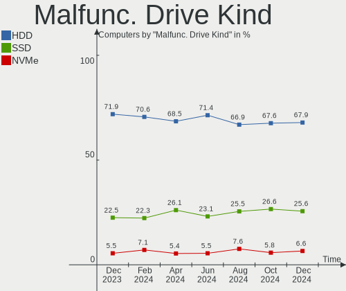

Linux Hardware Trends
---------------------

A project to identify most popular hardware characteristics and track their change
over time based on data collected by Linux users at https://Linux-Hardware.org.

Anyone can contribute to the study by uploading probes of their computers by
the [hw-probe](https://github.com/linuxhw/hw-probe) tool:

    sudo -E hw-probe -all -upload

This is a report for all computer types. See also reports for [desktops](/Desktop/README.md) and [notebooks](/Notebook/README.md).

Full-feature report is available here: https://linux-hardware.org/?view=trends

Distribution-specific reports: [Ubuntu](/Dist/Ubuntu), [ROSA](/Dist/ROSA), [Mint](/Dist/Mint), [Pop!_OS](/Dist/Pop!_OS), [Fedora](/Dist/Fedora), [BlackPanther](/Dist/BlackPanther), [Arch](/Dist/Arch), [Manjaro](/Dist/Manjaro), [Debian](/Dist/Debian), [Endless](/Dist/Endless), [Zorin](/Dist/Zorin), [Gentoo](/Dist/Gentoo), [Clear Linux](/Dist/Clear_Linux), [openSUSE](/Dist/openSUSE), [KDE neon](/Dist/KDE_neon), [Xubuntu](/Dist/Xubuntu), [Kubuntu](/Dist/Kubuntu), [ArcoLinux](/Dist/ArcoLinux), [OpenMandriva](/Dist/OpenMandriva).

Period: Mar, 2021.

Contents
--------

- [ OS                       ](#os)
- [ OS Family                ](#os-family)
- [ Kernel                   ](#kernel)
- [ Kernel Family            ](#kernel-family)
- [ Kernel Major Ver.        ](#kernel-major-ver)
- [ Arch                     ](#arch)
- [ DE                       ](#de)
- [ Display Server           ](#display-server)
- [ Display Manager          ](#display-manager)
- [ OS Lang                  ](#os-lang)
- [ Boot Mode                ](#boot-mode)
- [ Filesystem               ](#filesystem)
- [ Part. scheme             ](#part-scheme)
- [ Dual Boot with Linux/BSD ](#dual-boot-with-linux/bsd)
- [ Dual Boot (Win)          ](#dual-boot-win)
- [ Country                  ](#country)
- [ City                     ](#city)
- [ Vendor                   ](#vendor)
- [ Model                    ](#model)
- [ Model Family             ](#model-family)
- [ MFG Year                 ](#mfg-year)
- [ Form Factor              ](#form-factor)
- [ Secure Boot              ](#secure-boot)
- [ Coreboot                 ](#coreboot)
- [ RAM Size                 ](#ram-size)
- [ RAM Used                 ](#ram-used)
- [ Has CD-ROM               ](#has-cd-rom)
- [ Total Drives             ](#total-drives)
- [ Has Ethernet             ](#has-ethernet)
- [ Has WiFi                 ](#has-wifi)
- [ Has Bluetooth            ](#has-bluetooth)
- [ Drive Vendor             ](#drive-vendor)
- [ Drive Model              ](#drive-model)
- [ HDD Vendor               ](#hdd-vendor)
- [ SSD Vendor               ](#ssd-vendor)
- [ Drive Kind               ](#drive-kind)
- [ Drive Connector          ](#drive-connector)
- [ Drive Size               ](#drive-size)
- [ Space Total              ](#space-total)
- [ Space Used               ](#space-used)
- [ Malfunc. Drives          ](#malfunc-drives)
- [ Malfunc. Drive Vendor    ](#malfunc-drive-vendor)
- [ Malfunc. HDD Vendor      ](#malfunc-hdd-vendor)
- [ Malfunc. Drive Kind      ](#malfunc-drive-kind)
- [ Failed Drives            ](#failed-drives)
- [ Failed Drive Vendor      ](#failed-drive-vendor)
- [ Drive Status             ](#drive-status)
- [ Storage Vendor           ](#storage-vendor)
- [ Storage Model            ](#storage-model)
- [ Storage Kind             ](#storage-kind)
- [ CPU Vendor               ](#cpu-vendor)
- [ CPU Model                ](#cpu-model)
- [ CPU Model Family         ](#cpu-model-family)
- [ CPU Cores                ](#cpu-cores)
- [ CPU Sockets              ](#cpu-sockets)
- [ CPU Threads              ](#cpu-threads)
- [ CPU Op-Modes             ](#cpu-op-modes)
- [ CPU Microcode            ](#cpu-microcode)
- [ CPU Microarch            ](#cpu-microarch)
- [ GPU Vendor               ](#gpu-vendor)
- [ GPU Model                ](#gpu-model)
- [ GPU Combo                ](#gpu-combo)
- [ GPU Driver               ](#gpu-driver)
- [ GPU Memory               ](#gpu-memory)
- [ Monitor Vendor           ](#monitor-vendor)
- [ Monitor Model            ](#monitor-model)
- [ Monitor Resolution       ](#monitor-resolution)
- [ Monitor Diagonal         ](#monitor-diagonal)
- [ Monitor Width            ](#monitor-width)
- [ Aspect Ratio             ](#aspect-ratio)
- [ Monitor Area             ](#monitor-area)
- [ Pixel Density            ](#pixel-density)
- [ Multiple Monitors        ](#multiple-monitors)
- [ Net Controller Vendor    ](#net-controller-vendor)
- [ Net Controller Model     ](#net-controller-model)
- [ Wireless Vendor          ](#wireless-vendor)
- [ Wireless Model           ](#wireless-model)
- [ Ethernet Vendor          ](#ethernet-vendor)
- [ Ethernet Model           ](#ethernet-model)
- [ Net Controller Kind      ](#net-controller-kind)
- [ Used Controller          ](#used-controller)
- [ NICs                     ](#nics)
- [ IPv6                     ](#ipv6)
- [ Memory Vendor            ](#memory-vendor)
- [ Memory Model             ](#memory-model)
- [ Memory Kind              ](#memory-kind)
- [ Memory Form Factor       ](#memory-form-factor)
- [ Memory Size              ](#memory-size)
- [ Memory Speed             ](#memory-speed)
- [ Sound Vendor             ](#sound-vendor)
- [ Sound Model              ](#sound-model)
- [ Camera Vendor            ](#camera-vendor)
- [ Camera Model             ](#camera-model)
- [ Fingerprint Vendor       ](#fingerprint-vendor)
- [ Fingerprint Model        ](#fingerprint-model)
- [ Chipcard Vendor          ](#chipcard-vendor)
- [ Chipcard Model           ](#chipcard-model)
- [ Printer Vendor           ](#printer-vendor)
- [ Printer Model            ](#printer-model)
- [ Scanner Vendor           ](#scanner-vendor)
- [ Scanner Model            ](#scanner-model)
- [ Bluetooth Vendor         ](#bluetooth-vendor)
- [ Bluetooth Model          ](#bluetooth-model)
- [ Unsupported Devices      ](#unsupported-devices)
- [ Unsupported Device Types ](#unsupported-device-types)

OS
--

Installed operating systems

| Name                | Computers | Percent |
|---------------------|-----------|---------|
| Ubuntu 20.04        | 1087      | 19.19%  |
| OpenMandriva 4.2    | 589       | 10.4%   |
| Mint 20.1           | 413       | 7.29%   |
| Ubuntu 20.10        | 295       | 5.21%   |
| Fedora 33           | 268       | 4.73%   |
| Pop!_OS 20.10       | 241       | 4.26%   |
| BlackPanther 18.1   | 205       | 3.62%   |
| KDE neon 20.04      | 178       | 3.14%   |
| Ubuntu 18.04        | 153       | 2.7%    |
| ROSA R11.1          | 129       | 2.28%   |
| Manjaro             | 110       | 1.94%   |
| Debian 10           | 105       | 1.85%   |
| Arch                | 104       | 1.84%   |
| Arch Rolling        | 101       | 1.78%   |
| Xubuntu 20.04       | 100       | 1.77%   |
| Manjaro 20.2.1      | 87        | 1.54%   |
| Endless 3.9.3       | 77        | 1.36%   |
| Mint 19.3           | 75        | 1.32%   |
| Pop!_OS 20.04       | 74        | 1.31%   |
| ROSA R11            | 69        | 1.22%   |
| Mint 20             | 64        | 1.13%   |
| Kubuntu 20.04       | 59        | 1.04%   |
| Zorin 15            | 56        | 0.99%   |
| Manjaro 21.0        | 52        | 0.92%   |
| ArcoLinux Rolling   | 42        | 0.74%   |
| Debian Testing      | 38        | 0.67%   |
| Gentoo              | 32        | 0.57%   |
| Fedora 34           | 31        | 0.55%   |
| Xubuntu 18.04       | 30        | 0.53%   |
| Kubuntu 20.10       | 30        | 0.53%   |
| Ubuntu MATE 20.04   | 27        | 0.48%   |
| Debian              | 25        | 0.44%   |
| openSUSE Leap-15.2  | 24        | 0.42%   |
| LMDE 4              | 22        | 0.39%   |
| Fedora 32           | 22        | 0.39%   |
| Gentoo 2.7          | 21        | 0.37%   |
| Kali 2021.1         | 20        | 0.35%   |
| Ubuntu 21.04        | 19        | 0.34%   |
| Lubuntu 20.04       | 19        | 0.34%   |
| Ubuntu 16.04        | 18        | 0.32%   |
| Xubuntu 20.10       | 16        | 0.28%   |
| Mint 19.1           | 16        | 0.28%   |
| Debian Unstable     | 16        | 0.28%   |
| CentOS 8            | 16        | 0.28%   |
| Ubuntu Budgie 20.04 | 11        | 0.19%   |
| Peppermint 10       | 11        | 0.19%   |
| Mint 19.2           | 10        | 0.18%   |
| EndeavourOS Rolling | 10        | 0.18%   |
| Elementary 5.1.7    | 10        | 0.18%   |
| Parrot 4.11         | 9         | 0.16%   |
| Lubuntu 18.04       | 9         | 0.16%   |
| Ubuntu MATE 20.10   | 8         | 0.14%   |
| Ubuntu Budgie 20.10 | 8         | 0.14%   |
| ROSA R8.1           | 8         | 0.14%   |
| MX 19.3             | 8         | 0.14%   |
| Lubuntu 20.10       | 8         | 0.14%   |
| Garuda Soaring      | 8         | 0.14%   |
| ALT Linux 9.1       | 8         | 0.14%   |
| Reborn OS           | 7         | 0.12%   |
| Endless 3.7.8       | 7         | 0.12%   |

OS Family
---------

OS without a version

| Name          | Computers | Percent |
|---------------|-----------|---------|
| Ubuntu        | 1590      | 28.08%  |
| Mint          | 591       | 10.44%  |
| OpenMandriva  | 589       | 10.4%   |
| Fedora        | 333       | 5.88%   |
| Pop!_OS       | 315       | 5.56%   |
| Manjaro       | 253       | 4.47%   |
| ROSA          | 221       | 3.9%    |
| BlackPanther  | 211       | 3.73%   |
| Arch          | 205       | 3.62%   |
| Debian        | 192       | 3.39%   |
| KDE neon      | 178       | 3.14%   |
| Xubuntu       | 153       | 2.7%    |
| Kubuntu       | 95        | 1.68%   |
| Endless       | 92        | 1.62%   |
| openSUSE      | 60        | 1.06%   |
| Zorin         | 58        | 1.02%   |
| Gentoo        | 55        | 0.97%   |
| ArcoLinux     | 49        | 0.87%   |
| Ubuntu MATE   | 41        | 0.72%   |
| Lubuntu       | 37        | 0.65%   |
| CentOS        | 27        | 0.48%   |
| Kali          | 26        | 0.46%   |
| Ubuntu Budgie | 22        | 0.39%   |
| LMDE          | 22        | 0.39%   |
| Clear Linux   | 22        | 0.39%   |
| EndeavourOS   | 15        | 0.26%   |
| MX            | 13        | 0.23%   |
| Peppermint    | 12        | 0.21%   |
| Elementary    | 12        | 0.21%   |
| Garuda        | 11        | 0.19%   |
| ALT Linux     | 11        | 0.19%   |
| Parrot        | 10        | 0.18%   |
| SkiffOS       | 9         | 0.16%   |
| Reborn OS     | 9         | 0.16%   |
| Artix         | 8         | 0.14%   |
| Red OS        | 7         | 0.12%   |
| RHEL          | 5         | 0.09%   |
| RELS          | 5         | 0.09%   |
| Raspbian      | 5         | 0.09%   |
| Mageia        | 5         | 0.09%   |
| Solus         | 4         | 0.07%   |
| Slackware     | 4         | 0.07%   |
| GNOME OS      | 4         | 0.07%   |
| Devuan        | 4         | 0.07%   |
| Deepin        | 4         | 0.07%   |
| antiX         | 4         | 0.07%   |
| Redcore       | 3         | 0.05%   |
| PCLinuxOS     | 3         | 0.05%   |
| Oracle Linux  | 3         | 0.05%   |
| Manjaro-ARM   | 3         | 0.05%   |
| ClearOS       | 3         | 0.05%   |
| Chrome OS     | 3         | 0.05%   |
| Calculate     | 3         | 0.05%   |
| AlmaLinux     | 3         | 0.05%   |
| Void          | 2         | 0.04%   |
| Sparky        | 2         | 0.04%   |
| RED           | 2         | 0.04%   |
| Q4OS          | 2         | 0.04%   |
| NixOS         | 2         | 0.04%   |
| LFS           | 2         | 0.04%   |

Kernel
------

Version of the Linux kernel

| Version                             | Computers | Percent |
|-------------------------------------|-----------|---------|
| 5.10.14-desktop-1omv4002            | 583       | 10.29%  |
| 5.8.0-44-generic                    | 555       | 9.8%    |
| 5.4.0-66-generic                    | 550       | 9.71%   |
| 5.8.0-45-generic                    | 328       | 5.79%   |
| 5.4.0-67-generic                    | 297       | 5.24%   |
| 5.8.0-7642-generic                  | 262       | 4.63%   |
| 5.8.0-48-generic                    | 206       | 3.64%   |
| 5.4.0-70-generic                    | 173       | 3.05%   |
| 5.6.14-desktop-2bP                  | 134       | 2.37%   |
| 5.9.16-1-MANJARO                    | 81        | 1.43%   |
| 5.8.0-14-generic                    | 81        | 1.43%   |
| 4.19.0-14-amd64                     | 70        | 1.24%   |
| 4.18.16-desktop-1bP                 | 70        | 1.24%   |
| 5.10.19-200.fc33.x86_64             | 64        | 1.13%   |
| 5.8.0-43-generic                    | 59        | 1.04%   |
| 4.15.0-desktop-45.1rosa-x86_64      | 57        | 1.01%   |
| 4.15.0-136-generic                  | 56        | 0.99%   |
| 5.11.6-arch1-1                      | 47        | 0.83%   |
| 5.4.0-58-generic                    | 46        | 0.81%   |
| 4.15.0-desktop-122.124.1rosa-x86_64 | 39        | 0.69%   |
| 5.10.22-200.fc33.x86_64             | 38        | 0.67%   |
| 5.4.0-65-generic                    | 37        | 0.65%   |
| 5.11.2-arch1-1                      | 34        | 0.6%    |
| 5.11.7-200.fc33.x86_64              | 33        | 0.58%   |
| 5.4.83-generic-2rosa-x86_64         | 32        | 0.57%   |
| 5.10.0-4-amd64                      | 32        | 0.57%   |
| 5.11.6-1-MANJARO                    | 30        | 0.53%   |
| 5.4.0-42-generic                    | 28        | 0.49%   |
| 5.11.2-1-MANJARO                    | 27        | 0.48%   |
| 5.11.7-arch1-1                      | 26        | 0.46%   |
| 5.10.23-200.fc33.x86_64             | 26        | 0.46%   |
| 5.10.21-200.fc33.x86_64             | 25        | 0.44%   |
| 5.8.0-25-generic                    | 24        | 0.42%   |
| 5.10.23-1-MANJARO                   | 22        | 0.39%   |
| 5.8.0-41-generic                    | 20        | 0.35%   |
| 5.11.4-arch1-1                      | 20        | 0.35%   |
| 4.18.0-240.15.1.el8_3.x86_64        | 19        | 0.34%   |
| 5.10.0-3-amd64                      | 18        | 0.32%   |
| 5.4.32-generic-2rosa-x86_64         | 17        | 0.3%    |
| 5.8.0-1016-raspi                    | 16        | 0.28%   |
| 5.4.0-26-generic                    | 16        | 0.28%   |
| 5.11.8-arch1-1                      | 16        | 0.28%   |
| 5.11.0-051100-generic               | 16        | 0.28%   |
| 5.10.0-0.bpo.3-amd64                | 16        | 0.28%   |
| 5.8.0-7630-generic                  | 15        | 0.26%   |
| 5.11.10-200.fc33.x86_64             | 15        | 0.26%   |
| 5.10.19-1032.native                 | 15        | 0.26%   |
| 5.10.18-1-MANJARO                   | 15        | 0.26%   |
| 4.15.0-desktop-45.1rosa-i586        | 15        | 0.26%   |
| 4.15.0-139-generic                  | 15        | 0.26%   |
| 5.11.2-zen1-1-zen                   | 14        | 0.25%   |
| 5.10.19-1-MANJARO                   | 14        | 0.25%   |
| 5.10.18-200.fc33.x86_64             | 14        | 0.25%   |
| 5.11.6-zen1-1-zen                   | 13        | 0.23%   |
| 5.11.6-1-default                    | 13        | 0.23%   |
| 5.11.10-arch1-1                     | 12        | 0.21%   |
| 5.10.0-kali3-amd64                  | 12        | 0.21%   |
| 4.15.0-desktop-122.124.1rosa-i586   | 12        | 0.21%   |
| 5.8.0-49-generic                    | 11        | 0.19%   |
| 5.4.97-gentoo                       | 11        | 0.19%   |

Kernel Family
-------------

Linux kernel without a distro release

| Version | Computers | Percent |
|---------|-----------|---------|
| 5.8.0   | 1634      | 28.85%  |
| 5.4.0   | 1239      | 21.88%  |
| 5.10.14 | 587       | 10.37%  |
| 4.15.0  | 265       | 4.68%   |
| 5.11.6  | 136       | 2.4%    |
| 5.6.14  | 135       | 2.38%   |
| 5.10.0  | 127       | 2.24%   |
| 5.10.19 | 108       | 1.91%   |
| 4.19.0  | 101       | 1.78%   |
| 5.11.2  | 95        | 1.68%   |
| 5.9.16  | 89        | 1.57%   |
| 4.18.16 | 70        | 1.24%   |
| 5.11.7  | 68        | 1.2%    |
| 5.10.23 | 65        | 1.15%   |
| 5.11.0  | 60        | 1.06%   |
| 5.11.10 | 47        | 0.83%   |
| 5.10.22 | 47        | 0.83%   |
| 5.11.8  | 41        | 0.72%   |
| 5.4.83  | 40        | 0.71%   |
| 5.10.18 | 40        | 0.71%   |
| 5.11.4  | 39        | 0.69%   |
| 5.10.21 | 33        | 0.58%   |
| 4.18.0  | 28        | 0.49%   |
| 5.4.32  | 25        | 0.44%   |
| 5.3.18  | 23        | 0.41%   |
| 5.10.20 | 21        | 0.37%   |
| 5.3.0   | 20        | 0.35%   |
| 5.11.5  | 20        | 0.35%   |
| 5.11.1  | 20        | 0.35%   |
| 5.6.0   | 19        | 0.34%   |
| 3.10.0  | 18        | 0.32%   |
| 5.11.9  | 17        | 0.3%    |
| 5.11.3  | 17        | 0.3%    |
| 5.12.0  | 16        | 0.28%   |
| 5.10.16 | 16        | 0.28%   |
| 5.10.24 | 14        | 0.25%   |
| 4.4.0   | 14        | 0.25%   |
| 5.0.0   | 13        | 0.23%   |
| 5.4.97  | 12        | 0.21%   |
| 5.4.105 | 11        | 0.19%   |
| 5.10.25 | 11        | 0.19%   |
| 5.10.17 | 11        | 0.19%   |
| 5.10.15 | 11        | 0.19%   |
| 5.8.15  | 10        | 0.18%   |
| 4.9.155 | 10        | 0.18%   |
| 5.10.11 | 8         | 0.14%   |
| 4.9.20  | 8         | 0.14%   |
| 5.9.0   | 7         | 0.12%   |
| 5.11.11 | 7         | 0.12%   |
| 5.10.12 | 7         | 0.12%   |
| 4.9.0   | 7         | 0.12%   |
| 5.8.18  | 6         | 0.11%   |
| 5.9.1   | 5         | 0.09%   |
| 5.4.100 | 5         | 0.09%   |
| 5.10.13 | 5         | 0.09%   |
| 5.7.0   | 4         | 0.07%   |
| 5.4.101 | 4         | 0.07%   |
| 5.10.1  | 4         | 0.07%   |
| 4.9.60  | 4         | 0.07%   |
| 5.8.16  | 3         | 0.05%   |

Kernel Major Ver.
-----------------

Linux kernel major version

| Version | Computers | Percent |
|---------|-----------|---------|
| 5.8     | 1658      | 29.28%  |
| 5.4     | 1374      | 24.26%  |
| 5.10    | 1136      | 20.06%  |
| 5.11    | 567       | 10.01%  |
| 4.15    | 265       | 4.68%   |
| 5.6     | 164       | 2.9%    |
| 5.9     | 113       | 2%      |
| 4.19    | 109       | 1.92%   |
| 4.18    | 98        | 1.73%   |
| 5.3     | 44        | 0.78%   |
| 4.9     | 39        | 0.69%   |
| 3.10    | 20        | 0.35%   |
| 5.12    | 16        | 0.28%   |
| 5.0     | 15        | 0.26%   |
| 4.4     | 15        | 0.26%   |
| 5.7     | 8         | 0.14%   |
| 4.14    | 5         | 0.09%   |
| 4.1     | 4         | 0.07%   |
| 5.1     | 3         | 0.05%   |
| 5.2     | 2         | 0.04%   |
| 4.13    | 2         | 0.04%   |
| 4.10    | 2         | 0.04%   |
| 5.5     | 1         | 0.02%   |
| 5       | 1         | 0.02%   |
| 4.20    | 1         | 0.02%   |
| 4.16    | 1         | 0.02%   |

Arch
----

OS architecture (x86_64, i586, etc.)

| Name    | Computers | Percent |
|---------|-----------|---------|
| x86_64  | 5434      | 95.96%  |
| i686    | 169       | 2.98%   |
| aarch64 | 50        | 0.88%   |
| armv7l  | 9         | 0.16%   |
| armv6l  | 1         | 0.02%   |

DE
--

Desktop Environment

| Name              | Computers | Percent |
|-------------------|-----------|---------|
| GNOME             | 2256      | 39.84%  |
| KDE5              | 1147      | 20.25%  |
| X-Cinnamon        | 478       | 8.44%   |
| XFCE              | 430       | 7.59%   |
| Unknown           | 376       | 6.64%   |
| KDE               | 358       | 6.32%   |
| MATE              | 157       | 2.77%   |
| KDE4              | 146       | 2.58%   |
| Cinnamon          | 59        | 1.04%   |
| i3                | 45        | 0.79%   |
| LXQt              | 41        | 0.72%   |
| Unity             | 35        | 0.62%   |
| LXDE              | 34        | 0.6%    |
| Budgie            | 26        | 0.46%   |
| GNOME Flashback   | 14        | 0.25%   |
| Deepin            | 14        | 0.25%   |
| Pantheon          | 8         | 0.14%   |
| GNOME Classic     | 7         | 0.12%   |
| awesome           | 6         | 0.11%   |
| sway              | 4         | 0.07%   |
| dwm               | 4         | 0.07%   |
| qtile             | 3         | 0.05%   |
| ICEWM             | 3         | 0.05%   |
| enlightenment     | 3         | 0.05%   |
| bspwm             | 3         | 0.05%   |
| openbox           | 2         | 0.04%   |
| Yaru:ubuntu:GNOME | 1         | 0.02%   |
| xmonad            | 1         | 0.02%   |
| none+i3           | 1         | 0.02%   |
| lightdm-xsession  | 1         | 0.02%   |

Display Server
--------------

X11 or Wayland

| Name        | Computers | Percent |
|-------------|-----------|---------|
| X11         | 4981      | 87.96%  |
| Wayland     | 400       | 7.06%   |
| Unknown     | 170       | 3%      |
| Tty         | 110       | 1.94%   |
| Web         | 1         | 0.02%   |
| Unspecified | 1         | 0.02%   |

Display Manager
---------------

SDDM, LightDM, etc.

| Name    | Computers | Percent |
|---------|-----------|---------|
| Unknown | 3108      | 54.88%  |
| SDDM    | 1181      | 20.85%  |
| GDM     | 678       | 11.97%  |
| TDM     | 405       | 7.15%   |
| KDM     | 147       | 2.6%    |
| LightDM | 113       | 2%      |
| XDM     | 15        | 0.26%   |
| SLiM    | 6         | 0.11%   |
| Ly      | 4         | 0.07%   |
| LXDM    | 2         | 0.04%   |
| GDM3    | 2         | 0.04%   |
| NODM    | 1         | 0.02%   |
| MDM     | 1         | 0.02%   |

OS Lang
-------

Language

| Lang        | Computers | Percent |
|-------------|-----------|---------|
| en_US       | 2145      | 37.88%  |
| ru_RU       | 449       | 7.93%   |
| de_DE       | 442       | 7.81%   |
| Unknown     | 366       | 6.46%   |
| pt_BR       | 303       | 5.35%   |
| fr_FR       | 274       | 4.84%   |
| en_GB       | 266       | 4.7%    |
| pl_PL       | 149       | 2.63%   |
| it_IT       | 138       | 2.44%   |
| es_ES       | 114       | 2.01%   |
| en_CA       | 114       | 2.01%   |
| en_AU       | 87        | 1.54%   |
| C           | 74        | 1.31%   |
| en_IN       | 70        | 1.24%   |
| nl_NL       | 41        | 0.72%   |
| cs_CZ       | 36        | 0.64%   |
| es_MX       | 35        | 0.62%   |
| hu_HU       | 33        | 0.58%   |
| pt_PT       | 32        | 0.57%   |
| es_AR       | 27        | 0.48%   |
| ru_UA       | 26        | 0.46%   |
| de_CH       | 23        | 0.41%   |
| fr_CA       | 19        | 0.34%   |
| de_AT       | 19        | 0.34%   |
| tr_TR       | 18        | 0.32%   |
| sv_SE       | 18        | 0.32%   |
| es_CL       | 17        | 0.3%    |
| fr_BE       | 16        | 0.28%   |
| en_ZA       | 15        | 0.26%   |
| nl_BE       | 14        | 0.25%   |
| es_CO       | 14        | 0.25%   |
| en_NZ       | 14        | 0.25%   |
| uk_UA       | 13        | 0.23%   |
| ja_JP       | 13        | 0.23%   |
| fi_FI       | 13        | 0.23%   |
| ro_RO       | 12        | 0.21%   |
| en_IE       | 12        | 0.21%   |
| da_DK       | 12        | 0.21%   |
| zh_CN       | 11        | 0.19%   |
| sk_SK       | 9         | 0.16%   |
| fr_CH       | 9         | 0.16%   |
| ca_ES       | 9         | 0.16%   |
| es_VE       | 8         | 0.14%   |
| en_IL       | 8         | 0.14%   |
| el_GR       | 8         | 0.14%   |
| bg_BG       | 8         | 0.14%   |
| es_PE       | 6         | 0.11%   |
| C.UTF8      | 6         | 0.11%   |
| en_PH       | 5         | 0.09%   |
| en_HK       | 5         | 0.09%   |
| lt_LT       | 4         | 0.07%   |
| es_GT       | 4         | 0.07%   |
| es_EC       | 4         | 0.07%   |
| en_DK       | 4         | 0.07%   |
| ru_RU.UTF_8 | 3         | 0.05%   |
| hr_HR       | 3         | 0.05%   |
| eu_ES       | 3         | 0.05%   |
| es_UY       | 3         | 0.05%   |
| es_US       | 3         | 0.05%   |
| es_BO       | 3         | 0.05%   |

Boot Mode
---------

EFI or BIOS

| Mode | Computers | Percent |
|------|-----------|---------|
| BIOS | 3198      | 56.47%  |
| EFI  | 2465      | 43.53%  |

Filesystem
----------

Type of filesystem

| Type     | Computers | Percent |
|----------|-----------|---------|
| Ext4     | 4359      | 76.97%  |
| Overlay  | 733       | 12.94%  |
| Btrfs    | 389       | 6.87%   |
| Xfs      | 96        | 1.7%    |
| Zfs      | 43        | 0.76%   |
| F2fs     | 9         | 0.16%   |
| Ext2     | 9         | 0.16%   |
| Ext3     | 8         | 0.14%   |
| Tmpfs    | 7         | 0.12%   |
| Unknown  | 7         | 0.12%   |
| Reiserfs | 2         | 0.04%   |
| Jfs      | 1         | 0.02%   |

Part. scheme
------------

Scheme of partitioning

| Type    | Computers | Percent |
|---------|-----------|---------|
| Unknown | 2973      | 52.5%   |
| GPT     | 1750      | 30.9%   |
| MBR     | 940       | 16.6%   |

Dual Boot with Linux/BSD
------------------------

Hosting more than one Linux/BSD

| Dual boot | Computers | Percent |
|-----------|-----------|---------|
| No        | 4699      | 82.98%  |
| Yes       | 964       | 17.02%  |

Dual Boot (Win)
---------------

Hosting Linux and Windows

| Dual boot | Computers | Percent |
|-----------|-----------|---------|
| No        | 3954      | 69.82%  |
| Yes       | 1709      | 30.18%  |

Country
-------

Geographic location (country)

| Country      | Computers | Percent |
|--------------|-----------|---------|
| USA          | 922       | 16.28%  |
| Germany      | 580       | 10.24%  |
| Russia       | 575       | 10.15%  |
| Brazil       | 378       | 6.67%   |
| France       | 300       | 5.3%    |
| Hungary      | 202       | 3.57%   |
| UK           | 200       | 3.53%   |
| Poland       | 195       | 3.44%   |
| Canada       | 179       | 3.16%   |
| Italy        | 176       | 3.11%   |
| Spain        | 148       | 2.61%   |
| Ukraine      | 135       | 2.38%   |
| Australia    | 99        | 1.75%   |
| India        | 98        | 1.73%   |
| Netherlands  | 95        | 1.68%   |
| Switzerland  | 78        | 1.38%   |
| Sweden       | 70        | 1.24%   |
| Belgium      | 65        | 1.15%   |
| Mexico       | 57        | 1.01%   |
| Czechia      | 57        | 1.01%   |
| Austria      | 54        | 0.95%   |
| Turkey       | 51        | 0.9%    |
| Finland      | 50        | 0.88%   |
| Romania      | 40        | 0.71%   |
| Portugal     | 39        | 0.69%   |
| Argentina    | 38        | 0.67%   |
| Japan        | 35        | 0.62%   |
| Bulgaria     | 35        | 0.62%   |
| Belarus      | 35        | 0.62%   |
| Serbia       | 32        | 0.57%   |
| Slovakia     | 28        | 0.49%   |
| Greece       | 27        | 0.48%   |
| Chile        | 27        | 0.48%   |
| South Africa | 24        | 0.42%   |
| Israel       | 24        | 0.42%   |
| Indonesia    | 24        | 0.42%   |
| Norway       | 23        | 0.41%   |
| New Zealand  | 21        | 0.37%   |
| Denmark      | 21        | 0.37%   |
| Colombia     | 21        | 0.37%   |
| Lithuania    | 17        | 0.3%    |
| Philippines  | 15        | 0.26%   |
| China        | 14        | 0.25%   |
| Vietnam      | 13        | 0.23%   |
| Hong Kong    | 13        | 0.23%   |
| Iran         | 12        | 0.21%   |
| Egypt        | 12        | 0.21%   |
| Venezuela    | 11        | 0.19%   |
| South Korea  | 11        | 0.19%   |
| Kazakhstan   | 11        | 0.19%   |
| Ireland      | 11        | 0.19%   |
| Latvia       | 10        | 0.18%   |
| Croatia      | 10        | 0.18%   |
| Taiwan       | 9         | 0.16%   |
| Estonia      | 9         | 0.16%   |
| Bangladesh   | 9         | 0.16%   |
| Thailand     | 8         | 0.14%   |
| Slovenia     | 8         | 0.14%   |
| Singapore    | 8         | 0.14%   |
| Pakistan     | 8         | 0.14%   |

City
----

Geographic location (city)

| City              | Computers | Percent |
|-------------------|-----------|---------|
| Moscow            | 126       | 2.22%   |
| St Petersburg     | 58        | 1.02%   |
| Budapest          | 56        | 0.99%   |
| Berlin            | 51        | 0.9%    |
| São Paulo        | 46        | 0.81%   |
| Warsaw            | 42        | 0.74%   |
| Vienna            | 37        | 0.65%   |
| Paris             | 32        | 0.57%   |
| Madrid            | 30        | 0.53%   |
| Kyiv              | 30        | 0.53%   |
| Hamburg           | 29        | 0.51%   |
| Yekaterinburg     | 26        | 0.46%   |
| Sydney            | 26        | 0.46%   |
| Zurich            | 24        | 0.42%   |
| Milan             | 24        | 0.42%   |
| Rome              | 23        | 0.41%   |
| Novosibirsk       | 23        | 0.41%   |
| Minsk             | 23        | 0.41%   |
| Istanbul          | 22        | 0.39%   |
| Helsinki          | 22        | 0.39%   |
| Frankfurt am Main | 21        | 0.37%   |
| Sofia             | 20        | 0.35%   |
| Montreal          | 20        | 0.35%   |
| Amsterdam         | 20        | 0.35%   |
| Prague            | 19        | 0.34%   |
| Porto Alegre      | 18        | 0.32%   |
| Rostov-on-Don     | 17        | 0.3%    |
| Munich            | 17        | 0.3%    |
| Belgrade          | 17        | 0.3%    |
| Athens            | 17        | 0.3%    |
| Toronto           | 16        | 0.28%   |
| Perth             | 16        | 0.28%   |
| London            | 16        | 0.28%   |
| Krasnodar         | 14        | 0.25%   |
| Campinas          | 14        | 0.25%   |
| Voronezh          | 13        | 0.23%   |
| Stockholm         | 13        | 0.23%   |
| Santiago          | 13        | 0.23%   |
| Krakow            | 13        | 0.23%   |
| Brisbane          | 13        | 0.23%   |
| Bratislava        | 13        | 0.23%   |
| Brasília         | 13        | 0.23%   |
| Tel Aviv          | 12        | 0.21%   |
| Odessa            | 12        | 0.21%   |
| Essen             | 12        | 0.21%   |
| Bengaluru         | 12        | 0.21%   |
| Rio de Janeiro    | 11        | 0.19%   |
| Lisbon            | 11        | 0.19%   |
| Dallas            | 11        | 0.19%   |
| Unknown           | 11        | 0.19%   |
| Wroclaw           | 10        | 0.18%   |
| Portland          | 10        | 0.18%   |
| Nizhniy Novgorod  | 10        | 0.18%   |
| Miami             | 10        | 0.18%   |
| Chicago           | 10        | 0.18%   |
| Chennai           | 10        | 0.18%   |
| Chelyabinsk       | 10        | 0.18%   |
| Brooklyn          | 10        | 0.18%   |
| Toulouse          | 9         | 0.16%   |
| Santa Barbara     | 9         | 0.16%   |

Vendor
------

Motherboard manufacturer

| Name                    | Computers | Percent |
|-------------------------|-----------|---------|
| ASUSTek Computer        | 959       | 16.93%  |
| Hewlett-Packard         | 788       | 13.91%  |
| Dell                    | 738       | 13.03%  |
| Lenovo                  | 724       | 12.78%  |
| Gigabyte Technology     | 442       | 7.81%   |
| MSI                     | 333       | 5.88%   |
| Acer                    | 323       | 5.7%    |
| ASRock                  | 241       | 4.26%   |
| Intel                   | 116       | 2.05%   |
| Toshiba                 | 108       | 1.91%   |
| Apple                   | 84        | 1.48%   |
| Unknown                 | 75        | 1.32%   |
| Samsung Electronics     | 63        | 1.11%   |
| Sony                    | 49        | 0.87%   |
| Medion                  | 39        | 0.69%   |
| Fujitsu                 | 38        | 0.67%   |
| Pegatron                | 29        | 0.51%   |
| ECS                     | 25        | 0.44%   |
| Raspberry Pi Foundation | 24        | 0.42%   |
| Packard Bell            | 23        | 0.41%   |
| Notebook                | 23        | 0.41%   |
| HUAWEI                  | 20        | 0.35%   |
| Supermicro              | 18        | 0.32%   |
| Fujitsu Siemens         | 18        | 0.32%   |
| Foxconn                 | 17        | 0.3%    |
| Positivo                | 16        | 0.28%   |
| Microsoft               | 16        | 0.28%   |
| Biostar                 | 15        | 0.26%   |
| TUXEDO                  | 13        | 0.23%   |
| System76                | 13        | 0.23%   |
| Alienware               | 11        | 0.19%   |
| Google                  | 10        | 0.18%   |
| ZOTAC                   | 9         | 0.16%   |
| Gateway                 | 9         | 0.16%   |
| eMachines               | 8         | 0.14%   |
| AZW                     | 8         | 0.14%   |
| Timi                    | 7         | 0.12%   |
| PCWare                  | 7         | 0.12%   |
| Huanan                  | 7         | 0.12%   |
| Clevo                   | 7         | 0.12%   |
| AMI                     | 7         | 0.12%   |
| Razer                   | 6         | 0.11%   |
| TrekStor                | 5         | 0.09%   |
| Shuttle                 | 5         | 0.09%   |
| Pine Microsystems       | 5         | 0.09%   |
| BESSTAR Tech            | 5         | 0.09%   |
| PC Engines              | 4         | 0.07%   |
| Panasonic               | 4         | 0.07%   |
| OEM                     | 4         | 0.07%   |
| LG Electronics          | 4         | 0.07%   |
| Wortmann AG             | 3         | 0.05%   |
| Teclast                 | 3         | 0.05%   |
| Philco                  | 3         | 0.05%   |
| Nvidia                  | 3         | 0.05%   |
| Itautec                 | 3         | 0.05%   |
| IP3 Tech                | 3         | 0.05%   |
| HARDKERNEL              | 3         | 0.05%   |
| Compal                  | 3         | 0.05%   |
| Chuwi                   | 3         | 0.05%   |
| AAEON                   | 3         | 0.05%   |

Model
-----

Motherboard model

| Name                          | Computers | Percent |
|-------------------------------|-----------|---------|
| Unknown                       | 85        | 1.5%    |
| ASUS All Series               | 67        | 1.18%   |
| HP Notebook                   | 26        | 0.46%   |
| MSI MS-7C37                   | 18        | 0.32%   |
| Dell OptiPlex 7010            | 18        | 0.32%   |
| Dell OptiPlex 9020            | 16        | 0.28%   |
| HP Pavilion dv6               | 15        | 0.26%   |
| HP Pavilion g6                | 14        | 0.25%   |
| Gigabyte B450M DS3H           | 14        | 0.25%   |
| Dell Latitude E6420           | 13        | 0.23%   |
| HP Pavilion dv7               | 12        | 0.21%   |
| Gigabyte 970A-DS3P            | 12        | 0.21%   |
| Acer Nitro AN515-43           | 12        | 0.21%   |
| Dell Latitude E6430           | 11        | 0.19%   |
| ASUS PRIME A320M-K            | 11        | 0.19%   |
| MSI MS-7B79                   | 10        | 0.18%   |
| HP Pavilion 15                | 10        | 0.18%   |
| Dell OptiPlex 790             | 10        | 0.18%   |
| Dell OptiPlex 780             | 10        | 0.18%   |
| ASUS M5A97 R2.0               | 10        | 0.18%   |
| ASRock B450M Pro4             | 10        | 0.18%   |
| MSI MS-7C02                   | 9         | 0.16%   |
| MSI MS-7B86                   | 9         | 0.16%   |
| MSI MS-7693                   | 9         | 0.16%   |
| HP Pavilion Notebook          | 9         | 0.16%   |
| Gigabyte A320M-S2H V2         | 9         | 0.16%   |
| Dell OptiPlex 990             | 9         | 0.16%   |
| ASUS ROG STRIX B450-F GAMING  | 9         | 0.16%   |
| Lenovo Legion 5 15ARH05 82B5  | 8         | 0.14%   |
| Dell XPS 15 9500              | 8         | 0.14%   |
| Dell XPS 15 7590              | 8         | 0.14%   |
| Dell XPS 13 9370              | 8         | 0.14%   |
| Dell OptiPlex 9010            | 8         | 0.14%   |
| Dell OptiPlex 760             | 8         | 0.14%   |
| Dell Latitude E6530           | 8         | 0.14%   |
| ASUS PRIME B350-PLUS          | 8         | 0.14%   |
| MSI MS-7A38                   | 7         | 0.12%   |
| MSI MS-7721                   | 7         | 0.12%   |
| Lenovo IdeaPad 330-15IKB 81DE | 7         | 0.12%   |
| Lenovo G500 20236             | 7         | 0.12%   |
| HP G62                        | 7         | 0.12%   |
| HP EliteBook 840 G3           | 7         | 0.12%   |
| HP Compaq 8200 Elite SFF PC   | 7         | 0.12%   |
| HP 250 G1                     | 7         | 0.12%   |
| HP 15                         | 7         | 0.12%   |
| Gigabyte G31M-ES2L            | 7         | 0.12%   |
| Gigabyte B550I AORUS PRO AX   | 7         | 0.12%   |
| Dell OptiPlex 3010            | 7         | 0.12%   |
| Dell Latitude D630            | 7         | 0.12%   |
| ASUS M5A78L-M/USB3            | 7         | 0.12%   |
| ASRock G31M-S                 | 7         | 0.12%   |
| Apple MacBookPro8,1           | 7         | 0.12%   |
| Acer Nitro AN515-54           | 7         | 0.12%   |
| Toshiba Satellite C660        | 6         | 0.11%   |
| MSI MS-7B89                   | 6         | 0.11%   |
| Lenovo Y520-15IKBN 80WK       | 6         | 0.11%   |
| Lenovo Legion Y530-15ICH 81FV | 6         | 0.11%   |
| Intel H61                     | 6         | 0.11%   |
| HP Pavilion g7                | 6         | 0.11%   |
| HP Laptop 15-db0xxx           | 6         | 0.11%   |

Model Family
------------

Motherboard model prefix

| Name                  | Computers | Percent |
|-----------------------|-----------|---------|
| Lenovo ThinkPad       | 326       | 5.76%   |
| Acer Aspire           | 222       | 3.92%   |
| Dell Inspiron         | 193       | 3.41%   |
| Dell Latitude         | 188       | 3.32%   |
| Lenovo IdeaPad        | 146       | 2.58%   |
| HP Pavilion           | 138       | 2.44%   |
| Dell OptiPlex         | 135       | 2.38%   |
| HP Compaq             | 105       | 1.85%   |
| HP EliteBook          | 91        | 1.61%   |
| ASUS PRIME            | 86        | 1.52%   |
| Toshiba Satellite     | 85        | 1.5%    |
| Unknown               | 85        | 1.5%    |
| HP ProBook            | 83        | 1.47%   |
| Dell XPS              | 77        | 1.36%   |
| ASUS ROG              | 70        | 1.24%   |
| ASUS All              | 67        | 1.18%   |
| HP Laptop             | 61        | 1.08%   |
| ASUS VivoBook         | 58        | 1.02%   |
| Dell Precision        | 57        | 1.01%   |
| ASUS TUF              | 54        | 0.95%   |
| Lenovo ThinkCentre    | 44        | 0.78%   |
| Dell Vostro           | 36        | 0.64%   |
| HP ENVY               | 34        | 0.6%    |
| Lenovo Yoga           | 29        | 0.51%   |
| Gigabyte B450M        | 27        | 0.48%   |
| Acer Nitro            | 27        | 0.48%   |
| Lenovo Legion         | 26        | 0.46%   |
| HP Notebook           | 26        | 0.46%   |
| RPi Raspberry         | 24        | 0.42%   |
| HP 250                | 24        | 0.42%   |
| Gigabyte X570         | 24        | 0.42%   |
| ASUS ZenBook          | 24        | 0.42%   |
| HP EliteDesk          | 20        | 0.35%   |
| Gigabyte B450         | 20        | 0.35%   |
| ASUS M5A97            | 20        | 0.35%   |
| Packard Bell EasyNote | 19        | 0.34%   |
| HP ZBook              | 19        | 0.34%   |
| MSI MS-7C37           | 18        | 0.32%   |
| ASUS M5A78L-M         | 18        | 0.32%   |
| Fujitsu ESPRIMO       | 17        | 0.3%    |
| Microsoft Surface     | 16        | 0.28%   |
| ASRock B450M          | 16        | 0.28%   |
| Lenovo IdeaCentre     | 15        | 0.26%   |
| HP ProDesk            | 15        | 0.26%   |
| Gigabyte A320M-S2H    | 15        | 0.26%   |
| Fujitsu LIFEBOOK      | 15        | 0.26%   |
| Gigabyte Z390         | 14        | 0.25%   |
| Dell PowerEdge        | 13        | 0.23%   |
| Acer Predator         | 13        | 0.23%   |
| Toshiba PORTEGE       | 12        | 0.21%   |
| Gigabyte 970A-DS3P    | 12        | 0.21%   |
| Dell Studio           | 12        | 0.21%   |
| Dell G3               | 12        | 0.21%   |
| ASUS P8Z77-V          | 12        | 0.21%   |
| Gigabyte B550M        | 11        | 0.19%   |
| Acer Swift            | 11        | 0.19%   |
| MSI MS-7B79           | 10        | 0.18%   |
| Medion Akoya          | 10        | 0.18%   |
| HP Spectre            | 10        | 0.18%   |
| HP ProLiant           | 10        | 0.18%   |

MFG Year
--------

Motherboard manufacture year

| Year    | Computers | Percent |
|---------|-----------|---------|
| 2020    | 1156      | 20.41%  |
| 2019    | 704       | 12.43%  |
| 2018    | 523       | 9.24%   |
| 2013    | 394       | 6.96%   |
| 2011    | 366       | 6.46%   |
| 2012    | 333       | 5.88%   |
| 2014    | 316       | 5.58%   |
| 2010    | 296       | 5.23%   |
| 2015    | 276       | 4.87%   |
| 2016    | 263       | 4.64%   |
| 2017    | 240       | 4.24%   |
| 2009    | 212       | 3.74%   |
| 2021    | 186       | 3.28%   |
| 2008    | 169       | 2.98%   |
| 2007    | 99        | 1.75%   |
| Unknown | 60        | 1.06%   |
| 2006    | 45        | 0.79%   |
| 2005    | 17        | 0.3%    |
| 2004    | 4         | 0.07%   |
| 2003    | 3         | 0.05%   |
| 2002    | 1         | 0.02%   |

Form Factor
-----------

Physical design of the computer

| Name           | Computers | Percent |
|----------------|-----------|---------|
| Notebook       | 2859      | 50.49%  |
| Desktop        | 2391      | 42.22%  |
| Convertible    | 119       | 2.1%    |
| Mini pc        | 81        | 1.43%   |
| All in one     | 70        | 1.24%   |
| System on chip | 55        | 0.97%   |
| Tablet         | 43        | 0.76%   |
| Server         | 42        | 0.74%   |
| Phone          | 3         | 0.05%   |

Secure Boot
-----------

Enabled or disabled

| State    | Computers | Percent |
|----------|-----------|---------|
| Disabled | 5335      | 94.21%  |
| Enabled  | 328       | 5.79%   |

Coreboot
--------

Have coreboot on board

| Used | Computers | Percent |
|------|-----------|---------|
| No   | 5636      | 99.52%  |
| Yes  | 27        | 0.48%   |

RAM Size
--------

Total RAM memory

| Size in GB      | Computers | Percent |
|-----------------|-----------|---------|
| 4.01-8.0        | 1291      | 22.8%   |
| 3.01-4.0        | 1156      | 20.41%  |
| 16.01-24.0      | 1129      | 19.94%  |
| 8.01-16.0       | 1038      | 18.33%  |
| 32.01-64.0      | 453       | 8%      |
| 1.01-2.0        | 248       | 4.38%   |
| 64.01-256.0     | 117       | 2.07%   |
| 2.01-3.0        | 103       | 1.82%   |
| 24.01-32.0      | 76        | 1.34%   |
| 0.51-1.0        | 40        | 0.71%   |
| More than 256.0 | 8         | 0.14%   |
| 0.01-0.5        | 4         | 0.07%   |

RAM Used
--------

Used RAM memory

| Used GB     | Computers | Percent |
|-------------|-----------|---------|
| 1.01-2.0    | 2310      | 40.79%  |
| 2.01-3.0    | 1186      | 20.94%  |
| 4.01-8.0    | 680       | 12.01%  |
| 3.01-4.0    | 598       | 10.56%  |
| 0.51-1.0    | 485       | 8.56%   |
| 8.01-16.0   | 208       | 3.67%   |
| 0.01-0.5    | 135       | 2.38%   |
| 16.01-24.0  | 39        | 0.69%   |
| 24.01-32.0  | 12        | 0.21%   |
| 32.01-64.0  | 5         | 0.09%   |
| 64.01-256.0 | 3         | 0.05%   |
| Unknown     | 2         | 0.04%   |

Has CD-ROM
----------

Has CD-ROM on board

| Presented | Computers | Percent |
|-----------|-----------|---------|
| No        | 3225      | 56.95%  |
| Yes       | 2438      | 43.05%  |

Total Drives
------------

Number of drives on board

| Drives | Computers | Percent |
|--------|-----------|---------|
| 1      | 3289      | 58.08%  |
| 2      | 1465      | 25.87%  |
| 3      | 441       | 7.79%   |
| 4      | 215       | 3.8%    |
| 5      | 115       | 2.03%   |
| 0      | 51        | 0.9%    |
| 6      | 44        | 0.78%   |
| 7      | 17        | 0.3%    |
| 8      | 10        | 0.18%   |
| 9      | 6         | 0.11%   |
| 11     | 4         | 0.07%   |
| 10     | 4         | 0.07%   |
| 14     | 2         | 0.04%   |

Has Ethernet
------------

Has Ethernet on board

| Presented | Computers | Percent |
|-----------|-----------|---------|
| Yes       | 5055      | 89.26%  |
| No        | 608       | 10.74%  |

Has WiFi
--------

Has WiFi module

| Presented | Computers | Percent |
|-----------|-----------|---------|
| Yes       | 4039      | 71.32%  |
| No        | 1624      | 28.68%  |

Has Bluetooth
-------------

Has Bluetooth module

| Presented | Computers | Percent |
|-----------|-----------|---------|
| Yes       | 2984      | 52.69%  |
| No        | 2679      | 47.31%  |

Drive Vendor
------------

Hard drive vendors

| Vendor                    | Computers | Drives | Percent |
|---------------------------|-----------|--------|---------|
| WDC                       | 1434      | 1772   | 17.37%  |
| Seagate                   | 1315      | 1610   | 15.93%  |
| Samsung Electronics       | 1210      | 1478   | 14.66%  |
| Toshiba                   | 617       | 658    | 7.47%   |
| Kingston                  | 450       | 492    | 5.45%   |
| SanDisk                   | 365       | 381    | 4.42%   |
| Unknown                   | 326       | 362    | 3.95%   |
| Hitachi                   | 313       | 332    | 3.79%   |
| Crucial                   | 298       | 332    | 3.61%   |
| Intel                     | 236       | 270    | 2.86%   |
| HGST                      | 153       | 162    | 1.85%   |
| SK Hynix                  | 142       | 142    | 1.72%   |
| A-DATA Technology         | 128       | 133    | 1.55%   |
| China                     | 82        | 89     | 0.99%   |
| Micron Technology         | 80        | 88     | 0.97%   |
| Phison                    | 62        | 68     | 0.75%   |
| SPCC                      | 50        | 54     | 0.61%   |
| MAXTOR                    | 45        | 49     | 0.55%   |
| LITEON                    | 45        | 45     | 0.55%   |
| PNY                       | 43        | 49     | 0.52%   |
| Intenso                   | 40        | 44     | 0.48%   |
| OCZ                       | 39        | 43     | 0.47%   |
| Apple                     | 39        | 42     | 0.47%   |
| Fujitsu                   | 37        | 37     | 0.45%   |
| Patriot                   | 34        | 34     | 0.41%   |
| Transcend                 | 33        | 34     | 0.4%    |
| Corsair                   | 33        | 35     | 0.4%    |
| Silicon Motion            | 31        | 32     | 0.38%   |
| KIOXIA                    | 29        | 29     | 0.35%   |
| GOODRAM                   | 29        | 32     | 0.35%   |
| Apacer                    | 24        | 24     | 0.29%   |
| PLEXTOR                   | 23        | 26     | 0.28%   |
| LITEONIT                  | 21        | 22     | 0.25%   |
| XPG                       | 20        | 20     | 0.24%   |
| JMicron                   | 20        | 24     | 0.24%   |
| Micron/Crucial Technology | 18        | 20     | 0.22%   |
| Gigabyte Technology       | 16        | 18     | 0.19%   |
| Lexar                     | 15        | 15     | 0.18%   |
| Union Memory              | 13        | 13     | 0.16%   |
| Hewlett-Packard           | 13        | 13     | 0.16%   |
| ADATA Technology          | 13        | 13     | 0.16%   |
| ASMT                      | 12        | 13     | 0.15%   |
| Team                      | 11        | 11     | 0.13%   |
| TO Exter                  | 10        | 11     | 0.12%   |
| KingSpec                  | 10        | 11     | 0.12%   |
| Realtek Semiconductor     | 9         | 9      | 0.11%   |
| KingFast                  | 9         | 10     | 0.11%   |
| SABRENT                   | 8         | 9      | 0.1%    |
| KingDian                  | 8         | 8      | 0.1%    |
| Mushkin                   | 7         | 7      | 0.08%   |
| Union Memory (Shenzhen)   | 6         | 6      | 0.07%   |
| LDLC                      | 6         | 7      | 0.07%   |
| LaCie                     | 6         | 7      | 0.07%   |
| BHT                       | 6         | 6      | 0.07%   |
| WD MediaMax               | 5         | 6      | 0.06%   |
| Verbatim                  | 5         | 5      | 0.06%   |
| Vaseky                    | 5         | 6      | 0.06%   |
| Phison Electronics        | 5         | 5      | 0.06%   |
| HPE                       | 5         | 5      | 0.06%   |
| External                  | 5         | 5      | 0.06%   |

Drive Model
-----------

Hard drive models

| Model                               | Computers | Percent |
|-------------------------------------|-----------|---------|
| Samsung SSD 860 EVO 500GB           | 99        | 1.09%   |
| Kingston SA400S37240G 240GB SSD     | 92        | 1.01%   |
| Kingston SA400S37120G 120GB SSD     | 83        | 0.91%   |
| Seagate ST1000LM035-1RK172 1TB      | 79        | 0.87%   |
| Seagate ST1000DM010-2EP102 1TB      | 68        | 0.75%   |
| Unknown MMC Card  32GB              | 64        | 0.7%    |
| Seagate ST500DM002-1BD142 500GB     | 63        | 0.69%   |
| Toshiba DT01ACA100 1TB              | 62        | 0.68%   |
| Samsung SSD 860 EVO 1TB             | 58        | 0.64%   |
| Seagate ST1000LM024 HN-M101MBB 1TB  | 57        | 0.63%   |
| Samsung SSD 850 EVO 250GB           | 56        | 0.62%   |
| Samsung NVMe SSD Drive 500GB        | 55        | 0.61%   |
| WDC WD10EZEX-08WN4A0 1TB            | 54        | 0.59%   |
| Toshiba MQ01ABD100 1TB              | 53        | 0.58%   |
| Kingston SA400S37480G 480GB SSD     | 52        | 0.57%   |
| Unknown MMC Card  64GB              | 51        | 0.56%   |
| Samsung NVMe SSD Drive 512GB        | 49        | 0.54%   |
| Samsung SSD 850 EVO 500GB           | 48        | 0.53%   |
| Seagate ST500LT012-1DG142 500GB     | 46        | 0.51%   |
| Crucial CT240BX500SSD1 240GB        | 45        | 0.5%    |
| Samsung SSD 860 EVO 250GB           | 44        | 0.48%   |
| Intel NVMe SSD Drive 512GB          | 43        | 0.47%   |
| Toshiba MQ01ABF050 500GB            | 42        | 0.46%   |
| WDC WDS240G2G0A-00JH30 240GB SSD    | 41        | 0.45%   |
| Samsung NVMe SSD Drive 1TB          | 41        | 0.45%   |
| Kingston SV300S37A120G 120GB SSD    | 41        | 0.45%   |
| Crucial CT1000MX500SSD1 1TB         | 39        | 0.43%   |
| Unknown SD/MMC/MS PRO 128GB         | 38        | 0.42%   |
| Toshiba MQ04ABF100 1TB              | 37        | 0.41%   |
| Seagate ST3500418AS 500GB           | 36        | 0.4%    |
| Samsung NVMe SSD Drive 256GB        | 33        | 0.36%   |
| WDC WD10SPZX-21Z10T0 1TB            | 32        | 0.35%   |
| Seagate ST2000DM008-2FR102 2TB      | 32        | 0.35%   |
| Seagate ST1000DM003-1CH162 1TB      | 30        | 0.33%   |
| Seagate Expansion 1TB               | 29        | 0.32%   |
| HGST HTS721010A9E630 1TB            | 29        | 0.32%   |
| HGST HTS545050A7E680 500GB          | 29        | 0.32%   |
| Crucial CT500MX500SSD1 500GB        | 29        | 0.32%   |
| Toshiba HDWD110 1TB                 | 28        | 0.31%   |
| Samsung SSD 970 EVO Plus 500GB      | 28        | 0.31%   |
| Unknown MMC Card  128GB             | 27        | 0.3%    |
| Seagate ST9500325AS 500GB           | 27        | 0.3%    |
| Seagate ST500LM012 HN-M500MBB 500GB | 26        | 0.29%   |
| Seagate ST31000524AS 1TB            | 26        | 0.29%   |
| SanDisk SSD PLUS 240GB              | 26        | 0.29%   |
| Samsung SSD 970 EVO Plus 1TB        | 25        | 0.28%   |
| Seagate ST2000DM001-1CH164 2TB      | 24        | 0.26%   |
| WDC WD10JPVX-22JC3T0 1TB            | 23        | 0.25%   |
| Toshiba DT01ACA050 500GB            | 23        | 0.25%   |
| Sandisk NVMe SSD Drive 512GB        | 23        | 0.25%   |
| Sandisk NVMe SSD Drive 1TB          | 23        | 0.25%   |
| Seagate ST1000DM003-1ER162 1TB      | 22        | 0.24%   |
| Samsung SSD 970 EVO 1TB             | 22        | 0.24%   |
| HGST HTS541010A9E680 1TB            | 22        | 0.24%   |
| Crucial CT480BX500SSD1 480GB        | 22        | 0.24%   |
| WDC WD10EZEX-00WN4A0 1TB            | 21        | 0.23%   |
| Sandisk NVMe SSD Drive 500GB        | 21        | 0.23%   |
| WDC WDS500G2B0A-00SM50 500GB SSD    | 20        | 0.22%   |
| Seagate ST1000LM048-2E7172 1TB      | 20        | 0.22%   |
| Seagate Expansion Desk 8TB          | 20        | 0.22%   |

HDD Vendor
----------

Hard disk drive vendors

| Vendor              | Computers | Drives | Percent |
|---------------------|-----------|--------|---------|
| Seagate             | 1284      | 1555   | 33.95%  |
| WDC                 | 1194      | 1476   | 31.57%  |
| Toshiba             | 499       | 528    | 13.19%  |
| Hitachi             | 313       | 332    | 8.28%   |
| Samsung Electronics | 190       | 216    | 5.02%   |
| HGST                | 153       | 162    | 4.05%   |
| Maxtor              | 41        | 45     | 1.08%   |
| Fujitsu             | 37        | 37     | 0.98%   |
| Apple               | 16        | 16     | 0.42%   |
| TO Exter            | 10        | 11     | 0.26%   |
| Intenso             | 4         | 5      | 0.11%   |
| WD MediaMax         | 3         | 3      | 0.08%   |
| USB3.0              | 3         | 3      | 0.08%   |
| Unknown             | 3         | 4      | 0.08%   |
| QUANTUM             | 3         | 3      | 0.08%   |
| LaCie               | 3         | 4      | 0.08%   |
| IBM/Hitachi         | 3         | 3      | 0.08%   |
| HPE                 | 3         | 3      | 0.08%   |
| ExcelStor           | 3         | 3      | 0.08%   |
| ASMT                | 3         | 3      | 0.08%   |
| HGST HTS            | 2         | 2      | 0.05%   |
| USB                 | 1         | 1      | 0.03%   |
| SILICONMOTION       | 1         | 1      | 0.03%   |
| Sabrent             | 1         | 2      | 0.03%   |
| QNAP                | 1         | 2      | 0.03%   |
| PHD 3.0             | 1         | 1      | 0.03%   |
| MARSHAL             | 1         | 1      | 0.03%   |
| JMicron             | 1         | 3      | 0.03%   |
| Hewlett-Packard     | 1         | 1      | 0.03%   |
| Generic-            | 1         | 1      | 0.03%   |
| FC-1307             | 1         | 1      | 0.03%   |
| Dell                | 1         | 1      | 0.03%   |
| ASMT109x            | 1         | 1      | 0.03%   |

SSD Vendor
----------

Solid state drive vendors

| Vendor              | Computers | Drives | Percent |
|---------------------|-----------|--------|---------|
| Samsung Electronics | 626       | 723    | 22.83%  |
| Kingston            | 398       | 433    | 14.51%  |
| Crucial             | 277       | 307    | 10.1%   |
| SanDisk             | 258       | 267    | 9.41%   |
| WDC                 | 178       | 184    | 6.49%   |
| A-DATA Technology   | 102       | 104    | 3.72%   |
| Intel               | 86        | 93     | 3.14%   |
| China               | 81        | 88     | 2.95%   |
| Micron Technology   | 52        | 60     | 1.9%    |
| Toshiba             | 45        | 46     | 1.64%   |
| SPCC                | 43        | 47     | 1.57%   |
| SK Hynix            | 43        | 43     | 1.57%   |
| PNY                 | 40        | 43     | 1.46%   |
| LITEON              | 40        | 40     | 1.46%   |
| OCZ                 | 39        | 43     | 1.42%   |
| Patriot             | 33        | 33     | 1.2%    |
| Transcend           | 30        | 31     | 1.09%   |
| GOODRAM             | 29        | 32     | 1.06%   |
| Intenso             | 28        | 29     | 1.02%   |
| Apacer              | 23        | 23     | 0.84%   |
| LITEONIT            | 21        | 22     | 0.77%   |
| Corsair             | 20        | 22     | 0.73%   |
| PLEXTOR             | 17        | 20     | 0.62%   |
| Apple               | 16        | 16     | 0.58%   |
| Lexar               | 11        | 11     | 0.4%    |
| JMicron             | 11        | 11     | 0.4%    |
| Seagate             | 10        | 13     | 0.36%   |
| Team                | 9         | 9      | 0.33%   |
| Unknown             | 8         | 8      | 0.29%   |
| KingSpec            | 8         | 9      | 0.29%   |
| KingDian            | 8         | 8      | 0.29%   |
| Hewlett-Packard     | 8         | 8      | 0.29%   |
| Gigabyte Technology | 8         | 8      | 0.29%   |
| Mushkin             | 7         | 7      | 0.26%   |
| ASMT                | 7         | 7      | 0.26%   |
| Verbatim            | 5         | 5      | 0.18%   |
| Vaseky              | 5         | 6      | 0.18%   |
| SABRENT             | 5         | 5      | 0.18%   |
| External            | 5         | 5      | 0.18%   |
| TCSUNBOW            | 4         | 4      | 0.15%   |
| Maxtor              | 4         | 4      | 0.15%   |
| Kingmax             | 4         | 4      | 0.15%   |
| BHT                 | 4         | 4      | 0.15%   |
| AMD                 | 4         | 4      | 0.15%   |
| Smartbuy            | 3         | 4      | 0.11%   |
| PNY USB             | 3         | 3      | 0.11%   |
| OWC                 | 3         | 3      | 0.11%   |
| LDLC                | 3         | 4      | 0.11%   |
| KIOXIA-EXCERIA      | 3         | 3      | 0.11%   |
| KingFast            | 3         | 3      | 0.11%   |
| Zheino              | 2         | 2      | 0.07%   |
| W800S               | 2         | 2      | 0.07%   |
| TSA                 | 2         | 2      | 0.07%   |
| Smart               | 2         | 2      | 0.07%   |
| Pioneer             | 2         | 2      | 0.07%   |
| PALIT               | 2         | 2      | 0.07%   |
| Neo Forza           | 2         | 2      | 0.07%   |
| LONDISK             | 2         | 2      | 0.07%   |
| Leven               | 2         | 2      | 0.07%   |
| Hoodisk             | 2         | 2      | 0.07%   |

Drive Kind
----------

HDD or SSD

| Kind    | Computers | Drives | Percent |
|---------|-----------|--------|---------|
| HDD     | 3201      | 4430   | 43.06%  |
| SSD     | 2431      | 2973   | 32.7%   |
| NVMe    | 1358      | 1567   | 18.27%  |
| MMC     | 259       | 284    | 3.48%   |
| Unknown | 185       | 225    | 2.49%   |

Drive Connector
---------------

SATA, SAS, NVMe, etc.

| Type | Computers | Drives | Percent |
|------|-----------|--------|---------|
| SATA | 4640      | 7243   | 70.76%  |
| NVMe | 1358      | 1567   | 20.71%  |
| SAS  | 300       | 385    | 4.58%   |
| MMC  | 259       | 284    | 3.95%   |

Drive Size
----------

Size of hard drive

| Size in TB | Computers | Drives | Percent |
|------------|-----------|--------|---------|
| 0.01-0.5   | 3439      | 4410   | 58.45%  |
| 0.51-1.0   | 1733      | 2037   | 29.45%  |
| 1.01-2.0   | 402       | 476    | 6.83%   |
| 2.01-3.0   | 107       | 156    | 1.82%   |
| 3.01-4.0   | 102       | 142    | 1.73%   |
| 4.01-10.0  | 89        | 159    | 1.51%   |
| 10.01-20.0 | 12        | 23     | 0.2%    |

Space Total
-----------

Amount of disk space available on the file system

| Size in GB     | Computers | Percent |
|----------------|-----------|---------|
| 101-250        | 1375      | 24.28%  |
| 251-500        | 1196      | 21.12%  |
| 501-1000       | 825       | 14.57%  |
| 1-20           | 467       | 8.25%   |
| 1001-2000      | 407       | 7.19%   |
| 51-100         | 389       | 6.87%   |
| Unknown        | 368       | 6.5%    |
| More than 3000 | 259       | 4.57%   |
| 21-50          | 224       | 3.96%   |
| 2001-3000      | 153       | 2.7%    |

Space Used
----------

Amount of used disk space

| Used GB        | Computers | Percent |
|----------------|-----------|---------|
| 1-20           | 2151      | 37.98%  |
| 21-50          | 883       | 15.59%  |
| 101-250        | 694       | 12.25%  |
| 51-100         | 561       | 9.91%   |
| 251-500        | 399       | 7.05%   |
| Unknown        | 368       | 6.5%    |
| 501-1000       | 284       | 5.02%   |
| 1001-2000      | 169       | 2.98%   |
| More than 3000 | 95        | 1.68%   |
| 2001-3000      | 59        | 1.04%   |

Malfunc. Drives
---------------

Drive models with a malfunction

| Model                               | Computers | Drives | Percent |
|-------------------------------------|-----------|--------|---------|
| HGST HTS545050A7E680 500GB          | 16        | 16     | 2.19%   |
| Seagate ST500LT012-1DG142 500GB     | 14        | 14     | 1.91%   |
| Seagate ST500DM002-1BD142 500GB     | 10        | 10     | 1.37%   |
| Toshiba MQ01ABF050 500GB            | 9         | 9      | 1.23%   |
| Seagate ST3500418AS 500GB           | 9         | 9      | 1.23%   |
| Seagate ST1000LM024 HN-M101MBB 1TB  | 9         | 9      | 1.23%   |
| Seagate ST500LT012-9WS142 500GB     | 7         | 7      | 0.96%   |
| Toshiba MQ01ABD075 752GB            | 6         | 6      | 0.82%   |
| Toshiba MQ01ABD050 500GB            | 6         | 6      | 0.82%   |
| Toshiba DT01ACA050 500GB            | 6         | 6      | 0.82%   |
| Hitachi HTS545050B9A300 500GB       | 6         | 6      | 0.82%   |
| WDC WD10JPVX-22JC3T0 1TB            | 5         | 5      | 0.68%   |
| Toshiba DT01ACA100 1TB              | 5         | 5      | 0.68%   |
| Seagate ST9320325AS 320GB           | 5         | 5      | 0.68%   |
| Seagate ST1000LM035-1RK172 1TB      | 5         | 5      | 0.68%   |
| Samsung Electronics HD161HJ 160GB   | 5         | 5      | 0.68%   |
| LITEON CV8-8E128-HP 128GB SSD       | 5         | 5      | 0.68%   |
| Hitachi HTS723232A7A364 320GB       | 5         | 5      | 0.68%   |
| WDC WD5000AAKX-001CA0 500GB         | 4         | 4      | 0.55%   |
| WDC WD20EZRZ-00Z5HB0 2TB            | 4         | 7      | 0.55%   |
| WDC WD10JPCX-24UE4T0 1TB            | 4         | 4      | 0.55%   |
| Seagate ST9500325AS 500GB           | 4         | 4      | 0.55%   |
| Seagate ST380011A 80GB              | 4         | 4      | 0.55%   |
| Seagate ST3250310AS 250GB           | 4         | 4      | 0.55%   |
| Seagate ST31000524AS 1TB            | 4         | 4      | 0.55%   |
| Seagate ST250DM000-1BD141 250GB     | 4         | 4      | 0.55%   |
| Samsung Electronics HD103UJ 1TB     | 4         | 5      | 0.55%   |
| Kingston SV300S37A120G 120GB SSD    | 4         | 4      | 0.55%   |
| Hitachi HTS543232A7A384 320GB       | 4         | 4      | 0.55%   |
| Hitachi HTS542512K9SA00 120GB       | 4         | 4      | 0.55%   |
| HGST HTS725050A7E630 500GB          | 4         | 4      | 0.55%   |
| HGST HTS721010A9E630 1TB            | 4         | 4      | 0.55%   |
| HGST HTS545032A7E380 320GB          | 4         | 4      | 0.55%   |
| HGST HTS541075A9E680 752GB          | 4         | 4      | 0.55%   |
| HGST HTS541010A9E680 1TB            | 4         | 4      | 0.55%   |
| WDC WD800JD-60LSA0 80GB             | 3         | 3      | 0.41%   |
| WDC WD3200BEVT-80A0RT0 320GB        | 3         | 3      | 0.41%   |
| WDC WD3200BEVT-22A23T0 320GB        | 3         | 3      | 0.41%   |
| WDC WD3200AAJS-00L7A0 320GB         | 3         | 3      | 0.41%   |
| WDC WD30EFRX-68EUZN0 3TB            | 3         | 3      | 0.41%   |
| WDC WD2002FAEX-007BA0 2TB           | 3         | 3      | 0.41%   |
| Seagate ST9500420AS 500GB           | 3         | 3      | 0.41%   |
| Seagate ST750LM022 HN-M750MBB 752GB | 3         | 3      | 0.41%   |
| Seagate ST500LM021-1KJ152 500GB     | 3         | 3      | 0.41%   |
| Seagate ST380815AS 80GB             | 3         | 3      | 0.41%   |
| Seagate ST3500413AS 500GB           | 3         | 3      | 0.41%   |
| Seagate ST340016A 40GB              | 3         | 3      | 0.41%   |
| Seagate ST3250820AS 250GB           | 3         | 3      | 0.41%   |
| Seagate ST31000528AS 1TB            | 3         | 3      | 0.41%   |
| Seagate ST1000DM003-1CH162 1TB      | 3         | 4      | 0.41%   |
| SanDisk SD9SN8W-128G-1006 128GB SSD | 3         | 3      | 0.41%   |
| Samsung Electronics HD160JJ/ 160GB  | 3         | 3      | 0.41%   |
| Kingston SA400S37120G 120GB SSD     | 3         | 3      | 0.41%   |
| Intel SSDSCKKF256G8H 256GB          | 3         | 3      | 0.41%   |
| Hitachi HTS547550A9E384 500GB       | 3         | 3      | 0.41%   |
| Hitachi HTS545050A7E380 500GB       | 3         | 3      | 0.41%   |
| Hitachi HTS543216L9A300 160GB       | 3         | 3      | 0.41%   |
| Crucial CT1050MX300SSD1 1TB         | 3         | 3      | 0.41%   |
| WDC WDS240G2G0A-00JH30 240GB SSD    | 2         | 2      | 0.27%   |
| WDC WDS120G2G0A-00JH30 120GB SSD    | 2         | 2      | 0.27%   |

Malfunc. Drive Vendor
---------------------

Vendors of faulty drives

| Vendor              | Computers | Drives | Percent |
|---------------------|-----------|--------|---------|
| Seagate             | 197       | 208    | 27.75%  |
| WDC                 | 157       | 169    | 22.11%  |
| Toshiba             | 74        | 75     | 10.42%  |
| Hitachi             | 63        | 65     | 8.87%   |
| Samsung Electronics | 61        | 67     | 8.59%   |
| HGST                | 37        | 37     | 5.21%   |
| Intel               | 20        | 20     | 2.82%   |
| Kingston            | 15        | 15     | 2.11%   |
| SanDisk             | 12        | 13     | 1.69%   |
| Crucial             | 12        | 12     | 1.69%   |
| A-DATA Technology   | 9         | 9      | 1.27%   |
| MAXTOR              | 8         | 8      | 1.13%   |
| SK Hynix            | 6         | 6      | 0.85%   |
| LITEON              | 6         | 6      | 0.85%   |
| Micron Technology   | 5         | 5      | 0.7%    |
| Fujitsu             | 5         | 5      | 0.7%    |
| OCZ                 | 4         | 4      | 0.56%   |
| Neo Forza           | 2         | 2      | 0.28%   |
| Corsair             | 2         | 2      | 0.28%   |
| China               | 2         | 2      | 0.28%   |
| Unknown             | 1         | 1      | 0.14%   |
| TCSUNBOW            | 1         | 1      | 0.14%   |
| SSD-S400            | 1         | 1      | 0.14%   |
| SPCC                | 1         | 1      | 0.14%   |
| PLEXTOR             | 1         | 1      | 0.14%   |
| lntenso             | 1         | 1      | 0.14%   |
| LITEONIT            | 1         | 1      | 0.14%   |
| KingSpec            | 1         | 1      | 0.14%   |
| KingFast            | 1         | 1      | 0.14%   |
| KingDian            | 1         | 1      | 0.14%   |
| BIWIN               | 1         | 1      | 0.14%   |
| Apple               | 1         | 1      | 0.14%   |
| 240G                | 1         | 1      | 0.14%   |

Malfunc. HDD Vendor
-------------------

Vendors of faulty HDD drives

| Vendor              | Computers | Drives | Percent |
|---------------------|-----------|--------|---------|
| Seagate             | 197       | 208    | 34.02%  |
| WDC                 | 151       | 163    | 26.08%  |
| Toshiba             | 73        | 74     | 12.61%  |
| Hitachi             | 63        | 65     | 10.88%  |
| Samsung Electronics | 45        | 51     | 7.77%   |
| HGST                | 37        | 37     | 6.39%   |
| Maxtor              | 8         | 8      | 1.38%   |
| Fujitsu             | 5         | 5      | 0.86%   |

Malfunc. Drive Kind
-------------------

Kinds of faulty drives

| Kind | Computers | Drives | Percent |
|------|-----------|--------|---------|
| HDD  | 542       | 611    | 80.65%  |
| SSD  | 119       | 121    | 17.71%  |
| NVMe | 11        | 11     | 1.64%   |

Failed Drives
-------------

Failed drive models

| Model                                 | Computers | Drives | Percent |
|---------------------------------------|-----------|--------|---------|
| Crucial CT500P2SSD8 500GB             | 2         | 2      | 11.11%  |
| WDC WD5000AVDS-63U7B1 500GB           | 1         | 1      | 5.56%   |
| Toshiba MQ01ABF050 500GB              | 1         | 1      | 5.56%   |
| Toshiba MQ01ABD075 752GB              | 1         | 1      | 5.56%   |
| Seagate ST500DM002-1BC142 500GB       | 1         | 1      | 5.56%   |
| Seagate ST3500418AS 500GB             | 1         | 1      | 5.56%   |
| Seagate ST3320418AS 320GB             | 1         | 1      | 5.56%   |
| Seagate ST3250318AS 250GB             | 1         | 1      | 5.56%   |
| Seagate ST32000641AS 2TB              | 1         | 1      | 5.56%   |
| Samsung Electronics SSD PM800 TM 64GB | 1         | 1      | 5.56%   |
| Samsung Electronics HM251JI 250GB     | 1         | 1      | 5.56%   |
| Samsung Electronics HD252HJ 250GB     | 1         | 1      | 5.56%   |
| Samsung Electronics HD103SJ 1TB       | 1         | 1      | 5.56%   |
| Hitachi HDS721050DLE630 500GB         | 1         | 1      | 5.56%   |
| Hitachi HDS721025CLA382 250GB         | 1         | 1      | 5.56%   |
| Apple HDD HTS541010A9E662 1TB         | 1         | 1      | 5.56%   |
| A-DATA Technology SP800 32GB SSD      | 1         | 1      | 5.56%   |

Failed Drive Vendor
-------------------

Failed drive vendors

| Vendor              | Computers | Drives | Percent |
|---------------------|-----------|--------|---------|
| Seagate             | 5         | 5      | 27.78%  |
| Samsung Electronics | 4         | 4      | 22.22%  |
| Toshiba             | 2         | 2      | 11.11%  |
| Hitachi             | 2         | 2      | 11.11%  |
| Crucial             | 2         | 2      | 11.11%  |
| WDC                 | 1         | 1      | 5.56%   |
| Apple               | 1         | 1      | 5.56%   |
| A-DATA Technology   | 1         | 1      | 5.56%   |

Drive Status
------------

Number of failed and malfunc. drives

| Status   | Computers | Drives | Percent |
|----------|-----------|--------|---------|
| Detected | 3184      | 5282   | 52.52%  |
| Works    | 2202      | 3436   | 36.32%  |
| Malfunc  | 658       | 743    | 10.85%  |
| Failed   | 18        | 18     | 0.3%    |

Storage Vendor
--------------

Storage controller vendors

| Vendor                           | Computers | Percent |
|----------------------------------|-----------|---------|
| Intel                            | 3866      | 56.13%  |
| AMD                              | 1223      | 17.76%  |
| Samsung Electronics              | 487       | 7.07%   |
| Sandisk                          | 199       | 2.89%   |
| ASMedia Technology               | 114       | 1.66%   |
| Nvidia                           | 110       | 1.6%    |
| SK Hynix                         | 99        | 1.44%   |
| JMicron Technology               | 99        | 1.44%   |
| Phison Electronics               | 93        | 1.35%   |
| Marvell Technology Group         | 85        | 1.23%   |
| Toshiba America Info Systems     | 72        | 1.05%   |
| Kingston Technology Company      | 58        | 0.84%   |
| ADATA Technology                 | 48        | 0.7%    |
| Silicon Motion                   | 45        | 0.65%   |
| KIOXIA                           | 38        | 0.55%   |
| Micron/Crucial Technology        | 37        | 0.54%   |
| Micron Technology                | 31        | 0.45%   |
| VIA Technologies                 | 29        | 0.42%   |
| Realtek Semiconductor            | 20        | 0.29%   |
| Union Memory (Shenzhen)          | 19        | 0.28%   |
| Broadcom / LSI                   | 15        | 0.22%   |
| Silicon Image                    | 13        | 0.19%   |
| LSI Logic / Symbios Logic        | 13        | 0.19%   |
| Lite-On Technology               | 13        | 0.19%   |
| Silicon Integrated Systems [SiS] | 10        | 0.15%   |
| Solid State Storage Technology   | 8         | 0.12%   |
| Adaptec                          | 8         | 0.12%   |
| Hewlett-Packard                  | 7         | 0.1%    |
| Apple                            | 7         | 0.1%    |
| Seagate Technology               | 5         | 0.07%   |
| Lenovo                           | 4         | 0.06%   |
| ULi Electronics                  | 3         | 0.04%   |
| Shenzhen Longsys Electronics     | 3         | 0.04%   |
| Promise Technology               | 1         | 0.01%   |
| Lite-On IT Corp. / Plextor       | 1         | 0.01%   |
| Integrated Technology Express    | 1         | 0.01%   |
| Initio                           | 1         | 0.01%   |
| Broadcom                         | 1         | 0.01%   |
| Biwin Storage Technology         | 1         | 0.01%   |
| Areca Technology                 | 1         | 0.01%   |

Storage Model
-------------

Storage controller models

| Model                                                                                   | Computers | Percent |
|-----------------------------------------------------------------------------------------|-----------|---------|
| AMD FCH SATA Controller [AHCI mode]                                                     | 823       | 10.15%  |
| Samsung NVMe SSD Controller SM981/PM981/PM983                                           | 334       | 4.12%   |
| Intel Sunrise Point-LP SATA Controller [AHCI mode]                                      | 291       | 3.59%   |
| Intel 7 Series Chipset Family 6-port SATA Controller [AHCI mode]                        | 274       | 3.38%   |
| Intel 8 Series/C220 Series Chipset Family 6-port SATA Controller 1 [AHCI mode]          | 267       | 3.29%   |
| Intel 82801 Mobile SATA Controller [RAID mode]                                          | 221       | 2.73%   |
| AMD 400 Series Chipset SATA Controller                                                  | 196       | 2.42%   |
| Intel 6 Series/C200 Series Chipset Family 6 port Mobile SATA AHCI Controller            | 186       | 2.29%   |
| Intel 6 Series/C200 Series Chipset Family 6 port Desktop SATA AHCI Controller           | 163       | 2.01%   |
| Intel NM10/ICH7 Family SATA Controller [IDE mode]                                       | 152       | 1.88%   |
| AMD SB7x0/SB8x0/SB9x0 SATA Controller [AHCI mode]                                       | 147       | 1.81%   |
| Intel 82801G (ICH7 Family) IDE Controller                                               | 141       | 1.74%   |
| AMD SB7x0/SB8x0/SB9x0 IDE Controller                                                    | 137       | 1.69%   |
| Intel Q170/Q150/B150/H170/H110/Z170/CM236 Chipset SATA Controller [AHCI Mode]           | 120       | 1.48%   |
| Intel 82801IBM/IEM (ICH9M/ICH9M-E) 4 port SATA Controller [AHCI mode]                   | 119       | 1.47%   |
| Intel 7 Series/C210 Series Chipset Family 6-port SATA Controller [AHCI mode]            | 117       | 1.44%   |
| Intel 8 Series SATA Controller 1 [AHCI mode]                                            | 115       | 1.42%   |
| Intel 200 Series PCH SATA controller [AHCI mode]                                        | 111       | 1.37%   |
| ASMedia ASM1062 Serial ATA Controller                                                   | 108       | 1.33%   |
| Intel Cannon Lake PCH SATA AHCI Controller                                              | 101       | 1.25%   |
| Intel Wildcat Point-LP SATA Controller [AHCI Mode]                                      | 100       | 1.23%   |
| AMD SB7x0/SB8x0/SB9x0 SATA Controller [IDE mode]                                        | 97        | 1.2%    |
| Intel SATA Controller [RAID mode]                                                       | 96        | 1.18%   |
| Intel 5 Series/3400 Series Chipset 4 port SATA AHCI Controller                          | 91        | 1.12%   |
| Intel Cannon Lake Mobile PCH SATA AHCI Controller                                       | 90        | 1.11%   |
| Intel 5 Series/3400 Series Chipset 6 port SATA AHCI Controller                          | 83        | 1.02%   |
| Intel 82801HM/HEM (ICH8M/ICH8M-E) IDE Controller                                        | 77        | 0.95%   |
| AMD Starship/Matisse Chipset SATA Controller [AHCI mode]                                | 75        | 0.93%   |
| Intel SSD 660P Series                                                                   | 71        | 0.88%   |
| Intel Comet Lake SATA AHCI Controller                                                   | 67        | 0.83%   |
| Intel 82801HM/HEM (ICH8M/ICH8M-E) SATA Controller [AHCI mode]                           | 67        | 0.83%   |
| Intel 6 Series/C200 Series Chipset Family Desktop SATA Controller (IDE mode, ports 4-5) | 66        | 0.81%   |
| Intel 6 Series/C200 Series Chipset Family Desktop SATA Controller (IDE mode, ports 0-3) | 66        | 0.81%   |
| Samsung NVMe SSD Controller SM961/PM961/SM963                                           | 63        | 0.78%   |
| Sandisk WD Blue SN550 NVMe SSD                                                          | 62        | 0.76%   |
| Intel HM170/QM170 Chipset SATA Controller [AHCI Mode]                                   | 62        | 0.76%   |
| Intel Cannon Point-LP SATA Controller [AHCI Mode]                                       | 60        | 0.74%   |
| Intel Atom Processor E3800 Series SATA AHCI Controller                                  | 56        | 0.69%   |
| AMD 300 Series Chipset SATA Controller                                                  | 54        | 0.67%   |
| Sandisk WD Black SN750 / PC SN730 NVMe SSD                                              | 52        | 0.64%   |
| Samsung NVMe Controller                                                                 | 52        | 0.64%   |
| Phison E12 NVMe Controller                                                              | 52        | 0.64%   |
| Intel Celeron/Pentium Silver Processor SATA Controller                                  | 51        | 0.63%   |
| JMicron JMB363 SATA/IDE Controller                                                      | 47        | 0.58%   |
| Nvidia MCP61 SATA Controller                                                            | 46        | 0.57%   |
| Intel Volume Management Device NVMe RAID Controller                                     | 46        | 0.57%   |
| Intel 4 Series Chipset PT IDER Controller                                               | 44        | 0.54%   |
| Nvidia MCP61 IDE                                                                        | 43        | 0.53%   |
| AMD FCH SATA Controller D                                                               | 43        | 0.53%   |
| Intel NM10/ICH7 Family SATA Controller [AHCI mode]                                      | 41        | 0.51%   |
| KIOXIA Non-Volatile memory controller                                                   | 38        | 0.47%   |
| Intel Atom/Celeron/Pentium Processor x5-E8000/J3xxx/N3xxx Series SATA Controller        | 36        | 0.44%   |
| Intel 9 Series Chipset Family SATA Controller [AHCI Mode]                               | 36        | 0.44%   |
| Intel 400 Series Chipset Family SATA AHCI Controller                                    | 36        | 0.44%   |
| SK Hynix BC511                                                                          | 35        | 0.43%   |
| Intel Celeron N3350/Pentium N4200/Atom E3900 Series SATA AHCI Controller                | 34        | 0.42%   |
| Intel 82801JI (ICH10 Family) SATA AHCI Controller                                       | 33        | 0.41%   |
| ADATA XPG SX8200 Pro PCIe Gen3x4 M.2 2280 Solid State Drive                             | 33        | 0.41%   |
| Silicon Motion SM2263EN/SM2263XT SSD Controller                                         | 32        | 0.39%   |
| Sandisk WD Blue SN500 / PC SN520 NVMe SSD                                               | 32        | 0.39%   |

Storage Kind
------------

Kind of storage controller (IDE, SATA, NVMe, SAS, ...)

| Kind | Computers | Percent |
|------|-----------|---------|
| SATA | 4241      | 60.69%  |
| NVMe | 1359      | 19.45%  |
| IDE  | 940       | 13.45%  |
| RAID | 422       | 6.04%   |
| SAS  | 18        | 0.26%   |
| SCSI | 8         | 0.11%   |

CPU Vendor
----------

Processor vendors

| Vendor       | Computers | Percent |
|--------------|-----------|---------|
| Intel        | 4205      | 74.25%  |
| AMD          | 1397      | 24.67%  |
| ARM          | 59        | 1.04%   |
| CentaurHauls | 1         | 0.02%   |
| Unknown      | 1         | 0.02%   |

CPU Model
---------

Processor models

| Model                                         | Computers | Percent |
|-----------------------------------------------|-----------|---------|
| Intel Core i5-8250U CPU @ 1.60GHz             | 71        | 1.25%   |
| AMD Ryzen 5 3600 6-Core Processor             | 58        | 1.02%   |
| Intel Core i7-10510U CPU @ 1.80GHz            | 56        | 0.99%   |
| Intel Core i7-8550U CPU @ 1.80GHz             | 54        | 0.95%   |
| AMD Ryzen 5 3500U with Radeon Vega Mobile Gfx | 50        | 0.88%   |
| Intel Core i5-7200U CPU @ 2.50GHz             | 49        | 0.87%   |
| ARM Processor                                 | 48        | 0.85%   |
| Intel Core i5-8265U CPU @ 1.60GHz             | 45        | 0.79%   |
| Intel Core i5-2520M CPU @ 2.50GHz             | 45        | 0.79%   |
| Intel Core i5-3470 CPU @ 3.20GHz              | 44        | 0.78%   |
| Intel Core i7-8565U CPU @ 1.80GHz             | 42        | 0.74%   |
| Intel 11th Gen Core i7-1165G7 @ 2.80GHz       | 40        | 0.71%   |
| Intel Core i7-9750H CPU @ 2.60GHz             | 37        | 0.65%   |
| AMD Ryzen 7 3700X 8-Core Processor            | 37        | 0.65%   |
| Intel Core i3-2120 CPU @ 3.30GHz              | 36        | 0.64%   |
| Intel Core 2 Duo CPU E8400 @ 3.00GHz          | 36        | 0.64%   |
| AMD Ryzen 5 2600 Six-Core Processor           | 36        | 0.64%   |
| AMD FX-8350 Eight-Core Processor              | 35        | 0.62%   |
| Intel Core i5-2400 CPU @ 3.10GHz              | 33        | 0.58%   |
| Intel Core i7-10750H CPU @ 2.60GHz            | 32        | 0.57%   |
| Intel Core i5-6200U CPU @ 2.30GHz             | 32        | 0.57%   |
| AMD Ryzen 5 4500U with Radeon Graphics        | 32        | 0.57%   |
| Intel Core i7-8750H CPU @ 2.20GHz             | 31        | 0.55%   |
| Intel Core i5-3320M CPU @ 2.60GHz             | 31        | 0.55%   |
| Intel Core i7-7700HQ CPU @ 2.80GHz            | 29        | 0.51%   |
| Intel Core i7-7500U CPU @ 2.70GHz             | 28        | 0.49%   |
| Intel Core i5-5300U CPU @ 2.30GHz             | 28        | 0.49%   |
| Intel Core i5-5200U CPU @ 2.20GHz             | 28        | 0.49%   |
| AMD Ryzen 9 3900X 12-Core Processor           | 28        | 0.49%   |
| AMD Ryzen 7 2700X Eight-Core Processor        | 28        | 0.49%   |
| Intel Core i5-3210M CPU @ 2.50GHz             | 27        | 0.48%   |
| Intel Core i7-3770 CPU @ 3.40GHz              | 25        | 0.44%   |
| Intel Core i7-2600 CPU @ 3.40GHz              | 24        | 0.42%   |
| Intel Core i5-6300U CPU @ 2.40GHz             | 24        | 0.42%   |
| Intel Core i5-1035G1 CPU @ 1.00GHz            | 24        | 0.42%   |
| Intel 11th Gen Core i5-1135G7 @ 2.40GHz       | 24        | 0.42%   |
| AMD FX-6300 Six-Core Processor                | 24        | 0.42%   |
| Intel Core i3-2100 CPU @ 3.10GHz              | 23        | 0.41%   |
| AMD Ryzen 7 4800H with Radeon Graphics        | 23        | 0.41%   |
| AMD Ryzen 7 4700U with Radeon Graphics        | 23        | 0.41%   |
| Intel Core i7-6500U CPU @ 2.50GHz             | 22        | 0.39%   |
| Intel Core i5-4590 CPU @ 3.30GHz              | 22        | 0.39%   |
| Intel Core i5-4210U CPU @ 1.70GHz             | 22        | 0.39%   |
| Intel Core i5-10210U CPU @ 1.60GHz            | 22        | 0.39%   |
| Intel Atom x5-Z8350 CPU @ 1.44GHz             | 22        | 0.39%   |
| AMD Ryzen 7 2700 Eight-Core Processor         | 22        | 0.39%   |
| AMD Ryzen 5 2500U with Radeon Vega Mobile Gfx | 22        | 0.39%   |
| Intel Core i7-8700 CPU @ 3.20GHz              | 21        | 0.37%   |
| AMD Ryzen 5 3400G with Radeon Vega Graphics   | 21        | 0.37%   |
| Intel Core i7-6700HQ CPU @ 2.60GHz            | 20        | 0.35%   |
| Intel Core i7-2670QM CPU @ 2.20GHz            | 20        | 0.35%   |
| Intel Core i5-2450M CPU @ 2.50GHz             | 20        | 0.35%   |
| Intel Core i3-6006U CPU @ 2.00GHz             | 20        | 0.35%   |
| Intel Core i3-2310M CPU @ 2.10GHz             | 20        | 0.35%   |
| Intel Core i7-4790 CPU @ 3.60GHz              | 19        | 0.34%   |
| Intel Core i5-9300H CPU @ 2.40GHz             | 19        | 0.34%   |
| Intel Core i5-4300U CPU @ 1.90GHz             | 19        | 0.34%   |
| Intel Celeron CPU N3060 @ 1.60GHz             | 19        | 0.34%   |
| Intel Core i3-5005U CPU @ 2.00GHz             | 18        | 0.32%   |
| Intel Celeron CPU N3350 @ 1.10GHz             | 18        | 0.32%   |

CPU Model Family
----------------

Processor model prefix

| Model                          | Computers | Percent |
|--------------------------------|-----------|---------|
| Intel Core i5                  | 1242      | 21.93%  |
| Intel Core i7                  | 1052      | 18.58%  |
| Intel Core i3                  | 512       | 9.04%   |
| AMD Ryzen 5                    | 348       | 6.15%   |
| Intel Core 2 Duo               | 280       | 4.94%   |
| Intel Celeron                  | 229       | 4.04%   |
| AMD Ryzen 7                    | 209       | 3.69%   |
| Intel Pentium                  | 176       | 3.11%   |
| Other                          | 153       | 2.7%    |
| Intel Xeon                     | 143       | 2.53%   |
| AMD FX                         | 110       | 1.94%   |
| Intel Atom                     | 105       | 1.85%   |
| Intel Pentium Dual-Core        | 88        | 1.55%   |
| AMD Ryzen 3                    | 77        | 1.36%   |
| AMD Ryzen 9                    | 62        | 1.09%   |
| Intel Core 2 Quad              | 57        | 1.01%   |
| AMD A10                        | 57        | 1.01%   |
| AMD A4                         | 50        | 0.88%   |
| Intel Core i9                  | 47        | 0.83%   |
| AMD A8                         | 44        | 0.78%   |
| Intel Core 2                   | 42        | 0.74%   |
| AMD A6                         | 39        | 0.69%   |
| AMD Athlon 64 X2               | 37        | 0.65%   |
| AMD Phenom II X4               | 35        | 0.62%   |
| Intel Pentium Dual             | 33        | 0.58%   |
| AMD Athlon II X2               | 29        | 0.51%   |
| AMD E1                         | 27        | 0.48%   |
| Intel Pentium 4                | 22        | 0.39%   |
| AMD Ryzen 7 PRO                | 22        | 0.39%   |
| AMD E                          | 22        | 0.39%   |
| AMD E2                         | 20        | 0.35%   |
| AMD Athlon                     | 19        | 0.34%   |
| Intel Genuine                  | 18        | 0.32%   |
| AMD Ryzen 5 PRO                | 17        | 0.3%    |
| AMD Phenom                     | 15        | 0.26%   |
| AMD Phenom II X6               | 12        | 0.21%   |
| AMD Athlon II X4               | 12        | 0.21%   |
| Intel Pentium Silver           | 11        | 0.19%   |
| Intel Pentium Gold             | 10        | 0.18%   |
| Intel Pentium D                | 10        | 0.18%   |
| ARM BCM                        | 9         | 0.16%   |
| AMD Phenom II X2               | 9         | 0.16%   |
| AMD Athlon X4                  | 9         | 0.16%   |
| AMD Athlon 64                  | 8         | 0.14%   |
| Intel Core m3                  | 7         | 0.12%   |
| Intel Celeron M                | 7         | 0.12%   |
| Intel Celeron Dual-Core        | 7         | 0.12%   |
| AMD Sempron                    | 7         | 0.12%   |
| AMD Ryzen Threadripper         | 7         | 0.12%   |
| AMD Athlon X2                  | 7         | 0.12%   |
| AMD Phenom II                  | 6         | 0.11%   |
| AMD GX                         | 6         | 0.11%   |
| Intel Core M                   | 5         | 0.09%   |
| Intel Core Duo                 | 5         | 0.09%   |
| AMD Turion X2 Dual-Core Mobile | 5         | 0.09%   |
| AMD A12                        | 5         | 0.09%   |
| Intel Pentium M                | 4         | 0.07%   |
| Intel Core 2 Extreme           | 4         | 0.07%   |
| AMD Turion 64 X2 Mobile        | 4         | 0.07%   |
| AMD Opteron                    | 4         | 0.07%   |

CPU Cores
---------

Number of processor cores

| Number  | Computers | Percent |
|---------|-----------|---------|
| 2       | 2449      | 43.25%  |
| 4       | 2085      | 36.82%  |
| 6       | 511       | 9.02%   |
| 8       | 299       | 5.28%   |
| 1       | 152       | 2.68%   |
| 3       | 47        | 0.83%   |
| 12      | 45        | 0.79%   |
| 16      | 37        | 0.65%   |
| 10      | 16        | 0.28%   |
| 32      | 4         | 0.07%   |
| 20      | 3         | 0.05%   |
| 40      | 2         | 0.04%   |
| 28      | 2         | 0.04%   |
| 24      | 2         | 0.04%   |
| 14      | 2         | 0.04%   |
| Unknown | 2         | 0.04%   |
| 64      | 1         | 0.02%   |
| 56      | 1         | 0.02%   |
| 44      | 1         | 0.02%   |
| 18      | 1         | 0.02%   |
| 5       | 1         | 0.02%   |

CPU Sockets
-----------

Number of sockets

| Number | Computers | Percent |
|--------|-----------|---------|
| 1      | 5612      | 99.1%   |
| 2      | 49        | 0.87%   |
| 4      | 1         | 0.02%   |
| 0      | 1         | 0.02%   |

CPU Threads
-----------

Threads per core (Hyper-Threading)

| Number  | Computers | Percent |
|---------|-----------|---------|
| 2       | 3552      | 62.72%  |
| 1       | 2109      | 37.24%  |
| Unknown | 2         | 0.04%   |

CPU Op-Modes
------------

CPU Operation Modes (32-bit, 64-bit)

| Op mode        | Computers | Percent |
|----------------|-----------|---------|
| 32-bit, 64-bit | 5556      | 98.11%  |
| 32-bit         | 52        | 0.92%   |
| Unknown        | 51        | 0.9%    |
| 64-bit         | 4         | 0.07%   |

CPU Microcode
-------------

Microcode number

| Number     | Computers | Percent |
|------------|-----------|---------|
| Unknown    | 1133      | 20.01%  |
| 0x206a7    | 379       | 6.69%   |
| 0x306a9    | 372       | 6.57%   |
| 0x306c3    | 264       | 4.66%   |
| 0x1067a    | 246       | 4.34%   |
| 0x906ea    | 143       | 2.53%   |
| 0x806ea    | 140       | 2.47%   |
| 0x806ec    | 138       | 2.44%   |
| 0x08701021 | 114       | 2.01%   |
| 0x806e9    | 108       | 1.91%   |
| 0x906e9    | 107       | 1.89%   |
| 0x506e3    | 107       | 1.89%   |
| 0x20655    | 107       | 1.89%   |
| 0x40651    | 106       | 1.87%   |
| 0x406e3    | 99        | 1.75%   |
| 0x306d4    | 94        | 1.66%   |
| 0x6fd      | 88        | 1.55%   |
| 0x08108109 | 82        | 1.45%   |
| 0x0800820d | 74        | 1.31%   |
| 0x10676    | 69        | 1.22%   |
| 0x806c1    | 66        | 1.17%   |
| 0x06000852 | 55        | 0.97%   |
| 0x30678    | 54        | 0.95%   |
| 0x06001119 | 52        | 0.92%   |
| 0x906ed    | 49        | 0.87%   |
| 0x406c4    | 49        | 0.87%   |
| 0x010000c8 | 49        | 0.87%   |
| 0x08108102 | 45        | 0.79%   |
| 0x706e5    | 44        | 0.78%   |
| 0xa0652    | 43        | 0.76%   |
| 0x6fb      | 43        | 0.76%   |
| 0x20652    | 42        | 0.74%   |
| 0x08600106 | 37        | 0.65%   |
| 0x706a1    | 34        | 0.6%    |
| 0x106ca    | 34        | 0.6%    |
| 0x0a201009 | 33        | 0.58%   |
| 0x106e5    | 32        | 0.57%   |
| 0x08600103 | 32        | 0.57%   |
| 0x08701013 | 31        | 0.55%   |
| 0x07030105 | 30        | 0.53%   |
| 0x806eb    | 28        | 0.49%   |
| 0x0810100b | 28        | 0.49%   |
| 0x08001138 | 25        | 0.44%   |
| 0x05000119 | 25        | 0.44%   |
| 0x6f6      | 24        | 0.42%   |
| 0x506c9    | 24        | 0.42%   |
| 0x306f2    | 23        | 0.41%   |
| 0x08600104 | 23        | 0.41%   |
| 0x06003106 | 22        | 0.39%   |
| 0x06006705 | 20        | 0.35%   |
| 0x406c3    | 19        | 0.34%   |
| 0x106a5    | 19        | 0.34%   |
| 0x08101016 | 19        | 0.34%   |
| 0x0700010f | 19        | 0.34%   |
| 0x03000027 | 19        | 0.34%   |
| 0xa0655    | 18        | 0.32%   |
| 0x906eb    | 18        | 0.32%   |
| 0x206c2    | 17        | 0.3%    |
| 0x206d7    | 16        | 0.28%   |
| 0x306e4    | 15        | 0.26%   |

CPU Microarch
-------------

Microarchitecture

| Name            | Computers | Percent |
|-----------------|-----------|---------|
| KabyLake        | 931       | 16.44%  |
| Haswell         | 487       | 8.6%    |
| IvyBridge       | 475       | 8.39%   |
| SandyBridge     | 470       | 8.3%    |
| Penryn          | 365       | 6.45%   |
| Zen 2           | 313       | 5.53%   |
| Skylake         | 278       | 4.91%   |
| Zen+            | 274       | 4.84%   |
| Westmere        | 201       | 3.55%   |
| Core            | 199       | 3.51%   |
| Piledriver      | 158       | 2.79%   |
| Silvermont      | 153       | 2.7%    |
| K10             | 136       | 2.4%    |
| Zen             | 127       | 2.24%   |
| Broadwell       | 123       | 2.17%   |
| CometLake       | 114       | 2.01%   |
| TigerLake       | 78        | 1.38%   |
| Nehalem         | 66        | 1.17%   |
| Unknown         | 65        | 1.15%   |
| Excavator       | 64        | 1.13%   |
| K8 Hammer       | 61        | 1.08%   |
| Bonnell         | 58        | 1.02%   |
| Puma            | 56        | 0.99%   |
| IceLake         | 55        | 0.97%   |
| Goldmont plus   | 52        | 0.92%   |
| Zen 3           | 46        | 0.81%   |
| Bobcat          | 42        | 0.74%   |
| NetBurst        | 38        | 0.67%   |
| Goldmont        | 35        | 0.62%   |
| Steamroller     | 30        | 0.53%   |
| Jaguar          | 28        | 0.49%   |
| P6              | 25        | 0.44%   |
| K10 Llano       | 22        | 0.39%   |
| Bulldozer       | 21        | 0.37%   |
| K8 & K10 hybrid | 15        | 0.26%   |
| K6              | 2         | 0.04%   |

GPU Vendor
----------

Vendors of graphics cards

| Vendor                           | Computers | Percent |
|----------------------------------|-----------|---------|
| Intel                            | 3145      | 47.9%   |
| Nvidia                           | 1816      | 27.66%  |
| AMD                              | 1551      | 23.62%  |
| Matrox Electronics Systems       | 22        | 0.34%   |
| ASPEED Technology                | 16        | 0.24%   |
| VIA Technologies                 | 6         | 0.09%   |
| Silicon Integrated Systems [SiS] | 5         | 0.08%   |
| S3 Graphics                      | 3         | 0.05%   |
| ATI Technologies                 | 2         | 0.03%   |

GPU Model
---------

Graphics card models

| Model                                                                                    | Computers | Percent |
|------------------------------------------------------------------------------------------|-----------|---------|
| Intel 2nd Generation Core Processor Family Integrated Graphics Controller                | 348       | 5.15%   |
| Intel 3rd Gen Core processor Graphics Controller                                         | 258       | 3.82%   |
| AMD Picasso                                                                              | 155       | 2.29%   |
| Intel UHD Graphics 620                                                                   | 151       | 2.23%   |
| Intel Haswell-ULT Integrated Graphics Controller                                         | 131       | 1.94%   |
| AMD Ellesmere [Radeon RX 470/480/570/570X/580/580X/590]                                  | 127       | 1.88%   |
| AMD Renoir                                                                               | 126       | 1.86%   |
| Intel Core Processor Integrated Graphics Controller                                      | 124       | 1.83%   |
| Intel Xeon E3-1200 v3/4th Gen Core Processor Integrated Graphics Controller              | 123       | 1.82%   |
| Intel HD Graphics 620                                                                    | 115       | 1.7%    |
| Intel Skylake GT2 [HD Graphics 520]                                                      | 113       | 1.67%   |
| Intel CoffeeLake-H GT2 [UHD Graphics 630]                                                | 112       | 1.66%   |
| Intel WhiskeyLake-U GT2 [UHD Graphics 620]                                               | 104       | 1.54%   |
| Intel Mobile 4 Series Chipset Integrated Graphics Controller                             | 103       | 1.52%   |
| Intel HD Graphics 5500                                                                   | 99        | 1.46%   |
| Intel CometLake-U GT2 [UHD Graphics]                                                     | 92        | 1.36%   |
| Intel Xeon E3-1200 v2/3rd Gen Core processor Graphics Controller                         | 91        | 1.35%   |
| Intel HD Graphics 630                                                                    | 88        | 1.3%    |
| Intel Atom/Celeron/Pentium Processor x5-E8000/J3xxx/N3xxx Integrated Graphics Controller | 83        | 1.23%   |
| Intel 4th Gen Core Processor Integrated Graphics Controller                              | 83        | 1.23%   |
| Intel HD Graphics 530                                                                    | 80        | 1.18%   |
| Intel TigerLake GT2 [Iris Xe Graphics]                                                   | 70        | 1.04%   |
| Intel Atom Processor Z36xxx/Z37xxx Series Graphics & Display                             | 70        | 1.04%   |
| Intel 4 Series Chipset Integrated Graphics Controller                                    | 70        | 1.04%   |
| Nvidia GK208B [GeForce GT 710]                                                           | 65        | 0.96%   |
| AMD Raven Ridge [Radeon Vega Series / Radeon Vega Mobile Series]                         | 61        | 0.9%    |
| Nvidia GP107 [GeForce GTX 1050 Ti]                                                       | 59        | 0.87%   |
| Intel CometLake-S GT2 [UHD Graphics 630]                                                 | 58        | 0.86%   |
| Intel CometLake-H GT2 [UHD Graphics]                                                     | 55        | 0.81%   |
| Nvidia GP106 [GeForce GTX 1060 6GB]                                                      | 49        | 0.72%   |
| Intel Mobile GM965/GL960 Integrated Graphics Controller (secondary)                      | 49        | 0.72%   |
| Intel Mobile GM965/GL960 Integrated Graphics Controller (primary)                        | 49        | 0.72%   |
| Nvidia TU117M [GeForce GTX 1650 Mobile / Max-Q]                                          | 48        | 0.71%   |
| Nvidia GT218 [GeForce 210]                                                               | 45        | 0.67%   |
| AMD Navi 10 [Radeon RX 5600 OEM/5600 XT / 5700/5700 XT]                                  | 42        | 0.62%   |
| Intel GeminiLake [UHD Graphics 600]                                                      | 41        | 0.61%   |
| Nvidia GP107M [GeForce GTX 1050 Mobile]                                                  | 38        | 0.56%   |
| Intel Iris Plus Graphics G1 (Ice Lake)                                                   | 38        | 0.56%   |
| Intel CoffeeLake-S GT2 [UHD Graphics 630]                                                | 35        | 0.52%   |
| Intel Atom Processor D4xx/D5xx/N4xx/N5xx Integrated Graphics Controller                  | 35        | 0.52%   |
| AMD Sun XT [Radeon HD 8670A/8670M/8690M / R5 M330 / M430 / Radeon 520 Mobile]            | 32        | 0.47%   |
| AMD Stoney [Radeon R2/R3/R4/R5 Graphics]                                                 | 32        | 0.47%   |
| AMD Cedar [Radeon HD 5000/6000/7350/8350 Series]                                         | 32        | 0.47%   |
| AMD Baffin [Radeon RX 460/560D / Pro 450/455/460/555/555X/560/560X]                      | 31        | 0.46%   |
| Nvidia GP108 [GeForce GT 1030]                                                           | 30        | 0.44%   |
| Intel Mobile 945GM/GMS/GME, 943/940GML Express Integrated Graphics Controller            | 30        | 0.44%   |
| AMD Lexa PRO [Radeon 540/540X/550/550X / RX 540X/550/550X]                               | 30        | 0.44%   |
| AMD Topaz XT [Radeon R7 M260/M265 / M340/M360 / M440/M445 / 530/535 / 620/625 Mobile]    | 29        | 0.43%   |
| AMD Seymour [Radeon HD 6400M/7400M Series]                                               | 29        | 0.43%   |
| Intel HD Graphics 500                                                                    | 28        | 0.41%   |
| AMD Wani [Radeon R5/R6/R7 Graphics]                                                      | 28        | 0.41%   |
| Nvidia GM107 [GeForce GTX 750 Ti]                                                        | 27        | 0.4%    |
| Nvidia GP108M [GeForce MX150]                                                            | 26        | 0.38%   |
| Nvidia GM204 [GeForce GTX 970]                                                           | 26        | 0.38%   |
| Intel 82G33/G31 Express Integrated Graphics Controller                                   | 26        | 0.38%   |
| Nvidia TU116M [GeForce GTX 1660 Ti Mobile]                                               | 25        | 0.37%   |
| AMD Mullins [Radeon R4/R5 Graphics]                                                      | 25        | 0.37%   |
| Nvidia TU117M [GeForce GTX 1650 Ti Mobile]                                               | 23        | 0.34%   |
| Nvidia TU117 [GeForce GTX 1650]                                                          | 22        | 0.33%   |
| Nvidia GP104 [GeForce GTX 1070]                                                          | 22        | 0.33%   |

GPU Combo
---------

Combinations of graphics cards

| Name               | Computers | Percent |
|--------------------|-----------|---------|
| 1 x Intel          | 2277      | 40.21%  |
| 1 x AMD            | 1225      | 21.63%  |
| 1 x Nvidia         | 1057      | 18.67%  |
| Intel + Nvidia     | 646       | 11.41%  |
| Intel + AMD        | 152       | 2.68%   |
| 2 x AMD            | 86        | 1.52%   |
| AMD + Nvidia       | 80        | 1.41%   |
| Other              | 68        | 1.2%    |
| 1 x Matrox         | 17        | 0.3%    |
| 2 x Nvidia         | 13        | 0.23%   |
| 1 x ASPEED         | 11        | 0.19%   |
| 1 x VIA            | 6         | 0.11%   |
| 1 x SiS            | 5         | 0.09%   |
| 3 x Nvidia         | 4         | 0.07%   |
| 1 x S3 Graphics    | 3         | 0.05%   |
| Nvidia + Matrox    | 3         | 0.05%   |
| Nvidia + ASPEED    | 3         | 0.05%   |
| Intel + 2 x Nvidia | 3         | 0.05%   |
| AMD + Matrox       | 2         | 0.04%   |
| AMD + ASPEED       | 2         | 0.04%   |

GPU Driver
----------

Free vs proprietary

| Driver      | Computers | Percent |
|-------------|-----------|---------|
| Free        | 4486      | 79.22%  |
| Proprietary | 940       | 16.6%   |
| Unknown     | 237       | 4.19%   |

GPU Memory
----------

Total video memory

| Size in GB | Computers | Percent |
|------------|-----------|---------|
| Unknown    | 3120      | 55.09%  |
| 1.01-2.0   | 712       | 12.57%  |
| 0.01-0.5   | 619       | 10.93%  |
| 0.51-1.0   | 492       | 8.69%   |
| 3.01-4.0   | 337       | 5.95%   |
| 7.01-8.0   | 172       | 3.04%   |
| 5.01-6.0   | 139       | 2.45%   |
| 8.01-16.0  | 38        | 0.67%   |
| 2.01-3.0   | 28        | 0.49%   |
| 16.01-24.0 | 5         | 0.09%   |
| 4.01-5.0   | 1         | 0.02%   |

Monitor Vendor
--------------

Monitor vendors

| Vendor                  | Computers | Percent |
|-------------------------|-----------|---------|
| Samsung Electronics     | 811       | 13.63%  |
| AU Optronics            | 682       | 11.46%  |
| LG Display              | 562       | 9.45%   |
| Chimei Innolux          | 401       | 6.74%   |
| BOE                     | 397       | 6.67%   |
| Dell                    | 376       | 6.32%   |
| Goldstar                | 350       | 5.88%   |
| Hewlett-Packard         | 226       | 3.8%    |
| Acer                    | 220       | 3.7%    |
| Philips                 | 162       | 2.72%   |
| BenQ                    | 153       | 2.57%   |
| Ancor Communications    | 138       | 2.32%   |
| Lenovo                  | 128       | 2.15%   |
| AOC                     | 125       | 2.1%    |
| Chi Mei Optoelectronics | 107       | 1.8%    |
| Sharp                   | 89        | 1.5%    |
| Apple                   | 71        | 1.19%   |
| Iiyama                  | 60        | 1.01%   |
| ViewSonic               | 57        | 0.96%   |
| Unknown                 | 49        | 0.82%   |
| Sony                    | 49        | 0.82%   |
| ASUSTek Computer        | 48        | 0.81%   |
| PANDA                   | 46        | 0.77%   |
| InfoVision              | 42        | 0.71%   |
| LG Electronics          | 39        | 0.66%   |
| LG Philips              | 37        | 0.62%   |
| HannStar                | 27        | 0.45%   |
| NEC Computers           | 22        | 0.37%   |
| Eizo                    | 22        | 0.37%   |
| Toshiba                 | 19        | 0.32%   |
| Panasonic               | 17        | 0.29%   |
| Vizio                   | 16        | 0.27%   |
| Fujitsu Siemens         | 16        | 0.27%   |
| Sceptre Tech            | 15        | 0.25%   |
| CPT                     | 15        | 0.25%   |
| Medion                  | 14        | 0.24%   |
| MSI                     | 11        | 0.18%   |
| Vestel Elektronik       | 9         | 0.15%   |
| Packard Bell            | 7         | 0.12%   |
| IBM                     | 7         | 0.12%   |
| Gateway                 | 7         | 0.12%   |
| ___                     | 6         | 0.1%    |
| Lenovo Group Limited    | 6         | 0.1%    |
| Insignia                | 6         | 0.1%    |
| Hyundai ImageQuest      | 6         | 0.1%    |
| HPN                     | 6         | 0.1%    |
| Hitachi                 | 6         | 0.1%    |
| DENON                   | 6         | 0.1%    |
| Belinea                 | 6         | 0.1%    |
| Medion Akoya            | 5         | 0.08%   |
| InnoLux Display         | 5         | 0.08%   |
| Gigabyte Technology     | 5         | 0.08%   |
| Westinghouse            | 4         | 0.07%   |
| SGT                     | 4         | 0.07%   |
| Seiko/Epson             | 4         | 0.07%   |
| Plain Tree Systems      | 4         | 0.07%   |
| ONN                     | 4         | 0.07%   |
| NCS                     | 4         | 0.07%   |
| MStar                   | 4         | 0.07%   |
| LGD                     | 4         | 0.07%   |

Monitor Model
-------------

Monitor models

| Model                                                                    | Computers | Percent |
|--------------------------------------------------------------------------|-----------|---------|
| Samsung Electronics LCD Monitor SEC5441 1366x768 344x194mm 15.5-inch     | 34        | 0.56%   |
| Goldstar LG ULTRAWIDE GSM59F1 1920x1080 580x240mm 24.7-inch              | 29        | 0.48%   |
| AU Optronics LCD Monitor AUO38ED 1920x1080 340x190mm 15.3-inch           | 26        | 0.43%   |
| LG Display LCD Monitor LGD02DC 1366x768 344x194mm 15.5-inch              | 25        | 0.41%   |
| Chi Mei Optoelectronics LCD Monitor CMO15A7 1366x768 350x190mm 15.7-inch | 23        | 0.38%   |
| Chimei Innolux LCD Monitor CMN15DB 1366x768 344x193mm 15.5-inch          | 22        | 0.36%   |
| AU Optronics LCD Monitor AUO403D 1920x1080 309x173mm 13.9-inch           | 22        | 0.36%   |
| AU Optronics LCD Monitor AUO22EC 1366x768 344x193mm 15.5-inch            | 22        | 0.36%   |
| AU Optronics LCD Monitor AUO21ED 1920x1080 344x194mm 15.5-inch           | 22        | 0.36%   |
| AU Optronics LCD Monitor AUO21EC 1366x768 340x190mm 15.3-inch            | 20        | 0.33%   |
| AU Optronics LCD Monitor AUO61ED 1920x1080 340x190mm 15.3-inch           | 19        | 0.31%   |
| LG Display LCD Monitor LGD033A 1366x768 340x190mm 15.3-inch              | 18        | 0.3%    |
| Goldstar FULL HD GSM5B55 1920x1080 480x270mm 21.7-inch                   | 18        | 0.3%    |
| AU Optronics LCD Monitor AUO26EC 1366x768 344x193mm 15.5-inch            | 18        | 0.3%    |
| Samsung Electronics C27F390 SAM0D32 1920x1080 600x340mm 27.2-inch        | 15        | 0.25%   |
| BOE LCD Monitor BOE06A4 1366x768 344x194mm 15.5-inch                     | 15        | 0.25%   |
| AU Optronics LCD Monitor AUO106C 1366x768 277x156mm 12.5-inch            | 15        | 0.25%   |
| Samsung Electronics C24F390 SAM0D2C 1920x1080 520x290mm 23.4-inch        | 14        | 0.23%   |
| Lenovo LCD Monitor LEN40BA 1920x1080 344x194mm 15.5-inch                 | 14        | 0.23%   |
| Chimei Innolux LCD Monitor CMN15E8 1920x1080 344x193mm 15.5-inch         | 14        | 0.23%   |
| Chimei Innolux LCD Monitor CMN15E6 1366x768 344x193mm 15.5-inch          | 14        | 0.23%   |
| Samsung Electronics LCD Monitor SEC544B 1600x900 382x214mm 17.2-inch     | 13        | 0.21%   |
| LG Display LCD Monitor LGD065A 1920x1080 344x194mm 15.5-inch             | 13        | 0.21%   |
| Dell U2412M DELA07A 1920x1200 518x324mm 24.1-inch                        | 13        | 0.21%   |
| AU Optronics LCD Monitor AUO45EC 1366x768 340x190mm 15.3-inch            | 13        | 0.21%   |
| AU Optronics LCD Monitor AUO20EC 1366x768 344x193mm 15.5-inch            | 13        | 0.21%   |
| LG Display LCD Monitor LGD05E5 1920x1080 344x194mm 15.5-inch             | 12        | 0.2%    |
| LG Display LCD Monitor LGD046F 1920x1080 344x194mm 15.5-inch             | 12        | 0.2%    |
| Chimei Innolux LCD Monitor CMN15F5 1920x1080 344x193mm 15.5-inch         | 12        | 0.2%    |
| Chimei Innolux LCD Monitor CMN15C4 1920x1080 344x193mm 15.5-inch         | 12        | 0.2%    |
| BOE LCD Monitor BOE06A5 1366x768 344x194mm 15.5-inch                     | 12        | 0.2%    |
| AU Optronics LCD Monitor AUO243D 1920x1080 309x173mm 13.9-inch           | 12        | 0.2%    |
| Sharp LCD Monitor SHP14D1 1920x1200 336x210mm 15.6-inch                  | 11        | 0.18%   |
| Samsung Electronics S24F350 SAM0D20 1920x1080 521x293mm 23.5-inch        | 11        | 0.18%   |
| PANDA LCD Monitor NCP004D 1920x1080 344x194mm 15.5-inch                  | 11        | 0.18%   |
| BOE LCD Monitor BOE0672 1366x768 344x194mm 15.5-inch                     | 11        | 0.18%   |
| Samsung Electronics LCD Monitor SEC324A 1366x768 344x194mm 15.5-inch     | 10        | 0.16%   |
| Samsung Electronics Color LCD SDCA029 2160x1440 252x168mm 11.9-inch      | 10        | 0.16%   |
| Panasonic TV MEIA296 1920x1080 1280x720mm 57.8-inch                      | 10        | 0.16%   |
| InfoVision LCD Monitor IVO03F4 1920x1200 263x164mm 12.2-inch             | 10        | 0.16%   |
| Chimei Innolux LCD Monitor CMN1735 1920x1080 382x215mm 17.3-inch         | 10        | 0.16%   |
| Chimei Innolux LCD Monitor CMN15AB 1366x768 350x190mm 15.7-inch          | 10        | 0.16%   |
| Chimei Innolux LCD Monitor CMN14D4 1920x1080 309x173mm 13.9-inch         | 10        | 0.16%   |
| Chimei Innolux LCD Monitor CMN14C3 1366x768 309x173mm 13.9-inch          | 10        | 0.16%   |
| Chi Mei Optoelectronics LCD Monitor CMO1592 1366x768 344x193mm 15.5-inch | 10        | 0.16%   |
| BOE LCD Monitor BOE0687 1920x1080 344x193mm 15.5-inch                    | 10        | 0.16%   |
| BenQ GW2480 BNQ78E7 1920x1080 527x296mm 23.8-inch                        | 10        | 0.16%   |
| AU Optronics LCD Monitor AUO23EC 1366x768 344x193mm 15.5-inch            | 10        | 0.16%   |
| AU Optronics LCD Monitor AUO139E 1600x900 382x214mm 17.2-inch            | 10        | 0.16%   |
| Vestel Elektronik 50UHD_LCD_TV VES3700 3840x2160 1872x1053mm 84.6-inch   | 9         | 0.15%   |
| Philips PHL 243V5 PHLC0D1 1920x1080 521x293mm 23.5-inch                  | 9         | 0.15%   |
| LG Display LCD Monitor LGD0555 2736x1824 260x173mm 12.3-inch             | 9         | 0.15%   |
| Goldstar HDR 4K GSM7707 3840x2160 600x340mm 27.2-inch                    | 9         | 0.15%   |
| Chi Mei Optoelectronics LCD Monitor CMO15A2 1366x768 344x193mm 15.5-inch | 9         | 0.15%   |
| BOE LCD Monitor BOE0812 1920x1080 344x194mm 15.5-inch                    | 9         | 0.15%   |
| BOE LCD Monitor BOE069C 1920x1080 344x193mm 15.5-inch                    | 9         | 0.15%   |
| BOE LCD Monitor BOE0685 1600x900 382x215mm 17.3-inch                     | 9         | 0.15%   |
| AU Optronics LCD Monitor AUO71EC 1366x768 340x190mm 15.3-inch            | 9         | 0.15%   |
| AU Optronics LCD Monitor AUO10EC 1366x768 340x190mm 15.3-inch            | 9         | 0.15%   |
| PANDA LCD Monitor NCP0035 1920x1080 309x174mm 14.0-inch                  | 8         | 0.13%   |

Monitor Resolution
------------------

Monitor screen resolution

| Resolution         | Computers | Percent |
|--------------------|-----------|---------|
| 1920x1080 (FHD)    | 2485      | 43.24%  |
| 1366x768 (WXGA)    | 1162      | 20.22%  |
| 3840x2160 (4K)     | 285       | 4.96%   |
| 1600x900 (HD+)     | 269       | 4.68%   |
| 1280x1024 (SXGA)   | 230       | 4%      |
| 2560x1440 (QHD)    | 196       | 3.41%   |
| 1440x900 (WXGA+)   | 174       | 3.03%   |
| 1680x1050 (WSXGA+) | 166       | 2.89%   |
| 1920x1200 (WUXGA)  | 144       | 2.51%   |
| 1280x800 (WXGA)    | 136       | 2.37%   |
| 2560x1080          | 64        | 1.11%   |
| Unknown            | 63        | 1.1%    |
| 1360x768           | 54        | 0.94%   |
| 3440x1440          | 38        | 0.66%   |
| 1024x768 (XGA)     | 33        | 0.57%   |
| 1024x600           | 31        | 0.54%   |
| 3840x1080          | 22        | 0.38%   |
| 1920x540           | 18        | 0.31%   |
| 1600x1200          | 13        | 0.23%   |
| 2560x1600          | 11        | 0.19%   |
| 3840x2400          | 10        | 0.17%   |
| 2736x1824          | 10        | 0.17%   |
| 2160x1440          | 10        | 0.17%   |
| 1280x720 (HD)      | 10        | 0.17%   |
| 3200x1800 (QHD+)   | 9         | 0.16%   |
| 2288x1287          | 8         | 0.14%   |
| 3000x2000          | 7         | 0.12%   |
| 1400x1050          | 7         | 0.12%   |
| 1680x945           | 5         | 0.09%   |
| 1280x960           | 5         | 0.09%   |
| 7680x2160          | 4         | 0.07%   |
| 5760x2160          | 4         | 0.07%   |
| 3840x1200          | 4         | 0.07%   |
| 3200x1080          | 4         | 0.07%   |
| 4480x1440          | 3         | 0.05%   |
| 4480x1080          | 3         | 0.05%   |
| 3840x1600          | 3         | 0.05%   |
| 3600x1080          | 3         | 0.05%   |
| 3360x1080          | 3         | 0.05%   |
| 1920x1280          | 3         | 0.05%   |
| 5760x1080          | 2         | 0.03%   |
| 3520x1080          | 2         | 0.03%   |
| 3072x1920          | 2         | 0.03%   |
| 2966x900           | 2         | 0.03%   |
| 2880x1800          | 2         | 0.03%   |
| 2304x1440          | 2         | 0.03%   |
| 2160x1350          | 2         | 0.03%   |
| 2048x1152          | 2         | 0.03%   |
| 1280x768           | 2         | 0.03%   |
| 1152x864           | 2         | 0.03%   |
| 800x600            | 1         | 0.02%   |
| 7680x1440          | 1         | 0.02%   |
| 7680x1080          | 1         | 0.02%   |
| 5760x1200          | 1         | 0.02%   |
| 5520x2160          | 1         | 0.02%   |
| 5120x1440          | 1         | 0.02%   |
| 5120x1080          | 1         | 0.02%   |
| 4640x1080          | 1         | 0.02%   |
| 4096x2160          | 1         | 0.02%   |
| 3280x1080          | 1         | 0.02%   |

Monitor Diagonal
----------------

Diagonal size in inches

| Inches  | Computers | Percent |
|---------|-----------|---------|
| 15      | 1545      | 26.1%   |
| 23      | 456       | 7.7%    |
| 13      | 455       | 7.69%   |
| 14      | 404       | 6.82%   |
| 27      | 388       | 6.55%   |
| 24      | 388       | 6.55%   |
| 21      | 378       | 6.39%   |
| 17      | 348       | 5.88%   |
| Unknown | 288       | 4.86%   |
| 19      | 208       | 3.51%   |
| 18      | 132       | 2.23%   |
| 22      | 112       | 1.89%   |
| 31      | 109       | 1.84%   |
| 12      | 100       | 1.69%   |
| 20      | 94        | 1.59%   |
| 34      | 84        | 1.42%   |
| 11      | 51        | 0.86%   |
| 84      | 48        | 0.81%   |
| 72      | 36        | 0.61%   |
| 10      | 36        | 0.61%   |
| 32      | 34        | 0.57%   |
| 25      | 33        | 0.56%   |
| 16      | 21        | 0.35%   |
| 26      | 17        | 0.29%   |
| 40      | 15        | 0.25%   |
| 52      | 13        | 0.22%   |
| 48      | 12        | 0.2%    |
| 54      | 11        | 0.19%   |
| 65      | 10        | 0.17%   |
| 46      | 10        | 0.17%   |
| 28      | 9         | 0.15%   |
| 47      | 8         | 0.14%   |
| 49      | 7         | 0.12%   |
| 42      | 7         | 0.12%   |
| 39      | 6         | 0.1%    |
| 33      | 6         | 0.1%    |
| 37      | 5         | 0.08%   |
| 142     | 4         | 0.07%   |
| 55      | 4         | 0.07%   |
| 35      | 4         | 0.07%   |
| 43      | 3         | 0.05%   |
| 36      | 3         | 0.05%   |
| 60      | 2         | 0.03%   |
| 44      | 2         | 0.03%   |
| 30      | 2         | 0.03%   |
| 8       | 2         | 0.03%   |
| 95      | 1         | 0.02%   |
| 74      | 1         | 0.02%   |
| 69      | 1         | 0.02%   |
| 64      | 1         | 0.02%   |
| 57      | 1         | 0.02%   |
| 50      | 1         | 0.02%   |
| 41      | 1         | 0.02%   |
| 38      | 1         | 0.02%   |
| 29      | 1         | 0.02%   |
| 5       | 1         | 0.02%   |

Monitor Width
-------------

Physical width

| Width in mm    | Computers | Percent |
|----------------|-----------|---------|
| 301-350        | 2226      | 38.02%  |
| 501-600        | 1194      | 20.39%  |
| 401-500        | 802       | 13.7%   |
| 351-400        | 427       | 7.29%   |
| 201-300        | 424       | 7.24%   |
| Unknown        | 288       | 4.92%   |
| 601-700        | 151       | 2.58%   |
| 701-800        | 125       | 2.13%   |
| 1501-2000      | 86        | 1.47%   |
| 1001-1500      | 81        | 1.38%   |
| 801-900        | 32        | 0.55%   |
| 901-1000       | 12        | 0.2%    |
| More than 2000 | 4         | 0.07%   |
| 101-200        | 2         | 0.03%   |
| 1-100          | 1         | 0.02%   |

Aspect Ratio
------------

Proportional relationship between the width and the height

| Ratio   | Computers | Percent |
|---------|-----------|---------|
| 16/9    | 4125      | 75.67%  |
| 16/10   | 617       | 11.32%  |
| Unknown | 241       | 4.42%   |
| 5/4     | 214       | 3.93%   |
| 21/9    | 95        | 1.74%   |
| 4/3     | 75        | 1.38%   |
| 3/2     | 54        | 0.99%   |
| 32/9    | 14        | 0.26%   |
| 6/5     | 9         | 0.17%   |
| 1.00    | 4         | 0.07%   |
| 3.20    | 1         | 0.02%   |
| 1.96    | 1         | 0.02%   |
| 0.46    | 1         | 0.02%   |

Monitor Area
------------

Area in inch²

| Area in inch² | Computers | Percent |
|----------------|-----------|---------|
| 101-110        | 1530      | 26.03%  |
| 201-250        | 1068      | 18.17%  |
| 81-90          | 654       | 11.13%  |
| 151-200        | 443       | 7.54%   |
| 301-350        | 397       | 6.75%   |
| Unknown        | 288       | 4.9%    |
| 351-500        | 238       | 4.05%   |
| 121-130        | 218       | 3.71%   |
| 71-80          | 202       | 3.44%   |
| 141-150        | 201       | 3.42%   |
| 251-300        | 171       | 2.91%   |
| More than 1000 | 143       | 2.43%   |
| 61-70          | 93        | 1.58%   |
| 501-1000       | 69        | 1.17%   |
| 51-60          | 52        | 0.88%   |
| 131-140        | 36        | 0.61%   |
| 41-50          | 35        | 0.6%    |
| 91-100         | 21        | 0.36%   |
| 111-120        | 16        | 0.27%   |
| 1-40           | 3         | 0.05%   |

Pixel Density
-------------

Pixels per inch

| Density       | Computers | Percent |
|---------------|-----------|---------|
| 51-100        | 2090      | 36.35%  |
| 101-120       | 1610      | 28%     |
| 121-160       | 1309      | 22.77%  |
| Unknown       | 288       | 5.01%   |
| 161-240       | 234       | 4.07%   |
| 1-50          | 137       | 2.38%   |
| More than 240 | 82        | 1.43%   |

Multiple Monitors
-----------------

Total monitors connected

| Total | Computers | Percent |
|-------|-----------|---------|
| 1     | 4649      | 82.09%  |
| 2     | 732       | 12.93%  |
| 0     | 199       | 3.51%   |
| 3     | 79        | 1.4%    |
| 4     | 3         | 0.05%   |
| 5     | 1         | 0.02%   |

Net Controller Vendor
---------------------

Controller vendors

| Vendor                            | Computers | Percent |
|-----------------------------------|-----------|---------|
| Realtek Semiconductor             | 3102      | 36.9%   |
| Intel                             | 2549      | 30.32%  |
| Qualcomm Atheros                  | 1090      | 12.97%  |
| Broadcom Inc. and subsidiaries    | 454       | 5.4%    |
| Marvell Technology Group          | 112       | 1.33%   |
| Broadcom Limited                  | 111       | 1.32%   |
| Ralink                            | 105       | 1.25%   |
| Ralink Technology                 | 101       | 1.2%    |
| Nvidia                            | 89        | 1.06%   |
| TP-Link                           | 85        | 1.01%   |
| Qualcomm Atheros Communications   | 39        | 0.46%   |
| Samsung Electronics               | 31        | 0.37%   |
| Huawei Technologies               | 30        | 0.36%   |
| JMicron Technology                | 27        | 0.32%   |
| NetGear                           | 25        | 0.3%    |
| Ericsson Business Mobile Networks | 23        | 0.27%   |
| Dell                              | 22        | 0.26%   |
| Broadcom                          | 22        | 0.26%   |
| DisplayLink                       | 21        | 0.25%   |
| D-Link                            | 21        | 0.25%   |
| Xiaomi                            | 20        | 0.24%   |
| ASUSTek Computer                  | 19        | 0.23%   |
| D-Link System                     | 18        | 0.21%   |
| ASIX Electronics                  | 18        | 0.21%   |
| VIA Technologies                  | 16        | 0.19%   |
| Sierra Wireless                   | 16        | 0.19%   |
| MEDIATEK                          | 14        | 0.17%   |
| Lenovo                            | 13        | 0.15%   |
| Microsoft                         | 11        | 0.13%   |
| Aquantia                          | 11        | 0.13%   |
| Linksys                           | 10        | 0.12%   |
| Edimax Technology                 | 10        | 0.12%   |
| Silicon Integrated Systems [SiS]  | 9         | 0.11%   |
| Qualcomm                          | 9         | 0.11%   |
| Motorola PCS                      | 9         | 0.11%   |
| Mellanox Technologies             | 9         | 0.11%   |
| Hewlett-Packard                   | 9         | 0.11%   |
| Fibocom                           | 8         | 0.1%    |
| Belkin Components                 | 7         | 0.08%   |
| Microchip Technology              | 6         | 0.07%   |
| IMC Networks                      | 6         | 0.07%   |
| LG Electronics                    | 5         | 0.06%   |
| ICS Advent                        | 5         | 0.06%   |
| Attansic Technology               | 5         | 0.06%   |
| Arduino SA                        | 5         | 0.06%   |
| Apple                             | 5         | 0.06%   |
| Texas Instruments                 | 4         | 0.05%   |
| AVM                               | 4         | 0.05%   |
| ZyXEL Communications              | 3         | 0.04%   |
| Toshiba                           | 3         | 0.04%   |
| AMD                               | 3         | 0.04%   |
| 3Com                              | 3         | 0.04%   |
| Winbond Electronics               | 2         | 0.02%   |
| Sundance Technology Inc / IC Plus | 2         | 0.02%   |
| Sitecom Europe                    | 2         | 0.02%   |
| QLogic                            | 2         | 0.02%   |
| MosChip Semiconductor             | 2         | 0.02%   |
| HTC (High Tech Computer)          | 2         | 0.02%   |
| Guillemot                         | 2         | 0.02%   |
| Google                            | 2         | 0.02%   |

Net Controller Model
--------------------

Controller models

| Model                                                                     | Computers | Percent |
|---------------------------------------------------------------------------|-----------|---------|
| Realtek RTL8111/8168/8411 PCI Express Gigabit Ethernet Controller         | 2228      | 22.66%  |
| Realtek RTL810xE PCI Express Fast Ethernet controller                     | 432       | 4.39%   |
| Intel 82579LM Gigabit Network Connection (Lewisville)                     | 270       | 2.75%   |
| Intel Wi-Fi 6 AX200                                                       | 258       | 2.62%   |
| Intel Wireless 8265 / 8275                                                | 162       | 1.65%   |
| Qualcomm Atheros QCA9377 802.11ac Wireless Network Adapter                | 149       | 1.52%   |
| Intel I211 Gigabit Network Connection                                     | 142       | 1.44%   |
| Qualcomm Atheros AR9485 Wireless Network Adapter                          | 140       | 1.42%   |
| Qualcomm Atheros AR9285 Wireless Network Adapter (PCI-Express)            | 138       | 1.4%    |
| Qualcomm Atheros QCA9565 / AR9565 Wireless Network Adapter                | 129       | 1.31%   |
| Intel Wireless 7265                                                       | 121       | 1.23%   |
| Intel Centrino Advanced-N 6205 [Taylor Peak]                              | 102       | 1.04%   |
| Realtek RTL8821CE 802.11ac PCIe Wireless Network Adapter                  | 101       | 1.03%   |
| Intel Wireless 7260                                                       | 100       | 1.02%   |
| Realtek RTL8153 Gigabit Ethernet Adapter                                  | 97        | 0.99%   |
| Intel Ethernet Connection (2) I219-V                                      | 97        | 0.99%   |
| Qualcomm Atheros QCA6174 802.11ac Wireless Network Adapter                | 93        | 0.95%   |
| Intel Comet Lake PCH-LP CNVi WiFi                                         | 84        | 0.85%   |
| Intel Wireless-AC 9560 [Jefferson Peak]                                   | 78        | 0.79%   |
| Intel Cannon Point-LP CNVi [Wireless-AC]                                  | 78        | 0.79%   |
| Intel Ethernet Connection I217-LM                                         | 75        | 0.76%   |
| Intel Dual Band Wireless-AC 3168NGW [Stone Peak]                          | 75        | 0.76%   |
| Intel Wireless 8260                                                       | 74        | 0.75%   |
| Realtek RTL8125 2.5GbE Controller                                         | 70        | 0.71%   |
| Broadcom Inc. and subsidiaries BCM4313 802.11bgn Wireless Network Adapter | 67        | 0.68%   |
| Realtek RTL8723BE PCIe Wireless Network Adapter                           | 65        | 0.66%   |
| Intel Wi-Fi 6 AX201                                                       | 65        | 0.66%   |
| Intel 82579V Gigabit Network Connection                                   | 65        | 0.66%   |
| Qualcomm Atheros AR8151 v2.0 Gigabit Ethernet                             | 62        | 0.63%   |
| Intel Comet Lake PCH CNVi WiFi                                            | 61        | 0.62%   |
| Intel Wireless 3165                                                       | 56        | 0.57%   |
| Realtek RTL8822CE 802.11ac PCIe Wireless Network Adapter                  | 55        | 0.56%   |
| Intel Wireless-AC 9260                                                    | 55        | 0.56%   |
| Intel Ethernet Connection (7) I219-V                                      | 55        | 0.56%   |
| Realtek RTL8188EE Wireless Network Adapter                                | 54        | 0.55%   |
| Broadcom Inc. and subsidiaries BCM43142 802.11b/g/n                       | 54        | 0.55%   |
| Realtek RTL8822BE 802.11a/b/g/n/ac WiFi adapter                           | 49        | 0.5%    |
| Realtek RTL8188EUS 802.11n Wireless Network Adapter                       | 49        | 0.5%    |
| Intel Dual Band Wireless-AC 3165 Plus Bluetooth                           | 49        | 0.5%    |
| Ralink MT7601U Wireless Adapter                                           | 48        | 0.49%   |
| Intel 82567LM-3 Gigabit Network Connection                                | 47        | 0.48%   |
| Qualcomm Atheros AR242x / AR542x Wireless Network Adapter (PCI-Express)   | 44        | 0.45%   |
| Intel PRO/Wireless 3945ABG [Golan] Network Connection                     | 44        | 0.45%   |
| Nvidia MCP61 Ethernet                                                     | 43        | 0.44%   |
| Intel Wireless 3160                                                       | 43        | 0.44%   |
| Realtek RTL8188CE 802.11b/g/n WiFi Adapter                                | 41        | 0.42%   |
| Qualcomm Atheros AR9462 Wireless Network Adapter                          | 41        | 0.42%   |
| Realtek RTL-8100/8101L/8139 PCI Fast Ethernet Adapter                     | 39        | 0.4%    |
| Qualcomm Atheros AR8161 Gigabit Ethernet                                  | 39        | 0.4%    |
| Intel Ethernet Connection I219-LM                                         | 39        | 0.4%    |
| Intel Centrino Ultimate-N 6300                                            | 39        | 0.4%    |
| Intel Killer Wi-Fi 6 AX1650i 160MHz Wireless Network Adapter (201NGW)     | 38        | 0.39%   |
| Intel Ethernet Connection I217-V                                          | 37        | 0.38%   |
| Intel 82577LM Gigabit Network Connection                                  | 37        | 0.38%   |
| Intel Ethernet Connection (4) I219-LM                                     | 35        | 0.36%   |
| Intel Ethernet Connection (3) I218-LM                                     | 35        | 0.36%   |
| Realtek RTL88x2bu [AC1200 Techkey]                                        | 34        | 0.35%   |
| Qualcomm Atheros AR9271 802.11n                                           | 34        | 0.35%   |
| Intel I210 Gigabit Network Connection                                     | 33        | 0.34%   |
| Qualcomm Atheros Killer E220x Gigabit Ethernet Controller                 | 32        | 0.33%   |

Wireless Vendor
---------------

Wireless vendors

| Vendor                          | Computers | Percent |
|---------------------------------|-----------|---------|
| Intel                           | 1820      | 43.01%  |
| Qualcomm Atheros                | 844       | 19.94%  |
| Realtek Semiconductor           | 684       | 16.16%  |
| Broadcom Inc. and subsidiaries  | 292       | 6.9%    |
| Ralink                          | 105       | 2.48%   |
| Ralink Technology               | 101       | 2.39%   |
| TP-Link                         | 80        | 1.89%   |
| Broadcom Limited                | 56        | 1.32%   |
| Qualcomm Atheros Communications | 39        | 0.92%   |
| NetGear                         | 24        | 0.57%   |
| ASUSTek Computer                | 19        | 0.45%   |
| D-Link                          | 18        | 0.43%   |
| Sierra Wireless                 | 16        | 0.38%   |
| Dell                            | 13        | 0.31%   |
| Marvell Technology Group        | 12        | 0.28%   |
| D-Link System                   | 12        | 0.28%   |
| Microsoft                       | 10        | 0.24%   |
| Edimax Technology               | 10        | 0.24%   |
| MediaTek                        | 9         | 0.21%   |
| Linksys                         | 9         | 0.21%   |
| Fibocom                         | 8         | 0.19%   |
| Broadcom                        | 7         | 0.17%   |
| Belkin Components               | 7         | 0.17%   |
| IMC Networks                    | 6         | 0.14%   |
| Qualcomm                        | 5         | 0.12%   |
| AVM                             | 4         | 0.09%   |
| ZyXEL Communications            | 2         | 0.05%   |
| Winbond Electronics             | 2         | 0.05%   |
| Texas Instruments               | 2         | 0.05%   |
| Sitecom Europe                  | 2         | 0.05%   |
| Hewlett-Packard                 | 2         | 0.05%   |
| Guillemot                       | 2         | 0.05%   |
| Gemtek                          | 2         | 0.05%   |
| ZyDAS                           | 1         | 0.02%   |
| Tenda                           | 1         | 0.02%   |
| Micro Star International        | 1         | 0.02%   |
| Mercucys                        | 1         | 0.02%   |
| Huawei Technologies             | 1         | 0.02%   |
| Elecom                          | 1         | 0.02%   |
| BUFFALO                         | 1         | 0.02%   |
| Accton Technology               | 1         | 0.02%   |

Wireless Model
--------------

Wireless models

| Model                                                                     | Computers | Percent |
|---------------------------------------------------------------------------|-----------|---------|
| Intel Wi-Fi 6 AX200                                                       | 258       | 6.05%   |
| Intel Wireless 8265 / 8275                                                | 162       | 3.8%    |
| Qualcomm Atheros QCA9377 802.11ac Wireless Network Adapter                | 149       | 3.5%    |
| Qualcomm Atheros AR9485 Wireless Network Adapter                          | 140       | 3.28%   |
| Qualcomm Atheros AR9285 Wireless Network Adapter (PCI-Express)            | 138       | 3.24%   |
| Qualcomm Atheros QCA9565 / AR9565 Wireless Network Adapter                | 129       | 3.03%   |
| Intel Wireless 7265                                                       | 121       | 2.84%   |
| Intel Centrino Advanced-N 6205 [Taylor Peak]                              | 102       | 2.39%   |
| Realtek RTL8821CE 802.11ac PCIe Wireless Network Adapter                  | 101       | 2.37%   |
| Intel Wireless 7260                                                       | 100       | 2.35%   |
| Qualcomm Atheros QCA6174 802.11ac Wireless Network Adapter                | 93        | 2.18%   |
| Intel Comet Lake PCH-LP CNVi WiFi                                         | 84        | 1.97%   |
| Intel Wireless-AC 9560 [Jefferson Peak]                                   | 78        | 1.83%   |
| Intel Cannon Point-LP CNVi [Wireless-AC]                                  | 78        | 1.83%   |
| Intel Dual Band Wireless-AC 3168NGW [Stone Peak]                          | 75        | 1.76%   |
| Intel Wireless 8260                                                       | 74        | 1.74%   |
| Broadcom Inc. and subsidiaries BCM4313 802.11bgn Wireless Network Adapter | 67        | 1.57%   |
| Realtek RTL8723BE PCIe Wireless Network Adapter                           | 65        | 1.53%   |
| Intel Wi-Fi 6 AX201                                                       | 65        | 1.53%   |
| Intel Comet Lake PCH CNVi WiFi                                            | 61        | 1.43%   |
| Intel Wireless 3165                                                       | 56        | 1.31%   |
| Realtek RTL8822CE 802.11ac PCIe Wireless Network Adapter                  | 55        | 1.29%   |
| Intel Wireless-AC 9260                                                    | 55        | 1.29%   |
| Realtek RTL8188EE Wireless Network Adapter                                | 54        | 1.27%   |
| Broadcom Inc. and subsidiaries BCM43142 802.11b/g/n                       | 54        | 1.27%   |
| Realtek RTL8822BE 802.11a/b/g/n/ac WiFi adapter                           | 49        | 1.15%   |
| Realtek RTL8188EUS 802.11n Wireless Network Adapter                       | 49        | 1.15%   |
| Intel Dual Band Wireless-AC 3165 Plus Bluetooth                           | 49        | 1.15%   |
| Ralink MT7601U Wireless Adapter                                           | 48        | 1.13%   |
| Qualcomm Atheros AR242x / AR542x Wireless Network Adapter (PCI-Express)   | 44        | 1.03%   |
| Intel PRO/Wireless 3945ABG [Golan] Network Connection                     | 44        | 1.03%   |
| Intel Wireless 3160                                                       | 43        | 1.01%   |
| Realtek RTL8188CE 802.11b/g/n WiFi Adapter                                | 41        | 0.96%   |
| Qualcomm Atheros AR9462 Wireless Network Adapter                          | 41        | 0.96%   |
| Intel Centrino Ultimate-N 6300                                            | 39        | 0.92%   |
| Intel Killer Wi-Fi 6 AX1650i 160MHz Wireless Network Adapter (201NGW)     | 38        | 0.89%   |
| Realtek RTL88x2bu [AC1200 Techkey]                                        | 34        | 0.8%    |
| Qualcomm Atheros AR9271 802.11n                                           | 34        | 0.8%    |
| Intel Centrino Advanced-N 6235                                            | 31        | 0.73%   |
| Intel WiFi Link 5100                                                      | 30        | 0.7%    |
| Intel Centrino Wireless-N 2230                                            | 29        | 0.68%   |
| Realtek 802.11ac NIC                                                      | 28        | 0.66%   |
| Realtek RTL8821AE 802.11ac PCIe Wireless Network Adapter                  | 27        | 0.63%   |
| Ralink RT3290 Wireless 802.11n 1T/1R PCIe                                 | 27        | 0.63%   |
| Qualcomm Atheros AR928X Wireless Network Adapter (PCI-Express)            | 27        | 0.63%   |
| Intel Centrino Advanced-N 6200                                            | 26        | 0.61%   |
| Qualcomm Atheros AR9287 Wireless Network Adapter (PCI-Express)            | 25        | 0.59%   |
| Broadcom Inc. and subsidiaries BCM4312 802.11b/g LP-PHY                   | 25        | 0.59%   |
| Realtek RTL8723DE Wireless Network Adapter                                | 22        | 0.52%   |
| Qualcomm Atheros AR93xx Wireless Network Adapter                          | 20        | 0.47%   |
| Broadcom Inc. and subsidiaries BCM43228 802.11a/b/g/n                     | 20        | 0.47%   |
| Ralink RT3090 Wireless 802.11n 1T/1R PCIe                                 | 19        | 0.45%   |
| Ralink RT5370 Wireless Adapter                                            | 18        | 0.42%   |
| Intel PRO/Wireless 4965 AG or AGN [Kedron] Network Connection             | 18        | 0.42%   |
| Broadcom Inc. and subsidiaries BCM4331 802.11a/b/g/n                      | 18        | 0.42%   |
| TP-Link TL-WN823N v2/v3 [Realtek RTL8192EU]                               | 17        | 0.4%    |
| Realtek RTL8191SEvB Wireless LAN Controller                               | 17        | 0.4%    |
| Ralink RT2870/RT3070 Wireless Adapter                                     | 17        | 0.4%    |
| Broadcom Inc. and subsidiaries BCM4360 802.11ac Wireless Network Adapter  | 17        | 0.4%    |
| Broadcom Inc. and subsidiaries BCM43224 802.11a/b/g/n                     | 17        | 0.4%    |

Ethernet Vendor
---------------

Ethernet vendors

| Vendor                            | Computers | Percent |
|-----------------------------------|-----------|---------|
| Realtek Semiconductor             | 2867      | 53.66%  |
| Intel                             | 1381      | 25.85%  |
| Qualcomm Atheros                  | 348       | 6.51%   |
| Broadcom Inc. and subsidiaries    | 212       | 3.97%   |
| Marvell Technology Group          | 100       | 1.87%   |
| Nvidia                            | 89        | 1.67%   |
| Broadcom Limited                  | 56        | 1.05%   |
| Samsung Electronics               | 30        | 0.56%   |
| JMicron Technology                | 27        | 0.51%   |
| Huawei Technologies               | 21        | 0.39%   |
| DisplayLink                       | 21        | 0.39%   |
| Xiaomi                            | 20        | 0.37%   |
| ASIX Electronics                  | 18        | 0.34%   |
| VIA Technologies                  | 16        | 0.3%    |
| Broadcom                          | 15        | 0.28%   |
| Lenovo                            | 13        | 0.24%   |
| Aquantia                          | 11        | 0.21%   |
| Silicon Integrated Systems [SiS]  | 9         | 0.17%   |
| Mellanox Technologies             | 8         | 0.15%   |
| TP-Link                           | 6         | 0.11%   |
| Motorola PCS                      | 6         | 0.11%   |
| D-Link System                     | 6         | 0.11%   |
| Microchip Technology              | 5         | 0.09%   |
| ICS Advent                        | 5         | 0.09%   |
| Attansic Technology               | 5         | 0.09%   |
| Apple                             | 5         | 0.09%   |
| MediaTek                          | 4         | 0.07%   |
| LG Electronics                    | 4         | 0.07%   |
| Qualcomm                          | 3         | 0.06%   |
| D-Link                            | 3         | 0.06%   |
| 3Com                              | 3         | 0.06%   |
| Sundance Technology Inc / IC Plus | 2         | 0.04%   |
| QLogic                            | 2         | 0.04%   |
| MosChip Semiconductor             | 2         | 0.04%   |
| HTC (High Tech Computer)          | 2         | 0.04%   |
| Google                            | 2         | 0.04%   |
| American Megatrends               | 2         | 0.04%   |
| ZyXEL Communications              | 1         | 0.02%   |
| ULi Electronics                   | 1         | 0.02%   |
| SysKonnect                        | 1         | 0.02%   |
| Standard Microsystems [SMC]       | 1         | 0.02%   |
| NetXen Incorporated               | 1         | 0.02%   |
| NetGear                           | 1         | 0.02%   |
| Microsoft                         | 1         | 0.02%   |
| Linksys                           | 1         | 0.02%   |
| Intersil                          | 1         | 0.02%   |
| HMD Global                        | 1         | 0.02%   |
| Foxconn / Hon Hai                 | 1         | 0.02%   |
| Davicom Semiconductor             | 1         | 0.02%   |
| Cisco Systems                     | 1         | 0.02%   |
| Accton Technology                 | 1         | 0.02%   |

Ethernet Model
--------------

Ethernet models

| Model                                                                   | Computers | Percent |
|-------------------------------------------------------------------------|-----------|---------|
| Realtek RTL8111/8168/8411 PCI Express Gigabit Ethernet Controller       | 2228      | 40.71%  |
| Realtek RTL810xE PCI Express Fast Ethernet controller                   | 432       | 7.89%   |
| Intel 82579LM Gigabit Network Connection (Lewisville)                   | 270       | 4.93%   |
| Intel I211 Gigabit Network Connection                                   | 142       | 2.59%   |
| Realtek RTL8153 Gigabit Ethernet Adapter                                | 97        | 1.77%   |
| Intel Ethernet Connection (2) I219-V                                    | 97        | 1.77%   |
| Intel Ethernet Connection I217-LM                                       | 75        | 1.37%   |
| Realtek RTL8125 2.5GbE Controller                                       | 70        | 1.28%   |
| Intel 82579V Gigabit Network Connection                                 | 65        | 1.19%   |
| Qualcomm Atheros AR8151 v2.0 Gigabit Ethernet                           | 62        | 1.13%   |
| Intel Ethernet Connection (7) I219-V                                    | 55        | 1%      |
| Intel 82567LM-3 Gigabit Network Connection                              | 47        | 0.86%   |
| Nvidia MCP61 Ethernet                                                   | 43        | 0.79%   |
| Realtek RTL-8100/8101L/8139 PCI Fast Ethernet Adapter                   | 39        | 0.71%   |
| Qualcomm Atheros AR8161 Gigabit Ethernet                                | 39        | 0.71%   |
| Intel Ethernet Connection I219-LM                                       | 39        | 0.71%   |
| Intel Ethernet Connection I217-V                                        | 37        | 0.68%   |
| Intel 82577LM Gigabit Network Connection                                | 37        | 0.68%   |
| Intel Ethernet Connection (4) I219-LM                                   | 35        | 0.64%   |
| Intel Ethernet Connection (3) I218-LM                                   | 35        | 0.64%   |
| Intel I210 Gigabit Network Connection                                   | 33        | 0.6%    |
| Qualcomm Atheros Killer E220x Gigabit Ethernet Controller               | 32        | 0.58%   |
| Intel Ethernet Connection I218-LM                                       | 32        | 0.58%   |
| Intel Ethernet Connection (4) I219-V                                    | 32        | 0.58%   |
| Intel Ethernet Connection (2) I219-LM                                   | 32        | 0.58%   |
| Qualcomm Atheros QCA8171 Gigabit Ethernet                               | 31        | 0.57%   |
| Intel Ethernet Connection (6) I219-V                                    | 30        | 0.55%   |
| Intel 82567LM Gigabit Network Connection                                | 30        | 0.55%   |
| JMicron JMC250 PCI Express Gigabit Ethernet Controller                  | 25        | 0.46%   |
| Intel Ethernet Connection (10) I219-V                                   | 25        | 0.46%   |
| Broadcom Inc. and subsidiaries NetXtreme BCM57765 Gigabit Ethernet PCIe | 25        | 0.46%   |
| Qualcomm Atheros AR8162 Fast Ethernet                                   | 23        | 0.42%   |
| Intel Ethernet Connection (7) I219-LM                                   | 23        | 0.42%   |
| Intel Ethernet Connection (2) I218-V                                    | 23        | 0.42%   |
| Intel 82574L Gigabit Network Connection                                 | 23        | 0.42%   |
| Samsung Galaxy series, misc. (tethering mode)                           | 21        | 0.38%   |
| Qualcomm Atheros AR8131 Gigabit Ethernet                                | 21        | 0.38%   |
| Qualcomm Atheros AR8121/AR8113/AR8114 Gigabit or Fast Ethernet          | 20        | 0.37%   |
| Marvell Group 88E8040 PCI-E Fast Ethernet Controller                    | 20        | 0.37%   |
| Broadcom Inc. and subsidiaries NetLink BCM57785 Gigabit Ethernet PCIe   | 20        | 0.37%   |
| Broadcom Inc. and subsidiaries NetLink BCM57780 Gigabit Ethernet PCIe   | 20        | 0.37%   |
| Realtek RTL8169 PCI Gigabit Ethernet Controller                         | 19        | 0.35%   |
| Qualcomm Atheros QCA8172 Fast Ethernet                                  | 19        | 0.35%   |
| Qualcomm Atheros Killer E2500 Gigabit Ethernet Controller               | 19        | 0.35%   |
| Broadcom Inc. and subsidiaries NetXtreme BCM5764M Gigabit Ethernet PCIe | 19        | 0.35%   |
| Marvell Group 88E8056 PCI-E Gigabit Ethernet Controller                 | 18        | 0.33%   |
| Xiaomi Mi/Redmi series (RNDIS)                                          | 17        | 0.31%   |
| Intel Ethernet Controller I225-V                                        | 17        | 0.31%   |
| Qualcomm Atheros Killer E2400 Gigabit Ethernet Controller               | 15        | 0.27%   |
| Qualcomm Atheros AR8152 v2.0 Fast Ethernet                              | 15        | 0.27%   |
| Qualcomm Atheros AR8132 Fast Ethernet                                   | 15        | 0.27%   |
| Nvidia MCP79 Ethernet                                                   | 15        | 0.27%   |
| Huawei FLA-LX3                                                          | 15        | 0.27%   |
| Broadcom Limited NetLink BCM57780 Gigabit Ethernet PCIe                 | 15        | 0.27%   |
| Broadcom Inc. and subsidiaries NetXtreme BCM5761 Gigabit Ethernet PCIe  | 14        | 0.26%   |
| Realtek RTL8152 Fast Ethernet Adapter                                   | 13        | 0.24%   |
| Broadcom Inc. and subsidiaries NetXtreme BCM57766 Gigabit Ethernet PCIe | 13        | 0.24%   |
| VIA VT6102/VT6103 [Rhine-II]                                            | 12        | 0.22%   |
| Nvidia MCP77 Ethernet                                                   | 12        | 0.22%   |
| ASIX AX88179 Gigabit Ethernet                                           | 12        | 0.22%   |

Net Controller Kind
-------------------

Ethernet, WiFi or modem

| Kind     | Computers | Percent |
|----------|-----------|---------|
| Ethernet | 5052      | 55.01%  |
| WiFi     | 4036      | 43.95%  |
| Modem    | 84        | 0.91%   |
| Unknown  | 12        | 0.13%   |

Used Controller
---------------

Currently used network controller

| Kind     | Computers | Percent |
|----------|-----------|---------|
| Ethernet | 3526      | 51.31%  |
| WiFi     | 3341      | 48.62%  |
| Modem    | 4         | 0.06%   |
| Unknown  | 1         | 0.01%   |

NICs
----

Total network controllers on board

| Total | Computers | Percent |
|-------|-----------|---------|
| 2     | 3077      | 54.34%  |
| 1     | 2293      | 40.49%  |
| 3     | 135       | 2.38%   |
| 0     | 121       | 2.14%   |
| 4     | 23        | 0.41%   |
| 5     | 9         | 0.16%   |
| 6     | 2         | 0.04%   |
| 10    | 1         | 0.02%   |
| 8     | 1         | 0.02%   |
| 7     | 1         | 0.02%   |

IPv6
----

IPv6 vs IPv4

| Used | Computers | Percent |
|------|-----------|---------|
| No   | 4358      | 76.96%  |
| Yes  | 1305      | 23.04%  |

Memory Vendor
-------------

Memory module vendors

| Vendor                                           | Computers | Percent |
|--------------------------------------------------|-----------|---------|
| Samsung Electronics                              | 760       | 21.38%  |
| SK Hynix                                         | 580       | 16.32%  |
| Unknown                                          | 482       | 13.56%  |
| Kingston                                         | 449       | 12.63%  |
| Micron Technology                                | 283       | 7.96%   |
| Crucial                                          | 202       | 5.68%   |
| Corsair                                          | 181       | 5.09%   |
| G.Skill                                          | 111       | 3.12%   |
| Ramaxel Technology                               | 66        | 1.86%   |
| Elpida                                           | 62        | 1.74%   |
| A-DATA Technology                                | 61        | 1.72%   |
| Nanya Technology                                 | 47        | 1.32%   |
| Patriot                                          | 32        | 0.9%    |
| Team                                             | 17        | 0.48%   |
| SMART                                            | 17        | 0.48%   |
| Unknown (ABCD)                                   | 15        | 0.42%   |
| GOODRAM                                          | 13        | 0.37%   |
| Transcend                                        | 12        | 0.34%   |
| AMD                                              | 12        | 0.34%   |
| Apacer                                           | 11        | 0.31%   |
| Teikon                                           | 10        | 0.28%   |
| Unifosa                                          | 9         | 0.25%   |
| GeIL                                             | 8         | 0.23%   |
| Goldkey                                          | 6         | 0.17%   |
| Avant                                            | 6         | 0.17%   |
| ASint Technology                                 | 6         | 0.17%   |
| Qimonda                                          | 5         | 0.14%   |
| Kllisre                                          | 5         | 0.14%   |
| SHARETRONIC                                      | 4         | 0.11%   |
| Toshiba                                          | 3         | 0.08%   |
| SMART Brazil                                     | 3         | 0.08%   |
| Silicon Power                                    | 3         | 0.08%   |
| PNY                                              | 3         | 0.08%   |
| Kingmax                                          | 3         | 0.08%   |
| High Bridge                                      | 3         | 0.08%   |
| Hewlett-Packard                                  | 3         | 0.08%   |
| Foxline                                          | 3         | 0.08%   |
| atermiter                                        | 3         | 0.08%   |
| Wilk Elektronik                                  | 2         | 0.06%   |
| Unknown (8A76)                                   | 2         | 0.06%   |
| Sesame                                           | 2         | 0.06%   |
| Neo Forza                                        | 2         | 0.06%   |
| Innodisk                                         | 2         | 0.06%   |
| CSX                                              | 2         | 0.06%   |
| 48spaces                                         | 2         | 0.06%   |
| Unknown (C509)                                   | 1         | 0.03%   |
| Unknown (AB)                                     | 1         | 0.03%   |
| Unknown (8C97)                                   | 1         | 0.03%   |
| Unknown (7F7F7F7F7FD60000)                       | 1         | 0.03%   |
| Unknown (0xCD04)                                 | 1         | 0.03%   |
| Unknown (0x7F7F7F8A00000000)                     | 1         | 0.03%   |
| Unknown (0x4D342037305435363633515A332D43463720) | 1         | 0.03%   |
| Unknown (0x36345431323830323045444C322E35433220) | 1         | 0.03%   |
| Unknown (09C8)                                   | 1         | 0.03%   |
| Unknown (094A)                                   | 1         | 0.03%   |
| Unknown (07FB)                                   | 1         | 0.03%   |
| Unknown (05D6)                                   | 1         | 0.03%   |
| TwinMOS                                          | 1         | 0.03%   |
| TeamGroup                                        | 1         | 0.03%   |
| Super Talent                                     | 1         | 0.03%   |

Memory Model
------------

Memory module models

| Model                                                        | Computers | Percent |
|--------------------------------------------------------------|-----------|---------|
| Samsung RAM M471A5244CB0-CTD 4096MB SODIMM DDR4 2667MT/s     | 43        | 1.12%   |
| Samsung RAM M471B5173DB0-YK0 4GB SODIMM DDR3 1600MT/s        | 29        | 0.75%   |
| Samsung RAM M471A5244CB0-CRC 4GB SODIMM DDR4 2667MT/s        | 27        | 0.7%    |
| Samsung RAM M471B5273DH0-CH9 4096MB SODIMM DDR3 1334MT/s     | 23        | 0.6%    |
| Samsung RAM M471B5173QH0-YK0 4096MB SODIMM DDR3 1600MT/s     | 23        | 0.6%    |
| SK Hynix RAM HMA81GS6AFR8N-UH 8GB SODIMM DDR4 2667MT/s       | 22        | 0.57%   |
| Samsung RAM M471B5173EB0-YK0 4GB SODIMM DDR3 1600MT/s        | 22        | 0.57%   |
| Samsung RAM M471B5273CH0-CH9 4GB SODIMM DDR3 1334MT/s        | 21        | 0.55%   |
| SK Hynix RAM HMT41GS6BFR8A-PB 8192MB SODIMM DDR3 1600MT/s    | 20        | 0.52%   |
| SK Hynix RAM HMT351S6CFR8C-PB 4GB SODIMM DDR3 1600MT/s       | 19        | 0.49%   |
| Samsung RAM M471A1K43DB1-CWE 8GB SODIMM DDR4 3200MT/s        | 19        | 0.49%   |
| Samsung RAM M471A1K43DB1-CTD 8192MB SODIMM DDR4 2667MT/s     | 19        | 0.49%   |
| Samsung RAM M471A1K43CB1-CRC 8GB SODIMM DDR4 2667MT/s        | 18        | 0.47%   |
| SK Hynix RAM HMT451S6BFR8A-PB 4096MB SODIMM DDR3 1600MT/s    | 17        | 0.44%   |
| SK Hynix RAM HMA851S6AFR6N-UH 4GB SODIMM DDR4 2667MT/s       | 17        | 0.44%   |
| SK Hynix RAM HMA81GS6CJR8N-VK 8192MB SODIMM DDR4 2667MT/s    | 17        | 0.44%   |
| Samsung RAM M471A1K43BB1-CRC 8GB SODIMM DDR4 2667MT/s        | 17        | 0.44%   |
| Corsair RAM CMK16GX4M2B3000C15 8GB DIMM DDR4 3466MT/s        | 17        | 0.44%   |
| SK Hynix RAM HMA81GS6JJR8N-VK 8GB SODIMM DDR4 2667MT/s       | 16        | 0.42%   |
| Samsung RAM M471B5273DH0-CK0 4GB SODIMM DDR3 1600MT/s        | 16        | 0.42%   |
| Samsung RAM M471B1G73DB0-YK0 8GB SODIMM DDR3 1600MT/s        | 16        | 0.42%   |
| Samsung RAM M471A2K43DB1-CWE 16384MB SODIMM DDR4 3200MT/s    | 15        | 0.39%   |
| Samsung RAM M471A1G44AB0-CWE 8192MB SODIMM DDR4 3200MT/s     | 15        | 0.39%   |
| Micron RAM 8KTF51264HZ-1G6E1 4096MB SODIMM DDR3 1600MT/s     | 15        | 0.39%   |
| Unknown RAM Module 2GB DIMM DDR2 800MT/s                     | 14        | 0.36%   |
| SK Hynix RAM HMT451S6BFR8A-PB 4GB SODIMM DDR3 1600MT/s       | 14        | 0.36%   |
| SK Hynix RAM HMA851S6CJR6N-VK 4096MB SODIMM DDR4 2667MT/s    | 14        | 0.36%   |
| Kingston RAM KHX2666C16/8G 8192MB DIMM DDR4 3200MT/s         | 14        | 0.36%   |
| Samsung RAM M471B5773CHS-CH9 2GB SODIMM DDR3 4199MT/s        | 13        | 0.34%   |
| Micron RAM 8ATF1G64HZ-3G2J1 8GB SODIMM DDR4 3200MT/s         | 13        | 0.34%   |
| Corsair RAM CMK16GX4M2B3200C16 8GB DIMM DDR4 3266MT/s        | 13        | 0.34%   |
| Unknown RAM Module 4096MB DIMM DDR3 1333MT/s                 | 12        | 0.31%   |
| Unknown RAM Module 2GB DIMM 800MT/s                          | 12        | 0.31%   |
| Samsung RAM M471B5773DH0-CH9 2048MB SODIMM DDR3 1600MT/s     | 12        | 0.31%   |
| Elpida RAM EBJ41UF8BCS0-DJ-F 4096MB SODIMM DDR3 1334MT/s     | 12        | 0.31%   |
| Unknown RAM Module 2048MB DIMM SDRAM                         | 11        | 0.29%   |
| SK Hynix RAM HMA81GS6DJR8N-XN 8GB SODIMM DDR4 3200MT/s       | 11        | 0.29%   |
| SK Hynix RAM HMA41GS6AFR8N-TF 8192MB SODIMM DDR4 2133MT/s    | 11        | 0.29%   |
| Samsung RAM M471B1G73EB0-YK0 8192MB SODIMM DDR3 1600MT/s     | 11        | 0.29%   |
| Micron RAM 4ATF51264HZ-2G6E1 4GB SODIMM DDR4 2667MT/s        | 11        | 0.29%   |
| Micron RAM 4ATF1G64HZ-3G2E1 8192MB SODIMM DDR4 3200MT/s      | 11        | 0.29%   |
| Kingston RAM KHX1600C9S3L/8G 8GB SODIMM DDR3 1600MT/s        | 11        | 0.29%   |
| G.Skill RAM F4-3200C16-8GVKB 8GB DIMM DDR4 3200MT/s          | 11        | 0.29%   |
| Unknown RAM Module 4GB DIMM 1333MT/s                         | 10        | 0.26%   |
| Unknown RAM Module 2GB SODIMM DDR2 667MT/s                   | 10        | 0.26%   |
| SK Hynix RAM HMT425S6AFR6A-PB 2GB SODIMM DDR3 1600MT/s       | 10        | 0.26%   |
| SK Hynix RAM HMA82GS6AFR8N-UH 16384MB SODIMM DDR4 2400MT/s   | 10        | 0.26%   |
| Samsung RAM M471B5673FH0-CH9 2GB SODIMM DDR3 1334MT/s        | 10        | 0.26%   |
| Samsung RAM M471A1G44AB0-CWE 8GB Row Of Chips DDR4 3200MT/s  | 10        | 0.26%   |
| Kingston RAM KHX1600C10D3/8G 8192MB DIMM DDR3 1867MT/s       | 10        | 0.26%   |
| Unknown RAM Module 4GB DIMM DDR3 1600MT/s                    | 9         | 0.23%   |
| Unknown RAM Module 2048MB DIMM DDR2 800MT/s                  | 9         | 0.23%   |
| Unknown RAM Module 1024MB DIMM SDRAM                         | 9         | 0.23%   |
| SK Hynix RAM HMT451U6AFR8C-PB 4096MB DIMM DDR3 1600MT/s      | 9         | 0.23%   |
| Samsung RAM M471A2K43CB1-CRC 16GB SODIMM DDR4 2667MT/s       | 9         | 0.23%   |
| Samsung RAM M471A1K43CB1-CTD 8192MB SODIMM DDR4 2667MT/s     | 9         | 0.23%   |
| Ramaxel RAM RMSA3320MJ78HAF-3200 8192MB SODIMM DDR4 3200MT/s | 9         | 0.23%   |
| Micron RAM 16JSF51264HZ-1G4D1 4096MB SODIMM DDR3 1334MT/s    | 9         | 0.23%   |
| Crucial RAM CT102464BF160B.M16 8192MB SODIMM DDR3 1600MT/s   | 9         | 0.23%   |
| Unknown RAM Module 2048MB SODIMM DDR2                        | 8         | 0.21%   |

Memory Kind
-----------

Memory module kinds

| Kind    | Computers | Percent |
|---------|-----------|---------|
| DDR4    | 1265      | 41.43%  |
| DDR3    | 1213      | 39.73%  |
| DDR2    | 209       | 6.85%   |
| Unknown | 116       | 3.8%    |
| SDRAM   | 99        | 3.24%   |
| LPDDR4  | 64        | 2.1%    |
| LPDDR3  | 55        | 1.8%    |
| DDR     | 25        | 0.82%   |
| DRAM    | 7         | 0.23%   |

Memory Form Factor
------------------

Physical design of the memory module

| Name         | Computers | Percent |
|--------------|-----------|---------|
| SODIMM       | 1644      | 54.28%  |
| DIMM         | 1253      | 41.37%  |
| Row Of Chips | 111       | 3.66%   |
| Chip         | 9         | 0.3%    |
| Unknown      | 6         | 0.2%    |
| RIMM         | 3         | 0.1%    |
| FB-DIMM      | 3         | 0.1%    |

Memory Size
-----------

Memory module size

| Size   | Computers | Percent |
|--------|-----------|---------|
| 8192   | 1109      | 32.8%   |
| 4096   | 1071      | 31.68%  |
| 2048   | 591       | 17.48%  |
| 16384  | 362       | 10.71%  |
| 1024   | 155       | 4.58%   |
| 32768  | 61        | 1.8%    |
| 512    | 22        | 0.65%   |
| 256    | 5         | 0.15%   |
| 128    | 2         | 0.06%   |
| 258496 | 1         | 0.03%   |
| 129408 | 1         | 0.03%   |
| 65536  | 1         | 0.03%   |

Memory Speed
------------

Memory module speed

| Speed   | Computers | Percent |
|---------|-----------|---------|
| 1600    | 783       | 23.51%  |
| 2667    | 464       | 13.93%  |
| 3200    | 322       | 9.67%   |
| 1333    | 289       | 8.68%   |
| 2400    | 266       | 7.99%   |
| 2133    | 181       | 5.44%   |
| 1334    | 113       | 3.39%   |
| 800     | 111       | 3.33%   |
| 667     | 111       | 3.33%   |
| Unknown | 97        | 2.91%   |
| 1067    | 55        | 1.65%   |
| 3600    | 48        | 1.44%   |
| 1867    | 47        | 1.41%   |
| 1066    | 37        | 1.11%   |
| 1866    | 33        | 0.99%   |
| 2666    | 31        | 0.93%   |
| 3000    | 29        | 0.87%   |
| 4199    | 28        | 0.84%   |
| 2933    | 28        | 0.84%   |
| 400     | 23        | 0.69%   |
| 4267    | 21        | 0.63%   |
| 2048    | 21        | 0.63%   |
| 3466    | 20        | 0.6%    |
| 533     | 17        | 0.51%   |
| 1800    | 14        | 0.42%   |
| 3266    | 13        | 0.39%   |
| 3533    | 10        | 0.3%    |
| 3400    | 10        | 0.3%    |
| 3334    | 10        | 0.3%    |
| 3800    | 8         | 0.24%   |
| 3733    | 8         | 0.24%   |
| 333     | 8         | 0.24%   |
| 2000    | 7         | 0.21%   |
| 975     | 7         | 0.21%   |
| 3066    | 6         | 0.18%   |
| 2134    | 5         | 0.15%   |
| 4266    | 3         | 0.09%   |
| 3500    | 3         | 0.09%   |
| 3333    | 3         | 0.09%   |
| 2800    | 3         | 0.09%   |
| 2200    | 3         | 0.09%   |
| 266     | 3         | 0.09%   |
| 49926   | 2         | 0.06%   |
| 4333    | 2         | 0.06%   |
| 3666    | 2         | 0.06%   |
| 3100    | 2         | 0.06%   |
| 2465    | 2         | 0.06%   |
| 1648    | 2         | 0.06%   |
| 1639    | 2         | 0.06%   |
| 1400    | 2         | 0.06%   |
| 55438   | 1         | 0.03%   |
| 5354    | 1         | 0.03%   |
| 4133    | 1         | 0.03%   |
| 4000    | 1         | 0.03%   |
| 3467    | 1         | 0.03%   |
| 3020    | 1         | 0.03%   |
| 3007    | 1         | 0.03%   |
| 2747    | 1         | 0.03%   |
| 2733    | 1         | 0.03%   |
| 2448    | 1         | 0.03%   |

Sound Vendor
------------

Sound card vendors

| Vendor                                          | Computers | Percent |
|-------------------------------------------------|-----------|---------|
| Intel                                           | 4009      | 52.25%  |
| AMD                                             | 1666      | 21.72%  |
| Nvidia                                          | 1307      | 17.04%  |
| C-Media Electronics                             | 120       | 1.56%   |
| Logitech                                        | 61        | 0.8%    |
| Creative Labs                                   | 57        | 0.74%   |
| JMTek                                           | 29        | 0.38%   |
| Texas Instruments                               | 27        | 0.35%   |
| Creative Technology                             | 24        | 0.31%   |
| VIA Technologies                                | 19        | 0.25%   |
| GN Netcom                                       | 19        | 0.25%   |
| Realtek Semiconductor                           | 18        | 0.23%   |
| Kingston Technology                             | 16        | 0.21%   |
| Focusrite-Novation                              | 16        | 0.21%   |
| Corsair                                         | 15        | 0.2%    |
| Razer USA                                       | 13        | 0.17%   |
| Plantronics                                     | 12        | 0.16%   |
| Silicon Integrated Systems [SiS]                | 10        | 0.13%   |
| Lenovo                                          | 10        | 0.13%   |
| Generalplus Technology                          | 10        | 0.13%   |
| SteelSeries ApS                                 | 9         | 0.12%   |
| Dell                                            | 9         | 0.12%   |
| Sennheiser Communications                       | 8         | 0.1%    |
| Samson Technologies                             | 8         | 0.1%    |
| Yamaha                                          | 7         | 0.09%   |
| Tenx Technology                                 | 7         | 0.09%   |
| Blue Microphones                                | 7         | 0.09%   |
| ASUSTek Computer                                | 7         | 0.09%   |
| SAVITECH                                        | 6         | 0.08%   |
| Hewlett-Packard                                 | 6         | 0.08%   |
| BEHRINGER International                         | 6         | 0.08%   |
| Apple                                           | 6         | 0.08%   |
| Syntek                                          | 4         | 0.05%   |
| GYROCOM C&C                                     | 4         | 0.05%   |
| Ensoniq                                         | 4         | 0.05%   |
| Cambridge Silicon Radio                         | 4         | 0.05%   |
| Barco Display Systems                           | 4         | 0.05%   |
| AKAI Professional M.I.                          | 4         | 0.05%   |
| XMOS                                            | 3         | 0.04%   |
| ULi Electronics                                 | 3         | 0.04%   |
| Turtle Beach                                    | 3         | 0.04%   |
| RODE Microphones                                | 3         | 0.04%   |
| Nordic Semiconductor ASA                        | 3         | 0.04%   |
| Microsoft                                       | 3         | 0.04%   |
| M-Audio                                         | 3         | 0.04%   |
| Licensed by Sony Computer Entertainment America | 3         | 0.04%   |
| ZOOM                                            | 2         | 0.03%   |
| Thesycon Systemsoftware & Consulting            | 2         | 0.03%   |
| Sony                                            | 2         | 0.03%   |
| ROCCAT                                          | 2         | 0.03%   |
| Native Instruments                              | 2         | 0.03%   |
| Musical Fidelity                                | 2         | 0.03%   |
| Micronas                                        | 2         | 0.03%   |
| Microchip Technology                            | 2         | 0.03%   |
| iCreate Technologies                            | 2         | 0.03%   |
| Evolution Electronics                           | 2         | 0.03%   |
| EGO SYStems                                     | 2         | 0.03%   |
| Bose                                            | 2         | 0.03%   |
| Astro Gaming                                    | 2         | 0.03%   |
| Asahi Kasei Microsystems                        | 2         | 0.03%   |

Sound Model
-----------

Sound card models

| Model                                                                                             | Computers | Percent |
|---------------------------------------------------------------------------------------------------|-----------|---------|
| Intel 7 Series/C216 Chipset Family High Definition Audio Controller                               | 451       | 4.97%   |
| Intel 6 Series/C200 Series Chipset Family High Definition Audio Controller                        | 446       | 4.91%   |
| Intel Sunrise Point-LP HD Audio                                                                   | 426       | 4.69%   |
| AMD Family 17h (Models 10h-1fh) HD Audio Controller                                               | 361       | 3.97%   |
| Intel 8 Series/C220 Series Chipset High Definition Audio Controller                               | 283       | 3.12%   |
| AMD SBx00 Azalia (Intel HDA)                                                                      | 243       | 2.68%   |
| AMD FCH Azalia Controller                                                                         | 231       | 2.54%   |
| Intel Cannon Lake PCH cAVS                                                                        | 227       | 2.5%    |
| Intel NM10/ICH7 Family High Definition Audio Controller                                           | 224       | 2.47%   |
| AMD Starship/Matisse HD Audio Controller                                                          | 220       | 2.42%   |
| Intel 5 Series/3400 Series Chipset High Definition Audio                                          | 216       | 2.38%   |
| Intel Xeon E3-1200 v3/4th Gen Core Processor HD Audio Controller                                  | 213       | 2.35%   |
| AMD Raven/Raven2/Fenghuang HDMI/DP Audio Controller                                               | 208       | 2.29%   |
| Intel 82801I (ICH9 Family) HD Audio Controller                                                    | 178       | 1.96%   |
| AMD Family 17h (Models 00h-0fh) HD Audio Controller                                               | 161       | 1.77%   |
| Intel 100 Series/C230 Series Chipset Family HD Audio Controller                                   | 160       | 1.76%   |
| Intel 8 Series HD Audio Controller                                                                | 132       | 1.45%   |
| Intel Haswell-ULT HD Audio Controller                                                             | 131       | 1.44%   |
| AMD Ellesmere HDMI Audio [Radeon RX 470/480 / 570/580/590]                                        | 127       | 1.4%    |
| Intel Cannon Point-LP High Definition Audio Controller                                            | 123       | 1.35%   |
| Nvidia GP107GL High Definition Audio Controller                                                   | 117       | 1.29%   |
| Intel Broadwell-U Audio Controller                                                                | 115       | 1.27%   |
| AMD Renoir Radeon High Definition Audio Controller                                                | 115       | 1.27%   |
| Nvidia GF108 High Definition Audio Controller                                                     | 114       | 1.26%   |
| Intel Wildcat Point-LP High Definition Audio Controller                                           | 111       | 1.22%   |
| Intel 200 Series PCH HD Audio                                                                     | 111       | 1.22%   |
| Nvidia GK208 HDMI/DP Audio Controller                                                             | 105       | 1.16%   |
| Intel Comet Lake PCH-LP cAVS                                                                      | 105       | 1.16%   |
| AMD Kabini HDMI/DP Audio                                                                          | 105       | 1.16%   |
| Intel 82801H (ICH8 Family) HD Audio Controller                                                    | 101       | 1.11%   |
| Nvidia GP106 High Definition Audio Controller                                                     | 94        | 1.03%   |
| Intel Comet Lake PCH cAVS                                                                         | 85        | 0.94%   |
| Nvidia High Definition Audio Controller                                                           | 83        | 0.91%   |
| Nvidia TU116 High Definition Audio Controller                                                     | 78        | 0.86%   |
| Intel Tiger Lake-LP Smart Sound Technology Audio Controller                                       | 78        | 0.86%   |
| Nvidia TU107 GeForce GTX 1650 High Definition Audio Controller                                    | 74        | 0.81%   |
| AMD Baffin HDMI/DP Audio [Radeon RX 550 640SP / RX 560/560X]                                      | 73        | 0.8%    |
| AMD Oland/Hainan/Cape Verde/Pitcairn HDMI Audio [Radeon HD 7000 Series]                           | 70        | 0.77%   |
| Intel 82801JI (ICH10 Family) HD Audio Controller                                                  | 67        | 0.74%   |
| Nvidia TU106 High Definition Audio Controller                                                     | 66        | 0.73%   |
| Intel Atom Processor Z36xxx/Z37xxx Series High Definition Audio Controller                        | 58        | 0.64%   |
| AMD Navi 10 HDMI Audio                                                                            | 58        | 0.64%   |
| Nvidia GM107 High Definition Audio Controller [GeForce 940MX]                                     | 57        | 0.63%   |
| AMD Family 15h (Models 60h-6fh) Audio Controller                                                  | 57        | 0.63%   |
| Intel Ice Lake-LP Smart Sound Technology Audio Controller                                         | 55        | 0.61%   |
| AMD RV710/730 HDMI Audio [Radeon HD 4000 series]                                                  | 53        | 0.58%   |
| AMD Cedar HDMI Audio [Radeon HD 5400/6300/7300 Series]                                            | 52        | 0.57%   |
| Intel Celeron/Pentium Silver Processor High Definition Audio                                      | 51        | 0.56%   |
| Intel 82801JD/DO (ICH10 Family) HD Audio Controller                                               | 51        | 0.56%   |
| Intel Atom/Celeron/Pentium Processor x5-E8000/J3xxx/N3xxx Series High Definition Audio Controller | 50        | 0.55%   |
| Nvidia GP104 High Definition Audio Controller                                                     | 49        | 0.54%   |
| AMD Trinity HDMI Audio Controller                                                                 | 48        | 0.53%   |
| AMD Caicos HDMI Audio [Radeon HD 6450 / 7450/8450/8490 OEM / R5 230/235/235X OEM]                 | 48        | 0.53%   |
| Nvidia GF119 HDMI Audio Controller                                                                | 47        | 0.52%   |
| Intel CM238 HD Audio Controller                                                                   | 46        | 0.51%   |
| Nvidia GK107 HDMI Audio Controller                                                                | 45        | 0.5%    |
| Nvidia MCP61 High Definition Audio                                                                | 44        | 0.48%   |
| Nvidia GM204 High Definition Audio Controller                                                     | 39        | 0.43%   |
| Intel 9 Series Chipset Family HD Audio Controller                                                 | 38        | 0.42%   |
| Intel Celeron N3350/Pentium N4200/Atom E3900 Series Audio Cluster                                 | 35        | 0.39%   |

Camera Vendor
-------------

Camera device vendors

| Vendor                                 | Computers | Percent |
|----------------------------------------|-----------|---------|
| Chicony Electronics                    | 682       | 21.56%  |
| Realtek Semiconductor                  | 299       | 9.45%   |
| IMC Networks                           | 273       | 8.63%   |
| Microdia                               | 261       | 8.25%   |
| Acer                                   | 215       | 6.8%    |
| Logitech                               | 187       | 5.91%   |
| Sunplus Innovation Technology          | 139       | 4.39%   |
| Quanta                                 | 133       | 4.2%    |
| Suyin                                  | 125       | 3.95%   |
| Cheng Uei Precision Industry (Foxlink) | 118       | 3.73%   |
| Syntek                                 | 80        | 2.53%   |
| Apple                                  | 79        | 2.5%    |
| Lite-On Technology                     | 67        | 2.12%   |
| Silicon Motion                         | 44        | 1.39%   |
| Alcor Micro                            | 43        | 1.36%   |
| Ricoh                                  | 40        | 1.26%   |
| Microsoft                              | 40        | 1.26%   |
| Z-Star Microelectronics                | 30        | 0.95%   |
| Samsung Electronics                    | 26        | 0.82%   |
| Luxvisions Innotech Limited            | 22        | 0.7%    |
| Lenovo                                 | 22        | 0.7%    |
| Primax Electronics                     | 18        | 0.57%   |
| Importek                               | 17        | 0.54%   |
| Generalplus Technology                 | 17        | 0.54%   |
| GEMBIRD                                | 15        | 0.47%   |
| ARC International                      | 15        | 0.47%   |
| KYE Systems (Mouse Systems)            | 13        | 0.41%   |
| DigiTech                               | 10        | 0.32%   |
| SHENZHEN Fullhan                       | 8         | 0.25%   |
| Hewlett-Packard                        | 8         | 0.25%   |
| Genesys Logic                          | 8         | 0.25%   |
| Cubeternet                             | 8         | 0.25%   |
| Unknown                                | 7         | 0.22%   |
| Intel                                  | 7         | 0.22%   |
| Creative Technology                    | 7         | 0.22%   |
| ALi                                    | 7         | 0.22%   |
| OmniVision Technologies                | 6         | 0.19%   |
| MacroSilicon                           | 6         | 0.19%   |
| Sunplus Technology                     | 5         | 0.16%   |
| Aveo Technology                        | 5         | 0.16%   |
| Arkmicro Technologies                  | 4         | 0.13%   |
| LG Electronics                         | 3         | 0.09%   |
| Huawei Technologies                    | 3         | 0.09%   |
| Foxconn / Hon Hai                      | 3         | 0.09%   |
| AVerMedia Technologies                 | 3         | 0.09%   |
| Trust                                  | 2         | 0.06%   |
| Sonix Technology                       | 2         | 0.06%   |
| Razer USA                              | 2         | 0.06%   |
| Pixart Imaging                         | 2         | 0.06%   |
| Jieli Technology                       | 2         | 0.06%   |
| Guillemot                              | 2         | 0.06%   |
| eMPIA Technology                       | 2         | 0.06%   |
| YGTek                                  | 1         | 0.03%   |
| Y Media                                | 1         | 0.03%   |
| WaveRider Communications               | 1         | 0.03%   |
| USB3.0 HD Audio Capture                | 1         | 0.03%   |
| Sweex                                  | 1         | 0.03%   |
| STEREOLABS                             | 1         | 0.03%   |
| SHENZHEN EMEET TECHNOLOGY              | 1         | 0.03%   |
| OnePlus Technology (Shenzhen)          | 1         | 0.03%   |

Camera Model
------------

Camera device models

| Model                                                   | Computers | Percent |
|---------------------------------------------------------|-----------|---------|
| Realtek Integrated_Webcam_HD                            | 116       | 3.64%   |
| Chicony Integrated Camera                               | 116       | 3.64%   |
| Microdia Integrated_Webcam_HD                           | 77        | 2.42%   |
| Acer Integrated Camera                                  | 75        | 2.35%   |
| IMC Networks USB2.0 HD UVC WebCam                       | 65        | 2.04%   |
| IMC Networks Integrated Camera                          | 61        | 1.91%   |
| Chicony HD WebCam                                       | 59        | 1.85%   |
| IMC Networks USB2.0 VGA UVC WebCam                      | 51        | 1.6%    |
| Sunplus Integrated_Webcam_HD                            | 43        | 1.35%   |
| Logitech Webcam C270                                    | 38        | 1.19%   |
| Logitech HD Pro Webcam C920                             | 38        | 1.19%   |
| Quanta HD User Facing                                   | 34        | 1.07%   |
| Syntek Integrated Camera                                | 30        | 0.94%   |
| Apple iPhone 5/5C/5S/6/SE                               | 29        | 0.91%   |
| Microdia Integrated Webcam                              | 28        | 0.88%   |
| Microdia Laptop_Integrated_Webcam_HD                    | 27        | 0.85%   |
| Acer Lenovo EasyCamera                                  | 27        | 0.85%   |
| Samsung Galaxy A5 (MTP)                                 | 26        | 0.82%   |
| Chicony HP Truevision HD                                | 26        | 0.82%   |
| Chicony HP HD Camera                                    | 26        | 0.82%   |
| Quanta HP TrueVision HD Camera                          | 25        | 0.78%   |
| Lite-On Integrated Camera                               | 25        | 0.78%   |
| Chicony VGA WebCam                                      | 24        | 0.75%   |
| Realtek USB Camera                                      | 23        | 0.72%   |
| Chicony USB2.0 HD UVC WebCam                            | 23        | 0.72%   |
| Chicony USB2.0 Camera                                   | 23        | 0.72%   |
| Acer EasyCamera                                         | 23        | 0.72%   |
| Realtek Integrated Webcam                               | 22        | 0.69%   |
| Chicony USB 2.0 Camera                                  | 22        | 0.69%   |
| Chicony Integrated Camera (1280x720@30)                 | 22        | 0.69%   |
| Cheng Uei Precision Industry (Foxlink) HP TrueVision HD | 22        | 0.69%   |
| Sunplus HD WebCam                                       | 21        | 0.66%   |
| Chicony EasyCamera                                      | 21        | 0.66%   |
| Apple Built-in iSight                                   | 20        | 0.63%   |
| Syntek EasyCamera                                       | 19        | 0.6%    |
| Suyin HP Truevision HD                                  | 19        | 0.6%    |
| Chicony USB2.0 VGA UVC WebCam                           | 19        | 0.6%    |
| Chicony TOSHIBA Web Camera - HD                         | 19        | 0.6%    |
| Chicony Lenovo EasyCamera                               | 19        | 0.6%    |
| Chicony HP HD Webcam                                    | 19        | 0.6%    |
| Acer HD Webcam                                          | 18        | 0.56%   |
| Suyin Acer/HP Integrated Webcam [CN0314]                | 17        | 0.53%   |
| Lite-On HP HD Camera                                    | 17        | 0.53%   |
| Cheng Uei Precision Industry (Foxlink) HP Webcam        | 17        | 0.53%   |
| Syntek Lenovo EasyCamera                                | 16        | 0.5%    |
| Chicony HP TrueVision HD Camera                         | 16        | 0.5%    |
| Cheng Uei Precision Industry (Foxlink) HP HD Camera     | 16        | 0.5%    |
| Apple FaceTime HD Camera (Built-in)                     | 16        | 0.5%    |
| Alcor Micro USB 2.0 Camera                              | 16        | 0.5%    |
| Chicony HD User Facing                                  | 15        | 0.47%   |
| ARC International Camera                                | 15        | 0.47%   |
| Realtek USB2.0 HD UVC WebCam                            | 14        | 0.44%   |
| Microdia USB 2.0 Camera                                 | 14        | 0.44%   |
| IMC Networks USB2.0 UVC HD Webcam                       | 14        | 0.44%   |
| Generalplus GENERAL WEBCAM                              | 14        | 0.44%   |
| Apple FaceTime HD Camera                                | 14        | 0.44%   |
| Realtek Lenovo EasyCamera                               | 13        | 0.41%   |
| Realtek EasyCamera                                      | 13        | 0.41%   |
| Quanta HP HD Camera                                     | 13        | 0.41%   |
| Quanta HD Webcam                                        | 13        | 0.41%   |

Fingerprint Vendor
------------------

Fingerprint sensor vendors

| Vendor                     | Computers | Percent |
|----------------------------|-----------|---------|
| Validity Sensors           | 197       | 35.12%  |
| Synaptics                  | 152       | 27.09%  |
| Shenzhen Goodix Technology | 83        | 14.8%   |
| AuthenTec                  | 42        | 7.49%   |
| Upek                       | 33        | 5.88%   |
| Elan Microelectronics      | 23        | 4.1%    |
| LighTuning Technology      | 16        | 2.85%   |
| STMicroelectronics         | 10        | 1.78%   |
| Samsung Electronics        | 4         | 0.71%   |
| Focal-systems.Corp         | 1         | 0.18%   |

Fingerprint Model
-----------------

Fingerprint sensor models

| Model                                                                      | Computers | Percent |
|----------------------------------------------------------------------------|-----------|---------|
| Validity Sensors VFS495 Fingerprint Reader                                 | 49        | 8.73%   |
| Unknown                                                                    | 43        | 7.66%   |
| Synaptics Prometheus MIS Touch Fingerprint Reader                          | 41        | 7.31%   |
| Upek Biometric Touchchip/Touchstrip Fingerprint Sensor                     | 31        | 5.53%   |
| Shenzhen Goodix Fingerprint Reader                                         | 29        | 5.17%   |
| Shenzhen Goodix  FingerPrint Device                                        | 28        | 4.99%   |
| Shenzhen Goodix FingerPrint                                                | 26        | 4.63%   |
| Validity Sensors VFS 5011 fingerprint sensor                               | 24        | 4.28%   |
| Elan ELAN:Fingerprint                                                      | 23        | 4.1%    |
| Validity Sensors VFS5011 Fingerprint Reader                                | 22        | 3.92%   |
| Synaptics Metallica MIS Touch Fingerprint Reader                           | 17        | 3.03%   |
| Validity Sensors Fingerprint scanner                                       | 16        | 2.85%   |
| Validity Sensors Synaptics WBDI                                            | 15        | 2.67%   |
| Synaptics  WBDI                                                            | 15        | 2.67%   |
| AuthenTec AES2810                                                          | 15        | 2.67%   |
| Synaptics  FS7604 Touch Fingerprint Sensor with PurePrint                  | 14        | 2.5%    |
| Validity Sensors VFS491                                                    | 13        | 2.32%   |
| Synaptics  VFS7552 Touch Fingerprint Sensor with PurePrint                 | 13        | 2.32%   |
| AuthenTec AES2501 Fingerprint Sensor                                       | 11        | 1.96%   |
| Validity Sensors Swipe Fingerprint Sensor                                  | 10        | 1.78%   |
| STMicroelectronics Fingerprint Reader                                      | 10        | 1.78%   |
| Validity Sensors VFS471 Fingerprint Reader                                 | 9         | 1.6%    |
| Validity Sensors VFS451 Fingerprint Reader                                 | 9         | 1.6%    |
| LighTuning EgisTec Touch Fingerprint Sensor                                | 8         | 1.43%   |
| Validity Sensors VFS7500 Touch Fingerprint Sensor                          | 7         | 1.25%   |
| AuthenTec AES1600                                                          | 7         | 1.25%   |
| Validity Sensors VFS301 Fingerprint Reader                                 | 6         | 1.07%   |
| Validity Sensors Synaptics VFS7552 Touch Fingerprint Sensor with PurePrint | 6         | 1.07%   |
| Synaptics Metallica MOH Touch Fingerprint Reader                           | 6         | 1.07%   |
| AuthenTec Fingerprint Sensor                                               | 6         | 1.07%   |
| Validity Sensors Synaptics VFS7552 Touch Fingerprint Sensor                | 4         | 0.71%   |
| LighTuning Fingerprint Reader                                              | 4         | 0.71%   |
| LighTuning ES603 Swipe Fingerprint Sensor                                  | 4         | 0.71%   |
| Validity Sensors VFS101 Fingerprint Reader                                 | 3         | 0.53%   |
| Validity Sensors VFS Fingerprint sensor                                    | 3         | 0.53%   |
| Synaptics WBDI Device                                                      | 3         | 0.53%   |
| Samsung Fingerprint Sensor Device - 730B                                   | 3         | 0.53%   |
| Upek TCS5B Fingerprint sensor                                              | 2         | 0.36%   |
| AuthenTec AES2550 Fingerprint Sensor                                       | 2         | 0.36%   |
| Validity Sensors VFS300 Fingerprint Reader                                 | 1         | 0.18%   |
| Samsung Fingerprint Device                                                 | 1         | 0.18%   |
| Focal-systems.Corp FT9201Fingerprint.                                      | 1         | 0.18%   |
| AuthenTec AES1660 Fingerprint Sensor                                       | 1         | 0.18%   |

Chipcard Vendor
---------------

Chipcard module vendors

| Vendor                            | Computers | Percent |
|-----------------------------------|-----------|---------|
| Broadcom                          | 119       | 47.98%  |
| Alcor Micro                       | 54        | 21.77%  |
| Upek                              | 17        | 6.85%   |
| Lenovo                            | 16        | 6.45%   |
| O2 Micro                          | 15        | 6.05%   |
| SCM Microsystems                  | 5         | 2.02%   |
| Gemalto (was Gemplus)             | 5         | 2.02%   |
| Advanced Card Systems             | 3         | 1.21%   |
| Reiner SCT Kartensysteme          | 2         | 0.81%   |
| Cherry                            | 2         | 0.81%   |
| BIT4ID                            | 2         | 0.81%   |
| Yubico.com                        | 1         | 0.4%    |
| VASCO Data Security International | 1         | 0.4%    |
| OmniKey                           | 1         | 0.4%    |
| Clay Logic                        | 1         | 0.4%    |
| Avtor                             | 1         | 0.4%    |
| Aladdin R.D.                      | 1         | 0.4%    |
| Aladdin Knowledge Systems         | 1         | 0.4%    |
| Aktiv                             | 1         | 0.4%    |

Chipcard Model
--------------

Chipcard module models

| Model                                                                        | Computers | Percent |
|------------------------------------------------------------------------------|-----------|---------|
| Alcor Micro AU9540 Smartcard Reader                                          | 54        | 21.77%  |
| Broadcom BCM5880 Secure Applications Processor                               | 47        | 18.95%  |
| Broadcom BCM5880 Secure Applications Processor with fingerprint swipe sensor | 30        | 12.1%   |
| Broadcom 5880                                                                | 21        | 8.47%   |
| Broadcom 58200                                                               | 20        | 8.06%   |
| Upek TouchChip Fingerprint Coprocessor (WBF advanced mode)                   | 17        | 6.85%   |
| Lenovo Integrated Smart Card Reader                                          | 16        | 6.45%   |
| O2 Micro OZ776 CCID Smartcard Reader                                         | 15        | 6.05%   |
| Gemalto (was Gemplus) Compact Smart Card Reader Writer                       | 3         | 1.21%   |
| SCM Microsystems SCR35xx Smart Card Reader                                   | 2         | 0.81%   |
| SCM Microsystems SCR331-LC1 / SCR3310 SmartCard Reader                       | 2         | 0.81%   |
| Gemalto (was Gemplus) GemPC Key SmartCard Reader                             | 2         | 0.81%   |
| Cherry SmartCard Reader Keyboard KC 1000 SC                                  | 2         | 0.81%   |
| Advanced Card Systems ACR38 SmartCard Reader                                 | 2         | 0.81%   |
| Yubico.com Yubikey NEO(-N) OTP+CCID                                          | 1         | 0.4%    |
| VASCO Data Security International Digipass 905 SmartCard Reader              | 1         | 0.4%    |
| SCM Microsystems SCR3340 - ExpressCard54 Smart Card Reader                   | 1         | 0.4%    |
| Reiner SCT Kartensysteme tanJack USB                                         | 1         | 0.4%    |
| Reiner SCT Kartensysteme cyberJack RFID basis contactless smartcard reader   | 1         | 0.4%    |
| OmniKey CardMan 3121                                                         | 1         | 0.4%    |
| Clay Logic Nitrokey Start                                                    | 1         | 0.4%    |
| Broadcom BCM5880 Secure Applications Processor with fingerprint touch sensor | 1         | 0.4%    |
| BIT4ID miniLector-S                                                          | 1         | 0.4%    |
| BIT4ID miniLector EVO                                                        | 1         | 0.4%    |
| Avtor SecureToken                                                            | 1         | 0.4%    |
| Aladdin R.D. JaCarta                                                         | 1         | 0.4%    |
| Aladdin Knowledge Systems Token JC                                           | 1         | 0.4%    |
| Aktiv Rutoken lite                                                           | 1         | 0.4%    |
| Advanced Card Systems ACR122U                                                | 1         | 0.4%    |

Printer Vendor
--------------

Printer device vendors

| Vendor                 | Computers | Percent |
|------------------------|-----------|---------|
| Hewlett-Packard        | 74        | 41.57%  |
| Brother Industries     | 30        | 16.85%  |
| Canon                  | 25        | 14.04%  |
| Samsung Electronics    | 16        | 8.99%   |
| Seiko Epson            | 13        | 7.3%    |
| Dell                   | 3         | 1.69%   |
| Xerox                  | 2         | 1.12%   |
| QinHeng Electronics    | 2         | 1.12%   |
| Prolific Technology    | 2         | 1.12%   |
| Kyocera                | 2         | 1.12%   |
| STMicroelectronics     | 1         | 0.56%   |
| Sato                   | 1         | 0.56%   |
| Ricoh                  | 1         | 0.56%   |
| Pantum                 | 1         | 0.56%   |
| Panasonic (Matsushita) | 1         | 0.56%   |
| Lexmark International  | 1         | 0.56%   |
| Fuji Xerox             | 1         | 0.56%   |
| Dymo-CoStar            | 1         | 0.56%   |
| Datamax-O'Neil         | 1         | 0.56%   |

Printer Model
-------------

Printer device models

| Model                                         | Computers | Percent |
|-----------------------------------------------|-----------|---------|
| HP ENVY 4520 series                           | 5         | 2.81%   |
| Samsung M2020 Series                          | 4         | 2.25%   |
| HP LaserJet 1018                              | 4         | 2.25%   |
| HP LaserJet M14-M17                           | 3         | 1.69%   |
| Canon PIXMA MG2500 Series                     | 3         | 1.69%   |
| Brother HL-1110 series                        | 3         | 1.69%   |
| Seiko Epson ET-3750 Series                    | 2         | 1.12%   |
| Samsung SCX-4200 series                       | 2         | 1.12%   |
| Samsung C48x Series                           | 2         | 1.12%   |
| QinHeng CH340S                                | 2         | 1.12%   |
| Prolific PL2305 Parallel Port                 | 2         | 1.12%   |
| HP OfficeJet 3830 series                      | 2         | 1.12%   |
| HP LaserJet P1102                             | 2         | 1.12%   |
| HP LaserJet M101-M106                         | 2         | 1.12%   |
| HP LaserJet 3050                              | 2         | 1.12%   |
| HP LaserJet 200 colorMFP M276n                | 2         | 1.12%   |
| HP LaserJet 1300                              | 2         | 1.12%   |
| HP ENVY 4500 series                           | 2         | 1.12%   |
| HP DeskJet F4200 series                       | 2         | 1.12%   |
| HP DeskJet 3630 series                        | 2         | 1.12%   |
| HP Deskjet 1050 J410                          | 2         | 1.12%   |
| Canon iP3500 series                           | 2         | 1.12%   |
| Brother Printer                               | 2         | 1.12%   |
| Brother HL-L2340D series                      | 2         | 1.12%   |
| Brother HL-3170CDW series                     | 2         | 1.12%   |
| Brother HL-2270DW Laser Printer               | 2         | 1.12%   |
| Brother HL-2030 Laser Printer                 | 2         | 1.12%   |
| Xerox Phaser 3200MFP                          | 1         | 0.56%   |
| Xerox Phaser 3020                             | 1         | 0.56%   |
| STMicroelectronics USB Printing Support       | 1         | 0.56%   |
| Seiko Epson XP-205 207 Series                 | 1         | 0.56%   |
| Seiko Epson WF-3520 Series                    | 1         | 0.56%   |
| Seiko Epson WF-2860 Series                    | 1         | 0.56%   |
| Seiko Epson Printer                           | 1         | 0.56%   |
| Seiko Epson ME 340 Series/Stylus NX130 Series | 1         | 0.56%   |
| Seiko Epson L365 Series                       | 1         | 0.56%   |
| Seiko Epson L360 Series                       | 1         | 0.56%   |
| Seiko Epson L3150 Series                      | 1         | 0.56%   |
| Seiko Epson L300 Series                       | 1         | 0.56%   |
| Seiko Epson L120 Series                       | 1         | 0.56%   |
| Seiko Epson AL-M310DN                         | 1         | 0.56%   |
| Sato CG408                                    | 1         | 0.56%   |
| Samsung SCX-4623 Series                       | 1         | 0.56%   |
| Samsung SCX-4300 Series                       | 1         | 0.56%   |
| Samsung ML-2250 Series                        | 1         | 0.56%   |
| Samsung ML-216x Series Laser Printer          | 1         | 0.56%   |
| Samsung ML-1660 Series                        | 1         | 0.56%   |
| Samsung ML-1630 Series                        | 1         | 0.56%   |
| Samsung M332x 382x 402x Series                | 1         | 0.56%   |
| Samsung CLP-300 Series                        | 1         | 0.56%   |
| Ricoh SP 150SU                                | 1         | 0.56%   |
| Pantum P2500W series                          | 1         | 0.56%   |
| Panasonic (Matsushita) KX-MB2130RU            | 1         | 0.56%   |
| Lexmark International Lexmark MS312dn         | 1         | 0.56%   |
| Kyocera FS-1100                               | 1         | 0.56%   |
| Kyocera ECOSYS P2335d                         | 1         | 0.56%   |
| HP Smart Tank Plus 550 series                 | 1         | 0.56%   |
| HP PSC 1400                                   | 1         | 0.56%   |
| HP OfficeJet Pro 7740 series                  | 1         | 0.56%   |
| HP OfficeJet Pro 69                           | 1         | 0.56%   |

Scanner Vendor
--------------

Scanner device vendors

| Vendor             | Computers | Percent |
|--------------------|-----------|---------|
| Canon              | 28        | 66.67%  |
| Seiko Epson        | 6         | 14.29%  |
| Hewlett-Packard    | 5         | 11.9%   |
| Mustek Systems     | 2         | 4.76%   |
| Ultima Electronics | 1         | 2.38%   |

Scanner Model
-------------

Scanner device models

| Model                                                                                 | Computers | Percent |
|---------------------------------------------------------------------------------------|-----------|---------|
| Canon CanoScan LiDE 120                                                               | 6         | 14.29%  |
| Canon CanoScan LIDE 25                                                                | 5         | 11.9%   |
| Canon CanoScan LiDE 110                                                               | 5         | 11.9%   |
| Canon CanoScan LiDE 100                                                               | 3         | 7.14%   |
| Seiko Epson GT-7400U [Perfection 1270]                                                | 2         | 4.76%   |
| Canon CanoScan LiDE 700F                                                              | 2         | 4.76%   |
| Canon CanoScan LiDE 220                                                               | 2         | 4.76%   |
| Ultima Artec Ultima 2000 (GT6801 based)/Lifetec LT9385/ScanMagic 1200 UB Plus Scanner | 1         | 2.38%   |
| Seiko Epson Perfection 660                                                            | 1         | 2.38%   |
| Seiko Epson GT-F650 [GT-S600/Perfection V10/V100]                                     | 1         | 2.38%   |
| Seiko Epson GT-9300UF [Perfection 2400 PHOTO]                                         | 1         | 2.38%   |
| Seiko Epson GT-8200U/GT-8200UF [Perfection 1650/1650 PHOTO]                           | 1         | 2.38%   |
| Mustek Systems ScanExpress 1200 UB                                                    | 1         | 2.38%   |
| Mustek Systems BearPaw 1200 CU Plus                                                   | 1         | 2.38%   |
| HP ScanJet G4010                                                                      | 1         | 2.38%   |
| HP ScanJet 5590                                                                       | 1         | 2.38%   |
| HP ScanJet 4370                                                                       | 1         | 2.38%   |
| HP ScanJet 3670                                                                       | 1         | 2.38%   |
| HP PSC 1200                                                                           | 1         | 2.38%   |
| Canon CanoScan N670U/N676U/LiDE 20                                                    | 1         | 2.38%   |
| Canon CanoScan N1240U/LiDE 30                                                         | 1         | 2.38%   |
| Canon CanoScan LiDE 70                                                                | 1         | 2.38%   |
| Canon CanoScan LiDE 60                                                                | 1         | 2.38%   |
| Canon CanoScan LiDE 210                                                               | 1         | 2.38%   |

Bluetooth Vendor
----------------

Controller vendors

| Vendor                          | Computers | Percent |
|---------------------------------|-----------|---------|
| Intel                           | 1391      | 46.26%  |
| Qualcomm Atheros Communications | 277       | 9.21%   |
| Realtek Semiconductor           | 252       | 8.38%   |
| Cambridge Silicon Radio         | 225       | 7.48%   |
| Broadcom                        | 192       | 6.39%   |
| Lite-On Technology              | 124       | 4.12%   |
| IMC Networks                    | 105       | 3.49%   |
| Apple                           | 80        | 2.66%   |
| Dell                            | 64        | 2.13%   |
| Foxconn / Hon Hai               | 61        | 2.03%   |
| ASUSTek Computer                | 54        | 1.8%    |
| Hewlett-Packard                 | 36        | 1.2%    |
| Toshiba                         | 27        | 0.9%    |
| Ralink                          | 27        | 0.9%    |
| Realtek                         | 17        | 0.57%   |
| Foxconn International           | 13        | 0.43%   |
| Marvell Semiconductor           | 12        | 0.4%    |
| Alps Electric                   | 12        | 0.4%    |
| Ralink Technology               | 9         | 0.3%    |
| MediaTek                        | 3         | 0.1%    |
| Integrated System Solution      | 3         | 0.1%    |
| Edimax Technology               | 3         | 0.1%    |
| Unknown                         | 2         | 0.07%   |
| Taiyo Yuden                     | 2         | 0.07%   |
| Qcom                            | 2         | 0.07%   |
| HTC (High Tech Computer)        | 2         | 0.07%   |
| Fujitsu                         | 2         | 0.07%   |
| Chicony Electronics             | 2         | 0.07%   |
| Askey Computer                  | 2         | 0.07%   |
| USI                             | 1         | 0.03%   |
| Roper                           | 1         | 0.03%   |
| Primax Electronics              | 1         | 0.03%   |
| Micro Star International        | 1         | 0.03%   |
| Dynex                           | 1         | 0.03%   |
| Belkin Components               | 1         | 0.03%   |

Bluetooth Model
---------------

Controller models

| Model                                                                               | Computers | Percent |
|-------------------------------------------------------------------------------------|-----------|---------|
| Intel Bluetooth wireless interface                                                  | 543       | 18.05%  |
| Intel Bluetooth Device                                                              | 281       | 9.34%   |
| Intel AX200 Bluetooth                                                               | 244       | 8.11%   |
| Cambridge Silicon Radio Bluetooth Dongle (HCI mode)                                 | 225       | 7.48%   |
| Intel Bluetooth 9460/9560 Jefferson Peak (JfP)                                      | 196       | 6.51%   |
| Realtek Bluetooth Radio                                                             | 143       | 4.75%   |
| Qualcomm Atheros  Bluetooth Device                                                  | 139       | 4.62%   |
| Realtek  Bluetooth 4.2 Adapter                                                      | 77        | 2.56%   |
| Intel Centrino Bluetooth Wireless Transceiver                                       | 58        | 1.93%   |
| Intel Wireless-AC 9260 Bluetooth Adapter                                            | 49        | 1.63%   |
| Lite-On Bluetooth Device                                                            | 43        | 1.43%   |
| Lite-On Qualcomm Atheros QCA9377 Bluetooth                                          | 41        | 1.36%   |
| Qualcomm Atheros AR3011 Bluetooth                                                   | 39        | 1.3%    |
| IMC Networks Bluetooth Device                                                       | 37        | 1.23%   |
| Apple Bluetooth Host Controller                                                     | 36        | 1.2%    |
| IMC Networks Bluetooth Radio                                                        | 35        | 1.16%   |
| Qualcomm Atheros AR3012 Bluetooth 4.0                                               | 32        | 1.06%   |
| Foxconn / Hon Hai Bluetooth Device                                                  | 32        | 1.06%   |
| Ralink RT3290 Bluetooth                                                             | 27        | 0.9%    |
| Broadcom BCM2045B (BDC-2.1)                                                         | 26        | 0.86%   |
| Qualcomm Atheros QCA61x4 Bluetooth 4.0                                              | 25        | 0.83%   |
| Broadcom BCM20702A0 Bluetooth 4.0                                                   | 25        | 0.83%   |
| Dell DW375 Bluetooth Module                                                         | 23        | 0.76%   |
| Realtek 802.11n WLAN Adapter                                                        | 21        | 0.7%    |
| Dell BCM20702A0 Bluetooth Module                                                    | 21        | 0.7%    |
| Intel Centrino Advanced-N 6230 Bluetooth adapter                                    | 20        | 0.66%   |
| Broadcom BCM20702 Bluetooth 4.0 [ThinkPad]                                          | 19        | 0.63%   |
| Apple Bluetooth USB Host Controller                                                 | 19        | 0.63%   |
| Realtek Bluetooth Radio                                                             | 17        | 0.56%   |
| Qualcomm Atheros AR9462 Bluetooth                                                   | 17        | 0.56%   |
| IMC Networks Atheros AR3012 Bluetooth 4.0 Adapter                                   | 17        | 0.56%   |
| HP Broadcom 2070 Bluetooth Combo                                                    | 17        | 0.56%   |
| HP Bluetooth 2.0 Interface [Broadcom BCM2045]                                       | 17        | 0.56%   |
| Lite-On Atheros AR3012 Bluetooth                                                    | 16        | 0.53%   |
| Apple Built-in Bluetooth 2.0+EDR HCI                                                | 16        | 0.53%   |
| Broadcom BCM2045B (BDC-2.1) [Bluetooth Controller]                                  | 15        | 0.5%    |
| Qualcomm Atheros Bluetooth USB Host Controller                                      | 14        | 0.47%   |
| Broadcom BCM2070 Bluetooth 2.1 + EDR                                                | 14        | 0.47%   |
| Foxconn International BCM43142A0 Bluetooth module                                   | 13        | 0.43%   |
| ASUS Broadcom BCM20702A0 Bluetooth                                                  | 13        | 0.43%   |
| Realtek RTL8723B Bluetooth                                                          | 11        | 0.37%   |
| Broadcom HP Portable SoftSailing                                                    | 10        | 0.33%   |
| Marvell Bluetooth and Wireless LAN Composite                                        | 9         | 0.3%    |
| Dell Wireless 365 Bluetooth                                                         | 9         | 0.3%    |
| Broadcom HP Portable Bumble Bee                                                     | 9         | 0.3%    |
| Broadcom BCM43142A0 Bluetooth 4.0                                                   | 9         | 0.3%    |
| Broadcom BCM20702A0                                                                 | 9         | 0.3%    |
| Broadcom BCM2045 Bluetooth                                                          | 9         | 0.3%    |
| Apple Bluetooth HCI                                                                 | 9         | 0.3%    |
| Broadcom BCM43142 Bluetooth 4.0                                                     | 8         | 0.27%   |
| Broadcom BCM2070 Bluetooth Device                                                   | 8         | 0.27%   |
| ASUS Bluetooth Radio                                                                | 8         | 0.27%   |
| Lite-On Atheros Bluetooth                                                           | 7         | 0.23%   |
| Broadcom BCM43142A0 Bluetooth Device                                                | 7         | 0.23%   |
| Broadcom BCM2045B (BDC-2) [Bluetooth Controller]                                    | 7         | 0.23%   |
| ASUS BCM20702A0                                                                     | 7         | 0.23%   |
| Ralink CSR BS8510                                                                   | 6         | 0.2%    |
| Qualcomm Atheros Bluetooth                                                          | 6         | 0.2%    |
| Lite-On Qualcomm Atheros Bluetooth                                                  | 6         | 0.2%    |
| Foxconn / Hon Hai Foxconn T77H114 BCM2070 [Single-Chip Bluetooth 2.1 + EDR Adapter] | 6         | 0.2%    |

Unsupported Devices
-------------------

Total unsupported devices on board

| Total | Computers | Percent |
|-------|-----------|---------|
| 0     | 4208      | 74.31%  |
| 1     | 1176      | 20.77%  |
| 2     | 225       | 3.97%   |
| 3     | 34        | 0.6%    |
| 4     | 10        | 0.18%   |
| 5     | 6         | 0.11%   |
| 7     | 2         | 0.04%   |
| 6     | 2         | 0.04%   |

Unsupported Device Types
------------------------

Types of unsupported devices

| Type                     | Computers | Percent |
|--------------------------|-----------|---------|
| Fingerprint reader       | 554       | 31.68%  |
| Graphics card            | 325       | 18.58%  |
| Chipcard                 | 211       | 12.06%  |
| Net/wireless             | 205       | 11.72%  |
| Multimedia controller    | 97        | 5.55%   |
| Communication controller | 86        | 4.92%   |
| Unassigned class         | 44        | 2.52%   |
| Camera                   | 44        | 2.52%   |
| Bluetooth                | 43        | 2.46%   |
| Storage                  | 40        | 2.29%   |
| Sound                    | 27        | 1.54%   |
| Net/ethernet             | 21        | 1.2%    |
| Card reader              | 17        | 0.97%   |
| Modem                    | 11        | 0.63%   |
| Network                  | 6         | 0.34%   |
| Flash memory             | 6         | 0.34%   |
| Dvb card                 | 5         | 0.29%   |
| Storage/raid             | 4         | 0.23%   |
| Video                    | 1         | 0.06%   |
| Storage/nvme             | 1         | 0.06%   |
| Storage/ide              | 1         | 0.06%   |

