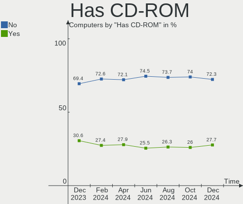
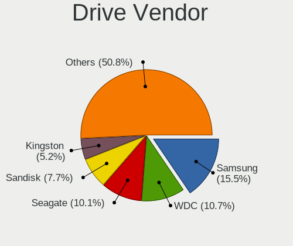
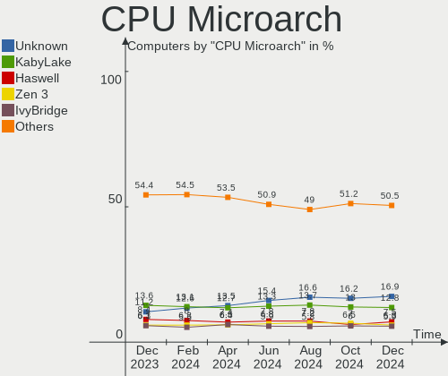
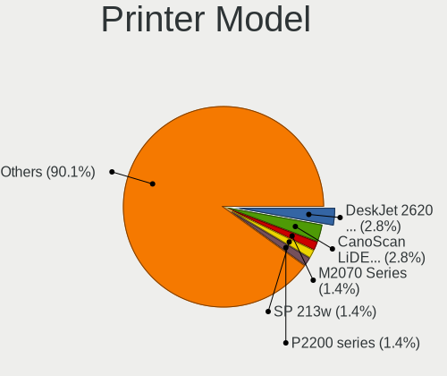
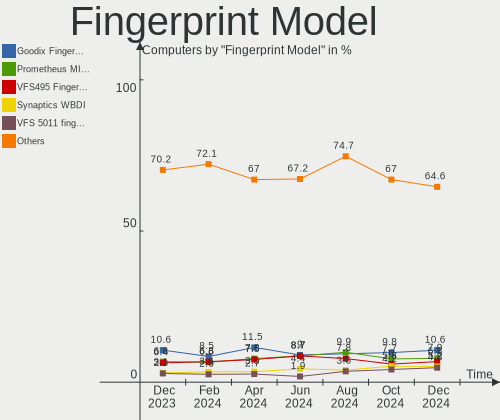

Linux - Hardware Trends
-----------------------

A project to identify most popular hardware characteristics and track their change
over time based on data collected by Linux users at https://Linux-Hardware.org.

Anyone can contribute to this report by the [hw-probe](https://github.com/linuxhw/hw-probe) tool:

    sudo -E hw-probe -all -upload

This is a report for all computer types. See also reports for [desktops](/Desktop/README.md) and [notebooks](/Notebook/README.md).

Distribution-specific reports: [Arch](/Dist/Arch), [ArcoLinux](/Dist/ArcoLinux), [BlackPanther](/Dist/BlackPanther), [CentOS](/Dist/CentOS), [Clear Linux](/Dist/Clear_Linux), [Debian](/Dist/Debian), [Elementary](/Dist/Elementary), [EndeavourOS](/Dist/EndeavourOS), [Endless](/Dist/Endless), [Fedora](/Dist/Fedora), [Garuda Linux](/Dist/Garuda_Linux), [Gentoo](/Dist/Gentoo), [Kali](/Dist/Kali), [KDE neon](/Dist/KDE_neon), [Kubuntu](/Dist/Kubuntu), [Linux Mint](/Dist/Linux_Mint), [Manjaro](/Dist/Manjaro), [OpenMandriva](/Dist/OpenMandriva), [openSUSE](/Dist/openSUSE), [Pop!_OS](/Dist/Pop!_OS), [Red OS](/Dist/Red_OS), [ROSA](/Dist/ROSA), [SteamOS](/Dist/SteamOS), [Ubuntu MATE](/Dist/Ubuntu_MATE), [Ubuntu](/Dist/Ubuntu), [Xubuntu](/Dist/Xubuntu), [Zorin](/Dist/Zorin).

This report is for one last month. Overall report since the beginning of time: [TestDays](https://github.com/linuxhw/TestDays)

Period: Apr, 2023.

Contents
--------

* [ System ](#system)
  - [ OS                       ](#os)
  - [ OS Family                ](#os-family)
  - [ Kernel                   ](#kernel)
  - [ Kernel Family            ](#kernel-family)
  - [ Kernel Major Ver.        ](#kernel-major-ver)
  - [ Arch                     ](#arch)
  - [ DE                       ](#de)
  - [ Display Server           ](#display-server)
  - [ Display Manager          ](#display-manager)
  - [ OS Lang                  ](#os-lang)
  - [ Boot Mode                ](#boot-mode)
  - [ Filesystem               ](#filesystem)
  - [ Part. scheme             ](#part-scheme)
  - [ Dual Boot with Linux/BSD ](#dual-boot-with-linuxbsd)
  - [ Dual Boot (Win)          ](#dual-boot-win)

* [ Board ](#board)
  - [ Vendor                   ](#vendor)
  - [ Model                    ](#model)
  - [ Model Family             ](#model-family)
  - [ MFG Year                 ](#mfg-year)
  - [ Form Factor              ](#form-factor)
  - [ Secure Boot              ](#secure-boot)
  - [ Coreboot                 ](#coreboot)
  - [ RAM Size                 ](#ram-size)
  - [ RAM Used                 ](#ram-used)
  - [ Total Drives             ](#total-drives)
  - [ Has CD-ROM               ](#has-cd-rom)
  - [ Has Ethernet             ](#has-ethernet)
  - [ Has WiFi                 ](#has-wifi)
  - [ Has Bluetooth            ](#has-bluetooth)

* [ Location ](#location)
  - [ Country                  ](#country)
  - [ City                     ](#city)

* [ Drives ](#drives)
  - [ Drive Vendor             ](#drive-vendor)
  - [ Drive Model              ](#drive-model)
  - [ HDD Vendor               ](#hdd-vendor)
  - [ SSD Vendor               ](#ssd-vendor)
  - [ Drive Kind               ](#drive-kind)
  - [ Drive Connector          ](#drive-connector)
  - [ Drive Size               ](#drive-size)
  - [ Space Total              ](#space-total)
  - [ Space Used               ](#space-used)
  - [ Malfunc. Drives          ](#malfunc-drives)
  - [ Malfunc. Drive Vendor    ](#malfunc-drive-vendor)
  - [ Malfunc. HDD Vendor      ](#malfunc-hdd-vendor)
  - [ Malfunc. Drive Kind      ](#malfunc-drive-kind)
  - [ Failed Drives            ](#failed-drives)
  - [ Failed Drive Vendor      ](#failed-drive-vendor)
  - [ Drive Status             ](#drive-status)

* [ Storage controller ](#storage-controller)
  - [ Storage Vendor           ](#storage-vendor)
  - [ Storage Model            ](#storage-model)
  - [ Storage Kind             ](#storage-kind)

* [ Processor ](#processor)
  - [ CPU Vendor               ](#cpu-vendor)
  - [ CPU Model                ](#cpu-model)
  - [ CPU Model Family         ](#cpu-model-family)
  - [ CPU Cores                ](#cpu-cores)
  - [ CPU Sockets              ](#cpu-sockets)
  - [ CPU Threads              ](#cpu-threads)
  - [ CPU Op-Modes             ](#cpu-op-modes)
  - [ CPU Microcode            ](#cpu-microcode)
  - [ CPU Microarch            ](#cpu-microarch)

* [ Graphics ](#graphics)
  - [ GPU Vendor               ](#gpu-vendor)
  - [ GPU Model                ](#gpu-model)
  - [ GPU Combo                ](#gpu-combo)
  - [ GPU Driver               ](#gpu-driver)
  - [ GPU Memory               ](#gpu-memory)

* [ Monitor ](#monitor)
  - [ Monitor Vendor           ](#monitor-vendor)
  - [ Monitor Model            ](#monitor-model)
  - [ Monitor Resolution       ](#monitor-resolution)
  - [ Monitor Diagonal         ](#monitor-diagonal)
  - [ Monitor Width            ](#monitor-width)
  - [ Aspect Ratio             ](#aspect-ratio)
  - [ Monitor Area             ](#monitor-area)
  - [ Pixel Density            ](#pixel-density)
  - [ Multiple Monitors        ](#multiple-monitors)

* [ Network ](#network)
  - [ Net Controller Vendor    ](#net-controller-vendor)
  - [ Net Controller Model     ](#net-controller-model)
  - [ Wireless Vendor          ](#wireless-vendor)
  - [ Wireless Model           ](#wireless-model)
  - [ Ethernet Vendor          ](#ethernet-vendor)
  - [ Ethernet Model           ](#ethernet-model)
  - [ Net Controller Kind      ](#net-controller-kind)
  - [ Used Controller          ](#used-controller)
  - [ NICs                     ](#nics)
  - [ IPv6                     ](#ipv6)

* [ Bluetooth ](#bluetooth)
  - [ Bluetooth Vendor         ](#bluetooth-vendor)
  - [ Bluetooth Model          ](#bluetooth-model)

* [ Sound ](#sound)
  - [ Sound Vendor             ](#sound-vendor)
  - [ Sound Model              ](#sound-model)

* [ Memory ](#memory)
  - [ Memory Vendor            ](#memory-vendor)
  - [ Memory Model             ](#memory-model)
  - [ Memory Kind              ](#memory-kind)
  - [ Memory Form Factor       ](#memory-form-factor)
  - [ Memory Size              ](#memory-size)
  - [ Memory Speed             ](#memory-speed)

* [ Printers & scanners ](#printers--scanners)
  - [ Printer Vendor           ](#printer-vendor)
  - [ Printer Model            ](#printer-model)
  - [ Scanner Vendor           ](#scanner-vendor)
  - [ Scanner Model            ](#scanner-model)

* [ Camera ](#camera)
  - [ Camera Vendor            ](#camera-vendor)
  - [ Camera Model             ](#camera-model)

* [ Security ](#security)
  - [ Fingerprint Vendor       ](#fingerprint-vendor)
  - [ Fingerprint Model        ](#fingerprint-model)
  - [ Chipcard Vendor          ](#chipcard-vendor)
  - [ Chipcard Model           ](#chipcard-model)

* [ Unsupported ](#unsupported)
  - [ Unsupported Devices      ](#unsupported-devices)
  - [ Unsupported Device Types ](#unsupported-device-types)

System
------

OS
--

Installed operating systems

| Name                         | Computers | Percent |
|------------------------------|-----------|---------|
| Ubuntu 22.04                 | 776       | 13.52%  |
| OpenMandriva 23.03           | 776       | 13.52%  |
| Linux Mint 21.1              | 399       | 6.95%   |
| Debian 11                    | 271       | 4.72%   |
| Fedora 38                    | 266       | 4.63%   |
| Pop!_OS 22.04                | 209       | 3.64%   |
| ROSA 12.4                    | 187       | 3.26%   |
| Fedora 37                    | 179       | 3.12%   |
| Arch Rolling                 | 177       | 3.08%   |
| Zorin 16                     | 159       | 2.77%   |
| Ubuntu 22.10                 | 153       | 2.67%   |
| Ubuntu 23.04                 | 144       | 2.51%   |
| Debian 12                    | 118       | 2.06%   |
| Ubuntu 20.04                 | 117       | 2.04%   |
| KDE neon 22.04               | 104       | 1.81%   |
| Manjaro                      | 89        | 1.55%   |
| OpenMandriva 4.3             | 86        | 1.5%    |
| ArcoLinux Rolling            | 68        | 1.18%   |
| Kubuntu 22.04                | 65        | 1.13%   |
| openSUSE Tumbleweed-XXXXXXXX | 63        | 1.1%    |
| Manjaro 22.1.0               | 61        | 1.06%   |
| Kali 2023.1                  | 61        | 1.06%   |
| OpenMandriva 23.01           | 59        | 1.03%   |
| Gentoo 2.13                  | 58        | 1.01%   |
| SteamOS 3.4.6                | 57        | 0.99%   |
| BlackPanther 18.1            | 50        | 0.87%   |
| Linux Mint 20.3              | 48        | 0.84%   |
| EndeavourOS Rolling          | 48        | 0.84%   |
| Nobara 37                    | 41        | 0.71%   |
| Xubuntu 22.04                | 40        | 0.7%    |
| Linux Mint 21                | 38        | 0.66%   |
| Elementary 7                 | 33        | 0.58%   |
| LMDE 5                       | 28        | 0.49%   |
| MX 21                        | 24        | 0.42%   |
| Lubuntu 22.04                | 21        | 0.37%   |
| Kubuntu 23.04                | 21        | 0.37%   |
| ROSA 12.3                    | 20        | 0.35%   |
| OpenMandriva 4.2             | 19        | 0.33%   |
| Ubuntu 18.04                 | 18        | 0.31%   |
| Fedora 36                    | 18        | 0.31%   |

OS Family
---------

OS without a version

| Name          | Computers | Percent |
|---------------|-----------|---------|
| Ubuntu        | 1212      | 21.12%  |
| OpenMandriva  | 958       | 16.69%  |
| Linux Mint    | 514       | 8.96%   |
| Fedora        | 477       | 8.31%   |
| Debian        | 402       | 7%      |
| ROSA          | 241       | 4.2%    |
| Pop!_OS       | 210       | 3.66%   |
| Arch          | 177       | 3.08%   |
| Zorin         | 164       | 2.86%   |
| Manjaro       | 151       | 2.63%   |
| Kubuntu       | 109       | 1.9%    |
| KDE neon      | 104       | 1.81%   |
| openSUSE      | 80        | 1.39%   |
| ArcoLinux     | 70        | 1.22%   |
| SteamOS       | 69        | 1.2%    |
| Kali          | 64        | 1.12%   |
| Xubuntu       | 63        | 1.1%    |
| Gentoo        | 61        | 1.06%   |
| BlackPanther  | 52        | 0.91%   |
| EndeavourOS   | 48        | 0.84%   |
| Nobara        | 43        | 0.75%   |
| Elementary    | 40        | 0.7%    |
| Lubuntu       | 33        | 0.58%   |
| LMDE          | 28        | 0.49%   |
| Ubuntu MATE   | 25        | 0.44%   |
| MX            | 25        | 0.44%   |
| Red OS        | 20        | 0.35%   |
| Parrot        | 19        | 0.33%   |
| Garuda Linux  | 19        | 0.33%   |
| ALT Linux     | 15        | 0.26%   |
| Ubuntu Budgie | 14        | 0.24%   |
| NixOS         | 12        | 0.21%   |
| blendOS       | 11        | 0.19%   |
| Devuan        | 10        | 0.17%   |
| Raspbian      | 9         | 0.16%   |
| Endless       | 9         | 0.16%   |
| BunsenLabs    | 9         | 0.16%   |
| Ubuntu Unity  | 8         | 0.14%   |
| TUXEDO OS     | 8         | 0.14%   |
| Pardus        | 8         | 0.14%   |

Kernel
------

Version of the Linux kernel

| Version                           | Computers | Percent |
|-----------------------------------|-----------|---------|
| 6.2.6-desktop-1omv2390            | 768       | 13.38%  |
| 5.19.0-38-generic                 | 535       | 9.32%   |
| 5.15.0-69-generic                 | 480       | 8.36%   |
| 5.19.0-40-generic                 | 247       | 4.3%    |
| 5.10.0-21-amd64                   | 196       | 3.42%   |
| 6.2.6-76060206-generic            | 185       | 3.22%   |
| 6.1.20-generic-2rosa2021.1-x86_64 | 132       | 2.3%    |
| 6.2.0-20-generic                  | 130       | 2.27%   |
| 6.2.11-300.fc38.x86_64            | 124       | 2.16%   |
| 5.15.0-70-generic                 | 102       | 1.78%   |
| 5.19.0-41-generic                 | 96        | 1.67%   |
| 5.15.0-71-generic                 | 80        | 1.39%   |
| 5.15.0-67-generic                 | 76        | 1.32%   |
| 6.1.0-7-amd64                     | 66        | 1.15%   |
| 6.2.9-200.fc37.x86_64             | 57        | 0.99%   |
| 5.13.0-valve36-1-neptune          | 57        | 0.99%   |
| 5.16.7-desktop-1omv4003           | 56        | 0.98%   |
| 5.15.0-56-generic                 | 56        | 0.98%   |
| 6.2.10-arch1-1                    | 54        | 0.94%   |
| 6.2.12-300.fc38.x86_64            | 52        | 0.91%   |
| 6.1.1-desktop-1omv2290            | 52        | 0.91%   |
| 5.4.0-146-generic                 | 51        | 0.89%   |
| 6.2.12-arch1-1                    | 47        | 0.82%   |
| 6.2.11-arch1-1                    | 45        | 0.78%   |
| 6.2.8-200.fc37.x86_64             | 44        | 0.77%   |
| 5.19.0-32-generic                 | 42        | 0.73%   |
| 6.2.9-300.fc38.x86_64             | 38        | 0.66%   |
| 5.10.0-20-amd64                   | 38        | 0.66%   |
| 6.1.0-kali7-amd64                 | 37        | 0.64%   |
| 5.15.0-58-generic                 | 37        | 0.64%   |
| 6.2.9-arch1-1                     | 36        | 0.63%   |
| 6.1.0-4-amd64                     | 34        | 0.59%   |
| 5.16.13-desktop-1omv4003          | 32        | 0.56%   |
| 6.2.10-200.fc37.x86_64            | 28        | 0.49%   |
| 6.1.23-1-MANJARO                  | 28        | 0.49%   |
| 6.2.8-arch1-1                     | 27        | 0.47%   |
| 6.2.13-300.fc38.x86_64            | 26        | 0.45%   |
| 5.6.14-desktop-2bP                | 26        | 0.45%   |
| 5.19.0-35-generic                 | 26        | 0.45%   |
| 6.2.9-1-default                   | 24        | 0.42%   |

Kernel Family
-------------

Linux kernel without a distro release

| Version  | Computers | Percent |
|----------|-----------|---------|
| 5.19.0   | 979       | 17.06%  |
| 6.2.6    | 966       | 16.83%  |
| 5.15.0   | 914       | 15.93%  |
| 5.10.0   | 266       | 4.63%   |
| 6.2.11   | 253       | 4.41%   |
| 6.1.0    | 220       | 3.83%   |
| 6.2.9    | 206       | 3.59%   |
| 6.2.10   | 179       | 3.12%   |
| 6.2.0    | 179       | 3.12%   |
| 6.2.12   | 168       | 2.93%   |
| 6.1.20   | 139       | 2.42%   |
| 6.2.8    | 119       | 2.07%   |
| 5.4.0    | 113       | 1.97%   |
| 5.13.0   | 68        | 1.18%   |
| 5.16.7   | 56        | 0.98%   |
| 6.1.1    | 53        | 0.92%   |
| 6.2.13   | 45        | 0.78%   |
| 6.1.23   | 35        | 0.61%   |
| 6.1.21   | 34        | 0.59%   |
| 6.3.0    | 33        | 0.58%   |
| 5.16.13  | 32        | 0.56%   |
| 6.1.19   | 29        | 0.51%   |
| 5.15.103 | 29        | 0.51%   |
| 6.0.0    | 26        | 0.45%   |
| 5.6.14   | 26        | 0.45%   |
| 5.14.0   | 24        | 0.42%   |
| 4.18.16  | 24        | 0.42%   |
| 6.1.25   | 23        | 0.4%    |
| 4.15.0   | 23        | 0.4%    |
| 6.1.22   | 22        | 0.38%   |
| 5.10.74  | 19        | 0.33%   |
| 5.15.104 | 17        | 0.3%    |
| 5.10.14  | 17        | 0.3%    |
| 6.0.7    | 16        | 0.28%   |
| 6.0.12   | 16        | 0.28%   |
| 5.14.21  | 15        | 0.26%   |
| 5.15.106 | 13        | 0.23%   |
| 5.15.75  | 11        | 0.19%   |
| 6.2.7    | 10        | 0.17%   |
| 5.10.176 | 10        | 0.17%   |

Kernel Major Ver.
-----------------

Linux kernel major version

| Version | Computers | Percent |
|---------|-----------|---------|
| 6.2     | 2136      | 37.22%  |
| 5.15    | 1057      | 18.42%  |
| 5.19    | 989       | 17.23%  |
| 6.1     | 615       | 10.72%  |
| 5.10    | 341       | 5.94%   |
| 5.4     | 126       | 2.2%    |
| 5.16    | 90        | 1.57%   |
| 6.0     | 78        | 1.36%   |
| 5.13    | 70        | 1.22%   |
| 5.14    | 41        | 0.71%   |
| 6.3     | 33        | 0.58%   |
| 4.18    | 31        | 0.54%   |
| 5.6     | 27        | 0.47%   |
| 4.15    | 23        | 0.4%    |
| 5.18    | 13        | 0.23%   |
| 5.17    | 13        | 0.23%   |
| 5.11    | 12        | 0.21%   |
| 4.9     | 10        | 0.17%   |
| 4.19    | 9         | 0.16%   |
| 3.10    | 8         | 0.14%   |
| 4.4     | 6         | 0.1%    |
| 5.3     | 3         | 0.05%   |
| 5.9     | 2         | 0.03%   |
| 5.8     | 1         | 0.02%   |
| 5.5     | 1         | 0.02%   |
| 5.12    | 1         | 0.02%   |
| 5.0     | 1         | 0.02%   |
| 4.10    | 1         | 0.02%   |
| 2.6     | 1         | 0.02%   |

Arch
----

OS architecture (x86_64, i586, etc.)

| Name    | Computers | Percent |
|---------|-----------|---------|
| x86_64  | 5642      | 98.31%  |
| i686    | 45        | 0.78%   |
| aarch64 | 34        | 0.59%   |
| armv7l  | 11        | 0.19%   |
| riscv64 | 2         | 0.03%   |
| ppc64   | 2         | 0.03%   |
| armv6l  | 2         | 0.03%   |
| sparc64 | 1         | 0.02%   |

DE
--

Desktop Environment

| Name             | Computers | Percent |
|------------------|-----------|---------|
| GNOME            | 2222      | 38.72%  |
| KDE5             | 1840      | 32.06%  |
| X-Cinnamon       | 418       | 7.28%   |
| XFCE             | 358       | 6.24%   |
| Unknown          | 241       | 4.2%    |
| MATE             | 175       | 3.05%   |
| LXQt             | 121       | 2.11%   |
| GNUstep          | 74        | 1.29%   |
| Pantheon         | 41        | 0.71%   |
| Cinnamon         | 37        | 0.64%   |
| Hyprland         | 24        | 0.42%   |
| Budgie           | 24        | 0.42%   |
| i3               | 22        | 0.38%   |
| LXDE             | 20        | 0.35%   |
| sway             | 12        | 0.21%   |
| GNOME Flashback  | 10        | 0.17%   |
| KDE              | 9         | 0.16%   |
| Unity            | 8         | 0.14%   |
| openbox          | 8         | 0.14%   |
| bspwm            | 8         | 0.14%   |
| KDE4             | 6         | 0.1%    |
| GNOME Classic    | 6         | 0.1%    |
| chadwm           | 6         | 0.1%    |
| Enlightenment    | 5         | 0.09%   |
| BunsenLabs       | 5         | 0.09%   |
| Trinity          | 4         | 0.07%   |
| icewm            | 4         | 0.07%   |
| Deepin           | 4         | 0.07%   |
| dwm              | 3         | 0.05%   |
| awesome          | 3         | 0.05%   |
| xmonad           | 2         | 0.03%   |
| lightdm-xsession | 2         | 0.03%   |
| ratflow          | 1         | 0.02%   |
| qtile            | 1         | 0.02%   |
| pika:GNOME       | 1         | 0.02%   |
| onyx:GNOME       | 1         | 0.02%   |
| none+i3          | 1         | 0.02%   |
| none+awesome     | 1         | 0.02%   |
| mwm              | 1         | 0.02%   |
| Jwm              | 1         | 0.02%   |

Display Server
--------------

X11 or Wayland

| Name        | Computers | Percent |
|-------------|-----------|---------|
| X11         | 3788      | 66%     |
| Wayland     | 1573      | 27.41%  |
| Tty         | 242       | 4.22%   |
| Unknown     | 132       | 2.3%    |
| Unspecified | 3         | 0.05%   |
| Web         | 1         | 0.02%   |

Display Manager
---------------

SDDM, LightDM, etc.

| Name    | Computers | Percent |
|---------|-----------|---------|
| Unknown | 1698      | 29.59%  |
| SDDM    | 1567      | 27.3%   |
| GDM3    | 1059      | 18.45%  |
| LightDM | 800       | 13.94%  |
| GDM     | 562       | 9.79%   |
| XDM     | 11        | 0.19%   |
| LXDM    | 11        | 0.19%   |
| SLiM    | 9         | 0.16%   |
| KDM     | 6         | 0.1%    |
| TDM     | 4         | 0.07%   |
| Ly      | 3         | 0.05%   |
| SU      | 2         | 0.03%   |
| NODM    | 2         | 0.03%   |
| SLIMSKI | 1         | 0.02%   |
| MDM     | 1         | 0.02%   |
| GREETD  | 1         | 0.02%   |
| FLY-DM  | 1         | 0.02%   |
| EMPTTY  | 1         | 0.02%   |

OS Lang
-------

Language

| Lang    | Computers | Percent |
|---------|-----------|---------|
| en_US   | 2421      | 42.19%  |
| de_DE   | 500       | 8.71%   |
| ru_RU   | 472       | 8.22%   |
| en_GB   | 314       | 5.47%   |
| fr_FR   | 280       | 4.88%   |
| pt_BR   | 193       | 3.36%   |
| it_IT   | 158       | 2.75%   |
| es_ES   | 115       | 2%      |
| en_CA   | 112       | 1.95%   |
| Unknown | 105       | 1.83%   |
| C       | 103       | 1.79%   |
| pl_PL   | 93        | 1.62%   |
| en_AU   | 87        | 1.52%   |
| en_IN   | 69        | 1.2%    |
| es_MX   | 55        | 0.96%   |
| nl_NL   | 50        | 0.87%   |
| cs_CZ   | 38        | 0.66%   |
| es_AR   | 31        | 0.54%   |
| hu_HU   | 30        | 0.52%   |
| de_AT   | 30        | 0.52%   |
| zh_CN   | 29        | 0.51%   |
| tr_TR   | 28        | 0.49%   |
| de_CH   | 25        | 0.44%   |
| pt_PT   | 24        | 0.42%   |
| sv_SE   | 23        | 0.4%    |
| es_CL   | 21        | 0.37%   |
| ja_JP   | 20        | 0.35%   |
| en_IE   | 18        | 0.31%   |
| es_VE   | 15        | 0.26%   |
| fi_FI   | 14        | 0.24%   |
| sk_SK   | 13        | 0.23%   |
| en_ZA   | 13        | 0.23%   |
| fr_CA   | 12        | 0.21%   |
| fr_BE   | 12        | 0.21%   |
| es_CO   | 11        | 0.19%   |
| en_NZ   | 11        | 0.19%   |
| en_IL   | 10        | 0.17%   |
| da_DK   | 9         | 0.16%   |
| POSIX   | 8         | 0.14%   |
| en_AG   | 8         | 0.14%   |

Boot Mode
---------

EFI or BIOS

| Mode | Computers | Percent |
|------|-----------|---------|
| EFI  | 3139      | 54.7%   |
| BIOS | 2600      | 45.3%   |

Filesystem
----------

Type of filesystem

| Type    | Computers | Percent |
|---------|-----------|---------|
| Ext4    | 3838      | 66.88%  |
| Btrfs   | 892       | 15.54%  |
| Overlay | 564       | 9.83%   |
| Tmpfs   | 273       | 4.76%   |
| Xfs     | 82        | 1.43%   |
| Zfs     | 61        | 1.06%   |
| F2fs    | 18        | 0.31%   |
| Ext2    | 4         | 0.07%   |
| Aufs    | 2         | 0.03%   |
| Unknown | 2         | 0.03%   |
| Rootfs  | 1         | 0.02%   |
| Jfs     | 1         | 0.02%   |
| Ext3    | 1         | 0.02%   |

Part. scheme
------------

Scheme of partitioning

| Type    | Computers | Percent |
|---------|-----------|---------|
| GPT     | 3524      | 61.4%   |
| Unknown | 1466      | 25.54%  |
| MBR     | 749       | 13.05%  |

Dual Boot with Linux/BSD
------------------------

Hosting more than one Linux/BSD

| Dual boot | Computers | Percent |
|-----------|-----------|---------|
| No        | 4724      | 82.31%  |
| Yes       | 1015      | 17.69%  |

Dual Boot (Win)
---------------

Hosting Linux and Windows

| Dual boot | Computers | Percent |
|-----------|-----------|---------|
| No        | 4047      | 70.52%  |
| Yes       | 1692      | 29.48%  |

Board
-----

Vendor
------

Motherboard manufacturer

| Name                    | Computers | Percent |
|-------------------------|-----------|---------|
| ASUSTek Computer        | 936       | 16.31%  |
| Lenovo                  | 800       | 13.94%  |
| Hewlett-Packard         | 743       | 12.95%  |
| Dell                    | 608       | 10.59%  |
| Gigabyte Technology     | 393       | 6.85%   |
| MSI                     | 347       | 6.05%   |
| Acer                    | 295       | 5.14%   |
| ASRock                  | 195       | 3.4%    |
| Apple                   | 157       | 2.74%   |
| Intel                   | 108       | 1.88%   |
| HUAWEI                  | 71        | 1.24%   |
| Toshiba                 | 68        | 1.18%   |
| Fujitsu                 | 66        | 1.15%   |
| Valve                   | 62        | 1.08%   |
| Samsung Electronics     | 60        | 1.05%   |
| Unknown                 | 59        | 1.03%   |
| Sony                    | 39        | 0.68%   |
| Medion                  | 33        | 0.58%   |
| Microsoft               | 32        | 0.56%   |
| Google                  | 32        | 0.56%   |
| Biostar                 | 30        | 0.52%   |
| Notebook                | 28        | 0.49%   |
| Aquarius                | 27        | 0.47%   |
| Raspberry Pi Foundation | 24        | 0.42%   |
| Timi                    | 20        | 0.35%   |
| AZW                     | 18        | 0.31%   |
| Pegatron                | 17        | 0.3%    |
| Foxconn                 | 17        | 0.3%    |
| eMachines               | 14        | 0.24%   |
| Supermicro              | 13        | 0.23%   |
| ECS                     | 13        | 0.23%   |
| AMI                     | 13        | 0.23%   |
| GPU Company             | 12        | 0.21%   |
| Fujitsu Siemens         | 12        | 0.21%   |
| Chuwi                   | 12        | 0.21%   |
| System76                | 11        | 0.19%   |
| Gateway                 | 11        | 0.19%   |
| Positivo                | 10        | 0.17%   |
| Clevo                   | 10        | 0.17%   |
| BESSTAR Tech            | 10        | 0.17%   |

Model
-----

Motherboard model

| Name                         | Computers | Percent |
|------------------------------|-----------|---------|
| Unknown                      | 74        | 1.29%   |
| Valve Jupiter                | 62        | 1.08%   |
| ASUS All Series              | 51        | 0.89%   |
| Aquarius NS585               | 25        | 0.44%   |
| HP Notebook                  | 22        | 0.38%   |
| Dell OptiPlex 7010           | 19        | 0.33%   |
| ASUS PRIME Z590-P            | 18        | 0.31%   |
| ASUS PRIME A320M-K           | 17        | 0.3%    |
| ASUS TUF Gaming X570-PLUS    | 14        | 0.24%   |
| ASUS PRIME X570-PRO          | 13        | 0.23%   |
| ASUS PRIME B550M-A           | 13        | 0.23%   |
| HP Pavilion dv7              | 12        | 0.21%   |
| MSI MS-7C37                  | 11        | 0.19%   |
| HUAWEI HVY-WXX9              | 11        | 0.19%   |
| HP Pavilion 15               | 11        | 0.19%   |
| ASUS TUF Gaming B550M-PLUS   | 11        | 0.19%   |
| Apple MacBookPro8,1          | 11        | 0.19%   |
| Apple MacBookAir7,2          | 11        | 0.19%   |
| MSI MS-7C02                  | 10        | 0.17%   |
| MSI MS-7B86                  | 10        | 0.17%   |
| HP Laptop 15s-eq2xxx         | 10        | 0.17%   |
| Dell OptiPlex 3020           | 10        | 0.17%   |
| Apple MacBookPro9,2          | 10        | 0.17%   |
| HP Pavilion dv6              | 9         | 0.16%   |
| MSI MS-7B89                  | 8         | 0.14%   |
| MSI MS-7B79                  | 8         | 0.14%   |
| HP Pavilion g6               | 8         | 0.14%   |
| Dell XPS 15 9500             | 8         | 0.14%   |
| MSI MS-7C91                  | 7         | 0.12%   |
| MSI MS-7C56                  | 7         | 0.12%   |
| MSI MS-7817                  | 7         | 0.12%   |
| MSI MS-7721                  | 7         | 0.12%   |
| HUAWEI BOHK-WAX9X            | 7         | 0.12%   |
| HP Laptop 17-cp0xxx          | 7         | 0.12%   |
| HP 255 G8 Notebook PC        | 7         | 0.12%   |
| Dell OptiPlex 9020           | 7         | 0.12%   |
| ASUS ROG STRIX B550-F GAMING | 7         | 0.12%   |
| Apple MacBookPro12,1         | 7         | 0.12%   |
| AMI Intel                    | 7         | 0.12%   |
| Supermicro Super Server      | 6         | 0.1%    |

Model Family
------------

Motherboard model prefix

| Name               | Computers | Percent |
|--------------------|-----------|---------|
| Lenovo ThinkPad    | 337       | 5.87%   |
| Acer Aspire        | 179       | 3.12%   |
| ASUS PRIME         | 166       | 2.89%   |
| Dell Latitude      | 163       | 2.84%   |
| Lenovo IdeaPad     | 148       | 2.58%   |
| Dell Inspiron      | 136       | 2.37%   |
| ASUS ROG           | 128       | 2.23%   |
| HP Pavilion        | 124       | 2.16%   |
| Dell OptiPlex      | 107       | 1.86%   |
| HP Laptop          | 82        | 1.43%   |
| ASUS VivoBook      | 81        | 1.41%   |
| ASUS TUF           | 75        | 1.31%   |
| Unknown            | 74        | 1.29%   |
| Dell XPS           | 68        | 1.18%   |
| HP EliteBook       | 67        | 1.17%   |
| HP ProBook         | 66        | 1.15%   |
| Valve Jupiter      | 62        | 1.08%   |
| Dell Precision     | 62        | 1.08%   |
| HP Compaq          | 57        | 0.99%   |
| Toshiba Satellite  | 54        | 0.94%   |
| ASUS All           | 51        | 0.89%   |
| Lenovo ThinkCentre | 47        | 0.82%   |
| ASUS ASUS          | 43        | 0.75%   |
| Lenovo Legion      | 40        | 0.7%    |
| HP EliteDesk       | 40        | 0.7%    |
| HP ENVY            | 38        | 0.66%   |
| Lenovo Yoga        | 36        | 0.63%   |
| Dell Vostro        | 36        | 0.63%   |
| Microsoft Surface  | 32        | 0.56%   |
| ASUS ZenBook       | 30        | 0.52%   |
| Acer Swift         | 27        | 0.47%   |
| Gigabyte B550      | 25        | 0.44%   |
| Aquarius NS585     | 25        | 0.44%   |
| RPi Raspberry      | 24        | 0.42%   |
| Lenovo ThinkBook   | 23        | 0.4%    |
| HP Notebook        | 22        | 0.38%   |
| Acer Nitro         | 22        | 0.38%   |
| Gigabyte X570      | 21        | 0.37%   |
| Lenovo IdeaCentre  | 20        | 0.35%   |
| HP ZBook           | 20        | 0.35%   |

MFG Year
--------

Motherboard manufacture year

| Year    | Computers | Percent |
|---------|-----------|---------|
| 2021    | 633       | 11.03%  |
| 2022    | 619       | 10.79%  |
| 2020    | 614       | 10.7%   |
| 2019    | 466       | 8.12%   |
| 2018    | 441       | 7.68%   |
| 2012    | 379       | 6.6%    |
| 2011    | 338       | 5.89%   |
| 2013    | 333       | 5.8%    |
| 2017    | 302       | 5.26%   |
| 2015    | 288       | 5.02%   |
| 2014    | 288       | 5.02%   |
| 2016    | 242       | 4.22%   |
| 2010    | 225       | 3.92%   |
| 2008    | 153       | 2.67%   |
| 2009    | 146       | 2.54%   |
| 2007    | 91        | 1.59%   |
| 2023    | 90        | 1.57%   |
| Unknown | 52        | 0.91%   |
| 2006    | 29        | 0.51%   |
| 2005    | 7         | 0.12%   |
| 2003    | 2         | 0.03%   |
| 2004    | 1         | 0.02%   |

Form Factor
-----------

Physical design of the computer

| Name           | Computers | Percent |
|----------------|-----------|---------|
| Notebook       | 2985      | 52.01%  |
| Desktop        | 2246      | 39.14%  |
| Convertible    | 158       | 2.75%   |
| Mini pc        | 95        | 1.66%   |
| All in one     | 95        | 1.66%   |
| Tablet         | 65        | 1.13%   |
| Server         | 50        | 0.87%   |
| System on chip | 44        | 0.77%   |
| Phone          | 1         | 0.02%   |

Secure Boot
-----------

Enabled or disabled

| State    | Computers | Percent |
|----------|-----------|---------|
| Disabled | 5377      | 93.69%  |
| Enabled  | 362       | 6.31%   |

Coreboot
--------

Have coreboot on board

| Used | Computers | Percent |
|------|-----------|---------|
| No   | 5693      | 99.2%   |
| Yes  | 46        | 0.8%    |

RAM Size
--------

Total RAM memory

| Size in GB      | Computers | Percent |
|-----------------|-----------|---------|
| 4.01-8.0        | 1350      | 23.52%  |
| 16.01-24.0      | 1204      | 20.98%  |
| 8.01-16.0       | 1017      | 17.72%  |
| 3.01-4.0        | 790       | 13.77%  |
| 32.01-64.0      | 688       | 11.99%  |
| 64.01-256.0     | 257       | 4.48%   |
| 24.01-32.0      | 166       | 2.89%   |
| 1.01-2.0        | 151       | 2.63%   |
| 2.01-3.0        | 64        | 1.12%   |
| 0.51-1.0        | 25        | 0.44%   |
| More than 256.0 | 21        | 0.37%   |
| 0.01-0.5        | 4         | 0.07%   |
| Unknown         | 2         | 0.03%   |

RAM Used
--------

Used RAM memory

| Used GB     | Computers | Percent |
|-------------|-----------|---------|
| 1.01-2.0    | 1756      | 30.6%   |
| 2.01-3.0    | 1475      | 25.7%   |
| 4.01-8.0    | 941       | 16.4%   |
| 3.01-4.0    | 811       | 14.13%  |
| 0.51-1.0    | 309       | 5.38%   |
| 8.01-16.0   | 289       | 5.04%   |
| 0.01-0.5    | 84        | 1.46%   |
| 16.01-24.0  | 36        | 0.63%   |
| 24.01-32.0  | 20        | 0.35%   |
| 32.01-64.0  | 9         | 0.16%   |
| 64.01-256.0 | 6         | 0.1%    |
| Unknown     | 3         | 0.05%   |

Total Drives
------------

Number of drives on board

| Drives | Computers | Percent |
|--------|-----------|---------|
| 1      | 3333      | 58.08%  |
| 2      | 1450      | 25.27%  |
| 3      | 485       | 8.45%   |
| 4      | 221       | 3.85%   |
| 5      | 112       | 1.95%   |
| 6      | 52        | 0.91%   |
| 0      | 29        | 0.51%   |
| 7      | 28        | 0.49%   |
| 9      | 9         | 0.16%   |
| 8      | 9         | 0.16%   |
| 10     | 4         | 0.07%   |
| 11     | 2         | 0.03%   |
| 28     | 1         | 0.02%   |
| 26     | 1         | 0.02%   |
| 25     | 1         | 0.02%   |
| 19     | 1         | 0.02%   |
| 13     | 1         | 0.02%   |

Has CD-ROM
----------

Has CD-ROM on board

| Presented | Computers | Percent |
|-----------|-----------|---------|
| No        | 3914      | 68.2%   |
| Yes       | 1825      | 31.8%   |

Has Ethernet
------------

Has Ethernet on board

| Presented | Computers | Percent |
|-----------|-----------|---------|
| Yes       | 4760      | 82.94%  |
| No        | 979       | 17.06%  |

Has WiFi
--------

Has WiFi module

| Presented | Computers | Percent |
|-----------|-----------|---------|
| Yes       | 4327      | 75.4%   |
| No        | 1412      | 24.6%   |

Has Bluetooth
-------------

Has Bluetooth module

| Presented | Computers | Percent |
|-----------|-----------|---------|
| Yes       | 3602      | 62.76%  |
| No        | 2137      | 37.24%  |

Location
--------

Country
-------

Geographic location (country)

| Country      | Computers | Percent |
|--------------|-----------|---------|
| USA          | 955       | 16.64%  |
| Germany      | 635       | 11.06%  |
| Russia       | 521       | 9.08%   |
| France       | 328       | 5.72%   |
| Brazil       | 279       | 4.86%   |
| UK           | 245       | 4.27%   |
| Italy        | 217       | 3.78%   |
| Canada       | 172       | 3%      |
| Poland       | 157       | 2.74%   |
| Spain        | 156       | 2.72%   |
| Switzerland  | 146       | 2.54%   |
| Netherlands  | 134       | 2.33%   |
| India        | 109       | 1.9%    |
| Australia    | 108       | 1.88%   |
| Hungary      | 90        | 1.57%   |
| Mexico       | 73        | 1.27%   |
| Turkey       | 60        | 1.05%   |
| Czechia      | 59        | 1.03%   |
| Austria      | 58        | 1.01%   |
| Japan        | 57        | 0.99%   |
| Belgium      | 54        | 0.94%   |
| Sweden       | 53        | 0.92%   |
| Finland      | 49        | 0.85%   |
| Argentina    | 49        | 0.85%   |
| China        | 44        | 0.77%   |
| Portugal     | 37        | 0.64%   |
| Bulgaria     | 35        | 0.61%   |
| Chile        | 34        | 0.59%   |
| Norway       | 33        | 0.58%   |
| Indonesia    | 33        | 0.58%   |
| Greece       | 32        | 0.56%   |
| Slovakia     | 29        | 0.51%   |
| Colombia     | 29        | 0.51%   |
| Denmark      | 27        | 0.47%   |
| South Africa | 26        | 0.45%   |
| Romania      | 26        | 0.45%   |
| Belarus      | 26        | 0.45%   |
| Venezuela    | 23        | 0.4%    |
| Israel       | 23        | 0.4%    |
| Vietnam      | 22        | 0.38%   |

City
----

Geographic location (city)

| City              | Computers | Percent |
|-------------------|-----------|---------|
| Moscow            | 113       | 1.97%   |
| Zurich            | 105       | 1.83%   |
| St Petersburg     | 53        | 0.92%   |
| Berlin            | 44        | 0.77%   |
| Paris             | 43        | 0.75%   |
| Voronezh          | 41        | 0.71%   |
| Warsaw            | 39        | 0.68%   |
| London            | 35        | 0.61%   |
| Vienna            | 34        | 0.59%   |
| Sydney            | 31        | 0.54%   |
| Milan             | 31        | 0.54%   |
| Frankfurt am Main | 31        | 0.54%   |
| Sao Paulo         | 30        | 0.52%   |
| Melbourne         | 29        | 0.51%   |
| Istanbul          | 28        | 0.49%   |
| Rome              | 26        | 0.45%   |
| Prague            | 26        | 0.45%   |
| Helsinki          | 24        | 0.42%   |
| Hamburg           | 24        | 0.42%   |
| Budapest          | 24        | 0.42%   |
| Madrid            | 23        | 0.4%    |
| Amsterdam         | 21        | 0.37%   |
| Bengaluru         | 20        | 0.35%   |
| Barcelona         | 20        | 0.35%   |
| Rio de Janeiro    | 19        | 0.33%   |
| New York          | 19        | 0.33%   |
| Yekaterinburg     | 18        | 0.31%   |
| Munich            | 18        | 0.31%   |
| Santiago          | 17        | 0.3%    |
| Los Angeles       | 17        | 0.3%    |
| Cologne           | 17        | 0.3%    |
| Brussels          | 16        | 0.28%   |
| Stockholm         | 15        | 0.26%   |
| Poznan            | 15        | 0.26%   |
| Montreal          | 15        | 0.26%   |
| Brisbane          | 15        | 0.26%   |
| Novosibirsk       | 14        | 0.24%   |
| Johannesburg      | 13        | 0.23%   |
| Dublin            | 13        | 0.23%   |
| Belgrade          | 13        | 0.23%   |

Drives
------

Drive Vendor
------------

Hard drive vendors

| Vendor                      | Computers | Drives | Percent |
|-----------------------------|-----------|--------|---------|
| Samsung Electronics         | 1355      | 1696   | 15.76%  |
| Seagate                     | 1067      | 1342   | 12.41%  |
| WDC                         | 1063      | 1351   | 12.36%  |
| Sandisk                     | 520       | 575    | 6.05%   |
| Kingston                    | 492       | 543    | 5.72%   |
| Toshiba                     | 433       | 469    | 5.04%   |
| Unknown                     | 375       | 408    | 4.36%   |
| Crucial                     | 338       | 383    | 3.93%   |
| Intel                       | 222       | 233    | 2.58%   |
| Hitachi                     | 217       | 249    | 2.52%   |
| SK hynix                    | 214       | 216    | 2.49%   |
| Micron Technology           | 157       | 184    | 1.83%   |
| A-DATA Technology           | 147       | 154    | 1.71%   |
| HGST                        | 124       | 127    | 1.44%   |
| China                       | 121       | 127    | 1.41%   |
| Phison Electronics          | 103       | 112    | 1.2%    |
| KIOXIA                      | 87        | 87     | 1.01%   |
| Micron/Crucial Technology   | 70        | 78     | 0.81%   |
| Apple                       | 70        | 81     | 0.81%   |
| Kingston Technology Company | 68        | 73     | 0.79%   |
| Silicon Motion              | 63        | 67     | 0.73%   |
| SPCC                        | 62        | 65     | 0.72%   |
| Unknown                     | 60        | 61     | 0.7%    |
| PNY                         | 57        | 63     | 0.66%   |
| Intenso                     | 51        | 53     | 0.59%   |
| Phison                      | 50        | 53     | 0.58%   |
| JMicron Technology          | 40        | 45     | 0.47%   |
| Transcend                   | 37        | 37     | 0.43%   |
| Patriot                     | 37        | 37     | 0.43%   |
| ADATA Technology            | 27        | 29     | 0.31%   |
| Gigabyte Technology         | 26        | 27     | 0.3%    |
| LITEON                      | 25        | 25     | 0.29%   |
| GOODRAM                     | 25        | 26     | 0.29%   |
| Apacer                      | 24        | 24     | 0.28%   |
| Maxtor                      | 23        | 23     | 0.27%   |
| KingSpec                    | 23        | 23     | 0.27%   |
| Netac                       | 22        | 23     | 0.26%   |
| Corsair                     | 22        | 24     | 0.26%   |
| Realtek Semiconductor       | 21        | 22     | 0.24%   |
| Team                        | 20        | 22     | 0.23%   |

Drive Model
-----------

Hard drive models

| Model                                                  | Computers | Percent |
|--------------------------------------------------------|-----------|---------|
| Samsung NVMe SSD Controller SM981/PM981/PM983 1TB      | 148       | 1.57%   |
| Kingston SA400S37240G 240GB SSD                        | 106       | 1.13%   |
| Samsung NVMe SSD Controller PM9A1/PM9A3/980PRO 2TB     | 86        | 0.91%   |
| Kingston SA400S37480G 480GB SSD                        | 68        | 0.72%   |
| Seagate ST1000DM010-2EP102 1TB                         | 60        | 0.64%   |
| Crucial CT500MX500SSD1 500GB                           | 60        | 0.64%   |
| Unknown                                                | 60        | 0.64%   |
| Samsung SSD 860 EVO 500GB                              | 56        | 0.59%   |
| Seagate ST2000DM008-2FR102 2TB                         | 54        | 0.57%   |
| Samsung SSD 850 EVO 250GB                              | 52        | 0.55%   |
| Unknown MMC Card  32GB                                 | 51        | 0.54%   |
| Unknown MMC Card  64GB                                 | 50        | 0.53%   |
| Seagate ST1000LM035-1RK172 970GB                       | 50        | 0.53%   |
| Seagate ST500DM002-1BD142 500GB                        | 49        | 0.52%   |
| Samsung SSD 980 1TB                                    | 48        | 0.51%   |
| Micron/Crucial P2 NVMe PCIe SSD 1TB                    | 46        | 0.49%   |
| Crucial CT240BX500SSD1 240GB                           | 46        | 0.49%   |
| Kingston SA400S37120G 120GB SSD                        | 44        | 0.47%   |
| Toshiba DT01ACA100 1TB                                 | 43        | 0.46%   |
| Samsung SSD 980 PRO 1TB                                | 43        | 0.46%   |
| Crucial CT1000MX500SSD1 1TB                            | 43        | 0.46%   |
| Samsung SSD 860 EVO 1TB                                | 42        | 0.45%   |
| Sandisk WD Blue SN550 NVMe SSD 1024GB                  | 41        | 0.44%   |
| Samsung SSD 850 EVO 500GB                              | 41        | 0.44%   |
| Toshiba MQ01ABD100 1TB                                 | 39        | 0.41%   |
| Silicon Motion SM2263EN/SM2263XT SSD Controller 1024GB | 38        | 0.4%    |
| WDC WD10EZEX-08WN4A0 1TB                               | 36        | 0.38%   |
| Sandisk WD Black SN750 / PC SN730 NVMe SSD 512GB       | 35        | 0.37%   |
| Phison E12 NVMe Controller 512GB                       | 34        | 0.36%   |
| Unknown SD/MMC/MS PRO 249GB                            | 33        | 0.35%   |
| SanDisk NVMe SSD Drive 1TB                             | 33        | 0.35%   |
| Seagate ST500LT012-1DG142 500GB                        | 32        | 0.34%   |
| Samsung NVMe SSD Controller SM961/PM961/SM963 500GB    | 32        | 0.34%   |
| Seagate ST1000LM024 HN-M101MBB 1TB                     | 31        | 0.33%   |
| Seagate ST1000DM003-1ER162 1TB                         | 31        | 0.33%   |
| Toshiba MQ04ABF100 1TB                                 | 30        | 0.32%   |
| Samsung SSD 860 EVO 250GB                              | 30        | 0.32%   |
| Crucial CT480BX500SSD1 480GB                           | 30        | 0.32%   |
| Unknown MMC Card  128GB                                | 28        | 0.3%    |
| Toshiba DT01ACA200 2TB                                 | 28        | 0.3%    |

HDD Vendor
----------

Hard disk drive vendors

| Vendor              | Computers | Drives | Percent |
|---------------------|-----------|--------|---------|
| Seagate             | 1031      | 1292   | 36.83%  |
| WDC                 | 812       | 1048   | 29.01%  |
| Toshiba             | 351       | 381    | 12.54%  |
| Hitachi             | 217       | 249    | 7.75%   |
| HGST                | 124       | 127    | 4.43%   |
| Samsung Electronics | 102       | 109    | 3.64%   |
| Unknown             | 33        | 33     | 1.18%   |
| JMicron Technology  | 26        | 31     | 0.93%   |
| Maxtor              | 21        | 21     | 0.75%   |
| Apple               | 18        | 18     | 0.64%   |
| Fujitsu             | 16        | 16     | 0.57%   |
| Intenso             | 8         | 8      | 0.29%   |
| ASMT                | 7         | 10     | 0.25%   |
| Inateck             | 5         | 6      | 0.18%   |
| Hewlett-Packard     | 4         | 11     | 0.14%   |
| USB3.0              | 3         | 3      | 0.11%   |
| ASMedia             | 3         | 3      | 0.11%   |
| SAGE                | 2         | 2      | 0.07%   |
| SABRENT             | 2         | 2      | 0.07%   |
| HPE                 | 2         | 3      | 0.07%   |
| WD MediaMax         | 1         | 1      | 0.04%   |
| USB                 | 1         | 1      | 0.04%   |
| StoreJet            | 1         | 1      | 0.04%   |
| RSH-319             | 1         | 1      | 0.04%   |
| LaCie               | 1         | 1      | 0.04%   |
| KESU                | 1         | 1      | 0.04%   |
| HGST HTS            | 1         | 1      | 0.04%   |
| Generic-            | 1         | 1      | 0.04%   |
| ExcelStor           | 1         | 1      | 0.04%   |
| DELLBOSS            | 1         | 1      | 0.04%   |
| CSD                 | 1         | 1      | 0.04%   |
| Adaptec             | 1         | 1      | 0.04%   |

SSD Vendor
----------

Solid state drive vendors

| Vendor              | Computers | Drives | Percent |
|---------------------|-----------|--------|---------|
| Samsung Electronics | 594       | 680    | 20.82%  |
| Kingston            | 363       | 394    | 12.72%  |
| Crucial             | 299       | 329    | 10.48%  |
| SanDisk             | 228       | 243    | 7.99%   |
| WDC                 | 158       | 162    | 5.54%   |
| China               | 119       | 125    | 4.17%   |
| A-DATA Technology   | 114       | 115    | 4%      |
| Intel               | 76        | 78     | 2.66%   |
| SPCC                | 59        | 61     | 2.07%   |
| PNY                 | 54        | 60     | 1.89%   |
| Micron Technology   | 52        | 58     | 1.82%   |
| SK hynix            | 42        | 42     | 1.47%   |
| Apple               | 42        | 42     | 1.47%   |
| Intenso             | 38        | 38     | 1.33%   |
| Patriot             | 36        | 36     | 1.26%   |
| Transcend           | 32        | 32     | 1.12%   |
| Toshiba             | 31        | 33     | 1.09%   |
| GOODRAM             | 25        | 26     | 0.88%   |
| LITEON              | 22        | 22     | 0.77%   |
| KingSpec            | 21        | 21     | 0.74%   |
| Apacer              | 20        | 20     | 0.7%    |
| Netac               | 18        | 18     | 0.63%   |
| Gigabyte Technology | 17        | 18     | 0.6%    |
| Unknown             | 17        | 18     | 0.6%    |
| Team                | 16        | 17     | 0.56%   |
| Verbatim            | 13        | 13     | 0.46%   |
| Seagate             | 13        | 14     | 0.46%   |
| LITEONIT            | 13        | 13     | 0.46%   |
| Lexar               | 12        | 13     | 0.42%   |
| OCZ                 | 11        | 12     | 0.39%   |
| Fanxiang            | 11        | 11     | 0.39%   |
| ASMT                | 11        | 12     | 0.39%   |
| XrayDisk            | 10        | 10     | 0.35%   |
| Corsair             | 10        | 11     | 0.35%   |
| Smartbuy            | 8         | 8      | 0.28%   |
| Plextor             | 8         | 8      | 0.28%   |
| KingFast            | 8         | 8      | 0.28%   |
| Mushkin             | 7         | 7      | 0.25%   |
| Emtec               | 7         | 7      | 0.25%   |
| Leven               | 6         | 7      | 0.21%   |

Drive Kind
----------

HDD or SSD

| Kind    | Computers | Drives | Percent |
|---------|-----------|--------|---------|
| SSD     | 2451      | 3057   | 31.8%   |
| NVMe    | 2411      | 2922   | 31.28%  |
| HDD     | 2350      | 3385   | 30.49%  |
| MMC     | 367       | 397    | 4.76%   |
| Unknown | 129       | 144    | 1.67%   |

Drive Connector
---------------

SATA, SAS, NVMe, etc.

| Type | Computers | Drives | Percent |
|------|-----------|--------|---------|
| SATA | 3867      | 6155   | 55.24%  |
| NVMe | 2404      | 2902   | 34.34%  |
| MMC  | 367       | 397    | 5.24%   |
| SAS  | 362       | 451    | 5.17%   |

Drive Size
----------

Size of hard drive

| Size in TB | Computers | Drives | Percent |
|------------|-----------|--------|---------|
| 0.01-0.5   | 2756      | 3570   | 54.7%   |
| 0.51-1.0   | 1456      | 1770   | 28.9%   |
| 1.01-2.0   | 453       | 545    | 8.99%   |
| 3.01-4.0   | 161       | 216    | 3.2%    |
| 4.01-10.0  | 101       | 174    | 2%      |
| 2.01-3.0   | 80        | 108    | 1.59%   |
| 10.01-20.0 | 31        | 59     | 0.62%   |

Space Total
-----------

Amount of disk space available on the file system

| Size in GB     | Computers | Percent |
|----------------|-----------|---------|
| 101-250        | 1342      | 23.38%  |
| 251-500        | 1222      | 21.29%  |
| 501-1000       | 835       | 14.55%  |
| 1-20           | 499       | 8.69%   |
| 1001-2000      | 487       | 8.49%   |
| More than 3000 | 373       | 6.5%    |
| 51-100         | 328       | 5.72%   |
| Unknown        | 264       | 4.6%    |
| 21-50          | 212       | 3.69%   |
| 2001-3000      | 177       | 3.08%   |

Space Used
----------

Amount of used disk space

| Used GB        | Computers | Percent |
|----------------|-----------|---------|
| 1-20           | 2112      | 36.8%   |
| 21-50          | 931       | 16.22%  |
| 101-250        | 677       | 11.8%   |
| 51-100         | 626       | 10.91%  |
| 251-500        | 440       | 7.67%   |
| 501-1000       | 304       | 5.3%    |
| Unknown        | 264       | 4.6%    |
| 1001-2000      | 198       | 3.45%   |
| More than 3000 | 124       | 2.16%   |
| 2001-3000      | 60        | 1.05%   |
| 0              | 3         | 0.05%   |

Malfunc. Drives
---------------

Drive models with a malfunction

| Model                                | Computers | Drives | Percent |
|--------------------------------------|-----------|--------|---------|
| Seagate ST500DM002-1BD142 500GB      | 12        | 14     | 1.57%   |
| Toshiba MQ01ABD100 1TB               | 11        | 11     | 1.44%   |
| Seagate ST9500325AS 500GB            | 11        | 11     | 1.44%   |
| HGST HTS545050A7E680 500GB           | 11        | 11     | 1.44%   |
| Seagate ST500LT012-1DG142 500GB      | 9         | 10     | 1.18%   |
| Seagate ST3500418AS 500GB            | 7         | 7      | 0.92%   |
| Seagate ST31000528AS 1TB             | 7         | 8      | 0.92%   |
| Seagate ST1000LM024 HN-M101MBB 1TB   | 7         | 9      | 0.92%   |
| Kingston SV300S37A120G 120GB SSD     | 7         | 7      | 0.92%   |
| Seagate ST500LT012-9WS142 500GB      | 6         | 6      | 0.79%   |
| Seagate ST500LM021-1KJ152 500GB      | 6         | 9      | 0.79%   |
| Seagate ST1000LM035-1RK172 970GB     | 6         | 6      | 0.79%   |
| WDC WD5000AAKX-75U6AA0 500GB         | 5         | 5      | 0.65%   |
| Toshiba DT01ACA200 2TB               | 5         | 5      | 0.65%   |
| SK hynix PC711 HFS512GDE9X073N 512GB | 5         | 5      | 0.65%   |
| Seagate ST3250310AS 250GB            | 5         | 5      | 0.65%   |
| HGST HTS721010A9E630 1TB             | 5         | 5      | 0.65%   |
| HGST HTS545050A7E380 500GB           | 5         | 5      | 0.65%   |
| HGST HTS541010A9E680 1TB             | 5         | 5      | 0.65%   |
| Toshiba MQ04ABF100 1TB               | 4         | 4      | 0.52%   |
| Toshiba DT01ACA100 1TB               | 4         | 4      | 0.52%   |
| Toshiba DT01ACA050 500GB             | 4         | 4      | 0.52%   |
| Seagate ST500LM012 HN-M500MBB 500GB  | 4         | 4      | 0.52%   |
| Seagate ST3250318AS 250GB            | 4         | 4      | 0.52%   |
| SanDisk SSD PLUS 480GB               | 4         | 4      | 0.52%   |
| Hitachi HTS547575A9E384 752GB        | 4         | 4      | 0.52%   |
| Hitachi HTS543232A7A384 320GB        | 4         | 4      | 0.52%   |
| HGST HTS725050A7E630 500GB           | 4         | 4      | 0.52%   |
| WDC WD5000LPVX-22V0TT0 500GB         | 3         | 3      | 0.39%   |
| WDC WD10PURZ-85U8XY0 1TB             | 3         | 3      | 0.39%   |
| WDC WD10EALX-009BA0 1TB              | 3         | 3      | 0.39%   |
| WDC WD1002FAEX-00Z3A0 1TB            | 3         | 3      | 0.39%   |
| Seagate ST9320325AS 320GB            | 3         | 3      | 0.39%   |
| Seagate ST3250824AS 250GB            | 3         | 3      | 0.39%   |
| Seagate ST3160318AS 160GB            | 3         | 3      | 0.39%   |
| Seagate ST2000DM001-1CH164 2TB       | 3         | 3      | 0.39%   |
| Seagate ST2000DL003-9VT166 2TB       | 3         | 3      | 0.39%   |
| Seagate ST1000DM003-1CH162 1TB       | 3         | 3      | 0.39%   |
| SanDisk SSD U100 256GB               | 3         | 3      | 0.39%   |
| SanDisk SSD PLUS 240GB               | 3         | 3      | 0.39%   |

Malfunc. Drive Vendor
---------------------

Vendors of faulty drives

| Vendor              | Computers | Drives | Percent |
|---------------------|-----------|--------|---------|
| Seagate             | 200       | 219    | 26.85%  |
| WDC                 | 147       | 160    | 19.73%  |
| Hitachi             | 63        | 64     | 8.46%   |
| Samsung Electronics | 59        | 61     | 7.92%   |
| Toshiba             | 57        | 58     | 7.65%   |
| HGST                | 34        | 35     | 4.56%   |
| Intel               | 21        | 21     | 2.82%   |
| SK hynix            | 18        | 18     | 2.42%   |
| Kingston            | 18        | 18     | 2.42%   |
| SanDisk             | 16        | 16     | 2.15%   |
| Crucial             | 14        | 14     | 1.88%   |
| Maxtor              | 10        | 10     | 1.34%   |
| Micron Technology   | 8         | 8      | 1.07%   |
| KingSpec            | 7         | 7      | 0.94%   |
| China               | 7         | 7      | 0.94%   |
| A-DATA Technology   | 7         | 7      | 0.94%   |
| Fujitsu             | 6         | 6      | 0.81%   |
| Intenso             | 4         | 4      | 0.54%   |
| JMicron Technology  | 3         | 4      | 0.4%    |
| Apple               | 3         | 3      | 0.4%    |
| Netac               | 2         | 2      | 0.27%   |
| Neo                 | 2         | 2      | 0.27%   |
| LDLC                | 2         | 2      | 0.27%   |
| Gigabyte Technology | 2         | 2      | 0.27%   |
| Drevo               | 2         | 2      | 0.27%   |
| Apacer              | 2         | 2      | 0.27%   |
| XrayDisk            | 1         | 1      | 0.13%   |
| XPG                 | 1         | 1      | 0.13%   |
| VISIPRO             | 1         | 1      | 0.13%   |
| Transcend           | 1         | 1      | 0.13%   |
| Teclast             | 1         | 1      | 0.13%   |
| SPCC                | 1         | 1      | 0.13%   |
| Silicon Motion      | 1         | 1      | 0.13%   |
| ShiJi               | 1         | 1      | 0.13%   |
| SATAFIRM            | 1         | 1      | 0.13%   |
| RSH-319             | 1         | 1      | 0.13%   |
| PNY                 | 1         | 1      | 0.13%   |
| Plextor             | 1         | 1      | 0.13%   |
| Phison Electronics  | 1         | 1      | 0.13%   |
| Patriot             | 1         | 1      | 0.13%   |

Malfunc. HDD Vendor
-------------------

Vendors of faulty HDD drives

| Vendor              | Computers | Drives | Percent |
|---------------------|-----------|--------|---------|
| Seagate             | 200       | 219    | 35.78%  |
| WDC                 | 145       | 157    | 25.94%  |
| Hitachi             | 63        | 64     | 11.27%  |
| Toshiba             | 55        | 56     | 9.84%   |
| Samsung Electronics | 35        | 37     | 6.26%   |
| HGST                | 34        | 35     | 6.08%   |
| Maxtor              | 10        | 10     | 1.79%   |
| Fujitsu             | 6         | 6      | 1.07%   |
| JMicron Technology  | 2         | 3      | 0.36%   |
| Apple               | 2         | 2      | 0.36%   |
| RSH-319             | 1         | 1      | 0.18%   |
| Intenso             | 1         | 1      | 0.18%   |
| HPE                 | 1         | 2      | 0.18%   |
| ExcelStor           | 1         | 1      | 0.18%   |
| CSD                 | 1         | 1      | 0.18%   |
| ASMT                | 1         | 1      | 0.18%   |
| ASMedia             | 1         | 1      | 0.18%   |

Malfunc. Drive Kind
-------------------

Kinds of faulty drives

| Kind    | Computers | Drives | Percent |
|---------|-----------|--------|---------|
| HDD     | 518       | 597    | 74%     |
| SSD     | 147       | 152    | 21%     |
| NVMe    | 34        | 34     | 4.86%   |
| Unknown | 1         | 1      | 0.14%   |

Failed Drives
-------------

Failed drive models

| Model                                            | Computers | Drives | Percent |
|--------------------------------------------------|-----------|--------|---------|
| Seagate ST500DM002-1BD142 500GB                  | 2         | 2      | 11.76%  |
| Seagate ST31000528AS 1TB                         | 2         | 2      | 11.76%  |
| WDC WD5000AAKX-001CA0 500GB                      | 1         | 1      | 5.88%   |
| WDC WD20EARS-00MVWB0 2TB                         | 1         | 2      | 5.88%   |
| WDC WD1600AAJS-00YZCA0 160GB                     | 1         | 1      | 5.88%   |
| Toshiba MK3261GSYN 320GB                         | 1         | 1      | 5.88%   |
| Seagate ST9320423AS 320GB                        | 1         | 1      | 5.88%   |
| Seagate ST750LM022 HN-M750MBB 752GB              | 1         | 1      | 5.88%   |
| Seagate ST320LM001 HN-M320MBB 320GB              | 1         | 1      | 5.88%   |
| Samsung Electronics MZNLN256HCHP-000L7 256GB SSD | 1         | 1      | 5.88%   |
| Samsung Electronics HD161GJ 160GB                | 1         | 1      | 5.88%   |
| KingDian S400 120GB SSD                          | 1         | 1      | 5.88%   |
| Inland SATA SSD 128GB                            | 1         | 1      | 5.88%   |
| HGST HTS545050B7E660 500GB                       | 1         | 1      | 5.88%   |
| Crucial CT500P2SSD8 500GB                        | 1         | 1      | 5.88%   |

Failed Drive Vendor
-------------------

Failed drive vendors

| Vendor              | Computers | Drives | Percent |
|---------------------|-----------|--------|---------|
| Seagate             | 7         | 7      | 41.18%  |
| WDC                 | 3         | 4      | 17.65%  |
| Samsung Electronics | 2         | 2      | 11.76%  |
| Toshiba             | 1         | 1      | 5.88%   |
| KingDian            | 1         | 1      | 5.88%   |
| Inland              | 1         | 1      | 5.88%   |
| HGST                | 1         | 1      | 5.88%   |
| Crucial             | 1         | 1      | 5.88%   |

Drive Status
------------

Number of failed and malfunc. drives

| Status   | Computers | Drives | Percent |
|----------|-----------|--------|---------|
| Works    | 2976      | 4700   | 46.78%  |
| Detected | 2699      | 4403   | 42.42%  |
| Malfunc  | 670       | 784    | 10.53%  |
| Failed   | 17        | 18     | 0.27%   |

Storage controller
------------------

Storage Vendor
--------------

Storage controller vendors

| Vendor                           | Computers | Percent |
|----------------------------------|-----------|---------|
| Intel                            | 3479      | 45.67%  |
| AMD                              | 1246      | 16.36%  |
| Samsung Electronics              | 814       | 10.69%  |
| Sandisk                          | 413       | 5.42%   |
| Kingston Technology Company      | 204       | 2.68%   |
| Phison Electronics               | 182       | 2.39%   |
| SK hynix                         | 171       | 2.24%   |
| ASMedia Technology               | 132       | 1.73%   |
| Micron/Crucial Technology        | 111       | 1.46%   |
| Micron Technology                | 109       | 1.43%   |
| Silicon Motion                   | 91        | 1.19%   |
| KIOXIA                           | 83        | 1.09%   |
| Marvell Technology Group         | 68        | 0.89%   |
| Toshiba America Info Systems     | 65        | 0.85%   |
| ADATA Technology                 | 65        | 0.85%   |
| Nvidia                           | 61        | 0.8%    |
| JMicron Technology               | 56        | 0.74%   |
| Realtek Semiconductor            | 31        | 0.41%   |
| MAXIO Technology (Hangzhou)      | 29        | 0.38%   |
| Union Memory (Shenzhen)          | 22        | 0.29%   |
| LSI Logic / Symbios Logic        | 21        | 0.28%   |
| Solid State Storage Technology   | 17        | 0.22%   |
| Shenzhen Longsys Electronics     | 15        | 0.2%    |
| Seagate Technology               | 14        | 0.18%   |
| Broadcom / LSI                   | 14        | 0.18%   |
| VIA Technologies                 | 12        | 0.16%   |
| Yangtze Memory Technologies      | 11        | 0.14%   |
| O2 Micro                         | 9         | 0.12%   |
| INNOGRIT                         | 9         | 0.12%   |
| Lite-On Technology               | 8         | 0.11%   |
| Apple                            | 7         | 0.09%   |
| Silicon Image                    | 6         | 0.08%   |
| Netac Technology                 | 6         | 0.08%   |
| Solidigm                         | 5         | 0.07%   |
| Hewlett-Packard                  | 4         | 0.05%   |
| Transcend                        | 3         | 0.04%   |
| Silicon Integrated Systems [SiS] | 3         | 0.04%   |
| Biwin Storage Technology         | 3         | 0.04%   |
| Lenovo                           | 2         | 0.03%   |
| Integrated Technology Express    | 2         | 0.03%   |

Storage Model
-------------

Storage controller models

| Model                                                                          | Computers | Percent |
|--------------------------------------------------------------------------------|-----------|---------|
| AMD FCH SATA Controller [AHCI mode]                                            | 823       | 9.54%   |
| Samsung NVMe SSD Controller SM981/PM981/PM983                                  | 285       | 3.3%    |
| Intel 8 Series/C220 Series Chipset Family 6-port SATA Controller 1 [AHCI mode] | 239       | 2.77%   |
| Samsung NVMe SSD Controller 980                                                | 226       | 2.62%   |
| Intel Sunrise Point-LP SATA Controller [AHCI mode]                             | 217       | 2.52%   |
| Samsung NVMe SSD Controller PM9A1/PM9A3/980PRO                                 | 199       | 2.31%   |
| Intel 7 Series Chipset Family 6-port SATA Controller [AHCI mode]               | 198       | 2.3%    |
| Intel Volume Management Device NVMe RAID Controller                            | 187       | 2.17%   |
| Intel 6 Series/C200 Series Chipset Family 6 port Mobile SATA AHCI Controller   | 159       | 1.84%   |
| AMD 500 Series Chipset SATA Controller                                         | 158       | 1.83%   |
| AMD 400 Series Chipset SATA Controller                                         | 151       | 1.75%   |
| Intel 82801 Mobile SATA Controller [RAID mode]                                 | 140       | 1.62%   |
| Intel Q170/Q150/B150/H170/H110/Z170/CM236 Chipset SATA Controller [AHCI Mode]  | 137       | 1.59%   |
| AMD SB7x0/SB8x0/SB9x0 SATA Controller [AHCI mode]                              | 119       | 1.38%   |
| Intel 6 Series/C200 Series Chipset Family 6 port Desktop SATA AHCI Controller  | 117       | 1.36%   |
| ASMedia ASM1062 Serial ATA Controller                                          | 111       | 1.29%   |
| Micron NVMe Storage Controller                                                 | 100       | 1.16%   |
| AMD SB7x0/SB8x0/SB9x0 IDE Controller                                           | 100       | 1.16%   |
| Intel Cannon Lake PCH SATA AHCI Controller                                     | 99        | 1.15%   |
| Intel 200 Series PCH SATA controller [AHCI mode]                               | 98        | 1.14%   |
| SK hynix Gold P31/PC711 NVMe Solid State Drive                                 | 92        | 1.07%   |
| SanDisk WD Blue SN550 NVMe SSD                                                 | 92        | 1.07%   |
| Intel 8 Series SATA Controller 1 [AHCI mode]                                   | 91        | 1.06%   |
| Intel Celeron/Pentium Silver Processor SATA Controller                         | 89        | 1.03%   |
| Intel 7 Series/C210 Series Chipset Family 6-port SATA Controller [AHCI mode]   | 88        | 1.02%   |
| Intel 500 Series Chipset Family SATA AHCI Controller                           | 88        | 1.02%   |
| Kingston Company Company Non-Volatile memory controller                        | 81        | 0.94%   |
| Intel Comet Lake SATA AHCI Controller                                          | 81        | 0.94%   |
| Intel SATA Controller [RAID mode]                                              | 79        | 0.92%   |
| Intel 82801IBM/IEM (ICH9M/ICH9M-E) 4 port SATA Controller [AHCI mode]          | 79        | 0.92%   |
| Intel Tiger Lake-LP SATA Controller                                            | 78        | 0.9%    |
| Micron/Crucial P2 NVMe PCIe SSD                                                | 76        | 0.88%   |
| SanDisk WD Black SN750 / PC SN730 NVMe SSD                                     | 75        | 0.87%   |
| Intel Wildcat Point-LP SATA Controller [AHCI Mode]                             | 74        | 0.86%   |
| Silicon Motion SM2263EN/SM2263XT SSD Controller                                | 68        | 0.79%   |
| Intel NM10/ICH7 Family SATA Controller [IDE mode]                              | 67        | 0.78%   |
| Samsung NVMe SSD Controller SM961/PM961/SM963                                  | 65        | 0.75%   |
| Intel Alder Lake-S PCH SATA Controller [AHCI Mode]                             | 64        | 0.74%   |
| Intel 5 Series/3400 Series Chipset 4 port SATA AHCI Controller                 | 62        | 0.72%   |
| AMD SB7x0/SB8x0/SB9x0 SATA Controller [IDE mode]                               | 61        | 0.71%   |

Storage Kind
------------

Kind of storage controller (IDE, SATA, NVMe, SAS, ...)

| Kind | Computers | Percent |
|------|-----------|---------|
| SATA | 4097      | 53.79%  |
| NVMe | 2405      | 31.58%  |
| IDE  | 592       | 7.77%   |
| RAID | 487       | 6.39%   |
| SAS  | 23        | 0.3%    |
| SCSI | 12        | 0.16%   |

Processor
---------

CPU Vendor
----------

Processor vendors

| Vendor            | Computers | Percent |
|-------------------|-----------|---------|
| Intel             | 4046      | 70.5%   |
| AMD               | 1639      | 28.56%  |
| ARM               | 45        | 0.78%   |
| sifive,u74-mc     | 2         | 0.03%   |
| Phytium           | 2         | 0.03%   |
| CHRP IBM,8233-E8B | 2         | 0.03%   |
| Unknown           | 2         | 0.03%   |
| CentaurHauls      | 1         | 0.02%   |

CPU Model
---------

Processor models

| Model                                         | Computers | Percent |
|-----------------------------------------------|-----------|---------|
| Intel 11th Gen Core i5-1135G7 @ 2.40GHz       | 80        | 1.39%   |
| Intel 11th Gen Core i7-1165G7 @ 2.80GHz       | 65        | 1.13%   |
| AMD Custom APU 0405                           | 62        | 1.08%   |
| AMD Ryzen 5 5500U with Radeon Graphics        | 50        | 0.87%   |
| Intel Core i5-10210U CPU @ 1.60GHz            | 44        | 0.77%   |
| AMD Ryzen 5 3600 6-Core Processor             | 42        | 0.73%   |
| AMD Ryzen 5 5600X 6-Core Processor            | 40        | 0.7%    |
| Intel Core i5-7200U CPU @ 2.50GHz             | 39        | 0.68%   |
| Intel 12th Gen Core i7-12700H                 | 39        | 0.68%   |
| AMD Ryzen 5 3500U with Radeon Vega Mobile Gfx | 39        | 0.68%   |
| Intel 12th Gen Core i7-1260P                  | 38        | 0.66%   |
| AMD Ryzen 7 5800X 8-Core Processor            | 38        | 0.66%   |
| AMD Ryzen 7 5800H with Radeon Graphics        | 38        | 0.66%   |
| AMD Ryzen 7 5700U with Radeon Graphics        | 38        | 0.66%   |
| AMD Ryzen 5 5600G with Radeon Graphics        | 37        | 0.64%   |
| Intel Core i7-10510U CPU @ 1.80GHz            | 34        | 0.59%   |
| Intel 11th Gen Core i3-1115G4 @ 3.00GHz       | 34        | 0.59%   |
| Intel Core i7-10750H CPU @ 2.60GHz            | 33        | 0.58%   |
| Intel Core i5-3470 CPU @ 3.20GHz              | 33        | 0.58%   |
| Intel Core i7-8550U CPU @ 1.80GHz             | 32        | 0.56%   |
| Intel Core i5-8250U CPU @ 1.60GHz             | 32        | 0.56%   |
| Intel Core i5-3210M CPU @ 2.50GHz             | 32        | 0.56%   |
| Intel Core i5-2400 CPU @ 3.10GHz              | 31        | 0.54%   |
| Intel Celeron N4020 CPU @ 1.10GHz             | 31        | 0.54%   |
| AMD Ryzen 7 3700X 8-Core Processor            | 30        | 0.52%   |
| Intel Core i5-2520M CPU @ 2.50GHz             | 29        | 0.51%   |
| ARM Processor                                 | 29        | 0.51%   |
| Intel Core i7-8565U CPU @ 1.80GHz             | 28        | 0.49%   |
| Intel Core i5-6200U CPU @ 2.30GHz             | 28        | 0.49%   |
| Intel Core i3-9100 CPU @ 3.60GHz              | 28        | 0.49%   |
| Intel Atom x5-Z8350 CPU @ 1.44GHz             | 28        | 0.49%   |
| Intel 12th Gen Core i7-1255U                  | 28        | 0.49%   |
| AMD Ryzen 5 5600H with Radeon Graphics        | 28        | 0.49%   |
| AMD Ryzen 9 5900X 12-Core Processor           | 27        | 0.47%   |
| Intel Core i7-3770 CPU @ 3.40GHz              | 26        | 0.45%   |
| Intel Core i5-5200U CPU @ 2.20GHz             | 26        | 0.45%   |
| AMD Ryzen 5 4600H with Radeon Graphics        | 26        | 0.45%   |
| Intel Core i7-9750H CPU @ 2.60GHz             | 25        | 0.44%   |
| Intel Core i7-6700HQ CPU @ 2.60GHz            | 25        | 0.44%   |
| AMD Ryzen 7 5700G with Radeon Graphics        | 25        | 0.44%   |

CPU Model Family
----------------

Processor model prefix

| Model                   | Computers | Percent |
|-------------------------|-----------|---------|
| Intel Core i5           | 1109      | 19.32%  |
| Intel Core i7           | 845       | 14.72%  |
| Other                   | 740       | 12.89%  |
| AMD Ryzen 5             | 482       | 8.4%    |
| Intel Core i3           | 396       | 6.9%    |
| AMD Ryzen 7             | 359       | 6.26%   |
| Intel Celeron           | 288       | 5.02%   |
| Intel Core 2 Duo        | 180       | 3.14%   |
| Intel Xeon              | 157       | 2.74%   |
| AMD Ryzen 9             | 147       | 2.56%   |
| Intel Pentium           | 135       | 2.35%   |
| Intel Atom              | 75        | 1.31%   |
| AMD FX                  | 72        | 1.25%   |
| AMD Ryzen 3             | 63        | 1.1%    |
| Intel Pentium Dual-Core | 50        | 0.87%   |
| AMD A8                  | 43        | 0.75%   |
| Intel Core 2 Quad       | 35        | 0.61%   |
| AMD A6                  | 35        | 0.61%   |
| AMD A10                 | 34        | 0.59%   |
| Intel Pentium Silver    | 30        | 0.52%   |
| AMD A4                  | 27        | 0.47%   |
| Intel Pentium Dual      | 25        | 0.44%   |
| Intel Core i9           | 24        | 0.42%   |
| AMD Ryzen 7 PRO         | 22        | 0.38%   |
| AMD Athlon II X2        | 22        | 0.38%   |
| Intel Core 2            | 21        | 0.37%   |
| AMD Phenom II X4        | 20        | 0.35%   |
| AMD Athlon              | 20        | 0.35%   |
| AMD Ryzen 5 PRO         | 18        | 0.31%   |
| AMD E                   | 18        | 0.31%   |
| AMD Ryzen Threadripper  | 13        | 0.23%   |
| ARM BCM                 | 11        | 0.19%   |
| AMD Phenom II X6        | 11        | 0.19%   |
| AMD E2                  | 11        | 0.19%   |
| AMD Athlon 64 X2        | 11        | 0.19%   |
| Intel Pentium 4         | 9         | 0.16%   |
| AMD Sempron             | 9         | 0.16%   |
| AMD E1                  | 9         | 0.16%   |
| AMD Athlon II X4        | 9         | 0.16%   |
| Intel Genuine           | 8         | 0.14%   |

CPU Cores
---------

Number of processor cores

| Number  | Computers | Percent |
|---------|-----------|---------|
| 4       | 1981      | 34.52%  |
| 2       | 1914      | 33.35%  |
| 6       | 690       | 12.02%  |
| 8       | 571       | 9.95%   |
| 12      | 166       | 2.89%   |
| 1       | 102       | 1.78%   |
| 16      | 88        | 1.53%   |
| 10      | 80        | 1.39%   |
| 14      | 64        | 1.12%   |
| 3       | 30        | 0.52%   |
| 24      | 21        | 0.37%   |
| Unknown | 8         | 0.14%   |
| 32      | 6         | 0.1%    |
| 20      | 6         | 0.1%    |
| 48      | 2         | 0.03%   |
| 40      | 2         | 0.03%   |
| 18      | 2         | 0.03%   |
| 5       | 2         | 0.03%   |
| 192     | 1         | 0.02%   |
| 128     | 1         | 0.02%   |
| 64      | 1         | 0.02%   |
| 36      | 1         | 0.02%   |

CPU Sockets
-----------

Number of sockets

| Number  | Computers | Percent |
|---------|-----------|---------|
| 1       | 5674      | 98.87%  |
| 2       | 56        | 0.98%   |
| Unknown | 8         | 0.14%   |
| 4       | 1         | 0.02%   |

CPU Threads
-----------

Threads per core (Hyper-Threading)

| Number  | Computers | Percent |
|---------|-----------|---------|
| 2       | 3958      | 68.97%  |
| 1       | 1764      | 30.74%  |
| Unknown | 8         | 0.14%   |
| 4       | 7         | 0.12%   |
| 16      | 1         | 0.02%   |
| 8       | 1         | 0.02%   |

CPU Op-Modes
------------

CPU Operation Modes (32-bit, 64-bit)

| Op mode        | Computers | Percent |
|----------------|-----------|---------|
| 32-bit, 64-bit | 5699      | 99.3%   |
| Unknown        | 19        | 0.33%   |
| 32-bit         | 17        | 0.3%    |
| 64-bit         | 4         | 0.07%   |

CPU Microcode
-------------

Microcode number

| Number     | Computers | Percent |
|------------|-----------|---------|
| Unknown    | 2685      | 46.79%  |
| 0x206a7    | 158       | 2.75%   |
| 0x306a9    | 155       | 2.7%    |
| 0x306c3    | 135       | 2.35%   |
| 0x0a50000c | 101       | 1.76%   |
| 0x806c1    | 98        | 1.71%   |
| 0x1067a    | 97        | 1.69%   |
| 0x806ec    | 80        | 1.39%   |
| 0x08701021 | 74        | 1.29%   |
| 0x08108109 | 71        | 1.24%   |
| 0x0a50000d | 70        | 1.22%   |
| 0x506e3    | 64        | 1.12%   |
| 0x08608103 | 60        | 1.05%   |
| 0x906a3    | 55        | 0.96%   |
| 0x906ea    | 54        | 0.94%   |
| 0x906e9    | 54        | 0.94%   |
| 0x08600106 | 50        | 0.87%   |
| 0x406e3    | 48        | 0.84%   |
| 0x806ea    | 46        | 0.8%    |
| 0x40651    | 44        | 0.77%   |
| 0x0a20120a | 43        | 0.75%   |
| 0x0800820d | 43        | 0.75%   |
| 0x406c4    | 41        | 0.71%   |
| 0x306d4    | 41        | 0.71%   |
| 0x0a601203 | 39        | 0.68%   |
| 0x20655    | 37        | 0.64%   |
| 0x06001119 | 36        | 0.63%   |
| 0x010000c8 | 36        | 0.63%   |
| 0x906eb    | 34        | 0.59%   |
| 0x806e9    | 33        | 0.58%   |
| 0x6fd      | 33        | 0.58%   |
| 0xa0652    | 31        | 0.54%   |
| 0x0a201016 | 31        | 0.54%   |
| 0x0a404102 | 29        | 0.51%   |
| 0x06006705 | 29        | 0.51%   |
| 0x706a8    | 25        | 0.44%   |
| 0x906c0    | 24        | 0.42%   |
| 0x906a4    | 23        | 0.4%    |
| 0x706e5    | 23        | 0.4%    |
| 0xa0671    | 22        | 0.38%   |

CPU Microarch
-------------

Microarchitecture

| Name             | Computers | Percent |
|------------------|-----------|---------|
| KabyLake         | 745       | 12.98%  |
| Unknown          | 471       | 8.21%   |
| Haswell          | 446       | 7.77%   |
| Zen 3            | 385       | 6.71%   |
| IvyBridge        | 368       | 6.41%   |
| SandyBridge      | 348       | 6.06%   |
| Skylake          | 297       | 5.18%   |
| Zen 2            | 242       | 4.22%   |
| TigerLake        | 240       | 4.18%   |
| Penryn           | 226       | 3.94%   |
| Alderlake Hybrid | 199       | 3.47%   |
| Zen+             | 194       | 3.38%   |
| Silvermont       | 157       | 2.74%   |
| CometLake        | 157       | 2.74%   |
| Westmere         | 137       | 2.39%   |
| Core             | 119       | 2.07%   |
| Broadwell        | 113       | 1.97%   |
| Icelake          | 111       | 1.93%   |
| Piledriver       | 107       | 1.86%   |
| Goldmont plus    | 101       | 1.76%   |
| Zen              | 97        | 1.69%   |
| K10              | 96        | 1.67%   |
| Excavator        | 61        | 1.06%   |
| Nehalem          | 41        | 0.71%   |
| Bobcat           | 38        | 0.66%   |
| Tremont          | 33        | 0.58%   |
| Goldmont         | 31        | 0.54%   |
| Steamroller      | 29        | 0.51%   |
| K8 Hammer        | 29        | 0.51%   |
| Puma             | 24        | 0.42%   |
| Bonnell          | 23        | 0.4%    |
| Jaguar           | 17        | 0.3%    |
| Bulldozer        | 16        | 0.28%   |
| K10 Llano        | 14        | 0.24%   |
| NetBurst         | 13        | 0.23%   |
| P6               | 10        | 0.17%   |
| K8 & K10 hybrid  | 3         | 0.05%   |
| Gracemont        | 1         | 0.02%   |

Graphics
--------

GPU Vendor
----------

Vendors of graphics cards

| Vendor                                       | Computers | Percent |
|----------------------------------------------|-----------|---------|
| Intel                                        | 3106      | 46.59%  |
| Nvidia                                       | 1801      | 27.02%  |
| AMD                                          | 1698      | 25.47%  |
| Matrox Electronics Systems                   | 28        | 0.42%   |
| ASPEED Technology                            | 22        | 0.33%   |
| VIA Technologies                             | 5         | 0.08%   |
| Zhaoxin                                      | 1         | 0.02%   |
| XGI Technology (eXtreme Graphics Innovation) | 1         | 0.02%   |
| Silicon Integrated Systems [SiS]             | 1         | 0.02%   |
| Nanjing Ruixinview Technology                | 1         | 0.02%   |
| ATI Technologies                             | 1         | 0.02%   |
| 3DLabs                                       | 1         | 0.02%   |

GPU Model
---------

Graphics card models

| Model                                                                                    | Computers | Percent |
|------------------------------------------------------------------------------------------|-----------|---------|
| Intel 2nd Generation Core Processor Family Integrated Graphics Controller                | 239       | 3.51%   |
| Intel TigerLake-LP GT2 [Iris Xe Graphics]                                                | 203       | 2.98%   |
| Intel 3rd Gen Core processor Graphics Controller                                         | 185       | 2.71%   |
| AMD Cezanne [Radeon Vega Series / Radeon Vega Mobile Series]                             | 155       | 2.27%   |
| AMD Picasso/Raven 2 [Radeon Vega Series / Radeon Vega Mobile Series]                     | 128       | 1.88%   |
| Intel Alder Lake-P Integrated Graphics Controller                                        | 118       | 1.73%   |
| Intel Xeon E3-1200 v3/4th Gen Core Processor Integrated Graphics Controller              | 111       | 1.63%   |
| Intel CometLake-U GT2 [UHD Graphics]                                                     | 107       | 1.57%   |
| AMD Renoir                                                                               | 105       | 1.54%   |
| AMD Ellesmere [Radeon RX 470/480/570/570X/580/580X/590]                                  | 105       | 1.54%   |
| Intel UHD Graphics 620                                                                   | 102       | 1.5%    |
| Intel Haswell-ULT Integrated Graphics Controller                                         | 102       | 1.5%    |
| Intel HD Graphics 620                                                                    | 101       | 1.48%   |
| Intel HD Graphics 530                                                                    | 101       | 1.48%   |
| AMD Lucienne                                                                             | 99        | 1.45%   |
| Intel Skylake GT2 [HD Graphics 520]                                                      | 94        | 1.38%   |
| Intel Atom/Celeron/Pentium Processor x5-E8000/J3xxx/N3xxx Integrated Graphics Controller | 93        | 1.36%   |
| Intel GeminiLake [UHD Graphics 600]                                                      | 82        | 1.2%    |
| Intel Core Processor Integrated Graphics Controller                                      | 81        | 1.19%   |
| Intel CoffeeLake-S GT2 [UHD Graphics 630]                                                | 78        | 1.14%   |
| Intel HD Graphics 5500                                                                   | 74        | 1.09%   |
| Intel Xeon E3-1200 v2/3rd Gen Core processor Graphics Controller                         | 70        | 1.03%   |
| Intel Mobile 4 Series Chipset Integrated Graphics Controller                             | 68        | 1%      |
| Intel CometLake-H GT2 [UHD Graphics]                                                     | 66        | 0.97%   |
| Intel WhiskeyLake-U GT2 [UHD Graphics 620]                                               | 65        | 0.95%   |
| Intel CoffeeLake-H GT2 [UHD Graphics 630]                                                | 63        | 0.92%   |
| Intel Atom Processor Z36xxx/Z37xxx Series Graphics & Display                             | 63        | 0.92%   |
| Intel 4th Gen Core Processor Integrated Graphics Controller                              | 62        | 0.91%   |
| AMD VanGogh [AMD Custom GPU 0405]                                                        | 62        | 0.91%   |
| AMD Rembrandt [Radeon 680M]                                                              | 57        | 0.84%   |
| Intel HD Graphics 630                                                                    | 56        | 0.82%   |
| Nvidia GA106M [GeForce RTX 3060 Mobile / Max-Q]                                          | 53        | 0.78%   |
| Nvidia GP107 [GeForce GTX 1050 Ti]                                                       | 51        | 0.75%   |
| AMD Raphael                                                                              | 47        | 0.69%   |
| Nvidia TU117M [GeForce GTX 1650 Mobile / Max-Q]                                          | 45        | 0.66%   |
| AMD Barcelo                                                                              | 44        | 0.65%   |
| Intel TigerLake-H GT1 [UHD Graphics]                                                     | 43        | 0.63%   |
| Intel JasperLake [UHD Graphics]                                                          | 43        | 0.63%   |
| Intel 4 Series Chipset Integrated Graphics Controller                                    | 42        | 0.62%   |
| Nvidia GK208B [GeForce GT 710]                                                           | 41        | 0.6%    |

GPU Combo
---------

Combinations of graphics cards

| Name                              | Computers | Percent |
|-----------------------------------|-----------|---------|
| 1 x Intel                         | 2239      | 39.01%  |
| 1 x AMD                           | 1336      | 23.28%  |
| 1 x Nvidia                        | 1001      | 17.44%  |
| Intel + Nvidia                    | 627       | 10.93%  |
| AMD + Nvidia                      | 155       | 2.7%    |
| Intel + AMD                       | 123       | 2.14%   |
| 2 x AMD                           | 76        | 1.32%   |
| 2 x Intel                         | 58        | 1.01%   |
| Other                             | 50        | 0.87%   |
| 1 x Matrox                        | 25        | 0.44%   |
| 1 x ASPEED                        | 18        | 0.31%   |
| 2 x Nvidia                        | 11        | 0.19%   |
| 1 x VIA                           | 5         | 0.09%   |
| Nvidia + ASPEED                   | 3         | 0.05%   |
| AMD + Matrox                      | 2         | 0.03%   |
| 3 x AMD                           | 1         | 0.02%   |
| 1 x Zhaoxin                       | 1         | 0.02%   |
| 1 x SiS                           | 1         | 0.02%   |
| Nvidia + XGI                      | 1         | 0.02%   |
| Nvidia + Matrox                   | 1         | 0.02%   |
| 1 x Nanjing Ruixinview Technology | 1         | 0.02%   |
| Intel + 2 x AMD                   | 1         | 0.02%   |
| Intel + AMD + 1 x Nvidia          | 1         | 0.02%   |
| AMD + ASPEED                      | 1         | 0.02%   |
| AMD + 3DLabs                      | 1         | 0.02%   |

GPU Driver
----------

Free vs proprietary

| Driver      | Computers | Percent |
|-------------|-----------|---------|
| Free        | 4580      | 79.8%   |
| Proprietary | 912       | 15.89%  |
| Unknown     | 247       | 4.3%    |

GPU Memory
----------

Total video memory

| Size in GB | Computers | Percent |
|------------|-----------|---------|
| Unknown    | 3468      | 60.43%  |
| 0.01-0.5   | 563       | 9.81%   |
| 1.01-2.0   | 519       | 9.04%   |
| 0.51-1.0   | 346       | 6.03%   |
| 3.01-4.0   | 307       | 5.35%   |
| 7.01-8.0   | 239       | 4.16%   |
| 8.01-16.0  | 128       | 2.23%   |
| 5.01-6.0   | 112       | 1.95%   |
| 16.01-24.0 | 29        | 0.51%   |
| 2.01-3.0   | 23        | 0.4%    |
| 4.01-5.0   | 5         | 0.09%   |

Monitor
-------

Monitor Vendor
--------------

Monitor vendors

| Vendor                  | Computers | Percent |
|-------------------------|-----------|---------|
| Samsung Electronics     | 733       | 12.27%  |
| AU Optronics            | 626       | 10.48%  |
| BOE                     | 557       | 9.32%   |
| Chimei Innolux          | 509       | 8.52%   |
| LG Display              | 436       | 7.3%    |
| Dell                    | 330       | 5.52%   |
| Goldstar                | 295       | 4.94%   |
| Acer                    | 218       | 3.65%   |
| Hewlett-Packard         | 185       | 3.1%    |
| AOC                     | 147       | 2.46%   |
| BenQ                    | 143       | 2.39%   |
| Philips                 | 136       | 2.28%   |
| Apple                   | 127       | 2.13%   |
| Lenovo                  | 109       | 1.82%   |
| Ancor Communications    | 109       | 1.82%   |
| Sharp                   | 99        | 1.66%   |
| PANDA                   | 80        | 1.34%   |
| Valve                   | 62        | 1.04%   |
| Chi Mei Optoelectronics | 60        | 1%      |
| ViewSonic               | 57        | 0.95%   |
| ASUSTek Computer        | 56        | 0.94%   |
| Iiyama                  | 54        | 0.9%    |
| Sony                    | 42        | 0.7%    |
| InfoVision              | 41        | 0.69%   |
| Unknown                 | 37        | 0.62%   |
| CSO                     | 34        | 0.57%   |
| LG Electronics          | 33        | 0.55%   |
| MSI                     | 30        | 0.5%    |
| Unknown                 | 28        | 0.47%   |
| Sceptre Tech            | 28        | 0.47%   |
| Eizo                    | 26        | 0.44%   |
| NEC Computers           | 24        | 0.4%    |
| LG Philips              | 24        | 0.4%    |
| Fujitsu Siemens         | 22        | 0.37%   |
| Toshiba                 | 21        | 0.35%   |
| Vizio                   | 19        | 0.32%   |
| Panasonic               | 18        | 0.3%    |
| HannStar                | 18        | 0.3%    |
| Gigabyte Technology     | 18        | 0.3%    |
| TMX                     | 13        | 0.22%   |

Monitor Model
-------------

Monitor models

| Model                                                                 | Computers | Percent |
|-----------------------------------------------------------------------|-----------|---------|
| Valve ANX7530 U VLV3001 800x1280 100x150mm 7.1-inch                   | 61        | 0.99%   |
| Unknown                                                               | 37        | 0.6%    |
| Chimei Innolux LCD Monitor CMN14D4 1920x1080 309x173mm 13.9-inch      | 29        | 0.47%   |
| PANDA LCD Monitor NCP004D 1920x1080 344x194mm 15.5-inch               | 27        | 0.44%   |
| Chimei Innolux LCD Monitor CMN15F5 1920x1080 344x193mm 15.5-inch      | 22        | 0.36%   |
| Chimei Innolux LCD Monitor CMN15DB 1366x768 344x193mm 15.5-inch       | 21        | 0.34%   |
| AU Optronics LCD Monitor AUO38ED 1920x1080 344x193mm 15.5-inch        | 21        | 0.34%   |
| Samsung Electronics LCD Monitor SEC5441 1366x768 344x194mm 15.5-inch  | 20        | 0.33%   |
| Chimei Innolux LCD Monitor CMN15E7 1920x1080 344x193mm 15.5-inch      | 19        | 0.31%   |
| LG Display LCD Monitor LGD02DC 1366x768 344x194mm 15.5-inch           | 18        | 0.29%   |
| Chimei Innolux LCD Monitor CMN1521 1920x1080 344x193mm 15.5-inch      | 17        | 0.28%   |
| AU Optronics LCD Monitor AUO403D 1920x1080 309x174mm 14.0-inch        | 17        | 0.28%   |
| AU Optronics LCD Monitor AUO21ED 1920x1080 344x193mm 15.5-inch        | 16        | 0.26%   |
| Samsung Electronics LCD Monitor LF24T450F 1920x1080                   | 15        | 0.24%   |
| LG Display LCD Monitor LGD033A 1366x768 344x194mm 15.5-inch           | 15        | 0.24%   |
| BOE LCD Monitor BOE0872 1920x1080 344x194mm 15.5-inch                 | 15        | 0.24%   |
| AU Optronics LCD Monitor AUO61ED 1920x1080 344x193mm 15.5-inch        | 14        | 0.23%   |
| AU Optronics LCD Monitor AUO22EC 1366x768 344x193mm 15.5-inch         | 14        | 0.23%   |
| LG Display LCD Monitor LGD0555 2736x1824 260x173mm 12.3-inch          | 13        | 0.21%   |
| Goldstar FULL HD GSM5B55 1920x1080 480x270mm 21.7-inch                | 13        | 0.21%   |
| Philips PHL 243V7 PHLC155 1920x1080 527x296mm 23.8-inch               | 12        | 0.2%    |
| Goldstar ULTRAWIDE GSM59F1 2560x1080 673x284mm 28.8-inch              | 12        | 0.2%    |
| Chimei Innolux LCD Monitor CMN14D5 1920x1080 309x173mm 13.9-inch      | 12        | 0.2%    |
| BOE LCD Monitor BOE0878 1920x1080 355x200mm 16.0-inch                 | 12        | 0.2%    |
| Samsung Electronics C24F390 SAM0D2C 1920x1080 521x293mm 23.5-inch     | 11        | 0.18%   |
| Goldstar HDR WFHD GSM7714 2560x1080 798x334mm 34.1-inch               | 11        | 0.18%   |
| AU Optronics LCD Monitor AUO10EC 1366x768 344x193mm 15.5-inch         | 11        | 0.18%   |
| AOC 27G2G4 AOC2702 1920x1080 598x336mm 27.0-inch                      | 11        | 0.18%   |
| TMX TL156MDMP11-0 TMX1560 3200x2000 336x210mm 15.6-inch               | 10        | 0.16%   |
| Samsung Electronics LCD Monitor SDC4171 2880x1800 302x189mm 14.0-inch | 10        | 0.16%   |
| Goldstar HDR 4K GSM7707 3840x2160 600x340mm 27.2-inch                 | 10        | 0.16%   |
| Chimei Innolux LCD Monitor CMN14D6 1366x768 309x173mm 13.9-inch       | 10        | 0.16%   |
| BOE LCD Monitor BOE08D5 1920x1080 344x194mm 15.5-inch                 | 10        | 0.16%   |
| BOE LCD Monitor BOE06A5 1366x768 344x194mm 15.5-inch                  | 10        | 0.16%   |
| AU Optronics LCD Monitor AUOAF90 1920x1080 344x193mm 15.5-inch        | 10        | 0.16%   |
| Samsung Electronics C27F390 SAM0D32 1920x1080 598x336mm 27.0-inch     | 9         | 0.15%   |
| Chimei Innolux LCD Monitor CMN15E6 1366x768 344x193mm 15.5-inch       | 9         | 0.15%   |
| Chimei Innolux LCD Monitor CMN15C4 1920x1080 344x193mm 15.5-inch      | 9         | 0.15%   |
| BOE LCD Monitor BOE0675 1366x768 344x194mm 15.5-inch                  | 9         | 0.15%   |
| AU Optronics LCD Monitor AUO26EC 1366x768 344x193mm 15.5-inch         | 9         | 0.15%   |

Monitor Resolution
------------------

Monitor screen resolution

| Resolution         | Computers | Percent |
|--------------------|-----------|---------|
| 1920x1080 (FHD)    | 2595      | 44.9%   |
| 1366x768 (WXGA)    | 910       | 15.74%  |
| 3840x2160 (4K)     | 387       | 6.7%    |
| 2560x1440 (QHD)    | 298       | 5.16%   |
| 1600x900 (HD+)     | 212       | 3.67%   |
| 1920x1200 (WUXGA)  | 174       | 3.01%   |
| 1680x1050 (WSXGA+) | 133       | 2.3%    |
| 1280x1024 (SXGA)   | 133       | 2.3%    |
| 1280x800 (WXGA)    | 118       | 2.04%   |
| 1440x900 (WXGA+)   | 110       | 1.9%    |
| Unknown            | 84        | 1.45%   |
| 2560x1600          | 71        | 1.23%   |
| 3440x1440          | 64        | 1.11%   |
| 800x1280           | 61        | 1.06%   |
| 2560x1080          | 45        | 0.78%   |
| 3840x1080          | 43        | 0.74%   |
| 2880x1800          | 42        | 0.73%   |
| 1360x768           | 42        | 0.73%   |
| 3840x2400          | 23        | 0.4%    |
| 2160x1440          | 22        | 0.38%   |
| 1920x540           | 21        | 0.36%   |
| 1024x768 (XGA)     | 16        | 0.28%   |
| 2736x1824          | 14        | 0.24%   |
| 1600x1200          | 13        | 0.22%   |
| 3200x2000          | 10        | 0.17%   |
| 2256x1504          | 10        | 0.17%   |
| 3840x1200          | 9         | 0.16%   |
| 2288x1287          | 8         | 0.14%   |
| 1024x600           | 8         | 0.14%   |
| 3200x1800 (QHD+)   | 7         | 0.12%   |
| 1920x1280          | 7         | 0.12%   |
| 2048x1152          | 6         | 0.1%    |
| 2520x1680          | 5         | 0.09%   |
| 3000x2000          | 4         | 0.07%   |
| 2160x1350          | 4         | 0.07%   |
| 4480x1440          | 3         | 0.05%   |
| 3840x1600          | 3         | 0.05%   |
| 2240x1400          | 3         | 0.05%   |
| 1800x1200          | 3         | 0.05%   |
| 1280x960           | 3         | 0.05%   |

Monitor Diagonal
----------------

Diagonal size in inches

| Inches  | Computers | Percent |
|---------|-----------|---------|
| 15      | 1408      | 23.67%  |
| 13      | 515       | 8.66%   |
| 27      | 485       | 8.15%   |
| 14      | 453       | 7.61%   |
| 24      | 433       | 7.28%   |
| 23      | 349       | 5.87%   |
| 21      | 320       | 5.38%   |
| Unknown | 312       | 5.24%   |
| 17      | 279       | 4.69%   |
| 31      | 161       | 2.71%   |
| 19      | 125       | 2.1%    |
| 12      | 108       | 1.82%   |
| 20      | 104       | 1.75%   |
| 16      | 101       | 1.7%    |
| 18      | 96        | 1.61%   |
| 11      | 86        | 1.45%   |
| 34      | 84        | 1.41%   |
| 22      | 83        | 1.4%    |
| 7       | 61        | 1.03%   |
| 84      | 45        | 0.76%   |
| 32      | 37        | 0.62%   |
| 72      | 34        | 0.57%   |
| 54      | 32        | 0.54%   |
| 40      | 29        | 0.49%   |
| 26      | 25        | 0.42%   |
| 10      | 21        | 0.35%   |
| 48      | 15        | 0.25%   |
| 35      | 14        | 0.24%   |
| 25      | 14        | 0.24%   |
| 65      | 13        | 0.22%   |
| 52      | 11        | 0.18%   |
| 28      | 11        | 0.18%   |
| 142     | 8         | 0.13%   |
| 37      | 7         | 0.12%   |
| 33      | 7         | 0.12%   |
| 49      | 6         | 0.1%    |
| 42      | 6         | 0.1%    |
| 36      | 6         | 0.1%    |
| 55      | 5         | 0.08%   |
| 29      | 5         | 0.08%   |

Monitor Width
-------------

Physical width

| Width in mm    | Computers | Percent |
|----------------|-----------|---------|
| 301-350        | 2191      | 37.42%  |
| 501-600        | 1181      | 20.17%  |
| 401-500        | 651       | 11.12%  |
| 201-300        | 494       | 8.44%   |
| 351-400        | 350       | 5.98%   |
| Unknown        | 312       | 5.33%   |
| 601-700        | 225       | 3.84%   |
| 701-800        | 135       | 2.31%   |
| 1001-1500      | 93        | 1.59%   |
| 1501-2000      | 87        | 1.49%   |
| 1-100          | 61        | 1.04%   |
| 801-900        | 53        | 0.91%   |
| 901-1000       | 11        | 0.19%   |
| More than 2000 | 9         | 0.15%   |
| 101-200        | 2         | 0.03%   |

Aspect Ratio
------------

Proportional relationship between the width and the height

| Ratio   | Computers | Percent |
|---------|-----------|---------|
| 16/9    | 4021      | 74.02%  |
| 16/10   | 687       | 12.65%  |
| Unknown | 268       | 4.93%   |
| 5/4     | 117       | 2.15%   |
| 21/9    | 103       | 1.9%    |
| 3/2     | 86        | 1.58%   |
| 0.67    | 61        | 1.12%   |
| 4/3     | 46        | 0.85%   |
| 32/9    | 15        | 0.28%   |
| 1.00    | 8         | 0.15%   |
| 6/5     | 5         | 0.09%   |
| 2.12    | 3         | 0.06%   |
| 3.40    | 2         | 0.04%   |
| 1.96    | 2         | 0.04%   |
| 0.62    | 2         | 0.04%   |
| 3.73    | 1         | 0.02%   |
| 3.33    | 1         | 0.02%   |
| 3.20    | 1         | 0.02%   |
| 2.65    | 1         | 0.02%   |
| 0.89    | 1         | 0.02%   |
| 0.63    | 1         | 0.02%   |

Monitor Area
------------

Area in inch

| Area in inch | Computers | Percent |
|----------------|-----------|---------|
| 101-110        | 1426      | 24.14%  |
| 201-250        | 903       | 15.29%  |
| 81-90          | 750       | 12.7%   |
| 301-350        | 497       | 8.42%   |
| 151-200        | 339       | 5.74%   |
| 351-500        | 317       | 5.37%   |
| Unknown        | 312       | 5.28%   |
| 71-80          | 226       | 3.83%   |
| 121-130        | 192       | 3.25%   |
| 251-300        | 175       | 2.96%   |
| More than 1000 | 173       | 2.93%   |
| 141-150        | 136       | 2.3%    |
| 51-60          | 93        | 1.57%   |
| 61-70          | 87        | 1.47%   |
| 501-1000       | 72        | 1.22%   |
| 111-120        | 71        | 1.2%    |
| 1-40           | 63        | 1.07%   |
| 131-140        | 42        | 0.71%   |
| 41-50          | 16        | 0.27%   |
| 91-100         | 16        | 0.27%   |

Pixel Density
-------------

Pixels per inch

| Density       | Computers | Percent |
|---------------|-----------|---------|
| 51-100        | 1833      | 31.73%  |
| 121-160       | 1583      | 27.4%   |
| 101-120       | 1323      | 22.9%   |
| 161-240       | 465       | 8.05%   |
| Unknown       | 312       | 5.4%    |
| 1-50          | 131       | 2.27%   |
| More than 240 | 130       | 2.25%   |

Multiple Monitors
-----------------

Total monitors connected

| Total | Computers | Percent |
|-------|-----------|---------|
| 1     | 4544      | 79.18%  |
| 2     | 787       | 13.71%  |
| 0     | 318       | 5.54%   |
| 3     | 86        | 1.5%    |
| 4     | 4         | 0.07%   |

Network
-------

Net Controller Vendor
---------------------

Controller vendors

| Vendor                            | Computers | Percent |
|-----------------------------------|-----------|---------|
| Realtek Semiconductor             | 3177      | 37.75%  |
| Intel                             | 2762      | 32.82%  |
| Qualcomm Atheros                  | 709       | 8.42%   |
| Broadcom                          | 422       | 5.01%   |
| MediaTek                          | 235       | 2.79%   |
| Broadcom Limited                  | 108       | 1.28%   |
| TP-Link                           | 107       | 1.27%   |
| Ralink Technology                 | 87        | 1.03%   |
| Ralink                            | 72        | 0.86%   |
| Marvell Technology Group          | 70        | 0.83%   |
| ASIX Electronics                  | 61        | 0.72%   |
| Nvidia                            | 45        | 0.53%   |
| Samsung Electronics               | 34        | 0.4%    |
| Xiaomi                            | 28        | 0.33%   |
| Qualcomm Atheros Communications   | 27        | 0.32%   |
| NetGear                           | 27        | 0.32%   |
| Sierra Wireless                   | 21        | 0.25%   |
| Qualcomm                          | 21        | 0.25%   |
| Lenovo                            | 21        | 0.25%   |
| D-Link                            | 21        | 0.25%   |
| Dell                              | 20        | 0.24%   |
| ASUSTek Computer                  | 19        | 0.23%   |
| Aquantia                          | 19        | 0.23%   |
| Microsoft                         | 18        | 0.21%   |
| DisplayLink                       | 16        | 0.19%   |
| JMicron Technology                | 15        | 0.18%   |
| Mellanox Technologies             | 14        | 0.17%   |
| Huawei Technologies               | 14        | 0.17%   |
| Ericsson Business Mobile Networks | 13        | 0.15%   |
| D-Link System                     | 12        | 0.14%   |
| OPPO Electronics                  | 11        | 0.13%   |
| Hewlett-Packard                   | 11        | 0.13%   |
| Google                            | 10        | 0.12%   |
| Arduino SA                        | 10        | 0.12%   |
| VIA Technologies                  | 8         | 0.1%    |
| AVM                               | 8         | 0.1%    |
| Linksys                           | 7         | 0.08%   |
| Belkin Components                 | 7         | 0.08%   |
| Edimax Technology                 | 6         | 0.07%   |
| ZTE WCDMA Technologies MSM        | 5         | 0.06%   |

Net Controller Model
--------------------

Controller models

| Model                                                             | Computers | Percent |
|-------------------------------------------------------------------|-----------|---------|
| Realtek RTL8111/8168/8411 PCI Express Gigabit Ethernet Controller | 2068      | 21%     |
| Realtek RTL810xE PCI Express Fast Ethernet controller             | 268       | 2.72%   |
| Intel Wi-Fi 6 AX200                                               | 242       | 2.46%   |
| Realtek RTL8125 2.5GbE Controller                                 | 221       | 2.24%   |
| Realtek RTL8822CE 802.11ac PCIe Wireless Network Adapter          | 202       | 2.05%   |
| Intel Wi-Fi 6 AX201                                               | 193       | 1.96%   |
| Intel 82579LM Gigabit Network Connection (Lewisville)             | 182       | 1.85%   |
| Realtek RTL8153 Gigabit Ethernet Adapter                          | 166       | 1.69%   |
| Intel Alder Lake-P PCH CNVi WiFi                                  | 158       | 1.6%    |
| Intel Wireless 7265                                               | 128       | 1.3%    |
| Intel Ethernet Controller I225-V                                  | 126       | 1.28%   |
| Realtek RTL8821CE 802.11ac PCIe Wireless Network Adapter          | 124       | 1.26%   |
| Intel Wireless 8265 / 8275                                        | 124       | 1.26%   |
| Intel I211 Gigabit Network Connection                             | 118       | 1.2%    |
| MediaTek MT7921 802.11ax PCI Express Wireless Network Adapter     | 113       | 1.15%   |
| Qualcomm Atheros QCA9377 802.11ac Wireless Network Adapter        | 97        | 0.99%   |
| Intel Ethernet Connection I217-LM                                 | 96        | 0.97%   |
| Intel Comet Lake PCH-LP CNVi WiFi                                 | 90        | 0.91%   |
| Qualcomm Atheros AR9485 Wireless Network Adapter                  | 89        | 0.9%    |
| Intel Wi-Fi 6 AX210/AX211/AX411 160MHz                            | 89        | 0.9%    |
| Qualcomm Atheros QCA9565 / AR9565 Wireless Network Adapter        | 86        | 0.87%   |
| Intel Wireless 8260                                               | 86        | 0.87%   |
| Intel Ethernet Connection (2) I219-V                              | 86        | 0.87%   |
| Intel Cannon Lake PCH CNVi WiFi                                   | 76        | 0.77%   |
| Qualcomm Atheros AR9285 Wireless Network Adapter (PCI-Express)    | 75        | 0.76%   |
| Intel Wireless 7260                                               | 74        | 0.75%   |
| Intel Dual Band Wireless-AC 3168NGW [Stone Peak]                  | 69        | 0.7%    |
| Intel Comet Lake PCH CNVi WiFi                                    | 69        | 0.7%    |
| Qualcomm Atheros QCA6174 802.11ac Wireless Network Adapter        | 66        | 0.67%   |
| Intel Centrino Advanced-N 6205 [Taylor Peak]                      | 66        | 0.67%   |
| Intel Wireless 3165                                               | 65        | 0.66%   |
| MediaTek MT7922 802.11ax PCI Express Wireless Network Adapter     | 54        | 0.55%   |
| Realtek RTL88x2bu [AC1200 Techkey]                                | 53        | 0.54%   |
| ASIX AX88179 Gigabit Ethernet                                     | 53        | 0.54%   |
| Intel Ethernet Connection (2) I219-LM                             | 51        | 0.52%   |
| Realtek RTL8852BE PCIe 802.11ax Wireless Network Controller       | 49        | 0.5%    |
| Intel Wireless-AC 9260                                            | 49        | 0.5%    |
| Intel Ethernet Connection (4) I219-LM                             | 49        | 0.5%    |
| Intel 82579V Gigabit Network Connection                           | 48        | 0.49%   |
| Realtek 802.11ac NIC                                              | 47        | 0.48%   |

Wireless Vendor
---------------

Wireless vendors

| Vendor                                | Computers | Percent |
|---------------------------------------|-----------|---------|
| Intel                                 | 2065      | 45.32%  |
| Realtek Semiconductor                 | 883       | 19.38%  |
| Qualcomm Atheros                      | 549       | 12.05%  |
| Broadcom                              | 275       | 6.04%   |
| MediaTek                              | 228       | 5%      |
| TP-Link                               | 94        | 2.06%   |
| Ralink Technology                     | 87        | 1.91%   |
| Ralink                                | 72        | 1.58%   |
| Broadcom Limited                      | 65        | 1.43%   |
| Qualcomm Atheros Communications       | 27        | 0.59%   |
| NetGear                               | 27        | 0.59%   |
| Sierra Wireless                       | 20        | 0.44%   |
| D-Link                                | 19        | 0.42%   |
| ASUSTek Computer                      | 18        | 0.4%    |
| Microsoft                             | 16        | 0.35%   |
| Qualcomm                              | 15        | 0.33%   |
| Marvell Technology Group              | 13        | 0.29%   |
| Dell                                  | 12        | 0.26%   |
| D-Link System                         | 8         | 0.18%   |
| AVM                                   | 8         | 0.18%   |
| Belkin Components                     | 7         | 0.15%   |
| Linksys                               | 6         | 0.13%   |
| Edimax Technology                     | 6         | 0.13%   |
| Fibocom                               | 4         | 0.09%   |
| IMC Networks                          | 3         | 0.07%   |
| Hewlett-Packard                       | 3         | 0.07%   |
| 802.11g Adapter [Linksys WUSB54GC v3] | 3         | 0.07%   |
| Philips (or NXP)                      | 2         | 0.04%   |
| Micro Star International              | 2         | 0.04%   |
| Mercucys                              | 2         | 0.04%   |
| Arduino SA                            | 2         | 0.04%   |
| ZyXEL Communications                  | 1         | 0.02%   |
| ZyDAS                                 | 1         | 0.02%   |
| Wilocity                              | 1         | 0.02%   |
| Wacom                                 | 1         | 0.02%   |
| VIA Technologies                      | 1         | 0.02%   |
| Texas Instruments                     | 1         | 0.02%   |
| Tenda                                 | 1         | 0.02%   |
| Sitecom Europe                        | 1         | 0.02%   |
| Samsung Electronics                   | 1         | 0.02%   |

Wireless Model
--------------

Wireless models

| Model                                                          | Computers | Percent |
|----------------------------------------------------------------|-----------|---------|
| Intel Wi-Fi 6 AX200                                            | 242       | 5.29%   |
| Realtek RTL8822CE 802.11ac PCIe Wireless Network Adapter       | 202       | 4.41%   |
| Intel Wi-Fi 6 AX201                                            | 193       | 4.22%   |
| Intel Alder Lake-P PCH CNVi WiFi                               | 158       | 3.45%   |
| Intel Wireless 7265                                            | 128       | 2.8%    |
| Realtek RTL8821CE 802.11ac PCIe Wireless Network Adapter       | 124       | 2.71%   |
| Intel Wireless 8265 / 8275                                     | 124       | 2.71%   |
| MediaTek MT7921 802.11ax PCI Express Wireless Network Adapter  | 113       | 2.47%   |
| Qualcomm Atheros QCA9377 802.11ac Wireless Network Adapter     | 97        | 2.12%   |
| Intel Comet Lake PCH-LP CNVi WiFi                              | 90        | 1.97%   |
| Qualcomm Atheros AR9485 Wireless Network Adapter               | 89        | 1.94%   |
| Intel Wi-Fi 6 AX210/AX211/AX411 160MHz                         | 89        | 1.94%   |
| Qualcomm Atheros QCA9565 / AR9565 Wireless Network Adapter     | 86        | 1.88%   |
| Intel Wireless 8260                                            | 86        | 1.88%   |
| Intel Cannon Lake PCH CNVi WiFi                                | 76        | 1.66%   |
| Qualcomm Atheros AR9285 Wireless Network Adapter (PCI-Express) | 75        | 1.64%   |
| Intel Wireless 7260                                            | 74        | 1.62%   |
| Intel Dual Band Wireless-AC 3168NGW [Stone Peak]               | 69        | 1.51%   |
| Intel Comet Lake PCH CNVi WiFi                                 | 69        | 1.51%   |
| Qualcomm Atheros QCA6174 802.11ac Wireless Network Adapter     | 66        | 1.44%   |
| Intel Centrino Advanced-N 6205 [Taylor Peak]                   | 66        | 1.44%   |
| Intel Wireless 3165                                            | 65        | 1.42%   |
| MediaTek MT7922 802.11ax PCI Express Wireless Network Adapter  | 54        | 1.18%   |
| Realtek RTL88x2bu [AC1200 Techkey]                             | 53        | 1.16%   |
| Realtek RTL8852BE PCIe 802.11ax Wireless Network Controller    | 49        | 1.07%   |
| Intel Wireless-AC 9260                                         | 49        | 1.07%   |
| Realtek 802.11ac NIC                                           | 47        | 1.03%   |
| Intel Cannon Point-LP CNVi [Wireless-AC]                       | 46        | 1.01%   |
| Realtek RTL8723BE PCIe Wireless Network Adapter                | 41        | 0.9%    |
| MediaTek MT7921K (RZ608) Wi-Fi 6E 80MHz                        | 41        | 0.9%    |
| Broadcom BCM43142 802.11b/g/n                                  | 40        | 0.87%   |
| Realtek RTL8852AE 802.11ax PCIe Wireless Network Adapter       | 38        | 0.83%   |
| Broadcom BCM4313 802.11bgn Wireless Network Adapter            | 38        | 0.83%   |
| Ralink MT7601U Wireless Adapter                                | 36        | 0.79%   |
| Intel Ice Lake-LP PCH CNVi WiFi                                | 36        | 0.79%   |
| Intel Tiger Lake PCH CNVi WiFi                                 | 35        | 0.76%   |
| Intel Alder Lake-S PCH CNVi WiFi                               | 35        | 0.76%   |
| Intel Gemini Lake PCH CNVi WiFi                                | 34        | 0.74%   |
| Intel Wireless 3160                                            | 32        | 0.7%    |
| Intel Centrino Ultimate-N 6300                                 | 31        | 0.68%   |

Ethernet Vendor
---------------

Ethernet vendors

| Vendor                                 | Computers | Percent |
|----------------------------------------|-----------|---------|
| Realtek Semiconductor                  | 2764      | 54.56%  |
| Intel                                  | 1392      | 27.48%  |
| Qualcomm Atheros                       | 217       | 4.28%   |
| Broadcom                               | 214       | 4.22%   |
| ASIX Electronics                       | 61        | 1.2%    |
| Marvell Technology Group               | 57        | 1.13%   |
| Nvidia                                 | 45        | 0.89%   |
| Broadcom Limited                       | 45        | 0.89%   |
| Xiaomi                                 | 28        | 0.55%   |
| Samsung Electronics                    | 24        | 0.47%   |
| Lenovo                                 | 21        | 0.41%   |
| Aquantia                               | 19        | 0.38%   |
| DisplayLink                            | 16        | 0.32%   |
| JMicron Technology                     | 15        | 0.3%    |
| TP-Link                                | 14        | 0.28%   |
| Mellanox Technologies                  | 14        | 0.28%   |
| OPPO Electronics                       | 11        | 0.22%   |
| Google                                 | 10        | 0.2%    |
| Huawei Technologies                    | 9         | 0.18%   |
| VIA Technologies                       | 7         | 0.14%   |
| MediaTek                               | 6         | 0.12%   |
| ZTE WCDMA Technologies MSM             | 5         | 0.1%    |
| Qualcomm                               | 5         | 0.1%    |
| Hewlett-Packard                        | 5         | 0.1%    |
| Motorola PCS                           | 4         | 0.08%   |
| Insyde Software                        | 4         | 0.08%   |
| D-Link System                          | 4         | 0.08%   |
| Silicon Integrated Systems [SiS]       | 3         | 0.06%   |
| Microchip Technology                   | 3         | 0.06%   |
| IBM                                    | 3         | 0.06%   |
| Emulex                                 | 3         | 0.06%   |
| American Megatrends                    | 3         | 0.06%   |
| vivo                                   | 2         | 0.04%   |
| Vimtron Electronics                    | 2         | 0.04%   |
| Standard Microsystems                  | 2         | 0.04%   |
| Sony Ericsson Mobile Communications AB | 2         | 0.04%   |
| OnePlus Technology (Shenzhen)          | 2         | 0.04%   |
| Microsoft                              | 2         | 0.04%   |
| ICS Advent                             | 2         | 0.04%   |
| D-Link                                 | 2         | 0.04%   |

Ethernet Model
--------------

Ethernet models

| Model                                                             | Computers | Percent |
|-------------------------------------------------------------------|-----------|---------|
| Realtek RTL8111/8168/8411 PCI Express Gigabit Ethernet Controller | 2068      | 39.91%  |
| Realtek RTL810xE PCI Express Fast Ethernet controller             | 268       | 5.17%   |
| Realtek RTL8125 2.5GbE Controller                                 | 221       | 4.26%   |
| Intel 82579LM Gigabit Network Connection (Lewisville)             | 182       | 3.51%   |
| Realtek RTL8153 Gigabit Ethernet Adapter                          | 166       | 3.2%    |
| Intel Ethernet Controller I225-V                                  | 126       | 2.43%   |
| Intel I211 Gigabit Network Connection                             | 118       | 2.28%   |
| Intel Ethernet Connection I217-LM                                 | 96        | 1.85%   |
| Intel Ethernet Connection (2) I219-V                              | 86        | 1.66%   |
| ASIX AX88179 Gigabit Ethernet                                     | 53        | 1.02%   |
| Intel Ethernet Connection (2) I219-LM                             | 51        | 0.98%   |
| Intel Ethernet Connection (4) I219-LM                             | 49        | 0.95%   |
| Intel 82579V Gigabit Network Connection                           | 48        | 0.93%   |
| Qualcomm Atheros AR8151 v2.0 Gigabit Ethernet                     | 41        | 0.79%   |
| Intel Ethernet Connection I219-LM                                 | 37        | 0.71%   |
| Broadcom NetXtreme BCM57765 Gigabit Ethernet PCIe                 | 31        | 0.6%    |
| Intel Ethernet Connection I217-V                                  | 30        | 0.58%   |
| Intel Ethernet Connection (7) I219-V                              | 29        | 0.56%   |
| Intel Ethernet Connection (3) I218-LM                             | 29        | 0.56%   |
| Realtek RTL8152 Fast Ethernet Adapter                             | 28        | 0.54%   |
| Intel I210 Gigabit Network Connection                             | 26        | 0.5%    |
| Intel 82574L Gigabit Network Connection                           | 26        | 0.5%    |
| Broadcom NetXtreme BCM57766 Gigabit Ethernet PCIe                 | 26        | 0.5%    |
| Samsung Galaxy series, misc. (tethering mode)                     | 24        | 0.46%   |
| Xiaomi Mi/Redmi series (RNDIS)                                    | 23        | 0.44%   |
| Qualcomm Atheros AR8161 Gigabit Ethernet                          | 23        | 0.44%   |
| Intel Ethernet Connection (16) I219-V                             | 23        | 0.44%   |
| Intel 82567LM Gigabit Network Connection                          | 22        | 0.42%   |
| Realtek Killer E2600 Gigabit Ethernet Controller                  | 21        | 0.41%   |
| Qualcomm Atheros Killer E220x Gigabit Ethernet Controller         | 21        | 0.41%   |
| Intel Ethernet Connection I218-LM                                 | 21        | 0.41%   |
| Intel Ethernet Connection (7) I219-LM                             | 20        | 0.39%   |
| Intel Ethernet Connection (2) I218-V                              | 20        | 0.39%   |
| Intel Ethernet Connection (13) I219-V                             | 20        | 0.39%   |
| Intel 82577LM Gigabit Network Connection                          | 20        | 0.39%   |
| Broadcom NetXtreme BCM5761 Gigabit Ethernet PCIe                  | 20        | 0.39%   |
| Intel 82567LM-3 Gigabit Network Connection                        | 19        | 0.37%   |
| Broadcom NetXtreme BCM5764M Gigabit Ethernet PCIe                 | 19        | 0.37%   |
| Qualcomm Atheros QCA8171 Gigabit Ethernet                         | 18        | 0.35%   |
| Intel Ethernet Connection (6) I219-V                              | 18        | 0.35%   |

Net Controller Kind
-------------------

Ethernet, WiFi or modem

| Kind     | Computers | Percent |
|----------|-----------|---------|
| Ethernet | 4755      | 51.89%  |
| WiFi     | 4323      | 47.17%  |
| Modem    | 74        | 0.81%   |
| Unknown  | 12        | 0.13%   |

Used Controller
---------------

Currently used network controller

| Kind     | Computers | Percent |
|----------|-----------|---------|
| WiFi     | 3193      | 54.99%  |
| Ethernet | 2612      | 44.98%  |
| Modem    | 1         | 0.02%   |
| Unknown  | 1         | 0.02%   |

NICs
----

Total network controllers on board

| Total | Computers | Percent |
|-------|-----------|---------|
| 2     | 2855      | 49.75%  |
| 1     | 2562      | 44.64%  |
| 0     | 136       | 2.37%   |
| 3     | 133       | 2.32%   |
| 4     | 30        | 0.52%   |
| 5     | 8         | 0.14%   |
| 6     | 7         | 0.12%   |
| 8     | 2         | 0.03%   |
| 7     | 2         | 0.03%   |
| 17    | 1         | 0.02%   |
| 16    | 1         | 0.02%   |
| 11    | 1         | 0.02%   |
| 10    | 1         | 0.02%   |

IPv6
----

IPv6 vs IPv4

| Used | Computers | Percent |
|------|-----------|---------|
| No   | 4061      | 70.76%  |
| Yes  | 1678      | 29.24%  |

Bluetooth
---------

Bluetooth Vendor
----------------

Controller vendors

| Vendor                          | Computers | Percent |
|---------------------------------|-----------|---------|
| Intel                           | 1752      | 48.05%  |
| Realtek Semiconductor           | 395       | 10.83%  |
| IMC Networks                    | 212       | 5.81%   |
| Cambridge Silicon Radio         | 209       | 5.73%   |
| Qualcomm Atheros Communications | 183       | 5.02%   |
| Apple                           | 146       | 4%      |
| Broadcom                        | 139       | 3.81%   |
| Foxconn / Hon Hai               | 131       | 3.59%   |
| Lite-On Technology              | 114       | 3.13%   |
| MediaTek                        | 60        | 1.65%   |
| ASUSTek Computer                | 54        | 1.48%   |
| Realtek                         | 38        | 1.04%   |
| Dell                            | 32        | 0.88%   |
| TP-Link                         | 30        | 0.82%   |
| Toshiba                         | 29        | 0.8%    |
| Ralink                          | 23        | 0.63%   |
| Hewlett-Packard                 | 23        | 0.63%   |
| Marvell Semiconductor           | 11        | 0.3%    |
| Foxconn International           | 11        | 0.3%    |
| USI                             | 7         | 0.19%   |
| Opticis                         | 7         | 0.19%   |
| Belkin Components               | 7         | 0.19%   |
| Edimax Technology               | 4         | 0.11%   |
| Alps Electric                   | 4         | 0.11%   |
| Ralink Technology               | 3         | 0.08%   |
| Dynex                           | 3         | 0.08%   |
| Actions                         | 3         | 0.08%   |
| Unknown                         | 3         | 0.08%   |
| Micro Star International        | 2         | 0.05%   |
| Fujitsu                         | 2         | 0.05%   |
| Chicony Electronics             | 2         | 0.05%   |
| Taiyo Yuden                     | 1         | 0.03%   |
| Qcom                            | 1         | 0.03%   |
| Primax Electronics              | 1         | 0.03%   |
| Motorola PCS                    | 1         | 0.03%   |
| Logitech                        | 1         | 0.03%   |
| D-Link                          | 1         | 0.03%   |
| Askey Computer                  | 1         | 0.03%   |

Bluetooth Model
---------------

Controller models

| Model                                               | Computers | Percent |
|-----------------------------------------------------|-----------|---------|
| Intel Bluetooth wireless interface                  | 497       | 13.63%  |
| Intel AX201 Bluetooth                               | 402       | 11.02%  |
| Realtek Bluetooth Radio                             | 297       | 8.14%   |
| Intel Bluetooth 9460/9560 Jefferson Peak (JfP)      | 234       | 6.42%   |
| Intel AX200 Bluetooth                               | 233       | 6.39%   |
| Cambridge Silicon Radio Bluetooth Dongle (HCI mode) | 209       | 5.73%   |
| Intel Bluetooth Device                              | 143       | 3.92%   |
| IMC Networks Bluetooth Radio                        | 117       | 3.21%   |
| Qualcomm Atheros  Bluetooth Device                  | 114       | 3.13%   |
| Intel AX210 Bluetooth                               | 84        | 2.3%    |
| Intel Wireless-AC 3168 Bluetooth                    | 67        | 1.84%   |
| Apple Bluetooth Host Controller                     | 67        | 1.84%   |
| Realtek  Bluetooth 4.2 Adapter                      | 63        | 1.73%   |
| Foxconn / Hon Hai Wireless_Device                   | 62        | 1.7%    |
| MediaTek Wireless_Device                            | 57        | 1.56%   |
| IMC Networks Wireless_Device                        | 52        | 1.43%   |
| Intel Wireless-AC 9260 Bluetooth Adapter            | 44        | 1.21%   |
| Apple Bluetooth USB Host Controller                 | 40        | 1.1%    |
| Realtek 802.11ac WLAN Adapter                       | 34        | 0.93%   |
| Lite-On Qualcomm Atheros QCA9377 Bluetooth          | 32        | 0.88%   |
| TP-Link UB500 Adapter                               | 30        | 0.82%   |
| Qualcomm Atheros AR3011 Bluetooth                   | 30        | 0.82%   |
| Lite-On Wireless_Device                             | 30        | 0.82%   |
| Intel Centrino Bluetooth Wireless Transceiver       | 30        | 0.82%   |
| Foxconn / Hon Hai Bluetooth Device                  | 28        | 0.77%   |
| IMC Networks Bluetooth Device                       | 24        | 0.66%   |
| Apple Built-in Bluetooth 2.0+EDR HCI                | 24        | 0.66%   |
| Ralink RT3290 Bluetooth                             | 23        | 0.63%   |
| Broadcom BCM2045B (BDC-2.1)                         | 23        | 0.63%   |
| ASUS ASUS USB-BT500                                 | 23        | 0.63%   |
| Qualcomm Atheros AR3012 Bluetooth 4.0               | 22        | 0.6%    |
| Broadcom BCM20702A0 Bluetooth 4.0                   | 21        | 0.58%   |
| Lite-On Atheros AR3012 Bluetooth                    | 19        | 0.52%   |
| Lite-On Bluetooth Device                            | 18        | 0.49%   |
| Intel Centrino Advanced-N 6230 Bluetooth adapter    | 18        | 0.49%   |
| HP Broadcom 2070 Bluetooth Combo                    | 14        | 0.38%   |
| Apple Bluetooth HCI                                 | 14        | 0.38%   |
| Broadcom HP Portable SoftSailing                    | 12        | 0.33%   |
| Broadcom BCM20702 Bluetooth 4.0 [ThinkPad]          | 12        | 0.33%   |
| ASUS Broadcom BCM20702A0 Bluetooth                  | 12        | 0.33%   |

Sound
-----

Sound Vendor
------------

Sound card vendors

| Vendor                                       | Computers | Percent |
|----------------------------------------------|-----------|---------|
| Intel                                        | 3880      | 48.39%  |
| AMD                                          | 1884      | 23.49%  |
| Nvidia                                       | 1398      | 17.43%  |
| C-Media Electronics                          | 134       | 1.67%   |
| Logitech                                     | 64        | 0.8%    |
| Creative Labs                                | 45        | 0.56%   |
| ASUSTek Computer                             | 42        | 0.52%   |
| Texas Instruments                            | 34        | 0.42%   |
| JMTek                                        | 32        | 0.4%    |
| Generalplus Technology                       | 31        | 0.39%   |
| Realtek Semiconductor                        | 30        | 0.37%   |
| GN Netcom                                    | 30        | 0.37%   |
| Micro Star International                     | 27        | 0.34%   |
| Focusrite-Novation                           | 22        | 0.27%   |
| Lenovo                                       | 21        | 0.26%   |
| Razer USA                                    | 19        | 0.24%   |
| Kingston Technology                          | 18        | 0.22%   |
| Creative Technology                          | 18        | 0.22%   |
| Hewlett-Packard                              | 14        | 0.17%   |
| VIA Technologies                             | 13        | 0.16%   |
| Plantronics                                  | 13        | 0.16%   |
| SteelSeries ApS                              | 11        | 0.14%   |
| Dell                                         | 11        | 0.14%   |
| Samson Technologies                          | 10        | 0.12%   |
| Corsair                                      | 7         | 0.09%   |
| BEHRINGER International                      | 7         | 0.09%   |
| Zoran Co. Personal Media Division (Nogatech) | 6         | 0.07%   |
| Yamaha                                       | 6         | 0.07%   |
| Sony                                         | 6         | 0.07%   |
| RODE Microphones                             | 6         | 0.07%   |
| M-Audio                                      | 6         | 0.07%   |
| DSEA A/S                                     | 6         | 0.07%   |
| DCMT Technology                              | 6         | 0.07%   |
| XMOS                                         | 5         | 0.06%   |
| Trust                                        | 5         | 0.06%   |
| KTMicro                                      | 5         | 0.06%   |
| FiiO Electronics Technology                  | 5         | 0.06%   |
| Tenx Technology                              | 4         | 0.05%   |
| Giga-Byte Technology                         | 4         | 0.05%   |
| Cambridge Silicon Radio                      | 4         | 0.05%   |

Sound Model
-----------

Sound card models

| Model                                                                      | Computers | Percent |
|----------------------------------------------------------------------------|-----------|---------|
| AMD Family 17h/19h HD Audio Controller                                     | 696       | 7.28%   |
| AMD Renoir Radeon High Definition Audio Controller                         | 390       | 4.08%   |
| Intel 7 Series/C216 Chipset Family High Definition Audio Controller        | 337       | 3.53%   |
| Intel Sunrise Point-LP HD Audio                                            | 336       | 3.52%   |
| Intel 6 Series/C200 Series Chipset Family High Definition Audio Controller | 335       | 3.51%   |
| AMD Starship/Matisse HD Audio Controller                                   | 278       | 2.91%   |
| Intel 8 Series/C220 Series Chipset High Definition Audio Controller        | 260       | 2.72%   |
| Intel Tiger Lake-LP Smart Sound Technology Audio Controller                | 239       | 2.5%    |
| Intel Alder Lake PCH-P High Definition Audio Controller                    | 187       | 1.96%   |
| AMD SBx00 Azalia (Intel HDA)                                               | 184       | 1.93%   |
| Intel Xeon E3-1200 v3/4th Gen Core Processor HD Audio Controller           | 179       | 1.87%   |
| Intel 100 Series/C230 Series Chipset Family HD Audio Controller            | 171       | 1.79%   |
| Intel Cannon Lake PCH cAVS                                                 | 170       | 1.78%   |
| AMD Rembrandt Radeon High Definition Audio Controller                      | 161       | 1.68%   |
| AMD Raven/Raven2/Fenghuang HDMI/DP Audio Controller                        | 160       | 1.67%   |
| AMD FCH Azalia Controller                                                  | 147       | 1.54%   |
| Intel 5 Series/3400 Series Chipset High Definition Audio                   | 136       | 1.42%   |
| Intel 82801I (ICH9 Family) HD Audio Controller                             | 118       | 1.23%   |
| AMD Navi 21/23 HDMI/DP Audio Controller                                    | 117       | 1.22%   |
| Intel 200 Series PCH HD Audio                                              | 113       | 1.18%   |
| Intel Comet Lake PCH-LP cAVS                                               | 112       | 1.17%   |
| Nvidia TU107 GeForce GTX 1650 High Definition Audio Controller             | 109       | 1.14%   |
| AMD Family 17h (Models 00h-0fh) HD Audio Controller                        | 109       | 1.14%   |
| AMD Ellesmere HDMI Audio [Radeon RX 470/480 / 570/580/590]                 | 109       | 1.14%   |
| Nvidia GP107GL High Definition Audio Controller                            | 107       | 1.12%   |
| Intel Haswell-ULT HD Audio Controller                                      | 105       | 1.1%    |
| Intel 8 Series HD Audio Controller                                         | 105       | 1.1%    |
| Intel NM10/ICH7 Family High Definition Audio Controller                    | 104       | 1.09%   |
| Intel Broadwell-U Audio Controller                                         | 102       | 1.07%   |
| Intel Celeron/Pentium Silver Processor High Definition Audio               | 101       | 1.06%   |
| Intel Wildcat Point-LP High Definition Audio Controller                    | 100       | 1.05%   |
| Nvidia GA104 High Definition Audio Controller                              | 96        | 1%      |
| Intel Comet Lake PCH cAVS                                                  | 94        | 0.98%   |
| Nvidia GK208 HDMI/DP Audio Controller                                      | 89        | 0.93%   |
| Intel Tiger Lake-H HD Audio Controller                                     | 84        | 0.88%   |
| Nvidia GA106 High Definition Audio Controller                              | 83        | 0.87%   |
| Intel Cannon Point-LP High Definition Audio Controller                     | 79        | 0.83%   |
| Nvidia Audio device                                                        | 72        | 0.75%   |
| Nvidia GF108 High Definition Audio Controller                              | 71        | 0.74%   |
| Intel 82801H (ICH8 Family) HD Audio Controller                             | 69        | 0.72%   |

Memory
------

Memory Vendor
-------------

Memory module vendors

| Vendor              | Computers | Percent |
|---------------------|-----------|---------|
| Samsung Electronics | 897       | 20.49%  |
| SK hynix            | 717       | 16.38%  |
| Kingston            | 537       | 12.27%  |
| Micron Technology   | 424       | 9.69%   |
| Unknown             | 356       | 8.13%   |
| Crucial             | 297       | 6.79%   |
| Corsair             | 218       | 4.98%   |
| G.Skill             | 158       | 3.61%   |
| A-DATA Technology   | 103       | 2.35%   |
| Ramaxel Technology  | 70        | 1.6%    |
| Unknown             | 62        | 1.42%   |
| Nanya Technology    | 59        | 1.35%   |
| Elpida              | 55        | 1.26%   |
| Unknown (ABCD)      | 45        | 1.03%   |
| Team                | 44        | 1.01%   |
| GOODRAM             | 32        | 0.73%   |
| Patriot             | 25        | 0.57%   |
| Smart               | 22        | 0.5%    |
| AMD                 | 22        | 0.5%    |
| Transcend           | 20        | 0.46%   |
| Apacer              | 15        | 0.34%   |
| Timetec             | 9         | 0.21%   |
| Avant               | 9         | 0.21%   |
| PNY                 | 8         | 0.18%   |
| Silicon Power       | 7         | 0.16%   |
| Teikon              | 6         | 0.14%   |
| Qimonda             | 6         | 0.14%   |
| Kllisre             | 6         | 0.14%   |
| Unifosa             | 5         | 0.11%   |
| Toshiba             | 5         | 0.11%   |
| Multilaser          | 5         | 0.11%   |
| Hewlett-Packard     | 5         | 0.11%   |
| Foxline             | 5         | 0.11%   |
| CSX                 | 5         | 0.11%   |
| 4ea5                | 5         | 0.11%   |
| Qumo                | 4         | 0.09%   |
| Innodisk            | 4         | 0.09%   |
| Goldkey             | 4         | 0.09%   |
| ASint Technology    | 4         | 0.09%   |
| ACPI Digital        | 4         | 0.09%   |

Memory Model
------------

Memory module models

| Model                                                            | Computers | Percent |
|------------------------------------------------------------------|-----------|---------|
| Unknown                                                          | 62        | 1.31%   |
| Samsung RAM M471A1K43EB1-CWE 8GB SODIMM DDR4 3200MT/s            | 38        | 0.81%   |
| SK hynix RAM HMAA1GS6CJR6N-XN 8GB SODIMM DDR4 3200MT/s           | 35        | 0.74%   |
| SK hynix RAM HMA81GS6DJR8N-XN 8GB SODIMM DDR4 3200MT/s           | 33        | 0.7%    |
| Unknown (ABCD) RAM 123456789012345678 3GB SODIMM LPDDR4 2400MT/s | 32        | 0.68%   |
| Samsung RAM M471A1G44AB0-CWE 8GB SODIMM DDR4 3200MT/s            | 32        | 0.68%   |
| SK hynix RAM HMA81GS6AFR8N-UH 8GB SODIMM DDR4 2667MT/s           | 31        | 0.66%   |
| Samsung RAM M471A5244CB0-CTD 4GB SODIMM DDR4 3266MT/s            | 28        | 0.59%   |
| SK hynix RAM HMT41GS6BFR8A-PB 8GB SODIMM DDR3 1600MT/s           | 25        | 0.53%   |
| Crucial RAM CT8G4SFRA266.C8FD1 8GB SODIMM DDR4 2667MT/s          | 25        | 0.53%   |
| Unknown RAM Module 2GB SODIMM DDR2 667MT/s                       | 24        | 0.51%   |
| Samsung RAM M471B5173QH0-YK0 4GB SODIMM DDR3 1600MT/s            | 24        | 0.51%   |
| Samsung RAM M471A5244CB0-CWE 4GB SODIMM DDR4 3200MT/s            | 24        | 0.51%   |
| Samsung RAM M471B5173DB0-YK0 4GB SODIMM DDR3 1600MT/s            | 23        | 0.49%   |
| SK hynix RAM HMT451S6BFR8A-PB 4GB SODIMM DDR3 1600MT/s           | 22        | 0.47%   |
| Samsung RAM M471B5173EB0-YK0 4GB SODIMM DDR3 1600MT/s            | 22        | 0.47%   |
| Samsung RAM M471A1K43DB1-CWE 8GB SODIMM DDR4 3200MT/s            | 19        | 0.4%    |
| Samsung RAM M471B5273DH0-CH9 4GB SODIMM DDR3 1334MT/s            | 18        | 0.38%   |
| Samsung RAM M471A1K43BB1-CRC 8GB SODIMM DDR4 2667MT/s            | 18        | 0.38%   |
| Samsung RAM M471A1G44BB0-CWE 8GB SODIMM DDR4 3200MT/s            | 18        | 0.38%   |
| Samsung RAM M471A1G44AB0-CWE 8GB Row Of Chips DDR4 3200MT/s      | 18        | 0.38%   |
| Micron RAM 4ATF1G64HZ-3G2E1 8GB Row Of Chips DDR4 3200MT/s       | 18        | 0.38%   |
| Samsung RAM M471A5244CB0-CWE 4GB Row Of Chips DDR4 3200MT/s      | 17        | 0.36%   |
| Samsung RAM M471A1K43CB1-CRC 8GB SODIMM DDR4 2667MT/s            | 17        | 0.36%   |
| Micron RAM 4ATF1G64HZ-3G2E2 8GB SODIMM DDR4 3200MT/s             | 17        | 0.36%   |
| Unknown RAM Module 4GB DIMM 1333MT/s                             | 16        | 0.34%   |
| SK hynix RAM HMT351S6CFR8C-PB 4GB SODIMM DDR3 1600MT/s           | 16        | 0.34%   |
| Samsung RAM M471A1K43CB1-CTD 8GB SODIMM DDR4 2667MT/s            | 16        | 0.34%   |
| SK hynix RAM HMT451S6AFR8A-PB 4GB SODIMM DDR3 1600MT/s           | 15        | 0.32%   |
| Samsung RAM M471A1K43DB1-CTD 8GB SODIMM DDR4 2667MT/s            | 15        | 0.32%   |
| Micron RAM 8ATF1G64HZ-3G2R1 8GB SODIMM DDR4 3200MT/s             | 15        | 0.32%   |
| Samsung RAM M471B1G73DB0-YK0 8GB SODIMM DDR3 1600MT/s            | 14        | 0.3%    |
| Kingston RAM KHX1600C10D3/8G 8GB DIMM DDR3 1600MT/s              | 14        | 0.3%    |
| Corsair RAM CMK16GX4M2B3200C16 8GB DIMM DDR4 3600MT/s            | 14        | 0.3%    |
| Unknown (ABCD) RAM 123456789012345678 2GB DIMM LPDDR4 2400MT/s   | 13        | 0.28%   |
| SK hynix RAM HMT351S6BFR8C-H9 4GB SODIMM DDR3 1333MT/s           | 13        | 0.28%   |
| SK hynix RAM HMA81GS6JJR8N-VK 8GB SODIMM DDR4 2667MT/s           | 13        | 0.28%   |
| Micron RAM Module 4GB SODIMM DDR3 1600MT/s                       | 13        | 0.28%   |
| Micron RAM 4ATF51264HZ-3G2J1 4GB SODIMM DDR4 3200MT/s            | 13        | 0.28%   |
| Unknown RAM Module 2GB DIMM DDR2 800MT/s                         | 12        | 0.25%   |

Memory Kind
-----------

Memory module kinds

| Kind    | Computers | Percent |
|---------|-----------|---------|
| DDR4    | 1830      | 48.55%  |
| DDR3    | 1131      | 30.01%  |
| DDR2    | 177       | 4.7%    |
| LPDDR4  | 166       | 4.4%    |
| DDR5    | 112       | 2.97%   |
| Unknown | 110       | 2.92%   |
| SDRAM   | 87        | 2.31%   |
| LPDDR5  | 67        | 1.78%   |
| LPDDR3  | 63        | 1.67%   |
| DDR     | 23        | 0.61%   |
| DRAM    | 3         | 0.08%   |

Memory Form Factor
------------------

Physical design of the memory module

| Name            | Computers | Percent |
|-----------------|-----------|---------|
| SODIMM          | 2007      | 53.42%  |
| DIMM            | 1406      | 37.42%  |
| Row Of Chips    | 289       | 7.69%   |
| Unknown         | 29        | 0.77%   |
| Chip            | 15        | 0.4%    |
| RIMM            | 8         | 0.21%   |
| Proprietary Car | 1         | 0.03%   |
| FB-DIMM         | 1         | 0.03%   |
| DIP             | 1         | 0.03%   |

Memory Size
-----------

Memory module size

| Size  | Computers | Percent |
|-------|-----------|---------|
| 8192  | 1537      | 37.41%  |
| 4096  | 1071      | 26.06%  |
| 16384 | 641       | 15.6%   |
| 2048  | 516       | 12.56%  |
| 32768 | 204       | 4.96%   |
| 1024  | 117       | 2.85%   |
| 512   | 14        | 0.34%   |
| 65536 | 5         | 0.12%   |
| 256   | 2         | 0.05%   |
| 64    | 2         | 0.05%   |

Memory Speed
------------

Memory module speed

| Speed   | Computers | Percent |
|---------|-----------|---------|
| 3200    | 794       | 19.34%  |
| 1600    | 746       | 18.17%  |
| 2667    | 492       | 11.99%  |
| 2400    | 277       | 6.75%   |
| 1333    | 271       | 6.6%    |
| 2133    | 167       | 4.07%   |
| 3600    | 117       | 2.85%   |
| 667     | 96        | 2.34%   |
| 1334    | 91        | 2.22%   |
| 800     | 91        | 2.22%   |
| 4800    | 80        | 1.95%   |
| 4267    | 72        | 1.75%   |
| 6400    | 71        | 1.73%   |
| 1867    | 71        | 1.73%   |
| Unknown | 63        | 1.53%   |
| 1066    | 45        | 1.1%    |
| 3000    | 41        | 1%      |
| 1067    | 40        | 0.97%   |
| 3266    | 37        | 0.9%    |
| 2933    | 34        | 0.83%   |
| 1866    | 34        | 0.83%   |
| 2666    | 31        | 0.76%   |
| 3733    | 21        | 0.51%   |
| 4266    | 19        | 0.46%   |
| 3466    | 19        | 0.46%   |
| 533     | 19        | 0.46%   |
| 2048    | 18        | 0.44%   |
| 4199    | 17        | 0.41%   |
| 3800    | 17        | 0.41%   |
| 3400    | 17        | 0.41%   |
| 6000    | 15        | 0.37%   |
| 1800    | 14        | 0.34%   |
| 3666    | 10        | 0.24%   |
| 2800    | 10        | 0.24%   |
| 8400    | 9         | 0.22%   |
| 3933    | 9         | 0.22%   |
| 400     | 9         | 0.22%   |
| 5200    | 7         | 0.17%   |
| 3866    | 7         | 0.17%   |
| 3534    | 7         | 0.17%   |

Printers & scanners
-------------------

Printer Vendor
--------------

Printer device vendors

| Vendor                | Computers | Percent |
|-----------------------|-----------|---------|
| Hewlett-Packard       | 41        | 28.08%  |
| Brother Industries    | 32        | 21.92%  |
| Canon                 | 24        | 16.44%  |
| Seiko Epson           | 19        | 13.01%  |
| Samsung Electronics   | 10        | 6.85%   |
| Xerox                 | 4         | 2.74%   |
| Lexmark International | 4         | 2.74%   |
| STMicroelectronics    | 2         | 1.37%   |
| Ricoh                 | 2         | 1.37%   |
| Xiaomi                | 1         | 0.68%   |
| QinHeng Electronics   | 1         | 0.68%   |
| Prolific Technology   | 1         | 0.68%   |
| Pantum                | 1         | 0.68%   |
| Oki Data              | 1         | 0.68%   |
| Fuji Xerox            | 1         | 0.68%   |
| Dymo-CoStar           | 1         | 0.68%   |
| Dell                  | 1         | 0.68%   |

Printer Model
-------------

Printer device models

| Model                                                     | Computers | Percent |
|-----------------------------------------------------------|-----------|---------|
| Seiko Epson L120 Series                                   | 3         | 2.03%   |
| HP LaserJet M402dn                                        | 3         | 2.03%   |
| HP DeskJet 2620 All-in-One Printer                        | 3         | 2.03%   |
| Brother Printer                                           | 3         | 2.03%   |
| STMicroelectronics LED badge -- mini LED display -- 11x44 | 2         | 1.35%   |
| HP LaserJet 1012                                          | 2         | 1.35%   |
| HP DeskJet 4100 series                                    | 2         | 1.35%   |
| HP DeskJet 3700 series                                    | 2         | 1.35%   |
| Canon TS5300 series                                       | 2         | 1.35%   |
| Canon PIXMA MG3600 Series                                 | 2         | 1.35%   |
| Canon LiDE 300                                            | 2         | 1.35%   |
| Canon LBP6020                                             | 2         | 1.35%   |
| Brother MFC-J460DW                                        | 2         | 1.35%   |
| Brother HL-L2390DW                                        | 2         | 1.35%   |
| Brother HL-1210W series                                   | 2         | 1.35%   |
| Brother HL-1110 series                                    | 2         | 1.35%   |
| Xiaomi MiMouse 2                                          | 1         | 0.68%   |
| Xerox WorkCentre 6015N/NI                                 | 1         | 0.68%   |
| Xerox WorkCentre 5222                                     | 1         | 0.68%   |
| Xerox VersaLink B405                                      | 1         | 0.68%   |
| Xerox Phaser 6510                                         | 1         | 0.68%   |
| Seiko Epson XP-4100 Series                                | 1         | 0.68%   |
| Seiko Epson WF-3520 Series                                | 1         | 0.68%   |
| Seiko Epson WF-2860 Series                                | 1         | 0.68%   |
| Seiko Epson WF-2510 Series                                | 1         | 0.68%   |
| Seiko Epson Printer                                       | 1         | 0.68%   |
| Seiko Epson ME 320/330 Series [Stylus SX125]              | 1         | 0.68%   |
| Seiko Epson M2140 Series                                  | 1         | 0.68%   |
| Seiko Epson L6160 Series                                  | 1         | 0.68%   |
| Seiko Epson L555 Series                                   | 1         | 0.68%   |
| Seiko Epson L4260 Series                                  | 1         | 0.68%   |
| Seiko Epson L365 Series                                   | 1         | 0.68%   |
| Seiko Epson L3150 Series                                  | 1         | 0.68%   |
| Seiko Epson L222 Series                                   | 1         | 0.68%   |
| Seiko Epson ET-8550 Series                                | 1         | 0.68%   |
| Seiko Epson ET-2800 Series                                | 1         | 0.68%   |
| Seiko Epson Epson Stylus Photo 1500                       | 1         | 0.68%   |
| Samsung SCX-4623 Series                                   | 1         | 0.68%   |
| Samsung SCX-3400 Series                                   | 1         | 0.68%   |
| Samsung ML-371x Series                                    | 1         | 0.68%   |

Scanner Vendor
--------------

Scanner device vendors

| Vendor                      | Computers | Percent |
|-----------------------------|-----------|---------|
| Canon                       | 14        | 56%     |
| Seiko Epson                 | 6         | 24%     |
| Hewlett-Packard             | 2         | 8%      |
| Mustek Systems              | 1         | 4%      |
| KYE Systems (Mouse Systems) | 1         | 4%      |
| AGFA-Gevaert NV             | 1         | 4%      |

Scanner Model
-------------

Scanner device models

| Model                                                         | Computers | Percent |
|---------------------------------------------------------------|-----------|---------|
| Canon CanoScan LiDE 100                                       | 4         | 16%     |
| Canon CanoScan LiDE 110                                       | 3         | 12%     |
| Canon CanoScan LiDE 220                                       | 2         | 8%      |
| Seiko Epson GT-X900 [Perfection V700/V750 Photo]              | 1         | 4%      |
| Seiko Epson GT-X770 [Perfection V500]                         | 1         | 4%      |
| Seiko Epson GT-F650 [GT-S600/Perfection V10/V100]             | 1         | 4%      |
| Seiko Epson GT-8700/GT-8700F [Perfection 1640SU/1640SU PHOTO] | 1         | 4%      |
| Seiko Epson GT-6600U [Perfection 610]                         | 1         | 4%      |
| Seiko Epson ES-D200 [GT-S50]                                  | 1         | 4%      |
| Mustek Systems ScanExpress A3 USB                             | 1         | 4%      |
| KYE Systems (Mouse Systems) ColorPage-Vivid 1200 XE           | 1         | 4%      |
| HP ScanJet 82x0C                                              | 1         | 4%      |
| HP ScanJet 3400cse                                            | 1         | 4%      |
| Canon CanoScan N670U/N676U/LiDE 20                            | 1         | 4%      |
| Canon CanoScan N1240U/LiDE 30                                 | 1         | 4%      |
| Canon CanoScan LiDE 90                                        | 1         | 4%      |
| Canon CanoScan LiDE 210                                       | 1         | 4%      |
| Canon CanoScan 4200F                                          | 1         | 4%      |
| AGFA-Gevaert NV SnapScan e20                                  | 1         | 4%      |

Camera
------

Camera Vendor
-------------

Camera device vendors

| Vendor                                 | Computers | Percent |
|----------------------------------------|-----------|---------|
| Chicony Electronics                    | 652       | 19.73%  |
| IMC Networks                           | 301       | 9.11%   |
| Microdia                               | 248       | 7.51%   |
| Realtek Semiconductor                  | 215       | 6.51%   |
| Quanta                                 | 207       | 6.27%   |
| Logitech                               | 203       | 6.14%   |
| Sunplus Innovation Technology          | 179       | 5.42%   |
| Bison Electronics                      | 144       | 4.36%   |
| Acer                                   | 115       | 3.48%   |
| Cheng Uei Precision Industry (Foxlink) | 114       | 3.45%   |
| Syntek                                 | 103       | 3.12%   |
| Apple                                  | 103       | 3.12%   |
| Suyin                                  | 76        | 2.3%    |
| Luxvisions Innotech Limited            | 67        | 2.03%   |
| Lite-On Technology                     | 56        | 1.69%   |
| Microsoft                              | 42        | 1.27%   |
| Silicon Motion                         | 40        | 1.21%   |
| Sonix Technology                       | 34        | 1.03%   |
| Samsung Electronics                    | 31        | 0.94%   |
| Alcor Micro                            | 31        | 0.94%   |
| Ricoh                                  | 22        | 0.67%   |
| SunplusIT                              | 20        | 0.61%   |
| Z-Star Microelectronics                | 16        | 0.48%   |
| Lenovo                                 | 16        | 0.48%   |
| GEMBIRD                                | 16        | 0.48%   |
| Generalplus Technology                 | 14        | 0.42%   |
| Primax Electronics                     | 13        | 0.39%   |
| icSpring                               | 11        | 0.33%   |
| ALi                                    | 10        | 0.3%    |
| Y Media                                | 9         | 0.27%   |
| KYE Systems (Mouse Systems)            | 8         | 0.24%   |
| Cubeternet                             | 8         | 0.24%   |
| ARC International                      | 8         | 0.24%   |
| Razer USA                              | 7         | 0.21%   |
| OmniVision Technologies                | 7         | 0.21%   |
| Jieli Technology                       | 7         | 0.21%   |
| AVerMedia Technologies                 | 7         | 0.21%   |
| Sunplus Technology                     | 6         | 0.18%   |
| Shenzhen Kingcome Optoelectronic       | 6         | 0.18%   |
| Importek                               | 6         | 0.18%   |

Camera Model
------------

Camera device models

| Model                                               | Computers | Percent |
|-----------------------------------------------------|-----------|---------|
| Chicony Integrated Camera                           | 151       | 4.54%   |
| Microdia Integrated_Webcam_HD                       | 99        | 2.97%   |
| IMC Networks USB2.0 HD UVC WebCam                   | 91        | 2.73%   |
| IMC Networks Integrated Camera                      | 83        | 2.49%   |
| Syntek Integrated Camera                            | 73        | 2.19%   |
| Realtek Integrated_Webcam_HD                        | 73        | 2.19%   |
| Chicony HD WebCam                                   | 66        | 1.98%   |
| Sunplus Integrated_Webcam_HD                        | 47        | 1.41%   |
| Logitech Webcam C270                                | 46        | 1.38%   |
| Quanta HP TrueVision HD Camera                      | 41        | 1.23%   |
| Acer Integrated Camera                              | 41        | 1.23%   |
| Apple Built-in iSight                               | 32        | 0.96%   |
| Samsung Galaxy series, misc. (MTP mode)             | 30        | 0.9%    |
| IMC Networks USB2.0 VGA UVC WebCam                  | 30        | 0.9%    |
| Bison Integrated Camera                             | 30        | 0.9%    |
| Acer BisonCam, NB Pro                               | 29        | 0.87%   |
| Quanta HD User Facing                               | 28        | 0.84%   |
| Chicony HD User Facing                              | 28        | 0.84%   |
| Apple FaceTime HD Camera (Built-in)                 | 28        | 0.84%   |
| Realtek USB Camera                                  | 27        | 0.81%   |
| Chicony HP TrueVision HD Camera                     | 26        | 0.78%   |
| Logitech HD Pro Webcam C920                         | 24        | 0.72%   |
| Sunplus HD WebCam                                   | 23        | 0.69%   |
| Chicony USB2.0 Camera                               | 23        | 0.69%   |
| Chicony HP Wide Vision HD Camera                    | 23        | 0.69%   |
| Bison HD Webcam                                     | 23        | 0.69%   |
| Chicony HP HD Camera                                | 22        | 0.66%   |
| Apple FaceTime HD Camera                            | 22        | 0.66%   |
| Sonix USB2.0 HD UVC WebCam                          | 21        | 0.63%   |
| Quanta HP Wide Vision HD Camera                     | 20        | 0.6%    |
| Quanta HP HD Camera                                 | 20        | 0.6%    |
| Bison SunplusIT Integrated Camera                   | 20        | 0.6%    |
| Bison BisonCam,NB Pro                               | 19        | 0.57%   |
| Microdia Integrated Webcam                          | 18        | 0.54%   |
| Luxvisions Innotech Limited HP TrueVision HD Camera | 18        | 0.54%   |
| Chicony HP Truevision HD                            | 18        | 0.54%   |
| Apple iPhone 5/5C/5S/6/SE/7/8/X                     | 17        | 0.51%   |
| Quanta ov9734_techfront_camera                      | 16        | 0.48%   |
| Lite-On Integrated Camera                           | 16        | 0.48%   |
| Microdia Webcam Vitade AF                           | 15        | 0.45%   |

Security
--------

Fingerprint Vendor
------------------

Fingerprint sensor vendors

| Vendor                             | Computers | Percent |
|------------------------------------|-----------|---------|
| Synaptics                          | 149       | 25.56%  |
| Validity Sensors                   | 135       | 23.16%  |
| Shenzhen Goodix Technology         | 134       | 22.98%  |
| Elan Microelectronics              | 45        | 7.72%   |
| Upek                               | 36        | 6.17%   |
| AuthenTec                          | 33        | 5.66%   |
| LighTuning Technology              | 21        | 3.6%    |
| Focal-systems.Corp                 | 9         | 1.54%   |
| STMicroelectronics                 | 4         | 0.69%   |
| Samsung Electronics                | 4         | 0.69%   |
| Realtek USB2.0 Finger Print Bridge | 4         | 0.69%   |
| HOLTEK                             | 3         | 0.51%   |
| Dell                               | 2         | 0.34%   |
| Next Biometrics                    | 1         | 0.17%   |
| Microsoft                          | 1         | 0.17%   |
| Gingytech                          | 1         | 0.17%   |
| DigitalPersona                     | 1         | 0.17%   |

Fingerprint Model
-----------------

Fingerprint sensor models

| Model                                                                      | Computers | Percent |
|----------------------------------------------------------------------------|-----------|---------|
| Shenzhen Goodix  Fingerprint Device                                        | 84        | 14.41%  |
| Synaptics Prometheus MIS Touch Fingerprint Reader                          | 46        | 7.89%   |
| Shenzhen Goodix Fingerprint Reader                                         | 35        | 6%      |
| Upek Biometric Touchchip/Touchstrip Fingerprint Sensor                     | 32        | 5.49%   |
| Validity Sensors VFS495 Fingerprint Reader                                 | 28        | 4.8%    |
| Elan ELAN:ARM-M4                                                           | 28        | 4.8%    |
| Synaptics Metallica MIS Touch Fingerprint Reader                           | 22        | 3.77%   |
| Synaptics UWP WBDI                                                         | 19        | 3.26%   |
| Validity Sensors Synaptics WBDI                                            | 18        | 3.09%   |
| Elan ELAN:Fingerprint                                                      | 17        | 2.92%   |
| Shenzhen Goodix FingerPrint                                                | 15        | 2.57%   |
| Validity Sensors VFS491                                                    | 14        | 2.4%    |
| Validity Sensors VFS 5011 fingerprint sensor                               | 12        | 2.06%   |
| AuthenTec AES2810                                                          | 11        | 1.89%   |
| Validity Sensors VFS5011 Fingerprint Reader                                | 10        | 1.72%   |
| Validity Sensors VFS471 Fingerprint Reader                                 | 10        | 1.72%   |
| Synaptics UWP WBDI Device                                                  | 10        | 1.72%   |
| Validity Sensors VFS7500 Touch Fingerprint Sensor                          | 9         | 1.54%   |
| Synaptics  FS7604 Touch Fingerprint Sensor with PurePrint                  | 9         | 1.54%   |
| LighTuning EgisTec Touch Fingerprint Sensor                                | 9         | 1.54%   |
| Focal-systems.Corp FT9201Fingerprint.                                      | 9         | 1.54%   |
| Synaptics WBDI Fingerprint Reader USB 086                                  | 8         | 1.37%   |
| Validity Sensors VFS451 Fingerprint Reader                                 | 7         | 1.2%    |
| Validity Sensors Synaptics VFS7552 Touch Fingerprint Sensor with PurePrint | 7         | 1.2%    |
| Validity Sensors Fingerprint scanner                                       | 7         | 1.2%    |
| Synaptics WBDI                                                             | 7         | 1.2%    |
| Synaptics FS7604 Touch Fingerprint Sensor with PurePrint                   | 7         | 1.2%    |
| AuthenTec AES2501 Fingerprint Sensor                                       | 7         | 1.2%    |
| Synaptics  WBDI                                                            | 6         | 1.03%   |
| Synaptics  VFS7552 Touch Fingerprint Sensor with PurePrint                 | 6         | 1.03%   |
| LighTuning ES603 Swipe Fingerprint Sensor                                  | 6         | 1.03%   |
| AuthenTec Fingerprint Sensor                                               | 6         | 1.03%   |
| Validity Sensors VFS301 Fingerprint Reader                                 | 5         | 0.86%   |
| Validity Sensors Swipe Fingerprint Sensor                                  | 4         | 0.69%   |
| Upek TCS5B Fingerprint sensor                                              | 4         | 0.69%   |
| STMicroelectronics Fingerprint Reader                                      | 4         | 0.69%   |
| Samsung Fingerprint Sensor Device - 730B                                   | 4         | 0.69%   |
| Realtek USB2.0 Finger Print Bridge FocalTech Fingerprint Device            | 4         | 0.69%   |
| AuthenTec AES1660 Fingerprint Sensor                                       | 4         | 0.69%   |
| Synaptics WBDI Fingerprint Reader USB 102                                  | 3         | 0.51%   |

Chipcard Vendor
---------------

Chipcard module vendors

| Vendor                    | Computers | Percent |
|---------------------------|-----------|---------|
| Broadcom                  | 92        | 41.07%  |
| Alcor Micro               | 69        | 30.8%   |
| O2 Micro                  | 21        | 9.38%   |
| Lenovo                    | 13        | 5.8%    |
| Upek                      | 9         | 4.02%   |
| Gemalto (was Gemplus)     | 5         | 2.23%   |
| OmniKey                   | 4         | 1.79%   |
| Realtek Semiconductor     | 3         | 1.34%   |
| Advanced Card Systems     | 2         | 0.89%   |
| Yubico.com                | 1         | 0.45%   |
| Giesecke & Devrient       | 1         | 0.45%   |
| Fujitsu Siemens Computers | 1         | 0.45%   |
| Chicony Electronics       | 1         | 0.45%   |
| Castles Technology        | 1         | 0.45%   |
| Bit4id                    | 1         | 0.45%   |

Chipcard Model
--------------

Chipcard module models

| Model                                                                        | Computers | Percent |
|------------------------------------------------------------------------------|-----------|---------|
| Alcor Micro AU9540 Smartcard Reader                                          | 66        | 29.46%  |
| Broadcom 58200                                                               | 28        | 12.5%   |
| Broadcom BCM5880 Secure Applications Processor                               | 27        | 12.05%  |
| Broadcom 5880                                                                | 21        | 9.38%   |
| O2 Micro OZ776 CCID Smartcard Reader                                         | 20        | 8.93%   |
| Broadcom BCM5880 Secure Applications Processor with fingerprint swipe sensor | 16        | 7.14%   |
| Lenovo Integrated Smart Card Reader                                          | 13        | 5.8%    |
| Upek TouchChip Fingerprint Coprocessor (WBF advanced mode)                   | 9         | 4.02%   |
| Realtek Semiconductor Smart Card Reader Interface                            | 3         | 1.34%   |
| Gemalto (was Gemplus) GemPC Twin SmartCard Reader                            | 3         | 1.34%   |
| Alcor Micro Watchdata W 1981                                                 | 3         | 1.34%   |
| OmniKey CardMan 1021                                                         | 2         | 0.89%   |
| Gemalto (was Gemplus) Compact Smart Card Reader Writer                       | 2         | 0.89%   |
| Yubico.com Yubikey 4 U2F+CCID                                                | 1         | 0.45%   |
| OmniKey CardMan 3121 (HID Technologies)                                      | 1         | 0.45%   |
| OmniKey CardMan 3021 / 3121                                                  | 1         | 0.45%   |
| O2 Micro Oz776 SmartCard Reader                                              | 1         | 0.45%   |
| Giesecke & Devrient StarSign CUT                                             | 1         | 0.45%   |
| Fujitsu Siemens Computers SmartCard Reader 2A                                | 1         | 0.45%   |
| Chicony Electronics HP Skylab USB Smartcard Keyboard                         | 1         | 0.45%   |
| Castles Technology EZC                                                       | 1         | 0.45%   |
| Bit4id miniLector EVO                                                        | 1         | 0.45%   |
| Advanced Card Systems ACR38 SmartCard Reader                                 | 1         | 0.45%   |
| Advanced Card Systems ACR1281 1S Dual Reader                                 | 1         | 0.45%   |

Unsupported
-----------

Unsupported Devices
-------------------

Total unsupported devices on board

| Total | Computers | Percent |
|-------|-----------|---------|
| 0     | 4104      | 71.51%  |
| 1     | 1317      | 22.95%  |
| 2     | 244       | 4.25%   |
| 3     | 47        | 0.82%   |
| 4     | 16        | 0.28%   |
| 5     | 5         | 0.09%   |
| 6     | 3         | 0.05%   |
| 10    | 1         | 0.02%   |
| 8     | 1         | 0.02%   |
| 7     | 1         | 0.02%   |

Unsupported Device Types
------------------------

Types of unsupported devices

| Type                     | Computers | Percent |
|--------------------------|-----------|---------|
| Fingerprint reader       | 572       | 28.67%  |
| Graphics card            | 461       | 23.11%  |
| Net/wireless             | 225       | 11.28%  |
| Chipcard                 | 178       | 8.92%   |
| Multimedia controller    | 144       | 7.22%   |
| Camera                   | 91        | 4.56%   |
| Communication controller | 76        | 3.81%   |
| Bluetooth                | 56        | 2.81%   |
| Unassigned class         | 54        | 2.71%   |
| Sound                    | 31        | 1.55%   |
| Storage                  | 19        | 0.95%   |
| Card reader              | 19        | 0.95%   |
| Net/ethernet             | 16        | 0.8%    |
| Network                  | 15        | 0.75%   |
| Storage/ide              | 8         | 0.4%    |
| Modem                    | 8         | 0.4%    |
| Dvb card                 | 6         | 0.3%    |
| Storage/raid             | 4         | 0.2%    |
| Flash memory             | 3         | 0.15%   |
| Firewire controller      | 3         | 0.15%   |
| Storage/ata              | 2         | 0.1%    |
| Wireless                 | 1         | 0.05%   |
| Unclassified device      | 1         | 0.05%   |
| Tv card                  | 1         | 0.05%   |
| Storage/nvme             | 1         | 0.05%   |

