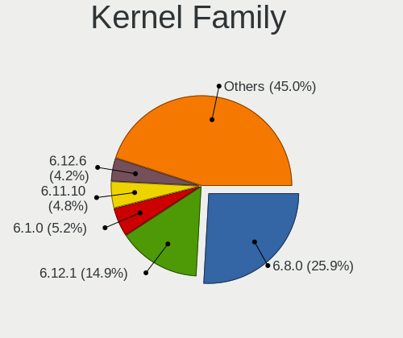
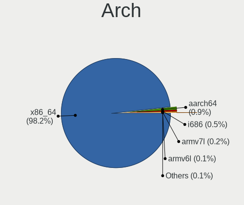
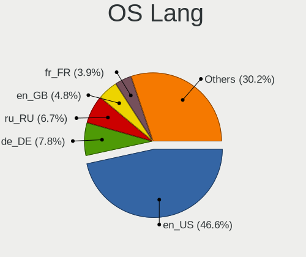
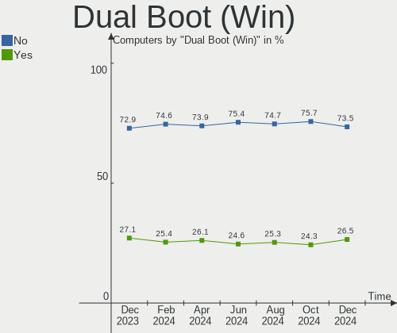
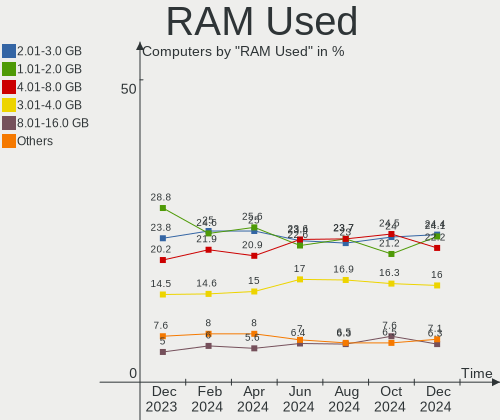
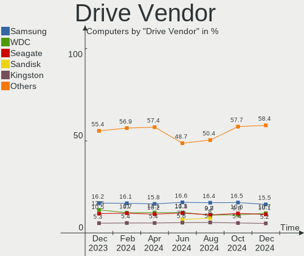

Linux Hardware Trends
---------------------

A project to identify most popular hardware characteristics and track their change
over time based on data collected by Linux users at https://Linux-Hardware.org.

Anyone can contribute to the study by uploading probes of their computers by
the [hw-probe](https://github.com/linuxhw/hw-probe) tool:

    sudo -E hw-probe -all -upload

This is a report for all computer types. See also reports for [desktops](/Desktop/README.md) and [notebooks](/Notebook/README.md).

Full-feature report is available here: https://linux-hardware.org/?view=trends

Distribution-specific reports: [Ubuntu](/Dist/Ubuntu), [ROSA](/Dist/ROSA), [Mint](/Dist/Mint), [Pop!_OS](/Dist/Pop!_OS), [Fedora](/Dist/Fedora), [BlackPanther](/Dist/BlackPanther), [Arch](/Dist/Arch), [Manjaro](/Dist/Manjaro), [Debian](/Dist/Debian), [Endless](/Dist/Endless), [Zorin](/Dist/Zorin), [Gentoo](/Dist/Gentoo), [Clear Linux](/Dist/Clear_Linux), [openSUSE](/Dist/openSUSE), [KDE neon](/Dist/KDE_neon), [ArcoLinux](/Dist/ArcoLinux).

Period: Dec, 2020.

Contents
--------

- [ OS                       ](#os)
- [ OS Family                ](#os-family)
- [ Kernel                   ](#kernel)
- [ Kernel Family            ](#kernel-family)
- [ Kernel Major Ver.        ](#kernel-major-ver)
- [ Arch                     ](#arch)
- [ DE                       ](#de)
- [ Display Server           ](#display-server)
- [ Display Manager          ](#display-manager)
- [ OS Lang                  ](#os-lang)
- [ Boot Mode                ](#boot-mode)
- [ Filesystem               ](#filesystem)
- [ Part. scheme             ](#part-scheme)
- [ Dual Boot with Linux/BSD ](#dual-boot-with-linux/bsd)
- [ Dual Boot (Win)          ](#dual-boot-win)
- [ Country                  ](#country)
- [ City                     ](#city)
- [ Vendor                   ](#vendor)
- [ Model                    ](#model)
- [ Model Family             ](#model-family)
- [ MFG Year                 ](#mfg-year)
- [ Form Factor              ](#form-factor)
- [ Secure Boot              ](#secure-boot)
- [ Coreboot                 ](#coreboot)
- [ RAM Size                 ](#ram-size)
- [ RAM Used                 ](#ram-used)
- [ Has CD-ROM               ](#has-cd-rom)
- [ Total Drives             ](#total-drives)
- [ Has Ethernet             ](#has-ethernet)
- [ Drive Vendor             ](#drive-vendor)
- [ Drive Model              ](#drive-model)
- [ HDD Vendor               ](#hdd-vendor)
- [ SSD Vendor               ](#ssd-vendor)
- [ Drive Kind               ](#drive-kind)
- [ Drive Connector          ](#drive-connector)
- [ Drive Size               ](#drive-size)
- [ Space Total              ](#space-total)
- [ Space Used               ](#space-used)
- [ Malfunc. Drives          ](#malfunc-drives)
- [ Malfunc. Drive Vendor    ](#malfunc-drive-vendor)
- [ Malfunc. HDD Vendor      ](#malfunc-hdd-vendor)
- [ Malfunc. Drive Kind      ](#malfunc-drive-kind)
- [ Failed Drives            ](#failed-drives)
- [ Failed Drive Vendor      ](#failed-drive-vendor)
- [ Drive Status             ](#drive-status)
- [ Storage Vendor           ](#storage-vendor)
- [ Storage Model            ](#storage-model)
- [ Storage Kind             ](#storage-kind)
- [ CPU Vendor               ](#cpu-vendor)
- [ CPU Model                ](#cpu-model)
- [ CPU Model Family         ](#cpu-model-family)
- [ CPU Cores                ](#cpu-cores)
- [ CPU Sockets              ](#cpu-sockets)
- [ CPU Threads              ](#cpu-threads)
- [ CPU Op-Modes             ](#cpu-op-modes)
- [ CPU Microcode            ](#cpu-microcode)
- [ CPU Microarch            ](#cpu-microarch)
- [ GPU Vendor               ](#gpu-vendor)
- [ GPU Model                ](#gpu-model)
- [ GPU Combo                ](#gpu-combo)
- [ GPU Driver               ](#gpu-driver)
- [ GPU Memory               ](#gpu-memory)
- [ Monitor Vendor           ](#monitor-vendor)
- [ Monitor Model            ](#monitor-model)
- [ Monitor Resolution       ](#monitor-resolution)
- [ Monitor Diagonal         ](#monitor-diagonal)
- [ Monitor Width            ](#monitor-width)
- [ Aspect Ratio             ](#aspect-ratio)
- [ Monitor Area             ](#monitor-area)
- [ Pixel Density            ](#pixel-density)
- [ Multiple Monitors        ](#multiple-monitors)
- [ Net Controller Vendor    ](#net-controller-vendor)
- [ Net Controller Model     ](#net-controller-model)
- [ Wireless Vendor          ](#wireless-vendor)
- [ Wireless Model           ](#wireless-model)
- [ Ethernet Vendor          ](#ethernet-vendor)
- [ Ethernet Model           ](#ethernet-model)
- [ Net Controller Kind      ](#net-controller-kind)
- [ Used Controller          ](#used-controller)
- [ NICs                     ](#nics)
- [ Memory Vendor            ](#memory-vendor)
- [ Memory Model             ](#memory-model)
- [ Memory Kind              ](#memory-kind)
- [ Memory Form Factor       ](#memory-form-factor)
- [ Memory Size              ](#memory-size)
- [ Memory Speed             ](#memory-speed)
- [ Sound Vendor             ](#sound-vendor)
- [ Sound Model              ](#sound-model)
- [ Camera Vendor            ](#camera-vendor)
- [ Camera Model             ](#camera-model)
- [ Fingerprint Vendor       ](#fingerprint-vendor)
- [ Fingerprint Model        ](#fingerprint-model)
- [ Chipcard Vendor          ](#chipcard-vendor)
- [ Chipcard Model           ](#chipcard-model)
- [ Printer Vendor           ](#printer-vendor)
- [ Printer Model            ](#printer-model)
- [ Scanner Vendor           ](#scanner-vendor)
- [ Scanner Model            ](#scanner-model)
- [ Bluetooth Vendor         ](#bluetooth-vendor)
- [ Bluetooth Model          ](#bluetooth-model)
- [ Unsupported Devices      ](#unsupported-devices)
- [ Unsupported Device Types ](#unsupported-device-types)

OS
--

Installed operating systems

| Name                | Computers | Percent |
|---------------------|-----------|---------|
| Ubuntu 20.04        | 1519      | 28.37%  |
| Ubuntu 20.10        | 476       | 8.89%   |
| Mint 20             | 350       | 6.54%   |
| Fedora 33           | 276       | 5.15%   |
| Ubuntu 18.04        | 266       | 4.97%   |
| Pop!_OS 20.10       | 233       | 4.35%   |
| KDE neon 20.04      | 215       | 4.01%   |
| BlackPanther 18.1   | 208       | 3.88%   |
| ROSA R11.1          | 125       | 2.33%   |
| Arch                | 121       | 2.26%   |
| Manjaro             | 111       | 2.07%   |
| Manjaro 20.2        | 107       | 2%      |
| Debian 10           | 104       | 1.94%   |
| Pop!_OS 20.04       | 83        | 1.55%   |
| Zorin 15            | 82        | 1.53%   |
| Mint 19.3           | 76        | 1.42%   |
| Endless 3.9.1       | 70        | 1.31%   |
| ROSA R11            | 64        | 1.2%    |
| Arch Rolling        | 58        | 1.08%   |
| ArcoLinux Rolling   | 55        | 1.03%   |
| Endless 3.9.0       | 37        | 0.69%   |
| Ubuntu 16.04        | 36        | 0.67%   |
| Debian Testing      | 32        | 0.6%    |
| Fedora 32           | 30        | 0.56%   |
| LMDE 4              | 28        | 0.52%   |
| Elementary 5.1.7    | 27        | 0.5%    |
| Gentoo              | 25        | 0.47%   |
| Kali 2020.4         | 23        | 0.43%   |
| CentOS 8            | 18        | 0.34%   |
| Gentoo 2.7          | 16        | 0.3%    |
| Debian              | 16        | 0.3%    |
| Ubuntu 19.10        | 14        | 0.26%   |
| openSUSE Leap-15.2  | 13        | 0.24%   |
| Mint 20.1           | 13        | 0.24%   |
| Mint 19.2           | 12        | 0.22%   |
| ALT Linux 9.1       | 12        | 0.22%   |
| ROSA R8.1           | 11        | 0.21%   |
| Reborn OS           | 11        | 0.21%   |
| Peppermint 10       | 11        | 0.21%   |
| BlackPanther 16.2   | 11        | 0.21%   |
| Mint 19.1           | 10        | 0.19%   |
| Mageia 7            | 10        | 0.19%   |
| Ubuntu 21.04        | 9         | 0.17%   |
| Ubuntu              | 8         | 0.15%   |
| Mint 18.3           | 8         | 0.15%   |
| Fedora 31           | 8         | 0.15%   |
| EndeavourOS Rolling | 8         | 0.15%   |
| Chrome OS           | 8         | 0.15%   |
| ROSA R10            | 7         | 0.13%   |
| RHEL 8.3            | 7         | 0.13%   |
| Raspbian 10         | 7         | 0.13%   |
| Endless 3.8.7       | 7         | 0.13%   |
| EndeavourOS         | 7         | 0.13%   |
| Debian Unstable     | 7         | 0.13%   |
| Zorin 12            | 6         | 0.11%   |
| Mint 19             | 6         | 0.11%   |
| Endless 3.7.4       | 6         | 0.11%   |
| ROSA R12            | 5         | 0.09%   |
| Parrot 4.10         | 5         | 0.09%   |
| MX 19.3             | 5         | 0.09%   |

OS Family
---------

OS without a version

| Name           | Computers | Percent |
|----------------|-----------|---------|
| Ubuntu         | 2344      | 43.77%  |
| Mint           | 475       | 8.87%   |
| Fedora         | 319       | 5.96%   |
| Pop!_OS        | 317       | 5.92%   |
| Manjaro        | 221       | 4.13%   |
| BlackPanther   | 219       | 4.09%   |
| KDE neon       | 216       | 4.03%   |
| ROSA           | 214       | 4%      |
| Arch           | 179       | 3.34%   |
| Debian         | 163       | 3.04%   |
| Endless        | 136       | 2.54%   |
| Zorin          | 88        | 1.64%   |
| ArcoLinux      | 58        | 1.08%   |
| openSUSE       | 48        | 0.9%    |
| Gentoo         | 41        | 0.77%   |
| Elementary     | 29        | 0.54%   |
| LMDE           | 28        | 0.52%   |
| Kali           | 26        | 0.49%   |
| CentOS         | 24        | 0.45%   |
| Clear Linux    | 19        | 0.35%   |
| EndeavourOS    | 15        | 0.28%   |
| ALT Linux      | 15        | 0.28%   |
| Reborn OS      | 12        | 0.22%   |
| Peppermint     | 11        | 0.21%   |
| Mageia         | 11        | 0.21%   |
| Garuda         | 9         | 0.17%   |
| RHEL           | 8         | 0.15%   |
| OpenMandriva   | 8         | 0.15%   |
| Chrome OS      | 8         | 0.15%   |
| Artix          | 8         | 0.15%   |
| Raspbian       | 7         | 0.13%   |
| SkiffOS        | 6         | 0.11%   |
| Parrot         | 6         | 0.11%   |
| MX             | 6         | 0.11%   |
| RED            | 5         | 0.09%   |
| WindowsFX      | 4         | 0.07%   |
| Void           | 4         | 0.07%   |
| Pardus         | 4         | 0.07%   |
| Alpine         | 4         | 0.07%   |
| Solus          | 3         | 0.06%   |
| RELS           | 3         | 0.06%   |
| Hefftor        | 3         | 0.06%   |
| Devuan         | 3         | 0.06%   |
| Deepin         | 3         | 0.06%   |
| Sparky         | 2         | 0.04%   |
| Slackware      | 2         | 0.04%   |
| Oracle Linux   | 2         | 0.04%   |
| Android        | 2         | 0.04%   |
| Springdale     | 1         | 0.02%   |
| Siduction      | 1         | 0.02%   |
| Sandomierz     | 1         | 0.02%   |
| Porteus        | 1         | 0.02%   |
| Obarun         | 1         | 0.02%   |
| Manjaro-ARM    | 1         | 0.02%   |
| LFS            | 1         | 0.02%   |
| Kubuntu        | 1         | 0.02%   |
| Hyperbola      | 1         | 0.02%   |
| HamoniKR       | 1         | 0.02%   |
| Garuda Soaring | 1         | 0.02%   |
| GalliumOS      | 1         | 0.02%   |

Kernel
------

Version of the Linux kernel

| Version                             | Computers | Percent |
|-------------------------------------|-----------|---------|
| 5.4.0-58-generic                    | 1118      | 20.88%  |
| 5.4.0-56-generic                    | 657       | 12.27%  |
| 5.8.0-7630-generic                  | 291       | 5.43%   |
| 5.8.0-33-generic                    | 215       | 4.01%   |
| 4.18.16-desktop-1bP                 | 195       | 3.64%   |
| 5.4.0-54-generic                    | 179       | 3.34%   |
| 5.9.11-3-MANJARO                    | 115       | 2.15%   |
| 5.8.0-14-generic                    | 109       | 2.04%   |
| 5.8.0-31-generic                    | 101       | 1.89%   |
| 5.4.0-42-generic                    | 96        | 1.79%   |
| 5.9.14-arch1-1                      | 83        | 1.55%   |
| 4.19.0-13-amd64                     | 74        | 1.38%   |
| 5.9.11-200.fc33.x86_64              | 71        | 1.33%   |
| 4.15.0-128-generic                  | 67        | 1.25%   |
| 4.15.0-desktop-122.124.1rosa-x86_64 | 61        | 1.14%   |
| 5.4.0-26-generic                    | 55        | 1.03%   |
| 4.15.0-desktop-45.1rosa-x86_64      | 52        | 0.97%   |
| 5.9.13-200.fc33.x86_64              | 49        | 0.92%   |
| 5.8.0-29-generic                    | 47        | 0.88%   |
| 5.8.0-32-generic                    | 43        | 0.8%    |
| 5.9.11-arch2-1                      | 42        | 0.78%   |
| 5.8.18-1-MANJARO                    | 40        | 0.75%   |
| 5.9.14-200.fc33.x86_64              | 37        | 0.69%   |
| 5.9.16-200.fc33.x86_64              | 35        | 0.65%   |
| 5.9.13-arch1-1                      | 34        | 0.63%   |
| 5.9.15-200.fc33.x86_64              | 30        | 0.56%   |
| 5.9.0-4-amd64                       | 30        | 0.56%   |
| 5.4.0-52-generic                    | 30        | 0.56%   |
| 4.15.0-126-generic                  | 29        | 0.54%   |
| 5.8.0-34-generic                    | 27        | 0.5%    |
| 5.4.0-53-generic                    | 24        | 0.45%   |
| 5.8.0-25-generic                    | 23        | 0.43%   |
| 4.19.0-12-amd64                     | 23        | 0.43%   |
| 5.4.0-59-generic                    | 22        | 0.41%   |
| 5.4.0-58-lowlatency                 | 22        | 0.41%   |
| 5.4.80-2-MANJARO                    | 21        | 0.39%   |
| 5.9.12-200.fc33.x86_64              | 18        | 0.34%   |
| 5.8.0-1010-raspi                    | 18        | 0.34%   |
| 4.9.155-nrj-desktop-1rosa-x86_64    | 18        | 0.34%   |
| 5.9.12-arch1-1                      | 15        | 0.28%   |
| 5.10.2-051002-generic               | 15        | 0.28%   |
| 4.18.0-240.1.1.el8_3.x86_64         | 15        | 0.28%   |
| 5.9.10-200.fc33.x86_64              | 14        | 0.26%   |
| 4.15.0-124-generic                  | 14        | 0.26%   |
| 5.9.10-arch1-1                      | 13        | 0.24%   |
| 5.4.0-48-generic                    | 13        | 0.24%   |
| 4.15.0-desktop-45.1rosa-i586        | 13        | 0.24%   |
| 5.6.14-desktop-2bP                  | 12        | 0.22%   |
| 5.4.72-generic-1rosa-x86_64         | 12        | 0.22%   |
| 5.3.18-lp152.57-default             | 12        | 0.22%   |
| 5.9.14-zen1-1-zen                   | 11        | 0.21%   |
| 5.9.0-5-amd64                       | 11        | 0.21%   |
| 5.8.15-301.fc33.x86_64              | 11        | 0.21%   |
| 5.4.0-57-generic                    | 11        | 0.21%   |
| 5.0.0-32-generic                    | 11        | 0.21%   |
| 5.9.12-050912-generic               | 10        | 0.19%   |
| 5.8.0-1008-raspi                    | 10        | 0.19%   |
| 5.4.83-generic-2rosa-x86_64         | 10        | 0.19%   |
| 4.15.0-123-generic                  | 10        | 0.19%   |
| 5.9.14-1-default                    | 9         | 0.17%   |

Kernel Family
-------------

Linux kernel without a distro release

| Version | Computers | Percent |
|---------|-----------|---------|
| 5.4.0   | 2306      | 43.06%  |
| 5.8.0   | 942       | 17.59%  |
| 4.15.0  | 313       | 5.85%   |
| 5.9.11  | 255       | 4.76%   |
| 4.18.16 | 195       | 3.64%   |
| 5.9.14  | 164       | 3.06%   |
| 4.19.0  | 122       | 2.28%   |
| 5.9.13  | 105       | 1.96%   |
| 5.9.0   | 87        | 1.62%   |
| 5.9.12  | 71        | 1.33%   |
| 5.8.18  | 55        | 1.03%   |
| 5.9.16  | 49        | 0.92%   |
| 5.3.0   | 42        | 0.78%   |
| 5.10.1  | 41        | 0.77%   |
| 5.9.15  | 39        | 0.73%   |
| 5.4.80  | 39        | 0.73%   |
| 5.9.10  | 38        | 0.71%   |
| 4.18.0  | 33        | 0.62%   |
| 5.10.2  | 28        | 0.52%   |
| 4.9.155 | 25        | 0.47%   |
| 5.10.0  | 24        | 0.45%   |
| 5.0.0   | 21        | 0.39%   |
| 5.4.72  | 17        | 0.32%   |
| 5.3.18  | 16        | 0.3%    |
| 5.4.83  | 15        | 0.28%   |
| 5.7.19  | 14        | 0.26%   |
| 4.4.0   | 14        | 0.26%   |
| 5.9.8   | 13        | 0.24%   |
| 5.6.14  | 13        | 0.24%   |
| 5.6.0   | 13        | 0.24%   |
| 5.8.15  | 11        | 0.21%   |
| 5.10.3  | 11        | 0.21%   |
| 5.9.1   | 10        | 0.19%   |
| 5.4.32  | 10        | 0.19%   |
| 4.9.20  | 10        | 0.19%   |
| 5.4.81  | 8         | 0.15%   |
| 5.4.79  | 8         | 0.15%   |
| 5.8.16  | 7         | 0.13%   |
| 5.4.53  | 7         | 0.13%   |
| 3.10.0  | 7         | 0.13%   |
| 5.7.0   | 6         | 0.11%   |
| 5.4.85  | 6         | 0.11%   |
| 5.4.82  | 6         | 0.11%   |
| 4.9.60  | 6         | 0.11%   |
| 5.4.84  | 5         | 0.09%   |
| 4.9.0   | 5         | 0.09%   |
| 5.9.6   | 4         | 0.07%   |
| 5.5.12  | 4         | 0.07%   |
| 5.4.77  | 4         | 0.07%   |
| 5.4.51  | 4         | 0.07%   |
| 4.16.0  | 4         | 0.07%   |
| 5.9.3   | 3         | 0.06%   |
| 5.8.13  | 3         | 0.06%   |
| 5.8.11  | 3         | 0.06%   |
| 5.7.1   | 3         | 0.06%   |
| 5.6.13  | 3         | 0.06%   |
| 5.4.78  | 3         | 0.06%   |
| 5.4.68  | 3         | 0.06%   |
| 4.13.0  | 3         | 0.06%   |
| 4.10.0  | 3         | 0.06%   |

Kernel Major Ver.
-----------------

Linux kernel major version

| Version | Computers | Percent |
|---------|-----------|---------|
| 5.4     | 2461      | 45.96%  |
| 5.8     | 1029      | 19.22%  |
| 5.9     | 840       | 15.69%  |
| 4.15    | 313       | 5.85%   |
| 4.18    | 228       | 4.26%   |
| 4.19    | 126       | 2.35%   |
| 5.10    | 105       | 1.96%   |
| 5.3     | 58        | 1.08%   |
| 4.9     | 53        | 0.99%   |
| 5.6     | 34        | 0.63%   |
| 5.7     | 31        | 0.58%   |
| 5.0     | 21        | 0.39%   |
| 4.4     | 15        | 0.28%   |
| 3.10    | 9         | 0.17%   |
| 5.5     | 8         | 0.15%   |
| 4.16    | 5         | 0.09%   |
| 4.13    | 3         | 0.06%   |
| 4.10    | 3         | 0.06%   |
| 5.11    | 2         | 0.04%   |
| 4.12    | 2         | 0.04%   |
| 4.1     | 2         | 0.04%   |
| Unknown | 2         | 0.04%   |
| 5.2     | 1         | 0.02%   |
| 4.8     | 1         | 0.02%   |
| 4.7     | 1         | 0.02%   |
| 4.20    | 1         | 0.02%   |
| 4.14    | 1         | 0.02%   |

Arch
----

OS architecture (x86_64, i586, etc.)

| Name    | Computers | Percent |
|---------|-----------|---------|
| x86_64  | 5118      | 95.57%  |
| i686    | 160       | 2.99%   |
| aarch64 | 58        | 1.08%   |
| armv7l  | 15        | 0.28%   |
| unknow  | 1         | 0.02%   |
| armv8l  | 1         | 0.02%   |
| armv6l  | 1         | 0.02%   |
| Unknown | 1         | 0.02%   |

DE
--

Desktop Environment

| Name              | Computers | Percent |
|-------------------|-----------|---------|
| GNOME             | 2726      | 50.91%  |
| KDE5              | 511       | 9.54%   |
| XFCE              | 435       | 8.12%   |
| X-Cinnamon        | 426       | 7.96%   |
| KDE               | 425       | 7.94%   |
| Unknown           | 240       | 4.48%   |
| MATE              | 142       | 2.65%   |
| KDE4              | 129       | 2.41%   |
| Unity             | 49        | 0.92%   |
| Cinnamon          | 45        | 0.84%   |
| LXQt              | 42        | 0.78%   |
| Budgie            | 29        | 0.54%   |
| LXDE              | 27        | 0.5%    |
| Pantheon          | 25        | 0.47%   |
| i3                | 20        | 0.37%   |
| GNOME Flashback   | 16        | 0.3%    |
| GNOME Classic     | 12        | 0.22%   |
| Deepin            | 12        | 0.22%   |
| dwm               | 9         | 0.17%   |
| awesome           | 9         | 0.17%   |
| bspwm             | 4         | 0.07%   |
| xmonad            | 3         | 0.06%   |
| Openbox           | 3         | 0.06%   |
| fluxbox           | 3         | 0.06%   |
| enlightenment     | 3         | 0.06%   |
| default           | 2         | 0.04%   |
| Yaru:ubuntu:GNOME | 1         | 0.02%   |
| Trinity           | 1         | 0.02%   |
| sway              | 1         | 0.02%   |
| spectrwm          | 1         | 0.02%   |
| qtile             | 1         | 0.02%   |
| lightdm-xsession  | 1         | 0.02%   |
| herbstluftwm      | 1         | 0.02%   |
| fvwm              | 1         | 0.02%   |

Display Server
--------------

X11 or Wayland

| Name        | Computers | Percent |
|-------------|-----------|---------|
| X11         | 4795      | 89.54%  |
| Wayland     | 386       | 7.21%   |
| Unknown     | 98        | 1.83%   |
| Tty         | 72        | 1.34%   |
| Web         | 2         | 0.04%   |
| Unspecified | 2         | 0.04%   |

Display Manager
---------------

SDDM, LightDM, etc.

| Name    | Computers | Percent |
|---------|-----------|---------|
| Unknown | 3631      | 67.81%  |
| GDM     | 583       | 10.89%  |
| SDDM    | 535       | 9.99%   |
| TDM     | 353       | 6.59%   |
| KDM     | 131       | 2.45%   |
| LightDM | 97        | 1.81%   |
| XDM     | 9         | 0.17%   |
| SLiM    | 7         | 0.13%   |
| GDM3    | 5         | 0.09%   |
| LXDM    | 3         | 0.06%   |
| NODM    | 1         | 0.02%   |

OS Lang
-------

Language

| Lang       | Computers | Percent |
|------------|-----------|---------|
| en_US      | 1868      | 34.88%  |
| de_DE      | 506       | 9.45%   |
| Unknown    | 386       | 7.21%   |
| en_GB      | 256       | 4.78%   |
| ru_RU      | 242       | 4.52%   |
| pt_BR      | 212       | 3.96%   |
| fr_FR      | 200       | 3.73%   |
| it_IT      | 184       | 3.44%   |
| es_ES      | 119       | 2.22%   |
| en_CA      | 109       | 2.04%   |
| pl_PL      | 102       | 1.9%    |
| en_US.utf8 | 100       | 1.87%   |
| C          | 83        | 1.55%   |
| en_IN      | 72        | 1.34%   |
| en_AU      | 72        | 1.34%   |
| nl_NL      | 57        | 1.06%   |
| hu_HU      | 36        | 0.67%   |
| es_MX      | 34        | 0.63%   |
| tr_TR      | 31        | 0.58%   |
| sv_SE      | 31        | 0.58%   |
| cs_CZ      | 31        | 0.58%   |
| pt_BR.utf8 | 30        | 0.56%   |
| ja_JP      | 25        | 0.47%   |
| es_AR      | 24        | 0.45%   |
| de_CH      | 24        | 0.45%   |
| fi_FI      | 23        | 0.43%   |
| ro_RO      | 22        | 0.41%   |
| en_ZA      | 22        | 0.41%   |
| pt_PT      | 20        | 0.37%   |
| fr_CA      | 20        | 0.37%   |
| de_AT      | 18        | 0.34%   |
| ru_UA      | 17        | 0.32%   |
| el_GR      | 16        | 0.3%    |
| C          | 16        | 0.3%    |
| nl_BE      | 15        | 0.28%   |
| sk_SK      | 14        | 0.26%   |
| es_CO      | 14        | 0.26%   |
| de_DE.utf8 | 13        | 0.24%   |
| zh_CN      | 12        | 0.22%   |
| hr_HR      | 11        | 0.21%   |
| da_DK      | 11        | 0.21%   |
| fr_BE      | 10        | 0.19%   |
| uk_UA      | 9         | 0.17%   |
| ru_RU.utf8 | 9         | 0.17%   |
| es_CL      | 9         | 0.17%   |
| bg_BG      | 9         | 0.17%   |
| zh_TW      | 8         | 0.15%   |
| pl_PL.utf8 | 8         | 0.15%   |
| ko_KR      | 8         | 0.15%   |
| en_IL      | 8         | 0.15%   |
| en_GB.utf8 | 8         | 0.15%   |
| POSIX      | 7         | 0.13%   |
| fr_FR.utf8 | 7         | 0.13%   |
| en_NZ      | 7         | 0.13%   |
| en_IE      | 7         | 0.13%   |
| en_CA.utf8 | 7         | 0.13%   |
| en_PH      | 6         | 0.11%   |
| nb_NO      | 5         | 0.09%   |
| it_IT.utf8 | 5         | 0.09%   |
| es_MX.utf8 | 5         | 0.09%   |

Boot Mode
---------

EFI or BIOS

| Mode | Computers | Percent |
|------|-----------|---------|
| BIOS | 3025      | 56.49%  |
| EFI  | 2330      | 43.51%  |

Filesystem
----------

Type of filesystem

| Type                | Computers | Percent |
|---------------------|-----------|---------|
| Ext4                | 4572      | 85.38%  |
| Btrfs               | 325       | 6.07%   |
| Overlay             | 295       | 5.51%   |
| Xfs                 | 79        | 1.48%   |
| Zfs                 | 37        | 0.69%   |
| Unknown             | 11        | 0.21%   |
| Ext2                | 9         | 0.17%   |
| Ext3                | 7         | 0.13%   |
| Tmpfs               | 6         | 0.11%   |
| F2fs                | 5         | 0.09%   |
| Aufs                | 4         | 0.07%   |
| Reiserfs            | 3         | 0.06%   |
| Jfs                 | 1         | 0.02%   |
| Fuse.fuse-overlayfs | 1         | 0.02%   |

Part. scheme
------------

Scheme of partitioning

| Type    | Computers | Percent |
|---------|-----------|---------|
| Unknown | 3542      | 66.14%  |
| GPT     | 1225      | 22.88%  |
| MBR     | 588       | 10.98%  |

Dual Boot with Linux/BSD
------------------------

Hosting more than one Linux/BSD

| Dual boot | Computers | Percent |
|-----------|-----------|---------|
| No        | 4693      | 87.64%  |
| Yes       | 662       | 12.36%  |

Dual Boot (Win)
---------------

Hosting Linux and Windows

| Dual boot | Computers | Percent |
|-----------|-----------|---------|
| No        | 3859      | 72.06%  |
| Yes       | 1496      | 27.94%  |

Country
-------

Geographic location (country)

| Country            | Computers | Percent |
|--------------------|-----------|---------|
| USA                | 950       | 17.74%  |
| Germany            | 642       | 11.99%  |
| Russia             | 334       | 6.24%   |
| Brazil             | 308       | 5.75%   |
| Italy              | 234       | 4.37%   |
| France             | 232       | 4.33%   |
| Hungary            | 225       | 4.2%    |
| UK                 | 196       | 3.66%   |
| Canada             | 180       | 3.36%   |
| Spain              | 157       | 2.93%   |
| Poland             | 128       | 2.39%   |
| Netherlands        | 124       | 2.32%   |
| India              | 118       | 2.2%    |
| Australia          | 83        | 1.55%   |
| Ukraine            | 80        | 1.49%   |
| Switzerland        | 71        | 1.33%   |
| Turkey             | 63        | 1.18%   |
| Sweden             | 60        | 1.12%   |
| Romania            | 58        | 1.08%   |
| Mexico             | 58        | 1.08%   |
| Belgium            | 58        | 1.08%   |
| Austria            | 56        | 1.05%   |
| Czech Republic     | 53        | 0.99%   |
| Greece             | 48        | 0.9%    |
| Finland            | 48        | 0.9%    |
| Argentina          | 41        | 0.77%   |
| Japan              | 38        | 0.71%   |
| Portugal           | 33        | 0.62%   |
| South Africa       | 30        | 0.56%   |
| Bulgaria           | 30        | 0.56%   |
| Indonesia          | 29        | 0.54%   |
| Denmark            | 29        | 0.54%   |
| Colombia           | 25        | 0.47%   |
| Slovakia           | 24        | 0.45%   |
| Serbia             | 24        | 0.45%   |
| China              | 24        | 0.45%   |
| Vietnam            | 18        | 0.34%   |
| Norway             | 17        | 0.32%   |
| Croatia            | 17        | 0.32%   |
| Chile              | 17        | 0.32%   |
| Belarus            | 17        | 0.32%   |
| Egypt              | 16        | 0.3%    |
| Korea, Republic of | 15        | 0.28%   |
| Iran               | 15        | 0.28%   |
| Slovenia           | 14        | 0.26%   |
| Philippines        | 14        | 0.26%   |
| Malaysia           | 14        | 0.26%   |
| Israel             | 13        | 0.24%   |
| New Zealand        | 12        | 0.22%   |
| Latvia             | 12        | 0.22%   |
| Thailand           | 11        | 0.21%   |
| Taiwan             | 11        | 0.21%   |
| Singapore          | 10        | 0.19%   |
| Lithuania          | 9         | 0.17%   |
| Ireland            | 9         | 0.17%   |
| Estonia            | 9         | 0.17%   |
| Saudi Arabia       | 8         | 0.15%   |
| Morocco            | 8         | 0.15%   |
| Costa Rica         | 8         | 0.15%   |
| Tunisia            | 7         | 0.13%   |

City
----

Geographic location (city)

| City              | Computers | Percent |
|-------------------|-----------|---------|
| Budapest          | 83        | 1.55%   |
| Moscow            | 68        | 1.27%   |
| Berlin            | 51        | 0.95%   |
| Rome              | 37        | 0.69%   |
| Paris             | 36        | 0.67%   |
| Vienna            | 34        | 0.63%   |
| Madrid            | 33        | 0.62%   |
| São Paulo        | 31        | 0.58%   |
| St Petersburg     | 31        | 0.58%   |
| Warsaw            | 28        | 0.52%   |
| Kyiv              | 27        | 0.5%    |
| Athens            | 26        | 0.49%   |
| Istanbul          | 24        | 0.45%   |
| Bucharest         | 23        | 0.43%   |
| Prague            | 21        | 0.39%   |
| Munich            | 21        | 0.39%   |
| Montreal          | 21        | 0.39%   |
| Hamburg           | 20        | 0.37%   |
| Milan             | 19        | 0.35%   |
| Novosibirsk       | 18        | 0.34%   |
| Düsseldorf       | 18        | 0.34%   |
| Toronto           | 17        | 0.32%   |
| Stuttgart         | 17        | 0.32%   |
| Sydney            | 16        | 0.3%    |
| Rio de Janeiro    | 16        | 0.3%    |
| Buenos Aires      | 16        | 0.3%    |
| Bengaluru         | 16        | 0.3%    |
| Zurich            | 15        | 0.28%   |
| Seattle           | 15        | 0.28%   |
| New York          | 15        | 0.28%   |
| Helsinki          | 15        | 0.28%   |
| Belgrade          | 15        | 0.28%   |
| Sofia             | 14        | 0.26%   |
| Mumbai            | 14        | 0.26%   |
| Ekaterinburg      | 14        | 0.26%   |
| Tehran            | 13        | 0.24%   |
| Dresden           | 13        | 0.24%   |
| Cologne           | 13        | 0.24%   |
| Chicago           | 13        | 0.24%   |
| Chennai           | 13        | 0.24%   |
| Bogotá           | 13        | 0.24%   |
| Stockholm         | 12        | 0.22%   |
| Melbourne         | 12        | 0.22%   |
| London            | 12        | 0.22%   |
| Izmir             | 12        | 0.22%   |
| Riga              | 11        | 0.21%   |
| Portland          | 11        | 0.21%   |
| Perth             | 11        | 0.21%   |
| Orlando           | 11        | 0.21%   |
| Brasília         | 11        | 0.21%   |
| Amsterdam         | 11        | 0.21%   |
| Zagreb            | 10        | 0.19%   |
| Wuppertal         | 10        | 0.19%   |
| Voronezh          | 10        | 0.19%   |
| Santiago          | 10        | 0.19%   |
| Hyderabad         | 10        | 0.19%   |
| Houston           | 10        | 0.19%   |
| Ho Chi Minh City  | 10        | 0.19%   |
| Frankfurt am Main | 10        | 0.19%   |
| Florence          | 10        | 0.19%   |

Vendor
------

Motherboard manufacturer

| Name                    | Computers | Percent |
|-------------------------|-----------|---------|
| ASUSTek Computer        | 898       | 16.77%  |
| Lenovo                  | 716       | 13.37%  |
| Hewlett-Packard         | 709       | 13.24%  |
| Dell                    | 685       | 12.79%  |
| Gigabyte Technology     | 414       | 7.73%   |
| Acer                    | 348       | 6.5%    |
| MSI                     | 300       | 5.6%    |
| ASRock                  | 202       | 3.77%   |
| Toshiba                 | 100       | 1.87%   |
| Intel                   | 87        | 1.62%   |
| Apple                   | 87        | 1.62%   |
| Samsung Electronics     | 74        | 1.38%   |
| Unknown                 | 65        | 1.21%   |
| Fujitsu                 | 55        | 1.03%   |
| Raspberry Pi Foundation | 54        | 1.01%   |
| Sony                    | 43        | 0.8%    |
| Medion                  | 30        | 0.56%   |
| Pegatron                | 28        | 0.52%   |
| HUAWEI                  | 27        | 0.5%    |
| Notebook                | 21        | 0.39%   |
| Biostar                 | 21        | 0.39%   |
| Positivo                | 19        | 0.35%   |
| Fujitsu Siemens         | 17        | 0.32%   |
| Packard Bell            | 15        | 0.28%   |
| ECS                     | 15        | 0.28%   |
| Foxconn                 | 14        | 0.26%   |
| TUXEDO                  | 13        | 0.24%   |
| System76                | 13        | 0.24%   |
| Supermicro              | 12        | 0.22%   |
| Microsoft               | 11        | 0.21%   |
| Timi                    | 9         | 0.17%   |
| LG Electronics          | 9         | 0.17%   |
| Gateway                 | 9         | 0.17%   |
| eMachines               | 9         | 0.17%   |
| Alienware               | 8         | 0.15%   |
| Teclast                 | 7         | 0.13%   |
| PC Specialist           | 7         | 0.13%   |
| Panasonic               | 6         | 0.11%   |
| PC Engines              | 5         | 0.09%   |
| Huanan                  | 5         | 0.09%   |
| Hardkernel              | 5         | 0.09%   |
| Clevo                   | 5         | 0.09%   |
| Chuwi                   | 5         | 0.09%   |
| AMI                     | 5         | 0.09%   |
| Acidanthera             | 5         | 0.09%   |
| Razer                   | 4         | 0.07%   |
| NEC Computers           | 4         | 0.07%   |
| Insyde                  | 4         | 0.07%   |
| Google                  | 4         | 0.07%   |
| ZOTAC                   | 3         | 0.06%   |
| Semp Toshiba            | 3         | 0.06%   |
| PCWare                  | 3         | 0.06%   |
| EUROCOM                 | 3         | 0.06%   |
| Avell High Performance  | 3         | 0.06%   |
| ASRockRack              | 3         | 0.06%   |
| ABIT                    | 3         | 0.06%   |
| VIA Technologies        | 2         | 0.04%   |
| TYAN Computer           | 2         | 0.04%   |
| SYS                     | 2         | 0.04%   |
| SLIMBOOK                | 2         | 0.04%   |

Model
-----

Motherboard model

| Name                               | Computers | Percent |
|------------------------------------|-----------|---------|
| Unknown                            | 83        | 1.55%   |
| ASUS All Series                    | 52        | 0.97%   |
| RPi Raspberry Pi 4 Model B Rev 1.4 | 19        | 0.35%   |
| HP NOTEBOOK                        | 19        | 0.35%   |
| HP Pavilion g6                     | 16        | 0.3%    |
| Gigabyte B450M DS3H                | 15        | 0.28%   |
| ASUS ROG STRIX B450-F GAMING       | 14        | 0.26%   |
| Acer Nitro AN515-54                | 14        | 0.26%   |
| RPi Raspberry Pi 4 Model B Rev 1.2 | 13        | 0.24%   |
| MSI MS-7C37                        | 12        | 0.22%   |
| HP 15                              | 11        | 0.21%   |
| MSI MS-7A38                        | 10        | 0.19%   |
| HP ProBook 4540s                   | 10        | 0.19%   |
| Dell XPS 15 7590                   | 10        | 0.19%   |
| Dell OptiPlex 7010                 | 10        | 0.19%   |
| Dell Inspiron 1545                 | 10        | 0.19%   |
| ASUS PRIME A320M-K                 | 10        | 0.19%   |
| RPi Raspberry Pi 4 Model B Rev 1.1 | 9         | 0.17%   |
| MSI MS-7C02                        | 9         | 0.17%   |
| HP Laptop 15-db0xxx                | 9         | 0.17%   |
| Gigabyte X570 AORUS ELITE          | 9         | 0.17%   |
| Dell XPS 13 9370                   | 9         | 0.17%   |
| Dell Latitude E6430                | 9         | 0.17%   |
| HUAWEI NBLK-WAX9X                  | 8         | 0.15%   |
| HP Pavilion Notebook               | 8         | 0.15%   |
| HP Pavilion dv7                    | 8         | 0.15%   |
| HP Pavilion dv6                    | 8         | 0.15%   |
| Dell OptiPlex 3020                 | 8         | 0.15%   |
| Dell OptiPlex 3010                 | 8         | 0.15%   |
| ASUS TUF GAMING X570-PLUS          | 8         | 0.15%   |
| ASUS ROG STRIX B550-F GAMING       | 8         | 0.15%   |
| MSI MS-7B86                        | 7         | 0.13%   |
| MSI MS-7817                        | 7         | 0.13%   |
| Lenovo IdeaPad 3 15IIL05 81WE      | 7         | 0.13%   |
| HUAWEI BOHK-WAX9X                  | 7         | 0.13%   |
| HP Pavilion 15                     | 7         | 0.13%   |
| HP EliteBook 8460p                 | 7         | 0.13%   |
| Gigabyte A320M-S2H                 | 7         | 0.13%   |
| Dell XPS 15 9500                   | 7         | 0.13%   |
| Dell XPS 13 9310                   | 7         | 0.13%   |
| Dell Latitude E6420                | 7         | 0.13%   |
| ASUS PRIME B450M-A                 | 7         | 0.13%   |
| ASRock B450M Pro4                  | 7         | 0.13%   |
| Apple MacBookPro9,2                | 7         | 0.13%   |
| Acer Aspire A315-21                | 7         | 0.13%   |
| MSI MS-7996                        | 6         | 0.11%   |
| MSI MS-7721                        | 6         | 0.11%   |
| HP Pavilion Laptop 15-cw1xxx       | 6         | 0.11%   |
| HP Pavilion g7                     | 6         | 0.11%   |
| HP Pavilion g4                     | 6         | 0.11%   |
| HP Laptop 15-bs0xx                 | 6         | 0.11%   |
| HP EliteBook 8470p                 | 6         | 0.11%   |
| HP EliteBook 840 G3                | 6         | 0.11%   |
| HP 255 G7 Notebook PC              | 6         | 0.11%   |
| HP 250 G7 Notebook PC              | 6         | 0.11%   |
| Gigabyte G31M-ES2L                 | 6         | 0.11%   |
| Gigabyte B450 I AORUS PRO WIFI     | 6         | 0.11%   |
| Dell XPS 15 9570                   | 6         | 0.11%   |
| Dell XPS 13 9380                   | 6         | 0.11%   |
| Dell OptiPlex 780                  | 6         | 0.11%   |

Model Family
------------

Motherboard model prefix

| Name                    | Computers | Percent |
|-------------------------|-----------|---------|
| Lenovo ThinkPad         | 328       | 6.13%   |
| Acer Aspire             | 221       | 4.13%   |
| Dell Inspiron           | 206       | 3.85%   |
| Dell Latitude           | 169       | 3.16%   |
| Lenovo IdeaPad          | 157       | 2.93%   |
| HP Pavilion             | 140       | 2.61%   |
| HP EliteBook            | 94        | 1.76%   |
| ASUS PRIME              | 91        | 1.7%    |
| Dell OptiPlex           | 87        | 1.62%   |
| Dell XPS                | 85        | 1.59%   |
| Unknown                 | 83        | 1.55%   |
| Toshiba Satellite       | 82        | 1.53%   |
| HP Compaq               | 76        | 1.42%   |
| ASUS ROG                | 69        | 1.29%   |
| HP ProBook              | 66        | 1.23%   |
| ASUS VivoBook           | 59        | 1.1%    |
| Dell Precision          | 58        | 1.08%   |
| HP Laptop               | 57        | 1.06%   |
| RPi Raspberry           | 54        | 1.01%   |
| ASUS All                | 52        | 0.97%   |
| Lenovo ThinkCentre      | 40        | 0.75%   |
| ASUS TUF                | 40        | 0.75%   |
| Dell Vostro             | 37        | 0.69%   |
| HP ENVY                 | 35        | 0.65%   |
| Acer Nitro              | 33        | 0.62%   |
| Lenovo Yoga             | 27        | 0.5%    |
| Gigabyte X570           | 23        | 0.43%   |
| Fujitsu ESPRIMO         | 23        | 0.43%   |
| Lenovo Legion           | 20        | 0.37%   |
| Fujitsu LIFEBOOK        | 20        | 0.37%   |
| Acer Extensa            | 20        | 0.37%   |
| HP ZBook                | 19        | 0.35%   |
| HP Notebook             | 19        | 0.35%   |
| Gigabyte B450M          | 19        | 0.35%   |
| Gigabyte B450           | 18        | 0.34%   |
| ASUS M5A78L-M           | 18        | 0.34%   |
| Acer Swift              | 17        | 0.32%   |
| HP 250                  | 16        | 0.3%    |
| HP ProDesk              | 15        | 0.28%   |
| HP 15                   | 15        | 0.28%   |
| ASUS ZenBook            | 15        | 0.28%   |
| Lenovo IdeaCentre       | 13        | 0.24%   |
| HP 255                  | 13        | 0.24%   |
| Gigabyte GA-78LMT-USB3  | 13        | 0.24%   |
| Dell PowerEdge          | 13        | 0.24%   |
| ASRock X570             | 13        | 0.24%   |
| ASRock B450M            | 13        | 0.24%   |
| MSI MS-7C37             | 12        | 0.22%   |
| Packard Bell EasyNote   | 11        | 0.21%   |
| Microsoft Surface       | 11        | 0.21%   |
| HP Spectre              | 11        | 0.21%   |
| HP OMEN                 | 11        | 0.21%   |
| HP EliteDesk            | 11        | 0.21%   |
| ASUS P8H61-M            | 11        | 0.21%   |
| ASUS M5A97              | 11        | 0.21%   |
| MSI MS-7A38             | 10        | 0.19%   |
| Gigabyte Z390           | 10        | 0.19%   |
| Gigabyte B550           | 10        | 0.19%   |
| Gigabyte A320M-S2H      | 10        | 0.19%   |
| Fujitsu Siemens ESPRIMO | 10        | 0.19%   |

MFG Year
--------

Motherboard manufacture year

| Year    | Computers | Percent |
|---------|-----------|---------|
| 2020    | 1154      | 21.55%  |
| 2019    | 742       | 13.86%  |
| 2018    | 467       | 8.72%   |
| 2013    | 340       | 6.35%   |
| 2012    | 329       | 6.14%   |
| 2014    | 319       | 5.96%   |
| 2011    | 316       | 5.9%    |
| 2015    | 287       | 5.36%   |
| 2010    | 282       | 5.27%   |
| 2017    | 264       | 4.93%   |
| 2016    | 232       | 4.33%   |
| 2009    | 220       | 4.11%   |
| 2008    | 161       | 3.01%   |
| 2007    | 99        | 1.85%   |
| Unknown | 78        | 1.46%   |
| 2006    | 33        | 0.62%   |
| 2005    | 20        | 0.37%   |
| 2004    | 8         | 0.15%   |
| 2003    | 3         | 0.06%   |
| 2000    | 1         | 0.02%   |

Form Factor
-----------

Physical design of the computer

| Name           | Computers | Percent |
|----------------|-----------|---------|
| Notebook       | 2861      | 53.43%  |
| Desktop        | 2108      | 39.37%  |
| Convertible    | 120       | 2.24%   |
| System on chip | 70        | 1.31%   |
| All in one     | 63        | 1.18%   |
| Mini pc        | 56        | 1.05%   |
| Tablet         | 37        | 0.69%   |
| Server         | 36        | 0.67%   |
| Phone          | 2         | 0.04%   |
| Stick pc       | 2         | 0.04%   |

Secure Boot
-----------

Enabled or disabled

| State    | Computers | Percent |
|----------|-----------|---------|
| Disabled | 4972      | 92.85%  |
| Enabled  | 383       | 7.15%   |

Coreboot
--------

Have coreboot on board

| Used | Computers | Percent |
|------|-----------|---------|
| No   | 5341      | 99.74%  |
| Yes  | 14        | 0.26%   |

RAM Size
--------

Total RAM memory

| Size in GB      | Computers | Percent |
|-----------------|-----------|---------|
| 4.01-8.0        | 1196      | 22.33%  |
| 3.01-4.0        | 1140      | 21.29%  |
| 16.01-24.0      | 993       | 18.54%  |
| 8.01-16.0       | 984       | 18.38%  |
| 32.01-64.0      | 441       | 8.24%   |
| 1.01-2.0        | 257       | 4.8%    |
| 64.01-256.0     | 130       | 2.43%   |
| 2.01-3.0        | 96        | 1.79%   |
| 24.01-32.0      | 72        | 1.34%   |
| 0.51-1.0        | 40        | 0.75%   |
| 0.01-0.5        | 3         | 0.06%   |
| More than 256.0 | 2         | 0.04%   |
| Unknown         | 1         | 0.02%   |

RAM Used
--------

Used RAM memory

| Used GB    | Computers | Percent |
|------------|-----------|---------|
| 1.01-2.0   | 1989      | 37.14%  |
| 2.01-3.0   | 1308      | 24.43%  |
| 4.01-8.0   | 674       | 12.59%  |
| 3.01-4.0   | 588       | 10.98%  |
| 0.51-1.0   | 438       | 8.18%   |
| 8.01-16.0  | 186       | 3.47%   |
| 0.01-0.5   | 137       | 2.56%   |
| 16.01-24.0 | 21        | 0.39%   |
| 32.01-64.0 | 6         | 0.11%   |
| 24.01-32.0 | 5         | 0.09%   |
| Unknown    | 3         | 0.06%   |

Has CD-ROM
----------

Has CD-ROM on board

| Presented | Computers | Percent |
|-----------|-----------|---------|
| No        | 3076      | 57.44%  |
| Yes       | 2279      | 42.56%  |

Total Drives
------------

Number of drives on board

| Drives | Computers | Percent |
|--------|-----------|---------|
| 1      | 3166      | 59.12%  |
| 2      | 1414      | 26.41%  |
| 3      | 411       | 7.68%   |
| 4      | 163       | 3.04%   |
| 5      | 86        | 1.61%   |
| 6      | 39        | 0.73%   |
| 0      | 32        | 0.6%    |
| 7      | 20        | 0.37%   |
| 9      | 9         | 0.17%   |
| 8      | 7         | 0.13%   |
| 13     | 3         | 0.06%   |
| 10     | 2         | 0.04%   |
| 36     | 1         | 0.02%   |
| 12     | 1         | 0.02%   |
| 11     | 1         | 0.02%   |

Has Ethernet
------------

Has Ethernet on board

| Presented | Computers | Percent |
|-----------|-----------|---------|
| Yes       | 4716      | 88.07%  |
| No        | 639       | 11.93%  |

Drive Vendor
------------

Hard drive vendors

| Vendor                    | Computers | Drives | Percent |
|---------------------------|-----------|--------|---------|
| WDC                       | 1291      | 1564   | 16.77%  |
| Seagate                   | 1218      | 1461   | 15.83%  |
| Samsung Electronics       | 1192      | 1462   | 15.49%  |
| Toshiba                   | 528       | 557    | 6.86%   |
| Kingston                  | 480       | 504    | 6.24%   |
| SanDisk                   | 359       | 376    | 4.66%   |
| Unknown                   | 354       | 402    | 4.6%    |
| Hitachi                   | 287       | 304    | 3.73%   |
| Crucial                   | 243       | 273    | 3.16%   |
| Intel                     | 200       | 210    | 2.6%    |
| HGST                      | 160       | 175    | 2.08%   |
| SK Hynix                  | 156       | 161    | 2.03%   |
| A-DATA Technology         | 98        | 106    | 1.27%   |
| Phison                    | 76        | 80     | 0.99%   |
| Micron Technology         | 73        | 77     | 0.95%   |
| China                     | 56        | 57     | 0.73%   |
| SPCC                      | 46        | 50     | 0.6%    |
| Patriot                   | 40        | 41     | 0.52%   |
| Apple                     | 40        | 44     | 0.52%   |
| Silicon Motion            | 38        | 39     | 0.49%   |
| Fujitsu                   | 38        | 38     | 0.49%   |
| OCZ                       | 36        | 40     | 0.47%   |
| Intenso                   | 34        | 36     | 0.44%   |
| Maxtor                    | 33        | 34     | 0.43%   |
| JMicron                   | 31        | 32     | 0.4%    |
| PNY                       | 30        | 30     | 0.39%   |
| Transcend                 | 26        | 26     | 0.34%   |
| LITEON                    | 26        | 26     | 0.34%   |
| KIOXIA                    | 26        | 26     | 0.34%   |
| Micron/Crucial Technology | 24        | 25     | 0.31%   |
| Gigabyte Technology       | 22        | 22     | 0.29%   |
| GOODRAM                   | 19        | 19     | 0.25%   |
| LITEONIT                  | 18        | 18     | 0.23%   |
| Hewlett-Packard           | 18        | 22     | 0.23%   |
| Apacer                    | 17        | 17     | 0.22%   |
| XPG                       | 16        | 17     | 0.21%   |
| Corsair                   | 16        | 16     | 0.21%   |
| PLEXTOR                   | 15        | 16     | 0.19%   |
| Team                      | 13        | 13     | 0.17%   |
| Realtek Semiconductor     | 11        | 11     | 0.14%   |
| ADATA Technology          | 11        | 11     | 0.14%   |
| SABRENT                   | 10        | 10     | 0.13%   |
| KingSpec                  | 10        | 10     | 0.13%   |
| KingDian                  | 10        | 10     | 0.13%   |
| Union Memory              | 9         | 9      | 0.12%   |
| TO Exter                  | 8         | 8      | 0.1%    |
| KingFast                  | 8         | 9      | 0.1%    |
| Lexar                     | 7         | 7      | 0.09%   |
| ASMT                      | 7         | 10     | 0.09%   |
| Mushkin                   | 6         | 6      | 0.08%   |
| WD MediaMax               | 5         | 5      | 0.06%   |
| USB3.0                    | 5         | 6      | 0.06%   |
| Union Memory (Shenzhen)   | 5         | 5      | 0.06%   |
| Lenovo                    | 5         | 6      | 0.06%   |
| Teclast                   | 4         | 4      | 0.05%   |
| Netac                     | 4         | 4      | 0.05%   |
| KIOXIA-EXCERIA            | 4         | 4      | 0.05%   |
| HPE                       | 4         | 5      | 0.05%   |
| External                  | 4         | 6      | 0.05%   |
| BHT                       | 4         | 4      | 0.05%   |

Drive Model
-----------

Hard drive models

| Model                              | Computers | Percent |
|------------------------------------|-----------|---------|
| Kingston SA400S37240G 240GB SSD    | 101       | 1.2%    |
| Samsung SSD 860 EVO 500GB          | 83        | 0.99%   |
| Unknown MMC Card  32GB             | 71        | 0.84%   |
| Seagate ST1000LM035-1RK172 1TB     | 69        | 0.82%   |
| Seagate ST500DM002-1BD142 500GB    | 66        | 0.78%   |
| Unknown MMC Card  64GB             | 60        | 0.71%   |
| Kingston SA400S37120G 120GB SSD    | 60        | 0.71%   |
| Samsung SSD 850 EVO 250GB          | 59        | 0.7%    |
| Samsung NVMe SSD Drive 512GB       | 58        | 0.69%   |
| Samsung NVMe SSD Drive 500GB       | 56        | 0.66%   |
| Samsung SSD 860 EVO 1TB            | 55        | 0.65%   |
| Toshiba MQ01ABF050 500GB           | 53        | 0.63%   |
| Samsung SSD 850 EVO 500GB          | 53        | 0.63%   |
| Samsung NVMe SSD Drive 256GB       | 53        | 0.63%   |
| Kingston SA400S37480G 480GB SSD    | 53        | 0.63%   |
| Seagate ST1000DM010-2EP102 1TB     | 51        | 0.61%   |
| Seagate ST1000LM024 HN-M101MBB 1TB | 50        | 0.59%   |
| Crucial CT500MX500SSD1 500GB       | 50        | 0.59%   |
| WDC WD10EZEX-08WN4A0 1TB           | 46        | 0.55%   |
| Toshiba MQ01ABD100 1TB             | 42        | 0.5%    |
| Kingston SV300S37A120G 120GB SSD   | 41        | 0.49%   |
| Seagate ST500LT012-1DG142 500GB    | 40        | 0.47%   |
| Samsung SSD 860 EVO 250GB          | 39        | 0.46%   |
| Samsung NVMe SSD Drive 1TB         | 39        | 0.46%   |
| Intel NVMe SSD Drive 512GB         | 38        | 0.45%   |
| HGST HTS721010A9E630 1TB           | 38        | 0.45%   |
| Seagate ST2000DM008-2FR102 2TB     | 37        | 0.44%   |
| WDC WD10SPZX-21Z10T0 1TB           | 35        | 0.42%   |
| Toshiba DT01ACA100 1TB             | 35        | 0.42%   |
| Sandisk NVMe SSD Drive 512GB       | 35        | 0.42%   |
| Toshiba MQ04ABF100 1TB             | 34        | 0.4%    |
| Unknown SD/MMC/MS PRO 128GB        | 33        | 0.39%   |
| Toshiba HDWD110 1TB                | 31        | 0.37%   |
| Samsung SSD 970 EVO Plus 1TB       | 31        | 0.37%   |
| Samsung SSD 840 EVO 250GB          | 31        | 0.37%   |
| Samsung NVMe SSD Drive 250GB       | 31        | 0.37%   |
| Crucial CT240BX500SSD1 240GB       | 31        | 0.37%   |
| Unknown MMC Card  16GB             | 29        | 0.34%   |
| Seagate ST9500325AS 500GB          | 29        | 0.34%   |
| HGST HTS545050A7E680 500GB         | 29        | 0.34%   |
| Unknown MMC Card  128GB            | 28        | 0.33%   |
| Seagate ST1000DM003-1CH162 1TB     | 28        | 0.33%   |
| SK Hynix NVMe SSD Drive 256GB      | 27        | 0.32%   |
| WDC WDS240G2G0A-00JH30 240GB SSD   | 26        | 0.31%   |
| Seagate ST3500418AS 500GB          | 26        | 0.31%   |
| Seagate ST1000LM048-2E7172 1TB     | 25        | 0.3%    |
| SanDisk SSD PLUS 240GB             | 25        | 0.3%    |
| Seagate ST1000LM049-2GH172 1TB     | 24        | 0.28%   |
| Seagate Expansion+ 4TB             | 24        | 0.28%   |
| Seagate ST2000DM006-2DM164 2TB     | 23        | 0.27%   |
| Sandisk NVMe SSD Drive 256GB       | 23        | 0.27%   |
| Seagate ST1000DM003-1ER162 1TB     | 22        | 0.26%   |
| SK Hynix NVMe SSD Drive 512GB      | 21        | 0.25%   |
| Samsung SSD 860 QVO 1TB            | 21        | 0.25%   |
| WDC WD10JPVX-22JC3T0 1TB           | 20        | 0.24%   |
| Seagate ST4000DM004-2CV104 4TB     | 20        | 0.24%   |
| SanDisk SDSSDA240G 240GB           | 20        | 0.24%   |
| WDC WDS240G2G0B-00EPW0 240GB SSD   | 19        | 0.23%   |
| Seagate ST500LT012-9WS142 500GB    | 19        | 0.23%   |
| Kingston SV300S37A240G 240GB SSD   | 19        | 0.23%   |

HDD Vendor
----------

Hard disk drive vendors

| Vendor              | Computers | Drives | Percent |
|---------------------|-----------|--------|---------|
| Seagate             | 1186      | 1403   | 34.28%  |
| WDC                 | 1088      | 1316   | 31.45%  |
| Toshiba             | 413       | 434    | 11.94%  |
| Hitachi             | 287       | 304    | 8.29%   |
| Samsung Electronics | 199       | 231    | 5.75%   |
| HGST                | 160       | 175    | 4.62%   |
| Fujitsu             | 37        | 37     | 1.07%   |
| Maxtor              | 31        | 32     | 0.9%    |
| Apple               | 15        | 16     | 0.43%   |
| TO Exter            | 8         | 8      | 0.23%   |
| USB3.0              | 5         | 6      | 0.14%   |
| ASMT                | 5         | 5      | 0.14%   |
| Hewlett-Packard     | 4         | 5      | 0.12%   |
| Intenso             | 3         | 3      | 0.09%   |
| ExcelStor           | 3         | 3      | 0.09%   |
| KESU                | 2         | 2      | 0.06%   |
| IBM/Hitachi         | 2         | 2      | 0.06%   |
| WD MediaMax         | 1         | 1      | 0.03%   |
| Unknown             | 1         | 1      | 0.03%   |
| SINTECHI            | 1         | 1      | 0.03%   |
| Sabrent             | 1         | 1      | 0.03%   |
| QUANTUM             | 1         | 1      | 0.03%   |
| Msft                | 1         | 1      | 0.03%   |
| Maxone              | 1         | 1      | 0.03%   |
| Magnetic Data       | 1         | 1      | 0.03%   |
| Inateck             | 1         | 1      | 0.03%   |
| HPE                 | 1         | 1      | 0.03%   |
| Emphase             | 1         | 1      | 0.03%   |
| ASMT109x            | 1         | 1      | 0.03%   |

SSD Vendor
----------

Solid state drive vendors

| Vendor              | Computers | Drives | Percent |
|---------------------|-----------|--------|---------|
| Samsung Electronics | 617       | 705    | 24.4%   |
| Kingston            | 412       | 431    | 16.29%  |
| SanDisk             | 249       | 261    | 9.85%   |
| Crucial             | 231       | 257    | 9.13%   |
| WDC                 | 133       | 140    | 5.26%   |
| A-DATA Technology   | 81        | 87     | 3.2%    |
| Intel               | 80        | 81     | 3.16%   |
| China               | 55        | 56     | 2.17%   |
| Micron Technology   | 47        | 48     | 1.86%   |
| Toshiba             | 45        | 46     | 1.78%   |
| SPCC                | 41        | 45     | 1.62%   |
| SK Hynix            | 41        | 41     | 1.62%   |
| Patriot             | 40        | 41     | 1.58%   |
| OCZ                 | 35        | 38     | 1.38%   |
| PNY                 | 28        | 28     | 1.11%   |
| Intenso             | 26        | 28     | 1.03%   |
| Transcend           | 25        | 25     | 0.99%   |
| LITEON              | 23        | 23     | 0.91%   |
| JMicron             | 20        | 20     | 0.79%   |
| Apple               | 20        | 20     | 0.79%   |
| GOODRAM             | 19        | 19     | 0.75%   |
| LITEONIT            | 18        | 18     | 0.71%   |
| Unknown             | 17        | 17     | 0.67%   |
| Apacer              | 16        | 16     | 0.63%   |
| Gigabyte Technology | 15        | 15     | 0.59%   |
| Team                | 13        | 13     | 0.51%   |
| PLEXTOR             | 12        | 13     | 0.47%   |
| Hewlett-Packard     | 12        | 12     | 0.47%   |
| Corsair             | 11        | 11     | 0.43%   |
| KingDian            | 10        | 10     | 0.4%    |
| SABRENT             | 8         | 8      | 0.32%   |
| KingSpec            | 8         | 8      | 0.32%   |
| Seagate             | 7         | 11     | 0.28%   |
| Mushkin             | 6         | 6      | 0.24%   |
| Lexar               | 6         | 6      | 0.24%   |
| Teclast             | 4         | 4      | 0.16%   |
| Netac               | 4         | 4      | 0.16%   |
| External            | 4         | 6      | 0.16%   |
| Pioneer             | 3         | 3      | 0.12%   |
| INNOVATION IT       | 3         | 3      | 0.12%   |
| FORESEE             | 3         | 3      | 0.12%   |
| DOGFISH             | 3         | 3      | 0.12%   |
| ZOTAC               | 2         | 2      | 0.08%   |
| XrayDisk            | 2         | 3      | 0.08%   |
| TCSUNBOW            | 2         | 2      | 0.08%   |
| SUNEAST             | 2         | 2      | 0.08%   |
| OWC                 | 2         | 2      | 0.08%   |
| NGFF                | 2         | 2      | 0.08%   |
| Maxtor              | 2         | 2      | 0.08%   |
| Linux               | 2         | 2      | 0.08%   |
| Leven               | 2         | 2      | 0.08%   |
| LDLC                | 2         | 2      | 0.08%   |
| KIOXIA-EXCERIA      | 2         | 2      | 0.08%   |
| Kingmax             | 2         | 2      | 0.08%   |
| Integral            | 2         | 2      | 0.08%   |
| Hoodisk             | 2         | 2      | 0.08%   |
| Drevo               | 2         | 2      | 0.08%   |
| Biostar             | 2         | 2      | 0.08%   |
| BHT                 | 2         | 2      | 0.08%   |
| AMD                 | 2         | 2      | 0.08%   |

Drive Kind
----------

HDD or SSD

| Kind    | Computers | Drives | Percent |
|---------|-----------|--------|---------|
| HDD     | 2945      | 3994   | 42.25%  |
| SSD     | 2258      | 2711   | 32.39%  |
| NVMe    | 1310      | 1506   | 18.79%  |
| MMC     | 273       | 311    | 3.92%   |
| Unknown | 185       | 215    | 2.65%   |

Drive Connector
---------------

SATA, SAS, NVMe, etc.

| Type | Computers | Drives | Percent |
|------|-----------|--------|---------|
| SATA | 4317      | 6549   | 69.72%  |
| NVMe | 1310      | 1506   | 21.16%  |
| SAS  | 292       | 371    | 4.72%   |
| MMC  | 273       | 311    | 4.41%   |

Drive Size
----------

Size of hard drive

| Size in TB  | Computers | Drives | Percent |
|-------------|-----------|--------|---------|
| 0.01-0.5    | 3233      | 4079   | 59.7%   |
| 0.51-1.0    | 1522      | 1747   | 28.11%  |
| 1.01-2.0    | 365       | 447    | 6.74%   |
| 3.01-4.0    | 138       | 188    | 2.55%   |
| 2.01-3.0    | 84        | 115    | 1.55%   |
| 4.01-10.0   | 64        | 119    | 1.18%   |
| 10.01-20.0  | 5         | 5      | 0.09%   |
| 0           | 3         | 3      | 0.06%   |
| 50.01-100.0 | 1         | 2      | 0.02%   |

Space Total
-----------

Amount of disk space available on the file system

| Size in GB     | Computers | Percent |
|----------------|-----------|---------|
| 101-250        | 1499      | 27.99%  |
| 251-500        | 1165      | 21.76%  |
| 501-1000       | 814       | 15.2%   |
| 1001-2000      | 409       | 7.64%   |
| 51-100         | 349       | 6.52%   |
| Unknown        | 292       | 5.45%   |
| More than 3000 | 252       | 4.71%   |
| 21-50          | 236       | 4.41%   |
| 1-20           | 203       | 3.79%   |
| 2001-3000      | 136       | 2.54%   |

Space Used
----------

Amount of used disk space

| Used GB        | Computers | Percent |
|----------------|-----------|---------|
| 1-20           | 1931      | 36.06%  |
| 21-50          | 883       | 16.49%  |
| 101-250        | 708       | 13.22%  |
| 51-100         | 592       | 11.06%  |
| 251-500        | 362       | 6.76%   |
| 501-1000       | 296       | 5.53%   |
| Unknown        | 292       | 5.45%   |
| 1001-2000      | 153       | 2.86%   |
| More than 3000 | 92        | 1.72%   |
| 2001-3000      | 45        | 0.84%   |
| 0              | 1         | 0.02%   |

Malfunc. Drives
---------------

Drive models with a malfunction

| Model                              | Computers | Drives | Percent |
|------------------------------------|-----------|--------|---------|
| Seagate ST500LT012-9WS142 500GB    | 8         | 8      | 1.69%   |
| Seagate ST500DM002-1BD142 500GB    | 8         | 8      | 1.69%   |
| HGST HTS545050A7E680 500GB         | 8         | 8      | 1.69%   |
| HGST HTS721010A9E630 1TB           | 7         | 7      | 1.48%   |
| Seagate ST1000LM024 HN-M101MBB 1TB | 6         | 6      | 1.27%   |
| Toshiba MQ01ABD100 1TB             | 5         | 5      | 1.06%   |
| Kingston SV300S37A120G 120GB SSD   | 5         | 5      | 1.06%   |
| Hitachi HTS545050A7E380 500GB      | 5         | 5      | 1.06%   |
| Seagate ST500LT012-1DG142 500GB    | 4         | 4      | 0.85%   |
| Seagate ST3500418AS 500GB          | 4         | 4      | 0.85%   |
| Seagate ST1000LM035-1RK172 1TB     | 4         | 4      | 0.85%   |
| Samsung Electronics HD642JJ 640GB  | 4         | 4      | 0.85%   |
| Samsung Electronics HD103UJ 1TB    | 4         | 4      | 0.85%   |
| Hitachi HTS543232A7A384 320GB      | 4         | 4      | 0.85%   |
| Hitachi HDS721010CLA332 1TB        | 4         | 5      | 0.85%   |
| HGST HTS545050A7E380 500GB         | 4         | 4      | 0.85%   |
| WDC WD20EARS-00MVWB0 2TB           | 3         | 3      | 0.64%   |
| Toshiba MQ04ABF100 1TB             | 3         | 3      | 0.64%   |
| Seagate ST9320325AS 320GB          | 3         | 3      | 0.64%   |
| Seagate ST500LM021-1KJ152 500GB    | 3         | 3      | 0.64%   |
| Seagate ST3500312CS 500GB          | 3         | 3      | 0.64%   |
| Seagate ST3250410AS 250GB          | 3         | 3      | 0.64%   |
| Seagate ST1000LM049-2GH172 1TB     | 3         | 3      | 0.64%   |
| Kingston SA400S37480G 480GB SSD    | 3         | 3      | 0.64%   |
| Hitachi HTS545025B9A300 250GB      | 3         | 3      | 0.64%   |
| HGST HTS541075A9E680 752GB         | 3         | 3      | 0.64%   |
| WDC WDS240G2G0B-00EPW0 240GB SSD   | 2         | 2      | 0.42%   |
| WDC WDS120G2G0A-00JH30 120GB SSD   | 2         | 2      | 0.42%   |
| WDC WD5000AAKX-22ERMA0 500GB       | 2         | 2      | 0.42%   |
| WDC WD5000AAKX-00ERMA0 500GB       | 2         | 2      | 0.42%   |
| WDC WD5000AAKX-001CA0 500GB        | 2         | 3      | 0.42%   |
| WDC WD5000AAKS-00UU3A0 500GB       | 2         | 2      | 0.42%   |
| WDC WD5000AADS-00S9B0 500GB        | 2         | 2      | 0.42%   |
| WDC WD40EFRX-68WT0N0 4TB           | 2         | 2      | 0.42%   |
| WDC WD3200AAKS-00L9A0 320GB        | 2         | 2      | 0.42%   |
| WDC WD3200AAJS-00L7A0 320GB        | 2         | 2      | 0.42%   |
| WDC WD2500AAKX-60U6AA0 250GB       | 2         | 2      | 0.42%   |
| WDC WD20EZRZ-00Z5HB0 2TB           | 2         | 2      | 0.42%   |
| WDC WD10JPVX-75JC3T0 1TB           | 2         | 2      | 0.42%   |
| WDC WD10JPVX-22JC3T0 1TB           | 2         | 2      | 0.42%   |
| WDC WD10EZEX-60WN4A0 1TB           | 2         | 2      | 0.42%   |
| WDC WD10EADS-65M2B0 1TB            | 2         | 2      | 0.42%   |
| WDC WD10EADS-00M2B0 1TB            | 2         | 2      | 0.42%   |
| WDC WD1002FBYS-02A6B0 1TB          | 2         | 2      | 0.42%   |
| Unknown 8GB SATA Flash Drive SSD   | 2         | 2      | 0.42%   |
| Toshiba MQ01ABF050 500GB           | 2         | 2      | 0.42%   |
| Toshiba MQ01ABD050 500GB           | 2         | 2      | 0.42%   |
| Toshiba DT01ACA050 500GB           | 2         | 2      | 0.42%   |
| Seagate ST9500325AS 500GB          | 2         | 2      | 0.42%   |
| Seagate ST9320423AS 320GB          | 2         | 2      | 0.42%   |
| Seagate ST9250315AS 250GB          | 2         | 2      | 0.42%   |
| Seagate ST3500620AS 500GB          | 2         | 2      | 0.42%   |
| Seagate ST3320613AS 320GB          | 2         | 2      | 0.42%   |
| Seagate ST3200820AS 200GB          | 2         | 2      | 0.42%   |
| Seagate ST31500341AS 1TB           | 2         | 2      | 0.42%   |
| Seagate ST31000528AS 1TB           | 2         | 2      | 0.42%   |
| Seagate ST2000DM001-9YN164 2TB     | 2         | 2      | 0.42%   |
| Seagate ST1000LM048-2E7172 1TB     | 2         | 2      | 0.42%   |
| Seagate ST1000DM003-9YN162 1TB     | 2         | 2      | 0.42%   |
| Seagate ST1000DM003-1CH162 1TB     | 2         | 2      | 0.42%   |

Malfunc. Drive Vendor
---------------------

Vendors of faulty drives

| Vendor              | Computers | Drives | Percent |
|---------------------|-----------|--------|---------|
| Seagate             | 124       | 126    | 27.07%  |
| WDC                 | 106       | 116    | 23.14%  |
| Hitachi             | 48        | 50     | 10.48%  |
| Samsung Electronics | 36        | 42     | 7.86%   |
| HGST                | 28        | 29     | 6.11%   |
| Toshiba             | 26        | 27     | 5.68%   |
| Kingston            | 16        | 16     | 3.49%   |
| Intel               | 12        | 12     | 2.62%   |
| Crucial             | 10        | 10     | 2.18%   |
| SanDisk             | 7         | 7      | 1.53%   |
| OCZ                 | 7         | 9      | 1.53%   |
| Maxtor              | 6         | 7      | 1.31%   |
| Unknown             | 5         | 5      | 1.09%   |
| SK Hynix            | 5         | 5      | 1.09%   |
| Fujitsu             | 5         | 5      | 1.09%   |
| A-DATA Technology   | 4         | 4      | 0.87%   |
| Micron Technology   | 2         | 2      | 0.44%   |
| KingSpec            | 2         | 2      | 0.44%   |
| PLEXTOR             | 1         | 1      | 0.22%   |
| OWC                 | 1         | 1      | 0.22%   |
| IBM/Hitachi         | 1         | 1      | 0.22%   |
| Hewlett-Packard     | 1         | 2      | 0.22%   |
| ExcelStor           | 1         | 1      | 0.22%   |
| Drevo               | 1         | 1      | 0.22%   |
| Corsair             | 1         | 1      | 0.22%   |
| Apple               | 1         | 1      | 0.22%   |
| Apacer              | 1         | 1      | 0.22%   |

Malfunc. HDD Vendor
-------------------

Vendors of faulty HDD drives

| Vendor              | Computers | Drives | Percent |
|---------------------|-----------|--------|---------|
| Seagate             | 124       | 126    | 33.42%  |
| WDC                 | 100       | 110    | 26.95%  |
| Hitachi             | 48        | 50     | 12.94%  |
| Samsung Electronics | 31        | 37     | 8.36%   |
| HGST                | 28        | 29     | 7.55%   |
| Toshiba             | 25        | 26     | 6.74%   |
| Maxtor              | 6         | 7      | 1.62%   |
| Fujitsu             | 5         | 5      | 1.35%   |
| Unknown             | 1         | 1      | 0.27%   |
| IBM/Hitachi         | 1         | 1      | 0.27%   |
| Hewlett-Packard     | 1         | 2      | 0.27%   |
| ExcelStor           | 1         | 1      | 0.27%   |

Malfunc. Drive Kind
-------------------

Kinds of faulty drives

| Kind | Computers | Drives | Percent |
|------|-----------|--------|---------|
| HDD  | 345       | 395    | 80.23%  |
| SSD  | 74        | 78     | 17.21%  |
| NVMe | 11        | 11     | 2.56%   |

Failed Drives
-------------

Failed drive models

| Model                                        | Computers | Drives | Percent |
|----------------------------------------------|-----------|--------|---------|
| WDC WD6400BEVT-22A0RT0 640GB                 | 1         | 1      | 10%     |
| WDC WD6400AACS-00G8B0 640GB                  | 1         | 1      | 10%     |
| WDC WD2500LPCX-24C6HT0 250GB                 | 1         | 1      | 10%     |
| Toshiba MQ01ABD050V 500GB                    | 1         | 1      | 10%     |
| Seagate ST9640320AS 640GB                    | 1         | 1      | 10%     |
| Samsung Electronics SP0802N 80GB             | 1         | 1      | 10%     |
| Samsung Electronics MZVLW128HEGR-000L2 128GB | 1         | 1      | 10%     |
| Samsung Electronics HM500JI 500GB            | 1         | 1      | 10%     |
| Samsung Electronics HD502HJ 500GB            | 1         | 1      | 10%     |
| Samsung Electronics HD252HJ 250GB            | 1         | 1      | 10%     |

Failed Drive Vendor
-------------------

Failed drive vendors

| Vendor              | Computers | Drives | Percent |
|---------------------|-----------|--------|---------|
| Samsung Electronics | 5         | 5      | 50%     |
| WDC                 | 3         | 3      | 30%     |
| Toshiba             | 1         | 1      | 10%     |
| Seagate             | 1         | 1      | 10%     |

Drive Status
------------

Number of failed and malfunc. drives

| Status   | Computers | Drives | Percent |
|----------|-----------|--------|---------|
| Detected | 3655      | 5829   | 64.38%  |
| Works    | 1588      | 2413   | 27.97%  |
| Malfunc  | 423       | 484    | 7.45%   |
| Failed   | 10        | 10     | 0.18%   |
| Limited  | 1         | 1      | 0.02%   |

Storage Vendor
--------------

Storage controller vendors

| Vendor                           | Computers | Percent |
|----------------------------------|-----------|---------|
| Intel                            | 3592      | 55.11%  |
| AMD                              | 1139      | 17.47%  |
| Samsung Electronics              | 481       | 7.38%   |
| Sandisk                          | 203       | 3.11%   |
| SK Hynix                         | 113       | 1.73%   |
| ASMedia Technology               | 112       | 1.72%   |
| Nvidia                           | 106       | 1.63%   |
| Phison Electronics               | 97        | 1.49%   |
| JMicron Technology               | 91        | 1.4%    |
| Marvell Technology Group         | 88        | 1.35%   |
| Kingston Technology Company      | 72        | 1.1%    |
| Toshiba America Info Systems     | 71        | 1.09%   |
| Silicon Motion                   | 43        | 0.66%   |
| ADATA Technology                 | 41        | 0.63%   |
| Micron/Crucial Technology        | 38        | 0.58%   |
| KIOXIA                           | 33        | 0.51%   |
| Micron Technology                | 26        | 0.4%    |
| VIA Technologies                 | 23        | 0.35%   |
| LSI Logic / Symbios Logic        | 19        | 0.29%   |
| Broadcom / LSI                   | 17        | 0.26%   |
| Realtek Semiconductor            | 14        | 0.21%   |
| Union Memory (Shenzhen)          | 13        | 0.2%    |
| Silicon Integrated Systems [SiS] | 13        | 0.2%    |
| Lite-On Technology               | 9         | 0.14%   |
| Silicon Image                    | 8         | 0.12%   |
| Hewlett-Packard                  | 8         | 0.12%   |
| Solid State Storage Technology   | 7         | 0.11%   |
| Seagate Technology               | 6         | 0.09%   |
| Adaptec                          | 6         | 0.09%   |
| Lenovo                           | 5         | 0.08%   |
| Integrated Technology Express    | 5         | 0.08%   |
| Apple                            | 5         | 0.08%   |
| Shenzhen Longsys Electronics     | 3         | 0.05%   |
| Promise Technology               | 2         | 0.03%   |
| OCZ Technology Group             | 2         | 0.03%   |
| Yangtze Memory Technologies      | 1         | 0.02%   |
| ULi Electronics                  | 1         | 0.02%   |
| Huawei Technologies              | 1         | 0.02%   |
| HighPoint Technologies           | 1         | 0.02%   |
| ATI Technologies                 | 1         | 0.02%   |
| Advanced System Products         | 1         | 0.02%   |
| 3ware                            | 1         | 0.02%   |

Storage Model
-------------

Storage controller models

| Model                                                                                   | Computers | Percent |
|-----------------------------------------------------------------------------------------|-----------|---------|
| AMD FCH SATA Controller [AHCI mode]                                                     | 780       | 10.15%  |
| Samsung NVMe SSD Controller SM981/PM981/PM983                                           | 337       | 4.39%   |
| Intel Sunrise Point-LP SATA Controller [AHCI mode]                                      | 280       | 3.64%   |
| Intel 8 Series/C220 Series Chipset Family 6-port SATA Controller 1 [AHCI mode]          | 250       | 3.25%   |
| Intel 7 Series Chipset Family 6-port SATA Controller [AHCI mode]                        | 248       | 3.23%   |
| Intel 82801 Mobile SATA Controller [RAID mode]                                          | 209       | 2.72%   |
| Intel 6 Series/C200 Series Chipset Family 6 port Mobile SATA AHCI Controller            | 194       | 2.52%   |
| AMD 400 Series Chipset SATA Controller                                                  | 158       | 2.06%   |
| AMD SB7x0/SB8x0/SB9x0 IDE Controller                                                    | 151       | 1.97%   |
| AMD SB7x0/SB8x0/SB9x0 SATA Controller [AHCI mode]                                       | 142       | 1.85%   |
| Intel 8 Series SATA Controller 1 [AHCI mode]                                            | 139       | 1.81%   |
| Intel 82801IBM/IEM (ICH9M/ICH9M-E) 4 port SATA Controller [AHCI mode]                   | 133       | 1.73%   |
| Intel Q170/Q150/B150/H170/H110/Z170/CM236 Chipset SATA Controller [AHCI Mode]           | 132       | 1.72%   |
| Intel NM10/ICH7 Family SATA Controller [IDE mode]                                       | 121       | 1.57%   |
| Intel 6 Series/C200 Series Chipset Family 6 port Desktop SATA AHCI Controller           | 112       | 1.46%   |
| Intel 82801G (ICH7 Family) IDE Controller                                               | 108       | 1.41%   |
| Intel Wildcat Point-LP SATA Controller [AHCI Mode]                                      | 106       | 1.38%   |
| ASMedia ASM1062 Serial ATA Controller                                                   | 105       | 1.37%   |
| Intel Cannon Lake Mobile PCH SATA AHCI Controller                                       | 101       | 1.31%   |
| AMD SB7x0/SB8x0/SB9x0 SATA Controller [IDE mode]                                        | 96        | 1.25%   |
| Intel 7 Series/C210 Series Chipset Family 6-port SATA Controller [AHCI mode]            | 92        | 1.2%    |
| Intel SATA Controller [RAID mode]                                                       | 91        | 1.18%   |
| Intel 200 Series PCH SATA controller [AHCI mode]                                        | 82        | 1.07%   |
| Intel Cannon Lake PCH SATA AHCI Controller                                              | 80        | 1.04%   |
| Samsung NVMe SSD Controller SM961/PM961/SM963                                           | 74        | 0.96%   |
| Intel 82801HM/HEM (ICH8M/ICH8M-E) IDE Controller                                        | 71        | 0.92%   |
| Intel 5 Series/3400 Series Chipset 6 port SATA AHCI Controller                          | 71        | 0.92%   |
| Intel 5 Series/3400 Series Chipset 4 port SATA AHCI Controller                          | 70        | 0.91%   |
| Sandisk WD Black SN750 / PC SN730 NVMe SSD                                              | 68        | 0.88%   |
| Intel 82801HM/HEM (ICH8M/ICH8M-E) SATA Controller [AHCI mode]                           | 61        | 0.79%   |
| SK Hynix Non-Volatile memory controller                                                 | 58        | 0.75%   |
| AMD SATA controller                                                                     | 57        | 0.74%   |
| Intel 400 Series Chipset Family SATA AHCI Controller                                    | 56        | 0.73%   |
| Intel Comet Lake SATA AHCI Controller                                                   | 55        | 0.72%   |
| Intel HM170/QM170 Chipset SATA Controller [AHCI Mode]                                   | 54        | 0.7%    |
| Intel Cannon Point-LP SATA Controller [AHCI Mode]                                       | 54        | 0.7%    |
| Intel Atom Processor E3800 Series SATA AHCI Controller                                  | 54        | 0.7%    |
| Intel SSD 660P Series                                                                   | 53        | 0.69%   |
| AMD FCH SATA Controller D                                                               | 53        | 0.69%   |
| Phison E12 NVMe Controller                                                              | 51        | 0.66%   |
| Samsung Electronics Non-Volatile memory controller                                      | 49        | 0.64%   |
| Intel Celeron/Pentium Silver Processor SATA Controller                                  | 48        | 0.62%   |
| JMicron JMB363 SATA/IDE Controller                                                      | 46        | 0.6%    |
| Intel 82801JI (ICH10 Family) 4 port SATA IDE Controller #1                              | 46        | 0.6%    |
| Intel 6 Series/C200 Series Chipset Family Desktop SATA Controller (IDE mode, ports 4-5) | 46        | 0.6%    |
| Intel 6 Series/C200 Series Chipset Family Desktop SATA Controller (IDE mode, ports 0-3) | 46        | 0.6%    |
| SK Hynix BC501 NVMe Solid State Drive 512GB                                             | 45        | 0.59%   |
| Intel 82801JI (ICH10 Family) 2 port SATA IDE Controller #2                              | 44        | 0.57%   |
| Sandisk WD Blue SN550 NVMe SSD                                                          | 43        | 0.56%   |
| Intel Atom/Celeron/Pentium Processor x5-E8000/J3xxx/N3xxx Series SATA Controller        | 41        | 0.53%   |
| Nvidia MCP61 SATA Controller                                                            | 40        | 0.52%   |
| Sandisk WD Blue SN500 / PC SN520 NVMe SSD                                               | 39        | 0.51%   |
| Intel 82801I (ICH9 Family) 2 port SATA Controller [IDE mode]                            | 38        | 0.49%   |
| Kingston Company A2000 NVMe SSD                                                         | 36        | 0.47%   |
| Silicon Motion SM2263EN/SM2263XT SSD Controller                                         | 35        | 0.46%   |
| Intel 82801JI (ICH10 Family) SATA AHCI Controller                                       | 35        | 0.46%   |
| Nvidia MCP61 IDE                                                                        | 33        | 0.43%   |
| KIOXIA Non-Volatile memory controller                                                   | 32        | 0.42%   |
| Intel 82801GBM/GHM (ICH7-M Family) SATA Controller [IDE mode]                           | 32        | 0.42%   |
| Intel Celeron N3350/Pentium N4200/Atom E3900 Series SATA AHCI Controller                | 31        | 0.4%    |

Storage Kind
------------

Kind of storage controller (IDE, SATA, NVMe, SAS, ...)

| Kind | Computers | Percent |
|------|-----------|---------|
| SATA | 3943      | 59.7%   |
| NVMe | 1310      | 19.83%  |
| IDE  | 936       | 14.17%  |
| RAID | 375       | 5.68%   |
| SAS  | 22        | 0.33%   |
| SCSI | 19        | 0.29%   |

CPU Vendor
----------

Processor vendors

| Vendor       | Computers | Percent |
|--------------|-----------|---------|
| Intel        | 3952      | 73.8%   |
| AMD          | 1327      | 24.78%  |
| ARM          | 73        | 1.36%   |
| QUALCOMM     | 1         | 0.02%   |
| CentaurHauls | 1         | 0.02%   |
| Unknown      | 1         | 0.02%   |

CPU Model
---------

Processor models

| Model                                         | Computers | Percent |
|-----------------------------------------------|-----------|---------|
| Intel Core i5-8250U CPU @ 1.60GHz             | 66        | 1.23%   |
| Intel Core i5-7200U CPU @ 2.50GHz             | 58        | 1.08%   |
| Intel Core i7-8565U CPU @ 1.80GHz             | 56        | 1.05%   |
| ARM Processor                                 | 56        | 1.05%   |
| AMD Ryzen 5 3500U with Radeon Vega Mobile Gfx | 50        | 0.93%   |
| Intel Core i7-10510U CPU @ 1.80GHz            | 49        | 0.92%   |
| Intel Core i7-8550U CPU @ 1.80GHz             | 48        | 0.9%    |
| Intel Core i7-9750H CPU @ 2.60GHz             | 47        | 0.88%   |
| Intel Core i5-8265U CPU @ 1.60GHz             | 43        | 0.8%    |
| AMD Ryzen 7 3700X 8-Core Processor            | 43        | 0.8%    |
| AMD Ryzen 5 3600 6-Core Processor             | 42        | 0.78%   |
| AMD Ryzen 7 4800H with Radeon Graphics        | 39        | 0.73%   |
| Intel Core i5-2520M CPU @ 2.50GHz             | 37        | 0.69%   |
| Intel Core i7-7700HQ CPU @ 2.80GHz            | 36        | 0.67%   |
| Intel Core i5-6200U CPU @ 2.30GHz             | 35        | 0.65%   |
| Intel Core i5-10210U CPU @ 1.60GHz            | 35        | 0.65%   |
| Intel Atom x5-Z8350 CPU @ 1.44GHz             | 32        | 0.6%    |
| Intel Core i7-8750H CPU @ 2.20GHz             | 31        | 0.58%   |
| Intel Core i7-10750H CPU @ 2.60GHz            | 29        | 0.54%   |
| AMD Ryzen 9 3900X 12-Core Processor           | 29        | 0.54%   |
| AMD Ryzen 5 4500U with Radeon Graphics        | 28        | 0.52%   |
| AMD Ryzen 5 3400G with Radeon Vega Graphics   | 28        | 0.52%   |
| AMD Ryzen 5 2600 Six-Core Processor           | 28        | 0.52%   |
| Intel Core i5-3320M CPU @ 2.60GHz             | 26        | 0.49%   |
| Intel Core i7-7500U CPU @ 2.70GHz             | 25        | 0.47%   |
| Intel Core i5-3470 CPU @ 3.20GHz              | 25        | 0.47%   |
| Intel Core 2 Duo CPU P8600 @ 2.40GHz          | 25        | 0.47%   |
| AMD Ryzen 7 4700U with Radeon Graphics        | 25        | 0.47%   |
| AMD FX-6300 Six-Core Processor                | 25        | 0.47%   |
| Intel Core i5-5200U CPU @ 2.20GHz             | 24        | 0.45%   |
| Intel Core 2 Duo CPU E8400 @ 3.00GHz          | 24        | 0.45%   |
| Intel Core i5-3210M CPU @ 2.50GHz             | 23        | 0.43%   |
| Intel Core i5-2410M CPU @ 2.30GHz             | 23        | 0.43%   |
| Intel Core i5-1035G1 CPU @ 1.00GHz            | 23        | 0.43%   |
| AMD Ryzen 7 PRO 4750U with Radeon Graphics    | 23        | 0.43%   |
| AMD FX-8350 Eight-Core Processor              | 23        | 0.43%   |
| Intel Core i7-6700K CPU @ 4.00GHz             | 22        | 0.41%   |
| Intel Core i5-9300H CPU @ 2.40GHz             | 22        | 0.41%   |
| Intel Core i5-6300U CPU @ 2.40GHz             | 22        | 0.41%   |
| Intel Core i5-4210U CPU @ 1.70GHz             | 22        | 0.41%   |
| Intel Core i5-3230M CPU @ 2.60GHz             | 22        | 0.41%   |
| Intel Core i7-4790 CPU @ 3.60GHz              | 21        | 0.39%   |
| Intel Core i5-4300U CPU @ 1.90GHz             | 21        | 0.39%   |
| Intel Core i5-4200U CPU @ 1.60GHz             | 21        | 0.39%   |
| Intel Core i3-3220 CPU @ 3.30GHz              | 21        | 0.39%   |
| Intel Core i7-6500U CPU @ 2.50GHz             | 20        | 0.37%   |
| Intel Core i7-3770 CPU @ 3.40GHz              | 20        | 0.37%   |
| Intel Core i5-5300U CPU @ 2.30GHz             | 20        | 0.37%   |
| Intel Core i5-2450M CPU @ 2.50GHz             | 20        | 0.37%   |
| Intel 11th Gen Core i7-1165G7 @ 2.80GHz       | 20        | 0.37%   |
| Intel Core i7-6700HQ CPU @ 2.60GHz            | 19        | 0.35%   |
| Intel Core i7-5500U CPU @ 2.40GHz             | 19        | 0.35%   |
| Intel Core i5-4590 CPU @ 3.30GHz              | 19        | 0.35%   |
| AMD Ryzen 7 2700X Eight-Core Processor        | 19        | 0.35%   |
| Intel Core i5-6500 CPU @ 3.20GHz              | 18        | 0.34%   |
| Intel Core i5-4460 CPU @ 3.20GHz              | 18        | 0.34%   |
| AMD Ryzen 7 3700U with Radeon Vega Mobile Gfx | 18        | 0.34%   |
| Intel Core i7-4500U CPU @ 1.80GHz             | 17        | 0.32%   |
| Intel Core i7-1065G7 CPU @ 1.30GHz            | 17        | 0.32%   |
| Intel Core i3-3110M CPU @ 2.40GHz             | 17        | 0.32%   |

CPU Model Family
----------------

Processor model prefix

| Model                   | Computers | Percent |
|-------------------------|-----------|---------|
| Intel Core i5           | 1175      | 21.94%  |
| Intel Core i7           | 1059      | 19.78%  |
| Intel Core i3           | 429       | 8.01%   |
| AMD Ryzen 5             | 277       | 5.17%   |
| Intel Core 2 Duo        | 273       | 5.1%    |
| Intel Celeron           | 211       | 3.94%   |
| AMD Ryzen 7             | 207       | 3.87%   |
| Intel Pentium           | 162       | 3.03%   |
| Intel Xeon              | 130       | 2.43%   |
| Other                   | 118       | 2.2%    |
| Intel Atom              | 102       | 1.9%    |
| AMD FX                  | 102       | 1.9%    |
| Intel Pentium Dual-Core | 88        | 1.64%   |
| AMD Ryzen 3             | 73        | 1.36%   |
| Intel Core 2 Quad       | 63        | 1.18%   |
| AMD Ryzen 9             | 57        | 1.06%   |
| AMD A8                  | 51        | 0.95%   |
| AMD A6                  | 51        | 0.95%   |
| AMD A4                  | 47        | 0.88%   |
| Intel Core 2            | 42        | 0.78%   |
| Intel Core i9           | 40        | 0.75%   |
| AMD A10                 | 40        | 0.75%   |
| AMD Phenom II X4        | 38        | 0.71%   |
| Intel Pentium Dual      | 33        | 0.62%   |
| AMD Ryzen 7 PRO         | 32        | 0.6%    |
| Intel Pentium 4         | 26        | 0.49%   |
| AMD Athlon II X2        | 26        | 0.49%   |
| AMD Athlon 64 X2        | 26        | 0.49%   |
| Intel Genuine           | 25        | 0.47%   |
| AMD Athlon II X4        | 22        | 0.41%   |
| AMD Athlon              | 21        | 0.39%   |
| AMD E1                  | 20        | 0.37%   |
| AMD E                   | 20        | 0.37%   |
| AMD Ryzen Threadripper  | 19        | 0.35%   |
| AMD E2                  | 18        | 0.34%   |
| AMD Turion 64 X2 Mobile | 15        | 0.28%   |
| AMD Sempron             | 11        | 0.21%   |
| ARM BCM                 | 10        | 0.19%   |
| Intel Pentium D         | 9         | 0.17%   |
| Intel Core m3           | 9         | 0.17%   |
| AMD Phenom              | 9         | 0.17%   |
| Intel Pentium Silver    | 8         | 0.15%   |
| Intel Pentium Gold      | 8         | 0.15%   |
| Intel Celeron Dual-Core | 8         | 0.15%   |
| AMD Ryzen 5 PRO         | 8         | 0.15%   |
| AMD Phenom II X6        | 8         | 0.15%   |
| AMD Phenom II X2        | 8         | 0.15%   |
| Intel Pentium M         | 7         | 0.13%   |
| AMD GX                  | 7         | 0.13%   |
| AMD Athlon X2           | 7         | 0.13%   |
| AMD A12                 | 7         | 0.13%   |
| AMD Athlon II X3        | 6         | 0.11%   |
| AMD Athlon Dual Core    | 6         | 0.11%   |
| Intel Celeron M         | 5         | 0.09%   |
| AMD Athlon X4           | 5         | 0.09%   |
| AMD Turion 64 Mobile    | 4         | 0.07%   |
| AMD Ryzen 3 PRO         | 4         | 0.07%   |
| AMD C-60                | 4         | 0.07%   |
| Intel Core m5           | 3         | 0.06%   |
| Intel Core Duo          | 3         | 0.06%   |

CPU Cores
---------

Number of processor cores

| Number  | Computers | Percent |
|---------|-----------|---------|
| 2       | 2326      | 43.44%  |
| 4       | 1945      | 36.32%  |
| 6       | 448       | 8.37%   |
| 8       | 308       | 5.75%   |
| 1       | 153       | 2.86%   |
| 12      | 63        | 1.18%   |
| 3       | 46        | 0.86%   |
| 16      | 31        | 0.58%   |
| 10      | 11        | 0.21%   |
| 24      | 9         | 0.17%   |
| 32      | 5         | 0.09%   |
| 14      | 4         | 0.07%   |
| 5       | 2         | 0.04%   |
| 40      | 1         | 0.02%   |
| 28      | 1         | 0.02%   |
| 18      | 1         | 0.02%   |
| Unknown | 1         | 0.02%   |

CPU Sockets
-----------

Number of sockets

| Number  | Computers | Percent |
|---------|-----------|---------|
| 1       | 5297      | 98.92%  |
| 2       | 56        | 1.05%   |
| 4       | 1         | 0.02%   |
| Unknown | 1         | 0.02%   |

CPU Threads
-----------

Threads per core (Hyper-Threading)

| Number  | Computers | Percent |
|---------|-----------|---------|
| 2       | 3332      | 62.22%  |
| 1       | 2022      | 37.76%  |
| Unknown | 1         | 0.02%   |

CPU Op-Modes
------------

CPU Operation Modes (32-bit, 64-bit)

| Op mode        | Computers | Percent |
|----------------|-----------|---------|
| 32-bit, 64-bit | 5224      | 97.55%  |
| Unknown        | 73        | 1.36%   |
| 32-bit         | 56        | 1.05%   |
| 64-bit         | 2         | 0.04%   |

CPU Microcode
-------------

Microcode number

| Number     | Computers | Percent |
|------------|-----------|---------|
| Unknown    | 1179      | 22.02%  |
| 0x306a9    | 305       | 5.7%    |
| 0x206a7    | 303       | 5.66%   |
| 0x306c3    | 239       | 4.46%   |
| 0x1067a    | 234       | 4.37%   |
| 0x906ea    | 162       | 3.03%   |
| 0x806ec    | 143       | 2.67%   |
| 0x806ea    | 123       | 2.3%    |
| 0x40651    | 120       | 2.24%   |
| 0x806e9    | 114       | 2.13%   |
| 0x506e3    | 110       | 2.05%   |
| 0x406e3    | 98        | 1.83%   |
| 0x306d4    | 91        | 1.7%    |
| 0x08701021 | 85        | 1.59%   |
| 0x906e9    | 82        | 1.53%   |
| 0x20655    | 81        | 1.51%   |
| 0x08108109 | 75        | 1.4%    |
| 0x6fd      | 68        | 1.27%   |
| 0x10676    | 68        | 1.27%   |
| 0x06000852 | 62        | 1.16%   |
| 0x30678    | 56        | 1.05%   |
| 0x0800820d | 56        | 1.05%   |
| 0x08108102 | 52        | 0.97%   |
| 0x06001119 | 52        | 0.97%   |
| 0x406c4    | 51        | 0.95%   |
| 0xa0652    | 50        | 0.93%   |
| 0x010000c8 | 50        | 0.93%   |
| 0x706e5    | 47        | 0.88%   |
| 0x906ed    | 43        | 0.8%    |
| 0x06006705 | 43        | 0.8%    |
| 0x08701013 | 42        | 0.78%   |
| 0x20652    | 41        | 0.77%   |
| 0x6fb      | 40        | 0.75%   |
| 0x08600103 | 36        | 0.67%   |
| 0x806eb    | 33        | 0.62%   |
| 0x106e5    | 33        | 0.62%   |
| 0x08600106 | 33        | 0.62%   |
| 0x706a1    | 32        | 0.6%    |
| 0x08600104 | 31        | 0.58%   |
| 0x05000119 | 29        | 0.54%   |
| 0x010000db | 28        | 0.52%   |
| 0x506c9    | 25        | 0.47%   |
| 0x07030105 | 25        | 0.47%   |
| 0x406c3    | 24        | 0.45%   |
| 0x6f6      | 23        | 0.43%   |
| 0x106ca    | 23        | 0.43%   |
| 0x0700010f | 23        | 0.43%   |
| 0x106a5    | 22        | 0.41%   |
| 0x0a201009 | 21        | 0.39%   |
| 0x08001138 | 21        | 0.39%   |
| 0x806c1    | 20        | 0.37%   |
| 0x03000027 | 20        | 0.37%   |
| 0x206c2    | 19        | 0.35%   |
| 0x08600102 | 19        | 0.35%   |
| 0x206d7    | 18        | 0.34%   |
| 0x306f2    | 17        | 0.32%   |
| 0xa0653    | 16        | 0.3%    |
| 0x0810100b | 16        | 0.3%    |
| 0x906eb    | 15        | 0.28%   |
| 0x08101016 | 15        | 0.28%   |

CPU Microarch
-------------

Microarchitecture

| Name            | Computers | Percent |
|-----------------|-----------|---------|
| KabyLake        | 929       | 17.35%  |
| Haswell         | 480       | 8.96%   |
| SandyBridge     | 415       | 7.75%   |
| IvyBridge       | 392       | 7.32%   |
| Penryn          | 362       | 6.76%   |
| Zen 2           | 320       | 5.98%   |
| Skylake         | 269       | 5.02%   |
| Zen+            | 239       | 4.46%   |
| Core            | 200       | 3.73%   |
| Westmere        | 166       | 3.1%    |
| Silvermont      | 165       | 3.08%   |
| Piledriver      | 153       | 2.86%   |
| K10             | 140       | 2.61%   |
| Broadwell       | 121       | 2.26%   |
| CometLake       | 109       | 2.04%   |
| Zen             | 107       | 2%      |
| Unknown         | 104       | 1.94%   |
| Excavator       | 92        | 1.72%   |
| Nehalem         | 73        | 1.36%   |
| K8 Hammer       | 65        | 1.21%   |
| IceLake         | 55        | 1.03%   |
| Goldmont plus   | 52        | 0.97%   |
| Bonnell         | 42        | 0.78%   |
| Puma            | 41        | 0.77%   |
| NetBurst        | 40        | 0.75%   |
| Bobcat          | 37        | 0.69%   |
| Jaguar          | 34        | 0.63%   |
| Goldmont        | 32        | 0.6%    |
| TigerLake       | 26        | 0.49%   |
| P6              | 24        | 0.45%   |
| K10 Llano       | 23        | 0.43%   |
| Steamroller     | 21        | 0.39%   |
| Bulldozer       | 15        | 0.28%   |
| K8 & K10 hybrid | 10        | 0.19%   |
| K6              | 2         | 0.04%   |

GPU Vendor
----------

Vendors of graphics cards

| Vendor                                       | Computers | Percent |
|----------------------------------------------|-----------|---------|
| Intel                                        | 2927      | 47.43%  |
| Nvidia                                       | 1748      | 28.33%  |
| AMD                                          | 1450      | 23.5%   |
| Matrox Electronics Systems                   | 18        | 0.29%   |
| ASPEED Technology                            | 10        | 0.16%   |
| Silicon Integrated Systems [SiS]             | 9         | 0.15%   |
| VIA Technologies                             | 6         | 0.1%    |
| XGI Technology (eXtreme Graphics Innovation) | 1         | 0.02%   |
| NVidia / SGS Thomson (Joint Venture)         | 1         | 0.02%   |
| ATI Technologies                             | 1         | 0.02%   |

GPU Model
---------

Graphics card models

| Model                                                                                    | Computers | Percent |
|------------------------------------------------------------------------------------------|-----------|---------|
| Intel 2nd Generation Core Processor Family Integrated Graphics Controller                | 279       | 4.38%   |
| Intel 3rd Gen Core processor Graphics Controller                                         | 236       | 3.7%    |
| Intel UHD Graphics                                                                       | 177       | 2.78%   |
| Intel Haswell-ULT Integrated Graphics Controller                                         | 150       | 2.35%   |
| AMD Picasso                                                                              | 148       | 2.32%   |
| Intel UHD Graphics 620                                                                   | 147       | 2.31%   |
| AMD Renoir                                                                               | 143       | 2.24%   |
| Intel UHD Graphics 630 (Mobile)                                                          | 134       | 2.1%    |
| AMD Ellesmere [Radeon RX 470/480/570/570X/580/580X/590]                                  | 134       | 2.1%    |
| Intel UHD Graphics 620 (Whiskey Lake)                                                    | 120       | 1.88%   |
| Intel HD Graphics 620                                                                    | 119       | 1.87%   |
| Intel Mobile 4 Series Chipset Integrated Graphics Controller                             | 114       | 1.79%   |
| Intel Skylake GT2 [HD Graphics 520]                                                      | 109       | 1.71%   |
| Intel Xeon E3-1200 v3/4th Gen Core Processor Integrated Graphics Controller              | 103       | 1.62%   |
| Intel HD Graphics 5500                                                                   | 95        | 1.49%   |
| Intel Atom/Celeron/Pentium Processor x5-E8000/J3xxx/N3xxx Integrated Graphics Controller | 93        | 1.46%   |
| Intel Core Processor Integrated Graphics Controller                                      | 90        | 1.41%   |
| Intel 4th Gen Core Processor Integrated Graphics Controller                              | 86        | 1.35%   |
| Intel Xeon E3-1200 v2/3rd Gen Core processor Graphics Controller                         | 82        | 1.29%   |
| Intel Atom Processor Z36xxx/Z37xxx Series Graphics & Display                             | 71        | 1.11%   |
| Intel HD Graphics 530                                                                    | 66        | 1.03%   |
| Intel HD Graphics 630                                                                    | 65        | 1.02%   |
| AMD Stoney [Radeon R2/R3/R4/R5 Graphics]                                                 | 64        | 1%      |
| Nvidia GP107 [GeForce GTX 1050 Ti]                                                       | 55        | 0.86%   |
| Intel Mobile GM965/GL960 Integrated Graphics Controller (secondary)                      | 55        | 0.86%   |
| Intel Mobile GM965/GL960 Integrated Graphics Controller (primary)                        | 55        | 0.86%   |
| Intel 4 Series Chipset Integrated Graphics Controller                                    | 54        | 0.85%   |
| Nvidia TU117M [GeForce GTX 1650 Mobile / Max-Q]                                          | 52        | 0.82%   |
| Intel UHD Graphics 605                                                                   | 52        | 0.82%   |
| Nvidia GK208B [GeForce GT 710]                                                           | 50        | 0.78%   |
| Nvidia GT218 [GeForce 210]                                                               | 44        | 0.69%   |
| AMD Raven Ridge [Radeon Vega Series / Radeon Vega Mobile Series]                         | 41        | 0.64%   |
| AMD Navi 10 [Radeon RX 5600 OEM/5600 XT / 5700/5700 XT]                                  | 41        | 0.64%   |
| Nvidia GP107M [GeForce GTX 1050 Mobile]                                                  | 39        | 0.61%   |
| Nvidia GP108M [GeForce MX150]                                                            | 38        | 0.6%    |
| Nvidia GP106 [GeForce GTX 1060 6GB]                                                      | 38        | 0.6%    |
| Intel Mobile 945GM/GMS/GME, 943/940GML Express Integrated Graphics Controller            | 35        | 0.55%   |
| Intel Iris Plus Graphics G1 (Ice Lake)                                                   | 35        | 0.55%   |
| Nvidia GP108 [GeForce GT 1030]                                                           | 33        | 0.52%   |
| Nvidia GP107M [GeForce GTX 1050 Ti Mobile]                                               | 33        | 0.52%   |
| Nvidia GK208B [GeForce GT 730]                                                           | 33        | 0.52%   |
| Intel UHD Graphics 630 (Desktop)                                                         | 32        | 0.5%    |
| Nvidia GM107 [GeForce GTX 750 Ti]                                                        | 30        | 0.47%   |
| AMD Cedar [Radeon HD 5000/6000/7350/8350 Series]                                         | 30        | 0.47%   |
| Nvidia GF117M [GeForce 610M/710M/810M/820M / GT 620M/625M/630M/720M]                     | 29        | 0.45%   |
| AMD Navi 14 [Radeon RX 5500/5500M / Pro 5500M]                                           | 29        | 0.45%   |
| Intel HD Graphics 500                                                                    | 27        | 0.42%   |
| AMD Topaz XT [Radeon R7 M260/M265 / M340/M360 / M440/M445 / 530/535 / 620/625 Mobile]    | 26        | 0.41%   |
| Intel Iris Xe Graphics                                                                   | 25        | 0.39%   |
| AMD Seymour [Radeon HD 6400M/7400M Series]                                               | 24        | 0.38%   |
| AMD Mullins [Radeon R4/R5 Graphics]                                                      | 24        | 0.38%   |
| Intel Mobile 945GM/GMS, 943/940GML Express Integrated Graphics Controller                | 23        | 0.36%   |
| AMD Wani [Radeon R5/R6/R7 Graphics]                                                      | 23        | 0.36%   |
| AMD Sun XT [Radeon HD 8670A/8670M/8690M / R5 M330 / M430 / Radeon 520 Mobile]            | 23        | 0.36%   |
| AMD Lexa PRO [Radeon 540/540X/550/550X / RX 540X/550/550X]                               | 23        | 0.36%   |
| Nvidia TU106M [GeForce RTX 2060 Mobile]                                                  | 22        | 0.34%   |
| Nvidia GM206 [GeForce GTX 960]                                                           | 22        | 0.34%   |
| Intel Atom Processor D4xx/D5xx/N4xx/N5xx Integrated Graphics Controller                  | 22        | 0.34%   |
| Intel 4th Generation Core Processor Family Integrated Graphics Controller                | 22        | 0.34%   |
| Nvidia GP106 [GeForce GTX 1060 3GB]                                                      | 21        | 0.33%   |

GPU Combo
---------

Combinations of graphics cards

| Name                                     | Computers | Percent |
|------------------------------------------|-----------|---------|
| 1 x Intel                                | 2100      | 39.22%  |
| 1 x AMD                                  | 1156      | 21.59%  |
| 1 x Nvidia                               | 1025      | 19.14%  |
| Intel + Nvidia                           | 638       | 11.91%  |
| Intel + AMD                              | 139       | 2.6%    |
| 2 x AMD                                  | 96        | 1.79%   |
| Other                                    | 80        | 1.49%   |
| AMD + Nvidia                             | 51        | 0.95%   |
| 2 x Nvidia                               | 21        | 0.39%   |
| 1 x Matrox                               | 16        | 0.3%    |
| 1 x SiS                                  | 9         | 0.17%   |
| 1 x VIA                                  | 6         | 0.11%   |
| Nvidia + ASPEED                          | 6         | 0.11%   |
| 1 x ASPEED                               | 4         | 0.07%   |
| 3 x AMD                                  | 1         | 0.02%   |
| 1 x NVidia / SGS Thomson (Joint Venture) | 1         | 0.02%   |
| Nvidia + Matrox                          | 1         | 0.02%   |
| 1 x Intel + 3 x AMD                      | 1         | 0.02%   |
| Intel + 2 x AMD                          | 1         | 0.02%   |
| Intel + AMD + 1 x Nvidia                 | 1         | 0.02%   |
| AMD + XGI                                | 1         | 0.02%   |
| AMD + Matrox                             | 1         | 0.02%   |

GPU Driver
----------

Free vs proprietary

| Driver      | Computers | Percent |
|-------------|-----------|---------|
| Free        | 4177      | 78%     |
| Proprietary | 946       | 17.67%  |
| Unknown     | 232       | 4.33%   |

GPU Memory
----------

Total video memory

| Size in GB | Computers | Percent |
|------------|-----------|---------|
| Unknown    | 2925      | 54.62%  |
| 1.01-2.0   | 675       | 12.61%  |
| 0.01-0.5   | 631       | 11.78%  |
| 0.51-1.0   | 439       | 8.2%    |
| 3.01-4.0   | 313       | 5.85%   |
| 7.01-8.0   | 195       | 3.64%   |
| 5.01-6.0   | 121       | 2.26%   |
| 2.01-3.0   | 29        | 0.54%   |
| 8.01-16.0  | 22        | 0.41%   |
| 16.01-24.0 | 3         | 0.06%   |
| 4.01-5.0   | 2         | 0.04%   |

Monitor Vendor
--------------

Monitor vendors

| Vendor                  | Computers | Percent |
|-------------------------|-----------|---------|
| Samsung Electronics     | 777       | 13.68%  |
| AU Optronics            | 719       | 12.66%  |
| LG Display              | 546       | 9.61%   |
| Chimei Innolux          | 428       | 7.53%   |
| BOE                     | 365       | 6.42%   |
| Dell                    | 341       | 6%      |
| Goldstar                | 301       | 5.3%    |
| Hewlett-Packard         | 222       | 3.91%   |
| Acer                    | 204       | 3.59%   |
| BenQ                    | 145       | 2.55%   |
| AOC                     | 127       | 2.24%   |
| Ancor Communications    | 117       | 2.06%   |
| Chi Mei Optoelectronics | 111       | 1.95%   |
| Philips                 | 105       | 1.85%   |
| Lenovo                  | 96        | 1.69%   |
| Sharp                   | 91        | 1.6%    |
| Apple                   | 83        | 1.46%   |
| ViewSonic               | 65        | 1.14%   |
| Iiyama                  | 57        | 1%      |
| Unknown                 | 48        | 0.84%   |
| InfoVision              | 42        | 0.74%   |
| PANDA                   | 38        | 0.67%   |
| LG Electronics          | 37        | 0.65%   |
| Sony                    | 35        | 0.62%   |
| LG Philips              | 34        | 0.6%    |
| Vizio                   | 30        | 0.53%   |
| ASUSTek Computer        | 29        | 0.51%   |
| NEC Computers           | 24        | 0.42%   |
| HannStar                | 21        | 0.37%   |
| Eizo                    | 21        | 0.37%   |
| Sceptre Tech            | 19        | 0.33%   |
| Panasonic               | 16        | 0.28%   |
| Medion                  | 15        | 0.26%   |
| Fujitsu Siemens         | 15        | 0.26%   |
| CPT                     | 13        | 0.23%   |
| Toshiba                 | 11        | 0.19%   |
| MSI                     | 11        | 0.19%   |
| Hitachi                 | 11        | 0.19%   |
| Idek Iiyama             | 10        | 0.18%   |
| Vestel Elektronik       | 9         | 0.16%   |
| RTK                     | 8         | 0.14%   |
| MStar                   | 8         | 0.14%   |
| LGD                     | 8         | 0.14%   |
| InnoLux Display         | 8         | 0.14%   |
| Pixio                   | 7         | 0.12%   |
| ___                     | 6         | 0.11%   |
| Seiko/Epson             | 6         | 0.11%   |
| KTC                     | 6         | 0.11%   |
| Gateway                 | 6         | 0.11%   |
| CVT                     | 6         | 0.11%   |
| Insignia                | 5         | 0.09%   |
| IBM                     | 5         | 0.09%   |
| Element                 | 5         | 0.09%   |
| Belinea                 | 5         | 0.09%   |
| AGO                     | 5         | 0.09%   |
| Quanta Display          | 4         | 0.07%   |
| Nvidia                  | 4         | 0.07%   |
| LPL                     | 4         | 0.07%   |
| Lenovo Group Limited    | 4         | 0.07%   |
| FUS                     | 4         | 0.07%   |

Monitor Model
-------------

Monitor models

| Model                                                                     | Computers | Percent |
|---------------------------------------------------------------------------|-----------|---------|
| AU Optronics LCD Monitor AUO38ED 1920x1080 340x190mm 15.3-inch            | 35        | 0.6%    |
| AU Optronics LCD Monitor AUO21ED 1920x1080 344x194mm 15.5-inch            | 30        | 0.51%   |
| Samsung Electronics LCD Monitor SEC5441 1366x768 344x194mm 15.5-inch      | 29        | 0.5%    |
| Chimei Innolux LCD Monitor CMN14D4 1920x1080 309x173mm 13.9-inch          | 27        | 0.46%   |
| LG Display LCD Monitor LGD02DC 1366x768 344x194mm 15.5-inch               | 24        | 0.41%   |
| Chimei Innolux LCD Monitor CMN15DB 1366x768 344x193mm 15.5-inch           | 23        | 0.39%   |
| Chimei Innolux LCD Monitor CMN15F5 1920x1080 344x193mm 15.5-inch          | 21        | 0.36%   |
| AU Optronics LCD Monitor AUO61ED 1920x1080 340x190mm 15.3-inch            | 21        | 0.36%   |
| Samsung Electronics C24F390 SAM0D2C 1920x1080 520x290mm 23.4-inch         | 17        | 0.29%   |
| Goldstar LG ULTRAWIDE GSM59F1 1920x1080 580x240mm 24.7-inch               | 17        | 0.29%   |
| AU Optronics LCD Monitor AUO70EC 1366x768 340x190mm 15.3-inch             | 16        | 0.27%   |
| AU Optronics LCD Monitor AUO22EC 1366x768 344x193mm 15.5-inch             | 16        | 0.27%   |
| Goldstar Ultra HD GSM5B09 3840x2160 600x340mm 27.2-inch                   | 15        | 0.26%   |
| AU Optronics LCD Monitor AUO71EC 1366x768 340x190mm 15.3-inch             | 15        | 0.26%   |
| AU Optronics LCD Monitor AUO403D 1920x1080 309x173mm 13.9-inch            | 15        | 0.26%   |
| Goldstar FULL HD GSM5B55 1920x1080 480x270mm 21.7-inch                    | 14        | 0.24%   |
| Dell U2412M DELA07A 1920x1200 518x324mm 24.1-inch                         | 14        | 0.24%   |
| BOE LCD Monitor BOE06A5 1366x768 344x194mm 15.5-inch                      | 14        | 0.24%   |
| AU Optronics LCD Monitor AUO26EC 1366x768 344x193mm 15.5-inch             | 14        | 0.24%   |
| Samsung Electronics C27F390 SAM0D32 1920x1080 600x340mm 27.2-inch         | 13        | 0.22%   |
| LG Display LCD Monitor LGD065A 1920x1080 344x194mm 15.5-inch              | 13        | 0.22%   |
| Chi Mei Optoelectronics LCD Monitor CMO1720 1920x1080 382x215mm 17.3-inch | 13        | 0.22%   |
| AU Optronics LCD Monitor AUO81EC 1366x768 344x193mm 15.5-inch             | 13        | 0.22%   |
| AU Optronics LCD Monitor AUO106C 1366x768 277x156mm 12.5-inch             | 13        | 0.22%   |
| Chimei Innolux LCD Monitor CMN15D5 1920x1080 340x190mm 15.3-inch          | 12        | 0.21%   |
| Chimei Innolux LCD Monitor CMN15CA 1366x768 340x190mm 15.3-inch           | 12        | 0.21%   |
| Chimei Innolux LCD Monitor CMN15AB 1366x768 350x190mm 15.7-inch           | 12        | 0.21%   |
| BOE LCD Monitor BOE06A4 1366x768 344x194mm 15.5-inch                      | 12        | 0.21%   |
| AU Optronics LCD Monitor AUO313C 1366x768 310x170mm 13.9-inch             | 12        | 0.21%   |
| Samsung Electronics LCD Monitor SEC324A 1366x768 344x194mm 15.5-inch      | 11        | 0.19%   |
| LG Display LCD Monitor LGD039F 1366x768 345x194mm 15.6-inch               | 11        | 0.19%   |
| LG Display LCD Monitor LGD02D8 1366x768 277x156mm 12.5-inch               | 11        | 0.19%   |
| AU Optronics LCD Monitor AUO23EC 1366x768 344x193mm 15.5-inch             | 11        | 0.19%   |
| AU Optronics LCD Monitor AUO10EC 1366x768 340x190mm 15.3-inch             | 11        | 0.19%   |
| Samsung Electronics LCD Monitor SEC544B 1600x900 382x214mm 17.2-inch      | 10        | 0.17%   |
| LG Display LCD Monitor LGD046F 1920x1080 344x194mm 15.5-inch              | 10        | 0.17%   |
| LG Display LCD Monitor LGD0395 1366x768 344x194mm 15.5-inch               | 10        | 0.17%   |
| Dell U2412M DELA07B 1920x1200 518x324mm 24.1-inch                         | 10        | 0.17%   |
| Chimei Innolux LCD Monitor CMN15C4 1920x1080 344x193mm 15.5-inch          | 10        | 0.17%   |
| Chimei Innolux LCD Monitor CMN14D6 1366x768 309x173mm 13.9-inch           | 10        | 0.17%   |
| Chi Mei Optoelectronics LCD Monitor CMO15A7 1366x768 350x190mm 15.7-inch  | 10        | 0.17%   |
| BOE LCD Monitor BOE0700 1920x1080 344x194mm 15.5-inch                     | 10        | 0.17%   |
| AU Optronics LCD Monitor AUO45EC 1366x768 340x190mm 15.3-inch             | 10        | 0.17%   |
| AU Optronics LCD Monitor AUO2E3C 1366x768 309x173mm 13.9-inch             | 10        | 0.17%   |
| Vestel Elektronik 50UHD_LCD_TV VES3700 3840x2160 1872x1053mm 84.6-inch    | 9         | 0.15%   |
| Samsung Electronics S24F350 SAM0D20 1920x1080 521x293mm 23.5-inch         | 9         | 0.15%   |
| LG Display LCD Monitor LGD0533 1920x1080 344x194mm 15.5-inch              | 9         | 0.15%   |
| LG Display LCD Monitor LGD02F2 1366x768 344x194mm 15.5-inch               | 9         | 0.15%   |
| Lenovo LCD Monitor LEN40B1 1600x900 344x194mm 15.5-inch                   | 9         | 0.15%   |
| Chimei Innolux LCD Monitor CMN1734 1600x900 382x214mm 17.2-inch           | 9         | 0.15%   |
| Chimei Innolux LCD Monitor CMN15E8 1920x1080 344x193mm 15.5-inch          | 9         | 0.15%   |
| BOE LCD Monitor BOE0687 1920x1080 344x193mm 15.5-inch                     | 9         | 0.15%   |
| BOE LCD Monitor BOE0672 1366x768 344x194mm 15.5-inch                      | 9         | 0.15%   |
| Sharp LQ156M1JW01 SHP14C3 1920x1080 344x194mm 15.5-inch                   | 8         | 0.14%   |
| Samsung Electronics Color LCD SDCA029 2160x1440 252x168mm 11.9-inch       | 8         | 0.14%   |
| PANDA LCD Monitor NCP004D 1920x1080 344x194mm 15.5-inch                   | 8         | 0.14%   |
| MStar TV_MONITOR MST0030 1440x900 1150x650mm 52.0-inch                    | 8         | 0.14%   |
| LG Display LCD Monitor LGD0456 1366x768 344x194mm 15.5-inch               | 8         | 0.14%   |
| LG Display LCD Monitor LGD033A 1366x768 340x190mm 15.3-inch               | 8         | 0.14%   |
| Goldstar IPS FULLHD GSM5AB8 1920x1080 480x270mm 21.7-inch                 | 8         | 0.14%   |

Monitor Resolution
------------------

Monitor screen resolution

| Resolution         | Computers | Percent |
|--------------------|-----------|---------|
| 1920x1080 (FHD)    | 2332      | 42.66%  |
| 1366x768 (WXGA)    | 1148      | 21%     |
| 3840x2160 (4K)     | 278       | 5.09%   |
| 1600x900 (HD+)     | 253       | 4.63%   |
| 1280x1024 (SXGA)   | 230       | 4.21%   |
| 2560x1440 (QHD)    | 172       | 3.15%   |
| 1680x1050 (WSXGA+) | 168       | 3.07%   |
| 1280x800 (WXGA)    | 153       | 2.8%    |
| 1440x900 (WXGA+)   | 150       | 2.74%   |
| 1920x1200 (WUXGA)  | 131       | 2.4%    |
| Unknown            | 66        | 1.21%   |
| 1360x768           | 44        | 0.8%    |
| 2560x1080          | 38        | 0.7%    |
| 3440x1440          | 36        | 0.66%   |
| 1024x768 (XGA)     | 29        | 0.53%   |
| 3840x1080          | 26        | 0.48%   |
| 1024x600           | 23        | 0.42%   |
| 2560x1600          | 17        | 0.31%   |
| 1920x540           | 14        | 0.26%   |
| 1600x1200          | 14        | 0.26%   |
| 3200x1800 (QHD+)   | 12        | 0.22%   |
| 3840x2400          | 11        | 0.2%    |
| 1280x720 (HD)      | 11        | 0.2%    |
| 2160x1440          | 9         | 0.16%   |
| 3000x2000          | 7         | 0.13%   |
| 2880x1800          | 7         | 0.13%   |
| 4480x1440          | 4         | 0.07%   |
| 3286x1080          | 4         | 0.07%   |
| 2736x1824          | 4         | 0.07%   |
| 2048x1152          | 4         | 0.07%   |
| 1920x1280          | 4         | 0.07%   |
| 7680x2160          | 3         | 0.05%   |
| 5760x2160          | 3         | 0.05%   |
| 3360x1080          | 3         | 0.05%   |
| 3200x1080          | 3         | 0.05%   |
| 1280x768           | 3         | 0.05%   |
| 1080x2160          | 3         | 0.05%   |
| 5120x1440          | 2         | 0.04%   |
| 3840x1600          | 2         | 0.04%   |
| 3840x1200          | 2         | 0.04%   |
| 3600x1080          | 2         | 0.04%   |
| 2880x900           | 2         | 0.04%   |
| 1720x1440          | 2         | 0.04%   |
| 1680x945           | 2         | 0.04%   |
| 1400x1050          | 2         | 0.04%   |
| 1280x960           | 2         | 0.04%   |
| 1152x864           | 2         | 0.04%   |
| 8160x4627          | 1         | 0.02%   |
| 800x800            | 1         | 0.02%   |
| 7680x1080          | 1         | 0.02%   |
| 7280x1440          | 1         | 0.02%   |
| 7040x1440          | 1         | 0.02%   |
| 6880x1440          | 1         | 0.02%   |
| 6400x2160          | 1         | 0.02%   |
| 5760x1440          | 1         | 0.02%   |
| 5760x1080          | 1         | 0.02%   |
| 5520x2160          | 1         | 0.02%   |
| 5280x2560          | 1         | 0.02%   |
| 5280x1080          | 1         | 0.02%   |
| 4480x1080          | 1         | 0.02%   |

Monitor Diagonal
----------------

Diagonal size in inches

| Inches  | Computers | Percent |
|---------|-----------|---------|
| 15      | 1498      | 26.45%  |
| 13      | 483       | 8.53%   |
| 14      | 381       | 6.73%   |
| 23      | 371       | 6.55%   |
| 24      | 367       | 6.48%   |
| 17      | 351       | 6.2%    |
| 27      | 348       | 6.15%   |
| Unknown | 344       | 6.07%   |
| 21      | 321       | 5.67%   |
| 19      | 190       | 3.36%   |
| 18      | 132       | 2.33%   |
| 12      | 104       | 1.84%   |
| 31      | 103       | 1.82%   |
| 20      | 96        | 1.7%    |
| 22      | 95        | 1.68%   |
| 34      | 62        | 1.09%   |
| 11      | 59        | 1.04%   |
| 84      | 43        | 0.76%   |
| 32      | 34        | 0.6%    |
| 10      | 33        | 0.58%   |
| 72      | 29        | 0.51%   |
| 40      | 24        | 0.42%   |
| 54      | 21        | 0.37%   |
| 25      | 14        | 0.25%   |
| 52      | 12        | 0.21%   |
| 26      | 10        | 0.18%   |
| 16      | 10        | 0.18%   |
| 48      | 9         | 0.16%   |
| 46      | 9         | 0.16%   |
| 42      | 8         | 0.14%   |
| 38      | 8         | 0.14%   |
| 47      | 7         | 0.12%   |
| 29      | 7         | 0.12%   |
| 65      | 6         | 0.11%   |
| 49      | 6         | 0.11%   |
| 41      | 6         | 0.11%   |
| 28      | 6         | 0.11%   |
| 74      | 5         | 0.09%   |
| 43      | 5         | 0.09%   |
| 39      | 5         | 0.09%   |
| 37      | 5         | 0.09%   |
| 35      | 5         | 0.09%   |
| 36      | 4         | 0.07%   |
| 33      | 4         | 0.07%   |
| 60      | 3         | 0.05%   |
| 55      | 3         | 0.05%   |
| 8       | 3         | 0.05%   |
| 7       | 3         | 0.05%   |
| 5       | 3         | 0.05%   |
| 64      | 2         | 0.04%   |
| 44      | 2         | 0.04%   |
| 142     | 1         | 0.02%   |
| 63      | 1         | 0.02%   |
| 61      | 1         | 0.02%   |
| 3       | 1         | 0.02%   |

Monitor Width
-------------

Physical width

| Width in mm    | Computers | Percent |
|----------------|-----------|---------|
| 301-350        | 2193      | 39.25%  |
| 501-600        | 1001      | 17.92%  |
| 401-500        | 731       | 13.08%  |
| 201-300        | 430       | 7.7%    |
| 351-400        | 394       | 7.05%   |
| Unknown        | 344       | 6.16%   |
| 601-700        | 156       | 2.79%   |
| 701-800        | 103       | 1.84%   |
| 1001-1500      | 81        | 1.45%   |
| 1501-2000      | 76        | 1.36%   |
| 801-900        | 47        | 0.84%   |
| 901-1000       | 20        | 0.36%   |
| 101-200        | 5         | 0.09%   |
| 1-100          | 5         | 0.09%   |
| More than 2000 | 1         | 0.02%   |

Aspect Ratio
------------

Proportional relationship between the width and the height

| Ratio   | Computers | Percent |
|---------|-----------|---------|
| 16/9    | 3863      | 74.82%  |
| 16/10   | 598       | 11.58%  |
| Unknown | 281       | 5.44%   |
| 5/4     | 205       | 3.97%   |
| 21/9    | 70        | 1.36%   |
| 4/3     | 65        | 1.26%   |
| 3/2     | 47        | 0.91%   |
| 32/9    | 15        | 0.29%   |
| 6/5     | 10        | 0.19%   |
| 0.46    | 3         | 0.06%   |
| 3.40    | 1         | 0.02%   |
| 3.20    | 1         | 0.02%   |
| 1.96    | 1         | 0.02%   |
| 1.00    | 1         | 0.02%   |
| 0.62    | 1         | 0.02%   |
| 0.56    | 1         | 0.02%   |

Monitor Area
------------

Area in inch²

| Area in inch² | Computers | Percent |
|----------------|-----------|---------|
| 101-110        | 1481      | 26.35%  |
| 201-250        | 909       | 16.17%  |
| 81-90          | 666       | 11.85%  |
| 151-200        | 399       | 7.1%    |
| 301-350        | 351       | 6.24%   |
| Unknown        | 344       | 6.12%   |
| 351-500        | 214       | 3.81%   |
| 141-150        | 213       | 3.79%   |
| 121-130        | 204       | 3.63%   |
| 71-80          | 199       | 3.54%   |
| 251-300        | 148       | 2.63%   |
| More than 1000 | 127       | 2.26%   |
| 61-70          | 96        | 1.71%   |
| 501-1000       | 94        | 1.67%   |
| 51-60          | 61        | 1.09%   |
| 131-140        | 42        | 0.75%   |
| 41-50          | 32        | 0.57%   |
| 111-120        | 16        | 0.28%   |
| 91-100         | 15        | 0.27%   |
| 1-40           | 10        | 0.18%   |

Pixel Density
-------------

Pixels per inch

| Density       | Computers | Percent |
|---------------|-----------|---------|
| 51-100        | 1871      | 34.02%  |
| 101-120       | 1519      | 27.62%  |
| 121-160       | 1283      | 23.33%  |
| Unknown       | 344       | 6.26%   |
| 161-240       | 250       | 4.55%   |
| 1-50          | 127       | 2.31%   |
| More than 240 | 105       | 1.91%   |

Multiple Monitors
-----------------

Total monitors connected

| Total | Computers | Percent |
|-------|-----------|---------|
| 1     | 4336      | 80.97%  |
| 2     | 753       | 14.06%  |
| 0     | 184       | 3.44%   |
| 3     | 73        | 1.36%   |
| 4     | 8         | 0.15%   |
| 5     | 1         | 0.02%   |

Net Controller Vendor
---------------------

Controller vendors

| Vendor                            | Computers | Percent |
|-----------------------------------|-----------|---------|
| Realtek Semiconductor             | 2920      | 36.72%  |
| Intel                             | 2381      | 29.94%  |
| Qualcomm Atheros                  | 1005      | 12.64%  |
| Broadcom Inc. and subsidiaries    | 463       | 5.82%   |
| Ralink Technology                 | 114       | 1.43%   |
| Marvell Technology Group          | 110       | 1.38%   |
| Broadcom Limited                  | 110       | 1.38%   |
| Ralink                            | 89        | 1.12%   |
| Nvidia                            | 80        | 1.01%   |
| TP-Link                           | 79        | 0.99%   |
| Broadcom                          | 33        | 0.41%   |
| Qualcomm Atheros Communications   | 30        | 0.38%   |
| D-Link                            | 29        | 0.36%   |
| Samsung Electronics               | 27        | 0.34%   |
| Sierra Wireless                   | 24        | 0.3%    |
| NetGear                           | 24        | 0.3%    |
| ASIX Electronics                  | 24        | 0.3%    |
| Dell                              | 23        | 0.29%   |
| Huawei Technologies               | 20        | 0.25%   |
| ASUSTek Computer                  | 20        | 0.25%   |
| Ericsson Business Mobile Networks | 18        | 0.23%   |
| D-Link System                     | 18        | 0.23%   |
| Xiaomi                            | 17        | 0.21%   |
| MEDIATEK                          | 15        | 0.19%   |
| Lenovo                            | 15        | 0.19%   |
| Microsoft                         | 13        | 0.16%   |
| Edimax Technology                 | 13        | 0.16%   |
| VIA Technologies                  | 12        | 0.15%   |
| JMicron Technology                | 12        | 0.15%   |
| Silicon Integrated Systems [SiS]  | 11        | 0.14%   |
| Linksys                           | 11        | 0.14%   |
| Hewlett-Packard                   | 11        | 0.14%   |
| Qualcomm                          | 10        | 0.13%   |
| Aquantia                          | 10        | 0.13%   |
| Motorola PCS                      | 9         | 0.11%   |
| IMC Networks                      | 9         | 0.11%   |
| ICS Advent                        | 9         | 0.11%   |
| Belkin Components                 | 9         | 0.11%   |
| Microchip Technology              | 8         | 0.1%    |
| Fibocom                           | 7         | 0.09%   |
| DisplayLink                       | 7         | 0.09%   |
| Android                           | 7         | 0.09%   |
| ZTE WCDMA Technologies MSM        | 5         | 0.06%   |
| Texas Instruments                 | 4         | 0.05%   |
| InterBiometrics                   | 4         | 0.05%   |
| Apple                             | 4         | 0.05%   |
| AMD                               | 4         | 0.05%   |
| U-Blox                            | 3         | 0.04%   |
| Sitecom Europe                    | 3         | 0.04%   |
| OnePlus Technology (Shenzhen)     | 3         | 0.04%   |
| Foxconn / Hon Hai                 | 3         | 0.04%   |
| AVM                               | 3         | 0.04%   |
| Wilocity                          | 2         | 0.03%   |
| Sundance Technology Inc / IC Plus | 2         | 0.03%   |
| Spreadtrum Communications         | 2         | 0.03%   |
| Ovislink                          | 2         | 0.03%   |
| OPPO Electronics                  | 2         | 0.03%   |
| Motorola                          | 2         | 0.03%   |
| Mercucys                          | 2         | 0.03%   |
| LSI                               | 2         | 0.03%   |

Net Controller Model
--------------------

Controller models

| Model                                                                     | Computers | Percent |
|---------------------------------------------------------------------------|-----------|---------|
| Realtek RTL8111/8168/8411 PCI Express Gigabit Ethernet Controller         | 2077      | 22.34%  |
| Realtek RTL810xE PCI Express Fast Ethernet controller                     | 410       | 4.41%   |
| Intel Wi-Fi 6 AX200                                                       | 253       | 2.72%   |
| Intel 82579LM Gigabit Network Connection (Lewisville)                     | 210       | 2.26%   |
| Intel Wireless 8265 / 8275                                                | 155       | 1.67%   |
| Intel I211 Gigabit Network Connection                                     | 148       | 1.59%   |
| Qualcomm Atheros QCA9565 / AR9565 Wireless Network Adapter                | 144       | 1.55%   |
| Qualcomm Atheros QCA9377 802.11ac Wireless Network Adapter                | 143       | 1.54%   |
| Intel Wireless 7260                                                       | 125       | 1.34%   |
| Qualcomm Atheros AR9285 Wireless Network Adapter (PCI-Express)            | 119       | 1.28%   |
| Qualcomm Atheros AR9485 Wireless Network Adapter                          | 117       | 1.26%   |
| Realtek RTL8821CE 802.11ac PCIe Wireless Network Adapter                  | 112       | 1.2%    |
| Intel Wireless 7265                                                       | 101       | 1.09%   |
| Qualcomm Atheros QCA6174 802.11ac Wireless Network Adapter                | 98        | 1.05%   |
| Realtek RTL8153 Gigabit Ethernet Adapter                                  | 92        | 0.99%   |
| Intel Ethernet Connection (2) I219-V                                      | 92        | 0.99%   |
| Intel Wireless 8260                                                       | 88        | 0.95%   |
| Intel Wireless-AC 9560 [Jefferson Peak]                                   | 86        | 0.92%   |
| Intel Comet Lake PCH-LP CNVi WiFi                                         | 86        | 0.92%   |
| Intel Cannon Point-LP CNVi [Wireless-AC]                                  | 84        | 0.9%    |
| Intel Centrino Advanced-N 6205 [Taylor Peak]                              | 81        | 0.87%   |
| Intel Ethernet Connection I217-LM                                         | 72        | 0.77%   |
| Realtek RTL8822CE 802.11ac PCIe Wireless Network Adapter                  | 71        | 0.76%   |
| Intel Wireless 3165                                                       | 68        | 0.73%   |
| Intel Comet Lake PCH CNVi WiFi                                            | 66        | 0.71%   |
| Broadcom Inc. and subsidiaries BCM4313 802.11bgn Wireless Network Adapter | 65        | 0.7%    |
| Realtek RTL8723BE PCIe Wireless Network Adapter                           | 64        | 0.69%   |
| Intel 82579V Gigabit Network Connection                                   | 59        | 0.63%   |
| Intel Wireless-AC 9260                                                    | 58        | 0.62%   |
| Intel Dual Band Wireless-AC 3168NGW [Stone Peak]                          | 56        | 0.6%    |
| Broadcom Inc. and subsidiaries BCM43142 802.11b/g/n                       | 52        | 0.56%   |
| Realtek RTL8822BE 802.11a/b/g/n/ac WiFi adapter                           | 50        | 0.54%   |
| Qualcomm Atheros AR8151 v2.0 Gigabit Ethernet                             | 50        | 0.54%   |
| Intel Wireless 3160                                                       | 49        | 0.53%   |
| Realtek RTL8188EUS 802.11n Wireless Network Adapter                       | 48        | 0.52%   |
| Realtek RTL8125 2.5GbE Controller                                         | 48        | 0.52%   |
| Ralink MT7601U Wireless Adapter                                           | 47        | 0.51%   |
| Intel PRO/Wireless 3945ABG [Golan] Network Connection                     | 44        | 0.47%   |
| Intel Ethernet Connection (7) I219-V                                      | 42        | 0.45%   |
| Intel Ethernet Connection (4) I219-LM                                     | 42        | 0.45%   |
| Intel Centrino Advanced-N 6235                                            | 41        | 0.44%   |
| Intel Killer Wi-Fi 6 AX1650i 160MHz Wireless Network Adapter (201NGW)     | 40        | 0.43%   |
| Realtek RTL-8100/8101L/8139 PCI Fast Ethernet Adapter                     | 39        | 0.42%   |
| Intel 82577LM Gigabit Network Connection                                  | 37        | 0.4%    |
| Intel Ethernet Connection I218-LM                                         | 36        | 0.39%   |
| Qualcomm Atheros AR9462 Wireless Network Adapter                          | 34        | 0.37%   |
| Realtek RTL8188EE Wireless Network Adapter                                | 33        | 0.35%   |
| Intel Ethernet Connection (4) I219-V                                      | 33        | 0.35%   |
| Intel 82574L Gigabit Network Connection                                   | 33        | 0.35%   |
| Intel 82567LM Gigabit Network Connection                                  | 33        | 0.35%   |
| Qualcomm Atheros AR928X Wireless Network Adapter (PCI-Express)            | 32        | 0.34%   |
| Qualcomm Atheros AR8161 Gigabit Ethernet                                  | 32        | 0.34%   |
| Qualcomm Atheros AR242x / AR542x Wireless Network Adapter (PCI-Express)   | 32        | 0.34%   |
| Intel WiFi Link 5100                                                      | 31        | 0.33%   |
| Intel Ethernet Connection I219-LM                                         | 31        | 0.33%   |
| Intel Centrino Ultimate-N 6300                                            | 31        | 0.33%   |
| Realtek RTL88x2bu [AC1200 Techkey]                                        | 30        | 0.32%   |
| Realtek RTL8188CE 802.11b/g/n WiFi Adapter                                | 30        | 0.32%   |
| Qualcomm Atheros Killer E220x Gigabit Ethernet Controller                 | 30        | 0.32%   |
| Nvidia MCP61 Ethernet                                                     | 30        | 0.32%   |

Wireless Vendor
---------------

Wireless vendors

| Vendor                                | Computers | Percent |
|---------------------------------------|-----------|---------|
| Intel                                 | 1774      | 42.89%  |
| Qualcomm Atheros                      | 795       | 19.22%  |
| Realtek Semiconductor                 | 659       | 15.93%  |
| Broadcom Inc. and subsidiaries        | 307       | 7.42%   |
| Ralink Technology                     | 114       | 2.76%   |
| Ralink                                | 89        | 2.15%   |
| TP-Link                               | 69        | 1.67%   |
| Broadcom Limited                      | 60        | 1.45%   |
| Qualcomm Atheros Communications       | 30        | 0.73%   |
| D-Link                                | 26        | 0.63%   |
| Sierra Wireless                       | 24        | 0.58%   |
| NetGear                               | 24        | 0.58%   |
| ASUSTek Computer                      | 20        | 0.48%   |
| Broadcom                              | 14        | 0.34%   |
| Edimax Technology                     | 13        | 0.31%   |
| Dell                                  | 13        | 0.31%   |
| D-Link System                         | 12        | 0.29%   |
| Microsoft                             | 9         | 0.22%   |
| MediaTek                              | 9         | 0.22%   |
| Marvell Technology Group              | 9         | 0.22%   |
| Linksys                               | 9         | 0.22%   |
| IMC Networks                          | 9         | 0.22%   |
| Belkin Components                     | 9         | 0.22%   |
| Fibocom                               | 7         | 0.17%   |
| Qualcomm                              | 6         | 0.15%   |
| Sitecom Europe                        | 3         | 0.07%   |
| AVM                                   | 3         | 0.07%   |
| Wilocity                              | 2         | 0.05%   |
| Ovislink                              | 2         | 0.05%   |
| Mercucys                              | 2         | 0.05%   |
| ZyXEL Communications                  | 1         | 0.02%   |
| ZyDAS                                 | 1         | 0.02%   |
| Wistron NeWeb                         | 1         | 0.02%   |
| Wacom                                 | 1         | 0.02%   |
| TRENDnet                              | 1         | 0.02%   |
| Texas Instruments                     | 1         | 0.02%   |
| Tenda                                 | 1         | 0.02%   |
| Samsung Electronics                   | 1         | 0.02%   |
| PLANEX                                | 1         | 0.02%   |
| Gemtek                                | 1         | 0.02%   |
| BUFFALO                               | 1         | 0.02%   |
| Apple                                 | 1         | 0.02%   |
| AirTies Wireless Networks             | 1         | 0.02%   |
| 802.11g Adapter [Linksys WUSB54GC v3] | 1         | 0.02%   |

Wireless Model
--------------

Wireless models

| Model                                                                     | Computers | Percent |
|---------------------------------------------------------------------------|-----------|---------|
| Intel Wi-Fi 6 AX200                                                       | 253       | 6.08%   |
| Intel Wireless 8265 / 8275                                                | 155       | 3.73%   |
| Qualcomm Atheros QCA9565 / AR9565 Wireless Network Adapter                | 144       | 3.46%   |
| Qualcomm Atheros QCA9377 802.11ac Wireless Network Adapter                | 143       | 3.44%   |
| Intel Wireless 7260                                                       | 125       | 3.01%   |
| Qualcomm Atheros AR9285 Wireless Network Adapter (PCI-Express)            | 119       | 2.86%   |
| Qualcomm Atheros AR9485 Wireless Network Adapter                          | 117       | 2.81%   |
| Realtek RTL8821CE 802.11ac PCIe Wireless Network Adapter                  | 112       | 2.69%   |
| Intel Wireless 7265                                                       | 101       | 2.43%   |
| Qualcomm Atheros QCA6174 802.11ac Wireless Network Adapter                | 98        | 2.36%   |
| Intel Wireless 8260                                                       | 88        | 2.12%   |
| Intel Wireless-AC 9560 [Jefferson Peak]                                   | 86        | 2.07%   |
| Intel Comet Lake PCH-LP CNVi WiFi                                         | 86        | 2.07%   |
| Intel Cannon Point-LP CNVi [Wireless-AC]                                  | 84        | 2.02%   |
| Intel Centrino Advanced-N 6205 [Taylor Peak]                              | 81        | 1.95%   |
| Realtek RTL8822CE 802.11ac PCIe Wireless Network Adapter                  | 71        | 1.71%   |
| Intel Wireless 3165                                                       | 68        | 1.64%   |
| Intel Comet Lake PCH CNVi WiFi                                            | 66        | 1.59%   |
| Broadcom Inc. and subsidiaries BCM4313 802.11bgn Wireless Network Adapter | 65        | 1.56%   |
| Realtek RTL8723BE PCIe Wireless Network Adapter                           | 64        | 1.54%   |
| Intel Wireless-AC 9260                                                    | 58        | 1.39%   |
| Intel Dual Band Wireless-AC 3168NGW [Stone Peak]                          | 56        | 1.35%   |
| Broadcom Inc. and subsidiaries BCM43142 802.11b/g/n                       | 52        | 1.25%   |
| Realtek RTL8822BE 802.11a/b/g/n/ac WiFi adapter                           | 50        | 1.2%    |
| Intel Wireless 3160                                                       | 49        | 1.18%   |
| Realtek RTL8188EUS 802.11n Wireless Network Adapter                       | 48        | 1.15%   |
| Ralink MT7601U Wireless Adapter                                           | 47        | 1.13%   |
| Intel PRO/Wireless 3945ABG [Golan] Network Connection                     | 44        | 1.06%   |
| Intel Centrino Advanced-N 6235                                            | 41        | 0.99%   |
| Intel Killer Wi-Fi 6 AX1650i 160MHz Wireless Network Adapter (201NGW)     | 40        | 0.96%   |
| Qualcomm Atheros AR9462 Wireless Network Adapter                          | 34        | 0.82%   |
| Realtek RTL8188EE Wireless Network Adapter                                | 33        | 0.79%   |
| Qualcomm Atheros AR928X Wireless Network Adapter (PCI-Express)            | 32        | 0.77%   |
| Qualcomm Atheros AR242x / AR542x Wireless Network Adapter (PCI-Express)   | 32        | 0.77%   |
| Intel WiFi Link 5100                                                      | 31        | 0.75%   |
| Intel Centrino Ultimate-N 6300                                            | 31        | 0.75%   |
| Realtek RTL88x2bu [AC1200 Techkey]                                        | 30        | 0.72%   |
| Realtek RTL8188CE 802.11b/g/n WiFi Adapter                                | 30        | 0.72%   |
| Broadcom Inc. and subsidiaries BCM4312 802.11b/g LP-PHY                   | 30        | 0.72%   |
| Ralink RT3290 Wireless 802.11n 1T/1R PCIe                                 | 28        | 0.67%   |
| Intel Dual Band Wireless-AC 3165 Plus Bluetooth                           | 28        | 0.67%   |
| Qualcomm Atheros AR9271 802.11n                                           | 27        | 0.65%   |
| Intel Centrino Wireless-N 2230                                            | 26        | 0.63%   |
| Broadcom Limited BCM4312 802.11b/g LP-PHY                                 | 26        | 0.63%   |
| Qualcomm Atheros AR9287 Wireless Network Adapter (PCI-Express)            | 25        | 0.6%    |
| Realtek 802.11ac NIC                                                      | 24        | 0.58%   |
| Intel Centrino Advanced-N 6200                                            | 24        | 0.58%   |
| Intel Wi-Fi 6 AX201                                                       | 23        | 0.55%   |
| Realtek RTL8821AE 802.11ac PCIe Wireless Network Adapter                  | 22        | 0.53%   |
| Intel PRO/Wireless 5100 AGN [Shiloh] Network Connection                   | 21        | 0.51%   |
| Ralink RT5370 Wireless Adapter                                            | 19        | 0.46%   |
| Broadcom Inc. and subsidiaries BCM43228 802.11a/b/g/n                     | 19        | 0.46%   |
| Realtek RTL8723DE Wireless Network Adapter                                | 18        | 0.43%   |
| Ralink RT2870/RT3070 Wireless Adapter                                     | 18        | 0.43%   |
| Intel PRO/Wireless 4965 AG or AGN [Kedron] Network Connection             | 18        | 0.43%   |
| Broadcom Inc. and subsidiaries BCM4360 802.11ac Wireless Network Adapter  | 18        | 0.43%   |
| Realtek RTL8723AE PCIe Wireless Network Adapter                           | 17        | 0.41%   |
| Realtek RTL8191SEvB Wireless LAN Controller                               | 17        | 0.41%   |
| Ralink RT5390 Wireless 802.11n 1T/1R PCIe                                 | 17        | 0.41%   |
| Broadcom Inc. and subsidiaries BCM4331 802.11a/b/g/n                      | 17        | 0.41%   |

Ethernet Vendor
---------------

Ethernet vendors

| Vendor                                        | Computers | Percent |
|-----------------------------------------------|-----------|---------|
| Realtek Semiconductor                         | 2670      | 53.92%  |
| Intel                                         | 1281      | 25.87%  |
| Qualcomm Atheros                              | 296       | 5.98%   |
| Broadcom Inc. and subsidiaries                | 208       | 4.2%    |
| Marvell Technology Group                      | 101       | 2.04%   |
| Nvidia                                        | 78        | 1.58%   |
| Broadcom Limited                              | 51        | 1.03%   |
| Samsung Electronics                           | 26        | 0.53%   |
| ASIX Electronics                              | 24        | 0.48%   |
| Broadcom                                      | 19        | 0.38%   |
| Xiaomi                                        | 17        | 0.34%   |
| Lenovo                                        | 15        | 0.3%    |
| Huawei Technologies                           | 15        | 0.3%    |
| VIA Technologies                              | 12        | 0.24%   |
| JMicron Technology                            | 12        | 0.24%   |
| Silicon Integrated Systems [SiS]              | 11        | 0.22%   |
| TP-Link                                       | 10        | 0.2%    |
| Aquantia                                      | 10        | 0.2%    |
| ICS Advent                                    | 9         | 0.18%   |
| DisplayLink                                   | 7         | 0.14%   |
| Android                                       | 7         | 0.14%   |
| Motorola PCS                                  | 6         | 0.12%   |
| Microchip Technology                          | 6         | 0.12%   |
| MediaTek                                      | 6         | 0.12%   |
| D-Link System                                 | 6         | 0.12%   |
| Qualcomm                                      | 4         | 0.08%   |
| Microsoft                                     | 4         | 0.08%   |
| ZTE WCDMA Technologies MSM                    | 3         | 0.06%   |
| OnePlus Technology (Shenzhen)                 | 3         | 0.06%   |
| D-Link                                        | 3         | 0.06%   |
| Apple                                         | 3         | 0.06%   |
| Sundance Technology Inc / IC Plus             | 2         | 0.04%   |
| Spreadtrum Communications                     | 2         | 0.04%   |
| OPPO Electronics                              | 2         | 0.04%   |
| Linksys                                       | 2         | 0.04%   |
| Hewlett-Packard                               | 2         | 0.04%   |
| Attansic Technology                           | 2         | 0.04%   |
| ADMtek                                        | 2         | 0.04%   |
| 3Com                                          | 2         | 0.04%   |
| Vimtron Electronics                           | 1         | 0.02%   |
| ULi Electronics                               | 1         | 0.02%   |
| Sony Ericsson Mobile Communications AB        | 1         | 0.02%   |
| Research In Motion                            | 1         | 0.02%   |
| Netchip Technology                            | 1         | 0.02%   |
| LSI                                           | 1         | 0.02%   |
| Linux 2.6.35.3-571-gcca29a0 with fsl-usb2-udc | 1         | 0.02%   |
| LG Electronics                                | 1         | 0.02%   |
| IBM                                           | 1         | 0.02%   |
| HMD Global                                    | 1         | 0.02%   |
| Google                                        | 1         | 0.02%   |
| Davicom Semiconductor                         | 1         | 0.02%   |
| Chelsio Communications                        | 1         | 0.02%   |

Ethernet Model
--------------

Ethernet models

| Model                                                                         | Computers | Percent |
|-------------------------------------------------------------------------------|-----------|---------|
| Realtek RTL8111/8168/8411 PCI Express Gigabit Ethernet Controller             | 2077      | 41.18%  |
| Realtek RTL810xE PCI Express Fast Ethernet controller                         | 410       | 8.13%   |
| Intel 82579LM Gigabit Network Connection (Lewisville)                         | 210       | 4.16%   |
| Intel I211 Gigabit Network Connection                                         | 148       | 2.93%   |
| Realtek RTL8153 Gigabit Ethernet Adapter                                      | 92        | 1.82%   |
| Intel Ethernet Connection (2) I219-V                                          | 92        | 1.82%   |
| Intel Ethernet Connection I217-LM                                             | 72        | 1.43%   |
| Intel 82579V Gigabit Network Connection                                       | 59        | 1.17%   |
| Qualcomm Atheros AR8151 v2.0 Gigabit Ethernet                                 | 50        | 0.99%   |
| Realtek RTL8125 2.5GbE Controller                                             | 47        | 0.93%   |
| Intel Ethernet Connection (7) I219-V                                          | 42        | 0.83%   |
| Intel Ethernet Connection (4) I219-LM                                         | 42        | 0.83%   |
| Realtek RTL-8100/8101L/8139 PCI Fast Ethernet Adapter                         | 39        | 0.77%   |
| Intel 82577LM Gigabit Network Connection                                      | 37        | 0.73%   |
| Intel Ethernet Connection I218-LM                                             | 36        | 0.71%   |
| Intel Ethernet Connection (4) I219-V                                          | 33        | 0.65%   |
| Intel 82574L Gigabit Network Connection                                       | 33        | 0.65%   |
| Intel 82567LM Gigabit Network Connection                                      | 33        | 0.65%   |
| Qualcomm Atheros AR8161 Gigabit Ethernet                                      | 32        | 0.63%   |
| Intel Ethernet Connection I219-LM                                             | 31        | 0.61%   |
| Qualcomm Atheros Killer E220x Gigabit Ethernet Controller                     | 30        | 0.59%   |
| Nvidia MCP61 Ethernet                                                         | 30        | 0.59%   |
| Intel Ethernet Connection (7) I219-LM                                         | 30        | 0.59%   |
| Intel I210 Gigabit Network Connection                                         | 29        | 0.57%   |
| Intel Ethernet Connection (3) I218-LM                                         | 28        | 0.56%   |
| Marvell Group 88E8040 PCI-E Fast Ethernet Controller                          | 27        | 0.54%   |
| Qualcomm Atheros AR8131 Gigabit Ethernet                                      | 26        | 0.52%   |
| Intel Ethernet Connection I217-V                                              | 26        | 0.52%   |
| Qualcomm Atheros AR8121/AR8113/AR8114 Gigabit or Fast Ethernet                | 25        | 0.5%    |
| Intel Ethernet Connection (10) I219-V                                         | 25        | 0.5%    |
| Qualcomm Atheros QCA8171 Gigabit Ethernet                                     | 24        | 0.48%   |
| Intel Ethernet Connection (6) I219-V                                          | 24        | 0.48%   |
| Intel 82567LM-3 Gigabit Network Connection                                    | 23        | 0.46%   |
| Intel Ethernet Connection (2) I219-LM                                         | 22        | 0.44%   |
| Intel Ethernet Connection (2) I218-V                                          | 22        | 0.44%   |
| Qualcomm Atheros AR8152 v2.0 Fast Ethernet                                    | 21        | 0.42%   |
| Marvell Group 88E8056 PCI-E Gigabit Ethernet Controller                       | 20        | 0.4%    |
| Broadcom Inc. and subsidiaries NetXtreme BCM5761 Gigabit Ethernet PCIe        | 20        | 0.4%    |
| Qualcomm Atheros Killer E2400 Gigabit Ethernet Controller                     | 19        | 0.38%   |
| Intel Ethernet Controller I225-V                                              | 19        | 0.38%   |
| Broadcom Inc. and subsidiaries NetLink BCM57785 Gigabit Ethernet PCIe         | 19        | 0.38%   |
| Samsung Galaxy series, misc. (tethering mode)                                 | 18        | 0.36%   |
| Xiaomi Mi/Redmi series (RNDIS)                                                | 17        | 0.34%   |
| Intel Ethernet Connection I219-V                                              | 17        | 0.34%   |
| Broadcom Inc. and subsidiaries NetXtreme BCM57765 Gigabit Ethernet PCIe       | 17        | 0.34%   |
| Broadcom Inc. and subsidiaries NetXtreme BCM5764M Gigabit Ethernet PCIe       | 17        | 0.34%   |
| Qualcomm Atheros Killer E2500 Gigabit Ethernet Controller                     | 15        | 0.3%    |
| Intel 82566DM-2 Gigabit Network Connection                                    | 15        | 0.3%    |
| Broadcom Inc. and subsidiaries NetLink BCM57780 Gigabit Ethernet PCIe         | 15        | 0.3%    |
| Qualcomm Atheros AR8132 Fast Ethernet                                         | 14        | 0.28%   |
| Broadcom Inc. and subsidiaries NetXtreme BCM57766 Gigabit Ethernet PCIe       | 14        | 0.28%   |
| ASIX AX88179 Gigabit Ethernet                                                 | 14        | 0.28%   |
| Realtek RTL8169 PCI Gigabit Ethernet Controller                               | 13        | 0.26%   |
| Intel Ethernet Connection (6) I219-LM                                         | 13        | 0.26%   |
| Broadcom Inc. and subsidiaries NetXtreme BCM5754 Gigabit Ethernet PCI Express | 13        | 0.26%   |
| Nvidia MCP79 Ethernet                                                         | 12        | 0.24%   |
| Broadcom Inc. and subsidiaries NetXtreme BCM57786 Gigabit Ethernet PCIe       | 12        | 0.24%   |
| VIA VT6102/VT6103 [Rhine-II]                                                  | 11        | 0.22%   |
| Silicon Integrated Systems [SiS] 191 Gigabit Ethernet Adapter                 | 11        | 0.22%   |
| Nvidia MCP77 Ethernet                                                         | 11        | 0.22%   |

Net Controller Kind
-------------------

Ethernet, WiFi or modem

| Kind     | Computers | Percent |
|----------|-----------|---------|
| Ethernet | 4712      | 53.86%  |
| WiFi     | 3940      | 45.04%  |
| Modem    | 85        | 0.97%   |
| Unknown  | 11        | 0.13%   |

Used Controller
---------------

Currently used network controller

| Kind     | Computers | Percent |
|----------|-----------|---------|
| WiFi     | 3344      | 50.72%  |
| Ethernet | 3247      | 49.25%  |
| Modem    | 2         | 0.03%   |

NICs
----

Total network controllers on board

| Total | Computers | Percent |
|-------|-----------|---------|
| 2     | 2926      | 54.64%  |
| 1     | 2147      | 40.09%  |
| 0     | 143       | 2.67%   |
| 3     | 105       | 1.96%   |
| 4     | 24        | 0.45%   |
| 5     | 6         | 0.11%   |
| 10    | 2         | 0.04%   |
| 7     | 1         | 0.02%   |
| 6     | 1         | 0.02%   |

Memory Vendor
-------------

Memory module vendors

| Vendor                       | Computers | Percent |
|------------------------------|-----------|---------|
| Samsung Electronics          | 552       | 21.82%  |
| SK Hynix                     | 427       | 16.88%  |
| Unknown                      | 348       | 13.75%  |
| Kingston                     | 318       | 12.57%  |
| Micron Technology            | 188       | 7.43%   |
| Corsair                      | 139       | 5.49%   |
| Crucial                      | 113       | 4.47%   |
| G.Skill                      | 97        | 3.83%   |
| Elpida                       | 53        | 2.09%   |
| Ramaxel Technology           | 45        | 1.78%   |
| A-DATA Technology            | 38        | 1.5%    |
| Nanya Technology             | 33        | 1.3%    |
| Patriot                      | 22        | 0.87%   |
| Unknown (ABCD)               | 13        | 0.51%   |
| Team                         | 12        | 0.47%   |
| Transcend                    | 8         | 0.32%   |
| Smart                        | 8         | 0.32%   |
| GOODRAM                      | 8         | 0.32%   |
| Teikon                       | 7         | 0.28%   |
| ASint Technology             | 6         | 0.24%   |
| Apacer                       | 6         | 0.24%   |
| Kingmax                      | 5         | 0.2%    |
| SMART Brazil                 | 4         | 0.16%   |
| Silicon Power                | 4         | 0.16%   |
| Qimonda                      | 4         | 0.16%   |
| AMD                          | 4         | 0.16%   |
| SHARETRONIC                  | 3         | 0.12%   |
| PNY                          | 3         | 0.12%   |
| Goldkey                      | 3         | 0.12%   |
| CSX                          | 3         | 0.12%   |
| Avant                        | 3         | 0.12%   |
| Toshiba                      | 2         | 0.08%   |
| Kllisre                      | 2         | 0.08%   |
| Kingmax Semiconductor        | 2         | 0.08%   |
| Hewlett-Packard              | 2         | 0.08%   |
| 48spaces                     | 2         | 0.08%   |
| Unknown (F301)               | 1         | 0.04%   |
| Unknown (7F7F7F8300000000)   | 1         | 0.04%   |
| Unknown (0x8001440000000000) | 1         | 0.04%   |
| Unknown (0x7F7F7F8300000000) | 1         | 0.04%   |
| Unknown (0B2C)               | 1         | 0.04%   |
| Unknown (0A94)               | 1         | 0.04%   |
| Unknown (07DC)               | 1         | 0.04%   |
| Unknown (00C2)               | 1         | 0.04%   |
| Unifosa                      | 1         | 0.04%   |
| Tigo                         | 1         | 0.04%   |
| Spectek                      | 1         | 0.04%   |
| Sesame                       | 1         | 0.04%   |
| SanMax                       | 1         | 0.04%   |
| S                            | 1         | 0.04%   |
| Reboto                       | 1         | 0.04%   |
| Ramos Technology             | 1         | 0.04%   |
| PUSKILL                      | 1         | 0.04%   |
| OLOY                         | 1         | 0.04%   |
| Netlist                      | 1         | 0.04%   |
| Neo Forza                    | 1         | 0.04%   |
| Mushkin                      | 1         | 0.04%   |
| MLLSE                        | 1         | 0.04%   |
| Magnum Tech                  | 1         | 0.04%   |
| M                            | 1         | 0.04%   |

Memory Model
------------

Memory module models

| Model                                                               | Computers | Percent |
|---------------------------------------------------------------------|-----------|---------|
| SK Hynix RAM HMA81GS6AFR8N-UH 8GB SODIMM DDR4 2667MT/s              | 25        | 0.92%   |
| Samsung RAM M471A1K43CB1-CTD 8GB SODIMM DDR4 2667MT/s               | 24        | 0.88%   |
| Samsung RAM M471A5244CB0-CTD 4096MB SODIMM DDR4 2667MT/s            | 22        | 0.81%   |
| Samsung RAM M471B5173QH0-YK0 4096MB SODIMM DDR3 1600MT/s            | 19        | 0.7%    |
| SK Hynix RAM HMT451S6BFR8A-PB 4096MB SODIMM DDR3 1600MT/s           | 18        | 0.66%   |
| Samsung RAM M471B5173DB0-YK0 4GB SODIMM DDR3 1600MT/s               | 18        | 0.66%   |
| SK Hynix RAM HMT351S6CFR8C-PB 4096MB SODIMM DDR3 1600MT/s           | 17        | 0.62%   |
| Samsung RAM M471B5273DH0-CH9 4GB SODIMM DDR3 1334MT/s               | 16        | 0.59%   |
| Samsung RAM M471A5244CB0-CRC 4096MB SODIMM DDR4 2667MT/s            | 16        | 0.59%   |
| Samsung RAM M471A1K43CB1-CRC 8192MB SODIMM DDR4 2667MT/s            | 16        | 0.59%   |
| Samsung RAM M471A1K43DB1-CTD 8GB SODIMM DDR4 2667MT/s               | 15        | 0.55%   |
| Samsung RAM M471B5273CH0-CH9 4096MB SODIMM DDR3 1334MT/s            | 14        | 0.51%   |
| Samsung RAM M471A2K43DB1-CWE 16384MB SODIMM DDR4 3200MT/s           | 14        | 0.51%   |
| Samsung RAM M471A1K43DB1-CWE 8GB SODIMM DDR4 3200MT/s               | 14        | 0.51%   |
| Unknown RAM Module 2048MB DIMM 800MT/s                              | 13        | 0.48%   |
| SK Hynix RAM HMA81GS6CJR8N-VK 8192MB SODIMM DDR4 2667MT/s           | 13        | 0.48%   |
| Samsung RAM M471B1G73DB0-YK0 8GB SODIMM DDR3 1600MT/s               | 13        | 0.48%   |
| Unknown RAM Module 4096MB DIMM 1333MT/s                             | 12        | 0.44%   |
| Unknown RAM Module 2048MB DIMM SDRAM                                | 11        | 0.4%    |
| Samsung RAM M471A2K43CB1-CTD 16GB SODIMM DDR4 2667MT/s              | 11        | 0.4%    |
| Kingston RAM KHX3200C16D4/8GX 8192MB DIMM DDR4 3533MT/s             | 11        | 0.4%    |
| Unknown RAM Module 2048MB DIMM DDR2 800MT/s                         | 10        | 0.37%   |
| Unknown RAM Module 2048MB DIMM 1333MT/s                             | 10        | 0.37%   |
| SK Hynix RAM HMT451S6AFR8A-PB 4GB SODIMM DDR3 1600MT/s              | 10        | 0.37%   |
| SK Hynix RAM HMA82GS6AFR8N-UH 16GB SODIMM DDR4 2400MT/s             | 10        | 0.37%   |
| SK Hynix RAM HMA81GS6JJR8N-VK 8192MB SODIMM DDR4 2667MT/s           | 10        | 0.37%   |
| Samsung RAM M471B5173EB0-YK0 4096MB SODIMM DDR3 1600MT/s            | 10        | 0.37%   |
| Samsung RAM M471A1K43BB1-CRC 8192MB SODIMM DDR4 2667MT/s            | 10        | 0.37%   |
| Corsair RAM CMK16GX4M2B3000C15 8GB DIMM DDR4 3466MT/s               | 10        | 0.37%   |
| Unknown (ABCD) RAM 123456789012345678 2048MB SODIMM LPDDR4 2400MT/s | 9         | 0.33%   |
| SK Hynix RAM HMT351S6EFR8A-PB 4096MB SODIMM DDR3 1600MT/s           | 9         | 0.33%   |
| SK Hynix RAM HMA851S6AFR6N-UH 4GB SODIMM DDR4 2667MT/s              | 9         | 0.33%   |
| Samsung RAM M471B1G73EB0-YK0 8GB SODIMM DDR3 1600MT/s               | 9         | 0.33%   |
| Unknown RAM Module 2048MB SODIMM DDR2 667MT/s                       | 8         | 0.29%   |
| Unknown RAM Module 2048MB DIMM DDR3 1333MT/s                        | 8         | 0.29%   |
| SK Hynix RAM HMA851S6AFR6N-UH 4GB SODIMM DDR4 2400MT/s              | 8         | 0.29%   |
| SK Hynix RAM HMA81GS6DJR8N-XN 8192MB SODIMM DDR4 3200MT/s           | 8         | 0.29%   |
| Samsung RAM M471B5773CHS-CH9 2048MB SODIMM DDR3 4199MT/s            | 8         | 0.29%   |
| Samsung RAM M471B5273DH0-CK0 4096MB SODIMM DDR3 1600MT/s            | 8         | 0.29%   |
| Samsung RAM M471B1G73QH0-YK0 8GB SODIMM DDR3 1600MT/s               | 8         | 0.29%   |
| Samsung RAM M471A5244CB0-CWE 4096MB SODIMM DDR4 3200MT/s            | 8         | 0.29%   |
| Samsung RAM M471A1G44AB0-CWE 8GB Row Of Chips DDR4 3200MT/s         | 8         | 0.29%   |
| Nanya RAM NT2GC64B88B0NS-CG 2GB SODIMM DDR3 1334MT/s                | 8         | 0.29%   |
| Micron RAM MT52L1G32D4PG-093 8GB Row Of Chips LPDDR3 2133MT/s       | 8         | 0.29%   |
| Kingston RAM LV32D4S2S8HD-8 8GB SODIMM DDR4 3200MT/s                | 8         | 0.29%   |
| G.Skill RAM F4-3200C16-16GVK 16384MB DIMM DDR4 3600MT/s             | 8         | 0.29%   |
| Corsair RAM CMK32GX4M2B3200C16 16GB DIMM DDR4 3400MT/s              | 8         | 0.29%   |
| Corsair RAM CMK16GX4M2B3200C16 8192MB DIMM DDR4 3266MT/s            | 8         | 0.29%   |
| SK Hynix RAM HMT41GS6BFR8A-PB 8192MB SODIMM DDR3 1600MT/s           | 7         | 0.26%   |
| SK Hynix RAM HMA851S6CJR6N-VK 4GB SODIMM DDR4 2667MT/s              | 7         | 0.26%   |
| SK Hynix RAM HMA82GS6DJR8N-XN 16384MB SODIMM DDR4 3200MT/s          | 7         | 0.26%   |
| Samsung RAM M471B5673FH0-CH9 2GB SODIMM 1333MT/s                    | 7         | 0.26%   |
| Samsung RAM M471A4G43MB1-CTD 32GB SODIMM DDR4 2667MT/s              | 7         | 0.26%   |
| Samsung RAM M471A1G44AB0-CWE 8GB SODIMM DDR4 3200MT/s               | 7         | 0.26%   |
| Micron RAM 4ATF51264HZ-2G3B1 4096MB SODIMM DDR4 2400MT/s            | 7         | 0.26%   |
| Kingston RAM KHX2666C16/8G 8GB DIMM DDR4 2800MT/s                   | 7         | 0.26%   |
| Kingston RAM 99U5584-005.A00LF 4096MB DIMM DDR3 1600MT/s            | 7         | 0.26%   |
| G.Skill RAM F4-3200C16-8GIS 8192MB DIMM DDR4 3200MT/s               | 7         | 0.26%   |
| G.Skill RAM F4-3000C16-8GISB 8GB DIMM DDR4 3200MT/s                 | 7         | 0.26%   |
| Unknown RAM Module 4GB SODIMM DDR3                                  | 6         | 0.22%   |

Memory Kind
-----------

Memory module kinds

| Kind    | Computers | Percent |
|---------|-----------|---------|
| DDR4    | 986       | 44.96%  |
| DDR3    | 760       | 34.66%  |
| DDR2    | 146       | 6.66%   |
| Unknown | 103       | 4.7%    |
| LPDDR3  | 68        | 3.1%    |
| SDRAM   | 64        | 2.92%   |
| LPDDR4  | 44        | 2.01%   |
| DDR     | 18        | 0.82%   |
| DRAM    | 4         | 0.18%   |

Memory Form Factor
------------------

Physical design of the memory module

| Name         | Computers | Percent |
|--------------|-----------|---------|
| SODIMM       | 1215      | 55.81%  |
| DIMM         | 814       | 37.39%  |
| Row Of Chips | 128       | 5.88%   |
| Chip         | 14        | 0.64%   |
| FB-DIMM      | 3         | 0.14%   |
| Unknown      | 3         | 0.14%   |

Memory Size
-----------

Memory module size

| Size    | Computers | Percent |
|---------|-----------|---------|
| 8192    | 805       | 33.35%  |
| 4096    | 739       | 30.61%  |
| 2048    | 384       | 15.91%  |
| 16384   | 308       | 12.76%  |
| 1024    | 110       | 4.56%   |
| 32768   | 41        | 1.7%    |
| 512     | 21        | 0.87%   |
| 256     | 2         | 0.08%   |
| 128     | 2         | 0.08%   |
| 32      | 1         | 0.04%   |
| Unknown | 1         | 0.04%   |

Memory Speed
------------

Memory module speed

| Speed   | Computers | Percent |
|---------|-----------|---------|
| 1600    | 500       | 21.13%  |
| 2667    | 398       | 16.82%  |
| 3200    | 240       | 10.14%  |
| 1333    | 200       | 8.45%   |
| 2400    | 172       | 7.27%   |
| 2133    | 153       | 6.47%   |
| 800     | 89        | 3.76%   |
| 667     | 82        | 3.47%   |
| 1334    | 81        | 3.42%   |
| Unknown | 53        | 2.24%   |
| 3600    | 41        | 1.73%   |
| 1066    | 34        | 1.44%   |
| 1867    | 28        | 1.18%   |
| 1067    | 24        | 1.01%   |
| 1866    | 21        | 0.89%   |
| 3000    | 19        | 0.8%    |
| 2666    | 19        | 0.8%    |
| 533     | 19        | 0.8%    |
| 4267    | 16        | 0.68%   |
| 4199    | 14        | 0.59%   |
| 2048    | 14        | 0.59%   |
| 3400    | 13        | 0.55%   |
| 3533    | 12        | 0.51%   |
| 975     | 12        | 0.51%   |
| 400     | 12        | 0.51%   |
| 3466    | 11        | 0.46%   |
| 2933    | 10        | 0.42%   |
| 333     | 9         | 0.38%   |
| 3266    | 8         | 0.34%   |
| 2800    | 8         | 0.34%   |
| 3733    | 7         | 0.3%    |
| 1800    | 5         | 0.21%   |
| 3500    | 4         | 0.17%   |
| 2934    | 4         | 0.17%   |
| 1639    | 3         | 0.13%   |
| 266     | 3         | 0.13%   |
| 49926   | 2         | 0.08%   |
| 4266    | 2         | 0.08%   |
| 4133    | 2         | 0.08%   |
| 3066    | 2         | 0.08%   |
| 2747    | 2         | 0.08%   |
| 2200    | 2         | 0.08%   |
| 2134    | 2         | 0.08%   |
| 1400    | 2         | 0.08%   |
| 1332    | 2         | 0.08%   |
| 55438   | 1         | 0.04%   |
| 4400    | 1         | 0.04%   |
| 4200    | 1         | 0.04%   |
| 4000    | 1         | 0.04%   |
| 3100    | 1         | 0.04%   |
| 3007    | 1         | 0.04%   |
| 2000    | 1         | 0.04%   |
| 1776    | 1         | 0.04%   |
| 1162    | 1         | 0.04%   |
| 66      | 1         | 0.04%   |

Sound Vendor
------------

Sound card vendors

| Vendor                           | Computers | Percent |
|----------------------------------|-----------|---------|
| Intel                            | 3772      | 52.37%  |
| AMD                              | 1554      | 21.57%  |
| Nvidia                           | 1248      | 17.33%  |
| C-Media Electronics              | 102       | 1.42%   |
| Creative Labs                    | 59        | 0.82%   |
| Logitech                         | 46        | 0.64%   |
| GN Netcom                        | 28        | 0.39%   |
| JMTek                            | 25        | 0.35%   |
| Plantronics                      | 20        | 0.28%   |
| Focusrite-Novation               | 20        | 0.28%   |
| Texas Instruments                | 19        | 0.26%   |
| Realtek Semiconductor            | 19        | 0.26%   |
| Creative Technology              | 19        | 0.26%   |
| Generalplus Technology           | 18        | 0.25%   |
| VIA Technologies                 | 17        | 0.24%   |
| Lenovo                           | 16        | 0.22%   |
| Silicon Integrated Systems [SiS] | 13        | 0.18%   |
| SteelSeries ApS                  | 10        | 0.14%   |
| Corsair                          | 10        | 0.14%   |
| Razer USA                        | 9         | 0.12%   |
| Blue Microphones                 | 9         | 0.12%   |
| Sennheiser Communications        | 7         | 0.1%    |
| Samson Technologies              | 5         | 0.07%   |
| PreSonus Audio Electronics       | 5         | 0.07%   |
| M-Audio                          | 5         | 0.07%   |
| Kingston Technology              | 5         | 0.07%   |
| Dell                             | 5         | 0.07%   |
| BEHRINGER International          | 5         | 0.07%   |
| ASUSTek Computer                 | 5         | 0.07%   |
| Yamaha                           | 4         | 0.06%   |
| Hewlett-Packard                  | 4         | 0.06%   |
| Giga-Byte Technology             | 4         | 0.06%   |
| Apple                            | 4         | 0.06%   |
| Turtle Beach                     | 3         | 0.04%   |
| Tenx Technology                  | 3         | 0.04%   |
| SAVITECH                         | 3         | 0.04%   |
| Samsung Electronics              | 3         | 0.04%   |
| Microsoft                        | 3         | 0.04%   |
| GYROCOM C&C                      | 3         | 0.04%   |
| Conexant Systems                 | 3         | 0.04%   |
| CalDigit                         | 3         | 0.04%   |
| Alesis                           | 3         | 0.04%   |
| XMOS                             | 2         | 0.03%   |
| Xilinx                           | 2         | 0.03%   |
| Trust                            | 2         | 0.03%   |
| TerraTec Electronic              | 2         | 0.03%   |
| Sony                             | 2         | 0.03%   |
| Shenzhen Riitek Technology       | 2         | 0.03%   |
| Roland                           | 2         | 0.03%   |
| RODE Microphones                 | 2         | 0.03%   |
| ROCCAT                           | 2         | 0.03%   |
| QinHeng Electronics              | 2         | 0.03%   |
| ONN                              | 2         | 0.03%   |
| Micronas                         | 2         | 0.03%   |
| Logic3                           | 2         | 0.03%   |
| KORG                             | 2         | 0.03%   |
| Ensoniq                          | 2         | 0.03%   |
| Cambridge Audio                  | 2         | 0.03%   |
| AudioQuest                       | 2         | 0.03%   |
| Audio-Technica                   | 2         | 0.03%   |

Sound Model
-----------

Sound card models

| Model                                                                                             | Computers | Percent |
|---------------------------------------------------------------------------------------------------|-----------|---------|
| Intel Sunrise Point-LP HD Audio                                                                   | 412       | 4.8%    |
| Intel 7 Series/C216 Chipset Family High Definition Audio Controller                               | 390       | 4.55%   |
| Intel 6 Series/C200 Series Chipset Family High Definition Audio Controller                        | 371       | 4.33%   |
| AMD Family 17h (Models 10h-1fh) HD Audio Controller                                               | 353       | 4.12%   |
| Intel 8 Series/C220 Series Chipset High Definition Audio Controller                               | 266       | 3.1%    |
| AMD SBx00 Azalia (Intel HDA)                                                                      | 248       | 2.89%   |
| Intel Cannon Lake PCH cAVS                                                                        | 239       | 2.79%   |
| Intel 82801I (ICH9 Family) HD Audio Controller                                                    | 206       | 2.4%    |
| AMD Starship/Matisse HD Audio Controller                                                          | 198       | 2.31%   |
| AMD FCH Azalia Controller                                                                         | 192       | 2.24%   |
| Intel NM10/ICH7 Family High Definition Audio Controller                                           | 190       | 2.22%   |
| Intel Xeon E3-1200 v3/4th Gen Core Processor HD Audio Controller                                  | 184       | 2.15%   |
| Intel 5 Series/3400 Series Chipset High Definition Audio                                          | 182       | 2.12%   |
| AMD Raven/Raven2/Fenghuang HDMI/DP Audio Controller                                               | 182       | 2.12%   |
| Intel 100 Series/C230 Series Chipset Family HD Audio Controller                                   | 159       | 1.85%   |
| Intel 8 Series HD Audio Controller                                                                | 150       | 1.75%   |
| Intel Haswell-ULT HD Audio Controller                                                             | 148       | 1.73%   |
| Intel Cannon Point-LP High Definition Audio Controller                                            | 135       | 1.57%   |
| AMD Family 17h (Models 00h-0fh) HD Audio Controller                                               | 134       | 1.56%   |
| AMD Ellesmere HDMI Audio [Radeon RX 470/480 / 570/580/590]                                        | 133       | 1.55%   |
| Intel Wildcat Point-LP High Definition Audio Controller                                           | 118       | 1.38%   |
| Intel Broadwell-U Audio Controller                                                                | 118       | 1.38%   |
| AMD Renoir Radeon High Definition Audio Controller                                                | 118       | 1.38%   |
| Nvidia GP107GL High Definition Audio Controller                                                   | 112       | 1.31%   |
| Intel 82801H (ICH8 Family) HD Audio Controller                                                    | 107       | 1.25%   |
| Nvidia GK208 HDMI/DP Audio Controller                                                             | 106       | 1.24%   |
| Intel Comet Lake PCH-LP cAVS                                                                      | 106       | 1.24%   |
| Intel 200 Series PCH HD Audio                                                                     | 96        | 1.12%   |
| AMD Kabini HDMI/DP Audio                                                                          | 91        | 1.06%   |
| AMD Family 15h (Models 60h-6fh) Audio Controller                                                  | 89        | 1.04%   |
| Nvidia GF108 High Definition Audio Controller                                                     | 87        | 1.01%   |
| Intel Comet Lake PCH cAVS                                                                         | 83        | 0.97%   |
| Intel 82801JI (ICH10 Family) HD Audio Controller                                                  | 82        | 0.96%   |
| Nvidia TU107 GeForce GTX 1650 High Definition Audio Controller                                    | 81        | 0.94%   |
| Nvidia High Definition Audio Controller                                                           | 80        | 0.93%   |
| Nvidia TU106 High Definition Audio Controller                                                     | 75        | 0.87%   |
| Nvidia GP106 High Definition Audio Controller                                                     | 72        | 0.84%   |
| AMD Navi 10 HDMI Audio                                                                            | 71        | 0.83%   |
| AMD Oland/Hainan/Cape Verde/Pitcairn HDMI Audio [Radeon HD 7000 Series]                           | 66        | 0.77%   |
| AMD High Definition Audio Controller                                                              | 64        | 0.75%   |
| Nvidia GP104 High Definition Audio Controller                                                     | 58        | 0.68%   |
| Intel Atom Processor Z36xxx/Z37xxx Series High Definition Audio Controller                        | 57        | 0.66%   |
| Intel Ice Lake-LP Smart Sound Technology Audio Controller                                         | 55        | 0.64%   |
| Intel Celeron/Pentium Silver Processor High Definition Audio                                      | 52        | 0.61%   |
| Nvidia TU116 High Definition Audio Controller                                                     | 50        | 0.58%   |
| Nvidia GM107 High Definition Audio Controller [GeForce 940MX]                                     | 50        | 0.58%   |
| AMD Trinity HDMI Audio Controller                                                                 | 50        | 0.58%   |
| Intel CM238 HD Audio Controller                                                                   | 49        | 0.57%   |
| Intel Atom/Celeron/Pentium Processor x5-E8000/J3xxx/N3xxx Series High Definition Audio Controller | 49        | 0.57%   |
| AMD Cedar HDMI Audio [Radeon HD 5400/6300/7300 Series]                                            | 49        | 0.57%   |
| AMD Baffin HDMI/DP Audio [Radeon RX 550 640SP / RX 560/560X]                                      | 49        | 0.57%   |
| Nvidia GK107 HDMI Audio Controller                                                                | 46        | 0.54%   |
| Nvidia GF119 HDMI Audio Controller                                                                | 43        | 0.5%    |
| AMD Caicos HDMI Audio [Radeon HD 6450 / 7450/8450/8490 OEM / R5 230/235/235X OEM]                 | 40        | 0.47%   |
| Nvidia MCP61 High Definition Audio                                                                | 39        | 0.45%   |
| AMD RV710/730 HDMI Audio [Radeon HD 4000 series]                                                  | 39        | 0.45%   |
| Nvidia TU104 HD Audio Controller                                                                  | 35        | 0.41%   |
| Nvidia GP108 High Definition Audio Controller                                                     | 33        | 0.38%   |
| Intel Celeron N3350/Pentium N4200/Atom E3900 Series Audio Cluster                                 | 31        | 0.36%   |
| Intel C600/X79 series chipset High Definition Audio Controller                                    | 31        | 0.36%   |

Camera Vendor
-------------

Camera device vendors

| Vendor                                 | Computers | Percent |
|----------------------------------------|-----------|---------|
| Chicony Electronics                    | 708       | 22.69%  |
| IMC Networks                           | 273       | 8.75%   |
| Microdia                               | 270       | 8.65%   |
| Realtek Semiconductor                  | 245       | 7.85%   |
| Acer                                   | 245       | 7.85%   |
| Logitech                               | 184       | 5.9%    |
| Sunplus Innovation Technology          | 152       | 4.87%   |
| Quanta                                 | 124       | 3.97%   |
| Cheng Uei Precision Industry (Foxlink) | 119       | 3.81%   |
| Suyin                                  | 101       | 3.24%   |
| Lite-On Technology                     | 76        | 2.44%   |
| Apple                                  | 72        | 2.31%   |
| Syntek                                 | 64        | 2.05%   |
| Silicon Motion                         | 60        | 1.92%   |
| Microsoft                              | 48        | 1.54%   |
| Alcor Micro                            | 40        | 1.28%   |
| Z-Star Microelectronics                | 29        | 0.93%   |
| Samsung Electronics                    | 28        | 0.9%    |
| Ricoh                                  | 28        | 0.9%    |
| Lenovo                                 | 19        | 0.61%   |
| Importek                               | 16        | 0.51%   |
| Luxvisions Innotech Limited            | 14        | 0.45%   |
| Creative Technology                    | 13        | 0.42%   |
| Primax Electronics                     | 11        | 0.35%   |
| Generalplus Technology                 | 10        | 0.32%   |
| OmniVision Technologies                | 9         | 0.29%   |
| DigiTech                               | 9         | 0.29%   |
| KYE Systems (Mouse Systems)            | 8         | 0.26%   |
| Cubeternet                             | 8         | 0.26%   |
| ARC International                      | 8         | 0.26%   |
| Unknown                                | 7         | 0.22%   |
| GEMBIRD                                | 7         | 0.22%   |
| ALi                                    | 7         | 0.22%   |
| MACROSILICON                           | 6         | 0.19%   |
| Jieli Technology                       | 6         | 0.19%   |
| Hewlett-Packard                        | 6         | 0.19%   |
| Intel                                  | 5         | 0.16%   |
| Trust                                  | 4         | 0.13%   |
| SunplusIT                              | 4         | 0.13%   |
| Linux Foundation                       | 4         | 0.13%   |
| LG Electronics                         | 4         | 0.13%   |
| Huawei Technologies                    | 4         | 0.13%   |
| lihappe8                               | 3         | 0.1%    |
| Aveo Technology                        | 3         | 0.1%    |
| Xiongmai                               | 2         | 0.06%   |
| Sweex                                  | 2         | 0.06%   |
| Sunplus Technology                     | 2         | 0.06%   |
| Razer USA                              | 2         | 0.06%   |
| Pixart Imaging                         | 2         | 0.06%   |
| Omnivision                             | 2         | 0.06%   |
| Novatek Microelectronics               | 2         | 0.06%   |
| Mustek Systems                         | 2         | 0.06%   |
| Magic Control Technology               | 2         | 0.06%   |
| kingcome                               | 2         | 0.06%   |
| Google                                 | 2         | 0.06%   |
| GenesysLogic Technology                | 2         | 0.06%   |
| Genesys Logic                          | 2         | 0.06%   |
| Foxconn / Hon Hai                      | 2         | 0.06%   |
| Arkmicro Technologies                  | 2         | 0.06%   |
| YGTek                                  | 1         | 0.03%   |

Camera Model
------------

Camera device models

| Model                                                                      | Computers | Percent |
|----------------------------------------------------------------------------|-----------|---------|
| Chicony Integrated Camera                                                  | 117       | 3.71%   |
| Microdia Integrated_Webcam_HD                                              | 100       | 3.17%   |
| Realtek Integrated_Webcam_HD                                               | 89        | 2.82%   |
| Chicony HD Webcam                                                          | 81        | 2.57%   |
| IMC Networks Integrated Camera                                             | 68        | 2.16%   |
| Acer Integrated Camera                                                     | 68        | 2.16%   |
| IMC Networks USB2.0 HD UVC WebCam                                          | 58        | 1.84%   |
| IMC Networks USB2.0 VGA UVC WebCam                                         | 50        | 1.59%   |
| Acer Lenovo EasyCamera                                                     | 46        | 1.46%   |
| Logitech HD Pro Webcam C920                                                | 40        | 1.27%   |
| Sunplus Integrated_Webcam_HD                                               | 38        | 1.21%   |
| Logitech Webcam C270                                                       | 38        | 1.21%   |
| Syntek Integrated Camera                                                   | 35        | 1.11%   |
| Quanta HD User Facing                                                      | 29        | 0.92%   |
| Lite-On Integrated Camera                                                  | 29        | 0.92%   |
| Chicony HD User Facing                                                     | 29        | 0.92%   |
| Microdia Integrated Webcam                                                 | 28        | 0.89%   |
| Chicony USB2.0 VGA UVC WebCam                                              | 28        | 0.89%   |
| Samsung Galaxy A5 (MTP)                                                    | 27        | 0.86%   |
| Chicony EasyCamera                                                         | 24        | 0.76%   |
| Chicony VGA WebCam                                                         | 22        | 0.7%    |
| Apple Built-in iSight                                                      | 22        | 0.7%    |
| Quanta VGA WebCam                                                          | 21        | 0.67%   |
| Chicony USB2.0 Camera                                                      | 21        | 0.67%   |
| Chicony HP Wide Vision HD Camera                                           | 21        | 0.67%   |
| Chicony USB2.0 HD UVC WebCam                                               | 20        | 0.63%   |
| Chicony USB 2.0 Camera                                                     | 20        | 0.63%   |
| Chicony HP TrueVision HD Camera                                            | 20        | 0.63%   |
| Sunplus HD WebCam                                                          | 19        | 0.6%    |
| Realtek USB Camera                                                         | 19        | 0.6%    |
| Cheng Uei Precision Industry (Foxlink) HP Webcam                           | 19        | 0.6%    |
| Acer EasyCamera                                                            | 19        | 0.6%    |
| Acer BisonCam, NB Pro                                                      | 19        | 0.6%    |
| Microdia Laptop_Integrated_Webcam_HD                                       | 18        | 0.57%   |
| Lite-On HP HD Camera                                                       | 18        | 0.57%   |
| Chicony Integrated Camera (1280x720@30)                                    | 18        | 0.57%   |
| Chicony HP HD Camera                                                       | 18        | 0.57%   |
| Apple iPhone 5/5C/5S/6/SE                                                  | 18        | 0.57%   |
| Chicony TOSHIBA Web Camera - HD                                            | 17        | 0.54%   |
| Quanta HP TrueVision HD Camera                                             | 16        | 0.51%   |
| Chicony Integrated HP HD Webcam                                            | 16        | 0.51%   |
| Chicony FJ Camera                                                          | 16        | 0.51%   |
| Acer HD Webcam                                                             | 16        | 0.51%   |
| Suyin HP Truevision HD                                                     | 15        | 0.48%   |
| Suyin Acer/HP Integrated Webcam [CN0314]                                   | 15        | 0.48%   |
| Sunplus Asus Webcam                                                        | 15        | 0.48%   |
| Realtek Integrated Webcam HD                                               | 15        | 0.48%   |
| Microdia Webcam Vitade AF                                                  | 15        | 0.48%   |
| Chicony HP Truevision HD                                                   | 15        | 0.48%   |
| Cheng Uei Precision Industry (Foxlink) HP Wide Vision HD Integrated Webcam | 15        | 0.48%   |
| Acer SunplusIT Integrated Camera                                           | 15        | 0.48%   |
| Realtek Lenovo EasyCamera                                                  | 14        | 0.44%   |
| Microsoft LifeCam HD-3000                                                  | 14        | 0.44%   |
| Apple FaceTime HD Camera                                                   | 14        | 0.44%   |
| Realtek HP Truevision HD                                                   | 13        | 0.41%   |
| Microdia USB 2.0 Camera                                                    | 13        | 0.41%   |
| Logitech HD Webcam C525                                                    | 13        | 0.41%   |
| Cheng Uei Precision Industry (Foxlink) HP TrueVision HD Camera             | 13        | 0.41%   |
| Cheng Uei Precision Industry (Foxlink) HP Truevision HD                    | 13        | 0.41%   |
| Alcor Micro Asus Integrated Webcam                                         | 13        | 0.41%   |

Fingerprint Vendor
------------------

Fingerprint sensor vendors

| Vendor                     | Computers | Percent |
|----------------------------|-----------|---------|
| Validity Sensors           | 192       | 33.74%  |
| Synaptics                  | 169       | 29.7%   |
| Shenzhen Goodix Technology | 62        | 10.9%   |
| AuthenTec                  | 55        | 9.67%   |
| Upek                       | 30        | 5.27%   |
| LighTuning Technology      | 26        | 4.57%   |
| Elan Microelectronics      | 18        | 3.16%   |
| STMicroelectronics         | 11        | 1.93%   |
| Samsung Electronics        | 4         | 0.7%    |
| Focal-systems.Corp         | 2         | 0.35%   |

Fingerprint Model
-----------------

Fingerprint sensor models

| Model                                                                      | Computers | Percent |
|----------------------------------------------------------------------------|-----------|---------|
| Unknown                                                                    | 55        | 9.67%   |
| Synaptics Prometheus MIS Touch Fingerprint Reader                          | 49        | 8.61%   |
| Validity Sensors VFS495 Fingerprint Reader                                 | 35        | 6.15%   |
| Shenzhen Goodix  FingerPrint Device                                        | 35        | 6.15%   |
| Validity Sensors VFS 5011 fingerprint sensor                               | 32        | 5.62%   |
| Upek Biometric Touchchip/Touchstrip Fingerprint Sensor                     | 29        | 5.1%    |
| Shenzhen Goodix Fingerprint Reader                                         | 27        | 4.75%   |
| Synaptics Metallica MIS Touch Fingerprint Reader                           | 25        | 4.39%   |
| Validity Sensors VFS491                                                    | 19        | 3.34%   |
| Synaptics  WBDI                                                            | 19        | 3.34%   |
| Elan ELAN:Fingerprint                                                      | 18        | 3.16%   |
| AuthenTec AES2810                                                          | 18        | 3.16%   |
| Validity Sensors VFS471 Fingerprint Reader                                 | 17        | 2.99%   |
| Validity Sensors VFS5011 Fingerprint Reader                                | 16        | 2.81%   |
| LighTuning EgisTec Touch Fingerprint Sensor                                | 15        | 2.64%   |
| Validity Sensors Synaptics WBDI                                            | 13        | 2.28%   |
| Validity Sensors VFS451 Fingerprint Reader                                 | 11        | 1.93%   |
| STMicroelectronics Fingerprint Reader                                      | 11        | 1.93%   |
| AuthenTec Fingerprint Sensor                                               | 11        | 1.93%   |
| AuthenTec AES2501 Fingerprint Sensor                                       | 11        | 1.93%   |
| Synaptics Metallica MOH Touch Fingerprint Reader                           | 10        | 1.76%   |
| Validity Sensors VFS7500 Touch Fingerprint Sensor                          | 9         | 1.58%   |
| Synaptics  VFS7552 Touch Fingerprint Sensor with PurePrint                 | 9         | 1.58%   |
| LighTuning ES603 Swipe Fingerprint Sensor                                  | 9         | 1.58%   |
| Validity Sensors VFS101 Fingerprint Reader                                 | 8         | 1.41%   |
| Validity Sensors Swipe Fingerprint Sensor                                  | 8         | 1.41%   |
| Validity Sensors Synaptics VFS7552 Touch Fingerprint Sensor with PurePrint | 7         | 1.23%   |
| Validity Sensors Fingerprint scanner                                       | 7         | 1.23%   |
| AuthenTec AES1600                                                          | 7         | 1.23%   |
| Validity Sensors VFS Fingerprint sensor                                    | 6         | 1.05%   |
| AuthenTec AES2550 Fingerprint Sensor                                       | 5         | 0.88%   |
| Samsung Fingerprint Device                                                 | 3         | 0.53%   |
| AuthenTec AES1660 Fingerprint Sensor                                       | 3         | 0.53%   |
| Validity Sensors VFS7552 Touch Fingerprint Sensor                          | 2         | 0.35%   |
| Synaptics WBDI Device                                                      | 2         | 0.35%   |
| LighTuning Fingerprint Reader                                              | 2         | 0.35%   |
| Focal-systems.Corp FT9201Fingerprint.                                      | 2         | 0.35%   |
| Validity Sensors VFS301 Fingerprint Reader                                 | 1         | 0.18%   |
| Validity Sensors VFS300 Fingerprint Reader                                 | 1         | 0.18%   |
| Upek TCS5B Fingerprint sensor                                              | 1         | 0.18%   |
| Samsung Fingerprint Sensor Device - 730B                                   | 1         | 0.18%   |

Chipcard Vendor
---------------

Chipcard module vendors

| Vendor                   | Computers | Percent |
|--------------------------|-----------|---------|
| Broadcom                 | 103       | 43.28%  |
| Alcor Micro              | 67        | 28.15%  |
| O2 Micro                 | 24        | 10.08%  |
| Upek                     | 13        | 5.46%   |
| Lenovo                   | 10        | 4.2%    |
| Yubico.com               | 4         | 1.68%   |
| BIT4ID                   | 3         | 1.26%   |
| Advanced Card Systems    | 3         | 1.26%   |
| SCM Microsystems         | 2         | 0.84%   |
| Reiner SCT Kartensysteme | 2         | 0.84%   |
| OmniKey                  | 2         | 0.84%   |
| Gemalto (was Gemplus)    | 2         | 0.84%   |
| Hewlett-Packard          | 1         | 0.42%   |
| C3PO                     | 1         | 0.42%   |
| Aladdin R.D.             | 1         | 0.42%   |

Chipcard Model
--------------

Chipcard module models

| Model                                                                        | Computers | Percent |
|------------------------------------------------------------------------------|-----------|---------|
| Alcor Micro AU9540 Smartcard Reader                                          | 66        | 27.73%  |
| Broadcom BCM5880 Secure Applications Processor                               | 42        | 17.65%  |
| Broadcom BCM5880 Secure Applications Processor with fingerprint swipe sensor | 28        | 11.76%  |
| O2 Micro OZ776 CCID Smartcard Reader                                         | 20        | 8.4%    |
| Broadcom 5880                                                                | 20        | 8.4%    |
| Upek TouchChip Fingerprint Coprocessor (WBF advanced mode)                   | 13        | 5.46%   |
| Broadcom 58200                                                               | 11        | 4.62%   |
| Lenovo Integrated Smart Card Reader                                          | 10        | 4.2%    |
| O2 Micro Oz776 SmartCard Reader                                              | 4         | 1.68%   |
| Yubico.com Yubikey 4/5 U2F+CCID                                              | 3         | 1.26%   |
| BIT4ID miniLector EVO                                                        | 3         | 1.26%   |
| Broadcom BCM5880 Secure Applications Processor with fingerprint touch sensor | 2         | 0.84%   |
| Advanced Card Systems ACR38 SmartCard Reader                                 | 2         | 0.84%   |
| Yubico.com Yubikey NEO(-N) OTP+CCID                                          | 1         | 0.42%   |
| SCM Microsystems SCR3500 C Contact Reader                                    | 1         | 0.42%   |
| SCM Microsystems SCR3340 - ExpressCard54 Smart Card Reader                   | 1         | 0.42%   |
| Reiner SCT Kartensysteme cyberJack RFID basis contactless smartcard reader   | 1         | 0.42%   |
| Reiner SCT Kartensysteme cyberJack e-com/pinpad                              | 1         | 0.42%   |
| OmniKey CardMan 3121 (HID Technologies)                                      | 1         | 0.42%   |
| OmniKey CardMan 3021 / 3121                                                  | 1         | 0.42%   |
| Hewlett-Packard SC Keyboard - Apollo (Liteon)                                | 1         | 0.42%   |
| Gemalto (was Gemplus) GemPC Key SmartCard Reader                             | 1         | 0.42%   |
| Gemalto (was Gemplus) Compact Smart Card Reader Writer                       | 1         | 0.42%   |
| C3PO LTC31v2                                                                 | 1         | 0.42%   |
| Alcor Micro Watchdata W 1981                                                 | 1         | 0.42%   |
| Aladdin R.D. JaCarta                                                         | 1         | 0.42%   |
| Advanced Card Systems ACR122U                                                | 1         | 0.42%   |

Printer Vendor
--------------

Printer device vendors

| Vendor                 | Computers | Percent |
|------------------------|-----------|---------|
| Hewlett-Packard        | 62        | 32.98%  |
| Brother Industries     | 39        | 20.74%  |
| Canon                  | 30        | 15.96%  |
| Samsung Electronics    | 27        | 14.36%  |
| Seiko Epson            | 14        | 7.45%   |
| Prolific Technology    | 3         | 1.6%    |
| Kyocera                | 3         | 1.6%    |
| Xerox                  | 2         | 1.06%   |
| Pantum                 | 2         | 1.06%   |
| Zebra                  | 1         | 0.53%   |
| QinHeng Electronics    | 1         | 0.53%   |
| Lexmark International  | 1         | 0.53%   |
| Dymo-CoStar            | 1         | 0.53%   |
| Dell                   | 1         | 0.53%   |
| Custom Engineering SPA | 1         | 0.53%   |

Printer Model
-------------

Printer device models

| Model                                                 | Computers | Percent |
|-------------------------------------------------------|-----------|---------|
| Samsung CLX-3180 Series                               | 3         | 1.58%   |
| Samsung C48x Series Color Laser Multifunction Printer | 3         | 1.58%   |
| Prolific PL2305 Parallel Port                         | 3         | 1.58%   |
| HP OfficeJet 6950                                     | 3         | 1.58%   |
| HP LaserJet P1005                                     | 3         | 1.58%   |
| HP Deskjet 3050 J610 series                           | 3         | 1.58%   |
| Brother MFC-J480DW                                    | 3         | 1.58%   |
| Seiko Epson L365 Series                               | 2         | 1.05%   |
| Samsung SCX-3400 Series                               | 2         | 1.05%   |
| Samsung ML-1670 Series                                | 2         | 1.05%   |
| Samsung M2020 Series                                  | 2         | 1.05%   |
| Samsung Composite Device                              | 2         | 1.05%   |
| Samsung C43x Series                                   | 2         | 1.05%   |
| Pantum P2200 series                                   | 2         | 1.05%   |
| HP OfficeJet 5200 series                              | 2         | 1.05%   |
| HP OfficeJet 3830 series                              | 2         | 1.05%   |
| HP LaserJet 1020                                      | 2         | 1.05%   |
| HP LaserJet 1010                                      | 2         | 1.05%   |
| HP ENVY 5000 series                                   | 2         | 1.05%   |
| HP DeskJet 2700 series                                | 2         | 1.05%   |
| HP Deskjet 2540 series                                | 2         | 1.05%   |
| HP DeskJet 2130 series                                | 2         | 1.05%   |
| HP Deskjet 1050 J410                                  | 2         | 1.05%   |
| Canon PIXMA MG3600 Series                             | 2         | 1.05%   |
| Canon MG5700 series                                   | 2         | 1.05%   |
| Brother Printer                                       | 2         | 1.05%   |
| Brother MFC-J475DW                                    | 2         | 1.05%   |
| Brother MFC-J450DW                                    | 2         | 1.05%   |
| Brother HL-L2320D series                              | 2         | 1.05%   |
| Brother DCP-7030                                      | 2         | 1.05%   |
| Zebra LP2844 Printer                                  | 1         | 0.53%   |
| Xerox WorkCentre 6515                                 | 1         | 0.53%   |
| Xerox Phaser 3020                                     | 1         | 0.53%   |
| Seiko Epson XP-7100 Series                            | 1         | 0.53%   |
| Seiko Epson WF-3520 Series                            | 1         | 0.53%   |
| Seiko Epson Stylus NX230/SX235W Series                | 1         | 0.53%   |
| Seiko Epson PX-049A Series                            | 1         | 0.53%   |
| Seiko Epson Printer                                   | 1         | 0.53%   |
| Seiko Epson ME 340 Series/Stylus NX130 Series         | 1         | 0.53%   |
| Seiko Epson L555 Series                               | 1         | 0.53%   |
| Seiko Epson L355 Series                               | 1         | 0.53%   |
| Seiko Epson L312 Series                               | 1         | 0.53%   |
| Seiko Epson L3110 Series                              | 1         | 0.53%   |
| Seiko Epson L120 Series                               | 1         | 0.53%   |
| Seiko Epson ET-2700 Series                            | 1         | 0.53%   |
| Samsung SCX-4200 series                               | 1         | 0.53%   |
| Samsung ML-2250 Series                                | 1         | 0.53%   |
| Samsung ML-1865                                       | 1         | 0.53%   |
| Samsung ML-1660 Series                                | 1         | 0.53%   |
| Samsung ML-1640 Series Laser Printer                  | 1         | 0.53%   |
| Samsung ML-1210 Printer                               | 1         | 0.53%   |
| Samsung M337x 387x 407x Series                        | 1         | 0.53%   |
| Samsung M267x 287x Series                             | 1         | 0.53%   |
| Samsung M2070 Series                                  | 1         | 0.53%   |
| Samsung Color Laser Printer                           | 1         | 0.53%   |
| Samsung CLP-325 Color Laser Printer                   | 1         | 0.53%   |
| QinHeng CH340S                                        | 1         | 0.53%   |
| Lexmark International InkJet Color Printer            | 1         | 0.53%   |
| Kyocera Mita FS-820                                   | 1         | 0.53%   |
| Kyocera FS-1030D printer                              | 1         | 0.53%   |

Scanner Vendor
--------------

Scanner device vendors

| Vendor          | Computers | Percent |
|-----------------|-----------|---------|
| Canon           | 23        | 57.5%   |
| Seiko Epson     | 7         | 17.5%   |
| Hewlett-Packard | 6         | 15%     |
| Mustek Systems  | 4         | 10%     |

Scanner Model
-------------

Scanner device models

| Model                                                   | Computers | Percent |
|---------------------------------------------------------|-----------|---------|
| Canon CanoScan LiDE 110                                 | 8         | 20%     |
| Canon CanoScan N1240U/LiDE 30                           | 3         | 7.5%    |
| Canon CanoScan LiDE 120                                 | 3         | 7.5%    |
| Seiko Epson GT-F730 [GT-S630/Perfection V33/V330 Photo] | 2         | 5%      |
| Seiko Epson GT-F650 [GT-S600/Perfection V10/V100]       | 2         | 5%      |
| HP ScanJet 2400c                                        | 2         | 5%      |
| Canon CanoScan N670U/N676U/LiDE 20                      | 2         | 5%      |
| Canon CanoScan LiDE 210                                 | 2         | 5%      |
| Seiko Epson GT-X900 [Perfection V700/V750 Photo]        | 1         | 2.5%    |
| Seiko Epson GT-X820 [Perfection V600 Photo]             | 1         | 2.5%    |
| Seiko Epson GT-9300UF [Perfection 2400 PHOTO]           | 1         | 2.5%    |
| Mustek Systems SNAPSCAN e22                             | 1         | 2.5%    |
| Mustek Systems ScanExpress 1200 CU                      | 1         | 2.5%    |
| Mustek Systems BearPaw 2448 TA Plus                     | 1         | 2.5%    |
| Mustek Systems BearPaw 2448 CU Pro                      | 1         | 2.5%    |
| HP ScanJet 7650                                         | 1         | 2.5%    |
| HP ScanJet 4300c                                        | 1         | 2.5%    |
| HP ScanJet 3970c                                        | 1         | 2.5%    |
| HP ScanJet 3570c                                        | 1         | 2.5%    |
| Canon CanoScan LiDE 700F                                | 1         | 2.5%    |
| Canon CanoScan LiDE 600F                                | 1         | 2.5%    |
| Canon CanoScan LIDE 25                                  | 1         | 2.5%    |
| Canon CanoScan LiDE 220                                 | 1         | 2.5%    |
| Canon CanoScan 4400F                                    | 1         | 2.5%    |

Bluetooth Vendor
----------------

Controller vendors

| Vendor                          | Computers | Percent |
|---------------------------------|-----------|---------|
| Intel                           | 1363      | 45.82%  |
| Qualcomm Atheros Communications | 279       | 9.38%   |
| Realtek Semiconductor           | 254       | 8.54%   |
| Cambridge Silicon Radio         | 193       | 6.49%   |
| Broadcom                        | 180       | 6.05%   |
| Lite-On Technology              | 132       | 4.44%   |
| IMC Networks                    | 114       | 3.83%   |
| Apple                           | 87        | 2.92%   |
| Foxconn / Hon Hai               | 80        | 2.69%   |
| ASUSTek Computer                | 65        | 2.18%   |
| Dell                            | 46        | 1.55%   |
| Hewlett-Packard                 | 38        | 1.28%   |
| Ralink                          | 28        | 0.94%   |
| Toshiba                         | 27        | 0.91%   |
| Realtek                         | 22        | 0.74%   |
| Foxconn International           | 12        | 0.4%    |
| Marvell Semiconductor           | 10        | 0.34%   |
| Alps Electric                   | 10        | 0.34%   |
| Askey Computer                  | 6         | 0.2%    |
| Integrated System Solution      | 5         | 0.17%   |
| Dynex                           | 5         | 0.17%   |
| Belkin Components               | 5         | 0.17%   |
| Taiyo Yuden                     | 2         | 0.07%   |
| Qcom                            | 2         | 0.07%   |
| MediaTek                        | 2         | 0.07%   |
| HTC (High Tech Computer)        | 2         | 0.07%   |
| Unknown                         | 1         | 0.03%   |
| Syntek                          | 1         | 0.03%   |
| Roper                           | 1         | 0.03%   |
| Primax Electronics              | 1         | 0.03%   |
| Micro Star International        | 1         | 0.03%   |
| Edimax Technology               | 1         | 0.03%   |

Bluetooth Model
---------------

Controller models

| Model                                                 | Computers | Percent |
|-------------------------------------------------------|-----------|---------|
| Intel Bluetooth Device                                | 610       | 20.5%   |
| Intel Bluetooth wireless interface                    | 341       | 11.46%  |
| Intel Bluetooth 9460/9560 Jefferson Peak (JfP)        | 211       | 7.09%   |
| Cambridge Silicon Radio Bluetooth Dongle (HCI mode)   | 193       | 6.49%   |
| Realtek Bluetooth Radio                               | 138       | 4.64%   |
| Qualcomm Atheros  Bluetooth Device                    | 120       | 4.03%   |
| Realtek  Bluetooth 4.2 Adapter                        | 90        | 3.03%   |
| Intel Centrino Bluetooth Wireless Transceiver         | 68        | 2.29%   |
| Intel Wireless-AC 3168 Bluetooth                      | 57        | 1.92%   |
| Intel Wireless-AC 9260 Bluetooth Adapter              | 55        | 1.85%   |
| Lite-On Qualcomm Atheros QCA9377 Bluetooth            | 53        | 1.78%   |
| IMC Networks Bluetooth Radio                          | 50        | 1.68%   |
| Qualcomm Atheros AR3011 Bluetooth                     | 45        | 1.51%   |
| Qualcomm Atheros QCA61x4 Bluetooth 4.0                | 38        | 1.28%   |
| IMC Networks Bluetooth Device                         | 36        | 1.21%   |
| Qualcomm Atheros AR3012 Bluetooth 4.0                 | 35        | 1.18%   |
| Lite-On Bluetooth Device                              | 35        | 1.18%   |
| Foxconn / Hon Hai Bluetooth Device                    | 35        | 1.18%   |
| Apple Bluetooth USB Host Controller                   | 32        | 1.08%   |
| Apple Bluetooth Host Controller                       | 32        | 1.08%   |
| Broadcom BCM20702A0 Bluetooth 4.0                     | 31        | 1.04%   |
| Ralink RT3290 Bluetooth                               | 28        | 0.94%   |
| Lite-On Atheros AR3012 Bluetooth                      | 28        | 0.94%   |
| Broadcom BCM2045B (BDC-2.1)                           | 23        | 0.77%   |
| Realtek Bluetooth Radio                               | 22        | 0.74%   |
| Qualcomm Atheros AR9462 Bluetooth                     | 21        | 0.71%   |
| Intel Centrino Advanced-N 6230 Bluetooth adapter      | 21        | 0.71%   |
| HP Broadcom 2070 Bluetooth Combo                      | 19        | 0.64%   |
| HP Bluetooth 2.0 Interface [Broadcom BCM2045]         | 18        | 0.61%   |
| ASUS Broadcom BCM20702A0 Bluetooth                    | 15        | 0.5%    |
| Dell BCM20702A0 Bluetooth Module                      | 13        | 0.44%   |
| Broadcom BCM2045 Bluetooth                            | 13        | 0.44%   |
| Realtek RTL8723B Bluetooth                            | 12        | 0.4%    |
| IMC Networks Atheros AR3012 Bluetooth 4.0 Adapter     | 12        | 0.4%    |
| Foxconn International BCM43142A0 Bluetooth module     | 12        | 0.4%    |
| Dell DW375 Bluetooth Module                           | 12        | 0.4%    |
| Broadcom HP Portable SoftSailing                      | 12        | 0.4%    |
| Broadcom BCM2045B (BDC-2.1) [Bluetooth Controller]    | 12        | 0.4%    |
| Apple Built-in Bluetooth 2.0+EDR HCI                  | 12        | 0.4%    |
| Broadcom BCM43142A0 Bluetooth 4.0                     | 11        | 0.37%   |
| Broadcom BCM20702 Bluetooth 4.0 [ThinkPad]            | 11        | 0.37%   |
| Realtek RTL8822BE Bluetooth 4.2 Adapter               | 10        | 0.34%   |
| Qualcomm Atheros Bluetooth USB Host Controller        | 10        | 0.34%   |
| Broadcom BCM2070 Bluetooth 2.1 + EDR                  | 10        | 0.34%   |
| Apple Bluetooth HCI                                   | 10        | 0.34%   |
| Foxconn / Hon Hai Broadcom Bluetooth 2.1 Device       | 9         | 0.3%    |
| Dell Wireless 365 Bluetooth                           | 9         | 0.3%    |
| ASUS BT-253 Bluetooth Adapter                         | 9         | 0.3%    |
| ASUS Bluetooth Radio                                  | 9         | 0.3%    |
| Broadcom BCM43142A0 Bluetooth Device                  | 8         | 0.27%   |
| Toshiba Integrated Bluetooth HCI                      | 7         | 0.24%   |
| IMC Networks Bluetooth                                | 7         | 0.24%   |
| Foxconn / Hon Hai BCM20702A0                          | 7         | 0.24%   |
| Foxconn / Hon Hai Bluetooth USB Host Controller       | 6         | 0.2%    |
| Foxconn / Hon Hai Acer Bluetooth module               | 6         | 0.2%    |
| Broadcom HP Portable Bumble Bee                       | 6         | 0.2%    |
| Broadcom BCM20702A0                                   | 6         | 0.2%    |
| Broadcom BCM2070 Bluetooth Device                     | 6         | 0.2%    |
| ASUS Broadcom BCM20702 Single-Chip Bluetooth 4.0 + LE | 6         | 0.2%    |
| Askey Bluetooth Device                                | 6         | 0.2%    |

Unsupported Devices
-------------------

Total unsupported devices on board

| Total | Computers | Percent |
|-------|-----------|---------|
| 0     | 3894      | 72.72%  |
| 1     | 1205      | 22.5%   |
| 2     | 211       | 3.94%   |
| 3     | 33        | 0.62%   |
| 4     | 7         | 0.13%   |
| 7     | 2         | 0.04%   |
| 9     | 1         | 0.02%   |
| 6     | 1         | 0.02%   |
| 5     | 1         | 0.02%   |

Unsupported Device Types
------------------------

Types of unsupported devices

| Type                     | Computers | Percent |
|--------------------------|-----------|---------|
| Fingerprint reader       | 561       | 32.2%   |
| Graphics card            | 335       | 19.23%  |
| Net/wireless             | 226       | 12.97%  |
| Chipcard                 | 200       | 11.48%  |
| Multimedia controller    | 92        | 5.28%   |
| Communication controller | 78        | 4.48%   |
| Bluetooth                | 48        | 2.76%   |
| Storage                  | 39        | 2.24%   |
| Unassigned class         | 36        | 2.07%   |
| Camera                   | 30        | 1.72%   |
| Sound                    | 21        | 1.21%   |
| Card reader              | 21        | 1.21%   |
| Modem                    | 14        | 0.8%    |
| Network                  | 12        | 0.69%   |
| Net/ethernet             | 9         | 0.52%   |
| Flash memory             | 8         | 0.46%   |
| Storage/raid             | 5         | 0.29%   |
| Storage/ide              | 3         | 0.17%   |
| Firewire controller      | 2         | 0.11%   |
| Dvb card                 | 2         | 0.11%   |

