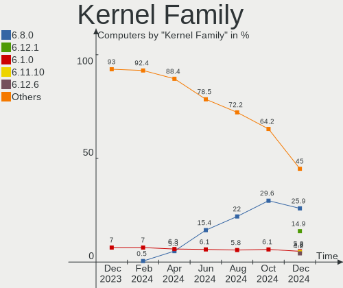
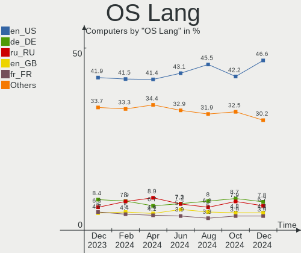
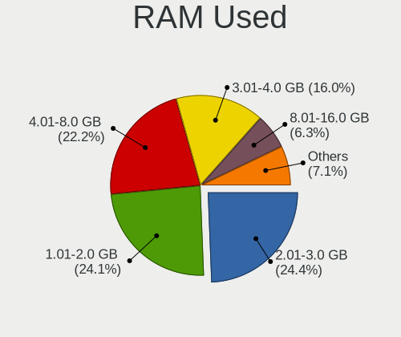
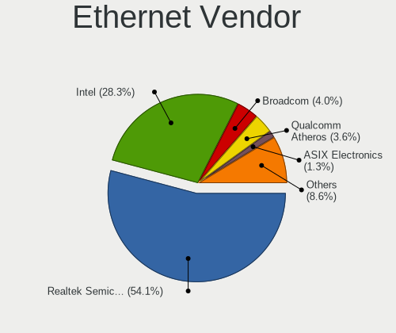
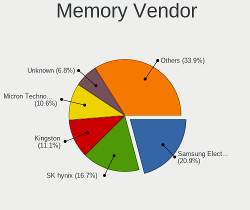

Linux - Hardware Trends
-----------------------

A project to identify most popular hardware characteristics and track their change
over time based on data collected by Linux users at https://Linux-Hardware.org.

Anyone can contribute to this report by the [hw-probe](https://github.com/linuxhw/hw-probe) tool:

    sudo -E hw-probe -all -upload

This is a report for all computer types. See also reports for [desktops](/Desktop/README.md) and [notebooks](/Notebook/README.md).

Distribution-specific reports: [Arch](/Dist/Arch), [ArcoLinux](/Dist/ArcoLinux), [BlackPanther](/Dist/BlackPanther), [CentOS](/Dist/CentOS), [Clear Linux](/Dist/Clear_Linux), [Debian](/Dist/Debian), [Elementary](/Dist/Elementary), [EndeavourOS](/Dist/EndeavourOS), [Endless](/Dist/Endless), [Fedora](/Dist/Fedora), [Garuda Linux](/Dist/Garuda_Linux), [Gentoo](/Dist/Gentoo), [Kali](/Dist/Kali), [KDE neon](/Dist/KDE_neon), [Kubuntu](/Dist/Kubuntu), [Linux Mint](/Dist/Linux_Mint), [Manjaro](/Dist/Manjaro), [OpenMandriva](/Dist/OpenMandriva), [openSUSE](/Dist/openSUSE), [Pop!_OS](/Dist/Pop!_OS), [Red OS](/Dist/Red_OS), [ROSA](/Dist/ROSA), [SteamOS](/Dist/SteamOS), [Ubuntu MATE](/Dist/Ubuntu_MATE), [Ubuntu](/Dist/Ubuntu), [Xubuntu](/Dist/Xubuntu), [Zorin](/Dist/Zorin).

This report is for one last month. Overall report since the beginning of time: [TestDays](https://github.com/linuxhw/TestDays)

Period: May, 2023.

Contents
--------

* [ System ](#system)
  - [ OS                       ](#os)
  - [ OS Family                ](#os-family)
  - [ Kernel                   ](#kernel)
  - [ Kernel Family            ](#kernel-family)
  - [ Kernel Major Ver.        ](#kernel-major-ver)
  - [ Arch                     ](#arch)
  - [ DE                       ](#de)
  - [ Display Server           ](#display-server)
  - [ Display Manager          ](#display-manager)
  - [ OS Lang                  ](#os-lang)
  - [ Boot Mode                ](#boot-mode)
  - [ Filesystem               ](#filesystem)
  - [ Part. scheme             ](#part-scheme)
  - [ Dual Boot with Linux/BSD ](#dual-boot-with-linuxbsd)
  - [ Dual Boot (Win)          ](#dual-boot-win)

* [ Board ](#board)
  - [ Vendor                   ](#vendor)
  - [ Model                    ](#model)
  - [ Model Family             ](#model-family)
  - [ MFG Year                 ](#mfg-year)
  - [ Form Factor              ](#form-factor)
  - [ Secure Boot              ](#secure-boot)
  - [ Coreboot                 ](#coreboot)
  - [ RAM Size                 ](#ram-size)
  - [ RAM Used                 ](#ram-used)
  - [ Total Drives             ](#total-drives)
  - [ Has CD-ROM               ](#has-cd-rom)
  - [ Has Ethernet             ](#has-ethernet)
  - [ Has WiFi                 ](#has-wifi)
  - [ Has Bluetooth            ](#has-bluetooth)

* [ Location ](#location)
  - [ Country                  ](#country)
  - [ City                     ](#city)

* [ Drives ](#drives)
  - [ Drive Vendor             ](#drive-vendor)
  - [ Drive Model              ](#drive-model)
  - [ HDD Vendor               ](#hdd-vendor)
  - [ SSD Vendor               ](#ssd-vendor)
  - [ Drive Kind               ](#drive-kind)
  - [ Drive Connector          ](#drive-connector)
  - [ Drive Size               ](#drive-size)
  - [ Space Total              ](#space-total)
  - [ Space Used               ](#space-used)
  - [ Malfunc. Drives          ](#malfunc-drives)
  - [ Malfunc. Drive Vendor    ](#malfunc-drive-vendor)
  - [ Malfunc. HDD Vendor      ](#malfunc-hdd-vendor)
  - [ Malfunc. Drive Kind      ](#malfunc-drive-kind)
  - [ Failed Drives            ](#failed-drives)
  - [ Failed Drive Vendor      ](#failed-drive-vendor)
  - [ Drive Status             ](#drive-status)

* [ Storage controller ](#storage-controller)
  - [ Storage Vendor           ](#storage-vendor)
  - [ Storage Model            ](#storage-model)
  - [ Storage Kind             ](#storage-kind)

* [ Processor ](#processor)
  - [ CPU Vendor               ](#cpu-vendor)
  - [ CPU Model                ](#cpu-model)
  - [ CPU Model Family         ](#cpu-model-family)
  - [ CPU Cores                ](#cpu-cores)
  - [ CPU Sockets              ](#cpu-sockets)
  - [ CPU Threads              ](#cpu-threads)
  - [ CPU Op-Modes             ](#cpu-op-modes)
  - [ CPU Microcode            ](#cpu-microcode)
  - [ CPU Microarch            ](#cpu-microarch)

* [ Graphics ](#graphics)
  - [ GPU Vendor               ](#gpu-vendor)
  - [ GPU Model                ](#gpu-model)
  - [ GPU Combo                ](#gpu-combo)
  - [ GPU Driver               ](#gpu-driver)
  - [ GPU Memory               ](#gpu-memory)

* [ Monitor ](#monitor)
  - [ Monitor Vendor           ](#monitor-vendor)
  - [ Monitor Model            ](#monitor-model)
  - [ Monitor Resolution       ](#monitor-resolution)
  - [ Monitor Diagonal         ](#monitor-diagonal)
  - [ Monitor Width            ](#monitor-width)
  - [ Aspect Ratio             ](#aspect-ratio)
  - [ Monitor Area             ](#monitor-area)
  - [ Pixel Density            ](#pixel-density)
  - [ Multiple Monitors        ](#multiple-monitors)

* [ Network ](#network)
  - [ Net Controller Vendor    ](#net-controller-vendor)
  - [ Net Controller Model     ](#net-controller-model)
  - [ Wireless Vendor          ](#wireless-vendor)
  - [ Wireless Model           ](#wireless-model)
  - [ Ethernet Vendor          ](#ethernet-vendor)
  - [ Ethernet Model           ](#ethernet-model)
  - [ Net Controller Kind      ](#net-controller-kind)
  - [ Used Controller          ](#used-controller)
  - [ NICs                     ](#nics)
  - [ IPv6                     ](#ipv6)

* [ Bluetooth ](#bluetooth)
  - [ Bluetooth Vendor         ](#bluetooth-vendor)
  - [ Bluetooth Model          ](#bluetooth-model)

* [ Sound ](#sound)
  - [ Sound Vendor             ](#sound-vendor)
  - [ Sound Model              ](#sound-model)

* [ Memory ](#memory)
  - [ Memory Vendor            ](#memory-vendor)
  - [ Memory Model             ](#memory-model)
  - [ Memory Kind              ](#memory-kind)
  - [ Memory Form Factor       ](#memory-form-factor)
  - [ Memory Size              ](#memory-size)
  - [ Memory Speed             ](#memory-speed)

* [ Printers & scanners ](#printers--scanners)
  - [ Printer Vendor           ](#printer-vendor)
  - [ Printer Model            ](#printer-model)
  - [ Scanner Vendor           ](#scanner-vendor)
  - [ Scanner Model            ](#scanner-model)

* [ Camera ](#camera)
  - [ Camera Vendor            ](#camera-vendor)
  - [ Camera Model             ](#camera-model)

* [ Security ](#security)
  - [ Fingerprint Vendor       ](#fingerprint-vendor)
  - [ Fingerprint Model        ](#fingerprint-model)
  - [ Chipcard Vendor          ](#chipcard-vendor)
  - [ Chipcard Model           ](#chipcard-model)

* [ Unsupported ](#unsupported)
  - [ Unsupported Devices      ](#unsupported-devices)
  - [ Unsupported Device Types ](#unsupported-device-types)

System
------

OS
--

Installed operating systems

| Name                         | Computers | Percent |
|------------------------------|-----------|---------|
| Ubuntu 22.04                 | 695       | 12.65%  |
| Fedora 38                    | 468       | 8.52%   |
| Linux Mint 21.1              | 404       | 7.36%   |
| Ubuntu 23.04                 | 290       | 5.28%   |
| OpenMandriva 23.03           | 278       | 5.06%   |
| Debian 11                    | 255       | 4.64%   |
| Pop!_OS 22.04                | 229       | 4.17%   |
| Arch Rolling                 | 221       | 4.02%   |
| ROSA 12.4                    | 170       | 3.1%    |
| Zorin 16                     | 159       | 2.9%    |
| Debian 12                    | 157       | 2.86%   |
| ArcoLinux Rolling            | 138       | 2.51%   |
| Ubuntu 20.04                 | 123       | 2.24%   |
| BlackPanther 18.1            | 97        | 1.77%   |
| KDE neon 22.04               | 82        | 1.49%   |
| Manjaro                      | 74        | 1.35%   |
| openSUSE Tumbleweed-XXXXXXXX | 66        | 1.2%    |
| Linux Mint 20.3              | 66        | 1.2%    |
| Kubuntu 22.04                | 63        | 1.15%   |
| Gentoo 2.13                  | 60        | 1.09%   |
| Fedora 37                    | 59        | 1.07%   |
| SteamOS 3.4.6                | 55        | 1%      |
| EndeavourOS Rolling          | 53        | 0.97%   |
| Ubuntu 22.10                 | 47        | 0.86%   |
| Kali 2023.1                  | 47        | 0.86%   |
| OpenMandriva 4.3             | 46        | 0.84%   |
| Nobara 37                    | 43        | 0.78%   |
| Kubuntu 23.04                | 43        | 0.78%   |
| Xubuntu 22.04                | 39        | 0.71%   |
| Linux Mint 21                | 37        | 0.67%   |
| Elementary 7                 | 36        | 0.66%   |
| LMDE 5                       | 35        | 0.64%   |
| MX 21                        | 31        | 0.56%   |
| Kali 2023.2                  | 31        | 0.56%   |
| Manjaro 22.1.1               | 30        | 0.55%   |
| Lubuntu 22.04                | 25        | 0.46%   |
| Parrot 5.3                   | 20        | 0.36%   |
| OpenMandriva 23.01           | 19        | 0.35%   |
| Fedora 36                    | 17        | 0.31%   |
| Ubuntu 18.04                 | 16        | 0.29%   |

OS Family
---------

OS without a version

| Name          | Computers | Percent |
|---------------|-----------|---------|
| Ubuntu        | 1184      | 21.56%  |
| Fedora        | 554       | 10.09%  |
| Linux Mint    | 539       | 9.81%   |
| Debian        | 417       | 7.59%   |
| OpenMandriva  | 371       | 6.76%   |
| Pop!_OS       | 231       | 4.21%   |
| Arch          | 222       | 4.04%   |
| ROSA          | 215       | 3.91%   |
| Zorin         | 167       | 3.04%   |
| ArcoLinux     | 143       | 2.6%    |
| Manjaro       | 141       | 2.57%   |
| Kubuntu       | 115       | 2.09%   |
| BlackPanther  | 104       | 1.89%   |
| KDE neon      | 87        | 1.58%   |
| openSUSE      | 86        | 1.57%   |
| Kali          | 78        | 1.42%   |
| SteamOS       | 73        | 1.33%   |
| Xubuntu       | 66        | 1.2%    |
| Gentoo        | 61        | 1.11%   |
| EndeavourOS   | 53        | 0.97%   |
| Nobara        | 47        | 0.86%   |
| Elementary    | 44        | 0.8%    |
| LMDE          | 37        | 0.67%   |
| Lubuntu       | 35        | 0.64%   |
| MX            | 31        | 0.56%   |
| Parrot        | 25        | 0.46%   |
| Ubuntu MATE   | 24        | 0.44%   |
| Red OS        | 21        | 0.38%   |
| ALT Linux     | 20        | 0.36%   |
| Garuda Linux  | 19        | 0.35%   |
| Ubuntu Budgie | 16        | 0.29%   |
| Endless       | 16        | 0.29%   |
| Ubuntu Unity  | 15        | 0.27%   |
| NixOS         | 15        | 0.27%   |
| Raspbian      | 14        | 0.25%   |
| ChimeraOS     | 11        | 0.2%    |
| Artix         | 11        | 0.2%    |
| Rocky Linux   | 10        | 0.18%   |
| BunsenLabs    | 10        | 0.18%   |
| blendOS       | 10        | 0.18%   |

Kernel
------

Version of the Linux kernel

| Version                           | Computers | Percent |
|-----------------------------------|-----------|---------|
| 5.19.0-41-generic                 | 562       | 10.23%  |
| 5.15.0-71-generic                 | 384       | 6.99%   |
| 6.2.0-20-generic                  | 326       | 5.94%   |
| 6.2.6-desktop-1omv2390            | 277       | 5.04%   |
| 5.15.0-72-generic                 | 271       | 4.93%   |
| 6.2.6-76060206-generic            | 204       | 3.71%   |
| 6.2.15-300.fc38.x86_64            | 191       | 3.48%   |
| 5.19.0-42-generic                 | 178       | 3.24%   |
| 6.2.14-300.fc38.x86_64            | 148       | 2.69%   |
| 6.1.20-generic-2rosa2021.1-x86_64 | 141       | 2.57%   |
| 5.10.0-22-amd64                   | 101       | 1.84%   |
| 5.10.0-23-amd64                   | 98        | 1.78%   |
| 5.4.0-148-generic                 | 74        | 1.35%   |
| 6.3.2-arch1-1                     | 65        | 1.18%   |
| 6.3.1-arch1-1                     | 65        | 1.18%   |
| 5.13.0-valve36-1-neptune          | 63        | 1.15%   |
| 6.1.0-4-amd64                     | 53        | 0.97%   |
| 5.15.0-56-generic                 | 48        | 0.87%   |
| 6.1.0-9-amd64                     | 47        | 0.86%   |
| 6.2.13-300.fc38.x86_64            | 46        | 0.84%   |
| 6.3.4-arch1-1                     | 45        | 0.82%   |
| 6.2.9-300.fc38.x86_64             | 45        | 0.82%   |
| 6.2.13-arch1-1                    | 38        | 0.69%   |
| 6.1.26-1-MANJARO                  | 37        | 0.67%   |
| 5.19.0-32-generic                 | 37        | 0.67%   |
| 6.3.1-arch2-1                     | 36        | 0.66%   |
| 6.1.0-kali7-amd64                 | 35        | 0.64%   |
| 4.18.16-desktop-1bP               | 34        | 0.62%   |
| 5.6.14-desktop-2bP                | 33        | 0.6%    |
| 5.15.85-desktop-1bP               | 30        | 0.55%   |
| 6.2.14-300.fsync.fc37.x86_64      | 29        | 0.53%   |
| 6.1.0-7-amd64                     | 29        | 0.53%   |
| 6.3.2-1-default                   | 25        | 0.46%   |
| 6.1.0-kali9-amd64                 | 25        | 0.46%   |
| 6.3.2-zen1-1-zen                  | 24        | 0.44%   |
| 5.15.0-69-generic                 | 24        | 0.44%   |
| 5.16.13-desktop-1omv4003          | 23        | 0.42%   |
| 5.10.0-21-amd64                   | 23        | 0.42%   |
| 6.2.15-200.fc37.x86_64            | 22        | 0.4%    |
| 5.16.7-desktop-1omv4003           | 22        | 0.4%    |

Kernel Family
-------------

Linux kernel without a distro release

| Version  | Computers | Percent |
|----------|-----------|---------|
| 5.15.0   | 850       | 15.48%  |
| 5.19.0   | 849       | 15.46%  |
| 6.2.6    | 484       | 8.81%   |
| 6.2.0    | 358       | 6.52%   |
| 6.1.0    | 269       | 4.9%    |
| 5.10.0   | 265       | 4.83%   |
| 6.2.15   | 221       | 4.02%   |
| 6.2.14   | 213       | 3.88%   |
| 6.3.1    | 199       | 3.62%   |
| 6.1.20   | 148       | 2.69%   |
| 6.3.2    | 146       | 2.66%   |
| 5.4.0    | 141       | 2.57%   |
| 6.2.13   | 107       | 1.95%   |
| 6.3.4    | 94        | 1.71%   |
| 5.13.0   | 75        | 1.37%   |
| 6.3.3    | 65        | 1.18%   |
| 6.2.12   | 61        | 1.11%   |
| 6.2.9    | 58        | 1.06%   |
| 6.1.26   | 46        | 0.84%   |
| 5.6.14   | 34        | 0.62%   |
| 4.18.16  | 34        | 0.62%   |
| 6.3.0    | 32        | 0.58%   |
| 5.15.85  | 31        | 0.56%   |
| 6.1.29   | 29        | 0.53%   |
| 6.1.27   | 28        | 0.51%   |
| 6.2.11   | 27        | 0.49%   |
| 6.1.21   | 26        | 0.47%   |
| 6.0.0    | 23        | 0.42%   |
| 5.16.13  | 23        | 0.42%   |
| 5.16.7   | 22        | 0.4%    |
| 4.15.0   | 20        | 0.36%   |
| 6.1.30   | 19        | 0.35%   |
| 6.1.25   | 19        | 0.35%   |
| 5.14.0   | 19        | 0.35%   |
| 5.15.107 | 18        | 0.33%   |
| 5.15.103 | 18        | 0.33%   |
| 5.14.21  | 17        | 0.31%   |
| 6.1.1    | 16        | 0.29%   |
| 6.2.10   | 14        | 0.25%   |
| 6.1.28   | 13        | 0.24%   |

Kernel Major Ver.
-----------------

Linux kernel major version

| Version  | Computers | Percent |
|----------|-----------|---------|
| 6.2      | 1551      | 28.24%  |
| 5.15     | 1000      | 18.21%  |
| 5.19     | 855       | 15.57%  |
| 6.1      | 654       | 11.91%  |
| 6.3      | 548       | 9.98%   |
| 5.10     | 323       | 5.88%   |
| 5.4      | 145       | 2.64%   |
| 5.13     | 75        | 1.37%   |
| 6.0      | 55        | 1%      |
| 5.16     | 52        | 0.95%   |
| 5.14     | 39        | 0.71%   |
| 4.18     | 38        | 0.69%   |
| 5.6      | 34        | 0.62%   |
| 4.15     | 20        | 0.36%   |
| 5.18     | 16        | 0.29%   |
| 5.17     | 16        | 0.29%   |
| 5.11     | 11        | 0.2%    |
| 5.8      | 9         | 0.16%   |
| 4.19     | 9         | 0.16%   |
| 6.4      | 8         | 0.15%   |
| 4.9      | 7         | 0.13%   |
| 4.4      | 5         | 0.09%   |
| 3.10     | 5         | 0.09%   |
| 5.0      | 3         | 0.05%   |
| 5.3      | 2         | 0.04%   |
| 4.14     | 2         | 0.04%   |
| 6.3.0    | 1         | 0.02%   |
| 6.2.0    | 1         | 0.02%   |
| 6        | 1         | 0.02%   |
| 5.7      | 1         | 0.02%   |
| 5.12     | 1         | 0.02%   |
| 5.10.164 | 1         | 0.02%   |
| 4.8      | 1         | 0.02%   |
| 4.10     | 1         | 0.02%   |
| 4        | 1         | 0.02%   |
| 3.18     | 1         | 0.02%   |

Arch
----

OS architecture (x86_64, i586, etc.)

| Name    | Computers | Percent |
|---------|-----------|---------|
| x86_64  | 5396      | 98.25%  |
| aarch64 | 42        | 0.76%   |
| i686    | 36        | 0.66%   |
| armv7l  | 11        | 0.2%    |
| riscv64 | 4         | 0.07%   |
| armv6l  | 2         | 0.04%   |
| ppc64le | 1         | 0.02%   |

DE
--

Desktop Environment

| Name             | Computers | Percent |
|------------------|-----------|---------|
| GNOME            | 2335      | 42.52%  |
| KDE5             | 1398      | 25.46%  |
| X-Cinnamon       | 461       | 8.39%   |
| XFCE             | 424       | 7.72%   |
| Unknown          | 297       | 5.41%   |
| MATE             | 156       | 2.84%   |
| LXQt             | 91        | 1.66%   |
| Cinnamon         | 47        | 0.86%   |
| Pantheon         | 45        | 0.82%   |
| i3               | 38        | 0.69%   |
| Hyprland         | 24        | 0.44%   |
| LXDE             | 19        | 0.35%   |
| Budgie           | 19        | 0.35%   |
| Unity            | 14        | 0.25%   |
| sway             | 11        | 0.2%    |
| KDE4             | 11        | 0.2%    |
| GNOME Flashback  | 11        | 0.2%    |
| Deepin           | 9         | 0.16%   |
| Openbox          | 7         | 0.13%   |
| KDE              | 7         | 0.13%   |
| GNOME Classic    | 7         | 0.13%   |
| bspwm            | 7         | 0.13%   |
| icewm            | 6         | 0.11%   |
| BunsenLabs       | 5         | 0.09%   |
| awesome          | 5         | 0.09%   |
| qtile            | 4         | 0.07%   |
| lightdm-xsession | 4         | 0.07%   |
| DWM              | 4         | 0.07%   |
| Trinity          | 3         | 0.05%   |
| LeftWM           | 3         | 0.05%   |
| Enlightenment    | 3         | 0.05%   |
| chadwm           | 3         | 0.05%   |
| Xsession         | 2         | 0.04%   |
| X-Generic        | 2         | 0.04%   |
| i3-with-shmlog   | 2         | 0.04%   |
| xwmconfig        | 1         | 0.02%   |
| xmonad           | 1         | 0.02%   |
| none+i3          | 1         | 0.02%   |
| mwm              | 1         | 0.02%   |
| INPT             | 1         | 0.02%   |

Display Server
--------------

X11 or Wayland

| Name    | Computers | Percent |
|---------|-----------|---------|
| X11     | 3477      | 63.31%  |
| Wayland | 1682      | 30.63%  |
| Tty     | 172       | 3.13%   |
| Unknown | 160       | 2.91%   |
| Xcb     | 1         | 0.02%   |

Display Manager
---------------

SDDM, LightDM, etc.

| Name    | Computers | Percent |
|---------|-----------|---------|
| Unknown | 1953      | 35.56%  |
| GDM3    | 1143      | 20.81%  |
| SDDM    | 1137      | 20.7%   |
| LightDM | 787       | 14.33%  |
| GDM     | 438       | 7.98%   |
| KDM     | 11        | 0.2%    |
| LXDM    | 8         | 0.15%   |
| SLiM    | 5         | 0.09%   |
| Ly      | 3         | 0.05%   |
| XDM     | 2         | 0.04%   |
| SLIMSKI | 2         | 0.04%   |
| TDM     | 1         | 0.02%   |
| LY-DM   | 1         | 0.02%   |
| GREETD  | 1         | 0.02%   |

OS Lang
-------

Language

| Lang    | Computers | Percent |
|---------|-----------|---------|
| en_US   | 2274      | 41.41%  |
| ru_RU   | 449       | 8.18%   |
| de_DE   | 442       | 8.05%   |
| en_GB   | 270       | 4.92%   |
| fr_FR   | 253       | 4.61%   |
| pt_BR   | 198       | 3.61%   |
| Unknown | 168       | 3.06%   |
| it_IT   | 150       | 2.73%   |
| en_CA   | 120       | 2.18%   |
| es_ES   | 108       | 1.97%   |
| C       | 105       | 1.91%   |
| pl_PL   | 92        | 1.68%   |
| en_IN   | 74        | 1.35%   |
| en_AU   | 73        | 1.33%   |
| es_MX   | 61        | 1.11%   |
| nl_NL   | 42        | 0.76%   |
| sv_SE   | 40        | 0.73%   |
| zh_CN   | 37        | 0.67%   |
| es_AR   | 35        | 0.64%   |
| pt_PT   | 34        | 0.62%   |
| cs_CZ   | 32        | 0.58%   |
| hu_HU   | 29        | 0.53%   |
| de_AT   | 26        | 0.47%   |
| tr_TR   | 23        | 0.42%   |
| en_NZ   | 21        | 0.38%   |
| en_ZA   | 19        | 0.35%   |
| ja_JP   | 17        | 0.31%   |
| de_CH   | 16        | 0.29%   |
| fr_CA   | 15        | 0.27%   |
| fi_FI   | 13        | 0.24%   |
| el_GR   | 13        | 0.24%   |
| sk_SK   | 12        | 0.22%   |
| es_CO   | 12        | 0.22%   |
| nl_BE   | 11        | 0.2%    |
| es_CL   | 11        | 0.2%    |
| en_IE   | 11        | 0.2%    |
| ro_RO   | 9         | 0.16%   |
| fr_BE   | 8         | 0.15%   |
| en_DK   | 8         | 0.15%   |
| da_DK   | 8         | 0.15%   |

Boot Mode
---------

EFI or BIOS

| Mode | Computers | Percent |
|------|-----------|---------|
| EFI  | 2940      | 53.53%  |
| BIOS | 2552      | 46.47%  |

Filesystem
----------

Type of filesystem

| Type     | Computers | Percent |
|----------|-----------|---------|
| Ext4     | 3370      | 61.36%  |
| Btrfs    | 969       | 17.64%  |
| Tmpfs    | 642       | 11.69%  |
| Overlay  | 347       | 6.32%   |
| Xfs      | 95        | 1.73%   |
| Zfs      | 29        | 0.53%   |
| F2fs     | 17        | 0.31%   |
| Ext3     | 6         | 0.11%   |
| Ext2     | 5         | 0.09%   |
| Unknown  | 5         | 0.09%   |
| Jfs      | 3         | 0.05%   |
| Reiserfs | 2         | 0.04%   |
| XXXXXXX  | 1         | 0.02%   |
| Aufs     | 1         | 0.02%   |

Part. scheme
------------

Scheme of partitioning

| Type    | Computers | Percent |
|---------|-----------|---------|
| GPT     | 3093      | 56.32%  |
| Unknown | 1681      | 30.61%  |
| MBR     | 718       | 13.07%  |

Dual Boot with Linux/BSD
------------------------

Hosting more than one Linux/BSD

| Dual boot | Computers | Percent |
|-----------|-----------|---------|
| No        | 4669      | 85.01%  |
| Yes       | 823       | 14.99%  |

Dual Boot (Win)
---------------

Hosting Linux and Windows

| Dual boot | Computers | Percent |
|-----------|-----------|---------|
| No        | 3990      | 72.65%  |
| Yes       | 1502      | 27.35%  |

Board
-----

Vendor
------

Motherboard manufacturer

| Name                    | Computers | Percent |
|-------------------------|-----------|---------|
| ASUSTek Computer        | 898       | 16.35%  |
| Lenovo                  | 791       | 14.4%   |
| Hewlett-Packard         | 717       | 13.06%  |
| Dell                    | 600       | 10.92%  |
| Gigabyte Technology     | 398       | 7.25%   |
| MSI                     | 309       | 5.63%   |
| Acer                    | 284       | 5.17%   |
| ASRock                  | 195       | 3.55%   |
| Apple                   | 133       | 2.42%   |
| Unknown                 | 89        | 1.62%   |
| Intel                   | 84        | 1.53%   |
| Toshiba                 | 67        | 1.22%   |
| Valve                   | 66        | 1.2%    |
| Samsung Electronics     | 60        | 1.09%   |
| HUAWEI                  | 58        | 1.06%   |
| Fujitsu                 | 46        | 0.84%   |
| Sony                    | 31        | 0.56%   |
| Google                  | 31        | 0.56%   |
| Medion                  | 27        | 0.49%   |
| Raspberry Pi Foundation | 26        | 0.47%   |
| Microsoft               | 25        | 0.46%   |
| AZW                     | 23        | 0.42%   |
| Supermicro              | 19        | 0.35%   |
| Pegatron                | 19        | 0.35%   |
| Notebook                | 18        | 0.33%   |
| Biostar                 | 17        | 0.31%   |
| Packard Bell            | 15        | 0.27%   |
| Fujitsu Siemens         | 15        | 0.27%   |
| TUXEDO                  | 14        | 0.25%   |
| Foxconn                 | 14        | 0.25%   |
| Alienware               | 14        | 0.25%   |
| Timi                    | 13        | 0.24%   |
| Chuwi                   | 13        | 0.24%   |
| eMachines               | 11        | 0.2%    |
| System76                | 10        | 0.18%   |
| Positivo                | 10        | 0.18%   |
| Framework               | 9         | 0.16%   |
| ECS                     | 9         | 0.16%   |
| Clevo                   | 9         | 0.16%   |
| HONOR                   | 8         | 0.15%   |

Model
-----

Motherboard model

| Name                              | Computers | Percent |
|-----------------------------------|-----------|---------|
| Unknown                           | 108       | 1.97%   |
| Valve Jupiter                     | 66        | 1.2%    |
| ASUS All Series                   | 48        | 0.87%   |
| ASUS TUF Gaming X570-PLUS         | 20        | 0.36%   |
| Dell OptiPlex 9020                | 15        | 0.27%   |
| HP Notebook                       | 14        | 0.25%   |
| Dell OptiPlex 7010                | 13        | 0.24%   |
| HP Pavilion g6                    | 12        | 0.22%   |
| HP Pavilion dv6                   | 12        | 0.22%   |
| HP 255 G8 Notebook PC             | 10        | 0.18%   |
| AZW SER                           | 10        | 0.18%   |
| MSI MS-7C95                       | 9         | 0.16%   |
| MSI MS-7C91                       | 9         | 0.16%   |
| MSI MS-7C02                       | 9         | 0.16%   |
| MSI MS-7A38                       | 9         | 0.16%   |
| Gigabyte H81M-S2V                 | 9         | 0.16%   |
| Apple MacBookAir7,2               | 9         | 0.16%   |
| HP Pavilion Aero Laptop 13-be0xxx | 8         | 0.15%   |
| HP 15                             | 8         | 0.15%   |
| ASUS TUF Gaming B550-PLUS         | 8         | 0.15%   |
| ASUS ROG STRIX B550-F GAMING      | 8         | 0.15%   |
| Apple MacBookPro8,1               | 8         | 0.15%   |
| MSI MS-7D25                       | 7         | 0.13%   |
| MSI MS-7C37                       | 7         | 0.13%   |
| MSI MS-7B86                       | 7         | 0.13%   |
| Lenovo Yoga 6 13ALC7 82UD         | 7         | 0.13%   |
| Intel H61                         | 7         | 0.13%   |
| HUAWEI BOHB-WAX9                  | 7         | 0.13%   |
| HP Z420 Workstation               | 7         | 0.13%   |
| Gigabyte B450M DS3H               | 7         | 0.13%   |
| Gigabyte B450 AORUS ELITE         | 7         | 0.13%   |
| Dell Precision WorkStation T3500  | 7         | 0.13%   |
| Dell Latitude E7450               | 7         | 0.13%   |
| Dell Inspiron 15-3567             | 7         | 0.13%   |
| ASUS ROG CROSSHAIR VIII HERO      | 7         | 0.13%   |
| ASUS PRIME B550-PLUS              | 7         | 0.13%   |
| Apple Macmini7,1                  | 7         | 0.13%   |
| Supermicro Super Server           | 6         | 0.11%   |
| MSI MS-7C56                       | 6         | 0.11%   |
| MSI MS-7816                       | 6         | 0.11%   |

Model Family
------------

Motherboard model prefix

| Name               | Computers | Percent |
|--------------------|-----------|---------|
| Lenovo ThinkPad    | 355       | 6.46%   |
| Acer Aspire        | 181       | 3.3%    |
| Dell Latitude      | 167       | 3.04%   |
| Lenovo IdeaPad     | 152       | 2.77%   |
| ASUS ROG           | 143       | 2.6%    |
| HP Pavilion        | 133       | 2.42%   |
| Dell Inspiron      | 129       | 2.35%   |
| ASUS PRIME         | 126       | 2.29%   |
| Unknown            | 108       | 1.97%   |
| Dell OptiPlex      | 96        | 1.75%   |
| HP EliteBook       | 95        | 1.73%   |
| HP Laptop          | 89        | 1.62%   |
| ASUS VivoBook      | 83        | 1.51%   |
| Dell Precision     | 78        | 1.42%   |
| ASUS TUF           | 71        | 1.29%   |
| Valve Jupiter      | 66        | 1.2%    |
| HP Compaq          | 61        | 1.11%   |
| Toshiba Satellite  | 57        | 1.04%   |
| Lenovo ThinkCentre | 57        | 1.04%   |
| HP ProBook         | 54        | 0.98%   |
| Dell XPS           | 52        | 0.95%   |
| ASUS All           | 48        | 0.87%   |
| HP ENVY            | 42        | 0.76%   |
| Lenovo Yoga        | 36        | 0.66%   |
| Dell Vostro        | 36        | 0.66%   |
| ASUS ASUS          | 36        | 0.66%   |
| Lenovo Legion      | 32        | 0.58%   |
| RPi Raspberry      | 26        | 0.47%   |
| Acer Nitro         | 26        | 0.47%   |
| Microsoft Surface  | 25        | 0.46%   |
| ASUS Zenbook       | 22        | 0.4%    |
| Lenovo ThinkBook   | 21        | 0.38%   |
| Gigabyte X570      | 21        | 0.38%   |
| HP EliteDesk       | 20        | 0.36%   |
| Gigabyte B450M     | 20        | 0.36%   |
| Acer Swift         | 20        | 0.36%   |
| HP ZBook           | 19        | 0.35%   |
| HP OMEN            | 19        | 0.35%   |
| Lenovo IdeaCentre  | 17        | 0.31%   |
| Gigabyte B550      | 17        | 0.31%   |

MFG Year
--------

Motherboard manufacture year

| Year    | Computers | Percent |
|---------|-----------|---------|
| 2021    | 617       | 11.23%  |
| 2022    | 614       | 11.18%  |
| 2020    | 538       | 9.8%    |
| 2019    | 442       | 8.05%   |
| 2018    | 424       | 7.72%   |
| 2012    | 375       | 6.83%   |
| 2017    | 312       | 5.68%   |
| 2013    | 307       | 5.59%   |
| 2011    | 305       | 5.55%   |
| 2015    | 253       | 4.61%   |
| 2016    | 251       | 4.57%   |
| 2014    | 240       | 4.37%   |
| 2010    | 235       | 4.28%   |
| 2009    | 162       | 2.95%   |
| 2023    | 130       | 2.37%   |
| 2008    | 125       | 2.28%   |
| 2007    | 75        | 1.37%   |
| Unknown | 55        | 1%      |
| 2006    | 23        | 0.42%   |
| 2005    | 5         | 0.09%   |
| 2003    | 2         | 0.04%   |
| 2004    | 1         | 0.02%   |
| 2002    | 1         | 0.02%   |

Form Factor
-----------

Physical design of the computer

| Name           | Computers | Percent |
|----------------|-----------|---------|
| Notebook       | 2913      | 53.04%  |
| Desktop        | 2078      | 37.84%  |
| Convertible    | 161       | 2.93%   |
| Mini pc        | 103       | 1.88%   |
| All in one     | 73        | 1.33%   |
| Tablet         | 55        | 1%      |
| Server         | 53        | 0.97%   |
| System on chip | 51        | 0.93%   |
| Phone          | 4         | 0.07%   |
| Stick pc       | 1         | 0.02%   |

Secure Boot
-----------

Enabled or disabled

| State    | Computers | Percent |
|----------|-----------|---------|
| Disabled | 5102      | 92.9%   |
| Enabled  | 390       | 7.1%    |

Coreboot
--------

Have coreboot on board

| Used | Computers | Percent |
|------|-----------|---------|
| No   | 5446      | 99.16%  |
| Yes  | 46        | 0.84%   |

RAM Size
--------

Total RAM memory

| Size in GB      | Computers | Percent |
|-----------------|-----------|---------|
| 4.01-8.0        | 1309      | 23.83%  |
| 16.01-24.0      | 1117      | 20.34%  |
| 8.01-16.0       | 1000      | 18.21%  |
| 3.01-4.0        | 767       | 13.97%  |
| 32.01-64.0      | 716       | 13.04%  |
| 64.01-256.0     | 231       | 4.21%   |
| 24.01-32.0      | 133       | 2.42%   |
| 1.01-2.0        | 125       | 2.28%   |
| 2.01-3.0        | 48        | 0.87%   |
| 0.51-1.0        | 25        | 0.46%   |
| More than 256.0 | 16        | 0.29%   |
| 0.01-0.5        | 4         | 0.07%   |
| Unknown         | 1         | 0.02%   |

RAM Used
--------

Used RAM memory

| Used GB         | Computers | Percent |
|-----------------|-----------|---------|
| 1.01-2.0        | 1511      | 27.51%  |
| 2.01-3.0        | 1339      | 24.38%  |
| 4.01-8.0        | 1045      | 19.03%  |
| 3.01-4.0        | 826       | 15.04%  |
| 0.51-1.0        | 317       | 5.77%   |
| 8.01-16.0       | 295       | 5.37%   |
| 0.01-0.5        | 78        | 1.42%   |
| 16.01-24.0      | 44        | 0.8%    |
| 24.01-32.0      | 19        | 0.35%   |
| 32.01-64.0      | 12        | 0.22%   |
| 64.01-256.0     | 4         | 0.07%   |
| More than 256.0 | 1         | 0.02%   |
| Unknown         | 1         | 0.02%   |

Total Drives
------------

Number of drives on board

| Drives | Computers | Percent |
|--------|-----------|---------|
| 1      | 3210      | 58.45%  |
| 2      | 1393      | 25.36%  |
| 3      | 442       | 8.05%   |
| 4      | 202       | 3.68%   |
| 5      | 107       | 1.95%   |
| 6      | 58        | 1.06%   |
| 0      | 29        | 0.53%   |
| 7      | 20        | 0.36%   |
| 8      | 10        | 0.18%   |
| 9      | 8         | 0.15%   |
| 10     | 4         | 0.07%   |
| 12     | 3         | 0.05%   |
| 11     | 2         | 0.04%   |
| 79     | 1         | 0.02%   |
| 25     | 1         | 0.02%   |
| 19     | 1         | 0.02%   |
| 13     | 1         | 0.02%   |

Has CD-ROM
----------

Has CD-ROM on board

| Presented | Computers | Percent |
|-----------|-----------|---------|
| No        | 3870      | 70.47%  |
| Yes       | 1622      | 29.53%  |

Has Ethernet
------------

Has Ethernet on board

| Presented | Computers | Percent |
|-----------|-----------|---------|
| Yes       | 4582      | 83.43%  |
| No        | 910       | 16.57%  |

Has WiFi
--------

Has WiFi module

| Presented | Computers | Percent |
|-----------|-----------|---------|
| Yes       | 4201      | 76.49%  |
| No        | 1291      | 23.51%  |

Has Bluetooth
-------------

Has Bluetooth module

| Presented | Computers | Percent |
|-----------|-----------|---------|
| Yes       | 3500      | 63.73%  |
| No        | 1992      | 36.27%  |

Location
--------

Country
-------

Geographic location (country)

| Country      | Computers | Percent |
|--------------|-----------|---------|
| USA          | 972       | 17.7%   |
| Germany      | 588       | 10.71%  |
| Russia       | 493       | 8.98%   |
| Brazil       | 296       | 5.39%   |
| France       | 287       | 5.23%   |
| Italy        | 210       | 3.82%   |
| UK           | 200       | 3.64%   |
| Canada       | 186       | 3.39%   |
| Poland       | 140       | 2.55%   |
| Spain        | 133       | 2.42%   |
| Hungary      | 130       | 2.37%   |
| India        | 115       | 2.09%   |
| Netherlands  | 109       | 1.98%   |
| Australia    | 94        | 1.71%   |
| Sweden       | 91        | 1.66%   |
| Mexico       | 82        | 1.49%   |
| Portugal     | 60        | 1.09%   |
| Argentina    | 59        | 1.07%   |
| Czechia      | 55        | 1%      |
| Austria      | 54        | 0.98%   |
| Switzerland  | 53        | 0.97%   |
| Romania      | 52        | 0.95%   |
| Turkey       | 49        | 0.89%   |
| Belgium      | 48        | 0.87%   |
| China        | 47        | 0.86%   |
| Japan        | 40        | 0.73%   |
| Finland      | 36        | 0.66%   |
| Greece       | 35        | 0.64%   |
| Norway       | 30        | 0.55%   |
| New Zealand  | 30        | 0.55%   |
| Indonesia    | 30        | 0.55%   |
| Slovakia     | 29        | 0.53%   |
| Chile        | 28        | 0.51%   |
| Denmark      | 26        | 0.47%   |
| Serbia       | 23        | 0.42%   |
| Ukraine      | 22        | 0.4%    |
| South Africa | 22        | 0.4%    |
| Bulgaria     | 21        | 0.38%   |
| Belarus      | 21        | 0.38%   |
| Colombia     | 20        | 0.36%   |

City
----

Geographic location (city)

| City              | Computers | Percent |
|-------------------|-----------|---------|
| Moscow            | 124       | 2.26%   |
| Voronezh          | 58        | 1.06%   |
| Berlin            | 54        | 0.98%   |
| Budapest          | 43        | 0.78%   |
| St Petersburg     | 37        | 0.67%   |
| Sao Paulo         | 37        | 0.67%   |
| Paris             | 31        | 0.56%   |
| Vienna            | 30        | 0.55%   |
| Warsaw            | 29        | 0.53%   |
| Milan             | 28        | 0.51%   |
| Hamburg           | 28        | 0.51%   |
| Sydney            | 27        | 0.49%   |
| Rome              | 23        | 0.42%   |
| Montreal          | 23        | 0.42%   |
| Amsterdam         | 23        | 0.42%   |
| Saltsjoe-Boo      | 22        | 0.4%    |
| Madrid            | 22        | 0.4%    |
| Prague            | 21        | 0.38%   |
| Barcelona         | 21        | 0.38%   |
| Brisbane          | 20        | 0.36%   |
| Toronto           | 19        | 0.35%   |
| Rio de Janeiro    | 19        | 0.35%   |
| Munich            | 19        | 0.35%   |
| Melbourne         | 19        | 0.35%   |
| Frankfurt am Main | 19        | 0.35%   |
| Lisbon            | 18        | 0.33%   |
| Seattle           | 15        | 0.27%   |
| Istanbul          | 15        | 0.27%   |
| Gothenburg        | 15        | 0.27%   |
| Delhi             | 15        | 0.27%   |
| Buenos Aires      | 15        | 0.27%   |
| Brussels          | 15        | 0.27%   |
| Minsk             | 14        | 0.25%   |
| Mexico City       | 14        | 0.25%   |
| London            | 14        | 0.25%   |
| Bucharest         | 14        | 0.25%   |
| Yekaterinburg     | 13        | 0.24%   |
| Valencia          | 13        | 0.24%   |
| Poznan            | 13        | 0.24%   |
| Los Angeles       | 13        | 0.24%   |

Drives
------

Drive Vendor
------------

Hard drive vendors

| Vendor                      | Computers | Drives | Percent |
|-----------------------------|-----------|--------|---------|
| Samsung Electronics         | 1364      | 1714   | 16.64%  |
| WDC                         | 1049      | 1334   | 12.8%   |
| Seagate                     | 936       | 1217   | 11.42%  |
| Sandisk                     | 470       | 516    | 5.74%   |
| Kingston                    | 450       | 488    | 5.49%   |
| Toshiba                     | 435       | 467    | 5.31%   |
| Unknown                     | 325       | 358    | 3.97%   |
| Crucial                     | 312       | 365    | 3.81%   |
| SK hynix                    | 224       | 232    | 2.73%   |
| Intel                       | 205       | 221    | 2.5%    |
| Hitachi                     | 193       | 217    | 2.36%   |
| Micron Technology           | 180       | 183    | 2.2%    |
| A-DATA Technology           | 135       | 139    | 1.65%   |
| China                       | 133       | 138    | 1.62%   |
| Phison Electronics          | 118       | 130    | 1.44%   |
| HGST                        | 116       | 122    | 1.42%   |
| KIOXIA                      | 82        | 82     | 1%      |
| Micron/Crucial Technology   | 75        | 84     | 0.92%   |
| Kingston Technology Company | 75        | 77     | 0.92%   |
| Apple                       | 75        | 89     | 0.92%   |
| Unknown                     | 70        | 70     | 0.85%   |
| PNY                         | 54        | 58     | 0.66%   |
| SPCC                        | 51        | 61     | 0.62%   |
| Silicon Motion              | 49        | 50     | 0.6%    |
| Intenso                     | 45        | 48     | 0.55%   |
| Patriot                     | 42        | 44     | 0.51%   |
| Transcend                   | 38        | 38     | 0.46%   |
| ADATA Technology            | 35        | 39     | 0.43%   |
| Netac                       | 34        | 36     | 0.41%   |
| Phison                      | 33        | 33     | 0.4%    |
| Apacer                      | 29        | 29     | 0.35%   |
| GOODRAM                     | 28        | 29     | 0.34%   |
| LITEON                      | 24        | 24     | 0.29%   |
| Realtek Semiconductor       | 21        | 22     | 0.26%   |
| Lexar                       | 21        | 21     | 0.26%   |
| Gigabyte Technology         | 21        | 22     | 0.26%   |
| Team                        | 20        | 23     | 0.24%   |
| KingSpec                    | 20        | 20     | 0.24%   |
| Hewlett-Packard             | 20        | 24     | 0.24%   |
| JMicron Technology          | 18        | 18     | 0.22%   |

Drive Model
-----------

Hard drive models

| Model                                               | Computers | Percent |
|-----------------------------------------------------|-----------|---------|
| Samsung NVMe SSD Controller SM981/PM981/PM983 256GB | 199       | 2.22%   |
| Samsung NVMe SSD Controller PM9A1/PM9A3/980PRO 1TB  | 123       | 1.37%   |
| Kingston SA400S37240G 240GB SSD                     | 93        | 1.04%   |
| Unknown                                             | 70        | 0.78%   |
| Kingston SA400S37480G 480GB SSD                     | 66        | 0.74%   |
| Samsung SSD 860 EVO 500GB                           | 59        | 0.66%   |
| Seagate ST1000LM035-1RK172 1TB                      | 53        | 0.59%   |
| Unknown MMC Card  32GB                              | 51        | 0.57%   |
| Samsung SSD 980 1TB                                 | 49        | 0.55%   |
| Micron/Crucial P2 NVMe PCIe SSD 1TB                 | 48        | 0.54%   |
| Crucial CT1000MX500SSD1 1TB                         | 48        | 0.54%   |
| Seagate ST1000DM010-2EP102 1TB                      | 46        | 0.51%   |
| Samsung SSD 850 EVO 250GB                           | 45        | 0.5%    |
| Sandisk WD Blue SN550 NVMe SSD 512GB                | 44        | 0.49%   |
| Unknown MMC Card  64GB                              | 43        | 0.48%   |
| Kingston SA400S37120G 120GB SSD                     | 43        | 0.48%   |
| Sandisk WD Black SN750 / PC SN730 NVMe SSD 256GB    | 42        | 0.47%   |
| Seagate ST2000DM008-2FR102 2TB                      | 41        | 0.46%   |
| Toshiba DT01ACA100 1TB                              | 39        | 0.44%   |
| Samsung NVMe SSD Controller SM961/PM961/SM963 256GB | 38        | 0.42%   |
| Phison E12 NVMe Controller 256GB                    | 38        | 0.42%   |
| Crucial CT240BX500SSD1 240GB                        | 38        | 0.42%   |
| Toshiba MQ01ABD100 1TB                              | 37        | 0.41%   |
| Samsung SSD 870 EVO 1TB                             | 37        | 0.41%   |
| Unknown MMC Card  128GB                             | 34        | 0.38%   |
| Seagate ST4000DM004-2CV104 4TB                      | 34        | 0.38%   |
| Crucial CT500MX500SSD1 500GB                        | 34        | 0.38%   |
| Phison PS5013 E13 NVMe Controller 512GB             | 33        | 0.37%   |
| Intel SSD 660P Series 512GB                         | 33        | 0.37%   |
| WDC WD10EZEX-08WN4A0 1TB                            | 32        | 0.36%   |
| Seagate ST500DM002-1BD142 500GB                     | 32        | 0.36%   |
| Samsung SSD 860 EVO 1TB                             | 32        | 0.36%   |
| Toshiba MQ04ABF100 1TB                              | 31        | 0.35%   |
| Seagate ST1000DM003-1CH162 1TB                      | 31        | 0.35%   |
| Seagate Expansion 1TB                               | 31        | 0.35%   |
| Samsung SSD 850 EVO 500GB                           | 30        | 0.34%   |
| Samsung SSD 870 EVO 500GB                           | 29        | 0.32%   |
| Kingston SV300S37A120G 120GB SSD                    | 29        | 0.32%   |
| WDC WDS240G2G0A-00JH30 240GB SSD                    | 27        | 0.3%    |
| Seagate ST1000DM003-1ER162 1TB                      | 27        | 0.3%    |

HDD Vendor
----------

Hard disk drive vendors

| Vendor              | Computers | Drives | Percent |
|---------------------|-----------|--------|---------|
| Seagate             | 899       | 1164   | 34.4%   |
| WDC                 | 848       | 1080   | 32.45%  |
| Toshiba             | 331       | 359    | 12.67%  |
| Hitachi             | 192       | 216    | 7.35%   |
| HGST                | 116       | 122    | 4.44%   |
| Samsung Electronics | 105       | 116    | 4.02%   |
| Unknown             | 24        | 24     | 0.92%   |
| Apple               | 21        | 21     | 0.8%    |
| Fujitsu             | 16        | 16     | 0.61%   |
| SSK                 | 7         | 7      | 0.27%   |
| Maxtor              | 7         | 7      | 0.27%   |
| WD MediaMax         | 4         | 9      | 0.15%   |
| SAGE                | 4         | 4      | 0.15%   |
| LaCie               | 4         | 4      | 0.15%   |
| Intenso             | 4         | 4      | 0.15%   |
| ASMT                | 4         | 6      | 0.15%   |
| Hewlett-Packard     | 3         | 6      | 0.11%   |
| USB3.0              | 2         | 2      | 0.08%   |
| USB                 | 2         | 2      | 0.08%   |
| Inateck             | 2         | 2      | 0.08%   |
| External            | 2         | 2      | 0.08%   |
| SABRENT             | 1         | 1      | 0.04%   |
| RSH-339             | 1         | 1      | 0.04%   |
| RSH-319             | 1         | 1      | 0.04%   |
| QUANTUM             | 1         | 1      | 0.04%   |
| Maxone              | 1         | 1      | 0.04%   |
| MARSHAL             | 1         | 1      | 0.04%   |
| Lenovo              | 1         | 2      | 0.04%   |
| IB-1122             | 1         | 1      | 0.04%   |
| HPE                 | 1         | 4      | 0.04%   |
| HGST HTS            | 1         | 1      | 0.04%   |
| FSR202              | 1         | 1      | 0.04%   |
| Fantom              | 1         | 1      | 0.04%   |
| ExcelStor           | 1         | 1      | 0.04%   |
| DellEMC             | 1         | 8      | 0.04%   |
| DELLBOSS            | 1         | 1      | 0.04%   |
| ASMedia             | 1         | 1      | 0.04%   |

SSD Vendor
----------

Solid state drive vendors

| Vendor              | Computers | Drives | Percent |
|---------------------|-----------|--------|---------|
| Samsung Electronics | 571       | 694    | 20.98%  |
| Kingston            | 352       | 376    | 12.93%  |
| Crucial             | 278       | 322    | 10.21%  |
| SanDisk             | 202       | 217    | 7.42%   |
| WDC                 | 154       | 161    | 5.66%   |
| China               | 131       | 136    | 4.81%   |
| A-DATA Technology   | 97        | 100    | 3.56%   |
| Intel               | 67        | 69     | 2.46%   |
| PNY                 | 51        | 55     | 1.87%   |
| SPCC                | 46        | 54     | 1.69%   |
| Micron Technology   | 46        | 48     | 1.69%   |
| Patriot             | 38        | 40     | 1.4%    |
| SK hynix            | 36        | 36     | 1.32%   |
| Toshiba             | 35        | 37     | 1.29%   |
| Intenso             | 35        | 37     | 1.29%   |
| Apple               | 31        | 31     | 1.14%   |
| Transcend           | 30        | 30     | 1.1%    |
| Netac               | 28        | 29     | 1.03%   |
| GOODRAM             | 25        | 26     | 0.92%   |
| Apacer              | 23        | 23     | 0.84%   |
| LITEON              | 22        | 22     | 0.81%   |
| Team                | 19        | 20     | 0.7%    |
| KingSpec            | 19        | 19     | 0.7%    |
| Gigabyte Technology | 18        | 19     | 0.66%   |
| LITEONIT            | 17        | 17     | 0.62%   |
| Lexar               | 15        | 15     | 0.55%   |
| Hewlett-Packard     | 14        | 15     | 0.51%   |
| Unknown             | 13        | 13     | 0.48%   |
| JMicron Technology  | 11        | 11     | 0.4%    |
| SABRENT             | 9         | 14     | 0.33%   |
| OCZ                 | 9         | 9      | 0.33%   |
| Mushkin             | 9         | 9      | 0.33%   |
| Fanxiang            | 9         | 9      | 0.33%   |
| Verbatim            | 8         | 9      | 0.29%   |
| Seagate             | 8         | 8      | 0.29%   |
| ASMT                | 8         | 16     | 0.29%   |
| AMD                 | 8         | 8      | 0.29%   |
| Smartbuy            | 6         | 6      | 0.22%   |
| XrayDisk            | 5         | 5      | 0.18%   |
| TO Exter            | 5         | 5      | 0.18%   |

Drive Kind
----------

HDD or SSD

| Kind    | Computers | Drives | Percent |
|---------|-----------|--------|---------|
| SSD     | 2358      | 2987   | 32.01%  |
| NVMe    | 2350      | 2813   | 31.9%   |
| HDD     | 2208      | 3200   | 29.97%  |
| MMC     | 328       | 354    | 4.45%   |
| Unknown | 123       | 149    | 1.67%   |

Drive Connector
---------------

SATA, SAS, NVMe, etc.

| Type | Computers | Drives | Percent |
|------|-----------|--------|---------|
| SATA | 3658      | 5894   | 54.84%  |
| NVMe | 2347      | 2801   | 35.19%  |
| SAS  | 337       | 454    | 5.05%   |
| MMC  | 328       | 354    | 4.92%   |

Drive Size
----------

Size of hard drive

| Size in TB | Computers | Drives | Percent |
|------------|-----------|--------|---------|
| 0.01-0.5   | 2620      | 3317   | 54.24%  |
| 0.51-1.0   | 1416      | 1719   | 29.32%  |
| 1.01-2.0   | 427       | 537    | 8.84%   |
| 3.01-4.0   | 182       | 327    | 3.77%   |
| 4.01-10.0  | 91        | 146    | 1.88%   |
| 2.01-3.0   | 62        | 84     | 1.28%   |
| 10.01-20.0 | 32        | 57     | 0.66%   |

Space Total
-----------

Amount of disk space available on the file system

| Size in GB     | Computers | Percent |
|----------------|-----------|---------|
| 101-250        | 1305      | 23.76%  |
| 251-500        | 1185      | 21.58%  |
| 501-1000       | 872       | 15.88%  |
| 1001-2000      | 476       | 8.67%   |
| More than 3000 | 408       | 7.43%   |
| 1-20           | 322       | 5.86%   |
| 51-100         | 313       | 5.7%    |
| Unknown        | 241       | 4.39%   |
| 2001-3000      | 187       | 3.4%    |
| 21-50          | 183       | 3.33%   |

Space Used
----------

Amount of used disk space

| Used GB        | Computers | Percent |
|----------------|-----------|---------|
| 1-20           | 1771      | 32.25%  |
| 21-50          | 973       | 17.72%  |
| 101-250        | 719       | 13.09%  |
| 51-100         | 619       | 11.27%  |
| 251-500        | 443       | 8.07%   |
| 501-1000       | 302       | 5.5%    |
| Unknown        | 241       | 4.39%   |
| 1001-2000      | 224       | 4.08%   |
| More than 3000 | 123       | 2.24%   |
| 2001-3000      | 75        | 1.37%   |
| 0              | 2         | 0.04%   |

Malfunc. Drives
---------------

Drive models with a malfunction

| Model                                                           | Computers | Drives | Percent |
|-----------------------------------------------------------------|-----------|--------|---------|
| WDC WD5000AAKX-60U6AA0 500GB                                    | 12        | 12     | 1.98%   |
| Seagate ST1000LM035-1RK172 1TB                                  | 7         | 7      | 1.16%   |
| Seagate ST1000LM024 HN-M101MBB 1TB                              | 7         | 7      | 1.16%   |
| Samsung Electronics SSD 870 EVO 1TB                             | 6         | 7      | 0.99%   |
| Seagate ST9500325AS 500GB                                       | 5         | 5      | 0.83%   |
| WDC WD5000AAKX-001CA0 500GB                                     | 4         | 4      | 0.66%   |
| WDC WD40EFRX-68WT0N0 4TB                                        | 4         | 6      | 0.66%   |
| Toshiba MQ04ABF100 1TB                                          | 4         | 4      | 0.66%   |
| Toshiba MQ01ABF050 500GB                                        | 4         | 4      | 0.66%   |
| Seagate ST500DM002-1BD142 500GB                                 | 4         | 4      | 0.66%   |
| Seagate ST3500413AS 500GB                                       | 4         | 4      | 0.66%   |
| Seagate ST3250310AS 250GB                                       | 4         | 5      | 0.66%   |
| Seagate ST1000DM010-2EP102 1TB                                  | 4         | 4      | 0.66%   |
| Seagate ST1000DM003-1CH162 1TB                                  | 4         | 5      | 0.66%   |
| Samsung Electronics NVMe SSD Controller SM981/PM981/PM983 256GB | 4         | 4      | 0.66%   |
| Kingston SV300S37A120G 120GB SSD                                | 4         | 4      | 0.66%   |
| Hitachi HTS547564A9E384 640GB                                   | 4         | 4      | 0.66%   |
| Hitachi HTS545050B9A300 500GB                                   | 4         | 4      | 0.66%   |
| HGST HTS545050A7E680 500GB                                      | 4         | 4      | 0.66%   |
| HGST HTS545050A7E380 500GB                                      | 4         | 4      | 0.66%   |
| WDC WDS240G2G0A-00JH30 240GB SSD                                | 3         | 3      | 0.5%    |
| WDC WD30EFRX-68EUZN0 3TB                                        | 3         | 3      | 0.5%    |
| WDC WD10EARS-00Y5B1 1TB                                         | 3         | 3      | 0.5%    |
| Toshiba MK6459GSXP 640GB                                        | 3         | 3      | 0.5%    |
| Toshiba DT01ACA100 1TB                                          | 3         | 3      | 0.5%    |
| Toshiba DT01ACA050 500GB                                        | 3         | 3      | 0.5%    |
| Seagate ST9500423AS 500GB                                       | 3         | 3      | 0.5%    |
| Seagate ST500LT012-9WS142 500GB                                 | 3         | 3      | 0.5%    |
| Seagate ST3500418AS 500GB                                       | 3         | 4      | 0.5%    |
| Seagate ST3250410AS 250GB                                       | 3         | 3      | 0.5%    |
| Seagate ST320LT007-9ZV142 320GB                                 | 3         | 3      | 0.5%    |
| Seagate ST31000528AS 1TB                                        | 3         | 3      | 0.5%    |
| Samsung Electronics SSD 870 EVO 500GB                           | 3         | 3      | 0.5%    |
| Samsung Electronics HM321HI 320GB                               | 3         | 3      | 0.5%    |
| Kingston SA400S37240G 240GB SSD                                 | 3         | 3      | 0.5%    |
| Kingston SA400S37120G 120GB SSD                                 | 3         | 3      | 0.5%    |
| Hitachi HTS547550A9E384 500GB                                   | 3         | 3      | 0.5%    |
| HGST HTS725032A7E630 320GB                                      | 3         | 3      | 0.5%    |
| HGST HTS541010A9E680 1TB                                        | 3         | 3      | 0.5%    |
| Crucial CT240M500SSD1 240GB                                     | 3         | 3      | 0.5%    |

Malfunc. Drive Vendor
---------------------

Vendors of faulty drives

| Vendor                    | Computers | Drives | Percent |
|---------------------------|-----------|--------|---------|
| WDC                       | 139       | 154    | 23.76%  |
| Seagate                   | 135       | 151    | 23.08%  |
| Samsung Electronics       | 57        | 67     | 9.74%   |
| Toshiba                   | 47        | 48     | 8.03%   |
| Hitachi                   | 42        | 42     | 7.18%   |
| HGST                      | 21        | 21     | 3.59%   |
| Kingston                  | 19        | 20     | 3.25%   |
| SK hynix                  | 14        | 14     | 2.39%   |
| Intel                     | 14        | 15     | 2.39%   |
| Crucial                   | 14        | 14     | 2.39%   |
| China                     | 11        | 11     | 1.88%   |
| A-DATA Technology         | 11        | 11     | 1.88%   |
| SanDisk                   | 8         | 9      | 1.37%   |
| Micron Technology         | 5         | 5      | 0.85%   |
| Fujitsu                   | 4         | 4      | 0.68%   |
| Netac                     | 3         | 3      | 0.51%   |
| LITEON                    | 3         | 3      | 0.51%   |
| Intenso                   | 3         | 3      | 0.51%   |
| XPG                       | 2         | 2      | 0.34%   |
| KingSpec                  | 2         | 2      | 0.34%   |
| AMD                       | 2         | 2      | 0.34%   |
| Unknown                   | 2         | 2      | 0.34%   |
| XrayDisk                  | 1         | 1      | 0.17%   |
| WD MediaMax               | 1         | 1      | 0.17%   |
| VNYEZ                     | 1         | 1      | 0.17%   |
| ValueTech                 | 1         | 1      | 0.17%   |
| Union Memory              | 1         | 1      | 0.17%   |
| Transcend                 | 1         | 1      | 0.17%   |
| Team                      | 1         | 1      | 0.17%   |
| SPCC                      | 1         | 1      | 0.17%   |
| Smartbuy                  | 1         | 1      | 0.17%   |
| ShiJi                     | 1         | 1      | 0.17%   |
| SAGE                      | 1         | 1      | 0.17%   |
| QUANTUM                   | 1         | 1      | 0.17%   |
| PNY                       | 1         | 1      | 0.17%   |
| Patriot                   | 1         | 1      | 0.17%   |
| ORICO                     | 1         | 1      | 0.17%   |
| Neo                       | 1         | 1      | 0.17%   |
| Micron/Crucial Technology | 1         | 1      | 0.17%   |
| Maxtor                    | 1         | 1      | 0.17%   |

Malfunc. HDD Vendor
-------------------

Vendors of faulty HDD drives

| Vendor              | Computers | Drives | Percent |
|---------------------|-----------|--------|---------|
| Seagate             | 135       | 151    | 33.25%  |
| WDC                 | 131       | 143    | 32.27%  |
| Toshiba             | 44        | 45     | 10.84%  |
| Hitachi             | 42        | 42     | 10.34%  |
| Samsung Electronics | 23        | 23     | 5.67%   |
| HGST                | 21        | 21     | 5.17%   |
| Fujitsu             | 4         | 4      | 0.99%   |
| WD MediaMax         | 1         | 1      | 0.25%   |
| SAGE                | 1         | 1      | 0.25%   |
| QUANTUM             | 1         | 1      | 0.25%   |
| Maxtor              | 1         | 1      | 0.25%   |
| MARSHAL             | 1         | 1      | 0.25%   |
| ExcelStor           | 1         | 1      | 0.25%   |

Malfunc. Drive Kind
-------------------

Kinds of faulty drives

| Kind | Computers | Drives | Percent |
|------|-----------|--------|---------|
| HDD  | 387       | 435    | 68.37%  |
| SSD  | 151       | 165    | 26.68%  |
| NVMe | 28        | 30     | 4.95%   |

Failed Drives
-------------

Failed drive models

| Model                                       | Computers | Drives | Percent |
|---------------------------------------------|-----------|--------|---------|
| Samsung Electronics HD103SJ 1TB             | 2         | 2      | 15.38%  |
| WDC WD3200BEKT-60V5T1 320GB                 | 1         | 1      | 7.69%   |
| WDC WD10EZEX-60WN4A0 1TB                    | 1         | 1      | 7.69%   |
| Toshiba MQ04ABF100 1TB                      | 1         | 1      | 7.69%   |
| Toshiba MK3265GSX 320GB                     | 1         | 1      | 7.69%   |
| SK hynix BC501 HFM256GDJTNG-8310A 256GB     | 1         | 1      | 7.69%   |
| Seagate ST31000528AS 1TB                    | 1         | 1      | 7.69%   |
| Samsung Electronics SSD PM871 2.5 7mm 128GB | 1         | 1      | 7.69%   |
| Samsung Electronics SSD 980 500GB           | 1         | 1      | 7.69%   |
| Samsung Electronics SSD 980 1TB             | 1         | 1      | 7.69%   |
| Intel SSDSC2KW256G8 256GB                   | 1         | 1      | 7.69%   |
| Hitachi HDS721010DLE630 1TB                 | 1         | 1      | 7.69%   |

Failed Drive Vendor
-------------------

Failed drive vendors

| Vendor              | Computers | Drives | Percent |
|---------------------|-----------|--------|---------|
| Samsung Electronics | 5         | 5      | 38.46%  |
| WDC                 | 2         | 2      | 15.38%  |
| Toshiba             | 2         | 2      | 15.38%  |
| SK hynix            | 1         | 1      | 7.69%   |
| Seagate             | 1         | 1      | 7.69%   |
| Intel               | 1         | 1      | 7.69%   |
| Hitachi             | 1         | 1      | 7.69%   |

Drive Status
------------

Number of failed and malfunc. drives

| Status   | Computers | Drives | Percent |
|----------|-----------|--------|---------|
| Detected | 2845      | 4666   | 47.82%  |
| Works    | 2558      | 4194   | 42.99%  |
| Malfunc  | 534       | 630    | 8.97%   |
| Failed   | 13        | 13     | 0.22%   |

Storage controller
------------------

Storage Vendor
--------------

Storage controller vendors

| Vendor                                  | Computers | Percent |
|-----------------------------------------|-----------|---------|
| Intel                                   | 3306      | 45.43%  |
| AMD                                     | 1139      | 15.65%  |
| Samsung Electronics                     | 821       | 11.28%  |
| SanDisk                                 | 359       | 4.93%   |
| SK hynix                                | 189       | 2.6%    |
| Kingston Technology Company             | 179       | 2.46%   |
| Phison Electronics                      | 169       | 2.32%   |
| Micron Technology                       | 134       | 1.84%   |
| ASMedia Technology                      | 115       | 1.58%   |
| Micron/Crucial Technology               | 113       | 1.55%   |
| Toshiba America Info Systems            | 77        | 1.06%   |
| KIOXIA                                  | 77        | 1.06%   |
| Nvidia                                  | 72        | 0.99%   |
| ADATA Technology                        | 70        | 0.96%   |
| Silicon Motion                          | 67        | 0.92%   |
| JMicron Technology                      | 50        | 0.69%   |
| Marvell Technology Group                | 43        | 0.59%   |
| Realtek Semiconductor                   | 30        | 0.41%   |
| Solid State Storage Technology          | 25        | 0.34%   |
| VIA Technologies                        | 22        | 0.3%    |
| MAXIO Technology (Hangzhou)             | 22        | 0.3%    |
| Broadcom / LSI                          | 21        | 0.29%   |
| Union Memory (Shenzhen)                 | 20        | 0.27%   |
| Apple                                   | 19        | 0.26%   |
| Seagate Technology                      | 18        | 0.25%   |
| LSI Logic / Symbios Logic               | 17        | 0.23%   |
| Adaptec                                 | 14        | 0.19%   |
| Shenzhen Longsys Electronics            | 13        | 0.18%   |
| O2 Micro                                | 9         | 0.12%   |
| INNOGRIT                                | 9         | 0.12%   |
| Lite-On Technology                      | 7         | 0.1%    |
| Yangtze Memory Technologies             | 6         | 0.08%   |
| Silicon Integrated Systems [SiS]        | 6         | 0.08%   |
| Silicon Image                           | 6         | 0.08%   |
| Netac Technology                        | 6         | 0.08%   |
| Transcend                               | 5         | 0.07%   |
| Biwin Storage Technology                | 5         | 0.07%   |
| Hewlett-Packard                         | 3         | 0.04%   |
| Zhaoxin                                 | 2         | 0.03%   |
| Shenzhen Unionmemory Information System | 2         | 0.03%   |

Storage Model
-------------

Storage controller models

| Model                                                                          | Computers | Percent |
|--------------------------------------------------------------------------------|-----------|---------|
| AMD FCH SATA Controller [AHCI mode]                                            | 750       | 9.12%   |
| Samsung NVMe SSD Controller SM981/PM981/PM983                                  | 318       | 3.87%   |
| Intel 8 Series/C220 Series Chipset Family 6-port SATA Controller 1 [AHCI mode] | 243       | 2.95%   |
| Intel Sunrise Point-LP SATA Controller [AHCI mode]                             | 238       | 2.89%   |
| Intel Volume Management Device NVMe RAID Controller                            | 212       | 2.58%   |
| Intel 7 Series Chipset Family 6-port SATA Controller [AHCI mode]               | 212       | 2.58%   |
| Samsung NVMe SSD Controller 980                                                | 207       | 2.52%   |
| Samsung NVMe SSD Controller PM9A1/PM9A3/980PRO                                 | 200       | 2.43%   |
| Intel 82801 Mobile SATA Controller [RAID mode]                                 | 144       | 1.75%   |
| AMD 500 Series Chipset SATA Controller                                         | 137       | 1.67%   |
| AMD 400 Series Chipset SATA Controller                                         | 134       | 1.63%   |
| Intel Q170/Q150/B150/H170/H110/Z170/CM236 Chipset SATA Controller [AHCI Mode]  | 123       | 1.5%    |
| Intel 6 Series/C200 Series Chipset Family 6 port Mobile SATA AHCI Controller   | 123       | 1.5%    |
| Micron NVMe Storage Controller                                                 | 120       | 1.46%   |
| ASMedia ASM1062 Serial ATA Controller                                          | 106       | 1.29%   |
| AMD SB7x0/SB8x0/SB9x0 SATA Controller [AHCI mode]                              | 102       | 1.24%   |
| AMD SB7x0/SB8x0/SB9x0 IDE Controller                                           | 101       | 1.23%   |
| Intel 200 Series PCH SATA controller [AHCI mode]                               | 100       | 1.22%   |
| Intel 500 Series Chipset Family SATA AHCI Controller                           | 98        | 1.19%   |
| Intel 8 Series SATA Controller 1 [AHCI mode]                                   | 93        | 1.13%   |
| SK hynix Gold P31/PC711 NVMe Solid State Drive                                 | 92        | 1.12%   |
| Intel Celeron/Pentium Silver Processor SATA Controller                         | 92        | 1.12%   |
| Intel 6 Series/C200 Series Chipset Family 6 port Desktop SATA AHCI Controller  | 90        | 1.09%   |
| Intel Wildcat Point-LP SATA Controller [AHCI Mode]                             | 87        | 1.06%   |
| Intel SATA Controller [RAID mode]                                              | 87        | 1.06%   |
| Intel Tiger Lake-LP SATA Controller                                            | 82        | 1%      |
| Kingston Company Company Non-Volatile memory controller                        | 80        | 0.97%   |
| Intel 7 Series/C210 Series Chipset Family 6-port SATA Controller [AHCI mode]   | 79        | 0.96%   |
| SanDisk WD Blue SN550 NVMe SSD                                                 | 77        | 0.94%   |
| Intel 82801IBM/IEM (ICH9M/ICH9M-E) 4 port SATA Controller [AHCI mode]          | 76        | 0.92%   |
| Micron/Crucial P2 NVMe PCIe SSD                                                | 75        | 0.91%   |
| Intel Comet Lake SATA AHCI Controller                                          | 71        | 0.86%   |
| Intel Cannon Lake PCH SATA AHCI Controller                                     | 70        | 0.85%   |
| Intel Cannon Lake Mobile PCH SATA AHCI Controller                              | 69        | 0.84%   |
| AMD SB7x0/SB8x0/SB9x0 SATA Controller [IDE mode]                               | 68        | 0.83%   |
| SanDisk WD Black SN750 / PC SN730 NVMe SSD                                     | 65        | 0.79%   |
| Samsung NVMe SSD Controller SM961/PM961/SM963                                  | 65        | 0.79%   |
| SanDisk Non-Volatile memory controller                                         | 61        | 0.74%   |
| Intel 5 Series/3400 Series Chipset 6 port SATA AHCI Controller                 | 58        | 0.71%   |
| Intel NM10/ICH7 Family SATA Controller [IDE mode]                              | 56        | 0.68%   |

Storage Kind
------------

Kind of storage controller (IDE, SATA, NVMe, SAS, ...)

| Kind | Computers | Percent |
|------|-----------|---------|
| SATA | 3844      | 52.81%  |
| NVMe | 2348      | 32.26%  |
| IDE  | 523       | 7.19%   |
| RAID | 522       | 7.17%   |
| SAS  | 30        | 0.41%   |
| SCSI | 12        | 0.16%   |

Processor
---------

CPU Vendor
----------

Processor vendors

| Vendor                   | Computers | Percent |
|--------------------------|-----------|---------|
| Intel                    | 3873      | 70.52%  |
| AMD                      | 1555      | 28.31%  |
| ARM                      | 49        | 0.89%   |
| CentaurHauls             | 4         | 0.07%   |
| Unknown                  | 3         | 0.05%   |
| sifive,u74-mc            | 2         | 0.04%   |
| Qualcomm                 | 2         | 0.04%   |
| Phytium                  | 2         | 0.04%   |
| thead,c906               | 1         | 0.02%   |
| PowerNV C1P9S01 REV 1.01 | 1         | 0.02%   |

CPU Model
---------

Processor models

| Model                                         | Computers | Percent |
|-----------------------------------------------|-----------|---------|
| Intel 11th Gen Core i5-1135G7 @ 2.40GHz       | 98        | 1.78%   |
| AMD Custom APU 0405                           | 66        | 1.2%    |
| Intel 11th Gen Core i7-1165G7 @ 2.80GHz       | 60        | 1.09%   |
| AMD Ryzen 5 5500U with Radeon Graphics        | 51        | 0.93%   |
| AMD Ryzen 5 3600 6-Core Processor             | 46        | 0.84%   |
| Intel Core i5-8250U CPU @ 1.60GHz             | 44        | 0.8%    |
| AMD Ryzen 5 5600X 6-Core Processor            | 43        | 0.78%   |
| AMD Ryzen 5 3500U with Radeon Vega Mobile Gfx | 41        | 0.75%   |
| Intel Core i5-7200U CPU @ 2.50GHz             | 40        | 0.73%   |
| Intel Core i5-10210U CPU @ 1.60GHz            | 36        | 0.66%   |
| Intel Core i5-6300U CPU @ 2.40GHz             | 33        | 0.6%    |
| AMD Ryzen 7 5700U with Radeon Graphics        | 33        | 0.6%    |
| Intel Celeron N4020 CPU @ 1.10GHz             | 32        | 0.58%   |
| Intel 12th Gen Core i7-12700H                 | 32        | 0.58%   |
| Intel 12th Gen Core i7-1260P                  | 32        | 0.58%   |
| AMD Ryzen 7 5800H with Radeon Graphics        | 32        | 0.58%   |
| Intel Core i5-3470 CPU @ 3.20GHz              | 31        | 0.56%   |
| ARM Processor                                 | 31        | 0.56%   |
| AMD Ryzen 7 3700X 8-Core Processor            | 31        | 0.56%   |
| Intel Core i7-8550U CPU @ 1.80GHz             | 30        | 0.55%   |
| AMD Ryzen 9 5900X 12-Core Processor           | 30        | 0.55%   |
| Intel 12th Gen Core i5-1235U                  | 29        | 0.53%   |
| Intel Core i5-5200U CPU @ 2.20GHz             | 28        | 0.51%   |
| AMD Ryzen 5 2600 Six-Core Processor           | 28        | 0.51%   |
| Intel Core i7-8565U CPU @ 1.80GHz             | 27        | 0.49%   |
| Intel 11th Gen Core i3-1115G4 @ 3.00GHz       | 27        | 0.49%   |
| Intel Core i7-7700HQ CPU @ 2.80GHz            | 26        | 0.47%   |
| Intel Core i7-4790 CPU @ 3.60GHz              | 26        | 0.47%   |
| Intel Core i5-8265U CPU @ 1.60GHz             | 26        | 0.47%   |
| Intel Core i5-6200U CPU @ 2.30GHz             | 26        | 0.47%   |
| AMD Ryzen 7 5800X 8-Core Processor            | 26        | 0.47%   |
| Intel Core i7-9750H CPU @ 2.60GHz             | 25        | 0.46%   |
| Intel Core i5-3210M CPU @ 2.50GHz             | 25        | 0.46%   |
| Intel Atom x5-Z8350 CPU @ 1.44GHz             | 25        | 0.46%   |
| Intel Core i7-8750H CPU @ 2.20GHz             | 24        | 0.44%   |
| AMD Ryzen 5 5600G with Radeon Graphics        | 24        | 0.44%   |
| Intel Core i5-3320M CPU @ 2.60GHz             | 23        | 0.42%   |
| Intel Core 2 Duo CPU E8400 @ 3.00GHz          | 23        | 0.42%   |
| Intel 12th Gen Core i7-1255U                  | 23        | 0.42%   |
| AMD Ryzen 5 5600H with Radeon Graphics        | 22        | 0.4%    |

CPU Model Family
----------------

Processor model prefix

| Model                   | Computers | Percent |
|-------------------------|-----------|---------|
| Intel Core i5           | 1054      | 19.19%  |
| Intel Core i7           | 810       | 14.75%  |
| Other                   | 767       | 13.97%  |
| AMD Ryzen 5             | 419       | 7.63%   |
| Intel Core i3           | 391       | 7.12%   |
| AMD Ryzen 7             | 321       | 5.84%   |
| Intel Celeron           | 250       | 4.55%   |
| Intel Core 2 Duo        | 169       | 3.08%   |
| AMD Ryzen 9             | 158       | 2.88%   |
| Intel Xeon              | 141       | 2.57%   |
| Intel Pentium           | 123       | 2.24%   |
| Intel Atom              | 76        | 1.38%   |
| AMD FX                  | 71        | 1.29%   |
| AMD Ryzen 3             | 65        | 1.18%   |
| Intel Pentium Dual-Core | 51        | 0.93%   |
| AMD A6                  | 38        | 0.69%   |
| Intel Core 2 Quad       | 37        | 0.67%   |
| Intel Core i9           | 34        | 0.62%   |
| AMD A8                  | 31        | 0.56%   |
| AMD A10                 | 31        | 0.56%   |
| AMD Phenom II X4        | 29        | 0.53%   |
| AMD A4                  | 29        | 0.53%   |
| AMD Ryzen 7 PRO         | 27        | 0.49%   |
| AMD Athlon              | 26        | 0.47%   |
| AMD E                   | 25        | 0.46%   |
| AMD Athlon II X2        | 23        | 0.42%   |
| Intel Pentium Silver    | 21        | 0.38%   |
| AMD Ryzen 5 PRO         | 17        | 0.31%   |
| Intel Pentium Dual      | 14        | 0.25%   |
| ARM BCM                 | 14        | 0.25%   |
| AMD Phenom II X6        | 13        | 0.24%   |
| AMD E1                  | 13        | 0.24%   |
| AMD Ryzen Threadripper  | 12        | 0.22%   |
| Intel Core 2            | 11        | 0.2%    |
| Intel Pentium Gold      | 9         | 0.16%   |
| Intel Genuine           | 9         | 0.16%   |
| AMD EPYC                | 9         | 0.16%   |
| AMD Athlon 64 X2        | 9         | 0.16%   |
| AMD E2                  | 8         | 0.15%   |
| AMD Athlon II X4        | 8         | 0.15%   |

CPU Cores
---------

Number of processor cores

| Number  | Computers | Percent |
|---------|-----------|---------|
| 4       | 1911      | 34.8%   |
| 2       | 1828      | 33.28%  |
| 6       | 652       | 11.87%  |
| 8       | 528       | 9.61%   |
| 12      | 155       | 2.82%   |
| 10      | 101       | 1.84%   |
| 1       | 78        | 1.42%   |
| 16      | 69        | 1.26%   |
| 14      | 67        | 1.22%   |
| 3       | 34        | 0.62%   |
| 24      | 32        | 0.58%   |
| Unknown | 13        | 0.24%   |
| 32      | 6         | 0.11%   |
| 18      | 5         | 0.09%   |
| 20      | 3         | 0.05%   |
| 128     | 2         | 0.04%   |
| 104     | 1         | 0.02%   |
| 64      | 1         | 0.02%   |
| 52      | 1         | 0.02%   |
| 40      | 1         | 0.02%   |
| 36      | 1         | 0.02%   |
| 28      | 1         | 0.02%   |
| 22      | 1         | 0.02%   |
| 5       | 1         | 0.02%   |

CPU Sockets
-----------

Number of sockets

| Number  | Computers | Percent |
|---------|-----------|---------|
| 1       | 5414      | 98.58%  |
| 2       | 62        | 1.13%   |
| Unknown | 13        | 0.24%   |
| 3       | 2         | 0.04%   |
| 0       | 1         | 0.02%   |

CPU Threads
-----------

Threads per core (Hyper-Threading)

| Number  | Computers | Percent |
|---------|-----------|---------|
| 2       | 3863      | 70.34%  |
| 1       | 1606      | 29.24%  |
| Unknown | 13        | 0.24%   |
| 4       | 6         | 0.11%   |
| 8       | 4         | 0.07%   |

CPU Op-Modes
------------

CPU Operation Modes (32-bit, 64-bit)

| Op mode        | Computers | Percent |
|----------------|-----------|---------|
| 32-bit, 64-bit | 5450      | 99.24%  |
| Unknown        | 27        | 0.49%   |
| 32-bit         | 11        | 0.2%    |
| 64-bit         | 4         | 0.07%   |

CPU Microcode
-------------

Microcode number

| Number     | Computers | Percent |
|------------|-----------|---------|
| Unknown    | 2615      | 47.61%  |
| 0x306a9    | 151       | 2.75%   |
| 0x306c3    | 146       | 2.66%   |
| 0x206a7    | 140       | 2.55%   |
| 0x806c1    | 112       | 2.04%   |
| 0x1067a    | 89        | 1.62%   |
| 0x08108109 | 86        | 1.57%   |
| 0x0a50000c | 82        | 1.49%   |
| 0x406e3    | 65        | 1.18%   |
| 0x806ec    | 63        | 1.15%   |
| 0x08701021 | 62        | 1.13%   |
| 0x906ea    | 58        | 1.06%   |
| 0x506e3    | 58        | 1.06%   |
| 0x0a50000d | 57        | 1.04%   |
| 0x08608103 | 54        | 0.98%   |
| 0x0a601203 | 51        | 0.93%   |
| 0x0a404102 | 49        | 0.89%   |
| 0x806e9    | 47        | 0.86%   |
| 0x0800820d | 44        | 0.8%    |
| 0x906e9    | 43        | 0.78%   |
| 0x806ea    | 43        | 0.78%   |
| 0x306d4    | 43        | 0.78%   |
| 0x906a3    | 41        | 0.75%   |
| 0x40651    | 40        | 0.73%   |
| 0x0a20120a | 40        | 0.73%   |
| 0x08600106 | 40        | 0.73%   |
| 0x906a4    | 39        | 0.71%   |
| 0x010000c8 | 34        | 0.62%   |
| 0x706a8    | 32        | 0.58%   |
| 0x20655    | 30        | 0.55%   |
| 0x0a201016 | 30        | 0.55%   |
| 0xa0653    | 29        | 0.53%   |
| 0x6fd      | 23        | 0.42%   |
| 0x06006705 | 23        | 0.42%   |
| 0x706a1    | 22        | 0.4%    |
| 0x506c9    | 22        | 0.4%    |
| 0x10676    | 21        | 0.38%   |
| 0x406c4    | 20        | 0.36%   |
| 0x08108102 | 20        | 0.36%   |
| 0x06000852 | 20        | 0.36%   |

CPU Microarch
-------------

Microarchitecture

| Name             | Computers | Percent |
|------------------|-----------|---------|
| KabyLake         | 737       | 13.42%  |
| Unknown          | 494       | 8.99%   |
| Haswell          | 426       | 7.76%   |
| IvyBridge        | 337       | 6.14%   |
| Zen 3            | 318       | 5.79%   |
| SandyBridge      | 305       | 5.55%   |
| Skylake          | 289       | 5.26%   |
| TigerLake        | 244       | 4.44%   |
| Zen 2            | 222       | 4.04%   |
| Penryn           | 218       | 3.97%   |
| Alderlake Hybrid | 208       | 3.79%   |
| Zen+             | 199       | 3.62%   |
| CometLake        | 148       | 2.69%   |
| Westmere         | 136       | 2.48%   |
| Broadwell        | 124       | 2.26%   |
| Icelake          | 120       | 2.18%   |
| Goldmont plus    | 111       | 2.02%   |
| Silvermont       | 110       | 2%      |
| Piledriver       | 105       | 1.91%   |
| K10              | 100       | 1.82%   |
| Core             | 93        | 1.69%   |
| Zen              | 78        | 1.42%   |
| Excavator        | 62        | 1.13%   |
| Nehalem          | 43        | 0.78%   |
| Bobcat           | 35        | 0.64%   |
| Goldmont         | 34        | 0.62%   |
| Puma             | 29        | 0.53%   |
| Bonnell          | 27        | 0.49%   |
| Tremont          | 25        | 0.46%   |
| K8 Hammer        | 25        | 0.46%   |
| K10 Llano        | 21        | 0.38%   |
| Steamroller      | 19        | 0.35%   |
| Jaguar           | 19        | 0.35%   |
| Bulldozer        | 10        | 0.18%   |
| K8 & K10 hybrid  | 9         | 0.16%   |
| NetBurst         | 6         | 0.11%   |
| P6               | 5         | 0.09%   |
| Gracemont        | 1         | 0.02%   |

Graphics
--------

GPU Vendor
----------

Vendors of graphics cards

| Vendor                           | Computers | Percent |
|----------------------------------|-----------|---------|
| Intel                            | 2987      | 46.81%  |
| Nvidia                           | 1713      | 26.85%  |
| AMD                              | 1618      | 25.36%  |
| ASPEED Technology                | 26        | 0.41%   |
| Matrox Electronics Systems       | 24        | 0.38%   |
| Silicon Integrated Systems [SiS] | 5         | 0.08%   |
| Zhaoxin                          | 3         | 0.05%   |
| VIA Technologies                 | 3         | 0.05%   |
| Silicon Motion                   | 1         | 0.02%   |
| ATI Technologies                 | 1         | 0.02%   |

GPU Model
---------

Graphics card models

| Model                                                                                    | Computers | Percent |
|------------------------------------------------------------------------------------------|-----------|---------|
| Intel 2nd Generation Core Processor Family Integrated Graphics Controller                | 223       | 3.41%   |
| Intel TigerLake-LP GT2 [Iris Xe Graphics]                                                | 206       | 3.15%   |
| Intel 3rd Gen Core processor Graphics Controller                                         | 185       | 2.83%   |
| AMD Cezanne [Radeon Vega Series / Radeon Vega Mobile Series]                             | 136       | 2.08%   |
| AMD Picasso/Raven 2 [Radeon Vega Series / Radeon Vega Mobile Series]                     | 133       | 2.03%   |
| Intel UHD Graphics 620                                                                   | 113       | 1.73%   |
| Intel Skylake GT2 [HD Graphics 520]                                                      | 107       | 1.64%   |
| Intel HD Graphics 620                                                                    | 105       | 1.6%    |
| Intel Xeon E3-1200 v3/4th Gen Core Processor Integrated Graphics Controller              | 103       | 1.57%   |
| Intel Haswell-ULT Integrated Graphics Controller                                         | 99        | 1.51%   |
| Intel Alder Lake-P Integrated Graphics Controller                                        | 99        | 1.51%   |
| Intel GeminiLake [UHD Graphics 600]                                                      | 97        | 1.48%   |
| AMD Lucienne                                                                             | 95        | 1.45%   |
| AMD Ellesmere [Radeon RX 470/480/570/570X/580/580X/590]                                  | 94        | 1.44%   |
| AMD Renoir                                                                               | 89        | 1.36%   |
| Intel HD Graphics 530                                                                    | 83        | 1.27%   |
| Intel CoffeeLake-H GT2 [UHD Graphics 630]                                                | 80        | 1.22%   |
| Intel HD Graphics 5500                                                                   | 79        | 1.21%   |
| Intel CometLake-U GT2 [UHD Graphics]                                                     | 77        | 1.18%   |
| Intel WhiskeyLake-U GT2 [UHD Graphics 620]                                               | 74        | 1.13%   |
| Intel 4th Gen Core Processor Integrated Graphics Controller                              | 74        | 1.13%   |
| AMD Rembrandt [Radeon 680M]                                                              | 72        | 1.1%    |
| Intel HD Graphics 630                                                                    | 71        | 1.08%   |
| Intel Core Processor Integrated Graphics Controller                                      | 69        | 1.05%   |
| AMD VanGogh [AMD Custom GPU 0405]                                                        | 66        | 1.01%   |
| Intel CoffeeLake-S GT2 [UHD Graphics 630]                                                | 64        | 0.98%   |
| Intel Atom/Celeron/Pentium Processor x5-E8000/J3xxx/N3xxx Integrated Graphics Controller | 62        | 0.95%   |
| Intel Mobile 4 Series Chipset Integrated Graphics Controller                             | 55        | 0.84%   |
| Intel CometLake-H GT2 [UHD Graphics]                                                     | 53        | 0.81%   |
| AMD Raphael                                                                              | 53        | 0.81%   |
| Intel Xeon E3-1200 v2/3rd Gen Core processor Graphics Controller                         | 51        | 0.78%   |
| Intel Atom Processor Z36xxx/Z37xxx Series Graphics & Display                             | 48        | 0.73%   |
| Intel Alder Lake-UP3 GT2 [Iris Xe Graphics]                                              | 48        | 0.73%   |
| Nvidia GA106M [GeForce RTX 3060 Mobile / Max-Q]                                          | 47        | 0.72%   |
| Intel TigerLake-H GT1 [UHD Graphics]                                                     | 43        | 0.66%   |
| Nvidia TU117M [GeForce GTX 1650 Mobile / Max-Q]                                          | 42        | 0.64%   |
| Nvidia GP107 [GeForce GTX 1050 Ti]                                                       | 41        | 0.63%   |
| Nvidia GK208B [GeForce GT 710]                                                           | 41        | 0.63%   |
| AMD Navi 22 [Radeon RX 6700/6700 XT/6750 XT / 6800M/6850M XT]                            | 41        | 0.63%   |
| Nvidia GP108 [GeForce GT 1030]                                                           | 38        | 0.58%   |

GPU Combo
---------

Combinations of graphics cards

| Name                     | Computers | Percent |
|--------------------------|-----------|---------|
| 1 x Intel                | 2167      | 39.46%  |
| 1 x AMD                  | 1267      | 23.07%  |
| 1 x Nvidia               | 913       | 16.62%  |
| Intel + Nvidia           | 629       | 11.45%  |
| AMD + Nvidia             | 136       | 2.48%   |
| Intel + AMD              | 106       | 1.93%   |
| 2 x AMD                  | 99        | 1.8%    |
| Other                    | 66        | 1.2%    |
| 2 x Intel                | 30        | 0.55%   |
| 1 x Matrox               | 19        | 0.35%   |
| 1 x ASPEED               | 19        | 0.35%   |
| 2 x Nvidia               | 14        | 0.25%   |
| 1 x SiS                  | 5         | 0.09%   |
| Nvidia + ASPEED          | 5         | 0.09%   |
| 1 x Zhaoxin              | 3         | 0.05%   |
| 1 x VIA                  | 3         | 0.05%   |
| Nvidia + Matrox          | 3         | 0.05%   |
| AMD + Matrox             | 2         | 0.04%   |
| 2 x AMD + 1 x Nvidia     | 1         | 0.02%   |
| 1 x Silicon Motion       | 1         | 0.02%   |
| Intel + ASPEED           | 1         | 0.02%   |
| Intel + AMD + 1 x Nvidia | 1         | 0.02%   |
| AMD + 2 x Nvidia         | 1         | 0.02%   |
| AMD + ASPEED             | 1         | 0.02%   |

GPU Driver
----------

Free vs proprietary

| Driver      | Computers | Percent |
|-------------|-----------|---------|
| Free        | 4312      | 78.51%  |
| Proprietary | 911       | 16.59%  |
| Unknown     | 269       | 4.9%    |

GPU Memory
----------

Total video memory

| Size in GB | Computers | Percent |
|------------|-----------|---------|
| Unknown    | 3509      | 63.89%  |
| 0.01-0.5   | 528       | 9.61%   |
| 1.01-2.0   | 434       | 7.9%    |
| 0.51-1.0   | 286       | 5.21%   |
| 3.01-4.0   | 254       | 4.62%   |
| 7.01-8.0   | 205       | 3.73%   |
| 8.01-16.0  | 111       | 2.02%   |
| 5.01-6.0   | 107       | 1.95%   |
| 2.01-3.0   | 28        | 0.51%   |
| 16.01-24.0 | 27        | 0.49%   |
| 4.01-5.0   | 2         | 0.04%   |
| 24.01-32.0 | 1         | 0.02%   |

Monitor
-------

Monitor Vendor
--------------

Monitor vendors

| Vendor                  | Computers | Percent |
|-------------------------|-----------|---------|
| Samsung Electronics     | 648       | 11.09%  |
| AU Optronics            | 642       | 10.99%  |
| BOE                     | 564       | 9.65%   |
| Chimei Innolux          | 507       | 8.68%   |
| LG Display              | 443       | 7.58%   |
| Dell                    | 357       | 6.11%   |
| Goldstar                | 332       | 5.68%   |
| Acer                    | 195       | 3.34%   |
| Hewlett-Packard         | 193       | 3.3%    |
| AOC                     | 155       | 2.65%   |
| Philips                 | 128       | 2.19%   |
| BenQ                    | 119       | 2.04%   |
| Ancor Communications    | 118       | 2.02%   |
| Lenovo                  | 117       | 2%      |
| Apple                   | 113       | 1.93%   |
| Sharp                   | 94        | 1.61%   |
| ASUSTek Computer        | 78        | 1.33%   |
| Valve                   | 68        | 1.16%   |
| PANDA                   | 62        | 1.06%   |
| Chi Mei Optoelectronics | 58        | 0.99%   |
| Iiyama                  | 57        | 0.98%   |
| ViewSonic               | 55        | 0.94%   |
| InfoVision              | 48        | 0.82%   |
| Sony                    | 43        | 0.74%   |
| CSO                     | 32        | 0.55%   |
| MSI                     | 28        | 0.48%   |
| Gigabyte Technology     | 25        | 0.43%   |
| LG Philips              | 24        | 0.41%   |
| Eizo                    | 23        | 0.39%   |
| Panasonic               | 21        | 0.36%   |
| Fujitsu Siemens         | 21        | 0.36%   |
| NEC Computers           | 19        | 0.33%   |
| Vizio                   | 18        | 0.31%   |
| Unknown                 | 17        | 0.29%   |
| Sceptre Tech            | 17        | 0.29%   |
| LG Electronics          | 17        | 0.29%   |
| Unknown                 | 16        | 0.27%   |
| Medion                  | 13        | 0.22%   |
| Toshiba                 | 12        | 0.21%   |
| HUAWEI                  | 12        | 0.21%   |

Monitor Model
-------------

Monitor models

| Model                                                                    | Computers | Percent |
|--------------------------------------------------------------------------|-----------|---------|
| Valve ANX7530 U VLV3001 800x1280 100x150mm 7.1-inch                      | 66        | 1.1%    |
| Chimei Innolux LCD Monitor CMN14D4 1920x1080 309x173mm 13.9-inch         | 39        | 0.65%   |
| Chimei Innolux LCD Monitor CMN15F5 1920x1080 344x193mm 15.5-inch         | 32        | 0.53%   |
| Goldstar FULL HD GSM5B55 1920x1080 480x270mm 21.7-inch                   | 24        | 0.4%    |
| LG Display LCD Monitor LGD02DC 1366x768 344x194mm 15.5-inch              | 19        | 0.32%   |
| Chimei Innolux LCD Monitor CMN15E7 1920x1080 344x193mm 15.5-inch         | 19        | 0.32%   |
| BOE LCD Monitor BOE0872 1920x1080 344x194mm 15.5-inch                    | 19        | 0.32%   |
| Chimei Innolux LCD Monitor CMN15DB 1366x768 344x193mm 15.5-inch          | 18        | 0.3%    |
| AU Optronics LCD Monitor AUO21ED 1920x1080 344x194mm 15.5-inch           | 18        | 0.3%    |
| AU Optronics LCD Monitor AUO38ED 1920x1080 344x193mm 15.5-inch           | 17        | 0.28%   |
| AOC 27P2DG5 AOC2702 1920x1080 598x336mm 27.0-inch                        | 17        | 0.28%   |
| PANDA LCD Monitor NCP004D 1920x1080 344x194mm 15.5-inch                  | 16        | 0.27%   |
| Unknown                                                                  | 16        | 0.27%   |
| AU Optronics LCD Monitor AUO61ED 1920x1080 344x193mm 15.5-inch           | 15        | 0.25%   |
| Samsung Electronics LCD Monitor SEC5441 1280x800 331x207mm 15.4-inch     | 14        | 0.23%   |
| Goldstar ULTRAWIDE GSM59F1 2560x1080 673x284mm 28.8-inch                 | 14        | 0.23%   |
| Samsung Electronics C24F390 SAM0D2C 1920x1080 521x293mm 23.5-inch        | 13        | 0.22%   |
| Chimei Innolux LCD Monitor CMN1521 1920x1080 344x193mm 15.5-inch         | 13        | 0.22%   |
| Goldstar Ultra HD GSM5B09 3840x2160 600x340mm 27.2-inch                  | 12        | 0.2%    |
| Chi Mei Optoelectronics LCD Monitor CMO15A7 1366x768 344x193mm 15.5-inch | 12        | 0.2%    |
| AU Optronics LCD Monitor AUO403D 1920x1080 309x173mm 13.9-inch           | 12        | 0.2%    |
| LG Display LCD Monitor LGD033A 1366x768 344x194mm 15.5-inch              | 11        | 0.18%   |
| BOE LCD Monitor BOE095F 2256x1504 285x190mm 13.5-inch                    | 11        | 0.18%   |
| BOE LCD Monitor BOE0877 1920x1080 309x173mm 13.9-inch                    | 11        | 0.18%   |
| AU Optronics LCD Monitor AUO26EC 1366x768 344x193mm 15.5-inch            | 11        | 0.18%   |
| AU Optronics LCD Monitor AUO106C 1366x768 276x155mm 12.5-inch            | 11        | 0.18%   |
| AOC 24B2W1G5 AOC2402 1920x1080 527x296mm 23.8-inch                       | 11        | 0.18%   |
| Dell P2419H DELD0DA 1920x1080 527x296mm 23.8-inch                        | 10        | 0.17%   |
| Chimei Innolux LCD Monitor CMN15E6 1366x768 344x193mm 15.5-inch          | 10        | 0.17%   |
| Chimei Innolux LCD Monitor CMN151E 1920x1080 344x193mm 15.5-inch         | 10        | 0.17%   |
| Chimei Innolux LCD Monitor CMN14C3 1366x768 309x173mm 13.9-inch          | 10        | 0.17%   |
| BOE LCD Monitor BOE0893 2160x1440 296x197mm 14.0-inch                    | 10        | 0.17%   |
| AU Optronics LCD Monitor AUO2E3C 1366x768 309x173mm 13.9-inch            | 10        | 0.17%   |
| AU Optronics LCD Monitor AUO243D 1920x1080 309x173mm 13.9-inch           | 10        | 0.17%   |
| Samsung Electronics C27F390 SAM0D32 1920x1080 598x336mm 27.0-inch        | 9         | 0.15%   |
| Panasonic VVX14T092N00 MEI96A2 2256x1504 285x190mm 13.5-inch             | 9         | 0.15%   |
| Goldstar IPS FULLHD GSM5AB8 1920x1080 480x270mm 21.7-inch                | 9         | 0.15%   |
| Dell U2412M DELA07A 1920x1200 518x324mm 24.1-inch                        | 9         | 0.15%   |
| Chimei Innolux LCD Monitor CMN14C9 1920x1080 309x173mm 13.9-inch         | 9         | 0.15%   |
| BOE LCD Monitor BOE0747 1920x1080 344x194mm 15.5-inch                    | 9         | 0.15%   |

Monitor Resolution
------------------

Monitor screen resolution

| Resolution         | Computers | Percent |
|--------------------|-----------|---------|
| 1920x1080 (FHD)    | 2513      | 44.85%  |
| 1366x768 (WXGA)    | 884       | 15.78%  |
| 3840x2160 (4K)     | 372       | 6.64%   |
| 2560x1440 (QHD)    | 317       | 5.66%   |
| 1600x900 (HD+)     | 201       | 3.59%   |
| 1920x1200 (WUXGA)  | 184       | 3.28%   |
| 1280x1024 (SXGA)   | 142       | 2.53%   |
| 1680x1050 (WSXGA+) | 118       | 2.11%   |
| 1440x900 (WXGA+)   | 115       | 2.05%   |
| 1280x800 (WXGA)    | 86        | 1.53%   |
| 2560x1600          | 73        | 1.3%    |
| 3440x1440          | 72        | 1.29%   |
| 800x1280           | 66        | 1.18%   |
| 2560x1080          | 61        | 1.09%   |
| 1360x768           | 47        | 0.84%   |
| 2880x1800          | 46        | 0.82%   |
| Unknown            | 33        | 0.59%   |
| 3840x1080          | 23        | 0.41%   |
| 3840x2400          | 20        | 0.36%   |
| 2160x1440          | 19        | 0.34%   |
| 1024x768 (XGA)     | 17        | 0.3%    |
| 1920x540           | 14        | 0.25%   |
| 3840x1600          | 13        | 0.23%   |
| 2256x1504          | 13        | 0.23%   |
| 1600x1200          | 12        | 0.21%   |
| 2288x1287          | 11        | 0.2%    |
| 3200x1800 (QHD+)   | 10        | 0.18%   |
| 1024x600           | 10        | 0.18%   |
| 2736x1824          | 9         | 0.16%   |
| 1920x1280          | 9         | 0.16%   |
| 1280x720 (HD)      | 9         | 0.16%   |
| 3072x1920          | 5         | 0.09%   |
| 2520x1680          | 5         | 0.09%   |
| 3200x2000          | 4         | 0.07%   |
| 3000x2000          | 4         | 0.07%   |
| 2240x1400          | 4         | 0.07%   |
| 5120x1440          | 3         | 0.05%   |
| 3840x1100          | 3         | 0.05%   |
| 2880x1920          | 3         | 0.05%   |
| 2880x1620          | 3         | 0.05%   |

Monitor Diagonal
----------------

Diagonal size in inches

| Inches  | Computers | Percent |
|---------|-----------|---------|
| 15      | 1383      | 23.71%  |
| 13      | 551       | 9.44%   |
| 27      | 510       | 8.74%   |
| 14      | 479       | 8.21%   |
| 24      | 419       | 7.18%   |
| 21      | 328       | 5.62%   |
| 23      | 327       | 5.61%   |
| 17      | 303       | 5.19%   |
| 31      | 163       | 2.79%   |
| Unknown | 153       | 2.62%   |
| 19      | 131       | 2.25%   |
| 34      | 107       | 1.83%   |
| 18      | 107       | 1.83%   |
| 12      | 91        | 1.56%   |
| 16      | 87        | 1.49%   |
| 22      | 85        | 1.46%   |
| 20      | 73        | 1.25%   |
| 11      | 67        | 1.15%   |
| 7       | 66        | 1.13%   |
| 32      | 41        | 0.7%    |
| 84      | 39        | 0.67%   |
| 72      | 35        | 0.6%    |
| 40      | 30        | 0.51%   |
| 10      | 30        | 0.51%   |
| 26      | 28        | 0.48%   |
| 54      | 23        | 0.39%   |
| 48      | 18        | 0.31%   |
| 28      | 16        | 0.27%   |
| 25      | 16        | 0.27%   |
| 65      | 12        | 0.21%   |
| 52      | 12        | 0.21%   |
| 37      | 12        | 0.21%   |
| 29      | 9         | 0.15%   |
| 42      | 8         | 0.14%   |
| 142     | 7         | 0.12%   |
| 49      | 7         | 0.12%   |
| 43      | 7         | 0.12%   |
| 39      | 7         | 0.12%   |
| 35      | 6         | 0.1%    |
| 33      | 6         | 0.1%    |

Monitor Width
-------------

Physical width

| Width in mm    | Computers | Percent |
|----------------|-----------|---------|
| 301-350        | 2226      | 38.75%  |
| 501-600        | 1168      | 20.33%  |
| 401-500        | 663       | 11.54%  |
| 201-300        | 476       | 8.29%   |
| 351-400        | 347       | 6.04%   |
| 601-700        | 234       | 4.07%   |
| 701-800        | 155       | 2.7%    |
| Unknown        | 153       | 2.66%   |
| 1001-1500      | 90        | 1.57%   |
| 1501-2000      | 81        | 1.41%   |
| 1-100          | 66        | 1.15%   |
| 801-900        | 58        | 1.01%   |
| 901-1000       | 16        | 0.28%   |
| More than 2000 | 7         | 0.12%   |
| 101-200        | 4         | 0.07%   |

Aspect Ratio
------------

Proportional relationship between the width and the height

| Ratio   | Computers | Percent |
|---------|-----------|---------|
| 16/9    | 4005      | 75.54%  |
| 16/10   | 671       | 12.66%  |
| 5/4     | 135       | 2.55%   |
| 21/9    | 135       | 2.55%   |
| Unknown | 110       | 2.07%   |
| 3/2     | 87        | 1.64%   |
| 0.67    | 66        | 1.24%   |
| 4/3     | 48        | 0.91%   |
| 32/9    | 20        | 0.38%   |
| 1.00    | 7         | 0.13%   |
| 6/5     | 5         | 0.09%   |
| 0.62    | 4         | 0.08%   |
| 3.40    | 3         | 0.06%   |
| 2.12    | 2         | 0.04%   |
| 2.00    | 1         | 0.02%   |
| 1.96    | 1         | 0.02%   |
| 0.89    | 1         | 0.02%   |
| 0.25    | 1         | 0.02%   |

Monitor Area
------------

Area in inch

| Area in inch | Computers | Percent |
|----------------|-----------|---------|
| 101-110        | 1388      | 23.96%  |
| 201-250        | 900       | 15.54%  |
| 81-90          | 807       | 13.93%  |
| 301-350        | 525       | 9.06%   |
| 351-500        | 332       | 5.73%   |
| 151-200        | 317       | 5.47%   |
| 71-80          | 229       | 3.95%   |
| 121-130        | 205       | 3.54%   |
| 251-300        | 169       | 2.92%   |
| 141-150        | 158       | 2.73%   |
| More than 1000 | 154       | 2.66%   |
| Unknown        | 153       | 2.64%   |
| 501-1000       | 92        | 1.59%   |
| 111-120        | 75        | 1.29%   |
| 61-70          | 73        | 1.26%   |
| 51-60          | 73        | 1.26%   |
| 1-40           | 70        | 1.21%   |
| 131-140        | 32        | 0.55%   |
| 41-50          | 27        | 0.47%   |
| 91-100         | 13        | 0.22%   |

Pixel Density
-------------

Pixels per inch

| Density       | Computers | Percent |
|---------------|-----------|---------|
| 51-100        | 1772      | 31.42%  |
| 121-160       | 1564      | 27.73%  |
| 101-120       | 1376      | 24.4%   |
| 161-240       | 505       | 8.95%   |
| Unknown       | 153       | 2.71%   |
| 1-50          | 136       | 2.41%   |
| More than 240 | 134       | 2.38%   |

Multiple Monitors
-----------------

Total monitors connected

| Total | Computers | Percent |
|-------|-----------|---------|
| 1     | 4267      | 77.69%  |
| 2     | 795       | 14.48%  |
| 0     | 320       | 5.83%   |
| 3     | 96        | 1.75%   |
| 4     | 12        | 0.22%   |
| 5     | 2         | 0.04%   |

Network
-------

Net Controller Vendor
---------------------

Controller vendors

| Vendor                            | Computers | Percent |
|-----------------------------------|-----------|---------|
| Realtek Semiconductor             | 3079      | 37.69%  |
| Intel                             | 2654      | 32.48%  |
| Qualcomm Atheros                  | 742       | 9.08%   |
| Broadcom                          | 390       | 4.77%   |
| MediaTek                          | 237       | 2.9%    |
| TP-Link                           | 101       | 1.24%   |
| Broadcom Limited                  | 84        | 1.03%   |
| ASIX Electronics                  | 75        | 0.92%   |
| Marvell Technology Group          | 69        | 0.84%   |
| Ralink Technology                 | 55        | 0.67%   |
| Nvidia                            | 50        | 0.61%   |
| Ralink                            | 45        | 0.55%   |
| Samsung Electronics               | 44        | 0.54%   |
| Xiaomi                            | 38        | 0.47%   |
| DisplayLink                       | 28        | 0.34%   |
| Microsoft                         | 26        | 0.32%   |
| Sierra Wireless                   | 25        | 0.31%   |
| Qualcomm                          | 23        | 0.28%   |
| Aquantia                          | 23        | 0.28%   |
| Qualcomm Atheros Communications   | 21        | 0.26%   |
| D-Link                            | 21        | 0.26%   |
| NetGear                           | 19        | 0.23%   |
| Lenovo                            | 19        | 0.23%   |
| Ericsson Business Mobile Networks | 19        | 0.23%   |
| Dell                              | 19        | 0.23%   |
| Huawei Technologies               | 15        | 0.18%   |
| ASUSTek Computer                  | 14        | 0.17%   |
| JMicron Technology                | 12        | 0.15%   |
| Edimax Technology                 | 11        | 0.13%   |
| Microchip Technology              | 10        | 0.12%   |
| Linksys                           | 10        | 0.12%   |
| Hewlett-Packard                   | 10        | 0.12%   |
| D-Link System                     | 10        | 0.12%   |
| Google                            | 9         | 0.11%   |
| OPPO Electronics                  | 8         | 0.1%    |
| VIA Technologies                  | 7         | 0.09%   |
| Mellanox Technologies             | 7         | 0.09%   |
| Apple                             | 7         | 0.09%   |
| Silicon Integrated Systems [SiS]  | 6         | 0.07%   |
| Belkin Components                 | 6         | 0.07%   |

Net Controller Model
--------------------

Controller models

| Model                                                             | Computers | Percent |
|-------------------------------------------------------------------|-----------|---------|
| Realtek RTL8111/8168/8411 PCI Express Gigabit Ethernet Controller | 1990      | 20.65%  |
| Realtek RTL810xE PCI Express Fast Ethernet controller             | 255       | 2.65%   |
| Intel Wi-Fi 6 AX200                                               | 218       | 2.26%   |
| Realtek RTL8125 2.5GbE Controller                                 | 210       | 2.18%   |
| Realtek RTL8822CE 802.11ac PCIe Wireless Network Adapter          | 193       | 2%      |
| Intel Wi-Fi 6 AX201                                               | 177       | 1.84%   |
| Intel 82579LM Gigabit Network Connection (Lewisville)             | 157       | 1.63%   |
| Intel Wireless 8265 / 8275                                        | 155       | 1.61%   |
| Realtek RTL8153 Gigabit Ethernet Adapter                          | 149       | 1.55%   |
| Intel Alder Lake-P PCH CNVi WiFi                                  | 144       | 1.49%   |
| Realtek RTL8821CE 802.11ac PCIe Wireless Network Adapter          | 133       | 1.38%   |
| Qualcomm Atheros QCA9377 802.11ac Wireless Network Adapter        | 133       | 1.38%   |
| Intel I211 Gigabit Network Connection                             | 128       | 1.33%   |
| Intel Wi-Fi 6 AX210/AX211/AX411 160MHz                            | 116       | 1.2%    |
| Intel Ethernet Controller I225-V                                  | 114       | 1.18%   |
| Intel Wireless 7265                                               | 105       | 1.09%   |
| Intel Wireless 8260                                               | 99        | 1.03%   |
| Intel Ethernet Connection I217-LM                                 | 98        | 1.02%   |
| MediaTek MT7921 802.11ax PCI Express Wireless Network Adapter     | 95        | 0.99%   |
| Intel Wireless 7260                                               | 90        | 0.93%   |
| Qualcomm Atheros AR9485 Wireless Network Adapter                  | 87        | 0.9%    |
| Qualcomm Atheros QCA9565 / AR9565 Wireless Network Adapter        | 84        | 0.87%   |
| Qualcomm Atheros AR9285 Wireless Network Adapter (PCI-Express)    | 76        | 0.79%   |
| MediaTek MT7922 802.11ax PCI Express Wireless Network Adapter     | 72        | 0.75%   |
| ASIX AX88179 Gigabit Ethernet                                     | 71        | 0.74%   |
| Intel Ethernet Connection (2) I219-V                              | 69        | 0.72%   |
| Qualcomm Atheros QCA6174 802.11ac Wireless Network Adapter        | 68        | 0.71%   |
| Intel Ethernet Connection (4) I219-LM                             | 65        | 0.67%   |
| Intel Centrino Advanced-N 6205 [Taylor Peak]                      | 65        | 0.67%   |
| Intel Cannon Lake PCH CNVi WiFi                                   | 63        | 0.65%   |
| Intel Dual Band Wireless-AC 3168NGW [Stone Peak]                  | 62        | 0.64%   |
| Intel Comet Lake PCH-LP CNVi WiFi                                 | 61        | 0.63%   |
| Intel Wireless 3165                                               | 60        | 0.62%   |
| Intel Comet Lake PCH CNVi WiFi                                    | 60        | 0.62%   |
| Realtek RTL8852BE PCIe 802.11ax Wireless Network Controller       | 55        | 0.57%   |
| Realtek RTL88x2bu [AC1200 Techkey]                                | 50        | 0.52%   |
| MediaTek MT7921K (RZ608) Wi-Fi 6E 80MHz                           | 50        | 0.52%   |
| Intel Wireless-AC 9260                                            | 49        | 0.51%   |
| Realtek 802.11ac NIC                                              | 48        | 0.5%    |
| Qualcomm Atheros AR8151 v2.0 Gigabit Ethernet                     | 48        | 0.5%    |

Wireless Vendor
---------------

Wireless vendors

| Vendor                                | Computers | Percent |
|---------------------------------------|-----------|---------|
| Intel                                 | 2017      | 45.5%   |
| Realtek Semiconductor                 | 870       | 19.63%  |
| Qualcomm Atheros                      | 584       | 13.17%  |
| Broadcom                              | 256       | 5.77%   |
| MediaTek                              | 229       | 5.17%   |
| TP-Link                               | 81        | 1.83%   |
| Broadcom Limited                      | 61        | 1.38%   |
| Ralink Technology                     | 55        | 1.24%   |
| Ralink                                | 45        | 1.02%   |
| Sierra Wireless                       | 25        | 0.56%   |
| Qualcomm Atheros Communications       | 21        | 0.47%   |
| Microsoft                             | 21        | 0.47%   |
| NetGear                               | 19        | 0.43%   |
| D-Link                                | 19        | 0.43%   |
| Qualcomm                              | 16        | 0.36%   |
| ASUSTek Computer                      | 14        | 0.32%   |
| Marvell Technology Group              | 12        | 0.27%   |
| Edimax Technology                     | 11        | 0.25%   |
| Linksys                               | 10        | 0.23%   |
| Dell                                  | 10        | 0.23%   |
| Belkin Components                     | 6         | 0.14%   |
| Hewlett-Packard                       | 4         | 0.09%   |
| D-Link System                         | 4         | 0.09%   |
| AVM                                   | 4         | 0.09%   |
| Realtek                               | 3         | 0.07%   |
| IMC Networks                          | 3         | 0.07%   |
| Guillemot                             | 3         | 0.07%   |
| 802.11g Adapter [Linksys WUSB54GC v3] | 3         | 0.07%   |
| Wilocity                              | 2         | 0.05%   |
| Wacom                                 | 2         | 0.05%   |
| Micro Star International              | 2         | 0.05%   |
| Mercucys                              | 2         | 0.05%   |
| Fibocom                               | 2         | 0.05%   |
| ZyXEL Communications                  | 1         | 0.02%   |
| ZyDAS                                 | 1         | 0.02%   |
| Z-Com                                 | 1         | 0.02%   |
| Yoctopuce Sarl                        | 1         | 0.02%   |
| Wistron NeWeb                         | 1         | 0.02%   |
| TRENDnet                              | 1         | 0.02%   |
| Sweex                                 | 1         | 0.02%   |

Wireless Model
--------------

Wireless models

| Model                                                          | Computers | Percent |
|----------------------------------------------------------------|-----------|---------|
| Intel Wi-Fi 6 AX200                                            | 218       | 4.87%   |
| Realtek RTL8822CE 802.11ac PCIe Wireless Network Adapter       | 193       | 4.31%   |
| Intel Wi-Fi 6 AX201                                            | 177       | 3.96%   |
| Intel Wireless 8265 / 8275                                     | 155       | 3.47%   |
| Intel Alder Lake-P PCH CNVi WiFi                               | 144       | 3.22%   |
| Realtek RTL8821CE 802.11ac PCIe Wireless Network Adapter       | 133       | 2.97%   |
| Qualcomm Atheros QCA9377 802.11ac Wireless Network Adapter     | 133       | 2.97%   |
| Intel Wi-Fi 6 AX210/AX211/AX411 160MHz                         | 116       | 2.59%   |
| Intel Wireless 7265                                            | 105       | 2.35%   |
| Intel Wireless 8260                                            | 99        | 2.21%   |
| MediaTek MT7921 802.11ax PCI Express Wireless Network Adapter  | 95        | 2.12%   |
| Intel Wireless 7260                                            | 90        | 2.01%   |
| Qualcomm Atheros AR9485 Wireless Network Adapter               | 87        | 1.95%   |
| Qualcomm Atheros QCA9565 / AR9565 Wireless Network Adapter     | 84        | 1.88%   |
| Qualcomm Atheros AR9285 Wireless Network Adapter (PCI-Express) | 76        | 1.7%    |
| MediaTek MT7922 802.11ax PCI Express Wireless Network Adapter  | 72        | 1.61%   |
| Qualcomm Atheros QCA6174 802.11ac Wireless Network Adapter     | 68        | 1.52%   |
| Intel Centrino Advanced-N 6205 [Taylor Peak]                   | 65        | 1.45%   |
| Intel Cannon Lake PCH CNVi WiFi                                | 63        | 1.41%   |
| Intel Dual Band Wireless-AC 3168NGW [Stone Peak]               | 62        | 1.39%   |
| Intel Comet Lake PCH-LP CNVi WiFi                              | 61        | 1.36%   |
| Intel Wireless 3165                                            | 60        | 1.34%   |
| Intel Comet Lake PCH CNVi WiFi                                 | 60        | 1.34%   |
| Realtek RTL8852BE PCIe 802.11ax Wireless Network Controller    | 55        | 1.23%   |
| Realtek RTL88x2bu [AC1200 Techkey]                             | 50        | 1.12%   |
| MediaTek MT7921K (RZ608) Wi-Fi 6E 80MHz                        | 50        | 1.12%   |
| Intel Wireless-AC 9260                                         | 49        | 1.1%    |
| Realtek 802.11ac NIC                                           | 48        | 1.07%   |
| Intel Cannon Point-LP CNVi [Wireless-AC]                       | 48        | 1.07%   |
| Broadcom BCM43142 802.11b/g/n                                  | 42        | 0.94%   |
| Intel Tiger Lake PCH CNVi WiFi                                 | 41        | 0.92%   |
| Realtek RTL8852AE 802.11ax PCIe Wireless Network Adapter       | 39        | 0.87%   |
| Realtek RTL8188EUS 802.11n Wireless Network Adapter            | 39        | 0.87%   |
| Broadcom BCM4313 802.11bgn Wireless Network Adapter            | 37        | 0.83%   |
| Qualcomm Atheros AR9462 Wireless Network Adapter               | 36        | 0.8%    |
| Realtek RTL8723BE PCIe Wireless Network Adapter                | 35        | 0.78%   |
| Intel Alder Lake-S PCH CNVi WiFi                               | 33        | 0.74%   |
| Realtek RTL8822BE 802.11a/b/g/n/ac WiFi adapter                | 32        | 0.72%   |
| Intel Ice Lake-LP PCH CNVi WiFi                                | 32        | 0.72%   |
| Intel Wireless 3160                                            | 29        | 0.65%   |

Ethernet Vendor
---------------

Ethernet vendors

| Vendor                           | Computers | Percent |
|----------------------------------|-----------|---------|
| Realtek Semiconductor            | 2645      | 53.55%  |
| Intel                            | 1369      | 27.72%  |
| Qualcomm Atheros                 | 223       | 4.52%   |
| Broadcom                         | 187       | 3.79%   |
| ASIX Electronics                 | 75        | 1.52%   |
| Marvell Technology Group         | 57        | 1.15%   |
| Nvidia                           | 50        | 1.01%   |
| Xiaomi                           | 38        | 0.77%   |
| Samsung Electronics              | 33        | 0.67%   |
| DisplayLink                      | 28        | 0.57%   |
| Broadcom Limited                 | 24        | 0.49%   |
| Aquantia                         | 23        | 0.47%   |
| TP-Link                          | 21        | 0.43%   |
| Lenovo                           | 19        | 0.38%   |
| JMicron Technology               | 12        | 0.24%   |
| Huawei Technologies              | 12        | 0.24%   |
| Google                           | 9         | 0.18%   |
| OPPO Electronics                 | 8         | 0.16%   |
| Microchip Technology             | 8         | 0.16%   |
| MediaTek                         | 8         | 0.16%   |
| VIA Technologies                 | 7         | 0.14%   |
| Qualcomm                         | 7         | 0.14%   |
| Apple                            | 7         | 0.14%   |
| D-Link System                    | 6         | 0.12%   |
| Standard Microsystems            | 5         | 0.1%    |
| Silicon Integrated Systems [SiS] | 5         | 0.1%    |
| Mellanox Technologies            | 5         | 0.1%    |
| Microsoft                        | 4         | 0.08%   |
| Insyde Software                  | 4         | 0.08%   |
| ICS Advent                       | 4         | 0.08%   |
| Dell                             | 4         | 0.08%   |
| American Megatrends              | 4         | 0.08%   |
| ZTE WCDMA Technologies MSM       | 3         | 0.06%   |
| IBM                              | 3         | 0.06%   |
| Hewlett-Packard                  | 3         | 0.06%   |
| T & A Mobile Phones              | 2         | 0.04%   |
| Spreadtrum Communications        | 2         | 0.04%   |
| Motorola PCS                     | 2         | 0.04%   |
| Emulex                           | 2         | 0.04%   |
| D-Link                           | 2         | 0.04%   |

Ethernet Model
--------------

Ethernet models

| Model                                                             | Computers | Percent |
|-------------------------------------------------------------------|-----------|---------|
| Realtek RTL8111/8168/8411 PCI Express Gigabit Ethernet Controller | 1990      | 39.27%  |
| Realtek RTL810xE PCI Express Fast Ethernet controller             | 255       | 5.03%   |
| Realtek RTL8125 2.5GbE Controller                                 | 210       | 4.14%   |
| Intel 82579LM Gigabit Network Connection (Lewisville)             | 157       | 3.1%    |
| Realtek RTL8153 Gigabit Ethernet Adapter                          | 149       | 2.94%   |
| Intel I211 Gigabit Network Connection                             | 128       | 2.53%   |
| Intel Ethernet Controller I225-V                                  | 114       | 2.25%   |
| Intel Ethernet Connection I217-LM                                 | 98        | 1.93%   |
| ASIX AX88179 Gigabit Ethernet                                     | 71        | 1.4%    |
| Intel Ethernet Connection (2) I219-V                              | 69        | 1.36%   |
| Intel Ethernet Connection (4) I219-LM                             | 65        | 1.28%   |
| Qualcomm Atheros AR8151 v2.0 Gigabit Ethernet                     | 48        | 0.95%   |
| Intel Ethernet Connection I219-LM                                 | 47        | 0.93%   |
| Intel 82579V Gigabit Network Connection                           | 38        | 0.75%   |
| Intel Ethernet Connection (2) I219-LM                             | 34        | 0.67%   |
| Xiaomi Mi/Redmi series (RNDIS)                                    | 33        | 0.65%   |
| Samsung Galaxy series, misc. (tethering mode)                     | 32        | 0.63%   |
| Intel Ethernet Connection (7) I219-V                              | 32        | 0.63%   |
| Intel Ethernet Connection (13) I219-V                             | 32        | 0.63%   |
| Intel Ethernet Connection I217-V                                  | 31        | 0.61%   |
| Intel Ethernet Connection (3) I218-LM                             | 29        | 0.57%   |
| Intel Ethernet Connection (4) I219-V                              | 26        | 0.51%   |
| Broadcom NetXtreme BCM5764M Gigabit Ethernet PCIe                 | 26        | 0.51%   |
| Realtek Killer E2600 Gigabit Ethernet Controller                  | 25        | 0.49%   |
| Intel Ethernet Connection I218-LM                                 | 24        | 0.47%   |
| Intel Ethernet Connection (2) I218-V                              | 24        | 0.47%   |
| Broadcom NetXtreme BCM5761 Gigabit Ethernet PCIe                  | 24        | 0.47%   |
| Intel I210 Gigabit Network Connection                             | 23        | 0.45%   |
| Intel 82577LM Gigabit Network Connection                          | 23        | 0.45%   |
| Broadcom NetXtreme BCM57766 Gigabit Ethernet PCIe                 | 23        | 0.45%   |
| Realtek RTL8152 Fast Ethernet Adapter                             | 22        | 0.43%   |
| Qualcomm Atheros AR8161 Gigabit Ethernet                          | 22        | 0.43%   |
| Nvidia MCP61 Ethernet                                             | 22        | 0.43%   |
| Broadcom NetXtreme BCM57765 Gigabit Ethernet PCIe                 | 22        | 0.43%   |
| Qualcomm Atheros AR8131 Gigabit Ethernet                          | 21        | 0.41%   |
| Intel Ethernet Connection (7) I219-LM                             | 21        | 0.41%   |
| Intel 82567LM-3 Gigabit Network Connection                        | 21        | 0.41%   |
| Qualcomm Atheros Killer E220x Gigabit Ethernet Controller         | 19        | 0.37%   |
| Intel Ethernet Connection (5) I219-LM                             | 17        | 0.34%   |
| Intel Ethernet Connection (14) I219-V                             | 17        | 0.34%   |

Net Controller Kind
-------------------

Ethernet, WiFi or modem

| Kind     | Computers | Percent |
|----------|-----------|---------|
| Ethernet | 4575      | 51.59%  |
| WiFi     | 4199      | 47.35%  |
| Modem    | 75        | 0.85%   |
| Unknown  | 19        | 0.21%   |

Used Controller
---------------

Currently used network controller

| Kind     | Computers | Percent |
|----------|-----------|---------|
| WiFi     | 3147      | 56.23%  |
| Ethernet | 2450      | 43.77%  |

NICs
----

Total network controllers on board

| Total | Computers | Percent |
|-------|-----------|---------|
| 2     | 2819      | 51.33%  |
| 1     | 2351      | 42.81%  |
| 0     | 130       | 2.37%   |
| 3     | 129       | 2.35%   |
| 4     | 31        | 0.56%   |
| 5     | 11        | 0.2%    |
| 7     | 7         | 0.13%   |
| 6     | 6         | 0.11%   |
| 8     | 5         | 0.09%   |
| 9     | 2         | 0.04%   |
| 13    | 1         | 0.02%   |

IPv6
----

IPv6 vs IPv4

| Used | Computers | Percent |
|------|-----------|---------|
| No   | 3809      | 69.36%  |
| Yes  | 1683      | 30.64%  |

Bluetooth
---------

Bluetooth Vendor
----------------

Controller vendors

| Vendor                          | Computers | Percent |
|---------------------------------|-----------|---------|
| Intel                           | 1721      | 48.6%   |
| Realtek Semiconductor           | 401       | 11.32%  |
| Qualcomm Atheros Communications | 222       | 6.27%   |
| IMC Networks                    | 221       | 6.24%   |
| Cambridge Silicon Radio         | 167       | 4.72%   |
| Broadcom                        | 143       | 4.04%   |
| Foxconn / Hon Hai               | 133       | 3.76%   |
| Apple                           | 115       | 3.25%   |
| Lite-On Technology              | 112       | 3.16%   |
| MediaTek                        | 63        | 1.78%   |
| ASUSTek Computer                | 57        | 1.61%   |
| Dell                            | 28        | 0.79%   |
| Hewlett-Packard                 | 25        | 0.71%   |
| Realtek                         | 24        | 0.68%   |
| Toshiba                         | 20        | 0.56%   |
| Ralink                          | 15        | 0.42%   |
| TP-Link                         | 14        | 0.4%    |
| USI                             | 9         | 0.25%   |
| Marvell Semiconductor           | 9         | 0.25%   |
| Foxconn International           | 5         | 0.14%   |
| Smart Modular Technologies      | 3         | 0.08%   |
| Opticis                         | 3         | 0.08%   |
| Integrated System Solution      | 3         | 0.08%   |
| Fujitsu                         | 3         | 0.08%   |
| Belkin Components               | 3         | 0.08%   |
| Alps Electric                   | 3         | 0.08%   |
| Unknown                         | 3         | 0.08%   |
| Taiyo Yuden                     | 2         | 0.06%   |
| Micro Star International        | 2         | 0.06%   |
| Dynex                           | 2         | 0.06%   |
| D-Link                          | 2         | 0.06%   |
| Askey Computer                  | 2         | 0.06%   |
| SINO WEALTH                     | 1         | 0.03%   |
| Kensington                      | 1         | 0.03%   |
| ISSC                            | 1         | 0.03%   |
| HTC (High Tech Computer)        | 1         | 0.03%   |
| Edimax Technology               | 1         | 0.03%   |
| Actions                         | 1         | 0.03%   |

Bluetooth Model
---------------

Controller models

| Model                                               | Computers | Percent |
|-----------------------------------------------------|-----------|---------|
| Intel Bluetooth wireless interface                  | 526       | 14.84%  |
| Intel AX201 Bluetooth                               | 350       | 9.87%   |
| Realtek Bluetooth Radio                             | 305       | 8.6%    |
| Intel Bluetooth 9460/9560 Jefferson Peak (JfP)      | 226       | 6.38%   |
| Intel AX200 Bluetooth                               | 209       | 5.9%    |
| Cambridge Silicon Radio Bluetooth Dongle (HCI mode) | 167       | 4.71%   |
| Intel Bluetooth Device                              | 162       | 4.57%   |
| IMC Networks Bluetooth Radio                        | 124       | 3.5%    |
| Qualcomm Atheros  Bluetooth Device                  | 117       | 3.3%    |
| Intel AX210 Bluetooth                               | 106       | 2.99%   |
| MediaTek Wireless_Device                            | 63        | 1.78%   |
| Realtek  Bluetooth 4.2 Adapter                      | 62        | 1.75%   |
| Intel Wireless-AC 3168 Bluetooth                    | 59        | 1.66%   |
| Apple Bluetooth Host Controller                     | 55        | 1.55%   |
| IMC Networks Wireless_Device                        | 54        | 1.52%   |
| Foxconn / Hon Hai Wireless_Device                   | 50        | 1.41%   |
| Intel Wireless-AC 9260 Bluetooth Adapter            | 47        | 1.33%   |
| Lite-On Qualcomm Atheros QCA9377 Bluetooth          | 39        | 1.1%    |
| Intel Centrino Bluetooth Wireless Transceiver       | 39        | 1.1%    |
| Apple Bluetooth USB Host Controller                 | 30        | 0.85%   |
| IMC Networks Bluetooth Device                       | 29        | 0.82%   |
| Qualcomm Atheros QCA61x4 Bluetooth 4.0              | 28        | 0.79%   |
| Qualcomm Atheros AR3012 Bluetooth 4.0               | 27        | 0.76%   |
| Foxconn / Hon Hai MediaTek Bluetooth Adapter        | 27        | 0.76%   |
| Qualcomm Atheros AR3011 Bluetooth                   | 26        | 0.73%   |
| Realtek Bluetooth Radio                             | 24        | 0.68%   |
| Lite-On Wireless_Device                             | 22        | 0.62%   |
| Foxconn / Hon Hai Bluetooth Device                  | 22        | 0.62%   |
| Broadcom BCM2045B (BDC-2.1)                         | 20        | 0.56%   |
| HP Broadcom 2070 Bluetooth Combo                    | 18        | 0.51%   |
| Apple Built-in Bluetooth 2.0+EDR HCI                | 18        | 0.51%   |
| Lite-On Bluetooth Device                            | 17        | 0.48%   |
| ASUS ASUS USB-BT500                                 | 17        | 0.48%   |
| Lite-On Atheros AR3012 Bluetooth                    | 16        | 0.45%   |
| Ralink RT3290 Bluetooth                             | 15        | 0.42%   |
| Broadcom BCM20702 Bluetooth 4.0 [ThinkPad]          | 15        | 0.42%   |
| TP-Link UB500 Adapter                               | 14        | 0.39%   |
| Realtek RTL8821A Bluetooth                          | 14        | 0.39%   |
| ASUS Broadcom BCM20702A0 Bluetooth                  | 13        | 0.37%   |
| Broadcom HP Portable SoftSailing                    | 12        | 0.34%   |

Sound
-----

Sound Vendor
------------

Sound card vendors

| Vendor                                       | Computers | Percent |
|----------------------------------------------|-----------|---------|
| Intel                                        | 3714      | 48.33%  |
| AMD                                          | 1785      | 23.23%  |
| Nvidia                                       | 1314      | 17.1%   |
| C-Media Electronics                          | 139       | 1.81%   |
| Logitech                                     | 69        | 0.9%    |
| ASUSTek Computer                             | 40        | 0.52%   |
| Creative Labs                                | 39        | 0.51%   |
| Kingston Technology                          | 30        | 0.39%   |
| Generalplus Technology                       | 30        | 0.39%   |
| Texas Instruments                            | 26        | 0.34%   |
| Realtek Semiconductor                        | 26        | 0.34%   |
| Razer USA                                    | 26        | 0.34%   |
| Lenovo                                       | 24        | 0.31%   |
| JMTek                                        | 24        | 0.31%   |
| Focusrite-Novation                           | 23        | 0.3%    |
| GN Netcom                                    | 22        | 0.29%   |
| SteelSeries ApS                              | 21        | 0.27%   |
| Hewlett-Packard                              | 18        | 0.23%   |
| Creative Technology                          | 17        | 0.22%   |
| Micro Star International                     | 16        | 0.21%   |
| Apple                                        | 13        | 0.17%   |
| Corsair                                      | 11        | 0.14%   |
| VIA Technologies                             | 10        | 0.13%   |
| DSEA A/S                                     | 10        | 0.13%   |
| BEHRINGER International                      | 9         | 0.12%   |
| Tenx Technology                              | 8         | 0.1%    |
| KTMicro                                      | 8         | 0.1%    |
| Sony                                         | 7         | 0.09%   |
| RODE Microphones                             | 7         | 0.09%   |
| Plantronics                                  | 7         | 0.09%   |
| Blue Microphones                             | 7         | 0.09%   |
| Silicon Integrated Systems [SiS]             | 6         | 0.08%   |
| Microsoft                                    | 6         | 0.08%   |
| Giga-Byte Technology                         | 5         | 0.07%   |
| Dell                                         | 5         | 0.07%   |
| Conexant Systems                             | 5         | 0.07%   |
| Zoran Co. Personal Media Division (Nogatech) | 4         | 0.05%   |
| Yamaha                                       | 4         | 0.05%   |
| Trust                                        | 4         | 0.05%   |
| Samson Technologies                          | 4         | 0.05%   |

Sound Model
-----------

Sound card models

| Model                                                                      | Computers | Percent |
|----------------------------------------------------------------------------|-----------|---------|
| AMD Family 17h/19h HD Audio Controller                                     | 653       | 7.08%   |
| Intel Sunrise Point-LP HD Audio                                            | 373       | 4.05%   |
| AMD Renoir Radeon High Definition Audio Controller                         | 333       | 3.61%   |
| Intel 7 Series/C216 Chipset Family High Definition Audio Controller        | 328       | 3.56%   |
| Intel 6 Series/C200 Series Chipset Family High Definition Audio Controller | 274       | 2.97%   |
| Intel 8 Series/C220 Series Chipset High Definition Audio Controller        | 267       | 2.9%    |
| AMD Starship/Matisse HD Audio Controller                                   | 252       | 2.73%   |
| Intel Tiger Lake-LP Smart Sound Technology Audio Controller                | 244       | 2.65%   |
| Intel Xeon E3-1200 v3/4th Gen Core Processor HD Audio Controller           | 191       | 2.07%   |
| AMD Rembrandt Radeon High Definition Audio Controller                      | 182       | 1.97%   |
| Intel Alder Lake PCH-P High Definition Audio Controller                    | 180       | 1.95%   |
| AMD SBx00 Azalia (Intel HDA)                                               | 174       | 1.89%   |
| Intel Cannon Lake PCH cAVS                                                 | 169       | 1.83%   |
| AMD Raven/Raven2/Fenghuang HDMI/DP Audio Controller                        | 156       | 1.69%   |
| AMD FCH Azalia Controller                                                  | 143       | 1.55%   |
| Intel 100 Series/C230 Series Chipset Family HD Audio Controller            | 140       | 1.52%   |
| Intel 5 Series/3400 Series Chipset High Definition Audio                   | 138       | 1.5%    |
| AMD Navi 21/23 HDMI/DP Audio Controller                                    | 132       | 1.43%   |
| Intel Celeron/Pentium Silver Processor High Definition Audio               | 110       | 1.19%   |
| Intel 82801I (ICH9 Family) HD Audio Controller                             | 109       | 1.18%   |
| Intel 200 Series PCH HD Audio                                              | 107       | 1.16%   |
| Intel Broadwell-U Audio Controller                                         | 106       | 1.15%   |
| Intel Haswell-ULT HD Audio Controller                                      | 102       | 1.11%   |
| Intel 8 Series HD Audio Controller                                         | 102       | 1.11%   |
| Intel Wildcat Point-LP High Definition Audio Controller                    | 100       | 1.08%   |
| AMD Ellesmere HDMI Audio [Radeon RX 470/480 / 570/580/590]                 | 99        | 1.07%   |
| AMD Family 17h (Models 00h-0fh) HD Audio Controller                        | 98        | 1.06%   |
| Nvidia TU107 GeForce GTX 1650 High Definition Audio Controller             | 90        | 0.98%   |
| Nvidia GK208 HDMI/DP Audio Controller                                      | 84        | 0.91%   |
| Nvidia GA104 High Definition Audio Controller                              | 84        | 0.91%   |
| Intel Tiger Lake-H HD Audio Controller                                     | 84        | 0.91%   |
| Intel Cannon Point-LP High Definition Audio Controller                     | 82        | 0.89%   |
| Nvidia GP107GL High Definition Audio Controller                            | 80        | 0.87%   |
| Nvidia GA106 High Definition Audio Controller                              | 80        | 0.87%   |
| Intel NM10/ICH7 Family High Definition Audio Controller                    | 80        | 0.87%   |
| Intel Comet Lake PCH-LP cAVS                                               | 80        | 0.87%   |
| Intel Comet Lake PCH cAVS                                                  | 78        | 0.85%   |
| Nvidia Audio device                                                        | 75        | 0.81%   |
| AMD Kabini HDMI/DP Audio                                                   | 72        | 0.78%   |
| Nvidia GP106 High Definition Audio Controller                              | 64        | 0.69%   |

Memory
------

Memory Vendor
-------------

Memory module vendors

| Vendor              | Computers | Percent |
|---------------------|-----------|---------|
| Samsung Electronics | 785       | 21.45%  |
| SK hynix            | 602       | 16.45%  |
| Kingston            | 450       | 12.3%   |
| Micron Technology   | 350       | 9.56%   |
| Unknown             | 291       | 7.95%   |
| Crucial             | 242       | 6.61%   |
| Corsair             | 210       | 5.74%   |
| G.Skill             | 139       | 3.8%    |
| A-DATA Technology   | 100       | 2.73%   |
| Ramaxel Technology  | 54        | 1.48%   |
| Unknown (ABCD)      | 52        | 1.42%   |
| Elpida              | 47        | 1.28%   |
| Team                | 35        | 0.96%   |
| Nanya Technology    | 35        | 0.96%   |
| Unknown             | 33        | 0.9%    |
| Patriot             | 29        | 0.79%   |
| GOODRAM             | 18        | 0.49%   |
| AMD                 | 16        | 0.44%   |
| Smart               | 15        | 0.41%   |
| Apacer              | 9         | 0.25%   |
| Transcend           | 7         | 0.19%   |
| ASint Technology    | 7         | 0.19%   |
| Silicon Power       | 6         | 0.16%   |
| Foxline             | 6         | 0.16%   |
| Teikon              | 5         | 0.14%   |
| Lexar               | 5         | 0.14%   |
| ACPI Digital        | 5         | 0.14%   |
| Timetec             | 4         | 0.11%   |
| PNY                 | 4         | 0.11%   |
| Qimonda             | 3         | 0.08%   |
| OCZ                 | 3         | 0.08%   |
| Kllisre             | 3         | 0.08%   |
| Kingmax             | 3         | 0.08%   |
| Hikvision           | 3         | 0.08%   |
| fef5                | 3         | 0.08%   |
| Wodposit            | 2         | 0.05%   |
| Wilk                | 2         | 0.05%   |
| Unknown (AB)        | 2         | 0.05%   |
| Unknown (0x0B45)    | 2         | 0.05%   |
| Toshiba             | 2         | 0.05%   |

Memory Model
------------

Memory module models

| Model                                                            | Computers | Percent |
|------------------------------------------------------------------|-----------|---------|
| Unknown (ABCD) RAM 123456789012345678 2GB SODIMM LPDDR4 2400MT/s | 41        | 1.05%   |
| Samsung RAM M471A5244CB0-CWE 4GB SODIMM DDR4 3200MT/s            | 35        | 0.9%    |
| Unknown                                                          | 33        | 0.84%   |
| Samsung RAM M471A1G44AB0-CWE 8GB SODIMM DDR4 3200MT/s            | 31        | 0.79%   |
| SK hynix RAM HMA81GS6DJR8N-XN 8GB SODIMM DDR4 3200MT/s           | 27        | 0.69%   |
| Samsung RAM M471B5173QH0-YK0 4GB SODIMM DDR3 1600MT/s            | 27        | 0.69%   |
| Samsung RAM M471A1K43EB1-CWE 8GB SODIMM DDR4 3200MT/s            | 27        | 0.69%   |
| SK hynix RAM HMT451S6BFR8A-PB 4GB SODIMM DDR3 1600MT/s           | 26        | 0.67%   |
| Samsung RAM M471B5173DB0-YK0 4GB SODIMM DDR3 1600MT/s            | 22        | 0.56%   |
| Corsair RAM CMK16GX4M2B3200C16 8GB DIMM DDR4 3600MT/s            | 22        | 0.56%   |
| SK hynix RAM HMA81GS6AFR8N-UH 8GB SODIMM DDR4 2667MT/s           | 20        | 0.51%   |
| Samsung RAM M471B5173EB0-YK0 4GB SODIMM DDR3 1600MT/s            | 19        | 0.49%   |
| Samsung RAM M471B1G73DB0-YK0 8GB SODIMM DDR3 1600MT/s            | 19        | 0.49%   |
| Samsung RAM M471B5273DH0-CH9 4GB SODIMM DDR3 1334MT/s            | 18        | 0.46%   |
| Samsung RAM M471A1K43DB1-CWE 8GB SODIMM DDR4 3200MT/s            | 17        | 0.44%   |
| Kingston RAM 99U5584-010.A00LF 4GB DIMM DDR3 1866MT/s            | 17        | 0.44%   |
| Unknown RAM Module 2GB SODIMM DDR2 667MT/s                       | 16        | 0.41%   |
| SK hynix RAM HMAA1GS6CJR6N-XN 8192MB SODIMM DDR4 3200MT/s        | 16        | 0.41%   |
| Samsung RAM M471A1K43CB1-CTD 8GB SODIMM DDR4 2667MT/s            | 16        | 0.41%   |
| Samsung RAM M471A1G44BB0-CWE 8GB SODIMM DDR4 3200MT/s            | 15        | 0.38%   |
| SK hynix RAM HMT351S6CFR8C-PB 4GB SODIMM DDR3 1600MT/s           | 14        | 0.36%   |
| SK hynix RAM HMA851S6CJR6N-VK 4GB SODIMM DDR4 2667MT/s           | 14        | 0.36%   |
| Samsung RAM M471B1G73QH0-YK0 8GB SODIMM DDR3 1867MT/s            | 14        | 0.36%   |
| Samsung RAM M471A1K43BB1-CRC 8GB SODIMM DDR4 2667MT/s            | 14        | 0.36%   |
| SK hynix RAM HMT41GS6BFR8A-PB 8GB SODIMM DDR3 1600MT/s           | 13        | 0.33%   |
| Samsung RAM M471B5273DH0-CK0 4GB SODIMM DDR3 1600MT/s            | 13        | 0.33%   |
| Samsung RAM M471A5244CB0-CTD 4GB SODIMM DDR4 3266MT/s            | 13        | 0.33%   |
| Micron RAM 8ATF1G64HZ-3G2R1 8GB SODIMM DDR4 3200MT/s             | 13        | 0.33%   |
| Micron RAM 4ATF51264HZ-3G2J1 4GB SODIMM DDR4 3200MT/s            | 13        | 0.33%   |
| Micron RAM 4ATF1G64HZ-3G2E1 8GB Row Of Chips DDR4 3200MT/s       | 13        | 0.33%   |
| Unknown RAM Module 2GB DIMM SDRAM                                | 12        | 0.31%   |
| SK hynix RAM HMAA1GS6CJR6N-XN 8GB SODIMM DDR4 3200MT/s           | 12        | 0.31%   |
| SK hynix RAM HMA81GS6CJR8N-VK 8GB SODIMM DDR4 2667MT/s           | 12        | 0.31%   |
| Micron RAM 8ATF1G64HZ-3G2J1 8GB SODIMM DDR4 3200MT/s             | 12        | 0.31%   |
| Corsair RAM CMK32GX4M2B3200C16 16GB DIMM DDR4 3400MT/s           | 12        | 0.31%   |
| A-DATA RAM DDR4 3200 8GB DIMM DDR4 3600MT/s                      | 12        | 0.31%   |
| Unknown (ABCD) RAM 123456789012345678 2GB DIMM LPDDR4 2400MT/s   | 11        | 0.28%   |
| SK hynix RAM HMA851S6DJR6N-XN 4GB SODIMM DDR4 3200MT/s           | 11        | 0.28%   |
| Samsung RAM M471B5273CH0-CH9 4GB SODIMM DDR3 1334MT/s            | 11        | 0.28%   |
| Samsung RAM M471A1K43CB1-CRC 8GB SODIMM DDR4 2667MT/s            | 11        | 0.28%   |

Memory Kind
-----------

Memory module kinds

| Kind            | Computers | Percent |
|-----------------|-----------|---------|
| DDR4            | 1567      | 49.14%  |
| DDR3            | 906       | 28.41%  |
| LPDDR4          | 148       | 4.64%   |
| DDR5            | 138       | 4.33%   |
| DDR2            | 130       | 4.08%   |
| SDRAM           | 84        | 2.63%   |
| Unknown         | 84        | 2.63%   |
| LPDDR3          | 64        | 2.01%   |
| LPDDR5          | 56        | 1.76%   |
| DDR             | 6         | 0.19%   |
| DRAM            | 4         | 0.13%   |
| Logical non-vol | 1         | 0.03%   |
| EEPROM          | 1         | 0.03%   |

Memory Form Factor
------------------

Physical design of the memory module

| Name         | Computers | Percent |
|--------------|-----------|---------|
| SODIMM       | 1742      | 54.76%  |
| DIMM         | 1169      | 36.75%  |
| Row Of Chips | 234       | 7.36%   |
| Chip         | 17        | 0.53%   |
| Unknown      | 14        | 0.44%   |
| RIMM         | 3         | 0.09%   |
| FB-DIMM      | 2         | 0.06%   |

Memory Size
-----------

Memory module size

| Size   | Computers | Percent |
|--------|-----------|---------|
| 8192   | 1285      | 37.12%  |
| 4096   | 895       | 25.85%  |
| 16384  | 616       | 17.79%  |
| 2048   | 397       | 11.47%  |
| 32768  | 156       | 4.51%   |
| 1024   | 94        | 2.72%   |
| 512    | 9         | 0.26%   |
| 65536  | 6         | 0.17%   |
| 1536   | 2         | 0.06%   |
| 129408 | 1         | 0.03%   |
| 1      | 1         | 0.03%   |

Memory Speed
------------

Memory module speed

| Speed   | Computers | Percent |
|---------|-----------|---------|
| 3200    | 678       | 19.65%  |
| 1600    | 585       | 16.95%  |
| 2667    | 393       | 11.39%  |
| 2400    | 252       | 7.3%    |
| 1333    | 210       | 6.09%   |
| 2133    | 147       | 4.26%   |
| 3600    | 111       | 3.22%   |
| 4800    | 98        | 2.84%   |
| 1334    | 83        | 2.41%   |
| 800     | 70        | 2.03%   |
| 667     | 68        | 1.97%   |
| 6400    | 63        | 1.83%   |
| 4267    | 55        | 1.59%   |
| Unknown | 52        | 1.51%   |
| 1867    | 50        | 1.45%   |
| 1866    | 49        | 1.42%   |
| 1067    | 39        | 1.13%   |
| 1066    | 35        | 1.01%   |
| 2666    | 25        | 0.72%   |
| 3733    | 22        | 0.64%   |
| 3266    | 22        | 0.64%   |
| 3400    | 21        | 0.61%   |
| 2933    | 21        | 0.61%   |
| 3000    | 19        | 0.55%   |
| 4199    | 17        | 0.49%   |
| 1800    | 16        | 0.46%   |
| 3800    | 15        | 0.43%   |
| 6000    | 13        | 0.38%   |
| 5600    | 13        | 0.38%   |
| 2800    | 13        | 0.38%   |
| 4266    | 12        | 0.35%   |
| 3866    | 12        | 0.35%   |
| 2048    | 12        | 0.35%   |
| 533     | 10        | 0.29%   |
| 3534    | 9         | 0.26%   |
| 3466    | 9         | 0.26%   |
| 3533    | 8         | 0.23%   |
| 8400    | 7         | 0.2%    |
| 3666    | 7         | 0.2%    |
| 1639    | 7         | 0.2%    |

Printers & scanners
-------------------

Printer Vendor
--------------

Printer device vendors

| Vendor                 | Computers | Percent |
|------------------------|-----------|---------|
| Hewlett-Packard        | 55        | 38.46%  |
| Brother Industries     | 22        | 15.38%  |
| Seiko Epson            | 17        | 11.89%  |
| Canon                  | 14        | 9.79%   |
| Samsung Electronics    | 11        | 7.69%   |
| QinHeng Electronics    | 4         | 2.8%    |
| Prolific Technology    | 3         | 2.1%    |
| Xerox                  | 2         | 1.4%    |
| STMicroelectronics     | 2         | 1.4%    |
| Dymo-CoStar            | 2         | 1.4%    |
| Zebra                  | 1         | 0.7%    |
| Star Micronics         | 1         | 0.7%    |
| Ricoh                  | 1         | 0.7%    |
| Pantum                 | 1         | 0.7%    |
| Minolta                | 1         | 0.7%    |
| Lexmark International  | 1         | 0.7%    |
| Kyocera                | 1         | 0.7%    |
| iDPRT                  | 1         | 0.7%    |
| Fuji Xerox             | 1         | 0.7%    |
| Custom Engineering SPA | 1         | 0.7%    |
| Agere Systems (Lucent) | 1         | 0.7%    |

Printer Model
-------------

Printer device models

| Model                                                                 | Computers | Percent |
|-----------------------------------------------------------------------|-----------|---------|
| QinHeng CH340S                                                        | 4         | 2.76%   |
| Prolific PL2305 Parallel Port                                         | 3         | 2.07%   |
| HP DeskJet 2700 series                                                | 3         | 2.07%   |
| Canon LiDE 400                                                        | 3         | 2.07%   |
| STMicroelectronics LED badge -- mini LED display -- 11x44             | 2         | 1.38%   |
| Samsung ML-216x Series Laser Printer                                  | 2         | 1.38%   |
| Samsung ML-1640 Series Laser Printer                                  | 2         | 1.38%   |
| HP OfficeJet 3830 series                                              | 2         | 1.38%   |
| HP LaserJet Professional P1102w                                       | 2         | 1.38%   |
| HP LaserJet Professional P 1102w                                      | 2         | 1.38%   |
| HP LaserJet P2035                                                     | 2         | 1.38%   |
| HP LaserJet P1005                                                     | 2         | 1.38%   |
| HP LaserJet 1200                                                      | 2         | 1.38%   |
| HP LaserJet 1020                                                      | 2         | 1.38%   |
| HP Laser 107a                                                         | 2         | 1.38%   |
| HP DeskJet 2600 series                                                | 2         | 1.38%   |
| Canon MF3010                                                          | 2         | 1.38%   |
| Brother QL-570 Label Printer                                          | 2         | 1.38%   |
| Brother HL-L2390DW                                                    | 2         | 1.38%   |
| Zebra ZTC ZC100                                                       | 1         | 0.69%   |
| Xerox Phaser 3140 and 3155                                            | 1         | 0.69%   |
| Xerox B210                                                            | 1         | 0.69%   |
| Star Micronics TSP100ECO/TSP100II                                     | 1         | 0.69%   |
| Seiko Epson XP-7100 Series                                            | 1         | 0.69%   |
| Seiko Epson XP-4200 Series                                            | 1         | 0.69%   |
| Seiko Epson XP-2100 Series                                            | 1         | 0.69%   |
| Seiko Epson WF-4830 Series                                            | 1         | 0.69%   |
| Seiko Epson USB2.0 Printer (Hi-speed)                                 | 1         | 0.69%   |
| Seiko Epson TM-T20X                                                   | 1         | 0.69%   |
| Seiko Epson ME OFFICE 620F Series/Stylus Office BX305F/BX305FW/TX320F | 1         | 0.69%   |
| Seiko Epson L6290 Series                                              | 1         | 0.69%   |
| Seiko Epson L375 Series                                               | 1         | 0.69%   |
| Seiko Epson L3110 Series                                              | 1         | 0.69%   |
| Seiko Epson L220 Series                                               | 1         | 0.69%   |
| Seiko Epson L120 Series                                               | 1         | 0.69%   |
| Seiko Epson ET-2820 Series                                            | 1         | 0.69%   |
| Seiko Epson ET-2810 Series                                            | 1         | 0.69%   |
| Seiko Epson ET-2800 Series                                            | 1         | 0.69%   |
| Seiko Epson ET-2710 Series                                            | 1         | 0.69%   |
| Seiko Epson AcuLaser C1700                                            | 1         | 0.69%   |

Scanner Vendor
--------------

Scanner device vendors

| Vendor             | Computers | Percent |
|--------------------|-----------|---------|
| Canon              | 25        | 69.44%  |
| Seiko Epson        | 4         | 11.11%  |
| Hewlett-Packard    | 4         | 11.11%  |
| Mustek Systems     | 2         | 5.56%   |
| Ultima Electronics | 1         | 2.78%   |

Scanner Model
-------------

Scanner device models

| Model                                                                                 | Computers | Percent |
|---------------------------------------------------------------------------------------|-----------|---------|
| Canon CanoScan LiDE 110                                                               | 5         | 13.89%  |
| Canon CanoScan LiDE 210                                                               | 4         | 11.11%  |
| Canon CanoScan N670U/N676U/LiDE 20                                                    | 3         | 8.33%   |
| HP Scanjet G2710                                                                      | 2         | 5.56%   |
| Canon CanoScan LIDE 25                                                                | 2         | 5.56%   |
| Canon CanoScan LiDE 220                                                               | 2         | 5.56%   |
| Canon CanoScan LiDE 120                                                               | 2         | 5.56%   |
| Canon CanoScan LiDE 100                                                               | 2         | 5.56%   |
| Canon CanoScan 4400F                                                                  | 2         | 5.56%   |
| Ultima Artec Ultima 2000 (GT6801 based)/Lifetec LT9385/ScanMagic 1200 UB Plus Scanner | 1         | 2.78%   |
| Seiko Epson GT-F730 [GT-S630/Perfection V33/V330 Photo]                               | 1         | 2.78%   |
| Seiko Epson GT-F700 [Perfection V350]                                                 | 1         | 2.78%   |
| Seiko Epson GT-8400UF [Perfection 1670/1670 PHOTO]                                    | 1         | 2.78%   |
| Seiko Epson GT-8200U/GT-8200UF [Perfection 1650/1650 PHOTO]                           | 1         | 2.78%   |
| Mustek Systems SNAPSCAN e22                                                           | 1         | 2.78%   |
| Mustek Systems BearPaw 2400 CU Plus                                                   | 1         | 2.78%   |
| HP ScanJet 82x0C                                                                      | 1         | 2.78%   |
| HP ScanJet 3970c                                                                      | 1         | 2.78%   |
| Canon CanoScan LiDE 50/LiDE 35/LiDE 40                                                | 1         | 2.78%   |
| Canon CanoScan LiDE 200                                                               | 1         | 2.78%   |
| Canon CanoScan 1220U                                                                  | 1         | 2.78%   |

Camera
------

Camera Vendor
-------------

Camera device vendors

| Vendor                                 | Computers | Percent |
|----------------------------------------|-----------|---------|
| Chicony Electronics                    | 622       | 19.41%  |
| IMC Networks                           | 295       | 9.21%   |
| Microdia                               | 245       | 7.65%   |
| Realtek Semiconductor                  | 218       | 6.8%    |
| Quanta                                 | 205       | 6.4%    |
| Logitech                               | 190       | 5.93%   |
| Sunplus Innovation Technology          | 163       | 5.09%   |
| Bison Electronics                      | 153       | 4.78%   |
| Acer                                   | 116       | 3.62%   |
| Cheng Uei Precision Industry (Foxlink) | 113       | 3.53%   |
| Luxvisions Innotech Limited            | 95        | 2.97%   |
| Apple                                  | 95        | 2.97%   |
| Suyin                                  | 81        | 2.53%   |
| Syntek                                 | 65        | 2.03%   |
| Sonix Technology                       | 51        | 1.59%   |
| Lite-On Technology                     | 49        | 1.53%   |
| Alcor Micro                            | 37        | 1.15%   |
| Silicon Motion                         | 34        | 1.06%   |
| Samsung Electronics                    | 32        | 1%      |
| Microsoft                              | 27        | 0.84%   |
| Z-Star Microelectronics                | 24        | 0.75%   |
| Generalplus Technology                 | 22        | 0.69%   |
| Importek                               | 18        | 0.56%   |
| Ricoh                                  | 16        | 0.5%    |
| Lenovo                                 | 16        | 0.5%    |
| MacroSilicon                           | 14        | 0.44%   |
| icSpring                               | 14        | 0.44%   |
| SunplusIT                              | 13        | 0.41%   |
| Jieli Technology                       | 10        | 0.31%   |
| ARC International                      | 10        | 0.31%   |
| Y Media                                | 9         | 0.28%   |
| Primax Electronics                     | 7         | 0.22%   |
| ALi                                    | 7         | 0.22%   |
| KYE Systems (Mouse Systems)            | 6         | 0.19%   |
| Unknown                                | 6         | 0.19%   |
| Shenzhen Kingcome Optoelectronic       | 5         | 0.16%   |
| Razer USA                              | 5         | 0.16%   |
| Intel                                  | 5         | 0.16%   |
| GEMBIRD                                | 5         | 0.16%   |
| Creative Technology                    | 5         | 0.16%   |

Camera Model
------------

Camera device models

| Model                                                           | Computers | Percent |
|-----------------------------------------------------------------|-----------|---------|
| Chicony Integrated Camera                                       | 147       | 4.54%   |
| Microdia Integrated_Webcam_HD                                   | 98        | 3.03%   |
| IMC Networks Integrated Camera                                  | 93        | 2.87%   |
| IMC Networks USB2.0 HD UVC WebCam                               | 88        | 2.72%   |
| Realtek Integrated_Webcam_HD                                    | 86        | 2.66%   |
| Chicony HD WebCam                                               | 65        | 2.01%   |
| Bison Integrated Camera                                         | 49        | 1.51%   |
| Sunplus Integrated_Webcam_HD                                    | 46        | 1.42%   |
| Logitech HD Pro Webcam C920                                     | 42        | 1.3%    |
| Syntek Integrated Camera                                        | 38        | 1.17%   |
| Quanta HD User Facing                                           | 38        | 1.17%   |
| Chicony HP HD Camera                                            | 36        | 1.11%   |
| Logitech Webcam C270                                            | 34        | 1.05%   |
| Samsung Galaxy series, misc. (MTP mode)                         | 32        | 0.99%   |
| Sonix USB2.0 HD UVC WebCam                                      | 30        | 0.93%   |
| Luxvisions Innotech Limited HP TrueVision HD Camera             | 30        | 0.93%   |
| Acer Integrated Camera                                          | 30        | 0.93%   |
| Apple Built-in iSight                                           | 27        | 0.83%   |
| Apple FaceTime HD Camera (Built-in)                             | 26        | 0.8%    |
| Chicony USB2.0 Camera                                           | 25        | 0.77%   |
| Realtek USB Camera                                              | 24        | 0.74%   |
| Cheng Uei Precision Industry (Foxlink) HP Wide Vision HD Camera | 24        | 0.74%   |
| Acer BisonCam,NB Pro                                            | 24        | 0.74%   |
| Chicony HD User Facing                                          | 23        | 0.71%   |
| Quanta HP Wide Vision HD Camera                                 | 22        | 0.68%   |
| Quanta HP HD Camera                                             | 22        | 0.68%   |
| Apple iPhone 5/5C/5S/6/SE/7/8/X                                 | 22        | 0.68%   |
| Chicony HP TrueVision HD Camera                                 | 21        | 0.65%   |
| Quanta HP TrueVision HD Camera                                  | 20        | 0.62%   |
| Microdia Webcam Vitade AF                                       | 19        | 0.59%   |
| Lite-On Integrated Camera                                       | 19        | 0.59%   |
| IMC Networks USB2.0 VGA UVC WebCam                              | 19        | 0.59%   |
| IMC Networks HD Camera                                          | 19        | 0.59%   |
| Acer HD Webcam                                                  | 19        | 0.59%   |
| Sonix USB2.0 FHD UVC WebCam                                     | 18        | 0.56%   |
| Chicony HP Truevision HD                                        | 18        | 0.56%   |
| Quanta VGA WebCam                                               | 17        | 0.53%   |
| Luxvisions Innotech Limited Integrated RGB Camera               | 17        | 0.53%   |
| Luxvisions Innotech Limited Integrated Camera                   | 17        | 0.53%   |
| Chicony HP Wide Vision HD Camera                                | 17        | 0.53%   |

Security
--------

Fingerprint Vendor
------------------

Fingerprint sensor vendors

| Vendor                             | Computers | Percent |
|------------------------------------|-----------|---------|
| Validity Sensors                   | 194       | 31.39%  |
| Synaptics                          | 154       | 24.92%  |
| Shenzhen Goodix Technology         | 110       | 17.8%   |
| Elan Microelectronics              | 51        | 8.25%   |
| AuthenTec                          | 30        | 4.85%   |
| Upek                               | 29        | 4.69%   |
| LighTuning Technology              | 21        | 3.4%    |
| Realtek USB2.0 Finger Print Bridge | 10        | 1.62%   |
| STMicroelectronics                 | 7         | 1.13%   |
| Focal-systems.Corp                 | 5         | 0.81%   |
| Samsung Electronics                | 4         | 0.65%   |
| Microsoft                          | 1         | 0.16%   |
| HOLTEK                             | 1         | 0.16%   |
| DigitalPersona                     | 1         | 0.16%   |

Fingerprint Model
-----------------

Fingerprint sensor models

| Model                                                                      | Computers | Percent |
|----------------------------------------------------------------------------|-----------|---------|
| Shenzhen Goodix  FingerPrint Device                                        | 67        | 10.84%  |
| Synaptics Prometheus MIS Touch Fingerprint Reader                          | 44        | 7.12%   |
| Validity Sensors VFS495 Fingerprint Reader                                 | 36        | 5.83%   |
| Elan ELAN:ARM-M4                                                           | 33        | 5.34%   |
| Shenzhen Goodix Fingerprint Reader                                         | 31        | 5.02%   |
| Validity Sensors VFS 5011 fingerprint sensor                               | 27        | 4.37%   |
| Validity Sensors Synaptics WBDI                                            | 27        | 4.37%   |
| Upek Biometric Touchchip/Touchstrip Fingerprint Sensor                     | 25        | 4.05%   |
| Synaptics FS7604 Touch Fingerprint Sensor with PurePrint                   | 21        | 3.4%    |
| Synaptics Metallica MIS Touch Fingerprint Reader                           | 20        | 3.24%   |
| Elan ELAN:Fingerprint                                                      | 17        | 2.75%   |
| Validity Sensors Synaptics VFS7552 Touch Fingerprint Sensor with PurePrint | 15        | 2.43%   |
| Validity Sensors VFS5011 Fingerprint Reader                                | 14        | 2.27%   |
| Synaptics UWP WBDI Device                                                  | 14        | 2.27%   |
| Validity Sensors VFS491                                                    | 13        | 2.1%    |
| Validity Sensors VFS7500 Touch Fingerprint Sensor                          | 12        | 1.94%   |
| Validity Sensors Fingerprint scanner                                       | 12        | 1.94%   |
| Shenzhen Goodix FingerPrint                                                | 12        | 1.94%   |
| Validity Sensors Swipe Fingerprint Sensor                                  | 10        | 1.62%   |
| Synaptics UWP WBDI                                                         | 10        | 1.62%   |
| Synaptics  WBDI                                                            | 10        | 1.62%   |
| Synaptics  FS7604 Touch Fingerprint Sensor with PurePrint                  | 10        | 1.62%   |
| Realtek USB2.0 Finger Print Bridge FocalTech Fingerprint Device            | 10        | 1.62%   |
| LighTuning ES603 Swipe Fingerprint Sensor                                  | 9         | 1.46%   |
| LighTuning EgisTec Touch Fingerprint Sensor                                | 9         | 1.46%   |
| AuthenTec AES2810                                                          | 9         | 1.46%   |
| STMicroelectronics Fingerprint Reader                                      | 7         | 1.13%   |
| AuthenTec Fingerprint Sensor                                               | 7         | 1.13%   |
| Validity Sensors VFS301 Fingerprint Reader                                 | 6         | 0.97%   |
| Synaptics WBDI                                                             | 6         | 0.97%   |
| Synaptics  VFS7552 Touch Fingerprint Sensor with PurePrint                 | 6         | 0.97%   |
| Unknown                                                                    | 6         | 0.97%   |
| Validity Sensors VFS7552 Touch Fingerprint Sensor                          | 5         | 0.81%   |
| Validity Sensors VFS101 Fingerprint Reader                                 | 5         | 0.81%   |
| Focal-systems.Corp FT9201Fingerprint.                                      | 5         | 0.81%   |
| AuthenTec AES2501 Fingerprint Sensor                                       | 5         | 0.81%   |
| Validity Sensors VFS451 Fingerprint Reader                                 | 4         | 0.65%   |
| Validity Sensors VFS Fingerprint sensor                                    | 4         | 0.65%   |
| Upek TCS5B Fingerprint sensor                                              | 4         | 0.65%   |
| AuthenTec AES2550 Fingerprint Sensor                                       | 4         | 0.65%   |

Chipcard Vendor
---------------

Chipcard module vendors

| Vendor                            | Computers | Percent |
|-----------------------------------|-----------|---------|
| Broadcom                          | 104       | 41.6%   |
| Alcor Micro                       | 73        | 29.2%   |
| O2 Micro                          | 22        | 8.8%    |
| Upek                              | 17        | 6.8%    |
| Lenovo                            | 12        | 4.8%    |
| Gemalto (was Gemplus)             | 8         | 3.2%    |
| BIT4ID                            | 2         | 0.8%    |
| SCM Microsystems                  | 1         | 0.4%    |
| Reiner SCT Kartensysteme          | 1         | 0.4%    |
| Realtek Semiconductor             | 1         | 0.4%    |
| Hewlett-Packard                   | 1         | 0.4%    |
| Giesecke & Devrient               | 1         | 0.4%    |
| Free Software Initiative of Japan | 1         | 0.4%    |
| Clay Logic                        | 1         | 0.4%    |
| Chicony Electronics               | 1         | 0.4%    |
| Castles Technology                | 1         | 0.4%    |
| Aladdin Knowledge Systems         | 1         | 0.4%    |
| Aktiv                             | 1         | 0.4%    |
| Advanced Card Systems             | 1         | 0.4%    |

Chipcard Model
--------------

Chipcard module models

| Model                                                                        | Computers | Percent |
|------------------------------------------------------------------------------|-----------|---------|
| Alcor Micro AU9540 Smartcard Reader                                          | 72        | 28.8%   |
| Broadcom 58200                                                               | 37        | 14.8%   |
| Broadcom 5880                                                                | 36        | 14.4%   |
| O2 Micro OZ776 CCID Smartcard Reader                                         | 21        | 8.4%    |
| Broadcom BCM5880 Secure Applications Processor                               | 20        | 8%      |
| Upek TouchChip Fingerprint Coprocessor (WBF advanced mode)                   | 17        | 6.8%    |
| Lenovo Integrated Smart Card Reader                                          | 12        | 4.8%    |
| Broadcom BCM5880 Secure Applications Processor with fingerprint swipe sensor | 11        | 4.4%    |
| Gemalto (was Gemplus) GemPC Twin SmartCard Reader                            | 4         | 1.6%    |
| Gemalto (was Gemplus) Compact Smart Card Reader Writer                       | 3         | 1.2%    |
| BIT4ID miniLector EVO                                                        | 2         | 0.8%    |
| SCM Microsystems SCR331 SmartCard Reader                                     | 1         | 0.4%    |
| Reiner SCT Kartensysteme cyberJack RFID basis contactless smartcard reader   | 1         | 0.4%    |
| Realtek Semiconductor Smart Card Reader Interface                            | 1         | 0.4%    |
| O2 Micro Oz776 SmartCard Reader                                              | 1         | 0.4%    |
| Hewlett-Packard SC Keyboard - Apollo (Liteon)                                | 1         | 0.4%    |
| Giesecke & Devrient StarSign CUT S                                           | 1         | 0.4%    |
| Gemalto (was Gemplus) GemPC Key SmartCard Reader                             | 1         | 0.4%    |
| Free Software Initiative of Japan Gnuk Token                                 | 1         | 0.4%    |
| Clay Logic Nitrokey Pro                                                      | 1         | 0.4%    |
| Chicony Electronics HP Skylab USB Smartcard Keyboard                         | 1         | 0.4%    |
| Castles Technology EZCCID Smart Card Reader                                  | 1         | 0.4%    |
| Alcor Micro Watchdata W 1981                                                 | 1         | 0.4%    |
| Aladdin Knowledge Systems Token JC                                           | 1         | 0.4%    |
| Aktiv Rutoken lite                                                           | 1         | 0.4%    |
| Advanced Card Systems ACR122U                                                | 1         | 0.4%    |

Unsupported
-----------

Unsupported Devices
-------------------

Total unsupported devices on board

| Total | Computers | Percent |
|-------|-----------|---------|
| 0     | 3741      | 68.12%  |
| 1     | 1362      | 24.8%   |
| 2     | 317       | 5.77%   |
| 3     | 47        | 0.86%   |
| 4     | 13        | 0.24%   |
| 6     | 6         | 0.11%   |
| 5     | 3         | 0.05%   |
| 8     | 2         | 0.04%   |
| 10    | 1         | 0.02%   |

Unsupported Device Types
------------------------

Types of unsupported devices

| Type                     | Computers | Percent |
|--------------------------|-----------|---------|
| Fingerprint reader       | 613       | 28.24%  |
| Graphics card            | 477       | 21.97%  |
| Net/wireless             | 274       | 12.62%  |
| Chipcard                 | 212       | 9.77%   |
| Multimedia controller    | 176       | 8.11%   |
| Camera                   | 84        | 3.87%   |
| Communication controller | 80        | 3.68%   |
| Unassigned class         | 51        | 2.35%   |
| Bluetooth                | 49        | 2.26%   |
| Sound                    | 37        | 1.7%    |
| Storage                  | 22        | 1.01%   |
| Net/ethernet             | 21        | 0.97%   |
| Card reader              | 19        | 0.88%   |
| Network                  | 16        | 0.74%   |
| Dvb card                 | 7         | 0.32%   |
| Modem                    | 6         | 0.28%   |
| Flash memory             | 5         | 0.23%   |
| Firewire controller      | 5         | 0.23%   |
| Storage/raid             | 4         | 0.18%   |
| Storage/ide              | 4         | 0.18%   |
| Storage/ata              | 3         | 0.14%   |
| Wireless                 | 2         | 0.09%   |
| Storage/nvme             | 2         | 0.09%   |
| Video                    | 1         | 0.05%   |
| Tv card                  | 1         | 0.05%   |

