Linux - Hardware Trends (Desktops)
----------------------------------

A project to identify most popular hardware characteristics and track their change
over time based on data collected by Linux users at https://Linux-Hardware.org.

Anyone can contribute to this report by the [hw-probe](https://github.com/linuxhw/hw-probe) tool:

    sudo -E hw-probe -all -upload

This report is for one last month. Overall report since the beginning of time: [TestDays](https://github.com/linuxhw/TestDays)

Period: Dec, 2025.

Contents
--------

* [ System ](#system)
  - [ OS                       ](#os)
  - [ OS Family                ](#os-family)
  - [ Kernel                   ](#kernel)
  - [ Kernel Family            ](#kernel-family)
  - [ Kernel Major Ver.        ](#kernel-major-ver)
  - [ Arch                     ](#arch)
  - [ DE                       ](#de)
  - [ Display Server           ](#display-server)
  - [ Display Manager          ](#display-manager)
  - [ OS Lang                  ](#os-lang)
  - [ Boot Mode                ](#boot-mode)
  - [ Filesystem               ](#filesystem)
  - [ Part. scheme             ](#part-scheme)
  - [ Dual Boot with Linux/BSD ](#dual-boot-with-linuxbsd)
  - [ Dual Boot (Win)          ](#dual-boot-win)

* [ Board ](#board)
  - [ Vendor                   ](#vendor)
  - [ Model                    ](#model)
  - [ Model Family             ](#model-family)
  - [ MFG Year                 ](#mfg-year)
  - [ Form Factor              ](#form-factor)
  - [ Secure Boot              ](#secure-boot)
  - [ Coreboot                 ](#coreboot)
  - [ RAM Size                 ](#ram-size)
  - [ RAM Used                 ](#ram-used)
  - [ Total Drives             ](#total-drives)
  - [ Has CD-ROM               ](#has-cd-rom)
  - [ Has Ethernet             ](#has-ethernet)
  - [ Has WiFi                 ](#has-wifi)
  - [ Has Bluetooth            ](#has-bluetooth)

* [ Location ](#location)
  - [ Country                  ](#country)
  - [ City                     ](#city)

* [ Drives ](#drives)
  - [ Drive Vendor             ](#drive-vendor)
  - [ Drive Model              ](#drive-model)
  - [ HDD Vendor               ](#hdd-vendor)
  - [ SSD Vendor               ](#ssd-vendor)
  - [ Drive Kind               ](#drive-kind)
  - [ Drive Connector          ](#drive-connector)
  - [ Drive Size               ](#drive-size)
  - [ Space Total              ](#space-total)
  - [ Space Used               ](#space-used)
  - [ Malfunc. Drives          ](#malfunc-drives)
  - [ Malfunc. Drive Vendor    ](#malfunc-drive-vendor)
  - [ Malfunc. HDD Vendor      ](#malfunc-hdd-vendor)
  - [ Malfunc. Drive Kind      ](#malfunc-drive-kind)
  - [ Failed Drives            ](#failed-drives)
  - [ Failed Drive Vendor      ](#failed-drive-vendor)
  - [ Drive Status             ](#drive-status)

* [ Storage controller ](#storage-controller)
  - [ Storage Vendor           ](#storage-vendor)
  - [ Storage Model            ](#storage-model)
  - [ Storage Kind             ](#storage-kind)

* [ Processor ](#processor)
  - [ CPU Vendor               ](#cpu-vendor)
  - [ CPU Model                ](#cpu-model)
  - [ CPU Model Family         ](#cpu-model-family)
  - [ CPU Cores                ](#cpu-cores)
  - [ CPU Sockets              ](#cpu-sockets)
  - [ CPU Threads              ](#cpu-threads)
  - [ CPU Op-Modes             ](#cpu-op-modes)
  - [ CPU Microcode            ](#cpu-microcode)
  - [ CPU Microarch            ](#cpu-microarch)

* [ Graphics ](#graphics)
  - [ GPU Vendor               ](#gpu-vendor)
  - [ GPU Model                ](#gpu-model)
  - [ GPU Combo                ](#gpu-combo)
  - [ GPU Driver               ](#gpu-driver)
  - [ GPU Memory               ](#gpu-memory)

* [ Monitor ](#monitor)
  - [ Monitor Vendor           ](#monitor-vendor)
  - [ Monitor Model            ](#monitor-model)
  - [ Monitor Resolution       ](#monitor-resolution)
  - [ Monitor Diagonal         ](#monitor-diagonal)
  - [ Monitor Width            ](#monitor-width)
  - [ Aspect Ratio             ](#aspect-ratio)
  - [ Monitor Area             ](#monitor-area)
  - [ Pixel Density            ](#pixel-density)
  - [ Multiple Monitors        ](#multiple-monitors)

* [ Network ](#network)
  - [ Net Controller Vendor    ](#net-controller-vendor)
  - [ Net Controller Model     ](#net-controller-model)
  - [ Wireless Vendor          ](#wireless-vendor)
  - [ Wireless Model           ](#wireless-model)
  - [ Ethernet Vendor          ](#ethernet-vendor)
  - [ Ethernet Model           ](#ethernet-model)
  - [ Net Controller Kind      ](#net-controller-kind)
  - [ Used Controller          ](#used-controller)
  - [ NICs                     ](#nics)
  - [ IPv6                     ](#ipv6)

* [ Bluetooth ](#bluetooth)
  - [ Bluetooth Vendor         ](#bluetooth-vendor)
  - [ Bluetooth Model          ](#bluetooth-model)

* [ Sound ](#sound)
  - [ Sound Vendor             ](#sound-vendor)
  - [ Sound Model              ](#sound-model)

* [ Memory ](#memory)
  - [ Memory Vendor            ](#memory-vendor)
  - [ Memory Model             ](#memory-model)
  - [ Memory Kind              ](#memory-kind)
  - [ Memory Form Factor       ](#memory-form-factor)
  - [ Memory Size              ](#memory-size)
  - [ Memory Speed             ](#memory-speed)

* [ Printers & scanners ](#printers--scanners)
  - [ Printer Vendor           ](#printer-vendor)
  - [ Printer Model            ](#printer-model)
  - [ Scanner Vendor           ](#scanner-vendor)
  - [ Scanner Model            ](#scanner-model)

* [ Camera ](#camera)
  - [ Camera Vendor            ](#camera-vendor)
  - [ Camera Model             ](#camera-model)

* [ Security ](#security)
  - [ Fingerprint Vendor       ](#fingerprint-vendor)
  - [ Fingerprint Model        ](#fingerprint-model)
  - [ Chipcard Vendor          ](#chipcard-vendor)
  - [ Chipcard Model           ](#chipcard-model)

* [ Unsupported ](#unsupported)
  - [ Unsupported Devices      ](#unsupported-devices)
  - [ Unsupported Device Types ](#unsupported-device-types)

System
------

OS
--

Installed operating systems

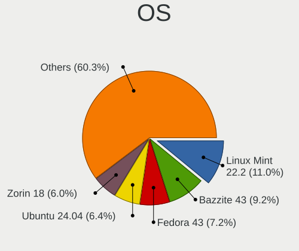

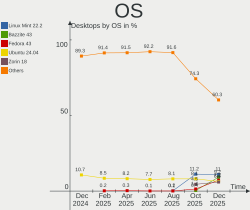

| Name                         | Desktops | Percent |
|------------------------------|----------|---------|
| Linux Mint 22.2              | 334      | 10.95%  |
| Bazzite 43                   | 279      | 9.15%   |
| Fedora 43                    | 220      | 7.22%   |
| Ubuntu 24.04                 | 194      | 6.36%   |
| Zorin 18                     | 184      | 6.03%   |
| Arch Rolling                 | 167      | 5.48%   |
| Debian 13                    | 105      | 3.44%   |
| OpenMandriva 6.0             | 100      | 3.28%   |
| OpenMandriva 25.90           | 86       | 2.82%   |
| Pop!_OS 24.04                | 85       | 2.79%   |
| ROSA 13.1                    | 69       | 2.26%   |
| OpenMandriva 25.11           | 59       | 1.94%   |
| Pop!_OS 22.04                | 58       | 1.9%    |
| CachyOS Rolling              | 58       | 1.9%    |
| Bazzite 42                   | 58       | 1.9%    |
| Ubuntu 25.10                 | 45       | 1.48%   |
| Zorin 17                     | 41       | 1.34%   |
| Linux Mint 22.1              | 41       | 1.34%   |
| Kubuntu 25.10                | 38       | 1.25%   |
| EndeavourOS Rolling          | 37       | 1.21%   |
| Debian 12                    | 37       | 1.21%   |
| CachyOS                      | 34       | 1.12%   |
| Ubuntu 22.04                 | 31       | 1.02%   |
| Nobara 43                    | 28       | 0.92%   |
| Fedora 42                    | 28       | 0.92%   |
| KDE neon 24.04               | 27       | 0.89%   |
| Gentoo 2.18                  | 23       | 0.75%   |
| LMDE 7                       | 21       | 0.69%   |
| Linux Mint 21.3              | 20       | 0.66%   |
| Kubuntu 24.04                | 20       | 0.66%   |
| ROSA 12                      | 19       | 0.62%   |
| openSUSE Tumbleweed-XXXXXXXX | 18       | 0.59%   |
| ALT Linux 11.0               | 18       | 0.59%   |
| Manjaro                      | 17       | 0.56%   |
| OpenMandriva 25.06           | 16       | 0.52%   |
| OpenMandriva 24.12           | 16       | 0.52%   |
| Debian                       | 16       | 0.52%   |
| ROSA 12.5.1                  | 15       | 0.49%   |
| Manjaro 25.1.0               | 15       | 0.49%   |
| NixOS 26.05                  | 13       | 0.43%   |

OS Family
---------

OS without a version

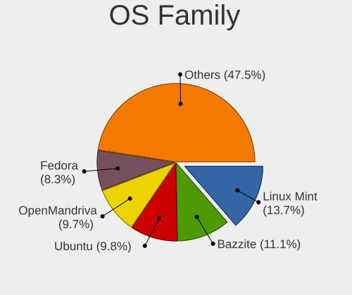

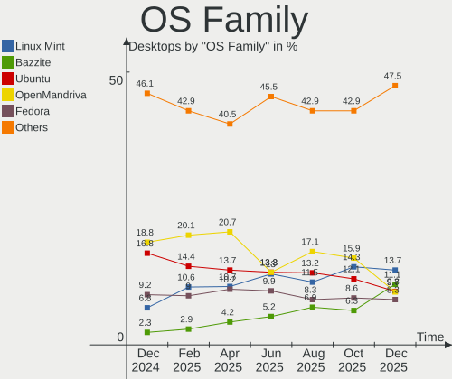

| Name             | Desktops | Percent |
|------------------|----------|---------|
| Linux Mint       | 417      | 13.68%  |
| Bazzite          | 337      | 11.05%  |
| Ubuntu           | 298      | 9.77%   |
| OpenMandriva     | 295      | 9.68%   |
| Fedora           | 253      | 8.3%    |
| Zorin            | 227      | 7.45%   |
| Arch             | 167      | 5.48%   |
| Debian           | 166      | 5.44%   |
| Pop!_OS          | 143      | 4.69%   |
| ROSA             | 109      | 3.57%   |
| CachyOS          | 92       | 3.02%   |
| Kubuntu          | 68       | 2.23%   |
| Manjaro          | 39       | 1.28%   |
| EndeavourOS      | 37       | 1.21%   |
| openSUSE         | 32       | 1.05%   |
| NixOS            | 30       | 0.98%   |
| Nobara           | 28       | 0.92%   |
| KDE neon         | 27       | 0.89%   |
| LMDE             | 24       | 0.79%   |
| Gentoo           | 24       | 0.79%   |
| BlackPanther     | 20       | 0.66%   |
| ALT Linux        | 19       | 0.62%   |
| Xubuntu          | 14       | 0.46%   |
| Garuda Linux     | 14       | 0.46%   |
| SteamOS          | 13       | 0.43%   |
| Lubuntu          | 12       | 0.39%   |
| MX               | 10       | 0.33%   |
| BigLinux         | 8        | 0.26%   |
| Pikaos           | 7        | 0.23%   |
| Kali             | 7        | 0.23%   |
| Ubuntu MATE      | 6        | 0.2%    |
| Solus            | 6        | 0.2%    |
| TUXEDO OS        | 5        | 0.16%   |
| Rocky Linux      | 5        | 0.16%   |
| Elementary       | 5        | 0.16%   |
| Anduinos         | 5        | 0.16%   |
| org.kde.Platform | 4        | 0.13%   |
| Dts-distro       | 4        | 0.13%   |
| Bluefin          | 4        | 0.13%   |
| Aurora           | 4        | 0.13%   |

Kernel
------

Version of the Linux kernel

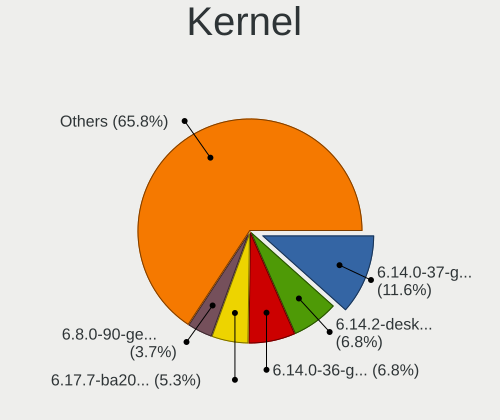

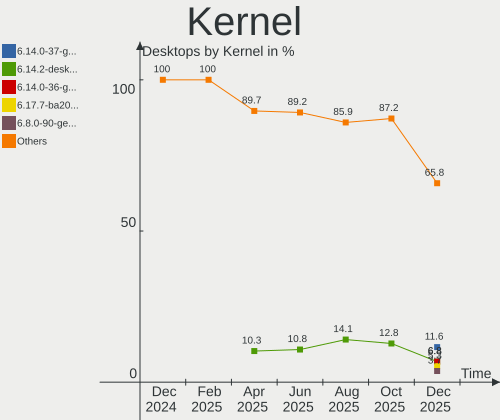

| Version                        | Desktops | Percent |
|--------------------------------|----------|---------|
| 6.14.0-37-generic              | 354      | 11.61%  |
| 6.14.2-desktop-3omv2590        | 208      | 6.82%   |
| 6.14.0-36-generic              | 207      | 6.79%   |
| 6.17.7-ba20.fc43.x86_64        | 163      | 5.35%   |
| 6.8.0-90-generic               | 112      | 3.67%   |
| 6.17.7-ba19.fc43.x86_64        | 110      | 3.61%   |
| 6.17.9-arch1-1                 | 104      | 3.41%   |
| 6.12.57+deb13-amd64            | 92       | 3.02%   |
| 6.8.0-88-generic               | 84       | 2.76%   |
| 6.17.9-76061709-generic        | 78       | 2.56%   |
| 6.17.12-300.fc43.x86_64        | 65       | 2.13%   |
| 6.12.47-generic-5rosa13-x86_64 | 63       | 2.07%   |
| 6.16.4-116.bazzite.fc42.x86_64 | 55       | 1.8%    |
| 6.17.4-76061704-generic        | 49       | 1.61%   |
| 6.17.9-300.fc43.x86_64         | 48       | 1.57%   |
| 6.17.0-8-generic               | 41       | 1.34%   |
| 6.17.0-7-generic               | 37       | 1.21%   |
| 6.14.0-29-generic              | 36       | 1.18%   |
| 6.17.1-300.fc43.x86_64         | 35       | 1.15%   |
| 6.17.9-zen1-1-zen              | 33       | 1.08%   |
| 6.18.0-desktop-1omv2590        | 31       | 1.02%   |
| 6.17.10-300.fc43.x86_64        | 30       | 0.98%   |
| 6.17.11-300.fc43.x86_64        | 29       | 0.95%   |
| 6.8.0-87-generic               | 26       | 0.85%   |
| 6.17.9-2-cachyos               | 22       | 0.72%   |
| 6.17.7-desktop-1omv2590        | 20       | 0.66%   |
| 6.18.0-3-cachyos               | 18       | 0.59%   |
| 6.1.0-41-amd64                 | 17       | 0.56%   |
| 6.18.2-arch2-1                 | 16       | 0.52%   |
| 6.14.0-33-generic              | 16       | 0.52%   |
| 6.14.0-27-generic              | 16       | 0.52%   |
| 6.16.3-76061603-generic        | 15       | 0.49%   |
| 6.12.34-6.12-alt1              | 15       | 0.49%   |
| 6.12.1-desktop-1omv2490        | 14       | 0.46%   |
| 6.17.8-300.fc43.x86_64         | 13       | 0.43%   |
| 6.18.2-2-cachyos               | 12       | 0.39%   |
| 6.18.2-zen2-1-zen              | 11       | 0.36%   |
| 6.18.1-2-cachyos               | 11       | 0.36%   |
| 6.17.10-200.nobara.fc43.x86_64 | 10       | 0.33%   |
| 6.12.48+deb13-amd64            | 10       | 0.33%   |

Kernel Family
-------------

Linux kernel without a distro release

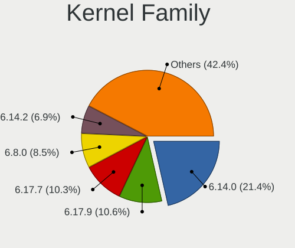

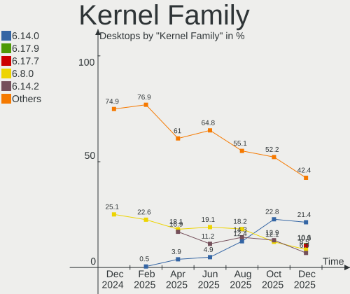

| Version | Desktops | Percent |
|---------|----------|---------|
| 6.14.0  | 654      | 21.45%  |
| 6.17.9  | 322      | 10.56%  |
| 6.17.7  | 313      | 10.27%  |
| 6.8.0   | 258      | 8.46%   |
| 6.14.2  | 210      | 6.89%   |
| 6.18.0  | 104      | 3.41%   |
| 6.12.57 | 96       | 3.15%   |
| 6.17.0  | 93       | 3.05%   |
| 6.17.12 | 80       | 2.62%   |
| 6.18.2  | 78       | 2.56%   |
| 6.12.47 | 74       | 2.43%   |
| 6.17.10 | 61       | 2%      |
| 6.16.4  | 58       | 1.9%    |
| 6.17.4  | 53       | 1.74%   |
| 6.17.8  | 49       | 1.61%   |
| 5.15.0  | 47       | 1.54%   |
| 6.18.1  | 38       | 1.25%   |
| 6.17.1  | 38       | 1.25%   |
| 6.17.11 | 35       | 1.15%   |
| 6.1.0   | 26       | 0.85%   |
| 6.16.3  | 16       | 0.52%   |
| 6.12.48 | 16       | 0.52%   |
| 6.12.34 | 16       | 0.52%   |
| 6.12.1  | 15       | 0.49%   |
| 6.8.12  | 12       | 0.39%   |
| 6.16.12 | 12       | 0.39%   |
| 6.12.63 | 12       | 0.39%   |
| 6.12.59 | 11       | 0.36%   |
| 6.6.106 | 10       | 0.33%   |
| 6.12.61 | 10       | 0.33%   |
| 6.12.62 | 9        | 0.3%    |
| 6.12.58 | 9        | 0.3%    |
| 6.12.0  | 8        | 0.26%   |
| 5.15.85 | 8        | 0.26%   |
| 6.6.32  | 7        | 0.23%   |
| 6.4.0   | 7        | 0.23%   |
| 6.17.2  | 7        | 0.23%   |
| 6.17.13 | 7        | 0.23%   |
| 6.11.11 | 7        | 0.23%   |
| 5.4.0   | 7        | 0.23%   |

Kernel Major Ver.
-----------------

Linux kernel major version

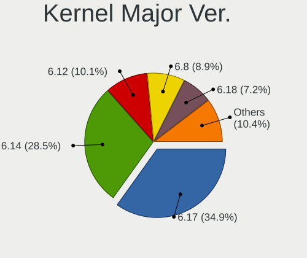

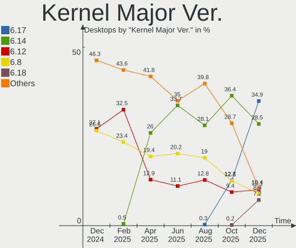

| Version | Desktops | Percent |
|---------|----------|---------|
| 6.17    | 1064     | 34.9%   |
| 6.14    | 870      | 28.53%  |
| 6.12    | 307      | 10.07%  |
| 6.8     | 272      | 8.92%   |
| 6.18    | 220      | 7.22%   |
| 6.16    | 92       | 3.02%   |
| 5.15    | 59       | 1.94%   |
| 6.1     | 39       | 1.28%   |
| 6.6     | 36       | 1.18%   |
| 6.4     | 13       | 0.43%   |
| 6.11    | 12       | 0.39%   |
| 6.15    | 8        | 0.26%   |
| 5.4     | 7        | 0.23%   |
| 5.10    | 7        | 0.23%   |
| 6.5     | 5        | 0.16%   |
| 6.2     | 5        | 0.16%   |
| 6.10    | 5        | 0.16%   |
| 5.14    | 5        | 0.16%   |
| 4.18    | 5        | 0.16%   |
| 4.15    | 4        | 0.13%   |
| 6.13    | 3        | 0.1%    |
| 6.9     | 2        | 0.07%   |
| 4.19    | 2        | 0.07%   |
| 6.7     | 1        | 0.03%   |
| 6.19    | 1        | 0.03%   |
| 6.0     | 1        | 0.03%   |
| 5.6     | 1        | 0.03%   |
| 5.19    | 1        | 0.03%   |
| 5.16    | 1        | 0.03%   |
| 4.16    | 1        | 0.03%   |

Arch
----

OS architecture (x86_64, i586, etc.)

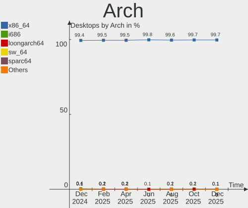

| Name        | Desktops | Percent |
|-------------|----------|---------|
| x86_64      | 3040     | 99.7%   |
| i686        | 4        | 0.13%   |
| loongarch64 | 2        | 0.07%   |
| sw_64       | 1        | 0.03%   |
| sparc64     | 1        | 0.03%   |
| ppc64       | 1        | 0.03%   |

DE
--

Desktop Environment

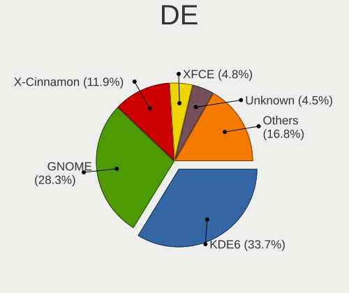

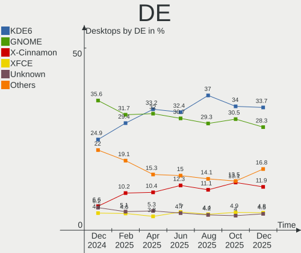

| Name                  | Desktops | Percent |
|-----------------------|----------|---------|
| KDE6                  | 1029     | 33.75%  |
| GNOME                 | 864      | 28.34%  |
| X-Cinnamon            | 362      | 11.87%  |
| XFCE                  | 146      | 4.79%   |
| Unknown               | 137      | 4.49%   |
| KDE5                  | 106      | 3.48%   |
| COSMIC                | 93       | 3.05%   |
| KDE                   | 63       | 2.07%   |
| MATE                  | 49       | 1.61%   |
| Hyprland              | 40       | 1.31%   |
| LXQt                  | 37       | 1.21%   |
| KDE4                  | 24       | 0.79%   |
| Cinnamon              | 20       | 0.66%   |
| niri                  | 17       | 0.56%   |
| Budgie                | 9        | 0.3%    |
| i3                    | 7        | 0.23%   |
| Pantheon              | 6        | 0.2%    |
| LXDE                  | 5        | 0.16%   |
| sway                  | 3        | 0.1%    |
| GNOME Classic         | 3        | 0.1%    |
| Deepin                | 3        | 0.1%    |
| Unity                 | 2        | 0.07%   |
| sway:wlroots          | 2        | 0.07%   |
| labwc:wlroots         | 2        | 0.07%   |
| icewm                 | 2        | 0.07%   |
| Endless:GNOME         | 2        | 0.07%   |
| DDE                   | 2        | 0.07%   |
| bspwm                 | 2        | 0.07%   |
| TDE                   | 1        | 0.03%   |
| sway:wlroots:sway-run | 1        | 0.03%   |
| start-hyprland        | 1        | 0.03%   |
| qtile                 | 1        | 0.03%   |
| Openbox               | 1        | 0.03%   |
| LeftWM                | 1        | 0.03%   |
| hyprstart             | 1        | 0.03%   |
| GNOME Flashback       | 1        | 0.03%   |
| fly                   | 1        | 0.03%   |
| fluxbox               | 1        | 0.03%   |
| Enlightenment         | 1        | 0.03%   |
| e16-session           | 1        | 0.03%   |

Display Server
--------------

X11 or Wayland

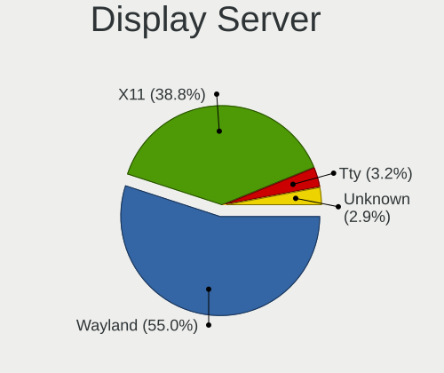

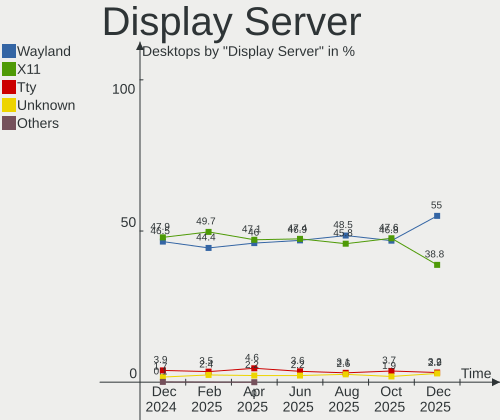

| Name    | Desktops | Percent |
|---------|----------|---------|
| Wayland | 1677     | 55%     |
| X11     | 1184     | 38.83%  |
| Tty     | 99       | 3.25%   |
| Unknown | 89       | 2.92%   |

Display Manager
---------------

SDDM, LightDM, etc.

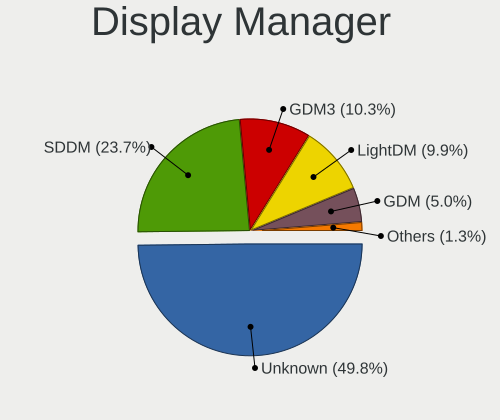

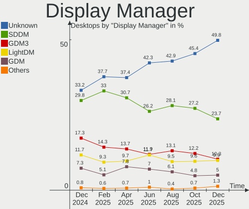

| Name                  | Desktops | Percent |
|-----------------------|----------|---------|
| Unknown               | 1519     | 49.82%  |
| SDDM                  | 723      | 23.71%  |
| GDM3                  | 314      | 10.3%   |
| LightDM               | 302      | 9.9%    |
| GDM                   | 152      | 4.99%   |
| GREETD                | 13       | 0.43%   |
| COSMIC-GREETER        | 8        | 0.26%   |
| LY-DM                 | 5        | 0.16%   |
| SLiM                  | 3        | 0.1%    |
| Ly                    | 3        | 0.1%    |
| KDM                   | 3        | 0.1%    |
| SLIMSKI               | 2        | 0.07%   |
| FLY-DM                | 1        | 0.03%   |
| DISPLAY-MANAGER-START | 1        | 0.03%   |

OS Lang
-------

Language

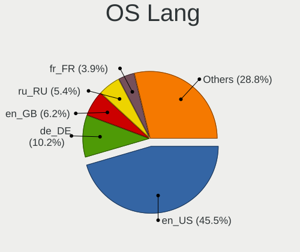

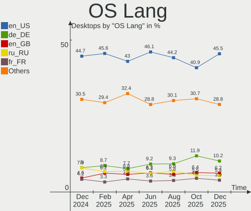

| Lang    | Desktops | Percent |
|---------|----------|---------|
| en_US   | 1387     | 45.49%  |
| de_DE   | 311      | 10.2%   |
| en_GB   | 188      | 6.17%   |
| ru_RU   | 166      | 5.44%   |
| fr_FR   | 119      | 3.9%    |
| pt_BR   | 116      | 3.8%    |
| C       | 74       | 2.43%   |
| en_CA   | 72       | 2.36%   |
| en_AU   | 68       | 2.23%   |
| it_IT   | 64       | 2.1%    |
| es_ES   | 54       | 1.77%   |
| pl_PL   | 36       | 1.18%   |
| Unknown | 35       | 1.15%   |
| es_MX   | 31       | 1.02%   |
| hu_HU   | 25       | 0.82%   |
| nl_NL   | 20       | 0.66%   |
| de_AT   | 20       | 0.66%   |
| es_AR   | 16       | 0.52%   |
| en_IN   | 16       | 0.52%   |
| en_ZA   | 15       | 0.49%   |
| cs_CZ   | 15       | 0.49%   |
| pt_PT   | 14       | 0.46%   |
| de_CH   | 14       | 0.46%   |
| en_NZ   | 11       | 0.36%   |
| en_IE   | 11       | 0.36%   |
| sv_SE   | 9        | 0.3%    |
| fr_CA   | 9        | 0.3%    |
| zh_CN   | 8        | 0.26%   |
| ja_JP   | 8        | 0.26%   |
| es_CL   | 7        | 0.23%   |
| en_DK   | 7        | 0.23%   |
| tr_TR   | 6        | 0.2%    |
| sk_SK   | 6        | 0.2%    |
| fi_FI   | 5        | 0.16%   |
| es_CO   | 5        | 0.16%   |
| da_DK   | 5        | 0.16%   |
| nl_BE   | 4        | 0.13%   |
| en_IL   | 4        | 0.13%   |
| zh_TW   | 3        | 0.1%    |
| uk_UA   | 3        | 0.1%    |

Boot Mode
---------

EFI or BIOS

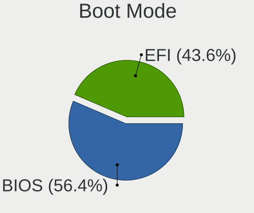

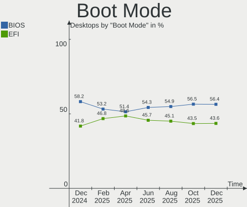

| Mode | Desktops | Percent |
|------|----------|---------|
| BIOS | 1721     | 56.44%  |
| EFI  | 1328     | 43.56%  |

Filesystem
----------

Type of filesystem

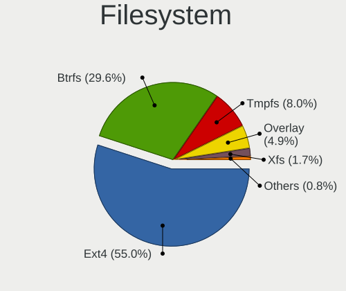

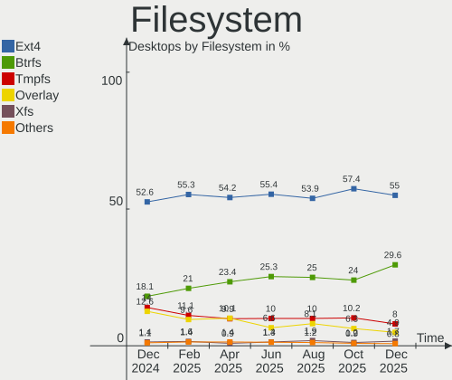

| Type    | Desktops | Percent |
|---------|----------|---------|
| Ext4    | 1677     | 55%     |
| Btrfs   | 904      | 29.65%  |
| Tmpfs   | 245      | 8.04%   |
| Overlay | 148      | 4.85%   |
| Xfs     | 51       | 1.67%   |
| Zfs     | 9        | 0.3%    |
| F2fs    | 5        | 0.16%   |
| Rootfs  | 3        | 0.1%    |
| XXXXX   | 2        | 0.07%   |
| XXX4    | 2        | 0.07%   |
| Ext3    | 2        | 0.07%   |
| Ext2    | 1        | 0.03%   |

Part. scheme
------------

Scheme of partitioning

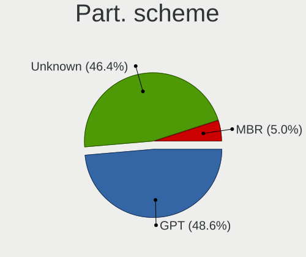

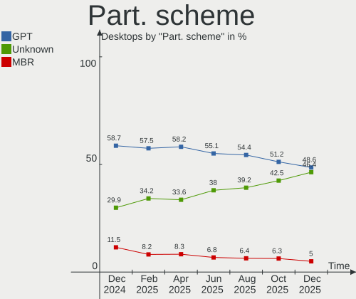

| Type    | Desktops | Percent |
|---------|----------|---------|
| GPT     | 1483     | 48.64%  |
| Unknown | 1414     | 46.38%  |
| MBR     | 152      | 4.99%   |

Dual Boot with Linux/BSD
------------------------

Hosting more than one Linux/BSD

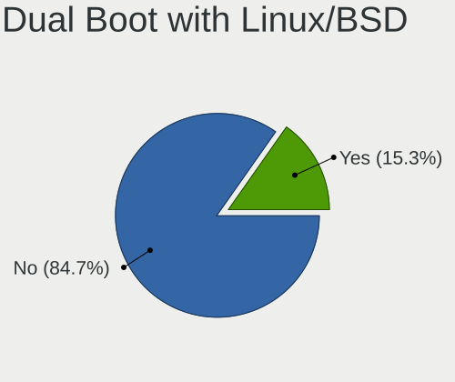

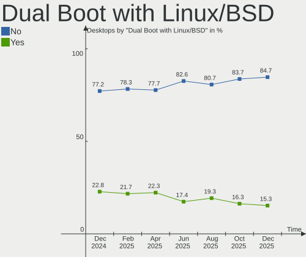

| Dual boot | Desktops | Percent |
|-----------|----------|---------|
| No        | 2584     | 84.75%  |
| Yes       | 465      | 15.25%  |

Dual Boot (Win)
---------------

Hosting Linux and Windows

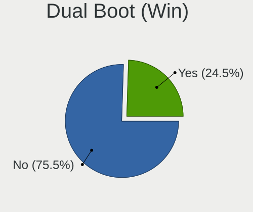

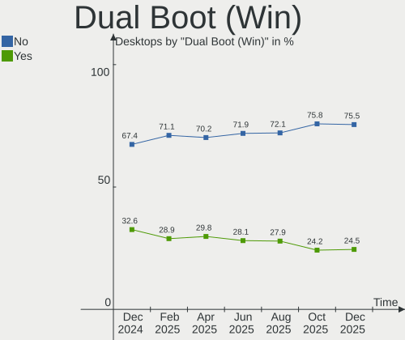

| Dual boot | Desktops | Percent |
|-----------|----------|---------|
| No        | 2302     | 75.5%   |
| Yes       | 747      | 24.5%   |

Board
-----

Vendor
------

Motherboard manufacturer

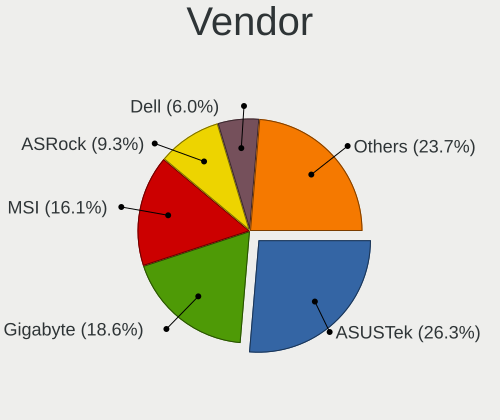

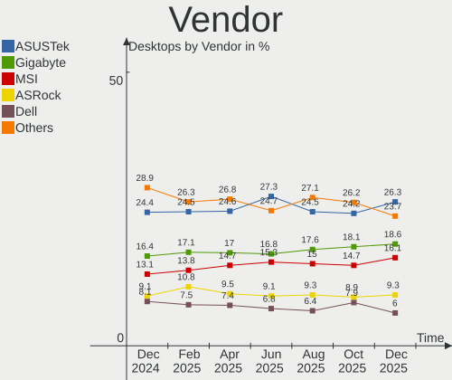

| Name                                 | Desktops | Percent |
|--------------------------------------|----------|---------|
| ASUSTek Computer                     | 803      | 26.34%  |
| Gigabyte Technology                  | 568      | 18.63%  |
| MSI                                  | 491      | 16.1%   |
| ASRock                               | 283      | 9.28%   |
| Dell                                 | 182      | 5.97%   |
| Hewlett-Packard                      | 156      | 5.12%   |
| Lenovo                               | 82       | 2.69%   |
| Intel                                | 72       | 2.36%   |
| Unknown                              | 51       | 1.67%   |
| Fujitsu                              | 32       | 1.05%   |
| Acer                                 | 29       | 0.95%   |
| Biostar                              | 23       | 0.75%   |
| AZW                                  | 22       | 0.72%   |
| Pegatron                             | 16       | 0.52%   |
| Medion                               | 16       | 0.52%   |
| Huanan                               | 12       | 0.39%   |
| Shenzhen Meigao Electronic Equipment | 9        | 0.3%    |
| GMKtec                               | 9        | 0.3%    |
| GEEKOM                               | 9        | 0.3%    |
| Supermicro                           | 8        | 0.26%   |
| MACHINIST                            | 8        | 0.26%   |
| Foxconn                              | 7        | 0.23%   |
| Apple                                | 7        | 0.23%   |
| HC Technology.                       | 6        | 0.2%    |
| Alienware                            | 6        | 0.2%    |
| Tianbei                              | 5        | 0.16%   |
| JGINYUE                              | 5        | 0.16%   |
| Inspur                               | 5        | 0.16%   |
| Fujitsu Siemens                      | 5        | 0.16%   |
| Positivo                             | 4        | 0.13%   |
| PELADN                               | 4        | 0.13%   |
| Packard Bell                         | 4        | 0.13%   |
| ECS                                  | 4        | 0.13%   |
| AMD                                  | 4        | 0.13%   |
| WeiBu                                | 3        | 0.1%    |
| SZQFTX                               | 3        | 0.1%    |
| Red Hat                              | 3        | 0.1%    |
| OEM                                  | 3        | 0.1%    |
| MocTex                               | 3        | 0.1%    |
| MAXSUN                               | 3        | 0.1%    |

Model
-----

Motherboard model

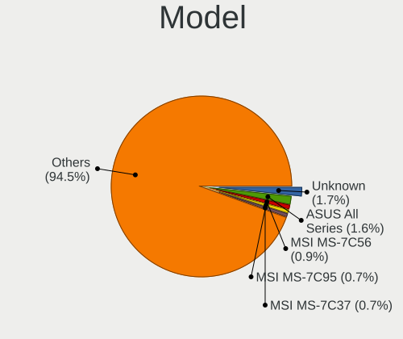

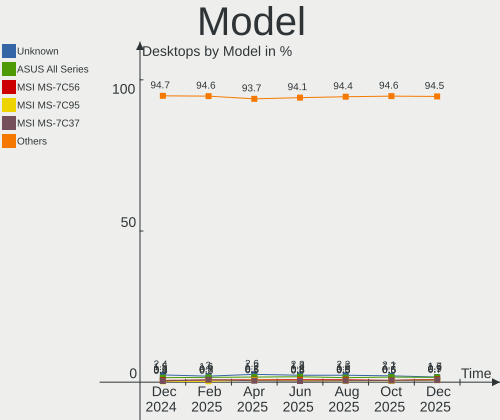

| Name                                 | Desktops | Percent |
|--------------------------------------|----------|---------|
| Unknown                              | 51       | 1.67%   |
| ASUS All Series                      | 48       | 1.57%   |
| MSI MS-7C56                          | 26       | 0.85%   |
| MSI MS-7C95                          | 22       | 0.72%   |
| MSI MS-7C37                          | 21       | 0.69%   |
| ASUS TUF Gaming X570-PLUS            | 21       | 0.69%   |
| MSI MS-7C91                          | 20       | 0.66%   |
| MSI MS-7C02                          | 14       | 0.46%   |
| MSI MS-7D75                          | 12       | 0.39%   |
| Gigabyte X870E AORUS ELITE WIFI7     | 12       | 0.39%   |
| Dell OptiPlex 7010                   | 12       | 0.39%   |
| ASUS PRIME A320M-K                   | 12       | 0.39%   |
| ASUS TUF Gaming B550-PLUS            | 11       | 0.36%   |
| Gigabyte X570 AORUS ELITE            | 10       | 0.33%   |
| Gigabyte 970A-DS3P                   | 10       | 0.33%   |
| Dell OptiPlex 7050                   | 10       | 0.33%   |
| ASUS TUF Gaming B850-PLUS WIFI       | 10       | 0.33%   |
| ASUS ROG STRIX B550-F GAMING WIFI II | 10       | 0.33%   |
| MSI MS-7C84                          | 9        | 0.3%    |
| MSI MS-7B89                          | 9        | 0.3%    |
| Dell OptiPlex 9020                   | 9        | 0.3%    |
| Dell OptiPlex 3020                   | 9        | 0.3%    |
| ASUS TUF Gaming B550M-PLUS           | 9        | 0.3%    |
| ASUS ROG STRIX X870E-E GAMING WIFI   | 9        | 0.3%    |
| ASUS ROG STRIX B550-F GAMING         | 9        | 0.3%    |
| ASUS ROG CROSSHAIR X870E HERO        | 9        | 0.3%    |
| MSI MS-7E26                          | 8        | 0.26%   |
| MSI MS-7E12                          | 8        | 0.26%   |
| MSI MS-7D25                          | 8        | 0.26%   |
| MSI MS-7A38                          | 8        | 0.26%   |
| Intel H61                            | 8        | 0.26%   |
| Gigabyte B550 GAMING X V2            | 8        | 0.26%   |
| Gigabyte B550 AORUS ELITE V2         | 8        | 0.26%   |
| Gigabyte B450M DS3H                  | 8        | 0.26%   |
| ASUS TUF Gaming B650M-E WIFI         | 8        | 0.26%   |
| ASUS TUF Gaming B650-PLUS WIFI       | 8        | 0.26%   |
| ASRock B550M Pro4                    | 8        | 0.26%   |
| MSI MS-7E62                          | 7        | 0.23%   |
| MSI MS-7E59                          | 7        | 0.23%   |
| MSI MS-7E51                          | 7        | 0.23%   |

Model Family
------------

Motherboard model prefix

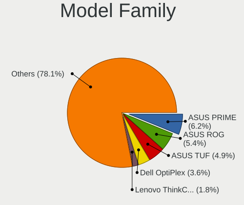

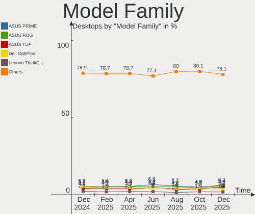

| Name               | Desktops | Percent |
|--------------------|----------|---------|
| ASUS PRIME         | 188      | 6.17%   |
| ASUS ROG           | 166      | 5.44%   |
| ASUS TUF           | 150      | 4.92%   |
| Dell OptiPlex      | 109      | 3.57%   |
| Lenovo ThinkCentre | 54       | 1.77%   |
| Unknown            | 51       | 1.67%   |
| ASUS All           | 48       | 1.57%   |
| HP Compaq          | 37       | 1.21%   |
| Gigabyte B550      | 31       | 1.02%   |
| Gigabyte X570      | 30       | 0.98%   |
| Gigabyte B650      | 28       | 0.92%   |
| Dell Precision     | 28       | 0.92%   |
| Gigabyte X870E     | 27       | 0.89%   |
| Fujitsu ESPRIMO    | 27       | 0.89%   |
| MSI MS-7C56        | 26       | 0.85%   |
| HP EliteDesk       | 26       | 0.85%   |
| MSI MS-7C95        | 22       | 0.72%   |
| Gigabyte B550M     | 22       | 0.72%   |
| MSI MS-7C37        | 21       | 0.69%   |
| MSI MS-7C91        | 20       | 0.66%   |
| Gigabyte B450M     | 20       | 0.66%   |
| Gigabyte B450      | 19       | 0.62%   |
| Gigabyte Z790      | 18       | 0.59%   |
| HP ProDesk         | 17       | 0.56%   |
| Dell XPS           | 16       | 0.52%   |
| ASRock B550M       | 16       | 0.52%   |
| ASRock B450M       | 15       | 0.49%   |
| MSI MS-7C02        | 14       | 0.46%   |
| ASUS ProArt        | 14       | 0.46%   |
| ASUS M5A78L-M      | 14       | 0.46%   |
| ASRock X570        | 14       | 0.46%   |
| HP Pavilion        | 13       | 0.43%   |
| Gigabyte X870      | 13       | 0.43%   |
| ASRock B650M       | 13       | 0.43%   |
| MSI MS-7D75        | 12       | 0.39%   |
| Gigabyte B650M     | 12       | 0.39%   |
| Acer Aspire        | 12       | 0.39%   |
| Dell Inspiron      | 11       | 0.36%   |
| ASUS SABERTOOTH    | 11       | 0.36%   |
| ASUS Pro           | 11       | 0.36%   |

MFG Year
--------

Motherboard manufacture year

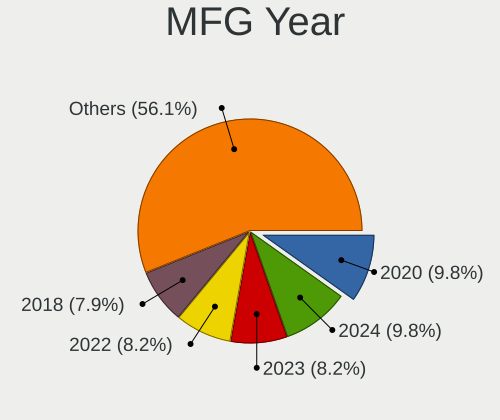

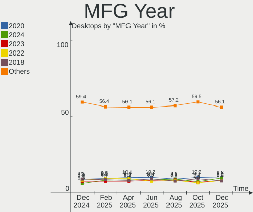

| Year    | Desktops | Percent |
|---------|----------|---------|
| 2020    | 300      | 9.84%   |
| 2024    | 298      | 9.77%   |
| 2023    | 250      | 8.2%    |
| 2022    | 250      | 8.2%    |
| 2018    | 241      | 7.9%    |
| 2019    | 222      | 7.28%   |
| 2021    | 220      | 7.22%   |
| 2013    | 180      | 5.9%    |
| 2017    | 161      | 5.28%   |
| 2012    | 151      | 4.95%   |
| 2025    | 142      | 4.66%   |
| 2014    | 121      | 3.97%   |
| 2016    | 114      | 3.74%   |
| 2011    | 105      | 3.44%   |
| 2015    | 100      | 3.28%   |
| 2009    | 73       | 2.39%   |
| 2010    | 47       | 1.54%   |
| 2008    | 37       | 1.21%   |
| 2007    | 20       | 0.66%   |
| 2006    | 9        | 0.3%    |
| Unknown | 5        | 0.16%   |
| 2005    | 1        | 0.03%   |
| 2003    | 1        | 0.03%   |
| 2001    | 1        | 0.03%   |

Form Factor
-----------

Physical design of the computer

| Name    | Desktops | Percent |
|---------|----------|---------|
| Desktop | 3049     | 100%    |

Secure Boot
-----------

Enabled or disabled

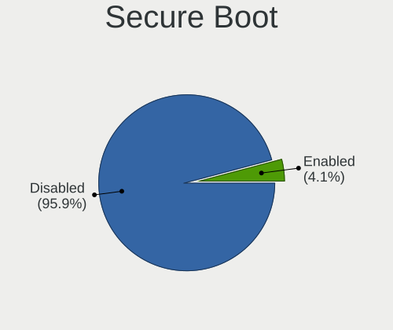

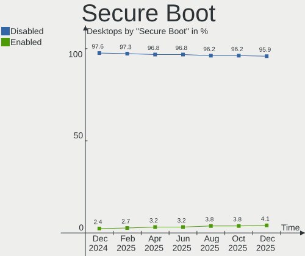

| State    | Desktops | Percent |
|----------|----------|---------|
| Disabled | 2923     | 95.87%  |
| Enabled  | 126      | 4.13%   |

Coreboot
--------

Have coreboot on board

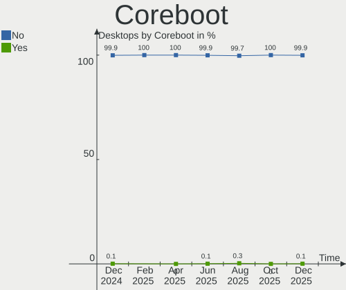

| Used | Desktops | Percent |
|------|----------|---------|
| No   | 3045     | 99.87%  |
| Yes  | 4        | 0.13%   |

RAM Size
--------

Total RAM memory

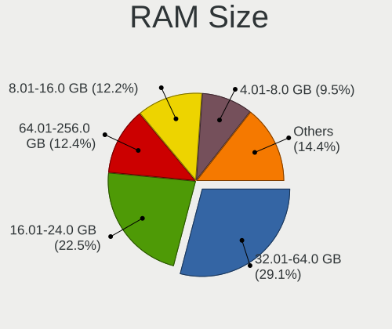

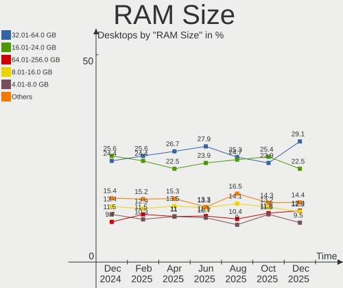

| Size in GB      | Desktops | Percent |
|-----------------|----------|---------|
| 32.01-64.0      | 886      | 29.06%  |
| 16.01-24.0      | 685      | 22.47%  |
| 64.01-256.0     | 379      | 12.43%  |
| 8.01-16.0       | 371      | 12.17%  |
| 4.01-8.0        | 289      | 9.48%   |
| 24.01-32.0      | 286      | 9.38%   |
| 3.01-4.0        | 118      | 3.87%   |
| 1.01-2.0        | 14       | 0.46%   |
| 2.01-3.0        | 10       | 0.33%   |
| More than 256.0 | 9        | 0.3%    |
| 0.51-1.0        | 1        | 0.03%   |
| 0.01-0.5        | 1        | 0.03%   |

RAM Used
--------

Used RAM memory

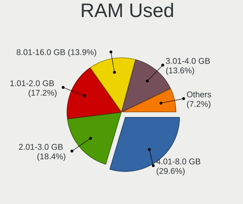

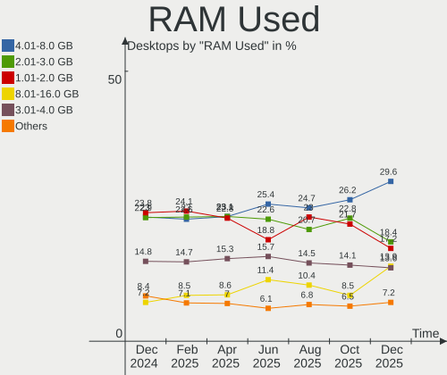

| Used GB     | Desktops | Percent |
|-------------|----------|---------|
| 4.01-8.0    | 903      | 29.62%  |
| 2.01-3.0    | 562      | 18.43%  |
| 1.01-2.0    | 524      | 17.19%  |
| 8.01-16.0   | 425      | 13.94%  |
| 3.01-4.0    | 416      | 13.64%  |
| 16.01-24.0  | 77       | 2.53%   |
| 0.51-1.0    | 72       | 2.36%   |
| 32.01-64.0  | 24       | 0.79%   |
| 24.01-32.0  | 23       | 0.75%   |
| 0.01-0.5    | 14       | 0.46%   |
| 64.01-256.0 | 9        | 0.3%    |

Total Drives
------------

Number of drives on board

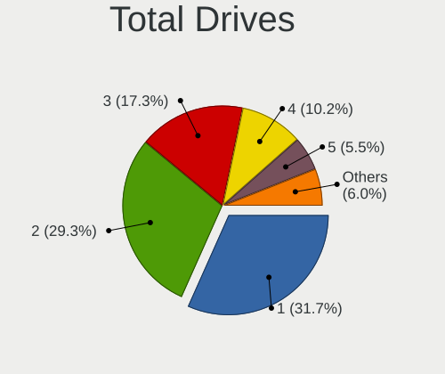

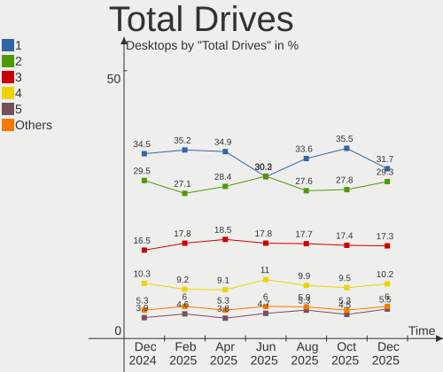

| Drives | Desktops | Percent |
|--------|----------|---------|
| 1      | 966      | 31.68%  |
| 2      | 894      | 29.32%  |
| 3      | 526      | 17.25%  |
| 4      | 312      | 10.23%  |
| 5      | 168      | 5.51%   |
| 6      | 97       | 3.18%   |
| 7      | 35       | 1.15%   |
| 8      | 15       | 0.49%   |
| 0      | 13       | 0.43%   |
| 10     | 6        | 0.2%    |
| 12     | 5        | 0.16%   |
| 9      | 5        | 0.16%   |
| 13     | 3        | 0.1%    |
| 14     | 2        | 0.07%   |
| 33     | 1        | 0.03%   |
| 16     | 1        | 0.03%   |

Has CD-ROM
----------

Has CD-ROM on board

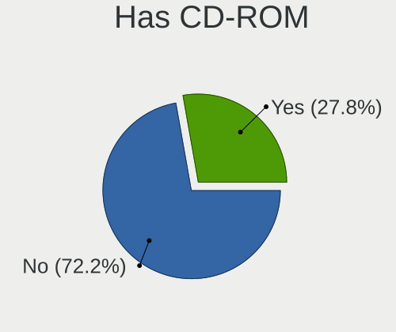

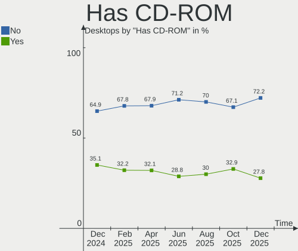

| Presented | Desktops | Percent |
|-----------|----------|---------|
| No        | 2202     | 72.22%  |
| Yes       | 847      | 27.78%  |

Has Ethernet
------------

Has Ethernet on board

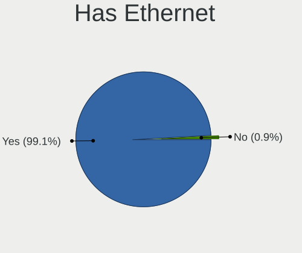

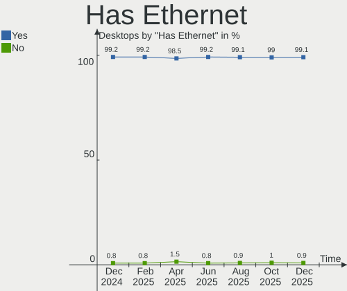

| Presented | Desktops | Percent |
|-----------|----------|---------|
| Yes       | 3022     | 99.11%  |
| No        | 27       | 0.89%   |

Has WiFi
--------

Has WiFi module

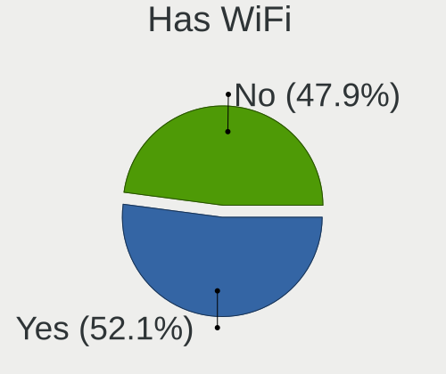

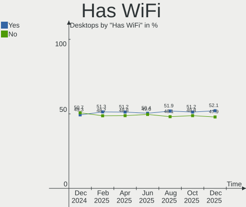

| Presented | Desktops | Percent |
|-----------|----------|---------|
| Yes       | 1588     | 52.08%  |
| No        | 1461     | 47.92%  |

Has Bluetooth
-------------

Has Bluetooth module

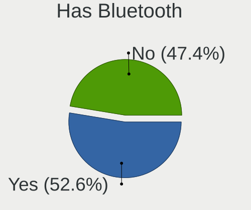

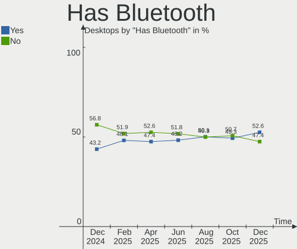

| Presented | Desktops | Percent |
|-----------|----------|---------|
| Yes       | 1604     | 52.61%  |
| No        | 1445     | 47.39%  |

Location
--------

Country
-------

Geographic location (country)

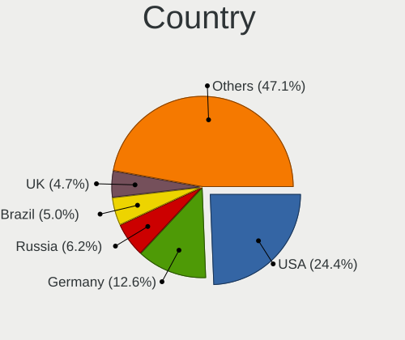

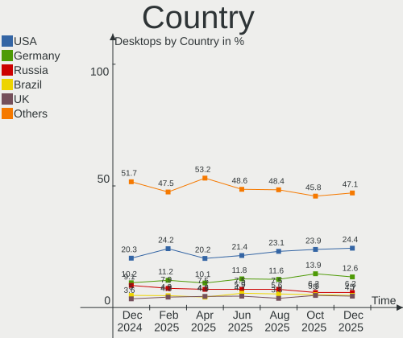

| Country         | Desktops | Percent |
|-----------------|----------|---------|
| USA             | 743      | 24.37%  |
| Germany         | 384      | 12.59%  |
| Russia          | 188      | 6.17%   |
| Brazil          | 153      | 5.02%   |
| UK              | 144      | 4.72%   |
| France          | 134      | 4.39%   |
| Canada          | 117      | 3.84%   |
| Italy           | 89       | 2.92%   |
| Australia       | 88       | 2.89%   |
| Poland          | 74       | 2.43%   |
| Spain           | 56       | 1.84%   |
| Netherlands     | 55       | 1.8%    |
| Switzerland     | 46       | 1.51%   |
| Hungary         | 44       | 1.44%   |
| Mexico          | 39       | 1.28%   |
| India           | 39       | 1.28%   |
| Austria         | 37       | 1.21%   |
| Finland         | 34       | 1.12%   |
| Sweden          | 31       | 1.02%   |
| Czechia         | 29       | 0.95%   |
| Romania         | 24       | 0.79%   |
| Portugal        | 24       | 0.79%   |
| Norway          | 23       | 0.75%   |
| Greece          | 22       | 0.72%   |
| China           | 22       | 0.72%   |
| Indonesia       | 21       | 0.69%   |
| South Africa    | 20       | 0.66%   |
| Denmark         | 17       | 0.56%   |
| Argentina       | 17       | 0.56%   |
| New Zealand     | 16       | 0.52%   |
| Bulgaria        | 16       | 0.52%   |
| Belgium         | 16       | 0.52%   |
| Turkey          | 14       | 0.46%   |
| The Netherlands | 14       | 0.46%   |
| Japan           | 14       | 0.46%   |
| Colombia        | 14       | 0.46%   |
| Chile           | 12       | 0.39%   |
| Thailand        | 11       | 0.36%   |
| Slovakia        | 10       | 0.33%   |
| Ireland         | 10       | 0.33%   |

City
----

Geographic location (city)

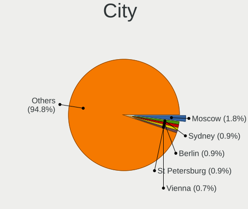

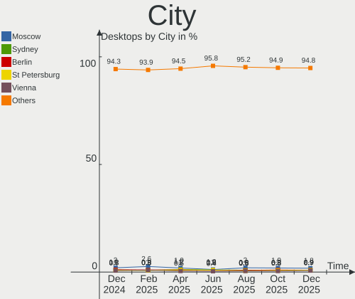

| City              | Desktops | Percent |
|-------------------|----------|---------|
| Moscow            | 56       | 1.84%   |
| Sydney            | 28       | 0.92%   |
| Berlin            | 27       | 0.89%   |
| St Petersburg     | 26       | 0.85%   |
| Vienna            | 21       | 0.69%   |
| Melbourne         | 20       | 0.66%   |
| Budapest          | 20       | 0.66%   |
| Sao Paulo         | 19       | 0.62%   |
| Warsaw            | 18       | 0.59%   |
| Toronto           | 17       | 0.56%   |
| Hamburg           | 16       | 0.52%   |
| Milan             | 15       | 0.49%   |
| Munich            | 14       | 0.46%   |
| Seattle           | 13       | 0.43%   |
| Portland          | 13       | 0.43%   |
| Helsinki          | 13       | 0.43%   |
| Athens            | 12       | 0.39%   |
| Amsterdam         | 12       | 0.39%   |
| Zurich            | 11       | 0.36%   |
| Montreal          | 11       | 0.36%   |
| Frankfurt am Main | 11       | 0.36%   |
| Denver            | 11       | 0.36%   |
| Chicago           | 11       | 0.36%   |
| Cape Town         | 11       | 0.36%   |
| Calgary           | 11       | 0.36%   |
| Adelaide          | 11       | 0.36%   |
| Los Angeles       | 10       | 0.33%   |
| Brisbane          | 10       | 0.33%   |
| Bengaluru         | 10       | 0.33%   |
| Paris             | 9        | 0.3%    |
| Bucharest         | 9        | 0.3%    |
| San Diego         | 8        | 0.26%   |
| Rome              | 8        | 0.26%   |
| Rio de Janeiro    | 8        | 0.26%   |
| Poznan            | 8        | 0.26%   |
| Perth             | 8        | 0.26%   |
| Istanbul          | 8        | 0.26%   |
| Dublin            | 8        | 0.26%   |
| Atlanta           | 8        | 0.26%   |
| Yekaterinburg     | 7        | 0.23%   |

Drives
------

Drive Vendor
------------

Hard drive vendors

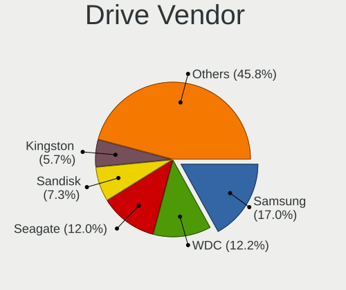

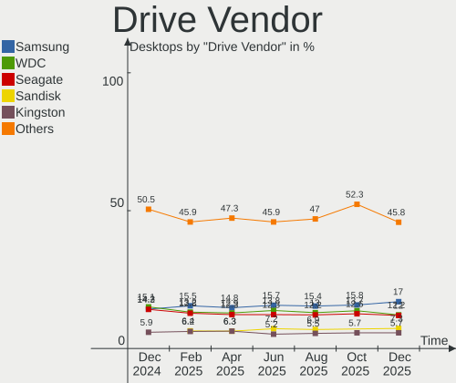

| Vendor                       | Desktops | Drives | Percent |
|------------------------------|----------|--------|---------|
| Samsung Electronics          | 1028     | 1589   | 16.99%  |
| WDC                          | 736      | 1003   | 12.16%  |
| Seagate                      | 726      | 990    | 12%     |
| Sandisk                      | 442      | 527    | 7.3%    |
| Kingston                     | 346      | 407    | 5.72%   |
| Crucial                      | 276      | 325    | 4.56%   |
| Toshiba                      | 226      | 257    | 3.73%   |
| Micron/Crucial Technology    | 175      | 205    | 2.89%   |
| Kingston Technology Company  | 125      | 136    | 2.07%   |
| Phison Electronics           | 120      | 139    | 1.98%   |
| MAXIO Technology (Hangzhou)  | 118      | 134    | 1.95%   |
| Hitachi                      | 100      | 113    | 1.65%   |
| Intel                        | 87       | 104    | 1.44%   |
| Micron Technology            | 82       | 88     | 1.35%   |
| A-DATA Technology            | 76       | 83     | 1.26%   |
| China                        | 73       | 78     | 1.21%   |
| Realtek Semiconductor        | 58       | 60     | 0.96%   |
| SK hynix                     | 56       | 64     | 0.93%   |
| Silicon Motion               | 52       | 54     | 0.86%   |
| PNY                          | 50       | 58     | 0.83%   |
| ADATA Technology             | 50       | 53     | 0.83%   |
| Unknown                      | 45       | 66     | 0.74%   |
| HGST                         | 45       | 70     | 0.74%   |
| Shenzhen Longsys Electronics | 43       | 46     | 0.71%   |
| Intenso                      | 42       | 48     | 0.69%   |
| Patriot                      | 41       | 45     | 0.68%   |
| SPCC                         | 37       | 41     | 0.61%   |
| KingSpec                     | 27       | 29     | 0.45%   |
| GOODRAM                      | 26       | 29     | 0.43%   |
| T-FORCE                      | 22       | 25     | 0.36%   |
| Unknown                      | 22       | 23     | 0.36%   |
| Netac                        | 21       | 21     | 0.35%   |
| KIOXIA                       | 21       | 24     | 0.35%   |
| Team                         | 20       | 22     | 0.33%   |
| Lexar                        | 20       | 21     | 0.33%   |
| AMD                          | 20       | 31     | 0.33%   |
| OCZ                          | 19       | 20     | 0.31%   |
| JMicron Technology           | 19       | 19     | 0.31%   |
| Corsair                      | 19       | 20     | 0.31%   |
| Apacer                       | 19       | 19     | 0.31%   |

Drive Model
-----------

Hard drive models

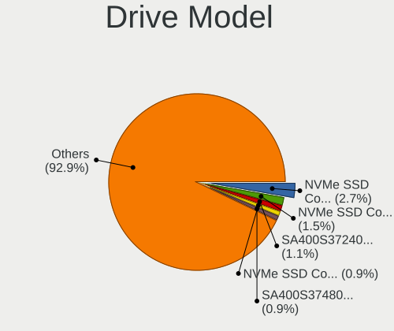

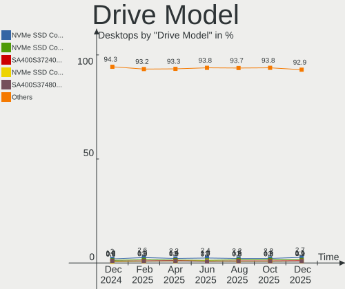

| Model                                                 | Desktops | Percent |
|-------------------------------------------------------|----------|---------|
| Samsung NVMe SSD Controller SM981/PM981/PM983 1TB     | 195      | 2.74%   |
| Samsung NVMe SSD Controller PM9A1/PM9A3/980PRO 1TB    | 107      | 1.51%   |
| Kingston SA400S37240G 240GB SSD                       | 80       | 1.13%   |
| MAXIO (Hangzhou) NVMe SSD Controller MAP1202 2TB      | 63       | 0.89%   |
| Kingston SA400S37480G 480GB SSD                       | 61       | 0.86%   |
| Micron/Crucial P2 NVMe PCIe SSD 2TB                   | 52       | 0.73%   |
| Samsung SSD 990 PRO 2TB                               | 51       | 0.72%   |
| Seagate ST1000DM010-2EP102 1TB                        | 50       | 0.7%    |
| Crucial CT1000MX500SSD1 1TB                           | 46       | 0.65%   |
| Samsung SSD 860 EVO 500GB                             | 43       | 0.61%   |
| Samsung SSD 980 1TB                                   | 42       | 0.59%   |
| Samsung SSD 850 EVO 250GB                             | 42       | 0.59%   |
| Samsung SSD 870 EVO 1TB                               | 41       | 0.58%   |
| Silicon Motion SM2263EN/SM2263XT SSD Controller 512GB | 40       | 0.56%   |
| Samsung SSD 860 EVO 1TB                               | 40       | 0.56%   |
| Samsung SSD 850 EVO 500GB                             | 40       | 0.56%   |
| Seagate ST2000DM008-2FR102 2TB                        | 38       | 0.53%   |
| WDC WD10EZEX-08WN4A0 1TB                              | 37       | 0.52%   |
| Seagate ST500DM002-1BD142 500GB                       | 36       | 0.51%   |
| Phison E16 PCIe4 NVMe Controller 1TB                  | 34       | 0.48%   |
| Seagate ST1000DM003-1CH162 1TB                        | 31       | 0.44%   |
| Crucial CT500MX500SSD1 500GB                          | 31       | 0.44%   |
| Seagate ST4000DM004-2CV104 4TB                        | 30       | 0.42%   |
| Samsung SSD 870 EVO 500GB                             | 30       | 0.42%   |
| Phison E12 NVMe Controller 1TB                        | 30       | 0.42%   |
| Crucial CT1000BX500SSD1 1TB                           | 30       | 0.42%   |
| Samsung SSD 990 PRO 4TB                               | 29       | 0.41%   |
| Samsung NVMe SSD Controller SM961/PM961/SM963 1024GB  | 29       | 0.41%   |
| Sandisk WD Blue SN550 NVMe SSD 1024GB                 | 28       | 0.39%   |
| Samsung SSD 990 PRO 1TB                               | 28       | 0.39%   |
| Kingston SA400S37960G 960GB SSD                       | 28       | 0.39%   |
| Seagate ST2000DM008-2UB102 2TB                        | 27       | 0.38%   |
| Toshiba DT01ACA100 1TB                                | 26       | 0.37%   |
| Sandisk WD_BLACK SN850X 2000GB                        | 26       | 0.37%   |
| Samsung SSD 860 EVO 250GB                             | 25       | 0.35%   |
| Samsung NVMe SSD Controller S4LV008[Pascal] 4TB       | 25       | 0.35%   |
| Kingston Company SNV2S1000G 1TB                       | 25       | 0.35%   |
| Sandisk WD Black SN750 / PC SN730 NVMe SSD 500GB      | 24       | 0.34%   |
| Samsung SSD 870 QVO 1TB                               | 24       | 0.34%   |
| Crucial CT2000BX500SSD1 2TB                           | 24       | 0.34%   |

HDD Vendor
----------

Hard disk drive vendors

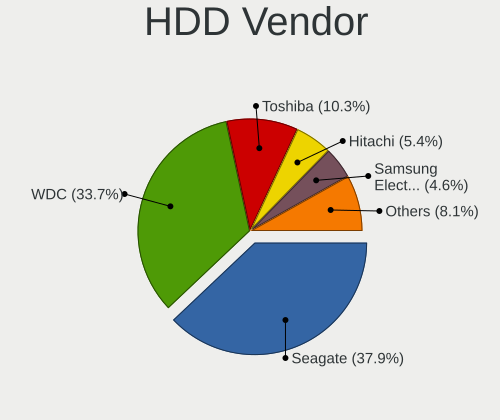

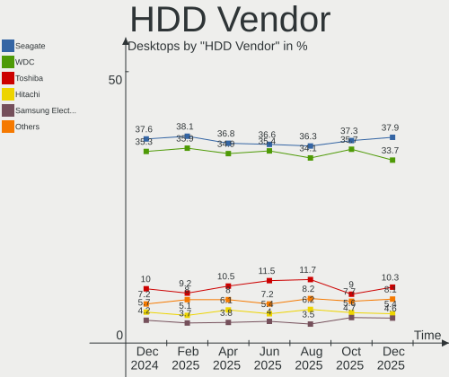

| Vendor              | Desktops | Drives | Percent |
|---------------------|----------|--------|---------|
| Seagate             | 706      | 956    | 37.94%  |
| WDC                 | 627      | 837    | 33.69%  |
| Toshiba             | 192      | 221    | 10.32%  |
| Hitachi             | 100      | 113    | 5.37%   |
| Samsung Electronics | 85       | 97     | 4.57%   |
| HGST                | 44       | 69     | 2.36%   |
| Unknown             | 18       | 19     | 0.97%   |
| JMicron Technology  | 12       | 12     | 0.64%   |
| Maxtor              | 9        | 9      | 0.48%   |
| T-FORCE             | 8        | 9      | 0.43%   |
| HPE                 | 6        | 19     | 0.32%   |
| ASMT                | 6        | 8      | 0.32%   |
| Intenso             | 5        | 5      | 0.27%   |
| Apple               | 5        | 6      | 0.27%   |
| Hewlett-Packard     | 4        | 4      | 0.21%   |
| Fujitsu             | 4        | 4      | 0.21%   |
| TO Exter            | 3        | 3      | 0.16%   |
| ExcelStor           | 3        | 3      | 0.16%   |
| USB3.0              | 2        | 2      | 0.11%   |
| HGST HUH            | 2        | 3      | 0.11%   |
| External            | 2        | 2      | 0.11%   |
| ASMedia             | 2        | 2      | 0.11%   |
| USB 3.1             | 1        | 1      | 0.05%   |
| TerraMas            | 1        | 3      | 0.05%   |
| Synology            | 1        | 1      | 0.05%   |
| SSK                 | 1        | 1      | 0.05%   |
| Shenzhen            | 1        | 1      | 0.05%   |
| SAGE                | 1        | 1      | 0.05%   |
| SABRENT             | 1        | 2      | 0.05%   |
| RSH-339             | 1        | 1      | 0.05%   |
| PRO-T5              | 1        | 1      | 0.05%   |
| Min Yi U            | 1        | 1      | 0.05%   |
| Maxone              | 1        | 1      | 0.05%   |
| MARVELL             | 1        | 2      | 0.05%   |
| HGST HTS            | 1        | 1      | 0.05%   |
| Elite               | 1        | 2      | 0.05%   |
| BR                  | 1        | 1      | 0.05%   |
| Unknown             | 1        | 1      | 0.05%   |

SSD Vendor
----------

Solid state drive vendors

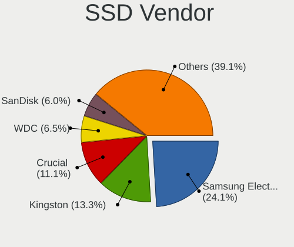

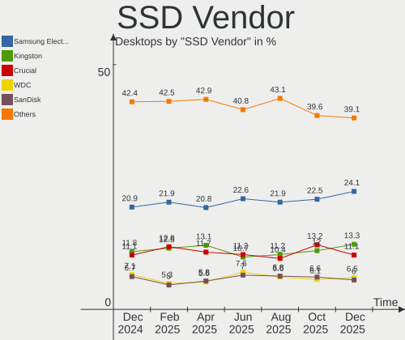

| Vendor              | Desktops | Drives | Percent |
|---------------------|----------|--------|---------|
| Samsung Electronics | 508      | 633    | 24.05%  |
| Kingston            | 280      | 314    | 13.26%  |
| Crucial             | 234      | 271    | 11.08%  |
| WDC                 | 138      | 148    | 6.53%   |
| SanDisk             | 126      | 143    | 5.97%   |
| China               | 71       | 76     | 3.36%   |
| A-DATA Technology   | 63       | 69     | 2.98%   |
| PNY                 | 47       | 53     | 2.23%   |
| Patriot             | 39       | 43     | 1.85%   |
| Intel               | 37       | 45     | 1.75%   |
| SPCC                | 35       | 39     | 1.66%   |
| Micron Technology   | 35       | 36     | 1.66%   |
| Intenso             | 34       | 38     | 1.61%   |
| GOODRAM             | 25       | 28     | 1.18%   |
| KingSpec            | 22       | 23     | 1.04%   |
| OCZ                 | 19       | 20     | 0.9%    |
| Apacer              | 19       | 19     | 0.9%    |
| SK hynix            | 17       | 24     | 0.8%    |
| Netac               | 17       | 17     | 0.8%    |
| Toshiba             | 16       | 16     | 0.76%   |
| Transcend           | 14       | 16     | 0.66%   |
| Team                | 14       | 16     | 0.66%   |
| Corsair             | 13       | 14     | 0.62%   |
| T-FORCE             | 12       | 12     | 0.57%   |
| Lexar               | 12       | 12     | 0.57%   |
| Unknown             | 12       | 12     | 0.57%   |
| AMD                 | 11       | 12     | 0.52%   |
| Fanxiang            | 10       | 10     | 0.47%   |
| Hewlett-Packard     | 9        | 9      | 0.43%   |
| Seagate             | 8        | 8      | 0.38%   |
| Gigabyte Technology | 8        | 8      | 0.38%   |
| Mushkin             | 6        | 7      | 0.28%   |
| MSI                 | 6        | 6      | 0.28%   |
| LITEONIT            | 6        | 6      | 0.28%   |
| LITEON              | 6        | 6      | 0.28%   |
| KIOXIA-EXCERIA      | 6        | 6      | 0.28%   |
| Integral            | 6        | 6      | 0.28%   |
| Emtec               | 6        | 7      | 0.28%   |
| X12                 | 5        | 5      | 0.24%   |
| Plextor             | 5        | 5      | 0.24%   |

Drive Kind
----------

HDD or SSD

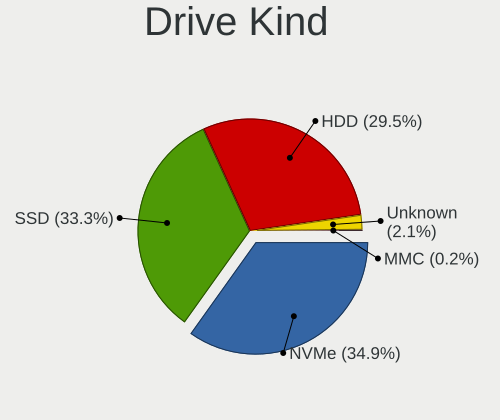

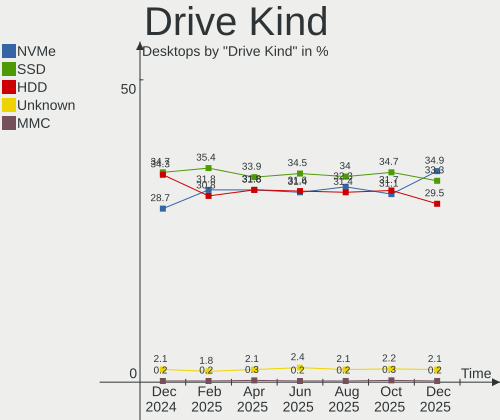

| Kind    | Desktops | Drives | Percent |
|---------|----------|--------|---------|
| NVMe    | 1762     | 2701   | 34.87%  |
| SSD     | 1684     | 2400   | 33.33%  |
| HDD     | 1490     | 2424   | 29.49%  |
| Unknown | 108      | 131    | 2.14%   |
| MMC     | 9        | 9      | 0.18%   |

Drive Connector
---------------

SATA, SAS, NVMe, etc.

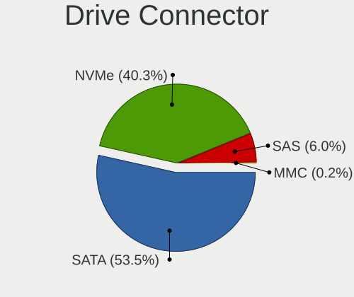

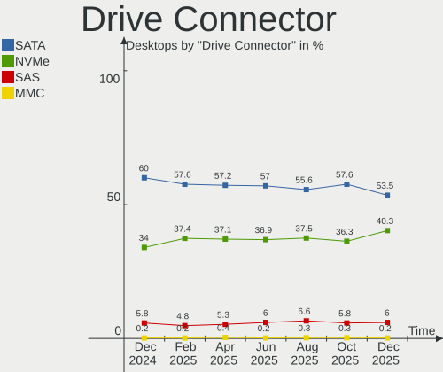

| Type | Desktops | Drives | Percent |
|------|----------|--------|---------|
| SATA | 2330     | 4634   | 53.49%  |
| NVMe | 1756     | 2671   | 40.31%  |
| SAS  | 261      | 351    | 5.99%   |
| MMC  | 9        | 9      | 0.21%   |

Drive Size
----------

Size of hard drive

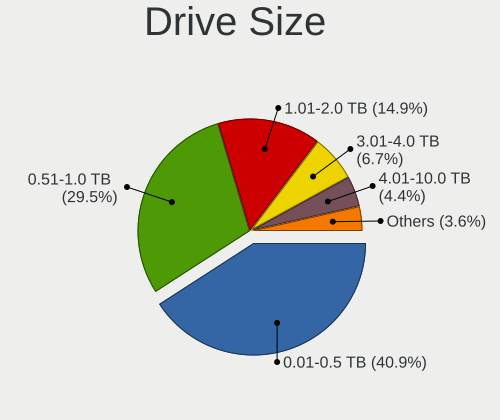

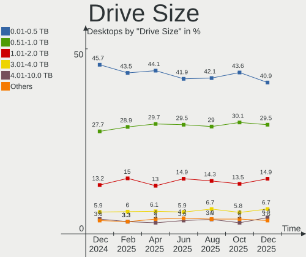

| Size in TB | Desktops | Drives | Percent |
|------------|----------|--------|---------|
| 0.01-0.5   | 1460     | 2019   | 40.87%  |
| 0.51-1.0   | 1055     | 1404   | 29.54%  |
| 1.01-2.0   | 532      | 639    | 14.89%  |
| 3.01-4.0   | 240      | 349    | 6.72%   |
| 4.01-10.0  | 158      | 236    | 4.42%   |
| 2.01-3.0   | 78       | 94     | 2.18%   |
| 10.01-20.0 | 44       | 78     | 1.23%   |
| 20.01-50.0 | 5        | 5      | 0.14%   |

Space Total
-----------

Amount of disk space available on the file system

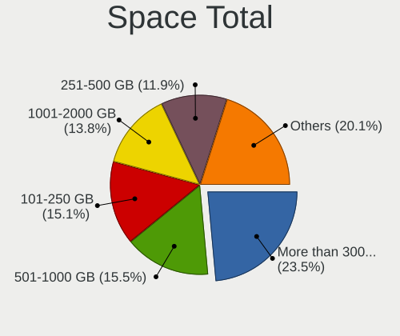

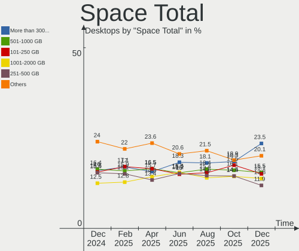

| Size in GB     | Desktops | Percent |
|----------------|----------|---------|
| More than 3000 | 718      | 23.55%  |
| 501-1000       | 474      | 15.55%  |
| 101-250        | 460      | 15.09%  |
| 1001-2000      | 420      | 13.78%  |
| 251-500        | 363      | 11.91%  |
| 2001-3000      | 270      | 8.86%   |
| Unknown        | 123      | 4.03%   |
| 1-20           | 110      | 3.61%   |
| 51-100         | 69       | 2.26%   |
| 21-50          | 41       | 1.34%   |
| 0              | 1        | 0.03%   |

Space Used
----------

Amount of used disk space

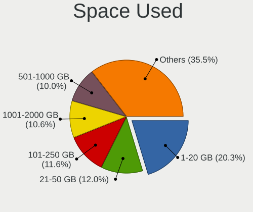

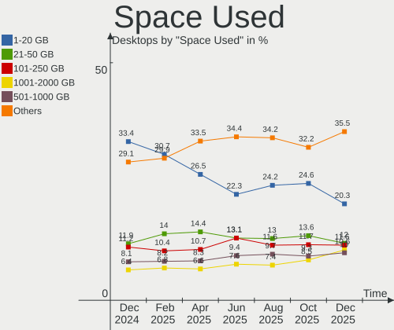

| Used GB        | Desktops | Percent |
|----------------|----------|---------|
| 1-20           | 620      | 20.33%  |
| 21-50          | 366      | 12%     |
| 101-250        | 354      | 11.61%  |
| 1001-2000      | 323      | 10.59%  |
| 501-1000       | 305      | 10%     |
| 251-500        | 271      | 8.89%   |
| 51-100         | 270      | 8.86%   |
| More than 3000 | 266      | 8.72%   |
| 2001-3000      | 148      | 4.85%   |
| Unknown        | 123      | 4.03%   |
| 0              | 3        | 0.1%    |

Malfunc. Drives
---------------

Drive models with a malfunction

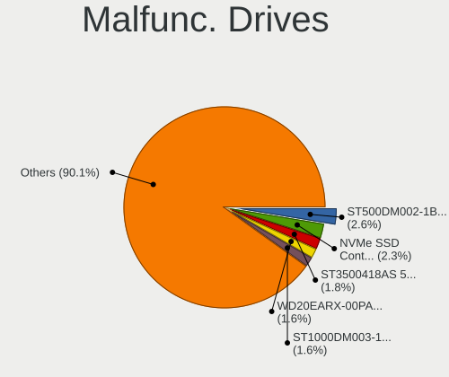

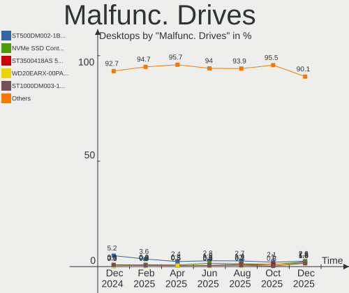

| Model                                                          | Desktops | Drives | Percent |
|----------------------------------------------------------------|----------|--------|---------|
| Seagate ST500DM002-1BD142 500GB                                | 10       | 11     | 2.6%    |
| Samsung Electronics NVMe SSD Controller SM981/PM981/PM983 1TB  | 9        | 10     | 2.34%   |
| Seagate ST3500418AS 500GB                                      | 7        | 7      | 1.82%   |
| WDC WD20EARX-00PASB0 2TB                                       | 6        | 6      | 1.56%   |
| Seagate ST1000DM003-1CH162 1TB                                 | 6        | 6      | 1.56%   |
| WDC WD5000AAKX-08U6AA0 500GB                                   | 5        | 5      | 1.3%    |
| WDC WD20EZRX-00D8PB0 2TB                                       | 4        | 4      | 1.04%   |
| Seagate ST1000DM003-9YN162 1TB                                 | 4        | 4      | 1.04%   |
| Samsung Electronics SSD 980 1TB                                | 4        | 4      | 1.04%   |
| Hitachi HDS721010CLA332 1TB                                    | 4        | 4      | 1.04%   |
| WDC WD5000AAKX-00ERMA0 500GB                                   | 3        | 3      | 0.78%   |
| WDC WD5000AADS-00S9B0 500GB                                    | 3        | 3      | 0.78%   |
| WDC WD20EZRZ-00Z5HB0 2TB                                       | 3        | 3      | 0.78%   |
| WDC WD20EFRX-68EUZN0 2TB                                       | 3        | 3      | 0.78%   |
| WDC WD20EARS-00MVWB0 2TB                                       | 3        | 3      | 0.78%   |
| Toshiba DT01ACA100 1TB                                         | 3        | 3      | 0.78%   |
| Toshiba DT01ACA050 500GB                                       | 3        | 3      | 0.78%   |
| Seagate ST31000524AS 1TB                                       | 3        | 3      | 0.78%   |
| Seagate ST2000DM006-2DM164 2TB                                 | 3        | 3      | 0.78%   |
| Seagate ST2000DM001-1ER164 2TB                                 | 3        | 4      | 0.78%   |
| Seagate ST1000LM024 HN-M101MBB 1TB                             | 3        | 3      | 0.78%   |
| Seagate ST1000DM010-2EP102 1TB                                 | 3        | 4      | 0.78%   |
| Samsung Electronics SSD 870 EVO 500GB                          | 3        | 4      | 0.78%   |
| Intel SSDSA2M160G2GC 160GB                                     | 3        | 3      | 0.78%   |
| WDC WDS240G2G0A-00JH30 240GB SSD                               | 2        | 2      | 0.52%   |
| WDC WD5000AAKX-60U6AA0 500GB                                   | 2        | 2      | 0.52%   |
| WDC WD40EZRX-00SPEB0 4TB                                       | 2        | 2      | 0.52%   |
| WDC WD3200AAJS-00L7A0 320GB                                    | 2        | 2      | 0.52%   |
| WDC WD30EFRX-68EUZN0 3TB                                       | 2        | 2      | 0.52%   |
| WDC WD10EFRX-68FYTN0 1TB                                       | 2        | 2      | 0.52%   |
| WDC WD10EARS-00Y5B1 1TB                                        | 2        | 2      | 0.52%   |
| WDC WD10EALS-00Z8A0 1TB                                        | 2        | 2      | 0.52%   |
| Toshiba MQ01ABD100 1TB                                         | 2        | 2      | 0.52%   |
| Seagate ST4000DM000-1F2168 4TB                                 | 2        | 2      | 0.52%   |
| Seagate ST3250318AS 250GB                                      | 2        | 2      | 0.52%   |
| Seagate ST2000DM001-9YN164 2TB                                 | 2        | 2      | 0.52%   |
| Seagate ST1000LM035-1RK172 1TB                                 | 2        | 2      | 0.52%   |
| Samsung Electronics SSD 870 EVO 1TB                            | 2        | 2      | 0.52%   |
| Samsung Electronics NVMe SSD Controller PM9A1/PM9A3/980PRO 1TB | 2        | 2      | 0.52%   |
| Samsung Electronics HD502HI 500GB                              | 2        | 2      | 0.52%   |

Malfunc. Drive Vendor
---------------------

Vendors of faulty drives

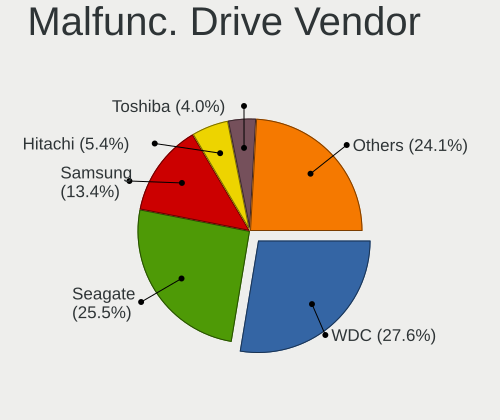

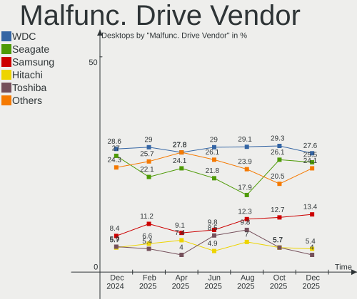

| Vendor                      | Desktops | Drives | Percent |
|-----------------------------|----------|--------|---------|
| WDC                         | 103      | 109    | 27.61%  |
| Seagate                     | 95       | 104    | 25.47%  |
| Samsung Electronics         | 50       | 55     | 13.4%   |
| Hitachi                     | 20       | 21     | 5.36%   |
| Toshiba                     | 15       | 15     | 4.02%   |
| Intel                       | 12       | 13     | 3.22%   |
| Kingston                    | 9        | 10     | 2.41%   |
| Crucial                     | 8        | 8      | 2.14%   |
| HGST                        | 7        | 10     | 1.88%   |
| Sandisk                     | 6        | 7      | 1.61%   |
| China                       | 6        | 6      | 1.61%   |
| A-DATA Technology           | 6        | 6      | 1.61%   |
| Micron Technology           | 4        | 4      | 1.07%   |
| Transcend                   | 3        | 4      | 0.8%    |
| Maxtor                      | 3        | 3      | 0.8%    |
| Netac                       | 2        | 2      | 0.54%   |
| MAXIO Technology (Hangzhou) | 2        | 2      | 0.54%   |
| Corsair                     | 2        | 2      | 0.54%   |
| UnionSine                   | 1        | 1      | 0.27%   |
| Teelkoou                    | 1        | 1      | 0.27%   |
| tecmiyo                     | 1        | 1      | 0.27%   |
| SK hynix                    | 1        | 1      | 0.27%   |
| SABRENT                     | 1        | 1      | 0.27%   |
| Realtek Semiconductor       | 1        | 1      | 0.27%   |
| Patriot                     | 1        | 1      | 0.27%   |
| OCZ                         | 1        | 1      | 0.27%   |
| Mushkin                     | 1        | 1      | 0.27%   |
| Min Yi U                    | 1        | 1      | 0.27%   |
| Leven                       | 1        | 1      | 0.27%   |
| Intenso                     | 1        | 1      | 0.27%   |
| INNOVATION IT               | 1        | 1      | 0.27%   |
| Fujitsu                     | 1        | 1      | 0.27%   |
| ExeGate                     | 1        | 1      | 0.27%   |
| BAITITON                    | 1        | 1      | 0.27%   |
| Apple                       | 1        | 1      | 0.27%   |
| ANKEJE                      | 1        | 1      | 0.27%   |
| AMD                         | 1        | 1      | 0.27%   |
| AFOX                        | 1        | 1      | 0.27%   |

Malfunc. HDD Vendor
-------------------

Vendors of faulty HDD drives

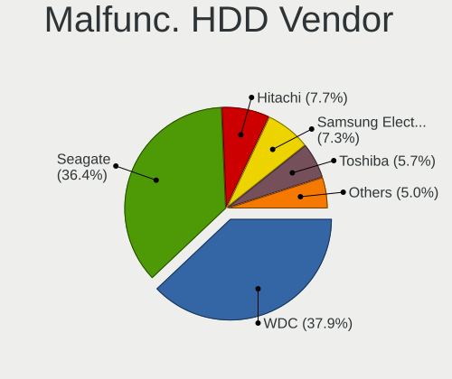

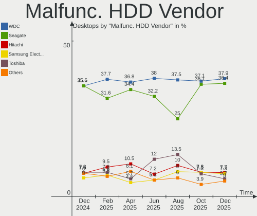

| Vendor              | Desktops | Drives | Percent |
|---------------------|----------|--------|---------|
| WDC                 | 99       | 105    | 37.93%  |
| Seagate             | 95       | 103    | 36.4%   |
| Hitachi             | 20       | 21     | 7.66%   |
| Samsung Electronics | 19       | 20     | 7.28%   |
| Toshiba             | 15       | 15     | 5.75%   |
| HGST                | 7        | 10     | 2.68%   |
| Maxtor              | 3        | 3      | 1.15%   |
| Min Yi U            | 1        | 1      | 0.38%   |
| Fujitsu             | 1        | 1      | 0.38%   |
| Apple               | 1        | 1      | 0.38%   |

Malfunc. Drive Kind
-------------------

Kinds of faulty drives

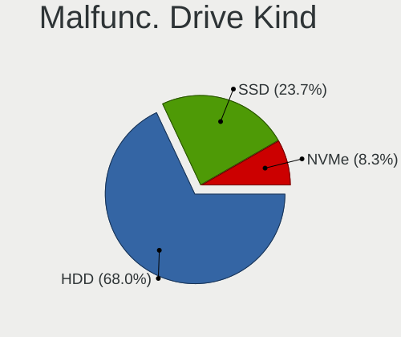

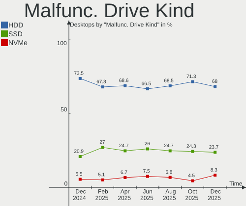

| Kind | Desktops | Drives | Percent |
|------|----------|--------|---------|
| HDD  | 238      | 280    | 68%     |
| SSD  | 83       | 91     | 23.71%  |
| NVMe | 29       | 30     | 8.29%   |

Failed Drives
-------------

Failed drive models

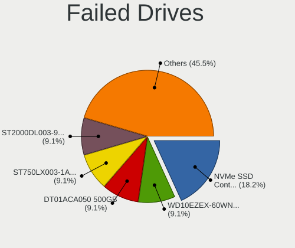

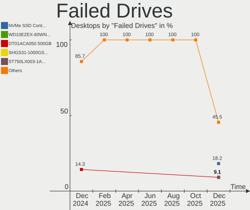

| Model                                                          | Desktops | Drives | Percent |
|----------------------------------------------------------------|----------|--------|---------|
| Samsung Electronics NVMe SSD Controller 980 (DRAM-less) 256GB  | 2        | 2      | 18.18%  |
| WDC WD10EZEX-60WN4A0 1TB                                       | 1        | 1      | 9.09%   |
| Toshiba DT01ACA050 500GB                                       | 1        | 1      | 9.09%   |
| SK hynix SHGS31-1000GS-2 1TB SSD                               | 1        | 8      | 9.09%   |
| Seagate ST750LX003-1AC154 752GB                                | 1        | 1      | 9.09%   |
| Seagate ST2000DL003-9VT166 2TB                                 | 1        | 1      | 9.09%   |
| Seagate ST1000LM024 HN-M101MBB 1TB                             | 1        | 1      | 9.09%   |
| Samsung Electronics NVMe SSD Controller PM9A1/PM9A3/980PRO 1TB | 1        | 1      | 9.09%   |
| KIOXIA NVMe SSD 1TB                                            | 1        | 1      | 9.09%   |
| Hitachi HUA722020ALA330 2TB                                    | 1        | 1      | 9.09%   |

Failed Drive Vendor
-------------------

Failed drive vendors

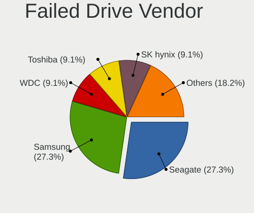

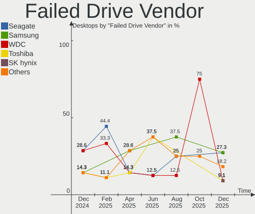

| Vendor              | Desktops | Drives | Percent |
|---------------------|----------|--------|---------|
| Seagate             | 3        | 3      | 27.27%  |
| Samsung Electronics | 3        | 3      | 27.27%  |
| WDC                 | 1        | 1      | 9.09%   |
| Toshiba             | 1        | 1      | 9.09%   |
| SK hynix            | 1        | 8      | 9.09%   |
| KIOXIA              | 1        | 1      | 9.09%   |
| Hitachi             | 1        | 1      | 9.09%   |

Drive Status
------------

Number of failed and malfunc. drives

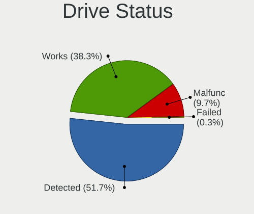

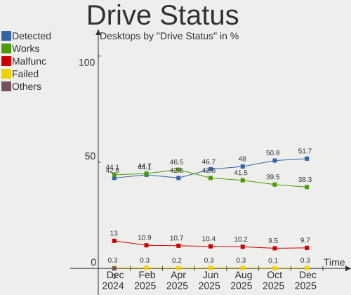

| Status   | Desktops | Drives | Percent |
|----------|----------|--------|---------|
| Detected | 1752     | 4272   | 51.68%  |
| Works    | 1298     | 2974   | 38.29%  |
| Malfunc  | 329      | 401    | 9.71%   |
| Failed   | 11       | 18     | 0.32%   |

Storage controller
------------------

Storage Vendor
--------------

Storage controller vendors

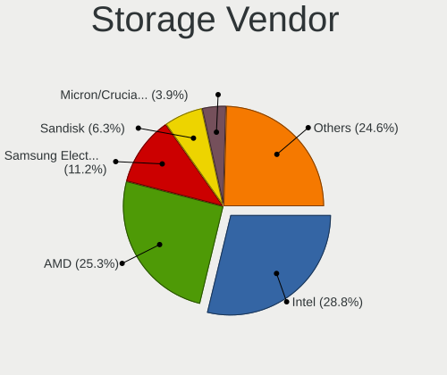

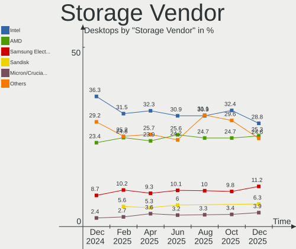

| Vendor                         | Desktops | Percent |
|--------------------------------|----------|---------|
| Intel                          | 1583     | 28.76%  |
| AMD                            | 1391     | 25.27%  |
| Samsung Electronics            | 618      | 11.23%  |
| Sandisk                        | 347      | 6.3%    |
| Micron/Crucial Technology      | 213      | 3.87%   |
| Kingston Technology Company    | 201      | 3.65%   |
| ASMedia Technology             | 201      | 3.65%   |
| Phison Electronics             | 153      | 2.78%   |
| MAXIO Technology (Hangzhou)    | 139      | 2.52%   |
| Realtek Semiconductor          | 65       | 1.18%   |
| Silicon Motion                 | 59       | 1.07%   |
| ADATA Technology               | 58       | 1.05%   |
| Shenzhen Longsys Electronics   | 57       | 1.04%   |
| Micron Technology              | 55       | 1%      |
| Marvell Technology Group       | 44       | 0.8%    |
| SK hynix                       | 39       | 0.71%   |
| JMicron Technology             | 39       | 0.71%   |
| KIOXIA                         | 25       | 0.45%   |
| INNOGRIT                       | 25       | 0.45%   |
| Seagate Technology             | 22       | 0.4%    |
| Nvidia                         | 21       | 0.38%   |
| Toshiba America Info Systems   | 18       | 0.33%   |
| Broadcom / LSI                 | 17       | 0.31%   |
| Biwin Storage Technology       | 15       | 0.27%   |
| Solidigm                       | 12       | 0.22%   |
| LSI Logic / Symbios Logic      | 11       | 0.2%    |
| Hosin Global Electronics       | 10       | 0.18%   |
| Zhaoxin                        | 6        | 0.11%   |
| VIA Technologies               | 6        | 0.11%   |
| Silicon Image                  | 6        | 0.11%   |
| Solid State Storage Technology | 5        | 0.09%   |
| Yangtze Memory Technologies    | 4        | 0.07%   |
| Nextorage                      | 4        | 0.07%   |
| Transcend                      | 3        | 0.05%   |
| OCZ Technology Group           | 3        | 0.05%   |
| Netac Technology               | 3        | 0.05%   |
| TenaFe                         | 2        | 0.04%   |
| Red Hat                        | 2        | 0.04%   |
| Loongson Technology            | 2        | 0.04%   |
| Corsair Memory                 | 2        | 0.04%   |

Storage Model
-------------

Storage controller models

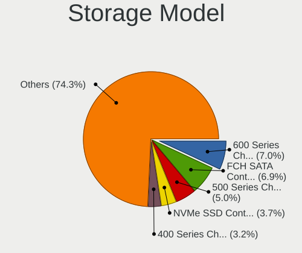

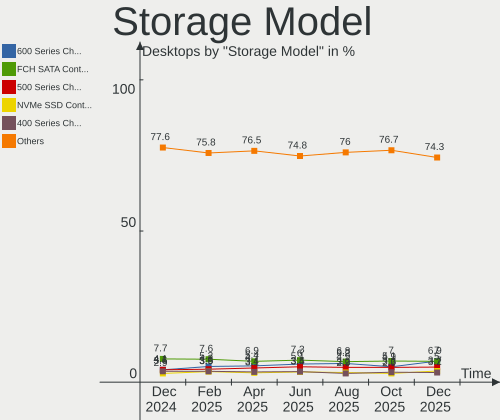

| Model                                                                                   | Desktops | Percent |
|-----------------------------------------------------------------------------------------|----------|---------|
| AMD 600 Series Chipset SATA Controller                                                  | 436      | 6.96%   |
| AMD FCH SATA Controller [AHCI mode]                                                     | 434      | 6.93%   |
| AMD 500 Series Chipset SATA Controller                                                  | 312      | 4.98%   |
| Samsung NVMe SSD Controller SM981/PM981/PM983                                           | 232      | 3.7%    |
| AMD 400 Series Chipset SATA Controller                                                  | 198      | 3.16%   |
| ASMedia ASM1061/ASM1062 Serial ATA Controller                                           | 162      | 2.59%   |
| Intel 8 Series/C220 Series Chipset Family 6-port SATA Controller 1 [AHCI mode]          | 158      | 2.52%   |
| Samsung NVMe SSD Controller S4LV008[Pascal]                                             | 141      | 2.25%   |
| Intel Q170/Q150/B150/H170/H110/Z170/CM236 Chipset SATA Controller [AHCI Mode]           | 133      | 2.12%   |
| Intel 200 Series PCH SATA controller [AHCI mode]                                        | 129      | 2.06%   |
| Samsung NVMe SSD Controller PM9A1/PM9A3/980PRO                                          | 127      | 2.03%   |
| Intel Raptor Lake SATA AHCI Controller                                                  | 104      | 1.66%   |
| Intel SATA Controller [RAID mode]                                                       | 102      | 1.63%   |
| Intel Alder Lake-S PCH SATA Controller [AHCI Mode]                                      | 102      | 1.63%   |
| Intel Cannon Lake PCH SATA AHCI Controller                                              | 101      | 1.61%   |
| Intel 6 Series/C200 Series Chipset Family 6 port Desktop SATA AHCI Controller           | 92       | 1.47%   |
| MAXIO (Hangzhou) NVMe SSD Controller MAP1202 (DRAM-less)                                | 88       | 1.4%    |
| Intel 7 Series/C210 Series Chipset Family 6-port SATA Controller [AHCI mode]            | 86       | 1.37%   |
| Sandisk WD Black SN850X NVMe SSD                                                        | 78       | 1.25%   |
| Micron/Crucial P2 [Nick P2] / P3 / P3 Plus NVMe PCIe SSD (DRAM-less)                    | 74       | 1.18%   |
| Samsung NVMe SSD Controller PM9C1a (DRAM-less)                                          | 70       | 1.12%   |
| Samsung NVMe SSD Controller 980 (DRAM-less)                                             | 70       | 1.12%   |
| SanDisk WD SN560/SN740/SN770/SN5000 NVMe SSD                                            | 67       | 1.07%   |
| AMD SB7x0/SB8x0/SB9x0 IDE Controller                                                    | 64       | 1.02%   |
| Intel 500 Series Chipset Family SATA AHCI Controller                                    | 62       | 0.99%   |
| AMD SB7x0/SB8x0/SB9x0 SATA Controller [AHCI mode]                                       | 62       | 0.99%   |
| Silicon Motion SM2263EN/SM2263XT (DRAM-less) NVMe SSD Controllers                       | 52       | 0.83%   |
| MAXIO (Hangzhou) NVMe SSD Controller MAP1602 (DRAM-less)                                | 47       | 0.75%   |
| Intel Volume Management Device NVMe RAID Controller                                     | 45       | 0.72%   |
| Phison E12 NVMe Controller                                                              | 43       | 0.69%   |
| Kingston Company NV2 NVMe SSD [SM2267XT] (DRAM-less)                                    | 42       | 0.67%   |
| Kingston Company KC3000/FURY Renegade NVMe SSD [E18]                                    | 40       | 0.64%   |
| Intel Comet Lake SATA AHCI Controller                                                   | 40       | 0.64%   |
| Phison E16 PCIe4 NVMe Controller                                                        | 39       | 0.62%   |
| Intel 9 Series Chipset Family SATA Controller [AHCI Mode]                               | 39       | 0.62%   |
| AMD A320 Chipset SATA Controller [AHCI mode]                                            | 39       | 0.62%   |
| AMD SB7x0/SB8x0/SB9x0 SATA Controller [IDE mode]                                        | 38       | 0.61%   |
| Intel 6 Series/C200 Series Chipset Family Desktop SATA Controller (IDE mode, ports 4-5) | 37       | 0.59%   |
| Intel 6 Series/C200 Series Chipset Family Desktop SATA Controller (IDE mode, ports 0-3) | 37       | 0.59%   |
| Samsung NVMe SSD Controller SM961/PM961/SM963                                           | 36       | 0.57%   |

Storage Kind
------------

Kind of storage controller (IDE, SATA, NVMe, SAS, ...)

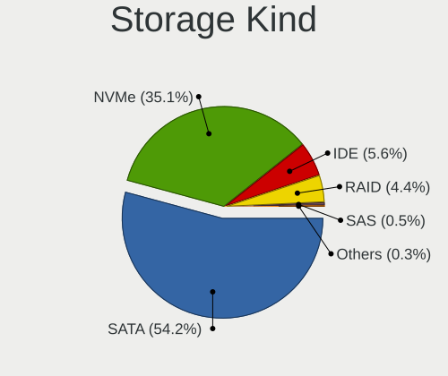

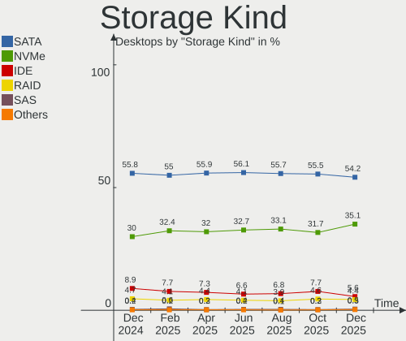

| Kind | Desktops | Percent |
|------|----------|---------|
| SATA | 2712     | 54.2%   |
| NVMe | 1758     | 35.13%  |
| IDE  | 278      | 5.56%   |
| RAID | 219      | 4.38%   |
| SAS  | 24       | 0.48%   |
| SCSI | 13       | 0.26%   |

Processor
---------

CPU Vendor
----------

Processor vendors

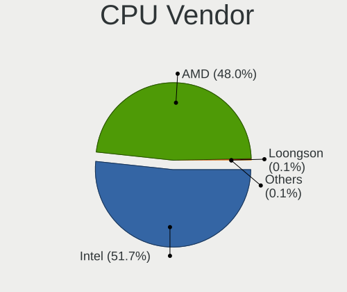

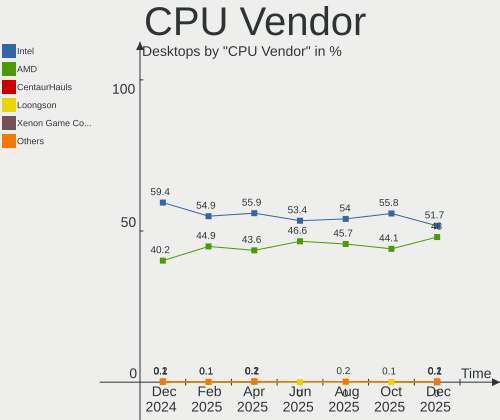

| Vendor             | Desktops | Percent |
|--------------------|----------|---------|
| Intel              | 1576     | 51.69%  |
| AMD                | 1463     | 47.98%  |
| CentaurHauls       | 5        | 0.16%   |
| Loongson           | 2        | 0.07%   |
| Xenon Game Console | 1        | 0.03%   |
| WIAT               | 1        | 0.03%   |
| Unknown            | 1        | 0.03%   |

CPU Model
---------

Processor models

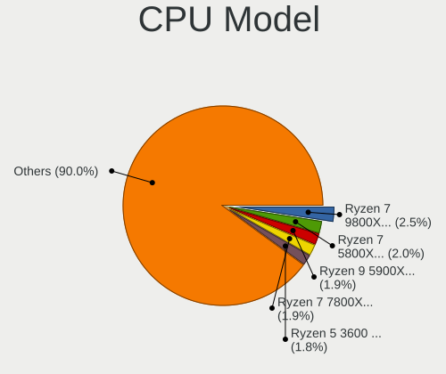

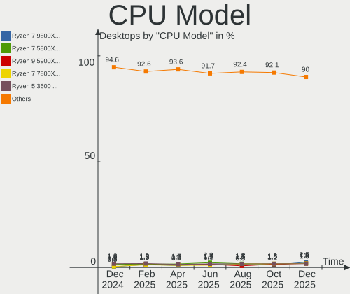

| Model                                  | Desktops | Percent |
|----------------------------------------|----------|---------|
| AMD Ryzen 7 9800X3D 8-Core Processor   | 75       | 2.46%   |
| AMD Ryzen 7 5800X 8-Core Processor     | 62       | 2.03%   |
| AMD Ryzen 9 5900X 12-Core Processor    | 58       | 1.9%    |
| AMD Ryzen 7 7800X3D 8-Core Processor   | 57       | 1.87%   |
| AMD Ryzen 5 3600 6-Core Processor      | 54       | 1.77%   |
| AMD Ryzen 5 5600X 6-Core Processor     | 52       | 1.71%   |
| AMD Ryzen 7 5700X 8-Core Processor     | 50       | 1.64%   |
| AMD Ryzen 5 5600G with Radeon Graphics | 42       | 1.38%   |
| AMD Ryzen 9 9950X3D 16-Core Processor  | 39       | 1.28%   |
| AMD Ryzen 9 5950X 16-Core Processor    | 37       | 1.21%   |
| AMD Ryzen 7 3700X 8-Core Processor     | 32       | 1.05%   |
| Intel Core i5-3470 CPU @ 3.20GHz       | 31       | 1.02%   |
| AMD Ryzen 7 5800X3D 8-Core Processor   | 31       | 1.02%   |
| AMD Ryzen 5 7600X 6-Core Processor     | 31       | 1.02%   |
| AMD Ryzen 5 5500                       | 30       | 0.98%   |
| AMD Ryzen 7 9700X 8-Core Processor     | 29       | 0.95%   |
| AMD Ryzen 7 5700G with Radeon Graphics | 29       | 0.95%   |
| Intel Core i5-6500 CPU @ 3.20GHz       | 27       | 0.89%   |
| Intel Core i7-4790 CPU @ 3.60GHz       | 25       | 0.82%   |
| AMD Ryzen 9 9950X 16-Core Processor    | 25       | 0.82%   |
| AMD Ryzen 5 2600 Six-Core Processor    | 24       | 0.79%   |
| Intel Xeon CPU E5-2680 v4 @ 2.40GHz    | 23       | 0.75%   |
| AMD Ryzen 9 3900X 12-Core Processor    | 23       | 0.75%   |
| AMD Ryzen 7 2700X Eight-Core Processor | 23       | 0.75%   |
| AMD Ryzen 7 7700X 8-Core Processor     | 22       | 0.72%   |
| AMD Ryzen 5 9600X 6-Core Processor     | 22       | 0.72%   |
| AMD Ryzen 5 5600 6-Core Processor      | 22       | 0.72%   |
| Intel Core i7-8700 CPU @ 3.20GHz       | 21       | 0.69%   |
| Intel Core i5-8400 CPU @ 2.80GHz       | 21       | 0.69%   |
| Intel Core i5-2400 CPU @ 3.10GHz       | 21       | 0.69%   |
| Intel Core i7-6700 CPU @ 3.40GHz       | 20       | 0.66%   |
| Intel 12th Gen Core i5-12400F          | 20       | 0.66%   |
| Intel Core i7-4770 CPU @ 3.40GHz       | 19       | 0.62%   |
| Intel Core i7-3770 CPU @ 3.40GHz       | 19       | 0.62%   |
| Intel Core i7-2600 CPU @ 3.40GHz       | 19       | 0.62%   |
| Intel Core i7-6700K CPU @ 4.00GHz      | 17       | 0.56%   |
| AMD Ryzen 9 7950X 16-Core Processor    | 17       | 0.56%   |
| AMD Ryzen 7 5700X3D 8-Core Processor   | 17       | 0.56%   |
| Intel Core 2 Duo CPU E8400 @ 3.00GHz   | 16       | 0.52%   |
| Intel Core i7-7700 CPU @ 3.60GHz       | 15       | 0.49%   |

CPU Model Family
----------------

Processor model prefix

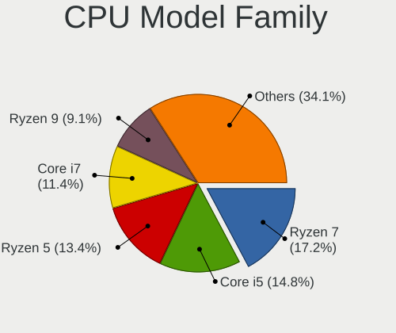

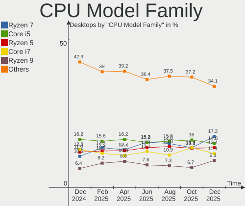

| Model                   | Desktops | Percent |
|-------------------------|----------|---------|
| AMD Ryzen 7             | 525      | 17.22%  |
| Intel Core i5           | 452      | 14.82%  |
| AMD Ryzen 5             | 409      | 13.41%  |
| Intel Core i7           | 347      | 11.38%  |
| AMD Ryzen 9             | 276      | 9.05%   |
| Other                   | 262      | 8.59%   |
| Intel Core i3           | 150      | 4.92%   |
| Intel Xeon              | 139      | 4.56%   |
| AMD FX                  | 59       | 1.94%   |
| Intel Core i9           | 48       | 1.57%   |
| Intel Celeron           | 46       | 1.51%   |
| Intel Core 2 Duo        | 39       | 1.28%   |
| AMD Ryzen 3             | 30       | 0.98%   |
| Intel Pentium           | 29       | 0.95%   |
| Intel Core              | 23       | 0.75%   |
| Intel Core 2 Quad       | 19       | 0.62%   |
| AMD Phenom II X4        | 18       | 0.59%   |
| AMD A10                 | 16       | 0.52%   |
| Intel Pentium Dual-Core | 13       | 0.43%   |
| AMD Ryzen Threadripper  | 13       | 0.43%   |
| AMD A8                  | 11       | 0.36%   |
| AMD A4                  | 10       | 0.33%   |
| AMD Athlon              | 9        | 0.3%    |
| AMD A6                  | 9        | 0.3%    |
| AMD Phenom II X6        | 8        | 0.26%   |
| AMD Athlon II X2        | 8        | 0.26%   |
| Intel Pentium Gold      | 7        | 0.23%   |
| AMD Ryzen 5 PRO         | 7        | 0.23%   |
| Intel Atom              | 5        | 0.16%   |
| AMD GX                  | 5        | 0.16%   |
| AMD Athlon 64 X2        | 5        | 0.16%   |
| Intel Pentium Dual      | 4        | 0.13%   |
| AMD Phenom II X2        | 4        | 0.13%   |
| Intel Pentium Silver    | 3        | 0.1%    |
| AMD Sempron             | 3        | 0.1%    |
| AMD Phenom              | 3        | 0.1%    |
| AMD E1                  | 3        | 0.1%    |
| AMD E                   | 3        | 0.1%    |
| AMD Athlon II X4        | 3        | 0.1%    |
| AMD Athlon 64           | 3        | 0.1%    |

CPU Cores
---------

Number of processor cores

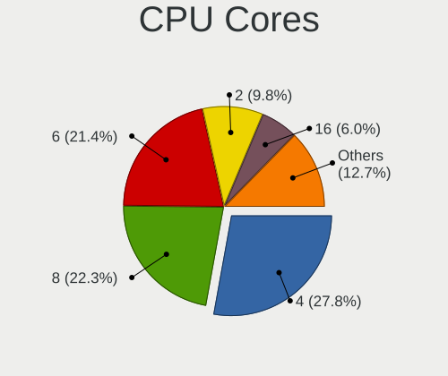

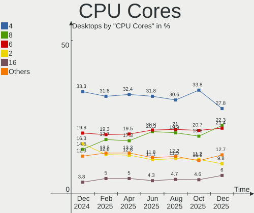

| Number | Desktops | Percent |
|--------|----------|---------|
| 4      | 849      | 27.85%  |
| 8      | 681      | 22.34%  |
| 6      | 651      | 21.35%  |
| 2      | 299      | 9.81%   |
| 16     | 183      | 6%      |
| 12     | 162      | 5.31%   |
| 14     | 58       | 1.9%    |
| 10     | 49       | 1.61%   |
| 24     | 43       | 1.41%   |
| 20     | 35       | 1.15%   |
| 3      | 10       | 0.33%   |
| 1      | 10       | 0.33%   |
| 28     | 9        | 0.3%    |
| 32     | 6        | 0.2%    |
| 18     | 2        | 0.07%   |
| 44     | 1        | 0.03%   |
| 36     | 1        | 0.03%   |

CPU Sockets
-----------

Number of sockets

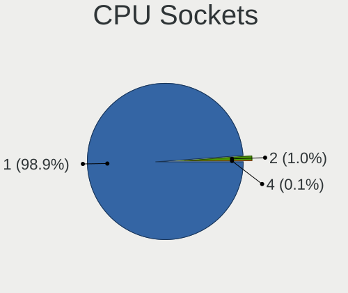

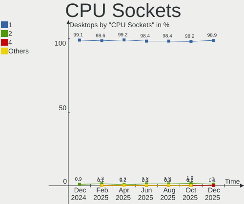

| Number | Desktops | Percent |
|--------|----------|---------|
| 1      | 3014     | 98.85%  |
| 2      | 32       | 1.05%   |
| 4      | 3        | 0.1%    |

CPU Threads
-----------

Threads per core (Hyper-Threading)

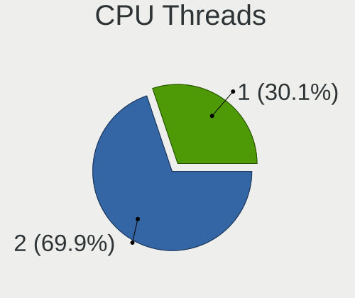

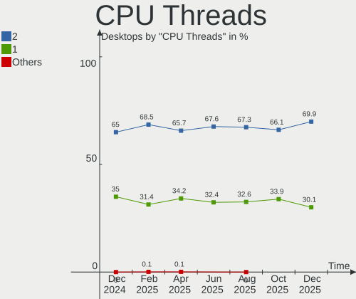

| Number | Desktops | Percent |
|--------|----------|---------|
| 2      | 2130     | 69.86%  |
| 1      | 919      | 30.14%  |

CPU Op-Modes
------------

CPU Operation Modes (32-bit, 64-bit)

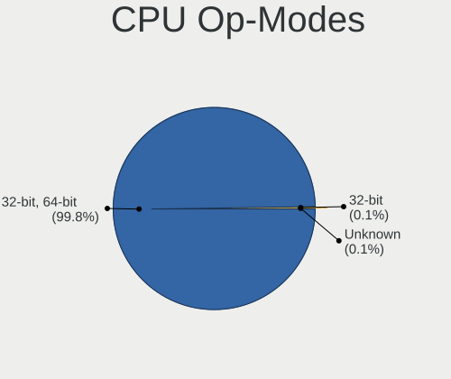

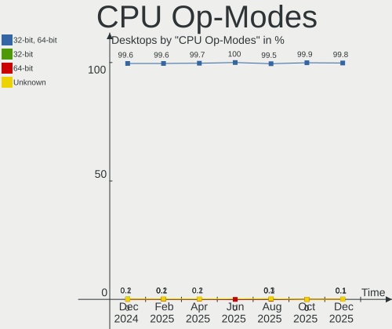

| Op mode        | Desktops | Percent |
|----------------|----------|---------|
| 32-bit, 64-bit | 3042     | 99.77%  |
| 32-bit         | 3        | 0.1%    |
| 64-bit         | 2        | 0.07%   |
| Unknown        | 2        | 0.07%   |

CPU Microcode
-------------

Microcode number

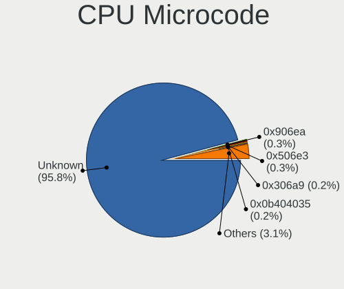

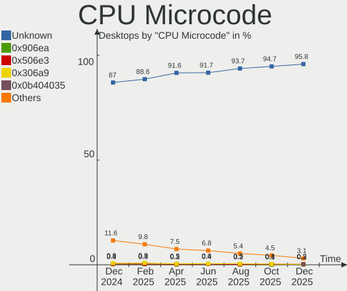

| Number     | Desktops | Percent |
|------------|----------|---------|
| Unknown    | 2922     | 95.83%  |
| 0x906ea    | 9        | 0.3%    |
| 0x506e3    | 8        | 0.26%   |
| 0x306a9    | 7        | 0.23%   |
| 0x0b404035 | 7        | 0.23%   |
| 0x406f1    | 6        | 0.2%    |
| 0x306c3    | 6        | 0.2%    |
| 0x1067a    | 6        | 0.2%    |
| 0x906e9    | 5        | 0.16%   |
| 0x206a7    | 5        | 0.16%   |
| 0xa0653    | 3        | 0.1%    |
| 0x906a3    | 3        | 0.1%    |
| 0x90675    | 3        | 0.1%    |
| 0x6fb      | 3        | 0.1%    |
| 0x0a50000f | 3        | 0.1%    |
| 0xa0655    | 2        | 0.07%   |
| 0x906ed    | 2        | 0.07%   |
| 0x0a500011 | 2        | 0.07%   |
| 0x0a20120e | 2        | 0.07%   |
| 0x08701021 | 2        | 0.07%   |
| 0x07030105 | 2        | 0.07%   |
| 0x06000852 | 2        | 0.07%   |
| 0x010000c8 | 2        | 0.07%   |
| 0xf29      | 1        | 0.03%   |
| 0xb06f2    | 1        | 0.03%   |
| 0xb0671    | 1        | 0.03%   |
| 0x906ec    | 1        | 0.03%   |
| 0x906eb    | 1        | 0.03%   |
| 0x906a4    | 1        | 0.03%   |
| 0x806c1    | 1        | 0.03%   |
| 0x706e5    | 1        | 0.03%   |
| 0x6fd      | 1        | 0.03%   |
| 0x686      | 1        | 0.03%   |
| 0x506c9    | 1        | 0.03%   |
| 0x50654    | 1        | 0.03%   |
| 0x40671    | 1        | 0.03%   |
| 0x20655    | 1        | 0.03%   |
| 0x106e5    | 1        | 0.03%   |
| 0x106a5    | 1        | 0.03%   |
| 0x0a60120c | 1        | 0.03%   |

CPU Microarch
-------------

Microarchitecture

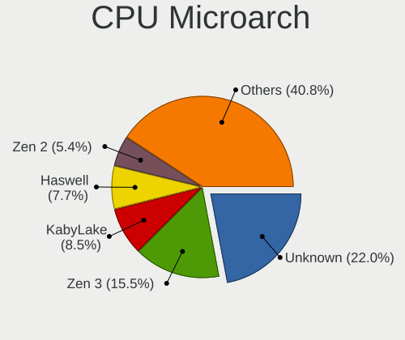

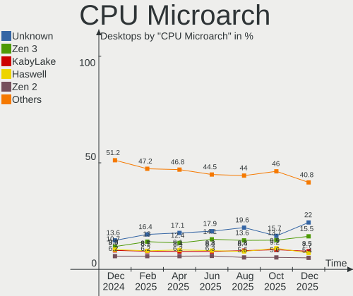

| Name              | Desktops | Percent |
|-------------------|----------|---------|
| Unknown           | 672      | 22.04%  |
| Zen 3             | 472      | 15.48%  |
| KabyLake          | 260      | 8.53%   |
| Haswell           | 236      | 7.74%   |
| Zen 2             | 166      | 5.44%   |
| Skylake           | 157      | 5.15%   |
| IvyBridge         | 151      | 4.95%   |
| SandyBridge       | 115      | 3.77%   |
| Alderlake Hybrid  | 113      | 3.71%   |
| Zen+              | 97       | 3.18%   |
| CometLake         | 89       | 2.92%   |
| Piledriver        | 66       | 2.16%   |
| Penryn            | 62       | 2.03%   |
| Zen               | 49       | 1.61%   |
| K10               | 48       | 1.57%   |
| Broadwell         | 42       | 1.38%   |
| Nehalem           | 38       | 1.25%   |
| Westmere          | 22       | 0.72%   |
| Icelake           | 22       | 0.72%   |
| Core              | 22       | 0.72%   |
| Gracemont         | 19       | 0.62%   |
| Steamroller       | 15       | 0.49%   |
| Lunarlake Hybrid  | 13       | 0.43%   |
| Bulldozer         | 13       | 0.43%   |
| Silvermont        | 12       | 0.39%   |
| K8 Hammer         | 11       | 0.36%   |
| Goldmont plus     | 10       | 0.33%   |
| Goldmont          | 8        | 0.26%   |
| Excavator         | 8        | 0.26%   |
| K10 Llano         | 7        | 0.23%   |
| Jaguar            | 7        | 0.23%   |
| Tremont           | 6        | 0.2%    |
| Puma              | 6        | 0.2%    |
| Sapphire Rapids   | 3        | 0.1%    |
| Bobcat            | 3        | 0.1%    |
| TigerLake         | 2        | 0.07%   |
| P6                | 2        | 0.07%   |
| NetBurst          | 2        | 0.07%   |
| Bonnell           | 2        | 0.07%   |
| Meteorlake Hybrid | 1        | 0.03%   |

Graphics
--------

GPU Vendor
----------

Vendors of graphics cards

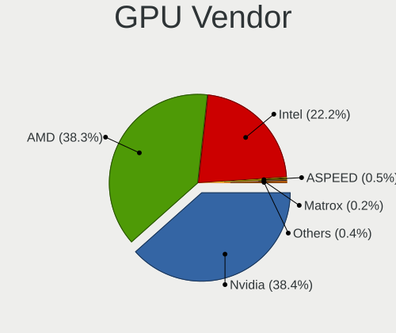

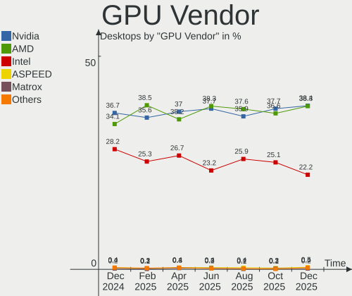

| Vendor                     | Desktops | Percent |
|----------------------------|----------|---------|
| Nvidia                     | 1294     | 38.42%  |
| AMD                        | 1291     | 38.33%  |
| Intel                      | 747      | 22.18%  |
| ASPEED Technology          | 16       | 0.48%   |
| Matrox Electronics Systems | 7        | 0.21%   |
| Zhaoxin                    | 4        | 0.12%   |
| Red Hat                    | 4        | 0.12%   |
| Loongson Technology        | 2        | 0.06%   |
| Qualcomm Atheros           | 1        | 0.03%   |
| Microsoft                  | 1        | 0.03%   |
| Glenfly Tech               | 1        | 0.03%   |

GPU Model
---------

Graphics card models

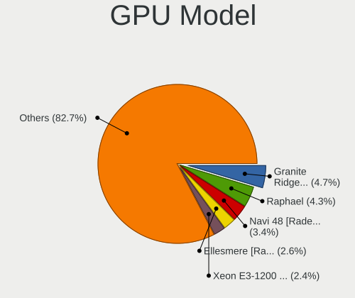

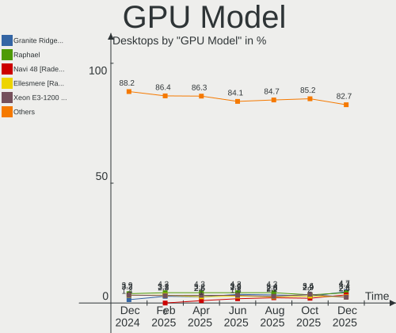

| Model                                                                       | Desktops | Percent |
|-----------------------------------------------------------------------------|----------|---------|
| AMD Granite Ridge [Radeon Graphics]                                         | 169      | 4.66%   |
| AMD Raphael                                                                 | 156      | 4.3%    |
| AMD Navi 48 [Radeon RX 9070/9070 XT/9070 GRE]                               | 123      | 3.39%   |
| AMD Ellesmere [Radeon RX 470/480/570/570X/580/580X/590]                     | 94       | 2.59%   |
| Intel Xeon E3-1200 v3/4th Gen Core Processor Integrated Graphics Controller | 87       | 2.4%    |
| AMD Navi 31 [Radeon RX 7900 XT/7900 XTX/7900 GRE/7900M]                     | 85       | 2.34%   |
| Intel Skylake-S GT2 [HD Graphics 530]                                       | 84       | 2.32%   |
| AMD Cezanne [Radeon Vega Series / Radeon Vega Mobile Series]                | 68       | 1.87%   |
| Intel CoffeeLake-S GT2 [UHD Graphics 630]                                   | 65       | 1.79%   |
| AMD Navi 23 [Radeon RX 6600/6600 XT/6600M]                                  | 61       | 1.68%   |
| Nvidia GA106 [GeForce RTX 3060 Lite Hash Rate]                              | 59       | 1.63%   |
| AMD Navi 44 [Radeon RX 9060 XT]                                             | 59       | 1.63%   |
| AMD Navi 22 [Radeon RX 6700/6700 XT/6750 XT / 6800M/6850M XT]               | 57       | 1.57%   |
| Intel Xeon E3-1200 v2/3rd Gen Core processor Graphics Controller            | 56       | 1.54%   |
| Intel 2nd Generation Core Processor Family Integrated Graphics Controller   | 56       | 1.54%   |
| AMD Navi 32 [Radeon RX 7700 XT / 7800 XT]                                   | 49       | 1.35%   |
| Nvidia GP107 [GeForce GTX 1050 Ti]                                          | 48       | 1.32%   |
| Intel Kaby Lake-S GT2 [HD Graphics 630]                                     | 43       | 1.19%   |
| AMD Navi 21 [Radeon RX 6800/6800 XT / 6900 XT]                              | 43       | 1.19%   |
| Nvidia GK208B [GeForce GT 710]                                              | 41       | 1.13%   |
| AMD Navi 33 [Radeon RX 7600/7600 XT/7600M XT/7600S/7700S / PRO W7600]       | 37       | 1.02%   |
| Nvidia GP106 [GeForce GTX 1060 6GB]                                         | 36       | 0.99%   |
| AMD Navi 10 [Radeon RX 5600 OEM/5600 XT / 5700/5700 XT]                     | 34       | 0.94%   |
| Intel Raptor Lake-S GT1 [UHD Graphics 770]                                  | 32       | 0.88%   |
| Nvidia GA104 [GeForce RTX 3070 Ti]                                          | 30       | 0.83%   |
| Nvidia GP104 [GeForce GTX 1080]                                             | 28       | 0.77%   |
| Nvidia GP104 [GeForce GTX 1070]                                             | 27       | 0.74%   |
| Nvidia AD107 [GeForce RTX 4060]                                             | 27       | 0.74%   |
| Nvidia AD104 [GeForce RTX 4070]                                             | 26       | 0.72%   |
| AMD Polaris 20 XL [Radeon RX 580 2048SP]                                    | 26       | 0.72%   |
| Nvidia TU117 [GeForce GTX 1650]                                             | 25       | 0.69%   |
| Nvidia TU116 [GeForce GTX 1660 SUPER]                                       | 25       | 0.69%   |
| Nvidia GB203 [GeForce RTX 5080]                                             | 25       | 0.69%   |
| Nvidia GT218 [GeForce 210]                                                  | 24       | 0.66%   |
| Nvidia GP108 [GeForce GT 1030]                                              | 24       | 0.66%   |
| AMD Picasso/Raven 2 [Radeon Vega Series / Radeon Vega Mobile Series]        | 24       | 0.66%   |
| Nvidia AD106 [GeForce RTX 4060 Ti]                                          | 23       | 0.63%   |
| Intel Alder Lake-S GT1 [UHD Graphics 770]                                   | 23       | 0.63%   |
| AMD Lexa PRO [Radeon 540/540X/550/550X / RX 540X/550/550X]                  | 23       | 0.63%   |
| Nvidia GA104 [GeForce RTX 3070]                                             | 22       | 0.61%   |

GPU Combo
---------

Combinations of graphics cards

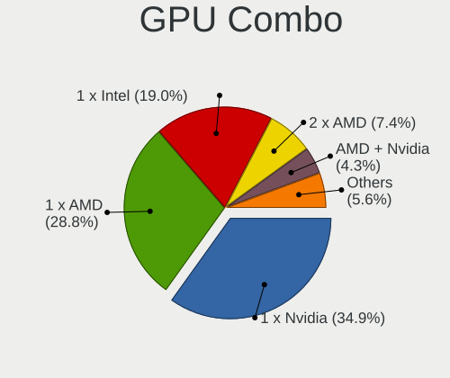

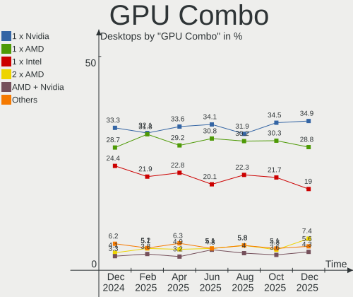

| Name                        | Desktops | Percent |
|-----------------------------|----------|---------|
| 1 x Nvidia                  | 1064     | 34.9%   |
| 1 x AMD                     | 877      | 28.76%  |
| 1 x Intel                   | 578      | 18.96%  |
| 2 x AMD                     | 226      | 7.41%   |
| AMD + Nvidia                | 132      | 4.33%   |
| Intel + Nvidia              | 61       | 2%      |
| Intel + AMD                 | 35       | 1.15%   |
| 2 x Nvidia                  | 16       | 0.52%   |
| 2 x Intel                   | 10       | 0.33%   |
| 1 x ASPEED                  | 10       | 0.33%   |
| 1 x Matrox                  | 6        | 0.2%    |
| 1 x Zhaoxin                 | 4        | 0.13%   |
| 1 x Red Hat                 | 4        | 0.13%   |
| Nvidia + ASPEED             | 4        | 0.13%   |
| Other                       | 3        | 0.1%    |
| AMD + 2 x Nvidia            | 3        | 0.1%    |
| 3 x AMD                     | 2        | 0.07%   |
| 2 x AMD + 1 x Nvidia        | 2        | 0.07%   |
| 1 x Loongson Technology     | 2        | 0.07%   |
| Intel + 2 x Nvidia          | 2        | 0.07%   |
| Intel + AMD + 1 x Nvidia    | 2        | 0.07%   |
| 4 x AMD                     | 1        | 0.03%   |
| 1 x Microsoft               | 1        | 0.03%   |
| Intel + Nvidia + 1 x ASPEED | 1        | 0.03%   |
| 1 x Glenfly Tech            | 1        | 0.03%   |
| AMD + Matrox                | 1        | 0.03%   |
| AMD + ASPEED                | 1        | 0.03%   |

GPU Driver
----------

Free vs proprietary

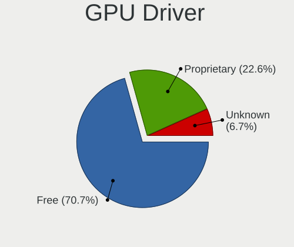

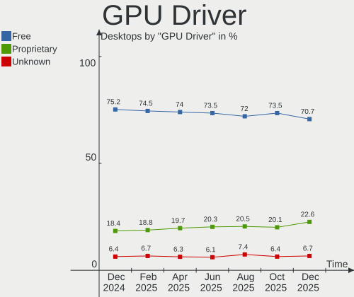

| Driver      | Desktops | Percent |
|-------------|----------|---------|
| Free        | 2155     | 70.68%  |
| Proprietary | 689      | 22.6%   |
| Unknown     | 205      | 6.72%   |

GPU Memory
----------

Total video memory

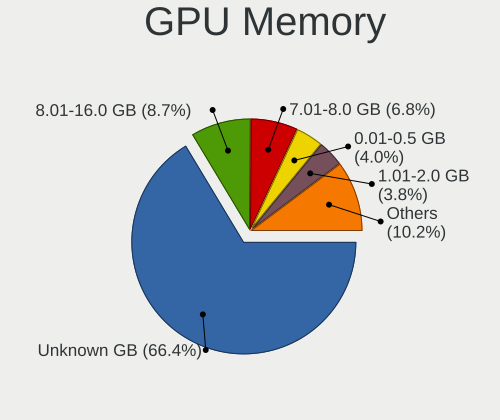

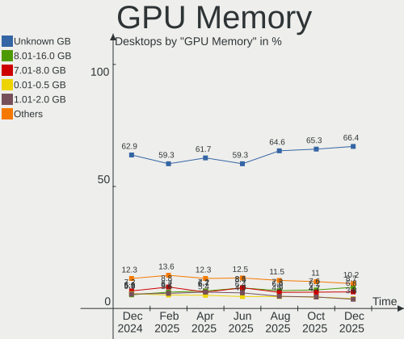

| Size in GB     | Desktops | Percent |
|----------------|----------|---------|
| Unknown        | 2024     | 66.38%  |
| 8.01-16.0      | 266      | 8.72%   |
| 7.01-8.0       | 208      | 6.82%   |
| 0.01-0.5       | 122      | 4%      |
| 1.01-2.0       | 117      | 3.84%   |
| 3.01-4.0       | 98       | 3.21%   |
| 0.51-1.0       | 83       | 2.72%   |
| 5.01-6.0       | 59       | 1.94%   |
| 16.01-24.0     | 50       | 1.64%   |
| 2.01-3.0       | 15       | 0.49%   |
| 24.01-32.0     | 4        | 0.13%   |
| More than 64.0 | 1        | 0.03%   |
| 32.01-64.0     | 1        | 0.03%   |
| 4.01-5.0       | 1        | 0.03%   |

Monitor
-------

Monitor Vendor
--------------

Monitor vendors

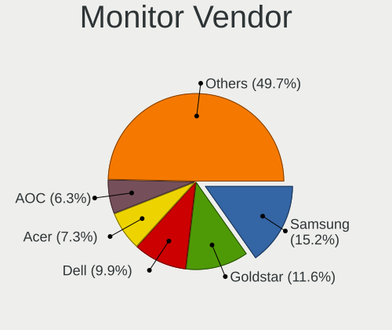

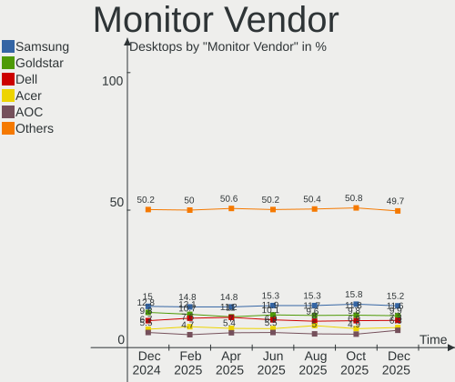

| Vendor               | Desktops | Percent |
|----------------------|----------|---------|
| Samsung Electronics  | 520      | 15.24%  |
| Goldstar             | 397      | 11.63%  |
| Dell                 | 338      | 9.9%    |
| Acer                 | 249      | 7.3%    |
| AOC                  | 214      | 6.27%   |
| Hewlett-Packard      | 149      | 4.37%   |
| ASUSTek Computer     | 126      | 3.69%   |
| Philips              | 123      | 3.6%    |
| Ancor Communications | 121      | 3.55%   |
| BenQ                 | 120      | 3.52%   |
| MSI                  | 106      | 3.11%   |
| ViewSonic            | 63       | 1.85%   |
| Lenovo               | 63       | 1.85%   |
| Iiyama               | 60       | 1.76%   |
| Gigabyte Technology  | 60       | 1.76%   |
| Sony                 | 34       | 1%      |
| Mi                   | 32       | 0.94%   |
| SKG                  | 26       | 0.76%   |
| Sceptre Tech         | 26       | 0.76%   |
| Unknown              | 25       | 0.73%   |
| Unknown (XXX)        | 24       | 0.7%    |
| Vizio                | 23       | 0.67%   |
| HKC                  | 20       | 0.59%   |
| Hitachi              | 17       | 0.5%    |
| Toshiba              | 16       | 0.47%   |
| Fujitsu Siemens      | 16       | 0.47%   |
| Eizo                 | 15       | 0.44%   |
| RTK                  | 14       | 0.41%   |
| NEC Computers        | 14       | 0.41%   |
| Medion               | 14       | 0.41%   |
| SAC                  | 10       | 0.29%   |
| HannStar             | 10       | 0.29%   |
| Denver               | 10       | 0.29%   |
| Wacom                | 9        | 0.26%   |
| Insignia             | 9        | 0.26%   |
| Huion                | 9        | 0.26%   |
| VIE                  | 8        | 0.23%   |
| Pixio                | 8        | 0.23%   |
| ONN                  | 8        | 0.23%   |
| Vestel Elektronik    | 7        | 0.21%   |

Monitor Model
-------------

Monitor models

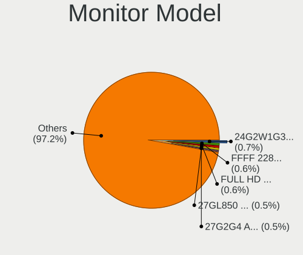

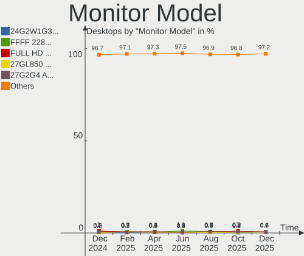

| Model                                                                 | Desktops | Percent |
|-----------------------------------------------------------------------|----------|---------|
| AOC 24G2W1G3 AOC2402 1920x1080 527x296mm 23.8-inch                    | 24       | 0.67%   |
| Unknown LCD Monitor FFFF 2288x1287 2550x2550mm 142.0-inch             | 21       | 0.58%   |
| Goldstar FULL HD GSM5B55 1920x1080 480x270mm 21.7-inch                | 21       | 0.58%   |
| Goldstar 27GL850 GSM5B7F 2560x1440 597x336mm 27.0-inch                | 18       | 0.5%    |
| AOC 27G2G4 AOC2702 1920x1080 598x336mm 27.0-inch                      | 17       | 0.47%   |
| Samsung Electronics C27F390 SAM0D32 1920x1080 598x336mm 27.0-inch     | 15       | 0.42%   |
| Goldstar HDR 4K GSM7707 3840x2160 600x340mm 27.2-inch                 | 15       | 0.42%   |
| Samsung Electronics LC34G55T SAM711A 3440x1440 798x334mm 34.1-inch    | 10       | 0.28%   |
| MSI Optix MAG27CQ MSI1462 2560x1440 597x336mm 27.0-inch               | 10       | 0.28%   |
| Goldstar LG TV SSCR2 GSMC0C8 3840x2160                                | 10       | 0.28%   |
| Samsung Electronics S24F350 SAM0D20 1920x1080 521x293mm 23.5-inch     | 9        | 0.25%   |
| Samsung Electronics C24F390 SAM0D2C 1920x1080 521x293mm 23.5-inch     | 9        | 0.25%   |
| Goldstar ULTRAGEAR GSM5BD3 2560x1440 697x392mm 31.5-inch              | 9        | 0.25%   |
| Goldstar Ultra HD GSM5B09 3840x2160 600x340mm 27.2-inch               | 9        | 0.25%   |
| Dell S2721DGF DEL41D9 2560x1440 597x336mm 27.0-inch                   | 9        | 0.25%   |
| Goldstar LG IPS FULLHD GSM5AB8 1920x1080 480x270mm 21.7-inch          | 8        | 0.22%   |
| Goldstar HDR 4K GSM7706 3840x2160 600x340mm 27.2-inch                 | 8        | 0.22%   |
| Dell U2412M DELA07A 1920x1200 518x324mm 24.1-inch                     | 8        | 0.22%   |
| Dell P2214H DELA097 1920x1080 477x268mm 21.5-inch                     | 8        | 0.22%   |
| ASUSTek Computer VG248 AUS24AC 1920x1080 531x299mm 24.0-inch          | 8        | 0.22%   |
| Ancor Communications ASUS VS247 ACI249A 1920x1080 521x293mm 23.5-inch | 8        | 0.22%   |
| Vestel Elektronik 40UHD_LCD_TV VES3700 3840x2160 880x500mm 39.8-inch  | 7        | 0.19%   |
| Samsung Electronics S24D330 SAM0D92 1920x1080 531x299mm 24.0-inch     | 7        | 0.19%   |
| Philips PHL 243V7 PHLC155 1920x1080 527x296mm 23.8-inch               | 7        | 0.19%   |
| Goldstar LG ULTRAWIDE GSM59F1 2560x1080 670x280mm 28.6-inch           | 7        | 0.19%   |
| Goldstar HDR WFHD GSM7714 2560x1080 798x334mm 34.1-inch               | 7        | 0.19%   |
| BenQ GL2780 BNQ78EC 1920x1080 600x340mm 27.2-inch                     | 7        | 0.19%   |
| AOC U2790B AOC2790 3840x2160 597x336mm 27.0-inch                      | 7        | 0.19%   |
| Valve Index HMD VLV91A8                                               | 6        | 0.17%   |
| Unknown (XXX) Beyond TV XXX2851 3840x2160 1209x680mm 54.6-inch        | 6        | 0.17%   |
| Sceptre Tech Sceptre F24 SPT09AB 1920x1080 530x290mm 23.8-inch        | 6        | 0.17%   |
| Samsung Electronics U28E590 SAM0C4D 3840x2160 607x345mm 27.5-inch     | 6        | 0.17%   |
| Samsung Electronics LCD Monitor SAM0DF6 3840x2160 890x500mm 40.2-inch | 6        | 0.17%   |
| Samsung Electronics LCD Monitor SAM0C39 1920x1080 885x498mm 40.0-inch | 6        | 0.17%   |
| Samsung Electronics LC27G7xT SAM105C 2560x1440 597x336mm 27.0-inch    | 6        | 0.17%   |
| Philips PHL 223V5 PHLC0CF 1920x1080 477x268mm 21.5-inch               | 6        | 0.17%   |
| Hitachi HISENSE HEC0030 3840x2160 1872x1053mm 84.6-inch               | 6        | 0.17%   |
| Goldstar HDR WFHD GSM7715 2560x1080 798x334mm 34.1-inch               | 6        | 0.17%   |
| Gigabyte Technology M27Q GBT270D 2560x1440 597x336mm 27.0-inch        | 6        | 0.17%   |
| Dell U2412M DELA07B 1920x1200 518x324mm 24.1-inch                     | 6        | 0.17%   |

Monitor Resolution
------------------

Monitor screen resolution

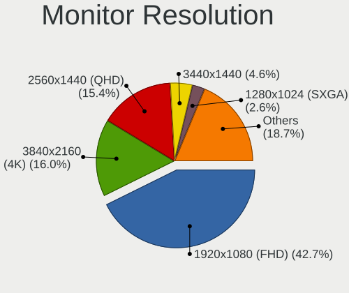

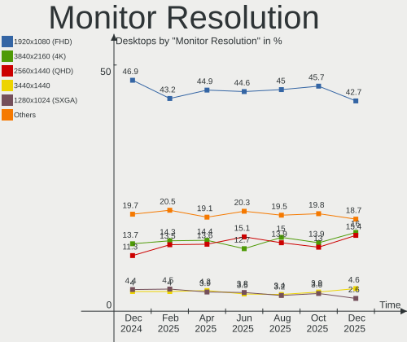

| Resolution         | Desktops | Percent |
|--------------------|----------|---------|
| 1920x1080 (FHD)    | 1391     | 42.68%  |
| 3840x2160 (4K)     | 521      | 15.99%  |
| 2560x1440 (QHD)    | 503      | 15.43%  |
| 3440x1440          | 150      | 4.6%    |
| 1280x1024 (SXGA)   | 84       | 2.58%   |
| 1920x1200 (WUXGA)  | 77       | 2.36%   |
| 1680x1050 (WSXGA+) | 76       | 2.33%   |
| 1366x768 (WXGA)    | 74       | 2.27%   |
| 2560x1080          | 56       | 1.72%   |
| 1600x900 (HD+)     | 55       | 1.69%   |
| 1440x900 (WXGA+)   | 55       | 1.69%   |
| 3840x1080          | 48       | 1.47%   |
| 2288x1287          | 23       | 0.71%   |
| 1920x540           | 22       | 0.68%   |
| 1360x768           | 19       | 0.58%   |
| Unknown            | 17       | 0.52%   |
| 3840x1600          | 13       | 0.4%    |
| 2560x1600          | 11       | 0.34%   |
| 1600x1200          | 11       | 0.34%   |
| 1024x768 (XGA)     | 11       | 0.34%   |
| 1280x720 (HD)      | 6        | 0.18%   |
| 1400x1050          | 5        | 0.15%   |
| 2560x1397          | 4        | 0.12%   |
| 2160x1440          | 4        | 0.12%   |
| 2560x2880          | 3        | 0.09%   |
| 3840x1200          | 2        | 0.06%   |
| 2048x1152          | 2        | 0.06%   |
| 7680x2160          | 1        | 0.03%   |
| 6880x1440          | 1        | 0.03%   |
| 6400x1440          | 1        | 0.03%   |
| 5760x1080          | 1        | 0.03%   |
| 3600x1080          | 1        | 0.03%   |
| 3360x1440          | 1        | 0.03%   |
| 2880x1800          | 1        | 0.03%   |
| 2880x1600          | 1        | 0.03%   |
| 2560x682           | 1        | 0.03%   |
| 2256x1504          | 1        | 0.03%   |
| 2160x1200          | 1        | 0.03%   |
| 1920x720           | 1        | 0.03%   |
| 1920x1280          | 1        | 0.03%   |

Monitor Diagonal
----------------

Diagonal size in inches

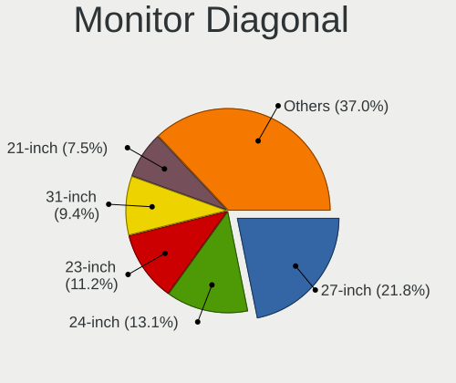

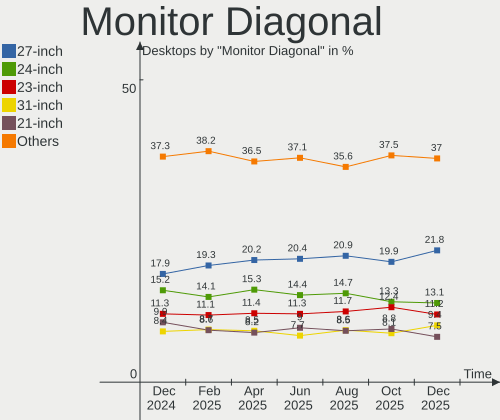

| Inches  | Desktops | Percent |
|---------|----------|---------|
| 27      | 745      | 21.85%  |
| 24      | 446      | 13.08%  |
| 23      | 381      | 11.17%  |
| 31      | 321      | 9.41%   |
| 21      | 255      | 7.48%   |
| 34      | 160      | 4.69%   |
| 19      | 98       | 2.87%   |
| Unknown | 87       | 2.55%   |
| 18      | 81       | 2.38%   |
| 84      | 65       | 1.91%   |
| 32      | 63       | 1.85%   |
| 22      | 63       | 1.85%   |
| 20      | 62       | 1.82%   |
| 54      | 43       | 1.26%   |
| 48      | 43       | 1.26%   |
| 26      | 42       | 1.23%   |
| 15      | 42       | 1.23%   |
| 72      | 37       | 1.09%   |
| 40      | 37       | 1.09%   |
| 17      | 37       | 1.09%   |
| 63      | 28       | 0.82%   |
| 25      | 23       | 0.67%   |
| 49      | 22       | 0.65%   |
| 142     | 21       | 0.62%   |
| 29      | 21       | 0.62%   |
| 28      | 20       | 0.59%   |
| 42      | 16       | 0.47%   |
| 37      | 14       | 0.41%   |
| 65      | 12       | 0.35%   |
| 74      | 11       | 0.32%   |
| 36      | 10       | 0.29%   |
| 33      | 9        | 0.26%   |
| 64      | 8        | 0.23%   |
| 39      | 8        | 0.23%   |
| 14      | 8        | 0.23%   |
| 13      | 8        | 0.23%   |
| 46      | 7        | 0.21%   |
| 35      | 7        | 0.21%   |
| 44      | 6        | 0.18%   |
| 16      | 6        | 0.18%   |

Monitor Width
-------------

Physical width

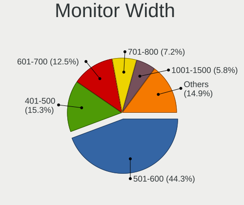

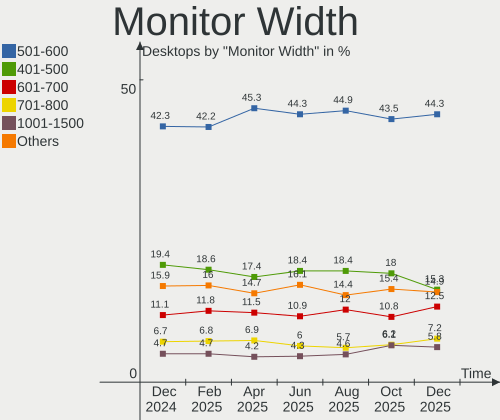

| Width in mm    | Desktops | Percent |
|----------------|----------|---------|
| 501-600        | 1432     | 44.32%  |
| 401-500        | 493      | 15.26%  |
| 601-700        | 404      | 12.5%   |
| 701-800        | 234      | 7.24%   |
| 1001-1500      | 187      | 5.79%   |
| 1501-2000      | 120      | 3.71%   |
| Unknown        | 87       | 2.69%   |
| 301-350        | 82       | 2.54%   |
| 801-900        | 62       | 1.92%   |
| 351-400        | 61       | 1.89%   |
| 901-1000       | 30       | 0.93%   |
| More than 2000 | 23       | 0.71%   |
| 201-300        | 16       | 0.5%    |

Aspect Ratio
------------

Proportional relationship between the width and the height

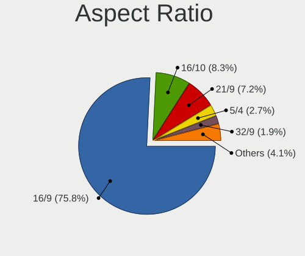

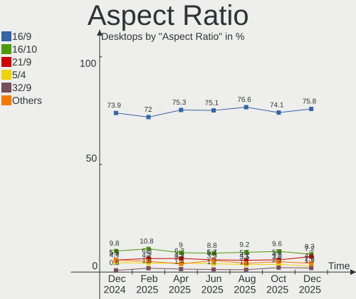

| Ratio   | Desktops | Percent |
|---------|----------|---------|
| 16/9    | 2262     | 75.78%  |
| 16/10   | 247      | 8.27%   |
| 21/9    | 215      | 7.2%    |
| 5/4     | 82       | 2.75%   |
| 32/9    | 58       | 1.94%   |
| Unknown | 42       | 1.41%   |
| 4/3     | 36       | 1.21%   |
| 1.00    | 22       | 0.74%   |
| 3/2     | 7        | 0.23%   |
| 1.96    | 3        | 0.1%    |
| 0.89    | 3        | 0.1%    |
| 6/5     | 2        | 0.07%   |
| 3.20    | 2        | 0.07%   |
| 3.75    | 1        | 0.03%   |
| 2.69    | 1        | 0.03%   |
| 2.00    | 1        | 0.03%   |
| 0.79    | 1        | 0.03%   |

Monitor Area
------------

Area in inch²

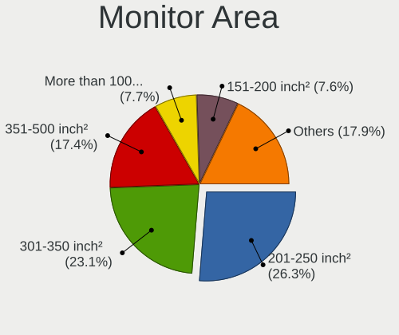

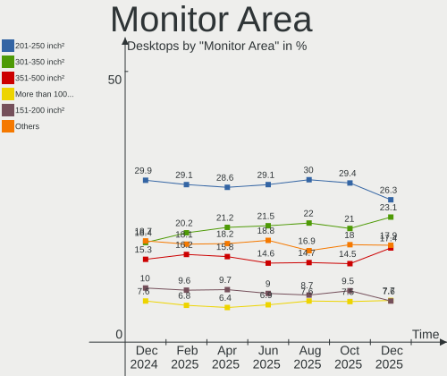

| Area in inch² | Desktops | Percent |
|----------------|----------|---------|
| 201-250        | 876      | 26.29%  |
| 301-350        | 770      | 23.11%  |
| 351-500        | 579      | 17.38%  |
| More than 1000 | 257      | 7.71%   |
| 151-200        | 253      | 7.59%   |
| 251-300        | 194      | 5.82%   |
| 501-1000       | 151      | 4.53%   |
| 141-150        | 95       | 2.85%   |
| Unknown        | 87       | 2.61%   |
| 101-110        | 41       | 1.23%   |
| 71-80          | 7        | 0.21%   |
| 111-120        | 7        | 0.21%   |
| 81-90          | 4        | 0.12%   |
| 51-60          | 4        | 0.12%   |
| 91-100         | 4        | 0.12%   |
| 131-140        | 2        | 0.06%   |
| 121-130        | 1        | 0.03%   |

Pixel Density
-------------

Pixels per inch

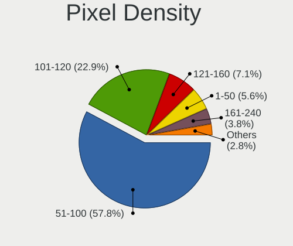

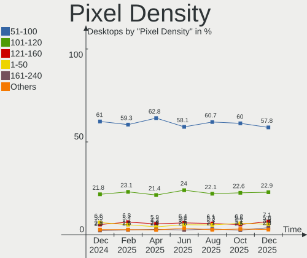

| Density       | Desktops | Percent |
|---------------|----------|---------|
| 51-100        | 1817     | 57.79%  |
| 101-120       | 720      | 22.9%   |
| 121-160       | 223      | 7.09%   |
| 1-50          | 175      | 5.57%   |
| 161-240       | 121      | 3.85%   |
| Unknown       | 87       | 2.77%   |
| More than 240 | 1        | 0.03%   |

Multiple Monitors
-----------------

Total monitors connected

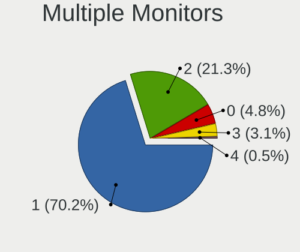

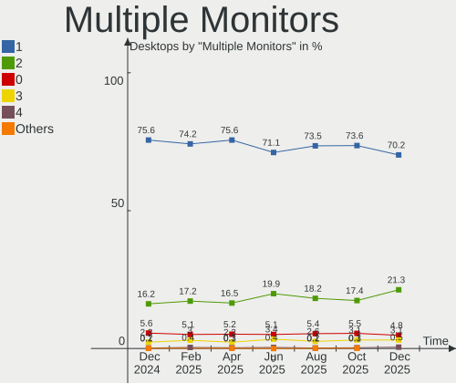

| Total | Desktops | Percent |
|-------|----------|---------|
| 1     | 2141     | 70.22%  |
| 2     | 650      | 21.32%  |
| 0     | 147      | 4.82%   |
| 3     | 95       | 3.12%   |
| 4     | 16       | 0.52%   |

Network
-------

Net Controller Vendor
---------------------

Controller vendors

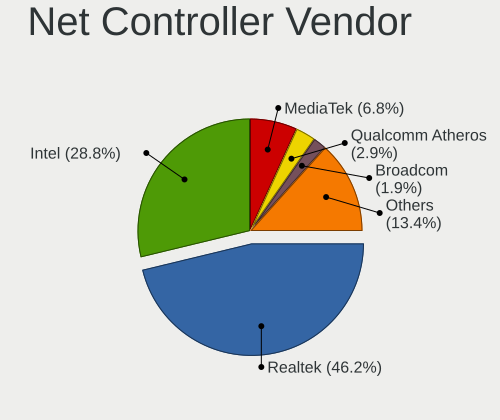

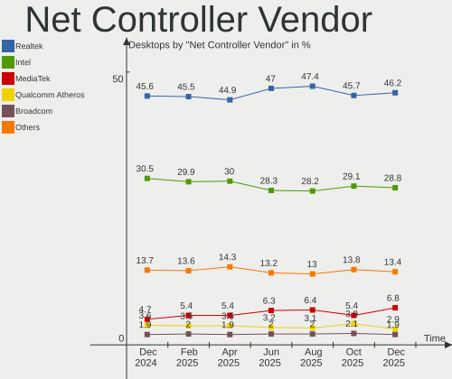

| Vendor                          | Desktops | Percent |
|---------------------------------|----------|---------|
| Realtek Semiconductor           | 2108     | 46.23%  |
| Intel                           | 1312     | 28.77%  |
| MediaTek                        | 311      | 6.82%   |
| Qualcomm Atheros                | 133      | 2.92%   |
| Broadcom                        | 87       | 1.91%   |
| TP-Link                         | 78       | 1.71%   |
| Qualcomm Technologies           | 58       | 1.27%   |
| Aquantia                        | 49       | 1.07%   |
| Ralink Technology               | 47       | 1.03%   |
| Microsoft                       | 36       | 0.79%   |
| Samsung Electronics             | 26       | 0.57%   |
| ASIX Electronics                | 23       | 0.5%    |
| Ralink                          | 21       | 0.46%   |
| Nvidia                          | 20       | 0.44%   |
| NetGear                         | 19       | 0.42%   |
| Qualcomm Atheros Communications | 16       | 0.35%   |
| Xiaomi                          | 15       | 0.33%   |
| D-Link                          | 13       | 0.29%   |
| Marvell Technology Group        | 12       | 0.26%   |
| ASUSTek Computer                | 12       | 0.26%   |
| QinHeng Electronics             | 11       | 0.24%   |
| Realtek                         | 8        | 0.18%   |
| Motorola PCS                    | 8        | 0.18%   |
| Mercucys                        | 7        | 0.15%   |
| Google                          | 7        | 0.15%   |
| aicsemi                         | 7        | 0.15%   |
| IMC Networks                    | 6        | 0.13%   |
| Edimax Technology               | 6        | 0.13%   |
| DisplayLink                     | 6        | 0.13%   |
| Broadcom Limited                | 6        | 0.13%   |
| D-Link System                   | 5        | 0.11%   |
| MicroPython                     | 4        | 0.09%   |
| Mellanox Technologies           | 4        | 0.09%   |
| AVM                             | 4        | 0.09%   |
| American Megatrends             | 4        | 0.09%   |
| ZyDAS                           | 3        | 0.07%   |
| Qualcomm                        | 3        | 0.07%   |
| Linksys                         | 3        | 0.07%   |
| ZyXEL Communications            | 2        | 0.04%   |
| VIA Technologies                | 2        | 0.04%   |

Net Controller Model
--------------------

Controller models

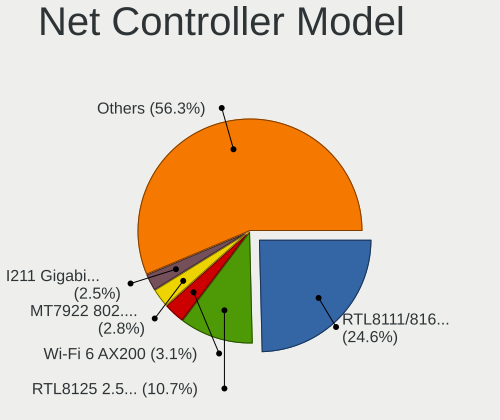

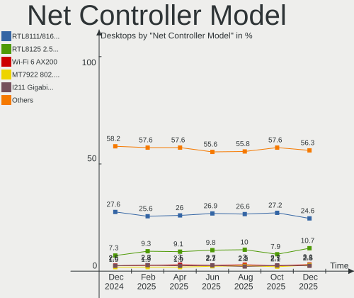

| Model                                                                           | Desktops | Percent |
|---------------------------------------------------------------------------------|----------|---------|
| Realtek RTL8111/8168/8211/8411 PCI Express Gigabit Ethernet Controller          | 1305     | 24.61%  |
| Realtek RTL8125 2.5GbE Controller                                               | 568      | 10.71%  |
| Intel Wi-Fi 6 AX200                                                             | 163      | 3.07%   |
| MediaTek MT7922 802.11ax PCI Express Wireless Network Adapter                   | 148      | 2.79%   |
| Intel I211 Gigabit Network Connection                                           | 131      | 2.47%   |
| Intel Ethernet Controller I225-V                                                | 128      | 2.41%   |
| Intel Wi-Fi 6E(802.11ax) AX210/AX1675* 2x2 [Typhoon Peak]                       | 123      | 2.32%   |
| Intel Ethernet Connection (2) I219-V                                            | 107      | 2.02%   |
| Intel Ethernet Controller I226-V                                                | 99       | 1.87%   |
| Realtek RTL8126 5GbE Controller                                                 | 91       | 1.72%   |
| Intel 82579LM Gigabit Network Connection (Lewisville)                           | 77       | 1.45%   |
| Realtek RTL8852BE PCIe 802.11ax Wireless Network Controller                     | 62       | 1.17%   |
| Realtek 802.11ac NIC                                                            | 60       | 1.13%   |
| Qualcomm WCN785x Wi-Fi 7(802.11be) 320MHz 2x2 [FastConnect 7800]                | 57       | 1.07%   |
| Realtek RTL8821CE 802.11ac PCIe Wireless Network Adapter                        | 56       | 1.06%   |
| Intel Dual Band Wireless-AC 3168NGW [Stone Peak]                                | 53       | 1%      |
| Intel Ethernet Connection I217-LM                                               | 50       | 0.94%   |
| Intel 700 Series Chipset CNVi WiFi                                              | 49       | 0.92%   |
| Intel Ethernet Connection (7) I219-V                                            | 48       | 0.91%   |
| Realtek RTL8153 Gigabit Ethernet Adapter                                        | 42       | 0.79%   |
| Intel Wi-Fi 5(802.11ac) Wireless-AC 9x6x [Thunder Peak]                         | 35       | 0.66%   |
| Intel Ethernet Connection I217-V                                                | 35       | 0.66%   |
| Realtek RTL8922AE 802.11be PCIe Wireless Network Adapter                        | 32       | 0.6%    |
| MediaTek MT7925 802.11be 160MHz 2x2 PCIe Wireless Network Adapter [Filogic 360] | 30       | 0.57%   |
| Intel Ethernet Connection (2) I219-LM                                           | 30       | 0.57%   |
| Intel Alder Lake-S PCH CNVi WiFi                                                | 30       | 0.57%   |
| MediaTek MT7902 802.11ax PCIe Wireless Network Adapter [Filogic 310]            | 29       | 0.55%   |
| Realtek RTL8852CE PCIe 802.11ax Wireless Network Controller                     | 27       | 0.51%   |
| Realtek RTL8188EUS 802.11n Wireless Network Adapter                             | 27       | 0.51%   |
| MediaTek MT7927 802.11be 320MHz 2x2 PCIe Wireless Network Adapter [Filogic 380] | 27       | 0.51%   |
| Intel Wireless 7265                                                             | 27       | 0.51%   |
| MediaTek MT7921K (RZ608) Wi-Fi 6E 80MHz                                         | 26       | 0.49%   |
| Realtek RTL810xE PCI Express Fast Ethernet controller                           | 24       | 0.45%   |
| Realtek RTL88x2bu [AC1200 Techkey]                                              | 23       | 0.43%   |
| Intel Cannon Lake PCH CNVi WiFi                                                 | 23       | 0.43%   |
| Broadcom BCM4360 802.11ac Dual Band Wireless Network Adapter                    | 23       | 0.43%   |
| ASIX AX88179 Gigabit Ethernet                                                   | 22       | 0.41%   |
| Qualcomm Atheros Killer E220x Gigabit Ethernet Controller                       | 21       | 0.4%    |
| Intel 82574L Gigabit Network Connection                                         | 21       | 0.4%    |
| Realtek Killer E3000 2.5GbE Controller                                          | 20       | 0.38%   |

Wireless Vendor
---------------

Wireless vendors

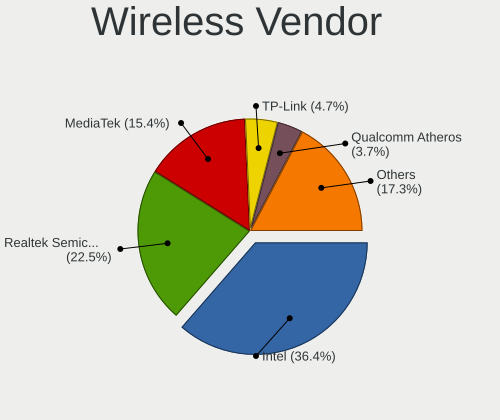

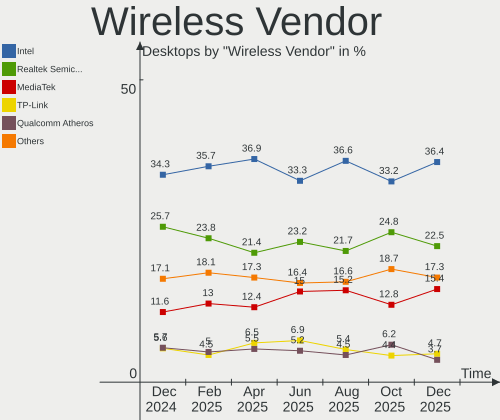

| Vendor                          | Desktops | Percent |
|---------------------------------|----------|---------|
| Intel                           | 603      | 36.39%  |
| Realtek Semiconductor           | 373      | 22.51%  |
| MediaTek                        | 255      | 15.39%  |
| TP-Link                         | 78       | 4.71%   |
| Qualcomm Atheros                | 61       | 3.68%   |
| Broadcom                        | 50       | 3.02%   |
| Ralink Technology               | 47       | 2.84%   |
| Microsoft                       | 35       | 2.11%   |
| Ralink                          | 21       | 1.27%   |
| NetGear                         | 19       | 1.15%   |
| Qualcomm Technologies           | 18       | 1.09%   |
| Qualcomm Atheros Communications | 16       | 0.97%   |
| D-Link                          | 13       | 0.78%   |
| ASUSTek Computer                | 12       | 0.72%   |
| Realtek                         | 8        | 0.48%   |
| Mercucys                        | 7        | 0.42%   |
| IMC Networks                    | 6        | 0.36%   |
| Edimax Technology               | 6        | 0.36%   |
| D-Link System                   | 4        | 0.24%   |
| AVM                             | 4        | 0.24%   |
| ZyDAS                           | 3        | 0.18%   |
| Linksys                         | 3        | 0.18%   |
| Broadcom Limited                | 3        | 0.18%   |
| ZyXEL Communications            | 2        | 0.12%   |
| Belkin Components               | 2        | 0.12%   |
| TRENDnet                        | 1        | 0.06%   |
| Tenda                           | 1        | 0.06%   |
| Samsung Electronics             | 1        | 0.06%   |
| Ovislink                        | 1        | 0.06%   |
| Marvell Technology Group        | 1        | 0.06%   |
| LG Electronics                  | 1        | 0.06%   |
| I-O Data Device                 | 1        | 0.06%   |
| Gemtek                          | 1        | 0.06%   |

Wireless Model
--------------

Wireless models

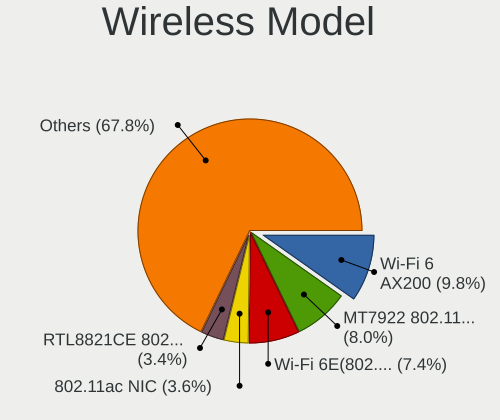

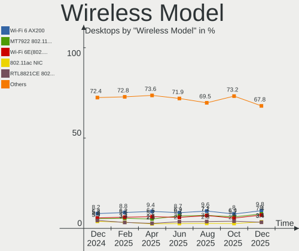

| Model                                                                           | Desktops | Percent |
|---------------------------------------------------------------------------------|----------|---------|
| Intel Wi-Fi 6 AX200                                                             | 163      | 9.78%   |
| MediaTek MT7922 802.11ax PCI Express Wireless Network Adapter                   | 134      | 8.04%   |
| Intel Wi-Fi 6E(802.11ax) AX210/AX1675* 2x2 [Typhoon Peak]                       | 123      | 7.38%   |
| Realtek 802.11ac NIC                                                            | 60       | 3.6%    |
| Realtek RTL8821CE 802.11ac PCIe Wireless Network Adapter                        | 56       | 3.36%   |
| Intel Dual Band Wireless-AC 3168NGW [Stone Peak]                                | 53       | 3.18%   |
| Intel 700 Series Chipset CNVi WiFi                                              | 48       | 2.88%   |
| Realtek RTL8852BE PCIe 802.11ax Wireless Network Controller                     | 37       | 2.22%   |
| Intel Wi-Fi 5(802.11ac) Wireless-AC 9x6x [Thunder Peak]                         | 35       | 2.1%    |
| MediaTek MT7902 802.11ax PCIe Wireless Network Adapter [Filogic 310]            | 29       | 1.74%   |
| Realtek RTL8852CE PCIe 802.11ax Wireless Network Controller                     | 27       | 1.62%   |
| Realtek RTL8188EUS 802.11n Wireless Network Adapter                             | 27       | 1.62%   |
| Intel Wireless 7265                                                             | 27       | 1.62%   |
| MediaTek MT7921K (RZ608) Wi-Fi 6E 80MHz                                         | 26       | 1.56%   |
| Realtek RTL88x2bu [AC1200 Techkey]                                              | 23       | 1.38%   |
| Intel Cannon Lake PCH CNVi WiFi                                                 | 23       | 1.38%   |
| Broadcom BCM4360 802.11ac Dual Band Wireless Network Adapter                    | 23       | 1.38%   |
| Ralink MT7601U Wireless Adapter                                                 | 20       | 1.2%    |
| MediaTek MT7927 802.11be 320MHz 2x2 PCIe Wireless Network Adapter [Filogic 380] | 20       | 1.2%    |
| MediaTek MT7925 (RZ717) Wi-Fi 7 160MHz                                          | 19       | 1.14%   |
| Intel Alder Lake-S PCH CNVi WiFi                                                | 19       | 1.14%   |
| Intel Wireless 3165                                                             | 18       | 1.08%   |
| Realtek RTL8851BE PCIe 802.11ax Wireless Network Controller                     | 17       | 1.02%   |
| Qualcomm WCN785x Wi-Fi 7(802.11be) 320MHz 2x2 [FastConnect 7800]                | 17       | 1.02%   |
| Intel Comet Lake PCH CNVi WiFi                                                  | 17       | 1.02%   |
| Qualcomm Atheros AR9271 802.11n                                                 | 16       | 0.96%   |
| Microsoft Xbox Wireless Adapter for Windows                                     | 15       | 0.9%    |
| Intel Wireless 7260                                                             | 15       | 0.9%    |
| TP-Link TL-WN823N v2/v3 [Realtek RTL8192EU]                                     | 14       | 0.84%   |
| Qualcomm Atheros AR9485 Wireless Network Adapter                                | 14       | 0.84%   |
| Realtek RTL8822CE 802.11ac PCIe Wireless Network Adapter                        | 12       | 0.72%   |
| Microsoft Xbox 360 Wireless Adapter                                             | 12       | 0.72%   |
| Broadcom BCM4352 802.11ac Dual Band Wireless Network Adapter                    | 12       | 0.72%   |
| Ralink RT5370 Wireless Adapter                                                  | 11       | 0.66%   |
| MediaTek MT7921 802.11ax PCIe Wireless Network Adapter [Filogic 330]            | 11       | 0.66%   |
| Intel Wireless 8260                                                             | 11       | 0.66%   |
| TP-Link AC600 wireless Realtek RTL8811AU [Archer T2U Nano]                      | 10       | 0.6%    |
| TP-Link 802.11ac NIC                                                            | 10       | 0.6%    |
| Realtek RTL8192EU 802.11b/g/n WLAN Adapter                                      | 10       | 0.6%    |
| Realtek RTL8922AE 802.11be PCIe Wireless Network Adapter                        | 9        | 0.54%   |

Ethernet Vendor
---------------

Ethernet vendors

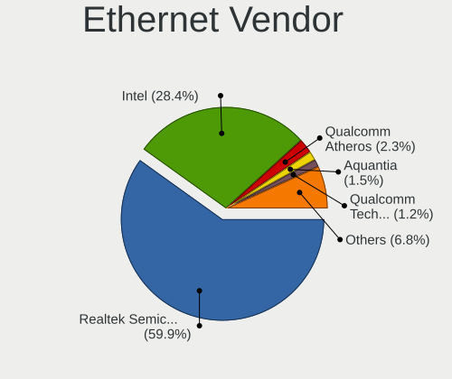

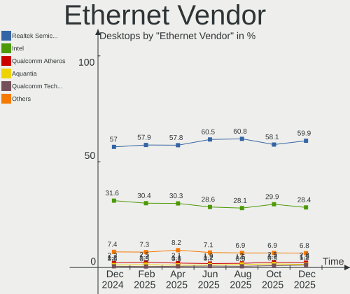

| Vendor                                 | Desktops | Percent |
|----------------------------------------|----------|---------|
| Realtek Semiconductor                  | 2018     | 59.92%  |
| Intel                                  | 955      | 28.36%  |
| Qualcomm Atheros                       | 77       | 2.29%   |
| Aquantia                               | 49       | 1.45%   |
| Qualcomm Technologies                  | 40       | 1.19%   |
| Broadcom                               | 40       | 1.19%   |
| MediaTek                               | 38       | 1.13%   |
| Samsung Electronics                    | 25       | 0.74%   |
| ASIX Electronics                       | 23       | 0.68%   |
| Nvidia                                 | 20       | 0.59%   |
| Xiaomi                                 | 15       | 0.45%   |
| Marvell Technology Group               | 11       | 0.33%   |
| Motorola PCS                           | 8        | 0.24%   |
| Google                                 | 6        | 0.18%   |
| DisplayLink                            | 6        | 0.18%   |
| Mellanox Technologies                  | 4        | 0.12%   |
| American Megatrends                    | 4        | 0.12%   |
| Qualcomm                               | 3        | 0.09%   |
| Broadcom Limited                       | 3        | 0.09%   |
| VIA Technologies                       | 2        | 0.06%   |
| OPPO Electronics                       | 2        | 0.06%   |
| Loongson Technology                    | 2        | 0.06%   |
| 3Com                                   | 2        | 0.06%   |
| T & A Mobile Phones                    | 1        | 0.03%   |
| Suzhou Motorcomm Electronic Technology | 1        | 0.03%   |
| Spreadtrum Communications              | 1        | 0.03%   |
| Silicon Integrated Systems [SiS]       | 1        | 0.03%   |
| QLogic                                 | 1        | 0.03%   |
| NetXen Incorporated                    | 1        | 0.03%   |
| Netchip Technology                     | 1        | 0.03%   |
| Microsoft                              | 1        | 0.03%   |
| Lenovo                                 | 1        | 0.03%   |
| Insyde Software                        | 1        | 0.03%   |
| ICS Advent                             | 1        | 0.03%   |
| Huawei Technologies                    | 1        | 0.03%   |
| D-Link System                          | 1        | 0.03%   |
| Compex                                 | 1        | 0.03%   |
| Apple                                  | 1        | 0.03%   |

Ethernet Model
--------------

Ethernet models

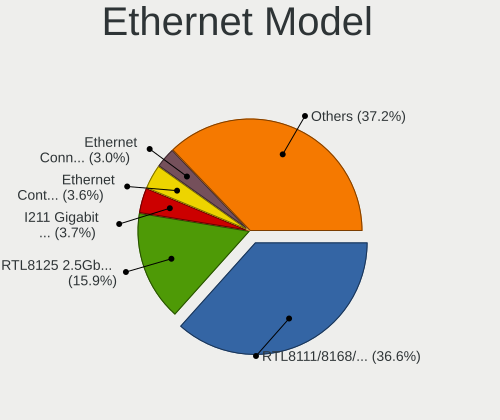

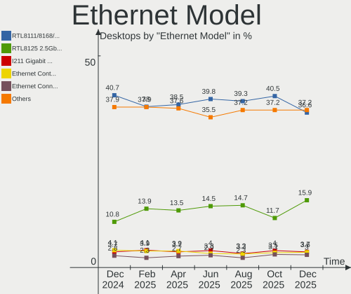

| Model                                                                             | Desktops | Percent |
|-----------------------------------------------------------------------------------|----------|---------|
| Realtek RTL8111/8168/8211/8411 PCI Express Gigabit Ethernet Controller            | 1305     | 36.63%  |
| Realtek RTL8125 2.5GbE Controller                                                 | 568      | 15.94%  |
| Intel I211 Gigabit Network Connection                                             | 131      | 3.68%   |
| Intel Ethernet Controller I225-V                                                  | 128      | 3.59%   |
| Intel Ethernet Connection (2) I219-V                                              | 107      | 3%      |
| Intel Ethernet Controller I226-V                                                  | 99       | 2.78%   |
| Realtek RTL8126 5GbE Controller                                                   | 91       | 2.55%   |
| Intel 82579LM Gigabit Network Connection (Lewisville)                             | 77       | 2.16%   |
| Intel Ethernet Connection I217-LM                                                 | 50       | 1.4%    |
| Intel Ethernet Connection (7) I219-V                                              | 48       | 1.35%   |
| Realtek RTL8153 Gigabit Ethernet Adapter                                          | 42       | 1.18%   |
| Qualcomm WCN785x Wi-Fi 7(802.11be) 320MHz 2x2 [FastConnect 7800]                  | 40       | 1.12%   |
| Intel Ethernet Connection I217-V                                                  | 35       | 0.98%   |
| Intel Ethernet Connection (2) I219-LM                                             | 30       | 0.84%   |
| Realtek RTL8852BE PCIe 802.11ax Wireless Network Controller                       | 25       | 0.7%    |
| Realtek RTL810xE PCI Express Fast Ethernet controller                             | 24       | 0.67%   |
| Realtek RTL8922AE 802.11be PCIe Wireless Network Adapter                          | 23       | 0.65%   |
| ASIX AX88179 Gigabit Ethernet                                                     | 22       | 0.62%   |
| Qualcomm Atheros Killer E220x Gigabit Ethernet Controller                         | 21       | 0.59%   |
| MediaTek MT7925 802.11be 160MHz 2x2 PCIe Wireless Network Adapter [Filogic 360]   | 21       | 0.59%   |
| Intel 82574L Gigabit Network Connection                                           | 21       | 0.59%   |
| Realtek Killer E3000 2.5GbE Controller                                            | 20       | 0.56%   |
| Intel Ethernet Connection (2) I218-V                                              | 20       | 0.56%   |
| Intel Ethernet Connection (7) I219-LM                                             | 19       | 0.53%   |
| Intel 82579V Gigabit Network Connection                                           | 18       | 0.51%   |
| Intel I210 Gigabit Network Connection                                             | 17       | 0.48%   |
| Intel 82567LM-3 Gigabit Network Connection                                        | 17       | 0.48%   |
| Aquantia AQtion AQC113CS NBase-T/IEEE 802.3an Ethernet Controller [Antigua 10G]   | 17       | 0.48%   |
| Samsung Galaxy series, misc. (tethering mode)                                     | 16       | 0.45%   |
| Intel Ethernet Connection (5) I219-LM                                             | 16       | 0.45%   |
| Intel Ethernet Connection (14) I219-V                                             | 16       | 0.45%   |
| Intel 82599ES 10-Gigabit SFI/SFP+ Network Connection                              | 15       | 0.42%   |
| Qualcomm Atheros AR8151 v2.0 Gigabit Ethernet                                     | 14       | 0.39%   |
| MediaTek MT7922 802.11ax PCI Express Wireless Network Adapter                     | 14       | 0.39%   |
| Qualcomm Atheros Killer E2500 Gigabit Ethernet Controller                         | 11       | 0.31%   |
| Intel Ethernet Connection (17) I219-V                                             | 11       | 0.31%   |
| Intel Alder Lake-S PCH CNVi WiFi                                                  | 11       | 0.31%   |
| Intel Ethernet Connection (17) I219-LM                                            | 10       | 0.28%   |
| Aquantia AQtion AQC107 NBase-T/IEEE 802.3an Ethernet Controller [Atlantic 10G]    | 10       | 0.28%   |
| Aquantia AQC113C NBase-T/IEEE 802.3an Ethernet Controller [Marvell Scalable mGig] | 10       | 0.28%   |

Net Controller Kind
-------------------

Ethernet, WiFi or modem

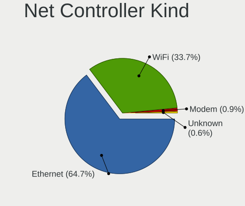

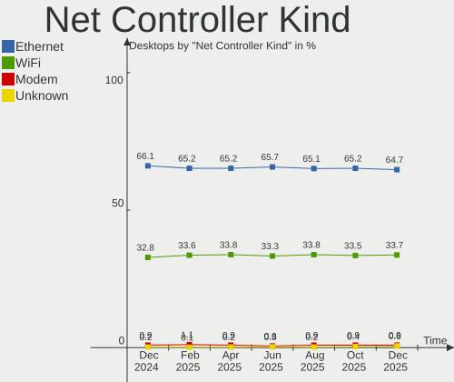

| Kind     | Desktops | Percent |
|----------|----------|---------|
| Ethernet | 3022     | 64.71%  |
| WiFi     | 1576     | 33.75%  |
| Modem    | 44       | 0.94%   |
| Unknown  | 28       | 0.6%    |

Used Controller
---------------

Currently used network controller

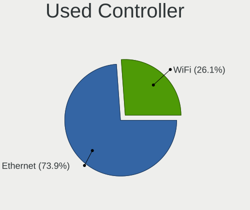

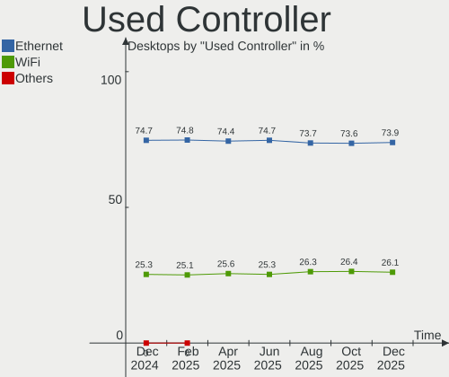

| Kind     | Desktops | Percent |
|----------|----------|---------|
| Ethernet | 2305     | 73.85%  |
| WiFi     | 816      | 26.15%  |

NICs
----

Total network controllers on board

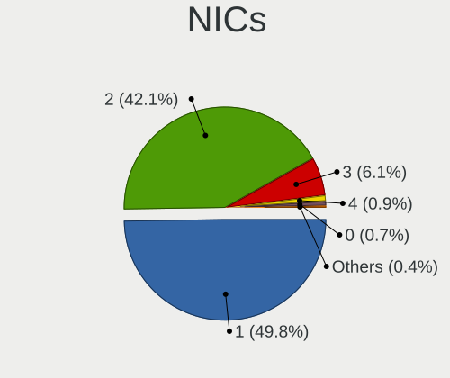

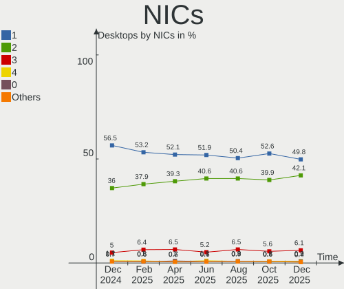

| Total | Desktops | Percent |
|-------|----------|---------|
| 1     | 1517     | 49.75%  |
| 2     | 1284     | 42.11%  |
| 3     | 187      | 6.13%   |
| 4     | 28       | 0.92%   |
| 0     | 22       | 0.72%   |
| 5     | 6        | 0.2%    |
| 6     | 2        | 0.07%   |
| 10    | 1        | 0.03%   |
| 9     | 1        | 0.03%   |
| 7     | 1        | 0.03%   |

IPv6
----

IPv6 vs IPv4

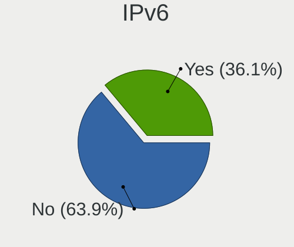

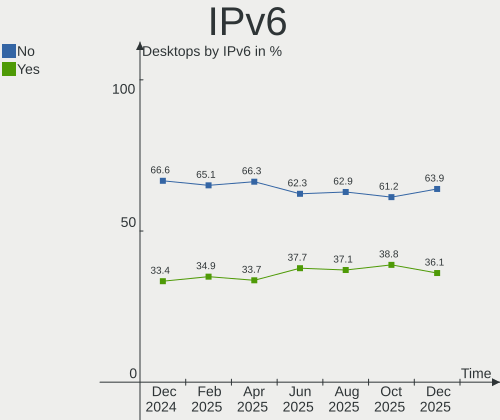

| Used | Desktops | Percent |
|------|----------|---------|
| No   | 1949     | 63.92%  |
| Yes  | 1100     | 36.08%  |

Bluetooth
---------

Bluetooth Vendor
----------------

Controller vendors

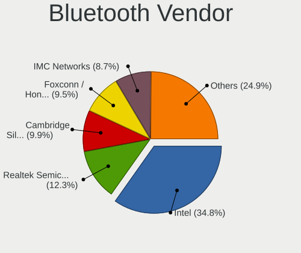

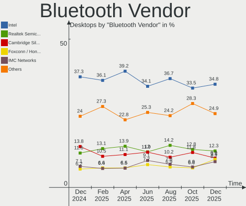

| Vendor                          | Desktops | Percent |
|---------------------------------|----------|---------|
| Intel                           | 582      | 34.81%  |
| Realtek Semiconductor           | 205      | 12.26%  |
| Cambridge Silicon Radio         | 165      | 9.87%   |
| Foxconn / Hon Hai               | 159      | 9.51%   |
| IMC Networks                    | 145      | 8.67%   |
| MediaTek                        | 139      | 8.31%   |
| TP-Link                         | 73       | 4.37%   |
| ASUSTek Computer                | 60       | 3.59%   |
| Broadcom                        | 28       | 1.67%   |
| Unknown                         | 24       | 1.44%   |
| Qualcomm Atheros Communications | 20       | 1.2%    |
| Realtek                         | 14       | 0.84%   |
| Actions                         | 11       | 0.66%   |
| Lite-On Technology              | 8        | 0.48%   |
| Apple                           | 8        | 0.48%   |
| Integrated System Solution      | 5        | 0.3%    |
| Edimax Technology               | 4        | 0.24%   |
| Ralink                          | 3        | 0.18%   |
| Mercucys                        | 3        | 0.18%   |
| Dynex                           | 3        | 0.18%   |
| Belkin Components               | 2        | 0.12%   |
| AICSemi                         | 2        | 0.12%   |
| TDK                             | 1        | 0.06%   |
| SiW                             | 1        | 0.06%   |
| Quectel Wireless Solutions      | 1        | 0.06%   |
| Primax Electronics              | 1        | 0.06%   |
| Micro Star International        | 1        | 0.06%   |
| Kensington                      | 1        | 0.06%   |
| HTC (High Tech Computer)        | 1        | 0.06%   |
| Hewlett-Packard                 | 1        | 0.06%   |
| Conwise Technology              | 1        | 0.06%   |

Bluetooth Model
---------------

Controller models

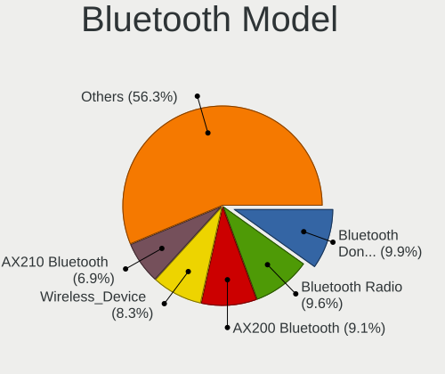

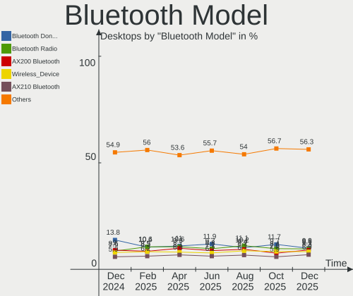

| Model                                                    | Desktops | Percent |
|----------------------------------------------------------|----------|---------|
| Cambridge Silicon Radio Bluetooth Dongle (HCI mode)      | 165      | 9.85%   |
| Realtek Bluetooth Radio                                  | 160      | 9.55%   |
| Intel AX200 Bluetooth                                    | 152      | 9.07%   |
| MediaTek Wireless_Device                                 | 139      | 8.3%    |
| Intel AX210 Bluetooth                                    | 116      | 6.93%   |
| Foxconn / Hon Hai Wireless_Device                        | 79       | 4.72%   |
| Intel Bluetooth wireless interface                       | 75       | 4.48%   |
| TP-Link TP-T@- UB500 Adapter                             | 73       | 4.36%   |
| IMC Networks Bluetooth Radio                             | 71       | 4.24%   |
| Foxconn / Hon Hai Bluetooth Device                       | 71       | 4.24%   |
| IMC Networks Wireless_Device                             | 69       | 4.12%   |
| Intel AX201 Bluetooth                                    | 62       | 3.7%    |
| Intel Bluetooth Device                                   | 60       | 3.58%   |
| Intel Wireless-AC 3168 Bluetooth                         | 49       | 2.93%   |
| Intel Wireless-AC 9260 Bluetooth Adapter                 | 32       | 1.91%   |
| Intel Bluetooth 9460/9560 Jefferson Peak (JfP)           | 32       | 1.91%   |
| ASUS ASUS USB-BT500                                      | 31       | 1.85%   |
| Unknown                                                  | 24       | 1.43%   |
| Realtek Bluetooth 5.4 Radio                              | 17       | 1.01%   |
| Realtek Bluetooth 5.3 Radio                              | 15       | 0.9%    |
| Broadcom BCM20702A0 Bluetooth 4.0                        | 15       | 0.9%    |
| Realtek Bluetooth Radio                                  | 14       | 0.84%   |
| Actions general adapter                                  | 11       | 0.66%   |
| Realtek  Bluetooth 4.2 Adapter                           | 10       | 0.6%    |
| Qualcomm Atheros  Bluetooth Device                       | 10       | 0.6%    |
| ASUS Broadcom BCM20702A0 Bluetooth                       | 9        | 0.54%   |
| Foxconn / Hon Hai Bluetooth Radio                        | 7        | 0.42%   |
| ASUS Bluetooth Radio                                     | 7        | 0.42%   |
| Qualcomm Atheros AR3011 Bluetooth                        | 6        | 0.36%   |
| Intel Centrino Bluetooth Wireless Transceiver            | 6        | 0.36%   |
| ASUS BCM20702A0                                          | 5        | 0.3%    |
| Apple Bluetooth Host Controller                          | 5        | 0.3%    |
| Edimax Bluetooth Device                                  | 4        | 0.24%   |
| Realtek 802.11ac WLAN Adapter                            | 3        | 0.18%   |
| Ralink RT3290 Bluetooth                                  | 3        | 0.18%   |
| Mercucys Mercusys MA530 Adapter                          | 3        | 0.18%   |
| Integrated System Solution Bluetooth Device              | 3        | 0.18%   |
| IMC Networks BCM20702A0                                  | 3        | 0.18%   |
| Dynex Bluetooth 4.0 Adapter [Broadcom, 1.12, BCM20702A0] | 3        | 0.18%   |
| ASUS Broadcom BCM20702 Single-Chip Bluetooth 4.0 + LE    | 3        | 0.18%   |

Sound
-----

Sound Vendor
------------

Sound card vendors

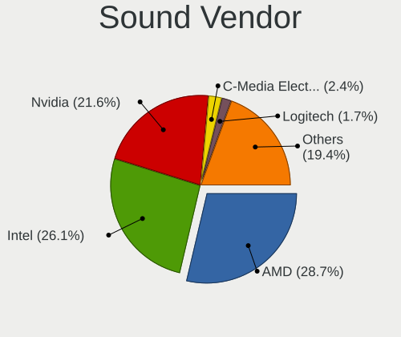

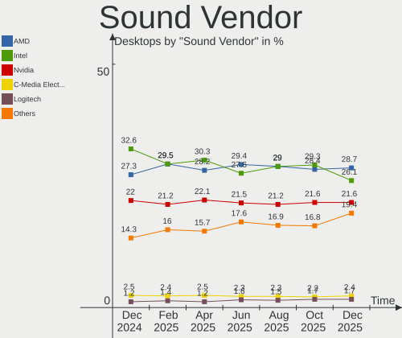

| Vendor                                       | Desktops | Percent |
|----------------------------------------------|----------|---------|
| AMD                                          | 1682     | 28.67%  |
| Intel                                        | 1533     | 26.13%  |
| Nvidia                                       | 1269     | 21.63%  |
| C-Media Electronics                          | 141      | 2.4%    |
| Logitech                                     | 102      | 1.74%   |
| ASUSTek Computer                             | 86       | 1.47%   |
| Micro Star International                     | 73       | 1.24%   |
| SteelSeries ApS                              | 55       | 0.94%   |
| Razer USA                                    | 55       | 0.94%   |
| Creative Labs                                | 55       | 0.94%   |
| JMTek                                        | 46       | 0.78%   |
| Texas Instruments                            | 39       | 0.66%   |
| Kingston Technology                          | 38       | 0.65%   |
| Hewlett-Packard                              | 37       | 0.63%   |
| Focusrite-Novation                           | 36       | 0.61%   |
| Generalplus Technology                       | 30       | 0.51%   |
| Sony                                         | 22       | 0.37%   |
| Creative Technology                          | 22       | 0.37%   |
| Realtek Semiconductor                        | 20       | 0.34%   |
| Corsair                                      | 20       | 0.34%   |
| ASRock                                       | 19       | 0.32%   |
| Zoran Co. Personal Media Division (Nogatech) | 18       | 0.31%   |
| Jieli Technology                             | 18       | 0.31%   |
| Blue Microphones                             | 17       | 0.29%   |
| Yamaha                                       | 13       | 0.22%   |
| KTMicro                                      | 13       | 0.22%   |
| Audio-Technica                               | 13       | 0.22%   |
| Unknown                                      | 12       | 0.2%    |
| Valve Software                               | 11       | 0.19%   |
| Thesycon Systemsoftware & Consulting         | 11       | 0.19%   |
| RODE Microphones                             | 11       | 0.19%   |
| GN Netcom                                    | 11       | 0.19%   |
| MV-SILICON                                   | 10       | 0.17%   |
| FiiO Electronics Technology                  | 10       | 0.17%   |
| BEHRINGER International                      | 10       | 0.17%   |
| Tenx Technology                              | 9        | 0.15%   |
| Giga-Byte Technology                         | 9        | 0.15%   |
| DSEA A/S                                     | 9        | 0.15%   |
| XMOS                                         | 8        | 0.14%   |
| Samson Technologies                          | 8        | 0.14%   |

Sound Model
-----------

Sound card models

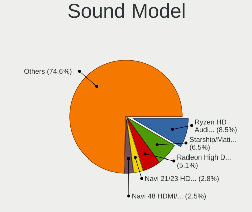

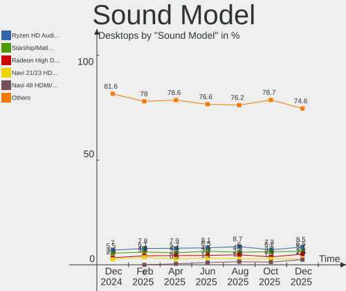

| Model                                                                      | Desktops | Percent |
|----------------------------------------------------------------------------|----------|---------|
| AMD Ryzen HD Audio Controller                                              | 614      | 8.48%   |
| AMD Starship/Matisse HD Audio Controller                                   | 472      | 6.52%   |
| AMD Radeon High Definition Audio Controller                                | 370      | 5.11%   |
| AMD Navi 21/23 HDMI/DP Audio Controller                                    | 202      | 2.79%   |
| AMD Navi 48 HDMI/DP Audio Controller                                       | 184      | 2.54%   |
| Intel 8 Series/C220 Series Chipset High Definition Audio Controller        | 174      | 2.4%    |
| AMD Navi 31 HDMI/DP Audio                                                  | 171      | 2.36%   |
| AMD Renoir/Cezanne HDMI/DP Audio Controller                                | 153      | 2.11%   |
| Intel 200 Series PCH HD Audio                                              | 144      | 1.99%   |
| Intel 100 Series/C230 Series Chipset Family HD Audio Controller            | 144      | 1.99%   |
| Intel 6 Series/C200 Series Chipset Family High Definition Audio Controller | 130      | 1.8%    |
| AMD Ellesmere HDMI Audio [Radeon RX 470/480 / 570/580/590]                 | 122      | 1.68%   |
| Intel Cannon Lake PCH cAVS                                                 | 110      | 1.52%   |
| Intel 7 Series/C216 Chipset Family High Definition Audio Controller        | 104      | 1.44%   |
| Intel Raptor Lake High Definition Audio Controller                         | 103      | 1.42%   |
| Intel Xeon E3-1200 v3/4th Gen Core Processor HD Audio Controller           | 102      | 1.41%   |
| Intel Alder Lake-S HD Audio Controller                                     | 102      | 1.41%   |
| AMD SBx00 Azalia (Intel HDA)                                               | 98       | 1.35%   |
| AMD Family 17h (Models 00h-0fh) HD Audio Controller                        | 93       | 1.28%   |
| Nvidia GA104 High Definition Audio Controller                              | 92       | 1.27%   |
| Nvidia GA106 High Definition Audio Controller                              | 83       | 1.15%   |
| ASUSTek Computer USB Audio                                                 | 75       | 1.04%   |
| Micro Star International USB Audio                                         | 72       | 0.99%   |
| Nvidia GA102 High Definition Audio Controller                              | 71       | 0.98%   |
| Nvidia GP107GL High Definition Audio Controller                            | 68       | 0.94%   |
| Nvidia GP104 High Definition Audio Controller                              | 66       | 0.91%   |
| Nvidia GK208 HDMI/DP Audio Controller                                      | 63       | 0.87%   |
| Nvidia TU116 High Definition Audio Controller                              | 59       | 0.81%   |
| Nvidia AD104 High Definition Audio Controller                              | 54       | 0.75%   |
| AMD FCH Azalia Controller                                                  | 54       | 0.75%   |
| Nvidia GP106 High Definition Audio Controller                              | 47       | 0.65%   |
| Nvidia TU106 High Definition Audio Controller                              | 44       | 0.61%   |
| C-Media Electronics Audio Adapter (Unitek Y-247A)                          | 43       | 0.59%   |
| Nvidia GB203 High Definition Audio Controller                              | 42       | 0.58%   |
| Nvidia TU104 HD Audio Controller                                           | 40       | 0.55%   |
| Nvidia GM107 High Definition Audio Controller [GeForce 940MX]              | 40       | 0.55%   |
| Nvidia AD103 High Definition Audio Controller                              | 40       | 0.55%   |
| Intel C610/X99 series chipset HD Audio Controller                          | 40       | 0.55%   |
| AMD Oland/Hainan/Cape Verde/Pitcairn HDMI Audio [Radeon HD 7000 Series]    | 40       | 0.55%   |
| Intel Tiger Lake-H HD Audio Controller                                     | 39       | 0.54%   |

Memory
------

Memory Vendor
-------------

Memory module vendors

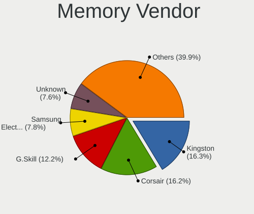

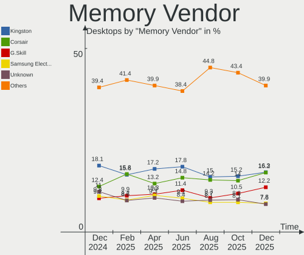

| Vendor                       | Desktops | Percent |
|------------------------------|----------|---------|
| Kingston                     | 263      | 16.31%  |
| Corsair                      | 262      | 16.24%  |
| G.Skill                      | 197      | 12.21%  |
| Samsung Electronics          | 126      | 7.81%   |
| Unknown                      | 122      | 7.56%   |
| Crucial                      | 96       | 5.95%   |
| Micron Technology            | 93       | 5.77%   |
| SK hynix                     | 90       | 5.58%   |
| Unknown                      | 66       | 4.09%   |
| A-DATA Technology            | 40       | 2.48%   |
| Team                         | 35       | 2.17%   |
| Patriot                      | 21       | 1.3%    |
| TeamGroup                    | 13       | 0.81%   |
| Apacer                       | 10       | 0.62%   |
| AMD                          | 10       | 0.62%   |
| Ramaxel Technology           | 9        | 0.56%   |
| Nanya Technology             | 8        | 0.5%    |
| Transcend                    | 7        | 0.43%   |
| Unknown (ABCD)               | 6        | 0.37%   |
| Smart                        | 6        | 0.37%   |
| Timetec                      | 5        | 0.31%   |
| Patriot Memory (PDP Systems) | 5        | 0.31%   |
| Patriot Memory               | 5        | 0.31%   |
| Lexar                        | 5        | 0.31%   |
| GOODRAM                      | 5        | 0.31%   |
| GeIL                         | 5        | 0.31%   |
| Silicon Power                | 4        | 0.25%   |
| Shenzhen Longsys             | 4        | 0.25%   |
| PNY                          | 4        | 0.25%   |
| Avant                        | 4        | 0.25%   |
| ASint Technology             | 4        | 0.25%   |
| Wilk Elektronik              | 3        | 0.19%   |
| Red Hat                      | 3        | 0.19%   |
| PUSKILL                      | 3        | 0.19%   |
| Juhor                        | 3        | 0.19%   |
| Gold Key                     | 3        | 0.19%   |
| Wodposit                     | 2        | 0.12%   |
| Unknown (89F7)               | 2        | 0.12%   |
| QEMU                         | 2        | 0.12%   |
| Netac                        | 2        | 0.12%   |

Memory Model
------------

Memory module models

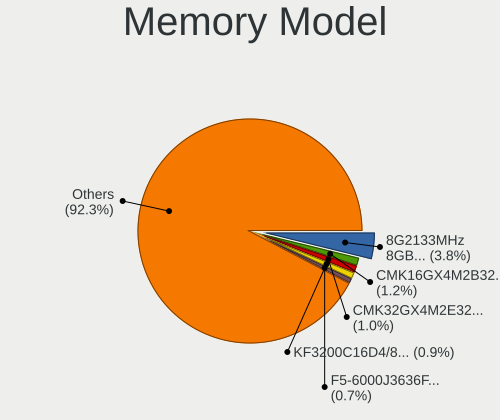

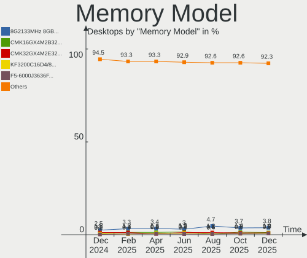

| Model                                                          | Desktops | Percent |
|----------------------------------------------------------------|----------|---------|
| Unknown                                                        | 66       | 3.84%   |
| Corsair RAM CMK16GX4M2B3200C16 8GB DIMM DDR4 3600MT/s          | 20       | 1.16%   |
| Corsair RAM CMK32GX4M2E3200C16 16GB DIMM DDR4 3600MT/s         | 18       | 1.05%   |
| Kingston RAM KF3200C16D4/8GX 8GiB DIMM DDR4 3600MT/s           | 16       | 0.93%   |
| G.Skill RAM F5-6000J3636F16G 16GB DIMM DDR5 6400MT/s           | 12       | 0.7%    |
| G.Skill RAM F5-6000J3040G32G 32GB DIMM DDR5 6200MT/s           | 11       | 0.64%   |
| Unknown RAM Module 4GB DIMM 1333MT/s                           | 10       | 0.58%   |
| Kingston RAM KF3200C16D4/16GX 16GB DIMM DDR4 3733MT/s          | 10       | 0.58%   |
| G.Skill RAM F4-3200C16-16GVK 16GB DIMM DDR4 3600MT/s           | 10       | 0.58%   |
| Kingston RAM KHX3200C16D4/8GX 8GB DIMM DDR4 3733MT/s           | 9        | 0.52%   |
| Kingston RAM KF560C36-32 32GB DIMM DDR5 6200MT/s               | 9        | 0.52%   |
| Unknown RAM Module 2GB DIMM DDR2 800MT/s                       | 8        | 0.47%   |
| Kingston RAM KF560C36-16 16GB DIMM DDR5 6000MT/s               | 8        | 0.47%   |
| G.Skill RAM F5-6000J3038F16G 16GB DIMM DDR5 6000MT/s           | 8        | 0.47%   |
| G.Skill RAM F4-3600C16-16GTZNC 16GiB DIMM DDR4 3600MT/s        | 8        | 0.47%   |
| Corsair RAM CMW32GX4M2E3200C16 16GB DIMM DDR4 3200MT/s         | 8        | 0.47%   |
| Unknown RAM Module 8GB DIMM 1333MT/s                           | 7        | 0.41%   |
| Unknown RAM Module 4GB DIMM DDR3 1333MT/s                      | 7        | 0.41%   |
| Team RAM TEAMGROUP-UD4-3200 8GB DIMM DDR4 3733MT/s             | 7        | 0.41%   |
| Kingston RAM KF3200C16D4/32GX 32GB DIMM DDR4 3933MT/s          | 7        | 0.41%   |
| G.Skill RAM F5-6400J3239G32G 32GB DIMM DDR5 6400MT/s           | 7        | 0.41%   |
| G.Skill RAM F4-3600C18-32GVK 32GiB DIMM DDR4 3600MT/s          | 7        | 0.41%   |
| Unknown RAM Module 2GB DIMM SDRAM                              | 6        | 0.35%   |
| Unknown (ABCD) RAM 123456789012345678 2GB DIMM LPDDR4 2133MT/s | 6        | 0.35%   |
| Team RAM UD5-6000 16GB DIMM DDR5 6000MT/s                      | 6        | 0.35%   |
| Team RAM TEAMGROUP-UD4-3200 8GB DIMM DDR4 3800MT/s             | 6        | 0.35%   |
| SK hynix RAM HMT351U6CFR8C-PB 4GB DIMM DDR3 1800MT/s           | 6        | 0.35%   |
| Samsung RAM M386A4G40DM1-CRC 32GB DIMM DDR4 2400MT/s           | 6        | 0.35%   |
| Samsung RAM M378A1K43CB2-CTD 8GB DIMM DDR4 3266MT/s            | 6        | 0.35%   |
| Kingston RAM KF560C30-16 16GB DIMM DDR5 6000MT/s               | 6        | 0.35%   |
| Kingston RAM KF556C40-16 16GB DIMM DDR5 6800MT/s               | 6        | 0.35%   |
| G.Skill RAM F4-3200C16-8GIS 8GB DIMM DDR4 3600MT/s             | 6        | 0.35%   |
| G.Skill RAM F4-3200C16-16GIS 16GB DIMM DDR4 3600MT/s           | 6        | 0.35%   |
| Corsair RAM CMK32GX4M2B3200C16 16GB DIMM DDR4 3800MT/s         | 6        | 0.35%   |
| Corsair RAM CMK16GX4M2B3000C15 8GB DIMM DDR4 3600MT/s          | 6        | 0.35%   |
| Unknown RAM Module 4GB DIMM SDRAM                              | 5        | 0.29%   |
| Unknown RAM Module 2GB DIMM 800MT/s                            | 5        | 0.29%   |
| TeamGroup RAM UD5-6400 16GB DIMM DDR5 6400MT/s                 | 5        | 0.29%   |
| TeamGroup RAM UD5-6000 16GB DIMM DDR5 6000MT/s                 | 5        | 0.29%   |
| Samsung RAM M378B5173QH0-CK0 4GB DIMM DDR3                     | 5        | 0.29%   |

Memory Kind
-----------

Memory module kinds

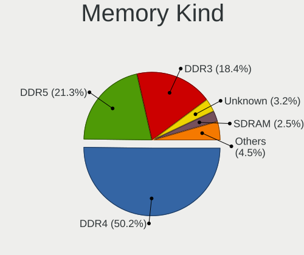

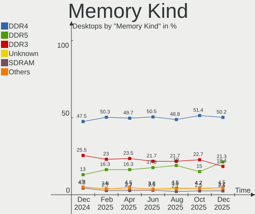

| Kind    | Desktops | Percent |
|---------|----------|---------|
| DDR4    | 730      | 50.21%  |
| DDR5    | 309      | 21.25%  |
| DDR3    | 267      | 18.36%  |
| Unknown | 46       | 3.16%   |
| SDRAM   | 37       | 2.54%   |
| DDR2    | 28       | 1.93%   |
| LPDDR4  | 11       | 0.76%   |
| DRAM    | 10       | 0.69%   |
| LPDDR5  | 7        | 0.48%   |
| RAM     | 5        | 0.34%   |
| DDR     | 4        | 0.28%   |

Memory Form Factor
------------------

Physical design of the memory module

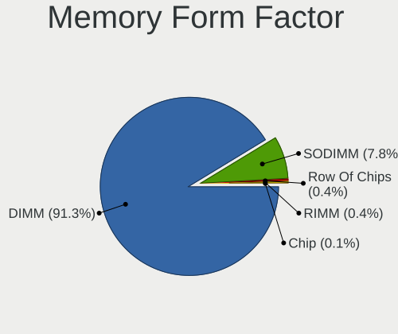

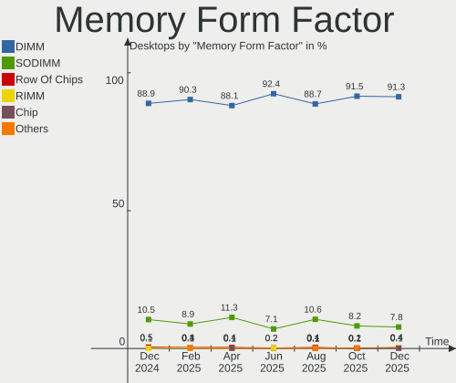

| Name         | Desktops | Percent |
|--------------|----------|---------|
| DIMM         | 1312     | 91.3%   |
| SODIMM       | 112      | 7.79%   |
| Row Of Chips | 6        | 0.42%   |
| RIMM         | 6        | 0.42%   |
| Chip         | 1        | 0.07%   |

Memory Size
-----------

Memory module size

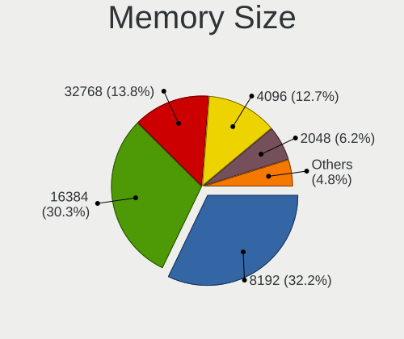

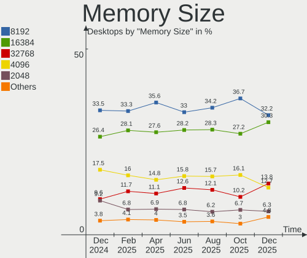

| Size  | Desktops | Percent |
|-------|----------|---------|
| 8192  | 499      | 32.15%  |
| 16384 | 470      | 30.28%  |
| 32768 | 214      | 13.79%  |
| 4096  | 197      | 12.69%  |
| 2048  | 97       | 6.25%   |
| 49152 | 27       | 1.74%   |
| 1024  | 18       | 1.16%   |
| 65536 | 13       | 0.84%   |
| 24576 | 8        | 0.52%   |
| 512   | 3        | 0.19%   |
| 3072  | 2        | 0.13%   |
| 10240 | 1        | 0.06%   |
| 8124  | 1        | 0.06%   |
| 6144  | 1        | 0.06%   |
| 16    | 1        | 0.06%   |

Memory Speed
------------

Memory module speed

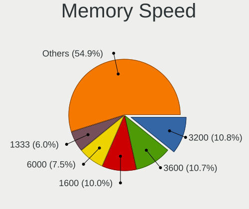

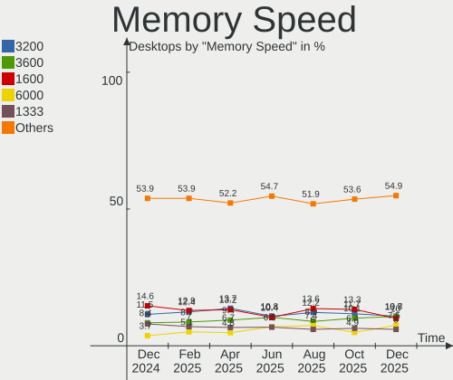

| Speed   | Desktops | Percent |
|---------|----------|---------|
| 3200    | 172      | 10.81%  |
| 3600    | 171      | 10.75%  |
| 1600    | 159      | 9.99%   |
| 6000    | 120      | 7.54%   |
| 1333    | 96       | 6.03%   |
| 2400    | 87       | 5.47%   |
| 2667    | 82       | 5.15%   |
| 2133    | 67       | 4.21%   |
| 4800    | 50       | 3.14%   |
| 3733    | 48       | 3.02%   |
| 6400    | 47       | 2.95%   |
| 5600    | 44       | 2.77%   |
| 3800    | 44       | 2.77%   |
| 2666    | 29       | 1.82%   |
| 800     | 27       | 1.7%    |
| Unknown | 25       | 1.57%   |
| 6200    | 21       | 1.32%   |
| 1866    | 20       | 1.26%   |
| 1800    | 20       | 1.26%   |
| 3400    | 17       | 1.07%   |
| 2933    | 17       | 1.07%   |
| 3000    | 16       | 1.01%   |
| 5200    | 15       | 0.94%   |
| 4000    | 14       | 0.88%   |
| 3866    | 14       | 0.88%   |
| 667     | 11       | 0.69%   |
| 3066    | 10       | 0.63%   |
| 1867    | 10       | 0.63%   |
| 3666    | 9        | 0.57%   |
| 3466    | 9        | 0.57%   |
| 3933    | 8        | 0.5%    |
| 3266    | 8        | 0.5%    |
| 2800    | 7        | 0.44%   |
| 1067    | 7        | 0.44%   |
| 1066    | 7        | 0.44%   |
| 12800   | 6        | 0.38%   |
| 6800    | 6        | 0.38%   |
| 3100    | 5        | 0.31%   |
| 400     | 5        | 0.31%   |
| 3333    | 4        | 0.25%   |

Printers & scanners
-------------------

Printer Vendor
--------------

Printer device vendors

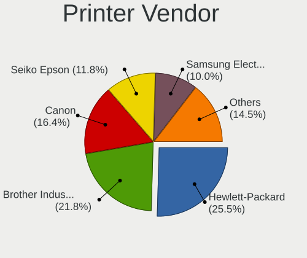

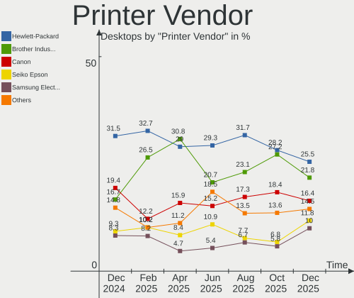

| Vendor                   | Desktops | Percent |
|--------------------------|----------|---------|
| Hewlett-Packard          | 28       | 25.45%  |
| Brother Industries       | 24       | 21.82%  |
| Canon                    | 18       | 16.36%  |
| Seiko Epson              | 13       | 11.82%  |
| Samsung Electronics      | 11       | 10%     |
| Pantum                   | 3        | 2.73%   |
| Xerox                    | 2        | 1.82%   |
| Lexmark International    | 2        | 1.82%   |
| Dymo-CoStar              | 2        | 1.82%   |
| Zhuhai Poskey Technology | 1        | 0.91%   |
| Zebra                    | 1        | 0.91%   |
| STMicroelectronics       | 1        | 0.91%   |
| Ricoh                    | 1        | 0.91%   |
| Prolific Technology      | 1        | 0.91%   |
| PM                       | 1        | 0.91%   |
| Fuji Xerox               | 1        | 0.91%   |

Printer Model
-------------

Printer device models

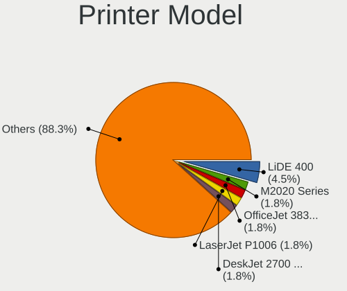

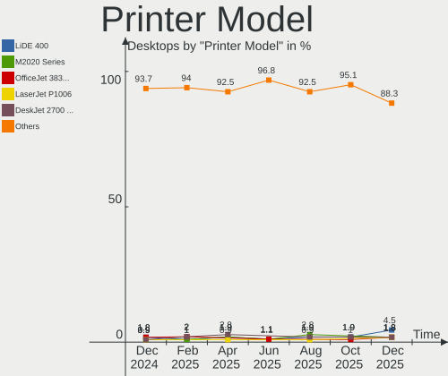

| Model                                                      | Desktops | Percent |
|------------------------------------------------------------|----------|---------|
| Canon LiDE 400                                             | 5        | 4.5%    |
| Samsung M2020 Series                                       | 2        | 1.8%    |
| HP OfficeJet 3830 series                                   | 2        | 1.8%    |
| HP LaserJet P1006                                          | 2        | 1.8%    |
| HP DeskJet 2700 series                                     | 2        | 1.8%    |
| Dymo-CoStar LabelWriter 450                                | 2        | 1.8%    |
| Canon PIXMA MG3600 Series                                  | 2        | 1.8%    |
| Brother Printer                                            | 2        | 1.8%    |
| Brother HL-L2340D series                                   | 2        | 1.8%    |
| Zhuhai Poskey Z1                                           | 1        | 0.9%    |
| Zebra ZTC GX430t                                           | 1        | 0.9%    |
| Xerox Phaser 3140 and 3155                                 | 1        | 0.9%    |
| Xerox B230 Printer                                         | 1        | 0.9%    |
| STMicroelectronics LED badge -- mini LED display -- 11x44  | 1        | 0.9%    |
| Seiko Epson XP-4100 Series                                 | 1        | 0.9%    |
| Seiko Epson XP-3200 Series                                 | 1        | 0.9%    |
| Seiko Epson XP-2100 Series                                 | 1        | 0.9%    |
| Seiko Epson Workforce WF-7820/7840 Series                  | 1        | 0.9%    |
| Seiko Epson Printer                                        | 1        | 0.9%    |
| Seiko Epson L405 Series                                    | 1        | 0.9%    |
| Seiko Epson L1210 Series                                   | 1        | 0.9%    |
| Seiko Epson L1110 Series                                   | 1        | 0.9%    |
| Seiko Epson ET-4850 Series                                 | 1        | 0.9%    |
| Seiko Epson ET-4750 [WorkForce ET-4750 EcoTank All-in-One] | 1        | 0.9%    |
| Seiko Epson ET-2820 Series                                 | 1        | 0.9%    |
| Seiko Epson ET-2800 Series                                 | 1        | 0.9%    |
| Seiko Epson ET-2710 Series                                 | 1        | 0.9%    |
| Seiko Epson AL-MX200DNF                                    | 1        | 0.9%    |
| Samsung SCX-4600 Series                                    | 1        | 0.9%    |
| Samsung SCX-3200 Series                                    | 1        | 0.9%    |
| Samsung ML-1865                                            | 1        | 0.9%    |
| Samsung ML-1670 Series                                     | 1        | 0.9%    |
| Samsung ML-1660 Series                                     | 1        | 0.9%    |
| Samsung M332x 382x 402x Series                             | 1        | 0.9%    |
| Samsung CLX-3180 Series                                    | 1        | 0.9%    |
| Samsung CLP-360 Series                                     | 1        | 0.9%    |
| Samsung C48x Series                                        | 1        | 0.9%    |
| Ricoh RICOH SP 211SU                                       | 1        | 0.9%    |
| Prolific PL2305 Parallel Port                              | 1        | 0.9%    |
| PM PM241-BT                                                | 1        | 0.9%    |

Scanner Vendor
--------------

Scanner device vendors

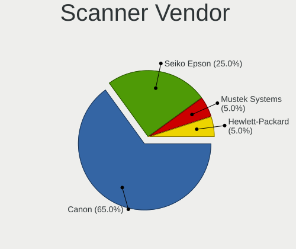

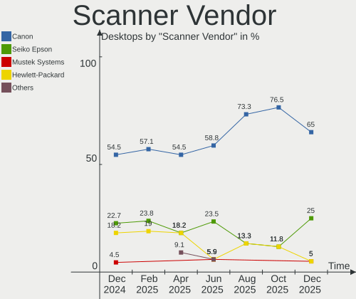

| Vendor          | Desktops | Percent |
|-----------------|----------|---------|
| Canon           | 13       | 65%     |
| Seiko Epson     | 5        | 25%     |
| Mustek Systems  | 1        | 5%      |
| Hewlett-Packard | 1        | 5%      |

Scanner Model
-------------

Scanner device models

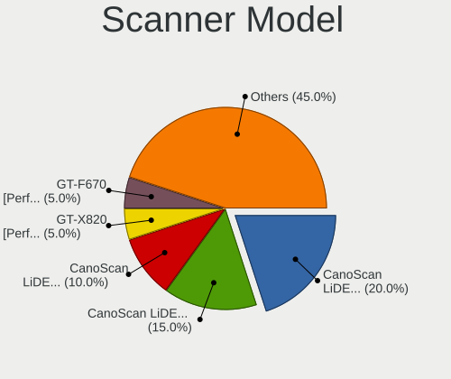

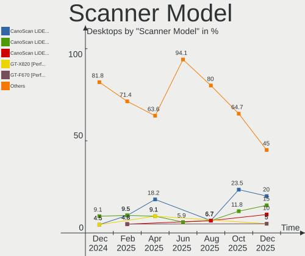

| Model                                                    | Desktops | Percent |
|----------------------------------------------------------|----------|---------|
| Canon CanoScan LiDE 110                                  | 4        | 20%     |
| Canon CanoScan LiDE 220                                  | 3        | 15%     |
| Canon CanoScan LiDE 700F                                 | 2        | 10%     |
| Seiko Epson GT-X820 [Perfection V600 Photo]              | 1        | 5%      |
| Seiko Epson GT-F670 [Perfection V200 Photo]              | 1        | 5%      |
| Seiko Epson GT-F650 [GT-S600/Perfection V10/V100]        | 1        | 5%      |
| Seiko Epson GT-F500/GT-F550 [Perfection 2480/2580 PHOTO] | 1        | 5%      |
| Seiko Epson GT-6600U [Perfection 610]                    | 1        | 5%      |
| Mustek Systems ScanExpress 600 CU                        | 1        | 5%      |
| HP ScanJet 2200c                                         | 1        | 5%      |
| Canon CanoScan LiDE 90                                   | 1        | 5%      |
| Canon CanoScan LiDE 60                                   | 1        | 5%      |
| Canon CanoScan LiDE 210                                  | 1        | 5%      |
| Canon CanoScan LiDE 120                                  | 1        | 5%      |

Camera
------

Camera Vendor
-------------

Camera device vendors

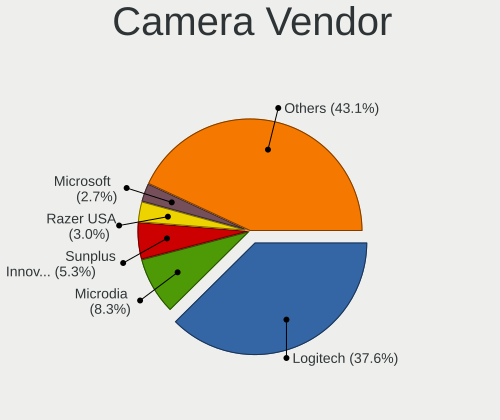

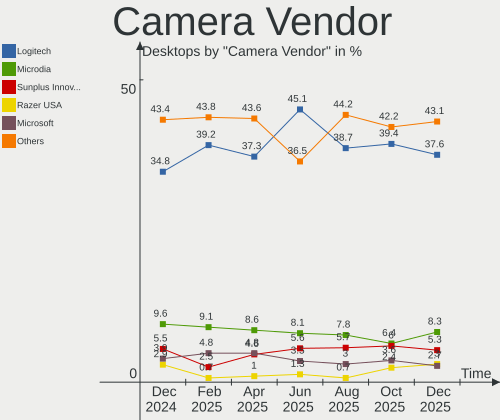

| Vendor                        | Desktops | Percent |
|-------------------------------|----------|---------|
| Logitech                      | 239      | 37.58%  |
| Microdia                      | 53       | 8.33%   |
| Sunplus Innovation Technology | 34       | 5.35%   |
| Razer USA                     | 19       | 2.99%   |
| Microsoft                     | 17       | 2.67%   |
| Samsung Electronics           | 15       | 2.36%   |
| MacroSilicon                  | 15       | 2.36%   |
| Realtek Semiconductor         | 14       | 2.2%    |
| Generalplus Technology        | 14       | 2.2%    |
| Apple                         | 14       | 2.2%    |
| Creative Technology           | 11       | 1.73%   |
| Valve Software                | 9        | 1.42%   |
| eMeet                         | 9        | 1.42%   |
| Elgato Systems                | 9        | 1.42%   |
| Chicony Electronics           | 9        | 1.42%   |
| webcam                        | 8        | 1.26%   |
| KYE Systems (Mouse Systems)   | 8        | 1.26%   |
| Jieli Technology              | 7        | 1.1%    |
| CVT Electronics.Co.           | 7        | 1.1%    |
| ARC International             | 7        | 1.1%    |
| Anker PowerConf C200          | 6        | 0.94%   |
| Z-Star Microelectronics       | 5        | 0.79%   |
| webcamvendor                  | 5        | 0.79%   |
| Remo Tech                     | 5        | 0.79%   |
| Hewlett-Packard               | 5        | 0.79%   |
| GEMBIRD                       | 5        | 0.79%   |
| AVerMedia Technologies        | 5        | 0.79%   |
| Trust                         | 4        | 0.63%   |
| Sonix Technology              | 4        | 0.63%   |
| SHENZHEN EMEET TECHNOLOGY     | 3        | 0.47%   |
| Ruision                       | 3        | 0.47%   |
| Lenovo                        | 3        | 0.47%   |
| Aveo Technology               | 3        | 0.47%   |
| A4Tech                        | 3        | 0.47%   |
| Xiongmai                      | 2        | 0.31%   |
| WaveRider Communications      | 2        | 0.31%   |
| USB3.0 HD Audio Capture       | 2        | 0.31%   |
| SunplusIT                     | 2        | 0.31%   |
| Sunplus IT                    | 2        | 0.31%   |
| Huawei Technologies           | 2        | 0.31%   |

Camera Model
------------

Camera device models

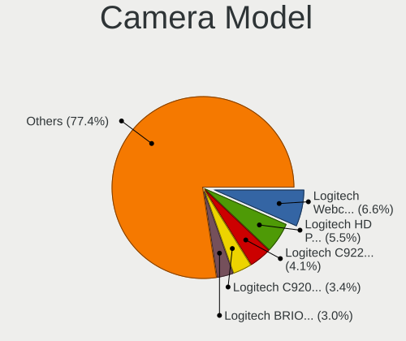

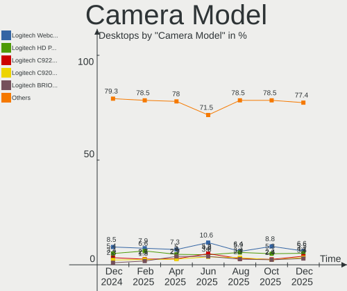

| Model                                                 | Desktops | Percent |
|-------------------------------------------------------|----------|---------|
| Logitech Webcam C270                                  | 42       | 6.58%   |
| Logitech HD Pro Webcam C920                           | 35       | 5.49%   |
| Logitech C922 Pro Stream Webcam                       | 26       | 4.08%   |
| Logitech C920 PRO HD Webcam                           | 22       | 3.45%   |
| Logitech BRIO Ultra HD Webcam                         | 19       | 2.98%   |
| Samsung Galaxy series, misc. (MTP mode)               | 14       | 2.19%   |
| Microdia Webcam Vitade AF                             | 14       | 2.19%   |
| Microdia USB 2.0 Camera                               | 13       | 2.04%   |
| Logitech HD Webcam C525                               | 13       | 2.04%   |
| Razer USA Gaming Webcam [Kiyo]                        | 11       | 1.72%   |
| Sunplus Full HD webcam                                | 10       | 1.57%   |
| Logitech Webcam C310                                  | 10       | 1.57%   |
| Apple iPhone 5/5C/5S/6/SE/7/8/X                       | 10       | 1.57%   |
| Valve Software 3D Camera                              | 9        | 1.41%   |
| webcam webcam                                         | 8        | 1.25%   |
| Sunplus SPCA2281 Web Camera                           | 8        | 1.25%   |
| Microdia CyberTrack H7                                | 8        | 1.25%   |
| MacroSilicon USB Video                                | 8        | 1.25%   |
| Generalplus GENERAL WEBCAM                            | 8        | 1.25%   |
| CVT Electronics.Co. USB Camera                        | 7        | 1.1%    |
| ARC International Camera                              | 7        | 1.1%    |
| Microsoft LifeCam HD-3000                             | 6        | 0.94%   |
| Microdia Camera                                       | 6        | 0.94%   |
| Logitech Webcam C930e                                 | 6        | 0.94%   |
| Logitech HD Webcam C615                               | 6        | 0.94%   |
| Anker PowerConf C200 Anker PowerConf C200             | 6        | 0.94%   |
| webcamvendor NexiGo N60 FHD Webcam                    | 5        | 0.78%   |
| Sunplus Integrated Camera                             | 5        | 0.78%   |
| Razer USA Razer Kiyo Pro                              | 5        | 0.78%   |
| Microsoft LifeCam Studio                              | 5        | 0.78%   |
| Logitech StreamCam                                    | 5        | 0.78%   |
| KYE Systems (Mouse Systems) USB 2.0 HD1080P PC Camera | 5        | 0.78%   |
| Z-Star Venus USB2.0 Camera                            | 4        | 0.63%   |
| Realtek FULL HD 1080P Webcam                          | 4        | 0.63%   |
| Microdia Sonix USB 2.0 Camera                         | 4        | 0.63%   |
| Logitech Webcam C250                                  | 4        | 0.63%   |
| Logitech Webcam C170                                  | 4        | 0.63%   |
| Logitech HD Webcam C910                               | 4        | 0.63%   |
| Logitech CrystalCam                                   | 4        | 0.63%   |
| Logitech BRIO 4K Stream Edition                       | 4        | 0.63%   |

Security
--------

Fingerprint Vendor
------------------

Fingerprint sensor vendors

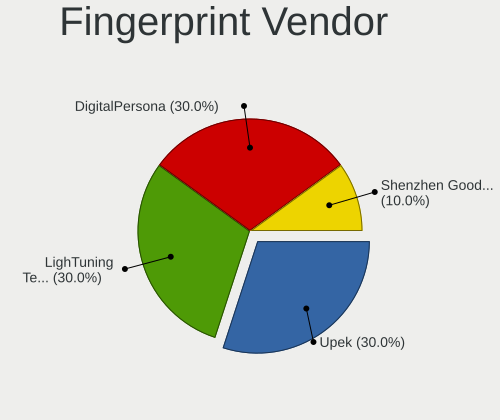

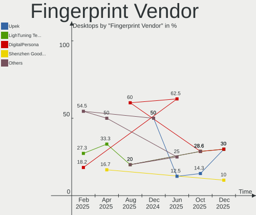

| Vendor                     | Desktops | Percent |
|----------------------------|----------|---------|
| Upek                       | 3        | 30%     |
| LighTuning Technology      | 3        | 30%     |
| DigitalPersona             | 3        | 30%     |
| Shenzhen Goodix Technology | 1        | 10%     |

Fingerprint Model
-----------------

Fingerprint sensor models

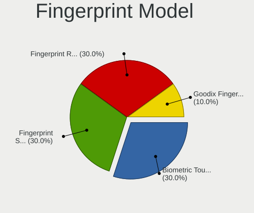

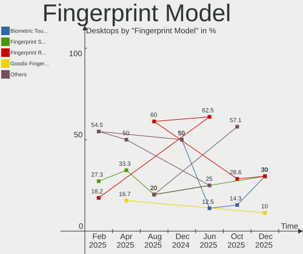

| Model                                                  | Desktops | Percent |
|--------------------------------------------------------|----------|---------|
| Upek Biometric Touchchip/Touchstrip Fingerprint Sensor | 3        | 30%     |
| LighTuning Fingerprint Sensor                          | 3        | 30%     |
| DigitalPersona Fingerprint Reader                      | 3        | 30%     |
| Shenzhen Goodix  Fingerprint Device                    | 1        | 10%     |

Chipcard Vendor
---------------

Chipcard module vendors

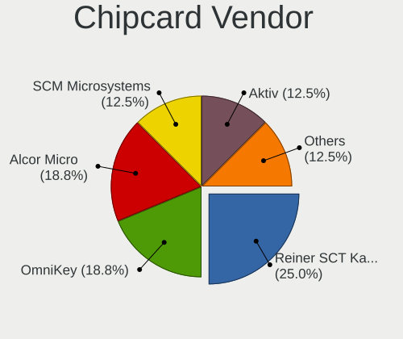

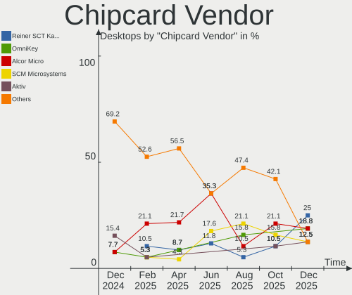

| Vendor                   | Desktops | Percent |
|--------------------------|----------|---------|
| Reiner SCT Kartensysteme | 4        | 25%     |
| OmniKey                  | 3        | 18.75%  |
| Alcor Micro              | 3        | 18.75%  |
| SCM Microsystems         | 2        | 12.5%   |
| Aktiv                    | 2        | 12.5%   |
| Thetis                   | 1        | 6.25%   |
| Realtek Semiconductor    | 1        | 6.25%   |

Chipcard Model
--------------

Chipcard module models

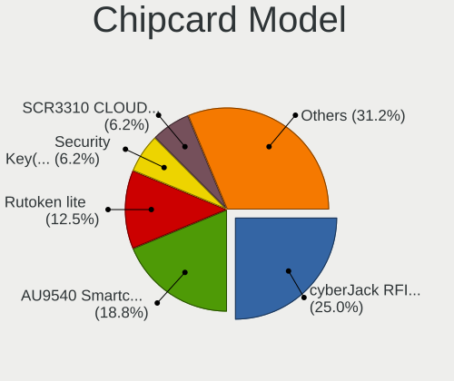

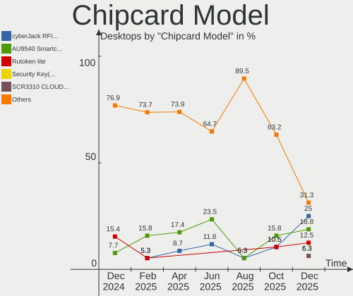

| Model                                                                      | Desktops | Percent |
|----------------------------------------------------------------------------|----------|---------|
| Reiner SCT Kartensysteme cyberJack RFID basis contactless smartcard reader | 4        | 25%     |
| Alcor Micro AU9540 Smartcard Reader                                        | 3        | 18.75%  |
| Aktiv Rutoken lite                                                         | 2        | 12.5%   |
| Thetis Security Key(F825)                                                  | 1        | 6.25%   |
| SCM Microsystems SCR3310 CLOUD 2700 R                                      | 1        | 6.25%   |
| SCM Microsystems SCR331-LC1 / SCR3310 SmartCard Reader                     | 1        | 6.25%   |
| Realtek Semiconductor Smart Card Reader Interface                          | 1        | 6.25%   |
| OmniKey CardMan 3121 (HID Technologies)                                    | 1        | 6.25%   |
| OmniKey CardMan 3021 / 3121                                                | 1        | 6.25%   |
| OmniKey CardMan 1021                                                       | 1        | 6.25%   |

Unsupported
-----------

Unsupported Devices
-------------------

Total unsupported devices on board

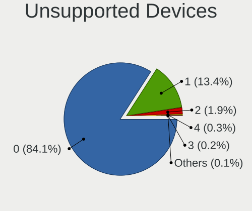

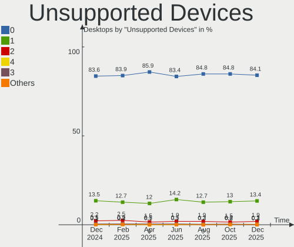

| Total | Desktops | Percent |
|-------|----------|---------|
| 0     | 2564     | 84.09%  |
| 1     | 410      | 13.45%  |
| 2     | 58       | 1.9%    |
| 4     | 8        | 0.26%   |
| 3     | 7        | 0.23%   |
| 6     | 1        | 0.03%   |
| 5     | 1        | 0.03%   |

Unsupported Device Types
------------------------

Types of unsupported devices

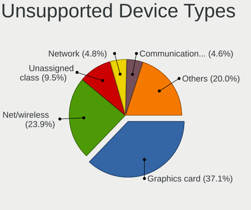

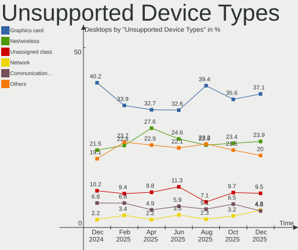

| Type                     | Desktops | Percent |
|--------------------------|----------|---------|
| Graphics card            | 208      | 37.14%  |
| Net/wireless             | 134      | 23.93%  |
| Unassigned class         | 53       | 9.46%   |
| Network                  | 27       | 4.82%   |
| Communication controller | 26       | 4.64%   |
| Sound                    | 20       | 3.57%   |
| Multimedia controller    | 18       | 3.21%   |
| Bluetooth                | 16       | 2.86%   |
| Storage/raid             | 12       | 2.14%   |
| Chipcard                 | 12       | 2.14%   |
| Fingerprint reader       | 9        | 1.61%   |
| Net/ethernet             | 8        | 1.43%   |
| Camera                   | 6        | 1.07%   |
| Card reader              | 3        | 0.54%   |
| Storage/ide              | 2        | 0.36%   |
| Storage/ata              | 2        | 0.36%   |
| Firewire controller      | 2        | 0.36%   |
| Storage/nvme             | 1        | 0.18%   |
| Dvb card                 | 1        | 0.18%   |

