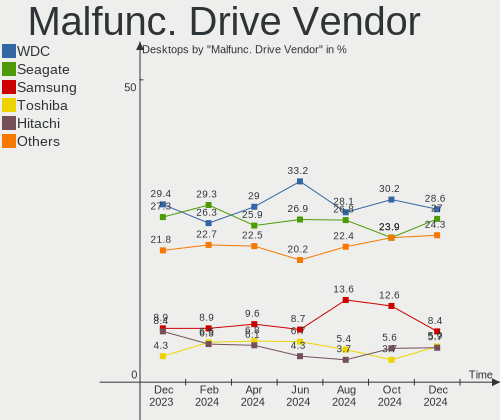
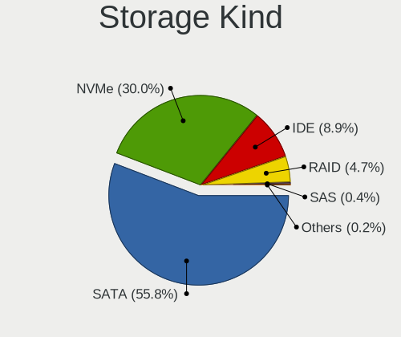
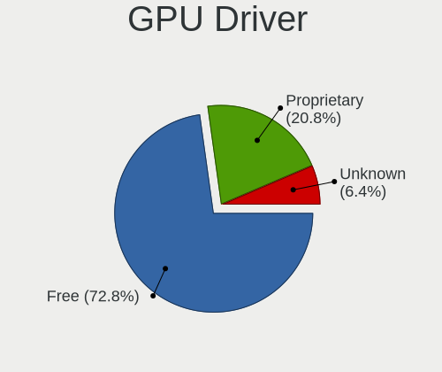

Linux Hardware Trends (Desktop)
-------------------------------

A project to identify most popular hardware characteristics and track their change
over time based on data collected by Linux users at https://Linux-Hardware.org.

Anyone can contribute to the study by uploading probes of their computers by
the [hw-probe](https://github.com/linuxhw/hw-probe) tool:

    sudo -E hw-probe -all -upload

Full-feature report is available here: https://linux-hardware.org/?view=trends&formfactor=desktop

Period: May, 2020.

Contents
--------

- [ OS                       ](#os)
- [ OS Family                ](#os-family)
- [ Kernel                   ](#kernel)
- [ Kernel Family            ](#kernel-family)
- [ Kernel Major Ver.        ](#kernel-major-ver)
- [ Arch                     ](#arch)
- [ DE                       ](#de)
- [ Display Server           ](#display-server)
- [ Display Manager          ](#display-manager)
- [ OS Lang                  ](#os-lang)
- [ Boot Mode                ](#boot-mode)
- [ Filesystem               ](#filesystem)
- [ Part. scheme             ](#part-scheme)
- [ Dual Boot with Linux/BSD ](#dual-boot-with-linux/bsd)
- [ Dual Boot (Win)          ](#dual-boot-win)
- [ Country                  ](#country)
- [ City                     ](#city)
- [ Vendor                   ](#vendor)
- [ Model                    ](#model)
- [ Model Family             ](#model-family)
- [ MFG Year                 ](#mfg-year)
- [ Form Factor              ](#form-factor)
- [ Secure Boot              ](#secure-boot)
- [ Coreboot                 ](#coreboot)
- [ RAM Size                 ](#ram-size)
- [ RAM Used                 ](#ram-used)
- [ Drive Vendor             ](#drive-vendor)
- [ Drive Model              ](#drive-model)
- [ Drive Kind               ](#drive-kind)
- [ Drive Connector          ](#drive-connector)
- [ Drive Size               ](#drive-size)
- [ Space Total              ](#space-total)
- [ Space Used               ](#space-used)
- [ Malfunc. Drives          ](#malfunc-drives)
- [ Malfunc. Drive Vendor    ](#malfunc-drive-vendor)
- [ Malfunc. Drive Kind      ](#malfunc-drive-kind)
- [ Failed Drives            ](#failed-drives)
- [ Failed Drive Vendor      ](#failed-drive-vendor)
- [ Drive Status             ](#drive-status)
- [ Storage Vendor           ](#storage-vendor)
- [ Storage Model            ](#storage-model)
- [ Storage Kind             ](#storage-kind)
- [ CPU Vendor               ](#cpu-vendor)
- [ CPU Model                ](#cpu-model)
- [ CPU Model Family         ](#cpu-model-family)
- [ CPU Cores                ](#cpu-cores)
- [ CPU Sockets              ](#cpu-sockets)
- [ CPU Threads              ](#cpu-threads)
- [ CPU Op-Modes             ](#cpu-op-modes)
- [ CPU Microcode            ](#cpu-microcode)
- [ CPU Microarch            ](#cpu-microarch)
- [ GPU Vendor               ](#gpu-vendor)
- [ GPU Model                ](#gpu-model)
- [ GPU Combo                ](#gpu-combo)
- [ GPU Driver               ](#gpu-driver)
- [ GPU Memory               ](#gpu-memory)
- [ Monitor Vendor           ](#monitor-vendor)
- [ Monitor Model            ](#monitor-model)
- [ Monitor Resolution       ](#monitor-resolution)
- [ Monitor Diagonal         ](#monitor-diagonal)
- [ Monitor Width            ](#monitor-width)
- [ Aspect Ratio             ](#aspect-ratio)
- [ Monitor Area             ](#monitor-area)
- [ Pixel Density            ](#pixel-density)
- [ Multiple Monitors        ](#multiple-monitors)
- [ Net Controller Vendor    ](#net-controller-vendor)
- [ Net Controller Model     ](#net-controller-model)
- [ Net Controller Kind      ](#net-controller-kind)
- [ Used Controller          ](#used-controller)
- [ NICs                     ](#nics)
- [ Unsupported Devices      ](#unsupported-devices)
- [ Unsupported Device Types ](#unsupported-device-types)

OS
--

Installed operating systems

| Name               | Computers | Percent |
|--------------------|-----------|---------|
| Ubuntu 20.04       | 991       | 44.64%  |
| Ubuntu 18.04       | 266       | 11.98%  |
| Pop!_OS 20.04      | 85        | 3.83%   |
| Mint 19.3          | 85        | 3.83%   |
| BlackPanther 18.1  | 79        | 3.56%   |
| ROSA R11.1         | 68        | 3.06%   |
| Fedora 32          | 65        | 2.93%   |
| Ubuntu 19.10       | 51        | 2.3%    |
| Manjaro            | 39        | 1.76%   |
| Arch               | 39        | 1.76%   |
| Zorin 15           | 31        | 1.4%    |
| Debian 10          | 30        | 1.35%   |
| ROSA R11           | 28        | 1.26%   |
| Ubuntu 16.04       | 27        | 1.22%   |
| Gentoo             | 27        | 1.22%   |
| Manjaro 20.0.1     | 24        | 1.08%   |
| Endless 3.8.0      | 17        | 0.77%   |
| Fedora 31          | 16        | 0.72%   |
| KDE neon 18.04     | 14        | 0.63%   |
| Arch Rolling       | 14        | 0.63%   |
| Mint 19.2          | 10        | 0.45%   |
| Endless 3.8.1      | 9         | 0.41%   |
| BlackPanther 16.2  | 9         | 0.41%   |
| ROSA R8.1          | 8         | 0.36%   |
| Mint 19.1          | 8         | 0.36%   |
| Gentoo 2.7         | 8         | 0.36%   |
| Gentoo 2.6         | 8         | 0.36%   |
| openSUSE Leap-15.1 | 7         | 0.32%   |
| Manjaro 20.0       | 7         | 0.32%   |
| Elementary 5.1.4   | 7         | 0.32%   |
| CentOS 8           | 7         | 0.32%   |
| Peppermint 10      | 6         | 0.27%   |
| Parrot 4.9         | 6         | 0.27%   |
| Mint 4             | 5         | 0.23%   |
| Debian Testing     | 5         | 0.23%   |
| CentOS 7           | 5         | 0.23%   |
| Ubuntu 19.04       | 4         | 0.18%   |
| Ubuntu 18.10       | 4         | 0.18%   |
| QTS 4.4.2          | 4         | 0.18%   |
| openSUSE 15.1      | 4         | 0.18%   |
| Debian             | 4         | 0.18%   |
| ClearOS 7          | 4         | 0.18%   |
| Ubuntu 20.10       | 3         | 0.14%   |
| ROSA R10           | 3         | 0.14%   |
| RHEL 8.2           | 3         | 0.14%   |
| Mint 18.3          | 3         | 0.14%   |
| Kali 2020.2        | 3         | 0.14%   |
| Fedora 30          | 3         | 0.14%   |
| Endless 3.7.8      | 3         | 0.14%   |
| Zorin 12           | 2         | 0.09%   |
| Ubuntu 16.10       | 2         | 0.09%   |
| Ubuntu             | 2         | 0.09%   |
| Manjaro 20.0.2     | 2         | 0.09%   |
| Mageia 7           | 2         | 0.09%   |
| Deepin 20          | 2         | 0.09%   |
| Debian Unstable    | 2         | 0.09%   |
| Clear Linux 33180  | 2         | 0.09%   |
| Clear Linux 33040  | 2         | 0.09%   |
| Clear Linux 32990  | 2         | 0.09%   |
| ALT Linux 9.0      | 2         | 0.09%   |

OS Family
---------

OS without a version

| Name         | Computers | Percent |
|--------------|-----------|---------|
| Ubuntu       | 1351      | 60.86%  |
| Mint         | 112       | 5.05%   |
| ROSA         | 109       | 4.91%   |
| BlackPanther | 88        | 3.96%   |
| Fedora       | 86        | 3.87%   |
| Pop!_OS      | 85        | 3.83%   |
| Manjaro      | 72        | 3.24%   |
| Arch         | 54        | 2.43%   |
| Gentoo       | 44        | 1.98%   |
| Debian       | 43        | 1.94%   |
| Zorin        | 33        | 1.49%   |
| Endless      | 29        | 1.31%   |
| openSUSE     | 21        | 0.95%   |
| KDE neon     | 14        | 0.63%   |
| Clear Linux  | 12        | 0.54%   |
| CentOS       | 12        | 0.54%   |
| Elementary   | 8         | 0.36%   |
| Peppermint   | 6         | 0.27%   |
| Parrot       | 6         | 0.27%   |
| ClearOS      | 5         | 0.23%   |
| RHEL         | 4         | 0.18%   |
| QTS          | 4         | 0.18%   |
| Kali         | 4         | 0.18%   |
| MX           | 2         | 0.09%   |
| Mageia       | 2         | 0.09%   |
| EndeavourOS  | 2         | 0.09%   |
| Deepin       | 2         | 0.09%   |
| BigLinux     | 2         | 0.09%   |
| ALT Linux    | 2         | 0.09%   |
| Void         | 1         | 0.05%   |
| Solus        | 1         | 0.05%   |
| Regataos     | 1         | 0.05%   |
| Klusterfuk   | 1         | 0.05%   |
| BunsenLabs   | 1         | 0.05%   |
| ArcoLinux    | 1         | 0.05%   |

Kernel
------

Version of the Linux kernel

| Version                          | Computers | Percent |
|----------------------------------|-----------|---------|
| 5.4.0-29-generic                 | 393       | 17.7%   |
| 5.4.0-31-generic                 | 246       | 11.08%  |
| 5.3.0-51-generic                 | 173       | 7.79%   |
| 5.4.0-28-generic                 | 151       | 6.8%    |
| 5.3.0-53-generic                 | 95        | 4.28%   |
| 4.15.0-99-generic                | 85        | 3.83%   |
| 5.4.0-26-generic                 | 78        | 3.51%   |
| 5.4.0-33-generic                 | 75        | 3.38%   |
| 4.18.16-desktop-1bP              | 60        | 2.7%    |
| 5.4.0-7626-generic               | 42        | 1.89%   |
| 4.15.0-desktop-94.1rosa-x86_64   | 29        | 1.31%   |
| 4.15.0-desktop-45.1rosa-x86_64   | 29        | 1.31%   |
| 4.15.0-101-generic               | 29        | 1.31%   |
| 5.4.0-19-generic                 | 26        | 1.17%   |
| 5.6.12-1-MANJARO                 | 21        | 0.95%   |
| 5.4.0-7629-generic               | 20        | 0.9%    |
| 5.3.0-46-generic                 | 18        | 0.81%   |
| 5.1.15-desktop-1bP               | 18        | 0.81%   |
| 5.4.0-29-lowlatency              | 17        | 0.77%   |
| 5.3.0-28-generic                 | 17        | 0.77%   |
| 5.6.8-300.fc32.x86_64            | 16        | 0.72%   |
| 5.4.0-7625-generic               | 15        | 0.68%   |
| 4.19.0-9-amd64                   | 14        | 0.63%   |
| 5.6.7-1-MANJARO                  | 12        | 0.54%   |
| 5.6.13-arch1-1                   | 11        | 0.5%    |
| 5.6.11-1-MANJARO                 | 11        | 0.5%    |
| 5.4.32-generic-2rosa-x86_64      | 11        | 0.5%    |
| 5.6.14-300.fc32.x86_64           | 10        | 0.45%   |
| 5.6.13-300.fc32.x86_64           | 10        | 0.45%   |
| 5.6.0-1-amd64                    | 9         | 0.41%   |
| 4.9.20-desktop-pae-1bP           | 9         | 0.41%   |
| 4.12.14-lp151.28.48-default      | 9         | 0.41%   |
| 5.6.12-300.fc32.x86_64           | 8         | 0.36%   |
| 5.6.11-arch1-1                   | 8         | 0.36%   |
| 5.0.0-32-generic                 | 8         | 0.36%   |
| 4.19.0-8-amd64                   | 8         | 0.36%   |
| 5.6.10-300.fc32.x86_64           | 7         | 0.32%   |
| 5.4.0-32-generic                 | 7         | 0.32%   |
| 5.4.0-31-lowlatency              | 7         | 0.32%   |
| 4.9.155-nrj-desktop-1rosa-x86_64 | 7         | 0.32%   |
| 4.4.0-178-generic                | 7         | 0.32%   |
| 5.6.14-arch1-1                   | 6         | 0.27%   |
| 5.5.0-1parrot1-amd64             | 6         | 0.27%   |
| 4.15.0-desktop-94.1rosa-i586     | 6         | 0.27%   |
| 5.7.0-1-MANJARO                  | 5         | 0.23%   |
| 5.6.7-300.fc32.x86_64            | 5         | 0.23%   |
| 5.6.12-1-default                 | 5         | 0.23%   |
| 5.6.11-300.fc32.x86_64           | 5         | 0.23%   |
| 5.6.10-arch1-1                   | 5         | 0.23%   |
| 5.4.38-gentoo                    | 5         | 0.23%   |
| 5.4.0-7634-generic               | 5         | 0.23%   |
| 5.3.0-40-generic                 | 5         | 0.23%   |
| 4.18.0-147.8.1.el8_1.x86_64      | 5         | 0.23%   |
| 4.15.0-96-generic                | 5         | 0.23%   |
| 4.15.0-58-generic                | 5         | 0.23%   |
| 5.6.8-1-MANJARO                  | 4         | 0.18%   |
| 5.6.15-arch1-1                   | 4         | 0.18%   |
| 5.6.11-gentoo                    | 4         | 0.18%   |
| 5.3.0-51-lowlatency              | 4         | 0.18%   |
| 5.0.0-37-generic                 | 4         | 0.18%   |

Kernel Family
-------------

Linux kernel without a distro release

| Version | Computers | Percent |
|---------|-----------|---------|
| 5.4.0   | 1097      | 49.41%  |
| 5.3.0   | 331       | 14.91%  |
| 4.15.0  | 220       | 9.91%   |
| 4.18.16 | 60        | 2.7%    |
| 5.6.12  | 42        | 1.89%   |
| 5.6.11  | 41        | 1.85%   |
| 5.6.8   | 32        | 1.44%   |
| 5.6.13  | 31        | 1.4%    |
| 4.19.0  | 30        | 1.35%   |
| 5.6.7   | 29        | 1.31%   |
| 5.6.14  | 25        | 1.13%   |
| 5.0.0   | 22        | 0.99%   |
| 5.6.10  | 21        | 0.95%   |
| 5.6.0   | 19        | 0.86%   |
| 5.1.15  | 19        | 0.86%   |
| 4.18.0  | 15        | 0.68%   |
| 5.4.38  | 12        | 0.54%   |
| 4.4.0   | 12        | 0.54%   |
| 5.4.32  | 11        | 0.5%    |
| 4.9.20  | 10        | 0.45%   |
| 4.12.14 | 10        | 0.45%   |
| 3.10.0  | 10        | 0.45%   |
| 5.5.0   | 9         | 0.41%   |
| 4.9.155 | 9         | 0.41%   |
| 5.7.0   | 8         | 0.36%   |
| 5.6.6   | 8         | 0.36%   |
| 5.4.28  | 7         | 0.32%   |
| 5.6.15  | 6         | 0.27%   |
| 5.4.40  | 5         | 0.23%   |
| 5.4.35  | 4         | 0.18%   |
| 4.9.60  | 4         | 0.18%   |
| 4.14.24 | 4         | 0.18%   |
| 4.10.0  | 3         | 0.14%   |
| 4.1.38  | 3         | 0.14%   |
| 5.6.4   | 2         | 0.09%   |
| 5.6.2   | 2         | 0.09%   |
| 5.5.7   | 2         | 0.09%   |
| 5.5.19  | 2         | 0.09%   |
| 5.5.17  | 2         | 0.09%   |
| 5.4.42  | 2         | 0.09%   |
| 5.4.41  | 2         | 0.09%   |
| 5.4.39  | 2         | 0.09%   |
| 5.4.36  | 2         | 0.09%   |
| 5.4.17  | 2         | 0.09%   |
| 5.3.6   | 2         | 0.09%   |
| 5.2.0   | 2         | 0.09%   |
| 4.8.0   | 2         | 0.09%   |
| 5.6.9   | 1         | 0.05%   |
| 5.6.3   | 1         | 0.05%   |
| 5.5.9   | 1         | 0.05%   |
| 5.5.13  | 1         | 0.05%   |
| 5.5.11  | 1         | 0.05%   |
| 5.4.34  | 1         | 0.05%   |
| 5.4.31  | 1         | 0.05%   |
| 5.4.30  | 1         | 0.05%   |
| 5.4.24  | 1         | 0.05%   |
| 5.4.18  | 1         | 0.05%   |
| 5.4.15  | 1         | 0.05%   |
| 5.4.10  | 1         | 0.05%   |
| 5.3.18  | 1         | 0.05%   |

Kernel Major Ver.
-----------------

Linux kernel major version

| Version | Computers | Percent |
|---------|-----------|---------|
| 5.4     | 1153      | 51.94%  |
| 5.3     | 336       | 15.14%  |
| 5.6     | 260       | 11.71%  |
| 4.15    | 220       | 9.91%   |
| 4.18    | 75        | 3.38%   |
| 4.19    | 34        | 1.53%   |
| 4.9     | 26        | 1.17%   |
| 5.0     | 23        | 1.04%   |
| 5.1     | 19        | 0.86%   |
| 5.5     | 18        | 0.81%   |
| 4.4     | 12        | 0.54%   |
| 4.12    | 10        | 0.45%   |
| 3.10    | 10        | 0.45%   |
| 5.7     | 8         | 0.36%   |
| 4.14    | 4         | 0.18%   |
| 4.10    | 3         | 0.14%   |
| 4.1     | 3         | 0.14%   |
| 5.2     | 2         | 0.09%   |
| 4.8     | 2         | 0.09%   |
| 4.16    | 1         | 0.05%   |
| 4.11    | 1         | 0.05%   |

Arch
----

OS architecture (x86_64, i586, etc.)

| Name   | Computers | Percent |
|--------|-----------|---------|
| x86_64 | 2148      | 96.76%  |
| i686   | 72        | 3.24%   |

DE
--

Desktop Environment

| Name            | Computers | Percent |
|-----------------|-----------|---------|
| GNOME           | 1347      | 60.68%  |
| KDE5            | 169       | 7.61%   |
| XFCE            | 158       | 7.12%   |
| Unknown         | 111       | 5%      |
| X-Cinnamon      | 93        | 4.19%   |
| KDE             | 91        | 4.1%    |
| KDE4            | 68        | 3.06%   |
| MATE            | 55        | 2.48%   |
| Unity           | 24        | 1.08%   |
| LXQt            | 20        | 0.9%    |
| LXDE            | 17        | 0.77%   |
| Deepin          | 15        | 0.68%   |
| GNOME Flashback | 13        | 0.59%   |
| Budgie          | 13        | 0.59%   |
| Cinnamon        | 12        | 0.54%   |
| Pantheon        | 8         | 0.36%   |
| GNOME Classic   | 5         | 0.23%   |
| enlightenment   | 1         | 0.05%   |

Display Server
--------------

X11 or Wayland

| Name        | Computers | Percent |
|-------------|-----------|---------|
| X11         | 2072      | 93.33%  |
| Wayland     | 85        | 3.83%   |
| Unknown     | 43        | 1.94%   |
| Tty         | 19        | 0.86%   |
| Unspecified | 1         | 0.05%   |

Display Manager
---------------

SDDM, LightDM, etc.

| Name    | Computers | Percent |
|---------|-----------|---------|
| Unknown | 1797      | 80.95%  |
| SDDM    | 172       | 7.75%   |
| LightDM | 89        | 4.01%   |
| GDM     | 86        | 3.87%   |
| KDM     | 67        | 3.02%   |
| XDM     | 4         | 0.18%   |
| SLiM    | 4         | 0.18%   |
| LXDM    | 1         | 0.05%   |

OS Lang
-------

Language

| Lang       | Computers | Percent |
|------------|-----------|---------|
| en_US      | 656       | 29.55%  |
| de_DE      | 194       | 8.74%   |
| Unknown    | 153       | 6.89%   |
| en_GB      | 135       | 6.08%   |
| ru_RU      | 134       | 6.04%   |
| pt_BR      | 111       | 5%      |
| fr_FR      | 91        | 4.1%    |
| it_IT      | 86        | 3.87%   |
| en_CA      | 67        | 3.02%   |
| es_ES      | 58        | 2.61%   |
| en_AU      | 51        | 2.3%    |
| en_US.utf8 | 36        | 1.62%   |
| pl_PL      | 34        | 1.53%   |
| C          | 29        | 1.31%   |
| nl_NL      | 24        | 1.08%   |
| en_IN      | 23        | 1.04%   |
| ja_JP      | 20        | 0.9%    |
| es_AR      | 20        | 0.9%    |
| en_ZA      | 13        | 0.59%   |
| cs_CZ      | 13        | 0.59%   |
| uk_UA      | 11        | 0.5%    |
| pt_PT      | 11        | 0.5%    |
| es_MX      | 10        | 0.45%   |
| el_GR      | 10        | 0.45%   |
| de_AT      | 10        | 0.45%   |
| es_PE      | 9         | 0.41%   |
| en_NZ      | 9         | 0.41%   |
| nl_BE      | 8         | 0.36%   |
| ca_ES      | 8         | 0.36%   |
| zh_CN      | 7         | 0.32%   |
| tr_TR      | 7         | 0.32%   |
| ru_UA      | 7         | 0.32%   |
| hu_HU      | 7         | 0.32%   |
| de_DE.utf8 | 7         | 0.32%   |
| zh_TW      | 6         | 0.27%   |
| ro_RO      | 6         | 0.27%   |
| ko_KR      | 6         | 0.27%   |
| es_UY      | 6         | 0.27%   |
| es_CO      | 6         | 0.27%   |
| en_GB.utf8 | 6         | 0.27%   |
| de_CH      | 6         | 0.27%   |
| sv_SE      | 5         | 0.23%   |
| es_CL      | 5         | 0.23%   |
| en_IE      | 5         | 0.23%   |
| fr_CA      | 4         | 0.18%   |
| fr_BE      | 4         | 0.18%   |
| en_IL      | 4         | 0.18%   |
| en_HK      | 4         | 0.18%   |
| C          | 4         | 0.18%   |
| sr_RS      | 3         | 0.14%   |
| sl_SI      | 3         | 0.14%   |
| en_SG      | 3         | 0.14%   |
| en_IN      | 3         | 0.14%   |
| en_DE      | 3         | 0.14%   |
| da_DK      | 3         | 0.14%   |
| bg_BG      | 3         | 0.14%   |
| pt_BR.utf8 | 2         | 0.09%   |
| pl_PL.utf8 | 2         | 0.09%   |
| hr_HR      | 2         | 0.09%   |
| fr_CH      | 2         | 0.09%   |

Boot Mode
---------

EFI or BIOS

| Mode | Computers | Percent |
|------|-----------|---------|
| BIOS | 1547      | 69.68%  |
| EFI  | 673       | 30.32%  |

Filesystem
----------

Type of filesystem

| Type     | Computers | Percent |
|----------|-----------|---------|
| Ext4     | 1994      | 89.82%  |
| Overlay  | 77        | 3.47%   |
| Btrfs    | 65        | 2.93%   |
| Xfs      | 39        | 1.76%   |
| Zfs      | 20        | 0.9%    |
| Ext2     | 14        | 0.63%   |
| Ext3     | 5         | 0.23%   |
| F2fs     | 2         | 0.09%   |
| XXXXXXX  | 1         | 0.05%   |
| Tmpfs    | 1         | 0.05%   |
| Reiserfs | 1         | 0.05%   |
| Unknown  | 1         | 0.05%   |

Part. scheme
------------

Scheme of partitioning

| Type    | Computers | Percent |
|---------|-----------|---------|
| Unknown | 1993      | 89.77%  |
| GPT     | 116       | 5.23%   |
| MBR     | 111       | 5%      |

Dual Boot with Linux/BSD
------------------------

Hosting more than one Linux/BSD

| Dual boot | Computers | Percent |
|-----------|-----------|---------|
| No        | 1834      | 82.61%  |
| Yes       | 386       | 17.39%  |

Dual Boot (Win)
---------------

Hosting Linux and Windows

| Dual boot | Computers | Percent |
|-----------|-----------|---------|
| No        | 1330      | 59.91%  |
| Yes       | 890       | 40.09%  |

Country
-------

Geographic location (country)

| Country             | Computers | Percent |
|---------------------|-----------|---------|
| USA                 | 421       | 18.96%  |
| Germany             | 241       | 10.86%  |
| Russia              | 162       | 7.3%    |
| Brazil              | 133       | 5.99%   |
| UK                  | 123       | 5.54%   |
| France              | 107       | 4.82%   |
| Italy               | 98        | 4.41%   |
| Canada              | 80        | 3.6%    |
| Spain               | 78        | 3.51%   |
| Hungary             | 77        | 3.47%   |
| Australia           | 58        | 2.61%   |
| Poland              | 46        | 2.07%   |
| Ukraine             | 43        | 1.94%   |
| Netherlands         | 34        | 1.53%   |
| India               | 33        | 1.49%   |
| Argentina           | 30        | 1.35%   |
| Greece              | 26        | 1.17%   |
| Belgium             | 22        | 0.99%   |
| Japan               | 21        | 0.95%   |
| Austria             | 21        | 0.95%   |
| Romania             | 20        | 0.9%    |
| Switzerland         | 18        | 0.81%   |
| Mexico              | 18        | 0.81%   |
| Sweden              | 17        | 0.77%   |
| South Africa        | 17        | 0.77%   |
| Czech Republic      | 17        | 0.77%   |
| New Zealand         | 14        | 0.63%   |
| Portugal            | 12        | 0.54%   |
| Turkey              | 10        | 0.45%   |
| Taiwan              | 9         | 0.41%   |
| Serbia              | 9         | 0.41%   |
| Peru                | 9         | 0.41%   |
| Korea, Republic of  | 9         | 0.41%   |
| Colombia            | 9         | 0.41%   |
| China               | 8         | 0.36%   |
| Uruguay             | 7         | 0.32%   |
| Indonesia           | 7         | 0.32%   |
| Denmark             | 7         | 0.32%   |
| Croatia             | 7         | 0.32%   |
| Belarus             | 7         | 0.32%   |
| Norway              | 6         | 0.27%   |
| Malaysia            | 6         | 0.27%   |
| Israel              | 6         | 0.27%   |
| Egypt               | 6         | 0.27%   |
| Chile               | 6         | 0.27%   |
| Bulgaria            | 6         | 0.27%   |
| Slovakia            | 5         | 0.23%   |
| Pakistan            | 5         | 0.23%   |
| Ireland             | 5         | 0.23%   |
| Hong Kong           | 5         | 0.23%   |
| Finland             | 5         | 0.23%   |
| Slovenia            | 4         | 0.18%   |
| Singapore           | 4         | 0.18%   |
| Saudi Arabia        | 4         | 0.18%   |
| Iran                | 4         | 0.18%   |
| Venezuela           | 3         | 0.14%   |
| Trinidad and Tobago | 3         | 0.14%   |
| Thailand            | 3         | 0.14%   |
| Philippines         | 3         | 0.14%   |
| Costa Rica          | 3         | 0.14%   |

City
----

Geographic location (city)

| City              | Computers | Percent |
|-------------------|-----------|---------|
| Moscow            | 36        | 1.62%   |
| Berlin            | 25        | 1.13%   |
| Budapest          | 24        | 1.08%   |
| São Paulo        | 19        | 0.86%   |
| Madrid            | 17        | 0.77%   |
| Paris             | 16        | 0.72%   |
| Athens            | 14        | 0.63%   |
| Vienna            | 13        | 0.59%   |
| Rome              | 13        | 0.59%   |
| St Petersburg     | 12        | 0.54%   |
| Warsaw            | 11        | 0.5%    |
| Sydney            | 11        | 0.5%    |
| Rio de Janeiro    | 11        | 0.5%    |
| Ottawa            | 11        | 0.5%    |
| Toronto           | 10        | 0.45%   |
| Kyiv              | 10        | 0.45%   |
| Barcelona         | 10        | 0.45%   |
| Mannheim          | 9         | 0.41%   |
| London            | 9         | 0.41%   |
| Munich            | 8         | 0.36%   |
| Frankfurt am Main | 8         | 0.36%   |
| Brisbane          | 8         | 0.36%   |
| Samara            | 7         | 0.32%   |
| Milan             | 7         | 0.32%   |
| Johannesburg      | 7         | 0.32%   |
| Buenos Aires      | 7         | 0.32%   |
| Belo Horizonte    | 7         | 0.32%   |
| Zurich            | 6         | 0.27%   |
| Wrocław          | 6         | 0.27%   |
| Plano             | 6         | 0.27%   |
| Montevideo        | 6         | 0.27%   |
| Miami             | 6         | 0.27%   |
| Leipzig           | 6         | 0.27%   |
| Dallas            | 6         | 0.27%   |
| Bucharest         | 6         | 0.27%   |
| Turin             | 5         | 0.23%   |
| Prague            | 5         | 0.23%   |
| Nuremberg         | 5         | 0.23%   |
| Lima              | 5         | 0.23%   |
| Hornsby           | 5         | 0.23%   |
| Hamburg           | 5         | 0.23%   |
| Denver            | 5         | 0.23%   |
| Bandung           | 5         | 0.23%   |
| Atlanta           | 5         | 0.23%   |
| Amsterdam         | 5         | 0.23%   |
| Adelaide          | 5         | 0.23%   |
| York              | 4         | 0.18%   |
| Wellington        | 4         | 0.18%   |
| Wahroonga         | 4         | 0.18%   |
| Volgograd         | 4         | 0.18%   |
| Tucson            | 4         | 0.18%   |
| Stuttgart         | 4         | 0.18%   |
| San Antonio       | 4         | 0.18%   |
| Rostov-on-Don     | 4         | 0.18%   |
| Porto Alegre      | 4         | 0.18%   |
| Oshawa            | 4         | 0.18%   |
| Novosibirsk       | 4         | 0.18%   |
| Nizhniy Novgorod  | 4         | 0.18%   |
| Mumbai            | 4         | 0.18%   |
| Montreal          | 4         | 0.18%   |

Vendor
------

Motherboard manufacturer

| Name                        | Computers | Percent |
|-----------------------------|-----------|---------|
| ASUSTek Computer            | 596       | 26.85%  |
| Gigabyte Technology         | 431       | 19.41%  |
| MSI                         | 223       | 10.05%  |
| ASRock                      | 205       | 9.23%   |
| Dell                        | 190       | 8.56%   |
| Hewlett-Packard             | 145       | 6.53%   |
| Lenovo                      | 66        | 2.97%   |
| Intel                       | 60        | 2.7%    |
| Acer                        | 43        | 1.94%   |
| Fujitsu                     | 26        | 1.17%   |
| Unknown                     | 25        | 1.13%   |
| Foxconn                     | 24        | 1.08%   |
| Biostar                     | 21        | 0.95%   |
| ECS                         | 18        | 0.81%   |
| Pegatron                    | 16        | 0.72%   |
| Packard Bell                | 9         | 0.41%   |
| Medion                      | 9         | 0.41%   |
| Apple                       | 9         | 0.41%   |
| Fujitsu Siemens             | 8         | 0.36%   |
| Shuttle                     | 6         | 0.27%   |
| PCWare                      | 6         | 0.27%   |
| Positivo                    | 5         | 0.23%   |
| Gateway                     | 5         | 0.23%   |
| Huanan                      | 4         | 0.18%   |
| EVGA                        | 4         | 0.18%   |
| eMachines                   | 4         | 0.18%   |
| Supermicro                  | 3         | 0.14%   |
| AZW                         | 3         | 0.14%   |
| AOpen                       | 3         | 0.14%   |
| AMD                         | 3         | 0.14%   |
| Alienware                   | 3         | 0.14%   |
| Semp Toshiba                | 2         | 0.09%   |
| Nvidia                      | 2         | 0.09%   |
| IBM                         | 2         | 0.09%   |
| HARDKERNEL                  | 2         | 0.09%   |
| AMI                         | 2         | 0.09%   |
| ABIT                        | 2         | 0.09%   |
| ZOTAC                       | 1         | 0.05%   |
| WinFast                     | 1         | 0.05%   |
| VIA Technologies            | 1         | 0.05%   |
| TECO Electric and Machinery | 1         | 0.05%   |
| SYWZ                        | 1         | 0.05%   |
| System76                    | 1         | 0.05%   |
| Sun Microsystems            | 1         | 0.05%   |
| soyocomputer                | 1         | 0.05%   |
| Sapphire Tech               | 1         | 0.05%   |
| PCChips                     | 1         | 0.05%   |
| ONKYO                       | 1         | 0.05%   |
| Onda technology             | 1         | 0.05%   |
| OLIDATA CHILE               | 1         | 0.05%   |
| OEM_MB                      | 1         | 0.05%   |
| NEC Computers               | 1         | 0.05%   |
| MouseComputer               | 1         | 0.05%   |
| Megaware                    | 1         | 0.05%   |
| Maxtang                     | 1         | 0.05%   |
| Login Informatica           | 1         | 0.05%   |
| LattePanda                  | 1         | 0.05%   |
| Lanix                       | 1         | 0.05%   |
| INTELBRAS                   | 1         | 0.05%   |
| Intel OEM                   | 1         | 0.05%   |

Model
-----

Motherboard model

| Name                             | Computers | Percent |
|----------------------------------|-----------|---------|
| ASUS All Series                  | 50        | 2.25%   |
| Unknown                          | 26        | 1.17%   |
| Gigabyte B450M DS3H              | 13        | 0.59%   |
| Dell OptiPlex 7010               | 13        | 0.59%   |
| MSI MS-7C02                      | 12        | 0.54%   |
| Gigabyte GA-78LMT-USB3 6.0       | 11        | 0.5%    |
| Dell OptiPlex 780                | 10        | 0.45%   |
| ASUS PRIME A320M-K               | 10        | 0.45%   |
| MSI MS-7693                      | 9         | 0.41%   |
| HP Compaq Elite 8300 SFF         | 9         | 0.41%   |
| Gigabyte X470 AORUS ULTRA GAMING | 9         | 0.41%   |
| Dell OptiPlex 9020               | 9         | 0.41%   |
| ASUS M5A78L-M/USB3               | 9         | 0.41%   |
| MSI MS-7850                      | 8         | 0.36%   |
| Gigabyte A320M-S2H               | 8         | 0.36%   |
| Dell OptiPlex 790                | 8         | 0.36%   |
| Dell OptiPlex 760                | 8         | 0.36%   |
| Dell OptiPlex 755                | 8         | 0.36%   |
| MSI MS-7C37                      | 7         | 0.32%   |
| HP Compaq 8200 Elite SFF PC      | 7         | 0.32%   |
| Gigabyte 970A-DS3P               | 7         | 0.32%   |
| Dell OptiPlex 9010               | 7         | 0.32%   |
| ASUS M5A78L-M PLUS/USB3          | 7         | 0.32%   |
| ASRock B450M Pro4                | 7         | 0.32%   |
| MSI MS-7A36                      | 6         | 0.27%   |
| MSI MS-7A34                      | 6         | 0.27%   |
| MSI MS-7721                      | 6         | 0.27%   |
| Gigabyte H61M-S1                 | 6         | 0.27%   |
| Gigabyte GA-990FXA-UD3           | 6         | 0.27%   |
| Gigabyte B450 AORUS ELITE        | 6         | 0.27%   |
| ASUS TUF GAMING X570-PLUS        | 6         | 0.27%   |
| ASRock Z77 Extreme4              | 6         | 0.27%   |
| ASRock A320M-HDV R4.0            | 6         | 0.27%   |
| MSI MS-7C35                      | 5         | 0.23%   |
| MSI MS-7B86                      | 5         | 0.23%   |
| MSI MS-7A38                      | 5         | 0.23%   |
| Gigabyte GA-78LMT-S2             | 5         | 0.23%   |
| Gigabyte G31M-ES2L               | 5         | 0.23%   |
| Gigabyte B75M-D3H                | 5         | 0.23%   |
| Dell OptiPlex 3020               | 5         | 0.23%   |
| ASUS SABERTOOTH 990FX R2.0       | 5         | 0.23%   |
| ASUS PRIME X470-PRO              | 5         | 0.23%   |
| ASUS PRIME B350-PLUS             | 5         | 0.23%   |
| ASUS P8Z77-V LX                  | 5         | 0.23%   |
| ASUS M5A99FX PRO R2.0            | 5         | 0.23%   |
| ASUS M5A97 R2.0                  | 5         | 0.23%   |
| ASUS H110I-PLUS                  | 5         | 0.23%   |
| ASRock G41M-VS3                  | 5         | 0.23%   |
| ASRock B450 Gaming-ITX/ac        | 5         | 0.23%   |
| ASRock 970 Pro3 R2.0             | 5         | 0.23%   |
| MSI MS-7B79                      | 4         | 0.18%   |
| MSI MS-7817                      | 4         | 0.18%   |
| HP Z620 Workstation              | 4         | 0.18%   |
| HP Z600 Workstation              | 4         | 0.18%   |
| HP Compaq Elite 8300 CMT         | 4         | 0.18%   |
| Gigabyte Z390 AORUS PRO          | 4         | 0.18%   |
| Gigabyte X570 AORUS ELITE        | 4         | 0.18%   |
| Gigabyte GA-970A-UD3             | 4         | 0.18%   |
| Gigabyte F2A88XM-D3H             | 4         | 0.18%   |
| Gigabyte F2A78M-HD2              | 4         | 0.18%   |

Model Family
------------

Motherboard model prefix

| Name                   | Computers | Percent |
|------------------------|-----------|---------|
| Dell OptiPlex          | 110       | 4.95%   |
| ASUS PRIME             | 84        | 3.78%   |
| HP Compaq              | 66        | 2.97%   |
| ASUS All               | 50        | 2.25%   |
| Lenovo ThinkCentre     | 38        | 1.71%   |
| ASUS ROG               | 37        | 1.67%   |
| Acer Aspire            | 32        | 1.44%   |
| Dell Inspiron          | 28        | 1.26%   |
| ASUS M5A78L-M          | 26        | 1.17%   |
| Unknown                | 26        | 1.17%   |
| Dell Precision         | 21        | 0.95%   |
| Gigabyte B450M         | 20        | 0.9%    |
| ASUS TUF               | 20        | 0.9%    |
| Fujitsu ESPRIMO        | 19        | 0.86%   |
| ASUS P8H61-M           | 19        | 0.86%   |
| Gigabyte GA-78LMT-USB3 | 15        | 0.68%   |
| Gigabyte B450          | 15        | 0.68%   |
| ASUS SABERTOOTH        | 15        | 0.68%   |
| ASUS P8Z77-V           | 15        | 0.68%   |
| Gigabyte X570          | 13        | 0.59%   |
| ASRock Z77             | 13        | 0.59%   |
| MSI MS-7C02            | 12        | 0.54%   |
| Lenovo IdeaCentre      | 12        | 0.54%   |
| Gigabyte Z390          | 11        | 0.5%    |
| ASUS Maximus           | 11        | 0.5%    |
| ASRock B450M           | 11        | 0.5%    |
| HP ProDesk             | 10        | 0.45%   |
| Gigabyte X470          | 10        | 0.45%   |
| Dell Studio            | 10        | 0.45%   |
| MSI MS-7693            | 9         | 0.41%   |
| HP EliteDesk           | 9         | 0.41%   |
| ASRock B450            | 9         | 0.41%   |
| MSI MS-7850            | 8         | 0.36%   |
| Gigabyte A320M-S2H     | 8         | 0.36%   |
| ASUS P8Z68-V           | 8         | 0.36%   |
| ASUS P5G41T-M          | 8         | 0.36%   |
| ASUS M5A97             | 8         | 0.36%   |
| ASRock A320M-HDV       | 8         | 0.36%   |
| ASRock 970             | 8         | 0.36%   |
| Acer Veriton           | 8         | 0.36%   |
| MSI MS-7C37            | 7         | 0.32%   |
| Gigabyte 970A-DS3P     | 7         | 0.32%   |
| Dell XPS               | 7         | 0.32%   |
| ASRock X570            | 7         | 0.32%   |
| MSI MS-7A36            | 6         | 0.27%   |
| MSI MS-7A34            | 6         | 0.27%   |
| MSI MS-7721            | 6         | 0.27%   |
| HP Pavilion            | 6         | 0.27%   |
| Gigabyte H61M-S1       | 6         | 0.27%   |
| Gigabyte GA-990FXA-UD3 | 6         | 0.27%   |
| Gigabyte GA-78LMT-S2   | 6         | 0.27%   |
| ASUS P5QL              | 6         | 0.27%   |
| ASRock X370            | 6         | 0.27%   |
| Packard Bell iMedia    | 5         | 0.23%   |
| MSI MS-7C35            | 5         | 0.23%   |
| MSI MS-7B86            | 5         | 0.23%   |
| MSI MS-7A38            | 5         | 0.23%   |
| Lenovo ThinkStation    | 5         | 0.23%   |
| Gigabyte G31M-ES2L     | 5         | 0.23%   |
| Gigabyte B75M-D3H      | 5         | 0.23%   |

MFG Year
--------

Motherboard manufacture year

| Year    | Computers | Percent |
|---------|-----------|---------|
| 2019    | 366       | 16.49%  |
| 2018    | 199       | 8.96%   |
| 2012    | 188       | 8.47%   |
| 2013    | 179       | 8.06%   |
| 2014    | 177       | 7.97%   |
| 2010    | 170       | 7.66%   |
| 2011    | 148       | 6.67%   |
| 2015    | 135       | 6.08%   |
| 2009    | 132       | 5.95%   |
| 2016    | 124       | 5.59%   |
| 2008    | 111       | 5%      |
| 2017    | 94        | 4.23%   |
| 2007    | 70        | 3.15%   |
| 2020    | 64        | 2.88%   |
| 2006    | 34        | 1.53%   |
| 2005    | 17        | 0.77%   |
| 2004    | 6         | 0.27%   |
| Unknown | 3         | 0.14%   |
| 2003    | 1         | 0.05%   |
| 2002    | 1         | 0.05%   |
| 2001    | 1         | 0.05%   |

Form Factor
-----------

Physical design of the computer

| Name    | Computers | Percent |
|---------|-----------|---------|
| Desktop | 2220      | 100%    |

Secure Boot
-----------

Enabled or disabled

| State    | Computers | Percent |
|----------|-----------|---------|
| Disabled | 2176      | 98.02%  |
| Enabled  | 44        | 1.98%   |

Coreboot
--------

Have coreboot on board

| Used | Computers | Percent |
|------|-----------|---------|
| No   | 2218      | 99.91%  |
| Yes  | 2         | 0.09%   |

RAM Size
--------

Total RAM memory

| Size in GB      | Computers | Percent |
|-----------------|-----------|---------|
| 16.01-24.0      | 486       | 21.89%  |
| 8.01-16.0       | 484       | 21.8%   |
| 3.01-4.0        | 452       | 20.36%  |
| 4.01-8.0        | 352       | 15.86%  |
| 32.01-64.0      | 200       | 9.01%   |
| 1.01-2.0        | 108       | 4.86%   |
| 64.01-256.0     | 53        | 2.39%   |
| 24.01-32.0      | 36        | 1.62%   |
| 2.01-3.0        | 34        | 1.53%   |
| 0.01-1.0        | 14        | 0.63%   |
| More than 256.0 | 1         | 0.05%   |

RAM Used
--------

Used RAM memory

| Used GB     | Computers | Percent |
|-------------|-----------|---------|
| 1.01-2.0    | 953       | 42.93%  |
| 2.01-3.0    | 518       | 23.33%  |
| 0.01-1.0    | 238       | 10.72%  |
| 4.01-8.0    | 226       | 10.18%  |
| 3.01-4.0    | 217       | 9.77%   |
| 8.01-16.0   | 55        | 2.48%   |
| 16.01-24.0  | 7         | 0.32%   |
| 32.01-64.0  | 4         | 0.18%   |
| 24.01-32.0  | 1         | 0.05%   |
| 64.01-256.0 | 1         | 0.05%   |

Drive Vendor
------------

Hard drive vendors

| Vendor              | Computers | Drives | Percent |
|---------------------|-----------|--------|---------|
| WDC                 | 870       | 1130   | 23.99%  |
| Seagate             | 806       | 989    | 22.23%  |
| Samsung Electronics | 472       | 573    | 13.02%  |
| Kingston            | 205       | 220    | 5.65%   |
| Toshiba             | 204       | 215    | 5.63%   |
| Hitachi             | 177       | 193    | 4.88%   |
| Crucial             | 133       | 144    | 3.67%   |
| SanDisk             | 118       | 127    | 3.25%   |
| A-DATA Technology   | 55        | 58     | 1.52%   |
| MAXTOR              | 54        | 57     | 1.49%   |
| Intel               | 48        | 51     | 1.32%   |
| Unknown             | 40        | 41     | 1.1%    |
| HGST                | 37        | 40     | 1.02%   |
| SPCC                | 28        | 29     | 0.77%   |
| Patriot             | 27        | 29     | 0.74%   |
| OCZ                 | 26        | 26     | 0.72%   |
| China               | 24        | 26     | 0.66%   |
| PNY                 | 19        | 19     | 0.52%   |
| Transcend           | 16        | 16     | 0.44%   |
| Intenso             | 16        | 17     | 0.44%   |
| GOODRAM             | 15        | 15     | 0.41%   |
| Hewlett-Packard     | 13        | 14     | 0.36%   |
| Corsair             | 13        | 13     | 0.36%   |
| Micron Technology   | 9         | 9      | 0.25%   |
| Fujitsu             | 9         | 9      | 0.25%   |
| PLEXTOR             | 8         | 9      | 0.22%   |
| JMicron             | 8         | 8      | 0.22%   |
| ASMT                | 8         | 9      | 0.22%   |
| Team                | 7         | 7      | 0.19%   |
| Generic             | 7         | 7      | 0.19%   |
| Mushkin             | 6         | 6      | 0.17%   |
| LITEONIT            | 6         | 6      | 0.17%   |
| LITEON              | 6         | 6      | 0.17%   |
| HL-DT-ST            | 6         | 5      | 0.17%   |
| Gigabyte Technology | 6         | 6      | 0.17%   |
| SABRENT             | 5         | 5      | 0.14%   |
| KingDian            | 5         | 5      | 0.14%   |
| Apple               | 5         | 5      | 0.14%   |
| Apacer              | 5         | 5      | 0.14%   |
| SK Hynix            | 4         | 4      | 0.11%   |
| Phison              | 4         | 4      | 0.11%   |
| Lexar               | 4         | 4      | 0.11%   |
| LaCie               | 4         | 5      | 0.11%   |
| KingSpec            | 4         | 4      | 0.11%   |
| KINGMAX             | 4         | 4      | 0.11%   |
| ASMT109x            | 4         | 4      | 0.11%   |
| XPG                 | 3         | 3      | 0.08%   |
| TO Exter            | 3         | 3      | 0.08%   |
| ZOTAC               | 2         | 2      | 0.06%   |
| QUANTUM             | 2         | 2      | 0.06%   |
| OCZ-VERTEX2         | 2         | 2      | 0.06%   |
| Netac               | 2         | 2      | 0.06%   |
| MGS                 | 2         | 2      | 0.06%   |
| MARVELL             | 2         | 2      | 0.06%   |
| Magnetic Data       | 2         | 2      | 0.06%   |
| Leven               | 2         | 2      | 0.06%   |
| LDLC                | 2         | 3      | 0.06%   |
| KingFast            | 2         | 2      | 0.06%   |
| HyperX              | 2         | 2      | 0.06%   |
| DREVO               | 2         | 2      | 0.06%   |

Drive Model
-----------

Hard drive models

| Model                        | Computers | Percent |
|------------------------------|-----------|---------|
| ST500DM002-1BD142 500GB      | 83        | 1.95%   |
| SSD 850 EVO 250GB            | 54        | 1.27%   |
| DT01ACA100 1TB               | 54        | 1.27%   |
| ST1000DM010-2EP102 1TB       | 47        | 1.11%   |
| SA400S37240G 240GB SSD       | 46        | 1.08%   |
| WD10EZEX-08WN4A0 1TB         | 35        | 0.82%   |
| SSD 860 EVO 500GB            | 33        | 0.78%   |
| SA400S37120G 120GB SSD       | 32        | 0.75%   |
| SV300S37A120G 120GB SSD      | 31        | 0.73%   |
| ST2000DM008-2FR102 2TB       | 31        | 0.73%   |
| SSD 850 EVO 500GB            | 30        | 0.71%   |
| ST1000DM003-1CH162 1TB       | 28        | 0.66%   |
| WD10EZEX-00BN5A0 1TB         | 26        | 0.61%   |
| ST31000528AS 1TB             | 26        | 0.61%   |
| ST3500418AS 500GB            | 25        | 0.59%   |
| DT01ACA200 2TB               | 23        | 0.54%   |
| CT500MX500SSD1 500GB         | 23        | 0.54%   |
| ST2000DM001-1ER164 2TB       | 22        | 0.52%   |
| ST1000DM003-1ER162 1TB       | 22        | 0.52%   |
| SSD 860 EVO 1TB              | 22        | 0.52%   |
| SSD 840 EVO 250GB            | 22        | 0.52%   |
| ST3160815AS 160GB            | 21        | 0.49%   |
| ST2000DM001-1CH164 2TB       | 21        | 0.49%   |
| SV300S37A240G 240GB SSD      | 20        | 0.47%   |
| ST2000DM006-2DM164 2TB       | 20        | 0.47%   |
| SD/MMC/MS PRO 128GB          | 19        | 0.45%   |
| SA400S37480G 480GB SSD       | 18        | 0.42%   |
| HDWD110 1TB                  | 18        | 0.42%   |
| ST1000DM003-9YN162 1TB       | 17        | 0.4%    |
| SSD 860 EVO 250GB            | 17        | 0.4%    |
| ST3500413AS 500GB            | 16        | 0.38%   |
| HD502HJ 500GB                | 16        | 0.38%   |
| CT240BX500SSD1 240GB         | 16        | 0.38%   |
| WD40EZRZ-00GXCB0 4TB         | 15        | 0.35%   |
| WD20EZRZ-00Z5HB0 2TB         | 15        | 0.35%   |
| SSD PLUS 240GB               | 15        | 0.35%   |
| DT01ACA050 500GB             | 15        | 0.35%   |
| ST31000524AS 1TB             | 14        | 0.33%   |
| HDS721050CLA362 500GB        | 14        | 0.33%   |
| WDS120G2G0A-00JH30 120GB SSD | 13        | 0.31%   |
| WD30EFRX-68EUZN0 3TB         | 13        | 0.31%   |
| WD20EZRX-00D8PB0 2TB         | 13        | 0.31%   |
| SSD 860 QVO 1TB              | 13        | 0.31%   |
| SSD 840 EVO 120GB            | 13        | 0.31%   |
| SSD 120GB                    | 13        | 0.31%   |
| HD103SJ 1TB                  | 13        | 0.31%   |
| WD20EARX-00PASB0 2TB         | 12        | 0.28%   |
| WD10EZEX-22MFCA0 1TB         | 12        | 0.28%   |
| ST4000DM004-2CV104 4TB       | 12        | 0.28%   |
| ST3500312CS 500GB            | 12        | 0.28%   |
| SSD 850 EVO 120GB            | 12        | 0.28%   |
| HD502HI 500GB                | 12        | 0.28%   |
| CT120BX500SSD1 120GB         | 12        | 0.28%   |
| ST380815AS 80GB              | 11        | 0.26%   |
| ST1000DM003-1SB102 1TB       | 11        | 0.26%   |
| HDWD130 3TB                  | 11        | 0.26%   |
| Expansion 4TB                | 11        | 0.26%   |
| WD30EZRX-00DC0B0 3TB         | 10        | 0.24%   |
| WD20EFRX-68EUZN0 2TB         | 10        | 0.24%   |
| WD10EZEX-60WN4A0 1TB         | 10        | 0.24%   |

Drive Kind
----------

HDD or SSD

| Kind    | Computers | Drives | Percent |
|---------|-----------|--------|---------|
| HDD     | 1772      | 2740   | 59.4%   |
| SSD     | 1043      | 1330   | 34.96%  |
| Unknown | 84        | 90     | 2.82%   |
| NVMe    | 73        | 88     | 2.45%   |
| MMC     | 11        | 11     | 0.37%   |

Drive Connector
---------------

SATA, SAS, NVMe, etc.

| Type | Computers | Drives | Percent |
|------|-----------|--------|---------|
| SATA | 2126      | 4010   | 90.66%  |
| SAS  | 135       | 150    | 5.76%   |
| NVMe | 73        | 88     | 3.11%   |
| MMC  | 11        | 11     | 0.47%   |

Drive Size
----------

Size of hard drive

| Size in TB | Computers | Drives | Percent |
|------------|-----------|--------|---------|
| 0.01-0.5   | 1720      | 2510   | 54%     |
| 0.51-1.0   | 856       | 1035   | 26.88%  |
| 1.01-2.0   | 327       | 392    | 10.27%  |
| 2.01-3.0   | 120       | 131    | 3.77%   |
| 3.01-4.0   | 100       | 118    | 3.14%   |
| 4.01-10.0  | 55        | 66     | 1.73%   |
| 10.01-20.0 | 5         | 5      | 0.16%   |
| Unknown    | 2         | 2      | 0.06%   |

Space Total
-----------

Amount of disk space available on the file system

| Size in GB     | Computers | Percent |
|----------------|-----------|---------|
| 101-250        | 568       | 25.59%  |
| 251-500        | 437       | 19.68%  |
| 501-1000       | 349       | 15.72%  |
| 1001-2000      | 223       | 10.05%  |
| More than 3000 | 170       | 7.66%   |
| 51-100         | 159       | 7.16%   |
| 2001-3000      | 96        | 4.32%   |
| 21-50          | 88        | 3.96%   |
| 1-20           | 81        | 3.65%   |
| Unknown        | 49        | 2.21%   |

Space Used
----------

Amount of used disk space

| Used GB        | Computers | Percent |
|----------------|-----------|---------|
| 1-20           | 903       | 40.68%  |
| 21-50          | 323       | 14.55%  |
| 101-250        | 240       | 10.81%  |
| 51-100         | 196       | 8.83%   |
| 251-500        | 156       | 7.03%   |
| 501-1000       | 142       | 6.4%    |
| 1001-2000      | 108       | 4.86%   |
| More than 3000 | 69        | 3.11%   |
| Unknown        | 49        | 2.21%   |
| 2001-3000      | 34        | 1.53%   |

Malfunc. Drives
---------------

Drive models with a malfunction

| Model                    | Computers | Drives | Percent |
|--------------------------|-----------|--------|---------|
| ST500DM002-1BD142 500GB  | 12        | 12     | 5.53%   |
| ST3500418AS 500GB        | 6         | 6      | 2.76%   |
| HD103UJ 1TB              | 4         | 4      | 1.84%   |
| ST380815AS 80GB          | 3         | 3      | 1.38%   |
| HD103SJ 1TB              | 3         | 3      | 1.38%   |
| WD5000AADS-00M2B0 500GB  | 2         | 2      | 0.92%   |
| WD40EFRX-68WT0N0 4TB     | 2         | 2      | 0.92%   |
| WD3200AAKS-75B3A0 320GB  | 2         | 2      | 0.92%   |
| WD20EARS-60MVWB0 2TB     | 2         | 2      | 0.92%   |
| WD10EZEX-08WN4A0 1TB     | 2         | 2      | 0.92%   |
| SV300S37A120G 120GB SSD  | 2         | 2      | 0.92%   |
| ST9250315AS 250GB        | 2         | 2      | 0.92%   |
| ST380013AS 80GB          | 2         | 2      | 0.92%   |
| ST3250410AS 250GB        | 2         | 2      | 0.92%   |
| ST3200822AS 200GB        | 2         | 2      | 0.92%   |
| ST2000DM001-1CH164 2TB   | 2         | 2      | 0.92%   |
| ST1000DM010-2EP102 1TB   | 2         | 2      | 0.92%   |
| SSDSC2CT120A3 120GB      | 2         | 2      | 0.92%   |
| SSD 120GB                | 2         | 2      | 0.92%   |
| HDT721010SLA360 1TB      | 2         | 2      | 0.92%   |
| HDS721050DLE630 500GB    | 2         | 2      | 0.92%   |
| HD161HJ 160GB            | 2         | 2      | 0.92%   |
| DT01ACA050 500GB         | 2         | 2      | 0.92%   |
| 6L200M0 208GB            | 2         | 2      | 0.92%   |
| WD800BB-00JHC0 80GB      | 1         | 1      | 0.46%   |
| WD8000AARS-00Y5B1 800GB  | 1         | 1      | 0.46%   |
| WD7500AYPS-01ZKB0 752GB  | 1         | 1      | 0.46%   |
| WD6402AAEX-00Y9A0 640GB  | 1         | 1      | 0.46%   |
| WD6400AAKS-00A7B0 640GB  | 1         | 1      | 0.46%   |
| WD60EFRX-68L0BN1 6TB     | 1         | 1      | 0.46%   |
| WD5001AALS-00L3B2 500GB  | 1         | 1      | 0.46%   |
| WD5000LPVX-08V0TT5 500GB | 1         | 1      | 0.46%   |
| WD5000AAVS-22G9B1 500GB  | 1         | 1      | 0.46%   |
| WD5000AAKX-75U6AA0 500GB | 1         | 1      | 0.46%   |
| WD5000AAKX-221CA0 500GB  | 1         | 1      | 0.46%   |
| WD5000AAKX-083CA1 500GB  | 1         | 1      | 0.46%   |
| WD5000AAKX-00U6AA0 500GB | 1         | 1      | 0.46%   |
| WD5000AAKX-00ERMA0 500GB | 1         | 1      | 0.46%   |
| WD5000AAKX-001CA0 500GB  | 1         | 1      | 0.46%   |
| WD5000AAKS-75V0A0 500GB  | 1         | 1      | 0.46%   |
| WD5000AAKS-22A7B2 500GB  | 1         | 1      | 0.46%   |
| WD5000AAKS-00UU3A0 500GB | 1         | 1      | 0.46%   |
| WD5000AAKS-00TMA0 500GB  | 1         | 1      | 0.46%   |
| WD5000AAKS-00D2B0 500GB  | 1         | 1      | 0.46%   |
| WD5000AAKS-00A7B0 500GB  | 1         | 1      | 0.46%   |
| WD5000AADS-00S9B0 500GB  | 1         | 1      | 0.46%   |
| WD4004FZWX-00GBGB0 4TB   | 1         | 1      | 0.46%   |
| WD3200AVJS-63B6A0 320GB  | 1         | 1      | 0.46%   |
| WD3200AAJS-56B4A0 320GB  | 1         | 1      | 0.46%   |
| WD3200AAJS-00L7A0 320GB  | 1         | 1      | 0.46%   |
| WD30EFRX-68EUZN0 3TB     | 1         | 1      | 0.46%   |
| WD2502ABYS-18B7A0 250GB  | 1         | 1      | 0.46%   |
| WD2500JB-00REA0 250GB    | 1         | 1      | 0.46%   |
| WD2500HHTZ-04N21V0 250GB | 1         | 1      | 0.46%   |
| WD20EFRX-68EUZN0 2TB     | 1         | 1      | 0.46%   |
| WD2000JB-00GVA0 200GB    | 1         | 1      | 0.46%   |
| WD1600BEVT-22ZCT0 160GB  | 1         | 1      | 0.46%   |
| WD1600AAJS-60Z0A0 160GB  | 1         | 1      | 0.46%   |
| WD15EVDS-63V9B1 1TB      | 1         | 1      | 0.46%   |
| WD15EARS-00Z5B1 1TB      | 1         | 1      | 0.46%   |

Malfunc. Drive Vendor
---------------------

Vendors of faulty drives

| Vendor              | Computers | Drives | Percent |
|---------------------|-----------|--------|---------|
| Seagate             | 61        | 70     | 30.05%  |
| WDC                 | 60        | 63     | 29.56%  |
| Hitachi             | 18        | 18     | 8.87%   |
| Samsung Electronics | 17        | 19     | 8.37%   |
| Toshiba             | 8         | 8      | 3.94%   |
| Maxtor              | 8         | 8      | 3.94%   |
| Intel               | 8         | 8      | 3.94%   |
| Kingston            | 5         | 5      | 2.46%   |
| A-DATA Technology   | 4         | 4      | 1.97%   |
| HGST                | 3         | 3      | 1.48%   |
| SanDisk             | 2         | 2      | 0.99%   |
| KINGMAX             | 2         | 2      | 0.99%   |
| SPCC                | 1         | 1      | 0.49%   |
| OCZ-VERTEX3         | 1         | 1      | 0.49%   |
| OCZ                 | 1         | 1      | 0.49%   |
| Mushkin             | 1         | 1      | 0.49%   |
| LITEONIT            | 1         | 1      | 0.49%   |
| KingFast            | 1         | 1      | 0.49%   |
| ASMT                | 1         | 1      | 0.49%   |

Malfunc. Drive Kind
-------------------

Kinds of faulty drives

| Kind | Computers | Drives | Percent |
|------|-----------|--------|---------|
| HDD  | 156       | 188    | 84.32%  |
| SSD  | 26        | 26     | 14.05%  |
| NVMe | 3         | 3      | 1.62%   |

Failed Drives
-------------

Failed drive models

| Model                   | Computers | Drives | Percent |
|-------------------------|-----------|--------|---------|
| WD5000BEVT-00ZAT0 500GB | 1         | 1      | 50%     |
| HDWD130 3TB             | 1         | 1      | 50%     |

Failed Drive Vendor
-------------------

Failed drive vendors

| Vendor  | Computers | Drives | Percent |
|---------|-----------|--------|---------|
| WDC     | 1         | 1      | 50%     |
| Toshiba | 1         | 1      | 50%     |

Drive Status
------------

Number of failed and malfunc. drives

| Status   | Computers | Drives | Percent |
|----------|-----------|--------|---------|
| Detected | 1692      | 3220   | 73.89%  |
| Works    | 418       | 820    | 18.25%  |
| Malfunc  | 179       | 217    | 7.82%   |
| Failed   | 1         | 2      | 0.04%   |

Storage Vendor
--------------

Storage controller vendors

| Vendor                           | Computers | Percent |
|----------------------------------|-----------|---------|
| Intel                            | 1400      | 48.24%  |
| AMD                              | 685       | 23.6%   |
| Samsung Electronics              | 123       | 4.24%   |
| JMicron Technology               | 114       | 3.93%   |
| Marvell Technology Group         | 110       | 3.79%   |
| ASMedia Technology               | 109       | 3.76%   |
| Nvidia                           | 104       | 3.58%   |
| Phison Electronics               | 50        | 1.72%   |
| VIA Technologies                 | 34        | 1.17%   |
| Silicon Motion                   | 25        | 0.86%   |
| Sandisk                          | 21        | 0.72%   |
| Kingston Technology Company      | 16        | 0.55%   |
| Silicon Image                    | 13        | 0.45%   |
| Micron/Crucial Technology        | 12        | 0.41%   |
| ADATA Technology                 | 12        | 0.41%   |
| Realtek Semiconductor            | 11        | 0.38%   |
| Broadcom / LSI                   | 11        | 0.38%   |
| LSI Logic / Symbios Logic        | 9         | 0.31%   |
| Integrated Technology Express    | 8         | 0.28%   |
| Adaptec                          | 8         | 0.28%   |
| Silicon Integrated Systems [SiS] | 6         | 0.21%   |
| Toshiba America Info Systems     | 4         | 0.14%   |
| SK Hynix                         | 3         | 0.1%    |
| Seagate Technology               | 2         | 0.07%   |
| OCZ Technology Group             | 2         | 0.07%   |
| Micron Technology                | 2         | 0.07%   |
| Lite-On Technology               | 2         | 0.07%   |
| HighPoint Technologies           | 2         | 0.07%   |
| ULi Electronics                  | 1         | 0.03%   |
| Shenzhen Longsys Electronics     | 1         | 0.03%   |
| Lenovo                           | 1         | 0.03%   |
| Hewlett-Packard                  | 1         | 0.03%   |

Storage Model
-------------

Storage controller models

| Model                                                                             | Computers | Percent |
|-----------------------------------------------------------------------------------|-----------|---------|
| FCH SATA Controller [AHCI mode]                                                   | 394       | 9.87%   |
| SB7x0/SB8x0/SB9x0 IDE Controller                                                  | 174       | 4.36%   |
| NM10/ICH7 Family SATA Controller [IDE mode]                                       | 158       | 3.96%   |
| 8 Series/C220 Series Chipset Family 6-port SATA Controller 1 [AHCI mode]          | 145       | 3.63%   |
| 400 Series Chipset SATA Controller                                                | 143       | 3.58%   |
| SB7x0/SB8x0/SB9x0 SATA Controller [IDE mode]                                      | 125       | 3.13%   |
| 82801G (ICH7 Family) IDE Controller                                               | 124       | 3.11%   |
| SB7x0/SB8x0/SB9x0 SATA Controller [AHCI mode]                                     | 119       | 2.98%   |
| 7 Series/C210 Series Chipset Family 6-port SATA Controller [AHCI mode]            | 106       | 2.66%   |
| ASM1062 Serial ATA Controller                                                     | 105       | 2.63%   |
| Q170/Q150/B150/H170/H110/Z170/CM236 Chipset SATA Controller [AHCI Mode]           | 98        | 2.46%   |
| NVMe SSD Controller SM981/PM981/PM983                                             | 97        | 2.43%   |
| 6 Series/C200 Series Chipset Family 6 port Desktop SATA AHCI Controller           | 97        | 2.43%   |
| 200 Series PCH SATA controller [AHCI mode]                                        | 87        | 2.18%   |
| SATA Controller [RAID mode]                                                       | 81        | 2.03%   |
| 6 Series/C200 Series Chipset Family Desktop SATA Controller (IDE mode, ports 4-5) | 67        | 1.68%   |
| 6 Series/C200 Series Chipset Family Desktop SATA Controller (IDE mode, ports 0-3) | 67        | 1.68%   |
| JMB363 SATA/IDE Controller                                                        | 62        | 1.55%   |
| Cannon Lake PCH SATA AHCI Controller                                              | 60        | 1.5%    |
| MCP61 SATA Controller                                                             | 53        | 1.33%   |
| Non-Volatile memory controller                                                    | 50        | 1.25%   |
| 9 Series Chipset Family SATA Controller [AHCI Mode]                               | 46        | 1.15%   |
| FCH SATA Controller D                                                             | 45        | 1.13%   |
| MCP61 IDE                                                                         | 41        | 1.03%   |
| 82801JI (ICH10 Family) 4 port SATA IDE Controller #1                              | 41        | 1.03%   |
| 82801JI (ICH10 Family) 2 port SATA IDE Controller #2                              | 40        | 1%      |
| 82801I (ICH9 Family) 2 port SATA Controller [IDE mode]                            | 37        | 0.93%   |
| 82801JI (ICH10 Family) SATA AHCI Controller                                       | 36        | 0.9%    |
| 4 Series Chipset PT IDER Controller                                               | 35        | 0.88%   |
| 5 Series/3400 Series Chipset 4 port SATA IDE Controller                           | 34        | 0.85%   |
| 5 Series/3400 Series Chipset 2 port SATA IDE Controller                           | 34        | 0.85%   |
| 300 Series Chipset SATA Controller                                                | 34        | 0.85%   |
| 5 Series/3400 Series Chipset 6 port SATA AHCI Controller                          | 31        | 0.78%   |
| JMB368 IDE controller                                                             | 30        | 0.75%   |
| E12 NVMe Controller                                                               | 30        | 0.75%   |
| 7 Series/C210 Series Chipset Family 4-port SATA Controller [IDE mode]             | 30        | 0.75%   |
| 7 Series/C210 Series Chipset Family 2-port SATA Controller [IDE mode]             | 30        | 0.75%   |
| C600/X79 series chipset 6-Port SATA AHCI Controller                               | 27        | 0.68%   |
| FCH IDE Controller                                                                | 26        | 0.65%   |
| 82801IR/IO/IH (ICH9R/DO/DH) 4 port SATA Controller [IDE mode]                     | 25        | 0.63%   |
| 88SE9172 SATA 6Gb/s Controller                                                    | 23        | 0.58%   |
| 82801JD/DO (ICH10 Family) SATA AHCI Controller                                    | 23        | 0.58%   |
| X370 Series Chipset SATA Controller                                               | 21        | 0.53%   |
| VT82C586A/B/VT82C686/A/B/VT823x/A/C PIPC Bus Master IDE                           | 21        | 0.53%   |
| 88SE6111/6121 SATA II / PATA Controller                                           | 19        | 0.48%   |
| 82801H (ICH8 Family) 4 port SATA Controller [IDE mode]                            | 19        | 0.48%   |
| JMB362 SATA Controller                                                            | 17        | 0.43%   |
| 82801IR/IO/IH (ICH9R/DO/DH) 6 port SATA Controller [AHCI mode]                    | 17        | 0.43%   |
| FCH SATA Controller [IDE mode]                                                    | 16        | 0.4%    |
| 82801HR/HO/HH (ICH8R/DO/DH) 2 port SATA Controller [IDE mode]                     | 16        | 0.4%    |
| NVMe SSD Controller SM961/PM961                                                   | 15        | 0.38%   |
| MCP51 Serial ATA Controller                                                       | 15        | 0.38%   |
| 82Q35 Express PT IDER Controller                                                  | 15        | 0.38%   |
| SSD 660P Series                                                                   | 14        | 0.35%   |
| C610/X99 series chipset 6-Port SATA Controller [AHCI mode]                        | 14        | 0.35%   |
| SB600 Non-Raid-5 SATA                                                             | 13        | 0.33%   |
| SB600 IDE                                                                         | 13        | 0.33%   |
| Atom Processor E3800 Series SATA AHCI Controller                                  | 13        | 0.33%   |
| MCP51 IDE                                                                         | 12        | 0.3%    |
| C602 chipset 4-Port SATA Storage Control Unit                                     | 12        | 0.3%    |

Storage Kind
------------

Kind of storage controller (IDE, SATA, NVMe, SAS, ...)

| Kind | Computers | Percent |
|------|-----------|---------|
| SATA | 1580      | 54.28%  |
| IDE  | 876       | 30.09%  |
| NVMe | 283       | 9.72%   |
| RAID | 141       | 4.84%   |
| SAS  | 23        | 0.79%   |
| SCSI | 8         | 0.27%   |

CPU Vendor
----------

Processor vendors

| Vendor       | Computers | Percent |
|--------------|-----------|---------|
| Intel        | 1442      | 64.95%  |
| AMD          | 777       | 35%     |
| CentaurHauls | 1         | 0.05%   |

CPU Model
---------

Processor models

| Model                                       | Computers | Percent |
|---------------------------------------------|-----------|---------|
| Intel Core 2 Duo CPU E8400 @ 3.00GHz        | 38        | 1.71%   |
| Intel Core i5-3470 CPU @ 3.20GHz            | 33        | 1.49%   |
| AMD FX-8350 Eight-Core Processor            | 33        | 1.49%   |
| Intel Core i7-3770 CPU @ 3.40GHz            | 31        | 1.4%    |
| AMD Ryzen 5 3600 6-Core Processor           | 31        | 1.4%    |
| Intel Core 2 Quad CPU Q6600 @ 2.40GHz       | 28        | 1.26%   |
| Intel Core i7-4790 CPU @ 3.60GHz            | 24        | 1.08%   |
| Intel Core i7-2600 CPU @ 3.40GHz            | 24        | 1.08%   |
| AMD Ryzen 7 2700X Eight-Core Processor      | 24        | 1.08%   |
| Intel Core i7-4790K CPU @ 4.00GHz           | 23        | 1.04%   |
| Intel Core i5-2400 CPU @ 3.10GHz            | 21        | 0.95%   |
| AMD Ryzen 5 2600 Six-Core Processor         | 21        | 0.95%   |
| Intel Core i7-8700 CPU @ 3.20GHz            | 20        | 0.9%    |
| Intel Core 2 Duo CPU E7500 @ 2.93GHz        | 20        | 0.9%    |
| Intel Core i3-3220 CPU @ 3.30GHz            | 18        | 0.81%   |
| AMD Ryzen 3 3200G with Radeon Vega Graphics | 18        | 0.81%   |
| AMD FX-6300 Six-Core Processor              | 18        | 0.81%   |
| Intel Core i7-2600K CPU @ 3.40GHz           | 17        | 0.77%   |
| AMD Ryzen 7 3700X 8-Core Processor          | 17        | 0.77%   |
| AMD Ryzen 5 1600 Six-Core Processor         | 17        | 0.77%   |
| AMD Ryzen 7 2700 Eight-Core Processor       | 16        | 0.72%   |
| AMD Ryzen 3 2200G with Radeon Vega Graphics | 16        | 0.72%   |
| Intel Core i5-7400 CPU @ 3.00GHz            | 15        | 0.68%   |
| Intel Pentium Dual-Core CPU E5700 @ 3.00GHz | 14        | 0.63%   |
| Intel Core i7-6700 CPU @ 3.40GHz            | 14        | 0.63%   |
| Intel Core i5-4460 CPU @ 3.20GHz            | 14        | 0.63%   |
| Intel Core i5 CPU 650 @ 3.20GHz             | 14        | 0.63%   |
| Intel Core i3-2100 CPU @ 3.10GHz            | 14        | 0.63%   |
| Intel Core i3-2120 CPU @ 3.30GHz            | 13        | 0.59%   |
| AMD Ryzen 9 3900X 12-Core Processor         | 13        | 0.59%   |
| AMD Ryzen 5 3400G with Radeon Vega Graphics | 13        | 0.59%   |
| AMD Phenom II X4 965 Processor              | 13        | 0.59%   |
| AMD FX-8320 Eight-Core Processor            | 13        | 0.59%   |
| Intel Pentium Dual-Core CPU E5400 @ 2.70GHz | 12        | 0.54%   |
| Intel Pentium 4 CPU 3.00GHz                 | 12        | 0.54%   |
| Intel Core i7-6700K CPU @ 4.00GHz           | 12        | 0.54%   |
| Intel Core i5-8400 CPU @ 2.80GHz            | 12        | 0.54%   |
| Intel Core i5-6600K CPU @ 3.50GHz           | 12        | 0.54%   |
| Intel Core i5-4570 CPU @ 3.20GHz            | 12        | 0.54%   |
| Intel Core i3 CPU 540 @ 3.07GHz             | 12        | 0.54%   |
| Intel Core 2 Duo CPU E6750 @ 2.66GHz        | 12        | 0.54%   |
| Intel Core i9-9900K CPU @ 3.60GHz           | 11        | 0.5%    |
| Intel Core i7 CPU 860 @ 2.80GHz             | 11        | 0.5%    |
| Intel Core 2 Duo CPU E8500 @ 3.16GHz        | 11        | 0.5%    |
| AMD Ryzen 7 1700X Eight-Core Processor      | 11        | 0.5%    |
| AMD Ryzen 7 1700 Eight-Core Processor       | 11        | 0.5%    |
| AMD Ryzen 5 2600X Six-Core Processor        | 11        | 0.5%    |
| AMD Ryzen 5 2400G with Radeon Vega Graphics | 11        | 0.5%    |
| Intel Core i7-7700K CPU @ 4.20GHz           | 10        | 0.45%   |
| Intel Core i7-3770K CPU @ 3.50GHz           | 10        | 0.45%   |
| Intel Core i5-3570K CPU @ 3.40GHz           | 10        | 0.45%   |
| Intel Core i5-3570 CPU @ 3.40GHz            | 10        | 0.45%   |
| Intel Core i3-4160 CPU @ 3.60GHz            | 10        | 0.45%   |
| Intel Core 2 Duo CPU E4500 @ 2.20GHz        | 10        | 0.45%   |
| AMD Ryzen 7 3800X 8-Core Processor          | 10        | 0.45%   |
| AMD Ryzen 5 3600X 6-Core Processor          | 10        | 0.45%   |
| Intel Pentium Dual-Core CPU E5800 @ 3.20GHz | 9         | 0.41%   |
| Intel Pentium CPU G4400 @ 3.30GHz           | 9         | 0.41%   |
| Intel Core i7-4770 CPU @ 3.40GHz            | 9         | 0.41%   |
| Intel Core i5-6500 CPU @ 3.20GHz            | 9         | 0.41%   |

CPU Model Family
----------------

Processor model prefix

| Model                   | Computers | Percent |
|-------------------------|-----------|---------|
| Intel Core i5           | 339       | 15.27%  |
| Intel Core i7           | 312       | 14.05%  |
| Intel Core i3           | 147       | 6.62%   |
| AMD FX                  | 136       | 6.13%   |
| Intel Core 2 Duo        | 131       | 5.9%    |
| AMD Ryzen 5             | 128       | 5.77%   |
| Intel Xeon              | 93        | 4.19%   |
| AMD Ryzen 7             | 92        | 4.14%   |
| Intel Celeron           | 83        | 3.74%   |
| Intel Core 2 Quad       | 69        | 3.11%   |
| Intel Pentium           | 65        | 2.93%   |
| Intel Pentium Dual-Core | 62        | 2.79%   |
| AMD Ryzen 3             | 39        | 1.76%   |
| AMD Athlon II X2        | 39        | 1.76%   |
| AMD Athlon 64 X2        | 38        | 1.71%   |
| AMD Phenom II X4        | 36        | 1.62%   |
| Intel Core 2            | 32        | 1.44%   |
| AMD A8                  | 32        | 1.44%   |
| AMD A10                 | 31        | 1.4%    |
| AMD A6                  | 27        | 1.22%   |
| Intel Pentium 4         | 26        | 1.17%   |
| Intel Pentium Dual      | 24        | 1.08%   |
| AMD Ryzen 9             | 18        | 0.81%   |
| Intel Atom              | 17        | 0.77%   |
| AMD Athlon II X4        | 17        | 0.77%   |
| Intel Pentium D         | 16        | 0.72%   |
| AMD Athlon              | 16        | 0.72%   |
| AMD Ryzen Threadripper  | 15        | 0.68%   |
| Intel Core i9           | 14        | 0.63%   |
| AMD Phenom II X6        | 14        | 0.63%   |
| AMD Phenom              | 13        | 0.59%   |
| AMD Athlon 64           | 11        | 0.5%    |
| AMD A4                  | 10        | 0.45%   |
| AMD Sempron             | 9         | 0.41%   |
| AMD Athlon II X3        | 9         | 0.41%   |
| AMD Phenom II X2        | 6         | 0.27%   |
| Intel Pentium Silver    | 5         | 0.23%   |
| AMD E2                  | 5         | 0.23%   |
| AMD E                   | 5         | 0.23%   |
| AMD Athlon X4           | 5         | 0.23%   |
| Intel Pentium Gold      | 4         | 0.18%   |
| Other                   | 3         | 0.14%   |
| AMD Phenom II X3        | 3         | 0.14%   |
| AMD Athlon X2           | 3         | 0.14%   |
| AMD A12                 | 3         | 0.14%   |
| AMD Ryzen Embedded      | 2         | 0.09%   |
| AMD GX                  | 2         | 0.09%   |
| AMD Athlon Dual Core    | 2         | 0.09%   |
| Intel Genuine           | 1         | 0.05%   |
| Intel Core m3           | 1         | 0.05%   |
| Intel Core 2 Extreme    | 1         | 0.05%   |
| CentaurHauls VIA Nano   | 1         | 0.05%   |
| AMD Turion II Neo       | 1         | 0.05%   |
| AMD Turion 64 X2 Mobile | 1         | 0.05%   |
| AMD Six-Core Opteron    | 1         | 0.05%   |
| AMD Sempron X2          | 1         | 0.05%   |
| AMD Ryzen 3 PRO         | 1         | 0.05%   |
| AMD Opteron             | 1         | 0.05%   |
| AMD G                   | 1         | 0.05%   |
| AMD Athlon XP           | 1         | 0.05%   |

CPU Cores
---------

Number of processor cores

| Number | Computers | Percent |
|--------|-----------|---------|
| 4      | 918       | 41.35%  |
| 2      | 760       | 34.23%  |
| 6      | 207       | 9.32%   |
| 8      | 132       | 5.95%   |
| 1      | 95        | 4.28%   |
| 3      | 49        | 2.21%   |
| 12     | 28        | 1.26%   |
| 16     | 19        | 0.86%   |
| 32     | 3         | 0.14%   |
| 24     | 3         | 0.14%   |
| 64     | 2         | 0.09%   |
| 20     | 2         | 0.09%   |
| 10     | 2         | 0.09%   |

CPU Sockets
-----------

Number of sockets

| Number | Computers | Percent |
|--------|-----------|---------|
| 1      | 2190      | 98.65%  |
| 2      | 30        | 1.35%   |

CPU Threads
-----------

Threads per core (Hyper-Threading)

| Number | Computers | Percent |
|--------|-----------|---------|
| 1      | 1157      | 52.12%  |
| 2      | 1063      | 47.88%  |

CPU Op-Modes
------------

CPU Operation Modes (32-bit, 64-bit)

| Op mode        | Computers | Percent |
|----------------|-----------|---------|
| 32-bit, 64-bit | 2208      | 99.46%  |
| 32-bit         | 12        | 0.54%   |

CPU Microcode
-------------

Microcode number

| Number     | Computers | Percent |
|------------|-----------|---------|
| Unknown    | 317       | 14.28%  |
| 0x306c3    | 171       | 7.7%    |
| 0x306a9    | 158       | 7.12%   |
| 0x1067a    | 143       | 6.44%   |
| 0x206a7    | 137       | 6.17%   |
| 0x06000852 | 78        | 3.51%   |
| 0x506e3    | 74        | 3.33%   |
| 0x0800820d | 70        | 3.15%   |
| 0x010000c8 | 68        | 3.06%   |
| 0x08701013 | 67        | 3.02%   |
| 0x906ea    | 57        | 2.57%   |
| 0x906e9    | 57        | 2.57%   |
| 0x6fb      | 51        | 2.3%    |
| 0x6fd      | 42        | 1.89%   |
| 0x06001119 | 40        | 1.8%    |
| 0x10676    | 33        | 1.49%   |
| 0x0600063e | 32        | 1.44%   |
| 0x106e5    | 31        | 1.4%    |
| 0x08108109 | 30        | 1.35%   |
| 0x20655    | 21        | 0.95%   |
| 0x08001138 | 21        | 0.95%   |
| 0x010000db | 21        | 0.95%   |
| 0x106a5    | 20        | 0.9%    |
| 0x906ed    | 19        | 0.86%   |
| 0x206d7    | 18        | 0.81%   |
| 0x6f6      | 17        | 0.77%   |
| 0x06003106 | 17        | 0.77%   |
| 0x20652    | 16        | 0.72%   |
| 0x306e4    | 15        | 0.68%   |
| 0x0810100b | 14        | 0.63%   |
| 0x6f2      | 13        | 0.59%   |
| 0x206c2    | 13        | 0.59%   |
| 0x010000dc | 13        | 0.59%   |
| 0x906ec    | 12        | 0.54%   |
| 0x08101016 | 12        | 0.54%   |
| 0x03000027 | 12        | 0.54%   |
| 0xf43      | 11        | 0.5%    |
| 0x906eb    | 11        | 0.5%    |
| 0x306f2    | 11        | 0.5%    |
| 0x30678    | 11        | 0.5%    |
| 0x10677    | 11        | 0.5%    |
| 0x08001137 | 11        | 0.5%    |
| 0x08001129 | 10        | 0.45%   |
| 0x01000083 | 9         | 0.41%   |
| 0x106ca    | 8         | 0.36%   |
| 0x0700010f | 8         | 0.36%   |
| 0x0600611a | 7         | 0.32%   |
| 0x06006118 | 7         | 0.32%   |
| 0x010000c7 | 7         | 0.32%   |
| 0xf47      | 6         | 0.27%   |
| 0xf41      | 6         | 0.27%   |
| 0x706a1    | 6         | 0.27%   |
| 0x406c3    | 6         | 0.27%   |
| 0x40651    | 6         | 0.27%   |
| 0xf65      | 5         | 0.23%   |
| 0x806eb    | 5         | 0.23%   |
| 0x406c4    | 5         | 0.23%   |
| 0x10661    | 5         | 0.23%   |
| 0x08701021 | 5         | 0.23%   |
| 0x0800111c | 5         | 0.23%   |

CPU Microarch
-------------

Microarchitecture

| Name          | Computers | Percent |
|---------------|-----------|---------|
| Core          | 315       | 14.19%  |
| Skylake       | 247       | 11.13%  |
| Haswell       | 223       | 10.05%  |
| IvyBridge     | 196       | 8.83%   |
| SandyBridge   | 171       | 7.7%    |
| K10           | 150       | 6.76%   |
| Piledriver    | 147       | 6.62%   |
| Zen+          | 120       | 5.41%   |
| Zen 2         | 94        | 4.23%   |
| Zen           | 88        | 3.96%   |
| Nehalem       | 62        | 2.79%   |
| K8 Hammer     | 62        | 2.79%   |
| Westmere      | 54        | 2.43%   |
| NetBurst      | 48        | 2.16%   |
| Bulldozer     | 34        | 1.53%   |
| KabyLake      | 32        | 1.44%   |
| Penryn        | 28        | 1.26%   |
| Steamroller   | 27        | 1.22%   |
| Silvermont    | 26        | 1.17%   |
| Excavator     | 21        | 0.95%   |
| Bonnell       | 16        | 0.72%   |
| K10 Llano     | 12        | 0.54%   |
| Goldmont plus | 11        | 0.5%    |
| Jaguar        | 9         | 0.41%   |
| Broadwell     | 7         | 0.32%   |
| Goldmont      | 6         | 0.27%   |
| Bobcat        | 6         | 0.27%   |
| Puma          | 4         | 0.18%   |
| K6            | 2         | 0.09%   |
| Unknown       | 2         | 0.09%   |

GPU Vendor
----------

Vendors of graphics cards

| Vendor                           | Computers | Percent |
|----------------------------------|-----------|---------|
| Nvidia                           | 939       | 40.46%  |
| AMD                              | 733       | 31.58%  |
| Intel                            | 631       | 27.19%  |
| VIA Technologies                 | 6         | 0.26%   |
| Silicon Integrated Systems [SiS] | 4         | 0.17%   |
| Matrox Electronics Systems       | 3         | 0.13%   |
| ASPEED Technology                | 3         | 0.13%   |
| ATI Technologies                 | 2         | 0.09%   |

GPU Model
---------

Graphics card models

| Model                                                                              | Computers | Percent |
|------------------------------------------------------------------------------------|-----------|---------|
| Ellesmere [Radeon RX 470/480/570/570X/580/580X/590]                                | 107       | 4.48%   |
| Xeon E3-1200 v3/4th Gen Core Processor Integrated Graphics Controller              | 91        | 3.81%   |
| Xeon E3-1200 v2/3rd Gen Core processor Graphics Controller                         | 90        | 3.77%   |
| 2nd Generation Core Processor Family Integrated Graphics Controller                | 68        | 2.85%   |
| 4 Series Chipset Integrated Graphics Controller                                    | 65        | 2.72%   |
| GK208B [GeForce GT 710]                                                            | 57        | 2.39%   |
| GP107 [GeForce GTX 1050 Ti]                                                        | 48        | 2.01%   |
| GT218 [GeForce 210]                                                                | 45        | 1.89%   |
| GP106 [GeForce GTX 1060 6GB]                                                       | 39        | 1.63%   |
| Cedar [Radeon HD 5000/6000/7350/8350 Series]                                       | 35        | 1.47%   |
| Picasso                                                                            | 32        | 1.34%   |
| GF119 [GeForce GT 610]                                                             | 30        | 1.26%   |
| HD Graphics 530                                                                    | 29        | 1.22%   |
| 82G33/G31 Express Integrated Graphics Controller                                   | 29        | 1.22%   |
| Navi 10 [Radeon RX 5600 OEM/5600 XT / 5700/5700 XT]                                | 28        | 1.17%   |
| RS780L [Radeon 3000]                                                               | 26        | 1.09%   |
| Caicos [Radeon HD 6450/7450/8450 / R5 230 OEM]                                     | 26        | 1.09%   |
| UHD Graphics 630 (Desktop)                                                         | 25        | 1.05%   |
| GP104 [GeForce GTX 1080]                                                           | 25        | 1.05%   |
| GM204 [GeForce GTX 970]                                                            | 25        | 1.05%   |
| GM107 [GeForce GTX 750 Ti]                                                         | 25        | 1.05%   |
| GP104 [GeForce GTX 1070]                                                           | 24        | 1.01%   |
| Raven Ridge [Radeon Vega Series / Radeon Vega Mobile Series]                       | 23        | 0.96%   |
| HD Graphics 630                                                                    | 21        | 0.88%   |
| Core Processor Integrated Graphics Controller                                      | 21        | 0.88%   |
| 4th Generation Core Processor Family Integrated Graphics Controller                | 21        | 0.88%   |
| GP106 [GeForce GTX 1060 3GB]                                                       | 20        | 0.84%   |
| GP108 [GeForce GT 1030]                                                            | 19        | 0.8%    |
| GM206 [GeForce GTX 960]                                                            | 19        | 0.8%    |
| Kaveri [Radeon R7 Graphics]                                                        | 17        | 0.71%   |
| G96C [GeForce 9500 GT]                                                             | 17        | 0.71%   |
| GT218 [GeForce 8400 GS Rev. 3]                                                     | 16        | 0.67%   |
| GK208B [GeForce GT 730]                                                            | 16        | 0.67%   |
| 82945G/GZ Integrated Graphics Controller                                           | 16        | 0.67%   |
| Juniper XT [Radeon HD 5770]                                                        | 15        | 0.63%   |
| Baffin [Radeon RX 550 640SP / RX 560/560X]                                         | 15        | 0.63%   |
| Wani [Radeon R5/R6/R7 Graphics]                                                    | 13        | 0.54%   |
| GP107 [GeForce GTX 1050]                                                           | 13        | 0.54%   |
| GP102 [GeForce GTX 1080 Ti]                                                        | 13        | 0.54%   |
| GM107 [GeForce GTX 750]                                                            | 13        | 0.54%   |
| Atom Processor Z36xxx/Z37xxx Series Graphics & Display                             | 13        | 0.54%   |
| Oland PRO [Radeon R7 240/340]                                                      | 12        | 0.5%    |
| G94 [GeForce 9600 GT]                                                              | 12        | 0.5%    |
| Baffin [Radeon RX 460/560D / Pro 450/455/460/555/555X/560/560X]                    | 12        | 0.5%    |
| Atom/Celeron/Pentium Processor x5-E8000/J3xxx/N3xxx Integrated Graphics Controller | 12        | 0.5%    |
| UHD Graphics 630 (Desktop 9 Series)                                                | 11        | 0.46%   |
| UHD Graphics 605                                                                   | 11        | 0.46%   |
| Turks XT [Radeon HD 6670/7670]                                                     | 11        | 0.46%   |
| TU104 [GeForce RTX 2070 SUPER]                                                     | 11        | 0.46%   |
| Tahiti XT [Radeon HD 7970/8970 OEM / R9 280X]                                      | 11        | 0.46%   |
| Oland XT [Radeon HD 8670 / R7 250/350]                                             | 11        | 0.46%   |
| HD Graphics 510                                                                    | 11        | 0.46%   |
| GK107 [GeForce GTX 650]                                                            | 11        | 0.46%   |
| GF108 [GeForce GT 430]                                                             | 11        | 0.46%   |
| Cape Verde PRO [Radeon HD 7750/8740 / R7 250E]                                     | 11        | 0.46%   |
| Vega 10 XL/XT [Radeon RX Vega 56/64]                                               | 10        | 0.42%   |
| TU117 [GeForce GTX 1650]                                                           | 10        | 0.42%   |
| RV710 [Radeon HD 4350/4550]                                                        | 10        | 0.42%   |
| RS880 [Radeon HD 4200]                                                             | 10        | 0.42%   |
| GT215 [GeForce GT 240]                                                             | 10        | 0.42%   |

GPU Combo
---------

Combinations of graphics cards

| Name           | Computers | Percent |
|----------------|-----------|---------|
| 1 x Nvidia     | 874       | 39.37%  |
| 1 x AMD        | 666       | 30%     |
| 1 x Intel      | 543       | 24.46%  |
| 2 x AMD        | 41        | 1.85%   |
| Intel + Nvidia | 31        | 1.4%    |
| AMD + Nvidia   | 21        | 0.95%   |
| 2 x Nvidia     | 14        | 0.63%   |
| Intel + AMD    | 13        | 0.59%   |
| 1 x VIA        | 6         | 0.27%   |
| 1 x SiS        | 4         | 0.18%   |
| 1 x Matrox     | 3         | 0.14%   |
| 1 x ASPEED     | 2         | 0.09%   |
| 3 x AMD        | 1         | 0.05%   |
| AMD + ASPEED   | 1         | 0.05%   |

GPU Driver
----------

Free vs proprietary

| Driver      | Computers | Percent |
|-------------|-----------|---------|
| Free        | 1579      | 71.13%  |
| Proprietary | 567       | 25.54%  |
| Unknown     | 74        | 3.33%   |

GPU Memory
----------

Total video memory

| Size in GB | Computers | Percent |
|------------|-----------|---------|
| Unknown    | 696       | 31.35%  |
| 0.51-1.0   | 372       | 16.76%  |
| 1.01-2.0   | 370       | 16.67%  |
| 0.01-0.5   | 319       | 14.37%  |
| 7.01-8.0   | 171       | 7.7%    |
| 3.01-4.0   | 167       | 7.52%   |
| 5.01-6.0   | 62        | 2.79%   |
| 2.01-3.0   | 40        | 1.8%    |
| 8.01-16.0  | 20        | 0.9%    |
| 4.01-5.0   | 2         | 0.09%   |
| 16.01-24.0 | 1         | 0.05%   |

Monitor Vendor
--------------

Monitor vendors

| Vendor                  | Computers | Percent |
|-------------------------|-----------|---------|
| Samsung Electronics     | 413       | 18.62%  |
| Dell                    | 219       | 9.87%   |
| Goldstar                | 211       | 9.51%   |
| Acer                    | 163       | 7.35%   |
| Hewlett-Packard         | 136       | 6.13%   |
| BenQ                    | 121       | 5.46%   |
| Ancor Communications    | 110       | 4.96%   |
| AOC                     | 103       | 4.64%   |
| Philips                 | 88        | 3.97%   |
| LG Electronics          | 75        | 3.38%   |
| Unknown                 | 56        | 2.52%   |
| ViewSonic               | 51        | 2.3%    |
| Sony                    | 37        | 1.67%   |
| Iiyama                  | 37        | 1.67%   |
| Lenovo                  | 20        | 0.9%    |
| Medion                  | 19        | 0.86%   |
| Fujitsu Siemens         | 18        | 0.81%   |
| Vizio                   | 17        | 0.77%   |
| Eizo                    | 17        | 0.77%   |
| Toshiba                 | 14        | 0.63%   |
| Panasonic               | 14        | 0.63%   |
| HannStar                | 12        | 0.54%   |
| Vestel Elektronik       | 10        | 0.45%   |
| NEC Computers           | 10        | 0.45%   |
| ASUSTek Computer        | 10        | 0.45%   |
| Idek Iiyama             | 9         | 0.41%   |
| Packard Bell            | 8         | 0.36%   |
| Hitachi                 | 6         | 0.27%   |
| AUS                     | 6         | 0.27%   |
| ___                     | 5         | 0.23%   |
| Sharp                   | 5         | 0.23%   |
| MStar                   | 5         | 0.23%   |
| MSI                     | 5         | 0.23%   |
| Microstep               | 5         | 0.23%   |
| Lenovo Group Limited    | 5         | 0.23%   |
| Hyundai ImageQuest      | 5         | 0.23%   |
| CVT                     | 5         | 0.23%   |
| Apple                   | 5         | 0.23%   |
| Sceptre Tech            | 4         | 0.18%   |
| Sanyo                   | 4         | 0.18%   |
| Planar                  | 4         | 0.18%   |
| ONN                     | 4         | 0.18%   |
| HannStar Display        | 4         | 0.18%   |
| Gateway                 | 4         | 0.18%   |
| Chi Mei Optoelectronics | 4         | 0.18%   |
| Belinea                 | 4         | 0.18%   |
| VIZ                     | 3         | 0.14%   |
| Viotek                  | 3         | 0.14%   |
| SAC                     | 3         | 0.14%   |
| ONKYO                   | 3         | 0.14%   |
| Mitsubishi              | 3         | 0.14%   |
| Envision                | 3         | 0.14%   |
| DENON                   | 3         | 0.14%   |
| AGO                     | 3         | 0.14%   |
| Westinghouse            | 2         | 0.09%   |
| UTV                     | 2         | 0.09%   |
| UMC                     | 2         | 0.09%   |
| PRI                     | 2         | 0.09%   |
| PLN                     | 2         | 0.09%   |
| Plain Tree Systems      | 2         | 0.09%   |

Monitor Model
-------------

Monitor models

| Model                                                | Computers | Percent |
|------------------------------------------------------|-----------|---------|
| LG ULTRAWIDE GSM59F1 1920x1080 580x240mm 24.7-inch   | 13        | 0.56%   |
| U2412M DELA07A 1920x1200 518x324mm 24.1-inch         | 11        | 0.48%   |
| IPS FULLHD GSM5AB8 1920x1080 480x270mm 21.7-inch     | 10        | 0.43%   |
| 50UHD_LCD_TV VES3700 3840x2160 1872x1053mm 84.6-inch | 10        | 0.43%   |
| LCD Monitor SAMSUNG 1920x1080                        | 9         | 0.39%   |
| TV MEIA296 1920x1080 1280x720mm 57.8-inch            | 8         | 0.35%   |
| LCD Monitor SyncMaster                               | 8         | 0.35%   |
| LCD Monitor LG FULL HD 1920x1080                     | 7         | 0.3%    |
| C27F390 SAM0D32 1920x1080 600x340mm 27.2-inch        | 7         | 0.3%    |
| SMB1930N SAM0632 1366x768 410x230mm 18.5-inch        | 6         | 0.26%   |
| PHL 243V7 PHLC155 1920x1080 530x300mm 24.0-inch      | 6         | 0.26%   |
| LCD Monitor SyncMaster 1280x1024                     | 6         | 0.26%   |
| LCD Monitor LG IPS FULLHD 1920x1080                  | 6         | 0.26%   |
| C32F391 SAM0D34 1920x1080 698x393mm 31.5-inch        | 6         | 0.26%   |
| U28E590 SAM0C4D 3840x2160 607x345mm 27.5-inch        | 5         | 0.22%   |
| LCD Monitor TV 1920x1080                             | 5         | 0.22%   |
| LCD Monitor SyncMaster 1920x1080                     | 5         | 0.22%   |
| FULL HD GSM5B55 1920x1080 480x270mm 21.7-inch        | 5         | 0.22%   |
| w2207 HWP26A9 1680x1050 473x296mm 22.0-inch          | 4         | 0.17%   |
| W1942 GSM4B6F 1440x900 408x255mm 18.9-inch           | 4         | 0.17%   |
| w1907 HWP26A2 1440x900 408x255mm 18.9-inch           | 4         | 0.17%   |
| VX238 ACI23C1 1920x1080 510x290mm 23.1-inch          | 4         | 0.17%   |
| VE247 ACI2493 1920x1080 531x299mm 24.0-inch          | 4         | 0.17%   |
| U28E590 SAM0C4C 3840x2160 608x345mm 27.5-inch        | 4         | 0.17%   |
| U2718Q DELA0EC 3840x2160 609x349mm 27.6-inch         | 4         | 0.17%   |
| U2713HM DEL407E 2560x1440 597x336mm 27.0-inch        | 4         | 0.17%   |
| U2412M DELA07B 1920x1200 518x324mm 24.1-inch         | 4         | 0.17%   |
| S240HL ACR0289 1920x1080 531x299mm 24.0-inch         | 4         | 0.17%   |
| PHL 243V5 PHLC0D1 1920x1080 521x293mm 23.5-inch      | 4         | 0.17%   |
| ONA18HO015 ONN0101 1920x1080 698x393mm 31.5-inch     | 4         | 0.17%   |
| LG FULL HD GSM5AB9 1680x1050 480x270mm 21.7-inch     | 4         | 0.17%   |
| LCDTV16 ___0101 1600x1200 1600x900mm 72.3-inch       | 4         | 0.17%   |
| LCD Monitor U28E590 3840x2160                        | 4         | 0.17%   |
| LCD Monitor SyncMaster 1680x1050                     | 4         | 0.17%   |
| LCD Monitor LG ULTRAWIDE 2560x1080                   | 4         | 0.17%   |
| LA2306 HWP294A 1920x1080 510x287mm 23.0-inch         | 4         | 0.17%   |
| LA1951 HWP285B 1280x960 380x300mm 19.1-inch          | 4         | 0.17%   |
| K222HQL ACR03E1 1920x1080 477x268mm 21.5-inch        | 4         | 0.17%   |
| IPS FULLHD GSM5AB6 1920x1080 480x270mm 21.7-inch     | 4         | 0.17%   |
| GL2450H BNQ78A7 1920x1080 530x300mm 24.0-inch        | 4         | 0.17%   |
| e2752Vq AOC2752 1920x1080 598x336mm 27.0-inch        | 4         | 0.17%   |
| CVTE TV CVT0003 1920x1080 575x323mm 26.0-inch        | 4         | 0.17%   |
| C24F390 SAM0D2C 1920x1080 520x290mm 23.4-inch        | 4         | 0.17%   |
| ASUS VP228 ACI22C3 1920x1080 480x270mm 21.7-inch     | 4         | 0.17%   |
| ASUS PB287Q ACI28A3 1920x1080 620x340mm 27.8-inch    | 4         | 0.17%   |
| ASUS PA238 ACI23B1 1920x1080 509x286mm 23.0-inch     | 4         | 0.17%   |
| 27E1 AOC2701 1920x1080 598x336mm 27.0-inch           | 4         | 0.17%   |
| 24B1W AOC2401 1920x1080 521x293mm 23.5-inch          | 4         | 0.17%   |
| 2007FP DELA021 1600x1200 367x275mm 18.1-inch         | 4         | 0.17%   |
| W2243 GSM56FF 1920x1080 477x268mm 21.5-inch          | 3         | 0.13%   |
| VS248 ACI2498 1920x1080 531x299mm 24.0-inch          | 3         | 0.13%   |
| VA1913 series VSC1A22 1366x768 410x230mm 18.5-inch   | 3         | 0.13%   |
| Ultra HD GSM5B09 3840x2160 600x340mm 27.2-inch       | 3         | 0.13%   |
| U2410 DELF017 1920x1200 518x324mm 24.1-inch          | 3         | 0.13%   |
| U2312HM DEL4071 1920x1080 510x287mm 23.0-inch        | 3         | 0.13%   |
| TV_MONITOR MST0030 1440x900 1150x650mm 52.0-inch     | 3         | 0.13%   |
| SyncMaster SAM0472 1440x900 367x229mm 17.0-inch      | 3         | 0.13%   |
| SyncMaster SAM01E1 1280x1024 376x301mm 19.0-inch     | 3         | 0.13%   |
| SyncMaster SAM011F 1280x1024 376x301mm 19.0-inch     | 3         | 0.13%   |
| SMS19A100 SAM0867 1366x768 410x230mm 18.5-inch       | 3         | 0.13%   |

Monitor Resolution
------------------

Monitor screen resolution

| Resolution         | Computers | Percent |
|--------------------|-----------|---------|
| 1920x1080 (FHD)    | 988       | 45.61%  |
| 1280x1024 (SXGA)   | 216       | 9.97%   |
| 1680x1050 (WSXGA+) | 144       | 6.65%   |
| 3840x2160 (4K)     | 116       | 5.36%   |
| 1440x900 (WXGA+)   | 106       | 4.89%   |
| Unknown            | 83        | 3.83%   |
| 1366x768 (WXGA)    | 80        | 3.69%   |
| 1600x900 (HD+)     | 78        | 3.6%    |
| 2560x1440 (QHD)    | 77        | 3.55%   |
| 1360x768           | 59        | 2.72%   |
| 1920x1200 (WUXGA)  | 58        | 2.68%   |
| 2560x1080          | 28        | 1.29%   |
| 1024x768 (XGA)     | 17        | 0.78%   |
| 3840x1080          | 16        | 0.74%   |
| 1920x540           | 16        | 0.74%   |
| 1600x1200          | 11        | 0.51%   |
| 3440x1440          | 9         | 0.42%   |
| 5760x1080          | 5         | 0.23%   |
| 2048x1152          | 5         | 0.23%   |
| 1280x720 (HD)      | 5         | 0.23%   |
| 3600x1080          | 4         | 0.18%   |
| 7680x2160          | 3         | 0.14%   |
| 2960x1050          | 3         | 0.14%   |
| 3840x1200          | 2         | 0.09%   |
| 3286x1080          | 2         | 0.09%   |
| 3200x1080          | 2         | 0.09%   |
| 2944x1080          | 2         | 0.09%   |
| 2560x1600          | 2         | 0.09%   |
| 720x480            | 1         | 0.05%   |
| 5760x2160          | 1         | 0.05%   |
| 5760x1440          | 1         | 0.05%   |
| 5520x1080          | 1         | 0.05%   |
| 5504x1440          | 1         | 0.05%   |
| 5120x1440          | 1         | 0.05%   |
| 4880x2560          | 1         | 0.05%   |
| 4480x1440          | 1         | 0.05%   |
| 4480x1200          | 1         | 0.05%   |
| 4240x1440          | 1         | 0.05%   |
| 3520x1080          | 1         | 0.05%   |
| 3360x1200          | 1         | 0.05%   |
| 3360x1050          | 1         | 0.05%   |
| 3280x1200          | 1         | 0.05%   |
| 3280x1080          | 1         | 0.05%   |
| 3200x900           | 1         | 0.05%   |
| 2880x900           | 1         | 0.05%   |
| 2806x900           | 1         | 0.05%   |
| 2800x900           | 1         | 0.05%   |
| 2732x768           | 1         | 0.05%   |
| 2726x768           | 1         | 0.05%   |
| 2720x1024          | 1         | 0.05%   |
| 2464x900           | 1         | 0.05%   |
| 2304x768           | 1         | 0.05%   |
| 2048x1536          | 1         | 0.05%   |
| 1920x2100          | 1         | 0.05%   |
| 1360x765           | 1         | 0.05%   |
| 1280x960           | 1         | 0.05%   |
| 1280x768           | 1         | 0.05%   |

Monitor Diagonal
----------------

Diagonal size in inches

| Inches  | Computers | Percent |
|---------|-----------|---------|
| Unknown | 416       | 19.14%  |
| 21      | 257       | 11.83%  |
| 23      | 249       | 11.46%  |
| 27      | 216       | 9.94%   |
| 24      | 183       | 8.42%   |
| 19      | 146       | 6.72%   |
| 18      | 128       | 5.89%   |
| 17      | 95        | 4.37%   |
| 22      | 85        | 3.91%   |
| 31      | 82        | 3.77%   |
| 20      | 82        | 3.77%   |
| 15      | 35        | 1.61%   |
| 34      | 27        | 1.24%   |
| 72      | 25        | 1.15%   |
| 32      | 18        | 0.83%   |
| 40      | 15        | 0.69%   |
| 26      | 15        | 0.69%   |
| 25      | 15        | 0.69%   |
| 37      | 9         | 0.41%   |
| 84      | 8         | 0.37%   |
| 54      | 8         | 0.37%   |
| 48      | 8         | 0.37%   |
| 12      | 5         | 0.23%   |
| 55      | 4         | 0.18%   |
| 43      | 4         | 0.18%   |
| 33      | 4         | 0.18%   |
| 52      | 3         | 0.14%   |
| 42      | 3         | 0.14%   |
| 28      | 3         | 0.14%   |
| 16      | 3         | 0.14%   |
| 74      | 2         | 0.09%   |
| 65      | 2         | 0.09%   |
| 49      | 2         | 0.09%   |
| 39      | 2         | 0.09%   |
| 38      | 2         | 0.09%   |
| 36      | 2         | 0.09%   |
| 14      | 2         | 0.09%   |
| 13      | 2         | 0.09%   |
| 58      | 1         | 0.05%   |
| 57      | 1         | 0.05%   |
| 50      | 1         | 0.05%   |
| 46      | 1         | 0.05%   |
| 41      | 1         | 0.05%   |
| 29      | 1         | 0.05%   |

Monitor Width
-------------

Physical width

| Width in mm | Computers | Percent |
|-------------|-----------|---------|
| 501-600     | 617       | 28.93%  |
| 401-500     | 584       | 27.38%  |
| Unknown     | 416       | 19.5%   |
| 351-400     | 120       | 5.63%   |
| 601-700     | 118       | 5.53%   |
| 301-350     | 117       | 5.49%   |
| 701-800     | 51        | 2.39%   |
| 1501-2000   | 35        | 1.64%   |
| 1001-1500   | 31        | 1.45%   |
| 801-900     | 27        | 1.27%   |
| 201-300     | 9         | 0.42%   |
| 901-1000    | 8         | 0.38%   |

Aspect Ratio
------------

Proportional relationship between the width and the height

| Ratio   | Computers | Percent |
|---------|-----------|---------|
| 16/9    | 1125      | 54.59%  |
| Unknown | 389       | 18.87%  |
| 16/10   | 272       | 13.2%   |
| 5/4     | 179       | 8.69%   |
| 4/3     | 41        | 1.99%   |
| 21/9    | 28        | 1.36%   |
| 32/9    | 13        | 0.63%   |
| 6/5     | 7         | 0.34%   |
| 3/2     | 7         | 0.34%   |

Monitor Area
------------

Area in inch²

| Area in inch² | Computers | Percent |
|----------------|-----------|---------|
| 201-250        | 499       | 23.32%  |
| 151-200        | 464       | 21.68%  |
| Unknown        | 416       | 19.44%  |
| 301-350        | 223       | 10.42%  |
| 141-150        | 149       | 6.96%   |
| 351-500        | 132       | 6.17%   |
| 251-300        | 95        | 4.44%   |
| More than 1000 | 62        | 2.9%    |
| 501-1000       | 41        | 1.92%   |
| 101-110        | 31        | 1.45%   |
| 121-130        | 9         | 0.42%   |
| 131-140        | 6         | 0.28%   |
| 71-80          | 5         | 0.23%   |
| 111-120        | 4         | 0.19%   |
| 91-100         | 3         | 0.14%   |
| 81-90          | 1         | 0.05%   |

Pixel Density
-------------

Pixels per inch

| Density | Computers | Percent |
|---------|-----------|---------|
| 51-100  | 1168      | 56.37%  |
| Unknown | 416       | 20.08%  |
| 101-120 | 343       | 16.55%  |
| 1-50    | 61        | 2.94%   |
| 121-160 | 45        | 2.17%   |
| 161-240 | 39        | 1.88%   |

Multiple Monitors
-----------------

Total monitors connected

| Total | Computers | Percent |
|-------|-----------|---------|
| 1     | 1803      | 81.22%  |
| 2     | 283       | 12.75%  |
| 0     | 100       | 4.5%    |
| 3     | 31        | 1.4%    |
| 4     | 3         | 0.14%   |

Net Controller Vendor
---------------------

Controller vendors

| Vendor                                            | Computers | Percent |
|---------------------------------------------------|-----------|---------|
| Intel                                             | 426       | 66.05%  |
| Nvidia                                            | 72        | 11.16%  |
| Realtek Semiconductor                             | 25        | 3.88%   |
| Samsung Electronics                               | 17        | 2.64%   |
| VIA Technologies                                  | 15        | 2.33%   |
| Huawei Technologies                               | 13        | 2.02%   |
| D-Link                                            | 6         | 0.93%   |
| ASIX Electronics                                  | 5         | 0.78%   |
| Xiaomi                                            | 4         | 0.62%   |
| NetGear                                           | 4         | 0.62%   |
| MediaTek                                          | 4         | 0.62%   |
| ZTE WCDMA Technologies MSM                        | 3         | 0.47%   |
| Netchip Technology                                | 3         | 0.47%   |
| Motorola PCS                                      | 3         | 0.47%   |
| Mellanox Technologies                             | 3         | 0.47%   |
| DisplayLink                                       | 3         | 0.47%   |
| Arduino SA                                        | 3         | 0.47%   |
| 3Com                                              | 3         | 0.47%   |
| STMicroelectronics                                | 2         | 0.31%   |
| Sigma Designs                                     | 2         | 0.31%   |
| Motorola                                          | 2         | 0.31%   |
| HTC (High Tech Computer)                          | 2         | 0.31%   |
| HMD Global                                        | 2         | 0.31%   |
| D-Link System                                     | 2         | 0.31%   |
| Apple                                             | 2         | 0.31%   |
| YiHiEcigar                                        | 1         | 0.16%   |
| Westell                                           | 1         | 0.16%   |
| U-Blox                                            | 1         | 0.16%   |
| TP-Link                                           | 1         | 0.16%   |
| PCTel                                             | 1         | 0.16%   |
| OnePlus                                           | 1         | 0.16%   |
| Novatel Wireless                                  | 1         | 0.16%   |
| NetXen Incorporated                               | 1         | 0.16%   |
| Microchip Technology                              | 1         | 0.16%   |
| Lite-On Communications                            | 1         | 0.16%   |
| Linksys                                           | 1         | 0.16%   |
| Kontron (Industrial Computer Source / ICS Advent) | 1         | 0.16%   |
| InterBiometrics                                   | 1         | 0.16%   |
| Ingenico                                          | 1         | 0.16%   |
| Google                                            | 1         | 0.16%   |
| Exar                                              | 1         | 0.16%   |
| Edimax Technology                                 | 1         | 0.16%   |
| Broadcom Inc. and subsidiaries                    | 1         | 0.16%   |
| Atmel                                             | 1         | 0.16%   |

Net Controller Model
--------------------

Controller models

| Model                                                   | Computers | Percent |
|---------------------------------------------------------|-----------|---------|
| I211 Gigabit Network Connection                         | 114       | 16.47%  |
| 82579LM Gigabit Network Connection (Lewisville)         | 102       | 14.74%  |
| MCP61 Ethernet                                          | 46        | 6.65%   |
| 82579V Gigabit Network Connection                       | 45        | 6.5%    |
| 82567LM-3 Gigabit Network Connection                    | 41        | 5.92%   |
| Wi-Fi 6 AX200                                           | 39        | 5.64%   |
| 82574L Gigabit Network Connection                       | 24        | 3.47%   |
| 82566DM-2 Gigabit Network Connection                    | 22        | 3.18%   |
| VT6102/VT6103 [Rhine-II]                                | 13        | 1.88%   |
| MCP51 Ethernet Controller                               | 13        | 1.88%   |
| I210 Gigabit Network Connection                         | 13        | 1.88%   |
| RTL8125 2.5GbE Controller                               | 11        | 1.59%   |
| Galaxy series, misc. (tethering mode)                   | 11        | 1.59%   |
| 82578DM Gigabit Network Connection                      | 10        | 1.45%   |
| RTL8153 Gigabit Ethernet Adapter                        | 9         | 1.3%    |
| 82566DC-2 Gigabit Network Connection                    | 9         | 1.3%    |
| 82578DC Gigabit Network Connection                      | 8         | 1.16%   |
| CK804 Ethernet Controller                               | 7         | 1.01%   |
| GT-I9070 (network tethering, USB debugging enabled)     | 6         | 0.87%   |
| 82562V-2 10/100 Network Connection                      | 6         | 0.87%   |
| Wireless 8265 / 8275                                    | 5         | 0.72%   |
| MCP55 Ethernet                                          | 5         | 0.72%   |
| Mi/Redmi series (RNDIS)                                 | 4         | 0.58%   |
| FIG-LX1                                                 | 4         | 0.58%   |
| E353/E3131                                              | 4         | 0.58%   |
| A6210                                                   | 4         | 0.58%   |
| 82567V-2 Gigabit Network Connection                     | 4         | 0.58%   |
| RTL8187 Wireless Adapter                                | 3         | 0.43%   |
| NM10/ICH7 Family LAN Controller                         | 3         | 0.43%   |
| moto g(6) play                                          | 3         | 0.43%   |
| 82583V Gigabit Network Connection                       | 3         | 0.43%   |
| 82576 Gigabit Network Connection                        | 3         | 0.43%   |
| 82567LF-2 Gigabit Network Connection                    | 3         | 0.43%   |
| 82566DM Gigabit Network Connection                      | 3         | 0.43%   |
| ThinkPad USB 3.0 Dock                                   | 2         | 0.29%   |
| SM56 Data Fax Modem                                     | 2         | 0.29%   |
| Nokia7.2                                                | 2         | 0.29%   |
| Modem/Networkcard                                       | 2         | 0.29%   |
| MOBILE                                                  | 2         | 0.29%   |
| Mega 2560 R3 (CDC ACM)                                  | 2         | 0.29%   |
| Linux-USB Serial Gadget (CDC ACM mode)                  | 2         | 0.29%   |
| iPad 4/Mini1                                            | 2         | 0.29%   |
| Infinix Zero 4                                          | 2         | 0.29%   |
| DWA-140 RangeBooster N Adapter(rev.B3) [Ralink RT5372]  | 2         | 0.29%   |
| DWA-123 11n Adapter                                     | 2         | 0.29%   |
| Centrino Advanced-N 6205 [Taylor Peak]                  | 2         | 0.29%   |
| AX88772B                                                | 2         | 0.29%   |
| AX88179 Gigabit Ethernet                                | 2         | 0.29%   |
| Android                                                 | 2         | 0.29%   |
| Aeotec Z-Stick Gen5 (ZW090) - UZB                       | 2         | 0.29%   |
| 82567LF Gigabit Network Connection                      | 2         | 0.29%   |
| [u-blox 7]                                              | 1         | 0.14%   |
| XR21V1410 USB-UART IC                                   | 1         | 0.14%   |
| WUSB54GS v2 802.11g Adapter [Broadcom 4320 USB]         | 1         | 0.14%   |
| WUA-2340 RangeBooster G Adapter(rev.A) [Atheros AR5523] | 1         | 0.14%   |
| WireSpeed Dual Connect Modem                            | 1         | 0.14%   |
| Wi-Fi 6 AX201                                           | 1         | 0.14%   |
| VX855/VX875 USB Device Controller                       | 1         | 0.14%   |
| VT6105/VT6106S [Rhine-III]                              | 1         | 0.14%   |
| Vital'Act 3S                                            | 1         | 0.14%   |

Net Controller Kind
-------------------

Ethernet, WiFi or modem

| Kind     | Computers | Percent |
|----------|-----------|---------|
| Ethernet | 547       | 84.94%  |
| WiFi     | 69        | 10.71%  |
| Modem    | 24        | 3.73%   |
| Unknown  | 4         | 0.62%   |

Used Controller
---------------

Currently used network controller

| Kind     | Computers | Percent |
|----------|-----------|---------|
| Ethernet | 378       | 91.75%  |
| WiFi     | 33        | 8.01%   |
| Unknown  | 1         | 0.24%   |

NICs
----

Total network controllers on board

| Total | Computers | Percent |
|-------|-----------|---------|
| 1     | 1556      | 70.09%  |
| 2     | 558       | 25.14%  |
| 3     | 68        | 3.06%   |
| 0     | 20        | 0.9%    |
| 4     | 14        | 0.63%   |
| 5     | 3         | 0.14%   |
| 6     | 1         | 0.05%   |

Unsupported Devices
-------------------

Total unsupported devices on board

| Total | Computers | Percent |
|-------|-----------|---------|
| 0     | 1906      | 85.86%  |
| 1     | 268       | 12.07%  |
| 2     | 38        | 1.71%   |
| 3     | 4         | 0.18%   |
| 4     | 2         | 0.09%   |
| 8     | 1         | 0.05%   |
| 5     | 1         | 0.05%   |

Unsupported Device Types
------------------------

Types of unsupported devices

| Type                     | Computers | Percent |
|--------------------------|-----------|---------|
| Graphics card            | 103       | 28.85%  |
| Net/wireless             | 92        | 25.77%  |
| Communication controller | 43        | 12.04%  |
| Unassigned class         | 20        | 5.6%    |
| Multimedia controller    | 20        | 5.6%    |
| Chipcard                 | 17        | 4.76%   |
| Network                  | 9         | 2.52%   |
| Sound                    | 8         | 2.24%   |
| Net/ethernet             | 8         | 2.24%   |
| Storage/raid             | 6         | 1.68%   |
| Storage/ide              | 5         | 1.4%    |
| Card reader              | 5         | 1.4%    |
| Camera                   | 4         | 1.12%   |
| Bluetooth                | 4         | 1.12%   |
| Modem                    | 3         | 0.84%   |
| Firewire controller      | 3         | 0.84%   |
| Fingerprint reader       | 3         | 0.84%   |
| Storage/nvme             | 2         | 0.56%   |
| Unclassified device      | 1         | 0.28%   |
| Storage                  | 1         | 0.28%   |

