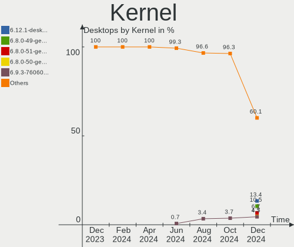
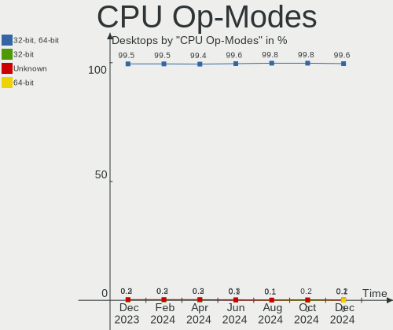
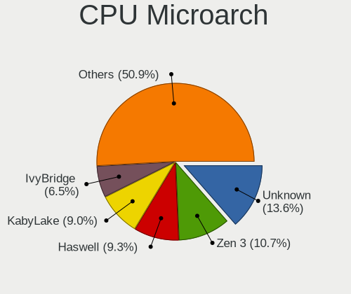
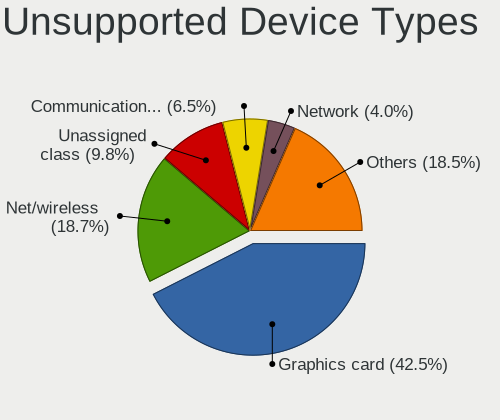

Linux Hardware Trends (Desktops)
--------------------------------

A project to identify most popular hardware characteristics and track their change
over time based on data collected by Linux users at https://Linux-Hardware.org.

Anyone can contribute to this report by the [hw-probe](https://github.com/linuxhw/hw-probe) tool:

    sudo -E hw-probe -all -upload

Full-feature report is available here: https://linux-hardware.org/?view=trends&formfactor=desktop

Period: Aug, 2021.

Contents
--------

* [ System ](#system)
  - [ OS                       ](#os)
  - [ OS Family                ](#os-family)
  - [ Kernel                   ](#kernel)
  - [ Kernel Family            ](#kernel-family)
  - [ Kernel Major Ver.        ](#kernel-major-ver)
  - [ Arch                     ](#arch)
  - [ DE                       ](#de)
  - [ Display Server           ](#display-server)
  - [ Display Manager          ](#display-manager)
  - [ OS Lang                  ](#os-lang)
  - [ Boot Mode                ](#boot-mode)
  - [ Filesystem               ](#filesystem)
  - [ Part. scheme             ](#part-scheme)
  - [ Dual Boot with Linux/BSD ](#dual-boot-with-linuxbsd)
  - [ Dual Boot (Win)          ](#dual-boot-win)

* [ Board ](#board)
  - [ Vendor                   ](#vendor)
  - [ Model                    ](#model)
  - [ Model Family             ](#model-family)
  - [ MFG Year                 ](#mfg-year)
  - [ Form Factor              ](#form-factor)
  - [ Secure Boot              ](#secure-boot)
  - [ Coreboot                 ](#coreboot)
  - [ RAM Size                 ](#ram-size)
  - [ RAM Used                 ](#ram-used)
  - [ Total Drives             ](#total-drives)
  - [ Has CD-ROM               ](#has-cd-rom)
  - [ Has Ethernet             ](#has-ethernet)
  - [ Has WiFi                 ](#has-wifi)
  - [ Has Bluetooth            ](#has-bluetooth)

* [ Location ](#location)
  - [ Country                  ](#country)
  - [ City                     ](#city)

* [ Drives ](#drives)
  - [ Drive Vendor             ](#drive-vendor)
  - [ Drive Model              ](#drive-model)
  - [ HDD Vendor               ](#hdd-vendor)
  - [ SSD Vendor               ](#ssd-vendor)
  - [ Drive Kind               ](#drive-kind)
  - [ Drive Connector          ](#drive-connector)
  - [ Drive Size               ](#drive-size)
  - [ Space Total              ](#space-total)
  - [ Space Used               ](#space-used)
  - [ Malfunc. Drives          ](#malfunc-drives)
  - [ Malfunc. Drive Vendor    ](#malfunc-drive-vendor)
  - [ Malfunc. HDD Vendor      ](#malfunc-hdd-vendor)
  - [ Malfunc. Drive Kind      ](#malfunc-drive-kind)
  - [ Failed Drives            ](#failed-drives)
  - [ Failed Drive Vendor      ](#failed-drive-vendor)
  - [ Drive Status             ](#drive-status)

* [ Storage controller ](#storage-controller)
  - [ Storage Vendor           ](#storage-vendor)
  - [ Storage Model            ](#storage-model)
  - [ Storage Kind             ](#storage-kind)

* [ Processor ](#processor)
  - [ CPU Vendor               ](#cpu-vendor)
  - [ CPU Model                ](#cpu-model)
  - [ CPU Model Family         ](#cpu-model-family)
  - [ CPU Cores                ](#cpu-cores)
  - [ CPU Sockets              ](#cpu-sockets)
  - [ CPU Threads              ](#cpu-threads)
  - [ CPU Op-Modes             ](#cpu-op-modes)
  - [ CPU Microcode            ](#cpu-microcode)
  - [ CPU Microarch            ](#cpu-microarch)

* [ Graphics ](#graphics)
  - [ GPU Vendor               ](#gpu-vendor)
  - [ GPU Model                ](#gpu-model)
  - [ GPU Combo                ](#gpu-combo)
  - [ GPU Driver               ](#gpu-driver)
  - [ GPU Memory               ](#gpu-memory)

* [ Monitor ](#monitor)
  - [ Monitor Vendor           ](#monitor-vendor)
  - [ Monitor Model            ](#monitor-model)
  - [ Monitor Resolution       ](#monitor-resolution)
  - [ Monitor Diagonal         ](#monitor-diagonal)
  - [ Monitor Width            ](#monitor-width)
  - [ Aspect Ratio             ](#aspect-ratio)
  - [ Monitor Area             ](#monitor-area)
  - [ Pixel Density            ](#pixel-density)
  - [ Multiple Monitors        ](#multiple-monitors)

* [ Network ](#network)
  - [ Net Controller Vendor    ](#net-controller-vendor)
  - [ Net Controller Model     ](#net-controller-model)
  - [ Wireless Vendor          ](#wireless-vendor)
  - [ Wireless Model           ](#wireless-model)
  - [ Ethernet Vendor          ](#ethernet-vendor)
  - [ Ethernet Model           ](#ethernet-model)
  - [ Net Controller Kind      ](#net-controller-kind)
  - [ Used Controller          ](#used-controller)
  - [ NICs                     ](#nics)
  - [ IPv6                     ](#ipv6)

* [ Bluetooth ](#bluetooth)
  - [ Bluetooth Vendor         ](#bluetooth-vendor)
  - [ Bluetooth Model          ](#bluetooth-model)

* [ Sound ](#sound)
  - [ Sound Vendor             ](#sound-vendor)
  - [ Sound Model              ](#sound-model)

* [ Memory ](#memory)
  - [ Memory Vendor            ](#memory-vendor)
  - [ Memory Model             ](#memory-model)
  - [ Memory Kind              ](#memory-kind)
  - [ Memory Form Factor       ](#memory-form-factor)
  - [ Memory Size              ](#memory-size)
  - [ Memory Speed             ](#memory-speed)

* [ Printers & scanners ](#printers--scanners)
  - [ Printer Vendor           ](#printer-vendor)
  - [ Printer Model            ](#printer-model)
  - [ Scanner Vendor           ](#scanner-vendor)
  - [ Scanner Model            ](#scanner-model)

* [ Camera ](#camera)
  - [ Camera Vendor            ](#camera-vendor)
  - [ Camera Model             ](#camera-model)

* [ Security ](#security)
  - [ Fingerprint Vendor       ](#fingerprint-vendor)
  - [ Fingerprint Model        ](#fingerprint-model)
  - [ Chipcard Vendor          ](#chipcard-vendor)
  - [ Chipcard Model           ](#chipcard-model)

* [ Unsupported ](#unsupported)
  - [ Unsupported Devices      ](#unsupported-devices)
  - [ Unsupported Device Types ](#unsupported-device-types)

System
------

OS
--

Installed operating systems

| Name                         | Desktops | Percent |
|------------------------------|----------|---------|
| Ubuntu 20.04                 | 309      | 16.14%  |
| Pop!_OS 21.04                | 156      | 8.15%   |
| Mint 20.2                    | 150      | 7.83%   |
| Debian 11                    | 122      | 6.37%   |
| OpenMandriva 4.2             | 115      | 6.01%   |
| Ubuntu 21.04                 | 111      | 5.8%    |
| Fedora 34                    | 101      | 5.27%   |
| KDE neon 20.04               | 56       | 2.92%   |
| ROSA R11.1                   | 49       | 2.56%   |
| Ubuntu 18.04                 | 38       | 1.98%   |
| Manjaro                      | 38       | 1.98%   |
| Zorin 16                     | 37       | 1.93%   |
| BlackPanther 18.1            | 37       | 1.93%   |
| Manjaro 21.1.0               | 32       | 1.67%   |
| Debian 10                    | 32       | 1.67%   |
| ArcoLinux Rolling            | 29       | 1.51%   |
| Arch                         | 25       | 1.31%   |
| Xubuntu 20.04                | 24       | 1.25%   |
| Arch Rolling                 | 24       | 1.25%   |
| Mint 19.3                    | 20       | 1.04%   |
| Pop!_OS 20.04                | 19       | 0.99%   |
| OpenMandriva 4.50            | 18       | 0.94%   |
| Mint 20.1                    | 18       | 0.94%   |
| Zorin 15                     | 17       | 0.89%   |
| Kubuntu 20.04                | 16       | 0.84%   |
| CentOS 7.9.2009              | 16       | 0.84%   |
| Gentoo                       | 13       | 0.68%   |
| Fedora 33                    | 13       | 0.68%   |
| Xubuntu 18.04                | 12       | 0.63%   |
| Kubuntu 21.04                | 11       | 0.57%   |
| Gentoo 2.7                   | 11       | 0.57%   |
| Endless 3.9.5                | 10       | 0.52%   |
| Ubuntu MATE 20.04            | 9        | 0.47%   |
| ROSA R12                     | 9        | 0.47%   |
| Pop!_OS 20.10                | 9        | 0.47%   |
| Elementary 6                 | 8        | 0.42%   |
| CentOS 8                     | 8        | 0.42%   |
| ROSA R11                     | 7        | 0.37%   |
| Mint 20                      | 7        | 0.37%   |
| LMDE 4                       | 7        | 0.37%   |
| Debian                       | 7        | 0.37%   |
| CentOS 7                     | 7        | 0.37%   |
| Ubuntu 20.10                 | 6        | 0.31%   |
| Siduction 11                 | 6        | 0.31%   |
| Kali 2021.2                  | 6        | 0.31%   |
| EndeavourOS Rolling          | 6        | 0.31%   |
| Clear Linux 34930            | 6        | 0.31%   |
| Solus 4.3                    | 5        | 0.26%   |
| Xubuntu 21.04                | 4        | 0.21%   |
| Ubuntu 21.10                 | 4        | 0.21%   |
| Mageia 8                     | 4        | 0.21%   |
| Fedora 32                    | 4        | 0.21%   |
| Rocky 8.4                    | 3        | 0.16%   |
| openSUSE Tumbleweed-20210810 | 3        | 0.16%   |
| openSUSE Leap-15.3           | 3        | 0.16%   |
| openSUSE Leap-15.2           | 3        | 0.16%   |
| Manjaro 21.1.1               | 3        | 0.16%   |
| Lubuntu 20.04                | 3        | 0.16%   |
| Garuda Soaring               | 3        | 0.16%   |
| ALT Linux 9.1                | 3        | 0.16%   |

OS Family
---------

OS without a version

| Name          | Desktops | Percent |
|---------------|----------|---------|
| Ubuntu        | 471      | 24.6%   |
| Mint          | 197      | 10.29%  |
| Pop!_OS       | 184      | 9.61%   |
| Debian        | 167      | 8.72%   |
| OpenMandriva  | 133      | 6.95%   |
| Fedora        | 123      | 6.42%   |
| Manjaro       | 75       | 3.92%   |
| ROSA          | 68       | 3.55%   |
| KDE neon      | 56       | 2.92%   |
| Zorin         | 55       | 2.87%   |
| Arch          | 49       | 2.56%   |
| Xubuntu       | 41       | 2.14%   |
| BlackPanther  | 38       | 1.98%   |
| CentOS        | 33       | 1.72%   |
| Kubuntu       | 30       | 1.57%   |
| ArcoLinux     | 29       | 1.51%   |
| Gentoo        | 25       | 1.31%   |
| openSUSE      | 20       | 1.04%   |
| Ubuntu MATE   | 12       | 0.63%   |
| Endless       | 12       | 0.63%   |
| Clear Linux   | 12       | 0.63%   |
| Elementary    | 8        | 0.42%   |
| LMDE          | 7        | 0.37%   |
| EndeavourOS   | 7        | 0.37%   |
| Siduction     | 6        | 0.31%   |
| Kali          | 6        | 0.31%   |
| Solus         | 5        | 0.26%   |
| Garuda        | 5        | 0.26%   |
| Mageia        | 4        | 0.21%   |
| Lubuntu       | 4        | 0.21%   |
| ALT Linux     | 4        | 0.21%   |
| Rocky         | 3        | 0.16%   |
| Parrot        | 3        | 0.16%   |
| Ubuntu Budgie | 2        | 0.1%    |
| Slackware     | 2        | 0.1%    |
| RHEL          | 2        | 0.1%    |
| Kaisen        | 2        | 0.1%    |
| Artix         | 2        | 0.1%    |
| Xero          | 1        | 0.05%   |
| WindowsFX     | 1        | 0.05%   |
| Void          | 1        | 0.05%   |
| Sparky        | 1        | 0.05%   |
| Red OS        | 1        | 0.05%   |
| Q4OS          | 1        | 0.05%   |
| Peppermint    | 1        | 0.05%   |
| NixOS         | 1        | 0.05%   |
| MX            | 1        | 0.05%   |
| GNOME OS      | 1        | 0.05%   |
| Funtoo        | 1        | 0.05%   |
| Drauger OS    | 1        | 0.05%   |
| Deepin        | 1        | 0.05%   |

Kernel
------

Version of the Linux kernel

| Version                             | Desktops | Percent |
|-------------------------------------|----------|---------|
| 5.11.0-25-generic                   | 181      | 9.45%   |
| 5.11.0-7620-generic                 | 178      | 9.3%    |
| 5.4.0-81-generic                    | 153      | 7.99%   |
| 5.11.0-27-generic                   | 153      | 7.99%   |
| 5.4.0-80-generic                    | 116      | 6.06%   |
| 5.10.14-desktop-1omv4002            | 112      | 5.85%   |
| 5.10.0-8-amd64                      | 79       | 4.13%   |
| 5.8.0-63-generic                    | 56       | 2.92%   |
| 5.11.0-31-generic                   | 47       | 2.45%   |
| 5.10.0-7-amd64                      | 33       | 1.72%   |
| 5.13.12-200.fc34.x86_64             | 27       | 1.41%   |
| 5.6.14-desktop-2bP                  | 25       | 1.31%   |
| 5.4.83-generic-2rosa-x86_64         | 21       | 1.1%    |
| 5.8.0-43-generic                    | 18       | 0.94%   |
| 5.4.0-74-generic                    | 17       | 0.89%   |
| 4.19.0-17-amd64                     | 17       | 0.89%   |
| 5.12.4-desktop-1omv4050             | 16       | 0.84%   |
| 5.13.9-200.fc34.x86_64              | 15       | 0.78%   |
| 5.13.6-200.fc34.x86_64              | 15       | 0.78%   |
| 5.13.8-200.fc34.x86_64              | 14       | 0.73%   |
| 5.10.53-1-MANJARO                   | 14       | 0.73%   |
| 5.13.13-arch1-1                     | 13       | 0.68%   |
| 5.13.11-1-MANJARO                   | 13       | 0.68%   |
| 4.18.16-desktop-1bP                 | 12       | 0.63%   |
| 5.4.32-generic-2rosa-x86_64         | 11       | 0.57%   |
| 5.10.56-1-MANJARO                   | 11       | 0.57%   |
| 5.8.0-14-generic                    | 10       | 0.52%   |
| 5.13.10-arch1-1                     | 10       | 0.52%   |
| 5.10.59-1-MANJARO                   | 10       | 0.52%   |
| 4.15.0-desktop-122.124.1rosa-x86_64 | 10       | 0.52%   |
| 5.4.0-77-generic                    | 9        | 0.47%   |
| 5.13.12-arch1-1                     | 9        | 0.47%   |
| 5.13.10-200.fc34.x86_64             | 9        | 0.47%   |
| 5.11.0-33-generic                   | 9        | 0.47%   |
| 3.10.0-1160.31.1.el7.x86_64         | 9        | 0.47%   |
| 5.13.9-arch1-1                      | 8        | 0.42%   |
| 5.13.7-200.fc34.x86_64              | 8        | 0.42%   |
| 5.10.56-generic-1rosa2021.1-x86_64  | 8        | 0.42%   |
| 5.13.8-arch1-1                      | 7        | 0.37%   |
| 5.13.7-arch1-1                      | 7        | 0.37%   |
| 5.13.12-zen1-1-zen                  | 7        | 0.37%   |
| 5.10.52-gentoo                      | 7        | 0.37%   |
| 4.19.0-16-amd64                     | 7        | 0.37%   |
| 5.13.8-1065.native                  | 6        | 0.31%   |
| 5.13.12-1-MANJARO                   | 6        | 0.31%   |
| 5.10.0-2-amd64                      | 6        | 0.31%   |
| 4.15.0-151-generic                  | 6        | 0.31%   |
| 3.10.0-1160.25.1.el7.x86_64         | 6        | 0.31%   |
| 5.8.0-59-generic                    | 5        | 0.26%   |
| 5.4.0-80-lowlatency                 | 5        | 0.26%   |
| 5.13.8-1-default                    | 5        | 0.26%   |
| 5.13.6-arch1-1                      | 5        | 0.26%   |
| 5.11.0-25-lowlatency                | 5        | 0.26%   |
| 5.10.0-kali9-amd64                  | 5        | 0.26%   |
| 4.18.0-305.10.2.el8_4.x86_64        | 5        | 0.26%   |
| 4.15.0-desktop-45.1rosa-x86_64      | 5        | 0.26%   |
| 4.15.0-154-generic                  | 5        | 0.26%   |
| 3.10.0-1160.36.2.el7.x86_64         | 5        | 0.26%   |
| 5.4.32-generic-2rosa-i586           | 4        | 0.21%   |
| 5.4.0-42-generic                    | 4        | 0.21%   |

Kernel Family
-------------

Linux kernel without a distro release

| Version | Desktops | Percent |
|---------|----------|---------|
| 5.11.0  | 593      | 30.97%  |
| 5.4.0   | 326      | 17.02%  |
| 5.10.0  | 138      | 7.21%   |
| 5.10.14 | 112      | 5.85%   |
| 5.8.0   | 102      | 5.33%   |
| 5.13.12 | 59       | 3.08%   |
| 5.13.8  | 43       | 2.25%   |
| 4.15.0  | 41       | 2.14%   |
| 4.19.0  | 36       | 1.88%   |
| 5.13.9  | 33       | 1.72%   |
| 5.13.6  | 27       | 1.41%   |
| 5.6.14  | 25       | 1.31%   |
| 5.13.10 | 24       | 1.25%   |
| 5.4.83  | 23       | 1.2%    |
| 5.10.56 | 23       | 1.2%    |
| 3.10.0  | 22       | 1.15%   |
| 5.13.7  | 21       | 1.1%    |
| 5.13.13 | 18       | 0.94%   |
| 5.13.11 | 17       | 0.89%   |
| 5.12.4  | 16       | 0.84%   |
| 5.4.32  | 15       | 0.78%   |
| 5.10.53 | 14       | 0.73%   |
| 5.10.52 | 14       | 0.73%   |
| 4.18.0  | 13       | 0.68%   |
| 4.18.16 | 12       | 0.63%   |
| 5.13.4  | 11       | 0.57%   |
| 5.10.59 | 10       | 0.52%   |
| 5.14.0  | 9        | 0.47%   |
| 5.13.5  | 8        | 0.42%   |
| 5.11.22 | 7        | 0.37%   |
| 5.3.18  | 6        | 0.31%   |
| 5.12.19 | 6        | 0.31%   |
| 5.11.12 | 6        | 0.31%   |
| 5.13.0  | 5        | 0.26%   |
| 5.12.15 | 4        | 0.21%   |
| 5.12.14 | 4        | 0.21%   |
| 5.0.0   | 4        | 0.21%   |
| 5.12.18 | 3        | 0.16%   |
| 5.10.42 | 3        | 0.16%   |
| 5.9.16  | 2        | 0.1%    |
| 5.3.0   | 2        | 0.1%    |
| 5.12.7  | 2        | 0.1%    |
| 5.12.13 | 2        | 0.1%    |
| 5.12.12 | 2        | 0.1%    |
| 5.11.10 | 2        | 0.1%    |
| 5.10.60 | 2        | 0.1%    |
| 5.10.54 | 2        | 0.1%    |
| 4.9.155 | 2        | 0.1%    |
| 4.4.0   | 2        | 0.1%    |
| 5.9.14  | 1        | 0.05%   |
| 5.9.11  | 1        | 0.05%   |
| 5.9.10  | 1        | 0.05%   |
| 5.9.0   | 1        | 0.05%   |
| 5.8.16  | 1        | 0.05%   |
| 5.8.15  | 1        | 0.05%   |
| 5.7.0   | 1        | 0.05%   |
| 5.6.6   | 1        | 0.05%   |
| 5.6.13  | 1        | 0.05%   |
| 5.4.97  | 1        | 0.05%   |
| 5.4.70  | 1        | 0.05%   |

Kernel Major Ver.
-----------------

Linux kernel major version

| Version | Desktops | Percent |
|---------|----------|---------|
| 5.11    | 610      | 31.85%  |
| 5.4     | 372      | 19.43%  |
| 5.10    | 328      | 17.13%  |
| 5.13    | 266      | 13.89%  |
| 5.8     | 104      | 5.43%   |
| 5.12    | 44       | 2.3%    |
| 4.15    | 42       | 2.19%   |
| 4.19    | 36       | 1.88%   |
| 5.6     | 27       | 1.41%   |
| 4.18    | 25       | 1.31%   |
| 3.10    | 22       | 1.15%   |
| 5.14    | 9        | 0.47%   |
| 5.3     | 8        | 0.42%   |
| 5.9     | 6        | 0.31%   |
| 5.0     | 5        | 0.26%   |
| 4.9     | 5        | 0.26%   |
| 5.2     | 2        | 0.1%    |
| 4.4     | 2        | 0.1%    |
| 5.7     | 1        | 0.05%   |
| 4.1     | 1        | 0.05%   |

Arch
----

OS architecture (x86_64, i586, etc.)

| Name   | Desktops | Percent |
|--------|----------|---------|
| x86_64 | 1879     | 98.12%  |
| i686   | 33       | 1.72%   |
| ppc64  | 1        | 0.05%   |
| ppc    | 1        | 0.05%   |
| armv7l | 1        | 0.05%   |

DE
--

Desktop Environment

| Name             | Desktops | Percent |
|------------------|----------|---------|
| GNOME            | 848      | 44.28%  |
| KDE5             | 310      | 16.19%  |
| X-Cinnamon       | 169      | 8.83%   |
| Unknown          | 154      | 8.04%   |
| XFCE             | 128      | 6.68%   |
| KDE              | 102      | 5.33%   |
| MATE             | 55       | 2.87%   |
| Cinnamon         | 37       | 1.93%   |
| KDE4             | 34       | 1.78%   |
| LXQt             | 14       | 0.73%   |
| Budgie           | 9        | 0.47%   |
| i3               | 8        | 0.42%   |
| Pantheon         | 7        | 0.37%   |
| LXDE             | 6        | 0.31%   |
| Unity            | 5        | 0.26%   |
| qtile            | 4        | 0.21%   |
| Trinity          | 3        | 0.16%   |
| openbox          | 3        | 0.16%   |
| GNOME Flashback  | 3        | 0.16%   |
| awesome          | 3        | 0.16%   |
| sway             | 2        | 0.1%    |
| xubuntu          | 1        | 0.05%   |
| xmonad           | 1        | 0.05%   |
| UKUI             | 1        | 0.05%   |
| NsCDE            | 1        | 0.05%   |
| lightdm-xsession | 1        | 0.05%   |
| jwm              | 1        | 0.05%   |
| GNOME-Flashback  | 1        | 0.05%   |
| GNOME Classic    | 1        | 0.05%   |
| dwm              | 1        | 0.05%   |
| Deepin           | 1        | 0.05%   |
| bspwm            | 1        | 0.05%   |

Display Server
--------------

X11 or Wayland

| Name        | Desktops | Percent |
|-------------|----------|---------|
| X11         | 1568     | 81.88%  |
| Wayland     | 189      | 9.87%   |
| Unknown     | 83       | 4.33%   |
| Tty         | 74       | 3.86%   |
| Unspecified | 1        | 0.05%   |

Display Manager
---------------

SDDM, LightDM, etc.

| Name    | Desktops | Percent |
|---------|----------|---------|
| Unknown | 1117     | 58.33%  |
| SDDM    | 335      | 17.49%  |
| GDM     | 220      | 11.49%  |
| TDM     | 107      | 5.59%   |
| LightDM | 93       | 4.86%   |
| KDM     | 31       | 1.62%   |
| XDM     | 5        | 0.26%   |
| LXDM    | 4        | 0.21%   |
| GDM3    | 2        | 0.1%    |
| SLiM    | 1        | 0.05%   |

OS Lang
-------

Language

| Lang        | Desktops | Percent |
|-------------|----------|---------|
| en_US       | 685      | 35.77%  |
| de_DE       | 204      | 10.65%  |
| ru_RU       | 164      | 8.56%   |
| en_GB       | 110      | 5.74%   |
| pt_BR       | 106      | 5.54%   |
| fr_FR       | 97       | 5.07%   |
| Unknown     | 65       | 3.39%   |
| C           | 44       | 2.3%    |
| es_ES       | 42       | 2.19%   |
| en_AU       | 42       | 2.19%   |
| pl_PL       | 33       | 1.72%   |
| en_CA       | 31       | 1.62%   |
| it_IT       | 27       | 1.41%   |
| es_AR       | 16       | 0.84%   |
| en_IN       | 15       | 0.78%   |
| en_ZA       | 14       | 0.73%   |
| es_MX       | 13       | 0.68%   |
| hu_HU       | 12       | 0.63%   |
| nl_NL       | 11       | 0.57%   |
| nl_BE       | 11       | 0.57%   |
| zh_CN       | 10       | 0.52%   |
| sv_SE       | 8        | 0.42%   |
| ru_UA       | 8        | 0.42%   |
| ja_JP       | 8        | 0.42%   |
| de_CH       | 8        | 0.42%   |
| fi_FI       | 7        | 0.37%   |
| en_NZ       | 7        | 0.37%   |
| de_AT       | 7        | 0.37%   |
| fr_BE       | 6        | 0.31%   |
| cs_CZ       | 6        | 0.31%   |
| zh_TW       | 5        | 0.26%   |
| nb_NO       | 5        | 0.26%   |
| fr_CA       | 5        | 0.26%   |
| es_CO       | 5        | 0.26%   |
| es_CL       | 5        | 0.26%   |
| sk_SK       | 4        | 0.21%   |
| en_PH       | 4        | 0.21%   |
| en_IE       | 4        | 0.21%   |
| bg_BG       | 4        | 0.21%   |
| pt_PT       | 3        | 0.16%   |
| en_DK       | 3        | 0.16%   |
| da_DK       | 3        | 0.16%   |
| ru_RU.UTF8  | 2        | 0.1%    |
| ro_RO       | 2        | 0.1%    |
| lt_LT       | 2        | 0.1%    |
| hr_HR       | 2        | 0.1%    |
| es_SV       | 2        | 0.1%    |
| es_PE       | 2        | 0.1%    |
| es_CR       | 2        | 0.1%    |
| en_SG       | 2        | 0.1%    |
| en_IL       | 2        | 0.1%    |
| el_GR       | 2        | 0.1%    |
| ar_KW       | 2        | 0.1%    |
| unm_US      | 1        | 0.05%   |
| uk_UA       | 1        | 0.05%   |
| tr_TR       | 1        | 0.05%   |
| th_TH       | 1        | 0.05%   |
| sv_FI       | 1        | 0.05%   |
| sl_SI       | 1        | 0.05%   |
| ru_RU.UTF_8 | 1        | 0.05%   |

Boot Mode
---------

EFI or BIOS

| Mode | Desktops | Percent |
|------|----------|---------|
| BIOS | 1197     | 62.51%  |
| EFI  | 718      | 37.49%  |

Filesystem
----------

Type of filesystem

| Type    | Desktops | Percent |
|---------|----------|---------|
| Ext4    | 1439     | 75.14%  |
| Overlay | 225      | 11.75%  |
| Btrfs   | 151      | 7.89%   |
| Xfs     | 66       | 3.45%   |
| Zfs     | 15       | 0.78%   |
| Ext3    | 5        | 0.26%   |
| Tmpfs   | 3        | 0.16%   |
| F2fs    | 3        | 0.16%   |
| Ext2    | 3        | 0.16%   |
| XXXXXXX | 1        | 0.05%   |
| XXXX    | 1        | 0.05%   |
| Jfs     | 1        | 0.05%   |
| Aufs    | 1        | 0.05%   |
| Unknown | 1        | 0.05%   |

Part. scheme
------------

Scheme of partitioning

| Type    | Desktops | Percent |
|---------|----------|---------|
| Unknown | 1009     | 52.69%  |
| GPT     | 593      | 30.97%  |
| MBR     | 313      | 16.34%  |

Dual Boot with Linux/BSD
------------------------

Hosting more than one Linux/BSD

| Dual boot | Desktops | Percent |
|-----------|----------|---------|
| No        | 1531     | 79.95%  |
| Yes       | 384      | 20.05%  |

Dual Boot (Win)
---------------

Hosting Linux and Windows

| Dual boot | Desktops | Percent |
|-----------|----------|---------|
| No        | 1270     | 66.32%  |
| Yes       | 645      | 33.68%  |

Board
-----

Vendor
------

Motherboard manufacturer

| Name                        | Desktops | Percent |
|-----------------------------|----------|---------|
| ASUSTek Computer            | 446      | 23.29%  |
| Gigabyte Technology         | 375      | 19.58%  |
| ASRock                      | 219      | 11.44%  |
| MSI                         | 213      | 11.12%  |
| Dell                        | 160      | 8.36%   |
| Hewlett-Packard             | 142      | 7.42%   |
| Lenovo                      | 61       | 3.19%   |
| Intel                       | 43       | 2.25%   |
| Acer                        | 32       | 1.67%   |
| Fujitsu                     | 23       | 1.2%    |
| Unknown                     | 23       | 1.2%    |
| Foxconn                     | 16       | 0.84%   |
| Pegatron                    | 15       | 0.78%   |
| Medion                      | 14       | 0.73%   |
| ECS                         | 13       | 0.68%   |
| Biostar                     | 12       | 0.63%   |
| Supermicro                  | 9        | 0.47%   |
| Positivo                    | 9        | 0.47%   |
| Huanan                      | 7        | 0.37%   |
| Packard Bell                | 6        | 0.31%   |
| Alienware                   | 5        | 0.26%   |
| PCWare                      | 4        | 0.21%   |
| Gateway                     | 4        | 0.21%   |
| ZOTAC                       | 3        | 0.16%   |
| Shuttle                     | 3        | 0.16%   |
| Semp Toshiba                | 3        | 0.16%   |
| Fujitsu Siemens             | 3        | 0.16%   |
| Apple                       | 3        | 0.16%   |
| Tekram Technology           | 2        | 0.1%    |
| System76                    | 2        | 0.1%    |
| Seco                        | 2        | 0.1%    |
| NEC Computers               | 2        | 0.1%    |
| Itautec                     | 2        | 0.1%    |
| ASRockRack                  | 2        | 0.1%    |
| AOpen                       | 2        | 0.1%    |
| Zillion B75FEL3             | 1        | 0.05%   |
| YANYU                       | 1        | 0.05%   |
| Yanling                     | 1        | 0.05%   |
| XFX                         | 1        | 0.05%   |
| Wistron                     | 1        | 0.05%   |
| VIA technology              | 1        | 0.05%   |
| TYAN Computer               | 1        | 0.05%   |
| TSINGHUA TONGFANG COMPUTER  | 1        | 0.05%   |
| Toshiba                     | 1        | 0.05%   |
| TECO Electric and Machinery | 1        | 0.05%   |
| SYWZ                        | 1        | 0.05%   |
| SUPoX COMPUTER              | 1        | 0.05%   |
| Sony                        | 1        | 0.05%   |
| PCChips                     | 1        | 0.05%   |
| OEM                         | 1        | 0.05%   |
| NZXT                        | 1        | 0.05%   |
| NC9VL                       | 1        | 0.05%   |
| Megaware                    | 1        | 0.05%   |
| Login Informatica           | 1        | 0.05%   |
| Informatica Login           | 1        | 0.05%   |
| ICP / iEi                   | 1        | 0.05%   |
| HPE                         | 1        | 0.05%   |
| HC                          | 1        | 0.05%   |
| HARDKERNEL                  | 1        | 0.05%   |
| Google                      | 1        | 0.05%   |

Model
-----

Motherboard model

| Name                           | Desktops | Percent |
|--------------------------------|----------|---------|
| ASUS All Series                | 44       | 2.3%    |
| Unknown                        | 25       | 1.31%   |
| ASRock H470M-HVS               | 20       | 1.04%   |
| MSI MS-7C37                    | 13       | 0.68%   |
| Dell OptiPlex 7010             | 13       | 0.68%   |
| Gigabyte A320M-S2H             | 12       | 0.63%   |
| Dell OptiPlex 9020             | 12       | 0.63%   |
| ASUS ROG STRIX B450-F GAMING   | 12       | 0.63%   |
| MSI MS-7C91                    | 11       | 0.57%   |
| Gigabyte B450M DS3H            | 11       | 0.57%   |
| ASUS PRIME A320M-K             | 9        | 0.47%   |
| MSI MS-7B86                    | 8        | 0.42%   |
| Dell OptiPlex 7040             | 8        | 0.42%   |
| MSI MS-7C02                    | 7        | 0.37%   |
| Gigabyte X570 AORUS ELITE      | 7        | 0.37%   |
| Dell OptiPlex 790              | 7        | 0.37%   |
| Dell OptiPlex 755              | 7        | 0.37%   |
| ASUS TUF GAMING X570-PLUS      | 7        | 0.37%   |
| ASUS PRIME B450M-A             | 7        | 0.37%   |
| HP Compaq Pro 6300 SFF         | 6        | 0.31%   |
| Gigabyte B550M DS3H            | 6        | 0.31%   |
| Gigabyte B450 AORUS PRO WIFI   | 6        | 0.31%   |
| Dell OptiPlex 780              | 6        | 0.31%   |
| Dell OptiPlex 3020             | 6        | 0.31%   |
| ASUS ROG STRIX B550-F GAMING   | 6        | 0.31%   |
| ASUS PRIME B365M-A             | 6        | 0.31%   |
| MSI MS-7C56                    | 5        | 0.26%   |
| MSI MS-7B79                    | 5        | 0.26%   |
| MSI MS-7693                    | 5        | 0.26%   |
| HP EliteDesk 800 G1 SFF        | 5        | 0.26%   |
| HP Compaq 8100 Elite SFF PC    | 5        | 0.26%   |
| Gigabyte X570 I AORUS PRO WIFI | 5        | 0.26%   |
| Gigabyte GA-78LMT-USB3 6.0     | 5        | 0.26%   |
| Gigabyte B450 I AORUS PRO WIFI | 5        | 0.26%   |
| Gigabyte A320M-H               | 5        | 0.26%   |
| Dell OptiPlex 3010             | 5        | 0.26%   |
| ASUS SABERTOOTH 990FX R2.0     | 5        | 0.26%   |
| ASRock FM2A68M-DG3+            | 5        | 0.26%   |
| ASRock B450M Steel Legend      | 5        | 0.26%   |
| MSI MS-7C84                    | 4        | 0.21%   |
| MSI MS-7C35                    | 4        | 0.21%   |
| MSI MS-7B09                    | 4        | 0.21%   |
| HP Compaq 8200 Elite SFF PC    | 4        | 0.21%   |
| Gigabyte H61M-S2PV             | 4        | 0.21%   |
| Gigabyte H61M-S1               | 4        | 0.21%   |
| Gigabyte GA-880GM-UD2H         | 4        | 0.21%   |
| Gigabyte B450M DS3H V2         | 4        | 0.21%   |
| Gigabyte B450 AORUS M          | 4        | 0.21%   |
| Gigabyte 970A-DS3P             | 4        | 0.21%   |
| ASUS Z170-A                    | 4        | 0.21%   |
| ASUS Z170 PRO GAMING           | 4        | 0.21%   |
| ASUS TUF GAMING X570-PRO       | 4        | 0.21%   |
| ASUS ROG STRIX Z390-F GAMING   | 4        | 0.21%   |
| ASUS ROG STRIX B350-F GAMING   | 4        | 0.21%   |
| ASUS PRIME Z390-A              | 4        | 0.21%   |
| ASUS PRIME X470-PRO            | 4        | 0.21%   |
| ASUS P6X58D-E                  | 4        | 0.21%   |
| ASUS M5A99X EVO R2.0           | 4        | 0.21%   |
| ASUS M5A78L-M/USB3             | 4        | 0.21%   |
| ASUS M5A78L-M LX3              | 4        | 0.21%   |

Model Family
------------

Motherboard model prefix

| Name                   | Desktops | Percent |
|------------------------|----------|---------|
| Dell OptiPlex          | 103      | 5.38%   |
| ASUS PRIME             | 82       | 4.28%   |
| ASUS ROG               | 62       | 3.24%   |
| HP Compaq              | 52       | 2.72%   |
| ASUS All               | 44       | 2.3%    |
| Lenovo ThinkCentre     | 36       | 1.88%   |
| ASUS TUF               | 33       | 1.72%   |
| Dell Precision         | 25       | 1.31%   |
| Unknown                | 25       | 1.31%   |
| Acer Aspire            | 21       | 1.1%    |
| ASRock H470M-HVS       | 20       | 1.04%   |
| Gigabyte B450M         | 19       | 0.99%   |
| Gigabyte B450          | 19       | 0.99%   |
| HP EliteDesk           | 18       | 0.94%   |
| Gigabyte X570          | 18       | 0.94%   |
| ASUS M5A78L-M          | 15       | 0.78%   |
| Gigabyte A320M-S2H     | 14       | 0.73%   |
| Fujitsu ESPRIMO        | 14       | 0.73%   |
| MSI MS-7C37            | 13       | 0.68%   |
| Lenovo ThinkStation    | 12       | 0.63%   |
| MSI MS-7C91            | 11       | 0.57%   |
| HP Pavilion            | 10       | 0.52%   |
| Gigabyte GA-78LMT-USB3 | 10       | 0.52%   |
| Dell XPS               | 10       | 0.52%   |
| Dell Inspiron          | 10       | 0.52%   |
| ASRock B450M           | 10       | 0.52%   |
| Gigabyte Z390          | 9        | 0.47%   |
| ASUS SABERTOOTH        | 9        | 0.47%   |
| MSI MS-7B86            | 8        | 0.42%   |
| HP ProDesk             | 8        | 0.42%   |
| Gigabyte B550M         | 8        | 0.42%   |
| ASUS M5A97             | 8        | 0.42%   |
| ASRock X570            | 8        | 0.42%   |
| MSI MS-7C02            | 7        | 0.37%   |
| Gigabyte B550          | 7        | 0.37%   |
| ASUS P8H61-M           | 7        | 0.37%   |
| ASRock B450            | 7        | 0.37%   |
| Intel DG31PR           | 6        | 0.31%   |
| Gigabyte H310M         | 6        | 0.31%   |
| ASUS P8Z77-V           | 6        | 0.31%   |
| Acer Veriton           | 6        | 0.31%   |
| MSI MS-7C56            | 5        | 0.26%   |
| MSI MS-7B79            | 5        | 0.26%   |
| MSI MS-7693            | 5        | 0.26%   |
| Gigabyte A320M-H       | 5        | 0.26%   |
| Dell Vostro            | 5        | 0.26%   |
| ASUS P5G41T-M          | 5        | 0.26%   |
| ASUS M5A99X            | 5        | 0.26%   |
| ASRock FM2A68M-DG3+    | 5        | 0.26%   |
| ASRock B550M           | 5        | 0.26%   |
| ASRock AB350           | 5        | 0.26%   |
| ASRock A320M-HDV       | 5        | 0.26%   |
| Packard Bell IMEDIA    | 4        | 0.21%   |
| MSI MS-7C84            | 4        | 0.21%   |
| MSI MS-7C35            | 4        | 0.21%   |
| MSI MS-7B09            | 4        | 0.21%   |
| Lenovo IdeaCentre      | 4        | 0.21%   |
| HP ProLiant            | 4        | 0.21%   |
| Gigabyte H61M-S2PV     | 4        | 0.21%   |
| Gigabyte H61M-S1       | 4        | 0.21%   |

MFG Year
--------

Motherboard manufacture year

| Year    | Desktops | Percent |
|---------|----------|---------|
| 2021    | 249      | 13%     |
| 2020    | 248      | 12.95%  |
| 2019    | 193      | 10.08%  |
| 2018    | 151      | 7.89%   |
| 2013    | 148      | 7.73%   |
| 2014    | 135      | 7.05%   |
| 2012    | 132      | 6.89%   |
| 2011    | 113      | 5.9%    |
| 2015    | 108      | 5.64%   |
| 2010    | 90       | 4.7%    |
| 2009    | 86       | 4.49%   |
| 2016    | 82       | 4.28%   |
| 2017    | 62       | 3.24%   |
| 2008    | 52       | 2.72%   |
| 2007    | 36       | 1.88%   |
| 2006    | 11       | 0.57%   |
| 2005    | 8        | 0.42%   |
| 2004    | 5        | 0.26%   |
| Unknown | 3        | 0.16%   |
| 2000    | 2        | 0.1%    |
| 2003    | 1        | 0.05%   |

Form Factor
-----------

Physical design of the computer

| Name    | Desktops | Percent |
|---------|----------|---------|
| Desktop | 1915     | 100%    |

Secure Boot
-----------

Enabled or disabled

| State    | Desktops | Percent |
|----------|----------|---------|
| Disabled | 1880     | 98.17%  |
| Enabled  | 35       | 1.83%   |

Coreboot
--------

Have coreboot on board

| Used | Desktops | Percent |
|------|----------|---------|
| No   | 1914     | 99.95%  |
| Yes  | 1        | 0.05%   |

RAM Size
--------

Total RAM memory

| Size in GB      | Desktops | Percent |
|-----------------|----------|---------|
| 16.01-24.0      | 450      | 23.5%   |
| 8.01-16.0       | 382      | 19.95%  |
| 32.01-64.0      | 313      | 16.34%  |
| 3.01-4.0        | 280      | 14.62%  |
| 4.01-8.0        | 264      | 13.79%  |
| 64.01-256.0     | 85       | 4.44%   |
| 24.01-32.0      | 51       | 2.66%   |
| 1.01-2.0        | 51       | 2.66%   |
| 2.01-3.0        | 23       | 1.2%    |
| 0.51-1.0        | 11       | 0.57%   |
| More than 256.0 | 2        | 0.1%    |
| 0.01-0.5        | 2        | 0.1%    |
| Unknown         | 1        | 0.05%   |

RAM Used
--------

Used RAM memory

| Used GB     | Desktops | Percent |
|-------------|----------|---------|
| 1.01-2.0    | 669      | 34.93%  |
| 2.01-3.0    | 430      | 22.45%  |
| 4.01-8.0    | 253      | 13.21%  |
| 3.01-4.0    | 195      | 10.18%  |
| 0.51-1.0    | 192      | 10.03%  |
| 8.01-16.0   | 79       | 4.13%   |
| 0.01-0.5    | 60       | 3.13%   |
| 16.01-24.0  | 19       | 0.99%   |
| 24.01-32.0  | 9        | 0.47%   |
| 32.01-64.0  | 5        | 0.26%   |
| 64.01-256.0 | 3        | 0.16%   |
| Unknown     | 1        | 0.05%   |

Total Drives
------------

Number of drives on board

| Drives | Desktops | Percent |
|--------|----------|---------|
| 1      | 703      | 36.71%  |
| 2      | 569      | 29.71%  |
| 3      | 287      | 14.99%  |
| 4      | 168      | 8.77%   |
| 5      | 82       | 4.28%   |
| 6      | 41       | 2.14%   |
| 7      | 25       | 1.31%   |
| 0      | 16       | 0.84%   |
| 8      | 12       | 0.63%   |
| 9      | 4        | 0.21%   |
| 13     | 2        | 0.1%    |
| 12     | 2        | 0.1%    |
| 10     | 2        | 0.1%    |
| 17     | 1        | 0.05%   |
| 11     | 1        | 0.05%   |

Has CD-ROM
----------

Has CD-ROM on board

| Presented | Desktops | Percent |
|-----------|----------|---------|
| No        | 1028     | 53.68%  |
| Yes       | 887      | 46.32%  |

Has Ethernet
------------

Has Ethernet on board

| Presented | Desktops | Percent |
|-----------|----------|---------|
| Yes       | 1899     | 99.16%  |
| No        | 16       | 0.84%   |

Has WiFi
--------

Has WiFi module

| Presented | Desktops | Percent |
|-----------|----------|---------|
| No        | 1161     | 60.63%  |
| Yes       | 754      | 39.37%  |

Has Bluetooth
-------------

Has Bluetooth module

| Presented | Desktops | Percent |
|-----------|----------|---------|
| No        | 1344     | 70.18%  |
| Yes       | 571      | 29.82%  |

Location
--------

Country
-------

Geographic location (country)

| Country             | Desktops | Percent |
|---------------------|----------|---------|
| USA                 | 354      | 18.49%  |
| Germany             | 237      | 12.38%  |
| Russia              | 170      | 8.88%   |
| Brazil              | 136      | 7.1%    |
| France              | 106      | 5.54%   |
| UK                  | 101      | 5.27%   |
| Australia           | 57       | 2.98%   |
| Canada              | 55       | 2.87%   |
| Spain               | 54       | 2.82%   |
| Hungary             | 48       | 2.51%   |
| Poland              | 40       | 2.09%   |
| Netherlands         | 34       | 1.78%   |
| Italy               | 34       | 1.78%   |
| Ukraine             | 28       | 1.46%   |
| Argentina           | 27       | 1.41%   |
| Belgium             | 26       | 1.36%   |
| India               | 24       | 1.25%   |
| Switzerland         | 23       | 1.2%    |
| Sweden              | 23       | 1.2%    |
| Mexico              | 22       | 1.15%   |
| South Africa        | 16       | 0.84%   |
| Romania             | 16       | 0.84%   |
| Finland             | 15       | 0.78%   |
| Czechia             | 15       | 0.78%   |
| Japan               | 13       | 0.68%   |
| Austria             | 13       | 0.68%   |
| Norway              | 11       | 0.57%   |
| Indonesia           | 11       | 0.57%   |
| Belarus             | 11       | 0.57%   |
| Bulgaria            | 10       | 0.52%   |
| Greece              | 9        | 0.47%   |
| China               | 9        | 0.47%   |
| Chile               | 9        | 0.47%   |
| New Zealand         | 8        | 0.42%   |
| Portugal            | 6        | 0.31%   |
| Philippines         | 6        | 0.31%   |
| Malaysia            | 6        | 0.31%   |
| Turkey              | 5        | 0.26%   |
| Thailand            | 5        | 0.26%   |
| Slovakia            | 5        | 0.26%   |
| Serbia              | 5        | 0.26%   |
| Lithuania           | 5        | 0.26%   |
| Latvia              | 5        | 0.26%   |
| Ireland             | 5        | 0.26%   |
| Hong Kong           | 5        | 0.26%   |
| Egypt               | 5        | 0.26%   |
| Denmark             | 5        | 0.26%   |
| Colombia            | 5        | 0.26%   |
| Taiwan              | 4        | 0.21%   |
| Israel              | 4        | 0.21%   |
| Iran                | 4        | 0.21%   |
| Estonia             | 4        | 0.21%   |
| Singapore           | 3        | 0.16%   |
| Peru                | 3        | 0.16%   |
| Morocco             | 3        | 0.16%   |
| Ecuador             | 3        | 0.16%   |
| Costa Rica          | 3        | 0.16%   |
| Bangladesh          | 3        | 0.16%   |
| Trinidad and Tobago | 2        | 0.1%    |
| South Korea         | 2        | 0.1%    |

City
----

Geographic location (city)

| City              | Desktops | Percent |
|-------------------|----------|---------|
| Voronezh          | 38       | 1.98%   |
| Moscow            | 34       | 1.78%   |
| S??o Paulo        | 26       | 1.36%   |
| Rochester         | 17       | 0.89%   |
| Berlin            | 17       | 0.89%   |
| Sydney            | 15       | 0.78%   |
| London            | 15       | 0.78%   |
| Paris             | 14       | 0.73%   |
| Portland          | 11       | 0.57%   |
| Hamburg           | 11       | 0.57%   |
| Zurich            | 10       | 0.52%   |
| Rio de Janeiro    | 10       | 0.52%   |
| Milan             | 10       | 0.52%   |
| Kyiv              | 10       | 0.52%   |
| Frankfurt am Main | 10       | 0.52%   |
| Warsaw            | 9        | 0.47%   |
| St Petersburg     | 9        | 0.47%   |
| Minsk             | 8        | 0.42%   |
| Miami             | 8        | 0.42%   |
| Budapest          | 8        | 0.42%   |
| Yekaterinburg     | 7        | 0.37%   |
| Stuttgart         | 7        | 0.37%   |
| New York          | 7        | 0.37%   |
| Melbourne         | 7        | 0.37%   |
| Madrid            | 7        | 0.37%   |
| Amsterdam         | 7        | 0.37%   |
| Munich            | 6        | 0.31%   |
| Los Angeles       | 6        | 0.31%   |
| D??sseldorf       | 6        | 0.31%   |
| Brisbane          | 6        | 0.31%   |
| Vienna            | 5        | 0.26%   |
| Tomsk             | 5        | 0.26%   |
| Seattle           | 5        | 0.26%   |
| Rome              | 5        | 0.26%   |
| Montreal          | 5        | 0.26%   |
| Krasnodar         | 5        | 0.26%   |
| Johannesburg      | 5        | 0.26%   |
| Dallas            | 5        | 0.26%   |
| Cologne           | 5        | 0.26%   |
| Buenos Aires      | 5        | 0.26%   |
| Bogot??           | 5        | 0.26%   |
| Beijing           | 5        | 0.26%   |
| Barcelona         | 5        | 0.26%   |
| Tel Aviv          | 4        | 0.21%   |
| Springfield       | 4        | 0.21%   |
| Sofia             | 4        | 0.21%   |
| Santiago          | 4        | 0.21%   |
| San Jose          | 4        | 0.21%   |
| Rodgau            | 4        | 0.21%   |
| Riga              | 4        | 0.21%   |
| Recife            | 4        | 0.21%   |
| Porto Alegre      | 4        | 0.21%   |
| Oroshaza          | 4        | 0.21%   |
| Ocala             | 4        | 0.21%   |
| Niter??i          | 4        | 0.21%   |
| Helsinki          | 4        | 0.21%   |
| Fortaleza         | 4        | 0.21%   |
| Dortmund          | 4        | 0.21%   |
| Cape Town         | 4        | 0.21%   |
| Birmingham        | 4        | 0.21%   |

Drives
------

Drive Vendor
------------

Hard drive vendors

| Vendor                    | Desktops | Drives | Percent |
|---------------------------|----------|--------|---------|
| WDC                       | 686      | 916    | 19.84%  |
| Seagate                   | 666      | 948    | 19.26%  |
| Samsung Electronics       | 519      | 752    | 15.01%  |
| Kingston                  | 222      | 254    | 6.42%   |
| Toshiba                   | 190      | 228    | 5.49%   |
| SanDisk                   | 156      | 172    | 4.51%   |
| Crucial                   | 152      | 173    | 4.4%    |
| Hitachi                   | 113      | 135    | 3.27%   |
| Intel                     | 56       | 59     | 1.62%   |
| A-DATA Technology         | 52       | 56     | 1.5%    |
| Unknown                   | 38       | 48     | 1.1%    |
| Phison                    | 34       | 37     | 0.98%   |
| China                     | 34       | 36     | 0.98%   |
| Maxtor                    | 28       | 29     | 0.81%   |
| PNY                       | 26       | 27     | 0.75%   |
| HGST                      | 26       | 34     | 0.75%   |
| Netac                     | 25       | 27     | 0.72%   |
| SPCC                      | 22       | 23     | 0.64%   |
| Silicon Motion            | 22       | 23     | 0.64%   |
| Micron Technology         | 22       | 22     | 0.64%   |
| OCZ                       | 18       | 21     | 0.52%   |
| Intenso                   | 18       | 19     | 0.52%   |
| Transcend                 | 17       | 20     | 0.49%   |
| SK Hynix                  | 16       | 18     | 0.46%   |
| Patriot                   | 16       | 18     | 0.46%   |
| GOODRAM                   | 14       | 14     | 0.4%    |
| Hewlett-Packard           | 13       | 15     | 0.38%   |
| Corsair                   | 13       | 13     | 0.38%   |
| Apacer                    | 13       | 13     | 0.38%   |
| Gigabyte Technology       | 12       | 13     | 0.35%   |
| XPG                       | 10       | 10     | 0.29%   |
| PLEXTOR                   | 9        | 11     | 0.26%   |
| Micron/Crucial Technology | 9        | 10     | 0.26%   |
| SABRENT                   | 8        | 8      | 0.23%   |
| Realtek Semiconductor     | 8        | 8      | 0.23%   |
| KingSpec                  | 8        | 8      | 0.23%   |
| JMicron                   | 8        | 8      | 0.23%   |
| Team                      | 7        | 7      | 0.2%    |
| Lite-On                   | 7        | 8      | 0.2%    |
| Zheino                    | 6        | 6      | 0.17%   |
| LITEONIT                  | 6        | 6      | 0.17%   |
| KIOXIA-EXCERIA            | 5        | 5      | 0.14%   |
| Fujitsu                   | 5        | 5      | 0.14%   |
| ASMT                      | 5        | 6      | 0.14%   |
| Mushkin                   | 4        | 4      | 0.12%   |
| KIOXIA                    | 4        | 5      | 0.12%   |
| KingFast                  | 4        | 4      | 0.12%   |
| Asmedia                   | 4        | 4      | 0.12%   |
| Pioneer                   | 3        | 3      | 0.09%   |
| LITEON                    | 3        | 3      | 0.09%   |
| LDLC                      | 3        | 3      | 0.09%   |
| Apple                     | 3        | 3      | 0.09%   |
| XrayDisk                  | 2        | 2      | 0.06%   |
| Verbatim                  | 2        | 2      | 0.06%   |
| VENO                      | 2        | 2      | 0.06%   |
| SUNEAST                   | 2        | 2      | 0.06%   |
| StoreJet                  | 2        | 2      | 0.06%   |
| Realtek                   | 2        | 3      | 0.06%   |
| Phison Electronics        | 2        | 2      | 0.06%   |
| LaCie                     | 2        | 2      | 0.06%   |

Drive Model
-----------

Hard drive models

| Model                            | Desktops | Percent |
|----------------------------------|----------|---------|
| Kingston SA400S37240G 240GB SSD  | 59       | 1.45%   |
| Seagate ST1000DM010-2EP102 1TB   | 53       | 1.3%    |
| Seagate ST500DM002-1BD142 500GB  | 52       | 1.28%   |
| Samsung SSD 850 EVO 250GB        | 42       | 1.03%   |
| Toshiba HDWD110 1TB              | 39       | 0.96%   |
| Seagate ST2000DM008-2FR102 2TB   | 39       | 0.96%   |
| Samsung SSD 860 EVO 500GB        | 39       | 0.96%   |
| Kingston SA400S37120G 120GB SSD  | 39       | 0.96%   |
| Samsung SSD 860 EVO 1TB          | 37       | 0.91%   |
| Samsung NVMe SSD Drive 500GB     | 34       | 0.84%   |
| Toshiba DT01ACA100 1TB           | 33       | 0.81%   |
| Samsung SSD 850 EVO 500GB        | 33       | 0.81%   |
| Seagate ST1000DM003-1CH162 1TB   | 31       | 0.76%   |
| WDC WD10EZEX-08WN4A0 1TB         | 28       | 0.69%   |
| Kingston SV300S37A120G 120GB SSD | 28       | 0.69%   |
| Crucial CT1000MX500SSD1 1TB      | 27       | 0.66%   |
| Seagate ST1000DM003-1ER162 1TB   | 26       | 0.64%   |
| Samsung NVMe SSD Drive 1TB       | 25       | 0.62%   |
| Samsung SSD 860 EVO 250GB        | 24       | 0.59%   |
| Seagate ST3500418AS 500GB        | 23       | 0.57%   |
| Seagate ST2000DM001-1ER164 2TB   | 23       | 0.57%   |
| Crucial CT240BX500SSD1 240GB     | 23       | 0.57%   |
| WDC WDS240G2G0A-00JH30 240GB SSD | 21       | 0.52%   |
| Toshiba DT01ACA050 500GB         | 21       | 0.52%   |
| Kingston SA400S37480G 480GB SSD  | 21       | 0.52%   |
| Netac SSD 240GB                  | 20       | 0.49%   |
| SanDisk SSD PLUS 240GB           | 19       | 0.47%   |
| Sandisk NVMe SSD Drive 500GB     | 19       | 0.47%   |
| Crucial CT500MX500SSD1 500GB     | 19       | 0.47%   |
| Seagate ST4000DM004-2CV104 4TB   | 18       | 0.44%   |
| Sandisk NVMe SSD Drive 1TB       | 18       | 0.44%   |
| Seagate Expansion 2TB            | 17       | 0.42%   |
| WDC WD10EZEX-00BN5A0 1TB         | 16       | 0.39%   |
| Unknown SD/MMC/MS PRO 128GB      | 16       | 0.39%   |
| Toshiba DT01ACA200 2TB           | 16       | 0.39%   |
| Seagate ST2000DM006-2DM164 2TB   | 16       | 0.39%   |
| Seagate ST1000DM003-1SB102 1TB   | 16       | 0.39%   |
| WDC WD20EFRX-68EUZN0 2TB         | 15       | 0.37%   |
| Seagate ST3500413AS 500GB        | 14       | 0.34%   |
| Seagate ST2000DM001-1CH164 2TB   | 14       | 0.34%   |
| Samsung SSD 970 EVO Plus 500GB   | 13       | 0.32%   |
| Samsung SSD 970 EVO Plus 1TB     | 13       | 0.32%   |
| Samsung SSD 840 EVO 120GB        | 13       | 0.32%   |
| Samsung NVMe SSD Drive 250GB     | 13       | 0.32%   |
| Samsung HD103SJ 1TB              | 13       | 0.32%   |
| WDC WDS500G2B0A-00SM50 500GB SSD | 12       | 0.3%    |
| WDC WD5000AAKX-001CA0 500GB      | 12       | 0.3%    |
| Samsung SSD 980 PRO 1TB          | 12       | 0.3%    |
| Samsung SSD 840 EVO 250GB        | 12       | 0.3%    |
| WDC WD40EZRZ-00GXCB0 4TB         | 11       | 0.27%   |
| WDC WD20EZRZ-00Z5HB0 2TB         | 11       | 0.27%   |
| WDC WD10EARS-00Y5B1 1TB          | 11       | 0.27%   |
| Seagate ST31000528AS 1TB         | 11       | 0.27%   |
| Samsung NVMe SSD Drive 512GB     | 11       | 0.27%   |
| Samsung HD103UJ 1TB              | 11       | 0.27%   |
| WDC WD20EZRX-00D8PB0 2TB         | 10       | 0.25%   |
| SanDisk SSD PLUS 120GB           | 10       | 0.25%   |
| Samsung SSD 870 QVO 1TB          | 10       | 0.25%   |
| PNY CS900 120GB SSD              | 10       | 0.25%   |
| Toshiba MQ01ABD100 1TB           | 9        | 0.22%   |

HDD Vendor
----------

Hard disk drive vendors

| Vendor              | Desktops | Drives | Percent |
|---------------------|----------|--------|---------|
| Seagate             | 653      | 920    | 37.53%  |
| WDC                 | 601      | 788    | 34.54%  |
| Toshiba             | 177      | 208    | 10.17%  |
| Hitachi             | 113      | 135    | 6.49%   |
| Samsung Electronics | 112      | 137    | 6.44%   |
| Maxtor              | 27       | 28     | 1.55%   |
| HGST                | 26       | 34     | 1.49%   |
| Fujitsu             | 4        | 4      | 0.23%   |
| ASMT                | 4        | 5      | 0.23%   |
| asmedia             | 4        | 4      | 0.23%   |
| Intenso             | 2        | 2      | 0.11%   |
| IBM                 | 2        | 2      | 0.11%   |
| Hewlett-Packard     | 2        | 2      | 0.11%   |
| Unknown             | 1        | 1      | 0.06%   |
| TPH00800640GB       | 1        | 1      | 0.06%   |
| TO Exter            | 1        | 1      | 0.06%   |
| Synology            | 1        | 2      | 0.06%   |
| PHD 3.0             | 1        | 1      | 0.06%   |
| NAS                 | 1        | 5      | 0.06%   |
| MDT                 | 1        | 1      | 0.06%   |
| MaxDigital          | 1        | 1      | 0.06%   |
| LaCie               | 1        | 1      | 0.06%   |
| JMicron             | 1        | 1      | 0.06%   |
| HPE                 | 1        | 1      | 0.06%   |
| Apple               | 1        | 1      | 0.06%   |
| 128MB               | 1        | 1      | 0.06%   |

SSD Vendor
----------

Solid state drive vendors

| Vendor              | Desktops | Drives | Percent |
|---------------------|----------|--------|---------|
| Samsung Electronics | 297      | 378    | 23.44%  |
| Kingston            | 200      | 225    | 15.79%  |
| Crucial             | 135      | 153    | 10.66%  |
| SanDisk             | 110      | 122    | 8.68%   |
| WDC                 | 87       | 95     | 6.87%   |
| A-DATA Technology   | 43       | 44     | 3.39%   |
| China               | 34       | 36     | 2.68%   |
| Intel               | 30       | 32     | 2.37%   |
| PNY                 | 24       | 25     | 1.89%   |
| Netac               | 24       | 25     | 1.89%   |
| SPCC                | 18       | 19     | 1.42%   |
| OCZ                 | 17       | 20     | 1.34%   |
| Transcend           | 15       | 15     | 1.18%   |
| GOODRAM             | 14       | 14     | 1.1%    |
| Patriot             | 13       | 15     | 1.03%   |
| Micron Technology   | 13       | 13     | 1.03%   |
| Intenso             | 13       | 14     | 1.03%   |
| Apacer              | 13       | 13     | 1.03%   |
| Seagate             | 10       | 10     | 0.79%   |
| Toshiba             | 9        | 11     | 0.71%   |
| PLEXTOR             | 8        | 9      | 0.63%   |
| KingSpec            | 8        | 8      | 0.63%   |
| Hewlett-Packard     | 8        | 9      | 0.63%   |
| Unknown             | 6        | 6      | 0.47%   |
| SK Hynix            | 6        | 6      | 0.47%   |
| SABRENT             | 6        | 6      | 0.47%   |
| LITEONIT            | 6        | 6      | 0.47%   |
| Gigabyte Technology | 6        | 6      | 0.47%   |
| Team                | 5        | 5      | 0.39%   |
| KIOXIA-EXCERIA      | 5        | 5      | 0.39%   |
| JMicron             | 5        | 5      | 0.39%   |
| Corsair             | 5        | 5      | 0.39%   |
| Mushkin             | 4        | 4      | 0.32%   |
| Pioneer             | 3        | 3      | 0.24%   |
| LDLC                | 3        | 3      | 0.24%   |
| Verbatim            | 2        | 2      | 0.16%   |
| VENO                | 2        | 2      | 0.16%   |
| SUNEAST             | 2        | 2      | 0.16%   |
| StoreJet            | 2        | 2      | 0.16%   |
| LITEON              | 2        | 2      | 0.16%   |
| KingFast            | 2        | 2      | 0.16%   |
| KingDian            | 2        | 3      | 0.16%   |
| Hikvision           | 2        | 2      | 0.16%   |
| FOXLINE             | 2        | 2      | 0.16%   |
| DOGFISH             | 2        | 2      | 0.16%   |
| BAITITON            | 2        | 2      | 0.16%   |
| Apple               | 2        | 2      | 0.16%   |
| AMD                 | 2        | 2      | 0.16%   |
| Zheino              | 1        | 1      | 0.08%   |
| XrayDisk            | 1        | 1      | 0.08%   |
| V Series            | 1        | 1      | 0.08%   |
| Unknown (CF)        | 1        | 1      | 0.08%   |
| THU                 | 1        | 1      | 0.08%   |
| Teutons             | 1        | 1      | 0.08%   |
| T-FORCE             | 1        | 1      | 0.08%   |
| SPCC Sol            | 1        | 1      | 0.08%   |
| Smartbuy            | 1        | 1      | 0.08%   |
| SMART               | 1        | 1      | 0.08%   |
| PNY USB             | 1        | 1      | 0.08%   |
| PHISON              | 1        | 1      | 0.08%   |

Drive Kind
----------

HDD or SSD

| Kind    | Desktops | Drives | Percent |
|---------|----------|--------|---------|
| HDD     | 1366     | 2287   | 46.59%  |
| SSD     | 1040     | 1432   | 35.47%  |
| NVMe    | 452      | 591    | 15.42%  |
| Unknown | 66       | 78     | 2.25%   |
| MMC     | 8        | 9      | 0.27%   |

Drive Connector
---------------

SATA, SAS, NVMe, etc.

| Type | Desktops | Drives | Percent |
|------|----------|--------|---------|
| SATA | 1769     | 3641   | 75.18%  |
| NVMe | 451      | 589    | 19.17%  |
| SAS  | 125      | 158    | 5.31%   |
| MMC  | 8        | 9      | 0.34%   |

Drive Size
----------

Size of hard drive

| Size in TB | Desktops | Drives | Percent |
|------------|----------|--------|---------|
| 0.01-0.5   | 1337     | 1947   | 50.26%  |
| 0.51-1.0   | 749      | 954    | 28.16%  |
| 1.01-2.0   | 315      | 398    | 11.84%  |
| 3.01-4.0   | 107      | 157    | 4.02%   |
| 2.01-3.0   | 67       | 96     | 2.52%   |
| 4.01-10.0  | 67       | 109    | 2.52%   |
| 10.01-20.0 | 18       | 58     | 0.68%   |

Space Total
-----------

Amount of disk space available on the file system

| Size in GB     | Desktops | Percent |
|----------------|----------|---------|
| 101-250        | 417      | 21.78%  |
| 251-500        | 333      | 17.39%  |
| 501-1000       | 280      | 14.62%  |
| 1001-2000      | 211      | 11.02%  |
| More than 3000 | 182      | 9.5%    |
| Unknown        | 130      | 6.79%   |
| 1-20           | 127      | 6.63%   |
| 51-100         | 98       | 5.12%   |
| 2001-3000      | 84       | 4.39%   |
| 21-50          | 53       | 2.77%   |

Space Used
----------

Amount of used disk space

| Used GB        | Desktops | Percent |
|----------------|----------|---------|
| 1-20           | 611      | 31.91%  |
| 21-50          | 276      | 14.41%  |
| 101-250        | 217      | 11.33%  |
| 51-100         | 170      | 8.88%   |
| 501-1000       | 165      | 8.62%   |
| Unknown        | 130      | 6.79%   |
| 251-500        | 125      | 6.53%   |
| 1001-2000      | 110      | 5.74%   |
| More than 3000 | 78       | 4.07%   |
| 2001-3000      | 33       | 1.72%   |

Malfunc. Drives
---------------

Drive models with a malfunction

| Model                                 | Desktops | Drives | Percent |
|---------------------------------------|----------|--------|---------|
| Seagate ST500DM002-1BD142 500GB       | 12       | 14     | 4.03%   |
| Samsung Electronics HD103UJ 1TB       | 7        | 7      | 2.35%   |
| Seagate ST3500413AS 500GB             | 5        | 6      | 1.68%   |
| Seagate ST9500325AS 500GB             | 4        | 5      | 1.34%   |
| Seagate ST3500418AS 500GB             | 4        | 4      | 1.34%   |
| Seagate ST1000DM010-2EP102 1TB        | 4        | 4      | 1.34%   |
| WDC WD20EFRX-68EUZN0 2TB              | 3        | 4      | 1.01%   |
| Toshiba DT01ACA100 1TB                | 3        | 3      | 1.01%   |
| Seagate ST31000340NS 1TB              | 3        | 3      | 1.01%   |
| Intel SSDSC2CT120A3 120GB             | 3        | 3      | 1.01%   |
| WDC WDS240G2G0A-00JH30 240GB SSD      | 2        | 2      | 0.67%   |
| WDC WD5000AAKX-001CA0 500GB           | 2        | 2      | 0.67%   |
| WDC WD30EZRX-00AZ6B0 3TB              | 2        | 2      | 0.67%   |
| WDC WD20EARS-00MVWB0 2TB              | 2        | 2      | 0.67%   |
| WDC WD2001FASS-00U0B0 2TB             | 2        | 2      | 0.67%   |
| WDC WD10EARS-00Y5B1 1TB               | 2        | 2      | 0.67%   |
| Toshiba MK1646GSX 160GB               | 2        | 2      | 0.67%   |
| Toshiba DT01ACA050 500GB              | 2        | 2      | 0.67%   |
| Seagate ST9320325AS 320GB             | 2        | 2      | 0.67%   |
| Seagate ST500LM021-1KJ152 500GB       | 2        | 2      | 0.67%   |
| Seagate ST500DM002-1BC142 500GB       | 2        | 2      | 0.67%   |
| Seagate ST4000DM000-1F2168 4TB        | 2        | 2      | 0.67%   |
| Seagate ST3500312CS 500GB             | 2        | 2      | 0.67%   |
| Seagate ST3250824AS 250GB             | 2        | 2      | 0.67%   |
| Seagate ST3250410AS 250GB             | 2        | 2      | 0.67%   |
| Seagate ST3160813AS 160GB             | 2        | 2      | 0.67%   |
| Seagate ST2000DM001-1ER164 2TB        | 2        | 2      | 0.67%   |
| Seagate ST1000VM002-1CT162 1TB        | 2        | 2      | 0.67%   |
| Seagate ST1000DX001-1CM162 1TB        | 2        | 2      | 0.67%   |
| Samsung Electronics SSD 960 EVO 250GB | 2        | 2      | 0.67%   |
| Samsung Electronics SP2504C 250GB     | 2        | 2      | 0.67%   |
| Samsung Electronics HD501LJ 500GB     | 2        | 3      | 0.67%   |
| Samsung Electronics HD103SI 1TB       | 2        | 2      | 0.67%   |
| IBM DJSA-220 12GB                     | 2        | 2      | 0.67%   |
| Hitachi HDS721050DLE630 500GB         | 2        | 2      | 0.67%   |
| Hitachi HDS721050CLA660 500GB         | 2        | 2      | 0.67%   |
| XPG SPECTRIX S40G 512GB               | 1        | 1      | 0.34%   |
| WDC WDS240G2G0B-00EPW0 240GB SSD      | 1        | 1      | 0.34%   |
| WDC WDS120G2G0B-00EPW0 120GB SSD      | 1        | 1      | 0.34%   |
| WDC WD80EFZX-68UW8N0 8TB              | 1        | 2      | 0.34%   |
| WDC WD800JD-60LSA0 80GB               | 1        | 1      | 0.34%   |
| WDC WD800JD-55MUA1 80GB               | 1        | 1      | 0.34%   |
| WDC WD800JD-00HKA0 80GB               | 1        | 1      | 0.34%   |
| WDC WD800BB-75JHC0 80GB               | 1        | 1      | 0.34%   |
| WDC WD7500BPKX-00HPJT0 752GB          | 1        | 1      | 0.34%   |
| WDC WD6400AAKS-65Z7B0 640GB           | 1        | 1      | 0.34%   |
| WDC WD6400AAKS-22A7B0 640GB           | 1        | 1      | 0.34%   |
| WDC WD5002ABYS-01B1B0 500GB           | 1        | 1      | 0.34%   |
| WDC WD5000AZLX-60K2TA0 500GB          | 1        | 1      | 0.34%   |
| WDC WD5000AVVS-63H0B1 500GB           | 1        | 1      | 0.34%   |
| WDC WD5000AAKX-75U6AA0 500GB          | 1        | 1      | 0.34%   |
| WDC WD5000AAKX-60U6AA0 500GB          | 1        | 1      | 0.34%   |
| WDC WD5000AAKX-603CA0 500GB           | 1        | 1      | 0.34%   |
| WDC WD5000AAKX-08U6AA0 500GB          | 1        | 1      | 0.34%   |
| WDC WD5000AAKX-083CA1 500GB           | 1        | 1      | 0.34%   |
| WDC WD5000AAKX-00U6AA0 500GB          | 1        | 1      | 0.34%   |
| WDC WD5000AAKX-009FA0 500GB           | 1        | 1      | 0.34%   |
| WDC WD5000AAKX-0 500GB                | 1        | 1      | 0.34%   |
| WDC WD5000AAKB-00H8A0 500GB           | 1        | 1      | 0.34%   |
| WDC WD5000AADS-56S9B0 500GB           | 1        | 1      | 0.34%   |

Malfunc. Drive Vendor
---------------------

Vendors of faulty drives

| Vendor              | Desktops | Drives | Percent |
|---------------------|----------|--------|---------|
| Seagate             | 95       | 110    | 33.93%  |
| WDC                 | 74       | 84     | 26.43%  |
| Samsung Electronics | 29       | 33     | 10.36%  |
| Hitachi             | 17       | 17     | 6.07%   |
| Toshiba             | 12       | 12     | 4.29%   |
| Maxtor              | 6        | 7      | 2.14%   |
| Intel               | 6        | 6      | 2.14%   |
| Kingston            | 5        | 5      | 1.79%   |
| SanDisk             | 4        | 5      | 1.43%   |
| Crucial             | 4        | 5      | 1.43%   |
| OCZ                 | 3        | 3      | 1.07%   |
| A-DATA Technology   | 3        | 3      | 1.07%   |
| Transcend           | 2        | 2      | 0.71%   |
| SK Hynix            | 2        | 3      | 0.71%   |
| IBM                 | 2        | 2      | 0.71%   |
| HGST                | 2        | 2      | 0.71%   |
| China               | 2        | 2      | 0.71%   |
| XPG                 | 1        | 1      | 0.36%   |
| VENO                | 1        | 1      | 0.36%   |
| Unknown             | 1        | 1      | 0.36%   |
| SPCC                | 1        | 1      | 0.36%   |
| PLEXTOR             | 1        | 1      | 0.36%   |
| Patriot             | 1        | 1      | 0.36%   |
| OCZ-VERTEX          | 1        | 1      | 0.36%   |
| Micron Technology   | 1        | 1      | 0.36%   |
| MDT                 | 1        | 1      | 0.36%   |
| LITEONIT            | 1        | 1      | 0.36%   |
| KingSpec            | 1        | 1      | 0.36%   |
| Apacer              | 1        | 1      | 0.36%   |

Malfunc. HDD Vendor
-------------------

Vendors of faulty HDD drives

| Vendor              | Desktops | Drives | Percent |
|---------------------|----------|--------|---------|
| Seagate             | 95       | 110    | 41.67%  |
| WDC                 | 70       | 80     | 30.7%   |
| Samsung Electronics | 23       | 26     | 10.09%  |
| Hitachi             | 17       | 17     | 7.46%   |
| Toshiba             | 11       | 11     | 4.82%   |
| Maxtor              | 6        | 7      | 2.63%   |
| IBM                 | 2        | 2      | 0.88%   |
| HGST                | 2        | 2      | 0.88%   |
| Unknown             | 1        | 1      | 0.44%   |
| MDT                 | 1        | 1      | 0.44%   |

Malfunc. Drive Kind
-------------------

Kinds of faulty drives

| Kind | Desktops | Drives | Percent |
|------|----------|--------|---------|
| HDD  | 208      | 257    | 80%     |
| SSD  | 42       | 44     | 16.15%  |
| NVMe | 10       | 12     | 3.85%   |

Failed Drives
-------------

Failed drive models

| Model                                            | Desktops | Drives | Percent |
|--------------------------------------------------|----------|--------|---------|
| Hitachi HDS721010DLE630 1TB                      | 2        | 3      | 16.67%  |
| WDC WD20EARS-00J99B0 2TB                         | 1        | 1      | 8.33%   |
| WDC WD1600JB-00REA0 160GB                        | 1        | 1      | 8.33%   |
| TPH00800640GB 640GB                              | 1        | 1      | 8.33%   |
| Seagate ST500DM005 HD502HJ 500GB                 | 1        | 1      | 8.33%   |
| Seagate ST3500418AS 500GB                        | 1        | 1      | 8.33%   |
| Seagate ST31000528AS 1TB                         | 1        | 1      | 8.33%   |
| Samsung Electronics MZ7LN256HCHP-00000 256GB SSD | 1        | 1      | 8.33%   |
| Samsung Electronics HD252HJ 250GB                | 1        | 1      | 8.33%   |
| Kingston SV300S37A120G 120GB SSD                 | 1        | 1      | 8.33%   |
| Kingston SMS200S360G 64GB SSD                    | 1        | 1      | 8.33%   |

Failed Drive Vendor
-------------------

Failed drive vendors

| Vendor              | Desktops | Drives | Percent |
|---------------------|----------|--------|---------|
| Seagate             | 3        | 3      | 25%     |
| WDC                 | 2        | 2      | 16.67%  |
| Samsung Electronics | 2        | 2      | 16.67%  |
| Kingston            | 2        | 2      | 16.67%  |
| Hitachi             | 2        | 3      | 16.67%  |
| TPH00800640GB       | 1        | 1      | 8.33%   |

Drive Status
------------

Number of failed and malfunc. drives

| Status   | Desktops | Drives | Percent |
|----------|----------|--------|---------|
| Detected | 1063     | 2286   | 49.91%  |
| Works    | 805      | 1785   | 37.79%  |
| Malfunc  | 250      | 313    | 11.74%  |
| Failed   | 12       | 13     | 0.56%   |

Storage controller
------------------

Storage Vendor
--------------

Storage controller vendors

| Vendor                           | Desktops | Percent |
|----------------------------------|----------|---------|
| Intel                            | 1173     | 43.97%  |
| AMD                              | 674      | 25.26%  |
| Samsung Electronics              | 191      | 7.16%   |
| ASMedia Technology               | 104      | 3.9%    |
| Sandisk                          | 74       | 2.77%   |
| Phison Electronics               | 57       | 2.14%   |
| JMicron Technology               | 57       | 2.14%   |
| Marvell Technology Group         | 56       | 2.1%    |
| Nvidia                           | 53       | 1.99%   |
| Silicon Motion                   | 35       | 1.31%   |
| Kingston Technology Company      | 26       | 0.97%   |
| Micron/Crucial Technology        | 25       | 0.94%   |
| VIA Technologies                 | 15       | 0.56%   |
| Realtek Semiconductor            | 14       | 0.52%   |
| ADATA Technology                 | 13       | 0.49%   |
| SK Hynix                         | 11       | 0.41%   |
| Micron Technology                | 11       | 0.41%   |
| LSI Logic / Symbios Logic        | 11       | 0.41%   |
| Broadcom / LSI                   | 11       | 0.41%   |
| Toshiba America Info Systems     | 8        | 0.3%    |
| Silicon Image                    | 8        | 0.3%    |
| Lite-On Technology               | 7        | 0.26%   |
| Adaptec                          | 7        | 0.26%   |
| KIOXIA                           | 4        | 0.15%   |
| Hewlett-Packard                  | 4        | 0.15%   |
| ULi Electronics                  | 3        | 0.11%   |
| Silicon Integrated Systems [SiS] | 2        | 0.07%   |
| Integrated Technology Express    | 2        | 0.07%   |
| 3ware                            | 2        | 0.07%   |
| Synopsys                         | 1        | 0.04%   |
| Solid State Storage Technology   | 1        | 0.04%   |
| Seagate Technology               | 1        | 0.04%   |
| OCZ Technology Group             | 1        | 0.04%   |
| Mylex                            | 1        | 0.04%   |
| MAXIO Technology (Hangzhou)      | 1        | 0.04%   |
| Lite-On IT Corp. / Plextor       | 1        | 0.04%   |
| Initio                           | 1        | 0.04%   |
| Broadcom                         | 1        | 0.04%   |
| Beijing Starblaze Technology     | 1        | 0.04%   |

Storage Model
-------------

Storage controller models

| Model                                                                                   | Desktops | Percent |
|-----------------------------------------------------------------------------------------|----------|---------|
| AMD FCH SATA Controller [AHCI mode]                                                     | 391      | 11.56%  |
| AMD 400 Series Chipset SATA Controller                                                  | 152      | 4.49%   |
| Intel 8 Series/C220 Series Chipset Family 6-port SATA Controller 1 [AHCI mode]          | 144      | 4.26%   |
| Samsung NVMe SSD Controller SM981/PM981/PM983                                           | 112      | 3.31%   |
| Intel 6 Series/C200 Series Chipset Family 6 port Desktop SATA AHCI Controller           | 109      | 3.22%   |
| AMD SB7x0/SB8x0/SB9x0 IDE Controller                                                    | 98       | 2.9%    |
| ASMedia ASM1062 Serial ATA Controller                                                   | 97       | 2.87%   |
| Intel SATA Controller [RAID mode]                                                       | 87       | 2.57%   |
| Intel NM10/ICH7 Family SATA Controller [IDE mode]                                       | 84       | 2.48%   |
| Intel Q170/Q150/B150/H170/H110/Z170/CM236 Chipset SATA Controller [AHCI Mode]           | 83       | 2.45%   |
| AMD SB7x0/SB8x0/SB9x0 SATA Controller [AHCI mode]                                       | 83       | 2.45%   |
| Intel 7 Series/C210 Series Chipset Family 6-port SATA Controller [AHCI mode]            | 81       | 2.4%    |
| Intel 200 Series PCH SATA controller [AHCI mode]                                        | 79       | 2.34%   |
| AMD Starship/Matisse Chipset SATA Controller [AHCI mode]                                | 79       | 2.34%   |
| Intel 82801G (ICH7 Family) IDE Controller                                               | 66       | 1.95%   |
| AMD SB7x0/SB8x0/SB9x0 SATA Controller [IDE mode]                                        | 63       | 1.86%   |
| Intel Cannon Lake PCH SATA AHCI Controller                                              | 62       | 1.83%   |
| AMD FCH SATA Controller D                                                               | 44       | 1.3%    |
| Intel 9 Series Chipset Family SATA Controller [AHCI Mode]                               | 37       | 1.09%   |
| JMicron JMB363 SATA/IDE Controller                                                      | 35       | 1.03%   |
| Intel Comet Lake SATA AHCI Controller                                                   | 35       | 1.03%   |
| Samsung NVMe SSD Controller SM961/PM961/SM963                                           | 34       | 1.01%   |
| Samsung NVMe SSD Controller PM9A1/PM9A3/980PRO                                          | 34       | 1.01%   |
| Intel 6 Series/C200 Series Chipset Family Desktop SATA Controller (IDE mode, ports 4-5) | 31       | 0.92%   |
| Intel 6 Series/C200 Series Chipset Family Desktop SATA Controller (IDE mode, ports 0-3) | 31       | 0.92%   |
| AMD 300 Series Chipset SATA Controller                                                  | 30       | 0.89%   |
| Nvidia MCP61 SATA Controller                                                            | 29       | 0.86%   |
| Sandisk WD Black SN750 / PC SN730 NVMe SSD                                              | 28       | 0.83%   |
| Silicon Motion SM2263EN/SM2263XT SSD Controller                                         | 27       | 0.8%    |
| Intel 82801JI (ICH10 Family) SATA AHCI Controller                                       | 26       | 0.77%   |
| Intel 82801JI (ICH10 Family) 4 port SATA IDE Controller #1                              | 26       | 0.77%   |
| Intel 82801JI (ICH10 Family) 2 port SATA IDE Controller #2                              | 26       | 0.77%   |
| AMD FCH IDE Controller                                                                  | 25       | 0.74%   |
| Intel C610/X99 series chipset 6-Port SATA Controller [AHCI mode]                        | 24       | 0.71%   |
| Sandisk WD Blue SN550 NVMe SSD                                                          | 23       | 0.68%   |
| Phison E12 NVMe Controller                                                              | 23       | 0.68%   |
| Nvidia MCP61 IDE                                                                        | 23       | 0.68%   |
| Intel C600/X79 series chipset 6-Port SATA AHCI Controller                               | 22       | 0.65%   |
| Intel 5 Series/3400 Series Chipset 6 port SATA AHCI Controller                          | 21       | 0.62%   |
| Phison E16 PCIe4 NVMe Controller                                                        | 20       | 0.59%   |
| Intel 400 Series Chipset Family SATA AHCI Controller                                    | 20       | 0.59%   |
| Intel SSD 660P Series                                                                   | 18       | 0.53%   |
| Intel 7 Series/C210 Series Chipset Family 4-port SATA Controller [IDE mode]             | 18       | 0.53%   |
| Intel 7 Series/C210 Series Chipset Family 2-port SATA Controller [IDE mode]             | 18       | 0.53%   |
| Kingston Company A2000 NVMe SSD                                                         | 17       | 0.5%    |
| Intel 82801I (ICH9 Family) 2 port SATA Controller [IDE mode]                            | 17       | 0.5%    |
| Intel 4 Series Chipset PT IDER Controller                                               | 17       | 0.5%    |
| AMD X370 Series Chipset SATA Controller                                                 | 17       | 0.5%    |
| Samsung NVMe Controller                                                                 | 15       | 0.44%   |
| Intel C610/X99 series chipset sSATA Controller [AHCI mode]                              | 15       | 0.44%   |
| Intel 82801IR/IO/IH (ICH9R/DO/DH) 6 port SATA Controller [AHCI mode]                    | 15       | 0.44%   |
| Intel 500 Series Chipset Family SATA AHCI Controller                                    | 15       | 0.44%   |
| AMD FCH SATA Controller [IDE mode]                                                      | 15       | 0.44%   |
| JMicron JMB368 IDE controller                                                           | 14       | 0.41%   |
| Intel 82801IR/IO/IH (ICH9R/DO/DH) 4 port SATA Controller [IDE mode]                     | 14       | 0.41%   |
| Intel 5 Series/3400 Series Chipset 4 port SATA IDE Controller                           | 14       | 0.41%   |
| Intel 5 Series/3400 Series Chipset 2 port SATA IDE Controller                           | 13       | 0.38%   |
| ADATA XPG SX8200 Pro PCIe Gen3x4 M.2 2280 Solid State Drive                             | 13       | 0.38%   |
| Sandisk WD Black SN850                                                                  | 12       | 0.35%   |
| Sandisk WD Black 2018/SN750 / PC SN720 NVMe SSD                                         | 12       | 0.35%   |

Storage Kind
------------

Kind of storage controller (IDE, SATA, NVMe, SAS, ...)

| Kind | Desktops | Percent |
|------|----------|---------|
| SATA | 1524     | 57.99%  |
| IDE  | 486      | 18.49%  |
| NVMe | 452      | 17.2%   |
| RAID | 135      | 5.14%   |
| SAS  | 16       | 0.61%   |
| SCSI | 15       | 0.57%   |

Processor
---------

CPU Vendor
----------

Processor vendors

| Vendor            | Desktops | Percent |
|-------------------|----------|---------|
| Intel             | 1185     | 61.88%  |
| AMD               | 725      | 37.86%  |
| CentaurHauls      | 2        | 0.1%    |
| PowerBook5,5      | 1        | 0.05%   |
| CHRP IBM,9131-52A | 1        | 0.05%   |
| ARM               | 1        | 0.05%   |

CPU Model
---------

Processor models

| Model                                       | Desktops | Percent |
|---------------------------------------------|----------|---------|
| AMD Ryzen 5 3600 6-Core Processor           | 61       | 3.19%   |
| AMD Ryzen 7 3700X 8-Core Processor          | 38       | 1.98%   |
| Intel Core i7-4790 CPU @ 3.60GHz            | 29       | 1.51%   |
| Intel Core i7-10700 CPU @ 2.90GHz           | 27       | 1.41%   |
| AMD FX-8350 Eight-Core Processor            | 24       | 1.25%   |
| AMD Ryzen 7 2700X Eight-Core Processor      | 22       | 1.15%   |
| AMD FX-6300 Six-Core Processor              | 21       | 1.1%    |
| Intel Core i5-3470 CPU @ 3.20GHz            | 20       | 1.04%   |
| AMD Ryzen 5 3400G with Radeon Vega Graphics | 20       | 1.04%   |
| AMD Ryzen 5 2600 Six-Core Processor         | 20       | 1.04%   |
| Intel Core i7-4790K CPU @ 4.00GHz           | 19       | 0.99%   |
| AMD Ryzen 9 3900X 12-Core Processor         | 19       | 0.99%   |
| Intel Core i5-2400 CPU @ 3.10GHz            | 18       | 0.94%   |
| Intel Core i3-2120 CPU @ 3.30GHz            | 18       | 0.94%   |
| Intel Core i7-6700 CPU @ 3.40GHz            | 17       | 0.89%   |
| Intel Core i7-3770 CPU @ 3.40GHz            | 17       | 0.89%   |
| Intel Core i7-2600 CPU @ 3.40GHz            | 17       | 0.89%   |
| Intel Core i5-6500 CPU @ 3.20GHz            | 16       | 0.84%   |
| Intel Core i5-3570 CPU @ 3.40GHz            | 16       | 0.84%   |
| AMD Ryzen 9 5900X 12-Core Processor         | 16       | 0.84%   |
| AMD Ryzen 5 1600 Six-Core Processor         | 16       | 0.84%   |
| AMD Ryzen 3 3200G with Radeon Vega Graphics | 16       | 0.84%   |
| AMD Ryzen 5 5600X 6-Core Processor          | 15       | 0.78%   |
| Intel Core i5-8400 CPU @ 2.80GHz            | 14       | 0.73%   |
| Intel Core i3-8100 CPU @ 3.60GHz            | 14       | 0.73%   |
| AMD Ryzen 7 5800X 8-Core Processor          | 14       | 0.73%   |
| AMD Ryzen 3 2200G with Radeon Vega Graphics | 14       | 0.73%   |
| Intel Core i5-4590 CPU @ 3.30GHz            | 13       | 0.68%   |
| Intel Core i5-4570 CPU @ 3.20GHz            | 13       | 0.68%   |
| Intel Core i7-9700K CPU @ 3.60GHz           | 12       | 0.63%   |
| Intel Core i7-6700K CPU @ 4.00GHz           | 12       | 0.63%   |
| Intel Core i3-3220 CPU @ 3.30GHz            | 12       | 0.63%   |
| Intel Core i7-8700K CPU @ 3.70GHz           | 11       | 0.57%   |
| Intel Core i7-7700K CPU @ 4.20GHz           | 11       | 0.57%   |
| Intel Core i5-7400 CPU @ 3.00GHz            | 11       | 0.57%   |
| Intel Core i5-4440 CPU @ 3.10GHz            | 11       | 0.57%   |
| Intel Core i3-4130 CPU @ 3.40GHz            | 11       | 0.57%   |
| Intel Core 2 Duo CPU E8400 @ 3.00GHz        | 11       | 0.57%   |
| Intel Core 2 Duo CPU E7500 @ 2.93GHz        | 11       | 0.57%   |
| AMD Ryzen 9 5950X 16-Core Processor         | 11       | 0.57%   |
| AMD Ryzen 5 2400G with Radeon Vega Graphics | 11       | 0.57%   |
| Intel Core i7 CPU 920 @ 2.67GHz             | 10       | 0.52%   |
| Intel Core i5-3570K CPU @ 3.40GHz           | 10       | 0.52%   |
| Intel Core i5-2500 CPU @ 3.30GHz            | 10       | 0.52%   |
| Intel Core i3-4160 CPU @ 3.60GHz            | 10       | 0.52%   |
| Intel Core i3-2100 CPU @ 3.10GHz            | 10       | 0.52%   |
| Intel Core 2 Quad CPU Q6600 @ 2.40GHz       | 10       | 0.52%   |
| AMD Ryzen 5 2600X Six-Core Processor        | 10       | 0.52%   |
| AMD Athlon II X2 250 Processor              | 10       | 0.52%   |
| Intel Core i7-8700 CPU @ 3.20GHz            | 9        | 0.47%   |
| Intel Core i5-6600K CPU @ 3.50GHz           | 9        | 0.47%   |
| Intel Core i5-4460 CPU @ 3.20GHz            | 9        | 0.47%   |
| Intel Core i5-10400F CPU @ 2.90GHz          | 9        | 0.47%   |
| AMD Ryzen 7 2700 Eight-Core Processor       | 9        | 0.47%   |
| AMD Ryzen 5 3600X 6-Core Processor          | 9        | 0.47%   |
| Intel Pentium Dual-Core CPU E5700 @ 3.00GHz | 8        | 0.42%   |
| Intel Core i5-9600K CPU @ 3.70GHz           | 8        | 0.42%   |
| Intel Core i5-9400 CPU @ 2.90GHz            | 8        | 0.42%   |
| Intel Core 2 Quad CPU Q9550 @ 2.83GHz       | 8        | 0.42%   |
| AMD Ryzen 7 3800X 8-Core Processor          | 8        | 0.42%   |

CPU Model Family
----------------

Processor model prefix

| Model                   | Desktops | Percent |
|-------------------------|----------|---------|
| Intel Core i5           | 334      | 17.44%  |
| Intel Core i7           | 278      | 14.52%  |
| AMD Ryzen 5             | 177      | 9.24%   |
| Intel Core i3           | 146      | 7.62%   |
| AMD Ryzen 7             | 113      | 5.9%    |
| Intel Xeon              | 85       | 4.44%   |
| AMD FX                  | 73       | 3.81%   |
| Intel Core 2 Duo        | 62       | 3.24%   |
| AMD Ryzen 9             | 57       | 2.98%   |
| Intel Pentium           | 51       | 2.66%   |
| AMD Ryzen 3             | 46       | 2.4%    |
| Intel Core 2 Quad       | 43       | 2.25%   |
| Intel Celeron           | 40       | 2.09%   |
| Intel Pentium Dual-Core | 34       | 1.78%   |
| AMD Athlon II X2        | 29       | 1.51%   |
| AMD Phenom II X4        | 28       | 1.46%   |
| Intel Core i9           | 25       | 1.31%   |
| AMD A8                  | 23       | 1.2%    |
| AMD Ryzen Threadripper  | 21       | 1.1%    |
| Other                   | 19       | 0.99%   |
| AMD Athlon 64 X2        | 17       | 0.89%   |
| AMD A10                 | 16       | 0.84%   |
| Intel Pentium Dual      | 15       | 0.78%   |
| AMD A4                  | 15       | 0.78%   |
| Intel Pentium 4         | 14       | 0.73%   |
| AMD Athlon              | 14       | 0.73%   |
| AMD Sempron             | 12       | 0.63%   |
| AMD A6                  | 12       | 0.63%   |
| Intel Pentium Gold      | 11       | 0.57%   |
| Intel Atom              | 10       | 0.52%   |
| Intel Core 2            | 9        | 0.47%   |
| AMD Phenom II X6        | 7        | 0.37%   |
| Intel Pentium D         | 6        | 0.31%   |
| AMD Phenom II X2        | 6        | 0.31%   |
| AMD Athlon X4           | 6        | 0.31%   |
| AMD Athlon II X4        | 6        | 0.31%   |
| AMD Athlon 64           | 6        | 0.31%   |
| AMD Phenom              | 4        | 0.21%   |
| AMD GX                  | 4        | 0.21%   |
| AMD E                   | 4        | 0.21%   |
| AMD Ryzen 7 PRO         | 3        | 0.16%   |
| AMD Ryzen 5 PRO         | 3        | 0.16%   |
| AMD Ryzen 3 PRO         | 3        | 0.16%   |
| AMD E1                  | 3        | 0.16%   |
| AMD Athlon II X3        | 3        | 0.16%   |
| Intel Pentium III       | 2        | 0.1%    |
| Intel Core 2 Extreme    | 2        | 0.1%    |
| CentaurHauls VIA Eden   | 2        | 0.1%    |
| AMD Turion II Neo       | 2        | 0.1%    |
| AMD Ryzen Embedded      | 2        | 0.1%    |
| AMD PRO A10             | 2        | 0.1%    |
| AMD E2                  | 2        | 0.1%    |
| AMD Athlon Dual Core    | 2        | 0.1%    |
| Intel Genuine           | 1        | 0.05%   |
| Intel Core M            | 1        | 0.05%   |
| Intel Celeron Dual-Core | 1        | 0.05%   |
| Intel Celeron D         | 1        | 0.05%   |
| AMD Phenom II X3        | 1        | 0.05%   |
| AMD Athlon XP           | 1        | 0.05%   |

CPU Cores
---------

Number of processor cores

| Number  | Desktops | Percent |
|---------|----------|---------|
| 4       | 757      | 39.53%  |
| 2       | 476      | 24.86%  |
| 6       | 268      | 13.99%  |
| 8       | 202      | 10.55%  |
| 1       | 65       | 3.39%   |
| 12      | 58       | 3.03%   |
| 3       | 35       | 1.83%   |
| 16      | 28       | 1.46%   |
| 10      | 8        | 0.42%   |
| 24      | 5        | 0.26%   |
| 32      | 3        | 0.16%   |
| 64      | 2        | 0.1%    |
| 28      | 2        | 0.1%    |
| 44      | 1        | 0.05%   |
| 36      | 1        | 0.05%   |
| 22      | 1        | 0.05%   |
| 14      | 1        | 0.05%   |
| 5       | 1        | 0.05%   |
| Unknown | 1        | 0.05%   |

CPU Sockets
-----------

Number of sockets

| Number | Desktops | Percent |
|--------|----------|---------|
| 1      | 1890     | 98.69%  |
| 2      | 24       | 1.25%   |
| 4      | 1        | 0.05%   |

CPU Threads
-----------

Threads per core (Hyper-Threading)

| Number  | Desktops | Percent |
|---------|----------|---------|
| 2       | 1078     | 56.29%  |
| 1       | 836      | 43.66%  |
| Unknown | 1        | 0.05%   |

CPU Op-Modes
------------

CPU Operation Modes (32-bit, 64-bit)

| Op mode        | Desktops | Percent |
|----------------|----------|---------|
| 32-bit, 64-bit | 1903     | 99.37%  |
| 32-bit         | 10       | 0.52%   |
| Unknown        | 2        | 0.1%    |

CPU Microcode
-------------

Microcode number

| Number     | Desktops | Percent |
|------------|----------|---------|
| Unknown    | 479      | 25.01%  |
| 0x306c3    | 141      | 7.36%   |
| 0x306a9    | 103      | 5.38%   |
| 0x206a7    | 90       | 4.7%    |
| 0x08701021 | 83       | 4.33%   |
| 0x1067a    | 79       | 4.13%   |
| 0x506e3    | 76       | 3.97%   |
| 0x0800820d | 52       | 2.72%   |
| 0x906ea    | 47       | 2.45%   |
| 0x06000852 | 42       | 2.19%   |
| 0xa0655    | 38       | 1.98%   |
| 0x010000c8 | 35       | 1.83%   |
| 0x906e9    | 34       | 1.78%   |
| 0x08108109 | 30       | 1.57%   |
| 0x06001119 | 29       | 1.51%   |
| 0xa0653    | 22       | 1.15%   |
| 0x906ed    | 22       | 1.15%   |
| 0x0a201016 | 22       | 1.15%   |
| 0x6fd      | 21       | 1.1%    |
| 0x6fb      | 21       | 1.1%    |
| 0x08701013 | 20       | 1.04%   |
| 0x0a201009 | 18       | 0.94%   |
| 0x106e5    | 16       | 0.84%   |
| 0x906eb    | 15       | 0.78%   |
| 0x206d7    | 15       | 0.78%   |
| 0x08101016 | 15       | 0.78%   |
| 0x906ec    | 13       | 0.68%   |
| 0x306f2    | 13       | 0.68%   |
| 0x106a5    | 13       | 0.68%   |
| 0x10676    | 13       | 0.68%   |
| 0x08001137 | 13       | 0.68%   |
| 0x06003106 | 13       | 0.68%   |
| 0x20655    | 12       | 0.63%   |
| 0x010000db | 12       | 0.63%   |
| 0x206c2    | 11       | 0.57%   |
| 0x08001138 | 9        | 0.47%   |
| 0xa0671    | 8        | 0.42%   |
| 0x10677    | 8        | 0.42%   |
| 0x03000027 | 8        | 0.42%   |
| 0x6f2      | 7        | 0.37%   |
| 0x406c4    | 7        | 0.37%   |
| 0x30678    | 7        | 0.37%   |
| 0x0810100b | 7        | 0.37%   |
| 0x20652    | 6        | 0.31%   |
| 0x0700010f | 6        | 0.31%   |
| 0x010000c7 | 6        | 0.31%   |
| 0x010000b6 | 6        | 0.31%   |
| 0xf43      | 5        | 0.26%   |
| 0x406f1    | 5        | 0.26%   |
| 0x306e4    | 5        | 0.26%   |
| 0x08600106 | 5        | 0.26%   |
| 0x0600063e | 5        | 0.26%   |
| 0xf65      | 4        | 0.21%   |
| 0xf49      | 4        | 0.21%   |
| 0x30673    | 4        | 0.21%   |
| 0x106ca    | 4        | 0.21%   |
| 0x08301039 | 4        | 0.21%   |
| 0x08101013 | 4        | 0.21%   |
| 0x06000822 | 4        | 0.21%   |
| 0x01000095 | 4        | 0.21%   |

CPU Microarch
-------------

Microarchitecture

| Name          | Desktops | Percent |
|---------------|----------|---------|
| Haswell       | 219      | 11.44%  |
| Zen 2         | 178      | 9.3%    |
| KabyLake      | 175      | 9.14%   |
| SandyBridge   | 145      | 7.57%   |
| IvyBridge     | 134      | 7%      |
| Penryn        | 118      | 6.16%   |
| Zen+          | 115      | 6.01%   |
| Piledriver    | 102      | 5.33%   |
| Skylake       | 95       | 4.96%   |
| K10           | 94       | 4.91%   |
| Zen           | 77       | 4.02%   |
| CometLake     | 70       | 3.66%   |
| Zen 3         | 62       | 3.24%   |
| Core          | 61       | 3.19%   |
| Nehalem       | 43       | 2.25%   |
| Westmere      | 39       | 2.04%   |
| K8 Hammer     | 31       | 1.62%   |
| Silvermont    | 23       | 1.2%    |
| NetBurst      | 23       | 1.2%    |
| Steamroller   | 17       | 0.89%   |
| Unknown       | 16       | 0.84%   |
| K10 Llano     | 11       | 0.57%   |
| Broadwell     | 10       | 0.52%   |
| Bulldozer     | 9        | 0.47%   |
| Jaguar        | 8        | 0.42%   |
| Puma          | 7        | 0.37%   |
| Goldmont plus | 6        | 0.31%   |
| Excavator     | 6        | 0.31%   |
| Bonnell       | 6        | 0.31%   |
| Bobcat        | 6        | 0.31%   |
| Goldmont      | 3        | 0.16%   |
| P6            | 2        | 0.1%    |
| K6            | 2        | 0.1%    |
| Icelake       | 2        | 0.1%    |

Graphics
--------

GPU Vendor
----------

Vendors of graphics cards

| Vendor                                       | Desktops | Percent |
|----------------------------------------------|----------|---------|
| Nvidia                                       | 845      | 41.89%  |
| AMD                                          | 598      | 29.65%  |
| Intel                                        | 554      | 27.47%  |
| ASPEED Technology                            | 8        | 0.4%    |
| VIA Technologies                             | 6        | 0.3%    |
| Matrox Electronics Systems                   | 3        | 0.15%   |
| XGI Technology (eXtreme Graphics Innovation) | 1        | 0.05%   |
| Silicon Integrated Systems [SiS]             | 1        | 0.05%   |
| S3 Graphics                                  | 1        | 0.05%   |

GPU Model
---------

Graphics card models

| Model                                                                                    | Desktops | Percent |
|------------------------------------------------------------------------------------------|----------|---------|
| Intel Xeon E3-1200 v3/4th Gen Core Processor Integrated Graphics Controller              | 92       | 4.45%   |
| AMD Ellesmere [Radeon RX 470/480/570/570X/580/580X/590]                                  | 90       | 4.36%   |
| Nvidia GK208B [GeForce GT 710]                                                           | 76       | 3.68%   |
| Intel 2nd Generation Core Processor Family Integrated Graphics Controller                | 64       | 3.1%    |
| Intel Xeon E3-1200 v2/3rd Gen Core processor Graphics Controller                         | 61       | 2.95%   |
| Nvidia GP107 [GeForce GTX 1050 Ti]                                                       | 43       | 2.08%   |
| Intel CometLake-S GT2 [UHD Graphics 630]                                                 | 41       | 1.98%   |
| Intel 4 Series Chipset Integrated Graphics Controller                                    | 39       | 1.89%   |
| Intel HD Graphics 530                                                                    | 38       | 1.84%   |
| Nvidia GP108 [GeForce GT 1030]                                                           | 36       | 1.74%   |
| AMD Picasso                                                                              | 32       | 1.55%   |
| Nvidia TU106 [GeForce RTX 2060 Rev. A]                                                   | 31       | 1.5%    |
| Nvidia GT218 [GeForce 210]                                                               | 30       | 1.45%   |
| Intel CoffeeLake-S GT2 [UHD Graphics 630]                                                | 30       | 1.45%   |
| Nvidia GP106 [GeForce GTX 1060 6GB]                                                      | 29       | 1.4%    |
| Intel 4th Generation Core Processor Family Integrated Graphics Controller                | 29       | 1.4%    |
| Intel 82G33/G31 Express Integrated Graphics Controller                                   | 27       | 1.31%   |
| AMD Raven Ridge [Radeon Vega Series / Radeon Vega Mobile Series]                         | 27       | 1.31%   |
| AMD Navi 10 [Radeon RX 5600 OEM/5600 XT / 5700/5700 XT]                                  | 26       | 1.26%   |
| Nvidia GM204 [GeForce GTX 970]                                                           | 25       | 1.21%   |
| Intel HD Graphics 630                                                                    | 24       | 1.16%   |
| Nvidia GK208B [GeForce GT 730]                                                           | 23       | 1.11%   |
| Nvidia TU116 [GeForce GTX 1660 SUPER]                                                    | 21       | 1.02%   |
| Nvidia GP104 [GeForce GTX 1070]                                                          | 19       | 0.92%   |
| AMD Cedar [Radeon HD 5000/6000/7350/8350 Series]                                         | 19       | 0.92%   |
| Nvidia GM107 [GeForce GTX 750 Ti]                                                        | 18       | 0.87%   |
| Nvidia GP104 [GeForce GTX 1080]                                                          | 17       | 0.82%   |
| AMD Navi 21 [Radeon RX 6800/6800 XT / 6900 XT]                                           | 17       | 0.82%   |
| AMD RS780L [Radeon 3000]                                                                 | 16       | 0.77%   |
| AMD Lexa PRO [Radeon 540/540X/550/550X / RX 540X/550/550X]                               | 16       | 0.77%   |
| AMD Baffin [Radeon RX 550 640SP / RX 560/560X]                                           | 16       | 0.77%   |
| Nvidia GF108 [GeForce GT 730]                                                            | 15       | 0.73%   |
| Nvidia GP106 [GeForce GTX 1060 3GB]                                                      | 14       | 0.68%   |
| Nvidia GM206 [GeForce GTX 960]                                                           | 14       | 0.68%   |
| AMD Oland [Radeon HD 8570 / R5 430 OEM / R7 240/340 / Radeon 520 OEM]                    | 14       | 0.68%   |
| Nvidia GP107 [GeForce GTX 1050]                                                          | 13       | 0.63%   |
| Nvidia GP102 [GeForce GTX 1080 Ti]                                                       | 13       | 0.63%   |
| Intel Atom Processor Z36xxx/Z37xxx Series Graphics & Display                             | 13       | 0.63%   |
| AMD Navi 14 [Radeon RX 5500/5500M / Pro 5500M]                                           | 13       | 0.63%   |
| AMD Caicos [Radeon HD 6450/7450/8450 / R5 230 OEM]                                       | 13       | 0.63%   |
| Nvidia G96C [GeForce 9500 GT]                                                            | 12       | 0.58%   |
| Nvidia GA102 [GeForce RTX 3090]                                                          | 11       | 0.53%   |
| Nvidia GK107 [GeForce GTX 650]                                                           | 10       | 0.48%   |
| Nvidia GA104 [GeForce RTX 3070]                                                          | 10       | 0.48%   |
| AMD Vega 10 XL/XT [Radeon RX Vega 56/64]                                                 | 10       | 0.48%   |
| Nvidia TU117 [GeForce GTX 1650]                                                          | 9        | 0.44%   |
| Nvidia GP104 [GeForce GTX 1070 Ti]                                                       | 9        | 0.44%   |
| Nvidia GF119 [GeForce GT 610]                                                            | 9        | 0.44%   |
| Nvidia GF108 [GeForce GT 630]                                                            | 9        | 0.44%   |
| Intel Atom/Celeron/Pentium Processor x5-E8000/J3xxx/N3xxx Integrated Graphics Controller | 9        | 0.44%   |
| Intel 82Q963/Q965 Integrated Graphics Controller                                         | 9        | 0.44%   |
| Intel 82Q35 Express Integrated Graphics Controller                                       | 9        | 0.44%   |
| AMD RS880 [Radeon HD 4200]                                                               | 9        | 0.44%   |
| AMD Oland XT [Radeon HD 8670 / R5 340X OEM / R7 250/350/350X OEM]                        | 9        | 0.44%   |
| AMD Navi 22 [Radeon RX 6700/6700 XT / 6800M]                                             | 9        | 0.44%   |
| Nvidia TU116 [GeForce GTX 1660]                                                          | 8        | 0.39%   |
| Nvidia TU116 [GeForce GTX 1660 Ti]                                                       | 8        | 0.39%   |
| Nvidia TU106 [GeForce RTX 2070]                                                          | 8        | 0.39%   |
| Nvidia TU104 [GeForce RTX 2080 SUPER]                                                    | 8        | 0.39%   |
| Nvidia GF116 [GeForce GTX 550 Ti]                                                        | 8        | 0.39%   |

GPU Combo
---------

Combinations of graphics cards

| Name                   | Desktops | Percent |
|------------------------|----------|---------|
| 1 x Nvidia             | 783      | 40.89%  |
| 1 x AMD                | 546      | 28.51%  |
| 1 x Intel              | 467      | 24.39%  |
| Intel + Nvidia         | 30       | 1.57%   |
| 2 x AMD                | 23       | 1.2%    |
| 2 x Nvidia             | 14       | 0.73%   |
| Intel + AMD            | 11       | 0.57%   |
| AMD + Nvidia           | 11       | 0.57%   |
| 1 x ASPEED             | 8        | 0.42%   |
| 1 x VIA                | 6        | 0.31%   |
| Other                  | 4        | 0.21%   |
| 1 x Matrox             | 3        | 0.16%   |
| Intel + 2 x Nvidia     | 3        | 0.16%   |
| 3 x Nvidia             | 1        | 0.05%   |
| 3 x AMD                | 1        | 0.05%   |
| 1 x XGI                | 1        | 0.05%   |
| 1 x SiS                | 1        | 0.05%   |
| 1 x S3 Graphics        | 1        | 0.05%   |
| 1 x Intel + 7 x Nvidia | 1        | 0.05%   |

GPU Driver
----------

Free vs proprietary

| Driver      | Desktops | Percent |
|-------------|----------|---------|
| Free        | 1315     | 68.67%  |
| Proprietary | 474      | 24.75%  |
| Unknown     | 126      | 6.58%   |

GPU Memory
----------

Total video memory

| Size in GB | Desktops | Percent |
|------------|----------|---------|
| Unknown    | 823      | 42.98%  |
| 1.01-2.0   | 267      | 13.94%  |
| 0.51-1.0   | 210      | 10.97%  |
| 0.01-0.5   | 175      | 9.14%   |
| 7.01-8.0   | 152      | 7.94%   |
| 3.01-4.0   | 141      | 7.36%   |
| 5.01-6.0   | 76       | 3.97%   |
| 8.01-16.0  | 40       | 2.09%   |
| 2.01-3.0   | 19       | 0.99%   |
| 16.01-24.0 | 7        | 0.37%   |
| 4.01-5.0   | 4        | 0.21%   |
| 24.01-32.0 | 1        | 0.05%   |

Monitor
-------

Monitor Vendor
--------------

Monitor vendors

| Vendor                  | Desktops | Percent |
|-------------------------|----------|---------|
| Samsung Electronics     | 341      | 17.51%  |
| Goldstar                | 217      | 11.15%  |
| Dell                    | 215      | 11.04%  |
| Acer                    | 146      | 7.5%    |
| Hewlett-Packard         | 127      | 6.52%   |
| AOC                     | 94       | 4.83%   |
| BenQ                    | 91       | 4.67%   |
| Ancor Communications    | 88       | 4.52%   |
| Philips                 | 83       | 4.26%   |
| ViewSonic               | 45       | 2.31%   |
| Iiyama                  | 42       | 2.16%   |
| Unknown                 | 38       | 1.95%   |
| ASUSTek Computer        | 32       | 1.64%   |
| LG Electronics          | 29       | 1.49%   |
| Lenovo                  | 26       | 1.34%   |
| Fujitsu Siemens         | 25       | 1.28%   |
| MSI                     | 20       | 1.03%   |
| Sony                    | 17       | 0.87%   |
| NEC Computers           | 17       | 0.87%   |
| Medion                  | 12       | 0.62%   |
| Vizio                   | 11       | 0.56%   |
| HannStar                | 11       | 0.56%   |
| Eizo                    | 11       | 0.56%   |
| ___                     | 9        | 0.46%   |
| Sceptre Tech            | 9        | 0.46%   |
| Toshiba                 | 8        | 0.41%   |
| Vestel Elektronik       | 7        | 0.36%   |
| Packard Bell            | 7        | 0.36%   |
| Hitachi                 | 6        | 0.31%   |
| Xiaomi                  | 5        | 0.26%   |
| Unknown (XXX)           | 5        | 0.26%   |
| Insignia                | 5        | 0.26%   |
| Belinea                 | 5        | 0.26%   |
| Panasonic               | 4        | 0.21%   |
| Gateway                 | 4        | 0.21%   |
| FUS                     | 4        | 0.21%   |
| Westinghouse            | 3        | 0.15%   |
| ONN                     | 3        | 0.15%   |
| MStar                   | 3        | 0.15%   |
| MiTAC                   | 3        | 0.15%   |
| Idek Iiyama             | 3        | 0.15%   |
| HPN                     | 3        | 0.15%   |
| eMachines               | 3        | 0.15%   |
| Chi Mei Optoelectronics | 3        | 0.15%   |
| Zoran                   | 2        | 0.1%    |
| Viotek                  | 2        | 0.1%    |
| Vestel                  | 2        | 0.1%    |
| UGD                     | 2        | 0.1%    |
| Sharp                   | 2        | 0.1%    |
| SGT                     | 2        | 0.1%    |
| SAC                     | 2        | 0.1%    |
| Ruijiang                | 2        | 0.1%    |
| RTK                     | 2        | 0.1%    |
| RIS                     | 2        | 0.1%    |
| Positivo                | 2        | 0.1%    |
| Mitsubishi              | 2        | 0.1%    |
| Mi                      | 2        | 0.1%    |
| LED                     | 2        | 0.1%    |
| KTC                     | 2        | 0.1%    |
| HKC                     | 2        | 0.1%    |

Monitor Model
-------------

Monitor models

| Model                                                                                 | Desktops | Percent |
|---------------------------------------------------------------------------------------|----------|---------|
| Goldstar FULL HD GSM5B55 1920x1080 480x270mm 21.7-inch                                | 13       | 0.63%   |
| Samsung Electronics C27F390 SAM0D32 1920x1080 600x340mm 27.2-inch                     | 9        | 0.44%   |
| Goldstar LG ULTRAWIDE GSM59F1 1920x1080 580x240mm 24.7-inch                           | 9        | 0.44%   |
| Goldstar HDR 4K GSM7707 3840x2160 600x340mm 27.2-inch                                 | 9        | 0.44%   |
| Dell P2414H DELA09A 1920x1080 527x297mm 23.8-inch                                     | 8        | 0.39%   |
| Vestel Elektronik 50UHD_LCD_TV VES3700 3840x2160 1872x1053mm 84.6-inch                | 7        | 0.34%   |
| Dell U2412M DELA07A 1920x1200 518x324mm 24.1-inch                                     | 7        | 0.34%   |
| Ancor Communications ASUS VS247 ACI249A 1920x1080 521x293mm 23.5-inch                 | 7        | 0.34%   |
| Samsung Electronics U28D590 SAM0B81 3840x2160 608x345mm 27.5-inch                     | 6        | 0.29%   |
| Samsung Electronics S22D300 SAM0B3F 1920x1080 477x268mm 21.5-inch                     | 6        | 0.29%   |
| Goldstar 27GL850 GSM5B7F 2560x1440 597x336mm 27.0-inch                                | 6        | 0.29%   |
| Dell P2417H DELA0DB 1920x1080 527x296mm 23.8-inch                                     | 6        | 0.29%   |
| Philips PHL 223V5 PHLC0CF 1920x1080 480x270mm 21.7-inch                               | 5        | 0.24%   |
| Goldstar W2243 GSM56FE 1920x1080 477x269mm 21.6-inch                                  | 5        | 0.24%   |
| Goldstar MP59G GSM5B34 1920x1080 480x270mm 21.7-inch                                  | 5        | 0.24%   |
| Dell U2515H DELD06F 2560x1440 553x311mm 25.0-inch                                     | 5        | 0.24%   |
| AOC 2270W AOC2270 1920x1080 477x268mm 21.5-inch                                       | 5        | 0.24%   |
| ___ Monitor ranges (GTF): 48-62Hz V, 14-68kHz H, max dotclock 150MHz ___9000 1440x900 | 4        | 0.2%    |
| Samsung Electronics SyncMaster SAM0285 1440x900 410x257mm 19.1-inch                   | 4        | 0.2%    |
| Samsung Electronics S24D330 SAM0D92 1920x1080 531x299mm 24.0-inch                     | 4        | 0.2%    |
| Philips 220WS PHL0851 1680x1050 474x296mm 22.0-inch                                   | 4        | 0.2%    |
| MSI Optix MAG27CQ MSI1462 2560x1440 597x336mm 27.0-inch                               | 4        | 0.2%    |
| Iiyama PL2473HD IVM6107 1920x1080 521x293mm 23.5-inch                                 | 4        | 0.2%    |
| Goldstar ULTRAWIDE GSM76FE 2560x1080 798x334mm 34.1-inch                              | 4        | 0.2%    |
| Goldstar Ultra HD GSM5B09 3840x2160 600x340mm 27.2-inch                               | 4        | 0.2%    |
| Fujitsu Siemens P24W-6 IPS FUS07EA 1920x1200 520x320mm 24.0-inch                      | 4        | 0.2%    |
| BenQ GL2460 BNQ78CE 1920x1080 531x299mm 24.0-inch                                     | 4        | 0.2%    |
| ASUSTek Computer VP249 AUS24AF 1920x1080 527x296mm 23.8-inch                          | 4        | 0.2%    |
| AOC Q3279WG5B AOC3279 2560x1440 725x428mm 33.1-inch                                   | 4        | 0.2%    |
| AOC 27G2G4 AOC2702 1920x1080 598x336mm 27.0-inch                                      | 4        | 0.2%    |
| AOC 22B1W AOC2201 1920x1080 476x268mm 21.5-inch                                       | 4        | 0.2%    |
| ___ LCDTV16 ___0101 1600x1200 1600x900mm 72.3-inch                                    | 3        | 0.15%   |
| Vizio D32f-F1 VIZ1027 1920x1080 698x392mm 31.5-inch                                   | 3        | 0.15%   |
| ViewSonic VG2860 SERIES VSC1F30 3840x2160 621x341mm 27.9-inch                         | 3        | 0.15%   |
| Unknown LCD Monitor FFFF 2288x1287 2550x2550mm 142.0-inch                             | 3        | 0.15%   |
| Unknown (XXX) Beyond TV XXX2851 3840x2160 1209x680mm 54.6-inch                        | 3        | 0.15%   |
| Sceptre Tech E248W-1920 SPT099D 1920x1080 443x249mm 20.0-inch                         | 3        | 0.15%   |
| Sceptre Tech E205W-1600 SPT080D 1600x900 477x268mm 21.5-inch                          | 3        | 0.15%   |
| Samsung Electronics U32J59x SAM0F52 3840x2160 697x392mm 31.5-inch                     | 3        | 0.15%   |
| Samsung Electronics U28E590 SAM0C4D 3840x2160 607x345mm 27.5-inch                     | 3        | 0.15%   |
| Samsung Electronics U28E590 SAM0C4C 3840x2160 608x345mm 27.5-inch                     | 3        | 0.15%   |
| Samsung Electronics S24F350 SAM0D20 1920x1080 521x293mm 23.5-inch                     | 3        | 0.15%   |
| Samsung Electronics S22F350 SAM0D1A 1920x1080 480x270mm 21.7-inch                     | 3        | 0.15%   |
| Samsung Electronics LCD Monitor SyncMaster 1920x1080                                  | 3        | 0.15%   |
| Samsung Electronics LC24RG50 SAM0F90 1920x1080 532x304mm 24.1-inch                    | 3        | 0.15%   |
| Samsung Electronics C49RG9x SAM0F9C 3840x1080 1190x340mm 48.7-inch                    | 3        | 0.15%   |
| Samsung Electronics C32F391 SAM0D34 1920x1080 698x393mm 31.5-inch                     | 3        | 0.15%   |
| Samsung Electronics C24F390 SAM0D2C 1920x1080 520x290mm 23.4-inch                     | 3        | 0.15%   |
| Philips PHL 242V8 PHLC219 1920x1080 527x296mm 23.8-inch                               | 3        | 0.15%   |
| Philips PHL 242M8 PHLC253 1920x1080 527x296mm 23.8-inch                               | 3        | 0.15%   |
| Philips 160VW PHL0875 1366x768 344x194mm 15.5-inch                                    | 3        | 0.15%   |
| ONN ONA18HO015 ONN0101 1920x1080 698x393mm 31.5-inch                                  | 3        | 0.15%   |
| MStar TV_MONITOR MST0030 1440x900 1150x650mm 52.0-inch                                | 3        | 0.15%   |
| LG Electronics LCD Monitor LG FULL HD 1920x1080                                       | 3        | 0.15%   |
| Lenovo LEN L171p LEN24C9 1280x1024 338x270mm 17.0-inch                                | 3        | 0.15%   |
| Hewlett-Packard LP2465 HWP2676 1920x1200 520x330mm 24.2-inch                          | 3        | 0.15%   |
| Hewlett-Packard 27fw HPN354A 1920x1080 598x336mm 27.0-inch                            | 3        | 0.15%   |
| Hewlett-Packard 27f HPN354B 1920x1080 598x336mm 27.0-inch                             | 3        | 0.15%   |
| Goldstar W1752 GSM4490 1440x900 370x232mm 17.2-inch                                   | 3        | 0.15%   |
| Goldstar Ultra HD GSM5B08 3840x2160 600x340mm 27.2-inch                               | 3        | 0.15%   |

Monitor Resolution
------------------

Monitor screen resolution

| Resolution         | Desktops | Percent |
|--------------------|----------|---------|
| 1920x1080 (FHD)    | 832      | 43.77%  |
| 3840x2160 (4K)     | 174      | 9.15%   |
| 1280x1024 (SXGA)   | 148      | 7.79%   |
| 2560x1440 (QHD)    | 111      | 5.84%   |
| 1680x1050 (WSXGA+) | 103      | 5.42%   |
| 1440x900 (WXGA+)   | 75       | 3.95%   |
| 1366x768 (WXGA)    | 74       | 3.89%   |
| 1600x900 (HD+)     | 70       | 3.68%   |
| 1920x1200 (WUXGA)  | 66       | 3.47%   |
| Unknown            | 44       | 2.31%   |
| 2560x1080          | 35       | 1.84%   |
| 3840x1080          | 29       | 1.53%   |
| 1360x768           | 29       | 1.53%   |
| 3440x1440          | 24       | 1.26%   |
| 1024x768 (XGA)     | 12       | 0.63%   |
| 1920x540           | 9        | 0.47%   |
| 1600x1200          | 8        | 0.42%   |
| 1280x720 (HD)      | 8        | 0.42%   |
| 3600x1080          | 3        | 0.16%   |
| 2560x1024          | 3        | 0.16%   |
| 2288x1287          | 3        | 0.16%   |
| 1400x1050          | 3        | 0.16%   |
| 5760x2160          | 2        | 0.11%   |
| 5760x1080          | 2        | 0.11%   |
| 5120x1440          | 2        | 0.11%   |
| 3840x1600          | 2        | 0.11%   |
| 3840x1200          | 2        | 0.11%   |
| 2880x1800          | 2        | 0.11%   |
| 2048x1152          | 2        | 0.11%   |
| 1280x960           | 2        | 0.11%   |
| 7680x2160          | 1        | 0.05%   |
| 7680x1080          | 1        | 0.05%   |
| 6400x2160          | 1        | 0.05%   |
| 5760x1200          | 1        | 0.05%   |
| 5360x1440          | 1        | 0.05%   |
| 5200x1200          | 1        | 0.05%   |
| 4721x1050          | 1        | 0.05%   |
| 4608x1440          | 1        | 0.05%   |
| 4480x1440          | 1        | 0.05%   |
| 4480x1080          | 1        | 0.05%   |
| 3286x1080          | 1        | 0.05%   |
| 3200x1080          | 1        | 0.05%   |
| 3120x1050          | 1        | 0.05%   |
| 2720x1024          | 1        | 0.05%   |
| 2624x900           | 1        | 0.05%   |
| 2560x1600          | 1        | 0.05%   |
| 2304x768           | 1        | 0.05%   |
| 2200x1650          | 1        | 0.05%   |
| 2048x1080          | 1        | 0.05%   |
| 1920x2928          | 1        | 0.05%   |
| 1152x864           | 1        | 0.05%   |
| 1024x600           | 1        | 0.05%   |

Monitor Diagonal
----------------

Diagonal size in inches

| Inches  | Desktops | Percent |
|---------|----------|---------|
| 24      | 257      | 13.43%  |
| 27      | 245      | 12.81%  |
| 21      | 215      | 11.24%  |
| 23      | 212      | 11.08%  |
| Unknown | 188      | 9.83%   |
| 19      | 140      | 7.32%   |
| 20      | 80       | 4.18%   |
| 18      | 76       | 3.97%   |
| 22      | 73       | 3.82%   |
| 31      | 68       | 3.55%   |
| 17      | 68       | 3.55%   |
| 34      | 48       | 2.51%   |
| 15      | 34       | 1.78%   |
| 72      | 23       | 1.2%    |
| 84      | 22       | 1.15%   |
| 25      | 15       | 0.78%   |
| 32      | 13       | 0.68%   |
| 40      | 12       | 0.63%   |
| 49      | 11       | 0.58%   |
| 33      | 10       | 0.52%   |
| 54      | 9        | 0.47%   |
| 52      | 9        | 0.47%   |
| 48      | 9        | 0.47%   |
| 28      | 9        | 0.47%   |
| 26      | 9        | 0.47%   |
| 65      | 8        | 0.42%   |
| 46      | 6        | 0.31%   |
| 43      | 5        | 0.26%   |
| 14      | 4        | 0.21%   |
| 142     | 3        | 0.16%   |
| 37      | 3        | 0.16%   |
| 29      | 3        | 0.16%   |
| 74      | 2        | 0.1%    |
| 55      | 2        | 0.1%    |
| 42      | 2        | 0.1%    |
| 39      | 2        | 0.1%    |
| 38      | 2        | 0.1%    |
| 35      | 2        | 0.1%    |
| 16      | 2        | 0.1%    |
| 11      | 2        | 0.1%    |
| 64      | 1        | 0.05%   |
| 60      | 1        | 0.05%   |
| 59      | 1        | 0.05%   |
| 57      | 1        | 0.05%   |
| 47      | 1        | 0.05%   |
| 36      | 1        | 0.05%   |
| 30      | 1        | 0.05%   |
| 13      | 1        | 0.05%   |
| 12      | 1        | 0.05%   |
| 10      | 1        | 0.05%   |

Monitor Width
-------------

Physical width

| Width in mm    | Desktops | Percent |
|----------------|----------|---------|
| 501-600        | 664      | 35.68%  |
| 401-500        | 492      | 26.44%  |
| Unknown        | 188      | 10.1%   |
| 601-700        | 115      | 6.18%   |
| 301-350        | 97       | 5.21%   |
| 351-400        | 89       | 4.78%   |
| 701-800        | 72       | 3.87%   |
| 1001-1500      | 59       | 3.17%   |
| 1501-2000      | 46       | 2.47%   |
| 801-900        | 21       | 1.13%   |
| 201-300        | 8        | 0.43%   |
| 901-1000       | 7        | 0.38%   |
| More than 2000 | 3        | 0.16%   |

Aspect Ratio
------------

Proportional relationship between the width and the height

| Ratio   | Desktops | Percent |
|---------|----------|---------|
| 16/9    | 1127     | 62.89%  |
| 16/10   | 240      | 13.39%  |
| Unknown | 169      | 9.43%   |
| 5/4     | 133      | 7.42%   |
| 21/9    | 58       | 3.24%   |
| 4/3     | 31       | 1.73%   |
| 32/9    | 11       | 0.61%   |
| 3/2     | 8        | 0.45%   |
| 6/5     | 6        | 0.33%   |
| 1.00    | 6        | 0.33%   |
| 1.96    | 2        | 0.11%   |
| 11/10   | 1        | 0.06%   |

Monitor Area
------------

Area in inch

| Area in inch | Desktops | Percent |
|----------------|----------|---------|
| 201-250        | 595      | 31.46%  |
| 151-200        | 305      | 16.13%  |
| 301-350        | 248      | 13.11%  |
| Unknown        | 188      | 9.94%   |
| 351-500        | 148      | 7.83%   |
| 141-150        | 113      | 5.98%   |
| 251-300        | 109      | 5.76%   |
| More than 1000 | 88       | 4.65%   |
| 501-1000       | 45       | 2.38%   |
| 101-110        | 31       | 1.64%   |
| 131-140        | 7        | 0.37%   |
| 111-120        | 5        | 0.26%   |
| 81-90          | 2        | 0.11%   |
| 51-60          | 2        | 0.11%   |
| 91-100         | 2        | 0.11%   |
| 71-80          | 1        | 0.05%   |
| 41-50          | 1        | 0.05%   |
| 121-130        | 1        | 0.05%   |

Pixel Density
-------------

Pixels per inch

| Density       | Desktops | Percent |
|---------------|----------|---------|
| 51-100        | 1121     | 61.26%  |
| 101-120       | 317      | 17.32%  |
| Unknown       | 188      | 10.27%  |
| 1-50          | 85       | 4.64%   |
| 121-160       | 78       | 4.26%   |
| 161-240       | 40       | 2.19%   |
| More than 240 | 1        | 0.05%   |

Multiple Monitors
-----------------

Total monitors connected

| Total | Desktops | Percent |
|-------|----------|---------|
| 1     | 1471     | 76.81%  |
| 2     | 263      | 13.73%  |
| 0     | 141      | 7.36%   |
| 3     | 34       | 1.78%   |
| 4     | 5        | 0.26%   |
| 5     | 1        | 0.05%   |

Network
-------

Net Controller Vendor
---------------------

Controller vendors

| Vendor                                 | Desktops | Percent |
|----------------------------------------|----------|---------|
| Realtek Semiconductor                  | 1131     | 43.05%  |
| Intel                                  | 780      | 29.69%  |
| Qualcomm Atheros                       | 165      | 6.28%   |
| Broadcom                               | 90       | 3.43%   |
| Ralink Technology                      | 87       | 3.31%   |
| TP-Link                                | 60       | 2.28%   |
| Nvidia                                 | 43       | 1.64%   |
| Ralink                                 | 30       | 1.14%   |
| Marvell Technology Group               | 25       | 0.95%   |
| Microsoft                              | 15       | 0.57%   |
| Broadcom Limited                       | 15       | 0.57%   |
| D-Link System                          | 14       | 0.53%   |
| Qualcomm Atheros Communications        | 13       | 0.49%   |
| D-Link                                 | 11       | 0.42%   |
| Aquantia                               | 11       | 0.42%   |
| NetGear                                | 10       | 0.38%   |
| VIA Technologies                       | 9        | 0.34%   |
| Samsung Electronics                    | 9        | 0.34%   |
| Huawei Technologies                    | 9        | 0.34%   |
| ASUSTek Computer                       | 9        | 0.34%   |
| Xiaomi                                 | 6        | 0.23%   |
| Motorola PCS                           | 5        | 0.19%   |
| IMC Networks                           | 5        | 0.19%   |
| ASIX Electronics                       | 5        | 0.19%   |
| 3Com                                   | 5        | 0.19%   |
| Mellanox Technologies                  | 4        | 0.15%   |
| MediaTek                               | 4        | 0.15%   |
| Edimax Technology                      | 4        | 0.15%   |
| DisplayLink                            | 4        | 0.15%   |
| Belkin Components                      | 4        | 0.15%   |
| Qualcomm                               | 3        | 0.11%   |
| Apple                                  | 3        | 0.11%   |
| Sundance Technology Inc / IC Plus      | 2        | 0.08%   |
| Sitecom Europe                         | 2        | 0.08%   |
| OPPO                                   | 2        | 0.08%   |
| NetXen Incorporated                    | 2        | 0.08%   |
| LSI                                    | 2        | 0.08%   |
| InterBiometrics                        | 2        | 0.08%   |
| AMD                                    | 2        | 0.08%   |
| ADMtek                                 | 2        | 0.08%   |
| 802.11g Adapter [Linksys WUSB54GC v3]  | 2        | 0.08%   |
| ZyXEL Communications                   | 1        | 0.04%   |
| Winbond Electronics                    | 1        | 0.04%   |
| Wacom                                  | 1        | 0.04%   |
| Texas Instruments                      | 1        | 0.04%   |
| Tenda                                  | 1        | 0.04%   |
| Tehuti Networks                        | 1        | 0.04%   |
| Sony Ericsson Mobile Communications AB | 1        | 0.04%   |
| Solarflare Communications              | 1        | 0.04%   |
| Manta                                  | 1        | 0.04%   |
| LG Electronics                         | 1        | 0.04%   |
| HTC (High Tech Computer)               | 1        | 0.04%   |
| HMD Global                             | 1        | 0.04%   |
| Hangzhou Silan Microelectronics        | 1        | 0.04%   |
| Exar                                   | 1        | 0.04%   |
| Davicom Semiconductor                  | 1        | 0.04%   |
| BUFFALO                                | 1        | 0.04%   |
| AVM                                    | 1        | 0.04%   |
| Arduino SA                             | 1        | 0.04%   |
| American Megatrends                    | 1        | 0.04%   |

Net Controller Model
--------------------

Controller models

| Model                                                             | Desktops | Percent |
|-------------------------------------------------------------------|----------|---------|
| Realtek RTL8111/8168/8411 PCI Express Gigabit Ethernet Controller | 948      | 32.21%  |
| Intel I211 Gigabit Network Connection                             | 122      | 4.15%   |
| Intel Wi-Fi 6 AX200                                               | 99       | 3.36%   |
| Intel 82579LM Gigabit Network Connection (Lewisville)             | 89       | 3.02%   |
| Intel Ethernet Connection (2) I219-V                              | 72       | 2.45%   |
| Realtek RTL8125 2.5GbE Controller                                 | 60       | 2.04%   |
| Intel Ethernet Connection I217-LM                                 | 46       | 1.56%   |
| Ralink MT7601U Wireless Adapter                                   | 45       | 1.53%   |
| Intel Dual Band Wireless-AC 3168NGW [Stone Peak]                  | 42       | 1.43%   |
| Realtek RTL810xE PCI Express Fast Ethernet controller             | 37       | 1.26%   |
| Intel Ethernet Connection (7) I219-V                              | 36       | 1.22%   |
| Intel 82579V Gigabit Network Connection                           | 35       | 1.19%   |
| Intel Ethernet Controller I225-V                                  | 30       | 1.02%   |
| Intel Ethernet Connection (2) I218-V                              | 29       | 0.99%   |
| Nvidia MCP61 Ethernet                                             | 27       | 0.92%   |
| Realtek RTL-8100/8101L/8139 PCI Fast Ethernet Adapter             | 25       | 0.85%   |
| Realtek RTL8188EUS 802.11n Wireless Network Adapter               | 24       | 0.82%   |
| Intel Wireless-AC 9260                                            | 24       | 0.82%   |
| Intel Ethernet Connection I217-V                                  | 23       | 0.78%   |
| Qualcomm Atheros AR8151 v2.0 Gigabit Ethernet                     | 22       | 0.75%   |
| Intel Ethernet Connection (2) I219-LM                             | 20       | 0.68%   |
| Intel I210 Gigabit Network Connection                             | 19       | 0.65%   |
| Intel Cannon Lake PCH CNVi WiFi                                   | 19       | 0.65%   |
| Intel 82567LM-3 Gigabit Network Connection                        | 19       | 0.65%   |
| Intel Wireless 7260                                               | 17       | 0.58%   |
| Broadcom BCM4360 802.11ac Wireless Network Adapter                | 16       | 0.54%   |
| TP-Link TL-WN823N v2/v3 [Realtek RTL8192EU]                       | 15       | 0.51%   |
| Realtek RTL88x2bu [AC1200 Techkey]                                | 14       | 0.48%   |
| Realtek RTL8821CE 802.11ac PCIe Wireless Network Adapter          | 14       | 0.48%   |
| Realtek 802.11ac NIC                                              | 14       | 0.48%   |
| Realtek RTL8153 Gigabit Ethernet Adapter                          | 13       | 0.44%   |
| Qualcomm Atheros AR8161 Gigabit Ethernet                          | 13       | 0.44%   |
| Intel 82574L Gigabit Network Connection                           | 13       | 0.44%   |
| Intel 82566DM-2 Gigabit Network Connection                        | 13       | 0.44%   |
| Ralink RT5370 Wireless Adapter                                    | 12       | 0.41%   |
| Marvell Group 88E8056 PCI-E Gigabit Ethernet Controller           | 12       | 0.41%   |
| Broadcom NetXtreme BCM5761 Gigabit Ethernet PCIe                  | 12       | 0.41%   |
| Ralink RT2870/RT3070 Wireless Adapter                             | 11       | 0.37%   |
| Intel Wireless 8260                                               | 11       | 0.37%   |
| Realtek RTL8169 PCI Gigabit Ethernet Controller                   | 10       | 0.34%   |
| Qualcomm Atheros QCA6174 802.11ac Wireless Network Adapter        | 10       | 0.34%   |
| Qualcomm Atheros AR9287 Wireless Network Adapter (PCI-Express)    | 10       | 0.34%   |
| Qualcomm Atheros AR8121/AR8113/AR8114 Gigabit or Fast Ethernet    | 10       | 0.34%   |
| Intel Ethernet Connection (7) I219-LM                             | 10       | 0.34%   |
| Realtek RTL8188CUS 802.11n WLAN Adapter                           | 9        | 0.31%   |
| Qualcomm Atheros Killer E2500 Gigabit Ethernet Controller         | 9        | 0.31%   |
| Qualcomm Atheros AR9271 802.11n                                   | 9        | 0.31%   |
| Qualcomm Atheros AR9485 Wireless Network Adapter                  | 9        | 0.31%   |
| Intel Wireless 7265                                               | 9        | 0.31%   |
| TP-Link Archer T3U [Realtek RTL8812BU]                            | 8        | 0.27%   |
| TP-Link 802.11ac WLAN Adapter                                     | 8        | 0.27%   |
| Realtek RTL8192EU 802.11b/g/n WLAN Adapter                        | 8        | 0.27%   |
| Realtek RTL8192EE PCIe Wireless Network Adapter                   | 8        | 0.27%   |
| Qualcomm Atheros QCA8171 Gigabit Ethernet                         | 8        | 0.27%   |
| Qualcomm Atheros Killer E220x Gigabit Ethernet Controller         | 8        | 0.27%   |
| Qualcomm Atheros AR9462 Wireless Network Adapter                  | 8        | 0.27%   |
| Intel 82578DM Gigabit Network Connection                          | 8        | 0.27%   |
| Intel 82566DM Gigabit Network Connection                          | 8        | 0.27%   |
| Broadcom NetXtreme BCM5754 Gigabit Ethernet PCI Express           | 8        | 0.27%   |
| Aquantia AQC107 NBase-T/IEEE 802.3bz Ethernet Controller [AQtion] | 8        | 0.27%   |

Wireless Vendor
---------------

Wireless vendors

| Vendor                                | Desktops | Percent |
|---------------------------------------|----------|---------|
| Intel                                 | 256      | 32.2%   |
| Realtek Semiconductor                 | 146      | 18.36%  |
| Ralink Technology                     | 87       | 10.94%  |
| Qualcomm Atheros                      | 81       | 10.19%  |
| TP-Link                               | 59       | 7.42%   |
| Broadcom                              | 40       | 5.03%   |
| Ralink                                | 30       | 3.77%   |
| Microsoft                             | 15       | 1.89%   |
| Qualcomm Atheros Communications       | 13       | 1.64%   |
| D-Link                                | 11       | 1.38%   |
| NetGear                               | 9        | 1.13%   |
| ASUSTek Computer                      | 9        | 1.13%   |
| D-Link System                         | 7        | 0.88%   |
| IMC Networks                          | 5        | 0.63%   |
| Edimax Technology                     | 4        | 0.5%    |
| Broadcom Limited                      | 4        | 0.5%    |
| Belkin Components                     | 4        | 0.5%    |
| Sitecom Europe                        | 2        | 0.25%   |
| MediaTek                              | 2        | 0.25%   |
| 802.11g Adapter [Linksys WUSB54GC v3] | 2        | 0.25%   |
| Xiaomi                                | 1        | 0.13%   |
| Wacom                                 | 1        | 0.13%   |
| Texas Instruments                     | 1        | 0.13%   |
| Tenda                                 | 1        | 0.13%   |
| Samsung Electronics                   | 1        | 0.13%   |
| Marvell Technology Group              | 1        | 0.13%   |
| BUFFALO                               | 1        | 0.13%   |
| AVM                                   | 1        | 0.13%   |
| AboCom Systems                        | 1        | 0.13%   |

Wireless Model
--------------

Wireless models

| Model                                                                                         | Desktops | Percent |
|-----------------------------------------------------------------------------------------------|----------|---------|
| Intel Wi-Fi 6 AX200                                                                           | 99       | 12.3%   |
| Ralink MT7601U Wireless Adapter                                                               | 45       | 5.59%   |
| Intel Dual Band Wireless-AC 3168NGW [Stone Peak]                                              | 42       | 5.22%   |
| Realtek RTL8188EUS 802.11n Wireless Network Adapter                                           | 24       | 2.98%   |
| Intel Wireless-AC 9260                                                                        | 24       | 2.98%   |
| Intel Cannon Lake PCH CNVi WiFi                                                               | 19       | 2.36%   |
| Intel Wireless 7260                                                                           | 17       | 2.11%   |
| Broadcom BCM4360 802.11ac Wireless Network Adapter                                            | 16       | 1.99%   |
| TP-Link TL-WN823N v2/v3 [Realtek RTL8192EU]                                                   | 15       | 1.86%   |
| Realtek RTL88x2bu [AC1200 Techkey]                                                            | 14       | 1.74%   |
| Realtek RTL8821CE 802.11ac PCIe Wireless Network Adapter                                      | 14       | 1.74%   |
| Realtek 802.11ac NIC                                                                          | 14       | 1.74%   |
| Ralink RT5370 Wireless Adapter                                                                | 12       | 1.49%   |
| Ralink RT2870/RT3070 Wireless Adapter                                                         | 11       | 1.37%   |
| Intel Wireless 8260                                                                           | 11       | 1.37%   |
| Qualcomm Atheros QCA6174 802.11ac Wireless Network Adapter                                    | 10       | 1.24%   |
| Qualcomm Atheros AR9287 Wireless Network Adapter (PCI-Express)                                | 10       | 1.24%   |
| Realtek RTL8188CUS 802.11n WLAN Adapter                                                       | 9        | 1.12%   |
| Qualcomm Atheros AR9271 802.11n                                                               | 9        | 1.12%   |
| Qualcomm Atheros AR9485 Wireless Network Adapter                                              | 9        | 1.12%   |
| Intel Wireless 7265                                                                           | 9        | 1.12%   |
| TP-Link Archer T3U [Realtek RTL8812BU]                                                        | 8        | 0.99%   |
| TP-Link 802.11ac WLAN Adapter                                                                 | 8        | 0.99%   |
| Realtek RTL8192EU 802.11b/g/n WLAN Adapter                                                    | 8        | 0.99%   |
| Realtek RTL8192EE PCIe Wireless Network Adapter                                               | 8        | 0.99%   |
| Qualcomm Atheros AR9462 Wireless Network Adapter                                              | 8        | 0.99%   |
| TP-Link TL-WN821N Version 5 RTL8192EU                                                         | 7        | 0.87%   |
| Realtek RTL8192CU 802.11n WLAN Adapter                                                        | 7        | 0.87%   |
| Realtek RTL8192CE PCIe Wireless Network Adapter                                               | 7        | 0.87%   |
| Ralink RT3090 Wireless 802.11n 1T/1R PCIe                                                     | 7        | 0.87%   |
| Qualcomm Atheros QCA9565 / AR9565 Wireless Network Adapter                                    | 7        | 0.87%   |
| Qualcomm Atheros AR93xx Wireless Network Adapter                                              | 7        | 0.87%   |
| Microsoft Xbox 360 Wireless Adapter                                                           | 7        | 0.87%   |
| Broadcom BCM4352 802.11ac Wireless Network Adapter                                            | 7        | 0.87%   |
| TP-Link TL-WN722N v2/v3 [Realtek RTL8188EUS]                                                  | 6        | 0.75%   |
| Realtek RTL8822BE 802.11a/b/g/n/ac WiFi adapter                                               | 6        | 0.75%   |
| Realtek RTL8812AE 802.11ac PCIe Wireless Network Adapter                                      | 6        | 0.75%   |
| Realtek RTL8188FTV 802.11b/g/n 1T1R 2.4G WLAN Adapter                                         | 6        | 0.75%   |
| Ralink RT2561/RT61 802.11g PCI                                                                | 6        | 0.75%   |
| Qualcomm Atheros AR9285 Wireless Network Adapter (PCI-Express)                                | 6        | 0.75%   |
| Microsoft XBOX ACC                                                                            | 6        | 0.75%   |
| Intel Wireless 8265 / 8275                                                                    | 6        | 0.75%   |
| TP-Link AC600 wireless Realtek RTL8811AU [Archer T2U Nano]                                    | 5        | 0.62%   |
| Realtek RTL8821AE 802.11ac PCIe Wireless Network Adapter                                      | 5        | 0.62%   |
| Ralink RT5572 Wireless Adapter                                                                | 5        | 0.62%   |
| Qualcomm Atheros AR922X Wireless Network Adapter                                              | 5        | 0.62%   |
| Qualcomm Atheros AR5212/5213/2414 Wireless Network Adapter                                    | 5        | 0.62%   |
| Intel Wireless 3165                                                                           | 5        | 0.62%   |
| Realtek RTL8812AU 802.11a/b/g/n/ac 2T2R DB WLAN Adapter                                       | 4        | 0.5%    |
| Realtek RTL8188CE 802.11b/g/n WiFi Adapter                                                    | 4        | 0.5%    |
| Realtek Realtek 8812AU/8821AU 802.11ac WLAN Adapter [USB Wireless Dual-Band Adapter 2.4/5Ghz] | 4        | 0.5%    |
| Ralink RT2501/RT2573 Wireless Adapter                                                         | 4        | 0.5%    |
| Ralink MT7610U ("Archer T2U" 2.4G+5G WLAN Adapter                                             | 4        | 0.5%    |
| Qualcomm Atheros AR5416 Wireless Network Adapter [AR5008 802.11(a)bgn]                        | 4        | 0.5%    |
| Intel Wireless 3160                                                                           | 4        | 0.5%    |
| Intel Wi-Fi 6 AX210/AX211/AX411 160MHz                                                        | 4        | 0.5%    |
| Intel Comet Lake PCH CNVi WiFi                                                                | 4        | 0.5%    |
| IMC Networks Mediao 802.11n WLAN [Realtek RTL8191SU]                                          | 4        | 0.5%    |
| Broadcom BCM43142 802.11b/g/n                                                                 | 4        | 0.5%    |
| TP-Link Archer T4U ver.3                                                                      | 3        | 0.37%   |

Ethernet Vendor
---------------

Ethernet vendors

| Vendor                                 | Desktops | Percent |
|----------------------------------------|----------|---------|
| Realtek Semiconductor                  | 1077     | 52.51%  |
| Intel                                  | 650      | 31.69%  |
| Qualcomm Atheros                       | 96       | 4.68%   |
| Broadcom                               | 51       | 2.49%   |
| Nvidia                                 | 43       | 2.1%    |
| Marvell Technology Group               | 24       | 1.17%   |
| Broadcom Limited                       | 11       | 0.54%   |
| Aquantia                               | 11       | 0.54%   |
| VIA Technologies                       | 9        | 0.44%   |
| Samsung Electronics                    | 8        | 0.39%   |
| Huawei Technologies                    | 8        | 0.39%   |
| D-Link System                          | 7        | 0.34%   |
| Xiaomi                                 | 5        | 0.24%   |
| ASIX Electronics                       | 5        | 0.24%   |
| 3Com                                   | 5        | 0.24%   |
| Motorola PCS                           | 4        | 0.2%    |
| Mellanox Technologies                  | 4        | 0.2%    |
| DisplayLink                            | 4        | 0.2%    |
| Qualcomm                               | 3        | 0.15%   |
| Apple                                  | 3        | 0.15%   |
| Sundance Technology Inc / IC Plus      | 2        | 0.1%    |
| OPPO                                   | 2        | 0.1%    |
| NetXen Incorporated                    | 2        | 0.1%    |
| MediaTek                               | 2        | 0.1%    |
| ADMtek                                 | 2        | 0.1%    |
| ZyXEL Communications                   | 1        | 0.05%   |
| TP-Link                                | 1        | 0.05%   |
| Tehuti Networks                        | 1        | 0.05%   |
| Sony Ericsson Mobile Communications AB | 1        | 0.05%   |
| Solarflare Communications              | 1        | 0.05%   |
| NetGear                                | 1        | 0.05%   |
| LG Electronics                         | 1        | 0.05%   |
| HTC (High Tech Computer)               | 1        | 0.05%   |
| HMD Global                             | 1        | 0.05%   |
| Hangzhou Silan Microelectronics        | 1        | 0.05%   |
| Davicom Semiconductor                  | 1        | 0.05%   |
| American Megatrends                    | 1        | 0.05%   |
| AMD                                    | 1        | 0.05%   |

Ethernet Model
--------------

Ethernet models

| Model                                                                         | Desktops | Percent |
|-------------------------------------------------------------------------------|----------|---------|
| Realtek RTL8111/8168/8411 PCI Express Gigabit Ethernet Controller             | 948      | 44.59%  |
| Intel I211 Gigabit Network Connection                                         | 122      | 5.74%   |
| Intel 82579LM Gigabit Network Connection (Lewisville)                         | 89       | 4.19%   |
| Intel Ethernet Connection (2) I219-V                                          | 72       | 3.39%   |
| Realtek RTL8125 2.5GbE Controller                                             | 60       | 2.82%   |
| Intel Ethernet Connection I217-LM                                             | 46       | 2.16%   |
| Realtek RTL810xE PCI Express Fast Ethernet controller                         | 37       | 1.74%   |
| Intel Ethernet Connection (7) I219-V                                          | 36       | 1.69%   |
| Intel 82579V Gigabit Network Connection                                       | 35       | 1.65%   |
| Intel Ethernet Controller I225-V                                              | 30       | 1.41%   |
| Intel Ethernet Connection (2) I218-V                                          | 29       | 1.36%   |
| Nvidia MCP61 Ethernet                                                         | 27       | 1.27%   |
| Realtek RTL-8100/8101L/8139 PCI Fast Ethernet Adapter                         | 25       | 1.18%   |
| Intel Ethernet Connection I217-V                                              | 23       | 1.08%   |
| Qualcomm Atheros AR8151 v2.0 Gigabit Ethernet                                 | 22       | 1.03%   |
| Intel Ethernet Connection (2) I219-LM                                         | 20       | 0.94%   |
| Intel I210 Gigabit Network Connection                                         | 19       | 0.89%   |
| Intel 82567LM-3 Gigabit Network Connection                                    | 19       | 0.89%   |
| Realtek RTL8153 Gigabit Ethernet Adapter                                      | 13       | 0.61%   |
| Qualcomm Atheros AR8161 Gigabit Ethernet                                      | 13       | 0.61%   |
| Intel 82574L Gigabit Network Connection                                       | 13       | 0.61%   |
| Intel 82566DM-2 Gigabit Network Connection                                    | 13       | 0.61%   |
| Marvell Group 88E8056 PCI-E Gigabit Ethernet Controller                       | 12       | 0.56%   |
| Broadcom NetXtreme BCM5761 Gigabit Ethernet PCIe                              | 12       | 0.56%   |
| Realtek RTL8169 PCI Gigabit Ethernet Controller                               | 10       | 0.47%   |
| Qualcomm Atheros AR8121/AR8113/AR8114 Gigabit or Fast Ethernet                | 10       | 0.47%   |
| Intel Ethernet Connection (7) I219-LM                                         | 10       | 0.47%   |
| Qualcomm Atheros Killer E2500 Gigabit Ethernet Controller                     | 9        | 0.42%   |
| Qualcomm Atheros QCA8171 Gigabit Ethernet                                     | 8        | 0.38%   |
| Qualcomm Atheros Killer E220x Gigabit Ethernet Controller                     | 8        | 0.38%   |
| Intel 82578DM Gigabit Network Connection                                      | 8        | 0.38%   |
| Intel 82566DM Gigabit Network Connection                                      | 8        | 0.38%   |
| Broadcom NetXtreme BCM5754 Gigabit Ethernet PCI Express                       | 8        | 0.38%   |
| Aquantia AQC107 NBase-T/IEEE 802.3bz Ethernet Controller [AQtion]             | 8        | 0.38%   |
| VIA VT6102/VT6103 [Rhine-II]                                                  | 7        | 0.33%   |
| Realtek RTL-8110SC/8169SC Gigabit Ethernet                                    | 7        | 0.33%   |
| Marvell Group 88E8001 Gigabit Ethernet Controller                             | 7        | 0.33%   |
| Intel Ethernet Connection (11) I219-V                                         | 7        | 0.33%   |
| Qualcomm Atheros Killer E2400 Gigabit Ethernet Controller                     | 6        | 0.28%   |
| Qualcomm Atheros Attansic L1 Gigabit Ethernet                                 | 6        | 0.28%   |
| Qualcomm Atheros AR8152 v2.0 Fast Ethernet                                    | 6        | 0.28%   |
| Nvidia MCP77 Ethernet                                                         | 6        | 0.28%   |
| Broadcom NetLink BCM57780 Gigabit Ethernet PCIe                               | 6        | 0.28%   |
| Xiaomi Mi/Redmi series (RNDIS)                                                | 5        | 0.24%   |
| Samsung Galaxy series, misc. (tethering mode)                                 | 5        | 0.24%   |
| Intel I350 Gigabit Network Connection                                         | 5        | 0.24%   |
| Intel 82583V Gigabit Network Connection                                       | 5        | 0.24%   |
| Intel 82578DC Gigabit Network Connection                                      | 5        | 0.24%   |
| Intel 82571EB/82571GB Gigabit Ethernet Controller D0/D1 (copper applications) | 5        | 0.24%   |
| Motorola PCS moto g(30)                                                       | 4        | 0.19%   |
| Mellanox MT27500 Family [ConnectX-3]                                          | 4        | 0.19%   |
| Marvell Group 88E8053 PCI-E Gigabit Ethernet Controller                       | 4        | 0.19%   |
| Intel Ethernet Connection (5) I219-LM                                         | 4        | 0.19%   |
| Intel Ethernet Connection (2) I218-LM                                         | 4        | 0.19%   |
| Intel Ethernet Connection (12) I219-V                                         | 4        | 0.19%   |
| Intel Ethernet Connection (11) I219-LM                                        | 4        | 0.19%   |
| Intel 82599ES 10-Gigabit SFI/SFP+ Network Connection                          | 4        | 0.19%   |
| Intel 82567V-2 Gigabit Network Connection                                     | 4        | 0.19%   |
| Intel 82566DC-2 Gigabit Network Connection                                    | 4        | 0.19%   |
| Intel 82546GB Gigabit Ethernet Controller                                     | 4        | 0.19%   |

Net Controller Kind
-------------------

Ethernet, WiFi or modem

| Kind     | Desktops | Percent |
|----------|----------|---------|
| Ethernet | 1899     | 71.28%  |
| WiFi     | 753      | 28.27%  |
| Modem    | 10       | 0.38%   |
| Unknown  | 2        | 0.08%   |

Used Controller
---------------

Currently used network controller

| Kind     | Desktops | Percent |
|----------|----------|---------|
| Ethernet | 1675     | 75.72%  |
| WiFi     | 537      | 24.28%  |

NICs
----

Total network controllers on board

| Total | Desktops | Percent |
|-------|----------|---------|
| 1     | 1302     | 67.99%  |
| 2     | 514      | 26.84%  |
| 3     | 68       | 3.55%   |
| 4     | 14       | 0.73%   |
| 0     | 10       | 0.52%   |
| 6     | 3        | 0.16%   |
| 5     | 3        | 0.16%   |
| 9     | 1        | 0.05%   |

IPv6
----

IPv6 vs IPv4

| Used | Desktops | Percent |
|------|----------|---------|
| No   | 1409     | 73.58%  |
| Yes  | 506      | 26.42%  |

Bluetooth
---------

Bluetooth Vendor
----------------

Controller vendors

| Vendor                          | Desktops | Percent |
|---------------------------------|----------|---------|
| Intel                           | 233      | 39.83%  |
| Cambridge Silicon Radio         | 181      | 30.94%  |
| Broadcom                        | 41       | 7.01%   |
| Realtek Semiconductor           | 37       | 6.32%   |
| ASUSTek Computer                | 29       | 4.96%   |
| Qualcomm Atheros Communications | 25       | 4.27%   |
| Apple                           | 10       | 1.71%   |
| IMC Networks                    | 9        | 1.54%   |
| Belkin Components               | 5        | 0.85%   |
| Lite-On Technology              | 3        | 0.51%   |
| Integrated System Solution      | 2        | 0.34%   |
| Dell                            | 2        | 0.34%   |
| Sitecom Europe                  | 1        | 0.17%   |
| Ralink                          | 1        | 0.17%   |
| Qcom                            | 1        | 0.17%   |
| Mobile Action Technology        | 1        | 0.17%   |
| Logitech                        | 1        | 0.17%   |
| Hewlett-Packard                 | 1        | 0.17%   |
| Edimax Technology               | 1        | 0.17%   |
| Dynex                           | 1        | 0.17%   |

Bluetooth Model
---------------

Controller models

| Model                                                     | Desktops | Percent |
|-----------------------------------------------------------|----------|---------|
| Cambridge Silicon Radio Bluetooth Dongle (HCI mode)       | 181      | 30.83%  |
| Intel AX200 Bluetooth                                     | 92       | 15.67%  |
| Intel Bluetooth wireless interface                        | 48       | 8.18%   |
| Intel Wireless-AC 3168 Bluetooth                          | 40       | 6.81%   |
| Realtek Bluetooth Radio                                   | 36       | 6.13%   |
| Intel Bluetooth Device                                    | 33       | 5.62%   |
| Broadcom BCM20702A0 Bluetooth 4.0                         | 26       | 4.43%   |
| Intel Bluetooth 9460/9560 Jefferson Peak (JfP)            | 19       | 3.24%   |
| ASUS Broadcom BCM20702A0 Bluetooth                        | 15       | 2.56%   |
| Qualcomm Atheros  Bluetooth Device                        | 8        | 1.36%   |
| IMC Networks Bluetooth Radio                              | 6        | 1.02%   |
| Apple Bluetooth USB Host Controller                       | 6        | 1.02%   |
| Qualcomm Atheros QCA61x4 Bluetooth 4.0                    | 5        | 0.85%   |
| Qualcomm Atheros AR3011 Bluetooth                         | 4        | 0.68%   |
| ASUS Bluetooth Device                                     | 4        | 0.68%   |
| Qualcomm Atheros Bluetooth USB Host Controller            | 3        | 0.51%   |
| Qualcomm Atheros AR9462 Bluetooth                         | 3        | 0.51%   |
| Lite-On Bluetooth Device                                  | 3        | 0.51%   |
| Intel Centrino Bluetooth Wireless Transceiver             | 3        | 0.51%   |
| Broadcom HP Portable Bumble Bee                           | 3        | 0.51%   |
| ASUS Bluetooth Radio                                      | 3        | 0.51%   |
| ASUS ASUS USB-BT500                                       | 3        | 0.51%   |
| Qualcomm Atheros AR3012 Bluetooth 4.0                     | 2        | 0.34%   |
| IMC Networks Bluetooth Device                             | 2        | 0.34%   |
| Broadcom BCM43142A0 Bluetooth Device                      | 2        | 0.34%   |
| Belkin Components F8T065BF Mini Bluetooth 4.0 Adapter     | 2        | 0.34%   |
| ASUS BCM20702A0                                           | 2        | 0.34%   |
| Apple Bluetooth HCI                                       | 2        | 0.34%   |
| Sitecom Europe Sitecom bluetooth2.0 class 1 dongle CN-521 | 1        | 0.17%   |
| Realtek  Bluetooth 4.2 Adapter                            | 1        | 0.17%   |
| Ralink RT3290 Bluetooth                                   | 1        | 0.17%   |
| Qcom Bluetooth USB                                        | 1        | 0.17%   |
| Mobile Action MA-730/MA-730G Bluetooth Adapter            | 1        | 0.17%   |
| Logitech BT Mini-Receiver (HCI mode)                      | 1        | 0.17%   |
| Integrated System Solution KY-BT100 Bluetooth Adapter     | 1        | 0.17%   |
| Integrated System Solution Bluetooth Device               | 1        | 0.17%   |
| IMC Networks BCM20702A0                                   | 1        | 0.17%   |
| HP Bluetooth Dongle                                       | 1        | 0.17%   |
| Edimax EW-7611ULB 802.11b/g/n and Bluetooth 4.0 Adapter   | 1        | 0.17%   |
| Dynex Bluetooth 4.0 Adapter [Broadcom, 1.12, BCM20702A0]  | 1        | 0.17%   |
| Dell BT Mini-Receiver                                     | 1        | 0.17%   |
| Dell Broadcom BCM20702A0 Bluetooth                        | 1        | 0.17%   |
| Broadcom HP Bluetooth Module                              | 1        | 0.17%   |
| Broadcom HP Bluethunder                                   | 1        | 0.17%   |
| Broadcom Bluetooth dongle                                 | 1        | 0.17%   |
| Broadcom Bluetooth 2.0+EDR dongle                         | 1        | 0.17%   |
| Broadcom BCM92046DG-CL1ROM Bluetooth 2.1 Adapter          | 1        | 0.17%   |
| Broadcom BCM92045B3 ROM                                   | 1        | 0.17%   |
| Broadcom BCM43142A0 Bluetooth 4.0                         | 1        | 0.17%   |
| Broadcom BCM43142 Bluetooth 4.0                           | 1        | 0.17%   |
| Broadcom BCM2210 Bluetooth                                | 1        | 0.17%   |
| Broadcom BCM2045 Bluetooth                                | 1        | 0.17%   |
| Belkin Components F8T012 Bluetooth Adapter                | 1        | 0.17%   |
| Belkin Components F8T003v2 Bluetooth                      | 1        | 0.17%   |
| Belkin Components Bluetooth Mini Dongle                   | 1        | 0.17%   |
| ASUS Qualcomm Bluetooth 4.1                               | 1        | 0.17%   |
| ASUS Broadcom BCM20702 Single-Chip Bluetooth 4.0 + LE     | 1        | 0.17%   |
| Apple Built-in Bluetooth 2.0+EDR HCI                      | 1        | 0.17%   |
| Apple Bluetooth Host Controller                           | 1        | 0.17%   |

Sound
-----

Sound Vendor
------------

Sound card vendors

| Vendor                               | Desktops | Percent |
|--------------------------------------|----------|---------|
| Intel                                | 1119     | 35.49%  |
| AMD                                  | 861      | 27.31%  |
| Nvidia                               | 780      | 24.74%  |
| C-Media Electronics                  | 80       | 2.54%   |
| Logitech                             | 32       | 1.01%   |
| Creative Labs                        | 31       | 0.98%   |
| Texas Instruments                    | 18       | 0.57%   |
| JMTek                                | 17       | 0.54%   |
| VIA Technologies                     | 14       | 0.44%   |
| Focusrite-Novation                   | 12       | 0.38%   |
| ASUSTek Computer                     | 12       | 0.38%   |
| Creative Technology                  | 11       | 0.35%   |
| Razer USA                            | 10       | 0.32%   |
| Kingston Technology                  | 10       | 0.32%   |
| Generalplus Technology               | 9        | 0.29%   |
| GN Netcom                            | 8        | 0.25%   |
| Blue Microphones                     | 8        | 0.25%   |
| Corsair                              | 7        | 0.22%   |
| SteelSeries ApS                      | 5        | 0.16%   |
| Sony                                 | 5        | 0.16%   |
| Sennheiser Communications            | 5        | 0.16%   |
| Plantronics                          | 5        | 0.16%   |
| XMOS                                 | 4        | 0.13%   |
| Unknown                              | 4        | 0.13%   |
| RODE Microphones                     | 4        | 0.13%   |
| Giga-Byte Technology                 | 4        | 0.13%   |
| Cambridge Silicon Radio              | 4        | 0.13%   |
| BEHRINGER International              | 4        | 0.13%   |
| ULi Electronics                      | 3        | 0.1%    |
| Thesycon Systemsoftware & Consulting | 3        | 0.1%    |
| Samson Technologies                  | 3        | 0.1%    |
| Microsoft                            | 3        | 0.1%    |
| M-Audio                              | 3        | 0.1%    |
| GYROCOM C&C                          | 3        | 0.1%    |
| Yamaha                               | 2        | 0.06%   |
| Turtle Beach                         | 2        | 0.06%   |
| Realtek Semiconductor                | 2        | 0.06%   |
| Dell                                 | 2        | 0.06%   |
| Cirrus Logic                         | 2        | 0.06%   |
| Audioengine                          | 2        | 0.06%   |
| Xilinx                               | 1        | 0.03%   |
| USB MICROPHONE                       | 1        | 0.03%   |
| Trust                                | 1        | 0.03%   |
| ThrustMaster                         | 1        | 0.03%   |
| Thermaltake                          | 1        | 0.03%   |
| TerraTec Electronic                  | 1        | 0.03%   |
| Tenx Technology                      | 1        | 0.03%   |
| Solid State System                   | 1        | 0.03%   |
| Silicon Integrated Systems [SiS]     | 1        | 0.03%   |
| Shure                                | 1        | 0.03%   |
| Schiit Audio                         | 1        | 0.03%   |
| SAVITECH                             | 1        | 0.03%   |
| Samsung Electronics                  | 1        | 0.03%   |
| Promethean Limited                   | 1        | 0.03%   |
| Orbbec 3D Technology International   | 1        | 0.03%   |
| Onkyo                                | 1        | 0.03%   |
| Nektar                               | 1        | 0.03%   |
| Native Instruments                   | 1        | 0.03%   |
| Mytek Digital                        | 1        | 0.03%   |
| Micronas                             | 1        | 0.03%   |

Sound Model
-----------

Sound card models

| Model                                                                             | Desktops | Percent |
|-----------------------------------------------------------------------------------|----------|---------|
| AMD Starship/Matisse HD Audio Controller                                          | 221      | 6.04%   |
| Intel 8 Series/C220 Series Chipset High Definition Audio Controller               | 151      | 4.12%   |
| AMD SBx00 Azalia (Intel HDA)                                                      | 147      | 4.02%   |
| Intel 6 Series/C200 Series Chipset Family High Definition Audio Controller        | 142      | 3.88%   |
| AMD Family 17h (Models 00h-0fh) HD Audio Controller                               | 111      | 3.03%   |
| Intel Xeon E3-1200 v3/4th Gen Core Processor HD Audio Controller                  | 107      | 2.92%   |
| Nvidia GK208 HDMI/DP Audio Controller                                             | 105      | 2.87%   |
| Intel 7 Series/C216 Chipset Family High Definition Audio Controller               | 101      | 2.76%   |
| Intel 100 Series/C230 Series Chipset Family HD Audio Controller                   | 92       | 2.51%   |
| AMD Ellesmere HDMI Audio [Radeon RX 470/480 / 570/580/590]                        | 90       | 2.46%   |
| AMD Family 17h (Models 10h-1fh) HD Audio Controller                               | 89       | 2.43%   |
| Intel 200 Series PCH HD Audio                                                     | 88       | 2.4%    |
| AMD FCH Azalia Controller                                                         | 85       | 2.32%   |
| Intel NM10/ICH7 Family High Definition Audio Controller                           | 84       | 2.29%   |
| Intel Cannon Lake PCH cAVS                                                        | 70       | 1.91%   |
| Nvidia GP107GL High Definition Audio Controller                                   | 65       | 1.78%   |
| AMD Raven/Raven2/Fenghuang HDMI/DP Audio Controller                               | 58       | 1.58%   |
| AMD Oland/Hainan/Cape Verde/Pitcairn HDMI Audio [Radeon HD 7000 Series]           | 57       | 1.56%   |
| Intel 82801JI (ICH10 Family) HD Audio Controller                                  | 53       | 1.45%   |
| Nvidia TU106 High Definition Audio Controller                                     | 48       | 1.31%   |
| Nvidia GP106 High Definition Audio Controller                                     | 48       | 1.31%   |
| Nvidia High Definition Audio Controller                                           | 46       | 1.26%   |
| Nvidia TU116 High Definition Audio Controller                                     | 45       | 1.23%   |
| Nvidia GP104 High Definition Audio Controller                                     | 45       | 1.23%   |
| Intel 5 Series/3400 Series Chipset High Definition Audio                          | 40       | 1.09%   |
| Intel Comet Lake PCH cAVS                                                         | 39       | 1.07%   |
| AMD Navi 10 HDMI Audio                                                            | 39       | 1.07%   |
| AMD Baffin HDMI/DP Audio [Radeon RX 550 640SP / RX 560/560X]                      | 39       | 1.07%   |
| Intel 9 Series Chipset Family HD Audio Controller                                 | 37       | 1.01%   |
| Intel 82801I (ICH9 Family) HD Audio Controller                                    | 37       | 1.01%   |
| Nvidia GP108 High Definition Audio Controller                                     | 36       | 0.98%   |
| Nvidia GF108 High Definition Audio Controller                                     | 34       | 0.93%   |
| Nvidia MCP61 High Definition Audio                                                | 28       | 0.76%   |
| Nvidia GM204 High Definition Audio Controller                                     | 28       | 0.76%   |
| Nvidia GM107 High Definition Audio Controller [GeForce 940MX]                     | 28       | 0.76%   |
| AMD Navi 21 HDMI Audio [Radeon RX 6800/6800 XT / 6900 XT]                         | 28       | 0.76%   |
| Nvidia TU104 HD Audio Controller                                                  | 27       | 0.74%   |
| Nvidia GK107 HDMI Audio Controller                                                | 26       | 0.71%   |
| Intel C600/X79 series chipset High Definition Audio Controller                    | 25       | 0.68%   |
| AMD Trinity HDMI Audio Controller                                                 | 25       | 0.68%   |
| Intel Comet Lake PCH-V Smart Sound Technology Audio Controller                    | 24       | 0.66%   |
| Intel C610/X99 series chipset HD Audio Controller                                 | 24       | 0.66%   |
| Nvidia GF119 HDMI Audio Controller                                                | 23       | 0.63%   |
| Nvidia GA102 High Definition Audio Controller                                     | 22       | 0.6%    |
| AMD Cedar HDMI Audio [Radeon HD 5400/6300/7300 Series]                            | 22       | 0.6%    |
| Intel 82801JD/DO (ICH10 Family) HD Audio Controller                               | 21       | 0.57%   |
| AMD Caicos HDMI Audio [Radeon HD 6450 / 7450/8450/8490 OEM / R5 230/235/235X OEM] | 21       | 0.57%   |
| Nvidia GM206 High Definition Audio Controller                                     | 20       | 0.55%   |
| Nvidia GK104 HDMI Audio Controller                                                | 17       | 0.46%   |
| AMD Turks HDMI Audio [Radeon HD 6500/6600 / 6700M Series]                         | 17       | 0.46%   |
| AMD Renoir Radeon High Definition Audio Controller                                | 15       | 0.41%   |
| C-Media Electronics Audio Adapter (Unitek Y-247A)                                 | 14       | 0.38%   |
| AMD RV710/730 HDMI Audio [Radeon HD 4000 series]                                  | 14       | 0.38%   |
| AMD Kabini HDMI/DP Audio                                                          | 14       | 0.38%   |
| Nvidia GP102 HDMI Audio Controller                                                | 13       | 0.36%   |
| Nvidia GF116 High Definition Audio Controller                                     | 13       | 0.36%   |
| Nvidia GA104 High Definition Audio Controller                                     | 13       | 0.36%   |
| Intel Atom Processor Z36xxx/Z37xxx Series High Definition Audio Controller        | 13       | 0.36%   |
| Intel 82801H (ICH8 Family) HD Audio Controller                                    | 13       | 0.36%   |
| AMD RS780 HDMI Audio [Radeon 3000/3100 / HD 3200/3300]                            | 13       | 0.36%   |

Memory
------

Memory Vendor
-------------

Memory module vendors

| Vendor                               | Desktops | Percent |
|--------------------------------------|----------|---------|
| Kingston                             | 196      | 17.07%  |
| Unknown                              | 189      | 16.46%  |
| Corsair                              | 161      | 14.02%  |
| Samsung Electronics                  | 104      | 9.06%   |
| SK Hynix                             | 98       | 8.54%   |
| Crucial                              | 96       | 8.36%   |
| G.Skill                              | 78       | 6.79%   |
| Micron Technology                    | 57       | 4.97%   |
| Patriot                              | 23       | 2%      |
| Hikvision                            | 20       | 1.74%   |
| A-DATA Technology                    | 17       | 1.48%   |
| Nanya Technology                     | 12       | 1.05%   |
| Team                                 | 11       | 0.96%   |
| AMD                                  | 10       | 0.87%   |
| GOODRAM                              | 9        | 0.78%   |
| Ramaxel Technology                   | 8        | 0.7%    |
| Transcend                            | 6        | 0.52%   |
| Kingmax                              | 5        | 0.44%   |
| Smart                                | 4        | 0.35%   |
| Elpida                               | 4        | 0.35%   |
| Silicon Power                        | 3        | 0.26%   |
| Unknown (ABCD)                       | 2        | 0.17%   |
| Unifosa                              | 2        | 0.17%   |
| PNY                                  | 2        | 0.17%   |
| OCZ                                  | 2        | 0.17%   |
| Infineon                             | 2        | 0.17%   |
| Goldkey                              | 2        | 0.17%   |
| GeIL                                 | 2        | 0.17%   |
| Avant                                | 2        | 0.17%   |
| Apacer                               | 2        | 0.17%   |
| V-Color                              | 1        | 0.09%   |
| Teikon                               | 1        | 0.09%   |
| Strontium                            | 1        | 0.09%   |
| Sesame                               | 1        | 0.09%   |
| Reboto                               | 1        | 0.09%   |
| Ramos Technology                     | 1        | 0.09%   |
| Qimonda                              | 1        | 0.09%   |
| Neo Forza                            | 1        | 0.09%   |
| Kingmax Semiconductor                | 1        | 0.09%   |
| KETECH                               | 1        | 0.09%   |
| Intersil                             | 1        | 0.09%   |
| HPE                                  | 1        | 0.09%   |
| HMD                                  | 1        | 0.09%   |
| Foxline                              | 1        | 0.09%   |
| CSX                                  | 1        | 0.09%   |
| Chun Well Technology Holding Limited | 1        | 0.09%   |
| Atermiter                            | 1        | 0.09%   |
| ASint Technology                     | 1        | 0.09%   |
| Asgard                               | 1        | 0.09%   |

Memory Model
------------

Memory module models

| Model                                                       | Desktops | Percent |
|-------------------------------------------------------------|----------|---------|
| Hikvision RAM HKED4161DAA1D0MA1 16384MB DIMM DDR4 2667MT/s  | 20       | 1.57%   |
| Corsair RAM CMK16GX4M2B3200C16 8GB DIMM DDR4 3600MT/s       | 15       | 1.18%   |
| Corsair RAM CMK16GX4M2B3000C15 8GB DIMM DDR4 3466MT/s       | 13       | 1.02%   |
| Unknown RAM Module 4GB DIMM 1333MT/s                        | 12       | 0.94%   |
| Kingston RAM KHX3200C16D4/8GX 8GB DIMM DDR4 3533MT/s        | 11       | 0.86%   |
| Unknown RAM Module 2GB DIMM 800MT/s                         | 10       | 0.79%   |
| Micron RAM 8JTF51264AZ-1G6E1 4096MB DIMM DDR3 1600MT/s      | 10       | 0.79%   |
| Unknown RAM Module 2048MB DIMM 1333MT/s                     | 7        | 0.55%   |
| Kingston RAM KHX2666C16/8G 8GB DIMM DDR4 3200MT/s           | 7        | 0.55%   |
| G.Skill RAM F4-3200C16-8GVKB 8GB DIMM DDR4 3200MT/s         | 7        | 0.55%   |
| G.Skill RAM F4-3000C16-8GISB 8192MB DIMM DDR4 3200MT/s      | 7        | 0.55%   |
| Unknown RAM Module 4096MB DIMM 1333MT/s                     | 6        | 0.47%   |
| Unknown RAM Module 2GB DIMM DDR2 800MT/s                    | 6        | 0.47%   |
| Unknown RAM Module 2GB DIMM 1333MT/s                        | 6        | 0.47%   |
| Unknown RAM Module 1024MB DIMM DDR2 800MT/s                 | 6        | 0.47%   |
| Samsung RAM M378B5173QH0-YK0 4096MB DIMM DDR3 1600MT/s      | 6        | 0.47%   |
| Kingston RAM KHX2133C14D4/4G 4GB DIMM DDR4 2933MT/s         | 6        | 0.47%   |
| Crucial RAM CT16G4DFD824A.C16FDD 16384MB DIMM DDR4 2400MT/s | 6        | 0.47%   |
| Corsair RAM CMK32GX4M2A2666C16 16GB DIMM DDR4 3100MT/s      | 6        | 0.47%   |
| Unknown RAM Module 8GB DIMM 1600MT/s                        | 5        | 0.39%   |
| Unknown RAM Module 4GB DIMM 400MT/s                         | 5        | 0.39%   |
| Samsung RAM M378B5273DH0-CH9 4GB DIMM DDR3 2133MT/s         | 5        | 0.39%   |
| Kingston RAM KHX3200C16D4/16GX 16GB DIMM DDR4 3600MT/s      | 5        | 0.39%   |
| Kingston RAM KHX2400C15/8G 8GB DIMM DDR4 2933MT/s           | 5        | 0.39%   |
| Kingston RAM KHX1866C10D3/8G 8192MB DIMM DDR3 2133MT/s      | 5        | 0.39%   |
| G.Skill RAM F4-3200C16-16GVK 16GB DIMM DDR4 3600MT/s        | 5        | 0.39%   |
| Crucial RAM CT51264BA160BJ.M8F 4096MB DIMM DDR3 1600MT/s    | 5        | 0.39%   |
| Corsair RAM CMW16GX4M2C3200C16 8GB DIMM DDR4 3266MT/s       | 5        | 0.39%   |
| Corsair RAM CMK16GX4M2A2400C16 8GB DIMM DDR4 2933MT/s       | 5        | 0.39%   |
| Unknown RAM Module 4GB DIMM DDR3 1333MT/s                   | 4        | 0.31%   |
| Unknown RAM Module 4GB DIMM 1600MT/s                        | 4        | 0.31%   |
| Unknown RAM Module 2GB DIMM SDRAM                           | 4        | 0.31%   |
| Unknown RAM Module 2048MB DIMM DDR2 800MT/s                 | 4        | 0.31%   |
| Unknown RAM Module 2048MB DIMM 800MT/s                      | 4        | 0.31%   |
| Unknown RAM Module 1GB DIMM 800MT/s                         | 4        | 0.31%   |
| SK Hynix RAM HMT451U6AFR8C-PB 4GB DIMM DDR3 1600MT/s        | 4        | 0.31%   |
| SK Hynix RAM HMT351U6CFR8C-PB 4096MB DIMM DDR3 1800MT/s     | 4        | 0.31%   |
| Samsung RAM M378B5773CH0-CH9 2048MB DIMM DDR3 1867MT/s      | 4        | 0.31%   |
| Micron RAM 8JTF25664AZ-1G4D1 2GB DIMM DDR3 1333MT/s         | 4        | 0.31%   |
| Micron RAM 4ATF51264AZ-2G3B1 4096MB DIMM DDR4 2800MT/s      | 4        | 0.31%   |
| Kingston RAM KHX1600C9D3/4GX 4096MB DIMM DDR3 2400MT/s      | 4        | 0.31%   |
| Kingston RAM KHX1600C10D3/8G 8GB DIMM DDR3 1867MT/s         | 4        | 0.31%   |
| Kingston RAM 99U5471-020.A00LF 4096MB DIMM DDR3 1600MT/s    | 4        | 0.31%   |
| G.Skill RAM F4-3600C16-16GVKC 16384MB DIMM DDR4 3866MT/s    | 4        | 0.31%   |
| Crucial RAM CT8G4DFS824A.C8FE 8GB DIMM DDR4 3000MT/s        | 4        | 0.31%   |
| Corsair RAM CMK8GX4M1A2400C16 8192MB DIMM DDR4 2800MT/s     | 4        | 0.31%   |
| Corsair RAM CMK64GX4M2E3200C16 32GB DIMM DDR4 3200MT/s      | 4        | 0.31%   |
| Corsair RAM CMK16GX4M2Z3200C16 8GB DIMM DDR4 3200MT/s       | 4        | 0.31%   |
| Unknown RAM Module 8GB DIMM DDR3 1333MT/s                   | 3        | 0.24%   |
| Unknown RAM Module 8GB DIMM 1333MT/s                        | 3        | 0.24%   |
| Unknown RAM Module 8192MB DIMM 1333MT/s                     | 3        | 0.24%   |
| Unknown RAM Module 512MB DIMM                               | 3        | 0.24%   |
| Unknown RAM Module 4GB DIMM DDR3 1600MT/s                   | 3        | 0.24%   |
| Unknown RAM Module 4GB DIMM                                 | 3        | 0.24%   |
| Unknown RAM Module 2GB DIMM DDR2                            | 3        | 0.24%   |
| Unknown RAM Module 2048MB DIMM SDRAM                        | 3        | 0.24%   |
| Unknown RAM Module 2048MB DIMM 400MT/s                      | 3        | 0.24%   |
| Unknown RAM Module 1GB DIMM DDR2 800MT/s                    | 3        | 0.24%   |
| Unknown RAM Module 1024MB DIMM DDR2 667MT/s                 | 3        | 0.24%   |
| Team RAM TEAMGROUP-UD4-3200 8GB DIMM DDR4 3200MT/s          | 3        | 0.24%   |

Memory Kind
-----------

Memory module kinds

| Kind    | Desktops | Percent |
|---------|----------|---------|
| DDR4    | 472      | 46%     |
| DDR3    | 365      | 35.58%  |
| Unknown | 88       | 8.58%   |
| DDR2    | 54       | 5.26%   |
| SDRAM   | 29       | 2.83%   |
| DDR     | 14       | 1.36%   |
| LPDDR4  | 3        | 0.29%   |
| DRAM    | 1        | 0.1%    |

Memory Form Factor
------------------

Physical design of the memory module

| Name   | Desktops | Percent |
|--------|----------|---------|
| DIMM   | 962      | 95.06%  |
| SODIMM | 48       | 4.74%   |
| RIMM   | 2        | 0.2%    |

Memory Size
-----------

Memory module size

| Size  | Desktops | Percent |
|-------|----------|---------|
| 8192  | 384      | 34.38%  |
| 4096  | 293      | 26.23%  |
| 2048  | 172      | 15.4%   |
| 16384 | 168      | 15.04%  |
| 1024  | 48       | 4.3%    |
| 32768 | 33       | 2.95%   |
| 512   | 13       | 1.16%   |
| 256   | 5        | 0.45%   |
| 65536 | 1        | 0.09%   |

Memory Speed
------------

Memory module speed

| Speed   | Desktops | Percent |
|---------|----------|---------|
| 1600    | 238      | 20.97%  |
| 1333    | 147      | 12.95%  |
| 3200    | 111      | 9.78%   |
| 2667    | 75       | 6.61%   |
| 2400    | 72       | 6.34%   |
| 800     | 59       | 5.2%    |
| 3600    | 58       | 5.11%   |
| 2133    | 46       | 4.05%   |
| 3000    | 33       | 2.91%   |
| 667     | 27       | 2.38%   |
| Unknown | 26       | 2.29%   |
| 2933    | 24       | 2.11%   |
| 2666    | 21       | 1.85%   |
| 3466    | 15       | 1.32%   |
| 1866    | 15       | 1.32%   |
| 1867    | 14       | 1.23%   |
| 1066    | 14       | 1.23%   |
| 2800    | 13       | 1.15%   |
| 400     | 12       | 1.06%   |
| 3533    | 11       | 0.97%   |
| 1800    | 8        | 0.7%    |
| 3733    | 7        | 0.62%   |
| 3100    | 6        | 0.53%   |
| 1067    | 6        | 0.53%   |
| 333     | 6        | 0.53%   |
| 3400    | 5        | 0.44%   |
| 3266    | 5        | 0.44%   |
| 2048    | 5        | 0.44%   |
| 3866    | 4        | 0.35%   |
| 3334    | 4        | 0.35%   |
| 2000    | 4        | 0.35%   |
| 1400    | 4        | 0.35%   |
| 3500    | 3        | 0.26%   |
| 3333    | 3        | 0.26%   |
| 533     | 3        | 0.26%   |
| 266     | 3        | 0.26%   |
| 3800    | 2        | 0.18%   |
| 3151    | 2        | 0.18%   |
| 3066    | 2        | 0.18%   |
| 3007    | 2        | 0.18%   |
| 2733    | 2        | 0.18%   |
| 2200    | 2        | 0.18%   |
| 1639    | 2        | 0.18%   |
| 49926   | 1        | 0.09%   |
| 5354    | 1        | 0.09%   |
| 4333    | 1        | 0.09%   |
| 4133    | 1        | 0.09%   |
| 4000    | 1        | 0.09%   |
| 3020    | 1        | 0.09%   |
| 2866    | 1        | 0.09%   |
| 2197    | 1        | 0.09%   |
| 2187    | 1        | 0.09%   |
| 2134    | 1        | 0.09%   |
| 1778    | 1        | 0.09%   |
| 1367    | 1        | 0.09%   |
| 1334    | 1        | 0.09%   |
| 933     | 1        | 0.09%   |

Printers & scanners
-------------------

Printer Vendor
--------------

Printer device vendors

| Vendor                             | Desktops | Percent |
|------------------------------------|----------|---------|
| Hewlett-Packard                    | 46       | 43.4%   |
| Canon                              | 18       | 16.98%  |
| Brother Industries                 | 14       | 13.21%  |
| Samsung Electronics                | 8        | 7.55%   |
| Seiko Epson                        | 5        | 4.72%   |
| STMicroelectronics                 | 2        | 1.89%   |
| QinHeng Electronics                | 2        | 1.89%   |
| Prolific Technology                | 2        | 1.89%   |
| Lexmark International              | 2        | 1.89%   |
| Dell                               | 2        | 1.89%   |
| Magic Control Technology           | 1        | 0.94%   |
| Kyocera                            | 1        | 0.94%   |
| Konica Minolta                     | 1        | 0.94%   |
| Datamax-O'Neil                     | 1        | 0.94%   |
| BeiJing LanXum Computer Technology | 1        | 0.94%   |

Printer Model
-------------

Printer device models

| Model                                                     | Desktops | Percent |
|-----------------------------------------------------------|----------|---------|
| HP DeskJet 2600 series                                    | 6        | 5.66%   |
| HP LaserJet M14-M17                                       | 4        | 3.77%   |
| Samsung SCX-3400 Series                                   | 3        | 2.83%   |
| HP ENVY 5000 series                                       | 3        | 2.83%   |
| Canon LiDE 400                                            | 3        | 2.83%   |
| Brother Printer                                           | 3        | 2.83%   |
| QinHeng CH340S                                            | 2        | 1.89%   |
| Prolific PL2305 Parallel Port                             | 2        | 1.89%   |
| HP LaserJet 1020                                          | 2        | 1.89%   |
| HP ENVY 5540 series                                       | 2        | 1.89%   |
| HP ENVY 4520 series                                       | 2        | 1.89%   |
| HP DeskJet 3630 series                                    | 2        | 1.89%   |
| HP Deskjet 3050 J610 series                               | 2        | 1.89%   |
| Canon PIXMA MG3600 Series                                 | 2        | 1.89%   |
| Canon PIXMA MG3500 Series                                 | 2        | 1.89%   |
| Canon PIXMA MG2500 Series                                 | 2        | 1.89%   |
| Canon LiDE 300                                            | 2        | 1.89%   |
| Brother HL-L3230CDW series                                | 2        | 1.89%   |
| STMicroelectronics USB Printer P                          | 1        | 0.94%   |
| STMicroelectronics LED badge -- mini LED display -- 11x44 | 1        | 0.94%   |
| Seiko Epson XP-240 Series                                 | 1        | 0.94%   |
| Seiko Epson ME Office 600F/Stylus Office BX300F/TX300F    | 1        | 0.94%   |
| Seiko Epson L355 Series                                   | 1        | 0.94%   |
| Seiko Epson EP-306 Series                                 | 1        | 0.94%   |
| Seiko Epson AL-M310DN                                     | 1        | 0.94%   |
| Samsung SCX-4650 4x21S Series                             | 1        | 0.94%   |
| Samsung ML-1740 Printer                                   | 1        | 0.94%   |
| Samsung ML-1610 Mono Laser Printer                        | 1        | 0.94%   |
| Samsung CLX-3300 Series                                   | 1        | 0.94%   |
| Samsung C48x Series Color Laser Multifunction Printer     | 1        | 0.94%   |
| Magic Control BAY-3U1S1P Parallel Port                    | 1        | 0.94%   |
| Lexmark International Lexmark MC2425adw                   | 1        | 0.94%   |
| Lexmark International Lexmark E238                        | 1        | 0.94%   |
| Kyocera FS-1370DN                                         | 1        | 0.94%   |
| Konica Minolta bizhub 4402P                               | 1        | 0.94%   |
| HP PSC-1315/PSC-1317                                      | 1        | 0.94%   |
| HP Officejet Pro 8100                                     | 1        | 0.94%   |
| HP OfficeJet 5200 series                                  | 1        | 0.94%   |
| HP OfficeJet 4650 series                                  | 1        | 0.94%   |
| HP Officejet 4500 G510g-m                                 | 1        | 0.94%   |
| HP LaserJet Professional P1102w                           | 1        | 0.94%   |
| HP LaserJet P1006                                         | 1        | 0.94%   |
| HP LaserJet 400 M401dn                                    | 1        | 0.94%   |
| HP LaserJet 200 colorMFP M276nw                           | 1        | 0.94%   |
| HP LaserJet 1200                                          | 1        | 0.94%   |
| HP LaserJet 1150                                          | 1        | 0.94%   |
| HP LaserJet 1018                                          | 1        | 0.94%   |
| HP LaserJet 1015                                          | 1        | 0.94%   |
| HP LaserJet 1012                                          | 1        | 0.94%   |
| HP ENVY Photo 6200 series                                 | 1        | 0.94%   |
| HP ENVY 4500 series                                       | 1        | 0.94%   |
| HP DeskJet Plus 4100 series                               | 1        | 0.94%   |
| HP DeskJet F4200 series                                   | 1        | 0.94%   |
| HP DeskJet F4100 Printer series                           | 1        | 0.94%   |
| HP Deskjet D2500 series                                   | 1        | 0.94%   |
| HP DeskJet 959c                                           | 1        | 0.94%   |
| HP Deskjet 3510 series                                    | 1        | 0.94%   |
| HP Deskjet 1050 J410                                      | 1        | 0.94%   |
| Dell B1160 Mono Laser Printer                             | 1        | 0.94%   |
| Dell 1110 Laser Printer                                   | 1        | 0.94%   |

Scanner Vendor
--------------

Scanner device vendors

| Vendor          | Desktops | Percent |
|-----------------|----------|---------|
| Canon           | 17       | 62.96%  |
| Seiko Epson     | 7        | 25.93%  |
| Hewlett-Packard | 3        | 11.11%  |

Scanner Model
-------------

Scanner device models

| Model                                                    | Desktops | Percent |
|----------------------------------------------------------|----------|---------|
| Canon CanoScan N1240U/LiDE 30                            | 3        | 11.11%  |
| Canon CanoScan LiDE 210                                  | 3        | 11.11%  |
| Seiko Epson GT-X770 [Perfection V500]                    | 2        | 7.41%   |
| Canon CanoScan LiDE 220                                  | 2        | 7.41%   |
| Canon CanoScan LiDE 120                                  | 2        | 7.41%   |
| Canon CanoScan LiDE 110                                  | 2        | 7.41%   |
| Seiko Epson GT-X820 [Perfection V600 Photo]              | 1        | 3.7%    |
| Seiko Epson GT-F720 [GT-S620/Perfection V30/V300 Photo]  | 1        | 3.7%    |
| Seiko Epson GT-F500/GT-F550 [Perfection 2480/2580 PHOTO] | 1        | 3.7%    |
| Seiko Epson GT-9700F [Perfection 2450 PHOTO]             | 1        | 3.7%    |
| Seiko Epson GT-7700U [Perfection 1240U]                  | 1        | 3.7%    |
| HP ScanJet G4050                                         | 1        | 3.7%    |
| HP ScanJet 5200c                                         | 1        | 3.7%    |
| HP ScanJet 4570c                                         | 1        | 3.7%    |
| Canon CanoScan N670U/N676U/LiDE 20                       | 1        | 3.7%    |
| Canon CanoScan N650U/N656U                               | 1        | 3.7%    |
| Canon CanoScan LiDE 70                                   | 1        | 3.7%    |
| Canon CanoScan LIDE 25                                   | 1        | 3.7%    |
| Canon CanoScan LiDE 200                                  | 1        | 3.7%    |

Camera
------

Camera Vendor
-------------

Camera device vendors

| Vendor                                 | Desktops | Percent |
|----------------------------------------|----------|---------|
| Logitech                               | 134      | 38.29%  |
| Microdia                               | 44       | 12.57%  |
| Microsoft                              | 29       | 8.29%   |
| Sunplus Innovation Technology          | 15       | 4.29%   |
| Generalplus Technology                 | 15       | 4.29%   |
| Samsung Electronics                    | 11       | 3.14%   |
| Z-Star Microelectronics                | 7        | 2%      |
| Apple                                  | 7        | 2%      |
| Chicony Electronics                    | 6        | 1.71%   |
| MACROSILICON                           | 5        | 1.43%   |
| KYE Systems (Mouse Systems)            | 5        | 1.43%   |
| Creative Technology                    | 5        | 1.43%   |
| Realtek Semiconductor                  | 4        | 1.14%   |
| Huawei Technologies                    | 4        | 1.14%   |
| GEMBIRD                                | 4        | 1.14%   |
| AVerMedia Technologies                 | 4        | 1.14%   |
| Unknown                                | 3        | 0.86%   |
| Trust                                  | 3        | 0.86%   |
| Cubeternet                             | 3        | 0.86%   |
| Aveo Technology                        | 3        | 0.86%   |
| WaveRider Communications               | 2        | 0.57%   |
| SunplusIT                              | 2        | 0.57%   |
| Razer USA                              | 2        | 0.57%   |
| Cheng Uei Precision Industry (Foxlink) | 2        | 0.57%   |
| Arkmicro Technologies                  | 2        | 0.57%   |
| ARC International                      | 2        | 0.57%   |
| webcam                                 | 1        | 0.29%   |
| Tobii Technology AB                    | 1        | 0.29%   |
| Teslong Camera                         | 1        | 0.29%   |
| Sony                                   | 1        | 0.29%   |
| Ruision                                | 1        | 0.29%   |
| Polycom                                | 1        | 0.29%   |
| Pixart Imaging                         | 1        | 0.29%   |
| Philips (or NXP)                       | 1        | 0.29%   |
| Orbbec 3D Technology International     | 1        | 0.29%   |
| OmniVision Technologies                | 1        | 0.29%   |
| Novatek Microelectronics               | 1        | 0.29%   |
| Mimaki Engineering                     | 1        | 0.29%   |
| Linux Foundation HS                    | 1        | 0.29%   |
| LG Electronics                         | 1        | 0.29%   |
| Lenovo                                 | 1        | 0.29%   |
| Jieli Technology                       | 1        | 0.29%   |
| INOGENI                                | 1        | 0.29%   |
| Hewlett-Packard                        | 1        | 0.29%   |
| HD WEBCAM                              | 1        | 0.29%   |
| Guillemot                              | 1        | 0.29%   |
| Google                                 | 1        | 0.29%   |
| Genesys Logic                          | 1        | 0.29%   |
| eMPIA Technology                       | 1        | 0.29%   |
| BUFFALO                                | 1        | 0.29%   |
| ANYKA                                  | 1        | 0.29%   |
| Alcor Micro                            | 1        | 0.29%   |
| A4Tech                                 | 1        | 0.29%   |

Camera Model
------------

Camera device models

| Model                                             | Desktops | Percent |
|---------------------------------------------------|----------|---------|
| Logitech Webcam C270                              | 39       | 10.92%  |
| Logitech HD Pro Webcam C920                       | 25       | 7%      |
| Microdia Camera                                   | 12       | 3.36%   |
| Samsung Galaxy series, misc. (MTP mode)           | 11       | 3.08%   |
| Logitech HD Webcam C525                           | 10       | 2.8%    |
| Generalplus GENERAL WEBCAM                        | 10       | 2.8%    |
| Microdia Webcam Vitade AF                         | 9        | 2.52%   |
| Logitech Webcam C170                              | 9        | 2.52%   |
| Microsoft LifeCam HD-3000                         | 7        | 1.96%   |
| Microdia USB 2.0 Camera                           | 7        | 1.96%   |
| Logitech HD Webcam C615                           | 7        | 1.96%   |
| Apple iPhone 5/5C/5S/6/SE                         | 7        | 1.96%   |
| Sunplus Integrated_Webcam_HD                      | 6        | 1.68%   |
| Microsoft LifeCam Cinema                          | 6        | 1.68%   |
| Logitech Webcam C310                              | 6        | 1.68%   |
| Microsoft LifeCam VX-2000                         | 5        | 1.4%    |
| Logitech Webcam C925e                             | 5        | 1.4%    |
| Logitech C922 Pro Stream Webcam                   | 5        | 1.4%    |
| Creative Live! Cam Chat HD [VF0700]               | 5        | 1.4%    |
| Microdia Sonix USB 2.0 Camera                     | 4        | 1.12%   |
| Microdia HDP Webcam USB                           | 4        | 1.12%   |
| MacroSilicon USB Video                            | 4        | 1.12%   |
| Logitech Webcam C930e                             | 4        | 1.12%   |
| Logitech QuickCam Pro 9000                        | 4        | 1.12%   |
| Huawei HiCamera                                   | 4        | 1.12%   |
| Z-Star Vimicro USB Camera (Altair)                | 3        | 0.84%   |
| Sunplus Full HD webcam                            | 3        | 0.84%   |
| Microsoft LifeCam Studio                          | 3        | 0.84%   |
| Microdia Integrated Camera                        | 3        | 0.84%   |
| Logitech StreamCam                                | 3        | 0.84%   |
| Logitech BRIO Ultra HD Webcam                     | 3        | 0.84%   |
| Logitech BRIO 4K Stream Edition                   | 3        | 0.84%   |
| Generalplus 808 Camera                            | 3        | 0.84%   |
| Cubeternet USB2.0 Camera                          | 3        | 0.84%   |
| AVerMedia Live Streamer CAM 313                   | 3        | 0.84%   |
| Z-Star Venus USB2.0 Camera                        | 2        | 0.56%   |
| Z-Star A4 TECH USB2.0 PC Camera J                 | 2        | 0.56%   |
| WaveRider USB 2.0 Camera                          | 2        | 0.56%   |
| Trust USB Camera                                  | 2        | 0.56%   |
| SunplusIT USB 2.0 Camera                          | 2        | 0.56%   |
| Microsoft Microsoft? LifeCam Studio              | 2        | 0.56%   |
| Microsoft LifeCam VX-500 [1357]                   | 2        | 0.56%   |
| Logitech Webcam C210                              | 2        | 0.56%   |
| Logitech Webcam C110                              | 2        | 0.56%   |
| Logitech Logi Webcam C920e                        | 2        | 0.56%   |
| Logitech B525 HD Webcam                           | 2        | 0.56%   |
| KYE Systems (Mouse Systems) FaceCam 1000X         | 2        | 0.56%   |
| Generalplus WEB CAM                               | 2        | 0.56%   |
| GEMBIRD USB2.0 PC CAMERA                          | 2        | 0.56%   |
| GEMBIRD Generic UVC 1.00 camera [AppoTech AX2311] | 2        | 0.56%   |
| Arkmicro USB2.0 PC CAMERA                         | 2        | 0.56%   |
| ARC International Camera                          | 2        | 0.56%   |
| webcam webcam                                     | 1        | 0.28%   |
| Unknown Konftel Cam20                             | 1        | 0.28%   |
| Unknown HD camera                                 | 1        | 0.28%   |
| Unknown ET13R                                     | 1        | 0.28%   |
| Trust 17676 Webcam                                | 1        | 0.28%   |
| Tobii AB EyeChip                                  | 1        | 0.28%   |
| Teslong Camera Teslong Camera                     | 1        | 0.28%   |
| Sunplus HD 720P webcam                            | 1        | 0.28%   |

Security
--------

Fingerprint Vendor
------------------

Fingerprint sensor vendors

| Vendor                     | Desktops | Percent |
|----------------------------|----------|---------|
| STMicroelectronics         | 2        | 40%     |
| Shenzhen Goodix Technology | 1        | 20%     |
| Elan Microelectronics      | 1        | 20%     |
| DigitalPersona             | 1        | 20%     |

Fingerprint Model
-----------------

Fingerprint sensor models

| Model                                       | Desktops | Percent |
|---------------------------------------------|----------|---------|
| STMicroelectronics Fingerprint Reader       | 2        | 40%     |
| Shenzhen Goodix  Fingerprint Device         | 1        | 20%     |
| Elan fingerprint sensor [FeinTech FPS00200] | 1        | 20%     |
| DigitalPersona Fingerprint Reader           | 1        | 20%     |

Chipcard Vendor
---------------

Chipcard module vendors

| Vendor                            | Desktops | Percent |
|-----------------------------------|----------|---------|
| Gemalto (was Gemplus)             | 2        | 16.67%  |
| Fujitsu Siemens Computers         | 2        | 16.67%  |
| VASCO Data Security International | 1        | 8.33%   |
| SCM Microsystems                  | 1        | 8.33%   |
| Realtek Semiconductor             | 1        | 8.33%   |
| OmniKey                           | 1        | 8.33%   |
| Kobil Systems                     | 1        | 8.33%   |
| Chicony Electronics               | 1        | 8.33%   |
| Alcor Micro                       | 1        | 8.33%   |
| Advanced Card Systems             | 1        | 8.33%   |

Chipcard Model
--------------

Chipcard module models

| Model                                                           | Desktops | Percent |
|-----------------------------------------------------------------|----------|---------|
| Gemalto (was Gemplus) GemPC Twin SmartCard Reader               | 2        | 16.67%  |
| VASCO Data Security International Digipass 905 SmartCard Reader | 1        | 8.33%   |
| SCM Microsystems SCR331-LC1 / SCR3310 SmartCard Reader          | 1        | 8.33%   |
| Realtek Semiconductor Smart Card Reader Interface               | 1        | 8.33%   |
| OmniKey CardMan 3021 / 3121                                     | 1        | 8.33%   |
| Kobil Systems KOBIL Class 3 Reader                              | 1        | 8.33%   |
| Fujitsu Siemens Computers SmartCard Reader 2A                   | 1        | 8.33%   |
| Fujitsu Siemens Computers Keyboard KB100 SCR eSIG               | 1        | 8.33%   |
| Chicony Electronics HP Skylab USB Smartcard Keyboard            | 1        | 8.33%   |
| Alcor Micro AU9540 Smartcard Reader                             | 1        | 8.33%   |
| Advanced Card Systems ACR38 SmartCard Reader                    | 1        | 8.33%   |

Unsupported
-----------

Unsupported Devices
-------------------

Total unsupported devices on board

| Total | Desktops | Percent |
|-------|----------|---------|
| 0     | 1596     | 83.34%  |
| 1     | 270      | 14.1%   |
| 2     | 32       | 1.67%   |
| 3     | 11       | 0.57%   |
| 7     | 2        | 0.1%    |
| 4     | 2        | 0.1%    |
| 8     | 1        | 0.05%   |
| 6     | 1        | 0.05%   |

Unsupported Device Types
------------------------

Types of unsupported devices

| Type                     | Desktops | Percent |
|--------------------------|----------|---------|
| Graphics card            | 148      | 40.11%  |
| Net/wireless             | 78       | 21.14%  |
| Communication controller | 33       | 8.94%   |
| Unassigned class         | 30       | 8.13%   |
| Sound                    | 15       | 4.07%   |
| Multimedia controller    | 11       | 2.98%   |
| Net/ethernet             | 8        | 2.17%   |
| Chipcard                 | 7        | 1.9%    |
| Camera                   | 6        | 1.63%   |
| Bluetooth                | 6        | 1.63%   |
| Storage/raid             | 5        | 1.36%   |
| Firewire controller      | 4        | 1.08%   |
| Fingerprint reader       | 4        | 1.08%   |
| Modem                    | 3        | 0.81%   |
| Tv card                  | 2        | 0.54%   |
| Storage/ide              | 2        | 0.54%   |
| Dvb card                 | 2        | 0.54%   |
| Card reader              | 2        | 0.54%   |
| Storage/nvme             | 1        | 0.27%   |
| Storage/ata              | 1        | 0.27%   |
| Storage                  | 1        | 0.27%   |

