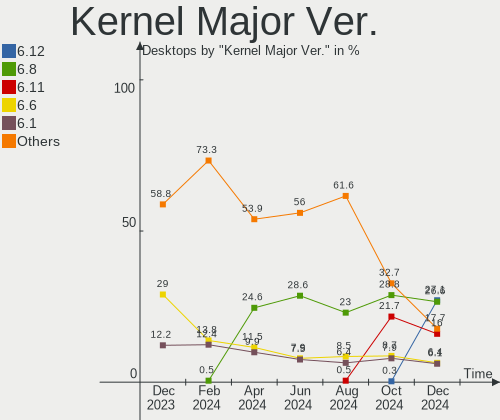
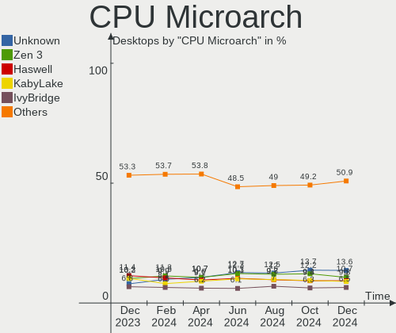
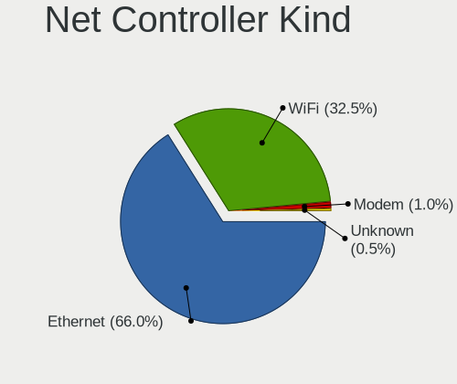

Linux Hardware Trends (Desktop)
-------------------------------

A project to identify most popular hardware characteristics and track their change
over time based on data collected by Linux users at https://Linux-Hardware.org.

Anyone can contribute to the study by uploading probes of their computers by
the [hw-probe](https://github.com/linuxhw/hw-probe) tool:

    sudo hw-probe -all -upload

Full-feature report is available here: https://linux-hardware.org/?view=trends&formfactor=desktop

Period: Feb, 2020.

Contents
--------

- [ OS                       ](#os)
- [ OS Family                ](#os-family)
- [ Kernel                   ](#kernel)
- [ Kernel Family            ](#kernel-family)
- [ Kernel Major Ver.        ](#kernel-major-ver)
- [ Arch                     ](#arch)
- [ DE                       ](#de)
- [ Display Server           ](#display-server)
- [ OS Lang                  ](#os-lang)
- [ Boot Mode                ](#boot-mode)
- [ Filesystem               ](#filesystem)
- [ Dual Boot with Linux     ](#dual-boot-with-linux)
- [ Dual Boot (Win)          ](#dual-boot-win)
- [ Country                  ](#country)
- [ City                     ](#city)
- [ Vendor                   ](#vendor)
- [ Model                    ](#model)
- [ Model Family             ](#model-family)
- [ MFG Year                 ](#mfg-year)
- [ Form Factor              ](#form-factor)
- [ Secure Boot              ](#secure-boot)
- [ Coreboot                 ](#coreboot)
- [ RAM Size                 ](#ram-size)
- [ RAM Used                 ](#ram-used)
- [ Drive Vendor             ](#drive-vendor)
- [ Drive Model              ](#drive-model)
- [ Drive Kind               ](#drive-kind)
- [ Drive Connector          ](#drive-connector)
- [ Drive Size               ](#drive-size)
- [ Space Total              ](#space-total)
- [ Space Used               ](#space-used)
- [ Malfunc. Drives          ](#malfunc-drives)
- [ Malfunc. Drive Vendor    ](#malfunc-drive-vendor)
- [ Malfunc. Drive Kind      ](#malfunc-drive-kind)
- [ Failed Drives            ](#failed-drives)
- [ Failed Drive Vendor      ](#failed-drive-vendor)
- [ Drive Status             ](#drive-status)
- [ Storage Vendor           ](#storage-vendor)
- [ Storage Model            ](#storage-model)
- [ Storage Kind             ](#storage-kind)
- [ CPU Vendor               ](#cpu-vendor)
- [ CPU Model                ](#cpu-model)
- [ CPU Model Family         ](#cpu-model-family)
- [ CPU Cores                ](#cpu-cores)
- [ CPU Sockets              ](#cpu-sockets)
- [ CPU Threads              ](#cpu-threads)
- [ CPU Op-Modes             ](#cpu-op-modes)
- [ CPU Microarch            ](#cpu-microarch)
- [ CPU Microcode            ](#cpu-microcode)
- [ GPU Vendor               ](#gpu-vendor)
- [ GPU Model                ](#gpu-model)
- [ GPU Combo                ](#gpu-combo)
- [ GPU Driver               ](#gpu-driver)
- [ GPU Memory               ](#gpu-memory)
- [ Monitor Vendor           ](#monitor-vendor)
- [ Monitor Model            ](#monitor-model)
- [ Monitor Resolution       ](#monitor-resolution)
- [ Monitor Diagonal         ](#monitor-diagonal)
- [ Monitor Width            ](#monitor-width)
- [ Aspect Ratio             ](#aspect-ratio)
- [ Monitor Area             ](#monitor-area)
- [ Pixel Density            ](#pixel-density)
- [ Multiple Monitors        ](#multiple-monitors)
- [ Net Controller Vendor    ](#net-controller-vendor)
- [ Net Controller Model     ](#net-controller-model)
- [ Net Controller Kind      ](#net-controller-kind)
- [ Used Controller          ](#used-controller)
- [ NICs                     ](#nics)
- [ Unsupported Devices      ](#unsupported-devices)
- [ Unsupported Device Types ](#unsupported-device-types)

OS
--

Installed operating systems

| Name                | Computers | Percent |
|---------------------|-----------|---------|
| Ubuntu 18.04        | 280       | 23.16%  |
| ROSA R11            | 147       | 12.16%  |
| Ubuntu 19.10        | 134       | 11.08%  |
| BlackPanther 18.1   | 104       | 8.6%    |
| Fedora 31           | 92        | 7.61%   |
| Mint 19.3           | 74        | 6.12%   |
| Manjaro 18.1.5      | 27        | 2.23%   |
| Zorin 15            | 25        | 2.07%   |
| Manjaro             | 22        | 1.82%   |
| Debian 10           | 18        | 1.49%   |
| Arch                | 16        | 1.32%   |
| Ubuntu 16.04        | 14        | 1.16%   |
| Endless 3.7.7       | 14        | 1.16%   |
| KDE neon 18.04      | 13        | 1.08%   |
| Ubuntu 19.04        | 12        | 0.99%   |
| Ubuntu 20.04        | 11        | 0.91%   |
| Endless 3.7.6       | 11        | 0.91%   |
| Mint 19.2           | 10        | 0.83%   |
| Arch Rolling        | 9         | 0.74%   |
| ROSA R8.1           | 8         | 0.66%   |
| ROSA R10            | 8         | 0.66%   |
| Fedora 30           | 7         | 0.58%   |
| Debian              | 7         | 0.58%   |
| Mint 19.1           | 6         | 0.5%    |
| Debian Testing      | 5         | 0.41%   |
| BlackPanther 16.2   | 5         | 0.41%   |
| Ubuntu 18.10        | 4         | 0.33%   |
| Pop!_OS 19.10       | 4         | 0.33%   |
| Peppermint 10       | 4         | 0.33%   |
| Mint 18.3           | 4         | 0.33%   |
| Manjaro 19.0        | 4         | 0.33%   |
| Mageia 7            | 4         | 0.33%   |
| Gentoo              | 4         | 0.33%   |
| Clear Linux 32270   | 4         | 0.33%   |
| RHEL 8.1            | 3         | 0.25%   |
| Parrot 4.8          | 3         | 0.25%   |
| Manjaro 19.0.0      | 3         | 0.25%   |
| Elementary 5.1.2    | 3         | 0.25%   |
| Debian Unstable     | 3         | 0.25%   |
| Clear Linux 32330   | 3         | 0.25%   |
| CentOS 8            | 3         | 0.25%   |
| Ubuntu Core 16      | 2         | 0.17%   |
| Ubuntu              | 2         | 0.17%   |
| Solus 4.1           | 2         | 0.17%   |
| openSUSE 20200201   | 2         | 0.17%   |
| openSUSE 15.1       | 2         | 0.17%   |
| Mint 19             | 2         | 0.17%   |
| Kali 2020.1         | 2         | 0.17%   |
| Fedora 33           | 2         | 0.17%   |
| Fedora 32           | 2         | 0.17%   |
| EndeavourOS Rolling | 2         | 0.17%   |
| Elementary 5.1      | 2         | 0.17%   |
| Deepin              | 2         | 0.17%   |
| Debian 9.11         | 2         | 0.17%   |
| ClearOS 7           | 2         | 0.17%   |
| Clear Linux 32480   | 2         | 0.17%   |
| Clear Linux 32390   | 2         | 0.17%   |
| Clear Linux 32380   | 2         | 0.17%   |
| Clear Linux 32370   | 2         | 0.17%   |
| Clear Linux 32260   | 2         | 0.17%   |

OS Family
---------

OS without a version

| Name         | Computers | Percent |
|--------------|-----------|---------|
| Ubuntu       | 461       | 38.13%  |
| ROSA         | 163       | 13.48%  |
| BlackPanther | 109       | 9.02%   |
| Fedora       | 104       | 8.6%    |
| Mint         | 98        | 8.11%   |
| Manjaro      | 56        | 4.63%   |
| Debian       | 38        | 3.14%   |
| Endless      | 30        | 2.48%   |
| Zorin        | 26        | 2.15%   |
| Arch         | 25        | 2.07%   |
| Clear Linux  | 24        | 1.99%   |
| KDE neon     | 13        | 1.08%   |
| openSUSE     | 10        | 0.83%   |
| Peppermint   | 5         | 0.41%   |
| Gentoo       | 5         | 0.41%   |
| Elementary   | 5         | 0.41%   |
| CentOS       | 5         | 0.41%   |
| Pop!_OS      | 4         | 0.33%   |
| Mageia       | 4         | 0.33%   |
| RHEL         | 3         | 0.25%   |
| Parrot       | 3         | 0.25%   |
| Kali         | 3         | 0.25%   |
| Solus        | 2         | 0.17%   |
| EndeavourOS  | 2         | 0.17%   |
| Deepin       | 2         | 0.17%   |
| ClearOS      | 2         | 0.17%   |
| Arcolinux    | 2         | 0.17%   |
| RED          | 1         | 0.08%   |
| Reborn OS    | 1         | 0.08%   |
| Oracle Linux | 1         | 0.08%   |
| Generic      | 1         | 0.08%   |
| Chrome OS    | 1         | 0.08%   |

Kernel
------

Version of the Linux kernel

| Version                          | Computers | Percent |
|----------------------------------|-----------|---------|
| 5.3.0-40-generic                 | 159       | 13.15%  |
| 5.3.0-28-generic                 | 157       | 12.99%  |
| 4.18.16-desktop-1bP              | 84        | 6.95%   |
| 4.15.0-76-generic                | 56        | 4.63%   |
| 5.3.0-29-generic                 | 55        | 4.55%   |
| 4.15.0-desktop-68.5rosa-x86_64   | 53        | 4.38%   |
| 4.15.0-desktop-45.1rosa-x86_64   | 48        | 3.97%   |
| 4.15.0-88-generic                | 38        | 3.14%   |
| 5.4.15-2-MANJARO                 | 19        | 1.57%   |
| 5.1.15-desktop-1bP               | 19        | 1.57%   |
| 5.5.5-200.fc31.x86_64            | 17        | 1.41%   |
| 5.4.18-200.fc31.x86_64           | 17        | 1.41%   |
| 5.4.19-200.fc31.x86_64           | 15        | 1.24%   |
| 5.4.17-200.fc31.x86_64           | 14        | 1.16%   |
| 4.9.155-nrj-desktop-1rosa-x86_64 | 14        | 1.16%   |
| 5.3.0-26-generic                 | 13        | 1.08%   |
| 4.15.0-desktop-68.5rosa-i586     | 13        | 1.08%   |
| 5.3.0-23-generic                 | 12        | 0.99%   |
| 5.3.0-18-generic                 | 12        | 0.99%   |
| 5.4.20-200.fc31.x86_64           | 11        | 0.91%   |
| 5.4.18-1-MANJARO                 | 11        | 0.91%   |
| 5.0.0-32-generic                 | 11        | 0.91%   |
| 5.0.0-38-generic                 | 10        | 0.83%   |
| 5.0.0-23-generic                 | 10        | 0.83%   |
| 4.15.0-desktop-45.1rosa-i586     | 9         | 0.74%   |
| 5.5.2-1-MANJARO                  | 7         | 0.58%   |
| 5.0.0-37-generic                 | 7         | 0.58%   |
| 5.5.0-1-MANJARO                  | 6         | 0.5%    |
| 5.4.18-902.native                | 6         | 0.5%    |
| 5.4.15-200.fc31.x86_64           | 6         | 0.5%    |
| 4.19.0-8-amd64                   | 6         | 0.5%    |
| 4.19.0-6-amd64                   | 6         | 0.5%    |
| 5.4.15-arch1-1                   | 5         | 0.41%   |
| 5.4.0-4-amd64                    | 5         | 0.41%   |
| 5.4.0-14-generic                 | 5         | 0.41%   |
| 5.3.0-40-lowlatency              | 5         | 0.41%   |
| 4.9.60-nrj-desktop-1rosa-x86_64  | 5         | 0.41%   |
| 4.9.20-desktop-pae-1bP           | 5         | 0.41%   |
| 4.15.0-74-generic                | 5         | 0.41%   |
| 5.3.0-41-generic                 | 4         | 0.33%   |
| 4.15.0-20-generic                | 4         | 0.33%   |
| 5.5.5-arch1-1                    | 3         | 0.25%   |
| 5.5.5-911.native                 | 3         | 0.25%   |
| 5.5.4-desktop-1.mga7             | 3         | 0.25%   |
| 5.5.4-arch1-1                    | 3         | 0.25%   |
| 5.5.4-910.native                 | 3         | 0.25%   |
| 5.5.3-arch1-1                    | 3         | 0.25%   |
| 5.5.3-908.native                 | 3         | 0.25%   |
| 5.5.2-arch1-1                    | 3         | 0.25%   |
| 5.4.6-2-MANJARO                  | 3         | 0.25%   |
| 5.4.18-100.fc30.x86_64           | 3         | 0.25%   |
| 5.4.13-201.fc31.x86_64           | 3         | 0.25%   |
| 5.4.0-3-amd64                    | 3         | 0.25%   |
| 5.4.0-0.bpo.2-amd64              | 3         | 0.25%   |
| 5.3.0-29-lowlatency              | 3         | 0.25%   |
| 5.3.0-24-generic                 | 3         | 0.25%   |
| 5.0.0-36-generic                 | 3         | 0.25%   |
| 4.9.0-8-amd64                    | 3         | 0.25%   |
| 4.9.0-11-amd64                   | 3         | 0.25%   |
| 4.19.102-1-MANJARO               | 3         | 0.25%   |

Kernel Family
-------------

Linux kernel without a distro release

| Version  | Computers | Percent |
|----------|-----------|---------|
| 5.3.0    | 435       | 35.98%  |
| 4.15.0   | 258       | 21.34%  |
| 4.18.16  | 84        | 6.95%   |
| 5.0.0    | 45        | 3.72%   |
| 5.4.18   | 39        | 3.23%   |
| 5.4.15   | 32        | 2.65%   |
| 5.4.0    | 27        | 2.23%   |
| 5.5.5    | 24        | 1.99%   |
| 5.1.15   | 20        | 1.65%   |
| 5.4.19   | 17        | 1.41%   |
| 5.4.17   | 17        | 1.41%   |
| 4.9.155  | 16        | 1.32%   |
| 4.18.0   | 16        | 1.32%   |
| 5.5.2    | 15        | 1.24%   |
| 4.19.0   | 15        | 1.24%   |
| 5.5.4    | 12        | 0.99%   |
| 5.4.20   | 11        | 0.91%   |
| 5.6.0    | 10        | 0.83%   |
| 5.5.0    | 10        | 0.83%   |
| 4.9.0    | 8         | 0.66%   |
| 5.5.3    | 7         | 0.58%   |
| 5.4.14   | 7         | 0.58%   |
| 4.9.60   | 7         | 0.58%   |
| 5.4.12   | 6         | 0.5%    |
| 4.9.20   | 5         | 0.41%   |
| 4.12.14  | 5         | 0.41%   |
| 5.4.13   | 4         | 0.33%   |
| 4.4.0    | 4         | 0.33%   |
| 3.10.0   | 4         | 0.33%   |
| 5.5.6    | 3         | 0.25%   |
| 5.5.1    | 3         | 0.25%   |
| 5.4.6    | 3         | 0.25%   |
| 5.4.16   | 3         | 0.25%   |
| 4.9.9    | 3         | 0.25%   |
| 4.19.102 | 3         | 0.25%   |
| 4.1.38   | 3         | 0.25%   |
| 5.4.22   | 2         | 0.17%   |
| 5.4.11   | 2         | 0.17%   |
| 5.3.6    | 2         | 0.17%   |
| 5.4.2    | 1         | 0.08%   |
| 5.3.9    | 1         | 0.08%   |
| 5.3.8    | 1         | 0.08%   |
| 5.3.7    | 1         | 0.08%   |
| 5.3.18   | 1         | 0.08%   |
| 5.3.16   | 1         | 0.08%   |
| 5.3.11   | 1         | 0.08%   |
| 5.2.9    | 1         | 0.08%   |
| 4.4.74   | 1         | 0.08%   |
| 4.19.99  | 1         | 0.08%   |
| 4.19.97  | 1         | 0.08%   |
| 4.19.86  | 1         | 0.08%   |
| 4.19.78  | 1         | 0.08%   |
| 4.19.65  | 1         | 0.08%   |
| 4.19.5   | 1         | 0.08%   |
| 4.19.101 | 1         | 0.08%   |
| 4.16.18  | 1         | 0.08%   |
| 4.13.0   | 1         | 0.08%   |
| 4.10.0   | 1         | 0.08%   |
| 3.19.0   | 1         | 0.08%   |
| 3.17.4   | 1         | 0.08%   |

Kernel Major Ver.
-----------------

Linux kernel major version

| Version | Computers | Percent |
|---------|-----------|---------|
| 5.3     | 443       | 36.64%  |
| 4.15    | 258       | 21.34%  |
| 5.4     | 171       | 14.14%  |
| 4.18    | 100       | 8.27%   |
| 5.5     | 74        | 6.12%   |
| 5.0     | 45        | 3.72%   |
| 4.9     | 39        | 3.23%   |
| 4.19    | 25        | 2.07%   |
| 5.1     | 20        | 1.65%   |
| 5.6     | 10        | 0.83%   |
| 4.4     | 5         | 0.41%   |
| 4.12    | 5         | 0.41%   |
| 3.10    | 4         | 0.33%   |
| 4.1     | 3         | 0.25%   |
| 5.2     | 1         | 0.08%   |
| 4.16    | 1         | 0.08%   |
| 4.13    | 1         | 0.08%   |
| 4.10    | 1         | 0.08%   |
| 3.19    | 1         | 0.08%   |
| 3.17    | 1         | 0.08%   |
| 3.16    | 1         | 0.08%   |

Arch
----

OS architecture (x86_64, i586, etc.)

| Name   | Computers | Percent |
|--------|-----------|---------|
| x86_64 | 1131      | 93.55%  |
| i686   | 78        | 6.45%   |

DE
--

Desktop Environment

| Name            | Computers | Percent |
|-----------------|-----------|---------|
| GNOME           | 477       | 39.45%  |
| KDE5            | 197       | 16.29%  |
| KDE4            | 112       | 9.26%   |
| Unknown         | 104       | 8.6%    |
| XFCE            | 75        | 6.2%    |
| X-Cinnamon      | 63        | 5.21%   |
| KDE             | 51        | 4.22%   |
| MATE            | 34        | 2.81%   |
| Cinnamon        | 24        | 1.99%   |
| Unity           | 15        | 1.24%   |
| Budgie          | 10        | 0.83%   |
| LXQt            | 7         | 0.58%   |
| LXDE            | 7         | 0.58%   |
| Pantheon        | 5         | 0.41%   |
| Openbox         | 5         | 0.41%   |
| Deepin          | 5         | 0.41%   |
| GNOME Classic   | 4         | 0.33%   |
| i3              | 3         | 0.25%   |
| GNOME Flashback | 3         | 0.25%   |
| Enlightenment   | 3         | 0.25%   |
| GNUstep         | 2         | 0.17%   |
| xubuntu         | 1         | 0.08%   |
| Peppermint      | 1         | 0.08%   |
| Awesome         | 1         | 0.08%   |

Display Server
--------------

X11 or Wayland

| Name    | Computers | Percent |
|---------|-----------|---------|
| X11     | 1094      | 90.49%  |
| Wayland | 63        | 5.21%   |
| Unknown | 40        | 3.31%   |
| Tty     | 12        | 0.99%   |

OS Lang
-------

Language

| Lang       | Computers | Percent |
|------------|-----------|---------|
| en_US      | 337       | 27.87%  |
| Unknown    | 312       | 25.81%  |
| de_DE      | 77        | 6.37%   |
| en_GB      | 63        | 5.21%   |
| ru_RU      | 62        | 5.13%   |
| pt_BR      | 53        | 4.38%   |
| it_IT      | 31        | 2.56%   |
| en_AU      | 25        | 2.07%   |
| fr_FR      | 22        | 1.82%   |
| en_CA      | 22        | 1.82%   |
| pl_PL      | 18        | 1.49%   |
| es_ES      | 18        | 1.49%   |
| en_US.utf8 | 16        | 1.32%   |
| nl_NL      | 15        | 1.24%   |
| C          | 12        | 0.99%   |
| ru_UA      | 10        | 0.83%   |
| es_AR      | 7         | 0.58%   |
| uk_UA      | 6         | 0.5%    |
| nl_BE      | 6         | 0.5%    |
| en_IN      | 6         | 0.5%    |
| cs_CZ      | 6         | 0.5%    |
| pt_BR.utf8 | 5         | 0.41%   |
| bg_BG      | 5         | 0.41%   |
| pt_PT      | 4         | 0.33%   |
| hu_HU      | 4         | 0.33%   |
| fr_CA      | 4         | 0.33%   |
| sk_SK      | 3         | 0.25%   |
| nb_NO      | 3         | 0.25%   |
| fi_FI      | 3         | 0.25%   |
| es_PE      | 3         | 0.25%   |
| de_DE.utf8 | 3         | 0.25%   |
| de_AT      | 3         | 0.25%   |
| sv_SE      | 2         | 0.17%   |
| ru_RU.utf8 | 2         | 0.17%   |
| ro_RO      | 2         | 0.17%   |
| ja_JP      | 2         | 0.17%   |
| fr_BE      | 2         | 0.17%   |
| et_EE      | 2         | 0.17%   |
| es_MX      | 2         | 0.17%   |
| es_BO      | 2         | 0.17%   |
| en_ZW      | 2         | 0.17%   |
| en_PH      | 2         | 0.17%   |
| en_IE      | 2         | 0.17%   |
| en_GB.utf8 | 2         | 0.17%   |
| el_GR      | 2         | 0.17%   |
| zh_TW      | 1         | 0.08%   |
| zh_CN      | 1         | 0.08%   |
| sv_FI      | 1         | 0.08%   |
| lt_LT      | 1         | 0.08%   |
| ko_KR      | 1         | 0.08%   |
| id_ID      | 1         | 0.08%   |
| he_IL      | 1         | 0.08%   |
| fr_CH      | 1         | 0.08%   |
| es_VE      | 1         | 0.08%   |
| es_MX.utf8 | 1         | 0.08%   |
| es_DO      | 1         | 0.08%   |
| eo         | 1         | 0.08%   |
| en_ZA      | 1         | 0.08%   |
| en_NZ      | 1         | 0.08%   |
| en_IN      | 1         | 0.08%   |

Boot Mode
---------

EFI or BIOS

| Mode | Computers | Percent |
|------|-----------|---------|
| BIOS | 841       | 69.56%  |
| EFI  | 368       | 30.44%  |

Filesystem
----------

Type of filesystem

| Type     | Computers | Percent |
|----------|-----------|---------|
| Ext4     | 1087      | 89.91%  |
| Btrfs    | 37        | 3.06%   |
| Xfs      | 33        | 2.73%   |
| Overlay  | 26        | 2.15%   |
| Ext3     | 8         | 0.66%   |
| Zfs      | 4         | 0.33%   |
| Tmpfs    | 3         | 0.25%   |
| Unknown  | 3         | 0.25%   |
| Jfs      | 2         | 0.17%   |
| F2fs     | 2         | 0.17%   |
| Ext2     | 2         | 0.17%   |
| Rootfs   | 1         | 0.08%   |
| Reiserfs | 1         | 0.08%   |

Dual Boot with Linux
--------------------

Hosting more than one Linux

| Dual boot | Computers | Percent |
|-----------|-----------|---------|
| No        | 1012      | 83.71%  |
| Yes       | 197       | 16.29%  |

Dual Boot (Win)
---------------

Hosting Linux and Windows

| Dual boot | Computers | Percent |
|-----------|-----------|---------|
| No        | 809       | 66.91%  |
| Yes       | 400       | 33.09%  |

Country
-------

Geographic location (country)

| Country        | Computers | Percent |
|----------------|-----------|---------|
| USA            | 203       | 16.79%  |
| Russia         | 187       | 15.47%  |
| Germany        | 99        | 8.19%   |
| Hungary        | 92        | 7.61%   |
| Brazil         | 75        | 6.2%    |
| UK             | 59        | 4.88%   |
| Ukraine        | 39        | 3.23%   |
| Italy          | 39        | 3.23%   |
| Canada         | 33        | 2.73%   |
| Australia      | 32        | 2.65%   |
| France         | 31        | 2.56%   |
| Spain          | 29        | 2.4%    |
| Poland         | 29        | 2.4%    |
| Netherlands    | 24        | 1.99%   |
| Romania        | 12        | 0.99%   |
| Norway         | 11        | 0.91%   |
| Czech Republic | 11        | 0.91%   |
| Argentina      | 11        | 0.91%   |
| Greece         | 10        | 0.83%   |
| India          | 9         | 0.74%   |
| Finland        | 9         | 0.74%   |
| Belgium        | 9         | 0.74%   |
| Slovakia       | 8         | 0.66%   |
| Austria        | 8         | 0.66%   |
| Mexico         | 7         | 0.58%   |
| Bulgaria       | 7         | 0.58%   |
| Sweden         | 6         | 0.5%    |
| Serbia         | 6         | 0.5%    |
| Portugal       | 6         | 0.5%    |
| Indonesia      | 6         | 0.5%    |
| Switzerland    | 4         | 0.33%   |
| Peru           | 4         | 0.33%   |
| Lithuania      | 4         | 0.33%   |
| Kazakhstan     | 4         | 0.33%   |
| Hong Kong      | 4         | 0.33%   |
| Denmark        | 4         | 0.33%   |
| Venezuela      | 3         | 0.25%   |
| Thailand       | 3         | 0.25%   |
| Puerto Rico    | 3         | 0.25%   |
| Philippines    | 3         | 0.25%   |
| Israel         | 3         | 0.25%   |
| Ireland        | 3         | 0.25%   |
| Iran           | 3         | 0.25%   |
| Estonia        | 3         | 0.25%   |
| Croatia        | 3         | 0.25%   |
| Colombia       | 3         | 0.25%   |
| Belarus        | 3         | 0.25%   |
| Turkey         | 2         | 0.17%   |
| Taiwan         | 2         | 0.17%   |
| South Korea    | 2         | 0.17%   |
| South Africa   | 2         | 0.17%   |
| New Zealand    | 2         | 0.17%   |
| Malaysia       | 2         | 0.17%   |
| Latvia         | 2         | 0.17%   |
| Japan          | 2         | 0.17%   |
| Iceland        | 2         | 0.17%   |
| Egypt          | 2         | 0.17%   |
| China          | 2         | 0.17%   |
| Bolivia        | 2         | 0.17%   |
| Algeria        | 2         | 0.17%   |

City
----

Geographic location (city)

| City              | Computers | Percent |
|-------------------|-----------|---------|
| Moscow            | 28        | 2.32%   |
| Budapest          | 25        | 2.07%   |
| St Petersburg     | 19        | 1.57%   |
| São Paulo        | 10        | 0.83%   |
| Novosibirsk       | 9         | 0.74%   |
| Berlin            | 9         | 0.74%   |
| Kharkiv           | 8         | 0.66%   |
| Frankfurt am Main | 8         | 0.66%   |
| Yekaterinburg     | 7         | 0.58%   |
| Warsaw            | 7         | 0.58%   |
| Wahroonga         | 7         | 0.58%   |
| Voronezh          | 6         | 0.5%    |
| Vienna            | 6         | 0.5%    |
| Rome              | 6         | 0.5%    |
| Eger              | 6         | 0.5%    |
| Toronto           | 5         | 0.41%   |
| Paris             | 5         | 0.41%   |
| Omsk              | 5         | 0.41%   |
| New York          | 5         | 0.41%   |
| Montreal          | 5         | 0.41%   |
| Madrid            | 5         | 0.41%   |
| Krasnodar         | 5         | 0.41%   |
| Kazan’          | 5         | 0.41%   |
| Hamburg           | 5         | 0.41%   |
| Athens            | 5         | 0.41%   |
| Vilnius           | 4         | 0.33%   |
| Tucson            | 4         | 0.33%   |
| Nuremberg         | 4         | 0.33%   |
| Munich            | 4         | 0.33%   |
| Leeds             | 4         | 0.33%   |
| Kyiv              | 4         | 0.33%   |
| Gödöllő        | 4         | 0.33%   |
| Bucharest         | 4         | 0.33%   |
| Barnaul           | 4         | 0.33%   |
| Barcelona         | 4         | 0.33%   |
| Amsterdam         | 4         | 0.33%   |
| Wrocław          | 3         | 0.25%   |
| Warrington        | 3         | 0.25%   |
| Thessaloniki      | 3         | 0.25%   |
| Stockholm         | 3         | 0.25%   |
| Sofia             | 3         | 0.25%   |
| Seville           | 3         | 0.25%   |
| Seattle           | 3         | 0.25%   |
| San Francisco     | 3         | 0.25%   |
| Samara            | 3         | 0.25%   |
| Rio de Janeiro    | 3         | 0.25%   |
| Pécs             | 3         | 0.25%   |
| Padova            | 3         | 0.25%   |
| Oslo              | 3         | 0.25%   |
| Odesa             | 3         | 0.25%   |
| Miskolc           | 3         | 0.25%   |
| Minneapolis       | 3         | 0.25%   |
| Manchester        | 3         | 0.25%   |
| Lviv              | 3         | 0.25%   |
| Lima              | 3         | 0.25%   |
| Las Vegas         | 3         | 0.25%   |
| Kryvyy Rih        | 3         | 0.25%   |
| Khabarovsk        | 3         | 0.25%   |
| Győr             | 3         | 0.25%   |
| Galion            | 3         | 0.25%   |

Vendor
------

Motherboard manufacturer

| Name                     | Computers | Percent |
|--------------------------|-----------|---------|
| ASUSTek Computer         | 334       | 27.63%  |
| Gigabyte Technology      | 250       | 20.68%  |
| ASRock                   | 124       | 10.26%  |
| MSI                      | 119       | 9.84%   |
| Dell                     | 95        | 7.86%   |
| Hewlett-Packard          | 58        | 4.8%    |
| Lenovo                   | 35        | 2.89%   |
| Intel                    | 32        | 2.65%   |
| Acer                     | 26        | 2.15%   |
| Fujitsu                  | 13        | 1.08%   |
| Unknown                  | 13        | 1.08%   |
| ECS                      | 12        | 0.99%   |
| Biostar                  | 12        | 0.99%   |
| Pegatron                 | 10        | 0.83%   |
| Foxconn                  | 9         | 0.74%   |
| Supermicro               | 7         | 0.58%   |
| Medion                   | 7         | 0.58%   |
| Fujitsu Siemens          | 7         | 0.58%   |
| PCWare                   | 4         | 0.33%   |
| eMachines                | 4         | 0.33%   |
| Shuttle                  | 3         | 0.25%   |
| Apple                    | 3         | 0.25%   |
| Positivo                 | 2         | 0.17%   |
| Huanan                   | 2         | 0.17%   |
| Google                   | 2         | 0.17%   |
| WinFast                  | 1         | 0.08%   |
| System76                 | 1         | 0.08%   |
| Semp Toshiba             | 1         | 0.08%   |
| QDI                      | 1         | 0.08%   |
| PCChips                  | 1         | 0.08%   |
| Packard Bell             | 1         | 0.08%   |
| Onda technology          | 1         | 0.08%   |
| O.E.M.                   | 1         | 0.08%   |
| Nvidia                   | 1         | 0.08%   |
| MINIX TECHNOLOGY LIMITED | 1         | 0.08%   |
| Megaware                 | 1         | 0.08%   |
| LattePanda               | 1         | 0.08%   |
| KupiDeshego Edition      | 1         | 0.08%   |
| iEi                      | 1         | 0.08%   |
| IBM                      | 1         | 0.08%   |
| Gateway                  | 1         | 0.08%   |
| FLEX Industries          | 1         | 0.08%   |
| EMAXX TECHNOLOGY         | 1         | 0.08%   |
| DFI                      | 1         | 0.08%   |
| AZW                      | 1         | 0.08%   |
| ASRockRack               | 1         | 0.08%   |
| AMI                      | 1         | 0.08%   |
| AMD                      | 1         | 0.08%   |
| Alienware                | 1         | 0.08%   |
| ABIT                     | 1         | 0.08%   |
| AAEON                    | 1         | 0.08%   |

Model
-----

Motherboard model

| Name                             | Computers | Percent |
|----------------------------------|-----------|---------|
| ASUS All Series                  | 38        | 3.14%   |
| Unknown                          | 13        | 1.08%   |
| MSI MS-7C02                      | 9         | 0.74%   |
| Gigabyte B450M DS3H              | 8         | 0.66%   |
| Dell OptiPlex 7010               | 7         | 0.58%   |
| Dell OptiPlex 755                | 6         | 0.5%    |
| ASUS PRIME A320M-K               | 6         | 0.5%    |
| ASRock N68C-S UCC                | 6         | 0.5%    |
| MSI MS-7B79                      | 5         | 0.41%   |
| Dell OptiPlex 3020               | 5         | 0.41%   |
| MSI MS-7C37                      | 4         | 0.33%   |
| MSI MS-7817                      | 4         | 0.33%   |
| MSI MS-7309                      | 4         | 0.33%   |
| Gigabyte GA-78LMT-USB3           | 4         | 0.33%   |
| Gigabyte G31M-ES2L               | 4         | 0.33%   |
| Gigabyte B450 AORUS ELITE        | 4         | 0.33%   |
| Dell OptiPlex 790                | 4         | 0.33%   |
| Dell OptiPlex 780                | 4         | 0.33%   |
| Dell OptiPlex 760                | 4         | 0.33%   |
| ASUS PRIME X470-PRO              | 4         | 0.33%   |
| ASUS M5A97 R2.0                  | 4         | 0.33%   |
| ASUS M5A78L-M/USB3               | 4         | 0.33%   |
| ASRock Z77 Extreme4              | 4         | 0.33%   |
| ASRock G41M-VS3                  | 4         | 0.33%   |
| MSI MS-7895                      | 3         | 0.25%   |
| HP Z400 Workstation              | 3         | 0.25%   |
| HP Compaq 8200 Elite SFF PC      | 3         | 0.25%   |
| Gigabyte Z97P-D3                 | 3         | 0.25%   |
| Gigabyte X58A-UD3R               | 3         | 0.25%   |
| Gigabyte X470 AORUS ULTRA GAMING | 3         | 0.25%   |
| Gigabyte H77N-WIFI               | 3         | 0.25%   |
| Gigabyte H61M-S2PV               | 3         | 0.25%   |
| Gigabyte H310M H 2.0             | 3         | 0.25%   |
| Gigabyte GA-970A-UD3             | 3         | 0.25%   |
| Gigabyte GA-870A-UD3             | 3         | 0.25%   |
| Gigabyte B85M-D3H                | 3         | 0.25%   |
| Gigabyte B450M S2H               | 3         | 0.25%   |
| Gigabyte AB350-Gaming 3          | 3         | 0.25%   |
| Gigabyte A320M-S2H               | 3         | 0.25%   |
| Gigabyte 970A-DS3P               | 3         | 0.25%   |
| Dell OptiPlex 990                | 3         | 0.25%   |
| Dell OptiPlex 7020               | 3         | 0.25%   |
| Dell OptiPlex 330                | 3         | 0.25%   |
| ASUS Z170-A                      | 3         | 0.25%   |
| ASUS SABERTOOTH 990FX R2.0       | 3         | 0.25%   |
| ASUS ROG STRIX B450-F GAMING     | 3         | 0.25%   |
| ASUS PRIME B350-PLUS             | 3         | 0.25%   |
| ASUS P8B75-M                     | 3         | 0.25%   |
| ASUS P5Q                         | 3         | 0.25%   |
| ASUS P5KPL-AM EPU                | 3         | 0.25%   |
| ASUS P5KPL-AM                    | 3         | 0.25%   |
| ASUS P5G41T-M LX                 | 3         | 0.25%   |
| ASUS M4A785TD-V EVO              | 3         | 0.25%   |
| ASRock Z170 Pro4S                | 3         | 0.25%   |
| ASRock FM2A68M-DG3+              | 3         | 0.25%   |
| ASRock B450M Pro4                | 3         | 0.25%   |
| ASRock A320M-HDV R4.0            | 3         | 0.25%   |
| MSI MS-7B89                      | 2         | 0.17%   |
| MSI MS-7B78                      | 2         | 0.17%   |
| MSI MS-7B38                      | 2         | 0.17%   |

Model Family
------------

Motherboard model prefix

| Name                    | Computers | Percent |
|-------------------------|-----------|---------|
| Dell OptiPlex           | 59        | 4.88%   |
| ASUS PRIME              | 43        | 3.56%   |
| ASUS All                | 38        | 3.14%   |
| HP Compaq               | 24        | 1.99%   |
| Lenovo ThinkCentre      | 22        | 1.82%   |
| ASUS ROG                | 18        | 1.49%   |
| Dell Precision          | 14        | 1.16%   |
| Acer Aspire             | 13        | 1.08%   |
| Unknown                 | 13        | 1.08%   |
| Gigabyte B450M          | 11        | 0.91%   |
| Dell Inspiron           | 11        | 0.91%   |
| Acer Veriton            | 10        | 0.83%   |
| MSI MS-7C02             | 9         | 0.74%   |
| Gigabyte B450           | 9         | 0.74%   |
| ASUS TUF                | 9         | 0.74%   |
| ASUS M5A78L-M           | 9         | 0.74%   |
| HP EliteDesk            | 8         | 0.66%   |
| Gigabyte X570           | 8         | 0.66%   |
| Lenovo IdeaCentre       | 7         | 0.58%   |
| Gigabyte H310M          | 7         | 0.58%   |
| Fujitsu ESPRIMO         | 7         | 0.58%   |
| ASUS P5KPL-AM           | 7         | 0.58%   |
| ASUS M5A97              | 7         | 0.58%   |
| Gigabyte GA-78LMT-USB3  | 6         | 0.5%    |
| Dell XPS                | 6         | 0.5%    |
| ASUS SABERTOOTH         | 6         | 0.5%    |
| ASUS Maximus            | 6         | 0.5%    |
| ASRock N68C-S           | 6         | 0.5%    |
| MSI MS-7B79             | 5         | 0.41%   |
| Gigabyte Z390           | 5         | 0.41%   |
| Gigabyte A320M-S2H      | 5         | 0.41%   |
| ASUS Rampage            | 5         | 0.41%   |
| ASUS P8Z77-V            | 5         | 0.41%   |
| ASRock Z77              | 5         | 0.41%   |
| MSI MS-7C37             | 4         | 0.33%   |
| MSI MS-7817             | 4         | 0.33%   |
| MSI MS-7309             | 4         | 0.33%   |
| HP Pavilion             | 4         | 0.33%   |
| Gigabyte X470           | 4         | 0.33%   |
| Gigabyte G31M-ES2L      | 4         | 0.33%   |
| Gigabyte AX370-Gaming   | 4         | 0.33%   |
| Fujitsu Siemens ESPRIMO | 4         | 0.33%   |
| ASUS P8B75-M            | 4         | 0.33%   |
| ASUS P5Q                | 4         | 0.33%   |
| ASUS P5K                | 4         | 0.33%   |
| ASUS P5G41T-M           | 4         | 0.33%   |
| ASRock Z170             | 4         | 0.33%   |
| ASRock X399             | 4         | 0.33%   |
| ASRock G41M-VS3         | 4         | 0.33%   |
| ASRock A320M-HDV        | 4         | 0.33%   |
| ASRock 970              | 4         | 0.33%   |
| MSI MS-7895             | 3         | 0.25%   |
| HP Z400                 | 3         | 0.25%   |
| HP ProLiant             | 3         | 0.25%   |
| Gigabyte Z97P-D3        | 3         | 0.25%   |
| Gigabyte X58A-UD3R      | 3         | 0.25%   |
| Gigabyte H77N-WIFI      | 3         | 0.25%   |
| Gigabyte H61M-S2PV      | 3         | 0.25%   |
| Gigabyte GA-970A-UD3    | 3         | 0.25%   |
| Gigabyte GA-870A-UD3    | 3         | 0.25%   |

MFG Year
--------

Motherboard manufacture year

| Year    | Computers | Percent |
|---------|-----------|---------|
| 2019    | 200       | 16.54%  |
| 2018    | 127       | 10.5%   |
| 2014    | 107       | 8.85%   |
| 2013    | 96        | 7.94%   |
| 2010    | 96        | 7.94%   |
| 2011    | 92        | 7.61%   |
| 2012    | 91        | 7.53%   |
| 2015    | 74        | 6.12%   |
| 2009    | 69        | 5.71%   |
| 2016    | 68        | 5.62%   |
| 2008    | 57        | 4.71%   |
| 2017    | 52        | 4.3%    |
| 2007    | 35        | 2.89%   |
| 2006    | 22        | 1.82%   |
| 2005    | 10        | 0.83%   |
| 2004    | 5         | 0.41%   |
| 2020    | 2         | 0.17%   |
| 2003    | 2         | 0.17%   |
| Unknown | 2         | 0.17%   |
| 2001    | 1         | 0.08%   |
| 2000    | 1         | 0.08%   |

Form Factor
-----------

Physical design of the computer

| Name    | Computers | Percent |
|---------|-----------|---------|
| Desktop | 1209      | 100%    |

Secure Boot
-----------

Enabled or disabled

| State    | Computers | Percent |
|----------|-----------|---------|
| Disabled | 1188      | 98.26%  |
| Enabled  | 21        | 1.74%   |

Coreboot
--------

Have coreboot on board

| Used | Computers | Percent |
|------|-----------|---------|
| No   | 1207      | 99.83%  |
| Yes  | 2         | 0.17%   |

RAM Size
--------

Total RAM memory

| Size in GB  | Computers | Percent |
|-------------|-----------|---------|
| 16.01-24.0  | 268       | 22.17%  |
| 8.01-16.0   | 263       | 21.75%  |
| 3.01-4.0    | 253       | 20.93%  |
| 4.01-8.0    | 164       | 13.56%  |
| 32.01-64.0  | 111       | 9.18%   |
| 1.01-2.0    | 70        | 5.79%   |
| 64.01-256.0 | 27        | 2.23%   |
| 2.01-3.0    | 24        | 1.99%   |
| 24.01-32.0  | 15        | 1.24%   |
| 0.01-1.0    | 12        | 0.99%   |
| Unknown     | 2         | 0.17%   |

RAM Used
--------

Used RAM memory

| Used GB     | Computers | Percent |
|-------------|-----------|---------|
| 1.01-2.0    | 459       | 37.97%  |
| 2.01-3.0    | 244       | 20.18%  |
| 0.01-1.0    | 219       | 18.11%  |
| 4.01-8.0    | 140       | 11.58%  |
| 3.01-4.0    | 105       | 8.68%   |
| 8.01-16.0   | 29        | 2.4%    |
| 24.01-32.0  | 5         | 0.41%   |
| 16.01-24.0  | 5         | 0.41%   |
| Unknown     | 2         | 0.17%   |
| 64.01-256.0 | 1         | 0.08%   |

Drive Vendor
------------

Hard drive vendors

| Vendor                | Computers | Drives | Percent |
|-----------------------|-----------|--------|---------|
| Seagate               | 440       | 564    | 22.88%  |
| WDC                   | 436       | 623    | 22.67%  |
| Samsung Electronics   | 261       | 335    | 13.57%  |
| Kingston              | 127       | 144    | 6.6%    |
| Toshiba               | 111       | 122    | 5.77%   |
| Hitachi               | 95        | 106    | 4.94%   |
| Crucial               | 65        | 74     | 3.38%   |
| SanDisk               | 51        | 57     | 2.65%   |
| Intel                 | 36        | 40     | 1.87%   |
| A-DATA Technology     | 26        | 27     | 1.35%   |
| MAXTOR                | 20        | 21     | 1.04%   |
| HGST                  | 18        | 23     | 0.94%   |
| China                 | 18        | 19     | 0.94%   |
| OCZ                   | 14        | 14     | 0.73%   |
| Patriot               | 13        | 13     | 0.68%   |
| Unknown               | 12        | 12     | 0.62%   |
| SPCC                  | 11        | 11     | 0.57%   |
| Corsair               | 10        | 10     | 0.52%   |
| Hewlett-Packard       | 9         | 8      | 0.47%   |
| Team                  | 8         | 9      | 0.42%   |
| PNY                   | 7         | 7      | 0.36%   |
| Generic               | 7         | 7      | 0.36%   |
| SK Hynix              | 6         | 6      | 0.31%   |
| Micron Technology     | 6         | 6      | 0.31%   |
| Intenso               | 6         | 6      | 0.31%   |
| Apacer                | 6         | 7      | 0.31%   |
| Transcend             | 5         | 5      | 0.26%   |
| Smartbuy              | 5         | 5      | 0.26%   |
| JMicron               | 5         | 5      | 0.26%   |
| Gigabyte Technology   | 5         | 5      | 0.26%   |
| Fujitsu               | 5         | 5      | 0.26%   |
| XPG                   | 4         | 5      | 0.21%   |
| PLEXTOR               | 4         | 4      | 0.21%   |
| LITEON                | 4         | 4      | 0.21%   |
| KingSpec              | 4         | 6      | 0.21%   |
| KingDian              | 4         | 7      | 0.21%   |
| GOODRAM               | 4         | 4      | 0.21%   |
| ASMT                  | 4         | 5      | 0.21%   |
| Phison                | 3         | 3      | 0.16%   |
| LITEONIT              | 3         | 3      | 0.16%   |
| Drevo                 | 3         | 3      | 0.16%   |
| Zheino                | 2         | 2      | 0.1%    |
| TO Exter              | 2         | 2      | 0.1%    |
| KINGMAX               | 2         | 2      | 0.1%    |
| HUAWEI                | 2         | 2      | 0.1%    |
| AMD                   | 2         | 3      | 0.1%    |
| WDC WD40              | 1         | 1      | 0.05%   |
| WDC WD20              | 1         | 1      | 0.05%   |
| WD MediaMax           | 1         | 1      | 0.05%   |
| VMware                | 1         | 1      | 0.05%   |
| Verbatim              | 1         | 1      | 0.05%   |
| TSA                   | 1         | 1      | 0.05%   |
| TAMMUZ                | 1         | 1      | 0.05%   |
| StoreJet              | 1         | 1      | 0.05%   |
| SINTECHI              | 1         | 1      | 0.05%   |
| Realtek Semiconductor | 1         | 1      | 0.05%   |
| OWC                   | 1         | 1      | 0.05%   |
| OCZ-VERTEX2           | 1         | 1      | 0.05%   |
| OCZ-AGIL              | 1         | 1      | 0.05%   |
| Netac                 | 1         | 1      | 0.05%   |

Drive Model
-----------

Hard drive models

| Model                        | Computers | Percent |
|------------------------------|-----------|---------|
| ST500DM002-1BD142 500GB      | 45        | 2.01%   |
| DT01ACA100 1TB               | 35        | 1.56%   |
| SA400S37120G 120GB SSD       | 30        | 1.34%   |
| WD10EZEX-08WN4A0 1TB         | 26        | 1.16%   |
| SSD 850 EVO 250GB            | 26        | 1.16%   |
| ST1000DM010-2EP102 1TB       | 25        | 1.11%   |
| SA400S37240G 240GB SSD       | 23        | 1.02%   |
| SV300S37A120G 120GB SSD      | 21        | 0.94%   |
| SSD 850 EVO 500GB            | 20        | 0.89%   |
| DT01ACA050 500GB             | 18        | 0.8%    |
| ST1000DM003-1ER162 1TB       | 15        | 0.67%   |
| ST3160815AS 160GB            | 14        | 0.62%   |
| SSD 860 EVO 500GB            | 14        | 0.62%   |
| ST3500418AS 500GB            | 13        | 0.58%   |
| ST2000DM001-1ER164 2TB       | 13        | 0.58%   |
| SSD 860 EVO 1TB              | 13        | 0.58%   |
| CT500MX500SSD1 500GB         | 13        | 0.58%   |
| ST1000DM003-1CH162 1TB       | 12        | 0.53%   |
| SSD 860 EVO 250GB            | 12        | 0.53%   |
| HD103SJ 1TB                  | 12        | 0.53%   |
| WD10EZEX-00BN5A0 1TB         | 11        | 0.49%   |
| ST2000DM006-2DM164 2TB       | 11        | 0.49%   |
| ST2000DM001-1CH164 2TB       | 11        | 0.49%   |
| ST1000DM003-9YN162 1TB       | 11        | 0.49%   |
| WD30EFRX-68EUZN0 3TB         | 10        | 0.45%   |
| ST31000528AS 1TB             | 10        | 0.45%   |
| SSD 840 EVO 120GB            | 10        | 0.45%   |
| SDSSDA240G 240GB             | 10        | 0.45%   |
| WD20EZRZ-00Z5HB0 2TB         | 9         | 0.4%    |
| WD1003FZEX-00MK2A0 1TB       | 9         | 0.4%    |
| ST31000524AS 1TB             | 9         | 0.4%    |
| ST2000DM008-2FR102 2TB       | 9         | 0.4%    |
| ST1000DM003-1SB102 1TB       | 9         | 0.4%    |
| HD502HJ 500GB                | 9         | 0.4%    |
| WD20EZRX-00D8PB0 2TB         | 8         | 0.36%   |
| SV300S37A240G 240GB SSD      | 8         | 0.36%   |
| ST3250318AS 250GB            | 8         | 0.36%   |
| ST2000DX002-2DV164 2TB       | 8         | 0.36%   |
| SSD 840 EVO 250GB            | 8         | 0.36%   |
| CT240BX500SSD1 240GB         | 8         | 0.36%   |
| WDS240G2G0A-00JH30 240GB SSD | 7         | 0.31%   |
| WDS120G2G0A-00JH30 120GB SSD | 7         | 0.31%   |
| WD5000AAKX-001CA0 500GB      | 7         | 0.31%   |
| WD20EARX-00PASB0 2TB         | 7         | 0.31%   |
| WD10EARS-00Y5B1 1TB          | 7         | 0.31%   |
| SUV400S37240G 240GB SSD      | 7         | 0.31%   |
| ST380815AS 80GB              | 7         | 0.31%   |
| ST3500312CS 500GB            | 7         | 0.31%   |
| ST3250410AS 250GB            | 7         | 0.31%   |
| ST2000DL003-9VT166 2TB       | 7         | 0.31%   |
| SSD PLUS 240GB               | 7         | 0.31%   |
| HDWD110 1TB                  | 7         | 0.31%   |
| HDS721050CLA362 500GB        | 7         | 0.31%   |
| Expansion 1TB                | 7         | 0.31%   |
| DT01ACA200 2TB               | 7         | 0.31%   |
| WD10EZEX-22MFCA0 1TB         | 6         | 0.27%   |
| SSDSC2BW120A4 120GB          | 6         | 0.27%   |
| SSD 120GB                    | 6         | 0.27%   |
| SP2504C 250GB                | 6         | 0.27%   |
| SA400S37480G 480GB SSD       | 6         | 0.27%   |

Drive Kind
----------

HDD or SSD

| Kind    | Computers | Drives | Percent |
|---------|-----------|--------|---------|
| HDD     | 945       | 1516   | 58.33%  |
| SSD     | 565       | 739    | 34.88%  |
| NVMe    | 59        | 70     | 3.64%   |
| Unknown | 48        | 56     | 2.96%   |
| MMC     | 3         | 3      | 0.19%   |

Drive Connector
---------------

SATA, SAS, NVMe, etc.

| Type | Computers | Drives | Percent |
|------|-----------|--------|---------|
| SATA | 1157      | 2236   | 90.39%  |
| SAS  | 61        | 75     | 4.77%   |
| NVMe | 59        | 70     | 4.61%   |
| MMC  | 3         | 3      | 0.23%   |

Drive Size
----------

Size of hard drive

| Size in TB | Computers | Drives | Percent |
|------------|-----------|--------|---------|
| 0.01-0.5   | 941       | 1379   | 55.65%  |
| 0.51-1.0   | 460       | 579    | 27.2%   |
| 1.01-2.0   | 172       | 225    | 10.17%  |
| 3.01-4.0   | 47        | 56     | 2.78%   |
| 2.01-3.0   | 37        | 58     | 2.19%   |
| 4.01-10.0  | 30        | 82     | 1.77%   |
| 10.01-20.0 | 4         | 5      | 0.24%   |

Space Total
-----------

Amount of disk space available on the file system

| Size in GB     | Computers | Percent |
|----------------|-----------|---------|
| 101-250        | 317       | 26.22%  |
| 251-500        | 216       | 17.87%  |
| 501-1000       | 182       | 15.05%  |
| 1001-2000      | 118       | 9.76%   |
| 51-100         | 94        | 7.78%   |
| More than 3000 | 92        | 7.61%   |
| 2001-3000      | 67        | 5.54%   |
| 21-50          | 62        | 5.13%   |
| 1-20           | 41        | 3.39%   |
| Unknown        | 20        | 1.65%   |

Space Used
----------

Amount of used disk space

| Used GB        | Computers | Percent |
|----------------|-----------|---------|
| 1-20           | 492       | 40.69%  |
| 21-50          | 170       | 14.06%  |
| 101-250        | 126       | 10.42%  |
| 51-100         | 111       | 9.18%   |
| 251-500        | 80        | 6.62%   |
| 501-1000       | 80        | 6.62%   |
| 1001-2000      | 74        | 6.12%   |
| More than 3000 | 34        | 2.81%   |
| 2001-3000      | 22        | 1.82%   |
| Unknown        | 20        | 1.65%   |

Malfunc. Drives
---------------

Drive models with a malfunction

| Model                        | Computers | Drives | Percent |
|------------------------------|-----------|--------|---------|
| ST500DM002-1BD142 500GB      | 11        | 11     | 5.64%   |
| ST31000528AS 1TB             | 4         | 4      | 2.05%   |
| WD5000AAKS-00UU3A0 500GB     | 3         | 3      | 1.54%   |
| ST3500418AS 500GB            | 3         | 3      | 1.54%   |
| ST3250410AS 250GB            | 3         | 3      | 1.54%   |
| ST3160815AS 160GB            | 3         | 4      | 1.54%   |
| ST2000DM001-9YN164 2TB       | 3         | 3      | 1.54%   |
| ST1000DM003-9YN162 1TB       | 3         | 3      | 1.54%   |
| SSDSC2CT120A3 120GB          | 3         | 3      | 1.54%   |
| HDS721616PLA380 160GB        | 3         | 3      | 1.54%   |
| HDS721010CLA332 1TB          | 3         | 3      | 1.54%   |
| HD322HJ 320GB                | 3         | 3      | 1.54%   |
| WD5000AADS-00S9B0 500GB      | 2         | 2      | 1.03%   |
| WD30EFRX-68EUZN0 3TB         | 2         | 11     | 1.03%   |
| WD1600AVVS-63L2B0 160GB      | 2         | 2      | 1.03%   |
| WD10EZEX-08WN4A0 1TB         | 2         | 2      | 1.03%   |
| WD10EARS-00Y5B1 1TB          | 2         | 2      | 1.03%   |
| SP2504C 250GB                | 2         | 2      | 1.03%   |
| HD502HJ 500GB                | 2         | 2      | 1.03%   |
| HD300LJ 304GB                | 2         | 2      | 1.03%   |
| HD103UJ 1TB                  | 2         | 2      | 1.03%   |
| HD080HJ 80GB                 | 2         | 2      | 1.03%   |
| DT01ACA050 500GB             | 2         | 2      | 1.03%   |
| CT525MX300SSD1 528GB         | 2         | 2      | 1.03%   |
| X1 SSD 64GB                  | 1         | 1      | 0.51%   |
| WL2000GSA6454G 2TB           | 1         | 1      | 0.51%   |
| WDS240G2G0A-00JH30 240GB SSD | 1         | 1      | 0.51%   |
| WD800JB-00JJC0 80GB          | 1         | 1      | 0.51%   |
| WD6400AAVS-00G9B1 640GB      | 1         | 1      | 0.51%   |
| WD5003AZEX-00MK2A0 500GB     | 1         | 1      | 0.51%   |
| WD5000AAKX-75U6AA0 500GB     | 1         | 1      | 0.51%   |
| WD5000AAKX-60U6AA0 500GB     | 1         | 1      | 0.51%   |
| WD5000AAKX-22ERMA0 500GB     | 1         | 1      | 0.51%   |
| WD5000AAKX-221CA1 500GB      | 1         | 1      | 0.51%   |
| WD5000AAKX-08U6AA0 500GB     | 1         | 1      | 0.51%   |
| WD5000AAKX-07U6AA0 500GB     | 1         | 1      | 0.51%   |
| WD5000AAKX-004EA0 500GB      | 1         | 1      | 0.51%   |
| WD5000AAKX-003CA0 500GB      | 1         | 1      | 0.51%   |
| WD5000AAKX-001CA0 500GB      | 1         | 1      | 0.51%   |
| WD5000AAKS-60WWPA0 500GB     | 1         | 1      | 0.51%   |
| WD5000AAKS-00A7B0 500GB      | 1         | 2      | 0.51%   |
| WD5000AAKS-007AA0 500GB      | 1         | 1      | 0.51%   |
| WD40EZRX-00SPEB0 4TB         | 1         | 1      | 0.51%   |
| WD400JB-00FMA0 40GB          | 1         | 1      | 0.51%   |
| WD3200AAKX-00ERMA0 320GB     | 1         | 1      | 0.51%   |
| WD3200AAKS-00UU3A0 320GB     | 1         | 1      | 0.51%   |
| WD3200AAJS-00L7A0 320GB      | 1         | 1      | 0.51%   |
| WD2500KS-00MJB0 250GB        | 1         | 1      | 0.51%   |
| WD2500JB-00REA0 250GB        | 1         | 1      | 0.51%   |
| WD2500BEVT-24A23T0 250GB     | 1         | 1      | 0.51%   |
| WD20EFRX-68EUZN0 2TB         | 1         | 1      | 0.51%   |
| WD20EARS-60MVWB0 2TB         | 1         | 1      | 0.51%   |
| WD20EARS-00S8B1 2TB          | 1         | 1      | 0.51%   |
| WD20EARS-00J2GB0 2TB         | 1         | 1      | 0.51%   |
| WD20EADS-00S2B0 2TB          | 1         | 1      | 0.51%   |
| WD2000JB-00GVA0 200GB        | 1         | 1      | 0.51%   |
| WD1600AAJS-00WAA0 160GB      | 1         | 1      | 0.51%   |
| WD1600AAJS-00B4A0 160GB      | 1         | 1      | 0.51%   |
| WD15EVDS-63V9B1 1TB          | 1         | 1      | 0.51%   |
| WD10JPVX-75JC3T0 1TB         | 1         | 1      | 0.51%   |

Malfunc. Drive Vendor
---------------------

Vendors of faulty drives

| Vendor                | Computers | Drives | Percent |
|-----------------------|-----------|--------|---------|
| Seagate               | 55        | 60     | 29.73%  |
| WDC                   | 54        | 67     | 29.19%  |
| Hitachi               | 19        | 22     | 10.27%  |
| Samsung Electronics   | 17        | 18     | 9.19%   |
| Toshiba               | 7         | 7      | 3.78%   |
| Kingston              | 5         | 5      | 2.7%    |
| Crucial               | 5         | 5      | 2.7%    |
| Intel                 | 4         | 4      | 2.16%   |
| SanDisk               | 2         | 2      | 1.08%   |
| Maxtor                | 2         | 2      | 1.08%   |
| Corsair               | 2         | 2      | 1.08%   |
| A-DATA Technology     | 2         | 2      | 1.08%   |
| WD MediaMax           | 1         | 1      | 0.54%   |
| SPCC                  | 1         | 1      | 0.54%   |
| SK Hynix              | 1         | 1      | 0.54%   |
| Realtek Semiconductor | 1         | 1      | 0.54%   |
| PLEXTOR               | 1         | 1      | 0.54%   |
| OCZ                   | 1         | 1      | 0.54%   |
| KINGMAX               | 1         | 1      | 0.54%   |
| HGST                  | 1         | 1      | 0.54%   |
| Hewlett-Packard       | 1         | 1      | 0.54%   |
| DREVO                 | 1         | 1      | 0.54%   |
| China                 | 1         | 1      | 0.54%   |

Malfunc. Drive Kind
-------------------

Kinds of faulty drives

| Kind | Computers | Drives | Percent |
|------|-----------|--------|---------|
| HDD  | 138       | 178    | 83.64%  |
| SSD  | 26        | 28     | 15.76%  |
| NVMe | 1         | 1      | 0.61%   |

Failed Drives
-------------

Failed drive models

| Model                    | Computers | Drives | Percent |
|--------------------------|-----------|--------|---------|
| WDS256G1X0C-00ENX0 256GB | 1         | 1      | 20%     |
| WD15EARS-00MVWB0 1TB     | 1         | 1      | 20%     |
| ST9250315AS 250GB        | 1         | 1      | 20%     |
| ST380815AS 80GB          | 1         | 1      | 20%     |
| DT01ACA050 500GB         | 1         | 1      | 20%     |

Failed Drive Vendor
-------------------

Failed drive vendors

| Vendor  | Computers | Drives | Percent |
|---------|-----------|--------|---------|
| WDC     | 2         | 2      | 40%     |
| Seagate | 2         | 2      | 40%     |
| Toshiba | 1         | 1      | 20%     |

Drive Status
------------

Number of failed and malfunc. drives

| Status   | Computers | Drives | Percent |
|----------|-----------|--------|---------|
| Detected | 723       | 1361   | 55.36%  |
| Works    | 417       | 811    | 31.93%  |
| Malfunc  | 161       | 207    | 12.33%  |
| Failed   | 5         | 5      | 0.38%   |

Storage Vendor
--------------

Storage controller vendors

| Vendor                           | Computers | Percent |
|----------------------------------|-----------|---------|
| Intel                            | 804       | 51.97%  |
| AMD                              | 345       | 22.3%   |
| Samsung Electronics              | 71        | 4.59%   |
| Nvidia                           | 57        | 3.68%   |
| JMicron Technology               | 53        | 3.43%   |
| ASMedia Technology               | 48        | 3.1%    |
| Marvell Technology Group         | 47        | 3.04%   |
| Phison Electronics               | 26        | 1.68%   |
| VIA Technologies                 | 17        | 1.1%    |
| Sandisk                          | 12        | 0.78%   |
| Silicon Motion                   | 7         | 0.45%   |
| Kingston Technology Company      | 7         | 0.45%   |
| ADATA Technology                 | 7         | 0.45%   |
| Silicon Image                    | 6         | 0.39%   |
| Realtek Semiconductor            | 6         | 0.39%   |
| Toshiba America Info Systems     | 5         | 0.32%   |
| LSI Logic / Symbios Logic        | 5         | 0.32%   |
| SK Hynix                         | 3         | 0.19%   |
| Silicon Integrated Systems [SiS] | 3         | 0.19%   |
| Broadcom / LSI                   | 3         | 0.19%   |
| Micron/Crucial Technology        | 2         | 0.13%   |
| Micron Technology                | 2         | 0.13%   |
| Lite-On Technology               | 2         | 0.13%   |
| Integrated Technology Express    | 2         | 0.13%   |
| Hewlett-Packard                  | 2         | 0.13%   |
| Adaptec                          | 2         | 0.13%   |
| VMware                           | 1         | 0.06%   |
| Seagate Technology               | 1         | 0.06%   |
| 3ware                            | 1         | 0.06%   |

Storage Model
-------------

Storage controller models

| Model                                                                             | Computers | Percent |
|-----------------------------------------------------------------------------------|-----------|---------|
| FCH SATA Controller [AHCI mode]                                                   | 203       | 9.57%   |
| NM10/ICH7 Family SATA Controller [IDE mode]                                       | 98        | 4.62%   |
| 8 Series/C220 Series Chipset Family 6-port SATA Controller 1 [AHCI mode]          | 88        | 4.15%   |
| 400 Series Chipset SATA Controller                                                | 77        | 3.63%   |
| 82801G (ICH7 Family) IDE Controller                                               | 76        | 3.58%   |
| SB7x0/SB8x0/SB9x0 IDE Controller                                                  | 71        | 3.35%   |
| Q170/Q150/B150/H170/H110/Z170/CM236 Chipset SATA Controller [AHCI Mode]           | 64        | 3.02%   |
| 6 Series/C200 Series Chipset Family 6 port Desktop SATA AHCI Controller           | 63        | 2.97%   |
| SB7x0/SB8x0/SB9x0 SATA Controller [AHCI mode]                                     | 57        | 2.69%   |
| NVMe SSD Controller SM981/PM981/PM983                                             | 52        | 2.45%   |
| SB7x0/SB8x0/SB9x0 SATA Controller [IDE mode]                                      | 51        | 2.4%    |
| 200 Series PCH SATA controller [AHCI mode]                                        | 50        | 2.36%   |
| 7 Series/C210 Series Chipset Family 6-port SATA Controller [AHCI mode]            | 49        | 2.31%   |
| ASM1062 Serial ATA Controller                                                     | 46        | 2.17%   |
| Cannon Lake PCH SATA AHCI Controller                                              | 41        | 1.93%   |
| SATA Controller [RAID mode]                                                       | 40        | 1.89%   |
| MCP61 SATA Controller                                                             | 36        | 1.7%    |
| 6 Series/C200 Series Chipset Family Desktop SATA Controller (IDE mode, ports 4-5) | 35        | 1.65%   |
| 6 Series/C200 Series Chipset Family Desktop SATA Controller (IDE mode, ports 0-3) | 35        | 1.65%   |
| MCP61 IDE                                                                         | 31        | 1.46%   |
| JMB363 SATA/IDE Controller                                                        | 30        | 1.41%   |
| 9 Series Chipset Family SATA Controller [AHCI Mode]                               | 29        | 1.37%   |
| 82801I (ICH9 Family) 2 port SATA Controller [IDE mode]                            | 28        | 1.32%   |
| 82801JI (ICH10 Family) 4 port SATA IDE Controller #1                              | 26        | 1.23%   |
| 82801JI (ICH10 Family) 2 port SATA IDE Controller #2                              | 24        | 1.13%   |
| NVMe SSD Controller SM961/PM961                                                   | 19        | 0.9%    |
| FCH SATA Controller D                                                             | 19        | 0.9%    |
| 82801JI (ICH10 Family) SATA AHCI Controller                                       | 19        | 0.9%    |
| 82801IR/IO/IH (ICH9R/DO/DH) 4 port SATA Controller [IDE mode]                     | 19        | 0.9%    |
| 300 Series Chipset SATA Controller                                                | 19        | 0.9%    |
| Non-Volatile memory controller                                                    | 17        | 0.8%    |
| JMB368 IDE controller                                                             | 17        | 0.8%    |
| FCH IDE Controller                                                                | 17        | 0.8%    |
| 4 Series Chipset PT IDER Controller                                               | 17        | 0.8%    |
| SSD 660P Series                                                                   | 16        | 0.75%   |
| E12 NVMe Controller                                                               | 16        | 0.75%   |
| 7 Series/C210 Series Chipset Family 4-port SATA Controller [IDE mode]             | 14        | 0.66%   |
| 7 Series/C210 Series Chipset Family 2-port SATA Controller [IDE mode]             | 14        | 0.66%   |
| 88SE6111/6121 SATA II / PATA Controller                                           | 13        | 0.61%   |
| 82801JD/DO (ICH10 Family) SATA AHCI Controller                                    | 13        | 0.61%   |
| X370 Series Chipset SATA Controller                                               | 12        | 0.57%   |
| C600/X79 series chipset 6-Port SATA AHCI Controller                               | 12        | 0.57%   |
| 5 Series/3400 Series Chipset 4 port SATA IDE Controller                           | 12        | 0.57%   |
| SB600 Non-Raid-5 SATA                                                             | 11        | 0.52%   |
| SB600 IDE                                                                         | 11        | 0.52%   |
| FCH SATA Controller [IDE mode]                                                    | 11        | 0.52%   |
| 82Q35 Express PT IDER Controller                                                  | 11        | 0.52%   |
| 82801IB (ICH9) 2 port SATA Controller [IDE mode]                                  | 10        | 0.47%   |
| 5 Series/3400 Series Chipset 6 port SATA AHCI Controller                          | 10        | 0.47%   |
| 5 Series/3400 Series Chipset 2 port SATA IDE Controller                           | 10        | 0.47%   |
| C610/X99 series chipset sSATA Controller [AHCI mode]                              | 9         | 0.42%   |
| Atom Processor E3800 Series SATA AHCI Controller                                  | 9         | 0.42%   |
| 82801IR/IO/IH (ICH9R/DO/DH) 6 port SATA Controller [AHCI mode]                    | 9         | 0.42%   |
| 82801H (ICH8 Family) 4 port SATA Controller [IDE mode]                            | 9         | 0.42%   |
| WD Black 2018/PC SN720 NVMe SSD                                                   | 8         | 0.38%   |
| NM10/ICH7 Family SATA Controller [AHCI mode]                                      | 8         | 0.38%   |
| C610/X99 series chipset 6-Port SATA Controller [AHCI mode]                        | 8         | 0.38%   |
| 82801HR/HO/HH (ICH8R/DO/DH) 2 port SATA Controller [IDE mode]                     | 8         | 0.38%   |
| XPG SX8200 Pro PCIe Gen3x4 M.2 2280 Solid State Drive                             | 7         | 0.33%   |
| VT82C586A/B/VT82C686/A/B/VT823x/A/C PIPC Bus Master IDE                           | 7         | 0.33%   |

Storage Kind
------------

Kind of storage controller (IDE, SATA, NVMe, SAS, ...)

| Kind | Computers | Percent |
|------|-----------|---------|
| SATA | 849       | 54.35%  |
| IDE  | 472       | 30.22%  |
| NVMe | 160       | 10.24%  |
| RAID | 67        | 4.29%   |
| SAS  | 10        | 0.64%   |
| SCSI | 4         | 0.26%   |

CPU Vendor
----------

Processor vendors

| Vendor | Computers | Percent |
|--------|-----------|---------|
| Intel  | 811       | 67.08%  |
| AMD    | 398       | 32.92%  |

CPU Model
---------

Processor models

| Model                                       | Computers | Percent |
|---------------------------------------------|-----------|---------|
| Intel Core 2 Duo CPU E8400 @ 3.00GHz        | 22        | 1.82%   |
| Intel Core i5-4460 CPU @ 3.20GHz            | 18        | 1.49%   |
| AMD Ryzen 7 2700X Eight-Core Processor      | 17        | 1.41%   |
| Intel Core i5-2400 CPU @ 3.10GHz            | 16        | 1.32%   |
| Intel Core 2 Quad CPU Q6600 @ 2.40GHz       | 16        | 1.32%   |
| Intel Core i7-6700K CPU @ 4.00GHz           | 14        | 1.16%   |
| AMD Ryzen 7 3700X 8-Core Processor          | 14        | 1.16%   |
| Intel Core i7-4790 CPU @ 3.60GHz            | 13        | 1.08%   |
| Intel Core i5-7400 CPU @ 3.00GHz            | 13        | 1.08%   |
| Intel Core 2 Duo CPU E7500 @ 2.93GHz        | 13        | 1.08%   |
| AMD FX-6300 Six-Core Processor              | 13        | 1.08%   |
| Intel Core i3-2120 CPU @ 3.30GHz            | 12        | 0.99%   |
| AMD Ryzen 7 2700 Eight-Core Processor       | 12        | 0.99%   |
| Intel Core i5-8400 CPU @ 2.80GHz            | 11        | 0.91%   |
| AMD Ryzen 5 3600 6-Core Processor           | 11        | 0.91%   |
| AMD FX-8350 Eight-Core Processor            | 11        | 0.91%   |
| Intel Pentium 4 CPU 3.00GHz                 | 10        | 0.83%   |
| Intel Core i7-8700 CPU @ 3.20GHz            | 10        | 0.83%   |
| Intel Core i3-2100 CPU @ 3.10GHz            | 10        | 0.83%   |
| AMD Ryzen 5 2600X Six-Core Processor        | 10        | 0.83%   |
| AMD Ryzen 3 2200G with Radeon Vega Graphics | 10        | 0.83%   |
| Intel Core i5-3570K CPU @ 3.40GHz           | 9         | 0.74%   |
| Intel Core i7-7700 CPU @ 3.60GHz            | 8         | 0.66%   |
| Intel Core i7-3770 CPU @ 3.40GHz            | 8         | 0.66%   |
| Intel Core i7-2600K CPU @ 3.40GHz           | 8         | 0.66%   |
| Intel Core i5-6500 CPU @ 3.20GHz            | 8         | 0.66%   |
| Intel Core i5-4590 CPU @ 3.30GHz            | 8         | 0.66%   |
| Intel Core i5-3570 CPU @ 3.40GHz            | 8         | 0.66%   |
| Intel Core i5-3470 CPU @ 3.20GHz            | 8         | 0.66%   |
| Intel Core i5-2500 CPU @ 3.30GHz            | 8         | 0.66%   |
| Intel Pentium Dual-Core CPU E5700 @ 3.00GHz | 7         | 0.58%   |
| Intel Pentium Dual-Core CPU E5200 @ 2.50GHz | 7         | 0.58%   |
| Intel Pentium D CPU 2.80GHz                 | 7         | 0.58%   |
| Intel Core i7-4790K CPU @ 4.00GHz           | 7         | 0.58%   |
| Intel Core i7-2600 CPU @ 3.40GHz            | 7         | 0.58%   |
| Intel Core i5-6400 CPU @ 2.70GHz            | 7         | 0.58%   |
| Intel Core i3-4160 CPU @ 3.60GHz            | 7         | 0.58%   |
| Intel Core i3-3220 CPU @ 3.30GHz            | 7         | 0.58%   |
| AMD Ryzen 9 3900X 12-Core Processor         | 7         | 0.58%   |
| AMD Ryzen 5 2400G with Radeon Vega Graphics | 7         | 0.58%   |
| AMD Ryzen 3 1200 Quad-Core Processor        | 7         | 0.58%   |
| Intel Pentium Gold G5400 CPU @ 3.70GHz      | 6         | 0.5%    |
| Intel Pentium CPU G4400 @ 3.30GHz           | 6         | 0.5%    |
| Intel Core i9-9900K CPU @ 3.60GHz           | 6         | 0.5%    |
| Intel Core i5-9400F CPU @ 2.90GHz           | 6         | 0.5%    |
| Intel Core i5-4670K CPU @ 3.40GHz           | 6         | 0.5%    |
| Intel Core i5-4570 CPU @ 3.20GHz            | 6         | 0.5%    |
| Intel Core i5-3450 CPU @ 3.10GHz            | 6         | 0.5%    |
| Intel Core i5 CPU 650 @ 3.20GHz             | 6         | 0.5%    |
| Intel Core 2 Quad CPU Q8300 @ 2.50GHz       | 6         | 0.5%    |
| Intel Core 2 Duo CPU E7300 @ 2.66GHz        | 6         | 0.5%    |
| Intel Core 2 Duo CPU E6750 @ 2.66GHz        | 6         | 0.5%    |
| AMD Ryzen 7 1700 Eight-Core Processor       | 6         | 0.5%    |
| AMD Ryzen 5 3400G with Radeon Vega Graphics | 6         | 0.5%    |
| AMD Ryzen 5 2600 Six-Core Processor         | 6         | 0.5%    |
| AMD Phenom II X4 955 Processor              | 6         | 0.5%    |
| AMD Athlon II X2 250 Processor              | 6         | 0.5%    |
| AMD A8-6600K APU with Radeon HD Graphics    | 6         | 0.5%    |
| Intel Pentium CPU G4560 @ 3.50GHz           | 5         | 0.41%   |
| Intel Core i5-7500 CPU @ 3.40GHz            | 5         | 0.41%   |

CPU Model Family
----------------

Processor model prefix

| Model                   | Computers | Percent |
|-------------------------|-----------|---------|
| Intel Core i5           | 217       | 17.95%  |
| Intel Core i7           | 131       | 10.84%  |
| Intel Core i3           | 91        | 7.53%   |
| Intel Core 2 Duo        | 71        | 5.87%   |
| AMD FX                  | 59        | 4.88%   |
| AMD Ryzen 7             | 56        | 4.63%   |
| AMD Ryzen 5             | 56        | 4.63%   |
| Intel Xeon              | 54        | 4.47%   |
| Intel Pentium           | 46        | 3.8%    |
| Intel Core 2 Quad       | 44        | 3.64%   |
| Intel Celeron           | 43        | 3.56%   |
| Intel Pentium Dual-Core | 30        | 2.48%   |
| AMD Ryzen 3             | 24        | 1.99%   |
| AMD Athlon II X2        | 24        | 1.99%   |
| AMD Athlon 64 X2        | 24        | 1.99%   |
| AMD Phenom II X4        | 20        | 1.65%   |
| Intel Pentium 4         | 18        | 1.49%   |
| AMD A8                  | 15        | 1.24%   |
| AMD A10                 | 14        | 1.16%   |
| Intel Pentium D         | 13        | 1.08%   |
| Intel Pentium Dual      | 12        | 0.99%   |
| AMD Ryzen 9             | 12        | 0.99%   |
| Intel Atom              | 11        | 0.91%   |
| AMD A4                  | 11        | 0.91%   |
| Intel Core i9           | 8         | 0.66%   |
| AMD Phenom II X6        | 8         | 0.66%   |
| AMD Athlon              | 8         | 0.66%   |
| Intel Core 2            | 7         | 0.58%   |
| AMD Ryzen Threadripper  | 7         | 0.58%   |
| AMD Athlon X4           | 7         | 0.58%   |
| AMD Athlon II X3        | 7         | 0.58%   |
| Intel Pentium Gold      | 6         | 0.5%    |
| AMD Sempron             | 6         | 0.5%    |
| AMD Athlon II X4        | 6         | 0.5%    |
| AMD Athlon 64           | 6         | 0.5%    |
| Intel Genuine           | 5         | 0.41%   |
| AMD Phenom              | 5         | 0.41%   |
| AMD A6                  | 5         | 0.41%   |
| AMD Phenom II X2        | 3         | 0.25%   |
| Intel Pentium Silver    | 2         | 0.17%   |
| AMD GX                  | 2         | 0.17%   |
| AMD E2                  | 2         | 0.17%   |
| AMD E                   | 2         | 0.17%   |
| Other                   | 1         | 0.08%   |
| Intel Pentium III       | 1         | 0.08%   |
| Intel Core m3           | 1         | 0.08%   |
| AMD Turion II Neo       | 1         | 0.08%   |
| AMD PRO A10             | 1         | 0.08%   |
| AMD Phenom II X3        | 1         | 0.08%   |
| AMD E1                  | 1         | 0.08%   |
| AMD C-70                | 1         | 0.08%   |
| AMD Athlon X2           | 1         | 0.08%   |
| AMD Athlon Dual Core    | 1         | 0.08%   |
| AMD A12                 | 1         | 0.08%   |

CPU Cores
---------

Number of processor cores

| Number | Computers | Percent |
|--------|-----------|---------|
| 4      | 480       | 39.7%   |
| 2      | 428       | 35.4%   |
| 6      | 107       | 8.85%   |
| 8      | 79        | 6.53%   |
| 1      | 64        | 5.29%   |
| 3      | 25        | 2.07%   |
| 12     | 13        | 1.08%   |
| 16     | 12        | 0.99%   |
| 32     | 1         | 0.08%   |

CPU Sockets
-----------

Number of sockets

| Number | Computers | Percent |
|--------|-----------|---------|
| 1      | 1198      | 99.09%  |
| 2      | 11        | 0.91%   |

CPU Threads
-----------

Threads per core (Hyper-Threading)

| Number | Computers | Percent |
|--------|-----------|---------|
| 1      | 671       | 55.5%   |
| 2      | 538       | 44.5%   |

CPU Op-Modes
------------

CPU Operation Modes (32-bit, 64-bit)

| Op mode        | Computers | Percent |
|----------------|-----------|---------|
| 32-bit, 64-bit | 1191      | 98.51%  |
| 32-bit         | 13        | 1.08%   |
| Unknown        | 5         | 0.41%   |

CPU Microarch
-------------

Microarchitecture

| Name          | Computers | Percent |
|---------------|-----------|---------|
| Core          | 173       | 14.31%  |
| Skylake       | 160       | 13.23%  |
| Haswell       | 144       | 11.91%  |
| SandyBridge   | 102       | 8.44%   |
| IvyBridge     | 85        | 7.03%   |
| Piledriver    | 75        | 6.2%    |
| K10           | 74        | 6.12%   |
| Zen+          | 59        | 4.88%   |
| Zen           | 54        | 4.47%   |
| Zen 2         | 43        | 3.56%   |
| NetBurst      | 39        | 3.23%   |
| K8 Hammer     | 37        | 3.06%   |
| Westmere      | 30        | 2.48%   |
| Nehalem       | 22        | 1.82%   |
| Silvermont    | 16        | 1.32%   |
| KabyLake      | 13        | 1.08%   |
| Bulldozer     | 13        | 1.08%   |
| Steamroller   | 11        | 0.91%   |
| Bonnell       | 10        | 0.83%   |
| Excavator     | 8         | 0.66%   |
| Unknown       | 8         | 0.66%   |
| Penryn        | 7         | 0.58%   |
| K10 Llano     | 5         | 0.41%   |
| Jaguar        | 4         | 0.33%   |
| Bobcat        | 4         | 0.33%   |
| Goldmont plus | 3         | 0.25%   |
| Goldmont      | 3         | 0.25%   |
| Puma          | 2         | 0.17%   |
| K6            | 2         | 0.17%   |
| Broadwell     | 2         | 0.17%   |
| P6            | 1         | 0.08%   |

CPU Microcode
-------------

Microcode number

| Number     | Computers | Percent |
|------------|-----------|---------|
| Unknown    | 160       | 13.23%  |
| 0x306c3    | 117       | 9.68%   |
| 0x1067a    | 91        | 7.53%   |
| 0x206a7    | 80        | 6.62%   |
| 0x306a9    | 73        | 6.04%   |
| 0x906e9    | 43        | 3.56%   |
| 0x506e3    | 42        | 3.47%   |
| 0x906ea    | 35        | 2.89%   |
| 0x08701013 | 34        | 2.81%   |
| 0x06000852 | 34        | 2.81%   |
| 0x0800820d | 32        | 2.65%   |
| 0x010000c8 | 32        | 2.65%   |
| 0x6fb      | 29        | 2.4%    |
| 0x06001119 | 26        | 2.15%   |
| 0x10676    | 21        | 1.74%   |
| 0x6fd      | 17        | 1.41%   |
| 0x106a5    | 12        | 0.99%   |
| 0x06003106 | 12        | 0.99%   |
| 0x906ed    | 11        | 0.91%   |
| 0x906eb    | 11        | 0.91%   |
| 0x010000db | 11        | 0.91%   |
| 0x206c2    | 10        | 0.83%   |
| 0x20655    | 10        | 0.83%   |
| 0x0800820b | 10        | 0.83%   |
| 0x08001137 | 10        | 0.83%   |
| 0x0600063e | 10        | 0.83%   |
| 0x08001138 | 9         | 0.74%   |
| 0x206d7    | 8         | 0.66%   |
| 0x20652    | 8         | 0.66%   |
| 0x08108109 | 8         | 0.66%   |
| 0x010000dc | 8         | 0.66%   |
| 0xf41      | 7         | 0.58%   |
| 0x106e5    | 7         | 0.58%   |
| 0xf49      | 6         | 0.5%    |
| 0x30678    | 6         | 0.5%    |
| 0xf65      | 5         | 0.41%   |
| 0x906ec    | 5         | 0.41%   |
| 0x6f6      | 5         | 0.41%   |
| 0x40651    | 5         | 0.41%   |
| 0x306f2    | 5         | 0.41%   |
| 0x10677    | 5         | 0.41%   |
| 0x08101016 | 5         | 0.41%   |
| 0x0810100b | 5         | 0.41%   |
| 0x03000027 | 5         | 0.41%   |
| 0x010000c7 | 5         | 0.41%   |
| 0xf64      | 4         | 0.33%   |
| 0xf62      | 4         | 0.33%   |
| 0x6f2      | 4         | 0.33%   |
| 0x306e4    | 4         | 0.33%   |
| 0x30661    | 4         | 0.33%   |
| 0x08001129 | 4         | 0.33%   |
| 0xf43      | 3         | 0.25%   |
| 0xf29      | 3         | 0.25%   |
| 0x706a1    | 3         | 0.25%   |
| 0x506c9    | 3         | 0.25%   |
| 0x50654    | 3         | 0.25%   |
| 0x406c4    | 3         | 0.25%   |
| 0x106c2    | 3         | 0.25%   |
| 0x08101013 | 3         | 0.25%   |
| 0x0800820c | 3         | 0.25%   |

GPU Vendor
----------

Vendors of graphics cards

| Vendor                           | Computers | Percent |
|----------------------------------|-----------|---------|
| Nvidia                           | 534       | 42.05%  |
| Intel                            | 365       | 28.74%  |
| AMD                              | 359       | 28.27%  |
| Matrox Electronics Systems       | 5         | 0.39%   |
| ASPEED Technology                | 3         | 0.24%   |
| Silicon Integrated Systems [SiS] | 2         | 0.16%   |
| VMware                           | 1         | 0.08%   |
| ATI Technologies                 | 1         | 0.08%   |

GPU Model
---------

Graphics card models

| Model                                                                 | Computers | Percent |
|-----------------------------------------------------------------------|-----------|---------|
| Xeon E3-1200 v3/4th Gen Core Processor Integrated Graphics Controller | 57        | 4.4%    |
| Ellesmere [Radeon RX 470/480/570/570X/580/580X/590]                   | 57        | 4.4%    |
| 2nd Generation Core Processor Family Integrated Graphics Controller   | 41        | 3.16%   |
| Xeon E3-1200 v2/3rd Gen Core processor Graphics Controller            | 35        | 2.7%    |
| 4 Series Chipset Integrated Graphics Controller                       | 33        | 2.55%   |
| GK208B [GeForce GT 710]                                               | 31        | 2.39%   |
| GP107 [GeForce GTX 1050 Ti]                                           | 29        | 2.24%   |
| HD Graphics 630                                                       | 24        | 1.85%   |
| GT218 [GeForce 210]                                                   | 23        | 1.77%   |
| HD Graphics 530                                                       | 22        | 1.7%    |
| GP106 [GeForce GTX 1060 6GB]                                          | 22        | 1.7%    |
| GP104 [GeForce GTX 1070]                                              | 20        | 1.54%   |
| 82G33/G31 Express Integrated Graphics Controller                      | 20        | 1.54%   |
| UHD Graphics 630 (Desktop)                                            | 19        | 1.47%   |
| GM107 [GeForce GTX 750 Ti]                                            | 15        | 1.16%   |
| Cedar [Radeon HD 5000/6000/7350/8350 Series]                          | 15        | 1.16%   |
| Baffin [Radeon RX 460/560D / Pro 450/455/460/555/555X/560/560X]       | 15        | 1.16%   |
| 4th Generation Core Processor Family Integrated Graphics Controller   | 14        | 1.08%   |
| GF119 [GeForce GT 610]                                                | 13        | 1%      |
| RS780L [Radeon 3000]                                                  | 12        | 0.93%   |
| Raven Ridge [Radeon Vega Series / Radeon Vega Mobile Series]          | 12        | 0.93%   |
| GK208B [GeForce GT 730]                                               | 12        | 0.93%   |
| 82945G/GZ Integrated Graphics Controller                              | 12        | 0.93%   |
| GM204 [GeForce GTX 970]                                               | 11        | 0.85%   |
| GP102 [GeForce GTX 1080 Ti]                                           | 10        | 0.77%   |
| GF108 [GeForce GT 730]                                                | 10        | 0.77%   |
| Caicos [Radeon HD 6450/7450/8450 / R5 230 OEM]                        | 10        | 0.77%   |
| C61 [GeForce 7025 / nForce 630a]                                      | 10        | 0.77%   |
| Atom Processor Z36xxx/Z37xxx Series Graphics & Display                | 10        | 0.77%   |
| Navi 10 [Radeon RX 5600 OEM/5600 XT / 5700/5700 XT]                   | 9         | 0.69%   |
| GP108 [GeForce GT 1030]                                               | 9         | 0.69%   |
| GP107 [GeForce GTX 1050]                                              | 9         | 0.69%   |
| GF119 [GeForce GT 520]                                                | 9         | 0.69%   |
| Cape Verde XT [Radeon HD 7770/8760 / R7 250X]                         | 9         | 0.69%   |
| Vega 10 XL/XT [Radeon RX Vega 56/64]                                  | 8         | 0.62%   |
| Picasso                                                               | 8         | 0.62%   |
| GK107 [GeForce GT 640]                                                | 8         | 0.62%   |
| G96C [GeForce 9500 GT]                                                | 8         | 0.62%   |
| TU117 [GeForce GTX 1650]                                              | 7         | 0.54%   |
| Oland PRO [Radeon R7 240/340]                                         | 7         | 0.54%   |
| GP106 [GeForce GTX 1060 3GB]                                          | 7         | 0.54%   |
| GP104 [GeForce GTX 1080]                                              | 7         | 0.54%   |
| GM107 [GeForce GTX 750]                                               | 7         | 0.54%   |
| G92 [GeForce 9800 GT]                                                 | 7         | 0.54%   |
| G84 [GeForce 8600 GT]                                                 | 7         | 0.54%   |
| Baffin [Radeon RX 550 640SP / RX 560/560X]                            | 7         | 0.54%   |
| 82Q35 Express Integrated Graphics Controller                          | 7         | 0.54%   |
| UHD Graphics 630 (Desktop 9 Series)                                   | 6         | 0.46%   |
| Trinity 2 [Radeon HD 7480D]                                           | 6         | 0.46%   |
| GT215 [GeForce GT 240]                                                | 6         | 0.46%   |
| GM206 [GeForce GTX 960]                                               | 6         | 0.46%   |
| GF114 [GeForce GTX 560]                                               | 6         | 0.46%   |
| GF108 [GeForce GT 630]                                                | 6         | 0.46%   |
| GF108 [GeForce GT 430]                                                | 6         | 0.46%   |
| G96C [GeForce 9400 GT]                                                | 6         | 0.46%   |
| G94 [GeForce 9600 GT]                                                 | 6         | 0.46%   |
| G92 [GeForce GTS 250]                                                 | 6         | 0.46%   |
| Core Processor Integrated Graphics Controller                         | 6         | 0.46%   |
| C61 [GeForce 6150SE nForce 430]                                       | 6         | 0.46%   |
| Vega 20 [Radeon VII]                                                  | 5         | 0.39%   |

GPU Combo
---------

Combinations of graphics cards

| Name            | Computers | Percent |
|-----------------|-----------|---------|
| 1 x Nvidia      | 507       | 41.94%  |
| 1 x AMD         | 323       | 26.72%  |
| 1 x Intel       | 316       | 26.14%  |
| 2 x AMD         | 20        | 1.65%   |
| Intel + Nvidia  | 14        | 1.16%   |
| AMD + Nvidia    | 8         | 0.66%   |
| 1 x Matrox      | 5         | 0.41%   |
| Intel + AMD     | 5         | 0.41%   |
| Other           | 2         | 0.17%   |
| 2 x Nvidia      | 2         | 0.17%   |
| 1 x SiS         | 2         | 0.17%   |
| 1 x VMware      | 1         | 0.08%   |
| Nvidia + ASPEED | 1         | 0.08%   |
| Intel + 2 x AMD | 1         | 0.08%   |
| 1 x ASPEED      | 1         | 0.08%   |
| AMD + ASPEED    | 1         | 0.08%   |

GPU Driver
----------

Free vs proprietary

| Driver      | Computers | Percent |
|-------------|-----------|---------|
| Free        | 891       | 73.7%   |
| Proprietary | 264       | 21.84%  |
| Unknown     | 54        | 4.47%   |

GPU Memory
----------

Total video memory

| Size in GB | Computers | Percent |
|------------|-----------|---------|
| Unknown    | 377       | 31.18%  |
| 1.01-2.0   | 209       | 17.29%  |
| 0.51-1.0   | 188       | 15.55%  |
| 0.01-0.5   | 186       | 15.38%  |
| 3.01-4.0   | 113       | 9.35%   |
| 7.01-8.0   | 76        | 6.29%   |
| 5.01-6.0   | 34        | 2.81%   |
| 8.01-16.0  | 17        | 1.41%   |
| 2.01-3.0   | 9         | 0.74%   |

Monitor Vendor
--------------

Monitor vendors

| Vendor               | Computers | Percent |
|----------------------|-----------|---------|
| Samsung Electronics  | 212       | 17.41%  |
| Goldstar             | 150       | 12.32%  |
| Dell                 | 144       | 11.82%  |
| Acer                 | 104       | 8.54%   |
| Hewlett-Packard      | 75        | 6.16%   |
| BenQ                 | 65        | 5.34%   |
| AOC                  | 59        | 4.84%   |
| Ancor Communications | 58        | 4.76%   |
| Philips              | 49        | 4.02%   |
| ViewSonic            | 37        | 3.04%   |
| Unknown              | 31        | 2.55%   |
| LG Electronics       | 19        | 1.56%   |
| Sony                 | 15        | 1.23%   |
| Fujitsu Siemens      | 14        | 1.15%   |
| Lenovo               | 12        | 0.99%   |
| Iiyama               | 11        | 0.9%    |
| NEC Computers        | 10        | 0.82%   |
| ASUSTek Computer     | 7         | 0.57%   |
| ___                  | 6         | 0.49%   |
| Medion               | 6         | 0.49%   |
| HKC                  | 6         | 0.49%   |
| Eizo                 | 6         | 0.49%   |
| Vizio                | 4         | 0.33%   |
| VIZ                  | 4         | 0.33%   |
| Vestel Elektronik    | 4         | 0.33%   |
| Toshiba              | 4         | 0.33%   |
| Plain Tree Systems   | 4         | 0.33%   |
| Idek Iiyama          | 4         | 0.33%   |
| Panasonic            | 3         | 0.25%   |
| Packard Bell         | 3         | 0.25%   |
| Gateway              | 3         | 0.25%   |
| Belinea              | 3         | 0.25%   |
| Apple                | 3         | 0.25%   |
| Westinghouse         | 2         | 0.16%   |
| Vestel               | 2         | 0.16%   |
| Planar               | 2         | 0.16%   |
| MSI                  | 2         | 0.16%   |
| Mitac                | 2         | 0.16%   |
| KTC                  | 2         | 0.16%   |
| IBM                  | 2         | 0.16%   |
| HannStar             | 2         | 0.16%   |
| GVT                  | 2         | 0.16%   |
| GRUNDIG              | 2         | 0.16%   |
| Envision             | 2         | 0.16%   |
| DENON                | 2         | 0.16%   |
| CVT                  | 2         | 0.16%   |
| AUS                  | 2         | 0.16%   |
| AGO                  | 2         | 0.16%   |
| Yuraku               | 1         | 0.08%   |
| Xiaomi               | 1         | 0.08%   |
| Viotek               | 1         | 0.08%   |
| TMN                  | 1         | 0.08%   |
| Tech Concepts        | 1         | 0.08%   |
| STI                  | 1         | 0.08%   |
| STA                  | 1         | 0.08%   |
| SNC                  | 1         | 0.08%   |
| Sceptre Tech         | 1         | 0.08%   |
| Sceptre              | 1         | 0.08%   |
| Sanyo                | 1         | 0.08%   |
| RTK                  | 1         | 0.08%   |

Monitor Model
-------------

Monitor models

| Model                                                       | Computers | Percent |
|-------------------------------------------------------------|-----------|---------|
| LG ULTRAWIDE GSM59F1 1920x1080 580x240mm 24.7-inch          | 9         | 0.7%    |
| IPS FULLHD GSM5AB8 1920x1080 480x270mm 21.7-inch            | 9         | 0.7%    |
| U2412M DELA07A 1920x1200 518x324mm 24.1-inch                | 7         | 0.55%   |
| W2243 GSM56FE 1920x1080 477x269mm 21.6-inch                 | 4         | 0.31%   |
| Ultra HD GSM5B09 3840x2160 600x340mm 27.2-inch              | 4         | 0.31%   |
| FULL HD GSM5B55 1920x1080 480x270mm 21.7-inch               | 4         | 0.31%   |
| 50UHD_LCD_TV VES3700 3840x2160 1872x1053mm 84.6-inch        | 4         | 0.31%   |
| W1942 GSM4B6F 1440x900 408x255mm 18.9-inch                  | 3         | 0.23%   |
| U2515H DELD06F 2560x1440 553x311mm 25.0-inch                | 3         | 0.23%   |
| U2312HM DEL4072 1920x1080 510x290mm 23.1-inch               | 3         | 0.23%   |
| SyncMaster SAM0524 1920x1080 477x268mm 21.5-inch            | 3         | 0.23%   |
| SyncMaster SAM03E5 1680x1050 470x300mm 22.0-inch            | 3         | 0.23%   |
| SyncMaster SAM036F 1440x900 428x255mm 19.6-inch             | 3         | 0.23%   |
| SyncMaster SAM01E1 1280x1024 376x301mm 19.0-inch            | 3         | 0.23%   |
| SyncMaster SAM01B7 1280x1024 338x270mm 17.0-inch            | 3         | 0.23%   |
| SyncMaster SAM011E 1280x1024 338x270mm 17.0-inch            | 3         | 0.23%   |
| S22F350 SAM0D1B 1920x1080 477x268mm 21.5-inch               | 3         | 0.23%   |
| ROG PG279Q ACI27EC 2560x1440 598x336mm 27.0-inch            | 3         | 0.23%   |
| PHL 243V5 PHLC0D1 1920x1080 521x293mm 23.5-inch             | 3         | 0.23%   |
| P2414H DELA09A 1920x1080 527x297mm 23.8-inch                | 3         | 0.23%   |
| LCDTV16 ___0101 1600x1200 1600x900mm 72.3-inch              | 3         | 0.23%   |
| LCD Monitor SyncMaster                                      | 3         | 0.23%   |
| LCD Monitor SAMSUNG 1920x1080                               | 3         | 0.23%   |
| LCD Monitor SAMSUNG                                         | 3         | 0.23%   |
| LCD Monitor PHLC081 1920x1080 480x270mm 21.7-inch           | 3         | 0.23%   |
| L2251p Wide LEN0A0C 1680x1050 474x296mm 22.0-inch           | 3         | 0.23%   |
| L1740 HWP2648 1280x1024 337x270mm 17.0-inch                 | 3         | 0.23%   |
| L1718S GSM443C 1280x1024 338x270mm 17.0-inch                | 3         | 0.23%   |
| IPS FULLHD GSM5AB6 1920x1080 480x270mm 21.7-inch            | 3         | 0.23%   |
| HD GSM5ACB 1366x768 410x230mm 18.5-inch                     | 3         | 0.23%   |
| GW2270 BNQ78DB 1920x1080 476x268mm 21.5-inch                | 3         | 0.23%   |
| GL2450H BNQ78A7 1920x1080 530x300mm 24.0-inch               | 3         | 0.23%   |
| e2752Vq AOC2752 1920x1080 598x336mm 27.0-inch               | 3         | 0.23%   |
| Checksum: 0x8a (valid) HKC1850 1360x768 304x228mm 15.0-inch | 3         | 0.23%   |
| C32F39M SAM100B 1920x1080 698x393mm 31.5-inch               | 3         | 0.23%   |
| C24F390 SAM0D2C 1920x1080 520x290mm 23.4-inch               | 3         | 0.23%   |
| ASUS VS247 ACI249A 1920x1080 521x293mm 23.5-inch            | 3         | 0.23%   |
| ASUS VP278 ACI27C8 1920x1080 598x336mm 27.0-inch            | 3         | 0.23%   |
| 24B1W AOC2401 1920x1080 521x293mm 23.5-inch                 | 3         | 0.23%   |
| 2460 AOC2460 1920x1080 531x299mm 24.0-inch                  | 3         | 0.23%   |
| 1908FP DEL4026 1280x1024 376x301mm 19.0-inch                | 3         | 0.23%   |
| 1708FP DEL4024 1280x1024 338x270mm 17.0-inch                | 3         | 0.23%   |
| Z32x HWP3275 3840x2160 697x392mm 31.5-inch                  | 2         | 0.16%   |
| XG35V AUS3551 3440x1440 819x346mm 35.0-inch                 | 2         | 0.16%   |
| X223HQ ACR0098 1920x1080 470x270mm 21.3-inch                | 2         | 0.16%   |
| w2408 HWP26CF 1920x1200 518x324mm 24.1-inch                 | 2         | 0.16%   |
| W2253 GSM56DC 1920x1080 477x268mm 21.5-inch                 | 2         | 0.16%   |
| W2252 GSM567E 1680x1050 474x296mm 22.0-inch                 | 2         | 0.16%   |
| W2234 GSM56B8 1680x1050 474x296mm 22.0-inch                 | 2         | 0.16%   |
| W2072a HWP3000 1600x900 443x249mm 20.0-inch                 | 2         | 0.16%   |
| W1934 GSM4B7A 1440x900 410x260mm 19.1-inch                  | 2         | 0.16%   |
| VX2260WM VSCFC21 1920x1080 477x268mm 21.5-inch              | 2         | 0.16%   |
| VA2465 SERIES VSCB730 1920x1080 521x293mm 23.5-inch         | 2         | 0.16%   |
| VA2248 SERIES VSC0E28 1920x1080 477x268mm 21.5-inch         | 2         | 0.16%   |
| VA2246 SERIES VSC6F2E 1920x1080 477x268mm 21.5-inch         | 2         | 0.16%   |
| VA2226w-3 VSC2051 1680x1050 495x291mm 22.6-inch             | 2         | 0.16%   |
| VA2016w-2 VSC2820 1680x1050 433x271mm 20.1-inch             | 2         | 0.16%   |
| V223W ACR001B 1680x1050 474x296mm 22.0-inch                 | 2         | 0.16%   |
| V203H ACR0095 1600x900 443x249mm 20.0-inch                  | 2         | 0.16%   |
| V196HQL ACR033D 1366x768 410x230mm 18.5-inch                | 2         | 0.16%   |

Monitor Resolution
------------------

Monitor screen resolution

| Resolution         | Computers | Percent |
|--------------------|-----------|---------|
| 1920x1080 (FHD)    | 501       | 41.65%  |
| 1280x1024 (SXGA)   | 143       | 11.89%  |
| 1680x1050 (WSXGA+) | 84        | 6.98%   |
| 1440x900 (WXGA+)   | 53        | 4.41%   |
| 2560x1440 (QHD)    | 51        | 4.24%   |
| 1366x768 (WXGA)    | 49        | 4.07%   |
| 3840x2160 (4K)     | 48        | 3.99%   |
| 1600x900 (HD+)     | 48        | 3.99%   |
| Unknown            | 44        | 3.66%   |
| 1920x1200 (WUXGA)  | 41        | 3.41%   |
| 1360x768           | 34        | 2.83%   |
| 1024x768 (XGA)     | 19        | 1.58%   |
| 2560x1080          | 14        | 1.16%   |
| 3440x1440          | 12        | 1%      |
| 3840x1080          | 10        | 0.83%   |
| 1280x960           | 5         | 0.42%   |
| 3200x1080          | 4         | 0.33%   |
| 2560x1600          | 4         | 0.33%   |
| 1600x1200          | 4         | 0.33%   |
| 5760x2160          | 3         | 0.25%   |
| 3840x1200          | 3         | 0.25%   |
| 1920x540           | 3         | 0.25%   |
| 1280x720 (HD)      | 3         | 0.25%   |
| 4480x1440          | 2         | 0.17%   |
| 3840x1600          | 2         | 0.17%   |
| 3600x1080          | 2         | 0.17%   |
| 3280x1080          | 2         | 0.17%   |
| 2304x1024          | 2         | 0.17%   |
| 5840x1440          | 1         | 0.08%   |
| 5760x1080          | 1         | 0.08%   |
| 5280x2160          | 1         | 0.08%   |
| 5200x1080          | 1         | 0.08%   |
| 5120x1440          | 1         | 0.08%   |
| 3520x1080          | 1         | 0.08%   |
| 3280x1200          | 1         | 0.08%   |
| 3046x1050          | 1         | 0.08%   |
| 2944x1080          | 1         | 0.08%   |
| 2800x900           | 1         | 0.08%   |
| 2200x1650          | 1         | 0.08%   |
| 2048x1152          | 1         | 0.08%   |
| 1360x765           | 1         | 0.08%   |

Monitor Diagonal
----------------

Diagonal size in inches

| Inches  | Computers | Percent |
|---------|-----------|---------|
| Unknown | 172       | 14.33%  |
| 21      | 152       | 12.67%  |
| 23      | 151       | 12.58%  |
| 19      | 111       | 9.25%   |
| 27      | 105       | 8.75%   |
| 24      | 92        | 7.67%   |
| 17      | 67        | 5.58%   |
| 18      | 66        | 5.5%    |
| 22      | 53        | 4.42%   |
| 20      | 53        | 4.42%   |
| 31      | 32        | 2.67%   |
| 15      | 27        | 2.25%   |
| 32      | 14        | 1.17%   |
| 40      | 13        | 1.08%   |
| 34      | 13        | 1.08%   |
| 29      | 11        | 0.92%   |
| 72      | 9         | 0.75%   |
| 25      | 9         | 0.75%   |
| 33      | 5         | 0.42%   |
| 26      | 5         | 0.42%   |
| 65      | 4         | 0.33%   |
| 54      | 4         | 0.33%   |
| 84      | 3         | 0.25%   |
| 28      | 3         | 0.25%   |
| 14      | 3         | 0.25%   |
| 55      | 2         | 0.17%   |
| 49      | 2         | 0.17%   |
| 42      | 2         | 0.17%   |
| 39      | 2         | 0.17%   |
| 35      | 2         | 0.17%   |
| 16      | 2         | 0.17%   |
| 12      | 2         | 0.17%   |
| 61      | 1         | 0.08%   |
| 47      | 1         | 0.08%   |
| 44      | 1         | 0.08%   |
| 43      | 1         | 0.08%   |
| 41      | 1         | 0.08%   |
| 37      | 1         | 0.08%   |
| 30      | 1         | 0.08%   |
| 13      | 1         | 0.08%   |
| 9       | 1         | 0.08%   |

Monitor Width
-------------

Physical width

| Width in mm | Computers | Percent |
|-------------|-----------|---------|
| 401-500     | 352       | 29.96%  |
| 501-600     | 335       | 28.51%  |
| Unknown     | 172       | 14.64%  |
| 301-350     | 90        | 7.66%   |
| 351-400     | 83        | 7.06%   |
| 601-700     | 55        | 4.68%   |
| 701-800     | 32        | 2.72%   |
| 801-900     | 18        | 1.53%   |
| 1001-1500   | 14        | 1.19%   |
| 1501-2000   | 12        | 1.02%   |
| 201-300     | 6         | 0.51%   |
| 901-1000    | 5         | 0.43%   |
| 101-200     | 1         | 0.09%   |

Aspect Ratio
------------

Proportional relationship between the width and the height

| Ratio   | Computers | Percent |
|---------|-----------|---------|
| 16/9    | 628       | 54.7%   |
| 16/10   | 166       | 14.46%  |
| Unknown | 154       | 13.41%  |
| 5/4     | 133       | 11.59%  |
| 4/3     | 36        | 3.14%   |
| 21/9    | 24        | 2.09%   |
| 6/5     | 3         | 0.26%   |
| 32/9    | 2         | 0.17%   |
| 3/2     | 2         | 0.17%   |

Monitor Area
------------

Area in inch²

| Area in inch² | Computers | Percent |
|----------------|-----------|---------|
| 201-250        | 293       | 24.73%  |
| 151-200        | 290       | 24.47%  |
| Unknown        | 172       | 14.51%  |
| 301-350        | 115       | 9.7%    |
| 141-150        | 103       | 8.69%   |
| 351-500        | 69        | 5.82%   |
| 251-300        | 56        | 4.73%   |
| More than 1000 | 25        | 2.11%   |
| 101-110        | 23        | 1.94%   |
| 501-1000       | 23        | 1.94%   |
| 131-140        | 5         | 0.42%   |
| 111-120        | 5         | 0.42%   |
| 71-80          | 2         | 0.17%   |
| 91-100         | 2         | 0.17%   |
| 41-50          | 1         | 0.08%   |
| 121-130        | 1         | 0.08%   |

Pixel Density
-------------

Pixels per inch

| Density       | Computers | Percent |
|---------------|-----------|---------|
| 51-100        | 690       | 60.1%   |
| 101-120       | 217       | 18.9%   |
| Unknown       | 172       | 14.98%  |
| 1-50          | 30        | 2.61%   |
| 121-160       | 23        | 2%      |
| 161-240       | 15        | 1.31%   |
| More than 240 | 1         | 0.09%   |

Multiple Monitors
-----------------

Total monitors connected

| Total | Computers | Percent |
|-------|-----------|---------|
| 1     | 975       | 80.65%  |
| 2     | 157       | 12.99%  |
| 0     | 58        | 4.8%    |
| 3     | 19        | 1.57%   |

Net Controller Vendor
---------------------

Controller vendors

| Vendor                                 | Computers | Percent |
|----------------------------------------|-----------|---------|
| Intel                                  | 219       | 66.16%  |
| Nvidia                                 | 37        | 11.18%  |
| Realtek Semiconductor                  | 14        | 4.23%   |
| Huawei Technologies                    | 9         | 2.72%   |
| VIA Technologies                       | 6         | 1.81%   |
| MediaTek                               | 6         | 1.81%   |
| Samsung Electronics                    | 4         | 1.21%   |
| Edimax Technology                      | 3         | 0.91%   |
| ASIX Electronics                       | 3         | 0.91%   |
| 3Com                                   | 3         | 0.91%   |
| NetGear                                | 2         | 0.6%    |
| HTC (High Tech Computer)               | 2         | 0.6%    |
| DisplayLink                            | 2         | 0.6%    |
| Android                                | 2         | 0.6%    |
| ZTE WCDMA Technologies MSM             | 1         | 0.3%    |
| Xiaomi                                 | 1         | 0.3%    |
| Westell                                | 1         | 0.3%    |
| Vimtron Electronics                    | 1         | 0.3%    |
| Van Ooijen Technische Informatica      | 1         | 0.3%    |
| Sony Ericsson Mobile Communications AB | 1         | 0.3%    |
| Nordic Semiconductor ASA               | 1         | 0.3%    |
| Motorola                               | 1         | 0.3%    |
| Microchip Technology                   | 1         | 0.3%    |
| Meizu                                  | 1         | 0.3%    |
| Linksys                                | 1         | 0.3%    |
| LeafLabs                               | 1         | 0.3%    |
| InterBiometrics                        | 1         | 0.3%    |
| Giga-Byte Technology                   | 1         | 0.3%    |
| Exar                                   | 1         | 0.3%    |
| D-Link System                          | 1         | 0.3%    |
| Clay Logic                             | 1         | 0.3%    |
| Belkin Components                      | 1         | 0.3%    |
| Arduino SA                             | 1         | 0.3%    |

Net Controller Model
--------------------

Controller models

| Model                                                              | Computers | Percent |
|--------------------------------------------------------------------|-----------|---------|
| I211 Gigabit Network Connection                                    | 61        | 17.63%  |
| 82579LM Gigabit Network Connection (Lewisville)                    | 44        | 12.72%  |
| MCP61 Ethernet                                                     | 32        | 9.25%   |
| 82579V Gigabit Network Connection                                  | 29        | 8.38%   |
| 82567LM-3 Gigabit Network Connection                               | 17        | 4.91%   |
| 82566DM-2 Gigabit Network Connection                               | 13        | 3.76%   |
| 82574L Gigabit Network Connection                                  | 12        | 3.47%   |
| Wi-Fi 6 AX200                                                      | 11        | 3.18%   |
| RTL8153 Gigabit Ethernet Adapter                                   | 8         | 2.31%   |
| I210 Gigabit Network Connection                                    | 7         | 2.02%   |
| 82578DM Gigabit Network Connection                                 | 7         | 2.02%   |
| Wireless 8265 / 8275                                               | 6         | 1.73%   |
| Power Ice Evo                                                      | 6         | 1.73%   |
| NM10/ICH7 Family LAN Controller                                    | 5         | 1.45%   |
| DLI-TL20                                                           | 5         | 1.45%   |
| VT6102/VT6103 [Rhine-II]                                           | 4         | 1.16%   |
| RTL8125 2.5GbE Controller                                          | 4         | 1.16%   |
| 82578DC Gigabit Network Connection                                 | 4         | 1.16%   |
| GT-I9500 [Galaxy S4] / GT-I9250 [Galaxy Nexus] (network tethering) | 3         | 0.87%   |
| E398 LTE/UMTS/GSM Modem/Networkcard                                | 3         | 0.87%   |
| CK804 Ethernet Controller                                          | 3         | 0.87%   |
| 82583V Gigabit Network Connection                                  | 3         | 0.87%   |
| 82567LF-3 Gigabit Network Connection                               | 3         | 0.87%   |
| 82566DM Gigabit Network Connection                                 | 3         | 0.87%   |
| SDM636-MTP _SN:5F93851E                                            | 2         | 0.58%   |
| RTL8187 Wireless LAN Adapter                                       | 2         | 0.58%   |
| I350 Gigabit Network Connection                                    | 2         | 0.58%   |
| 82566DC-2 Gigabit Network Connection                               | 2         | 0.58%   |
| 3c905B 100BaseTX [Cyclone]                                         | 2         | 0.58%   |
| ZTE Mobile Broadband Station                                       | 1         | 0.29%   |
| XR21V1410 USB-UART IC                                              | 1         | 0.29%   |
| WireSpeed Dual Connect Modem                                       | 1         | 0.29%   |
| Wi-Fi                                                              | 1         | 0.29%   |
| WDT-TD                                                             | 1         | 0.29%   |
| VT8662 Host Bridge                                                 | 1         | 0.29%   |
| VT6105/VT6106S [Rhine-III]                                         | 1         | 0.29%   |
| ThinkPad USB 3.0 Dock                                              | 1         | 0.29%   |
| Teensyduino Serial                                                 | 1         | 0.29%   |
| SM56 Data Fax Modem                                                | 1         | 0.29%   |
| RTL8811AU AC600 USB                                                | 1         | 0.29%   |
| nRF52 USB CDC BLE Demo                                             | 1         | 0.29%   |
| MX5                                                                | 1         | 0.29%   |
| MT65xx Android Phone                                               | 1         | 0.29%   |
| Mobile Composite Device Bus                                        | 1         | 0.29%   |
| Mega 2560 (CDC ACM)                                                | 1         | 0.29%   |
| MCP55 Ethernet                                                     | 1         | 0.29%   |
| Maple                                                              | 1         | 0.29%   |
| Io                                                                 | 1         | 0.29%   |
| I4312                                                              | 1         | 0.29%   |
| HTC Hub Controller                                                 | 1         | 0.29%   |
| GT-I9070 (network tethering, USB debugging enabled)                | 1         | 0.29%   |
| Gigabit Network Adapter                                            | 1         | 0.29%   |
| F5D7051 802.11g Adapter v1000 [Broadcom 4320 USB]                  | 1         | 0.29%   |
| E173 3G Modem (modem-mode)                                         | 1         | 0.29%   |
| E161/E169/E620/E800 HSDPA Modem 125.960192MB                       | 1         | 0.29%   |
| DWA-140 RangeBooster N Adapter(rev.B2) [Ralink RT3072]             | 1         | 0.29%   |
| Desire HD (modem mode)                                             | 1         | 0.29%   |
| Dell USB3.0 Dock                                                   | 1         | 0.29%   |
| CK8S Ethernet Controller                                           | 1         | 0.29%   |
| AX88772B                                                           | 1         | 0.29%   |

Net Controller Kind
-------------------

Ethernet, WiFi or modem

| Kind     | Computers | Percent |
|----------|-----------|---------|
| Ethernet | 282       | 86.77%  |
| WiFi     | 25        | 7.69%   |
| Modem    | 14        | 4.31%   |
| Unknown  | 4         | 1.23%   |

Used Controller
---------------

Currently used network controller

| Kind     | Computers | Percent |
|----------|-----------|---------|
| Ethernet | 207       | 95.39%  |
| WiFi     | 10        | 4.61%   |

NICs
----

Total network controllers on board

| Total | Computers | Percent |
|-------|-----------|---------|
| 1     | 913       | 75.52%  |
| 2     | 239       | 19.77%  |
| 3     | 42        | 3.47%   |
| 0     | 10        | 0.83%   |
| 4     | 5         | 0.41%   |

Unsupported Devices
-------------------

Total unsupported devices on board

| Total | Computers | Percent |
|-------|-----------|---------|
| 0     | 1075      | 88.92%  |
| 1     | 119       | 9.84%   |
| 2     | 15        | 1.24%   |

Unsupported Device Types
------------------------

Types of unsupported devices

| Type                     | Computers | Percent |
|--------------------------|-----------|---------|
| Graphics card            | 60        | 41.38%  |
| Net/wireless             | 32        | 22.07%  |
| Communication controller | 15        | 10.34%  |
| Unassigned class         | 14        | 9.66%   |
| Multimedia controller    | 7         | 4.83%   |
| Network                  | 5         | 3.45%   |
| Chipcard                 | 4         | 2.76%   |
| Sound                    | 3         | 2.07%   |
| Camera                   | 3         | 2.07%   |
| Modem                    | 1         | 0.69%   |
| Dvb card                 | 1         | 0.69%   |

