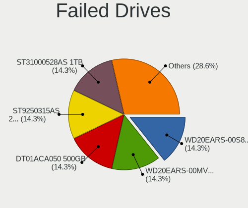
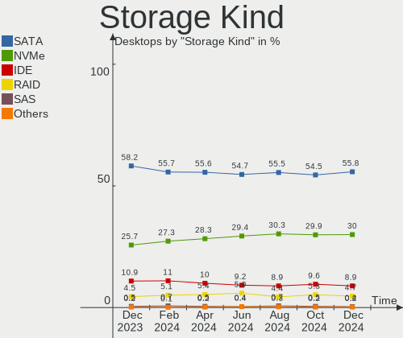
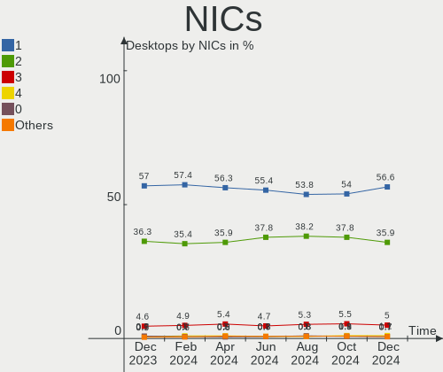
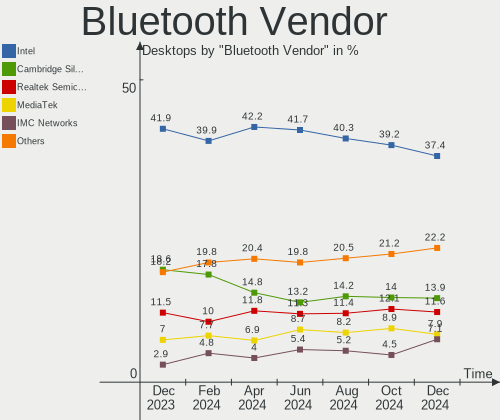

Linux - Hardware Trends (Desktops)
----------------------------------

A project to identify most popular hardware characteristics and track their change
over time based on data collected by Linux users at https://Linux-Hardware.org.

Anyone can contribute to this report by the [hw-probe](https://github.com/linuxhw/hw-probe) tool:

    sudo -E hw-probe -all -upload

This report is for one last month. Overall report since the beginning of time: [TestDays](https://github.com/linuxhw/TestDays)

Period: Aug, 2023.

Contents
--------

* [ System ](#system)
  - [ OS                       ](#os)
  - [ OS Family                ](#os-family)
  - [ Kernel                   ](#kernel)
  - [ Kernel Family            ](#kernel-family)
  - [ Kernel Major Ver.        ](#kernel-major-ver)
  - [ Arch                     ](#arch)
  - [ DE                       ](#de)
  - [ Display Server           ](#display-server)
  - [ Display Manager          ](#display-manager)
  - [ OS Lang                  ](#os-lang)
  - [ Boot Mode                ](#boot-mode)
  - [ Filesystem               ](#filesystem)
  - [ Part. scheme             ](#part-scheme)
  - [ Dual Boot with Linux/BSD ](#dual-boot-with-linuxbsd)
  - [ Dual Boot (Win)          ](#dual-boot-win)

* [ Board ](#board)
  - [ Vendor                   ](#vendor)
  - [ Model                    ](#model)
  - [ Model Family             ](#model-family)
  - [ MFG Year                 ](#mfg-year)
  - [ Form Factor              ](#form-factor)
  - [ Secure Boot              ](#secure-boot)
  - [ Coreboot                 ](#coreboot)
  - [ RAM Size                 ](#ram-size)
  - [ RAM Used                 ](#ram-used)
  - [ Total Drives             ](#total-drives)
  - [ Has CD-ROM               ](#has-cd-rom)
  - [ Has Ethernet             ](#has-ethernet)
  - [ Has WiFi                 ](#has-wifi)
  - [ Has Bluetooth            ](#has-bluetooth)

* [ Location ](#location)
  - [ Country                  ](#country)
  - [ City                     ](#city)

* [ Drives ](#drives)
  - [ Drive Vendor             ](#drive-vendor)
  - [ Drive Model              ](#drive-model)
  - [ HDD Vendor               ](#hdd-vendor)
  - [ SSD Vendor               ](#ssd-vendor)
  - [ Drive Kind               ](#drive-kind)
  - [ Drive Connector          ](#drive-connector)
  - [ Drive Size               ](#drive-size)
  - [ Space Total              ](#space-total)
  - [ Space Used               ](#space-used)
  - [ Malfunc. Drives          ](#malfunc-drives)
  - [ Malfunc. Drive Vendor    ](#malfunc-drive-vendor)
  - [ Malfunc. HDD Vendor      ](#malfunc-hdd-vendor)
  - [ Malfunc. Drive Kind      ](#malfunc-drive-kind)
  - [ Failed Drives            ](#failed-drives)
  - [ Failed Drive Vendor      ](#failed-drive-vendor)
  - [ Drive Status             ](#drive-status)

* [ Storage controller ](#storage-controller)
  - [ Storage Vendor           ](#storage-vendor)
  - [ Storage Model            ](#storage-model)
  - [ Storage Kind             ](#storage-kind)

* [ Processor ](#processor)
  - [ CPU Vendor               ](#cpu-vendor)
  - [ CPU Model                ](#cpu-model)
  - [ CPU Model Family         ](#cpu-model-family)
  - [ CPU Cores                ](#cpu-cores)
  - [ CPU Sockets              ](#cpu-sockets)
  - [ CPU Threads              ](#cpu-threads)
  - [ CPU Op-Modes             ](#cpu-op-modes)
  - [ CPU Microcode            ](#cpu-microcode)
  - [ CPU Microarch            ](#cpu-microarch)

* [ Graphics ](#graphics)
  - [ GPU Vendor               ](#gpu-vendor)
  - [ GPU Model                ](#gpu-model)
  - [ GPU Combo                ](#gpu-combo)
  - [ GPU Driver               ](#gpu-driver)
  - [ GPU Memory               ](#gpu-memory)

* [ Monitor ](#monitor)
  - [ Monitor Vendor           ](#monitor-vendor)
  - [ Monitor Model            ](#monitor-model)
  - [ Monitor Resolution       ](#monitor-resolution)
  - [ Monitor Diagonal         ](#monitor-diagonal)
  - [ Monitor Width            ](#monitor-width)
  - [ Aspect Ratio             ](#aspect-ratio)
  - [ Monitor Area             ](#monitor-area)
  - [ Pixel Density            ](#pixel-density)
  - [ Multiple Monitors        ](#multiple-monitors)

* [ Network ](#network)
  - [ Net Controller Vendor    ](#net-controller-vendor)
  - [ Net Controller Model     ](#net-controller-model)
  - [ Wireless Vendor          ](#wireless-vendor)
  - [ Wireless Model           ](#wireless-model)
  - [ Ethernet Vendor          ](#ethernet-vendor)
  - [ Ethernet Model           ](#ethernet-model)
  - [ Net Controller Kind      ](#net-controller-kind)
  - [ Used Controller          ](#used-controller)
  - [ NICs                     ](#nics)
  - [ IPv6                     ](#ipv6)

* [ Bluetooth ](#bluetooth)
  - [ Bluetooth Vendor         ](#bluetooth-vendor)
  - [ Bluetooth Model          ](#bluetooth-model)

* [ Sound ](#sound)
  - [ Sound Vendor             ](#sound-vendor)
  - [ Sound Model              ](#sound-model)

* [ Memory ](#memory)
  - [ Memory Vendor            ](#memory-vendor)
  - [ Memory Model             ](#memory-model)
  - [ Memory Kind              ](#memory-kind)
  - [ Memory Form Factor       ](#memory-form-factor)
  - [ Memory Size              ](#memory-size)
  - [ Memory Speed             ](#memory-speed)

* [ Printers & scanners ](#printers--scanners)
  - [ Printer Vendor           ](#printer-vendor)
  - [ Printer Model            ](#printer-model)
  - [ Scanner Vendor           ](#scanner-vendor)
  - [ Scanner Model            ](#scanner-model)

* [ Camera ](#camera)
  - [ Camera Vendor            ](#camera-vendor)
  - [ Camera Model             ](#camera-model)

* [ Security ](#security)
  - [ Fingerprint Vendor       ](#fingerprint-vendor)
  - [ Fingerprint Model        ](#fingerprint-model)
  - [ Chipcard Vendor          ](#chipcard-vendor)
  - [ Chipcard Model           ](#chipcard-model)

* [ Unsupported ](#unsupported)
  - [ Unsupported Devices      ](#unsupported-devices)
  - [ Unsupported Device Types ](#unsupported-device-types)

System
------

OS
--

Installed operating systems

| Name                         | Desktops | Percent |
|------------------------------|----------|---------|
| Ubuntu 22.04                 | 252      | 12.02%  |
| OpenMandriva 23.08           | 216      | 10.3%   |
| Fedora 38                    | 151      | 7.2%    |
| Linux Mint 21.2              | 137      | 6.53%   |
| Debian 12                    | 88       | 4.2%    |
| Arch Rolling                 | 78       | 3.72%   |
| Ubuntu 23.04                 | 77       | 3.67%   |
| ROSA 12.4                    | 66       | 3.15%   |
| Pop!_OS 22.04                | 66       | 3.15%   |
| ArcoLinux Rolling            | 57       | 2.72%   |
| Zorin 16                     | 49       | 2.34%   |
| Ubuntu 20.04                 | 47       | 2.24%   |
| Linux Mint 21.1              | 44       | 2.1%    |
| OpenMandriva 23.03           | 43       | 2.05%   |
| BlackPanther 18.1            | 43       | 2.05%   |
| openSUSE Tumbleweed-XXXXXXXX | 30       | 1.43%   |
| KDE neon 22.04               | 28       | 1.34%   |
| Xero Rolling                 | 27       | 1.29%   |
| Manjaro                      | 26       | 1.24%   |
| Kubuntu 22.04                | 26       | 1.24%   |
| Linux Mint 20.3              | 24       | 1.14%   |
| Debian 11                    | 23       | 1.1%    |
| Kubuntu 23.04                | 22       | 1.05%   |
| OpenMandriva 4.3             | 21       | 1%      |
| Manjaro 23.0.0               | 20       | 0.95%   |
| openSUSE Leap-15.5           | 18       | 0.86%   |
| EndeavourOS Rolling          | 18       | 0.86%   |
| Nobara 38                    | 16       | 0.76%   |
| OpenMandriva 23.07           | 14       | 0.67%   |
| Gentoo 2.14                  | 14       | 0.67%   |
| Xubuntu 22.04                | 13       | 0.62%   |
| OpenMandriva 23.90           | 13       | 0.62%   |
| Gentoo 2.13                  | 13       | 0.62%   |
| LMDE 5                       | 12       | 0.57%   |
| Debian                       | 12       | 0.57%   |
| Ubuntu 22.10                 | 11       | 0.52%   |
| Fedora 37                    | 11       | 0.52%   |
| Ubuntu MATE 22.04            | 10       | 0.48%   |
| Ubuntu 18.04                 | 10       | 0.48%   |
| Kali 2023.3                  | 9        | 0.43%   |

OS Family
---------

OS without a version

| Name          | Desktops | Percent |
|---------------|----------|---------|
| Ubuntu        | 401      | 19.12%  |
| OpenMandriva  | 318      | 15.16%  |
| Linux Mint    | 221      | 10.54%  |
| Fedora        | 170      | 8.11%   |
| Debian        | 124      | 5.91%   |
| ROSA          | 86       | 4.1%    |
| Arch          | 78       | 3.72%   |
| Pop!_OS       | 66       | 3.15%   |
| ArcoLinux     | 59       | 2.81%   |
| openSUSE      | 54       | 2.58%   |
| Kubuntu       | 53       | 2.53%   |
| Zorin         | 51       | 2.43%   |
| Manjaro       | 46       | 2.19%   |
| BlackPanther  | 46       | 2.19%   |
| KDE neon      | 28       | 1.34%   |
| Xero          | 27       | 1.29%   |
| Gentoo        | 27       | 1.29%   |
| Xubuntu       | 22       | 1.05%   |
| Nobara        | 22       | 1.05%   |
| EndeavourOS   | 18       | 0.86%   |
| LMDE          | 13       | 0.62%   |
| Kali          | 13       | 0.62%   |
| Garuda Linux  | 13       | 0.62%   |
| ALT Linux     | 12       | 0.57%   |
| Ubuntu MATE   | 11       | 0.52%   |
| MX            | 10       | 0.48%   |
| Lubuntu       | 9        | 0.43%   |
| Elementary    | 9        | 0.43%   |
| Parrot        | 8        | 0.38%   |
| Ubuntu Studio | 6        | 0.29%   |
| CentOS        | 6        | 0.29%   |
| RHEL          | 5        | 0.24%   |
| ChimeraOS     | 5        | 0.24%   |
| NixOS         | 4        | 0.19%   |
| Devuan        | 4        | 0.19%   |
| blendOS       | 4        | 0.19%   |
| TUXEDO OS     | 3        | 0.14%   |
| Rocky Linux   | 3        | 0.14%   |
| Red OS        | 3        | 0.14%   |
| Endless       | 3        | 0.14%   |

Kernel
------

Version of the Linux kernel

| Version                           | Desktops | Percent |
|-----------------------------------|----------|---------|
| 6.2.0-26-generic                  | 225      | 10.73%  |
| 6.4.11-desktop-1omv2390           | 151      | 7.2%    |
| 5.15.0-78-generic                 | 143      | 6.82%   |
| 5.15.0-79-generic                 | 95       | 4.53%   |
| 6.4.8-desktop-2omv2390            | 74       | 3.53%   |
| 6.2.0-27-generic                  | 53       | 2.53%   |
| 6.2.6-desktop-1omv2390            | 45       | 2.15%   |
| 5.19.0-50-generic                 | 41       | 1.96%   |
| 6.1.38-generic-1rosa2021.1-x86_64 | 38       | 1.81%   |
| 6.1.0-11-amd64                    | 38       | 1.81%   |
| 6.4.6-76060406-generic            | 37       | 1.76%   |
| 6.4.11-200.fc38.x86_64            | 35       | 1.67%   |
| 6.2.0-31-generic                  | 33       | 1.57%   |
| 6.1.0-10-amd64                    | 32       | 1.53%   |
| 6.2.6-76060206-generic            | 27       | 1.29%   |
| 5.15.0-76-generic                 | 27       | 1.29%   |
| 6.4.10-arch1-1                    | 26       | 1.24%   |
| 5.6.14-desktop-2bP                | 22       | 1.05%   |
| 6.4.7-200.fc38.x86_64             | 21       | 1%      |
| 6.4.8-arch1-1                     | 20       | 0.95%   |
| 6.4.6-200.fc38.x86_64             | 20       | 0.95%   |
| 6.4.12-arch1-1                    | 20       | 0.95%   |
| 6.4.9-arch1-1                     | 19       | 0.91%   |
| 6.1.20-generic-2rosa2021.1-x86_64 | 19       | 0.91%   |
| 6.4.10-200.fc38.x86_64            | 17       | 0.81%   |
| 5.4.0-156-generic                 | 17       | 0.81%   |
| 5.19.0-46-generic                 | 17       | 0.81%   |
| 6.4.11-arch2-1                    | 15       | 0.72%   |
| 6.2.9-300.fc38.x86_64             | 15       | 0.72%   |
| 5.16.7-desktop-1omv4003           | 15       | 0.72%   |
| 5.15.0-82-generic                 | 15       | 0.72%   |
| 6.3.5-desktop-3omv2390            | 14       | 0.67%   |
| 4.18.16-desktop-1bP               | 13       | 0.62%   |
| 6.4.9-200.fc38.x86_64             | 12       | 0.57%   |
| 6.4.12-200.fc38.x86_64            | 12       | 0.57%   |
| 6.4.10-zen2-1-zen                 | 11       | 0.52%   |
| 6.3.0-kali1-amd64                 | 11       | 0.52%   |
| 6.1.44-1-MANJARO                  | 11       | 0.52%   |
| 5.19.0-32-generic                 | 11       | 0.52%   |
| 5.10.0-25-amd64                   | 11       | 0.52%   |

Kernel Family
-------------

Linux kernel without a distro release

| Version | Desktops | Percent |
|---------|----------|---------|
| 6.2.0   | 331      | 15.78%  |
| 5.15.0  | 316      | 15.07%  |
| 6.4.11  | 229      | 10.92%  |
| 6.4.8   | 121      | 5.77%   |
| 6.1.0   | 101      | 4.82%   |
| 5.19.0  | 80       | 3.81%   |
| 6.4.6   | 78       | 3.72%   |
| 6.2.6   | 73       | 3.48%   |
| 6.4.10  | 72       | 3.43%   |
| 5.4.0   | 55       | 2.62%   |
| 6.4.9   | 52       | 2.48%   |
| 6.4.7   | 50       | 2.38%   |
| 6.1.38  | 44       | 2.1%    |
| 6.4.12  | 39       | 1.86%   |
| 5.10.0  | 34       | 1.62%   |
| 5.14.21 | 23       | 1.1%    |
| 5.6.14  | 22       | 1.05%   |
| 6.1.20  | 19       | 0.91%   |
| 6.4.0   | 18       | 0.86%   |
| 6.3.0   | 16       | 0.76%   |
| 6.5.0   | 15       | 0.72%   |
| 6.3.12  | 15       | 0.72%   |
| 6.2.9   | 15       | 0.72%   |
| 5.16.7  | 15       | 0.72%   |
| 6.3.5   | 14       | 0.67%   |
| 6.1.41  | 14       | 0.67%   |
| 6.4.4   | 13       | 0.62%   |
| 6.1.44  | 13       | 0.62%   |
| 4.18.16 | 13       | 0.62%   |
| 6.4.3   | 10       | 0.48%   |
| 6.3.9   | 10       | 0.48%   |
| 4.15.0  | 10       | 0.48%   |
| 6.2.16  | 9        | 0.43%   |
| 6.3.8   | 8        | 0.38%   |
| 5.15.85 | 8        | 0.38%   |
| 5.14.0  | 7        | 0.33%   |
| 6.1.39  | 6        | 0.29%   |
| 6.0.0   | 6        | 0.29%   |
| 5.16.13 | 6        | 0.29%   |
| 6.1.49  | 5        | 0.24%   |

Kernel Major Ver.
-----------------

Linux kernel major version

| Version | Desktops | Percent |
|---------|----------|---------|
| 6.4     | 685      | 32.67%  |
| 6.2     | 435      | 20.74%  |
| 5.15    | 342      | 16.31%  |
| 6.1     | 223      | 10.63%  |
| 5.19    | 81       | 3.86%   |
| 6.3     | 75       | 3.58%   |
| 5.4     | 56       | 2.67%   |
| 5.10    | 51       | 2.43%   |
| 5.14    | 32       | 1.53%   |
| 5.6     | 22       | 1.05%   |
| 5.16    | 22       | 1.05%   |
| 4.18    | 17       | 0.81%   |
| 6.5     | 15       | 0.72%   |
| 4.15    | 10       | 0.48%   |
| 6.0     | 9        | 0.43%   |
| 5.17    | 4        | 0.19%   |
| 4.9     | 4        | 0.19%   |
| 3.10    | 3        | 0.14%   |
| 5.8     | 2        | 0.1%    |
| 5.13    | 2        | 0.1%    |
| 5.11    | 2        | 0.1%    |
| 4.19    | 2        | 0.1%    |
| 6.3.3   | 1        | 0.05%   |
| 5.3     | 1        | 0.05%   |
| 5.18    | 1        | 0.05%   |

Arch
----

OS architecture (x86_64, i586, etc.)

| Name        | Desktops | Percent |
|-------------|----------|---------|
| x86_64      | 2084     | 99.38%  |
| i686        | 10       | 0.48%   |
| loongarch64 | 2        | 0.1%    |
| e2k         | 1        | 0.05%   |

DE
--

Desktop Environment

| Name              | Desktops | Percent |
|-------------------|----------|---------|
| GNOME             | 767      | 36.58%  |
| KDE5              | 704      | 33.57%  |
| X-Cinnamon        | 196      | 9.35%   |
| XFCE              | 123      | 5.87%   |
| Unknown           | 103      | 4.91%   |
| MATE              | 53       | 2.53%   |
| LXQt              | 41       | 1.96%   |
| Cinnamon          | 18       | 0.86%   |
| i3                | 15       | 0.72%   |
| Hyprland          | 12       | 0.57%   |
| Pantheon          | 9        | 0.43%   |
| KDE4              | 8        | 0.38%   |
| Budgie            | 7        | 0.33%   |
| sway              | 5        | 0.24%   |
| LXDE              | 5        | 0.24%   |
| Deepin            | 4        | 0.19%   |
| Xpra              | 3        | 0.14%   |
| GNOME Flashback   | 3        | 0.14%   |
| GNOME Classic     | 3        | 0.14%   |
| Unity             | 2        | 0.1%    |
| qtile             | 2        | 0.1%    |
| lightdm-xsession  | 2        | 0.1%    |
| KDE               | 2        | 0.1%    |
| dwm               | 2        | 0.1%    |
| awesome           | 2        | 0.1%    |
| ubuntu:pika:GNOME | 1        | 0.05%   |
| none+awesome      | 1        | 0.05%   |
| mwm               | 1        | 0.05%   |
| Hypr              | 1        | 0.05%   |
| BunsenLabs        | 1        | 0.05%   |
| bspwm             | 1        | 0.05%   |

Display Server
--------------

X11 or Wayland

| Name    | Desktops | Percent |
|---------|----------|---------|
| X11     | 1229     | 58.61%  |
| Wayland | 756      | 36.05%  |
| Tty     | 58       | 2.77%   |
| Unknown | 54       | 2.58%   |

Display Manager
---------------

SDDM, LightDM, etc.

| Name    | Desktops | Percent |
|---------|----------|---------|
| Unknown | 720      | 34.33%  |
| SDDM    | 610      | 29.09%  |
| GDM3    | 362      | 17.26%  |
| LightDM | 241      | 11.49%  |
| GDM     | 154      | 7.34%   |
| KDM     | 7        | 0.33%   |
| XDM     | 1        | 0.05%   |
| WDM     | 1        | 0.05%   |
| EMPTTY  | 1        | 0.05%   |

OS Lang
-------

Language

| Lang    | Desktops | Percent |
|---------|----------|---------|
| en_US   | 829      | 39.53%  |
| de_DE   | 195      | 9.3%    |
| ru_RU   | 170      | 8.11%   |
| en_GB   | 116      | 5.53%   |
| fr_FR   | 100      | 4.77%   |
| pt_BR   | 98       | 4.67%   |
| Unknown | 66       | 3.15%   |
| it_IT   | 56       | 2.67%   |
| es_ES   | 47       | 2.24%   |
| en_CA   | 46       | 2.19%   |
| en_AU   | 42       | 2%      |
| C       | 42       | 2%      |
| pl_PL   | 27       | 1.29%   |
| es_MX   | 24       | 1.14%   |
| en_IN   | 17       | 0.81%   |
| es_AR   | 14       | 0.67%   |
| zh_CN   | 12       | 0.57%   |
| nl_NL   | 12       | 0.57%   |
| es_VE   | 10       | 0.48%   |
| de_AT   | 10       | 0.48%   |
| hu_HU   | 9        | 0.43%   |
| de_CH   | 9        | 0.43%   |
| fi_FI   | 8        | 0.38%   |
| tr_TR   | 7        | 0.33%   |
| ja_JP   | 7        | 0.33%   |
| fr_BE   | 7        | 0.33%   |
| sv_SE   | 6        | 0.29%   |
| fr_CA   | 6        | 0.29%   |
| en_ZA   | 6        | 0.29%   |
| cs_CZ   | 6        | 0.29%   |
| pt_PT   | 5        | 0.24%   |
| nl_BE   | 5        | 0.24%   |
| es_CL   | 4        | 0.19%   |
| en_NZ   | 4        | 0.19%   |
| en_IL   | 4        | 0.19%   |
| en_IE   | 4        | 0.19%   |
| en_DK   | 4        | 0.19%   |
| el_GR   | 4        | 0.19%   |
| da_DK   | 4        | 0.19%   |
| zh_TW   | 3        | 0.14%   |

Boot Mode
---------

EFI or BIOS

| Mode | Desktops | Percent |
|------|----------|---------|
| BIOS | 1105     | 52.69%  |
| EFI  | 992      | 47.31%  |

Filesystem
----------

Type of filesystem

| Type     | Desktops | Percent |
|----------|----------|---------|
| Ext4     | 1202     | 57.32%  |
| Btrfs    | 353      | 16.83%  |
| Tmpfs    | 277      | 13.21%  |
| Overlay  | 206      | 9.82%   |
| Xfs      | 31       | 1.48%   |
| Zfs      | 12       | 0.57%   |
| F2fs     | 6        | 0.29%   |
| Ext3     | 5        | 0.24%   |
| Jfs      | 3        | 0.14%   |
| Reiserfs | 1        | 0.05%   |
| Ext2     | 1        | 0.05%   |

Part. scheme
------------

Scheme of partitioning

| Type    | Desktops | Percent |
|---------|----------|---------|
| GPT     | 1172     | 55.89%  |
| Unknown | 648      | 30.9%   |
| MBR     | 277      | 13.21%  |

Dual Boot with Linux/BSD
------------------------

Hosting more than one Linux/BSD

| Dual boot | Desktops | Percent |
|-----------|----------|---------|
| No        | 1600     | 76.3%   |
| Yes       | 497      | 23.7%   |

Dual Boot (Win)
---------------

Hosting Linux and Windows

| Dual boot | Desktops | Percent |
|-----------|----------|---------|
| No        | 1424     | 67.91%  |
| Yes       | 673      | 32.09%  |

Board
-----

Vendor
------

Motherboard manufacturer

| Name                                 | Desktops | Percent |
|--------------------------------------|----------|---------|
| ASUSTek Computer                     | 537      | 25.61%  |
| Gigabyte Technology                  | 359      | 17.12%  |
| MSI                                  | 263      | 12.54%  |
| Hewlett-Packard                      | 173      | 8.25%   |
| Dell                                 | 165      | 7.87%   |
| ASRock                               | 163      | 7.77%   |
| Lenovo                               | 66       | 3.15%   |
| Intel                                | 61       | 2.91%   |
| Fujitsu                              | 32       | 1.53%   |
| Acer                                 | 30       | 1.43%   |
| Unknown                              | 30       | 1.43%   |
| Pegatron                             | 17       | 0.81%   |
| Biostar                              | 15       | 0.72%   |
| Foxconn                              | 14       | 0.67%   |
| Supermicro                           | 12       | 0.57%   |
| Huanan                               | 12       | 0.57%   |
| AZW                                  | 12       | 0.57%   |
| Medion                               | 10       | 0.48%   |
| ECS                                  | 8        | 0.38%   |
| Apple                                | 7        | 0.33%   |
| Alienware                            | 7        | 0.33%   |
| Shenzhen Meigao Electronic Equipment | 6        | 0.29%   |
| Positivo                             | 6        | 0.29%   |
| Gateway                              | 6        | 0.29%   |
| TSINGHUA TONGFANG COMPUTER           | 3        | 0.14%   |
| Shuttle                              | 3        | 0.14%   |
| OEM                                  | 3        | 0.14%   |
| NZXT                                 | 3        | 0.14%   |
| Megaware                             | 3        | 0.14%   |
| MACHINIST                            | 3        | 0.14%   |
| Itautec                              | 3        | 0.14%   |
| DEPO Computers                       | 3        | 0.14%   |
| BESSTAR Tech                         | 3        | 0.14%   |
| Win element                          | 2        | 0.1%    |
| System76                             | 2        | 0.1%    |
| Red Hat                              | 2        | 0.1%    |
| PCWare                               | 2        | 0.1%    |
| Packard Bell                         | 2        | 0.1%    |
| Loongson                             | 2        | 0.1%    |
| HC Technology.                       | 2        | 0.1%    |

Model
-----

Motherboard model

| Name                         | Desktops | Percent |
|------------------------------|----------|---------|
| ASUS All Series              | 38       | 1.81%   |
| Unknown                      | 31       | 1.48%   |
| Dell OptiPlex 7010           | 14       | 0.67%   |
| ASUS TUF Gaming X570-PLUS    | 13       | 0.62%   |
| MSI MS-7C91                  | 11       | 0.52%   |
| ASUS ROG STRIX B550-F GAMING | 11       | 0.52%   |
| MSI MS-7C02                  | 9        | 0.43%   |
| ASUS PRIME A320M-K           | 9        | 0.43%   |
| MSI MS-7B86                  | 8        | 0.38%   |
| MSI MS-7B79                  | 8        | 0.38%   |
| Dell OptiPlex 990            | 8        | 0.38%   |
| MSI MS-7721                  | 7        | 0.33%   |
| Gigabyte B450M DS3H          | 7        | 0.33%   |
| Dell OptiPlex 9020           | 7        | 0.33%   |
| Dell OptiPlex 790            | 7        | 0.33%   |
| ASUS M5A97 R2.0              | 7        | 0.33%   |
| MSI MS-7D22                  | 6        | 0.29%   |
| MSI MS-7C95                  | 6        | 0.29%   |
| MSI MS-7C94                  | 6        | 0.29%   |
| MSI MS-7C56                  | 6        | 0.29%   |
| MSI MS-7C37                  | 6        | 0.29%   |
| MSI MS-7A38                  | 6        | 0.29%   |
| MSI MS-7693                  | 6        | 0.29%   |
| HP Z400 Workstation          | 6        | 0.29%   |
| HP ProDesk 600 G1 SFF        | 6        | 0.29%   |
| Gigabyte B450 AORUS ELITE    | 6        | 0.29%   |
| Dell OptiPlex 780            | 6        | 0.29%   |
| Dell OptiPlex 7050           | 6        | 0.29%   |
| ASUS TUF Gaming B550-PLUS    | 6        | 0.29%   |
| ASRock B550M-ITX/ac          | 6        | 0.29%   |
| ASRock B450M Pro4            | 6        | 0.29%   |
| MSI MS-7C52                  | 5        | 0.24%   |
| MSI MS-7A34                  | 5        | 0.24%   |
| MSI MS-7817                  | 5        | 0.24%   |
| Intel X99                    | 5        | 0.24%   |
| Intel H61                    | 5        | 0.24%   |
| HP Z420 Workstation          | 5        | 0.24%   |
| HP Compaq 6005 Pro SFF PC    | 5        | 0.24%   |
| Gigabyte X570 AORUS MASTER   | 5        | 0.24%   |
| Gigabyte B550M DS3H          | 5        | 0.24%   |

Model Family
------------

Motherboard model prefix

| Name                | Desktops | Percent |
|---------------------|----------|---------|
| ASUS PRIME          | 110      | 5.25%   |
| Dell OptiPlex       | 108      | 5.15%   |
| ASUS ROG            | 100      | 4.77%   |
| ASUS TUF            | 66       | 3.15%   |
| HP Compaq           | 42       | 2%      |
| ASUS All            | 38       | 1.81%   |
| Lenovo ThinkCentre  | 37       | 1.76%   |
| Unknown             | 31       | 1.48%   |
| HP ProDesk          | 27       | 1.29%   |
| HP EliteDesk        | 26       | 1.24%   |
| Fujitsu ESPRIMO     | 24       | 1.14%   |
| Dell Precision      | 21       | 1%      |
| Gigabyte B450M      | 20       | 0.95%   |
| Gigabyte X570       | 19       | 0.91%   |
| Acer Aspire         | 17       | 0.81%   |
| Gigabyte B550       | 14       | 0.67%   |
| Dell Inspiron       | 14       | 0.67%   |
| ASUS M5A78L-M       | 14       | 0.67%   |
| Gigabyte Z390       | 13       | 0.62%   |
| Lenovo ThinkStation | 12       | 0.57%   |
| Gigabyte B550M      | 12       | 0.57%   |
| Gigabyte B450       | 12       | 0.57%   |
| ASUS M5A97          | 12       | 0.57%   |
| MSI MS-7C91         | 11       | 0.52%   |
| HP Pavilion         | 10       | 0.48%   |
| MSI MS-7C02         | 9        | 0.43%   |
| ASUS P8H61-M        | 9        | 0.43%   |
| ASRock B450M        | 9        | 0.43%   |
| Acer Veriton        | 9        | 0.43%   |
| MSI MS-7B86         | 8        | 0.38%   |
| MSI MS-7B79         | 8        | 0.38%   |
| Dell Vostro         | 8        | 0.38%   |
| ASUS Pro            | 8        | 0.38%   |
| MSI MS-7721         | 7        | 0.33%   |
| Gigabyte H410M      | 7        | 0.33%   |
| Gigabyte B560M      | 7        | 0.33%   |
| Dell XPS            | 7        | 0.33%   |
| ASUS P8Z68-V        | 7        | 0.33%   |
| ASRock B450         | 7        | 0.33%   |
| MSI MS-7D22         | 6        | 0.29%   |

MFG Year
--------

Motherboard manufacture year

| Year    | Desktops | Percent |
|---------|----------|---------|
| 2020    | 215      | 10.25%  |
| 2018    | 204      | 9.73%   |
| 2019    | 176      | 8.39%   |
| 2012    | 164      | 7.82%   |
| 2022    | 161      | 7.68%   |
| 2021    | 156      | 7.44%   |
| 2013    | 139      | 6.63%   |
| 2011    | 122      | 5.82%   |
| 2014    | 115      | 5.48%   |
| 2017    | 106      | 5.05%   |
| 2016    | 88       | 4.2%    |
| 2009    | 88       | 4.2%    |
| 2010    | 86       | 4.1%    |
| 2023    | 76       | 3.62%   |
| 2015    | 75       | 3.58%   |
| 2008    | 66       | 3.15%   |
| 2007    | 42       | 2%      |
| 2006    | 9        | 0.43%   |
| 2005    | 4        | 0.19%   |
| Unknown | 3        | 0.14%   |
| 2004    | 1        | 0.05%   |
| 2003    | 1        | 0.05%   |

Form Factor
-----------

Physical design of the computer

| Name    | Desktops | Percent |
|---------|----------|---------|
| Desktop | 2097     | 100%    |

Secure Boot
-----------

Enabled or disabled

| State    | Desktops | Percent |
|----------|----------|---------|
| Disabled | 2037     | 97.14%  |
| Enabled  | 60       | 2.86%   |

Coreboot
--------

Have coreboot on board

| Used | Desktops | Percent |
|------|----------|---------|
| No   | 2097     | 100%    |

RAM Size
--------

Total RAM memory

| Size in GB      | Desktops | Percent |
|-----------------|----------|---------|
| 16.01-24.0      | 555      | 26.47%  |
| 32.01-64.0      | 400      | 19.07%  |
| 8.01-16.0       | 336      | 16.02%  |
| 4.01-8.0        | 279      | 13.3%   |
| 3.01-4.0        | 202      | 9.63%   |
| 64.01-256.0     | 180      | 8.58%   |
| 24.01-32.0      | 86       | 4.1%    |
| 1.01-2.0        | 29       | 1.38%   |
| 2.01-3.0        | 17       | 0.81%   |
| More than 256.0 | 10       | 0.48%   |
| 0.51-1.0        | 2        | 0.1%    |
| 0.01-0.5        | 1        | 0.05%   |

RAM Used
--------

Used RAM memory

| Used GB    | Desktops | Percent |
|------------|----------|---------|
| 1.01-2.0   | 609      | 29.04%  |
| 2.01-3.0   | 513      | 24.46%  |
| 4.01-8.0   | 383      | 18.26%  |
| 3.01-4.0   | 281      | 13.4%   |
| 8.01-16.0  | 137      | 6.53%   |
| 0.51-1.0   | 107      | 5.1%    |
| 16.01-24.0 | 25       | 1.19%   |
| 0.01-0.5   | 22       | 1.05%   |
| 24.01-32.0 | 12       | 0.57%   |
| 32.01-64.0 | 8        | 0.38%   |

Total Drives
------------

Number of drives on board

| Drives | Desktops | Percent |
|--------|----------|---------|
| 1      | 711      | 33.91%  |
| 2      | 624      | 29.76%  |
| 3      | 343      | 16.36%  |
| 4      | 206      | 9.82%   |
| 5      | 99       | 4.72%   |
| 6      | 50       | 2.38%   |
| 7      | 20       | 0.95%   |
| 0      | 13       | 0.62%   |
| 8      | 12       | 0.57%   |
| 10     | 6        | 0.29%   |
| 11     | 4        | 0.19%   |
| 9      | 4        | 0.19%   |
| 13     | 2        | 0.1%    |
| 32     | 1        | 0.05%   |
| 19     | 1        | 0.05%   |
| 12     | 1        | 0.05%   |

Has CD-ROM
----------

Has CD-ROM on board

| Presented | Desktops | Percent |
|-----------|----------|---------|
| No        | 1297     | 61.85%  |
| Yes       | 800      | 38.15%  |

Has Ethernet
------------

Has Ethernet on board

| Presented | Desktops | Percent |
|-----------|----------|---------|
| Yes       | 2078     | 99.09%  |
| No        | 19       | 0.91%   |

Has WiFi
--------

Has WiFi module

| Presented | Desktops | Percent |
|-----------|----------|---------|
| No        | 1098     | 52.36%  |
| Yes       | 999      | 47.64%  |

Has Bluetooth
-------------

Has Bluetooth module

| Presented | Desktops | Percent |
|-----------|----------|---------|
| No        | 1274     | 60.75%  |
| Yes       | 823      | 39.25%  |

Location
--------

Country
-------

Geographic location (country)

| Country      | Desktops | Percent |
|--------------|----------|---------|
| USA          | 396      | 18.88%  |
| Germany      | 259      | 12.35%  |
| Russia       | 185      | 8.82%   |
| Brazil       | 135      | 6.44%   |
| France       | 116      | 5.53%   |
| UK           | 80       | 3.81%   |
| Italy        | 73       | 3.48%   |
| Canada       | 70       | 3.34%   |
| Australia    | 57       | 2.72%   |
| Spain        | 56       | 2.67%   |
| Hungary      | 54       | 2.58%   |
| Poland       | 39       | 1.86%   |
| Netherlands  | 37       | 1.76%   |
| Mexico       | 35       | 1.67%   |
| India        | 25       | 1.19%   |
| Switzerland  | 24       | 1.14%   |
| Sweden       | 23       | 1.1%    |
| Argentina    | 23       | 1.1%    |
| Belgium      | 21       | 1%      |
| Finland      | 20       | 0.95%   |
| Czechia      | 18       | 0.86%   |
| Japan        | 17       | 0.81%   |
| China        | 16       | 0.76%   |
| Austria      | 16       | 0.76%   |
| Venezuela    | 15       | 0.72%   |
| Romania      | 14       | 0.67%   |
| Norway       | 14       | 0.67%   |
| Turkey       | 12       | 0.57%   |
| Israel       | 11       | 0.52%   |
| Slovakia     | 10       | 0.48%   |
| Indonesia    | 10       | 0.48%   |
| Thailand     | 9        | 0.43%   |
| Malaysia     | 9        | 0.43%   |
| Denmark      | 9        | 0.43%   |
| Ukraine      | 8        | 0.38%   |
| Ireland      | 8        | 0.38%   |
| Greece       | 8        | 0.38%   |
| Bulgaria     | 8        | 0.38%   |
| South Africa | 7        | 0.33%   |
| Singapore    | 7        | 0.33%   |

City
----

Geographic location (city)

| City           | Desktops | Percent |
|----------------|----------|---------|
| Moscow         | 39       | 1.86%   |
| Sydney         | 23       | 1.1%    |
| Rio de Janeiro | 19       | 0.91%   |
| Budapest       | 18       | 0.86%   |
| Berlin         | 17       | 0.81%   |
| Voronezh       | 16       | 0.76%   |
| Melbourne      | 16       | 0.76%   |
| Sao Paulo      | 14       | 0.67%   |
| St Petersburg  | 13       | 0.62%   |
| Hamburg        | 12       | 0.57%   |
| Paris          | 10       | 0.48%   |
| Milan          | 10       | 0.48%   |
| Cologne        | 10       | 0.48%   |
| Warsaw         | 9        | 0.43%   |
| Rome           | 9        | 0.43%   |
| Prague         | 9        | 0.43%   |
| Perth          | 8        | 0.38%   |
| Los Angeles    | 8        | 0.38%   |
| Helsinki       | 8        | 0.38%   |
| Yekaterinburg  | 7        | 0.33%   |
| Stockholm      | 7        | 0.33%   |
| Singapore      | 7        | 0.33%   |
| Novosibirsk    | 7        | 0.33%   |
| Montreal       | 7        | 0.33%   |
| Vienna         | 6        | 0.29%   |
| Valencia       | 6        | 0.29%   |
| Toronto        | 6        | 0.29%   |
| Denver         | 6        | 0.29%   |
| Curitiba       | 6        | 0.29%   |
| Brussels       | 6        | 0.29%   |
| Amsterdam      | 6        | 0.29%   |
| Zurich         | 5        | 0.24%   |
| Stuttgart      | 5        | 0.24%   |
| Spokane        | 5        | 0.24%   |
| Seattle        | 5        | 0.24%   |
| San Cristóbal | 5        | 0.24%   |
| Orenburg       | 5        | 0.24%   |
| Munich         | 5        | 0.24%   |
| Karlsruhe      | 5        | 0.24%   |
| Houston        | 5        | 0.24%   |

Drives
------

Drive Vendor
------------

Hard drive vendors

| Vendor                      | Desktops | Drives | Percent |
|-----------------------------|----------|--------|---------|
| Seagate                     | 634      | 809    | 15.51%  |
| WDC                         | 624      | 866    | 15.26%  |
| Samsung Electronics         | 596      | 879    | 14.58%  |
| Kingston                    | 259      | 290    | 6.33%   |
| SanDisk                     | 236      | 271    | 5.77%   |
| Crucial                     | 197      | 238    | 4.82%   |
| Toshiba                     | 189      | 209    | 4.62%   |
| Hitachi                     | 114      | 123    | 2.79%   |
| Phison Electronics          | 68       | 77     | 1.66%   |
| A-DATA Technology           | 67       | 70     | 1.64%   |
| China                       | 59       | 65     | 1.44%   |
| Intel                       | 57       | 65     | 1.39%   |
| Kingston Technology Company | 49       | 51     | 1.2%    |
| Micron/Crucial Technology   | 45       | 52     | 1.1%    |
| HGST                        | 44       | 89     | 1.08%   |
| Unknown                     | 42       | 54     | 1.03%   |
| SK hynix                    | 41       | 49     | 1%      |
| SPCC                        | 34       | 36     | 0.83%   |
| Silicon Motion              | 34       | 36     | 0.83%   |
| PNY                         | 33       | 36     | 0.81%   |
| Patriot                     | 33       | 33     | 0.81%   |
| Intenso                     | 33       | 37     | 0.81%   |
| OCZ                         | 23       | 23     | 0.56%   |
| ADATA Technology            | 23       | 25     | 0.56%   |
| Micron Technology           | 22       | 22     | 0.54%   |
| Maxtor                      | 21       | 27     | 0.51%   |
| MAXIO Technology (Hangzhou) | 21       | 25     | 0.51%   |
| GOODRAM                     | 20       | 22     | 0.49%   |
| Phison                      | 18       | 19     | 0.44%   |
| Apacer                      | 17       | 18     | 0.42%   |
| Team                        | 15       | 18     | 0.37%   |
| Lexar                       | 15       | 15     | 0.37%   |
| Hewlett-Packard             | 15       | 15     | 0.37%   |
| KingSpec                    | 14       | 15     | 0.34%   |
| Transcend                   | 13       | 14     | 0.32%   |
| Realtek Semiconductor       | 13       | 15     | 0.32%   |
| Unknown                     | 13       | 13     | 0.32%   |
| Gigabyte Technology         | 12       | 13     | 0.29%   |
| Fanxiang                    | 12       | 13     | 0.29%   |
| AMD                         | 12       | 12     | 0.29%   |

Drive Model
-----------

Hard drive models

| Model                                                 | Desktops | Percent |
|-------------------------------------------------------|----------|---------|
| Samsung NVMe SSD Controller SM981/PM981/PM983 500GB   | 87       | 1.84%   |
| Kingston SA400S37240G 240GB SSD                       | 60       | 1.27%   |
| Seagate ST1000DM010-2EP102 1TB                        | 59       | 1.25%   |
| Samsung NVMe SSD Controller PM9A1/PM9A3/980PRO 1024GB | 57       | 1.21%   |
| Samsung SSD 860 EVO 500GB                             | 48       | 1.02%   |
| Seagate ST2000DM008-2FR102 2TB                        | 46       | 0.97%   |
| Kingston SA400S37480G 480GB SSD                       | 41       | 0.87%   |
| Micron/Crucial P2 NVMe PCIe SSD 1TB                   | 36       | 0.76%   |
| WDC WD10EZEX-08WN4A0 1TB                              | 33       | 0.7%    |
| Seagate ST500DM002-1BD142 500GB                       | 33       | 0.7%    |
| Samsung SSD 850 EVO 500GB                             | 32       | 0.68%   |
| Phison E12 NVMe Controller 256GB                      | 32       | 0.68%   |
| Seagate ST4000DM004-2CV104 4TB                        | 31       | 0.66%   |
| Toshiba DT01ACA100 1TB                                | 29       | 0.61%   |
| Crucial CT500MX500SSD1 500GB                          | 29       | 0.61%   |
| Samsung SSD 860 EVO 1TB                               | 28       | 0.59%   |
| Samsung NVMe SSD Controller SM961/PM961/SM963 1024GB  | 28       | 0.59%   |
| Kingston SA400S37120G 120GB SSD                       | 28       | 0.59%   |
| Crucial CT1000MX500SSD1 1TB                           | 28       | 0.59%   |
| Samsung SSD 850 EVO 250GB                             | 26       | 0.55%   |
| Seagate ST1000DM003-1CH162 1TB                        | 25       | 0.53%   |
| Seagate ST2000DM006-2DM164 2TB                        | 23       | 0.49%   |
| Toshiba HDWD110 1TB                                   | 22       | 0.47%   |
| Sandisk WD Blue SN550 NVMe SSD 250GB                  | 22       | 0.47%   |
| Samsung SSD 870 EVO 500GB                             | 22       | 0.47%   |
| Samsung SSD 870 EVO 1TB                               | 22       | 0.47%   |
| Kingston SV300S37A120G 120GB SSD                      | 22       | 0.47%   |
| Samsung SSD 980 1TB                                   | 21       | 0.44%   |
| Seagate ST3500418AS 500GB                             | 20       | 0.42%   |
| Seagate ST1000DM003-1ER162 1TB                        | 20       | 0.42%   |
| Unknown SD/MMC/MS PRO 1GB                             | 19       | 0.4%    |
| Toshiba DT01ACA200 2TB                                | 19       | 0.4%    |
| Samsung SSD 980 500GB                                 | 18       | 0.38%   |
| Kingston Company SNV2S1000G 1TB                       | 18       | 0.38%   |
| Silicon Motion SM2263EN/SM2263XT SSD Controller 256GB | 17       | 0.36%   |
| Crucial CT480BX500SSD1 480GB                          | 17       | 0.36%   |
| Sandisk WD Black SN850 256GB                          | 16       | 0.34%   |
| Crucial CT240BX500SSD1 240GB                          | 16       | 0.34%   |
| Crucial CT1000BX500SSD1 1TB                           | 16       | 0.34%   |
| WDC WDS500G2B0A-00SM50 500GB SSD                      | 15       | 0.32%   |

HDD Vendor
----------

Hard disk drive vendors

| Vendor              | Desktops | Drives  | Percent |
|---------------------|----------|---------|---------|
| Seagate             | 615      | 770     | 37%     |
| WDC                 | 548      | 736     | 32.97%  |
| Toshiba             | 172      | 191     | 10.35%  |
| Hitachi             | 113      | 122     | 6.8%    |
| Samsung Electronics | 70       | 81      | 4.21%   |
| HGST                | 44       | 89      | 2.65%   |
| Unknown             | 20       | 20      | 1.2%    |
| Maxtor              | 20       | 26      | 1.2%    |
| SABRENT             | 8        | 8       | 0.48%   |
| Fujitsu             | 7        | 8       | 0.42%   |
| Hewlett-Packard     | 6        | 6       | 0.36%   |
| Intenso             | 4        | 4       | 0.24%   |
| Apple               | 4        | 4       | 0.24%   |
| WD MediaMax         | 3        | 3       | 0.18%   |
| Maxone              | 3        | 3       | 0.18%   |
| Unknown             | 3        | 3       | 0.18%   |
| USB3.0              | 2        | 2       | 0.12%   |
| USB                 | 2        | 3       | 0.12%   |
| Min Yi U            | 2        | 2       | 0.12%   |
| LaCie               | 2        | 2       | 0.12%   |
| ExcelStor           | 2        | 2       | 0.12%   |
| StoreJet            | 1        | 1       | 0.06%   |
| PHD 3.0             | 1        | 1       | 0.06%   |
| MaxDigital          | 1        | 1       | 0.06%   |
| Initio              | 1        | Unknown | 0.06%   |
| IBM/Hitachi         | 1        | 1       | 0.06%   |
| IB-AC703            | 1        | 1       | 0.06%   |
| HGST HTS            | 1        | 1       | 0.06%   |
| H/W                 | 1        | 3       | 0.06%   |
| DAS                 | 1        | 4       | 0.06%   |
| CLOVER              | 1        | 1       | 0.06%   |
| ASUSTOR             | 1        | 1       | 0.06%   |
| ASMT                | 1        | 2       | 0.06%   |

SSD Vendor
----------

Solid state drive vendors

| Vendor              | Desktops | Drives | Percent |
|---------------------|----------|--------|---------|
| Samsung Electronics | 321      | 433    | 20.93%  |
| Kingston            | 216      | 235    | 14.08%  |
| Crucial             | 175      | 197    | 11.41%  |
| SanDisk             | 104      | 112    | 6.78%   |
| WDC                 | 89       | 107    | 5.8%    |
| China               | 59       | 65     | 3.85%   |
| A-DATA Technology   | 59       | 60     | 3.85%   |
| PNY                 | 32       | 35     | 2.09%   |
| Intel               | 32       | 35     | 2.09%   |
| Patriot             | 31       | 31     | 2.02%   |
| SPCC                | 27       | 29     | 1.76%   |
| Intenso             | 26       | 30     | 1.69%   |
| OCZ                 | 23       | 23     | 1.5%    |
| GOODRAM             | 20       | 22     | 1.3%    |
| Micron Technology   | 17       | 17     | 1.11%   |
| Team                | 14       | 17     | 0.91%   |
| KingSpec            | 14       | 15     | 0.91%   |
| SK hynix            | 13       | 13     | 0.85%   |
| Lexar               | 12       | 12     | 0.78%   |
| Apacer              | 12       | 13     | 0.78%   |
| Transcend           | 11       | 12     | 0.72%   |
| Toshiba             | 11       | 11     | 0.72%   |
| Gigabyte Technology | 11       | 11     | 0.72%   |
| AMD                 | 11       | 11     | 0.72%   |
| Verbatim            | 9        | 10     | 0.59%   |
| Netac               | 8        | 8      | 0.52%   |
| Fanxiang            | 8        | 8      | 0.52%   |
| Emtec               | 8        | 9      | 0.52%   |
| Seagate             | 7        | 10     | 0.46%   |
| JMicron Technology  | 7        | 7      | 0.46%   |
| Hewlett-Packard     | 7        | 7      | 0.46%   |
| Corsair             | 7        | 7      | 0.46%   |
| Dogfish             | 4        | 4      | 0.26%   |
| Apple               | 4        | 4      | 0.26%   |
| Unknown             | 4        | 4      | 0.26%   |
| XrayDisk            | 3        | 3      | 0.2%    |
| Timetec             | 3        | 4      | 0.2%    |
| T-FORCE             | 3        | 3      | 0.2%    |
| Smartbuy            | 3        | 3      | 0.2%    |
| Mushkin             | 3        | 3      | 0.2%    |

Drive Kind
----------

HDD or SSD

| Kind    | Desktops | Drives | Percent |
|---------|----------|--------|---------|
| HDD     | 1288     | 2102   | 37.92%  |
| SSD     | 1223     | 1754   | 36%     |
| NVMe    | 814      | 1139   | 23.96%  |
| Unknown | 67       | 82     | 1.97%   |
| MMC     | 5        | 6      | 0.15%   |

Drive Connector
---------------

SATA, SAS, NVMe, etc.

| Type | Desktops | Drives | Percent |
|------|----------|--------|---------|
| SATA | 1829     | 3694   | 64.81%  |
| NVMe | 813      | 1131   | 28.81%  |
| SAS  | 175      | 252    | 6.2%    |
| MMC  | 5        | 6      | 0.18%   |

Drive Size
----------

Size of hard drive

| Size in TB | Desktops | Drives | Percent |
|------------|----------|--------|---------|
| 0.01-0.5   | 1292     | 1907   | 47.07%  |
| 0.51-1.0   | 802      | 1057   | 29.22%  |
| 1.01-2.0   | 348      | 442    | 12.68%  |
| 3.01-4.0   | 135      | 178    | 4.92%   |
| 4.01-10.0  | 77       | 150    | 2.81%   |
| 2.01-3.0   | 71       | 92     | 2.59%   |
| 10.01-20.0 | 20       | 30     | 0.73%   |

Space Total
-----------

Amount of disk space available on the file system

| Size in GB     | Desktops | Percent |
|----------------|----------|---------|
| 101-250        | 386      | 18.41%  |
| 501-1000       | 354      | 16.88%  |
| 251-500        | 324      | 15.45%  |
| More than 3000 | 311      | 14.83%  |
| 1001-2000      | 243      | 11.59%  |
| 1-20           | 149      | 7.11%   |
| 2001-3000      | 113      | 5.39%   |
| 51-100         | 91       | 4.34%   |
| Unknown        | 74       | 3.53%   |
| 21-50          | 52       | 2.48%   |

Space Used
----------

Amount of used disk space

| Used GB        | Desktops | Percent |
|----------------|----------|---------|
| 1-20           | 647      | 30.85%  |
| 21-50          | 276      | 13.16%  |
| 101-250        | 226      | 10.78%  |
| 51-100         | 207      | 9.87%   |
| 251-500        | 201      | 9.59%   |
| 501-1000       | 168      | 8.01%   |
| 1001-2000      | 122      | 5.82%   |
| More than 3000 | 117      | 5.58%   |
| Unknown        | 74       | 3.53%   |
| 2001-3000      | 59       | 2.81%   |

Malfunc. Drives
---------------

Drive models with a malfunction

| Model                               | Desktops | Drives | Percent |
|-------------------------------------|----------|--------|---------|
| Seagate ST1000DM003-1CH162 1TB      | 7        | 7      | 1.82%   |
| Seagate ST500DM002-1BD142 500GB     | 6        | 6      | 1.56%   |
| Toshiba DT01ACA100 1TB              | 5        | 5      | 1.3%    |
| Seagate ST3500418AS 500GB           | 5        | 5      | 1.3%    |
| Toshiba DT01ACA050 500GB            | 4        | 4      | 1.04%   |
| Hitachi HTS543225L9A300 250GB       | 4        | 4      | 1.04%   |
| WDC WD5000AAKS-007AA0 500GB         | 3        | 3      | 0.78%   |
| WDC WD30EFRX-68EUZN0 3TB            | 3        | 4      | 0.78%   |
| WDC WD10PURZ-85U8XY0 1TB            | 3        | 3      | 0.78%   |
| WDC WD10EALX-009BA0 1TB             | 3        | 3      | 0.78%   |
| WDC WD1003FZEX-00MK2A0 1TB          | 3        | 3      | 0.78%   |
| WDC WD1002FAEX-00Z3A0 1TB           | 3        | 3      | 0.78%   |
| Seagate ST9500325AS 500GB           | 3        | 3      | 0.78%   |
| Seagate ST3160815AS 160GB           | 3        | 3      | 0.78%   |
| Seagate ST2000DL003-9VT166 2TB      | 3        | 3      | 0.78%   |
| Seagate ST1000DM010-2EP102 1TB      | 3        | 3      | 0.78%   |
| Samsung Electronics SSD 870 EVO 1TB | 3        | 3      | 0.78%   |
| Samsung Electronics HD103UJ 1TB     | 3        | 3      | 0.78%   |
| Kingston SV300S37A120G 120GB SSD    | 3        | 3      | 0.78%   |
| Kingston SA400S37480G 480GB SSD     | 3        | 3      | 0.78%   |
| JMicron Technology Generic 1TB      | 3        | 3      | 0.78%   |
| Hitachi HDS721010CLA332 1TB         | 3        | 3      | 0.78%   |
| Hitachi HDS721010CLA330 1TB         | 3        | 3      | 0.78%   |
| WDC WDS240G2G0A-00JH30 240GB SSD    | 2        | 2      | 0.52%   |
| WDC WD6400AAKS-22A7B2 640GB         | 2        | 2      | 0.52%   |
| WDC WD5000AVCS-632DY1 500GB         | 2        | 2      | 0.52%   |
| WDC WD5000AAKX-75U6AA0 500GB        | 2        | 2      | 0.52%   |
| WDC WD5000AAKX-60U6AA0 500GB        | 2        | 2      | 0.52%   |
| WDC WD40PURX-64GVNY0 4TB            | 2        | 2      | 0.52%   |
| WDC WD40EFRX-68N32N0 4TB            | 2        | 3      | 0.52%   |
| WDC WD3200AAJS-08L7A0 320GB         | 2        | 2      | 0.52%   |
| WDC WD3200AAJS-00L7A0 320GB         | 2        | 2      | 0.52%   |
| WDC WD20EARS-00MVWB0 2TB            | 2        | 3      | 0.52%   |
| WDC WD10EZRX-00L4HB0 1TB            | 2        | 2      | 0.52%   |
| WDC WD10EADS-00L5B1 1TB             | 2        | 2      | 0.52%   |
| Toshiba HDWD110 1TB                 | 2        | 2      | 0.52%   |
| SPCC M.2 PCIe SSD 256GB             | 2        | 2      | 0.52%   |
| Seagate ST500LT012-1DG142 500GB     | 2        | 2      | 0.52%   |
| Seagate ST3500414CS 500GB           | 2        | 2      | 0.52%   |
| Seagate ST3500413AS 500GB           | 2        | 2      | 0.52%   |

Malfunc. Drive Vendor
---------------------

Vendors of faulty drives

| Vendor                      | Desktops | Drives | Percent |
|-----------------------------|----------|--------|---------|
| WDC                         | 101      | 114    | 27.3%   |
| Seagate                     | 94       | 100    | 25.41%  |
| Samsung Electronics         | 32       | 33     | 8.65%   |
| Hitachi                     | 28       | 28     | 7.57%   |
| Toshiba                     | 22       | 23     | 5.95%   |
| Kingston                    | 14       | 16     | 3.78%   |
| Maxtor                      | 9        | 13     | 2.43%   |
| Intel                       | 8        | 9      | 2.16%   |
| SanDisk                     | 6        | 6      | 1.62%   |
| HGST                        | 6        | 6      | 1.62%   |
| A-DATA Technology           | 6        | 6      | 1.62%   |
| Netac                       | 4        | 4      | 1.08%   |
| Crucial                     | 4        | 4      | 1.08%   |
| China                       | 4        | 4      | 1.08%   |
| SPCC                        | 3        | 3      | 0.81%   |
| JMicron Technology          | 3        | 3      | 0.81%   |
| Intenso                     | 3        | 3      | 0.81%   |
| OCZ                         | 2        | 2      | 0.54%   |
| XrayDisk                    | 1        | 1      | 0.27%   |
| SSSTC                       | 1        | 1      | 0.27%   |
| SABRENT                     | 1        | 1      | 0.27%   |
| Realtek Semiconductor       | 1        | 1      | 0.27%   |
| Neo                         | 1        | 1      | 0.27%   |
| Micron Technology           | 1        | 1      | 0.27%   |
| MAXIO Technology (Hangzhou) | 1        | 1      | 0.27%   |
| Lexar                       | 1        | 1      | 0.27%   |
| Kingmax                     | 1        | 1      | 0.27%   |
| KEEPDATA                    | 1        | 1      | 0.27%   |
| IBM/Hitachi                 | 1        | 1      | 0.27%   |
| HPE                         | 1        | 1      | 0.27%   |
| Fujitsu                     | 1        | 1      | 0.27%   |
| ExcelStor                   | 1        | 1      | 0.27%   |
| Dogfish                     | 1        | 1      | 0.27%   |
| Corsair                     | 1        | 1      | 0.27%   |
| CLOVER                      | 1        | 1      | 0.27%   |
| C300-CTF                    | 1        | 1      | 0.27%   |
| Apple                       | 1        | 1      | 0.27%   |
| AMD                         | 1        | 1      | 0.27%   |
| 2.5"                        | 1        | 2      | 0.27%   |

Malfunc. HDD Vendor
-------------------

Vendors of faulty HDD drives

| Vendor              | Desktops | Drives | Percent |
|---------------------|----------|--------|---------|
| WDC                 | 97       | 110    | 34.64%  |
| Seagate             | 94       | 100    | 33.57%  |
| Hitachi             | 28       | 28     | 10%     |
| Toshiba             | 22       | 23     | 7.86%   |
| Samsung Electronics | 18       | 18     | 6.43%   |
| Maxtor              | 9        | 13     | 3.21%   |
| HGST                | 6        | 6      | 2.14%   |
| SABRENT             | 1        | 1      | 0.36%   |
| IBM/Hitachi         | 1        | 1      | 0.36%   |
| Fujitsu             | 1        | 1      | 0.36%   |
| ExcelStor           | 1        | 1      | 0.36%   |
| CLOVER              | 1        | 1      | 0.36%   |
| Apple               | 1        | 1      | 0.36%   |

Malfunc. Drive Kind
-------------------

Kinds of faulty drives

| Kind | Desktops | Drives | Percent |
|------|----------|--------|---------|
| HDD  | 237      | 304    | 72.7%   |
| SSD  | 77       | 83     | 23.62%  |
| NVMe | 12       | 12     | 3.68%   |

Failed Drives
-------------

Failed drive models

| Model                             | Desktops | Drives | Percent |
|-----------------------------------|----------|--------|---------|
| WDC WD800JD-00MSA1 80GB           | 1        | 1      | 14.29%  |
| WDC WD3200BPVT-22JJ5T0 320GB      | 1        | 1      | 14.29%  |
| WDC WD1002FAEX-00Z3A0 1TB         | 1        | 1      | 14.29%  |
| Seagate ST3320613AS 320GB         | 1        | 1      | 14.29%  |
| Seagate ST3250318AS 250GB         | 1        | 1      | 14.29%  |
| Seagate ST31000528AS 1TB          | 1        | 1      | 14.29%  |
| Samsung Electronics HD502HJ 500GB | 1        | 2      | 14.29%  |

Failed Drive Vendor
-------------------

Failed drive vendors

| Vendor              | Desktops | Drives | Percent |
|---------------------|----------|--------|---------|
| WDC                 | 3        | 3      | 42.86%  |
| Seagate             | 3        | 3      | 42.86%  |
| Samsung Electronics | 1        | 2      | 14.29%  |

Drive Status
------------

Number of failed and malfunc. drives

| Status   | Desktops | Drives | Percent |
|----------|----------|--------|---------|
| Works    | 1046     | 2285   | 43.55%  |
| Detected | 1034     | 2391   | 43.05%  |
| Malfunc  | 315      | 399    | 13.11%  |
| Failed   | 7        | 8      | 0.29%   |

Storage controller
------------------

Storage Vendor
--------------

Storage controller vendors

| Vendor                           | Desktops | Percent |
|----------------------------------|----------|---------|
| Intel                            | 1288     | 39.46%  |
| AMD                              | 756      | 23.16%  |
| Samsung Electronics              | 291      | 8.92%   |
| SanDisk                          | 157      | 4.81%   |
| ASMedia Technology               | 104      | 3.19%   |
| Kingston Technology Company      | 100      | 3.06%   |
| Phison Electronics               | 96       | 2.94%   |
| Micron/Crucial Technology        | 72       | 2.21%   |
| JMicron Technology               | 54       | 1.65%   |
| Silicon Motion                   | 43       | 1.32%   |
| Marvell Technology Group         | 43       | 1.32%   |
| ADATA Technology                 | 33       | 1.01%   |
| Nvidia                           | 30       | 0.92%   |
| SK hynix                         | 28       | 0.86%   |
| MAXIO Technology (Hangzhou)      | 26       | 0.8%    |
| Realtek Semiconductor            | 22       | 0.67%   |
| Seagate Technology               | 17       | 0.52%   |
| Broadcom / LSI                   | 14       | 0.43%   |
| VIA Technologies                 | 11       | 0.34%   |
| INNOGRIT                         | 11       | 0.34%   |
| KIOXIA                           | 10       | 0.31%   |
| Adaptec                          | 8        | 0.25%   |
| Toshiba America Info Systems     | 7        | 0.21%   |
| Micron Technology                | 7        | 0.21%   |
| LSI Logic / Symbios Logic        | 7        | 0.21%   |
| Silicon Image                    | 5        | 0.15%   |
| Solid State Storage Technology   | 3        | 0.09%   |
| Netac Technology                 | 3        | 0.09%   |
| Yangtze Memory Technologies      | 2        | 0.06%   |
| Solidigm                         | 2        | 0.06%   |
| Loongson Technology              | 2        | 0.06%   |
| Integrated Technology Express    | 2        | 0.06%   |
| Apple                            | 2        | 0.06%   |
| TenaFe                           | 1        | 0.03%   |
| Silicon Integrated Systems [SiS] | 1        | 0.03%   |
| Shenzhen Longsys Electronics     | 1        | 0.03%   |
| OCZ Technology Group             | 1        | 0.03%   |
| MCST                             | 1        | 0.03%   |
| Lite-On Technology               | 1        | 0.03%   |
| Hewlett-Packard                  | 1        | 0.03%   |

Storage Model
-------------

Storage controller models

| Model                                                                                   | Desktops | Percent |
|-----------------------------------------------------------------------------------------|----------|---------|
| AMD FCH SATA Controller [AHCI mode]                                                     | 407      | 10.32%  |
| AMD 400 Series Chipset SATA Controller                                                  | 154      | 3.91%   |
| AMD 500 Series Chipset SATA Controller                                                  | 143      | 3.63%   |
| Intel 8 Series/C220 Series Chipset Family 6-port SATA Controller 1 [AHCI mode]          | 130      | 3.3%    |
| Samsung NVMe SSD Controller SM981/PM981/PM983                                           | 128      | 3.25%   |
| Intel 200 Series PCH SATA controller [AHCI mode]                                        | 105      | 2.66%   |
| Intel 6 Series/C200 Series Chipset Family 6 port Desktop SATA AHCI Controller           | 100      | 2.54%   |
| Intel Q170/Q150/B150/H170/H110/Z170/CM236 Chipset SATA Controller [AHCI Mode]           | 97       | 2.46%   |
| ASMedia ASM1062 Serial ATA Controller                                                   | 94       | 2.38%   |
| Samsung NVMe SSD Controller PM9A1/PM9A3/980PRO                                          | 87       | 2.21%   |
| Intel 7 Series/C210 Series Chipset Family 6-port SATA Controller [AHCI mode]            | 80       | 2.03%   |
| AMD SB7x0/SB8x0/SB9x0 IDE Controller                                                    | 79       | 2%      |
| Intel SATA Controller [RAID mode]                                                       | 75       | 1.9%    |
| Intel Cannon Lake PCH SATA AHCI Controller                                              | 70       | 1.78%   |
| AMD SB7x0/SB8x0/SB9x0 SATA Controller [AHCI mode]                                       | 69       | 1.75%   |
| Intel NM10/ICH7 Family SATA Controller [IDE mode]                                       | 63       | 1.6%    |
| Micron/Crucial P2 [Nick P2] / P3 / P3 Plus NVMe PCIe SSD (DRAM-less)                    | 58       | 1.47%   |
| Intel Alder Lake-S PCH SATA Controller [AHCI Mode]                                      | 57       | 1.45%   |
| AMD SB7x0/SB8x0/SB9x0 SATA Controller [IDE mode]                                        | 56       | 1.42%   |
| Intel 500 Series Chipset Family SATA AHCI Controller                                    | 52       | 1.32%   |
| Intel 82801G (ICH7 Family) IDE Controller                                               | 49       | 1.24%   |
| Samsung NVMe SSD Controller 980                                                         | 45       | 1.14%   |
| Phison E12 NVMe Controller                                                              | 42       | 1.07%   |
| Kingston Company Company Non-Volatile memory controller                                 | 39       | 0.99%   |
| Intel 9 Series Chipset Family SATA Controller [AHCI Mode]                               | 38       | 0.96%   |
| Samsung NVMe SSD Controller SM961/PM961/SM963                                           | 37       | 0.94%   |
| Intel 6 Series/C200 Series Chipset Family Desktop SATA Controller (IDE mode, ports 4-5) | 36       | 0.91%   |
| Intel 6 Series/C200 Series Chipset Family Desktop SATA Controller (IDE mode, ports 0-3) | 36       | 0.91%   |
| Intel Volume Management Device NVMe RAID Controller                                     | 35       | 0.89%   |
| AMD FCH SATA Controller D                                                               | 35       | 0.89%   |
| Silicon Motion SM2263EN/SM2263XT (DRAM-less) NVMe SSD Controllers                       | 33       | 0.84%   |
| SanDisk WD Blue SN550 NVMe SSD                                                          | 33       | 0.84%   |
| AMD 300 Series Chipset SATA Controller                                                  | 33       | 0.84%   |
| Phison PS5013 E13 NVMe Controller                                                       | 29       | 0.74%   |
| Intel C610/X99 series chipset 6-Port SATA Controller [AHCI mode]                        | 29       | 0.74%   |
| Intel 700 Series Chipset Family SATA AHCI Controller                                    | 29       | 0.74%   |
| Intel 400 Series Chipset Family SATA AHCI Controller                                    | 29       | 0.74%   |
| JMicron JMB363 SATA/IDE Controller                                                      | 25       | 0.63%   |
| Intel Comet Lake SATA AHCI Controller                                                   | 25       | 0.63%   |
| Intel C610/X99 series chipset sSATA Controller [AHCI mode]                              | 25       | 0.63%   |

Storage Kind
------------

Kind of storage controller (IDE, SATA, NVMe, SAS, ...)

| Kind | Desktops | Percent |
|------|----------|---------|
| SATA | 1779     | 56.23%  |
| NVMe | 814      | 25.73%  |
| IDE  | 376      | 11.88%  |
| RAID | 160      | 5.06%   |
| SAS  | 32       | 1.01%   |
| SCSI | 3        | 0.09%   |

Processor
---------

CPU Vendor
----------

Processor vendors

| Vendor       | Desktops | Percent |
|--------------|----------|---------|
| Intel        | 1302     | 62.09%  |
| AMD          | 791      | 37.72%  |
| Loongson     | 2        | 0.1%    |
| E8C-mITX     | 1        | 0.05%   |
| CentaurHauls | 1        | 0.05%   |

CPU Model
---------

Processor models

| Model                                  | Desktops | Percent |
|----------------------------------------|----------|---------|
| AMD Ryzen 5 3600 6-Core Processor      | 48       | 2.29%   |
| AMD Ryzen 5 5600G with Radeon Graphics | 40       | 1.91%   |
| AMD Ryzen 5 5600X 6-Core Processor     | 33       | 1.57%   |
| AMD Ryzen 7 3700X 8-Core Processor     | 30       | 1.43%   |
| AMD Ryzen 7 5700G with Radeon Graphics | 29       | 1.38%   |
| Intel Core i5-6500 CPU @ 3.20GHz       | 26       | 1.24%   |
| Intel Core i5-3470 CPU @ 3.20GHz       | 24       | 1.14%   |
| Intel Core i7-3770 CPU @ 3.40GHz       | 23       | 1.1%    |
| Intel Core i7-4790 CPU @ 3.60GHz       | 22       | 1.05%   |
| AMD Ryzen 7 5800X 8-Core Processor     | 21       | 1%      |
| Intel Core i5-10400 CPU @ 2.90GHz      | 20       | 0.95%   |
| AMD Ryzen 9 5900X 12-Core Processor    | 20       | 0.95%   |
| Intel Core i5-2400 CPU @ 3.10GHz       | 19       | 0.91%   |
| Intel Core i7-4790K CPU @ 4.00GHz      | 18       | 0.86%   |
| AMD Ryzen 5 2600 Six-Core Processor    | 18       | 0.86%   |
| Intel Core i5-4590 CPU @ 3.30GHz       | 17       | 0.81%   |
| AMD Ryzen 9 7950X 16-Core Processor    | 17       | 0.81%   |
| AMD Ryzen 9 3900X 12-Core Processor    | 17       | 0.81%   |
| AMD FX-8350 Eight-Core Processor       | 17       | 0.81%   |
| Intel Core i7-6700 CPU @ 3.40GHz       | 15       | 0.72%   |
| AMD FX-6300 Six-Core Processor         | 15       | 0.72%   |
| Intel Core i5-7400 CPU @ 3.00GHz       | 14       | 0.67%   |
| AMD Ryzen 9 5950X 16-Core Processor    | 14       | 0.67%   |
| AMD Ryzen 7 2700X Eight-Core Processor | 14       | 0.67%   |
| Intel Core i7-2600 CPU @ 3.40GHz       | 13       | 0.62%   |
| Intel Core i5-9400F CPU @ 2.90GHz      | 13       | 0.62%   |
| Intel Core i3-3220 CPU @ 3.30GHz       | 13       | 0.62%   |
| Intel Core i3-2120 CPU @ 3.30GHz       | 13       | 0.62%   |
| Intel Core 2 Duo CPU E8400 @ 3.00GHz   | 13       | 0.62%   |
| AMD Ryzen 9 7900X 12-Core Processor    | 13       | 0.62%   |
| Intel Core i7-7700K CPU @ 4.20GHz      | 12       | 0.57%   |
| Intel Core i7-2600K CPU @ 3.40GHz      | 12       | 0.57%   |
| Intel Core i5-6500T CPU @ 2.50GHz      | 12       | 0.57%   |
| Intel Core i5-4570 CPU @ 3.20GHz       | 12       | 0.57%   |
| Intel Core i5-4460 CPU @ 3.20GHz       | 12       | 0.57%   |
| Intel Core i7-8700 CPU @ 3.20GHz       | 11       | 0.52%   |
| Intel Core i5-7500 CPU @ 3.40GHz       | 11       | 0.52%   |
| Intel Core i5-2500 CPU @ 3.30GHz       | 11       | 0.52%   |
| Intel Core i3-4130 CPU @ 3.40GHz       | 11       | 0.52%   |
| Intel Core 2 Quad CPU Q6600 @ 2.40GHz  | 11       | 0.52%   |

CPU Model Family
----------------

Processor model prefix

| Model                   | Desktops | Percent |
|-------------------------|----------|---------|
| Intel Core i5           | 391      | 18.65%  |
| Intel Core i7           | 235      | 11.21%  |
| AMD Ryzen 5             | 230      | 10.97%  |
| AMD Ryzen 7             | 164      | 7.82%   |
| Other                   | 142      | 6.77%   |
| Intel Core i3           | 141      | 6.72%   |
| Intel Xeon              | 130      | 6.2%    |
| AMD Ryzen 9             | 108      | 5.15%   |
| AMD FX                  | 63       | 3%      |
| Intel Core 2 Duo        | 58       | 2.77%   |
| Intel Celeron           | 42       | 2%      |
| Intel Core 2 Quad       | 41       | 1.96%   |
| AMD Ryzen 3             | 32       | 1.53%   |
| Intel Pentium           | 30       | 1.43%   |
| AMD Phenom II X4        | 28       | 1.34%   |
| Intel Core i9           | 26       | 1.24%   |
| Intel Pentium Dual-Core | 23       | 1.1%    |
| AMD A8                  | 18       | 0.86%   |
| AMD A6                  | 15       | 0.72%   |
| AMD A10                 | 15       | 0.72%   |
| AMD Ryzen 5 PRO         | 14       | 0.67%   |
| AMD Athlon 64 X2        | 14       | 0.67%   |
| AMD Athlon II X2        | 13       | 0.62%   |
| Intel Atom              | 11       | 0.52%   |
| Intel Pentium 4         | 10       | 0.48%   |
| AMD Ryzen Threadripper  | 9        | 0.43%   |
| Intel Core 2            | 8        | 0.38%   |
| AMD Phenom II X6        | 8        | 0.38%   |
| AMD A4                  | 8        | 0.38%   |
| AMD Athlon              | 7        | 0.33%   |
| Intel Pentium Gold      | 6        | 0.29%   |
| AMD Phenom II X3        | 5        | 0.24%   |
| AMD Athlon X4           | 5        | 0.24%   |
| AMD Athlon II X4        | 5        | 0.24%   |
| AMD Athlon II X3        | 5        | 0.24%   |
| Intel Pentium Dual      | 4        | 0.19%   |
| AMD Phenom              | 4        | 0.19%   |
| Intel Pentium Silver    | 3        | 0.14%   |
| Intel Genuine           | 3        | 0.14%   |
| AMD Ryzen 3 PRO         | 3        | 0.14%   |

CPU Cores
---------

Number of processor cores

| Number  | Desktops | Percent |
|---------|----------|---------|
| 4       | 772      | 36.81%  |
| 6       | 390      | 18.6%   |
| 2       | 370      | 17.64%  |
| 8       | 268      | 12.78%  |
| 12      | 86       | 4.1%    |
| 16      | 63       | 3%      |
| 1       | 37       | 1.76%   |
| 10      | 32       | 1.53%   |
| 3       | 29       | 1.38%   |
| 24      | 16       | 0.76%   |
| 14      | 16       | 0.76%   |
| 28      | 5        | 0.24%   |
| 20      | 3        | 0.14%   |
| 44      | 2        | 0.1%    |
| 32      | 2        | 0.1%    |
| 18      | 2        | 0.1%    |
| 5       | 2        | 0.1%    |
| 36      | 1        | 0.05%   |
| Unknown | 1        | 0.05%   |

CPU Sockets
-----------

Number of sockets

| Number | Desktops | Percent |
|--------|----------|---------|
| 1      | 2059     | 98.19%  |
| 2      | 36       | 1.72%   |
| 16     | 1        | 0.05%   |
| 14     | 1        | 0.05%   |

CPU Threads
-----------

Threads per core (Hyper-Threading)

| Number  | Desktops | Percent |
|---------|----------|---------|
| 2       | 1315     | 62.71%  |
| 1       | 780      | 37.2%   |
| 12      | 1        | 0.05%   |
| Unknown | 1        | 0.05%   |

CPU Op-Modes
------------

CPU Operation Modes (32-bit, 64-bit)

| Op mode        | Desktops | Percent |
|----------------|----------|---------|
| 32-bit, 64-bit | 2093     | 99.81%  |
| 32-bit         | 3        | 0.14%   |
| Unknown        | 1        | 0.05%   |

CPU Microcode
-------------

Microcode number

| Number     | Desktops | Percent |
|------------|----------|---------|
| Unknown    | 1086     | 51.79%  |
| 0x306c3    | 72       | 3.43%   |
| 0x08701021 | 51       | 2.43%   |
| 0x206a7    | 48       | 2.29%   |
| 0x306a9    | 44       | 2.1%    |
| 0x0a601203 | 43       | 2.05%   |
| 0x1067a    | 41       | 1.96%   |
| 0x0a50000d | 40       | 1.91%   |
| 0x506e3    | 32       | 1.53%   |
| 0x0800820d | 32       | 1.53%   |
| 0x0a20120a | 31       | 1.48%   |
| 0x08701030 | 31       | 1.48%   |
| 0x906ea    | 26       | 1.24%   |
| 0x08108109 | 26       | 1.24%   |
| 0x906e9    | 21       | 1%      |
| 0x08001138 | 21       | 1%      |
| 0x0a50000c | 20       | 0.95%   |
| 0x0a201025 | 20       | 0.95%   |
| 0x06000852 | 20       | 0.95%   |
| 0xa0653    | 16       | 0.76%   |
| 0x010000c8 | 16       | 0.76%   |
| 0x06001119 | 15       | 0.72%   |
| 0x90672    | 14       | 0.67%   |
| 0xa0655    | 12       | 0.57%   |
| 0x0a201016 | 11       | 0.52%   |
| 0x06000822 | 10       | 0.48%   |
| 0x406f1    | 9        | 0.43%   |
| 0xb0671    | 8        | 0.38%   |
| 0xa0671    | 8        | 0.38%   |
| 0x6fd      | 8        | 0.38%   |
| 0x306f2    | 8        | 0.38%   |
| 0x06003106 | 8        | 0.38%   |
| 0x010000b6 | 8        | 0.38%   |
| 0x90675    | 7        | 0.33%   |
| 0x08600109 | 7        | 0.33%   |
| 0x08600106 | 7        | 0.33%   |
| 0x906eb    | 6        | 0.29%   |
| 0x6fb      | 6        | 0.29%   |
| 0x306e4    | 6        | 0.29%   |
| 0x0a201204 | 6        | 0.29%   |

CPU Microarch
-------------

Microarchitecture

| Name             | Desktops | Percent |
|------------------|----------|---------|
| Zen 3            | 201      | 9.59%   |
| Haswell          | 200      | 9.54%   |
| KabyLake         | 194      | 9.25%   |
| Zen 2            | 151      | 7.2%    |
| IvyBridge        | 141      | 6.72%   |
| SandyBridge      | 137      | 6.53%   |
| Unknown          | 131      | 6.25%   |
| Skylake          | 113      | 5.39%   |
| Penryn           | 108      | 5.15%   |
| CometLake        | 87       | 4.15%   |
| Zen+             | 80       | 3.81%   |
| Piledriver       | 77       | 3.67%   |
| K10              | 70       | 3.34%   |
| Alderlake Hybrid | 61       | 2.91%   |
| Zen              | 58       | 2.77%   |
| Core             | 46       | 2.19%   |
| Westmere         | 29       | 1.38%   |
| Nehalem          | 28       | 1.34%   |
| Icelake          | 25       | 1.19%   |
| Broadwell        | 25       | 1.19%   |
| Steamroller      | 19       | 0.91%   |
| K8 Hammer        | 18       | 0.86%   |
| Excavator        | 14       | 0.67%   |
| Silvermont       | 13       | 0.62%   |
| NetBurst         | 12       | 0.57%   |
| Bulldozer        | 9        | 0.43%   |
| K10 Llano        | 8        | 0.38%   |
| Bonnell          | 8        | 0.38%   |
| Gracemont        | 7        | 0.33%   |
| Goldmont plus    | 7        | 0.33%   |
| Tremont          | 4        | 0.19%   |
| TigerLake        | 4        | 0.19%   |
| Jaguar           | 4        | 0.19%   |
| Puma             | 3        | 0.14%   |
| Goldmont         | 3        | 0.14%   |
| Bobcat           | 2        | 0.1%    |

Graphics
--------

GPU Vendor
----------

Vendors of graphics cards

| Vendor                           | Desktops | Percent |
|----------------------------------|----------|---------|
| Nvidia                           | 850      | 37.86%  |
| AMD                              | 723      | 32.2%   |
| Intel                            | 646      | 28.78%  |
| ASPEED Technology                | 12       | 0.53%   |
| Matrox Electronics Systems       | 7        | 0.31%   |
| Red Hat                          | 2        | 0.09%   |
| Loongson Technology              | 2        | 0.09%   |
| VIA Technologies                 | 1        | 0.04%   |
| Silicon Integrated Systems [SiS] | 1        | 0.04%   |
| ATI Technologies                 | 1        | 0.04%   |

GPU Model
---------

Graphics card models

| Model                                                                       | Desktops | Percent |
|-----------------------------------------------------------------------------|----------|---------|
| Intel Xeon E3-1200 v3/4th Gen Core Processor Integrated Graphics Controller | 95       | 4.11%   |
| AMD Ellesmere [Radeon RX 470/480/570/570X/580/580X/590]                     | 73       | 3.16%   |
| AMD Cezanne [Radeon Vega Series / Radeon Vega Mobile Series]                | 64       | 2.77%   |
| Intel HD Graphics 530                                                       | 59       | 2.55%   |
| Intel 2nd Generation Core Processor Family Integrated Graphics Controller   | 56       | 2.42%   |
| Intel CoffeeLake-S GT2 [UHD Graphics 630]                                   | 54       | 2.34%   |
| AMD Raphael                                                                 | 51       | 2.21%   |
| Intel Xeon E3-1200 v2/3rd Gen Core processor Graphics Controller            | 48       | 2.08%   |
| Nvidia GP107 [GeForce GTX 1050 Ti]                                          | 41       | 1.77%   |
| AMD Navi 23 [Radeon RX 6600/6600 XT/6600M]                                  | 39       | 1.69%   |
| AMD Navi 22 [Radeon RX 6700/6700 XT/6750 XT / 6800M/6850M XT]               | 39       | 1.69%   |
| Intel CometLake-S GT2 [UHD Graphics 630]                                    | 38       | 1.64%   |
| Intel 4 Series Chipset Integrated Graphics Controller                       | 38       | 1.64%   |
| Nvidia GP108 [GeForce GT 1030]                                              | 36       | 1.56%   |
| Nvidia GA106 [GeForce RTX 3060 Lite Hash Rate]                              | 35       | 1.51%   |
| Nvidia GK208B [GeForce GT 710]                                              | 34       | 1.47%   |
| AMD Navi 21 [Radeon RX 6800/6800 XT / 6900 XT]                              | 31       | 1.34%   |
| Intel HD Graphics 630                                                       | 30       | 1.3%    |
| AMD Picasso/Raven 2 [Radeon Vega Series / Radeon Vega Mobile Series]        | 29       | 1.25%   |
| AMD Navi 10 [Radeon RX 5600 OEM/5600 XT / 5700/5700 XT]                     | 25       | 1.08%   |
| Nvidia TU117 [GeForce GTX 1650]                                             | 23       | 1%      |
| Nvidia GT218 [GeForce 210]                                                  | 23       | 1%      |
| Intel IvyBridge GT2 [HD Graphics 4000]                                      | 22       | 0.95%   |
| AMD Lexa PRO [Radeon 540/540X/550/550X / RX 540X/550/550X]                  | 22       | 0.95%   |
| Nvidia GP106 [GeForce GTX 1060 6GB]                                         | 21       | 0.91%   |
| Nvidia GA104 [GeForce RTX 3060 Ti Lite Hash Rate]                           | 21       | 0.91%   |
| Intel 4th Generation Core Processor Family Integrated Graphics Controller   | 21       | 0.91%   |
| Nvidia TU116 [GeForce GTX 1660 SUPER]                                       | 20       | 0.87%   |
| Nvidia GP104 [GeForce GTX 1070]                                             | 20       | 0.87%   |
| AMD Renoir                                                                  | 19       | 0.82%   |
| AMD Navi 31 [Radeon RX 7900 XT/7900 XTX]                                    | 19       | 0.82%   |
| Nvidia GP104 [GeForce GTX 1080]                                             | 18       | 0.78%   |
| Nvidia GM107 [GeForce GTX 750 Ti]                                           | 18       | 0.78%   |
| AMD Raven Ridge [Radeon Vega Series / Radeon Vega Mobile Series]            | 18       | 0.78%   |
| Nvidia GM206 [GeForce GTX 960]                                              | 17       | 0.74%   |
| Nvidia AD102 [GeForce RTX 4090]                                             | 16       | 0.69%   |
| AMD Cedar [Radeon HD 5000/6000/7350/8350 Series]                            | 16       | 0.69%   |
| AMD Caicos [Radeon HD 6450/7450/8450 / R5 230 OEM]                          | 16       | 0.69%   |
| Intel Raptor Lake-S GT1 [UHD Graphics 770]                                  | 15       | 0.65%   |
| Nvidia GK208B [GeForce GT 730]                                              | 14       | 0.61%   |

GPU Combo
---------

Combinations of graphics cards

| Name                      | Desktops | Percent |
|---------------------------|----------|---------|
| 1 x Nvidia                | 749      | 35.72%  |
| 1 x AMD                   | 607      | 28.95%  |
| 1 x Intel                 | 543      | 25.89%  |
| 2 x AMD                   | 53       | 2.53%   |
| Intel + Nvidia            | 45       | 2.15%   |
| AMD + Nvidia              | 35       | 1.67%   |
| Intel + AMD               | 21       | 1%      |
| 2 x Nvidia                | 12       | 0.57%   |
| 1 x ASPEED                | 8        | 0.38%   |
| 2 x Intel                 | 6        | 0.29%   |
| 1 x Matrox                | 6        | 0.29%   |
| Nvidia + ASPEED           | 3        | 0.14%   |
| 1 x Red Hat               | 2        | 0.1%    |
| AMD + Loongson Technology | 2        | 0.1%    |
| 2 x Intel + 1 x Nvidia    | 1        | 0.05%   |
| 1 x VIA                   | 1        | 0.05%   |
| 1 x SiS                   | 1        | 0.05%   |
| AMD + Matrox              | 1        | 0.05%   |
| AMD + ASPEED              | 1        | 0.05%   |

GPU Driver
----------

Free vs proprietary

| Driver      | Desktops | Percent |
|-------------|----------|---------|
| Free        | 1537     | 73.3%   |
| Proprietary | 465      | 22.17%  |
| Unknown     | 95       | 4.53%   |

GPU Memory
----------

Total video memory

| Size in GB | Desktops | Percent |
|------------|----------|---------|
| Unknown    | 1031     | 49.17%  |
| 7.01-8.0   | 205      | 9.78%   |
| 1.01-2.0   | 205      | 9.78%   |
| 0.51-1.0   | 152      | 7.25%   |
| 0.01-0.5   | 146      | 6.96%   |
| 3.01-4.0   | 140      | 6.68%   |
| 8.01-16.0  | 121      | 5.77%   |
| 5.01-6.0   | 49       | 2.34%   |
| 16.01-24.0 | 26       | 1.24%   |
| 2.01-3.0   | 20       | 0.95%   |
| 4.01-5.0   | 2        | 0.1%    |

Monitor
-------

Monitor Vendor
--------------

Monitor vendors

| Vendor               | Desktops | Percent |
|----------------------|----------|---------|
| Samsung Electronics  | 362      | 16.42%  |
| Goldstar             | 253      | 11.48%  |
| Dell                 | 219      | 9.94%   |
| Acer                 | 161      | 7.3%    |
| Hewlett-Packard      | 149      | 6.76%   |
| AOC                  | 108      | 4.9%    |
| Philips              | 107      | 4.85%   |
| BenQ                 | 98       | 4.45%   |
| Ancor Communications | 78       | 3.54%   |
| ASUSTek Computer     | 57       | 2.59%   |
| Lenovo               | 50       | 2.27%   |
| Iiyama               | 49       | 2.22%   |
| ViewSonic            | 46       | 2.09%   |
| MSI                  | 32       | 1.45%   |
| Sony                 | 28       | 1.27%   |
| Unknown              | 21       | 0.95%   |
| Eizo                 | 19       | 0.86%   |
| LG Electronics       | 18       | 0.82%   |
| Gigabyte Technology  | 17       | 0.77%   |
| Fujitsu Siemens      | 16       | 0.73%   |
| NEC Computers        | 15       | 0.68%   |
| Unknown              | 15       | 0.68%   |
| Sceptre Tech         | 12       | 0.54%   |
| HKC                  | 11       | 0.5%    |
| Toshiba              | 9        | 0.41%   |
| Vizio                | 7        | 0.32%   |
| Mi                   | 7        | 0.32%   |
| Hitachi              | 7        | 0.32%   |
| Unknown (XXX)        | 6        | 0.27%   |
| RTK                  | 6        | 0.27%   |
| Packard Bell         | 6        | 0.27%   |
| Medion               | 6        | 0.27%   |
| Denver               | 6        | 0.27%   |
| CVT                  | 6        | 0.27%   |
| Panasonic            | 5        | 0.23%   |
| MStar                | 5        | 0.23%   |
| MiTAC                | 5        | 0.23%   |
| HUAWEI               | 5        | 0.23%   |
| ___                  | 4        | 0.18%   |
| Vestel Elektronik    | 4        | 0.18%   |

Monitor Model
-------------

Monitor models

| Model                                                                 | Desktops | Percent |
|-----------------------------------------------------------------------|----------|---------|
| Goldstar FULL HD GSM5B55 1920x1080 480x270mm 21.7-inch                | 18       | 0.78%   |
| Unknown                                                               | 15       | 0.65%   |
| Goldstar ULTRAWIDE GSM59F1 2560x1080 673x284mm 28.8-inch              | 13       | 0.56%   |
| Samsung Electronics C24F390 SAM0D2C 1920x1080 521x293mm 23.5-inch     | 12       | 0.52%   |
| Goldstar HDR 4K GSM7707 3840x2160 600x340mm 27.2-inch                 | 12       | 0.52%   |
| Unknown LCD Monitor FFFF 2288x1287 2550x2550mm 142.0-inch             | 11       | 0.48%   |
| Samsung Electronics S24F350 SAM0D20 1920x1080 521x293mm 23.5-inch     | 9        | 0.39%   |
| Samsung Electronics C27F390 SAM0D32 1920x1080 598x336mm 27.0-inch     | 8        | 0.35%   |
| AOC 27G2WG3 AOC2702 1920x1080 598x336mm 27.0-inch                     | 8        | 0.35%   |
| Samsung Electronics U28E590 SAM0C4D 3840x2160 607x345mm 27.5-inch     | 7        | 0.3%    |
| Dell U2412M DELA07B 1920x1200 518x324mm 24.1-inch                     | 7        | 0.3%    |
| BenQ GL2450H BNQ78A7 1920x1080 531x298mm 24.0-inch                    | 7        | 0.3%    |
| Ancor Communications ASUS VS228 ACI22FD 1920x1080 476x268mm 21.5-inch | 7        | 0.3%    |
| Philips PHL 243V5 PHLC0D1 1920x1080 520x290mm 23.4-inch               | 6        | 0.26%   |
| Goldstar FULL HD GSM5BDE 1920x1080 480x270mm 21.7-inch                | 6        | 0.26%   |
| BenQ GW2270 BNQ78DB 1920x1080 476x268mm 21.5-inch                     | 6        | 0.26%   |
| AOC 24B1W1 AOC2401 1920x1080 527x296mm 23.8-inch                      | 6        | 0.26%   |
| Unknown (XXX) Beyond TV XXX2851 1920x1080 1209x680mm 54.6-inch        | 5        | 0.22%   |
| Philips PHL 276E8V PHLC18F 3840x2160 600x340mm 27.2-inch              | 5        | 0.22%   |
| Philips PHL 243V7 PHLC155 1920x1080 527x296mm 23.8-inch               | 5        | 0.22%   |
| Philips PHL 223V5 PHLC0CF 1920x1080 477x268mm 21.5-inch               | 5        | 0.22%   |
| Goldstar HDR 4K GSM7706 3840x2160 600x340mm 27.2-inch                 | 5        | 0.22%   |
| Goldstar 27GL850 GSM5B7F 2560x1440 597x336mm 27.0-inch                | 5        | 0.22%   |
| BenQ GW2480 BNQ78E7 1920x1080 530x300mm 24.0-inch                     | 5        | 0.22%   |
| AOC 32V1W AOC3201 1920x1080 698x393mm 31.5-inch                       | 5        | 0.22%   |
| AOC 24G2W1G4 AOC2402 1920x1080 527x296mm 23.8-inch                    | 5        | 0.22%   |
| Acer G246HL ACR02FF 1920x1080 531x299mm 24.0-inch                     | 5        | 0.22%   |
| ViewSonic VX3276-QHD VSCE635 2560x1440 698x393mm 31.5-inch            | 4        | 0.17%   |
| Vestel Elektronik 40W_LCD_TV VES3700 1920x540                         | 4        | 0.17%   |
| Samsung Electronics S22F350 SAM0D1A 1920x1080 477x268mm 21.5-inch     | 4        | 0.17%   |
| Samsung Electronics LCD Monitor SAM0902 1920x1080 480x270mm 21.7-inch | 4        | 0.17%   |
| Philips PHL 221V8 PHLC211 1920x1080 477x268mm 21.5-inch               | 4        | 0.17%   |
| Goldstar ULTRAWIDE GSM59F2 2560x1080 798x334mm 34.1-inch              | 4        | 0.17%   |
| Goldstar HD GSM5ACB 1366x768 410x230mm 18.5-inch                      | 4        | 0.17%   |
| Goldstar 32inch LG FHD GSM76F5 1920x1080 700x390mm 31.5-inch          | 4        | 0.17%   |
| Goldstar 2D FHD TV GSM59C6 1920x1080 476x268mm 21.5-inch              | 4        | 0.17%   |
| Gigabyte Technology M27Q GBT270D 2560x1440 596x335mm 26.9-inch        | 4        | 0.17%   |
| Dell U2415 DELA0BA 1920x1200 518x324mm 24.1-inch                      | 4        | 0.17%   |
| BenQ GL2460 BNQ78CE 1920x1080 531x299mm 24.0-inch                     | 4        | 0.17%   |
| ASUSTek Computer VG245 AUS24A1 1920x1080 531x299mm 24.0-inch          | 4        | 0.17%   |

Monitor Resolution
------------------

Monitor screen resolution

| Resolution         | Desktops | Percent |
|--------------------|----------|---------|
| 1920x1080 (FHD)    | 987      | 46.38%  |
| 3840x2160 (4K)     | 267      | 12.55%  |
| 2560x1440 (QHD)    | 191      | 8.98%   |
| 1280x1024 (SXGA)   | 102      | 4.79%   |
| 1680x1050 (WSXGA+) | 98       | 4.61%   |
| 1920x1200 (WUXGA)  | 70       | 3.29%   |
| 1366x768 (WXGA)    | 64       | 3.01%   |
| 1440x900 (WXGA+)   | 58       | 2.73%   |
| 3440x1440          | 57       | 2.68%   |
| 1600x900 (HD+)     | 54       | 2.54%   |
| 2560x1080          | 38       | 1.79%   |
| 1360x768           | 24       | 1.13%   |
| Unknown            | 24       | 1.13%   |
| 3840x1080          | 14       | 0.66%   |
| 1024x768 (XGA)     | 12       | 0.56%   |
| 2288x1287          | 11       | 0.52%   |
| 1920x540           | 11       | 0.52%   |
| 2560x1600          | 7        | 0.33%   |
| 1600x1200          | 7        | 0.33%   |
| 1280x720 (HD)      | 4        | 0.19%   |
| 2160x1200          | 3        | 0.14%   |
| 2048x1152          | 3        | 0.14%   |
| 5760x1080          | 2        | 0.09%   |
| 5120x1440          | 2        | 0.09%   |
| 4480x1440          | 2        | 0.09%   |
| 7680x2160          | 1        | 0.05%   |
| 5760x2160          | 1        | 0.05%   |
| 5360x1440          | 1        | 0.05%   |
| 4960x1080          | 1        | 0.05%   |
| 4800x1080          | 1        | 0.05%   |
| 4480x1080          | 1        | 0.05%   |
| 3840x2524          | 1        | 0.05%   |
| 3840x1600          | 1        | 0.05%   |
| 3600x1080          | 1        | 0.05%   |
| 2944x1080          | 1        | 0.05%   |
| 2200x1650          | 1        | 0.05%   |
| 1920x1440          | 1        | 0.05%   |
| 14320x2640         | 1        | 0.05%   |
| 1400x1050          | 1        | 0.05%   |
| 1280x960           | 1        | 0.05%   |

Monitor Diagonal
----------------

Diagonal size in inches

| Inches  | Desktops | Percent |
|---------|----------|---------|
| 27      | 334      | 15.25%  |
| 24      | 318      | 14.52%  |
| 23      | 279      | 12.74%  |
| 21      | 245      | 11.19%  |
| 31      | 143      | 6.53%   |
| Unknown | 116      | 5.3%    |
| 19      | 107      | 4.89%   |
| 34      | 84       | 3.84%   |
| 22      | 72       | 3.29%   |
| 18      | 69       | 3.15%   |
| 20      | 65       | 2.97%   |
| 17      | 59       | 2.69%   |
| 84      | 34       | 1.55%   |
| 54      | 27       | 1.23%   |
| 15      | 25       | 1.14%   |
| 32      | 23       | 1.05%   |
| 72      | 18       | 0.82%   |
| 40      | 18       | 0.82%   |
| 28      | 12       | 0.55%   |
| 26      | 12       | 0.55%   |
| 142     | 11       | 0.5%    |
| 46      | 11       | 0.5%    |
| 48      | 10       | 0.46%   |
| 35      | 10       | 0.46%   |
| 25      | 9        | 0.41%   |
| 52      | 8        | 0.37%   |
| 42      | 8        | 0.37%   |
| 12      | 8        | 0.37%   |
| 65      | 5        | 0.23%   |
| 29      | 5        | 0.23%   |
| 74      | 4        | 0.18%   |
| 36      | 4        | 0.18%   |
| 33      | 4        | 0.18%   |
| 16      | 4        | 0.18%   |
| 58      | 3        | 0.14%   |
| 43      | 3        | 0.14%   |
| 14      | 3        | 0.14%   |
| 85      | 2        | 0.09%   |
| 49      | 2        | 0.09%   |
| 41      | 2        | 0.09%   |

Monitor Width
-------------

Physical width

| Width in mm    | Desktops | Percent |
|----------------|----------|---------|
| 501-600        | 851      | 40.08%  |
| 401-500        | 508      | 23.93%  |
| 601-700        | 198      | 9.33%   |
| Unknown        | 116      | 5.46%   |
| 701-800        | 113      | 5.32%   |
| 301-350        | 80       | 3.77%   |
| 1001-1500      | 69       | 3.25%   |
| 351-400        | 59       | 2.78%   |
| 1501-2000      | 59       | 2.78%   |
| 801-900        | 33       | 1.55%   |
| 901-1000       | 15       | 0.71%   |
| More than 2000 | 11       | 0.52%   |
| 201-300        | 10       | 0.47%   |
| 101-200        | 1        | 0.05%   |

Aspect Ratio
------------

Proportional relationship between the width and the height

| Ratio   | Desktops | Percent |
|---------|----------|---------|
| 16/9    | 1406     | 70.19%  |
| 16/10   | 236      | 11.78%  |
| 21/9    | 99       | 4.94%   |
| 5/4     | 98       | 4.89%   |
| Unknown | 92       | 4.59%   |
| 4/3     | 34       | 1.7%    |
| 3/2     | 12       | 0.6%    |
| 1.00    | 11       | 0.55%   |
| 32/9    | 7        | 0.35%   |
| 6/5     | 5        | 0.25%   |
| 2.00    | 1        | 0.05%   |
| 1.96    | 1        | 0.05%   |
| 0.56    | 1        | 0.05%   |

Monitor Area
------------

Area in inch²

| Area in inch² | Desktops | Percent |
|----------------|----------|---------|
| 201-250        | 706      | 32.93%  |
| 301-350        | 340      | 15.86%  |
| 351-500        | 272      | 12.69%  |
| 151-200        | 250      | 11.66%  |
| 251-300        | 129      | 6.02%   |
| More than 1000 | 122      | 5.69%   |
| Unknown        | 116      | 5.41%   |
| 141-150        | 106      | 4.94%   |
| 501-1000       | 59       | 2.75%   |
| 101-110        | 22       | 1.03%   |
| 71-80          | 7        | 0.33%   |
| 111-120        | 5        | 0.23%   |
| 81-90          | 3        | 0.14%   |
| 121-130        | 2        | 0.09%   |
| 91-100         | 2        | 0.09%   |
| 61-70          | 1        | 0.05%   |
| 41-50          | 1        | 0.05%   |
| 131-140        | 1        | 0.05%   |

Pixel Density
-------------

Pixels per inch

| Density | Desktops | Percent |
|---------|----------|---------|
| 51-100  | 1259     | 60.94%  |
| 101-120 | 429      | 20.76%  |
| Unknown | 116      | 5.61%   |
| 121-160 | 108      | 5.23%   |
| 1-50    | 97       | 4.7%    |
| 161-240 | 57       | 2.76%   |

Multiple Monitors
-----------------

Total monitors connected

| Total | Desktops | Percent |
|-------|----------|---------|
| 1     | 1590     | 75.82%  |
| 2     | 334      | 15.93%  |
| 0     | 122      | 5.82%   |
| 3     | 47       | 2.24%   |
| 4     | 3        | 0.14%   |
| 6     | 1        | 0.05%   |

Network
-------

Net Controller Vendor
---------------------

Controller vendors

| Vendor                          | Desktops | Percent |
|---------------------------------|----------|---------|
| Realtek Semiconductor           | 1312     | 43.98%  |
| Intel                           | 940      | 31.51%  |
| Qualcomm Atheros                | 144      | 4.83%   |
| Broadcom                        | 84       | 2.82%   |
| MediaTek                        | 73       | 2.45%   |
| TP-Link                         | 70       | 2.35%   |
| Ralink Technology               | 50       | 1.68%   |
| Aquantia                        | 25       | 0.84%   |
| Nvidia                          | 21       | 0.7%    |
| Ralink                          | 18       | 0.6%    |
| Qualcomm Atheros Communications | 17       | 0.57%   |
| D-Link                          | 16       | 0.54%   |
| Microsoft                       | 15       | 0.5%    |
| NetGear                         | 14       | 0.47%   |
| Marvell Technology Group        | 14       | 0.47%   |
| Broadcom Limited                | 14       | 0.47%   |
| Samsung Electronics             | 11       | 0.37%   |
| ASIX Electronics                | 11       | 0.37%   |
| ASUSTek Computer                | 10       | 0.34%   |
| Huawei Technologies             | 8        | 0.27%   |
| D-Link System                   | 8        | 0.27%   |
| Xiaomi                          | 6        | 0.2%    |
| VIA Technologies                | 5        | 0.17%   |
| Qualcomm                        | 5        | 0.17%   |
| Linksys                         | 5        | 0.17%   |
| Edimax Technology               | 5        | 0.17%   |
| ZTE WCDMA Technologies MSM      | 4        | 0.13%   |
| Tenda                           | 4        | 0.13%   |
| OPPO Electronics                | 4        | 0.13%   |
| Motorola PCS                    | 4        | 0.13%   |
| Mellanox Technologies           | 4        | 0.13%   |
| Belkin Components               | 4        | 0.13%   |
| AVM                             | 4        | 0.13%   |
| Wilocity                        | 3        | 0.1%    |
| IMC Networks                    | 3        | 0.1%    |
| ICS Advent                      | 3        | 0.1%    |
| Google                          | 3        | 0.1%    |
| DisplayLink                     | 3        | 0.1%    |
| Solarflare Communications       | 2        | 0.07%   |
| Sigma Sport                     | 2        | 0.07%   |

Net Controller Model
--------------------

Controller models

| Model                                                             | Desktops | Percent |
|-------------------------------------------------------------------|----------|---------|
| Realtek RTL8111/8168/8411 PCI Express Gigabit Ethernet Controller | 1011     | 29.44%  |
| Realtek RTL8125 2.5GbE Controller                                 | 164      | 4.78%   |
| Intel Wi-Fi 6 AX200                                               | 111      | 3.23%   |
| Intel Ethernet Controller I225-V                                  | 108      | 3.15%   |
| Intel I211 Gigabit Network Connection                             | 105      | 3.06%   |
| Intel 82579LM Gigabit Network Connection (Lewisville)             | 88       | 2.56%   |
| Intel Ethernet Connection (2) I219-V                              | 70       | 2.04%   |
| Intel Wi-Fi 6 AX210/AX211/AX411 160MHz                            | 53       | 1.54%   |
| Intel Ethernet Connection I217-LM                                 | 50       | 1.46%   |
| Intel Dual Band Wireless-AC 3168NGW [Stone Peak]                  | 50       | 1.46%   |
| Realtek RTL810xE PCI Express Fast Ethernet controller             | 42       | 1.22%   |
| Realtek 802.11ac NIC                                              | 35       | 1.02%   |
| Intel Ethernet Connection (7) I219-V                              | 32       | 0.93%   |
| MediaTek MT7922 802.11ax PCI Express Wireless Network Adapter     | 31       | 0.9%    |
| Intel 82579V Gigabit Network Connection                           | 31       | 0.9%    |
| Intel Wireless-AC 9260                                            | 26       | 0.76%   |
| MediaTek MT7921K (RZ608) Wi-Fi 6E 80MHz                           | 25       | 0.73%   |
| Intel Ethernet Connection (2) I219-LM                             | 25       | 0.73%   |
| Realtek RTL8153 Gigabit Ethernet Adapter                          | 24       | 0.7%    |
| Realtek RTL8821CE 802.11ac PCIe Wireless Network Adapter          | 23       | 0.67%   |
| Intel Alder Lake-S PCH CNVi WiFi                                  | 23       | 0.67%   |
| Ralink MT7601U Wireless Adapter                                   | 22       | 0.64%   |
| Intel 82567LM-3 Gigabit Network Connection                        | 22       | 0.64%   |
| Realtek RTL8188EUS 802.11n Wireless Network Adapter               | 21       | 0.61%   |
| Intel 700 Series Chipset Family Wi-Fi                             | 21       | 0.61%   |
| Intel 82574L Gigabit Network Connection                           | 20       | 0.58%   |
| Qualcomm Atheros Killer E220x Gigabit Ethernet Controller         | 19       | 0.55%   |
| Intel Ethernet Connection (2) I218-V                              | 19       | 0.55%   |
| Intel I210 Gigabit Network Connection                             | 18       | 0.52%   |
| Broadcom NetXtreme BCM5761 Gigabit Ethernet PCIe                  | 18       | 0.52%   |
| Qualcomm Atheros AR8151 v2.0 Gigabit Ethernet                     | 17       | 0.5%    |
| Intel Wireless 7260                                               | 17       | 0.5%    |
| Realtek RTL88x2bu [AC1200 Techkey]                                | 16       | 0.47%   |
| Realtek RTL-8100/8101L/8139 PCI Fast Ethernet Adapter             | 16       | 0.47%   |
| Intel Wireless 7265                                               | 16       | 0.47%   |
| Intel Cannon Lake PCH CNVi WiFi                                   | 16       | 0.47%   |
| Realtek RTL8852BE PCIe 802.11ax Wireless Network Controller       | 15       | 0.44%   |
| Qualcomm Atheros AR9271 802.11n                                   | 14       | 0.41%   |
| Realtek RTL8188FTV 802.11b/g/n 1T1R 2.4G WLAN Adapter             | 13       | 0.38%   |
| Intel Ethernet Connection I217-V                                  | 13       | 0.38%   |

Wireless Vendor
---------------

Wireless vendors

| Vendor                                | Desktops | Percent |
|---------------------------------------|----------|---------|
| Intel                                 | 404      | 38.4%   |
| Realtek Semiconductor                 | 229      | 21.77%  |
| TP-Link                               | 69       | 6.56%   |
| MediaTek                              | 69       | 6.56%   |
| Qualcomm Atheros                      | 66       | 6.27%   |
| Ralink Technology                     | 50       | 4.75%   |
| Broadcom                              | 32       | 3.04%   |
| Ralink                                | 18       | 1.71%   |
| Qualcomm Atheros Communications       | 17       | 1.62%   |
| Microsoft                             | 15       | 1.43%   |
| D-Link                                | 15       | 1.43%   |
| NetGear                               | 14       | 1.33%   |
| ASUSTek Computer                      | 9        | 0.86%   |
| Linksys                               | 5        | 0.48%   |
| Edimax Technology                     | 5        | 0.48%   |
| Broadcom Limited                      | 5        | 0.48%   |
| Tenda                                 | 4        | 0.38%   |
| D-Link System                         | 4        | 0.38%   |
| Belkin Components                     | 4        | 0.38%   |
| AVM                                   | 4        | 0.38%   |
| Wilocity                              | 3        | 0.29%   |
| IMC Networks                          | 3        | 0.29%   |
| ZyDAS                                 | 1        | 0.1%    |
| Xiaomi                                | 1        | 0.1%    |
| Sitecom Europe                        | 1        | 0.1%    |
| Mercucys                              | 1        | 0.1%    |
| Marvell Technology Group              | 1        | 0.1%    |
| Guillemot                             | 1        | 0.1%    |
| BUFFALO                               | 1        | 0.1%    |
| 802.11g Adapter [Linksys WUSB54GC v3] | 1        | 0.1%    |

Wireless Model
--------------

Wireless models

| Model                                                         | Desktops | Percent |
|---------------------------------------------------------------|----------|---------|
| Intel Wi-Fi 6 AX200                                           | 111      | 10.47%  |
| Intel Wi-Fi 6 AX210/AX211/AX411 160MHz                        | 53       | 5%      |
| Intel Dual Band Wireless-AC 3168NGW [Stone Peak]              | 50       | 4.72%   |
| Realtek 802.11ac NIC                                          | 35       | 3.3%    |
| MediaTek MT7922 802.11ax PCI Express Wireless Network Adapter | 31       | 2.92%   |
| Intel Wireless-AC 9260                                        | 26       | 2.45%   |
| MediaTek MT7921K (RZ608) Wi-Fi 6E 80MHz                       | 25       | 2.36%   |
| Realtek RTL8821CE 802.11ac PCIe Wireless Network Adapter      | 23       | 2.17%   |
| Intel Alder Lake-S PCH CNVi WiFi                              | 23       | 2.17%   |
| Ralink MT7601U Wireless Adapter                               | 22       | 2.08%   |
| Realtek RTL8188EUS 802.11n Wireless Network Adapter           | 21       | 1.98%   |
| Intel 700 Series Chipset Family Wi-Fi                         | 21       | 1.98%   |
| Intel Wireless 7260                                           | 17       | 1.6%    |
| Realtek RTL88x2bu [AC1200 Techkey]                            | 16       | 1.51%   |
| Intel Wireless 7265                                           | 16       | 1.51%   |
| Intel Cannon Lake PCH CNVi WiFi                               | 16       | 1.51%   |
| Realtek RTL8852BE PCIe 802.11ax Wireless Network Controller   | 15       | 1.42%   |
| Qualcomm Atheros AR9271 802.11n                               | 14       | 1.32%   |
| Realtek RTL8188FTV 802.11b/g/n 1T1R 2.4G WLAN Adapter         | 13       | 1.23%   |
| Broadcom BCM4360 802.11ac Wireless Network Adapter            | 13       | 1.23%   |
| Qualcomm Atheros QCA6174 802.11ac Wireless Network Adapter    | 12       | 1.13%   |
| Qualcomm Atheros AR9485 Wireless Network Adapter              | 12       | 1.13%   |
| Intel Comet Lake PCH CNVi WiFi                                | 11       | 1.04%   |
| TP-Link TL-WN823N v2/v3 [Realtek RTL8192EU]                   | 10       | 0.94%   |
| TP-Link TL-WN722N v2/v3 [Realtek RTL8188EUS]                  | 10       | 0.94%   |
| MediaTek MT7921 802.11ax PCI Express Wireless Network Adapter | 10       | 0.94%   |
| Intel Wireless 8260                                           | 10       | 0.94%   |
| TP-Link Archer T3U [Realtek RTL8812BU]                        | 9        | 0.85%   |
| Realtek RTL8192EE PCIe Wireless Network Adapter               | 9        | 0.85%   |
| Qualcomm Atheros AR93xx Wireless Network Adapter              | 9        | 0.85%   |
| Microsoft Xbox Wireless Adapter for Windows                   | 9        | 0.85%   |
| Realtek RTL8192EU 802.11b/g/n WLAN Adapter                    | 8        | 0.75%   |
| Realtek RTL8192CU 802.11n WLAN Adapter                        | 8        | 0.75%   |
| Realtek RTL8188EE Wireless Network Adapter                    | 8        | 0.75%   |
| Ralink RT2870/RT3070 Wireless Adapter                         | 8        | 0.75%   |
| Intel Wireless 8265 / 8275                                    | 8        | 0.75%   |
| Intel Wireless 3165                                           | 8        | 0.75%   |
| Intel Tiger Lake PCH CNVi WiFi                                | 8        | 0.75%   |
| Realtek RTL8822BE 802.11a/b/g/n/ac WiFi adapter               | 7        | 0.66%   |
| TP-Link AC600 wireless Realtek RTL8811AU [Archer T2U Nano]    | 6        | 0.57%   |

Ethernet Vendor
---------------

Ethernet vendors

| Vendor                     | Desktops | Percent |
|----------------------------|----------|---------|
| Realtek Semiconductor      | 1245     | 54.75%  |
| Intel                      | 731      | 32.15%  |
| Qualcomm Atheros           | 85       | 3.74%   |
| Broadcom                   | 55       | 2.42%   |
| Aquantia                   | 25       | 1.1%    |
| Nvidia                     | 21       | 0.92%   |
| Marvell Technology Group   | 13       | 0.57%   |
| Samsung Electronics        | 11       | 0.48%   |
| ASIX Electronics           | 11       | 0.48%   |
| Broadcom Limited           | 9        | 0.4%    |
| Huawei Technologies        | 8        | 0.35%   |
| Xiaomi                     | 5        | 0.22%   |
| VIA Technologies           | 5        | 0.22%   |
| Qualcomm                   | 5        | 0.22%   |
| OPPO Electronics           | 4        | 0.18%   |
| Motorola PCS               | 4        | 0.18%   |
| MediaTek                   | 4        | 0.18%   |
| D-Link System              | 4        | 0.18%   |
| ZTE WCDMA Technologies MSM | 3        | 0.13%   |
| ICS Advent                 | 3        | 0.13%   |
| Google                     | 3        | 0.13%   |
| DisplayLink                | 3        | 0.13%   |
| Solarflare Communications  | 2        | 0.09%   |
| Mellanox Technologies      | 2        | 0.09%   |
| Loongson Technology        | 2        | 0.09%   |
| 3Com                       | 2        | 0.09%   |
| TP-Link                    | 1        | 0.04%   |
| MCST                       | 1        | 0.04%   |
| JMicron Technology         | 1        | 0.04%   |
| Insyde Software            | 1        | 0.04%   |
| D-Link                     | 1        | 0.04%   |
| Compal Electronics         | 1        | 0.04%   |
| ASUSTek Computer           | 1        | 0.04%   |
| American Megatrends        | 1        | 0.04%   |
| Accton Technology          | 1        | 0.04%   |

Ethernet Model
--------------

Ethernet models

| Model                                                             | Desktops | Percent |
|-------------------------------------------------------------------|----------|---------|
| Realtek RTL8111/8168/8411 PCI Express Gigabit Ethernet Controller | 1011     | 43.04%  |
| Realtek RTL8125 2.5GbE Controller                                 | 164      | 6.98%   |
| Intel Ethernet Controller I225-V                                  | 108      | 4.6%    |
| Intel I211 Gigabit Network Connection                             | 105      | 4.47%   |
| Intel 82579LM Gigabit Network Connection (Lewisville)             | 88       | 3.75%   |
| Intel Ethernet Connection (2) I219-V                              | 70       | 2.98%   |
| Intel Ethernet Connection I217-LM                                 | 50       | 2.13%   |
| Realtek RTL810xE PCI Express Fast Ethernet controller             | 42       | 1.79%   |
| Intel Ethernet Connection (7) I219-V                              | 32       | 1.36%   |
| Intel 82579V Gigabit Network Connection                           | 31       | 1.32%   |
| Intel Ethernet Connection (2) I219-LM                             | 25       | 1.06%   |
| Realtek RTL8153 Gigabit Ethernet Adapter                          | 24       | 1.02%   |
| Intel 82567LM-3 Gigabit Network Connection                        | 22       | 0.94%   |
| Intel 82574L Gigabit Network Connection                           | 20       | 0.85%   |
| Qualcomm Atheros Killer E220x Gigabit Ethernet Controller         | 19       | 0.81%   |
| Intel Ethernet Connection (2) I218-V                              | 19       | 0.81%   |
| Intel I210 Gigabit Network Connection                             | 18       | 0.77%   |
| Broadcom NetXtreme BCM5761 Gigabit Ethernet PCIe                  | 18       | 0.77%   |
| Qualcomm Atheros AR8151 v2.0 Gigabit Ethernet                     | 17       | 0.72%   |
| Realtek RTL-8100/8101L/8139 PCI Fast Ethernet Adapter             | 16       | 0.68%   |
| Intel Ethernet Connection I217-V                                  | 13       | 0.55%   |
| Realtek RTL8169 PCI Gigabit Ethernet Controller                   | 12       | 0.51%   |
| Intel 82566DM-2 Gigabit Network Connection                        | 12       | 0.51%   |
| Aquantia AQC107 NBase-T/IEEE 802.3bz Ethernet Controller [AQtion] | 12       | 0.51%   |
| Nvidia MCP61 Ethernet                                             | 11       | 0.47%   |
| Intel Ethernet Controller I226-V                                  | 11       | 0.47%   |
| Intel Ethernet Connection (11) I219-V                             | 11       | 0.47%   |
| Marvell Group 88E8056 PCI-E Gigabit Ethernet Controller           | 10       | 0.43%   |
| Intel Ethernet Connection (7) I219-LM                             | 10       | 0.43%   |
| Intel Ethernet Connection (5) I219-LM                             | 10       | 0.43%   |
| Samsung Galaxy series, misc. (tethering mode)                     | 9        | 0.38%   |
| Intel Ethernet Connection (12) I219-V                             | 9        | 0.38%   |
| Qualcomm Atheros Killer E2400 Gigabit Ethernet Controller         | 8        | 0.34%   |
| Qualcomm Atheros AR8161 Gigabit Ethernet                          | 8        | 0.34%   |
| Intel Ethernet Connection (10) I219-V                             | 8        | 0.34%   |
| Qualcomm Atheros AR8131 Gigabit Ethernet                          | 7        | 0.3%    |
| Qualcomm Atheros AR8121/AR8113/AR8114 Gigabit or Fast Ethernet    | 7        | 0.3%    |
| Intel I350 Gigabit Network Connection                             | 7        | 0.3%    |
| Intel Ethernet Connection (2) I218-LM                             | 7        | 0.3%    |
| Intel Ethernet Connection (14) I219-V                             | 7        | 0.3%    |

Net Controller Kind
-------------------

Ethernet, WiFi or modem

| Kind     | Desktops | Percent |
|----------|----------|---------|
| Ethernet | 2078     | 67.01%  |
| WiFi     | 998      | 32.18%  |
| Modem    | 19       | 0.61%   |
| Unknown  | 6        | 0.19%   |

Used Controller
---------------

Currently used network controller

| Kind     | Desktops | Percent |
|----------|----------|---------|
| Ethernet | 1641     | 75.8%   |
| WiFi     | 524      | 24.2%   |

NICs
----

Total network controllers on board

| Total | Desktops | Percent |
|-------|----------|---------|
| 1     | 1252     | 59.7%   |
| 2     | 711      | 33.91%  |
| 3     | 96       | 4.58%   |
| 4     | 16       | 0.76%   |
| 0     | 16       | 0.76%   |
| 6     | 4        | 0.19%   |
| 33    | 1        | 0.05%   |
| 5     | 1        | 0.05%   |

IPv6
----

IPv6 vs IPv4

| Used | Desktops | Percent |
|------|----------|---------|
| No   | 1445     | 68.91%  |
| Yes  | 652      | 31.09%  |

Bluetooth
---------

Bluetooth Vendor
----------------

Controller vendors

| Vendor                          | Desktops | Percent |
|---------------------------------|----------|---------|
| Intel                           | 376      | 44.29%  |
| Cambridge Silicon Radio         | 169      | 19.91%  |
| Realtek Semiconductor           | 82       | 9.66%   |
| MediaTek                        | 44       | 5.18%   |
| ASUSTek Computer                | 38       | 4.48%   |
| TP-Link                         | 24       | 2.83%   |
| Broadcom                        | 22       | 2.59%   |
| Qualcomm Atheros Communications | 16       | 1.88%   |
| Foxconn / Hon Hai               | 16       | 1.88%   |
| IMC Networks                    | 15       | 1.77%   |
| Apple                           | 11       | 1.3%    |
| Realtek                         | 5        | 0.59%   |
| Lite-On Technology              | 4        | 0.47%   |
| HTC (High Tech Computer)        | 4        | 0.47%   |
| Belkin Components               | 4        | 0.47%   |
| Edimax Technology               | 3        | 0.35%   |
| Ralink                          | 2        | 0.24%   |
| Integrated System Solution      | 2        | 0.24%   |
| Dynex                           | 2        | 0.24%   |
| Unknown                         | 2        | 0.24%   |
| Toshiba                         | 1        | 0.12%   |
| Roper                           | 1        | 0.12%   |
| Logitech                        | 1        | 0.12%   |
| Hewlett-Packard                 | 1        | 0.12%   |
| Dell                            | 1        | 0.12%   |
| D-Link                          | 1        | 0.12%   |
| Conwise Technology              | 1        | 0.12%   |
| Actions                         | 1        | 0.12%   |

Bluetooth Model
---------------

Controller models

| Model                                                                | Desktops | Percent |
|----------------------------------------------------------------------|----------|---------|
| Cambridge Silicon Radio Bluetooth Dongle (HCI mode)                  | 169      | 19.88%  |
| Intel AX200 Bluetooth                                                | 102      | 12%     |
| Intel Bluetooth Device                                               | 71       | 8.35%   |
| Realtek Bluetooth Radio                                              | 69       | 8.12%   |
| Intel Bluetooth wireless interface                                   | 57       | 6.71%   |
| Intel AX201 Bluetooth                                                | 53       | 6.24%   |
| MediaTek Wireless_Device                                             | 44       | 5.18%   |
| Intel AX210 Bluetooth                                                | 44       | 5.18%   |
| Intel Wireless-AC 9260 Bluetooth Adapter                             | 26       | 3.06%   |
| TP-Link UB5A Adapter                                                 | 24       | 2.82%   |
| Intel Bluetooth 9460/9560 Jefferson Peak (JfP)                       | 17       | 2%      |
| ASUS ASUS USB-BT500                                                  | 16       | 1.88%   |
| Realtek  Bluetooth 4.2 Adapter                                       | 13       | 1.53%   |
| Foxconn / Hon Hai Wireless_Device                                    | 12       | 1.41%   |
| Broadcom BCM20702A0 Bluetooth 4.0                                    | 12       | 1.41%   |
| IMC Networks Bluetooth Radio                                         | 8        | 0.94%   |
| ASUS Broadcom BCM20702A0 Bluetooth                                   | 8        | 0.94%   |
| Intel Centrino Bluetooth Wireless Transceiver                        | 7        | 0.82%   |
| Realtek Bluetooth Radio                                              | 5        | 0.59%   |
| Qualcomm Atheros QCA61x4 Bluetooth 4.0                               | 5        | 0.59%   |
| IMC Networks Wireless_Device                                         | 5        | 0.59%   |
| Apple Bluetooth Host Controller                                      | 5        | 0.59%   |
| Qualcomm Atheros  Bluetooth Device                                   | 4        | 0.47%   |
| Qualcomm Atheros AR9462 Bluetooth                                    | 4        | 0.47%   |
| HTC (High Tech Computer) Vive Hub Bluetooth 4.1 (Broadcom BCM920703) | 4        | 0.47%   |
| Apple Built-in Bluetooth 2.0+EDR HCI                                 | 4        | 0.47%   |
| Qualcomm Atheros AR3011 Bluetooth                                    | 3        | 0.35%   |
| Lite-On Bluetooth Device                                             | 3        | 0.35%   |
| Edimax Bluetooth Adapter                                             | 3        | 0.35%   |
| Belkin Components Bluetooth Mini Dongle                              | 3        | 0.35%   |
| ASUS Qualcomm Bluetooth 4.1                                          | 3        | 0.35%   |
| ASUS Broadcom BCM20702 Single-Chip Bluetooth 4.0 + LE                | 3        | 0.35%   |
| ASUS Bluetooth Radio                                                 | 3        | 0.35%   |
| ASUS BCM20702A0                                                      | 3        | 0.35%   |
| Ralink RT3290 Bluetooth                                              | 2        | 0.24%   |
| Integrated System Solution Bluetooth Device                          | 2        | 0.24%   |
| IMC Networks Bluetooth Device                                        | 2        | 0.24%   |
| Foxconn / Hon Hai MediaTek MT7921 Bluetooth                          | 2        | 0.24%   |
| Foxconn / Hon Hai MediaTek Bluetooth Adapter                         | 2        | 0.24%   |
| Dynex Bluetooth 4.0 Adapter [Broadcom, 1.12, BCM20702A0]             | 2        | 0.24%   |

Sound
-----

Sound Vendor
------------

Sound card vendors

| Vendor                                       | Desktops | Percent |
|----------------------------------------------|----------|---------|
| Intel                                        | 1244     | 34.41%  |
| AMD                                          | 957      | 26.47%  |
| Nvidia                                       | 809      | 22.38%  |
| C-Media Electronics                          | 85       | 2.35%   |
| Logitech                                     | 43       | 1.19%   |
| ASUSTek Computer                             | 36       | 1%      |
| Creative Labs                                | 35       | 0.97%   |
| Texas Instruments                            | 27       | 0.75%   |
| Razer USA                                    | 22       | 0.61%   |
| Kingston Technology                          | 22       | 0.61%   |
| Generalplus Technology                       | 21       | 0.58%   |
| JMTek                                        | 20       | 0.55%   |
| GN Netcom                                    | 17       | 0.47%   |
| Creative Technology                          | 16       | 0.44%   |
| SteelSeries ApS                              | 15       | 0.41%   |
| Focusrite-Novation                           | 15       | 0.41%   |
| Micro Star International                     | 14       | 0.39%   |
| Hewlett-Packard                              | 10       | 0.28%   |
| BEHRINGER International                      | 9        | 0.25%   |
| Zoran Co. Personal Media Division (Nogatech) | 8        | 0.22%   |
| Realtek Semiconductor                        | 7        | 0.19%   |
| Corsair                                      | 7        | 0.19%   |
| Tenx Technology                              | 6        | 0.17%   |
| SAVITECH                                     | 6        | 0.17%   |
| VIA Technologies                             | 5        | 0.14%   |
| Samson Technologies                          | 5        | 0.14%   |
| PreSonus Audio Electronics                   | 5        | 0.14%   |
| Plantronics                                  | 5        | 0.14%   |
| M-Audio                                      | 5        | 0.14%   |
| Jieli Technology                             | 5        | 0.14%   |
| Yamaha                                       | 4        | 0.11%   |
| BlackWeb                                     | 4        | 0.11%   |
| Xilinx                                       | 3        | 0.08%   |
| Valve Software                               | 3        | 0.08%   |
| Turtle Beach                                 | 3        | 0.08%   |
| Trust                                        | 3        | 0.08%   |
| TEAC                                         | 3        | 0.08%   |
| RODE Microphones                             | 3        | 0.08%   |
| KTMicro                                      | 3        | 0.08%   |
| Giga-Byte Technology                         | 3        | 0.08%   |

Sound Model
-----------

Sound card models

| Model                                                                      | Desktops | Percent |
|----------------------------------------------------------------------------|----------|---------|
| AMD Starship/Matisse HD Audio Controller                                   | 234      | 5.49%   |
| AMD Family 17h/19h HD Audio Controller                                     | 210      | 4.93%   |
| Intel 6 Series/C200 Series Chipset Family High Definition Audio Controller | 143      | 3.36%   |
| Intel 8 Series/C220 Series Chipset High Definition Audio Controller        | 142      | 3.33%   |
| AMD SBx00 Azalia (Intel HDA)                                               | 125      | 2.93%   |
| AMD Navi 21/23 HDMI/DP Audio Controller                                    | 125      | 2.93%   |
| Intel 200 Series PCH HD Audio                                              | 113      | 2.65%   |
| Intel Xeon E3-1200 v3/4th Gen Core Processor HD Audio Controller           | 109      | 2.56%   |
| AMD Renoir Radeon High Definition Audio Controller                         | 108      | 2.54%   |
| Intel 7 Series/C216 Chipset Family High Definition Audio Controller        | 104      | 2.44%   |
| Intel 100 Series/C230 Series Chipset Family HD Audio Controller            | 99       | 2.32%   |
| AMD Family 17h (Models 00h-0fh) HD Audio Controller                        | 85       | 2%      |
| AMD Ellesmere HDMI Audio [Radeon RX 470/480 / 570/580/590]                 | 83       | 1.95%   |
| Intel Cannon Lake PCH cAVS                                                 | 78       | 1.83%   |
| Intel NM10/ICH7 Family High Definition Audio Controller                    | 68       | 1.6%    |
| Nvidia GP107GL High Definition Audio Controller                            | 60       | 1.41%   |
| AMD Rembrandt Radeon High Definition Audio Controller                      | 60       | 1.41%   |
| AMD FCH Azalia Controller                                                  | 59       | 1.38%   |
| Nvidia GA106 High Definition Audio Controller                              | 58       | 1.36%   |
| Intel Alder Lake-S HD Audio Controller                                     | 55       | 1.29%   |
| Nvidia GK208 HDMI/DP Audio Controller                                      | 52       | 1.22%   |
| Nvidia GA104 High Definition Audio Controller                              | 51       | 1.2%    |
| Intel 82801JI (ICH10 Family) HD Audio Controller                           | 49       | 1.15%   |
| AMD Raven/Raven2/Fenghuang HDMI/DP Audio Controller                        | 47       | 1.1%    |
| Nvidia GP104 High Definition Audio Controller                              | 44       | 1.03%   |
| AMD Oland/Hainan/Cape Verde/Pitcairn HDMI Audio [Radeon HD 7000 Series]    | 44       | 1.03%   |
| Nvidia TU116 High Definition Audio Controller                              | 42       | 0.99%   |
| Intel 9 Series Chipset Family HD Audio Controller                          | 41       | 0.96%   |
| Nvidia GF108 High Definition Audio Controller                              | 37       | 0.87%   |
| Nvidia GP108 High Definition Audio Controller                              | 36       | 0.85%   |
| AMD Navi 10 HDMI Audio                                                     | 36       | 0.85%   |
| Nvidia GP106 High Definition Audio Controller                              | 35       | 0.82%   |
| Nvidia GM107 High Definition Audio Controller [GeForce 940MX]              | 34       | 0.8%    |
| Nvidia GK107 HDMI Audio Controller                                         | 34       | 0.8%    |
| Nvidia GA102 High Definition Audio Controller                              | 34       | 0.8%    |
| Nvidia High Definition Audio Controller                                    | 33       | 0.77%   |
| Intel Comet Lake PCH-V cAVS                                                | 33       | 0.77%   |
| Intel C610/X99 series chipset HD Audio Controller                          | 33       | 0.77%   |
| ASUSTek Computer USB Audio                                                 | 33       | 0.77%   |
| AMD Baffin HDMI/DP Audio [Radeon RX 550 640SP / RX 560/560X]               | 33       | 0.77%   |

Memory
------

Memory Vendor
-------------

Memory module vendors

| Vendor                       | Desktops | Percent |
|------------------------------|----------|---------|
| Kingston                     | 234      | 16.63%  |
| Unknown                      | 179      | 12.72%  |
| Corsair                      | 175      | 12.44%  |
| Samsung Electronics          | 136      | 9.67%   |
| G.Skill                      | 131      | 9.31%   |
| SK hynix                     | 120      | 8.53%   |
| Crucial                      | 97       | 6.89%   |
| Micron Technology            | 52       | 3.7%    |
| A-DATA Technology            | 47       | 3.34%   |
| Team                         | 25       | 1.78%   |
| Patriot                      | 22       | 1.56%   |
| Unknown                      | 20       | 1.42%   |
| Nanya Technology             | 16       | 1.14%   |
| Elpida                       | 13       | 0.92%   |
| Ramaxel Technology           | 9        | 0.64%   |
| AMD                          | 9        | 0.64%   |
| Silicon Power                | 7        | 0.5%    |
| Transcend                    | 6        | 0.43%   |
| Smart                        | 5        | 0.36%   |
| Patriot Memory (PDP Systems) | 5        | 0.36%   |
| GOODRAM                      | 5        | 0.36%   |
| Apacer                       | 5        | 0.36%   |
| Kingmax                      | 4        | 0.28%   |
| Avant                        | 4        | 0.28%   |
| Unknown (ABCD)               | 3        | 0.21%   |
| Patriot Memory               | 3        | 0.21%   |
| Hikvision                    | 3        | 0.21%   |
| Unknown (0x0C26)             | 2        | 0.14%   |
| Unifosa                      | 2        | 0.14%   |
| Timetec                      | 2        | 0.14%   |
| SemsoTai                     | 2        | 0.14%   |
| Red Hat                      | 2        | 0.14%   |
| PNY                          | 2        | 0.14%   |
| Lexar                        | 2        | 0.14%   |
| Kllisre                      | 2        | 0.14%   |
| Hewlett-Packard              | 2        | 0.14%   |
| Goldkey                      | 2        | 0.14%   |
| GeIL                         | 2        | 0.14%   |
| CSX                          | 2        | 0.14%   |
| Atermiter                    | 2        | 0.14%   |

Memory Model
------------

Memory module models

| Model                                                   | Desktops | Percent |
|---------------------------------------------------------|----------|---------|
| Corsair RAM CMK16GX4M2B3200C16 8GB DIMM DDR4 3600MT/s   | 21       | 1.36%   |
| Unknown                                                 | 20       | 1.3%    |
| Unknown RAM Module 4GB DIMM 1333MT/s                    | 14       | 0.91%   |
| Unknown RAM Module 2GB DIMM SDRAM                       | 11       | 0.71%   |
| A-DATA RAM DDR4 3200 8GB DIMM DDR4 3600MT/s             | 11       | 0.71%   |
| Unknown RAM Module 4GB DIMM DDR3 1333MT/s               | 10       | 0.65%   |
| Unknown RAM Module 2GB DIMM DDR2 800MT/s                | 10       | 0.65%   |
| Unknown RAM Module 2GB DIMM DDR2 667MT/s                | 10       | 0.65%   |
| Kingston RAM KHX1600C9D3/4GX 4GB DIMM DDR3 1600MT/s     | 10       | 0.65%   |
| Unknown RAM Module 2GB DIMM 800MT/s                     | 9        | 0.58%   |
| Team RAM TEAMGROUP-UD4-3200 8GB DIMM DDR4 3800MT/s      | 9        | 0.58%   |
| Kingston RAM KHX3200C16D4/8GX 8192MB DIMM DDR4 3600MT/s | 9        | 0.58%   |
| G.Skill RAM F4-3200C16-8GIS 8GB DIMM DDR4 3200MT/s      | 9        | 0.58%   |
| Kingston RAM KF3200C16D4/16GX 16GB DIMM DDR4 3200MT/s   | 8        | 0.52%   |
| Corsair RAM CMK16GX4M2E3200C16 8GB DIMM DDR4 3200MT/s   | 8        | 0.52%   |
| Kingston RAM KF3200C16D4/8GX 8192MB DIMM DDR4 3600MT/s  | 7        | 0.45%   |
| G.Skill RAM F4-3200C16-8GVKB 8192MB DIMM DDR4 3866MT/s  | 7        | 0.45%   |
| Corsair RAM CMK16GX4M2B3000C15 8GB DIMM DDR4 3533MT/s   | 7        | 0.45%   |
| Unknown RAM Module 8GB DIMM DDR3 1600MT/s               | 6        | 0.39%   |
| SK hynix RAM HMT351U6CFR8C-PB 4GB DIMM DDR3 1800MT/s    | 6        | 0.39%   |
| Samsung RAM M378B5173QH0-CK0 4GB DIMM DDR3 1600MT/s     | 6        | 0.39%   |
| Micron RAM 8JTF51264AZ-1G6E1 4GB DIMM DDR3 1600MT/s     | 6        | 0.39%   |
| G.Skill RAM F4-3200C16-8GTZR 8GB DIMM DDR4 3200MT/s     | 6        | 0.39%   |
| Unknown RAM Module 4GB DIMM DDR3 1600MT/s               | 5        | 0.32%   |
| Unknown RAM Module 2GB DIMM 1333MT/s                    | 5        | 0.32%   |
| SK hynix RAM HMT451U6BFR8A-PB 4GB DIMM DDR3 1648MT/s    | 5        | 0.32%   |
| Samsung RAM M378B5773DH0-CH9 2GB DIMM DDR3 1333MT/s     | 5        | 0.32%   |
| Samsung RAM M378B5273DH0-CH9 4GB DIMM DDR3 2133MT/s     | 5        | 0.32%   |
| Kingston RAM KHX3200C16D4/16GX 16GB DIMM DDR4 3600MT/s  | 5        | 0.32%   |
| Kingston RAM KHX2133C14D4/4G 4GB DIMM DDR4 2933MT/s     | 5        | 0.32%   |
| Kingston RAM KHX1600C10D3/4G 4GB DIMM DDR3 1600MT/s     | 5        | 0.32%   |
| Kingston RAM 99U5471-012.A00LF 4GB DIMM DDR3 1600MT/s   | 5        | 0.32%   |
| G.Skill RAM F5-6000J3636F16G 16GB DIMM DDR5 6400MT/s    | 5        | 0.32%   |
| G.Skill RAM F4-3200C16-16GVK 16384MB DIMM DDR4 3600MT/s | 5        | 0.32%   |
| G.Skill RAM F4-3200C16-16GIS 16384MB DIMM DDR4 3600MT/s | 5        | 0.32%   |
| G.Skill RAM F3-12800CL9-4GBXL 4GB DIMM DDR3 1867MT/s    | 5        | 0.32%   |
| Elpida RAM EBJ21UE8BDF0-DJ-F 2GB DIMM DDR3 1333MT/s     | 5        | 0.32%   |
| Corsair RAM CMK32GX4M2E3200C16 16GB DIMM DDR4 3534MT/s  | 5        | 0.32%   |
| Corsair RAM CMK16GX4M2A2666C16 8GB DIMM DDR4 3400MT/s   | 5        | 0.32%   |
| Unknown RAM Module 8GB DIMM 1333MT/s                    | 4        | 0.26%   |

Memory Kind
-----------

Memory module kinds

| Kind         | Desktops | Percent |
|--------------|----------|---------|
| DDR4         | 629      | 50.64%  |
| DDR3         | 359      | 28.9%   |
| Unknown      | 71       | 5.72%   |
| DDR5         | 62       | 4.99%   |
| DDR2         | 51       | 4.11%   |
| SDRAM        | 48       | 3.86%   |
| DDR          | 9        | 0.72%   |
| LPDDR4       | 5        | 0.4%    |
| DRAM         | 4        | 0.32%   |
| RAM          | 2        | 0.16%   |
| LPDDR3       | 1        | 0.08%   |
| DDR2 FB-DIMM | 1        | 0.08%   |

Memory Form Factor
------------------

Physical design of the memory module

| Name         | Desktops | Percent |
|--------------|----------|---------|
| DIMM         | 1132     | 92.26%  |
| SODIMM       | 87       | 7.09%   |
| RIMM         | 5        | 0.41%   |
| Row Of Chips | 2        | 0.16%   |
| FB-DIMM      | 1        | 0.08%   |

Memory Size
-----------

Memory module size

| Size   | Desktops | Percent |
|--------|----------|---------|
| 8192   | 490      | 36.14%  |
| 4096   | 304      | 22.42%  |
| 16384  | 240      | 17.7%   |
| 2048   | 160      | 11.8%   |
| 32768  | 112      | 8.26%   |
| 1024   | 38       | 2.8%    |
| 512    | 7        | 0.52%   |
| 131072 | 1        | 0.07%   |
| 65536  | 1        | 0.07%   |
| 49152  | 1        | 0.07%   |
| 15616  | 1        | 0.07%   |
| 12333  | 1        | 0.07%   |

Memory Speed
------------

Memory module speed

| Speed   | Desktops | Percent |
|---------|----------|---------|
| 1600    | 200      | 14.39%  |
| 3200    | 174      | 12.52%  |
| 1333    | 138      | 9.93%   |
| 3600    | 109      | 7.84%   |
| 2400    | 93       | 6.69%   |
| 2133    | 73       | 5.25%   |
| 2667    | 68       | 4.89%   |
| 800     | 41       | 2.95%   |
| 667     | 37       | 2.66%   |
| Unknown | 32       | 2.3%    |
| 2666    | 26       | 1.87%   |
| 1867    | 26       | 1.87%   |
| 2933    | 25       | 1.8%    |
| 4800    | 24       | 1.73%   |
| 1866    | 24       | 1.73%   |
| 1800    | 22       | 1.58%   |
| 3000    | 21       | 1.51%   |
| 3400    | 19       | 1.37%   |
| 3800    | 17       | 1.22%   |
| 3733    | 16       | 1.15%   |
| 1066    | 13       | 0.94%   |
| 2800    | 12       | 0.86%   |
| 6400    | 9        | 0.65%   |
| 6000    | 8        | 0.58%   |
| 5600    | 8        | 0.58%   |
| 3866    | 8        | 0.58%   |
| 3333    | 8        | 0.58%   |
| 1067    | 8        | 0.58%   |
| 400     | 8        | 0.58%   |
| 3533    | 7        | 0.5%    |
| 2000    | 7        | 0.5%    |
| 3666    | 6        | 0.43%   |
| 3466    | 6        | 0.43%   |
| 3266    | 6        | 0.43%   |
| 1648    | 6        | 0.43%   |
| 4000    | 5        | 0.36%   |
| 3534    | 5        | 0.36%   |
| 1334    | 5        | 0.36%   |
| 3066    | 4        | 0.29%   |
| 5808    | 3        | 0.22%   |

Printers & scanners
-------------------

Printer Vendor
--------------

Printer device vendors

| Vendor                 | Desktops | Percent |
|------------------------|----------|---------|
| Hewlett-Packard        | 39       | 37.5%   |
| Brother Industries     | 24       | 23.08%  |
| Canon                  | 17       | 16.35%  |
| Seiko Epson            | 10       | 9.62%   |
| Samsung Electronics    | 3        | 2.88%   |
| Xerox                  | 2        | 1.92%   |
| Dymo-CoStar            | 2        | 1.92%   |
| STMicroelectronics     | 1        | 0.96%   |
| Seiko Instruments      | 1        | 0.96%   |
| QinHeng Electronics    | 1        | 0.96%   |
| Pantum                 | 1        | 0.96%   |
| Lexmark International  | 1        | 0.96%   |
| Custom Engineering SPA | 1        | 0.96%   |
| Agere Systems (Lucent) | 1        | 0.96%   |

Printer Model
-------------

Printer device models

| Model                                     | Desktops | Percent |
|-------------------------------------------|----------|---------|
| HP LaserJet 1020                          | 3        | 2.88%   |
| HP DeskJet 2700 series                    | 3        | 2.88%   |
| Seiko Epson ET-8550 Series                | 2        | 1.92%   |
| HP OfficeJet 6950                         | 2        | 1.92%   |
| HP LaserJet P1102                         | 2        | 1.92%   |
| HP LaserJet M14-M17                       | 2        | 1.92%   |
| HP ENVY 6000 series                       | 2        | 1.92%   |
| HP DeskJet F4200 series                   | 2        | 1.92%   |
| HP DeskJet 2600 series                    | 2        | 1.92%   |
| Canon PIXMA MG3600 Series                 | 2        | 1.92%   |
| Canon LiDE 400                            | 2        | 1.92%   |
| Brother MFC-9340CDW                       | 2        | 1.92%   |
| Brother DCP-J140W                         | 2        | 1.92%   |
| Xerox WorkCentre 6015N/NI                 | 1        | 0.96%   |
| Xerox Phaser 6022                         | 1        | 0.96%   |
| STMicroelectronics USB Printer P          | 1        | 0.96%   |
| Seiko Instruments Smart Label Printer 620 | 1        | 0.96%   |
| Seiko Epson XP-7100 Series                | 1        | 0.96%   |
| Seiko Epson XP-2200 Series                | 1        | 0.96%   |
| Seiko Epson WF-7310 Series                | 1        | 0.96%   |
| Seiko Epson Printer                       | 1        | 0.96%   |
| Seiko Epson M105 Series                   | 1        | 0.96%   |
| Seiko Epson ET-4850 Series                | 1        | 0.96%   |
| Seiko Epson ET-3850 Series                | 1        | 0.96%   |
| Seiko Epson ET-2810 Series                | 1        | 0.96%   |
| Samsung SCX-3200 Series                   | 1        | 0.96%   |
| Samsung ML-1660 Series                    | 1        | 0.96%   |
| Samsung M2020 Series                      | 1        | 0.96%   |
| QinHeng CH340S                            | 1        | 0.96%   |
| Pantum P2500W-series                      | 1        | 0.96%   |
| Lexmark International B2236dw             | 1        | 0.96%   |
| HP Smart Tank 510 series                  | 1        | 0.96%   |
| HP Printing Support                       | 1        | 0.96%   |
| HP OfficeJet Pro 9020 series              | 1        | 0.96%   |
| HP OfficeJet 8010 series                  | 1        | 0.96%   |
| HP OfficeJet 5200 series                  | 1        | 0.96%   |
| HP LaserJet Professional P1102w           | 1        | 0.96%   |
| HP LaserJet P2055 series                  | 1        | 0.96%   |
| HP LaserJet 1300                          | 1        | 0.96%   |
| HP LaserJet 1200                          | 1        | 0.96%   |

Scanner Vendor
--------------

Scanner device vendors

| Vendor          | Desktops | Percent |
|-----------------|----------|---------|
| Canon           | 9        | 47.37%  |
| Seiko Epson     | 6        | 31.58%  |
| Hewlett-Packard | 2        | 10.53%  |
| Plustek         | 1        | 5.26%   |
| Mustek Systems  | 1        | 5.26%   |

Scanner Model
-------------

Scanner device models

| Model                                                         | Desktops | Percent |
|---------------------------------------------------------------|----------|---------|
| Canon CanoScan LiDE 210                                       | 3        | 15.79%  |
| Seiko Epson GT-F650 [GT-S600/Perfection V10/V100]             | 2        | 10.53%  |
| Canon CanoScan LIDE 25                                        | 2        | 10.53%  |
| Canon CanoScan LiDE 200                                       | 2        | 10.53%  |
| Seiko Epson Scanner                                           | 1        | 5.26%   |
| Seiko Epson GT-X770 [Perfection V500]                         | 1        | 5.26%   |
| Seiko Epson GT-X750 [Perfection 4490 Photo]                   | 1        | 5.26%   |
| Seiko Epson GT-8700/GT-8700F [Perfection 1640SU/1640SU PHOTO] | 1        | 5.26%   |
| Plustek 1200dpi USB Scanner                                   | 1        | 5.26%   |
| Mustek Systems BearPaw 2448 TA Pro                            | 1        | 5.26%   |
| HP Scanjet G2710                                              | 1        | 5.26%   |
| HP ScanJet 2200c                                              | 1        | 5.26%   |
| Canon CanoScan N670U/N676U/LiDE 20                            | 1        | 5.26%   |
| Canon CanoScan LiDE 50/LiDE 35/LiDE 40                        | 1        | 5.26%   |

Camera
------

Camera Vendor
-------------

Camera device vendors

| Vendor                        | Desktops | Percent |
|-------------------------------|----------|---------|
| Logitech                      | 158      | 40.31%  |
| Microdia                      | 39       | 9.95%   |
| Microsoft                     | 24       | 6.12%   |
| Sunplus Innovation Technology | 21       | 5.36%   |
| Samsung Electronics           | 9        | 2.3%    |
| ARC International             | 9        | 2.3%    |
| Hewlett-Packard               | 8        | 2.04%   |
| Apple                         | 8        | 2.04%   |
| Generalplus Technology        | 7        | 1.79%   |
| MacroSilicon                  | 6        | 1.53%   |
| KYE Systems (Mouse Systems)   | 6        | 1.53%   |
| Unknown                       | 6        | 1.53%   |
| Z-Star Microelectronics       | 5        | 1.28%   |
| Cubeternet                    | 5        | 1.28%   |
| Creative Technology           | 5        | 1.28%   |
| Chicony Electronics           | 5        | 1.28%   |
| Realtek Semiconductor         | 4        | 1.02%   |
| Genesys Logic                 | 4        | 1.02%   |
| AVerMedia Technologies        | 4        | 1.02%   |
| Aveo Technology               | 4        | 1.02%   |
| Valve Software                | 3        | 0.77%   |
| Trust                         | 3        | 0.77%   |
| Sonix Technology              | 3        | 0.77%   |
| 2M UVC CAMERA                 | 3        | 0.77%   |
| WCM_USB                       | 2        | 0.51%   |
| Silicon Motion                | 2        | 0.51%   |
| Ruision                       | 2        | 0.51%   |
| Razer USA                     | 2        | 0.51%   |
| lihappe8                      | 2        | 0.51%   |
| Lenovo                        | 2        | 0.51%   |
| Jieli Technology              | 2        | 0.51%   |
| GEMBIRD                       | 2        | 0.51%   |
| Fifine K420                   | 2        | 0.51%   |
| Bison Electronics             | 2        | 0.51%   |
| Arkmicro Technologies         | 2        | 0.51%   |
| XHT-211220-ZW                 | 1        | 0.26%   |
| WaveRider Communications      | 1        | 0.26%   |
| Unknown                       | 1        | 0.26%   |
| Tobii Technology AB           | 1        | 0.26%   |
| SunplusIT                     | 1        | 0.26%   |

Camera Model
------------

Camera device models

| Model                                     | Desktops | Percent |
|-------------------------------------------|----------|---------|
| Logitech HD Pro Webcam C920               | 31       | 7.89%   |
| Logitech Webcam C270                      | 25       | 6.36%   |
| Logitech C922 Pro Stream Webcam           | 20       | 5.09%   |
| Microdia Webcam Vitade AF                 | 10       | 2.54%   |
| Samsung Galaxy series, misc. (MTP mode)   | 9        | 2.29%   |
| ARC International Camera                  | 9        | 2.29%   |
| Microsoft LifeCam HD-3000                 | 8        | 2.04%   |
| Microdia GC02M2                           | 8        | 2.04%   |
| Logitech Webcam C310                      | 8        | 2.04%   |
| Logitech BRIO Ultra HD Webcam             | 8        | 2.04%   |
| Logitech HD Webcam C525                   | 7        | 1.78%   |
| Microdia Sonix USB 2.0 Camera             | 6        | 1.53%   |
| Microdia Camera                           | 6        | 1.53%   |
| Logitech Webcam C170                      | 6        | 1.53%   |
| Generalplus CAMERA - UVC                  | 6        | 1.53%   |
| Apple iPhone 5/5C/5S/6/SE/7/8/X           | 6        | 1.53%   |
| Unknown                                   | 6        | 1.53%   |
| Microsoft LifeCam Cinema                  | 5        | 1.27%   |
| MacroSilicon USB Video                    | 5        | 1.27%   |
| Logitech Webcam C930e                     | 5        | 1.27%   |
| Logitech Webcam C925e                     | 5        | 1.27%   |
| Logitech StreamCam                        | 5        | 1.27%   |
| Logitech HD Webcam C910                   | 5        | 1.27%   |
| Logitech HD Webcam C510                   | 5        | 1.27%   |
| Z-Star Venus USB2.0 Camera                | 4        | 1.02%   |
| Sunplus HD 720P webcam                    | 4        | 1.02%   |
| Sunplus FHD Camera Microphone             | 4        | 1.02%   |
| HP Webcam HD 2300                         | 4        | 1.02%   |
| Valve Software 3D Camera                  | 3        | 0.76%   |
| Sunplus papalook AF 925                   | 3        | 0.76%   |
| Microdia Integrated Camera                | 3        | 0.76%   |
| Logitech QuickCam E 3500                  | 3        | 0.76%   |
| Logitech QuickCam Communicate MP/S5500    | 3        | 0.76%   |
| Logitech HD Webcam C615                   | 3        | 0.76%   |
| KYE Systems (Mouse Systems) Genius Webcam | 3        | 0.76%   |
| Cubeternet USB2.0 Camera                  | 3        | 0.76%   |
| 2M UVC CAMERA Web Camera                  | 3        | 0.76%   |
| WCM_USB WEB CAM                           | 2        | 0.51%   |
| Sunplus USB Microphone                    | 2        | 0.51%   |
| Sunplus USB 2.0 Camera                    | 2        | 0.51%   |

Security
--------

Fingerprint Vendor
------------------

Fingerprint sensor vendors

| Vendor                | Desktops | Percent |
|-----------------------|----------|---------|
| LighTuning Technology | 3        | 50%     |
| Synaptics             | 1        | 16.67%  |
| Elan Microelectronics | 1        | 16.67%  |
| AuthenTec             | 1        | 16.67%  |

Fingerprint Model
-----------------

Fingerprint sensor models

| Model                                        | Desktops | Percent |
|----------------------------------------------|----------|---------|
| LighTuning Fingerprint Sensor                | 3        | 50%     |
| Synaptics  WBDI Fingerprint Reader - USB 052 | 1        | 16.67%  |
| Elan fingerprint sensor [FeinTech FPS00200]  | 1        | 16.67%  |
| AuthenTec Fingerprint Sensor                 | 1        | 16.67%  |

Chipcard Vendor
---------------

Chipcard module vendors

| Vendor                | Desktops | Percent |
|-----------------------|----------|---------|
| OmniKey               | 2        | 22.22%  |
| Cherry                | 2        | 22.22%  |
| SCM Microsystems      | 1        | 11.11%  |
| Realtek Semiconductor | 1        | 11.11%  |
| Gemalto (was Gemplus) | 1        | 11.11%  |
| Chicony Electronics   | 1        | 11.11%  |
| Alcor Micro           | 1        | 11.11%  |

Chipcard Model
--------------

Chipcard module models

| Model                                                  | Desktops | Percent |
|--------------------------------------------------------|----------|---------|
| SCM Microsystems SCR331-LC1 / SCR3310 SmartCard Reader | 1        | 11.11%  |
| Realtek Semiconductor Smart Card Reader Interface      | 1        | 11.11%  |
| OmniKey CardMan 3121 (HID Technologies)                | 1        | 11.11%  |
| OmniKey CardMan 3021 / 3121                            | 1        | 11.11%  |
| Gemalto (was Gemplus) GemPC Twin SmartCard Reader      | 1        | 11.11%  |
| Chicony Electronics HP Skylab USB Smartcard Keyboard   | 1        | 11.11%  |
| Cherry SmartCard Reader Keyboard KC 1000 SC            | 1        | 11.11%  |
| Cherry Smart Terminal XX44                             | 1        | 11.11%  |
| Alcor Micro AU9540 Smartcard Reader                    | 1        | 11.11%  |

Unsupported
-----------

Unsupported Devices
-------------------

Total unsupported devices on board

| Total | Desktops | Percent |
|-------|----------|---------|
| 0     | 1759     | 83.88%  |
| 1     | 282      | 13.45%  |
| 2     | 40       | 1.91%   |
| 3     | 10       | 0.48%   |
| 4     | 3        | 0.14%   |
| 6     | 2        | 0.1%    |
| 5     | 1        | 0.05%   |

Unsupported Device Types
------------------------

Types of unsupported devices

| Type                     | Desktops | Percent |
|--------------------------|----------|---------|
| Graphics card            | 147      | 38.08%  |
| Net/wireless             | 73       | 18.91%  |
| Unassigned class         | 44       | 11.4%   |
| Communication controller | 35       | 9.07%   |
| Sound                    | 16       | 4.15%   |
| Bluetooth                | 15       | 3.89%   |
| Multimedia controller    | 11       | 2.85%   |
| Camera                   | 10       | 2.59%   |
| Storage/raid             | 6        | 1.55%   |
| Network                  | 6        | 1.55%   |
| Fingerprint reader       | 6        | 1.55%   |
| Net/ethernet             | 5        | 1.3%    |
| Chipcard                 | 4        | 1.04%   |
| Storage/ide              | 2        | 0.52%   |
| Firewire controller      | 2        | 0.52%   |
| Storage/ata              | 1        | 0.26%   |
| Storage                  | 1        | 0.26%   |
| Modem                    | 1        | 0.26%   |
| Card reader              | 1        | 0.26%   |

