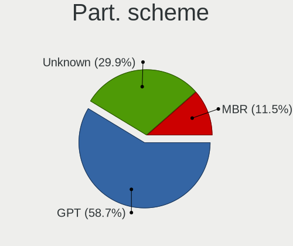
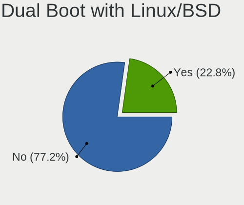
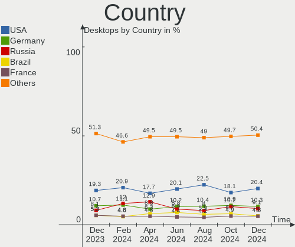
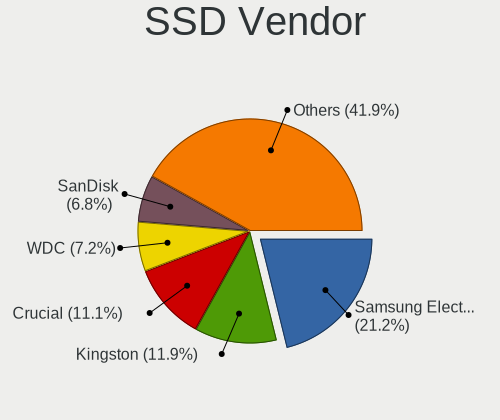
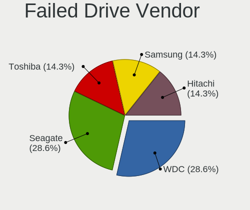

Linux - Hardware Trends (Desktops)
----------------------------------

A project to identify most popular hardware characteristics and track their change
over time based on data collected by Linux users at https://Linux-Hardware.org.

Anyone can contribute to this report by the [hw-probe](https://github.com/linuxhw/hw-probe) tool:

    sudo -E hw-probe -all -upload

This report is for one last month. Overall report since the beginning of time: [TestCoverage](https://github.com/linuxhw/TestCoverage)

Period: Jun, 2022.

Contents
--------

* [ System ](#system)
  - [ OS                       ](#os)
  - [ OS Family                ](#os-family)
  - [ Kernel                   ](#kernel)
  - [ Kernel Family            ](#kernel-family)
  - [ Kernel Major Ver.        ](#kernel-major-ver)
  - [ Arch                     ](#arch)
  - [ DE                       ](#de)
  - [ Display Server           ](#display-server)
  - [ Display Manager          ](#display-manager)
  - [ OS Lang                  ](#os-lang)
  - [ Boot Mode                ](#boot-mode)
  - [ Filesystem               ](#filesystem)
  - [ Part. scheme             ](#part-scheme)
  - [ Dual Boot with Linux/BSD ](#dual-boot-with-linuxbsd)
  - [ Dual Boot (Win)          ](#dual-boot-win)

* [ Board ](#board)
  - [ Vendor                   ](#vendor)
  - [ Model                    ](#model)
  - [ Model Family             ](#model-family)
  - [ MFG Year                 ](#mfg-year)
  - [ Form Factor              ](#form-factor)
  - [ Secure Boot              ](#secure-boot)
  - [ Coreboot                 ](#coreboot)
  - [ RAM Size                 ](#ram-size)
  - [ RAM Used                 ](#ram-used)
  - [ Total Drives             ](#total-drives)
  - [ Has CD-ROM               ](#has-cd-rom)
  - [ Has Ethernet             ](#has-ethernet)
  - [ Has WiFi                 ](#has-wifi)
  - [ Has Bluetooth            ](#has-bluetooth)

* [ Location ](#location)
  - [ Country                  ](#country)
  - [ City                     ](#city)

* [ Drives ](#drives)
  - [ Drive Vendor             ](#drive-vendor)
  - [ Drive Model              ](#drive-model)
  - [ HDD Vendor               ](#hdd-vendor)
  - [ SSD Vendor               ](#ssd-vendor)
  - [ Drive Kind               ](#drive-kind)
  - [ Drive Connector          ](#drive-connector)
  - [ Drive Size               ](#drive-size)
  - [ Space Total              ](#space-total)
  - [ Space Used               ](#space-used)
  - [ Malfunc. Drives          ](#malfunc-drives)
  - [ Malfunc. Drive Vendor    ](#malfunc-drive-vendor)
  - [ Malfunc. HDD Vendor      ](#malfunc-hdd-vendor)
  - [ Malfunc. Drive Kind      ](#malfunc-drive-kind)
  - [ Failed Drives            ](#failed-drives)
  - [ Failed Drive Vendor      ](#failed-drive-vendor)
  - [ Drive Status             ](#drive-status)

* [ Storage controller ](#storage-controller)
  - [ Storage Vendor           ](#storage-vendor)
  - [ Storage Model            ](#storage-model)
  - [ Storage Kind             ](#storage-kind)

* [ Processor ](#processor)
  - [ CPU Vendor               ](#cpu-vendor)
  - [ CPU Model                ](#cpu-model)
  - [ CPU Model Family         ](#cpu-model-family)
  - [ CPU Cores                ](#cpu-cores)
  - [ CPU Sockets              ](#cpu-sockets)
  - [ CPU Threads              ](#cpu-threads)
  - [ CPU Op-Modes             ](#cpu-op-modes)
  - [ CPU Microcode            ](#cpu-microcode)
  - [ CPU Microarch            ](#cpu-microarch)

* [ Graphics ](#graphics)
  - [ GPU Vendor               ](#gpu-vendor)
  - [ GPU Model                ](#gpu-model)
  - [ GPU Combo                ](#gpu-combo)
  - [ GPU Driver               ](#gpu-driver)
  - [ GPU Memory               ](#gpu-memory)

* [ Monitor ](#monitor)
  - [ Monitor Vendor           ](#monitor-vendor)
  - [ Monitor Model            ](#monitor-model)
  - [ Monitor Resolution       ](#monitor-resolution)
  - [ Monitor Diagonal         ](#monitor-diagonal)
  - [ Monitor Width            ](#monitor-width)
  - [ Aspect Ratio             ](#aspect-ratio)
  - [ Monitor Area             ](#monitor-area)
  - [ Pixel Density            ](#pixel-density)
  - [ Multiple Monitors        ](#multiple-monitors)

* [ Network ](#network)
  - [ Net Controller Vendor    ](#net-controller-vendor)
  - [ Net Controller Model     ](#net-controller-model)
  - [ Wireless Vendor          ](#wireless-vendor)
  - [ Wireless Model           ](#wireless-model)
  - [ Ethernet Vendor          ](#ethernet-vendor)
  - [ Ethernet Model           ](#ethernet-model)
  - [ Net Controller Kind      ](#net-controller-kind)
  - [ Used Controller          ](#used-controller)
  - [ NICs                     ](#nics)
  - [ IPv6                     ](#ipv6)

* [ Bluetooth ](#bluetooth)
  - [ Bluetooth Vendor         ](#bluetooth-vendor)
  - [ Bluetooth Model          ](#bluetooth-model)

* [ Sound ](#sound)
  - [ Sound Vendor             ](#sound-vendor)
  - [ Sound Model              ](#sound-model)

* [ Memory ](#memory)
  - [ Memory Vendor            ](#memory-vendor)
  - [ Memory Model             ](#memory-model)
  - [ Memory Kind              ](#memory-kind)
  - [ Memory Form Factor       ](#memory-form-factor)
  - [ Memory Size              ](#memory-size)
  - [ Memory Speed             ](#memory-speed)

* [ Printers & scanners ](#printers--scanners)
  - [ Printer Vendor           ](#printer-vendor)
  - [ Printer Model            ](#printer-model)
  - [ Scanner Vendor           ](#scanner-vendor)
  - [ Scanner Model            ](#scanner-model)

* [ Camera ](#camera)
  - [ Camera Vendor            ](#camera-vendor)
  - [ Camera Model             ](#camera-model)

* [ Security ](#security)
  - [ Fingerprint Vendor       ](#fingerprint-vendor)
  - [ Fingerprint Model        ](#fingerprint-model)
  - [ Chipcard Vendor          ](#chipcard-vendor)
  - [ Chipcard Model           ](#chipcard-model)

* [ Unsupported ](#unsupported)
  - [ Unsupported Devices      ](#unsupported-devices)
  - [ Unsupported Device Types ](#unsupported-device-types)

System
------

OS
--

Installed operating systems

| Name                         | Desktops | Percent |
|------------------------------|----------|---------|
| Ubuntu 22.04                 | 204      | 11.81%  |
| Debian 11                    | 164      | 9.49%   |
| Ubuntu 20.04                 | 139      | 8.04%   |
| OpenMandriva 4.3             | 136      | 7.87%   |
| ROSA 12.2                    | 135      | 7.81%   |
| Linux Mint 20.3              | 126      | 7.29%   |
| Fedora 36                    | 104      | 6.02%   |
| Pop!_OS 22.04                | 85       | 4.92%   |
| KDE neon 20.04               | 46       | 2.66%   |
| Zorin 16                     | 38       | 2.2%    |
| Manjaro                      | 32       | 1.85%   |
| Arch                         | 32       | 1.85%   |
| Arch Rolling                 | 27       | 1.56%   |
| ArcoLinux Rolling            | 24       | 1.39%   |
| Kubuntu 22.04                | 21       | 1.22%   |
| Ubuntu 18.04                 | 16       | 0.93%   |
| Kali 2022.2                  | 16       | 0.93%   |
| Xubuntu 20.04                | 14       | 0.81%   |
| openSUSE Tumbleweed-XXXXXXXX | 14       | 0.81%   |
| Fedora 35                    | 14       | 0.81%   |
| Elementary 6.1               | 14       | 0.81%   |
| ROSA R11.1                   | 13       | 0.75%   |
| Manjaro 21.2.6               | 12       | 0.69%   |
| Manjaro 21.3.1               | 10       | 0.58%   |
| Manjaro 21.3.0               | 10       | 0.58%   |
| Gentoo 2.8                   | 10       | 0.58%   |
| Linux Mint 19.3              | 9        | 0.52%   |
| BlackPanther 18.1            | 9        | 0.52%   |
| Ubuntu 21.10                 | 8        | 0.46%   |
| OpenMandriva 4.2             | 8        | 0.46%   |
| Debian 10                    | 8        | 0.46%   |
| Linux Mint 20.2              | 7        | 0.41%   |
| Linux Mint 20.1              | 7        | 0.41%   |
| Ubuntu MATE 20.04            | 6        | 0.35%   |
| Pop!_OS 21.10                | 6        | 0.35%   |
| Linux Mint 20                | 6        | 0.35%   |
| Kubuntu 20.04                | 6        | 0.35%   |
| Red OS 7.3.1                 | 5        | 0.29%   |
| openSUSE Leap-15.4           | 5        | 0.29%   |
| MX 21                        | 5        | 0.29%   |
| Lubuntu 22.04                | 5        | 0.29%   |
| Garuda Linux Soaring         | 5        | 0.29%   |
| EndeavourOS Rolling          | 5        | 0.29%   |
| Debian Testing               | 5        | 0.29%   |
| ROSA 12.1                    | 4        | 0.23%   |
| Parrot 5.0                   | 4        | 0.23%   |
| Kubuntu 21.10                | 4        | 0.23%   |
| EndeavourOS                  | 4        | 0.23%   |
| Debian Unstable              | 4        | 0.23%   |
| CentOS 8                     | 4        | 0.23%   |
| Zorin 15                     | 3        | 0.17%   |
| Xubuntu 22.04                | 3        | 0.17%   |
| Xubuntu 18.04                | 3        | 0.17%   |
| Ubuntu MATE 22.04            | 3        | 0.17%   |
| Ubuntu Budgie 22.04          | 3        | 0.17%   |
| SteamOS 3.2 (steamdeck-main) | 3        | 0.17%   |
| NixOS 22.05                  | 3        | 0.17%   |
| LinuxFX 11                   | 3        | 0.17%   |
| ClearOS 7                    | 3        | 0.17%   |
| Clear Linux 36480            | 3        | 0.17%   |

OS Family
---------

OS without a version

| Name             | Desktops | Percent |
|------------------|----------|---------|
| Ubuntu           | 371      | 21.47%  |
| Debian           | 182      | 10.53%  |
| Linux Mint       | 159      | 9.2%    |
| ROSA             | 156      | 9.03%   |
| OpenMandriva     | 146      | 8.45%   |
| Fedora           | 124      | 7.18%   |
| Pop!_OS          | 93       | 5.38%   |
| Manjaro          | 64       | 3.7%    |
| Arch             | 59       | 3.41%   |
| KDE neon         | 46       | 2.66%   |
| Zorin            | 41       | 2.37%   |
| Kubuntu          | 35       | 2.03%   |
| ArcoLinux        | 25       | 1.45%   |
| Xubuntu          | 22       | 1.27%   |
| openSUSE         | 20       | 1.16%   |
| Kali             | 18       | 1.04%   |
| Elementary       | 14       | 0.81%   |
| Ubuntu MATE      | 12       | 0.69%   |
| Gentoo           | 11       | 0.64%   |
| EndeavourOS      | 9        | 0.52%   |
| BlackPanther     | 9        | 0.52%   |
| Lubuntu          | 8        | 0.46%   |
| Clear Linux      | 8        | 0.46%   |
| CentOS           | 8        | 0.46%   |
| ALT Linux        | 7        | 0.41%   |
| Red OS           | 5        | 0.29%   |
| MX               | 5        | 0.29%   |
| LinuxFX          | 5        | 0.29%   |
| Garuda Linux     | 5        | 0.29%   |
| Parrot           | 4        | 0.23%   |
| Xero             | 3        | 0.17%   |
| Ubuntu Budgie    | 3        | 0.17%   |
| SteamOS          | 3        | 0.17%   |
| NixOS            | 3        | 0.17%   |
| Endless          | 3        | 0.17%   |
| ClearOS          | 3        | 0.17%   |
| Ubuntu Studio    | 2        | 0.12%   |
| Solus            | 2        | 0.12%   |
| org.kde.Platform | 2        | 0.12%   |
| Oracle Linux     | 2        | 0.12%   |
| LMDE             | 2        | 0.12%   |
| Kaisen           | 2        | 0.12%   |
| Devuan           | 2        | 0.12%   |
| Artix            | 2        | 0.12%   |
| antiX            | 2        | 0.12%   |
| Void Linux       | 1        | 0.06%   |
| Ubuntu Kylin     | 1        | 0.06%   |
| Sparky           | 1        | 0.06%   |
| Rocky Linux      | 1        | 0.06%   |
| RED              | 1        | 0.06%   |
| Peppermint       | 1        | 0.06%   |
| Pardus           | 1        | 0.06%   |
| MassOS           | 1        | 0.06%   |
| Linux Lite       | 1        | 0.06%   |
| Lilidog          | 1        | 0.06%   |
| Guix             | 1        | 0.06%   |
| Feren OS         | 1        | 0.06%   |
| Deepin           | 1        | 0.06%   |
| Calculate        | 1        | 0.06%   |
| BuildRoot        | 1        | 0.06%   |

Kernel
------

Version of the Linux kernel

| Version                                   | Desktops | Percent |
|-------------------------------------------|----------|---------|
| 5.16.7-desktop-1omv4003                   | 129      | 7.47%   |
| 5.10.0-7-amd64                            | 99       | 5.73%   |
| 5.17.5-76051705-generic                   | 84       | 4.86%   |
| 5.10.74-generic-2rosa2021.1-x86_64        | 84       | 4.86%   |
| 5.13.0-51-generic                         | 73       | 4.22%   |
| 5.13.0-44-generic                         | 69       | 3.99%   |
| 5.15.0-37-generic                         | 48       | 2.78%   |
| 5.15.0-33-generic                         | 46       | 2.66%   |
| 5.4.0-117-generic                         | 45       | 2.6%    |
| 5.15.0-35-generic                         | 45       | 2.6%    |
| 5.15.0-39-generic                         | 43       | 2.49%   |
| 5.13.0-48-generic                         | 41       | 2.37%   |
| 5.4.0-113-generic                         | 36       | 2.08%   |
| 5.4.0-121-generic                         | 34       | 1.97%   |
| 5.15.0-40-generic                         | 34       | 1.97%   |
| 5.4.0-120-generic                         | 33       | 1.91%   |
| 5.18.5-200.fc36.x86_64                    | 28       | 1.62%   |
| 5.10.118-generic-2rosa2021.1-x86_64       | 19       | 1.1%    |
| 5.10.0-14-amd64                           | 19       | 1.1%    |
| 5.15.0-25-generic                         | 17       | 0.98%   |
| 5.18.5-arch1-1                            | 16       | 0.93%   |
| 5.18.1-arch1-1                            | 16       | 0.93%   |
| 5.17.11-300.fc36.x86_64                   | 16       | 0.93%   |
| 5.10.0-15-amd64                           | 16       | 0.93%   |
| 5.17.13-300.fc36.x86_64                   | 15       | 0.87%   |
| 5.17.12-300.fc36.x86_64                   | 15       | 0.87%   |
| 5.18.3-arch1-1                            | 12       | 0.69%   |
| 5.4.0-110-generic                         | 10       | 0.58%   |
| 5.15.48-1-MANJARO                         | 10       | 0.58%   |
| 5.15.41-1-MANJARO                         | 9        | 0.52%   |
| 5.18.6-200.fc36.x86_64                    | 8        | 0.46%   |
| 5.18.3.xm1-1.klp-xanmod-rosa2021.1-x86_64 | 8        | 0.46%   |
| 5.17.15-76051715-generic                  | 8        | 0.46%   |
| 5.10.14-desktop-1omv4002                  | 8        | 0.46%   |
| 5.10.0-13-amd64                           | 8        | 0.46%   |
| 5.18.7-arch1-1                            | 7        | 0.41%   |
| 5.18.6-arch1-1                            | 7        | 0.41%   |
| 5.18.3-1-MANJARO                          | 7        | 0.41%   |
| 5.18.1-zen1-1-zen                         | 7        | 0.41%   |
| 5.17.9-1-MANJARO                          | 7        | 0.41%   |
| 5.17.0-kali3-amd64                        | 7        | 0.41%   |
| 5.16.13-desktop-1omv4003                  | 7        | 0.41%   |
| 5.15.49-1-MANJARO                         | 7        | 0.41%   |
| 5.13.0-30-generic                         | 7        | 0.41%   |
| 5.6.14-desktop-2bP                        | 6        | 0.35%   |
| 5.4.0-91-generic                          | 6        | 0.35%   |
| 5.18.5-zen1-1-zen                         | 6        | 0.35%   |
| 5.18.1.xm1-3.klp-xanmod-rosa2021.1-x86_64 | 6        | 0.35%   |
| 5.17.5-300.fc36.x86_64                    | 6        | 0.35%   |
| 5.13.0-40-generic                         | 6        | 0.35%   |
| 5.18.2-arch1-1                            | 5        | 0.29%   |
| 5.17.9-arch1-1                            | 5        | 0.29%   |
| 5.17.11-generic-2rosa2021.1-x86_64        | 5        | 0.29%   |
| 5.16.0-kali7-amd64                        | 5        | 0.29%   |
| 5.13.0-52-generic                         | 5        | 0.29%   |
| 5.13.0-41-generic                         | 5        | 0.29%   |
| 4.15.0-188-generic                        | 5        | 0.29%   |
| 3.10.0-1160.66.1.el7.x86_64               | 5        | 0.29%   |
| 5.18.7-200.fc36.x86_64                    | 4        | 0.23%   |
| 5.17.9-1-default                          | 4        | 0.23%   |

Kernel Family
-------------

Linux kernel without a distro release

| Version  | Desktops | Percent |
|----------|----------|---------|
| 5.15.0   | 250      | 14.47%  |
| 5.13.0   | 226      | 13.08%  |
| 5.4.0    | 187      | 10.82%  |
| 5.10.0   | 154      | 8.91%   |
| 5.16.7   | 129      | 7.47%   |
| 5.17.5   | 91       | 5.27%   |
| 5.10.74  | 84       | 4.86%   |
| 5.18.5   | 58       | 3.36%   |
| 5.18.1   | 39       | 2.26%   |
| 5.18.3   | 33       | 1.91%   |
| 5.18.6   | 27       | 1.56%   |
| 5.17.11  | 26       | 1.5%    |
| 5.17.12  | 22       | 1.27%   |
| 4.15.0   | 22       | 1.27%   |
| 5.17.0   | 20       | 1.16%   |
| 5.17.9   | 19       | 1.1%    |
| 5.10.118 | 19       | 1.1%    |
| 5.18.0   | 18       | 1.04%   |
| 5.17.13  | 17       | 0.98%   |
| 5.11.0   | 17       | 0.98%   |
| 5.18.2   | 16       | 0.93%   |
| 5.16.0   | 16       | 0.93%   |
| 5.15.41  | 15       | 0.87%   |
| 5.15.48  | 13       | 0.75%   |
| 5.18.7   | 11       | 0.64%   |
| 5.15.35  | 11       | 0.64%   |
| 5.17.15  | 10       | 0.58%   |
| 5.16.13  | 9        | 0.52%   |
| 5.15.43  | 9        | 0.52%   |
| 5.15.49  | 8        | 0.46%   |
| 5.14.0   | 8        | 0.46%   |
| 5.10.14  | 8        | 0.46%   |
| 5.18.4   | 7        | 0.41%   |
| 5.15.46  | 7        | 0.41%   |
| 5.6.14   | 6        | 0.35%   |
| 5.17.14  | 6        | 0.35%   |
| 3.10.0   | 6        | 0.35%   |
| 5.17.7   | 5        | 0.29%   |
| 4.19.0   | 5        | 0.29%   |
| 5.8.0    | 4        | 0.23%   |
| 5.4.83   | 4        | 0.23%   |
| 5.14.21  | 4        | 0.23%   |
| 4.18.0   | 4        | 0.23%   |
| 5.4.32   | 3        | 0.17%   |
| 5.17.1   | 3        | 0.17%   |
| 5.15.44  | 3        | 0.17%   |
| 5.15.32  | 3        | 0.17%   |
| 5.15.10  | 3        | 0.17%   |
| 4.9.0    | 3        | 0.17%   |
| 4.18.16  | 3        | 0.17%   |
| 5.4.197  | 2        | 0.12%   |
| 5.4.17   | 2        | 0.12%   |
| 5.17.4   | 2        | 0.12%   |
| 5.16.11  | 2        | 0.12%   |
| 5.15.47  | 2        | 0.12%   |
| 5.15.34  | 2        | 0.12%   |
| 5.15.24  | 2        | 0.12%   |
| 5.14.18  | 2        | 0.12%   |
| 5.13.19  | 2        | 0.12%   |
| 5.10.123 | 2        | 0.12%   |

Kernel Major Ver.
-----------------

Linux kernel major version

| Version | Desktops | Percent |
|---------|----------|---------|
| 5.15    | 332      | 19.21%  |
| 5.10    | 275      | 15.91%  |
| 5.13    | 229      | 13.25%  |
| 5.17    | 224      | 12.96%  |
| 5.18    | 210      | 12.15%  |
| 5.4     | 201      | 11.63%  |
| 5.16    | 159      | 9.2%    |
| 4.15    | 22       | 1.27%   |
| 5.11    | 17       | 0.98%   |
| 5.14    | 15       | 0.87%   |
| 4.18    | 7        | 0.41%   |
| 5.6     | 6        | 0.35%   |
| 4.9     | 6        | 0.35%   |
| 3.10    | 6        | 0.35%   |
| 4.19    | 5        | 0.29%   |
| 5.8     | 4        | 0.23%   |
| 5.0     | 3        | 0.17%   |
| 5.3     | 2        | 0.12%   |
| 5.12    | 2        | 0.12%   |
| 5.7     | 1        | 0.06%   |
| 5.19    | 1        | 0.06%   |
| 4.10    | 1        | 0.06%   |

Arch
----

OS architecture (x86_64, i586, etc.)

| Name    | Desktops | Percent |
|---------|----------|---------|
| x86_64  | 1701     | 98.44%  |
| i686    | 22       | 1.27%   |
| riscv64 | 4        | 0.23%   |
| ppc     | 1        | 0.06%   |

DE
--

Desktop Environment

| Name             | Desktops | Percent |
|------------------|----------|---------|
| GNOME            | 676      | 39.12%  |
| KDE5             | 459      | 26.56%  |
| Unknown          | 187      | 10.82%  |
| X-Cinnamon       | 117      | 6.77%   |
| XFCE             | 98       | 5.67%   |
| MATE             | 54       | 3.13%   |
| Cinnamon         | 31       | 1.79%   |
| LXQt             | 19       | 1.1%    |
| Pantheon         | 14       | 0.81%   |
| KDE4             | 14       | 0.81%   |
| Budgie           | 10       | 0.58%   |
| i3               | 7        | 0.41%   |
| GNOME Classic    | 6        | 0.35%   |
| Unity            | 4        | 0.23%   |
| sway             | 4        | 0.23%   |
| Openbox          | 3        | 0.17%   |
| KDE              | 3        | 0.17%   |
| bspwm            | 3        | 0.17%   |
| LXDE             | 2        | 0.12%   |
| lightdm-xsession | 2        | 0.12%   |
| GNOME Flashback  | 2        | 0.12%   |
| Deepin           | 2        | 0.12%   |
| UKUI             | 1        | 0.06%   |
| river            | 1        | 0.06%   |
| qtile            | 1        | 0.06%   |
| none+awesome     | 1        | 0.06%   |
| LeftWM           | 1        | 0.06%   |
| jwm              | 1        | 0.06%   |
| icewm            | 1        | 0.06%   |
| i3-with-shmlog   | 1        | 0.06%   |
| hyprland         | 1        | 0.06%   |
| DWM              | 1        | 0.06%   |
| awesome          | 1        | 0.06%   |

Display Server
--------------

X11 or Wayland

| Name        | Desktops | Percent |
|-------------|----------|---------|
| X11         | 1175     | 68%     |
| Wayland     | 350      | 20.25%  |
| Unknown     | 135      | 7.81%   |
| Tty         | 66       | 3.82%   |
| Web         | 1        | 0.06%   |
| Unspecified | 1        | 0.06%   |

Display Manager
---------------

SDDM, LightDM, etc.

| Name    | Desktops | Percent |
|---------|----------|---------|
| Unknown | 634      | 36.69%  |
| SDDM    | 349      | 20.2%   |
| GDM3    | 315      | 18.23%  |
| LightDM | 222      | 12.85%  |
| GDM     | 181      | 10.47%  |
| KDM     | 14       | 0.81%   |
| Ly      | 4        | 0.23%   |
| XDM     | 3        | 0.17%   |
| SLiM    | 3        | 0.17%   |
| WDM     | 1        | 0.06%   |
| SLIMSKI | 1        | 0.06%   |
| GREETD  | 1        | 0.06%   |

OS Lang
-------

Language

| Lang        | Desktops | Percent |
|-------------|----------|---------|
| en_US       | 648      | 37.5%   |
| ru_RU       | 332      | 19.21%  |
| de_DE       | 124      | 7.18%   |
| fr_FR       | 85       | 4.92%   |
| en_GB       | 76       | 4.4%    |
| pt_BR       | 58       | 3.36%   |
| en_AU       | 40       | 2.31%   |
| en_CA       | 33       | 1.91%   |
| Unknown     | 31       | 1.79%   |
| C           | 30       | 1.74%   |
| it_IT       | 29       | 1.68%   |
| es_ES       | 28       | 1.62%   |
| pl_PL       | 23       | 1.33%   |
| nl_NL       | 11       | 0.64%   |
| es_MX       | 11       | 0.64%   |
| es_AR       | 10       | 0.58%   |
| en_IN       | 10       | 0.58%   |
| zh_CN       | 8        | 0.46%   |
| sv_SE       | 8        | 0.46%   |
| en_ZA       | 8        | 0.46%   |
| tr_TR       | 7        | 0.41%   |
| ja_JP       | 7        | 0.41%   |
| en_NZ       | 7        | 0.41%   |
| de_CH       | 7        | 0.41%   |
| de_AT       | 6        | 0.35%   |
| da_DK       | 6        | 0.35%   |
| cs_CZ       | 6        | 0.35%   |
| hu_HU       | 5        | 0.29%   |
| fr_BE       | 5        | 0.29%   |
| es_VE       | 5        | 0.29%   |
| ru_UA       | 4        | 0.23%   |
| pt_PT       | 4        | 0.23%   |
| fi_FI       | 4        | 0.23%   |
| es_CO       | 4        | 0.23%   |
| es_CL       | 4        | 0.23%   |
| en_PH       | 3        | 0.17%   |
| en_IE       | 3        | 0.17%   |
| zh_TW       | 2        | 0.12%   |
| POSIX       | 2        | 0.12%   |
| nl_BE       | 2        | 0.12%   |
| fr_CH       | 2        | 0.12%   |
| fr_CA       | 2        | 0.12%   |
| en_IL       | 2        | 0.12%   |
| en_AG       | 2        | 0.12%   |
| ar_EG       | 2        | 0.12%   |
| uk_UA       | 1        | 0.06%   |
| nn_NO       | 1        | 0.06%   |
| lt_LT       | 1        | 0.06%   |
| id_ID       | 1        | 0.06%   |
| hr_HR       | 1        | 0.06%   |
| eu_ES       | 1        | 0.06%   |
| es_UY       | 1        | 0.06%   |
| es_PE       | 1        | 0.06%   |
| es_NI       | 1        | 0.06%   |
| es_GT       | 1        | 0.06%   |
| es_EC       | 1        | 0.06%   |
| es_BO       | 1        | 0.06%   |
| en_UTF-8    | 1        | 0.06%   |
| en_US.UTF.8 | 1        | 0.06%   |
| en_SG       | 1        | 0.06%   |

Boot Mode
---------

EFI or BIOS

| Mode | Desktops | Percent |
|------|----------|---------|
| BIOS | 999      | 57.81%  |
| EFI  | 729      | 42.19%  |

Filesystem
----------

Type of filesystem

| Type    | Desktops | Percent |
|---------|----------|---------|
| Ext4    | 1209     | 69.97%  |
| Overlay | 264      | 15.28%  |
| Btrfs   | 197      | 11.4%   |
| Xfs     | 35       | 2.03%   |
| Zfs     | 12       | 0.69%   |
| Ext3    | 5        | 0.29%   |
| F2fs    | 3        | 0.17%   |
| XXXXXXX | 1        | 0.06%   |
| Ext2    | 1        | 0.06%   |
| Unknown | 1        | 0.06%   |

Part. scheme
------------

Scheme of partitioning

| Type    | Desktops | Percent |
|---------|----------|---------|
| Unknown | 744      | 43.06%  |
| GPT     | 657      | 38.02%  |
| MBR     | 327      | 18.92%  |

Dual Boot with Linux/BSD
------------------------

Hosting more than one Linux/BSD

| Dual boot | Desktops | Percent |
|-----------|----------|---------|
| No        | 1378     | 79.75%  |
| Yes       | 350      | 20.25%  |

Dual Boot (Win)
---------------

Hosting Linux and Windows

| Dual boot | Desktops | Percent |
|-----------|----------|---------|
| No        | 1069     | 61.86%  |
| Yes       | 659      | 38.14%  |

Board
-----

Vendor
------

Motherboard manufacturer

| Name                | Desktops | Percent |
|---------------------|----------|---------|
| ASUSTek Computer    | 492      | 28.47%  |
| Gigabyte Technology | 324      | 18.75%  |
| MSI                 | 232      | 13.43%  |
| ASRock              | 145      | 8.39%   |
| Dell                | 142      | 8.22%   |
| Hewlett-Packard     | 105      | 6.08%   |
| Lenovo              | 53       | 3.07%   |
| Intel               | 38       | 2.2%    |
| Unknown             | 31       | 1.79%   |
| Acer                | 25       | 1.45%   |
| Foxconn             | 16       | 0.93%   |
| Biostar             | 15       | 0.87%   |
| Fujitsu             | 9        | 0.52%   |
| Huanan              | 8        | 0.46%   |
| ECS                 | 8        | 0.46%   |
| Medion              | 7        | 0.41%   |
| Alienware           | 7        | 0.41%   |
| Pegatron            | 6        | 0.35%   |
| BESSTAR Tech        | 6        | 0.35%   |
| Apple               | 5        | 0.29%   |
| Supermicro          | 4        | 0.23%   |
| Shuttle             | 4        | 0.23%   |
| PCWare              | 3        | 0.17%   |
| EVGA                | 3        | 0.17%   |
| AZW                 | 3        | 0.17%   |
| T-bao               | 2        | 0.12%   |
| System76            | 2        | 0.12%   |
| OEM                 | 2        | 0.12%   |
| MAINBRD             | 2        | 0.12%   |
| MACHINIST           | 2        | 0.12%   |
| ASRockRack          | 2        | 0.12%   |
| Yadro               | 1        | 0.06%   |
| Wearnes             | 1        | 0.06%   |
| TPV-INVENTA         | 1        | 0.06%   |
| SLIMBOOK            | 1        | 0.06%   |
| Protectli           | 1        | 0.06%   |
| Positivo            | 1        | 0.06%   |
| PLEXHD              | 1        | 0.06%   |
| PC Engines          | 1        | 0.06%   |
| Packard Bell        | 1        | 0.06%   |
| Nvidia              | 1        | 0.06%   |
| Minix               | 1        | 0.06%   |
| Megaware            | 1        | 0.06%   |
| Maxtang             | 1        | 0.06%   |
| langchao            | 1        | 0.06%   |
| Kraftway            | 1        | 0.06%   |
| Kllisre             | 1        | 0.06%   |
| JGINYUE             | 1        | 0.06%   |
| ITI LIMITED         | 1        | 0.06%   |
| Hardkernel          | 1        | 0.06%   |
| Cincoze             | 1        | 0.06%   |
| AMI                 | 1        | 0.06%   |
| AFOX                | 1        | 0.06%   |
| Acidanthera         | 1        | 0.06%   |
| ABIT                | 1        | 0.06%   |
| 3Logic Group        | 1        | 0.06%   |

Model
-----

Motherboard model

| Name                              | Desktops | Percent |
|-----------------------------------|----------|---------|
| ASUS S20 K29                      | 45       | 2.6%    |
| Unknown                           | 31       | 1.79%   |
| ASUS All Series                   | 30       | 1.74%   |
| Gigabyte H410M S2H                | 15       | 0.87%   |
| MSI MS-7817                       | 14       | 0.81%   |
| Dell OptiPlex 7010                | 13       | 0.75%   |
| MSI MS-7721                       | 12       | 0.69%   |
| MSI MS-7C37                       | 11       | 0.64%   |
| Dell OptiPlex 9020                | 10       | 0.58%   |
| ASUS SABERTOOTH Z77               | 10       | 0.58%   |
| Dell OptiPlex 3020                | 9        | 0.52%   |
| ASUS PRIME A320M-K                | 9        | 0.52%   |
| ASUS M5A97 R2.0                   | 9        | 0.52%   |
| ASUS TUF Gaming X570-PLUS         | 8        | 0.46%   |
| MSI MS-7A38                       | 7        | 0.41%   |
| MSI MS-7996                       | 7        | 0.41%   |
| Gigabyte 970A-DS3P                | 7        | 0.41%   |
| MSI MS-7C91                       | 6        | 0.35%   |
| MSI MS-7758                       | 6        | 0.35%   |
| HP Compaq Elite 8300 SFF          | 6        | 0.35%   |
| ASUS TUF Gaming B550M-PLUS        | 6        | 0.35%   |
| ASUS M5A78L-M/USB3                | 6        | 0.35%   |
| ASUS H110M-R                      | 6        | 0.35%   |
| MSI MS-7C95                       | 5        | 0.29%   |
| MSI MS-7C56                       | 5        | 0.29%   |
| MSI MS-7C52                       | 5        | 0.29%   |
| MSI MS-7C02                       | 5        | 0.29%   |
| MSI MS-7B86                       | 5        | 0.29%   |
| HP ProDesk 600 G1 SFF             | 5        | 0.29%   |
| Dell OptiPlex 7040                | 5        | 0.29%   |
| ASUS ROG STRIX X570-E GAMING      | 5        | 0.29%   |
| ASUS ROG STRIX B550-I GAMING      | 5        | 0.29%   |
| ASUS ROG CROSSHAIR VIII HERO      | 5        | 0.29%   |
| ASUS PRIME X570-P                 | 5        | 0.29%   |
| ASUS PRIME B550M-A                | 5        | 0.29%   |
| ASUS PRIME B450M-A                | 5        | 0.29%   |
| ASUS CROSSHAIR V FORMULA-Z        | 5        | 0.29%   |
| MSI MS-7C94                       | 4        | 0.23%   |
| MSI MS-7C35                       | 4        | 0.23%   |
| MSI MS-7B84                       | 4        | 0.23%   |
| MSI MS-7B79                       | 4        | 0.23%   |
| Intel H61                         | 4        | 0.23%   |
| HP EliteDesk 800 G1 SFF           | 4        | 0.23%   |
| HP Compaq Pro 6300 MT             | 4        | 0.23%   |
| Gigabyte X570 AORUS MASTER        | 4        | 0.23%   |
| Gigabyte B550 AORUS ELITE V2      | 4        | 0.23%   |
| Gigabyte B450M DS3H               | 4        | 0.23%   |
| Gigabyte B450 AORUS M             | 4        | 0.23%   |
| Gigabyte B450 AORUS ELITE         | 4        | 0.23%   |
| Gigabyte A320M-S2H                | 4        | 0.23%   |
| Dell Precision Tower 5810         | 4        | 0.23%   |
| Dell OptiPlex 790                 | 4        | 0.23%   |
| Dell OptiPlex 7070                | 4        | 0.23%   |
| Dell Inspiron 660                 | 4        | 0.23%   |
| ASUS TUF Gaming X570-PLUS_BR      | 4        | 0.23%   |
| ASUS ROG STRIX B550-F GAMING      | 4        | 0.23%   |
| ASUS ROG CROSSHAIR VIII DARK HERO | 4        | 0.23%   |
| ASUS PRIME Z270-A                 | 4        | 0.23%   |
| ASUS P8H67-M LE                   | 4        | 0.23%   |
| ASUS CROSSHAIR VI HERO            | 4        | 0.23%   |

Model Family
------------

Motherboard model prefix

| Name                   | Desktops | Percent |
|------------------------|----------|---------|
| Dell OptiPlex          | 87       | 5.03%   |
| ASUS PRIME             | 86       | 4.98%   |
| ASUS ROG               | 68       | 3.94%   |
| ASUS TUF               | 52       | 3.01%   |
| ASUS S20               | 45       | 2.6%    |
| Unknown                | 31       | 1.79%   |
| HP Compaq              | 30       | 1.74%   |
| ASUS All               | 30       | 1.74%   |
| Lenovo ThinkCentre     | 28       | 1.62%   |
| Dell Precision         | 24       | 1.39%   |
| Gigabyte H410M         | 22       | 1.27%   |
| Acer Aspire            | 18       | 1.04%   |
| Gigabyte B450          | 16       | 0.93%   |
| HP EliteDesk           | 15       | 0.87%   |
| Gigabyte X570          | 15       | 0.87%   |
| ASUS M5A97             | 15       | 0.87%   |
| MSI MS-7817            | 14       | 0.81%   |
| Dell Inspiron          | 14       | 0.81%   |
| ASUS SABERTOOTH        | 14       | 0.81%   |
| ASUS M5A78L-M          | 13       | 0.75%   |
| MSI MS-7721            | 12       | 0.69%   |
| Gigabyte B450M         | 12       | 0.69%   |
| MSI MS-7C37            | 11       | 0.64%   |
| Lenovo ThinkStation    | 11       | 0.64%   |
| HP ProDesk             | 10       | 0.58%   |
| Gigabyte B550          | 10       | 0.58%   |
| ASUS CROSSHAIR         | 10       | 0.58%   |
| ASRock B450            | 10       | 0.58%   |
| Gigabyte 970A-DS3P     | 8        | 0.46%   |
| Fujitsu ESPRIMO        | 8        | 0.46%   |
| ASRock B450M           | 8        | 0.46%   |
| MSI MS-7A38            | 7        | 0.41%   |
| MSI MS-7996            | 7        | 0.41%   |
| HP Pavilion            | 7        | 0.41%   |
| Gigabyte Z690          | 7        | 0.41%   |
| MSI MS-7C91            | 6        | 0.35%   |
| MSI MS-7758            | 6        | 0.35%   |
| Dell Vostro            | 6        | 0.35%   |
| ASUS P8Z68-V           | 6        | 0.35%   |
| ASUS P5G41T-M          | 6        | 0.35%   |
| ASUS H110M-R           | 6        | 0.35%   |
| Alienware Aurora       | 6        | 0.35%   |
| Acer Veriton           | 6        | 0.35%   |
| MSI MS-7C95            | 5        | 0.29%   |
| MSI MS-7C56            | 5        | 0.29%   |
| MSI MS-7C52            | 5        | 0.29%   |
| MSI MS-7C02            | 5        | 0.29%   |
| MSI MS-7B86            | 5        | 0.29%   |
| Gigabyte GA-78LMT-USB3 | 5        | 0.29%   |
| Gigabyte B550M         | 5        | 0.29%   |
| Gigabyte AB350-Gaming  | 5        | 0.29%   |
| Gigabyte A320M-S2H     | 5        | 0.29%   |
| Dell XPS               | 5        | 0.29%   |
| ASUS P5KPL-AM          | 5        | 0.29%   |
| ASUS P5GC-MX           | 5        | 0.29%   |
| ASRock A320M-HDV       | 5        | 0.29%   |
| ASRock 970             | 5        | 0.29%   |
| MSI MS-7C94            | 4        | 0.23%   |
| MSI MS-7C35            | 4        | 0.23%   |
| MSI MS-7B84            | 4        | 0.23%   |

MFG Year
--------

Motherboard manufacture year

| Year    | Desktops | Percent |
|---------|----------|---------|
| 2020    | 227      | 13.14%  |
| 2012    | 162      | 9.38%   |
| 2018    | 157      | 9.09%   |
| 2019    | 154      | 8.91%   |
| 2021    | 144      | 8.33%   |
| 2013    | 137      | 7.93%   |
| 2014    | 100      | 5.79%   |
| 2017    | 97       | 5.61%   |
| 2011    | 92       | 5.32%   |
| 2010    | 82       | 4.75%   |
| 2016    | 80       | 4.63%   |
| 2015    | 72       | 4.17%   |
| 2009    | 63       | 3.65%   |
| 2008    | 55       | 3.18%   |
| 2022    | 38       | 2.2%    |
| 2007    | 38       | 2.2%    |
| 2006    | 19       | 1.1%    |
| Unknown | 5        | 0.29%   |
| 2005    | 3        | 0.17%   |
| 2003    | 2        | 0.12%   |
| 2004    | 1        | 0.06%   |

Form Factor
-----------

Physical design of the computer

| Name    | Desktops | Percent |
|---------|----------|---------|
| Desktop | 1728     | 100%    |

Secure Boot
-----------

Enabled or disabled

| State    | Desktops | Percent |
|----------|----------|---------|
| Disabled | 1677     | 97.05%  |
| Enabled  | 51       | 2.95%   |

Coreboot
--------

Have coreboot on board

| Used | Desktops | Percent |
|------|----------|---------|
| No   | 1726     | 99.88%  |
| Yes  | 2        | 0.12%   |

RAM Size
--------

Total RAM memory

| Size in GB      | Desktops | Percent |
|-----------------|----------|---------|
| 16.01-24.0      | 436      | 25.23%  |
| 4.01-8.0        | 315      | 18.23%  |
| 32.01-64.0      | 302      | 17.48%  |
| 8.01-16.0       | 292      | 16.9%   |
| 3.01-4.0        | 191      | 11.05%  |
| 64.01-256.0     | 88       | 5.09%   |
| 24.01-32.0      | 47       | 2.72%   |
| 1.01-2.0        | 30       | 1.74%   |
| 2.01-3.0        | 17       | 0.98%   |
| More than 256.0 | 5        | 0.29%   |
| 0.51-1.0        | 4        | 0.23%   |
| 0.01-0.5        | 1        | 0.06%   |

RAM Used
--------

Used RAM memory

| Used GB    | Desktops | Percent |
|------------|----------|---------|
| 1.01-2.0   | 545      | 31.54%  |
| 2.01-3.0   | 389      | 22.51%  |
| 4.01-8.0   | 247      | 14.29%  |
| 0.51-1.0   | 220      | 12.73%  |
| 3.01-4.0   | 196      | 11.34%  |
| 8.01-16.0  | 89       | 5.15%   |
| 0.01-0.5   | 22       | 1.27%   |
| 16.01-24.0 | 13       | 0.75%   |
| 32.01-64.0 | 4        | 0.23%   |
| 24.01-32.0 | 3        | 0.17%   |

Total Drives
------------

Number of drives on board

| Drives | Desktops | Percent |
|--------|----------|---------|
| 1      | 659      | 38.14%  |
| 2      | 471      | 27.26%  |
| 3      | 296      | 17.13%  |
| 4      | 139      | 8.04%   |
| 5      | 70       | 4.05%   |
| 6      | 30       | 1.74%   |
| 7      | 27       | 1.56%   |
| 0      | 15       | 0.87%   |
| 8      | 11       | 0.64%   |
| 9      | 5        | 0.29%   |
| 10     | 3        | 0.17%   |
| 12     | 1        | 0.06%   |
| 11     | 1        | 0.06%   |

Has CD-ROM
----------

Has CD-ROM on board

| Presented | Desktops | Percent |
|-----------|----------|---------|
| No        | 1032     | 59.72%  |
| Yes       | 696      | 40.28%  |

Has Ethernet
------------

Has Ethernet on board

| Presented | Desktops | Percent |
|-----------|----------|---------|
| Yes       | 1715     | 99.25%  |
| No        | 13       | 0.75%   |

Has WiFi
--------

Has WiFi module

| Presented | Desktops | Percent |
|-----------|----------|---------|
| No        | 997      | 57.7%   |
| Yes       | 731      | 42.3%   |

Has Bluetooth
-------------

Has Bluetooth module

| Presented | Desktops | Percent |
|-----------|----------|---------|
| No        | 1167     | 67.53%  |
| Yes       | 561      | 32.47%  |

Location
--------

Country
-------

Geographic location (country)

| Country             | Desktops | Percent |
|---------------------|----------|---------|
| Russia              | 370      | 21.41%  |
| USA                 | 319      | 18.46%  |
| Germany             | 144      | 8.33%   |
| France              | 98       | 5.67%   |
| Brazil              | 77       | 4.46%   |
| UK                  | 63       | 3.65%   |
| Poland              | 53       | 3.07%   |
| Australia           | 50       | 2.89%   |
| Canada              | 42       | 2.43%   |
| Italy               | 38       | 2.2%    |
| Netherlands         | 32       | 1.85%   |
| Spain               | 29       | 1.68%   |
| India               | 21       | 1.22%   |
| Argentina           | 21       | 1.22%   |
| Switzerland         | 20       | 1.16%   |
| Hungary             | 19       | 1.1%    |
| Mexico              | 18       | 1.04%   |
| Sweden              | 16       | 0.93%   |
| Belgium             | 15       | 0.87%   |
| Austria             | 15       | 0.87%   |
| Japan               | 13       | 0.75%   |
| Ukraine             | 11       | 0.64%   |
| South Africa        | 11       | 0.64%   |
| Turkey              | 10       | 0.58%   |
| Czechia             | 10       | 0.58%   |
| China               | 10       | 0.58%   |
| New Zealand         | 9        | 0.52%   |
| Malaysia            | 8        | 0.46%   |
| Greece              | 8        | 0.46%   |
| Denmark             | 8        | 0.46%   |
| Thailand            | 7        | 0.41%   |
| Colombia            | 7        | 0.41%   |
| Bulgaria            | 7        | 0.41%   |
| Portugal            | 6        | 0.35%   |
| Indonesia           | 6        | 0.35%   |
| Finland             | 6        | 0.35%   |
| Venezuela           | 5        | 0.29%   |
| Taiwan              | 5        | 0.29%   |
| Slovenia            | 5        | 0.29%   |
| Romania             | 5        | 0.29%   |
| Norway              | 5        | 0.29%   |
| Israel              | 5        | 0.29%   |
| Estonia             | 5        | 0.29%   |
| Serbia              | 4        | 0.23%   |
| Philippines         | 4        | 0.23%   |
| Pakistan            | 4        | 0.23%   |
| Kazakhstan          | 4        | 0.23%   |
| Iran                | 4        | 0.23%   |
| Chile               | 4        | 0.23%   |
| Belarus             | 4        | 0.23%   |
| Bangladesh          | 4        | 0.23%   |
| Saudi Arabia        | 3        | 0.17%   |
| Latvia              | 3        | 0.17%   |
| Ireland             | 3        | 0.17%   |
| Hong Kong           | 3        | 0.17%   |
| Egypt               | 3        | 0.17%   |
| Ecuador             | 3        | 0.17%   |
| Uruguay             | 2        | 0.12%   |
| Trinidad and Tobago | 2        | 0.12%   |
| Singapore           | 2        | 0.12%   |

City
----

Geographic location (city)

| City             | Desktops | Percent |
|------------------|----------|---------|
| Voronezh         | 102      | 5.9%    |
| Moscow           | 38       | 2.2%    |
| Cheboksary       | 26       | 1.5%    |
| St Petersburg    | 20       | 1.16%   |
| Paris            | 12       | 0.69%   |
| Berlin           | 11       | 0.64%   |
| Vienna           | 10       | 0.58%   |
| Strzyzow         | 10       | 0.58%   |
| Chelyabinsk      | 10       | 0.58%   |
| Novosibirsk      | 9        | 0.52%   |
| Hamburg          | 9        | 0.52%   |
| Yekaterinburg    | 8        | 0.46%   |
| Warsaw           | 8        | 0.46%   |
| Sydney           | 8        | 0.46%   |
| Melbourne        | 8        | 0.46%   |
| Krasnodar        | 8        | 0.46%   |
| Vladivostok      | 7        | 0.41%   |
| Sao Paulo        | 7        | 0.41%   |
| Samara           | 7        | 0.41%   |
| Rio de Janeiro   | 7        | 0.41%   |
| Budapest         | 7        | 0.41%   |
| Brisbane         | 7        | 0.41%   |
| Toronto          | 6        | 0.35%   |
| Munich           | 6        | 0.35%   |
| Launceston       | 6        | 0.35%   |
| Kuala Lumpur     | 6        | 0.35%   |
| Chicago          | 6        | 0.35%   |
| Buenos Aires     | 6        | 0.35%   |
| Brussels         | 6        | 0.35%   |
| Auckland         | 6        | 0.35%   |
| Amsterdam        | 6        | 0.35%   |
| Wroclaw          | 5        | 0.29%   |
| Seattle          | 5        | 0.29%   |
| Prague           | 5        | 0.29%   |
| New York         | 5        | 0.29%   |
| Miami            | 5        | 0.29%   |
| Lane Cove        | 5        | 0.29%   |
| Krasnoyarsk      | 5        | 0.29%   |
| Krakow           | 5        | 0.29%   |
| Adelaide         | 5        | 0.29%   |
| Zurich           | 4        | 0.23%   |
| Tyumen           | 4        | 0.23%   |
| Tucson           | 4        | 0.23%   |
| Tel Aviv         | 4        | 0.23%   |
| Springfield      | 4        | 0.23%   |
| San Jose         | 4        | 0.23%   |
| Rostov-on-Don    | 4        | 0.23%   |
| Orlando          | 4        | 0.23%   |
| Omsk             | 4        | 0.23%   |
| Nizhniy Novgorod | 4        | 0.23%   |
| Montreal         | 4        | 0.23%   |
| Minsk            | 4        | 0.23%   |
| Mexico City      | 4        | 0.23%   |
| Marietta         | 4        | 0.23%   |
| Manchester       | 4        | 0.23%   |
| Jacksonville     | 4        | 0.23%   |
| Goiânia         | 4        | 0.23%   |
| Gladbeck         | 4        | 0.23%   |
| Dallas           | 4        | 0.23%   |
| Bradford         | 4        | 0.23%   |

Drives
------

Drive Vendor
------------

Hard drive vendors

| Vendor                    | Desktops | Drives | Percent |
|---------------------------|----------|--------|---------|
| WDC                       | 582      | 837    | 18.38%  |
| Seagate                   | 581      | 763    | 18.35%  |
| Samsung Electronics       | 475      | 619    | 15%     |
| Kingston                  | 206      | 238    | 6.5%    |
| Toshiba                   | 185      | 227    | 5.84%   |
| Crucial                   | 180      | 205    | 5.68%   |
| SanDisk                   | 127      | 150    | 4.01%   |
| Hitachi                   | 90       | 101    | 2.84%   |
| A-DATA Technology         | 66       | 71     | 2.08%   |
| China                     | 39       | 41     | 1.23%   |
| Phison                    | 35       | 38     | 1.11%   |
| Intel                     | 33       | 40     | 1.04%   |
| Unknown                   | 31       | 36     | 0.98%   |
| SPCC                      | 27       | 28     | 0.85%   |
| HGST                      | 22       | 24     | 0.69%   |
| Goodram                   | 22       | 23     | 0.69%   |
| PNY                       | 21       | 22     | 0.66%   |
| OCZ                       | 21       | 21     | 0.66%   |
| Gigabyte Technology       | 21       | 22     | 0.66%   |
| Maxtor                    | 20       | 20     | 0.63%   |
| SK hynix                  | 19       | 19     | 0.6%    |
| Patriot                   | 17       | 19     | 0.54%   |
| Silicon Motion            | 16       | 18     | 0.51%   |
| Apacer                    | 16       | 17     | 0.51%   |
| Micron/Crucial Technology | 15       | 17     | 0.47%   |
| Intenso                   | 15       | 16     | 0.47%   |
| Corsair                   | 15       | 16     | 0.47%   |
| Realtek Semiconductor     | 14       | 14     | 0.44%   |
| XPG                       | 13       | 13     | 0.41%   |
| Team                      | 13       | 16     | 0.41%   |
| Micron Technology         | 12       | 16     | 0.38%   |
| Hewlett-Packard           | 11       | 11     | 0.35%   |
| Transcend                 | 10       | 10     | 0.32%   |
| KingSpec                  | 10       | 10     | 0.32%   |
| ASMT                      | 10       | 13     | 0.32%   |
| Unknown                   | 10       | 10     | 0.32%   |
| Plextor                   | 8        | 9      | 0.25%   |
| Fujitsu                   | 8        | 9      | 0.25%   |
| JMicron Technology        | 7        | 8      | 0.22%   |
| Netac                     | 6        | 6      | 0.19%   |
| Lexar                     | 6        | 6      | 0.19%   |
| Leven                     | 6        | 6      | 0.19%   |
| T-FORCE                   | 5        | 5      | 0.16%   |
| SABRENT                   | 5        | 6      | 0.16%   |
| KIOXIA                    | 5        | 5      | 0.16%   |
| KingDian                  | 5        | 5      | 0.16%   |
| Smartbuy                  | 4        | 4      | 0.13%   |
| AMD                       | 4        | 4      | 0.13%   |
| USB3.0                    | 3        | 3      | 0.09%   |
| LITEONIT                  | 3        | 3      | 0.09%   |
| LDLC                      | 3        | 3      | 0.09%   |
| LaCie                     | 3        | 4      | 0.09%   |
| EMTEC                     | 3        | 3      | 0.09%   |
| WD MediaMax               | 2        | 2      | 0.06%   |
| Verbatim                  | 2        | 2      | 0.06%   |
| SSK                       | 2        | 2      | 0.06%   |
| NGFF                      | 2        | 2      | 0.06%   |
| Lite-On                   | 2        | 2      | 0.06%   |
| KIOXIA-EXCERIA            | 2        | 2      | 0.06%   |
| KingFast                  | 2        | 2      | 0.06%   |

Drive Model
-----------

Hard drive models

| Model                                  | Desktops | Percent |
|----------------------------------------|----------|---------|
| Kingston SA400S37240G 240GB SSD        | 60       | 1.62%   |
| Crucial CT480BX500SSD1 480GB           | 51       | 1.38%   |
| Seagate ST2000DM008-2FR102 2TB         | 45       | 1.22%   |
| Samsung SSD 850 EVO 250GB              | 41       | 1.11%   |
| Seagate ST500DM002-1BD142 500GB        | 39       | 1.05%   |
| Seagate ST1000DM010-2EP102 1TB         | 35       | 0.95%   |
| WDC WD10EZEX-08WN4A0 1TB               | 34       | 0.92%   |
| Toshiba DT01ACA050 500GB               | 32       | 0.86%   |
| Samsung NVMe SSD Drive 1TB             | 30       | 0.81%   |
| Seagate ST1000DM003-1CH162 1TB         | 28       | 0.76%   |
| Kingston SV300S37A120G 120GB SSD       | 26       | 0.7%    |
| Samsung SSD 860 EVO 500GB              | 25       | 0.68%   |
| Samsung SSD 860 EVO 250GB              | 25       | 0.68%   |
| Toshiba VT180 240GB SSD                | 23       | 0.62%   |
| Toshiba DT01ACA100 1TB                 | 23       | 0.62%   |
| Seagate ST1000DM003-1ER162 1TB         | 23       | 0.62%   |
| Kingston SA400S37120G 120GB SSD        | 23       | 0.62%   |
| Samsung SM963 2.5" NVMe PCIe SSD 500GB | 22       | 0.59%   |
| Crucial CT500MX500SSD1 500GB           | 22       | 0.59%   |
| Toshiba HDWD110 1TB                    | 21       | 0.57%   |
| Seagate ST4000DM004-2CV104 4TB         | 21       | 0.57%   |
| Crucial CT1000MX500SSD1 1TB            | 21       | 0.57%   |
| Seagate ST3500418AS 500GB              | 19       | 0.51%   |
| Samsung SSD 860 EVO 1TB                | 19       | 0.51%   |
| Samsung SSD 850 EVO 500GB              | 19       | 0.51%   |
| SanDisk NVMe SSD Drive 1TB             | 18       | 0.49%   |
| Seagate ST2000DM001-1ER164 2TB         | 17       | 0.46%   |
| SanDisk NVMe SSD Drive 500GB           | 17       | 0.46%   |
| Seagate ST1000DM003-1SB102 1TB         | 16       | 0.43%   |
| Samsung SSD 970 EVO Plus 500GB         | 16       | 0.43%   |
| Seagate ST2000DM006-2DM164 2TB         | 15       | 0.41%   |
| Seagate Expansion 1TB                  | 15       | 0.41%   |
| Samsung SSD 970 EVO Plus 1TB           | 15       | 0.41%   |
| Unknown SD/MMC/MS PRO 128GB            | 14       | 0.38%   |
| Toshiba DT01ACA200 2TB                 | 13       | 0.35%   |
| Seagate ST3500413AS 500GB              | 13       | 0.35%   |
| Seagate ST2000DM001-1CH164 2TB         | 13       | 0.35%   |
| Samsung SSD 970 EVO 500GB              | 13       | 0.35%   |
| Crucial CT240BX500SSD1 240GB           | 13       | 0.35%   |
| WDC WDS240G2G0A-00JH30 240GB SSD       | 12       | 0.32%   |
| WDC WDS100T2B0A-00SM50 1TB SSD         | 12       | 0.32%   |
| WDC WD30EFRX-68EUZN0 3TB               | 12       | 0.32%   |
| Seagate ST1000LM024 HN-M101MBB 1TB     | 12       | 0.32%   |
| Samsung SSD 870 QVO 1TB                | 12       | 0.32%   |
| Kingston SA400S37480G 480GB SSD        | 12       | 0.32%   |
| WDC WD20EZRZ-00Z5HB0 2TB               | 11       | 0.3%    |
| Samsung SSD 980 PRO 1TB                | 11       | 0.3%    |
| Samsung NVMe SSD Drive 2TB             | 11       | 0.3%    |
| WDC WDS500G2B0A-00SM50 500GB SSD       | 10       | 0.27%   |
| WDC WD40EFRX-68N32N0 4TB               | 10       | 0.27%   |
| WDC WD10EZEX-00BN5A0 1TB               | 10       | 0.27%   |
| Seagate ST3250310AS 250GB              | 10       | 0.27%   |
| Phison NVMe SSD Drive 1TB              | 10       | 0.27%   |
| Unknown                                | 10       | 0.27%   |
| WDC WDS120G2G0A-00JH30 120GB SSD       | 9        | 0.24%   |
| WDC WD40EZRZ-00GXCB0 4TB               | 9        | 0.24%   |
| WDC WD20EZRX-00D8PB0 2TB               | 9        | 0.24%   |
| WDC WD10EZEX-00WN4A0 1TB               | 9        | 0.24%   |
| WDC WD10EARS-00Y5B1 1TB                | 9        | 0.24%   |
| Samsung SSD 980 500GB                  | 9        | 0.24%   |

HDD Vendor
----------

Hard disk drive vendors

| Vendor              | Desktops | Drives | Percent |
|---------------------|----------|--------|---------|
| Seagate             | 576      | 748    | 37.82%  |
| WDC                 | 518      | 721    | 34.01%  |
| Toshiba             | 165      | 192    | 10.83%  |
| Hitachi             | 90       | 101    | 5.91%   |
| Samsung Electronics | 83       | 92     | 5.45%   |
| HGST                | 22       | 24     | 1.44%   |
| Maxtor              | 20       | 20     | 1.31%   |
| Unknown             | 16       | 16     | 1.05%   |
| Fujitsu             | 8        | 9      | 0.53%   |
| JMicron Technology  | 5        | 6      | 0.33%   |
| ASMT                | 5        | 8      | 0.33%   |
| Hewlett-Packard     | 3        | 3      | 0.2%    |
| Intenso             | 2        | 2      | 0.13%   |
| WD MediaMax         | 1        | 1      | 0.07%   |
| USB3.0              | 1        | 1      | 0.07%   |
| Maxone              | 1        | 1      | 0.07%   |
| Magnetic Data       | 1        | 1      | 0.07%   |
| Inateck             | 1        | 1      | 0.07%   |
| IBM/Hitachi         | 1        | 1      | 0.07%   |
| External            | 1        | 1      | 0.07%   |
| DAS                 | 1        | 3      | 0.07%   |
| ASMT109x            | 1        | 1      | 0.07%   |
| AMP                 | 1        | 1      | 0.07%   |

SSD Vendor
----------

Solid state drive vendors

| Vendor              | Desktops | Drives | Percent |
|---------------------|----------|--------|---------|
| Samsung Electronics | 250      | 294    | 20.99%  |
| Kingston            | 171      | 191    | 14.36%  |
| Crucial             | 170      | 189    | 14.27%  |
| SanDisk             | 82       | 97     | 6.88%   |
| WDC                 | 79       | 83     | 6.63%   |
| A-DATA Technology   | 51       | 54     | 4.28%   |
| China               | 39       | 41     | 3.27%   |
| Toshiba             | 29       | 29     | 2.43%   |
| SPCC                | 24       | 25     | 2.02%   |
| OCZ                 | 21       | 21     | 1.76%   |
| Goodram             | 20       | 21     | 1.68%   |
| PNY                 | 18       | 19     | 1.51%   |
| Intel               | 16       | 16     | 1.34%   |
| Apacer              | 16       | 17     | 1.34%   |
| Patriot             | 15       | 17     | 1.26%   |
| Team                | 13       | 16     | 1.09%   |
| Gigabyte Technology | 11       | 11     | 0.92%   |
| Transcend           | 10       | 10     | 0.84%   |
| KingSpec            | 10       | 10     | 0.84%   |
| Intenso             | 9        | 10     | 0.76%   |
| SK hynix            | 8        | 8      | 0.67%   |
| Plextor             | 8        | 9      | 0.67%   |
| Micron Technology   | 7        | 9      | 0.59%   |
| Unknown             | 7        | 7      | 0.59%   |
| Seagate             | 6        | 7      | 0.5%    |
| Lexar               | 6        | 6      | 0.5%    |
| Leven               | 6        | 6      | 0.5%    |
| Corsair             | 6        | 7      | 0.5%    |
| Netac               | 5        | 5      | 0.42%   |
| KingDian            | 5        | 5      | 0.42%   |
| Hewlett-Packard     | 5        | 5      | 0.42%   |
| Smartbuy            | 4        | 4      | 0.34%   |
| ASMT                | 4        | 4      | 0.34%   |
| LITEONIT            | 3        | 3      | 0.25%   |
| LDLC                | 3        | 3      | 0.25%   |
| EMTEC               | 3        | 3      | 0.25%   |
| AMD                 | 3        | 3      | 0.25%   |
| Verbatim            | 2        | 2      | 0.17%   |
| USB3.0              | 2        | 2      | 0.17%   |
| Unknown             | 2        | 2      | 0.17%   |
| T-FORCE             | 2        | 2      | 0.17%   |
| Phison              | 2        | 2      | 0.17%   |
| NGFF                | 2        | 2      | 0.17%   |
| KIOXIA-EXCERIA      | 2        | 2      | 0.17%   |
| XUM                 | 1        | 1      | 0.08%   |
| XINTOR              | 1        | 1      | 0.08%   |
| WDC WDS1            | 1        | 1      | 0.08%   |
| WALRAM              | 1        | 1      | 0.08%   |
| TO Exter            | 1        | 1      | 0.08%   |
| Timetec             | 1        | 1      | 0.08%   |
| TCSUNBOW            | 1        | 1      | 0.08%   |
| StoreJet            | 1        | 1      | 0.08%   |
| Smart               | 1        | 2      | 0.08%   |
| SATA3 51            | 1        | 1      | 0.08%   |
| Protectli           | 1        | 1      | 0.08%   |
| Palit               | 1        | 1      | 0.08%   |
| OSCOO               | 1        | 1      | 0.08%   |
| Mushkin             | 1        | 2      | 0.08%   |
| LITEON              | 1        | 1      | 0.08%   |
| KUIJIA              | 1        | 1      | 0.08%   |

Drive Kind
----------

HDD or SSD

| Kind    | Desktops | Drives | Percent |
|---------|----------|--------|---------|
| HDD     | 1155     | 1954   | 43.42%  |
| SSD     | 982      | 1315   | 36.92%  |
| NVMe    | 471      | 608    | 17.71%  |
| Unknown | 42       | 57     | 1.58%   |
| MMC     | 10       | 10     | 0.38%   |

Drive Connector
---------------

SATA, SAS, NVMe, etc.

| Type | Desktops | Drives | Percent |
|------|----------|--------|---------|
| SATA | 1576     | 3175   | 72.46%  |
| NVMe | 466      | 599    | 21.43%  |
| SAS  | 123      | 160    | 5.66%   |
| MMC  | 10       | 10     | 0.46%   |

Drive Size
----------

Size of hard drive

| Size in TB | Desktops | Drives | Percent |
|------------|----------|--------|---------|
| 0.01-0.5   | 1203     | 1735   | 51.17%  |
| 0.51-1.0   | 626      | 816    | 26.63%  |
| 1.01-2.0   | 280      | 351    | 11.91%  |
| 3.01-4.0   | 105      | 150    | 4.47%   |
| 2.01-3.0   | 64       | 87     | 2.72%   |
| 4.01-10.0  | 63       | 110    | 2.68%   |
| 10.01-20.0 | 10       | 20     | 0.43%   |

Space Total
-----------

Amount of disk space available on the file system

| Size in GB     | Desktops | Percent |
|----------------|----------|---------|
| 101-250        | 332      | 19.21%  |
| 501-1000       | 273      | 15.8%   |
| 251-500        | 253      | 14.64%  |
| More than 3000 | 194      | 11.23%  |
| 1001-2000      | 187      | 10.82%  |
| Unknown        | 152      | 8.8%    |
| 1-20           | 146      | 8.45%   |
| 2001-3000      | 85       | 4.92%   |
| 51-100         | 69       | 3.99%   |
| 21-50          | 37       | 2.14%   |

Space Used
----------

Amount of used disk space

| Used GB        | Desktops | Percent |
|----------------|----------|---------|
| 1-20           | 536      | 31.02%  |
| 21-50          | 207      | 11.98%  |
| 101-250        | 198      | 11.46%  |
| 51-100         | 161      | 9.32%   |
| Unknown        | 152      | 8.8%    |
| 251-500        | 139      | 8.04%   |
| 501-1000       | 129      | 7.47%   |
| 1001-2000      | 99       | 5.73%   |
| More than 3000 | 64       | 3.7%    |
| 2001-3000      | 42       | 2.43%   |
| 0              | 1        | 0.06%   |

Malfunc. Drives
---------------

Drive models with a malfunction

| Model                                 | Desktops | Drives | Percent |
|---------------------------------------|----------|--------|---------|
| Seagate ST500DM002-1BD142 500GB       | 8        | 9      | 2.77%   |
| Toshiba DT01ACA100 1TB                | 5        | 5      | 1.73%   |
| Seagate ST3250310AS 250GB             | 5        | 5      | 1.73%   |
| Samsung Electronics HD322HJ 320GB     | 4        | 4      | 1.38%   |
| Kingston SV300S37A120G 120GB SSD      | 4        | 4      | 1.38%   |
| WDC WD20EARS-00MVWB0 2TB              | 3        | 3      | 1.04%   |
| WDC WD10EZEX-00RKKA0 1TB              | 3        | 3      | 1.04%   |
| Seagate ST92505610AS 250GB            | 3        | 3      | 1.04%   |
| Seagate ST3500418AS 500GB             | 3        | 3      | 1.04%   |
| Goodram SSD 120GB                     | 3        | 3      | 1.04%   |
| WDC WD5000AAKX-00ERMA0 500GB          | 2        | 2      | 0.69%   |
| WDC WD5000AAKX-001CA0 500GB           | 2        | 2      | 0.69%   |
| WDC WD5000AAKS-00UU3A0 500GB          | 2        | 2      | 0.69%   |
| WDC WD5000AAKB-00H8A0 500GB           | 2        | 2      | 0.69%   |
| WDC WD40EFRX-68WT0N0 4TB              | 2        | 6      | 0.69%   |
| WDC WD3200AAKX-001CA0 320GB           | 2        | 2      | 0.69%   |
| WDC WD3200AAKS-00B3A0 320GB           | 2        | 2      | 0.69%   |
| WDC WD3200AAJS-00L7A0 320GB           | 2        | 2      | 0.69%   |
| WDC WD2003FZEX-00Z4SA0 2TB            | 2        | 2      | 0.69%   |
| WDC WD15EARS-00MVWB0 1TB              | 2        | 2      | 0.69%   |
| WDC WD10EARS-00Y5B1 1TB               | 2        | 2      | 0.69%   |
| WDC WD10EADS-00M2B0 1TB               | 2        | 2      | 0.69%   |
| Toshiba MK6465GSX 640GB               | 2        | 2      | 0.69%   |
| Seagate ST3250318AS 250GB             | 2        | 2      | 0.69%   |
| Seagate ST3160815AS 160GB             | 2        | 2      | 0.69%   |
| Seagate ST31500341AS 1TB              | 2        | 2      | 0.69%   |
| Seagate ST3000DM001-1CH166 3TB        | 2        | 2      | 0.69%   |
| Seagate ST250DM000-1BD141 250GB       | 2        | 2      | 0.69%   |
| Seagate ST2000DM001-1ER164 2TB        | 2        | 2      | 0.69%   |
| Seagate ST2000DM001-1CH164 2TB        | 2        | 2      | 0.69%   |
| Seagate ST1000LM024 HN-M101MBB 1TB    | 2        | 2      | 0.69%   |
| Seagate ST1000DM003-9YN162 1TB        | 2        | 2      | 0.69%   |
| Seagate ST1000DM003-1SB102 1TB        | 2        | 2      | 0.69%   |
| Seagate ST1000DM003-1CH162 1TB        | 2        | 2      | 0.69%   |
| Samsung Electronics SSD 980 PRO 2TB   | 2        | 3      | 0.69%   |
| Samsung Electronics SSD 970 EVO 1TB   | 2        | 2      | 0.69%   |
| Samsung Electronics SSD 870 EVO 1TB   | 2        | 2      | 0.69%   |
| Samsung Electronics SSD 840 EVO 120GB | 2        | 2      | 0.69%   |
| Samsung Electronics HD502HI 500GB     | 2        | 2      | 0.69%   |
| Samsung Electronics HD501LJ 500GB     | 2        | 2      | 0.69%   |
| Samsung Electronics HD103UJ 1TB       | 2        | 2      | 0.69%   |
| Samsung Electronics HD103SI 1TB       | 2        | 2      | 0.69%   |
| OCZ VERTEX4 256GB SSD                 | 2        | 2      | 0.69%   |
| OCZ VERTEX4 128GB SSD                 | 2        | 2      | 0.69%   |
| Maxtor STM3160211AS 160GB             | 2        | 2      | 0.69%   |
| Kingston SHFS37A120G 120GB SSD        | 2        | 2      | 0.69%   |
| Intel SSDSC2CT120A3 120GB             | 2        | 2      | 0.69%   |
| Hitachi HDT725032VLA360 320GB         | 2        | 2      | 0.69%   |
| Hitachi HDT721032SLA380 320GB         | 2        | 2      | 0.69%   |
| Hitachi HDS721010CLA332 1TB           | 2        | 2      | 0.69%   |
| China SSD 120GB                       | 2        | 2      | 0.69%   |
| WDC WDS240G2G0B-00EPW0 240GB SSD      | 1        | 1      | 0.35%   |
| WDC WDS120G2G0A-00JH30 120GB SSD      | 1        | 1      | 0.35%   |
| WDC WD800JB-00ETA0 80GB               | 1        | 1      | 0.35%   |
| WDC WD7500AARX-00N0YB0 752GB          | 1        | 1      | 0.35%   |
| WDC WD7500AARS-00Y5B1 752GB           | 1        | 1      | 0.35%   |
| WDC WD7500AARS-003BB1 752GB           | 1        | 1      | 0.35%   |
| WDC WD6400AAKS-65Z7B0 640GB           | 1        | 1      | 0.35%   |
| WDC WD6400AAKS-22A7B0 640GB           | 1        | 1      | 0.35%   |
| WDC WD6003FFBX-68MU3N0 6TB            | 1        | 2      | 0.35%   |

Malfunc. Drive Vendor
---------------------

Vendors of faulty drives

| Vendor              | Desktops | Drives | Percent |
|---------------------|----------|--------|---------|
| WDC                 | 81       | 92     | 28.93%  |
| Seagate             | 73       | 79     | 26.07%  |
| Samsung Electronics | 33       | 34     | 11.79%  |
| Hitachi             | 18       | 18     | 6.43%   |
| Toshiba             | 13       | 13     | 4.64%   |
| Kingston            | 7        | 7      | 2.5%    |
| Maxtor              | 6        | 6      | 2.14%   |
| OCZ                 | 5        | 5      | 1.79%   |
| SanDisk             | 4        | 7      | 1.43%   |
| Intel               | 4        | 4      | 1.43%   |
| Crucial             | 4        | 4      | 1.43%   |
| China               | 4        | 4      | 1.43%   |
| LITEONIT            | 3        | 3      | 1.07%   |
| Goodram             | 3        | 3      | 1.07%   |
| Patriot             | 2        | 2      | 0.71%   |
| Hewlett-Packard     | 2        | 2      | 0.71%   |
| Fujitsu             | 2        | 2      | 0.71%   |
| Transcend           | 1        | 1      | 0.36%   |
| TCSUNBOW            | 1        | 1      | 0.36%   |
| SPCC                | 1        | 1      | 0.36%   |
| Leven               | 1        | 1      | 0.36%   |
| LDLC                | 1        | 1      | 0.36%   |
| KingSpec            | 1        | 1      | 0.36%   |
| Kingmax             | 1        | 1      | 0.36%   |
| Intenso             | 1        | 1      | 0.36%   |
| Innodisk            | 1        | 1      | 0.36%   |
| IBM/Hitachi         | 1        | 1      | 0.36%   |
| HGST                | 1        | 1      | 0.36%   |
| Gigabyte Technology | 1        | 1      | 0.36%   |
| Drevo               | 1        | 1      | 0.36%   |
| ASMT                | 1        | 1      | 0.36%   |
| Apacer              | 1        | 1      | 0.36%   |
| A-DATA Technology   | 1        | 1      | 0.36%   |

Malfunc. HDD Vendor
-------------------

Vendors of faulty HDD drives

| Vendor              | Desktops | Drives | Percent |
|---------------------|----------|--------|---------|
| WDC                 | 79       | 90     | 37.26%  |
| Seagate             | 73       | 79     | 34.43%  |
| Samsung Electronics | 19       | 19     | 8.96%   |
| Hitachi             | 18       | 18     | 8.49%   |
| Toshiba             | 13       | 13     | 6.13%   |
| Maxtor              | 6        | 6      | 2.83%   |
| Fujitsu             | 2        | 2      | 0.94%   |
| IBM/Hitachi         | 1        | 1      | 0.47%   |
| HGST                | 1        | 1      | 0.47%   |

Malfunc. Drive Kind
-------------------

Kinds of faulty drives

| Kind | Desktops | Drives | Percent |
|------|----------|--------|---------|
| HDD  | 186      | 229    | 73.52%  |
| SSD  | 54       | 58     | 21.34%  |
| NVMe | 13       | 14     | 5.14%   |

Failed Drives
-------------

Failed drive models

| Model                                            | Desktops | Drives | Percent |
|--------------------------------------------------|----------|--------|---------|
| WDC WD3200BPVT-24ZEST0 320GB                     | 1        | 1      | 16.67%  |
| Seagate ST9500325AS 500GB                        | 1        | 1      | 16.67%  |
| Samsung Electronics SP2504C 250GB                | 1        | 1      | 16.67%  |
| Samsung Electronics MZ7TY128HDHP-000L1 128GB SSD | 1        | 1      | 16.67%  |
| Samsung Electronics HD252HJ 250GB                | 1        | 1      | 16.67%  |
| Samsung Electronics HD103SJ 1TB                  | 1        | 1      | 16.67%  |

Failed Drive Vendor
-------------------

Failed drive vendors

| Vendor              | Desktops | Drives | Percent |
|---------------------|----------|--------|---------|
| Samsung Electronics | 4        | 4      | 66.67%  |
| WDC                 | 1        | 1      | 16.67%  |
| Seagate             | 1        | 1      | 16.67%  |

Drive Status
------------

Number of failed and malfunc. drives

| Status   | Desktops | Drives | Percent |
|----------|----------|--------|---------|
| Works    | 893      | 1765   | 45.87%  |
| Detected | 809      | 1872   | 41.55%  |
| Malfunc  | 239      | 301    | 12.28%  |
| Failed   | 6        | 6      | 0.31%   |

Storage controller
------------------

Storage Vendor
--------------

Storage controller vendors

| Vendor                        | Desktops | Percent |
|-------------------------------|----------|---------|
| Intel                         | 1110     | 45.25%  |
| AMD                           | 577      | 23.52%  |
| Samsung Electronics           | 198      | 8.07%   |
| ASMedia Technology            | 79       | 3.22%   |
| SanDisk                       | 74       | 3.02%   |
| Phison Electronics            | 58       | 2.36%   |
| JMicron Technology            | 56       | 2.28%   |
| Marvell Technology Group      | 49       | 2%      |
| Kingston Technology Company   | 41       | 1.67%   |
| Nvidia                        | 32       | 1.3%    |
| Micron/Crucial Technology     | 26       | 1.06%   |
| Silicon Motion                | 24       | 0.98%   |
| Realtek Semiconductor         | 23       | 0.94%   |
| ADATA Technology              | 20       | 0.82%   |
| SK hynix                      | 12       | 0.49%   |
| VIA Technologies              | 11       | 0.45%   |
| Broadcom / LSI                | 11       | 0.45%   |
| Toshiba America Info Systems  | 8        | 0.33%   |
| LSI Logic / Symbios Logic     | 7        | 0.29%   |
| Micron Technology             | 6        | 0.24%   |
| Silicon Image                 | 4        | 0.16%   |
| MAXIO Technology (Hangzhou)   | 4        | 0.16%   |
| Seagate Technology            | 3        | 0.12%   |
| KIOXIA                        | 3        | 0.12%   |
| Shenzhen Longsys Electronics  | 2        | 0.08%   |
| Lite-On Technology            | 2        | 0.08%   |
| Integrated Technology Express | 2        | 0.08%   |
| HighPoint Technologies        | 2        | 0.08%   |
| Hewlett-Packard               | 2        | 0.08%   |
| Biwin Storage Technology      | 2        | 0.08%   |
| ULi Electronics               | 1        | 0.04%   |
| Tekram Technology             | 1        | 0.04%   |
| Lite-On IT Corp. / Plextor    | 1        | 0.04%   |
| Adaptec                       | 1        | 0.04%   |
| 3ware                         | 1        | 0.04%   |

Storage Model
-------------

Storage controller models

| Model                                                                                   | Desktops | Percent |
|-----------------------------------------------------------------------------------------|----------|---------|
| AMD FCH SATA Controller [AHCI mode]                                                     | 324      | 10.77%  |
| Intel 8 Series/C220 Series Chipset Family 6-port SATA Controller 1 [AHCI mode]          | 131      | 4.35%   |
| AMD 400 Series Chipset SATA Controller                                                  | 125      | 4.15%   |
| Intel 200 Series PCH SATA controller [AHCI mode]                                        | 110      | 3.66%   |
| Samsung NVMe SSD Controller SM981/PM981/PM983                                           | 108      | 3.59%   |
| AMD 500 Series Chipset SATA Controller                                                  | 90       | 2.99%   |
| Intel 7 Series/C210 Series Chipset Family 6-port SATA Controller [AHCI mode]            | 89       | 2.96%   |
| Intel Q170/Q150/B150/H170/H110/Z170/CM236 Chipset SATA Controller [AHCI Mode]           | 83       | 2.76%   |
| AMD SB7x0/SB8x0/SB9x0 SATA Controller [AHCI mode]                                       | 78       | 2.59%   |
| ASMedia ASM1062 Serial ATA Controller                                                   | 74       | 2.46%   |
| Intel NM10/ICH7 Family SATA Controller [IDE mode]                                       | 72       | 2.39%   |
| AMD SB7x0/SB8x0/SB9x0 IDE Controller                                                    | 71       | 2.36%   |
| Intel 6 Series/C200 Series Chipset Family 6 port Desktop SATA AHCI Controller           | 70       | 2.33%   |
| Intel SATA Controller [RAID mode]                                                       | 66       | 2.19%   |
| Intel 82801G (ICH7 Family) IDE Controller                                               | 53       | 1.76%   |
| Intel Cannon Lake PCH SATA AHCI Controller                                              | 48       | 1.6%    |
| Intel 500 Series Chipset Family SATA AHCI Controller                                    | 47       | 1.56%   |
| Samsung NVMe SSD Controller PM9A1/PM9A3/980PRO                                          | 45       | 1.5%    |
| AMD SB7x0/SB8x0/SB9x0 SATA Controller [IDE mode]                                        | 41       | 1.36%   |
| JMicron JMB363 SATA/IDE Controller                                                      | 39       | 1.3%    |
| AMD FCH SATA Controller D                                                               | 34       | 1.13%   |
| Intel Alder Lake-S PCH SATA Controller [AHCI Mode]                                      | 31       | 1.03%   |
| Intel 6 Series/C200 Series Chipset Family Desktop SATA Controller (IDE mode, ports 4-5) | 30       | 1%      |
| Intel 6 Series/C200 Series Chipset Family Desktop SATA Controller (IDE mode, ports 0-3) | 29       | 0.96%   |
| Intel 400 Series Chipset Family SATA AHCI Controller                                    | 29       | 0.96%   |
| Samsung NVMe SSD Controller 980                                                         | 28       | 0.93%   |
| Samsung NVMe SSD Controller SM961/PM961/SM963                                           | 25       | 0.83%   |
| Intel C610/X99 series chipset 6-Port SATA Controller [AHCI mode]                        | 25       | 0.83%   |
| AMD 300 Series Chipset SATA Controller                                                  | 25       | 0.83%   |
| Phison E12 NVMe Controller                                                              | 24       | 0.8%    |
| Silicon Motion SM2263EN/SM2263XT SSD Controller                                         | 21       | 0.7%    |
| Intel C610/X99 series chipset sSATA Controller [AHCI mode]                              | 21       | 0.7%    |
| Phison E16 PCIe4 NVMe Controller                                                        | 20       | 0.66%   |
| Intel Comet Lake SATA AHCI Controller                                                   | 20       | 0.66%   |
| Intel 9 Series Chipset Family SATA Controller [AHCI Mode]                               | 20       | 0.66%   |
| ADATA XPG SX8200 Pro PCIe Gen3x4 M.2 2280 Solid State Drive                             | 19       | 0.63%   |
| Intel 82801JI (ICH10 Family) 2 port SATA IDE Controller #2                              | 18       | 0.6%    |
| SanDisk WD Blue SN550 NVMe SSD                                                          | 17       | 0.56%   |
| Nvidia MCP61 SATA Controller                                                            | 17       | 0.56%   |
| Kingston Company A2000 NVMe SSD                                                         | 17       | 0.56%   |
| Intel Volume Management Device NVMe RAID Controller                                     | 17       | 0.56%   |
| Intel C600/X79 series chipset 6-Port SATA AHCI Controller                               | 17       | 0.56%   |
| Intel 82801JI (ICH10 Family) SATA AHCI Controller                                       | 17       | 0.56%   |
| Intel 82801JI (ICH10 Family) 4 port SATA IDE Controller #1                              | 17       | 0.56%   |
| SanDisk WD PC SN810 / Black SN850 NVMe SSD                                              | 16       | 0.53%   |
| Intel 5 Series/3400 Series Chipset 4 port SATA IDE Controller                           | 16       | 0.53%   |
| Intel 5 Series/3400 Series Chipset 2 port SATA IDE Controller                           | 16       | 0.53%   |
| Realtek Realtek Non-Volatile memory controller                                          | 15       | 0.5%    |
| Intel 4 Series Chipset PT IDER Controller                                               | 15       | 0.5%    |
| Intel 7 Series/C210 Series Chipset Family 4-port SATA Controller [IDE mode]             | 14       | 0.47%   |
| Intel 7 Series/C210 Series Chipset Family 2-port SATA Controller [IDE mode]             | 14       | 0.47%   |
| SanDisk Non-Volatile memory controller                                                  | 13       | 0.43%   |
| Kingston Company Company Non-Volatile memory controller                                 | 13       | 0.43%   |
| Intel 5 Series/3400 Series Chipset 6 port SATA AHCI Controller                          | 13       | 0.43%   |
| SanDisk WD Black SN750 / PC SN730 NVMe SSD                                              | 12       | 0.4%    |
| Nvidia MCP61 IDE                                                                        | 12       | 0.4%    |
| Intel C600/X79 series chipset SATA RAID Controller                                      | 12       | 0.4%    |
| SanDisk WD Blue SN570 NVMe SSD                                                          | 11       | 0.37%   |
| Marvell Group 88SE9172 SATA 6Gb/s Controller                                            | 11       | 0.37%   |
| JMicron JMB368 IDE controller                                                           | 11       | 0.37%   |

Storage Kind
------------

Kind of storage controller (IDE, SATA, NVMe, SAS, ...)

| Kind | Desktops | Percent |
|------|----------|---------|
| SATA | 1414     | 59.09%  |
| NVMe | 468      | 19.56%  |
| IDE  | 365      | 15.25%  |
| RAID | 124      | 5.18%   |
| SAS  | 14       | 0.59%   |
| SCSI | 8        | 0.33%   |

Processor
---------

CPU Vendor
----------

Processor vendors

| Vendor         | Desktops | Percent |
|----------------|----------|---------|
| Intel          | 1117     | 64.64%  |
| AMD            | 606      | 35.07%  |
| sifive,u74-mc  | 2        | 0.12%   |
| sifive,bullet0 | 2        | 0.12%   |
| PowerBook6,7   | 1        | 0.06%   |

CPU Model
---------

Processor models

| Model                                       | Desktops | Percent |
|---------------------------------------------|----------|---------|
| Intel Core i5-9400 CPU @ 2.90GHz            | 50       | 2.89%   |
| AMD Ryzen 5 3600 6-Core Processor           | 32       | 1.85%   |
| AMD Ryzen 7 3700X 8-Core Processor          | 25       | 1.45%   |
| AMD Ryzen 7 5800X 8-Core Processor          | 22       | 1.27%   |
| AMD Ryzen 5 5600X 6-Core Processor          | 22       | 1.27%   |
| AMD Ryzen 5 5600G with Radeon Graphics      | 22       | 1.27%   |
| AMD FX-8350 Eight-Core Processor            | 22       | 1.27%   |
| Intel Core i5-3470 CPU @ 3.20GHz            | 21       | 1.22%   |
| Intel Core i3-10100 CPU @ 3.60GHz           | 20       | 1.16%   |
| AMD Ryzen 9 3900X 12-Core Processor         | 20       | 1.16%   |
| AMD Ryzen 7 5700G with Radeon Graphics      | 20       | 1.16%   |
| Intel Core i7-3770 CPU @ 3.40GHz            | 19       | 1.1%    |
| Intel Core 2 Duo CPU E8400 @ 3.00GHz        | 18       | 1.04%   |
| AMD Ryzen 9 5900X 12-Core Processor         | 18       | 1.04%   |
| Intel Core i7-4790 CPU @ 3.60GHz            | 17       | 0.98%   |
| Intel Core i5-4460 CPU @ 3.20GHz            | 17       | 0.98%   |
| AMD Ryzen 5 1600 Six-Core Processor         | 17       | 0.98%   |
| Intel Core i7-6700 CPU @ 3.40GHz            | 16       | 0.93%   |
| AMD Ryzen 9 5950X 16-Core Processor         | 16       | 0.93%   |
| AMD FX-6300 Six-Core Processor              | 16       | 0.93%   |
| Intel Core i5-3570K CPU @ 3.40GHz           | 15       | 0.87%   |
| Intel Core 2 Duo CPU E7500 @ 2.93GHz        | 15       | 0.87%   |
| AMD Ryzen 7 2700X Eight-Core Processor      | 15       | 0.87%   |
| AMD Ryzen 7 2700 Eight-Core Processor       | 15       | 0.87%   |
| AMD Ryzen 3 2200G with Radeon Vega Graphics | 15       | 0.87%   |
| Intel Core i5-6500 CPU @ 3.20GHz            | 14       | 0.81%   |
| Intel Core i5-4570 CPU @ 3.20GHz            | 14       | 0.81%   |
| Intel Core i3-2120 CPU @ 3.30GHz            | 14       | 0.81%   |
| AMD Ryzen 5 2600 Six-Core Processor         | 13       | 0.75%   |
| Intel Core i7-7700K CPU @ 4.20GHz           | 12       | 0.69%   |
| Intel Core i7-4770 CPU @ 3.40GHz            | 12       | 0.69%   |
| Intel Core 2 Quad CPU Q6600 @ 2.40GHz       | 12       | 0.69%   |
| Intel Core i7-2600 CPU @ 3.40GHz            | 11       | 0.64%   |
| Intel Core i5-3330 CPU @ 3.00GHz            | 11       | 0.64%   |
| Intel Core i5-10400F CPU @ 2.90GHz          | 11       | 0.64%   |
| Intel Core i5-10400 CPU @ 2.90GHz           | 11       | 0.64%   |
| Intel Core i3-7100 CPU @ 3.90GHz            | 11       | 0.64%   |
| Intel Core i5-9400F CPU @ 2.90GHz           | 10       | 0.58%   |
| Intel Core i5-4590 CPU @ 3.30GHz            | 10       | 0.58%   |
| Intel Core i3-4130 CPU @ 3.40GHz            | 10       | 0.58%   |
| Intel Core i3-3220 CPU @ 3.30GHz            | 10       | 0.58%   |
| Intel Core i5-2400 CPU @ 3.10GHz            | 9        | 0.52%   |
| Intel 12th Gen Core i7-12700K               | 9        | 0.52%   |
| Intel Core i7-8700K CPU @ 3.70GHz           | 8        | 0.46%   |
| Intel Core i7-4790K CPU @ 4.00GHz           | 8        | 0.46%   |
| Intel Core i5-3570 CPU @ 3.40GHz            | 8        | 0.46%   |
| Intel Core i3-4160 CPU @ 3.60GHz            | 8        | 0.46%   |
| Intel 11th Gen Core i5-11400 @ 2.60GHz      | 8        | 0.46%   |
| AMD Ryzen 5 3600X 6-Core Processor          | 8        | 0.46%   |
| Intel Pentium Gold G5400 CPU @ 3.70GHz      | 7        | 0.41%   |
| Intel Pentium CPU G4400 @ 3.30GHz           | 7        | 0.41%   |
| Intel Core i7-8700 CPU @ 3.20GHz            | 7        | 0.41%   |
| Intel Core i7-7700 CPU @ 3.60GHz            | 7        | 0.41%   |
| Intel Core i7-5820K CPU @ 3.30GHz           | 7        | 0.41%   |
| Intel Core i5-7400 CPU @ 3.00GHz            | 7        | 0.41%   |
| Intel Core i5-6600K CPU @ 3.50GHz           | 7        | 0.41%   |
| Intel Core i3-6100 CPU @ 3.70GHz            | 7        | 0.41%   |
| AMD Ryzen 7 1700 Eight-Core Processor       | 7        | 0.41%   |
| AMD Phenom II X4 955 Processor              | 7        | 0.41%   |
| Intel Pentium CPU G3220 @ 3.00GHz           | 6        | 0.35%   |

CPU Model Family
----------------

Processor model prefix

| Model                   | Desktops | Percent |
|-------------------------|----------|---------|
| Intel Core i5           | 327      | 18.92%  |
| Intel Core i7           | 203      | 11.75%  |
| AMD Ryzen 5             | 151      | 8.74%   |
| Intel Core i3           | 143      | 8.28%   |
| AMD Ryzen 7             | 124      | 7.18%   |
| Intel Xeon              | 100      | 5.79%   |
| Other                   | 74       | 4.28%   |
| AMD FX                  | 74       | 4.28%   |
| AMD Ryzen 9             | 61       | 3.53%   |
| Intel Pentium           | 53       | 3.07%   |
| Intel Core 2 Duo        | 50       | 2.89%   |
| Intel Celeron           | 40       | 2.31%   |
| Intel Core 2 Quad       | 33       | 1.91%   |
| AMD Ryzen 3             | 30       | 1.74%   |
| Intel Pentium Dual-Core | 24       | 1.39%   |
| Intel Core i9           | 18       | 1.04%   |
| AMD Phenom II X4        | 16       | 0.93%   |
| AMD A8                  | 15       | 0.87%   |
| Intel Atom              | 14       | 0.81%   |
| AMD Athlon 64 X2        | 14       | 0.81%   |
| AMD A4                  | 13       | 0.75%   |
| AMD A10                 | 13       | 0.75%   |
| AMD A6                  | 12       | 0.69%   |
| Intel Core 2            | 11       | 0.64%   |
| Intel Pentium Dual      | 9        | 0.52%   |
| AMD Athlon II X4        | 9        | 0.52%   |
| Intel Pentium Gold      | 8        | 0.46%   |
| Intel Pentium 4         | 8        | 0.46%   |
| AMD Athlon II X2        | 8        | 0.46%   |
| AMD Ryzen Threadripper  | 7        | 0.41%   |
| AMD Ryzen 5 PRO         | 7        | 0.41%   |
| AMD Phenom II X6        | 7        | 0.41%   |
| AMD Phenom II X2        | 6        | 0.35%   |
| Intel Pentium D         | 5        | 0.29%   |
| AMD Athlon              | 5        | 0.29%   |
| AMD Ryzen 7 PRO         | 4        | 0.23%   |
| AMD Athlon X4           | 4        | 0.23%   |
| AMD Athlon II X3        | 4        | 0.23%   |
| AMD Sempron             | 3        | 0.17%   |
| AMD Athlon Dual Core    | 3        | 0.17%   |
| Intel Pentium Silver    | 2        | 0.12%   |
| Intel Genuine           | 2        | 0.12%   |
| AMD Phenom              | 2        | 0.12%   |
| Intel Celeron D         | 1        | 0.06%   |
| AMD Ryzen Embedded      | 1        | 0.06%   |
| AMD Ryzen 3 PRO         | 1        | 0.06%   |
| AMD PRO A8              | 1        | 0.06%   |
| AMD PRO A10             | 1        | 0.06%   |
| AMD Opteron             | 1        | 0.06%   |
| AMD GX                  | 1        | 0.06%   |
| AMD EPYC                | 1        | 0.06%   |
| AMD E2                  | 1        | 0.06%   |
| AMD E1                  | 1        | 0.06%   |
| AMD E                   | 1        | 0.06%   |
| AMD C-50                | 1        | 0.06%   |

CPU Cores
---------

Number of processor cores

| Number  | Desktops | Percent |
|---------|----------|---------|
| 4       | 632      | 36.57%  |
| 2       | 388      | 22.45%  |
| 6       | 323      | 18.69%  |
| 8       | 189      | 10.94%  |
| 12      | 60       | 3.47%   |
| 16      | 40       | 2.31%   |
| 1       | 40       | 2.31%   |
| 3       | 28       | 1.62%   |
| 10      | 13       | 0.75%   |
| Unknown | 4        | 0.23%   |
| 24      | 3        | 0.17%   |
| 14      | 3        | 0.17%   |
| 32      | 2        | 0.12%   |
| 20      | 2        | 0.12%   |
| 18      | 1        | 0.06%   |

CPU Sockets
-----------

Number of sockets

| Number  | Desktops | Percent |
|---------|----------|---------|
| 1       | 1702     | 98.5%   |
| 2       | 22       | 1.27%   |
| Unknown | 4        | 0.23%   |

CPU Threads
-----------

Threads per core (Hyper-Threading)

| Number  | Desktops | Percent |
|---------|----------|---------|
| 2       | 1022     | 59.14%  |
| 1       | 702      | 40.63%  |
| Unknown | 4        | 0.23%   |

CPU Op-Modes
------------

CPU Operation Modes (32-bit, 64-bit)

| Op mode        | Desktops | Percent |
|----------------|----------|---------|
| 32-bit, 64-bit | 1719     | 99.48%  |
| Unknown        | 5        | 0.29%   |
| 32-bit         | 4        | 0.23%   |

CPU Microcode
-------------

Microcode number

| Number     | Desktops | Percent |
|------------|----------|---------|
| Unknown    | 403      | 23.32%  |
| 0x306c3    | 131      | 7.58%   |
| 0x306a9    | 100      | 5.79%   |
| 0x906ea    | 84       | 4.86%   |
| 0x1067a    | 67       | 3.88%   |
| 0x206a7    | 65       | 3.76%   |
| 0x08701021 | 58       | 3.36%   |
| 0x906e9    | 50       | 2.89%   |
| 0x506e3    | 50       | 2.89%   |
| 0xa0653    | 40       | 2.31%   |
| 0x0800820d | 39       | 2.26%   |
| 0x0a50000c | 30       | 1.74%   |
| 0x06000852 | 29       | 1.68%   |
| 0x0a201016 | 28       | 1.62%   |
| 0x306f2    | 23       | 1.33%   |
| 0xa0671    | 20       | 1.16%   |
| 0x90672    | 19       | 1.1%    |
| 0xa0655    | 17       | 0.98%   |
| 0x010000c8 | 16       | 0.93%   |
| 0x6fb      | 15       | 0.87%   |
| 0x06003106 | 15       | 0.87%   |
| 0x906eb    | 14       | 0.81%   |
| 0x6fd      | 14       | 0.81%   |
| 0x306e4    | 14       | 0.81%   |
| 0x08701013 | 14       | 0.81%   |
| 0x06001119 | 14       | 0.81%   |
| 0x906ed    | 13       | 0.75%   |
| 0x08600106 | 13       | 0.75%   |
| 0x08108109 | 13       | 0.75%   |
| 0x106e5    | 12       | 0.69%   |
| 0x08001138 | 11       | 0.64%   |
| 0x06000822 | 11       | 0.64%   |
| 0x106a5    | 10       | 0.58%   |
| 0x10676    | 10       | 0.58%   |
| 0x08001137 | 10       | 0.58%   |
| 0x206d7    | 9        | 0.52%   |
| 0x08101016 | 9        | 0.52%   |
| 0x0600063e | 9        | 0.52%   |
| 0x20655    | 8        | 0.46%   |
| 0x0a201009 | 8        | 0.46%   |
| 0x010000db | 8        | 0.46%   |
| 0x0a20120a | 7        | 0.41%   |
| 0x0a201205 | 7        | 0.41%   |
| 0x0a201204 | 7        | 0.41%   |
| 0x0810100b | 7        | 0.41%   |
| 0x010000b6 | 7        | 0.41%   |
| 0x406f1    | 6        | 0.35%   |
| 0x30661    | 6        | 0.35%   |
| 0x20652    | 6        | 0.35%   |
| 0x07030105 | 6        | 0.35%   |
| 0x6f6      | 5        | 0.29%   |
| 0x30678    | 5        | 0.29%   |
| 0x106ca    | 5        | 0.29%   |
| 0x10677    | 5        | 0.29%   |
| 0x0a50000d | 5        | 0.29%   |
| 0x0600611a | 5        | 0.29%   |
| 0x00000000 | 5        | 0.29%   |
| 0x806c1    | 4        | 0.23%   |
| 0x706a8    | 4        | 0.23%   |
| 0x50657    | 4        | 0.23%   |

CPU Microarch
-------------

Microarchitecture

| Name             | Desktops | Percent |
|------------------|----------|---------|
| Haswell          | 199      | 11.52%  |
| KabyLake         | 197      | 11.4%   |
| IvyBridge        | 141      | 8.16%   |
| Zen 3            | 135      | 7.81%   |
| Zen 2            | 123      | 7.12%   |
| SandyBridge      | 99       | 5.73%   |
| Penryn           | 96       | 5.56%   |
| Piledriver       | 82       | 4.75%   |
| Skylake          | 76       | 4.4%    |
| CometLake        | 74       | 4.28%   |
| Zen+             | 73       | 4.22%   |
| Zen              | 60       | 3.47%   |
| K10              | 54       | 3.13%   |
| Core             | 43       | 2.49%   |
| Nehalem          | 34       | 1.97%   |
| Unknown          | 34       | 1.97%   |
| Westmere         | 25       | 1.45%   |
| K8 Hammer        | 19       | 1.1%    |
| Steamroller      | 17       | 0.98%   |
| Alderlake Hybrid | 17       | 0.98%   |
| Icelake          | 15       | 0.87%   |
| Bulldozer        | 15       | 0.87%   |
| NetBurst         | 14       | 0.81%   |
| Broadwell        | 12       | 0.69%   |
| Bonnell          | 12       | 0.69%   |
| Silvermont       | 11       | 0.64%   |
| Excavator        | 10       | 0.58%   |
| Puma             | 9        | 0.52%   |
| Goldmont plus    | 8        | 0.46%   |
| Goldmont         | 7        | 0.41%   |
| TigerLake        | 5        | 0.29%   |
| K10 Llano        | 5        | 0.29%   |
| Tremont          | 3        | 0.17%   |
| Bobcat           | 2        | 0.12%   |
| K6               | 1        | 0.06%   |
| Jaguar           | 1        | 0.06%   |

Graphics
--------

GPU Vendor
----------

Vendors of graphics cards

| Vendor                                       | Desktops | Percent |
|----------------------------------------------|----------|---------|
| Nvidia                                       | 724      | 39.46%  |
| Intel                                        | 566      | 30.84%  |
| AMD                                          | 533      | 29.05%  |
| Matrox Electronics Systems                   | 5        | 0.27%   |
| ASPEED Technology                            | 4        | 0.22%   |
| ATI Technologies                             | 2        | 0.11%   |
| XGI Technology (eXtreme Graphics Innovation) | 1        | 0.05%   |

GPU Model
---------

Graphics card models

| Model                                                                       | Desktops | Percent |
|-----------------------------------------------------------------------------|----------|---------|
| Intel Xeon E3-1200 v3/4th Gen Core Processor Integrated Graphics Controller | 80       | 4.25%   |
| Intel CoffeeLake-S GT2 [UHD Graphics 630]                                   | 80       | 4.25%   |
| AMD Ellesmere [Radeon RX 470/480/570/570X/580/580X/590]                     | 63       | 3.35%   |
| Intel Xeon E3-1200 v2/3rd Gen Core processor Graphics Controller            | 49       | 2.6%    |
| Nvidia GK208B [GeForce GT 710]                                              | 46       | 2.45%   |
| AMD Cezanne                                                                 | 41       | 2.18%   |
| Intel 2nd Generation Core Processor Family Integrated Graphics Controller   | 40       | 2.13%   |
| Intel HD Graphics 530                                                       | 36       | 1.91%   |
| Intel CometLake-S GT2 [UHD Graphics 630]                                    | 36       | 1.91%   |
| Intel 4 Series Chipset Integrated Graphics Controller                       | 33       | 1.75%   |
| Nvidia GP107 [GeForce GTX 1050 Ti]                                          | 29       | 1.54%   |
| Nvidia GP108 [GeForce GT 1030]                                              | 28       | 1.49%   |
| Intel HD Graphics 630                                                       | 28       | 1.49%   |
| Intel 4th Generation Core Processor Family Integrated Graphics Controller   | 25       | 1.33%   |
| Nvidia GP106 [GeForce GTX 1060 6GB]                                         | 24       | 1.28%   |
| Nvidia GT218 [GeForce 210]                                                  | 22       | 1.17%   |
| AMD Cedar [Radeon HD 5000/6000/7350/8350 Series]                            | 21       | 1.12%   |
| Nvidia TU117 [GeForce GTX 1650]                                             | 20       | 1.06%   |
| Nvidia GM206 [GeForce GTX 960]                                              | 20       | 1.06%   |
| Nvidia GP104 [GeForce GTX 1070]                                             | 19       | 1.01%   |
| Nvidia GM107 [GeForce GTX 750 Ti]                                           | 19       | 1.01%   |
| Nvidia GK208B [GeForce GT 730]                                              | 19       | 1.01%   |
| AMD Raven Ridge [Radeon Vega Series / Radeon Vega Mobile Series]            | 19       | 1.01%   |
| AMD Navi 10 [Radeon RX 5600 OEM/5600 XT / 5700/5700 XT]                     | 19       | 1.01%   |
| Nvidia GM204 [GeForce GTX 970]                                              | 17       | 0.9%    |
| AMD Renoir                                                                  | 17       | 0.9%    |
| AMD Picasso/Raven 2 [Radeon Vega Series / Radeon Vega Mobile Series]        | 16       | 0.85%   |
| Nvidia GP107 [GeForce GTX 1050]                                             | 14       | 0.74%   |
| Nvidia GP106 [GeForce GTX 1060 3GB]                                         | 14       | 0.74%   |
| AMD Navi 23 [Radeon RX 6600/6600 XT/6600M]                                  | 14       | 0.74%   |
| Nvidia GP104 [GeForce GTX 1080]                                             | 13       | 0.69%   |
| Nvidia GA106 [GeForce RTX 3060 Lite Hash Rate]                              | 13       | 0.69%   |
| Intel AlderLake-S GT1                                                       | 13       | 0.69%   |
| AMD RS780L [Radeon 3000]                                                    | 13       | 0.69%   |
| AMD Navi 21 [Radeon RX 6800/6800 XT / 6900 XT]                              | 13       | 0.69%   |
| AMD Lexa PRO [Radeon 540/540X/550/550X / RX 540X/550/550X]                  | 13       | 0.69%   |
| AMD Cape Verde XT [Radeon HD 7770/8760 / R7 250X]                           | 13       | 0.69%   |
| Nvidia TU116 [GeForce GTX 1660 SUPER]                                       | 12       | 0.64%   |
| Nvidia GF119 [GeForce GT 610]                                               | 12       | 0.64%   |
| Nvidia GF108 [GeForce GT 730]                                               | 12       | 0.64%   |
| Intel IvyBridge GT2 [HD Graphics 4000]                                      | 12       | 0.64%   |
| Intel 82G33/G31 Express Integrated Graphics Controller                      | 12       | 0.64%   |
| AMD Navi 22 [Radeon RX 6700/6700 XT/6750 XT / 6800M]                        | 12       | 0.64%   |
| AMD Baffin [Radeon RX 460/560D / Pro 450/455/460/555/555X/560/560X]         | 12       | 0.64%   |
| AMD Kaveri [Radeon R7 Graphics]                                             | 11       | 0.58%   |
| Nvidia GF116 [GeForce GTX 550 Ti]                                           | 10       | 0.53%   |
| Nvidia GA104 [GeForce RTX 3060 Ti Lite Hash Rate]                           | 10       | 0.53%   |
| Intel Core Processor Integrated Graphics Controller                         | 10       | 0.53%   |
| AMD Turks XT [Radeon HD 6670/7670]                                          | 10       | 0.53%   |
| Nvidia TU116 [GeForce GTX 1660]                                             | 9        | 0.48%   |
| Nvidia TU106 [GeForce RTX 2060 Rev. A]                                      | 9        | 0.48%   |
| Nvidia TU104 [GeForce RTX 2070 SUPER]                                       | 9        | 0.48%   |
| Nvidia GP102 [GeForce GTX 1080 Ti]                                          | 9        | 0.48%   |
| Intel RocketLake-S GT1 [UHD Graphics 750]                                   | 9        | 0.48%   |
| Nvidia GM206 [GeForce GTX 950]                                              | 8        | 0.43%   |
| Nvidia GK107 [GeForce GTX 650]                                              | 8        | 0.43%   |
| Nvidia GF108 [GeForce GT 630]                                               | 8        | 0.43%   |
| Nvidia GA102 [GeForce RTX 3090]                                             | 8        | 0.43%   |
| Nvidia GA102 [GeForce RTX 3080 Lite Hash Rate]                              | 8        | 0.43%   |
| Intel GeminiLake [UHD Graphics 600]                                         | 8        | 0.43%   |

GPU Combo
---------

Combinations of graphics cards

| Name                 | Desktops | Percent |
|----------------------|----------|---------|
| 1 x Nvidia           | 662      | 38.31%  |
| 1 x AMD              | 478      | 27.66%  |
| 1 x Intel            | 475      | 27.49%  |
| Intel + Nvidia       | 29       | 1.68%   |
| 2 x AMD              | 26       | 1.5%    |
| Intel + AMD          | 13       | 0.75%   |
| AMD + Nvidia         | 13       | 0.75%   |
| 2 x Nvidia           | 12       | 0.69%   |
| Other                | 5        | 0.29%   |
| 1 x Matrox           | 4        | 0.23%   |
| Nvidia + ASPEED      | 2        | 0.12%   |
| Intel + 2 x AMD      | 2        | 0.12%   |
| 1 x ASPEED           | 2        | 0.12%   |
| 2 x Intel            | 1        | 0.06%   |
| 2 x AMD + 1 x Nvidia | 1        | 0.06%   |
| Nvidia + XGI         | 1        | 0.06%   |
| Nvidia + Matrox      | 1        | 0.06%   |
| Intel + 2 x Nvidia   | 1        | 0.06%   |

GPU Driver
----------

Free vs proprietary

| Driver      | Desktops | Percent |
|-------------|----------|---------|
| Free        | 1161     | 67.19%  |
| Proprietary | 373      | 21.59%  |
| Unknown     | 194      | 11.23%  |

GPU Memory
----------

Total video memory

| Size in GB | Desktops | Percent |
|------------|----------|---------|
| Unknown    | 789      | 45.66%  |
| 1.01-2.0   | 210      | 12.15%  |
| 0.51-1.0   | 168      | 9.72%   |
| 0.01-0.5   | 147      | 8.51%   |
| 7.01-8.0   | 137      | 7.93%   |
| 3.01-4.0   | 137      | 7.93%   |
| 8.01-16.0  | 57       | 3.3%    |
| 5.01-6.0   | 53       | 3.07%   |
| 2.01-3.0   | 19       | 1.1%    |
| 16.01-24.0 | 6        | 0.35%   |
| 4.01-5.0   | 5        | 0.29%   |

Monitor
-------

Monitor Vendor
--------------

Monitor vendors

| Vendor               | Desktops | Percent |
|----------------------|----------|---------|
| Samsung Electronics  | 276      | 16.13%  |
| Dell                 | 178      | 10.4%   |
| Goldstar             | 170      | 9.94%   |
| BenQ                 | 113      | 6.6%    |
| Philips              | 108      | 6.31%   |
| Acer                 | 108      | 6.31%   |
| Hewlett-Packard      | 88       | 5.14%   |
| AOC                  | 76       | 4.44%   |
| Ancor Communications | 60       | 3.51%   |
| ViewSonic            | 48       | 2.81%   |
| ASUSTek Computer     | 42       | 2.45%   |
| Iiyama               | 39       | 2.28%   |
| Unknown              | 26       | 1.52%   |
| Lenovo               | 24       | 1.4%    |
| Sony                 | 22       | 1.29%   |
| LG Electronics       | 22       | 1.29%   |
| Sceptre Tech         | 13       | 0.76%   |
| Eizo                 | 13       | 0.76%   |
| NEC Computers        | 11       | 0.64%   |
| Medion               | 11       | 0.64%   |
| Gigabyte Technology  | 11       | 0.64%   |
| Fujitsu Siemens      | 11       | 0.64%   |
| MSI                  | 10       | 0.58%   |
| Toshiba              | 9        | 0.53%   |
| Vizio                | 8        | 0.47%   |
| HannStar             | 8        | 0.47%   |
| Unknown              | 8        | 0.47%   |
| ___                  | 7        | 0.41%   |
| Panasonic            | 6        | 0.35%   |
| Hitachi              | 5        | 0.29%   |
| SGT                  | 4        | 0.23%   |
| SAC                  | 4        | 0.23%   |
| RTK                  | 4        | 0.23%   |
| Onkyo                | 4        | 0.23%   |
| Mi                   | 4        | 0.23%   |
| Insignia             | 4        | 0.23%   |
| Idek Iiyama          | 4        | 0.23%   |
| GDH                  | 4        | 0.23%   |
| Envision Peripherals | 4        | 0.23%   |
| CHD                  | 4        | 0.23%   |
| Valve                | 3        | 0.18%   |
| Sharp                | 3        | 0.18%   |
| Plain Tree Systems   | 3        | 0.18%   |
| Packard Bell         | 3        | 0.18%   |
| HKC                  | 3        | 0.18%   |
| Daewoo               | 3        | 0.18%   |
| Compal               | 3        | 0.18%   |
| Belinea              | 3        | 0.18%   |
| AUS                  | 3        | 0.18%   |
| AGO                  | 3        | 0.18%   |
| Westinghouse         | 2        | 0.12%   |
| Viotek               | 2        | 0.12%   |
| VIE                  | 2        | 0.12%   |
| Vestel Elektronik    | 2        | 0.12%   |
| STA                  | 2        | 0.12%   |
| SKY                  | 2        | 0.12%   |
| Seiki                | 2        | 0.12%   |
| SANYO                | 2        | 0.12%   |
| Planar               | 2        | 0.12%   |
| ONN                  | 2        | 0.12%   |

Monitor Model
-------------

Monitor models

| Model                                                                 | Desktops | Percent |
|-----------------------------------------------------------------------|----------|---------|
| BenQ GL2460 BNQ78CE 1920x1080 531x299mm 24.0-inch                     | 21       | 1.15%   |
| Philips PHL 243V7 PHLC155 1920x1080 527x296mm 23.8-inch               | 9        | 0.49%   |
| Philips 273PQPY PHLC096 1920x1080 597x336mm 27.0-inch                 | 9        | 0.49%   |
| Goldstar FULL HD GSM5B55 1920x1080 480x270mm 21.7-inch                | 9        | 0.49%   |
| Philips PHL 223V5 PHLC0CF 1920x1080 477x268mm 21.5-inch               | 8        | 0.44%   |
| Philips 247EL PHLC084 1920x1080 521x293mm 23.5-inch                   | 8        | 0.44%   |
| Goldstar ULTRAWIDE GSM59F1 2560x1080 673x284mm 28.8-inch              | 8        | 0.44%   |
| Unknown                                                               | 8        | 0.44%   |
| Samsung Electronics U28E590 SAM0C4D 3840x2160 607x345mm 27.5-inch     | 7        | 0.38%   |
| Samsung Electronics S24F350 SAM0D20 1920x1080 521x293mm 23.5-inch     | 6        | 0.33%   |
| Samsung Electronics C24F390 SAM0D2C 1920x1080 521x293mm 23.5-inch     | 6        | 0.33%   |
| BenQ GW2480 BNQ78E7 1920x1080 527x296mm 23.8-inch                     | 6        | 0.33%   |
| AOC 27V2G5 AOC2702 1920x1080 598x336mm 27.0-inch                      | 6        | 0.33%   |
| Samsung Electronics U28D590 SAM0B80 3840x2160 607x345mm 27.5-inch     | 5        | 0.27%   |
| Goldstar MP59G GSM5B34 1920x1080 480x270mm 21.7-inch                  | 5        | 0.27%   |
| Goldstar IPS FULLHD GSM5AB8 1920x1080 480x270mm 21.7-inch             | 5        | 0.27%   |
| Goldstar HDR WFHD GSM7714 2560x1080 798x334mm 34.1-inch               | 5        | 0.27%   |
| Dell P2719H DEL4184 1920x1080 598x336mm 27.0-inch                     | 5        | 0.27%   |
| BenQ GL2760 BNQ78D5 1920x1080 598x336mm 27.0-inch                     | 5        | 0.27%   |
| BenQ GL2450H BNQ78A7 1920x1080 531x298mm 24.0-inch                    | 5        | 0.27%   |
| AOC 2490W1 AOC2490 1920x1080 527x296mm 23.8-inch                      | 5        | 0.27%   |
| ViewSonic VX3276-QHD VSCE635 2560x1440 698x393mm 31.5-inch            | 4        | 0.22%   |
| Philips PHL 273V7 PHLC156 1920x1080 598x336mm 27.0-inch               | 4        | 0.22%   |
| Philips PHL 243V5 PHLC0D1 1920x1080 521x293mm 23.5-inch               | 4        | 0.22%   |
| Philips PHL 233V5 PHLC0D0 1920x1080 509x286mm 23.0-inch               | 4        | 0.22%   |
| MSI Optix MAG27C MSI1462 1920x1080 598x336mm 27.0-inch                | 4        | 0.22%   |
| Mi Monitor XMI23C3 1920x1080 527x293mm 23.7-inch                      | 4        | 0.22%   |
| Iiyama PLX2783H IVM6648 1920x1080 598x336mm 27.0-inch                 | 4        | 0.22%   |
| Goldstar Ultra HD GSM5B09 3840x2160 600x340mm 27.2-inch               | 4        | 0.22%   |
| Goldstar Ultra HD GSM5B08 3840x2160 600x340mm 27.2-inch               | 4        | 0.22%   |
| Goldstar HDR 4K GSM7706 3840x2160 600x340mm 27.2-inch                 | 4        | 0.22%   |
| Goldstar FULL HD GSM5ABB 1920x1080 480x270mm 21.7-inch                | 4        | 0.22%   |
| GDH PHILCO GDH0030 1920x540 708x398mm 32.0-inch                       | 4        | 0.22%   |
| ASUSTek Computer VG245 AUS24A1 1920x1080 531x299mm 24.0-inch          | 4        | 0.22%   |
| AOC 2470W AOC2470 1920x1080 521x293mm 23.5-inch                       | 4        | 0.22%   |
| AOC 1970W AOC1970 1366x768 410x230mm 18.5-inch                        | 4        | 0.22%   |
| ___ LCDTV16 ___9000 1360x768                                          | 3        | 0.16%   |
| ___ LCD TV ___0101 1360x768                                           | 3        | 0.16%   |
| ViewSonic VX2263 Series VSC692F 1920x1080 476x268mm 21.5-inch         | 3        | 0.16%   |
| Valve Index HMD VLV91A8                                               | 3        | 0.16%   |
| Unknown LCD TV 0101 1920x1080 1600x900mm 72.3-inch                    | 3        | 0.16%   |
| Unknown LCD Monitor SAMSUNG 1920x1080                                 | 3        | 0.16%   |
| Unknown LCD Monitor FFFF 2288x1287 2550x2550mm 142.0-inch             | 3        | 0.16%   |
| Sceptre Tech F27 SPT0ABF 1920x1080 409x230mm 18.5-inch                | 3        | 0.16%   |
| Samsung Electronics U28E590 SAM0C4E 3840x2160 608x345mm 27.5-inch     | 3        | 0.16%   |
| Samsung Electronics SyncMaster SAM044C 1680x1050 474x296mm 22.0-inch  | 3        | 0.16%   |
| Samsung Electronics S27R35x SAM1053 1920x1080 598x336mm 27.0-inch     | 3        | 0.16%   |
| Samsung Electronics S22E390 SAM0C18 1920x1080 477x268mm 21.5-inch     | 3        | 0.16%   |
| Samsung Electronics S22B350 SAM08D4 1920x1080 477x268mm 21.5-inch     | 3        | 0.16%   |
| Samsung Electronics S22B300 SAM08C8 1920x1080 477x268mm 21.5-inch     | 3        | 0.16%   |
| Samsung Electronics LCD Monitor SAM0C3C 1366x768 609x347mm 27.6-inch  | 3        | 0.16%   |
| Samsung Electronics LCD Monitor SAM0A7A 1920x1080 480x270mm 21.7-inch | 3        | 0.16%   |
| Samsung Electronics C27F390 SAM0D32 1920x1080 598x336mm 27.0-inch     | 3        | 0.16%   |
| RTK LCD Monitor RTK1D1A 1920x1080 1020x570mm 46.0-inch                | 3        | 0.16%   |
| Philips 273ELH PHLC07D 1920x1080 598x336mm 27.0-inch                  | 3        | 0.16%   |
| Goldstar W2043 GSM4E9D 1600x900 450x250mm 20.3-inch                   | 3        | 0.16%   |
| Goldstar ULTRAWIDE GSM76E4 3440x1440 800x335mm 34.1-inch              | 3        | 0.16%   |
| Goldstar ULTRAGEAR GSM5B7F 2560x1440 597x336mm 27.0-inch              | 3        | 0.16%   |
| Goldstar LG TV SSCR2 GSMC0C8 3840x2160                                | 3        | 0.16%   |
| Goldstar L192WS GSM4B32 1440x900 410x256mm 19.0-inch                  | 3        | 0.16%   |

Monitor Resolution
------------------

Monitor screen resolution

| Resolution         | Desktops | Percent |
|--------------------|----------|---------|
| 1920x1080 (FHD)    | 796      | 47.72%  |
| 3840x2160 (4K)     | 152      | 9.11%   |
| 2560x1440 (QHD)    | 120      | 7.19%   |
| 1280x1024 (SXGA)   | 103      | 6.18%   |
| 1680x1050 (WSXGA+) | 68       | 4.08%   |
| 1366x768 (WXGA)    | 61       | 3.66%   |
| Unknown            | 52       | 3.12%   |
| 1920x1200 (WUXGA)  | 47       | 2.82%   |
| 1600x900 (HD+)     | 46       | 2.76%   |
| 1440x900 (WXGA+)   | 45       | 2.7%    |
| 2560x1080          | 27       | 1.62%   |
| 1360x768           | 27       | 1.62%   |
| 3440x1440          | 26       | 1.56%   |
| 3840x1080          | 18       | 1.08%   |
| 1920x540           | 13       | 0.78%   |
| 1024x768 (XGA)     | 11       | 0.66%   |
| 5120x1440          | 6        | 0.36%   |
| 2288x1287          | 5        | 0.3%    |
| 5760x1080          | 4        | 0.24%   |
| 4480x1440          | 4        | 0.24%   |
| 1600x1200          | 4        | 0.24%   |
| 7680x2160          | 3        | 0.18%   |
| 2048x1152          | 3        | 0.18%   |
| 5760x2160          | 2        | 0.12%   |
| 3200x1080          | 2        | 0.12%   |
| 2560x1600          | 2        | 0.12%   |
| 1400x1050          | 2        | 0.12%   |
| 1280x960           | 2        | 0.12%   |
| 1280x720 (HD)      | 2        | 0.12%   |
| 720x480            | 1        | 0.06%   |
| 6400x2160          | 1        | 0.06%   |
| 5200x1200          | 1        | 0.06%   |
| 4608x1440          | 1        | 0.06%   |
| 4310x1080          | 1        | 0.06%   |
| 3840x1200          | 1        | 0.06%   |
| 3520x1080          | 1        | 0.06%   |
| 3360x1080          | 1        | 0.06%   |
| 3200x900           | 1        | 0.06%   |
| 3040x900           | 1        | 0.06%   |
| 2960x1050          | 1        | 0.06%   |
| 2944x1080          | 1        | 0.06%   |
| 2624x900           | 1        | 0.06%   |
| 2160x1200          | 1        | 0.06%   |
| 1368x769           | 1        | 0.06%   |

Monitor Diagonal
----------------

Diagonal size in inches

| Inches  | Desktops | Percent |
|---------|----------|---------|
| 27      | 259      | 15.26%  |
| 24      | 246      | 14.5%   |
| 23      | 215      | 12.67%  |
| 21      | 199      | 11.73%  |
| Unknown | 143      | 8.43%   |
| 19      | 98       | 5.77%   |
| 31      | 82       | 4.83%   |
| 18      | 60       | 3.54%   |
| 22      | 47       | 2.77%   |
| 17      | 45       | 2.65%   |
| 20      | 43       | 2.53%   |
| 34      | 42       | 2.47%   |
| 72      | 28       | 1.65%   |
| 32      | 26       | 1.53%   |
| 84      | 20       | 1.18%   |
| 54      | 15       | 0.88%   |
| 15      | 14       | 0.82%   |
| 25      | 12       | 0.71%   |
| 40      | 11       | 0.65%   |
| 48      | 10       | 0.59%   |
| 42      | 7        | 0.41%   |
| 37      | 7        | 0.41%   |
| 52      | 6        | 0.35%   |
| 46      | 6        | 0.35%   |
| 39      | 6        | 0.35%   |
| 28      | 5        | 0.29%   |
| 26      | 5        | 0.29%   |
| 29      | 4        | 0.24%   |
| 142     | 3        | 0.18%   |
| 65      | 3        | 0.18%   |
| 49      | 3        | 0.18%   |
| 43      | 3        | 0.18%   |
| 13      | 3        | 0.18%   |
| 74      | 2        | 0.12%   |
| 60      | 2        | 0.12%   |
| 55      | 2        | 0.12%   |
| 36      | 2        | 0.12%   |
| 100     | 1        | 0.06%   |
| 85      | 1        | 0.06%   |
| 64      | 1        | 0.06%   |
| 61      | 1        | 0.06%   |
| 57      | 1        | 0.06%   |
| 47      | 1        | 0.06%   |
| 41      | 1        | 0.06%   |
| 35      | 1        | 0.06%   |
| 33      | 1        | 0.06%   |
| 30      | 1        | 0.06%   |
| 16      | 1        | 0.06%   |
| 14      | 1        | 0.06%   |
| 12      | 1        | 0.06%   |

Monitor Width
-------------

Physical width

| Width in mm    | Desktops | Percent |
|----------------|----------|---------|
| 501-600        | 655      | 39.96%  |
| 401-500        | 381      | 23.25%  |
| Unknown        | 143      | 8.72%   |
| 601-700        | 127      | 7.75%   |
| 701-800        | 70       | 4.27%   |
| 351-400        | 60       | 3.66%   |
| 301-350        | 57       | 3.48%   |
| 1501-2000      | 51       | 3.11%   |
| 1001-1500      | 50       | 3.05%   |
| 801-900        | 24       | 1.46%   |
| 901-1000       | 12       | 0.73%   |
| 201-300        | 5        | 0.31%   |
| More than 2000 | 4        | 0.24%   |

Aspect Ratio
------------

Proportional relationship between the width and the height

| Ratio   | Desktops | Percent |
|---------|----------|---------|
| 16/9    | 1083     | 69.96%  |
| 16/10   | 160      | 10.34%  |
| Unknown | 124      | 8.01%   |
| 5/4     | 97       | 6.27%   |
| 21/9    | 49       | 3.17%   |
| 4/3     | 17       | 1.1%    |
| 32/9    | 7        | 0.45%   |
| 3/2     | 5        | 0.32%   |
| 1.00    | 3        | 0.19%   |
| 6/5     | 2        | 0.13%   |
| 1.96    | 1        | 0.06%   |

Monitor Area
------------

Area in inch²

| Area in inch² | Desktops | Percent |
|----------------|----------|---------|
| 201-250        | 573      | 34.56%  |
| 301-350        | 264      | 15.92%  |
| 151-200        | 195      | 11.76%  |
| 351-500        | 155      | 9.35%   |
| Unknown        | 143      | 8.62%   |
| More than 1000 | 91       | 5.49%   |
| 141-150        | 89       | 5.37%   |
| 251-300        | 75       | 4.52%   |
| 501-1000       | 51       | 3.08%   |
| 101-110        | 13       | 0.78%   |
| 71-80          | 4        | 0.24%   |
| 131-140        | 2        | 0.12%   |
| 91-100         | 2        | 0.12%   |
| 111-120        | 1        | 0.06%   |

Pixel Density
-------------

Pixels per inch

| Density       | Desktops | Percent |
|---------------|----------|---------|
| 51-100        | 972      | 61.21%  |
| 101-120       | 285      | 17.95%  |
| Unknown       | 143      | 9.01%   |
| 1-50          | 89       | 5.6%    |
| 121-160       | 68       | 4.28%   |
| 161-240       | 29       | 1.83%   |
| More than 240 | 2        | 0.13%   |

Multiple Monitors
-----------------

Total monitors connected

| Total | Desktops | Percent |
|-------|----------|---------|
| 1     | 1204     | 69.68%  |
| 2     | 282      | 16.32%  |
| 0     | 203      | 11.75%  |
| 3     | 37       | 2.14%   |
| 6     | 1        | 0.06%   |
| 4     | 1        | 0.06%   |

Network
-------

Net Controller Vendor
---------------------

Controller vendors

| Vendor                            | Desktops | Percent |
|-----------------------------------|----------|---------|
| Realtek Semiconductor             | 1142     | 47.27%  |
| Intel                             | 698      | 28.89%  |
| Qualcomm Atheros                  | 133      | 5.5%    |
| Broadcom                          | 55       | 2.28%   |
| Ralink Technology                 | 51       | 2.11%   |
| TP-Link                           | 45       | 1.86%   |
| Nvidia                            | 31       | 1.28%   |
| Ralink                            | 20       | 0.83%   |
| Broadcom Limited                  | 17       | 0.7%    |
| Aquantia                          | 16       | 0.66%   |
| Qualcomm Atheros Communications   | 15       | 0.62%   |
| MediaTek                          | 15       | 0.62%   |
| Microsoft                         | 14       | 0.58%   |
| Marvell Technology Group          | 14       | 0.58%   |
| D-Link System                     | 13       | 0.54%   |
| D-Link                            | 13       | 0.54%   |
| Xiaomi                            | 10       | 0.41%   |
| Samsung Electronics               | 10       | 0.41%   |
| NetGear                           | 9        | 0.37%   |
| Huawei Technologies               | 8        | 0.33%   |
| VIA Technologies                  | 7        | 0.29%   |
| ASUSTek Computer                  | 7        | 0.29%   |
| ASIX Electronics                  | 6        | 0.25%   |
| Apple                             | 4        | 0.17%   |
| Microchip Technology              | 3        | 0.12%   |
| Mellanox Technologies             | 3        | 0.12%   |
| Google                            | 3        | 0.12%   |
| DisplayLink                       | 3        | 0.12%   |
| Wilocity                          | 2        | 0.08%   |
| T & A Mobile Phones               | 2        | 0.08%   |
| Sundance Technology Inc / IC Plus | 2        | 0.08%   |
| Realtek                           | 2        | 0.08%   |
| Qualcomm                          | 2        | 0.08%   |
| OnePlus Technology (Shenzhen)     | 2        | 0.08%   |
| Motorola PCS                      | 2        | 0.08%   |
| LSI                               | 2        | 0.08%   |
| Linksys                           | 2        | 0.08%   |
| InterBiometrics                   | 2        | 0.08%   |
| Gemtek                            | 2        | 0.08%   |
| Encore Electronics                | 2        | 0.08%   |
| Belkin Components                 | 2        | 0.08%   |
| AVM                               | 2        | 0.08%   |
| ZTE WCDMA Technologies MSM        | 1        | 0.04%   |
| Wacom                             | 1        | 0.04%   |
| Vimtron Electronics               | 1        | 0.04%   |
| U-Blox                            | 1        | 0.04%   |
| Trident Microsystems              | 1        | 0.04%   |
| TRENDnet                          | 1        | 0.04%   |
| Sierra Wireless                   | 1        | 0.04%   |
| Sagem                             | 1        | 0.04%   |
| QinHeng Electronics               | 1        | 0.04%   |
| Pulse-Eight                       | 1        | 0.04%   |
| OPPO Electronics                  | 1        | 0.04%   |
| Micro Star International          | 1        | 0.04%   |
| Logitec                           | 1        | 0.04%   |
| IMC Networks                      | 1        | 0.04%   |
| Edimax Technology                 | 1        | 0.04%   |
| Dresden Elektronik                | 1        | 0.04%   |
| Compal Electronics                | 1        | 0.04%   |
| Cisco Systems                     | 1        | 0.04%   |

Net Controller Model
--------------------

Controller models

| Model                                                             | Desktops | Percent |
|-------------------------------------------------------------------|----------|---------|
| Realtek RTL8111/8168/8411 PCI Express Gigabit Ethernet Controller | 894      | 32.68%  |
| Realtek RTL8125 2.5GbE Controller                                 | 107      | 3.91%   |
| Intel Wi-Fi 6 AX200                                               | 106      | 3.87%   |
| Intel I211 Gigabit Network Connection                             | 99       | 3.62%   |
| Intel Ethernet Controller I225-V                                  | 61       | 2.23%   |
| Intel Ethernet Connection (2) I219-V                              | 54       | 1.97%   |
| Intel 82579LM Gigabit Network Connection (Lewisville)             | 54       | 1.97%   |
| Realtek RTL810xE PCI Express Fast Ethernet controller             | 46       | 1.68%   |
| Intel Ethernet Connection I217-LM                                 | 46       | 1.68%   |
| Intel 82579V Gigabit Network Connection                           | 30       | 1.1%    |
| Intel Wi-Fi 6 AX210/AX211/AX411 160MHz                            | 29       | 1.06%   |
| Intel Ethernet Connection (7) I219-V                              | 27       | 0.99%   |
| Realtek 802.11ac NIC                                              | 25       | 0.91%   |
| Intel Dual Band Wireless-AC 3168NGW [Stone Peak]                  | 24       | 0.88%   |
| Ralink MT7601U Wireless Adapter                                   | 23       | 0.84%   |
| Intel Ethernet Connection I217-V                                  | 19       | 0.69%   |
| Intel Ethernet Connection (2) I218-V                              | 19       | 0.69%   |
| Intel 82574L Gigabit Network Connection                           | 19       | 0.69%   |
| Intel Ethernet Connection (2) I219-LM                             | 18       | 0.66%   |
| Realtek RTL8188EUS 802.11n Wireless Network Adapter               | 17       | 0.62%   |
| Nvidia MCP61 Ethernet                                             | 17       | 0.62%   |
| Intel Wireless-AC 9260                                            | 17       | 0.62%   |
| Realtek RTL8821CE 802.11ac PCIe Wireless Network Adapter          | 15       | 0.55%   |
| Realtek RTL8153 Gigabit Ethernet Adapter                          | 15       | 0.55%   |
| Qualcomm Atheros AR93xx Wireless Network Adapter                  | 15       | 0.55%   |
| Intel Wireless 7265                                               | 15       | 0.55%   |
| Intel 82567LM-3 Gigabit Network Connection                        | 15       | 0.55%   |
| Broadcom BCM4360 802.11ac Wireless Network Adapter                | 15       | 0.55%   |
| Intel Alder Lake-S PCH CNVi WiFi                                  | 14       | 0.51%   |
| Qualcomm Atheros AR9271 802.11n                                   | 13       | 0.48%   |
| Intel Ethernet Connection (14) I219-V                             | 13       | 0.48%   |
| Realtek RTL8192CU 802.11n WLAN Adapter                            | 12       | 0.44%   |
| Intel I210 Gigabit Network Connection                             | 12       | 0.44%   |
| Intel Cannon Lake PCH CNVi WiFi                                   | 12       | 0.44%   |
| Realtek RTL-8100/8101L/8139 PCI Fast Ethernet Adapter             | 11       | 0.4%    |
| Qualcomm Atheros AR9485 Wireless Network Adapter                  | 11       | 0.4%    |
| Realtek RTL88x2bu [AC1200 Techkey]                                | 10       | 0.37%   |
| Realtek RTL8192EU 802.11b/g/n WLAN Adapter                        | 10       | 0.37%   |
| Realtek RTL8192EE PCIe Wireless Network Adapter                   | 10       | 0.37%   |
| Realtek RTL8188CUS 802.11n WLAN Adapter                           | 10       | 0.37%   |
| Qualcomm Atheros AR8151 v2.0 Gigabit Ethernet                     | 10       | 0.37%   |
| Intel Wireless 3165                                               | 10       | 0.37%   |
| Intel Tiger Lake PCH CNVi WiFi                                    | 10       | 0.37%   |
| TP-Link TL-WN722N v2/v3 [Realtek RTL8188EUS]                      | 9        | 0.33%   |
| Realtek RTL-8110SC/8169SC Gigabit Ethernet                        | 9        | 0.33%   |
| Qualcomm Atheros Killer E220x Gigabit Ethernet Controller         | 9        | 0.33%   |
| Marvell Group 88E8056 PCI-E Gigabit Ethernet Controller           | 9        | 0.33%   |
| Intel Comet Lake PCH CNVi WiFi                                    | 9        | 0.33%   |
| Aquantia AQC107 NBase-T/IEEE 802.3bz Ethernet Controller [AQtion] | 9        | 0.33%   |
| Realtek RTL8822BE 802.11a/b/g/n/ac WiFi adapter                   | 8        | 0.29%   |
| Ralink RT5390 Wireless 802.11n 1T/1R PCIe                         | 8        | 0.29%   |
| Qualcomm Atheros AR9287 Wireless Network Adapter (PCI-Express)    | 8        | 0.29%   |
| Qualcomm Atheros AR8161 Gigabit Ethernet                          | 8        | 0.29%   |
| MediaTek MT7921K (RZ608) Wi-Fi 6E 80MHz                           | 8        | 0.29%   |
| Realtek RTL8812AE 802.11ac PCIe Wireless Network Adapter          | 7        | 0.26%   |
| Realtek RTL8188FTV 802.11b/g/n 1T1R 2.4G WLAN Adapter             | 7        | 0.26%   |
| Ralink RT2870/RT3070 Wireless Adapter                             | 7        | 0.26%   |
| Qualcomm Atheros QCA9565 / AR9565 Wireless Network Adapter        | 7        | 0.26%   |
| Qualcomm Atheros Killer E2500 Gigabit Ethernet Controller         | 7        | 0.26%   |
| Microsoft Xbox 360 Wireless Adapter                               | 7        | 0.26%   |

Wireless Vendor
---------------

Wireless vendors

| Vendor                          | Desktops | Percent |
|---------------------------------|----------|---------|
| Intel                           | 276      | 35.25%  |
| Realtek Semiconductor           | 186      | 23.75%  |
| Qualcomm Atheros                | 74       | 9.45%   |
| Ralink Technology               | 51       | 6.51%   |
| TP-Link                         | 41       | 5.24%   |
| Broadcom                        | 28       | 3.58%   |
| Ralink                          | 20       | 2.55%   |
| Qualcomm Atheros Communications | 15       | 1.92%   |
| Microsoft                       | 14       | 1.79%   |
| D-Link                          | 13       | 1.66%   |
| MediaTek                        | 12       | 1.53%   |
| NetGear                         | 9        | 1.15%   |
| D-Link System                   | 8        | 1.02%   |
| Broadcom Limited                | 6        | 0.77%   |
| ASUSTek Computer                | 6        | 0.77%   |
| Wilocity                        | 2        | 0.26%   |
| Realtek                         | 2        | 0.26%   |
| Linksys                         | 2        | 0.26%   |
| Encore Electronics              | 2        | 0.26%   |
| AVM                             | 2        | 0.26%   |
| Xiaomi                          | 1        | 0.13%   |
| Wacom                           | 1        | 0.13%   |
| TRENDnet                        | 1        | 0.13%   |
| Sierra Wireless                 | 1        | 0.13%   |
| Sagem                           | 1        | 0.13%   |
| Micro Star International        | 1        | 0.13%   |
| Marvell Technology Group        | 1        | 0.13%   |
| Logitec                         | 1        | 0.13%   |
| IMC Networks                    | 1        | 0.13%   |
| Gemtek                          | 1        | 0.13%   |
| Edimax Technology               | 1        | 0.13%   |
| Chu Yuen Enterprise             | 1        | 0.13%   |
| Belkin Components               | 1        | 0.13%   |
| AboCom Systems                  | 1        | 0.13%   |

Wireless Model
--------------

Wireless models

| Model                                                                | Desktops | Percent |
|----------------------------------------------------------------------|----------|---------|
| Intel Wi-Fi 6 AX200                                                  | 106      | 13.35%  |
| Intel Wi-Fi 6 AX210/AX211/AX411 160MHz                               | 29       | 3.65%   |
| Realtek 802.11ac NIC                                                 | 25       | 3.15%   |
| Intel Dual Band Wireless-AC 3168NGW [Stone Peak]                     | 24       | 3.02%   |
| Ralink MT7601U Wireless Adapter                                      | 23       | 2.9%    |
| Realtek RTL8188EUS 802.11n Wireless Network Adapter                  | 17       | 2.14%   |
| Intel Wireless-AC 9260                                               | 17       | 2.14%   |
| Realtek RTL8821CE 802.11ac PCIe Wireless Network Adapter             | 15       | 1.89%   |
| Qualcomm Atheros AR93xx Wireless Network Adapter                     | 15       | 1.89%   |
| Intel Wireless 7265                                                  | 15       | 1.89%   |
| Broadcom BCM4360 802.11ac Wireless Network Adapter                   | 15       | 1.89%   |
| Intel Alder Lake-S PCH CNVi WiFi                                     | 14       | 1.76%   |
| Qualcomm Atheros AR9271 802.11n                                      | 13       | 1.64%   |
| Realtek RTL8192CU 802.11n WLAN Adapter                               | 12       | 1.51%   |
| Intel Cannon Lake PCH CNVi WiFi                                      | 12       | 1.51%   |
| Qualcomm Atheros AR9485 Wireless Network Adapter                     | 11       | 1.39%   |
| Realtek RTL88x2bu [AC1200 Techkey]                                   | 10       | 1.26%   |
| Realtek RTL8192EU 802.11b/g/n WLAN Adapter                           | 10       | 1.26%   |
| Realtek RTL8192EE PCIe Wireless Network Adapter                      | 10       | 1.26%   |
| Realtek RTL8188CUS 802.11n WLAN Adapter                              | 10       | 1.26%   |
| Intel Wireless 3165                                                  | 10       | 1.26%   |
| Intel Tiger Lake PCH CNVi WiFi                                       | 10       | 1.26%   |
| TP-Link TL-WN722N v2/v3 [Realtek RTL8188EUS]                         | 9        | 1.13%   |
| Intel Comet Lake PCH CNVi WiFi                                       | 9        | 1.13%   |
| Realtek RTL8822BE 802.11a/b/g/n/ac WiFi adapter                      | 8        | 1.01%   |
| Ralink RT5390 Wireless 802.11n 1T/1R PCIe                            | 8        | 1.01%   |
| Qualcomm Atheros AR9287 Wireless Network Adapter (PCI-Express)       | 8        | 1.01%   |
| MediaTek MT7921K (RZ608) Wi-Fi 6E 80MHz                              | 8        | 1.01%   |
| Realtek RTL8812AE 802.11ac PCIe Wireless Network Adapter             | 7        | 0.88%   |
| Realtek RTL8188FTV 802.11b/g/n 1T1R 2.4G WLAN Adapter                | 7        | 0.88%   |
| Ralink RT2870/RT3070 Wireless Adapter                                | 7        | 0.88%   |
| Qualcomm Atheros QCA9565 / AR9565 Wireless Network Adapter           | 7        | 0.88%   |
| Microsoft Xbox 360 Wireless Adapter                                  | 7        | 0.88%   |
| Intel Wireless 7260                                                  | 7        | 0.88%   |
| TP-Link 802.11ac NIC                                                 | 6        | 0.76%   |
| Realtek RTL8188EE Wireless Network Adapter                           | 6        | 0.76%   |
| Ralink RT5572 Wireless Adapter                                       | 6        | 0.76%   |
| Ralink RT5370 Wireless Adapter                                       | 6        | 0.76%   |
| Microsoft XBOX ACC                                                   | 6        | 0.76%   |
| TP-Link 802.11ac WLAN Adapter                                        | 5        | 0.63%   |
| Realtek RTL8812AU 802.11a/b/g/n/ac 2T2R DB WLAN Adapter              | 5        | 0.63%   |
| Qualcomm Atheros QCA6174 802.11ac Wireless Network Adapter           | 5        | 0.63%   |
| Qualcomm Atheros AR9285 Wireless Network Adapter (PCI-Express)       | 5        | 0.63%   |
| Intel Wireless 8265 / 8275                                           | 5        | 0.63%   |
| Intel Wireless 8260                                                  | 5        | 0.63%   |
| TP-Link TL-WN823N v2/v3 [Realtek RTL8192EU]                          | 4        | 0.5%    |
| TP-Link Archer T4U ver.3                                             | 4        | 0.5%    |
| Realtek RTL8822CE 802.11ac PCIe Wireless Network Adapter             | 4        | 0.5%    |
| Realtek RTL8821AE 802.11ac PCIe Wireless Network Adapter             | 4        | 0.5%    |
| Realtek RTL8814AU 802.11a/b/g/n/ac Wireless Adapter                  | 4        | 0.5%    |
| Realtek RTL8811AU 802.11a/b/g/n/ac WLAN Adapter                      | 4        | 0.5%    |
| Realtek RTL8188CE 802.11b/g/n WiFi Adapter                           | 4        | 0.5%    |
| Qualcomm Atheros QCA9377 802.11ac Wireless Network Adapter           | 4        | 0.5%    |
| Qualcomm Atheros AR9227 Wireless Network Adapter                     | 4        | 0.5%    |
| Qualcomm Atheros AR5212/5213/2414 Wireless Network Adapter           | 4        | 0.5%    |
| NetGear A6210                                                        | 4        | 0.5%    |
| Intel Centrino Wireless-N 2230                                       | 4        | 0.5%    |
| D-Link System DWA-140 RangeBooster N Adapter(rev.B2) [Ralink RT3072] | 4        | 0.5%    |
| TP-Link TL-WN821N v5/v6 [RTL8192EU]                                  | 3        | 0.38%   |
| Realtek RTL8723BU 802.11b/g/n WLAN Adapter                           | 3        | 0.38%   |

Ethernet Vendor
---------------

Ethernet vendors

| Vendor                            | Desktops | Percent |
|-----------------------------------|----------|---------|
| Realtek Semiconductor             | 1075     | 57.18%  |
| Intel                             | 559      | 29.73%  |
| Qualcomm Atheros                  | 65       | 3.46%   |
| Nvidia                            | 31       | 1.65%   |
| Broadcom                          | 29       | 1.54%   |
| Aquantia                          | 16       | 0.85%   |
| Marvell Technology Group          | 13       | 0.69%   |
| Broadcom Limited                  | 11       | 0.59%   |
| Samsung Electronics               | 10       | 0.53%   |
| Xiaomi                            | 9        | 0.48%   |
| VIA Technologies                  | 7        | 0.37%   |
| Huawei Technologies               | 7        | 0.37%   |
| ASIX Electronics                  | 6        | 0.32%   |
| D-Link System                     | 5        | 0.27%   |
| TP-Link                           | 4        | 0.21%   |
| Apple                             | 4        | 0.21%   |
| Mellanox Technologies             | 3        | 0.16%   |
| MediaTek                          | 3        | 0.16%   |
| Google                            | 3        | 0.16%   |
| DisplayLink                       | 3        | 0.16%   |
| Sundance Technology Inc / IC Plus | 2        | 0.11%   |
| Qualcomm                          | 2        | 0.11%   |
| OnePlus Technology (Shenzhen)     | 2        | 0.11%   |
| Motorola PCS                      | 2        | 0.11%   |
| ZTE WCDMA Technologies MSM        | 1        | 0.05%   |
| Vimtron Electronics               | 1        | 0.05%   |
| Trident Microsystems              | 1        | 0.05%   |
| OPPO Electronics                  | 1        | 0.05%   |
| Gemtek                            | 1        | 0.05%   |
| Belkin Components                 | 1        | 0.05%   |
| ASUSTek Computer                  | 1        | 0.05%   |
| Accton Technology                 | 1        | 0.05%   |
| 3Com                              | 1        | 0.05%   |

Ethernet Model
--------------

Ethernet models

| Model                                                                         | Desktops | Percent |
|-------------------------------------------------------------------------------|----------|---------|
| Realtek RTL8111/8168/8411 PCI Express Gigabit Ethernet Controller             | 894      | 46.47%  |
| Realtek RTL8125 2.5GbE Controller                                             | 107      | 5.56%   |
| Intel I211 Gigabit Network Connection                                         | 99       | 5.15%   |
| Intel Ethernet Controller I225-V                                              | 61       | 3.17%   |
| Intel Ethernet Connection (2) I219-V                                          | 54       | 2.81%   |
| Intel 82579LM Gigabit Network Connection (Lewisville)                         | 54       | 2.81%   |
| Realtek RTL810xE PCI Express Fast Ethernet controller                         | 46       | 2.39%   |
| Intel Ethernet Connection I217-LM                                             | 46       | 2.39%   |
| Intel 82579V Gigabit Network Connection                                       | 30       | 1.56%   |
| Intel Ethernet Connection (7) I219-V                                          | 27       | 1.4%    |
| Intel Ethernet Connection I217-V                                              | 19       | 0.99%   |
| Intel Ethernet Connection (2) I218-V                                          | 19       | 0.99%   |
| Intel 82574L Gigabit Network Connection                                       | 19       | 0.99%   |
| Intel Ethernet Connection (2) I219-LM                                         | 18       | 0.94%   |
| Nvidia MCP61 Ethernet                                                         | 17       | 0.88%   |
| Realtek RTL8153 Gigabit Ethernet Adapter                                      | 15       | 0.78%   |
| Intel 82567LM-3 Gigabit Network Connection                                    | 15       | 0.78%   |
| Intel Ethernet Connection (14) I219-V                                         | 13       | 0.68%   |
| Intel I210 Gigabit Network Connection                                         | 12       | 0.62%   |
| Realtek RTL-8100/8101L/8139 PCI Fast Ethernet Adapter                         | 11       | 0.57%   |
| Qualcomm Atheros AR8151 v2.0 Gigabit Ethernet                                 | 10       | 0.52%   |
| Realtek RTL-8110SC/8169SC Gigabit Ethernet                                    | 9        | 0.47%   |
| Qualcomm Atheros Killer E220x Gigabit Ethernet Controller                     | 9        | 0.47%   |
| Marvell Group 88E8056 PCI-E Gigabit Ethernet Controller                       | 9        | 0.47%   |
| Aquantia AQC107 NBase-T/IEEE 802.3bz Ethernet Controller [AQtion]             | 9        | 0.47%   |
| Qualcomm Atheros AR8161 Gigabit Ethernet                                      | 8        | 0.42%   |
| Qualcomm Atheros Killer E2500 Gigabit Ethernet Controller                     | 7        | 0.36%   |
| Intel Ethernet Connection (7) I219-LM                                         | 7        | 0.36%   |
| Samsung Galaxy series, misc. (tethering mode)                                 | 6        | 0.31%   |
| Qualcomm Atheros Attansic L2 Fast Ethernet                                    | 6        | 0.31%   |
| Qualcomm Atheros AR8131 Gigabit Ethernet                                      | 6        | 0.31%   |
| Qualcomm Atheros AR8121/AR8113/AR8114 Gigabit or Fast Ethernet                | 6        | 0.31%   |
| Intel Ethernet Connection (5) I219-LM                                         | 6        | 0.31%   |
| Intel Ethernet Connection (2) I218-LM                                         | 6        | 0.31%   |
| Intel Ethernet Connection (11) I219-V                                         | 6        | 0.31%   |
| Intel 82583V Gigabit Network Connection                                       | 6        | 0.31%   |
| Xiaomi Mi/Redmi series (RNDIS + ADB)                                          | 5        | 0.26%   |
| Realtek RTL8169 PCI Gigabit Ethernet Controller                               | 5        | 0.26%   |
| Intel Ethernet Connection (12) I219-V                                         | 5        | 0.26%   |
| Broadcom NetXtreme BCM5764M Gigabit Ethernet PCIe                             | 5        | 0.26%   |
| ASIX AX88179 Gigabit Ethernet                                                 | 5        | 0.26%   |
| Xiaomi Mi/Redmi series (RNDIS)                                                | 4        | 0.21%   |
| VIA VT6105/VT6106S [Rhine-III]                                                | 4        | 0.21%   |
| TP-Link UE300 10/100/1000 LAN (ethernet mode) [Realtek RTL8153]               | 4        | 0.21%   |
| Samsung GT-I9070 (network tethering, USB debugging enabled)                   | 4        | 0.21%   |
| Realtek Killer E3000 2.5GbE Controller                                        | 4        | 0.21%   |
| Qualcomm Atheros Attansic L1 Gigabit Ethernet                                 | 4        | 0.21%   |
| Nvidia MCP77 Ethernet                                                         | 4        | 0.21%   |
| Intel Ethernet Connection (13) I219-V                                         | 4        | 0.21%   |
| Intel 82576 Gigabit Network Connection                                        | 4        | 0.21%   |
| Intel 82571EB/82571GB Gigabit Ethernet Controller D0/D1 (copper applications) | 4        | 0.21%   |
| Intel 82566DM-2 Gigabit Network Connection                                    | 4        | 0.21%   |
| D-Link System DGE-528T Gigabit Ethernet Adapter                               | 4        | 0.21%   |
| Broadcom NetXtreme BCM5755 Gigabit Ethernet PCI Express                       | 4        | 0.21%   |
| Broadcom NetXtreme BCM5754 Gigabit Ethernet PCI Express                       | 4        | 0.21%   |
| Aquantia AQC113CS NBase-T/IEEE 802.3bz Ethernet Controller [AQtion]           | 4        | 0.21%   |
| Qualcomm Atheros QCA8171 Gigabit Ethernet                                     | 3        | 0.16%   |
| Qualcomm Atheros Killer E2400 Gigabit Ethernet Controller                     | 3        | 0.16%   |
| Nvidia MCP73 Ethernet                                                         | 3        | 0.16%   |
| Nvidia MCP55 Ethernet                                                         | 3        | 0.16%   |

Net Controller Kind
-------------------

Ethernet, WiFi or modem

| Kind     | Desktops | Percent |
|----------|----------|---------|
| Ethernet | 1714     | 69.65%  |
| WiFi     | 729      | 29.62%  |
| Modem    | 15       | 0.61%   |
| Unknown  | 3        | 0.12%   |

Used Controller
---------------

Currently used network controller

| Kind     | Desktops | Percent |
|----------|----------|---------|
| Ethernet | 1389     | 78.79%  |
| WiFi     | 372      | 21.1%   |
| Modem    | 1        | 0.06%   |
| Unknown  | 1        | 0.06%   |

NICs
----

Total network controllers on board

| Total | Desktops | Percent |
|-------|----------|---------|
| 1     | 1105     | 63.95%  |
| 2     | 508      | 29.4%   |
| 3     | 79       | 4.57%   |
| 0     | 18       | 1.04%   |
| 4     | 9        | 0.52%   |
| 9     | 2        | 0.12%   |
| 7     | 2        | 0.12%   |
| 6     | 2        | 0.12%   |
| 5     | 2        | 0.12%   |
| 8     | 1        | 0.06%   |

IPv6
----

IPv6 vs IPv4

| Used | Desktops | Percent |
|------|----------|---------|
| No   | 1307     | 75.64%  |
| Yes  | 421      | 24.36%  |

Bluetooth
---------

Bluetooth Vendor
----------------

Controller vendors

| Vendor                          | Desktops | Percent |
|---------------------------------|----------|---------|
| Intel                           | 255      | 44.58%  |
| Cambridge Silicon Radio         | 132      | 23.08%  |
| Realtek Semiconductor           | 52       | 9.09%   |
| ASUSTek Computer                | 30       | 5.24%   |
| Broadcom                        | 28       | 4.9%    |
| Qualcomm Atheros Communications | 17       | 2.97%   |
| IMC Networks                    | 12       | 2.1%    |
| MediaTek                        | 10       | 1.75%   |
| Apple                           | 8        | 1.4%    |
| TP-Link                         | 6        | 1.05%   |
| Edimax Technology               | 4        | 0.7%    |
| Logitech                        | 2        | 0.35%   |
| Lite-On Technology              | 2        | 0.35%   |
| Integrated System Solution      | 2        | 0.35%   |
| Foxconn / Hon Hai               | 2        | 0.35%   |
| Dynex                           | 2        | 0.35%   |
| Belkin Components               | 2        | 0.35%   |
| SINO WEALTH                     | 1        | 0.17%   |
| Motorola PCS                    | 1        | 0.17%   |
| Mobile Action Technology        | 1        | 0.17%   |
| Micro Star International        | 1        | 0.17%   |
| HTC (High Tech Computer)        | 1        | 0.17%   |
| Conwise Technology              | 1        | 0.17%   |

Bluetooth Model
---------------

Controller models

| Model                                                                | Desktops | Percent |
|----------------------------------------------------------------------|----------|---------|
| Cambridge Silicon Radio Bluetooth Dongle (HCI mode)                  | 132      | 23%     |
| Intel AX200 Bluetooth                                                | 93       | 16.2%   |
| Intel Bluetooth wireless interface                                   | 46       | 8.01%   |
| Realtek Bluetooth Radio                                              | 44       | 7.67%   |
| Intel Bluetooth Device                                               | 33       | 5.75%   |
| Intel Wireless-AC 3168 Bluetooth                                     | 25       | 4.36%   |
| Intel AX210 Bluetooth                                                | 24       | 4.18%   |
| Intel Wireless-AC 9260 Bluetooth Adapter                             | 16       | 2.79%   |
| Broadcom BCM20702A0 Bluetooth 4.0                                    | 15       | 2.61%   |
| Intel Bluetooth 9460/9560 Jefferson Peak (JfP)                       | 14       | 2.44%   |
| MediaTek Wireless_Device                                             | 10       | 1.74%   |
| ASUS Broadcom BCM20702A0 Bluetooth                                   | 10       | 1.74%   |
| Qualcomm Atheros  Bluetooth Device                                   | 7        | 1.22%   |
| IMC Networks Bluetooth Radio                                         | 7        | 1.22%   |
| ASUS Bluetooth Radio                                                 | 7        | 1.22%   |
| TP-Link UB500 Adapter                                                | 6        | 1.05%   |
| Intel Centrino Bluetooth Wireless Transceiver                        | 6        | 1.05%   |
| ASUS ASUS USB-BT500                                                  | 6        | 1.05%   |
| Realtek  Bluetooth 4.2 Adapter                                       | 5        | 0.87%   |
| Realtek Bluetooth 5.1 Radio                                          | 3        | 0.52%   |
| Qualcomm Atheros AR3012 Bluetooth 4.0                                | 3        | 0.52%   |
| Qualcomm Atheros AR3011 Bluetooth                                    | 3        | 0.52%   |
| IMC Networks Bluetooth Module                                        | 3        | 0.52%   |
| Edimax Bluetooth Device                                              | 3        | 0.52%   |
| Apple Bluetooth USB Host Controller                                  | 3        | 0.52%   |
| Qualcomm Atheros Bluetooth USB Host Controller                       | 2        | 0.35%   |
| Qualcomm Atheros AR9462 Bluetooth                                    | 2        | 0.35%   |
| Logitech BT Mini-Receiver (HCI mode)                                 | 2        | 0.35%   |
| Integrated System Solution KY-BT100 Bluetooth Adapter                | 2        | 0.35%   |
| Dynex BCM20702A0                                                     | 2        | 0.35%   |
| Broadcom Bluetooth dongle                                            | 2        | 0.35%   |
| Broadcom Bluetooth 2.0+EDR dongle                                    | 2        | 0.35%   |
| Broadcom BCM20702A0                                                  | 2        | 0.35%   |
| Broadcom BCM2045 Bluetooth                                           | 2        | 0.35%   |
| Belkin Components Bluetooth Mini Dongle                              | 2        | 0.35%   |
| ASUS Broadcom BCM20702 Single-Chip Bluetooth 4.0 + LE                | 2        | 0.35%   |
| ASUS Bluetooth Device                                                | 2        | 0.35%   |
| Apple Built-in Bluetooth 2.0+EDR HCI                                 | 2        | 0.35%   |
| SINO WEALTH RK Bluetooth Keyboar                                     | 1        | 0.17%   |
| Motorola PCS Bluetooth Device                                        | 1        | 0.17%   |
| Mobile Action MA-700 Bluetooth Adapter                               | 1        | 0.17%   |
| Micro Star International Bluetooth Device                            | 1        | 0.17%   |
| Lite-On Qualcomm Atheros QCA9377 Bluetooth                           | 1        | 0.17%   |
| Lite-On Atheros AR3012 Bluetooth                                     | 1        | 0.17%   |
| IMC Networks Wireless_Device                                         | 1        | 0.17%   |
| IMC Networks Bluetooth Device                                        | 1        | 0.17%   |
| HTC (High Tech Computer) Vive Hub Bluetooth 4.1 (Broadcom BCM920703) | 1        | 0.17%   |
| Foxconn / Hon Hai Bluetooth USB Host Controller                      | 1        | 0.17%   |
| Foxconn / Hon Hai Bluetooth Device                                   | 1        | 0.17%   |
| Edimax EW-7611ULB 802.11b/g/n and Bluetooth 4.0 Adapter              | 1        | 0.17%   |
| Conwise CW6622                                                       | 1        | 0.17%   |
| Broadcom HP Portable Bumble Bee                                      | 1        | 0.17%   |
| Broadcom Bluetooth 3.0 Dongle                                        | 1        | 0.17%   |
| Broadcom BCM92046DG-CL1ROM Bluetooth 2.1 Adapter                     | 1        | 0.17%   |
| Broadcom BCM43142A0 Bluetooth Device                                 | 1        | 0.17%   |
| Broadcom BCM43142A0 Bluetooth 4.0                                    | 1        | 0.17%   |
| ASUS Bluetooth Adapter                                               | 1        | 0.17%   |
| ASUS BCM20702A0                                                      | 1        | 0.17%   |
| ASUS 2045 Bluetooth 2.0 Device with trace filter                     | 1        | 0.17%   |
| Apple Bluetooth Host Controller                                      | 1        | 0.17%   |

Sound
-----

Sound Vendor
------------

Sound card vendors

| Vendor                                       | Desktops | Percent |
|----------------------------------------------|----------|---------|
| Intel                                        | 1063     | 36.55%  |
| AMD                                          | 755      | 25.96%  |
| Nvidia                                       | 674      | 23.18%  |
| C-Media Electronics                          | 85       | 2.92%   |
| Logitech                                     | 32       | 1.1%    |
| Creative Labs                                | 30       | 1.03%   |
| Kingston Technology                          | 21       | 0.72%   |
| Texas Instruments                            | 17       | 0.58%   |
| Generalplus Technology                       | 13       | 0.45%   |
| JMTek                                        | 12       | 0.41%   |
| GN Netcom                                    | 12       | 0.41%   |
| Creative Technology                          | 12       | 0.41%   |
| ASUSTek Computer                             | 12       | 0.41%   |
| SteelSeries ApS                              | 11       | 0.38%   |
| Razer USA                                    | 9        | 0.31%   |
| Samson Technologies                          | 8        | 0.28%   |
| Micro Star International                     | 7        | 0.24%   |
| Focusrite-Novation                           | 7        | 0.24%   |
| Dell                                         | 7        | 0.24%   |
| Corsair                                      | 7        | 0.24%   |
| TerraTec Electronic                          | 5        | 0.17%   |
| Sony                                         | 5        | 0.17%   |
| Sennheiser Communications                    | 5        | 0.17%   |
| Plantronics                                  | 5        | 0.17%   |
| Blue Microphones                             | 5        | 0.17%   |
| Realtek Semiconductor                        | 4        | 0.14%   |
| FiiO Electronics Technology                  | 4        | 0.14%   |
| BEHRINGER International                      | 4        | 0.14%   |
| Audio-Technica                               | 4        | 0.14%   |
| SAVITECH                                     | 3        | 0.1%    |
| PreSonus Audio Electronics                   | 3        | 0.1%    |
| Giga-Byte Technology                         | 3        | 0.1%    |
| Zoran Co. Personal Media Division (Nogatech) | 2        | 0.07%   |
| Yamaha                                       | 2        | 0.07%   |
| XMOS                                         | 2        | 0.07%   |
| VIA Technologies                             | 2        | 0.07%   |
| Valve Software                               | 2        | 0.07%   |
| Unknown                                      | 2        | 0.07%   |
| Tenx Technology                              | 2        | 0.07%   |
| RODE Microphones                             | 2        | 0.07%   |
| M-Audio                                      | 2        | 0.07%   |
| FIFINE Microphones                           | 2        | 0.07%   |
| DCMT Technology                              | 2        | 0.07%   |
| BY EDIFIER                                   | 2        | 0.07%   |
| Bose                                         | 2        | 0.07%   |
| ATI Technologies                             | 2        | 0.07%   |
| Astro Gaming                                 | 2        | 0.07%   |
| Xilinx                                       | 1        | 0.03%   |
| USB-MIC                                      | 1        | 0.03%   |
| Trust                                        | 1        | 0.03%   |
| Thesycon Systemsoftware & Consulting         | 1        | 0.03%   |
| SM950 Microphone                             | 1        | 0.03%   |
| Shure                                        | 1        | 0.03%   |
| ShareWave                                    | 1        | 0.03%   |
| Schiit Audio                                 | 1        | 0.03%   |
| RME                                          | 1        | 0.03%   |
| OLKB                                         | 1        | 0.03%   |
| Nordic Semiconductor ASA                     | 1        | 0.03%   |
| Native Instruments                           | 1        | 0.03%   |
| Microsoft                                    | 1        | 0.03%   |

Sound Model
-----------

Sound card models

| Model                                                                      | Desktops | Percent |
|----------------------------------------------------------------------------|----------|---------|
| AMD Starship/Matisse HD Audio Controller                                   | 186      | 5.56%   |
| Intel 8 Series/C220 Series Chipset High Definition Audio Controller        | 147      | 4.4%    |
| Intel 200 Series PCH HD Audio                                              | 123      | 3.68%   |
| AMD SBx00 Azalia (Intel HDA)                                               | 119      | 3.56%   |
| Intel 7 Series/C216 Chipset Family High Definition Audio Controller        | 111      | 3.32%   |
| AMD Family 17h/19h HD Audio Controller                                     | 104      | 3.11%   |
| Intel 6 Series/C200 Series Chipset Family High Definition Audio Controller | 96       | 2.87%   |
| Intel Xeon E3-1200 v3/4th Gen Core Processor HD Audio Controller           | 95       | 2.84%   |
| AMD Family 17h (Models 00h-0fh) HD Audio Controller                        | 91       | 2.72%   |
| Intel 100 Series/C230 Series Chipset Family HD Audio Controller            | 83       | 2.48%   |
| Intel NM10/ICH7 Family High Definition Audio Controller                    | 74       | 2.21%   |
| Nvidia GK208 HDMI/DP Audio Controller                                      | 66       | 1.97%   |
| AMD Renoir Radeon High Definition Audio Controller                         | 66       | 1.97%   |
| AMD Ellesmere HDMI Audio [Radeon RX 470/480 / 570/580/590]                 | 64       | 1.91%   |
| AMD Oland/Hainan/Cape Verde/Pitcairn HDMI Audio [Radeon HD 7000 Series]    | 56       | 1.68%   |
| Intel Cannon Lake PCH cAVS                                                 | 54       | 1.62%   |
| AMD FCH Azalia Controller                                                  | 52       | 1.56%   |
| AMD Navi 21/23 HDMI/DP Audio Controller                                    | 48       | 1.44%   |
| Nvidia GP107GL High Definition Audio Controller                            | 47       | 1.41%   |
| Nvidia GP106 High Definition Audio Controller                              | 41       | 1.23%   |
| Nvidia GP104 High Definition Audio Controller                              | 41       | 1.23%   |
| Intel 82801JI (ICH10 Family) HD Audio Controller                           | 39       | 1.17%   |
| AMD Raven/Raven2/Fenghuang HDMI/DP Audio Controller                        | 35       | 1.05%   |
| Nvidia TU116 High Definition Audio Controller                              | 34       | 1.02%   |
| Nvidia High Definition Audio Controller                                    | 33       | 0.99%   |
| Intel 5 Series/3400 Series Chipset High Definition Audio                   | 33       | 0.99%   |
| AMD Baffin HDMI/DP Audio [Radeon RX 550 640SP / RX 560/560X]               | 33       | 0.99%   |
| Intel C610/X99 series chipset HD Audio Controller                          | 32       | 0.96%   |
| Intel Comet Lake PCH-V cAVS                                                | 31       | 0.93%   |
| Intel Alder Lake-S HD Audio Controller                                     | 31       | 0.93%   |
| Nvidia GM206 High Definition Audio Controller                              | 30       | 0.9%    |
| Nvidia GM107 High Definition Audio Controller [GeForce 940MX]              | 29       | 0.87%   |
| Nvidia GP108 High Definition Audio Controller                              | 28       | 0.84%   |
| Nvidia GF108 High Definition Audio Controller                              | 28       | 0.84%   |
| Intel Tiger Lake-H HD Audio Controller                                     | 27       | 0.81%   |
| AMD Navi 10 HDMI Audio                                                     | 26       | 0.78%   |
| Nvidia GA104 High Definition Audio Controller                              | 25       | 0.75%   |
| Intel Audio device                                                         | 25       | 0.75%   |
| Nvidia GA102 High Definition Audio Controller                              | 24       | 0.72%   |
| C-Media Electronics Audio Adapter (Unitek Y-247A)                          | 24       | 0.72%   |
| Nvidia GM204 High Definition Audio Controller                              | 23       | 0.69%   |
| Nvidia GF119 HDMI Audio Controller                                         | 23       | 0.69%   |
| Nvidia TU104 HD Audio Controller                                           | 22       | 0.66%   |
| Nvidia Audio device                                                        | 22       | 0.66%   |
| Intel 9 Series Chipset Family HD Audio Controller                          | 22       | 0.66%   |
| AMD Cedar HDMI Audio [Radeon HD 5400/6300/7300 Series]                     | 22       | 0.66%   |
| Nvidia TU107 GeForce GTX 1650 High Definition Audio Controller             | 21       | 0.63%   |
| Intel 82801I (ICH9 Family) HD Audio Controller                             | 21       | 0.63%   |
| Nvidia TU106 High Definition Audio Controller                              | 20       | 0.6%    |
| Intel Comet Lake PCH cAVS                                                  | 20       | 0.6%    |
| Intel C600/X79 series chipset High Definition Audio Controller             | 19       | 0.57%   |
| Nvidia GK104 HDMI Audio Controller                                         | 18       | 0.54%   |
| Nvidia GK107 HDMI Audio Controller                                         | 17       | 0.51%   |
| AMD Turks HDMI Audio [Radeon HD 6500/6600 / 6700M Series]                  | 17       | 0.51%   |
| Nvidia MCP61 High Definition Audio                                         | 16       | 0.48%   |
| Intel 82801JD/DO (ICH10 Family) HD Audio Controller                        | 15       | 0.45%   |
| AMD Kabini HDMI/DP Audio                                                   | 15       | 0.45%   |
| Nvidia GF116 High Definition Audio Controller                              | 14       | 0.42%   |
| AMD Kaveri HDMI/DP Audio Controller                                        | 14       | 0.42%   |
| Nvidia GK106 HDMI Audio Controller                                         | 13       | 0.39%   |

Memory
------

Memory Vendor
-------------

Memory module vendors

| Vendor                                  | Desktops | Percent |
|-----------------------------------------|----------|---------|
| Kingston                                | 207      | 17.04%  |
| Unknown                                 | 170      | 13.99%  |
| Crucial                                 | 158      | 13%     |
| Corsair                                 | 130      | 10.7%   |
| Samsung Electronics                     | 101      | 8.31%   |
| SK hynix                                | 97       | 7.98%   |
| G.Skill                                 | 88       | 7.24%   |
| Micron Technology                       | 52       | 4.28%   |
| A-DATA Technology                       | 29       | 2.39%   |
| Patriot                                 | 20       | 1.65%   |
| Unknown                                 | 17       | 1.4%    |
| Team                                    | 16       | 1.32%   |
| AMD                                     | 14       | 1.15%   |
| Goodram                                 | 12       | 0.99%   |
| Nanya Technology                        | 9        | 0.74%   |
| Transcend                               | 8        | 0.66%   |
| Elpida                                  | 7        | 0.58%   |
| Unifosa                                 | 6        | 0.49%   |
| KETECH                                  | 5        | 0.41%   |
| GeIL                                    | 5        | 0.41%   |
| Unknown (ABCD)                          | 4        | 0.33%   |
| Smart                                   | 4        | 0.33%   |
| Silicon Power                           | 4        | 0.33%   |
| Ramaxel Technology                      | 4        | 0.33%   |
| PNY                                     | 4        | 0.33%   |
| Kingmax                                 | 4        | 0.33%   |
| Apacer                                  | 4        | 0.33%   |
| Kllisre                                 | 3        | 0.25%   |
| Foxline                                 | 3        | 0.25%   |
| Wilk Elektronik                         | 2        | 0.16%   |
| Timetec                                 | 2        | 0.16%   |
| Qumo                                    | 2        | 0.16%   |
| Unknown (0x7FA8000000000000)            | 1        | 0.08%   |
| Unknown (0x7F7FB5FFFFFFFFFF)            | 1        | 0.08%   |
| Unknown (094A)                          | 1        | 0.08%   |
| Texas_Instrument                        | 1        | 0.08%   |
| Super Talent                            | 1        | 0.08%   |
| Silicon Power Computer & Communications | 1        | 0.08%   |
| Shenzhen Longsys                        | 1        | 0.08%   |
| PLEXHD                                  | 1        | 0.08%   |
| OCZ                                     | 1        | 0.08%   |
| Neo Forza                               | 1        | 0.08%   |
| KingSpec                                | 1        | 0.08%   |
| Kingmax Semiconductor                   | 1        | 0.08%   |
| Kimtigo                                 | 1        | 0.08%   |
| Juhor                                   | 1        | 0.08%   |
| HBS                                     | 1        | 0.08%   |
| Goldkey                                 | 1        | 0.08%   |
| Gigabyte Technology                     | 1        | 0.08%   |
| GIGA-BYTE                               | 1        | 0.08%   |
| EVGA                                    | 1        | 0.08%   |
| CUSO                                    | 1        | 0.08%   |
| CSX                                     | 1        | 0.08%   |
| ChangXin Memory                         | 1        | 0.08%   |
| Axiom                                   | 1        | 0.08%   |
| Atermiter                               | 1        | 0.08%   |

Memory Model
------------

Memory module models

| Model                                                          | Desktops | Percent |
|----------------------------------------------------------------|----------|---------|
| Crucial RAM CT8G4DFRA266.M16FG 8GB DIMM DDR4 2666MT/s          | 23       | 1.73%   |
| Crucial RAM CT8G4DFRA266.C8FN 8GB DIMM DDR4 2866MT/s           | 23       | 1.73%   |
| Unknown                                                        | 17       | 1.28%   |
| SK hynix RAM HMA82GU6JJR8N-VK 16GB DIMM DDR4 2667MT/s          | 16       | 1.2%    |
| Unknown RAM Module 2GB DIMM SDRAM                              | 14       | 1.05%   |
| Kingston RAM 9905403-559.A00LF 8GB DIMM DDR3 1600MT/s          | 13       | 0.98%   |
| Corsair RAM CMK16GX4M2B3200C16 8GB DIMM DDR4 3600MT/s          | 12       | 0.9%    |
| Corsair RAM CMK16GX4M2B3000C15 8192MB DIMM DDR4 3000MT/s       | 11       | 0.83%   |
| Unknown RAM Module 2GB DIMM 800MT/s                            | 9        | 0.68%   |
| Kingston RAM KHX3200C16D4/8GX 8192MB DIMM DDR4 3533MT/s        | 9        | 0.68%   |
| Kingston RAM KHX2666C16/8G 8GB DIMM DDR4 3466MT/s              | 9        | 0.68%   |
| G.Skill RAM F4-3200C16-16GVK 16GB DIMM DDR4 3600MT/s           | 9        | 0.68%   |
| Unknown RAM Module 2GB DIMM DDR2 800MT/s                       | 8        | 0.6%    |
| Unknown RAM Module 2GB DIMM 1333MT/s                           | 8        | 0.6%    |
| Micron RAM 8JTF51264AZ-1G6E1 4GB DIMM DDR3 1600MT/s            | 8        | 0.6%    |
| Kingston RAM KHX2400C15/8G 8GB DIMM DDR4 2933MT/s              | 8        | 0.6%    |
| Kingston RAM KHX1600C10D3/8G 8GB DIMM DDR3 1600MT/s            | 8        | 0.6%    |
| Unknown RAM Module 2GB DIMM 400MT/s                            | 7        | 0.53%   |
| Crucial RAM CT4G4DFS8213.C8FAR2 4GB DIMM DDR4 2133MT/s         | 7        | 0.53%   |
| Unknown RAM Module 8GB DIMM DDR3 1600MT/s                      | 6        | 0.45%   |
| Unknown RAM Module 4GB DIMM 1333MT/s                           | 6        | 0.45%   |
| Samsung RAM M378B5173QH0-CK0 4096MB DIMM DDR3 1866MT/s         | 6        | 0.45%   |
| Samsung RAM M378B5173DB0-CK0 4GB DIMM DDR3 1600MT/s            | 6        | 0.45%   |
| Samsung RAM M378A1K43CB2-CRC 8GB DIMM DDR4 3500MT/s            | 6        | 0.45%   |
| Corsair RAM CMK32GX4M2B3200C16 16GB DIMM DDR4 3400MT/s         | 6        | 0.45%   |
| Corsair RAM CMK16GX4M2E3200C16 8GB DIMM DDR4 3200MT/s          | 6        | 0.45%   |
| Unknown RAM Module 4GB DIMM 400MT/s                            | 5        | 0.38%   |
| Unknown RAM Module 4096MB DIMM 1333MT/s                        | 5        | 0.38%   |
| SK hynix RAM HMT351U6CFR8C-PB 4GB DIMM DDR3 1800MT/s           | 5        | 0.38%   |
| Kingston RAM KF3200C16D4/8GX 8GB DIMM DDR4 3600MT/s            | 5        | 0.38%   |
| Kingston RAM 99U5474-028.A00LF 4GB DIMM DDR3 1600MT/s          | 5        | 0.38%   |
| Crucial RAM BLS8G3D1609DS1S00. 8192MB DIMM DDR3 1600MT/s       | 5        | 0.38%   |
| Corsair RAM CMK32GX4M2E3200C16 16GB DIMM DDR4 3200MT/s         | 5        | 0.38%   |
| Unknown RAM Module 8GB DIMM 1600MT/s                           | 4        | 0.3%    |
| Unknown RAM Module 4GB DIMM DDR3 1333MT/s                      | 4        | 0.3%    |
| Unknown RAM Module 4096MB DIMM DDR3 1333MT/s                   | 4        | 0.3%    |
| Unknown RAM Module 2GB DIMM                                    | 4        | 0.3%    |
| Unknown RAM Module 2048MB DIMM DDR2 800MT/s                    | 4        | 0.3%    |
| Unknown RAM Module 2048MB DIMM 800MT/s                         | 4        | 0.3%    |
| Unknown RAM Module 1GB DIMM SDRAM                              | 4        | 0.3%    |
| Unknown (ABCD) RAM 123456789012345678 2GB DIMM LPDDR4 2400MT/s | 4        | 0.3%    |
| SK hynix RAM HMT451U6AFR8C-PB 4GB DIMM DDR3 1600MT/s           | 4        | 0.3%    |
| Samsung RAM M378B5673FH0-CH9 2GB DIMM DDR3 1600MT/s            | 4        | 0.3%    |
| Samsung RAM M378B5273CH0-CH9 4GB DIMM DDR3 1867MT/s            | 4        | 0.3%    |
| Samsung RAM M378A1K43CB2-CTD 8192MB DIMM DDR4 3200MT/s         | 4        | 0.3%    |
| Patriot RAM PSD38G16002 8GB DIMM DDR3 1600MT/s                 | 4        | 0.3%    |
| Kingston RAM KHX3200C16D4/16GX 16GB DIMM DDR4 3600MT/s         | 4        | 0.3%    |
| Kingston RAM KF3200C16D4/32GX 32GB DIMM DDR4 3200MT/s          | 4        | 0.3%    |
| KETECH RAM Module 8GB DIMM DDR3 1600MT/s                       | 4        | 0.3%    |
| G.Skill RAM F4-3600C16-16GTZNC 16GB DIMM DDR4 3600MT/s         | 4        | 0.3%    |
| G.Skill RAM F4-3200C16-8GIS 8192MB DIMM DDR4 3200MT/s          | 4        | 0.3%    |
| G.Skill RAM F4-3200C16-16GIS 16GB DIMM DDR4 3600MT/s           | 4        | 0.3%    |
| Crucial RAM BL8G36C16U4B.M8FE1 8GB DIMM DDR4 3733MT/s          | 4        | 0.3%    |
| Corsair RAM CMK16GX4M2A2666C16 8GB DIMM DDR4 3200MT/s          | 4        | 0.3%    |
| A-DATA RAM DDR4 3200 8GB DIMM DDR4 3400MT/s                    | 4        | 0.3%    |
| Unknown RAM Module 4GB DIMM 800MT/s                            | 3        | 0.23%   |
| Unknown RAM Module 2GB DIMM DDR3 1333MT/s                      | 3        | 0.23%   |
| Unknown RAM Module 2GB DIMM DDR2 667MT/s                       | 3        | 0.23%   |
| Unknown RAM Module 2GB DIMM DDR2 1067MT/s                      | 3        | 0.23%   |
| Unknown RAM Module 2GB DIMM 667MT/s                            | 3        | 0.23%   |

Memory Kind
-----------

Memory module kinds

| Kind    | Desktops | Percent |
|---------|----------|---------|
| DDR4    | 534      | 50.19%  |
| DDR3    | 339      | 31.86%  |
| Unknown | 83       | 7.8%    |
| DDR2    | 52       | 4.89%   |
| SDRAM   | 38       | 3.57%   |
| DDR     | 9        | 0.85%   |
| LPDDR4  | 5        | 0.47%   |
| DRAM    | 4        | 0.38%   |

Memory Form Factor
------------------

Physical design of the memory module

| Name         | Desktops | Percent |
|--------------|----------|---------|
| DIMM         | 998      | 94.87%  |
| SODIMM       | 49       | 4.66%   |
| RIMM         | 2        | 0.19%   |
| FB-DIMM      | 2        | 0.19%   |
| Row Of Chips | 1        | 0.1%    |

Memory Size
-----------

Memory module size

| Size  | Desktops | Percent |
|-------|----------|---------|
| 8192  | 478      | 41.07%  |
| 4096  | 269      | 23.11%  |
| 16384 | 179      | 15.38%  |
| 2048  | 155      | 13.32%  |
| 1024  | 39       | 3.35%   |
| 32768 | 37       | 3.18%   |
| 512   | 6        | 0.52%   |
| 256   | 1        | 0.09%   |

Memory Speed
------------

Memory module speed

| Speed   | Desktops | Percent |
|---------|----------|---------|
| 1600    | 216      | 18.48%  |
| 1333    | 124      | 10.61%  |
| 3200    | 103      | 8.81%   |
| 3600    | 77       | 6.59%   |
| 2667    | 75       | 6.42%   |
| 2400    | 71       | 6.07%   |
| 2133    | 48       | 4.11%   |
| 800     | 46       | 3.93%   |
| 2666    | 40       | 3.42%   |
| 1866    | 28       | 2.4%    |
| 1867    | 27       | 2.31%   |
| 2866    | 25       | 2.14%   |
| Unknown | 25       | 2.14%   |
| 3466    | 24       | 2.05%   |
| 2933    | 24       | 2.05%   |
| 667     | 23       | 1.97%   |
| 3000    | 18       | 1.54%   |
| 3400    | 15       | 1.28%   |
| 3733    | 12       | 1.03%   |
| 1800    | 12       | 1.03%   |
| 400     | 10       | 0.86%   |
| 3533    | 9        | 0.77%   |
| 2800    | 8        | 0.68%   |
| 4800    | 7        | 0.6%    |
| 1067    | 7        | 0.6%    |
| 533     | 7        | 0.6%    |
| 333     | 7        | 0.6%    |
| 3800    | 6        | 0.51%   |
| 3500    | 6        | 0.51%   |
| 1066    | 6        | 0.51%   |
| 266     | 6        | 0.51%   |
| 3334    | 4        | 0.34%   |
| 2000    | 4        | 0.34%   |
| 3866    | 3        | 0.26%   |
| 3266    | 3        | 0.26%   |
| 3007    | 3        | 0.26%   |
| 2048    | 3        | 0.26%   |
| 4333    | 2        | 0.17%   |
| 4000    | 2        | 0.17%   |
| 3333    | 2        | 0.17%   |
| 3100    | 2        | 0.17%   |
| 3067    | 2        | 0.17%   |
| 3066    | 2        | 0.17%   |
| 2934    | 2        | 0.17%   |
| 2733    | 2        | 0.17%   |
| 2465    | 2        | 0.17%   |
| 49926   | 1        | 0.09%   |
| 5800    | 1        | 0.09%   |
| 5600    | 1        | 0.09%   |
| 4400    | 1        | 0.09%   |
| 3666    | 1        | 0.09%   |
| 3467    | 1        | 0.09%   |
| 2747    | 1        | 0.09%   |
| 2267    | 1        | 0.09%   |
| 2200    | 1        | 0.09%   |
| 2176    | 1        | 0.09%   |
| 2134    | 1        | 0.09%   |
| 2132    | 1        | 0.09%   |
| 1648    | 1        | 0.09%   |
| 1639    | 1        | 0.09%   |

Printers & scanners
-------------------

Printer Vendor
--------------

Printer device vendors

| Vendor              | Desktops | Percent |
|---------------------|----------|---------|
| Hewlett-Packard     | 26       | 36.62%  |
| Brother Industries  | 21       | 29.58%  |
| Samsung Electronics | 6        | 8.45%   |
| Seiko Epson         | 5        | 7.04%   |
| Xerox               | 3        | 4.23%   |
| Canon               | 3        | 4.23%   |
| Toshiba TEC         | 1        | 1.41%   |
| STMicroelectronics  | 1        | 1.41%   |
| Prolific Technology | 1        | 1.41%   |
| Pantum              | 1        | 1.41%   |
| Kyocera             | 1        | 1.41%   |
| Graphtec America    | 1        | 1.41%   |
| Dymo-CoStar         | 1        | 1.41%   |

Printer Model
-------------

Printer device models

| Model                                                     | Desktops | Percent |
|-----------------------------------------------------------|----------|---------|
| Xerox B205                                                | 3        | 4.17%   |
| Samsung ML-191x/ML-252x Laser Printer                     | 2        | 2.78%   |
| HP LaserJet P1005                                         | 2        | 2.78%   |
| HP LaserJet M14-M17                                       | 2        | 2.78%   |
| HP ENVY 4520 series                                       | 2        | 2.78%   |
| Brother Printer                                           | 2        | 2.78%   |
| Brother MFC-L2700DW                                       | 2        | 2.78%   |
| Brother DCP-T510W                                         | 2        | 2.78%   |
| Toshiba TEC e-STD120 USB                                  | 1        | 1.39%   |
| STMicroelectronics LED badge -- mini LED display -- 11x44 | 1        | 1.39%   |
| Seiko Epson XP-7100 Series                                | 1        | 1.39%   |
| Seiko Epson WF-7830 Series                                | 1        | 1.39%   |
| Seiko Epson WF-4830 Series                                | 1        | 1.39%   |
| Seiko Epson L3150 Series                                  | 1        | 1.39%   |
| Seiko Epson ET-2720 Series                                | 1        | 1.39%   |
| Samsung Xerox Phaser 3117 Laser Printer                   | 1        | 1.39%   |
| Samsung SCX-3400 Series                                   | 1        | 1.39%   |
| Samsung Composite Device                                  | 1        | 1.39%   |
| Samsung C48x Series Color Laser Multifunction Printer     | 1        | 1.39%   |
| Prolific PL2305 Parallel Port                             | 1        | 1.39%   |
| Pantum P2500W series                                      | 1        | 1.39%   |
| Kyocera ECOSYS M5521cdw                                   | 1        | 1.39%   |
| HP PSC 1400                                               | 1        | 1.39%   |
| HP OfficeJet 8010 series                                  | 1        | 1.39%   |
| HP OfficeJet 5500 series                                  | 1        | 1.39%   |
| HP LaserJet P1102                                         | 1        | 1.39%   |
| HP LaserJet 1200                                          | 1        | 1.39%   |
| HP LaserJet 1022                                          | 1        | 1.39%   |
| HP LaserJet 1020                                          | 1        | 1.39%   |
| HP LaserJet 1018                                          | 1        | 1.39%   |
| HP LaserJet 1012                                          | 1        | 1.39%   |
| HP LaserJet 1010                                          | 1        | 1.39%   |
| HP ENVY 6400 series                                       | 1        | 1.39%   |
| HP DeskJet F4100 Printer series                           | 1        | 1.39%   |
| HP DeskJet F300 series                                    | 1        | 1.39%   |
| HP Deskjet F2280 series                                   | 1        | 1.39%   |
| HP DeskJet 4670 series                                    | 1        | 1.39%   |
| HP DeskJet 3700 series                                    | 1        | 1.39%   |
| HP DeskJet 2700 series                                    | 1        | 1.39%   |
| HP Deskjet 2050 J510                                      | 1        | 1.39%   |
| HP DeskJet 1110 series                                    | 1        | 1.39%   |
| HP Deskjet 1050 J410                                      | 1        | 1.39%   |
| Graphtec America Graphtec Printer                         | 1        | 1.39%   |
| Dymo-CoStar DYMO LabelWriter 4XL                          | 1        | 1.39%   |
| Dymo-CoStar DYMO LabelWriter 450 Turbo                    | 1        | 1.39%   |
| Canon TR7500 series                                       | 1        | 1.39%   |
| Canon Pro9000II series                                    | 1        | 1.39%   |
| Canon PIXMA MP190                                         | 1        | 1.39%   |
| Brother MFC-L2710DN series                                | 1        | 1.39%   |
| Brother MFC-7360N                                         | 1        | 1.39%   |
| Brother HL-L2340D series                                  | 1        | 1.39%   |
| Brother HL-5340 series                                    | 1        | 1.39%   |
| Brother HL-3140CW series                                  | 1        | 1.39%   |
| Brother HL-2140 series                                    | 1        | 1.39%   |
| Brother HL-2130 series                                    | 1        | 1.39%   |
| Brother HL-1440 Laser Printer                             | 1        | 1.39%   |
| Brother HL-1210W series                                   | 1        | 1.39%   |
| Brother DCP-L2540DW                                       | 1        | 1.39%   |
| Brother DCP-L2530DW series                                | 1        | 1.39%   |
| Brother DCP-J140W                                         | 1        | 1.39%   |

Scanner Vendor
--------------

Scanner device vendors

| Vendor             | Desktops | Percent |
|--------------------|----------|---------|
| Canon              | 14       | 70%     |
| Seiko Epson        | 2        | 10%     |
| Hewlett-Packard    | 2        | 10%     |
| Ultima Electronics | 1        | 5%      |
| AGFA-Gevaert NV    | 1        | 5%      |

Scanner Model
-------------

Scanner device models

| Model                                                                                 | Desktops | Percent |
|---------------------------------------------------------------------------------------|----------|---------|
| Canon CanoScan LiDE 210                                                               | 3        | 15%     |
| HP ScanJet 2400c                                                                      | 2        | 10%     |
| Canon CanoScan N670U/N676U/LiDE 20                                                    | 2        | 10%     |
| Canon CanoScan LiDE 220                                                               | 2        | 10%     |
| Canon CanoScan LiDE 110                                                               | 2        | 10%     |
| Canon CanoScan LiDE 100                                                               | 2        | 10%     |
| Ultima Artec Ultima 2000 (GT6801 based)/Lifetec LT9385/ScanMagic 1200 UB Plus Scanner | 1        | 5%      |
| Seiko Epson GT-X820 [Perfection V600 Photo]                                           | 1        | 5%      |
| Seiko Epson GT-7700U [Perfection 1240U]                                               | 1        | 5%      |
| Canon CanoScan N650U/N656U                                                            | 1        | 5%      |
| Canon CanoScan LiDE 200                                                               | 1        | 5%      |
| Canon CanoScan 8800F                                                                  | 1        | 5%      |
| AGFA-Gevaert NV SnapScan 1212U (?)                                                    | 1        | 5%      |

Camera
------

Camera Vendor
-------------

Camera device vendors

| Vendor                                            | Desktops | Percent |
|---------------------------------------------------|----------|---------|
| Logitech                                          | 128      | 40.13%  |
| Microdia                                          | 25       | 7.84%   |
| Microsoft                                         | 21       | 6.58%   |
| Sunplus Innovation Technology                     | 14       | 4.39%   |
| Z-Star Microelectronics                           | 13       | 4.08%   |
| Realtek Semiconductor                             | 8        | 2.51%   |
| Generalplus Technology                            | 8        | 2.51%   |
| Creative Technology                               | 8        | 2.51%   |
| Hewlett-Packard                                   | 7        | 2.19%   |
| ARC International                                 | 7        | 2.19%   |
| MacroSilicon                                      | 6        | 1.88%   |
| Apple                                             | 6        | 1.88%   |
| Samsung Electronics                               | 5        | 1.57%   |
| KYE Systems (Mouse Systems)                       | 5        | 1.57%   |
| Unknown                                           | 4        | 1.25%   |
| Cubeternet                                        | 4        | 1.25%   |
| Arkmicro Technologies                             | 4        | 1.25%   |
| Chicony Electronics                               | 3        | 0.94%   |
| WaveRider Communications                          | 2        | 0.63%   |
| Valve Software                                    | 2        | 0.63%   |
| Trust                                             | 2        | 0.63%   |
| Pixart Imaging                                    | 2        | 0.63%   |
| Lenovo                                            | 2        | 0.63%   |
| Jieli Technology                                  | 2        | 0.63%   |
| eMeet                                             | 2        | 0.63%   |
| AVerMedia Technologies                            | 2        | 0.63%   |
| Alcor Micro                                       | 2        | 0.63%   |
| Unknown                                           | 2        | 0.63%   |
| Xiaomi                                            | 1        | 0.31%   |
| XHT-210518                                        | 1        | 0.31%   |
| ViewSonic                                         | 1        | 0.31%   |
| Tobii Technology AB                               | 1        | 0.31%   |
| SunplusIT                                         | 1        | 0.31%   |
| STMicroelectronics Imaging Division (VLSI Vision) | 1        | 0.31%   |
| Sonix Technology                                  | 1        | 0.31%   |
| SN0002                                            | 1        | 0.31%   |
| OmniVision Technologies                           | 1        | 0.31%   |
| Novatel Wireless                                  | 1        | 0.31%   |
| Magic Control Technology                          | 1        | 0.31%   |
| Linux Foundation                                  | 1        | 0.31%   |
| LG Electronics                                    | 1        | 0.31%   |
| IMC Networks                                      | 1        | 0.31%   |
| icSpring                                          | 1        | 0.31%   |
| Huawei Technologies                               | 1        | 0.31%   |
| FPL-2053-191010                                   | 1        | 0.31%   |
| EVGA                                              | 1        | 0.31%   |
| AVer Information                                  | 1        | 0.31%   |
| Aveo Technology                                   | 1        | 0.31%   |
| Asuscom Network                                   | 1        | 0.31%   |
| Acer                                              | 1        | 0.31%   |
| A4Tech                                            | 1        | 0.31%   |

Camera Model
------------

Camera device models

| Model                                      | Desktops | Percent |
|--------------------------------------------|----------|---------|
| Logitech Webcam C270                       | 30       | 9.38%   |
| Logitech HD Pro Webcam C920                | 25       | 7.81%   |
| Microdia USB 2.0 Camera                    | 10       | 3.13%   |
| Logitech HD Webcam C525                    | 10       | 3.13%   |
| Microsoft LifeCam HD-3000                  | 8        | 2.5%    |
| Logitech Webcam C925e                      | 7        | 2.19%   |
| Logitech C920 PRO HD Webcam                | 7        | 2.19%   |
| Logitech C922 Pro Stream Webcam            | 6        | 1.88%   |
| Logitech BRIO Ultra HD Webcam              | 6        | 1.88%   |
| ARC International Camera                   | 6        | 1.88%   |
| Apple iPhone 5/5C/5S/6/SE                  | 6        | 1.88%   |
| Z-Star A4 tech USB2.0 Camera               | 5        | 1.56%   |
| Samsung Galaxy series, misc. (MTP mode)    | 5        | 1.56%   |
| Microdia Webcam Vitade AF                  | 5        | 1.56%   |
| MacroSilicon MiraBox Capture               | 5        | 1.56%   |
| Logitech Webcam C930e                      | 5        | 1.56%   |
| Logitech Webcam C310                       | 5        | 1.56%   |
| Generalplus GENERAL WEBCAM                 | 5        | 1.56%   |
| Sunplus FHD Camera Microphone              | 4        | 1.25%   |
| Logitech Webcam C170                       | 4        | 1.25%   |
| Logitech HD Webcam C615                    | 4        | 1.25%   |
| Z-Star A4 TECH USB2.0 PC Camera J          | 3        | 0.94%   |
| Unknown HD camera                          | 3        | 0.94%   |
| Sunplus Full HD webcam                     | 3        | 0.94%   |
| Microsoft LifeCam VX-800                   | 3        | 0.94%   |
| Microsoft LifeCam VX-2000                  | 3        | 0.94%   |
| Microdia Camera                            | 3        | 0.94%   |
| Logitech Webcam C600                       | 3        | 0.94%   |
| Creative Live! Cam Chat HD [VF0700]        | 3        | 0.94%   |
| Z-Star Venus USB2.0 Camera                 | 2        | 0.63%   |
| Z-Star Integrated Camera                   | 2        | 0.63%   |
| WaveRider USB 2.0 Camera                   | 2        | 0.63%   |
| Valve Software 3D Camera                   | 2        | 0.63%   |
| Trust Full HD Webcam                       | 2        | 0.63%   |
| Sunplus USB 2.0 Camera                     | 2        | 0.63%   |
| Realtek FULL HD 1080P Webcam               | 2        | 0.63%   |
| Pixart Imaging GE 1.3 MP MiniCam Pro       | 2        | 0.63%   |
| Microsoft LifeCam VX-500 [1357]            | 2        | 0.63%   |
| Microsoft LifeCam HD-5000                  | 2        | 0.63%   |
| Microsoft LifeCam Cinema                   | 2        | 0.63%   |
| Logitech Webcam Pro 9000                   | 2        | 0.63%   |
| Logitech Webcam C250                       | 2        | 0.63%   |
| Logitech C505 HD Webcam                    | 2        | 0.63%   |
| KYE Systems (Mouse Systems) PC-LM1E Camera | 2        | 0.63%   |
| Jieli USB PHY 2.0                          | 2        | 0.63%   |
| HP Webcam HD 2300                          | 2        | 0.63%   |
| Generalplus 808 Camera                     | 2        | 0.63%   |
| eMeet HD Webcam C960                       | 2        | 0.63%   |
| Creative Live! Cam Sync 1080p V2           | 2        | 0.63%   |
| Chicony HP High Definition 1MP Webcam      | 2        | 0.63%   |
| AVerMedia Live Streamer CAM 313            | 2        | 0.63%   |
| Arkmicro Webcam Carrefour                  | 2        | 0.63%   |
| Arkmicro USB2.0 PC CAMERA                  | 2        | 0.63%   |
| Alcor Micro USB 2.0 PC Camera              | 2        | 0.63%   |
| Unknown                                    | 2        | 0.63%   |
| Z-Star A4 TECH HD PC Camera                | 1        | 0.31%   |
| Xiaomi MI 9                                | 1        | 0.31%   |
| XHT-210518 EC500X                          | 1        | 0.31%   |
| ViewSonic PC Camera                        | 1        | 0.31%   |
| Unknown Integrated RGB Camera              | 1        | 0.31%   |

Security
--------

Fingerprint Vendor
------------------

Fingerprint sensor vendors

| Vendor                | Desktops | Percent |
|-----------------------|----------|---------|
| Upek                  | 1        | 33.33%  |
| Synaptics             | 1        | 33.33%  |
| Elan Microelectronics | 1        | 33.33%  |

Fingerprint Model
-----------------

Fingerprint sensor models

| Model                                                  | Desktops | Percent |
|--------------------------------------------------------|----------|---------|
| Upek Biometric Touchchip/Touchstrip Fingerprint Sensor | 1        | 33.33%  |
| Synaptics  WBDI Fingerprint Reader - USB 052           | 1        | 33.33%  |
| Elan ELAN:Fingerprint                                  | 1        | 33.33%  |

Chipcard Vendor
---------------

Chipcard module vendors

| Vendor                | Desktops | Percent |
|-----------------------|----------|---------|
| Gemalto (was Gemplus) | 2        | 25%     |
| SCM Microsystems      | 1        | 12.5%   |
| Realtek Semiconductor | 1        | 12.5%   |
| Clay Logic            | 1        | 12.5%   |
| Chicony Electronics   | 1        | 12.5%   |
| BIT4ID                | 1        | 12.5%   |
| Aladdin R.D.          | 1        | 12.5%   |

Chipcard Model
--------------

Chipcard module models

| Model                                                  | Desktops | Percent |
|--------------------------------------------------------|----------|---------|
| Gemalto (was Gemplus) GemPC Twin SmartCard Reader      | 2        | 25%     |
| SCM Microsystems SCR331-LC1 / SCR3310 SmartCard Reader | 1        | 12.5%   |
| Realtek Semiconductor Smart Card Reader Interface      | 1        | 12.5%   |
| Clay Logic Nitrokey Pro                                | 1        | 12.5%   |
| Chicony Electronics HP Skylab USB Smartcard Keyboard   | 1        | 12.5%   |
| BIT4ID miniLector EVO                                  | 1        | 12.5%   |
| Aladdin R.D. JaCarta                                   | 1        | 12.5%   |

Unsupported
-----------

Unsupported Devices
-------------------

Total unsupported devices on board

| Total | Desktops | Percent |
|-------|----------|---------|
| 0     | 1362     | 78.82%  |
| 1     | 304      | 17.59%  |
| 2     | 43       | 2.49%   |
| 3     | 12       | 0.69%   |
| 5     | 3        | 0.17%   |
| 4     | 3        | 0.17%   |
| 6     | 1        | 0.06%   |

Unsupported Device Types
------------------------

Types of unsupported devices

| Type                     | Desktops | Percent |
|--------------------------|----------|---------|
| Graphics card            | 203      | 47.1%   |
| Net/wireless             | 83       | 19.26%  |
| Unassigned class         | 38       | 8.82%   |
| Communication controller | 27       | 6.26%   |
| Sound                    | 19       | 4.41%   |
| Multimedia controller    | 15       | 3.48%   |
| Bluetooth                | 10       | 2.32%   |
| Net/ethernet             | 9        | 2.09%   |
| Network                  | 7        | 1.62%   |
| Modem                    | 4        | 0.93%   |
| Chipcard                 | 4        | 0.93%   |
| Camera                   | 4        | 0.93%   |
| Fingerprint reader       | 3        | 0.7%    |
| Storage/raid             | 2        | 0.46%   |
| Storage/ide              | 1        | 0.23%   |
| Storage/ata              | 1        | 0.23%   |
| Firewire controller      | 1        | 0.23%   |

