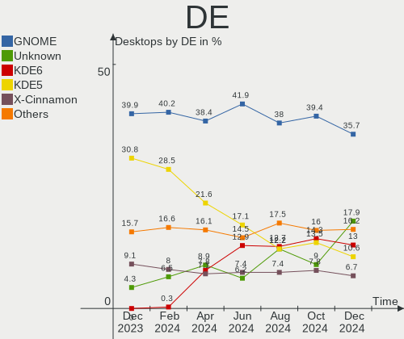
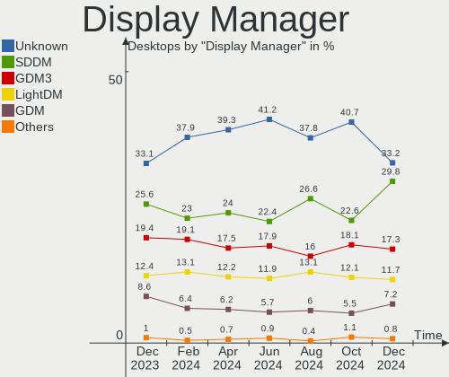
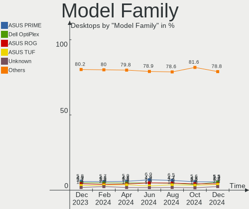
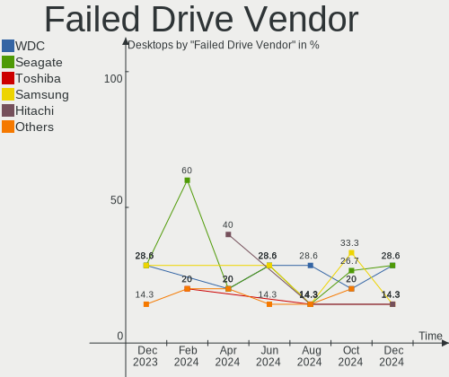
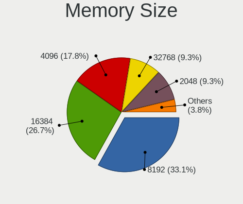
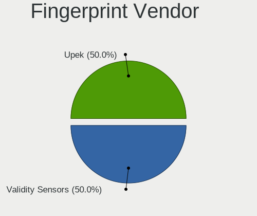

Linux Hardware Trends (Desktops)
--------------------------------

A project to identify most popular hardware characteristics and track their change
over time based on data collected by Linux users at https://Linux-Hardware.org.

Anyone can contribute to this report by the [hw-probe](https://github.com/linuxhw/hw-probe) tool:

    sudo -E hw-probe -all -upload

Full-feature report is available here: https://linux-hardware.org/?view=trends

Period: Jan, 2022.

Contents
--------

* [ System ](#system)
  - [ OS                       ](#os)
  - [ OS Family                ](#os-family)
  - [ Kernel                   ](#kernel)
  - [ Kernel Family            ](#kernel-family)
  - [ Kernel Major Ver.        ](#kernel-major-ver)
  - [ Arch                     ](#arch)
  - [ DE                       ](#de)
  - [ Display Server           ](#display-server)
  - [ Display Manager          ](#display-manager)
  - [ OS Lang                  ](#os-lang)
  - [ Boot Mode                ](#boot-mode)
  - [ Filesystem               ](#filesystem)
  - [ Part. scheme             ](#part-scheme)
  - [ Dual Boot with Linux/BSD ](#dual-boot-with-linuxbsd)
  - [ Dual Boot (Win)          ](#dual-boot-win)

* [ Board ](#board)
  - [ Vendor                   ](#vendor)
  - [ Model                    ](#model)
  - [ Model Family             ](#model-family)
  - [ MFG Year                 ](#mfg-year)
  - [ Form Factor              ](#form-factor)
  - [ Secure Boot              ](#secure-boot)
  - [ Coreboot                 ](#coreboot)
  - [ RAM Size                 ](#ram-size)
  - [ RAM Used                 ](#ram-used)
  - [ Total Drives             ](#total-drives)
  - [ Has CD-ROM               ](#has-cd-rom)
  - [ Has Ethernet             ](#has-ethernet)
  - [ Has WiFi                 ](#has-wifi)
  - [ Has Bluetooth            ](#has-bluetooth)

* [ Location ](#location)
  - [ Country                  ](#country)
  - [ City                     ](#city)

* [ Drives ](#drives)
  - [ Drive Vendor             ](#drive-vendor)
  - [ Drive Model              ](#drive-model)
  - [ HDD Vendor               ](#hdd-vendor)
  - [ SSD Vendor               ](#ssd-vendor)
  - [ Drive Kind               ](#drive-kind)
  - [ Drive Connector          ](#drive-connector)
  - [ Drive Size               ](#drive-size)
  - [ Space Total              ](#space-total)
  - [ Space Used               ](#space-used)
  - [ Malfunc. Drives          ](#malfunc-drives)
  - [ Malfunc. Drive Vendor    ](#malfunc-drive-vendor)
  - [ Malfunc. HDD Vendor      ](#malfunc-hdd-vendor)
  - [ Malfunc. Drive Kind      ](#malfunc-drive-kind)
  - [ Failed Drives            ](#failed-drives)
  - [ Failed Drive Vendor      ](#failed-drive-vendor)
  - [ Drive Status             ](#drive-status)

* [ Storage controller ](#storage-controller)
  - [ Storage Vendor           ](#storage-vendor)
  - [ Storage Model            ](#storage-model)
  - [ Storage Kind             ](#storage-kind)

* [ Processor ](#processor)
  - [ CPU Vendor               ](#cpu-vendor)
  - [ CPU Model                ](#cpu-model)
  - [ CPU Model Family         ](#cpu-model-family)
  - [ CPU Cores                ](#cpu-cores)
  - [ CPU Sockets              ](#cpu-sockets)
  - [ CPU Threads              ](#cpu-threads)
  - [ CPU Op-Modes             ](#cpu-op-modes)
  - [ CPU Microcode            ](#cpu-microcode)
  - [ CPU Microarch            ](#cpu-microarch)

* [ Graphics ](#graphics)
  - [ GPU Vendor               ](#gpu-vendor)
  - [ GPU Model                ](#gpu-model)
  - [ GPU Combo                ](#gpu-combo)
  - [ GPU Driver               ](#gpu-driver)
  - [ GPU Memory               ](#gpu-memory)

* [ Monitor ](#monitor)
  - [ Monitor Vendor           ](#monitor-vendor)
  - [ Monitor Model            ](#monitor-model)
  - [ Monitor Resolution       ](#monitor-resolution)
  - [ Monitor Diagonal         ](#monitor-diagonal)
  - [ Monitor Width            ](#monitor-width)
  - [ Aspect Ratio             ](#aspect-ratio)
  - [ Monitor Area             ](#monitor-area)
  - [ Pixel Density            ](#pixel-density)
  - [ Multiple Monitors        ](#multiple-monitors)

* [ Network ](#network)
  - [ Net Controller Vendor    ](#net-controller-vendor)
  - [ Net Controller Model     ](#net-controller-model)
  - [ Wireless Vendor          ](#wireless-vendor)
  - [ Wireless Model           ](#wireless-model)
  - [ Ethernet Vendor          ](#ethernet-vendor)
  - [ Ethernet Model           ](#ethernet-model)
  - [ Net Controller Kind      ](#net-controller-kind)
  - [ Used Controller          ](#used-controller)
  - [ NICs                     ](#nics)
  - [ IPv6                     ](#ipv6)

* [ Bluetooth ](#bluetooth)
  - [ Bluetooth Vendor         ](#bluetooth-vendor)
  - [ Bluetooth Model          ](#bluetooth-model)

* [ Sound ](#sound)
  - [ Sound Vendor             ](#sound-vendor)
  - [ Sound Model              ](#sound-model)

* [ Memory ](#memory)
  - [ Memory Vendor            ](#memory-vendor)
  - [ Memory Model             ](#memory-model)
  - [ Memory Kind              ](#memory-kind)
  - [ Memory Form Factor       ](#memory-form-factor)
  - [ Memory Size              ](#memory-size)
  - [ Memory Speed             ](#memory-speed)

* [ Printers & scanners ](#printers--scanners)
  - [ Printer Vendor           ](#printer-vendor)
  - [ Printer Model            ](#printer-model)
  - [ Scanner Vendor           ](#scanner-vendor)
  - [ Scanner Model            ](#scanner-model)

* [ Camera ](#camera)
  - [ Camera Vendor            ](#camera-vendor)
  - [ Camera Model             ](#camera-model)

* [ Security ](#security)
  - [ Fingerprint Vendor       ](#fingerprint-vendor)
  - [ Fingerprint Model        ](#fingerprint-model)
  - [ Chipcard Vendor          ](#chipcard-vendor)
  - [ Chipcard Model           ](#chipcard-model)

* [ Unsupported ](#unsupported)
  - [ Unsupported Devices      ](#unsupported-devices)
  - [ Unsupported Device Types ](#unsupported-device-types)

System
------

OS
--

Installed operating systems

| Name                 | Desktops | Percent |
|----------------------|----------|---------|
| Ubuntu 20.04         | 273      | 15.6%   |
| Linux Mint 20.3      | 114      | 6.51%   |
| Ubuntu 21.10         | 100      | 5.71%   |
| Pop!_OS 21.10        | 95       | 5.43%   |
| Fedora 35            | 85       | 4.86%   |
| OpenMandriva 4.2     | 78       | 4.46%   |
| Debian 11            | 78       | 4.46%   |
| Linux Mint 20.2      | 64       | 3.66%   |
| Zorin 16             | 57       | 3.26%   |
| KDE neon 20.04       | 49       | 2.8%    |
| ROSA 12.1            | 48       | 2.74%   |
| ArcoLinux Rolling    | 32       | 1.83%   |
| ROSA R11.1           | 30       | 1.71%   |
| BlackPanther 18.1    | 27       | 1.54%   |
| Ubuntu 18.04         | 25       | 1.43%   |
| Manjaro              | 25       | 1.43%   |
| Arch Rolling         | 25       | 1.43%   |
| Manjaro 21.2.1       | 23       | 1.31%   |
| Elementary 6.1       | 23       | 1.31%   |
| Xubuntu 20.04        | 20       | 1.14%   |
| EndeavourOS Rolling  | 19       | 1.09%   |
| Arch                 | 18       | 1.03%   |
| Ubuntu MATE 20.04    | 17       | 0.97%   |
| Ubuntu MATE 18.04    | 16       | 0.91%   |
| Kubuntu 20.04        | 15       | 0.86%   |
| OpenMandriva 4.50    | 14       | 0.8%    |
| Ubuntu 21.04         | 13       | 0.74%   |
| Pop!_OS 21.04        | 13       | 0.74%   |
| Pop!_OS 20.04        | 13       | 0.74%   |
| Linux Mint 19.3      | 12       | 0.69%   |
| Linux Mint 20.1      | 10       | 0.57%   |
| Zorin 15             | 9        | 0.51%   |
| openSUSE Leap-15.3   | 9        | 0.51%   |
| LinuxFX 11           | 9        | 0.51%   |
| LMDE 4               | 8        | 0.46%   |
| Linux Mint 20        | 8        | 0.46%   |
| Kali 2021.4          | 8        | 0.46%   |
| EndeavourOS          | 8        | 0.46%   |
| Xubuntu 21.10        | 7        | 0.4%    |
| ROSA 12              | 7        | 0.4%    |
| Kubuntu 21.10        | 7        | 0.4%    |
| Gentoo 2.7           | 7        | 0.4%    |
| Gentoo 2.6           | 7        | 0.4%    |
| Fedora 34            | 7        | 0.4%    |
| Debian 10            | 7        | 0.4%    |
| Manjaro 21.2.2       | 6        | 0.34%   |
| Lubuntu 21.10        | 6        | 0.34%   |
| Garuda Linux         | 6        | 0.34%   |
| CentOS 8             | 6        | 0.34%   |
| Xubuntu 18.04        | 5        | 0.29%   |
| Lubuntu 20.04        | 5        | 0.29%   |
| Kubuntu 11           | 5        | 0.29%   |
| Garuda Linux Soaring | 5        | 0.29%   |
| Endless 4.0.2        | 5        | 0.29%   |
| Ubuntu MATE 21.10    | 4        | 0.23%   |
| Ubuntu 22.04         | 4        | 0.23%   |
| Ubuntu 16.04         | 4        | 0.23%   |
| Manjaro 21.2.0       | 4        | 0.23%   |
| Mageia 8             | 4        | 0.23%   |
| Gentoo 2.8           | 4        | 0.23%   |

OS Family
---------

OS without a version

| Name           | Desktops | Percent |
|----------------|----------|---------|
| Ubuntu         | 421      | 24.06%  |
| Linux Mint     | 212      | 12.11%  |
| Pop!_OS        | 122      | 6.97%   |
| Debian         | 97       | 5.54%   |
| Fedora         | 94       | 5.37%   |
| OpenMandriva   | 92       | 5.26%   |
| ROSA           | 88       | 5.03%   |
| Zorin          | 66       | 3.77%   |
| Manjaro        | 58       | 3.31%   |
| KDE neon       | 50       | 2.86%   |
| Arch           | 43       | 2.46%   |
| Ubuntu MATE    | 38       | 2.17%   |
| Xubuntu        | 34       | 1.94%   |
| ArcoLinux      | 34       | 1.94%   |
| Kubuntu        | 31       | 1.77%   |
| BlackPanther   | 28       | 1.6%    |
| EndeavourOS    | 27       | 1.54%   |
| Elementary     | 26       | 1.49%   |
| openSUSE       | 21       | 1.2%    |
| Gentoo         | 19       | 1.09%   |
| Lubuntu        | 14       | 0.8%    |
| Garuda Linux   | 11       | 0.63%   |
| Kali           | 10       | 0.57%   |
| Endless        | 10       | 0.57%   |
| CentOS         | 10       | 0.57%   |
| LinuxFX        | 9        | 0.51%   |
| LMDE           | 8        | 0.46%   |
| Clear Linux    | 6        | 0.34%   |
| MX             | 5        | 0.29%   |
| Artix          | 5        | 0.29%   |
| ALT Linux      | 5        | 0.29%   |
| Ubuntu Budgie  | 4        | 0.23%   |
| Mageia         | 4        | 0.23%   |
| Devuan         | 4        | 0.23%   |
| ClearOS        | 4        | 0.23%   |
| Xero           | 3        | 0.17%   |
| Ubuntu Studio  | 3        | 0.17%   |
| Slackware      | 3        | 0.17%   |
| RHEL           | 3        | 0.17%   |
| Parrot         | 3        | 0.17%   |
| Void Linux     | 2        | 0.11%   |
| Solus          | 2        | 0.11%   |
| Rocky Linux    | 2        | 0.11%   |
| Red OS         | 2        | 0.11%   |
| Xerolinux-xfce | 1        | 0.06%   |
| Sparky         | 1        | 0.06%   |
| Siduction      | 1        | 0.06%   |
| Salient OS     | 1        | 0.06%   |
| Reborn OS      | 1        | 0.06%   |
| Q4OS           | 1        | 0.06%   |
| Peppermint     | 1        | 0.06%   |
| Pardus         | 1        | 0.06%   |
| NixOS          | 1        | 0.06%   |
| Nitrux         | 1        | 0.06%   |
| Makulu         | 1        | 0.06%   |
| Linux Lite     | 1        | 0.06%   |
| Deepin         | 1        | 0.06%   |
| BlackArch      | 1        | 0.06%   |
| Archcraft      | 1        | 0.06%   |
| antiX          | 1        | 0.06%   |

Kernel
------

Version of the Linux kernel

| Version                             | Desktops | Percent |
|-------------------------------------|----------|---------|
| 5.13.0-27-generic                   | 171      | 9.77%   |
| 5.4.0-96-generic                    | 82       | 4.69%   |
| 5.10.14-desktop-1omv4002            | 73       | 4.17%   |
| 5.4.0-92-generic                    | 70       | 4%      |
| 5.11.0-44-generic                   | 70       | 4%      |
| 5.11.0-46-generic                   | 66       | 3.77%   |
| 5.11.0-43-generic                   | 64       | 3.66%   |
| 5.4.0-94-generic                    | 60       | 3.43%   |
| 5.13.0-25-generic                   | 50       | 2.86%   |
| 5.4.0-91-generic                    | 48       | 2.74%   |
| 5.10.74-generic-2rosa2021.1-x86_64  | 48       | 2.74%   |
| 5.15.11-76051511-generic            | 39       | 2.23%   |
| 5.13.0-23-generic                   | 30       | 1.71%   |
| 5.15.8-76051508-generic             | 29       | 1.66%   |
| 5.15.15-76051515-generic            | 29       | 1.66%   |
| 5.10.0-10-amd64                     | 29       | 1.66%   |
| 5.15.12-1-MANJARO                   | 28       | 1.6%    |
| 5.15.12-arch1-1                     | 23       | 1.31%   |
| 5.13.0-22-generic                   | 23       | 1.31%   |
| 4.15.0-163-generic                  | 22       | 1.26%   |
| 5.6.14-desktop-2bP                  | 20       | 1.14%   |
| 5.15.12-200.fc35.x86_64             | 20       | 1.14%   |
| 5.16.2-arch1-1                      | 15       | 0.86%   |
| 5.15.16-200.fc35.x86_64             | 14       | 0.8%    |
| 5.15.5-76051505-generic             | 13       | 0.74%   |
| 5.15.14-200.fc35.x86_64             | 13       | 0.74%   |
| 5.10.0-11-amd64                     | 13       | 0.74%   |
| 5.10.0-7-amd64                      | 12       | 0.69%   |
| 4.19.0-18-amd64                     | 12       | 0.69%   |
| 5.4.83-generic-2rosa-x86_64         | 11       | 0.63%   |
| 4.15.0-166-generic                  | 11       | 0.63%   |
| 5.15.13-arch1-1                     | 10       | 0.57%   |
| 5.15.13-200.fc35.x86_64             | 10       | 0.57%   |
| 4.15.0-desktop-122.124.1rosa-x86_64 | 10       | 0.57%   |
| 5.12.4-desktop-1omv4050             | 9        | 0.51%   |
| 5.11.0-27-generic                   | 9        | 0.51%   |
| 5.16.1-arch1-1                      | 8        | 0.46%   |
| 5.15.12-zen1-1-zen                  | 8        | 0.46%   |
| 5.15.0-2-amd64                      | 8        | 0.46%   |
| 5.11.0-35-generic                   | 8        | 0.46%   |
| 5.3.18-59.37-default                | 7        | 0.4%    |
| 5.16.0-arch1-1                      | 7        | 0.4%    |
| 5.15.15-200.fc35.x86_64             | 7        | 0.4%    |
| 5.15.13-zen1-1-zen                  | 7        | 0.4%    |
| 5.13.19-2-pve                       | 7        | 0.4%    |
| 5.13.0-28-generic                   | 7        | 0.4%    |
| 5.11.0-40-generic                   | 7        | 0.4%    |
| 4.18.16-desktop-1bP                 | 7        | 0.4%    |
| 5.16.0-zen1-1-zen                   | 6        | 0.34%   |
| 5.15.11-gentoo                      | 6        | 0.34%   |
| 5.15.10-arch1-1                     | 6        | 0.34%   |
| 5.15.0-kali2-amd64                  | 6        | 0.34%   |
| 5.11.0-41-generic                   | 6        | 0.34%   |
| 5.11.0-38-generic                   | 6        | 0.34%   |
| 5.10.0-9-amd64                      | 6        | 0.34%   |
| 4.15.0-142-generic                  | 6        | 0.34%   |
| 5.16.0-1-default                    | 5        | 0.29%   |
| 5.15.7-1-MANJARO                    | 5        | 0.29%   |
| 5.15.11-200.fc35.x86_64             | 5        | 0.29%   |
| 5.14.10-300.fc35.x86_64             | 5        | 0.29%   |

Kernel Family
-------------

Linux kernel without a distro release

| Version | Desktops | Percent |
|---------|----------|---------|
| 5.13.0  | 299      | 17.09%  |
| 5.4.0   | 290      | 16.57%  |
| 5.11.0  | 256      | 14.63%  |
| 5.15.12 | 92       | 5.26%   |
| 5.10.14 | 73       | 4.17%   |
| 5.10.0  | 69       | 3.94%   |
| 5.15.11 | 60       | 3.43%   |
| 4.15.0  | 56       | 3.2%    |
| 5.10.74 | 49       | 2.8%    |
| 5.15.15 | 43       | 2.46%   |
| 5.15.13 | 37       | 2.11%   |
| 5.16.2  | 30       | 1.71%   |
| 5.15.8  | 30       | 1.71%   |
| 5.16.0  | 26       | 1.49%   |
| 5.15.16 | 23       | 1.31%   |
| 5.6.14  | 20       | 1.14%   |
| 5.15.0  | 19       | 1.09%   |
| 5.15.14 | 18       | 1.03%   |
| 4.19.0  | 18       | 1.03%   |
| 5.15.5  | 15       | 0.86%   |
| 5.16.1  | 14       | 0.8%    |
| 5.13.19 | 14       | 0.8%    |
| 5.8.0   | 13       | 0.74%   |
| 5.15.10 | 12       | 0.69%   |
| 5.4.83  | 11       | 0.63%   |
| 4.18.0  | 11       | 0.63%   |
| 5.3.18  | 10       | 0.57%   |
| 5.12.4  | 9        | 0.51%   |
| 5.14.0  | 8        | 0.46%   |
| 3.10.0  | 8        | 0.46%   |
| 5.15.7  | 7        | 0.4%    |
| 4.18.16 | 7        | 0.4%    |
| 5.4.32  | 6        | 0.34%   |
| 5.10.89 | 6        | 0.34%   |
| 5.14.21 | 5        | 0.29%   |
| 5.14.10 | 5        | 0.29%   |
| 5.11.12 | 5        | 0.29%   |
| 5.10.71 | 5        | 0.29%   |
| 5.16.4  | 4        | 0.23%   |
| 5.16.3  | 4        | 0.23%   |
| 5.14.7  | 4        | 0.23%   |
| 5.13.13 | 4        | 0.23%   |
| 5.3.0   | 3        | 0.17%   |
| 5.15.17 | 3        | 0.17%   |
| 5.0.0   | 3        | 0.17%   |
| 5.15.6  | 2        | 0.11%   |
| 5.15.1  | 2        | 0.11%   |
| 5.14.18 | 2        | 0.11%   |
| 5.14.15 | 2        | 0.11%   |
| 5.10.88 | 2        | 0.11%   |
| 5.10.57 | 2        | 0.11%   |
| 5.10.29 | 2        | 0.11%   |
| 4.9.155 | 2        | 0.11%   |
| 4.9.0   | 2        | 0.11%   |
| 5.8.15  | 1        | 0.06%   |
| 5.6.11  | 1        | 0.06%   |
| 5.4.127 | 1        | 0.06%   |
| 5.16    | 1        | 0.06%   |
| 5.14.20 | 1        | 0.06%   |
| 5.14.16 | 1        | 0.06%   |

Kernel Major Ver.
-----------------

Linux kernel major version

| Version | Desktops | Percent |
|---------|----------|---------|
| 5.15    | 363      | 20.74%  |
| 5.13    | 317      | 18.11%  |
| 5.4     | 308      | 17.6%   |
| 5.11    | 262      | 14.97%  |
| 5.10    | 221      | 12.63%  |
| 5.16    | 78       | 4.46%   |
| 4.15    | 56       | 3.2%    |
| 5.14    | 31       | 1.77%   |
| 5.6     | 21       | 1.2%    |
| 4.19    | 19       | 1.09%   |
| 4.18    | 18       | 1.03%   |
| 5.8     | 14       | 0.8%    |
| 5.3     | 13       | 0.74%   |
| 5.12    | 9        | 0.51%   |
| 3.10    | 8        | 0.46%   |
| 4.9     | 6        | 0.34%   |
| 5.0     | 3        | 0.17%   |
| 5       | 1        | 0.06%   |
| 4.4     | 1        | 0.06%   |
| 3.16    | 1        | 0.06%   |

Arch
----

OS architecture (x86_64, i586, etc.)

| Name   | Desktops | Percent |
|--------|----------|---------|
| x86_64 | 1723     | 98.46%  |
| i686   | 27       | 1.54%   |

DE
--

Desktop Environment

| Name             | Desktops | Percent |
|------------------|----------|---------|
| GNOME            | 731      | 41.77%  |
| KDE5             | 399      | 22.8%   |
| X-Cinnamon       | 163      | 9.31%   |
| XFCE             | 137      | 7.83%   |
| Unknown          | 92       | 5.26%   |
| MATE             | 80       | 4.57%   |
| Pantheon         | 27       | 1.54%   |
| KDE4             | 21       | 1.2%    |
| LXQt             | 19       | 1.09%   |
| Cinnamon         | 17       | 0.97%   |
| LXDE             | 11       | 0.63%   |
| Unity            | 10       | 0.57%   |
| i3               | 9        | 0.51%   |
| awesome          | 7        | 0.4%    |
| KDE              | 6        | 0.34%   |
| Budgie           | 6        | 0.34%   |
| sway             | 2        | 0.11%   |
| openbox          | 2        | 0.11%   |
| lightdm-xsession | 2        | 0.11%   |
| GNOME Flashback  | 2        | 0.11%   |
| xmonad           | 1        | 0.06%   |
| trinity          | 1        | 0.06%   |
| icewm            | 1        | 0.06%   |
| GNOME Classic    | 1        | 0.06%   |
| Enlightenment    | 1        | 0.06%   |
| Deepin           | 1        | 0.06%   |
| Cutefish         | 1        | 0.06%   |

Display Server
--------------

X11 or Wayland

| Name        | Desktops | Percent |
|-------------|----------|---------|
| X11         | 1433     | 81.89%  |
| Wayland     | 213      | 12.17%  |
| Tty         | 61       | 3.49%   |
| Unknown     | 41       | 2.34%   |
| Unspecified | 2        | 0.11%   |

Display Manager
---------------

SDDM, LightDM, etc.

| Name    | Desktops | Percent |
|---------|----------|---------|
| Unknown | 642      | 36.69%  |
| SDDM    | 305      | 17.43%  |
| GDM3    | 284      | 16.23%  |
| LightDM | 261      | 14.91%  |
| GDM     | 226      | 12.91%  |
| KDM     | 23       | 1.31%   |
| XDM     | 2        | 0.11%   |
| TDM     | 2        | 0.11%   |
| SLiM    | 2        | 0.11%   |
| LXDM    | 2        | 0.11%   |
| NODM    | 1        | 0.06%   |

OS Lang
-------

Language

| Lang        | Desktops | Percent |
|-------------|----------|---------|
| en_US       | 632      | 36.11%  |
| de_DE       | 185      | 10.57%  |
| ru_RU       | 146      | 8.34%   |
| fr_FR       | 85       | 4.86%   |
| en_GB       | 85       | 4.86%   |
| pt_BR       | 68       | 3.89%   |
| pl_PL       | 53       | 3.03%   |
| Unknown     | 51       | 2.91%   |
| en_CA       | 46       | 2.63%   |
| it_IT       | 44       | 2.51%   |
| el_GR       | 38       | 2.17%   |
| en_AU       | 34       | 1.94%   |
| hu_HU       | 23       | 1.31%   |
| es_ES       | 22       | 1.26%   |
| C           | 22       | 1.26%   |
| nl_NL       | 15       | 0.86%   |
| es_MX       | 14       | 0.8%    |
| fi_FI       | 12       | 0.69%   |
| es_AR       | 11       | 0.63%   |
| sv_SE       | 10       | 0.57%   |
| ja_JP       | 9        | 0.51%   |
| fr_CA       | 9        | 0.51%   |
| de_AT       | 9        | 0.51%   |
| en_IN       | 8        | 0.46%   |
| de_CH       | 8        | 0.46%   |
| zh_CN       | 7        | 0.4%    |
| ru_UA       | 7        | 0.4%    |
| pt_PT       | 7        | 0.4%    |
| es_CO       | 6        | 0.34%   |
| nl_BE       | 5        | 0.29%   |
| en_IL       | 5        | 0.29%   |
| tr_TR       | 4        | 0.23%   |
| sk_SK       | 4        | 0.23%   |
| fr_CH       | 4        | 0.23%   |
| en_ZA       | 4        | 0.23%   |
| en_IE       | 4        | 0.23%   |
| cs_CZ       | 4        | 0.23%   |
| ro_RO       | 3        | 0.17%   |
| en_NZ       | 3        | 0.17%   |
| zh_TW       | 2        | 0.11%   |
| sr_RS       | 2        | 0.11%   |
| fr_BE       | 2        | 0.11%   |
| es_VE       | 2        | 0.11%   |
| es_UY       | 2        | 0.11%   |
| es_DO       | 2        | 0.11%   |
| es_CL       | 2        | 0.11%   |
| en_SG       | 2        | 0.11%   |
| da_DK       | 2        | 0.11%   |
| ca_ES       | 2        | 0.11%   |
| C.UTF8      | 2        | 0.11%   |
| ar_EG       | 2        | 0.11%   |
| uk_UA       | 1        | 0.06%   |
| sl_SI       | 1        | 0.06%   |
| POSIX       | 1        | 0.06%   |
| nn_NO       | 1        | 0.06%   |
| nb_NO       | 1        | 0.06%   |
| ja_JP.utf-8 | 1        | 0.06%   |
| id_ID       | 1        | 0.06%   |
| hr_HR       | 1        | 0.06%   |
| es_US       | 1        | 0.06%   |

Boot Mode
---------

EFI or BIOS

| Mode | Desktops | Percent |
|------|----------|---------|
| BIOS | 1082     | 61.83%  |
| EFI  | 668      | 38.17%  |

Filesystem
----------

Type of filesystem

| Type    | Desktops | Percent |
|---------|----------|---------|
| Ext4    | 1374     | 78.51%  |
| Overlay | 164      | 9.37%   |
| Btrfs   | 145      | 8.29%   |
| Xfs     | 42       | 2.4%    |
| Zfs     | 15       | 0.86%   |
| Ext3    | 3        | 0.17%   |
| Ext2    | 3        | 0.17%   |
| F2fs    | 2        | 0.11%   |
| Tmpfs   | 1        | 0.06%   |
| Unknown | 1        | 0.06%   |

Part. scheme
------------

Scheme of partitioning

| Type    | Desktops | Percent |
|---------|----------|---------|
| Unknown | 946      | 54.06%  |
| GPT     | 519      | 29.66%  |
| MBR     | 285      | 16.29%  |

Dual Boot with Linux/BSD
------------------------

Hosting more than one Linux/BSD

| Dual boot | Desktops | Percent |
|-----------|----------|---------|
| No        | 1427     | 81.54%  |
| Yes       | 323      | 18.46%  |

Dual Boot (Win)
---------------

Hosting Linux and Windows

| Dual boot | Desktops | Percent |
|-----------|----------|---------|
| No        | 1194     | 68.23%  |
| Yes       | 556      | 31.77%  |

Board
-----

Vendor
------

Motherboard manufacturer

| Name                | Desktops | Percent |
|---------------------|----------|---------|
| ASUSTek Computer    | 444      | 25.37%  |
| Gigabyte Technology | 318      | 18.17%  |
| MSI                 | 225      | 12.86%  |
| ASRock              | 160      | 9.14%   |
| Dell                | 146      | 8.34%   |
| Hewlett-Packard     | 125      | 7.14%   |
| Lenovo              | 61       | 3.49%   |
| Intel               | 39       | 2.23%   |
| Acer                | 33       | 1.89%   |
| Unknown             | 24       | 1.37%   |
| Medion              | 18       | 1.03%   |
| Fujitsu             | 16       | 0.91%   |
| Pegatron            | 12       | 0.69%   |
| Foxconn             | 11       | 0.63%   |
| Biostar             | 11       | 0.63%   |
| ECS                 | 9        | 0.51%   |
| Packard Bell        | 6        | 0.34%   |
| Huanan              | 6        | 0.34%   |
| Fujitsu Siemens     | 5        | 0.29%   |
| BESSTAR Tech        | 5        | 0.29%   |
| Supermicro          | 4        | 0.23%   |
| Positivo            | 4        | 0.23%   |
| Alienware           | 4        | 0.23%   |
| EVGA                | 3        | 0.17%   |
| AZW                 | 3        | 0.17%   |
| Apple               | 3        | 0.17%   |
| Wortmann AG         | 2        | 0.11%   |
| Shuttle             | 2        | 0.11%   |
| Semp Toshiba        | 2        | 0.11%   |
| PCWare              | 2        | 0.11%   |
| OEM                 | 2        | 0.11%   |
| MACHINIST           | 2        | 0.11%   |
| Inventec            | 2        | 0.11%   |
| Google              | 2        | 0.11%   |
| Gateway             | 2        | 0.11%   |
| Chuwi               | 2        | 0.11%   |
| ZOTAC               | 1        | 0.06%   |
| XFX                 | 1        | 0.06%   |
| VS Company          | 1        | 0.06%   |
| VIA Technologies    | 1        | 0.06%   |
| TYAN Computer       | 1        | 0.06%   |
| teleplatforms       | 1        | 0.06%   |
| System76            | 1        | 0.06%   |
| Seco                | 1        | 0.06%   |
| QTQD                | 1        | 0.06%   |
| Phitronics          | 1        | 0.06%   |
| PC Engines          | 1        | 0.06%   |
| Online Labs         | 1        | 0.06%   |
| Nvidia              | 1        | 0.06%   |
| MediaVue            | 1        | 0.06%   |
| MB                  | 1        | 0.06%   |
| KLLISRE             | 1        | 0.06%   |
| Jetway              | 1        | 0.06%   |
| IBM                 | 1        | 0.06%   |
| HC                  | 1        | 0.06%   |
| HARDKERNEL          | 1        | 0.06%   |
| GALAX               | 1        | 0.06%   |
| FIRICH              | 1        | 0.06%   |
| EPoX Computer       | 1        | 0.06%   |
| eMachines           | 1        | 0.06%   |

Model
-----

Motherboard model

| Name                             | Desktops | Percent |
|----------------------------------|----------|---------|
| ASUS All Series                  | 51       | 2.91%   |
| Unknown                          | 26       | 1.49%   |
| ASUS TUF GAMING X570-PLUS        | 16       | 0.91%   |
| MSI MS-7C37                      | 10       | 0.57%   |
| HP ProDesk 600 G1 SFF            | 10       | 0.57%   |
| Dell OptiPlex 7010               | 10       | 0.57%   |
| MSI MS-7B86                      | 7        | 0.4%    |
| HP EliteDesk 800 G1 SFF          | 7        | 0.4%    |
| Gigabyte A320M-S2H               | 7        | 0.4%    |
| Gigabyte 970A-DS3P               | 7        | 0.4%    |
| Dell OptiPlex 9020               | 7        | 0.4%    |
| Dell OptiPlex 790                | 7        | 0.4%    |
| MSI MS-7C56                      | 6        | 0.34%   |
| MSI MS-7C02                      | 6        | 0.34%   |
| MSI MS-7721                      | 6        | 0.34%   |
| Dell OptiPlex 9010               | 6        | 0.34%   |
| ASUS PRIME B450M-A               | 6        | 0.34%   |
| ASUS M5A78L-M/USB3               | 6        | 0.34%   |
| MSI MS-7D25                      | 5        | 0.29%   |
| MSI MS-7C52                      | 5        | 0.29%   |
| MSI MS-7B79                      | 5        | 0.29%   |
| MSI MS-7817                      | 5        | 0.29%   |
| Gigabyte B450M DS3H              | 5        | 0.29%   |
| Gigabyte AB350-Gaming 3          | 5        | 0.29%   |
| Dell OptiPlex 390                | 5        | 0.29%   |
| Dell OptiPlex 3020               | 5        | 0.29%   |
| Dell OptiPlex 3010               | 5        | 0.29%   |
| ASUS TUF GAMING B550M-PLUS       | 5        | 0.29%   |
| ASUS PRIME A320M-K               | 5        | 0.29%   |
| ASRock B450M Pro4                | 5        | 0.29%   |
| MSI MS-7C95                      | 4        | 0.23%   |
| MSI MS-7C84                      | 4        | 0.23%   |
| MSI MS-7B98                      | 4        | 0.23%   |
| MSI MS-7B85                      | 4        | 0.23%   |
| MSI MS-7A15                      | 4        | 0.23%   |
| MSI MS-7978                      | 4        | 0.23%   |
| HP Z420 Workstation              | 4        | 0.23%   |
| HP Compaq Elite 8300 CMT         | 4        | 0.23%   |
| HP Compaq 6200 Pro SFF PC        | 4        | 0.23%   |
| Gigabyte X570 AORUS ELITE        | 4        | 0.23%   |
| Gigabyte X470 AORUS ULTRA GAMING | 4        | 0.23%   |
| Gigabyte GA-970A-D3              | 4        | 0.23%   |
| Gigabyte GA-78LMT-USB3 6.0       | 4        | 0.23%   |
| Gigabyte B450M S2H               | 4        | 0.23%   |
| Gigabyte B450 AORUS M            | 4        | 0.23%   |
| Dell OptiPlex GX520              | 4        | 0.23%   |
| Dell OptiPlex 980                | 4        | 0.23%   |
| Dell OptiPlex 745                | 4        | 0.23%   |
| Dell OptiPlex 380                | 4        | 0.23%   |
| Dell Inspiron 660                | 4        | 0.23%   |
| ASUS TUF GAMING X570-PRO         | 4        | 0.23%   |
| ASUS ROG STRIX X570-E GAMING     | 4        | 0.23%   |
| ASUS ROG STRIX B450-F GAMING     | 4        | 0.23%   |
| ASUS PRIME X470-PRO              | 4        | 0.23%   |
| ASUS PRIME X370-PRO              | 4        | 0.23%   |
| ASUS PRIME B350M-A               | 4        | 0.23%   |
| ASUS M5A99FX PRO R2.0            | 4        | 0.23%   |
| ASRock A320M-HD                  | 4        | 0.23%   |
| MSI MS-7D18                      | 3        | 0.17%   |
| MSI MS-7C75                      | 3        | 0.17%   |

Model Family
------------

Motherboard model prefix

| Name                   | Desktops | Percent |
|------------------------|----------|---------|
| Dell OptiPlex          | 94       | 5.37%   |
| ASUS PRIME             | 73       | 4.17%   |
| ASUS ROG               | 58       | 3.31%   |
| ASUS All               | 51       | 2.91%   |
| HP Compaq              | 43       | 2.46%   |
| ASUS TUF               | 43       | 2.46%   |
| Lenovo ThinkCentre     | 38       | 2.17%   |
| Unknown                | 26       | 1.49%   |
| Acer Aspire            | 22       | 1.26%   |
| Dell Precision         | 20       | 1.14%   |
| HP ProDesk             | 18       | 1.03%   |
| Gigabyte X570          | 16       | 0.91%   |
| HP EliteDesk           | 14       | 0.8%    |
| ASUS M5A78L-M          | 14       | 0.8%    |
| Gigabyte B450M         | 13       | 0.74%   |
| Dell Inspiron          | 13       | 0.74%   |
| Fujitsu ESPRIMO        | 12       | 0.69%   |
| Gigabyte B450          | 11       | 0.63%   |
| MSI MS-7C37            | 10       | 0.57%   |
| Lenovo IdeaCentre      | 10       | 0.57%   |
| HP Pavilion            | 9        | 0.51%   |
| Gigabyte Z390          | 9        | 0.51%   |
| Gigabyte B550          | 9        | 0.51%   |
| Gigabyte 970A-DS3P     | 9        | 0.51%   |
| Dell Vostro            | 9        | 0.51%   |
| ASRock B450M           | 9        | 0.51%   |
| Lenovo ThinkStation    | 8        | 0.46%   |
| Dell XPS               | 8        | 0.46%   |
| ASUS P5G41T-M          | 8        | 0.46%   |
| MSI MS-7B86            | 7        | 0.4%    |
| Gigabyte GA-78LMT-USB3 | 7        | 0.4%    |
| Gigabyte A320M-S2H     | 7        | 0.4%    |
| ASUS P8H61-M           | 7        | 0.4%    |
| ASUS Maximus           | 7        | 0.4%    |
| ASUS M5A97             | 7        | 0.4%    |
| MSI MS-7C56            | 6        | 0.34%   |
| MSI MS-7C02            | 6        | 0.34%   |
| MSI MS-7721            | 6        | 0.34%   |
| Gigabyte AB350-Gaming  | 6        | 0.34%   |
| ASUS P8Z77-V           | 6        | 0.34%   |
| ASRock Z77             | 6        | 0.34%   |
| ASRock B550            | 6        | 0.34%   |
| MSI MS-7D25            | 5        | 0.29%   |
| MSI MS-7C52            | 5        | 0.29%   |
| MSI MS-7B79            | 5        | 0.29%   |
| MSI MS-7817            | 5        | 0.29%   |
| Gigabyte X470          | 5        | 0.29%   |
| Gigabyte B550M         | 5        | 0.29%   |
| ASUS SABERTOOTH        | 5        | 0.29%   |
| ASRock B450            | 5        | 0.29%   |
| ASRock 970             | 5        | 0.29%   |
| Acer Veriton           | 5        | 0.29%   |
| Packard Bell IMEDIA    | 4        | 0.23%   |
| MSI MS-7C95            | 4        | 0.23%   |
| MSI MS-7C84            | 4        | 0.23%   |
| MSI MS-7B98            | 4        | 0.23%   |
| MSI MS-7B85            | 4        | 0.23%   |
| MSI MS-7A15            | 4        | 0.23%   |
| MSI MS-7978            | 4        | 0.23%   |
| Medion Akoya           | 4        | 0.23%   |

MFG Year
--------

Motherboard manufacture year

| Year    | Desktops | Percent |
|---------|----------|---------|
| 2018    | 167      | 9.54%   |
| 2012    | 155      | 8.86%   |
| 2019    | 152      | 8.69%   |
| 2020    | 150      | 8.57%   |
| 2013    | 146      | 8.34%   |
| 2011    | 128      | 7.31%   |
| 2014    | 126      | 7.2%    |
| 2010    | 119      | 6.8%    |
| 2021    | 118      | 6.74%   |
| 2017    | 108      | 6.17%   |
| 2015    | 87       | 4.97%   |
| 2009    | 86       | 4.91%   |
| 2016    | 70       | 4%      |
| 2008    | 58       | 3.31%   |
| 2007    | 43       | 2.46%   |
| 2006    | 19       | 1.09%   |
| 2005    | 13       | 0.74%   |
| 2003    | 2        | 0.11%   |
| 2004    | 1        | 0.06%   |
| 2002    | 1        | 0.06%   |
| Unknown | 1        | 0.06%   |

Form Factor
-----------

Physical design of the computer

| Name    | Desktops | Percent |
|---------|----------|---------|
| Desktop | 1750     | 100%    |

Secure Boot
-----------

Enabled or disabled

| State    | Desktops | Percent |
|----------|----------|---------|
| Disabled | 1707     | 97.54%  |
| Enabled  | 43       | 2.46%   |

Coreboot
--------

Have coreboot on board

| Used | Desktops | Percent |
|------|----------|---------|
| No   | 1746     | 99.77%  |
| Yes  | 4        | 0.23%   |

RAM Size
--------

Total RAM memory

| Size in GB      | Desktops | Percent |
|-----------------|----------|---------|
| 16.01-24.0      | 444      | 25.37%  |
| 8.01-16.0       | 342      | 19.54%  |
| 4.01-8.0        | 267      | 15.26%  |
| 3.01-4.0        | 252      | 14.4%   |
| 32.01-64.0      | 246      | 14.06%  |
| 64.01-256.0     | 87       | 4.97%   |
| 24.01-32.0      | 46       | 2.63%   |
| 1.01-2.0        | 38       | 2.17%   |
| 2.01-3.0        | 22       | 1.26%   |
| 0.51-1.0        | 4        | 0.23%   |
| More than 256.0 | 1        | 0.06%   |
| 0.01-0.5        | 1        | 0.06%   |

RAM Used
--------

Used RAM memory

| Used GB     | Desktops | Percent |
|-------------|----------|---------|
| 1.01-2.0    | 612      | 34.97%  |
| 2.01-3.0    | 378      | 21.6%   |
| 4.01-8.0    | 245      | 14%     |
| 3.01-4.0    | 212      | 12.11%  |
| 0.51-1.0    | 147      | 8.4%    |
| 8.01-16.0   | 86       | 4.91%   |
| 0.01-0.5    | 43       | 2.46%   |
| 16.01-24.0  | 13       | 0.74%   |
| 24.01-32.0  | 8        | 0.46%   |
| 32.01-64.0  | 5        | 0.29%   |
| 64.01-256.0 | 1        | 0.06%   |

Total Drives
------------

Number of drives on board

| Drives | Desktops | Percent |
|--------|----------|---------|
| 1      | 650      | 37.14%  |
| 2      | 497      | 28.4%   |
| 3      | 280      | 16%     |
| 4      | 155      | 8.86%   |
| 5      | 88       | 5.03%   |
| 6      | 35       | 2%      |
| 7      | 13       | 0.74%   |
| 0      | 13       | 0.74%   |
| 8      | 6        | 0.34%   |
| 9      | 4        | 0.23%   |
| 20     | 3        | 0.17%   |
| 11     | 2        | 0.11%   |
| 28     | 1        | 0.06%   |
| 27     | 1        | 0.06%   |
| 17     | 1        | 0.06%   |
| 10     | 1        | 0.06%   |

Has CD-ROM
----------

Has CD-ROM on board

| Presented | Desktops | Percent |
|-----------|----------|---------|
| No        | 942      | 53.83%  |
| Yes       | 808      | 46.17%  |

Has Ethernet
------------

Has Ethernet on board

| Presented | Desktops | Percent |
|-----------|----------|---------|
| Yes       | 1734     | 99.09%  |
| No        | 16       | 0.91%   |

Has WiFi
--------

Has WiFi module

| Presented | Desktops | Percent |
|-----------|----------|---------|
| No        | 978      | 55.89%  |
| Yes       | 772      | 44.11%  |

Has Bluetooth
-------------

Has Bluetooth module

| Presented | Desktops | Percent |
|-----------|----------|---------|
| No        | 1245     | 71.14%  |
| Yes       | 505      | 28.86%  |

Location
--------

Country
-------

Geographic location (country)

| Country      | Desktops | Percent |
|--------------|----------|---------|
| USA          | 358      | 20.46%  |
| Germany      | 217      | 12.4%   |
| Russia       | 144      | 8.23%   |
| France       | 96       | 5.49%   |
| Brazil       | 84       | 4.8%    |
| Canada       | 68       | 3.89%   |
| UK           | 67       | 3.83%   |
| Poland       | 64       | 3.66%   |
| Italy        | 54       | 3.09%   |
| Hungary      | 53       | 3.03%   |
| Greece       | 44       | 2.51%   |
| Australia    | 44       | 2.51%   |
| Netherlands  | 37       | 2.11%   |
| Spain        | 32       | 1.83%   |
| Ukraine      | 25       | 1.43%   |
| Switzerland  | 24       | 1.37%   |
| Sweden       | 21       | 1.2%    |
| Finland      | 21       | 1.2%    |
| Mexico       | 17       | 0.97%   |
| Austria      | 16       | 0.91%   |
| Argentina    | 16       | 0.91%   |
| India        | 15       | 0.86%   |
| Belgium      | 14       | 0.8%    |
| Romania      | 13       | 0.74%   |
| Czechia      | 12       | 0.69%   |
| Norway       | 11       | 0.63%   |
| Japan        | 11       | 0.63%   |
| Portugal     | 10       | 0.57%   |
| Belarus      | 9        | 0.51%   |
| Bulgaria     | 8        | 0.46%   |
| Turkey       | 6        | 0.34%   |
| South Africa | 6        | 0.34%   |
| Slovakia     | 6        | 0.34%   |
| Ireland      | 6        | 0.34%   |
| Colombia     | 6        | 0.34%   |
| Serbia       | 5        | 0.29%   |
| Israel       | 5        | 0.29%   |
| Denmark      | 5        | 0.29%   |
| China        | 5        | 0.29%   |
| Bangladesh   | 5        | 0.29%   |
| Slovenia     | 4        | 0.23%   |
| Croatia      | 4        | 0.23%   |
| Venezuela    | 3        | 0.17%   |
| Uruguay      | 3        | 0.17%   |
| Thailand     | 3        | 0.17%   |
| New Zealand  | 3        | 0.17%   |
| Malaysia     | 3        | 0.17%   |
| Iran         | 3        | 0.17%   |
| Indonesia    | 3        | 0.17%   |
| Hong Kong    | 3        | 0.17%   |
| Chile        | 3        | 0.17%   |
| Algeria      | 3        | 0.17%   |
| Sri Lanka    | 2        | 0.11%   |
| Singapore    | 2        | 0.11%   |
| Saudi Arabia | 2        | 0.11%   |
| Morocco      | 2        | 0.11%   |
| Malta        | 2        | 0.11%   |
| Lithuania    | 2        | 0.11%   |
| Kenya        | 2        | 0.11%   |
| Kazakhstan   | 2        | 0.11%   |

City
----

Geographic location (city)

| City              | Desktops | Percent |
|-------------------|----------|---------|
| Moscow            | 31       | 1.77%   |
| Thessaloniki      | 20       | 1.14%   |
| Sydney            | 20       | 1.14%   |
| Berlin            | 20       | 1.14%   |
| Voronezh          | 16       | 0.91%   |
| Budapest          | 13       | 0.74%   |
| St Petersburg     | 12       | 0.69%   |
| S??o Paulo        | 12       | 0.69%   |
| Old Faliron       | 11       | 0.63%   |
| Paris             | 10       | 0.57%   |
| Warsaw            | 9        | 0.51%   |
| Vienna            | 9        | 0.51%   |
| Helsinki          | 8        | 0.46%   |
| Chicago           | 8        | 0.46%   |
| Buenos Aires      | 8        | 0.46%   |
| Brisbane          | 8        | 0.46%   |
| Montreal          | 7        | 0.4%    |
| Madrid            | 7        | 0.4%    |
| Wroclaw           | 6        | 0.34%   |
| Munich            | 6        | 0.34%   |
| Melbourne         | 6        | 0.34%   |
| Kyiv              | 6        | 0.34%   |
| Hamburg           | 6        | 0.34%   |
| Frankfurt am Main | 6        | 0.34%   |
| Barcelona         | 6        | 0.34%   |
| Athens            | 6        | 0.34%   |
| Amsterdam         | 6        | 0.34%   |
| Zurich            | 5        | 0.29%   |
| Stuttgart         | 5        | 0.29%   |
| Rome              | 5        | 0.29%   |
| Phoenix           | 5        | 0.29%   |
| New York          | 5        | 0.29%   |
| Milan             | 5        | 0.29%   |
| Krasnodar         | 5        | 0.29%   |
| Krakow            | 5        | 0.29%   |
| Kazan?ˆ™          | 5        | 0.29%   |
| Dresden           | 5        | 0.29%   |
| Calgary           | 5        | 0.29%   |
| Sofia             | 4        | 0.23%   |
| Seattle           | 4        | 0.23%   |
| Prague            | 4        | 0.23%   |
| Perth             | 4        | 0.23%   |
| Novosibirsk       | 4        | 0.23%   |
| Minsk             | 4        | 0.23%   |
| Manchester        | 4        | 0.23%   |
| Los Angeles       | 4        | 0.23%   |
| Karlsruhe         | 4        | 0.23%   |
| Jacksonville      | 4        | 0.23%   |
| Haifa             | 4        | 0.23%   |
| Dallas            | 4        | 0.23%   |
| Chelyabinsk       | 4        | 0.23%   |
| Browning          | 4        | 0.23%   |
| Belgrade          | 4        | 0.23%   |
| Zeven             | 3        | 0.17%   |
| Westminster       | 3        | 0.17%   |
| Tver              | 3        | 0.17%   |
| Toronto           | 3        | 0.17%   |
| Surrey            | 3        | 0.17%   |
| Strasbourg        | 3        | 0.17%   |
| Stockholm         | 3        | 0.17%   |

Drives
------

Drive Vendor
------------

Hard drive vendors

| Vendor                    | Desktops | Drives | Percent |
|---------------------------|----------|--------|---------|
| WDC                       | 639      | 847    | 19.6%   |
| Seagate                   | 623      | 842    | 19.11%  |
| Samsung Electronics       | 500      | 693    | 15.34%  |
| Kingston                  | 211      | 230    | 6.47%   |
| Toshiba                   | 174      | 237    | 5.34%   |
| SanDisk                   | 142      | 157    | 4.36%   |
| Crucial                   | 129      | 145    | 3.96%   |
| Hitachi                   | 113      | 126    | 3.47%   |
| A-DATA Technology         | 65       | 70     | 1.99%   |
| Intel                     | 59       | 66     | 1.81%   |
| Unknown                   | 37       | 44     | 1.13%   |
| Phison                    | 36       | 40     | 1.1%    |
| HGST                      | 36       | 45     | 1.1%    |
| China                     | 33       | 37     | 1.01%   |
| MAXTOR                    | 28       | 31     | 0.86%   |
| Intenso                   | 26       | 30     | 0.8%    |
| PNY                       | 25       | 26     | 0.77%   |
| Corsair                   | 22       | 23     | 0.67%   |
| Patriot                   | 20       | 21     | 0.61%   |
| Silicon Motion            | 19       | 21     | 0.58%   |
| SPCC                      | 18       | 18     | 0.55%   |
| XPG                       | 17       | 19     | 0.52%   |
| OCZ                       | 14       | 14     | 0.43%   |
| GOODRAM                   | 14       | 16     | 0.43%   |
| Transcend                 | 13       | 13     | 0.4%    |
| Apacer                    | 13       | 14     | 0.4%    |
| Unknown                   | 12       | 12     | 0.37%   |
| Micron/Crucial Technology | 11       | 11     | 0.34%   |
| Micron Technology         | 9        | 9      | 0.28%   |
| SK Hynix                  | 8        | 8      | 0.25%   |
| KingSpec                  | 8        | 8      | 0.25%   |
| Gigabyte Technology       | 8        | 8      | 0.25%   |
| Team                      | 7        | 7      | 0.21%   |
| Realtek Semiconductor     | 7        | 7      | 0.21%   |
| JMicron                   | 7        | 7      | 0.21%   |
| ASMT                      | 7        | 7      | 0.21%   |
| Verbatim                  | 6        | 7      | 0.18%   |
| Hewlett-Packard           | 6        | 7      | 0.18%   |
| SABRENT                   | 5        | 5      | 0.15%   |
| LITEON                    | 5        | 5      | 0.15%   |
| LDLC                      | 5        | 5      | 0.15%   |
| Fujitsu                   | 5        | 5      | 0.15%   |
| PLEXTOR                   | 4        | 4      | 0.12%   |
| Phison Electronics        | 4        | 4      | 0.12%   |
| Netac                     | 4        | 4      | 0.12%   |
| LITEONIT                  | 4        | 4      | 0.12%   |
| LaCie                     | 4        | 4      | 0.12%   |
| Mushkin                   | 3        | 3      | 0.09%   |
| Lexar                     | 3        | 4      | 0.09%   |
| Leven                     | 3        | 4      | 0.09%   |
| KIOXIA-EXCERIA            | 3        | 3      | 0.09%   |
| KIOXIA                    | 3        | 3      | 0.09%   |
| Inateck                   | 3        | 3      | 0.09%   |
| Emtec                     | 3        | 3      | 0.09%   |
| XrayDisk                  | 2        | 2      | 0.06%   |
| WD MediaMax               | 2        | 2      | 0.06%   |
| TCSUNBOW                  | 2        | 2      | 0.06%   |
| Super Talent              | 2        | 2      | 0.06%   |
| Smartbuy                  | 2        | 2      | 0.06%   |
| PHD 3.0                   | 2        | 2      | 0.06%   |

Drive Model
-----------

Hard drive models

| Model                            | Desktops | Percent |
|----------------------------------|----------|---------|
| Seagate ST2000DM008-2FR102 2TB   | 52       | 1.38%   |
| Kingston SA400S37240G 240GB SSD  | 48       | 1.27%   |
| Seagate ST500DM002-1BD142 500GB  | 47       | 1.24%   |
| Samsung SSD 860 EVO 500GB        | 41       | 1.09%   |
| Seagate ST1000DM010-2EP102 1TB   | 40       | 1.06%   |
| Samsung SSD 850 EVO 250GB        | 36       | 0.95%   |
| Toshiba DT01ACA100 1TB           | 32       | 0.85%   |
| Samsung NVMe SSD Drive 1TB       | 30       | 0.79%   |
| Kingston SA400S37480G 480GB SSD  | 29       | 0.77%   |
| Seagate ST1000DM003-1CH162 1TB   | 28       | 0.74%   |
| Samsung NVMe SSD Drive 500GB     | 28       | 0.74%   |
| Samsung SSD 860 EVO 1TB          | 27       | 0.71%   |
| Seagate ST4000DM004-2CV104 4TB   | 23       | 0.61%   |
| WDC WD10EZEX-08WN4A0 1TB         | 22       | 0.58%   |
| Samsung SSD 850 EVO 500GB        | 22       | 0.58%   |
| Kingston SV300S37A120G 120GB SSD | 21       | 0.56%   |
| Kingston SA400S37120G 120GB SSD  | 21       | 0.56%   |
| Unknown SD/MMC/MS PRO 128GB      | 20       | 0.53%   |
| Toshiba HDWD110 1TB              | 20       | 0.53%   |
| Samsung NVMe SSD Drive 250GB     | 20       | 0.53%   |
| Crucial CT240BX500SSD1 240GB     | 20       | 0.53%   |
| Toshiba DT01ACA200 2TB           | 19       | 0.5%    |
| Seagate ST3500418AS 500GB        | 18       | 0.48%   |
| Seagate ST2000DM001-1ER164 2TB   | 18       | 0.48%   |
| Samsung SSD 970 EVO Plus 1TB     | 17       | 0.45%   |
| Samsung SSD 860 EVO 250GB        | 17       | 0.45%   |
| Seagate ST2000DM001-1CH164 2TB   | 16       | 0.42%   |
| Crucial CT500MX500SSD1 500GB     | 16       | 0.42%   |
| Toshiba DT01ACA050 500GB         | 15       | 0.4%    |
| Seagate ST3500413AS 500GB        | 15       | 0.4%    |
| Seagate ST2000DM006-2DM164 2TB   | 15       | 0.4%    |
| Sandisk NVMe SSD Drive 500GB     | 15       | 0.4%    |
| Sandisk NVMe SSD Drive 1TB       | 15       | 0.4%    |
| Crucial CT1000MX500SSD1 1TB      | 15       | 0.4%    |
| WDC WDS240G2G0A-00JH30 240GB SSD | 14       | 0.37%   |
| Samsung SSD 870 EVO 500GB        | 13       | 0.34%   |
| Samsung SSD 840 EVO 250GB        | 13       | 0.34%   |
| Hitachi HDS721010CLA332 1TB      | 13       | 0.34%   |
| WDC WD20EARX-00PASB0 2TB         | 12       | 0.32%   |
| WDC WD10EZEX-00WN4A0 1TB         | 12       | 0.32%   |
| WDC WD10EZEX-00BN5A0 1TB         | 12       | 0.32%   |
| Seagate ST3500312CS 500GB        | 12       | 0.32%   |
| Seagate ST1000DM003-1ER162 1TB   | 12       | 0.32%   |
| Unknown                          | 12       | 0.32%   |
| WDC WDS240G2G0B-00EPW0 240GB SSD | 11       | 0.29%   |
| WDC WDS100T2B0A-00SM50 1TB SSD   | 11       | 0.29%   |
| WDC WD20EZRX-00D8PB0 2TB         | 11       | 0.29%   |
| Samsung SSD 970 EVO Plus 500GB   | 11       | 0.29%   |
| WDC WDS500G2B0A-00SM50 500GB SSD | 10       | 0.26%   |
| WDC WD20EZRZ-00Z5HB0 2TB         | 10       | 0.26%   |
| WDC WD1002FAEX-00Z3A0 1TB        | 10       | 0.26%   |
| SanDisk SSD PLUS 240GB           | 10       | 0.26%   |
| Samsung HD103SJ 1TB              | 10       | 0.26%   |
| Crucial CT480BX500SSD1 480GB     | 10       | 0.26%   |
| WDC WD20EFRX-68EUZN0 2TB         | 9        | 0.24%   |
| Seagate ST3250318AS 250GB        | 9        | 0.24%   |
| Seagate ST31000528AS 1TB         | 9        | 0.24%   |
| Seagate Expansion Desk 8TB       | 9        | 0.24%   |
| Samsung SSD 870 QVO 2TB          | 9        | 0.24%   |
| Samsung SSD 870 EVO 1TB          | 9        | 0.24%   |

HDD Vendor
----------

Hard disk drive vendors

| Vendor              | Desktops | Drives | Percent |
|---------------------|----------|--------|---------|
| Seagate             | 605      | 814    | 37.25%  |
| WDC                 | 549      | 721    | 33.81%  |
| Toshiba             | 153      | 214    | 9.42%   |
| Hitachi             | 113      | 126    | 6.96%   |
| Samsung Electronics | 89       | 105    | 5.48%   |
| HGST                | 36       | 45     | 2.22%   |
| MAXTOR              | 25       | 28     | 1.54%   |
| Unknown             | 22       | 24     | 1.35%   |
| Intenso             | 5        | 6      | 0.31%   |
| Fujitsu             | 5        | 5      | 0.31%   |
| PHD 3.0             | 2        | 2      | 0.12%   |
| LaCie               | 2        | 2      | 0.12%   |
| Inateck             | 2        | 2      | 0.12%   |
| Hewlett-Packard     | 2        | 2      | 0.12%   |
| Apple               | 2        | 2      | 0.12%   |
| TO Exter            | 1        | 1      | 0.06%   |
| SYNOLOGY            | 1        | 1      | 0.06%   |
| SATAFIRM            | 1        | 1      | 0.06%   |
| NAS                 | 1        | 5      | 0.06%   |
| Maxtor 6            | 1        | 1      | 0.06%   |
| JMicron             | 1        | 1      | 0.06%   |
| IBM/Hitachi         | 1        | 1      | 0.06%   |
| Glyph               | 1        | 1      | 0.06%   |
| External            | 1        | 1      | 0.06%   |
| China               | 1        | 1      | 0.06%   |
| ASMedia             | 1        | 1      | 0.06%   |
| Unknown             | 1        | 1      | 0.06%   |

SSD Vendor
----------

Solid state drive vendors

| Vendor              | Desktops | Drives | Percent |
|---------------------|----------|--------|---------|
| Samsung Electronics | 288      | 361    | 24.39%  |
| Kingston            | 174      | 189    | 14.73%  |
| Crucial             | 109      | 122    | 9.23%   |
| SanDisk             | 107      | 116    | 9.06%   |
| WDC                 | 89       | 92     | 7.54%   |
| A-DATA Technology   | 54       | 58     | 4.57%   |
| Intel               | 37       | 41     | 3.13%   |
| China               | 32       | 36     | 2.71%   |
| PNY                 | 24       | 25     | 2.03%   |
| Toshiba             | 18       | 18     | 1.52%   |
| SPCC                | 17       | 17     | 1.44%   |
| Patriot             | 17       | 18     | 1.44%   |
| Intenso             | 17       | 19     | 1.44%   |
| OCZ                 | 14       | 14     | 1.19%   |
| GOODRAM             | 14       | 16     | 1.19%   |
| Apacer              | 13       | 14     | 1.1%    |
| Transcend           | 11       | 11     | 0.93%   |
| Corsair             | 10       | 10     | 0.85%   |
| Seagate             | 9        | 9      | 0.76%   |
| KingSpec            | 8        | 8      | 0.68%   |
| Verbatim            | 6        | 7      | 0.51%   |
| Team                | 6        | 6      | 0.51%   |
| Micron Technology   | 6        | 6      | 0.51%   |
| Gigabyte Technology | 6        | 6      | 0.51%   |
| ASMT                | 6        | 6      | 0.51%   |
| Unknown             | 6        | 6      | 0.51%   |
| LITEON              | 5        | 5      | 0.42%   |
| SABRENT             | 4        | 4      | 0.34%   |
| Netac               | 4        | 4      | 0.34%   |
| LITEONIT            | 4        | 4      | 0.34%   |
| SK Hynix            | 3        | 3      | 0.25%   |
| PLEXTOR             | 3        | 3      | 0.25%   |
| MAXTOR              | 3        | 3      | 0.25%   |
| Leven               | 3        | 4      | 0.25%   |
| Hewlett-Packard     | 3        | 4      | 0.25%   |
| Emtec               | 3        | 3      | 0.25%   |
| XrayDisk            | 2        | 2      | 0.17%   |
| TCSUNBOW            | 2        | 2      | 0.17%   |
| Super Talent        | 2        | 2      | 0.17%   |
| NGFF                | 2        | 2      | 0.17%   |
| Lexar               | 2        | 2      | 0.17%   |
| LDLC                | 2        | 2      | 0.17%   |
| KIOXIA-EXCERIA      | 2        | 2      | 0.17%   |
| FORESEE             | 2        | 2      | 0.17%   |
| AMD                 | 2        | 2      | 0.17%   |
| ZOTAC               | 1        | 1      | 0.08%   |
| Vaseky              | 1        | 1      | 0.08%   |
| USB30               | 1        | 1      | 0.08%   |
| Unknown             | 1        | 1      | 0.08%   |
| TrueNAS             | 1        | 1      | 0.08%   |
| Smartbuy            | 1        | 1      | 0.08%   |
| Sasmung             | 1        | 1      | 0.08%   |
| Reeinno             | 1        | 1      | 0.08%   |
| Q200                | 1        | 2      | 0.08%   |
| Pioneer             | 1        | 1      | 0.08%   |
| OYUNKEY             | 1        | 1      | 0.08%   |
| ORTIAL              | 1        | 1      | 0.08%   |
| OCZ-VERTEX          | 1        | 1      | 0.08%   |
| MyDigitalSSD        | 1        | 1      | 0.08%   |
| Mushkin             | 1        | 1      | 0.08%   |

Drive Kind
----------

HDD or SSD

| Kind    | Desktops | Drives | Percent |
|---------|----------|--------|---------|
| HDD     | 1233     | 2114   | 45.62%  |
| SSD     | 970      | 1318   | 35.89%  |
| NVMe    | 444      | 572    | 16.43%  |
| Unknown | 49       | 59     | 1.81%   |
| MMC     | 7        | 7      | 0.26%   |

Drive Connector
---------------

SATA, SAS, NVMe, etc.

| Type | Desktops | Drives | Percent |
|------|----------|--------|---------|
| SATA | 1622     | 3297   | 73.76%  |
| NVMe | 440      | 564    | 20.01%  |
| SAS  | 130      | 202    | 5.91%   |
| MMC  | 7        | 7      | 0.32%   |

Drive Size
----------

Size of hard drive

| Size in TB | Desktops | Drives | Percent |
|------------|----------|--------|---------|
| 0.01-0.5   | 1213     | 1789   | 49.92%  |
| 0.51-1.0   | 666      | 851    | 27.41%  |
| 1.01-2.0   | 310      | 377    | 12.76%  |
| 3.01-4.0   | 102      | 150    | 4.2%    |
| 4.01-10.0  | 71       | 147    | 2.92%   |
| 2.01-3.0   | 55       | 81     | 2.26%   |
| 10.01-20.0 | 13       | 37     | 0.53%   |

Space Total
-----------

Amount of disk space available on the file system

| Size in GB     | Desktops | Percent |
|----------------|----------|---------|
| 101-250        | 406      | 23.2%   |
| 251-500        | 278      | 15.89%  |
| 501-1000       | 255      | 14.57%  |
| 1001-2000      | 195      | 11.14%  |
| More than 3000 | 183      | 10.46%  |
| Unknown        | 112      | 6.4%    |
| 2001-3000      | 111      | 6.34%   |
| 1-20           | 105      | 6%      |
| 51-100         | 79       | 4.51%   |
| 21-50          | 26       | 1.49%   |

Space Used
----------

Amount of used disk space

| Used GB        | Desktops | Percent |
|----------------|----------|---------|
| 1-20           | 524      | 29.94%  |
| 21-50          | 247      | 14.11%  |
| 101-250        | 202      | 11.54%  |
| 51-100         | 164      | 9.37%   |
| 501-1000       | 138      | 7.89%   |
| 251-500        | 133      | 7.6%    |
| 1001-2000      | 118      | 6.74%   |
| Unknown        | 112      | 6.4%    |
| More than 3000 | 70       | 4%      |
| 2001-3000      | 41       | 2.34%   |
| 0              | 1        | 0.06%   |

Malfunc. Drives
---------------

Drive models with a malfunction

| Model                             | Desktops | Drives | Percent |
|-----------------------------------|----------|--------|---------|
| Seagate ST500DM002-1BD142 500GB   | 8        | 8      | 3.01%   |
| Seagate ST3500418AS 500GB         | 6        | 6      | 2.26%   |
| Seagate ST1000DM003-1CH162 1TB    | 4        | 4      | 1.5%    |
| WDC WD3200AAJS-08L7A0 320GB       | 3        | 3      | 1.13%   |
| Toshiba DT01ACA100 1TB            | 3        | 3      | 1.13%   |
| Seagate ST3500312CS 500GB         | 3        | 3      | 1.13%   |
| Seagate ST31500341AS 1TB          | 3        | 3      | 1.13%   |
| Seagate ST31000528AS 1TB          | 3        | 3      | 1.13%   |
| WDC WD5000BPVT-22HXZT1 500GB      | 2        | 2      | 0.75%   |
| WDC WD5000AAKX-60U6AA0 500GB      | 2        | 2      | 0.75%   |
| WDC WD5000AAKX-001CA0 500GB       | 2        | 2      | 0.75%   |
| WDC WD5000AAKS-00UU3A0 500GB      | 2        | 2      | 0.75%   |
| WDC WD20EARX-00PASB0 2TB          | 2        | 2      | 0.75%   |
| WDC WD10EZRX-00A8LB0 1TB          | 2        | 2      | 0.75%   |
| WDC WD10EZEX-60ZF5A0 1TB          | 2        | 2      | 0.75%   |
| WDC WD10EZEX-00WN4A0 1TB          | 2        | 2      | 0.75%   |
| WDC WD1002FAEX-00Z3A0 1TB         | 2        | 2      | 0.75%   |
| Seagate ST9500325AS 500GB         | 2        | 3      | 0.75%   |
| Seagate ST3320613AS 320GB         | 2        | 2      | 0.75%   |
| Seagate ST3160215AS 160GB         | 2        | 2      | 0.75%   |
| Seagate ST2000DM001-1E6164 2TB    | 2        | 2      | 0.75%   |
| Seagate ST2000DM001-1CH164 2TB    | 2        | 2      | 0.75%   |
| Seagate ST1000DM003-9YN162 1TB    | 2        | 2      | 0.75%   |
| Samsung Electronics SP2504C 250GB | 2        | 2      | 0.75%   |
| Samsung Electronics HD080HJ/ 80GB | 2        | 2      | 0.75%   |
| Kingston SHFS37A120G 120GB SSD    | 2        | 2      | 0.75%   |
| Intel SSDSC2CT120A3 120GB         | 2        | 2      | 0.75%   |
| Hitachi HTS542525K9SA00 250GB     | 2        | 2      | 0.75%   |
| Hitachi HDS721010CLA332 1TB       | 2        | 2      | 0.75%   |
| Crucial CT240M500SSD1 240GB       | 2        | 2      | 0.75%   |
| Unknown                           | 2        | 2      | 0.75%   |
| WDC WDS480G2G0A-00JH30 480GB SSD  | 1        | 1      | 0.38%   |
| WDC WDS240G2G0B-00EPW0 240GB SSD  | 1        | 1      | 0.38%   |
| WDC WDS240G2G0A-00JH30 240GB SSD  | 1        | 1      | 0.38%   |
| WDC WDS100T2B0A-00SM50 1TB SSD    | 1        | 1      | 0.38%   |
| WDC WD6400AAKS-22A7B2 640GB       | 1        | 1      | 0.38%   |
| WDC WD6400AAKS-22A7B0 640GB       | 1        | 1      | 0.38%   |
| WDC WD5002ABYS-01B1B0 500GB       | 1        | 1      | 0.38%   |
| WDC WD5000BPVT-00HXZT3 500GB      | 1        | 1      | 0.38%   |
| WDC WD5000AAKX-08ERMA0 500GB      | 1        | 1      | 0.38%   |
| WDC WD5000AAKS-22V1A0 500GB       | 1        | 1      | 0.38%   |
| WDC WD5000AAKS-22A7B0 500GB       | 1        | 1      | 0.38%   |
| WDC WD5000AAKS-07YGA0 500GB       | 1        | 1      | 0.38%   |
| WDC WD5000AAKS-00A7B0 500GB       | 1        | 1      | 0.38%   |
| WDC WD5000AADS-00M2B0 500GB       | 1        | 1      | 0.38%   |
| WDC WD5000AACS-00ZUB0 500GB       | 1        | 1      | 0.38%   |
| WDC WD50 EZRX-00MVLB1 5TB         | 1        | 1      | 0.38%   |
| WDC WD40EFRX-68WT0N0 4TB          | 1        | 2      | 0.38%   |
| WDC WD40EFRX-68N32N0 4TB          | 1        | 1      | 0.38%   |
| WDC WD3200BEKT-22F3T0 320GB       | 1        | 1      | 0.38%   |
| WDC WD3200AAJS-60Z0A0 320GB       | 1        | 1      | 0.38%   |
| WDC WD30EFRX-68EUZN0 3TB          | 1        | 1      | 0.38%   |
| WDC WD2502ABYS-02B7A0 256GB       | 1        | 1      | 0.38%   |
| WDC WD2500BEVT-60ZCT1 250GB       | 1        | 1      | 0.38%   |
| WDC WD2500BEKT-75PVMT1 250GB      | 1        | 1      | 0.38%   |
| WDC WD2500AAJS-75B4A0 250GB       | 1        | 1      | 0.38%   |
| WDC WD2500AAJS-60M0A0 250GB       | 1        | 1      | 0.38%   |
| WDC WD2500AAJS-07M0A0 250GB       | 1        | 1      | 0.38%   |
| WDC WD20EZRX-00DC0B0 2TB          | 1        | 1      | 0.38%   |
| WDC WD20EZRX-00D8PB0 2TB          | 1        | 1      | 0.38%   |

Malfunc. Drive Vendor
---------------------

Vendors of faulty drives

| Vendor              | Desktops | Drives | Percent |
|---------------------|----------|--------|---------|
| Seagate             | 73       | 81     | 28.29%  |
| WDC                 | 71       | 75     | 27.52%  |
| Samsung Electronics | 20       | 20     | 7.75%   |
| Hitachi             | 20       | 20     | 7.75%   |
| Toshiba             | 19       | 20     | 7.36%   |
| MAXTOR              | 8        | 8      | 3.1%    |
| Crucial             | 8        | 9      | 3.1%    |
| Kingston            | 7        | 7      | 2.71%   |
| Intel               | 7        | 8      | 2.71%   |
| SanDisk             | 5        | 5      | 1.94%   |
| HGST                | 4        | 4      | 1.55%   |
| A-DATA Technology   | 4        | 4      | 1.55%   |
| SPCC                | 2        | 2      | 0.78%   |
| Corsair             | 2        | 2      | 0.78%   |
| Unknown             | 2        | 2      | 0.78%   |
| LITEON              | 1        | 1      | 0.39%   |
| JMicron             | 1        | 1      | 0.39%   |
| Intenso             | 1        | 1      | 0.39%   |
| Fujitsu             | 1        | 1      | 0.39%   |
| EMTEC               | 1        | 1      | 0.39%   |
| Apacer              | 1        | 1      | 0.39%   |

Malfunc. HDD Vendor
-------------------

Vendors of faulty HDD drives

| Vendor              | Desktops | Drives | Percent |
|---------------------|----------|--------|---------|
| Seagate             | 73       | 81     | 35.96%  |
| WDC                 | 67       | 71     | 33%     |
| Hitachi             | 20       | 20     | 9.85%   |
| Toshiba             | 17       | 18     | 8.37%   |
| Samsung Electronics | 12       | 12     | 5.91%   |
| MAXTOR              | 8        | 8      | 3.94%   |
| HGST                | 4        | 4      | 1.97%   |
| Fujitsu             | 1        | 1      | 0.49%   |
| Unknown             | 1        | 1      | 0.49%   |

Malfunc. Drive Kind
-------------------

Kinds of faulty drives

| Kind | Desktops | Drives | Percent |
|------|----------|--------|---------|
| HDD  | 181      | 216    | 77.02%  |
| SSD  | 47       | 50     | 20%     |
| NVMe | 7        | 7      | 2.98%   |

Failed Drives
-------------

Failed drive models

| Model                      | Desktops | Drives | Percent |
|----------------------------|----------|--------|---------|
| Seagate STM3250318AS 250GB | 1        | 1      | 50%     |
| Seagate ST31000528AS 1TB   | 1        | 1      | 50%     |

Failed Drive Vendor
-------------------

Failed drive vendors

| Vendor  | Desktops | Drives | Percent |
|---------|----------|--------|---------|
| Seagate | 2        | 2      | 100%    |

Drive Status
------------

Number of failed and malfunc. drives

| Status   | Desktops | Drives | Percent |
|----------|----------|--------|---------|
| Detected | 1022     | 2297   | 52.14%  |
| Works    | 708      | 1498   | 36.12%  |
| Malfunc  | 228      | 273    | 11.63%  |
| Failed   | 2        | 2      | 0.1%    |

Storage controller
------------------

Storage Vendor
--------------

Storage controller vendors

| Vendor                           | Desktops | Percent |
|----------------------------------|----------|---------|
| Intel                            | 1110     | 45.07%  |
| AMD                              | 589      | 23.91%  |
| Samsung Electronics              | 184      | 7.47%   |
| ASMedia Technology               | 79       | 3.21%   |
| Sandisk                          | 68       | 2.76%   |
| Phison Electronics               | 57       | 2.31%   |
| Marvell Technology Group         | 57       | 2.31%   |
| JMicron Technology               | 57       | 2.31%   |
| Nvidia                           | 50       | 2.03%   |
| Kingston Technology Company      | 39       | 1.58%   |
| Micron/Crucial Technology        | 32       | 1.3%    |
| Silicon Motion                   | 28       | 1.14%   |
| ADATA Technology                 | 20       | 0.81%   |
| Realtek Semiconductor            | 14       | 0.57%   |
| VIA Technologies                 | 11       | 0.45%   |
| LSI Logic / Symbios Logic        | 10       | 0.41%   |
| Seagate Technology               | 7        | 0.28%   |
| Silicon Image                    | 6        | 0.24%   |
| SK Hynix                         | 5        | 0.2%    |
| Broadcom / LSI                   | 5        | 0.2%    |
| Adaptec                          | 5        | 0.2%    |
| Toshiba America Info Systems     | 4        | 0.16%   |
| Micron Technology                | 4        | 0.16%   |
| KIOXIA                           | 4        | 0.16%   |
| Unknown                          | 3        | 0.12%   |
| ULi Electronics                  | 2        | 0.08%   |
| Solid State Storage Technology   | 2        | 0.08%   |
| Silicon Integrated Systems [SiS] | 2        | 0.08%   |
| Shenzhen Longsys Electronics     | 2        | 0.08%   |
| Integrated Technology Express    | 2        | 0.08%   |
| Yangtze Memory Technologies      | 1        | 0.04%   |
| Toshiba                          | 1        | 0.04%   |
| MAXIO Technology (Hangzhou)      | 1        | 0.04%   |
| Hewlett-Packard                  | 1        | 0.04%   |
| Biwin Storage Technology         | 1        | 0.04%   |

Storage Model
-------------

Storage controller models

| Model                                                                                   | Desktops | Percent |
|-----------------------------------------------------------------------------------------|----------|---------|
| AMD FCH SATA Controller [AHCI mode]                                                     | 340      | 10.95%  |
| Intel 8 Series/C220 Series Chipset Family 6-port SATA Controller 1 [AHCI mode]          | 146      | 4.7%    |
| AMD 400 Series Chipset SATA Controller                                                  | 118      | 3.8%    |
| Samsung NVMe SSD Controller SM981/PM981/PM983                                           | 116      | 3.74%   |
| Intel 6 Series/C200 Series Chipset Family 6 port Desktop SATA AHCI Controller           | 92       | 2.96%   |
| Intel NM10/ICH7 Family SATA Controller [IDE mode]                                       | 86       | 2.77%   |
| AMD SB7x0/SB8x0/SB9x0 IDE Controller                                                    | 86       | 2.77%   |
| Intel Q170/Q150/B150/H170/H110/Z170/CM236 Chipset SATA Controller [AHCI Mode]           | 82       | 2.64%   |
| Intel 7 Series/C210 Series Chipset Family 6-port SATA Controller [AHCI mode]            | 78       | 2.51%   |
| AMD SB7x0/SB8x0/SB9x0 SATA Controller [AHCI mode]                                       | 76       | 2.45%   |
| ASMedia ASM1062 Serial ATA Controller                                                   | 73       | 2.35%   |
| Intel 200 Series PCH SATA controller [AHCI mode]                                        | 70       | 2.25%   |
| Intel SATA Controller [RAID mode]                                                       | 69       | 2.22%   |
| Intel 82801G (ICH7 Family) IDE Controller                                               | 69       | 2.22%   |
| AMD Starship/Matisse Chipset SATA Controller [AHCI mode]                                | 65       | 2.09%   |
| AMD SB7x0/SB8x0/SB9x0 SATA Controller [IDE mode]                                        | 61       | 1.96%   |
| Intel Cannon Lake PCH SATA AHCI Controller                                              | 54       | 1.74%   |
| Intel 6 Series/C200 Series Chipset Family Desktop SATA Controller (IDE mode, ports 4-5) | 43       | 1.38%   |
| Intel 6 Series/C200 Series Chipset Family Desktop SATA Controller (IDE mode, ports 0-3) | 43       | 1.38%   |
| Intel 9 Series Chipset Family SATA Controller [AHCI Mode]                               | 42       | 1.35%   |
| Intel 500 Series Chipset Family SATA AHCI Controller                                    | 39       | 1.26%   |
| AMD 300 Series Chipset SATA Controller                                                  | 36       | 1.16%   |
| JMicron JMB363 SATA/IDE Controller                                                      | 33       | 1.06%   |
| AMD FCH SATA Controller D                                                               | 33       | 1.06%   |
| Samsung NVMe SSD Controller PM9A1/PM9A3/980PRO                                          | 32       | 1.03%   |
| Phison E12 NVMe Controller                                                              | 26       | 0.84%   |
| Nvidia MCP61 SATA Controller                                                            | 26       | 0.84%   |
| Intel 5 Series/3400 Series Chipset 6 port SATA AHCI Controller                          | 24       | 0.77%   |
| Samsung NVMe SSD Controller SM961/PM961/SM963                                           | 23       | 0.74%   |
| Silicon Motion SM2263EN/SM2263XT SSD Controller                                         | 22       | 0.71%   |
| Sandisk WD Blue SN550 NVMe SSD                                                          | 22       | 0.71%   |
| Nvidia MCP61 IDE                                                                        | 21       | 0.68%   |
| Intel 4 Series Chipset PT IDER Controller                                               | 21       | 0.68%   |
| Samsung NVMe SSD Controller 980                                                         | 20       | 0.64%   |
| Intel 82801JI (ICH10 Family) SATA AHCI Controller                                       | 20       | 0.64%   |
| ADATA XPG SX8200 Pro PCIe Gen3x4 M.2 2280 Solid State Drive                             | 20       | 0.64%   |
| Intel Comet Lake SATA AHCI Controller                                                   | 19       | 0.61%   |
| Kingston Company A2000 NVMe SSD                                                         | 18       | 0.58%   |
| Intel 82801JI (ICH10 Family) 4 port SATA IDE Controller #1                              | 18       | 0.58%   |
| Intel 82801JI (ICH10 Family) 2 port SATA IDE Controller #2                              | 18       | 0.58%   |
| AMD FCH IDE Controller                                                                  | 18       | 0.58%   |
| Phison E16 PCIe4 NVMe Controller                                                        | 17       | 0.55%   |
| Intel C600/X79 series chipset 6-Port SATA AHCI Controller                               | 17       | 0.55%   |
| Sandisk WD Black SN750 / PC SN730 NVMe SSD                                              | 16       | 0.52%   |
| Micron/Crucial P2 NVMe PCIe SSD                                                         | 16       | 0.52%   |
| Intel 82801JD/DO (ICH10 Family) SATA AHCI Controller                                    | 15       | 0.48%   |
| Intel 400 Series Chipset Family SATA AHCI Controller                                    | 15       | 0.48%   |
| Intel Alder Lake-S PCH SATA Controller [AHCI Mode]                                      | 14       | 0.45%   |
| Intel 5 Series/3400 Series Chipset 4 port SATA IDE Controller                           | 14       | 0.45%   |
| Intel 5 Series/3400 Series Chipset 2 port SATA IDE Controller                           | 14       | 0.45%   |
| AMD X370 Series Chipset SATA Controller                                                 | 14       | 0.45%   |
| Marvell Group 88SE9172 SATA 6Gb/s Controller                                            | 13       | 0.42%   |
| JMicron JMB368 IDE controller                                                           | 13       | 0.42%   |
| Intel C610/X99 series chipset sSATA Controller [AHCI mode]                              | 13       | 0.42%   |
| Intel 82801I (ICH9 Family) 2 port SATA Controller [IDE mode]                            | 13       | 0.42%   |
| Intel 7 Series/C210 Series Chipset Family 4-port SATA Controller [IDE mode]             | 13       | 0.42%   |
| Intel 7 Series/C210 Series Chipset Family 2-port SATA Controller [IDE mode]             | 13       | 0.42%   |
| Realtek Realtek Non-Volatile memory controller                                          | 11       | 0.35%   |
| Intel NM10/ICH7 Family SATA Controller [AHCI mode]                                      | 11       | 0.35%   |
| Intel C610/X99 series chipset 6-Port SATA Controller [AHCI mode]                        | 11       | 0.35%   |

Storage Kind
------------

Kind of storage controller (IDE, SATA, NVMe, SAS, ...)

| Kind | Desktops | Percent |
|------|----------|---------|
| SATA | 1405     | 57.84%  |
| IDE  | 443      | 18.24%  |
| NVMe | 441      | 18.16%  |
| RAID | 114      | 4.69%   |
| SAS  | 19       | 0.78%   |
| SCSI | 7        | 0.29%   |

Processor
---------

CPU Vendor
----------

Processor vendors

| Vendor | Desktops | Percent |
|--------|----------|---------|
| Intel  | 1117     | 63.83%  |
| AMD    | 633      | 36.17%  |

CPU Model
---------

Processor models

| Model                                       | Desktops | Percent |
|---------------------------------------------|----------|---------|
| AMD Ryzen 7 3700X 8-Core Processor          | 32       | 1.83%   |
| AMD Ryzen 5 3600 6-Core Processor           | 31       | 1.77%   |
| Intel Core i7-4790 CPU @ 3.60GHz            | 26       | 1.49%   |
| Intel Core i5-3470 CPU @ 3.20GHz            | 24       | 1.37%   |
| Intel Core i7-4790K CPU @ 4.00GHz           | 20       | 1.14%   |
| AMD Ryzen 5 5600X 6-Core Processor          | 20       | 1.14%   |
| AMD Ryzen 5 2600 Six-Core Processor         | 17       | 0.97%   |
| AMD Ryzen 3 2200G with Radeon Vega Graphics | 17       | 0.97%   |
| Intel Core i7-8700 CPU @ 3.20GHz            | 16       | 0.91%   |
| Intel Core i7-3770 CPU @ 3.40GHz            | 16       | 0.91%   |
| Intel Core i5-4590 CPU @ 3.30GHz            | 16       | 0.91%   |
| Intel Core i5-2400 CPU @ 3.10GHz            | 16       | 0.91%   |
| AMD Ryzen 9 3900X 12-Core Processor         | 16       | 0.91%   |
| AMD FX-8350 Eight-Core Processor            | 16       | 0.91%   |
| Intel Core 2 Duo CPU E8400 @ 3.00GHz        | 15       | 0.86%   |
| AMD Ryzen 9 5950X 16-Core Processor         | 15       | 0.86%   |
| AMD Ryzen 7 5800X 8-Core Processor          | 15       | 0.86%   |
| Intel Core i5-6500 CPU @ 3.20GHz            | 14       | 0.8%    |
| Intel Core i5-2500 CPU @ 3.30GHz            | 14       | 0.8%    |
| Intel Core i5-10400 CPU @ 2.90GHz           | 14       | 0.8%    |
| Intel Core i3-2120 CPU @ 3.30GHz            | 14       | 0.8%    |
| Intel Core i5-3570K CPU @ 3.40GHz           | 13       | 0.74%   |
| AMD Ryzen 7 5700G with Radeon Graphics      | 13       | 0.74%   |
| AMD Ryzen 5 1600 Six-Core Processor         | 13       | 0.74%   |
| AMD Ryzen 3 3200G with Radeon Vega Graphics | 13       | 0.74%   |
| AMD FX-4300 Quad-Core Processor             | 13       | 0.74%   |
| Intel Core i7-7700K CPU @ 4.20GHz           | 12       | 0.69%   |
| Intel Core i5-7400 CPU @ 3.00GHz            | 12       | 0.69%   |
| Intel Core i3-3220 CPU @ 3.30GHz            | 12       | 0.69%   |
| Intel Core i9-9900K CPU @ 3.60GHz           | 11       | 0.63%   |
| Intel Core i7-4770 CPU @ 3.40GHz            | 11       | 0.63%   |
| Intel Core i7-2600 CPU @ 3.40GHz            | 11       | 0.63%   |
| Intel Core i5 CPU 650 @ 3.20GHz             | 11       | 0.63%   |
| Intel Core i3-2100 CPU @ 3.10GHz            | 11       | 0.63%   |
| AMD Ryzen 9 5900X 12-Core Processor         | 11       | 0.63%   |
| AMD Ryzen 5 3600X 6-Core Processor          | 11       | 0.63%   |
| AMD Ryzen 5 3400G with Radeon Vega Graphics | 11       | 0.63%   |
| Intel Core i5-6600K CPU @ 3.50GHz           | 10       | 0.57%   |
| Intel Core i3-4130 CPU @ 3.40GHz            | 10       | 0.57%   |
| AMD Ryzen 7 3800X 8-Core Processor          | 10       | 0.57%   |
| AMD Ryzen 5 2600X Six-Core Processor        | 10       | 0.57%   |
| Intel Core i7-8700K CPU @ 3.70GHz           | 9        | 0.51%   |
| Intel Core i3-6100 CPU @ 3.70GHz            | 9        | 0.51%   |
| Intel Core i3-4160 CPU @ 3.60GHz            | 9        | 0.51%   |
| Intel Core 2 Quad CPU Q6600 @ 2.40GHz       | 9        | 0.51%   |
| Intel Core 2 Duo CPU E7500 @ 2.93GHz        | 9        | 0.51%   |
| AMD Ryzen 7 2700X Eight-Core Processor      | 9        | 0.51%   |
| AMD Athlon II X4 640 Processor              | 9        | 0.51%   |
| Intel Core 2 Quad CPU Q9550 @ 2.83GHz       | 8        | 0.46%   |
| Intel Celeron CPU G1840 @ 2.80GHz           | 8        | 0.46%   |
| Intel Atom CPU D525 @ 1.80GHz               | 8        | 0.46%   |
| Intel 11th Gen Core i5-11400 @ 2.60GHz      | 8        | 0.46%   |
| Intel Pentium Dual-Core CPU E5400 @ 2.70GHz | 7        | 0.4%    |
| Intel Pentium Dual-Core CPU E5200 @ 2.50GHz | 7        | 0.4%    |
| Intel Pentium CPU G630 @ 2.70GHz            | 7        | 0.4%    |
| Intel Pentium CPU G3240 @ 3.10GHz           | 7        | 0.4%    |
| Intel Pentium 4 CPU 3.00GHz                 | 7        | 0.4%    |
| Intel Core i7-6700K CPU @ 4.00GHz           | 7        | 0.4%    |
| Intel Core i7-6700 CPU @ 3.40GHz            | 7        | 0.4%    |
| Intel Core i7-4770K CPU @ 3.50GHz           | 7        | 0.4%    |

CPU Model Family
----------------

Processor model prefix

| Model                   | Desktops | Percent |
|-------------------------|----------|---------|
| Intel Core i5           | 314      | 17.94%  |
| Intel Core i7           | 222      | 12.69%  |
| AMD Ryzen 5             | 147      | 8.4%    |
| Intel Core i3           | 129      | 7.37%   |
| AMD Ryzen 7             | 100      | 5.71%   |
| Intel Xeon              | 78       | 4.46%   |
| AMD FX                  | 68       | 3.89%   |
| Intel Core 2 Duo        | 58       | 3.31%   |
| Intel Celeron           | 51       | 2.91%   |
| Intel Pentium           | 50       | 2.86%   |
| AMD Ryzen 9             | 50       | 2.86%   |
| Other                   | 48       | 2.74%   |
| Intel Core 2 Quad       | 45       | 2.57%   |
| AMD Ryzen 3             | 40       | 2.29%   |
| Intel Pentium Dual-Core | 26       | 1.49%   |
| AMD A8                  | 26       | 1.49%   |
| AMD Athlon II X2        | 22       | 1.26%   |
| Intel Atom              | 18       | 1.03%   |
| AMD Phenom II X6        | 18       | 1.03%   |
| AMD Phenom II X4        | 18       | 1.03%   |
| Intel Core i9           | 17       | 0.97%   |
| AMD Athlon II X4        | 16       | 0.91%   |
| AMD A10                 | 16       | 0.91%   |
| Intel Pentium 4         | 13       | 0.74%   |
| AMD Athlon 64 X2        | 13       | 0.74%   |
| AMD Athlon              | 12       | 0.69%   |
| AMD A4                  | 12       | 0.69%   |
| Intel Pentium Dual      | 11       | 0.63%   |
| Intel Core 2            | 10       | 0.57%   |
| Intel Pentium D         | 9        | 0.51%   |
| AMD Sempron             | 9        | 0.51%   |
| AMD Ryzen Threadripper  | 9        | 0.51%   |
| AMD A6                  | 9        | 0.51%   |
| Intel Pentium Gold      | 8        | 0.46%   |
| Intel Genuine           | 7        | 0.4%    |
| AMD Ryzen 5 PRO         | 6        | 0.34%   |
| AMD Athlon X4           | 6        | 0.34%   |
| AMD Athlon 64           | 5        | 0.29%   |
| AMD Phenom              | 4        | 0.23%   |
| AMD GX                  | 3        | 0.17%   |
| AMD Athlon II X3        | 3        | 0.17%   |
| Intel Pentium Silver    | 2        | 0.11%   |
| Intel Core 2 Extreme    | 2        | 0.11%   |
| AMD Ryzen 7 PRO         | 2        | 0.11%   |
| AMD PRO A10             | 2        | 0.11%   |
| AMD Phenom II X3        | 2        | 0.11%   |
| AMD E1                  | 2        | 0.11%   |
| AMD E                   | 2        | 0.11%   |
| AMD Athlon Dual Core    | 2        | 0.11%   |
| AMD A12                 | 2        | 0.11%   |
| AMD Ryzen Embedded      | 1        | 0.06%   |
| AMD PRO A8              | 1        | 0.06%   |
| AMD Phenom II X2        | 1        | 0.06%   |
| AMD G                   | 1        | 0.06%   |
| AMD Athlon XP           | 1        | 0.06%   |
| AMD Athlon X2           | 1        | 0.06%   |

CPU Cores
---------

Number of processor cores

| Number | Desktops | Percent |
|--------|----------|---------|
| 4      | 671      | 38.34%  |
| 2      | 475      | 27.14%  |
| 6      | 267      | 15.26%  |
| 8      | 177      | 10.11%  |
| 12     | 47       | 2.69%   |
| 1      | 44       | 2.51%   |
| 16     | 31       | 1.77%   |
| 3      | 23       | 1.31%   |
| 10     | 9        | 0.51%   |
| 32     | 3        | 0.17%   |
| 28     | 1        | 0.06%   |
| 24     | 1        | 0.06%   |
| 15     | 1        | 0.06%   |

CPU Sockets
-----------

Number of sockets

| Number | Desktops | Percent |
|--------|----------|---------|
| 1      | 1734     | 99.09%  |
| 2      | 16       | 0.91%   |

CPU Threads
-----------

Threads per core (Hyper-Threading)

| Number | Desktops | Percent |
|--------|----------|---------|
| 2      | 955      | 54.57%  |
| 1      | 795      | 45.43%  |

CPU Op-Modes
------------

CPU Operation Modes (32-bit, 64-bit)

| Op mode        | Desktops | Percent |
|----------------|----------|---------|
| 32-bit, 64-bit | 1743     | 99.6%   |
| 32-bit         | 6        | 0.34%   |
| Unknown        | 1        | 0.06%   |

CPU Microcode
-------------

Microcode number

| Number     | Desktops | Percent |
|------------|----------|---------|
| Unknown    | 421      | 24.06%  |
| 0x306c3    | 152      | 8.69%   |
| 0x206a7    | 96       | 5.49%   |
| 0x306a9    | 92       | 5.26%   |
| 0x1067a    | 78       | 4.46%   |
| 0x506e3    | 63       | 3.6%    |
| 0x08701021 | 61       | 3.49%   |
| 0x906ea    | 41       | 2.34%   |
| 0x06000852 | 34       | 1.94%   |
| 0x0800820d | 33       | 1.89%   |
| 0x010000c8 | 33       | 1.89%   |
| 0x906e9    | 27       | 1.54%   |
| 0x0a201016 | 26       | 1.49%   |
| 0xa0671    | 25       | 1.43%   |
| 0x906ed    | 23       | 1.31%   |
| 0x6fd      | 21       | 1.2%    |
| 0x06001119 | 21       | 1.2%    |
| 0xa0653    | 20       | 1.14%   |
| 0x08001138 | 19       | 1.09%   |
| 0xa0655    | 18       | 1.03%   |
| 0x08701013 | 18       | 1.03%   |
| 0x08108109 | 18       | 1.03%   |
| 0x0a201009 | 15       | 0.86%   |
| 0x6fb      | 14       | 0.8%    |
| 0x106e5    | 14       | 0.8%    |
| 0x206d7    | 12       | 0.69%   |
| 0x20655    | 12       | 0.69%   |
| 0x0a50000c | 12       | 0.69%   |
| 0x08101016 | 12       | 0.69%   |
| 0x906eb    | 10       | 0.57%   |
| 0x10676    | 10       | 0.57%   |
| 0x010000db | 10       | 0.57%   |
| 0x906ec    | 9        | 0.51%   |
| 0x90672    | 9        | 0.51%   |
| 0x0600611a | 9        | 0.51%   |
| 0x06003106 | 9        | 0.51%   |
| 0x010000dc | 9        | 0.51%   |
| 0x306f2    | 8        | 0.46%   |
| 0x306e4    | 8        | 0.46%   |
| 0x106ca    | 8        | 0.46%   |
| 0x10677    | 8        | 0.46%   |
| 0x08600106 | 8        | 0.46%   |
| 0x0700010f | 8        | 0.46%   |
| 0x03000027 | 8        | 0.46%   |
| 0x6f2      | 7        | 0.4%    |
| 0x206c2    | 7        | 0.4%    |
| 0x20652    | 7        | 0.4%    |
| 0x0600063e | 7        | 0.4%    |
| 0x08108102 | 6        | 0.34%   |
| 0x0810100b | 6        | 0.34%   |
| 0x010000bf | 6        | 0.34%   |
| 0x706a8    | 5        | 0.29%   |
| 0x106a5    | 5        | 0.29%   |
| 0x0a201204 | 5        | 0.29%   |
| 0x07030105 | 5        | 0.29%   |
| 0xf65      | 4        | 0.23%   |
| 0xf41      | 4        | 0.23%   |
| 0x6f6      | 4        | 0.23%   |
| 0x0a50000b | 4        | 0.23%   |
| 0x08001137 | 4        | 0.23%   |

CPU Microarch
-------------

Microarchitecture

| Name             | Desktops | Percent |
|------------------|----------|---------|
| Haswell          | 219      | 12.51%  |
| KabyLake         | 147      | 8.4%    |
| SandyBridge      | 141      | 8.06%   |
| Zen 2            | 129      | 7.37%   |
| IvyBridge        | 122      | 6.97%   |
| Penryn           | 111      | 6.34%   |
| K10              | 92       | 5.26%   |
| Piledriver       | 86       | 4.91%   |
| Skylake          | 85       | 4.86%   |
| Zen 3            | 83       | 4.74%   |
| Zen+             | 79       | 4.51%   |
| Zen              | 68       | 3.89%   |
| Core             | 54       | 3.09%   |
| CometLake        | 53       | 3.03%   |
| Westmere         | 36       | 2.06%   |
| Nehalem          | 36       | 2.06%   |
| K8 Hammer        | 24       | 1.37%   |
| NetBurst         | 23       | 1.31%   |
| Unknown          | 23       | 1.31%   |
| Icelake          | 19       | 1.09%   |
| Steamroller      | 18       | 1.03%   |
| Excavator        | 15       | 0.86%   |
| Bonnell          | 15       | 0.86%   |
| Silvermont       | 10       | 0.57%   |
| Jaguar           | 10       | 0.57%   |
| Bulldozer        | 10       | 0.57%   |
| Goldmont plus    | 9        | 0.51%   |
| K10 Llano        | 8        | 0.46%   |
| Puma             | 7        | 0.4%    |
| Alderlake Hybrid | 5        | 0.29%   |
| Goldmont         | 4        | 0.23%   |
| Bobcat           | 3        | 0.17%   |
| Tremont          | 2        | 0.11%   |
| TigerLake        | 1        | 0.06%   |
| P6               | 1        | 0.06%   |
| K6               | 1        | 0.06%   |
| Broadwell        | 1        | 0.06%   |

Graphics
--------

GPU Vendor
----------

Vendors of graphics cards

| Vendor                                       | Desktops | Percent |
|----------------------------------------------|----------|---------|
| Nvidia                                       | 731      | 39.39%  |
| AMD                                          | 568      | 30.6%   |
| Intel                                        | 547      | 29.47%  |
| XGI Technology (eXtreme Graphics Innovation) | 2        | 0.11%   |
| VIA Technologies                             | 2        | 0.11%   |
| Silicon Integrated Systems [SiS]             | 2        | 0.11%   |
| S3 Graphics                                  | 1        | 0.05%   |
| Matrox Electronics Systems                   | 1        | 0.05%   |
| ATI Technologies                             | 1        | 0.05%   |
| ASPEED Technology                            | 1        | 0.05%   |

GPU Model
---------

Graphics card models

| Model                                                                       | Desktops | Percent |
|-----------------------------------------------------------------------------|----------|---------|
| Intel Xeon E3-1200 v3/4th Gen Core Processor Integrated Graphics Controller | 94       | 4.97%   |
| AMD Ellesmere [Radeon RX 470/480/570/570X/580/580X/590]                     | 86       | 4.55%   |
| Intel 2nd Generation Core Processor Family Integrated Graphics Controller   | 57       | 3.02%   |
| Nvidia GK208B [GeForce GT 710]                                              | 51       | 2.7%    |
| Intel Xeon E3-1200 v2/3rd Gen Core processor Graphics Controller            | 51       | 2.7%    |
| Intel CoffeeLake-S GT2 [UHD Graphics 630]                                   | 42       | 2.22%   |
| Intel 4 Series Chipset Integrated Graphics Controller                       | 37       | 1.96%   |
| Nvidia GP107 [GeForce GTX 1050 Ti]                                          | 36       | 1.9%    |
| Intel HD Graphics 530                                                       | 35       | 1.85%   |
| Nvidia GT218 [GeForce 210]                                                  | 30       | 1.59%   |
| Nvidia GP106 [GeForce GTX 1060 6GB]                                         | 28       | 1.48%   |
| AMD Picasso/Raven 2 [Radeon Vega Series / Radeon Vega Mobile Series]        | 28       | 1.48%   |
| Nvidia GP108 [GeForce GT 1030]                                              | 26       | 1.38%   |
| AMD Navi 10 [Radeon RX 5600 OEM/5600 XT / 5700/5700 XT]                     | 24       | 1.27%   |
| AMD Cedar [Radeon HD 5000/6000/7350/8350 Series]                            | 24       | 1.27%   |
| Nvidia GF119 [GeForce GT 610]                                               | 22       | 1.16%   |
| Nvidia GM107 [GeForce GTX 750 Ti]                                           | 21       | 1.11%   |
| Intel CometLake-S GT2 [UHD Graphics 630]                                    | 21       | 1.11%   |
| AMD Cezanne                                                                 | 21       | 1.11%   |
| Intel 4th Generation Core Processor Family Integrated Graphics Controller   | 20       | 1.06%   |
| AMD Raven Ridge [Radeon Vega Series / Radeon Vega Mobile Series]            | 20       | 1.06%   |
| Nvidia GM204 [GeForce GTX 970]                                              | 19       | 1.01%   |
| Nvidia GM206 [GeForce GTX 960]                                              | 18       | 0.95%   |
| Intel 82G33/G31 Express Integrated Graphics Controller                      | 18       | 0.95%   |
| Intel IvyBridge GT2 [HD Graphics 4000]                                      | 17       | 0.9%    |
| AMD Navi 21 [Radeon RX 6800/6800 XT / 6900 XT]                              | 17       | 0.9%    |
| Nvidia TU106 [GeForce RTX 2060 Rev. A]                                      | 16       | 0.85%   |
| AMD Caicos [Radeon HD 6450/7450/8450 / R5 230 OEM]                          | 16       | 0.85%   |
| Nvidia GP102 [GeForce GTX 1080 Ti]                                          | 15       | 0.79%   |
| Intel HD Graphics 630                                                       | 15       | 0.79%   |
| Nvidia GK208B [GeForce GT 730]                                              | 14       | 0.74%   |
| Nvidia GP104 [GeForce GTX 1080]                                             | 13       | 0.69%   |
| Nvidia GP104 [GeForce GTX 1070]                                             | 13       | 0.69%   |
| Nvidia GF108 [GeForce GT 730]                                               | 13       | 0.69%   |
| AMD RS780L [Radeon 3000]                                                    | 13       | 0.69%   |
| Nvidia TU116 [GeForce GTX 1660 SUPER]                                       | 12       | 0.63%   |
| Nvidia TU104 [GeForce RTX 2070 SUPER]                                       | 12       | 0.63%   |
| Intel 82945G/GZ Integrated Graphics Controller                              | 12       | 0.63%   |
| Intel AlderLake-S GT1                                                       | 11       | 0.58%   |
| AMD Navi 23 [Radeon RX 6600/6600 XT/6600M]                                  | 11       | 0.58%   |
| AMD Baffin [Radeon RX 550 640SP / RX 560/560X]                              | 11       | 0.58%   |
| Nvidia TU117 [GeForce GTX 1650]                                             | 10       | 0.53%   |
| Intel Core Processor Integrated Graphics Controller                         | 10       | 0.53%   |
| AMD Navi 14 [Radeon RX 5500/5500M / Pro 5500M]                              | 10       | 0.53%   |
| Nvidia GP107 [GeForce GTX 1050]                                             | 9        | 0.48%   |
| Nvidia GP106 [GeForce GTX 1060 3GB]                                         | 9        | 0.48%   |
| Nvidia GK107 [GeForce GTX 650]                                              | 9        | 0.48%   |
| Intel RocketLake-S GT1 [UHD Graphics 750]                                   | 9        | 0.48%   |
| Intel GeminiLake [UHD Graphics 600]                                         | 9        | 0.48%   |
| AMD Renoir                                                                  | 9        | 0.48%   |
| AMD Redwood XT [Radeon HD 5670/5690/5730]                                   | 9        | 0.48%   |
| AMD Kaveri [Radeon R7 Graphics]                                             | 9        | 0.48%   |
| Nvidia TU106 [GeForce RTX 2060 SUPER]                                       | 8        | 0.42%   |
| Nvidia GF116 [GeForce GTX 550 Ti]                                           | 8        | 0.42%   |
| Nvidia G96C [GeForce 9500 GT]                                               | 8        | 0.42%   |
| Intel CoffeeLake-S GT1 [UHD Graphics 610]                                   | 8        | 0.42%   |
| AMD Wani [Radeon R5/R6/R7 Graphics]                                         | 8        | 0.42%   |
| AMD RV620 LE [Radeon HD 3450]                                               | 8        | 0.42%   |
| AMD RS880 [Radeon HD 4250]                                                  | 8        | 0.42%   |
| AMD Oland PRO [Radeon R7 240/340 / Radeon 520]                              | 8        | 0.42%   |

GPU Combo
---------

Combinations of graphics cards

| Name             | Desktops | Percent |
|------------------|----------|---------|
| 1 x Nvidia       | 666      | 38.06%  |
| 1 x AMD          | 523      | 29.89%  |
| 1 x Intel        | 462      | 26.4%   |
| Intel + Nvidia   | 30       | 1.71%   |
| AMD + Nvidia     | 15       | 0.86%   |
| 2 x AMD          | 14       | 0.8%    |
| 2 x Nvidia       | 13       | 0.74%   |
| Intel + AMD      | 12       | 0.69%   |
| Other            | 3        | 0.17%   |
| 1 x VIA          | 2        | 0.11%   |
| 1 x SiS          | 2        | 0.11%   |
| 3 x AMD          | 1        | 0.06%   |
| 1 x XGI          | 1        | 0.06%   |
| 1 x S3 Graphics  | 1        | 0.06%   |
| Nvidia + XGI     | 1        | 0.06%   |
| 1 x Matrox       | 1        | 0.06%   |
| Intel + 2 x AMD  | 1        | 0.06%   |
| 1 x ASPEED       | 1        | 0.06%   |
| AMD + 2 x Nvidia | 1        | 0.06%   |

GPU Driver
----------

Free vs proprietary

| Driver      | Desktops | Percent |
|-------------|----------|---------|
| Free        | 1200     | 68.57%  |
| Proprietary | 441      | 25.2%   |
| Unknown     | 109      | 6.23%   |

GPU Memory
----------

Total video memory

| Size in GB | Desktops | Percent |
|------------|----------|---------|
| Unknown    | 743      | 42.46%  |
| 1.01-2.0   | 231      | 13.2%   |
| 0.01-0.5   | 189      | 10.8%   |
| 0.51-1.0   | 186      | 10.63%  |
| 3.01-4.0   | 132      | 7.54%   |
| 7.01-8.0   | 131      | 7.49%   |
| 5.01-6.0   | 61       | 3.49%   |
| 8.01-16.0  | 51       | 2.91%   |
| 2.01-3.0   | 21       | 1.2%    |
| 16.01-24.0 | 4        | 0.23%   |
| 32.01-64.0 | 1        | 0.06%   |

Monitor
-------

Monitor Vendor
--------------

Monitor vendors

| Vendor               | Desktops | Percent |
|----------------------|----------|---------|
| Samsung Electronics  | 289      | 16.13%  |
| Dell                 | 186      | 10.38%  |
| Goldstar             | 173      | 9.65%   |
| Acer                 | 149      | 8.31%   |
| Hewlett-Packard      | 112      | 6.25%   |
| AOC                  | 106      | 5.92%   |
| Ancor Communications | 90       | 5.02%   |
| BenQ                 | 84       | 4.69%   |
| Philips              | 75       | 4.19%   |
| ViewSonic            | 54       | 3.01%   |
| Iiyama               | 34       | 1.9%    |
| ASUSTek Computer     | 31       | 1.73%   |
| LG Electronics       | 27       | 1.51%   |
| Lenovo               | 24       | 1.34%   |
| Unknown              | 22       | 1.23%   |
| Sony                 | 17       | 0.95%   |
| NEC Computers        | 16       | 0.89%   |
| Fujitsu Siemens      | 16       | 0.89%   |
| Vizio                | 15       | 0.84%   |
| Eizo                 | 15       | 0.84%   |
| HannStar             | 13       | 0.73%   |
| Sceptre Tech         | 11       | 0.61%   |
| Toshiba              | 10       | 0.56%   |
| Medion               | 10       | 0.56%   |
| MSI                  | 9        | 0.5%    |
| Panasonic            | 8        | 0.45%   |
| Gigabyte Technology  | 8        | 0.45%   |
| Belinea              | 8        | 0.45%   |
| Vestel Elektronik    | 7        | 0.39%   |
| AUS                  | 7        | 0.39%   |
| RTK                  | 6        | 0.33%   |
| Packard Bell         | 6        | 0.33%   |
| Hitachi              | 6        | 0.33%   |
| Onkyo                | 5        | 0.28%   |
| Sharp                | 4        | 0.22%   |
| Gateway              | 4        | 0.22%   |
| FUS                  | 4        | 0.22%   |
| Unknown              | 4        | 0.22%   |
| ___                  | 3        | 0.17%   |
| PKB                  | 3        | 0.17%   |
| ONN                  | 3        | 0.17%   |
| Microstep            | 3        | 0.17%   |
| LG Display           | 3        | 0.17%   |
| Lenovo Group Limited | 3        | 0.17%   |
| IOD                  | 3        | 0.17%   |
| Insignia             | 3        | 0.17%   |
| InnoLux Display      | 3        | 0.17%   |
| Idek Iiyama          | 3        | 0.17%   |
| Envision             | 3        | 0.17%   |
| CVT                  | 3        | 0.17%   |
| Compal               | 3        | 0.17%   |
| Wacom                | 2        | 0.11%   |
| Videoseven           | 2        | 0.11%   |
| SKY                  | 2        | 0.11%   |
| Sanyo                | 2        | 0.11%   |
| Planar               | 2        | 0.11%   |
| Pixio                | 2        | 0.11%   |
| Orion                | 2        | 0.11%   |
| OEM                  | 2        | 0.11%   |
| MStar                | 2        | 0.11%   |

Monitor Model
-------------

Monitor models

| Model                                                                  | Desktops | Percent |
|------------------------------------------------------------------------|----------|---------|
| Samsung Electronics C27F390 SAM0D32 1920x1080 598x336mm 27.0-inch      | 14       | 0.74%   |
| Goldstar LG FULL HD GSM5B55 1920x1080 480x270mm 21.7-inch              | 13       | 0.69%   |
| Samsung Electronics C24F390 SAM0D2C 1920x1080 521x293mm 23.5-inch      | 9        | 0.47%   |
| Vestel Elektronik LCD Monitor VES3700 1920x540                         | 7        | 0.37%   |
| Samsung Electronics S24F350 SAM0D20 1920x1080 521x293mm 23.5-inch      | 7        | 0.37%   |
| Goldstar ULTRAWIDE GSM59F1 2560x1080 677x290mm 29.0-inch               | 7        | 0.37%   |
| Goldstar HDR 4K GSM7707 3840x2160 600x340mm 27.2-inch                  | 6        | 0.32%   |
| Goldstar HDR 4K GSM7706 3840x2160 600x340mm 27.2-inch                  | 6        | 0.32%   |
| AOC 2460G4 AOC2460 1920x1080 531x299mm 24.0-inch                       | 6        | 0.32%   |
| Ancor Communications VS248 ACI2498 1920x1080 531x299mm 24.0-inch       | 6        | 0.32%   |
| Unknown LCD Monitor FFFF 2288x1287 2550x2550mm 142.0-inch              | 5        | 0.26%   |
| Gigabyte Technology M27Q GBT270D 2560x1440 596x335mm 26.9-inch         | 5        | 0.26%   |
| BenQ GL2450H BNQ78A7 1920x1080 531x298mm 24.0-inch                     | 5        | 0.26%   |
| ASUSTek Computer VG245 AUS24A1 1920x1080 531x299mm 24.0-inch           | 5        | 0.26%   |
| Ancor Communications VE248 ACI2494 1920x1080 531x299mm 24.0-inch       | 5        | 0.26%   |
| Vizio E260MV VIZ0062 1920x1080 509x286mm 23.0-inch                     | 4        | 0.21%   |
| ViewSonic VA703-4Series VSC6A1E 1280x1024 341x274mm 17.2-inch          | 4        | 0.21%   |
| Unknown LCD Monitor SAMSUNG 1920x1080                                  | 4        | 0.21%   |
| Samsung Electronics U28E590 SAM0C4D 3840x2160 607x345mm 27.5-inch      | 4        | 0.21%   |
| Samsung Electronics LCD Monitor SAM0A7A 1920x1080 1060x626mm 48.5-inch | 4        | 0.21%   |
| Samsung Electronics LCD Monitor SAM0902 1920x1080 890x500mm 40.2-inch  | 4        | 0.21%   |
| RTK LCD Monitor RTK1D1A 1920x1080 1020x570mm 46.0-inch                 | 4        | 0.21%   |
| Goldstar Ultra HD GSM5B09 3840x2160 600x340mm 27.2-inch                | 4        | 0.21%   |
| Goldstar HDR 4K GSM7750 3840x2160 697x392mm 31.5-inch                  | 4        | 0.21%   |
| Dell U2412M DELA07B 1920x1200 520x320mm 24.0-inch                      | 4        | 0.21%   |
| Dell SE2717H/HX DELD0A1 1920x1080 600x340mm 27.2-inch                  | 4        | 0.21%   |
| Dell P2419H DELD0D9 1920x1080 527x296mm 23.8-inch                      | 4        | 0.21%   |
| AOC U2790B AOC2790 3840x2160 597x336mm 27.0-inch                       | 4        | 0.21%   |
| AOC 27B2 AOC2702 1920x1080 598x336mm 27.0-inch                         | 4        | 0.21%   |
| AOC 27B1 AOC2701 1920x1080 598x336mm 27.0-inch                         | 4        | 0.21%   |
| AOC 24G2W1G4 AOC2402 1920x1080 527x296mm 23.8-inch                     | 4        | 0.21%   |
| AOC 2470W1M AOC2470 1920x1080 527x296mm 23.8-inch                      | 4        | 0.21%   |
| Ancor Communications ASUS VS228 ACI22FD 1920x1080 476x268mm 21.5-inch  | 4        | 0.21%   |
| Unknown                                                                | 4        | 0.21%   |
| ___ LCDTV16 ___0101 1360x768                                           | 3        | 0.16%   |
| Vizio E60-E3 VIZ1018 3840x2160 1330x748mm 60.1-inch                    | 3        | 0.16%   |
| ViewSonic XG2401 SERIES VSCBB31 1920x1080 531x299mm 24.0-inch          | 3        | 0.16%   |
| ViewSonic VA2248 SERIES VSC0E28 1920x1080 477x268mm 21.5-inch          | 3        | 0.16%   |
| Unknown LCDTV16 0101 1920x1080 1600x900mm 72.3-inch                    | 3        | 0.16%   |
| Samsung Electronics SyncMaster SAM011F 1280x1024 380x300mm 19.1-inch   | 3        | 0.16%   |
| Samsung Electronics SMS24A450 SAM083A 1920x1200 520x320mm 24.0-inch    | 3        | 0.16%   |
| Samsung Electronics S24E650 SAM0CB8 1920x1080 521x293mm 23.5-inch      | 3        | 0.16%   |
| Samsung Electronics S22D300 SAM0B3F 1920x1080 477x268mm 21.5-inch      | 3        | 0.16%   |
| Samsung Electronics LCD Monitor SAM0C3C 1366x768 609x347mm 27.6-inch   | 3        | 0.16%   |
| Samsung Electronics C32F391 SAM0D34 1920x1080 700x390mm 31.5-inch      | 3        | 0.16%   |
| Philips PHL 276E8V PHLC18F 3840x2160 600x340mm 27.2-inch               | 3        | 0.16%   |
| Philips PHL 243V7 PHLC155 1920x1080 527x296mm 23.8-inch                | 3        | 0.16%   |
| Philips PHL 243V5 PHLC0D1 1920x1080 521x293mm 23.5-inch                | 3        | 0.16%   |
| Panasonic TV MEIA296 3840x2160 698x392mm 31.5-inch                     | 3        | 0.16%   |
| ONN ONA24HB19T01 ONN0101 1920x1080 517x323mm 24.0-inch                 | 3        | 0.16%   |
| NEC Computers EA243WM NEC6864 1920x1200 519x324mm 24.1-inch            | 3        | 0.16%   |
| Hewlett-Packard LA2205 HWP2848 1680x1050 473x296mm 22.0-inch           | 3        | 0.16%   |
| Goldstar ULTRAWIDE GSM76F9 2560x1080 531x298mm 24.0-inch               | 3        | 0.16%   |
| Goldstar ULTRAWIDE GSM76E4 3440x1440 800x335mm 34.1-inch               | 3        | 0.16%   |
| Goldstar ULTRAGEAR GSM774B 3440x1440 800x335mm 34.1-inch               | 3        | 0.16%   |
| Goldstar LG FULL HD GSM5B54 1920x1080 480x270mm 21.7-inch              | 3        | 0.16%   |
| Goldstar LCD Monitor GSM5AB8 1920x1080 480x270mm 21.7-inch             | 3        | 0.16%   |
| Goldstar L1730S GSM438D 1280x1024 338x270mm 17.0-inch                  | 3        | 0.16%   |
| Dell U2415 DELA0BA 1920x1200 518x324mm 24.1-inch                       | 3        | 0.16%   |
| Dell U2312HM DEL4073 1920x1080 510x290mm 23.1-inch                     | 3        | 0.16%   |

Monitor Resolution
------------------

Monitor screen resolution

| Resolution         | Desktops | Percent |
|--------------------|----------|---------|
| 1920x1080 (FHD)    | 779      | 44.16%  |
| 3840x2160 (4K)     | 166      | 9.41%   |
| 1280x1024 (SXGA)   | 153      | 8.67%   |
| 2560x1440 (QHD)    | 121      | 6.86%   |
| 1680x1050 (WSXGA+) | 96       | 5.44%   |
| 1366x768 (WXGA)    | 65       | 3.68%   |
| 1920x1200 (WUXGA)  | 61       | 3.46%   |
| 1440x900 (WXGA+)   | 60       | 3.4%    |
| 1600x900 (HD+)     | 44       | 2.49%   |
| Unknown            | 40       | 2.27%   |
| 3440x1440          | 31       | 1.76%   |
| 2560x1080          | 24       | 1.36%   |
| 1360x768           | 23       | 1.3%    |
| 3840x1080          | 19       | 1.08%   |
| 1600x1200          | 18       | 1.02%   |
| 1920x540           | 12       | 0.68%   |
| 1024x768 (XGA)     | 11       | 0.62%   |
| 4480x1440          | 5        | 0.28%   |
| 2288x1287          | 5        | 0.28%   |
| 1280x720 (HD)      | 5        | 0.28%   |
| 3200x1080          | 3        | 0.17%   |
| 5760x1200          | 2        | 0.11%   |
| 5120x1440          | 2        | 0.11%   |
| 3600x1080          | 2        | 0.11%   |
| 2560x1600          | 2        | 0.11%   |
| 2048x1152          | 2        | 0.11%   |
| 1400x1050          | 2        | 0.11%   |
| 7680x1080          | 1        | 0.06%   |
| 5760x2160          | 1        | 0.06%   |
| 4480x1600          | 1        | 0.06%   |
| 3840x1600          | 1        | 0.06%   |
| 3840x1200          | 1        | 0.06%   |
| 3200x900           | 1        | 0.06%   |
| 2880x1620          | 1        | 0.06%   |
| 2680x1050          | 1        | 0.06%   |
| 1882x1058          | 1        | 0.06%   |
| 1280x960           | 1        | 0.06%   |
| 1152x864           | 1        | 0.06%   |

Monitor Diagonal
----------------

Diagonal size in inches

| Inches  | Desktops | Percent |
|---------|----------|---------|
| 27      | 253      | 14.13%  |
| 24      | 237      | 13.24%  |
| 23      | 201      | 11.23%  |
| 21      | 192      | 10.73%  |
| Unknown | 182      | 10.17%  |
| 19      | 127      | 7.09%   |
| 17      | 81       | 4.53%   |
| 22      | 68       | 3.8%    |
| 18      | 66       | 3.69%   |
| 20      | 63       | 3.52%   |
| 31      | 62       | 3.46%   |
| 34      | 46       | 2.57%   |
| 84      | 27       | 1.51%   |
| 15      | 21       | 1.17%   |
| 32      | 18       | 1.01%   |
| 72      | 17       | 0.95%   |
| 54      | 16       | 0.89%   |
| 40      | 12       | 0.67%   |
| 25      | 11       | 0.61%   |
| 26      | 10       | 0.56%   |
| 48      | 8        | 0.45%   |
| 65      | 6        | 0.34%   |
| 52      | 6        | 0.34%   |
| 46      | 6        | 0.34%   |
| 28      | 6        | 0.34%   |
| 142     | 5        | 0.28%   |
| 74      | 5        | 0.28%   |
| 43      | 5        | 0.28%   |
| 49      | 4        | 0.22%   |
| 39      | 4        | 0.22%   |
| 42      | 3        | 0.17%   |
| 35      | 3        | 0.17%   |
| 33      | 3        | 0.17%   |
| 41      | 2        | 0.11%   |
| 30      | 2        | 0.11%   |
| 14      | 2        | 0.11%   |
| 95      | 1        | 0.06%   |
| 75      | 1        | 0.06%   |
| 69      | 1        | 0.06%   |
| 64      | 1        | 0.06%   |
| 55      | 1        | 0.06%   |
| 50      | 1        | 0.06%   |
| 37      | 1        | 0.06%   |
| 16      | 1        | 0.06%   |
| 13      | 1        | 0.06%   |
| 12      | 1        | 0.06%   |

Monitor Width
-------------

Physical width

| Width in mm    | Desktops | Percent |
|----------------|----------|---------|
| 501-600        | 645      | 37.3%   |
| 401-500        | 421      | 24.35%  |
| Unknown        | 182      | 10.53%  |
| 301-350        | 99       | 5.73%   |
| 601-700        | 93       | 5.38%   |
| 351-400        | 83       | 4.8%    |
| 701-800        | 67       | 3.88%   |
| 1501-2000      | 52       | 3.01%   |
| 1001-1500      | 49       | 2.83%   |
| 801-900        | 20       | 1.16%   |
| 901-1000       | 10       | 0.58%   |
| More than 2000 | 5        | 0.29%   |
| 201-300        | 3        | 0.17%   |

Aspect Ratio
------------

Proportional relationship between the width and the height

| Ratio   | Desktops | Percent |
|---------|----------|---------|
| 16/9    | 1040     | 62.42%  |
| 16/10   | 214      | 12.85%  |
| Unknown | 155      | 9.3%    |
| 5/4     | 144      | 8.64%   |
| 21/9    | 51       | 3.06%   |
| 4/3     | 33       | 1.98%   |
| 32/9    | 10       | 0.6%    |
| 6/5     | 8        | 0.48%   |
| 3/2     | 5        | 0.3%    |
| 1.00    | 5        | 0.3%    |
| 1.96    | 1        | 0.06%   |

Monitor Area
------------

Area in inch²

| Area in inch² | Desktops | Percent |
|----------------|----------|---------|
| 201-250        | 534      | 30.6%   |
| 151-200        | 258      | 14.79%  |
| 301-350        | 254      | 14.56%  |
| Unknown        | 182      | 10.43%  |
| 351-500        | 131      | 7.51%   |
| 141-150        | 125      | 7.16%   |
| 251-300        | 99       | 5.67%   |
| More than 1000 | 92       | 5.27%   |
| 501-1000       | 40       | 2.29%   |
| 101-110        | 19       | 1.09%   |
| 121-130        | 3        | 0.17%   |
| 81-90          | 2        | 0.11%   |
| 131-140        | 2        | 0.11%   |
| 111-120        | 2        | 0.11%   |
| 71-80          | 1        | 0.06%   |
| 91-100         | 1        | 0.06%   |

Pixel Density
-------------

Pixels per inch

| Density | Desktops | Percent |
|---------|----------|---------|
| 51-100  | 1036     | 61.7%   |
| 101-120 | 294      | 17.51%  |
| Unknown | 182      | 10.84%  |
| 1-50    | 73       | 4.35%   |
| 121-160 | 53       | 3.16%   |
| 161-240 | 41       | 2.44%   |

Multiple Monitors
-----------------

Total monitors connected

| Total | Desktops | Percent |
|-------|----------|---------|
| 1     | 1323     | 75.6%   |
| 2     | 280      | 16%     |
| 0     | 114      | 6.51%   |
| 3     | 28       | 1.6%    |
| 4     | 4        | 0.23%   |
| 5     | 1        | 0.06%   |

Network
-------

Net Controller Vendor
---------------------

Controller vendors

| Vendor                                | Desktops | Percent |
|---------------------------------------|----------|---------|
| Realtek Semiconductor                 | 1085     | 43.56%  |
| Intel                                 | 715      | 28.7%   |
| Qualcomm Atheros                      | 147      | 5.9%    |
| Broadcom                              | 75       | 3.01%   |
| Ralink Technology                     | 65       | 2.61%   |
| TP-Link                               | 53       | 2.13%   |
| Nvidia                                | 45       | 1.81%   |
| Ralink                                | 33       | 1.32%   |
| Marvell Technology Group              | 19       | 0.76%   |
| Samsung Electronics                   | 18       | 0.72%   |
| Broadcom Limited                      | 18       | 0.72%   |
| Aquantia                              | 15       | 0.6%    |
| Qualcomm Atheros Communications       | 14       | 0.56%   |
| Microsoft                             | 12       | 0.48%   |
| NetGear                               | 11       | 0.44%   |
| D-Link System                         | 11       | 0.44%   |
| D-Link                                | 10       | 0.4%    |
| ASIX Electronics                      | 10       | 0.4%    |
| VIA Technologies                      | 9        | 0.36%   |
| ASUSTek Computer                      | 9        | 0.36%   |
| Xiaomi                                | 8        | 0.32%   |
| MediaTek                              | 8        | 0.32%   |
| IMC Networks                          | 8        | 0.32%   |
| Linksys                               | 6        | 0.24%   |
| Huawei Technologies                   | 6        | 0.24%   |
| Google                                | 6        | 0.24%   |
| 3Com                                  | 5        | 0.2%    |
| Qualcomm                              | 4        | 0.16%   |
| Mellanox Technologies                 | 4        | 0.16%   |
| Edimax Technology                     | 4        | 0.16%   |
| Wilocity                              | 3        | 0.12%   |
| Belkin Components                     | 3        | 0.12%   |
| Apple                                 | 3        | 0.12%   |
| ZyXEL Communications                  | 2        | 0.08%   |
| Wacom                                 | 2        | 0.08%   |
| U-Blox                                | 2        | 0.08%   |
| Sundance Technology Inc / IC Plus     | 2        | 0.08%   |
| Silicon Integrated Systems [SiS]      | 2        | 0.08%   |
| Pulse-Eight                           | 2        | 0.08%   |
| Motorola PCS                          | 2        | 0.08%   |
| Microchip Technology                  | 2        | 0.08%   |
| Mercucys                              | 2        | 0.08%   |
| DisplayLink                           | 2        | 0.08%   |
| BUFFALO                               | 2        | 0.08%   |
| 802.11g Adapter [Linksys WUSB54GC v3] | 2        | 0.08%   |
| ZyDAS                                 | 1        | 0.04%   |
| ZTE WCDMA Technologies MSM            | 1        | 0.04%   |
| ULi Electronics                       | 1        | 0.04%   |
| T & A Mobile Phones                   | 1        | 0.04%   |
| Spreadtrum Communications             | 1        | 0.04%   |
| Solarflare Communications             | 1        | 0.04%   |
| Sitecom Europe                        | 1        | 0.04%   |
| Sigma Designs                         | 1        | 0.04%   |
| Padix (Rockfire)                      | 1        | 0.04%   |
| OPPO Electronics                      | 1        | 0.04%   |
| Oculus VR                             | 1        | 0.04%   |
| Motorola                              | 1        | 0.04%   |
| MCS                                   | 1        | 0.04%   |
| Lenovo                                | 1        | 0.04%   |
| JMicron Technology                    | 1        | 0.04%   |

Net Controller Model
--------------------

Controller models

| Model                                                             | Desktops | Percent |
|-------------------------------------------------------------------|----------|---------|
| Realtek RTL8111/8168/8411 PCI Express Gigabit Ethernet Controller | 878      | 31.18%  |
| Intel Wi-Fi 6 AX200                                               | 97       | 3.44%   |
| Intel I211 Gigabit Network Connection                             | 91       | 3.23%   |
| Intel 82579LM Gigabit Network Connection (Lewisville)             | 79       | 2.81%   |
| Realtek RTL8125 2.5GbE Controller                                 | 69       | 2.45%   |
| Intel Ethernet Connection (2) I219-V                              | 63       | 2.24%   |
| Intel Ethernet Connection I217-LM                                 | 55       | 1.95%   |
| Intel Ethernet Controller I225-V                                  | 43       | 1.53%   |
| Realtek RTL810xE PCI Express Fast Ethernet controller             | 40       | 1.42%   |
| Intel Ethernet Connection (7) I219-V                              | 35       | 1.24%   |
| Ralink MT7601U Wireless Adapter                                   | 32       | 1.14%   |
| Realtek 802.11ac NIC                                              | 30       | 1.07%   |
| Intel Dual Band Wireless-AC 3168NGW [Stone Peak]                  | 28       | 0.99%   |
| Intel Wireless-AC 9260                                            | 26       | 0.92%   |
| Intel 82579V Gigabit Network Connection                           | 25       | 0.89%   |
| Nvidia MCP61 Ethernet                                             | 24       | 0.85%   |
| Intel Ethernet Connection (2) I218-V                              | 23       | 0.82%   |
| Realtek RTL8188EUS 802.11n Wireless Network Adapter               | 22       | 0.78%   |
| Intel 82567LM-3 Gigabit Network Connection                        | 21       | 0.75%   |
| Intel 82574L Gigabit Network Connection                           | 18       | 0.64%   |
| Intel Wi-Fi 6 AX210/AX211/AX411 160MHz                            | 17       | 0.6%    |
| Intel Ethernet Connection I217-V                                  | 17       | 0.6%    |
| Realtek RTL-8100/8101L/8139 PCI Fast Ethernet Adapter             | 16       | 0.57%   |
| Intel Cannon Lake PCH CNVi WiFi                                   | 16       | 0.57%   |
| Realtek RTL88x2bu [AC1200 Techkey]                                | 15       | 0.53%   |
| Qualcomm Atheros Killer E220x Gigabit Ethernet Controller         | 15       | 0.53%   |
| Qualcomm Atheros AR8151 v2.0 Gigabit Ethernet                     | 13       | 0.46%   |
| Intel Ethernet Connection (2) I219-LM                             | 13       | 0.46%   |
| Broadcom BCM4360 802.11ac Wireless Network Adapter                | 13       | 0.46%   |
| TP-Link TL-WN722N v2/v3 [Realtek RTL8188EUS]                      | 12       | 0.43%   |
| TP-Link 802.11ac WLAN Adapter                                     | 12       | 0.43%   |
| Samsung Galaxy series, misc. (tethering mode)                     | 12       | 0.43%   |
| Qualcomm Atheros AR9485 Wireless Network Adapter                  | 12       | 0.43%   |
| Realtek RTL8821CE 802.11ac PCIe Wireless Network Adapter          | 11       | 0.39%   |
| Realtek RTL8188FTV 802.11b/g/n 1T1R 2.4G WLAN Adapter             | 11       | 0.39%   |
| Ralink RT5370 Wireless Adapter                                    | 11       | 0.39%   |
| Qualcomm Atheros AR9287 Wireless Network Adapter (PCI-Express)    | 11       | 0.39%   |
| Qualcomm Atheros AR8161 Gigabit Ethernet                          | 11       | 0.39%   |
| Intel Wireless 8260                                               | 11       | 0.39%   |
| Intel Wireless 3165                                               | 11       | 0.39%   |
| TP-Link TL-WN823N v2/v3 [Realtek RTL8192EU]                       | 10       | 0.36%   |
| Realtek RTL8812AE 802.11ac PCIe Wireless Network Adapter          | 10       | 0.36%   |
| Qualcomm Atheros AR9271 802.11n                                   | 10       | 0.36%   |
| Marvell Group 88E8056 PCI-E Gigabit Ethernet Controller           | 10       | 0.36%   |
| Intel Wireless 7265                                               | 10       | 0.36%   |
| Intel Ethernet Connection (14) I219-V                             | 10       | 0.36%   |
| Aquantia AQC107 NBase-T/IEEE 802.3bz Ethernet Controller [AQtion] | 10       | 0.36%   |
| Realtek RTL8169 PCI Gigabit Ethernet Controller                   | 9        | 0.32%   |
| Realtek RTL8153 Gigabit Ethernet Adapter                          | 9        | 0.32%   |
| Microsoft Xbox 360 Wireless Adapter                               | 9        | 0.32%   |
| Intel Tiger Lake PCH CNVi WiFi                                    | 9        | 0.32%   |
| Intel I210 Gigabit Network Connection                             | 9        | 0.32%   |
| Xiaomi Mi/Redmi series (RNDIS)                                    | 8        | 0.28%   |
| Realtek RTL8192EU 802.11b/g/n WLAN Adapter                        | 8        | 0.28%   |
| Realtek RTL8192EE PCIe Wireless Network Adapter                   | 8        | 0.28%   |
| Realtek RTL8188CUS 802.11n WLAN Adapter                           | 8        | 0.28%   |
| Ralink RT3090 Wireless 802.11n 1T/1R PCIe                         | 8        | 0.28%   |
| Qualcomm Atheros QCA9565 / AR9565 Wireless Network Adapter        | 8        | 0.28%   |
| Intel Alder Lake-S PCH CNVi WiFi                                  | 8        | 0.28%   |
| Broadcom NetXtreme BCM5764M Gigabit Ethernet PCIe                 | 8        | 0.28%   |

Wireless Vendor
---------------

Wireless vendors

| Vendor                                | Desktops | Percent |
|---------------------------------------|----------|---------|
| Intel                                 | 269      | 32.33%  |
| Realtek Semiconductor                 | 189      | 22.72%  |
| Qualcomm Atheros                      | 79       | 9.5%    |
| Ralink Technology                     | 65       | 7.81%   |
| TP-Link                               | 53       | 6.37%   |
| Ralink                                | 33       | 3.97%   |
| Broadcom                              | 29       | 3.49%   |
| Qualcomm Atheros Communications       | 14       | 1.68%   |
| Microsoft                             | 12       | 1.44%   |
| NetGear                               | 11       | 1.32%   |
| D-Link                                | 9        | 1.08%   |
| ASUSTek Computer                      | 9        | 1.08%   |
| IMC Networks                          | 8        | 0.96%   |
| D-Link System                         | 7        | 0.84%   |
| Linksys                               | 6        | 0.72%   |
| MediaTek                              | 5        | 0.6%    |
| Edimax Technology                     | 4        | 0.48%   |
| Wilocity                              | 3        | 0.36%   |
| Broadcom Limited                      | 3        | 0.36%   |
| Belkin Components                     | 3        | 0.36%   |
| Apple                                 | 3        | 0.36%   |
| ZyXEL Communications                  | 2        | 0.24%   |
| Wacom                                 | 2        | 0.24%   |
| Mercucys                              | 2        | 0.24%   |
| BUFFALO                               | 2        | 0.24%   |
| 802.11g Adapter [Linksys WUSB54GC v3] | 2        | 0.24%   |
| ZyDAS                                 | 1        | 0.12%   |
| VIA Technologies                      | 1        | 0.12%   |
| Sitecom Europe                        | 1        | 0.12%   |
| Marvell Technology Group              | 1        | 0.12%   |
| Gemtek                                | 1        | 0.12%   |
| Fujitsu Siemens Computers             | 1        | 0.12%   |
| AVM                                   | 1        | 0.12%   |
| Accton Technology                     | 1        | 0.12%   |

Wireless Model
--------------

Wireless models

| Model                                                          | Desktops | Percent |
|----------------------------------------------------------------|----------|---------|
| Intel Wi-Fi 6 AX200                                            | 97       | 11.49%  |
| Ralink MT7601U Wireless Adapter                                | 32       | 3.79%   |
| Realtek 802.11ac NIC                                           | 30       | 3.55%   |
| Intel Dual Band Wireless-AC 3168NGW [Stone Peak]               | 28       | 3.32%   |
| Intel Wireless-AC 9260                                         | 26       | 3.08%   |
| Realtek RTL8188EUS 802.11n Wireless Network Adapter            | 22       | 2.61%   |
| Intel Wi-Fi 6 AX210/AX211/AX411 160MHz                         | 17       | 2.01%   |
| Intel Cannon Lake PCH CNVi WiFi                                | 16       | 1.9%    |
| Realtek RTL88x2bu [AC1200 Techkey]                             | 15       | 1.78%   |
| Broadcom BCM4360 802.11ac Wireless Network Adapter             | 13       | 1.54%   |
| TP-Link TL-WN722N v2/v3 [Realtek RTL8188EUS]                   | 12       | 1.42%   |
| TP-Link 802.11ac WLAN Adapter                                  | 12       | 1.42%   |
| Qualcomm Atheros AR9485 Wireless Network Adapter               | 12       | 1.42%   |
| Realtek RTL8821CE 802.11ac PCIe Wireless Network Adapter       | 11       | 1.3%    |
| Realtek RTL8188FTV 802.11b/g/n 1T1R 2.4G WLAN Adapter          | 11       | 1.3%    |
| Ralink RT5370 Wireless Adapter                                 | 11       | 1.3%    |
| Qualcomm Atheros AR9287 Wireless Network Adapter (PCI-Express) | 11       | 1.3%    |
| Intel Wireless 8260                                            | 11       | 1.3%    |
| Intel Wireless 3165                                            | 11       | 1.3%    |
| TP-Link TL-WN823N v2/v3 [Realtek RTL8192EU]                    | 10       | 1.18%   |
| Realtek RTL8812AE 802.11ac PCIe Wireless Network Adapter       | 10       | 1.18%   |
| Qualcomm Atheros AR9271 802.11n                                | 10       | 1.18%   |
| Intel Wireless 7265                                            | 10       | 1.18%   |
| Microsoft Xbox 360 Wireless Adapter                            | 9        | 1.07%   |
| Intel Tiger Lake PCH CNVi WiFi                                 | 9        | 1.07%   |
| Realtek RTL8192EU 802.11b/g/n WLAN Adapter                     | 8        | 0.95%   |
| Realtek RTL8192EE PCIe Wireless Network Adapter                | 8        | 0.95%   |
| Realtek RTL8188CUS 802.11n WLAN Adapter                        | 8        | 0.95%   |
| Ralink RT3090 Wireless 802.11n 1T/1R PCIe                      | 8        | 0.95%   |
| Qualcomm Atheros QCA9565 / AR9565 Wireless Network Adapter     | 8        | 0.95%   |
| Intel Alder Lake-S PCH CNVi WiFi                               | 8        | 0.95%   |
| Realtek RTL8821AE 802.11ac PCIe Wireless Network Adapter       | 7        | 0.83%   |
| Realtek RTL8188EE Wireless Network Adapter                     | 7        | 0.83%   |
| Ralink RT5372 Wireless Adapter                                 | 7        | 0.83%   |
| Qualcomm Atheros AR9285 Wireless Network Adapter (PCI-Express) | 7        | 0.83%   |
| Intel Wireless 8265 / 8275                                     | 7        | 0.83%   |
| Intel Wireless 7260                                            | 7        | 0.83%   |
| Intel Comet Lake PCH CNVi WiFi                                 | 7        | 0.83%   |
| IMC Networks Mediao 802.11n WLAN [Realtek RTL8191SU]           | 7        | 0.83%   |
| Realtek RTL8812AU 802.11a/b/g/n/ac 2T2R DB WLAN Adapter        | 6        | 0.71%   |
| Realtek RTL8192CU 802.11n WLAN Adapter                         | 6        | 0.71%   |
| Realtek RTL8188CE 802.11b/g/n WiFi Adapter                     | 6        | 0.71%   |
| Ralink RT2870/RT3070 Wireless Adapter                          | 6        | 0.71%   |
| Ralink RT2790 Wireless 802.11n 1T/2R PCIe                      | 6        | 0.71%   |
| Qualcomm Atheros QCA9377 802.11ac Wireless Network Adapter     | 6        | 0.71%   |
| Qualcomm Atheros QCA6174 802.11ac Wireless Network Adapter     | 6        | 0.71%   |
| Qualcomm Atheros AR5212/5213/2414 Wireless Network Adapter     | 6        | 0.71%   |
| Broadcom BCM4352 802.11ac Wireless Network Adapter             | 6        | 0.71%   |
| Realtek RTL8822CE 802.11ac PCIe Wireless Network Adapter       | 5        | 0.59%   |
| Realtek RTL8723BE PCIe Wireless Network Adapter                | 5        | 0.59%   |
| Realtek RTL8192CE PCIe Wireless Network Adapter                | 5        | 0.59%   |
| Realtek RTL8187 Wireless Adapter                               | 5        | 0.59%   |
| Qualcomm Atheros AR93xx Wireless Network Adapter               | 5        | 0.59%   |
| Qualcomm Atheros AR9227 Wireless Network Adapter               | 5        | 0.59%   |
| TP-Link Archer T2U PLUS [RTL8821AU]                            | 4        | 0.47%   |
| Realtek RTL8822BE 802.11a/b/g/n/ac WiFi adapter                | 4        | 0.47%   |
| Realtek RTL8191SU 802.11n WLAN Adapter                         | 4        | 0.47%   |
| Ralink MT7610U ("Archer T2U" 2.4G+5G WLAN Adapter              | 4        | 0.47%   |
| NetGear A6210                                                  | 4        | 0.47%   |
| Wilocity Wil6200 802.11ad Wireless Network Adapter             | 3        | 0.36%   |

Ethernet Vendor
---------------

Ethernet vendors

| Vendor                            | Desktops | Percent |
|-----------------------------------|----------|---------|
| Realtek Semiconductor             | 1013     | 53.57%  |
| Intel                             | 578      | 30.57%  |
| Qualcomm Atheros                  | 75       | 3.97%   |
| Broadcom                          | 46       | 2.43%   |
| Nvidia                            | 45       | 2.38%   |
| Samsung Electronics               | 18       | 0.95%   |
| Marvell Technology Group          | 18       | 0.95%   |
| Broadcom Limited                  | 15       | 0.79%   |
| Aquantia                          | 15       | 0.79%   |
| ASIX Electronics                  | 10       | 0.53%   |
| Xiaomi                            | 8        | 0.42%   |
| VIA Technologies                  | 8        | 0.42%   |
| Google                            | 5        | 0.26%   |
| 3Com                              | 5        | 0.26%   |
| D-Link System                     | 4        | 0.21%   |
| Qualcomm                          | 3        | 0.16%   |
| Mellanox Technologies             | 3        | 0.16%   |
| MediaTek                          | 3        | 0.16%   |
| Huawei Technologies               | 3        | 0.16%   |
| Sundance Technology Inc / IC Plus | 2        | 0.11%   |
| Silicon Integrated Systems [SiS]  | 2        | 0.11%   |
| DisplayLink                       | 2        | 0.11%   |
| ZTE WCDMA Technologies MSM        | 1        | 0.05%   |
| ULi Electronics                   | 1        | 0.05%   |
| Spreadtrum Communications         | 1        | 0.05%   |
| Solarflare Communications         | 1        | 0.05%   |
| OPPO Electronics                  | 1        | 0.05%   |
| Motorola PCS                      | 1        | 0.05%   |
| Lenovo                            | 1        | 0.05%   |
| JMicron Technology                | 1        | 0.05%   |
| HMD Global                        | 1        | 0.05%   |
| D-Link                            | 1        | 0.05%   |

Ethernet Model
--------------

Ethernet models

| Model                                                                         | Desktops | Percent |
|-------------------------------------------------------------------------------|----------|---------|
| Realtek RTL8111/8168/8411 PCI Express Gigabit Ethernet Controller             | 878      | 45.1%   |
| Intel I211 Gigabit Network Connection                                         | 91       | 4.67%   |
| Intel 82579LM Gigabit Network Connection (Lewisville)                         | 79       | 4.06%   |
| Realtek RTL8125 2.5GbE Controller                                             | 69       | 3.54%   |
| Intel Ethernet Connection (2) I219-V                                          | 63       | 3.24%   |
| Intel Ethernet Connection I217-LM                                             | 55       | 2.82%   |
| Intel Ethernet Controller I225-V                                              | 43       | 2.21%   |
| Realtek RTL810xE PCI Express Fast Ethernet controller                         | 40       | 2.05%   |
| Intel Ethernet Connection (7) I219-V                                          | 35       | 1.8%    |
| Intel 82579V Gigabit Network Connection                                       | 25       | 1.28%   |
| Nvidia MCP61 Ethernet                                                         | 24       | 1.23%   |
| Intel Ethernet Connection (2) I218-V                                          | 23       | 1.18%   |
| Intel 82567LM-3 Gigabit Network Connection                                    | 21       | 1.08%   |
| Intel 82574L Gigabit Network Connection                                       | 18       | 0.92%   |
| Intel Ethernet Connection I217-V                                              | 17       | 0.87%   |
| Realtek RTL-8100/8101L/8139 PCI Fast Ethernet Adapter                         | 16       | 0.82%   |
| Qualcomm Atheros Killer E220x Gigabit Ethernet Controller                     | 15       | 0.77%   |
| Qualcomm Atheros AR8151 v2.0 Gigabit Ethernet                                 | 13       | 0.67%   |
| Intel Ethernet Connection (2) I219-LM                                         | 13       | 0.67%   |
| Samsung Galaxy series, misc. (tethering mode)                                 | 12       | 0.62%   |
| Qualcomm Atheros AR8161 Gigabit Ethernet                                      | 11       | 0.56%   |
| Marvell Group 88E8056 PCI-E Gigabit Ethernet Controller                       | 10       | 0.51%   |
| Intel Ethernet Connection (14) I219-V                                         | 10       | 0.51%   |
| Aquantia AQC107 NBase-T/IEEE 802.3bz Ethernet Controller [AQtion]             | 10       | 0.51%   |
| Realtek RTL8169 PCI Gigabit Ethernet Controller                               | 9        | 0.46%   |
| Realtek RTL8153 Gigabit Ethernet Adapter                                      | 9        | 0.46%   |
| Intel I210 Gigabit Network Connection                                         | 9        | 0.46%   |
| Xiaomi Mi/Redmi series (RNDIS)                                                | 8        | 0.41%   |
| Broadcom NetXtreme BCM5764M Gigabit Ethernet PCIe                             | 8        | 0.41%   |
| Broadcom NetXtreme BCM5751 Gigabit Ethernet PCI Express                       | 8        | 0.41%   |
| Qualcomm Atheros Killer E2500 Gigabit Ethernet Controller                     | 7        | 0.36%   |
| Qualcomm Atheros AR8121/AR8113/AR8114 Gigabit or Fast Ethernet                | 7        | 0.36%   |
| Intel Ethernet Connection (7) I219-LM                                         | 7        | 0.36%   |
| Intel 82578DM Gigabit Network Connection                                      | 7        | 0.36%   |
| Intel 82566DM-2 Gigabit Network Connection                                    | 7        | 0.36%   |
| Broadcom NetLink BCM57780 Gigabit Ethernet PCIe                               | 7        | 0.36%   |
| Samsung GT-I9070 (network tethering, USB debugging enabled)                   | 6        | 0.31%   |
| Qualcomm Atheros Killer E2400 Gigabit Ethernet Controller                     | 6        | 0.31%   |
| Intel Ethernet Connection (12) I219-V                                         | 6        | 0.31%   |
| Intel Ethernet Connection (11) I219-V                                         | 6        | 0.31%   |
| Intel 82567V-2 Gigabit Network Connection                                     | 6        | 0.31%   |
| Broadcom NetXtreme BCM5754 Gigabit Ethernet PCI Express                       | 6        | 0.31%   |
| Broadcom NetLink BCM57788 Gigabit Ethernet PCIe                               | 6        | 0.31%   |
| ASIX AX88179 Gigabit Ethernet                                                 | 6        | 0.31%   |
| Qualcomm Atheros AR8131 Gigabit Ethernet                                      | 5        | 0.26%   |
| Nvidia MCP55 Ethernet                                                         | 5        | 0.26%   |
| Nvidia MCP51 Ethernet Controller                                              | 5        | 0.26%   |
| Google Nexus/Pixel Device (tether)                                            | 5        | 0.26%   |
| VIA VT6102/VT6103 [Rhine-II]                                                  | 4        | 0.21%   |
| Realtek Killer E2600 Gigabit Ethernet Controller                              | 4        | 0.21%   |
| Nvidia MCP77 Ethernet                                                         | 4        | 0.21%   |
| Intel 82571EB/82571GB Gigabit Ethernet Controller D0/D1 (copper applications) | 4        | 0.21%   |
| ASIX AX88772                                                                  | 4        | 0.21%   |
| Realtek Killer E3000 2.5GbE Controller                                        | 3        | 0.15%   |
| Qualcomm U673C                                                                | 3        | 0.15%   |
| Qualcomm Atheros Attansic L1 Gigabit Ethernet                                 | 3        | 0.15%   |
| Nvidia MCP73 Ethernet                                                         | 3        | 0.15%   |
| MediaTek Infinix HOT 10T                                                      | 3        | 0.15%   |
| Marvell Group 88E8053 PCI-E Gigabit Ethernet Controller                       | 3        | 0.15%   |
| Marvell Group 88E8001 Gigabit Ethernet Controller                             | 3        | 0.15%   |

Net Controller Kind
-------------------

Ethernet, WiFi or modem

| Kind     | Desktops | Percent |
|----------|----------|---------|
| Ethernet | 1734     | 68.56%  |
| WiFi     | 771      | 30.49%  |
| Modem    | 18       | 0.71%   |
| Unknown  | 6        | 0.24%   |

Used Controller
---------------

Currently used network controller

| Kind     | Desktops | Percent |
|----------|----------|---------|
| Ethernet | 1604     | 73.54%  |
| WiFi     | 575      | 26.36%  |
| Unknown  | 2        | 0.09%   |

NICs
----

Total network controllers on board

| Total | Desktops | Percent |
|-------|----------|---------|
| 1     | 1131     | 64.63%  |
| 2     | 517      | 29.54%  |
| 3     | 73       | 4.17%   |
| 4     | 11       | 0.63%   |
| 0     | 11       | 0.63%   |
| 6     | 3        | 0.17%   |
| 18    | 2        | 0.11%   |
| 5     | 2        | 0.11%   |

IPv6
----

IPv6 vs IPv4

| Used | Desktops | Percent |
|------|----------|---------|
| No   | 1271     | 72.63%  |
| Yes  | 479      | 27.37%  |

Bluetooth
---------

Bluetooth Vendor
----------------

Controller vendors

| Vendor                          | Desktops | Percent |
|---------------------------------|----------|---------|
| Intel                           | 240      | 46.42%  |
| Cambridge Silicon Radio         | 117      | 22.63%  |
| Realtek Semiconductor           | 46       | 8.9%    |
| ASUSTek Computer                | 28       | 5.42%   |
| Broadcom                        | 23       | 4.45%   |
| Qualcomm Atheros Communications | 18       | 3.48%   |
| IMC Networks                    | 7        | 1.35%   |
| Integrated System Solution      | 6        | 1.16%   |
| Apple                           | 5        | 0.97%   |
| TP-Link                         | 3        | 0.58%   |
| HTC (High Tech Computer)        | 3        | 0.58%   |
| Belkin Components               | 3        | 0.58%   |
| Realtek                         | 2        | 0.39%   |
| Lite-On Technology              | 2        | 0.39%   |
| Hewlett-Packard                 | 2        | 0.39%   |
| Unknown                         | 1        | 0.19%   |
| Ralink                          | 1        | 0.19%   |
| Primax Electronics              | 1        | 0.19%   |
| Logitech                        | 1        | 0.19%   |
| Fujitsu Siemens Computers       | 1        | 0.19%   |
| Foxconn / Hon Hai               | 1        | 0.19%   |
| Edimax Technology               | 1        | 0.19%   |
| Dynex                           | 1        | 0.19%   |
| D-Link System                   | 1        | 0.19%   |
| Creative Technology             | 1        | 0.19%   |
| AboCom Systems                  | 1        | 0.19%   |
| Unknown                         | 1        | 0.19%   |

Bluetooth Model
---------------

Controller models

| Model                                                                | Desktops | Percent |
|----------------------------------------------------------------------|----------|---------|
| Intel Bluetooth Device                                               | 136      | 26.31%  |
| Cambridge Silicon Radio Bluetooth Dongle (HCI mode)                  | 117      | 22.63%  |
| Realtek Bluetooth Radio                                              | 36       | 6.96%   |
| Intel Wireless-AC 3168 Bluetooth                                     | 28       | 5.42%   |
| Intel Wireless-AC 9260 Bluetooth Adapter                             | 26       | 5.03%   |
| Intel Bluetooth 9460/9560 Jefferson Peak (JfP)                       | 18       | 3.48%   |
| Broadcom BCM20702A0 Bluetooth 4.0                                    | 16       | 3.09%   |
| Intel AX210 Bluetooth                                                | 15       | 2.9%    |
| Intel Bluetooth wireless interface                                   | 14       | 2.71%   |
| ASUS Broadcom BCM20702A0 Bluetooth                                   | 10       | 1.93%   |
| Qualcomm Atheros  Bluetooth Device                                   | 9        | 1.74%   |
| Realtek  Bluetooth 4.2 Adapter                                       | 8        | 1.55%   |
| Qualcomm Atheros AR3011 Bluetooth                                    | 5        | 0.97%   |
| IMC Networks Bluetooth Radio                                         | 5        | 0.97%   |
| ASUS Bluetooth Device                                                | 5        | 0.97%   |
| ASUS ASUS USB-BT500                                                  | 4        | 0.77%   |
| TP-Link UB500 Adapter                                                | 3        | 0.58%   |
| Integrated System Solution KY-BT100 Bluetooth Adapter                | 3        | 0.58%   |
| Integrated System Solution Bluetooth Device                          | 3        | 0.58%   |
| HTC (High Tech Computer) Vive Hub Bluetooth 4.1 (Broadcom BCM920703) | 3        | 0.58%   |
| ASUS Bluetooth Radio                                                 | 3        | 0.58%   |
| ASUS BCM20702A0                                                      | 3        | 0.58%   |
| Realtek Bluetooth Radio                                              | 2        | 0.39%   |
| Qualcomm Atheros Bluetooth USB Host Controller                       | 2        | 0.39%   |
| Intel Centrino Bluetooth Wireless Transceiver                        | 2        | 0.39%   |
| HP Bluetooth 2.0 Interface [Broadcom BCM2045]                        | 2        | 0.39%   |
| Broadcom BCM92046DG-CL1ROM Bluetooth 2.1 Adapter                     | 2        | 0.39%   |
| Belkin Components Bluetooth Mini Dongle                              | 2        | 0.39%   |
| Apple Built-in Bluetooth 2.0+EDR HCI                                 | 2        | 0.39%   |
| Apple Bluetooth USB Host Controller                                  | 2        | 0.39%   |
| Unknown Bluetooth Device                                             | 1        | 0.19%   |
| Realtek RTL8821A Bluetooth                                           | 1        | 0.19%   |
| Realtek RTL8723B Bluetooth                                           | 1        | 0.19%   |
| Ralink RT3290 Bluetooth                                              | 1        | 0.19%   |
| Qualcomm Atheros QCA61x4 Bluetooth 4.0                               | 1        | 0.19%   |
| Qualcomm Atheros AR9462 Bluetooth                                    | 1        | 0.19%   |
| Primax Rocketfish RF-FLBTAD Bluetooth Adapter                        | 1        | 0.19%   |
| Logitech BT Mini-Receiver (HCI mode)                                 | 1        | 0.19%   |
| Lite-On Bluetooth Radio                                              | 1        | 0.19%   |
| Lite-On Atheros AR3012 Bluetooth                                     | 1        | 0.19%   |
| Intel Centrino Advanced-N 6230 Bluetooth adapter                     | 1        | 0.19%   |
| IMC Networks Bluetooth Module                                        | 1        | 0.19%   |
| IMC Networks BCM20702A0                                              | 1        | 0.19%   |
| Fujitsu Siemens Computers Bluetooth Device                           | 1        | 0.19%   |
| Foxconn / Hon Hai BT                                                 | 1        | 0.19%   |
| Edimax Bluetooth Adapter                                             | 1        | 0.19%   |
| Dynex Bluetooth 4.0 Adapter [Broadcom, 1.12, BCM20702A0]             | 1        | 0.19%   |
| D-Link System DBT-122 Bluetooth                                      | 1        | 0.19%   |
| Creative Bluetooth Audio W2                                          | 1        | 0.19%   |
| Broadcom HP Portable Bumble Bee                                      | 1        | 0.19%   |
| Broadcom HP Bluethunder                                              | 1        | 0.19%   |
| Broadcom BCM43142A0 Bluetooth Device                                 | 1        | 0.19%   |
| Broadcom BCM2070 Bluetooth 3.0 + HS                                  | 1        | 0.19%   |
| Broadcom BCM2045 Bluetooth                                           | 1        | 0.19%   |
| Belkin Components F8T012 Bluetooth Adapter                           | 1        | 0.19%   |
| ASUS Qualcomm Bluetooth 4.1                                          | 1        | 0.19%   |
| ASUS Broadcom BCM20702 Single-Chip Bluetooth 4.0 + LE                | 1        | 0.19%   |
| ASUS 2045 Bluetooth 2.0 Device with trace filter                     | 1        | 0.19%   |
| Apple Bluetooth HCI                                                  | 1        | 0.19%   |
| AboCom Systems AboCom Bluetooth Device                               | 1        | 0.19%   |

Sound
-----

Sound Vendor
------------

Sound card vendors

| Vendor                                       | Desktops | Percent |
|----------------------------------------------|----------|---------|
| Intel                                        | 1056     | 36.02%  |
| AMD                                          | 749      | 25.55%  |
| Nvidia                                       | 692      | 23.6%   |
| C-Media Electronics                          | 84       | 2.86%   |
| Creative Labs                                | 34       | 1.16%   |
| Logitech                                     | 32       | 1.09%   |
| Kingston Technology                          | 17       | 0.58%   |
| Texas Instruments                            | 15       | 0.51%   |
| JMTek                                        | 14       | 0.48%   |
| Focusrite-Novation                           | 14       | 0.48%   |
| Creative Technology                          | 14       | 0.48%   |
| Razer USA                                    | 13       | 0.44%   |
| Generalplus Technology                       | 13       | 0.44%   |
| Corsair                                      | 13       | 0.44%   |
| ASUSTek Computer                             | 12       | 0.41%   |
| SteelSeries ApS                              | 9        | 0.31%   |
| GN Netcom                                    | 9        | 0.31%   |
| VIA Technologies                             | 7        | 0.24%   |
| Realtek Semiconductor                        | 6        | 0.2%    |
| Yamaha                                       | 5        | 0.17%   |
| Tenx Technology                              | 5        | 0.17%   |
| Sennheiser Communications                    | 5        | 0.17%   |
| SAVITECH                                     | 5        | 0.17%   |
| RODE Microphones                             | 4        | 0.14%   |
| GYROCOM C&C                                  | 4        | 0.14%   |
| Giga-Byte Technology                         | 4        | 0.14%   |
| XMOS                                         | 3        | 0.1%    |
| Unknown                                      | 3        | 0.1%    |
| Sony                                         | 3        | 0.1%    |
| Blue Microphones                             | 3        | 0.1%    |
| Valve Software                               | 2        | 0.07%   |
| ULi Electronics                              | 2        | 0.07%   |
| Thesycon Systemsoftware & Consulting         | 2        | 0.07%   |
| TerraTec Electronic                          | 2        | 0.07%   |
| Silicon Integrated Systems [SiS]             | 2        | 0.07%   |
| Samson Technologies                          | 2        | 0.07%   |
| Roland                                       | 2        | 0.07%   |
| ROCCAT                                       | 2        | 0.07%   |
| Plantronics                                  | 2        | 0.07%   |
| Micro Star International                     | 2        | 0.07%   |
| Lenovo                                       | 2        | 0.07%   |
| FIFINE Microphones                           | 2        | 0.07%   |
| Digidesign                                   | 2        | 0.07%   |
| Dell                                         | 2        | 0.07%   |
| BEHRINGER International                      | 2        | 0.07%   |
| AudioQuest                                   | 2        | 0.07%   |
| Unknown                                      | 2        | 0.07%   |
| Zoran Co. Personal Media Division (Nogatech) | 1        | 0.03%   |
| ZOOM                                         | 1        | 0.03%   |
| Turtle Beach                                 | 1        | 0.03%   |
| TEAC                                         | 1        | 0.03%   |
| Swissonic                                    | 1        | 0.03%   |
| SlrTek                                       | 1        | 0.03%   |
| Shenzhen Riitek Technology                   | 1        | 0.03%   |
| Samsung Electronics                          | 1        | 0.03%   |
| RME                                          | 1        | 0.03%   |
| Quanta                                       | 1        | 0.03%   |
| Qualsense                                    | 1        | 0.03%   |
| QinHeng Electronics                          | 1        | 0.03%   |
| PreSonus Audio Electronics                   | 1        | 0.03%   |

Sound Model
-----------

Sound card models

| Model                                                                             | Desktops | Percent |
|-----------------------------------------------------------------------------------|----------|---------|
| AMD Starship/Matisse HD Audio Controller                                          | 168      | 4.91%   |
| Intel 8 Series/C220 Series Chipset High Definition Audio Controller               | 150      | 4.38%   |
| AMD SBx00 Azalia (Intel HDA)                                                      | 137      | 4%      |
| Intel 6 Series/C200 Series Chipset Family High Definition Audio Controller        | 135      | 3.95%   |
| Intel Xeon E3-1200 v3/4th Gen Core Processor HD Audio Controller                  | 106      | 3.1%    |
| Intel 7 Series/C216 Chipset Family High Definition Audio Controller               | 102      | 2.98%   |
| AMD Family 17h (Models 10h-1fh) HD Audio Controller                               | 87       | 2.54%   |
| AMD Ellesmere HDMI Audio [Radeon RX 470/480 / 570/580/590]                        | 86       | 2.51%   |
| Intel 100 Series/C230 Series Chipset Family HD Audio Controller                   | 84       | 2.45%   |
| Intel NM10/ICH7 Family High Definition Audio Controller                           | 83       | 2.43%   |
| AMD Family 17h (Models 00h-0fh) HD Audio Controller                               | 83       | 2.43%   |
| Intel 200 Series PCH HD Audio                                                     | 76       | 2.22%   |
| Nvidia GK208 HDMI/DP Audio Controller                                             | 71       | 2.07%   |
| AMD FCH Azalia Controller                                                         | 70       | 2.05%   |
| Intel Cannon Lake PCH cAVS                                                        | 62       | 1.81%   |
| AMD Oland/Hainan/Cape Verde/Pitcairn HDMI Audio [Radeon HD 7000 Series]           | 51       | 1.49%   |
| Nvidia GP107GL High Definition Audio Controller                                   | 48       | 1.4%    |
| AMD Raven/Raven2/Fenghuang HDMI/DP Audio Controller                               | 48       | 1.4%    |
| Intel 9 Series Chipset Family HD Audio Controller                                 | 44       | 1.29%   |
| Intel 82801JI (ICH10 Family) HD Audio Controller                                  | 43       | 1.26%   |
| Intel 5 Series/3400 Series Chipset High Definition Audio                          | 40       | 1.17%   |
| Nvidia High Definition Audio Controller                                           | 37       | 1.08%   |
| Nvidia GP106 High Definition Audio Controller                                     | 36       | 1.05%   |
| AMD Navi 21 HDMI Audio [Radeon RX 6800/6800 XT / 6900 XT]                         | 36       | 1.05%   |
| AMD Navi 10 HDMI Audio                                                            | 36       | 1.05%   |
| Nvidia GM107 High Definition Audio Controller [GeForce 940MX]                     | 34       | 0.99%   |
| Nvidia GP104 High Definition Audio Controller                                     | 33       | 0.96%   |
| Nvidia TU106 High Definition Audio Controller                                     | 32       | 0.94%   |
| Nvidia GF119 HDMI Audio Controller                                                | 32       | 0.94%   |
| AMD Renoir Radeon High Definition Audio Controller                                | 32       | 0.94%   |
| Nvidia TU104 HD Audio Controller                                                  | 31       | 0.91%   |
| Nvidia GF108 High Definition Audio Controller                                     | 29       | 0.85%   |
| Nvidia TU116 High Definition Audio Controller                                     | 28       | 0.82%   |
| Nvidia GP108 High Definition Audio Controller                                     | 26       | 0.76%   |
| Nvidia MCP61 High Definition Audio                                                | 25       | 0.73%   |
| Nvidia GK107 HDMI Audio Controller                                                | 25       | 0.73%   |
| AMD Cedar HDMI Audio [Radeon HD 5400/6300/7300 Series]                            | 25       | 0.73%   |
| Intel 82801I (ICH9 Family) HD Audio Controller                                    | 24       | 0.7%    |
| AMD Baffin HDMI/DP Audio [Radeon RX 550 640SP / RX 560/560X]                      | 24       | 0.7%    |
| Nvidia GM206 High Definition Audio Controller                                     | 23       | 0.67%   |
| Nvidia GM204 High Definition Audio Controller                                     | 23       | 0.67%   |
| Intel Tiger Lake-H HD Audio Controller                                            | 23       | 0.67%   |
| Intel 82801JD/DO (ICH10 Family) HD Audio Controller                               | 23       | 0.67%   |
| AMD Kabini HDMI/DP Audio                                                          | 23       | 0.67%   |
| Intel C600/X79 series chipset High Definition Audio Controller                    | 21       | 0.61%   |
| AMD Caicos HDMI Audio [Radeon HD 6450 / 7450/8450/8490 OEM / R5 230/235/235X OEM] | 21       | 0.61%   |
| Nvidia GK104 HDMI Audio Controller                                                | 20       | 0.58%   |
| Intel Audio device                                                                | 20       | 0.58%   |
| Nvidia GA104 High Definition Audio Controller                                     | 19       | 0.56%   |
| Intel Comet Lake PCH-V cAVS                                                       | 18       | 0.53%   |
| Intel Comet Lake PCH cAVS                                                         | 18       | 0.53%   |
| C-Media Electronics Audio Adapter (Unitek Y-247A)                                 | 18       | 0.53%   |
| AMD Trinity HDMI Audio Controller                                                 | 18       | 0.53%   |
| Intel 82801H (ICH8 Family) HD Audio Controller                                    | 16       | 0.47%   |
| Nvidia GP102 HDMI Audio Controller                                                | 15       | 0.44%   |
| Nvidia GA102 High Definition Audio Controller                                     | 15       | 0.44%   |
| AMD RV710/730 HDMI Audio [Radeon HD 4000 series]                                  | 15       | 0.44%   |
| C-Media Electronics CMI8788 [Oxygen HD Audio]                                     | 14       | 0.41%   |
| AMD RS880 HDMI Audio [Radeon HD 4200 Series]                                      | 14       | 0.41%   |
| AMD Redwood HDMI Audio [Radeon HD 5000 Series]                                    | 14       | 0.41%   |

Memory
------

Memory Vendor
-------------

Memory module vendors

| Vendor              | Desktops | Percent |
|---------------------|----------|---------|
| Unknown             | 170      | 16.52%  |
| Kingston            | 165      | 16.03%  |
| Corsair             | 121      | 11.76%  |
| Crucial             | 95       | 9.23%   |
| G.Skill             | 93       | 9.04%   |
| Samsung Electronics | 87       | 8.45%   |
| SK Hynix            | 62       | 6.03%   |
| Micron Technology   | 52       | 5.05%   |
| Patriot             | 23       | 2.24%   |
| Unknown             | 17       | 1.65%   |
| A-DATA Technology   | 14       | 1.36%   |
| Nanya Technology    | 13       | 1.26%   |
| Ramaxel Technology  | 11       | 1.07%   |
| GOODRAM             | 11       | 1.07%   |
| Team                | 9        | 0.87%   |
| Transcend           | 7        | 0.68%   |
| Kingmax             | 7        | 0.68%   |
| GeIL                | 7        | 0.68%   |
| Elpida              | 7        | 0.68%   |
| Unknown (ABCD)      | 4        | 0.39%   |
| Qimonda             | 4        | 0.39%   |
| AMD                 | 4        | 0.39%   |
| Smart               | 3        | 0.29%   |
| Silicon Power       | 3        | 0.29%   |
| Apacer              | 3        | 0.29%   |
| Unifosa             | 2        | 0.19%   |
| TOP MEDIA           | 2        | 0.19%   |
| PNY                 | 2        | 0.19%   |
| OCZ                 | 2        | 0.19%   |
| Klevv               | 2        | 0.19%   |
| Hikvision           | 2        | 0.19%   |
| Wilk                | 1        | 0.1%    |
| V-Color             | 1        | 0.1%    |
| Unknown (8AF1)      | 1        | 0.1%    |
| Unknown (08C8)      | 1        | 0.1%    |
| TwinMOS             | 1        | 0.1%    |
| Timetec             | 1        | 0.1%    |
| T-FORCE             | 1        | 0.1%    |
| Super Talent        | 1        | 0.1%    |
| SemsoTai            | 1        | 0.1%    |
| RZX                 | 1        | 0.1%    |
| Reboto              | 1        | 0.1%    |
| Qumo                | 1        | 0.1%    |
| PLEXHD              | 1        | 0.1%    |
| Lexar Co Limited    | 1        | 0.1%    |
| Intersil            | 1        | 0.1%    |
| Hyundai lnc         | 1        | 0.1%    |
| Huanan              | 1        | 0.1%    |
| Goldkey             | 1        | 0.1%    |
| GIGA-BYTE           | 1        | 0.1%    |
| G-Alantic           | 1        | 0.1%    |
| Foxline             | 1        | 0.1%    |
| Avant               | 1        | 0.1%    |
| ATP                 | 1        | 0.1%    |
| atermiter           | 1        | 0.1%    |
| ASint Technology    | 1        | 0.1%    |

Memory Model
------------

Memory module models

| Model                                                          | Desktops | Percent |
|----------------------------------------------------------------|----------|---------|
| Unknown                                                        | 17       | 1.53%   |
| Unknown RAM Module 2GB DIMM 1333MT/s                           | 12       | 1.08%   |
| Corsair RAM CMK16GX4M2B3200C16 8GB DIMM DDR4 3600MT/s          | 10       | 0.9%    |
| Corsair RAM CMK16GX4M2B3000C15 8192MB DIMM DDR4 2400MT/s       | 9        | 0.81%   |
| Unknown RAM Module 4GB DIMM 1333MT/s                           | 8        | 0.72%   |
| Unknown RAM Module 2GB DIMM SDRAM                              | 8        | 0.72%   |
| Kingston RAM KHX1600C10D3/8G 8192MB DIMM DDR3 1867MT/s         | 8        | 0.72%   |
| Unknown RAM Module 8GB DIMM DDR3 1600MT/s                      | 7        | 0.63%   |
| Unknown RAM Module 4GB DIMM DDR3 1333MT/s                      | 7        | 0.63%   |
| Unknown RAM Module 2048MB DIMM SDRAM                           | 7        | 0.63%   |
| G.Skill RAM F4-3200C16-8GIS 8192MB DIMM DDR4 3200MT/s          | 7        | 0.63%   |
| G.Skill RAM F4-3200C16-16GVK 16GB DIMM DDR4 3600MT/s           | 7        | 0.63%   |
| Unknown RAM Module 2GB DIMM DDR2 800MT/s                       | 6        | 0.54%   |
| Kingston RAM KHX3200C16D4/8GX 8192MB DIMM DDR4 3533MT/s        | 6        | 0.54%   |
| G.Skill RAM F4-3200C16-8GVKB 8192MB DIMM DDR4 3200MT/s         | 6        | 0.54%   |
| Corsair RAM CMK32GX4M2B3200C16 16384MB DIMM DDR4 3400MT/s      | 6        | 0.54%   |
| Unknown RAM Module 8192MB DIMM DDR3 1333MT/s                   | 5        | 0.45%   |
| Unknown RAM Module 2GB DIMM DDR2 667MT/s                       | 5        | 0.45%   |
| Samsung RAM M378B5673FH0-CH9 2GB DIMM DDR3 1600MT/s            | 5        | 0.45%   |
| Samsung RAM M378B5173DB0-CK0 4096MB DIMM DDR3 1600MT/s         | 5        | 0.45%   |
| Kingston RAM KHX2666C16/8G 8GB DIMM DDR4 3200MT/s              | 5        | 0.45%   |
| Kingston RAM 99U5584-005.A00LF 4096MB DIMM DDR3 1600MT/s       | 5        | 0.45%   |
| Corsair RAM CMK32GX4M2E3200C16 16GB DIMM DDR4 3200MT/s         | 5        | 0.45%   |
| Unknown RAM Module 4096MB DIMM 1333MT/s                        | 4        | 0.36%   |
| Unknown RAM Module 2048MB DIMM DDR2 800MT/s                    | 4        | 0.36%   |
| Unknown RAM Module 2048MB DIMM DDR 533MT/s                     | 4        | 0.36%   |
| Unknown RAM Module 2048MB DIMM 1333MT/s                        | 4        | 0.36%   |
| Unknown (ABCD) RAM 123456789012345678 4GB DIMM LPDDR4 2400MT/s | 4        | 0.36%   |
| SK Hynix RAM HMT351U6CFR8C-PB 4GB DIMM DDR3 1800MT/s           | 4        | 0.36%   |
| SK Hynix RAM HMA81GU6CJR8N-VK 8GB DIMM DDR4 2667MT/s           | 4        | 0.36%   |
| Samsung RAM M378B5273CH0-CH9 4096MB DIMM DDR3 1867MT/s         | 4        | 0.36%   |
| Samsung RAM M378B5173QH0-CK0 4GB DIMM DDR3 1866MT/s            | 4        | 0.36%   |
| Samsung RAM M378A1K43DB2-CTD 8GB DIMM DDR4 4333MT/s            | 4        | 0.36%   |
| Patriot RAM PSD34G13332 ...... 4GB DIMM DDR3 1333MT/s          | 4        | 0.36%   |
| Micron RAM 8JTF51264AZ-1G6E1 4096MB DIMM DDR3 1600MT/s         | 4        | 0.36%   |
| Kingston RAM Module 2048MB DIMM DDR2 800MT/s                   | 4        | 0.36%   |
| Kingston RAM KHX3200C16D4/16GX 16GB DIMM DDR4 3600MT/s         | 4        | 0.36%   |
| Kingston RAM KHX2666C16/16G 16GB DIMM DDR4 3200MT/s            | 4        | 0.36%   |
| Kingston RAM KHX1600C9D3/4GX 4096MB DIMM DDR3 2400MT/s         | 4        | 0.36%   |
| G.Skill RAM F4-3200C16-8GTZR 8GB DIMM DDR4 3200MT/s            | 4        | 0.36%   |
| Corsair RAM CMK64GX4M2E3200C16 32GB DIMM DDR4 3200MT/s         | 4        | 0.36%   |
| Corsair RAM CMK16GX4M2A2666C16 8GB DIMM DDR4 3200MT/s          | 4        | 0.36%   |
| Unknown RAM Module 8GB DIMM 1600MT/s                           | 3        | 0.27%   |
| Unknown RAM Module 8GB DIMM 1333MT/s                           | 3        | 0.27%   |
| Unknown RAM Module 2048MB SODIMM DDR2 800MT/s                  | 3        | 0.27%   |
| Unknown RAM Module 1GB DIMM SDRAM                              | 3        | 0.27%   |
| Unknown RAM Module 1GB DIMM 667MT/s                            | 3        | 0.27%   |
| SK Hynix RAM HMA81GU6DJR8N-XN 8GB DIMM DDR4 3200MT/s           | 3        | 0.27%   |
| Samsung RAM M378B5273DH0-CH9 4GB DIMM DDR3 2133MT/s            | 3        | 0.27%   |
| Samsung RAM M378B5273CH0-CK0 4096MB DIMM DDR3 2000MT/s         | 3        | 0.27%   |
| Ramaxel RAM RMUA5120ME86H9F-2666 4GB DIMM DDR4 2667MT/s        | 3        | 0.27%   |
| Ramaxel RAM RMR5030MN68F9F1600 4GB DIMM DDR3 1600MT/s          | 3        | 0.27%   |
| Qimonda RAM 64T128020HU3SB 1024MB DIMM DDR2 667MT/s            | 3        | 0.27%   |
| Patriot RAM 3200 C16 Series 16GB DIMM DDR4 3200MT/s            | 3        | 0.27%   |
| Micron RAM 16JTF1G64AZ-1G6E1 8GB DIMM DDR3 1600MT/s            | 3        | 0.27%   |
| Kingston RAM KHX2400C15D4/4G 4GB DIMM DDR4 3151MT/s            | 3        | 0.27%   |
| Kingston RAM KHX1866C10D3/8G 8192MB DIMM DDR3 1867MT/s         | 3        | 0.27%   |
| Kingston RAM 1G-UDIMM 1024MB DIMM DDR2 667MT/s                 | 3        | 0.27%   |
| GeIL RAM CL9-9-9 D3-1600 4GB DIMM DDR3 1600MT/s                | 3        | 0.27%   |
| G.Skill RAM F4-3600C16-16GTZNC 16GB DIMM DDR4 3600MT/s         | 3        | 0.27%   |

Memory Kind
-----------

Memory module kinds

| Kind         | Desktops | Percent |
|--------------|----------|---------|
| DDR4         | 397      | 44.06%  |
| DDR3         | 308      | 34.18%  |
| Unknown      | 72       | 7.99%   |
| DDR2         | 56       | 6.22%   |
| SDRAM        | 42       | 4.66%   |
| DDR          | 17       | 1.89%   |
| LPDDR4       | 4        | 0.44%   |
| DRAM         | 4        | 0.44%   |
| DDR2 FB-DIMM | 1        | 0.11%   |

Memory Form Factor
------------------

Physical design of the memory module

| Name   | Desktops | Percent |
|--------|----------|---------|
| DIMM   | 829      | 93.88%  |
| SODIMM | 52       | 5.89%   |
| RIMM   | 2        | 0.23%   |

Memory Size
-----------

Memory module size

| Size  | Desktops | Percent |
|-------|----------|---------|
| 8192  | 354      | 36.57%  |
| 4096  | 224      | 23.14%  |
| 2048  | 167      | 17.25%  |
| 16384 | 142      | 14.67%  |
| 1024  | 47       | 4.86%   |
| 32768 | 28       | 2.89%   |
| 512   | 5        | 0.52%   |
| 64    | 1        | 0.1%    |

Memory Speed
------------

Memory module speed

| Speed   | Desktops | Percent |
|---------|----------|---------|
| 1600    | 170      | 17.22%  |
| 1333    | 132      | 13.37%  |
| 3200    | 121      | 12.26%  |
| 2667    | 62       | 6.28%   |
| 3600    | 58       | 5.88%   |
| 2400    | 57       | 5.78%   |
| 800     | 51       | 5.17%   |
| 2133    | 41       | 4.15%   |
| 667     | 35       | 3.55%   |
| Unknown | 28       | 2.84%   |
| 1867    | 19       | 1.93%   |
| 1866    | 18       | 1.82%   |
| 3000    | 15       | 1.52%   |
| 2933    | 12       | 1.22%   |
| 2666    | 11       | 1.11%   |
| 1800    | 11       | 1.11%   |
| 1066    | 11       | 1.11%   |
| 533     | 11       | 1.11%   |
| 3466    | 9        | 0.91%   |
| 3400    | 9        | 0.91%   |
| 3733    | 8        | 0.81%   |
| 2048    | 7        | 0.71%   |
| 1067    | 7        | 0.71%   |
| 3533    | 6        | 0.61%   |
| 2800    | 6        | 0.61%   |
| 400     | 6        | 0.61%   |
| 4000    | 5        | 0.51%   |
| 3800    | 5        | 0.51%   |
| 2000    | 5        | 0.51%   |
| 4333    | 4        | 0.41%   |
| 3151    | 3        | 0.3%    |
| 2733    | 3        | 0.3%    |
| 1400    | 3        | 0.3%    |
| 266     | 3        | 0.3%    |
| 49926   | 2        | 0.2%    |
| 3866    | 2        | 0.2%    |
| 3266    | 2        | 0.2%    |
| 2934    | 2        | 0.2%    |
| 2465    | 2        | 0.2%    |
| 2200    | 2        | 0.2%    |
| 2134    | 2        | 0.2%    |
| 1639    | 2        | 0.2%    |
| 6400    | 1        | 0.1%    |
| 6000    | 1        | 0.1%    |
| 4800    | 1        | 0.1%    |
| 4400    | 1        | 0.1%    |
| 4200    | 1        | 0.1%    |
| 4133    | 1        | 0.1%    |
| 3333    | 1        | 0.1%    |
| 3067    | 1        | 0.1%    |
| 3007    | 1        | 0.1%    |
| 2802    | 1        | 0.1%    |
| 2448    | 1        | 0.1%    |
| 2187    | 1        | 0.1%    |
| 2132    | 1        | 0.1%    |
| 1872    | 1        | 0.1%    |
| 1280    | 1        | 0.1%    |
| 1033    | 1        | 0.1%    |
| 975     | 1        | 0.1%    |
| 333     | 1        | 0.1%    |

Printers & scanners
-------------------

Printer Vendor
--------------

Printer device vendors

| Vendor                 | Desktops | Percent |
|------------------------|----------|---------|
| Hewlett-Packard        | 29       | 31.18%  |
| Brother Industries     | 15       | 16.13%  |
| Canon                  | 12       | 12.9%   |
| Samsung Electronics    | 11       | 11.83%  |
| Seiko Epson            | 9        | 9.68%   |
| QinHeng Electronics    | 3        | 3.23%   |
| Zebra                  | 2        | 2.15%   |
| Prolific Technology    | 2        | 2.15%   |
| Dymo-CoStar            | 2        | 2.15%   |
| Xerox                  | 1        | 1.08%   |
| Seiko Instruments      | 1        | 1.08%   |
| Pantum                 | 1        | 1.08%   |
| Panasonic (Matsushita) | 1        | 1.08%   |
| Kyocera                | 1        | 1.08%   |
| GODEX INTERNATIONAL    | 1        | 1.08%   |
| Dell                   | 1        | 1.08%   |
| Agere Systems (Lucent) | 1        | 1.08%   |

Printer Model
-------------

Printer device models

| Model                                                      | Desktops | Percent |
|------------------------------------------------------------|----------|---------|
| QinHeng CH340S                                             | 3        | 3.23%   |
| HP LaserJet M14-M17                                        | 3        | 3.23%   |
| HP LaserJet 1020                                           | 3        | 3.23%   |
| Samsung M2020 Series                                       | 2        | 2.15%   |
| Samsung Composite Device                                   | 2        | 2.15%   |
| Prolific PL2305 Parallel Port                              | 2        | 2.15%   |
| HP Officejet 4500 G510n-z                                  | 2        | 2.15%   |
| HP LaserJet 400 M401dne                                    | 2        | 2.15%   |
| HP DeskJet 2130 series                                     | 2        | 2.15%   |
| Brother Printer                                            | 2        | 2.15%   |
| Brother HL-2030 Laser Printer                              | 2        | 2.15%   |
| Zebra ZTC LP2844-Z-200dpi                                  | 1        | 1.08%   |
| Zebra ZP 450 Printer                                       | 1        | 1.08%   |
| Xerox Phaser 3140 and 3155                                 | 1        | 1.08%   |
| Seiko Instruments Smart Label Printer 620                  | 1        | 1.08%   |
| Seiko Epson XP-255 257 Series                              | 1        | 1.08%   |
| Seiko Epson XP-243 245 247 Series                          | 1        | 1.08%   |
| Seiko Epson XP-235 Series                                  | 1        | 1.08%   |
| Seiko Epson WF-2510 Series                                 | 1        | 1.08%   |
| Seiko Epson Printer                                        | 1        | 1.08%   |
| Seiko Epson L310 Series                                    | 1        | 1.08%   |
| Seiko Epson L222 Series                                    | 1        | 1.08%   |
| Seiko Epson ET-4750 [WorkForce ET-4750 EcoTank All-in-One] | 1        | 1.08%   |
| Seiko Epson ET-2710 Series                                 | 1        | 1.08%   |
| Samsung SF-760 Series                                      | 1        | 1.08%   |
| Samsung SCX-4200 series                                    | 1        | 1.08%   |
| Samsung SCX-3400 Series                                    | 1        | 1.08%   |
| Samsung ML-1740 Printer                                    | 1        | 1.08%   |
| Samsung ML-1670 Series                                     | 1        | 1.08%   |
| Samsung C48x Series Color Laser Multifunction Printer      | 1        | 1.08%   |
| Samsung C460 Series                                        | 1        | 1.08%   |
| Pantum P2000 Series                                        | 1        | 1.08%   |
| Panasonic (Matsushita) KX-MB1500RU                         | 1        | 1.08%   |
| Kyocera FS-1041                                            | 1        | 1.08%   |
| HP Printing Support                                        | 1        | 1.08%   |
| HP Officejet Pro 8100                                      | 1        | 1.08%   |
| HP OfficeJet 6960                                          | 1        | 1.08%   |
| HP LaserJet Professional P 1102w                           | 1        | 1.08%   |
| HP LaserJet P2055 series                                   | 1        | 1.08%   |
| HP LaserJet CP1025nw                                       | 1        | 1.08%   |
| HP LaserJet 3050                                           | 1        | 1.08%   |
| HP LaserJet 1200                                           | 1        | 1.08%   |
| HP LaserJet 1010                                           | 1        | 1.08%   |
| HP ENVY 5000 series                                        | 1        | 1.08%   |
| HP DeskJet F4100 Printer series                            | 1        | 1.08%   |
| HP DeskJet F300 series                                     | 1        | 1.08%   |
| HP DeskJet 6940 series                                     | 1        | 1.08%   |
| HP DeskJet 3630 series                                     | 1        | 1.08%   |
| HP Deskjet 3520 series                                     | 1        | 1.08%   |
| HP Deskjet 2540 series                                     | 1        | 1.08%   |
| HP Deskjet 1050 J410                                       | 1        | 1.08%   |
| GODEX INTERNATIONAL DT2                                    | 1        | 1.08%   |
| Dymo-CoStar LabelWriter 450                                | 1        | 1.08%   |
| Dymo-CoStar DYMO LabelWriter 320                           | 1        | 1.08%   |
| Dell 2330d Laser Printer                                   | 1        | 1.08%   |
| Canon PIXMA MX920 Series                                   | 1        | 1.08%   |
| Canon PIXMA MX720 Series                                   | 1        | 1.08%   |
| Canon PIXMA MX490 Series                                   | 1        | 1.08%   |
| Canon PIXMA MP495                                          | 1        | 1.08%   |
| Canon PIXMA MG3600 Series                                  | 1        | 1.08%   |

Scanner Vendor
--------------

Scanner device vendors

| Vendor          | Desktops | Percent |
|-----------------|----------|---------|
| Canon           | 15       | 51.72%  |
| Seiko Epson     | 7        | 24.14%  |
| Hewlett-Packard | 6        | 20.69%  |
| Mustek Systems  | 1        | 3.45%   |

Scanner Model
-------------

Scanner device models

| Model                                                   | Desktops | Percent |
|---------------------------------------------------------|----------|---------|
| Canon CanoScan LiDE 220                                 | 3        | 10.34%  |
| Seiko Epson GT-X770 [Perfection V500]                   | 2        | 6.9%    |
| HP ScanJet 2200c                                        | 2        | 6.9%    |
| Canon CanoScan N1240U/LiDE 30                           | 2        | 6.9%    |
| Canon CanoScan LiDE 110                                 | 2        | 6.9%    |
| Seiko Epson GT-X900 [Perfection V700/V750 Photo]        | 1        | 3.45%   |
| Seiko Epson GT-X800 [Perfection 4990 PHOTO]             | 1        | 3.45%   |
| Seiko Epson GT-X750 [Perfection 4490 Photo]             | 1        | 3.45%   |
| Seiko Epson GT-F720 [GT-S620/Perfection V30/V300 Photo] | 1        | 3.45%   |
| Seiko Epson ES-D200 [GT-S50]                            | 1        | 3.45%   |
| Mustek Systems BearPaw 2448 TA Plus                     | 1        | 3.45%   |
| HP ScanJet 82x0C                                        | 1        | 3.45%   |
| HP ScanJet 7400c                                        | 1        | 3.45%   |
| HP ScanJet 3970c                                        | 1        | 3.45%   |
| HP Scanjet 300                                          | 1        | 3.45%   |
| Canon CanoScan N670U/N676U/LiDE 20                      | 1        | 3.45%   |
| Canon CanoScan LiDE 60                                  | 1        | 3.45%   |
| Canon CanoScan LiDE 50/LiDE 35/LiDE 40                  | 1        | 3.45%   |
| Canon CanoScan LIDE 25                                  | 1        | 3.45%   |
| Canon CanoScan LiDE 210                                 | 1        | 3.45%   |
| Canon CanoScan LiDE 120                                 | 1        | 3.45%   |
| Canon CanoScan LiDE 100                                 | 1        | 3.45%   |
| Canon CanoScan                                          | 1        | 3.45%   |

Camera
------

Camera Vendor
-------------

Camera device vendors

| Vendor                        | Desktops | Percent |
|-------------------------------|----------|---------|
| Logitech                      | 125      | 40.72%  |
| Microdia                      | 30       | 9.77%   |
| Microsoft                     | 17       | 5.54%   |
| Sunplus Innovation Technology | 12       | 3.91%   |
| Samsung Electronics           | 10       | 3.26%   |
| Chicony Electronics           | 9        | 2.93%   |
| KYE Systems (Mouse Systems)   | 7        | 2.28%   |
| Realtek Semiconductor         | 6        | 1.95%   |
| MacroSilicon                  | 6        | 1.95%   |
| Creative Technology           | 6        | 1.95%   |
| Apple                         | 6        | 1.95%   |
| Z-Star Microelectronics       | 5        | 1.63%   |
| Generalplus Technology        | 5        | 1.63%   |
| GEMBIRD                       | 5        | 1.63%   |
| Trust                         | 3        | 0.98%   |
| Sony                          | 3        | 0.98%   |
| Jieli Technology              | 3        | 0.98%   |
| Google                        | 3        | 0.98%   |
| Cubeternet                    | 3        | 0.98%   |
| Sonix Technology              | 2        | 0.65%   |
| Silicon Motion                | 2        | 0.65%   |
| Ruision                       | 2        | 0.65%   |
| Pixart Imaging                | 2        | 0.65%   |
| OmniVision Technologies       | 2        | 0.65%   |
| Hewlett-Packard               | 2        | 0.65%   |
| AVerMedia Technologies        | 2        | 0.65%   |
| ARC International             | 2        | 0.65%   |
| YGTek                         | 1        | 0.33%   |
| WCM_USB                       | 1        | 0.33%   |
| WaveRider Communications      | 1        | 0.33%   |
| Valve Software                | 1        | 0.33%   |
| Unknown                       | 1        | 0.33%   |
| Sunplus IT                    | 1        | 0.33%   |
| SN0002                        | 1        | 0.33%   |
| SJ-180517-N                   | 1        | 0.33%   |
| Razer USA                     | 1        | 0.33%   |
| Quanta                        | 1        | 0.33%   |
| PC-LM1E                       | 1        | 0.33%   |
| Oculus                        | 1        | 0.33%   |
| Novatek Microelectronics      | 1        | 0.33%   |
| lihappe8                      | 1        | 0.33%   |
| LG Electronics                | 1        | 0.33%   |
| Lenovo                        | 1        | 0.33%   |
| INOGENI                       | 1        | 0.33%   |
| Huawei Technologies           | 1        | 0.33%   |
| HTC (High Tech Computer)      | 1        | 0.33%   |
| HopeWin                       | 1        | 0.33%   |
| Guillemot                     | 1        | 0.33%   |
| GenesysLogic Technology       | 1        | 0.33%   |
| Genesys Logic                 | 1        | 0.33%   |
| Arkmicro Technologies         | 1        | 0.33%   |
| Alcor Micro                   | 1        | 0.33%   |
| Acer                          | 1        | 0.33%   |
| Unknown                       | 1        | 0.33%   |

Camera Model
------------

Camera device models

| Model                                             | Desktops | Percent |
|---------------------------------------------------|----------|---------|
| Logitech Webcam C270                              | 36       | 11.69%  |
| Logitech HD Pro Webcam C920                       | 21       | 6.82%   |
| Samsung Galaxy A5 (MTP)                           | 10       | 3.25%   |
| Microsoft LifeCam HD-3000                         | 10       | 3.25%   |
| Logitech C922 Pro Stream Webcam                   | 8        | 2.6%    |
| Microdia Webcam Vitade AF                         | 7        | 2.27%   |
| Logitech HD Webcam C615                           | 7        | 2.27%   |
| Microdia Camera                                   | 6        | 1.95%   |
| MacroSilicon MiraBox Capture                      | 6        | 1.95%   |
| Logitech Webcam C310                              | 6        | 1.95%   |
| Apple iPhone 5/5C/5S/6/SE                         | 6        | 1.95%   |
| Microdia USB Live camera                          | 5        | 1.62%   |
| Logitech HD Webcam C525                           | 5        | 1.62%   |
| Sunplus Full HD webcam                            | 4        | 1.3%    |
| Sunplus FHD Camera Microphone                     | 4        | 1.3%    |
| Microdia Sonix USB 2.0 Camera                     | 4        | 1.3%    |
| Logitech Webcam C210                              | 4        | 1.3%    |
| Logitech C920 PRO HD Webcam                       | 4        | 1.3%    |
| Z-Star Vimicro USB Camera (Altair)                | 3        | 0.97%   |
| Sony CEVCECM                                      | 3        | 0.97%   |
| Microdia USB 2.0 Camera                           | 3        | 0.97%   |
| Logitech StreamCam                                | 3        | 0.97%   |
| Logitech HD Webcam C910                           | 3        | 0.97%   |
| Logitech HD Webcam C510                           | 3        | 0.97%   |
| Logitech BRIO                                     | 3        | 0.97%   |
| Logitech B525 HD Webcam                           | 3        | 0.97%   |
| KYE Systems (Mouse Systems) Genius Webcam         | 3        | 0.97%   |
| Jieli USB PHY 2.0                                 | 3        | 0.97%   |
| Generalplus GENERAL WEBCAM                        | 3        | 0.97%   |
| GEMBIRD USB2.0 PC CAMERA                          | 3        | 0.97%   |
| Cubeternet GL-UPC822 UVC WebCam                   | 3        | 0.97%   |
| Chicony CNF7042                                   | 3        | 0.97%   |
| Trust USB Camera                                  | 2        | 0.65%   |
| Sunplus HD 720P webcam                            | 2        | 0.65%   |
| Sonix USB Camera                                  | 2        | 0.65%   |
| Silicon Motion Silicon Motion Camera              | 2        | 0.65%   |
| Ruision UVC Camera                                | 2        | 0.65%   |
| Realtek NexiGo N660P FHD Webcam                   | 2        | 0.65%   |
| Pixart Imaging GE 1.3 MP MiniCam Pro              | 2        | 0.65%   |
| OmniVision Monitor Webcam                         | 2        | 0.65%   |
| Microsoft LifeCam VX-5000                         | 2        | 0.65%   |
| Microdia Integrated Camera                        | 2        | 0.65%   |
| Logitech Webcam Pro 9000                          | 2        | 0.65%   |
| Logitech Webcam C200                              | 2        | 0.65%   |
| Logitech Webcam C170                              | 2        | 0.65%   |
| Logitech CrystalCam                               | 2        | 0.65%   |
| Google Nexus/Pixel Device (MTP + debug)           | 2        | 0.65%   |
| Generalplus WEB CAM                               | 2        | 0.65%   |
| GEMBIRD Generic UVC 1.00 camera [AppoTech AX2311] | 2        | 0.65%   |
| Creative Live! Cam Sync 1080p                     | 2        | 0.65%   |
| Creative Live! Cam Chat HD [VF0700]               | 2        | 0.65%   |
| Chicony HP High Definition 1MP Webcam             | 2        | 0.65%   |
| Chicony ASUS USB2.0 Webcam                        | 2        | 0.65%   |
| AVerMedia Live Streamer CAM 313                   | 2        | 0.65%   |
| ARC International Camera                          | 2        | 0.65%   |
| Z-Star Venus USB2.0 Camera                        | 1        | 0.32%   |
| Z-Star A4 TECH USB2.0 PC Camera J                 | 1        | 0.32%   |
| YGTek Webcam                                      | 1        | 0.32%   |
| WCM_USB WEB CAM                                   | 1        | 0.32%   |
| WaveRider USB 2.0 Camera                          | 1        | 0.32%   |

Security
--------

Fingerprint Vendor
------------------

Fingerprint sensor vendors

| Vendor                | Desktops | Percent |
|-----------------------|----------|---------|
| DigitalPersona        | 2        | 66.67%  |
| Elan Microelectronics | 1        | 33.33%  |

Fingerprint Model
-----------------

Fingerprint sensor models

| Model                             | Desktops | Percent |
|-----------------------------------|----------|---------|
| DigitalPersona Fingerprint Reader | 2        | 66.67%  |
| Elan ELAN:Fingerprint             | 1        | 33.33%  |

Chipcard Vendor
---------------

Chipcard module vendors

| Vendor                    | Desktops | Percent |
|---------------------------|----------|---------|
| SCM Microsystems          | 4        | 28.57%  |
| Reiner SCT Kartensysteme  | 3        | 21.43%  |
| Gemalto (was Gemplus)     | 2        | 14.29%  |
| OmniKey                   | 1        | 7.14%   |
| Hewlett-Packard           | 1        | 7.14%   |
| Alcor Micro               | 1        | 7.14%   |
| Aladdin Knowledge Systems | 1        | 7.14%   |
| Advanced Card Systems     | 1        | 7.14%   |

Chipcard Model
--------------

Chipcard module models

| Model                                                                      | Desktops | Percent |
|----------------------------------------------------------------------------|----------|---------|
| SCM Microsystems SCR331-LC1 / SCR3310 SmartCard Reader                     | 2        | 14.29%  |
| Reiner SCT Kartensysteme cyberJack one                                     | 2        | 14.29%  |
| Gemalto (was Gemplus) GemPC Twin SmartCard Reader                          | 2        | 14.29%  |
| SCM Microsystems SCR335 SmartCard Reader                                   | 1        | 7.14%   |
| SCM Microsystems SCR333 SmartCard Reader                                   | 1        | 7.14%   |
| Reiner SCT Kartensysteme cyberJack RFID basis contactless smartcard reader | 1        | 7.14%   |
| OmniKey CardMan 1021                                                       | 1        | 7.14%   |
| Hewlett-Packard SC Keyboard - Apollo (Liteon)                              | 1        | 7.14%   |
| Alcor Micro AU9540 Smartcard Reader                                        | 1        | 7.14%   |
| Aladdin Knowledge Systems Token JC                                         | 1        | 7.14%   |
| Advanced Card Systems ACR38 SmartCard Reader                               | 1        | 7.14%   |

Unsupported
-----------

Unsupported Devices
-------------------

Total unsupported devices on board

| Total | Desktops | Percent |
|-------|----------|---------|
| 0     | 1443     | 82.46%  |
| 1     | 270      | 15.43%  |
| 2     | 24       | 1.37%   |
| 3     | 8        | 0.46%   |
| 5     | 3        | 0.17%   |
| 7     | 1        | 0.06%   |
| 6     | 1        | 0.06%   |

Unsupported Device Types
------------------------

Types of unsupported devices

| Type                     | Desktops | Percent |
|--------------------------|----------|---------|
| Graphics card            | 134      | 37.43%  |
| Net/wireless             | 93       | 25.98%  |
| Communication controller | 42       | 11.73%  |
| Unassigned class         | 16       | 4.47%   |
| Multimedia controller    | 14       | 3.91%   |
| Bluetooth                | 12       | 3.35%   |
| Chipcard                 | 9        | 2.51%   |
| Sound                    | 6        | 1.68%   |
| Storage/raid             | 5        | 1.4%    |
| Net/ethernet             | 5        | 1.4%    |
| Camera                   | 5        | 1.4%    |
| Network                  | 3        | 0.84%   |
| Fingerprint reader       | 3        | 0.84%   |
| Card reader              | 3        | 0.84%   |
| Storage/ide              | 2        | 0.56%   |
| Firewire controller      | 2        | 0.56%   |
| Storage/ata              | 1        | 0.28%   |
| Storage                  | 1        | 0.28%   |
| Modem                    | 1        | 0.28%   |
| Dvb card                 | 1        | 0.28%   |

