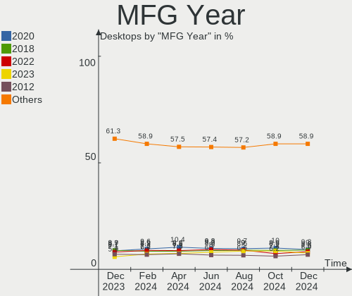
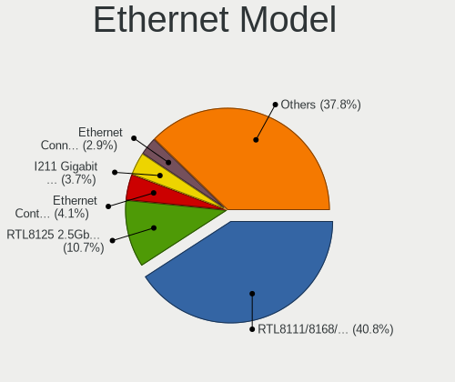
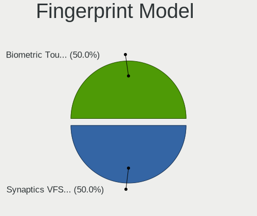

Linux - Hardware Trends (Desktops)
----------------------------------

A project to identify most popular hardware characteristics and track their change
over time based on data collected by Linux users at https://Linux-Hardware.org.

Anyone can contribute to this report by the [hw-probe](https://github.com/linuxhw/hw-probe) tool:

    sudo -E hw-probe -all -upload

This report is for one last month. Overall report since the beginning of time: [TestDays](https://github.com/linuxhw/TestDays)

Period: May, 2023.

Contents
--------

* [ System ](#system)
  - [ OS                       ](#os)
  - [ OS Family                ](#os-family)
  - [ Kernel                   ](#kernel)
  - [ Kernel Family            ](#kernel-family)
  - [ Kernel Major Ver.        ](#kernel-major-ver)
  - [ Arch                     ](#arch)
  - [ DE                       ](#de)
  - [ Display Server           ](#display-server)
  - [ Display Manager          ](#display-manager)
  - [ OS Lang                  ](#os-lang)
  - [ Boot Mode                ](#boot-mode)
  - [ Filesystem               ](#filesystem)
  - [ Part. scheme             ](#part-scheme)
  - [ Dual Boot with Linux/BSD ](#dual-boot-with-linuxbsd)
  - [ Dual Boot (Win)          ](#dual-boot-win)

* [ Board ](#board)
  - [ Vendor                   ](#vendor)
  - [ Model                    ](#model)
  - [ Model Family             ](#model-family)
  - [ MFG Year                 ](#mfg-year)
  - [ Form Factor              ](#form-factor)
  - [ Secure Boot              ](#secure-boot)
  - [ Coreboot                 ](#coreboot)
  - [ RAM Size                 ](#ram-size)
  - [ RAM Used                 ](#ram-used)
  - [ Total Drives             ](#total-drives)
  - [ Has CD-ROM               ](#has-cd-rom)
  - [ Has Ethernet             ](#has-ethernet)
  - [ Has WiFi                 ](#has-wifi)
  - [ Has Bluetooth            ](#has-bluetooth)

* [ Location ](#location)
  - [ Country                  ](#country)
  - [ City                     ](#city)

* [ Drives ](#drives)
  - [ Drive Vendor             ](#drive-vendor)
  - [ Drive Model              ](#drive-model)
  - [ HDD Vendor               ](#hdd-vendor)
  - [ SSD Vendor               ](#ssd-vendor)
  - [ Drive Kind               ](#drive-kind)
  - [ Drive Connector          ](#drive-connector)
  - [ Drive Size               ](#drive-size)
  - [ Space Total              ](#space-total)
  - [ Space Used               ](#space-used)
  - [ Malfunc. Drives          ](#malfunc-drives)
  - [ Malfunc. Drive Vendor    ](#malfunc-drive-vendor)
  - [ Malfunc. HDD Vendor      ](#malfunc-hdd-vendor)
  - [ Malfunc. Drive Kind      ](#malfunc-drive-kind)
  - [ Failed Drives            ](#failed-drives)
  - [ Failed Drive Vendor      ](#failed-drive-vendor)
  - [ Drive Status             ](#drive-status)

* [ Storage controller ](#storage-controller)
  - [ Storage Vendor           ](#storage-vendor)
  - [ Storage Model            ](#storage-model)
  - [ Storage Kind             ](#storage-kind)

* [ Processor ](#processor)
  - [ CPU Vendor               ](#cpu-vendor)
  - [ CPU Model                ](#cpu-model)
  - [ CPU Model Family         ](#cpu-model-family)
  - [ CPU Cores                ](#cpu-cores)
  - [ CPU Sockets              ](#cpu-sockets)
  - [ CPU Threads              ](#cpu-threads)
  - [ CPU Op-Modes             ](#cpu-op-modes)
  - [ CPU Microcode            ](#cpu-microcode)
  - [ CPU Microarch            ](#cpu-microarch)

* [ Graphics ](#graphics)
  - [ GPU Vendor               ](#gpu-vendor)
  - [ GPU Model                ](#gpu-model)
  - [ GPU Combo                ](#gpu-combo)
  - [ GPU Driver               ](#gpu-driver)
  - [ GPU Memory               ](#gpu-memory)

* [ Monitor ](#monitor)
  - [ Monitor Vendor           ](#monitor-vendor)
  - [ Monitor Model            ](#monitor-model)
  - [ Monitor Resolution       ](#monitor-resolution)
  - [ Monitor Diagonal         ](#monitor-diagonal)
  - [ Monitor Width            ](#monitor-width)
  - [ Aspect Ratio             ](#aspect-ratio)
  - [ Monitor Area             ](#monitor-area)
  - [ Pixel Density            ](#pixel-density)
  - [ Multiple Monitors        ](#multiple-monitors)

* [ Network ](#network)
  - [ Net Controller Vendor    ](#net-controller-vendor)
  - [ Net Controller Model     ](#net-controller-model)
  - [ Wireless Vendor          ](#wireless-vendor)
  - [ Wireless Model           ](#wireless-model)
  - [ Ethernet Vendor          ](#ethernet-vendor)
  - [ Ethernet Model           ](#ethernet-model)
  - [ Net Controller Kind      ](#net-controller-kind)
  - [ Used Controller          ](#used-controller)
  - [ NICs                     ](#nics)
  - [ IPv6                     ](#ipv6)

* [ Bluetooth ](#bluetooth)
  - [ Bluetooth Vendor         ](#bluetooth-vendor)
  - [ Bluetooth Model          ](#bluetooth-model)

* [ Sound ](#sound)
  - [ Sound Vendor             ](#sound-vendor)
  - [ Sound Model              ](#sound-model)

* [ Memory ](#memory)
  - [ Memory Vendor            ](#memory-vendor)
  - [ Memory Model             ](#memory-model)
  - [ Memory Kind              ](#memory-kind)
  - [ Memory Form Factor       ](#memory-form-factor)
  - [ Memory Size              ](#memory-size)
  - [ Memory Speed             ](#memory-speed)

* [ Printers & scanners ](#printers--scanners)
  - [ Printer Vendor           ](#printer-vendor)
  - [ Printer Model            ](#printer-model)
  - [ Scanner Vendor           ](#scanner-vendor)
  - [ Scanner Model            ](#scanner-model)

* [ Camera ](#camera)
  - [ Camera Vendor            ](#camera-vendor)
  - [ Camera Model             ](#camera-model)

* [ Security ](#security)
  - [ Fingerprint Vendor       ](#fingerprint-vendor)
  - [ Fingerprint Model        ](#fingerprint-model)
  - [ Chipcard Vendor          ](#chipcard-vendor)
  - [ Chipcard Model           ](#chipcard-model)

* [ Unsupported ](#unsupported)
  - [ Unsupported Devices      ](#unsupported-devices)
  - [ Unsupported Device Types ](#unsupported-device-types)

System
------

OS
--

Installed operating systems

| Name                         | Desktops | Percent |
|------------------------------|----------|---------|
| Ubuntu 22.04                 | 256      | 12.32%  |
| Linux Mint 21.1              | 162      | 7.8%    |
| Fedora 38                    | 141      | 6.79%   |
| OpenMandriva 23.03           | 126      | 6.06%   |
| Debian 11                    | 109      | 5.25%   |
| Ubuntu 23.04                 | 92       | 4.43%   |
| ROSA 12.4                    | 85       | 4.09%   |
| Pop!_OS 22.04                | 85       | 4.09%   |
| Debian 12                    | 76       | 3.66%   |
| Arch Rolling                 | 73       | 3.51%   |
| ArcoLinux Rolling            | 67       | 3.22%   |
| Zorin 16                     | 57       | 2.74%   |
| BlackPanther 18.1            | 47       | 2.26%   |
| Ubuntu 20.04                 | 43       | 2.07%   |
| Gentoo 2.13                  | 38       | 1.83%   |
| Manjaro                      | 35       | 1.68%   |
| Linux Mint 20.3              | 31       | 1.49%   |
| Kubuntu 22.04                | 29       | 1.4%    |
| Nobara 37                    | 25       | 1.2%    |
| openSUSE Tumbleweed-XXXXXXXX | 24       | 1.15%   |
| OpenMandriva 4.3             | 24       | 1.15%   |
| KDE neon 22.04               | 24       | 1.15%   |
| Fedora 37                    | 23       | 1.11%   |
| Xubuntu 22.04                | 16       | 0.77%   |
| Ubuntu 22.10                 | 16       | 0.77%   |
| Linux Mint 21                | 15       | 0.72%   |
| EndeavourOS Rolling          | 14       | 0.67%   |
| Manjaro 22.1.1               | 12       | 0.58%   |
| ROSA 12.3                    | 11       | 0.53%   |
| MX 21                        | 9        | 0.43%   |
| LMDE 5                       | 9        | 0.43%   |
| Kubuntu 23.04                | 9        | 0.43%   |
| Kali 2023.1                  | 9        | 0.43%   |
| Fedora 36                    | 8        | 0.38%   |
| Elementary 7                 | 8        | 0.38%   |
| OpenMandriva 4.2             | 7        | 0.34%   |
| OpenMandriva 23.01           | 7        | 0.34%   |
| Lubuntu 22.04                | 7        | 0.34%   |
| Ubuntu 18.04                 | 6        | 0.29%   |
| ROSA R11.1                   | 6        | 0.29%   |

OS Family
---------

OS without a version

| Name          | Desktops | Percent |
|---------------|----------|---------|
| Ubuntu        | 419      | 20.16%  |
| Linux Mint    | 222      | 10.68%  |
| Debian        | 188      | 9.05%   |
| OpenMandriva  | 176      | 8.47%   |
| Fedora        | 174      | 8.37%   |
| ROSA          | 111      | 5.34%   |
| Pop!_OS       | 86       | 4.14%   |
| Arch          | 73       | 3.51%   |
| ArcoLinux     | 68       | 3.27%   |
| Zorin         | 60       | 2.89%   |
| Manjaro       | 60       | 2.89%   |
| BlackPanther  | 49       | 2.36%   |
| Kubuntu       | 43       | 2.07%   |
| Gentoo        | 38       | 1.83%   |
| openSUSE      | 35       | 1.68%   |
| Xubuntu       | 28       | 1.35%   |
| Nobara        | 28       | 1.35%   |
| KDE neon      | 25       | 1.2%    |
| EndeavourOS   | 14       | 0.67%   |
| Kali          | 12       | 0.58%   |
| LMDE          | 11       | 0.53%   |
| Lubuntu       | 10       | 0.48%   |
| MX            | 9        | 0.43%   |
| Garuda Linux  | 9        | 0.43%   |
| Elementary    | 9        | 0.43%   |
| Ubuntu MATE   | 8        | 0.38%   |
| Red OS        | 8        | 0.38%   |
| ALT Linux     | 8        | 0.38%   |
| Parrot        | 6        | 0.29%   |
| Ubuntu Unity  | 5        | 0.24%   |
| Rocky Linux   | 5        | 0.24%   |
| NixOS         | 5        | 0.24%   |
| blendOS       | 5        | 0.24%   |
| ChimeraOS     | 4        | 0.19%   |
| Atz           | 4        | 0.19%   |
| Ubuntu Studio | 3        | 0.14%   |
| SteamOS       | 3        | 0.14%   |
| RHEL          | 3        | 0.14%   |
| Linux Lite    | 3        | 0.14%   |
| CentOS        | 3        | 0.14%   |

Kernel
------

Version of the Linux kernel

| Version                           | Desktops | Percent |
|-----------------------------------|----------|---------|
| 5.19.0-41-generic                 | 189      | 9.1%    |
| 5.15.0-71-generic                 | 153      | 7.36%   |
| 6.2.6-desktop-1omv2390            | 125      | 6.02%   |
| 5.15.0-72-generic                 | 107      | 5.15%   |
| 6.2.0-20-generic                  | 100      | 4.81%   |
| 6.2.6-76060206-generic            | 77       | 3.71%   |
| 5.19.0-42-generic                 | 67       | 3.22%   |
| 6.1.20-generic-2rosa2021.1-x86_64 | 64       | 3.08%   |
| 6.2.15-300.fc38.x86_64            | 54       | 2.6%    |
| 6.1.0-4-amd64                     | 47       | 2.26%   |
| 6.2.14-300.fc38.x86_64            | 46       | 2.21%   |
| 5.10.0-23-amd64                   | 39       | 1.88%   |
| 5.10.0-22-amd64                   | 39       | 1.88%   |
| 5.4.0-148-generic                 | 33       | 1.59%   |
| 6.3.1-arch1-1                     | 26       | 1.25%   |
| 6.3.2-arch1-1                     | 24       | 1.15%   |
| 5.6.14-desktop-2bP                | 20       | 0.96%   |
| 5.15.0-56-generic                 | 19       | 0.91%   |
| 6.2.9-300.fc38.x86_64             | 18       | 0.87%   |
| 6.2.14-300.fsync.fc37.x86_64      | 18       | 0.87%   |
| 6.2.13-arch1-1                    | 17       | 0.82%   |
| 6.3.4-arch1-1                     | 15       | 0.72%   |
| 6.1.26-1-MANJARO                  | 15       | 0.72%   |
| 4.18.16-desktop-1bP               | 15       | 0.72%   |
| 5.16.13-desktop-1omv4003          | 14       | 0.67%   |
| 6.1.0-9-amd64                     | 13       | 0.63%   |
| 6.3.2-zen1-1-zen                  | 12       | 0.58%   |
| 5.15.85-desktop-1bP               | 12       | 0.58%   |
| 5.16.7-desktop-1omv4003           | 11       | 0.53%   |
| 6.3.2-1-default                   | 10       | 0.48%   |
| 6.2.13-300.fc38.x86_64            | 10       | 0.48%   |
| 5.4.0-149-generic                 | 10       | 0.48%   |
| 6.3.1-arch2-1                     | 9        | 0.43%   |
| 6.2.14-200.fc37.x86_64            | 9        | 0.43%   |
| 5.19.0-35-generic                 | 9        | 0.43%   |
| 5.15.0-69-generic                 | 9        | 0.43%   |
| 6.3.1-1-default                   | 8        | 0.38%   |
| 6.1.25-1-MANJARO                  | 8        | 0.38%   |
| 5.19.0-38-generic                 | 8        | 0.38%   |
| 5.19.0-32-generic                 | 8        | 0.38%   |

Kernel Family
-------------

Linux kernel without a distro release

| Version  | Desktops | Percent |
|----------|----------|---------|
| 5.15.0   | 338      | 16.27%  |
| 5.19.0   | 300      | 14.44%  |
| 6.2.6    | 203      | 9.77%   |
| 6.2.0    | 108      | 5.2%    |
| 5.10.0   | 102      | 4.91%   |
| 6.1.0    | 97       | 4.67%   |
| 6.2.14   | 77       | 3.71%   |
| 6.3.1    | 68       | 3.27%   |
| 6.1.20   | 67       | 3.22%   |
| 6.2.15   | 63       | 3.03%   |
| 5.4.0    | 63       | 3.03%   |
| 6.3.2    | 53       | 2.55%   |
| 6.2.13   | 41       | 1.97%   |
| 6.3.4    | 36       | 1.73%   |
| 6.2.12   | 31       | 1.49%   |
| 6.3.3    | 26       | 1.25%   |
| 6.2.9    | 21       | 1.01%   |
| 5.6.14   | 20       | 0.96%   |
| 6.1.26   | 19       | 0.91%   |
| 4.18.16  | 15       | 0.72%   |
| 5.16.13  | 14       | 0.67%   |
| 5.15.85  | 13       | 0.63%   |
| 6.3.0    | 12       | 0.58%   |
| 6.2.11   | 12       | 0.58%   |
| 6.1.29   | 12       | 0.58%   |
| 6.1.27   | 12       | 0.58%   |
| 5.16.7   | 11       | 0.53%   |
| 5.15.107 | 9        | 0.43%   |
| 5.14.0   | 9        | 0.43%   |
| 4.15.0   | 9        | 0.43%   |
| 6.1.25   | 8        | 0.38%   |
| 6.1.19   | 8        | 0.38%   |
| 5.15.103 | 8        | 0.38%   |
| 5.14.21  | 8        | 0.38%   |
| 6.1.30   | 7        | 0.34%   |
| 6.1.28   | 7        | 0.34%   |
| 5.15.75  | 7        | 0.34%   |
| 5.10.176 | 7        | 0.34%   |
| 6.2.10   | 6        | 0.29%   |
| 6.0.0    | 6        | 0.29%   |

Kernel Major Ver.
-----------------

Linux kernel major version

| Version  | Desktops | Percent |
|----------|----------|---------|
| 6.2      | 566      | 27.24%  |
| 5.15     | 401      | 19.3%   |
| 5.19     | 303      | 14.58%  |
| 6.1      | 257      | 12.37%  |
| 6.3      | 198      | 9.53%   |
| 5.10     | 130      | 6.26%   |
| 5.4      | 65       | 3.13%   |
| 5.16     | 26       | 1.25%   |
| 6.0      | 24       | 1.15%   |
| 5.6      | 20       | 0.96%   |
| 4.18     | 18       | 0.87%   |
| 5.14     | 17       | 0.82%   |
| 5.18     | 9        | 0.43%   |
| 4.15     | 9        | 0.43%   |
| 4.19     | 6        | 0.29%   |
| 5.17     | 5        | 0.24%   |
| 5.13     | 5        | 0.24%   |
| 6.4      | 4        | 0.19%   |
| 5.11     | 3        | 0.14%   |
| 5.3      | 2        | 0.1%    |
| 4.4      | 2        | 0.1%    |
| 3.10     | 2        | 0.1%    |
| 6.2.0    | 1        | 0.05%   |
| 5.12     | 1        | 0.05%   |
| 5.10.164 | 1        | 0.05%   |
| 5.0      | 1        | 0.05%   |
| 4.8      | 1        | 0.05%   |
| 4.10     | 1        | 0.05%   |

Arch
----

OS architecture (x86_64, i586, etc.)

| Name    | Desktops | Percent |
|---------|----------|---------|
| x86_64  | 2063     | 99.28%  |
| i686    | 14       | 0.67%   |
| ppc64le | 1        | 0.05%   |

DE
--

Desktop Environment

| Name            | Desktops | Percent |
|-----------------|----------|---------|
| GNOME           | 798      | 38.4%   |
| KDE5            | 571      | 27.48%  |
| X-Cinnamon      | 188      | 9.05%   |
| XFCE            | 166      | 7.99%   |
| Unknown         | 154      | 7.41%   |
| MATE            | 63       | 3.03%   |
| LXQt            | 33       | 1.59%   |
| Cinnamon        | 24       | 1.15%   |
| i3              | 11       | 0.53%   |
| Hyprland        | 10       | 0.48%   |
| Pantheon        | 9        | 0.43%   |
| LXDE            | 7        | 0.34%   |
| KDE4            | 6        | 0.29%   |
| Unity           | 4        | 0.19%   |
| Openbox         | 4        | 0.19%   |
| bspwm           | 4        | 0.19%   |
| qtile           | 3        | 0.14%   |
| GNOME Flashback | 3        | 0.14%   |
| chadwm          | 3        | 0.14%   |
| Budgie          | 3        | 0.14%   |
| icewm           | 2        | 0.1%    |
| GNOME Classic   | 2        | 0.1%    |
| Enlightenment   | 2        | 0.1%    |
| Trinity         | 1        | 0.05%   |
| sway            | 1        | 0.05%   |
| INPT            | 1        | 0.05%   |
| i3-with-shmlog  | 1        | 0.05%   |
| dwm             | 1        | 0.05%   |
| Deepin          | 1        | 0.05%   |
| DDE             | 1        | 0.05%   |
| BunsenLabs      | 1        | 0.05%   |

Display Server
--------------

X11 or Wayland

| Name    | Desktops | Percent |
|---------|----------|---------|
| X11     | 1361     | 65.5%   |
| Wayland | 541      | 26.03%  |
| Tty     | 88       | 4.23%   |
| Unknown | 88       | 4.23%   |

Display Manager
---------------

SDDM, LightDM, etc.

| Name    | Desktops | Percent |
|---------|----------|---------|
| Unknown | 770      | 37.05%  |
| SDDM    | 485      | 23.34%  |
| GDM3    | 379      | 18.24%  |
| LightDM | 273      | 13.14%  |
| GDM     | 153      | 7.36%   |
| KDM     | 6        | 0.29%   |
| SLiM    | 4        | 0.19%   |
| LXDM    | 4        | 0.19%   |
| SLIMSKI | 2        | 0.1%    |
| Ly      | 1        | 0.05%   |
| GREETD  | 1        | 0.05%   |

OS Lang
-------

Language

| Lang    | Desktops | Percent |
|---------|----------|---------|
| en_US   | 816      | 39.27%  |
| ru_RU   | 230      | 11.07%  |
| de_DE   | 182      | 8.76%   |
| en_GB   | 91       | 4.38%   |
| fr_FR   | 89       | 4.28%   |
| pt_BR   | 78       | 3.75%   |
| Unknown | 69       | 3.32%   |
| en_CA   | 54       | 2.6%    |
| C       | 48       | 2.31%   |
| it_IT   | 41       | 1.97%   |
| es_ES   | 36       | 1.73%   |
| en_AU   | 32       | 1.54%   |
| pl_PL   | 31       | 1.49%   |
| es_MX   | 23       | 1.11%   |
| es_AR   | 21       | 1.01%   |
| en_IN   | 16       | 0.77%   |
| nl_NL   | 14       | 0.67%   |
| cs_CZ   | 13       | 0.63%   |
| pt_PT   | 12       | 0.58%   |
| ja_JP   | 12       | 0.58%   |
| sv_SE   | 11       | 0.53%   |
| de_AT   | 11       | 0.53%   |
| hu_HU   | 9        | 0.43%   |
| en_NZ   | 8        | 0.38%   |
| de_CH   | 8        | 0.38%   |
| zh_CN   | 6        | 0.29%   |
| sk_SK   | 6        | 0.29%   |
| fr_CA   | 6        | 0.29%   |
| C.UTF8  | 6        | 0.29%   |
| tr_TR   | 5        | 0.24%   |
| fr_BE   | 5        | 0.24%   |
| fi_FI   | 5        | 0.24%   |
| es_VE   | 5        | 0.24%   |
| en_ZA   | 5        | 0.24%   |
| en_DK   | 5        | 0.24%   |
| da_DK   | 5        | 0.24%   |
| nl_BE   | 4        | 0.19%   |
| ca_ES   | 4        | 0.19%   |
| zh_TW   | 3        | 0.14%   |
| POSIX   | 3        | 0.14%   |

Boot Mode
---------

EFI or BIOS

| Mode | Desktops | Percent |
|------|----------|---------|
| BIOS | 1126     | 54.19%  |
| EFI  | 952      | 45.81%  |

Filesystem
----------

Type of filesystem

| Type     | Desktops | Percent |
|----------|----------|---------|
| Ext4     | 1254     | 60.35%  |
| Btrfs    | 309      | 14.87%  |
| Tmpfs    | 261      | 12.56%  |
| Overlay  | 181      | 8.71%   |
| Xfs      | 41       | 1.97%   |
| Zfs      | 14       | 0.67%   |
| F2fs     | 7        | 0.34%   |
| Ext3     | 5        | 0.24%   |
| Reiserfs | 2        | 0.1%    |
| Jfs      | 2        | 0.1%    |
| XXXXXXX  | 1        | 0.05%   |
| Ext2     | 1        | 0.05%   |

Part. scheme
------------

Scheme of partitioning

| Type    | Desktops | Percent |
|---------|----------|---------|
| GPT     | 1094     | 52.65%  |
| Unknown | 623      | 29.98%  |
| MBR     | 361      | 17.37%  |

Dual Boot with Linux/BSD
------------------------

Hosting more than one Linux/BSD

| Dual boot | Desktops | Percent |
|-----------|----------|---------|
| No        | 1637     | 78.78%  |
| Yes       | 441      | 21.22%  |

Dual Boot (Win)
---------------

Hosting Linux and Windows

| Dual boot | Desktops | Percent |
|-----------|----------|---------|
| No        | 1400     | 67.37%  |
| Yes       | 678      | 32.63%  |

Board
-----

Vendor
------

Motherboard manufacturer

| Name                                 | Desktops | Percent |
|--------------------------------------|----------|---------|
| ASUSTek Computer                     | 560      | 26.95%  |
| Gigabyte Technology                  | 389      | 18.72%  |
| MSI                                  | 241      | 11.6%   |
| ASRock                               | 195      | 9.38%   |
| Dell                                 | 152      | 7.31%   |
| Hewlett-Packard                      | 129      | 6.21%   |
| Lenovo                               | 79       | 3.8%    |
| Intel                                | 50       | 2.41%   |
| Unknown                              | 37       | 1.78%   |
| Acer                                 | 35       | 1.68%   |
| Fujitsu                              | 23       | 1.11%   |
| Pegatron                             | 19       | 0.91%   |
| Biostar                              | 16       | 0.77%   |
| Foxconn                              | 14       | 0.67%   |
| Medion                               | 12       | 0.58%   |
| AZW                                  | 10       | 0.48%   |
| ECS                                  | 8        | 0.38%   |
| Fujitsu Siemens                      | 7        | 0.34%   |
| BESSTAR Tech                         | 7        | 0.34%   |
| Huanan                               | 6        | 0.29%   |
| Gateway                              | 5        | 0.24%   |
| ASRockRack                           | 4        | 0.19%   |
| Apple                                | 4        | 0.19%   |
| AMI                                  | 4        | 0.19%   |
| ZOTAC                                | 3        | 0.14%   |
| Supermicro                           | 3        | 0.14%   |
| PCWare                               | 3        | 0.14%   |
| Alienware                            | 3        | 0.14%   |
| Shuttle                              | 2        | 0.1%    |
| Shenzhen Meigao Electronic Equipment | 2        | 0.1%    |
| Semp Toshiba                         | 2        | 0.1%    |
| Packard Bell                         | 2        | 0.1%    |
| OEM                                  | 2        | 0.1%    |
| NEC Computers                        | 2        | 0.1%    |
| MACHINIST                            | 2        | 0.1%    |
| Inventec                             | 2        | 0.1%    |
| HPE                                  | 2        | 0.1%    |
| Google                               | 2        | 0.1%    |
| eMachines                            | 2        | 0.1%    |
| Daten Tecnologia                     | 2        | 0.1%    |

Model
-----

Motherboard model

| Name                             | Desktops | Percent |
|----------------------------------|----------|---------|
| ASUS All Series                  | 48       | 2.31%   |
| Unknown                          | 39       | 1.88%   |
| ASUS TUF Gaming X570-PLUS        | 20       | 0.96%   |
| Dell OptiPlex 9020               | 15       | 0.72%   |
| Dell OptiPlex 7010               | 13       | 0.63%   |
| MSI MS-7C95                      | 9        | 0.43%   |
| MSI MS-7C91                      | 9        | 0.43%   |
| MSI MS-7C02                      | 9        | 0.43%   |
| MSI MS-7A38                      | 9        | 0.43%   |
| Gigabyte H81M-S2V                | 9        | 0.43%   |
| ASUS TUF Gaming B550-PLUS        | 8        | 0.38%   |
| ASUS ROG STRIX B550-F GAMING     | 8        | 0.38%   |
| MSI MS-7D25                      | 7        | 0.34%   |
| MSI MS-7C37                      | 7        | 0.34%   |
| MSI MS-7B86                      | 7        | 0.34%   |
| Intel H61                        | 7        | 0.34%   |
| HP Z420 Workstation              | 7        | 0.34%   |
| Gigabyte B450M DS3H              | 7        | 0.34%   |
| Gigabyte B450 AORUS ELITE        | 7        | 0.34%   |
| Dell Precision WorkStation T3500 | 7        | 0.34%   |
| ASUS ROG CROSSHAIR VIII HERO     | 7        | 0.34%   |
| ASUS PRIME B550-PLUS             | 7        | 0.34%   |
| MSI MS-7C56                      | 6        | 0.29%   |
| MSI MS-7816                      | 6        | 0.29%   |
| Gigabyte X570S AORUS ELITE AX    | 6        | 0.29%   |
| Gigabyte B550 GAMING X V2        | 6        | 0.29%   |
| Dell OptiPlex 990                | 6        | 0.29%   |
| ASUS PRIME B450-PLUS             | 6        | 0.29%   |
| ASRock B450M Pro4                | 6        | 0.29%   |
| ASRock A320M-HDV R4.0            | 6        | 0.29%   |
| MSI MS-7693                      | 5        | 0.24%   |
| HP EliteDesk 800 G2 DM 35W       | 5        | 0.24%   |
| HP Compaq Pro 6300 SFF           | 5        | 0.24%   |
| HP Compaq Pro 6300 MT            | 5        | 0.24%   |
| Gigabyte X570 AORUS MASTER       | 5        | 0.24%   |
| Gigabyte X570 AORUS ELITE        | 5        | 0.24%   |
| Gigabyte M68MT-S2                | 5        | 0.24%   |
| Gigabyte A320M-S2H               | 5        | 0.24%   |
| Dell OptiPlex 790                | 5        | 0.24%   |
| Dell OptiPlex 3020               | 5        | 0.24%   |

Model Family
------------

Motherboard model prefix

| Name                   | Desktops | Percent |
|------------------------|----------|---------|
| ASUS PRIME             | 126      | 6.06%   |
| ASUS ROG               | 97       | 4.67%   |
| Dell OptiPlex          | 95       | 4.57%   |
| ASUS TUF               | 62       | 2.98%   |
| HP Compaq              | 48       | 2.31%   |
| ASUS All               | 48       | 2.31%   |
| Lenovo ThinkCentre     | 46       | 2.21%   |
| Unknown                | 39       | 1.88%   |
| Dell Precision         | 32       | 1.54%   |
| Gigabyte X570          | 20       | 0.96%   |
| Gigabyte B450M         | 20       | 0.96%   |
| HP EliteDesk           | 18       | 0.87%   |
| Acer Aspire            | 18       | 0.87%   |
| Gigabyte B550          | 17       | 0.82%   |
| Lenovo IdeaCentre      | 15       | 0.72%   |
| Fujitsu ESPRIMO        | 15       | 0.72%   |
| Gigabyte B450          | 12       | 0.58%   |
| Lenovo ThinkStation    | 11       | 0.53%   |
| HP ProDesk             | 11       | 0.53%   |
| Gigabyte X570S         | 11       | 0.53%   |
| Gigabyte B550M         | 11       | 0.53%   |
| ASUS M5A78L-M          | 11       | 0.53%   |
| ASRock B450M           | 11       | 0.53%   |
| ASUS P8H61-M           | 10       | 0.48%   |
| Acer Veriton           | 10       | 0.48%   |
| MSI MS-7C95            | 9        | 0.43%   |
| MSI MS-7C91            | 9        | 0.43%   |
| MSI MS-7C02            | 9        | 0.43%   |
| MSI MS-7A38            | 9        | 0.43%   |
| Gigabyte H81M-S2V      | 9        | 0.43%   |
| Dell Inspiron          | 9        | 0.43%   |
| Intel H61              | 8        | 0.38%   |
| Gigabyte Z590          | 8        | 0.38%   |
| Gigabyte H410M         | 8        | 0.38%   |
| Gigabyte GA-78LMT-USB3 | 8        | 0.38%   |
| Gigabyte A320M-S2H     | 8        | 0.38%   |
| Dell Vostro            | 8        | 0.38%   |
| ASUS SABERTOOTH        | 8        | 0.38%   |
| ASRock B450            | 8        | 0.38%   |
| MSI MS-7D25            | 7        | 0.34%   |

MFG Year
--------

Motherboard manufacture year

| Year    | Desktops | Percent |
|---------|----------|---------|
| 2018    | 204      | 9.82%   |
| 2020    | 184      | 8.85%   |
| 2021    | 178      | 8.57%   |
| 2012    | 176      | 8.47%   |
| 2019    | 168      | 8.08%   |
| 2022    | 145      | 6.98%   |
| 2013    | 141      | 6.79%   |
| 2011    | 126      | 6.06%   |
| 2017    | 123      | 5.92%   |
| 2014    | 119      | 5.73%   |
| 2010    | 105      | 5.05%   |
| 2015    | 97       | 4.67%   |
| 2009    | 95       | 4.57%   |
| 2016    | 72       | 3.46%   |
| 2008    | 50       | 2.41%   |
| 2023    | 37       | 1.78%   |
| 2007    | 34       | 1.64%   |
| 2006    | 17       | 0.82%   |
| 2005    | 3        | 0.14%   |
| 2003    | 2        | 0.1%    |
| 2002    | 1        | 0.05%   |
| Unknown | 1        | 0.05%   |

Form Factor
-----------

Physical design of the computer

| Name    | Desktops | Percent |
|---------|----------|---------|
| Desktop | 2078     | 100%    |

Secure Boot
-----------

Enabled or disabled

| State    | Desktops | Percent |
|----------|----------|---------|
| Disabled | 2014     | 96.92%  |
| Enabled  | 64       | 3.08%   |

Coreboot
--------

Have coreboot on board

| Used | Desktops | Percent |
|------|----------|---------|
| No   | 2076     | 99.9%   |
| Yes  | 2        | 0.1%    |

RAM Size
--------

Total RAM memory

| Size in GB      | Desktops | Percent |
|-----------------|----------|---------|
| 16.01-24.0      | 498      | 23.97%  |
| 32.01-64.0      | 426      | 20.5%   |
| 8.01-16.0       | 356      | 17.13%  |
| 4.01-8.0        | 310      | 14.92%  |
| 3.01-4.0        | 220      | 10.59%  |
| 64.01-256.0     | 145      | 6.98%   |
| 24.01-32.0      | 72       | 3.46%   |
| 1.01-2.0        | 30       | 1.44%   |
| 2.01-3.0        | 13       | 0.63%   |
| 0.51-1.0        | 5        | 0.24%   |
| More than 256.0 | 3        | 0.14%   |

RAM Used
--------

Used RAM memory

| Used GB     | Desktops | Percent |
|-------------|----------|---------|
| 1.01-2.0    | 585      | 28.15%  |
| 2.01-3.0    | 461      | 22.18%  |
| 4.01-8.0    | 395      | 19.01%  |
| 3.01-4.0    | 279      | 13.43%  |
| 0.51-1.0    | 150      | 7.22%   |
| 8.01-16.0   | 134      | 6.45%   |
| 0.01-0.5    | 30       | 1.44%   |
| 16.01-24.0  | 26       | 1.25%   |
| 24.01-32.0  | 11       | 0.53%   |
| 32.01-64.0  | 6        | 0.29%   |
| 64.01-256.0 | 1        | 0.05%   |

Total Drives
------------

Number of drives on board

| Drives | Desktops | Percent |
|--------|----------|---------|
| 1      | 736      | 35.42%  |
| 2      | 621      | 29.88%  |
| 3      | 333      | 16.03%  |
| 4      | 186      | 8.95%   |
| 5      | 94       | 4.52%   |
| 6      | 56       | 2.69%   |
| 7      | 17       | 0.82%   |
| 0      | 13       | 0.63%   |
| 9      | 8        | 0.38%   |
| 8      | 7        | 0.34%   |
| 12     | 2        | 0.1%    |
| 10     | 2        | 0.1%    |
| 25     | 1        | 0.05%   |
| 13     | 1        | 0.05%   |
| 11     | 1        | 0.05%   |

Has CD-ROM
----------

Has CD-ROM on board

| Presented | Desktops | Percent |
|-----------|----------|---------|
| No        | 1283     | 61.74%  |
| Yes       | 795      | 38.26%  |

Has Ethernet
------------

Has Ethernet on board

| Presented | Desktops | Percent |
|-----------|----------|---------|
| Yes       | 2061     | 99.18%  |
| No        | 17       | 0.82%   |

Has WiFi
--------

Has WiFi module

| Presented | Desktops | Percent |
|-----------|----------|---------|
| No        | 1132     | 54.48%  |
| Yes       | 946      | 45.52%  |

Has Bluetooth
-------------

Has Bluetooth module

| Presented | Desktops | Percent |
|-----------|----------|---------|
| No        | 1317     | 63.38%  |
| Yes       | 761      | 36.62%  |

Location
--------

Country
-------

Geographic location (country)

| Country      | Desktops | Percent |
|--------------|----------|---------|
| USA          | 401      | 19.3%   |
| Russia       | 238      | 11.45%  |
| Germany      | 226      | 10.88%  |
| Brazil       | 119      | 5.73%   |
| France       | 107      | 5.15%   |
| Canada       | 92       | 4.43%   |
| UK           | 75       | 3.61%   |
| Italy        | 61       | 2.94%   |
| Hungary      | 56       | 2.69%   |
| Poland       | 53       | 2.55%   |
| Spain        | 42       | 2.02%   |
| Sweden       | 40       | 1.92%   |
| Australia    | 40       | 1.92%   |
| Argentina    | 35       | 1.68%   |
| Netherlands  | 33       | 1.59%   |
| Mexico       | 30       | 1.44%   |
| India        | 28       | 1.35%   |
| Switzerland  | 25       | 1.2%    |
| Japan        | 20       | 0.96%   |
| Austria      | 20       | 0.96%   |
| Czechia      | 18       | 0.87%   |
| Belgium      | 18       | 0.87%   |
| Norway       | 17       | 0.82%   |
| Portugal     | 16       | 0.77%   |
| Ukraine      | 14       | 0.67%   |
| Romania      | 13       | 0.63%   |
| Greece       | 13       | 0.63%   |
| Finland      | 13       | 0.63%   |
| New Zealand  | 12       | 0.58%   |
| Slovakia     | 11       | 0.53%   |
| Turkey       | 10       | 0.48%   |
| Thailand     | 10       | 0.48%   |
| Denmark      | 10       | 0.48%   |
| Belarus      | 10       | 0.48%   |
| China        | 9        | 0.43%   |
| Venezuela    | 8        | 0.38%   |
| Taiwan       | 8        | 0.38%   |
| Serbia       | 8        | 0.38%   |
| South Africa | 7        | 0.34%   |
| Philippines  | 6        | 0.29%   |

City
----

Geographic location (city)

| City           | Desktops | Percent |
|----------------|----------|---------|
| Voronezh       | 49       | 2.36%   |
| Moscow         | 40       | 1.92%   |
| Sydney         | 18       | 0.87%   |
| Budapest       | 17       | 0.82%   |
| Berlin         | 16       | 0.77%   |
| St Petersburg  | 14       | 0.67%   |
| Montreal       | 14       | 0.67%   |
| Warsaw         | 13       | 0.63%   |
| Sao Paulo      | 13       | 0.63%   |
| Hamburg        | 13       | 0.63%   |
| Vienna         | 12       | 0.58%   |
| Rome           | 11       | 0.53%   |
| Buenos Aires   | 9        | 0.43%   |
| Yekaterinburg  | 8        | 0.38%   |
| Seattle        | 8        | 0.38%   |
| Munich         | 8        | 0.38%   |
| Gothenburg     | 8        | 0.38%   |
| Brussels       | 8        | 0.38%   |
| Amsterdam      | 8        | 0.38%   |
| Hanover        | 7        | 0.34%   |
| Brisbane       | 7        | 0.34%   |
| Barcelona      | 7        | 0.34%   |
| Toronto        | 6        | 0.29%   |
| Stockholm      | 6        | 0.29%   |
| Rio de Janeiro | 6        | 0.29%   |
| Perm           | 6        | 0.29%   |
| Minsk          | 6        | 0.29%   |
| Krasnodar      | 6        | 0.29%   |
| Essen          | 6        | 0.29%   |
| Volgograd      | 5        | 0.24%   |
| Rotterdam      | 5        | 0.24%   |
| Prague         | 5        | 0.24%   |
| Melbourne      | 5        | 0.24%   |
| Madrid         | 5        | 0.24%   |
| London         | 5        | 0.24%   |
| Lisbon         | 5        | 0.24%   |
| Houston        | 5        | 0.24%   |
| Helsinki       | 5        | 0.24%   |
| Fortaleza      | 5        | 0.24%   |
| Dortmund       | 5        | 0.24%   |

Drives
------

Drive Vendor
------------

Hard drive vendors

| Vendor                      | Desktops | Drives | Percent |
|-----------------------------|----------|--------|---------|
| WDC                         | 691      | 943    | 17.58%  |
| Samsung Electronics         | 633      | 908    | 16.1%   |
| Seagate                     | 629      | 811    | 16%     |
| Kingston                    | 238      | 267    | 6.05%   |
| SanDisk                     | 193      | 222    | 4.91%   |
| Toshiba                     | 189      | 213    | 4.81%   |
| Crucial                     | 172      | 216    | 4.38%   |
| Hitachi                     | 108      | 128    | 2.75%   |
| China                       | 82       | 85     | 2.09%   |
| A-DATA Technology           | 64       | 67     | 1.63%   |
| Intel                       | 62       | 65     | 1.58%   |
| Phison Electronics          | 58       | 68     | 1.48%   |
| Micron/Crucial Technology   | 51       | 58     | 1.3%    |
| HGST                        | 44       | 49     | 1.12%   |
| PNY                         | 41       | 45     | 1.04%   |
| Unknown                     | 35       | 44     | 0.89%   |
| SPCC                        | 31       | 41     | 0.79%   |
| SK hynix                    | 31       | 35     | 0.79%   |
| Patriot                     | 30       | 32     | 0.76%   |
| Intenso                     | 26       | 28     | 0.66%   |
| Micron Technology           | 23       | 24     | 0.59%   |
| Transcend                   | 22       | 22     | 0.56%   |
| Silicon Motion              | 21       | 22     | 0.53%   |
| Kingston Technology Company | 20       | 20     | 0.51%   |
| Unknown                     | 20       | 20     | 0.51%   |
| Gigabyte Technology         | 17       | 18     | 0.43%   |
| Netac                       | 16       | 18     | 0.41%   |
| ADATA Technology            | 15       | 18     | 0.38%   |
| GOODRAM                     | 14       | 15     | 0.36%   |
| Realtek Semiconductor       | 13       | 14     | 0.33%   |
| Phison                      | 13       | 13     | 0.33%   |
| Team                        | 12       | 15     | 0.31%   |
| Apacer                      | 12       | 12     | 0.31%   |
| MAXIO Technology (Hangzhou) | 11       | 11     | 0.28%   |
| KingSpec                    | 11       | 11     | 0.28%   |
| Corsair                     | 11       | 11     | 0.28%   |
| Lexar                       | 10       | 10     | 0.25%   |
| Hewlett-Packard             | 10       | 11     | 0.25%   |
| Maxtor                      | 8        | 8      | 0.2%    |
| ASMT                        | 8        | 16     | 0.2%    |

Drive Model
-----------

Hard drive models

| Model                                               | Desktops | Percent |
|-----------------------------------------------------|----------|---------|
| Samsung NVMe SSD Controller SM981/PM981/PM983 256GB | 103      | 2.27%   |
| Samsung NVMe SSD Controller PM9A1/PM9A3/980PRO 1TB  | 62       | 1.37%   |
| Kingston SA400S37240G 240GB SSD                     | 53       | 1.17%   |
| Seagate ST1000DM010-2EP102 1TB                      | 45       | 0.99%   |
| Seagate ST2000DM008-2FR102 2TB                      | 40       | 0.88%   |
| Toshiba DT01ACA100 1TB                              | 38       | 0.84%   |
| Samsung SSD 860 EVO 500GB                           | 38       | 0.84%   |
| Seagate ST4000DM004-2CV104 4TB                      | 34       | 0.75%   |
| Samsung SSD 850 EVO 250GB                           | 32       | 0.71%   |
| WDC WD10EZEX-08WN4A0 1TB                            | 31       | 0.68%   |
| Seagate ST500DM002-1BD142 500GB                     | 31       | 0.68%   |
| Seagate ST1000DM003-1CH162 1TB                      | 31       | 0.68%   |
| Samsung SSD 980 1TB                                 | 31       | 0.68%   |
| Micron/Crucial P2 NVMe PCIe SSD 1TB                 | 31       | 0.68%   |
| Kingston SA400S37480G 480GB SSD                     | 30       | 0.66%   |
| Seagate ST1000DM003-1ER162 1TB                      | 27       | 0.59%   |
| Samsung SSD 870 EVO 1TB                             | 26       | 0.57%   |
| Crucial CT1000MX500SSD1 1TB                         | 26       | 0.57%   |
| Crucial CT240BX500SSD1 240GB                        | 25       | 0.55%   |
| Samsung SSD 860 EVO 1TB                             | 24       | 0.53%   |
| Phison E12 NVMe Controller 256GB                    | 24       | 0.53%   |
| Kingston SA400S37120G 120GB SSD                     | 24       | 0.53%   |
| WDC WD5000AAKX-60U6AA0 500GB                        | 22       | 0.48%   |
| Toshiba HDWD110 1TB                                 | 21       | 0.46%   |
| Samsung SSD 870 EVO 500GB                           | 21       | 0.46%   |
| Crucial CT500MX500SSD1 500GB                        | 21       | 0.46%   |
| Kingston SV300S37A120G 120GB SSD                    | 20       | 0.44%   |
| Unknown                                             | 20       | 0.44%   |
| Toshiba DT01ACA050 500GB                            | 19       | 0.42%   |
| Samsung NVMe SSD Controller SM961/PM961/SM963 256GB | 18       | 0.4%    |
| WDC WDS500G2B0A-00SM50 500GB SSD                    | 17       | 0.37%   |
| Samsung SSD 850 EVO 500GB                           | 17       | 0.37%   |
| Seagate ST1000DM003-1SB102 1TB                      | 16       | 0.35%   |
| Seagate Expansion 1TB                               | 16       | 0.35%   |
| Sandisk WD Black SN750 / PC SN730 NVMe SSD 256GB    | 16       | 0.35%   |
| WDC WDS240G2G0A-00JH30 240GB SSD                    | 15       | 0.33%   |
| Seagate ST2000DM006-2DM164 2TB                      | 15       | 0.33%   |
| Sandisk WD Blue SN550 NVMe SSD 512GB                | 15       | 0.33%   |
| Samsung SSD 860 EVO 250GB                           | 15       | 0.33%   |
| Phison E16 PCIe4 NVMe Controller 1TB                | 15       | 0.33%   |

HDD Vendor
----------

Hard disk drive vendors

| Vendor              | Desktops | Drives | Percent |
|---------------------|----------|--------|---------|
| WDC                 | 613      | 818    | 36.25%  |
| Seagate             | 609      | 783    | 36.01%  |
| Toshiba             | 173      | 195    | 10.23%  |
| Hitachi             | 107      | 127    | 6.33%   |
| Samsung Electronics | 90       | 101    | 5.32%   |
| HGST                | 44       | 49     | 2.6%    |
| Unknown             | 13       | 13     | 0.77%   |
| Maxtor              | 7        | 7      | 0.41%   |
| Fujitsu             | 5        | 5      | 0.3%    |
| WD MediaMax         | 4        | 9      | 0.24%   |
| SSK                 | 4        | 4      | 0.24%   |
| Apple               | 4        | 4      | 0.24%   |
| ASMT                | 3        | 4      | 0.18%   |
| USB                 | 2        | 2      | 0.12%   |
| Intenso             | 2        | 2      | 0.12%   |
| Hewlett-Packard     | 2        | 2      | 0.12%   |
| USB3.0              | 1        | 1      | 0.06%   |
| SAGE                | 1        | 1      | 0.06%   |
| SABRENT             | 1        | 1      | 0.06%   |
| RSH-339             | 1        | 1      | 0.06%   |
| QUANTUM             | 1        | 1      | 0.06%   |
| Inateck             | 1        | 1      | 0.06%   |
| FSR202              | 1        | 1      | 0.06%   |
| External            | 1        | 1      | 0.06%   |
| ExcelStor           | 1        | 1      | 0.06%   |

SSD Vendor
----------

Solid state drive vendors

| Vendor              | Desktops | Drives | Percent |
|---------------------|----------|--------|---------|
| Samsung Electronics | 321      | 415    | 21.96%  |
| Kingston            | 192      | 209    | 13.13%  |
| Crucial             | 158      | 195    | 10.81%  |
| SanDisk             | 105      | 115    | 7.18%   |
| WDC                 | 95       | 100    | 6.5%    |
| China               | 82       | 85     | 5.61%   |
| A-DATA Technology   | 52       | 55     | 3.56%   |
| PNY                 | 39       | 43     | 2.67%   |
| Intel               | 36       | 38     | 2.46%   |
| SPCC                | 29       | 37     | 1.98%   |
| Patriot             | 27       | 29     | 1.85%   |
| Intenso             | 21       | 23     | 1.44%   |
| Transcend           | 17       | 17     | 1.16%   |
| Micron Technology   | 15       | 16     | 1.03%   |
| GOODRAM             | 14       | 15     | 0.96%   |
| Gigabyte Technology | 14       | 15     | 0.96%   |
| Toshiba             | 12       | 14     | 0.82%   |
| Team                | 11       | 12     | 0.75%   |
| Netac               | 11       | 12     | 0.75%   |
| KingSpec            | 11       | 11     | 0.75%   |
| SK hynix            | 10       | 10     | 0.68%   |
| Apacer              | 9        | 9      | 0.62%   |
| Unknown             | 8        | 8      | 0.55%   |
| Lexar               | 7        | 7      | 0.48%   |
| SABRENT             | 6        | 11     | 0.41%   |
| OCZ                 | 6        | 6      | 0.41%   |
| Hewlett-Packard     | 6        | 7      | 0.41%   |
| AMD                 | 6        | 6      | 0.41%   |
| Seagate             | 5        | 5      | 0.34%   |
| Mushkin             | 5        | 5      | 0.34%   |
| Corsair             | 5        | 5      | 0.34%   |
| ASMT                | 5        | 12     | 0.34%   |
| TO Exter            | 4        | 4      | 0.27%   |
| Smartbuy            | 4        | 4      | 0.27%   |
| LITEONIT            | 4        | 4      | 0.27%   |
| Fanxiang            | 4        | 4      | 0.27%   |
| XrayDisk            | 3        | 3      | 0.21%   |
| Plextor             | 3        | 3      | 0.21%   |
| Phison              | 3        | 3      | 0.21%   |
| JMicron Technology  | 3        | 3      | 0.21%   |

Drive Kind
----------

HDD or SSD

| Kind    | Desktops | Drives | Percent |
|---------|----------|--------|---------|
| HDD     | 1328     | 2134   | 40.08%  |
| SSD     | 1187     | 1672   | 35.83%  |
| NVMe    | 729      | 994    | 22%     |
| Unknown | 58       | 81     | 1.75%   |
| MMC     | 11       | 12     | 0.33%   |

Drive Connector
---------------

SATA, SAS, NVMe, etc.

| Type | Desktops | Drives | Percent |
|------|----------|--------|---------|
| SATA | 1853     | 3665   | 67.5%   |
| NVMe | 727      | 988    | 26.48%  |
| SAS  | 154      | 228    | 5.61%   |
| MMC  | 11       | 12     | 0.4%    |

Drive Size
----------

Size of hard drive

| Size in TB | Desktops | Drives | Percent |
|------------|----------|--------|---------|
| 0.01-0.5   | 1318     | 1871   | 47.46%  |
| 0.51-1.0   | 816      | 1069   | 29.38%  |
| 1.01-2.0   | 317      | 387    | 11.42%  |
| 3.01-4.0   | 161      | 240    | 5.8%    |
| 4.01-10.0  | 76       | 109    | 2.74%   |
| 2.01-3.0   | 61       | 83     | 2.2%    |
| 10.01-20.0 | 28       | 47     | 1.01%   |

Space Total
-----------

Amount of disk space available on the file system

| Size in GB     | Desktops | Percent |
|----------------|----------|---------|
| 101-250        | 404      | 19.44%  |
| 251-500        | 347      | 16.7%   |
| 501-1000       | 321      | 15.45%  |
| More than 3000 | 280      | 13.47%  |
| 1001-2000      | 240      | 11.55%  |
| 2001-3000      | 121      | 5.82%   |
| Unknown        | 121      | 5.82%   |
| 1-20           | 104      | 5%      |
| 51-100         | 96       | 4.62%   |
| 21-50          | 44       | 2.12%   |

Space Used
----------

Amount of used disk space

| Used GB        | Desktops | Percent |
|----------------|----------|---------|
| 1-20           | 565      | 27.19%  |
| 21-50          | 317      | 15.26%  |
| 101-250        | 239      | 11.5%   |
| 51-100         | 207      | 9.96%   |
| 251-500        | 172      | 8.28%   |
| 501-1000       | 158      | 7.6%    |
| 1001-2000      | 143      | 6.88%   |
| Unknown        | 121      | 5.82%   |
| More than 3000 | 99       | 4.76%   |
| 2001-3000      | 57       | 2.74%   |

Malfunc. Drives
---------------

Drive models with a malfunction

| Model                                 | Desktops | Drives | Percent |
|---------------------------------------|----------|--------|---------|
| WDC WD5000AAKX-60U6AA0 500GB          | 12       | 12     | 3.31%   |
| Samsung Electronics SSD 870 EVO 1TB   | 5        | 6      | 1.38%   |
| WDC WD5000AAKX-001CA0 500GB           | 4        | 4      | 1.1%    |
| Seagate ST3500413AS 500GB             | 4        | 4      | 1.1%    |
| Seagate ST3250310AS 250GB             | 4        | 5      | 1.1%    |
| Seagate ST1000DM010-2EP102 1TB        | 4        | 4      | 1.1%    |
| Seagate ST1000DM003-1CH162 1TB        | 4        | 5      | 1.1%    |
| WDC WD40EFRX-68WT0N0 4TB              | 3        | 5      | 0.83%   |
| WDC WD30EFRX-68EUZN0 3TB              | 3        | 3      | 0.83%   |
| WDC WD10EARS-00Y5B1 1TB               | 3        | 3      | 0.83%   |
| Toshiba DT01ACA100 1TB                | 3        | 3      | 0.83%   |
| Toshiba DT01ACA050 500GB              | 3        | 3      | 0.83%   |
| Seagate ST500DM002-1BD142 500GB       | 3        | 3      | 0.83%   |
| Seagate ST3500418AS 500GB             | 3        | 4      | 0.83%   |
| Seagate ST3250410AS 250GB             | 3        | 3      | 0.83%   |
| Seagate ST31000528AS 1TB              | 3        | 3      | 0.83%   |
| Samsung Electronics SSD 870 EVO 500GB | 3        | 3      | 0.83%   |
| Crucial CT120M500SSD1 120GB           | 3        | 3      | 0.83%   |
| WDC WDS240G2G0B-00EPW0 240GB SSD      | 2        | 2      | 0.55%   |
| WDC WDS240G2G0A-00JH30 240GB SSD      | 2        | 2      | 0.55%   |
| WDC WD5000AVCS-632DY1 500GB           | 2        | 2      | 0.55%   |
| WDC WD5000AAKX-75U6AA0 500GB          | 2        | 2      | 0.55%   |
| WDC WD5000AAKX-22ERMA0 500GB          | 2        | 2      | 0.55%   |
| WDC WD40EZRZ-00WN9B0 4TB              | 2        | 2      | 0.55%   |
| WDC WD10PURZ-85U8XY0 1TB              | 2        | 2      | 0.55%   |
| WDC WD10EZEX-60WN4A0 1TB              | 2        | 2      | 0.55%   |
| WDC WD10EZEX-00RKKA0 1TB              | 2        | 2      | 0.55%   |
| WDC WD10EADS-11M2B3 1TB               | 2        | 2      | 0.55%   |
| Toshiba MK6459GSXP 640GB              | 2        | 2      | 0.55%   |
| Seagate ST500DM002-1BC142 500GB       | 2        | 2      | 0.55%   |
| Seagate ST3500312CS 500GB             | 2        | 2      | 0.55%   |
| Seagate ST3320613AS 320GB             | 2        | 2      | 0.55%   |
| Seagate ST3320418AS 320GB             | 2        | 2      | 0.55%   |
| Seagate ST3160815AS 160GB             | 2        | 2      | 0.55%   |
| Seagate ST3160812AS 160GB             | 2        | 2      | 0.55%   |
| Seagate ST250DM000-1BD141 250GB       | 2        | 2      | 0.55%   |
| Seagate ST1000DM003-1ER162 1TB        | 2        | 2      | 0.55%   |
| SanDisk SSD PLUS 240GB                | 2        | 2      | 0.55%   |
| Samsung Electronics SSD 970 EVO 1TB   | 2        | 2      | 0.55%   |
| Samsung Electronics SSD 960 EVO 250GB | 2        | 2      | 0.55%   |

Malfunc. Drive Vendor
---------------------

Vendors of faulty drives

| Vendor                      | Desktops | Drives | Percent |
|-----------------------------|----------|--------|---------|
| WDC                         | 111      | 125    | 32.08%  |
| Seagate                     | 77       | 85     | 22.25%  |
| Samsung Electronics         | 42       | 48     | 12.14%  |
| Toshiba                     | 18       | 18     | 5.2%    |
| Hitachi                     | 13       | 13     | 3.76%   |
| Crucial                     | 11       | 11     | 3.18%   |
| Intel                       | 9        | 10     | 2.6%    |
| Kingston                    | 8        | 8      | 2.31%   |
| HGST                        | 7        | 7      | 2.02%   |
| A-DATA Technology           | 7        | 7      | 2.02%   |
| China                       | 5        | 5      | 1.45%   |
| SanDisk                     | 4        | 5      | 1.16%   |
| Micron Technology           | 3        | 3      | 0.87%   |
| Intenso                     | 3        | 3      | 0.87%   |
| XPG                         | 2        | 2      | 0.58%   |
| AMD                         | 2        | 2      | 0.58%   |
| XrayDisk                    | 1        | 1      | 0.29%   |
| WD MediaMax                 | 1        | 1      | 0.29%   |
| Transcend                   | 1        | 1      | 0.29%   |
| Smartbuy                    | 1        | 1      | 0.29%   |
| SK hynix                    | 1        | 1      | 0.29%   |
| SAGE                        | 1        | 1      | 0.29%   |
| QUANTUM                     | 1        | 1      | 0.29%   |
| PNY                         | 1        | 1      | 0.29%   |
| Patriot                     | 1        | 1      | 0.29%   |
| ORICO                       | 1        | 1      | 0.29%   |
| Netac                       | 1        | 1      | 0.29%   |
| Neo                         | 1        | 1      | 0.29%   |
| Micron/Crucial Technology   | 1        | 1      | 0.29%   |
| Maxtor                      | 1        | 1      | 0.29%   |
| LITEON                      | 1        | 1      | 0.29%   |
| Kingston Technology Company | 1        | 1      | 0.29%   |
| KingSpec                    | 1        | 1      | 0.29%   |
| Hewlett-Packard             | 1        | 1      | 0.29%   |
| GLOWAY                      | 1        | 1      | 0.29%   |
| Fujitsu                     | 1        | 1      | 0.29%   |
| ExcelStor                   | 1        | 1      | 0.29%   |
| Drevo                       | 1        | 1      | 0.29%   |
| Corsair                     | 1        | 1      | 0.29%   |
| Unknown                     | 1        | 1      | 0.29%   |

Malfunc. HDD Vendor
-------------------

Vendors of faulty HDD drives

| Vendor              | Desktops | Drives | Percent |
|---------------------|----------|--------|---------|
| WDC                 | 106      | 117    | 43.27%  |
| Seagate             | 77       | 85     | 31.43%  |
| Samsung Electronics | 19       | 19     | 7.76%   |
| Toshiba             | 17       | 17     | 6.94%   |
| Hitachi             | 13       | 13     | 5.31%   |
| HGST                | 7        | 7      | 2.86%   |
| WD MediaMax         | 1        | 1      | 0.41%   |
| SAGE                | 1        | 1      | 0.41%   |
| QUANTUM             | 1        | 1      | 0.41%   |
| Maxtor              | 1        | 1      | 0.41%   |
| Fujitsu             | 1        | 1      | 0.41%   |
| ExcelStor           | 1        | 1      | 0.41%   |

Malfunc. Drive Kind
-------------------

Kinds of faulty drives

| Kind | Desktops | Drives | Percent |
|------|----------|--------|---------|
| HDD  | 228      | 264    | 69.3%   |
| SSD  | 84       | 93     | 25.53%  |
| NVMe | 17       | 19     | 5.17%   |

Failed Drives
-------------

Failed drive models

| Model                                       | Desktops | Drives | Percent |
|---------------------------------------------|----------|--------|---------|
| Samsung Electronics HD103SJ 1TB             | 2        | 2      | 25%     |
| WDC WD10EZEX-60WN4A0 1TB                    | 1        | 1      | 12.5%   |
| Toshiba MK3265GSX 320GB                     | 1        | 1      | 12.5%   |
| Samsung Electronics SSD PM871 2.5 7mm 128GB | 1        | 1      | 12.5%   |
| Samsung Electronics SSD 980 500GB           | 1        | 1      | 12.5%   |
| Intel SSDSC2KW256G8 256GB                   | 1        | 1      | 12.5%   |
| Hitachi HDS721010DLE630 1TB                 | 1        | 1      | 12.5%   |

Failed Drive Vendor
-------------------

Failed drive vendors

| Vendor              | Desktops | Drives | Percent |
|---------------------|----------|--------|---------|
| Samsung Electronics | 4        | 4      | 50%     |
| WDC                 | 1        | 1      | 12.5%   |
| Toshiba             | 1        | 1      | 12.5%   |
| Intel               | 1        | 1      | 12.5%   |
| Hitachi             | 1        | 1      | 12.5%   |

Drive Status
------------

Number of failed and malfunc. drives

| Status   | Desktops | Drives | Percent |
|----------|----------|--------|---------|
| Detected | 1035     | 2310   | 43.91%  |
| Works    | 1009     | 2199   | 42.81%  |
| Malfunc  | 305      | 376    | 12.94%  |
| Failed   | 8        | 8      | 0.34%   |

Storage controller
------------------

Storage Vendor
--------------

Storage controller vendors

| Vendor                           | Desktops | Percent |
|----------------------------------|----------|---------|
| Intel                            | 1256     | 40.05%  |
| AMD                              | 753      | 24.01%  |
| Samsung Electronics              | 314      | 10.01%  |
| SanDisk                          | 122      | 3.89%   |
| ASMedia Technology               | 109      | 3.48%   |
| Phison Electronics               | 87       | 2.77%   |
| Kingston Technology Company      | 72       | 2.3%    |
| Micron/Crucial Technology        | 68       | 2.17%   |
| Nvidia                           | 50       | 1.59%   |
| JMicron Technology               | 48       | 1.53%   |
| Marvell Technology Group         | 38       | 1.21%   |
| Silicon Motion                   | 33       | 1.05%   |
| ADATA Technology                 | 26       | 0.83%   |
| SK hynix                         | 21       | 0.67%   |
| Realtek Semiconductor            | 21       | 0.67%   |
| VIA Technologies                 | 20       | 0.64%   |
| MAXIO Technology (Hangzhou)      | 15       | 0.48%   |
| Seagate Technology               | 13       | 0.41%   |
| Adaptec                          | 9        | 0.29%   |
| Micron Technology                | 8        | 0.26%   |
| Broadcom / LSI                   | 8        | 0.26%   |
| Toshiba America Info Systems     | 6        | 0.19%   |
| Silicon Image                    | 6        | 0.19%   |
| Shenzhen Longsys Electronics     | 5        | 0.16%   |
| LSI Logic / Symbios Logic        | 5        | 0.16%   |
| Netac Technology                 | 4        | 0.13%   |
| KIOXIA                           | 4        | 0.13%   |
| Transcend                        | 2        | 0.06%   |
| Solid State Storage Technology   | 2        | 0.06%   |
| Lite-On Technology               | 2        | 0.06%   |
| Innodisk                         | 2        | 0.06%   |
| Biwin Storage Technology         | 2        | 0.06%   |
| Union Memory (Shenzhen)          | 1        | 0.03%   |
| Silicon Integrated Systems [SiS] | 1        | 0.03%   |
| Integrated Technology Express    | 1        | 0.03%   |
| HighPoint Technologies           | 1        | 0.03%   |
| Unknown                          | 1        | 0.03%   |

Storage Model
-------------

Storage controller models

| Model                                                                                   | Desktops | Percent |
|-----------------------------------------------------------------------------------------|----------|---------|
| AMD FCH SATA Controller [AHCI mode]                                                     | 410      | 10.79%  |
| Intel 8 Series/C220 Series Chipset Family 6-port SATA Controller 1 [AHCI mode]          | 167      | 4.4%    |
| Samsung NVMe SSD Controller SM981/PM981/PM983                                           | 153      | 4.03%   |
| AMD 500 Series Chipset SATA Controller                                                  | 137      | 3.61%   |
| AMD 400 Series Chipset SATA Controller                                                  | 132      | 3.47%   |
| ASMedia ASM1062 Serial ATA Controller                                                   | 100      | 2.63%   |
| Intel Q170/Q150/B150/H170/H110/Z170/CM236 Chipset SATA Controller [AHCI Mode]           | 92       | 2.42%   |
| Intel 200 Series PCH SATA controller [AHCI mode]                                        | 91       | 2.4%    |
| AMD SB7x0/SB8x0/SB9x0 IDE Controller                                                    | 91       | 2.4%    |
| Samsung NVMe SSD Controller PM9A1/PM9A3/980PRO                                          | 90       | 2.37%   |
| Intel 6 Series/C200 Series Chipset Family 6 port Desktop SATA AHCI Controller           | 83       | 2.18%   |
| Intel SATA Controller [RAID mode]                                                       | 79       | 2.08%   |
| Intel 7 Series/C210 Series Chipset Family 6-port SATA Controller [AHCI mode]            | 78       | 2.05%   |
| AMD SB7x0/SB8x0/SB9x0 SATA Controller [AHCI mode]                                       | 71       | 1.87%   |
| Intel 500 Series Chipset Family SATA AHCI Controller                                    | 69       | 1.82%   |
| AMD SB7x0/SB8x0/SB9x0 SATA Controller [IDE mode]                                        | 64       | 1.68%   |
| Intel Cannon Lake PCH SATA AHCI Controller                                              | 61       | 1.61%   |
| Intel NM10/ICH7 Family SATA Controller [IDE mode]                                       | 55       | 1.45%   |
| Intel Alder Lake-S PCH SATA Controller [AHCI Mode]                                      | 54       | 1.42%   |
| Samsung NVMe SSD Controller 980                                                         | 50       | 1.32%   |
| Intel 82801G (ICH7 Family) IDE Controller                                               | 44       | 1.16%   |
| Intel 6 Series/C200 Series Chipset Family Desktop SATA Controller (IDE mode, ports 4-5) | 41       | 1.08%   |
| Intel 6 Series/C200 Series Chipset Family Desktop SATA Controller (IDE mode, ports 0-3) | 41       | 1.08%   |
| Micron/Crucial P2 NVMe PCIe SSD                                                         | 40       | 1.05%   |
| Kingston Company Company Non-Volatile memory controller                                 | 38       | 1%      |
| AMD FCH SATA Controller D                                                               | 35       | 0.92%   |
| Phison E12 NVMe Controller                                                              | 33       | 0.87%   |
| AMD 300 Series Chipset SATA Controller                                                  | 33       | 0.87%   |
| Samsung NVMe SSD Controller SM961/PM961/SM963                                           | 31       | 0.82%   |
| Nvidia MCP61 SATA Controller                                                            | 28       | 0.74%   |
| Intel Volume Management Device NVMe RAID Controller                                     | 28       | 0.74%   |
| Intel 400 Series Chipset Family SATA AHCI Controller                                    | 27       | 0.71%   |
| Intel C610/X99 series chipset 6-Port SATA Controller [AHCI mode]                        | 26       | 0.68%   |
| Intel 82801JI (ICH10 Family) SATA AHCI Controller                                       | 26       | 0.68%   |
| Silicon Motion SM2263EN/SM2263XT SSD Controller                                         | 25       | 0.66%   |
| Intel 700 Series Chipset Family SATA AHCI Controller                                    | 23       | 0.61%   |
| SanDisk WD Blue SN550 NVMe SSD                                                          | 22       | 0.58%   |
| Phison E16 PCIe4 NVMe Controller                                                        | 22       | 0.58%   |
| Intel 9 Series Chipset Family SATA Controller [AHCI Mode]                               | 22       | 0.58%   |
| SanDisk WD Black SN750 / PC SN730 NVMe SSD                                              | 21       | 0.55%   |

Storage Kind
------------

Kind of storage controller (IDE, SATA, NVMe, SAS, ...)

| Kind | Desktops | Percent |
|------|----------|---------|
| SATA | 1730     | 56.98%  |
| NVMe | 728      | 23.98%  |
| IDE  | 397      | 13.08%  |
| RAID | 156      | 5.14%   |
| SAS  | 15       | 0.49%   |
| SCSI | 10       | 0.33%   |

Processor
---------

CPU Vendor
----------

Processor vendors

| Vendor                   | Desktops | Percent |
|--------------------------|----------|---------|
| Intel                    | 1272     | 61.21%  |
| AMD                      | 805      | 38.74%  |
| PowerNV C1P9S01 REV 1.01 | 1        | 0.05%   |

CPU Model
---------

Processor models

| Model                                       | Desktops | Percent |
|---------------------------------------------|----------|---------|
| AMD Ryzen 5 3600 6-Core Processor           | 46       | 2.21%   |
| AMD Ryzen 5 5600X 6-Core Processor          | 42       | 2.02%   |
| Intel Core i5-3470 CPU @ 3.20GHz            | 31       | 1.49%   |
| AMD Ryzen 7 3700X 8-Core Processor          | 31       | 1.49%   |
| AMD Ryzen 9 5900X 12-Core Processor         | 30       | 1.44%   |
| AMD Ryzen 5 2600 Six-Core Processor         | 28       | 1.35%   |
| Intel Core i7-4790 CPU @ 3.60GHz            | 26       | 1.25%   |
| AMD Ryzen 7 5800X 8-Core Processor          | 26       | 1.25%   |
| AMD Ryzen 5 5600G with Radeon Graphics      | 24       | 1.15%   |
| Intel Core 2 Duo CPU E8400 @ 3.00GHz        | 23       | 1.11%   |
| AMD FX-6300 Six-Core Processor              | 22       | 1.06%   |
| Intel Core i5-2400 CPU @ 3.10GHz            | 19       | 0.91%   |
| Intel Core i5-4590 CPU @ 3.30GHz            | 18       | 0.87%   |
| AMD Ryzen 9 5950X 16-Core Processor         | 18       | 0.87%   |
| AMD Ryzen 7 5700G with Radeon Graphics      | 18       | 0.87%   |
| Intel Core i3-2120 CPU @ 3.30GHz            | 17       | 0.82%   |
| AMD Ryzen 5 1600 Six-Core Processor         | 17       | 0.82%   |
| AMD Ryzen 5 3400G with Radeon Vega Graphics | 16       | 0.77%   |
| Intel Pentium CPU G3420 @ 3.20GHz           | 15       | 0.72%   |
| Intel Core i7-3770 CPU @ 3.40GHz            | 15       | 0.72%   |
| Intel Core i5-4460 CPU @ 3.20GHz            | 15       | 0.72%   |
| Intel Core i3-4130 CPU @ 3.40GHz            | 15       | 0.72%   |
| AMD Ryzen 9 7900X 12-Core Processor         | 15       | 0.72%   |
| AMD FX-8350 Eight-Core Processor            | 15       | 0.72%   |
| Intel Core i7-8700K CPU @ 3.70GHz           | 14       | 0.67%   |
| AMD Ryzen 9 3900X 12-Core Processor         | 14       | 0.67%   |
| Intel Core i5-3570 CPU @ 3.40GHz            | 13       | 0.63%   |
| Intel Core i7-8700 CPU @ 3.20GHz            | 12       | 0.58%   |
| Intel Core i7-6700K CPU @ 4.00GHz           | 12       | 0.58%   |
| AMD Athlon II X2 250 Processor              | 12       | 0.58%   |
| Intel Core i7-7700K CPU @ 4.20GHz           | 11       | 0.53%   |
| Intel Core i7-2600 CPU @ 3.40GHz            | 11       | 0.53%   |
| Intel Core i5-4570 CPU @ 3.20GHz            | 11       | 0.53%   |
| Intel Core i5-10400F CPU @ 2.90GHz          | 11       | 0.53%   |
| Intel Core 2 Quad CPU Q6600 @ 2.40GHz       | 11       | 0.53%   |
| AMD Ryzen 9 7950X 16-Core Processor         | 11       | 0.53%   |
| AMD Ryzen 3 2200G with Radeon Vega Graphics | 11       | 0.53%   |
| Intel Core i7-6700 CPU @ 3.40GHz            | 10       | 0.48%   |
| Intel Core i7-4770 CPU @ 3.40GHz            | 10       | 0.48%   |
| Intel Core i5-9400F CPU @ 2.90GHz           | 10       | 0.48%   |

CPU Model Family
----------------

Processor model prefix

| Model                   | Desktops | Percent |
|-------------------------|----------|---------|
| Intel Core i5           | 343      | 16.51%  |
| Intel Core i7           | 241      | 11.6%   |
| AMD Ryzen 5             | 227      | 10.92%  |
| Intel Core i3           | 162      | 7.8%    |
| AMD Ryzen 7             | 144      | 6.93%   |
| Other                   | 133      | 6.4%    |
| AMD Ryzen 9             | 109      | 5.25%   |
| Intel Xeon              | 108      | 5.2%    |
| AMD FX                  | 70       | 3.37%   |
| Intel Core 2 Duo        | 59       | 2.84%   |
| Intel Pentium           | 53       | 2.55%   |
| Intel Celeron           | 50       | 2.41%   |
| Intel Core 2 Quad       | 36       | 1.73%   |
| AMD Ryzen 3             | 30       | 1.44%   |
| AMD Phenom II X4        | 29       | 1.4%    |
| Intel Pentium Dual-Core | 28       | 1.35%   |
| Intel Core i9           | 23       | 1.11%   |
| AMD Athlon II X2        | 23       | 1.11%   |
| Intel Atom              | 16       | 0.77%   |
| AMD A10                 | 16       | 0.77%   |
| AMD Phenom II X6        | 13       | 0.63%   |
| AMD Athlon              | 13       | 0.63%   |
| AMD A8                  | 13       | 0.63%   |
| AMD Ryzen Threadripper  | 11       | 0.53%   |
| AMD A6                  | 11       | 0.53%   |
| AMD A4                  | 10       | 0.48%   |
| AMD Athlon 64 X2        | 9        | 0.43%   |
| Intel Core 2            | 8        | 0.38%   |
| AMD E                   | 8        | 0.38%   |
| AMD Athlon II X4        | 8        | 0.38%   |
| Intel Pentium Dual      | 7        | 0.34%   |
| AMD Ryzen 5 PRO         | 7        | 0.34%   |
| AMD Athlon X4           | 6        | 0.29%   |
| Intel Pentium Gold      | 5        | 0.24%   |
| AMD Phenom              | 5        | 0.24%   |
| Intel Pentium 4         | 4        | 0.19%   |
| AMD Phenom II X2        | 4        | 0.19%   |
| AMD Athlon II X3        | 4        | 0.19%   |
| AMD GX                  | 3        | 0.14%   |
| AMD Athlon 64           | 3        | 0.14%   |

CPU Cores
---------

Number of processor cores

| Number | Desktops | Percent |
|--------|----------|---------|
| 4      | 728      | 35.03%  |
| 2      | 453      | 21.8%   |
| 6      | 382      | 18.38%  |
| 8      | 235      | 11.31%  |
| 12     | 88       | 4.23%   |
| 16     | 55       | 2.65%   |
| 1      | 37       | 1.78%   |
| 3      | 34       | 1.64%   |
| 10     | 28       | 1.35%   |
| 24     | 17       | 0.82%   |
| 14     | 11       | 0.53%   |
| 18     | 5        | 0.24%   |
| 128    | 2        | 0.1%    |
| 32     | 1        | 0.05%   |
| 28     | 1        | 0.05%   |
| 22     | 1        | 0.05%   |

CPU Sockets
-----------

Number of sockets

| Number | Desktops | Percent |
|--------|----------|---------|
| 1      | 2049     | 98.6%   |
| 2      | 28       | 1.35%   |
| 0      | 1        | 0.05%   |

CPU Threads
-----------

Threads per core (Hyper-Threading)

| Number | Desktops | Percent |
|--------|----------|---------|
| 2      | 1277     | 61.45%  |
| 1      | 796      | 38.31%  |
| 4      | 3        | 0.14%   |
| 8      | 2        | 0.1%    |

CPU Op-Modes
------------

CPU Operation Modes (32-bit, 64-bit)

| Op mode        | Desktops | Percent |
|----------------|----------|---------|
| 32-bit, 64-bit | 2072     | 99.71%  |
| 32-bit         | 3        | 0.14%   |
| Unknown        | 3        | 0.14%   |

CPU Microcode
-------------

Microcode number

| Number     | Desktops | Percent |
|------------|----------|---------|
| Unknown    | 888      | 42.73%  |
| 0x306c3    | 113      | 5.44%   |
| 0x306a9    | 62       | 2.98%   |
| 0x08701021 | 62       | 2.98%   |
| 0x0800820d | 44       | 2.12%   |
| 0x206a7    | 43       | 2.07%   |
| 0x0a601203 | 43       | 2.07%   |
| 0x506e3    | 41       | 1.97%   |
| 0x0a20120a | 40       | 1.92%   |
| 0x1067a    | 38       | 1.83%   |
| 0x906ea    | 31       | 1.49%   |
| 0x0a201016 | 30       | 1.44%   |
| 0x08108109 | 29       | 1.4%    |
| 0x010000c8 | 29       | 1.4%    |
| 0xa0653    | 22       | 1.06%   |
| 0x0a50000d | 22       | 1.06%   |
| 0x906e9    | 21       | 1.01%   |
| 0x06000852 | 20       | 0.96%   |
| 0x90672    | 18       | 0.87%   |
| 0x0a50000c | 16       | 0.77%   |
| 0x08001138 | 16       | 0.77%   |
| 0xa0671    | 15       | 0.72%   |
| 0x906ed    | 14       | 0.67%   |
| 0x08701030 | 14       | 0.67%   |
| 0x06000822 | 14       | 0.67%   |
| 0x0a201025 | 13       | 0.63%   |
| 0x206c2    | 12       | 0.58%   |
| 0xa0655    | 11       | 0.53%   |
| 0x106e5    | 11       | 0.53%   |
| 0x08101016 | 11       | 0.53%   |
| 0x06003106 | 11       | 0.53%   |
| 0x206d7    | 10       | 0.48%   |
| 0x08701013 | 10       | 0.48%   |
| 0x906eb    | 9        | 0.43%   |
| 0x6fb      | 9        | 0.43%   |
| 0x306f2    | 9        | 0.43%   |
| 0x0a201205 | 9        | 0.43%   |
| 0x06001119 | 9        | 0.43%   |
| 0x6fd      | 8        | 0.38%   |
| 0x010000dc | 8        | 0.38%   |

CPU Microarch
-------------

Microarchitecture

| Name             | Desktops | Percent |
|------------------|----------|---------|
| Haswell          | 232      | 11.16%  |
| Zen 3            | 190      | 9.14%   |
| KabyLake         | 178      | 8.57%   |
| Zen 2            | 133      | 6.4%    |
| IvyBridge        | 133      | 6.4%    |
| SandyBridge      | 119      | 5.73%   |
| Penryn           | 109      | 5.25%   |
| Skylake          | 106      | 5.1%    |
| Zen+             | 103      | 4.96%   |
| Unknown          | 103      | 4.96%   |
| K10              | 88       | 4.23%   |
| Piledriver       | 86       | 4.14%   |
| CometLake        | 80       | 3.85%   |
| Zen              | 60       | 2.89%   |
| Alderlake Hybrid | 48       | 2.31%   |
| Core             | 44       | 2.12%   |
| Westmere         | 39       | 1.88%   |
| Nehalem          | 31       | 1.49%   |
| Icelake          | 31       | 1.49%   |
| Excavator        | 16       | 0.77%   |
| Broadwell        | 16       | 0.77%   |
| Steamroller      | 15       | 0.72%   |
| Silvermont       | 15       | 0.72%   |
| K8 Hammer        | 14       | 0.67%   |
| Bonnell          | 11       | 0.53%   |
| Bobcat           | 11       | 0.53%   |
| K10 Llano        | 10       | 0.48%   |
| Bulldozer        | 10       | 0.48%   |
| Tremont          | 9        | 0.43%   |
| Goldmont plus    | 9        | 0.43%   |
| Goldmont         | 7        | 0.34%   |
| NetBurst         | 6        | 0.29%   |
| Puma             | 5        | 0.24%   |
| Jaguar           | 5        | 0.24%   |
| TigerLake        | 4        | 0.19%   |
| P6               | 1        | 0.05%   |
| Gracemont        | 1        | 0.05%   |

Graphics
--------

GPU Vendor
----------

Vendors of graphics cards

| Vendor                           | Desktops | Percent |
|----------------------------------|----------|---------|
| Nvidia                           | 864      | 39.13%  |
| AMD                              | 710      | 32.16%  |
| Intel                            | 621      | 28.13%  |
| ASPEED Technology                | 8        | 0.36%   |
| Matrox Electronics Systems       | 3        | 0.14%   |
| VIA Technologies                 | 1        | 0.05%   |
| Silicon Integrated Systems [SiS] | 1        | 0.05%   |

GPU Model
---------

Graphics card models

| Model                                                                       | Desktops | Percent |
|-----------------------------------------------------------------------------|----------|---------|
| Intel Xeon E3-1200 v3/4th Gen Core Processor Integrated Graphics Controller | 101      | 4.46%   |
| AMD Ellesmere [Radeon RX 470/480/570/570X/580/580X/590]                     | 91       | 4.01%   |
| Intel CoffeeLake-S GT2 [UHD Graphics 630]                                   | 57       | 2.51%   |
| Intel 2nd Generation Core Processor Family Integrated Graphics Controller   | 55       | 2.43%   |
| Intel Xeon E3-1200 v2/3rd Gen Core processor Graphics Controller            | 51       | 2.25%   |
| Intel HD Graphics 530                                                       | 50       | 2.21%   |
| AMD Raphael                                                                 | 46       | 2.03%   |
| Nvidia GP107 [GeForce GTX 1050 Ti]                                          | 41       | 1.81%   |
| Nvidia GK208B [GeForce GT 710]                                              | 40       | 1.76%   |
| AMD Cezanne [Radeon Vega Series / Radeon Vega Mobile Series]                | 39       | 1.72%   |
| Nvidia GP108 [GeForce GT 1030]                                              | 38       | 1.68%   |
| Nvidia GP106 [GeForce GTX 1060 6GB]                                         | 37       | 1.63%   |
| Intel 4 Series Chipset Integrated Graphics Controller                       | 37       | 1.63%   |
| AMD Navi 23 [Radeon RX 6600/6600 XT/6600M]                                  | 36       | 1.59%   |
| AMD Picasso/Raven 2 [Radeon Vega Series / Radeon Vega Mobile Series]        | 35       | 1.54%   |
| AMD Navi 22 [Radeon RX 6700/6700 XT/6750 XT / 6800M/6850M XT]               | 33       | 1.46%   |
| AMD Navi 10 [Radeon RX 5600 OEM/5600 XT / 5700/5700 XT]                     | 31       | 1.37%   |
| Intel CometLake-S GT2 [UHD Graphics 630]                                    | 29       | 1.28%   |
| AMD Navi 21 [Radeon RX 6800/6800 XT / 6900 XT]                              | 27       | 1.19%   |
| Nvidia GK208B [GeForce GT 730]                                              | 26       | 1.15%   |
| Intel 4th Generation Core Processor Family Integrated Graphics Controller   | 26       | 1.15%   |
| AMD Cedar [Radeon HD 5000/6000/7350/8350 Series]                            | 24       | 1.06%   |
| Nvidia GT218 [GeForce 210]                                                  | 23       | 1.01%   |
| Intel HD Graphics 630                                                       | 23       | 1.01%   |
| AMD Lexa PRO [Radeon 540/540X/550/550X / RX 540X/550/550X]                  | 22       | 0.97%   |
| Nvidia GM204 [GeForce GTX 970]                                              | 21       | 0.93%   |
| Nvidia GM107 [GeForce GTX 750 Ti]                                           | 21       | 0.93%   |
| Nvidia GF108 [GeForce GT 730]                                               | 21       | 0.93%   |
| Nvidia TU117 [GeForce GTX 1650]                                             | 19       | 0.84%   |
| AMD Caicos [Radeon HD 6450/7450/8450 / R5 230 OEM]                          | 19       | 0.84%   |
| Nvidia GP104 [GeForce GTX 1070]                                             | 18       | 0.79%   |
| AMD Raven Ridge [Radeon Vega Series / Radeon Vega Mobile Series]            | 18       | 0.79%   |
| Nvidia GP104 [GeForce GTX 1080]                                             | 17       | 0.75%   |
| Nvidia GA106 [GeForce RTX 3060 Lite Hash Rate]                              | 17       | 0.75%   |
| Intel AlderLake-S GT1                                                       | 17       | 0.75%   |
| Nvidia TU116 [GeForce GTX 1660 SUPER]                                       | 16       | 0.71%   |
| Nvidia GP106 [GeForce GTX 1060 3GB]                                         | 16       | 0.71%   |
| Intel IvyBridge GT2 [HD Graphics 4000]                                      | 15       | 0.66%   |
| AMD Navi 31 [Radeon RX 7900 XT/7900 XTX]                                    | 14       | 0.62%   |
| Nvidia TU104 [GeForce RTX 2070 SUPER]                                       | 13       | 0.57%   |

GPU Combo
---------

Combinations of graphics cards

| Name                     | Desktops | Percent |
|--------------------------|----------|---------|
| 1 x Nvidia               | 769      | 37.01%  |
| 1 x AMD                  | 624      | 30.03%  |
| 1 x Intel                | 522      | 25.12%  |
| Intel + Nvidia           | 38       | 1.83%   |
| 2 x AMD                  | 36       | 1.73%   |
| AMD + Nvidia             | 35       | 1.68%   |
| 2 x Intel                | 15       | 0.72%   |
| 2 x Nvidia               | 12       | 0.58%   |
| Intel + AMD              | 9        | 0.43%   |
| 1 x ASPEED               | 6        | 0.29%   |
| Other                    | 2        | 0.1%    |
| Nvidia + ASPEED          | 2        | 0.1%    |
| 1 x Matrox               | 2        | 0.1%    |
| 2 x AMD + 1 x Nvidia     | 1        | 0.05%   |
| 1 x VIA                  | 1        | 0.05%   |
| 1 x SiS                  | 1        | 0.05%   |
| Intel + AMD + 1 x Nvidia | 1        | 0.05%   |
| AMD + 2 x Nvidia         | 1        | 0.05%   |
| AMD + Matrox             | 1        | 0.05%   |

GPU Driver
----------

Free vs proprietary

| Driver      | Desktops | Percent |
|-------------|----------|---------|
| Free        | 1446     | 69.59%  |
| Proprietary | 495      | 23.82%  |
| Unknown     | 137      | 6.59%   |

GPU Memory
----------

Total video memory

| Size in GB | Desktops | Percent |
|------------|----------|---------|
| Unknown    | 1013     | 48.75%  |
| 1.01-2.0   | 211      | 10.15%  |
| 7.01-8.0   | 179      | 8.61%   |
| 0.51-1.0   | 164      | 7.89%   |
| 3.01-4.0   | 146      | 7.03%   |
| 0.01-0.5   | 145      | 6.98%   |
| 8.01-16.0  | 104      | 5%      |
| 5.01-6.0   | 70       | 3.37%   |
| 16.01-24.0 | 26       | 1.25%   |
| 2.01-3.0   | 18       | 0.87%   |
| 4.01-5.0   | 2        | 0.1%    |

Monitor
-------

Monitor Vendor
--------------

Monitor vendors

| Vendor               | Desktops | Percent |
|----------------------|----------|---------|
| Samsung Electronics  | 309      | 14.44%  |
| Goldstar             | 253      | 11.82%  |
| Dell                 | 229      | 10.7%   |
| Acer                 | 156      | 7.29%   |
| Hewlett-Packard      | 154      | 7.2%    |
| AOC                  | 123      | 5.75%   |
| Ancor Communications | 98       | 4.58%   |
| Philips              | 92       | 4.3%    |
| BenQ                 | 92       | 4.3%    |
| ASUSTek Computer     | 61       | 2.85%   |
| ViewSonic            | 43       | 2.01%   |
| Iiyama               | 42       | 1.96%   |
| Lenovo               | 38       | 1.78%   |
| Sony                 | 27       | 1.26%   |
| MSI                  | 22       | 1.03%   |
| Gigabyte Technology  | 22       | 1.03%   |
| Eizo                 | 18       | 0.84%   |
| NEC Computers        | 16       | 0.75%   |
| LG Electronics       | 16       | 0.75%   |
| Fujitsu Siemens      | 16       | 0.75%   |
| Sceptre Tech         | 15       | 0.7%    |
| Unknown              | 15       | 0.7%    |
| Unknown              | 14       | 0.65%   |
| Medion               | 11       | 0.51%   |
| Vizio                | 10       | 0.47%   |
| Toshiba              | 8        | 0.37%   |
| HannStar             | 8        | 0.37%   |
| Panasonic            | 7        | 0.33%   |
| HUAWEI               | 7        | 0.33%   |
| ___                  | 5        | 0.23%   |
| Unknown (XXX)        | 5        | 0.23%   |
| Seiki                | 5        | 0.23%   |
| RTK                  | 5        | 0.23%   |
| Mi                   | 5        | 0.23%   |
| Xiaomi               | 4        | 0.19%   |
| Vestel Elektronik    | 4        | 0.19%   |
| SKY                  | 4        | 0.19%   |
| Sharp                | 4        | 0.19%   |
| SAC                  | 4        | 0.19%   |
| Pixio                | 4        | 0.19%   |

Monitor Model
-------------

Monitor models

| Model                                                                  | Desktops | Percent |
|------------------------------------------------------------------------|----------|---------|
| Goldstar FULL HD GSM5B55 1920x1080 480x270mm 21.7-inch                 | 16       | 0.71%   |
| Unknown                                                                | 15       | 0.66%   |
| AOC 27P2DG5 AOC2702 1920x1080 598x336mm 27.0-inch                      | 11       | 0.49%   |
| Goldstar ULTRAWIDE GSM59F1 2560x1080 673x284mm 28.8-inch               | 10       | 0.44%   |
| Goldstar Ultra HD GSM5B09 3840x2160 600x340mm 27.2-inch                | 10       | 0.44%   |
| Samsung Electronics C24F390 SAM0D2C 1920x1080 521x293mm 23.5-inch      | 9        | 0.4%    |
| AOC 24B2W1G5 AOC2402 1920x1080 527x296mm 23.8-inch                     | 9        | 0.4%    |
| Ancor Communications VE247 ACI2493 1920x1080 531x299mm 24.0-inch       | 8        | 0.35%   |
| Dell U2412M DELA07A 1920x1200 518x324mm 24.1-inch                      | 7        | 0.31%   |
| Philips PHL 243V7 PHLC155 1920x1080 527x296mm 23.8-inch                | 6        | 0.27%   |
| Goldstar IPS FULLHD GSM5AB8 1920x1080 480x270mm 21.7-inch              | 6        | 0.27%   |
| Goldstar HDR 4K GSM7707 3840x2160 600x340mm 27.2-inch                  | 6        | 0.27%   |
| AOC 24B1W1 AOC2401 1920x1080 527x296mm 23.8-inch                       | 6        | 0.27%   |
| Samsung Electronics LC49G95T SAM7053 3840x1080 1193x336mm 48.8-inch    | 5        | 0.22%   |
| Samsung Electronics C27F390 SAM0D32 1920x1080 598x336mm 27.0-inch      | 5        | 0.22%   |
| Goldstar W2242 GSM5677 1680x1050 474x296mm 22.0-inch                   | 5        | 0.22%   |
| Vestel Elektronik 43UHD_LCD_TV VES3700 3840x2160 950x540mm 43.0-inch   | 4        | 0.18%   |
| Unknown LCD Monitor FFFF 2288x1287 2550x2550mm 142.0-inch              | 4        | 0.18%   |
| Seiki SE20HY SEK0CA8 1360x768 440x250mm 19.9-inch                      | 4        | 0.18%   |
| Samsung Electronics U28E590 SAM0C4D 1680x1050 610x350mm 27.7-inch      | 4        | 0.18%   |
| Samsung Electronics S24F350 SAM0D20 1920x1080 521x293mm 23.5-inch      | 4        | 0.18%   |
| Samsung Electronics LF27T35 SAM707F 1920x1080 598x337mm 27.0-inch      | 4        | 0.18%   |
| Samsung Electronics LCD Monitor SAM0A7A 1920x1080 1060x626mm 48.5-inch | 4        | 0.18%   |
| Philips PHL 223V5 PHLC0CF 1920x1080 477x268mm 21.5-inch                | 4        | 0.18%   |
| NCS LCD Monitor NCS2275 1920x1080 256x192mm 12.6-inch                  | 4        | 0.18%   |
| MSI MAG241C MSI3EA2 1920x1080 521x293mm 23.5-inch                      | 4        | 0.18%   |
| LG Electronics LCD Monitor LG ULTRAWIDE 2560x1080                      | 4        | 0.18%   |
| Hewlett-Packard w2338h HWP281C 1920x1080 509x286mm 23.0-inch           | 4        | 0.18%   |
| Goldstar MP59G GSM5B34 1920x1080 480x270mm 21.7-inch                   | 4        | 0.18%   |
| Goldstar LG TV SSCR2 GSMC0C8 3840x2160                                 | 4        | 0.18%   |
| Goldstar 2D HD TV GSM59CA 1366x768 509x286mm 23.0-inch                 | 4        | 0.18%   |
| Dell U2412M DELA07B 1920x1200 518x324mm 24.1-inch                      | 4        | 0.18%   |
| BenQ GL2450H BNQ78A7 1920x1080 531x298mm 24.0-inch                     | 4        | 0.18%   |
| ASUSTek Computer VA24E AUS24D1 1920x1080 527x296mm 23.8-inch           | 4        | 0.18%   |
| AOC Q27P1B AOC2701 2560x1440 597x336mm 27.0-inch                       | 4        | 0.18%   |
| AOC 22B1W AOC2201 1920x1080 476x268mm 21.5-inch                        | 4        | 0.18%   |
| AOC 1950W AOC1950 1366x768 410x230mm 18.5-inch                         | 4        | 0.18%   |
| Ancor Communications ASUS VX279 ACI27E4 1920x1080 600x340mm 27.2-inch  | 4        | 0.18%   |
| Ancor Communications ASUS VP228 ACI22C3 1920x1080 476x268mm 21.5-inch  | 4        | 0.18%   |
| Sony TV SNYE903 1920x1080                                              | 3        | 0.13%   |

Monitor Resolution
------------------

Monitor screen resolution

| Resolution         | Desktops | Percent |
|--------------------|----------|---------|
| 1920x1080 (FHD)    | 941      | 45.2%   |
| 3840x2160 (4K)     | 207      | 9.94%   |
| 2560x1440 (QHD)    | 193      | 9.27%   |
| 1280x1024 (SXGA)   | 121      | 5.81%   |
| 1680x1050 (WSXGA+) | 91       | 4.37%   |
| 1366x768 (WXGA)    | 70       | 3.36%   |
| 1440x900 (WXGA+)   | 66       | 3.17%   |
| 1920x1200 (WUXGA)  | 63       | 3.03%   |
| 1600x900 (HD+)     | 57       | 2.74%   |
| 3440x1440          | 50       | 2.4%    |
| 2560x1080          | 46       | 2.21%   |
| 1360x768           | 36       | 1.73%   |
| Unknown            | 30       | 1.44%   |
| 3840x1080          | 18       | 0.86%   |
| 1024x768 (XGA)     | 15       | 0.72%   |
| 1600x1200          | 11       | 0.53%   |
| 3840x1600          | 9        | 0.43%   |
| 1920x540           | 9        | 0.43%   |
| 2288x1287          | 7        | 0.34%   |
| 1280x720 (HD)      | 6        | 0.29%   |
| 1280x768           | 3        | 0.14%   |
| 7680x1080          | 2        | 0.1%    |
| 5120x1440          | 2        | 0.1%    |
| 3840x1440          | 2        | 0.1%    |
| 3360x1050          | 2        | 0.1%    |
| 2960x900           | 2        | 0.1%    |
| 2560x1600          | 2        | 0.1%    |
| 1280x960           | 2        | 0.1%    |
| 9600x2160          | 1        | 0.05%   |
| 8320x1440          | 1        | 0.05%   |
| 7280x2160          | 1        | 0.05%   |
| 7120x2160          | 1        | 0.05%   |
| 5760x1080          | 1        | 0.05%   |
| 480x1920           | 1        | 0.05%   |
| 4800x1080          | 1        | 0.05%   |
| 3840x2560          | 1        | 0.05%   |
| 3840x2400          | 1        | 0.05%   |
| 3840x1200          | 1        | 0.05%   |
| 2880x1800          | 1        | 0.05%   |
| 2880x1200          | 1        | 0.05%   |

Monitor Diagonal
----------------

Diagonal size in inches

| Inches  | Desktops | Percent |
|---------|----------|---------|
| 27      | 358      | 16.78%  |
| 24      | 308      | 14.44%  |
| 23      | 244      | 11.44%  |
| 21      | 229      | 10.74%  |
| Unknown | 128      | 6%      |
| 31      | 116      | 5.44%   |
| 19      | 111      | 5.2%    |
| 18      | 77       | 3.61%   |
| 34      | 76       | 3.56%   |
| 17      | 67       | 3.14%   |
| 22      | 66       | 3.09%   |
| 20      | 58       | 2.72%   |
| 15      | 30       | 1.41%   |
| 72      | 29       | 1.36%   |
| 32      | 26       | 1.22%   |
| 84      | 23       | 1.08%   |
| 40      | 18       | 0.84%   |
| 26      | 17       | 0.8%    |
| 54      | 16       | 0.75%   |
| 48      | 15       | 0.7%    |
| 25      | 12       | 0.56%   |
| 28      | 10       | 0.47%   |
| 37      | 9        | 0.42%   |
| 65      | 8        | 0.38%   |
| 29      | 7        | 0.33%   |
| 42      | 6        | 0.28%   |
| 12      | 6        | 0.28%   |
| 52      | 5        | 0.23%   |
| 49      | 5        | 0.23%   |
| 43      | 5        | 0.23%   |
| 39      | 5        | 0.23%   |
| 35      | 5        | 0.23%   |
| 13      | 5        | 0.23%   |
| 142     | 4        | 0.19%   |
| 46      | 4        | 0.19%   |
| 33      | 4        | 0.19%   |
| 60      | 3        | 0.14%   |
| 16      | 3        | 0.14%   |
| 75      | 2        | 0.09%   |
| 74      | 2        | 0.09%   |

Monitor Width
-------------

Physical width

| Width in mm    | Desktops | Percent |
|----------------|----------|---------|
| 501-600        | 829      | 40.16%  |
| 401-500        | 492      | 23.84%  |
| 601-700        | 170      | 8.24%   |
| Unknown        | 128      | 6.2%    |
| 701-800        | 107      | 5.18%   |
| 301-350        | 93       | 4.51%   |
| 351-400        | 63       | 3.05%   |
| 1001-1500      | 60       | 2.91%   |
| 1501-2000      | 58       | 2.81%   |
| 801-900        | 38       | 1.84%   |
| 201-300        | 11       | 0.53%   |
| 901-1000       | 11       | 0.53%   |
| More than 2000 | 4        | 0.19%   |

Aspect Ratio
------------

Proportional relationship between the width and the height

| Ratio   | Desktops | Percent |
|---------|----------|---------|
| 16/9    | 1325     | 67.74%  |
| 16/10   | 239      | 12.22%  |
| 5/4     | 116      | 5.93%   |
| Unknown | 100      | 5.11%   |
| 21/9    | 96       | 4.91%   |
| 4/3     | 37       | 1.89%   |
| 32/9    | 15       | 0.77%   |
| 3/2     | 15       | 0.77%   |
| 1.00    | 4        | 0.2%    |
| 6/5     | 3        | 0.15%   |
| 2.12    | 2        | 0.1%    |
| 2.00    | 1        | 0.05%   |
| 1.96    | 1        | 0.05%   |
| 0.89    | 1        | 0.05%   |
| 0.25    | 1        | 0.05%   |

Monitor Area
------------

Area in inch

| Area in inch | Desktops | Percent |
|----------------|----------|---------|
| 201-250        | 644      | 30.78%  |
| 301-350        | 363      | 17.35%  |
| 151-200        | 251      | 12%     |
| 351-500        | 234      | 11.19%  |
| 251-300        | 137      | 6.55%   |
| Unknown        | 128      | 6.12%   |
| 141-150        | 120      | 5.74%   |
| More than 1000 | 104      | 4.97%   |
| 501-1000       | 61       | 2.92%   |
| 101-110        | 26       | 1.24%   |
| 71-80          | 9        | 0.43%   |
| 131-140        | 6        | 0.29%   |
| 111-120        | 6        | 0.29%   |
| 81-90          | 2        | 0.1%    |
| 41-50          | 1        | 0.05%   |

Pixel Density
-------------

Pixels per inch

| Density       | Desktops | Percent |
|---------------|----------|---------|
| 51-100        | 1229     | 61.6%   |
| 101-120       | 408      | 20.45%  |
| Unknown       | 128      | 6.42%   |
| 1-50          | 97       | 4.86%   |
| 121-160       | 87       | 4.36%   |
| 161-240       | 45       | 2.26%   |
| More than 240 | 1        | 0.05%   |

Multiple Monitors
-----------------

Total monitors connected

| Total | Desktops | Percent |
|-------|----------|---------|
| 1     | 1526     | 73.44%  |
| 2     | 332      | 15.98%  |
| 0     | 165      | 7.94%   |
| 3     | 46       | 2.21%   |
| 4     | 8        | 0.38%   |
| 5     | 1        | 0.05%   |

Network
-------

Net Controller Vendor
---------------------

Controller vendors

| Vendor                          | Desktops | Percent |
|---------------------------------|----------|---------|
| Realtek Semiconductor           | 1322     | 44.42%  |
| Intel                           | 906      | 30.44%  |
| Qualcomm Atheros                | 158      | 5.31%   |
| MediaTek                        | 74       | 2.49%   |
| Broadcom                        | 73       | 2.45%   |
| TP-Link                         | 68       | 2.28%   |
| Ralink Technology               | 40       | 1.34%   |
| Nvidia                          | 38       | 1.28%   |
| Aquantia                        | 21       | 0.71%   |
| Microsoft                       | 19       | 0.64%   |
| Ralink                          | 17       | 0.57%   |
| Qualcomm Atheros Communications | 15       | 0.5%    |
| D-Link                          | 14       | 0.47%   |
| Broadcom Limited                | 13       | 0.44%   |
| ASIX Electronics                | 13       | 0.44%   |
| NetGear                         | 12       | 0.4%    |
| ASUSTek Computer                | 12       | 0.4%    |
| Marvell Technology Group        | 11       | 0.37%   |
| Xiaomi                          | 10       | 0.34%   |
| D-Link System                   | 10       | 0.34%   |
| Samsung Electronics             | 9        | 0.3%    |
| Linksys                         | 8        | 0.27%   |
| Huawei Technologies             | 7        | 0.24%   |
| DisplayLink                     | 7        | 0.24%   |
| VIA Technologies                | 6        | 0.2%    |
| Qualcomm                        | 5        | 0.17%   |
| Mellanox Technologies           | 5        | 0.17%   |
| Edimax Technology               | 5        | 0.17%   |
| Google                          | 4        | 0.13%   |
| AVM                             | 4        | 0.13%   |
| Oculus VR                       | 3        | 0.1%    |
| IMC Networks                    | 3        | 0.1%    |
| Guillemot                       | 3        | 0.1%    |
| Belkin Components               | 3        | 0.1%    |
| Arduino SA                      | 3        | 0.1%    |
| Wilocity                        | 2        | 0.07%   |
| Wacom                           | 2        | 0.07%   |
| Sigma Designs                   | 2        | 0.07%   |
| Realtek                         | 2        | 0.07%   |
| Microchip Technology            | 2        | 0.07%   |

Net Controller Model
--------------------

Controller models

| Model                                                             | Desktops | Percent |
|-------------------------------------------------------------------|----------|---------|
| Realtek RTL8111/8168/8411 PCI Express Gigabit Ethernet Controller | 1029     | 30.17%  |
| Realtek RTL8125 2.5GbE Controller                                 | 166      | 4.87%   |
| Intel I211 Gigabit Network Connection                             | 127      | 3.72%   |
| Intel Wi-Fi 6 AX200                                               | 102      | 2.99%   |
| Intel Ethernet Controller I225-V                                  | 98       | 2.87%   |
| Intel 82579LM Gigabit Network Connection (Lewisville)             | 76       | 2.23%   |
| Intel Ethernet Connection I217-LM                                 | 65       | 1.91%   |
| Intel Ethernet Connection (2) I219-V                              | 61       | 1.79%   |
| Intel Wi-Fi 6 AX210/AX211/AX411 160MHz                            | 58       | 1.7%    |
| MediaTek MT7921K (RZ608) Wi-Fi 6E 80MHz                           | 39       | 1.14%   |
| Intel Dual Band Wireless-AC 3168NGW [Stone Peak]                  | 34       | 1%      |
| Realtek RTL810xE PCI Express Fast Ethernet controller             | 33       | 0.97%   |
| Realtek 802.11ac NIC                                              | 31       | 0.91%   |
| Intel Alder Lake-S PCH CNVi WiFi                                  | 29       | 0.85%   |
| Intel Ethernet Connection (7) I219-V                              | 28       | 0.82%   |
| Intel Wireless-AC 9260                                            | 26       | 0.76%   |
| Intel 82579V Gigabit Network Connection                           | 26       | 0.76%   |
| Realtek RTL88x2bu [AC1200 Techkey]                                | 25       | 0.73%   |
| MediaTek MT7922 802.11ax PCI Express Wireless Network Adapter     | 25       | 0.73%   |
| Intel Ethernet Connection (2) I218-V                              | 24       | 0.7%    |
| Realtek RTL8188EUS 802.11n Wireless Network Adapter               | 23       | 0.67%   |
| Intel Ethernet Connection I217-V                                  | 23       | 0.67%   |
| Nvidia MCP61 Ethernet                                             | 22       | 0.64%   |
| Intel 82567LM-3 Gigabit Network Connection                        | 21       | 0.62%   |
| Realtek RTL8821CE 802.11ac PCIe Wireless Network Adapter          | 20       | 0.59%   |
| Ralink MT7601U Wireless Adapter                                   | 19       | 0.56%   |
| Intel Ethernet Connection (2) I219-LM                             | 18       | 0.53%   |
| Intel Cannon Lake PCH CNVi WiFi                                   | 18       | 0.53%   |
| Realtek RTL8153 Gigabit Ethernet Adapter                          | 17       | 0.5%    |
| Qualcomm Atheros AR8151 v2.0 Gigabit Ethernet                     | 17       | 0.5%    |
| Intel Wireless 3165                                               | 15       | 0.44%   |
| Intel Ethernet Connection (14) I219-V                             | 15       | 0.44%   |
| Intel 82574L Gigabit Network Connection                           | 15       | 0.44%   |
| Broadcom NetXtreme BCM5761 Gigabit Ethernet PCIe                  | 15       | 0.44%   |
| Intel Wireless 7265                                               | 14       | 0.41%   |
| Intel I210 Gigabit Network Connection                             | 14       | 0.41%   |
| TP-Link TL-WN823N v2/v3 [Realtek RTL8192EU]                       | 13       | 0.38%   |
| Qualcomm Atheros Killer E220x Gigabit Ethernet Controller         | 13       | 0.38%   |
| Intel Wireless 7260                                               | 13       | 0.38%   |
| Qualcomm Atheros AR93xx Wireless Network Adapter                  | 12       | 0.35%   |

Wireless Vendor
---------------

Wireless vendors

| Vendor                                | Desktops | Percent |
|---------------------------------------|----------|---------|
| Intel                                 | 372      | 36.47%  |
| Realtek Semiconductor                 | 220      | 21.57%  |
| Qualcomm Atheros                      | 83       | 8.14%   |
| MediaTek                              | 72       | 7.06%   |
| TP-Link                               | 60       | 5.88%   |
| Ralink Technology                     | 40       | 3.92%   |
| Broadcom                              | 26       | 2.55%   |
| Microsoft                             | 19       | 1.86%   |
| Ralink                                | 17       | 1.67%   |
| Qualcomm Atheros Communications       | 15       | 1.47%   |
| D-Link                                | 13       | 1.27%   |
| NetGear                               | 12       | 1.18%   |
| ASUSTek Computer                      | 12       | 1.18%   |
| Linksys                               | 8        | 0.78%   |
| Edimax Technology                     | 5        | 0.49%   |
| Broadcom Limited                      | 5        | 0.49%   |
| D-Link System                         | 4        | 0.39%   |
| AVM                                   | 4        | 0.39%   |
| IMC Networks                          | 3        | 0.29%   |
| Guillemot                             | 3        | 0.29%   |
| Belkin Components                     | 3        | 0.29%   |
| Wilocity                              | 2        | 0.2%    |
| Wacom                                 | 2        | 0.2%    |
| Realtek                               | 2        | 0.2%    |
| Mercucys                              | 2        | 0.2%    |
| Marvell Technology Group              | 2        | 0.2%    |
| ZyDAS                                 | 1        | 0.1%    |
| Z-Com                                 | 1        | 0.1%    |
| Yoctopuce Sarl                        | 1        | 0.1%    |
| Wistron NeWeb                         | 1        | 0.1%    |
| Sweex                                 | 1        | 0.1%    |
| Samsung Electronics                   | 1        | 0.1%    |
| Micro Star International              | 1        | 0.1%    |
| Gemtek                                | 1        | 0.1%    |
| Encore Electronics                    | 1        | 0.1%    |
| Dell                                  | 1        | 0.1%    |
| CyberTAN Technology                   | 1        | 0.1%    |
| BUFFALO                               | 1        | 0.1%    |
| Accton Technology                     | 1        | 0.1%    |
| 802.11g Adapter [Linksys WUSB54GC v3] | 1        | 0.1%    |

Wireless Model
--------------

Wireless models

| Model                                                         | Desktops | Percent |
|---------------------------------------------------------------|----------|---------|
| Intel Wi-Fi 6 AX200                                           | 102      | 9.86%   |
| Intel Wi-Fi 6 AX210/AX211/AX411 160MHz                        | 58       | 5.6%    |
| MediaTek MT7921K (RZ608) Wi-Fi 6E 80MHz                       | 39       | 3.77%   |
| Intel Dual Band Wireless-AC 3168NGW [Stone Peak]              | 34       | 3.29%   |
| Realtek 802.11ac NIC                                          | 31       | 3%      |
| Intel Alder Lake-S PCH CNVi WiFi                              | 29       | 2.8%    |
| Intel Wireless-AC 9260                                        | 26       | 2.51%   |
| Realtek RTL88x2bu [AC1200 Techkey]                            | 25       | 2.42%   |
| MediaTek MT7922 802.11ax PCI Express Wireless Network Adapter | 25       | 2.42%   |
| Realtek RTL8188EUS 802.11n Wireless Network Adapter           | 23       | 2.22%   |
| Realtek RTL8821CE 802.11ac PCIe Wireless Network Adapter      | 20       | 1.93%   |
| Ralink MT7601U Wireless Adapter                               | 19       | 1.84%   |
| Intel Cannon Lake PCH CNVi WiFi                               | 18       | 1.74%   |
| Intel Wireless 3165                                           | 15       | 1.45%   |
| Intel Wireless 7265                                           | 14       | 1.35%   |
| TP-Link TL-WN823N v2/v3 [Realtek RTL8192EU]                   | 13       | 1.26%   |
| Intel Wireless 7260                                           | 13       | 1.26%   |
| Qualcomm Atheros AR93xx Wireless Network Adapter              | 12       | 1.16%   |
| Intel 700 Series Chipset Family Wi-Fi                         | 12       | 1.16%   |
| Realtek RTL8192EE PCIe Wireless Network Adapter               | 11       | 1.06%   |
| Realtek RTL8188FTV 802.11b/g/n 1T1R 2.4G WLAN Adapter         | 11       | 1.06%   |
| Qualcomm Atheros AR9271 802.11n                               | 11       | 1.06%   |
| Qualcomm Atheros AR9485 Wireless Network Adapter              | 10       | 0.97%   |
| Intel Wireless 8260                                           | 10       | 0.97%   |
| Realtek RTL8852BE PCIe 802.11ax Wireless Network Controller   | 9        | 0.87%   |
| Realtek RTL8812AU 802.11a/b/g/n/ac 2T2R DB WLAN Adapter       | 9        | 0.87%   |
| Realtek RTL8192CU 802.11n WLAN Adapter                        | 9        | 0.87%   |
| TP-Link TL-WN722N v2/v3 [Realtek RTL8188EUS]                  | 8        | 0.77%   |
| Realtek RTL8822BE 802.11a/b/g/n/ac WiFi adapter               | 8        | 0.77%   |
| Qualcomm Atheros QCA9565 / AR9565 Wireless Network Adapter    | 8        | 0.77%   |
| Qualcomm Atheros AR9462 Wireless Network Adapter              | 8        | 0.77%   |
| Broadcom BCM4360 802.11ac Wireless Network Adapter            | 8        | 0.77%   |
| TP-Link Archer T4U ver.3                                      | 7        | 0.68%   |
| Realtek RTL8822CE 802.11ac PCIe Wireless Network Adapter      | 7        | 0.68%   |
| Realtek RTL8821AE 802.11ac PCIe Wireless Network Adapter      | 7        | 0.68%   |
| Realtek RTL8188CUS 802.11n WLAN Adapter                       | 7        | 0.68%   |
| Realtek 802.11ac WLAN Adapter                                 | 7        | 0.68%   |
| Ralink RT2870/RT3070 Wireless Adapter                         | 7        | 0.68%   |
| Microsoft XBOX ACC                                            | 7        | 0.68%   |
| Intel Tiger Lake PCH CNVi WiFi                                | 7        | 0.68%   |

Ethernet Vendor
---------------

Ethernet vendors

| Vendor                                 | Desktops | Percent |
|----------------------------------------|----------|---------|
| Realtek Semiconductor                  | 1245     | 54.92%  |
| Intel                                  | 720      | 31.76%  |
| Qualcomm Atheros                       | 83       | 3.66%   |
| Broadcom                               | 47       | 2.07%   |
| Nvidia                                 | 38       | 1.68%   |
| Aquantia                               | 21       | 0.93%   |
| ASIX Electronics                       | 13       | 0.57%   |
| Xiaomi                                 | 10       | 0.44%   |
| Marvell Technology Group               | 9        | 0.4%    |
| TP-Link                                | 8        | 0.35%   |
| Broadcom Limited                       | 8        | 0.35%   |
| Samsung Electronics                    | 7        | 0.31%   |
| DisplayLink                            | 7        | 0.31%   |
| VIA Technologies                       | 6        | 0.26%   |
| D-Link System                          | 6        | 0.26%   |
| Qualcomm                               | 5        | 0.22%   |
| Huawei Technologies                    | 5        | 0.22%   |
| Mellanox Technologies                  | 4        | 0.18%   |
| Google                                 | 4        | 0.18%   |
| MediaTek                               | 3        | 0.13%   |
| Emulex                                 | 2        | 0.09%   |
| American Megatrends                    | 2        | 0.09%   |
| ZTE WCDMA Technologies MSM             | 1        | 0.04%   |
| Vimtron Electronics                    | 1        | 0.04%   |
| T & A Mobile Phones                    | 1        | 0.04%   |
| Sundance Technology Inc / IC Plus      | 1        | 0.04%   |
| Spreadtrum Communications              | 1        | 0.04%   |
| Sony Ericsson Mobile Communications AB | 1        | 0.04%   |
| OPPO Electronics                       | 1        | 0.04%   |
| National Semiconductor                 | 1        | 0.04%   |
| MosChip Semiconductor                  | 1        | 0.04%   |
| ICS Advent                             | 1        | 0.04%   |
| D-Link                                 | 1        | 0.04%   |
| Apple                                  | 1        | 0.04%   |
| Accton Technology                      | 1        | 0.04%   |
| 3Com                                   | 1        | 0.04%   |

Ethernet Model
--------------

Ethernet models

| Model                                                             | Desktops | Percent |
|-------------------------------------------------------------------|----------|---------|
| Realtek RTL8111/8168/8411 PCI Express Gigabit Ethernet Controller | 1029     | 43.82%  |
| Realtek RTL8125 2.5GbE Controller                                 | 166      | 7.07%   |
| Intel I211 Gigabit Network Connection                             | 127      | 5.41%   |
| Intel Ethernet Controller I225-V                                  | 98       | 4.17%   |
| Intel 82579LM Gigabit Network Connection (Lewisville)             | 76       | 3.24%   |
| Intel Ethernet Connection I217-LM                                 | 65       | 2.77%   |
| Intel Ethernet Connection (2) I219-V                              | 61       | 2.6%    |
| Realtek RTL810xE PCI Express Fast Ethernet controller             | 33       | 1.41%   |
| Intel Ethernet Connection (7) I219-V                              | 28       | 1.19%   |
| Intel 82579V Gigabit Network Connection                           | 26       | 1.11%   |
| Intel Ethernet Connection (2) I218-V                              | 24       | 1.02%   |
| Intel Ethernet Connection I217-V                                  | 23       | 0.98%   |
| Nvidia MCP61 Ethernet                                             | 22       | 0.94%   |
| Intel 82567LM-3 Gigabit Network Connection                        | 21       | 0.89%   |
| Intel Ethernet Connection (2) I219-LM                             | 18       | 0.77%   |
| Realtek RTL8153 Gigabit Ethernet Adapter                          | 17       | 0.72%   |
| Qualcomm Atheros AR8151 v2.0 Gigabit Ethernet                     | 17       | 0.72%   |
| Intel Ethernet Connection (14) I219-V                             | 15       | 0.64%   |
| Intel 82574L Gigabit Network Connection                           | 15       | 0.64%   |
| Broadcom NetXtreme BCM5761 Gigabit Ethernet PCIe                  | 15       | 0.64%   |
| Intel I210 Gigabit Network Connection                             | 14       | 0.6%    |
| Qualcomm Atheros Killer E220x Gigabit Ethernet Controller         | 13       | 0.55%   |
| Intel Ethernet Controller I226-V                                  | 11       | 0.47%   |
| ASIX AX88179 Gigabit Ethernet                                     | 11       | 0.47%   |
| Aquantia AQC107 NBase-T/IEEE 802.3bz Ethernet Controller [AQtion] | 11       | 0.47%   |
| Xiaomi Mi/Redmi series (RNDIS)                                    | 10       | 0.43%   |
| Realtek RTL8169 PCI Gigabit Ethernet Controller                   | 10       | 0.43%   |
| Qualcomm Atheros AR8131 Gigabit Ethernet                          | 10       | 0.43%   |
| Intel Ethernet Connection (7) I219-LM                             | 10       | 0.43%   |
| Realtek RTL-8100/8101L/8139 PCI Fast Ethernet Adapter             | 9        | 0.38%   |
| Intel Ethernet Connection (17) I219-V                             | 9        | 0.38%   |
| Intel 82567V-2 Gigabit Network Connection                         | 9        | 0.38%   |
| Qualcomm Atheros Killer E2500 Gigabit Ethernet Controller         | 8        | 0.34%   |
| Intel 82566DM-2 Gigabit Network Connection                        | 8        | 0.34%   |
| Broadcom NetXtreme BCM5764M Gigabit Ethernet PCIe                 | 8        | 0.34%   |
| Samsung Galaxy series, misc. (tethering mode)                     | 7        | 0.3%    |
| Qualcomm Atheros AR8161 Gigabit Ethernet                          | 7        | 0.3%    |
| Intel Ethernet Connection (11) I219-V                             | 7        | 0.3%    |
| TP-Link Archer T2U PLUS [RTL8821AU]                               | 6        | 0.26%   |
| Qualcomm Atheros QCA8171 Gigabit Ethernet                         | 6        | 0.26%   |

Net Controller Kind
-------------------

Ethernet, WiFi or modem

| Kind     | Desktops | Percent |
|----------|----------|---------|
| Ethernet | 2059     | 67.93%  |
| WiFi     | 945      | 31.18%  |
| Modem    | 21       | 0.69%   |
| Unknown  | 6        | 0.2%    |

Used Controller
---------------

Currently used network controller

| Kind     | Desktops | Percent |
|----------|----------|---------|
| Ethernet | 1644     | 77.07%  |
| WiFi     | 489      | 22.93%  |

NICs
----

Total network controllers on board

| Total | Desktops | Percent |
|-------|----------|---------|
| 1     | 1266     | 60.92%  |
| 2     | 661      | 31.81%  |
| 3     | 100      | 4.81%   |
| 4     | 15       | 0.72%   |
| 0     | 13       | 0.63%   |
| 5     | 10       | 0.48%   |
| 7     | 7        | 0.34%   |
| 6     | 3        | 0.14%   |
| 9     | 2        | 0.1%    |
| 13    | 1        | 0.05%   |

IPv6
----

IPv6 vs IPv4

| Used | Desktops | Percent |
|------|----------|---------|
| No   | 1432     | 68.91%  |
| Yes  | 646      | 31.09%  |

Bluetooth
---------

Bluetooth Vendor
----------------

Controller vendors

| Vendor                          | Desktops | Percent |
|---------------------------------|----------|---------|
| Intel                           | 346      | 44.3%   |
| Cambridge Silicon Radio         | 146      | 18.69%  |
| Realtek Semiconductor           | 68       | 8.71%   |
| MediaTek                        | 52       | 6.66%   |
| ASUSTek Computer                | 50       | 6.4%    |
| Broadcom                        | 25       | 3.2%    |
| IMC Networks                    | 19       | 2.43%   |
| Qualcomm Atheros Communications | 18       | 2.3%    |
| TP-Link                         | 13       | 1.66%   |
| Foxconn / Hon Hai               | 11       | 1.41%   |
| Lite-On Technology              | 7        | 0.9%    |
| Apple                           | 6        | 0.77%   |
| Integrated System Solution      | 3        | 0.38%   |
| Belkin Components               | 3        | 0.38%   |
| Micro Star International        | 2        | 0.26%   |
| Dynex                           | 2        | 0.26%   |
| D-Link                          | 2        | 0.26%   |
| Unknown                         | 2        | 0.26%   |
| SINO WEALTH                     | 1        | 0.13%   |
| Kensington                      | 1        | 0.13%   |
| ISSC                            | 1        | 0.13%   |
| HTC (High Tech Computer)        | 1        | 0.13%   |
| Edimax Technology               | 1        | 0.13%   |
| Actions                         | 1        | 0.13%   |

Bluetooth Model
---------------

Controller models

| Model                                                    | Desktops | Percent |
|----------------------------------------------------------|----------|---------|
| Cambridge Silicon Radio Bluetooth Dongle (HCI mode)      | 146      | 18.62%  |
| Intel AX200 Bluetooth                                    | 97       | 12.37%  |
| Intel Bluetooth wireless interface                       | 59       | 7.53%   |
| Realtek Bluetooth Radio                                  | 55       | 7.02%   |
| MediaTek Wireless_Device                                 | 52       | 6.63%   |
| Intel AX210 Bluetooth                                    | 50       | 6.38%   |
| Intel Wireless-AC 3168 Bluetooth                         | 33       | 4.21%   |
| Intel AX201 Bluetooth                                    | 30       | 3.83%   |
| Intel Wireless-AC 9260 Bluetooth Adapter                 | 25       | 3.19%   |
| Intel Bluetooth Device                                   | 24       | 3.06%   |
| Intel Bluetooth 9460/9560 Jefferson Peak (JfP)           | 22       | 2.81%   |
| ASUS ASUS USB-BT500                                      | 14       | 1.79%   |
| TP-Link UB500 Adapter                                    | 13       | 1.66%   |
| ASUS Broadcom BCM20702A0 Bluetooth                       | 13       | 1.66%   |
| Qualcomm Atheros  Bluetooth Device                       | 11       | 1.4%    |
| IMC Networks Bluetooth Radio                             | 11       | 1.4%    |
| Broadcom BCM20702A0 Bluetooth 4.0                        | 10       | 1.28%   |
| ASUS Bluetooth Radio                                     | 10       | 1.28%   |
| Foxconn / Hon Hai Wireless_Device                        | 9        | 1.15%   |
| Intel Centrino Bluetooth Wireless Transceiver            | 8        | 1.02%   |
| Realtek  Bluetooth 4.2 Adapter                           | 7        | 0.89%   |
| IMC Networks Wireless_Device                             | 5        | 0.64%   |
| ASUS BCM20702A0                                          | 5        | 0.64%   |
| Realtek RTL8821A Bluetooth                               | 4        | 0.51%   |
| Lite-On Bluetooth Device                                 | 4        | 0.51%   |
| ASUS Broadcom BCM20702 Single-Chip Bluetooth 4.0 + LE    | 4        | 0.51%   |
| Realtek Bluetooth 5.1 Radio                              | 2        | 0.26%   |
| Qualcomm Atheros Bluetooth USB Host Controller           | 2        | 0.26%   |
| Qualcomm Atheros AR3012 Bluetooth 4.0                    | 2        | 0.26%   |
| Lite-On Bluetooth Radio                                  | 2        | 0.26%   |
| Integrated System Solution Bluetooth Device              | 2        | 0.26%   |
| IMC Networks Bluetooth Device                            | 2        | 0.26%   |
| Dynex Bluetooth 4.0 Adapter [Broadcom, 1.12, BCM20702A0] | 2        | 0.26%   |
| D-Link DBT-122 Bluetooth adapter                         | 2        | 0.26%   |
| Broadcom BCM20702A0                                      | 2        | 0.26%   |
| Broadcom BCM2045 Bluetooth                               | 2        | 0.26%   |
| Belkin Components F8T065BF Mini Bluetooth 4.0 Adapter    | 2        | 0.26%   |
| ASUS Qualcomm Bluetooth 4.1                              | 2        | 0.26%   |
| ASUS Bluetooth Device                                    | 2        | 0.26%   |
| Apple Built-in Bluetooth 2.0+EDR HCI                     | 2        | 0.26%   |

Sound
-----

Sound Vendor
------------

Sound card vendors

| Vendor                                       | Desktops | Percent |
|----------------------------------------------|----------|---------|
| Intel                                        | 1215     | 33.92%  |
| AMD                                          | 965      | 26.94%  |
| Nvidia                                       | 825      | 23.03%  |
| C-Media Electronics                          | 99       | 2.76%   |
| Logitech                                     | 41       | 1.14%   |
| Creative Labs                                | 39       | 1.09%   |
| ASUSTek Computer                             | 31       | 0.87%   |
| Kingston Technology                          | 24       | 0.67%   |
| SteelSeries ApS                              | 21       | 0.59%   |
| Razer USA                                    | 19       | 0.53%   |
| Texas Instruments                            | 18       | 0.5%    |
| Focusrite-Novation                           | 17       | 0.47%   |
| Micro Star International                     | 16       | 0.45%   |
| JMTek                                        | 13       | 0.36%   |
| Creative Technology                          | 13       | 0.36%   |
| Generalplus Technology                       | 12       | 0.34%   |
| Corsair                                      | 9        | 0.25%   |
| VIA Technologies                             | 8        | 0.22%   |
| Realtek Semiconductor                        | 8        | 0.22%   |
| KTMicro                                      | 8        | 0.22%   |
| GN Netcom                                    | 8        | 0.22%   |
| BEHRINGER International                      | 7        | 0.2%    |
| RODE Microphones                             | 6        | 0.17%   |
| Hewlett-Packard                              | 6        | 0.17%   |
| Blue Microphones                             | 6        | 0.17%   |
| Tenx Technology                              | 5        | 0.14%   |
| Microsoft                                    | 5        | 0.14%   |
| Giga-Byte Technology                         | 5        | 0.14%   |
| Yamaha                                       | 4        | 0.11%   |
| Sony                                         | 4        | 0.11%   |
| Dell                                         | 4        | 0.11%   |
| Zoran Co. Personal Media Division (Nogatech) | 3        | 0.08%   |
| XMOS                                         | 3        | 0.08%   |
| Plantronics                                  | 3        | 0.08%   |
| Nordic Semiconductor ASA                     | 3        | 0.08%   |
| MCS                                          | 3        | 0.08%   |
| M-Audio                                      | 3        | 0.08%   |
| DSEA A/S                                     | 3        | 0.08%   |
| Cambridge Silicon Radio                      | 3        | 0.08%   |
| Turtle Beach                                 | 2        | 0.06%   |

Sound Model
-----------

Sound card models

| Model                                                                      | Desktops | Percent |
|----------------------------------------------------------------------------|----------|---------|
| AMD Starship/Matisse HD Audio Controller                                   | 248      | 5.85%   |
| Intel 8 Series/C220 Series Chipset High Definition Audio Controller        | 177      | 4.18%   |
| AMD Family 17h/19h HD Audio Controller                                     | 167      | 3.94%   |
| AMD SBx00 Azalia (Intel HDA)                                               | 134      | 3.16%   |
| Intel 6 Series/C200 Series Chipset Family High Definition Audio Controller | 126      | 2.97%   |
| Intel Xeon E3-1200 v3/4th Gen Core Processor HD Audio Controller           | 118      | 2.79%   |
| AMD Navi 21/23 HDMI/DP Audio Controller                                    | 116      | 2.74%   |
| Intel 200 Series PCH HD Audio                                              | 98       | 2.31%   |
| AMD Family 17h (Models 00h-0fh) HD Audio Controller                        | 97       | 2.29%   |
| AMD Ellesmere HDMI Audio [Radeon RX 470/480 / 570/580/590]                 | 96       | 2.27%   |
| Intel 7 Series/C216 Chipset Family High Definition Audio Controller        | 95       | 2.24%   |
| Intel 100 Series/C230 Series Chipset Family HD Audio Controller            | 95       | 2.24%   |
| Intel Cannon Lake PCH cAVS                                                 | 72       | 1.7%    |
| Nvidia GK208 HDMI/DP Audio Controller                                      | 70       | 1.65%   |
| AMD Renoir Radeon High Definition Audio Controller                         | 66       | 1.56%   |
| AMD FCH Azalia Controller                                                  | 65       | 1.53%   |
| Intel NM10/ICH7 Family High Definition Audio Controller                    | 59       | 1.39%   |
| Nvidia GP106 High Definition Audio Controller                              | 56       | 1.32%   |
| Intel 82801JI (ICH10 Family) HD Audio Controller                           | 54       | 1.27%   |
| AMD Raven/Raven2/Fenghuang HDMI/DP Audio Controller                        | 53       | 1.25%   |
| AMD Oland/Hainan/Cape Verde/Pitcairn HDMI Audio [Radeon HD 7000 Series]    | 53       | 1.25%   |
| Nvidia GP107GL High Definition Audio Controller                            | 52       | 1.23%   |
| Intel Alder Lake-S HD Audio Controller                                     | 52       | 1.23%   |
| AMD Rembrandt Radeon High Definition Audio Controller                      | 49       | 1.16%   |
| Nvidia GA104 High Definition Audio Controller                              | 48       | 1.13%   |
| Nvidia TU116 High Definition Audio Controller                              | 47       | 1.11%   |
| Nvidia GP104 High Definition Audio Controller                              | 44       | 1.04%   |
| Nvidia GM107 High Definition Audio Controller [GeForce 940MX]              | 43       | 1.02%   |
| AMD Baffin HDMI/DP Audio [Radeon RX 550 640SP / RX 560/560X]               | 41       | 0.97%   |
| Nvidia GP108 High Definition Audio Controller                              | 38       | 0.9%    |
| Intel 5 Series/3400 Series Chipset High Definition Audio                   | 36       | 0.85%   |
| AMD Navi 10 HDMI Audio                                                     | 36       | 0.85%   |
| Nvidia High Definition Audio Controller                                    | 35       | 0.83%   |
| Nvidia GA102 High Definition Audio Controller                              | 35       | 0.83%   |
| Intel Tiger Lake-H HD Audio Controller                                     | 35       | 0.83%   |
| Intel Smart Sound Technology (SST) Audio Controller                        | 35       | 0.83%   |
| Nvidia GF108 High Definition Audio Controller                              | 33       | 0.78%   |
| Nvidia GA106 High Definition Audio Controller                              | 33       | 0.78%   |
| Intel C610/X99 series chipset HD Audio Controller                          | 31       | 0.73%   |
| AMD Cedar HDMI Audio [Radeon HD 5400/6300/7300 Series]                     | 29       | 0.68%   |

Memory
------

Memory Vendor
-------------

Memory module vendors

| Vendor              | Desktops | Percent |
|---------------------|----------|---------|
| Kingston            | 260      | 18.94%  |
| Corsair             | 180      | 13.11%  |
| Unknown             | 167      | 12.16%  |
| G.Skill             | 124      | 9.03%   |
| Samsung Electronics | 123      | 8.96%   |
| SK hynix            | 105      | 7.65%   |
| Crucial             | 104      | 7.57%   |
| Micron Technology   | 54       | 3.93%   |
| A-DATA Technology   | 50       | 3.64%   |
| Team                | 28       | 2.04%   |
| Patriot             | 21       | 1.53%   |
| Unknown             | 20       | 1.46%   |
| AMD                 | 14       | 1.02%   |
| GOODRAM             | 13       | 0.95%   |
| Nanya Technology    | 10       | 0.73%   |
| Apacer              | 8        | 0.58%   |
| Unknown (ABCD)      | 7        | 0.51%   |
| Elpida              | 7        | 0.51%   |
| Ramaxel Technology  | 6        | 0.44%   |
| PNY                 | 4        | 0.29%   |
| Foxline             | 4        | 0.29%   |
| Transcend           | 3        | 0.22%   |
| Smart               | 3        | 0.22%   |
| OCZ                 | 3        | 0.22%   |
| Lexar               | 3        | 0.22%   |
| Kingmax             | 3        | 0.22%   |
| Hikvision           | 3        | 0.22%   |
| Unknown (AB)        | 2        | 0.15%   |
| Silicon Power       | 2        | 0.15%   |
| Qimonda             | 2        | 0.15%   |
| Atermiter           | 2        | 0.15%   |
| ASint Technology    | 2        | 0.15%   |
| A Force             | 2        | 0.15%   |
| Wilk                | 1        | 0.07%   |
| Unknown (89BA)      | 1        | 0.07%   |
| Unknown (0x9801)    | 1        | 0.07%   |
| Unknown (0x0B79)    | 1        | 0.07%   |
| Unknown (0x0B45)    | 1        | 0.07%   |
| Unknown (0x053E)    | 1        | 0.07%   |
| Unknown (0x0194)    | 1        | 0.07%   |

Memory Model
------------

Memory module models

| Model                                                          | Desktops | Percent |
|----------------------------------------------------------------|----------|---------|
| Corsair RAM CMK16GX4M2B3200C16 8GB DIMM DDR4 3600MT/s          | 22       | 1.46%   |
| Unknown                                                        | 20       | 1.32%   |
| Kingston RAM 99U5584-010.A00LF 4GB DIMM DDR3 1866MT/s          | 17       | 1.13%   |
| Unknown RAM Module 2GB DIMM SDRAM                              | 12       | 0.79%   |
| Corsair RAM CMK32GX4M2B3200C16 16GB DIMM DDR4 3400MT/s         | 12       | 0.79%   |
| A-DATA RAM DDR4 3200 8GB DIMM DDR4 3600MT/s                    | 12       | 0.79%   |
| G.Skill RAM F4-3200C16-8GVKB 8GB DIMM DDR4 3866MT/s            | 10       | 0.66%   |
| Unknown RAM Module 4GB DIMM 1333MT/s                           | 9        | 0.6%    |
| SK hynix RAM HMA81GU6AFR8N-UH 8GB DIMM DDR4 2400MT/s           | 9        | 0.6%    |
| Corsair RAM CMK32GX4M2E3200C16 16GB DIMM DDR4 3534MT/s         | 9        | 0.6%    |
| Unknown RAM Module 4GB DIMM DDR3 1333MT/s                      | 8        | 0.53%   |
| Unknown RAM Module 2GB DIMM DDR2 800MT/s                       | 8        | 0.53%   |
| Unknown RAM Module 2GB DIMM DDR2 667MT/s                       | 8        | 0.53%   |
| Unknown RAM Module 2GB DIMM 800MT/s                            | 8        | 0.53%   |
| Unknown RAM Module 2GB DIMM 1333MT/s                           | 8        | 0.53%   |
| Kingston RAM KHX3200C16D4/16GX 16GB DIMM DDR4 3600MT/s         | 8        | 0.53%   |
| Kingston RAM KF3200C16D4/16GX 16GB DIMM DDR4 3200MT/s          | 8        | 0.53%   |
| Corsair RAM CMK16GX4M2B3000C15 8GB DIMM DDR4 3533MT/s          | 8        | 0.53%   |
| Unknown (ABCD) RAM 123456789012345678 2GB DIMM LPDDR4 2400MT/s | 7        | 0.46%   |
| Samsung RAM M378B5273DH0-CH9 4GB DIMM DDR3 2133MT/s            | 7        | 0.46%   |
| Kingston RAM KHX1600C9D3/4GX 4GB DIMM DDR3 1600MT/s            | 7        | 0.46%   |
| Kingston RAM KHX1600C10D3/4G 4GB DIMM DDR3 1866MT/s            | 7        | 0.46%   |
| Kingston RAM KF3200C16D4/8GX 8GB DIMM DDR4 3600MT/s            | 7        | 0.46%   |
| G.Skill RAM F4-3200C16-16GVK 16384MB DIMM DDR4 3600MT/s        | 7        | 0.46%   |
| G.Skill RAM F4-3000C16-8GISB 8192MB DIMM DDR4 3200MT/s         | 7        | 0.46%   |
| Unknown RAM Module 4GB DIMM 1066MT/s                           | 6        | 0.4%    |
| Samsung RAM M378B5173QH0-CK0 4GB DIMM DDR3 1600MT/s            | 6        | 0.4%    |
| Samsung RAM M378B5173DB0-CK0 4GB DIMM DDR3 1600MT/s            | 6        | 0.4%    |
| Patriot RAM PSD38G13332 8GB DIMM DDR3 1333MT/s                 | 6        | 0.4%    |
| Kingston RAM KHX2666C16/8G 8GB DIMM DDR4 3466MT/s              | 6        | 0.4%    |
| Kingston RAM KHX1866C10D3/8G 8GB DIMM DDR3 2133MT/s            | 6        | 0.4%    |
| Corsair RAM CMW32GX4M2E3200C16 16GB DIMM DDR4 3200MT/s         | 6        | 0.4%    |
| Unknown RAM Module 8GB DIMM DDR3 1600MT/s                      | 5        | 0.33%   |
| Unknown RAM Module 4GB DIMM SDRAM                              | 5        | 0.33%   |
| Unknown RAM Module 4GB DIMM 1600MT/s                           | 5        | 0.33%   |
| Samsung RAM M378B5673FH0-CH9 2GB DIMM 1600MT/s                 | 5        | 0.33%   |
| Samsung RAM M378B5273CH0-CK0 4GB DIMM DDR3 2000MT/s            | 5        | 0.33%   |
| Samsung RAM M378A1K43CB2-CRC 8GB DIMM DDR4 3500MT/s            | 5        | 0.33%   |
| Kingston RAM KF560C36-16 16GB DIMM 6000MT/s                    | 5        | 0.33%   |
| Crucial RAM BLS8G3D1609DS1S00. 8GB DIMM DDR3 1800MT/s          | 5        | 0.33%   |

Memory Kind
-----------

Memory module kinds

| Kind    | Desktops | Percent |
|---------|----------|---------|
| DDR4    | 599      | 49.18%  |
| DDR3    | 351      | 28.82%  |
| Unknown | 71       | 5.83%   |
| DDR2    | 62       | 5.09%   |
| DDR5    | 61       | 5.01%   |
| SDRAM   | 57       | 4.68%   |
| LPDDR4  | 7        | 0.57%   |
| DDR     | 5        | 0.41%   |
| LPDDR3  | 3        | 0.25%   |
| DRAM    | 2        | 0.16%   |

Memory Form Factor
------------------

Physical design of the memory module

| Name    | Desktops | Percent |
|---------|----------|---------|
| DIMM    | 1116     | 92.85%  |
| SODIMM  | 81       | 6.74%   |
| RIMM    | 3        | 0.25%   |
| FB-DIMM | 2        | 0.17%   |

Memory Size
-----------

Memory module size

| Size  | Desktops | Percent |
|-------|----------|---------|
| 8192  | 451      | 33.76%  |
| 4096  | 314      | 23.5%   |
| 16384 | 262      | 19.61%  |
| 2048  | 169      | 12.65%  |
| 32768 | 85       | 6.36%   |
| 1024  | 47       | 3.52%   |
| 512   | 7        | 0.52%   |
| 65536 | 1        | 0.07%   |

Memory Speed
------------

Memory module speed

| Speed   | Desktops | Percent |
|---------|----------|---------|
| 1600    | 193      | 14.14%  |
| 3200    | 143      | 10.48%  |
| 1333    | 138      | 10.11%  |
| 3600    | 111      | 8.13%   |
| 2400    | 80       | 5.86%   |
| 2667    | 78       | 5.71%   |
| 2133    | 68       | 4.98%   |
| 800     | 48       | 3.52%   |
| 1866    | 47       | 3.44%   |
| 667     | 30       | 2.2%    |
| Unknown | 30       | 2.2%    |
| 4800    | 24       | 1.76%   |
| 3400    | 21       | 1.54%   |
| 2666    | 20       | 1.47%   |
| 3000    | 19       | 1.39%   |
| 1867    | 19       | 1.39%   |
| 1066    | 17       | 1.25%   |
| 3733    | 16       | 1.17%   |
| 2933    | 16       | 1.17%   |
| 1800    | 16       | 1.17%   |
| 3800    | 15       | 1.1%    |
| 6000    | 13       | 0.95%   |
| 3866    | 12       | 0.88%   |
| 2800    | 12       | 0.88%   |
| 3534    | 9        | 0.66%   |
| 3466    | 9        | 0.66%   |
| 1067    | 9        | 0.66%   |
| 3533    | 8        | 0.59%   |
| 3266    | 8        | 0.59%   |
| 5600    | 7        | 0.51%   |
| 3666    | 7        | 0.51%   |
| 6400    | 6        | 0.44%   |
| 3334    | 6        | 0.44%   |
| 1639    | 6        | 0.44%   |
| 3500    | 5        | 0.37%   |
| 3066    | 5        | 0.37%   |
| 2733    | 5        | 0.37%   |
| 2048    | 5        | 0.37%   |
| 2000    | 5        | 0.37%   |
| 5800    | 4        | 0.29%   |

Printers & scanners
-------------------

Printer Vendor
--------------

Printer device vendors

| Vendor                 | Desktops | Percent |
|------------------------|----------|---------|
| Hewlett-Packard        | 40       | 36.7%   |
| Brother Industries     | 19       | 17.43%  |
| Seiko Epson            | 14       | 12.84%  |
| Samsung Electronics    | 10       | 9.17%   |
| Canon                  | 8        | 7.34%   |
| QinHeng Electronics    | 3        | 2.75%   |
| Prolific Technology    | 2        | 1.83%   |
| Dymo-CoStar            | 2        | 1.83%   |
| Zebra                  | 1        | 0.92%   |
| Xerox                  | 1        | 0.92%   |
| STMicroelectronics     | 1        | 0.92%   |
| Star Micronics         | 1        | 0.92%   |
| Ricoh                  | 1        | 0.92%   |
| Pantum                 | 1        | 0.92%   |
| Minolta                | 1        | 0.92%   |
| Lexmark International  | 1        | 0.92%   |
| Fuji Xerox             | 1        | 0.92%   |
| Custom Engineering SPA | 1        | 0.92%   |
| Agere Systems (Lucent) | 1        | 0.92%   |

Printer Model
-------------

Printer device models

| Model                                                     | Desktops | Percent |
|-----------------------------------------------------------|----------|---------|
| QinHeng CH340S                                            | 3        | 2.75%   |
| Samsung ML-1640 Series Laser Printer                      | 2        | 1.83%   |
| Prolific PL2305 Parallel Port                             | 2        | 1.83%   |
| HP LaserJet Professional P1102w                           | 2        | 1.83%   |
| HP LaserJet Professional P 1102w                          | 2        | 1.83%   |
| HP LaserJet 1200                                          | 2        | 1.83%   |
| HP LaserJet 1020                                          | 2        | 1.83%   |
| HP DeskJet 2700 series                                    | 2        | 1.83%   |
| HP DeskJet 2600 series                                    | 2        | 1.83%   |
| Canon LiDE 400                                            | 2        | 1.83%   |
| Brother QL-570 Label Printer                              | 2        | 1.83%   |
| Brother HL-L2390DW                                        | 2        | 1.83%   |
| Zebra ZTC ZC100                                           | 1        | 0.92%   |
| Xerox Phaser 3140 and 3155                                | 1        | 0.92%   |
| STMicroelectronics LED badge -- mini LED display -- 11x44 | 1        | 0.92%   |
| Star Micronics TSP100ECO/TSP100II                         | 1        | 0.92%   |
| Seiko Epson XP-7100 Series                                | 1        | 0.92%   |
| Seiko Epson XP-4200 Series                                | 1        | 0.92%   |
| Seiko Epson XP-2100 Series                                | 1        | 0.92%   |
| Seiko Epson WF-4830 Series                                | 1        | 0.92%   |
| Seiko Epson USB2.0 Printer (Hi-speed)                     | 1        | 0.92%   |
| Seiko Epson TM-T20X                                       | 1        | 0.92%   |
| Seiko Epson L6290 Series                                  | 1        | 0.92%   |
| Seiko Epson L375 Series                                   | 1        | 0.92%   |
| Seiko Epson L3110 Series                                  | 1        | 0.92%   |
| Seiko Epson L220 Series                                   | 1        | 0.92%   |
| Seiko Epson L120 Series                                   | 1        | 0.92%   |
| Seiko Epson ET-2820 Series                                | 1        | 0.92%   |
| Seiko Epson ET-2800 Series                                | 1        | 0.92%   |
| Seiko Epson ET-2710 Series                                | 1        | 0.92%   |
| Samsung SCX-4500 Laser Printer                            | 1        | 0.92%   |
| Samsung SCX-3200 Series                                   | 1        | 0.92%   |
| Samsung Phaser 3121                                       | 1        | 0.92%   |
| Samsung ML-2850 Series                                    | 1        | 0.92%   |
| Samsung ML-216x Series Laser Printer                      | 1        | 0.92%   |
| Samsung M2070 Series                                      | 1        | 0.92%   |
| Samsung CLX-3170 Series                                   | 1        | 0.92%   |
| Samsung C48x Series                                       | 1        | 0.92%   |
| Ricoh Aficio SP 3510DN                                    | 1        | 0.92%   |
| Pantum M6550NW series                                     | 1        | 0.92%   |

Scanner Vendor
--------------

Scanner device vendors

| Vendor          | Desktops | Percent |
|-----------------|----------|---------|
| Canon           | 18       | 72%     |
| Hewlett-Packard | 4        | 16%     |
| Seiko Epson     | 3        | 12%     |

Scanner Model
-------------

Scanner device models

| Model                                                   | Desktops | Percent |
|---------------------------------------------------------|----------|---------|
| Canon CanoScan LiDE 210                                 | 4        | 16%     |
| Canon CanoScan N670U/N676U/LiDE 20                      | 3        | 12%     |
| Canon CanoScan LiDE 110                                 | 3        | 12%     |
| HP Scanjet G2710                                        | 2        | 8%      |
| Canon CanoScan LiDE 220                                 | 2        | 8%      |
| Seiko Epson GT-F730 [GT-S630/Perfection V33/V330 Photo] | 1        | 4%      |
| Seiko Epson GT-F700 [Perfection V350]                   | 1        | 4%      |
| Seiko Epson GT-8400UF [Perfection 1670/1670 PHOTO]      | 1        | 4%      |
| HP ScanJet 82x0C                                        | 1        | 4%      |
| HP ScanJet 3970c                                        | 1        | 4%      |
| Canon CanoScan LiDE 50/LiDE 35/LiDE 40                  | 1        | 4%      |
| Canon CanoScan LiDE 200                                 | 1        | 4%      |
| Canon CanoScan LiDE 120                                 | 1        | 4%      |
| Canon CanoScan LiDE 100                                 | 1        | 4%      |
| Canon CanoScan 4400F                                    | 1        | 4%      |
| Canon CanoScan 1220U                                    | 1        | 4%      |

Camera
------

Camera Vendor
-------------

Camera device vendors

| Vendor                        | Desktops | Percent |
|-------------------------------|----------|---------|
| Logitech                      | 134      | 35.73%  |
| Microdia                      | 35       | 9.33%   |
| Microsoft                     | 20       | 5.33%   |
| Samsung Electronics           | 16       | 4.27%   |
| Generalplus Technology        | 16       | 4.27%   |
| Sunplus Innovation Technology | 13       | 3.47%   |
| Chicony Electronics           | 10       | 2.67%   |
| Apple                         | 10       | 2.67%   |
| MacroSilicon                  | 9        | 2.4%    |
| Jieli Technology              | 9        | 2.4%    |
| ARC International             | 9        | 2.4%    |
| Z-Star Microelectronics       | 8        | 2.13%   |
| KYE Systems (Mouse Systems)   | 6        | 1.6%    |
| Realtek Semiconductor         | 5        | 1.33%   |
| GEMBIRD                       | 5        | 1.33%   |
| Creative Technology           | 5        | 1.33%   |
| AVerMedia Technologies        | 5        | 1.33%   |
| webcam                        | 4        | 1.07%   |
| Trust                         | 4        | 1.07%   |
| Unknown                       | 4        | 1.07%   |
| Razer USA                     | 3        | 0.8%    |
| A4Tech                        | 3        | 0.8%    |
| Sonix Technology              | 2        | 0.53%   |
| Huawei Technologies           | 2        | 0.53%   |
| Elgato Systems                | 2        | 0.53%   |
| Aveo Technology               | 2        | 0.53%   |
| XHT-211220-ZW                 | 1        | 0.27%   |
| WN-5693-210726                | 1        | 0.27%   |
| WJZ_USB                       | 1        | 0.27%   |
| webcamvendor                  | 1        | 0.27%   |
| WaveRider Communications      | 1        | 0.27%   |
| Valve Software                | 1        | 0.27%   |
| USB3.0 HD Audio Capture       | 1        | 0.27%   |
| Unknown                       | 1        | 0.27%   |
| Tobii Technology AB           | 1        | 0.27%   |
| Suyin                         | 1        | 0.27%   |
| SunplusIT                     | 1        | 0.27%   |
| Pixart Imaging                | 1        | 0.27%   |
| Panasonic (Matsushita)        | 1        | 0.27%   |
| OPPO Electronics              | 1        | 0.27%   |

Camera Model
------------

Camera device models

| Model                                   | Desktops | Percent |
|-----------------------------------------|----------|---------|
| Logitech Webcam C270                    | 29       | 7.65%   |
| Logitech HD Pro Webcam C920             | 24       | 6.33%   |
| Samsung Galaxy series, misc. (MTP mode) | 16       | 4.22%   |
| Generalplus GENERAL WEBCAM              | 15       | 3.96%   |
| Logitech BRIO Ultra HD Webcam           | 11       | 2.9%    |
| Logitech HD Webcam C525                 | 10       | 2.64%   |
| Microdia Camera                         | 9        | 2.37%   |
| Jieli USB PHY 2.0                       | 9        | 2.37%   |
| ARC International Camera                | 9        | 2.37%   |
| Apple iPhone 5/5C/5S/6/SE/7/8/X         | 9        | 2.37%   |
| MacroSilicon usb video                  | 8        | 2.11%   |
| Microdia Webcam Vitade AF               | 7        | 1.85%   |
| Microdia CameraA                        | 7        | 1.85%   |
| Logitech Webcam C930e                   | 7        | 1.85%   |
| Logitech Webcam C170                    | 7        | 1.85%   |
| Logitech C922 Pro Stream Webcam         | 7        | 1.85%   |
| Microdia Integrated Camera              | 6        | 1.58%   |
| Microsoft LifeCam HD-3000               | 5        | 1.32%   |
| Logitech Webcam C310                    | 5        | 1.32%   |
| Z-Star Venus USB2.0 Camera              | 4        | 1.06%   |
| webcam webcam                           | 4        | 1.06%   |
| Microsoft LifeCam VX-500 [1357]         | 4        | 1.06%   |
| Logitech HD Webcam C615                 | 4        | 1.06%   |
| Chicony HP High Definition 1MP Webcam   | 4        | 1.06%   |
| Unknown                                 | 4        | 1.06%   |
| Sunplus Full HD webcam                  | 3        | 0.79%   |
| Sunplus FHD Camera Microphone           | 3        | 0.79%   |
| Logitech HD Webcam C910                 | 3        | 0.79%   |
| Logitech B525 HD Webcam                 | 3        | 0.79%   |
| GEMBIRD USB2.0 PC CAMERA                | 3        | 0.79%   |
| AVerMedia Live Streamer CAM 313         | 3        | 0.79%   |
| A4Tech FHD 1080P PC Camera              | 3        | 0.79%   |
| Trust USB Camera                        | 2        | 0.53%   |
| Sunplus Aoni FHD Camera                 | 2        | 0.53%   |
| Razer USA Gaming Webcam [Kiyo]          | 2        | 0.53%   |
| Microsoft LifeCam Studio                | 2        | 0.53%   |
| Microsoft LifeCam Cinema                | 2        | 0.53%   |
| Microdia USB 2.0 Camera                 | 2        | 0.53%   |
| Microdia Sonix USB 2.0 Camera           | 2        | 0.53%   |
| Logitech Webcam C110                    | 2        | 0.53%   |

Security
--------

Fingerprint Vendor
------------------

Fingerprint sensor vendors

| Vendor                | Desktops | Percent |
|-----------------------|----------|---------|
| LighTuning Technology | 1        | 50%     |
| DigitalPersona        | 1        | 50%     |

Fingerprint Model
-----------------

Fingerprint sensor models

| Model                             | Desktops | Percent |
|-----------------------------------|----------|---------|
| LighTuning Fingerprint Sensor     | 1        | 50%     |
| DigitalPersona Fingerprint Reader | 1        | 50%     |

Chipcard Vendor
---------------

Chipcard module vendors

| Vendor                    | Desktops | Percent |
|---------------------------|----------|---------|
| Alcor Micro               | 2        | 16.67%  |
| SCM Microsystems          | 1        | 8.33%   |
| Reiner SCT Kartensysteme  | 1        | 8.33%   |
| Realtek Semiconductor     | 1        | 8.33%   |
| Giesecke & Devrient       | 1        | 8.33%   |
| Gemalto (was Gemplus)     | 1        | 8.33%   |
| Chicony Electronics       | 1        | 8.33%   |
| Castles Technology        | 1        | 8.33%   |
| BIT4ID                    | 1        | 8.33%   |
| Aladdin Knowledge Systems | 1        | 8.33%   |
| Advanced Card Systems     | 1        | 8.33%   |

Chipcard Model
--------------

Chipcard module models

| Model                                                                      | Desktops | Percent |
|----------------------------------------------------------------------------|----------|---------|
| SCM Microsystems SCR331 SmartCard Reader                                   | 1        | 8.33%   |
| Reiner SCT Kartensysteme cyberJack RFID basis contactless smartcard reader | 1        | 8.33%   |
| Realtek Semiconductor Smart Card Reader Interface                          | 1        | 8.33%   |
| Giesecke & Devrient StarSign CUT S                                         | 1        | 8.33%   |
| Gemalto (was Gemplus) GemPC Twin SmartCard Reader                          | 1        | 8.33%   |
| Chicony Electronics HP Skylab USB Smartcard Keyboard                       | 1        | 8.33%   |
| Castles Technology EZCCID Smart Card Reader                                | 1        | 8.33%   |
| BIT4ID miniLector EVO                                                      | 1        | 8.33%   |
| Alcor Micro Watchdata W 1981                                               | 1        | 8.33%   |
| Alcor Micro AU9540 Smartcard Reader                                        | 1        | 8.33%   |
| Aladdin Knowledge Systems Token JC                                         | 1        | 8.33%   |
| Advanced Card Systems ACR122U                                              | 1        | 8.33%   |

Unsupported
-----------

Unsupported Devices
-------------------

Total unsupported devices on board

| Total | Desktops | Percent |
|-------|----------|---------|
| 0     | 1671     | 80.41%  |
| 1     | 338      | 16.27%  |
| 2     | 51       | 2.45%   |
| 3     | 10       | 0.48%   |
| 4     | 6        | 0.29%   |
| 6     | 2        | 0.1%    |

Unsupported Device Types
------------------------

Types of unsupported devices

| Type                     | Desktops | Percent |
|--------------------------|----------|---------|
| Graphics card            | 189      | 40.04%  |
| Net/wireless             | 126      | 26.69%  |
| Unassigned class         | 36       | 7.63%   |
| Communication controller | 29       | 6.14%   |
| Multimedia controller    | 19       | 4.03%   |
| Sound                    | 13       | 2.75%   |
| Chipcard                 | 9        | 1.91%   |
| Camera                   | 9        | 1.91%   |
| Net/ethernet             | 8        | 1.69%   |
| Bluetooth                | 8        | 1.69%   |
| Storage/raid             | 4        | 0.85%   |
| Firewire controller      | 4        | 0.85%   |
| Network                  | 3        | 0.64%   |
| Dvb card                 | 3        | 0.64%   |
| Storage/nvme             | 2        | 0.42%   |
| Storage/ide              | 2        | 0.42%   |
| Fingerprint reader       | 2        | 0.42%   |
| Wireless                 | 1        | 0.21%   |
| Tv card                  | 1        | 0.21%   |
| Storage/ata              | 1        | 0.21%   |
| Storage                  | 1        | 0.21%   |
| Modem                    | 1        | 0.21%   |
| Card reader              | 1        | 0.21%   |

