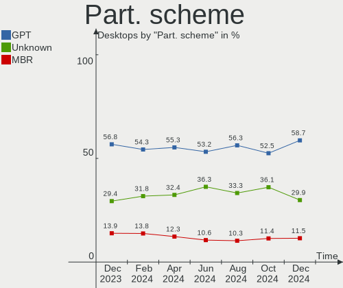
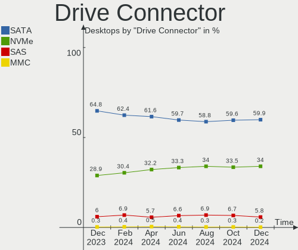

Linux - Hardware Trends (Desktops)
----------------------------------

A project to identify most popular hardware characteristics and track their change
over time based on data collected by Linux users at https://Linux-Hardware.org.

Anyone can contribute to this report by the [hw-probe](https://github.com/linuxhw/hw-probe) tool:

    sudo -E hw-probe -all -upload

This report is for one last month. Overall report since the beginning of time: [TestCoverage](https://github.com/linuxhw/TestCoverage)

Period: Jul, 2022.

Contents
--------

* [ System ](#system)
  - [ OS                       ](#os)
  - [ OS Family                ](#os-family)
  - [ Kernel                   ](#kernel)
  - [ Kernel Family            ](#kernel-family)
  - [ Kernel Major Ver.        ](#kernel-major-ver)
  - [ Arch                     ](#arch)
  - [ DE                       ](#de)
  - [ Display Server           ](#display-server)
  - [ Display Manager          ](#display-manager)
  - [ OS Lang                  ](#os-lang)
  - [ Boot Mode                ](#boot-mode)
  - [ Filesystem               ](#filesystem)
  - [ Part. scheme             ](#part-scheme)
  - [ Dual Boot with Linux/BSD ](#dual-boot-with-linuxbsd)
  - [ Dual Boot (Win)          ](#dual-boot-win)

* [ Board ](#board)
  - [ Vendor                   ](#vendor)
  - [ Model                    ](#model)
  - [ Model Family             ](#model-family)
  - [ MFG Year                 ](#mfg-year)
  - [ Form Factor              ](#form-factor)
  - [ Secure Boot              ](#secure-boot)
  - [ Coreboot                 ](#coreboot)
  - [ RAM Size                 ](#ram-size)
  - [ RAM Used                 ](#ram-used)
  - [ Total Drives             ](#total-drives)
  - [ Has CD-ROM               ](#has-cd-rom)
  - [ Has Ethernet             ](#has-ethernet)
  - [ Has WiFi                 ](#has-wifi)
  - [ Has Bluetooth            ](#has-bluetooth)

* [ Location ](#location)
  - [ Country                  ](#country)
  - [ City                     ](#city)

* [ Drives ](#drives)
  - [ Drive Vendor             ](#drive-vendor)
  - [ Drive Model              ](#drive-model)
  - [ HDD Vendor               ](#hdd-vendor)
  - [ SSD Vendor               ](#ssd-vendor)
  - [ Drive Kind               ](#drive-kind)
  - [ Drive Connector          ](#drive-connector)
  - [ Drive Size               ](#drive-size)
  - [ Space Total              ](#space-total)
  - [ Space Used               ](#space-used)
  - [ Malfunc. Drives          ](#malfunc-drives)
  - [ Malfunc. Drive Vendor    ](#malfunc-drive-vendor)
  - [ Malfunc. HDD Vendor      ](#malfunc-hdd-vendor)
  - [ Malfunc. Drive Kind      ](#malfunc-drive-kind)
  - [ Failed Drives            ](#failed-drives)
  - [ Failed Drive Vendor      ](#failed-drive-vendor)
  - [ Drive Status             ](#drive-status)

* [ Storage controller ](#storage-controller)
  - [ Storage Vendor           ](#storage-vendor)
  - [ Storage Model            ](#storage-model)
  - [ Storage Kind             ](#storage-kind)

* [ Processor ](#processor)
  - [ CPU Vendor               ](#cpu-vendor)
  - [ CPU Model                ](#cpu-model)
  - [ CPU Model Family         ](#cpu-model-family)
  - [ CPU Cores                ](#cpu-cores)
  - [ CPU Sockets              ](#cpu-sockets)
  - [ CPU Threads              ](#cpu-threads)
  - [ CPU Op-Modes             ](#cpu-op-modes)
  - [ CPU Microcode            ](#cpu-microcode)
  - [ CPU Microarch            ](#cpu-microarch)

* [ Graphics ](#graphics)
  - [ GPU Vendor               ](#gpu-vendor)
  - [ GPU Model                ](#gpu-model)
  - [ GPU Combo                ](#gpu-combo)
  - [ GPU Driver               ](#gpu-driver)
  - [ GPU Memory               ](#gpu-memory)

* [ Monitor ](#monitor)
  - [ Monitor Vendor           ](#monitor-vendor)
  - [ Monitor Model            ](#monitor-model)
  - [ Monitor Resolution       ](#monitor-resolution)
  - [ Monitor Diagonal         ](#monitor-diagonal)
  - [ Monitor Width            ](#monitor-width)
  - [ Aspect Ratio             ](#aspect-ratio)
  - [ Monitor Area             ](#monitor-area)
  - [ Pixel Density            ](#pixel-density)
  - [ Multiple Monitors        ](#multiple-monitors)

* [ Network ](#network)
  - [ Net Controller Vendor    ](#net-controller-vendor)
  - [ Net Controller Model     ](#net-controller-model)
  - [ Wireless Vendor          ](#wireless-vendor)
  - [ Wireless Model           ](#wireless-model)
  - [ Ethernet Vendor          ](#ethernet-vendor)
  - [ Ethernet Model           ](#ethernet-model)
  - [ Net Controller Kind      ](#net-controller-kind)
  - [ Used Controller          ](#used-controller)
  - [ NICs                     ](#nics)
  - [ IPv6                     ](#ipv6)

* [ Bluetooth ](#bluetooth)
  - [ Bluetooth Vendor         ](#bluetooth-vendor)
  - [ Bluetooth Model          ](#bluetooth-model)

* [ Sound ](#sound)
  - [ Sound Vendor             ](#sound-vendor)
  - [ Sound Model              ](#sound-model)

* [ Memory ](#memory)
  - [ Memory Vendor            ](#memory-vendor)
  - [ Memory Model             ](#memory-model)
  - [ Memory Kind              ](#memory-kind)
  - [ Memory Form Factor       ](#memory-form-factor)
  - [ Memory Size              ](#memory-size)
  - [ Memory Speed             ](#memory-speed)

* [ Printers & scanners ](#printers--scanners)
  - [ Printer Vendor           ](#printer-vendor)
  - [ Printer Model            ](#printer-model)
  - [ Scanner Vendor           ](#scanner-vendor)
  - [ Scanner Model            ](#scanner-model)

* [ Camera ](#camera)
  - [ Camera Vendor            ](#camera-vendor)
  - [ Camera Model             ](#camera-model)

* [ Security ](#security)
  - [ Fingerprint Vendor       ](#fingerprint-vendor)
  - [ Fingerprint Model        ](#fingerprint-model)
  - [ Chipcard Vendor          ](#chipcard-vendor)
  - [ Chipcard Model           ](#chipcard-model)

* [ Unsupported ](#unsupported)
  - [ Unsupported Devices      ](#unsupported-devices)
  - [ Unsupported Device Types ](#unsupported-device-types)

System
------

OS
--

Installed operating systems

| Name                         | Desktops | Percent |
|------------------------------|----------|---------|
| Ubuntu 22.04                 | 188      | 10.14%  |
| ROSA 12.2                    | 168      | 9.06%   |
| Linux Mint 20.3              | 159      | 8.58%   |
| OpenMandriva 4.3             | 150      | 8.09%   |
| Ubuntu 20.04                 | 127      | 6.85%   |
| Debian 11                    | 119      | 6.42%   |
| Fedora 36                    | 110      | 5.93%   |
| OpenMandriva 4.90            | 86       | 4.64%   |
| Pop!_OS 22.04                | 79       | 4.26%   |
| Zorin 16                     | 53       | 2.86%   |
| KDE neon 20.04               | 50       | 2.7%    |
| Manjaro                      | 34       | 1.83%   |
| Arch Rolling                 | 29       | 1.56%   |
| Arch                         | 27       | 1.46%   |
| Gentoo 2.8                   | 25       | 1.35%   |
| Kubuntu 22.04                | 22       | 1.19%   |
| ROSA R11.1                   | 18       | 0.97%   |
| Xubuntu 20.04                | 16       | 0.86%   |
| Linux Mint 20.2              | 16       | 0.86%   |
| openSUSE Tumbleweed-XXXXXXXX | 14       | 0.76%   |
| Ubuntu 21.10                 | 12       | 0.65%   |
| ArcoLinux Rolling            | 12       | 0.65%   |
| Ubuntu 18.04                 | 11       | 0.59%   |
| Fedora 35                    | 11       | 0.59%   |
| Elementary 6.1               | 11       | 0.59%   |
| Debian Testing               | 11       | 0.59%   |
| BlackPanther 18.1            | 11       | 0.59%   |
| Xubuntu 22.04                | 10       | 0.54%   |
| Kubuntu 20.04                | 10       | 0.54%   |
| Linux Mint 19.3              | 9        | 0.49%   |
| Lubuntu 22.04                | 8        | 0.43%   |
| EndeavourOS Rolling          | 8        | 0.43%   |
| Ubuntu MATE 22.04            | 7        | 0.38%   |
| openSUSE Leap-15.4           | 6        | 0.32%   |
| OpenMandriva 4.2             | 6        | 0.32%   |
| MX 21                        | 6        | 0.32%   |
| Manjaro 21.3.5               | 6        | 0.32%   |
| Manjaro 21.3.3               | 6        | 0.32%   |
| Manjaro 21.3.2               | 6        | 0.32%   |
| Endless 4.0.7                | 6        | 0.32%   |
| EndeavourOS                  | 6        | 0.32%   |
| Debian Unstable              | 6        | 0.32%   |
| Nobara 36                    | 5        | 0.27%   |
| Lubuntu 20.04                | 5        | 0.27%   |
| LMDE 5                       | 5        | 0.27%   |
| Linux Mint 20.1              | 5        | 0.27%   |
| Ubuntu MATE 20.04            | 4        | 0.22%   |
| Red OS 7.3.1                 | 4        | 0.22%   |
| Pop!_OS 20.04                | 4        | 0.22%   |
| Kali 2022.2                  | 4        | 0.22%   |
| Garuda Linux Soaring         | 4        | 0.22%   |
| Debian 10                    | 4        | 0.22%   |
| ClearOS 7                    | 4        | 0.22%   |
| Zorin 15                     | 3        | 0.16%   |
| SteamOS 3.3                  | 3        | 0.16%   |
| SteamOS 3.2 (steamdeck-main) | 3        | 0.16%   |
| ROSA 12.1                    | 3        | 0.16%   |
| RHEL 9                       | 3        | 0.16%   |
| Parrot 5.0                   | 3        | 0.16%   |
| Manjaro 21.3.4               | 3        | 0.16%   |

OS Family
---------

OS without a version

| Name             | Desktops | Percent |
|------------------|----------|---------|
| Ubuntu           | 343      | 18.5%   |
| OpenMandriva     | 242      | 13.05%  |
| Linux Mint       | 195      | 10.52%  |
| ROSA             | 192      | 10.36%  |
| Debian           | 140      | 7.55%   |
| Fedora           | 124      | 6.69%   |
| Pop!_OS          | 88       | 4.75%   |
| Manjaro          | 60       | 3.24%   |
| Zorin            | 56       | 3.02%   |
| Arch             | 56       | 3.02%   |
| KDE neon         | 50       | 2.7%    |
| Kubuntu          | 36       | 1.94%   |
| Xubuntu          | 29       | 1.56%   |
| Gentoo           | 25       | 1.35%   |
| openSUSE         | 20       | 1.08%   |
| Lubuntu          | 15       | 0.81%   |
| EndeavourOS      | 14       | 0.76%   |
| ArcoLinux        | 13       | 0.7%    |
| Ubuntu MATE      | 12       | 0.65%   |
| Elementary       | 11       | 0.59%   |
| BlackPanther     | 11       | 0.59%   |
| Kali             | 7        | 0.38%   |
| Endless          | 7        | 0.38%   |
| Clear Linux      | 7        | 0.38%   |
| SteamOS          | 6        | 0.32%   |
| Red OS           | 6        | 0.32%   |
| MX               | 6        | 0.32%   |
| LMDE             | 6        | 0.32%   |
| CentOS           | 6        | 0.32%   |
| Nobara           | 5        | 0.27%   |
| Garuda Linux     | 5        | 0.27%   |
| ClearOS          | 4        | 0.22%   |
| Void Linux       | 3        | 0.16%   |
| RHEL             | 3        | 0.16%   |
| Parrot           | 3        | 0.16%   |
| antiX            | 3        | 0.16%   |
| ALT Linux        | 3        | 0.16%   |
| Alpine           | 3        | 0.16%   |
| PureOS           | 2        | 0.11%   |
| PCLinuxOS        | 2        | 0.11%   |
| Devuan           | 2        | 0.11%   |
| BigLinux         | 2        | 0.11%   |
| Astra Linux      | 2        | 0.11%   |
| Artix            | 2        | 0.11%   |
| viar-os          | 1        | 0.05%   |
| Ubuntu Studio    | 1        | 0.05%   |
| Ubuntu Budgie    | 1        | 0.05%   |
| Trisquel         | 1        | 0.05%   |
| TmaxOS           | 1        | 0.05%   |
| Sparky           | 1        | 0.05%   |
| Solus            | 1        | 0.05%   |
| SLES             | 1        | 0.05%   |
| Siduction        | 1        | 0.05%   |
| Rocky Linux      | 1        | 0.05%   |
| Regata OS        | 1        | 0.05%   |
| Reborn OS        | 1        | 0.05%   |
| Pardus           | 1        | 0.05%   |
| org.kde.Platform | 1        | 0.05%   |
| Oracle Linux     | 1        | 0.05%   |
| MassOS           | 1        | 0.05%   |

Kernel
------

Version of the Linux kernel

| Version                                   | Desktops | Percent |
|-------------------------------------------|----------|---------|
| 5.15.0-41-generic                         | 218      | 11.76%  |
| 5.16.7-desktop-1omv4003                   | 141      | 7.61%   |
| 5.4.0-122-generic                         | 101      | 5.45%   |
| 5.13.0-52-generic                         | 89       | 4.8%    |
| 5.18.12-desktop-3omv4090                  | 84       | 4.53%   |
| 5.15.0-40-generic                         | 73       | 3.94%   |
| 5.10.74-generic-2rosa2021.1-x86_64        | 73       | 3.94%   |
| 5.4.0-121-generic                         | 68       | 3.67%   |
| 5.17.15-76051715-generic                  | 55       | 2.97%   |
| 5.10.118-generic-2rosa2021.1-x86_64       | 53       | 2.86%   |
| 5.10.0-7-amd64                            | 45       | 2.43%   |
| 5.10.0-16-amd64                           | 33       | 1.78%   |
| 5.18.11-200.fc36.x86_64                   | 29       | 1.56%   |
| 5.15.0-43-generic                         | 26       | 1.4%    |
| 5.18.13-200.fc36.x86_64                   | 25       | 1.35%   |
| 5.18.10-76051810-generic                  | 21       | 1.13%   |
| 5.13.0-51-generic                         | 19       | 1.02%   |
| 5.10.0-15-amd64                           | 19       | 1.02%   |
| 5.18.10-200.fc36.x86_64                   | 18       | 0.97%   |
| 5.18.9-200.fc36.x86_64                    | 16       | 0.86%   |
| 5.18.12-arch1-1                           | 16       | 0.86%   |
| 5.18.0-2-amd64                            | 16       | 0.86%   |
| 5.4.0-91-generic                          | 15       | 0.81%   |
| 5.15.0-25-generic                         | 15       | 0.81%   |
| 5.18.9-arch1-1                            | 13       | 0.7%    |
| 5.18.8.xm1-1.klp-xanmod-rosa2021.1-x86_64 | 13       | 0.7%    |
| 5.15.43-generic-2rosa2021.1-x86_64        | 12       | 0.65%   |
| 5.15.55-1-MANJARO                         | 11       | 0.59%   |
| 5.18.7-200.fc36.x86_64                    | 9        | 0.49%   |
| 5.18.14-arch1-1                           | 8        | 0.43%   |
| 5.18.12-3-MANJARO                         | 8        | 0.43%   |
| 5.16.13-desktop-1omv4003                  | 8        | 0.43%   |
| 4.18.16-desktop-1bP                       | 8        | 0.43%   |
| 5.17.11-generic-2rosa2021.1-x86_64        | 7        | 0.38%   |
| 5.15.0-39-generic                         | 7        | 0.38%   |
| 5.13.0-44-generic                         | 7        | 0.38%   |
| 5.11.0-35-generic                         | 7        | 0.38%   |
| 5.18.12-zen1-1-zen                        | 6        | 0.32%   |
| 5.18.10-1-MANJARO                         | 6        | 0.32%   |
| 5.18.0-0.bpo.1-amd64                      | 6        | 0.32%   |
| 5.17.5-76051705-generic                   | 6        | 0.32%   |
| 5.15.53-1-MANJARO                         | 6        | 0.32%   |
| 5.14.21-150400.22-default                 | 6        | 0.32%   |
| 5.4.83-generic-2rosa-x86_64               | 5        | 0.27%   |
| 5.4.0-120-generic                         | 5        | 0.27%   |
| 5.18.13-arch1-1                           | 5        | 0.27%   |
| 5.18.10-arch1-1                           | 5        | 0.27%   |
| 5.15.50-1-MANJARO                         | 5        | 0.27%   |
| 5.15.0-33-generic                         | 5        | 0.27%   |
| 5.10.14-desktop-1omv4002                  | 5        | 0.27%   |
| 3.10.0-1160.71.1.el7.x86_64               | 5        | 0.27%   |
| 5.4.32-generic-2rosa-i586                 | 4        | 0.22%   |
| 5.4.0-117-generic                         | 4        | 0.22%   |
| 5.18.9-zen1-1-zen                         | 4        | 0.22%   |
| 5.18.9-1-default                          | 4        | 0.22%   |
| 5.18.7-arch1-1                            | 4        | 0.22%   |
| 5.18.6-1-default                          | 4        | 0.22%   |
| 5.18.14-1-MANJARO                         | 4        | 0.22%   |
| 5.18.11-1-default                         | 4        | 0.22%   |
| 5.17.15-1-MANJARO                         | 4        | 0.22%   |

Kernel Family
-------------

Linux kernel without a distro release

| Version  | Desktops | Percent |
|----------|----------|---------|
| 5.15.0   | 357      | 19.26%  |
| 5.4.0    | 221      | 11.92%  |
| 5.16.7   | 141      | 7.61%   |
| 5.13.0   | 139      | 7.5%    |
| 5.18.12  | 120      | 6.47%   |
| 5.10.0   | 110      | 5.93%   |
| 5.10.74  | 74       | 3.99%   |
| 5.18.10  | 64       | 3.45%   |
| 5.17.15  | 60       | 3.24%   |
| 5.10.118 | 53       | 2.86%   |
| 5.18.9   | 47       | 2.54%   |
| 5.18.11  | 44       | 2.37%   |
| 5.18.0   | 38       | 2.05%   |
| 5.18.13  | 35       | 1.89%   |
| 5.18.7   | 21       | 1.13%   |
| 5.18.8   | 19       | 1.02%   |
| 5.18.14  | 19       | 1.02%   |
| 4.15.0   | 16       | 0.86%   |
| 5.18.6   | 15       | 0.81%   |
| 5.11.0   | 15       | 0.81%   |
| 5.15.43  | 14       | 0.76%   |
| 5.15.55  | 13       | 0.7%    |
| 5.15.52  | 10       | 0.54%   |
| 5.17.5   | 9        | 0.49%   |
| 4.18.16  | 9        | 0.49%   |
| 5.16.13  | 8        | 0.43%   |
| 5.16.0   | 8        | 0.43%   |
| 5.4.83   | 7        | 0.38%   |
| 5.17.11  | 7        | 0.38%   |
| 5.15.53  | 7        | 0.38%   |
| 5.15.50  | 7        | 0.38%   |
| 5.14.0   | 7        | 0.38%   |
| 3.10.0   | 7        | 0.38%   |
| 5.4.32   | 6        | 0.32%   |
| 5.14.21  | 6        | 0.32%   |
| 5.8.0    | 5        | 0.27%   |
| 5.18.5   | 5        | 0.27%   |
| 5.18.3   | 5        | 0.27%   |
| 5.10.14  | 5        | 0.27%   |
| 4.18.0   | 5        | 0.27%   |
| 5.15.49  | 4        | 0.22%   |
| 5.15.41  | 4        | 0.22%   |
| 5.15.39  | 4        | 0.22%   |
| 4.19.0   | 4        | 0.22%   |
| 5.6.14   | 3        | 0.16%   |
| 5.19.0   | 3        | 0.16%   |
| 5.18.2   | 3        | 0.16%   |
| 5.18.15  | 3        | 0.16%   |
| 5.18.1   | 3        | 0.16%   |
| 5.17.12  | 3        | 0.16%   |
| 5.17.0   | 3        | 0.16%   |
| 5.15.35  | 3        | 0.16%   |
| 5.15.10  | 3        | 0.16%   |
| 5.10.57  | 3        | 0.16%   |
| 5.17.7   | 2        | 0.11%   |
| 5.16.18  | 2        | 0.11%   |
| 5.16.11  | 2        | 0.11%   |
| 5.15.51  | 2        | 0.11%   |
| 5.13.19  | 2        | 0.11%   |
| 5.10.71  | 2        | 0.11%   |

Kernel Major Ver.
-----------------

Linux kernel major version

| Version | Desktops | Percent |
|---------|----------|---------|
| 5.18    | 442      | 23.84%  |
| 5.15    | 436      | 23.52%  |
| 5.10    | 253      | 13.65%  |
| 5.4     | 236      | 12.73%  |
| 5.16    | 165      | 8.9%    |
| 5.13    | 141      | 7.61%   |
| 5.17    | 89       | 4.8%    |
| 5.11    | 17       | 0.92%   |
| 4.15    | 16       | 0.86%   |
| 4.18    | 14       | 0.76%   |
| 5.14    | 13       | 0.7%    |
| 3.10    | 7        | 0.38%   |
| 5.8     | 5        | 0.27%   |
| 4.19    | 4        | 0.22%   |
| 5.6     | 3        | 0.16%   |
| 5.19    | 3        | 0.16%   |
| 4.9     | 2        | 0.11%   |
| 5.9     | 1        | 0.05%   |
| 5.7     | 1        | 0.05%   |
| 5.5     | 1        | 0.05%   |
| 5.3     | 1        | 0.05%   |
| 5.0     | 1        | 0.05%   |
| 4.4     | 1        | 0.05%   |
| 4.14    | 1        | 0.05%   |
| 4.10    | 1        | 0.05%   |

Arch
----

OS architecture (x86_64, i586, etc.)

| Name     | Desktops | Percent |
|----------|----------|---------|
| x86_64   | 1833     | 98.87%  |
| i686     | 18       | 0.97%   |
| riscv64  | 1        | 0.05%   |
| armv5tel | 1        | 0.05%   |
| aarch64  | 1        | 0.05%   |

DE
--

Desktop Environment

| Name             | Desktops | Percent |
|------------------|----------|---------|
| GNOME            | 692      | 37.32%  |
| KDE5             | 571      | 30.8%   |
| X-Cinnamon       | 145      | 7.82%   |
| Unknown          | 132      | 7.12%   |
| XFCE             | 127      | 6.85%   |
| MATE             | 55       | 2.97%   |
| LXQt             | 32       | 1.73%   |
| Cinnamon         | 29       | 1.56%   |
| KDE4             | 15       | 0.81%   |
| Pantheon         | 11       | 0.59%   |
| LXDE             | 6        | 0.32%   |
| Budgie           | 6        | 0.32%   |
| Unity            | 5        | 0.27%   |
| i3               | 5        | 0.27%   |
| GNOME Classic    | 4        | 0.22%   |
| bspwm            | 4        | 0.22%   |
| Openbox          | 2        | 0.11%   |
| icewm            | 2        | 0.11%   |
| fly              | 2        | 0.11%   |
| xmonad           | 1        | 0.05%   |
| TOS:GNOME        | 1        | 0.05%   |
| sway             | 1        | 0.05%   |
| qtile            | 1        | 0.05%   |
| lightdm-xsession | 1        | 0.05%   |
| KDE              | 1        | 0.05%   |
| GNOME Flashback  | 1        | 0.05%   |
| Deepin           | 1        | 0.05%   |
| awesome          | 1        | 0.05%   |

Display Server
--------------

X11 or Wayland

| Name    | Desktops | Percent |
|---------|----------|---------|
| X11     | 1338     | 72.17%  |
| Wayland | 379      | 20.44%  |
| Unknown | 74       | 3.99%   |
| Tty     | 62       | 3.34%   |
| Web     | 1        | 0.05%   |

Display Manager
---------------

SDDM, LightDM, etc.

| Name    | Desktops | Percent |
|---------|----------|---------|
| Unknown | 617      | 33.28%  |
| SDDM    | 462      | 24.92%  |
| GDM3    | 300      | 16.18%  |
| LightDM | 245      | 13.21%  |
| GDM     | 203      | 10.95%  |
| KDM     | 14       | 0.76%   |
| XDM     | 3        | 0.16%   |
| SLiM    | 3        | 0.16%   |
| LXDM    | 3        | 0.16%   |
| FLY-DM  | 2        | 0.11%   |
| SLIMSKI | 1        | 0.05%   |
| Ly      | 1        | 0.05%   |

OS Lang
-------

Language

| Lang    | Desktops | Percent |
|---------|----------|---------|
| en_US   | 729      | 39.32%  |
| ru_RU   | 310      | 16.72%  |
| de_DE   | 141      | 7.61%   |
| en_GB   | 82       | 4.42%   |
| pt_BR   | 76       | 4.1%    |
| fr_FR   | 74       | 3.99%   |
| en_AU   | 40       | 2.16%   |
| en_CA   | 39       | 2.1%    |
| Unknown | 33       | 1.78%   |
| it_IT   | 32       | 1.73%   |
| es_ES   | 28       | 1.51%   |
| C       | 26       | 1.4%    |
| pl_PL   | 22       | 1.19%   |
| es_AR   | 18       | 0.97%   |
| nl_NL   | 15       | 0.81%   |
| en_IN   | 13       | 0.7%    |
| ja_JP   | 12       | 0.65%   |
| es_MX   | 12       | 0.65%   |
| cs_CZ   | 12       | 0.65%   |
| hu_HU   | 10       | 0.54%   |
| en_ZA   | 8        | 0.43%   |
| zh_CN   | 7        | 0.38%   |
| pt_PT   | 7        | 0.38%   |
| de_AT   | 7        | 0.38%   |
| sv_SE   | 6        | 0.32%   |
| nl_BE   | 6        | 0.32%   |
| de_CH   | 6        | 0.32%   |
| en_NZ   | 5        | 0.27%   |
| tr_TR   | 4        | 0.22%   |
| ko_KR   | 4        | 0.22%   |
| fr_CA   | 4        | 0.22%   |
| es_CL   | 4        | 0.22%   |
| en_AG   | 4        | 0.22%   |
| ru_UA   | 3        | 0.16%   |
| POSIX   | 3        | 0.16%   |
| en_PH   | 3        | 0.16%   |
| en_DK   | 3        | 0.16%   |
| en_DE   | 3        | 0.16%   |
| el_GR   | 3        | 0.16%   |
| zh_TW   | 2        | 0.11%   |
| sk_SK   | 2        | 0.11%   |
| nb_NO   | 2        | 0.11%   |
| hr_HR   | 2        | 0.11%   |
| fr_BE   | 2        | 0.11%   |
| es_UY   | 2        | 0.11%   |
| es_DO   | 2        | 0.11%   |
| es_BO   | 2        | 0.11%   |
| da_DK   | 2        | 0.11%   |
| C.UTF8  | 2        | 0.11%   |
| bg_BG   | 2        | 0.11%   |
| uk_UA   | 1        | 0.05%   |
| ru_KZ   | 1        | 0.05%   |
| ro_RO   | 1        | 0.05%   |
| lt_LT   | 1        | 0.05%   |
| id_ID   | 1        | 0.05%   |
| fr_CH   | 1        | 0.05%   |
| es_VE   | 1        | 0.05%   |
| es_PE   | 1        | 0.05%   |
| es_NI   | 1        | 0.05%   |
| es_GT   | 1        | 0.05%   |

Boot Mode
---------

EFI or BIOS

| Mode | Desktops | Percent |
|------|----------|---------|
| BIOS | 1044     | 56.31%  |
| EFI  | 810      | 43.69%  |

Filesystem
----------

Type of filesystem

| Type    | Desktops | Percent |
|---------|----------|---------|
| Ext4    | 1300     | 70.12%  |
| Overlay | 291      | 15.7%   |
| Btrfs   | 193      | 10.41%  |
| Xfs     | 39       | 2.1%    |
| Zfs     | 14       | 0.76%   |
| F2fs    | 7        | 0.38%   |
| Tmpfs   | 2        | 0.11%   |
| Ext3    | 2        | 0.11%   |
| Ext2    | 2        | 0.11%   |
| Unknown | 2        | 0.11%   |
| XXXXXXX | 1        | 0.05%   |
| Jfs     | 1        | 0.05%   |

Part. scheme
------------

Scheme of partitioning

| Type    | Desktops | Percent |
|---------|----------|---------|
| Unknown | 803      | 43.31%  |
| GPT     | 720      | 38.83%  |
| MBR     | 331      | 17.85%  |

Dual Boot with Linux/BSD
------------------------

Hosting more than one Linux/BSD

| Dual boot | Desktops | Percent |
|-----------|----------|---------|
| No        | 1409     | 76%     |
| Yes       | 445      | 24%     |

Dual Boot (Win)
---------------

Hosting Linux and Windows

| Dual boot | Desktops | Percent |
|-----------|----------|---------|
| No        | 1202     | 64.83%  |
| Yes       | 652      | 35.17%  |

Board
-----

Vendor
------

Motherboard manufacturer

| Name                | Desktops | Percent |
|---------------------|----------|---------|
| ASUSTek Computer    | 456      | 24.6%   |
| Gigabyte Technology | 353      | 19.04%  |
| MSI                 | 255      | 13.75%  |
| ASRock              | 165      | 8.9%    |
| Dell                | 141      | 7.61%   |
| Hewlett-Packard     | 110      | 5.93%   |
| Lenovo              | 55       | 2.97%   |
| Intel               | 55       | 2.97%   |
| Acer                | 35       | 1.89%   |
| Biostar             | 21       | 1.13%   |
| Unknown             | 19       | 1.02%   |
| ECS                 | 17       | 0.92%   |
| Pegatron            | 16       | 0.86%   |
| Fujitsu             | 14       | 0.76%   |
| Foxconn             | 13       | 0.7%    |
| Medion              | 10       | 0.54%   |
| Apple               | 9        | 0.49%   |
| Huanan              | 8        | 0.43%   |
| Supermicro          | 7        | 0.38%   |
| PCWare              | 7        | 0.38%   |
| MACHINIST           | 6        | 0.32%   |
| BESSTAR Tech        | 6        | 0.32%   |
| AZW                 | 6        | 0.32%   |
| Positivo            | 5        | 0.27%   |
| Gateway             | 4        | 0.22%   |
| DEPO Computers      | 4        | 0.22%   |
| Alienware           | 4        | 0.22%   |
| Shuttle             | 3        | 0.16%   |
| ASRockRack          | 3        | 0.16%   |
| Packard Bell        | 2        | 0.11%   |
| OEM                 | 2        | 0.11%   |
| Inventec            | 2        | 0.11%   |
| GALAX               | 2        | 0.11%   |
| eMachines           | 2        | 0.11%   |
| AMI                 | 2        | 0.11%   |
| ZOTAC               | 1        | 0.05%   |
| YANYU               | 1        | 0.05%   |
| XDO.AI              | 1        | 0.05%   |
| X79-1356            | 1        | 0.05%   |
| Wistron             | 1        | 0.05%   |
| WinFast             | 1        | 0.05%   |
| Thecus              | 1        | 0.05%   |
| System76            | 1        | 0.05%   |
| Soyo                | 1        | 0.05%   |
| Seeed Studio        | 1        | 0.05%   |
| Samsung Electronics | 1        | 0.05%   |
| Quanta              | 1        | 0.05%   |
| PCPartner           | 1        | 0.05%   |
| PCChips             | 1        | 0.05%   |
| ONDA                | 1        | 0.05%   |
| Olidata             | 1        | 0.05%   |
| OEM_MB              | 1        | 0.05%   |
| NCR                 | 1        | 0.05%   |
| MP                  | 1        | 0.05%   |
| Minix               | 1        | 0.05%   |
| MB                  | 1        | 0.05%   |
| Machinist/Runing    | 1        | 0.05%   |
| Login Informatica   | 1        | 0.05%   |
| IceWhale Technology | 1        | 0.05%   |
| GMKtec              | 1        | 0.05%   |

Model
-----

Motherboard model

| Name                           | Desktops | Percent |
|--------------------------------|----------|---------|
| ASUS All Series                | 33       | 1.78%   |
| Unknown                        | 23       | 1.24%   |
| ASUS TUF Gaming X570-PLUS      | 15       | 0.81%   |
| MSI MS-7996                    | 13       | 0.7%    |
| MSI MS-7C02                    | 12       | 0.65%   |
| ASUS ROG STRIX B550-F GAMING   | 12       | 0.65%   |
| MSI MS-7C91                    | 11       | 0.59%   |
| Dell OptiPlex 780              | 10       | 0.54%   |
| Dell OptiPlex 7010             | 10       | 0.54%   |
| ASUS TUF Gaming B550-PLUS      | 10       | 0.54%   |
| ASRock H470M-HVS               | 10       | 0.54%   |
| MSI MS-7C37                    | 9        | 0.49%   |
| Dell OptiPlex 755              | 9        | 0.49%   |
| Gigabyte X570 AORUS MASTER     | 8        | 0.43%   |
| Gigabyte B450M DS3H            | 8        | 0.43%   |
| Dell OptiPlex 3010             | 8        | 0.43%   |
| MSI MS-7B86                    | 7        | 0.38%   |
| MSI MS-7B79                    | 7        | 0.38%   |
| MSI MS-7A38                    | 7        | 0.38%   |
| ASUS M5A97 R2.0                | 7        | 0.38%   |
| MSI MS-7D43                    | 6        | 0.32%   |
| Gigabyte 970A-DS3P             | 6        | 0.32%   |
| Dell OptiPlex 790              | 6        | 0.32%   |
| Dell OptiPlex 7020             | 6        | 0.32%   |
| Dell OptiPlex 3020             | 6        | 0.32%   |
| ASUS ROG STRIX B550-I GAMING   | 6        | 0.32%   |
| ASUS ROG STRIX B450-F GAMING   | 6        | 0.32%   |
| ASUS PRIME Z390-A              | 6        | 0.32%   |
| ASUS PRIME X470-PRO            | 6        | 0.32%   |
| ASUS PRIME A320M-K             | 6        | 0.32%   |
| Apple MacPro5,1                | 6        | 0.32%   |
| MSI MS-7C75                    | 5        | 0.27%   |
| MSI MS-7C35                    | 5        | 0.27%   |
| MSI MS-7B89                    | 5        | 0.27%   |
| MSI MS-7A74                    | 5        | 0.27%   |
| MSI MS-7817                    | 5        | 0.27%   |
| MSI MS-7693                    | 5        | 0.27%   |
| MSI MS-7529                    | 5        | 0.27%   |
| HP Compaq Pro 6300 SFF         | 5        | 0.27%   |
| Gigabyte X570 I AORUS PRO WIFI | 5        | 0.27%   |
| Gigabyte B450 AORUS M          | 5        | 0.27%   |
| ASUS PRIME B450M-A             | 5        | 0.27%   |
| ASUS M5A78L-M/USB3             | 5        | 0.27%   |
| ASUS H110M-R                   | 5        | 0.27%   |
| ASRock B450M Steel Legend      | 5        | 0.27%   |
| ASRock B450M Pro4              | 5        | 0.27%   |
| ASRock A320M-HDV R4.0          | 5        | 0.27%   |
| MSI MS-7D25                    | 4        | 0.22%   |
| MSI MS-7C94                    | 4        | 0.22%   |
| MSI MS-7A70                    | 4        | 0.22%   |
| MSI MS-7A34                    | 4        | 0.22%   |
| MSI MS-7721                    | 4        | 0.22%   |
| Intel X99                      | 4        | 0.22%   |
| HP ProDesk 600 G1 SFF          | 4        | 0.22%   |
| HP Compaq Elite 8300 SFF       | 4        | 0.22%   |
| HP Compaq 8200 Elite SFF PC    | 4        | 0.22%   |
| Gigabyte Z87-HD3               | 4        | 0.22%   |
| Gigabyte Z77-D3H               | 4        | 0.22%   |
| Gigabyte X570 AORUS ULTRA      | 4        | 0.22%   |
| Gigabyte X570 AORUS PRO WIFI   | 4        | 0.22%   |

Model Family
------------

Motherboard model prefix

| Name                   | Desktops | Percent |
|------------------------|----------|---------|
| Dell OptiPlex          | 95       | 5.12%   |
| ASUS PRIME             | 87       | 4.69%   |
| ASUS ROG               | 70       | 3.78%   |
| ASUS TUF               | 57       | 3.07%   |
| Lenovo ThinkCentre     | 37       | 2%      |
| HP Compaq              | 34       | 1.83%   |
| ASUS All               | 33       | 1.78%   |
| Gigabyte X570          | 28       | 1.51%   |
| Unknown                | 23       | 1.24%   |
| Acer Aspire            | 21       | 1.13%   |
| Gigabyte B450M         | 17       | 0.92%   |
| Dell Precision         | 14       | 0.76%   |
| MSI MS-7996            | 13       | 0.7%    |
| HP EliteDesk           | 13       | 0.7%    |
| ASUS P8H61-M           | 13       | 0.7%    |
| ASRock B450M           | 13       | 0.7%    |
| MSI MS-7C02            | 12       | 0.65%   |
| ASUS M5A78L-M          | 12       | 0.65%   |
| MSI MS-7C91            | 11       | 0.59%   |
| HP ProDesk             | 11       | 0.59%   |
| Fujitsu ESPRIMO        | 10       | 0.54%   |
| ASUS M5A97             | 10       | 0.54%   |
| ASRock H470M-HVS       | 10       | 0.54%   |
| MSI MS-7C37            | 9        | 0.49%   |
| HP Pavilion            | 9        | 0.49%   |
| Gigabyte Z390          | 8        | 0.43%   |
| Gigabyte B450          | 8        | 0.43%   |
| Dell Inspiron          | 8        | 0.43%   |
| ASRock B550            | 8        | 0.43%   |
| Acer Veriton           | 8        | 0.43%   |
| MSI MS-7B86            | 7        | 0.38%   |
| MSI MS-7B79            | 7        | 0.38%   |
| MSI MS-7A38            | 7        | 0.38%   |
| Gigabyte B550M         | 7        | 0.38%   |
| Dell XPS               | 7        | 0.38%   |
| ASUS SABERTOOTH        | 7        | 0.38%   |
| MSI MS-7D43            | 6        | 0.32%   |
| Lenovo IdeaCentre      | 6        | 0.32%   |
| Gigabyte Z590          | 6        | 0.32%   |
| Gigabyte X470          | 6        | 0.32%   |
| Gigabyte B550          | 6        | 0.32%   |
| Gigabyte AB350-Gaming  | 6        | 0.32%   |
| Gigabyte A320M-S2H     | 6        | 0.32%   |
| Gigabyte 970A-DS3P     | 6        | 0.32%   |
| Dell Vostro            | 6        | 0.32%   |
| ASUS STRIX             | 6        | 0.32%   |
| ASUS P8B75-M           | 6        | 0.32%   |
| ASRock A320M-HDV       | 6        | 0.32%   |
| Apple MacPro5          | 6        | 0.32%   |
| MSI MS-7C75            | 5        | 0.27%   |
| MSI MS-7C35            | 5        | 0.27%   |
| MSI MS-7B89            | 5        | 0.27%   |
| MSI MS-7A74            | 5        | 0.27%   |
| MSI MS-7817            | 5        | 0.27%   |
| MSI MS-7693            | 5        | 0.27%   |
| MSI MS-7529            | 5        | 0.27%   |
| Intel X99              | 5        | 0.27%   |
| Gigabyte H410M         | 5        | 0.27%   |
| Gigabyte GA-78LMT-USB3 | 5        | 0.27%   |
| Gigabyte B365M         | 5        | 0.27%   |

MFG Year
--------

Motherboard manufacture year

| Year    | Desktops | Percent |
|---------|----------|---------|
| 2018    | 198      | 10.68%  |
| 2020    | 184      | 9.92%   |
| 2019    | 180      | 9.71%   |
| 2021    | 159      | 8.58%   |
| 2012    | 155      | 8.36%   |
| 2013    | 127      | 6.85%   |
| 2011    | 111      | 5.99%   |
| 2014    | 106      | 5.72%   |
| 2017    | 101      | 5.45%   |
| 2009    | 99       | 5.34%   |
| 2010    | 94       | 5.07%   |
| 2016    | 80       | 4.31%   |
| 2015    | 76       | 4.1%    |
| 2008    | 67       | 3.61%   |
| 2022    | 48       | 2.59%   |
| 2007    | 39       | 2.1%    |
| 2006    | 17       | 0.92%   |
| 2005    | 6        | 0.32%   |
| Unknown | 4        | 0.22%   |
| 2001    | 3        | 0.16%   |

Form Factor
-----------

Physical design of the computer

| Name    | Desktops | Percent |
|---------|----------|---------|
| Desktop | 1854     | 100%    |

Secure Boot
-----------

Enabled or disabled

| State    | Desktops | Percent |
|----------|----------|---------|
| Disabled | 1808     | 97.52%  |
| Enabled  | 46       | 2.48%   |

Coreboot
--------

Have coreboot on board

| Used | Desktops | Percent |
|------|----------|---------|
| No   | 1854     | 100%    |

RAM Size
--------

Total RAM memory

| Size in GB      | Desktops | Percent |
|-----------------|----------|---------|
| 16.01-24.0      | 503      | 27.13%  |
| 8.01-16.0       | 316      | 17.04%  |
| 32.01-64.0      | 310      | 16.72%  |
| 4.01-8.0        | 293      | 15.8%   |
| 3.01-4.0        | 213      | 11.49%  |
| 64.01-256.0     | 109      | 5.88%   |
| 24.01-32.0      | 44       | 2.37%   |
| 1.01-2.0        | 39       | 2.1%    |
| 2.01-3.0        | 15       | 0.81%   |
| 0.51-1.0        | 7        | 0.38%   |
| 0.01-0.5        | 3        | 0.16%   |
| More than 256.0 | 2        | 0.11%   |

RAM Used
--------

Used RAM memory

| Used GB         | Desktops | Percent |
|-----------------|----------|---------|
| 1.01-2.0        | 707      | 38.13%  |
| 2.01-3.0        | 342      | 18.45%  |
| 4.01-8.0        | 253      | 13.65%  |
| 3.01-4.0        | 240      | 12.94%  |
| 0.51-1.0        | 178      | 9.6%    |
| 8.01-16.0       | 74       | 3.99%   |
| 0.01-0.5        | 26       | 1.4%    |
| 16.01-24.0      | 16       | 0.86%   |
| 32.01-64.0      | 10       | 0.54%   |
| 24.01-32.0      | 4        | 0.22%   |
| 64.01-256.0     | 2        | 0.11%   |
| More than 256.0 | 1        | 0.05%   |
| 0               | 1        | 0.05%   |

Total Drives
------------

Number of drives on board

| Drives | Desktops | Percent |
|--------|----------|---------|
| 1      | 668      | 36.03%  |
| 2      | 519      | 27.99%  |
| 3      | 304      | 16.4%   |
| 4      | 190      | 10.25%  |
| 5      | 87       | 4.69%   |
| 6      | 40       | 2.16%   |
| 7      | 16       | 0.86%   |
| 0      | 11       | 0.59%   |
| 8      | 7        | 0.38%   |
| 9      | 4        | 0.22%   |
| 11     | 3        | 0.16%   |
| 17     | 1        | 0.05%   |
| 16     | 1        | 0.05%   |
| 14     | 1        | 0.05%   |
| 12     | 1        | 0.05%   |
| 10     | 1        | 0.05%   |

Has CD-ROM
----------

Has CD-ROM on board

| Presented | Desktops | Percent |
|-----------|----------|---------|
| No        | 1086     | 58.58%  |
| Yes       | 768      | 41.42%  |

Has Ethernet
------------

Has Ethernet on board

| Presented | Desktops | Percent |
|-----------|----------|---------|
| Yes       | 1830     | 98.71%  |
| No        | 24       | 1.29%   |

Has WiFi
--------

Has WiFi module

| Presented | Desktops | Percent |
|-----------|----------|---------|
| No        | 1064     | 57.39%  |
| Yes       | 790      | 42.61%  |

Has Bluetooth
-------------

Has Bluetooth module

| Presented | Desktops | Percent |
|-----------|----------|---------|
| No        | 1264     | 68.18%  |
| Yes       | 590      | 31.82%  |

Location
--------

Country
-------

Geographic location (country)

| Country            | Desktops | Percent |
|--------------------|----------|---------|
| USA                | 375      | 20.23%  |
| Russia             | 324      | 17.48%  |
| Germany            | 187      | 10.09%  |
| Brazil             | 105      | 5.66%   |
| France             | 90       | 4.85%   |
| UK                 | 79       | 4.26%   |
| Canada             | 60       | 3.24%   |
| Australia          | 45       | 2.43%   |
| Poland             | 44       | 2.37%   |
| Italy              | 43       | 2.32%   |
| Spain              | 34       | 1.83%   |
| Netherlands        | 29       | 1.56%   |
| Hungary            | 26       | 1.4%    |
| Argentina          | 23       | 1.24%   |
| India              | 19       | 1.02%   |
| Sweden             | 18       | 0.97%   |
| Austria            | 18       | 0.97%   |
| Japan              | 17       | 0.92%   |
| Belgium            | 16       | 0.86%   |
| Mexico             | 15       | 0.81%   |
| Switzerland        | 14       | 0.76%   |
| Czechia            | 14       | 0.76%   |
| Portugal           | 13       | 0.7%    |
| Turkey             | 10       | 0.54%   |
| Greece             | 10       | 0.54%   |
| China              | 10       | 0.54%   |
| South Africa       | 9        | 0.49%   |
| Norway             | 9        | 0.49%   |
| Bulgaria           | 9        | 0.49%   |
| Ukraine            | 8        | 0.43%   |
| Romania            | 8        | 0.43%   |
| Finland            | 8        | 0.43%   |
| Belarus            | 8        | 0.43%   |
| Denmark            | 7        | 0.38%   |
| Chile              | 7        | 0.38%   |
| Taiwan             | 6        | 0.32%   |
| South Korea        | 6        | 0.32%   |
| Slovakia           | 6        | 0.32%   |
| Malaysia           | 6        | 0.32%   |
| Kazakhstan         | 6        | 0.32%   |
| Uruguay            | 5        | 0.27%   |
| Indonesia          | 5        | 0.27%   |
| Croatia            | 5        | 0.27%   |
| Philippines        | 4        | 0.22%   |
| North Macedonia    | 4        | 0.22%   |
| New Zealand        | 4        | 0.22%   |
| Latvia             | 4        | 0.22%   |
| Ireland            | 4        | 0.22%   |
| Egypt              | 4        | 0.22%   |
| Venezuela          | 3        | 0.16%   |
| Sri Lanka          | 3        | 0.16%   |
| Peru               | 3        | 0.16%   |
| Pakistan           | 3        | 0.16%   |
| Lithuania          | 3        | 0.16%   |
| Hong Kong          | 3        | 0.16%   |
| Estonia            | 3        | 0.16%   |
| Dominican Republic | 3        | 0.16%   |
| Colombia           | 3        | 0.16%   |
| Bolivia            | 3        | 0.16%   |
| Thailand           | 2        | 0.11%   |

City
----

Geographic location (city)

| City              | Desktops | Percent |
|-------------------|----------|---------|
| Moscow            | 53       | 2.86%   |
| Voronezh          | 47       | 2.54%   |
| Novosibirsk       | 16       | 0.86%   |
| St Petersburg     | 14       | 0.76%   |
| Sao Paulo         | 12       | 0.65%   |
| Berlin            | 11       | 0.59%   |
| Chelyabinsk       | 10       | 0.54%   |
| Vienna            | 9        | 0.49%   |
| Rio de Janeiro    | 9        | 0.49%   |
| Munich            | 9        | 0.49%   |
| Milan             | 9        | 0.49%   |
| Chicago           | 9        | 0.49%   |
| Perm              | 8        | 0.43%   |
| Krasnodar         | 8        | 0.43%   |
| Yekaterinburg     | 7        | 0.38%   |
| Sydney            | 7        | 0.38%   |
| Seattle           | 7        | 0.38%   |
| Paris             | 7        | 0.38%   |
| Mexico City       | 7        | 0.38%   |
| Launceston        | 7        | 0.38%   |
| San José         | 6        | 0.32%   |
| Miami             | 6        | 0.32%   |
| Melbourne         | 6        | 0.32%   |
| Hamburg           | 6        | 0.32%   |
| Cologne           | 6        | 0.32%   |
| Buenos Aires      | 6        | 0.32%   |
| Budapest          | 6        | 0.32%   |
| Brisbane          | 6        | 0.32%   |
| Athens            | 6        | 0.32%   |
| Yaroslavl         | 5        | 0.27%   |
| Warsaw            | 5        | 0.27%   |
| Rostov-on-Don     | 5        | 0.27%   |
| Prague            | 5        | 0.27%   |
| Nizhniy Novgorod  | 5        | 0.27%   |
| New York          | 5        | 0.27%   |
| Los Angeles       | 5        | 0.27%   |
| Krakow            | 5        | 0.27%   |
| Jacksonville      | 5        | 0.27%   |
| Irkutsk           | 5        | 0.27%   |
| Houston           | 5        | 0.27%   |
| Frankfurt am Main | 5        | 0.27%   |
| Amsterdam         | 5        | 0.27%   |
| Zurich            | 4        | 0.22%   |
| Zagreb            | 4        | 0.22%   |
| Wroclaw           | 4        | 0.22%   |
| Västerås        | 4        | 0.22%   |
| Varna             | 4        | 0.22%   |
| Vancouver         | 4        | 0.22%   |
| Valencia          | 4        | 0.22%   |
| Ufa               | 4        | 0.22%   |
| Tsukuba           | 4        | 0.22%   |
| Toronto           | 4        | 0.22%   |
| Tomsk             | 4        | 0.22%   |
| Thessaloniki      | 4        | 0.22%   |
| Skopje            | 4        | 0.22%   |
| San Antonio       | 4        | 0.22%   |
| Salekhard         | 4        | 0.22%   |
| Rome              | 4        | 0.22%   |
| Porto Alegre      | 4        | 0.22%   |
| Ottawa            | 4        | 0.22%   |

Drives
------

Drive Vendor
------------

Hard drive vendors

| Vendor                    | Desktops | Drives | Percent |
|---------------------------|----------|--------|---------|
| Seagate                   | 662      | 896    | 18.77%  |
| WDC                       | 642      | 869    | 18.2%   |
| Samsung Electronics       | 511      | 714    | 14.49%  |
| Toshiba                   | 201      | 225    | 5.7%    |
| Kingston                  | 193      | 218    | 5.47%   |
| SanDisk                   | 154      | 180    | 4.37%   |
| Crucial                   | 146      | 174    | 4.14%   |
| Hitachi                   | 104      | 116    | 2.95%   |
| A-DATA Technology         | 77       | 83     | 2.18%   |
| China                     | 57       | 64     | 1.62%   |
| Intel                     | 54       | 61     | 1.53%   |
| Phison                    | 41       | 50     | 1.16%   |
| HGST                      | 40       | 46     | 1.13%   |
| SPCC                      | 38       | 41     | 1.08%   |
| PNY                       | 32       | 32     | 0.91%   |
| Unknown                   | 24       | 31     | 0.68%   |
| SK hynix                  | 24       | 25     | 0.68%   |
| OCZ                       | 24       | 25     | 0.68%   |
| Patriot                   | 22       | 24     | 0.62%   |
| GOODRAM                   | 22       | 22     | 0.62%   |
| Gigabyte Technology       | 21       | 24     | 0.6%    |
| Apacer                    | 21       | 22     | 0.6%    |
| Micron/Crucial Technology | 20       | 20     | 0.57%   |
| Maxtor                    | 20       | 20     | 0.57%   |
| Intenso                   | 20       | 21     | 0.57%   |
| Corsair                   | 19       | 21     | 0.54%   |
| Netac                     | 18       | 19     | 0.51%   |
| Unknown                   | 17       | 17     | 0.48%   |
| Silicon Motion            | 15       | 15     | 0.43%   |
| Team                      | 12       | 12     | 0.34%   |
| Micron Technology         | 11       | 12     | 0.31%   |
| XPG                       | 10       | 11     | 0.28%   |
| Plextor                   | 10       | 10     | 0.28%   |
| Realtek Semiconductor     | 9        | 10     | 0.26%   |
| JMicron Technology        | 9        | 10     | 0.26%   |
| Hewlett-Packard           | 8        | 9      | 0.23%   |
| Apple                     | 8        | 10     | 0.23%   |
| AMD                       | 8        | 9      | 0.23%   |
| Transcend                 | 7        | 7      | 0.2%    |
| Mushkin                   | 7        | 8      | 0.2%    |
| KIOXIA                    | 7        | 8      | 0.2%    |
| ASMT                      | 7        | 8      | 0.2%    |
| Smartbuy                  | 6        | 7      | 0.17%   |
| SABRENT                   | 6        | 8      | 0.17%   |
| NGFF                      | 6        | 6      | 0.17%   |
| Lexar                     | 6        | 6      | 0.17%   |
| KIOXIA-EXCERIA            | 6        | 6      | 0.17%   |
| KingSpec                  | 5        | 5      | 0.14%   |
| Fujitsu                   | 5        | 5      | 0.14%   |
| XrayDisk                  | 4        | 5      | 0.11%   |
| TEXTORM                   | 4        | 4      | 0.11%   |
| Leven                     | 4        | 4      | 0.11%   |
| Dogfish                   | 4        | 4      | 0.11%   |
| WALRAM                    | 3        | 3      | 0.09%   |
| TO Exter                  | 3        | 3      | 0.09%   |
| T-FORCE                   | 3        | 3      | 0.09%   |
| LITEON                    | 3        | 3      | 0.09%   |
| KingFast                  | 3        | 3      | 0.09%   |
| Zheino                    | 2        | 3      | 0.06%   |
| WD MediaMax               | 2        | 2      | 0.06%   |

Drive Model
-----------

Hard drive models

| Model                              | Desktops | Percent |
|------------------------------------|----------|---------|
| Seagate ST500DM002-1BD142 500GB    | 57       | 1.39%   |
| Seagate ST1000DM010-2EP102 1TB     | 52       | 1.27%   |
| Seagate ST2000DM008-2FR102 2TB     | 45       | 1.1%    |
| Samsung NVMe SSD Drive 1TB         | 45       | 1.1%    |
| Kingston SA400S37240G 240GB SSD    | 42       | 1.02%   |
| Toshiba DT01ACA100 1TB             | 40       | 0.97%   |
| Samsung SSD 850 EVO 250GB          | 34       | 0.83%   |
| Samsung SSD 860 EVO 500GB          | 31       | 0.76%   |
| WDC WD10EZEX-08WN4A0 1TB           | 30       | 0.73%   |
| Crucial CT500MX500SSD1 500GB       | 27       | 0.66%   |
| Samsung SSD 850 EVO 500GB          | 26       | 0.63%   |
| Seagate ST1000DM003-1CH162 1TB     | 24       | 0.58%   |
| SanDisk NVMe SSD Drive 1TB         | 23       | 0.56%   |
| Samsung NVMe SSD Drive 500GB       | 23       | 0.56%   |
| Toshiba HDWD110 1TB                | 22       | 0.54%   |
| Seagate ST4000DM004-2CV104 4TB     | 22       | 0.54%   |
| Seagate ST3500418AS 500GB          | 22       | 0.54%   |
| Seagate ST2000DM001-1ER164 2TB     | 22       | 0.54%   |
| SanDisk NVMe SSD Drive 500GB       | 22       | 0.54%   |
| Kingston SA400S37120G 120GB SSD    | 22       | 0.54%   |
| Crucial CT1000MX500SSD1 1TB        | 22       | 0.54%   |
| Toshiba DT01ACA050 500GB           | 20       | 0.49%   |
| Seagate ST1000DM003-1ER162 1TB     | 20       | 0.49%   |
| Kingston SV300S37A120G 120GB SSD   | 20       | 0.49%   |
| Samsung SSD 860 EVO 250GB          | 19       | 0.46%   |
| Kingston SA400S37480G 480GB SSD    | 19       | 0.46%   |
| Crucial CT240BX500SSD1 240GB       | 18       | 0.44%   |
| Seagate ST2000DM006-2DM164 2TB     | 17       | 0.41%   |
| Samsung SSD 860 EVO 1TB            | 17       | 0.41%   |
| Unknown                            | 17       | 0.41%   |
| Seagate ST1000DM003-1SB102 1TB     | 16       | 0.39%   |
| WDC WDS500G2B0A-00SM50 500GB SSD   | 15       | 0.37%   |
| WDC WD10EZEX-00BN5A0 1TB           | 15       | 0.37%   |
| Samsung SSD 980 PRO 1TB            | 15       | 0.37%   |
| Seagate ST1000LM024 HN-M101MBB 1TB | 14       | 0.34%   |
| Toshiba DT01ACA200 2TB             | 13       | 0.32%   |
| Seagate ST2000DM001-1CH164 2TB     | 13       | 0.32%   |
| Samsung SSD 970 EVO Plus 500GB     | 13       | 0.32%   |
| Crucial CT480BX500SSD1 480GB       | 13       | 0.32%   |
| WDC WDS240G2G0A-00JH30 240GB SSD   | 12       | 0.29%   |
| SPCC Solid State Disk 120GB        | 12       | 0.29%   |
| Seagate ST31000524AS 1TB           | 12       | 0.29%   |
| Samsung SSD 980 1TB                | 12       | 0.29%   |
| Samsung SSD 970 EVO Plus 1TB       | 12       | 0.29%   |
| Samsung NVMe SSD Drive 2TB         | 12       | 0.29%   |
| Netac SSD 240GB                    | 12       | 0.29%   |
| WDC WD20EZRZ-00Z5HB0 2TB           | 11       | 0.27%   |
| Seagate ST3500413AS 500GB          | 11       | 0.27%   |
| Seagate Expansion 1TB              | 11       | 0.27%   |
| Hitachi HDS721010CLA332 1TB        | 11       | 0.27%   |
| WDC WD30EFRX-68EUZN0 3TB           | 10       | 0.24%   |
| WDC WD20EARX-00PASB0 2TB           | 10       | 0.24%   |
| WDC WD10EZEX-08M2NA0 1TB           | 10       | 0.24%   |
| Toshiba DT01ACA300 3TB             | 10       | 0.24%   |
| Seagate ST3320620AS 320GB          | 10       | 0.24%   |
| SanDisk SSD PLUS 240GB             | 10       | 0.24%   |
| Samsung SSD 870 QVO 2TB            | 10       | 0.24%   |
| Samsung SSD 870 QVO 1TB            | 10       | 0.24%   |
| Samsung SSD 870 EVO 1TB            | 10       | 0.24%   |
| Micron/Crucial NVMe SSD Drive 1TB  | 10       | 0.24%   |

HDD Vendor
----------

Hard disk drive vendors

| Vendor              | Desktops | Drives | Percent |
|---------------------|----------|--------|---------|
| Seagate             | 644      | 867    | 37.75%  |
| WDC                 | 552      | 726    | 32.36%  |
| Toshiba             | 185      | 205    | 10.84%  |
| Samsung Electronics | 111      | 132    | 6.51%   |
| Hitachi             | 104      | 116    | 6.1%    |
| HGST                | 40       | 46     | 2.34%   |
| Maxtor              | 16       | 16     | 0.94%   |
| Unknown             | 10       | 10     | 0.59%   |
| SABRENT             | 6        | 8      | 0.35%   |
| Intenso             | 6        | 6      | 0.35%   |
| ASMT                | 5        | 6      | 0.29%   |
| Apple               | 5        | 5      | 0.29%   |
| Fujitsu             | 4        | 4      | 0.23%   |
| WD MediaMax         | 2        | 2      | 0.12%   |
| UD0401              | 1        | 1      | 0.06%   |
| SATAFIRM            | 1        | 1      | 0.06%   |
| SAGE                | 1        | 1      | 0.06%   |
| RSH-319             | 1        | 1      | 0.06%   |
| PHD 3.0             | 1        | 1      | 0.06%   |
| Magnetic Data       | 1        | 1      | 0.06%   |
| LaCie               | 1        | 1      | 0.06%   |
| KESU                | 1        | 1      | 0.06%   |
| IET                 | 1        | 1      | 0.06%   |
| HPE                 | 1        | 1      | 0.06%   |
| HGST HTS            | 1        | 1      | 0.06%   |
| Hewlett-Packard     | 1        | 1      | 0.06%   |
| ASMT106x            | 1        | 1      | 0.06%   |
| ASMedia             | 1        | 1      | 0.06%   |
| Apricorn            | 1        | 1      | 0.06%   |
| Unknown             | 1        | 1      | 0.06%   |

SSD Vendor
----------

Solid state drive vendors

| Vendor              | Desktops | Drives | Percent |
|---------------------|----------|--------|---------|
| Samsung Electronics | 261      | 316    | 21.12%  |
| Kingston            | 146      | 165    | 11.81%  |
| Crucial             | 130      | 155    | 10.52%  |
| SanDisk             | 90       | 110    | 7.28%   |
| WDC                 | 83       | 89     | 6.72%   |
| A-DATA Technology   | 59       | 61     | 4.77%   |
| China               | 57       | 64     | 4.61%   |
| SPCC                | 33       | 36     | 2.67%   |
| Intel               | 29       | 34     | 2.35%   |
| PNY                 | 28       | 28     | 2.27%   |
| OCZ                 | 23       | 23     | 1.86%   |
| Patriot             | 21       | 23     | 1.7%    |
| Goodram             | 20       | 20     | 1.62%   |
| Netac               | 16       | 17     | 1.29%   |
| Gigabyte Technology | 14       | 15     | 1.13%   |
| Apacer              | 13       | 14     | 1.05%   |
| Toshiba             | 12       | 13     | 0.97%   |
| Team                | 12       | 12     | 0.97%   |
| Intenso             | 12       | 13     | 0.97%   |
| Unknown             | 11       | 11     | 0.89%   |
| SK hynix            | 9        | 9      | 0.73%   |
| Plextor             | 9        | 9      | 0.73%   |
| Corsair             | 9        | 10     | 0.73%   |
| Transcend           | 6        | 6      | 0.49%   |
| Smartbuy            | 6        | 7      | 0.49%   |
| NGFF                | 6        | 6      | 0.49%   |
| Mushkin             | 6        | 7      | 0.49%   |
| Lexar               | 6        | 6      | 0.49%   |
| Hewlett-Packard     | 6        | 7      | 0.49%   |
| AMD                 | 6        | 6      | 0.49%   |
| KIOXIA-EXCERIA      | 5        | 5      | 0.4%    |
| KingSpec            | 5        | 5      | 0.4%    |
| TEXTORM             | 4        | 4      | 0.32%   |
| Micron Technology   | 4        | 4      | 0.32%   |
| Maxtor              | 4        | 4      | 0.32%   |
| Leven               | 4        | 4      | 0.32%   |
| Dogfish             | 4        | 4      | 0.32%   |
| TO Exter            | 3        | 3      | 0.24%   |
| Seagate             | 3        | 4      | 0.24%   |
| LITEON              | 3        | 3      | 0.24%   |
| WALRAM              | 2        | 2      | 0.16%   |
| Qumo                | 2        | 2      | 0.16%   |
| OCZ-VERTEX3         | 2        | 2      | 0.16%   |
| LITEONIT            | 2        | 2      | 0.16%   |
| KingDian            | 2        | 2      | 0.16%   |
| Innodisk            | 2        | 2      | 0.16%   |
| Zheino              | 1        | 2      | 0.08%   |
| Yeyian              | 1        | 1      | 0.08%   |
| XrayDisk            | 1        | 1      | 0.08%   |
| VERICO              | 1        | 1      | 0.08%   |
| Unknown             | 1        | 1      | 0.08%   |
| Timetec             | 1        | 1      | 0.08%   |
| TCSUNB0W            | 1        | 1      | 0.08%   |
| T-FORCE             | 1        | 1      | 0.08%   |
| SSSTC               | 1        | 1      | 0.08%   |
| SPCC Sol            | 1        | 1      | 0.08%   |
| SPCC M.2            | 1        | 1      | 0.08%   |
| Soyo                | 1        | 1      | 0.08%   |
| s60                 | 1        | 1      | 0.08%   |
| S3+                 | 1        | 1      | 0.08%   |

Drive Kind
----------

HDD or SSD

| Kind    | Desktops | Drives | Percent |
|---------|----------|--------|---------|
| HDD     | 1303     | 2165   | 44.67%  |
| SSD     | 1002     | 1391   | 34.35%  |
| NVMe    | 547      | 749    | 18.75%  |
| Unknown | 55       | 64     | 1.89%   |
| MMC     | 10       | 11     | 0.34%   |

Drive Connector
---------------

SATA, SAS, NVMe, etc.

| Type | Desktops | Drives | Percent |
|------|----------|--------|---------|
| SATA | 1681     | 3454   | 70.84%  |
| NVMe | 544      | 740    | 22.92%  |
| SAS  | 138      | 175    | 5.82%   |
| MMC  | 10       | 11     | 0.42%   |

Drive Size
----------

Size of hard drive

| Size in TB | Desktops | Drives | Percent |
|------------|----------|--------|---------|
| 0.01-0.5   | 1237     | 1834   | 48.8%   |
| 0.51-1.0   | 725      | 958    | 28.6%   |
| 1.01-2.0   | 300      | 366    | 11.83%  |
| 3.01-4.0   | 109      | 144    | 4.3%    |
| 4.01-10.0  | 75       | 102    | 2.96%   |
| 2.01-3.0   | 72       | 99     | 2.84%   |
| 10.01-20.0 | 17       | 53     | 0.67%   |

Space Total
-----------

Amount of disk space available on the file system

| Size in GB     | Desktops | Percent |
|----------------|----------|---------|
| 101-250        | 371      | 20.01%  |
| 501-1000       | 279      | 15.05%  |
| 251-500        | 261      | 14.08%  |
| More than 3000 | 206      | 11.11%  |
| 1-20           | 202      | 10.9%   |
| 1001-2000      | 194      | 10.46%  |
| Unknown        | 114      | 6.15%   |
| 2001-3000      | 106      | 5.72%   |
| 51-100         | 72       | 3.88%   |
| 21-50          | 49       | 2.64%   |

Space Used
----------

Amount of used disk space

| Used GB        | Desktops | Percent |
|----------------|----------|---------|
| 1-20           | 653      | 35.22%  |
| 21-50          | 232      | 12.51%  |
| 101-250        | 191      | 10.3%   |
| 51-100         | 156      | 8.41%   |
| 251-500        | 140      | 7.55%   |
| 501-1000       | 137      | 7.39%   |
| Unknown        | 114      | 6.15%   |
| 1001-2000      | 97       | 5.23%   |
| More than 3000 | 90       | 4.85%   |
| 2001-3000      | 44       | 2.37%   |

Malfunc. Drives
---------------

Drive models with a malfunction

| Model                               | Desktops | Drives | Percent |
|-------------------------------------|----------|--------|---------|
| Seagate ST500DM002-1BD142 500GB     | 17       | 18     | 4.49%   |
| Seagate ST3500418AS 500GB           | 8        | 9      | 2.11%   |
| Seagate ST1000DM003-1CH162 1TB      | 6        | 8      | 1.58%   |
| Kingston SV300S37A120G 120GB SSD    | 5        | 5      | 1.32%   |
| WDC WD5000AAKX-08U6AA0 500GB        | 4        | 5      | 1.06%   |
| WDC WD5000AADS-00S9B0 500GB         | 4        | 4      | 1.06%   |
| Seagate ST3500413AS 500GB           | 4        | 5      | 1.06%   |
| WDC WD20EARS-00MVWB0 2TB            | 3        | 3      | 0.79%   |
| WDC WD10EZEX-60ZF5A0 1TB            | 3        | 3      | 0.79%   |
| Seagate ST31500341AS 1TB            | 3        | 3      | 0.79%   |
| Seagate ST1000LM024 HN-M101MBB 1TB  | 3        | 3      | 0.79%   |
| Samsung Electronics SSD 870 EVO 1TB | 3        | 4      | 0.79%   |
| Samsung Electronics HD501LJ 500GB   | 3        | 4      | 0.79%   |
| WDC WD20EFRX-68EUZN0 2TB            | 2        | 4      | 0.53%   |
| WDC WD20EFRX-68AX9N0 2TB            | 2        | 2      | 0.53%   |
| WDC WD2002FAEX-007BA0 2TB           | 2        | 2      | 0.53%   |
| WDC WD2000JD-00HBB0 200GB           | 2        | 2      | 0.53%   |
| WDC WD15EARS-00MVWB0 1TB            | 2        | 2      | 0.53%   |
| WDC WD10JPVX-22JC3T0 1TB            | 2        | 2      | 0.53%   |
| WDC WD10EZEX-22MFCA0 1TB            | 2        | 2      | 0.53%   |
| WDC WD10EZEX-08M2NA0 1TB            | 2        | 2      | 0.53%   |
| WDC WD10EARS-22Y5B1 1TB             | 2        | 2      | 0.53%   |
| WDC WD1003FBYX-01Y7B1 752GB         | 2        | 2      | 0.53%   |
| Toshiba MQ01ABD100 1TB              | 2        | 2      | 0.53%   |
| Seagate ST9320325AS 320GB           | 2        | 2      | 0.53%   |
| Seagate ST9250315AS 250GB           | 2        | 2      | 0.53%   |
| Seagate ST500LT012-1DG142 500GB     | 2        | 2      | 0.53%   |
| Seagate ST3250318AS 250GB           | 2        | 2      | 0.53%   |
| Seagate ST31000524AS 1TB            | 2        | 2      | 0.53%   |
| Seagate ST250DM000-1BD141 250GB     | 2        | 2      | 0.53%   |
| Seagate ST2000DM001-1ER164 2TB      | 2        | 2      | 0.53%   |
| Seagate ST1000VM002-1CT162 1TB      | 2        | 2      | 0.53%   |
| Seagate ST1000DM003-9YN162 1TB      | 2        | 2      | 0.53%   |
| Seagate ST1000DM003-1SB102 1TB      | 2        | 2      | 0.53%   |
| SanDisk SSD PLUS 480GB              | 2        | 2      | 0.53%   |
| Samsung Electronics SP2504C 250GB   | 2        | 2      | 0.53%   |
| Samsung Electronics HD322HJ 320GB   | 2        | 2      | 0.53%   |
| Samsung Electronics HD322GJ 320GB   | 2        | 2      | 0.53%   |
| Samsung Electronics HD250HJ 250GB   | 2        | 2      | 0.53%   |
| Samsung Electronics HD160JJ/ 160GB  | 2        | 2      | 0.53%   |
| Samsung Electronics HD103UJ 1TB     | 2        | 3      | 0.53%   |
| Samsung Electronics HD103SI 1TB     | 2        | 2      | 0.53%   |
| Hitachi HTS545050B9A300 500GB       | 2        | 2      | 0.53%   |
| Hitachi HDS721050CLA362 500GB       | 2        | 2      | 0.53%   |
| Hitachi HDS721010CLA630 1TB         | 2        | 2      | 0.53%   |
| Hitachi HDS721010CLA332 1TB         | 2        | 2      | 0.53%   |
| XPG GAMMIX S11 480GB                | 1        | 1      | 0.26%   |
| WDC WDS500G1X0E-00AFY0 500GB        | 1        | 1      | 0.26%   |
| WDC WDS480G2G0B-00EPW0 480GB SSD    | 1        | 1      | 0.26%   |
| WDC WDS240G2G0B-00EPW0 240GB SSD    | 1        | 1      | 0.26%   |
| WDC WDS240G2G0A-00JH30 240GB SSD    | 1        | 1      | 0.26%   |
| WDC WDS200T2B0A-00SM50 2TB SSD      | 1        | 1      | 0.26%   |
| WDC WDS120G2G0A-00JH30 120GB SSD    | 1        | 1      | 0.26%   |
| WDC WD800JB-00CRA1 80GB             | 1        | 1      | 0.26%   |
| WDC WD800BD-00MRA1 80GB             | 1        | 1      | 0.26%   |
| WDC WD800BB-00CAA1 80GB             | 1        | 1      | 0.26%   |
| WDC WD800AAJS-75M0A0 80GB           | 1        | 1      | 0.26%   |
| WDC WD8000AARS-00Y5B1 800GB         | 1        | 1      | 0.26%   |
| WDC WD7500AADS-00L5B1 752GB         | 1        | 1      | 0.26%   |
| WDC WD75 00BPVT-16HXZ 752GB         | 1        | 1      | 0.26%   |

Malfunc. Drive Vendor
---------------------

Vendors of faulty drives

| Vendor              | Desktops | Drives | Percent |
|---------------------|----------|--------|---------|
| Seagate             | 110      | 122    | 30.14%  |
| WDC                 | 102      | 118    | 27.95%  |
| Samsung Electronics | 41       | 44     | 11.23%  |
| Hitachi             | 21       | 21     | 5.75%   |
| Toshiba             | 19       | 24     | 5.21%   |
| Kingston            | 8        | 9      | 2.19%   |
| SanDisk             | 7        | 7      | 1.92%   |
| A-DATA Technology   | 7        | 7      | 1.92%   |
| Intel               | 6        | 6      | 1.64%   |
| HGST                | 6        | 6      | 1.64%   |
| SPCC                | 5        | 6      | 1.37%   |
| SK hynix            | 3        | 3      | 0.82%   |
| Maxtor              | 3        | 3      | 0.82%   |
| Crucial             | 3        | 3      | 0.82%   |
| China               | 3        | 3      | 0.82%   |
| OCZ                 | 2        | 2      | 0.55%   |
| Fujitsu             | 2        | 2      | 0.55%   |
| XPG                 | 1        | 1      | 0.27%   |
| walram              | 1        | 1      | 0.27%   |
| TEXTORM             | 1        | 1      | 0.27%   |
| SSSTC               | 1        | 1      | 0.27%   |
| s60                 | 1        | 1      | 0.27%   |
| Qumo                | 1        | 1      | 0.27%   |
| PNY                 | 1        | 1      | 0.27%   |
| Plextor             | 1        | 1      | 0.27%   |
| OCZ-VERTEX3         | 1        | 1      | 0.27%   |
| Neo                 | 1        | 1      | 0.27%   |
| Intenso             | 1        | 1      | 0.27%   |
| Hewlett-Packard     | 1        | 1      | 0.27%   |
| GOODRAM             | 1        | 1      | 0.27%   |
| Drevo               | 1        | 1      | 0.27%   |
| Corsair             | 1        | 1      | 0.27%   |
| BAITITON            | 1        | 1      | 0.27%   |
| Unknown             | 1        | 1      | 0.27%   |

Malfunc. HDD Vendor
-------------------

Vendors of faulty HDD drives

| Vendor              | Desktops | Drives | Percent |
|---------------------|----------|--------|---------|
| Seagate             | 110      | 122    | 38.19%  |
| WDC                 | 99       | 112    | 34.38%  |
| Samsung Electronics | 28       | 30     | 9.72%   |
| Hitachi             | 21       | 21     | 7.29%   |
| Toshiba             | 18       | 23     | 6.25%   |
| HGST                | 6        | 6      | 2.08%   |
| Maxtor              | 3        | 3      | 1.04%   |
| Fujitsu             | 2        | 2      | 0.69%   |
| Hewlett-Packard     | 1        | 1      | 0.35%   |

Malfunc. Drive Kind
-------------------

Kinds of faulty drives

| Kind | Desktops | Drives | Percent |
|------|----------|--------|---------|
| HDD  | 261      | 320    | 76.99%  |
| SSD  | 67       | 72     | 19.76%  |
| NVMe | 11       | 11     | 3.24%   |

Failed Drives
-------------

Failed drive models

| Model                             | Desktops | Drives | Percent |
|-----------------------------------|----------|--------|---------|
| WDC WD4001FFSX-68JNUN0 4TB        | 1        | 1      | 12.5%   |
| WDC WD10EZEX-60WN4A0 1TB          | 1        | 1      | 12.5%   |
| Toshiba MQ01ABD032 320GB          | 1        | 1      | 12.5%   |
| Samsung Electronics HM320HJ 320GB | 1        | 1      | 12.5%   |
| Samsung Electronics HD502IJ 500GB | 1        | 1      | 12.5%   |
| Samsung Electronics HD252HJ 250GB | 1        | 1      | 12.5%   |
| Hitachi HTS547550A9E384 500GB     | 1        | 1      | 12.5%   |
| Hitachi HDS721010CLA332 1TB       | 1        | 1      | 12.5%   |

Failed Drive Vendor
-------------------

Failed drive vendors

| Vendor              | Desktops | Drives | Percent |
|---------------------|----------|--------|---------|
| Samsung Electronics | 3        | 3      | 37.5%   |
| WDC                 | 2        | 2      | 25%     |
| Hitachi             | 2        | 2      | 25%     |
| Toshiba             | 1        | 1      | 12.5%   |

Drive Status
------------

Number of failed and malfunc. drives

| Status   | Desktops | Drives | Percent |
|----------|----------|--------|---------|
| Works    | 942      | 1976   | 43.83%  |
| Detected | 884      | 1993   | 41.14%  |
| Malfunc  | 317      | 403    | 14.75%  |
| Failed   | 6        | 8      | 0.28%   |

Storage controller
------------------

Storage Vendor
--------------

Storage controller vendors

| Vendor                       | Desktops | Percent |
|------------------------------|----------|---------|
| Intel                        | 1153     | 43.74%  |
| AMD                          | 647      | 24.54%  |
| Samsung Electronics          | 204      | 7.74%   |
| SanDisk                      | 103      | 3.91%   |
| ASMedia Technology           | 80       | 3.03%   |
| Phison Electronics           | 77       | 2.92%   |
| JMicron Technology           | 52       | 1.97%   |
| Kingston Technology Company  | 49       | 1.86%   |
| Nvidia                       | 40       | 1.52%   |
| Micron/Crucial Technology    | 36       | 1.37%   |
| Marvell Technology Group     | 34       | 1.29%   |
| Silicon Motion               | 32       | 1.21%   |
| ADATA Technology             | 21       | 0.8%    |
| Realtek Semiconductor        | 19       | 0.72%   |
| SK hynix                     | 15       | 0.57%   |
| Seagate Technology           | 12       | 0.46%   |
| Micron Technology            | 9        | 0.34%   |
| KIOXIA                       | 9        | 0.34%   |
| VIA Technologies             | 7        | 0.27%   |
| LSI Logic / Symbios Logic    | 7        | 0.27%   |
| Toshiba America Info Systems | 6        | 0.23%   |
| Broadcom / LSI               | 5        | 0.19%   |
| Silicon Image                | 4        | 0.15%   |
| Adaptec                      | 3        | 0.11%   |
| Unknown                      | 2        | 0.08%   |
| Shenzhen Longsys Electronics | 2        | 0.08%   |
| Lite-On Technology           | 2        | 0.08%   |
| Zhaoxin                      | 1        | 0.04%   |
| Union Memory (Shenzhen)      | 1        | 0.04%   |
| Promise Technology           | 1        | 0.04%   |
| OCZ Technology Group         | 1        | 0.04%   |
| MAXIO Technology (Hangzhou)  | 1        | 0.04%   |
| Apple                        | 1        | 0.04%   |

Storage Model
-------------

Storage controller models

| Model                                                                                   | Desktops | Percent |
|-----------------------------------------------------------------------------------------|----------|---------|
| AMD FCH SATA Controller [AHCI mode]                                                     | 348      | 10.69%  |
| AMD 400 Series Chipset SATA Controller                                                  | 138      | 4.24%   |
| Intel 8 Series/C220 Series Chipset Family 6-port SATA Controller 1 [AHCI mode]          | 115      | 3.53%   |
| AMD 500 Series Chipset SATA Controller                                                  | 115      | 3.53%   |
| Samsung NVMe SSD Controller SM981/PM981/PM983                                           | 108      | 3.32%   |
| Intel 200 Series PCH SATA controller [AHCI mode]                                        | 100      | 3.07%   |
| Intel 6 Series/C200 Series Chipset Family 6 port Desktop SATA AHCI Controller           | 99       | 3.04%   |
| Intel Q170/Q150/B150/H170/H110/Z170/CM236 Chipset SATA Controller [AHCI Mode]           | 93       | 2.86%   |
| AMD SB7x0/SB8x0/SB9x0 IDE Controller                                                    | 82       | 2.52%   |
| AMD SB7x0/SB8x0/SB9x0 SATA Controller [AHCI mode]                                       | 81       | 2.49%   |
| Intel NM10/ICH7 Family SATA Controller [IDE mode]                                       | 73       | 2.24%   |
| Intel 7 Series/C210 Series Chipset Family 6-port SATA Controller [AHCI mode]            | 72       | 2.21%   |
| ASMedia ASM1062 Serial ATA Controller                                                   | 72       | 2.21%   |
| Intel SATA Controller [RAID mode]                                                       | 65       | 2%      |
| Intel 82801G (ICH7 Family) IDE Controller                                               | 52       | 1.6%    |
| AMD SB7x0/SB8x0/SB9x0 SATA Controller [IDE mode]                                        | 49       | 1.5%    |
| Samsung NVMe SSD Controller PM9A1/PM9A3/980PRO                                          | 48       | 1.47%   |
| Intel 500 Series Chipset Family SATA AHCI Controller                                    | 48       | 1.47%   |
| Intel Cannon Lake PCH SATA AHCI Controller                                              | 44       | 1.35%   |
| Intel 6 Series/C200 Series Chipset Family Desktop SATA Controller (IDE mode, ports 4-5) | 42       | 1.29%   |
| Intel 6 Series/C200 Series Chipset Family Desktop SATA Controller (IDE mode, ports 0-3) | 42       | 1.29%   |
| Intel Alder Lake-S PCH SATA Controller [AHCI Mode]                                      | 39       | 1.2%    |
| Intel 9 Series Chipset Family SATA Controller [AHCI Mode]                               | 39       | 1.2%    |
| Phison E12 NVMe Controller                                                              | 37       | 1.14%   |
| Samsung NVMe SSD Controller 980                                                         | 35       | 1.07%   |
| AMD FCH SATA Controller D                                                               | 33       | 1.01%   |
| AMD 300 Series Chipset SATA Controller                                                  | 32       | 0.98%   |
| Intel Comet Lake SATA AHCI Controller                                                   | 31       | 0.95%   |
| SanDisk Non-Volatile memory controller                                                  | 28       | 0.86%   |
| SanDisk WD Blue SN550 NVMe SSD                                                          | 27       | 0.83%   |
| JMicron JMB363 SATA/IDE Controller                                                      | 26       | 0.8%    |
| Intel 4 Series Chipset PT IDER Controller                                               | 24       | 0.74%   |
| Silicon Motion SM2263EN/SM2263XT SSD Controller                                         | 21       | 0.64%   |
| Intel 82801JI (ICH10 Family) SATA AHCI Controller                                       | 20       | 0.61%   |
| Intel 82801JI (ICH10 Family) 4 port SATA IDE Controller #1                              | 20       | 0.61%   |
| SanDisk WD Black SN750 / PC SN730 NVMe SSD                                              | 19       | 0.58%   |
| Samsung NVMe SSD Controller SM961/PM961/SM963                                           | 19       | 0.58%   |
| Intel 82801JI (ICH10 Family) 2 port SATA IDE Controller #2                              | 19       | 0.58%   |
| Intel 5 Series/3400 Series Chipset 6 port SATA AHCI Controller                          | 19       | 0.58%   |
| ADATA XPG SX8200 Pro PCIe Gen3x4 M.2 2280 Solid State Drive                             | 19       | 0.58%   |
| Nvidia MCP61 SATA Controller                                                            | 18       | 0.55%   |
| Kingston Company A2000 NVMe SSD                                                         | 18       | 0.55%   |
| JMicron JMB368 IDE controller                                                           | 18       | 0.55%   |
| Intel C610/X99 series chipset 6-Port SATA Controller [AHCI mode]                        | 18       | 0.55%   |
| SanDisk WD PC SN810 / Black SN850 NVMe SSD                                              | 17       | 0.52%   |
| Intel 82801I (ICH9 Family) 2 port SATA Controller [IDE mode]                            | 17       | 0.52%   |
| Intel 7 Series/C210 Series Chipset Family 4-port SATA Controller [IDE mode]             | 17       | 0.52%   |
| Intel 7 Series/C210 Series Chipset Family 2-port SATA Controller [IDE mode]             | 17       | 0.52%   |
| Phison E16 PCIe4 NVMe Controller                                                        | 16       | 0.49%   |
| Micron/Crucial P2 NVMe PCIe SSD                                                         | 16       | 0.49%   |
| Intel Volume Management Device NVMe RAID Controller                                     | 16       | 0.49%   |
| Intel C600/X79 series chipset 6-Port SATA AHCI Controller                               | 16       | 0.49%   |
| Intel 82801JD/DO (ICH10 Family) SATA AHCI Controller                                    | 16       | 0.49%   |
| Intel 400 Series Chipset Family SATA AHCI Controller                                    | 16       | 0.49%   |
| AMD FCH IDE Controller                                                                  | 16       | 0.49%   |
| Phison PS5013 E13 NVMe Controller                                                       | 15       | 0.46%   |
| Nvidia MCP61 IDE                                                                        | 15       | 0.46%   |
| Intel 82801IR/IO/IH (ICH9R/DO/DH) 6 port SATA Controller [AHCI mode]                    | 15       | 0.46%   |
| AMD X370 Series Chipset SATA Controller                                                 | 15       | 0.46%   |
| Kingston Company Company Non-Volatile memory controller                                 | 14       | 0.43%   |

Storage Kind
------------

Kind of storage controller (IDE, SATA, NVMe, SAS, ...)

| Kind | Desktops | Percent |
|------|----------|---------|
| SATA | 1528     | 58.7%   |
| NVMe | 543      | 20.86%  |
| IDE  | 410      | 15.75%  |
| RAID | 107      | 4.11%   |
| SAS  | 9        | 0.35%   |
| SCSI | 6        | 0.23%   |

Processor
---------

CPU Vendor
----------

Processor vendors

| Vendor                | Desktops | Percent |
|-----------------------|----------|---------|
| Intel                 | 1163     | 62.73%  |
| AMD                   | 687      | 37.06%  |
| sifive,bullet0        | 1        | 0.05%   |
| Marvell Semiconductor | 1        | 0.05%   |
| CentaurHauls          | 1        | 0.05%   |
| Unknown               | 1        | 0.05%   |

CPU Model
---------

Processor models

| Model                                       | Desktops | Percent |
|---------------------------------------------|----------|---------|
| AMD Ryzen 5 3600 6-Core Processor           | 52       | 2.8%    |
| AMD Ryzen 5 5600X 6-Core Processor          | 41       | 2.21%   |
| AMD Ryzen 7 3700X 8-Core Processor          | 30       | 1.62%   |
| Intel Core i5-3470 CPU @ 3.20GHz            | 25       | 1.35%   |
| AMD Ryzen 9 5900X 12-Core Processor         | 25       | 1.35%   |
| Intel Core 2 Duo CPU E8400 @ 3.00GHz        | 24       | 1.29%   |
| AMD Ryzen 7 5800X 8-Core Processor          | 21       | 1.13%   |
| AMD Ryzen 7 5700G with Radeon Graphics      | 20       | 1.08%   |
| AMD Ryzen 7 2700X Eight-Core Processor      | 20       | 1.08%   |
| Intel Core i3-3220 CPU @ 3.30GHz            | 19       | 1.02%   |
| AMD Ryzen 5 2600 Six-Core Processor         | 19       | 1.02%   |
| Intel Core i7-4790K CPU @ 4.00GHz           | 18       | 0.97%   |
| Intel Core i7-2600 CPU @ 3.40GHz            | 18       | 0.97%   |
| AMD Ryzen 5 5600G with Radeon Graphics      | 18       | 0.97%   |
| Intel Core i5-6500 CPU @ 3.20GHz            | 17       | 0.92%   |
| AMD FX-8350 Eight-Core Processor            | 17       | 0.92%   |
| Intel Core i7-3770 CPU @ 3.40GHz            | 16       | 0.86%   |
| Intel Core i7-10700 CPU @ 2.90GHz           | 16       | 0.86%   |
| Intel Core i5-2400 CPU @ 3.10GHz            | 16       | 0.86%   |
| AMD Ryzen 9 5950X 16-Core Processor         | 16       | 0.86%   |
| Intel Core i7-7700K CPU @ 4.20GHz           | 15       | 0.81%   |
| Intel Core i5-9400F CPU @ 2.90GHz           | 15       | 0.81%   |
| Intel Core i5-4570 CPU @ 3.20GHz            | 14       | 0.76%   |
| AMD Ryzen 5 1600 Six-Core Processor         | 14       | 0.76%   |
| Intel Core i5-7400 CPU @ 3.00GHz            | 13       | 0.7%    |
| Intel Core i7-6700K CPU @ 4.00GHz           | 12       | 0.65%   |
| Intel Core i7-4770 CPU @ 3.40GHz            | 12       | 0.65%   |
| Intel Core i3-6100 CPU @ 3.70GHz            | 12       | 0.65%   |
| AMD Ryzen 9 3900X 12-Core Processor         | 12       | 0.65%   |
| AMD Ryzen 5 3400G with Radeon Vega Graphics | 12       | 0.65%   |
| AMD FX-6300 Six-Core Processor              | 12       | 0.65%   |
| Intel Core i7-4790 CPU @ 3.60GHz            | 11       | 0.59%   |
| Intel Core i5-10400 CPU @ 2.90GHz           | 11       | 0.59%   |
| Intel Core i3-2100 CPU @ 3.10GHz            | 11       | 0.59%   |
| Intel Core 2 Duo CPU E7500 @ 2.93GHz        | 11       | 0.59%   |
| AMD Ryzen 5 3600X 6-Core Processor          | 11       | 0.59%   |
| Intel Core i7-8700K CPU @ 3.70GHz           | 10       | 0.54%   |
| Intel Core i7-7700 CPU @ 3.60GHz            | 10       | 0.54%   |
| Intel Core i5-3570K CPU @ 3.40GHz           | 10       | 0.54%   |
| Intel Core i3-2120 CPU @ 3.30GHz            | 10       | 0.54%   |
| Intel Core 2 Quad CPU Q9550 @ 2.83GHz       | 10       | 0.54%   |
| Intel 12th Gen Core i9-12900K               | 10       | 0.54%   |
| AMD Ryzen 7 3800X 8-Core Processor          | 10       | 0.54%   |
| AMD Ryzen 3 2200G with Radeon Vega Graphics | 10       | 0.54%   |
| AMD FX-8320 Eight-Core Processor            | 10       | 0.54%   |
| Intel Core i9-9900K CPU @ 3.60GHz           | 9        | 0.49%   |
| Intel Core i5-4460 CPU @ 3.20GHz            | 9        | 0.49%   |
| Intel Core i5-10400F CPU @ 2.90GHz          | 9        | 0.49%   |
| Intel 11th Gen Core i5-11400 @ 2.60GHz      | 9        | 0.49%   |
| AMD Ryzen 7 2700 Eight-Core Processor       | 9        | 0.49%   |
| AMD Ryzen 3 3200G with Radeon Vega Graphics | 9        | 0.49%   |
| AMD Phenom II X4 955 Processor              | 9        | 0.49%   |
| Intel Core i7-8700 CPU @ 3.20GHz            | 8        | 0.43%   |
| Intel Core i7-6700 CPU @ 3.40GHz            | 8        | 0.43%   |
| Intel Core i7-2600K CPU @ 3.40GHz           | 8        | 0.43%   |
| Intel Core i5-9600K CPU @ 3.70GHz           | 8        | 0.43%   |
| Intel Core i5-9400 CPU @ 2.90GHz            | 8        | 0.43%   |
| Intel Pentium CPU G4560 @ 3.50GHz           | 7        | 0.38%   |
| Intel Pentium CPU G3220 @ 3.00GHz           | 7        | 0.38%   |
| Intel Core i5-6600 CPU @ 3.30GHz            | 7        | 0.38%   |

CPU Model Family
----------------

Processor model prefix

| Model                   | Desktops | Percent |
|-------------------------|----------|---------|
| Intel Core i5           | 313      | 16.88%  |
| Intel Core i7           | 219      | 11.81%  |
| AMD Ryzen 5             | 192      | 10.36%  |
| Intel Core i3           | 134      | 7.23%   |
| AMD Ryzen 7             | 127      | 6.85%   |
| Intel Xeon              | 94       | 5.07%   |
| Other                   | 80       | 4.31%   |
| AMD Ryzen 9             | 67       | 3.61%   |
| Intel Core 2 Duo        | 66       | 3.56%   |
| AMD FX                  | 65       | 3.51%   |
| Intel Celeron           | 62       | 3.34%   |
| Intel Pentium           | 48       | 2.59%   |
| Intel Core 2 Quad       | 38       | 2.05%   |
| AMD Ryzen 3             | 30       | 1.62%   |
| Intel Pentium Dual-Core | 25       | 1.35%   |
| Intel Core i9           | 25       | 1.35%   |
| AMD Phenom II X4        | 20       | 1.08%   |
| AMD Athlon II X2        | 20       | 1.08%   |
| AMD A8                  | 20       | 1.08%   |
| AMD A10                 | 17       | 0.92%   |
| Intel Atom              | 16       | 0.86%   |
| AMD Phenom II X6        | 12       | 0.65%   |
| AMD Athlon II X4        | 12       | 0.65%   |
| AMD Athlon 64 X2        | 12       | 0.65%   |
| Intel Pentium Gold      | 11       | 0.59%   |
| Intel Pentium Dual      | 11       | 0.59%   |
| AMD Ryzen 5 PRO         | 10       | 0.54%   |
| AMD Athlon              | 10       | 0.54%   |
| AMD A4                  | 10       | 0.54%   |
| AMD Ryzen Threadripper  | 9        | 0.49%   |
| AMD Phenom              | 9        | 0.49%   |
| AMD A6                  | 9        | 0.49%   |
| Intel Core 2            | 8        | 0.43%   |
| Intel Pentium Silver    | 5        | 0.27%   |
| Intel Pentium 4         | 5        | 0.27%   |
| AMD Phenom II X2        | 5        | 0.27%   |
| Intel Pentium D         | 4        | 0.22%   |
| Intel Genuine           | 4        | 0.22%   |
| AMD Sempron             | 4        | 0.22%   |
| AMD Athlon X4           | 4        | 0.22%   |
| AMD Athlon 64           | 4        | 0.22%   |
| AMD GX                  | 2        | 0.11%   |
| AMD G                   | 2        | 0.11%   |
| AMD EPYC                | 2        | 0.11%   |
| AMD E                   | 2        | 0.11%   |
| AMD Athlon II X3        | 2        | 0.11%   |
| Intel Pentium III       | 1        | 0.05%   |
| AMD Turion II Neo       | 1        | 0.05%   |
| AMD Ryzen 7 PRO         | 1        | 0.05%   |
| AMD Ryzen 3 PRO         | 1        | 0.05%   |
| AMD Phenom II X3        | 1        | 0.05%   |
| AMD Athlon Neo X2       | 1        | 0.05%   |
| AMD Athlon Dual Core    | 1        | 0.05%   |
| AMD A12                 | 1        | 0.05%   |

CPU Cores
---------

Number of processor cores

| Number  | Desktops | Percent |
|---------|----------|---------|
| 4       | 659      | 35.54%  |
| 2       | 456      | 24.6%   |
| 6       | 338      | 18.23%  |
| 8       | 208      | 11.22%  |
| 12      | 66       | 3.56%   |
| 16      | 40       | 2.16%   |
| 1       | 34       | 1.83%   |
| 3       | 21       | 1.13%   |
| 10      | 19       | 1.02%   |
| 20      | 3        | 0.16%   |
| Unknown | 3        | 0.16%   |
| 32      | 2        | 0.11%   |
| 24      | 2        | 0.11%   |
| 48      | 1        | 0.05%   |
| 22      | 1        | 0.05%   |
| 18      | 1        | 0.05%   |

CPU Sockets
-----------

Number of sockets

| Number  | Desktops | Percent |
|---------|----------|---------|
| 1       | 1833     | 98.87%  |
| 2       | 20       | 1.08%   |
| Unknown | 1        | 0.05%   |

CPU Threads
-----------

Threads per core (Hyper-Threading)

| Number  | Desktops | Percent |
|---------|----------|---------|
| 2       | 1091     | 58.85%  |
| 1       | 758      | 40.88%  |
| Unknown | 3        | 0.16%   |
| 6       | 1        | 0.05%   |
| 4       | 1        | 0.05%   |

CPU Op-Modes
------------

CPU Operation Modes (32-bit, 64-bit)

| Op mode        | Desktops | Percent |
|----------------|----------|---------|
| 32-bit, 64-bit | 1844     | 99.46%  |
| Unknown        | 6        | 0.32%   |
| 32-bit         | 3        | 0.16%   |
| 64-bit         | 1        | 0.05%   |

CPU Microcode
-------------

Microcode number

| Number     | Desktops | Percent |
|------------|----------|---------|
| Unknown    | 431      | 23.25%  |
| 0x306c3    | 118      | 6.36%   |
| 0x206a7    | 100      | 5.39%   |
| 0x306a9    | 91       | 4.91%   |
| 0x1067a    | 91       | 4.91%   |
| 0x08701021 | 73       | 3.94%   |
| 0x506e3    | 60       | 3.24%   |
| 0x906ea    | 54       | 2.91%   |
| 0x906e9    | 51       | 2.75%   |
| 0x0800820d | 48       | 2.59%   |
| 0x0a201016 | 43       | 2.32%   |
| 0xa0653    | 29       | 1.56%   |
| 0x06000852 | 28       | 1.51%   |
| 0xa0655    | 27       | 1.46%   |
| 0x90672    | 27       | 1.46%   |
| 0xa0671    | 23       | 1.24%   |
| 0x010000c8 | 23       | 1.24%   |
| 0x06001119 | 22       | 1.19%   |
| 0x08108109 | 19       | 1.02%   |
| 0x906ed    | 18       | 0.97%   |
| 0x6fd      | 18       | 0.97%   |
| 0x0a50000c | 18       | 0.97%   |
| 0x306f2    | 13       | 0.7%    |
| 0x0a201009 | 13       | 0.7%    |
| 0x6fb      | 12       | 0.65%   |
| 0x306e4    | 12       | 0.65%   |
| 0x206d7    | 12       | 0.65%   |
| 0x0a50000d | 12       | 0.65%   |
| 0x08701013 | 12       | 0.65%   |
| 0x08101016 | 12       | 0.65%   |
| 0x08001138 | 12       | 0.65%   |
| 0x08600106 | 11       | 0.59%   |
| 0x010000db | 11       | 0.59%   |
| 0x906eb    | 10       | 0.54%   |
| 0x106a5    | 10       | 0.54%   |
| 0x10676    | 10       | 0.54%   |
| 0x010000dc | 10       | 0.54%   |
| 0x20652    | 9        | 0.49%   |
| 0x406c4    | 8        | 0.43%   |
| 0x206c2    | 8        | 0.43%   |
| 0x106e5    | 8        | 0.43%   |
| 0x06003106 | 8        | 0.43%   |
| 0x906ec    | 7        | 0.38%   |
| 0x906c0    | 7        | 0.38%   |
| 0x706a8    | 7        | 0.38%   |
| 0x406f1    | 7        | 0.38%   |
| 0x20655    | 7        | 0.38%   |
| 0x0a20120a | 7        | 0.38%   |
| 0x0a201205 | 7        | 0.38%   |
| 0x00000000 | 7        | 0.38%   |
| 0x6f6      | 6        | 0.32%   |
| 0x0a201204 | 6        | 0.32%   |
| 0x06000822 | 6        | 0.32%   |
| 0x010000b6 | 6        | 0.32%   |
| 0x30678    | 5        | 0.27%   |
| 0x106c2    | 5        | 0.27%   |
| 0x0810100b | 5        | 0.27%   |
| 0x08001137 | 5        | 0.27%   |
| 0x08001126 | 5        | 0.27%   |
| 0x03000027 | 5        | 0.27%   |

CPU Microarch
-------------

Microarchitecture

| Name             | Desktops | Percent |
|------------------|----------|---------|
| KabyLake         | 183      | 9.87%   |
| Haswell          | 182      | 9.82%   |
| Zen 3            | 151      | 8.14%   |
| Zen 2            | 146      | 7.87%   |
| SandyBridge      | 134      | 7.23%   |
| IvyBridge        | 132      | 7.12%   |
| Penryn           | 127      | 6.85%   |
| Zen+             | 93       | 5.02%   |
| Skylake          | 86       | 4.64%   |
| K10              | 84       | 4.53%   |
| Piledriver       | 80       | 4.31%   |
| CometLake        | 67       | 3.61%   |
| Zen              | 56       | 3.02%   |
| Core             | 44       | 2.37%   |
| Unknown          | 40       | 2.16%   |
| Westmere         | 35       | 1.89%   |
| Alderlake Hybrid | 26       | 1.4%    |
| Nehalem          | 21       | 1.13%   |
| K8 Hammer        | 20       | 1.08%   |
| Steamroller      | 19       | 1.02%   |
| Silvermont       | 18       | 0.97%   |
| Icelake          | 15       | 0.81%   |
| Goldmont plus    | 14       | 0.76%   |
| Broadwell        | 12       | 0.65%   |
| Bonnell          | 11       | 0.59%   |
| NetBurst         | 10       | 0.54%   |
| Excavator        | 10       | 0.54%   |
| Bulldozer        | 9        | 0.49%   |
| K10 Llano        | 7        | 0.38%   |
| Jaguar           | 6        | 0.32%   |
| Tremont          | 5        | 0.27%   |
| Bobcat           | 4        | 0.22%   |
| Goldmont         | 3        | 0.16%   |
| P6               | 2        | 0.11%   |
| TigerLake        | 1        | 0.05%   |
| Puma             | 1        | 0.05%   |

Graphics
--------

GPU Vendor
----------

Vendors of graphics cards

| Vendor                     | Desktops | Percent |
|----------------------------|----------|---------|
| Nvidia                     | 795      | 41.06%  |
| AMD                        | 603      | 31.15%  |
| Intel                      | 525      | 27.12%  |
| ASPEED Technology          | 6        | 0.31%   |
| Matrox Electronics Systems | 3        | 0.15%   |
| VIA Technologies           | 2        | 0.1%    |
| Zhaoxin                    | 1        | 0.05%   |
| ATI Technologies           | 1        | 0.05%   |

GPU Model
---------

Graphics card models

| Model                                                                                    | Desktops | Percent |
|------------------------------------------------------------------------------------------|----------|---------|
| AMD Ellesmere [Radeon RX 470/480/570/570X/580/580X/590]                                  | 85       | 4.32%   |
| Intel Xeon E3-1200 v3/4th Gen Core Processor Integrated Graphics Controller              | 81       | 4.12%   |
| Nvidia GP107 [GeForce GTX 1050 Ti]                                                       | 66       | 3.36%   |
| Intel 2nd Generation Core Processor Family Integrated Graphics Controller                | 62       | 3.15%   |
| Intel Xeon E3-1200 v2/3rd Gen Core processor Graphics Controller                         | 47       | 2.39%   |
| Intel CoffeeLake-S GT2 [UHD Graphics 630]                                                | 45       | 2.29%   |
| Nvidia GK208B [GeForce GT 710]                                                           | 43       | 2.19%   |
| Intel 4 Series Chipset Integrated Graphics Controller                                    | 40       | 2.03%   |
| Intel HD Graphics 530                                                                    | 33       | 1.68%   |
| AMD Cezanne                                                                              | 32       | 1.63%   |
| Intel HD Graphics 630                                                                    | 27       | 1.37%   |
| Nvidia GK208B [GeForce GT 730]                                                           | 26       | 1.32%   |
| Nvidia GT218 [GeForce 210]                                                               | 25       | 1.27%   |
| AMD Lexa PRO [Radeon 540/540X/550/550X / RX 540X/550/550X]                               | 25       | 1.27%   |
| Nvidia GP108 [GeForce GT 1030]                                                           | 23       | 1.17%   |
| AMD Picasso/Raven 2 [Radeon Vega Series / Radeon Vega Mobile Series]                     | 23       | 1.17%   |
| AMD Navi 10 [Radeon RX 5600 OEM/5600 XT / 5700/5700 XT]                                  | 23       | 1.17%   |
| Nvidia GM107 [GeForce GTX 750 Ti]                                                        | 20       | 1.02%   |
| AMD Navi 21 [Radeon RX 6800/6800 XT / 6900 XT]                                           | 20       | 1.02%   |
| Nvidia TU106 [GeForce RTX 2060 Rev. A]                                                   | 19       | 0.97%   |
| Intel CometLake-S GT2 [UHD Graphics 630]                                                 | 18       | 0.92%   |
| AMD Navi 23 [Radeon RX 6600/6600 XT/6600M]                                               | 18       | 0.92%   |
| AMD Cedar [Radeon HD 5000/6000/7350/8350 Series]                                         | 18       | 0.92%   |
| Nvidia GP107 [GeForce GTX 1050]                                                          | 17       | 0.86%   |
| Nvidia TU117 [GeForce GTX 1650]                                                          | 16       | 0.81%   |
| Nvidia GP106 [GeForce GTX 1060 6GB]                                                      | 16       | 0.81%   |
| Nvidia GP104 [GeForce GTX 1070]                                                          | 16       | 0.81%   |
| Nvidia GM206 [GeForce GTX 960]                                                           | 16       | 0.81%   |
| AMD Raven Ridge [Radeon Vega Series / Radeon Vega Mobile Series]                         | 14       | 0.71%   |
| AMD Navi 14 [Radeon RX 5500/5500M / Pro 5500M]                                           | 14       | 0.71%   |
| Nvidia GK107 [GeForce GTX 650]                                                           | 13       | 0.66%   |
| Nvidia GA104 [GeForce RTX 3070]                                                          | 13       | 0.66%   |
| Intel 82G33/G31 Express Integrated Graphics Controller                                   | 13       | 0.66%   |
| AMD Turks XT [Radeon HD 6670/7670]                                                       | 13       | 0.66%   |
| AMD Navi 22 [Radeon RX 6700/6700 XT/6750 XT / 6800M]                                     | 13       | 0.66%   |
| Nvidia GP106 [GeForce GTX 1060 3GB]                                                      | 12       | 0.61%   |
| Nvidia GM204 [GeForce GTX 970]                                                           | 12       | 0.61%   |
| Nvidia GF108 [GeForce GT 630]                                                            | 12       | 0.61%   |
| Nvidia GA106 [GeForce RTX 3060 Lite Hash Rate]                                           | 12       | 0.61%   |
| AMD Renoir                                                                               | 12       | 0.61%   |
| AMD Caicos [Radeon HD 6450/7450/8450 / R5 230 OEM]                                       | 12       | 0.61%   |
| Nvidia TU104 [GeForce RTX 2070 SUPER]                                                    | 11       | 0.56%   |
| Nvidia GA104 [GeForce RTX 3060 Ti Lite Hash Rate]                                        | 11       | 0.56%   |
| Intel IvyBridge GT2 [HD Graphics 4000]                                                   | 11       | 0.56%   |
| Intel GeminiLake [UHD Graphics 600]                                                      | 11       | 0.56%   |
| Intel AlderLake-S GT1                                                                    | 11       | 0.56%   |
| AMD RS780L [Radeon 3000]                                                                 | 11       | 0.56%   |
| AMD Kaveri [Radeon R7 Graphics]                                                          | 11       | 0.56%   |
| AMD Baffin [Radeon RX 550 640SP / RX 560/560X]                                           | 11       | 0.56%   |
| Nvidia TU116 [GeForce GTX 1660 SUPER]                                                    | 10       | 0.51%   |
| Nvidia GF119 [GeForce GT 610]                                                            | 10       | 0.51%   |
| Intel Atom/Celeron/Pentium Processor x5-E8000/J3xxx/N3xxx Integrated Graphics Controller | 10       | 0.51%   |
| AMD RS880 [Radeon HD 4200]                                                               | 10       | 0.51%   |
| Nvidia TU116 [GeForce GTX 1650 SUPER]                                                    | 9        | 0.46%   |
| Nvidia GM107 [GeForce GTX 750]                                                           | 9        | 0.46%   |
| Nvidia GK104 [GeForce GTX 760]                                                           | 9        | 0.46%   |
| Nvidia GF116 [GeForce GTX 550 Ti]                                                        | 9        | 0.46%   |
| AMD Juniper XT [Radeon HD 5770]                                                          | 9        | 0.46%   |
| Nvidia TU116 [GeForce GTX 1660 Ti]                                                       | 8        | 0.41%   |
| Nvidia GP104 [GeForce GTX 1080]                                                          | 8        | 0.41%   |

GPU Combo
---------

Combinations of graphics cards

| Name                    | Desktops | Percent |
|-------------------------|----------|---------|
| 1 x Nvidia              | 751      | 40.51%  |
| 1 x AMD                 | 555      | 29.94%  |
| 1 x Intel               | 449      | 24.22%  |
| 2 x AMD                 | 23       | 1.24%   |
| Intel + Nvidia          | 21       | 1.13%   |
| Intel + AMD             | 14       | 0.76%   |
| AMD + Nvidia            | 10       | 0.54%   |
| 2 x Nvidia              | 9        | 0.49%   |
| Other                   | 5        | 0.27%   |
| 2 x Intel               | 5        | 0.27%   |
| 1 x ASPEED              | 5        | 0.27%   |
| 1 x Matrox              | 3        | 0.16%   |
| 1 x VIA                 | 2        | 0.11%   |
| 2 x Nvidia + 1 x ASPEED | 1        | 0.05%   |
| Nvidia + Zhaoxin        | 1        | 0.05%   |

GPU Driver
----------

Free vs proprietary

| Driver      | Desktops | Percent |
|-------------|----------|---------|
| Free        | 1325     | 71.47%  |
| Proprietary | 387      | 20.87%  |
| Unknown     | 142      | 7.66%   |

GPU Memory
----------

Total video memory

| Size in GB | Desktops | Percent |
|------------|----------|---------|
| Unknown    | 839      | 45.25%  |
| 1.01-2.0   | 229      | 12.35%  |
| 0.51-1.0   | 181      | 9.76%   |
| 3.01-4.0   | 172      | 9.28%   |
| 7.01-8.0   | 165      | 8.9%    |
| 0.01-0.5   | 147      | 7.93%   |
| 8.01-16.0  | 59       | 3.18%   |
| 5.01-6.0   | 41       | 2.21%   |
| 2.01-3.0   | 18       | 0.97%   |
| 16.01-24.0 | 3        | 0.16%   |

Monitor
-------

Monitor Vendor
--------------

Monitor vendors

| Vendor               | Desktops | Percent |
|----------------------|----------|---------|
| Samsung Electronics  | 313      | 16.95%  |
| Goldstar             | 232      | 12.56%  |
| Dell                 | 182      | 9.85%   |
| Acer                 | 116      | 6.28%   |
| Hewlett-Packard      | 110      | 5.96%   |
| BenQ                 | 100      | 5.41%   |
| AOC                  | 93       | 5.04%   |
| Ancor Communications | 71       | 3.84%   |
| Philips              | 69       | 3.74%   |
| ViewSonic            | 55       | 2.98%   |
| Iiyama               | 46       | 2.49%   |
| ASUSTek Computer     | 35       | 1.89%   |
| Lenovo               | 33       | 1.79%   |
| Sony                 | 27       | 1.46%   |
| Unknown              | 24       | 1.3%    |
| LG Electronics       | 19       | 1.03%   |
| NEC Computers        | 17       | 0.92%   |
| Sceptre Tech         | 15       | 0.81%   |
| Fujitsu Siemens      | 15       | 0.81%   |
| Gigabyte Technology  | 13       | 0.7%    |
| MSI                  | 12       | 0.65%   |
| HannStar             | 11       | 0.6%    |
| Eizo                 | 11       | 0.6%    |
| Toshiba              | 10       | 0.54%   |
| Unknown              | 10       | 0.54%   |
| Panasonic            | 9        | 0.49%   |
| Vizio                | 8        | 0.43%   |
| Vestel Elektronik    | 6        | 0.32%   |
| Idek Iiyama          | 6        | 0.32%   |
| ___                  | 5        | 0.27%   |
| Mi                   | 5        | 0.27%   |
| AGO                  | 5        | 0.27%   |
| Sharp                | 4        | 0.22%   |
| SAC                  | 4        | 0.22%   |
| Plain Tree Systems   | 4        | 0.22%   |
| OEM                  | 4        | 0.22%   |
| MStar                | 4        | 0.22%   |
| MiTAC                | 4        | 0.22%   |
| Lenovo Group Limited | 4        | 0.22%   |
| HPN                  | 4        | 0.22%   |
| ONN                  | 3        | 0.16%   |
| Medion               | 3        | 0.16%   |
| IEI                  | 3        | 0.16%   |
| HUAWEI               | 3        | 0.16%   |
| Hitachi              | 3        | 0.16%   |
| Element              | 3        | 0.16%   |
| Daewoo               | 3        | 0.16%   |
| Arnos Instruments    | 3        | 0.16%   |
| Westinghouse         | 2        | 0.11%   |
| VIZ                  | 2        | 0.11%   |
| Unknown (XXX)        | 2        | 0.11%   |
| STD                  | 2        | 0.11%   |
| SKY                  | 2        | 0.11%   |
| Seiki                | 2        | 0.11%   |
| RTK                  | 2        | 0.11%   |
| Planar               | 2        | 0.11%   |
| Pixio                | 2        | 0.11%   |
| OUT                  | 2        | 0.11%   |
| Mitsubishi           | 2        | 0.11%   |
| JRY                  | 2        | 0.11%   |

Monitor Model
-------------

Monitor models

| Model                                                                 | Desktops | Percent |
|-----------------------------------------------------------------------|----------|---------|
| Goldstar FULL HD GSM5B55 1920x1080 480x270mm 21.7-inch                | 16       | 0.82%   |
| Samsung Electronics C27F390 SAM0D32 1920x1080 598x336mm 27.0-inch     | 10       | 0.52%   |
| Unknown                                                               | 10       | 0.52%   |
| Samsung Electronics S24F350 SAM0D20 1920x1080 521x293mm 23.5-inch     | 9        | 0.46%   |
| Samsung Electronics C24F390 SAM0D2C 1920x1080 521x293mm 23.5-inch     | 9        | 0.46%   |
| AOC 27G2G4 AOC2702 1920x1080 598x336mm 27.0-inch                      | 9        | 0.46%   |
| Samsung Electronics U28E590 SAM0C4D 3840x2160 607x345mm 27.5-inch     | 8        | 0.41%   |
| Goldstar ULTRAWIDE GSM59F1 2560x1080 673x284mm 28.8-inch              | 8        | 0.41%   |
| BenQ GW2480 BNQ78E7 1920x1080 527x296mm 23.8-inch                     | 8        | 0.41%   |
| AOC 24G2W1G4 AOC2402 1920x1080 527x296mm 23.8-inch                    | 8        | 0.41%   |
| Samsung Electronics S24D300 SAM0B43 1920x1080 531x299mm 24.0-inch     | 7        | 0.36%   |
| Vestel Elektronik 39FHD_LCD_TV VES3700 1920x1080 1280x720mm 57.8-inch | 6        | 0.31%   |
| Goldstar ULTRAGEAR GSM5B7F 2560x1440 597x336mm 27.0-inch              | 6        | 0.31%   |
| Goldstar IPS FULLHD GSM5AB8 1920x1080 480x270mm 21.7-inch             | 6        | 0.31%   |
| Samsung Electronics C32F391 SAM0D34 1920x1080 698x393mm 31.5-inch     | 5        | 0.26%   |
| Goldstar ULTRAWIDE GSM76F9 2560x1080 531x298mm 24.0-inch              | 5        | 0.26%   |
| Goldstar IPS FULLHD GSM5AB6 1920x1080 480x270mm 21.7-inch             | 5        | 0.26%   |
| Goldstar HDR 4K GSM7707 3840x2160 600x340mm 27.2-inch                 | 5        | 0.26%   |
| Goldstar HDR 4K GSM7706 3840x2160 600x340mm 27.2-inch                 | 5        | 0.26%   |
| AOC 2369M AOC2369 1920x1080 509x286mm 23.0-inch                       | 5        | 0.26%   |
| ___ LCD TV ___9000 1360x768                                           | 4        | 0.21%   |
| ViewSonic VA2719-2K VSC6B34 2560x1440 597x336mm 27.0-inch             | 4        | 0.21%   |
| Unknown LCD TV 9000 1360x768 1600x900mm 72.3-inch                     | 4        | 0.21%   |
| Unknown LCD Monitor FFFF 2288x1287 2550x2550mm 142.0-inch             | 4        | 0.21%   |
| Toshiba TV TSB0108 1920x1080 1594x900mm 72.1-inch                     | 4        | 0.21%   |
| Sceptre Tech E248W-1920 SPT099D 1920x1080 443x249mm 20.0-inch         | 4        | 0.21%   |
| Samsung Electronics LCD Monitor SAM0C3C 1366x768 609x347mm 27.6-inch  | 4        | 0.21%   |
| MStar TV MST0030 1920x1080 708x398mm 32.0-inch                        | 4        | 0.21%   |
| MSI Optix MAG27CQ MSI1462 2560x1440 597x336mm 27.0-inch               | 4        | 0.21%   |
| Iiyama PL2483H IVM6138 1920x1080 531x299mm 24.0-inch                  | 4        | 0.21%   |
| Goldstar W1942 GSM4B6F 1440x900 408x255mm 18.9-inch                   | 4        | 0.21%   |
| Dell U2412M DELA07A 1920x1200 518x324mm 24.1-inch                     | 4        | 0.21%   |
| Dell S2721DGF DEL41D9 2560x1440 597x336mm 27.0-inch                   | 4        | 0.21%   |
| AOC G2490W1G4 AOC2490 1920x1080 527x296mm 23.8-inch                   | 4        | 0.21%   |
| AOC 24G1WG4 AOC2401 1920x1080 521x293mm 23.5-inch                     | 4        | 0.21%   |
| AOC 1970W AOC1970 1366x768 410x230mm 18.5-inch                        | 4        | 0.21%   |
| Ancor Communications ASUS VS228 ACI22FD 1920x1080 476x268mm 21.5-inch | 4        | 0.21%   |
| AGO LCD Monitor AGO0001 1920x1080 256x192mm 12.6-inch                 | 4        | 0.21%   |
| Unknown LCD Monitor SAMSUNG 1920x1080                                 | 3        | 0.15%   |
| Sony TV SNYEE01 1920x1080                                             | 3        | 0.15%   |
| Sceptre Tech E32 SPT0CB8 1366x768 575x323mm 26.0-inch                 | 3        | 0.15%   |
| Samsung Electronics SyncMaster SAM01E1 1280x1024 376x301mm 19.0-inch  | 3        | 0.15%   |
| Samsung Electronics S24B350 SAM08DA 1920x1080 531x299mm 24.0-inch     | 3        | 0.15%   |
| Samsung Electronics LU28R55 SAM1018 3840x2160 632x360mm 28.6-inch     | 3        | 0.15%   |
| Samsung Electronics LU28R55 SAM1016 3840x2160 632x360mm 28.6-inch     | 3        | 0.15%   |
| Samsung Electronics LCD Monitor SAM07C0 1920x1080 890x500mm 40.2-inch | 3        | 0.15%   |
| SAC LED MONITOR SAC952D 1920x1080 480x270mm 21.7-inch                 | 3        | 0.15%   |
| Philips PHL 246E9Q PHLC17C 1920x1080 527x296mm 23.8-inch              | 3        | 0.15%   |
| Philips PHL 243V7 PHLC155 1920x1080 527x296mm 23.8-inch               | 3        | 0.15%   |
| OEM 32W_LCD_TV OEM3700 1920x540                                       | 3        | 0.15%   |
| NEC Computers LCD1715 NEC6618 1280x1024 338x270mm 17.0-inch           | 3        | 0.15%   |
| Mi Monitor XMI3444 3440x1440 797x334mm 34.0-inch                      | 3        | 0.15%   |
| LG Electronics LCD Monitor LG TV 1920x1080                            | 3        | 0.15%   |
| Lenovo LCD Monitor LEN1144 1920x1200 518x324mm 24.1-inch              | 3        | 0.15%   |
| Iiyama PL2283H IVM562E 1920x1080 496x292mm 22.7-inch                  | 3        | 0.15%   |
| IEI 150 IEI2044 1152x870 304x228mm 15.0-inch                          | 3        | 0.15%   |
| Hewlett-Packard w2207 HWP26A9 1680x1050 473x296mm 22.0-inch           | 3        | 0.15%   |
| Goldstar W2243 GSM56FE 1920x1080 477x268mm 21.5-inch                  | 3        | 0.15%   |
| Goldstar LG Ultra HD GSM5B08 3840x2160 600x340mm 27.2-inch            | 3        | 0.15%   |
| Goldstar L227W GSM566F 1680x1050 474x296mm 22.0-inch                  | 3        | 0.15%   |

Monitor Resolution
------------------

Monitor screen resolution

| Resolution         | Desktops | Percent |
|--------------------|----------|---------|
| 1920x1080 (FHD)    | 841      | 47.04%  |
| 3840x2160 (4K)     | 170      | 9.51%   |
| 2560x1440 (QHD)    | 136      | 7.61%   |
| 1280x1024 (SXGA)   | 128      | 7.16%   |
| 1366x768 (WXGA)    | 75       | 4.19%   |
| 1680x1050 (WSXGA+) | 74       | 4.14%   |
| 1440x900 (WXGA+)   | 49       | 2.74%   |
| 1600x900 (HD+)     | 45       | 2.52%   |
| 1920x1200 (WUXGA)  | 43       | 2.4%    |
| 3440x1440          | 35       | 1.96%   |
| Unknown            | 31       | 1.73%   |
| 1360x768           | 29       | 1.62%   |
| 2560x1080          | 25       | 1.4%    |
| 1024x768 (XGA)     | 15       | 0.84%   |
| 3840x1080          | 14       | 0.78%   |
| 1920x540           | 13       | 0.73%   |
| 1600x1200          | 12       | 0.67%   |
| 1280x720 (HD)      | 10       | 0.56%   |
| 2560x1600          | 4        | 0.22%   |
| 2288x1287          | 4        | 0.22%   |
| 4480x1440          | 3        | 0.17%   |
| 3840x1200          | 3        | 0.17%   |
| 1280x768           | 3        | 0.17%   |
| 3840x1600          | 2        | 0.11%   |
| 3200x1080          | 2        | 0.11%   |
| 1280x800 (WXGA)    | 2        | 0.11%   |
| 7920x1440          | 1        | 0.06%   |
| 7680x2160          | 1        | 0.06%   |
| 6000x1440          | 1        | 0.06%   |
| 5760x2160          | 1        | 0.06%   |
| 5760x1200          | 1        | 0.06%   |
| 5760x1080          | 1        | 0.06%   |
| 5504x1440          | 1        | 0.06%   |
| 5440x1080          | 1        | 0.06%   |
| 4310x1080          | 1        | 0.06%   |
| 4080x2058          | 1        | 0.06%   |
| 3840x2560          | 1        | 0.06%   |
| 3600x1080          | 1        | 0.06%   |
| 3520x1080          | 1        | 0.06%   |
| 3360x1080          | 1        | 0.06%   |
| 3200x1024          | 1        | 0.06%   |
| 2200x1650          | 1        | 0.06%   |
| 2160x1200          | 1        | 0.06%   |
| 2048x1152          | 1        | 0.06%   |
| 1400x1050          | 1        | 0.06%   |
| 1152x864           | 1        | 0.06%   |

Monitor Diagonal
----------------

Diagonal size in inches

| Inches  | Desktops | Percent |
|---------|----------|---------|
| 27      | 257      | 14.01%  |
| 23      | 249      | 13.57%  |
| 24      | 240      | 13.08%  |
| 21      | 205      | 11.17%  |
| Unknown | 136      | 7.41%   |
| 19      | 111      | 6.05%   |
| 31      | 98       | 5.34%   |
| 18      | 75       | 4.09%   |
| 17      | 61       | 3.32%   |
| 20      | 59       | 3.22%   |
| 22      | 52       | 2.83%   |
| 34      | 50       | 2.72%   |
| 15      | 29       | 1.58%   |
| 72      | 28       | 1.53%   |
| 84      | 27       | 1.47%   |
| 32      | 18       | 0.98%   |
| 54      | 12       | 0.65%   |
| 25      | 11       | 0.6%    |
| 48      | 10       | 0.54%   |
| 40      | 10       | 0.54%   |
| 28      | 9        | 0.49%   |
| 26      | 9        | 0.49%   |
| 52      | 8        | 0.44%   |
| 29      | 8        | 0.44%   |
| 46      | 6        | 0.33%   |
| 36      | 6        | 0.33%   |
| 12      | 6        | 0.33%   |
| 65      | 5        | 0.27%   |
| 142     | 4        | 0.22%   |
| 37      | 4        | 0.22%   |
| 33      | 4        | 0.22%   |
| 42      | 3        | 0.16%   |
| 16      | 3        | 0.16%   |
| 69      | 2        | 0.11%   |
| 55      | 2        | 0.11%   |
| 43      | 2        | 0.11%   |
| 39      | 2        | 0.11%   |
| 38      | 2        | 0.11%   |
| 13      | 2        | 0.11%   |
| 74      | 1        | 0.05%   |
| 63      | 1        | 0.05%   |
| 60      | 1        | 0.05%   |
| 57      | 1        | 0.05%   |
| 50      | 1        | 0.05%   |
| 49      | 1        | 0.05%   |
| 47      | 1        | 0.05%   |
| 35      | 1        | 0.05%   |
| 14      | 1        | 0.05%   |
| 5       | 1        | 0.05%   |

Monitor Width
-------------

Physical width

| Width in mm    | Desktops | Percent |
|----------------|----------|---------|
| 501-600        | 685      | 38.61%  |
| 401-500        | 426      | 24.01%  |
| 601-700        | 140      | 7.89%   |
| Unknown        | 136      | 7.67%   |
| 301-350        | 90       | 5.07%   |
| 701-800        | 78       | 4.4%    |
| 351-400        | 75       | 4.23%   |
| 1501-2000      | 58       | 3.27%   |
| 1001-1500      | 50       | 2.82%   |
| 801-900        | 19       | 1.07%   |
| 201-300        | 8        | 0.45%   |
| More than 2000 | 4        | 0.23%   |
| 901-1000       | 4        | 0.23%   |
| 101-200        | 1        | 0.06%   |

Aspect Ratio
------------

Proportional relationship between the width and the height

| Ratio   | Desktops | Percent |
|---------|----------|---------|
| 16/9    | 1169     | 69.09%  |
| 16/10   | 167      | 9.87%   |
| 5/4     | 122      | 7.21%   |
| Unknown | 112      | 6.62%   |
| 21/9    | 57       | 3.37%   |
| 4/3     | 36       | 2.13%   |
| 3/2     | 11       | 0.65%   |
| 6/5     | 6        | 0.35%   |
| 32/9    | 6        | 0.35%   |
| 1.00    | 4        | 0.24%   |
| 3.20    | 1        | 0.06%   |
| 1.98    | 1        | 0.06%   |

Monitor Area
------------

Area in inch²

| Area in inch² | Desktops | Percent |
|----------------|----------|---------|
| 201-250        | 588      | 32.61%  |
| 301-350        | 264      | 14.64%  |
| 151-200        | 252      | 13.98%  |
| 351-500        | 182      | 10.09%  |
| Unknown        | 136      | 7.54%   |
| 141-150        | 113      | 6.27%   |
| More than 1000 | 98       | 5.44%   |
| 251-300        | 84       | 4.66%   |
| 501-1000       | 41       | 2.27%   |
| 101-110        | 27       | 1.5%    |
| 71-80          | 7        | 0.39%   |
| 131-140        | 5        | 0.28%   |
| 111-120        | 3        | 0.17%   |
| 81-90          | 1        | 0.06%   |
| 1-40           | 1        | 0.06%   |
| 91-100         | 1        | 0.06%   |

Pixel Density
-------------

Pixels per inch

| Density       | Desktops | Percent |
|---------------|----------|---------|
| 51-100        | 1080     | 62.03%  |
| 101-120       | 331      | 19.01%  |
| Unknown       | 136      | 7.81%   |
| 1-50          | 91       | 5.23%   |
| 121-160       | 64       | 3.68%   |
| 161-240       | 38       | 2.18%   |
| More than 240 | 1        | 0.06%   |

Multiple Monitors
-----------------

Total monitors connected

| Total | Desktops | Percent |
|-------|----------|---------|
| 1     | 1402     | 75.62%  |
| 2     | 264      | 14.24%  |
| 0     | 155      | 8.36%   |
| 3     | 24       | 1.29%   |
| 4     | 8        | 0.43%   |
| 7     | 1        | 0.05%   |

Network
-------

Net Controller Vendor
---------------------

Controller vendors

| Vendor                            | Desktops | Percent |
|-----------------------------------|----------|---------|
| Realtek Semiconductor             | 1163     | 45.25%  |
| Intel                             | 765      | 29.77%  |
| Qualcomm Atheros                  | 147      | 5.72%   |
| Broadcom                          | 69       | 2.68%   |
| Ralink Technology                 | 61       | 2.37%   |
| TP-Link                           | 41       | 1.6%    |
| Nvidia                            | 34       | 1.32%   |
| Ralink                            | 28       | 1.09%   |
| MediaTek                          | 20       | 0.78%   |
| Aquantia                          | 20       | 0.78%   |
| Samsung Electronics               | 19       | 0.74%   |
| Xiaomi                            | 18       | 0.7%    |
| Qualcomm Atheros Communications   | 15       | 0.58%   |
| D-Link System                     | 12       | 0.47%   |
| Microsoft                         | 11       | 0.43%   |
| Marvell Technology Group          | 11       | 0.43%   |
| D-Link                            | 11       | 0.43%   |
| Broadcom Limited                  | 11       | 0.43%   |
| ASUSTek Computer                  | 10       | 0.39%   |
| VIA Technologies                  | 7        | 0.27%   |
| Linksys                           | 6        | 0.23%   |
| IMC Networks                      | 6        | 0.23%   |
| Huawei Technologies               | 6        | 0.23%   |
| ASIX Electronics                  | 6        | 0.23%   |
| NetGear                           | 5        | 0.19%   |
| ZTE WCDMA Technologies MSM        | 4        | 0.16%   |
| AVM                               | 4        | 0.16%   |
| Belkin Components                 | 3        | 0.12%   |
| ZyXEL Communications              | 2        | 0.08%   |
| Sundance Technology Inc / IC Plus | 2        | 0.08%   |
| Realtek                           | 2        | 0.08%   |
| Qualcomm                          | 2        | 0.08%   |
| OnePlus Technology (Shenzhen)     | 2        | 0.08%   |
| Motorola PCS                      | 2        | 0.08%   |
| Microchip Technology              | 2        | 0.08%   |
| Mellanox Technologies             | 2        | 0.08%   |
| InterBiometrics                   | 2        | 0.08%   |
| Accton Technology                 | 2        | 0.08%   |
| Vimtron Electronics               | 1        | 0.04%   |
| T & A Mobile Phones               | 1        | 0.04%   |
| Systec                            | 1        | 0.04%   |
| STMicroelectronics                | 1        | 0.04%   |
| Sitecom Europe                    | 1        | 0.04%   |
| Sigma Designs                     | 1        | 0.04%   |
| Sierra Wireless                   | 1        | 0.04%   |
| Seeed Technology                  | 1        | 0.04%   |
| Sealevel Systems                  | 1        | 0.04%   |
| ROCCAT                            | 1        | 0.04%   |
| Research In Motion                | 1        | 0.04%   |
| QNAP System                       | 1        | 0.04%   |
| QLogic                            | 1        | 0.04%   |
| Philips (or NXP)                  | 1        | 0.04%   |
| PCTel                             | 1        | 0.04%   |
| OPPO Electronics                  | 1        | 0.04%   |
| Oculus VR                         | 1        | 0.04%   |
| Micro Star International          | 1        | 0.04%   |
| Mercucys                          | 1        | 0.04%   |
| LG Electronics                    | 1        | 0.04%   |
| Insyde Software                   | 1        | 0.04%   |
| ICS Advent                        | 1        | 0.04%   |

Net Controller Model
--------------------

Controller models

| Model                                                             | Desktops | Percent |
|-------------------------------------------------------------------|----------|---------|
| Realtek RTL8111/8168/8411 PCI Express Gigabit Ethernet Controller | 915      | 31.09%  |
| Realtek RTL8125 2.5GbE Controller                                 | 118      | 4.01%   |
| Intel Wi-Fi 6 AX200                                               | 114      | 3.87%   |
| Intel I211 Gigabit Network Connection                             | 100      | 3.4%    |
| Intel 82579LM Gigabit Network Connection (Lewisville)             | 73       | 2.48%   |
| Intel Ethernet Connection (2) I219-V                              | 66       | 2.24%   |
| Intel Ethernet Controller I225-V                                  | 64       | 2.17%   |
| Realtek RTL810xE PCI Express Fast Ethernet controller             | 48       | 1.63%   |
| Intel Ethernet Connection (7) I219-V                              | 37       | 1.26%   |
| Intel Ethernet Connection I217-LM                                 | 33       | 1.12%   |
| Intel 82567LM-3 Gigabit Network Connection                        | 31       | 1.05%   |
| Intel 82579V Gigabit Network Connection                           | 30       | 1.02%   |
| Ralink MT7601U Wireless Adapter                                   | 29       | 0.99%   |
| Realtek 802.11ac NIC                                              | 28       | 0.95%   |
| Intel Wi-Fi 6 AX210/AX211/AX411 160MHz                            | 27       | 0.92%   |
| Intel 82574L Gigabit Network Connection                           | 25       | 0.85%   |
| Realtek RTL88x2bu [AC1200 Techkey]                                | 24       | 0.82%   |
| Realtek RTL8188EUS 802.11n Wireless Network Adapter               | 23       | 0.78%   |
| Intel Wireless-AC 9260                                            | 23       | 0.78%   |
| Intel Ethernet Connection I217-V                                  | 20       | 0.68%   |
| Intel Dual Band Wireless-AC 3168NGW [Stone Peak]                  | 20       | 0.68%   |
| Realtek RTL8821CE 802.11ac PCIe Wireless Network Adapter          | 18       | 0.61%   |
| Qualcomm Atheros Killer E220x Gigabit Ethernet Controller         | 18       | 0.61%   |
| Intel I210 Gigabit Network Connection                             | 18       | 0.61%   |
| Intel Ethernet Connection (2) I219-LM                             | 18       | 0.61%   |
| Intel Wireless 7265                                               | 17       | 0.58%   |
| Broadcom BCM4360 802.11ac Wireless Network Adapter                | 17       | 0.58%   |
| Realtek RTL8153 Gigabit Ethernet Adapter                          | 16       | 0.54%   |
| Nvidia MCP61 Ethernet                                             | 16       | 0.54%   |
| Intel Ethernet Connection (2) I218-V                              | 16       | 0.54%   |
| Realtek RTL-8100/8101L/8139 PCI Fast Ethernet Adapter             | 14       | 0.48%   |
| Intel Cannon Lake PCH CNVi WiFi                                   | 14       | 0.48%   |
| Intel Alder Lake-S PCH CNVi WiFi                                  | 14       | 0.48%   |
| Intel 82566DM-2 Gigabit Network Connection                        | 14       | 0.48%   |
| Xiaomi Mi/Redmi series (RNDIS)                                    | 13       | 0.44%   |
| Samsung Galaxy series, misc. (tethering mode)                     | 13       | 0.44%   |
| Qualcomm Atheros AR9271 802.11n                                   | 13       | 0.44%   |
| Intel Wireless 3165                                               | 13       | 0.44%   |
| Realtek RTL8192EU 802.11b/g/n WLAN Adapter                        | 12       | 0.41%   |
| Qualcomm Atheros AR93xx Wireless Network Adapter                  | 12       | 0.41%   |
| Qualcomm Atheros AR8151 v2.0 Gigabit Ethernet                     | 12       | 0.41%   |
| Intel Tiger Lake PCH CNVi WiFi                                    | 10       | 0.34%   |
| Intel Ethernet Connection (14) I219-V                             | 10       | 0.34%   |
| Aquantia AQC107 NBase-T/IEEE 802.3bz Ethernet Controller [AQtion] | 10       | 0.34%   |
| TP-Link TL-WN722N v2/v3 [Realtek RTL8188EUS]                      | 9        | 0.31%   |
| TP-Link 802.11ac NIC                                              | 9        | 0.31%   |
| Realtek RTL8192CU 802.11n WLAN Adapter                            | 9        | 0.31%   |
| Realtek RTL8188CUS 802.11n WLAN Adapter                           | 9        | 0.31%   |
| Qualcomm Atheros Killer E2400 Gigabit Ethernet Controller         | 9        | 0.31%   |
| Qualcomm Atheros AR9485 Wireless Network Adapter                  | 9        | 0.31%   |
| Marvell Group 88E8056 PCI-E Gigabit Ethernet Controller           | 9        | 0.31%   |
| Intel Wireless 7260                                               | 9        | 0.31%   |
| Intel Ethernet Connection (7) I219-LM                             | 9        | 0.31%   |
| Realtek RTL8812AE 802.11ac PCIe Wireless Network Adapter          | 8        | 0.27%   |
| Realtek RTL8169 PCI Gigabit Ethernet Controller                   | 8        | 0.27%   |
| Ralink RT5370 Wireless Adapter                                    | 8        | 0.27%   |
| Qualcomm Atheros AR9462 Wireless Network Adapter                  | 8        | 0.27%   |
| Qualcomm Atheros AR8161 Gigabit Ethernet                          | 8        | 0.27%   |
| Qualcomm Atheros AR8121/AR8113/AR8114 Gigabit or Fast Ethernet    | 8        | 0.27%   |
| Nvidia MCP77 Ethernet                                             | 8        | 0.27%   |

Wireless Vendor
---------------

Wireless vendors

| Vendor                          | Desktops | Percent |
|---------------------------------|----------|---------|
| Intel                           | 301      | 35.83%  |
| Realtek Semiconductor           | 192      | 22.86%  |
| Qualcomm Atheros                | 70       | 8.33%   |
| Ralink Technology               | 61       | 7.26%   |
| TP-Link                         | 40       | 4.76%   |
| Broadcom                        | 35       | 4.17%   |
| Ralink                          | 28       | 3.33%   |
| MediaTek                        | 20       | 2.38%   |
| Qualcomm Atheros Communications | 15       | 1.79%   |
| Microsoft                       | 11       | 1.31%   |
| ASUSTek Computer                | 10       | 1.19%   |
| D-Link                          | 9        | 1.07%   |
| D-Link System                   | 7        | 0.83%   |
| Linksys                         | 6        | 0.71%   |
| IMC Networks                    | 6        | 0.71%   |
| NetGear                         | 5        | 0.6%    |
| Broadcom Limited                | 5        | 0.6%    |
| AVM                             | 4        | 0.48%   |
| Belkin Components               | 3        | 0.36%   |
| ZyXEL Communications            | 2        | 0.24%   |
| Realtek                         | 2        | 0.24%   |
| Sitecom Europe                  | 1        | 0.12%   |
| Sierra Wireless                 | 1        | 0.12%   |
| Philips (or NXP)                | 1        | 0.12%   |
| Micro Star International        | 1        | 0.12%   |
| Mercucys                        | 1        | 0.12%   |
| Gemtek                          | 1        | 0.12%   |
| Edimax Technology               | 1        | 0.12%   |
| Accton Technology               | 1        | 0.12%   |

Wireless Model
--------------

Wireless models

| Model                                                          | Desktops | Percent |
|----------------------------------------------------------------|----------|---------|
| Intel Wi-Fi 6 AX200                                            | 114      | 13.49%  |
| Ralink MT7601U Wireless Adapter                                | 29       | 3.43%   |
| Realtek 802.11ac NIC                                           | 28       | 3.31%   |
| Intel Wi-Fi 6 AX210/AX211/AX411 160MHz                         | 27       | 3.2%    |
| Realtek RTL88x2bu [AC1200 Techkey]                             | 24       | 2.84%   |
| Realtek RTL8188EUS 802.11n Wireless Network Adapter            | 23       | 2.72%   |
| Intel Wireless-AC 9260                                         | 23       | 2.72%   |
| Intel Dual Band Wireless-AC 3168NGW [Stone Peak]               | 20       | 2.37%   |
| Realtek RTL8821CE 802.11ac PCIe Wireless Network Adapter       | 18       | 2.13%   |
| Intel Wireless 7265                                            | 17       | 2.01%   |
| Broadcom BCM4360 802.11ac Wireless Network Adapter             | 17       | 2.01%   |
| Intel Cannon Lake PCH CNVi WiFi                                | 14       | 1.66%   |
| Intel Alder Lake-S PCH CNVi WiFi                               | 14       | 1.66%   |
| Qualcomm Atheros AR9271 802.11n                                | 13       | 1.54%   |
| Intel Wireless 3165                                            | 13       | 1.54%   |
| Realtek RTL8192EU 802.11b/g/n WLAN Adapter                     | 12       | 1.42%   |
| Qualcomm Atheros AR93xx Wireless Network Adapter               | 12       | 1.42%   |
| Intel Tiger Lake PCH CNVi WiFi                                 | 10       | 1.18%   |
| TP-Link TL-WN722N v2/v3 [Realtek RTL8188EUS]                   | 9        | 1.07%   |
| TP-Link 802.11ac NIC                                           | 9        | 1.07%   |
| Realtek RTL8192CU 802.11n WLAN Adapter                         | 9        | 1.07%   |
| Realtek RTL8188CUS 802.11n WLAN Adapter                        | 9        | 1.07%   |
| Qualcomm Atheros AR9485 Wireless Network Adapter               | 9        | 1.07%   |
| Intel Wireless 7260                                            | 9        | 1.07%   |
| Realtek RTL8812AE 802.11ac PCIe Wireless Network Adapter       | 8        | 0.95%   |
| Ralink RT5370 Wireless Adapter                                 | 8        | 0.95%   |
| Qualcomm Atheros AR9462 Wireless Network Adapter               | 8        | 0.95%   |
| Intel Wireless 8260                                            | 8        | 0.95%   |
| Intel Comet Lake PCH CNVi WiFi                                 | 8        | 0.95%   |
| TP-Link AC600 wireless Realtek RTL8811AU [Archer T2U Nano]     | 7        | 0.83%   |
| Realtek RTL8192EE PCIe Wireless Network Adapter                | 7        | 0.83%   |
| Realtek RTL8188FTV 802.11b/g/n 1T1R 2.4G WLAN Adapter          | 7        | 0.83%   |
| Ralink RT2870/RT3070 Wireless Adapter                          | 7        | 0.83%   |
| MediaTek MT7921K (RZ608) Wi-Fi 6E 80MHz                        | 7        | 0.83%   |
| Intel Wireless 8265 / 8275                                     | 7        | 0.83%   |
| TP-Link TL-WN823N v2/v3 [Realtek RTL8192EU]                    | 6        | 0.71%   |
| Realtek RTL8188EE Wireless Network Adapter                     | 6        | 0.71%   |
| Realtek RTL8188CE 802.11b/g/n WiFi Adapter                     | 6        | 0.71%   |
| Qualcomm Atheros QCA9565 / AR9565 Wireless Network Adapter     | 6        | 0.71%   |
| Microsoft Xbox 360 Wireless Adapter                            | 6        | 0.71%   |
| MediaTek MT7921 802.11ax PCI Express Wireless Network Adapter  | 6        | 0.71%   |
| Ralink RT2561/RT61 802.11g PCI                                 | 5        | 0.59%   |
| Qualcomm Atheros QCA9377 802.11ac Wireless Network Adapter     | 5        | 0.59%   |
| Qualcomm Atheros AR9287 Wireless Network Adapter (PCI-Express) | 5        | 0.59%   |
| Qualcomm Atheros AR9227 Wireless Network Adapter               | 5        | 0.59%   |
| Intel Wireless 3160                                            | 5        | 0.59%   |
| IMC Networks Mediao 802.11n WLAN [Realtek RTL8191SU]           | 5        | 0.59%   |
| Realtek RTL8822CE 802.11ac PCIe Wireless Network Adapter       | 4        | 0.47%   |
| Realtek RTL8821AE 802.11ac PCIe Wireless Network Adapter       | 4        | 0.47%   |
| Ralink RT5372 Wireless Adapter                                 | 4        | 0.47%   |
| Ralink MT7610U ("Archer T2U" 2.4G+5G WLAN Adapter              | 4        | 0.47%   |
| Ralink RT3090 Wireless 802.11n 1T/1R PCIe                      | 4        | 0.47%   |
| Qualcomm Atheros QCA6174 802.11ac Wireless Network Adapter     | 4        | 0.47%   |
| Qualcomm Atheros AR5212/5213/2414 Wireless Network Adapter     | 4        | 0.47%   |
| Microsoft XBOX ACC                                             | 4        | 0.47%   |
| Intel Centrino Wireless-N 2230                                 | 4        | 0.47%   |
| Broadcom BCM4322 802.11a/b/g/n Wireless LAN Controller         | 4        | 0.47%   |
| ASUS 802.11ac NIC                                              | 4        | 0.47%   |
| TP-Link TL-WN821N v5/v6 [RTL8192EU]                            | 3        | 0.36%   |
| Realtek RTL8822BE 802.11a/b/g/n/ac WiFi adapter                | 3        | 0.36%   |

Ethernet Vendor
---------------

Ethernet vendors

| Vendor                            | Desktops | Percent |
|-----------------------------------|----------|---------|
| Realtek Semiconductor             | 1099     | 55.06%  |
| Intel                             | 611      | 30.61%  |
| Qualcomm Atheros                  | 89       | 4.46%   |
| Broadcom                          | 36       | 1.8%    |
| Nvidia                            | 34       | 1.7%    |
| Aquantia                          | 20       | 1%      |
| Samsung Electronics               | 19       | 0.95%   |
| Xiaomi                            | 18       | 0.9%    |
| Marvell Technology Group          | 11       | 0.55%   |
| VIA Technologies                  | 7        | 0.35%   |
| Broadcom Limited                  | 6        | 0.3%    |
| ASIX Electronics                  | 6        | 0.3%    |
| Huawei Technologies               | 5        | 0.25%   |
| D-Link System                     | 5        | 0.25%   |
| ZTE WCDMA Technologies MSM        | 2        | 0.1%    |
| Sundance Technology Inc / IC Plus | 2        | 0.1%    |
| Qualcomm                          | 2        | 0.1%    |
| Motorola PCS                      | 2        | 0.1%    |
| D-Link                            | 2        | 0.1%    |
| Vimtron Electronics               | 1        | 0.05%   |
| TP-Link                           | 1        | 0.05%   |
| T & A Mobile Phones               | 1        | 0.05%   |
| Research In Motion                | 1        | 0.05%   |
| QNAP System                       | 1        | 0.05%   |
| QLogic                            | 1        | 0.05%   |
| OPPO Electronics                  | 1        | 0.05%   |
| Mellanox Technologies             | 1        | 0.05%   |
| LG Electronics                    | 1        | 0.05%   |
| Insyde Software                   | 1        | 0.05%   |
| ICS Advent                        | 1        | 0.05%   |
| Google                            | 1        | 0.05%   |
| DisplayLink                       | 1        | 0.05%   |
| Beceem Communications             | 1        | 0.05%   |
| ATEN International                | 1        | 0.05%   |
| Apple                             | 1        | 0.05%   |
| Adnaco Technology                 | 1        | 0.05%   |
| ADMtek                            | 1        | 0.05%   |
| Accton Technology                 | 1        | 0.05%   |
| 3Com                              | 1        | 0.05%   |

Ethernet Model
--------------

Ethernet models

| Model                                                               | Desktops | Percent |
|---------------------------------------------------------------------|----------|---------|
| Realtek RTL8111/8168/8411 PCI Express Gigabit Ethernet Controller   | 915      | 44.14%  |
| Realtek RTL8125 2.5GbE Controller                                   | 118      | 5.69%   |
| Intel I211 Gigabit Network Connection                               | 100      | 4.82%   |
| Intel 82579LM Gigabit Network Connection (Lewisville)               | 73       | 3.52%   |
| Intel Ethernet Connection (2) I219-V                                | 66       | 3.18%   |
| Intel Ethernet Controller I225-V                                    | 64       | 3.09%   |
| Realtek RTL810xE PCI Express Fast Ethernet controller               | 48       | 2.32%   |
| Intel Ethernet Connection (7) I219-V                                | 37       | 1.78%   |
| Intel Ethernet Connection I217-LM                                   | 33       | 1.59%   |
| Intel 82567LM-3 Gigabit Network Connection                          | 31       | 1.5%    |
| Intel 82579V Gigabit Network Connection                             | 30       | 1.45%   |
| Intel 82574L Gigabit Network Connection                             | 25       | 1.21%   |
| Intel Ethernet Connection I217-V                                    | 20       | 0.96%   |
| Qualcomm Atheros Killer E220x Gigabit Ethernet Controller           | 18       | 0.87%   |
| Intel I210 Gigabit Network Connection                               | 18       | 0.87%   |
| Intel Ethernet Connection (2) I219-LM                               | 18       | 0.87%   |
| Realtek RTL8153 Gigabit Ethernet Adapter                            | 16       | 0.77%   |
| Nvidia MCP61 Ethernet                                               | 16       | 0.77%   |
| Intel Ethernet Connection (2) I218-V                                | 16       | 0.77%   |
| Realtek RTL-8100/8101L/8139 PCI Fast Ethernet Adapter               | 14       | 0.68%   |
| Intel 82566DM-2 Gigabit Network Connection                          | 14       | 0.68%   |
| Xiaomi Mi/Redmi series (RNDIS)                                      | 13       | 0.63%   |
| Samsung Galaxy series, misc. (tethering mode)                       | 13       | 0.63%   |
| Qualcomm Atheros AR8151 v2.0 Gigabit Ethernet                       | 12       | 0.58%   |
| Intel Ethernet Connection (14) I219-V                               | 10       | 0.48%   |
| Aquantia AQC107 NBase-T/IEEE 802.3bz Ethernet Controller [AQtion]   | 10       | 0.48%   |
| Qualcomm Atheros Killer E2400 Gigabit Ethernet Controller           | 9        | 0.43%   |
| Marvell Group 88E8056 PCI-E Gigabit Ethernet Controller             | 9        | 0.43%   |
| Intel Ethernet Connection (7) I219-LM                               | 9        | 0.43%   |
| Realtek RTL8169 PCI Gigabit Ethernet Controller                     | 8        | 0.39%   |
| Qualcomm Atheros AR8161 Gigabit Ethernet                            | 8        | 0.39%   |
| Qualcomm Atheros AR8121/AR8113/AR8114 Gigabit or Fast Ethernet      | 8        | 0.39%   |
| Nvidia MCP77 Ethernet                                               | 8        | 0.39%   |
| Qualcomm Atheros QCA8171 Gigabit Ethernet                           | 7        | 0.34%   |
| Qualcomm Atheros Killer E2500 Gigabit Ethernet Controller           | 7        | 0.34%   |
| Samsung GT-I9070 (network tethering, USB debugging enabled)         | 6        | 0.29%   |
| Qualcomm Atheros Attansic L1 Gigabit Ethernet                       | 6        | 0.29%   |
| Qualcomm Atheros AR8152 v2.0 Fast Ethernet                          | 6        | 0.29%   |
| Intel 82557/8/9/0/1 Ethernet Pro 100                                | 6        | 0.29%   |
| Xiaomi Mi/Redmi series (RNDIS + ADB)                                | 5        | 0.24%   |
| Realtek RTL-8110SC/8169SC Gigabit Ethernet                          | 5        | 0.24%   |
| Qualcomm Atheros AR8131 Gigabit Ethernet                            | 5        | 0.24%   |
| Intel Ethernet Connection (2) I218-LM                               | 5        | 0.24%   |
| Intel 82578DC Gigabit Network Connection                            | 5        | 0.24%   |
| Broadcom NetXtreme BCM5764M Gigabit Ethernet PCIe                   | 5        | 0.24%   |
| Broadcom NetXtreme BCM5761 Gigabit Ethernet PCIe                    | 5        | 0.24%   |
| Aquantia AQC113CS NBase-T/IEEE 802.3bz Ethernet Controller [AQtion] | 5        | 0.24%   |
| Nvidia MCP79 Ethernet                                               | 4        | 0.19%   |
| Intel Ethernet Connection I218-V                                    | 4        | 0.19%   |
| Intel Ethernet Connection (11) I219-V                               | 4        | 0.19%   |
| Intel 82575EB Gigabit Network Connection                            | 4        | 0.19%   |
| Huawei LYA-L09                                                      | 4        | 0.19%   |
| Broadcom NetLink BCM57780 Gigabit Ethernet PCIe                     | 4        | 0.19%   |
| VIA VT6105/VT6106S [Rhine-III]                                      | 3        | 0.14%   |
| VIA VT6102/VT6103 [Rhine-II]                                        | 3        | 0.14%   |
| Realtek Killer E3000 2.5GbE Controller                              | 3        | 0.14%   |
| Realtek Killer E2600 Gigabit Ethernet Controller                    | 3        | 0.14%   |
| Nvidia MCP55 Ethernet                                               | 3        | 0.14%   |
| Intel NM10/ICH7 Family LAN Controller                               | 3        | 0.14%   |
| Intel I350 Gigabit Network Connection                               | 3        | 0.14%   |

Net Controller Kind
-------------------

Ethernet, WiFi or modem

| Kind     | Desktops | Percent |
|----------|----------|---------|
| Ethernet | 1830     | 69.27%  |
| WiFi     | 789      | 29.86%  |
| Modem    | 13       | 0.49%   |
| Unknown  | 10       | 0.38%   |

Used Controller
---------------

Currently used network controller

| Kind     | Desktops | Percent |
|----------|----------|---------|
| Ethernet | 1473     | 77.53%  |
| WiFi     | 425      | 22.37%  |
| Unknown  | 2        | 0.11%   |

NICs
----

Total network controllers on board

| Total | Desktops | Percent |
|-------|----------|---------|
| 1     | 1197     | 64.56%  |
| 2     | 540      | 29.13%  |
| 3     | 77       | 4.15%   |
| 0     | 19       | 1.02%   |
| 4     | 16       | 0.86%   |
| 7     | 2        | 0.11%   |
| 5     | 2        | 0.11%   |
| 8     | 1        | 0.05%   |

IPv6
----

IPv6 vs IPv4

| Used | Desktops | Percent |
|------|----------|---------|
| No   | 1353     | 72.98%  |
| Yes  | 501      | 27.02%  |

Bluetooth
---------

Bluetooth Vendor
----------------

Controller vendors

| Vendor                          | Desktops | Percent |
|---------------------------------|----------|---------|
| Intel                           | 272      | 45.03%  |
| Cambridge Silicon Radio         | 151      | 25%     |
| Realtek Semiconductor           | 39       | 6.46%   |
| Broadcom                        | 31       | 5.13%   |
| ASUSTek Computer                | 25       | 4.14%   |
| Qualcomm Atheros Communications | 14       | 2.32%   |
| Apple                           | 13       | 2.15%   |
| IMC Networks                    | 12       | 1.99%   |
| MediaTek                        | 8        | 1.32%   |
| TP-Link                         | 7        | 1.16%   |
| Lite-On Technology              | 6        | 0.99%   |
| Integrated System Solution      | 4        | 0.66%   |
| Foxconn / Hon Hai               | 4        | 0.66%   |
| Edimax Technology               | 4        | 0.66%   |
| SINO WEALTH                     | 2        | 0.33%   |
| Belkin Components               | 2        | 0.33%   |
| Ralink                          | 1        | 0.17%   |
| Primax Electronics              | 1        | 0.17%   |
| Motorola PCS                    | 1        | 0.17%   |
| Micro Star International        | 1        | 0.17%   |
| Logitech                        | 1        | 0.17%   |
| Kensington                      | 1        | 0.17%   |
| HTC (High Tech Computer)        | 1        | 0.17%   |
| Fujitsu                         | 1        | 0.17%   |
| Dynex                           | 1        | 0.17%   |
| Dell                            | 1        | 0.17%   |

Bluetooth Model
---------------

Controller models

| Model                                                                | Desktops | Percent |
|----------------------------------------------------------------------|----------|---------|
| Cambridge Silicon Radio Bluetooth Dongle (HCI mode)                  | 151      | 25%     |
| Intel AX200 Bluetooth                                                | 106      | 17.55%  |
| Intel Bluetooth wireless interface                                   | 52       | 8.61%   |
| Realtek Bluetooth Radio                                              | 26       | 4.3%    |
| Intel Bluetooth Device                                               | 26       | 4.3%    |
| Intel AX210 Bluetooth                                                | 24       | 3.97%   |
| Intel AX201 Bluetooth                                                | 22       | 3.64%   |
| Intel Bluetooth 9460/9560 Jefferson Peak (JfP)                       | 21       | 3.48%   |
| Intel Wireless-AC 3168 Bluetooth                                     | 16       | 2.65%   |
| Broadcom BCM20702A0 Bluetooth 4.0                                    | 16       | 2.65%   |
| Realtek  Bluetooth 4.2 Adapter                                       | 9        | 1.49%   |
| ASUS Broadcom BCM20702A0 Bluetooth                                   | 9        | 1.49%   |
| ASUS ASUS USB-BT500                                                  | 9        | 1.49%   |
| Qualcomm Atheros  Bluetooth Device                                   | 8        | 1.32%   |
| TP-Link TP-hink UB500 Adapter                                        | 7        | 1.16%   |
| MediaTek Wireless_Device                                             | 7        | 1.16%   |
| IMC Networks Bluetooth Radio                                         | 7        | 1.16%   |
| Apple Bluetooth USB Host Controller                                  | 7        | 1.16%   |
| Intel Centrino Bluetooth Wireless Transceiver                        | 5        | 0.83%   |
| Apple Built-in Bluetooth 2.0+EDR HCI                                 | 5        | 0.83%   |
| Qualcomm Atheros AR3011 Bluetooth                                    | 4        | 0.66%   |
| Realtek Bluetooth 5.1 Radio                                          | 3        | 0.5%    |
| Lite-On Qualcomm Atheros QCA9377 Bluetooth                           | 3        | 0.5%    |
| Integrated System Solution KY-BT100 Bluetooth Adapter                | 3        | 0.5%    |
| IMC Networks Wireless_Device                                         | 3        | 0.5%    |
| Broadcom Bluetooth 3.0 USB Dongle                                    | 3        | 0.5%    |
| SINO WEALTH RK Bluetooth Keyboar                                     | 2        | 0.33%   |
| IMC Networks Bluetooth Device                                        | 2        | 0.33%   |
| Foxconn / Hon Hai Bluetooth Device                                   | 2        | 0.33%   |
| Edimax Bluetooth Adapter                                             | 2        | 0.33%   |
| Broadcom HP Bluethunder                                              | 2        | 0.33%   |
| Broadcom Bluetooth 2.0+eDR dongle                                    | 2        | 0.33%   |
| Broadcom BCM92046DG-CL1ROM Bluetooth 2.1 Adapter                     | 2        | 0.33%   |
| ASUS Qualcomm Bluetooth 4.1                                          | 2        | 0.33%   |
| ASUS Bluetooth Radio                                                 | 2        | 0.33%   |
| Realtek RTL8821A Bluetooth                                           | 1        | 0.17%   |
| Ralink RT3290 Bluetooth                                              | 1        | 0.17%   |
| Qualcomm Atheros AR9462 Bluetooth                                    | 1        | 0.17%   |
| Qualcomm Atheros AR3012 Bluetooth 4.0                                | 1        | 0.17%   |
| Primax Rocketfish RF-FLBTAD Bluetooth Adapter                        | 1        | 0.17%   |
| Motorola PCS Bluetooth Device                                        | 1        | 0.17%   |
| Micro Star International Bluetooth Device                            | 1        | 0.17%   |
| MediaTek BT                                                          | 1        | 0.17%   |
| Logitech BT Mini-Receiver (HCI mode)                                 | 1        | 0.17%   |
| Lite-On Bluetooth Radio                                              | 1        | 0.17%   |
| Lite-On Bluetooth Device                                             | 1        | 0.17%   |
| Lite-On Atheros AR3012 Bluetooth                                     | 1        | 0.17%   |
| Kensington Bluetooth EDR Dongle                                      | 1        | 0.17%   |
| Integrated System Solution Bluetooth Device                          | 1        | 0.17%   |
| HTC (High Tech Computer) Vive Hub Bluetooth 4.1 (Broadcom BCM920703) | 1        | 0.17%   |
| Fujitsu Bluetooth Device                                             | 1        | 0.17%   |
| Foxconn / Hon Hai Wireless_Device                                    | 1        | 0.17%   |
| Foxconn / Hon Hai Bluetooth USB Host Controller                      | 1        | 0.17%   |
| Edimax Wi-Fi N150 Bluetooth4.0 USB Adapter                           | 1        | 0.17%   |
| Edimax Wi-Fi AC600 Bluetooth4.0 USB Adapter                          | 1        | 0.17%   |
| Dynex Bluetooth 4.0 Adapter [Broadcom, 1.12, BCM20702A0]             | 1        | 0.17%   |
| Dell Broadcom BCM20702A0 Bluetooth                                   | 1        | 0.17%   |
| Broadcom HP Portable Valentine                                       | 1        | 0.17%   |
| Broadcom Bluetooth 3.0 Device                                        | 1        | 0.17%   |
| Broadcom BCM43142A0 Bluetooth Device                                 | 1        | 0.17%   |

Sound
-----

Sound Vendor
------------

Sound card vendors

| Vendor                                       | Desktops | Percent |
|----------------------------------------------|----------|---------|
| Intel                                        | 1109     | 34.94%  |
| AMD                                          | 841      | 26.5%   |
| Nvidia                                       | 755      | 23.79%  |
| C-Media Electronics                          | 97       | 3.06%   |
| Creative Labs                                | 38       | 1.2%    |
| Logitech                                     | 31       | 0.98%   |
| Texas Instruments                            | 18       | 0.57%   |
| JMTek                                        | 18       | 0.57%   |
| SteelSeries ApS                              | 17       | 0.54%   |
| Razer USA                                    | 14       | 0.44%   |
| Kingston Technology                          | 13       | 0.41%   |
| Creative Technology                          | 13       | 0.41%   |
| Generalplus Technology                       | 10       | 0.32%   |
| Micro Star International                     | 9        | 0.28%   |
| ASUSTek Computer                             | 9        | 0.28%   |
| VIA Technologies                             | 7        | 0.22%   |
| Plantronics                                  | 7        | 0.22%   |
| Blue Microphones                             | 6        | 0.19%   |
| KTMicro                                      | 5        | 0.16%   |
| GN Netcom                                    | 5        | 0.16%   |
| Focusrite-Novation                           | 5        | 0.16%   |
| Corsair                                      | 5        | 0.16%   |
| Tenx Technology                              | 4        | 0.13%   |
| Realtek Semiconductor                        | 4        | 0.13%   |
| GYROCOM C&C                                  | 4        | 0.13%   |
| Zoran Co. Personal Media Division (Nogatech) | 3        | 0.09%   |
| Yamaha                                       | 3        | 0.09%   |
| Unknown                                      | 3        | 0.09%   |
| RODE Microphones                             | 3        | 0.09%   |
| PreSonus Audio Electronics                   | 3        | 0.09%   |
| KORG                                         | 3        | 0.09%   |
| FiiO Electronics Technology                  | 3        | 0.09%   |
| Dell                                         | 3        | 0.09%   |
| Barco Display Systems                        | 3        | 0.09%   |
| Audio-Technica                               | 3        | 0.09%   |
| Astro Gaming                                 | 3        | 0.09%   |
| XMOS                                         | 2        | 0.06%   |
| USB MICROPHONE                               | 2        | 0.06%   |
| Thesycon Systemsoftware & Consulting         | 2        | 0.06%   |
| Sony                                         | 2        | 0.06%   |
| Solid State System                           | 2        | 0.06%   |
| Sennheiser Communications                    | 2        | 0.06%   |
| Schiit Audio                                 | 2        | 0.06%   |
| Samsung Electronics                          | 2        | 0.06%   |
| ROCCAT                                       | 2        | 0.06%   |
| OLKB                                         | 2        | 0.06%   |
| Native Instruments                           | 2        | 0.06%   |
| Medeli Electronics                           | 2        | 0.06%   |
| M-Audio                                      | 2        | 0.06%   |
| Lenovo                                       | 2        | 0.06%   |
| Hangzhou Worlde                              | 2        | 0.06%   |
| Elgato Systems                               | 2        | 0.06%   |
| EGO SYStems                                  | 2        | 0.06%   |
| DCMT Technology                              | 2        | 0.06%   |
| Cooler Master                                | 2        | 0.06%   |
| Conexant Systems                             | 2        | 0.06%   |
| Cambridge Silicon Radio                      | 2        | 0.06%   |
| BEHRINGER International                      | 2        | 0.06%   |
| AudioQuest                                   | 2        | 0.06%   |
| Audient                                      | 2        | 0.06%   |

Sound Model
-----------

Sound card models

| Model                                                                             | Desktops | Percent |
|-----------------------------------------------------------------------------------|----------|---------|
| AMD Starship/Matisse HD Audio Controller                                          | 228      | 6.23%   |
| Intel 6 Series/C200 Series Chipset Family High Definition Audio Controller        | 138      | 3.77%   |
| AMD SBx00 Azalia (Intel HDA)                                                      | 128      | 3.5%    |
| Intel 8 Series/C220 Series Chipset High Definition Audio Controller               | 121      | 3.31%   |
| Intel 200 Series PCH HD Audio                                                     | 106      | 2.9%    |
| Intel 100 Series/C230 Series Chipset Family HD Audio Controller                   | 102      | 2.79%   |
| AMD Family 17h/19h HD Audio Controller                                            | 100      | 2.73%   |
| AMD Family 17h (Models 00h-0fh) HD Audio Controller                               | 97       | 2.65%   |
| Intel 7 Series/C216 Chipset Family High Definition Audio Controller               | 96       | 2.62%   |
| Nvidia GP107GL High Definition Audio Controller                                   | 85       | 2.32%   |
| AMD Ellesmere HDMI Audio [Radeon RX 470/480 / 570/580/590]                        | 85       | 2.32%   |
| Intel Xeon E3-1200 v3/4th Gen Core Processor HD Audio Controller                  | 84       | 2.3%    |
| Intel NM10/ICH7 Family High Definition Audio Controller                           | 74       | 2.02%   |
| Nvidia GK208 HDMI/DP Audio Controller                                             | 72       | 1.97%   |
| AMD FCH Azalia Controller                                                         | 60       | 1.64%   |
| AMD Navi 21/23 HDMI/DP Audio Controller                                           | 57       | 1.56%   |
| AMD Renoir Radeon High Definition Audio Controller                                | 55       | 1.5%    |
| Intel Cannon Lake PCH cAVS                                                        | 53       | 1.45%   |
| AMD Oland/Hainan/Cape Verde/Pitcairn HDMI Audio [Radeon HD 7000 Series]           | 49       | 1.34%   |
| AMD Baffin HDMI/DP Audio [Radeon RX 550 640SP / RX 560/560X]                      | 48       | 1.31%   |
| Nvidia High Definition Audio Controller                                           | 44       | 1.2%    |
| Intel 82801JI (ICH10 Family) HD Audio Controller                                  | 44       | 1.2%    |
| Nvidia GA104 High Definition Audio Controller                                     | 41       | 1.12%   |
| Nvidia TU116 High Definition Audio Controller                                     | 38       | 1.04%   |
| Intel 9 Series Chipset Family HD Audio Controller                                 | 38       | 1.04%   |
| Nvidia TU106 High Definition Audio Controller                                     | 37       | 1.01%   |
| AMD Navi 10 HDMI Audio                                                            | 37       | 1.01%   |
| Intel Alder Lake-S HD Audio Controller                                            | 36       | 0.98%   |
| AMD Raven/Raven2/Fenghuang HDMI/DP Audio Controller                               | 36       | 0.98%   |
| Nvidia GF108 High Definition Audio Controller                                     | 35       | 0.96%   |
| Nvidia GM107 High Definition Audio Controller [GeForce 940MX]                     | 34       | 0.93%   |
| Nvidia GP104 High Definition Audio Controller                                     | 32       | 0.87%   |
| Intel Tiger Lake-H HD Audio Controller                                            | 32       | 0.87%   |
| Intel Comet Lake PCH cAVS                                                         | 32       | 0.87%   |
| Intel 82801JD/DO (ICH10 Family) HD Audio Controller                               | 31       | 0.85%   |
| Intel 82801I (ICH9 Family) HD Audio Controller                                    | 31       | 0.85%   |
| Intel 5 Series/3400 Series Chipset High Definition Audio                          | 31       | 0.85%   |
| Nvidia GP106 High Definition Audio Controller                                     | 29       | 0.79%   |
| Nvidia GK107 HDMI Audio Controller                                                | 27       | 0.74%   |
| Nvidia GA102 High Definition Audio Controller                                     | 26       | 0.71%   |
| Nvidia GA106 High Definition Audio Controller                                     | 25       | 0.68%   |
| Intel C610/X99 series chipset HD Audio Controller                                 | 24       | 0.66%   |
| AMD Caicos HDMI Audio [Radeon HD 6450 / 7450/8450/8490 OEM / R5 230/235/235X OEM] | 24       | 0.66%   |
| Nvidia TU104 HD Audio Controller                                                  | 23       | 0.63%   |
| Nvidia GP108 High Definition Audio Controller                                     | 23       | 0.63%   |
| Nvidia GK104 HDMI Audio Controller                                                | 23       | 0.63%   |
| Nvidia GM206 High Definition Audio Controller                                     | 22       | 0.6%    |
| Intel C600/X79 series chipset High Definition Audio Controller                    | 22       | 0.6%    |
| AMD Turks HDMI Audio [Radeon HD 6500/6600 / 6700M Series]                         | 21       | 0.57%   |
| AMD Cedar HDMI Audio [Radeon HD 5400/6300/7300 Series]                            | 20       | 0.55%   |
| Nvidia GF119 HDMI Audio Controller                                                | 19       | 0.52%   |
| Nvidia TU107 GeForce GTX 1650 High Definition Audio Controller                    | 18       | 0.49%   |
| Nvidia MCP61 High Definition Audio                                                | 18       | 0.49%   |
| Nvidia GM204 High Definition Audio Controller                                     | 18       | 0.49%   |
| Intel Comet Lake PCH-V cAVS                                                       | 18       | 0.49%   |
| C-Media Electronics Audio Adapter (Unitek Y-247A)                                 | 18       | 0.49%   |
| AMD RV710/730 HDMI Audio [Radeon HD 4000 series]                                  | 18       | 0.49%   |
| Intel Audio device                                                                | 17       | 0.46%   |
| C-Media Electronics USB Audio Device                                              | 16       | 0.44%   |
| Creative Labs Sound Core3D [Sound Blaster Recon3D / Z-Series]                     | 15       | 0.41%   |

Memory
------

Memory Vendor
-------------

Memory module vendors

| Vendor              | Desktops | Percent |
|---------------------|----------|---------|
| Kingston            | 204      | 15.77%  |
| Unknown             | 184      | 14.22%  |
| Corsair             | 152      | 11.75%  |
| Samsung Electronics | 129      | 9.97%   |
| Crucial             | 125      | 9.66%   |
| SK hynix            | 108      | 8.35%   |
| G.Skill             | 98       | 7.57%   |
| Micron Technology   | 35       | 2.7%    |
| A-DATA Technology   | 31       | 2.4%    |
| Unknown             | 25       | 1.93%   |
| Patriot             | 23       | 1.78%   |
| Team                | 18       | 1.39%   |
| Nanya Technology    | 15       | 1.16%   |
| AMD                 | 14       | 1.08%   |
| GOODRAM             | 12       | 0.93%   |
| Hikvision           | 11       | 0.85%   |
| Transcend           | 9        | 0.7%    |
| Ramaxel Technology  | 9        | 0.7%    |
| Unknown (ABCD)      | 5        | 0.39%   |
| Silicon Power       | 5        | 0.39%   |
| PNY                 | 5        | 0.39%   |
| Kllisre             | 5        | 0.39%   |
| Foxline             | 5        | 0.39%   |
| Smart               | 4        | 0.31%   |
| Kingmax             | 4        | 0.31%   |
| Elpida              | 4        | 0.31%   |
| Unifosa             | 3        | 0.23%   |
| Goldkey             | 3        | 0.23%   |
| Atermiter           | 3        | 0.23%   |
| Unknown (0x5846)    | 2        | 0.15%   |
| Ramos Technology    | 2        | 0.15%   |
| Qumo                | 2        | 0.15%   |
| Qimonda             | 2        | 0.15%   |
| Innodisk            | 2        | 0.15%   |
| GLOWAY              | 2        | 0.15%   |
| GeIL                | 2        | 0.15%   |
| Apacer              | 2        | 0.15%   |
| ZION                | 1        | 0.08%   |
| Wilk Elektronik     | 1        | 0.08%   |
| Unknown (8AFD)      | 1        | 0.08%   |
| Unknown (0x0C97)    | 1        | 0.08%   |
| Unknown (0B38)      | 1        | 0.08%   |
| Unknown (08C8)      | 1        | 0.08%   |
| UMAX                | 1        | 0.08%   |
| Toshiba             | 1        | 0.08%   |
| Timetec             | 1        | 0.08%   |
| Super Talent        | 1        | 0.08%   |
| Ramsta              | 1        | 0.08%   |
| PUSKILL             | 1        | 0.08%   |
| PLEXHD              | 1        | 0.08%   |
| OCZ                 | 1        | 0.08%   |
| Multilaser          | 1        | 0.08%   |
| Lexar Co Limited    | 1        | 0.08%   |
| KLEVV               | 1        | 0.08%   |
| KingSpec            | 1        | 0.08%   |
| Kimtigo             | 1        | 0.08%   |
| KETECH              | 1        | 0.08%   |
| Infineon            | 1        | 0.08%   |
| Hewlett-Packard     | 1        | 0.08%   |
| Gigabyte Technology | 1        | 0.08%   |

Memory Model
------------

Memory module models

| Model                                                          | Desktops | Percent |
|----------------------------------------------------------------|----------|---------|
| Unknown                                                        | 25       | 1.77%   |
| Corsair RAM CMK16GX4M2B3200C16 8GB DIMM DDR4 3600MT/s          | 20       | 1.42%   |
| Unknown RAM Module 4GB DIMM 1333MT/s                           | 19       | 1.35%   |
| Unknown RAM Module 2GB DIMM SDRAM                              | 11       | 0.78%   |
| Unknown RAM Module 2GB DIMM 1333MT/s                           | 11       | 0.78%   |
| Hikvision RAM HKED4161DAA1D0MA1 16GB DIMM DDR4 2667MT/s        | 11       | 0.78%   |
| Unknown RAM Module 2GB DIMM 800MT/s                            | 10       | 0.71%   |
| G.Skill RAM F4-3200C16-8GVKB 8GB DIMM DDR4 3200MT/s            | 10       | 0.71%   |
| Unknown RAM Module 2GB DIMM DDR2 800MT/s                       | 9        | 0.64%   |
| Unknown RAM Module 2GB DIMM DDR3 1333MT/s                      | 8        | 0.57%   |
| Team RAM TEAMGROUP-UD4-3200 16GB DIMM DDR4 3200MT/s            | 7        | 0.5%    |
| Samsung RAM M378B5773DH0-CH9 2GB DIMM DDR3 1333MT/s            | 7        | 0.5%    |
| Kingston RAM KHX3200C16D4/8GX 8GB DIMM DDR4 3600MT/s           | 7        | 0.5%    |
| Kingston RAM KHX2666C16/8G 8GB DIMM DDR4 3466MT/s              | 7        | 0.5%    |
| Crucial RAM CT8G4DFD8213.C16FAR2 8GB DIMM DDR4 2133MT/s        | 7        | 0.5%    |
| A-DATA RAM DDR4 3200 8GB DIMM DDR4 3400MT/s                    | 7        | 0.5%    |
| Unknown RAM Module 4GB DIMM DDR3 1333MT/s                      | 6        | 0.42%   |
| Samsung RAM M378B5273CH0-CH9 4GB DIMM DDR3 1867MT/s            | 6        | 0.42%   |
| Patriot RAM 3200 C16 Series 8GB DIMM DDR4 3200MT/s             | 6        | 0.42%   |
| Kingston RAM KF3200C16D4/8GX 8GB DIMM DDR4 3600MT/s            | 6        | 0.42%   |
| G.Skill RAM F4-3000C16-8GISB 8GB DIMM DDR4 3200MT/s            | 6        | 0.42%   |
| Corsair RAM CMK32GX4M2E3200C16 16GB DIMM DDR4 3200MT/s         | 6        | 0.42%   |
| Corsair RAM CMK16GX4M2B3000C15 8GB DIMM DDR4 3000MT/s          | 6        | 0.42%   |
| Unknown RAM Module 2GB DIMM 667MT/s                            | 5        | 0.35%   |
| Unknown RAM Module 1GB DIMM 667MT/s                            | 5        | 0.35%   |
| Unknown (ABCD) RAM 123456789012345678 4GB DIMM LPDDR4 2400MT/s | 5        | 0.35%   |
| SK hynix RAM HMT351U6BFR8C-H9 4GB DIMM DDR3 1333MT/s           | 5        | 0.35%   |
| Samsung RAM M471B5173QH0-YK0 4GB SODIMM DDR3 1600MT/s          | 5        | 0.35%   |
| Samsung RAM M378B5773CH0-CH9 2GB DIMM DDR3 1867MT/s            | 5        | 0.35%   |
| Samsung RAM M378B5273CH0-CK0 4GB DIMM DDR3 2000MT/s            | 5        | 0.35%   |
| Samsung RAM M378B5173DB0-CK0 4GB DIMM DDR3 1600MT/s            | 5        | 0.35%   |
| Micron RAM 8JTF51264AZ-1G6E1 4096MB DIMM DDR3 1600MT/s         | 5        | 0.35%   |
| Kingston RAM KHX1600C9D3/4GX 4GB DIMM DDR3 2400MT/s            | 5        | 0.35%   |
| Kingston RAM KF2666C16D4/8G 8192MB DIMM DDR4 2667MT/s          | 5        | 0.35%   |
| Crucial RAM BLS8G3D1609DS1S00. 8GB DIMM DDR3 1600MT/s          | 5        | 0.35%   |
| Corsair RAM CMK32GX4M2D3600C18 16GB DIMM DDR4 3600MT/s         | 5        | 0.35%   |
| Corsair RAM CMK32GX4M2B3200C16 16GB DIMM DDR4 3400MT/s         | 5        | 0.35%   |
| Unknown RAM Module 8GB DIMM DDR3 1333MT/s                      | 4        | 0.28%   |
| Unknown RAM Module 4GB DIMM 1066MT/s                           | 4        | 0.28%   |
| Unknown RAM Module 2048MB DIMM SDRAM                           | 4        | 0.28%   |
| Unknown RAM Module 2048MB DIMM DDR2 800MT/s                    | 4        | 0.28%   |
| Unknown RAM Module 1GB DIMM 800MT/s                            | 4        | 0.28%   |
| SK hynix RAM HMT451U6AFR8C-PB 4GB DIMM DDR3 1600MT/s           | 4        | 0.28%   |
| SK hynix RAM HMT451S6BFR8A-PB 4GB SODIMM DDR3 1600MT/s         | 4        | 0.28%   |
| SK hynix RAM HMT351U6EFR8C-PB 4GB DIMM DDR3 1800MT/s           | 4        | 0.28%   |
| SK hynix RAM HMA81GU6AFR8N-UH 8GB DIMM DDR4 2400MT/s           | 4        | 0.28%   |
| Samsung RAM M378B5673EH1-CH9 2GB DIMM 1333MT/s                 | 4        | 0.28%   |
| Samsung RAM M378B5173QH0-CK0 4GB DIMM DDR3 1866MT/s            | 4        | 0.28%   |
| Samsung RAM M378A1K43CB2-CTD 8GB DIMM DDR4 3200MT/s            | 4        | 0.28%   |
| Kingston RAM KHX1600C10D3/8G 4096MB DIMM DDR3 1600MT/s         | 4        | 0.28%   |
| Kingston RAM KF3200C16D4/16GX 16GB DIMM DDR4 3200MT/s          | 4        | 0.28%   |
| Kingston RAM 99U5584-005.A00LF 4GB DIMM DDR3 1600MT/s          | 4        | 0.28%   |
| G.Skill RAM F4-3200C16-8GIS 8GB DIMM DDR4 3200MT/s             | 4        | 0.28%   |
| G.Skill RAM F4-3200C16-16GVK 16GB DIMM DDR4 3600MT/s           | 4        | 0.28%   |
| G.Skill RAM F4-3200C16-16GIS 16GB DIMM DDR4 3600MT/s           | 4        | 0.28%   |
| G.Skill RAM F3-10666CL9-4GBNT 4GB DIMM DDR3 1400MT/s           | 4        | 0.28%   |
| Foxline RAM FL2666D4S19-8G 8GB SODIMM DDR4 2667MT/s            | 4        | 0.28%   |
| Crucial RAM CT51264BA160B.C16F 4GB DIMM DDR3 1600MT/s          | 4        | 0.28%   |
| Crucial RAM CT102464BA160B.C16 8GB DIMM DDR3 1600MT/s          | 4        | 0.28%   |
| Crucial RAM BL8G36C16U4B.M8FE1 8GB DIMM DDR4 3733MT/s          | 4        | 0.28%   |

Memory Kind
-----------

Memory module kinds

| Kind    | Desktops | Percent |
|---------|----------|---------|
| DDR4    | 553      | 48.94%  |
| DDR3    | 349      | 30.88%  |
| Unknown | 91       | 8.05%   |
| DDR2    | 63       | 5.58%   |
| SDRAM   | 56       | 4.96%   |
| DDR     | 11       | 0.97%   |
| LPDDR4  | 6        | 0.53%   |
| DDR5    | 1        | 0.09%   |

Memory Form Factor
------------------

Physical design of the memory module

| Name         | Desktops | Percent |
|--------------|----------|---------|
| DIMM         | 1038     | 94.02%  |
| SODIMM       | 64       | 5.8%    |
| Row Of Chips | 1        | 0.09%   |
| RIMM         | 1        | 0.09%   |

Memory Size
-----------

Memory module size

| Size  | Desktops | Percent |
|-------|----------|---------|
| 8192  | 429      | 35.16%  |
| 4096  | 301      | 24.67%  |
| 16384 | 184      | 15.08%  |
| 2048  | 183      | 15%     |
| 32768 | 60       | 4.92%   |
| 1024  | 51       | 4.18%   |
| 512   | 8        | 0.66%   |
| 65536 | 2        | 0.16%   |
| 256   | 1        | 0.08%   |
| 128   | 1        | 0.08%   |

Memory Speed
------------

Memory module speed

| Speed   | Desktops | Percent |
|---------|----------|---------|
| 1600    | 199      | 15.96%  |
| 1333    | 155      | 12.43%  |
| 3200    | 128      | 10.26%  |
| 2667    | 106      | 8.5%    |
| 2400    | 89       | 7.14%   |
| 3600    | 86       | 6.9%    |
| 800     | 63       | 5.05%   |
| 2133    | 58       | 4.65%   |
| 667     | 37       | 2.97%   |
| Unknown | 29       | 2.33%   |
| 3466    | 27       | 2.17%   |
| 3000    | 23       | 1.84%   |
| 1867    | 21       | 1.68%   |
| 2933    | 20       | 1.6%    |
| 1866    | 20       | 1.6%    |
| 2666    | 19       | 1.52%   |
| 3400    | 18       | 1.44%   |
| 1066    | 15       | 1.2%    |
| 3733    | 13       | 1.04%   |
| 1800    | 9        | 0.72%   |
| 400     | 9        | 0.72%   |
| 1400    | 7        | 0.56%   |
| 1067    | 7        | 0.56%   |
| 4800    | 6        | 0.48%   |
| 2800    | 6        | 0.48%   |
| 3066    | 5        | 0.4%    |
| 2866    | 5        | 0.4%    |
| 2048    | 5        | 0.4%    |
| 2000    | 5        | 0.4%    |
| 3334    | 4        | 0.32%   |
| 3266    | 4        | 0.32%   |
| 2733    | 4        | 0.32%   |
| 49926   | 3        | 0.24%   |
| 3666    | 3        | 0.24%   |
| 1334    | 3        | 0.24%   |
| 533     | 3        | 0.24%   |
| 333     | 3        | 0.24%   |
| 5200    | 2        | 0.16%   |
| 4333    | 2        | 0.16%   |
| 3866    | 2        | 0.16%   |
| 3800    | 2        | 0.16%   |
| 3467    | 2        | 0.16%   |
| 3333    | 2        | 0.16%   |
| 3100    | 2        | 0.16%   |
| 65535   | 1        | 0.08%   |
| 57535   | 1        | 0.08%   |
| 6000    | 1        | 0.08%   |
| 4000    | 1        | 0.08%   |
| 3500    | 1        | 0.08%   |
| 3280    | 1        | 0.08%   |
| 3151    | 1        | 0.08%   |
| 3067    | 1        | 0.08%   |
| 2465    | 1        | 0.08%   |
| 2134    | 1        | 0.08%   |
| 1639    | 1        | 0.08%   |
| 1332    | 1        | 0.08%   |
| 1280    | 1        | 0.08%   |
| 266     | 1        | 0.08%   |
| 133     | 1        | 0.08%   |
| 100     | 1        | 0.08%   |

Printers & scanners
-------------------

Printer Vendor
--------------

Printer device vendors

| Vendor                 | Desktops | Percent |
|------------------------|----------|---------|
| Hewlett-Packard        | 37       | 34.58%  |
| Brother Industries     | 21       | 19.63%  |
| Canon                  | 16       | 14.95%  |
| Samsung Electronics    | 12       | 11.21%  |
| Seiko Epson            | 4        | 3.74%   |
| Prolific Technology    | 4        | 3.74%   |
| Dymo-CoStar            | 4        | 3.74%   |
| Xerox                  | 3        | 2.8%    |
| QinHeng Electronics    | 1        | 0.93%   |
| Pantum                 | 1        | 0.93%   |
| Panasonic (Matsushita) | 1        | 0.93%   |
| NXP Semiconductors     | 1        | 0.93%   |
| Lexmark International  | 1        | 0.93%   |
| Graphtec America       | 1        | 0.93%   |

Printer Model
-------------

Printer device models

| Model                                  | Desktops | Percent |
|----------------------------------------|----------|---------|
| Prolific PL2305 Parallel Port          | 4        | 3.74%   |
| HP LaserJet Professional P1102w        | 3        | 2.8%    |
| Xerox Phaser 3140 and 3155             | 2        | 1.87%   |
| Seiko Epson L3150 Series               | 2        | 1.87%   |
| Samsung M267x 287x Series              | 2        | 1.87%   |
| Samsung M2070 Series                   | 2        | 1.87%   |
| HP OfficeJet 5200 series               | 2        | 1.87%   |
| HP LaserJet P2055 series               | 2        | 1.87%   |
| HP LaserJet M14-M17                    | 2        | 1.87%   |
| HP LaserJet 400 M401dne                | 2        | 1.87%   |
| HP DeskJet 3630 series                 | 2        | 1.87%   |
| Canon PIXMA MG2500 Series              | 2        | 1.87%   |
| Brother Printer                        | 2        | 1.87%   |
| Xerox Phaser 6022                      | 1        | 0.93%   |
| Seiko Epson WF-4830 Series             | 1        | 0.93%   |
| Seiko Epson L220 Series                | 1        | 0.93%   |
| Samsung SCX-4500 Laser Printer         | 1        | 0.93%   |
| Samsung SCX-4216F Scanner              | 1        | 0.93%   |
| Samsung ML-2950 Series                 | 1        | 0.93%   |
| Samsung ML-216x Series Laser Printer   | 1        | 0.93%   |
| Samsung ML-2010P Mono Laser Printer    | 1        | 0.93%   |
| Samsung ML-1740 Printer                | 1        | 0.93%   |
| Samsung Composite Device               | 1        | 0.93%   |
| Samsung CLX-3180 Series                | 1        | 0.93%   |
| QinHeng CH340S                         | 1        | 0.93%   |
| Pantum P2200 series                    | 1        | 0.93%   |
| Panasonic (Matsushita) KX-MB1500RU     | 1        | 0.93%   |
| NXP Semiconductors Printer-80          | 1        | 0.93%   |
| Lexmark International E120(n)          | 1        | 0.93%   |
| HP PhotoSmart P1000                    | 1        | 0.93%   |
| HP Officejet Pro 8100                  | 1        | 0.93%   |
| HP OfficeJet 6950                      | 1        | 0.93%   |
| HP Officejet 4630 series               | 1        | 0.93%   |
| HP Officejet 4500 G510n-z              | 1        | 0.93%   |
| HP LaserJet Pro M202dw                 | 1        | 0.93%   |
| HP LaserJet P1005                      | 1        | 0.93%   |
| HP LaserJet 1320                       | 1        | 0.93%   |
| HP LaserJet 1020                       | 1        | 0.93%   |
| HP LaserJet 1012                       | 1        | 0.93%   |
| HP LaserJet 1010                       | 1        | 0.93%   |
| HP Laser 107w                          | 1        | 0.93%   |
| HP ENVY 5540 series                    | 1        | 0.93%   |
| HP DeskJet F300 series                 | 1        | 0.93%   |
| HP DeskJet 840c                        | 1        | 0.93%   |
| HP DeskJet 5810 series                 | 1        | 0.93%   |
| HP DeskJet 5650c                       | 1        | 0.93%   |
| HP DeskJet 5550                        | 1        | 0.93%   |
| HP DeskJet 3700 series                 | 1        | 0.93%   |
| HP DeskJet 2620 All-in-One Printer     | 1        | 0.93%   |
| HP Deskjet 2540 series                 | 1        | 0.93%   |
| HP Deskjet 2050 J510                   | 1        | 0.93%   |
| HP Deskjet 1050 J410                   | 1        | 0.93%   |
| HP Color LaserJet CP1215               | 1        | 0.93%   |
| Graphtec America Graphtec Printer      | 1        | 0.93%   |
| Dymo-CoStar LabelWriter 450            | 1        | 0.93%   |
| Dymo-CoStar LabelWriter 400            | 1        | 0.93%   |
| Dymo-CoStar DYMO LabelWriter 4XL       | 1        | 0.93%   |
| Dymo-CoStar DYMO LabelWriter 450 Turbo | 1        | 0.93%   |
| Canon TS700 series                     | 1        | 0.93%   |
| Canon TS3100 series                    | 1        | 0.93%   |

Scanner Vendor
--------------

Scanner device vendors

| Vendor          | Desktops | Percent |
|-----------------|----------|---------|
| Canon           | 14       | 63.64%  |
| Seiko Epson     | 6        | 27.27%  |
| Hewlett-Packard | 1        | 4.55%   |
| AGFA-Gevaert NV | 1        | 4.55%   |

Scanner Model
-------------

Scanner device models

| Model                                                   | Desktops | Percent |
|---------------------------------------------------------|----------|---------|
| Canon CanoScan LiDE 100                                 | 3        | 13.64%  |
| Seiko Epson GT-X770 [Perfection V500]                   | 2        | 9.09%   |
| Canon CanoScan N670U/N676U/LiDE 20                      | 2        | 9.09%   |
| Canon CanoScan LIDE 25                                  | 2        | 9.09%   |
| Seiko Epson GT-F720 [GT-S620/Perfection V30/V300 Photo] | 1        | 4.55%   |
| Seiko Epson GT-F520/GT-F570 [Perfection 3590 PHOTO]     | 1        | 4.55%   |
| Seiko Epson GT-9300UF [Perfection 2400 PHOTO]           | 1        | 4.55%   |
| Seiko Epson GT-8400UF [Perfection 1670/1670 PHOTO]      | 1        | 4.55%   |
| HP scanjet 8270                                         | 1        | 4.55%   |
| Canon CanoScan LiDE 60                                  | 1        | 4.55%   |
| Canon CanoScan LiDE 220                                 | 1        | 4.55%   |
| Canon CanoScan LiDE 210                                 | 1        | 4.55%   |
| Canon CanoScan LiDE 110                                 | 1        | 4.55%   |
| Canon CanoScan D660U                                    | 1        | 4.55%   |
| Canon CanoScan 9000F Mark II                            | 1        | 4.55%   |
| Canon CanoScan 5600F                                    | 1        | 4.55%   |
| AGFA-Gevaert NV SnapScan 1212U (?)                      | 1        | 4.55%   |

Camera
------

Camera Vendor
-------------

Camera device vendors

| Vendor                                 | Desktops | Percent |
|----------------------------------------|----------|---------|
| Logitech                               | 121      | 37.58%  |
| Microsoft                              | 23       | 7.14%   |
| Microdia                               | 22       | 6.83%   |
| Sunplus Innovation Technology          | 14       | 4.35%   |
| Z-Star Microelectronics                | 13       | 4.04%   |
| KYE Systems (Mouse Systems)            | 11       | 3.42%   |
| Realtek Semiconductor                  | 8        | 2.48%   |
| ARC International                      | 8        | 2.48%   |
| Apple                                  | 8        | 2.48%   |
| Generalplus Technology                 | 7        | 2.17%   |
| Creative Technology                    | 7        | 2.17%   |
| Samsung Electronics                    | 6        | 1.86%   |
| Chicony Electronics                    | 6        | 1.86%   |
| Lenovo                                 | 4        | 1.24%   |
| Jieli Technology                       | 4        | 1.24%   |
| IMC Networks                           | 4        | 1.24%   |
| Hewlett-Packard                        | 4        | 1.24%   |
| AVerMedia Technologies                 | 4        | 1.24%   |
| Sonix Technology                       | 3        | 0.93%   |
| MacroSilicon                           | 3        | 0.93%   |
| Linux Foundation                       | 3        | 0.93%   |
| Cubeternet                             | 3        | 0.93%   |
| Aveo Technology                        | 3        | 0.93%   |
| 2M UVC CAMERA                          | 3        | 0.93%   |
| WaveRider Communications               | 2        | 0.62%   |
| Unknown                                | 2        | 0.62%   |
| Razer USA                              | 2        | 0.62%   |
| Genesys Logic                          | 2        | 0.62%   |
| GEMBIRD                                | 2        | 0.62%   |
| eMeet                                  | 2        | 0.62%   |
| YGTek                                  | 1        | 0.31%   |
| Xiongmai                               | 1        | 0.31%   |
| XHT-210518                             | 1        | 0.31%   |
| Syntek                                 | 1        | 0.31%   |
| SunplusIT                              | 1        | 0.31%   |
| Sunplus Technology                     | 1        | 0.31%   |
| SJ-180517-N                            | 1        | 0.31%   |
| Philips (or NXP)                       | 1        | 0.31%   |
| OmniVision Technologies                | 1        | 0.31%   |
| Novatel Wireless                       | 1        | 0.31%   |
| Nintendo                               | 1        | 0.31%   |
| Intel                                  | 1        | 0.31%   |
| Google                                 | 1        | 0.31%   |
| Fushicai                               | 1        | 0.31%   |
| Dell                                   | 1        | 0.31%   |
| Cheng Uei Precision Industry (Foxlink) | 1        | 0.31%   |
| Asuscom Network                        | 1        | 0.31%   |
| Alcor Micro                            | 1        | 0.31%   |

Camera Model
------------

Camera device models

| Model                                            | Desktops | Percent |
|--------------------------------------------------|----------|---------|
| Logitech Webcam C270                             | 38       | 11.73%  |
| Logitech HD Pro Webcam C920                      | 21       | 6.48%   |
| Microdia HDP Webcam USB                          | 9        | 2.78%   |
| Logitech C922 Pro Stream Webcam                  | 9        | 2.78%   |
| Z-Star Venus USB2.0 Camera                       | 8        | 2.47%   |
| ARC International Camera                         | 8        | 2.47%   |
| Apple iPhone 5/5C/5S/6/SE                        | 8        | 2.47%   |
| Microsoft LifeCam HD-3000                        | 7        | 2.16%   |
| Logitech HD Webcam C525                          | 7        | 2.16%   |
| Samsung Galaxy A5 (MTP)                          | 6        | 1.85%   |
| Generalplus WEB CAM                              | 6        | 1.85%   |
| Sunplus Full HD webcam                           | 5        | 1.54%   |
| Microdia USB 2.0 Camera                          | 5        | 1.54%   |
| Logitech C920 PRO HD Webcam                      | 5        | 1.54%   |
| Logitech BRIO Ultra HD Webcam                    | 5        | 1.54%   |
| Sunplus Integrated_Webcam_HD                     | 4        | 1.23%   |
| Microdia Amcrest AWC2198 USB Webcam              | 4        | 1.23%   |
| Logitech Webcam C310                             | 4        | 1.23%   |
| Logitech Webcam C170                             | 4        | 1.23%   |
| Logitech HD Webcam C615                          | 4        | 1.23%   |
| KYE Systems (Mouse Systems) FaceCam 1000X        | 4        | 1.23%   |
| Jieli USB PHY 2.0                                | 4        | 1.23%   |
| Z-Star Vimicro USB Camera (Altair)               | 3        | 0.93%   |
| Realtek FULL HD 1080P Webcam                     | 3        | 0.93%   |
| Microsoft LifeCam VX-800                         | 3        | 0.93%   |
| Microsoft LifeCam Cinema                         | 3        | 0.93%   |
| MacroSilicon USB3.0 HD VIDEO                     | 3        | 0.93%   |
| Logitech Webcam C930e                            | 3        | 0.93%   |
| Linux Foundation EEM Gadget                      | 3        | 0.93%   |
| KYE Systems (Mouse Systems) AUKEY PC-LM1E Camera | 3        | 0.93%   |
| 2M UVC CAMERA NexiGo N660 FHD Webcam             | 3        | 0.93%   |
| Realtek NYK NEMESIS                              | 2        | 0.62%   |
| Razer USA Gaming Webcam [Kiyo]                   | 2        | 0.62%   |
| Microdia Camera                                  | 2        | 0.62%   |
| Logitech Webcam Pro 9000                         | 2        | 0.62%   |
| Logitech Webcam C210                             | 2        | 0.62%   |
| Logitech Webcam C200                             | 2        | 0.62%   |
| Logitech Logi 4K Stream Edition                  | 2        | 0.62%   |
| Logitech HD Webcam C510                          | 2        | 0.62%   |
| Logitech C505 HD Webcam                          | 2        | 0.62%   |
| Lenovo 500 RGB Camera                            | 2        | 0.62%   |
| IMC Networks Integrated Camera                   | 2        | 0.62%   |
| HP Webcam HD 4310                                | 2        | 0.62%   |
| HP Webcam HD 2300                                | 2        | 0.62%   |
| eMeet HD Webcam C960                             | 2        | 0.62%   |
| Creative Live! Cam Sync HD [VF0770]              | 2        | 0.62%   |
| Creative Live! Cam Chat HD [VF0700]              | 2        | 0.62%   |
| AVerMedia Live Streamer CAM 313                  | 2        | 0.62%   |
| Aveo USB2.0 Camera                               | 2        | 0.62%   |
| Z-Star Vimicro USB2.0 UVC PC Camera              | 1        | 0.31%   |
| Z-Star A4 TECH USB2.0 PC Camera J                | 1        | 0.31%   |
| YGTek Webcam                                     | 1        | 0.31%   |
| Xiongmai web camera                              | 1        | 0.31%   |
| XHT-210518 EC500X                                | 1        | 0.31%   |
| WaveRider USB Live camera                        | 1        | 0.31%   |
| WaveRider USB 2.0 Camera                         | 1        | 0.31%   |
| Unknown Integrated RGB Camera                    | 1        | 0.31%   |
| Unknown HD camera                                | 1        | 0.31%   |
| Syntek XYZ printing cameraR2                     | 1        | 0.31%   |
| Syntek XYZ printing cameraL2                     | 1        | 0.31%   |

Security
--------

Fingerprint Vendor
------------------

Fingerprint sensor vendors

| Vendor         | Desktops | Percent |
|----------------|----------|---------|
| DigitalPersona | 2        | 66.67%  |
| Synaptics      | 1        | 33.33%  |

Fingerprint Model
-----------------

Fingerprint sensor models

| Model                                        | Desktops | Percent |
|----------------------------------------------|----------|---------|
| DigitalPersona Fingerprint Reader            | 2        | 66.67%  |
| Synaptics  WBDI Fingerprint Reader - USB 052 | 1        | 33.33%  |

Chipcard Vendor
---------------

Chipcard module vendors

| Vendor                    | Desktops | Percent |
|---------------------------|----------|---------|
| Yubico.com                | 3        | 21.43%  |
| Gemalto (was Gemplus)     | 3        | 21.43%  |
| OmniKey                   | 2        | 14.29%  |
| Alcor Micro               | 2        | 14.29%  |
| SCM Microsystems          | 1        | 7.14%   |
| Fujitsu Siemens Computers | 1        | 7.14%   |
| Clay Logic                | 1        | 7.14%   |
| Advanced Card Systems     | 1        | 7.14%   |

Chipcard Model
--------------

Chipcard module models

| Model                                             | Desktops | Percent |
|---------------------------------------------------|----------|---------|
| Yubico.com Yubikey 4/5 U2F+CCID                   | 3        | 21.43%  |
| Gemalto (was Gemplus) GemPC Twin SmartCard Reader | 2        | 14.29%  |
| SCM Microsystems SCR35xx Smart Card Reader        | 1        | 7.14%   |
| OmniKey CardMan 1021                              | 1        | 7.14%   |
| OmniKey 3x21 Smart Card Reader                    | 1        | 7.14%   |
| Gemalto (was Gemplus) GemPC Key SmartCard Reader  | 1        | 7.14%   |
| Fujitsu Siemens Computers SmartCard Reader 2A     | 1        | 7.14%   |
| Clay Logic Nitrokey Pro                           | 1        | 7.14%   |
| Alcor Micro Watchdata W 1981                      | 1        | 7.14%   |
| Alcor Micro AU9540 Smartcard Reader               | 1        | 7.14%   |
| Advanced Card Systems ACR1281 1S Dual Reader      | 1        | 7.14%   |

Unsupported
-----------

Unsupported Devices
-------------------

Total unsupported devices on board

| Total | Desktops | Percent |
|-------|----------|---------|
| 0     | 1497     | 80.74%  |
| 1     | 304      | 16.4%   |
| 2     | 38       | 2.05%   |
| 3     | 10       | 0.54%   |
| 4     | 4        | 0.22%   |
| 6     | 1        | 0.05%   |

Unsupported Device Types
------------------------

Types of unsupported devices

| Type                     | Desktops | Percent |
|--------------------------|----------|---------|
| Graphics card            | 174      | 42.03%  |
| Net/wireless             | 99       | 23.91%  |
| Communication controller | 31       | 7.49%   |
| Unassigned class         | 27       | 6.52%   |
| Sound                    | 21       | 5.07%   |
| Multimedia controller    | 13       | 3.14%   |
| Bluetooth                | 10       | 2.42%   |
| Chipcard                 | 9        | 2.17%   |
| Network                  | 6        | 1.45%   |
| Net/ethernet             | 6        | 1.45%   |
| Storage/ide              | 4        | 0.97%   |
| Fingerprint reader       | 3        | 0.72%   |
| Camera                   | 3        | 0.72%   |
| Wireless                 | 1        | 0.24%   |
| Video                    | 1        | 0.24%   |
| Storage/raid             | 1        | 0.24%   |
| Storage/ata              | 1        | 0.24%   |
| Modem                    | 1        | 0.24%   |
| Firewire controller      | 1        | 0.24%   |
| Dvb card                 | 1        | 0.24%   |
| Card reader              | 1        | 0.24%   |

