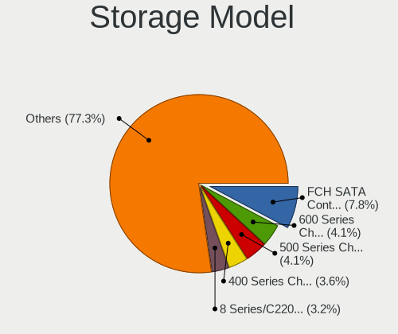
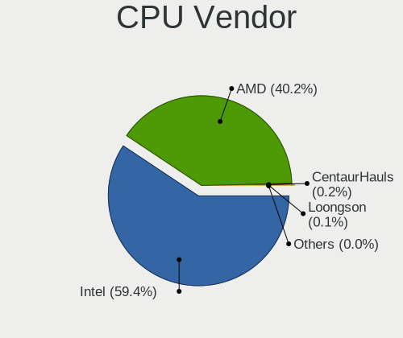
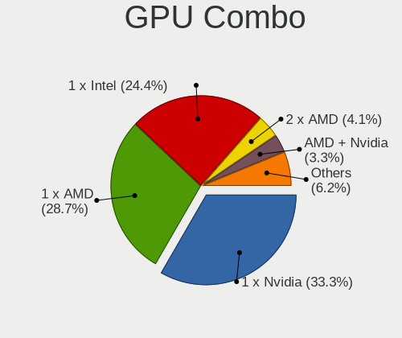

Linux - Hardware Trends (Desktops)
----------------------------------

A project to identify most popular hardware characteristics and track their change
over time based on data collected by Linux users at https://Linux-Hardware.org.

Anyone can contribute to this report by the [hw-probe](https://github.com/linuxhw/hw-probe) tool:

    sudo -E hw-probe -all -upload

This report is for one last month. Overall report since the beginning of time: [TestCoverage](https://github.com/linuxhw/TestCoverage)

Period: Oct, 2022.

Contents
--------

* [ System ](#system)
  - [ OS                       ](#os)
  - [ OS Family                ](#os-family)
  - [ Kernel                   ](#kernel)
  - [ Kernel Family            ](#kernel-family)
  - [ Kernel Major Ver.        ](#kernel-major-ver)
  - [ Arch                     ](#arch)
  - [ DE                       ](#de)
  - [ Display Server           ](#display-server)
  - [ Display Manager          ](#display-manager)
  - [ OS Lang                  ](#os-lang)
  - [ Boot Mode                ](#boot-mode)
  - [ Filesystem               ](#filesystem)
  - [ Part. scheme             ](#part-scheme)
  - [ Dual Boot with Linux/BSD ](#dual-boot-with-linuxbsd)
  - [ Dual Boot (Win)          ](#dual-boot-win)

* [ Board ](#board)
  - [ Vendor                   ](#vendor)
  - [ Model                    ](#model)
  - [ Model Family             ](#model-family)
  - [ MFG Year                 ](#mfg-year)
  - [ Form Factor              ](#form-factor)
  - [ Secure Boot              ](#secure-boot)
  - [ Coreboot                 ](#coreboot)
  - [ RAM Size                 ](#ram-size)
  - [ RAM Used                 ](#ram-used)
  - [ Total Drives             ](#total-drives)
  - [ Has CD-ROM               ](#has-cd-rom)
  - [ Has Ethernet             ](#has-ethernet)
  - [ Has WiFi                 ](#has-wifi)
  - [ Has Bluetooth            ](#has-bluetooth)

* [ Location ](#location)
  - [ Country                  ](#country)
  - [ City                     ](#city)

* [ Drives ](#drives)
  - [ Drive Vendor             ](#drive-vendor)
  - [ Drive Model              ](#drive-model)
  - [ HDD Vendor               ](#hdd-vendor)
  - [ SSD Vendor               ](#ssd-vendor)
  - [ Drive Kind               ](#drive-kind)
  - [ Drive Connector          ](#drive-connector)
  - [ Drive Size               ](#drive-size)
  - [ Space Total              ](#space-total)
  - [ Space Used               ](#space-used)
  - [ Malfunc. Drives          ](#malfunc-drives)
  - [ Malfunc. Drive Vendor    ](#malfunc-drive-vendor)
  - [ Malfunc. HDD Vendor      ](#malfunc-hdd-vendor)
  - [ Malfunc. Drive Kind      ](#malfunc-drive-kind)
  - [ Failed Drives            ](#failed-drives)
  - [ Failed Drive Vendor      ](#failed-drive-vendor)
  - [ Drive Status             ](#drive-status)

* [ Storage controller ](#storage-controller)
  - [ Storage Vendor           ](#storage-vendor)
  - [ Storage Model            ](#storage-model)
  - [ Storage Kind             ](#storage-kind)

* [ Processor ](#processor)
  - [ CPU Vendor               ](#cpu-vendor)
  - [ CPU Model                ](#cpu-model)
  - [ CPU Model Family         ](#cpu-model-family)
  - [ CPU Cores                ](#cpu-cores)
  - [ CPU Sockets              ](#cpu-sockets)
  - [ CPU Threads              ](#cpu-threads)
  - [ CPU Op-Modes             ](#cpu-op-modes)
  - [ CPU Microcode            ](#cpu-microcode)
  - [ CPU Microarch            ](#cpu-microarch)

* [ Graphics ](#graphics)
  - [ GPU Vendor               ](#gpu-vendor)
  - [ GPU Model                ](#gpu-model)
  - [ GPU Combo                ](#gpu-combo)
  - [ GPU Driver               ](#gpu-driver)
  - [ GPU Memory               ](#gpu-memory)

* [ Monitor ](#monitor)
  - [ Monitor Vendor           ](#monitor-vendor)
  - [ Monitor Model            ](#monitor-model)
  - [ Monitor Resolution       ](#monitor-resolution)
  - [ Monitor Diagonal         ](#monitor-diagonal)
  - [ Monitor Width            ](#monitor-width)
  - [ Aspect Ratio             ](#aspect-ratio)
  - [ Monitor Area             ](#monitor-area)
  - [ Pixel Density            ](#pixel-density)
  - [ Multiple Monitors        ](#multiple-monitors)

* [ Network ](#network)
  - [ Net Controller Vendor    ](#net-controller-vendor)
  - [ Net Controller Model     ](#net-controller-model)
  - [ Wireless Vendor          ](#wireless-vendor)
  - [ Wireless Model           ](#wireless-model)
  - [ Ethernet Vendor          ](#ethernet-vendor)
  - [ Ethernet Model           ](#ethernet-model)
  - [ Net Controller Kind      ](#net-controller-kind)
  - [ Used Controller          ](#used-controller)
  - [ NICs                     ](#nics)
  - [ IPv6                     ](#ipv6)

* [ Bluetooth ](#bluetooth)
  - [ Bluetooth Vendor         ](#bluetooth-vendor)
  - [ Bluetooth Model          ](#bluetooth-model)

* [ Sound ](#sound)
  - [ Sound Vendor             ](#sound-vendor)
  - [ Sound Model              ](#sound-model)

* [ Memory ](#memory)
  - [ Memory Vendor            ](#memory-vendor)
  - [ Memory Model             ](#memory-model)
  - [ Memory Kind              ](#memory-kind)
  - [ Memory Form Factor       ](#memory-form-factor)
  - [ Memory Size              ](#memory-size)
  - [ Memory Speed             ](#memory-speed)

* [ Printers & scanners ](#printers--scanners)
  - [ Printer Vendor           ](#printer-vendor)
  - [ Printer Model            ](#printer-model)
  - [ Scanner Vendor           ](#scanner-vendor)
  - [ Scanner Model            ](#scanner-model)

* [ Camera ](#camera)
  - [ Camera Vendor            ](#camera-vendor)
  - [ Camera Model             ](#camera-model)

* [ Security ](#security)
  - [ Fingerprint Vendor       ](#fingerprint-vendor)
  - [ Fingerprint Model        ](#fingerprint-model)
  - [ Chipcard Vendor          ](#chipcard-vendor)
  - [ Chipcard Model           ](#chipcard-model)

* [ Unsupported ](#unsupported)
  - [ Unsupported Devices      ](#unsupported-devices)
  - [ Unsupported Device Types ](#unsupported-device-types)

System
------

OS
--

Installed operating systems

| Name                         | Desktops | Percent |
|------------------------------|----------|---------|
| Ubuntu 22.04                 | 327      | 16.82%  |
| ROSA 12.2                    | 121      | 6.22%   |
| Debian 11                    | 113      | 5.81%   |
| OpenMandriva 4.3             | 110      | 5.66%   |
| Linux Mint 21                | 101      | 5.2%    |
| Fedora 36                    | 98       | 5.04%   |
| Pop!_OS 22.04                | 86       | 4.42%   |
| Arch Rolling                 | 86       | 4.42%   |
| Ubuntu 20.04                 | 70       | 3.6%    |
| Linux Mint 20.3              | 60       | 3.09%   |
| Zorin 16                     | 55       | 2.83%   |
| OpenMandriva 4.50            | 43       | 2.21%   |
| ArcoLinux Rolling            | 35       | 1.8%    |
| KDE neon 20.04               | 34       | 1.75%   |
| Manjaro                      | 31       | 1.59%   |
| Manjaro 22.0.0               | 30       | 1.54%   |
| Nobara 36                    | 29       | 1.49%   |
| Kubuntu 22.04                | 29       | 1.49%   |
| Ubuntu 22.10                 | 27       | 1.39%   |
| Fedora 37                    | 24       | 1.23%   |
| EndeavourOS Rolling          | 21       | 1.08%   |
| KDE neon 22.04               | 19       | 0.98%   |
| Xubuntu 22.04                | 17       | 0.87%   |
| Gentoo 2.8                   | 14       | 0.72%   |
| Ubuntu 18.04                 | 13       | 0.67%   |
| openSUSE Tumbleweed-XXXXXXXX | 13       | 0.67%   |
| Kubuntu 20.04                | 13       | 0.67%   |
| Red OS 7.3.1                 | 12       | 0.62%   |
| ROSA R11.1                   | 11       | 0.57%   |
| Debian Testing               | 11       | 0.57%   |
| Ubuntu MATE 22.04            | 10       | 0.51%   |
| OpenMandriva 4.90            | 9        | 0.46%   |
| LMDE 5                       | 9        | 0.46%   |
| ALT Linux 10.1               | 9        | 0.46%   |
| OpenMandriva 4.2             | 8        | 0.41%   |
| Linux Mint 20.2              | 8        | 0.41%   |
| Linux Mint 19.3              | 8        | 0.41%   |
| Kali 2022.3                  | 8        | 0.41%   |
| Kubuntu 22.10                | 7        | 0.36%   |
| Elementary 6.1               | 7        | 0.36%   |

OS Family
---------

OS without a version

| Name          | Desktops | Percent |
|---------------|----------|---------|
| Ubuntu        | 441      | 22.69%  |
| Linux Mint    | 188      | 9.67%   |
| OpenMandriva  | 170      | 8.74%   |
| ROSA          | 142      | 7.3%    |
| Debian        | 136      | 7%      |
| Fedora        | 128      | 6.58%   |
| Pop!_OS       | 86       | 4.42%   |
| Arch          | 86       | 4.42%   |
| Manjaro       | 61       | 3.14%   |
| Zorin         | 57       | 2.93%   |
| Kubuntu       | 57       | 2.93%   |
| KDE neon      | 53       | 2.73%   |
| ArcoLinux     | 36       | 1.85%   |
| Xubuntu       | 30       | 1.54%   |
| Nobara        | 29       | 1.49%   |
| EndeavourOS   | 21       | 1.08%   |
| Gentoo        | 20       | 1.03%   |
| openSUSE      | 19       | 0.98%   |
| Red OS        | 15       | 0.77%   |
| Ubuntu MATE   | 13       | 0.67%   |
| Clear Linux   | 11       | 0.57%   |
| ALT Linux     | 11       | 0.57%   |
| LMDE          | 9        | 0.46%   |
| Lubuntu       | 8        | 0.41%   |
| Kali          | 8        | 0.41%   |
| SteamOS       | 7        | 0.36%   |
| Elementary    | 7        | 0.36%   |
| BlackPanther  | 7        | 0.36%   |
| MX            | 6        | 0.31%   |
| CentOS        | 6        | 0.31%   |
| Ubuntu Unity  | 5        | 0.26%   |
| Rocky Linux   | 5        | 0.26%   |
| Parrot        | 5        | 0.26%   |
| Garuda Linux  | 5        | 0.26%   |
| Xero          | 4        | 0.21%   |
| Lilidog       | 4        | 0.21%   |
| Endless       | 4        | 0.21%   |
| Ubuntu Studio | 3        | 0.15%   |
| Ubuntu Budgie | 3        | 0.15%   |
| Puppy         | 3        | 0.15%   |

Kernel
------

Version of the Linux kernel

| Version                             | Desktops | Percent |
|-------------------------------------|----------|---------|
| 5.15.0-52-generic                   | 235      | 12.09%  |
| 5.15.0-48-generic                   | 200      | 10.29%  |
| 5.15.0-50-generic                   | 162      | 8.33%   |
| 5.16.7-desktop-1omv4003             | 104      | 5.35%   |
| 5.10.74-generic-2rosa2021.1-x86_64  | 58       | 2.98%   |
| 5.19.0-76051900-generic             | 55       | 2.83%   |
| 5.10.0-18-amd64                     | 51       | 2.62%   |
| 5.10.118-generic-2rosa2021.1-x86_64 | 38       | 1.95%   |
| 5.4.0-126-generic                   | 34       | 1.75%   |
| 5.19.16-200.fc36.x86_64             | 31       | 1.59%   |
| 5.4.0-131-generic                   | 27       | 1.39%   |
| 5.19.5-desktop-1omv4090             | 27       | 1.39%   |
| 5.10.0-19-amd64                     | 25       | 1.29%   |
| 5.19.0-23-generic                   | 23       | 1.18%   |
| 6.0.2-arch1-1                       | 22       | 1.13%   |
| 5.4.0-128-generic                   | 22       | 1.13%   |
| 5.19.13-arch1-1                     | 22       | 1.13%   |
| 6.0.2-zen1-1-zen                    | 18       | 0.93%   |
| 5.19.16-76051916-generic            | 16       | 0.82%   |
| 5.19.12-200.fc36.x86_64             | 15       | 0.77%   |
| 5.19.14-200.fc36.x86_64             | 14       | 0.72%   |
| 5.19.0-2-amd64                      | 14       | 0.72%   |
| 5.15.0-41-generic                   | 14       | 0.72%   |
| 6.0.1-arch2-1                       | 13       | 0.67%   |
| 5.15.74-1-lts                       | 13       | 0.67%   |
| 5.19.15-201.fc36.x86_64             | 12       | 0.62%   |
| 5.10.0-7-amd64                      | 12       | 0.62%   |
| 6.0.2-76060002-generic              | 11       | 0.57%   |
| 6.0.2-2-MANJARO                     | 11       | 0.57%   |
| 5.19.12-arch1-1                     | 10       | 0.51%   |
| 5.15.0-46-generic                   | 10       | 0.51%   |
| 5.15.0-43-generic                   | 10       | 0.51%   |
| 5.19.13-200.fc36.x86_64             | 9        | 0.46%   |
| 5.19.12-desktop-2omv4090            | 9        | 0.46%   |
| 5.15.74-3-MANJARO                   | 9        | 0.46%   |
| 5.15.0-47-generic                   | 9        | 0.46%   |
| 6.0.5-arch1-1                       | 8        | 0.41%   |
| 5.19.13-300.fc37.x86_64             | 8        | 0.41%   |
| 5.18.12-desktop-3omv4090            | 8        | 0.41%   |
| 5.15.35-5.el7.3.x86_64              | 8        | 0.41%   |

Kernel Family
-------------

Linux kernel without a distro release

| Version  | Desktops | Percent |
|----------|----------|---------|
| 5.15.0   | 661      | 34%     |
| 5.19.0   | 120      | 6.17%   |
| 5.10.0   | 108      | 5.56%   |
| 5.4.0    | 104      | 5.35%   |
| 5.16.7   | 104      | 5.35%   |
| 6.0.2    | 75       | 3.86%   |
| 5.19.16  | 70       | 3.6%    |
| 5.10.74  | 59       | 3.03%   |
| 5.19.12  | 51       | 2.62%   |
| 5.19.13  | 48       | 2.47%   |
| 5.10.118 | 40       | 2.06%   |
| 5.15.74  | 31       | 1.59%   |
| 5.19.14  | 29       | 1.49%   |
| 5.19.5   | 27       | 1.39%   |
| 6.0.1    | 25       | 1.29%   |
| 6.0.0    | 24       | 1.23%   |
| 5.13.0   | 22       | 1.13%   |
| 6.0.5    | 19       | 0.98%   |
| 5.19.15  | 18       | 0.93%   |
| 5.18.0   | 18       | 0.93%   |
| 4.15.0   | 17       | 0.87%   |
| 5.11.0   | 13       | 0.67%   |
| 5.15.72  | 11       | 0.57%   |
| 5.19.11  | 10       | 0.51%   |
| 5.18.12  | 10       | 0.51%   |
| 5.15.71  | 10       | 0.51%   |
| 5.19.7   | 9        | 0.46%   |
| 5.16.13  | 9        | 0.46%   |
| 5.15.35  | 9        | 0.46%   |
| 5.10.14  | 8        | 0.41%   |
| 6.0.3    | 7        | 0.36%   |
| 5.17.11  | 7        | 0.36%   |
| 5.4.83   | 6        | 0.31%   |
| 5.15.10  | 6        | 0.31%   |
| 5.14.21  | 6        | 0.31%   |
| 6.1.0    | 5        | 0.26%   |
| 5.19.8   | 5        | 0.26%   |
| 5.19.10  | 5        | 0.26%   |
| 5.17.5   | 5        | 0.26%   |
| 5.17.0   | 5        | 0.26%   |

Kernel Major Ver.
-----------------

Linux kernel major version

| Version | Desktops | Percent |
|---------|----------|---------|
| 5.15    | 764      | 39.3%   |
| 5.19    | 400      | 20.58%  |
| 5.10    | 230      | 11.83%  |
| 6.0     | 154      | 7.92%   |
| 5.4     | 115      | 5.92%   |
| 5.16    | 115      | 5.92%   |
| 5.18    | 45       | 2.31%   |
| 5.13    | 22       | 1.13%   |
| 5.17    | 21       | 1.08%   |
| 4.15    | 17       | 0.87%   |
| 5.11    | 13       | 0.67%   |
| 5.14    | 12       | 0.62%   |
| 4.18    | 9        | 0.46%   |
| 6.1     | 5        | 0.26%   |
| 3.10    | 5        | 0.26%   |
| 4.4     | 3        | 0.15%   |
| 4.19    | 3        | 0.15%   |
| 5.6     | 2        | 0.1%    |
| 4.9     | 2        | 0.1%    |
| 5.8     | 1        | 0.05%   |
| 5.7     | 1        | 0.05%   |
| 5.5     | 1        | 0.05%   |
| 5.0     | 1        | 0.05%   |
| 4.1     | 1        | 0.05%   |
| 2.6.16  | 1        | 0.05%   |
| 2.6     | 1        | 0.05%   |

Arch
----

OS architecture (x86_64, i586, etc.)

| Name   | Desktops | Percent |
|--------|----------|---------|
| x86_64 | 1925     | 99.02%  |
| i686   | 15       | 0.77%   |
| ppc64  | 1        | 0.05%   |
| ppc    | 1        | 0.05%   |
| i586   | 1        | 0.05%   |
| armv7l | 1        | 0.05%   |

DE
--

Desktop Environment

| Name             | Desktops | Percent |
|------------------|----------|---------|
| GNOME            | 810      | 41.67%  |
| KDE5             | 548      | 28.19%  |
| X-Cinnamon       | 170      | 8.74%   |
| XFCE             | 117      | 6.02%   |
| Unknown          | 93       | 4.78%   |
| MATE             | 70       | 3.6%    |
| Cinnamon         | 27       | 1.39%   |
| LXQt             | 24       | 1.23%   |
| i3               | 11       | 0.57%   |
| Pantheon         | 7        | 0.36%   |
| KDE4             | 7        | 0.36%   |
| Unity            | 5        | 0.26%   |
| qtile            | 5        | 0.26%   |
| LXDE             | 5        | 0.26%   |
| lightdm-xsession | 5        | 0.26%   |
| Budgie           | 5        | 0.26%   |
| bspwm            | 5        | 0.26%   |
| trinity          | 4        | 0.21%   |
| GNOME Classic    | 4        | 0.21%   |
| Deepin           | 4        | 0.21%   |
| openbox          | 3        | 0.15%   |
| KDE              | 3        | 0.15%   |
| GNOME Flashback  | 3        | 0.15%   |
| sway             | 2        | 0.1%    |
| LeftWM           | 2        | 0.1%    |
| Enlightenment    | 2        | 0.1%    |
| Hyprland         | 1        | 0.05%   |
| dwm              | 1        | 0.05%   |
| awesome          | 1        | 0.05%   |

Display Server
--------------

X11 or Wayland

| Name    | Desktops | Percent |
|---------|----------|---------|
| X11     | 1363     | 70.11%  |
| Wayland | 471      | 24.23%  |
| Tty     | 55       | 2.83%   |
| Unknown | 54       | 2.78%   |
| Web     | 1        | 0.05%   |

Display Manager
---------------

SDDM, LightDM, etc.

| Name    | Desktops | Percent |
|---------|----------|---------|
| Unknown | 648      | 33.33%  |
| SDDM    | 422      | 21.71%  |
| GDM3    | 402      | 20.68%  |
| LightDM | 262      | 13.48%  |
| GDM     | 193      | 9.93%   |
| KDM     | 7        | 0.36%   |
| XDM     | 2        | 0.1%    |
| SLiM    | 2        | 0.1%    |
| Ly      | 2        | 0.1%    |
| TDM     | 1        | 0.05%   |
| NODM    | 1        | 0.05%   |
| LXDM    | 1        | 0.05%   |
| GREETD  | 1        | 0.05%   |

OS Lang
-------

Language

| Lang    | Desktops | Percent |
|---------|----------|---------|
| en_US   | 742      | 38.17%  |
| ru_RU   | 209      | 10.75%  |
| de_DE   | 150      | 7.72%   |
| it_IT   | 133      | 6.84%   |
| fr_FR   | 90       | 4.63%   |
| en_GB   | 89       | 4.58%   |
| pt_BR   | 67       | 3.45%   |
| es_ES   | 49       | 2.52%   |
| Unknown | 42       | 2.16%   |
| en_AU   | 38       | 1.95%   |
| C       | 38       | 1.95%   |
| en_CA   | 29       | 1.49%   |
| pl_PL   | 24       | 1.23%   |
| nl_NL   | 18       | 0.93%   |
| es_MX   | 17       | 0.87%   |
| en_IN   | 15       | 0.77%   |
| de_AT   | 13       | 0.67%   |
| es_AR   | 11       | 0.57%   |
| cs_CZ   | 10       | 0.51%   |
| tr_TR   | 9        | 0.46%   |
| nl_BE   | 9        | 0.46%   |
| zh_CN   | 8        | 0.41%   |
| hu_HU   | 8        | 0.41%   |
| fr_CA   | 7        | 0.36%   |
| ja_JP   | 6        | 0.31%   |
| en_ZA   | 6        | 0.31%   |
| en_PH   | 6        | 0.31%   |
| sv_SE   | 5        | 0.26%   |
| sk_SK   | 5        | 0.26%   |
| fr_BE   | 5        | 0.26%   |
| en_AG   | 5        | 0.26%   |
| fi_FI   | 4        | 0.21%   |
| en_IL   | 4        | 0.21%   |
| zh_TW   | 3        | 0.15%   |
| ru_UA   | 3        | 0.15%   |
| pt_PT   | 3        | 0.15%   |
| es_UY   | 3        | 0.15%   |
| es_PE   | 3        | 0.15%   |
| en_SG   | 3        | 0.15%   |
| en_NZ   | 3        | 0.15%   |

Boot Mode
---------

EFI or BIOS

| Mode | Desktops | Percent |
|------|----------|---------|
| BIOS | 1122     | 57.72%  |
| EFI  | 822      | 42.28%  |

Filesystem
----------

Type of filesystem

| Type          | Desktops | Percent |
|---------------|----------|---------|
| Ext4          | 1425     | 73.3%   |
| Btrfs         | 260      | 13.37%  |
| Overlay       | 195      | 10.03%  |
| Xfs           | 33       | 1.7%    |
| Zfs           | 14       | 0.72%   |
| F2fs          | 7        | 0.36%   |
| Ext3          | 2        | 0.1%    |
| Aufs          | 2        | 0.1%    |
| XXXX          | 1        | 0.05%   |
| Tmpfs         | 1        | 0.05%   |
| Rootfs        | 1        | 0.05%   |
| Fuse.snapfuse | 1        | 0.05%   |
| Ext2          | 1        | 0.05%   |
| Unknown       | 1        | 0.05%   |

Part. scheme
------------

Scheme of partitioning

| Type    | Desktops | Percent |
|---------|----------|---------|
| GPT     | 1007     | 51.8%   |
| Unknown | 575      | 29.58%  |
| MBR     | 362      | 18.62%  |

Dual Boot with Linux/BSD
------------------------

Hosting more than one Linux/BSD

| Dual boot | Desktops | Percent |
|-----------|----------|---------|
| No        | 1523     | 78.34%  |
| Yes       | 421      | 21.66%  |

Dual Boot (Win)
---------------

Hosting Linux and Windows

| Dual boot | Desktops | Percent |
|-----------|----------|---------|
| No        | 1302     | 66.98%  |
| Yes       | 642      | 33.02%  |

Board
-----

Vendor
------

Motherboard manufacturer

| Name                | Desktops | Percent |
|---------------------|----------|---------|
| ASUSTek Computer    | 528      | 27.16%  |
| Gigabyte Technology | 344      | 17.7%   |
| MSI                 | 253      | 13.01%  |
| ASRock              | 168      | 8.64%   |
| Hewlett-Packard     | 152      | 7.82%   |
| Dell                | 152      | 7.82%   |
| Lenovo              | 72       | 3.7%    |
| Intel               | 35       | 1.8%    |
| Acer                | 33       | 1.7%    |
| Unknown             | 27       | 1.39%   |
| Fujitsu             | 26       | 1.34%   |
| Biostar             | 18       | 0.93%   |
| Pegatron            | 15       | 0.77%   |
| ECS                 | 10       | 0.51%   |
| Foxconn             | 9        | 0.46%   |
| Medion              | 8        | 0.41%   |
| Shuttle             | 6        | 0.31%   |
| Apple               | 6        | 0.31%   |
| Huanan              | 5        | 0.26%   |
| BESSTAR Tech        | 5        | 0.26%   |
| OEM                 | 4        | 0.21%   |
| AZW                 | 4        | 0.21%   |
| Alienware           | 4        | 0.21%   |
| Techvision          | 3        | 0.15%   |
| MACHINIST           | 3        | 0.15%   |
| Inventec            | 3        | 0.15%   |
| Google              | 3        | 0.15%   |
| Fujitsu Siemens     | 3        | 0.15%   |
| eMachines           | 3        | 0.15%   |
| Semp Toshiba        | 2        | 0.1%    |
| Samsung Electronics | 2        | 0.1%    |
| PCWare              | 2        | 0.1%    |
| Packard Bell        | 2        | 0.1%    |
| Itautec             | 2        | 0.1%    |
| Gateway             | 2        | 0.1%    |
| ASRockRack          | 2        | 0.1%    |
| AOpen               | 2        | 0.1%    |
| WTM                 | 1        | 0.05%   |
| Supermicro          | 1        | 0.05%   |
| Standard            | 1        | 0.05%   |

Model
-----

Motherboard model

| Name                         | Desktops | Percent |
|------------------------------|----------|---------|
| ASUS All Series              | 40       | 2.06%   |
| Unknown                      | 29       | 1.49%   |
| Dell OptiPlex 7010           | 16       | 0.82%   |
| Gigabyte B450M DS3H          | 14       | 0.72%   |
| MSI MS-7B86                  | 12       | 0.62%   |
| MSI MS-7C37                  | 11       | 0.57%   |
| Gigabyte B450 AORUS ELITE    | 11       | 0.57%   |
| MSI MS-7C56                  | 10       | 0.51%   |
| MSI MS-7817                  | 10       | 0.51%   |
| Dell OptiPlex 790            | 9        | 0.46%   |
| ASUS TUF Gaming X570-PLUS    | 9        | 0.46%   |
| ASUS TUF Gaming B550M-PLUS   | 9        | 0.46%   |
| ASUS ROG STRIX B450-F GAMING | 9        | 0.46%   |
| MSI MS-7C52                  | 8        | 0.41%   |
| MSI MS-7C02                  | 8        | 0.41%   |
| MSI MS-7B79                  | 8        | 0.41%   |
| Gigabyte A320M-S2H           | 8        | 0.41%   |
| ASUS ROG STRIX B550-F GAMING | 8        | 0.41%   |
| ASUS PRIME X570-PRO          | 8        | 0.41%   |
| ASRock B450M Pro4            | 8        | 0.41%   |
| Gigabyte X570 AORUS ELITE    | 7        | 0.36%   |
| Gigabyte 970A-DS3P           | 7        | 0.36%   |
| Dell OptiPlex 9020           | 7        | 0.36%   |
| Dell OptiPlex 3020           | 7        | 0.36%   |
| ASUS ROG CROSSHAIR VIII HERO | 7        | 0.36%   |
| MSI MS-7C95                  | 6        | 0.31%   |
| MSI MS-7C91                  | 6        | 0.31%   |
| MSI MS-7B89                  | 6        | 0.31%   |
| HP Compaq Elite 8300 SFF     | 6        | 0.31%   |
| Gigabyte B550M DS3H          | 6        | 0.31%   |
| Gigabyte B550 AORUS ELITE V2 | 6        | 0.31%   |
| Dell OptiPlex 780            | 6        | 0.31%   |
| Dell OptiPlex 7050           | 6        | 0.31%   |
| ASUS PRIME B550M-A           | 6        | 0.31%   |
| ASUS M5A78L-M/USB3           | 6        | 0.31%   |
| MSI MS-7C80                  | 5        | 0.26%   |
| MSI MS-7B84                  | 5        | 0.26%   |
| HP Z420 Workstation          | 5        | 0.26%   |
| HP Compaq Pro 6300 SFF       | 5        | 0.26%   |
| HP Compaq 8200 Elite SFF PC  | 5        | 0.26%   |

Model Family
------------

Motherboard model prefix

| Name                | Desktops | Percent |
|---------------------|----------|---------|
| ASUS PRIME          | 122      | 6.28%   |
| Dell OptiPlex       | 98       | 5.04%   |
| ASUS ROG            | 80       | 4.12%   |
| ASUS TUF            | 63       | 3.24%   |
| HP Compaq           | 54       | 2.78%   |
| Lenovo ThinkCentre  | 43       | 2.21%   |
| ASUS All            | 40       | 2.06%   |
| Unknown             | 29       | 1.49%   |
| Dell Precision      | 24       | 1.23%   |
| Gigabyte B450M      | 22       | 1.13%   |
| Gigabyte B450       | 22       | 1.13%   |
| Acer Aspire         | 19       | 0.98%   |
| Gigabyte X570       | 18       | 0.93%   |
| Fujitsu ESPRIMO     | 18       | 0.93%   |
| HP ProDesk          | 16       | 0.82%   |
| HP EliteDesk        | 14       | 0.72%   |
| ASRock B450M        | 14       | 0.72%   |
| Gigabyte B550       | 13       | 0.67%   |
| MSI MS-7B86         | 12       | 0.62%   |
| ASUS M5A78L-M       | 12       | 0.62%   |
| MSI MS-7C37         | 11       | 0.57%   |
| HP Pavilion         | 11       | 0.57%   |
| MSI MS-7C56         | 10       | 0.51%   |
| MSI MS-7817         | 10       | 0.51%   |
| Gigabyte B550M      | 10       | 0.51%   |
| Dell Vostro         | 9        | 0.46%   |
| MSI MS-7C52         | 8        | 0.41%   |
| MSI MS-7C02         | 8        | 0.41%   |
| MSI MS-7B79         | 8        | 0.41%   |
| Lenovo ThinkStation | 8        | 0.41%   |
| Lenovo IdeaCentre   | 8        | 0.41%   |
| Gigabyte A320M-S2H  | 8        | 0.41%   |
| Gigabyte 970A-DS3P  | 8        | 0.41%   |
| ASRock X570         | 8        | 0.41%   |
| ASRock B450         | 8        | 0.41%   |
| Acer Veriton        | 8        | 0.41%   |
| Gigabyte H410M      | 7        | 0.36%   |
| Dell XPS            | 7        | 0.36%   |
| Dell Inspiron       | 7        | 0.36%   |
| ASUS SABERTOOTH     | 7        | 0.36%   |

MFG Year
--------

Motherboard manufacture year

| Year    | Desktops | Percent |
|---------|----------|---------|
| 2020    | 212      | 10.91%  |
| 2018    | 211      | 10.85%  |
| 2012    | 182      | 9.36%   |
| 2019    | 171      | 8.8%    |
| 2013    | 153      | 7.87%   |
| 2021    | 146      | 7.51%   |
| 2011    | 130      | 6.69%   |
| 2014    | 115      | 5.92%   |
| 2017    | 99       | 5.09%   |
| 2009    | 87       | 4.48%   |
| 2010    | 85       | 4.37%   |
| 2016    | 82       | 4.22%   |
| 2015    | 82       | 4.22%   |
| 2022    | 65       | 3.34%   |
| 2008    | 55       | 2.83%   |
| 2007    | 42       | 2.16%   |
| 2006    | 16       | 0.82%   |
| Unknown | 6        | 0.31%   |
| 2005    | 3        | 0.15%   |
| 2004    | 1        | 0.05%   |
| 2000    | 1        | 0.05%   |

Form Factor
-----------

Physical design of the computer

| Name    | Desktops | Percent |
|---------|----------|---------|
| Desktop | 1944     | 100%    |

Secure Boot
-----------

Enabled or disabled

| State    | Desktops | Percent |
|----------|----------|---------|
| Disabled | 1899     | 97.69%  |
| Enabled  | 45       | 2.31%   |

Coreboot
--------

Have coreboot on board

| Used | Desktops | Percent |
|------|----------|---------|
| No   | 1941     | 99.85%  |
| Yes  | 3        | 0.15%   |

RAM Size
--------

Total RAM memory

| Size in GB      | Desktops | Percent |
|-----------------|----------|---------|
| 16.01-24.0      | 540      | 27.78%  |
| 32.01-64.0      | 351      | 18.06%  |
| 8.01-16.0       | 343      | 17.64%  |
| 4.01-8.0        | 259      | 13.32%  |
| 3.01-4.0        | 227      | 11.68%  |
| 64.01-256.0     | 104      | 5.35%   |
| 24.01-32.0      | 58       | 2.98%   |
| 1.01-2.0        | 40       | 2.06%   |
| 2.01-3.0        | 13       | 0.67%   |
| 0.01-0.5        | 3        | 0.15%   |
| More than 256.0 | 2        | 0.1%    |
| 0.51-1.0        | 2        | 0.1%    |
| 0               | 1        | 0.05%   |
| Unknown         | 1        | 0.05%   |

RAM Used
--------

Used RAM memory

| Used GB     | Desktops | Percent |
|-------------|----------|---------|
| 1.01-2.0    | 599      | 30.81%  |
| 2.01-3.0    | 436      | 22.43%  |
| 4.01-8.0    | 360      | 18.52%  |
| 3.01-4.0    | 260      | 13.37%  |
| 0.51-1.0    | 142      | 7.3%    |
| 8.01-16.0   | 101      | 5.2%    |
| 0.01-0.5    | 19       | 0.98%   |
| 16.01-24.0  | 16       | 0.82%   |
| 24.01-32.0  | 4        | 0.21%   |
| Unknown     | 3        | 0.15%   |
| 32.01-64.0  | 2        | 0.1%    |
| 64.01-256.0 | 2        | 0.1%    |

Total Drives
------------

Number of drives on board

| Drives | Desktops | Percent |
|--------|----------|---------|
| 1      | 684      | 35.19%  |
| 2      | 526      | 27.06%  |
| 3      | 369      | 18.98%  |
| 4      | 164      | 8.44%   |
| 5      | 97       | 4.99%   |
| 6      | 55       | 2.83%   |
| 7      | 20       | 1.03%   |
| 8      | 8        | 0.41%   |
| 0      | 7        | 0.36%   |
| 9      | 6        | 0.31%   |
| 11     | 3        | 0.15%   |
| 10     | 2        | 0.1%    |
| 51     | 1        | 0.05%   |
| 19     | 1        | 0.05%   |
| 17     | 1        | 0.05%   |

Has CD-ROM
----------

Has CD-ROM on board

| Presented | Desktops | Percent |
|-----------|----------|---------|
| No        | 1114     | 57.3%   |
| Yes       | 830      | 42.7%   |

Has Ethernet
------------

Has Ethernet on board

| Presented | Desktops | Percent |
|-----------|----------|---------|
| Yes       | 1923     | 98.92%  |
| No        | 21       | 1.08%   |

Has WiFi
--------

Has WiFi module

| Presented | Desktops | Percent |
|-----------|----------|---------|
| No        | 1104     | 56.79%  |
| Yes       | 840      | 43.21%  |

Has Bluetooth
-------------

Has Bluetooth module

| Presented | Desktops | Percent |
|-----------|----------|---------|
| No        | 1267     | 65.17%  |
| Yes       | 677      | 34.83%  |

Location
--------

Country
-------

Geographic location (country)

| Country      | Desktops | Percent |
|--------------|----------|---------|
| USA          | 355      | 18.26%  |
| Russia       | 239      | 12.29%  |
| Germany      | 191      | 9.83%   |
| Italy        | 176      | 9.05%   |
| France       | 114      | 5.86%   |
| Brazil       | 93       | 4.78%   |
| UK           | 64       | 3.29%   |
| Spain        | 57       | 2.93%   |
| Canada       | 48       | 2.47%   |
| Poland       | 45       | 2.31%   |
| Australia    | 44       | 2.26%   |
| Netherlands  | 35       | 1.8%    |
| Belgium      | 26       | 1.34%   |
| Mexico       | 23       | 1.18%   |
| India        | 22       | 1.13%   |
| Argentina    | 20       | 1.03%   |
| Sweden       | 19       | 0.98%   |
| Hungary      | 19       | 0.98%   |
| Czechia      | 19       | 0.98%   |
| Turkey       | 17       | 0.87%   |
| Austria      | 17       | 0.87%   |
| Norway       | 15       | 0.77%   |
| Japan        | 13       | 0.67%   |
| China        | 13       | 0.67%   |
| Switzerland  | 12       | 0.62%   |
| Greece       | 12       | 0.62%   |
| Finland      | 10       | 0.51%   |
| Serbia       | 9        | 0.46%   |
| Philippines  | 9        | 0.46%   |
| Bulgaria     | 9        | 0.46%   |
| Ukraine      | 8        | 0.41%   |
| South Africa | 8        | 0.41%   |
| Slovakia     | 8        | 0.41%   |
| Portugal     | 8        | 0.41%   |
| Israel       | 8        | 0.41%   |
| Taiwan       | 6        | 0.31%   |
| Romania      | 6        | 0.31%   |
| Ireland      | 6        | 0.31%   |
| Hong Kong    | 6        | 0.31%   |
| Estonia      | 6        | 0.31%   |

City
----

Geographic location (city)

| City              | Desktops | Percent |
|-------------------|----------|---------|
| Moscow            | 42       | 2.16%   |
| Milan             | 23       | 1.18%   |
| St Petersburg     | 19       | 0.98%   |
| Berlin            | 17       | 0.87%   |
| Voronezh          | 15       | 0.77%   |
| Paris             | 15       | 0.77%   |
| Sydney            | 12       | 0.62%   |
| Sao Paulo         | 12       | 0.62%   |
| Rome              | 12       | 0.62%   |
| Seattle           | 10       | 0.51%   |
| Rio de Janeiro    | 10       | 0.51%   |
| Madrid            | 10       | 0.51%   |
| Athens            | 10       | 0.51%   |
| Turin             | 9        | 0.46%   |
| Warsaw            | 8        | 0.41%   |
| Novosibirsk       | 8        | 0.41%   |
| Krasnodar         | 8        | 0.41%   |
| Frankfurt am Main | 8        | 0.41%   |
| Yekaterinburg     | 7        | 0.36%   |
| Vienna            | 7        | 0.36%   |
| Ufa               | 7        | 0.36%   |
| Toronto           | 7        | 0.36%   |
| Prague            | 7        | 0.36%   |
| Naples            | 7        | 0.36%   |
| Miami             | 7        | 0.36%   |
| Buenos Aires      | 7        | 0.36%   |
| Budapest          | 7        | 0.36%   |
| Sofia             | 6        | 0.31%   |
| Novokuznetsk      | 6        | 0.31%   |
| Melbourne         | 6        | 0.31%   |
| Istanbul          | 6        | 0.31%   |
| Genoa             | 6        | 0.31%   |
| Belgrade          | 6        | 0.31%   |
| Amsterdam         | 6        | 0.31%   |
| Wroclaw           | 5        | 0.26%   |
| Rostov-on-Don     | 5        | 0.26%   |
| Riga              | 5        | 0.26%   |
| Portland          | 5        | 0.26%   |
| Munich            | 5        | 0.26%   |
| Montevideo        | 5        | 0.26%   |

Drives
------

Drive Vendor
------------

Hard drive vendors

| Vendor                      | Desktops | Drives | Percent |
|-----------------------------|----------|--------|---------|
| Seagate                     | 682      | 869    | 17.96%  |
| WDC                         | 671      | 899    | 17.67%  |
| Samsung Electronics         | 563      | 767    | 14.83%  |
| Kingston                    | 250      | 275    | 6.58%   |
| Toshiba                     | 197      | 269    | 5.19%   |
| Crucial                     | 193      | 218    | 5.08%   |
| Sandisk                     | 157      | 177    | 4.13%   |
| Hitachi                     | 122      | 140    | 3.21%   |
| Intel                       | 57       | 62     | 1.5%    |
| A-DATA Technology           | 54       | 59     | 1.42%   |
| Phison Electronics          | 53       | 64     | 1.4%    |
| Unknown                     | 49       | 64     | 1.29%   |
| China                       | 44       | 48     | 1.16%   |
| HGST                        | 39       | 52     | 1.03%   |
| PNY                         | 37       | 40     | 0.97%   |
| Micron/Crucial Technology   | 37       | 39     | 0.97%   |
| Silicon Motion              | 32       | 34     | 0.84%   |
| SPCC                        | 25       | 27     | 0.66%   |
| Phison                      | 24       | 27     | 0.63%   |
| Intenso                     | 24       | 25     | 0.63%   |
| Patriot                     | 21       | 21     | 0.55%   |
| OCZ                         | 21       | 23     | 0.55%   |
| ADATA Technology            | 21       | 22     | 0.55%   |
| SK hynix                    | 20       | 22     | 0.53%   |
| Maxtor                      | 18       | 19     | 0.47%   |
| Kingston Technology Company | 18       | 18     | 0.47%   |
| Corsair                     | 17       | 22     | 0.45%   |
| Micron Technology           | 16       | 16     | 0.42%   |
| Team                        | 14       | 16     | 0.37%   |
| Apacer                      | 14       | 14     | 0.37%   |
| Transcend                   | 13       | 14     | 0.34%   |
| Lexar                       | 13       | 14     | 0.34%   |
| GOODRAM                     | 12       | 13     | 0.32%   |
| XPG                         | 11       | 16     | 0.29%   |
| JMicron Technology          | 11       | 20     | 0.29%   |
| AMD                         | 10       | 10     | 0.26%   |
| Fujitsu                     | 9        | 10     | 0.24%   |
| Plextor                     | 8        | 8      | 0.21%   |
| Netac                       | 8        | 8      | 0.21%   |
| LITEON                      | 8        | 8      | 0.21%   |

Drive Model
-----------

Hard drive models

| Model                                                           | Desktops | Percent |
|-----------------------------------------------------------------|----------|---------|
| Samsung NVMe SSD Controller SM981/PM981/PM983 500GB             | 85       | 1.95%   |
| Kingston SA400S37240G 240GB SSD                                 | 60       | 1.37%   |
| Seagate ST1000DM010-2EP102 1TB                                  | 53       | 1.21%   |
| Seagate ST2000DM008-2FR102 2TB                                  | 47       | 1.08%   |
| Samsung SSD 860 EVO 500GB                                       | 41       | 0.94%   |
| Seagate ST500DM002-1BD142 500GB                                 | 39       | 0.89%   |
| Kingston SA400S37480G 480GB SSD                                 | 38       | 0.87%   |
| WDC WD10EZEX-08WN4A0 1TB                                        | 36       | 0.82%   |
| Samsung SSD 850 EVO 250GB                                       | 34       | 0.78%   |
| Toshiba DT01ACA100 1TB                                          | 32       | 0.73%   |
| Samsung NVMe SSD Controller PM9A1/PM9A3/980PRO 250GB            | 31       | 0.71%   |
| Samsung SSD 980 1TB                                             | 30       | 0.69%   |
| Crucial CT500MX500SSD1 500GB                                    | 30       | 0.69%   |
| Samsung SSD 860 EVO 1TB                                         | 28       | 0.64%   |
| Samsung SSD 850 EVO 500GB                                       | 26       | 0.6%    |
| Kingston SV300S37A120G 120GB SSD                                | 26       | 0.6%    |
| Crucial CT1000MX500SSD1 1TB                                     | 26       | 0.6%    |
| Samsung SSD 860 EVO 250GB                                       | 25       | 0.57%   |
| Phison E12 NVMe Controller 2TB                                  | 25       | 0.57%   |
| Crucial CT240BX500SSD1 240GB                                    | 25       | 0.57%   |
| Seagate ST31000528AS 1TB                                        | 23       | 0.53%   |
| Seagate ST1000DM003-1CH162 1TB                                  | 23       | 0.53%   |
| Unknown SD/MMC/MS PRO 1TB                                       | 20       | 0.46%   |
| Toshiba HDWD110 1TB                                             | 20       | 0.46%   |
| Seagate ST4000DM004-2CV104 4TB                                  | 20       | 0.46%   |
| Seagate ST1000DM003-1ER162 1TB                                  | 20       | 0.46%   |
| Seagate ST3500418AS 500GB                                       | 19       | 0.44%   |
| Seagate ST1000DM003-1SB102 1TB                                  | 19       | 0.44%   |
| Silicon Motion SM2263EN/SM2263XT SSD Controller 256GB           | 18       | 0.41%   |
| Toshiba DT01ACA050 500GB                                        | 17       | 0.39%   |
| Crucial CT1000BX500SSD1 1TB                                     | 17       | 0.39%   |
| WDC WDS240G2G0A-00JH30 240GB SSD                                | 16       | 0.37%   |
| Sandisk WD Blue SN550 NVMe SSD 1TB                              | 16       | 0.37%   |
| ADATA XPG SX8200 Pro PCIe Gen3x4 M.2 2280 Solid State Drive 1TB | 16       | 0.37%   |
| Seagate ST2000DM001-1CH164 2TB                                  | 15       | 0.34%   |
| Samsung SSD 980 500GB                                           | 15       | 0.34%   |
| Samsung SSD 870 QVO 2TB                                         | 15       | 0.34%   |
| Phison E16 PCIe4 NVMe Controller 1TB                            | 15       | 0.34%   |
| Kingston SA400S37120G 120GB SSD                                 | 15       | 0.34%   |
| WDC WD20EZRZ-00Z5HB0 2TB                                        | 14       | 0.32%   |

HDD Vendor
----------

Hard disk drive vendors

| Vendor              | Desktops | Drives | Percent |
|---------------------|----------|--------|---------|
| Seagate             | 671      | 852    | 37.91%  |
| WDC                 | 593      | 772    | 33.5%   |
| Toshiba             | 176      | 245    | 9.94%   |
| Hitachi             | 122      | 140    | 6.89%   |
| Samsung Electronics | 83       | 98     | 4.69%   |
| HGST                | 39       | 52     | 2.2%    |
| Unknown             | 22       | 26     | 1.24%   |
| Maxtor              | 18       | 19     | 1.02%   |
| Fujitsu             | 8        | 9      | 0.45%   |
| SABRENT             | 7        | 8      | 0.4%    |
| Intenso             | 5        | 5      | 0.28%   |
| ASMT                | 4        | 7      | 0.23%   |
| Hewlett-Packard     | 3        | 11     | 0.17%   |
| SAGE                | 2        | 2      | 0.11%   |
| Apple               | 2        | 2      | 0.11%   |
| USB3.0              | 1        | 2      | 0.06%   |
| USB                 | 1        | 1      | 0.06%   |
| Synology            | 1        | 1      | 0.06%   |
| RSH-319             | 1        | 1      | 0.06%   |
| QUANTUM             | 1        | 1      | 0.06%   |
| QNAP                | 1        | 1      | 0.06%   |
| Maxone              | 1        | 1      | 0.06%   |
| MaxDigital          | 1        | 1      | 0.06%   |
| Magnetic Data       | 1        | 1      | 0.06%   |
| LIO-ORG             | 1        | 1      | 0.06%   |
| JMicron Technology  | 1        | 6      | 0.06%   |
| Initio              | 1        | 1      | 0.06%   |
| IBM/Hitachi         | 1        | 1      | 0.06%   |
| HPE                 | 1        | 2      | 0.06%   |
| HGST HTS            | 1        | 1      | 0.06%   |

SSD Vendor
----------

Solid state drive vendors

| Vendor              | Desktops | Drives | Percent |
|---------------------|----------|--------|---------|
| Samsung Electronics | 314      | 379    | 23.02%  |
| Kingston            | 209      | 228    | 15.32%  |
| Crucial             | 176      | 199    | 12.9%   |
| SanDisk             | 91       | 99     | 6.67%   |
| WDC                 | 82       | 96     | 6.01%   |
| A-DATA Technology   | 47       | 51     | 3.45%   |
| China               | 44       | 48     | 3.23%   |
| PNY                 | 36       | 39     | 2.64%   |
| Intel               | 28       | 29     | 2.05%   |
| SPCC                | 22       | 24     | 1.61%   |
| OCZ                 | 21       | 23     | 1.54%   |
| Patriot             | 19       | 19     | 1.39%   |
| Intenso             | 15       | 16     | 1.1%    |
| Team                | 14       | 16     | 1.03%   |
| Toshiba             | 13       | 13     | 0.95%   |
| Apacer              | 13       | 13     | 0.95%   |
| Micron Technology   | 12       | 12     | 0.88%   |
| Lexar               | 12       | 13     | 0.88%   |
| GOODRAM             | 12       | 13     | 0.88%   |
| Corsair             | 10       | 13     | 0.73%   |
| Transcend           | 9        | 9      | 0.66%   |
| AMD                 | 9        | 9      | 0.66%   |
| Plextor             | 8        | 8      | 0.59%   |
| KingSpec            | 8        | 9      | 0.59%   |
| Unknown             | 7        | 7      | 0.51%   |
| SK hynix            | 7        | 8      | 0.51%   |
| LITEON              | 7        | 7      | 0.51%   |
| Gigabyte Technology | 7        | 7      | 0.51%   |
| Netac               | 6        | 6      | 0.44%   |
| Hewlett-Packard     | 5        | 5      | 0.37%   |
| Unknown             | 5        | 5      | 0.37%   |
| Verbatim            | 4        | 4      | 0.29%   |
| Smartbuy            | 4        | 4      | 0.29%   |
| Seagate             | 4        | 4      | 0.29%   |
| Hoodisk             | 4        | 4      | 0.29%   |
| Emtec               | 4        | 4      | 0.29%   |
| ASMT                | 4        | 4      | 0.29%   |
| OWC                 | 3        | 3      | 0.22%   |
| Leven               | 3        | 3      | 0.22%   |
| KIOXIA-EXCERIA      | 3        | 3      | 0.22%   |

Drive Kind
----------

HDD or SSD

| Kind    | Desktops | Drives | Percent |
|---------|----------|--------|---------|
| HDD     | 1337     | 2270   | 42.85%  |
| SSD     | 1096     | 1520   | 35.13%  |
| NVMe    | 626      | 825    | 20.06%  |
| Unknown | 50       | 64     | 1.6%    |
| MMC     | 11       | 13     | 0.35%   |

Drive Connector
---------------

SATA, SAS, NVMe, etc.

| Type | Desktops | Drives | Percent |
|------|----------|--------|---------|
| SATA | 1764     | 3647   | 69.18%  |
| NVMe | 616      | 812    | 24.16%  |
| SAS  | 159      | 220    | 6.24%   |
| MMC  | 11       | 13     | 0.43%   |

Drive Size
----------

Size of hard drive

| Size in TB | Desktops | Drives | Percent |
|------------|----------|--------|---------|
| 0.01-0.5   | 1295     | 1892   | 47.82%  |
| 0.51-1.0   | 786      | 1025   | 29.03%  |
| 1.01-2.0   | 328      | 413    | 12.11%  |
| 3.01-4.0   | 118      | 188    | 4.36%   |
| 4.01-10.0  | 82       | 121    | 3.03%   |
| 2.01-3.0   | 76       | 101    | 2.81%   |
| 10.01-20.0 | 22       | 48     | 0.81%   |
| 20.01-50.0 | 1        | 2      | 0.04%   |

Space Total
-----------

Amount of disk space available on the file system

| Size in GB     | Desktops | Percent |
|----------------|----------|---------|
| 101-250        | 364      | 18.72%  |
| 501-1000       | 326      | 16.77%  |
| 251-500        | 311      | 16%     |
| 1001-2000      | 232      | 11.93%  |
| More than 3000 | 229      | 11.78%  |
| 1-20           | 152      | 7.82%   |
| 2001-3000      | 133      | 6.84%   |
| 51-100         | 78       | 4.01%   |
| Unknown        | 70       | 3.6%    |
| 21-50          | 49       | 2.52%   |

Space Used
----------

Amount of used disk space

| Used GB        | Desktops | Percent |
|----------------|----------|---------|
| 1-20           | 582      | 29.94%  |
| 21-50          | 260      | 13.37%  |
| 101-250        | 222      | 11.42%  |
| 251-500        | 189      | 9.72%   |
| 51-100         | 184      | 9.47%   |
| 501-1000       | 162      | 8.33%   |
| 1001-2000      | 122      | 6.28%   |
| More than 3000 | 88       | 4.53%   |
| Unknown        | 70       | 3.6%    |
| 2001-3000      | 64       | 3.29%   |
| 0              | 1        | 0.05%   |

Malfunc. Drives
---------------

Drive models with a malfunction

| Model                              | Desktops | Drives | Percent |
|------------------------------------|----------|--------|---------|
| Seagate ST500DM002-1BD142 500GB    | 7        | 7      | 2.08%   |
| Seagate ST2000DM001-1CH164 2TB     | 7        | 7      | 2.08%   |
| WDC WDS240G2G0A-00JH30 240GB SSD   | 5        | 5      | 1.48%   |
| WDC WD5000AAKX-60U6AA0 500GB       | 5        | 5      | 1.48%   |
| Seagate ST31000528AS 1TB           | 5        | 5      | 1.48%   |
| Seagate ST3320620AS 320GB          | 4        | 5      | 1.19%   |
| Seagate ST1000DM010-2EP102 1TB     | 4        | 4      | 1.19%   |
| Seagate ST1000DM003-1CH162 1TB     | 4        | 4      | 1.19%   |
| Kingston SV300S37A120G 120GB SSD   | 4        | 4      | 1.19%   |
| Kingston SA400S37240G 240GB SSD    | 4        | 4      | 1.19%   |
| WDC WD40EFRX-68WT0N0 4TB           | 3        | 3      | 0.89%   |
| WDC WD3200AAJS-00L7A0 320GB        | 3        | 3      | 0.89%   |
| Toshiba DT01ACA100 1TB             | 3        | 3      | 0.89%   |
| Seagate ST3250310AS 250GB          | 3        | 3      | 0.89%   |
| Seagate ST31500341AS 1TB           | 3        | 3      | 0.89%   |
| Seagate ST3000DM001-1ER166 3TB     | 3        | 4      | 0.89%   |
| Seagate ST1000DM003-9YN162 1TB     | 3        | 3      | 0.89%   |
| Samsung Electronics HD103UJ 1TB    | 3        | 3      | 0.89%   |
| WDC WD800BD-22MRA1 80GB            | 2        | 2      | 0.59%   |
| WDC WD60EFRX-68L0BN1 6TB           | 2        | 2      | 0.59%   |
| WDC WD5000BEVT-75ZAT0 500GB        | 2        | 2      | 0.59%   |
| WDC WD5000AAKX-75U6AA0 500GB       | 2        | 2      | 0.59%   |
| WDC WD5000AAKX-001CA0 500GB        | 2        | 2      | 0.59%   |
| WDC WD40EFRX-68N32N0 4TB           | 2        | 2      | 0.59%   |
| WDC WD20EFRX-68EUZN0 2TB           | 2        | 2      | 0.59%   |
| WDC WD20EARS-00S8B1 2TB            | 2        | 2      | 0.59%   |
| WDC WD10EZEX-21WN4A0 1TB           | 2        | 2      | 0.59%   |
| WDC WD10EZEX-08M2NA0 1TB           | 2        | 2      | 0.59%   |
| WDC WD10EARX-00N0YB0 1TB           | 2        | 2      | 0.59%   |
| WDC WD10EARS-00MVWB0 1TB           | 2        | 2      | 0.59%   |
| WDC WD1003FBYX-01Y7B0 1TB          | 2        | 3      | 0.59%   |
| Toshiba DT01ACA050 500GB           | 2        | 3      | 0.59%   |
| Seagate ST9500325AS 500GB          | 2        | 2      | 0.59%   |
| Seagate ST4000DM000-1F2168 4TB     | 2        | 2      | 0.59%   |
| Seagate ST3320613AS 320GB          | 2        | 2      | 0.59%   |
| Seagate ST32000641AS 2TB           | 2        | 2      | 0.59%   |
| Seagate ST3000DM001-1CH166 3TB     | 2        | 2      | 0.59%   |
| Seagate ST2000DM008-2FR102 2TB     | 2        | 2      | 0.59%   |
| Seagate ST1000LM024 HN-M101MBB 1TB | 2        | 2      | 0.59%   |
| Seagate ST1000DM003-1SB102 1TB     | 2        | 2      | 0.59%   |

Malfunc. Drive Vendor
---------------------

Vendors of faulty drives

| Vendor              | Desktops | Drives | Percent |
|---------------------|----------|--------|---------|
| Seagate             | 102      | 111    | 31.29%  |
| WDC                 | 86       | 94     | 26.38%  |
| Hitachi             | 27       | 28     | 8.28%   |
| Samsung Electronics | 25       | 26     | 7.67%   |
| Toshiba             | 11       | 12     | 3.37%   |
| Maxtor              | 11       | 12     | 3.37%   |
| Kingston            | 9        | 10     | 2.76%   |
| Intel               | 8        | 9      | 2.45%   |
| SanDisk             | 7        | 7      | 2.15%   |
| Crucial             | 6        | 6      | 1.84%   |
| Corsair             | 5        | 5      | 1.53%   |
| HGST                | 3        | 3      | 0.92%   |
| A-DATA Technology   | 3        | 3      | 0.92%   |
| SPCC                | 2        | 2      | 0.61%   |
| OCZ-VERTEX3         | 2        | 2      | 0.61%   |
| Netac               | 2        | 2      | 0.61%   |
| Neo                 | 2        | 2      | 0.61%   |
| BAITITON            | 2        | 2      | 0.61%   |
| PNY                 | 1        | 1      | 0.31%   |
| OCZ                 | 1        | 1      | 0.31%   |
| Micron Technology   | 1        | 1      | 0.31%   |
| Magnetic Data       | 1        | 1      | 0.31%   |
| LITEON              | 1        | 1      | 0.31%   |
| KingSpec            | 1        | 1      | 0.31%   |
| Intenso             | 1        | 1      | 0.31%   |
| Initio              | 1        | 1      | 0.31%   |
| Hewlett-Packard     | 1        | 1      | 0.31%   |
| Drevo               | 1        | 1      | 0.31%   |
| China               | 1        | 1      | 0.31%   |
| ASMT                | 1        | 1      | 0.31%   |
| Unknown             | 1        | 1      | 0.31%   |

Malfunc. HDD Vendor
-------------------

Vendors of faulty HDD drives

| Vendor              | Desktops | Drives | Percent |
|---------------------|----------|--------|---------|
| Seagate             | 102      | 111    | 40.64%  |
| WDC                 | 80       | 87     | 31.87%  |
| Hitachi             | 27       | 28     | 10.76%  |
| Samsung Electronics | 14       | 15     | 5.58%   |
| Toshiba             | 11       | 12     | 4.38%   |
| Maxtor              | 11       | 12     | 4.38%   |
| HGST                | 3        | 3      | 1.2%    |
| Magnetic Data       | 1        | 1      | 0.4%    |
| Initio              | 1        | 1      | 0.4%    |
| Hewlett-Packard     | 1        | 1      | 0.4%    |

Malfunc. Drive Kind
-------------------

Kinds of faulty drives

| Kind | Desktops | Drives | Percent |
|------|----------|--------|---------|
| HDD  | 223      | 271    | 74.83%  |
| SSD  | 67       | 70     | 22.48%  |
| NVMe | 8        | 8      | 2.68%   |

Failed Drives
-------------

Failed drive models

| Model                             | Desktops | Drives | Percent |
|-----------------------------------|----------|--------|---------|
| Seagate ST9500420AS 500GB         | 1        | 1      | 11.11%  |
| Seagate ST500DM002-1BD142 500GB   | 1        | 1      | 11.11%  |
| Seagate ST3500630A 500GB          | 1        | 1      | 11.11%  |
| Seagate ST3500410AS 500GB         | 1        | 1      | 11.11%  |
| Seagate ST31500341AS 1TB          | 1        | 1      | 11.11%  |
| Samsung Electronics SSD 980 500GB | 1        | 1      | 11.11%  |
| Hitachi HDS721050CLA362 500GB     | 1        | 1      | 11.11%  |
| HGST HUH728080ALN600 8TB          | 1        | 1      | 11.11%  |
| Hewlett-Packard EF0450FARMV 450GB | 1        | 4      | 11.11%  |

Failed Drive Vendor
-------------------

Failed drive vendors

| Vendor              | Desktops | Drives | Percent |
|---------------------|----------|--------|---------|
| Seagate             | 4        | 5      | 50%     |
| Samsung Electronics | 1        | 1      | 12.5%   |
| Hitachi             | 1        | 1      | 12.5%   |
| HGST                | 1        | 1      | 12.5%   |
| Hewlett-Packard     | 1        | 4      | 12.5%   |

Drive Status
------------

Number of failed and malfunc. drives

| Status   | Desktops | Drives | Percent |
|----------|----------|--------|---------|
| Detected | 995      | 2296   | 44.88%  |
| Works    | 927      | 2035   | 41.81%  |
| Malfunc  | 287      | 349    | 12.95%  |
| Failed   | 8        | 12     | 0.36%   |

Storage controller
------------------

Storage Vendor
--------------

Storage controller vendors

| Vendor                        | Desktops | Percent |
|-------------------------------|----------|---------|
| Intel                         | 1195     | 41.16%  |
| AMD                           | 703      | 24.22%  |
| Samsung Electronics           | 239      | 8.23%   |
| SanDisk                       | 97       | 3.34%   |
| ASMedia Technology            | 97       | 3.34%   |
| Phison Electronics            | 90       | 3.1%    |
| Kingston Technology Company   | 64       | 2.2%    |
| Marvell Technology Group      | 62       | 2.14%   |
| JMicron Technology            | 61       | 2.1%    |
| Micron/Crucial Technology     | 53       | 1.83%   |
| Nvidia                        | 42       | 1.45%   |
| Silicon Motion                | 38       | 1.31%   |
| ADATA Technology              | 35       | 1.21%   |
| SK hynix                      | 13       | 0.45%   |
| LSI Logic / Symbios Logic     | 13       | 0.45%   |
| VIA Technologies              | 11       | 0.38%   |
| Toshiba America Info Systems  | 10       | 0.34%   |
| Silicon Image                 | 9        | 0.31%   |
| Realtek Semiconductor         | 9        | 0.31%   |
| Seagate Technology            | 8        | 0.28%   |
| Micron Technology             | 6        | 0.21%   |
| MAXIO Technology (Hangzhou)   | 6        | 0.21%   |
| Broadcom / LSI                | 6        | 0.21%   |
| Adaptec                       | 6        | 0.21%   |
| KIOXIA                        | 5        | 0.17%   |
| Unknown                       | 3        | 0.1%    |
| Transcend                     | 2        | 0.07%   |
| Lite-On Technology            | 2        | 0.07%   |
| Hewlett-Packard               | 2        | 0.07%   |
| Yangtze Memory Technologies   | 1        | 0.03%   |
| Union Memory (Shenzhen)       | 1        | 0.03%   |
| ULi Electronics               | 1        | 0.03%   |
| Tekram Technology             | 1        | 0.03%   |
| Shenzhen Longsys Electronics  | 1        | 0.03%   |
| Promise Technology            | 1        | 0.03%   |
| OCZ Technology Group          | 1        | 0.03%   |
| Lenovo                        | 1        | 0.03%   |
| Integrated Technology Express | 1        | 0.03%   |
| IBM                           | 1        | 0.03%   |
| Chelsio Communications        | 1        | 0.03%   |

Storage Model
-------------

Storage controller models

| Model                                                                                   | Desktops | Percent |
|-----------------------------------------------------------------------------------------|----------|---------|
| AMD FCH SATA Controller [AHCI mode]                                                     | 366      | 10.26%  |
| AMD 400 Series Chipset SATA Controller                                                  | 174      | 4.88%   |
| Intel 8 Series/C220 Series Chipset Family 6-port SATA Controller 1 [AHCI mode]          | 142      | 3.98%   |
| Samsung NVMe SSD Controller SM981/PM981/PM983                                           | 129      | 3.62%   |
| AMD 500 Series Chipset SATA Controller                                                  | 112      | 3.14%   |
| Intel 6 Series/C200 Series Chipset Family 6 port Desktop SATA AHCI Controller           | 99       | 2.78%   |
| Intel 7 Series/C210 Series Chipset Family 6-port SATA Controller [AHCI mode]            | 90       | 2.52%   |
| AMD SB7x0/SB8x0/SB9x0 IDE Controller                                                    | 89       | 2.5%    |
| Intel 200 Series PCH SATA controller [AHCI mode]                                        | 87       | 2.44%   |
| ASMedia ASM1062 Serial ATA Controller                                                   | 86       | 2.41%   |
| Intel Q170/Q150/B150/H170/H110/Z170/CM236 Chipset SATA Controller [AHCI Mode]           | 84       | 2.35%   |
| AMD SB7x0/SB8x0/SB9x0 SATA Controller [AHCI mode]                                       | 70       | 1.96%   |
| Intel SATA Controller [RAID mode]                                                       | 66       | 1.85%   |
| Intel NM10/ICH7 Family SATA Controller [IDE mode]                                       | 61       | 1.71%   |
| Intel 500 Series Chipset Family SATA AHCI Controller                                    | 58       | 1.63%   |
| AMD SB7x0/SB8x0/SB9x0 SATA Controller [IDE mode]                                        | 58       | 1.63%   |
| Samsung NVMe SSD Controller PM9A1/PM9A3/980PRO                                          | 52       | 1.46%   |
| Samsung NVMe SSD Controller 980                                                         | 50       | 1.4%    |
| Intel Cannon Lake PCH SATA AHCI Controller                                              | 50       | 1.4%    |
| Intel 82801G (ICH7 Family) IDE Controller                                               | 47       | 1.32%   |
| Phison E12 NVMe Controller                                                              | 45       | 1.26%   |
| Intel Alder Lake-S PCH SATA Controller [AHCI Mode]                                      | 41       | 1.15%   |
| Intel 6 Series/C200 Series Chipset Family Desktop SATA Controller (IDE mode, ports 4-5) | 38       | 1.07%   |
| Intel 6 Series/C200 Series Chipset Family Desktop SATA Controller (IDE mode, ports 0-3) | 37       | 1.04%   |
| AMD FCH SATA Controller D                                                               | 37       | 1.04%   |
| JMicron JMB363 SATA/IDE Controller                                                      | 36       | 1.01%   |
| Intel 9 Series Chipset Family SATA Controller [AHCI Mode]                               | 34       | 0.95%   |
| Intel 82801JI (ICH10 Family) SATA AHCI Controller                                       | 29       | 0.81%   |
| SanDisk WD Blue SN550 NVMe SSD                                                          | 27       | 0.76%   |
| Kingston Company Company Non-Volatile memory controller                                 | 27       | 0.76%   |
| AMD 300 Series Chipset SATA Controller                                                  | 27       | 0.76%   |
| Silicon Motion SM2263EN/SM2263XT SSD Controller                                         | 26       | 0.73%   |
| Phison E16 PCIe4 NVMe Controller                                                        | 26       | 0.73%   |
| Intel Comet Lake SATA AHCI Controller                                                   | 26       | 0.73%   |
| ADATA XPG SX8200 Pro PCIe Gen3x4 M.2 2280 Solid State Drive                             | 26       | 0.73%   |
| Intel Volume Management Device NVMe RAID Controller                                     | 25       | 0.7%    |
| Kingston Company A2000 NVMe SSD                                                         | 23       | 0.64%   |
| Intel 400 Series Chipset Family SATA AHCI Controller                                    | 22       | 0.62%   |
| Nvidia MCP61 SATA Controller                                                            | 21       | 0.59%   |
| Micron/Crucial P2 NVMe PCIe SSD                                                         | 21       | 0.59%   |

Storage Kind
------------

Kind of storage controller (IDE, SATA, NVMe, SAS, ...)

| Kind | Desktops | Percent |
|------|----------|---------|
| SATA | 1630     | 57.39%  |
| NVMe | 618      | 21.76%  |
| IDE  | 411      | 14.47%  |
| RAID | 151      | 5.32%   |
| SAS  | 19       | 0.67%   |
| SCSI | 11       | 0.39%   |

Processor
---------

CPU Vendor
----------

Processor vendors

| Vendor                | Desktops | Percent |
|-----------------------|----------|---------|
| Intel                 | 1197     | 61.57%  |
| AMD                   | 744      | 38.27%  |
| Marvell Semiconductor | 1        | 0.05%   |
| FSP-1                 | 1        | 0.05%   |
| CHRP IBM,8233-E8B     | 1        | 0.05%   |

CPU Model
---------

Processor models

| Model                                       | Desktops | Percent |
|---------------------------------------------|----------|---------|
| AMD Ryzen 5 3600 6-Core Processor           | 44       | 2.26%   |
| AMD Ryzen 5 5600X 6-Core Processor          | 38       | 1.95%   |
| Intel Core i5-3470 CPU @ 3.20GHz            | 31       | 1.59%   |
| AMD Ryzen 7 3700X 8-Core Processor          | 31       | 1.59%   |
| Intel Core i7-3770 CPU @ 3.40GHz            | 28       | 1.44%   |
| AMD Ryzen 7 5800X 8-Core Processor          | 24       | 1.23%   |
| AMD Ryzen 5 5600G with Radeon Graphics      | 24       | 1.23%   |
| Intel Core i5-2400 CPU @ 3.10GHz            | 22       | 1.13%   |
| AMD Ryzen 9 5950X 16-Core Processor         | 22       | 1.13%   |
| Intel Core i7-4790 CPU @ 3.60GHz            | 20       | 1.03%   |
| AMD Ryzen 9 3900X 12-Core Processor         | 20       | 1.03%   |
| AMD Ryzen 5 2600 Six-Core Processor         | 20       | 1.03%   |
| AMD Ryzen 7 2700X Eight-Core Processor      | 19       | 0.98%   |
| Intel Core 2 Duo CPU E7500 @ 2.93GHz        | 18       | 0.93%   |
| AMD Ryzen 7 5700G with Radeon Graphics      | 17       | 0.87%   |
| Intel Core i7-2600 CPU @ 3.40GHz            | 16       | 0.82%   |
| AMD Ryzen 9 5900X 12-Core Processor         | 16       | 0.82%   |
| AMD Ryzen 5 3400G with Radeon Vega Graphics | 16       | 0.82%   |
| AMD FX-8350 Eight-Core Processor            | 16       | 0.82%   |
| Intel Core i7-7700 CPU @ 3.60GHz            | 15       | 0.77%   |
| Intel Core i3-2100 CPU @ 3.10GHz            | 15       | 0.77%   |
| Intel Core 2 Duo CPU E8400 @ 3.00GHz        | 15       | 0.77%   |
| AMD Ryzen 5 2600X Six-Core Processor        | 15       | 0.77%   |
| AMD Ryzen 5 1600 Six-Core Processor         | 15       | 0.77%   |
| Intel Core i7-6700K CPU @ 4.00GHz           | 14       | 0.72%   |
| Intel Core i5-9400F CPU @ 2.90GHz           | 14       | 0.72%   |
| Intel Core i5-6500 CPU @ 3.20GHz            | 14       | 0.72%   |
| AMD FX-6300 Six-Core Processor              | 13       | 0.67%   |
| Intel Core i7-6700 CPU @ 3.40GHz            | 12       | 0.62%   |
| Intel Core i5-6400 CPU @ 2.70GHz            | 12       | 0.62%   |
| Intel Core i5-4460 CPU @ 3.20GHz            | 12       | 0.62%   |
| Intel Core i3-10100 CPU @ 3.60GHz           | 12       | 0.62%   |
| AMD Ryzen 7 3800X 8-Core Processor          | 12       | 0.62%   |
| Intel Core i7-4770 CPU @ 3.40GHz            | 11       | 0.57%   |
| Intel Core i5-8400 CPU @ 2.80GHz            | 11       | 0.57%   |
| Intel Core i5-4590 CPU @ 3.30GHz            | 11       | 0.57%   |
| Intel Core i3-2120 CPU @ 3.30GHz            | 11       | 0.57%   |
| AMD Ryzen 3 3200G with Radeon Vega Graphics | 11       | 0.57%   |
| Intel Core i9-9900K CPU @ 3.60GHz           | 10       | 0.51%   |
| Intel Core i7-4790K CPU @ 4.00GHz           | 10       | 0.51%   |

CPU Model Family
----------------

Processor model prefix

| Model                   | Desktops | Percent |
|-------------------------|----------|---------|
| Intel Core i5           | 342      | 17.59%  |
| Intel Core i7           | 240      | 12.35%  |
| AMD Ryzen 5             | 223      | 11.47%  |
| Intel Core i3           | 153      | 7.87%   |
| AMD Ryzen 7             | 134      | 6.89%   |
| Intel Xeon              | 108      | 5.56%   |
| Other                   | 81       | 4.17%   |
| AMD Ryzen 9             | 76       | 3.91%   |
| AMD FX                  | 73       | 3.76%   |
| Intel Core 2 Duo        | 61       | 3.14%   |
| Intel Celeron           | 47       | 2.42%   |
| Intel Pentium           | 43       | 2.21%   |
| Intel Core 2 Quad       | 38       | 1.95%   |
| AMD Ryzen 3             | 33       | 1.7%    |
| AMD Phenom II X4        | 25       | 1.29%   |
| Intel Core i9           | 23       | 1.18%   |
| AMD A8                  | 23       | 1.18%   |
| Intel Pentium Dual-Core | 19       | 0.98%   |
| AMD Athlon 64 X2        | 16       | 0.82%   |
| AMD Ryzen Threadripper  | 12       | 0.62%   |
| AMD Phenom II X6        | 12       | 0.62%   |
| AMD A10                 | 12       | 0.62%   |
| AMD Athlon              | 11       | 0.57%   |
| AMD A4                  | 11       | 0.57%   |
| Intel Atom              | 9        | 0.46%   |
| AMD Athlon II X2        | 8        | 0.41%   |
| Intel Pentium D         | 7        | 0.36%   |
| Intel Genuine           | 7        | 0.36%   |
| Intel Core 2            | 7        | 0.36%   |
| AMD GX                  | 7        | 0.36%   |
| AMD Athlon II X4        | 6        | 0.31%   |
| AMD A6                  | 6        | 0.31%   |
| Intel Pentium 4         | 5        | 0.26%   |
| AMD Sempron             | 5        | 0.26%   |
| Intel Pentium Silver    | 4        | 0.21%   |
| Intel Pentium Dual      | 4        | 0.21%   |
| AMD Ryzen 7 PRO         | 4        | 0.21%   |
| AMD Ryzen 5 PRO         | 4        | 0.21%   |
| AMD Phenom              | 4        | 0.21%   |
| AMD Athlon X4           | 4        | 0.21%   |

CPU Cores
---------

Number of processor cores

| Number  | Desktops | Percent |
|---------|----------|---------|
| 4       | 743      | 38.22%  |
| 2       | 414      | 21.3%   |
| 6       | 345      | 17.75%  |
| 8       | 224      | 11.52%  |
| 12      | 66       | 3.4%    |
| 16      | 55       | 2.83%   |
| 1       | 37       | 1.9%    |
| 3       | 33       | 1.7%    |
| 10      | 14       | 0.72%   |
| 32      | 3        | 0.15%   |
| 20      | 3        | 0.15%   |
| 24      | 2        | 0.1%    |
| 18      | 2        | 0.1%    |
| Unknown | 2        | 0.1%    |
| 64      | 1        | 0.05%   |

CPU Sockets
-----------

Number of sockets

| Number  | Desktops | Percent |
|---------|----------|---------|
| 1       | 1922     | 98.87%  |
| 2       | 20       | 1.03%   |
| Unknown | 2        | 0.1%    |

CPU Threads
-----------

Threads per core (Hyper-Threading)

| Number  | Desktops | Percent |
|---------|----------|---------|
| 2       | 1186     | 61.01%  |
| 1       | 754      | 38.79%  |
| 4       | 2        | 0.1%    |
| Unknown | 2        | 0.1%    |

CPU Op-Modes
------------

CPU Operation Modes (32-bit, 64-bit)

| Op mode        | Desktops | Percent |
|----------------|----------|---------|
| 32-bit, 64-bit | 1936     | 99.59%  |
| Unknown        | 5        | 0.26%   |
| 32-bit         | 3        | 0.15%   |

CPU Microcode
-------------

Microcode number

| Number     | Desktops | Percent |
|------------|----------|---------|
| Unknown    | 577      | 29.68%  |
| 0x306c3    | 129      | 6.64%   |
| 0x306a9    | 102      | 5.25%   |
| 0x206a7    | 82       | 4.22%   |
| 0x08701021 | 76       | 3.91%   |
| 0x1067a    | 61       | 3.14%   |
| 0x506e3    | 58       | 2.98%   |
| 0x0800820d | 46       | 2.37%   |
| 0x906ea    | 42       | 2.16%   |
| 0xa0653    | 40       | 2.06%   |
| 0x906e9    | 38       | 1.95%   |
| 0x0a201016 | 32       | 1.65%   |
| 0x010000c8 | 27       | 1.39%   |
| 0x08108109 | 26       | 1.34%   |
| 0xa0655    | 24       | 1.23%   |
| 0x06000852 | 24       | 1.23%   |
| 0xa0671    | 22       | 1.13%   |
| 0x90672    | 19       | 0.98%   |
| 0x0a50000c | 18       | 0.93%   |
| 0x906ed    | 17       | 0.87%   |
| 0x0a20120a | 16       | 0.82%   |
| 0x08701013 | 16       | 0.82%   |
| 0x6fb      | 15       | 0.77%   |
| 0x08001138 | 15       | 0.77%   |
| 0x306f2    | 14       | 0.72%   |
| 0x306e4    | 13       | 0.67%   |
| 0x06001119 | 13       | 0.67%   |
| 0x06000822 | 13       | 0.67%   |
| 0x106e5    | 12       | 0.62%   |
| 0x906ec    | 11       | 0.57%   |
| 0x10676    | 11       | 0.57%   |
| 0x0a50000d | 11       | 0.57%   |
| 0x0a201009 | 11       | 0.57%   |
| 0x06003106 | 11       | 0.57%   |
| 0x206d7    | 10       | 0.51%   |
| 0x20655    | 10       | 0.51%   |
| 0x08600106 | 9        | 0.46%   |
| 0x010000dc | 9        | 0.46%   |
| 0x90675    | 8        | 0.41%   |
| 0x6fd      | 8        | 0.41%   |

CPU Microarch
-------------

Microarchitecture

| Name             | Desktops | Percent |
|------------------|----------|---------|
| Haswell          | 216      | 11.11%  |
| Zen 3            | 165      | 8.49%   |
| KabyLake         | 158      | 8.13%   |
| IvyBridge        | 157      | 8.08%   |
| Zen 2            | 154      | 7.92%   |
| SandyBridge      | 131      | 6.74%   |
| Zen+             | 109      | 5.61%   |
| Penryn           | 108      | 5.56%   |
| Skylake          | 97       | 4.99%   |
| CometLake        | 81       | 4.17%   |
| Piledriver       | 80       | 4.12%   |
| K10              | 70       | 3.6%    |
| Zen              | 59       | 3.03%   |
| Unknown          | 55       | 2.83%   |
| Westmere         | 36       | 1.85%   |
| Core             | 36       | 1.85%   |
| Nehalem          | 34       | 1.75%   |
| Alderlake Hybrid | 25       | 1.29%   |
| K8 Hammer        | 24       | 1.23%   |
| Steamroller      | 18       | 0.93%   |
| Icelake          | 16       | 0.82%   |
| NetBurst         | 13       | 0.67%   |
| Goldmont plus    | 13       | 0.67%   |
| Excavator        | 13       | 0.67%   |
| Bulldozer        | 13       | 0.67%   |
| Silvermont       | 12       | 0.62%   |
| Jaguar           | 10       | 0.51%   |
| Broadwell        | 8        | 0.41%   |
| Tremont          | 7        | 0.36%   |
| K10 Llano        | 7        | 0.36%   |
| Bonnell          | 7        | 0.36%   |
| Bobcat           | 6        | 0.31%   |
| Puma             | 3        | 0.15%   |
| Goldmont         | 2        | 0.1%    |
| P6               | 1        | 0.05%   |

Graphics
--------

GPU Vendor
----------

Vendors of graphics cards

| Vendor                     | Desktops | Percent |
|----------------------------|----------|---------|
| Nvidia                     | 864      | 41.72%  |
| AMD                        | 648      | 31.29%  |
| Intel                      | 549      | 26.51%  |
| Matrox Electronics Systems | 4        | 0.19%   |
| ASPEED Technology          | 3        | 0.14%   |
| S3 Graphics                | 1        | 0.05%   |
| Moore Threads Technology   | 1        | 0.05%   |
| Cirrus Logic               | 1        | 0.05%   |

GPU Model
---------

Graphics card models

| Model                                                                       | Desktops | Percent |
|-----------------------------------------------------------------------------|----------|---------|
| Intel Xeon E3-1200 v3/4th Gen Core Processor Integrated Graphics Controller | 95       | 4.51%   |
| AMD Ellesmere [Radeon RX 470/480/570/570X/580/580X/590]                     | 71       | 3.37%   |
| Nvidia GP107 [GeForce GTX 1050 Ti]                                          | 58       | 2.76%   |
| Intel 2nd Generation Core Processor Family Integrated Graphics Controller   | 56       | 2.66%   |
| Intel Xeon E3-1200 v2/3rd Gen Core processor Graphics Controller            | 54       | 2.57%   |
| Nvidia GK208B [GeForce GT 710]                                              | 43       | 2.04%   |
| Nvidia GP106 [GeForce GTX 1060 6GB]                                         | 39       | 1.85%   |
| Intel HD Graphics 530                                                       | 38       | 1.81%   |
| Intel 4 Series Chipset Integrated Graphics Controller                       | 35       | 1.66%   |
| Nvidia GP108 [GeForce GT 1030]                                              | 34       | 1.62%   |
| Intel CometLake-S GT2 [UHD Graphics 630]                                    | 34       | 1.62%   |
| AMD Cezanne                                                                 | 34       | 1.62%   |
| AMD Picasso/Raven 2 [Radeon Vega Series / Radeon Vega Mobile Series]        | 33       | 1.57%   |
| AMD Navi 23 [Radeon RX 6600/6600 XT/6600M]                                  | 32       | 1.52%   |
| AMD Navi 22 [Radeon RX 6700/6700 XT/6750 XT / 6800M]                        | 30       | 1.43%   |
| Intel HD Graphics 630                                                       | 28       | 1.33%   |
| AMD Navi 10 [Radeon RX 5600 OEM/5600 XT / 5700/5700 XT]                     | 28       | 1.33%   |
| Nvidia GP104 [GeForce GTX 1070]                                             | 26       | 1.24%   |
| Intel CoffeeLake-S GT2 [UHD Graphics 630]                                   | 26       | 1.24%   |
| Intel 4th Generation Core Processor Family Integrated Graphics Controller   | 24       | 1.14%   |
| Nvidia GK208B [GeForce GT 730]                                              | 22       | 1.05%   |
| Nvidia TU116 [GeForce GTX 1660 SUPER]                                       | 20       | 0.95%   |
| AMD Raven Ridge [Radeon Vega Series / Radeon Vega Mobile Series]            | 20       | 0.95%   |
| AMD Cedar [Radeon HD 5000/6000/7350/8350 Series]                            | 20       | 0.95%   |
| Nvidia GA106 [GeForce RTX 3060 Lite Hash Rate]                              | 19       | 0.9%    |
| AMD Navi 21 [Radeon RX 6800/6800 XT / 6900 XT]                              | 19       | 0.9%    |
| Nvidia GM107 [GeForce GTX 750 Ti]                                           | 18       | 0.86%   |
| Intel IvyBridge GT2 [HD Graphics 4000]                                      | 18       | 0.86%   |
| Nvidia TU117 [GeForce GTX 1650]                                             | 17       | 0.81%   |
| Nvidia GT218 [GeForce 210]                                                  | 17       | 0.81%   |
| Nvidia GP104 [GeForce GTX 1080]                                             | 17       | 0.81%   |
| Nvidia GP107 [GeForce GTX 1050]                                             | 16       | 0.76%   |
| Nvidia GM206 [GeForce GTX 960]                                              | 16       | 0.76%   |
| Nvidia GA104 [GeForce RTX 3060 Ti Lite Hash Rate]                           | 16       | 0.76%   |
| Intel AlderLake-S GT1                                                       | 16       | 0.76%   |
| AMD Lexa PRO [Radeon 540/540X/550/550X / RX 540X/550/550X]                  | 16       | 0.76%   |
| Nvidia GM204 [GeForce GTX 970]                                              | 15       | 0.71%   |
| Intel Core Processor Integrated Graphics Controller                         | 15       | 0.71%   |
| Nvidia TU106 [GeForce RTX 2060 Rev. A]                                      | 14       | 0.67%   |
| Nvidia TU106 [GeForce RTX 2060 SUPER]                                       | 13       | 0.62%   |

GPU Combo
---------

Combinations of graphics cards

| Name                         | Desktops | Percent |
|------------------------------|----------|---------|
| 1 x Nvidia                   | 802      | 41.26%  |
| 1 x AMD                      | 589      | 30.3%   |
| 1 x Intel                    | 443      | 22.79%  |
| Intel + Nvidia               | 32       | 1.65%   |
| 2 x AMD                      | 22       | 1.13%   |
| AMD + Nvidia                 | 17       | 0.87%   |
| Intel + AMD                  | 15       | 0.77%   |
| 2 x Nvidia                   | 6        | 0.31%   |
| 2 x Intel                    | 4        | 0.21%   |
| 1 x Matrox                   | 4        | 0.21%   |
| Other                        | 3        | 0.15%   |
| 1 x ASPEED                   | 2        | 0.1%    |
| 3 x AMD                      | 1        | 0.05%   |
| 1 x S3 Graphics              | 1        | 0.05%   |
| Nvidia + ASPEED              | 1        | 0.05%   |
| 1 x Moore Threads Technology | 1        | 0.05%   |
| 1 x Cirrus Logic             | 1        | 0.05%   |

GPU Driver
----------

Free vs proprietary

| Driver      | Desktops | Percent |
|-------------|----------|---------|
| Free        | 1356     | 69.75%  |
| Proprietary | 488      | 25.1%   |
| Unknown     | 100      | 5.14%   |

GPU Memory
----------

Total video memory

| Size in GB | Desktops | Percent |
|------------|----------|---------|
| Unknown    | 917      | 47.17%  |
| 1.01-2.0   | 247      | 12.71%  |
| 7.01-8.0   | 177      | 9.1%    |
| 0.51-1.0   | 160      | 8.23%   |
| 3.01-4.0   | 145      | 7.46%   |
| 0.01-0.5   | 144      | 7.41%   |
| 5.01-6.0   | 66       | 3.4%    |
| 8.01-16.0  | 64       | 3.29%   |
| 2.01-3.0   | 16       | 0.82%   |
| 16.01-24.0 | 6        | 0.31%   |
| 4.01-5.0   | 2        | 0.1%    |

Monitor
-------

Monitor Vendor
--------------

Monitor vendors

| Vendor               | Desktops | Percent |
|----------------------|----------|---------|
| Samsung Electronics  | 336      | 16.42%  |
| Goldstar             | 243      | 11.88%  |
| Dell                 | 197      | 9.63%   |
| Acer                 | 157      | 7.67%   |
| Hewlett-Packard      | 136      | 6.65%   |
| BenQ                 | 113      | 5.52%   |
| Ancor Communications | 99       | 4.84%   |
| Philips              | 98       | 4.79%   |
| AOC                  | 95       | 4.64%   |
| ASUSTek Computer     | 45       | 2.2%    |
| ViewSonic            | 37       | 1.81%   |
| Iiyama               | 37       | 1.81%   |
| Lenovo               | 36       | 1.76%   |
| NEC Computers        | 23       | 1.12%   |
| MSI                  | 21       | 1.03%   |
| Sony                 | 20       | 0.98%   |
| Unknown              | 16       | 0.78%   |
| LG Electronics       | 16       | 0.78%   |
| HannStar             | 14       | 0.68%   |
| Vizio                | 13       | 0.64%   |
| Medion               | 13       | 0.64%   |
| Gigabyte Technology  | 13       | 0.64%   |
| Eizo                 | 13       | 0.64%   |
| Panasonic            | 12       | 0.59%   |
| Fujitsu Siemens      | 12       | 0.59%   |
| HUAWEI               | 6        | 0.29%   |
| AGO                  | 6        | 0.29%   |
| Vestel Elektronik    | 5        | 0.24%   |
| Unknown (XXX)        | 5        | 0.24%   |
| Toshiba              | 5        | 0.24%   |
| RTK                  | 5        | 0.24%   |
| Plain Tree Systems   | 5        | 0.24%   |
| Lenovo Group Limited | 5        | 0.24%   |
| HPN                  | 5        | 0.24%   |
| HKC                  | 5        | 0.24%   |
| Denver               | 5        | 0.24%   |
| Unknown              | 5        | 0.24%   |
| ___                  | 4        | 0.2%    |
| Xiaomi               | 4        | 0.2%    |
| STD                  | 4        | 0.2%    |

Monitor Model
-------------

Monitor models

| Model                                                                  | Desktops | Percent |
|------------------------------------------------------------------------|----------|---------|
| Goldstar FULL HD GSM5B55 1920x1080 480x270mm 21.7-inch                 | 15       | 0.7%    |
| Samsung Electronics C27F390 SAM0D32 1920x1080 598x336mm 27.0-inch      | 14       | 0.65%   |
| Goldstar LG HDR 4K GSM7707 3840x2160 600x340mm 27.2-inch               | 12       | 0.56%   |
| Goldstar ULTRAWIDE GSM59F1 2560x1080 798x334mm 34.1-inch               | 11       | 0.51%   |
| Philips PHL 243V7 PHLC155 1920x1080 530x300mm 24.0-inch                | 10       | 0.46%   |
| Samsung Electronics S24F350 SAM0D20 1920x1080 521x293mm 23.5-inch      | 9        | 0.42%   |
| Goldstar IPS FULLHD GSM5AB8 1920x1080 480x270mm 21.7-inch              | 9        | 0.42%   |
| AOC 24V2W1G5 AOC2402 1920x1080 527x296mm 23.8-inch                     | 9        | 0.42%   |
| AOC Q3279WG5B AOC3279 2560x1440 725x428mm 33.1-inch                    | 8        | 0.37%   |
| Samsung Electronics U28E590 SAM0C4D 3840x2160 607x345mm 27.5-inch      | 7        | 0.33%   |
| Samsung Electronics C24F390 SAM0D2C 1920x1080 520x290mm 23.4-inch      | 7        | 0.33%   |
| BenQ GL2460 BNQ78CE 1920x1080 531x299mm 24.0-inch                      | 7        | 0.33%   |
| Ancor Communications VG248 ACI24E1 1920x1080 531x299mm 24.0-inch       | 7        | 0.33%   |
| Dell U2412M DELA07B 1920x1200 518x324mm 24.1-inch                      | 6        | 0.28%   |
| BenQ GW2270 BNQ78DB 1920x1080 480x270mm 21.7-inch                      | 6        | 0.28%   |
| Vestel Elektronik 50UHD_LCD_TV VES3700 3840x2160 1872x1053mm 84.6-inch | 5        | 0.23%   |
| Samsung Electronics SME1920N SAM06A3 1366x768 410x230mm 18.5-inch      | 5        | 0.23%   |
| Samsung Electronics S24R35x SAM100E 1920x1080 521x293mm 23.5-inch      | 5        | 0.23%   |
| Samsung Electronics S24D330 SAM0D92 1920x1080 531x299mm 24.0-inch      | 5        | 0.23%   |
| Philips PHL 273V7 PHLC156 1920x1080 598x336mm 27.0-inch                | 5        | 0.23%   |
| Goldstar Ultra HD GSM5B09 3840x2160 600x340mm 27.2-inch                | 5        | 0.23%   |
| Goldstar HDR WFHD GSM7714 2560x1080 798x334mm 34.1-inch                | 5        | 0.23%   |
| Goldstar 27GL850 GSM5B7F 2560x1440 597x336mm 27.0-inch                 | 5        | 0.23%   |
| BenQ GL2480 BNQ78ED 1920x1080 531x298mm 24.0-inch                      | 5        | 0.23%   |
| BenQ G2420HD BNQ7840 1920x1080 531x299mm 24.0-inch                     | 5        | 0.23%   |
| Ancor Communications ASUS VS247 ACI249A 1920x1080 521x293mm 23.5-inch  | 5        | 0.23%   |
| Unknown                                                                | 5        | 0.23%   |
| Unknown LCD Monitor FFFF 2288x1287 2550x2550mm 142.0-inch              | 4        | 0.19%   |
| Samsung Electronics SyncMaster SAM0580 1280x1024 376x301mm 19.0-inch   | 4        | 0.19%   |
| Samsung Electronics S24F350 SAM0D21 1920x1080 521x293mm 23.5-inch      | 4        | 0.19%   |
| Samsung Electronics S24C450 SAM09CA 1920x1080 531x299mm 24.0-inch      | 4        | 0.19%   |
| Samsung Electronics LCD Monitor SAM03D4 1360x768                       | 4        | 0.19%   |
| Samsung Electronics LC49G95T SAM7053 3840x1080 1193x336mm 48.8-inch    | 4        | 0.19%   |
| Hewlett-Packard 24f HPN3545 1920x1080 527x296mm 23.8-inch              | 4        | 0.19%   |
| Goldstar ULTRAGEAR GSM5BB4 2560x1440 597x336mm 27.0-inch               | 4        | 0.19%   |
| Goldstar TV SSCR2 GSMC0C8 3840x2160                                    | 4        | 0.19%   |
| Goldstar FULL HD GSM5B54 1920x1080 480x270mm 21.7-inch                 | 4        | 0.19%   |
| Dell U2415 DELA0BA 1920x1200 518x324mm 24.1-inch                       | 4        | 0.19%   |
| Dell U2412M DELA07A 1920x1200 518x324mm 24.1-inch                      | 4        | 0.19%   |
| BenQ ZOWIE XL LCD BNQ7F33 1920x1080 531x298mm 24.0-inch                | 4        | 0.19%   |

Monitor Resolution
------------------

Monitor screen resolution

| Resolution         | Desktops | Percent |
|--------------------|----------|---------|
| 1920x1080 (FHD)    | 958      | 48.51%  |
| 3840x2160 (4K)     | 193      | 9.77%   |
| 2560x1440 (QHD)    | 148      | 7.49%   |
| 1280x1024 (SXGA)   | 129      | 6.53%   |
| 1680x1050 (WSXGA+) | 93       | 4.71%   |
| 1366x768 (WXGA)    | 66       | 3.34%   |
| 1920x1200 (WUXGA)  | 54       | 2.73%   |
| 1600x900 (HD+)     | 48       | 2.43%   |
| 1440x900 (WXGA+)   | 46       | 2.33%   |
| 2560x1080          | 39       | 1.97%   |
| 3440x1440          | 38       | 1.92%   |
| Unknown            | 32       | 1.62%   |
| 1360x768           | 31       | 1.57%   |
| 3840x1080          | 22       | 1.11%   |
| 1600x1200          | 11       | 0.56%   |
| 1920x540           | 9        | 0.46%   |
| 1280x720 (HD)      | 7        | 0.35%   |
| 1024x768 (XGA)     | 7        | 0.35%   |
| 2288x1287          | 5        | 0.25%   |
| 2048x1152          | 5        | 0.25%   |
| 5760x1080          | 3        | 0.15%   |
| 4480x1440          | 3        | 0.15%   |
| 3840x1600          | 3        | 0.15%   |
| 2560x1600          | 3        | 0.15%   |
| 5120x1440          | 2        | 0.1%    |
| 3840x1200          | 2        | 0.1%    |
| 2960x1050          | 2        | 0.1%    |
| 800x600            | 1        | 0.05%   |
| 6400x1440          | 1        | 0.05%   |
| 5760x2160          | 1        | 0.05%   |
| 5504x1440          | 1        | 0.05%   |
| 4480x1600          | 1        | 0.05%   |
| 400x1280           | 1        | 0.05%   |
| 3840x2560          | 1        | 0.05%   |
| 3600x1080          | 1        | 0.05%   |
| 3520x1080          | 1        | 0.05%   |
| 3200x1080          | 1        | 0.05%   |
| 2160x1200          | 1        | 0.05%   |
| 1440x960           | 1        | 0.05%   |
| 1400x1050          | 1        | 0.05%   |

Monitor Diagonal
----------------

Diagonal size in inches

| Inches  | Desktops | Percent |
|---------|----------|---------|
| 27      | 302      | 14.88%  |
| 24      | 295      | 14.54%  |
| 23      | 271      | 13.36%  |
| 21      | 235      | 11.58%  |
| Unknown | 133      | 6.55%   |
| 31      | 115      | 5.67%   |
| 19      | 114      | 5.62%   |
| 18      | 71       | 3.5%    |
| 22      | 70       | 3.45%   |
| 34      | 66       | 3.25%   |
| 17      | 63       | 3.1%    |
| 20      | 53       | 2.61%   |
| 15      | 22       | 1.08%   |
| 84      | 17       | 0.84%   |
| 32      | 17       | 0.84%   |
| 72      | 15       | 0.74%   |
| 25      | 14       | 0.69%   |
| 54      | 12       | 0.59%   |
| 42      | 12       | 0.59%   |
| 33      | 9        | 0.44%   |
| 48      | 8        | 0.39%   |
| 29      | 7        | 0.34%   |
| 52      | 6        | 0.3%    |
| 46      | 6        | 0.3%    |
| 40      | 6        | 0.3%    |
| 28      | 6        | 0.3%    |
| 26      | 6        | 0.3%    |
| 12      | 6        | 0.3%    |
| 65      | 5        | 0.25%   |
| 37      | 5        | 0.25%   |
| 36      | 5        | 0.25%   |
| 35      | 5        | 0.25%   |
| 142     | 4        | 0.2%    |
| 43      | 4        | 0.2%    |
| 38      | 4        | 0.2%    |
| 16      | 4        | 0.2%    |
| 75      | 3        | 0.15%   |
| 74      | 3        | 0.15%   |
| 50      | 3        | 0.15%   |
| 49      | 3        | 0.15%   |

Monitor Width
-------------

Physical width

| Width in mm    | Desktops | Percent |
|----------------|----------|---------|
| 501-600        | 786      | 40.27%  |
| 401-500        | 464      | 23.77%  |
| 601-700        | 165      | 8.45%   |
| Unknown        | 133      | 6.81%   |
| 701-800        | 95       | 4.87%   |
| 301-350        | 82       | 4.2%    |
| 351-400        | 76       | 3.89%   |
| 1001-1500      | 50       | 2.56%   |
| 1501-2000      | 41       | 2.1%    |
| 801-900        | 24       | 1.23%   |
| 901-1000       | 19       | 0.97%   |
| 201-300        | 9        | 0.46%   |
| More than 2000 | 4        | 0.2%    |
| 101-200        | 4        | 0.2%    |

Aspect Ratio
------------

Proportional relationship between the width and the height

| Ratio   | Desktops | Percent |
|---------|----------|---------|
| 16/9    | 1289     | 69.38%  |
| 16/10   | 205      | 11.03%  |
| 5/4     | 123      | 6.62%   |
| Unknown | 102      | 5.49%   |
| 21/9    | 79       | 4.25%   |
| 4/3     | 26       | 1.4%    |
| 3/2     | 11       | 0.59%   |
| 32/9    | 10       | 0.54%   |
| 6/5     | 7        | 0.38%   |
| 1.00    | 4        | 0.22%   |
| 1.96    | 1        | 0.05%   |
| 0.31    | 1        | 0.05%   |

Monitor Area
------------

Area in inch

| Area in inch | Desktops | Percent |
|----------------|----------|---------|
| 201-250        | 676      | 34.23%  |
| 301-350        | 308      | 15.59%  |
| 151-200        | 247      | 12.51%  |
| 351-500        | 218      | 11.04%  |
| Unknown        | 133      | 6.73%   |
| 141-150        | 112      | 5.67%   |
| 251-300        | 103      | 5.22%   |
| More than 1000 | 79       | 4%      |
| 501-1000       | 58       | 2.94%   |
| 101-110        | 20       | 1.01%   |
| 71-80          | 6        | 0.3%    |
| 1-40           | 4        | 0.2%    |
| 131-140        | 4        | 0.2%    |
| 111-120        | 2        | 0.1%    |
| 91-100         | 2        | 0.1%    |
| 61-70          | 1        | 0.05%   |
| 51-60          | 1        | 0.05%   |
| 121-130        | 1        | 0.05%   |

Pixel Density
-------------

Pixels per inch

| Density       | Desktops | Percent |
|---------------|----------|---------|
| 51-100        | 1181     | 62.35%  |
| 101-120       | 356      | 18.8%   |
| Unknown       | 133      | 7.02%   |
| 121-160       | 96       | 5.07%   |
| 1-50          | 79       | 4.17%   |
| 161-240       | 48       | 2.53%   |
| More than 240 | 1        | 0.05%   |

Multiple Monitors
-----------------

Total monitors connected

| Total | Desktops | Percent |
|-------|----------|---------|
| 1     | 1426     | 73.35%  |
| 2     | 344      | 17.7%   |
| 0     | 134      | 6.89%   |
| 3     | 36       | 1.85%   |
| 4     | 4        | 0.21%   |

Network
-------

Net Controller Vendor
---------------------

Controller vendors

| Vendor                          | Desktops | Percent |
|---------------------------------|----------|---------|
| Realtek Semiconductor           | 1212     | 44.28%  |
| Intel                           | 852      | 31.13%  |
| Qualcomm Atheros                | 149      | 5.44%   |
| Broadcom                        | 75       | 2.74%   |
| Ralink Technology               | 73       | 2.67%   |
| TP-Link                         | 53       | 1.94%   |
| Nvidia                          | 34       | 1.24%   |
| Ralink                          | 25       | 0.91%   |
| MediaTek                        | 25       | 0.91%   |
| Microsoft                       | 18       | 0.66%   |
| Marvell Technology Group        | 18       | 0.66%   |
| Aquantia                        | 18       | 0.66%   |
| Samsung Electronics             | 17       | 0.62%   |
| Qualcomm Atheros Communications | 13       | 0.47%   |
| Broadcom Limited                | 13       | 0.47%   |
| NetGear                         | 11       | 0.4%    |
| D-Link System                   | 11       | 0.4%    |
| ASIX Electronics                | 10       | 0.37%   |
| ASUSTek Computer                | 9        | 0.33%   |
| D-Link                          | 8        | 0.29%   |
| Xiaomi                          | 6        | 0.22%   |
| Huawei Technologies             | 6        | 0.22%   |
| VIA Technologies                | 5        | 0.18%   |
| Mellanox Technologies           | 5        | 0.18%   |
| Linksys                         | 5        | 0.18%   |
| Edimax Technology               | 4        | 0.15%   |
| STMicroelectronics              | 3        | 0.11%   |
| Sitecom Europe                  | 3        | 0.11%   |
| OPPO Electronics                | 3        | 0.11%   |
| DisplayLink                     | 3        | 0.11%   |
| Sigma Designs                   | 2        | 0.07%   |
| OnePlus                         | 2        | 0.07%   |
| Microchip Technology            | 2        | 0.07%   |
| IMC Networks                    | 2        | 0.07%   |
| ICS Advent                      | 2        | 0.07%   |
| Google                          | 2        | 0.07%   |
| Dresden Elektronik              | 2        | 0.07%   |
| Belkin Components               | 2        | 0.07%   |
| ZyXEL Communications            | 1        | 0.04%   |
| ZyDAS                           | 1        | 0.04%   |

Net Controller Model
--------------------

Controller models

| Model                                                             | Desktops | Percent |
|-------------------------------------------------------------------|----------|---------|
| Realtek RTL8111/8168/8411 PCI Express Gigabit Ethernet Controller | 965      | 31.18%  |
| Realtek RTL8125 2.5GbE Controller                                 | 126      | 4.07%   |
| Intel Wi-Fi 6 AX200                                               | 119      | 3.84%   |
| Intel I211 Gigabit Network Connection                             | 118      | 3.81%   |
| Intel 82579LM Gigabit Network Connection (Lewisville)             | 93       | 3%      |
| Intel Ethernet Controller I225-V                                  | 71       | 2.29%   |
| Intel Ethernet Connection (2) I219-V                              | 68       | 2.2%    |
| Intel Ethernet Connection I217-LM                                 | 42       | 1.36%   |
| Intel Wi-Fi 6 AX210/AX211/AX411 160MHz                            | 34       | 1.1%    |
| Intel Ethernet Connection (7) I219-V                              | 34       | 1.1%    |
| Intel Dual Band Wireless-AC 3168NGW [Stone Peak]                  | 31       | 1%      |
| Intel Ethernet Connection I217-V                                  | 30       | 0.97%   |
| Intel 82579V Gigabit Network Connection                           | 30       | 0.97%   |
| Ralink MT7601U Wireless Adapter                                   | 27       | 0.87%   |
| Intel Wireless-AC 9260                                            | 26       | 0.84%   |
| Realtek RTL8188EUS 802.11n Wireless Network Adapter               | 25       | 0.81%   |
| Intel 82567LM-3 Gigabit Network Connection                        | 25       | 0.81%   |
| Realtek RTL88x2bu [AC1200 Techkey]                                | 24       | 0.78%   |
| Realtek RTL810xE PCI Express Fast Ethernet controller             | 24       | 0.78%   |
| Intel Ethernet Connection (2) I218-V                              | 22       | 0.71%   |
| Realtek 802.11ac NIC                                              | 20       | 0.65%   |
| Ralink RT5370 Wireless Adapter                                    | 19       | 0.61%   |
| Intel Ethernet Connection (2) I219-LM                             | 19       | 0.61%   |
| Nvidia MCP61 Ethernet                                             | 18       | 0.58%   |
| Intel 82574L Gigabit Network Connection                           | 18       | 0.58%   |
| Intel Ethernet Connection (14) I219-V                             | 17       | 0.55%   |
| Qualcomm Atheros AR9485 Wireless Network Adapter                  | 16       | 0.52%   |
| Realtek RTL-8100/8101L/8139 PCI Fast Ethernet Adapter             | 15       | 0.48%   |
| Intel Wireless 7265                                               | 14       | 0.45%   |
| Ralink RT2870/RT3070 Wireless Adapter                             | 13       | 0.42%   |
| Qualcomm Atheros AR8151 v2.0 Gigabit Ethernet                     | 13       | 0.42%   |
| Intel Wireless 7260                                               | 13       | 0.42%   |
| Samsung Galaxy series, misc. (tethering mode)                     | 12       | 0.39%   |
| Realtek RTL8153 Gigabit Ethernet Adapter                          | 12       | 0.39%   |
| Qualcomm Atheros AR9271 802.11n                                   | 12       | 0.39%   |
| Qualcomm Atheros AR93xx Wireless Network Adapter                  | 12       | 0.39%   |
| Intel Wireless 3165                                               | 12       | 0.39%   |
| Realtek RTL8821CE 802.11ac PCIe Wireless Network Adapter          | 11       | 0.36%   |
| Marvell Group 88E8056 PCI-E Gigabit Ethernet Controller           | 11       | 0.36%   |
| Intel I210 Gigabit Network Connection                             | 11       | 0.36%   |

Wireless Vendor
---------------

Wireless vendors

| Vendor                          | Desktops | Percent |
|---------------------------------|----------|---------|
| Intel                           | 318      | 35.65%  |
| Realtek Semiconductor           | 190      | 21.3%   |
| Qualcomm Atheros                | 93       | 10.43%  |
| Ralink Technology               | 73       | 8.18%   |
| TP-Link                         | 52       | 5.83%   |
| Broadcom                        | 29       | 3.25%   |
| Ralink                          | 25       | 2.8%    |
| Microsoft                       | 18       | 2.02%   |
| MediaTek                        | 18       | 2.02%   |
| Qualcomm Atheros Communications | 13       | 1.46%   |
| NetGear                         | 11       | 1.23%   |
| ASUSTek Computer                | 9        | 1.01%   |
| D-Link System                   | 6        | 0.67%   |
| D-Link                          | 6        | 0.67%   |
| Linksys                         | 5        | 0.56%   |
| Edimax Technology               | 4        | 0.45%   |
| Sitecom Europe                  | 3        | 0.34%   |
| IMC Networks                    | 2        | 0.22%   |
| Broadcom Limited                | 2        | 0.22%   |
| Belkin Components               | 2        | 0.22%   |
| ZyXEL Communications            | 1        | 0.11%   |
| ZyDAS                           | 1        | 0.11%   |
| Wilocity                        | 1        | 0.11%   |
| Wacom                           | 1        | 0.11%   |
| TRENDnet                        | 1        | 0.11%   |
| PLANEX                          | 1        | 0.11%   |
| Philips (or NXP)                | 1        | 0.11%   |
| Micro Star International        | 1        | 0.11%   |
| Mercucys                        | 1        | 0.11%   |
| Marvell Technology Group        | 1        | 0.11%   |
| Gemtek                          | 1        | 0.11%   |
| BUFFALO                         | 1        | 0.11%   |
| AVM                             | 1        | 0.11%   |

Wireless Model
--------------

Wireless models

| Model                                                          | Desktops | Percent |
|----------------------------------------------------------------|----------|---------|
| Intel Wi-Fi 6 AX200                                            | 119      | 13.21%  |
| Intel Wi-Fi 6 AX210/AX211/AX411 160MHz                         | 34       | 3.77%   |
| Intel Dual Band Wireless-AC 3168NGW [Stone Peak]               | 31       | 3.44%   |
| Ralink MT7601U Wireless Adapter                                | 27       | 3%      |
| Intel Wireless-AC 9260                                         | 26       | 2.89%   |
| Realtek RTL8188EUS 802.11n Wireless Network Adapter            | 25       | 2.77%   |
| Realtek RTL88x2bu [AC1200 Techkey]                             | 24       | 2.66%   |
| Realtek 802.11ac NIC                                           | 20       | 2.22%   |
| Ralink RT5370 Wireless Adapter                                 | 19       | 2.11%   |
| Qualcomm Atheros AR9485 Wireless Network Adapter               | 16       | 1.78%   |
| Intel Wireless 7265                                            | 14       | 1.55%   |
| Ralink RT2870/RT3070 Wireless Adapter                          | 13       | 1.44%   |
| Intel Wireless 7260                                            | 13       | 1.44%   |
| Qualcomm Atheros AR9271 802.11n                                | 12       | 1.33%   |
| Qualcomm Atheros AR93xx Wireless Network Adapter               | 12       | 1.33%   |
| Intel Wireless 3165                                            | 12       | 1.33%   |
| Realtek RTL8821CE 802.11ac PCIe Wireless Network Adapter       | 11       | 1.22%   |
| Intel Comet Lake PCH CNVi WiFi                                 | 11       | 1.22%   |
| Intel Cannon Lake PCH CNVi WiFi                                | 11       | 1.22%   |
| Realtek RTL8821AE 802.11ac PCIe Wireless Network Adapter       | 9        | 1%      |
| Realtek RTL8812AE 802.11ac PCIe Wireless Network Adapter       | 9        | 1%      |
| Realtek RTL8188CE 802.11b/g/n WiFi Adapter                     | 9        | 1%      |
| Qualcomm Atheros AR9462 Wireless Network Adapter               | 9        | 1%      |
| Qualcomm Atheros AR9287 Wireless Network Adapter (PCI-Express) | 9        | 1%      |
| Microsoft XBOX ACC                                             | 9        | 1%      |
| Intel Wireless 8260                                            | 9        | 1%      |
| Intel Alder Lake-S PCH CNVi WiFi                               | 9        | 1%      |
| TP-Link TL-WN821N v5/v6 [RTL8192EU]                            | 8        | 0.89%   |
| TP-Link Archer T3U [Realtek RTL8812BU]                         | 8        | 0.89%   |
| Realtek RTL8192EE PCIe Wireless Network Adapter                | 8        | 0.89%   |
| Realtek RTL8192CU 802.11n WLAN Adapter                         | 8        | 0.89%   |
| Qualcomm Atheros QCA6174 802.11ac Wireless Network Adapter     | 8        | 0.89%   |
| MediaTek MT7921K (RZ608) Wi-Fi 6E 80MHz                        | 8        | 0.89%   |
| Intel Tiger Lake PCH CNVi WiFi                                 | 8        | 0.89%   |
| Broadcom BCM4360 802.11ac Wireless Network Adapter             | 8        | 0.89%   |
| TP-Link TL-WN823N v2/v3 [Realtek RTL8192EU]                    | 7        | 0.78%   |
| Ralink RT3090 Wireless 802.11n 1T/1R PCIe                      | 7        | 0.78%   |
| TP-Link AC600 wireless Realtek RTL8811AU [Archer T2U Nano]     | 6        | 0.67%   |
| Realtek RTL8192EU 802.11b/g/n WLAN Adapter                     | 6        | 0.67%   |
| Realtek RTL8192CE PCIe Wireless Network Adapter                | 6        | 0.67%   |

Ethernet Vendor
---------------

Ethernet vendors

| Vendor                     | Desktops | Percent |
|----------------------------|----------|---------|
| Realtek Semiconductor      | 1133     | 54.18%  |
| Intel                      | 685      | 32.76%  |
| Qualcomm Atheros           | 63       | 3.01%   |
| Broadcom                   | 46       | 2.2%    |
| Nvidia                     | 34       | 1.63%   |
| Aquantia                   | 18       | 0.86%   |
| Samsung Electronics        | 17       | 0.81%   |
| Marvell Technology Group   | 17       | 0.81%   |
| Broadcom Limited           | 11       | 0.53%   |
| ASIX Electronics           | 10       | 0.48%   |
| MediaTek                   | 7        | 0.33%   |
| Xiaomi                     | 6        | 0.29%   |
| Huawei Technologies        | 6        | 0.29%   |
| VIA Technologies           | 5        | 0.24%   |
| Mellanox Technologies      | 5        | 0.24%   |
| D-Link System              | 5        | 0.24%   |
| OPPO Electronics           | 3        | 0.14%   |
| DisplayLink                | 3        | 0.14%   |
| TP-Link                    | 2        | 0.1%    |
| OnePlus                    | 2        | 0.1%    |
| ICS Advent                 | 2        | 0.1%    |
| Google                     | 2        | 0.1%    |
| D-Link                     | 2        | 0.1%    |
| ZTE WCDMA Technologies MSM | 1        | 0.05%   |
| Tehuti Networks            | 1        | 0.05%   |
| Qualcomm                   | 1        | 0.05%   |
| Motorola PCS               | 1        | 0.05%   |
| JMicron Technology         | 1        | 0.05%   |
| IBM                        | 1        | 0.05%   |
| Chelsio Communications     | 1        | 0.05%   |

Ethernet Model
--------------

Ethernet models

| Model                                                             | Desktops | Percent |
|-------------------------------------------------------------------|----------|---------|
| Realtek RTL8111/8168/8411 PCI Express Gigabit Ethernet Controller | 965      | 44.49%  |
| Realtek RTL8125 2.5GbE Controller                                 | 126      | 5.81%   |
| Intel I211 Gigabit Network Connection                             | 118      | 5.44%   |
| Intel 82579LM Gigabit Network Connection (Lewisville)             | 93       | 4.29%   |
| Intel Ethernet Controller I225-V                                  | 71       | 3.27%   |
| Intel Ethernet Connection (2) I219-V                              | 68       | 3.14%   |
| Intel Ethernet Connection I217-LM                                 | 42       | 1.94%   |
| Intel Ethernet Connection (7) I219-V                              | 34       | 1.57%   |
| Intel Ethernet Connection I217-V                                  | 30       | 1.38%   |
| Intel 82579V Gigabit Network Connection                           | 30       | 1.38%   |
| Intel 82567LM-3 Gigabit Network Connection                        | 25       | 1.15%   |
| Realtek RTL810xE PCI Express Fast Ethernet controller             | 24       | 1.11%   |
| Intel Ethernet Connection (2) I218-V                              | 22       | 1.01%   |
| Intel Ethernet Connection (2) I219-LM                             | 19       | 0.88%   |
| Nvidia MCP61 Ethernet                                             | 18       | 0.83%   |
| Intel 82574L Gigabit Network Connection                           | 18       | 0.83%   |
| Intel Ethernet Connection (14) I219-V                             | 17       | 0.78%   |
| Realtek RTL-8100/8101L/8139 PCI Fast Ethernet Adapter             | 15       | 0.69%   |
| Qualcomm Atheros AR8151 v2.0 Gigabit Ethernet                     | 13       | 0.6%    |
| Samsung Galaxy series, misc. (tethering mode)                     | 12       | 0.55%   |
| Realtek RTL8153 Gigabit Ethernet Adapter                          | 12       | 0.55%   |
| Marvell Group 88E8056 PCI-E Gigabit Ethernet Controller           | 11       | 0.51%   |
| Intel I210 Gigabit Network Connection                             | 11       | 0.51%   |
| Qualcomm Atheros AR8161 Gigabit Ethernet                          | 10       | 0.46%   |
| Intel 82578DM Gigabit Network Connection                          | 9        | 0.41%   |
| Broadcom NetXtreme BCM5761 Gigabit Ethernet PCIe                  | 9        | 0.41%   |
| Realtek RTL8169 PCI Gigabit Ethernet Controller                   | 8        | 0.37%   |
| Intel Ethernet Connection (5) I219-LM                             | 8        | 0.37%   |
| Intel Ethernet Connection (17) I219-V                             | 8        | 0.37%   |
| Aquantia AQC107 NBase-T/IEEE 802.3bz Ethernet Controller [AQtion] | 8        | 0.37%   |
| Qualcomm Atheros AR8121/AR8113/AR8114 Gigabit or Fast Ethernet    | 7        | 0.32%   |
| Intel 82566DM-2 Gigabit Network Connection                        | 7        | 0.32%   |
| Broadcom NetXtreme BCM5754 Gigabit Ethernet PCI Express           | 7        | 0.32%   |
| ASIX AX88179 Gigabit Ethernet                                     | 7        | 0.32%   |
| Qualcomm Atheros QCA8171 Gigabit Ethernet                         | 6        | 0.28%   |
| Qualcomm Atheros Killer E2400 Gigabit Ethernet Controller         | 6        | 0.28%   |
| Qualcomm Atheros Killer E220x Gigabit Ethernet Controller         | 6        | 0.28%   |
| Nvidia MCP77 Ethernet                                             | 6        | 0.28%   |
| Intel NM10/ICH7 Family LAN Controller                             | 6        | 0.28%   |
| Intel Ethernet Connection (2) I218-LM                             | 6        | 0.28%   |

Net Controller Kind
-------------------

Ethernet, WiFi or modem

| Kind     | Desktops | Percent |
|----------|----------|---------|
| Ethernet | 1923     | 69.02%  |
| WiFi     | 840      | 30.15%  |
| Modem    | 20       | 0.72%   |
| Unknown  | 3        | 0.11%   |

Used Controller
---------------

Currently used network controller

| Kind     | Desktops | Percent |
|----------|----------|---------|
| Ethernet | 1528     | 77.29%  |
| WiFi     | 448      | 22.66%  |
| Unknown  | 1        | 0.05%   |

NICs
----

Total network controllers on board

| Total | Desktops | Percent |
|-------|----------|---------|
| 1     | 1214     | 62.45%  |
| 2     | 602      | 30.97%  |
| 3     | 84       | 4.32%   |
| 0     | 20       | 1.03%   |
| 4     | 16       | 0.82%   |
| 5     | 5        | 0.26%   |
| 7     | 2        | 0.1%    |
| 6     | 1        | 0.05%   |

IPv6
----

IPv6 vs IPv4

| Used | Desktops | Percent |
|------|----------|---------|
| No   | 1410     | 72.53%  |
| Yes  | 534      | 27.47%  |

Bluetooth
---------

Bluetooth Vendor
----------------

Controller vendors

| Vendor                          | Desktops | Percent |
|---------------------------------|----------|---------|
| Intel                           | 295      | 42.45%  |
| Cambridge Silicon Radio         | 181      | 26.04%  |
| Realtek Semiconductor           | 59       | 8.49%   |
| ASUSTek Computer                | 41       | 5.9%    |
| Broadcom                        | 19       | 2.73%   |
| TP-Link                         | 16       | 2.3%    |
| IMC Networks                    | 16       | 2.3%    |
| Qualcomm Atheros Communications | 13       | 1.87%   |
| MediaTek                        | 12       | 1.73%   |
| Apple                           | 6        | 0.86%   |
| Foxconn / Hon Hai               | 5        | 0.72%   |
| Lite-On Technology              | 4        | 0.58%   |
| Realtek                         | 3        | 0.43%   |
| Integrated System Solution      | 3        | 0.43%   |
| Dynex                           | 3        | 0.43%   |
| Belkin Components               | 3        | 0.43%   |
| SINO WEALTH                     | 2        | 0.29%   |
| HTC (High Tech Computer)        | 2        | 0.29%   |
| Hewlett-Packard                 | 2        | 0.29%   |
| Edimax Technology               | 2        | 0.29%   |
| Unknown                         | 1        | 0.14%   |
| Sitecom Europe                  | 1        | 0.14%   |
| Microsoft                       | 1        | 0.14%   |
| Micro Star International        | 1        | 0.14%   |
| Logitech                        | 1        | 0.14%   |
| Fujitsu                         | 1        | 0.14%   |
| D-Link System                   | 1        | 0.14%   |
| Unknown                         | 1        | 0.14%   |

Bluetooth Model
---------------

Controller models

| Model                                                                | Desktops | Percent |
|----------------------------------------------------------------------|----------|---------|
| Cambridge Silicon Radio Bluetooth Dongle (HCI mode)                  | 181      | 26.04%  |
| Intel AX200 Bluetooth                                                | 108      | 15.54%  |
| Intel Bluetooth wireless interface                                   | 54       | 7.77%   |
| Realtek Bluetooth Radio                                              | 45       | 6.47%   |
| Intel AX210 Bluetooth                                                | 34       | 4.89%   |
| Intel Wireless-AC 3168 Bluetooth                                     | 29       | 4.17%   |
| Intel Wireless-AC 9260 Bluetooth Adapter                             | 26       | 3.74%   |
| Intel AX201 Bluetooth                                                | 25       | 3.6%    |
| TP-Link TPuLink UB500 Adapter                                        | 16       | 2.3%    |
| ASUS Broadcom BCM20702A0 Bluetooth                                   | 13       | 1.87%   |
| Realtek  Bluetooth 4.2 Adapter                                       | 12       | 1.73%   |
| MediaTek Wireless_Device                                             | 12       | 1.73%   |
| Intel Bluetooth 9460/9560 Jefferson Peak (JfP)                       | 12       | 1.73%   |
| ASUS ASUS USB-BT500                                                  | 11       | 1.58%   |
| Broadcom BCM20702A0 Bluetooth 4.0                                    | 10       | 1.44%   |
| IMC Networks Bluetooth Radio                                         | 7        | 1.01%   |
| IMC Networks Bluetooth Device                                        | 7        | 1.01%   |
| Qualcomm Atheros AR3011 Bluetooth                                    | 6        | 0.86%   |
| ASUS Qualcomm Bluetooth 4.1                                          | 6        | 0.86%   |
| Intel Centrino Bluetooth Wireless Transceiver                        | 4        | 0.58%   |
| Foxconn / Hon Hai Wireless_Device                                    | 4        | 0.58%   |
| Realtek Bluetooth Radio                                              | 3        | 0.43%   |
| Intel Bluetooth Device                                               | 3        | 0.43%   |
| Dynex Bluetooth 4.0 Adapter [Broadcom, 1.12, BCM20702A0]             | 3        | 0.43%   |
| ASUS Broadcom BCM20702 Single-Chip Bluetooth 4.0 + LE                | 3        | 0.43%   |
| ASUS BCM20702A0                                                      | 3        | 0.43%   |
| Apple Built-in Bluetooth 2.0+EDR HCI                                 | 3        | 0.43%   |
| SINO WEALTH RK Bluetooth Keyboar                                     | 2        | 0.29%   |
| Realtek RTL8821A Bluetooth                                           | 2        | 0.29%   |
| Qualcomm Atheros  Bluetooth Device                                   | 2        | 0.29%   |
| Qualcomm Atheros Bluetooth USB Host Controller                       | 2        | 0.29%   |
| Qualcomm Atheros AR9462 Bluetooth                                    | 2        | 0.29%   |
| Lite-On Bluetooth Device                                             | 2        | 0.29%   |
| Integrated System Solution KY-BT100 Bluetooth Adapter                | 2        | 0.29%   |
| HTC (High Tech Computer) Vive Hub Bluetooth 4.1 (Broadcom BCM920703) | 2        | 0.29%   |
| Broadcom HP Portable Bumble Bee                                      | 2        | 0.29%   |
| Broadcom BCM2045 Bluetooth                                           | 2        | 0.29%   |
| Belkin Components F8T065BF Mini Bluetooth 4.0 Adapter                | 2        | 0.29%   |
| ASUS Bluetooth Radio                                                 | 2        | 0.29%   |
| ASUS Bluetooth Device                                                | 2        | 0.29%   |

Sound
-----

Sound Vendor
------------

Sound card vendors

| Vendor                               | Desktops | Percent |
|--------------------------------------|----------|---------|
| Intel                                | 1146     | 33.78%  |
| AMD                                  | 903      | 26.61%  |
| Nvidia                               | 819      | 24.14%  |
| C-Media Electronics                  | 88       | 2.59%   |
| Logitech                             | 35       | 1.03%   |
| Kingston Technology                  | 34       | 1%      |
| Creative Labs                        | 32       | 0.94%   |
| Texas Instruments                    | 21       | 0.62%   |
| Razer USA                            | 21       | 0.62%   |
| Creative Technology                  | 21       | 0.62%   |
| JMTek                                | 20       | 0.59%   |
| Focusrite-Novation                   | 19       | 0.56%   |
| ASUSTek Computer                     | 19       | 0.56%   |
| Generalplus Technology               | 11       | 0.32%   |
| Corsair                              | 11       | 0.32%   |
| Tenx Technology                      | 8        | 0.24%   |
| SteelSeries ApS                      | 8        | 0.24%   |
| Micro Star International             | 8        | 0.24%   |
| Blue Microphones                     | 8        | 0.24%   |
| VIA Technologies                     | 7        | 0.21%   |
| Samson Technologies                  | 6        | 0.18%   |
| RODE Microphones                     | 6        | 0.18%   |
| Realtek Semiconductor                | 6        | 0.18%   |
| GN Netcom                            | 6        | 0.18%   |
| Sony                                 | 5        | 0.15%   |
| Cambridge Silicon Radio              | 5        | 0.15%   |
| XMOS                                 | 4        | 0.12%   |
| Giga-Byte Technology                 | 4        | 0.12%   |
| Dell                                 | 4        | 0.12%   |
| Yamaha                               | 3        | 0.09%   |
| Trust                                | 3        | 0.09%   |
| Thesycon Systemsoftware & Consulting | 3        | 0.09%   |
| TerraTec Electronic                  | 3        | 0.09%   |
| Sennheiser Communications            | 3        | 0.09%   |
| Plantronics                          | 3        | 0.09%   |
| Elgato Systems                       | 3        | 0.09%   |
| DSEA A/S                             | 3        | 0.09%   |
| BEHRINGER International              | 3        | 0.09%   |
| AKAI Professional M.I.               | 3        | 0.09%   |
| Schiit Audio                         | 2        | 0.06%   |

Sound Model
-----------

Sound card models

| Model                                                                      | Desktops | Percent |
|----------------------------------------------------------------------------|----------|---------|
| AMD Starship/Matisse HD Audio Controller                                   | 250      | 6.37%   |
| Intel 8 Series/C220 Series Chipset High Definition Audio Controller        | 150      | 3.82%   |
| Intel 6 Series/C200 Series Chipset Family High Definition Audio Controller | 141      | 3.59%   |
| AMD SBx00 Azalia (Intel HDA)                                               | 128      | 3.26%   |
| AMD Family 17h/19h HD Audio Controller                                     | 126      | 3.21%   |
| Intel 7 Series/C216 Chipset Family High Definition Audio Controller        | 116      | 2.95%   |
| Intel Xeon E3-1200 v3/4th Gen Core Processor HD Audio Controller           | 104      | 2.65%   |
| AMD Family 17h (Models 00h-0fh) HD Audio Controller                        | 104      | 2.65%   |
| AMD Navi 21/23 HDMI/DP Audio Controller                                    | 101      | 2.57%   |
| Intel 200 Series PCH HD Audio                                              | 94       | 2.39%   |
| Intel 100 Series/C230 Series Chipset Family HD Audio Controller            | 91       | 2.32%   |
| Nvidia GP107GL High Definition Audio Controller                            | 78       | 1.99%   |
| AMD Ellesmere HDMI Audio [Radeon RX 470/480 / 570/580/590]                 | 72       | 1.83%   |
| Nvidia GK208 HDMI/DP Audio Controller                                      | 68       | 1.73%   |
| Intel NM10/ICH7 Family High Definition Audio Controller                    | 65       | 1.66%   |
| AMD Renoir Radeon High Definition Audio Controller                         | 62       | 1.58%   |
| AMD FCH Azalia Controller                                                  | 59       | 1.5%    |
| Intel Cannon Lake PCH cAVS                                                 | 58       | 1.48%   |
| AMD Oland/Hainan/Cape Verde/Pitcairn HDMI Audio [Radeon HD 7000 Series]    | 53       | 1.35%   |
| AMD Raven/Raven2/Fenghuang HDMI/DP Audio Controller                        | 52       | 1.32%   |
| Nvidia GP106 High Definition Audio Controller                              | 51       | 1.3%    |
| Nvidia GA104 High Definition Audio Controller                              | 50       | 1.27%   |
| Nvidia GP104 High Definition Audio Controller                              | 48       | 1.22%   |
| Intel 82801JI (ICH10 Family) HD Audio Controller                           | 48       | 1.22%   |
| Nvidia TU116 High Definition Audio Controller                              | 45       | 1.15%   |
| Nvidia TU106 High Definition Audio Controller                              | 45       | 1.15%   |
| Intel 5 Series/3400 Series Chipset High Definition Audio                   | 42       | 1.07%   |
| Intel Alder Lake-S HD Audio Controller                                     | 40       | 1.02%   |
| AMD Baffin HDMI/DP Audio [Radeon RX 550 640SP / RX 560/560X]               | 39       | 0.99%   |
| Nvidia GM107 High Definition Audio Controller [GeForce 940MX]              | 37       | 0.94%   |
| AMD Navi 10 HDMI Audio                                                     | 33       | 0.84%   |
| Nvidia GP108 High Definition Audio Controller                              | 32       | 0.81%   |
| Nvidia GF108 High Definition Audio Controller                              | 32       | 0.81%   |
| Nvidia GA106 High Definition Audio Controller                              | 32       | 0.81%   |
| Intel 9 Series Chipset Family HD Audio Controller                          | 32       | 0.81%   |
| Nvidia GK107 HDMI Audio Controller                                         | 31       | 0.79%   |
| Intel Tiger Lake-H HD Audio Controller                                     | 31       | 0.79%   |
| Intel Audio device                                                         | 30       | 0.76%   |
| Nvidia High Definition Audio Controller                                    | 28       | 0.71%   |
| Intel Comet Lake PCH cAVS                                                  | 28       | 0.71%   |

Memory
------

Memory Vendor
-------------

Memory module vendors

| Vendor                       | Desktops | Percent |
|------------------------------|----------|---------|
| Kingston                     | 217      | 17.03%  |
| Unknown                      | 181      | 14.21%  |
| Corsair                      | 176      | 13.81%  |
| Samsung Electronics          | 115      | 9.03%   |
| Crucial                      | 114      | 8.95%   |
| G.Skill                      | 95       | 7.46%   |
| SK hynix                     | 83       | 6.51%   |
| Micron Technology            | 52       | 4.08%   |
| A-DATA Technology            | 28       | 2.2%    |
| AMD                          | 22       | 1.73%   |
| Patriot                      | 20       | 1.57%   |
| Team                         | 18       | 1.41%   |
| Unknown                      | 17       | 1.33%   |
| Ramaxel Technology           | 16       | 1.26%   |
| Elpida                       | 14       | 1.1%    |
| Nanya Technology             | 13       | 1.02%   |
| GOODRAM                      | 11       | 0.86%   |
| Transcend                    | 7        | 0.55%   |
| Unknown (ABCD)               | 5        | 0.39%   |
| Qumo                         | 5        | 0.39%   |
| GeIL                         | 5        | 0.39%   |
| Apacer                       | 5        | 0.39%   |
| Timetec                      | 3        | 0.24%   |
| Kingmax                      | 3        | 0.24%   |
| Avant                        | 3        | 0.24%   |
| ASint Technology             | 3        | 0.24%   |
| Wilk                         | 2        | 0.16%   |
| Smart                        | 2        | 0.16%   |
| PNY                          | 2        | 0.16%   |
| Lexar                        | 2        | 0.16%   |
| Kllisre                      | 2        | 0.16%   |
| Hewlett-Packard              | 2        | 0.16%   |
| Wilk Elektronik              | 1        | 0.08%   |
| Unknown (AB)                 | 1        | 0.08%   |
| Unknown (0x8001440000000000) | 1        | 0.08%   |
| Unknown (0x0DD5)             | 1        | 0.08%   |
| Unknown (08C8)               | 1        | 0.08%   |
| Unifosa                      | 1        | 0.08%   |
| Toshiba                      | 1        | 0.08%   |
| Thermaltake                  | 1        | 0.08%   |

Memory Model
------------

Memory module models

| Model                                                        | Desktops | Percent |
|--------------------------------------------------------------|----------|---------|
| Corsair RAM CMK16GX4M2B3200C16 8192MB DIMM DDR4 3600MT/s     | 23       | 1.68%   |
| Unknown                                                      | 17       | 1.24%   |
| Corsair RAM CMK16GX4M2B3000C15 8GB DIMM DDR4 3200MT/s        | 13       | 0.95%   |
| Unknown RAM Module 2GB DIMM 1333MT/s                         | 12       | 0.87%   |
| Unknown RAM Module 4GB DIMM 1333MT/s                         | 11       | 0.8%    |
| Unknown RAM Module 2GB DIMM SDRAM                            | 10       | 0.73%   |
| Unknown RAM Module 2GB DIMM DDR2 800MT/s                     | 9        | 0.66%   |
| Unknown RAM Module 4GB DIMM DDR3 1333MT/s                    | 8        | 0.58%   |
| Unknown RAM Module 1GB DIMM DDR2 667MT/s                     | 8        | 0.58%   |
| Unknown RAM Module 2GB DIMM 800MT/s                          | 7        | 0.51%   |
| Unknown RAM Module 1GB DIMM SDRAM                            | 7        | 0.51%   |
| Kingston RAM KHX3200C16D4/8GX 8GB DIMM DDR4 3600MT/s         | 7        | 0.51%   |
| Kingston RAM KF3200C16D4/8GX 8GB DIMM DDR4 3600MT/s          | 7        | 0.51%   |
| Unknown RAM Module 4GB DIMM DDR3 1600MT/s                    | 6        | 0.44%   |
| Unknown RAM Module 2GB DIMM 400MT/s                          | 6        | 0.44%   |
| Samsung RAM M378B5773DH0-CH9 2GB DIMM DDR3 1333MT/s          | 6        | 0.44%   |
| Micron RAM 8JTF51264AZ-1G6E1 4GB DIMM DDR3 1600MT/s          | 6        | 0.44%   |
| Kingston RAM KHX2400C15/8G 8GB DIMM DDR4 3400MT/s            | 6        | 0.44%   |
| G.Skill RAM F4-3200C16-8GVKB 8GB DIMM DDR4 3866MT/s          | 6        | 0.44%   |
| G.Skill RAM F4-3200C16-8GIS 8GB DIMM DDR4 3200MT/s           | 6        | 0.44%   |
| Corsair RAM CMK16GX4M2D3600C18 8GB DIMM DDR4 3600MT/s        | 6        | 0.44%   |
| Unknown RAM Module 8GB DIMM DDR3 1333MT/s                    | 5        | 0.36%   |
| Unknown RAM Module 4GB DIMM SDRAM                            | 5        | 0.36%   |
| Unknown RAM Module 4GB DIMM 800MT/s                          | 5        | 0.36%   |
| Unknown RAM Module 2GB DIMM DDR2 667MT/s                     | 5        | 0.36%   |
| Unknown (ABCD) RAM 123456789012345678 8GB DIMM DDR4 2400MT/s | 5        | 0.36%   |
| SK hynix RAM HMT351U6CFR8C-PB 4096MB DIMM DDR3 1800MT/s      | 5        | 0.36%   |
| Samsung RAM M378B5173QH0-CK0 4GB DIMM DDR3 1600MT/s          | 5        | 0.36%   |
| Samsung RAM M378B5173DB0-CK0 4GB DIMM DDR3 1600MT/s          | 5        | 0.36%   |
| Kingston RAM KHX3200C16D4/16GX 16GB DIMM DDR4 3600MT/s       | 5        | 0.36%   |
| Kingston RAM KHX2133C14/8G 8GB DIMM DDR4 2400MT/s            | 5        | 0.36%   |
| Kingston RAM KF3200C16D4/16GX 16GB DIMM DDR4 3200MT/s        | 5        | 0.36%   |
| Kingston RAM 99U5471-054.A00LF 8GB DIMM DDR3 1600MT/s        | 5        | 0.36%   |
| G.Skill RAM F4-3000C16-8GISB 8GB DIMM DDR4 3200MT/s          | 5        | 0.36%   |
| Corsair RAM CMK32GX4M2B3200C16 16GB DIMM DDR4 3400MT/s       | 5        | 0.36%   |
| Corsair RAM CMK16GX4M2D3000C16 8GB DIMM DDR4 3200MT/s        | 5        | 0.36%   |
| Corsair RAM CMK16GX4M2A2666C16 8GB DIMM DDR4 3400MT/s        | 5        | 0.36%   |
| AMD RAM R534G1601U1S 4GB DIMM DDR3 1600MT/s                  | 5        | 0.36%   |
| Unknown RAM Module 8GB DIMM 1333MT/s                         | 4        | 0.29%   |
| Unknown RAM Module 4GB DIMM 400MT/s                          | 4        | 0.29%   |

Memory Kind
-----------

Memory module kinds

| Kind    | Desktops | Percent |
|---------|----------|---------|
| DDR4    | 536      | 48.24%  |
| DDR3    | 361      | 32.49%  |
| Unknown | 76       | 6.84%   |
| DDR2    | 58       | 5.22%   |
| SDRAM   | 48       | 4.32%   |
| DDR5    | 14       | 1.26%   |
| DDR     | 11       | 0.99%   |
| LPDDR4  | 5        | 0.45%   |
| LPDDR3  | 2        | 0.18%   |

Memory Form Factor
------------------

Physical design of the memory module

| Name    | Desktops | Percent |
|---------|----------|---------|
| DIMM    | 1035     | 94.35%  |
| SODIMM  | 58       | 5.29%   |
| RIMM    | 3        | 0.27%   |
| FB-DIMM | 1        | 0.09%   |

Memory Size
-----------

Memory module size

| Size  | Desktops | Percent |
|-------|----------|---------|
| 8192  | 475      | 39.72%  |
| 4096  | 257      | 21.49%  |
| 16384 | 191      | 15.97%  |
| 2048  | 154      | 12.88%  |
| 1024  | 64       | 5.35%   |
| 32768 | 47       | 3.93%   |
| 512   | 5        | 0.42%   |
| 65536 | 1        | 0.08%   |
| 3072  | 1        | 0.08%   |
| 16    | 1        | 0.08%   |

Memory Speed
------------

Memory module speed

| Speed   | Desktops | Percent |
|---------|----------|---------|
| 1600    | 225      | 18.58%  |
| 1333    | 139      | 11.48%  |
| 3200    | 124      | 10.24%  |
| 3600    | 97       | 8.01%   |
| 2400    | 85       | 7.02%   |
| 2667    | 61       | 5.04%   |
| 2133    | 61       | 5.04%   |
| 800     | 46       | 3.8%    |
| 667     | 33       | 2.73%   |
| 3400    | 27       | 2.23%   |
| Unknown | 26       | 2.15%   |
| 2666    | 24       | 1.98%   |
| 3000    | 22       | 1.82%   |
| 1867    | 19       | 1.57%   |
| 3466    | 16       | 1.32%   |
| 2933    | 16       | 1.32%   |
| 1066    | 16       | 1.32%   |
| 1866    | 13       | 1.07%   |
| 400     | 12       | 0.99%   |
| 4800    | 11       | 0.91%   |
| 3800    | 11       | 0.91%   |
| 1800    | 11       | 0.91%   |
| 3733    | 10       | 0.83%   |
| 3866    | 8        | 0.66%   |
| 1067    | 8        | 0.66%   |
| 533     | 8        | 0.66%   |
| 4000    | 6        | 0.5%    |
| 3666    | 6        | 0.5%    |
| 2800    | 6        | 0.5%    |
| 2048    | 5        | 0.41%   |
| 1334    | 5        | 0.41%   |
| 5200    | 4        | 0.33%   |
| 3066    | 4        | 0.33%   |
| 2866    | 4        | 0.33%   |
| 2000    | 4        | 0.33%   |
| 3333    | 3        | 0.25%   |
| 3266    | 3        | 0.25%   |
| 3100    | 3        | 0.25%   |
| 333     | 3        | 0.25%   |
| 49926   | 2        | 0.17%   |

Printers & scanners
-------------------

Printer Vendor
--------------

Printer device vendors

| Vendor                | Desktops | Percent |
|-----------------------|----------|---------|
| Hewlett-Packard       | 34       | 33.01%  |
| Brother Industries    | 26       | 25.24%  |
| Canon                 | 16       | 15.53%  |
| Seiko Epson           | 10       | 9.71%   |
| Samsung Electronics   | 5        | 4.85%   |
| Dymo-CoStar           | 4        | 3.88%   |
| Zebra                 | 2        | 1.94%   |
| Xerox                 | 1        | 0.97%   |
| Star Micronics        | 1        | 0.97%   |
| Ricoh                 | 1        | 0.97%   |
| Prolific Technology   | 1        | 0.97%   |
| Pantum                | 1        | 0.97%   |
| Lexmark International | 1        | 0.97%   |

Printer Model
-------------

Printer device models

| Model                                                      | Desktops | Percent |
|------------------------------------------------------------|----------|---------|
| Brother HL-2130 series                                     | 4        | 3.88%   |
| HP DeskJet 4100 series                                     | 3        | 2.91%   |
| HP LaserJet P1005                                          | 2        | 1.94%   |
| Dymo-CoStar LabelWriter 450                                | 2        | 1.94%   |
| Canon PIXMA MP230                                          | 2        | 1.94%   |
| Canon MF3010                                               | 2        | 1.94%   |
| Brother HL-L2350DW series                                  | 2        | 1.94%   |
| Zebra ZTC LP2844-Z-200dpi                                  | 1        | 0.97%   |
| Zebra TLP2844                                              | 1        | 0.97%   |
| Xerox WorkCentre 6015B                                     | 1        | 0.97%   |
| Star Micronics TSP100ECO/TSP100II                          | 1        | 0.97%   |
| Seiko Epson XP-7100 Series                                 | 1        | 0.97%   |
| Seiko Epson XP-4100 Series                                 | 1        | 0.97%   |
| Seiko Epson WF-2510 Series                                 | 1        | 0.97%   |
| Seiko Epson TM-T20                                         | 1        | 0.97%   |
| Seiko Epson Printer                                        | 1        | 0.97%   |
| Seiko Epson ME Office 600F/Stylus Office BX300F/TX300F     | 1        | 0.97%   |
| Seiko Epson L312 Series                                    | 1        | 0.97%   |
| Seiko Epson L3110 Series                                   | 1        | 0.97%   |
| Seiko Epson L120 Series                                    | 1        | 0.97%   |
| Seiko Epson ET-4750 [WorkForce ET-4750 EcoTank All-in-One] | 1        | 0.97%   |
| Samsung Xerox Phaser 3116                                  | 1        | 0.97%   |
| Samsung SCX-3200 Series                                    | 1        | 0.97%   |
| Samsung ML-1740 Printer                                    | 1        | 0.97%   |
| Samsung M283x Series                                       | 1        | 0.97%   |
| Samsung M2070 Series                                       | 1        | 0.97%   |
| Ricoh SP 112SU                                             | 1        | 0.97%   |
| Prolific PL2305 Parallel Port                              | 1        | 0.97%   |
| Pantum M6500W-series                                       | 1        | 0.97%   |
| Lexmark International CS417dn                              | 1        | 0.97%   |
| HP Smart Install                                           | 1        | 0.97%   |
| HP PSC 1100 series                                         | 1        | 0.97%   |
| HP Photosmart B010 series                                  | 1        | 0.97%   |
| HP OfficeJet Pro 9010 series                               | 1        | 0.97%   |
| HP Officejet Pro 8100                                      | 1        | 0.97%   |
| HP OfficeJet Pro 7720 series                               | 1        | 0.97%   |
| HP Officejet 6600                                          | 1        | 0.97%   |
| HP Officejet 4500 G510a-f                                  | 1        | 0.97%   |
| HP LaserJet Pro M148-M149                                  | 1        | 0.97%   |
| HP LaserJet P3010 Series                                   | 1        | 0.97%   |

Scanner Vendor
--------------

Scanner device vendors

| Vendor          | Desktops | Percent |
|-----------------|----------|---------|
| Canon           | 11       | 68.75%  |
| Seiko Epson     | 2        | 12.5%   |
| Hewlett-Packard | 2        | 12.5%   |
| Mustek Systems  | 1        | 6.25%   |

Scanner Model
-------------

Scanner device models

| Model                                       | Desktops | Percent |
|---------------------------------------------|----------|---------|
| Canon CanoScan LiDE 120                     | 4        | 25%     |
| Canon CanoScan LIDE 25                      | 2        | 12.5%   |
| Canon CanoScan LiDE 220                     | 2        | 12.5%   |
| Canon CanoScan LiDE 110                     | 2        | 12.5%   |
| Seiko Epson GT-X820 [Perfection V600 Photo] | 1        | 6.25%   |
| Seiko Epson GT-F700 [Perfection V350]       | 1        | 6.25%   |
| Mustek Systems ScanExpress A3 USB 1200 PRO  | 1        | 6.25%   |
| HP ScanJet 4850C/4890C                      | 1        | 6.25%   |
| HP ScanJet 4500C/5550C                      | 1        | 6.25%   |
| Canon CanoScan N1240U/LiDE 30               | 1        | 6.25%   |

Camera
------

Camera Vendor
-------------

Camera device vendors

| Vendor                        | Desktops | Percent |
|-------------------------------|----------|---------|
| Logitech                      | 156      | 39.39%  |
| Microdia                      | 32       | 8.08%   |
| Microsoft                     | 26       | 6.57%   |
| Sunplus Innovation Technology | 21       | 5.3%    |
| Apple                         | 13       | 3.28%   |
| Generalplus Technology        | 8        | 2.02%   |
| Z-Star Microelectronics       | 7        | 1.77%   |
| Razer USA                     | 7        | 1.77%   |
| KYE Systems (Mouse Systems)   | 7        | 1.77%   |
| Cubeternet                    | 7        | 1.77%   |
| Samsung Electronics           | 6        | 1.52%   |
| MacroSilicon                  | 6        | 1.52%   |
| Lenovo                        | 6        | 1.52%   |
| GEMBIRD                       | 6        | 1.52%   |
| Creative Technology           | 6        | 1.52%   |
| Chicony Electronics           | 6        | 1.52%   |
| AVerMedia Technologies        | 6        | 1.52%   |
| Realtek Semiconductor         | 5        | 1.26%   |
| Trust                         | 4        | 1.01%   |
| Sonix Technology              | 4        | 1.01%   |
| Hewlett-Packard               | 4        | 1.01%   |
| Philips (or NXP)              | 3        | 0.76%   |
| LG Electronics                | 3        | 0.76%   |
| Aveo Technology               | 3        | 0.76%   |
| Arkmicro Technologies         | 3        | 0.76%   |
| ARC International             | 3        | 0.76%   |
| Alcor Micro                   | 3        | 0.76%   |
| 2M UVC CAMERA                 | 3        | 0.76%   |
| WaveRider Communications      | 2        | 0.51%   |
| IMC Networks                  | 2        | 0.51%   |
| Huawei Technologies           | 2        | 0.51%   |
| ANYKA                         | 2        | 0.51%   |
| Xiaomi                        | 1        | 0.25%   |
| WCM_USB                       | 1        | 0.25%   |
| Unknown                       | 1        | 0.25%   |
| Syntek                        | 1        | 0.25%   |
| Sunplus IT                    | 1        | 0.25%   |
| Sony                          | 1        | 0.25%   |
| Silicon Motion                | 1        | 0.25%   |
| SiGma Micro                   | 1        | 0.25%   |

Camera Model
------------

Camera device models

| Model                                                               | Desktops | Percent |
|---------------------------------------------------------------------|----------|---------|
| Logitech Webcam C270                                                | 40       | 10.08%  |
| Logitech HD Pro Webcam C920                                         | 20       | 5.04%   |
| Logitech C922 Pro Stream Webcam                                     | 15       | 3.78%   |
| Microsoft LifeCam HD-3000                                           | 11       | 2.77%   |
| Microdia Webcam Vitade AF                                           | 11       | 2.77%   |
| Logitech HD Webcam C525                                             | 11       | 2.77%   |
| Apple iPhone 5/5C/5S/6/SE                                           | 11       | 2.77%   |
| Logitech Webcam C170                                                | 8        | 2.02%   |
| Microdia USB 2.0 Camera                                             | 7        | 1.76%   |
| Sunplus Full HD webcam                                              | 6        | 1.51%   |
| Samsung Galaxy series, misc. (MTP mode)                             | 6        | 1.51%   |
| MacroSilicon USB Video                                              | 6        | 1.51%   |
| Razer USA Gaming Webcam [Kiyo]                                      | 5        | 1.26%   |
| Microdia Camera                                                     | 5        | 1.26%   |
| Logitech Webcam C310                                                | 5        | 1.26%   |
| Logitech C920 PRO HD Webcam                                         | 5        | 1.26%   |
| Logitech BRIO Ultra HD Webcam                                       | 5        | 1.26%   |
| Generalplus GENERAL WEBCAM                                          | 5        | 1.26%   |
| Sunplus FHD Camera Microphone                                       | 4        | 1.01%   |
| Microsoft LifeCam Cinema                                            | 4        | 1.01%   |
| Microdia Sonix USB 2.0 Camera                                       | 4        | 1.01%   |
| Logitech Webcam B500                                                | 4        | 1.01%   |
| Logitech Logi 4K Stream Edition                                     | 4        | 1.01%   |
| Logitech HD Webcam C615                                             | 4        | 1.01%   |
| Cubeternet EtronTech CMOS based eSP570 WebCam [Onyx Titanium TC101] | 4        | 1.01%   |
| Creative Live! Cam Chat HD [VF0700]                                 | 4        | 1.01%   |
| AVerMedia Live Streamer CAM 313                                     | 4        | 1.01%   |
| Sunplus HD 720P webcam                                              | 3        | 0.76%   |
| Microsoft Microsoft LifeCam Studio                                | 3        | 0.76%   |
| Microsoft LifeCam VX-800                                            | 3        | 0.76%   |
| Logitech Webcam C930e                                               | 3        | 0.76%   |
| Logitech Webcam C210                                                | 3        | 0.76%   |
| Logitech StreamCam                                                  | 3        | 0.76%   |
| Lenovo FHD Webcam                                                   | 3        | 0.76%   |
| GEMBIRD USB2.0 PC CAMERA                                            | 3        | 0.76%   |
| GEMBIRD Generic UVC 1.00 camera [AppoTech AX2311]                   | 3        | 0.76%   |
| Arkmicro USB2.0 PC CAMERA                                           | 3        | 0.76%   |
| ARC International Camera                                            | 3        | 0.76%   |
| 2M UVC CAMERA NexiGo N60 FHD Webcam                                 | 3        | 0.76%   |
| Z-Star USB2.0 Camera                                                | 2        | 0.5%    |

Security
--------

Fingerprint Vendor
------------------

Fingerprint sensor vendors

| Vendor                | Desktops | Percent |
|-----------------------|----------|---------|
| Elan Microelectronics | 3        | 50%     |
| Synaptics             | 1        | 16.67%  |
| Microsoft             | 1        | 16.67%  |
| DigitalPersona        | 1        | 16.67%  |

Fingerprint Model
-----------------

Fingerprint sensor models

| Model                                        | Desktops | Percent |
|----------------------------------------------|----------|---------|
| Elan fingerprint sensor [FeinTech FPS00200]  | 3        | 50%     |
| Synaptics  WBDI Fingerprint Reader - USB 052 | 1        | 16.67%  |
| Microsoft Fingerprint Reader                 | 1        | 16.67%  |
| DigitalPersona Fingerprint Reader            | 1        | 16.67%  |

Chipcard Vendor
---------------

Chipcard module vendors

| Vendor                    | Desktops | Percent |
|---------------------------|----------|---------|
| Advanced Card Systems     | 5        | 26.32%  |
| SCM Microsystems          | 3        | 15.79%  |
| Gemalto (was Gemplus)     | 3        | 15.79%  |
| Alcor Micro               | 2        | 10.53%  |
| Reiner SCT Kartensysteme  | 1        | 5.26%   |
| Realtek Semiconductor     | 1        | 5.26%   |
| OmniKey                   | 1        | 5.26%   |
| Lenovo                    | 1        | 5.26%   |
| BIT4ID                    | 1        | 5.26%   |
| Aladdin Knowledge Systems | 1        | 5.26%   |

Chipcard Model
--------------

Chipcard module models

| Model                                                                      | Desktops | Percent |
|----------------------------------------------------------------------------|----------|---------|
| SCM Microsystems SCR331-LC1 / SCR3310 SmartCard Reader                     | 2        | 10.53%  |
| Gemalto (was Gemplus) GemPC Twin SmartCard Reader                          | 2        | 10.53%  |
| Alcor Micro AU9540 Smartcard Reader                                        | 2        | 10.53%  |
| SCM Microsystems SCR335 SmartCard Reader                                   | 1        | 5.26%   |
| Reiner SCT Kartensysteme cyberJack RFID basis contactless smartcard reader | 1        | 5.26%   |
| Realtek Semiconductor Smart Card Reader Interface                          | 1        | 5.26%   |
| OmniKey CardMan 1021                                                       | 1        | 5.26%   |
| Lenovo Smartcard Keyboard                                                  | 1        | 5.26%   |
| Gemalto (was Gemplus) GemPC Key SmartCard Reader                           | 1        | 5.26%   |
| BIT4ID miniLector EVO                                                      | 1        | 5.26%   |
| Aladdin Knowledge Systems Token JC                                         | 1        | 5.26%   |
| Advanced Card Systems ACR39U                                               | 1        | 5.26%   |
| Advanced Card Systems ACR38 SmartCard Reader                               | 1        | 5.26%   |
| Advanced Card Systems ACR1281 1S Dual Reader                               | 1        | 5.26%   |
| Advanced Card Systems ACR1252 Dual Reader                                  | 1        | 5.26%   |
| Advanced Card Systems ACR122U                                              | 1        | 5.26%   |

Unsupported
-----------

Unsupported Devices
-------------------

Total unsupported devices on board

| Total | Desktops | Percent |
|-------|----------|---------|
| 0     | 1633     | 84%     |
| 1     | 265      | 13.63%  |
| 2     | 32       | 1.65%   |
| 4     | 5        | 0.26%   |
| 3     | 5        | 0.26%   |
| 5     | 2        | 0.1%    |
| 7     | 1        | 0.05%   |
| 6     | 1        | 0.05%   |

Unsupported Device Types
------------------------

Types of unsupported devices

| Type                     | Desktops | Percent |
|--------------------------|----------|---------|
| Graphics card            | 128      | 35.07%  |
| Net/wireless             | 78       | 21.37%  |
| Communication controller | 29       | 7.95%   |
| Unassigned class         | 28       | 7.67%   |
| Sound                    | 16       | 4.38%   |
| Camera                   | 13       | 3.56%   |
| Chipcard                 | 11       | 3.01%   |
| Storage/raid             | 9        | 2.47%   |
| Multimedia controller    | 8        | 2.19%   |
| Net/ethernet             | 7        | 1.92%   |
| Bluetooth                | 7        | 1.92%   |
| Network                  | 6        | 1.64%   |
| Fingerprint reader       | 6        | 1.64%   |
| Storage/ide              | 5        | 1.37%   |
| Firewire controller      | 4        | 1.1%    |
| Modem                    | 3        | 0.82%   |
| Dvb card                 | 3        | 0.82%   |
| Card reader              | 2        | 0.55%   |
| Storage/nvme             | 1        | 0.27%   |
| Storage/ata              | 1        | 0.27%   |

