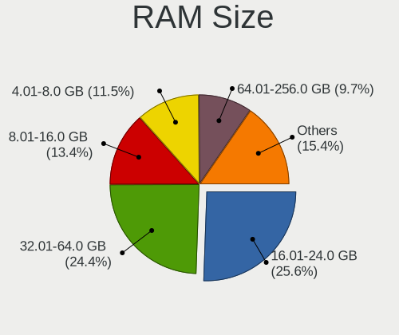
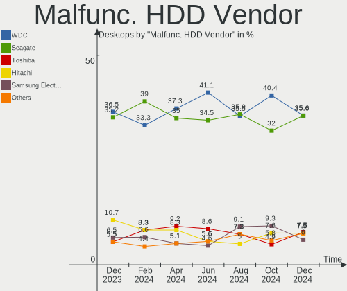
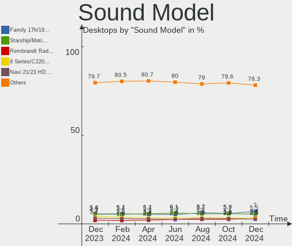

Linux Hardware Trends (Desktops)
--------------------------------

A project to identify most popular hardware characteristics and track their change
over time based on data collected by Linux users at https://Linux-Hardware.org.

Anyone can contribute to this report by the [hw-probe](https://github.com/linuxhw/hw-probe) tool:

    sudo -E hw-probe -all -upload

Full-feature report is available here: https://linux-hardware.org/?view=trends&formfactor=desktop

Period: Sep, 2021.

Contents
--------

* [ System ](#system)
  - [ OS                       ](#os)
  - [ OS Family                ](#os-family)
  - [ Kernel                   ](#kernel)
  - [ Kernel Family            ](#kernel-family)
  - [ Kernel Major Ver.        ](#kernel-major-ver)
  - [ Arch                     ](#arch)
  - [ DE                       ](#de)
  - [ Display Server           ](#display-server)
  - [ Display Manager          ](#display-manager)
  - [ OS Lang                  ](#os-lang)
  - [ Boot Mode                ](#boot-mode)
  - [ Filesystem               ](#filesystem)
  - [ Part. scheme             ](#part-scheme)
  - [ Dual Boot with Linux/BSD ](#dual-boot-with-linuxbsd)
  - [ Dual Boot (Win)          ](#dual-boot-win)

* [ Board ](#board)
  - [ Vendor                   ](#vendor)
  - [ Model                    ](#model)
  - [ Model Family             ](#model-family)
  - [ MFG Year                 ](#mfg-year)
  - [ Form Factor              ](#form-factor)
  - [ Secure Boot              ](#secure-boot)
  - [ Coreboot                 ](#coreboot)
  - [ RAM Size                 ](#ram-size)
  - [ RAM Used                 ](#ram-used)
  - [ Total Drives             ](#total-drives)
  - [ Has CD-ROM               ](#has-cd-rom)
  - [ Has Ethernet             ](#has-ethernet)
  - [ Has WiFi                 ](#has-wifi)
  - [ Has Bluetooth            ](#has-bluetooth)

* [ Location ](#location)
  - [ Country                  ](#country)
  - [ City                     ](#city)

* [ Drives ](#drives)
  - [ Drive Vendor             ](#drive-vendor)
  - [ Drive Model              ](#drive-model)
  - [ HDD Vendor               ](#hdd-vendor)
  - [ SSD Vendor               ](#ssd-vendor)
  - [ Drive Kind               ](#drive-kind)
  - [ Drive Connector          ](#drive-connector)
  - [ Drive Size               ](#drive-size)
  - [ Space Total              ](#space-total)
  - [ Space Used               ](#space-used)
  - [ Malfunc. Drives          ](#malfunc-drives)
  - [ Malfunc. Drive Vendor    ](#malfunc-drive-vendor)
  - [ Malfunc. HDD Vendor      ](#malfunc-hdd-vendor)
  - [ Malfunc. Drive Kind      ](#malfunc-drive-kind)
  - [ Failed Drives            ](#failed-drives)
  - [ Failed Drive Vendor      ](#failed-drive-vendor)
  - [ Drive Status             ](#drive-status)

* [ Storage controller ](#storage-controller)
  - [ Storage Vendor           ](#storage-vendor)
  - [ Storage Model            ](#storage-model)
  - [ Storage Kind             ](#storage-kind)

* [ Processor ](#processor)
  - [ CPU Vendor               ](#cpu-vendor)
  - [ CPU Model                ](#cpu-model)
  - [ CPU Model Family         ](#cpu-model-family)
  - [ CPU Cores                ](#cpu-cores)
  - [ CPU Sockets              ](#cpu-sockets)
  - [ CPU Threads              ](#cpu-threads)
  - [ CPU Op-Modes             ](#cpu-op-modes)
  - [ CPU Microcode            ](#cpu-microcode)
  - [ CPU Microarch            ](#cpu-microarch)

* [ Graphics ](#graphics)
  - [ GPU Vendor               ](#gpu-vendor)
  - [ GPU Model                ](#gpu-model)
  - [ GPU Combo                ](#gpu-combo)
  - [ GPU Driver               ](#gpu-driver)
  - [ GPU Memory               ](#gpu-memory)

* [ Monitor ](#monitor)
  - [ Monitor Vendor           ](#monitor-vendor)
  - [ Monitor Model            ](#monitor-model)
  - [ Monitor Resolution       ](#monitor-resolution)
  - [ Monitor Diagonal         ](#monitor-diagonal)
  - [ Monitor Width            ](#monitor-width)
  - [ Aspect Ratio             ](#aspect-ratio)
  - [ Monitor Area             ](#monitor-area)
  - [ Pixel Density            ](#pixel-density)
  - [ Multiple Monitors        ](#multiple-monitors)

* [ Network ](#network)
  - [ Net Controller Vendor    ](#net-controller-vendor)
  - [ Net Controller Model     ](#net-controller-model)
  - [ Wireless Vendor          ](#wireless-vendor)
  - [ Wireless Model           ](#wireless-model)
  - [ Ethernet Vendor          ](#ethernet-vendor)
  - [ Ethernet Model           ](#ethernet-model)
  - [ Net Controller Kind      ](#net-controller-kind)
  - [ Used Controller          ](#used-controller)
  - [ NICs                     ](#nics)
  - [ IPv6                     ](#ipv6)

* [ Bluetooth ](#bluetooth)
  - [ Bluetooth Vendor         ](#bluetooth-vendor)
  - [ Bluetooth Model          ](#bluetooth-model)

* [ Sound ](#sound)
  - [ Sound Vendor             ](#sound-vendor)
  - [ Sound Model              ](#sound-model)

* [ Memory ](#memory)
  - [ Memory Vendor            ](#memory-vendor)
  - [ Memory Model             ](#memory-model)
  - [ Memory Kind              ](#memory-kind)
  - [ Memory Form Factor       ](#memory-form-factor)
  - [ Memory Size              ](#memory-size)
  - [ Memory Speed             ](#memory-speed)

* [ Printers & scanners ](#printers--scanners)
  - [ Printer Vendor           ](#printer-vendor)
  - [ Printer Model            ](#printer-model)
  - [ Scanner Vendor           ](#scanner-vendor)
  - [ Scanner Model            ](#scanner-model)

* [ Camera ](#camera)
  - [ Camera Vendor            ](#camera-vendor)
  - [ Camera Model             ](#camera-model)

* [ Security ](#security)
  - [ Fingerprint Vendor       ](#fingerprint-vendor)
  - [ Fingerprint Model        ](#fingerprint-model)
  - [ Chipcard Vendor          ](#chipcard-vendor)
  - [ Chipcard Model           ](#chipcard-model)

* [ Unsupported ](#unsupported)
  - [ Unsupported Devices      ](#unsupported-devices)
  - [ Unsupported Device Types ](#unsupported-device-types)

System
------

OS
--

Installed operating systems

| Name                | Desktops | Percent |
|---------------------|----------|---------|
| Ubuntu 20.04        | 287      | 16.6%   |
| Debian 11           | 137      | 7.92%   |
| Mint 20.2           | 119      | 6.88%   |
| Pop!_OS 21.04       | 117      | 6.77%   |
| OpenMandriva 4.2    | 101      | 5.84%   |
| Ubuntu 21.04        | 99       | 5.73%   |
| Fedora 34           | 76       | 4.4%    |
| Zorin 16            | 70       | 4.05%   |
| ROSA R11.1          | 46       | 2.66%   |
| KDE neon 20.04      | 39       | 2.26%   |
| ArcoLinux Rolling   | 37       | 2.14%   |
| Arch                | 37       | 2.14%   |
| Ubuntu 18.04        | 33       | 1.91%   |
| BlackPanther 18.1   | 31       | 1.79%   |
| Manjaro             | 30       | 1.74%   |
| Arch Rolling        | 22       | 1.27%   |
| Xubuntu 20.04       | 21       | 1.21%   |
| Mint 20.1           | 20       | 1.16%   |
| Gentoo 2.7          | 16       | 0.93%   |
| Pop!_OS 20.04       | 15       | 0.87%   |
| Linux Mint 19.3     | 15       | 0.87%   |
| Kubuntu 20.04       | 15       | 0.87%   |
| Zorin 15            | 12       | 0.69%   |
| Ubuntu 21.10        | 12       | 0.69%   |
| OpenMandriva 4.50   | 12       | 0.69%   |
| Manjaro 21.1.2      | 12       | 0.69%   |
| Linux Mint 20       | 11       | 0.64%   |
| Elementary 6        | 11       | 0.64%   |
| Debian 10           | 11       | 0.64%   |
| ROSA R12            | 10       | 0.58%   |
| LMDE 4              | 10       | 0.58%   |
| Kubuntu 21.04       | 10       | 0.58%   |
| Ubuntu 16.04        | 9        | 0.52%   |
| CentOS 8            | 9        | 0.52%   |
| openSUSE Leap-15.3  | 8        | 0.46%   |
| Manjaro 21.1.3      | 8        | 0.46%   |
| Lubuntu 20.04       | 8        | 0.46%   |
| Debian Testing      | 8        | 0.46%   |
| Xubuntu 18.04       | 7        | 0.4%    |
| Ubuntu MATE 20.04   | 7        | 0.4%    |
| Ubuntu 20.10        | 7        | 0.4%    |
| Endless 3.9.5       | 6        | 0.35%   |
| Xubuntu 21.04       | 5        | 0.29%   |
| Manjaro 21.1.1      | 5        | 0.29%   |
| LinuxFX 11          | 5        | 0.29%   |
| Kali 2021.3         | 5        | 0.29%   |
| Fedora 35           | 5        | 0.29%   |
| EndeavourOS Rolling | 5        | 0.29%   |
| ROSA R11            | 4        | 0.23%   |
| Manjaro 21.1.4      | 4        | 0.23%   |
| Fedora 33           | 4        | 0.23%   |
| RHEL 8              | 3        | 0.17%   |
| Pop!_OS 20.10       | 3        | 0.17%   |
| Makulu 2020         | 3        | 0.17%   |
| Kubuntu 21.10       | 3        | 0.17%   |
| Debian 9            | 3        | 0.17%   |
| ClearOS 7           | 3        | 0.17%   |
| Void Rolling        | 2        | 0.12%   |
| Ubuntu MATE 21.04   | 2        | 0.12%   |
| Ubuntu MATE 18.04   | 2        | 0.12%   |

OS Family
---------

OS without a version

| Name          | Desktops | Percent |
|---------------|----------|---------|
| Ubuntu        | 451      | 26.08%  |
| Mint          | 169      | 9.77%   |
| Debian        | 162      | 9.37%   |
| Pop!_OS       | 135      | 7.81%   |
| OpenMandriva  | 113      | 6.54%   |
| Fedora        | 88       | 5.09%   |
| Zorin         | 82       | 4.74%   |
| ROSA          | 61       | 3.53%   |
| Manjaro       | 59       | 3.41%   |
| Arch          | 59       | 3.41%   |
| KDE neon      | 39       | 2.26%   |
| ArcoLinux     | 38       | 2.2%    |
| Xubuntu       | 35       | 2.02%   |
| BlackPanther  | 32       | 1.85%   |
| Kubuntu       | 30       | 1.74%   |
| openSUSE      | 19       | 1.1%    |
| Gentoo        | 17       | 0.98%   |
| Elementary    | 13       | 0.75%   |
| Ubuntu MATE   | 11       | 0.64%   |
| Lubuntu       | 11       | 0.64%   |
| CentOS        | 11       | 0.64%   |
| LMDE          | 10       | 0.58%   |
| Clear Linux   | 9        | 0.52%   |
| Endless       | 8        | 0.46%   |
| LinuxFX       | 7        | 0.4%    |
| Kali          | 6        | 0.35%   |
| EndeavourOS   | 6        | 0.35%   |
| ClearOS       | 4        | 0.23%   |
| Void          | 3        | 0.17%   |
| RHEL          | 3        | 0.17%   |
| Makulu        | 3        | 0.17%   |
| Garuda        | 3        | 0.17%   |
| Slackware     | 2        | 0.12%   |
| Siduction     | 2        | 0.12%   |
| Rocky         | 2        | 0.12%   |
| RED           | 2        | 0.12%   |
| Peppermint    | 2        | 0.12%   |
| Mageia        | 2        | 0.12%   |
| GNOME OS      | 2        | 0.12%   |
| Deepin        | 2        | 0.12%   |
| ALT Linux     | 2        | 0.12%   |
| Alpine        | 2        | 0.12%   |
| XF            | 1        | 0.06%   |
| Ubuntu Budgie | 1        | 0.06%   |
| Solus         | 1        | 0.06%   |
| Red OS        | 1        | 0.06%   |
| PureOS        | 1        | 0.06%   |
| Pear OS       | 1        | 0.06%   |
| PCLinuxOS     | 1        | 0.06%   |
| Parrot        | 1        | 0.06%   |
| Pardus        | 1        | 0.06%   |
| MX            | 1        | 0.06%   |
| Freedesktop   | 1        | 0.06%   |
| Android       | 1        | 0.06%   |

Kernel
------

Version of the Linux kernel

| Version                             | Desktops | Percent |
|-------------------------------------|----------|---------|
| 5.11.0-34-generic                   | 199      | 11.51%  |
| 5.11.0-27-generic                   | 113      | 6.54%   |
| 5.10.14-desktop-1omv4002            | 99       | 5.73%   |
| 5.11.0-36-generic                   | 86       | 4.97%   |
| 5.4.0-84-generic                    | 79       | 4.57%   |
| 5.10.0-7-amd64                      | 69       | 3.99%   |
| 5.10.0-8-amd64                      | 68       | 3.93%   |
| 5.11.0-7633-generic                 | 67       | 3.88%   |
| 5.4.0-81-generic                    | 66       | 3.82%   |
| 5.13.0-7614-generic                 | 49       | 2.83%   |
| 5.4.0-86-generic                    | 34       | 1.97%   |
| 5.11.0-31-generic                   | 34       | 1.97%   |
| 5.11.0-37-generic                   | 31       | 1.79%   |
| 5.13.13-arch1-1                     | 26       | 1.5%    |
| 5.4.0-88-generic                    | 25       | 1.45%   |
| 5.14.6-arch1-1                      | 17       | 0.98%   |
| 4.18.16-desktop-1bP                 | 17       | 0.98%   |
| 5.13.16-200.fc34.x86_64             | 15       | 0.87%   |
| 5.13.14-200.fc34.x86_64             | 15       | 0.87%   |
| 5.8.0-63-generic                    | 14       | 0.81%   |
| 5.6.14-desktop-2bP                  | 14       | 0.81%   |
| 5.4.0-74-generic                    | 14       | 0.81%   |
| 5.11.0-7620-generic                 | 14       | 0.81%   |
| 4.19.0-17-amd64                     | 14       | 0.81%   |
| 5.4.83-generic-2rosa-x86_64         | 13       | 0.75%   |
| 5.13.12-200.fc34.x86_64             | 12       | 0.69%   |
| 5.13.0-16-generic                   | 12       | 0.69%   |
| 4.15.0-desktop-122.124.1rosa-x86_64 | 12       | 0.69%   |
| 5.14.0-0-MANJARO                    | 11       | 0.64%   |
| 5.12.4-desktop-1omv4050             | 11       | 0.64%   |
| 5.4.32-generic-2rosa-x86_64         | 10       | 0.58%   |
| 5.13.19-200.fc34.x86_64             | 10       | 0.58%   |
| 5.14.2-arch1-2                      | 9        | 0.52%   |
| 5.13.13-1-MANJARO                   | 8        | 0.46%   |
| 5.8.0-43-generic                    | 7        | 0.4%    |
| 5.13.15-200.fc34.x86_64             | 7        | 0.4%    |
| 5.10.61-gentoo                      | 7        | 0.4%    |
| 5.10.56-generic-1rosa2021.1-x86_64  | 7        | 0.4%    |
| 4.15.0-156-generic                  | 7        | 0.4%    |
| 4.15.0-142-generic                  | 7        | 0.4%    |
| 5.8.0-14-generic                    | 6        | 0.35%   |
| 5.4.0-42-generic                    | 6        | 0.35%   |
| 5.3.18-59.19-default                | 6        | 0.35%   |
| 5.14.7-arch1-1                      | 6        | 0.35%   |
| 5.13.13-200.fc34.x86_64             | 6        | 0.35%   |
| 5.13.12-1-MANJARO                   | 6        | 0.35%   |
| 5.11.12-300.fc34.x86_64             | 6        | 0.35%   |
| 5.11.0-16-generic                   | 6        | 0.35%   |
| 5.4.32-generic-2rosa-i586           | 5        | 0.29%   |
| 5.4.0-80-generic                    | 5        | 0.29%   |
| 5.4.0-26-generic                    | 5        | 0.29%   |
| 5.14.3-arch1-1                      | 5        | 0.29%   |
| 5.14.2-1-MANJARO                    | 5        | 0.29%   |
| 5.13.15-1-MANJARO                   | 5        | 0.29%   |
| 5.10.60-1-MANJARO                   | 5        | 0.29%   |
| 5.10.0-kali9-amd64                  | 5        | 0.29%   |
| 5.8.0-59-generic                    | 4        | 0.23%   |
| 5.4.0-58-generic                    | 4        | 0.23%   |
| 5.13.13-1070.native                 | 4        | 0.23%   |
| 5.13.0-14-generic                   | 4        | 0.23%   |

Kernel Family
-------------

Linux kernel without a distro release

| Version | Desktops | Percent |
|---------|----------|---------|
| 5.11.0  | 568      | 32.85%  |
| 5.4.0   | 261      | 15.1%   |
| 5.10.0  | 152      | 8.79%   |
| 5.10.14 | 99       | 5.73%   |
| 5.13.0  | 68       | 3.93%   |
| 5.13.13 | 52       | 3.01%   |
| 4.15.0  | 50       | 2.89%   |
| 5.8.0   | 42       | 2.43%   |
| 5.13.12 | 26       | 1.5%    |
| 5.14.6  | 23       | 1.33%   |
| 5.14.0  | 22       | 1.27%   |
| 5.14.2  | 20       | 1.16%   |
| 4.19.0  | 18       | 1.04%   |
| 5.13.15 | 17       | 0.98%   |
| 5.10.61 | 17       | 0.98%   |
| 4.18.16 | 17       | 0.98%   |
| 5.13.14 | 16       | 0.93%   |
| 5.4.32  | 15       | 0.87%   |
| 5.13.19 | 15       | 0.87%   |
| 5.13.16 | 15       | 0.87%   |
| 4.18.0  | 15       | 0.87%   |
| 5.6.14  | 14       | 0.81%   |
| 5.4.83  | 14       | 0.81%   |
| 5.12.4  | 11       | 0.64%   |
| 5.3.18  | 9        | 0.52%   |
| 5.14.7  | 9        | 0.52%   |
| 5.14.3  | 9        | 0.52%   |
| 5.11.12 | 8        | 0.46%   |
| 5.14.8  | 7        | 0.4%    |
| 5.14.1  | 7        | 0.4%    |
| 5.10.56 | 7        | 0.4%    |
| 5.11.22 | 6        | 0.35%   |
| 5.10.60 | 6        | 0.35%   |
| 5.14.5  | 5        | 0.29%   |
| 5.10.63 | 5        | 0.29%   |
| 5.0.0   | 5        | 0.29%   |
| 3.10.0  | 5        | 0.29%   |
| 5.3.0   | 4        | 0.23%   |
| 5.10.62 | 4        | 0.23%   |
| 5.13.4  | 3        | 0.17%   |
| 5.10.69 | 3        | 0.17%   |
| 5.10.68 | 3        | 0.17%   |
| 5.9.16  | 2        | 0.12%   |
| 5.14.4  | 2        | 0.12%   |
| 5.13.10 | 2        | 0.12%   |
| 5.12.19 | 2        | 0.12%   |
| 5.10.65 | 2        | 0.12%   |
| 5.10.64 | 2        | 0.12%   |
| 5.10.50 | 2        | 0.12%   |
| 4.9.155 | 2        | 0.12%   |
| 4.9.0   | 2        | 0.12%   |
| 4.4.0   | 2        | 0.12%   |
| 5.9.0   | 1        | 0.06%   |
| 5.8.18  | 1        | 0.06%   |
| 5.7.19  | 1        | 0.06%   |
| 5.7.15  | 1        | 0.06%   |
| 5.6.19  | 1        | 0.06%   |
| 5.5.4   | 1        | 0.06%   |
| 5.4.53  | 1        | 0.06%   |
| 5.4.5   | 1        | 0.06%   |

Kernel Major Ver.
-----------------

Linux kernel major version

| Version | Desktops | Percent |
|---------|----------|---------|
| 5.11    | 586      | 33.89%  |
| 5.10    | 308      | 17.81%  |
| 5.4     | 294      | 17%     |
| 5.13    | 217      | 12.55%  |
| 5.14    | 104      | 6.02%   |
| 4.15    | 50       | 2.89%   |
| 5.8     | 43       | 2.49%   |
| 4.18    | 32       | 1.85%   |
| 4.19    | 20       | 1.16%   |
| 5.6     | 15       | 0.87%   |
| 5.12    | 15       | 0.87%   |
| 5.3     | 13       | 0.75%   |
| 4.9     | 6        | 0.35%   |
| 3.10    | 6        | 0.35%   |
| 5.0     | 5        | 0.29%   |
| 5.9     | 3        | 0.17%   |
| 5.7     | 2        | 0.12%   |
| 4.4     | 2        | 0.12%   |
| 4.14    | 2        | 0.12%   |
| 5.5     | 1        | 0.06%   |
| 5.2     | 1        | 0.06%   |
| 5.15    | 1        | 0.06%   |
| 4.13    | 1        | 0.06%   |
| 4.1     | 1        | 0.06%   |
| 2.6     | 1        | 0.06%   |

Arch
----

OS architecture (x86_64, i586, etc.)

| Name   | Desktops | Percent |
|--------|----------|---------|
| x86_64 | 1701     | 98.38%  |
| i686   | 27       | 1.56%   |
| ppc64  | 1        | 0.06%   |

DE
--

Desktop Environment

| Name              | Desktops | Percent |
|-------------------|----------|---------|
| GNOME             | 750      | 43.38%  |
| KDE5              | 279      | 16.14%  |
| Unknown           | 171      | 9.89%   |
| X-Cinnamon        | 146      | 8.44%   |
| XFCE              | 119      | 6.88%   |
| KDE               | 63       | 3.64%   |
| MATE              | 47       | 2.72%   |
| KDE4              | 35       | 2.02%   |
| LXQt              | 18       | 1.04%   |
| Cinnamon          | 15       | 0.87%   |
| i3                | 13       | 0.75%   |
| Pantheon          | 12       | 0.69%   |
| Unity             | 10       | 0.58%   |
| awesome           | 9        | 0.52%   |
| LXDE              | 8        | 0.46%   |
| GNOME Classic     | 6        | 0.35%   |
| Deepin            | 6        | 0.35%   |
| Budgie            | 6        | 0.35%   |
| xmonad            | 3        | 0.17%   |
| GNOME Flashback   | 3        | 0.17%   |
| qtile             | 2        | 0.12%   |
| Openbox           | 2        | 0.12%   |
| Yaru:ubuntu:GNOME | 1        | 0.06%   |
| NsCDE             | 1        | 0.06%   |
| lightdm-xsession  | 1        | 0.06%   |
| leftwm            | 1        | 0.06%   |
| fvwm              | 1        | 0.06%   |
| bspwm             | 1        | 0.06%   |

Display Server
--------------

X11 or Wayland

| Name        | Desktops | Percent |
|-------------|----------|---------|
| X11         | 1391     | 80.45%  |
| Wayland     | 174      | 10.06%  |
| Unknown     | 120      | 6.94%   |
| Tty         | 42       | 2.43%   |
| Web         | 1        | 0.06%   |
| Unspecified | 1        | 0.06%   |

Display Manager
---------------

SDDM, LightDM, etc.

| Name    | Desktops | Percent |
|---------|----------|---------|
| Unknown | 955      | 55.23%  |
| SDDM    | 285      | 16.48%  |
| GDM     | 180      | 10.41%  |
| LightDM | 171      | 9.89%   |
| GDM3    | 93       | 5.38%   |
| KDM     | 35       | 2.02%   |
| XDM     | 4        | 0.23%   |
| LXDM    | 3        | 0.17%   |
| SLiM    | 1        | 0.06%   |
| Ly      | 1        | 0.06%   |
| GREETD  | 1        | 0.06%   |

OS Lang
-------

Language

| Lang        | Desktops | Percent |
|-------------|----------|---------|
| en_US       | 638      | 36.9%   |
| ru_RU       | 168      | 9.72%   |
| de_DE       | 148      | 8.56%   |
| fr_FR       | 99       | 5.73%   |
| en_GB       | 86       | 4.97%   |
| pt_BR       | 81       | 4.68%   |
| Unknown     | 51       | 2.95%   |
| en_AU       | 50       | 2.89%   |
| en_CA       | 38       | 2.2%    |
| es_ES       | 35       | 2.02%   |
| C           | 35       | 2.02%   |
| it_IT       | 32       | 1.85%   |
| pl_PL       | 29       | 1.68%   |
| hu_HU       | 18       | 1.04%   |
| en_IN       | 18       | 1.04%   |
| es_AR       | 13       | 0.75%   |
| pt_PT       | 12       | 0.69%   |
| nl_NL       | 12       | 0.69%   |
| es_MX       | 12       | 0.69%   |
| fr_CA       | 9        | 0.52%   |
| zh_CN       | 8        | 0.46%   |
| es_CO       | 8        | 0.46%   |
| ru_UA       | 7        | 0.4%    |
| de_CH       | 7        | 0.4%    |
| cs_CZ       | 7        | 0.4%    |
| ro_RO       | 6        | 0.35%   |
| nl_BE       | 6        | 0.35%   |
| es_CL       | 6        | 0.35%   |
| en_ZA       | 6        | 0.35%   |
| en_NZ       | 6        | 0.35%   |
| sv_SE       | 5        | 0.29%   |
| fr_BE       | 5        | 0.29%   |
| de_AT       | 5        | 0.29%   |
| tr_TR       | 4        | 0.23%   |
| en_IE       | 4        | 0.23%   |
| uk_UA       | 3        | 0.17%   |
| ja_JP       | 3        | 0.17%   |
| fi_FI       | 3        | 0.17%   |
| en_IL       | 3        | 0.17%   |
| en_DK       | 3        | 0.17%   |
| el_GR       | 3        | 0.17%   |
| sr_RS       | 2        | 0.12%   |
| ru_RU.UTF_8 | 2        | 0.12%   |
| nb_NO       | 2        | 0.12%   |
| fr_CH       | 2        | 0.12%   |
| es_PE       | 2        | 0.12%   |
| es_GT       | 2        | 0.12%   |
| es_BO       | 2        | 0.12%   |
| ca_ES       | 2        | 0.12%   |
| bg_BG       | 2        | 0.12%   |
| zh_TW       | 1        | 0.06%   |
| tt_RU       | 1        | 0.06%   |
| sl_SI       | 1        | 0.06%   |
| POSIX       | 1        | 0.06%   |
| lt_LT       | 1        | 0.06%   |
| is_IS       | 1        | 0.06%   |
| hr_HR       | 1        | 0.06%   |
| fr_FR.UTF8  | 1        | 0.06%   |
| es_SV       | 1        | 0.06%   |
| es_PY       | 1        | 0.06%   |

Boot Mode
---------

EFI or BIOS

| Mode | Desktops | Percent |
|------|----------|---------|
| BIOS | 1147     | 66.34%  |
| EFI  | 582      | 33.66%  |

Filesystem
----------

Type of filesystem

| Type     | Desktops | Percent |
|----------|----------|---------|
| Ext4     | 1308     | 75.65%  |
| Overlay  | 232      | 13.42%  |
| Btrfs    | 117      | 6.77%   |
| Xfs      | 43       | 2.49%   |
| Zfs      | 11       | 0.64%   |
| Ext3     | 6        | 0.35%   |
| F2fs     | 5        | 0.29%   |
| Ext2     | 3        | 0.17%   |
| SquXshfs | 1        | 0.06%   |
| Reiserfs | 1        | 0.06%   |
| ExX4     | 1        | 0.06%   |
| Unknown  | 1        | 0.06%   |

Part. scheme
------------

Scheme of partitioning

| Type    | Desktops | Percent |
|---------|----------|---------|
| Unknown | 945      | 54.66%  |
| GPT     | 448      | 25.91%  |
| MBR     | 336      | 19.43%  |

Dual Boot with Linux/BSD
------------------------

Hosting more than one Linux/BSD

| Dual boot | Desktops | Percent |
|-----------|----------|---------|
| No        | 1418     | 82.01%  |
| Yes       | 311      | 17.99%  |

Dual Boot (Win)
---------------

Hosting Linux and Windows

| Dual boot | Desktops | Percent |
|-----------|----------|---------|
| No        | 1134     | 65.59%  |
| Yes       | 595      | 34.41%  |

Board
-----

Vendor
------

Motherboard manufacturer

| Name                        | Desktops | Percent |
|-----------------------------|----------|---------|
| ASUSTek Computer            | 500      | 28.92%  |
| Gigabyte Technology         | 296      | 17.12%  |
| ASRock                      | 168      | 9.72%   |
| MSI                         | 165      | 9.54%   |
| Hewlett-Packard             | 139      | 8.04%   |
| Dell                        | 123      | 7.11%   |
| Lenovo                      | 55       | 3.18%   |
| Intel                       | 45       | 2.6%    |
| Acer                        | 31       | 1.79%   |
| ECS                         | 25       | 1.45%   |
| Foxconn                     | 20       | 1.16%   |
| Unknown                     | 20       | 1.16%   |
| Pegatron                    | 17       | 0.98%   |
| Fujitsu                     | 16       | 0.93%   |
| Biostar                     | 16       | 0.93%   |
| Medion                      | 9        | 0.52%   |
| Huanan                      | 9        | 0.52%   |
| Fujitsu Siemens             | 6        | 0.35%   |
| Shuttle                     | 5        | 0.29%   |
| Apple                       | 5        | 0.29%   |
| Supermicro                  | 4        | 0.23%   |
| eMachines                   | 4        | 0.23%   |
| Positivo                    | 3        | 0.17%   |
| PCWare                      | 3        | 0.17%   |
| HC                          | 3        | 0.17%   |
| EVGA                        | 3        | 0.17%   |
| Wistron                     | 2        | 0.12%   |
| System76                    | 2        | 0.12%   |
| OEM                         | 2        | 0.12%   |
| NCR                         | 2        | 0.12%   |
| HARDKERNEL                  | 2        | 0.12%   |
| Google                      | 2        | 0.12%   |
| Alienware                   | 2        | 0.12%   |
| ZOTAC                       | 1        | 0.06%   |
| VS Company                  | 1        | 0.06%   |
| TSINGHUA TONGFANG COMPUTER  | 1        | 0.06%   |
| Tekram Technology           | 1        | 0.06%   |
| SeeedStudio                 | 1        | 0.06%   |
| Sapphire Technology Limited | 1        | 0.06%   |
| Samsung Electronics         | 1        | 0.06%   |
| Maibenben                   | 1        | 0.06%   |
| Libretrend                  | 1        | 0.06%   |
| JW Technology               | 1        | 0.06%   |
| JOOYON                      | 1        | 0.06%   |
| JGINYUE                     | 1        | 0.06%   |
| Itautec                     | 1        | 0.06%   |
| Insyde                      | 1        | 0.06%   |
| IBM                         | 1        | 0.06%   |
| HOUTER                      | 1        | 0.06%   |
| Hampoo                      | 1        | 0.06%   |
| FIRICH                      | 1        | 0.06%   |
| Digiboard                   | 1        | 0.06%   |
| DFI                         | 1        | 0.06%   |
| AZW                         | 1        | 0.06%   |
| AWOW                        | 1        | 0.06%   |
| ASRockRack                  | 1        | 0.06%   |
| AOpen                       | 1        | 0.06%   |
| AAEON                       | 1        | 0.06%   |

Model
-----

Motherboard model

| Name                         | Desktops | Percent |
|------------------------------|----------|---------|
| ASUS All Series              | 58       | 3.35%   |
| Unknown                      | 21       | 1.21%   |
| ECS H61H2-M13                | 13       | 0.75%   |
| Dell OptiPlex 9020           | 12       | 0.69%   |
| ASUS PRIME A320M-K           | 12       | 0.69%   |
| Dell OptiPlex 7010           | 10       | 0.58%   |
| ASUS TUF GAMING X570-PLUS    | 10       | 0.58%   |
| Gigabyte B450M DS3H          | 9        | 0.52%   |
| MSI MS-7817                  | 8        | 0.46%   |
| MSI MS-7C37                  | 7        | 0.4%    |
| MSI MS-7A34                  | 7        | 0.4%    |
| Gigabyte H61M-S1             | 7        | 0.4%    |
| Dell OptiPlex 3010           | 7        | 0.4%    |
| ASUS ROG STRIX B550-F GAMING | 7        | 0.4%    |
| ASUS P8H67-M                 | 7        | 0.4%    |
| ASUS P8H61-M LX3 PLUS R2.0   | 7        | 0.4%    |
| HP Compaq Pro 6300 SFF       | 6        | 0.35%   |
| Gigabyte X570 AORUS ELITE    | 6        | 0.35%   |
| Gigabyte A320M-S2H           | 6        | 0.35%   |
| ASUS Z170-A                  | 6        | 0.35%   |
| ASRock B450M Steel Legend    | 6        | 0.35%   |
| MSI MS-7C91                  | 5        | 0.29%   |
| HP Compaq Elite 8300 SFF     | 5        | 0.29%   |
| Gigabyte X570 AORUS MASTER   | 5        | 0.29%   |
| Gigabyte B450 AORUS PRO WIFI | 5        | 0.29%   |
| Dell OptiPlex 780            | 5        | 0.29%   |
| Dell OptiPlex 390            | 5        | 0.29%   |
| ASUS PRIME X570-P            | 5        | 0.29%   |
| ASUS PRIME B450M-A           | 5        | 0.29%   |
| ASRock 970 Pro3 R2.0         | 5        | 0.29%   |
| MSI MS-7C02                  | 4        | 0.23%   |
| MSI MS-7B89                  | 4        | 0.23%   |
| MSI MS-7B86                  | 4        | 0.23%   |
| MSI MS-7721                  | 4        | 0.23%   |
| MSI MS-7693                  | 4        | 0.23%   |
| HP ProDesk 600 G1 SFF        | 4        | 0.23%   |
| HP EliteDesk 800 G2 DM 65W   | 4        | 0.23%   |
| HP Compaq 6200 Pro SFF PC    | 4        | 0.23%   |
| Gigabyte H61M-DS2            | 4        | 0.23%   |
| Gigabyte B250M-DS3H          | 4        | 0.23%   |
| Dell OptiPlex 790            | 4        | 0.23%   |
| Dell OptiPlex 755            | 4        | 0.23%   |
| Dell OptiPlex 7050           | 4        | 0.23%   |
| ASUS ROG STRIX X570-E GAMING | 4        | 0.23%   |
| ASUS ROG STRIX B450-F GAMING | 4        | 0.23%   |
| ASUS PRIME X570-PRO          | 4        | 0.23%   |
| ASUS PRIME X470-PRO          | 4        | 0.23%   |
| ASUS P5KPL-AM EPU            | 4        | 0.23%   |
| ASUS Maximus VIII RANGER     | 4        | 0.23%   |
| ASUS M5A78L-M/USB3           | 4        | 0.23%   |
| ASRock X570 Taichi           | 4        | 0.23%   |
| Acer Aspire XC-830           | 4        | 0.23%   |
| MSI MS-7C95                  | 3        | 0.17%   |
| MSI MS-7C84                  | 3        | 0.17%   |
| MSI MS-7C83                  | 3        | 0.17%   |
| MSI MS-7C52                  | 3        | 0.17%   |
| MSI MS-7C35                  | 3        | 0.17%   |
| MSI MS-7B98                  | 3        | 0.17%   |
| MSI MS-7A38                  | 3        | 0.17%   |
| MSI MS-7788                  | 3        | 0.17%   |

Model Family
------------

Motherboard model prefix

| Name                   | Desktops | Percent |
|------------------------|----------|---------|
| Dell OptiPlex          | 83       | 4.8%    |
| ASUS PRIME             | 77       | 4.45%   |
| ASUS All               | 58       | 3.35%   |
| HP Compaq              | 48       | 2.78%   |
| ASUS ROG               | 48       | 2.78%   |
| Lenovo ThinkCentre     | 34       | 1.97%   |
| ASUS TUF               | 31       | 1.79%   |
| Gigabyte X570          | 21       | 1.21%   |
| Unknown                | 21       | 1.21%   |
| ASUS P8H61-M           | 20       | 1.16%   |
| Acer Aspire            | 19       | 1.1%    |
| HP EliteDesk           | 18       | 1.04%   |
| Gigabyte B450M         | 17       | 0.98%   |
| Fujitsu ESPRIMO        | 15       | 0.87%   |
| Dell Precision         | 15       | 0.87%   |
| ECS H61H2-M13          | 13       | 0.75%   |
| Dell Inspiron          | 13       | 0.75%   |
| ASUS Maximus           | 12       | 0.69%   |
| ASUS M5A78L-M          | 11       | 0.64%   |
| HP ProDesk             | 10       | 0.58%   |
| HP Pavilion            | 10       | 0.58%   |
| Gigabyte B450          | 10       | 0.58%   |
| Lenovo IdeaCentre      | 9        | 0.52%   |
| ASUS P8H67-M           | 9        | 0.52%   |
| ASRock B450M           | 9        | 0.52%   |
| MSI MS-7817            | 8        | 0.46%   |
| ASUS P8Z77-V           | 8        | 0.46%   |
| ASRock 970             | 8        | 0.46%   |
| MSI MS-7C37            | 7        | 0.4%    |
| MSI MS-7A34            | 7        | 0.4%    |
| Gigabyte H61M-S1       | 7        | 0.4%    |
| Gigabyte H61M-DS2      | 7        | 0.4%    |
| Gigabyte A320M-S2H     | 7        | 0.4%    |
| ASUS SABERTOOTH        | 7        | 0.4%    |
| ASUS P5KPL-AM          | 7        | 0.4%    |
| ASRock X570            | 7        | 0.4%    |
| Gigabyte B550          | 6        | 0.35%   |
| ASUS Z170-A            | 6        | 0.35%   |
| MSI MS-7C91            | 5        | 0.29%   |
| Gigabyte H310M         | 5        | 0.29%   |
| Gigabyte GA-78LMT-USB3 | 5        | 0.29%   |
| ASUS P6T               | 5        | 0.29%   |
| Acer Veriton           | 5        | 0.29%   |
| MSI MS-7C02            | 4        | 0.23%   |
| MSI MS-7B89            | 4        | 0.23%   |
| MSI MS-7B86            | 4        | 0.23%   |
| MSI MS-7721            | 4        | 0.23%   |
| MSI MS-7693            | 4        | 0.23%   |
| Lenovo ThinkStation    | 4        | 0.23%   |
| Intel DG31PR           | 4        | 0.23%   |
| HP ProLiant            | 4        | 0.23%   |
| HP Desktop             | 4        | 0.23%   |
| Gigabyte Z390          | 4        | 0.23%   |
| Gigabyte B250M-DS3H    | 4        | 0.23%   |
| Dell Vostro            | 4        | 0.23%   |
| ASUS STRIX             | 4        | 0.23%   |
| ASUS P8Z77-M           | 4        | 0.23%   |
| ASUS P5G41T-M          | 4        | 0.23%   |
| ASUS M5A97             | 4        | 0.23%   |
| MSI MS-7C95            | 3        | 0.17%   |

MFG Year
--------

Motherboard manufacture year

| Year    | Desktops | Percent |
|---------|----------|---------|
| 2021    | 204      | 11.8%   |
| 2020    | 195      | 11.28%  |
| 2018    | 159      | 9.2%    |
| 2012    | 159      | 9.2%    |
| 2019    | 135      | 7.81%   |
| 2014    | 130      | 7.52%   |
| 2011    | 111      | 6.42%   |
| 2013    | 108      | 6.25%   |
| 2010    | 108      | 6.25%   |
| 2015    | 92       | 5.32%   |
| 2016    | 84       | 4.86%   |
| 2009    | 80       | 4.63%   |
| 2008    | 61       | 3.53%   |
| 2017    | 40       | 2.31%   |
| 2007    | 30       | 1.74%   |
| 2006    | 17       | 0.98%   |
| 2005    | 10       | 0.58%   |
| Unknown | 4        | 0.23%   |
| 2004    | 1        | 0.06%   |
| 2000    | 1        | 0.06%   |

Form Factor
-----------

Physical design of the computer

| Name    | Desktops | Percent |
|---------|----------|---------|
| Desktop | 1729     | 100%    |

Secure Boot
-----------

Enabled or disabled

| State    | Desktops | Percent |
|----------|----------|---------|
| Disabled | 1685     | 97.46%  |
| Enabled  | 44       | 2.54%   |

Coreboot
--------

Have coreboot on board

| Used | Desktops | Percent |
|------|----------|---------|
| No   | 1726     | 99.83%  |
| Yes  | 3        | 0.17%   |

RAM Size
--------

Total RAM memory

| Size in GB      | Desktops | Percent |
|-----------------|----------|---------|
| 16.01-24.0      | 425      | 24.58%  |
| 8.01-16.0       | 357      | 20.65%  |
| 3.01-4.0        | 284      | 16.43%  |
| 4.01-8.0        | 269      | 15.56%  |
| 32.01-64.0      | 214      | 12.38%  |
| 64.01-256.0     | 68       | 3.93%   |
| 1.01-2.0        | 50       | 2.89%   |
| 24.01-32.0      | 30       | 1.74%   |
| 2.01-3.0        | 22       | 1.27%   |
| 0.51-1.0        | 7        | 0.4%    |
| More than 256.0 | 2        | 0.12%   |
| Unknown         | 1        | 0.06%   |

RAM Used
--------

Used RAM memory

| Used GB    | Desktops | Percent |
|------------|----------|---------|
| 1.01-2.0   | 624      | 36.09%  |
| 2.01-3.0   | 392      | 22.67%  |
| 4.01-8.0   | 225      | 13.01%  |
| 0.51-1.0   | 196      | 11.34%  |
| 3.01-4.0   | 166      | 9.6%    |
| 8.01-16.0  | 62       | 3.59%   |
| 0.01-0.5   | 40       | 2.31%   |
| 16.01-24.0 | 17       | 0.98%   |
| Unknown    | 3        | 0.17%   |
| 32.01-64.0 | 2        | 0.12%   |
| 24.01-32.0 | 2        | 0.12%   |

Total Drives
------------

Number of drives on board

| Drives | Desktops | Percent |
|--------|----------|---------|
| 1      | 718      | 41.53%  |
| 2      | 458      | 26.49%  |
| 3      | 235      | 13.59%  |
| 4      | 182      | 10.53%  |
| 5      | 61       | 3.53%   |
| 6      | 26       | 1.5%    |
| 0      | 20       | 1.16%   |
| 7      | 13       | 0.75%   |
| 8      | 9        | 0.52%   |
| 10     | 3        | 0.17%   |
| 25     | 1        | 0.06%   |
| 19     | 1        | 0.06%   |
| 12     | 1        | 0.06%   |
| 9      | 1        | 0.06%   |

Has CD-ROM
----------

Has CD-ROM on board

| Presented | Desktops | Percent |
|-----------|----------|---------|
| No        | 900      | 52.05%  |
| Yes       | 829      | 47.95%  |

Has Ethernet
------------

Has Ethernet on board

| Presented | Desktops | Percent |
|-----------|----------|---------|
| Yes       | 1712     | 99.02%  |
| No        | 17       | 0.98%   |

Has WiFi
--------

Has WiFi module

| Presented | Desktops | Percent |
|-----------|----------|---------|
| No        | 1032     | 59.69%  |
| Yes       | 697      | 40.31%  |

Has Bluetooth
-------------

Has Bluetooth module

| Presented | Desktops | Percent |
|-----------|----------|---------|
| No        | 1245     | 72.01%  |
| Yes       | 484      | 27.99%  |

Location
--------

Country
-------

Geographic location (country)

| Country      | Desktops | Percent |
|--------------|----------|---------|
| USA          | 322      | 18.62%  |
| Germany      | 193      | 11.16%  |
| Russia       | 186      | 10.76%  |
| Brazil       | 108      | 6.25%   |
| France       | 97       | 5.61%   |
| UK           | 73       | 4.22%   |
| Canada       | 65       | 3.76%   |
| Australia    | 54       | 3.12%   |
| Hungary      | 48       | 2.78%   |
| Italy        | 45       | 2.6%    |
| Spain        | 39       | 2.26%   |
| Poland       | 36       | 2.08%   |
| India        | 25       | 1.45%   |
| Sweden       | 24       | 1.39%   |
| Ukraine      | 22       | 1.27%   |
| Belgium      | 22       | 1.27%   |
| Portugal     | 21       | 1.21%   |
| Netherlands  | 21       | 1.21%   |
| Switzerland  | 20       | 1.16%   |
| Romania      | 18       | 1.04%   |
| Mexico       | 18       | 1.04%   |
| Argentina    | 16       | 0.93%   |
| Czechia      | 13       | 0.75%   |
| Austria      | 13       | 0.75%   |
| China        | 11       | 0.64%   |
| Colombia     | 10       | 0.58%   |
| Chile        | 10       | 0.58%   |
| Serbia       | 9        | 0.52%   |
| Belarus      | 9        | 0.52%   |
| South Africa | 8        | 0.46%   |
| New Zealand  | 8        | 0.46%   |
| Indonesia    | 8        | 0.46%   |
| Turkey       | 7        | 0.4%    |
| Pakistan     | 7        | 0.4%    |
| Greece       | 7        | 0.4%    |
| Finland      | 7        | 0.4%    |
| Japan        | 6        | 0.35%   |
| Bulgaria     | 6        | 0.35%   |
| Thailand     | 5        | 0.29%   |
| Norway       | 5        | 0.29%   |
| Malaysia     | 5        | 0.29%   |
| Israel       | 5        | 0.29%   |
| Algeria      | 5        | 0.29%   |
| Philippines  | 4        | 0.23%   |
| Ireland      | 4        | 0.23%   |
| Iran         | 4        | 0.23%   |
| Denmark      | 4        | 0.23%   |
| Bolivia      | 4        | 0.23%   |
| Tunisia      | 3        | 0.17%   |
| Taiwan       | 3        | 0.17%   |
| Slovakia     | 3        | 0.17%   |
| Singapore    | 3        | 0.17%   |
| Peru         | 3        | 0.17%   |
| Luxembourg   | 3        | 0.17%   |
| Lithuania    | 3        | 0.17%   |
| El Salvador  | 3        | 0.17%   |
| Venezuela    | 2        | 0.12%   |
| Uruguay      | 2        | 0.12%   |
| Slovenia     | 2        | 0.12%   |
| Latvia       | 2        | 0.12%   |

City
----

Geographic location (city)

| City           | Desktops | Percent |
|----------------|----------|---------|
| Voronezh       | 70       | 4.05%   |
| Moscow         | 31       | 1.79%   |
| Sydney         | 18       | 1.04%   |
| Dallas         | 13       | 0.75%   |
| S??o Paulo     | 12       | 0.69%   |
| Rio de Janeiro | 12       | 0.69%   |
| Paris          | 11       | 0.64%   |
| Berlin         | 10       | 0.58%   |
| Toronto        | 9        | 0.52%   |
| St Petersburg  | 9        | 0.52%   |
| Munich         | 9        | 0.52%   |
| Vienna         | 8        | 0.46%   |
| Portland       | 8        | 0.46%   |
| Chicago        | 8        | 0.46%   |
| Budapest       | 8        | 0.46%   |
| Perth          | 7        | 0.4%    |
| Milan          | 7        | 0.4%    |
| Melbourne      | 7        | 0.4%    |
| Belgrade       | 7        | 0.4%    |
| Warsaw         | 6        | 0.35%   |
| Seattle        | 6        | 0.35%   |
| Rome           | 6        | 0.35%   |
| Minsk          | 6        | 0.35%   |
| Los Angeles    | 6        | 0.35%   |
| London         | 6        | 0.35%   |
| Leipzig        | 6        | 0.35%   |
| Krakow         | 6        | 0.35%   |
| Brisbane       | 6        | 0.35%   |
| Zurich         | 5        | 0.29%   |
| Tucson         | 5        | 0.29%   |
| Stuttgart      | 5        | 0.29%   |
| Stockholm      | 5        | 0.29%   |
| Santiago       | 5        | 0.29%   |
| Novosibirsk    | 5        | 0.29%   |
| Montreal       | 5        | 0.29%   |
| Lisbon         | 5        | 0.29%   |
| Kyiv           | 5        | 0.29%   |
| Fortaleza      | 5        | 0.29%   |
| Auckland       | 5        | 0.29%   |
| Yekaterinburg  | 4        | 0.23%   |
| Wittlich       | 4        | 0.23%   |
| Tehran         | 4        | 0.23%   |
| Overland Park  | 4        | 0.23%   |
| Osasco         | 4        | 0.23%   |
| Mumbai         | 4        | 0.23%   |
| M??laga        | 4        | 0.23%   |
| Lyon           | 4        | 0.23%   |
| Hamburg        | 4        | 0.23%   |
| Gy?‘r          | 4        | 0.23%   |
| Debrecen       | 4        | 0.23%   |
| D??sseldorf    | 4        | 0.23%   |
| Bucharest      | 4        | 0.23%   |
| Barcelona      | 4        | 0.23%   |
| Athens         | 4        | 0.23%   |
| Amsterdam      | 4        | 0.23%   |
| Wroclaw        | 3        | 0.17%   |
| Vancouver      | 3        | 0.17%   |
| Valencia       | 3        | 0.17%   |
| Tyumen         | 3        | 0.17%   |
| Turin          | 3        | 0.17%   |

Drives
------

Drive Vendor
------------

Hard drive vendors

| Vendor                    | Desktops | Drives | Percent |
|---------------------------|----------|--------|---------|
| WDC                       | 614      | 865    | 20.36%  |
| Seagate                   | 564      | 715    | 18.7%   |
| Samsung Electronics       | 439      | 615    | 14.56%  |
| Kingston                  | 197      | 219    | 6.53%   |
| Toshiba                   | 179      | 202    | 5.94%   |
| SanDisk                   | 122      | 131    | 4.05%   |
| Hitachi                   | 122      | 135    | 4.05%   |
| Crucial                   | 112      | 137    | 3.71%   |
| Intel                     | 59       | 65     | 1.96%   |
| Phison                    | 46       | 52     | 1.53%   |
| A-DATA Technology         | 46       | 49     | 1.53%   |
| Unknown                   | 36       | 49     | 1.19%   |
| HGST                      | 32       | 54     | 1.06%   |
| MAXTOR                    | 28       | 31     | 0.93%   |
| China                     | 27       | 30     | 0.9%    |
| Silicon Motion            | 21       | 23     | 0.7%    |
| PNY                       | 18       | 20     | 0.6%    |
| SK Hynix                  | 17       | 20     | 0.56%   |
| GOODRAM                   | 17       | 19     | 0.56%   |
| SPCC                      | 16       | 17     | 0.53%   |
| Intenso                   | 16       | 18     | 0.53%   |
| Micron Technology         | 14       | 16     | 0.46%   |
| JMicron                   | 14       | 16     | 0.46%   |
| Corsair                   | 14       | 16     | 0.46%   |
| OCZ                       | 13       | 13     | 0.43%   |
| Micron/Crucial Technology | 13       | 14     | 0.43%   |
| Team                      | 12       | 12     | 0.4%    |
| Patriot                   | 11       | 11     | 0.36%   |
| XPG                       | 10       | 11     | 0.33%   |
| Realtek Semiconductor     | 10       | 10     | 0.33%   |
| Gigabyte Technology       | 10       | 11     | 0.33%   |
| Hewlett-Packard           | 9        | 11     | 0.3%    |
| KingSpec                  | 7        | 8      | 0.23%   |
| Apacer                    | 7        | 8      | 0.23%   |
| Transcend                 | 6        | 6      | 0.2%    |
| Netac                     | 6        | 6      | 0.2%    |
| Fujitsu                   | 5        | 5      | 0.17%   |
| Zheino                    | 4        | 4      | 0.13%   |
| WD MediaMax               | 4        | 4      | 0.13%   |
| PLEXTOR                   | 4        | 4      | 0.13%   |
| Mushkin                   | 4        | 4      | 0.13%   |
| KIOXIA                    | 4        | 4      | 0.13%   |
| ASMT                      | 4        | 5      | 0.13%   |
| Apple                     | 4        | 4      | 0.13%   |
| SABRENT                   | 3        | 3      | 0.1%    |
| LITEON                    | 3        | 3      | 0.1%    |
| Lexar                     | 3        | 3      | 0.1%    |
| LDLC                      | 3        | 3      | 0.1%    |
| ASMT109x                  | 3        | 3      | 0.1%    |
| ASMedia                   | 3        | 3      | 0.1%    |
| Unknown                   | 3        | 3      | 0.1%    |
| T-FORCE                   | 2        | 2      | 0.07%   |
| Super Talent              | 2        | 2      | 0.07%   |
| PALIT                     | 2        | 2      | 0.07%   |
| Mass                      | 2        | 1      | 0.07%   |
| Lite-On                   | 2        | 2      | 0.07%   |
| KIOXIA-EXCERIA            | 2        | 2      | 0.07%   |
| imation                   | 2        | 2      | 0.07%   |
| HUAWEI                    | 2        | 2      | 0.07%   |
| HGST HTS                  | 2        | 2      | 0.07%   |

Drive Model
-----------

Hard drive models

| Model                            | Desktops | Percent |
|----------------------------------|----------|---------|
| Kingston SA400S37240G 240GB SSD  | 48       | 1.36%   |
| Seagate ST1000DM010-2EP102 1TB   | 47       | 1.33%   |
| Toshiba DT01ACA100 1TB           | 41       | 1.16%   |
| Seagate ST500DM002-1BD142 500GB  | 39       | 1.11%   |
| Samsung SSD 850 EVO 500GB        | 36       | 1.02%   |
| WDC WD10EZEX-08WN4A0 1TB         | 32       | 0.91%   |
| Samsung SSD 850 EVO 250GB        | 32       | 0.91%   |
| Kingston SA400S37120G 120GB SSD  | 31       | 0.88%   |
| Samsung SSD 860 EVO 500GB        | 30       | 0.85%   |
| Seagate ST2000DM008-2FR102 2TB   | 29       | 0.82%   |
| Kingston SA400S37480G 480GB SSD  | 27       | 0.77%   |
| Seagate ST3500418AS 500GB        | 25       | 0.71%   |
| Samsung NVMe SSD Drive 500GB     | 25       | 0.71%   |
| WDC WD5000AAKX-60U6AA0 500GB     | 23       | 0.65%   |
| Seagate ST2000DM001-1ER164 2TB   | 23       | 0.65%   |
| Samsung NVMe SSD Drive 1TB       | 21       | 0.6%    |
| Seagate ST1000DM003-1ER162 1TB   | 20       | 0.57%   |
| Seagate ST1000DM003-1CH162 1TB   | 20       | 0.57%   |
| Samsung SSD 970 EVO Plus 1TB     | 20       | 0.57%   |
| Kingston SV300S37A120G 120GB SSD | 20       | 0.57%   |
| Toshiba DT01ACA050 500GB         | 19       | 0.54%   |
| Crucial CT500MX500SSD1 500GB     | 19       | 0.54%   |
| Toshiba HDWD110 1TB              | 18       | 0.51%   |
| Samsung SSD 970 EVO Plus 500GB   | 18       | 0.51%   |
| Samsung SSD 860 EVO 250GB        | 18       | 0.51%   |
| Samsung SSD 860 EVO 1TB          | 17       | 0.48%   |
| Toshiba DT01ACA200 2TB           | 16       | 0.45%   |
| Seagate ST2000DM001-1CH164 2TB   | 16       | 0.45%   |
| Unknown SD/MMC/MS PRO 128GB      | 14       | 0.4%    |
| Seagate Expansion 1TB            | 14       | 0.4%    |
| Crucial CT480BX500SSD1 480GB     | 14       | 0.4%    |
| WDC WDS500G2B0A-00SM50 500GB SSD | 13       | 0.37%   |
| WDC WD10EZEX-00WN4A0 1TB         | 13       | 0.37%   |
| WDC WD10EZEX-00BN5A0 1TB         | 13       | 0.37%   |
| Seagate ST4000DM004-2CV104 4TB   | 13       | 0.37%   |
| Seagate ST2000DM006-2DM164 2TB   | 13       | 0.37%   |
| Phison NVMe SSD Drive 1TB        | 13       | 0.37%   |
| Crucial CT1000MX500SSD1 1TB      | 13       | 0.37%   |
| Seagate ST31000524AS 1TB         | 12       | 0.34%   |
| Samsung SSD 840 EVO 250GB        | 12       | 0.34%   |
| Samsung NVMe SSD Drive 256GB     | 12       | 0.34%   |
| WDC WDS240G2G0A-00JH30 240GB SSD | 11       | 0.31%   |
| WDC WD1002FAEX-00Z3A0 1TB        | 11       | 0.31%   |
| Seagate ST3500413AS 500GB        | 11       | 0.31%   |
| SanDisk SDSSDA240G 240GB         | 11       | 0.31%   |
| Hitachi HDS721050DLE630 500GB    | 11       | 0.31%   |
| WDC WD20EZRZ-00Z5HB0 2TB         | 10       | 0.28%   |
| Seagate ST1000DM003-9YN162 1TB   | 10       | 0.28%   |
| Seagate Expansion Desk 4TB       | 10       | 0.28%   |
| Samsung SSD 970 EVO 500GB        | 10       | 0.28%   |
| Samsung SSD 860 QVO 1TB          | 10       | 0.28%   |
| Kingston SUV400S37240G 240GB SSD | 10       | 0.28%   |
| Intel SSDPEKNW010T8 1TB          | 10       | 0.28%   |
| Crucial CT240BX500SSD1 240GB     | 10       | 0.28%   |
| WDC WDS100T2B0A-00SM50 1TB SSD   | 9        | 0.26%   |
| WDC WD2500AAKX-00ERMA0 250GB     | 9        | 0.26%   |
| Seagate ST3500312CS 500GB        | 9        | 0.26%   |
| Seagate ST31000528AS 1TB         | 9        | 0.26%   |
| Samsung SSD 870 EVO 500GB        | 9        | 0.26%   |
| Samsung SSD 850 PRO 256GB        | 9        | 0.26%   |

HDD Vendor
----------

Hard disk drive vendors

| Vendor              | Desktops | Drives | Percent |
|---------------------|----------|--------|---------|
| Seagate             | 556      | 701    | 35.15%  |
| WDC                 | 552      | 756    | 34.89%  |
| Toshiba             | 159      | 178    | 10.05%  |
| Hitachi             | 122      | 135    | 7.71%   |
| Samsung Electronics | 92       | 104    | 5.82%   |
| HGST                | 32       | 54     | 2.02%   |
| MAXTOR              | 26       | 29     | 1.64%   |
| Unknown             | 16       | 24     | 1.01%   |
| Fujitsu             | 5        | 5      | 0.32%   |
| Hewlett-Packard     | 4        | 5      | 0.25%   |
| WD MediaMax         | 3        | 3      | 0.19%   |
| Apple               | 3        | 3      | 0.19%   |
| Intenso             | 2        | 2      | 0.13%   |
| ASMT109x            | 2        | 2      | 0.13%   |
| TO Exter            | 1        | 1      | 0.06%   |
| MaxDigital          | 1        | 1      | 0.06%   |
| Magnetic Data       | 1        | 1      | 0.06%   |
| KESU                | 1        | 1      | 0.06%   |
| IBM                 | 1        | 2      | 0.06%   |
| ExcelStor           | 1        | 2      | 0.06%   |
| ASMT106x            | 1        | 1      | 0.06%   |
| ASMT                | 1        | 2      | 0.06%   |

SSD Vendor
----------

Solid state drive vendors

| Vendor              | Desktops | Drives | Percent |
|---------------------|----------|--------|---------|
| Samsung Electronics | 251      | 310    | 23.59%  |
| Kingston            | 182      | 199    | 17.11%  |
| Crucial             | 101      | 124    | 9.49%   |
| SanDisk             | 100      | 106    | 9.4%    |
| WDC                 | 76       | 83     | 7.14%   |
| A-DATA Technology   | 39       | 40     | 3.67%   |
| Intel               | 30       | 32     | 2.82%   |
| China               | 27       | 30     | 2.54%   |
| PNY                 | 17       | 19     | 1.6%    |
| Toshiba             | 16       | 16     | 1.5%    |
| GOODRAM             | 16       | 17     | 1.5%    |
| SPCC                | 15       | 16     | 1.41%   |
| OCZ                 | 13       | 13     | 1.22%   |
| Team                | 11       | 11     | 1.03%   |
| Intenso             | 11       | 13     | 1.03%   |
| Patriot             | 10       | 10     | 0.94%   |
| Micron Technology   | 10       | 11     | 0.94%   |
| SK Hynix            | 9        | 10     | 0.85%   |
| Gigabyte Technology | 8        | 8      | 0.75%   |
| Corsair             | 8        | 8      | 0.75%   |
| KingSpec            | 7        | 8      | 0.66%   |
| Apacer              | 7        | 8      | 0.66%   |
| Transcend           | 6        | 6      | 0.56%   |
| Netac               | 6        | 6      | 0.56%   |
| Hewlett-Packard     | 5        | 6      | 0.47%   |
| Unknown             | 4        | 4      | 0.38%   |
| PLEXTOR             | 4        | 4      | 0.38%   |
| Mushkin             | 4        | 4      | 0.38%   |
| SABRENT             | 3        | 3      | 0.28%   |
| Lexar               | 3        | 3      | 0.28%   |
| LDLC                | 3        | 3      | 0.28%   |
| JMicron             | 3        | 4      | 0.28%   |
| ASMT                | 3        | 3      | 0.28%   |
| Zheino              | 2        | 2      | 0.19%   |
| Seagate             | 2        | 3      | 0.19%   |
| PALIT               | 2        | 2      | 0.19%   |
| MAXTOR              | 2        | 2      | 0.19%   |
| LITEON              | 2        | 2      | 0.19%   |
| KIOXIA-EXCERIA      | 2        | 2      | 0.19%   |
| FOXLINE             | 2        | 2      | 0.19%   |
| Colorful            | 2        | 2      | 0.19%   |
| BRAVEEAGLE          | 2        | 2      | 0.19%   |
| BHT                 | 2        | 2      | 0.19%   |
| Unknown             | 2        | 2      | 0.19%   |
| XrayDisk            | 1        | 1      | 0.09%   |
| WDC WDS             | 1        | 1      | 0.09%   |
| Verbatim            | 1        | 1      | 0.09%   |
| Vaseky              | 1        | 1      | 0.09%   |
| TYPEC 1T            | 1        | 1      | 0.09%   |
| tigo                | 1        | 1      | 0.09%   |
| Super Talent        | 1        | 1      | 0.09%   |
| StoreJet            | 1        | 1      | 0.09%   |
| Smartbuy            | 1        | 1      | 0.09%   |
| Shark               | 1        | 1      | 0.09%   |
| ShanDianZhe         | 1        | 1      | 0.09%   |
| S3+                 | 1        | 1      | 0.09%   |
| Qumox               | 1        | 1      | 0.09%   |
| Pichau              | 1        | 1      | 0.09%   |
| OWC                 | 1        | 1      | 0.09%   |
| Origin              | 1        | 1      | 0.09%   |

Drive Kind
----------

HDD or SSD

| Kind    | Desktops | Drives | Percent |
|---------|----------|--------|---------|
| HDD     | 1235     | 2012   | 48.11%  |
| SSD     | 892      | 1195   | 34.75%  |
| NVMe    | 382      | 499    | 14.88%  |
| Unknown | 54       | 60     | 2.1%    |
| MMC     | 4        | 4      | 0.16%   |

Drive Connector
---------------

SATA, SAS, NVMe, etc.

| Type | Desktops | Drives | Percent |
|------|----------|--------|---------|
| SATA | 1607     | 3114   | 76.31%  |
| NVMe | 378      | 494    | 17.95%  |
| SAS  | 117      | 158    | 5.56%   |
| MMC  | 4        | 4      | 0.19%   |

Drive Size
----------

Size of hard drive

| Size in TB | Desktops | Drives | Percent |
|------------|----------|--------|---------|
| 0.01-0.5   | 1213     | 1717   | 52.85%  |
| 0.51-1.0   | 642      | 847    | 27.97%  |
| 1.01-2.0   | 255      | 324    | 11.11%  |
| 3.01-4.0   | 80       | 113    | 3.49%   |
| 2.01-3.0   | 46       | 61     | 2%      |
| 4.01-10.0  | 45       | 93     | 1.96%   |
| 10.01-20.0 | 14       | 52     | 0.61%   |

Space Total
-----------

Amount of disk space available on the file system

| Size in GB     | Desktops | Percent |
|----------------|----------|---------|
| 101-250        | 371      | 21.46%  |
| 251-500        | 291      | 16.83%  |
| 501-1000       | 252      | 14.57%  |
| 1001-2000      | 192      | 11.1%   |
| Unknown        | 160      | 9.25%   |
| More than 3000 | 155      | 8.96%   |
| 1-20           | 97       | 5.61%   |
| 2001-3000      | 88       | 5.09%   |
| 51-100         | 81       | 4.68%   |
| 21-50          | 42       | 2.43%   |

Space Used
----------

Amount of used disk space

| Used GB        | Desktops | Percent |
|----------------|----------|---------|
| 1-20           | 539      | 31.17%  |
| 21-50          | 225      | 13.01%  |
| 101-250        | 182      | 10.53%  |
| Unknown        | 160      | 9.25%   |
| 501-1000       | 154      | 8.91%   |
| 51-100         | 150      | 8.68%   |
| 251-500        | 125      | 7.23%   |
| 1001-2000      | 86       | 4.97%   |
| More than 3000 | 65       | 3.76%   |
| 2001-3000      | 42       | 2.43%   |
| 0              | 1        | 0.06%   |

Malfunc. Drives
---------------

Drive models with a malfunction

| Model                                 | Desktops | Drives | Percent |
|---------------------------------------|----------|--------|---------|
| WDC WD5000AAKX-60U6AA0 500GB          | 12       | 12     | 4.46%   |
| Seagate ST500DM002-1BD142 500GB       | 6        | 6      | 2.23%   |
| Seagate ST3500418AS 500GB             | 6        | 6      | 2.23%   |
| Hitachi HDS721050DLE630 500GB         | 5        | 5      | 1.86%   |
| Toshiba DT01ACA100 1TB                | 4        | 4      | 1.49%   |
| Seagate ST3250310AS 250GB             | 4        | 4      | 1.49%   |
| WDC WD5000AAKX-001CA0 500GB           | 3        | 3      | 1.12%   |
| Seagate ST1000DM003-9YN162 1TB        | 3        | 3      | 1.12%   |
| Samsung Electronics SSD 960 EVO 250GB | 3        | 3      | 1.12%   |
| Samsung Electronics HD103UJ 1TB       | 3        | 4      | 1.12%   |
| Hitachi HDS721050CLA362 500GB         | 3        | 3      | 1.12%   |
| WDC WD5000AAKX-003CA0 500GB           | 2        | 2      | 0.74%   |
| WDC WD20EARS-00MVWB0 2TB              | 2        | 2      | 0.74%   |
| WDC WD10EZEX-08M2NA0 1TB              | 2        | 2      | 0.74%   |
| WDC WD1002FAEX-00Z3A0 1TB             | 2        | 3      | 0.74%   |
| WDC WD1001FALS-403AA0 1TB             | 2        | 2      | 0.74%   |
| Toshiba DT01ACA050 500GB              | 2        | 2      | 0.74%   |
| Toshiba DT01ABA100V 1TB               | 2        | 2      | 0.74%   |
| Seagate ST9500420AS 500GB             | 2        | 2      | 0.74%   |
| Seagate ST500LT012-1DG142 500GB       | 2        | 2      | 0.74%   |
| Seagate ST4000DM004-2CV104 4TB        | 2        | 2      | 0.74%   |
| Seagate ST3500414CS 500GB             | 2        | 2      | 0.74%   |
| Seagate ST3500320AS 500GB             | 2        | 2      | 0.74%   |
| Seagate ST3160815AS 160GB             | 2        | 2      | 0.74%   |
| Seagate ST3160812AS 160GB             | 2        | 2      | 0.74%   |
| Seagate ST31000528AS 1TB              | 2        | 2      | 0.74%   |
| Seagate ST31000524AS 1TB              | 2        | 2      | 0.74%   |
| Seagate ST2000DM001-1ER164 2TB        | 2        | 2      | 0.74%   |
| Seagate ST2000DL003-9VT166 2TB        | 2        | 3      | 0.74%   |
| Samsung Electronics HD502HJ 500GB     | 2        | 2      | 0.74%   |
| Samsung Electronics HD501LJ 500GB     | 2        | 3      | 0.74%   |
| MAXTOR STM3250310AS 250GB             | 2        | 2      | 0.74%   |
| Kingston SV300S37A120G 120GB SSD      | 2        | 2      | 0.74%   |
| Kingston SH103S3120G 120GB SSD        | 2        | 2      | 0.74%   |
| Kingston SA400S37480G 480GB SSD       | 2        | 2      | 0.74%   |
| Intel SSDSC2CT120A3 120GB             | 2        | 2      | 0.74%   |
| Hitachi HDT721016SLA380 160GB         | 2        | 2      | 0.74%   |
| HGST HTS545050A7E680 500GB            | 2        | 2      | 0.74%   |
| A-DATA Technology SU630 240GB SSD     | 2        | 2      | 0.74%   |
| WDC WDS500G1X0E-00AFY0 500GB          | 1        | 1      | 0.37%   |
| WDC WD800JB-00JJC0 80GB               | 1        | 1      | 0.37%   |
| WDC WD800AAJS-75M0A0 80GB             | 1        | 1      | 0.37%   |
| WDC WD6400BPVT-22HXZT3 640GB          | 1        | 1      | 0.37%   |
| WDC WD6400AAKS-22A7B2 640GB           | 1        | 1      | 0.37%   |
| WDC WD6400AAKS-00A7B0 640GB           | 1        | 1      | 0.37%   |
| WDC WD6000HLHX-01JJPV0 600GB          | 1        | 2      | 0.37%   |
| WDC WD5002ABYS-01B1B0 500GB           | 1        | 1      | 0.37%   |
| WDC WD5000AZLX-22JKKA0 500GB          | 1        | 1      | 0.37%   |
| WDC WD5000AVDS-63U7B1 500GB           | 1        | 1      | 0.37%   |
| WDC WD5000AAKX-75U6AA0 500GB          | 1        | 1      | 0.37%   |
| WDC WD5000AAKX-22ERMA0 500GB          | 1        | 1      | 0.37%   |
| WDC WD5000AAKX-221CA1 500GB           | 1        | 1      | 0.37%   |
| WDC WD5000AAKS-00V1A0 500GB           | 1        | 1      | 0.37%   |
| WDC WD5000AAKS-00D2B0 500GB           | 1        | 1      | 0.37%   |
| WDC WD5000AAKS-00A7B0 500GB           | 1        | 1      | 0.37%   |
| WDC WD5000AADS-00S9B0 500GB           | 1        | 1      | 0.37%   |
| WDC WD40EZRX-00SPEB0 4TB              | 1        | 1      | 0.37%   |
| WDC WD400BB-23DEA0 40GB               | 1        | 1      | 0.37%   |
| WDC WD3200BEKT-60V5T1 320GB           | 1        | 1      | 0.37%   |
| WDC WD3200AAVS-00ZTB0 320GB           | 1        | 1      | 0.37%   |

Malfunc. Drive Vendor
---------------------

Vendors of faulty drives

| Vendor              | Desktops | Drives | Percent |
|---------------------|----------|--------|---------|
| Seagate             | 78       | 85     | 30.23%  |
| WDC                 | 70       | 82     | 27.13%  |
| Samsung Electronics | 26       | 30     | 10.08%  |
| Hitachi             | 22       | 23     | 8.53%   |
| Kingston            | 11       | 11     | 4.26%   |
| Toshiba             | 10       | 10     | 3.88%   |
| MAXTOR              | 8        | 9      | 3.1%    |
| Intel               | 5        | 5      | 1.94%   |
| A-DATA Technology   | 5        | 5      | 1.94%   |
| HGST                | 3        | 3      | 1.16%   |
| SanDisk             | 2        | 2      | 0.78%   |
| Netac               | 2        | 2      | 0.78%   |
| Corsair             | 2        | 2      | 0.78%   |
| WD MediaMax         | 1        | 1      | 0.39%   |
| SK Hynix            | 1        | 2      | 0.39%   |
| S3+                 | 1        | 1      | 0.39%   |
| OCZ                 | 1        | 1      | 0.39%   |
| Micron Technology   | 1        | 1      | 0.39%   |
| KingSpec            | 1        | 1      | 0.39%   |
| Kingmax             | 1        | 1      | 0.39%   |
| Intenso             | 1        | 1      | 0.39%   |
| IBM                 | 1        | 1      | 0.39%   |
| Hewlett-Packard     | 1        | 1      | 0.39%   |
| Fujitsu             | 1        | 1      | 0.39%   |
| FORESEE             | 1        | 1      | 0.39%   |
| Crucial             | 1        | 1      | 0.39%   |
| AMD                 | 1        | 1      | 0.39%   |

Malfunc. HDD Vendor
-------------------

Vendors of faulty HDD drives

| Vendor              | Desktops | Drives | Percent |
|---------------------|----------|--------|---------|
| Seagate             | 78       | 85     | 35.94%  |
| WDC                 | 70       | 81     | 32.26%  |
| Samsung Electronics | 22       | 26     | 10.14%  |
| Hitachi             | 22       | 23     | 10.14%  |
| Toshiba             | 10       | 10     | 4.61%   |
| MAXTOR              | 8        | 9      | 3.69%   |
| HGST                | 3        | 3      | 1.38%   |
| WD MediaMax         | 1        | 1      | 0.46%   |
| IBM                 | 1        | 1      | 0.46%   |
| Hewlett-Packard     | 1        | 1      | 0.46%   |
| Fujitsu             | 1        | 1      | 0.46%   |

Malfunc. Drive Kind
-------------------

Kinds of faulty drives

| Kind | Desktops | Drives | Percent |
|------|----------|--------|---------|
| HDD  | 197      | 241    | 82.43%  |
| SSD  | 34       | 34     | 14.23%  |
| NVMe | 8        | 9      | 3.35%   |

Failed Drives
-------------

Failed drive models

| Model                                            | Desktops | Drives | Percent |
|--------------------------------------------------|----------|--------|---------|
| Seagate ST3250318AS 250GB                        | 1        | 1      | 50%     |
| Samsung Electronics MZ7LN256HCHP-00000 256GB SSD | 1        | 1      | 50%     |

Failed Drive Vendor
-------------------

Failed drive vendors

| Vendor              | Desktops | Drives | Percent |
|---------------------|----------|--------|---------|
| Seagate             | 1        | 1      | 50%     |
| Samsung Electronics | 1        | 1      | 50%     |

Drive Status
------------

Number of failed and malfunc. drives

| Status   | Desktops | Drives | Percent |
|----------|----------|--------|---------|
| Detected | 992      | 2068   | 52.57%  |
| Works    | 664      | 1416   | 35.19%  |
| Malfunc  | 229      | 284    | 12.14%  |
| Failed   | 2        | 2      | 0.11%   |

Storage controller
------------------

Storage Vendor
--------------

Storage controller vendors

| Vendor                         | Desktops | Percent |
|--------------------------------|----------|---------|
| Intel                          | 1118     | 47.35%  |
| AMD                            | 559      | 23.68%  |
| Samsung Electronics            | 166      | 7.03%   |
| Marvell Technology Group       | 61       | 2.58%   |
| ASMedia Technology             | 61       | 2.58%   |
| Phison Electronics             | 55       | 2.33%   |
| Nvidia                         | 52       | 2.2%    |
| JMicron Technology             | 49       | 2.08%   |
| Sandisk                        | 43       | 1.82%   |
| VIA Technologies               | 29       | 1.23%   |
| Micron/Crucial Technology      | 25       | 1.06%   |
| Silicon Motion                 | 23       | 0.97%   |
| Kingston Technology Company    | 18       | 0.76%   |
| ADATA Technology               | 16       | 0.68%   |
| Realtek Semiconductor          | 12       | 0.51%   |
| LSI Logic / Symbios Logic      | 11       | 0.47%   |
| SK Hynix                       | 8        | 0.34%   |
| Toshiba America Info Systems   | 6        | 0.25%   |
| Silicon Image                  | 6        | 0.25%   |
| Broadcom / LSI                 | 6        | 0.25%   |
| Adaptec                        | 5        | 0.21%   |
| Micron Technology              | 4        | 0.17%   |
| KIOXIA                         | 4        | 0.17%   |
| Seagate Technology             | 3        | 0.13%   |
| Lite-On Technology             | 3        | 0.13%   |
| Integrated Technology Express  | 3        | 0.13%   |
| Shenzhen Longsys Electronics   | 2        | 0.08%   |
| Lite-On IT Corp. / Plextor     | 2        | 0.08%   |
| Hewlett-Packard                | 2        | 0.08%   |
| Yangtze Memory Technologies    | 1        | 0.04%   |
| Unknown                        | 1        | 0.04%   |
| Union Memory (Shenzhen)        | 1        | 0.04%   |
| ULi Electronics                | 1        | 0.04%   |
| Toshiba                        | 1        | 0.04%   |
| Solid State Storage Technology | 1        | 0.04%   |
| IBM                            | 1        | 0.04%   |
| Beijing Starblaze Technology   | 1        | 0.04%   |
| 3ware                          | 1        | 0.04%   |

Storage Model
-------------

Storage controller models

| Model                                                                                   | Desktops | Percent |
|-----------------------------------------------------------------------------------------|----------|---------|
| AMD FCH SATA Controller [AHCI mode]                                                     | 320      | 10.55%  |
| Intel 8 Series/C220 Series Chipset Family 6-port SATA Controller 1 [AHCI mode]          | 124      | 4.09%   |
| AMD 400 Series Chipset SATA Controller                                                  | 109      | 3.59%   |
| Intel 6 Series/C200 Series Chipset Family 6 port Desktop SATA AHCI Controller           | 100      | 3.3%    |
| AMD SB7x0/SB8x0/SB9x0 IDE Controller                                                    | 100      | 3.3%    |
| Samsung NVMe SSD Controller SM981/PM981/PM983                                           | 98       | 3.23%   |
| Intel Q170/Q150/B150/H170/H110/Z170/CM236 Chipset SATA Controller [AHCI Mode]           | 95       | 3.13%   |
| Intel NM10/ICH7 Family SATA Controller [IDE mode]                                       | 87       | 2.87%   |
| Intel 7 Series/C210 Series Chipset Family 6-port SATA Controller [AHCI mode]            | 84       | 2.77%   |
| Intel SATA Controller [RAID mode]                                                       | 74       | 2.44%   |
| Intel 82801G (ICH7 Family) IDE Controller                                               | 71       | 2.34%   |
| Intel 6 Series/C200 Series Chipset Family Desktop SATA Controller (IDE mode, ports 4-5) | 70       | 2.31%   |
| Intel 6 Series/C200 Series Chipset Family Desktop SATA Controller (IDE mode, ports 0-3) | 70       | 2.31%   |
| AMD SB7x0/SB8x0/SB9x0 SATA Controller [AHCI mode]                                       | 69       | 2.28%   |
| AMD SB7x0/SB8x0/SB9x0 SATA Controller [IDE mode]                                        | 63       | 2.08%   |
| Intel 200 Series PCH SATA controller [AHCI mode]                                        | 59       | 1.95%   |
| ASMedia ASM1062 Serial ATA Controller                                                   | 53       | 1.75%   |
| AMD Starship/Matisse Chipset SATA Controller [AHCI mode]                                | 53       | 1.75%   |
| Intel Cannon Lake PCH SATA AHCI Controller                                              | 52       | 1.72%   |
| Nvidia MCP61 SATA Controller                                                            | 33       | 1.09%   |
| AMD FCH SATA Controller D                                                               | 33       | 1.09%   |
| Phison E12 NVMe Controller                                                              | 31       | 1.02%   |
| AMD 300 Series Chipset SATA Controller                                                  | 29       | 0.96%   |
| Nvidia MCP61 IDE                                                                        | 27       | 0.89%   |
| Intel 9 Series Chipset Family SATA Controller [AHCI Mode]                               | 25       | 0.82%   |
| Intel 82801JI (ICH10 Family) SATA AHCI Controller                                       | 25       | 0.82%   |
| Intel 82801JI (ICH10 Family) 4 port SATA IDE Controller #1                              | 25       | 0.82%   |
| Intel 82801JI (ICH10 Family) 2 port SATA IDE Controller #2                              | 25       | 0.82%   |
| JMicron JMB363 SATA/IDE Controller                                                      | 24       | 0.79%   |
| Samsung NVMe SSD Controller SM961/PM961/SM963                                           | 22       | 0.73%   |
| Samsung NVMe SSD Controller PM9A1/PM9A3/980PRO                                          | 22       | 0.73%   |
| Intel 82801I (ICH9 Family) 2 port SATA Controller [IDE mode]                            | 22       | 0.73%   |
| Samsung NVMe SSD Controller 980                                                         | 21       | 0.69%   |
| Silicon Motion SM2263EN/SM2263XT SSD Controller                                         | 20       | 0.66%   |
| VIA VT6415 PATA IDE Host Controller                                                     | 18       | 0.59%   |
| Intel 5 Series/3400 Series Chipset 4 port SATA IDE Controller                           | 18       | 0.59%   |
| Intel 400 Series Chipset Family SATA AHCI Controller                                    | 18       | 0.59%   |
| Intel C610/X99 series chipset 6-Port SATA Controller [AHCI mode]                        | 17       | 0.56%   |
| Intel 500 Series Chipset Family SATA AHCI Controller                                    | 17       | 0.56%   |
| Intel 4 Series Chipset PT IDER Controller                                               | 17       | 0.56%   |
| AMD FCH IDE Controller                                                                  | 17       | 0.56%   |
| Sandisk WD Blue SN550 NVMe SSD                                                          | 16       | 0.53%   |
| Phison E16 PCIe4 NVMe Controller                                                        | 16       | 0.53%   |
| Intel 82801IR/IO/IH (ICH9R/DO/DH) 4 port SATA Controller [IDE mode]                     | 16       | 0.53%   |
| Intel 5 Series/3400 Series Chipset 2 port SATA IDE Controller                           | 16       | 0.53%   |
| Marvell Group 88SE9172 SATA 6Gb/s Controller                                            | 15       | 0.49%   |
| Kingston Company A2000 NVMe SSD                                                         | 15       | 0.49%   |
| AMD X370 Series Chipset SATA Controller                                                 | 15       | 0.49%   |
| ADATA XPG SX8200 Pro PCIe Gen3x4 M.2 2280 Solid State Drive                             | 15       | 0.49%   |
| Intel SSD 660P Series                                                                   | 14       | 0.46%   |
| Intel C600/X79 series chipset 6-Port SATA AHCI Controller                               | 14       | 0.46%   |
| AMD FCH SATA Controller [IDE mode]                                                      | 14       | 0.46%   |
| Micron/Crucial P2 NVMe PCIe SSD                                                         | 13       | 0.43%   |
| Marvell Group 88SE6111/6121 SATA II / PATA Controller                                   | 13       | 0.43%   |
| Intel Comet Lake SATA AHCI Controller                                                   | 13       | 0.43%   |
| Intel C610/X99 series chipset sSATA Controller [AHCI mode]                              | 13       | 0.43%   |
| Sandisk WD Black SN750 / PC SN730 NVMe SSD                                              | 12       | 0.4%    |
| Intel 82801JD/DO (ICH10 Family) SATA AHCI Controller                                    | 12       | 0.4%    |
| Intel 7 Series/C210 Series Chipset Family 4-port SATA Controller [IDE mode]             | 12       | 0.4%    |
| Intel 7 Series/C210 Series Chipset Family 2-port SATA Controller [IDE mode]             | 12       | 0.4%    |

Storage Kind
------------

Kind of storage controller (IDE, SATA, NVMe, SAS, ...)

| Kind | Desktops | Percent |
|------|----------|---------|
| SATA | 1299     | 55.47%  |
| IDE  | 522      | 22.29%  |
| NVMe | 378      | 16.14%  |
| RAID | 120      | 5.12%   |
| SCSI | 14       | 0.6%    |
| SAS  | 9        | 0.38%   |

Processor
---------

CPU Vendor
----------

Processor vendors

| Vendor            | Desktops | Percent |
|-------------------|----------|---------|
| Intel             | 1118     | 64.66%  |
| AMD               | 610      | 35.28%  |
| CHRP IBM,8233-E8B | 1        | 0.06%   |

CPU Model
---------

Processor models

| Model                                       | Desktops | Percent |
|---------------------------------------------|----------|---------|
| AMD Ryzen 5 3600 6-Core Processor           | 43       | 2.49%   |
| AMD Ryzen 7 3700X 8-Core Processor          | 28       | 1.62%   |
| Intel Core i5-2400 CPU @ 3.10GHz            | 26       | 1.5%    |
| AMD Ryzen 5 5600X 6-Core Processor          | 24       | 1.39%   |
| Intel Core i5-4570 CPU @ 3.20GHz            | 23       | 1.33%   |
| Intel Core i5-3470 CPU @ 3.20GHz            | 23       | 1.33%   |
| Intel Core 2 Duo CPU E8400 @ 3.00GHz        | 22       | 1.27%   |
| AMD Ryzen 9 3900X 12-Core Processor         | 20       | 1.16%   |
| AMD FX-8350 Eight-Core Processor            | 19       | 1.1%    |
| Intel Core i7-6700K CPU @ 4.00GHz           | 17       | 0.98%   |
| Intel Core i5-6500 CPU @ 3.20GHz            | 17       | 0.98%   |
| Intel Pentium CPU G630 @ 2.70GHz            | 16       | 0.93%   |
| Intel Core i7-2600 CPU @ 3.40GHz            | 16       | 0.93%   |
| Intel Pentium CPU G3420 @ 3.20GHz           | 15       | 0.87%   |
| AMD Ryzen 5 2600 Six-Core Processor         | 15       | 0.87%   |
| AMD Ryzen 5 1600 Six-Core Processor         | 15       | 0.87%   |
| Intel Core i7-3770 CPU @ 3.40GHz            | 14       | 0.81%   |
| Intel Core i5-3570 CPU @ 3.40GHz            | 14       | 0.81%   |
| Intel Core i7-4790 CPU @ 3.60GHz            | 13       | 0.75%   |
| AMD Ryzen 3 2200G with Radeon Vega Graphics | 13       | 0.75%   |
| Intel Core i7-3770K CPU @ 3.50GHz           | 12       | 0.69%   |
| Intel Core i5-8400 CPU @ 2.80GHz            | 12       | 0.69%   |
| Intel Core i5-4590 CPU @ 3.30GHz            | 12       | 0.69%   |
| Intel Core i3-4130 CPU @ 3.40GHz            | 12       | 0.69%   |
| Intel Core i3-3240 CPU @ 3.40GHz            | 12       | 0.69%   |
| Intel Core i3-3220 CPU @ 3.30GHz            | 12       | 0.69%   |
| Intel Core i3-2100 CPU @ 3.10GHz            | 12       | 0.69%   |
| AMD Ryzen 7 2700 Eight-Core Processor       | 12       | 0.69%   |
| Intel Core i7-10700 CPU @ 2.90GHz           | 11       | 0.64%   |
| Intel Core i5-9400F CPU @ 2.90GHz           | 11       | 0.64%   |
| Intel Core i5-6600K CPU @ 3.50GHz           | 11       | 0.64%   |
| Intel Core i3-2120 CPU @ 3.30GHz            | 11       | 0.64%   |
| Intel Core 2 Quad CPU Q9550 @ 2.83GHz       | 11       | 0.64%   |
| AMD Ryzen 9 5950X 16-Core Processor         | 11       | 0.64%   |
| AMD FX-6300 Six-Core Processor              | 11       | 0.64%   |
| Intel Core i7-7700 CPU @ 3.60GHz            | 10       | 0.58%   |
| Intel Core i7-4790K CPU @ 4.00GHz           | 10       | 0.58%   |
| AMD Ryzen 7 5700G with Radeon Graphics      | 10       | 0.58%   |
| AMD Ryzen 5 5600G with Radeon Graphics      | 10       | 0.58%   |
| Intel Core i7-7700K CPU @ 4.20GHz           | 9        | 0.52%   |
| Intel Core i7-6700 CPU @ 3.40GHz            | 9        | 0.52%   |
| Intel Core i5-4460 CPU @ 3.20GHz            | 9        | 0.52%   |
| Intel Core i5-2300 CPU @ 2.80GHz            | 9        | 0.52%   |
| Intel Core i5-10400 CPU @ 2.90GHz           | 9        | 0.52%   |
| Intel Core 2 Quad CPU Q6600 @ 2.40GHz       | 9        | 0.52%   |
| Intel Core 2 Duo CPU E7400 @ 2.80GHz        | 9        | 0.52%   |
| AMD Phenom II X4 955 Processor              | 9        | 0.52%   |
| Intel Pentium 4 CPU 3.00GHz                 | 8        | 0.46%   |
| Intel Core i7-9700K CPU @ 3.60GHz           | 8        | 0.46%   |
| Intel Core i7-8700 CPU @ 3.20GHz            | 8        | 0.46%   |
| Intel Core i7-4770K CPU @ 3.50GHz           | 8        | 0.46%   |
| Intel Core i7-2600K CPU @ 3.40GHz           | 8        | 0.46%   |
| Intel Core i5-6400 CPU @ 2.70GHz            | 8        | 0.46%   |
| Intel Core 2 Duo CPU E7500 @ 2.93GHz        | 8        | 0.46%   |
| Intel Core 2 Duo CPU E6750 @ 2.66GHz        | 8        | 0.46%   |
| Intel Celeron CPU J1900 @ 1.99GHz           | 8        | 0.46%   |
| AMD Ryzen 7 3800X 8-Core Processor          | 8        | 0.46%   |
| AMD Ryzen 7 2700X Eight-Core Processor      | 8        | 0.46%   |
| AMD Ryzen 5 3600X 6-Core Processor          | 8        | 0.46%   |
| AMD Ryzen 5 3400G with Radeon Vega Graphics | 8        | 0.46%   |

CPU Model Family
----------------

Processor model prefix

| Model                   | Desktops | Percent |
|-------------------------|----------|---------|
| Intel Core i5           | 314      | 18.16%  |
| Intel Core i7           | 235      | 13.59%  |
| AMD Ryzen 5             | 153      | 8.85%   |
| Intel Core i3           | 128      | 7.4%    |
| AMD Ryzen 7             | 85       | 4.92%   |
| Intel Core 2 Duo        | 79       | 4.57%   |
| Intel Xeon              | 74       | 4.28%   |
| Intel Pentium           | 69       | 3.99%   |
| AMD FX                  | 63       | 3.64%   |
| Intel Celeron           | 54       | 3.12%   |
| Intel Core 2 Quad       | 44       | 2.54%   |
| AMD Ryzen 9             | 44       | 2.54%   |
| Intel Pentium Dual-Core | 31       | 1.79%   |
| AMD Ryzen 3             | 29       | 1.68%   |
| AMD Phenom II X4        | 28       | 1.62%   |
| AMD Athlon II X2        | 24       | 1.39%   |
| AMD A8                  | 24       | 1.39%   |
| AMD A10                 | 18       | 1.04%   |
| Intel Core i9           | 17       | 0.98%   |
| AMD A4                  | 17       | 0.98%   |
| AMD Athlon 64 X2        | 16       | 0.93%   |
| Other                   | 15       | 0.87%   |
| Intel Pentium Dual      | 15       | 0.87%   |
| Intel Pentium 4         | 15       | 0.87%   |
| AMD Sempron             | 11       | 0.64%   |
| AMD Athlon              | 11       | 0.64%   |
| Intel Core 2            | 10       | 0.58%   |
| AMD Ryzen Threadripper  | 10       | 0.58%   |
| AMD Athlon II X4        | 9        | 0.52%   |
| AMD A6                  | 9        | 0.52%   |
| Intel Atom              | 8        | 0.46%   |
| AMD Phenom II X6        | 7        | 0.4%    |
| Intel Pentium D         | 6        | 0.35%   |
| AMD Athlon Dual Core    | 6        | 0.35%   |
| AMD Ryzen 5 PRO         | 5        | 0.29%   |
| AMD Phenom              | 5        | 0.29%   |
| AMD Phenom II X2        | 4        | 0.23%   |
| Intel Genuine           | 3        | 0.17%   |
| AMD Opteron             | 3        | 0.17%   |
| AMD E                   | 3        | 0.17%   |
| AMD Athlon X4           | 3        | 0.17%   |
| AMD Athlon II X3        | 3        | 0.17%   |
| AMD Athlon 64           | 3        | 0.17%   |
| Intel Pentium Silver    | 2        | 0.12%   |
| Intel Pentium Gold      | 2        | 0.12%   |
| AMD Ryzen 7 PRO         | 2        | 0.12%   |
| AMD Phenom II X3        | 2        | 0.12%   |
| AMD GX                  | 2        | 0.12%   |
| Intel Pentium III       | 1        | 0.06%   |
| AMD Turion II Neo       | 1        | 0.06%   |
| AMD Turion 64 X2 Mobile | 1        | 0.06%   |
| AMD Ryzen 3 PRO         | 1        | 0.06%   |
| AMD PRO A10             | 1        | 0.06%   |
| AMD Mobile Athlon 64    | 1        | 0.06%   |
| AMD EPYC                | 1        | 0.06%   |
| AMD Athlon II Neo       | 1        | 0.06%   |
| AMD A12                 | 1        | 0.06%   |

CPU Cores
---------

Number of processor cores

| Number | Desktops | Percent |
|--------|----------|---------|
| 4      | 682      | 39.44%  |
| 2      | 492      | 28.46%  |
| 6      | 238      | 13.77%  |
| 8      | 155      | 8.96%   |
| 1      | 57       | 3.3%    |
| 12     | 38       | 2.2%    |
| 3      | 26       | 1.5%    |
| 16     | 23       | 1.33%   |
| 10     | 8        | 0.46%   |
| 24     | 5        | 0.29%   |
| 32     | 2        | 0.12%   |
| 28     | 1        | 0.06%   |
| 18     | 1        | 0.06%   |
| 14     | 1        | 0.06%   |

CPU Sockets
-----------

Number of sockets

| Number | Desktops | Percent |
|--------|----------|---------|
| 1      | 1706     | 98.67%  |
| 2      | 23       | 1.33%   |

CPU Threads
-----------

Threads per core (Hyper-Threading)

| Number | Desktops | Percent |
|--------|----------|---------|
| 2      | 908      | 52.52%  |
| 1      | 820      | 47.43%  |
| 4      | 1        | 0.06%   |

CPU Op-Modes
------------

CPU Operation Modes (32-bit, 64-bit)

| Op mode        | Desktops | Percent |
|----------------|----------|---------|
| 32-bit, 64-bit | 1724     | 99.71%  |
| 32-bit         | 3        | 0.17%   |
| Unknown        | 2        | 0.12%   |

CPU Microcode
-------------

Microcode number

| Number     | Desktops | Percent |
|------------|----------|---------|
| Unknown    | 415      | 24%     |
| 0x306c3    | 131      | 7.58%   |
| 0x206a7    | 130      | 7.52%   |
| 0x306a9    | 101      | 5.84%   |
| 0x1067a    | 84       | 4.86%   |
| 0x506e3    | 68       | 3.93%   |
| 0x08701021 | 68       | 3.93%   |
| 0x906e9    | 37       | 2.14%   |
| 0x010000c8 | 35       | 2.02%   |
| 0x0800820d | 34       | 1.97%   |
| 0x906ea    | 31       | 1.79%   |
| 0x06000852 | 30       | 1.74%   |
| 0x06001119 | 26       | 1.5%    |
| 0xa0655    | 25       | 1.45%   |
| 0x6fb      | 24       | 1.39%   |
| 0x6fd      | 22       | 1.27%   |
| 0xa0653    | 18       | 1.04%   |
| 0x0a201016 | 18       | 1.04%   |
| 0x0a201009 | 17       | 0.98%   |
| 0x10676    | 16       | 0.93%   |
| 0x906ed    | 15       | 0.87%   |
| 0x106a5    | 15       | 0.87%   |
| 0x08108109 | 15       | 0.87%   |
| 0x306f2    | 14       | 0.81%   |
| 0x106e5    | 13       | 0.75%   |
| 0x08101016 | 13       | 0.75%   |
| 0x08001138 | 13       | 0.75%   |
| 0x206d7    | 12       | 0.69%   |
| 0x0a50000c | 12       | 0.69%   |
| 0x08701013 | 11       | 0.64%   |
| 0x08001137 | 11       | 0.64%   |
| 0x10677    | 10       | 0.58%   |
| 0x0600063e | 10       | 0.58%   |
| 0xf43      | 9        | 0.52%   |
| 0xa0671    | 9        | 0.52%   |
| 0x906eb    | 8        | 0.46%   |
| 0x30678    | 8        | 0.46%   |
| 0x206c2    | 8        | 0.46%   |
| 0x0600611a | 8        | 0.46%   |
| 0x03000027 | 8        | 0.46%   |
| 0x20655    | 7        | 0.4%    |
| 0x20652    | 7        | 0.4%    |
| 0x06000822 | 7        | 0.4%    |
| 0x706a1    | 6        | 0.35%   |
| 0x06003106 | 6        | 0.35%   |
| 0x010000db | 6        | 0.35%   |
| 0x6f6      | 5        | 0.29%   |
| 0x406f1    | 5        | 0.29%   |
| 0x306e4    | 5        | 0.29%   |
| 0x08600106 | 5        | 0.29%   |
| 0x010000b6 | 5        | 0.29%   |
| 0x906ec    | 4        | 0.23%   |
| 0x0810100b | 4        | 0.23%   |
| 0x0700010f | 4        | 0.23%   |
| 0x010000c7 | 4        | 0.23%   |
| 0xf64      | 3        | 0.17%   |
| 0xf41      | 3        | 0.17%   |
| 0x706a8    | 3        | 0.17%   |
| 0x6f2      | 3        | 0.17%   |
| 0x506c9    | 3        | 0.17%   |

CPU Microarch
-------------

Microarchitecture

| Name          | Desktops | Percent |
|---------------|----------|---------|
| Haswell       | 191      | 11.05%  |
| SandyBridge   | 161      | 9.31%   |
| IvyBridge     | 142      | 8.21%   |
| KabyLake      | 138      | 7.98%   |
| Zen 2         | 133      | 7.69%   |
| Penryn        | 130      | 7.52%   |
| Skylake       | 92       | 5.32%   |
| Piledriver    | 89       | 5.15%   |
| K10           | 88       | 5.09%   |
| Zen+          | 69       | 3.99%   |
| Zen 3         | 69       | 3.99%   |
| Zen           | 62       | 3.59%   |
| Core          | 62       | 3.59%   |
| CometLake     | 55       | 3.18%   |
| Nehalem       | 38       | 2.2%    |
| K8 Hammer     | 35       | 2.02%   |
| Westmere      | 26       | 1.5%    |
| NetBurst      | 25       | 1.45%   |
| Silvermont    | 17       | 0.98%   |
| Steamroller   | 14       | 0.81%   |
| Bulldozer     | 14       | 0.81%   |
| K10 Llano     | 12       | 0.69%   |
| Goldmont plus | 11       | 0.64%   |
| Excavator     | 11       | 0.64%   |
| Jaguar        | 10       | 0.58%   |
| Unknown       | 8        | 0.46%   |
| Broadwell     | 7        | 0.4%    |
| Goldmont      | 5        | 0.29%   |
| Bonnell       | 5        | 0.29%   |
| Icelake       | 4        | 0.23%   |
| Bobcat        | 3        | 0.17%   |
| TigerLake     | 1        | 0.06%   |
| Puma          | 1        | 0.06%   |
| P6            | 1        | 0.06%   |

Graphics
--------

GPU Vendor
----------

Vendors of graphics cards

| Vendor                     | Desktops | Percent |
|----------------------------|----------|---------|
| Nvidia                     | 775      | 42.49%  |
| AMD                        | 524      | 28.73%  |
| Intel                      | 511      | 28.02%  |
| Matrox Electronics Systems | 8        | 0.44%   |
| VIA Technologies           | 3        | 0.16%   |
| ASPEED Technology          | 2        | 0.11%   |
| Conexant Systems           | 1        | 0.05%   |

GPU Model
---------

Graphics card models

| Model                                                                       | Desktops | Percent |
|-----------------------------------------------------------------------------|----------|---------|
| Intel Xeon E3-1200 v3/4th Gen Core Processor Integrated Graphics Controller | 83       | 4.46%   |
| Intel Xeon E3-1200 v2/3rd Gen Core processor Graphics Controller            | 72       | 3.87%   |
| Intel 2nd Generation Core Processor Family Integrated Graphics Controller   | 72       | 3.87%   |
| AMD Ellesmere [Radeon RX 470/480/570/570X/580/580X/590]                     | 58       | 3.12%   |
| Nvidia GK208B [GeForce GT 710]                                              | 55       | 2.96%   |
| Intel CometLake-S GT2 [UHD Graphics 630]                                    | 40       | 2.15%   |
| Intel 4 Series Chipset Integrated Graphics Controller                       | 40       | 2.15%   |
| Intel HD Graphics 530                                                       | 39       | 2.1%    |
| Nvidia GP107 [GeForce GTX 1050 Ti]                                          | 37       | 1.99%   |
| Nvidia GT218 [GeForce 210]                                                  | 27       | 1.45%   |
| Nvidia GK208B [GeForce GT 730]                                              | 25       | 1.34%   |
| Nvidia GF108 [GeForce GT 630]                                               | 25       | 1.34%   |
| Nvidia GP108 [GeForce GT 1030]                                              | 24       | 1.29%   |
| Nvidia GP106 [GeForce GTX 1060 6GB]                                         | 23       | 1.24%   |
| Intel 4th Generation Core Processor Family Integrated Graphics Controller   | 23       | 1.24%   |
| AMD Raven Ridge [Radeon Vega Series / Radeon Vega Mobile Series]            | 22       | 1.18%   |
| AMD Cedar [Radeon HD 5000/6000/7350/8350 Series]                            | 22       | 1.18%   |
| AMD Cezanne                                                                 | 21       | 1.13%   |
| Nvidia GP104 [GeForce GTX 1080]                                             | 20       | 1.08%   |
| Intel HD Graphics 630                                                       | 19       | 1.02%   |
| Intel 82G33/G31 Express Integrated Graphics Controller                      | 19       | 1.02%   |
| AMD Picasso                                                                 | 19       | 1.02%   |
| AMD Navi 10 [Radeon RX 5600 OEM/5600 XT / 5700/5700 XT]                     | 19       | 1.02%   |
| Nvidia GM206 [GeForce GTX 960]                                              | 18       | 0.97%   |
| Nvidia GM204 [GeForce GTX 970]                                              | 18       | 0.97%   |
| Intel CoffeeLake-S GT2 [UHD Graphics 630]                                   | 18       | 0.97%   |
| Nvidia GP104 [GeForce GTX 1070]                                             | 17       | 0.91%   |
| Nvidia GP107 [GeForce GTX 1050]                                             | 16       | 0.86%   |
| Nvidia GM107 [GeForce GTX 750 Ti]                                           | 15       | 0.81%   |
| AMD Lexa PRO [Radeon 540/540X/550/550X / RX 540X/550/550X]                  | 15       | 0.81%   |
| Nvidia GK107 [GeForce GTX 650]                                              | 14       | 0.75%   |
| Nvidia GF119 [GeForce GT 610]                                               | 14       | 0.75%   |
| Nvidia TU117 [GeForce GTX 1650]                                             | 13       | 0.7%    |
| Nvidia GF108 [GeForce GT 430]                                               | 13       | 0.7%    |
| Nvidia C61 [GeForce 6150SE nForce 430]                                      | 13       | 0.7%    |
| Nvidia GP106 [GeForce GTX 1060 3GB]                                         | 12       | 0.65%   |
| Nvidia GF108 [GeForce GT 730]                                               | 12       | 0.65%   |
| Nvidia TU116 [GeForce GTX 1660 SUPER]                                       | 11       | 0.59%   |
| Intel Atom Processor Z36xxx/Z37xxx Series Graphics & Display                | 11       | 0.59%   |
| AMD Juniper XT [Radeon HD 5770]                                             | 11       | 0.59%   |
| Nvidia TU106 [GeForce RTX 2060 Rev. A]                                      | 10       | 0.54%   |
| AMD RS880 [Radeon HD 4200]                                                  | 10       | 0.54%   |
| AMD RS780L [Radeon 3000]                                                    | 10       | 0.54%   |
| AMD Navi 22 [Radeon RX 6700/6700 XT / 6800M]                                | 10       | 0.54%   |
| AMD Baffin [Radeon RX 550 640SP / RX 560/560X]                              | 10       | 0.54%   |
| Nvidia TU106 [GeForce RTX 2060 SUPER]                                       | 9        | 0.48%   |
| Nvidia GP102 [GeForce GTX 1080 Ti]                                          | 9        | 0.48%   |
| Nvidia GA104 [GeForce RTX 3070]                                             | 9        | 0.48%   |
| Intel GeminiLake [UHD Graphics 600]                                         | 9        | 0.48%   |
| AMD Caicos [Radeon HD 6450/7450/8450 / R5 230 OEM]                          | 9        | 0.48%   |
| Nvidia TU116 [GeForce GTX 1660]                                             | 8        | 0.43%   |
| Nvidia GK107 [GeForce GT 640]                                               | 8        | 0.43%   |
| Nvidia GA102 [GeForce RTX 3090]                                             | 8        | 0.43%   |
| AMD RV710 [Radeon HD 4350/4550]                                             | 8        | 0.43%   |
| AMD Navi 21 [Radeon RX 6800/6800 XT / 6900 XT]                              | 8        | 0.43%   |
| AMD Kaveri [Radeon R7 Graphics]                                             | 8        | 0.43%   |
| AMD Cape Verde XT [Radeon HD 7770/8760 / R7 250X]                           | 8        | 0.43%   |
| AMD Baffin [Radeon RX 460/560D / Pro 450/455/460/555/555X/560/560X]         | 8        | 0.43%   |
| Nvidia TU104 [GeForce RTX 2070 SUPER]                                       | 7        | 0.38%   |
| Nvidia GP104 [GeForce GTX 1070 Ti]                                          | 7        | 0.38%   |

GPU Combo
---------

Combinations of graphics cards

| Name                           | Desktops | Percent |
|--------------------------------|----------|---------|
| 1 x Nvidia                     | 722      | 41.76%  |
| 1 x AMD                        | 478      | 27.65%  |
| 1 x Intel                      | 434      | 25.1%   |
| Intel + Nvidia                 | 23       | 1.33%   |
| 2 x AMD                        | 22       | 1.27%   |
| 2 x Nvidia                     | 12       | 0.69%   |
| AMD + Nvidia                   | 11       | 0.64%   |
| Intel + AMD                    | 7        | 0.4%    |
| 1 x Matrox                     | 6        | 0.35%   |
| Other                          | 4        | 0.23%   |
| 1 x VIA                        | 3        | 0.17%   |
| Nvidia + Matrox                | 2        | 0.12%   |
| 1 x ASPEED                     | 2        | 0.12%   |
| 5 x Nvidia                     | 1        | 0.06%   |
| 2 x AMD + 1 x Conexant Systems | 1        | 0.06%   |
| Intel + AMD + 2 x Nvidia       | 1        | 0.06%   |

GPU Driver
----------

Free vs proprietary

| Driver      | Desktops | Percent |
|-------------|----------|---------|
| Free        | 1138     | 65.82%  |
| Proprietary | 434      | 25.1%   |
| Unknown     | 157      | 9.08%   |

GPU Memory
----------

Total video memory

| Size in GB | Desktops | Percent |
|------------|----------|---------|
| Unknown    | 771      | 44.59%  |
| 1.01-2.0   | 256      | 14.81%  |
| 0.01-0.5   | 177      | 10.24%  |
| 0.51-1.0   | 175      | 10.12%  |
| 3.01-4.0   | 127      | 7.35%   |
| 7.01-8.0   | 111      | 6.42%   |
| 5.01-6.0   | 53       | 3.07%   |
| 8.01-16.0  | 36       | 2.08%   |
| 2.01-3.0   | 15       | 0.87%   |
| 16.01-24.0 | 6        | 0.35%   |
| 4.01-5.0   | 1        | 0.06%   |
| 24.01-32.0 | 1        | 0.06%   |

Monitor
-------

Monitor Vendor
--------------

Monitor vendors

| Vendor               | Desktops | Percent |
|----------------------|----------|---------|
| Samsung Electronics  | 283      | 17.13%  |
| Goldstar             | 179      | 10.84%  |
| Dell                 | 163      | 9.87%   |
| Acer                 | 126      | 7.63%   |
| Hewlett-Packard      | 121      | 7.32%   |
| AOC                  | 94       | 5.69%   |
| BenQ                 | 85       | 5.15%   |
| Ancor Communications | 67       | 4.06%   |
| Philips              | 64       | 3.87%   |
| Lenovo               | 37       | 2.24%   |
| Iiyama               | 34       | 2.06%   |
| LG Electronics       | 32       | 1.94%   |
| ViewSonic            | 29       | 1.76%   |
| Unknown              | 23       | 1.39%   |
| ASUSTek Computer     | 20       | 1.21%   |
| Fujitsu Siemens      | 18       | 1.09%   |
| Sony                 | 17       | 1.03%   |
| Eizo                 | 12       | 0.73%   |
| Vizio                | 11       | 0.67%   |
| Sceptre Tech         | 9        | 0.54%   |
| Medion               | 9        | 0.54%   |
| Toshiba              | 8        | 0.48%   |
| Panasonic            | 8        | 0.48%   |
| Vestel Elektronik    | 7        | 0.42%   |
| Sharp                | 7        | 0.42%   |
| Packard Bell         | 7        | 0.42%   |
| MStar                | 7        | 0.42%   |
| MSI                  | 7        | 0.42%   |
| Insignia             | 7        | 0.42%   |
| Unknown              | 7        | 0.42%   |
| NEC Computers        | 6        | 0.36%   |
| OEM                  | 5        | 0.3%    |
| HannStar             | 5        | 0.3%    |
| Denver               | 5        | 0.3%    |
| ONN                  | 4        | 0.24%   |
| Microstep            | 4        | 0.24%   |
| Lenovo Group Limited | 4        | 0.24%   |
| AUS                  | 4        | 0.24%   |
| MiTAC                | 3        | 0.18%   |
| LED                  | 3        | 0.18%   |
| HPN                  | 3        | 0.18%   |
| Grundig              | 3        | 0.18%   |
| Gateway              | 3        | 0.18%   |
| Element              | 3        | 0.18%   |
| CHR                  | 3        | 0.18%   |
| Valve                | 2        | 0.12%   |
| SNC                  | 2        | 0.12%   |
| SKY                  | 2        | 0.12%   |
| RTK                  | 2        | 0.12%   |
| Positivo             | 2        | 0.12%   |
| Planar               | 2        | 0.12%   |
| PKB                  | 2        | 0.12%   |
| Mi                   | 2        | 0.12%   |
| Idek Iiyama          | 2        | 0.12%   |
| HKC                  | 2        | 0.12%   |
| Hitachi              | 2        | 0.12%   |
| Envision             | 2        | 0.12%   |
| CVT                  | 2        | 0.12%   |
| Compal               | 2        | 0.12%   |
| Belinea              | 2        | 0.12%   |

Monitor Model
-------------

Monitor models

| Model                                                                  | Desktops | Percent |
|------------------------------------------------------------------------|----------|---------|
| Goldstar LG ULTRAWIDE GSM59F1 1920x1080 580x240mm 24.7-inch            | 12       | 0.69%   |
| Goldstar FULL HD GSM5B55 1920x1080 480x270mm 21.7-inch                 | 10       | 0.58%   |
| Vestel Elektronik 50UHD_LCD_TV VES3700 3840x2160 1872x1053mm 84.6-inch | 7        | 0.4%    |
| Ancor Communications ASUS VS247 ACI249A 1920x1080 521x293mm 23.5-inch  | 7        | 0.4%    |
| Unknown                                                                | 7        | 0.4%    |
| Samsung Electronics C27F390 SAM0D32 1920x1080 600x340mm 27.2-inch      | 6        | 0.35%   |
| Samsung Electronics C24F390 SAM0D2C 1920x1080 520x290mm 23.4-inch      | 6        | 0.35%   |
| MStar TV_MONITOR MST0030 1440x900 1150x650mm 52.0-inch                 | 6        | 0.35%   |
| Goldstar IPS FULLHD GSM5AB8 1920x1080 480x270mm 21.7-inch              | 6        | 0.35%   |
| Goldstar FULL HD GSM5B54 1920x1080 480x270mm 21.7-inch                 | 5        | 0.29%   |
| BenQ GW2270 BNQ78DB 1920x1080 476x268mm 21.5-inch                      | 5        | 0.29%   |
| Ancor Communications VS248 ACI2498 1920x1080 531x299mm 24.0-inch       | 5        | 0.29%   |
| Samsung Electronics SMS19A450 SAM0848 1280x1024 376x301mm 19.0-inch    | 4        | 0.23%   |
| Samsung Electronics SMB1930N SAM0632 1366x768 410x230mm 18.5-inch      | 4        | 0.23%   |
| Samsung Electronics LCD Monitor SAM0A7A 1920x1080 1060x626mm 48.5-inch | 4        | 0.23%   |
| Samsung Electronics LCD Monitor SAM07C0 1920x1080 700x390mm 31.5-inch  | 4        | 0.23%   |
| Panasonic TV MEIA296 1920x1080 1280x720mm 57.8-inch                    | 4        | 0.23%   |
| OEM 32W_LCD_TV OEM3700 1920x1080                                       | 4        | 0.23%   |
| Goldstar ULTRAWIDE GSM76F9 2560x1080 531x298mm 24.0-inch               | 4        | 0.23%   |
| Goldstar Ultra HD GSM5B09 3840x2160 600x340mm 27.2-inch                | 4        | 0.23%   |
| Goldstar HDR 4K GSM7707 3840x2160 600x340mm 27.2-inch                  | 4        | 0.23%   |
| Goldstar HDR 4K GSM7706 3840x2160 600x340mm 27.2-inch                  | 4        | 0.23%   |
| Dell P2214H DELA097 1920x1080 480x270mm 21.7-inch                      | 4        | 0.23%   |
| BenQ LCD BNQ801B 2560x1440 527x296mm 23.8-inch                         | 4        | 0.23%   |
| BenQ GL2460 BNQ78CE 1920x1080 531x299mm 24.0-inch                      | 4        | 0.23%   |
| BenQ GL2450H BNQ78A7 1920x1080 530x300mm 24.0-inch                     | 4        | 0.23%   |
| AOC 24V2W1G5 AOC2402 1920x1080 527x296mm 23.8-inch                     | 4        | 0.23%   |
| AOC 2470W AOC2470 1920x1080 521x293mm 23.5-inch                        | 4        | 0.23%   |
| Unknown LCD Monitor SAMSUNG 1920x1080                                  | 3        | 0.17%   |
| Unknown LCD Monitor SAMSUNG                                            | 3        | 0.17%   |
| Unknown LCD Monitor FFFF 2288x1287 2550x2550mm 142.0-inch              | 3        | 0.17%   |
| Sceptre Tech E248W-1920 SPT099D 1920x1080 443x249mm 20.0-inch          | 3        | 0.17%   |
| Samsung Electronics SyncMaster SAM036F 1440x900 428x255mm 19.6-inch    | 3        | 0.17%   |
| Samsung Electronics SyncMaster SAM00AA 1280x1024 376x301mm 19.0-inch   | 3        | 0.17%   |
| Samsung Electronics LCD Monitor SAM0C3C 1920x1080 700x390mm 31.5-inch  | 3        | 0.17%   |
| Samsung Electronics LCD Monitor SAM04FD 1920x1080                      | 3        | 0.17%   |
| Philips PHL 243V5 PHLC0D1 1920x1080 521x293mm 23.5-inch                | 3        | 0.17%   |
| Philips PHL 223V5 PHLC0CF 1920x1080 480x270mm 21.7-inch                | 3        | 0.17%   |
| Philips 190S PHL082F 1280x1024 338x270mm 17.0-inch                     | 3        | 0.17%   |
| ONN ONA18HO015 ONN0101 1920x1080 698x393mm 31.5-inch                   | 3        | 0.17%   |
| LG Electronics LCD Monitor LG TV 1920x1080                             | 3        | 0.17%   |
| Lenovo L2251p Wide LEN0A0C 1680x1050 474x296mm 22.0-inch               | 3        | 0.17%   |
| Hewlett-Packard w2408 HWP26CF 1920x1200 518x324mm 24.1-inch            | 3        | 0.17%   |
| Grundig G2 1080p dig GRU4448 1920x1080 1600x900mm 72.3-inch            | 3        | 0.17%   |
| Goldstar W1943 GSM4BAD 1024x768 410x230mm 18.5-inch                    | 3        | 0.17%   |
| Goldstar MP59G GSM5B35 1920x1080 480x270mm 21.7-inch                   | 3        | 0.17%   |
| Goldstar IPS FULLHD GSM5AB6 1920x1080 480x270mm 21.7-inch              | 3        | 0.17%   |
| Dell 1907FP DEL4015 1280x1024 376x301mm 19.0-inch                      | 3        | 0.17%   |
| Dell 1703FP DEL3011 1280x1024 338x270mm 17.0-inch                      | 3        | 0.17%   |
| CHR AIO-21.5"-10 CHR7511 1920x1080 476x268mm 21.5-inch                 | 3        | 0.17%   |
| BenQ LCD BNQ801E 1920x1080 600x340mm 27.2-inch                         | 3        | 0.17%   |
| BenQ GW2265 BNQ78D1 1920x1080 477x268mm 21.5-inch                      | 3        | 0.17%   |
| BenQ GW2255 BNQ78CD 1920x1080 480x270mm 21.7-inch                      | 3        | 0.17%   |
| BenQ GL2580 BNQ78E5 1920x1080 544x303mm 24.5-inch                      | 3        | 0.17%   |
| BenQ EW277HDR BNQ7948 1920x1080 598x336mm 27.0-inch                    | 3        | 0.17%   |
| ASUSTek Computer VG245 AUS24A1 1920x1080 531x299mm 24.0-inch           | 3        | 0.17%   |
| AOC U34G2G4R3 AOC3402 3440x1440 797x334mm 34.0-inch                    | 3        | 0.17%   |
| AOC F19 AOC1900 1366x768 410x230mm 18.5-inch                           | 3        | 0.17%   |
| AOC 24B1W AOC2401 1920x1080 521x293mm 23.5-inch                        | 3        | 0.17%   |
| AOC 2250W AOC2250 1920x1080 477x268mm 21.5-inch                        | 3        | 0.17%   |

Monitor Resolution
------------------

Monitor screen resolution

| Resolution         | Desktops | Percent |
|--------------------|----------|---------|
| 1920x1080 (FHD)    | 740      | 45.26%  |
| 3840x2160 (4K)     | 134      | 8.2%    |
| 1280x1024 (SXGA)   | 129      | 7.89%   |
| 2560x1440 (QHD)    | 95       | 5.81%   |
| 1680x1050 (WSXGA+) | 86       | 5.26%   |
| 1366x768 (WXGA)    | 74       | 4.53%   |
| Unknown            | 58       | 3.55%   |
| 1440x900 (WXGA+)   | 49       | 3%      |
| 1600x900 (HD+)     | 48       | 2.94%   |
| 1920x1200 (WUXGA)  | 36       | 2.2%    |
| 2560x1080          | 33       | 2.02%   |
| 1360x768           | 24       | 1.47%   |
| 3440x1440          | 23       | 1.41%   |
| 3840x1080          | 15       | 0.92%   |
| 1920x540           | 14       | 0.86%   |
| 1024x768 (XGA)     | 8        | 0.49%   |
| 1280x720 (HD)      | 6        | 0.37%   |
| 5760x1080          | 5        | 0.31%   |
| 5120x1440          | 5        | 0.31%   |
| 4480x1440          | 5        | 0.31%   |
| 1600x1200          | 5        | 0.31%   |
| 2288x1287          | 4        | 0.24%   |
| 5760x2160          | 3        | 0.18%   |
| 3840x1200          | 3        | 0.18%   |
| 7680x2160          | 2        | 0.12%   |
| 6400x2160          | 2        | 0.12%   |
| 4480x1080          | 2        | 0.12%   |
| 3600x1080          | 2        | 0.12%   |
| 3200x1080          | 2        | 0.12%   |
| 2560x1600          | 2        | 0.12%   |
| 2048x1152          | 2        | 0.12%   |
| 8960x2160          | 1        | 0.06%   |
| 7920x1440          | 1        | 0.06%   |
| 7360x2160          | 1        | 0.06%   |
| 5760x1200          | 1        | 0.06%   |
| 5120x1080          | 1        | 0.06%   |
| 4224x1080          | 1        | 0.06%   |
| 4160x1440          | 1        | 0.06%   |
| 4160x1080          | 1        | 0.06%   |
| 3840x1440          | 1        | 0.06%   |
| 3520x1080          | 1        | 0.06%   |
| 3360x1080          | 1        | 0.06%   |
| 2944x1080          | 1        | 0.06%   |
| 2880x1200          | 1        | 0.06%   |
| 2560x2520          | 1        | 0.06%   |
| 2464x900           | 1        | 0.06%   |
| 2160x1200          | 1        | 0.06%   |
| 1834x1031          | 1        | 0.06%   |
| 1280x768           | 1        | 0.06%   |
| 11520x2160         | 1        | 0.06%   |

Monitor Diagonal
----------------

Diagonal size in inches

| Inches  | Desktops | Percent |
|---------|----------|---------|
| 27      | 195      | 12.05%  |
| 23      | 189      | 11.68%  |
| 21      | 189      | 11.68%  |
| 24      | 188      | 11.62%  |
| Unknown | 178      | 11%     |
| 19      | 111      | 6.86%   |
| 18      | 88       | 5.44%   |
| 22      | 66       | 4.08%   |
| 17      | 63       | 3.89%   |
| 31      | 59       | 3.65%   |
| 20      | 50       | 3.09%   |
| 34      | 49       | 3.03%   |
| 72      | 24       | 1.48%   |
| 84      | 21       | 1.3%    |
| 15      | 18       | 1.11%   |
| 32      | 14       | 0.87%   |
| 40      | 12       | 0.74%   |
| 48      | 11       | 0.68%   |
| 52      | 10       | 0.62%   |
| 26      | 10       | 0.62%   |
| 25      | 10       | 0.62%   |
| 54      | 8        | 0.49%   |
| 28      | 7        | 0.43%   |
| 35      | 5        | 0.31%   |
| 55      | 4        | 0.25%   |
| 41      | 4        | 0.25%   |
| 142     | 3        | 0.19%   |
| 43      | 3        | 0.19%   |
| 74      | 2        | 0.12%   |
| 42      | 2        | 0.12%   |
| 39      | 2        | 0.12%   |
| 38      | 2        | 0.12%   |
| 37      | 2        | 0.12%   |
| 33      | 2        | 0.12%   |
| 29      | 2        | 0.12%   |
| 16      | 2        | 0.12%   |
| 14      | 2        | 0.12%   |
| 12      | 2        | 0.12%   |
| 86      | 1        | 0.06%   |
| 75      | 1        | 0.06%   |
| 69      | 1        | 0.06%   |
| 65      | 1        | 0.06%   |
| 49      | 1        | 0.06%   |
| 47      | 1        | 0.06%   |
| 46      | 1        | 0.06%   |
| 36      | 1        | 0.06%   |
| 13      | 1        | 0.06%   |

Monitor Width
-------------

Physical width

| Width in mm    | Desktops | Percent |
|----------------|----------|---------|
| 501-600        | 536      | 33.97%  |
| 401-500        | 417      | 26.43%  |
| Unknown        | 178      | 11.28%  |
| 601-700        | 96       | 6.08%   |
| 351-400        | 83       | 5.26%   |
| 301-350        | 75       | 4.75%   |
| 701-800        | 66       | 4.18%   |
| 1501-2000      | 50       | 3.17%   |
| 1001-1500      | 37       | 2.34%   |
| 801-900        | 23       | 1.46%   |
| 901-1000       | 9        | 0.57%   |
| 201-300        | 5        | 0.32%   |
| More than 2000 | 3        | 0.19%   |

Aspect Ratio
------------

Proportional relationship between the width and the height

| Ratio   | Desktops | Percent |
|---------|----------|---------|
| 16/9    | 965      | 63.07%  |
| 16/10   | 173      | 11.31%  |
| Unknown | 165      | 10.78%  |
| 5/4     | 127      | 8.3%    |
| 21/9    | 55       | 3.59%   |
| 4/3     | 19       | 1.24%   |
| 6/5     | 7        | 0.46%   |
| 32/9    | 7        | 0.46%   |
| 3/2     | 5        | 0.33%   |
| 1.00    | 4        | 0.26%   |
| 1.96    | 2        | 0.13%   |
| 11/10   | 1        | 0.07%   |

Monitor Area
------------

Area in inch²

| Area in inch² | Desktops | Percent |
|----------------|----------|---------|
| 201-250        | 512      | 31.82%  |
| 151-200        | 235      | 14.61%  |
| 301-350        | 201      | 12.49%  |
| Unknown        | 178      | 11.06%  |
| 351-500        | 135      | 8.39%   |
| 141-150        | 126      | 7.83%   |
| More than 1000 | 80       | 4.97%   |
| 251-300        | 73       | 4.54%   |
| 501-1000       | 39       | 2.42%   |
| 101-110        | 15       | 0.93%   |
| 131-140        | 6        | 0.37%   |
| 71-80          | 2        | 0.12%   |
| 121-130        | 2        | 0.12%   |
| 111-120        | 2        | 0.12%   |
| 91-100         | 2        | 0.12%   |
| 81-90          | 1        | 0.06%   |

Pixel Density
-------------

Pixels per inch

| Density | Desktops | Percent |
|---------|----------|---------|
| 51-100  | 941      | 61.14%  |
| 101-120 | 269      | 17.48%  |
| Unknown | 178      | 11.57%  |
| 1-50    | 70       | 4.55%   |
| 121-160 | 50       | 3.25%   |
| 161-240 | 31       | 2.01%   |

Multiple Monitors
-----------------

Total monitors connected

| Total | Desktops | Percent |
|-------|----------|---------|
| 1     | 1294     | 74.84%  |
| 2     | 233      | 13.48%  |
| 0     | 175      | 10.12%  |
| 3     | 26       | 1.5%    |
| 4     | 1        | 0.06%   |

Network
-------

Net Controller Vendor
---------------------

Controller vendors

| Vendor                            | Desktops | Percent |
|-----------------------------------|----------|---------|
| Realtek Semiconductor             | 1066     | 44.01%  |
| Intel                             | 670      | 27.66%  |
| Qualcomm Atheros                  | 157      | 6.48%   |
| Ralink Technology                 | 68       | 2.81%   |
| Broadcom                          | 62       | 2.56%   |
| Nvidia                            | 44       | 1.82%   |
| TP-Link                           | 40       | 1.65%   |
| Ralink                            | 30       | 1.24%   |
| Broadcom Limited                  | 25       | 1.03%   |
| Marvell Technology Group          | 24       | 0.99%   |
| D-Link System                     | 16       | 0.66%   |
| Microsoft                         | 14       | 0.58%   |
| Qualcomm Atheros Communications   | 13       | 0.54%   |
| Xiaomi                            | 12       | 0.5%    |
| Samsung Electronics               | 12       | 0.5%    |
| Huawei Technologies               | 11       | 0.45%   |
| D-Link                            | 11       | 0.45%   |
| Aquantia                          | 11       | 0.45%   |
| NetGear                           | 10       | 0.41%   |
| VIA Technologies                  | 9        | 0.37%   |
| MediaTek                          | 9        | 0.37%   |
| ASUSTek Computer                  | 9        | 0.37%   |
| OPPO                              | 5        | 0.21%   |
| Motorola PCS                      | 5        | 0.21%   |
| IMC Networks                      | 5        | 0.21%   |
| Linksys                           | 4        | 0.17%   |
| Belkin Components                 | 4        | 0.17%   |
| ASIX Electronics                  | 4        | 0.17%   |
| STMicroelectronics                | 3        | 0.12%   |
| Google                            | 3        | 0.12%   |
| Edimax Technology                 | 3        | 0.12%   |
| AVM                               | 3        | 0.12%   |
| Arduino SA                        | 3        | 0.12%   |
| ADMtek                            | 3        | 0.12%   |
| ZyDAS                             | 2        | 0.08%   |
| T & A Mobile Phones               | 2        | 0.08%   |
| Sitecom Europe                    | 2        | 0.08%   |
| Qualcomm                          | 2        | 0.08%   |
| Padix (Rockfire)                  | 2        | 0.08%   |
| Oculus VR                         | 2        | 0.08%   |
| Mercucys                          | 2        | 0.08%   |
| Mellanox Technologies             | 2        | 0.08%   |
| Lenovo                            | 2        | 0.08%   |
| InterBiometrics                   | 2        | 0.08%   |
| IBM                               | 2        | 0.08%   |
| Gemtek                            | 2        | 0.08%   |
| Accton Technology                 | 2        | 0.08%   |
| 3Com                              | 2        | 0.08%   |
| ZTE WCDMA Technologies MSM        | 1        | 0.04%   |
| Xilinx                            | 1        | 0.04%   |
| Wilocity                          | 1        | 0.04%   |
| Vimtron Electronics               | 1        | 0.04%   |
| Uniden                            | 1        | 0.04%   |
| U.S. Robotics                     | 1        | 0.04%   |
| U-Blox                            | 1        | 0.04%   |
| Texas Instruments                 | 1        | 0.04%   |
| Tenda                             | 1        | 0.04%   |
| Tehuti Networks                   | 1        | 0.04%   |
| Sundance Technology Inc / IC Plus | 1        | 0.04%   |
| Solarflare Communications         | 1        | 0.04%   |

Net Controller Model
--------------------

Controller models

| Model                                                             | Desktops | Percent |
|-------------------------------------------------------------------|----------|---------|
| Realtek RTL8111/8168/8411 PCI Express Gigabit Ethernet Controller | 869      | 31.98%  |
| Intel I211 Gigabit Network Connection                             | 110      | 4.05%   |
| Intel Wi-Fi 6 AX200                                               | 93       | 3.42%   |
| Intel 82579LM Gigabit Network Connection (Lewisville)             | 72       | 2.65%   |
| Intel Ethernet Connection (2) I219-V                              | 71       | 2.61%   |
| Realtek RTL8125 2.5GbE Controller                                 | 54       | 1.99%   |
| Realtek RTL810xE PCI Express Fast Ethernet controller             | 54       | 1.99%   |
| Intel Ethernet Connection I217-LM                                 | 36       | 1.32%   |
| Intel Dual Band Wireless-AC 3168NGW [Stone Peak]                  | 34       | 1.25%   |
| Intel 82579V Gigabit Network Connection                           | 34       | 1.25%   |
| Ralink MT7601U Wireless Adapter                                   | 33       | 1.21%   |
| Intel Ethernet Connection (7) I219-V                              | 31       | 1.14%   |
| Nvidia MCP61 Ethernet                                             | 29       | 1.07%   |
| Intel 82574L Gigabit Network Connection                           | 21       | 0.77%   |
| Intel 82567LM-3 Gigabit Network Connection                        | 21       | 0.77%   |
| Qualcomm Atheros Killer E220x Gigabit Ethernet Controller         | 20       | 0.74%   |
| Intel Ethernet Controller I225-V                                  | 20       | 0.74%   |
| Realtek RTL88x2bu [AC1200 Techkey]                                | 19       | 0.7%    |
| Realtek RTL8188EUS 802.11n Wireless Network Adapter               | 19       | 0.7%    |
| Realtek 802.11ac NIC                                              | 19       | 0.7%    |
| Realtek RTL-8100/8101L/8139 PCI Fast Ethernet Adapter             | 18       | 0.66%   |
| Ralink RT2870/RT3070 Wireless Adapter                             | 18       | 0.66%   |
| Realtek RTL8821CE 802.11ac PCIe Wireless Network Adapter          | 17       | 0.63%   |
| Qualcomm Atheros AR8151 v2.0 Gigabit Ethernet                     | 17       | 0.63%   |
| Intel Wireless-AC 9260                                            | 17       | 0.63%   |
| Intel Ethernet Connection (2) I218-V                              | 17       | 0.63%   |
| Marvell Group 88E8056 PCI-E Gigabit Ethernet Controller           | 16       | 0.59%   |
| Intel Ethernet Connection (2) I219-LM                             | 16       | 0.59%   |
| Intel Wireless 7265                                               | 15       | 0.55%   |
| Qualcomm Atheros AR8121/AR8113/AR8114 Gigabit or Fast Ethernet    | 14       | 0.52%   |
| Qualcomm Atheros AR9485 Wireless Network Adapter                  | 13       | 0.48%   |
| Intel Ethernet Connection I217-V                                  | 13       | 0.48%   |
| Intel Cannon Lake PCH CNVi WiFi                                   | 13       | 0.48%   |
| Intel 82566DM-2 Gigabit Network Connection                        | 13       | 0.48%   |
| Realtek RTL8169 PCI Gigabit Ethernet Controller                   | 12       | 0.44%   |
| Qualcomm Atheros AR9271 802.11n                                   | 11       | 0.4%    |
| Intel I210 Gigabit Network Connection                             | 11       | 0.4%    |
| Broadcom BCM4360 802.11ac Wireless Network Adapter                | 11       | 0.4%    |
| Samsung Galaxy series, misc. (tethering mode)                     | 10       | 0.37%   |
| Qualcomm Atheros AR93xx Wireless Network Adapter                  | 10       | 0.37%   |
| Intel Wireless 8260                                               | 10       | 0.37%   |
| Intel Wireless 7260                                               | 10       | 0.37%   |
| Intel Wi-Fi 6 AX210/AX211/AX411 160MHz                            | 10       | 0.37%   |
| Xiaomi Mi/Redmi series (RNDIS)                                    | 9        | 0.33%   |
| TP-Link TL-WN823N v2/v3 [Realtek RTL8192EU]                       | 9        | 0.33%   |
| TP-Link 802.11ac WLAN Adapter                                     | 9        | 0.33%   |
| Realtek RTL8812AU 802.11a/b/g/n/ac 2T2R DB WLAN Adapter           | 9        | 0.33%   |
| Ralink RT5370 Wireless Adapter                                    | 9        | 0.33%   |
| Qualcomm Atheros AR8161 Gigabit Ethernet                          | 9        | 0.33%   |
| Intel 82567V-2 Gigabit Network Connection                         | 9        | 0.33%   |
| Realtek RTL8192EU 802.11b/g/n WLAN Adapter                        | 8        | 0.29%   |
| Realtek RTL-8110SC/8169SC Gigabit Ethernet                        | 8        | 0.29%   |
| TP-Link 802.11ac NIC                                              | 7        | 0.26%   |
| Realtek RTL8821AE 802.11ac PCIe Wireless Network Adapter          | 7        | 0.26%   |
| Realtek RTL8192CE PCIe Wireless Network Adapter                   | 7        | 0.26%   |
| Realtek RTL8188FTV 802.11b/g/n 1T1R 2.4G WLAN Adapter             | 7        | 0.26%   |
| Realtek RTL8153 Gigabit Ethernet Adapter                          | 7        | 0.26%   |
| Ralink RT2561/RT61 802.11g PCI                                    | 7        | 0.26%   |
| Qualcomm Atheros QCA9565 / AR9565 Wireless Network Adapter        | 7        | 0.26%   |
| Qualcomm Atheros QCA8171 Gigabit Ethernet                         | 7        | 0.26%   |

Wireless Vendor
---------------

Wireless vendors

| Vendor                          | Desktops | Percent |
|---------------------------------|----------|---------|
| Intel                           | 234      | 31.58%  |
| Realtek Semiconductor           | 169      | 22.81%  |
| Ralink Technology               | 68       | 9.18%   |
| Qualcomm Atheros                | 68       | 9.18%   |
| TP-Link                         | 40       | 5.4%    |
| Ralink                          | 30       | 4.05%   |
| Broadcom                        | 22       | 2.97%   |
| Qualcomm Atheros Communications | 13       | 1.75%   |
| Microsoft                       | 13       | 1.75%   |
| D-Link                          | 11       | 1.48%   |
| NetGear                         | 10       | 1.35%   |
| ASUSTek Computer                | 9        | 1.21%   |
| D-Link System                   | 8        | 1.08%   |
| Broadcom Limited                | 8        | 1.08%   |
| IMC Networks                    | 5        | 0.67%   |
| MediaTek                        | 4        | 0.54%   |
| Linksys                         | 4        | 0.54%   |
| Belkin Components               | 4        | 0.54%   |
| Edimax Technology               | 3        | 0.4%    |
| AVM                             | 3        | 0.4%    |
| ZyDAS                           | 2        | 0.27%   |
| Sitecom Europe                  | 2        | 0.27%   |
| Mercucys                        | 2        | 0.27%   |
| Gemtek                          | 2        | 0.27%   |
| Xiaomi                          | 1        | 0.13%   |
| Wilocity                        | 1        | 0.13%   |
| Texas Instruments               | 1        | 0.13%   |
| Tenda                           | 1        | 0.13%   |
| Realtek                         | 1        | 0.13%   |
| Micro Star International        | 1        | 0.13%   |
| Marvell Technology Group        | 1        | 0.13%   |

Wireless Model
--------------

Wireless models

| Model                                                          | Desktops | Percent |
|----------------------------------------------------------------|----------|---------|
| Intel Wi-Fi 6 AX200                                            | 93       | 12.42%  |
| Intel Dual Band Wireless-AC 3168NGW [Stone Peak]               | 34       | 4.54%   |
| Ralink MT7601U Wireless Adapter                                | 33       | 4.41%   |
| Realtek RTL88x2bu [AC1200 Techkey]                             | 19       | 2.54%   |
| Realtek RTL8188EUS 802.11n Wireless Network Adapter            | 19       | 2.54%   |
| Realtek 802.11ac NIC                                           | 19       | 2.54%   |
| Ralink RT2870/RT3070 Wireless Adapter                          | 18       | 2.4%    |
| Realtek RTL8821CE 802.11ac PCIe Wireless Network Adapter       | 17       | 2.27%   |
| Intel Wireless-AC 9260                                         | 17       | 2.27%   |
| Intel Wireless 7265                                            | 15       | 2%      |
| Qualcomm Atheros AR9485 Wireless Network Adapter               | 13       | 1.74%   |
| Intel Cannon Lake PCH CNVi WiFi                                | 13       | 1.74%   |
| Qualcomm Atheros AR9271 802.11n                                | 11       | 1.47%   |
| Broadcom BCM4360 802.11ac Wireless Network Adapter             | 11       | 1.47%   |
| Qualcomm Atheros AR93xx Wireless Network Adapter               | 10       | 1.34%   |
| Intel Wireless 8260                                            | 10       | 1.34%   |
| Intel Wireless 7260                                            | 10       | 1.34%   |
| Intel Wi-Fi 6 AX210/AX211/AX411 160MHz                         | 10       | 1.34%   |
| TP-Link TL-WN823N v2/v3 [Realtek RTL8192EU]                    | 9        | 1.2%    |
| TP-Link 802.11ac WLAN Adapter                                  | 9        | 1.2%    |
| Realtek RTL8812AU 802.11a/b/g/n/ac 2T2R DB WLAN Adapter        | 9        | 1.2%    |
| Ralink RT5370 Wireless Adapter                                 | 9        | 1.2%    |
| Realtek RTL8192EU 802.11b/g/n WLAN Adapter                     | 8        | 1.07%   |
| TP-Link 802.11ac NIC                                           | 7        | 0.93%   |
| Realtek RTL8821AE 802.11ac PCIe Wireless Network Adapter       | 7        | 0.93%   |
| Realtek RTL8192CE PCIe Wireless Network Adapter                | 7        | 0.93%   |
| Realtek RTL8188FTV 802.11b/g/n 1T1R 2.4G WLAN Adapter          | 7        | 0.93%   |
| Ralink RT2561/RT61 802.11g PCI                                 | 7        | 0.93%   |
| Qualcomm Atheros QCA9565 / AR9565 Wireless Network Adapter     | 7        | 0.93%   |
| Qualcomm Atheros QCA6174 802.11ac Wireless Network Adapter     | 7        | 0.93%   |
| Microsoft Xbox 360 Wireless Adapter                            | 7        | 0.93%   |
| Realtek RTL8812AE 802.11ac PCIe Wireless Network Adapter       | 6        | 0.8%    |
| Realtek RTL8192EE PCIe Wireless Network Adapter                | 6        | 0.8%    |
| Intel Wireless 8265 / 8275                                     | 6        | 0.8%    |
| Intel Wireless 3165                                            | 6        | 0.8%    |
| TP-Link TL-WN722N v2                                           | 5        | 0.67%   |
| Realtek RTL8822BE 802.11a/b/g/n/ac WiFi adapter                | 5        | 0.67%   |
| Realtek RTL8188EE Wireless Network Adapter                     | 5        | 0.67%   |
| Realtek RTL8188CUS 802.11n WLAN Adapter                        | 5        | 0.67%   |
| Realtek RTL8188CE 802.11b/g/n WiFi Adapter                     | 5        | 0.67%   |
| Ralink RT2790 Wireless 802.11n 1T/2R PCIe                      | 5        | 0.67%   |
| Qualcomm Atheros AR9462 Wireless Network Adapter               | 5        | 0.67%   |
| Qualcomm Atheros AR9227 Wireless Network Adapter               | 5        | 0.67%   |
| Microsoft XBOX ACC                                             | 5        | 0.67%   |
| Intel Comet Lake PCH CNVi WiFi                                 | 5        | 0.67%   |
| TP-Link TL-WN822N Version 4 RTL8192EU                          | 4        | 0.53%   |
| Realtek RTL8822CE 802.11ac PCIe Wireless Network Adapter       | 4        | 0.53%   |
| Realtek RTL8192CU 802.11n WLAN Adapter                         | 4        | 0.53%   |
| Realtek RTL-8185 IEEE 802.11a/b/g Wireless LAN Controller      | 4        | 0.53%   |
| Ralink RT3090 Wireless 802.11n 1T/1R PCIe                      | 4        | 0.53%   |
| Qualcomm Atheros AR9287 Wireless Network Adapter (PCI-Express) | 4        | 0.53%   |
| NetGear A6210                                                  | 4        | 0.53%   |
| Intel Centrino Wireless-N 2230                                 | 4        | 0.53%   |
| TP-Link TL-WN821N Version 5 RTL8192EU                          | 3        | 0.4%    |
| TP-Link Archer T4U ver.3                                       | 3        | 0.4%    |
| Realtek RTL8811AU 802.11a/b/g/n/ac WLAN Adapter                | 3        | 0.4%    |
| Realtek RTL8723BU 802.11b/g/n WLAN Adapter                     | 3        | 0.4%    |
| Realtek RTL8191SU 802.11n WLAN Adapter                         | 3        | 0.4%    |
| Ralink RT2501/RT2573 Wireless Adapter                          | 3        | 0.4%    |
| Ralink RT2760 Wireless 802.11n 1T/2R                           | 3        | 0.4%    |

Ethernet Vendor
---------------

Ethernet vendors

| Vendor                            | Desktops | Percent |
|-----------------------------------|----------|---------|
| Realtek Semiconductor             | 1005     | 53.74%  |
| Intel                             | 546      | 29.2%   |
| Qualcomm Atheros                  | 96       | 5.13%   |
| Nvidia                            | 44       | 2.35%   |
| Broadcom                          | 41       | 2.19%   |
| Marvell Technology Group          | 23       | 1.23%   |
| Broadcom Limited                  | 17       | 0.91%   |
| Samsung Electronics               | 12       | 0.64%   |
| Xiaomi                            | 11       | 0.59%   |
| Aquantia                          | 11       | 0.59%   |
| VIA Technologies                  | 9        | 0.48%   |
| D-Link System                     | 8        | 0.43%   |
| Huawei Technologies               | 6        | 0.32%   |
| OPPO                              | 5        | 0.27%   |
| MediaTek                          | 5        | 0.27%   |
| ASIX Electronics                  | 4        | 0.21%   |
| Google                            | 3        | 0.16%   |
| ADMtek                            | 3        | 0.16%   |
| Qualcomm                          | 2        | 0.11%   |
| Motorola PCS                      | 2        | 0.11%   |
| IBM                               | 2        | 0.11%   |
| Accton Technology                 | 2        | 0.11%   |
| 3Com                              | 2        | 0.11%   |
| ZTE WCDMA Technologies MSM        | 1        | 0.05%   |
| Vimtron Electronics               | 1        | 0.05%   |
| Tehuti Networks                   | 1        | 0.05%   |
| T & A Mobile Phones               | 1        | 0.05%   |
| Sundance Technology Inc / IC Plus | 1        | 0.05%   |
| Solarflare Communications         | 1        | 0.05%   |
| LG Electronics                    | 1        | 0.05%   |
| HMD Global                        | 1        | 0.05%   |
| Hangzhou Silan Microelectronics   | 1        | 0.05%   |
| Emulex                            | 1        | 0.05%   |
| Apple                             | 1        | 0.05%   |

Ethernet Model
--------------

Ethernet models

| Model                                                             | Desktops | Percent |
|-------------------------------------------------------------------|----------|---------|
| Realtek RTL8111/8168/8411 PCI Express Gigabit Ethernet Controller | 869      | 45%     |
| Intel I211 Gigabit Network Connection                             | 110      | 5.7%    |
| Intel 82579LM Gigabit Network Connection (Lewisville)             | 72       | 3.73%   |
| Intel Ethernet Connection (2) I219-V                              | 71       | 3.68%   |
| Realtek RTL8125 2.5GbE Controller                                 | 54       | 2.8%    |
| Realtek RTL810xE PCI Express Fast Ethernet controller             | 54       | 2.8%    |
| Intel Ethernet Connection I217-LM                                 | 36       | 1.86%   |
| Intel 82579V Gigabit Network Connection                           | 34       | 1.76%   |
| Intel Ethernet Connection (7) I219-V                              | 31       | 1.61%   |
| Nvidia MCP61 Ethernet                                             | 29       | 1.5%    |
| Intel 82574L Gigabit Network Connection                           | 21       | 1.09%   |
| Intel 82567LM-3 Gigabit Network Connection                        | 21       | 1.09%   |
| Qualcomm Atheros Killer E220x Gigabit Ethernet Controller         | 20       | 1.04%   |
| Intel Ethernet Controller I225-V                                  | 20       | 1.04%   |
| Realtek RTL-8100/8101L/8139 PCI Fast Ethernet Adapter             | 18       | 0.93%   |
| Qualcomm Atheros AR8151 v2.0 Gigabit Ethernet                     | 17       | 0.88%   |
| Intel Ethernet Connection (2) I218-V                              | 17       | 0.88%   |
| Marvell Group 88E8056 PCI-E Gigabit Ethernet Controller           | 16       | 0.83%   |
| Intel Ethernet Connection (2) I219-LM                             | 16       | 0.83%   |
| Qualcomm Atheros AR8121/AR8113/AR8114 Gigabit or Fast Ethernet    | 14       | 0.73%   |
| Intel Ethernet Connection I217-V                                  | 13       | 0.67%   |
| Intel 82566DM-2 Gigabit Network Connection                        | 13       | 0.67%   |
| Realtek RTL8169 PCI Gigabit Ethernet Controller                   | 12       | 0.62%   |
| Intel I210 Gigabit Network Connection                             | 11       | 0.57%   |
| Samsung Galaxy series, misc. (tethering mode)                     | 10       | 0.52%   |
| Xiaomi Mi/Redmi series (RNDIS)                                    | 9        | 0.47%   |
| Qualcomm Atheros AR8161 Gigabit Ethernet                          | 9        | 0.47%   |
| Intel 82567V-2 Gigabit Network Connection                         | 9        | 0.47%   |
| Realtek RTL-8110SC/8169SC Gigabit Ethernet                        | 8        | 0.41%   |
| Realtek RTL8153 Gigabit Ethernet Adapter                          | 7        | 0.36%   |
| Qualcomm Atheros QCA8171 Gigabit Ethernet                         | 7        | 0.36%   |
| Qualcomm Atheros Killer E2500 Gigabit Ethernet Controller         | 7        | 0.36%   |
| Intel Ethernet Connection (2) I218-LM                             | 7        | 0.36%   |
| Qualcomm Atheros AR8152 v2.0 Fast Ethernet                        | 6        | 0.31%   |
| Marvell Group 88E8001 Gigabit Ethernet Controller                 | 6        | 0.31%   |
| Intel Ethernet Connection (5) I219-LM                             | 6        | 0.31%   |
| Intel Ethernet Connection (14) I219-V                             | 6        | 0.31%   |
| Broadcom NetXtreme BCM5764M Gigabit Ethernet PCIe                 | 6        | 0.31%   |
| Broadcom NetXtreme BCM5761 Gigabit Ethernet PCIe                  | 6        | 0.31%   |
| Broadcom NetXtreme BCM5754 Gigabit Ethernet PCI Express           | 6        | 0.31%   |
| VIA VT6102/VT6103 [Rhine-II]                                      | 5        | 0.26%   |
| Qualcomm Atheros Attansic L1 Gigabit Ethernet                     | 5        | 0.26%   |
| OPPO SDM665-IDP _SN:6A6C23F9                                      | 5        | 0.26%   |
| MediaTek Titan                                                    | 5        | 0.26%   |
| Intel Ethernet Connection (7) I219-LM                             | 5        | 0.26%   |
| Intel Ethernet Connection (11) I219-V                             | 5        | 0.26%   |
| Intel 82578DM Gigabit Network Connection                          | 5        | 0.26%   |
| Intel 80003ES2LAN Gigabit Ethernet Controller (Copper)            | 5        | 0.26%   |
| D-Link System DGE-528T Gigabit Ethernet Adapter                   | 5        | 0.26%   |
| Broadcom Limited NetXtreme BCM5722 Gigabit Ethernet PCI Express   | 5        | 0.26%   |
| VIA VT6105/VT6106S [Rhine-III]                                    | 4        | 0.21%   |
| Qualcomm Atheros AR8131 Gigabit Ethernet                          | 4        | 0.21%   |
| Broadcom NetLink BCM57781 Gigabit Ethernet PCIe                   | 4        | 0.21%   |
| Broadcom Limited NetXtreme BCM5761 Gigabit Ethernet PCIe          | 4        | 0.21%   |
| Aquantia AQC107 NBase-T/IEEE 802.3bz Ethernet Controller [AQtion] | 4        | 0.21%   |
| Qualcomm Atheros Killer E2400 Gigabit Ethernet Controller         | 3        | 0.16%   |
| Qualcomm Atheros Attansic L2 Fast Ethernet                        | 3        | 0.16%   |
| Nvidia MCP77 Ethernet                                             | 3        | 0.16%   |
| Nvidia MCP55 Ethernet                                             | 3        | 0.16%   |
| Intel NM10/ICH7 Family LAN Controller                             | 3        | 0.16%   |

Net Controller Kind
-------------------

Ethernet, WiFi or modem

| Kind     | Desktops | Percent |
|----------|----------|---------|
| Ethernet | 1712     | 69.99%  |
| WiFi     | 697      | 28.5%   |
| Modem    | 25       | 1.02%   |
| Unknown  | 12       | 0.49%   |

Used Controller
---------------

Currently used network controller

| Kind     | Desktops | Percent |
|----------|----------|---------|
| Ethernet | 1506     | 75.3%   |
| WiFi     | 491      | 24.55%  |
| Unknown  | 3        | 0.15%   |

NICs
----

Total network controllers on board

| Total | Desktops | Percent |
|-------|----------|---------|
| 1     | 1149     | 66.45%  |
| 2     | 491      | 28.4%   |
| 3     | 59       | 3.41%   |
| 0     | 13       | 0.75%   |
| 4     | 9        | 0.52%   |
| 5     | 6        | 0.35%   |
| 6     | 2        | 0.12%   |

IPv6
----

IPv6 vs IPv4

| Used | Desktops | Percent |
|------|----------|---------|
| No   | 1285     | 74.32%  |
| Yes  | 444      | 25.68%  |

Bluetooth
---------

Bluetooth Vendor
----------------

Controller vendors

| Vendor                          | Desktops | Percent |
|---------------------------------|----------|---------|
| Intel                           | 213      | 42.6%   |
| Cambridge Silicon Radio         | 129      | 25.8%   |
| Realtek Semiconductor           | 49       | 9.8%    |
| ASUSTek Computer                | 30       | 6%      |
| Broadcom                        | 21       | 4.2%    |
| Qualcomm Atheros Communications | 16       | 3.2%    |
| IMC Networks                    | 10       | 2%      |
| Apple                           | 7        | 1.4%    |
| Belkin Components               | 6        | 1.2%    |
| Micro Star International        | 2        | 0.4%    |
| Integrated System Solution      | 2        | 0.4%    |
| HTC (High Tech Computer)        | 2        | 0.4%    |
| Hewlett-Packard                 | 2        | 0.4%    |
| Dell                            | 2        | 0.4%    |
| Unknown                         | 1        | 0.2%    |
| Toshiba                         | 1        | 0.2%    |
| Realtek                         | 1        | 0.2%    |
| Qcom                            | 1        | 0.2%    |
| Motorola PCS                    | 1        | 0.2%    |
| Logitech                        | 1        | 0.2%    |
| Lite-On Technology              | 1        | 0.2%    |
| Kensington                      | 1        | 0.2%    |
| Conwise Technology              | 1        | 0.2%    |

Bluetooth Model
---------------

Controller models

| Model                                                 | Desktops | Percent |
|-------------------------------------------------------|----------|---------|
| Cambridge Silicon Radio Bluetooth Dongle (HCI mode)   | 129      | 25.8%   |
| Intel AX200 Bluetooth                                 | 86       | 17.2%   |
| Intel Bluetooth Device                                | 66       | 13.2%   |
| Realtek Bluetooth Radio                               | 38       | 7.6%    |
| Intel Bluetooth wireless interface                    | 25       | 5%      |
| Intel Bluetooth 9460/9560 Jefferson Peak (JfP)        | 15       | 3%      |
| ASUS Broadcom BCM20702A0 Bluetooth                    | 12       | 2.4%    |
| Realtek  Bluetooth 4.2 Adapter                        | 11       | 2.2%    |
| Broadcom BCM20702A0 Bluetooth 4.0                     | 10       | 2%      |
| Intel AX210 Bluetooth                                 | 8        | 1.6%    |
| Intel AX201 Bluetooth                                 | 7        | 1.4%    |
| Intel Centrino Bluetooth Wireless Transceiver         | 6        | 1.2%    |
| Qualcomm Atheros  Bluetooth Device                    | 5        | 1%      |
| ASUS Qualcomm Bluetooth 4.1                           | 5        | 1%      |
| IMC Networks Bluetooth Radio                          | 4        | 0.8%    |
| IMC Networks Bluetooth Device                         | 4        | 0.8%    |
| ASUS Bluetooth Device                                 | 4        | 0.8%    |
| Apple Bluetooth USB Host Controller                   | 4        | 0.8%    |
| Qualcomm Atheros Bluetooth USB Host Controller        | 3        | 0.6%    |
| Qualcomm Atheros AR3011 Bluetooth                     | 3        | 0.6%    |
| Broadcom BCM20702A0                                   | 3        | 0.6%    |
| Belkin Components F8T065BF Mini Bluetooth 4.0 Adapter | 3        | 0.6%    |
| ASUS Broadcom BCM20702 Single-Chip Bluetooth 4.0 + LE | 3        | 0.6%    |
| ASUS Bluetooth Radio                                  | 3        | 0.6%    |
| Qualcomm Atheros QCA61x4 Bluetooth 4.0                | 2        | 0.4%    |
| Qualcomm Atheros AR3012 Bluetooth 4.0                 | 2        | 0.4%    |
| Micro Star International Bluetooth Device             | 2        | 0.4%    |
| Integrated System Solution KY-BT100 Bluetooth Adapter | 2        | 0.4%    |
| HTC (High Tech Computer) BCM920703 Bluetooth 4.1      | 2        | 0.4%    |
| HP Bluetooth 2.0 Interface [Broadcom BCM2045]         | 2        | 0.4%    |
| Broadcom BCM92046DG-CL1ROM Bluetooth 2.1 Adapter      | 2        | 0.4%    |
| Broadcom BCM2045 Bluetooth                            | 2        | 0.4%    |
| Belkin Components Bluetooth Mini Dongle               | 2        | 0.4%    |
| ASUS ASUS USB-BT500                                   | 2        | 0.4%    |
| Unknown Bluetooth Device                              | 1        | 0.2%    |
| Toshiba Atheros AR3012 Bluetooth                      | 1        | 0.2%    |
| Realtek Bluetooth Radio                               | 1        | 0.2%    |
| Qualcomm Atheros AR9462 Bluetooth                     | 1        | 0.2%    |
| Qcom Bluetooth USB                                    | 1        | 0.2%    |
| Motorola PCS Bluetooth Device                         | 1        | 0.2%    |
| Logitech BT Mini-Receiver (HCI mode)                  | 1        | 0.2%    |
| Lite-On Bluetooth Device                              | 1        | 0.2%    |
| Kensington PocketMouse Bluetooth                      | 1        | 0.2%    |
| IMC Networks BCM20702A0                               | 1        | 0.2%    |
| IMC Networks 802.11n WLAN Adapter                     | 1        | 0.2%    |
| Dell BT Mini-Receiver                                 | 1        | 0.2%    |
| Dell Broadcom BCM20702A0 Bluetooth                    | 1        | 0.2%    |
| Conwise CW6622                                        | 1        | 0.2%    |
| Broadcom HP Portable Bumble Bee                       | 1        | 0.2%    |
| Broadcom Bluetooth 3.0 Dongle                         | 1        | 0.2%    |
| Broadcom BCM43142A0 Bluetooth Device                  | 1        | 0.2%    |
| Broadcom BCM2070 Bluetooth 3.0 + HS                   | 1        | 0.2%    |
| Belkin Components F8T003v2 Bluetooth                  | 1        | 0.2%    |
| ASUS BCM20702A0                                       | 1        | 0.2%    |
| Apple Built-in Bluetooth 2.0+EDR HCI                  | 1        | 0.2%    |
| Apple Bluetooth Host Controller                       | 1        | 0.2%    |
| Apple Bluetooth HCI                                   | 1        | 0.2%    |

Sound
-----

Sound Vendor
------------

Sound card vendors

| Vendor                               | Desktops | Percent |
|--------------------------------------|----------|---------|
| Intel                                | 1063     | 37.15%  |
| AMD                                  | 726      | 25.38%  |
| Nvidia                               | 710      | 24.82%  |
| C-Media Electronics                  | 62       | 2.17%   |
| Creative Labs                        | 34       | 1.19%   |
| Logitech                             | 33       | 1.15%   |
| JMTek                                | 15       | 0.52%   |
| Razer USA                            | 12       | 0.42%   |
| VIA Technologies                     | 11       | 0.38%   |
| Texas Instruments                    | 11       | 0.38%   |
| Corsair                              | 11       | 0.38%   |
| Plantronics                          | 10       | 0.35%   |
| Generalplus Technology               | 10       | 0.35%   |
| ASUSTek Computer                     | 10       | 0.35%   |
| Kingston Technology                  | 9        | 0.31%   |
| Focusrite-Novation                   | 9        | 0.31%   |
| SteelSeries ApS                      | 8        | 0.28%   |
| Creative Technology                  | 8        | 0.28%   |
| RODE Microphones                     | 7        | 0.24%   |
| GN Netcom                            | 6        | 0.21%   |
| Sennheiser Communications            | 5        | 0.17%   |
| Astro Gaming                         | 5        | 0.17%   |
| Blue Microphones                     | 4        | 0.14%   |
| Valve Software                       | 3        | 0.1%    |
| Unknown                              | 3        | 0.1%    |
| TerraTec Electronic                  | 3        | 0.1%    |
| Samson Technologies                  | 3        | 0.1%    |
| Realtek Semiconductor                | 3        | 0.1%    |
| M-Audio                              | 3        | 0.1%    |
| Cambridge Silicon Radio              | 3        | 0.1%    |
| Tenx Technology                      | 2        | 0.07%   |
| PreSonus Audio Electronics           | 2        | 0.07%   |
| Oculus VR                            | 2        | 0.07%   |
| JOUNIVO                              | 2        | 0.07%   |
| Giga-Byte Technology                 | 2        | 0.07%   |
| Dell                                 | 2        | 0.07%   |
| Cooler Master                        | 2        | 0.07%   |
| BEHRINGER International              | 2        | 0.07%   |
| ZOOM                                 | 1        | 0.03%   |
| Yamaha                               | 1        | 0.03%   |
| XMOS                                 | 1        | 0.03%   |
| Xilinx                               | 1        | 0.03%   |
| www.hirestech.com 2010 REV 1.4       | 1        | 0.03%   |
| WOER                                 | 1        | 0.03%   |
| USB MICROPHONE                       | 1        | 0.03%   |
| ULi Electronics                      | 1        | 0.03%   |
| UCQ01000                             | 1        | 0.03%   |
| Thesycon Systemsoftware & Consulting | 1        | 0.03%   |
| Textech International                | 1        | 0.03%   |
| Sunplus Innovation Technology        | 1        | 0.03%   |
| Sony                                 | 1        | 0.03%   |
| Silicon Labs                         | 1        | 0.03%   |
| Shure                                | 1        | 0.03%   |
| Shenzhen Rapoo Technology            | 1        | 0.03%   |
| Schiit Audio                         | 1        | 0.03%   |
| SAVITECH                             | 1        | 0.03%   |
| QinHeng Electronics                  | 1        | 0.03%   |
| OPPO Electronics                     | 1        | 0.03%   |
| Mark of the Unicorn                  | 1        | 0.03%   |
| MAG Technology                       | 1        | 0.03%   |

Sound Model
-----------

Sound card models

| Model                                                                             | Desktops | Percent |
|-----------------------------------------------------------------------------------|----------|---------|
| Intel 6 Series/C200 Series Chipset Family High Definition Audio Controller        | 177      | 5.39%   |
| AMD Starship/Matisse HD Audio Controller                                          | 169      | 5.14%   |
| Intel 8 Series/C220 Series Chipset High Definition Audio Controller               | 136      | 4.14%   |
| AMD SBx00 Azalia (Intel HDA)                                                      | 132      | 4.02%   |
| Intel 7 Series/C216 Chipset Family High Definition Audio Controller               | 100      | 3.04%   |
| Intel 100 Series/C230 Series Chipset Family HD Audio Controller                   | 99       | 3.01%   |
| Intel Xeon E3-1200 v3/4th Gen Core Processor HD Audio Controller                  | 89       | 2.71%   |
| Nvidia GK208 HDMI/DP Audio Controller                                             | 86       | 2.62%   |
| Intel NM10/ICH7 Family High Definition Audio Controller                           | 85       | 2.59%   |
| AMD Family 17h (Models 00h-0fh) HD Audio Controller                               | 78       | 2.37%   |
| AMD Family 17h (Models 10h-1fh) HD Audio Controller                               | 77       | 2.34%   |
| AMD FCH Azalia Controller                                                         | 73       | 2.22%   |
| Intel 200 Series PCH HD Audio                                                     | 63       | 1.92%   |
| Nvidia GF108 High Definition Audio Controller                                     | 59       | 1.8%    |
| AMD Ellesmere HDMI Audio [Radeon RX 470/480 / 570/580/590]                        | 59       | 1.8%    |
| Intel Cannon Lake PCH cAVS                                                        | 58       | 1.77%   |
| Intel 82801JI (ICH10 Family) HD Audio Controller                                  | 57       | 1.73%   |
| Nvidia GP107GL High Definition Audio Controller                                   | 55       | 1.67%   |
| AMD Oland/Hainan/Cape Verde/Pitcairn HDMI Audio [Radeon HD 7000 Series]           | 49       | 1.49%   |
| Nvidia GP104 High Definition Audio Controller                                     | 44       | 1.34%   |
| AMD Raven/Raven2/Fenghuang HDMI/DP Audio Controller                               | 41       | 1.25%   |
| AMD Baffin HDMI/DP Audio [Radeon RX 550 640SP / RX 560/560X]                      | 37       | 1.13%   |
| Nvidia GP106 High Definition Audio Controller                                     | 36       | 1.1%    |
| Intel 82801I (ICH9 Family) HD Audio Controller                                    | 36       | 1.1%    |
| Nvidia High Definition Audio Controller                                           | 35       | 1.07%   |
| Nvidia GK107 HDMI Audio Controller                                                | 33       | 1%      |
| Nvidia TU116 High Definition Audio Controller                                     | 31       | 0.94%   |
| Nvidia MCP61 High Definition Audio                                                | 31       | 0.94%   |
| Intel 5 Series/3400 Series Chipset High Definition Audio                          | 30       | 0.91%   |
| AMD Renoir Radeon High Definition Audio Controller                                | 29       | 0.88%   |
| Nvidia GM107 High Definition Audio Controller [GeForce 940MX]                     | 26       | 0.79%   |
| Intel 9 Series Chipset Family HD Audio Controller                                 | 26       | 0.79%   |
| Nvidia GM206 High Definition Audio Controller                                     | 25       | 0.76%   |
| Nvidia GM204 High Definition Audio Controller                                     | 25       | 0.76%   |
| Nvidia GF119 HDMI Audio Controller                                                | 25       | 0.76%   |
| AMD Navi 10 HDMI Audio                                                            | 25       | 0.76%   |
| Nvidia GP108 High Definition Audio Controller                                     | 24       | 0.73%   |
| Intel Comet Lake PCH cAVS                                                         | 24       | 0.73%   |
| AMD Cedar HDMI Audio [Radeon HD 5400/6300/7300 Series]                            | 24       | 0.73%   |
| Nvidia TU106 High Definition Audio Controller                                     | 23       | 0.7%    |
| Intel 82801JD/DO (ICH10 Family) HD Audio Controller                               | 23       | 0.7%    |
| AMD Trinity HDMI Audio Controller                                                 | 23       | 0.7%    |
| Intel Comet Lake PCH-V Smart Sound Technology Audio Controller                    | 22       | 0.67%   |
| Intel C610/X99 series chipset HD Audio Controller                                 | 22       | 0.67%   |
| AMD Navi 21 HDMI Audio [Radeon RX 6800/6800 XT / 6900 XT]                         | 22       | 0.67%   |
| Nvidia TU104 HD Audio Controller                                                  | 21       | 0.64%   |
| Nvidia GA102 High Definition Audio Controller                                     | 18       | 0.55%   |
| Intel C600/X79 series chipset High Definition Audio Controller                    | 17       | 0.52%   |
| AMD Caicos HDMI Audio [Radeon HD 6450 / 7450/8450/8490 OEM / R5 230/235/235X OEM] | 17       | 0.52%   |
| Nvidia GK104 HDMI Audio Controller                                                | 15       | 0.46%   |
| Creative Labs Sound Core3D [Sound Blaster Recon3D / Z-Series]                     | 15       | 0.46%   |
| AMD Kabini HDMI/DP Audio                                                          | 15       | 0.46%   |
| C-Media Electronics Audio Adapter (Unitek Y-247A)                                 | 14       | 0.43%   |
| AMD RS880 HDMI Audio [Radeon HD 4200 Series]                                      | 14       | 0.43%   |
| Nvidia TU107 GeForce GTX 1650 High Definition Audio Controller                    | 13       | 0.4%    |
| AMD Turks HDMI Audio [Radeon HD 6500/6600 / 6700M Series]                         | 13       | 0.4%    |
| AMD RV710/730 HDMI Audio [Radeon HD 4000 series]                                  | 13       | 0.4%    |
| AMD Redwood HDMI Audio [Radeon HD 5000 Series]                                    | 13       | 0.4%    |
| AMD Juniper HDMI Audio [Radeon HD 5700 Series]                                    | 13       | 0.4%    |
| Intel Atom Processor Z36xxx/Z37xxx Series High Definition Audio Controller        | 12       | 0.37%   |

Memory
------

Memory Vendor
-------------

Memory module vendors

| Vendor                   | Desktops | Percent |
|--------------------------|----------|---------|
| Unknown                  | 186      | 17.73%  |
| Kingston                 | 178      | 16.97%  |
| Corsair                  | 108      | 10.3%   |
| G.Skill                  | 90       | 8.58%   |
| SK Hynix                 | 89       | 8.48%   |
| Crucial                  | 89       | 8.48%   |
| Samsung Electronics      | 88       | 8.39%   |
| Patriot                  | 38       | 3.62%   |
| Micron Technology        | 35       | 3.34%   |
| A-DATA Technology        | 18       | 1.72%   |
| Team                     | 17       | 1.62%   |
| Nanya Technology         | 11       | 1.05%   |
| Elpida                   | 8        | 0.76%   |
| Kingmax                  | 7        | 0.67%   |
| AMD                      | 6        | 0.57%   |
| Unknown                  | 6        | 0.57%   |
| Unifosa                  | 5        | 0.48%   |
| Smart                    | 5        | 0.48%   |
| Ramaxel Technology       | 5        | 0.48%   |
| Unknown (ABCD)           | 4        | 0.38%   |
| Transcend                | 4        | 0.38%   |
| GOODRAM                  | 4        | 0.38%   |
| Apacer                   | 4        | 0.38%   |
| Silicon Power            | 3        | 0.29%   |
| GeIL                     | 3        | 0.29%   |
| TwinMOS                  | 2        | 0.19%   |
| Qumo                     | 2        | 0.19%   |
| PNY                      | 2        | 0.19%   |
| Kllisre                  | 2        | 0.19%   |
| Hikvision                | 2        | 0.19%   |
| Foxline                  | 2        | 0.19%   |
| AXIOM                    | 2        | 0.19%   |
| Wilk Elektronik          | 1        | 0.1%    |
| Unknown (7F7F7F0B000000) | 1        | 0.1%    |
| Unknown (000000000FE02)  | 1        | 0.1%    |
| Unknown (0000000002C80)  | 1        | 0.1%    |
| Toshiba                  | 1        | 0.1%    |
| Tigo                     | 1        | 0.1%    |
| Thermaltake              | 1        | 0.1%    |
| Teikon                   | 1        | 0.1%    |
| TakeMS                   | 1        | 0.1%    |
| Sesame                   | 1        | 0.1%    |
| SemsoTai                 | 1        | 0.1%    |
| Qimonda                  | 1        | 0.1%    |
| pqi                      | 1        | 0.1%    |
| OCZ                      | 1        | 0.1%    |
| Neo Forza                | 1        | 0.1%    |
| Multilaser               | 1        | 0.1%    |
| KLEVV                    | 1        | 0.1%    |
| Intersil                 | 1        | 0.1%    |
| H                        | 1        | 0.1%    |
| CSX                      | 1        | 0.1%    |
| atermiter                | 1        | 0.1%    |
| A Force                  | 1        | 0.1%    |
| 48spaces                 | 1        | 0.1%    |
| 04?@                     | 1        | 0.1%    |

Memory Model
------------

Memory module models

| Model                                                        | Desktops | Percent |
|--------------------------------------------------------------|----------|---------|
| Kingston RAM 99U5584-010.A00LF 4GB DIMM DDR3 1600MT/s        | 16       | 1.37%   |
| Patriot RAM PSD32G13332 2048MB DIMM DDR3 1333MT/s            | 10       | 0.85%   |
| Kingston RAM KHX1600C9D3/4GX 4096MB DIMM DDR3 2400MT/s       | 10       | 0.85%   |
| Corsair RAM CMK16GX4M2B3200C16 8192MB DIMM DDR4 3600MT/s     | 10       | 0.85%   |
| Kingston RAM 9905474-012.A00LF 2048MB DIMM DDR3 1333MT/s     | 9        | 0.77%   |
| Unknown RAM Module 2GB DIMM DDR2 800MT/s                     | 8        | 0.68%   |
| SK Hynix RAM HMT451U6AFR8C-PB 4096MB DIMM DDR3 1600MT/s      | 8        | 0.68%   |
| Patriot RAM PSD34G160081 4GB DIMM DDR3 1600MT/s              | 8        | 0.68%   |
| Corsair RAM CMK16GX4M2B3000C15 8192MB DIMM DDR4 3466MT/s     | 8        | 0.68%   |
| Unknown RAM Module 2GB DIMM 1333MT/s                         | 7        | 0.6%    |
| Unknown RAM Module 2048MB DIMM DDR2 800MT/s                  | 7        | 0.6%    |
| Unknown RAM Module 2048MB DIMM 800MT/s                       | 7        | 0.6%    |
| Unknown RAM Module 4GB DIMM 1333MT/s                         | 6        | 0.51%   |
| Unknown RAM Module 2048MB DIMM SDRAM                         | 6        | 0.51%   |
| Team RAM TEAMGROUP-UD4-3200 8192MB DIMM DDR4 3200MT/s        | 6        | 0.51%   |
| Samsung RAM M378A1K43CB2-CTD 8192MB DIMM DDR4 3200MT/s       | 6        | 0.51%   |
| Kingston RAM 99U5474-025.A00LF 2GB DIMM DDR3 1333MT/s        | 6        | 0.51%   |
| G.Skill RAM F4-3200C16-8GVKB 8192MB DIMM DDR4 3200MT/s       | 6        | 0.51%   |
| Crucial RAM CT25664BA160B.D8FE 2GB DIMM DDR3 1600MT/s        | 6        | 0.51%   |
| Unknown                                                      | 6        | 0.51%   |
| Unknown RAM Module 8GB DIMM 1600MT/s                         | 5        | 0.43%   |
| Unknown RAM Module 4GB DIMM DDR3 1333MT/s                    | 5        | 0.43%   |
| Unknown RAM Module 2GB DIMM SDRAM                            | 5        | 0.43%   |
| Unknown RAM Module 2GB DIMM 1066MT/s                         | 5        | 0.43%   |
| Unknown RAM Module 2048MB DIMM DDR2 667MT/s                  | 5        | 0.43%   |
| Unknown RAM Module 2048MB DIMM 400MT/s                       | 5        | 0.43%   |
| Samsung RAM M378B5673FH0-CH9 2048MB DIMM DDR3 1600MT/s       | 5        | 0.43%   |
| Patriot RAM PSD32G133381 2048MB DIMM DDR3 1333MT/s           | 5        | 0.43%   |
| Kingston RAM KHX1600C10D3/8G 8192MB DIMM DDR3 1867MT/s       | 5        | 0.43%   |
| Kingston RAM KHX1600C10D3/4G 4096MB DIMM DDR3 1866MT/s       | 5        | 0.43%   |
| Kingston RAM 99U5584-005.A00LF 4096MB DIMM DDR3 1600MT/s     | 5        | 0.43%   |
| Unknown RAM Module 4GB DIMM 1600MT/s                         | 4        | 0.34%   |
| Unknown RAM Module 4096MB DIMM 1333MT/s                      | 4        | 0.34%   |
| Unknown RAM Module 2048MB DIMM 1333MT/s                      | 4        | 0.34%   |
| Unknown RAM Module 1GB DIMM SDRAM                            | 4        | 0.34%   |
| Unknown RAM Module 1024MB DIMM DDR2 667MT/s                  | 4        | 0.34%   |
| Unknown (ABCD) RAM 123456789012345678 2GB DIMM DDR3 2400MT/s | 4        | 0.34%   |
| SK Hynix RAM HMT41GU6BFR8A-PB 8192MB DIMM DDR3 1600MT/s      | 4        | 0.34%   |
| SK Hynix RAM HMT351U6CFR8C-PB 4096MB DIMM DDR3 1800MT/s      | 4        | 0.34%   |
| SK Hynix RAM HMT351U6CFR8C-H9 4096MB DIMM DDR3 1600MT/s      | 4        | 0.34%   |
| Samsung RAM M378B5273DH0-CH9 4GB DIMM DDR3 2133MT/s          | 4        | 0.34%   |
| Kingston RAM KHX2666C16/8G 8GB DIMM DDR4 3200MT/s            | 4        | 0.34%   |
| Kingston RAM KHX2400C15/8G 8GB DIMM DDR4 2933MT/s            | 4        | 0.34%   |
| Kingston RAM 99U5471-020.A00LF 4096MB DIMM DDR3 1600MT/s     | 4        | 0.34%   |
| Elpida RAM EBJ21UE8BDF0-DJ-F 2048MB DIMM DDR3 1333MT/s       | 4        | 0.34%   |
| Crucial RAM CT51264BA160BJ.M8F 4096MB DIMM DDR3 1600MT/s     | 4        | 0.34%   |
| Corsair RAM CMW16GX4M2C3200C16 8192MB DIMM DDR4 3266MT/s     | 4        | 0.34%   |
| Corsair RAM CMK32GX4M2E3200C16 16384MB DIMM DDR4 3200MT/s    | 4        | 0.34%   |
| Corsair RAM CMK16GX4M2A2666C16 8192MB DIMM DDR4 3200MT/s     | 4        | 0.34%   |
| Unknown RAM Module 8GB DIMM DDR3 1600MT/s                    | 3        | 0.26%   |
| Unknown RAM Module 8GB DIMM 1333MT/s                         | 3        | 0.26%   |
| Unknown RAM Module 8192MB DIMM DDR3 1600MT/s                 | 3        | 0.26%   |
| Unknown RAM Module 512MB DIMM SDRAM                          | 3        | 0.26%   |
| Unknown RAM Module 512MB DIMM 66MT/s                         | 3        | 0.26%   |
| Unknown RAM Module 4GB DIMM SDRAM                            | 3        | 0.26%   |
| Unknown RAM Module 4GB DIMM 800MT/s                          | 3        | 0.26%   |
| Unknown RAM Module 4GB DIMM 1066MT/s                         | 3        | 0.26%   |
| Unknown RAM Module 4096MB DIMM DDR3 1333MT/s                 | 3        | 0.26%   |
| Unknown RAM Module 2GB DIMM DDR2 667MT/s                     | 3        | 0.26%   |
| Unknown RAM Module 2GB DIMM 800MT/s                          | 3        | 0.26%   |

Memory Kind
-----------

Memory module kinds

| Kind    | Desktops | Percent |
|---------|----------|---------|
| DDR4    | 369      | 40.2%   |
| DDR3    | 345      | 37.58%  |
| Unknown | 82       | 8.93%   |
| DDR2    | 64       | 6.97%   |
| SDRAM   | 36       | 3.92%   |
| DDR     | 15       | 1.63%   |
| LPDDR4  | 5        | 0.54%   |
| DRAM    | 2        | 0.22%   |

Memory Form Factor
------------------

Physical design of the memory module

| Name    | Desktops | Percent |
|---------|----------|---------|
| DIMM    | 863      | 95.15%  |
| SODIMM  | 40       | 4.41%   |
| FB-DIMM | 3        | 0.33%   |
| RIMM    | 1        | 0.11%   |

Memory Size
-----------

Memory module size

| Size  | Desktops | Percent |
|-------|----------|---------|
| 8192  | 318      | 31.42%  |
| 4096  | 284      | 28.06%  |
| 2048  | 188      | 18.58%  |
| 16384 | 115      | 11.36%  |
| 1024  | 58       | 5.73%   |
| 32768 | 32       | 3.16%   |
| 512   | 13       | 1.28%   |
| 1536  | 1        | 0.1%    |
| 256   | 1        | 0.1%    |
| 32    | 1        | 0.1%    |
| 16    | 1        | 0.1%    |

Memory Speed
------------

Memory module speed

| Speed   | Desktops | Percent |
|---------|----------|---------|
| 1600    | 207      | 20.78%  |
| 1333    | 146      | 14.66%  |
| 3200    | 101      | 10.14%  |
| 2400    | 75       | 7.53%   |
| 800     | 53       | 5.32%   |
| 2133    | 49       | 4.92%   |
| 3600    | 45       | 4.52%   |
| 2667    | 45       | 4.52%   |
| 667     | 35       | 3.51%   |
| Unknown | 30       | 3.01%   |
| 3000    | 26       | 2.61%   |
| 2933    | 17       | 1.71%   |
| 2666    | 15       | 1.51%   |
| 1066    | 15       | 1.51%   |
| 1866    | 14       | 1.41%   |
| 1867    | 12       | 1.2%    |
| 400     | 10       | 1%      |
| 3733    | 9        | 0.9%    |
| 3466    | 8        | 0.8%    |
| 1067    | 8        | 0.8%    |
| 1800    | 7        | 0.7%    |
| 2800    | 6        | 0.6%    |
| 3266    | 5        | 0.5%    |
| 533     | 5        | 0.5%    |
| 3400    | 4        | 0.4%    |
| 49926   | 3        | 0.3%    |
| 3334    | 3        | 0.3%    |
| 3100    | 3        | 0.3%    |
| 2000    | 3        | 0.3%    |
| 66      | 3        | 0.3%    |
| 3866    | 2        | 0.2%    |
| 3666    | 2        | 0.2%    |
| 3533    | 2        | 0.2%    |
| 2465    | 2        | 0.2%    |
| 2048    | 2        | 0.2%    |
| 1400    | 2        | 0.2%    |
| 333     | 2        | 0.2%    |
| 4800    | 1        | 0.1%    |
| 4266    | 1        | 0.1%    |
| 3500    | 1        | 0.1%    |
| 3467    | 1        | 0.1%    |
| 3333    | 1        | 0.1%    |
| 3007    | 1        | 0.1%    |
| 2934    | 1        | 0.1%    |
| 2733    | 1        | 0.1%    |
| 2600    | 1        | 0.1%    |
| 2448    | 1        | 0.1%    |
| 2200    | 1        | 0.1%    |
| 2134    | 1        | 0.1%    |
| 2132    | 1        | 0.1%    |
| 1639    | 1        | 0.1%    |
| 1334    | 1        | 0.1%    |
| 1332    | 1        | 0.1%    |
| 1258    | 1        | 0.1%    |
| 1200    | 1        | 0.1%    |
| 266     | 1        | 0.1%    |
| 200     | 1        | 0.1%    |

Printers & scanners
-------------------

Printer Vendor
--------------

Printer device vendors

| Vendor                | Desktops | Percent |
|-----------------------|----------|---------|
| Hewlett-Packard       | 38       | 35.85%  |
| Brother Industries    | 22       | 20.75%  |
| Canon                 | 14       | 13.21%  |
| Seiko Epson           | 10       | 9.43%   |
| Samsung Electronics   | 7        | 6.6%    |
| QinHeng Electronics   | 4        | 3.77%   |
| Xerox                 | 3        | 2.83%   |
| Lexmark International | 2        | 1.89%   |
| Zebra                 | 1        | 0.94%   |
| Seiko Instruments     | 1        | 0.94%   |
| Ricoh                 | 1        | 0.94%   |
| Prolific Technology   | 1        | 0.94%   |
| Pantum                | 1        | 0.94%   |
| Kyocera               | 1        | 0.94%   |

Printer Model
-------------

Printer device models

| Model                                      | Desktops | Percent |
|--------------------------------------------|----------|---------|
| QinHeng CH340S                             | 4        | 3.77%   |
| HP Deskjet 1050 J410                       | 4        | 3.77%   |
| Samsung M283x Series                       | 3        | 2.83%   |
| HP DeskJet 2600 series                     | 3        | 2.83%   |
| Brother Printer                            | 3        | 2.83%   |
| Xerox WorkCentre 3119 Series               | 2        | 1.89%   |
| Seiko Epson L395 Series                    | 2        | 1.89%   |
| Seiko Epson L120 Series                    | 2        | 1.89%   |
| HP LaserJet M14-M17                        | 2        | 1.89%   |
| HP LaserJet 3050                           | 2        | 1.89%   |
| HP ENVY 4520 series                        | 2        | 1.89%   |
| Brother HL-L2300D series                   | 2        | 1.89%   |
| Zebra ZP 450 Printer                       | 1        | 0.94%   |
| Xerox Phaser 3010                          | 1        | 0.94%   |
| Seiko Instruments SLP-450 Driver           | 1        | 0.94%   |
| Seiko Epson WF-2510 Series                 | 1        | 0.94%   |
| Seiko Epson PX-045A Series                 | 1        | 0.94%   |
| Seiko Epson Printer                        | 1        | 0.94%   |
| Seiko Epson L3150 Series                   | 1        | 0.94%   |
| Seiko Epson ET-2720 Series                 | 1        | 0.94%   |
| Seiko Epson AL-M310DN                      | 1        | 0.94%   |
| Samsung SCX-472x Series                    | 1        | 0.94%   |
| Samsung SCX-4200 series                    | 1        | 0.94%   |
| Samsung SCX-3400 Series                    | 1        | 0.94%   |
| Samsung Composite Device                   | 1        | 0.94%   |
| Ricoh SP 311DNw                            | 1        | 0.94%   |
| Prolific PL2305 Parallel Port              | 1        | 0.94%   |
| Pantum P2500W series                       | 1        | 0.94%   |
| Lexmark International Lexmark CS410dn      | 1        | 0.94%   |
| Lexmark International InkJet Color Printer | 1        | 0.94%   |
| Kyocera FS-1030D printer                   | 1        | 0.94%   |
| HP Officejet Pro 8100                      | 1        | 0.94%   |
| HP OfficeJet Pro 7740 series               | 1        | 0.94%   |
| HP OfficeJet Pro 69                        | 1        | 0.94%   |
| HP OfficeJet 5200 series                   | 1        | 0.94%   |
| HP Officejet 4500 G510n-z                  | 1        | 0.94%   |
| HP Officejet 4500 G510g-m                  | 1        | 0.94%   |
| HP LaserJet Professional P 1102w           | 1        | 0.94%   |
| HP LaserJet P1505n                         | 1        | 0.94%   |
| HP LaserJet P1006                          | 1        | 0.94%   |
| HP LaserJet P1005                          | 1        | 0.94%   |
| HP LaserJet 400 M401n                      | 1        | 0.94%   |
| HP LaserJet 200 colorMFP M276nw            | 1        | 0.94%   |
| HP LaserJet 1022                           | 1        | 0.94%   |
| HP LaserJet 1020                           | 1        | 0.94%   |
| HP LaserJet 1010                           | 1        | 0.94%   |
| HP ENVY 5540 series                        | 1        | 0.94%   |
| HP Deskjet F4500 series                    | 1        | 0.94%   |
| HP DeskJet F4200 series                    | 1        | 0.94%   |
| HP DeskJet F4100 Printer series            | 1        | 0.94%   |
| HP DeskJet 990c                            | 1        | 0.94%   |
| HP DeskJet 840c                            | 1        | 0.94%   |
| HP DeskJet 5150c                           | 1        | 0.94%   |
| HP DeskJet 2700 series                     | 1        | 0.94%   |
| HP DeskJet 2130 series                     | 1        | 0.94%   |
| HP Deskjet 1000 J110 series                | 1        | 0.94%   |
| Canon TS6300 series                        | 1        | 0.94%   |
| Canon TS3300 series                        | 1        | 0.94%   |
| Canon TR4500 series                        | 1        | 0.94%   |
| Canon PIXMA MX530 Series                   | 1        | 0.94%   |

Scanner Vendor
--------------

Scanner device vendors

| Vendor          | Desktops | Percent |
|-----------------|----------|---------|
| Canon           | 12       | 70.59%  |
| Seiko Epson     | 4        | 23.53%  |
| Hewlett-Packard | 1        | 5.88%   |

Scanner Model
-------------

Scanner device models

| Model                                              | Desktops | Percent |
|----------------------------------------------------|----------|---------|
| Canon CanoScan N1240U/LiDE 30                      | 3        | 17.65%  |
| Canon CanoScan LiDE 210                            | 3        | 17.65%  |
| Seiko Epson GT-8300UF [Perfection 1660 PHOTO]      | 2        | 11.76%  |
| Canon CanoScan LIDE 25                             | 2        | 11.76%  |
| Seiko Epson GT-F670 [Perfection V200 Photo]        | 1        | 5.88%   |
| Seiko Epson GT-8400UF [Perfection 1670/1670 PHOTO] | 1        | 5.88%   |
| HP ScanJet G4050                                   | 1        | 5.88%   |
| Canon CanoScan LiDE 200                            | 1        | 5.88%   |
| Canon CanoScan LiDE 120                            | 1        | 5.88%   |
| Canon CanoScan LiDE 110                            | 1        | 5.88%   |
| Canon CanoScan 8800F                               | 1        | 5.88%   |

Camera
------

Camera Vendor
-------------

Camera device vendors

| Vendor                        | Desktops | Percent |
|-------------------------------|----------|---------|
| Logitech                      | 116      | 37.66%  |
| Microdia                      | 42       | 13.64%  |
| Microsoft                     | 19       | 6.17%   |
| Samsung Electronics           | 13       | 4.22%   |
| Generalplus Technology        | 10       | 3.25%   |
| Sunplus Innovation Technology | 9        | 2.92%   |
| Z-Star Microelectronics       | 7        | 2.27%   |
| Chicony Electronics           | 6        | 1.95%   |
| ARC International             | 6        | 1.95%   |
| Realtek Semiconductor         | 5        | 1.62%   |
| Hewlett-Packard               | 5        | 1.62%   |
| Apple                         | 5        | 1.62%   |
| LG Electronics                | 4        | 1.3%    |
| Jieli Technology              | 4        | 1.3%    |
| GEMBIRD                       | 4        | 1.3%    |
| Aveo Technology               | 4        | 1.3%    |
| Cubeternet                    | 3        | 0.97%   |
| Creative Technology           | 3        | 0.97%   |
| A4Tech                        | 3        | 0.97%   |
| Valve Software                | 2        | 0.65%   |
| Sonix Technology              | 2        | 0.65%   |
| SHENZHEN Fullhan              | 2        | 0.65%   |
| Razer USA                     | 2        | 0.65%   |
| PrehKeyTec                    | 2        | 0.65%   |
| MacroSilicon                  | 2        | 0.65%   |
| KYE Systems (Mouse Systems)   | 2        | 0.65%   |
| Huawei Technologies           | 2        | 0.65%   |
| Guillemot                     | 2        | 0.65%   |
| Arkmicro Technologies         | 2        | 0.65%   |
| Alcor Micro                   | 2        | 0.65%   |
| WCM_USB                       | 1        | 0.32%   |
| WaveRider Communications      | 1        | 0.32%   |
| Unknown                       | 1        | 0.32%   |
| Trust                         | 1        | 0.32%   |
| Silicon Motion                | 1        | 0.32%   |
| Philips (or NXP)              | 1        | 0.32%   |
| lihappe8                      | 1        | 0.32%   |
| Lenovo                        | 1        | 0.32%   |
| IPEVO                         | 1        | 0.32%   |
| Intel                         | 1        | 0.32%   |
| HY_JUNmeng                    | 1        | 0.32%   |
| HTC (High Tech Computer)      | 1        | 0.32%   |
| HD USB Camera                 | 1        | 0.32%   |
| Google                        | 1        | 0.32%   |
| Genesys Logic                 | 1        | 0.32%   |
| Etron Technology              | 1        | 0.32%   |
| Dynex                         | 1        | 0.32%   |
| Asuscom Network               | 1        | 0.32%   |

Camera Model
------------

Camera device models

| Model                                          | Desktops | Percent |
|------------------------------------------------|----------|---------|
| Logitech Webcam C270                           | 39       | 12.66%  |
| Logitech HD Pro Webcam C920                    | 18       | 5.84%   |
| Samsung Galaxy A5 (MTP)                        | 11       | 3.57%   |
| Microdia USB 2.0 Camera                        | 11       | 3.57%   |
| Microdia Webcam Vitade AF                      | 9        | 2.92%   |
| Microdia Camera                                | 9        | 2.92%   |
| Logitech C922 Pro Stream Webcam                | 9        | 2.92%   |
| Microsoft LifeCam HD-3000                      | 8        | 2.6%    |
| Logitech HD Webcam C615                        | 6        | 1.95%   |
| Generalplus GENERAL WEBCAM                     | 6        | 1.95%   |
| ARC International Camera                       | 6        | 1.95%   |
| Logitech Webcam C310                           | 5        | 1.62%   |
| Logitech HD Webcam C525                        | 5        | 1.62%   |
| Apple iPhone5/5C/5S/6                          | 5        | 1.62%   |
| Microsoft LifeCam Cinema                       | 4        | 1.3%    |
| Microdia Sonix USB 2.0 Camera                  | 4        | 1.3%    |
| Logitech QuickCam Pro 9000                     | 4        | 1.3%    |
| Jieli USB PHY 2.0                              | 4        | 1.3%    |
| HP Webcam HD 2300                              | 4        | 1.3%    |
| GEMBIRD USB2.0 PC CAMERA                       | 4        | 1.3%    |
| Z-Star Venus USB2.0 Camera                     | 3        | 0.97%   |
| Realtek NexiGo N960E FHD Webcam                | 3        | 0.97%   |
| Microsoft LifeCam HD-5000                      | 3        | 0.97%   |
| Microdia Defender G-Lens 2577 HD720p Camera    | 3        | 0.97%   |
| Logitech Webcam C930e                          | 3        | 0.97%   |
| Logitech HD Webcam C910                        | 3        | 0.97%   |
| LG G2/G3 Android Phone [MTP/PTP/Download mode] | 3        | 0.97%   |
| Valve Software 3D Camera                       | 2        | 0.65%   |
| Sunplus NexiGo N930E FHD Webcam                | 2        | 0.65%   |
| Sunplus FHD Camera Microphone                  | 2        | 0.65%   |
| Sunplus FanNicao S20                           | 2        | 0.65%   |
| SHENZHEN Fullhan webcam                        | 2        | 0.65%   |
| Razer USA Razer Kiyo                           | 2        | 0.65%   |
| PrehKeyTec MikrOkularFullHD                    | 2        | 0.65%   |
| Logitech Webcam Pro 9000                       | 2        | 0.65%   |
| Logitech Webcam C925e                          | 2        | 0.65%   |
| Logitech Webcam C300                           | 2        | 0.65%   |
| Logitech QuickCam E 3500                       | 2        | 0.65%   |
| Logitech BRIO                                  | 2        | 0.65%   |
| Logitech B525 HD Webcam                        | 2        | 0.65%   |
| Huawei HiCamera                                | 2        | 0.65%   |
| Generalplus WEB CAM                            | 2        | 0.65%   |
| Generalplus 808 Camera                         | 2        | 0.65%   |
| Chicony HP High Definition 1MP Webcam          | 2        | 0.65%   |
| Aveo USB2.0 Camera                             | 2        | 0.65%   |
| Arkmicro USB2.0 PC CAMERA                      | 2        | 0.65%   |
| A4Tech USB Live camera                         | 2        | 0.65%   |
| Z-Star Vimicro USB2.0 UVC PC Camera            | 1        | 0.32%   |
| Z-Star NMG 3M Webcam                           | 1        | 0.32%   |
| Z-Star Integrated Camera                       | 1        | 0.32%   |
| Z-Star A4 TECH USB2.0 PC Camera E              | 1        | 0.32%   |
| WCM_USB WEB CAM                                | 1        | 0.32%   |
| WaveRider USB 2.0 Camera                       | 1        | 0.32%   |
| Unknown HD Camera                              | 1        | 0.32%   |
| Trust Widescreen 3MP Webcam                    | 1        | 0.32%   |
| Sunplus SPCA2281 Web Camera                    | 1        | 0.32%   |
| Sunplus HD 720P webcam                         | 1        | 0.32%   |
| Sunplus ezcap U3 capture-04                    | 1        | 0.32%   |
| Sonix USB 2.0 Camera                           | 1        | 0.32%   |
| Sonix Lenovo EasyCamera                        | 1        | 0.32%   |

Security
--------

Fingerprint Vendor
------------------

Fingerprint sensor vendors

Zero info for selected period =(

Fingerprint Model
-----------------

Fingerprint sensor models

Zero info for selected period =(

Chipcard Vendor
---------------

Chipcard module vendors

| Vendor                | Desktops | Percent |
|-----------------------|----------|---------|
| SCM Microsystems      | 3        | 30%     |
| Gemalto (was Gemplus) | 3        | 30%     |
| OmniKey               | 1        | 10%     |
| Chicony Electronics   | 1        | 10%     |
| Alcor Micro           | 1        | 10%     |
| Advanced Card Systems | 1        | 10%     |

Chipcard Model
--------------

Chipcard module models

| Model                                                  | Desktops | Percent |
|--------------------------------------------------------|----------|---------|
| SCM Microsystems SCR331-LC1 / SCR3310 SmartCard Reader | 3        | 30%     |
| Gemalto (was Gemplus) GemPC Twin SmartCard Reader      | 3        | 30%     |
| OmniKey CardMan 3021 / 3121                            | 1        | 10%     |
| Chicony Electronics HP Skylab USB Smartcard Keyboard   | 1        | 10%     |
| Alcor Micro AU9540 Smartcard Reader                    | 1        | 10%     |
| Advanced Card Systems ACR39U                           | 1        | 10%     |

Unsupported
-----------

Unsupported Devices
-------------------

Total unsupported devices on board

| Total | Desktops | Percent |
|-------|----------|---------|
| 0     | 1393     | 80.57%  |
| 1     | 290      | 16.77%  |
| 2     | 37       | 2.14%   |
| 3     | 6        | 0.35%   |
| 5     | 2        | 0.12%   |
| 4     | 1        | 0.06%   |

Unsupported Device Types
------------------------

Types of unsupported devices

| Type                     | Desktops | Percent |
|--------------------------|----------|---------|
| Graphics card            | 172      | 45.5%   |
| Net/wireless             | 76       | 20.11%  |
| Unassigned class         | 26       | 6.88%   |
| Communication controller | 24       | 6.35%   |
| Sound                    | 15       | 3.97%   |
| Multimedia controller    | 10       | 2.65%   |
| Camera                   | 8        | 2.12%   |
| Network                  | 6        | 1.59%   |
| Net/ethernet             | 6        | 1.59%   |
| Chipcard                 | 6        | 1.59%   |
| Bluetooth                | 6        | 1.59%   |
| Storage/ide              | 5        | 1.32%   |
| Dvb card                 | 5        | 1.32%   |
| Storage/raid             | 3        | 0.79%   |
| Card reader              | 3        | 0.79%   |
| Modem                    | 2        | 0.53%   |
| Firewire controller      | 2        | 0.53%   |
| Video                    | 1        | 0.26%   |
| Tv card                  | 1        | 0.26%   |
| Storage/ata              | 1        | 0.26%   |

