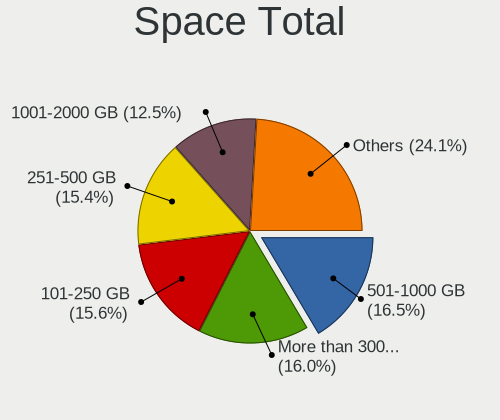
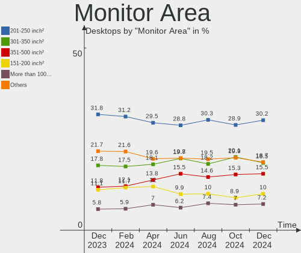
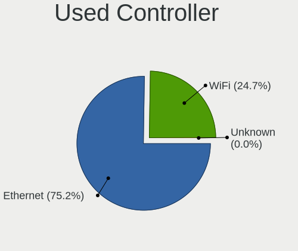

Linux Hardware Trends (Desktop)
-------------------------------

A project to identify most popular hardware characteristics and track their change
over time based on data collected by Linux users at https://Linux-Hardware.org.

Anyone can contribute to the study by uploading probes of their computers by
the [hw-probe](https://github.com/linuxhw/hw-probe) tool:

    sudo -E hw-probe -all -upload

Full-feature report is available here: https://linux-hardware.org/?view=trends&formfactor=desktop

Period: Dec, 2020.

Contents
--------

- [ OS                       ](#os)
- [ OS Family                ](#os-family)
- [ Kernel                   ](#kernel)
- [ Kernel Family            ](#kernel-family)
- [ Kernel Major Ver.        ](#kernel-major-ver)
- [ Arch                     ](#arch)
- [ DE                       ](#de)
- [ Display Server           ](#display-server)
- [ Display Manager          ](#display-manager)
- [ OS Lang                  ](#os-lang)
- [ Boot Mode                ](#boot-mode)
- [ Filesystem               ](#filesystem)
- [ Part. scheme             ](#part-scheme)
- [ Dual Boot with Linux/BSD ](#dual-boot-with-linux/bsd)
- [ Dual Boot (Win)          ](#dual-boot-win)
- [ Country                  ](#country)
- [ City                     ](#city)
- [ Vendor                   ](#vendor)
- [ Model                    ](#model)
- [ Model Family             ](#model-family)
- [ MFG Year                 ](#mfg-year)
- [ Form Factor              ](#form-factor)
- [ Secure Boot              ](#secure-boot)
- [ Coreboot                 ](#coreboot)
- [ RAM Size                 ](#ram-size)
- [ RAM Used                 ](#ram-used)
- [ Has CD-ROM               ](#has-cd-rom)
- [ Total Drives             ](#total-drives)
- [ Has Ethernet             ](#has-ethernet)
- [ Drive Vendor             ](#drive-vendor)
- [ Drive Model              ](#drive-model)
- [ HDD Vendor               ](#hdd-vendor)
- [ SSD Vendor               ](#ssd-vendor)
- [ Drive Kind               ](#drive-kind)
- [ Drive Connector          ](#drive-connector)
- [ Drive Size               ](#drive-size)
- [ Space Total              ](#space-total)
- [ Space Used               ](#space-used)
- [ Malfunc. Drives          ](#malfunc-drives)
- [ Malfunc. Drive Vendor    ](#malfunc-drive-vendor)
- [ Malfunc. HDD Vendor      ](#malfunc-hdd-vendor)
- [ Malfunc. Drive Kind      ](#malfunc-drive-kind)
- [ Failed Drives            ](#failed-drives)
- [ Failed Drive Vendor      ](#failed-drive-vendor)
- [ Drive Status             ](#drive-status)
- [ Storage Vendor           ](#storage-vendor)
- [ Storage Model            ](#storage-model)
- [ Storage Kind             ](#storage-kind)
- [ CPU Vendor               ](#cpu-vendor)
- [ CPU Model                ](#cpu-model)
- [ CPU Model Family         ](#cpu-model-family)
- [ CPU Cores                ](#cpu-cores)
- [ CPU Sockets              ](#cpu-sockets)
- [ CPU Threads              ](#cpu-threads)
- [ CPU Op-Modes             ](#cpu-op-modes)
- [ CPU Microcode            ](#cpu-microcode)
- [ CPU Microarch            ](#cpu-microarch)
- [ GPU Vendor               ](#gpu-vendor)
- [ GPU Model                ](#gpu-model)
- [ GPU Combo                ](#gpu-combo)
- [ GPU Driver               ](#gpu-driver)
- [ GPU Memory               ](#gpu-memory)
- [ Monitor Vendor           ](#monitor-vendor)
- [ Monitor Model            ](#monitor-model)
- [ Monitor Resolution       ](#monitor-resolution)
- [ Monitor Diagonal         ](#monitor-diagonal)
- [ Monitor Width            ](#monitor-width)
- [ Aspect Ratio             ](#aspect-ratio)
- [ Monitor Area             ](#monitor-area)
- [ Pixel Density            ](#pixel-density)
- [ Multiple Monitors        ](#multiple-monitors)
- [ Net Controller Vendor    ](#net-controller-vendor)
- [ Net Controller Model     ](#net-controller-model)
- [ Wireless Vendor          ](#wireless-vendor)
- [ Wireless Model           ](#wireless-model)
- [ Ethernet Vendor          ](#ethernet-vendor)
- [ Ethernet Model           ](#ethernet-model)
- [ Net Controller Kind      ](#net-controller-kind)
- [ Used Controller          ](#used-controller)
- [ NICs                     ](#nics)
- [ Memory Vendor            ](#memory-vendor)
- [ Memory Model             ](#memory-model)
- [ Memory Kind              ](#memory-kind)
- [ Memory Form Factor       ](#memory-form-factor)
- [ Memory Size              ](#memory-size)
- [ Memory Speed             ](#memory-speed)
- [ Sound Vendor             ](#sound-vendor)
- [ Sound Model              ](#sound-model)
- [ Camera Vendor            ](#camera-vendor)
- [ Camera Model             ](#camera-model)
- [ Fingerprint Vendor       ](#fingerprint-vendor)
- [ Fingerprint Model        ](#fingerprint-model)
- [ Chipcard Vendor          ](#chipcard-vendor)
- [ Chipcard Model           ](#chipcard-model)
- [ Printer Vendor           ](#printer-vendor)
- [ Printer Model            ](#printer-model)
- [ Scanner Vendor           ](#scanner-vendor)
- [ Scanner Model            ](#scanner-model)
- [ Bluetooth Vendor         ](#bluetooth-vendor)
- [ Bluetooth Model          ](#bluetooth-model)
- [ Unsupported Devices      ](#unsupported-devices)
- [ Unsupported Device Types ](#unsupported-device-types)

OS
--

Installed operating systems

| Name                         | Desktops | Percent |
|------------------------------|----------|---------|
| Ubuntu 20.04                 | 615      | 29.17%  |
| Ubuntu 20.10                 | 161      | 7.64%   |
| Mint 20                      | 127      | 6.02%   |
| Ubuntu 18.04                 | 107      | 5.08%   |
| BlackPanther 18.1            | 100      | 4.74%   |
| Fedora 33                    | 98       | 4.65%   |
| Pop!_OS 20.10                | 95       | 4.51%   |
| KDE neon 20.04               | 90       | 4.27%   |
| ROSA R11.1                   | 63       | 2.99%   |
| Arch                         | 48       | 2.28%   |
| Manjaro                      | 46       | 2.18%   |
| Debian 10                    | 46       | 2.18%   |
| Zorin 15                     | 35       | 1.66%   |
| ROSA R11                     | 34       | 1.61%   |
| Mint 19.3                    | 34       | 1.61%   |
| Manjaro 20.2                 | 34       | 1.61%   |
| Pop!_OS 20.04                | 31       | 1.47%   |
| ArcoLinux Rolling            | 25       | 1.19%   |
| Arch Rolling                 | 21       | 1%      |
| Ubuntu 16.04                 | 14       | 0.66%   |
| Endless 3.9.1                | 14       | 0.66%   |
| LMDE 4                       | 11       | 0.52%   |
| Fedora 32                    | 11       | 0.52%   |
| Ubuntu 19.10                 | 10       | 0.47%   |
| Debian Testing               | 10       | 0.47%   |
| Gentoo                       | 9        | 0.43%   |
| Elementary 5.1.7             | 8        | 0.38%   |
| Mint 20.1                    | 7        | 0.33%   |
| Mint 19.2                    | 7        | 0.33%   |
| Mageia 7                     | 7        | 0.33%   |
| Kali 2020.4                  | 7        | 0.33%   |
| Gentoo 2.7                   | 7        | 0.33%   |
| ROSA R8.1                    | 6        | 0.28%   |
| Mint 19.1                    | 6        | 0.28%   |
| openSUSE Leap-15.2           | 5        | 0.24%   |
| Mint 18.3                    | 5        | 0.24%   |
| Fedora 31                    | 5        | 0.24%   |
| EndeavourOS Rolling          | 5        | 0.24%   |
| Debian                       | 5        | 0.24%   |
| CentOS 8                     | 5        | 0.24%   |
| BlackPanther 16.2            | 5        | 0.24%   |
| ALT Linux 9.1                | 5        | 0.24%   |
| Ubuntu 21.04                 | 4        | 0.19%   |
| ROSA R12                     | 4        | 0.19%   |
| ROSA R10                     | 4        | 0.19%   |
| RED X4                       | 4        | 0.19%   |
| Mint 19                      | 4        | 0.19%   |
| Garuda                       | 4        | 0.19%   |
| Endless 3.9.0                | 4        | 0.19%   |
| Debian Unstable              | 4        | 0.19%   |
| CentOS 7                     | 4        | 0.19%   |
| WindowsFX 10                 | 3        | 0.14%   |
| Reborn OS                    | 3        | 0.14%   |
| openSUSE Tumbleweed-20201229 | 3        | 0.14%   |
| OpenMandriva 4.1             | 3        | 0.14%   |
| Chrome OS                    | 3        | 0.14%   |
| Void Rolling                 | 2        | 0.09%   |
| Ubuntu                       | 2        | 0.09%   |
| RHEL 8.3                     | 2        | 0.09%   |
| Peppermint 10                | 2        | 0.09%   |

OS Family
---------

OS without a version

| Name           | Desktops | Percent |
|----------------|----------|---------|
| Ubuntu         | 919      | 43.6%   |
| Mint           | 190      | 9.01%   |
| Pop!_OS        | 127      | 6.02%   |
| Fedora         | 114      | 5.41%   |
| ROSA           | 112      | 5.31%   |
| BlackPanther   | 105      | 4.98%   |
| KDE neon       | 91       | 4.32%   |
| Manjaro        | 82       | 3.89%   |
| Arch           | 69       | 3.27%   |
| Debian         | 65       | 3.08%   |
| Zorin          | 36       | 1.71%   |
| ArcoLinux      | 26       | 1.23%   |
| Endless        | 23       | 1.09%   |
| openSUSE       | 18       | 0.85%   |
| Gentoo         | 16       | 0.76%   |
| LMDE           | 11       | 0.52%   |
| Elementary     | 10       | 0.47%   |
| CentOS         | 9        | 0.43%   |
| Mageia         | 8        | 0.38%   |
| Kali           | 8        | 0.38%   |
| Clear Linux    | 8        | 0.38%   |
| EndeavourOS    | 7        | 0.33%   |
| ALT Linux      | 7        | 0.33%   |
| Garuda         | 5        | 0.24%   |
| RED            | 4        | 0.19%   |
| Reborn OS      | 4        | 0.19%   |
| OpenMandriva   | 4        | 0.19%   |
| WindowsFX      | 3        | 0.14%   |
| Void           | 3        | 0.14%   |
| Chrome OS      | 3        | 0.14%   |
| RHEL           | 2        | 0.09%   |
| Peppermint     | 2        | 0.09%   |
| Oracle Linux   | 2        | 0.09%   |
| Devuan         | 2        | 0.09%   |
| Artix          | 2        | 0.09%   |
| Sparky         | 1        | 0.05%   |
| Slackware      | 1        | 0.05%   |
| Sandomierz     | 1        | 0.05%   |
| Parrot         | 1        | 0.05%   |
| Pardus         | 1        | 0.05%   |
| Obarun         | 1        | 0.05%   |
| LFS            | 1        | 0.05%   |
| Kubuntu        | 1        | 0.05%   |
| Hyperbola      | 1        | 0.05%   |
| Garuda Soaring | 1        | 0.05%   |
| Alpine         | 1        | 0.05%   |

Kernel
------

Version of the Linux kernel

| Version                             | Desktops | Percent |
|-------------------------------------|----------|---------|
| 5.4.0-58-generic                    | 459      | 21.77%  |
| 5.4.0-56-generic                    | 250      | 11.86%  |
| 5.8.0-7630-generic                  | 114      | 5.41%   |
| 4.18.16-desktop-1bP                 | 95       | 4.51%   |
| 5.4.0-54-generic                    | 85       | 4.03%   |
| 5.8.0-33-generic                    | 78       | 3.7%    |
| 5.8.0-31-generic                    | 41       | 1.94%   |
| 5.4.0-42-generic                    | 41       | 1.94%   |
| 5.9.11-3-MANJARO                    | 40       | 1.9%    |
| 5.9.14-arch1-1                      | 37       | 1.76%   |
| 4.15.0-desktop-122.124.1rosa-x86_64 | 33       | 1.57%   |
| 4.19.0-13-amd64                     | 31       | 1.47%   |
| 4.15.0-128-generic                  | 30       | 1.42%   |
| 4.15.0-desktop-45.1rosa-x86_64      | 27       | 1.28%   |
| 5.9.11-200.fc33.x86_64              | 25       | 1.19%   |
| 5.8.0-29-generic                    | 22       | 1.04%   |
| 5.8.0-14-generic                    | 18       | 0.85%   |
| 5.9.14-200.fc33.x86_64              | 16       | 0.76%   |
| 5.9.11-arch2-1                      | 16       | 0.76%   |
| 5.8.18-1-MANJARO                    | 16       | 0.76%   |
| 5.4.0-52-generic                    | 15       | 0.71%   |
| 5.4.0-26-generic                    | 15       | 0.71%   |
| 4.15.0-126-generic                  | 15       | 0.71%   |
| 5.8.0-32-generic                    | 14       | 0.66%   |
| 5.9.15-200.fc33.x86_64              | 13       | 0.62%   |
| 5.9.13-200.fc33.x86_64              | 13       | 0.62%   |
| 4.9.155-nrj-desktop-1rosa-x86_64    | 13       | 0.62%   |
| 5.9.16-200.fc33.x86_64              | 12       | 0.57%   |
| 5.9.13-arch1-1                      | 11       | 0.52%   |
| 5.8.0-25-generic                    | 11       | 0.52%   |
| 5.4.0-58-lowlatency                 | 11       | 0.52%   |
| 5.9.12-200.fc33.x86_64              | 10       | 0.47%   |
| 5.4.80-2-MANJARO                    | 10       | 0.47%   |
| 5.4.0-53-generic                    | 10       | 0.47%   |
| 5.9.0-4-amd64                       | 9        | 0.43%   |
| 4.19.0-12-amd64                     | 9        | 0.43%   |
| 5.9.12-arch1-1                      | 8        | 0.38%   |
| 5.4.0-59-generic                    | 8        | 0.38%   |
| 5.3.0-64-generic                    | 8        | 0.38%   |
| 4.15.0-desktop-45.1rosa-i586        | 8        | 0.38%   |
| 5.8.0-34-generic                    | 7        | 0.33%   |
| 5.7.19-desktop-3.mga7               | 7        | 0.33%   |
| 5.4.0-56-lowlatency                 | 7        | 0.33%   |
| 4.15.0-124-generic                  | 6        | 0.28%   |
| 5.9.0-0.bpo.2-amd64                 | 5        | 0.24%   |
| 5.6.14-desktop-2bP                  | 5        | 0.24%   |
| 5.4.72-generic-1rosa-x86_64         | 5        | 0.24%   |
| 5.4.0-7642-generic                  | 5        | 0.24%   |
| 5.10.1-1-default                    | 5        | 0.24%   |
| 4.18.0-240.1.1.el8_3.x86_64         | 5        | 0.24%   |
| 4.15.0-20-generic                   | 5        | 0.24%   |
| 5.9.11-zen2-1-zen                   | 4        | 0.19%   |
| 5.9.10-200.fc33.x86_64              | 4        | 0.19%   |
| 5.9.0-5-amd64                       | 4        | 0.19%   |
| 5.8.18-100.fc31.x86_64              | 4        | 0.19%   |
| 5.10.1-051001-generic               | 4        | 0.19%   |
| 4.19.0-6-amd64                      | 4        | 0.19%   |
| 4.15.0-54-generic                   | 4        | 0.19%   |
| 4.15.0-123-generic                  | 4        | 0.19%   |
| 5.9.14-zen1-1-zen                   | 3        | 0.14%   |

Kernel Family
-------------

Linux kernel without a distro release

| Version | Desktops | Percent |
|---------|----------|---------|
| 5.4.0   | 936      | 44.4%   |
| 5.8.0   | 323      | 15.32%  |
| 4.15.0  | 154      | 7.31%   |
| 4.18.16 | 95       | 4.51%   |
| 5.9.11  | 90       | 4.27%   |
| 5.9.14  | 67       | 3.18%   |
| 4.19.0  | 50       | 2.37%   |
| 5.9.12  | 34       | 1.61%   |
| 5.9.13  | 32       | 1.52%   |
| 5.9.0   | 31       | 1.47%   |
| 5.8.18  | 23       | 1.09%   |
| 5.10.1  | 20       | 0.95%   |
| 5.9.16  | 18       | 0.85%   |
| 5.3.0   | 18       | 0.85%   |
| 5.9.15  | 17       | 0.81%   |
| 5.4.80  | 14       | 0.66%   |
| 4.9.155 | 14       | 0.66%   |
| 5.9.10  | 10       | 0.47%   |
| 4.18.0  | 10       | 0.47%   |
| 5.10.2  | 9        | 0.43%   |
| 5.7.19  | 8        | 0.38%   |
| 5.4.72  | 8        | 0.38%   |
| 5.6.14  | 6        | 0.28%   |
| 5.4.81  | 6        | 0.28%   |
| 5.3.18  | 6        | 0.28%   |
| 5.10.0  | 6        | 0.28%   |
| 5.10.3  | 5        | 0.24%   |
| 4.4.0   | 5        | 0.24%   |
| 5.8.16  | 4        | 0.19%   |
| 5.4.83  | 4        | 0.19%   |
| 5.4.32  | 4        | 0.19%   |
| 5.0.0   | 4        | 0.19%   |
| 3.10.0  | 4        | 0.19%   |
| 5.9.8   | 3        | 0.14%   |
| 5.9.1   | 3        | 0.14%   |
| 5.8.15  | 3        | 0.14%   |
| 5.7.0   | 3        | 0.14%   |
| 5.6.0   | 3        | 0.14%   |
| 5.5.12  | 3        | 0.14%   |
| 5.4.85  | 3        | 0.14%   |
| 5.4.82  | 3        | 0.14%   |
| 5.4.68  | 3        | 0.14%   |
| 4.9.60  | 3        | 0.14%   |
| 4.9.20  | 3        | 0.14%   |
| 4.10.0  | 3        | 0.14%   |
| 5.9.9   | 2        | 0.09%   |
| 5.9.6   | 2        | 0.09%   |
| 5.8.14  | 2        | 0.09%   |
| 5.5.8   | 2        | 0.09%   |
| 5.4.66  | 2        | 0.09%   |
| 5.4.53  | 2        | 0.09%   |
| 5.4.51  | 2        | 0.09%   |
| 5.4.17  | 2        | 0.09%   |
| 4.9.9   | 2        | 0.09%   |
| 5.9.3   | 1        | 0.05%   |
| 5.8.17  | 1        | 0.05%   |
| 5.8.13  | 1        | 0.05%   |
| 5.8.11  | 1        | 0.05%   |
| 5.7.17  | 1        | 0.05%   |
| 5.6.15  | 1        | 0.05%   |

Kernel Major Ver.
-----------------

Linux kernel major version

| Version | Desktops | Percent |
|---------|----------|---------|
| 5.4     | 996      | 47.25%  |
| 5.8     | 358      | 16.98%  |
| 5.9     | 310      | 14.71%  |
| 4.15    | 154      | 7.31%   |
| 4.18    | 105      | 4.98%   |
| 4.19    | 50       | 2.37%   |
| 5.10    | 40       | 1.9%    |
| 5.3     | 24       | 1.14%   |
| 4.9     | 23       | 1.09%   |
| 5.7     | 12       | 0.57%   |
| 5.6     | 11       | 0.52%   |
| 5.5     | 5        | 0.24%   |
| 4.4     | 5        | 0.24%   |
| 3.10    | 5        | 0.24%   |
| 5.0     | 4        | 0.19%   |
| 4.10    | 3        | 0.14%   |
| 4.8     | 1        | 0.05%   |
| 4.7     | 1        | 0.05%   |
| Unknown | 1        | 0.05%   |

Arch
----

OS architecture (x86_64, i586, etc.)

| Name   | Desktops | Percent |
|--------|----------|---------|
| x86_64 | 2039     | 96.73%  |
| i686   | 65       | 3.08%   |
| armv7l | 3        | 0.14%   |
| unknow | 1        | 0.05%   |

DE
--

Desktop Environment

| Name            | Desktops | Percent |
|-----------------|----------|---------|
| GNOME           | 1022     | 48.48%  |
| KDE5            | 221      | 10.48%  |
| KDE             | 177      | 8.4%    |
| XFCE            | 173      | 8.21%   |
| X-Cinnamon      | 166      | 7.87%   |
| Unknown         | 97       | 4.6%    |
| KDE4            | 72       | 3.42%   |
| MATE            | 64       | 3.04%   |
| Cinnamon        | 20       | 0.95%   |
| Unity           | 17       | 0.81%   |
| LXQt            | 13       | 0.62%   |
| LXDE            | 10       | 0.47%   |
| Pantheon        | 8        | 0.38%   |
| Budgie          | 8        | 0.38%   |
| GNOME Classic   | 7        | 0.33%   |
| awesome         | 6        | 0.28%   |
| GNOME Flashback | 5        | 0.24%   |
| i3              | 4        | 0.19%   |
| Deepin          | 4        | 0.19%   |
| fluxbox         | 3        | 0.14%   |
| openbox         | 2        | 0.09%   |
| enlightenment   | 2        | 0.09%   |
| bspwm           | 2        | 0.09%   |
| xmonad          | 1        | 0.05%   |
| herbstluftwm    | 1        | 0.05%   |
| fvwm            | 1        | 0.05%   |
| dwm             | 1        | 0.05%   |
| default         | 1        | 0.05%   |

Display Server
--------------

X11 or Wayland

| Name        | Desktops | Percent |
|-------------|----------|---------|
| X11         | 1919     | 91.03%  |
| Wayland     | 113      | 5.36%   |
| Tty         | 37       | 1.76%   |
| Unknown     | 36       | 1.71%   |
| Web         | 2        | 0.09%   |
| Unspecified | 1        | 0.05%   |

Display Manager
---------------

SDDM, LightDM, etc.

| Name    | Desktops | Percent |
|---------|----------|---------|
| Unknown | 1469     | 69.69%  |
| SDDM    | 224      | 10.63%  |
| GDM     | 165      | 7.83%   |
| TDM     | 134      | 6.36%   |
| KDM     | 72       | 3.42%   |
| LightDM | 31       | 1.47%   |
| XDM     | 5        | 0.24%   |
| SLiM    | 3        | 0.14%   |
| GDM3    | 3        | 0.14%   |
| LXDM    | 2        | 0.09%   |

OS Lang
-------

Language

| Lang        | Desktops | Percent |
|-------------|----------|---------|
| en_US       | 704      | 33.4%   |
| de_DE       | 209      | 9.91%   |
| Unknown     | 183      | 8.68%   |
| ru_RU       | 109      | 5.17%   |
| pt_BR       | 87       | 4.13%   |
| en_GB       | 82       | 3.89%   |
| fr_FR       | 80       | 3.8%    |
| it_IT       | 77       | 3.65%   |
| en_CA       | 58       | 2.75%   |
| es_ES       | 47       | 2.23%   |
| pl_PL       | 42       | 1.99%   |
| en_US.utf8  | 35       | 1.66%   |
| C           | 32       | 1.52%   |
| en_AU       | 31       | 1.47%   |
| nl_NL       | 25       | 1.19%   |
| en_IN       | 20       | 0.95%   |
| sv_SE       | 16       | 0.76%   |
| hu_HU       | 16       | 0.76%   |
| tr_TR       | 14       | 0.66%   |
| cs_CZ       | 14       | 0.66%   |
| fi_FI       | 12       | 0.57%   |
| en_ZA       | 12       | 0.57%   |
| ru_UA       | 10       | 0.47%   |
| de_CH       | 10       | 0.47%   |
| ja_JP       | 9        | 0.43%   |
| es_MX       | 9        | 0.43%   |
| de_AT       | 9        | 0.43%   |
| uk_UA       | 7        | 0.33%   |
| ro_RO       | 7        | 0.33%   |
| pt_PT       | 7        | 0.33%   |
| fr_CA       | 7        | 0.33%   |
| es_AR       | 7        | 0.33%   |
| nl_BE       | 6        | 0.28%   |
| C           | 6        | 0.28%   |
| sk_SK       | 5        | 0.24%   |
| fr_BE       | 5        | 0.24%   |
| en_NZ       | 5        | 0.24%   |
| bg_BG       | 5        | 0.24%   |
| zh_TW       | 4        | 0.19%   |
| ko_KR       | 4        | 0.19%   |
| es_CO       | 4        | 0.19%   |
| en_GB.utf8  | 4        | 0.19%   |
| de_DE.utf8  | 4        | 0.19%   |
| zh_CN       | 3        | 0.14%   |
| pl_PL.utf8  | 3        | 0.14%   |
| hr_HR       | 3        | 0.14%   |
| fr_FR.utf8  | 3        | 0.14%   |
| es_MX.utf8  | 3        | 0.14%   |
| en_PH       | 3        | 0.14%   |
| en_IE       | 3        | 0.14%   |
| el_GR       | 3        | 0.14%   |
| da_DK       | 3        | 0.14%   |
| C.UTF8      | 3        | 0.14%   |
| ru_RU.utf8  | 2        | 0.09%   |
| lv_LV       | 2        | 0.09%   |
| es_PE       | 2        | 0.09%   |
| en_HK       | 2        | 0.09%   |
| en_CA.utf8  | 2        | 0.09%   |
| de_BE       | 2        | 0.09%   |
| sr_RS@latin | 1        | 0.05%   |

Boot Mode
---------

EFI or BIOS

| Mode | Desktops | Percent |
|------|----------|---------|
| BIOS | 1396     | 66.22%  |
| EFI  | 712      | 33.78%  |

Filesystem
----------

Type of filesystem

| Type     | Desktops | Percent |
|----------|----------|---------|
| Ext4     | 1778     | 84.35%  |
| Overlay  | 135      | 6.4%    |
| Btrfs    | 125      | 5.93%   |
| Xfs      | 36       | 1.71%   |
| Zfs      | 14       | 0.66%   |
| Ext2     | 5        | 0.24%   |
| Tmpfs    | 3        | 0.14%   |
| Reiserfs | 3        | 0.14%   |
| F2fs     | 3        | 0.14%   |
| Ext3     | 3        | 0.14%   |
| Unknown  | 3        | 0.14%   |

Part. scheme
------------

Scheme of partitioning

| Type    | Desktops | Percent |
|---------|----------|---------|
| Unknown | 1423     | 67.5%   |
| GPT     | 404      | 19.17%  |
| MBR     | 281      | 13.33%  |

Dual Boot with Linux/BSD
------------------------

Hosting more than one Linux/BSD

| Dual boot | Desktops | Percent |
|-----------|----------|---------|
| No        | 1738     | 82.45%  |
| Yes       | 370      | 17.55%  |

Dual Boot (Win)
---------------

Hosting Linux and Windows

| Dual boot | Desktops | Percent |
|-----------|----------|---------|
| No        | 1412     | 66.98%  |
| Yes       | 696      | 33.02%  |

Country
-------

Geographic location (country)

| Country            | Desktops | Percent |
|--------------------|----------|---------|
| USA                | 426      | 20.21%  |
| Germany            | 249      | 11.81%  |
| Russia             | 143      | 6.78%   |
| Brazil             | 109      | 5.17%   |
| Hungary            | 104      | 4.93%   |
| Italy              | 102      | 4.84%   |
| Canada             | 90       | 4.27%   |
| France             | 84       | 3.98%   |
| UK                 | 65       | 3.08%   |
| Spain              | 58       | 2.75%   |
| Poland             | 53       | 2.51%   |
| Netherlands        | 45       | 2.13%   |
| Ukraine            | 39       | 1.85%   |
| Australia          | 33       | 1.57%   |
| Switzerland        | 27       | 1.28%   |
| India              | 27       | 1.28%   |
| Sweden             | 24       | 1.14%   |
| Finland            | 23       | 1.09%   |
| Austria            | 22       | 1.04%   |
| Turkey             | 21       | 1%      |
| Czech Republic     | 21       | 1%      |
| Belgium            | 21       | 1%      |
| Romania            | 18       | 0.85%   |
| Mexico             | 18       | 0.85%   |
| Japan              | 17       | 0.81%   |
| Argentina          | 15       | 0.71%   |
| South Africa       | 13       | 0.62%   |
| Serbia             | 13       | 0.62%   |
| Greece             | 13       | 0.62%   |
| Bulgaria           | 13       | 0.62%   |
| Slovakia           | 10       | 0.47%   |
| Portugal           | 9        | 0.43%   |
| Denmark            | 9        | 0.43%   |
| Philippines        | 8        | 0.38%   |
| Malaysia           | 8        | 0.38%   |
| China              | 8        | 0.38%   |
| Norway             | 7        | 0.33%   |
| New Zealand        | 7        | 0.33%   |
| Indonesia          | 7        | 0.33%   |
| Colombia           | 7        | 0.33%   |
| Vietnam            | 6        | 0.28%   |
| Taiwan             | 6        | 0.28%   |
| Korea, Republic of | 6        | 0.28%   |
| Costa Rica         | 6        | 0.28%   |
| Belarus            | 6        | 0.28%   |
| Thailand           | 5        | 0.24%   |
| Saudi Arabia       | 5        | 0.24%   |
| Latvia             | 5        | 0.24%   |
| Kazakhstan         | 5        | 0.24%   |
| Iran               | 5        | 0.24%   |
| Croatia            | 4        | 0.19%   |
| Puerto Rico        | 3        | 0.14%   |
| Peru               | 3        | 0.14%   |
| Luxembourg         | 3        | 0.14%   |
| Ireland            | 3        | 0.14%   |
| Hong Kong          | 3        | 0.14%   |
| Estonia            | 3        | 0.14%   |
| Algeria            | 3        | 0.14%   |
| Uruguay            | 2        | 0.09%   |
| Slovenia           | 2        | 0.09%   |

City
----

Geographic location (city)

| City             | Desktops | Percent |
|------------------|----------|---------|
| Budapest         | 36       | 1.71%   |
| Moscow           | 30       | 1.42%   |
| Berlin           | 20       | 0.95%   |
| Madrid           | 14       | 0.66%   |
| Rome             | 12       | 0.57%   |
| Montreal         | 12       | 0.57%   |
| Vienna           | 11       | 0.52%   |
| São Paulo       | 11       | 0.52%   |
| Kyiv             | 11       | 0.52%   |
| Warsaw           | 10       | 0.47%   |
| St Petersburg    | 10       | 0.47%   |
| Prague           | 10       | 0.47%   |
| Helsinki         | 10       | 0.47%   |
| Milan            | 9        | 0.43%   |
| Hamburg          | 9        | 0.43%   |
| Bucharest        | 9        | 0.43%   |
| Paris            | 8        | 0.38%   |
| Ekaterinburg     | 8        | 0.38%   |
| Toronto          | 7        | 0.33%   |
| Seattle          | 7        | 0.33%   |
| New York         | 7        | 0.33%   |
| Mumbai           | 7        | 0.33%   |
| Izmir            | 7        | 0.33%   |
| Istanbul         | 7        | 0.33%   |
| Athens           | 7        | 0.33%   |
| Voronezh         | 6        | 0.28%   |
| Stockholm        | 6        | 0.28%   |
| Orlando          | 6        | 0.28%   |
| Munich           | 6        | 0.28%   |
| Miami            | 6        | 0.28%   |
| Cologne          | 6        | 0.28%   |
| Belgrade         | 6        | 0.28%   |
| Amsterdam        | 6        | 0.28%   |
| Thonex           | 5        | 0.24%   |
| Stuttgart        | 5        | 0.24%   |
| Springfield      | 5        | 0.24%   |
| Sofia            | 5        | 0.24%   |
| San José        | 5        | 0.24%   |
| Riga             | 5        | 0.24%   |
| Novosibirsk      | 5        | 0.24%   |
| Monza            | 5        | 0.24%   |
| Krasnoyarsk      | 5        | 0.24%   |
| Ho Chi Minh City | 5        | 0.24%   |
| Düsseldorf      | 5        | 0.24%   |
| Dnipro           | 5        | 0.24%   |
| Chicago          | 5        | 0.24%   |
| Burlington       | 5        | 0.24%   |
| Buenos Aires     | 5        | 0.24%   |
| Bielefeld        | 5        | 0.24%   |
| Bengaluru        | 5        | 0.24%   |
| Wuppertal        | 4        | 0.19%   |
| Wrocław         | 4        | 0.19%   |
| Vancouver        | 4        | 0.19%   |
| Tehran           | 4        | 0.19%   |
| San Diego        | 4        | 0.19%   |
| Rio de Janeiro   | 4        | 0.19%   |
| Portland         | 4        | 0.19%   |
| Perth            | 4        | 0.19%   |
| Minneapolis      | 4        | 0.19%   |
| Melbourne        | 4        | 0.19%   |

Vendor
------

Motherboard manufacturer

| Name                | Desktops | Percent |
|---------------------|----------|---------|
| ASUSTek Computer    | 565      | 26.8%   |
| Gigabyte Technology | 409      | 19.4%   |
| MSI                 | 231      | 10.96%  |
| ASRock              | 202      | 9.58%   |
| Dell                | 166      | 7.87%   |
| Hewlett-Packard     | 137      | 6.5%    |
| Lenovo              | 65       | 3.08%   |
| Intel               | 54       | 2.56%   |
| Acer                | 37       | 1.76%   |
| Pegatron            | 27       | 1.28%   |
| Fujitsu             | 27       | 1.28%   |
| Biostar             | 21       | 1%      |
| Unknown             | 20       | 0.95%   |
| ECS                 | 15       | 0.71%   |
| Foxconn             | 14       | 0.66%   |
| Medion              | 13       | 0.62%   |
| Positivo            | 7        | 0.33%   |
| Fujitsu Siemens     | 7        | 0.33%   |
| Gateway             | 6        | 0.28%   |
| PC Engines          | 5        | 0.24%   |
| Huanan              | 5        | 0.24%   |
| System76            | 4        | 0.19%   |
| Packard Bell        | 4        | 0.19%   |
| eMachines           | 4        | 0.19%   |
| Supermicro          | 3        | 0.14%   |
| PCWare              | 3        | 0.14%   |
| Apple               | 3        | 0.14%   |
| ABIT                | 3        | 0.14%   |
| VIA Technologies    | 2        | 0.09%   |
| Shuttle             | 2        | 0.09%   |
| Inventec            | 2        | 0.09%   |
| EVGA                | 2        | 0.09%   |
| ASRockRack          | 2        | 0.09%   |
| AMI                 | 2        | 0.09%   |
| AMD                 | 2        | 0.09%   |
| ZOTAC               | 1        | 0.05%   |
| Wistron             | 1        | 0.05%   |
| WINCOR NIXDORF      | 1        | 0.05%   |
| TYAN Computer       | 1        | 0.05%   |
| SYS                 | 1        | 0.05%   |
| Semp Toshiba        | 1        | 0.05%   |
| Sapphire            | 1        | 0.05%   |
| Protectli           | 1        | 0.05%   |
| PHITRONIC           | 1        | 0.05%   |
| Philco              | 1        | 0.05%   |
| PCSMART             | 1        | 0.05%   |
| PCChips             | 1        | 0.05%   |
| OEM_MB              | 1        | 0.05%   |
| OEM                 | 1        | 0.05%   |
| NEC Computers       | 1        | 0.05%   |
| MiTAC               | 1        | 0.05%   |
| Minix               | 1        | 0.05%   |
| Megaware            | 1        | 0.05%   |
| LORD ELECTRONICS    | 1        | 0.05%   |
| LattePanda          | 1        | 0.05%   |
| INTELBRAS           | 1        | 0.05%   |
| iEi                 | 1        | 0.05%   |
| ICP / iEi           | 1        | 0.05%   |
| HOUTER              | 1        | 0.05%   |
| HARDKERNEL          | 1        | 0.05%   |

Model
-----

Motherboard model

| Name                               | Desktops | Percent |
|------------------------------------|----------|---------|
| ASUS All Series                    | 52       | 2.47%   |
| Unknown                            | 22       | 1.04%   |
| Gigabyte B450M DS3H                | 14       | 0.66%   |
| ASUS ROG STRIX B450-F GAMING       | 14       | 0.66%   |
| MSI MS-7C37                        | 12       | 0.57%   |
| MSI MS-7A38                        | 10       | 0.47%   |
| Dell OptiPlex 7010                 | 10       | 0.47%   |
| ASUS PRIME A320M-K                 | 10       | 0.47%   |
| MSI MS-7C02                        | 9        | 0.43%   |
| Gigabyte X570 AORUS ELITE          | 9        | 0.43%   |
| Dell OptiPlex 3020                 | 8        | 0.38%   |
| Dell OptiPlex 3010                 | 8        | 0.38%   |
| ASUS TUF GAMING X570-PLUS          | 8        | 0.38%   |
| ASUS ROG STRIX B550-F GAMING       | 8        | 0.38%   |
| MSI MS-7B86                        | 7        | 0.33%   |
| MSI MS-7817                        | 7        | 0.33%   |
| Gigabyte A320M-S2H                 | 7        | 0.33%   |
| ASUS PRIME B450M-A                 | 7        | 0.33%   |
| ASRock B450M Pro4                  | 7        | 0.33%   |
| MSI MS-7996                        | 6        | 0.28%   |
| MSI MS-7721                        | 6        | 0.28%   |
| Gigabyte G31M-ES2L                 | 6        | 0.28%   |
| Dell OptiPlex 780                  | 6        | 0.28%   |
| Dell OptiPlex 745                  | 6        | 0.28%   |
| ASUS PRIME B450-PLUS               | 6        | 0.28%   |
| ASUS M5A78L-M LX3                  | 6        | 0.28%   |
| MSI MS-7C51                        | 5        | 0.24%   |
| MSI MS-7816                        | 5        | 0.24%   |
| MSI MS-7641                        | 5        | 0.24%   |
| Gigabyte X58A-UD3R                 | 5        | 0.24%   |
| Gigabyte X470 AORUS ULTRA GAMING   | 5        | 0.24%   |
| Gigabyte H81M-S2H                  | 5        | 0.24%   |
| Gigabyte H61M-S2PV                 | 5        | 0.24%   |
| Gigabyte GA-78LMT-USB3             | 5        | 0.24%   |
| Gigabyte B450 I AORUS PRO WIFI     | 5        | 0.24%   |
| Gigabyte B450 AORUS ELITE          | 5        | 0.24%   |
| Gigabyte 970A-DS3P                 | 5        | 0.24%   |
| Dell OptiPlex 990                  | 5        | 0.24%   |
| Dell OptiPlex 9020                 | 5        | 0.24%   |
| Dell OptiPlex 790                  | 5        | 0.24%   |
| Dell Inspiron 530                  | 5        | 0.24%   |
| Dell Inspiron 3847                 | 5        | 0.24%   |
| ASUS P5KPL-AM SE                   | 5        | 0.24%   |
| ASUS M5A99X EVO R2.0               | 5        | 0.24%   |
| ASRock N68C-S UCC                  | 5        | 0.24%   |
| PC Engines apu2                    | 4        | 0.19%   |
| MSI MS-7C92                        | 4        | 0.19%   |
| MSI MS-7C84                        | 4        | 0.19%   |
| MSI MS-7B89                        | 4        | 0.19%   |
| MSI MS-7971                        | 4        | 0.19%   |
| MSI MS-7693                        | 4        | 0.19%   |
| HP Z620 Workstation                | 4        | 0.19%   |
| HP Compaq Elite 8300 SFF           | 4        | 0.19%   |
| HP Compaq dc5800 Small Form Factor | 4        | 0.19%   |
| HP Compaq 8200 Elite USDT PC       | 4        | 0.19%   |
| Gigabyte X570 AORUS PRO            | 4        | 0.19%   |
| Gigabyte H81M-S1                   | 4        | 0.19%   |
| Gigabyte H77M-D3H                  | 4        | 0.19%   |
| Gigabyte GA-78LMT-USB3 R2          | 4        | 0.19%   |
| Gigabyte GA-78LMT-USB3 6.0         | 4        | 0.19%   |

Model Family
------------

Motherboard model prefix

| Name                   | Desktops | Percent |
|------------------------|----------|---------|
| ASUS PRIME             | 91       | 4.32%   |
| Dell OptiPlex          | 84       | 3.98%   |
| ASUS ROG               | 67       | 3.18%   |
| HP Compaq              | 54       | 2.56%   |
| ASUS All               | 52       | 2.47%   |
| Lenovo ThinkCentre     | 39       | 1.85%   |
| Dell Inspiron          | 33       | 1.57%   |
| Dell Precision         | 24       | 1.14%   |
| Gigabyte X570          | 23       | 1.09%   |
| Fujitsu ESPRIMO        | 23       | 1.09%   |
| Unknown                | 22       | 1.04%   |
| ASUS TUF               | 21       | 1%      |
| Acer Aspire            | 21       | 1%      |
| Gigabyte B450M         | 18       | 0.85%   |
| ASUS M5A78L-M          | 18       | 0.85%   |
| Gigabyte B450          | 17       | 0.81%   |
| HP ProDesk             | 15       | 0.71%   |
| Gigabyte GA-78LMT-USB3 | 13       | 0.62%   |
| ASRock X570            | 13       | 0.62%   |
| ASRock B450M           | 13       | 0.62%   |
| MSI MS-7C37            | 12       | 0.57%   |
| HP EliteDesk           | 11       | 0.52%   |
| ASUS P8H61-M           | 11       | 0.52%   |
| ASUS M5A97             | 11       | 0.52%   |
| MSI MS-7A38            | 10       | 0.47%   |
| Lenovo IdeaCentre      | 10       | 0.47%   |
| Gigabyte Z390          | 10       | 0.47%   |
| Gigabyte B550          | 10       | 0.47%   |
| Gigabyte A320M-S2H     | 10       | 0.47%   |
| ASUS P8Z68-V           | 10       | 0.47%   |
| MSI MS-7C02            | 9        | 0.43%   |
| Gigabyte H310M         | 8        | 0.38%   |
| Dell Vostro            | 8        | 0.38%   |
| ASUS Maximus           | 8        | 0.38%   |
| Acer Veriton           | 8        | 0.38%   |
| MSI MS-7B86            | 7        | 0.33%   |
| MSI MS-7817            | 7        | 0.33%   |
| Lenovo ThinkStation    | 7        | 0.33%   |
| ASUS Rampage           | 7        | 0.33%   |
| ASUS P8Z77-V           | 7        | 0.33%   |
| ASUS P5Q               | 7        | 0.33%   |
| ASUS P5KPL-AM          | 7        | 0.33%   |
| ASRock 970             | 7        | 0.33%   |
| MSI MS-7996            | 6        | 0.28%   |
| MSI MS-7721            | 6        | 0.28%   |
| HP Pavilion            | 6        | 0.28%   |
| Gigabyte X470          | 6        | 0.28%   |
| Gigabyte G31M-ES2L     | 6        | 0.28%   |
| Gigabyte B550M         | 6        | 0.28%   |
| ASUS STRIX             | 6        | 0.28%   |
| ASUS SABERTOOTH        | 6        | 0.28%   |
| ASUS P8B75-M           | 6        | 0.28%   |
| ASUS P5G41T-M          | 6        | 0.28%   |
| ASRock Z390            | 6        | 0.28%   |
| ASRock B450            | 6        | 0.28%   |
| MSI MS-7C51            | 5        | 0.24%   |
| MSI MS-7816            | 5        | 0.24%   |
| MSI MS-7641            | 5        | 0.24%   |
| Gigabyte X58A-UD3R     | 5        | 0.24%   |
| Gigabyte H81M-S2H      | 5        | 0.24%   |

MFG Year
--------

Motherboard manufacture year

| Year    | Desktops | Percent |
|---------|----------|---------|
| 2020    | 332      | 15.75%  |
| 2019    | 267      | 12.67%  |
| 2018    | 186      | 8.82%   |
| 2011    | 157      | 7.45%   |
| 2010    | 153      | 7.26%   |
| 2012    | 152      | 7.21%   |
| 2014    | 146      | 6.93%   |
| 2013    | 144      | 6.83%   |
| 2015    | 111      | 5.27%   |
| 2009    | 109      | 5.17%   |
| 2016    | 103      | 4.89%   |
| 2017    | 89       | 4.22%   |
| 2008    | 67       | 3.18%   |
| 2007    | 50       | 2.37%   |
| 2006    | 16       | 0.76%   |
| 2005    | 12       | 0.57%   |
| 2004    | 7        | 0.33%   |
| Unknown | 4        | 0.19%   |
| 2003    | 2        | 0.09%   |
| 2000    | 1        | 0.05%   |

Form Factor
-----------

Physical design of the computer

| Name    | Desktops | Percent |
|---------|----------|---------|
| Desktop | 2108     | 100%    |

Secure Boot
-----------

Enabled or disabled

| State    | Desktops | Percent |
|----------|----------|---------|
| Disabled | 2062     | 97.82%  |
| Enabled  | 46       | 2.18%   |

Coreboot
--------

Have coreboot on board

| Used | Desktops | Percent |
|------|----------|---------|
| No   | 2103     | 99.76%  |
| Yes  | 5        | 0.24%   |

RAM Size
--------

Total RAM memory

| Size in GB      | Desktops | Percent |
|-----------------|----------|---------|
| 16.01-24.0      | 490      | 23.24%  |
| 8.01-16.0       | 459      | 21.77%  |
| 3.01-4.0        | 353      | 16.75%  |
| 4.01-8.0        | 300      | 14.23%  |
| 32.01-64.0      | 260      | 12.33%  |
| 64.01-256.0     | 86       | 4.08%   |
| 1.01-2.0        | 71       | 3.37%   |
| 24.01-32.0      | 40       | 1.9%    |
| 2.01-3.0        | 32       | 1.52%   |
| 0.51-1.0        | 15       | 0.71%   |
| More than 256.0 | 1        | 0.05%   |
| 0.01-0.5        | 1        | 0.05%   |

RAM Used
--------

Used RAM memory

| Used GB    | Desktops | Percent |
|------------|----------|---------|
| 1.01-2.0   | 775      | 36.76%  |
| 2.01-3.0   | 484      | 22.96%  |
| 4.01-8.0   | 277      | 13.14%  |
| 3.01-4.0   | 212      | 10.06%  |
| 0.51-1.0   | 167      | 7.92%   |
| 0.01-0.5   | 88       | 4.17%   |
| 8.01-16.0  | 83       | 3.94%   |
| 16.01-24.0 | 13       | 0.62%   |
| 32.01-64.0 | 5        | 0.24%   |
| 24.01-32.0 | 3        | 0.14%   |
| Unknown    | 1        | 0.05%   |

Has CD-ROM
----------

Has CD-ROM on board

| Presented | Desktops | Percent |
|-----------|----------|---------|
| Yes       | 1055     | 50.05%  |
| No        | 1053     | 49.95%  |

Total Drives
------------

Number of drives on board

| Drives | Desktops | Percent |
|--------|----------|---------|
| 1      | 815      | 38.66%  |
| 2      | 637      | 30.22%  |
| 3      | 340      | 16.13%  |
| 4      | 150      | 7.12%   |
| 5      | 78       | 3.7%    |
| 6      | 36       | 1.71%   |
| 7      | 18       | 0.85%   |
| 0      | 14       | 0.66%   |
| 9      | 9        | 0.43%   |
| 8      | 5        | 0.24%   |
| 13     | 2        | 0.09%   |
| 10     | 2        | 0.09%   |
| 12     | 1        | 0.05%   |
| 11     | 1        | 0.05%   |

Has Ethernet
------------

Has Ethernet on board

| Presented | Desktops | Percent |
|-----------|----------|---------|
| Yes       | 2080     | 98.67%  |
| No        | 28       | 1.33%   |

Drive Vendor
------------

Hard drive vendors

| Vendor                    | Desktops | Drives | Percent |
|---------------------------|----------|--------|---------|
| WDC                       | 792      | 1016   | 21.28%  |
| Seagate                   | 725      | 945    | 19.48%  |
| Samsung Electronics       | 574      | 786    | 15.42%  |
| Kingston                  | 234      | 251    | 6.29%   |
| Toshiba                   | 186      | 203    | 5%      |
| Hitachi                   | 153      | 166    | 4.11%   |
| SanDisk                   | 147      | 157    | 3.95%   |
| Crucial                   | 139      | 164    | 3.73%   |
| Intel                     | 64       | 69     | 1.72%   |
| Phison                    | 55       | 57     | 1.48%   |
| Unknown                   | 52       | 61     | 1.4%    |
| A-DATA Technology         | 51       | 57     | 1.37%   |
| HGST                      | 39       | 48     | 1.05%   |
| Maxtor                    | 32       | 33     | 0.86%   |
| China                     | 31       | 32     | 0.83%   |
| SPCC                      | 30       | 33     | 0.81%   |
| Patriot                   | 29       | 29     | 0.78%   |
| OCZ                       | 24       | 28     | 0.64%   |
| Silicon Motion            | 21       | 21     | 0.56%   |
| JMicron                   | 19       | 19     | 0.51%   |
| Intenso                   | 19       | 21     | 0.51%   |
| Gigabyte Technology       | 17       | 17     | 0.46%   |
| PNY                       | 16       | 16     | 0.43%   |
| Micron Technology         | 16       | 17     | 0.43%   |
| GOODRAM                   | 14       | 14     | 0.38%   |
| Hewlett-Packard           | 13       | 17     | 0.35%   |
| Apacer                    | 13       | 13     | 0.35%   |
| Micron/Crucial Technology | 12       | 12     | 0.32%   |
| Corsair                   | 12       | 12     | 0.32%   |
| Transcend                 | 11       | 11     | 0.3%    |
| XPG                       | 10       | 10     | 0.27%   |
| SK Hynix                  | 10       | 10     | 0.27%   |
| Team                      | 8        | 8      | 0.21%   |
| PLEXTOR                   | 8        | 9      | 0.21%   |
| Fujitsu                   | 8        | 8      | 0.21%   |
| Realtek Semiconductor     | 7        | 7      | 0.19%   |
| KingSpec                  | 7        | 7      | 0.19%   |
| Sabrent                   | 6        | 6      | 0.16%   |
| KingFast                  | 6        | 7      | 0.16%   |
| Mushkin                   | 5        | 5      | 0.13%   |
| KingDian                  | 5        | 5      | 0.13%   |
| WD MediaMax               | 4        | 4      | 0.11%   |
| USB3.0                    | 4        | 4      | 0.11%   |
| TO Exter                  | 3        | 3      | 0.08%   |
| LITEON                    | 3        | 3      | 0.08%   |
| HPE                       | 3        | 3      | 0.08%   |
| ExcelStor                 | 3        | 3      | 0.08%   |
| Apple                     | 3        | 4      | 0.08%   |
| ZOTAC                     | 2        | 2      | 0.05%   |
| TCSUNBOW                  | 2        | 2      | 0.05%   |
| LITEONIT                  | 2        | 2      | 0.05%   |
| Linux                     | 2        | 2      | 0.05%   |
| Leven                     | 2        | 2      | 0.05%   |
| KIOXIA-EXCERIA            | 2        | 2      | 0.05%   |
| Kingmax                   | 2        | 2      | 0.05%   |
| INNOVATION IT             | 2        | 2      | 0.05%   |
| Indilinx                  | 2        | 2      | 0.05%   |
| Hoodisk                   | 2        | 2      | 0.05%   |
| External                  | 2        | 3      | 0.05%   |
| Biostar                   | 2        | 2      | 0.05%   |

Drive Model
-----------

Hard drive models

| Model                            | Desktops | Percent |
|----------------------------------|----------|---------|
| Seagate ST500DM002-1BD142 500GB  | 64       | 1.49%   |
| Kingston SA400S37240G 240GB SSD  | 53       | 1.23%   |
| Seagate ST1000DM010-2EP102 1TB   | 50       | 1.16%   |
| WDC WD10EZEX-08WN4A0 1TB         | 44       | 1.02%   |
| Samsung SSD 860 EVO 500GB        | 44       | 1.02%   |
| Samsung NVMe SSD Drive 500GB     | 42       | 0.98%   |
| Seagate ST2000DM008-2FR102 2TB   | 36       | 0.84%   |
| Samsung SSD 850 EVO 250GB        | 36       | 0.84%   |
| Kingston SA400S37120G 120GB SSD  | 35       | 0.81%   |
| Toshiba DT01ACA100 1TB           | 34       | 0.79%   |
| Samsung SSD 850 EVO 500GB        | 34       | 0.79%   |
| Samsung SSD 860 EVO 1TB          | 33       | 0.77%   |
| Toshiba HDWD110 1TB              | 31       | 0.72%   |
| Kingston SV300S37A120G 120GB SSD | 28       | 0.65%   |
| Crucial CT500MX500SSD1 500GB     | 27       | 0.63%   |
| Seagate ST3500418AS 500GB        | 26       | 0.6%    |
| Seagate ST1000DM003-1CH162 1TB   | 26       | 0.6%    |
| Samsung NVMe SSD Drive 250GB     | 25       | 0.58%   |
| Seagate ST2000DM006-2DM164 2TB   | 23       | 0.53%   |
| Samsung SSD 840 EVO 250GB        | 23       | 0.53%   |
| Kingston SA400S37480G 480GB SSD  | 23       | 0.53%   |
| Seagate ST1000DM003-1ER162 1TB   | 21       | 0.49%   |
| Samsung SSD 970 EVO Plus 1TB     | 21       | 0.49%   |
| Samsung NVMe SSD Drive 1TB       | 21       | 0.49%   |
| Seagate ST4000DM004-2CV104 4TB   | 20       | 0.46%   |
| Samsung SSD 860 EVO 250GB        | 19       | 0.44%   |
| Crucial CT240BX500SSD1 240GB     | 19       | 0.44%   |
| WDC WD10EZEX-00BN5A0 1TB         | 18       | 0.42%   |
| Seagate ST31000524AS 1TB         | 18       | 0.42%   |
| WDC WDS240G2G0A-00JH30 240GB SSD | 17       | 0.39%   |
| Unknown SD/MMC/MS PRO 128GB      | 17       | 0.39%   |
| Toshiba DT01ACA050 500GB         | 16       | 0.37%   |
| Seagate ST3500413AS 500GB        | 16       | 0.37%   |
| Seagate ST3160815AS 160GB        | 16       | 0.37%   |
| Samsung HD103SJ 1TB              | 16       | 0.37%   |
| Phison NVMe SSD Drive 1TB        | 16       | 0.37%   |
| WDC WD20EZRZ-00Z5HB0 2TB         | 15       | 0.35%   |
| Samsung SSD 860 QVO 1TB          | 15       | 0.35%   |
| Patriot Burst 120GB SSD          | 15       | 0.35%   |
| Seagate ST2000DM001-1CH164 2TB   | 14       | 0.33%   |
| SanDisk SDSSDA240G 240GB         | 14       | 0.33%   |
| WDC WD10EARS-00Y5B1 1TB          | 13       | 0.3%    |
| Unknown SD/MMC 8GB               | 13       | 0.3%    |
| Toshiba MQ01ABF050 500GB         | 13       | 0.3%    |
| Toshiba DT01ACA200 2TB           | 13       | 0.3%    |
| Seagate ST31000528AS 1TB         | 13       | 0.3%    |
| Sandisk NVMe SSD Drive 500GB     | 13       | 0.3%    |
| Sandisk NVMe SSD Drive 1TB       | 13       | 0.3%    |
| WDC WD20EZRX-00D8PB0 2TB         | 12       | 0.28%   |
| WDC WD10EZEX-08M2NA0 1TB         | 12       | 0.28%   |
| Seagate ST2000DM001-1ER164 2TB   | 12       | 0.28%   |
| SanDisk SDSSDA120G 120GB         | 12       | 0.28%   |
| Samsung SSD 970 EVO Plus 500GB   | 12       | 0.28%   |
| Samsung HD502HJ 500GB            | 12       | 0.28%   |
| JMicron Generic 120GB            | 12       | 0.28%   |
| Hitachi HDS721010CLA332 1TB      | 12       | 0.28%   |
| WDC WD20EFRX-68EUZN0 2TB         | 11       | 0.26%   |
| WDC WD20EARS-00MVWB0 2TB         | 11       | 0.26%   |
| WDC WD10EZEX-00WN4A0 1TB         | 11       | 0.26%   |
| Toshiba HDWD120 2TB              | 11       | 0.26%   |

HDD Vendor
----------

Hard disk drive vendors

| Vendor              | Desktops | Drives | Percent |
|---------------------|----------|--------|---------|
| WDC                 | 721      | 914    | 35.59%  |
| Seagate             | 704      | 903    | 34.75%  |
| Toshiba             | 170      | 184    | 8.39%   |
| Samsung Electronics | 170      | 202    | 8.39%   |
| Hitachi             | 153      | 166    | 7.55%   |
| HGST                | 39       | 48     | 1.92%   |
| Maxtor              | 31       | 32     | 1.53%   |
| Fujitsu             | 8        | 8      | 0.39%   |
| USB3.0              | 4        | 4      | 0.2%    |
| Hewlett-Packard     | 4        | 5      | 0.2%    |
| TO Exter            | 3        | 3      | 0.15%   |
| ExcelStor           | 3        | 3      | 0.15%   |
| Intenso             | 2        | 2      | 0.1%    |
| Apple               | 2        | 3      | 0.1%    |
| WD MediaMax         | 1        | 1      | 0.05%   |
| Unknown             | 1        | 1      | 0.05%   |
| SINTECHI            | 1        | 1      | 0.05%   |
| Sabrent             | 1        | 1      | 0.05%   |
| QUANTUM             | 1        | 1      | 0.05%   |
| Maxone              | 1        | 1      | 0.05%   |
| KESU                | 1        | 1      | 0.05%   |
| Inateck             | 1        | 1      | 0.05%   |
| IBM/Hitachi         | 1        | 1      | 0.05%   |
| HPE                 | 1        | 1      | 0.05%   |
| Emphase             | 1        | 1      | 0.05%   |
| ASMT109x            | 1        | 1      | 0.05%   |

SSD Vendor
----------

Solid state drive vendors

| Vendor              | Desktops | Drives | Percent |
|---------------------|----------|--------|---------|
| Samsung Electronics | 300      | 373    | 24.57%  |
| Kingston            | 204      | 217    | 16.71%  |
| Crucial             | 130      | 151    | 10.65%  |
| SanDisk             | 109      | 116    | 8.93%   |
| WDC                 | 70       | 76     | 5.73%   |
| A-DATA Technology   | 43       | 48     | 3.52%   |
| Intel               | 34       | 35     | 2.78%   |
| China               | 31       | 32     | 2.54%   |
| Patriot             | 29       | 29     | 2.38%   |
| SPCC                | 26       | 29     | 2.13%   |
| OCZ                 | 23       | 26     | 1.88%   |
| PNY                 | 14       | 14     | 1.15%   |
| JMicron             | 14       | 14     | 1.15%   |
| GOODRAM             | 14       | 14     | 1.15%   |
| Micron Technology   | 13       | 14     | 1.06%   |
| Intenso             | 12       | 14     | 0.98%   |
| Apacer              | 12       | 12     | 0.98%   |
| Toshiba             | 11       | 12     | 0.9%    |
| Gigabyte Technology | 11       | 11     | 0.9%    |
| Transcend           | 10       | 10     | 0.82%   |
| Team                | 8        | 8      | 0.66%   |
| Corsair             | 8        | 8      | 0.66%   |
| Hewlett-Packard     | 7        | 7      | 0.57%   |
| Unknown             | 6        | 6      | 0.49%   |
| PLEXTOR             | 6        | 7      | 0.49%   |
| KingSpec            | 6        | 6      | 0.49%   |
| SABRENT             | 5        | 5      | 0.41%   |
| Mushkin             | 5        | 5      | 0.41%   |
| KingDian            | 5        | 5      | 0.41%   |
| SK Hynix            | 4        | 4      | 0.33%   |
| Seagate             | 4        | 7      | 0.33%   |
| LITEON              | 3        | 3      | 0.25%   |
| ZOTAC               | 2        | 2      | 0.16%   |
| LITEONIT            | 2        | 2      | 0.16%   |
| Leven               | 2        | 2      | 0.16%   |
| Kingmax             | 2        | 2      | 0.16%   |
| INNOVATION IT       | 2        | 2      | 0.16%   |
| Hoodisk             | 2        | 2      | 0.16%   |
| External            | 2        | 3      | 0.16%   |
| Biostar             | 2        | 2      | 0.16%   |
| XrayDisk            | 1        | 1      | 0.08%   |
| WDC WDS1            | 1        | 1      | 0.08%   |
| ViperTeq            | 1        | 1      | 0.08%   |
| Verbatim            | 1        | 1      | 0.08%   |
| VALK                | 1        | 1      | 0.08%   |
| TCSUNBOW            | 1        | 1      | 0.08%   |
| S3+                 | 1        | 1      | 0.08%   |
| Ramsta              | 1        | 1      | 0.08%   |
| Radeon              | 1        | 1      | 0.08%   |
| OWC                 | 1        | 1      | 0.08%   |
| NVMe                | 1        | 2      | 0.08%   |
| Netac               | 1        | 1      | 0.08%   |
| Neo Forza           | 1        | 1      | 0.08%   |
| Mercury             | 1        | 1      | 0.08%   |
| Maxtor              | 1        | 1      | 0.08%   |
| Linux               | 1        | 1      | 0.08%   |
| Lexar               | 1        | 1      | 0.08%   |
| LDLC                | 1        | 1      | 0.08%   |
| KIOXIA-EXCERIA      | 1        | 1      | 0.08%   |
| Integral            | 1        | 1      | 0.08%   |

Drive Kind
----------

HDD or SSD

| Kind    | Desktops | Drives | Percent |
|---------|----------|--------|---------|
| HDD     | 1561     | 2489   | 49.76%  |
| SSD     | 1038     | 1364   | 33.09%  |
| NVMe    | 426      | 529    | 13.58%  |
| Unknown | 101      | 122    | 3.22%   |
| MMC     | 11       | 12     | 0.35%   |

Drive Connector
---------------

SATA, SAS, NVMe, etc.

| Type | Desktops | Drives | Percent |
|------|----------|--------|---------|
| SATA | 1961     | 3772   | 76.81%  |
| NVMe | 426      | 529    | 16.69%  |
| SAS  | 155      | 203    | 6.07%   |
| MMC  | 11       | 12     | 0.43%   |

Drive Size
----------

Size of hard drive

| Size in TB | Desktops | Drives | Percent |
|------------|----------|--------|---------|
| 0.01-0.5   | 1503     | 2157   | 53%     |
| 0.51-1.0   | 773      | 970    | 27.26%  |
| 1.01-2.0   | 297      | 370    | 10.47%  |
| 3.01-4.0   | 120      | 168    | 4.23%   |
| 2.01-3.0   | 80       | 100    | 2.82%   |
| 4.01-10.0  | 57       | 82     | 2.01%   |
| 10.01-20.0 | 5        | 5      | 0.18%   |
| 0          | 1        | 1      | 0.04%   |

Space Total
-----------

Amount of disk space available on the file system

| Size in GB     | Desktops | Percent |
|----------------|----------|---------|
| 101-250        | 528      | 25.05%  |
| 251-500        | 344      | 16.32%  |
| 501-1000       | 317      | 15.04%  |
| 1001-2000      | 245      | 11.62%  |
| More than 3000 | 204      | 9.68%   |
| Unknown        | 130      | 6.17%   |
| 2001-3000      | 104      | 4.93%   |
| 51-100         | 104      | 4.93%   |
| 21-50          | 67       | 3.18%   |
| 1-20           | 65       | 3.08%   |

Space Used
----------

Amount of used disk space

| Used GB        | Desktops | Percent |
|----------------|----------|---------|
| 1-20           | 663      | 31.45%  |
| 21-50          | 301      | 14.28%  |
| 101-250        | 234      | 11.1%   |
| 51-100         | 224      | 10.63%  |
| 501-1000       | 162      | 7.69%   |
| 251-500        | 156      | 7.4%    |
| Unknown        | 130      | 6.17%   |
| 1001-2000      | 123      | 5.83%   |
| More than 3000 | 75       | 3.56%   |
| 2001-3000      | 39       | 1.85%   |
| 0              | 1        | 0.05%   |

Malfunc. Drives
---------------

Drive models with a malfunction

| Model                             | Desktops | Drives | Percent |
|-----------------------------------|----------|--------|---------|
| Seagate ST500DM002-1BD142 500GB   | 7        | 7      | 2.6%    |
| Seagate ST3500418AS 500GB         | 4        | 4      | 1.49%   |
| Samsung Electronics HD642JJ 640GB | 4        | 4      | 1.49%   |
| Samsung Electronics HD103UJ 1TB   | 4        | 4      | 1.49%   |
| Hitachi HDS721010CLA332 1TB       | 4        | 5      | 1.49%   |
| WDC WD20EARS-00MVWB0 2TB          | 3        | 3      | 1.12%   |
| Seagate ST3500312CS 500GB         | 3        | 3      | 1.12%   |
| Seagate ST3250410AS 250GB         | 3        | 3      | 1.12%   |
| Kingston SV300S37A120G 120GB SSD  | 3        | 3      | 1.12%   |
| Kingston SA400S37480G 480GB SSD   | 3        | 3      | 1.12%   |
| WDC WD5000AAKX-22ERMA0 500GB      | 2        | 2      | 0.74%   |
| WDC WD5000AAKX-00ERMA0 500GB      | 2        | 2      | 0.74%   |
| WDC WD5000AAKX-001CA0 500GB       | 2        | 3      | 0.74%   |
| WDC WD5000AAKS-00UU3A0 500GB      | 2        | 2      | 0.74%   |
| WDC WD5000AADS-00S9B0 500GB       | 2        | 2      | 0.74%   |
| WDC WD40EFRX-68WT0N0 4TB          | 2        | 2      | 0.74%   |
| WDC WD3200AAKS-00L9A0 320GB       | 2        | 2      | 0.74%   |
| WDC WD3200AAJS-00L7A0 320GB       | 2        | 2      | 0.74%   |
| WDC WD2500AAKX-60U6AA0 250GB      | 2        | 2      | 0.74%   |
| WDC WD20EZRZ-00Z5HB0 2TB          | 2        | 2      | 0.74%   |
| WDC WD10EZEX-60WN4A0 1TB          | 2        | 2      | 0.74%   |
| WDC WD10EADS-65M2B0 1TB           | 2        | 2      | 0.74%   |
| WDC WD10EADS-00M2B0 1TB           | 2        | 2      | 0.74%   |
| Toshiba DT01ACA050 500GB          | 2        | 2      | 0.74%   |
| Seagate ST3500620AS 500GB         | 2        | 2      | 0.74%   |
| Seagate ST3320613AS 320GB         | 2        | 2      | 0.74%   |
| Seagate ST3200820AS 200GB         | 2        | 2      | 0.74%   |
| Seagate ST31500341AS 1TB          | 2        | 2      | 0.74%   |
| Seagate ST2000DM001-9YN164 2TB    | 2        | 2      | 0.74%   |
| Seagate ST1000DM003-9YN162 1TB    | 2        | 2      | 0.74%   |
| Seagate ST1000DM003-1CH162 1TB    | 2        | 2      | 0.74%   |
| Samsung Electronics SP1203N 120GB | 2        | 2      | 0.74%   |
| Samsung Electronics HD250HJ 250GB | 2        | 2      | 0.74%   |
| Samsung Electronics HD103SI 1TB   | 2        | 2      | 0.74%   |
| Samsung Electronics HD082GJ 80GB  | 2        | 2      | 0.74%   |
| OCZ AGILITY3 64GB SSD             | 2        | 2      | 0.74%   |
| Hitachi HDP725050GLA360 500GB     | 2        | 2      | 0.74%   |
| WDC WDS500G3X0C-00SJG0 500GB      | 1        | 1      | 0.37%   |
| WDC WDS240G2G0B-00EPW0 240GB SSD  | 1        | 1      | 0.37%   |
| WDC WDS240G2G0A-00JH30 240GB SSD  | 1        | 1      | 0.37%   |
| WDC WD800JD-55MUA1 80GB           | 1        | 1      | 0.37%   |
| WDC WD800JD-00MSA1 80GB           | 1        | 1      | 0.37%   |
| WDC WD800JB-00JJA0 80GB           | 1        | 1      | 0.37%   |
| WDC WD800BD-22MRA1 80GB           | 1        | 1      | 0.37%   |
| WDC WD7501AAES-60Z2A0 752GB       | 1        | 1      | 0.37%   |
| WDC WD7500AACS-65D6B0 752GB       | 1        | 1      | 0.37%   |
| WDC WD6400AAKS-22A7B2 640GB       | 1        | 1      | 0.37%   |
| WDC WD6400AAKS-07A7B0 640GB       | 1        | 1      | 0.37%   |
| WDC WD5001FZWX-00ZHUA0 5TB        | 1        | 4      | 0.37%   |
| WDC WD5000LPVX-00V0TT0 500GB      | 1        | 1      | 0.37%   |
| WDC WD5000BPVT-22HXZT1 500GB      | 1        | 1      | 0.37%   |
| WDC WD5000BEVT-75A0RT0 500GB      | 1        | 1      | 0.37%   |
| WDC WD5000AZLX-08K2TA0 500GB      | 1        | 1      | 0.37%   |
| WDC WD5000AZDX-00SC2B0 500GB      | 1        | 1      | 0.37%   |
| WDC WD5000AVVS-63H0B1 500GB       | 1        | 1      | 0.37%   |
| WDC WD5000AVCS-632DY1 500GB       | 1        | 1      | 0.37%   |
| WDC WD5000AAVS-22G9B1 500GB       | 1        | 1      | 0.37%   |
| WDC WD5000AAVS-00ZTB0 500GB       | 1        | 1      | 0.37%   |
| WDC WD5000AAKX-753CA1 500GB       | 1        | 1      | 0.37%   |
| WDC WD5000AAKX-08U6AA0 500GB      | 1        | 1      | 0.37%   |

Malfunc. Drive Vendor
---------------------

Vendors of faulty drives

| Vendor              | Desktops | Drives | Percent |
|---------------------|----------|--------|---------|
| WDC                 | 83       | 91     | 32.42%  |
| Seagate             | 71       | 73     | 27.73%  |
| Samsung Electronics | 29       | 35     | 11.33%  |
| Hitachi             | 21       | 23     | 8.2%    |
| Kingston            | 10       | 10     | 3.91%   |
| Maxtor              | 6        | 7      | 2.34%   |
| Toshiba             | 5        | 6      | 1.95%   |
| OCZ                 | 5        | 7      | 1.95%   |
| Crucial             | 5        | 5      | 1.95%   |
| Intel               | 3        | 3      | 1.17%   |
| HGST                | 3        | 4      | 1.17%   |
| A-DATA Technology   | 3        | 3      | 1.17%   |
| SanDisk             | 2        | 2      | 0.78%   |
| Unknown             | 1        | 1      | 0.39%   |
| PLEXTOR             | 1        | 1      | 0.39%   |
| KingSpec            | 1        | 1      | 0.39%   |
| IBM/Hitachi         | 1        | 1      | 0.39%   |
| Hewlett-Packard     | 1        | 2      | 0.39%   |
| Fujitsu             | 1        | 1      | 0.39%   |
| ExcelStor           | 1        | 1      | 0.39%   |
| Drevo               | 1        | 1      | 0.39%   |
| Corsair             | 1        | 1      | 0.39%   |
| Apacer              | 1        | 1      | 0.39%   |

Malfunc. HDD Vendor
-------------------

Vendors of faulty HDD drives

| Vendor              | Desktops | Drives | Percent |
|---------------------|----------|--------|---------|
| WDC                 | 80       | 88     | 36.7%   |
| Seagate             | 71       | 73     | 32.57%  |
| Samsung Electronics | 27       | 33     | 12.39%  |
| Hitachi             | 21       | 23     | 9.63%   |
| Maxtor              | 6        | 7      | 2.75%   |
| Toshiba             | 5        | 6      | 2.29%   |
| HGST                | 3        | 4      | 1.38%   |
| Unknown             | 1        | 1      | 0.46%   |
| IBM/Hitachi         | 1        | 1      | 0.46%   |
| Hewlett-Packard     | 1        | 2      | 0.46%   |
| Fujitsu             | 1        | 1      | 0.46%   |
| ExcelStor           | 1        | 1      | 0.46%   |

Malfunc. Drive Kind
-------------------

Kinds of faulty drives

| Kind | Desktops | Drives | Percent |
|------|----------|--------|---------|
| HDD  | 193      | 240    | 83.91%  |
| SSD  | 33       | 36     | 14.35%  |
| NVMe | 4        | 4      | 1.74%   |

Failed Drives
-------------

Failed drive models

| Model                             | Desktops | Drives | Percent |
|-----------------------------------|----------|--------|---------|
| WDC WD6400BEVT-22A0RT0 640GB      | 1        | 1      | 16.67%  |
| WDC WD6400AACS-00G8B0 640GB       | 1        | 1      | 16.67%  |
| Seagate ST9640320AS 640GB         | 1        | 1      | 16.67%  |
| Samsung Electronics SP0802N 80GB  | 1        | 1      | 16.67%  |
| Samsung Electronics HD502HJ 500GB | 1        | 1      | 16.67%  |
| Samsung Electronics HD252HJ 250GB | 1        | 1      | 16.67%  |

Failed Drive Vendor
-------------------

Failed drive vendors

| Vendor              | Desktops | Drives | Percent |
|---------------------|----------|--------|---------|
| Samsung Electronics | 3        | 3      | 50%     |
| WDC                 | 2        | 2      | 33.33%  |
| Seagate             | 1        | 1      | 16.67%  |

Drive Status
------------

Number of failed and malfunc. drives

| Status   | Desktops | Drives | Percent |
|----------|----------|--------|---------|
| Detected | 1453     | 2976   | 62.76%  |
| Works    | 630      | 1254   | 27.21%  |
| Malfunc  | 226      | 280    | 9.76%   |
| Failed   | 6        | 6      | 0.26%   |

Storage Vendor
--------------

Storage controller vendors

| Vendor                           | Desktops | Percent |
|----------------------------------|----------|---------|
| Intel                            | 1293     | 44.77%  |
| AMD                              | 726      | 25.14%  |
| Samsung Electronics              | 179      | 6.2%    |
| ASMedia Technology               | 107      | 3.7%    |
| JMicron Technology               | 90       | 3.12%   |
| Marvell Technology Group         | 83       | 2.87%   |
| Nvidia                           | 75       | 2.6%    |
| Phison Electronics               | 72       | 2.49%   |
| Sandisk                          | 58       | 2.01%   |
| Kingston Technology Company      | 33       | 1.14%   |
| Silicon Motion                   | 25       | 0.87%   |
| Micron/Crucial Technology        | 23       | 0.8%    |
| VIA Technologies                 | 21       | 0.73%   |
| ADATA Technology                 | 18       | 0.62%   |
| LSI Logic / Symbios Logic        | 13       | 0.45%   |
| Broadcom / LSI                   | 12       | 0.42%   |
| Silicon Image                    | 8        | 0.28%   |
| Realtek Semiconductor            | 8        | 0.28%   |
| Toshiba America Info Systems     | 6        | 0.21%   |
| SK Hynix                         | 5        | 0.17%   |
| Integrated Technology Express    | 5        | 0.17%   |
| Adaptec                          | 5        | 0.17%   |
| Seagate Technology               | 4        | 0.14%   |
| Micron Technology                | 3        | 0.1%    |
| Hewlett-Packard                  | 3        | 0.1%    |
| Silicon Integrated Systems [SiS] | 2        | 0.07%   |
| Promise Technology               | 2        | 0.07%   |
| Lite-On Technology               | 2        | 0.07%   |
| Shenzhen Longsys Electronics     | 1        | 0.03%   |
| OCZ Technology Group             | 1        | 0.03%   |
| Lenovo                           | 1        | 0.03%   |
| KIOXIA                           | 1        | 0.03%   |
| HighPoint Technologies           | 1        | 0.03%   |
| ATI Technologies                 | 1        | 0.03%   |
| Advanced System Products         | 1        | 0.03%   |

Storage Model
-------------

Storage controller models

| Model                                                                                   | Desktops | Percent |
|-----------------------------------------------------------------------------------------|----------|---------|
| AMD FCH SATA Controller [AHCI mode]                                                     | 428      | 11.29%  |
| Intel 8 Series/C220 Series Chipset Family 6-port SATA Controller 1 [AHCI mode]          | 158      | 4.17%   |
| AMD 400 Series Chipset SATA Controller                                                  | 154      | 4.06%   |
| Samsung NVMe SSD Controller SM981/PM981/PM983                                           | 145      | 3.82%   |
| AMD SB7x0/SB8x0/SB9x0 IDE Controller                                                    | 143      | 3.77%   |
| Intel NM10/ICH7 Family SATA Controller [IDE mode]                                       | 119      | 3.14%   |
| Intel Q170/Q150/B150/H170/H110/Z170/CM236 Chipset SATA Controller [AHCI Mode]           | 111      | 2.93%   |
| Intel 6 Series/C200 Series Chipset Family 6 port Desktop SATA AHCI Controller           | 111      | 2.93%   |
| AMD SB7x0/SB8x0/SB9x0 SATA Controller [AHCI mode]                                       | 109      | 2.88%   |
| ASMedia ASM1062 Serial ATA Controller                                                   | 101      | 2.66%   |
| AMD SB7x0/SB8x0/SB9x0 SATA Controller [IDE mode]                                        | 91       | 2.4%    |
| Intel 7 Series/C210 Series Chipset Family 6-port SATA Controller [AHCI mode]            | 90       | 2.37%   |
| Intel 82801G (ICH7 Family) IDE Controller                                               | 89       | 2.35%   |
| Intel SATA Controller [RAID mode]                                                       | 88       | 2.32%   |
| Intel 200 Series PCH SATA controller [AHCI mode]                                        | 78       | 2.06%   |
| Intel Cannon Lake PCH SATA AHCI Controller                                              | 69       | 1.82%   |
| AMD SATA controller                                                                     | 57       | 1.5%    |
| AMD FCH SATA Controller D                                                               | 53       | 1.4%    |
| JMicron JMB363 SATA/IDE Controller                                                      | 46       | 1.21%   |
| Intel 6 Series/C200 Series Chipset Family Desktop SATA Controller (IDE mode, ports 4-5) | 46       | 1.21%   |
| Intel 6 Series/C200 Series Chipset Family Desktop SATA Controller (IDE mode, ports 0-3) | 46       | 1.21%   |
| Intel 82801JI (ICH10 Family) 4 port SATA IDE Controller #1                              | 43       | 1.13%   |
| Intel 82801JI (ICH10 Family) 2 port SATA IDE Controller #2                              | 43       | 1.13%   |
| Nvidia MCP61 SATA Controller                                                            | 40       | 1.06%   |
| Phison E12 NVMe Controller                                                              | 38       | 1%      |
| Intel 82801I (ICH9 Family) 2 port SATA Controller [IDE mode]                            | 38       | 1%      |
| Nvidia MCP61 IDE                                                                        | 33       | 0.87%   |
| Intel 82801JI (ICH10 Family) SATA AHCI Controller                                       | 33       | 0.87%   |
| JMicron JMB368 IDE controller                                                           | 29       | 0.76%   |
| AMD 300 Series Chipset SATA Controller                                                  | 29       | 0.76%   |
| Phison E16 PCIe4 NVMe Controller                                                        | 28       | 0.74%   |
| Kingston Company A2000 NVMe SSD                                                         | 26       | 0.69%   |
| Intel 9 Series Chipset Family SATA Controller [AHCI Mode]                               | 26       | 0.69%   |
| Intel 82801IR/IO/IH (ICH9R/DO/DH) 4 port SATA Controller [IDE mode]                     | 26       | 0.69%   |
| Intel 400 Series Chipset Family SATA AHCI Controller                                    | 26       | 0.69%   |
| Intel 5 Series/3400 Series Chipset 6 port SATA AHCI Controller                          | 25       | 0.66%   |
| AMD FCH IDE Controller                                                                  | 24       | 0.63%   |
| Sandisk WD Blue SN550 NVMe SSD                                                          | 23       | 0.61%   |
| Intel C600/X79 series chipset 6-Port SATA AHCI Controller                               | 23       | 0.61%   |
| Samsung NVMe SSD Controller SM961/PM961/SM963                                           | 22       | 0.58%   |
| Silicon Motion SM2263EN/SM2263XT SSD Controller                                         | 19       | 0.5%    |
| Intel 82801H (ICH8 Family) 4 port SATA Controller [IDE mode]                            | 19       | 0.5%    |
| Marvell Group 88SE9172 SATA 6Gb/s Controller                                            | 18       | 0.47%   |
| Intel 82801HR/HO/HH (ICH8R/DO/DH) 2 port SATA Controller [IDE mode]                     | 18       | 0.47%   |
| Intel 5 Series/3400 Series Chipset 4 port SATA IDE Controller                           | 18       | 0.47%   |
| Intel 5 Series/3400 Series Chipset 2 port SATA IDE Controller                           | 18       | 0.47%   |
| Intel 4 Series Chipset PT IDER Controller                                               | 18       | 0.47%   |
| AMD X370 Series Chipset SATA Controller                                                 | 18       | 0.47%   |
| AMD FCH SATA Controller [IDE mode]                                                      | 17       | 0.45%   |
| ADATA XPG SX8200 Pro PCIe Gen3x4 M.2 2280 Solid State Drive                             | 17       | 0.45%   |
| Intel C610/X99 series chipset 6-Port SATA Controller [AHCI mode]                        | 16       | 0.42%   |
| Sandisk WD Black SN750 / PC SN730 NVMe SSD                                              | 15       | 0.4%    |
| Sandisk WD Black 2018 / PC SN720 NVMe SSD                                               | 15       | 0.4%    |
| Intel 7 Series/C210 Series Chipset Family 4-port SATA Controller [IDE mode]             | 15       | 0.4%    |
| Intel 7 Series/C210 Series Chipset Family 2-port SATA Controller [IDE mode]             | 15       | 0.4%    |
| Intel SSD 660P Series                                                                   | 14       | 0.37%   |
| Micron/Crucial P1 NVMe PCIe SSD                                                         | 13       | 0.34%   |
| AMD X399 Series Chipset SATA Controller                                                 | 13       | 0.34%   |
| Samsung Electronics Non-Volatile memory controller                                      | 12       | 0.32%   |
| Intel C610/X99 series chipset sSATA Controller [AHCI mode]                              | 12       | 0.32%   |

Storage Kind
------------

Kind of storage controller (IDE, SATA, NVMe, SAS, ...)

| Kind | Desktops | Percent |
|------|----------|---------|
| SATA | 1578     | 55.41%  |
| IDE  | 667      | 23.42%  |
| NVMe | 426      | 14.96%  |
| RAID | 144      | 5.06%   |
| SCSI | 17       | 0.6%    |
| SAS  | 16       | 0.56%   |

CPU Vendor
----------

Processor vendors

| Vendor | Desktops | Percent |
|--------|----------|---------|
| Intel  | 1312     | 62.24%  |
| AMD    | 793      | 37.62%  |
| ARM    | 3        | 0.14%   |

CPU Model
---------

Processor models

| Model                                       | Desktops | Percent |
|---------------------------------------------|----------|---------|
| AMD Ryzen 7 3700X 8-Core Processor          | 43       | 2.04%   |
| AMD Ryzen 5 3600 6-Core Processor           | 42       | 1.99%   |
| AMD Ryzen 5 3400G with Radeon Vega Graphics | 28       | 1.33%   |
| AMD Ryzen 5 2600 Six-Core Processor         | 28       | 1.33%   |
| AMD Ryzen 9 3900X 12-Core Processor         | 27       | 1.28%   |
| Intel Core i5-3470 CPU @ 3.20GHz            | 25       | 1.19%   |
| AMD FX-6300 Six-Core Processor              | 25       | 1.19%   |
| Intel Core 2 Duo CPU E8400 @ 3.00GHz        | 24       | 1.14%   |
| AMD FX-8350 Eight-Core Processor            | 23       | 1.09%   |
| Intel Core i7-6700K CPU @ 4.00GHz           | 22       | 1.04%   |
| Intel Core i3-3220 CPU @ 3.30GHz            | 21       | 1%      |
| Intel Core i7-4790 CPU @ 3.60GHz            | 20       | 0.95%   |
| Intel Core i7-3770 CPU @ 3.40GHz            | 19       | 0.9%    |
| Intel Core i5-4590 CPU @ 3.30GHz            | 19       | 0.9%    |
| Intel Core i5-6500 CPU @ 3.20GHz            | 18       | 0.85%   |
| AMD Ryzen 7 2700X Eight-Core Processor      | 18       | 0.85%   |
| AMD Ryzen 3 3200G with Radeon Vega Graphics | 17       | 0.81%   |
| Intel Core i7-2600 CPU @ 3.40GHz            | 16       | 0.76%   |
| Intel Core i5-4460 CPU @ 3.20GHz            | 16       | 0.76%   |
| Intel Core i5-2400 CPU @ 3.10GHz            | 16       | 0.76%   |
| Intel Core i3-4130 CPU @ 3.40GHz            | 16       | 0.76%   |
| Intel Core i3-2120 CPU @ 3.30GHz            | 15       | 0.71%   |
| Intel Core 2 Quad CPU Q6600 @ 2.40GHz       | 15       | 0.71%   |
| Intel Core i3-2100 CPU @ 3.10GHz            | 14       | 0.66%   |
| Intel Core 2 Duo CPU E7500 @ 2.93GHz        | 14       | 0.66%   |
| Intel Core i5-6400 CPU @ 2.70GHz            | 13       | 0.62%   |
| Intel Core i3-6100 CPU @ 3.70GHz            | 13       | 0.62%   |
| Intel Core i7-8700 CPU @ 3.20GHz            | 12       | 0.57%   |
| Intel Core i7-4770 CPU @ 3.40GHz            | 12       | 0.57%   |
| Intel Core i7-2600K CPU @ 3.40GHz           | 12       | 0.57%   |
| Intel Core i5-9400F CPU @ 2.90GHz           | 12       | 0.57%   |
| Intel Core i5-9400 CPU @ 2.90GHz            | 12       | 0.57%   |
| Intel Core i5 CPU 650 @ 3.20GHz             | 12       | 0.57%   |
| AMD Ryzen 7 2700 Eight-Core Processor       | 12       | 0.57%   |
| AMD Ryzen 5 3600X 6-Core Processor          | 12       | 0.57%   |
| Intel Pentium 4 CPU 3.00GHz                 | 11       | 0.52%   |
| Intel Core i7-4790K CPU @ 4.00GHz           | 11       | 0.52%   |
| Intel Core i7-4770K CPU @ 3.50GHz           | 11       | 0.52%   |
| Intel Core i5-2500K CPU @ 3.30GHz           | 11       | 0.52%   |
| AMD Ryzen 5 2600X Six-Core Processor        | 11       | 0.52%   |
| Intel Pentium Dual-Core CPU E5400 @ 2.70GHz | 10       | 0.47%   |
| Intel Core i7-8700K CPU @ 3.70GHz           | 10       | 0.47%   |
| Intel Core i7-7700K CPU @ 4.20GHz           | 10       | 0.47%   |
| Intel Core i5-7400 CPU @ 3.00GHz            | 10       | 0.47%   |
| Intel Core i5-6600K CPU @ 3.50GHz           | 10       | 0.47%   |
| Intel Core i5-4570 CPU @ 3.20GHz            | 10       | 0.47%   |
| Intel Core i5-3570K CPU @ 3.40GHz           | 10       | 0.47%   |
| Intel Core 2 Quad CPU Q8200 @ 2.33GHz       | 10       | 0.47%   |
| AMD Ryzen 7 3800X 8-Core Processor          | 10       | 0.47%   |
| AMD Ryzen 5 5600X 6-Core Processor          | 10       | 0.47%   |
| AMD Ryzen 5 1600 Six-Core Processor         | 10       | 0.47%   |
| AMD Phenom II X4 965 Processor              | 10       | 0.47%   |
| AMD FX-4300 Quad-Core Processor             | 10       | 0.47%   |
| Intel Pentium Dual-Core CPU E5300 @ 2.60GHz | 9        | 0.43%   |
| Intel Core i7-7700 CPU @ 3.60GHz            | 9        | 0.43%   |
| Intel Core i7 CPU 920 @ 2.67GHz             | 9        | 0.43%   |
| Intel Core i3-8100 CPU @ 3.60GHz            | 9        | 0.43%   |
| AMD Ryzen 7 1700X Eight-Core Processor      | 9        | 0.43%   |
| AMD Ryzen 5 2400G with Radeon Vega Graphics | 9        | 0.43%   |
| AMD Phenom II X4 955 Processor              | 9        | 0.43%   |

CPU Model Family
----------------

Processor model prefix

| Model                   | Desktops | Percent |
|-------------------------|----------|---------|
| Intel Core i5           | 351      | 16.65%  |
| Intel Core i7           | 271      | 12.86%  |
| AMD Ryzen 5             | 169      | 8.02%   |
| Intel Core i3           | 158      | 7.5%    |
| AMD Ryzen 7             | 109      | 5.17%   |
| Intel Xeon              | 100      | 4.74%   |
| AMD FX                  | 100      | 4.74%   |
| Intel Core 2 Duo        | 91       | 4.32%   |
| Intel Core 2 Quad       | 62       | 2.94%   |
| Intel Celeron           | 56       | 2.66%   |
| Intel Pentium Dual-Core | 54       | 2.56%   |
| Intel Pentium           | 54       | 2.56%   |
| AMD Ryzen 9             | 53       | 2.51%   |
| AMD Ryzen 3             | 43       | 2.04%   |
| AMD Phenom II X4        | 38       | 1.8%    |
| AMD A10                 | 27       | 1.28%   |
| AMD Athlon II X2        | 26       | 1.23%   |
| Intel Pentium 4         | 24       | 1.14%   |
| AMD Athlon 64 X2        | 24       | 1.14%   |
| Intel Core 2            | 23       | 1.09%   |
| AMD Athlon II X4        | 22       | 1.04%   |
| AMD A8                  | 21       | 1%      |
| Intel Core i9           | 20       | 0.95%   |
| AMD Ryzen Threadripper  | 19       | 0.9%    |
| AMD A4                  | 19       | 0.9%    |
| AMD Athlon              | 15       | 0.71%   |
| Intel Atom              | 13       | 0.62%   |
| Intel Pentium Dual      | 12       | 0.57%   |
| AMD Sempron             | 10       | 0.47%   |
| Intel Pentium D         | 9        | 0.43%   |
| AMD Phenom              | 9        | 0.43%   |
| Intel Pentium Gold      | 8        | 0.38%   |
| AMD Phenom II X6        | 8        | 0.38%   |
| AMD Phenom II X2        | 8        | 0.38%   |
| AMD A6                  | 8        | 0.38%   |
| AMD GX                  | 7        | 0.33%   |
| Other                   | 6        | 0.28%   |
| AMD Athlon II X3        | 6        | 0.28%   |
| AMD Athlon Dual Core    | 6        | 0.28%   |
| AMD Ryzen 7 PRO         | 5        | 0.24%   |
| AMD Ryzen 5 PRO         | 5        | 0.24%   |
| AMD E                   | 5        | 0.24%   |
| AMD Athlon X4           | 5        | 0.24%   |
| AMD Ryzen 3 PRO         | 4        | 0.19%   |
| Intel Genuine           | 3        | 0.14%   |
| AMD E2                  | 3        | 0.14%   |
| AMD PRO A10             | 2        | 0.09%   |
| AMD Phenom II X3        | 2        | 0.09%   |
| AMD Athlon X2           | 2        | 0.09%   |
| Intel Pentium III       | 1        | 0.05%   |
| Intel Core m3           | 1        | 0.05%   |
| Intel Celeron D         | 1        | 0.05%   |
| ARM Allwinner           | 1        | 0.05%   |
| AMD Six-Core Opteron    | 1        | 0.05%   |
| AMD PRO A8              | 1        | 0.05%   |
| AMD Opteron             | 1        | 0.05%   |
| AMD G                   | 1        | 0.05%   |
| AMD EPYC                | 1        | 0.05%   |
| AMD E1                  | 1        | 0.05%   |
| AMD Athlon XP           | 1        | 0.05%   |

CPU Cores
---------

Number of processor cores

| Number | Desktops | Percent |
|--------|----------|---------|
| 4      | 847      | 40.18%  |
| 2      | 621      | 29.46%  |
| 6      | 243      | 11.53%  |
| 8      | 174      | 8.25%   |
| 1      | 65       | 3.08%   |
| 12     | 59       | 2.8%    |
| 3      | 44       | 2.09%   |
| 16     | 29       | 1.38%   |
| 10     | 10       | 0.47%   |
| 24     | 6        | 0.28%   |
| 32     | 4        | 0.19%   |
| 14     | 3        | 0.14%   |
| 5      | 2        | 0.09%   |
| 18     | 1        | 0.05%   |

CPU Sockets
-----------

Number of sockets

| Number | Desktops | Percent |
|--------|----------|---------|
| 1      | 2074     | 98.39%  |
| 2      | 34       | 1.61%   |

CPU Threads
-----------

Threads per core (Hyper-Threading)

| Number | Desktops | Percent |
|--------|----------|---------|
| 2      | 1096     | 51.99%  |
| 1      | 1012     | 48.01%  |

CPU Op-Modes
------------

CPU Operation Modes (32-bit, 64-bit)

| Op mode        | Desktops | Percent |
|----------------|----------|---------|
| 32-bit, 64-bit | 2086     | 98.96%  |
| 32-bit         | 17       | 0.81%   |
| Unknown        | 5        | 0.24%   |

CPU Microcode
-------------

Microcode number

| Number     | Desktops | Percent |
|------------|----------|---------|
| Unknown    | 459      | 21.77%  |
| 0x306c3    | 158      | 7.5%    |
| 0x1067a    | 122      | 5.79%   |
| 0x306a9    | 109      | 5.17%   |
| 0x206a7    | 109      | 5.17%   |
| 0x08701021 | 85       | 4.03%   |
| 0x506e3    | 82       | 3.89%   |
| 0x06000852 | 62       | 2.94%   |
| 0x0800820d | 54       | 2.56%   |
| 0x906ea    | 47       | 2.23%   |
| 0x906e9    | 42       | 1.99%   |
| 0x010000c8 | 42       | 1.99%   |
| 0x08701013 | 41       | 1.94%   |
| 0x06001119 | 36       | 1.71%   |
| 0x08108109 | 35       | 1.66%   |
| 0x6fb      | 30       | 1.42%   |
| 0x906ed    | 28       | 1.33%   |
| 0x10676    | 28       | 1.33%   |
| 0x010000db | 28       | 1.33%   |
| 0x6fd      | 21       | 1%      |
| 0x0a201009 | 21       | 1%      |
| 0x106a5    | 20       | 0.95%   |
| 0x08001138 | 20       | 0.95%   |
| 0x106e5    | 18       | 0.85%   |
| 0x206c2    | 16       | 0.76%   |
| 0x306f2    | 15       | 0.71%   |
| 0x206d7    | 15       | 0.71%   |
| 0xa0653    | 14       | 0.66%   |
| 0x906eb    | 14       | 0.66%   |
| 0x20655    | 14       | 0.66%   |
| 0x08101016 | 14       | 0.66%   |
| 0xa0655    | 13       | 0.62%   |
| 0x6f2      | 12       | 0.57%   |
| 0x0600063e | 12       | 0.57%   |
| 0x6f6      | 11       | 0.52%   |
| 0x06003106 | 11       | 0.52%   |
| 0x03000027 | 11       | 0.52%   |
| 0x10677    | 10       | 0.47%   |
| 0x08001137 | 10       | 0.47%   |
| 0x30678    | 9        | 0.43%   |
| 0x20652    | 9        | 0.43%   |
| 0x0700010f | 9        | 0.43%   |
| 0x010000c7 | 9        | 0.43%   |
| 0xf29      | 8        | 0.38%   |
| 0x0600611a | 8        | 0.38%   |
| 0xf65      | 7        | 0.33%   |
| 0xf43      | 7        | 0.33%   |
| 0x05000119 | 7        | 0.33%   |
| 0x906ec    | 6        | 0.28%   |
| 0x706a1    | 6        | 0.28%   |
| 0x010000dc | 6        | 0.28%   |
| 0x506c9    | 5        | 0.24%   |
| 0x0810100b | 5        | 0.24%   |
| 0x08001129 | 5        | 0.24%   |
| 0x07030105 | 5        | 0.24%   |
| 0xf41      | 4        | 0.19%   |
| 0x50654    | 4        | 0.19%   |
| 0x406c4    | 4        | 0.19%   |
| 0x40651    | 4        | 0.19%   |
| 0x306e4    | 4        | 0.19%   |

CPU Microarch
-------------

Microarchitecture

| Name          | Desktops | Percent |
|---------------|----------|---------|
| Haswell       | 223      | 10.58%  |
| KabyLake      | 187      | 8.87%   |
| Zen 2         | 183      | 8.68%   |
| Penryn        | 180      | 8.54%   |
| SandyBridge   | 161      | 7.64%   |
| IvyBridge     | 146      | 6.93%   |
| Piledriver    | 129      | 6.12%   |
| K10           | 128      | 6.07%   |
| Zen+          | 127      | 6.02%   |
| Skylake       | 110      | 5.22%   |
| Core          | 92       | 4.36%   |
| Zen           | 82       | 3.89%   |
| Nehalem       | 52       | 2.47%   |
| Westmere      | 46       | 2.18%   |
| NetBurst      | 37       | 1.76%   |
| K8 Hammer     | 35       | 1.66%   |
| CometLake     | 33       | 1.57%   |
| Unknown       | 30       | 1.42%   |
| Silvermont    | 19       | 0.9%    |
| Steamroller   | 15       | 0.71%   |
| Bulldozer     | 15       | 0.71%   |
| Excavator     | 13       | 0.62%   |
| Jaguar        | 12       | 0.57%   |
| K10 Llano     | 11       | 0.52%   |
| Goldmont plus | 9        | 0.43%   |
| Bonnell       | 9        | 0.43%   |
| Bobcat        | 8        | 0.38%   |
| Puma          | 6        | 0.28%   |
| Goldmont      | 5        | 0.24%   |
| K6            | 2        | 0.09%   |
| Broadwell     | 2        | 0.09%   |
| P6            | 1        | 0.05%   |

GPU Vendor
----------

Vendors of graphics cards

| Vendor                               | Desktops | Percent |
|--------------------------------------|----------|---------|
| Nvidia                               | 897      | 40.72%  |
| AMD                                  | 706      | 32.05%  |
| Intel                                | 585      | 26.55%  |
| Matrox Electronics Systems           | 5        | 0.23%   |
| VIA Technologies                     | 4        | 0.18%   |
| ASPEED Technology                    | 3        | 0.14%   |
| Silicon Integrated Systems [SiS]     | 1        | 0.05%   |
| NVidia / SGS Thomson (Joint Venture) | 1        | 0.05%   |
| ATI Technologies                     | 1        | 0.05%   |

GPU Model
---------

Graphics card models

| Model                                                                       | Desktops | Percent |
|-----------------------------------------------------------------------------|----------|---------|
| AMD Ellesmere [Radeon RX 470/480/570/570X/580/580X/590]                     | 127      | 5.61%   |
| Intel Xeon E3-1200 v3/4th Gen Core Processor Integrated Graphics Controller | 98       | 4.33%   |
| Intel Xeon E3-1200 v2/3rd Gen Core processor Graphics Controller            | 82       | 3.62%   |
| Intel 2nd Generation Core Processor Family Integrated Graphics Controller   | 64       | 2.83%   |
| Nvidia GP107 [GeForce GTX 1050 Ti]                                          | 54       | 2.39%   |
| Intel 4 Series Chipset Integrated Graphics Controller                       | 53       | 2.34%   |
| Nvidia GK208B [GeForce GT 710]                                              | 50       | 2.21%   |
| Nvidia GT218 [GeForce 210]                                                  | 43       | 1.9%    |
| Nvidia GP106 [GeForce GTX 1060 6GB]                                         | 38       | 1.68%   |
| Intel HD Graphics 530                                                       | 38       | 1.68%   |
| AMD Picasso                                                                 | 36       | 1.59%   |
| AMD Navi 10 [Radeon RX 5600 OEM/5600 XT / 5700/5700 XT]                     | 36       | 1.59%   |
| Nvidia GP108 [GeForce GT 1030]                                              | 32       | 1.41%   |
| Nvidia GK208B [GeForce GT 730]                                              | 31       | 1.37%   |
| Nvidia GM107 [GeForce GTX 750 Ti]                                           | 30       | 1.33%   |
| AMD Cedar [Radeon HD 5000/6000/7350/8350 Series]                            | 29       | 1.28%   |
| Intel UHD Graphics 630 (Desktop)                                            | 26       | 1.15%   |
| AMD Navi 14 [Radeon RX 5500/5500M / Pro 5500M]                              | 23       | 1.02%   |
| Nvidia GM206 [GeForce GTX 960]                                              | 22       | 0.97%   |
| Intel HD Graphics 630                                                       | 22       | 0.97%   |
| Nvidia GP106 [GeForce GTX 1060 3GB]                                         | 21       | 0.93%   |
| Intel 82G33/G31 Express Integrated Graphics Controller                      | 21       | 0.93%   |
| Intel 4th Generation Core Processor Family Integrated Graphics Controller   | 21       | 0.93%   |
| Nvidia GP104 [GeForce GTX 1080]                                             | 19       | 0.84%   |
| AMD Raven Ridge [Radeon Vega Series / Radeon Vega Mobile Series]            | 19       | 0.84%   |
| Nvidia GM204 [GeForce GTX 970]                                              | 18       | 0.8%    |
| Nvidia GF116 [GeForce GTX 550 Ti]                                           | 18       | 0.8%    |
| AMD Lexa PRO [Radeon 540/540X/550/550X / RX 540X/550/550X]                  | 18       | 0.8%    |
| AMD Caicos [Radeon HD 6450/7450/8450 / R5 230 OEM]                          | 18       | 0.8%    |
| Nvidia TU106 [GeForce RTX 2060 Rev. A]                                      | 16       | 0.71%   |
| Nvidia TU104 [GeForce RTX 2070 SUPER]                                       | 16       | 0.71%   |
| Nvidia GP104 [GeForce GTX 1070]                                             | 16       | 0.71%   |
| Nvidia GF119 [GeForce GT 610]                                               | 16       | 0.71%   |
| AMD Vega 10 XL/XT [Radeon RX Vega 56/64]                                    | 16       | 0.71%   |
| Nvidia GP107 [GeForce GTX 1050]                                             | 15       | 0.66%   |
| Intel UHD Graphics 630 (Desktop 9 Series)                                   | 15       | 0.66%   |
| Nvidia GF108 [GeForce GT 630]                                               | 14       | 0.62%   |
| AMD RS780L [Radeon 3000]                                                    | 14       | 0.62%   |
| Nvidia TU117 [GeForce GTX 1650]                                             | 13       | 0.57%   |
| Intel 82945G/GZ Integrated Graphics Controller                              | 13       | 0.57%   |
| AMD Turks PRO [Radeon HD 6570/7570/8550]                                    | 13       | 0.57%   |
| Intel UHD Graphics                                                          | 12       | 0.53%   |
| AMD Cape Verde PRO [Radeon HD 7750/8740 / R7 250E]                          | 12       | 0.53%   |
| AMD Baffin [Radeon RX 550 640SP / RX 560/560X]                              | 12       | 0.53%   |
| AMD Baffin [Radeon RX 460/560D / Pro 450/455/460/555/555X/560/560X]         | 12       | 0.53%   |
| Nvidia TU116 [GeForce GTX 1660 SUPER]                                       | 11       | 0.49%   |
| Nvidia TU106 [GeForce RTX 2060 SUPER]                                       | 11       | 0.49%   |
| Intel 8th Gen Core Processor Gaussian Mixture Model                         | 11       | 0.49%   |
| AMD RS880 [Radeon HD 4200]                                                  | 11       | 0.49%   |
| Nvidia GT218 [GeForce 8400 GS Rev. 3]                                       | 10       | 0.44%   |
| Nvidia GT216 [GeForce GT 220]                                               | 10       | 0.44%   |
| Nvidia GF108 [GeForce GT 730]                                               | 10       | 0.44%   |
| Intel Core Processor Integrated Graphics Controller                         | 10       | 0.44%   |
| Intel Atom Processor Z36xxx/Z37xxx Series Graphics & Display                | 10       | 0.44%   |
| AMD Turks XT [Radeon HD 6670/7670]                                          | 10       | 0.44%   |
| AMD RS880 [Radeon HD 4250]                                                  | 10       | 0.44%   |
| AMD Oland PRO [Radeon R7 240/340]                                           | 10       | 0.44%   |
| AMD Juniper XT [Radeon HD 5770]                                             | 10       | 0.44%   |
| AMD Cape Verde XT [Radeon HD 7770/8760 / R7 250X]                           | 10       | 0.44%   |
| Nvidia TU116 [GeForce GTX 1650 SUPER]                                       | 9        | 0.4%    |

GPU Combo
---------

Combinations of graphics cards

| Name                                     | Desktops | Percent |
|------------------------------------------|----------|---------|
| 1 x Nvidia                               | 836      | 39.66%  |
| 1 x AMD                                  | 635      | 30.12%  |
| 1 x Intel                                | 503      | 23.86%  |
| 2 x AMD                                  | 39       | 1.85%   |
| Intel + Nvidia                           | 23       | 1.09%   |
| 2 x Nvidia                               | 20       | 0.95%   |
| Intel + AMD                              | 13       | 0.62%   |
| AMD + Nvidia                             | 13       | 0.62%   |
| Other                                    | 8        | 0.38%   |
| 1 x VIA                                  | 4        | 0.19%   |
| 1 x Matrox                               | 4        | 0.19%   |
| 1 x ASPEED                               | 3        | 0.14%   |
| 3 x AMD                                  | 1        | 0.05%   |
| 1 x SiS                                  | 1        | 0.05%   |
| 1 x NVidia / SGS Thomson (Joint Venture) | 1        | 0.05%   |
| 1 x Intel + 3 x AMD                      | 1        | 0.05%   |
| Intel + 2 x AMD                          | 1        | 0.05%   |
| Intel + AMD + 1 x Nvidia                 | 1        | 0.05%   |
| AMD + Matrox                             | 1        | 0.05%   |

GPU Driver
----------

Free vs proprietary

| Driver      | Desktops | Percent |
|-------------|----------|---------|
| Free        | 1497     | 71.02%  |
| Proprietary | 523      | 24.81%  |
| Unknown     | 88       | 4.17%   |

GPU Memory
----------

Total video memory

| Size in GB | Desktops | Percent |
|------------|----------|---------|
| Unknown    | 835      | 39.61%  |
| 1.01-2.0   | 300      | 14.23%  |
| 0.51-1.0   | 282      | 13.38%  |
| 0.01-0.5   | 242      | 11.48%  |
| 7.01-8.0   | 171      | 8.11%   |
| 3.01-4.0   | 158      | 7.5%    |
| 5.01-6.0   | 78       | 3.7%    |
| 8.01-16.0  | 20       | 0.95%   |
| 2.01-3.0   | 18       | 0.85%   |
| 16.01-24.0 | 3        | 0.14%   |
| 4.01-5.0   | 1        | 0.05%   |

Monitor Vendor
--------------

Monitor vendors

| Vendor                  | Desktops | Percent |
|-------------------------|----------|---------|
| Samsung Electronics     | 394      | 18.22%  |
| Goldstar                | 239      | 11.05%  |
| Dell                    | 226      | 10.45%  |
| Hewlett-Packard         | 166      | 7.67%   |
| Acer                    | 166      | 7.67%   |
| BenQ                    | 122      | 5.64%   |
| Ancor Communications    | 96       | 4.44%   |
| AOC                     | 94       | 4.35%   |
| Philips                 | 75       | 3.47%   |
| ViewSonic               | 50       | 2.31%   |
| Iiyama                  | 47       | 2.17%   |
| Unknown                 | 41       | 1.9%    |
| LG Electronics          | 37       | 1.71%   |
| Lenovo                  | 27       | 1.25%   |
| Vizio                   | 22       | 1.02%   |
| NEC Computers           | 20       | 0.92%   |
| Sony                    | 19       | 0.88%   |
| ASUSTek Computer        | 19       | 0.88%   |
| HannStar                | 15       | 0.69%   |
| Eizo                    | 15       | 0.69%   |
| Medion                  | 13       | 0.6%    |
| Fujitsu Siemens         | 13       | 0.6%    |
| Sceptre Tech            | 12       | 0.55%   |
| Panasonic               | 10       | 0.46%   |
| Idek Iiyama             | 10       | 0.46%   |
| Hitachi                 | 8        | 0.37%   |
| ___                     | 6        | 0.28%   |
| Pixio                   | 6        | 0.28%   |
| Vestel Elektronik       | 5        | 0.23%   |
| MSI                     | 5        | 0.23%   |
| Belinea                 | 5        | 0.23%   |
| Toshiba                 | 4        | 0.18%   |
| Sharp                   | 4        | 0.18%   |
| KTC                     | 4        | 0.18%   |
| Insignia                | 4        | 0.18%   |
| Gateway                 | 4        | 0.18%   |
| FUS                     | 4        | 0.18%   |
| Daewoo                  | 4        | 0.18%   |
| Compal                  | 4        | 0.18%   |
| Chi Mei Optoelectronics | 4        | 0.18%   |
| AUS                     | 4        | 0.18%   |
| Apple                   | 4        | 0.18%   |
| Packard Bell            | 3        | 0.14%   |
| IBM                     | 3        | 0.14%   |
| CVT                     | 3        | 0.14%   |
| AGO                     | 3        | 0.14%   |
| Westinghouse            | 2        | 0.09%   |
| VIZ                     | 2        | 0.09%   |
| STD                     | 2        | 0.09%   |
| SNC                     | 2        | 0.09%   |
| SGT                     | 2        | 0.09%   |
| Seiki                   | 2        | 0.09%   |
| SAC                     | 2        | 0.09%   |
| S2-Tek                  | 2        | 0.09%   |
| RTK                     | 2        | 0.09%   |
| Positivo                | 2        | 0.09%   |
| Plain Tree Systems      | 2        | 0.09%   |
| ONKYO                   | 2        | 0.09%   |
| MStar                   | 2        | 0.09%   |
| MiTAC                   | 2        | 0.09%   |

Monitor Model
-------------

Monitor models

| Model                                                                                 | Desktops | Percent |
|---------------------------------------------------------------------------------------|----------|---------|
| Goldstar Ultra HD GSM5B09 3840x2160 600x340mm 27.2-inch                               | 15       | 0.66%   |
| Goldstar LG ULTRAWIDE GSM59F1 1920x1080 580x240mm 24.7-inch                           | 11       | 0.48%   |
| Samsung Electronics C24F390 SAM0D2C 1920x1080 520x290mm 23.4-inch                     | 10       | 0.44%   |
| Samsung Electronics C27F390 SAM0D32 1920x1080 600x340mm 27.2-inch                     | 9        | 0.39%   |
| Dell U2412M DELA07A 1920x1200 518x324mm 24.1-inch                                     | 7        | 0.31%   |
| Samsung Electronics S24F350 SAM0D20 1920x1080 521x293mm 23.5-inch                     | 6        | 0.26%   |
| Samsung Electronics LCD Monitor SyncMaster 1920x1080                                  | 6        | 0.26%   |
| Philips PHL 243V7 PHLC155 1920x1080 530x300mm 24.0-inch                               | 6        | 0.26%   |
| Philips PHL 223V5 PHLC0CF 1920x1080 480x270mm 21.7-inch                               | 6        | 0.26%   |
| Hewlett-Packard w1907 HWP26A2 1440x900 408x255mm 18.9-inch                            | 6        | 0.26%   |
| Goldstar IPS FULLHD GSM5AB8 1920x1080 480x270mm 21.7-inch                             | 6        | 0.26%   |
| Goldstar HDR WFHD GSM7714 2560x1080 798x334mm 34.1-inch                               | 6        | 0.26%   |
| Goldstar FULL HD GSM5B55 1920x1080 480x270mm 21.7-inch                                | 6        | 0.26%   |
| Dell U2412M DELA07B 1920x1200 518x324mm 24.1-inch                                     | 6        | 0.26%   |
| BenQ GW2270 BNQ78DB 1920x1080 476x268mm 21.5-inch                                     | 6        | 0.26%   |
| AOC 2470W AOC2470 1920x1080 521x293mm 23.5-inch                                       | 6        | 0.26%   |
| Vizio E241i-A1 VIZ1005 1920x1080 521x293mm 23.5-inch                                  | 5        | 0.22%   |
| Vestel Elektronik 50UHD_LCD_TV VES3700 3840x2160 1872x1053mm 84.6-inch                | 5        | 0.22%   |
| Sceptre Tech E248W-1920 SPT099D 1920x1080 443x249mm 20.0-inch                         | 5        | 0.22%   |
| Samsung Electronics U28E590 SAM0C4D 3840x2160 607x345mm 27.5-inch                     | 5        | 0.22%   |
| Goldstar W1943 GSM4BAD 1024x768 410x230mm 18.5-inch                                   | 5        | 0.22%   |
| Dell P2419H DELD0DA 1920x1080 527x296mm 23.8-inch                                     | 5        | 0.22%   |
| Ancor Communications ASUS VS247 ACI249A 1920x1080 521x293mm 23.5-inch                 | 5        | 0.22%   |
| Ancor Communications ASUS VS228 ACI22FD 1920x1080 476x268mm 21.5-inch                 | 5        | 0.22%   |
| Ancor Communications ASUS VH242H ACI24F3 1920x1080 521x293mm 23.5-inch                | 5        | 0.22%   |
| Acer AL1717 A ACRAD46 1280x1024 338x270mm 17.0-inch                                   | 5        | 0.22%   |
| Samsung Electronics SyncMaster SAM0304 1680x1050 494x320mm 23.2-inch                  | 4        | 0.18%   |
| Samsung Electronics S24F350 SAM0D21 1680x1050 520x290mm 23.4-inch                     | 4        | 0.18%   |
| Samsung Electronics S24D330 SAM0D92 1920x1080 531x299mm 24.0-inch                     | 4        | 0.18%   |
| Samsung Electronics LCD Monitor SyncMaster                                            | 4        | 0.18%   |
| Samsung Electronics LCD Monitor SAM0659 1920x1080                                     | 4        | 0.18%   |
| Samsung Electronics LCD Monitor C27F390 1920x1080                                     | 4        | 0.18%   |
| Pixio PX329 PNS0329 2560x1440 697x392mm 31.5-inch                                     | 4        | 0.18%   |
| Hewlett-Packard L1950 HWP26E7 1280x1024 380x300mm 19.1-inch                           | 4        | 0.18%   |
| Goldstar Ultra HD GSM5B08 3840x2160 600x340mm 27.2-inch                               | 4        | 0.18%   |
| Goldstar 32inch FHD GSM76F5 1920x1080 698x392mm 31.5-inch                             | 4        | 0.18%   |
| Dell SE2717H/HX DELD0A1 1920x1080 600x340mm 27.2-inch                                 | 4        | 0.18%   |
| Dell 1908FP DEL4026 1280x1024 376x301mm 19.0-inch                                     | 4        | 0.18%   |
| Dell 1707FP DEL4013 1280x1024 338x270mm 17.0-inch                                     | 4        | 0.18%   |
| BenQ PD3200U BNQ8025 3840x2160 708x399mm 32.0-inch                                    | 4        | 0.18%   |
| BenQ GL2460 BNQ78CE 1920x1080 531x299mm 24.0-inch                                     | 4        | 0.18%   |
| BenQ GL2450H BNQ78A7 1920x1080 530x300mm 24.0-inch                                    | 4        | 0.18%   |
| BenQ GL2450H BNQ78A6 1920x1080 531x298mm 24.0-inch                                    | 4        | 0.18%   |
| BenQ EW3270U BNQ7950 3840x2160 698x393mm 31.5-inch                                    | 4        | 0.18%   |
| Ancor Communications VE248 ACI2494 1920x1080 531x299mm 24.0-inch                      | 4        | 0.18%   |
| Acer V226HQL ACR0335 1920x1080 477x268mm 21.5-inch                                    | 4        | 0.18%   |
| ___ Monitor ranges (GTF): 48-62Hz V, 14-68kHz H, max dotclock 150MHz ___9000 1440x900 | 3        | 0.13%   |
| ___ LCDTV16 ___0101 1600x1200 1600x900mm 72.3-inch                                    | 3        | 0.13%   |
| Vizio VO370M VIZ0050 1920x1080 820x460mm 37.0-inch                                    | 3        | 0.13%   |
| Vizio E190VA VIZ0067 1360x768 410x230mm 18.5-inch                                     | 3        | 0.13%   |
| Vizio D32h-D1 VIZ1002 1360x768 697x392mm 31.5-inch                                    | 3        | 0.13%   |
| Unknown LCD Monitor SAMSUNG 3840x2160                                                 | 3        | 0.13%   |
| Unknown LCD Monitor SAMSUNG 1920x1080                                                 | 3        | 0.13%   |
| Sony SDM-HS75 SNY2400 1280x1024 338x270mm 17.0-inch                                   | 3        | 0.13%   |
| Samsung Electronics U28E590 SAM0C4E 3840x2160 608x345mm 27.5-inch                     | 3        | 0.13%   |
| Samsung Electronics SyncMaster SAM05CC 1920x1080 530x300mm 24.0-inch                  | 3        | 0.13%   |
| Samsung Electronics SyncMaster SAM052A 1920x1080 510x287mm 23.0-inch                  | 3        | 0.13%   |
| Samsung Electronics SyncMaster SAM02E3 1440x900 367x229mm 17.0-inch                   | 3        | 0.13%   |
| Samsung Electronics SyncMaster SAM02AD 1440x900 410x257mm 19.1-inch                   | 3        | 0.13%   |
| Samsung Electronics SMEX2220 SAM0686 1920x1080 477x268mm 21.5-inch                    | 3        | 0.13%   |

Monitor Resolution
------------------

Monitor screen resolution

| Resolution         | Desktops | Percent |
|--------------------|----------|---------|
| 1920x1080 (FHD)    | 967      | 45.63%  |
| 1280x1024 (SXGA)   | 197      | 9.3%    |
| 3840x2160 (4K)     | 144      | 6.8%    |
| 1680x1050 (WSXGA+) | 127      | 5.99%   |
| 2560x1440 (QHD)    | 102      | 4.81%   |
| 1440x900 (WXGA+)   | 96       | 4.53%   |
| 1366x768 (WXGA)    | 90       | 4.25%   |
| 1920x1200 (WUXGA)  | 67       | 3.16%   |
| 1600x900 (HD+)     | 63       | 2.97%   |
| Unknown            | 58       | 2.74%   |
| 1360x768           | 33       | 1.56%   |
| 2560x1080          | 27       | 1.27%   |
| 3840x1080          | 25       | 1.18%   |
| 3440x1440          | 19       | 0.9%    |
| 1024x768 (XGA)     | 14       | 0.66%   |
| 1600x1200          | 12       | 0.57%   |
| 1280x720 (HD)      | 11       | 0.52%   |
| 1920x540           | 8        | 0.38%   |
| 2560x1600          | 6        | 0.28%   |
| 4480x1440          | 4        | 0.19%   |
| 7680x2160          | 3        | 0.14%   |
| 5760x2160          | 3        | 0.14%   |
| 3360x1080          | 3        | 0.14%   |
| 3286x1080          | 3        | 0.14%   |
| 5120x1440          | 2        | 0.09%   |
| 3840x1200          | 2        | 0.09%   |
| 3600x1080          | 2        | 0.09%   |
| 3200x1080          | 2        | 0.09%   |
| 2880x900           | 2        | 0.09%   |
| 1400x1050          | 2        | 0.09%   |
| 1280x960           | 2        | 0.09%   |
| 1152x864           | 2        | 0.09%   |
| 8160x4627          | 1        | 0.05%   |
| 7280x1440          | 1        | 0.05%   |
| 5760x1440          | 1        | 0.05%   |
| 5760x1080          | 1        | 0.05%   |
| 5520x2160          | 1        | 0.05%   |
| 5280x2560          | 1        | 0.05%   |
| 5280x1080          | 1        | 0.05%   |
| 4480x1080          | 1        | 0.05%   |
| 4240x1440          | 1        | 0.05%   |
| 3840x1920          | 1        | 0.05%   |
| 3520x1200          | 1        | 0.05%   |
| 3360x1050          | 1        | 0.05%   |
| 3280x1050          | 1        | 0.05%   |
| 3200x1200          | 1        | 0.05%   |
| 2640x1050          | 1        | 0.05%   |
| 2160x1200          | 1        | 0.05%   |
| 2048x1152          | 1        | 0.05%   |
| 1822x1024          | 1        | 0.05%   |
| 1358x763           | 1        | 0.05%   |
| 1280x800 (WXGA)    | 1        | 0.05%   |
| 1280x768           | 1        | 0.05%   |

Monitor Diagonal
----------------

Diagonal size in inches

| Inches  | Desktops | Percent |
|---------|----------|---------|
| Unknown | 269      | 12.53%  |
| 23      | 268      | 12.49%  |
| 24      | 259      | 12.07%  |
| 27      | 249      | 11.6%   |
| 21      | 236      | 11%     |
| 19      | 160      | 7.46%   |
| 18      | 101      | 4.71%   |
| 17      | 99       | 4.61%   |
| 22      | 78       | 3.63%   |
| 20      | 78       | 3.63%   |
| 31      | 72       | 3.36%   |
| 34      | 36       | 1.68%   |
| 15      | 32       | 1.49%   |
| 84      | 26       | 1.21%   |
| 32      | 23       | 1.07%   |
| 72      | 18       | 0.84%   |
| 40      | 15       | 0.7%    |
| 54      | 13       | 0.61%   |
| 25      | 9        | 0.42%   |
| 48      | 8        | 0.37%   |
| 42      | 7        | 0.33%   |
| 38      | 6        | 0.28%   |
| 26      | 6        | 0.28%   |
| 52      | 5        | 0.23%   |
| 49      | 5        | 0.23%   |
| 46      | 5        | 0.23%   |
| 39      | 5        | 0.23%   |
| 35      | 5        | 0.23%   |
| 29      | 5        | 0.23%   |
| 28      | 5        | 0.23%   |
| 47      | 4        | 0.19%   |
| 41      | 4        | 0.19%   |
| 36      | 4        | 0.19%   |
| 33      | 4        | 0.19%   |
| 16      | 4        | 0.19%   |
| 12      | 4        | 0.19%   |
| 74      | 3        | 0.14%   |
| 14      | 3        | 0.14%   |
| 65      | 2        | 0.09%   |
| 44      | 2        | 0.09%   |
| 43      | 2        | 0.09%   |
| 37      | 2        | 0.09%   |
| 63      | 1        | 0.05%   |
| 61      | 1        | 0.05%   |
| 60      | 1        | 0.05%   |
| 55      | 1        | 0.05%   |
| 13      | 1        | 0.05%   |

Monitor Width
-------------

Physical width

| Width in mm | Desktops | Percent |
|-------------|----------|---------|
| 501-600     | 706      | 33.84%  |
| 401-500     | 564      | 27.04%  |
| Unknown     | 269      | 12.9%   |
| 301-350     | 126      | 6.04%   |
| 601-700     | 107      | 5.13%   |
| 351-400     | 102      | 4.89%   |
| 701-800     | 66       | 3.16%   |
| 1001-1500   | 47       | 2.25%   |
| 1501-2000   | 46       | 2.21%   |
| 801-900     | 33       | 1.58%   |
| 901-1000    | 14       | 0.67%   |
| 201-300     | 6        | 0.29%   |

Aspect Ratio
------------

Proportional relationship between the width and the height

| Ratio   | Desktops | Percent |
|---------|----------|---------|
| 16/9    | 1197     | 59.97%  |
| 16/10   | 272      | 13.63%  |
| Unknown | 229      | 11.47%  |
| 5/4     | 173      | 8.67%   |
| 4/3     | 46       | 2.3%    |
| 21/9    | 42       | 2.1%    |
| 3/2     | 15       | 0.75%   |
| 32/9    | 13       | 0.65%   |
| 6/5     | 7        | 0.35%   |
| 3.20    | 1        | 0.05%   |
| 1.96    | 1        | 0.05%   |

Monitor Area
------------

Area in inch²

| Area in inch² | Desktops | Percent |
|----------------|----------|---------|
| 201-250        | 671      | 31.91%  |
| 151-200        | 319      | 15.17%  |
| Unknown        | 269      | 12.79%  |
| 301-350        | 251      | 11.94%  |
| 141-150        | 162      | 7.7%    |
| 351-500        | 144      | 6.85%   |
| 251-300        | 99       | 4.71%   |
| More than 1000 | 69       | 3.28%   |
| 501-1000       | 67       | 3.19%   |
| 101-110        | 16       | 0.76%   |
| 111-120        | 14       | 0.67%   |
| 131-140        | 8        | 0.38%   |
| 71-80          | 5        | 0.24%   |
| 91-100         | 4        | 0.19%   |
| 121-130        | 3        | 0.14%   |
| 81-90          | 2        | 0.1%    |

Pixel Density
-------------

Pixels per inch

| Density       | Desktops | Percent |
|---------------|----------|---------|
| 51-100        | 1262     | 62.05%  |
| 101-120       | 328      | 16.13%  |
| Unknown       | 269      | 13.23%  |
| 1-50          | 71       | 3.49%   |
| 121-160       | 60       | 2.95%   |
| 161-240       | 43       | 2.11%   |
| More than 240 | 1        | 0.05%   |

Multiple Monitors
-----------------

Total monitors connected

| Total | Desktops | Percent |
|-------|----------|---------|
| 1     | 1677     | 79.55%  |
| 2     | 306      | 14.52%  |
| 0     | 85       | 4.03%   |
| 3     | 34       | 1.61%   |
| 4     | 5        | 0.24%   |
| 5     | 1        | 0.05%   |

Net Controller Vendor
---------------------

Controller vendors

| Vendor                                        | Desktops | Percent |
|-----------------------------------------------|----------|---------|
| Realtek Semiconductor                         | 1288     | 44.43%  |
| Intel                                         | 754      | 26.01%  |
| Qualcomm Atheros                              | 215      | 7.42%   |
| Broadcom Inc. and subsidiaries                | 93       | 3.21%   |
| Ralink Technology                             | 87       | 3%      |
| Nvidia                                        | 56       | 1.93%   |
| TP-Link                                       | 46       | 1.59%   |
| Ralink                                        | 37       | 1.28%   |
| Marvell Technology Group                      | 36       | 1.24%   |
| Broadcom Limited                              | 24       | 0.83%   |
| Qualcomm Atheros Communications               | 23       | 0.79%   |
| D-Link                                        | 21       | 0.72%   |
| NetGear                                       | 15       | 0.52%   |
| D-Link System                                 | 15       | 0.52%   |
| Samsung Electronics                           | 14       | 0.48%   |
| ASUSTek Computer                              | 14       | 0.48%   |
| VIA Technologies                              | 11       | 0.38%   |
| Microsoft                                     | 9        | 0.31%   |
| IMC Networks                                  | 9        | 0.31%   |
| Belkin Components                             | 9        | 0.31%   |
| Xiaomi                                        | 8        | 0.28%   |
| Edimax Technology                             | 8        | 0.28%   |
| Broadcom                                      | 8        | 0.28%   |
| Aquantia                                      | 8        | 0.28%   |
| Huawei Technologies                           | 6        | 0.21%   |
| ASIX Electronics                              | 6        | 0.21%   |
| MediaTek                                      | 5        | 0.17%   |
| Motorola PCS                                  | 4        | 0.14%   |
| Linksys                                       | 4        | 0.14%   |
| InterBiometrics                               | 4        | 0.14%   |
| Android                                       | 4        | 0.14%   |
| Texas Instruments                             | 3        | 0.1%    |
| Foxconn / Hon Hai                             | 3        | 0.1%    |
| AVM                                           | 3        | 0.1%    |
| ZTE WCDMA Technologies MSM                    | 2        | 0.07%   |
| Wilocity                                      | 2        | 0.07%   |
| U-Blox                                        | 2        | 0.07%   |
| Sundance Technology Inc / IC Plus             | 2        | 0.07%   |
| Sitecom Europe                                | 2        | 0.07%   |
| OPPO Electronics                              | 2        | 0.07%   |
| Motorola                                      | 2        | 0.07%   |
| Microchip Technology                          | 2        | 0.07%   |
| Mercucys                                      | 2        | 0.07%   |
| 3Com                                          | 2        | 0.07%   |
| ZyXEL Communications                          | 1        | 0.03%   |
| Wistron NeWeb                                 | 1        | 0.03%   |
| Wacom                                         | 1        | 0.03%   |
| Tenda                                         | 1        | 0.03%   |
| Spreadtrum Communications                     | 1        | 0.03%   |
| Sony Ericsson Mobile Communications AB        | 1        | 0.03%   |
| SEGGER                                        | 1        | 0.03%   |
| Sagem                                         | 1        | 0.03%   |
| Qualcomm                                      | 1        | 0.03%   |
| Pulse-Eight                                   | 1        | 0.03%   |
| PLANEX                                        | 1        | 0.03%   |
| Ovislink                                      | 1        | 0.03%   |
| Netchip Technology                            | 1        | 0.03%   |
| Malyan System                                 | 1        | 0.03%   |
| LSI                                           | 1        | 0.03%   |
| Linux 2.6.35.3-571-gcca29a0 with fsl-usb2-udc | 1        | 0.03%   |

Net Controller Model
--------------------

Controller models

| Model                                                                         | Desktops | Percent |
|-------------------------------------------------------------------------------|----------|---------|
| Realtek RTL8111/8168/8411 PCI Express Gigabit Ethernet Controller             | 1067     | 33.17%  |
| Intel I211 Gigabit Network Connection                                         | 144      | 4.48%   |
| Intel Ethernet Connection (2) I219-V                                          | 92       | 2.86%   |
| Intel Wi-Fi 6 AX200                                                           | 87       | 2.7%    |
| Intel 82579LM Gigabit Network Connection (Lewisville)                         | 85       | 2.64%   |
| Realtek RTL810xE PCI Express Fast Ethernet controller                         | 52       | 1.62%   |
| Realtek RTL8125 2.5GbE Controller                                             | 48       | 1.49%   |
| Intel 82579V Gigabit Network Connection                                       | 44       | 1.37%   |
| Intel Ethernet Connection (7) I219-V                                          | 40       | 1.24%   |
| Realtek RTL8188EUS 802.11n Wireless Network Adapter                           | 36       | 1.12%   |
| Intel Ethernet Connection I217-LM                                             | 36       | 1.12%   |
| Ralink MT7601U Wireless Adapter                                               | 35       | 1.09%   |
| Intel Dual Band Wireless-AC 3168NGW [Stone Peak]                              | 35       | 1.09%   |
| Nvidia MCP61 Ethernet                                                         | 30       | 0.93%   |
| Intel 82574L Gigabit Network Connection                                       | 30       | 0.93%   |
| Realtek RTL88x2bu [AC1200 Techkey]                                            | 27       | 0.84%   |
| Realtek RTL-8100/8101L/8139 PCI Fast Ethernet Adapter                         | 23       | 0.71%   |
| Intel Wireless-AC 9260                                                        | 23       | 0.71%   |
| Intel Ethernet Connection (2) I218-V                                          | 22       | 0.68%   |
| Intel 82567LM-3 Gigabit Network Connection                                    | 22       | 0.68%   |
| Intel Ethernet Connection I217-V                                              | 21       | 0.65%   |
| Qualcomm Atheros AR9271 802.11n                                               | 20       | 0.62%   |
| Marvell Group 88E8056 PCI-E Gigabit Ethernet Controller                       | 20       | 0.62%   |
| Intel Ethernet Controller I225-V                                              | 18       | 0.56%   |
| Qualcomm Atheros AR8121/AR8113/AR8114 Gigabit or Fast Ethernet                | 17       | 0.53%   |
| Realtek RTL8821CE 802.11ac PCIe Wireless Network Adapter                      | 16       | 0.5%    |
| Ralink RT2870/RT3070 Wireless Adapter                                         | 16       | 0.5%    |
| Qualcomm Atheros AR9485 Wireless Network Adapter                              | 16       | 0.5%    |
| Intel I210 Gigabit Network Connection                                         | 16       | 0.5%    |
| Qualcomm Atheros Killer E220x Gigabit Ethernet Controller                     | 15       | 0.47%   |
| Qualcomm Atheros AR8151 v2.0 Gigabit Ethernet                                 | 15       | 0.47%   |
| Intel 82566DM-2 Gigabit Network Connection                                    | 15       | 0.47%   |
| Ralink RT5370 Wireless Adapter                                                | 14       | 0.44%   |
| Qualcomm Atheros AR93xx Wireless Network Adapter                              | 14       | 0.44%   |
| Intel Wireless-AC 9560 [Jefferson Peak]                                       | 14       | 0.44%   |
| Broadcom Inc. and subsidiaries BCM4360 802.11ac Wireless Network Adapter      | 14       | 0.44%   |
| Realtek RTL8192CU 802.11n WLAN Adapter                                        | 13       | 0.4%    |
| Realtek 802.11ac NIC                                                          | 13       | 0.4%    |
| Qualcomm Atheros AR8161 Gigabit Ethernet                                      | 13       | 0.4%    |
| Broadcom Inc. and subsidiaries NetXtreme BCM5761 Gigabit Ethernet PCIe        | 13       | 0.4%    |
| Broadcom Inc. and subsidiaries NetXtreme BCM5754 Gigabit Ethernet PCI Express | 13       | 0.4%    |
| Realtek RTL8169 PCI Gigabit Ethernet Controller                               | 12       | 0.37%   |
| Intel Wireless 8260                                                           | 12       | 0.37%   |
| Intel Wireless 7260                                                           | 12       | 0.37%   |
| Samsung Galaxy series, misc. (tethering mode)                                 | 11       | 0.34%   |
| Qualcomm Atheros QCA9565 / AR9565 Wireless Network Adapter                    | 11       | 0.34%   |
| VIA VT6102/VT6103 [Rhine-II]                                                  | 10       | 0.31%   |
| Ralink RT3090 Wireless 802.11n 1T/1R PCIe                                     | 10       | 0.31%   |
| Qualcomm Atheros QCA6174 802.11ac Wireless Network Adapter                    | 10       | 0.31%   |
| Qualcomm Atheros AR9462 Wireless Network Adapter                              | 10       | 0.31%   |
| Qualcomm Atheros AR9227 Wireless Network Adapter                              | 10       | 0.31%   |
| Nvidia MCP77 Ethernet                                                         | 10       | 0.31%   |
| Intel Wireless 8265 / 8275                                                    | 10       | 0.31%   |
| Intel 82562V-2 10/100 Network Connection                                      | 10       | 0.31%   |
| TP-Link TL-WN823N v2/v3 [Realtek RTL8192EU]                                   | 9        | 0.28%   |
| Realtek RTL8821AE 802.11ac PCIe Wireless Network Adapter                      | 9        | 0.28%   |
| Realtek RTL8812AE 802.11ac PCIe Wireless Network Adapter                      | 9        | 0.28%   |
| Realtek RTL8188CUS 802.11n WLAN Adapter                                       | 9        | 0.28%   |
| Realtek RTL8153 Gigabit Ethernet Adapter                                      | 9        | 0.28%   |
| Qualcomm Atheros QCA8171 Gigabit Ethernet                                     | 9        | 0.28%   |

Wireless Vendor
---------------

Wireless vendors

| Vendor                          | Desktops | Percent |
|---------------------------------|----------|---------|
| Intel                           | 232      | 26.01%  |
| Realtek Semiconductor           | 198      | 22.2%   |
| Qualcomm Atheros                | 111      | 12.44%  |
| Ralink Technology               | 87       | 9.75%   |
| TP-Link                         | 45       | 5.04%   |
| Ralink                          | 37       | 4.15%   |
| Broadcom Inc. and subsidiaries  | 37       | 4.15%   |
| Qualcomm Atheros Communications | 23       | 2.58%   |
| D-Link                          | 20       | 2.24%   |
| NetGear                         | 15       | 1.68%   |
| ASUSTek Computer                | 14       | 1.57%   |
| IMC Networks                    | 9        | 1.01%   |
| D-Link System                   | 9        | 1.01%   |
| Belkin Components               | 9        | 1.01%   |
| Microsoft                       | 8        | 0.9%    |
| Edimax Technology               | 8        | 0.9%    |
| Linksys                         | 4        | 0.45%   |
| Broadcom Limited                | 4        | 0.45%   |
| AVM                             | 3        | 0.34%   |
| Wilocity                        | 2        | 0.22%   |
| Sitecom Europe                  | 2        | 0.22%   |
| Mercucys                        | 2        | 0.22%   |
| MediaTek                        | 2        | 0.22%   |
| ZyXEL Communications            | 1        | 0.11%   |
| Wistron NeWeb                   | 1        | 0.11%   |
| Wacom                           | 1        | 0.11%   |
| Texas Instruments               | 1        | 0.11%   |
| Tenda                           | 1        | 0.11%   |
| PLANEX                          | 1        | 0.11%   |
| Ovislink                        | 1        | 0.11%   |
| Marvell Technology Group        | 1        | 0.11%   |
| Gemtek                          | 1        | 0.11%   |
| Broadcom                        | 1        | 0.11%   |
| AirTies Wireless Networks       | 1        | 0.11%   |

Wireless Model
--------------

Wireless models

| Model                                                                                     | Desktops | Percent |
|-------------------------------------------------------------------------------------------|----------|---------|
| Intel Wi-Fi 6 AX200                                                                       | 87       | 9.68%   |
| Realtek RTL8188EUS 802.11n Wireless Network Adapter                                       | 36       | 4%      |
| Ralink MT7601U Wireless Adapter                                                           | 35       | 3.89%   |
| Intel Dual Band Wireless-AC 3168NGW [Stone Peak]                                          | 35       | 3.89%   |
| Realtek RTL88x2bu [AC1200 Techkey]                                                        | 27       | 3%      |
| Intel Wireless-AC 9260                                                                    | 23       | 2.56%   |
| Qualcomm Atheros AR9271 802.11n                                                           | 20       | 2.22%   |
| Realtek RTL8821CE 802.11ac PCIe Wireless Network Adapter                                  | 16       | 1.78%   |
| Ralink RT2870/RT3070 Wireless Adapter                                                     | 16       | 1.78%   |
| Qualcomm Atheros AR9485 Wireless Network Adapter                                          | 16       | 1.78%   |
| Ralink RT5370 Wireless Adapter                                                            | 14       | 1.56%   |
| Qualcomm Atheros AR93xx Wireless Network Adapter                                          | 14       | 1.56%   |
| Intel Wireless-AC 9560 [Jefferson Peak]                                                   | 14       | 1.56%   |
| Broadcom Inc. and subsidiaries BCM4360 802.11ac Wireless Network Adapter                  | 14       | 1.56%   |
| Realtek RTL8192CU 802.11n WLAN Adapter                                                    | 13       | 1.45%   |
| Realtek 802.11ac NIC                                                                      | 13       | 1.45%   |
| Intel Wireless 8260                                                                       | 12       | 1.33%   |
| Intel Wireless 7260                                                                       | 12       | 1.33%   |
| Qualcomm Atheros QCA9565 / AR9565 Wireless Network Adapter                                | 11       | 1.22%   |
| Ralink RT3090 Wireless 802.11n 1T/1R PCIe                                                 | 10       | 1.11%   |
| Qualcomm Atheros QCA6174 802.11ac Wireless Network Adapter                                | 10       | 1.11%   |
| Qualcomm Atheros AR9462 Wireless Network Adapter                                          | 10       | 1.11%   |
| Qualcomm Atheros AR9227 Wireless Network Adapter                                          | 10       | 1.11%   |
| Intel Wireless 8265 / 8275                                                                | 10       | 1.11%   |
| TP-Link TL-WN823N v2/v3 [Realtek RTL8192EU]                                               | 9        | 1%      |
| Realtek RTL8821AE 802.11ac PCIe Wireless Network Adapter                                  | 9        | 1%      |
| Realtek RTL8812AE 802.11ac PCIe Wireless Network Adapter                                  | 9        | 1%      |
| Realtek RTL8188CUS 802.11n WLAN Adapter                                                   | 9        | 1%      |
| Qualcomm Atheros AR9287 Wireless Network Adapter (PCI-Express)                            | 9        | 1%      |
| Intel Wireless 3165                                                                       | 9        | 1%      |
| TP-Link TL-WN722N v2/v3 [Realtek RTL8188EUS]                                              | 8        | 0.89%   |
| Realtek RTL8188FTV 802.11b/g/n 1T1R 2.4G WLAN Adapter                                     | 8        | 0.89%   |
| Realtek RTL8192EE PCIe Wireless Network Adapter                                           | 7        | 0.78%   |
| Ralink RT2561/RT61 802.11g PCI                                                            | 7        | 0.78%   |
| Qualcomm Atheros AR9285 Wireless Network Adapter (PCI-Express)                            | 7        | 0.78%   |
| Intel Comet Lake PCH CNVi WiFi                                                            | 7        | 0.78%   |
| IMC Networks Mediao 802.11n WLAN [Realtek RTL8191SU]                                      | 7        | 0.78%   |
| TP-Link TL-WN821N Version 5 RTL8192EU                                                     | 6        | 0.67%   |
| TP-Link AC600 wireless Realtek RTL8811AU [Archer T2U Nano]                                | 6        | 0.67%   |
| Realtek RTL8187 Wireless Adapter                                                          | 6        | 0.67%   |
| Ralink RT5572 Wireless Adapter                                                            | 6        | 0.67%   |
| Ralink RT2501/RT2573 Wireless Adapter                                                     | 6        | 0.67%   |
| Realtek RTL8822BE 802.11a/b/g/n/ac WiFi adapter                                           | 5        | 0.56%   |
| Realtek RTL8192EU 802.11b/g/n WLAN Adapter                                                | 5        | 0.56%   |
| Qualcomm Atheros QCA9377 802.11ac Wireless Network Adapter                                | 5        | 0.56%   |
| Microsoft Xbox 360 Wireless Adapter                                                       | 5        | 0.56%   |
| Intel Wireless 7265                                                                       | 5        | 0.56%   |
| Intel Centrino Wireless-N 2230                                                            | 5        | 0.56%   |
| Broadcom Inc. and subsidiaries BCM4352 802.11ac Wireless Network Adapter                  | 5        | 0.56%   |
| TP-Link 802.11ac WLAN Adapter                                                             | 4        | 0.44%   |
| Realtek RTL8822CE 802.11ac PCIe Wireless Network Adapter                                  | 4        | 0.44%   |
| Realtek RTL8814AU 802.11a/b/g/n/ac Wireless Adapter                                       | 4        | 0.44%   |
| Realtek RTL8811AU 802.11a/b/g/n/ac WLAN Adapter                                           | 4        | 0.44%   |
| Realtek RTL-8185 IEEE 802.11a/b/g Wireless LAN Controller                                 | 4        | 0.44%   |
| Ralink MT7610U ("Archer T2U" 2.4G+5G WLAN Adapter                                         | 4        | 0.44%   |
| Ralink RT5390 Wireless 802.11n 1T/1R PCIe                                                 | 4        | 0.44%   |
| Qualcomm Atheros AR5212/5213/2414 Wireless Network Adapter                                | 4        | 0.44%   |
| Broadcom Inc. and subsidiaries BCM4318 [AirForce One 54g] 802.11g Wireless LAN Controller | 4        | 0.44%   |
| Belkin Components F5D8053 N Wireless USB Adapter v3000 [Ralink RT2870]                    | 4        | 0.44%   |
| TP-Link Archer T4U ver.3                                                                  | 3        | 0.33%   |

Ethernet Vendor
---------------

Ethernet vendors

| Vendor                                        | Desktops | Percent |
|-----------------------------------------------|----------|---------|
| Realtek Semiconductor                         | 1204     | 54.28%  |
| Intel                                         | 647      | 29.17%  |
| Qualcomm Atheros                              | 107      | 4.82%   |
| Broadcom Inc. and subsidiaries                | 57       | 2.57%   |
| Nvidia                                        | 55       | 2.48%   |
| Marvell Technology Group                      | 35       | 1.58%   |
| Broadcom Limited                              | 20       | 0.9%    |
| Samsung Electronics                           | 14       | 0.63%   |
| VIA Technologies                              | 11       | 0.5%    |
| Xiaomi                                        | 8        | 0.36%   |
| Aquantia                                      | 8        | 0.36%   |
| Broadcom                                      | 7        | 0.32%   |
| D-Link System                                 | 6        | 0.27%   |
| ASIX Electronics                              | 6        | 0.27%   |
| Huawei Technologies                           | 4        | 0.18%   |
| Android                                       | 4        | 0.18%   |
| MediaTek                                      | 3        | 0.14%   |
| Sundance Technology Inc / IC Plus             | 2        | 0.09%   |
| OPPO Electronics                              | 2        | 0.09%   |
| 3Com                                          | 2        | 0.09%   |
| ZTE WCDMA Technologies MSM                    | 1        | 0.05%   |
| TP-Link                                       | 1        | 0.05%   |
| Spreadtrum Communications                     | 1        | 0.05%   |
| Sony Ericsson Mobile Communications AB        | 1        | 0.05%   |
| Qualcomm                                      | 1        | 0.05%   |
| Netchip Technology                            | 1        | 0.05%   |
| Motorola PCS                                  | 1        | 0.05%   |
| Microsoft                                     | 1        | 0.05%   |
| Linux 2.6.35.3-571-gcca29a0 with fsl-usb2-udc | 1        | 0.05%   |
| JMicron Technology                            | 1        | 0.05%   |
| ICS Advent                                    | 1        | 0.05%   |
| DisplayLink                                   | 1        | 0.05%   |
| Davicom Semiconductor                         | 1        | 0.05%   |
| D-Link                                        | 1        | 0.05%   |
| Apple                                         | 1        | 0.05%   |
| ADMtek                                        | 1        | 0.05%   |

Ethernet Model
--------------

Ethernet models

| Model                                                                         | Desktops | Percent |
|-------------------------------------------------------------------------------|----------|---------|
| Realtek RTL8111/8168/8411 PCI Express Gigabit Ethernet Controller             | 1067     | 46.72%  |
| Intel I211 Gigabit Network Connection                                         | 144      | 6.3%    |
| Intel Ethernet Connection (2) I219-V                                          | 92       | 4.03%   |
| Intel 82579LM Gigabit Network Connection (Lewisville)                         | 85       | 3.72%   |
| Realtek RTL810xE PCI Express Fast Ethernet controller                         | 52       | 2.28%   |
| Realtek RTL8125 2.5GbE Controller                                             | 47       | 2.06%   |
| Intel 82579V Gigabit Network Connection                                       | 44       | 1.93%   |
| Intel Ethernet Connection (7) I219-V                                          | 40       | 1.75%   |
| Intel Ethernet Connection I217-LM                                             | 36       | 1.58%   |
| Nvidia MCP61 Ethernet                                                         | 30       | 1.31%   |
| Intel 82574L Gigabit Network Connection                                       | 30       | 1.31%   |
| Realtek RTL-8100/8101L/8139 PCI Fast Ethernet Adapter                         | 23       | 1.01%   |
| Intel Ethernet Connection (2) I218-V                                          | 22       | 0.96%   |
| Intel 82567LM-3 Gigabit Network Connection                                    | 22       | 0.96%   |
| Intel Ethernet Connection I217-V                                              | 21       | 0.92%   |
| Marvell Group 88E8056 PCI-E Gigabit Ethernet Controller                       | 20       | 0.88%   |
| Intel Ethernet Controller I225-V                                              | 18       | 0.79%   |
| Qualcomm Atheros AR8121/AR8113/AR8114 Gigabit or Fast Ethernet                | 17       | 0.74%   |
| Intel I210 Gigabit Network Connection                                         | 16       | 0.7%    |
| Qualcomm Atheros Killer E220x Gigabit Ethernet Controller                     | 15       | 0.66%   |
| Qualcomm Atheros AR8151 v2.0 Gigabit Ethernet                                 | 15       | 0.66%   |
| Intel 82566DM-2 Gigabit Network Connection                                    | 15       | 0.66%   |
| Qualcomm Atheros AR8161 Gigabit Ethernet                                      | 13       | 0.57%   |
| Broadcom Inc. and subsidiaries NetXtreme BCM5761 Gigabit Ethernet PCIe        | 13       | 0.57%   |
| Broadcom Inc. and subsidiaries NetXtreme BCM5754 Gigabit Ethernet PCI Express | 13       | 0.57%   |
| Realtek RTL8169 PCI Gigabit Ethernet Controller                               | 12       | 0.53%   |
| Samsung Galaxy series, misc. (tethering mode)                                 | 11       | 0.48%   |
| VIA VT6102/VT6103 [Rhine-II]                                                  | 10       | 0.44%   |
| Nvidia MCP77 Ethernet                                                         | 10       | 0.44%   |
| Intel 82562V-2 10/100 Network Connection                                      | 10       | 0.44%   |
| Realtek RTL8153 Gigabit Ethernet Adapter                                      | 9        | 0.39%   |
| Qualcomm Atheros QCA8171 Gigabit Ethernet                                     | 9        | 0.39%   |
| Intel Ethernet Connection (2) I219-LM                                         | 9        | 0.39%   |
| Xiaomi Mi/Redmi series (RNDIS)                                                | 8        | 0.35%   |
| Qualcomm Atheros Killer E2400 Gigabit Ethernet Controller                     | 8        | 0.35%   |
| Marvell Group 88E8001 Gigabit Ethernet Controller                             | 8        | 0.35%   |
| Qualcomm Atheros AR8152 v2.0 Fast Ethernet                                    | 7        | 0.31%   |
| Qualcomm Atheros AR8131 Gigabit Ethernet                                      | 7        | 0.31%   |
| Intel 82578DM Gigabit Network Connection                                      | 7        | 0.31%   |
| Intel 82578DC Gigabit Network Connection                                      | 7        | 0.31%   |
| Aquantia AQC107 NBase-T/IEEE 802.3bz Ethernet Controller [AQtion]             | 7        | 0.31%   |
| Qualcomm Atheros Attansic L1 Gigabit Ethernet                                 | 6        | 0.26%   |
| Broadcom Limited NetXtreme BCM5755 Gigabit Ethernet PCI Express               | 6        | 0.26%   |
| Broadcom Inc. and subsidiaries NetXtreme BCM5764M Gigabit Ethernet PCIe       | 6        | 0.26%   |
| Qualcomm Atheros Killer E2500 Gigabit Ethernet Controller                     | 5        | 0.22%   |
| Nvidia MCP73 Ethernet                                                         | 5        | 0.22%   |
| Intel NM10/ICH7 Family LAN Controller                                         | 5        | 0.22%   |
| Intel Ethernet Connection (12) I219-V                                         | 5        | 0.22%   |
| Intel 82566DC-2 Gigabit Network Connection                                    | 5        | 0.22%   |
| Broadcom Limited NetXtreme BCM5761 Gigabit Ethernet PCIe                      | 5        | 0.22%   |
| Broadcom Inc. and subsidiaries NetLink BCM57780 Gigabit Ethernet PCIe         | 5        | 0.22%   |
| Nvidia MCP51 Ethernet Controller                                              | 4        | 0.18%   |
| Marvell Group 88E8071 PCI-E Gigabit Ethernet Controller                       | 4        | 0.18%   |
| Intel Ethernet Controller 10G X550T                                           | 4        | 0.18%   |
| Intel Ethernet Connection I218-V                                              | 4        | 0.18%   |
| Intel Ethernet Connection (2) I218-LM                                         | 4        | 0.18%   |
| Intel 82571EB/82571GB Gigabit Ethernet Controller D0/D1 (copper applications) | 4        | 0.18%   |
| Intel 82567V-2 Gigabit Network Connection                                     | 4        | 0.18%   |
| D-Link System DGE-528T Gigabit Ethernet Adapter                               | 4        | 0.18%   |
| Broadcom Inc. and subsidiaries NetXtreme BCM5751 Gigabit Ethernet PCI Express | 4        | 0.18%   |

Net Controller Kind
-------------------

Ethernet, WiFi or modem

| Kind     | Desktops | Percent |
|----------|----------|---------|
| Ethernet | 2080     | 70.06%  |
| WiFi     | 855      | 28.8%   |
| Modem    | 25       | 0.84%   |
| Unknown  | 9        | 0.3%    |

Used Controller
---------------

Currently used network controller

| Kind     | Desktops | Percent |
|----------|----------|---------|
| Ethernet | 1796     | 74.74%  |
| WiFi     | 607      | 25.26%  |

NICs
----

Total network controllers on board

| Total | Desktops | Percent |
|-------|----------|---------|
| 1     | 1475     | 69.97%  |
| 2     | 515      | 24.43%  |
| 3     | 76       | 3.61%   |
| 0     | 23       | 1.09%   |
| 4     | 14       | 0.66%   |
| 5     | 4        | 0.19%   |
| 10    | 1        | 0.05%   |

Memory Vendor
-------------

Memory module vendors

| Vendor                       | Desktops | Percent |
|------------------------------|----------|---------|
| Unknown                      | 220      | 23.55%  |
| Kingston                     | 165      | 17.67%  |
| Corsair                      | 118      | 12.63%  |
| G.Skill                      | 87       | 9.31%   |
| Samsung Electronics          | 72       | 7.71%   |
| Crucial                      | 62       | 6.64%   |
| SK Hynix                     | 55       | 5.89%   |
| Micron Technology            | 28       | 3%      |
| Patriot                      | 17       | 1.82%   |
| A-DATA Technology            | 12       | 1.28%   |
| Nanya Technology             | 11       | 1.18%   |
| Team                         | 10       | 1.07%   |
| Ramaxel Technology           | 8        | 0.86%   |
| GOODRAM                      | 7        | 0.75%   |
| Elpida                       | 6        | 0.64%   |
| Kingmax                      | 5        | 0.54%   |
| Transcend                    | 4        | 0.43%   |
| Qimonda                      | 3        | 0.32%   |
| Apacer                       | 3        | 0.32%   |
| Unknown (ABCD)               | 2        | 0.21%   |
| Silicon Power                | 2        | 0.21%   |
| PNY                          | 2        | 0.21%   |
| CSX                          | 2        | 0.21%   |
| Avant                        | 2        | 0.21%   |
| AMD                          | 2        | 0.21%   |
| Unknown (7F7F7F8300000000)   | 1        | 0.11%   |
| Unknown (0x8001440000000000) | 1        | 0.11%   |
| Unknown (0x7F7F7F8300000000) | 1        | 0.11%   |
| Unknown (00C2)               | 1        | 0.11%   |
| Toshiba                      | 1        | 0.11%   |
| Smart                        | 1        | 0.11%   |
| Sesame                       | 1        | 0.11%   |
| S                            | 1        | 0.11%   |
| Reboto                       | 1        | 0.11%   |
| Ramos Technology             | 1        | 0.11%   |
| OLOY                         | 1        | 0.11%   |
| Neo Forza                    | 1        | 0.11%   |
| Mushkin                      | 1        | 0.11%   |
| M                            | 1        | 0.11%   |
| Klevv                        | 1        | 0.11%   |
| Kingmax Semiconductor        | 1        | 0.11%   |
| Goldkey                      | 1        | 0.11%   |
| Goldenmars                   | 1        | 0.11%   |
| Gloway                       | 1        | 0.11%   |
| GEIL                         | 1        | 0.11%   |
| Foxline                      | 1        | 0.11%   |
| atermiter                    | 1        | 0.11%   |
| Asgard                       | 1        | 0.11%   |
| aD00000000000000             | 1        | 0.11%   |
| 83250000830B                 | 1        | 0.11%   |
| 2C0C1121390963FE             | 1        | 0.11%   |
| 2C0C1121390963FD             | 1        | 0.11%   |
| 2C0C1121390963F9             | 1        | 0.11%   |
| 2C0C1121390963F8             | 1        | 0.11%   |

Memory Model
------------

Memory module models

| Model                                                     | Desktops | Percent |
|-----------------------------------------------------------|----------|---------|
| Unknown RAM Module 2048MB DIMM 800MT/s                    | 13       | 1.25%   |
| Unknown RAM Module 4096MB DIMM 1333MT/s                   | 12       | 1.15%   |
| Unknown RAM Module 2048MB DIMM SDRAM                      | 11       | 1.05%   |
| Kingston RAM KHX3200C16D4/8GX 8192MB DIMM DDR4 3533MT/s   | 11       | 1.05%   |
| Unknown RAM Module 2048MB DIMM DDR2 800MT/s               | 10       | 0.96%   |
| Unknown RAM Module 2048MB DIMM 1333MT/s                   | 10       | 0.96%   |
| Corsair RAM CMK16GX4M2B3000C15 8GB DIMM DDR4 3466MT/s     | 10       | 0.96%   |
| G.Skill RAM F4-3200C16-16GVK 16384MB DIMM DDR4 3600MT/s   | 8        | 0.77%   |
| Corsair RAM CMK16GX4M2B3200C16 8192MB DIMM DDR4 3266MT/s  | 8        | 0.77%   |
| Unknown RAM Module 2048MB DIMM DDR3 1333MT/s              | 7        | 0.67%   |
| Kingston RAM KHX2666C16/8G 8GB DIMM DDR4 2800MT/s         | 7        | 0.67%   |
| Kingston RAM 99U5584-005.A00LF 4096MB DIMM DDR3 1600MT/s  | 7        | 0.67%   |
| G.Skill RAM F4-3200C16-8GIS 8192MB DIMM DDR4 3200MT/s     | 7        | 0.67%   |
| G.Skill RAM F4-3000C16-8GISB 8GB DIMM DDR4 3200MT/s       | 7        | 0.67%   |
| Corsair RAM CMK32GX4M2B3200C16 16GB DIMM DDR4 3400MT/s    | 7        | 0.67%   |
| Unknown RAM Module 1024MB DIMM 800MT/s                    | 6        | 0.58%   |
| Kingston RAM KHX2400C15/8G 8GB DIMM DDR4 2933MT/s         | 6        | 0.58%   |
| Kingston RAM KHX1866C10D3/8G 8192MB DIMM DDR3 1904MT/s    | 6        | 0.58%   |
| Unknown RAM Module 4096MB DIMM SDRAM                      | 5        | 0.48%   |
| Unknown RAM Module 2GB DIMM DDR2 800MT/s                  | 5        | 0.48%   |
| Micron RAM 16JTF1G64AZ-1G6E1 8192MB DIMM DDR3 1600MT/s    | 5        | 0.48%   |
| G.Skill RAM F4-3600C16-16GVKC 16GB DIMM DDR4 3600MT/s     | 5        | 0.48%   |
| Corsair RAM CMZ16GX3M2A1600C10 8GB DIMM DDR3 1600MT/s     | 5        | 0.48%   |
| Corsair RAM CMW32GX4M2C3200C16 16GB DIMM DDR4 3200MT/s    | 5        | 0.48%   |
| Unknown RAM Module 4GB DIMM 1333MT/s                      | 4        | 0.38%   |
| Unknown RAM Module 4096MB DIMM DDR3 1333MT/s              | 4        | 0.38%   |
| Unknown RAM Module 4096MB DIMM 1600MT/s                   | 4        | 0.38%   |
| Unknown RAM Module 2048MB DIMM DDR2 667MT/s               | 4        | 0.38%   |
| Unknown RAM Module 2048MB DIMM 1066MT/s                   | 4        | 0.38%   |
| Unknown RAM Module 1024MB DIMM DDR2 333MT/s               | 4        | 0.38%   |
| SK Hynix RAM HMT351U6CFR8C-PB 4096MB DIMM DDR3 1800MT/s   | 4        | 0.38%   |
| SK Hynix RAM HMT325U6BFR8C-H9 2048MB DIMM DDR3 1333MT/s   | 4        | 0.38%   |
| Samsung RAM M378B5673FH0-CH9 2048MB DIMM DDR3 1600MT/s    | 4        | 0.38%   |
| Samsung RAM M378B5173QH0-CK0 4096MB DIMM DDR3 1866MT/s    | 4        | 0.38%   |
| Samsung RAM M378B5173DB0-CK0 4096MB DIMM DDR3 1600MT/s    | 4        | 0.38%   |
| Patriot RAM PSD48G266681 8192MB DIMM DDR4 2934MT/s        | 4        | 0.38%   |
| Micron RAM 8JTF51264AZ-1G6E1 4096MB DIMM DDR3 1600MT/s    | 4        | 0.38%   |
| Kingston RAM KHX3200C16D4/16GX 16384MB DIMM DDR4 3400MT/s | 4        | 0.38%   |
| Kingston RAM KHX2666C16/16G 16GB DIMM DDR4 3200MT/s       | 4        | 0.38%   |
| Kingston RAM KHX2133C14D4/8G 8192MB DIMM DDR4 2667MT/s    | 4        | 0.38%   |
| Kingston RAM KHX1600C10D3/4G 4096MB DIMM DDR3 1866MT/s    | 4        | 0.38%   |
| G.Skill RAM F4-3600C16-16GTZNC 16GB DIMM DDR4 3600MT/s    | 4        | 0.38%   |
| G.Skill RAM F4-3200C16-8GVKB 8192MB DIMM DDR4 3200MT/s    | 4        | 0.38%   |
| Corsair RAM CMK64GX4M2E3200C16 32GB DIMM DDR4 3200MT/s    | 4        | 0.38%   |
| Unknown RAM Module 8GB DIMM 1333MT/s                      | 3        | 0.29%   |
| Unknown RAM Module 8192MB DIMM DDR3 1600MT/s              | 3        | 0.29%   |
| Unknown RAM Module 512MB DIMM 667MT/s                     | 3        | 0.29%   |
| Unknown RAM Module 4GB DIMM 400MT/s                       | 3        | 0.29%   |
| Unknown RAM Module 4096MB DIMM DDR3 1600MT/s              | 3        | 0.29%   |
| Unknown RAM Module 4096MB DIMM 400MT/s                    | 3        | 0.29%   |
| Unknown RAM Module 2GB DIMM 800MT/s                       | 3        | 0.29%   |
| Unknown RAM Module 2GB DIMM 1333MT/s                      | 3        | 0.29%   |
| Unknown RAM Module 2048MB DIMM 667MT/s                    | 3        | 0.29%   |
| Unknown RAM Module 1GB DIMM 800MT/s                       | 3        | 0.29%   |
| Unknown RAM Module 1024MB DIMM SDRAM                      | 3        | 0.29%   |
| Unknown RAM Module 1024MB DIMM DDR2 800MT/s               | 3        | 0.29%   |
| Unknown RAM Module 1024MB DIMM DDR2 667MT/s               | 3        | 0.29%   |
| Unknown RAM Module 1024MB DIMM 667MT/s                    | 3        | 0.29%   |
| SK Hynix RAM HYMP112U64CP8-S6 1GB DIMM DDR2 800MT/s       | 3        | 0.29%   |
| Samsung RAM M378B5173EB0-CK0 4096MB DIMM DDR3 1600MT/s    | 3        | 0.29%   |

Memory Kind
-----------

Memory module kinds

| Kind    | Desktops | Percent |
|---------|----------|---------|
| DDR4    | 352      | 42.62%  |
| DDR3    | 256      | 30.99%  |
| Unknown | 95       | 11.5%   |
| DDR2    | 71       | 8.6%    |
| SDRAM   | 37       | 4.48%   |
| DDR     | 10       | 1.21%   |
| LPDDR4  | 3        | 0.36%   |
| LPDDR3  | 1        | 0.12%   |
| DRAM    | 1        | 0.12%   |

Memory Form Factor
------------------

Physical design of the memory module

| Name         | Desktops | Percent |
|--------------|----------|---------|
| DIMM         | 781      | 95.36%  |
| SODIMM       | 34       | 4.15%   |
| FB-DIMM      | 2        | 0.24%   |
| Row Of Chips | 1        | 0.12%   |
| Unknown      | 1        | 0.12%   |

Memory Size
-----------

Memory module size

| Size  | Desktops | Percent |
|-------|----------|---------|
| 8192  | 302      | 32.51%  |
| 4096  | 219      | 23.57%  |
| 2048  | 180      | 19.38%  |
| 16384 | 123      | 13.24%  |
| 1024  | 61       | 6.57%   |
| 32768 | 23       | 2.48%   |
| 512   | 16       | 1.72%   |
| 256   | 2        | 0.22%   |
| 128   | 2        | 0.22%   |
| 32    | 1        | 0.11%   |

Memory Speed
------------

Memory module speed

| Speed   | Desktops | Percent |
|---------|----------|---------|
| 1600    | 151      | 16.72%  |
| 1333    | 129      | 14.29%  |
| 3200    | 90       | 9.97%   |
| 800     | 65       | 7.2%    |
| 2133    | 56       | 6.2%    |
| 2400    | 43       | 4.76%   |
| 2667    | 42       | 4.65%   |
| 3600    | 41       | 4.54%   |
| 667     | 39       | 4.32%   |
| Unknown | 28       | 3.1%    |
| 3000    | 19       | 2.1%    |
| 2666    | 16       | 1.77%   |
| 1866    | 16       | 1.77%   |
| 1066    | 16       | 1.77%   |
| 3533    | 12       | 1.33%   |
| 3400    | 12       | 1.33%   |
| 3466    | 11       | 1.22%   |
| 1867    | 11       | 1.22%   |
| 400     | 11       | 1.22%   |
| 2933    | 10       | 1.11%   |
| 533     | 9        | 1%      |
| 3266    | 8        | 0.89%   |
| 2800    | 8        | 0.89%   |
| 333     | 7        | 0.78%   |
| 1800    | 5        | 0.55%   |
| 2934    | 4        | 0.44%   |
| 2048    | 4        | 0.44%   |
| 3500    | 3        | 0.33%   |
| 266     | 3        | 0.33%   |
| 49926   | 2        | 0.22%   |
| 4133    | 2        | 0.22%   |
| 3733    | 2        | 0.22%   |
| 3066    | 2        | 0.22%   |
| 2747    | 2        | 0.22%   |
| 2200    | 2        | 0.22%   |
| 2134    | 2        | 0.22%   |
| 1639    | 2        | 0.22%   |
| 1334    | 2        | 0.22%   |
| 1332    | 2        | 0.22%   |
| 1067    | 2        | 0.22%   |
| 55438   | 1        | 0.11%   |
| 4400    | 1        | 0.11%   |
| 4266    | 1        | 0.11%   |
| 4200    | 1        | 0.11%   |
| 4000    | 1        | 0.11%   |
| 3100    | 1        | 0.11%   |
| 3007    | 1        | 0.11%   |
| 2000    | 1        | 0.11%   |
| 1400    | 1        | 0.11%   |
| 1162    | 1        | 0.11%   |
| 975     | 1        | 0.11%   |
| 66      | 1        | 0.11%   |

Sound Vendor
------------

Sound card vendors

| Vendor                               | Desktops | Percent |
|--------------------------------------|----------|---------|
| Intel                                | 1246     | 36.24%  |
| AMD                                  | 940      | 27.34%  |
| Nvidia                               | 835      | 24.29%  |
| C-Media Electronics                  | 79       | 2.3%    |
| Creative Labs                        | 54       | 1.57%   |
| Logitech                             | 31       | 0.9%    |
| JMTek                                | 19       | 0.55%   |
| VIA Technologies                     | 15       | 0.44%   |
| Generalplus Technology               | 15       | 0.44%   |
| Focusrite-Novation                   | 15       | 0.44%   |
| Texas Instruments                    | 14       | 0.41%   |
| GN Netcom                            | 13       | 0.38%   |
| Creative Technology                  | 11       | 0.32%   |
| SteelSeries ApS                      | 9        | 0.26%   |
| Plantronics                          | 9        | 0.26%   |
| Corsair                              | 8        | 0.23%   |
| Razer USA                            | 7        | 0.2%    |
| Blue Microphones                     | 6        | 0.17%   |
| PreSonus Audio Electronics           | 5        | 0.15%   |
| M-Audio                              | 4        | 0.12%   |
| Kingston Technology                  | 4        | 0.12%   |
| Giga-Byte Technology                 | 4        | 0.12%   |
| BEHRINGER International              | 4        | 0.12%   |
| ASUSTek Computer                     | 4        | 0.12%   |
| Yamaha                               | 3        | 0.09%   |
| Turtle Beach                         | 3        | 0.09%   |
| Tenx Technology                      | 3        | 0.09%   |
| Samson Technologies                  | 3        | 0.09%   |
| Lenovo                               | 3        | 0.09%   |
| Dell                                 | 3        | 0.09%   |
| XMOS                                 | 2        | 0.06%   |
| Xilinx                               | 2        | 0.06%   |
| Trust                                | 2        | 0.06%   |
| TerraTec Electronic                  | 2        | 0.06%   |
| Silicon Integrated Systems [SiS]     | 2        | 0.06%   |
| Sennheiser Communications            | 2        | 0.06%   |
| Samsung Electronics                  | 2        | 0.06%   |
| RODE Microphones                     | 2        | 0.06%   |
| Logic3                               | 2        | 0.06%   |
| Ensoniq                              | 2        | 0.06%   |
| AudioQuest                           | 2        | 0.06%   |
| ATI Technologies                     | 2        | 0.06%   |
| Alesis                               | 2        | 0.06%   |
| www.hirestech.com 2010 REV 1.4       | 1        | 0.03%   |
| Unknown                              | 1        | 0.03%   |
| Thesycon Systemsoftware & Consulting | 1        | 0.03%   |
| Sony                                 | 1        | 0.03%   |
| SHARKOON Technologies                | 1        | 0.03%   |
| SAVITECH                             | 1        | 0.03%   |
| ROCCAT                               | 1        | 0.03%   |
| QinHeng Electronics                  | 1        | 0.03%   |
| Ploytec                              | 1        | 0.03%   |
| Pixart Imaging                       | 1        | 0.03%   |
| Panasonic (Matsushita)               | 1        | 0.03%   |
| OPPO Electronics                     | 1        | 0.03%   |
| ONN                                  | 1        | 0.03%   |
| OnePlus Technology (Shenzhen)        | 1        | 0.03%   |
| Nordic Semiconductor ASA             | 1        | 0.03%   |
| Nam Tai E&E Products                 | 1        | 0.03%   |
| Microsoft                            | 1        | 0.03%   |

Sound Model
-----------

Sound card models

| Model                                                                             | Desktops | Percent |
|-----------------------------------------------------------------------------------|----------|---------|
| AMD SBx00 Azalia (Intel HDA)                                                      | 199      | 4.99%   |
| AMD Starship/Matisse HD Audio Controller                                          | 196      | 4.91%   |
| Intel 8 Series/C220 Series Chipset High Definition Audio Controller               | 164      | 4.11%   |
| Intel 6 Series/C200 Series Chipset Family High Definition Audio Controller        | 163      | 4.09%   |
| AMD Family 17h (Models 00h-0fh) HD Audio Controller                               | 131      | 3.28%   |
| AMD Ellesmere HDMI Audio [Radeon RX 470/480 / 570/580/590]                        | 126      | 3.16%   |
| Intel NM10/ICH7 Family High Definition Audio Controller                           | 125      | 3.13%   |
| Intel 100 Series/C230 Series Chipset Family HD Audio Controller                   | 116      | 2.91%   |
| Intel 7 Series/C216 Chipset Family High Definition Audio Controller               | 106      | 2.66%   |
| Intel Xeon E3-1200 v3/4th Gen Core Processor HD Audio Controller                  | 101      | 2.53%   |
| Intel 200 Series PCH HD Audio                                                     | 92       | 2.31%   |
| Nvidia GK208 HDMI/DP Audio Controller                                             | 88       | 2.21%   |
| AMD Family 17h (Models 10h-1fh) HD Audio Controller                               | 83       | 2.08%   |
| Intel 82801JI (ICH10 Family) HD Audio Controller                                  | 81       | 2.03%   |
| AMD FCH Azalia Controller                                                         | 81       | 2.03%   |
| Intel Cannon Lake PCH cAVS                                                        | 79       | 1.98%   |
| Nvidia GP107GL High Definition Audio Controller                                   | 71       | 1.78%   |
| Nvidia GP106 High Definition Audio Controller                                     | 61       | 1.53%   |
| AMD Oland/Hainan/Cape Verde/Pitcairn HDMI Audio [Radeon HD 7000 Series]           | 60       | 1.5%    |
| AMD Navi 10 HDMI Audio                                                            | 60       | 1.5%    |
| Nvidia High Definition Audio Controller                                           | 57       | 1.43%   |
| AMD Raven/Raven2/Fenghuang HDMI/DP Audio Controller                               | 55       | 1.38%   |
| Intel 82801I (ICH9 Family) HD Audio Controller                                    | 54       | 1.35%   |
| Intel 5 Series/3400 Series Chipset High Definition Audio                          | 49       | 1.23%   |
| Nvidia GP104 High Definition Audio Controller                                     | 47       | 1.18%   |
| AMD Baffin HDMI/DP Audio [Radeon RX 550 640SP / RX 560/560X]                      | 42       | 1.05%   |
| Nvidia GF108 High Definition Audio Controller                                     | 40       | 1%      |
| Nvidia MCP61 High Definition Audio                                                | 39       | 0.98%   |
| Nvidia GM107 High Definition Audio Controller [GeForce 940MX]                     | 38       | 0.95%   |
| Nvidia TU106 High Definition Audio Controller                                     | 37       | 0.93%   |
| Nvidia TU116 High Definition Audio Controller                                     | 34       | 0.85%   |
| Nvidia GP108 High Definition Audio Controller                                     | 32       | 0.8%    |
| Nvidia GF119 HDMI Audio Controller                                                | 32       | 0.8%    |
| AMD Cedar HDMI Audio [Radeon HD 5400/6300/7300 Series]                            | 32       | 0.8%    |
| Intel C600/X79 series chipset High Definition Audio Controller                    | 30       | 0.75%   |
| AMD Caicos HDMI Audio [Radeon HD 6450 / 7450/8450/8490 OEM / R5 230/235/235X OEM] | 28       | 0.7%    |
| Nvidia TU104 HD Audio Controller                                                  | 27       | 0.68%   |
| Intel 9 Series Chipset Family HD Audio Controller                                 | 27       | 0.68%   |
| AMD Trinity HDMI Audio Controller                                                 | 26       | 0.65%   |
| Nvidia GM206 High Definition Audio Controller                                     | 25       | 0.63%   |
| Intel 82801JD/DO (ICH10 Family) HD Audio Controller                               | 25       | 0.63%   |
| AMD Turks HDMI Audio [Radeon HD 6500/6600 / 6700M Series]                         | 25       | 0.63%   |
| Nvidia GK107 HDMI Audio Controller                                                | 24       | 0.6%    |
| Intel 82801H (ICH8 Family) HD Audio Controller                                    | 24       | 0.6%    |
| Nvidia GF116 High Definition Audio Controller                                     | 22       | 0.55%   |
| AMD RV710/730 HDMI Audio [Radeon HD 4000 series]                                  | 22       | 0.55%   |
| Nvidia GM204 High Definition Audio Controller                                     | 21       | 0.53%   |
| Nvidia GK104 HDMI Audio Controller                                                | 21       | 0.53%   |
| Intel C610/X99 series chipset HD Audio Controller                                 | 21       | 0.53%   |
| C-Media Electronics CMI8738/CMI8768 PCI Audio                                     | 21       | 0.53%   |
| Intel Comet Lake PCH cAVS                                                         | 18       | 0.45%   |
| AMD Kabini HDMI/DP Audio                                                          | 18       | 0.45%   |
| Nvidia GK106 HDMI Audio Controller                                                | 17       | 0.43%   |
| Nvidia GT216 HDMI Audio Controller                                                | 16       | 0.4%    |
| Creative Labs Sound Core3D [Sound Blaster Recon3D / Z-Series]                     | 16       | 0.4%    |
| AMD Vega 10 HDMI Audio [Radeon Vega 56/64]                                        | 16       | 0.4%    |
| Generalplus Technology USB Audio Device                                           | 15       | 0.38%   |
| Intel Audio device                                                                | 14       | 0.35%   |
| AMD RS880 HDMI Audio [Radeon HD 4200 Series]                                      | 14       | 0.35%   |
| Nvidia TU107 GeForce GTX 1650 High Definition Audio Controller                    | 13       | 0.33%   |

Camera Vendor
-------------

Camera device vendors

| Vendor                                 | Desktops | Percent |
|----------------------------------------|----------|---------|
| Logitech                               | 150      | 37.13%  |
| Microdia                               | 39       | 9.65%   |
| Microsoft                              | 38       | 9.41%   |
| Sunplus Innovation Technology          | 13       | 3.22%   |
| Samsung Electronics                    | 13       | 3.22%   |
| Z-Star Microelectronics                | 12       | 2.97%   |
| Chicony Electronics                    | 12       | 2.97%   |
| Creative Technology                    | 9        | 2.23%   |
| KYE Systems (Mouse Systems)            | 8        | 1.98%   |
| Generalplus Technology                 | 8        | 1.98%   |
| Realtek Semiconductor                  | 7        | 1.73%   |
| ARC International                      | 7        | 1.73%   |
| MACROSILICON                           | 6        | 1.49%   |
| Cubeternet                             | 6        | 1.49%   |
| Jieli Technology                       | 5        | 1.24%   |
| Linux Foundation                       | 4        | 0.99%   |
| Hewlett-Packard                        | 4        | 0.99%   |
| Apple                                  | 4        | 0.99%   |
| Alcor Micro                            | 4        | 0.99%   |
| Trust                                  | 3        | 0.74%   |
| Huawei Technologies                    | 3        | 0.74%   |
| Aveo Technology                        | 3        | 0.74%   |
| Syntek                                 | 2        | 0.5%    |
| Razer USA                              | 2        | 0.5%    |
| Pixart Imaging                         | 2        | 0.5%    |
| Magic Control Technology               | 2        | 0.5%    |
| lihappe8                               | 2        | 0.5%    |
| LG Electronics                         | 2        | 0.5%    |
| IMC Networks                           | 2        | 0.5%    |
| Google                                 | 2        | 0.5%    |
| Genesys Logic                          | 2        | 0.5%    |
| GEMBIRD                                | 2        | 0.5%    |
| Cheng Uei Precision Industry (Foxlink) | 2        | 0.5%    |
| Arkmicro Technologies                  | 2        | 0.5%    |
| YGTek                                  | 1        | 0.25%   |
| Xiongmai                               | 1        | 0.25%   |
| USB3.0 HD Audio Capture                | 1        | 0.25%   |
| Unknown                                | 1        | 0.25%   |
| Sweex                                  | 1        | 0.25%   |
| SunplusIT                              | 1        | 0.25%   |
| Sunplus Technology                     | 1        | 0.25%   |
| Sunplus IT                             | 1        | 0.25%   |
| Sonix Technology                       | 1        | 0.25%   |
| SJ-180517-N                            | 1        | 0.25%   |
| Philips (or NXP)                       | 1        | 0.25%   |
| OmniVision Technologies                | 1        | 0.25%   |
| Omnivision                             | 1        | 0.25%   |
| Novatek Microelectronics               | 1        | 0.25%   |
| Leap Motion                            | 1        | 0.25%   |
| IPEVO                                  | 1        | 0.25%   |
| Guillemot                              | 1        | 0.25%   |
| GenesysLogic Technology                | 1        | 0.25%   |
| Canon                                  | 1        | 0.25%   |
| Brother Industries                     | 1        | 0.25%   |
| AVerMedia Technologies                 | 1        | 0.25%   |
| Acer                                   | 1        | 0.25%   |

Camera Model
------------

Camera device models

| Model                                           | Desktops | Percent |
|-------------------------------------------------|----------|---------|
| Logitech Webcam C270                            | 32       | 7.88%   |
| Logitech HD Pro Webcam C920                     | 30       | 7.39%   |
| Microsoft LifeCam HD-3000                       | 14       | 3.45%   |
| Samsung Galaxy A5 (MTP)                         | 13       | 3.2%    |
| Logitech HD Webcam C525                         | 13       | 3.2%    |
| Logitech Webcam C170                            | 10       | 2.46%   |
| Microdia Webcam Vitade AF                       | 9        | 2.22%   |
| Microdia Camera                                 | 9        | 2.22%   |
| Logitech HD Webcam C615                         | 8        | 1.97%   |
| Z-Star Venus USB2.0 Camera                      | 7        | 1.72%   |
| Microdia USB 2.0 Camera                         | 7        | 1.72%   |
| ARC International Camera                        | 7        | 1.72%   |
| Microsoft LifeCam VX-2000                       | 6        | 1.48%   |
| Microsoft LifeCam Cinema                        | 6        | 1.48%   |
| MACROSILICON USB Video                          | 6        | 1.48%   |
| Logitech Webcam C310                            | 6        | 1.48%   |
| Logitech HD Webcam C910                         | 6        | 1.48%   |
| Microdia Sonix USB 2.0 Camera                   | 5        | 1.23%   |
| Jieli USB PHY 2.0                               | 5        | 1.23%   |
| Generalplus 808 Camera                          | 5        | 1.23%   |
| Microdia Defender G-Lens 2577 HD720p Camera     | 4        | 0.99%   |
| Logitech Webcam C930e                           | 4        | 0.99%   |
| Logitech Webcam C925e                           | 4        | 0.99%   |
| Logitech C922 Pro Stream Webcam                 | 4        | 0.99%   |
| Logitech BRIO                                   | 4        | 0.99%   |
| Creative Live! Cam Sync HD [VF0770]             | 4        | 0.99%   |
| Apple iPhone 5/5C/5S/6/SE                       | 4        | 0.99%   |
| Sunplus Full HD webcam                          | 3        | 0.74%   |
| Realtek HD webcam                               | 3        | 0.74%   |
| Microsoft Microsoft LifeCam Studio            | 3        | 0.74%   |
| Microdia Integrated Camera                      | 3        | 0.74%   |
| Logitech QuickCam Pro 9000                      | 3        | 0.74%   |
| Logitech HD Webcam B910                         | 3        | 0.74%   |
| Linux Foundation EEM Gadget                     | 3        | 0.74%   |
| Huawei HiCamera                                 | 3        | 0.74%   |
| Generalplus GENERAL WEBCAM                      | 3        | 0.74%   |
| Cubeternet GL-UPC822 UVC WebCam                 | 3        | 0.74%   |
| Chicony CNF8050 Webcam                          | 3        | 0.74%   |
| Z-Star Vimicro USB Camera (Altair)              | 2        | 0.49%   |
| Trust USB Camera                                | 2        | 0.49%   |
| Syntek Integrated RGB Camera                    | 2        | 0.49%   |
| Sunplus NexiGo N930AF FHD webcam                | 2        | 0.49%   |
| Sunplus FHD Camera Microphone                   | 2        | 0.49%   |
| Razer USA Gaming Webcam [Kiyo]                  | 2        | 0.49%   |
| Microsoft LifeCam VX-5000                       | 2        | 0.49%   |
| Magic Control j5 WebCam JVCU100                 | 2        | 0.49%   |
| Logitech Webcam C210                            | 2        | 0.49%   |
| Logitech Logitech Webcam C160                   | 2        | 0.49%   |
| Logitech B525 HD Webcam                         | 2        | 0.49%   |
| lihappe8 USB 2.0 Camera                         | 2        | 0.49%   |
| KYE Systems (Mouse Systems) Genius WideCam F100 | 2        | 0.49%   |
| HP Webcam 3100                                  | 2        | 0.49%   |
| Google Nexus/Pixel Device (MTP + debug)         | 2        | 0.49%   |
| GEMBIRD USB2.0 PC CAMERA                        | 2        | 0.49%   |
| Cubeternet USB2.0 Camera                        | 2        | 0.49%   |
| Creative VF0610 Live! Cam Socialize HD          | 2        | 0.49%   |
| Alcor Micro USB 2.0 PC Camera                   | 2        | 0.49%   |
| Z-Star Vega USB 2.0 Camera                      | 1        | 0.25%   |
| Z-Star Saturn USB 2.0 Camera                    | 1        | 0.25%   |
| Z-Star Lenovo USB 2.0 UVC Camera                | 1        | 0.25%   |

Fingerprint Vendor
------------------

Fingerprint sensor vendors

| Vendor                     | Desktops | Percent |
|----------------------------|----------|---------|
| STMicroelectronics         | 2        | 50%     |
| Shenzhen Goodix Technology | 1        | 25%     |
| LighTuning Technology      | 1        | 25%     |

Fingerprint Model
-----------------

Fingerprint sensor models

| Model                                     | Desktops | Percent |
|-------------------------------------------|----------|---------|
| STMicroelectronics Fingerprint Reader     | 2        | 50%     |
| Shenzhen Goodix  Fingerprint Device       | 1        | 25%     |
| LighTuning ES603 Swipe Fingerprint Sensor | 1        | 25%     |

Chipcard Vendor
---------------

Chipcard module vendors

| Vendor                   | Desktops | Percent |
|--------------------------|----------|---------|
| Alcor Micro              | 3        | 20%     |
| Reiner SCT Kartensysteme | 2        | 13.33%  |
| OmniKey                  | 2        | 13.33%  |
| BIT4ID                   | 2        | 13.33%  |
| Advanced Card Systems    | 2        | 13.33%  |
| Yubico.com               | 1        | 6.67%   |
| Hewlett-Packard          | 1        | 6.67%   |
| Gemalto (was Gemplus)    | 1        | 6.67%   |
| Aladdin R.D.             | 1        | 6.67%   |

Chipcard Model
--------------

Chipcard module models

| Model                                                                      | Desktops | Percent |
|----------------------------------------------------------------------------|----------|---------|
| BIT4ID miniLector EVO                                                      | 2        | 13.33%  |
| Alcor Micro AU9540 Smartcard Reader                                        | 2        | 13.33%  |
| Yubico.com Yubikey 4/5 U2F+CCID                                            | 1        | 6.67%   |
| Reiner SCT Kartensysteme cyberJack RFID basis contactless smartcard reader | 1        | 6.67%   |
| Reiner SCT Kartensysteme cyberJack e-com/pinpad                            | 1        | 6.67%   |
| OmniKey CardMan 3121 (HID Technologies)                                    | 1        | 6.67%   |
| OmniKey CardMan 3021 / 3121                                                | 1        | 6.67%   |
| Hewlett-Packard SC Keyboard - Apollo (Liteon)                              | 1        | 6.67%   |
| Gemalto (was Gemplus) GemPC Key SmartCard Reader                           | 1        | 6.67%   |
| Alcor Micro Watchdata W 1981                                               | 1        | 6.67%   |
| Aladdin R.D. JaCarta                                                       | 1        | 6.67%   |
| Advanced Card Systems ACR38 SmartCard Reader                               | 1        | 6.67%   |
| Advanced Card Systems ACR122U                                              | 1        | 6.67%   |

Printer Vendor
--------------

Printer device vendors

| Vendor                 | Desktops | Percent |
|------------------------|----------|---------|
| Hewlett-Packard        | 48       | 32.21%  |
| Brother Industries     | 35       | 23.49%  |
| Canon                  | 25       | 16.78%  |
| Samsung Electronics    | 18       | 12.08%  |
| Seiko Epson            | 10       | 6.71%   |
| Xerox                  | 2        | 1.34%   |
| Prolific Technology    | 2        | 1.34%   |
| Kyocera                | 2        | 1.34%   |
| Zebra                  | 1        | 0.67%   |
| QinHeng Electronics    | 1        | 0.67%   |
| Pantum                 | 1        | 0.67%   |
| Lexmark International  | 1        | 0.67%   |
| Dymo-CoStar            | 1        | 0.67%   |
| Dell                   | 1        | 0.67%   |
| Custom Engineering SPA | 1        | 0.67%   |

Printer Model
-------------

Printer device models

| Model                                                 | Desktops | Percent |
|-------------------------------------------------------|----------|---------|
| HP OfficeJet 6950                                     | 3        | 1.99%   |
| Brother MFC-J480DW                                    | 3        | 1.99%   |
| Samsung ML-1670 Series                                | 2        | 1.32%   |
| Samsung CLX-3180 Series                               | 2        | 1.32%   |
| Samsung C48x Series Color Laser Multifunction Printer | 2        | 1.32%   |
| Samsung C43x Series                                   | 2        | 1.32%   |
| Prolific PL2305 Parallel Port                         | 2        | 1.32%   |
| HP OfficeJet 5200 series                              | 2        | 1.32%   |
| HP OfficeJet 3830 series                              | 2        | 1.32%   |
| HP LaserJet P1005                                     | 2        | 1.32%   |
| HP LaserJet 1020                                      | 2        | 1.32%   |
| HP LaserJet 1010                                      | 2        | 1.32%   |
| HP DeskJet 2700 series                                | 2        | 1.32%   |
| HP Deskjet 1050 J410                                  | 2        | 1.32%   |
| Canon PIXMA MG3600 Series                             | 2        | 1.32%   |
| Canon MG5700 series                                   | 2        | 1.32%   |
| Brother Printer                                       | 2        | 1.32%   |
| Brother MFC-J475DW                                    | 2        | 1.32%   |
| Brother MFC-J450DW                                    | 2        | 1.32%   |
| Brother DCP-7030                                      | 2        | 1.32%   |
| Zebra LP2844 Printer                                  | 1        | 0.66%   |
| Xerox WorkCentre 6515                                 | 1        | 0.66%   |
| Xerox Phaser 3020                                     | 1        | 0.66%   |
| Seiko Epson XP-7100 Series                            | 1        | 0.66%   |
| Seiko Epson Stylus NX230/SX235W Series                | 1        | 0.66%   |
| Seiko Epson PX-049A Series                            | 1        | 0.66%   |
| Seiko Epson Printer                                   | 1        | 0.66%   |
| Seiko Epson ME 340 Series/Stylus NX130 Series         | 1        | 0.66%   |
| Seiko Epson L555 Series                               | 1        | 0.66%   |
| Seiko Epson L365 Series                               | 1        | 0.66%   |
| Seiko Epson L312 Series                               | 1        | 0.66%   |
| Seiko Epson L3110 Series                              | 1        | 0.66%   |
| Seiko Epson ET-2700 Series                            | 1        | 0.66%   |
| Samsung SCX-4200 series                               | 1        | 0.66%   |
| Samsung SCX-3400 Series                               | 1        | 0.66%   |
| Samsung ML-2250 Series                                | 1        | 0.66%   |
| Samsung ML-1865                                       | 1        | 0.66%   |
| Samsung ML-1660 Series                                | 1        | 0.66%   |
| Samsung ML-1640 Series Laser Printer                  | 1        | 0.66%   |
| Samsung ML-1210 Printer                               | 1        | 0.66%   |
| Samsung M2070 Series                                  | 1        | 0.66%   |
| Samsung M2020 Series                                  | 1        | 0.66%   |
| Samsung Composite Device                              | 1        | 0.66%   |
| QinHeng CH340S                                        | 1        | 0.66%   |
| Pantum P2200 series                                   | 1        | 0.66%   |
| Lexmark International InkJet Color Printer            | 1        | 0.66%   |
| Kyocera FS-1030D printer                              | 1        | 0.66%   |
| Kyocera ECOSYS M6230cidn                              | 1        | 0.66%   |
| HP Smart Tank 510 series                              | 1        | 0.66%   |
| HP PhotoSmart P1000                                   | 1        | 0.66%   |
| HP OfficeJet Pro 6960                                 | 1        | 0.66%   |
| HP OfficeJet Pro 69                                   | 1        | 0.66%   |
| HP Officejet 6600                                     | 1        | 0.66%   |
| HP OfficeJet 4650 series                              | 1        | 0.66%   |
| HP LaserJet Professional P 1102w                      | 1        | 0.66%   |
| HP LaserJet P1102                                     | 1        | 0.66%   |
| HP LaserJet P1006                                     | 1        | 0.66%   |
| HP LaserJet M101-M106                                 | 1        | 0.66%   |
| HP LaserJet 3052                                      | 1        | 0.66%   |
| HP LaserJet 1320                                      | 1        | 0.66%   |

Scanner Vendor
--------------

Scanner device vendors

| Vendor          | Desktops | Percent |
|-----------------|----------|---------|
| Canon           | 18       | 69.23%  |
| Mustek Systems  | 3        | 11.54%  |
| Hewlett-Packard | 3        | 11.54%  |
| Seiko Epson     | 2        | 7.69%   |

Scanner Model
-------------

Scanner device models

| Model                                             | Desktops | Percent |
|---------------------------------------------------|----------|---------|
| Canon CanoScan LiDE 110                           | 5        | 19.23%  |
| Canon CanoScan N1240U/LiDE 30                     | 3        | 11.54%  |
| Canon CanoScan LiDE 120                           | 3        | 11.54%  |
| Canon CanoScan N670U/N676U/LiDE 20                | 2        | 7.69%   |
| Seiko Epson GT-F650 [GT-S600/Perfection V10/V100] | 1        | 3.85%   |
| Seiko Epson GT-9300UF [Perfection 2400 PHOTO]     | 1        | 3.85%   |
| Mustek Systems SNAPSCAN e22                       | 1        | 3.85%   |
| Mustek Systems ScanExpress 1200 CU                | 1        | 3.85%   |
| Mustek Systems BearPaw 2448 TA Plus               | 1        | 3.85%   |
| HP ScanJet 3970c                                  | 1        | 3.85%   |
| HP ScanJet 3570c                                  | 1        | 3.85%   |
| HP ScanJet 2400c                                  | 1        | 3.85%   |
| Canon CanoScan LiDE 700F                          | 1        | 3.85%   |
| Canon CanoScan LIDE 25                            | 1        | 3.85%   |
| Canon CanoScan LiDE 220                           | 1        | 3.85%   |
| Canon CanoScan LiDE 210                           | 1        | 3.85%   |
| Canon CanoScan 4400F                              | 1        | 3.85%   |

Bluetooth Vendor
----------------

Controller vendors

| Vendor                          | Desktops | Percent |
|---------------------------------|----------|---------|
| Intel                           | 214      | 37.68%  |
| Cambridge Silicon Radio         | 162      | 28.52%  |
| ASUSTek Computer                | 45       | 7.92%   |
| Broadcom                        | 42       | 7.39%   |
| Qualcomm Atheros Communications | 34       | 5.99%   |
| Realtek Semiconductor           | 26       | 4.58%   |
| IMC Networks                    | 11       | 1.94%   |
| Apple                           | 8        | 1.41%   |
| Belkin Components               | 5        | 0.88%   |
| Lite-On Technology              | 4        | 0.7%    |
| Integrated System Solution      | 4        | 0.7%    |
| Dynex                           | 4        | 0.7%    |
| HTC (High Tech Computer)        | 2        | 0.35%   |
| Roper                           | 1        | 0.18%   |
| Primax Electronics              | 1        | 0.18%   |
| Micro Star International        | 1        | 0.18%   |
| Hewlett-Packard                 | 1        | 0.18%   |
| Foxconn / Hon Hai               | 1        | 0.18%   |
| Edimax Technology               | 1        | 0.18%   |
| Dell                            | 1        | 0.18%   |

Bluetooth Model
---------------

Controller models

| Model                                                                | Desktops | Percent |
|----------------------------------------------------------------------|----------|---------|
| Cambridge Silicon Radio Bluetooth Dongle (HCI mode)                  | 162      | 28.52%  |
| Intel Bluetooth Device                                               | 103      | 18.13%  |
| Intel Wireless-AC 3168 Bluetooth                                     | 36       | 6.34%   |
| Broadcom BCM20702A0 Bluetooth 4.0                                    | 26       | 4.58%   |
| Intel Bluetooth wireless interface                                   | 25       | 4.4%    |
| Intel Wireless-AC 9260 Bluetooth Adapter                             | 23       | 4.05%   |
| Intel Bluetooth 9460/9560 Jefferson Peak (JfP)                       | 19       | 3.35%   |
| Realtek Bluetooth Radio                                              | 15       | 2.64%   |
| ASUS Broadcom BCM20702A0 Bluetooth                                   | 12       | 2.11%   |
| Realtek  Bluetooth 4.2 Adapter                                       | 11       | 1.94%   |
| Qualcomm Atheros  Bluetooth Device                                   | 11       | 1.94%   |
| Qualcomm Atheros AR3011 Bluetooth                                    | 11       | 1.94%   |
| ASUS Bluetooth Radio                                                 | 9        | 1.58%   |
| IMC Networks Bluetooth Radio                                         | 8        | 1.41%   |
| Intel Centrino Bluetooth Wireless Transceiver                        | 7        | 1.23%   |
| ASUS Broadcom BCM20702 Single-Chip Bluetooth 4.0 + LE                | 6        | 1.06%   |
| Qualcomm Atheros AR9462 Bluetooth                                    | 5        | 0.88%   |
| ASUS Bluetooth Device                                                | 5        | 0.88%   |
| ASUS Bluetooth Adapter                                               | 5        | 0.88%   |
| Dynex Bluetooth 4.0 Adapter [Broadcom, 1.12, BCM20702A0]             | 4        | 0.7%    |
| Apple Bluetooth USB Host Controller                                  | 4        | 0.7%    |
| Qualcomm Atheros QCA61x4 Bluetooth 4.0                               | 3        | 0.53%   |
| Lite-On Bluetooth Device                                             | 3        | 0.53%   |
| Integrated System Solution Bluetooth Device                          | 3        | 0.53%   |
| ASUS Qualcomm Bluetooth 4.1                                          | 3        | 0.53%   |
| ASUS BCM20702A0                                                      | 3        | 0.53%   |
| Qualcomm Atheros Bluetooth USB Host Controller                       | 2        | 0.35%   |
| HTC (High Tech Computer) Vive Hub Bluetooth 4.1 (Broadcom BCM920703) | 2        | 0.35%   |
| Broadcom BCM92046DG-CL1ROM Bluetooth 2.1 Adapter                     | 2        | 0.35%   |
| Broadcom BCM92045B3 ROM                                              | 2        | 0.35%   |
| Broadcom BCM20702A0                                                  | 2        | 0.35%   |
| Broadcom BCM2035 Bluetooth dongle                                    | 2        | 0.35%   |
| Belkin Components F8T065BF Mini Bluetooth 4.0 Adapter                | 2        | 0.35%   |
| Belkin Components Bluetooth Mini Dongle                              | 2        | 0.35%   |
| Apple Built-in Bluetooth 2.0+EDR HCI                                 | 2        | 0.35%   |
| Apple Bluetooth Host Controller                                      | 2        | 0.35%   |
| Roper Class 1 Bluetooth Dongle                                       | 1        | 0.18%   |
| Qualcomm Atheros AR3012 Bluetooth 4.0                                | 1        | 0.18%   |
| Qualcomm Atheros AR3011 Bluetooth (no firmware)                      | 1        | 0.18%   |
| Primax Rocketfish RF-FLBTAD Bluetooth Adapter                        | 1        | 0.18%   |
| Micro Star International MS-6970 BToes Bluetooth adapter             | 1        | 0.18%   |
| Lite-On Atheros AR3012 Bluetooth                                     | 1        | 0.18%   |
| Intel Centrino Advanced-N 6230 Bluetooth adapter                     | 1        | 0.18%   |
| Integrated System Solution KY-BT100 Bluetooth Adapter                | 1        | 0.18%   |
| IMC Networks Bluetooth Module                                        | 1        | 0.18%   |
| IMC Networks Bluetooth Device                                        | 1        | 0.18%   |
| IMC Networks BCM20702A0                                              | 1        | 0.18%   |
| HP Bluetooth 2.0 Interface [Broadcom BCM2045]                        | 1        | 0.18%   |
| Foxconn / Hon Hai Bluetooth Device                                   | 1        | 0.18%   |
| Edimax EW-7611ULB 802.11b/g/n and Bluetooth 4.0 Adapter              | 1        | 0.18%   |
| Dell Wireless 365 Bluetooth                                          | 1        | 0.18%   |
| Broadcom HP Bluetooth Module                                         | 1        | 0.18%   |
| Broadcom HP Bluethunder                                              | 1        | 0.18%   |
| Broadcom Bluetooth dongle                                            | 1        | 0.18%   |
| Broadcom Bluetooth 3.0 Device                                        | 1        | 0.18%   |
| Broadcom BCM92046DG-CL1ROM Bluetooth 2.1 UHE Dongle                  | 1        | 0.18%   |
| Broadcom BCM43142A0 Bluetooth Device                                 | 1        | 0.18%   |
| Broadcom BCM43142A0 Bluetooth 4.0                                    | 1        | 0.18%   |
| Broadcom BCM2035B3 Bluetooth Adapter                                 | 1        | 0.18%   |
| Belkin Components F8T012 Bluetooth Adapter                           | 1        | 0.18%   |

Unsupported Devices
-------------------

Total unsupported devices on board

| Total | Desktops | Percent |
|-------|----------|---------|
| 0     | 1801     | 85.44%  |
| 1     | 274      | 13%     |
| 2     | 29       | 1.38%   |
| 3     | 4        | 0.19%   |

Unsupported Device Types
------------------------

Types of unsupported devices

| Type                     | Desktops | Percent |
|--------------------------|----------|---------|
| Graphics card            | 117      | 35.03%  |
| Net/wireless             | 94       | 28.14%  |
| Unassigned class         | 28       | 8.38%   |
| Communication controller | 26       | 7.78%   |
| Multimedia controller    | 9        | 2.69%   |
| Chipcard                 | 8        | 2.4%    |
| Network                  | 7        | 2.1%    |
| Sound                    | 6        | 1.8%    |
| Net/ethernet             | 6        | 1.8%    |
| Camera                   | 6        | 1.8%    |
| Modem                    | 5        | 1.5%    |
| Card reader              | 5        | 1.5%    |
| Storage/raid             | 4        | 1.2%    |
| Bluetooth                | 4        | 1.2%    |
| Fingerprint reader       | 3        | 0.9%    |
| Storage/ide              | 2        | 0.6%    |
| Dvb card                 | 2        | 0.6%    |
| Storage                  | 1        | 0.3%    |
| Firewire controller      | 1        | 0.3%    |

