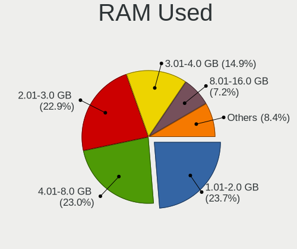
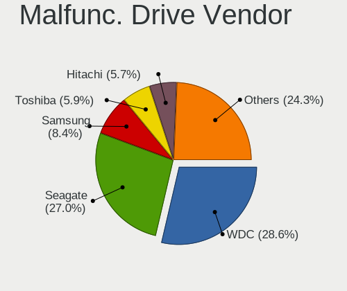
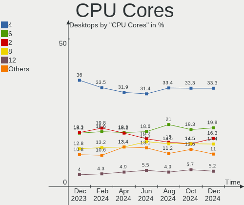
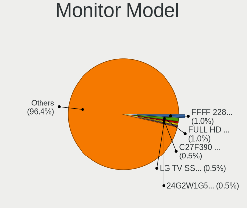
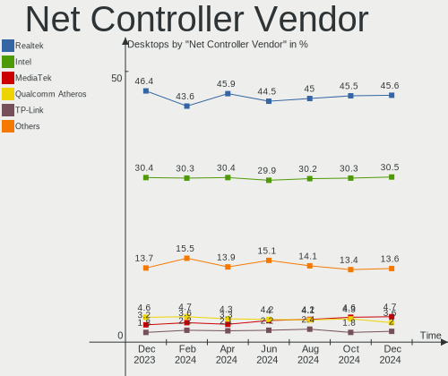
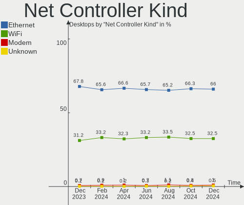
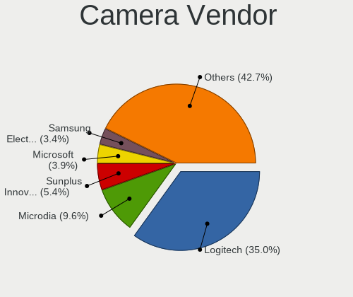

Linux - Hardware Trends (Desktops)
----------------------------------

A project to identify most popular hardware characteristics and track their change
over time based on data collected by Linux users at https://Linux-Hardware.org.

Anyone can contribute to this report by the [hw-probe](https://github.com/linuxhw/hw-probe) tool:

    sudo -E hw-probe -all -upload

This report is for one last month. Overall report since the beginning of time: [TestDays](https://github.com/linuxhw/TestDays)

Period: Feb, 2023.

Contents
--------

* [ System ](#system)
  - [ OS                       ](#os)
  - [ OS Family                ](#os-family)
  - [ Kernel                   ](#kernel)
  - [ Kernel Family            ](#kernel-family)
  - [ Kernel Major Ver.        ](#kernel-major-ver)
  - [ Arch                     ](#arch)
  - [ DE                       ](#de)
  - [ Display Server           ](#display-server)
  - [ Display Manager          ](#display-manager)
  - [ OS Lang                  ](#os-lang)
  - [ Boot Mode                ](#boot-mode)
  - [ Filesystem               ](#filesystem)
  - [ Part. scheme             ](#part-scheme)
  - [ Dual Boot with Linux/BSD ](#dual-boot-with-linuxbsd)
  - [ Dual Boot (Win)          ](#dual-boot-win)

* [ Board ](#board)
  - [ Vendor                   ](#vendor)
  - [ Model                    ](#model)
  - [ Model Family             ](#model-family)
  - [ MFG Year                 ](#mfg-year)
  - [ Form Factor              ](#form-factor)
  - [ Secure Boot              ](#secure-boot)
  - [ Coreboot                 ](#coreboot)
  - [ RAM Size                 ](#ram-size)
  - [ RAM Used                 ](#ram-used)
  - [ Total Drives             ](#total-drives)
  - [ Has CD-ROM               ](#has-cd-rom)
  - [ Has Ethernet             ](#has-ethernet)
  - [ Has WiFi                 ](#has-wifi)
  - [ Has Bluetooth            ](#has-bluetooth)

* [ Location ](#location)
  - [ Country                  ](#country)
  - [ City                     ](#city)

* [ Drives ](#drives)
  - [ Drive Vendor             ](#drive-vendor)
  - [ Drive Model              ](#drive-model)
  - [ HDD Vendor               ](#hdd-vendor)
  - [ SSD Vendor               ](#ssd-vendor)
  - [ Drive Kind               ](#drive-kind)
  - [ Drive Connector          ](#drive-connector)
  - [ Drive Size               ](#drive-size)
  - [ Space Total              ](#space-total)
  - [ Space Used               ](#space-used)
  - [ Malfunc. Drives          ](#malfunc-drives)
  - [ Malfunc. Drive Vendor    ](#malfunc-drive-vendor)
  - [ Malfunc. HDD Vendor      ](#malfunc-hdd-vendor)
  - [ Malfunc. Drive Kind      ](#malfunc-drive-kind)
  - [ Failed Drives            ](#failed-drives)
  - [ Failed Drive Vendor      ](#failed-drive-vendor)
  - [ Drive Status             ](#drive-status)

* [ Storage controller ](#storage-controller)
  - [ Storage Vendor           ](#storage-vendor)
  - [ Storage Model            ](#storage-model)
  - [ Storage Kind             ](#storage-kind)

* [ Processor ](#processor)
  - [ CPU Vendor               ](#cpu-vendor)
  - [ CPU Model                ](#cpu-model)
  - [ CPU Model Family         ](#cpu-model-family)
  - [ CPU Cores                ](#cpu-cores)
  - [ CPU Sockets              ](#cpu-sockets)
  - [ CPU Threads              ](#cpu-threads)
  - [ CPU Op-Modes             ](#cpu-op-modes)
  - [ CPU Microcode            ](#cpu-microcode)
  - [ CPU Microarch            ](#cpu-microarch)

* [ Graphics ](#graphics)
  - [ GPU Vendor               ](#gpu-vendor)
  - [ GPU Model                ](#gpu-model)
  - [ GPU Combo                ](#gpu-combo)
  - [ GPU Driver               ](#gpu-driver)
  - [ GPU Memory               ](#gpu-memory)

* [ Monitor ](#monitor)
  - [ Monitor Vendor           ](#monitor-vendor)
  - [ Monitor Model            ](#monitor-model)
  - [ Monitor Resolution       ](#monitor-resolution)
  - [ Monitor Diagonal         ](#monitor-diagonal)
  - [ Monitor Width            ](#monitor-width)
  - [ Aspect Ratio             ](#aspect-ratio)
  - [ Monitor Area             ](#monitor-area)
  - [ Pixel Density            ](#pixel-density)
  - [ Multiple Monitors        ](#multiple-monitors)

* [ Network ](#network)
  - [ Net Controller Vendor    ](#net-controller-vendor)
  - [ Net Controller Model     ](#net-controller-model)
  - [ Wireless Vendor          ](#wireless-vendor)
  - [ Wireless Model           ](#wireless-model)
  - [ Ethernet Vendor          ](#ethernet-vendor)
  - [ Ethernet Model           ](#ethernet-model)
  - [ Net Controller Kind      ](#net-controller-kind)
  - [ Used Controller          ](#used-controller)
  - [ NICs                     ](#nics)
  - [ IPv6                     ](#ipv6)

* [ Bluetooth ](#bluetooth)
  - [ Bluetooth Vendor         ](#bluetooth-vendor)
  - [ Bluetooth Model          ](#bluetooth-model)

* [ Sound ](#sound)
  - [ Sound Vendor             ](#sound-vendor)
  - [ Sound Model              ](#sound-model)

* [ Memory ](#memory)
  - [ Memory Vendor            ](#memory-vendor)
  - [ Memory Model             ](#memory-model)
  - [ Memory Kind              ](#memory-kind)
  - [ Memory Form Factor       ](#memory-form-factor)
  - [ Memory Size              ](#memory-size)
  - [ Memory Speed             ](#memory-speed)

* [ Printers & scanners ](#printers--scanners)
  - [ Printer Vendor           ](#printer-vendor)
  - [ Printer Model            ](#printer-model)
  - [ Scanner Vendor           ](#scanner-vendor)
  - [ Scanner Model            ](#scanner-model)

* [ Camera ](#camera)
  - [ Camera Vendor            ](#camera-vendor)
  - [ Camera Model             ](#camera-model)

* [ Security ](#security)
  - [ Fingerprint Vendor       ](#fingerprint-vendor)
  - [ Fingerprint Model        ](#fingerprint-model)
  - [ Chipcard Vendor          ](#chipcard-vendor)
  - [ Chipcard Model           ](#chipcard-model)

* [ Unsupported ](#unsupported)
  - [ Unsupported Devices      ](#unsupported-devices)
  - [ Unsupported Device Types ](#unsupported-device-types)

System
------

OS
--

Installed operating systems

| Name                         | Desktops | Percent |
|------------------------------|----------|---------|
| Ubuntu 22.04                 | 310      | 13.95%  |
| OpenMandriva 23.01           | 197      | 8.86%   |
| Linux Mint 21.1              | 171      | 7.69%   |
| Debian 11                    | 116      | 5.22%   |
| Fedora 37                    | 97       | 4.36%   |
| Ubuntu 22.10                 | 83       | 3.73%   |
| ROSA 12.3                    | 83       | 3.73%   |
| Arch Rolling                 | 81       | 3.64%   |
| Pop!_OS 22.04                | 74       | 3.33%   |
| OpenMandriva 4.3             | 67       | 3.01%   |
| Zorin 16                     | 65       | 2.92%   |
| Ubuntu 20.04                 | 65       | 2.92%   |
| Ubuntu 16.04                 | 53       | 2.38%   |
| Manjaro                      | 43       | 1.93%   |
| KDE neon 22.04               | 43       | 1.93%   |
| Linux Mint 20.3              | 35       | 1.57%   |
| ArcoLinux Rolling            | 29       | 1.3%    |
| Ubuntu 18.04                 | 28       | 1.26%   |
| Nobara 37                    | 26       | 1.17%   |
| Kubuntu 22.10                | 23       | 1.03%   |
| openSUSE Tumbleweed-XXXXXXXX | 21       | 0.94%   |
| Debian                       | 21       | 0.94%   |
| Kubuntu 22.04                | 20       | 0.9%    |
| Linux Mint 21                | 18       | 0.81%   |
| Gentoo 2.9                   | 18       | 0.81%   |
| EndeavourOS Rolling          | 16       | 0.72%   |
| BlackPanther 18.1            | 16       | 0.72%   |
| Kali 2022.4                  | 15       | 0.67%   |
| Elementary 7                 | 14       | 0.63%   |
| Xubuntu 22.04                | 13       | 0.58%   |
| OpenMandriva 4.2             | 13       | 0.58%   |
| Fedora 36                    | 13       | 0.58%   |
| Xubuntu 20.04                | 11       | 0.49%   |
| SteamOS 3.4                  | 11       | 0.49%   |
| OpenMandriva 23.90           | 11       | 0.49%   |
| LMDE 5                       | 11       | 0.49%   |
| Red OS 7.3.2                 | 9        | 0.4%    |
| MX 21                        | 9        | 0.4%    |
| Manjaro 22.0.3               | 9        | 0.4%    |
| ROSA R11.1                   | 8        | 0.36%   |

OS Family
---------

OS without a version

| Name          | Desktops | Percent |
|---------------|----------|---------|
| Ubuntu        | 546      | 24.56%  |
| OpenMandriva  | 291      | 13.09%  |
| Linux Mint    | 240      | 10.8%   |
| Debian        | 142      | 6.39%   |
| Fedora        | 116      | 5.22%   |
| ROSA          | 103      | 4.63%   |
| Arch          | 81       | 3.64%   |
| Pop!_OS       | 75       | 3.37%   |
| Zorin         | 69       | 3.1%    |
| Manjaro       | 64       | 2.88%   |
| Kubuntu       | 48       | 2.16%   |
| KDE neon      | 44       | 1.98%   |
| Xubuntu       | 33       | 1.48%   |
| ArcoLinux     | 32       | 1.44%   |
| Nobara        | 28       | 1.26%   |
| openSUSE      | 27       | 1.21%   |
| Gentoo        | 25       | 1.12%   |
| Elementary    | 19       | 0.85%   |
| Red OS        | 16       | 0.72%   |
| EndeavourOS   | 16       | 0.72%   |
| BlackPanther  | 16       | 0.72%   |
| Kali          | 15       | 0.67%   |
| Lubuntu       | 14       | 0.63%   |
| SteamOS       | 12       | 0.54%   |
| LMDE          | 12       | 0.54%   |
| Ubuntu MATE   | 11       | 0.49%   |
| MX            | 11       | 0.49%   |
| CentOS        | 8        | 0.36%   |
| ALT Linux     | 8        | 0.36%   |
| Garuda Linux  | 7        | 0.31%   |
| Endless       | 7        | 0.31%   |
| Ubuntu Unity  | 6        | 0.27%   |
| Ubuntu Budgie | 6        | 0.27%   |
| Parrot        | 6        | 0.27%   |
| BigLinux      | 6        | 0.27%   |
| Rocky Linux   | 5        | 0.22%   |
| Xero          | 4        | 0.18%   |
| TUXEDO OS     | 3        | 0.13%   |
| Slackware     | 3        | 0.13%   |
| Devuan        | 3        | 0.13%   |

Kernel
------

Version of the Linux kernel

| Version                             | Desktops | Percent |
|-------------------------------------|----------|---------|
| 5.15.0-60-generic                   | 291      | 13.09%  |
| 5.15.0-58-generic                   | 197      | 8.86%   |
| 6.1.1-desktop-1omv2290              | 138      | 6.21%   |
| 5.19.0-32-generic                   | 138      | 6.21%   |
| 5.19.0-31-generic                   | 70       | 3.15%   |
| 5.10.0-21-amd64                     | 66       | 2.97%   |
| 6.0.12-76060006-generic             | 61       | 2.74%   |
| 6.1.4-desktop-1omv2301              | 53       | 2.38%   |
| 4.15.0-142-generic                  | 51       | 2.29%   |
| 5.16.13-desktop-1omv4003            | 44       | 1.98%   |
| 5.4.0-137-generic                   | 36       | 1.62%   |
| 6.1.12-arch1-1                      | 33       | 1.48%   |
| 5.15.79-generic-1rosa2021.1-x86_64  | 29       | 1.3%    |
| 5.4.0-139-generic                   | 28       | 1.26%   |
| 5.19.0-29-generic                   | 28       | 1.26%   |
| 5.16.7-desktop-1omv4003             | 24       | 1.08%   |
| 5.15.75-generic-1rosa2021.1-x86_64  | 23       | 1.03%   |
| 5.15.0-43-generic                   | 22       | 0.99%   |
| 6.1.11-200.fc37.x86_64              | 21       | 0.94%   |
| 6.1.9-200.fc37.x86_64               | 20       | 0.9%    |
| 5.15.0-56-generic                   | 20       | 0.9%    |
| 6.1.8-200.fc37.x86_64               | 19       | 0.85%   |
| 6.1.9-arch1-1                       | 16       | 0.72%   |
| 6.1.9-1-MANJARO                     | 15       | 0.67%   |
| 6.1.12-zen1-1-zen                   | 13       | 0.58%   |
| 6.1.11-arch1-1                      | 13       | 0.58%   |
| 6.1.11-1-MANJARO                    | 13       | 0.58%   |
| 6.1.10-200.fc37.x86_64              | 12       | 0.54%   |
| 6.1.0-3-amd64                       | 12       | 0.54%   |
| 5.10.155-generic-1rosa2021.1-x86_64 | 12       | 0.54%   |
| 5.6.14-desktop-2bP                  | 11       | 0.49%   |
| 5.10.0-2-amd64                      | 11       | 0.49%   |
| 6.1.10-1-default                    | 10       | 0.45%   |
| 6.0.0-kali6-amd64                   | 10       | 0.45%   |
| 5.10.0-20-amd64                     | 10       | 0.45%   |
| 6.1.11-76060111-generic             | 9        | 0.4%    |
| 5.19.0-21-generic                   | 9        | 0.4%    |
| 5.13.0-valve21.3-1-neptune          | 9        | 0.4%    |
| 6.1.9-200.fsync.fc37.x86_64         | 8        | 0.36%   |
| 6.1.8-arch1-1                       | 8        | 0.36%   |

Kernel Family
-------------

Linux kernel without a distro release

| Version  | Desktops | Percent |
|----------|----------|---------|
| 5.15.0   | 574      | 25.82%  |
| 5.19.0   | 260      | 11.7%   |
| 6.1.1    | 141      | 6.34%   |
| 5.10.0   | 106      | 4.77%   |
| 5.4.0    | 95       | 4.27%   |
| 6.1.12   | 84       | 3.78%   |
| 6.1.9    | 81       | 3.64%   |
| 6.1.11   | 78       | 3.51%   |
| 4.15.0   | 70       | 3.15%   |
| 6.0.12   | 68       | 3.06%   |
| 6.1.4    | 59       | 2.65%   |
| 6.1.8    | 55       | 2.47%   |
| 5.16.13  | 44       | 1.98%   |
| 6.1.10   | 40       | 1.8%    |
| 6.0.0    | 38       | 1.71%   |
| 5.15.79  | 29       | 1.3%    |
| 5.15.75  | 25       | 1.12%   |
| 5.16.7   | 24       | 1.08%   |
| 6.1.0    | 19       | 0.85%   |
| 5.13.0   | 19       | 0.85%   |
| 6.2.0    | 17       | 0.76%   |
| 6.1.13   | 14       | 0.63%   |
| 5.10.155 | 12       | 0.54%   |
| 5.6.14   | 11       | 0.49%   |
| 5.15.94  | 11       | 0.49%   |
| 6.2.1    | 10       | 0.45%   |
| 5.14.0   | 9        | 0.4%    |
| 6.1.7    | 8        | 0.36%   |
| 5.10.74  | 8        | 0.36%   |
| 5.10.14  | 8        | 0.36%   |
| 5.15.91  | 7        | 0.31%   |
| 5.15.88  | 7        | 0.31%   |
| 6.0.7    | 6        | 0.27%   |
| 5.17.11  | 6        | 0.27%   |
| 5.15.87  | 6        | 0.27%   |
| 5.15.74  | 6        | 0.27%   |
| 5.11.0   | 6        | 0.27%   |
| 4.18.0   | 6        | 0.27%   |
| 6.1.6    | 5        | 0.22%   |
| 5.15.93  | 5        | 0.22%   |

Kernel Major Ver.
-----------------

Linux kernel major version

| Version | Desktops | Percent |
|---------|----------|---------|
| 5.15    | 701      | 31.53%  |
| 6.1     | 589      | 26.5%   |
| 5.19    | 270      | 12.15%  |
| 5.10    | 147      | 6.61%   |
| 6.0     | 130      | 5.85%   |
| 5.4     | 101      | 4.54%   |
| 4.15    | 71       | 3.19%   |
| 5.16    | 70       | 3.15%   |
| 6.2     | 27       | 1.21%   |
| 5.13    | 24       | 1.08%   |
| 5.14    | 16       | 0.72%   |
| 5.17    | 12       | 0.54%   |
| 5.6     | 11       | 0.49%   |
| 5.11    | 11       | 0.49%   |
| 4.18    | 11       | 0.49%   |
| 5.18    | 8        | 0.36%   |
| 4.19    | 8        | 0.36%   |
| 3.10    | 5        | 0.22%   |
| 4.9     | 4        | 0.18%   |
| 4.4     | 2        | 0.09%   |
| 5.8     | 1        | 0.04%   |
| 5.5     | 1        | 0.04%   |
| 4.8     | 1        | 0.04%   |
| 4.1     | 1        | 0.04%   |
| 3.13    | 1        | 0.04%   |

Arch
----

OS architecture (x86_64, i586, etc.)

| Name        | Desktops | Percent |
|-------------|----------|---------|
| x86_64      | 2195     | 98.74%  |
| i686        | 22       | 0.99%   |
| sparc64     | 1        | 0.04%   |
| ppc64le     | 1        | 0.04%   |
| ppc64       | 1        | 0.04%   |
| mips64      | 1        | 0.04%   |
| loongarch64 | 1        | 0.04%   |
| i586        | 1        | 0.04%   |

DE
--

Desktop Environment

| Name             | Desktops | Percent |
|------------------|----------|---------|
| GNOME            | 818      | 36.8%   |
| KDE5             | 647      | 29.1%   |
| X-Cinnamon       | 202      | 9.09%   |
| Unknown          | 181      | 8.14%   |
| XFCE             | 148      | 6.66%   |
| MATE             | 76       | 3.42%   |
| LXQt             | 28       | 1.26%   |
| Pantheon         | 19       | 0.85%   |
| Cinnamon         | 16       | 0.72%   |
| i3               | 13       | 0.58%   |
| KDE4             | 10       | 0.45%   |
| Openbox          | 7        | 0.31%   |
| LXDE             | 7        | 0.31%   |
| Budgie           | 7        | 0.31%   |
| GNOME Classic    | 6        | 0.27%   |
| Unity            | 5        | 0.22%   |
| awesome          | 4        | 0.18%   |
| xmonad           | 3        | 0.13%   |
| sway             | 3        | 0.13%   |
| Hyprland         | 3        | 0.13%   |
| Deepin           | 3        | 0.13%   |
| chadwm           | 3        | 0.13%   |
| qtile            | 2        | 0.09%   |
| KDE              | 2        | 0.09%   |
| bspwm            | 2        | 0.09%   |
| UKUI             | 1        | 0.04%   |
| lightdm-xsession | 1        | 0.04%   |
| LeftWM           | 1        | 0.04%   |
| icewm            | 1        | 0.04%   |
| i3-with-shmlog   | 1        | 0.04%   |
| gnome-xorg       | 1        | 0.04%   |
| Enlightenment    | 1        | 0.04%   |
| DWM              | 1        | 0.04%   |

Display Server
--------------

X11 or Wayland

| Name    | Desktops | Percent |
|---------|----------|---------|
| X11     | 1594     | 71.7%   |
| Wayland | 472      | 21.23%  |
| Unknown | 79       | 3.55%   |
| Tty     | 78       | 3.51%   |

Display Manager
---------------

SDDM, LightDM, etc.

| Name    | Desktops | Percent |
|---------|----------|---------|
| Unknown | 802      | 36.08%  |
| SDDM    | 527      | 23.71%  |
| GDM3    | 419      | 18.85%  |
| LightDM | 278      | 12.51%  |
| GDM     | 177      | 7.96%   |
| KDM     | 7        | 0.31%   |
| SLiM    | 4        | 0.18%   |
| LXDM    | 4        | 0.18%   |
| Ly      | 2        | 0.09%   |
| XDM     | 1        | 0.04%   |
| MDM     | 1        | 0.04%   |
| GREETD  | 1        | 0.04%   |

OS Lang
-------

Language

| Lang    | Desktops | Percent |
|---------|----------|---------|
| en_US   | 882      | 39.68%  |
| de_DE   | 212      | 9.54%   |
| ru_RU   | 192      | 8.64%   |
| Unknown | 120      | 5.4%    |
| fr_FR   | 105      | 4.72%   |
| en_GB   | 101      | 4.54%   |
| pt_BR   | 87       | 3.91%   |
| it_IT   | 69       | 3.1%    |
| en_CA   | 50       | 2.25%   |
| es_ES   | 48       | 2.16%   |
| pl_PL   | 42       | 1.89%   |
| en_AU   | 35       | 1.57%   |
| C       | 28       | 1.26%   |
| nl_NL   | 19       | 0.85%   |
| de_AT   | 18       | 0.81%   |
| es_MX   | 13       | 0.58%   |
| en_IN   | 13       | 0.58%   |
| cs_CZ   | 13       | 0.58%   |
| hu_HU   | 10       | 0.45%   |
| sv_SE   | 9        | 0.4%    |
| pt_PT   | 9        | 0.4%    |
| ja_JP   | 8        | 0.36%   |
| fi_FI   | 8        | 0.36%   |
| en_NZ   | 8        | 0.36%   |
| en_IE   | 7        | 0.31%   |
| zh_CN   | 6        | 0.27%   |
| en_ZA   | 6        | 0.27%   |
| nl_BE   | 5        | 0.22%   |
| en_PH   | 5        | 0.22%   |
| de_CH   | 5        | 0.22%   |
| ru_UA   | 4        | 0.18%   |
| fr_CH   | 4        | 0.18%   |
| fr_CA   | 4        | 0.18%   |
| fr_BE   | 4        | 0.18%   |
| es_CO   | 4        | 0.18%   |
| es_AR   | 4        | 0.18%   |
| en_IL   | 4        | 0.18%   |
| da_DK   | 4        | 0.18%   |
| tr_TR   | 3        | 0.13%   |
| ko_KR   | 3        | 0.13%   |

Boot Mode
---------

EFI or BIOS

| Mode | Desktops | Percent |
|------|----------|---------|
| BIOS | 1214     | 54.61%  |
| EFI  | 1009     | 45.39%  |

Filesystem
----------

Type of filesystem

| Type     | Desktops | Percent |
|----------|----------|---------|
| Ext4     | 1670     | 75.12%  |
| Btrfs    | 280      | 12.6%   |
| Overlay  | 175      | 7.87%   |
| Xfs      | 49       | 2.2%    |
| Zfs      | 24       | 1.08%   |
| F2fs     | 7        | 0.31%   |
| Ext3     | 5        | 0.22%   |
| Tmpfs    | 3        | 0.13%   |
| Jfs      | 3        | 0.13%   |
| Ext2     | 2        | 0.09%   |
| XXX4     | 1        | 0.04%   |
| Rootfs   | 1        | 0.04%   |
| Reiserfs | 1        | 0.04%   |
| Aufs     | 1        | 0.04%   |
| Unknown  | 1        | 0.04%   |

Part. scheme
------------

Scheme of partitioning

| Type    | Desktops | Percent |
|---------|----------|---------|
| GPT     | 1241     | 55.83%  |
| Unknown | 636      | 28.61%  |
| MBR     | 346      | 15.56%  |

Dual Boot with Linux/BSD
------------------------

Hosting more than one Linux/BSD

| Dual boot | Desktops | Percent |
|-----------|----------|---------|
| No        | 1667     | 74.99%  |
| Yes       | 556      | 25.01%  |

Dual Boot (Win)
---------------

Hosting Linux and Windows

| Dual boot | Desktops | Percent |
|-----------|----------|---------|
| No        | 1518     | 68.29%  |
| Yes       | 705      | 31.71%  |

Board
-----

Vendor
------

Motherboard manufacturer

| Name                                 | Desktops | Percent |
|--------------------------------------|----------|---------|
| ASUSTek Computer                     | 603      | 27.13%  |
| Gigabyte Technology                  | 375      | 16.87%  |
| MSI                                  | 282      | 12.69%  |
| ASRock                               | 203      | 9.13%   |
| Dell                                 | 172      | 7.74%   |
| Hewlett-Packard                      | 153      | 6.88%   |
| Lenovo                               | 72       | 3.24%   |
| Intel                                | 45       | 2.02%   |
| Acer                                 | 42       | 1.89%   |
| Unknown                              | 35       | 1.57%   |
| Fujitsu                              | 21       | 0.94%   |
| Biostar                              | 18       | 0.81%   |
| Foxconn                              | 17       | 0.76%   |
| Pegatron                             | 16       | 0.72%   |
| AZW                                  | 15       | 0.67%   |
| Medion                               | 11       | 0.49%   |
| Supermicro                           | 8        | 0.36%   |
| ECS                                  | 8        | 0.36%   |
| Inventec                             | 6        | 0.27%   |
| Huanan                               | 6        | 0.27%   |
| BESSTAR Tech                         | 6        | 0.27%   |
| Shenzhen Meigao Electronic Equipment | 5        | 0.22%   |
| ASRockRack                           | 5        | 0.22%   |
| Alienware                            | 5        | 0.22%   |
| OEM                                  | 4        | 0.18%   |
| Quanta                               | 3        | 0.13%   |
| PCWare                               | 3        | 0.13%   |
| Packard Bell                         | 3        | 0.13%   |
| Gateway                              | 3        | 0.13%   |
| eMachines                            | 3        | 0.13%   |
| Apple                                | 3        | 0.13%   |
| AMD                                  | 3        | 0.13%   |
| Shuttle                              | 2        | 0.09%   |
| Samsung Electronics                  | 2        | 0.09%   |
| Positivo                             | 2        | 0.09%   |
| IBM                                  | 2        | 0.09%   |
| Google                               | 2        | 0.09%   |
| DIEBOLD                              | 2        | 0.09%   |
| CWWK                                 | 2        | 0.09%   |
| Compal                               | 2        | 0.09%   |

Model
-----

Motherboard model

| Name                         | Desktops | Percent |
|------------------------------|----------|---------|
| ASUS All Series              | 45       | 2.02%   |
| ASUS ROG STRIX X299-E GAMING | 40       | 1.8%    |
| Unknown                      | 38       | 1.71%   |
| MSI MS-7C37                  | 18       | 0.81%   |
| ASUS TUF Gaming X570-PLUS    | 14       | 0.63%   |
| Intel H61                    | 12       | 0.54%   |
| Dell OptiPlex 3020           | 12       | 0.54%   |
| ASUS ROG STRIX X570-E GAMING | 10       | 0.45%   |
| ASUS ROG STRIX B550-F GAMING | 10       | 0.45%   |
| MSI MS-7C91                  | 9        | 0.4%    |
| Dell OptiPlex 7010           | 9        | 0.4%    |
| ASUS PRIME TRX40-PRO         | 9        | 0.4%    |
| Dell OptiPlex 780            | 8        | 0.36%   |
| ASUS TUF X299 MARK 2         | 8        | 0.36%   |
| ASUS PRIME B550M-A           | 8        | 0.36%   |
| MSI MS-7C56                  | 7        | 0.31%   |
| HP Compaq Elite 8300 SFF     | 7        | 0.31%   |
| Gigabyte X299 UD4 Pro        | 7        | 0.31%   |
| Gigabyte B450M S2H           | 7        | 0.31%   |
| Dell OptiPlex 790            | 7        | 0.31%   |
| Dell OptiPlex 7050           | 7        | 0.31%   |
| ASUS ROG STRIX B450-F GAMING | 7        | 0.31%   |
| ASRock X300M-STX             | 7        | 0.31%   |
| MSI MS-7C52                  | 6        | 0.27%   |
| MSI MS-7C02                  | 6        | 0.27%   |
| MSI MS-7B86                  | 6        | 0.27%   |
| MSI MS-7B84                  | 6        | 0.27%   |
| MSI MS-7885                  | 6        | 0.27%   |
| MSI MS-7693                  | 6        | 0.27%   |
| Gigabyte X299 AORUS Gaming 7 | 6        | 0.27%   |
| Gigabyte B450M DS3H          | 6        | 0.27%   |
| AZW U59                      | 6        | 0.27%   |
| ASUS TUF Gaming B550-PLUS    | 6        | 0.27%   |
| ASUS PRIME B450M-A           | 6        | 0.27%   |
| ASUS PRIME A320M-K           | 6        | 0.27%   |
| ASRock B450 Pro4             | 6        | 0.27%   |
| MSI MS-7D25                  | 5        | 0.22%   |
| MSI MS-7B98                  | 5        | 0.22%   |
| MSI MS-7B89                  | 5        | 0.22%   |
| MSI MS-7B79                  | 5        | 0.22%   |

Model Family
------------

Motherboard model prefix

| Name                   | Desktops | Percent |
|------------------------|----------|---------|
| ASUS ROG               | 129      | 5.8%    |
| ASUS PRIME             | 122      | 5.49%   |
| Dell OptiPlex          | 103      | 4.63%   |
| ASUS TUF               | 72       | 3.24%   |
| HP Compaq              | 50       | 2.25%   |
| ASUS All               | 45       | 2.02%   |
| Lenovo ThinkCentre     | 42       | 1.89%   |
| Unknown                | 38       | 1.71%   |
| Dell Precision         | 29       | 1.3%    |
| Acer Aspire            | 29       | 1.3%    |
| Gigabyte B450M         | 25       | 1.12%   |
| HP EliteDesk           | 21       | 0.94%   |
| Fujitsu ESPRIMO        | 19       | 0.85%   |
| MSI MS-7C37            | 18       | 0.81%   |
| Gigabyte X299          | 18       | 0.81%   |
| Gigabyte X570          | 17       | 0.76%   |
| Gigabyte B550          | 16       | 0.72%   |
| HP ProDesk             | 15       | 0.67%   |
| Lenovo IdeaCentre      | 13       | 0.58%   |
| Dell Inspiron          | 13       | 0.58%   |
| Intel H61              | 12       | 0.54%   |
| ASUS SABERTOOTH        | 12       | 0.54%   |
| ASUS M5A78L-M          | 12       | 0.54%   |
| ASRock B450M           | 12       | 0.54%   |
| Gigabyte B550M         | 11       | 0.49%   |
| Gigabyte B450          | 11       | 0.49%   |
| Dell XPS               | 11       | 0.49%   |
| HP Pavilion            | 10       | 0.45%   |
| ASUS P8H61-M           | 10       | 0.45%   |
| ASRock X570            | 10       | 0.45%   |
| Acer Veriton           | 10       | 0.45%   |
| MSI MS-7C91            | 9        | 0.4%    |
| ASUS Pro               | 9        | 0.4%    |
| ASUS M5A97             | 9        | 0.4%    |
| Gigabyte B365M         | 8        | 0.36%   |
| ASRock B450            | 8        | 0.36%   |
| MSI MS-7C56            | 7        | 0.31%   |
| Lenovo ThinkStation    | 7        | 0.31%   |
| Gigabyte Z390          | 7        | 0.31%   |
| Gigabyte GA-78LMT-USB3 | 7        | 0.31%   |

MFG Year
--------

Motherboard manufacture year

| Year    | Desktops | Percent |
|---------|----------|---------|
| 2018    | 222      | 9.99%   |
| 2020    | 205      | 9.22%   |
| 2017    | 201      | 9.04%   |
| 2019    | 187      | 8.41%   |
| 2012    | 181      | 8.14%   |
| 2021    | 180      | 8.1%    |
| 2013    | 146      | 6.57%   |
| 2014    | 139      | 6.25%   |
| 2022    | 134      | 6.03%   |
| 2011    | 129      | 5.8%    |
| 2010    | 96       | 4.32%   |
| 2016    | 87       | 3.91%   |
| 2009    | 85       | 3.82%   |
| 2015    | 80       | 3.6%    |
| 2008    | 56       | 2.52%   |
| 2007    | 44       | 1.98%   |
| 2006    | 25       | 1.12%   |
| 2023    | 12       | 0.54%   |
| 2005    | 8        | 0.36%   |
| Unknown | 5        | 0.22%   |
| 2004    | 1        | 0.04%   |

Form Factor
-----------

Physical design of the computer

| Name    | Desktops | Percent |
|---------|----------|---------|
| Desktop | 2223     | 100%    |

Secure Boot
-----------

Enabled or disabled

| State    | Desktops | Percent |
|----------|----------|---------|
| Disabled | 2155     | 96.94%  |
| Enabled  | 68       | 3.06%   |

Coreboot
--------

Have coreboot on board

| Used | Desktops | Percent |
|------|----------|---------|
| No   | 2220     | 99.87%  |
| Yes  | 3        | 0.13%   |

RAM Size
--------

Total RAM memory

| Size in GB      | Desktops | Percent |
|-----------------|----------|---------|
| 16.01-24.0      | 555      | 24.97%  |
| 32.01-64.0      | 390      | 17.54%  |
| 8.01-16.0       | 382      | 17.18%  |
| 4.01-8.0        | 321      | 14.44%  |
| 64.01-256.0     | 216      | 9.72%   |
| 3.01-4.0        | 203      | 9.13%   |
| 24.01-32.0      | 70       | 3.15%   |
| 1.01-2.0        | 39       | 1.75%   |
| 2.01-3.0        | 21       | 0.94%   |
| More than 256.0 | 16       | 0.72%   |
| 0.51-1.0        | 4        | 0.18%   |
| Unknown         | 4        | 0.18%   |
| 0.01-0.5        | 2        | 0.09%   |

RAM Used
--------

Used RAM memory

| Used GB     | Desktops | Percent |
|-------------|----------|---------|
| 1.01-2.0    | 664      | 29.87%  |
| 2.01-3.0    | 541      | 24.34%  |
| 4.01-8.0    | 405      | 18.22%  |
| 3.01-4.0    | 258      | 11.61%  |
| 8.01-16.0   | 121      | 5.44%   |
| 0.51-1.0    | 118      | 5.31%   |
| 16.01-24.0  | 32       | 1.44%   |
| 32.01-64.0  | 30       | 1.35%   |
| 0.01-0.5    | 28       | 1.26%   |
| 24.01-32.0  | 11       | 0.49%   |
| 64.01-256.0 | 10       | 0.45%   |
| Unknown     | 5        | 0.22%   |

Total Drives
------------

Number of drives on board

| Drives | Desktops | Percent |
|--------|----------|---------|
| 1      | 778      | 35%     |
| 2      | 599      | 26.95%  |
| 3      | 380      | 17.09%  |
| 4      | 224      | 10.08%  |
| 5      | 120      | 5.4%    |
| 6      | 56       | 2.52%   |
| 7      | 21       | 0.94%   |
| 0      | 15       | 0.67%   |
| 8      | 12       | 0.54%   |
| 9      | 8        | 0.36%   |
| 11     | 4        | 0.18%   |
| 10     | 2        | 0.09%   |
| 38     | 1        | 0.04%   |
| 21     | 1        | 0.04%   |
| 13     | 1        | 0.04%   |
| 12     | 1        | 0.04%   |

Has CD-ROM
----------

Has CD-ROM on board

| Presented | Desktops | Percent |
|-----------|----------|---------|
| No        | 1306     | 58.75%  |
| Yes       | 917      | 41.25%  |

Has Ethernet
------------

Has Ethernet on board

| Presented | Desktops | Percent |
|-----------|----------|---------|
| Yes       | 2211     | 99.46%  |
| No        | 12       | 0.54%   |

Has WiFi
--------

Has WiFi module

| Presented | Desktops | Percent |
|-----------|----------|---------|
| No        | 1217     | 54.75%  |
| Yes       | 1006     | 45.25%  |

Has Bluetooth
-------------

Has Bluetooth module

| Presented | Desktops | Percent |
|-----------|----------|---------|
| No        | 1419     | 63.83%  |
| Yes       | 804      | 36.17%  |

Location
--------

Country
-------

Geographic location (country)

| Country      | Desktops | Percent |
|--------------|----------|---------|
| USA          | 442      | 19.88%  |
| Germany      | 252      | 11.34%  |
| Russia       | 214      | 9.63%   |
| France       | 115      | 5.17%   |
| Brazil       | 113      | 5.08%   |
| Italy        | 95       | 4.27%   |
| Canada       | 80       | 3.6%    |
| UK           | 69       | 3.1%    |
| Unknown      | 67       | 3.01%   |
| Poland       | 63       | 2.83%   |
| Spain        | 53       | 2.38%   |
| Australia    | 43       | 1.93%   |
| Netherlands  | 40       | 1.8%    |
| Hungary      | 30       | 1.35%   |
| Finland      | 28       | 1.26%   |
| Belgium      | 25       | 1.12%   |
| Czechia      | 24       | 1.08%   |
| Austria      | 23       | 1.03%   |
| Mexico       | 22       | 0.99%   |
| India        | 22       | 0.99%   |
| China        | 21       | 0.94%   |
| Sweden       | 18       | 0.81%   |
| Romania      | 16       | 0.72%   |
| Switzerland  | 15       | 0.67%   |
| Norway       | 15       | 0.67%   |
| Japan        | 14       | 0.63%   |
| Turkey       | 13       | 0.58%   |
| Portugal     | 13       | 0.58%   |
| Denmark      | 13       | 0.58%   |
| Malaysia     | 12       | 0.54%   |
| South Africa | 11       | 0.49%   |
| Slovakia     | 11       | 0.49%   |
| Argentina    | 11       | 0.49%   |
| Ukraine      | 10       | 0.45%   |
| Indonesia    | 10       | 0.45%   |
| Philippines  | 9        | 0.4%    |
| New Zealand  | 9        | 0.4%    |
| Greece       | 9        | 0.4%    |
| Chile        | 9        | 0.4%    |
| Colombia     | 8        | 0.36%   |

City
----

Geographic location (city)

| City             | Desktops | Percent |
|------------------|----------|---------|
| Unknown          | 67       | 3.01%   |
| Moscow           | 39       | 1.75%   |
| Berlin           | 23       | 1.03%   |
| St Petersburg    | 21       | 0.94%   |
| Sydney           | 17       | 0.76%   |
| Rio de Janeiro   | 16       | 0.72%   |
| Hamburg          | 16       | 0.72%   |
| Sao Paulo        | 14       | 0.63%   |
| Voronezh         | 13       | 0.58%   |
| Paris            | 12       | 0.54%   |
| Melbourne        | 12       | 0.54%   |
| Vienna           | 11       | 0.49%   |
| Helsinki         | 11       | 0.49%   |
| Warsaw           | 10       | 0.45%   |
| Munich           | 10       | 0.45%   |
| London           | 10       | 0.45%   |
| Hangzhou         | 10       | 0.45%   |
| Amsterdam        | 10       | 0.45%   |
| Denver           | 9        | 0.4%    |
| Budapest         | 9        | 0.4%    |
| Toronto          | 8        | 0.36%   |
| Seattle          | 8        | 0.36%   |
| Milan            | 8        | 0.36%   |
| Copenhagen       | 8        | 0.36%   |
| Prague           | 7        | 0.31%   |
| Nizhniy Novgorod | 7        | 0.31%   |
| Milano           | 7        | 0.31%   |
| Los Angeles      | 7        | 0.31%   |
| Kuala Lumpur     | 7        | 0.31%   |
| Bucharest        | 7        | 0.31%   |
| Zurich           | 6        | 0.27%   |
| Yekaterinburg    | 6        | 0.27%   |
| Singapore        | 6        | 0.27%   |
| Rome             | 6        | 0.27%   |
| Madrid           | 6        | 0.27%   |
| Hanover          | 6        | 0.27%   |
| Dublin           | 6        | 0.27%   |
| Vancouver        | 5        | 0.22%   |
| Traunstein       | 5        | 0.22%   |
| Santo André     | 5        | 0.22%   |

Drives
------

Drive Vendor
------------

Hard drive vendors

| Vendor                      | Desktops | Drives | Percent |
|-----------------------------|----------|--------|---------|
| Seagate                     | 774      | 1059   | 18.13%  |
| WDC                         | 753      | 1086   | 17.64%  |
| Samsung Electronics         | 642      | 878    | 15.04%  |
| Kingston                    | 285      | 311    | 6.68%   |
| SanDisk                     | 230      | 278    | 5.39%   |
| Toshiba                     | 213      | 244    | 4.99%   |
| Crucial                     | 178      | 214    | 4.17%   |
| Hitachi                     | 105      | 117    | 2.46%   |
| China                       | 69       | 72     | 1.62%   |
| A-DATA Technology           | 65       | 67     | 1.52%   |
| Intel                       | 58       | 69     | 1.36%   |
| Phison Electronics          | 53       | 57     | 1.24%   |
| HGST                        | 42       | 53     | 0.98%   |
| PNY                         | 41       | 51     | 0.96%   |
| Silicon Motion              | 40       | 43     | 0.94%   |
| Unknown                     | 39       | 49     | 0.91%   |
| Micron/Crucial Technology   | 32       | 35     | 0.75%   |
| SPCC                        | 31       | 34     | 0.73%   |
| Intenso                     | 31       | 34     | 0.73%   |
| SK hynix                    | 30       | 35     | 0.7%    |
| Corsair                     | 25       | 28     | 0.59%   |
| Gigabyte Technology         | 22       | 22     | 0.52%   |
| Patriot                     | 21       | 21     | 0.49%   |
| Maxtor                      | 21       | 22     | 0.49%   |
| GOODRAM                     | 21       | 22     | 0.49%   |
| Team                        | 20       | 22     | 0.47%   |
| OCZ                         | 19       | 19     | 0.45%   |
| Transcend                   | 18       | 18     | 0.42%   |
| Kingston Technology Company | 18       | 18     | 0.42%   |
| ADATA Technology            | 15       | 17     | 0.35%   |
| Micron Technology           | 14       | 14     | 0.33%   |
| Realtek Semiconductor       | 13       | 14     | 0.3%    |
| JMicron Technology          | 13       | 20     | 0.3%    |
| Phison                      | 12       | 13     | 0.28%   |
| Apacer                      | 12       | 14     | 0.28%   |
| Plextor                     | 10       | 10     | 0.23%   |
| Hewlett-Packard             | 10       | 18     | 0.23%   |
| XPG                         | 8        | 10     | 0.19%   |
| ASMT                        | 8        | 11     | 0.19%   |
| Unknown                     | 8        | 8      | 0.19%   |

Drive Model
-----------

Hard drive models

| Model                                                | Desktops | Percent |
|------------------------------------------------------|----------|---------|
| Samsung NVMe SSD Controller SM981/PM981/PM983 250GB  | 86       | 1.72%   |
| Samsung SSD 860 EVO 500GB                            | 75       | 1.5%    |
| Kingston SA400S37240G 240GB SSD                      | 64       | 1.28%   |
| Seagate ST6000NM0115-1YZ110 6TB                      | 57       | 1.14%   |
| Seagate ST500DM002-1BD142 500GB                      | 56       | 1.12%   |
| Kingston SA400S37480G 480GB SSD                      | 54       | 1.08%   |
| WDC WD10EZEX-08WN4A0 1TB                             | 42       | 0.84%   |
| Seagate ST1000DM010-2EP102 1TB                       | 42       | 0.84%   |
| Samsung NVMe SSD Controller PM9A1/PM9A3/980PRO 960GB | 42       | 0.84%   |
| Samsung SSD 850 EVO 500GB                            | 41       | 0.82%   |
| Seagate ST2000DM008-2FR102 2TB                       | 40       | 0.8%    |
| Samsung SSD 850 EVO 250GB                            | 38       | 0.76%   |
| Toshiba DT01ACA100 1TB                               | 34       | 0.68%   |
| Samsung SSD 980 1TB                                  | 34       | 0.68%   |
| Seagate ST4000DM004-2CV104 4TB                       | 28       | 0.56%   |
| Toshiba HDWD110 1TB                                  | 27       | 0.54%   |
| Toshiba DT01ACA050 500GB                             | 26       | 0.52%   |
| Crucial CT500MX500SSD1 500GB                         | 26       | 0.52%   |
| Crucial CT240BX500SSD1 240GB                         | 25       | 0.5%    |
| Crucial CT1000MX500SSD1 1TB                          | 25       | 0.5%    |
| WDC WD20EZRZ-00Z5HB0 2TB                             | 24       | 0.48%   |
| Sandisk WD Blue SN550 NVMe SSD 1TB                   | 22       | 0.44%   |
| Samsung NVMe SSD Controller SM961/PM961/SM963 512GB  | 22       | 0.44%   |
| Toshiba DT01ACA200 2TB                               | 21       | 0.42%   |
| Samsung SSD 860 EVO 1TB                              | 21       | 0.42%   |
| Samsung SSD 870 EVO 500GB                            | 20       | 0.4%    |
| Samsung SSD 860 EVO 250GB                            | 20       | 0.4%    |
| Phison E12 NVMe Controller 1024GB                    | 20       | 0.4%    |
| Kingston SV300S37A120G 120GB SSD                     | 20       | 0.4%    |
| Kingston SA400S37120G 120GB SSD                      | 20       | 0.4%    |
| Seagate ST3500418AS 500GB                            | 19       | 0.38%   |
| Micron/Crucial P2 NVMe PCIe SSD 1TB                  | 19       | 0.38%   |
| Kingston SNVS500G 500GB                              | 19       | 0.38%   |
| WDC WDS240G2G0A-00JH30 240GB SSD                     | 18       | 0.36%   |
| Seagate ST2000DM001-1ER164 2TB                       | 18       | 0.36%   |
| Seagate ST1000DM003-1ER162 1TB                       | 18       | 0.36%   |
| Seagate ST1000DM003-1CH162 1TB                       | 18       | 0.36%   |
| WDC WD10EZEX-00BN5A0 1TB                             | 17       | 0.34%   |
| Unknown SD/MMC/MS PRO 16GB                           | 17       | 0.34%   |
| Seagate ST31000528AS 1TB                             | 17       | 0.34%   |

HDD Vendor
----------

Hard disk drive vendors

| Vendor              | Desktops | Drives | Percent |
|---------------------|----------|--------|---------|
| Seagate             | 756      | 1031   | 39.11%  |
| WDC                 | 662      | 940    | 34.25%  |
| Toshiba             | 190      | 217    | 9.83%   |
| Hitachi             | 105      | 117    | 5.43%   |
| Samsung Electronics | 88       | 101    | 4.55%   |
| HGST                | 41       | 51     | 2.12%   |
| Maxtor              | 21       | 22     | 1.09%   |
| Unknown             | 18       | 18     | 0.93%   |
| JMicron Technology  | 9        | 14     | 0.47%   |
| Fujitsu             | 7        | 8      | 0.36%   |
| Hewlett-Packard     | 6        | 13     | 0.31%   |
| SABRENT             | 5        | 5      | 0.26%   |
| Intenso             | 5        | 5      | 0.26%   |
| ASMT                | 3        | 6      | 0.16%   |
| Apple               | 3        | 3      | 0.16%   |
| WD MediaMax         | 2        | 2      | 0.1%    |
| China               | 2        | 2      | 0.1%    |
| Synology            | 1        | 2      | 0.05%   |
| QNAP                | 1        | 7      | 0.05%   |
| PHD 3.0             | 1        | 1      | 0.05%   |
| MARVELL             | 1        | 1      | 0.05%   |
| LaCie               | 1        | 1      | 0.05%   |
| KESU                | 1        | 1      | 0.05%   |
| HPE                 | 1        | 1      | 0.05%   |
| GOKE                | 1        | 1      | 0.05%   |
| FORESEE             | 1        | 1      | 0.05%   |
| ACASIS              | 1        | 1      | 0.05%   |

SSD Vendor
----------

Solid state drive vendors

| Vendor              | Desktops | Drives | Percent |
|---------------------|----------|--------|---------|
| Samsung Electronics | 379      | 448    | 24.5%   |
| Kingston            | 233      | 250    | 15.06%  |
| Crucial             | 153      | 183    | 9.89%   |
| SanDisk             | 113      | 128    | 7.3%    |
| WDC                 | 103      | 107    | 6.66%   |
| China               | 66       | 69     | 4.27%   |
| A-DATA Technology   | 57       | 57     | 3.68%   |
| PNY                 | 39       | 49     | 2.52%   |
| SPCC                | 27       | 30     | 1.75%   |
| Intel               | 26       | 35     | 1.68%   |
| Intenso             | 22       | 23     | 1.42%   |
| Patriot             | 20       | 20     | 1.29%   |
| GOODRAM             | 20       | 21     | 1.29%   |
| OCZ                 | 19       | 19     | 1.23%   |
| Team                | 18       | 20     | 1.16%   |
| Transcend           | 16       | 16     | 1.03%   |
| Toshiba             | 13       | 15     | 0.84%   |
| Corsair             | 13       | 13     | 0.84%   |
| Gigabyte Technology | 11       | 11     | 0.71%   |
| SK hynix            | 10       | 12     | 0.65%   |
| Micron Technology   | 10       | 10     | 0.65%   |
| Plextor             | 8        | 8      | 0.52%   |
| Seagate             | 7        | 7      | 0.45%   |
| LITEONIT            | 7        | 7      | 0.45%   |
| Apacer              | 7        | 7      | 0.45%   |
| Unknown             | 6        | 6      | 0.39%   |
| XrayDisk            | 5        | 6      | 0.32%   |
| Verbatim            | 5        | 6      | 0.32%   |
| Smartbuy            | 5        | 5      | 0.32%   |
| Lexar               | 5        | 5      | 0.32%   |
| KingSpec            | 5        | 5      | 0.32%   |
| LITEON              | 4        | 4      | 0.26%   |
| Leven               | 4        | 4      | 0.26%   |
| Hewlett-Packard     | 4        | 5      | 0.26%   |
| Fanxiang            | 4        | 4      | 0.26%   |
| Dogfish             | 4        | 4      | 0.26%   |
| TO Exter            | 3        | 3      | 0.19%   |
| Timetec             | 3        | 3      | 0.19%   |
| Qumo                | 3        | 3      | 0.19%   |
| Netac               | 3        | 3      | 0.19%   |

Drive Kind
----------

HDD or SSD

| Kind    | Desktops | Drives | Percent |
|---------|----------|--------|---------|
| HDD     | 1489     | 2572   | 41.49%  |
| SSD     | 1282     | 1721   | 35.72%  |
| NVMe    | 734      | 1005   | 20.45%  |
| Unknown | 72       | 86     | 2.01%   |
| MMC     | 12       | 14     | 0.33%   |

Drive Connector
---------------

SATA, SAS, NVMe, etc.

| Type | Desktops | Drives | Percent |
|------|----------|--------|---------|
| SATA | 1984     | 4156   | 68.2%   |
| NVMe | 734      | 1000   | 25.23%  |
| SAS  | 179      | 228    | 6.15%   |
| MMC  | 12       | 14     | 0.41%   |

Drive Size
----------

Size of hard drive

| Size in TB      | Desktops | Drives | Percent |
|-----------------|----------|--------|---------|
| 0.01-0.5        | 1441     | 2049   | 46.51%  |
| 0.51-1.0        | 825      | 1089   | 26.63%  |
| 1.01-2.0        | 373      | 489    | 12.04%  |
| 4.01-10.0       | 177      | 274    | 5.71%   |
| 3.01-4.0        | 140      | 194    | 4.52%   |
| 2.01-3.0        | 90       | 107    | 2.91%   |
| 10.01-20.0      | 51       | 90     | 1.65%   |
| More than 100.0 | 1        | 1      | 0.03%   |

Space Total
-----------

Amount of disk space available on the file system

| Size in GB     | Desktops | Percent |
|----------------|----------|---------|
| 101-250        | 419      | 18.85%  |
| 501-1000       | 367      | 16.51%  |
| 251-500        | 343      | 15.43%  |
| More than 3000 | 286      | 12.87%  |
| 1001-2000      | 231      | 10.39%  |
| Unknown        | 161      | 7.24%   |
| 1-20           | 123      | 5.53%   |
| 2001-3000      | 120      | 5.4%    |
| 51-100         | 99       | 4.45%   |
| 21-50          | 74       | 3.33%   |

Space Used
----------

Amount of used disk space

| Used GB        | Desktops | Percent |
|----------------|----------|---------|
| 1-20           | 646      | 29.06%  |
| 21-50          | 303      | 13.63%  |
| 101-250        | 234      | 10.53%  |
| 51-100         | 221      | 9.94%   |
| 251-500        | 184      | 8.28%   |
| 501-1000       | 181      | 8.14%   |
| Unknown        | 161      | 7.24%   |
| 1001-2000      | 124      | 5.58%   |
| More than 3000 | 113      | 5.08%   |
| 2001-3000      | 54       | 2.43%   |
| 0              | 2        | 0.09%   |

Malfunc. Drives
---------------

Drive models with a malfunction

| Model                               | Desktops | Drives | Percent |
|-------------------------------------|----------|--------|---------|
| Seagate ST500DM002-1BD142 500GB     | 13       | 13     | 3.08%   |
| Toshiba DT01ACA100 1TB              | 8        | 9      | 1.9%    |
| Seagate ST3500418AS 500GB           | 8        | 8      | 1.9%    |
| Toshiba DT01ACA050 500GB            | 7        | 7      | 1.66%   |
| WDC WD10EARS-00Y5B1 1TB             | 5        | 5      | 1.18%   |
| Kingston SV300S37A120G 120GB SSD    | 5        | 5      | 1.18%   |
| Kingston SA400S37240G 240GB SSD     | 5        | 5      | 1.18%   |
| WDC WD20EARS-00MVWB0 2TB            | 4        | 4      | 0.95%   |
| Seagate ST500LT012-9WS142 500GB     | 4        | 4      | 0.95%   |
| Seagate ST3250310AS 250GB           | 4        | 4      | 0.95%   |
| Seagate ST31000528AS 1TB            | 4        | 5      | 0.95%   |
| Seagate ST2000DL003-9VT166 2TB      | 4        | 4      | 0.95%   |
| WDC WDS240G2G0A-00JH30 240GB SSD    | 3        | 3      | 0.71%   |
| WDC WD5000AAKX-00ERMA0 500GB        | 3        | 3      | 0.71%   |
| WDC WD5000AAKS-00V1A0 500GB         | 3        | 3      | 0.71%   |
| WDC WD30EFRX-68EUZN0 3TB            | 3        | 3      | 0.71%   |
| Seagate ST3500413AS 500GB           | 3        | 4      | 0.71%   |
| Seagate ST2000DM008-2FR102 2TB      | 3        | 4      | 0.71%   |
| Seagate ST1000DM003-9YN162 1TB      | 3        | 3      | 0.71%   |
| Samsung Electronics SSD 980 1TB     | 3        | 3      | 0.71%   |
| Hitachi HDS721010CLA332 1TB         | 3        | 3      | 0.71%   |
| WDC WD6400AAKS-65A7B2 640GB         | 2        | 2      | 0.47%   |
| WDC WD5000HHTZ-04N21V0 500GB        | 2        | 2      | 0.47%   |
| WDC WD5000AAKX-08ERMA0 500GB        | 2        | 2      | 0.47%   |
| WDC WD20EZRZ-00Z5HB0 2TB            | 2        | 2      | 0.47%   |
| WDC WD20EZRX-00D8PB0 2TB            | 2        | 2      | 0.47%   |
| WDC WD10EALX-009BA0 1TB             | 2        | 2      | 0.47%   |
| WDC WD10EADS-00M2B0 1TB             | 2        | 2      | 0.47%   |
| WDC WD1002FAEX-00Z3A0 1TB           | 2        | 2      | 0.47%   |
| WDC WD1001FALS-00J7B1 1TB           | 2        | 2      | 0.47%   |
| Toshiba MQ01ABD100 1TB              | 2        | 2      | 0.47%   |
| Seagate ST750LM022 HN-M750MBB 752GB | 2        | 2      | 0.47%   |
| Seagate ST500LM021-1KJ152 500GB     | 2        | 2      | 0.47%   |
| Seagate ST3808110AS 80GB            | 2        | 2      | 0.47%   |
| Seagate ST3500630AS 500GB           | 2        | 2      | 0.47%   |
| Seagate ST3320418AS 320GB           | 2        | 2      | 0.47%   |
| Seagate ST3250410AS 250GB           | 2        | 2      | 0.47%   |
| Seagate ST31000524AS 1TB            | 2        | 2      | 0.47%   |
| Seagate ST3000DM001-1ER166 3TB      | 2        | 3      | 0.47%   |
| Seagate ST250DM000-1BD141 250GB     | 2        | 2      | 0.47%   |

Malfunc. Drive Vendor
---------------------

Vendors of faulty drives

| Vendor                | Desktops | Drives | Percent |
|-----------------------|----------|--------|---------|
| WDC                   | 118      | 136    | 29.43%  |
| Seagate               | 109      | 123    | 27.18%  |
| Samsung Electronics   | 31       | 33     | 7.73%   |
| Hitachi               | 28       | 29     | 6.98%   |
| Toshiba               | 25       | 26     | 6.23%   |
| Kingston              | 20       | 20     | 4.99%   |
| Maxtor                | 10       | 10     | 2.49%   |
| Intel                 | 8        | 11     | 2%      |
| SanDisk               | 7        | 8      | 1.75%   |
| Crucial               | 7        | 7      | 1.75%   |
| A-DATA Technology     | 6        | 6      | 1.5%    |
| HGST                  | 4        | 6      | 1%      |
| Hewlett-Packard       | 4        | 4      | 1%      |
| OCZ                   | 3        | 3      | 0.75%   |
| Corsair               | 3        | 3      | 0.75%   |
| Realtek Semiconductor | 2        | 3      | 0.5%    |
| Intenso               | 2        | 2      | 0.5%    |
| Transcend             | 1        | 1      | 0.25%   |
| SPCC                  | 1        | 1      | 0.25%   |
| SK hynix              | 1        | 1      | 0.25%   |
| Qumo                  | 1        | 1      | 0.25%   |
| Netac                 | 1        | 1      | 0.25%   |
| Neo                   | 1        | 1      | 0.25%   |
| LITEONIT              | 1        | 1      | 0.25%   |
| KingSpec              | 1        | 1      | 0.25%   |
| Kingmax               | 1        | 1      | 0.25%   |
| Drevo                 | 1        | 1      | 0.25%   |
| CHN25SATAS1           | 1        | 1      | 0.25%   |
| China                 | 1        | 1      | 0.25%   |
| Apacer                | 1        | 1      | 0.25%   |
| AMD                   | 1        | 1      | 0.25%   |

Malfunc. HDD Vendor
-------------------

Vendors of faulty HDD drives

| Vendor              | Desktops | Drives | Percent |
|---------------------|----------|--------|---------|
| WDC                 | 110      | 128    | 35.95%  |
| Seagate             | 109      | 123    | 35.62%  |
| Hitachi             | 28       | 29     | 9.15%   |
| Toshiba             | 24       | 25     | 7.84%   |
| Samsung Electronics | 16       | 17     | 5.23%   |
| Maxtor              | 10       | 10     | 3.27%   |
| HGST                | 4        | 6      | 1.31%   |
| Hewlett-Packard     | 4        | 4      | 1.31%   |
| Intenso             | 1        | 1      | 0.33%   |

Malfunc. Drive Kind
-------------------

Kinds of faulty drives

| Kind | Desktops | Drives | Percent |
|------|----------|--------|---------|
| HDD  | 269      | 343    | 74.1%   |
| SSD  | 80       | 85     | 22.04%  |
| NVMe | 14       | 16     | 3.86%   |

Failed Drives
-------------

Failed drive models

| Model                             | Desktops | Drives | Percent |
|-----------------------------------|----------|--------|---------|
| Samsung Electronics SSD 980 1TB   | 2        | 2      | 25%     |
| WDC WD800JD-00LSA0 80GB           | 1        | 1      | 12.5%   |
| WDC WD800JB-00JJC0 80GB           | 1        | 1      | 12.5%   |
| Toshiba DT01ACA050 500GB          | 1        | 1      | 12.5%   |
| Seagate ST3500418AS 500GB         | 1        | 1      | 12.5%   |
| Samsung Electronics SSD 980 500GB | 1        | 1      | 12.5%   |
| Samsung Electronics SP0802N 80GB  | 1        | 1      | 12.5%   |

Failed Drive Vendor
-------------------

Failed drive vendors

| Vendor              | Desktops | Drives | Percent |
|---------------------|----------|--------|---------|
| Samsung Electronics | 4        | 4      | 50%     |
| WDC                 | 2        | 2      | 25%     |
| Toshiba             | 1        | 1      | 12.5%   |
| Seagate             | 1        | 1      | 12.5%   |

Drive Status
------------

Number of failed and malfunc. drives

| Status   | Desktops | Drives | Percent |
|----------|----------|--------|---------|
| Detected | 1120     | 2531   | 44.04%  |
| Works    | 1073     | 2415   | 42.19%  |
| Malfunc  | 342      | 444    | 13.45%  |
| Failed   | 8        | 8      | 0.31%   |

Storage controller
------------------

Storage Vendor
--------------

Storage controller vendors

| Vendor                           | Desktops | Percent |
|----------------------------------|----------|---------|
| Intel                            | 1399     | 42.04%  |
| AMD                              | 752      | 22.6%   |
| Samsung Electronics              | 262      | 7.87%   |
| SanDisk                          | 155      | 4.66%   |
| ASMedia Technology               | 132      | 3.97%   |
| Phison Electronics               | 95       | 2.85%   |
| Kingston Technology Company      | 76       | 2.28%   |
| Micron/Crucial Technology        | 61       | 1.83%   |
| JMicron Technology               | 60       | 1.8%    |
| Marvell Technology Group         | 55       | 1.65%   |
| Silicon Motion                   | 52       | 1.56%   |
| Nvidia                           | 43       | 1.29%   |
| ADATA Technology                 | 25       | 0.75%   |
| SK hynix                         | 20       | 0.6%    |
| Realtek Semiconductor            | 18       | 0.54%   |
| Broadcom / LSI                   | 15       | 0.45%   |
| VIA Technologies                 | 11       | 0.33%   |
| Toshiba America Info Systems     | 11       | 0.33%   |
| LSI Logic / Symbios Logic        | 10       | 0.3%    |
| MAXIO Technology (Hangzhou)      | 9        | 0.27%   |
| Seagate Technology               | 8        | 0.24%   |
| Silicon Image                    | 7        | 0.21%   |
| KIOXIA                           | 6        | 0.18%   |
| Shenzhen Longsys Electronics     | 5        | 0.15%   |
| Integrated Technology Express    | 5        | 0.15%   |
| Micron Technology                | 4        | 0.12%   |
| Adaptec                          | 4        | 0.12%   |
| Silicon Integrated Systems [SiS] | 3        | 0.09%   |
| Union Memory (Shenzhen)          | 2        | 0.06%   |
| OCZ Technology Group             | 2        | 0.06%   |
| Netac Technology                 | 2        | 0.06%   |
| Lite-On Technology               | 2        | 0.06%   |
| INNOGRIT                         | 2        | 0.06%   |
| Hewlett-Packard                  | 2        | 0.06%   |
| Western Digital                  | 1        | 0.03%   |
| ULi Electronics                  | 1        | 0.03%   |
| Transcend                        | 1        | 0.03%   |
| Solid State Storage Technology   | 1        | 0.03%   |
| Promise Technology               | 1        | 0.03%   |
| Loongson Technology              | 1        | 0.03%   |

Storage Model
-------------

Storage controller models

| Model                                                                                   | Desktops | Percent |
|-----------------------------------------------------------------------------------------|----------|---------|
| AMD FCH SATA Controller [AHCI mode]                                                     | 399      | 9.86%   |
| Intel 8 Series/C220 Series Chipset Family 6-port SATA Controller 1 [AHCI mode]          | 164      | 4.05%   |
| Intel 200 Series PCH SATA controller [AHCI mode]                                        | 164      | 4.05%   |
| AMD 400 Series Chipset SATA Controller                                                  | 150      | 3.71%   |
| Samsung NVMe SSD Controller SM981/PM981/PM983                                           | 128      | 3.16%   |
| AMD 500 Series Chipset SATA Controller                                                  | 124      | 3.06%   |
| ASMedia ASM1062 Serial ATA Controller                                                   | 118      | 2.92%   |
| Intel 6 Series/C200 Series Chipset Family 6 port Desktop SATA AHCI Controller           | 97       | 2.4%    |
| AMD SB7x0/SB8x0/SB9x0 IDE Controller                                                    | 95       | 2.35%   |
| Intel Q170/Q150/B150/H170/H110/Z170/CM236 Chipset SATA Controller [AHCI Mode]           | 88       | 2.17%   |
| Intel 7 Series/C210 Series Chipset Family 6-port SATA Controller [AHCI mode]            | 76       | 1.88%   |
| AMD SB7x0/SB8x0/SB9x0 SATA Controller [AHCI mode]                                       | 76       | 1.88%   |
| Intel SATA Controller [RAID mode]                                                       | 72       | 1.78%   |
| Samsung NVMe SSD Controller PM9A1/PM9A3/980PRO                                          | 71       | 1.75%   |
| Intel Cannon Lake PCH SATA AHCI Controller                                              | 70       | 1.73%   |
| Intel Alder Lake-S PCH SATA Controller [AHCI Mode]                                      | 70       | 1.73%   |
| Intel NM10/ICH7 Family SATA Controller [IDE mode]                                       | 63       | 1.56%   |
| AMD SB7x0/SB8x0/SB9x0 SATA Controller [IDE mode]                                        | 61       | 1.51%   |
| Intel 6 Series/C200 Series Chipset Family Desktop SATA Controller (IDE mode, ports 4-5) | 54       | 1.33%   |
| Intel 500 Series Chipset Family SATA AHCI Controller                                    | 54       | 1.33%   |
| Intel 6 Series/C200 Series Chipset Family Desktop SATA Controller (IDE mode, ports 0-3) | 53       | 1.31%   |
| Samsung NVMe SSD Controller 980                                                         | 50       | 1.24%   |
| SanDisk Non-Volatile memory controller                                                  | 49       | 1.21%   |
| Kingston Company Company Non-Volatile memory controller                                 | 47       | 1.16%   |
| Intel 82801G (ICH7 Family) IDE Controller                                               | 44       | 1.09%   |
| Phison E12 NVMe Controller                                                              | 39       | 0.96%   |
| Micron/Crucial P2 NVMe PCIe SSD                                                         | 39       | 0.96%   |
| SanDisk WD Blue SN550 NVMe SSD                                                          | 35       | 0.86%   |
| Intel 9 Series Chipset Family SATA Controller [AHCI Mode]                               | 35       | 0.86%   |
| AMD FCH SATA Controller D                                                               | 35       | 0.86%   |
| Intel Volume Management Device NVMe RAID Controller                                     | 32       | 0.79%   |
| JMicron JMB363 SATA/IDE Controller                                                      | 31       | 0.77%   |
| Samsung NVMe SSD Controller SM961/PM961/SM963                                           | 29       | 0.72%   |
| Intel C610/X99 series chipset 6-Port SATA Controller [AHCI mode]                        | 29       | 0.72%   |
| Silicon Motion SM2263EN/SM2263XT SSD Controller                                         | 28       | 0.69%   |
| AMD SATA controller                                                                     | 28       | 0.69%   |
| AMD 300 Series Chipset SATA Controller                                                  | 28       | 0.69%   |
| SanDisk WD Blue SN570 NVMe SSD                                                          | 25       | 0.62%   |
| SanDisk WD Black SN750 / PC SN730 NVMe SSD                                              | 25       | 0.62%   |
| Silicon Motion SM2262/SM2262EN SSD Controller                                           | 24       | 0.59%   |

Storage Kind
------------

Kind of storage controller (IDE, SATA, NVMe, SAS, ...)

| Kind | Desktops | Percent |
|------|----------|---------|
| SATA | 1847     | 57.54%  |
| NVMe | 736      | 22.93%  |
| IDE  | 440      | 13.71%  |
| RAID | 155      | 4.83%   |
| SAS  | 25       | 0.78%   |
| SCSI | 7        | 0.22%   |

Processor
---------

CPU Vendor
----------

Processor vendors

| Vendor            | Desktops | Percent |
|-------------------|----------|---------|
| Intel             | 1415     | 63.65%  |
| AMD               | 802      | 36.08%  |
| Unknown           | 3        | 0.13%   |
| PowerNV C829UAG3  | 1        | 0.04%   |
| CHRP IBM,8233-E8B | 1        | 0.04%   |
| CentaurHauls      | 1        | 0.04%   |

CPU Model
---------

Processor models

| Model                                       | Desktops | Percent |
|---------------------------------------------|----------|---------|
| Intel Core i7-7800X CPU @ 3.50GHz           | 56       | 2.52%   |
| AMD Ryzen 5 3600 6-Core Processor           | 38       | 1.71%   |
| AMD Ryzen 7 3700X 8-Core Processor          | 33       | 1.48%   |
| AMD Ryzen 5 5600G with Radeon Graphics      | 31       | 1.39%   |
| AMD Ryzen 7 5700G with Radeon Graphics      | 29       | 1.3%    |
| AMD Ryzen 5 5600X 6-Core Processor          | 28       | 1.26%   |
| Intel Core i5-2400 CPU @ 3.10GHz            | 25       | 1.12%   |
| AMD Ryzen 5 2600 Six-Core Processor         | 24       | 1.08%   |
| Intel Core i5-3470 CPU @ 3.20GHz            | 23       | 1.03%   |
| AMD Ryzen 9 5950X 16-Core Processor         | 23       | 1.03%   |
| AMD Ryzen 9 3900X 12-Core Processor         | 23       | 1.03%   |
| Intel Core i7-3770 CPU @ 3.40GHz            | 21       | 0.94%   |
| Intel Core i7-6700 CPU @ 3.40GHz            | 19       | 0.85%   |
| Intel Core i7-4790 CPU @ 3.60GHz            | 19       | 0.85%   |
| Intel Core i7-4770 CPU @ 3.40GHz            | 19       | 0.85%   |
| Intel Core i5-6500 CPU @ 3.20GHz            | 19       | 0.85%   |
| Intel Core 2 Duo CPU E8400 @ 3.00GHz        | 19       | 0.85%   |
| Intel Core i5-4570 CPU @ 3.20GHz            | 18       | 0.81%   |
| AMD Ryzen 9 5900X 12-Core Processor         | 18       | 0.81%   |
| AMD Ryzen 7 5800X 8-Core Processor          | 18       | 0.81%   |
| Intel Core i7-8700 CPU @ 3.20GHz            | 16       | 0.72%   |
| Intel Core i5-4590 CPU @ 3.30GHz            | 16       | 0.72%   |
| Intel Core i3-4130 CPU @ 3.40GHz            | 16       | 0.72%   |
| Intel Core i3-3220 CPU @ 3.30GHz            | 16       | 0.72%   |
| AMD FX-8350 Eight-Core Processor            | 16       | 0.72%   |
| Intel Core i7-2600 CPU @ 3.40GHz            | 15       | 0.67%   |
| Intel Core i5-10400 CPU @ 2.90GHz           | 15       | 0.67%   |
| AMD Ryzen 5 1600 Six-Core Processor         | 15       | 0.67%   |
| AMD Ryzen 7 2700 Eight-Core Processor       | 14       | 0.63%   |
| AMD Ryzen 5 2400G with Radeon Vega Graphics | 14       | 0.63%   |
| Intel Core i7-8700K CPU @ 3.70GHz           | 13       | 0.58%   |
| Intel Core i5-4460 CPU @ 3.20GHz            | 13       | 0.58%   |
| Intel 12th Gen Core i7-12700K               | 13       | 0.58%   |
| AMD FX-6300 Six-Core Processor              | 13       | 0.58%   |
| Intel Core 2 Quad CPU Q6600 @ 2.40GHz       | 12       | 0.54%   |
| AMD Ryzen 7 5700X 8-Core Processor          | 12       | 0.54%   |
| AMD Ryzen 7 2700X Eight-Core Processor      | 12       | 0.54%   |
| Intel Core i7-7700 CPU @ 3.60GHz            | 11       | 0.49%   |
| Intel Core i5-9400F CPU @ 2.90GHz           | 11       | 0.49%   |
| Intel Core i5-9400 CPU @ 2.90GHz            | 11       | 0.49%   |

CPU Model Family
----------------

Processor model prefix

| Model                   | Desktops | Percent |
|-------------------------|----------|---------|
| Intel Core i5           | 360      | 16.19%  |
| Intel Core i7           | 328      | 14.75%  |
| AMD Ryzen 5             | 217      | 9.76%   |
| Intel Core i3           | 168      | 7.56%   |
| AMD Ryzen 7             | 156      | 7.02%   |
| Other                   | 141      | 6.34%   |
| Intel Xeon              | 111      | 4.99%   |
| AMD Ryzen 9             | 96       | 4.32%   |
| Intel Celeron           | 72       | 3.24%   |
| AMD FX                  | 67       | 3.01%   |
| Intel Core 2 Duo        | 51       | 2.29%   |
| Intel Core 2 Quad       | 43       | 1.93%   |
| Intel Pentium           | 42       | 1.89%   |
| AMD Ryzen 3             | 32       | 1.44%   |
| AMD Phenom II X4        | 27       | 1.21%   |
| AMD Ryzen Threadripper  | 26       | 1.17%   |
| Intel Pentium Dual-Core | 24       | 1.08%   |
| Intel Core i9           | 24       | 1.08%   |
| AMD Athlon II X2        | 20       | 0.9%    |
| Intel Core 2            | 19       | 0.85%   |
| AMD A8                  | 17       | 0.76%   |
| AMD Athlon 64 X2        | 13       | 0.58%   |
| Intel Atom              | 12       | 0.54%   |
| AMD Phenom II X6        | 12       | 0.54%   |
| AMD A4                  | 12       | 0.54%   |
| AMD A10                 | 12       | 0.54%   |
| Intel Pentium Dual      | 11       | 0.49%   |
| AMD Athlon              | 11       | 0.49%   |
| AMD A6                  | 11       | 0.49%   |
| Intel Pentium 4         | 10       | 0.45%   |
| AMD Athlon II X4        | 10       | 0.45%   |
| AMD Athlon X4           | 7        | 0.31%   |
| AMD Ryzen 5 PRO         | 6        | 0.27%   |
| AMD G                   | 6        | 0.27%   |
| Intel Pentium Gold      | 5        | 0.22%   |
| AMD Phenom              | 5        | 0.22%   |
| AMD Sempron             | 4        | 0.18%   |
| Intel Pentium D         | 3        | 0.13%   |
| AMD Phenom II X3        | 3        | 0.13%   |
| AMD E                   | 3        | 0.13%   |

CPU Cores
---------

Number of processor cores

| Number  | Desktops | Percent |
|---------|----------|---------|
| 4       | 801      | 36.03%  |
| 6       | 432      | 19.43%  |
| 2       | 432      | 19.43%  |
| 8       | 253      | 11.38%  |
| 12      | 83       | 3.73%   |
| 16      | 70       | 3.15%   |
| 1       | 47       | 2.11%   |
| 3       | 34       | 1.53%   |
| 10      | 27       | 1.21%   |
| 24      | 26       | 1.17%   |
| 28      | 4        | 0.18%   |
| 32      | 3        | 0.13%   |
| 20      | 3        | 0.13%   |
| 36      | 2        | 0.09%   |
| 14      | 2        | 0.09%   |
| 40      | 1        | 0.04%   |
| 22      | 1        | 0.04%   |
| 18      | 1        | 0.04%   |
| Unknown | 1        | 0.04%   |

CPU Sockets
-----------

Number of sockets

| Number | Desktops | Percent |
|--------|----------|---------|
| 1      | 2186     | 98.34%  |
| 2      | 37       | 1.66%   |

CPU Threads
-----------

Threads per core (Hyper-Threading)

| Number  | Desktops | Percent |
|---------|----------|---------|
| 2       | 1375     | 61.85%  |
| 1       | 843      | 37.92%  |
| 4       | 2        | 0.09%   |
| 12      | 1        | 0.04%   |
| 8       | 1        | 0.04%   |
| Unknown | 1        | 0.04%   |

CPU Op-Modes
------------

CPU Operation Modes (32-bit, 64-bit)

| Op mode        | Desktops | Percent |
|----------------|----------|---------|
| 32-bit, 64-bit | 2216     | 99.69%  |
| 32-bit         | 4        | 0.18%   |
| Unknown        | 3        | 0.13%   |

CPU Microcode
-------------

Microcode number

| Number     | Desktops | Percent |
|------------|----------|---------|
| Unknown    | 657      | 29.55%  |
| 0x306c3    | 143      | 6.43%   |
| 0x206a7    | 101      | 4.54%   |
| 0x306a9    | 90       | 4.05%   |
| 0x08701021 | 70       | 3.15%   |
| 0x506e3    | 63       | 2.83%   |
| 0x1067a    | 63       | 2.83%   |
| 0x50654    | 59       | 2.65%   |
| 0x906ea    | 50       | 2.25%   |
| 0x0800820d | 48       | 2.16%   |
| 0x906e9    | 38       | 1.71%   |
| 0x90672    | 34       | 1.53%   |
| 0xa0653    | 33       | 1.48%   |
| 0x0a201016 | 32       | 1.44%   |
| 0x0a50000d | 29       | 1.3%    |
| 0x0a20120a | 27       | 1.21%   |
| 0x010000c8 | 25       | 1.12%   |
| 0x906ed    | 22       | 0.99%   |
| 0x06000852 | 22       | 0.99%   |
| 0xa0655    | 21       | 0.94%   |
| 0x6fb      | 19       | 0.85%   |
| 0x0a601203 | 19       | 0.85%   |
| 0x08101016 | 19       | 0.85%   |
| 0xa0671    | 18       | 0.81%   |
| 0x08108109 | 18       | 0.81%   |
| 0x0a50000c | 17       | 0.76%   |
| 0x08001138 | 17       | 0.76%   |
| 0x306f2    | 16       | 0.72%   |
| 0x20655    | 15       | 0.67%   |
| 0x08701013 | 15       | 0.67%   |
| 0x906eb    | 12       | 0.54%   |
| 0x06001119 | 12       | 0.54%   |
| 0x010000db | 12       | 0.54%   |
| 0x6fd      | 11       | 0.49%   |
| 0x406f1    | 11       | 0.49%   |
| 0x306e4    | 11       | 0.49%   |
| 0x206d7    | 11       | 0.49%   |
| 0x106e5    | 11       | 0.49%   |
| 0xb0671    | 10       | 0.45%   |
| 0x906c0    | 10       | 0.45%   |

CPU Microarch
-------------

Microarchitecture

| Name             | Desktops | Percent |
|------------------|----------|---------|
| Haswell          | 244      | 10.98%  |
| KabyLake         | 191      | 8.59%   |
| Zen 3            | 178      | 8.01%   |
| Skylake          | 169      | 7.6%    |
| Zen 2            | 157      | 7.06%   |
| SandyBridge      | 150      | 6.75%   |
| IvyBridge        | 146      | 6.57%   |
| Zen+             | 103      | 4.63%   |
| Unknown          | 101      | 4.54%   |
| Penryn           | 100      | 4.5%    |
| K10              | 87       | 3.91%   |
| Piledriver       | 81       | 3.64%   |
| CometLake        | 73       | 3.28%   |
| Zen              | 70       | 3.15%   |
| Core             | 60       | 2.7%    |
| Alderlake Hybrid | 52       | 2.34%   |
| Nehalem          | 29       | 1.3%    |
| Westmere         | 28       | 1.26%   |
| Silvermont       | 21       | 0.94%   |
| Excavator        | 20       | 0.9%    |
| K8 Hammer        | 18       | 0.81%   |
| Icelake          | 18       | 0.81%   |
| NetBurst         | 14       | 0.63%   |
| Broadwell        | 14       | 0.63%   |
| Tremont          | 12       | 0.54%   |
| Goldmont plus    | 12       | 0.54%   |
| Steamroller      | 11       | 0.49%   |
| Jaguar           | 10       | 0.45%   |
| Bulldozer        | 10       | 0.45%   |
| Bonnell          | 10       | 0.45%   |
| Bobcat           | 10       | 0.45%   |
| Goldmont         | 9        | 0.4%    |
| K10 Llano        | 8        | 0.36%   |
| TigerLake        | 4        | 0.18%   |
| Puma             | 1        | 0.04%   |
| K6               | 1        | 0.04%   |
| Geode            | 1        | 0.04%   |

Graphics
--------

GPU Vendor
----------

Vendors of graphics cards

| Vendor                                       | Desktops | Percent |
|----------------------------------------------|----------|---------|
| Nvidia                                       | 937      | 39.45%  |
| AMD                                          | 717      | 30.19%  |
| Intel                                        | 686      | 28.88%  |
| ASPEED Technology                            | 18       | 0.76%   |
| Matrox Electronics Systems                   | 9        | 0.38%   |
| Silicon Integrated Systems [SiS]             | 3        | 0.13%   |
| ATI Technologies                             | 2        | 0.08%   |
| XGI Technology (eXtreme Graphics Innovation) | 1        | 0.04%   |
| VIA Technologies                             | 1        | 0.04%   |
| Loongson Technology                          | 1        | 0.04%   |

GPU Model
---------

Graphics card models

| Model                                                                       | Desktops | Percent |
|-----------------------------------------------------------------------------|----------|---------|
| Intel Xeon E3-1200 v3/4th Gen Core Processor Integrated Graphics Controller | 101      | 4.17%   |
| Nvidia GK208B [GeForce GT 710]                                              | 86       | 3.55%   |
| AMD Ellesmere [Radeon RX 470/480/570/570X/580/580X/590]                     | 82       | 3.38%   |
| Intel 2nd Generation Core Processor Family Integrated Graphics Controller   | 71       | 2.93%   |
| Intel Xeon E3-1200 v2/3rd Gen Core processor Graphics Controller            | 58       | 2.39%   |
| Intel HD Graphics 530                                                       | 55       | 2.27%   |
| Nvidia GP107 [GeForce GTX 1050 Ti]                                          | 54       | 2.23%   |
| AMD Cezanne [Radeon Vega Series / Radeon Vega Mobile Series]                | 52       | 2.15%   |
| Intel CoffeeLake-S GT2 [UHD Graphics 630]                                   | 49       | 2.02%   |
| AMD Caicos [Radeon HD 6450/7450/8450 / R5 230 OEM]                          | 44       | 1.82%   |
| Intel 4 Series Chipset Integrated Graphics Controller                       | 36       | 1.49%   |
| AMD Navi 22 [Radeon RX 6700/6700 XT/6750 XT / 6800M/6850M XT]               | 35       | 1.44%   |
| Nvidia GP108 [GeForce GT 1030]                                              | 33       | 1.36%   |
| AMD Navi 23 [Radeon RX 6600/6600 XT/6600M]                                  | 33       | 1.36%   |
| AMD Navi 10 [Radeon RX 5600 OEM/5600 XT / 5700/5700 XT]                     | 33       | 1.36%   |
| Nvidia GP106 [GeForce GTX 1060 6GB]                                         | 31       | 1.28%   |
| Intel 4th Generation Core Processor Family Integrated Graphics Controller   | 29       | 1.2%    |
| Intel CometLake-S GT2 [UHD Graphics 630]                                    | 28       | 1.16%   |
| Nvidia GM206 [GeForce GTX 960]                                              | 27       | 1.11%   |
| Intel HD Graphics 630                                                       | 27       | 1.11%   |
| Nvidia GM107 [GeForce GTX 750 Ti]                                           | 26       | 1.07%   |
| AMD Picasso/Raven 2 [Radeon Vega Series / Radeon Vega Mobile Series]        | 23       | 0.95%   |
| Nvidia GT218 [GeForce 210]                                                  | 22       | 0.91%   |
| Nvidia GK208B [GeForce GT 730]                                              | 22       | 0.91%   |
| Intel AlderLake-S GT1                                                       | 21       | 0.87%   |
| AMD Raven Ridge [Radeon Vega Series / Radeon Vega Mobile Series]            | 21       | 0.87%   |
| AMD Raphael                                                                 | 21       | 0.87%   |
| AMD Lexa PRO [Radeon 540/540X/550/550X / RX 540X/550/550X]                  | 21       | 0.87%   |
| Intel IvyBridge GT2 [HD Graphics 4000]                                      | 20       | 0.83%   |
| AMD Navi 21 [Radeon RX 6800/6800 XT / 6900 XT]                              | 20       | 0.83%   |
| Nvidia GP107 [GeForce GTX 1050]                                             | 19       | 0.78%   |
| Nvidia TU117 [GeForce GTX 1650]                                             | 18       | 0.74%   |
| Nvidia GP104 [GeForce GTX 1070]                                             | 18       | 0.74%   |
| Nvidia GM204 [GeForce GTX 970]                                              | 18       | 0.74%   |
| ASPEED Technology ASPEED Graphics Family                                    | 18       | 0.74%   |
| Nvidia TU116 [GeForce GTX 1660 SUPER]                                       | 16       | 0.66%   |
| Nvidia TU106 [GeForce RTX 2060 Rev. A]                                      | 14       | 0.58%   |
| Nvidia GA106 [GeForce RTX 3060 Lite Hash Rate]                              | 14       | 0.58%   |
| AMD Navi 31 [Radeon RX 7900 XT/7900 XTX]                                    | 14       | 0.58%   |
| AMD Baffin [Radeon RX 550 640SP / RX 560/560X]                              | 14       | 0.58%   |

GPU Combo
---------

Combinations of graphics cards

| Name                      | Desktops | Percent |
|---------------------------|----------|---------|
| 1 x Nvidia                | 844      | 37.97%  |
| 1 x AMD                   | 631      | 28.39%  |
| 1 x Intel                 | 569      | 25.6%   |
| Intel + Nvidia            | 46       | 2.07%   |
| 2 x AMD                   | 36       | 1.62%   |
| AMD + Nvidia              | 26       | 1.17%   |
| Intel + AMD               | 18       | 0.81%   |
| 2 x Nvidia                | 10       | 0.45%   |
| 1 x ASPEED                | 10       | 0.45%   |
| 2 x Intel                 | 7        | 0.31%   |
| 1 x Matrox                | 7        | 0.31%   |
| Nvidia + ASPEED           | 5        | 0.22%   |
| 1 x SiS                   | 3        | 0.13%   |
| AMD + ASPEED              | 3        | 0.13%   |
| Other                     | 2        | 0.09%   |
| 1 x XGI                   | 1        | 0.04%   |
| 1 x VIA                   | 1        | 0.04%   |
| Nvidia + Matrox           | 1        | 0.04%   |
| Intel + 2 x Nvidia        | 1        | 0.04%   |
| AMD + Matrox              | 1        | 0.04%   |
| AMD + Loongson Technology | 1        | 0.04%   |

GPU Driver
----------

Free vs proprietary

| Driver      | Desktops | Percent |
|-------------|----------|---------|
| Free        | 1615     | 72.65%  |
| Proprietary | 484      | 21.77%  |
| Unknown     | 124      | 5.58%   |

GPU Memory
----------

Total video memory

| Size in GB | Desktops | Percent |
|------------|----------|---------|
| Unknown    | 1102     | 49.57%  |
| 1.01-2.0   | 237      | 10.66%  |
| 0.51-1.0   | 218      | 9.81%   |
| 7.01-8.0   | 172      | 7.74%   |
| 3.01-4.0   | 161      | 7.24%   |
| 0.01-0.5   | 157      | 7.06%   |
| 8.01-16.0  | 82       | 3.69%   |
| 5.01-6.0   | 58       | 2.61%   |
| 2.01-3.0   | 18       | 0.81%   |
| 16.01-24.0 | 17       | 0.76%   |
| 24.01-32.0 | 1        | 0.04%   |

Monitor
-------

Monitor Vendor
--------------

Monitor vendors

| Vendor               | Desktops | Percent |
|----------------------|----------|---------|
| Samsung Electronics  | 379      | 17.74%  |
| Goldstar             | 215      | 10.07%  |
| Dell                 | 203      | 9.5%    |
| Hewlett-Packard      | 159      | 7.44%   |
| Acer                 | 149      | 6.98%   |
| AOC                  | 106      | 4.96%   |
| Ancor Communications | 96       | 4.49%   |
| BenQ                 | 92       | 4.31%   |
| Philips              | 87       | 4.07%   |
| ASUSTek Computer     | 59       | 2.76%   |
| Iiyama               | 50       | 2.34%   |
| ViewSonic            | 46       | 2.15%   |
| Lenovo               | 42       | 1.97%   |
| LG Electronics       | 21       | 0.98%   |
| Fujitsu Siemens      | 21       | 0.98%   |
| Unknown              | 20       | 0.94%   |
| MSI                  | 20       | 0.94%   |
| Eizo                 | 20       | 0.94%   |
| Sony                 | 18       | 0.84%   |
| Unknown              | 15       | 0.7%    |
| Sceptre Tech         | 14       | 0.66%   |
| Medion               | 12       | 0.56%   |
| HannStar             | 12       | 0.56%   |
| Vizio                | 11       | 0.51%   |
| Idek Iiyama          | 11       | 0.51%   |
| Gigabyte Technology  | 9        | 0.42%   |
| Toshiba              | 8        | 0.37%   |
| Panasonic            | 8        | 0.37%   |
| NEC Computers        | 8        | 0.37%   |
| RTK                  | 7        | 0.33%   |
| Mi                   | 7        | 0.33%   |
| HKC                  | 7        | 0.33%   |
| Sharp                | 6        | 0.28%   |
| Insignia             | 6        | 0.28%   |
| HUAWEI               | 6        | 0.28%   |
| IBM                  | 5        | 0.23%   |
| HPN                  | 5        | 0.23%   |
| Compal               | 5        | 0.23%   |
| AUS                  | 5        | 0.23%   |
| Wacom                | 4        | 0.19%   |

Monitor Model
-------------

Monitor models

| Model                                                                  | Desktops | Percent |
|------------------------------------------------------------------------|----------|---------|
| Unknown                                                                | 15       | 0.67%   |
| Goldstar Ultra HD GSM5B09 3840x2160 600x340mm 27.2-inch                | 11       | 0.49%   |
| Goldstar FULL HD GSM5B55 1920x1080 480x270mm 21.7-inch                 | 11       | 0.49%   |
| AOC 27G2G4 AOC2702 1920x1080 598x336mm 27.0-inch                       | 11       | 0.49%   |
| Goldstar IPS FULLHD GSM5AB8 1920x1080 480x270mm 21.7-inch              | 10       | 0.44%   |
| Unknown LCD Monitor FFFF 2288x1287 2550x2550mm 142.0-inch              | 9        | 0.4%    |
| Samsung Electronics C24F390 SAM0D2C 1920x1080 521x293mm 23.5-inch      | 9        | 0.4%    |
| Goldstar ULTRAWIDE GSM59F1 2560x1080 798x334mm 34.1-inch               | 9        | 0.4%    |
| Ancor Communications VG248 ACI24A4 1920x1080 531x299mm 24.0-inch       | 9        | 0.4%    |
| Samsung Electronics S24F350 SAM0D20 1920x1080 521x293mm 23.5-inch      | 8        | 0.35%   |
| Philips PHL 243V7 PHLC155 1920x1080 527x296mm 23.8-inch                | 8        | 0.35%   |
| BenQ GL2460 BNQ78CE 1920x1080 531x299mm 24.0-inch                      | 8        | 0.35%   |
| AOC 24B2W1G5 AOC2402 1920x1080 527x296mm 23.8-inch                     | 8        | 0.35%   |
| Goldstar HDR 4K GSM7707 3840x2160 600x340mm 27.2-inch                  | 7        | 0.31%   |
| Samsung Electronics S24D300 SAM0B43 1920x1080 531x299mm 24.0-inch      | 6        | 0.27%   |
| Samsung Electronics C27F390 SAM0D32 1920x1080 598x336mm 27.0-inch      | 6        | 0.27%   |
| Samsung Electronics U28E590 SAM0C4D 3840x2160 607x345mm 27.5-inch      | 5        | 0.22%   |
| Samsung Electronics S24D330 SAM0D92 1920x1080 531x299mm 24.0-inch      | 5        | 0.22%   |
| Samsung Electronics C32F391 SAM0D34 1920x1080 698x393mm 31.5-inch      | 5        | 0.22%   |
| Iiyama PL2730H IVM663A 1920x1080 598x336mm 27.0-inch                   | 5        | 0.22%   |
| Goldstar HDR WFHD GSM7714 2560x1080 798x334mm 34.1-inch                | 5        | 0.22%   |
| Dell U2412M DELA07A 1920x1200 518x324mm 24.1-inch                      | 5        | 0.22%   |
| AOC Q3279WG5B AOC3279 2560x1440 725x428mm 33.1-inch                    | 5        | 0.22%   |
| Samsung Electronics SyncMaster SAM01E1 1280x1024 376x301mm 19.0-inch   | 4        | 0.18%   |
| Samsung Electronics S24F350 SAM0D21 1920x1080 521x293mm 23.5-inch      | 4        | 0.18%   |
| Samsung Electronics C49RG9x SAM0F9C 3840x1080 1193x336mm 48.8-inch     | 4        | 0.18%   |
| Hewlett-Packard w1907 HWP26A2 1440x900 408x255mm 18.9-inch             | 4        | 0.18%   |
| Dell U2410 DELF015 1920x1200 518x324mm 24.1-inch                       | 4        | 0.18%   |
| BenQ EW3270U BNQ7950 3840x2160 698x393mm 31.5-inch                     | 4        | 0.18%   |
| AOC 2460G5 AOC2460 1920x1080 531x299mm 24.0-inch                       | 4        | 0.18%   |
| Ancor Communications VS248 ACI2498 1920x1080 531x299mm 24.0-inch       | 4        | 0.18%   |
| Ancor Communications ASUS PB287Q ACI28A3 3840x2160 621x341mm 27.9-inch | 4        | 0.18%   |
| Ancor Communications ASUS PB278 ACI27A3 2560x1440 597x336mm 27.0-inch  | 4        | 0.18%   |
| Vestel Elektronik 42 FHD_LCD-TV VES3700 1920x540                       | 3        | 0.13%   |
| Unknown LCD Monitor SAMSUNG 1920x1080                                  | 3        | 0.13%   |
| Samsung Electronics U32J59x SAM0F52 3840x2160 697x392mm 31.5-inch      | 3        | 0.13%   |
| Samsung Electronics U32J59x SAM0F35 3840x2160 697x392mm 31.5-inch      | 3        | 0.13%   |
| Samsung Electronics SyncMaster SAM059A 1920x1080 477x268mm 21.5-inch   | 3        | 0.13%   |
| Samsung Electronics SyncMaster SAM0273 1440x900 410x257mm 19.1-inch    | 3        | 0.13%   |
| Samsung Electronics S22D300 SAM0B3F 1920x1080 477x268mm 21.5-inch      | 3        | 0.13%   |

Monitor Resolution
------------------

Monitor screen resolution

| Resolution         | Desktops | Percent |
|--------------------|----------|---------|
| 1920x1080 (FHD)    | 927      | 44%     |
| 3840x2160 (4K)     | 217      | 10.3%   |
| 2560x1440 (QHD)    | 196      | 9.3%    |
| 1280x1024 (SXGA)   | 146      | 6.93%   |
| 1680x1050 (WSXGA+) | 84       | 3.99%   |
| 1440x900 (WXGA+)   | 68       | 3.23%   |
| 1366x768 (WXGA)    | 63       | 2.99%   |
| 1920x1200 (WUXGA)  | 58       | 2.75%   |
| 1600x900 (HD+)     | 58       | 2.75%   |
| Unknown            | 58       | 2.75%   |
| 3440x1440          | 51       | 2.42%   |
| 3840x1080          | 33       | 1.57%   |
| 2560x1080          | 29       | 1.38%   |
| 1360x768           | 28       | 1.33%   |
| 2288x1287          | 10       | 0.47%   |
| 1920x540           | 10       | 0.47%   |
| 3840x1600          | 9        | 0.43%   |
| 1024x768 (XGA)     | 9        | 0.43%   |
| 1600x1200          | 8        | 0.38%   |
| 5760x1080          | 6        | 0.28%   |
| 1280x720 (HD)      | 5        | 0.24%   |
| 4480x1440          | 4        | 0.19%   |
| 3200x1080          | 3        | 0.14%   |
| 1400x1050          | 3        | 0.14%   |
| 1280x960           | 3        | 0.14%   |
| 5760x2160          | 2        | 0.09%   |
| 3520x1080          | 2        | 0.09%   |
| 3360x1050          | 2        | 0.09%   |
| 2560x1600          | 2        | 0.09%   |
| 7680x2160          | 1        | 0.05%   |
| 5760x1200          | 1        | 0.05%   |
| 4160x1440          | 1        | 0.05%   |
| 3840x1200          | 1        | 0.05%   |
| 3600x1080          | 1        | 0.05%   |
| 3520x1200          | 1        | 0.05%   |
| 3440x2880          | 1        | 0.05%   |
| 3286x1080          | 1        | 0.05%   |
| 3200x900           | 1        | 0.05%   |
| 3120x1050          | 1        | 0.05%   |
| 2720x768           | 1        | 0.05%   |

Monitor Diagonal
----------------

Diagonal size in inches

| Inches  | Desktops | Percent |
|---------|----------|---------|
| 27      | 346      | 16.38%  |
| 24      | 279      | 13.21%  |
| 23      | 237      | 11.22%  |
| 21      | 216      | 10.23%  |
| Unknown | 195      | 9.23%   |
| 31      | 125      | 5.92%   |
| 19      | 122      | 5.78%   |
| 17      | 75       | 3.55%   |
| 34      | 71       | 3.36%   |
| 20      | 71       | 3.36%   |
| 18      | 68       | 3.22%   |
| 22      | 60       | 2.84%   |
| 32      | 23       | 1.09%   |
| 15      | 23       | 1.09%   |
| 84      | 20       | 0.95%   |
| 72      | 20       | 0.95%   |
| 25      | 13       | 0.62%   |
| 54      | 12       | 0.57%   |
| 48      | 12       | 0.57%   |
| 40      | 10       | 0.47%   |
| 37      | 10       | 0.47%   |
| 142     | 9        | 0.43%   |
| 52      | 9        | 0.43%   |
| 28      | 9        | 0.43%   |
| 43      | 6        | 0.28%   |
| 33      | 6        | 0.28%   |
| 26      | 6        | 0.28%   |
| 36      | 5        | 0.24%   |
| 29      | 5        | 0.24%   |
| 16      | 5        | 0.24%   |
| 42      | 4        | 0.19%   |
| 12      | 4        | 0.19%   |
| 57      | 3        | 0.14%   |
| 49      | 3        | 0.14%   |
| 46      | 3        | 0.14%   |
| 35      | 3        | 0.14%   |
| 14      | 3        | 0.14%   |
| 74      | 2        | 0.09%   |
| 65      | 2        | 0.09%   |
| 60      | 2        | 0.09%   |

Monitor Width
-------------

Physical width

| Width in mm    | Desktops | Percent |
|----------------|----------|---------|
| 501-600        | 783      | 38.18%  |
| 401-500        | 459      | 22.38%  |
| Unknown        | 195      | 9.51%   |
| 601-700        | 183      | 8.92%   |
| 701-800        | 104      | 5.07%   |
| 301-350        | 90       | 4.39%   |
| 351-400        | 88       | 4.29%   |
| 1001-1500      | 51       | 2.49%   |
| 1501-2000      | 43       | 2.1%    |
| 801-900        | 28       | 1.37%   |
| 901-1000       | 11       | 0.54%   |
| More than 2000 | 9        | 0.44%   |
| 201-300        | 7        | 0.34%   |

Aspect Ratio
------------

Proportional relationship between the width and the height

| Ratio   | Desktops | Percent |
|---------|----------|---------|
| 16/9    | 1292     | 65.25%  |
| 16/10   | 225      | 11.36%  |
| Unknown | 172      | 8.69%   |
| 5/4     | 133      | 6.72%   |
| 21/9    | 85       | 4.29%   |
| 4/3     | 34       | 1.72%   |
| 32/9    | 14       | 0.71%   |
| 1.00    | 10       | 0.51%   |
| 3/2     | 8        | 0.4%    |
| 6/5     | 3        | 0.15%   |
| 0.56    | 2        | 0.1%    |
| 1.96    | 1        | 0.05%   |
| 0.80    | 1        | 0.05%   |

Monitor Area
------------

Area in inch²

| Area in inch² | Desktops | Percent |
|----------------|----------|---------|
| 201-250        | 611      | 29.36%  |
| 301-350        | 355      | 17.06%  |
| 151-200        | 282      | 13.55%  |
| 351-500        | 233      | 11.2%   |
| Unknown        | 195      | 9.37%   |
| 141-150        | 112      | 5.38%   |
| 251-300        | 105      | 5.05%   |
| More than 1000 | 89       | 4.28%   |
| 501-1000       | 55       | 2.64%   |
| 101-110        | 20       | 0.96%   |
| 131-140        | 10       | 0.48%   |
| 111-120        | 5        | 0.24%   |
| 71-80          | 4        | 0.19%   |
| 121-130        | 2        | 0.1%    |
| 91-100         | 2        | 0.1%    |
| 81-90          | 1        | 0.05%   |

Pixel Density
-------------

Pixels per inch

| Density       | Desktops | Percent |
|---------------|----------|---------|
| 51-100        | 1197     | 59.85%  |
| 101-120       | 382      | 19.1%   |
| Unknown       | 195      | 9.75%   |
| 121-160       | 103      | 5.15%   |
| 1-50          | 85       | 4.25%   |
| 161-240       | 37       | 1.85%   |
| More than 240 | 1        | 0.05%   |

Multiple Monitors
-----------------

Total monitors connected

| Total | Desktops | Percent |
|-------|----------|---------|
| 1     | 1653     | 74.36%  |
| 2     | 303      | 13.63%  |
| 0     | 226      | 10.17%  |
| 3     | 37       | 1.66%   |
| 4     | 4        | 0.18%   |

Network
-------

Net Controller Vendor
---------------------

Controller vendors

| Vendor                          | Desktops | Percent |
|---------------------------------|----------|---------|
| Realtek Semiconductor           | 1360     | 43.13%  |
| Intel                           | 1041     | 33.02%  |
| Qualcomm Atheros                | 165      | 5.23%   |
| TP-Link                         | 75       | 2.38%   |
| Broadcom                        | 68       | 2.16%   |
| Ralink Technology               | 65       | 2.06%   |
| MediaTek                        | 47       | 1.49%   |
| Nvidia                          | 37       | 1.17%   |
| Ralink                          | 27       | 0.86%   |
| Qualcomm Atheros Communications | 19       | 0.6%    |
| Broadcom Limited                | 19       | 0.6%    |
| D-Link                          | 18       | 0.57%   |
| Marvell Technology Group        | 17       | 0.54%   |
| Aquantia                        | 15       | 0.48%   |
| Samsung Electronics             | 14       | 0.44%   |
| NetGear                         | 13       | 0.41%   |
| Microsoft                       | 11       | 0.35%   |
| D-Link System                   | 10       | 0.32%   |
| ASUSTek Computer                | 9        | 0.29%   |
| Xiaomi                          | 8        | 0.25%   |
| Huawei Technologies             | 8        | 0.25%   |
| VIA Technologies                | 6        | 0.19%   |
| ASIX Electronics                | 5        | 0.16%   |
| QinHeng Electronics             | 4        | 0.13%   |
| OPPO                            | 4        | 0.13%   |
| Linksys                         | 4        | 0.13%   |
| Belkin Components               | 4        | 0.13%   |
| American Megatrends             | 4        | 0.13%   |
| T & A Mobile Phones             | 3        | 0.1%    |
| Motorola PCS                    | 3        | 0.1%    |
| Mercucys                        | 3        | 0.1%    |
| Mellanox Technologies           | 3        | 0.1%    |
| ICS Advent                      | 3        | 0.1%    |
| Edimax Technology               | 3        | 0.1%    |
| DisplayLink                     | 3        | 0.1%    |
| 3Com                            | 3        | 0.1%    |
| Qualcomm                        | 2        | 0.06%   |
| Microchip Technology            | 2        | 0.06%   |
| Loupedeck                       | 2        | 0.06%   |
| IMC Networks                    | 2        | 0.06%   |

Net Controller Model
--------------------

Controller models

| Model                                                             | Desktops | Percent |
|-------------------------------------------------------------------|----------|---------|
| Realtek RTL8111/8168/8411 PCI Express Gigabit Ethernet Controller | 1025     | 28.56%  |
| Realtek RTL8125 2.5GbE Controller                                 | 146      | 4.07%   |
| Intel Ethernet Connection (2) I219-V                              | 141      | 3.93%   |
| Intel I211 Gigabit Network Connection                             | 130      | 3.62%   |
| Intel Wi-Fi 6 AX200                                               | 103      | 2.87%   |
| Intel Ethernet Controller I225-V                                  | 101      | 2.81%   |
| Intel 82579LM Gigabit Network Connection (Lewisville)             | 78       | 2.17%   |
| Intel Ethernet Connection I217-LM                                 | 59       | 1.64%   |
| Realtek RTL8822BE 802.11a/b/g/n/ac WiFi adapter                   | 48       | 1.34%   |
| Realtek RTL810xE PCI Express Fast Ethernet controller             | 43       | 1.2%    |
| Intel Dual Band Wireless-AC 3168NGW [Stone Peak]                  | 43       | 1.2%    |
| Intel Wi-Fi 6 AX210/AX211/AX411 160MHz                            | 42       | 1.17%   |
| Intel 82579V Gigabit Network Connection                           | 40       | 1.11%   |
| Realtek RTL8188EUS 802.11n Wireless Network Adapter               | 38       | 1.06%   |
| Intel Ethernet Connection (7) I219-V                              | 38       | 1.06%   |
| Intel Wireless-AC 9260                                            | 30       | 0.84%   |
| Realtek RTL88x2bu [AC1200 Techkey]                                | 27       | 0.75%   |
| Intel Alder Lake-S PCH CNVi WiFi                                  | 27       | 0.75%   |
| Realtek 802.11ac NIC                                              | 26       | 0.72%   |
| Intel Ethernet Connection (2) I219-LM                             | 26       | 0.72%   |
| Ralink MT7601U Wireless Adapter                                   | 25       | 0.7%    |
| Intel Ethernet Connection (2) I218-V                              | 24       | 0.67%   |
| Intel Wireless 3165                                               | 22       | 0.61%   |
| Realtek RTL8821CE 802.11ac PCIe Wireless Network Adapter          | 20       | 0.56%   |
| Nvidia MCP61 Ethernet                                             | 20       | 0.56%   |
| Qualcomm Atheros Killer E220x Gigabit Ethernet Controller         | 19       | 0.53%   |
| MediaTek MT7921K (RZ608) Wi-Fi 6E 80MHz                           | 19       | 0.53%   |
| Intel Cannon Lake PCH CNVi WiFi                                   | 19       | 0.53%   |
| Intel I210 Gigabit Network Connection                             | 18       | 0.5%    |
| Intel Ethernet Connection I217-V                                  | 18       | 0.5%    |
| Intel 82567LM-3 Gigabit Network Connection                        | 18       | 0.5%    |
| MediaTek MT7922 802.11ax PCI Express Wireless Network Adapter     | 17       | 0.47%   |
| Realtek RTL8153 Gigabit Ethernet Adapter                          | 16       | 0.45%   |
| Intel 82574L Gigabit Network Connection                           | 16       | 0.45%   |
| Qualcomm Atheros AR9271 802.11n                                   | 15       | 0.42%   |
| Intel WLAN controller                                             | 15       | 0.42%   |
| Broadcom BCM4360 802.11ac Wireless Network Adapter                | 15       | 0.42%   |
| Ralink RT5370 Wireless Adapter                                    | 14       | 0.39%   |
| Qualcomm Atheros AR9485 Wireless Network Adapter                  | 14       | 0.39%   |
| Intel Ethernet Connection (7) I219-LM                             | 14       | 0.39%   |

Wireless Vendor
---------------

Wireless vendors

| Vendor                                | Desktops | Percent |
|---------------------------------------|----------|---------|
| Intel                                 | 374      | 35.12%  |
| Realtek Semiconductor                 | 265      | 24.88%  |
| Qualcomm Atheros                      | 85       | 7.98%   |
| TP-Link                               | 72       | 6.76%   |
| Ralink Technology                     | 65       | 6.1%    |
| MediaTek                              | 47       | 4.41%   |
| Ralink                                | 27       | 2.54%   |
| Broadcom                              | 24       | 2.25%   |
| Qualcomm Atheros Communications       | 19       | 1.78%   |
| D-Link                                | 17       | 1.6%    |
| NetGear                               | 13       | 1.22%   |
| Microsoft                             | 11       | 1.03%   |
| ASUSTek Computer                      | 9        | 0.85%   |
| D-Link System                         | 7        | 0.66%   |
| Linksys                               | 4        | 0.38%   |
| Belkin Components                     | 4        | 0.38%   |
| Mercucys                              | 3        | 0.28%   |
| Edimax Technology                     | 3        | 0.28%   |
| IMC Networks                          | 2        | 0.19%   |
| Broadcom Limited                      | 2        | 0.19%   |
| 802.11g Adapter [Linksys WUSB54GC v3] | 2        | 0.19%   |
| ZyXEL Communications                  | 1        | 0.09%   |
| ZyDAS                                 | 1        | 0.09%   |
| Z-Com                                 | 1        | 0.09%   |
| Sitecom Europe                        | 1        | 0.09%   |
| Micro Star International              | 1        | 0.09%   |
| LG Electronics                        | 1        | 0.09%   |
| CyberTAN Technology                   | 1        | 0.09%   |
| BUFFALO                               | 1        | 0.09%   |
| AVM                                   | 1        | 0.09%   |
| Accton Technology                     | 1        | 0.09%   |

Wireless Model
--------------

Wireless models

| Model                                                          | Desktops | Percent |
|----------------------------------------------------------------|----------|---------|
| Intel Wi-Fi 6 AX200                                            | 103      | 9.55%   |
| Realtek RTL8822BE 802.11a/b/g/n/ac WiFi adapter                | 48       | 4.45%   |
| Intel Dual Band Wireless-AC 3168NGW [Stone Peak]               | 43       | 3.99%   |
| Intel Wi-Fi 6 AX210/AX211/AX411 160MHz                         | 42       | 3.9%    |
| Realtek RTL8188EUS 802.11n Wireless Network Adapter            | 38       | 3.53%   |
| Intel Wireless-AC 9260                                         | 30       | 2.78%   |
| Realtek RTL88x2bu [AC1200 Techkey]                             | 27       | 2.5%    |
| Intel Alder Lake-S PCH CNVi WiFi                               | 27       | 2.5%    |
| Realtek 802.11ac NIC                                           | 26       | 2.41%   |
| Ralink MT7601U Wireless Adapter                                | 25       | 2.32%   |
| Intel Wireless 3165                                            | 22       | 2.04%   |
| Realtek RTL8821CE 802.11ac PCIe Wireless Network Adapter       | 20       | 1.86%   |
| MediaTek MT7921K (RZ608) Wi-Fi 6E 80MHz                        | 19       | 1.76%   |
| Intel Cannon Lake PCH CNVi WiFi                                | 19       | 1.76%   |
| MediaTek MT7922 802.11ax PCI Express Wireless Network Adapter  | 17       | 1.58%   |
| Qualcomm Atheros AR9271 802.11n                                | 15       | 1.39%   |
| Intel WLAN controller                                          | 15       | 1.39%   |
| Broadcom BCM4360 802.11ac Wireless Network Adapter             | 15       | 1.39%   |
| Ralink RT5370 Wireless Adapter                                 | 14       | 1.3%    |
| Qualcomm Atheros AR9485 Wireless Network Adapter               | 14       | 1.3%    |
| Intel Wireless 7265                                            | 13       | 1.21%   |
| Intel Wireless 7260                                            | 12       | 1.11%   |
| TP-Link 802.11ac NIC                                           | 11       | 1.02%   |
| Realtek RTL8192EE PCIe Wireless Network Adapter                | 11       | 1.02%   |
| Realtek RTL8192CU 802.11n WLAN Adapter                         | 11       | 1.02%   |
| Realtek RTL8188FTV 802.11b/g/n 1T1R 2.4G WLAN Adapter          | 11       | 1.02%   |
| Ralink RT2870/RT3070 Wireless Adapter                          | 11       | 1.02%   |
| TP-Link TL-WN722N v2/v3 [Realtek RTL8188EUS]                   | 10       | 0.93%   |
| TP-Link Archer T2U PLUS [RTL8821AU]                            | 10       | 0.93%   |
| Qualcomm Atheros QCA6174 802.11ac Wireless Network Adapter     | 10       | 0.93%   |
| Qualcomm Atheros AR9287 Wireless Network Adapter (PCI-Express) | 10       | 0.93%   |
| Realtek RTL8821AE 802.11ac PCIe Wireless Network Adapter       | 9        | 0.83%   |
| Realtek RTL8192EU 802.11b/g/n WLAN Adapter                     | 9        | 0.83%   |
| TP-Link TL-WN823N v2/v3 [Realtek RTL8192EU]                    | 8        | 0.74%   |
| Qualcomm Atheros QCA9565 / AR9565 Wireless Network Adapter     | 8        | 0.74%   |
| Qualcomm Atheros QCA9377 802.11ac Wireless Network Adapter     | 8        | 0.74%   |
| Intel Wireless 8265 / 8275                                     | 8        | 0.74%   |
| Realtek RTL8192CE PCIe Wireless Network Adapter                | 7        | 0.65%   |
| Realtek RTL8188CUS 802.11n WLAN Adapter                        | 7        | 0.65%   |
| Qualcomm Atheros AR9462 Wireless Network Adapter               | 7        | 0.65%   |

Ethernet Vendor
---------------

Ethernet vendors

| Vendor                                 | Desktops | Percent |
|----------------------------------------|----------|---------|
| Realtek Semiconductor                  | 1237     | 51.54%  |
| Intel                                  | 854      | 35.58%  |
| Qualcomm Atheros                       | 90       | 3.75%   |
| Broadcom                               | 45       | 1.88%   |
| Nvidia                                 | 37       | 1.54%   |
| Marvell Technology Group               | 17       | 0.71%   |
| Broadcom Limited                       | 17       | 0.71%   |
| Aquantia                               | 15       | 0.63%   |
| Samsung Electronics                    | 14       | 0.58%   |
| Xiaomi                                 | 8        | 0.33%   |
| VIA Technologies                       | 6        | 0.25%   |
| Huawei Technologies                    | 6        | 0.25%   |
| ASIX Electronics                       | 5        | 0.21%   |
| OPPO                                   | 4        | 0.17%   |
| American Megatrends                    | 4        | 0.17%   |
| TP-Link                                | 3        | 0.13%   |
| Mellanox Technologies                  | 3        | 0.13%   |
| ICS Advent                             | 3        | 0.13%   |
| DisplayLink                            | 3        | 0.13%   |
| D-Link System                          | 3        | 0.13%   |
| 3Com                                   | 3        | 0.13%   |
| T & A Mobile Phones                    | 2        | 0.08%   |
| Qualcomm                               | 2        | 0.08%   |
| Vimtron Electronics                    | 1        | 0.04%   |
| Tehuti Networks                        | 1        | 0.04%   |
| Sundance Technology Inc / IC Plus      | 1        | 0.04%   |
| Sony Ericsson Mobile Communications AB | 1        | 0.04%   |
| Silicon Integrated Systems [SiS]       | 1        | 0.04%   |
| Research In Motion                     | 1        | 0.04%   |
| Prolific Technology                    | 1        | 0.04%   |
| MYRICOM                                | 1        | 0.04%   |
| Motorola PCS                           | 1        | 0.04%   |
| Loongson Technology                    | 1        | 0.04%   |
| Lenovo                                 | 1        | 0.04%   |
| IBM                                    | 1        | 0.04%   |
| HMD Global                             | 1        | 0.04%   |
| Google                                 | 1        | 0.04%   |
| Emulex                                 | 1        | 0.04%   |
| D-Link                                 | 1        | 0.04%   |
| Apple                                  | 1        | 0.04%   |

Ethernet Model
--------------

Ethernet models

| Model                                                             | Desktops | Percent |
|-------------------------------------------------------------------|----------|---------|
| Realtek RTL8111/8168/8411 PCI Express Gigabit Ethernet Controller | 1025     | 41.3%   |
| Realtek RTL8125 2.5GbE Controller                                 | 146      | 5.88%   |
| Intel Ethernet Connection (2) I219-V                              | 141      | 5.68%   |
| Intel I211 Gigabit Network Connection                             | 130      | 5.24%   |
| Intel Ethernet Controller I225-V                                  | 101      | 4.07%   |
| Intel 82579LM Gigabit Network Connection (Lewisville)             | 78       | 3.14%   |
| Intel Ethernet Connection I217-LM                                 | 59       | 2.38%   |
| Realtek RTL810xE PCI Express Fast Ethernet controller             | 43       | 1.73%   |
| Intel 82579V Gigabit Network Connection                           | 40       | 1.61%   |
| Intel Ethernet Connection (7) I219-V                              | 38       | 1.53%   |
| Intel Ethernet Connection (2) I219-LM                             | 26       | 1.05%   |
| Intel Ethernet Connection (2) I218-V                              | 24       | 0.97%   |
| Nvidia MCP61 Ethernet                                             | 20       | 0.81%   |
| Qualcomm Atheros Killer E220x Gigabit Ethernet Controller         | 19       | 0.77%   |
| Intel I210 Gigabit Network Connection                             | 18       | 0.73%   |
| Intel Ethernet Connection I217-V                                  | 18       | 0.73%   |
| Intel 82567LM-3 Gigabit Network Connection                        | 18       | 0.73%   |
| Realtek RTL8153 Gigabit Ethernet Adapter                          | 16       | 0.64%   |
| Intel 82574L Gigabit Network Connection                           | 16       | 0.64%   |
| Intel Ethernet Connection (7) I219-LM                             | 14       | 0.56%   |
| Intel Ethernet Connection (14) I219-V                             | 14       | 0.56%   |
| Intel Ethernet Connection (17) I219-V                             | 13       | 0.52%   |
| Qualcomm Atheros Killer E2500 Gigabit Ethernet Controller         | 12       | 0.48%   |
| Qualcomm Atheros AR8151 v2.0 Gigabit Ethernet                     | 12       | 0.48%   |
| Intel Ethernet Controller I226-V                                  | 12       | 0.48%   |
| Intel 82566DM-2 Gigabit Network Connection                        | 12       | 0.48%   |
| Realtek RTL-8100/8101L/8139 PCI Fast Ethernet Adapter             | 11       | 0.44%   |
| Qualcomm Atheros AR8161 Gigabit Ethernet                          | 11       | 0.44%   |
| Marvell Group 88E8056 PCI-E Gigabit Ethernet Controller           | 11       | 0.44%   |
| Intel Ethernet Connection (5) I219-LM                             | 11       | 0.44%   |
| Intel I350 Gigabit Network Connection                             | 10       | 0.4%    |
| Intel Ethernet Connection (2) I218-LM                             | 10       | 0.4%    |
| Broadcom NetXtreme BCM5761 Gigabit Ethernet PCIe                  | 10       | 0.4%    |
| Samsung Galaxy series, misc. (tethering mode)                     | 9        | 0.36%   |
| Qualcomm Atheros Attansic L1 Gigabit Ethernet                     | 9        | 0.36%   |
| Intel Ethernet Connection (12) I219-V                             | 9        | 0.36%   |
| Realtek RTL8169 PCI Gigabit Ethernet Controller                   | 8        | 0.32%   |
| Marvell Group 88E8001 Gigabit Ethernet Controller                 | 8        | 0.32%   |
| Nvidia MCP77 Ethernet                                             | 7        | 0.28%   |
| Xiaomi Mi/Redmi series (RNDIS)                                    | 6        | 0.24%   |

Net Controller Kind
-------------------

Ethernet, WiFi or modem

| Kind     | Desktops | Percent |
|----------|----------|---------|
| Ethernet | 2211     | 68.18%  |
| WiFi     | 1003     | 30.93%  |
| Modem    | 23       | 0.71%   |
| Unknown  | 6        | 0.19%   |

Used Controller
---------------

Currently used network controller

| Kind     | Desktops | Percent |
|----------|----------|---------|
| Ethernet | 1762     | 77.48%  |
| WiFi     | 511      | 22.47%  |
| Modem    | 1        | 0.04%   |

NICs
----

Total network controllers on board

| Total | Desktops | Percent |
|-------|----------|---------|
| 1     | 1372     | 61.72%  |
| 2     | 699      | 31.44%  |
| 3     | 117      | 5.26%   |
| 4     | 14       | 0.63%   |
| 0     | 9        | 0.4%    |
| 5     | 6        | 0.27%   |
| 6     | 4        | 0.18%   |
| 9     | 1        | 0.04%   |
| 7     | 1        | 0.04%   |

IPv6
----

IPv6 vs IPv4

| Used | Desktops | Percent |
|------|----------|---------|
| No   | 1566     | 70.45%  |
| Yes  | 657      | 29.55%  |

Bluetooth
---------

Bluetooth Vendor
----------------

Controller vendors

| Vendor                          | Desktops | Percent |
|---------------------------------|----------|---------|
| Intel                           | 355      | 43.19%  |
| Cambridge Silicon Radio         | 157      | 19.1%   |
| ASUSTek Computer                | 84       | 10.22%  |
| Realtek Semiconductor           | 62       | 7.54%   |
| Broadcom                        | 28       | 3.41%   |
| Qualcomm Atheros Communications | 27       | 3.28%   |
| MediaTek                        | 25       | 3.04%   |
| TP-Link                         | 19       | 2.31%   |
| IMC Networks                    | 15       | 1.82%   |
| Lite-On Technology              | 7        | 0.85%   |
| Foxconn / Hon Hai               | 7        | 0.85%   |
| Integrated System Solution      | 5        | 0.61%   |
| Edimax Technology               | 5        | 0.61%   |
| Apple                           | 5        | 0.61%   |
| Dynex                           | 4        | 0.49%   |
| Belkin Components               | 3        | 0.36%   |
| Logitech                        | 2        | 0.24%   |
| Conwise Technology              | 2        | 0.24%   |
| SINO WEALTH                     | 1        | 0.12%   |
| Realtek                         | 1        | 0.12%   |
| Qcom                            | 1        | 0.12%   |
| Motorola PCS                    | 1        | 0.12%   |
| Mobile Action Technology        | 1        | 0.12%   |
| Micro Star International        | 1        | 0.12%   |
| HTC (High Tech Computer)        | 1        | 0.12%   |
| Hewlett-Packard                 | 1        | 0.12%   |
| Dell                            | 1        | 0.12%   |
| Cypress Semiconductor           | 1        | 0.12%   |

Bluetooth Model
---------------

Controller models

| Model                                                    | Desktops | Percent |
|----------------------------------------------------------|----------|---------|
| Cambridge Silicon Radio Bluetooth Dongle (HCI mode)      | 157      | 19.08%  |
| Intel AX200 Bluetooth                                    | 102      | 12.39%  |
| Intel Bluetooth wireless interface                       | 62       | 7.53%   |
| Realtek Bluetooth Radio                                  | 46       | 5.59%   |
| ASUS Bluetooth Radio                                     | 45       | 5.47%   |
| Intel Wireless-AC 3168 Bluetooth                         | 42       | 5.1%    |
| Intel AX201 Bluetooth                                    | 40       | 4.86%   |
| Intel AX210 Bluetooth                                    | 39       | 4.74%   |
| Intel Wireless-AC 9260 Bluetooth Adapter                 | 28       | 3.4%    |
| MediaTek Wireless_Device                                 | 25       | 3.04%   |
| Intel Bluetooth 9460/9560 Jefferson Peak (JfP)           | 21       | 2.55%   |
| TP-Link TPuLink UB500 Adapter                            | 19       | 2.31%   |
| Intel Bluetooth Device                                   | 18       | 2.19%   |
| ASUS ASUS USB-BT500                                      | 18       | 2.19%   |
| Broadcom BCM20702A0 Bluetooth 4.0                        | 15       | 1.82%   |
| Qualcomm Atheros  Bluetooth Device                       | 13       | 1.58%   |
| ASUS Broadcom BCM20702A0 Bluetooth                       | 13       | 1.58%   |
| Realtek  Bluetooth 4.2 Adapter                           | 12       | 1.46%   |
| IMC Networks Wireless_Device                             | 8        | 0.97%   |
| Foxconn / Hon Hai Wireless_Device                        | 6        | 0.73%   |
| Qualcomm Atheros QCA61x4 Bluetooth 4.0                   | 5        | 0.61%   |
| Lite-On Bluetooth Device                                 | 5        | 0.61%   |
| IMC Networks Bluetooth Radio                             | 5        | 0.61%   |
| Qualcomm Atheros Bluetooth USB Host Controller           | 4        | 0.49%   |
| Intel Centrino Bluetooth Wireless Transceiver            | 4        | 0.49%   |
| Dynex Bluetooth 4.0 Adapter [Broadcom, 1.12, BCM20702A0] | 4        | 0.49%   |
| Realtek RTL8821A Bluetooth                               | 3        | 0.36%   |
| Qualcomm Atheros AR3011 Bluetooth                        | 3        | 0.36%   |
| Integrated System Solution Bluetooth Device              | 3        | 0.36%   |
| Edimax Bluetooth Adapter                                 | 3        | 0.36%   |
| Broadcom BCM2045 Bluetooth                               | 3        | 0.36%   |
| ASUS Qualcomm Bluetooth 4.1                              | 3        | 0.36%   |
| Apple Bluetooth USB Host Controller                      | 3        | 0.36%   |
| Logitech BT Mini-Receiver (HCI mode)                     | 2        | 0.24%   |
| Lite-On Qualcomm Atheros QCA9377 Bluetooth               | 2        | 0.24%   |
| Integrated System Solution KY-BT100 Bluetooth Adapter    | 2        | 0.24%   |
| Edimax EW-7611ULB 802.11b/g/n and Bluetooth 4.0 Adapter  | 2        | 0.24%   |
| Conwise CW6622                                           | 2        | 0.24%   |
| Broadcom Bluetooth 3.0 Device                            | 2        | 0.24%   |
| Belkin Components Bluetooth Mini Dongle                  | 2        | 0.24%   |

Sound
-----

Sound Vendor
------------

Sound card vendors

| Vendor                           | Desktops | Percent |
|----------------------------------|----------|---------|
| Intel                            | 1362     | 35.67%  |
| AMD                              | 974      | 25.51%  |
| Nvidia                           | 890      | 23.31%  |
| C-Media Electronics              | 103      | 2.7%    |
| Creative Labs                    | 43       | 1.13%   |
| Logitech                         | 40       | 1.05%   |
| ASUSTek Computer                 | 34       | 0.89%   |
| Kingston Technology              | 22       | 0.58%   |
| Generalplus Technology           | 22       | 0.58%   |
| Focusrite-Novation               | 18       | 0.47%   |
| Micro Star International         | 17       | 0.45%   |
| Texas Instruments                | 16       | 0.42%   |
| SteelSeries ApS                  | 15       | 0.39%   |
| Razer USA                        | 15       | 0.39%   |
| JMTek                            | 14       | 0.37%   |
| GN Netcom                        | 13       | 0.34%   |
| KTMicro                          | 11       | 0.29%   |
| Corsair                          | 11       | 0.29%   |
| VIA Technologies                 | 10       | 0.26%   |
| Plantronics                      | 10       | 0.26%   |
| Tenx Technology                  | 9        | 0.24%   |
| Samson Technologies              | 8        | 0.21%   |
| Creative Technology              | 8        | 0.21%   |
| Realtek Semiconductor            | 6        | 0.16%   |
| Blue Microphones                 | 6        | 0.16%   |
| Audio-Technica                   | 6        | 0.16%   |
| Giga-Byte Technology             | 5        | 0.13%   |
| Jieli Technology                 | 4        | 0.1%    |
| Hewlett-Packard                  | 4        | 0.1%    |
| DSEA A/S                         | 4        | 0.1%    |
| BEHRINGER International          | 4        | 0.1%    |
| XMOS                             | 3        | 0.08%   |
| Sony                             | 3        | 0.08%   |
| Solid State Logic                | 3        | 0.08%   |
| Silicon Integrated Systems [SiS] | 3        | 0.08%   |
| Schiit Audio                     | 3        | 0.08%   |
| RODE Microphones                 | 3        | 0.08%   |
| M-Audio                          | 3        | 0.08%   |
| Dell                             | 3        | 0.08%   |
| Cambridge Silicon Radio          | 3        | 0.08%   |

Sound Model
-----------

Sound card models

| Model                                                                             | Desktops | Percent |
|-----------------------------------------------------------------------------------|----------|---------|
| AMD Starship/Matisse HD Audio Controller                                          | 243      | 5.46%   |
| Intel 200 Series PCH HD Audio                                                     | 174      | 3.91%   |
| Intel 8 Series/C220 Series Chipset High Definition Audio Controller               | 173      | 3.89%   |
| AMD Family 17h/19h HD Audio Controller                                            | 163      | 3.67%   |
| Intel 6 Series/C200 Series Chipset Family High Definition Audio Controller        | 155      | 3.49%   |
| AMD SBx00 Azalia (Intel HDA)                                                      | 139      | 3.13%   |
| Intel Xeon E3-1200 v3/4th Gen Core Processor HD Audio Controller                  | 126      | 2.83%   |
| Nvidia GK208 HDMI/DP Audio Controller                                             | 120      | 2.7%    |
| AMD Family 17h (Models 00h-0fh) HD Audio Controller                               | 110      | 2.47%   |
| Intel 7 Series/C216 Chipset Family High Definition Audio Controller               | 107      | 2.41%   |
| AMD Navi 21/23 HDMI/DP Audio Controller                                           | 106      | 2.38%   |
| Intel 100 Series/C230 Series Chipset Family HD Audio Controller                   | 94       | 2.11%   |
| AMD Ellesmere HDMI Audio [Radeon RX 470/480 / 570/580/590]                        | 92       | 2.07%   |
| Nvidia GP107GL High Definition Audio Controller                                   | 84       | 1.89%   |
| AMD Renoir Radeon High Definition Audio Controller                                | 84       | 1.89%   |
| Intel Cannon Lake PCH cAVS                                                        | 80       | 1.8%    |
| Intel Alder Lake-S HD Audio Controller                                            | 69       | 1.55%   |
| Intel NM10/ICH7 Family High Definition Audio Controller                           | 63       | 1.42%   |
| AMD FCH Azalia Controller                                                         | 57       | 1.28%   |
| AMD Caicos HDMI Audio [Radeon HD 6450 / 7450/8450/8490 OEM / R5 230/235/235X OEM] | 51       | 1.15%   |
| AMD Baffin HDMI/DP Audio [Radeon RX 550 640SP / RX 560/560X]                      | 50       | 1.12%   |
| Nvidia TU116 High Definition Audio Controller                                     | 48       | 1.08%   |
| Nvidia GA104 High Definition Audio Controller                                     | 47       | 1.06%   |
| Intel Audio device                                                                | 47       | 1.06%   |
| Intel 82801JI (ICH10 Family) HD Audio Controller                                  | 44       | 0.99%   |
| AMD Raven/Raven2/Fenghuang HDMI/DP Audio Controller                               | 44       | 0.99%   |
| Nvidia GP106 High Definition Audio Controller                                     | 43       | 0.97%   |
| Nvidia TU106 High Definition Audio Controller                                     | 41       | 0.92%   |
| Nvidia GP104 High Definition Audio Controller                                     | 41       | 0.92%   |
| AMD Navi 10 HDMI Audio                                                            | 41       | 0.92%   |
| Nvidia High Definition Audio Controller                                           | 38       | 0.85%   |
| Nvidia GM107 High Definition Audio Controller [GeForce 940MX]                     | 38       | 0.85%   |
| Nvidia GF108 High Definition Audio Controller                                     | 38       | 0.85%   |
| Intel 5 Series/3400 Series Chipset High Definition Audio                          | 38       | 0.85%   |
| Nvidia GM206 High Definition Audio Controller                                     | 37       | 0.83%   |
| Intel 9 Series Chipset Family HD Audio Controller                                 | 35       | 0.79%   |
| AMD Oland/Hainan/Cape Verde/Pitcairn HDMI Audio [Radeon HD 7000 Series]           | 35       | 0.79%   |
| Intel C610/X99 series chipset HD Audio Controller                                 | 34       | 0.76%   |
| Nvidia GP108 High Definition Audio Controller                                     | 33       | 0.74%   |
| Nvidia GA102 High Definition Audio Controller                                     | 32       | 0.72%   |

Memory
------

Memory Vendor
-------------

Memory module vendors

| Vendor                       | Desktops | Percent |
|------------------------------|----------|---------|
| Kingston                     | 269      | 17.56%  |
| Unknown                      | 220      | 14.36%  |
| Corsair                      | 197      | 12.86%  |
| Samsung Electronics          | 138      | 9.01%   |
| Crucial                      | 128      | 8.36%   |
| SK hynix                     | 119      | 7.77%   |
| G.Skill                      | 115      | 7.51%   |
| Micron Technology            | 72       | 4.7%    |
| A-DATA Technology            | 39       | 2.55%   |
| Unknown                      | 28       | 1.83%   |
| Team                         | 19       | 1.24%   |
| Patriot                      | 18       | 1.17%   |
| AMD                          | 16       | 1.04%   |
| Nanya Technology             | 15       | 0.98%   |
| Unknown (ABCD)               | 9        | 0.59%   |
| GOODRAM                      | 9        | 0.59%   |
| Ramaxel Technology           | 8        | 0.52%   |
| Apacer                       | 8        | 0.52%   |
| Transcend                    | 7        | 0.46%   |
| Smart                        | 7        | 0.46%   |
| PNY                          | 6        | 0.39%   |
| Elpida                       | 6        | 0.39%   |
| Kingmax                      | 5        | 0.33%   |
| Foxline                      | 5        | 0.33%   |
| Avant                        | 5        | 0.33%   |
| Unifosa                      | 4        | 0.26%   |
| Patriot Memory (PDP Systems) | 4        | 0.26%   |
| Qimonda                      | 3        | 0.2%    |
| Hewlett-Packard              | 3        | 0.2%    |
| GeIL                         | 3        | 0.2%    |
| CSX                          | 3        | 0.2%    |
| Atermiter                    | 3        | 0.2%    |
| V-GeN                        | 2        | 0.13%   |
| Unknown (AB)                 | 2        | 0.13%   |
| Silicon Power                | 2        | 0.13%   |
| Innodisk                     | 2        | 0.13%   |
| ASint Technology             | 2        | 0.13%   |
| Wilk                         | 1        | 0.07%   |
| V-Color                      | 1        | 0.07%   |
| Unknown (8AA1)               | 1        | 0.07%   |

Memory Model
------------

Memory module models

| Model                                                          | Desktops | Percent |
|----------------------------------------------------------------|----------|---------|
| Corsair RAM Module 16GB DIMM DDR4 2133MT/s                     | 44       | 2.67%   |
| Unknown                                                        | 28       | 1.7%    |
| Unknown RAM Module 4GB DIMM 1333MT/s                           | 19       | 1.15%   |
| Unknown RAM Module 16GB DIMM DDR4 2133MT/s                     | 18       | 1.09%   |
| Unknown RAM Module 4GB DIMM DDR3 1333MT/s                      | 14       | 0.85%   |
| Kingston RAM KHX3200C16D4/32GX 32GB DIMM DDR4 3200MT/s         | 13       | 0.79%   |
| Unknown RAM Module 2GB DIMM DDR2 800MT/s                       | 12       | 0.73%   |
| Corsair RAM CMK16GX4M2B3200C16 8GB DIMM DDR4 3600MT/s          | 12       | 0.73%   |
| Unknown RAM Module 2GB DIMM 800MT/s                            | 11       | 0.67%   |
| Corsair RAM CMK16GX4M2B3000C15 8GB DIMM DDR4 3200MT/s          | 11       | 0.67%   |
| A-DATA RAM DDR4 3200 8GB DIMM DDR4 3400MT/s                    | 11       | 0.67%   |
| Unknown (ABCD) RAM 123456789012345678 2GB DIMM LPDDR4 2400MT/s | 9        | 0.55%   |
| Samsung RAM M378B5173DB0-CK0 4096MB DIMM DDR3 1600MT/s         | 9        | 0.55%   |
| Kingston RAM KHX2666C16/8G 8GB DIMM DDR4 3466MT/s              | 9        | 0.55%   |
| Kingston RAM KF3200C16D4/32GX 32GB DIMM DDR4 3266MT/s          | 9        | 0.55%   |
| Kingston RAM KF3200C16D4/16GX 16GB DIMM DDR4 3200MT/s          | 9        | 0.55%   |
| G.Skill RAM F4-3200C16-8GVKB 8GB DIMM DDR4 3866MT/s            | 9        | 0.55%   |
| Unknown RAM Module 8GB DIMM DDR3 1333MT/s                      | 8        | 0.49%   |
| Unknown RAM Module 8GB DIMM 1600MT/s                           | 8        | 0.49%   |
| Kingston RAM KHX1600C9D3/4GX 4GB DIMM DDR3 1600MT/s            | 8        | 0.49%   |
| Corsair RAM CMK64GX4M2E3200C16 32GB DIMM DDR4 3200MT/s         | 8        | 0.49%   |
| Unknown RAM Module 2GB DIMM DDR2 667MT/s                       | 7        | 0.43%   |
| Kingston RAM KHX3200C16D4/8GX 8GB DIMM DDR4 3600MT/s           | 7        | 0.43%   |
| Kingston RAM KF3200C16D4/8GX 8GB DIMM DDR4 3600MT/s            | 7        | 0.43%   |
| Kingston RAM 99U5584-005.A00LF 4096MB DIMM DDR3 1600MT/s       | 7        | 0.43%   |
| Crucial RAM BLS8G3D1609DS1S00. 8GB DIMM DDR3 1600MT/s          | 7        | 0.43%   |
| Unknown RAM Module 2GB DIMM 1333MT/s                           | 6        | 0.36%   |
| Samsung RAM M378B5173QH0-CK0 4GB DIMM DDR3 1600MT/s            | 6        | 0.36%   |
| Micron RAM 8JTF51264AZ-1G6E1 4GB DIMM DDR3 1600MT/s            | 6        | 0.36%   |
| G.Skill RAM F4-3000C16-8GISB 8GB DIMM DDR4 3200MT/s            | 6        | 0.36%   |
| Corsair RAM CMK32GX4M2D3600C18 16GB DIMM DDR4 3800MT/s         | 6        | 0.36%   |
| Corsair RAM CMK32GX4M2B3200C16 16GB DIMM DDR4 3400MT/s         | 6        | 0.36%   |
| A-DATA RAM DDR4 3000 8GB DIMM DDR4 3600MT/s                    | 6        | 0.36%   |
| Unknown RAM Module 4GB DIMM 800MT/s                            | 5        | 0.3%    |
| Team RAM TEAMGROUP-UD4-3200 16384MB DIMM DDR4 3733MT/s         | 5        | 0.3%    |
| SK hynix RAM HMT451U6BFR8A-PB 4GB DIMM DDR3 1648MT/s           | 5        | 0.3%    |
| SK hynix RAM HMT351U6CFR8C-PB 4GB DIMM DDR3 1800MT/s           | 5        | 0.3%    |
| Samsung RAM M378A1K43CB2-CRC 8GB DIMM DDR4 3500MT/s            | 5        | 0.3%    |
| Micron RAM 8ATF1G64AZ-2G6E1 8GB DIMM DDR4 2667MT/s             | 5        | 0.3%    |
| Kingston RAM KHX2400C15/8G 8GB DIMM DDR4 3400MT/s              | 5        | 0.3%    |

Memory Kind
-----------

Memory module kinds

| Kind    | Desktops | Percent |
|---------|----------|---------|
| DDR4    | 683      | 51.63%  |
| DDR3    | 387      | 29.25%  |
| Unknown | 88       | 6.65%   |
| DDR2    | 60       | 4.54%   |
| SDRAM   | 50       | 3.78%   |
| DDR5    | 29       | 2.19%   |
| DDR     | 13       | 0.98%   |
| LPDDR4  | 11       | 0.83%   |
| LPDDR3  | 2        | 0.15%   |

Memory Form Factor
------------------

Physical design of the memory module

| Name         | Desktops | Percent |
|--------------|----------|---------|
| DIMM         | 1191     | 91.54%  |
| SODIMM       | 101      | 7.76%   |
| RIMM         | 4        | 0.31%   |
| FB-DIMM      | 3        | 0.23%   |
| Row Of Chips | 1        | 0.08%   |
| Unknown      | 1        | 0.08%   |

Memory Size
-----------

Memory module size

| Size    | Desktops | Percent |
|---------|----------|---------|
| 8192    | 464      | 32.18%  |
| 4096    | 346      | 23.99%  |
| 16384   | 284      | 19.69%  |
| 2048    | 186      | 12.9%   |
| 32768   | 104      | 7.21%   |
| 1024    | 50       | 3.47%   |
| 512     | 4        | 0.28%   |
| 65536   | 1        | 0.07%   |
| 3072    | 1        | 0.07%   |
| 256     | 1        | 0.07%   |
| Unknown | 1        | 0.07%   |

Memory Speed
------------

Memory module speed

| Speed   | Desktops | Percent |
|---------|----------|---------|
| 1600    | 246      | 16.78%  |
| 1333    | 159      | 10.85%  |
| 3200    | 153      | 10.44%  |
| 2133    | 117      | 7.98%   |
| 2400    | 101      | 6.89%   |
| 3600    | 91       | 6.21%   |
| 2667    | 87       | 5.93%   |
| 800     | 55       | 3.75%   |
| 667     | 42       | 2.86%   |
| 3400    | 34       | 2.32%   |
| Unknown | 24       | 1.64%   |
| 3000    | 23       | 1.57%   |
| 3466    | 22       | 1.5%    |
| 2666    | 22       | 1.5%    |
| 1866    | 20       | 1.36%   |
| 3733    | 18       | 1.23%   |
| 1867    | 17       | 1.16%   |
| 3800    | 16       | 1.09%   |
| 3266    | 16       | 1.09%   |
| 1066    | 14       | 0.95%   |
| 3866    | 13       | 0.89%   |
| 4800    | 12       | 0.82%   |
| 2800    | 11       | 0.75%   |
| 2933    | 10       | 0.68%   |
| 1067    | 10       | 0.68%   |
| 3666    | 8        | 0.55%   |
| 5200    | 7        | 0.48%   |
| 1800    | 7        | 0.48%   |
| 1648    | 7        | 0.48%   |
| 533     | 7        | 0.48%   |
| 400     | 7        | 0.48%   |
| 3333    | 6        | 0.41%   |
| 6000    | 5        | 0.34%   |
| 3500    | 5        | 0.34%   |
| 1334    | 5        | 0.34%   |
| 333     | 5        | 0.34%   |
| 4000    | 4        | 0.27%   |
| 3534    | 4        | 0.27%   |
| 3151    | 4        | 0.27%   |
| 2465    | 4        | 0.27%   |

Printers & scanners
-------------------

Printer Vendor
--------------

Printer device vendors

| Vendor                | Desktops | Percent |
|-----------------------|----------|---------|
| Hewlett-Packard       | 42       | 38.18%  |
| Brother Industries    | 21       | 19.09%  |
| Canon                 | 15       | 13.64%  |
| Samsung Electronics   | 11       | 10%     |
| Seiko Epson           | 8        | 7.27%   |
| Prolific Technology   | 3        | 2.73%   |
| Kyocera               | 3        | 2.73%   |
| QinHeng Electronics   | 2        | 1.82%   |
| Dymo-CoStar           | 2        | 1.82%   |
| Zebra                 | 1        | 0.91%   |
| Lexmark International | 1        | 0.91%   |
| BESTEASY              | 1        | 0.91%   |

Printer Model
-------------

Printer device models

| Model                                        | Desktops | Percent |
|----------------------------------------------|----------|---------|
| Samsung M2070 Series                         | 3        | 2.68%   |
| Prolific PL2305 Parallel Port                | 3        | 2.68%   |
| HP LaserJet 1018                             | 3        | 2.68%   |
| HP DeskJet 2620 All-in-One Printer           | 3        | 2.68%   |
| Seiko Epson XP-2100 Series                   | 2        | 1.79%   |
| Seiko Epson ET-2710 Series                   | 2        | 1.79%   |
| QinHeng CH340S                               | 2        | 1.79%   |
| HP OfficeJet 5200 series                     | 2        | 1.79%   |
| HP Officejet 4620 series                     | 2        | 1.79%   |
| HP LaserJet P2015 series                     | 2        | 1.79%   |
| HP Deskjet 2050 J510                         | 2        | 1.79%   |
| HP Color LaserJet CP1215                     | 2        | 1.79%   |
| Canon PIXMA MX920 Series                     | 2        | 1.79%   |
| Canon LiDE 400                               | 2        | 1.79%   |
| Brother Printer                              | 2        | 1.79%   |
| Brother HL-L2305 series                      | 2        | 1.79%   |
| Zebra LP2824                                 | 1        | 0.89%   |
| Seiko Epson XP-225 Series                    | 1        | 0.89%   |
| Seiko Epson ME 320/330 Series [Stylus SX125] | 1        | 0.89%   |
| Seiko Epson L3110 Series                     | 1        | 0.89%   |
| Seiko Epson ET-2720 Series                   | 1        | 0.89%   |
| Samsung SCX-4623 Series                      | 1        | 0.89%   |
| Samsung SCX-4300 Series                      | 1        | 0.89%   |
| Samsung SCX-4200 series                      | 1        | 0.89%   |
| Samsung M267x 287x Series                    | 1        | 0.89%   |
| Samsung M2020 Series                         | 1        | 0.89%   |
| Samsung CLX-3180 Series                      | 1        | 0.89%   |
| Samsung CLP-310 Color Laser Printer          | 1        | 0.89%   |
| Samsung C460 Series                          | 1        | 0.89%   |
| Lexmark International Laser Printer E210     | 1        | 0.89%   |
| Kyocera Mita FS-1010                         | 1        | 0.89%   |
| Kyocera FS-1040                              | 1        | 0.89%   |
| Kyocera ECOSYS P5021cdw                      | 1        | 0.89%   |
| HP OfficeJet Pro 9020 series                 | 1        | 0.89%   |
| HP OfficeJet Pro 8020 series                 | 1        | 0.89%   |
| HP OfficeJet Pro 7740 series                 | 1        | 0.89%   |
| HP OfficeJet 6960                            | 1        | 0.89%   |
| HP OfficeJet 6950                            | 1        | 0.89%   |
| HP LaserJet P2055 series                     | 1        | 0.89%   |
| HP LaserJet P1102                            | 1        | 0.89%   |

Scanner Vendor
--------------

Scanner device vendors

| Vendor                      | Desktops | Percent |
|-----------------------------|----------|---------|
| Canon                       | 23       | 69.7%   |
| Seiko Epson                 | 7        | 21.21%  |
| Hewlett-Packard             | 1        | 3.03%   |
| Fujitsu                     | 1        | 3.03%   |
| Acer Peripherals (now BenQ) | 1        | 3.03%   |

Scanner Model
-------------

Scanner device models

| Model                                                       | Desktops | Percent |
|-------------------------------------------------------------|----------|---------|
| Canon CanoScan LiDE 110                                     | 6        | 18.18%  |
| Canon CanoScan LiDE 210                                     | 4        | 12.12%  |
| Seiko Epson GT-6600U [Perfection 610]                       | 2        | 6.06%   |
| Canon CanoScan N670U/N676U/LiDE 20                          | 2        | 6.06%   |
| Canon CanoScan LiDE 60                                      | 2        | 6.06%   |
| Canon CanoScan LiDE 200                                     | 2        | 6.06%   |
| Canon CanoScan LiDE 120                                     | 2        | 6.06%   |
| Canon CanoScan LiDE 100                                     | 2        | 6.06%   |
| Seiko Epson GT-X770 [Perfection V500]                       | 1        | 3.03%   |
| Seiko Epson GT-9800F [Perfection 3200]                      | 1        | 3.03%   |
| Seiko Epson GT-9300UF [Perfection 2400 PHOTO]               | 1        | 3.03%   |
| Seiko Epson GT-8400UF [Perfection 1670/1670 PHOTO]          | 1        | 3.03%   |
| Seiko Epson GT-8200U/GT-8200UF [Perfection 1650/1650 PHOTO] | 1        | 3.03%   |
| HP Scanjet 300                                              | 1        | 3.03%   |
| Fujitsu ScanSnap SV600                                      | 1        | 3.03%   |
| Canon CanoScan LiDE 70                                      | 1        | 3.03%   |
| Canon CanoScan LiDE 50/LiDE 35/LiDE 40                      | 1        | 3.03%   |
| Canon CanoScan LIDE 25                                      | 1        | 3.03%   |
| Acer Peripherals (now BenQ) S2W 3300U/4300U                 | 1        | 3.03%   |

Camera
------

Camera Vendor
-------------

Camera device vendors

| Vendor                        | Desktops | Percent |
|-------------------------------|----------|---------|
| Logitech                      | 154      | 39.19%  |
| Microdia                      | 31       | 7.89%   |
| Microsoft                     | 25       | 6.36%   |
| Sunplus Innovation Technology | 19       | 4.83%   |
| Apple                         | 11       | 2.8%    |
| Realtek Semiconductor         | 10       | 2.54%   |
| Samsung Electronics           | 9        | 2.29%   |
| Generalplus Technology        | 9        | 2.29%   |
| Chicony Electronics           | 8        | 2.04%   |
| Z-Star Microelectronics       | 6        | 1.53%   |
| GEMBIRD                       | 6        | 1.53%   |
| Creative Technology           | 6        | 1.53%   |
| ARC International             | 6        | 1.53%   |
| Cubeternet                    | 5        | 1.27%   |
| Alcor Micro                   | 5        | 1.27%   |
| KYE Systems (Mouse Systems)   | 4        | 1.02%   |
| 2M UVC CAMERA                 | 4        | 1.02%   |
| WaveRider Communications      | 3        | 0.76%   |
| Unknown                       | 3        | 0.76%   |
| Trust                         | 3        | 0.76%   |
| Sonix Technology              | 3        | 0.76%   |
| Razer USA                     | 3        | 0.76%   |
| LG Electronics                | 3        | 0.76%   |
| Lenovo                        | 3        | 0.76%   |
| HD WEBCAM                     | 3        | 0.76%   |
| Arkmicro Technologies         | 3        | 0.76%   |
| SunplusIT                     | 2        | 0.51%   |
| Philips (or NXP)              | 2        | 0.51%   |
| OPPO Electronics              | 2        | 0.51%   |
| MacroSilicon                  | 2        | 0.51%   |
| Jieli Technology              | 2        | 0.51%   |
| Huawei Technologies           | 2        | 0.51%   |
| Hewlett-Packard               | 2        | 0.51%   |
| Google                        | 2        | 0.51%   |
| Aveo Technology               | 2        | 0.51%   |
| Asuscom Network               | 2        | 0.51%   |
| Xiongmai                      | 1        | 0.25%   |
| Valve Software                | 1        | 0.25%   |
| USB3.0 HD Audio Capture       | 1        | 0.25%   |
| Tobii AB                      | 1        | 0.25%   |

Camera Model
------------

Camera device models

| Model                                                 | Desktops | Percent |
|-------------------------------------------------------|----------|---------|
| Logitech Webcam C270                                  | 32       | 8.12%   |
| Logitech HD Pro Webcam C920                           | 22       | 5.58%   |
| Logitech HD Webcam C525                               | 19       | 4.82%   |
| Logitech C920 PRO HD Webcam                           | 12       | 3.05%   |
| Apple iPhone 5/5C/5S/6/SE                             | 11       | 2.79%   |
| Samsung Galaxy A5 (MTP)                               | 9        | 2.28%   |
| Logitech C922 Pro Stream Webcam                       | 9        | 2.28%   |
| Microdia Webcam Vitade AF                             | 8        | 2.03%   |
| Logitech HD Webcam C615                               | 8        | 2.03%   |
| Microsoft LifeCam HD-3000                             | 7        | 1.78%   |
| Logitech BRIO Ultra HD Webcam                         | 7        | 1.78%   |
| Generalplus GENERAL WEBCAM                            | 7        | 1.78%   |
| Microdia CameraA                                      | 6        | 1.52%   |
| Microdia Camera                                       | 6        | 1.52%   |
| ARC International Camera                              | 6        | 1.52%   |
| Microsoft LifeCam HD-5000                             | 5        | 1.27%   |
| Logitech Webcam C930e                                 | 5        | 1.27%   |
| Logitech Webcam C170                                  | 5        | 1.27%   |
| Sunplus HD 720P webcam                                | 4        | 1.02%   |
| Sunplus FHD Camera Microphone                         | 4        | 1.02%   |
| Logitech StreamCam                                    | 4        | 1.02%   |
| Logitech QuickCam Pro 9000                            | 4        | 1.02%   |
| GEMBIRD Generic UVC 1.00 camera [AppoTech AX2311]     | 4        | 1.02%   |
| 2M UVC CAMERA NexiGo N660 FHD Webcam                  | 4        | 1.02%   |
| WaveRider USB 2.0 Camera                              | 3        | 0.76%   |
| Unknown HD camera                                     | 3        | 0.76%   |
| Razer USA Razer Kiyo                                  | 3        | 0.76%   |
| Microsoft LifeCam Cinema                              | 3        | 0.76%   |
| Microdia USB 2.0 Camera                               | 3        | 0.76%   |
| Microdia Sonix USB 2.0 Camera                         | 3        | 0.76%   |
| Microdia Integrated Camera                            | 3        | 0.76%   |
| Logitech Webcam C310                                  | 3        | 0.76%   |
| Logitech HD Webcam C910                               | 3        | 0.76%   |
| LG LM-X420xxx/G2/G3 Android Phone (MTP/download mode) | 3        | 0.76%   |
| HD WEBCAM Web Camera                                  | 3        | 0.76%   |
| Alcor Micro USB 2.0 PC Camera                         | 3        | 0.76%   |
| Z-Star Venus USB2.0 Camera                            | 2        | 0.51%   |
| Sunplus Full HD webcam                                | 2        | 0.51%   |
| Sunplus Canyon CNS CWC5 Webcam                        | 2        | 0.51%   |
| Realtek USB Camera                                    | 2        | 0.51%   |

Security
--------

Fingerprint Vendor
------------------

Fingerprint sensor vendors

| Vendor                | Desktops | Percent |
|-----------------------|----------|---------|
| LighTuning Technology | 3        | 42.86%  |
| Validity Sensors      | 1        | 14.29%  |
| Microsoft             | 1        | 14.29%  |
| Elan Microelectronics | 1        | 14.29%  |
| AuthenTec             | 1        | 14.29%  |

Fingerprint Model
-----------------

Fingerprint sensor models

| Model                                        | Desktops | Percent |
|----------------------------------------------|----------|---------|
| LighTuning Fingerprint Sensor                | 3        | 42.86%  |
| Validity Sensors VFS 5011 fingerprint sensor | 1        | 14.29%  |
| Microsoft Fingerprint Reader                 | 1        | 14.29%  |
| Elan fingerprint sensor [FeinTech FPS00200]  | 1        | 14.29%  |
| AuthenTec Fingerprint Sensor                 | 1        | 14.29%  |

Chipcard Vendor
---------------

Chipcard module vendors

| Vendor                            | Desktops | Percent |
|-----------------------------------|----------|---------|
| SCM Microsystems                  | 5        | 22.73%  |
| VASCO Data Security International | 2        | 9.09%   |
| Alcor Micro                       | 2        | 9.09%   |
| Advanced Card Systems             | 2        | 9.09%   |
| Yubico.com                        | 1        | 4.55%   |
| Reiner SCT Kartensysteme          | 1        | 4.55%   |
| Realtek Semiconductor             | 1        | 4.55%   |
| OmniKey                           | 1        | 4.55%   |
| Gemalto (was Gemplus)             | 1        | 4.55%   |
| Chicony Electronics               | 1        | 4.55%   |
| Cherry                            | 1        | 4.55%   |
| BIT4ID                            | 1        | 4.55%   |
| Aladdin R.D.                      | 1        | 4.55%   |
| Aladdin Knowledge Systems         | 1        | 4.55%   |
| Aktiv                             | 1        | 4.55%   |

Chipcard Model
--------------

Chipcard module models

| Model                                                                      | Desktops | Percent |
|----------------------------------------------------------------------------|----------|---------|
| SCM Microsystems SCR331-LC1 / SCR3310 SmartCard Reader                     | 5        | 22.73%  |
| VASCO Data Security International Digipass 905 SmartCard Reader            | 2        | 9.09%   |
| Yubico.com Yubikey 4 U2F+CCID                                              | 1        | 4.55%   |
| Reiner SCT Kartensysteme cyberJack RFID basis contactless smartcard reader | 1        | 4.55%   |
| Realtek Semiconductor Smart Card Reader Interface                          | 1        | 4.55%   |
| OmniKey CardMan 3021 / 3121                                                | 1        | 4.55%   |
| Gemalto (was Gemplus) GemPC Twin SmartCard Reader                          | 1        | 4.55%   |
| Chicony Electronics HP Skylab USB Smartcard Keyboard                       | 1        | 4.55%   |
| Cherry SmartCard Reader Keyboard KC 1000 SC                                | 1        | 4.55%   |
| BIT4ID miniLector AIR NFC v3                                               | 1        | 4.55%   |
| Alcor Micro Watchdata W 1981                                               | 1        | 4.55%   |
| Alcor Micro AU9540 Smartcard Reader                                        | 1        | 4.55%   |
| Aladdin R.D. Smart card reader JCR721                                      | 1        | 4.55%   |
| Aladdin Knowledge Systems Token JC                                         | 1        | 4.55%   |
| Aktiv Rutoken lite                                                         | 1        | 4.55%   |
| Advanced Card Systems ACR38 SmartCard Reader                               | 1        | 4.55%   |
| Advanced Card Systems ACR122U                                              | 1        | 4.55%   |

Unsupported
-----------

Unsupported Devices
-------------------

Total unsupported devices on board

| Total | Desktops | Percent |
|-------|----------|---------|
| 0     | 1833     | 82.46%  |
| 1     | 325      | 14.62%  |
| 2     | 49       | 2.2%    |
| 3     | 9        | 0.4%    |
| 4     | 5        | 0.22%   |
| 6     | 1        | 0.04%   |
| 5     | 1        | 0.04%   |

Unsupported Device Types
------------------------

Types of unsupported devices

| Type                     | Desktops | Percent |
|--------------------------|----------|---------|
| Graphics card            | 175      | 38.29%  |
| Net/wireless             | 106      | 23.19%  |
| Unassigned class         | 43       | 9.41%   |
| Communication controller | 30       | 6.56%   |
| Sound                    | 17       | 3.72%   |
| Multimedia controller    | 15       | 3.28%   |
| Camera                   | 11       | 2.41%   |
| Chipcard                 | 10       | 2.19%   |
| Bluetooth                | 9        | 1.97%   |
| Net/ethernet             | 8        | 1.75%   |
| Fingerprint reader       | 7        | 1.53%   |
| Storage/raid             | 5        | 1.09%   |
| Card reader              | 4        | 0.88%   |
| Storage/ide              | 3        | 0.66%   |
| Modem                    | 3        | 0.66%   |
| Firewire controller      | 3        | 0.66%   |
| Storage/nvme             | 2        | 0.44%   |
| Network                  | 2        | 0.44%   |
| Wireless                 | 1        | 0.22%   |
| Unclassified device      | 1        | 0.22%   |
| Storage/ata              | 1        | 0.22%   |
| Dvb card                 | 1        | 0.22%   |

