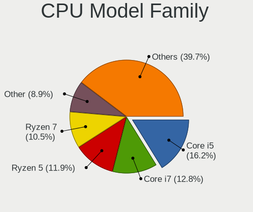
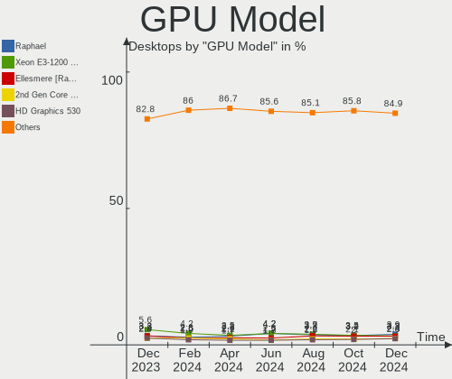
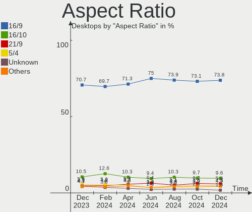
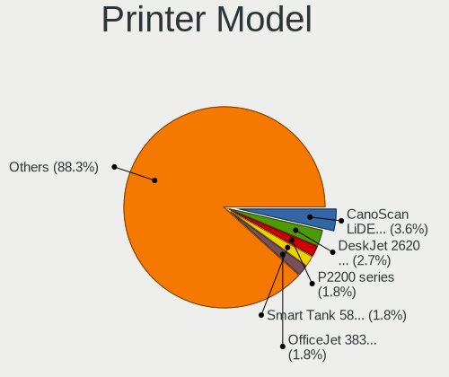

Linux Hardware Trends (Desktops)
--------------------------------

A project to identify most popular hardware characteristics and track their change
over time based on data collected by Linux users at https://Linux-Hardware.org.

Anyone can contribute to this report by the [hw-probe](https://github.com/linuxhw/hw-probe) tool:

    sudo -E hw-probe -all -upload

Full-feature report is available here: https://linux-hardware.org/?view=trends

Period: Feb, 2022.

Contents
--------

* [ System ](#system)
  - [ OS                       ](#os)
  - [ OS Family                ](#os-family)
  - [ Kernel                   ](#kernel)
  - [ Kernel Family            ](#kernel-family)
  - [ Kernel Major Ver.        ](#kernel-major-ver)
  - [ Arch                     ](#arch)
  - [ DE                       ](#de)
  - [ Display Server           ](#display-server)
  - [ Display Manager          ](#display-manager)
  - [ OS Lang                  ](#os-lang)
  - [ Boot Mode                ](#boot-mode)
  - [ Filesystem               ](#filesystem)
  - [ Part. scheme             ](#part-scheme)
  - [ Dual Boot with Linux/BSD ](#dual-boot-with-linuxbsd)
  - [ Dual Boot (Win)          ](#dual-boot-win)

* [ Board ](#board)
  - [ Vendor                   ](#vendor)
  - [ Model                    ](#model)
  - [ Model Family             ](#model-family)
  - [ MFG Year                 ](#mfg-year)
  - [ Form Factor              ](#form-factor)
  - [ Secure Boot              ](#secure-boot)
  - [ Coreboot                 ](#coreboot)
  - [ RAM Size                 ](#ram-size)
  - [ RAM Used                 ](#ram-used)
  - [ Total Drives             ](#total-drives)
  - [ Has CD-ROM               ](#has-cd-rom)
  - [ Has Ethernet             ](#has-ethernet)
  - [ Has WiFi                 ](#has-wifi)
  - [ Has Bluetooth            ](#has-bluetooth)

* [ Location ](#location)
  - [ Country                  ](#country)
  - [ City                     ](#city)

* [ Drives ](#drives)
  - [ Drive Vendor             ](#drive-vendor)
  - [ Drive Model              ](#drive-model)
  - [ HDD Vendor               ](#hdd-vendor)
  - [ SSD Vendor               ](#ssd-vendor)
  - [ Drive Kind               ](#drive-kind)
  - [ Drive Connector          ](#drive-connector)
  - [ Drive Size               ](#drive-size)
  - [ Space Total              ](#space-total)
  - [ Space Used               ](#space-used)
  - [ Malfunc. Drives          ](#malfunc-drives)
  - [ Malfunc. Drive Vendor    ](#malfunc-drive-vendor)
  - [ Malfunc. HDD Vendor      ](#malfunc-hdd-vendor)
  - [ Malfunc. Drive Kind      ](#malfunc-drive-kind)
  - [ Failed Drives            ](#failed-drives)
  - [ Failed Drive Vendor      ](#failed-drive-vendor)
  - [ Drive Status             ](#drive-status)

* [ Storage controller ](#storage-controller)
  - [ Storage Vendor           ](#storage-vendor)
  - [ Storage Model            ](#storage-model)
  - [ Storage Kind             ](#storage-kind)

* [ Processor ](#processor)
  - [ CPU Vendor               ](#cpu-vendor)
  - [ CPU Model                ](#cpu-model)
  - [ CPU Model Family         ](#cpu-model-family)
  - [ CPU Cores                ](#cpu-cores)
  - [ CPU Sockets              ](#cpu-sockets)
  - [ CPU Threads              ](#cpu-threads)
  - [ CPU Op-Modes             ](#cpu-op-modes)
  - [ CPU Microcode            ](#cpu-microcode)
  - [ CPU Microarch            ](#cpu-microarch)

* [ Graphics ](#graphics)
  - [ GPU Vendor               ](#gpu-vendor)
  - [ GPU Model                ](#gpu-model)
  - [ GPU Combo                ](#gpu-combo)
  - [ GPU Driver               ](#gpu-driver)
  - [ GPU Memory               ](#gpu-memory)

* [ Monitor ](#monitor)
  - [ Monitor Vendor           ](#monitor-vendor)
  - [ Monitor Model            ](#monitor-model)
  - [ Monitor Resolution       ](#monitor-resolution)
  - [ Monitor Diagonal         ](#monitor-diagonal)
  - [ Monitor Width            ](#monitor-width)
  - [ Aspect Ratio             ](#aspect-ratio)
  - [ Monitor Area             ](#monitor-area)
  - [ Pixel Density            ](#pixel-density)
  - [ Multiple Monitors        ](#multiple-monitors)

* [ Network ](#network)
  - [ Net Controller Vendor    ](#net-controller-vendor)
  - [ Net Controller Model     ](#net-controller-model)
  - [ Wireless Vendor          ](#wireless-vendor)
  - [ Wireless Model           ](#wireless-model)
  - [ Ethernet Vendor          ](#ethernet-vendor)
  - [ Ethernet Model           ](#ethernet-model)
  - [ Net Controller Kind      ](#net-controller-kind)
  - [ Used Controller          ](#used-controller)
  - [ NICs                     ](#nics)
  - [ IPv6                     ](#ipv6)

* [ Bluetooth ](#bluetooth)
  - [ Bluetooth Vendor         ](#bluetooth-vendor)
  - [ Bluetooth Model          ](#bluetooth-model)

* [ Sound ](#sound)
  - [ Sound Vendor             ](#sound-vendor)
  - [ Sound Model              ](#sound-model)

* [ Memory ](#memory)
  - [ Memory Vendor            ](#memory-vendor)
  - [ Memory Model             ](#memory-model)
  - [ Memory Kind              ](#memory-kind)
  - [ Memory Form Factor       ](#memory-form-factor)
  - [ Memory Size              ](#memory-size)
  - [ Memory Speed             ](#memory-speed)

* [ Printers & scanners ](#printers--scanners)
  - [ Printer Vendor           ](#printer-vendor)
  - [ Printer Model            ](#printer-model)
  - [ Scanner Vendor           ](#scanner-vendor)
  - [ Scanner Model            ](#scanner-model)

* [ Camera ](#camera)
  - [ Camera Vendor            ](#camera-vendor)
  - [ Camera Model             ](#camera-model)

* [ Security ](#security)
  - [ Fingerprint Vendor       ](#fingerprint-vendor)
  - [ Fingerprint Model        ](#fingerprint-model)
  - [ Chipcard Vendor          ](#chipcard-vendor)
  - [ Chipcard Model           ](#chipcard-model)

* [ Unsupported ](#unsupported)
  - [ Unsupported Devices      ](#unsupported-devices)
  - [ Unsupported Device Types ](#unsupported-device-types)

System
------

OS
--

Installed operating systems

| Name                 | Desktops | Percent |
|----------------------|----------|---------|
| OpenMandriva 4.3     | 655      | 29.41%  |
| Ubuntu 20.04         | 239      | 10.73%  |
| Linux Mint 20.3      | 124      | 5.57%   |
| Debian 11            | 104      | 4.67%   |
| Pop!_OS 21.10        | 88       | 3.95%   |
| Ubuntu 21.10         | 84       | 3.77%   |
| Fedora 35            | 70       | 3.14%   |
| Zorin 16             | 58       | 2.6%    |
| OpenMandriva 4.2     | 57       | 2.56%   |
| KDE neon 20.04       | 47       | 2.11%   |
| ROSA 12.2            | 40       | 1.8%    |
| Linux Mint 20.2      | 33       | 1.48%   |
| Arch                 | 33       | 1.48%   |
| Manjaro              | 30       | 1.35%   |
| BlackPanther 18.1    | 30       | 1.35%   |
| Ubuntu 18.04         | 27       | 1.21%   |
| Elementary 6.1       | 27       | 1.21%   |
| Manjaro 21.2.3       | 26       | 1.17%   |
| ROSA 12.1            | 25       | 1.12%   |
| Kubuntu 20.04        | 24       | 1.08%   |
| ROSA R11.1           | 21       | 0.94%   |
| ArcoLinux Rolling    | 21       | 0.94%   |
| Xubuntu 20.04        | 19       | 0.85%   |
| Arch Rolling         | 19       | 0.85%   |
| Linux Mint 20.1      | 13       | 0.58%   |
| Kubuntu 21.10        | 11       | 0.49%   |
| Ubuntu 21.04         | 10       | 0.45%   |
| Pop!_OS 20.04        | 10       | 0.45%   |
| OpenMandriva 4.50    | 9        | 0.4%    |
| Lubuntu 20.04        | 9        | 0.4%    |
| Linux Mint 19.3      | 9        | 0.4%    |
| EndeavourOS Rolling  | 9        | 0.4%    |
| Zorin 15             | 8        | 0.36%   |
| Xubuntu 21.10        | 8        | 0.36%   |
| Ubuntu 22.04         | 8        | 0.36%   |
| Pop!_OS 21.04        | 8        | 0.36%   |
| Fedora 34            | 8        | 0.36%   |
| Debian 10            | 7        | 0.31%   |
| Ubuntu MATE 20.04    | 6        | 0.27%   |
| Linux Mint 20        | 6        | 0.27%   |
| Gentoo 2.7           | 6        | 0.27%   |
| Gentoo 2.6           | 6        | 0.27%   |
| Garuda Linux Soaring | 6        | 0.27%   |
| Kali 2022.1          | 5        | 0.22%   |
| Debian Testing       | 5        | 0.22%   |
| ClearOS 7            | 5        | 0.22%   |
| Ubuntu MATE 21.10    | 4        | 0.18%   |
| Ubuntu 16.04         | 4        | 0.18%   |
| Mageia 8             | 4        | 0.18%   |
| LMDE 4               | 4        | 0.18%   |
| LinuxFX 11           | 4        | 0.18%   |
| Gentoo 2.8           | 4        | 0.18%   |
| Endless 4.0.2        | 4        | 0.18%   |
| Ubuntu MATE 18.04    | 3        | 0.13%   |
| Ubuntu 20.10         | 3        | 0.13%   |
| Siduction Unstable   | 3        | 0.13%   |
| Rocky Linux 8.5      | 3        | 0.13%   |
| openSUSE Leap-15.3   | 3        | 0.13%   |
| MX 21                | 3        | 0.13%   |
| Manjaro 21.2.2       | 3        | 0.13%   |

OS Family
---------

OS without a version

| Name             | Desktops | Percent |
|------------------|----------|---------|
| OpenMandriva     | 721      | 32.38%  |
| Ubuntu           | 377      | 16.93%  |
| Linux Mint       | 189      | 8.49%   |
| Debian           | 119      | 5.34%   |
| Pop!_OS          | 106      | 4.76%   |
| ROSA             | 90       | 4.04%   |
| Fedora           | 83       | 3.73%   |
| Zorin            | 67       | 3.01%   |
| Manjaro          | 59       | 2.65%   |
| Arch             | 52       | 2.33%   |
| KDE neon         | 47       | 2.11%   |
| Kubuntu          | 43       | 1.93%   |
| Xubuntu          | 31       | 1.39%   |
| BlackPanther     | 30       | 1.35%   |
| Elementary       | 28       | 1.26%   |
| ArcoLinux        | 22       | 0.99%   |
| Gentoo           | 17       | 0.76%   |
| Lubuntu          | 16       | 0.72%   |
| Ubuntu MATE      | 14       | 0.63%   |
| openSUSE         | 10       | 0.45%   |
| EndeavourOS      | 10       | 0.45%   |
| Garuda Linux     | 8        | 0.36%   |
| Kali             | 7        | 0.31%   |
| Clear Linux      | 7        | 0.31%   |
| Endless          | 6        | 0.27%   |
| LMDE             | 5        | 0.22%   |
| ClearOS          | 5        | 0.22%   |
| Ubuntu Budgie    | 4        | 0.18%   |
| Mageia           | 4        | 0.18%   |
| LinuxFX          | 4        | 0.18%   |
| Siduction        | 3        | 0.13%   |
| Rocky Linux      | 3        | 0.13%   |
| Red OS           | 3        | 0.13%   |
| Parrot           | 3        | 0.13%   |
| MX               | 3        | 0.13%   |
| Linux Lite       | 3        | 0.13%   |
| Devuan           | 3        | 0.13%   |
| CentOS           | 3        | 0.13%   |
| ALT Linux        | 3        | 0.13%   |
| Ubuntu Studio    | 2        | 0.09%   |
| Slackware        | 2        | 0.09%   |
| RHEL             | 2        | 0.09%   |
| Drauger OS       | 2        | 0.09%   |
| Void Linux       | 1        | 0.04%   |
| UbuntuDDE        | 1        | 0.04%   |
| Trisquel         | 1        | 0.04%   |
| Sparky           | 1        | 0.04%   |
| RED              | 1        | 0.04%   |
| Pisi             | 1        | 0.04%   |
| Org.kde.platform | 1        | 0.04%   |
| NixOS            | 1        | 0.04%   |
| Astra Linux      | 1        | 0.04%   |
| antiX            | 1        | 0.04%   |
| AlmaLinux        | 1        | 0.04%   |

Kernel
------

Version of the Linux kernel

| Version                            | Desktops | Percent |
|------------------------------------|----------|---------|
| 5.16.7-desktop-1omv4003            | 652      | 29.28%  |
| 5.13.0-28-generic                  | 247      | 11.09%  |
| 5.13.0-30-generic                  | 141      | 6.33%   |
| 5.4.0-99-generic                   | 82       | 3.68%   |
| 5.15.15-76051515-generic           | 70       | 3.14%   |
| 5.4.0-97-generic                   | 68       | 3.05%   |
| 5.10.74-generic-2rosa2021.1-x86_64 | 62       | 2.78%   |
| 5.4.0-100-generic                  | 61       | 2.74%   |
| 5.10.14-desktop-1omv4002           | 53       | 2.38%   |
| 5.10.0-11-amd64                    | 47       | 2.11%   |
| 5.13.0-27-generic                  | 39       | 1.75%   |
| 5.15.23-76051523-generic           | 20       | 0.9%    |
| 5.6.14-desktop-2bP                 | 19       | 0.85%   |
| 5.16.9-200.fc35.x86_64             | 19       | 0.85%   |
| 5.15.0-2-amd64                     | 18       | 0.81%   |
| 5.4.0-96-generic                   | 16       | 0.72%   |
| 5.10.0-7-amd64                     | 16       | 0.72%   |
| 5.15.18-200.fc35.x86_64            | 15       | 0.67%   |
| 5.16.5-200.fc35.x86_64             | 13       | 0.58%   |
| 5.15.21-1-MANJARO                  | 12       | 0.54%   |
| 5.13.0-19-generic                  | 12       | 0.54%   |
| 5.15.19-1-MANJARO                  | 11       | 0.49%   |
| 5.11.0-27-generic                  | 11       | 0.49%   |
| 4.18.16-desktop-1bP                | 11       | 0.49%   |
| 5.16.10-arch1-1                    | 10       | 0.45%   |
| 5.16.8-arch1-1                     | 9        | 0.4%    |
| 5.15.0-18-generic                  | 9        | 0.4%    |
| 5.11.0-49-generic                  | 8        | 0.36%   |
| 4.19.0-18-amd64                    | 8        | 0.36%   |
| 5.15.0-3-amd64                     | 7        | 0.31%   |
| 5.11.0-46-generic                  | 7        | 0.31%   |
| 5.10.0-10-amd64                    | 7        | 0.31%   |
| 4.4.0-210-generic                  | 7        | 0.31%   |
| 4.15.0-167-generic                 | 7        | 0.31%   |
| 5.4.83-generic-2rosa-x86_64        | 6        | 0.27%   |
| 5.16.5-arch1-1                     | 6        | 0.27%   |
| 5.16.5-1-MANJARO                   | 6        | 0.27%   |
| 5.12.4-desktop-1omv4050            | 6        | 0.27%   |
| 5.11.0-43-generic                  | 6        | 0.27%   |
| 4.18.0-348.12.2.el8_5.x86_64       | 6        | 0.27%   |
| 3.10.0-1160.53.1.el7.x86_64        | 6        | 0.27%   |
| 5.4.0-91-generic                   | 5        | 0.22%   |
| 5.16.9-arch1-1                     | 5        | 0.22%   |
| 5.16.8-zen1-1-zen                  | 5        | 0.22%   |
| 5.16.8-200.fc35.x86_64             | 5        | 0.22%   |
| 5.16.7-200.fc35.x86_64             | 5        | 0.22%   |
| 5.16.10-zen1-1-zen                 | 5        | 0.22%   |
| 5.15.0-kali3-amd64                 | 5        | 0.22%   |
| 5.13.0-28-lowlatency               | 5        | 0.22%   |
| 5.11.12-desktop-1omv4002           | 5        | 0.22%   |
| 5.11.0-38-generic                  | 5        | 0.22%   |
| 5.11.0-35-generic                  | 5        | 0.22%   |
| 4.15.0-169-generic                 | 5        | 0.22%   |
| 5.4.32-generic-2rosa-x86_64        | 4        | 0.18%   |
| 5.16.7-arch1-1                     | 4        | 0.18%   |
| 5.16.5-zen1-1-zen                  | 4        | 0.18%   |
| 5.15.23-gentoo                     | 4        | 0.18%   |
| 5.15.22-xanmod1                    | 4        | 0.18%   |
| 5.15.17-200.fc35.x86_64            | 4        | 0.18%   |
| 5.15.16-1-MANJARO                  | 4        | 0.18%   |

Kernel Family
-------------

Linux kernel without a distro release

| Version | Desktops | Percent |
|---------|----------|---------|
| 5.16.7  | 670      | 30.09%  |
| 5.13.0  | 459      | 20.61%  |
| 5.4.0   | 251      | 11.27%  |
| 5.10.0  | 78       | 3.5%    |
| 5.15.15 | 72       | 3.23%   |
| 5.10.74 | 63       | 2.83%   |
| 5.10.14 | 53       | 2.38%   |
| 5.11.0  | 52       | 2.33%   |
| 5.15.0  | 50       | 2.25%   |
| 5.16.5  | 42       | 1.89%   |
| 4.15.0  | 30       | 1.35%   |
| 5.16.9  | 29       | 1.3%    |
| 5.15.23 | 29       | 1.3%    |
| 5.16.8  | 25       | 1.12%   |
| 5.6.14  | 19       | 0.85%   |
| 5.15.18 | 19       | 0.85%   |
| 5.16.10 | 17       | 0.76%   |
| 5.15.19 | 16       | 0.72%   |
| 5.15.21 | 15       | 0.67%   |
| 5.16.4  | 11       | 0.49%   |
| 4.18.16 | 11       | 0.49%   |
| 5.15.22 | 10       | 0.45%   |
| 5.8.0   | 9        | 0.4%    |
| 5.16.11 | 9        | 0.4%    |
| 5.16.0  | 9        | 0.4%    |
| 5.15.16 | 9        | 0.4%    |
| 4.19.0  | 9        | 0.4%    |
| 5.11.12 | 8        | 0.36%   |
| 4.18.0  | 8        | 0.36%   |
| 5.16.3  | 7        | 0.31%   |
| 5.16.2  | 7        | 0.31%   |
| 5.13.19 | 7        | 0.31%   |
| 4.4.0   | 7        | 0.31%   |
| 5.4.83  | 6        | 0.27%   |
| 5.17.0  | 6        | 0.27%   |
| 5.14.0  | 6        | 0.27%   |
| 5.12.4  | 6        | 0.27%   |
| 3.10.0  | 6        | 0.27%   |
| 4.9.155 | 5        | 0.22%   |
| 5.4.32  | 4        | 0.18%   |
| 5.3.18  | 4        | 0.18%   |
| 5.15.8  | 4        | 0.18%   |
| 5.15.24 | 4        | 0.18%   |
| 5.15.17 | 4        | 0.18%   |
| 5.15.11 | 4        | 0.18%   |
| 5.10.96 | 4        | 0.18%   |
| 5.0.0   | 4        | 0.18%   |
| 5.15.10 | 3        | 0.13%   |
| 5.14.10 | 3        | 0.13%   |
| 5.13.13 | 3        | 0.13%   |
| 4.9.0   | 3        | 0.13%   |
| 5.6.13  | 2        | 0.09%   |
| 5.4.178 | 2        | 0.09%   |
| 5.16.6  | 2        | 0.09%   |
| 5.16.1  | 2        | 0.09%   |
| 5.15.12 | 2        | 0.09%   |
| 5.14.21 | 2        | 0.09%   |
| 5.10.98 | 2        | 0.09%   |
| 5.10.93 | 2        | 0.09%   |
| 5.10.29 | 2        | 0.09%   |

Kernel Major Ver.
-----------------

Linux kernel major version

| Version | Desktops | Percent |
|---------|----------|---------|
| 5.16    | 830      | 37.27%  |
| 5.13    | 471      | 21.15%  |
| 5.4     | 265      | 11.9%   |
| 5.15    | 245      | 11%     |
| 5.10    | 208      | 9.34%   |
| 5.11    | 60       | 2.69%   |
| 4.15    | 30       | 1.35%   |
| 5.6     | 21       | 0.94%   |
| 4.18    | 19       | 0.85%   |
| 5.14    | 14       | 0.63%   |
| 4.19    | 10       | 0.45%   |
| 5.8     | 9        | 0.4%    |
| 4.9     | 9        | 0.4%    |
| 4.4     | 7        | 0.31%   |
| 5.17    | 6        | 0.27%   |
| 5.12    | 6        | 0.27%   |
| 3.10    | 6        | 0.27%   |
| 5.3     | 5        | 0.22%   |
| 5.0     | 4        | 0.18%   |
| 5.9     | 1        | 0.04%   |
| 5.5     | 1        | 0.04%   |

Arch
----

OS architecture (x86_64, i586, etc.)

| Name   | Desktops | Percent |
|--------|----------|---------|
| x86_64 | 2202     | 98.88%  |
| i686   | 25       | 1.12%   |

DE
--

Desktop Environment

| Name             | Desktops | Percent |
|------------------|----------|---------|
| KDE5             | 1019     | 45.76%  |
| GNOME            | 664      | 29.82%  |
| X-Cinnamon       | 161      | 7.23%   |
| XFCE             | 112      | 5.03%   |
| Unknown          | 97       | 4.36%   |
| MATE             | 50       | 2.25%   |
| Pantheon         | 29       | 1.3%    |
| Cinnamon         | 19       | 0.85%   |
| LXQt             | 18       | 0.81%   |
| KDE4             | 14       | 0.63%   |
| Unity            | 9        | 0.4%    |
| KDE              | 5        | 0.22%   |
| Budgie           | 5        | 0.22%   |
| LXDE             | 4        | 0.18%   |
| i3               | 4        | 0.18%   |
| LeftWM           | 3        | 0.13%   |
| GNOME Classic    | 3        | 0.13%   |
| awesome          | 3        | 0.13%   |
| lightdm-xsession | 2        | 0.09%   |
| openbox          | 1        | 0.04%   |
| jwm              | 1        | 0.04%   |
| GNOME Flashback  | 1        | 0.04%   |
| fly              | 1        | 0.04%   |
| dwm              | 1        | 0.04%   |
| Deepin           | 1        | 0.04%   |

Display Server
--------------

X11 or Wayland

| Name    | Desktops | Percent |
|---------|----------|---------|
| X11     | 1929     | 86.62%  |
| Wayland | 193      | 8.67%   |
| Unknown | 55       | 2.47%   |
| Tty     | 50       | 2.25%   |

Display Manager
---------------

SDDM, LightDM, etc.

| Name    | Desktops | Percent |
|---------|----------|---------|
| SDDM    | 938      | 42.12%  |
| Unknown | 553      | 24.83%  |
| GDM3    | 264      | 11.85%  |
| LightDM | 244      | 10.96%  |
| GDM     | 206      | 9.25%   |
| KDM     | 14       | 0.63%   |
| Ly      | 3        | 0.13%   |
| LXDM    | 3        | 0.13%   |
| XDM     | 1        | 0.04%   |
| SLiM    | 1        | 0.04%   |

OS Lang
-------

Language

| Lang    | Desktops | Percent |
|---------|----------|---------|
| en_US   | 896      | 40.23%  |
| de_DE   | 280      | 12.57%  |
| ru_RU   | 206      | 9.25%   |
| fr_FR   | 108      | 4.85%   |
| en_GB   | 98       | 4.4%    |
| pt_BR   | 77       | 3.46%   |
| it_IT   | 51       | 2.29%   |
| es_ES   | 50       | 2.25%   |
| Unknown | 47       | 2.11%   |
| en_AU   | 44       | 1.98%   |
| pl_PL   | 40       | 1.8%    |
| en_CA   | 32       | 1.44%   |
| de_AT   | 23       | 1.03%   |
| es_AR   | 22       | 0.99%   |
| C       | 20       | 0.9%    |
| en_IN   | 19       | 0.85%   |
| nl_NL   | 17       | 0.76%   |
| cs_CZ   | 15       | 0.67%   |
| ru_UA   | 13       | 0.58%   |
| hu_HU   | 12       | 0.54%   |
| pt_PT   | 9        | 0.4%    |
| ja_JP   | 8        | 0.36%   |
| es_MX   | 8        | 0.36%   |
| tr_TR   | 7        | 0.31%   |
| sv_SE   | 7        | 0.31%   |
| el_GR   | 7        | 0.31%   |
| sk_SK   | 6        | 0.27%   |
| ro_RO   | 6        | 0.27%   |
| fr_BE   | 5        | 0.22%   |
| es_CO   | 5        | 0.22%   |
| en_NZ   | 5        | 0.22%   |
| zh_TW   | 4        | 0.18%   |
| nl_BE   | 4        | 0.18%   |
| fr_CA   | 4        | 0.18%   |
| en_ZA   | 4        | 0.18%   |
| en_IL   | 4        | 0.18%   |
| en_IE   | 4        | 0.18%   |
| de_CH   | 4        | 0.18%   |
| uk_UA   | 3        | 0.13%   |
| fr_CH   | 3        | 0.13%   |
| es_CL   | 3        | 0.13%   |
| en_HK   | 3        | 0.13%   |
| da_DK   | 3        | 0.13%   |
| ca_ES   | 3        | 0.13%   |
| bg_BG   | 3        | 0.13%   |
| ar_SA   | 3        | 0.13%   |
| nb_NO   | 2        | 0.09%   |
| fi_FI   | 2        | 0.09%   |
| es_VE   | 2        | 0.09%   |
| es_PY   | 2        | 0.09%   |
| es_CR   | 2        | 0.09%   |
| en_PH   | 2        | 0.09%   |
| C.UTF8  | 2        | 0.09%   |
| ar_EG   | 2        | 0.09%   |
| zh_CN   | 1        | 0.04%   |
| vi_VN   | 1        | 0.04%   |
| sr_RS   | 1        | 0.04%   |
| sl_SI   | 1        | 0.04%   |
| gl_ES   | 1        | 0.04%   |
| es_UY   | 1        | 0.04%   |

Boot Mode
---------

EFI or BIOS

| Mode | Desktops | Percent |
|------|----------|---------|
| BIOS | 1266     | 56.85%  |
| EFI  | 961      | 43.15%  |

Filesystem
----------

Type of filesystem

| Type     | Desktops | Percent |
|----------|----------|---------|
| Ext4     | 1318     | 59.18%  |
| Overlay  | 719      | 32.29%  |
| Btrfs    | 138      | 6.2%    |
| Xfs      | 28       | 1.26%   |
| Zfs      | 9        | 0.4%    |
| F2fs     | 3        | 0.13%   |
| Ext3     | 3        | 0.13%   |
| Ext2     | 3        | 0.13%   |
| Tmpfs    | 2        | 0.09%   |
| Unknown  | 2        | 0.09%   |
| Reiserfs | 1        | 0.04%   |
| Jfs      | 1        | 0.04%   |

Part. scheme
------------

Scheme of partitioning

| Type    | Desktops | Percent |
|---------|----------|---------|
| GPT     | 907      | 40.73%  |
| Unknown | 842      | 37.81%  |
| MBR     | 478      | 21.46%  |

Dual Boot with Linux/BSD
------------------------

Hosting more than one Linux/BSD

| Dual boot | Desktops | Percent |
|-----------|----------|---------|
| No        | 1558     | 69.96%  |
| Yes       | 669      | 30.04%  |

Dual Boot (Win)
---------------

Hosting Linux and Windows

| Dual boot | Desktops | Percent |
|-----------|----------|---------|
| No        | 1317     | 59.14%  |
| Yes       | 910      | 40.86%  |

Board
-----

Vendor
------

Motherboard manufacturer

| Name                    | Desktops | Percent |
|-------------------------|----------|---------|
| ASUSTek Computer        | 560      | 25.15%  |
| Gigabyte Technology     | 423      | 18.99%  |
| MSI                     | 278      | 12.48%  |
| ASRock                  | 222      | 9.97%   |
| Dell                    | 175      | 7.86%   |
| Hewlett-Packard         | 161      | 7.23%   |
| Lenovo                  | 73       | 3.28%   |
| Intel                   | 41       | 1.84%   |
| Acer                    | 37       | 1.66%   |
| Fujitsu                 | 24       | 1.08%   |
| Biostar                 | 24       | 1.08%   |
| Unknown                 | 21       | 0.94%   |
| Foxconn                 | 20       | 0.9%    |
| ECS                     | 18       | 0.81%   |
| Pegatron                | 17       | 0.76%   |
| Medion                  | 17       | 0.76%   |
| Packard Bell            | 8        | 0.36%   |
| Gateway                 | 8        | 0.36%   |
| BESSTAR Tech            | 8        | 0.36%   |
| Alienware               | 8        | 0.36%   |
| Supermicro              | 7        | 0.31%   |
| Fujitsu Siemens         | 7        | 0.31%   |
| Positivo                | 6        | 0.27%   |
| Huanan                  | 5        | 0.22%   |
| Shuttle                 | 4        | 0.18%   |
| Inventec                | 3        | 0.13%   |
| EVGA                    | 3        | 0.13%   |
| Apple                   | 3        | 0.13%   |
| ABIT                    | 3        | 0.13%   |
| TYAN Computer           | 2        | 0.09%   |
| IBM                     | 2        | 0.09%   |
| Google                  | 2        | 0.09%   |
| eMachines               | 2        | 0.09%   |
| Digiboard               | 2        | 0.09%   |
| AZW                     | 2        | 0.09%   |
| ASRockRack              | 2        | 0.09%   |
| YANYU                   | 1        | 0.04%   |
| SUPoX COMPUTER          | 1        | 0.04%   |
| SLIMBOOK                | 1        | 0.04%   |
| SeeedStudio             | 1        | 0.04%   |
| Seco                    | 1        | 0.04%   |
| PROLINE                 | 1        | 0.04%   |
| Philco                  | 1        | 0.04%   |
| PCWare                  | 1        | 0.04%   |
| PCChips                 | 1        | 0.04%   |
| PC Engines              | 1        | 0.04%   |
| Notebook                | 1        | 0.04%   |
| NEC Computers           | 1        | 0.04%   |
| MouseComputer           | 1        | 0.04%   |
| Minix                   | 1        | 0.04%   |
| MicroStar International | 1        | 0.04%   |
| MCJ                     | 1        | 0.04%   |
| Kennex                  | 1        | 0.04%   |
| HC                      | 1        | 0.04%   |
| HARDKERNEL              | 1        | 0.04%   |
| Elo Touch Solutions     | 1        | 0.04%   |
| Digitron                | 1        | 0.04%   |
| DFI                     | 1        | 0.04%   |
| congatec                | 1        | 0.04%   |
| Clientron Crop.         | 1        | 0.04%   |

Model
-----

Motherboard model

| Name                         | Desktops | Percent |
|------------------------------|----------|---------|
| ASUS All Series              | 63       | 2.83%   |
| Unknown                      | 21       | 0.94%   |
| Dell OptiPlex 7010           | 19       | 0.85%   |
| MSI MS-7C56                  | 12       | 0.54%   |
| Dell OptiPlex 9020           | 12       | 0.54%   |
| MSI MS-7C02                  | 11       | 0.49%   |
| Dell OptiPlex 790            | 11       | 0.49%   |
| Gigabyte H410M H V3          | 10       | 0.45%   |
| Gigabyte 970A-DS3P           | 10       | 0.45%   |
| MSI MS-7693                  | 9        | 0.4%    |
| Gigabyte B450M DS3H          | 9        | 0.4%    |
| ASUS ROG STRIX B450-F GAMING | 9        | 0.4%    |
| MSI MS-7C91                  | 8        | 0.36%   |
| MSI MS-7C84                  | 8        | 0.36%   |
| MSI MS-7C37                  | 8        | 0.36%   |
| MSI MS-7817                  | 8        | 0.36%   |
| ASUS PRIME X570-P            | 8        | 0.36%   |
| ASUS PRIME A320M-K           | 8        | 0.36%   |
| MSI MS-7B86                  | 7        | 0.31%   |
| HP Compaq Pro 6300 SFF       | 7        | 0.31%   |
| HP Compaq Elite 8300 SFF     | 7        | 0.31%   |
| Gigabyte B250M-DS3H          | 7        | 0.31%   |
| Dell OptiPlex 780            | 7        | 0.31%   |
| Dell OptiPlex 755            | 7        | 0.31%   |
| ASUS TUF GAMING X570-PLUS    | 7        | 0.31%   |
| ASUS ROG STRIX B550-F GAMING | 7        | 0.31%   |
| ASUS PRIME H510M-A           | 7        | 0.31%   |
| ASRock B450M Pro4            | 7        | 0.31%   |
| MSI MS-7B79                  | 6        | 0.27%   |
| Gigabyte B450 AORUS M        | 6        | 0.27%   |
| Gigabyte A320M-S2H           | 6        | 0.27%   |
| Dell OptiPlex 3010           | 6        | 0.27%   |
| ASUS PRIME X570-PRO          | 6        | 0.27%   |
| ASUS PRIME B450M-A           | 6        | 0.27%   |
| ASRock B450M Steel Legend    | 6        | 0.27%   |
| ASRock 970 Pro3 R2.0         | 6        | 0.27%   |
| MSI MS-7B93                  | 5        | 0.22%   |
| MSI MS-7A38                  | 5        | 0.22%   |
| MSI MS-7A34                  | 5        | 0.22%   |
| MSI MS-7996                  | 5        | 0.22%   |
| Gigabyte H61M-S1             | 5        | 0.22%   |
| ASUS TUF GAMING B550M-PLUS   | 5        | 0.22%   |
| ASUS ROG STRIX X570-E GAMING | 5        | 0.22%   |
| ASUS ROG CROSSHAIR VIII HERO | 5        | 0.22%   |
| ASUS PRIME X370-PRO          | 5        | 0.22%   |
| ASUS PRIME B450M-K           | 5        | 0.22%   |
| ASUS PRIME B450-PLUS         | 5        | 0.22%   |
| ASUS M5A97 R2.0              | 5        | 0.22%   |
| ASRock B450M-HDV R4.0        | 5        | 0.22%   |
| ASRock B450 Pro4             | 5        | 0.22%   |
| ASRock A320M-HDV R4.0        | 5        | 0.22%   |
| MSI MS-7C52                  | 4        | 0.18%   |
| MSI MS-7B89                  | 4        | 0.18%   |
| MSI MS-7A40                  | 4        | 0.18%   |
| MSI MS-7721                  | 4        | 0.18%   |
| Intel H61                    | 4        | 0.18%   |
| Intel H55                    | 4        | 0.18%   |
| HP Z600 Workstation          | 4        | 0.18%   |
| HP ProDesk 600 G1 SFF        | 4        | 0.18%   |
| HP Compaq 6200 Pro MT PC     | 4        | 0.18%   |

Model Family
------------

Motherboard model prefix

| Name                   | Desktops | Percent |
|------------------------|----------|---------|
| Dell OptiPlex          | 109      | 4.89%   |
| ASUS PRIME             | 106      | 4.76%   |
| ASUS ROG               | 78       | 3.5%    |
| ASUS All               | 63       | 2.83%   |
| HP Compaq              | 58       | 2.6%    |
| Lenovo ThinkCentre     | 48       | 2.16%   |
| ASUS TUF               | 44       | 1.98%   |
| Acer Aspire            | 29       | 1.3%    |
| Dell Precision         | 23       | 1.03%   |
| Unknown                | 21       | 0.94%   |
| HP ProDesk             | 20       | 0.9%    |
| Gigabyte B450M         | 20       | 0.9%    |
| Fujitsu ESPRIMO        | 19       | 0.85%   |
| HP EliteDesk           | 16       | 0.72%   |
| ASUS P8H61-M           | 16       | 0.72%   |
| ASUS M5A78L-M          | 16       | 0.72%   |
| Dell Inspiron          | 15       | 0.67%   |
| Gigabyte H410M         | 14       | 0.63%   |
| Gigabyte B450          | 14       | 0.63%   |
| ASRock B450M           | 14       | 0.63%   |
| HP Pavilion            | 13       | 0.58%   |
| Gigabyte X570          | 13       | 0.58%   |
| MSI MS-7C56            | 12       | 0.54%   |
| ASRock B450            | 12       | 0.54%   |
| MSI MS-7C02            | 11       | 0.49%   |
| Dell XPS               | 11       | 0.49%   |
| Gigabyte Z390          | 10       | 0.45%   |
| Gigabyte 970A-DS3P     | 10       | 0.45%   |
| MSI MS-7693            | 9        | 0.4%    |
| Gigabyte B550M         | 9        | 0.4%    |
| Dell Vostro            | 9        | 0.4%    |
| ASUS SABERTOOTH        | 9        | 0.4%    |
| ASUS M5A97             | 9        | 0.4%    |
| ASRock 970             | 9        | 0.4%    |
| MSI MS-7C91            | 8        | 0.36%   |
| MSI MS-7C84            | 8        | 0.36%   |
| MSI MS-7C37            | 8        | 0.36%   |
| MSI MS-7817            | 8        | 0.36%   |
| Gigabyte H310M         | 8        | 0.36%   |
| Gigabyte B550          | 8        | 0.36%   |
| Gigabyte A320M-S2H     | 8        | 0.36%   |
| ASRock A320M-HDV       | 8        | 0.36%   |
| MSI MS-7B86            | 7        | 0.31%   |
| Lenovo IdeaCentre      | 7        | 0.31%   |
| Gigabyte GA-78LMT-USB3 | 7        | 0.31%   |
| Gigabyte B250M-DS3H    | 7        | 0.31%   |
| ASRock X570            | 7        | 0.31%   |
| MSI MS-7B79            | 6        | 0.27%   |
| Gigabyte B560M         | 6        | 0.27%   |
| ASUS P5Q               | 6        | 0.27%   |
| ASUS Maximus           | 6        | 0.27%   |
| MSI MS-7B93            | 5        | 0.22%   |
| MSI MS-7A38            | 5        | 0.22%   |
| MSI MS-7A34            | 5        | 0.22%   |
| MSI MS-7996            | 5        | 0.22%   |
| Intel H61              | 5        | 0.22%   |
| Gigabyte Z370          | 5        | 0.22%   |
| Gigabyte H61M-S1       | 5        | 0.22%   |
| Gigabyte H61M-DS2      | 5        | 0.22%   |
| Gigabyte AB350-Gaming  | 5        | 0.22%   |

MFG Year
--------

Motherboard manufacture year

| Year | Desktops | Percent |
|------|----------|---------|
| 2018 | 236      | 10.6%   |
| 2012 | 228      | 10.24%  |
| 2020 | 192      | 8.62%   |
| 2013 | 183      | 8.22%   |
| 2021 | 167      | 7.5%    |
| 2019 | 162      | 7.27%   |
| 2011 | 159      | 7.14%   |
| 2014 | 158      | 7.09%   |
| 2017 | 127      | 5.7%    |
| 2010 | 120      | 5.39%   |
| 2009 | 110      | 4.94%   |
| 2016 | 96       | 4.31%   |
| 2015 | 95       | 4.27%   |
| 2008 | 75       | 3.37%   |
| 2007 | 65       | 2.92%   |
| 2006 | 30       | 1.35%   |
| 2005 | 11       | 0.49%   |
| 2022 | 10       | 0.45%   |
| 2004 | 2        | 0.09%   |
| 2003 | 1        | 0.04%   |

Form Factor
-----------

Physical design of the computer

| Name    | Desktops | Percent |
|---------|----------|---------|
| Desktop | 2227     | 100%    |

Secure Boot
-----------

Enabled or disabled

| State    | Desktops | Percent |
|----------|----------|---------|
| Disabled | 2179     | 97.84%  |
| Enabled  | 48       | 2.16%   |

Coreboot
--------

Have coreboot on board

| Used | Desktops | Percent |
|------|----------|---------|
| No   | 2224     | 99.87%  |
| Yes  | 3        | 0.13%   |

RAM Size
--------

Total RAM memory

| Size in GB      | Desktops | Percent |
|-----------------|----------|---------|
| 16.01-24.0      | 534      | 23.98%  |
| 8.01-16.0       | 435      | 19.53%  |
| 4.01-8.0        | 384      | 17.24%  |
| 3.01-4.0        | 327      | 14.68%  |
| 32.01-64.0      | 303      | 13.61%  |
| 64.01-256.0     | 97       | 4.36%   |
| 1.01-2.0        | 61       | 2.74%   |
| 24.01-32.0      | 58       | 2.6%    |
| 2.01-3.0        | 20       | 0.9%    |
| More than 256.0 | 4        | 0.18%   |
| 0.51-1.0        | 4        | 0.18%   |

RAM Used
--------

Used RAM memory

| Used GB     | Desktops | Percent |
|-------------|----------|---------|
| 1.01-2.0    | 999      | 44.86%  |
| 2.01-3.0    | 403      | 18.1%   |
| 0.51-1.0    | 265      | 11.9%   |
| 4.01-8.0    | 206      | 9.25%   |
| 3.01-4.0    | 200      | 8.98%   |
| 8.01-16.0   | 76       | 3.41%   |
| 0.01-0.5    | 48       | 2.16%   |
| 16.01-24.0  | 15       | 0.67%   |
| 32.01-64.0  | 6        | 0.27%   |
| 24.01-32.0  | 6        | 0.27%   |
| 64.01-256.0 | 3        | 0.13%   |

Total Drives
------------

Number of drives on board

| Drives | Desktops | Percent |
|--------|----------|---------|
| 1      | 821      | 36.87%  |
| 2      | 659      | 29.59%  |
| 3      | 348      | 15.63%  |
| 4      | 196      | 8.8%    |
| 5      | 88       | 3.95%   |
| 6      | 38       | 1.71%   |
| 0      | 24       | 1.08%   |
| 7      | 21       | 0.94%   |
| 8      | 15       | 0.67%   |
| 9      | 7        | 0.31%   |
| 10     | 3        | 0.13%   |
| 12     | 2        | 0.09%   |
| 11     | 2        | 0.09%   |
| 28     | 1        | 0.04%   |
| 15     | 1        | 0.04%   |
| 14     | 1        | 0.04%   |

Has CD-ROM
----------

Has CD-ROM on board

| Presented | Desktops | Percent |
|-----------|----------|---------|
| No        | 1120     | 50.29%  |
| Yes       | 1107     | 49.71%  |

Has Ethernet
------------

Has Ethernet on board

| Presented | Desktops | Percent |
|-----------|----------|---------|
| Yes       | 2208     | 99.15%  |
| No        | 19       | 0.85%   |

Has WiFi
--------

Has WiFi module

| Presented | Desktops | Percent |
|-----------|----------|---------|
| No        | 1328     | 59.63%  |
| Yes       | 899      | 40.37%  |

Has Bluetooth
-------------

Has Bluetooth module

| Presented | Desktops | Percent |
|-----------|----------|---------|
| No        | 1585     | 71.17%  |
| Yes       | 642      | 28.83%  |

Location
--------

Country
-------

Geographic location (country)

| Country      | Desktops | Percent |
|--------------|----------|---------|
| Germany      | 346      | 15.54%  |
| USA          | 341      | 15.31%  |
| Russia       | 207      | 9.3%    |
| France       | 124      | 5.57%   |
| Brazil       | 107      | 4.8%    |
| UK           | 85       | 3.82%   |
| Poland       | 77       | 3.46%   |
| Spain        | 70       | 3.14%   |
| Italy        | 69       | 3.1%    |
| Canada       | 65       | 2.92%   |
| Australia    | 61       | 2.74%   |
| Hungary      | 47       | 2.11%   |
| Netherlands  | 44       | 1.98%   |
| Ukraine      | 42       | 1.89%   |
| India        | 32       | 1.44%   |
| Belgium      | 28       | 1.26%   |
| Austria      | 28       | 1.26%   |
| Argentina    | 27       | 1.21%   |
| Japan        | 22       | 0.99%   |
| Sweden       | 21       | 0.94%   |
| Czechia      | 20       | 0.9%    |
| Switzerland  | 19       | 0.85%   |
| Turkey       | 18       | 0.81%   |
| Romania      | 17       | 0.76%   |
| Serbia       | 14       | 0.63%   |
| Finland      | 14       | 0.63%   |
| Slovakia     | 13       | 0.58%   |
| Portugal     | 13       | 0.58%   |
| Mexico       | 13       | 0.58%   |
| Greece       | 12       | 0.54%   |
| Israel       | 11       | 0.49%   |
| Indonesia    | 10       | 0.45%   |
| Bulgaria     | 10       | 0.45%   |
| Norway       | 9        | 0.4%    |
| Belarus      | 9        | 0.4%    |
| South Africa | 8        | 0.36%   |
| Egypt        | 8        | 0.36%   |
| Denmark      | 8        | 0.36%   |
| Bangladesh   | 8        | 0.36%   |
| New Zealand  | 7        | 0.31%   |
| Colombia     | 7        | 0.31%   |
| Thailand     | 6        | 0.27%   |
| Saudi Arabia | 6        | 0.27%   |
| Philippines  | 6        | 0.27%   |
| Lithuania    | 6        | 0.27%   |
| China        | 6        | 0.27%   |
| Chile        | 6        | 0.27%   |
| Taiwan       | 5        | 0.22%   |
| Slovenia     | 5        | 0.22%   |
| Ireland      | 5        | 0.22%   |
| Croatia      | 5        | 0.22%   |
| Uruguay      | 4        | 0.18%   |
| Pakistan     | 4        | 0.18%   |
| Kazakhstan   | 4        | 0.18%   |
| Algeria      | 4        | 0.18%   |
| Venezuela    | 3        | 0.13%   |
| Paraguay     | 3        | 0.13%   |
| Latvia       | 3        | 0.13%   |
| Iceland      | 3        | 0.13%   |
| Hong Kong    | 3        | 0.13%   |

City
----

Geographic location (city)

| City           | Desktops | Percent |
|----------------|----------|---------|
| Voronezh       | 38       | 1.71%   |
| Berlin         | 30       | 1.35%   |
| Moscow         | 28       | 1.26%   |
| Sydney         | 23       | 1.03%   |
| São Paulo   | 18       | 0.81%   |
| St Petersburg  | 17       | 0.76%   |
| Paris          | 16       | 0.72%   |
| Madrid         | 16       | 0.72%   |
| Budapest       | 15       | 0.67%   |
| Warsaw         | 13       | 0.58%   |
| Vienna         | 12       | 0.54%   |
| Rome           | 11       | 0.49%   |
| Munich         | 11       | 0.49%   |
| Milan          | 11       | 0.49%   |
| Istanbul       | 11       | 0.49%   |
| Brisbane       | 11       | 0.49%   |
| Novosibirsk    | 9        | 0.4%    |
| Essen          | 9        | 0.4%    |
| Kyiv           | 8        | 0.36%   |
| Gonikoppal     | 8        | 0.36%   |
| Cairo          | 8        | 0.36%   |
| Barcelona      | 8        | 0.36%   |
| Yekaterinburg  | 7        | 0.31%   |
| Sheffield      | 7        | 0.31%   |
| Hanover        | 7        | 0.31%   |
| Dublin         | 7        | 0.31%   |
| Dhaka          | 7        | 0.31%   |
| Minsk          | 6        | 0.27%   |
| Marseille      | 6        | 0.27%   |
| Krasnodar      | 6        | 0.27%   |
| Krakow         | 6        | 0.27%   |
| Hamburg        | 6        | 0.27%   |
| Bucharest      | 6        | 0.27%   |
| Belgrade       | 6        | 0.27%   |
| Zurich         | 5        | 0.22%   |
| Toronto        | 5        | 0.22%   |
| Tel Aviv       | 5        | 0.22%   |
| Samara         | 5        | 0.22%   |
| Rio de Janeiro | 5        | 0.22%   |
| Phoenix        | 5        | 0.22%   |
| Nuremberg      | 5        | 0.22%   |
| Montreal       | 5        | 0.22%   |
| Melbourne      | 5        | 0.22%   |
| Los Angeles    | 5        | 0.22%   |
| Athens         | 5        | 0.22%   |
| Zagreb         | 4        | 0.18%   |
| Wroclaw        | 4        | 0.18%   |
| Thessaloniki   | 4        | 0.18%   |
| Tampere        | 4        | 0.18%   |
| Stockholm      | 4        | 0.18%   |
| Rochester      | 4        | 0.18%   |
| Prague         | 4        | 0.18%   |
| Poznan         | 4        | 0.18%   |
| Porto Alegre   | 4        | 0.18%   |
| Mumbai         | 4        | 0.18%   |
| Mannheim       | 4        | 0.18%   |
| Manchester     | 4        | 0.18%   |
| Lyon           | 4        | 0.18%   |
| London         | 4        | 0.18%   |
| Leipzig        | 4        | 0.18%   |

Drives
------

Drive Vendor
------------

Hard drive vendors

| Vendor                    | Desktops | Drives | Percent |
|---------------------------|----------|--------|---------|
| WDC                       | 781      | 1055   | 19.04%  |
| Seagate                   | 730      | 956    | 17.8%   |
| Samsung Electronics       | 646      | 881    | 15.75%  |
| Kingston                  | 254      | 286    | 6.19%   |
| Crucial                   | 221      | 259    | 5.39%   |
| Toshiba                   | 207      | 237    | 5.05%   |
| Sandisk                   | 171      | 199    | 4.17%   |
| Hitachi                   | 125      | 132    | 3.05%   |
| A-DATA Technology         | 84       | 91     | 2.05%   |
| Intel                     | 63       | 73     | 1.54%   |
| Phison                    | 48       | 55     | 1.17%   |
| HGST                      | 42       | 54     | 1.02%   |
| Unknown                   | 37       | 48     | 0.9%    |
| PNY                       | 37       | 47     | 0.9%    |
| SPCC                      | 34       | 37     | 0.83%   |
| Corsair                   | 33       | 36     | 0.8%    |
| Intenso                   | 31       | 32     | 0.76%   |
| China                     | 30       | 33     | 0.73%   |
| Patriot                   | 26       | 26     | 0.63%   |
| Micron Technology         | 26       | 30     | 0.63%   |
| OCZ                       | 25       | 26     | 0.61%   |
| MAXTOR                    | 24       | 26     | 0.59%   |
| SK Hynix                  | 23       | 28     | 0.56%   |
| Silicon Motion            | 21       | 22     | 0.51%   |
| Gigabyte Technology       | 19       | 19     | 0.46%   |
| Apacer                    | 18       | 18     | 0.44%   |
| Transcend                 | 16       | 17     | 0.39%   |
| GOODRAM                   | 16       | 16     | 0.39%   |
| KingSpec                  | 14       | 14     | 0.34%   |
| ASMT                      | 14       | 20     | 0.34%   |
| XPG                       | 12       | 14     | 0.29%   |
| Team                      | 12       | 14     | 0.29%   |
| Netac                     | 12       | 13     | 0.29%   |
| Unknown                   | 12       | 13     | 0.29%   |
| JMicron                   | 10       | 10     | 0.24%   |
| Realtek Semiconductor     | 8        | 8      | 0.2%    |
| Micron/Crucial Technology | 8        | 8      | 0.2%    |
| Hewlett-Packard           | 8        | 11     | 0.2%    |
| Fujitsu                   | 8        | 8      | 0.2%    |
| LITEONIT                  | 7        | 7      | 0.17%   |
| LITEON                    | 7        | 7      | 0.17%   |
| KIOXIA                    | 7        | 9      | 0.17%   |
| Apple                     | 7        | 7      | 0.17%   |
| TO Exter                  | 6        | 6      | 0.15%   |
| Smartbuy                  | 6        | 7      | 0.15%   |
| KIOXIA-EXCERIA            | 6        | 6      | 0.15%   |
| AMD                       | 6        | 6      | 0.15%   |
| PLEXTOR                   | 5        | 5      | 0.12%   |
| KingFast                  | 5        | 5      | 0.12%   |
| XrayDisk                  | 4        | 4      | 0.1%    |
| WD MediaMax               | 4        | 5      | 0.1%    |
| SABRENT                   | 4        | 5      | 0.1%    |
| Mushkin                   | 4        | 4      | 0.1%    |
| Lexar                     | 4        | 4      | 0.1%    |
| Leven                     | 4        | 4      | 0.1%    |
| LaCie                     | 3        | 3      | 0.07%   |
| KingDian                  | 3        | 3      | 0.07%   |
| FOXLINE                   | 3        | 3      | 0.07%   |
| EMTEC                     | 3        | 3      | 0.07%   |
| Colorful                  | 3        | 3      | 0.07%   |

Drive Model
-----------

Hard drive models

| Model                            | Desktops | Percent |
|----------------------------------|----------|---------|
| Seagate ST500DM002-1BD142 500GB  | 62       | 1.3%    |
| Seagate ST1000DM010-2EP102 1TB   | 59       | 1.24%   |
| Samsung SSD 850 EVO 250GB        | 52       | 1.09%   |
| Kingston SA400S37240G 240GB SSD  | 51       | 1.07%   |
| Seagate ST2000DM008-2FR102 2TB   | 46       | 0.97%   |
| Kingston SA400S37120G 120GB SSD  | 43       | 0.9%    |
| Samsung SSD 860 EVO 500GB        | 42       | 0.88%   |
| WDC WD10EZEX-08WN4A0 1TB         | 37       | 0.78%   |
| Samsung SSD 860 EVO 250GB        | 36       | 0.76%   |
| Crucial CT1000MX500SSD1 1TB      | 36       | 0.76%   |
| Crucial CT500MX500SSD1 500GB     | 35       | 0.73%   |
| Kingston SA400S37480G 480GB SSD  | 34       | 0.71%   |
| Samsung NVMe SSD Drive 500GB     | 33       | 0.69%   |
| Samsung NVMe SSD Drive 1TB       | 33       | 0.69%   |
| Crucial CT240BX500SSD1 240GB     | 32       | 0.67%   |
| Toshiba DT01ACA100 1TB           | 31       | 0.65%   |
| Seagate ST3500418AS 500GB        | 31       | 0.65%   |
| Toshiba HDWD110 1TB              | 28       | 0.59%   |
| Toshiba DT01ACA050 500GB         | 27       | 0.57%   |
| Samsung SSD 850 EVO 500GB        | 27       | 0.57%   |
| Seagate ST1000DM003-1ER162 1TB   | 23       | 0.48%   |
| WDC WDS240G2G0A-00JH30 240GB SSD | 22       | 0.46%   |
| Seagate ST4000DM004-2CV104 4TB   | 22       | 0.46%   |
| Seagate ST1000DM003-1CH162 1TB   | 22       | 0.46%   |
| Samsung SSD 860 EVO 1TB          | 22       | 0.46%   |
| Seagate ST2000DM006-2DM164 2TB   | 21       | 0.44%   |
| Samsung SSD 970 EVO Plus 500GB   | 21       | 0.44%   |
| Toshiba DT01ACA200 2TB           | 20       | 0.42%   |
| Samsung SSD 970 EVO Plus 1TB     | 20       | 0.42%   |
| Kingston SV300S37A120G 120GB SSD | 20       | 0.42%   |
| WDC WD20EARX-00PASB0 2TB         | 19       | 0.4%    |
| Seagate Expansion+ 2TB           | 19       | 0.4%    |
| WDC WDS500G2B0A-00SM50 500GB SSD | 18       | 0.38%   |
| Seagate ST2000DM001-1CH164 2TB   | 18       | 0.38%   |
| Seagate ST3500413AS 500GB        | 17       | 0.36%   |
| Seagate ST2000DM001-1ER164 2TB   | 17       | 0.36%   |
| Unknown SD/MMC/MS PRO 64GB       | 16       | 0.34%   |
| SanDisk SSD PLUS 240GB           | 16       | 0.34%   |
| Sandisk NVMe SSD Drive 1TB       | 16       | 0.34%   |
| Seagate ST1000DM003-1SB102 1TB   | 15       | 0.31%   |
| Samsung SSD 980 PRO 1TB          | 15       | 0.31%   |
| Samsung SSD 970 EVO 500GB        | 15       | 0.31%   |
| Samsung SSD 870 EVO 500GB        | 15       | 0.31%   |
| WDC WD5000AAKX-00ERMA0 500GB     | 14       | 0.29%   |
| WDC WD10EZEX-00WN4A0 1TB         | 14       | 0.29%   |
| Seagate ST31000528AS 1TB         | 14       | 0.29%   |
| Seagate ST250DM000-1BD141 250GB  | 14       | 0.29%   |
| Samsung SSD 870 QVO 1TB          | 14       | 0.29%   |
| Samsung SSD 840 EVO 250GB        | 14       | 0.29%   |
| Sandisk NVMe SSD Drive 500GB     | 13       | 0.27%   |
| Samsung SSD 840 EVO 120GB        | 13       | 0.27%   |
| WDC WD30EFRX-68EUZN0 3TB         | 12       | 0.25%   |
| Samsung SSD 970 EVO Plus 2TB     | 12       | 0.25%   |
| Samsung SSD 970 EVO Plus 250GB   | 12       | 0.25%   |
| Samsung SSD 870 EVO 1TB          | 12       | 0.25%   |
| Samsung NVMe SSD Drive 250GB     | 12       | 0.25%   |
| Crucial CT480BX500SSD1 480GB     | 12       | 0.25%   |
| Unknown                          | 12       | 0.25%   |
| WDC WD40EZRZ-00GXCB0 4TB         | 11       | 0.23%   |
| WDC WD20EZRZ-00Z5HB0 2TB         | 11       | 0.23%   |

HDD Vendor
----------

Hard disk drive vendors

| Vendor              | Desktops | Drives | Percent |
|---------------------|----------|--------|---------|
| Seagate             | 716      | 929    | 36.33%  |
| WDC                 | 668      | 875    | 33.89%  |
| Toshiba             | 191      | 219    | 9.69%   |
| Samsung Electronics | 138      | 153    | 7%      |
| Hitachi             | 125      | 132    | 6.34%   |
| HGST                | 42       | 54     | 2.13%   |
| MAXTOR              | 23       | 25     | 1.17%   |
| Unknown             | 18       | 18     | 0.91%   |
| ASMT                | 10       | 12     | 0.51%   |
| Fujitsu             | 8        | 8      | 0.41%   |
| Apple               | 7        | 7      | 0.36%   |
| SABRENT             | 4        | 5      | 0.2%    |
| Intenso             | 4        | 4      | 0.2%    |
| WD MediaMax         | 2        | 3      | 0.1%    |
| Hewlett-Packard     | 2        | 2      | 0.1%    |
| USB3.0              | 1        | 1      | 0.05%   |
| USB 3.0             | 1        | 1      | 0.05%   |
| QUANTUM             | 1        | 1      | 0.05%   |
| MARVELL             | 1        | 2      | 0.05%   |
| Magnetic Data       | 1        | 1      | 0.05%   |
| LaCie               | 1        | 1      | 0.05%   |
| JMicron             | 1        | 1      | 0.05%   |
| IBM/Hitachi         | 1        | 1      | 0.05%   |
| Glyph               | 1        | 1      | 0.05%   |
| ExcelStor           | 1        | 1      | 0.05%   |
| Config              | 1        | 1      | 0.05%   |
| China               | 1        | 1      | 0.05%   |
| ASMedia             | 1        | 1      | 0.05%   |

SSD Vendor
----------

Solid state drive vendors

| Vendor              | Desktops | Drives | Percent |
|---------------------|----------|--------|---------|
| Samsung Electronics | 349      | 430    | 22.03%  |
| Kingston            | 215      | 236    | 13.57%  |
| Crucial             | 195      | 226    | 12.31%  |
| SanDisk             | 133      | 159    | 8.4%    |
| WDC                 | 117      | 128    | 7.39%   |
| A-DATA Technology   | 69       | 71     | 4.36%   |
| Intel               | 39       | 43     | 2.46%   |
| PNY                 | 32       | 39     | 2.02%   |
| SPCC                | 29       | 31     | 1.83%   |
| China               | 29       | 32     | 1.83%   |
| Intenso             | 25       | 26     | 1.58%   |
| OCZ                 | 24       | 24     | 1.52%   |
| Patriot             | 23       | 23     | 1.45%   |
| Micron Technology   | 22       | 24     | 1.39%   |
| Corsair             | 20       | 20     | 1.26%   |
| Apacer              | 17       | 17     | 1.07%   |
| Transcend           | 15       | 16     | 0.95%   |
| GOODRAM             | 14       | 14     | 0.88%   |
| Toshiba             | 13       | 13     | 0.82%   |
| KingSpec            | 13       | 13     | 0.82%   |
| Gigabyte Technology | 13       | 13     | 0.82%   |
| Team                | 11       | 13     | 0.69%   |
| SK Hynix            | 11       | 14     | 0.69%   |
| Netac               | 10       | 11     | 0.63%   |
| Unknown             | 10       | 10     | 0.63%   |
| Seagate             | 8        | 8      | 0.51%   |
| LITEONIT            | 7        | 7      | 0.44%   |
| LITEON              | 7        | 7      | 0.44%   |
| TO Exter            | 6        | 6      | 0.38%   |
| Smartbuy            | 5        | 6      | 0.32%   |
| AMD                 | 5        | 5      | 0.32%   |
| Mushkin             | 4        | 4      | 0.25%   |
| KIOXIA-EXCERIA      | 4        | 4      | 0.25%   |
| KingFast            | 4        | 4      | 0.25%   |
| Hewlett-Packard     | 4        | 6      | 0.25%   |
| ASMT                | 4        | 8      | 0.25%   |
| XrayDisk            | 3        | 3      | 0.19%   |
| Lexar               | 3        | 3      | 0.19%   |
| Leven               | 3        | 3      | 0.19%   |
| KingDian            | 3        | 3      | 0.19%   |
| FOXLINE             | 3        | 3      | 0.19%   |
| EMTEC               | 3        | 3      | 0.19%   |
| Colorful            | 3        | 3      | 0.19%   |
| Unknown             | 2        | 2      | 0.13%   |
| TEUTONS             | 2        | 2      | 0.13%   |
| PHISON              | 2        | 2      | 0.13%   |
| OCZ-VERTEX3         | 2        | 2      | 0.13%   |
| Lenovo              | 2        | 2      | 0.13%   |
| Kingmax             | 2        | 2      | 0.13%   |
| kimtigo             | 2        | 2      | 0.13%   |
| INNOVATION IT       | 2        | 2      | 0.13%   |
| GALAX               | 2        | 2      | 0.13%   |
| Biostar             | 2        | 2      | 0.13%   |
| BAITITON            | 2        | 2      | 0.13%   |
| ZOTAC               | 1        | 1      | 0.06%   |
| Zheino              | 1        | 1      | 0.06%   |
| WDC WDS2            | 1        | 1      | 0.06%   |
| Vaseky              | 1        | 1      | 0.06%   |
| V-GeN               | 1        | 1      | 0.06%   |
| USB30               | 1        | 1      | 0.06%   |

Drive Kind
----------

HDD or SSD

| Kind    | Desktops | Drives | Percent |
|---------|----------|--------|---------|
| HDD     | 1544     | 2460   | 44.81%  |
| SSD     | 1271     | 1790   | 36.88%  |
| NVMe    | 568      | 745    | 16.48%  |
| Unknown | 51       | 68     | 1.48%   |
| MMC     | 12       | 14     | 0.35%   |

Drive Connector
---------------

SATA, SAS, NVMe, etc.

| Type | Desktops | Drives | Percent |
|------|----------|--------|---------|
| SATA | 2042     | 4086   | 73.43%  |
| NVMe | 561      | 736    | 20.17%  |
| SAS  | 166      | 241    | 5.97%   |
| MMC  | 12       | 14     | 0.43%   |

Drive Size
----------

Size of hard drive

| Size in TB | Desktops | Drives | Percent |
|------------|----------|--------|---------|
| 0.01-0.5   | 1570     | 2303   | 51.82%  |
| 0.51-1.0   | 824      | 1096   | 27.19%  |
| 1.01-2.0   | 339      | 428    | 11.19%  |
| 3.01-4.0   | 111      | 154    | 3.66%   |
| 4.01-10.0  | 87       | 144    | 2.87%   |
| 2.01-3.0   | 85       | 103    | 2.81%   |
| 10.01-20.0 | 14       | 22     | 0.46%   |

Space Total
-----------

Amount of disk space available on the file system

| Size in GB     | Desktops | Percent |
|----------------|----------|---------|
| 1-20           | 454      | 20.39%  |
| 101-250        | 426      | 19.13%  |
| 251-500        | 310      | 13.92%  |
| 501-1000       | 269      | 12.08%  |
| 1001-2000      | 188      | 8.44%   |
| Unknown        | 180      | 8.08%   |
| More than 3000 | 170      | 7.63%   |
| 2001-3000      | 83       | 3.73%   |
| 51-100         | 83       | 3.73%   |
| 21-50          | 64       | 2.87%   |

Space Used
----------

Amount of used disk space

| Used GB        | Desktops | Percent |
|----------------|----------|---------|
| 1-20           | 999      | 44.86%  |
| 21-50          | 223      | 10.01%  |
| 101-250        | 204      | 9.16%   |
| Unknown        | 180      | 8.08%   |
| 51-100         | 166      | 7.45%   |
| 251-500        | 143      | 6.42%   |
| 501-1000       | 110      | 4.94%   |
| 1001-2000      | 96       | 4.31%   |
| More than 3000 | 68       | 3.05%   |
| 2001-3000      | 37       | 1.66%   |
| 0              | 1        | 0.04%   |

Malfunc. Drives
---------------

Drive models with a malfunction

| Model                                 | Desktops | Drives | Percent |
|---------------------------------------|----------|--------|---------|
| Seagate ST500DM002-1BD142 500GB       | 14       | 14     | 3.2%    |
| Seagate ST250DM000-1BD141 250GB       | 7        | 7      | 1.6%    |
| Seagate ST1000DM010-2EP102 1TB        | 6        | 6      | 1.37%   |
| Seagate ST1000DM003-9YN162 1TB        | 6        | 7      | 1.37%   |
| Samsung Electronics HD154UI 1TB       | 5        | 6      | 1.14%   |
| WDC WDS240G2G0A-00JH30 240GB SSD      | 4        | 4      | 0.91%   |
| WDC WD5000AADS-00S9B0 500GB           | 4        | 4      | 0.91%   |
| Samsung Electronics SSD 870 EVO 500GB | 4        | 4      | 0.91%   |
| Kingston SA400S37240G 240GB SSD       | 4        | 4      | 0.91%   |
| Hitachi HDS721050CLA362 500GB         | 4        | 4      | 0.91%   |
| ASMT 2135 120GB SSD                   | 4        | 8      | 0.91%   |
| WDC WDS120G2G0A-00JH30 120GB SSD      | 3        | 3      | 0.68%   |
| WDC WD5000AAKX-00ERMA0 500GB          | 3        | 3      | 0.68%   |
| WDC WD30EFRX-68EUZN0 3TB              | 3        | 3      | 0.68%   |
| WDC WD20EZRZ-00Z5HB0 2TB              | 3        | 4      | 0.68%   |
| WDC WD20EARS-00MVWB0 2TB              | 3        | 4      | 0.68%   |
| WDC WD10EZEX-08WN4A0 1TB              | 3        | 3      | 0.68%   |
| WDC WD10EALX-009BA0 1TB               | 3        | 3      | 0.68%   |
| Toshiba DT01ACA100 1TB                | 3        | 3      | 0.68%   |
| Toshiba DT01ACA050 500GB              | 3        | 3      | 0.68%   |
| Seagate ST380013AS 80GB               | 3        | 3      | 0.68%   |
| Seagate ST3500418AS 500GB             | 3        | 4      | 0.68%   |
| Seagate ST3320418AS 320GB             | 3        | 3      | 0.68%   |
| Seagate ST31000528AS 1TB              | 3        | 3      | 0.68%   |
| Samsung Electronics HD753LJ 752GB     | 3        | 3      | 0.68%   |
| Samsung Electronics HD103UJ 1TB       | 3        | 4      | 0.68%   |
| Hitachi HDP725025GLA380 250GB         | 3        | 3      | 0.68%   |
| Crucial CT240M500SSD1 240GB           | 3        | 3      | 0.68%   |
| WDC WD5000AAKX-001CA0 500GB           | 2        | 2      | 0.46%   |
| WDC WD30EZRX-00MMMB0 3TB              | 2        | 2      | 0.46%   |
| WDC WD2500AAJS-00B4A0 250GB           | 2        | 2      | 0.46%   |
| WDC WD20EFRX-68EUZN0 2TB              | 2        | 3      | 0.46%   |
| WDC WD20EARX-00PASB0 2TB              | 2        | 2      | 0.46%   |
| WDC WD1600AAJS-00L7A0 160GB           | 2        | 2      | 0.46%   |
| WDC WD10EZRX-00A8LB0 1TB              | 2        | 2      | 0.46%   |
| WDC WD10EZEX-00RKKA0 1TB              | 2        | 2      | 0.46%   |
| WDC WD10EZEX-00BN5A0 1TB              | 2        | 2      | 0.46%   |
| Toshiba MK6476GSX 640GB               | 2        | 2      | 0.46%   |
| Toshiba DT01ACA200 2TB                | 2        | 2      | 0.46%   |
| Seagate ST4000DM004-2CV104 4TB        | 2        | 2      | 0.46%   |
| Seagate ST3500413AS 500GB             | 2        | 2      | 0.46%   |
| Seagate ST3500312CS 500GB             | 2        | 2      | 0.46%   |
| Seagate ST3320613AS 320GB             | 2        | 2      | 0.46%   |
| Seagate ST33000651AS 3TB              | 2        | 2      | 0.46%   |
| Seagate ST3250318AS 250GB             | 2        | 2      | 0.46%   |
| Seagate ST31000524AS 1TB              | 2        | 2      | 0.46%   |
| Seagate ST3000DM001-1CH166 3TB        | 2        | 2      | 0.46%   |
| Seagate ST2000DM006-2DM164 2TB        | 2        | 3      | 0.46%   |
| Seagate ST2000DM001-1CH164 2TB        | 2        | 2      | 0.46%   |
| Seagate ST1500DL003-9VT16L 1TB        | 2        | 2      | 0.46%   |
| SanDisk SSD PLUS 480GB                | 2        | 2      | 0.46%   |
| Samsung Electronics SP2504C 250GB     | 2        | 2      | 0.46%   |
| Samsung Electronics HD642JJ 640GB     | 2        | 2      | 0.46%   |
| Samsung Electronics HD502HJ 500GB     | 2        | 2      | 0.46%   |
| Samsung Electronics HD501LJ 500GB     | 2        | 3      | 0.46%   |
| Samsung Electronics HD322HJ 320GB     | 2        | 2      | 0.46%   |
| Samsung Electronics HD321KJ 320GB     | 2        | 2      | 0.46%   |
| Samsung Electronics HD161GJ 160GB     | 2        | 2      | 0.46%   |
| Kingston SV300S37A120G 120GB SSD      | 2        | 2      | 0.46%   |
| Kingston SHFS37A120G 120GB SSD        | 2        | 2      | 0.46%   |

Malfunc. Drive Vendor
---------------------

Vendors of faulty drives

| Vendor              | Desktops | Drives | Percent |
|---------------------|----------|--------|---------|
| WDC                 | 116      | 128    | 27.42%  |
| Seagate             | 114      | 126    | 26.95%  |
| Samsung Electronics | 57       | 61     | 13.48%  |
| Hitachi             | 29       | 30     | 6.86%   |
| Toshiba             | 17       | 18     | 4.02%   |
| Kingston            | 13       | 13     | 3.07%   |
| Crucial             | 11       | 11     | 2.6%    |
| A-DATA Technology   | 8        | 8      | 1.89%   |
| SanDisk             | 7        | 7      | 1.65%   |
| Intel               | 6        | 6      | 1.42%   |
| HGST                | 6        | 7      | 1.42%   |
| MAXTOR              | 5        | 5      | 1.18%   |
| ASMT                | 5        | 9      | 1.18%   |
| SPCC                | 3        | 3      | 0.71%   |
| Transcend           | 2        | 2      | 0.47%   |
| OCZ                 | 2        | 2      | 0.47%   |
| Micron Technology   | 2        | 2      | 0.47%   |
| Intenso             | 2        | 2      | 0.47%   |
| WDC WDS2            | 1        | 1      | 0.24%   |
| TO Exter            | 1        | 1      | 0.24%   |
| Team                | 1        | 2      | 0.24%   |
| SK Hynix            | 1        | 1      | 0.24%   |
| PLEXTOR             | 1        | 1      | 0.24%   |
| Patriot             | 1        | 1      | 0.24%   |
| LITEONIT            | 1        | 1      | 0.24%   |
| LITEON              | 1        | 1      | 0.24%   |
| Kingmax             | 1        | 1      | 0.24%   |
| KingDian            | 1        | 1      | 0.24%   |
| INNOVATION IT       | 1        | 1      | 0.24%   |
| IBM/Hitachi         | 1        | 1      | 0.24%   |
| Fujitsu             | 1        | 1      | 0.24%   |
| EMTEC               | 1        | 1      | 0.24%   |
| Corsair             | 1        | 1      | 0.24%   |
| ASMedia             | 1        | 1      | 0.24%   |
| Apple               | 1        | 1      | 0.24%   |
| Unknown             | 1        | 1      | 0.24%   |

Malfunc. HDD Vendor
-------------------

Vendors of faulty HDD drives

| Vendor              | Desktops | Drives | Percent |
|---------------------|----------|--------|---------|
| Seagate             | 114      | 126    | 34.86%  |
| WDC                 | 108      | 118    | 33.03%  |
| Samsung Electronics | 43       | 46     | 13.15%  |
| Hitachi             | 29       | 30     | 8.87%   |
| Toshiba             | 17       | 18     | 5.2%    |
| HGST                | 6        | 7      | 1.83%   |
| MAXTOR              | 5        | 5      | 1.53%   |
| IBM/Hitachi         | 1        | 1      | 0.31%   |
| Fujitsu             | 1        | 1      | 0.31%   |
| ASMT                | 1        | 1      | 0.31%   |
| ASMedia             | 1        | 1      | 0.31%   |
| Apple               | 1        | 1      | 0.31%   |

Malfunc. Drive Kind
-------------------

Kinds of faulty drives

| Kind | Desktops | Drives | Percent |
|------|----------|--------|---------|
| HDD  | 291      | 355    | 75.19%  |
| SSD  | 89       | 96     | 23%     |
| NVMe | 7        | 8      | 1.81%   |

Failed Drives
-------------

Failed drive models

| Model                             | Desktops | Drives | Percent |
|-----------------------------------|----------|--------|---------|
| WDC WD3200AAJS-60Z0A0 320GB       | 1        | 1      | 8.33%   |
| WDC WD3200AAJS-00L7A0 320GB       | 1        | 1      | 8.33%   |
| WDC WD10EALX-759BA1 1TB           | 1        | 1      | 8.33%   |
| Toshiba MK3256GSY 320GB           | 1        | 1      | 8.33%   |
| Seagate STM31000528AS 1TB         | 1        | 1      | 8.33%   |
| Seagate ST320DM001 HD322GJ 320GB  | 1        | 1      | 8.33%   |
| Seagate ST3160215A 160GB          | 1        | 1      | 8.33%   |
| Samsung Electronics SSD 980 500GB | 1        | 1      | 8.33%   |
| Samsung Electronics HM160HI 160GB | 1        | 1      | 8.33%   |
| Samsung Electronics HD103SJ 1TB   | 1        | 1      | 8.33%   |
| Hitachi HTS725050A7E630 500GB     | 1        | 1      | 8.33%   |
| GOODRAM SSDPR-PX500-256-80 256GB  | 1        | 1      | 8.33%   |

Failed Drive Vendor
-------------------

Failed drive vendors

| Vendor              | Desktops | Drives | Percent |
|---------------------|----------|--------|---------|
| WDC                 | 3        | 3      | 25%     |
| Seagate             | 3        | 3      | 25%     |
| Samsung Electronics | 3        | 3      | 25%     |
| Toshiba             | 1        | 1      | 8.33%   |
| Hitachi             | 1        | 1      | 8.33%   |
| GOODRAM             | 1        | 1      | 8.33%   |

Drive Status
------------

Number of failed and malfunc. drives

| Status   | Desktops | Drives | Percent |
|----------|----------|--------|---------|
| Works    | 1218     | 2551   | 47.78%  |
| Detected | 947      | 2055   | 37.15%  |
| Malfunc  | 373      | 459    | 14.63%  |
| Failed   | 11       | 12     | 0.43%   |

Storage controller
------------------

Storage Vendor
--------------

Storage controller vendors

| Vendor                           | Desktops | Percent |
|----------------------------------|----------|---------|
| Intel                            | 1411     | 44.98%  |
| AMD                              | 750      | 23.91%  |
| Samsung Electronics              | 243      | 7.75%   |
| ASMedia Technology               | 107      | 3.41%   |
| Sandisk                          | 84       | 2.68%   |
| Phison Electronics               | 79       | 2.52%   |
| JMicron Technology               | 72       | 2.3%    |
| Marvell Technology Group         | 69       | 2.2%    |
| Nvidia                           | 59       | 1.88%   |
| Kingston Technology Company      | 46       | 1.47%   |
| Micron/Crucial Technology        | 37       | 1.18%   |
| Silicon Motion                   | 34       | 1.08%   |
| VIA Technologies                 | 21       | 0.67%   |
| ADATA Technology                 | 20       | 0.64%   |
| Realtek Semiconductor            | 16       | 0.51%   |
| SK Hynix                         | 13       | 0.41%   |
| Broadcom / LSI                   | 10       | 0.32%   |
| Seagate Technology               | 8        | 0.26%   |
| Micron Technology                | 7        | 0.22%   |
| KIOXIA                           | 7        | 0.22%   |
| Toshiba America Info Systems     | 6        | 0.19%   |
| LSI Logic / Symbios Logic        | 6        | 0.19%   |
| Integrated Technology Express    | 5        | 0.16%   |
| Silicon Image                    | 4        | 0.13%   |
| Shenzhen Longsys Electronics     | 4        | 0.13%   |
| Lite-On Technology               | 4        | 0.13%   |
| Adaptec                          | 4        | 0.13%   |
| Solid State Storage Technology   | 3        | 0.1%    |
| Silicon Integrated Systems [SiS] | 2        | 0.06%   |
| Yangtze Memory Technologies      | 1        | 0.03%   |
| Unknown                          | 1        | 0.03%   |
| ULi Electronics                  | 1        | 0.03%   |
| Promise Technology               | 1        | 0.03%   |
| OCZ Technology Group             | 1        | 0.03%   |
| Broadcom                         | 1        | 0.03%   |

Storage Model
-------------

Storage controller models

| Model                                                                                   | Desktops | Percent |
|-----------------------------------------------------------------------------------------|----------|---------|
| AMD FCH SATA Controller [AHCI mode]                                                     | 413      | 10.45%  |
| Intel 8 Series/C220 Series Chipset Family 6-port SATA Controller 1 [AHCI mode]          | 181      | 4.58%   |
| AMD 400 Series Chipset SATA Controller                                                  | 175      | 4.43%   |
| Samsung NVMe SSD Controller SM981/PM981/PM983                                           | 156      | 3.95%   |
| Intel 6 Series/C200 Series Chipset Family 6 port Desktop SATA AHCI Controller           | 120      | 3.04%   |
| AMD SB7x0/SB8x0/SB9x0 IDE Controller                                                    | 118      | 2.99%   |
| Intel 7 Series/C210 Series Chipset Family 6-port SATA Controller [AHCI mode]            | 95       | 2.4%    |
| Intel NM10/ICH7 Family SATA Controller [IDE mode]                                       | 94       | 2.38%   |
| AMD SB7x0/SB8x0/SB9x0 SATA Controller [AHCI mode]                                       | 94       | 2.38%   |
| Intel Q170/Q150/B150/H170/H110/Z170/CM236 Chipset SATA Controller [AHCI Mode]           | 93       | 2.35%   |
| ASMedia ASM1062 Serial ATA Controller                                                   | 92       | 2.33%   |
| AMD Starship/Matisse Chipset SATA Controller [AHCI mode]                                | 91       | 2.3%    |
| Intel 200 Series PCH SATA controller [AHCI mode]                                        | 89       | 2.25%   |
| Intel Cannon Lake PCH SATA AHCI Controller                                              | 75       | 1.9%    |
| Intel 500 Series Chipset Family SATA AHCI Controller                                    | 73       | 1.85%   |
| AMD SB7x0/SB8x0/SB9x0 SATA Controller [IDE mode]                                        | 72       | 1.82%   |
| Intel 82801G (ICH7 Family) IDE Controller                                               | 71       | 1.8%    |
| Intel SATA Controller [RAID mode]                                                       | 67       | 1.7%    |
| Intel 6 Series/C200 Series Chipset Family Desktop SATA Controller (IDE mode, ports 4-5) | 54       | 1.37%   |
| Intel 6 Series/C200 Series Chipset Family Desktop SATA Controller (IDE mode, ports 0-3) | 54       | 1.37%   |
| AMD FCH SATA Controller D                                                               | 46       | 1.16%   |
| Nvidia MCP61 SATA Controller                                                            | 42       | 1.06%   |
| Samsung NVMe SSD Controller PM9A1/PM9A3/980PRO                                          | 40       | 1.01%   |
| Phison E12 NVMe Controller                                                              | 40       | 1.01%   |
| Intel 9 Series Chipset Family SATA Controller [AHCI Mode]                               | 40       | 1.01%   |
| JMicron JMB363 SATA/IDE Controller                                                      | 37       | 0.94%   |
| Nvidia MCP61 IDE                                                                        | 36       | 0.91%   |
| Samsung NVMe SSD Controller 980                                                         | 34       | 0.86%   |
| AMD 300 Series Chipset SATA Controller                                                  | 31       | 0.78%   |
| Kingston Company A2000 NVMe SSD                                                         | 30       | 0.76%   |
| Samsung NVMe SSD Controller SM961/PM961/SM963                                           | 29       | 0.73%   |
| Intel 82801JI (ICH10 Family) SATA AHCI Controller                                       | 29       | 0.73%   |
| Intel 82801I (ICH9 Family) 2 port SATA Controller [IDE mode]                            | 29       | 0.73%   |
| Intel 5 Series/3400 Series Chipset 6 port SATA AHCI Controller                          | 29       | 0.73%   |
| Intel 400 Series Chipset Family SATA AHCI Controller                                    | 29       | 0.73%   |
| Sandisk WD Black SN750 / PC SN730 NVMe SSD                                              | 28       | 0.71%   |
| Silicon Motion SM2263EN/SM2263XT SSD Controller                                         | 27       | 0.68%   |
| Phison E16 PCIe4 NVMe Controller                                                        | 26       | 0.66%   |
| Intel 82801JI (ICH10 Family) 4 port SATA IDE Controller #1                              | 26       | 0.66%   |
| Intel 82801JI (ICH10 Family) 2 port SATA IDE Controller #2                              | 26       | 0.66%   |
| JMicron JMB368 IDE controller                                                           | 25       | 0.63%   |
| Sandisk WD Blue SN550 NVMe SSD                                                          | 24       | 0.61%   |
| Intel C600/X79 series chipset 6-Port SATA AHCI Controller                               | 23       | 0.58%   |
| AMD FCH IDE Controller                                                                  | 23       | 0.58%   |
| Intel 4 Series Chipset PT IDER Controller                                               | 22       | 0.56%   |
| AMD FCH SATA Controller [IDE mode]                                                      | 22       | 0.56%   |
| Intel Comet Lake SATA AHCI Controller                                                   | 20       | 0.51%   |
| Intel Alder Lake-S PCH SATA Controller [AHCI Mode]                                      | 20       | 0.51%   |
| Intel 82801IR/IO/IH (ICH9R/DO/DH) 4 port SATA Controller [IDE mode]                     | 20       | 0.51%   |
| Micron/Crucial P2 NVMe PCIe SSD                                                         | 18       | 0.46%   |
| Intel 7 Series/C210 Series Chipset Family 4-port SATA Controller [IDE mode]             | 18       | 0.46%   |
| Intel 7 Series/C210 Series Chipset Family 2-port SATA Controller [IDE mode]             | 18       | 0.46%   |
| ADATA XPG SX8200 Pro PCIe Gen3x4 M.2 2280 Solid State Drive                             | 17       | 0.43%   |
| Intel Celeron/Pentium Silver Processor SATA Controller                                  | 16       | 0.4%    |
| Intel 82801IR/IO/IH (ICH9R/DO/DH) 6 port SATA Controller [AHCI mode]                    | 16       | 0.4%    |
| Intel 5 Series/3400 Series Chipset 4 port SATA IDE Controller                           | 16       | 0.4%    |
| AMD X370 Series Chipset SATA Controller                                                 | 15       | 0.38%   |
| Intel C610/X99 series chipset 6-Port SATA Controller [AHCI mode]                        | 14       | 0.35%   |
| Intel 5 Series/3400 Series Chipset 2 port SATA IDE Controller                           | 14       | 0.35%   |
| Marvell Group 88SE9172 SATA 6Gb/s Controller                                            | 13       | 0.33%   |

Storage Kind
------------

Kind of storage controller (IDE, SATA, NVMe, SAS, ...)

| Kind | Desktops | Percent |
|------|----------|---------|
| SATA | 1797     | 58.36%  |
| IDE  | 574      | 18.64%  |
| NVMe | 562      | 18.25%  |
| RAID | 123      | 3.99%   |
| SAS  | 19       | 0.62%   |
| SCSI | 4        | 0.13%   |

Processor
---------

CPU Vendor
----------

Processor vendors

| Vendor       | Desktops | Percent |
|--------------|----------|---------|
| Intel        | 1419     | 63.72%  |
| AMD          | 807      | 36.24%  |
| CentaurHauls | 1        | 0.04%   |

CPU Model
---------

Processor models

| Model                                       | Desktops | Percent |
|---------------------------------------------|----------|---------|
| AMD Ryzen 5 3600 6-Core Processor           | 44       | 1.98%   |
| AMD Ryzen 7 3700X 8-Core Processor          | 40       | 1.8%    |
| Intel Core i5-3470 CPU @ 3.20GHz            | 36       | 1.62%   |
| AMD Ryzen 5 5600X 6-Core Processor          | 32       | 1.44%   |
| Intel Core i5-10400 CPU @ 2.90GHz           | 30       | 1.35%   |
| Intel Core i5-2400 CPU @ 3.10GHz            | 29       | 1.3%    |
| Intel Core i7-3770 CPU @ 3.40GHz            | 24       | 1.08%   |
| Intel Core 2 Duo CPU E8400 @ 3.00GHz        | 24       | 1.08%   |
| AMD Ryzen 5 2600 Six-Core Processor         | 24       | 1.08%   |
| AMD Ryzen 7 5700G with Radeon Graphics      | 21       | 0.94%   |
| Intel Core i7-6700 CPU @ 3.40GHz            | 20       | 0.9%    |
| Intel Core i7-4790 CPU @ 3.60GHz            | 20       | 0.9%    |
| AMD Ryzen 3 3200G with Radeon Vega Graphics | 20       | 0.9%    |
| Intel Core i7-2600 CPU @ 3.40GHz            | 19       | 0.85%   |
| Intel Core i5-4570 CPU @ 3.20GHz            | 19       | 0.85%   |
| AMD Ryzen 5 3400G with Radeon Vega Graphics | 19       | 0.85%   |
| AMD FX-8350 Eight-Core Processor            | 19       | 0.85%   |
| Intel Core i7-8700 CPU @ 3.20GHz            | 18       | 0.81%   |
| Intel Core i5-6500 CPU @ 3.20GHz            | 18       | 0.81%   |
| AMD Ryzen 9 5950X 16-Core Processor         | 18       | 0.81%   |
| AMD Ryzen 5 1600 Six-Core Processor         | 18       | 0.81%   |
| Intel Core i5-4590 CPU @ 3.30GHz            | 17       | 0.76%   |
| AMD Ryzen 9 5900X 12-Core Processor         | 17       | 0.76%   |
| AMD Ryzen 7 5800X 8-Core Processor          | 17       | 0.76%   |
| Intel Core i7-4770 CPU @ 3.40GHz            | 16       | 0.72%   |
| Intel Core i5-4460 CPU @ 3.20GHz            | 16       | 0.72%   |
| Intel Core i7-4790K CPU @ 4.00GHz           | 15       | 0.67%   |
| Intel Core i5-2500K CPU @ 3.30GHz           | 15       | 0.67%   |
| Intel Core i3-2100 CPU @ 3.10GHz            | 15       | 0.67%   |
| Intel Core 2 Quad CPU Q6600 @ 2.40GHz       | 15       | 0.67%   |
| AMD Ryzen 9 3900X 12-Core Processor         | 15       | 0.67%   |
| Intel Core i5 CPU 650 @ 3.20GHz             | 14       | 0.63%   |
| Intel Core i3-3220 CPU @ 3.30GHz            | 14       | 0.63%   |
| AMD Phenom II X4 955 Processor              | 14       | 0.63%   |
| AMD FX-6300 Six-Core Processor              | 13       | 0.58%   |
| Intel Core i5-7400 CPU @ 3.00GHz            | 12       | 0.54%   |
| AMD Ryzen 5 5600G with Radeon Graphics      | 12       | 0.54%   |
| AMD Ryzen 5 2400G with Radeon Vega Graphics | 12       | 0.54%   |
| AMD Ryzen 3 2200G with Radeon Vega Graphics | 12       | 0.54%   |
| Intel Core i7-8700K CPU @ 3.70GHz           | 11       | 0.49%   |
| Intel Core i7-7700 CPU @ 3.60GHz            | 11       | 0.49%   |
| Intel Core i5-3570K CPU @ 3.40GHz           | 11       | 0.49%   |
| Intel Core i3-4160 CPU @ 3.60GHz            | 11       | 0.49%   |
| Intel Core i3-4130 CPU @ 3.40GHz            | 11       | 0.49%   |
| Intel Core i3-2120 CPU @ 3.30GHz            | 11       | 0.49%   |
| AMD Ryzen 7 2700X Eight-Core Processor      | 11       | 0.49%   |
| AMD FX-4300 Quad-Core Processor             | 11       | 0.49%   |
| Intel Pentium Dual-Core CPU E5700 @ 3.00GHz | 10       | 0.45%   |
| Intel Core i9-9900K CPU @ 3.60GHz           | 10       | 0.45%   |
| Intel Core i5-9600K CPU @ 3.70GHz           | 10       | 0.45%   |
| Intel Core i5-9400F CPU @ 2.90GHz           | 10       | 0.45%   |
| Intel Core i5-6400 CPU @ 2.70GHz            | 10       | 0.45%   |
| Intel 11th Gen Core i5-11400 @ 2.60GHz      | 10       | 0.45%   |
| AMD Ryzen 7 3800X 8-Core Processor          | 10       | 0.45%   |
| Intel Pentium Dual-Core CPU E5300 @ 2.60GHz | 9        | 0.4%    |
| Intel Pentium 4 CPU 3.00GHz                 | 9        | 0.4%    |
| Intel Core i5-10400F CPU @ 2.90GHz          | 9        | 0.4%    |
| Intel Core i3-6100 CPU @ 3.70GHz            | 9        | 0.4%    |
| Intel Core i3-10100 CPU @ 3.60GHz           | 9        | 0.4%    |
| Intel Core 2 Quad CPU Q9400 @ 2.66GHz       | 9        | 0.4%    |

CPU Model Family
----------------

Processor model prefix

| Model                   | Desktops | Percent |
|-------------------------|----------|---------|
| Intel Core i5           | 431      | 19.35%  |
| Intel Core i7           | 249      | 11.18%  |
| AMD Ryzen 5             | 194      | 8.71%   |
| Intel Core i3           | 162      | 7.27%   |
| AMD Ryzen 7             | 134      | 6.02%   |
| Intel Xeon              | 103      | 4.63%   |
| AMD FX                  | 81       | 3.64%   |
| Intel Pentium           | 72       | 3.23%   |
| Intel Core 2 Duo        | 72       | 3.23%   |
| Intel Celeron           | 68       | 3.05%   |
| Other                   | 65       | 2.92%   |
| Intel Core 2 Quad       | 58       | 2.6%    |
| AMD Ryzen 9             | 56       | 2.51%   |
| AMD Ryzen 3             | 49       | 2.2%    |
| Intel Pentium Dual-Core | 41       | 1.84%   |
| AMD A8                  | 34       | 1.53%   |
| AMD Phenom II X4        | 33       | 1.48%   |
| AMD Athlon II X2        | 27       | 1.21%   |
| Intel Core i9           | 22       | 0.99%   |
| Intel Pentium 4         | 20       | 0.9%    |
| AMD A4                  | 20       | 0.9%    |
| AMD A10                 | 20       | 0.9%    |
| AMD Athlon 64 X2        | 19       | 0.85%   |
| Intel Atom              | 17       | 0.76%   |
| AMD Athlon              | 15       | 0.67%   |
| AMD Phenom II X6        | 14       | 0.63%   |
| AMD A6                  | 14       | 0.63%   |
| AMD Athlon II X4        | 13       | 0.58%   |
| Intel Pentium D         | 11       | 0.49%   |
| Intel Core 2            | 10       | 0.45%   |
| AMD Phenom II X2        | 10       | 0.45%   |
| Intel Pentium Dual      | 8        | 0.36%   |
| AMD Athlon X4           | 8        | 0.36%   |
| AMD Athlon II X3        | 8        | 0.36%   |
| AMD Ryzen Threadripper  | 7        | 0.31%   |
| AMD Ryzen 5 PRO         | 7        | 0.31%   |
| AMD Sempron             | 6        | 0.27%   |
| AMD Ryzen 7 PRO         | 6        | 0.27%   |
| AMD Phenom              | 6        | 0.27%   |
| Intel Pentium Gold      | 5        | 0.22%   |
| Intel Genuine           | 4        | 0.18%   |
| Intel Pentium Silver    | 3        | 0.13%   |
| AMD Ryzen Embedded      | 3        | 0.13%   |
| AMD Ryzen 3 PRO         | 3        | 0.13%   |
| AMD GX                  | 3        | 0.13%   |
| AMD Athlon 64           | 3        | 0.13%   |
| AMD G                   | 2        | 0.09%   |
| AMD E1                  | 2        | 0.09%   |
| AMD Athlon Dual Core    | 2        | 0.09%   |
| Intel Core 2 Extreme    | 1        | 0.04%   |
| CentaurHauls VIA Eden   | 1        | 0.04%   |
| AMD PRO A8              | 1        | 0.04%   |
| AMD E2                  | 1        | 0.04%   |
| AMD E                   | 1        | 0.04%   |
| AMD Athlon X2           | 1        | 0.04%   |
| AMD A12                 | 1        | 0.04%   |

CPU Cores
---------

Number of processor cores

| Number | Desktops | Percent |
|--------|----------|---------|
| 4      | 887      | 39.83%  |
| 2      | 579      | 26%     |
| 6      | 349      | 15.67%  |
| 8      | 208      | 9.34%   |
| 1      | 58       | 2.6%    |
| 12     | 56       | 2.51%   |
| 16     | 35       | 1.57%   |
| 3      | 32       | 1.44%   |
| 10     | 15       | 0.67%   |
| 64     | 2        | 0.09%   |
| 18     | 2        | 0.09%   |
| 14     | 2        | 0.09%   |
| 32     | 1        | 0.04%   |
| 24     | 1        | 0.04%   |

CPU Sockets
-----------

Number of sockets

| Number | Desktops | Percent |
|--------|----------|---------|
| 1      | 2205     | 99.01%  |
| 2      | 22       | 0.99%   |

CPU Threads
-----------

Threads per core (Hyper-Threading)

| Number | Desktops | Percent |
|--------|----------|---------|
| 2      | 1217     | 54.65%  |
| 1      | 1009     | 45.31%  |
| 4      | 1        | 0.04%   |

CPU Op-Modes
------------

CPU Operation Modes (32-bit, 64-bit)

| Op mode        | Desktops | Percent |
|----------------|----------|---------|
| 32-bit, 64-bit | 2221     | 99.73%  |
| 32-bit         | 6        | 0.27%   |

CPU Microcode
-------------

Microcode number

| Number     | Desktops | Percent |
|------------|----------|---------|
| Unknown    | 355      | 15.94%  |
| 0x306c3    | 200      | 8.98%   |
| 0x306a9    | 131      | 5.88%   |
| 0x206a7    | 125      | 5.61%   |
| 0x1067a    | 106      | 4.76%   |
| 0x08701021 | 91       | 4.09%   |
| 0x506e3    | 75       | 3.37%   |
| 0x906ea    | 61       | 2.74%   |
| 0x906e9    | 47       | 2.11%   |
| 0x0a201016 | 44       | 1.98%   |
| 0xa0653    | 42       | 1.89%   |
| 0x0800820d | 41       | 1.84%   |
| 0x010000c8 | 40       | 1.8%    |
| 0xa0655    | 39       | 1.75%   |
| 0x08108109 | 37       | 1.66%   |
| 0xa0671    | 34       | 1.53%   |
| 0x06001119 | 33       | 1.48%   |
| 0x0a50000c | 29       | 1.3%    |
| 0x06000852 | 28       | 1.26%   |
| 0x10676    | 26       | 1.17%   |
| 0x6fb      | 23       | 1.03%   |
| 0x0a201009 | 22       | 0.99%   |
| 0x08001138 | 22       | 0.99%   |
| 0x906ed    | 19       | 0.85%   |
| 0x08701013 | 18       | 0.81%   |
| 0x906eb    | 16       | 0.72%   |
| 0x206d7    | 16       | 0.72%   |
| 0x20655    | 16       | 0.72%   |
| 0x08101016 | 16       | 0.72%   |
| 0x06003106 | 16       | 0.72%   |
| 0x106e5    | 15       | 0.67%   |
| 0x106a5    | 15       | 0.67%   |
| 0x90672    | 14       | 0.63%   |
| 0x306f2    | 14       | 0.63%   |
| 0x06000822 | 14       | 0.63%   |
| 0x03000027 | 13       | 0.58%   |
| 0x906ec    | 12       | 0.54%   |
| 0x6fd      | 12       | 0.54%   |
| 0x306e4    | 12       | 0.54%   |
| 0x30678    | 12       | 0.54%   |
| 0x010000db | 12       | 0.54%   |
| 0x206c2    | 11       | 0.49%   |
| 0x20652    | 11       | 0.49%   |
| 0x08600106 | 11       | 0.49%   |
| 0x0810100b | 11       | 0.49%   |
| 0x08001137 | 10       | 0.45%   |
| 0x0600611a | 10       | 0.45%   |
| 0x010000dc | 10       | 0.45%   |
| 0x706a8    | 9        | 0.4%    |
| 0x10677    | 9        | 0.4%    |
| 0xf49      | 7        | 0.31%   |
| 0x6f6      | 7        | 0.31%   |
| 0x406c4    | 7        | 0.31%   |
| 0x0700010f | 7        | 0.31%   |
| 0x01000086 | 7        | 0.31%   |
| 0x706a1    | 6        | 0.27%   |
| 0x506c9    | 6        | 0.27%   |
| 0x06000817 | 6        | 0.27%   |
| 0x0600063e | 6        | 0.27%   |
| 0xf43      | 5        | 0.22%   |

CPU Microarch
-------------

Microarchitecture

| Name             | Desktops | Percent |
|------------------|----------|---------|
| Haswell          | 255      | 11.45%  |
| KabyLake         | 184      | 8.26%   |
| SandyBridge      | 168      | 7.54%   |
| IvyBridge        | 162      | 7.27%   |
| Zen 2            | 158      | 7.09%   |
| Penryn           | 156      | 7%      |
| Zen 3            | 119      | 5.34%   |
| K10              | 114      | 5.12%   |
| Zen+             | 112      | 5.03%   |
| Piledriver       | 108      | 4.85%   |
| Skylake          | 100      | 4.49%   |
| CometLake        | 90       | 4.04%   |
| Zen              | 78       | 3.5%    |
| Core             | 54       | 2.42%   |
| Westmere         | 44       | 1.98%   |
| NetBurst         | 36       | 1.62%   |
| Nehalem          | 35       | 1.57%   |
| K8 Hammer        | 29       | 1.3%    |
| Silvermont       | 26       | 1.17%   |
| Icelake          | 26       | 1.17%   |
| Unknown          | 23       | 1.03%   |
| Steamroller      | 19       | 0.85%   |
| Bulldozer        | 17       | 0.76%   |
| K10 Llano        | 16       | 0.72%   |
| Goldmont plus    | 16       | 0.72%   |
| Excavator        | 16       | 0.72%   |
| Alderlake Hybrid | 13       | 0.58%   |
| Bonnell          | 12       | 0.54%   |
| Jaguar           | 10       | 0.45%   |
| Goldmont         | 8        | 0.36%   |
| Broadwell        | 8        | 0.36%   |
| Puma             | 7        | 0.31%   |
| Tremont          | 3        | 0.13%   |
| Bobcat           | 3        | 0.13%   |
| TigerLake        | 2        | 0.09%   |

Graphics
--------

GPU Vendor
----------

Vendors of graphics cards

| Vendor                                       | Desktops | Percent |
|----------------------------------------------|----------|---------|
| Nvidia                                       | 891      | 38%     |
| Intel                                        | 723      | 30.83%  |
| AMD                                          | 717      | 30.58%  |
| Matrox Electronics Systems                   | 5        | 0.21%   |
| ASPEED Technology                            | 4        | 0.17%   |
| VIA Technologies                             | 2        | 0.09%   |
| XGI Technology (eXtreme Graphics Innovation) | 1        | 0.04%   |
| Silicon Integrated Systems [SiS]             | 1        | 0.04%   |
| ATI Technologies                             | 1        | 0.04%   |

GPU Model
---------

Graphics card models

| Model                                                                                    | Desktops | Percent |
|------------------------------------------------------------------------------------------|----------|---------|
| Intel Xeon E3-1200 v3/4th Gen Core Processor Integrated Graphics Controller              | 115      | 4.84%   |
| AMD Ellesmere [Radeon RX 470/480/570/570X/580/580X/590]                                  | 99       | 4.17%   |
| Intel Xeon E3-1200 v2/3rd Gen Core processor Graphics Controller                         | 69       | 2.91%   |
| Intel 2nd Generation Core Processor Family Integrated Graphics Controller                | 65       | 2.74%   |
| Intel 4 Series Chipset Integrated Graphics Controller                                    | 55       | 2.32%   |
| Nvidia GP107 [GeForce GTX 1050 Ti]                                                       | 52       | 2.19%   |
| Intel CoffeeLake-S GT2 [UHD Graphics 630]                                                | 52       | 2.19%   |
| Intel HD Graphics 530                                                                    | 51       | 2.15%   |
| Intel CometLake-S GT2 [UHD Graphics 630]                                                 | 51       | 2.15%   |
| Nvidia GK208B [GeForce GT 710]                                                           | 49       | 2.06%   |
| AMD Picasso/Raven 2 [Radeon Vega Series / Radeon Vega Mobile Series]                     | 43       | 1.81%   |
| Nvidia GP108 [GeForce GT 1030]                                                           | 37       | 1.56%   |
| Nvidia GK208B [GeForce GT 730]                                                           | 34       | 1.43%   |
| AMD Cezanne                                                                              | 32       | 1.35%   |
| Nvidia GM107 [GeForce GTX 750 Ti]                                                        | 28       | 1.18%   |
| Nvidia GT218 [GeForce 210]                                                               | 27       | 1.14%   |
| AMD Cedar [Radeon HD 5000/6000/7350/8350 Series]                                         | 27       | 1.14%   |
| Nvidia GP107 [GeForce GTX 1050]                                                          | 25       | 1.05%   |
| Intel 4th Generation Core Processor Family Integrated Graphics Controller                | 25       | 1.05%   |
| Intel IvyBridge GT2 [HD Graphics 4000]                                                   | 24       | 1.01%   |
| AMD Raven Ridge [Radeon Vega Series / Radeon Vega Mobile Series]                         | 24       | 1.01%   |
| Intel HD Graphics 630                                                                    | 23       | 0.97%   |
| Nvidia GP106 [GeForce GTX 1060 6GB]                                                      | 22       | 0.93%   |
| AMD Navi 10 [Radeon RX 5600 OEM/5600 XT / 5700/5700 XT]                                  | 22       | 0.93%   |
| Nvidia TU116 [GeForce GTX 1660 SUPER]                                                    | 21       | 0.88%   |
| Nvidia TU117 [GeForce GTX 1650]                                                          | 19       | 0.8%    |
| Nvidia GF119 [GeForce GT 610]                                                            | 19       | 0.8%    |
| AMD Caicos [Radeon HD 6450/7450/8450 / R5 230 OEM]                                       | 18       | 0.76%   |
| AMD Baffin [Radeon RX 460/560D / Pro 450/455/460/555/555X/560/560X]                      | 18       | 0.76%   |
| Nvidia GP104 [GeForce GTX 1070]                                                          | 17       | 0.72%   |
| AMD Lexa PRO [Radeon 540/540X/550/550X / RX 540X/550/550X]                               | 17       | 0.72%   |
| Nvidia GP102 [GeForce GTX 1080 Ti]                                                       | 16       | 0.67%   |
| Intel 82G33/G31 Express Integrated Graphics Controller                                   | 16       | 0.67%   |
| Nvidia G96C [GeForce 9500 GT]                                                            | 15       | 0.63%   |
| Intel Core Processor Integrated Graphics Controller                                      | 15       | 0.63%   |
| Intel Atom Processor Z36xxx/Z37xxx Series Graphics & Display                             | 15       | 0.63%   |
| AMD RS780L [Radeon 3000]                                                                 | 15       | 0.63%   |
| Nvidia GP106 [GeForce GTX 1060 3GB]                                                      | 14       | 0.59%   |
| Intel GeminiLake [UHD Graphics 600]                                                      | 14       | 0.59%   |
| AMD Renoir                                                                               | 14       | 0.59%   |
| Nvidia GP104 [GeForce GTX 1080]                                                          | 13       | 0.55%   |
| Nvidia GF108 [GeForce GT 730]                                                            | 13       | 0.55%   |
| Nvidia GF108 [GeForce GT 630]                                                            | 13       | 0.55%   |
| Intel AlderLake-S GT1                                                                    | 13       | 0.55%   |
| AMD Navi 23 [Radeon RX 6600/6600 XT/6600M]                                               | 13       | 0.55%   |
| AMD Kaveri [Radeon R7 Graphics]                                                          | 13       | 0.55%   |
| Nvidia TU106 [GeForce RTX 2060 Rev. A]                                                   | 12       | 0.51%   |
| Nvidia TU104 [GeForce RTX 2070 SUPER]                                                    | 12       | 0.51%   |
| Intel 82Q35 Express Integrated Graphics Controller                                       | 12       | 0.51%   |
| Intel 82945G/GZ Integrated Graphics Controller                                           | 12       | 0.51%   |
| AMD Baffin [Radeon RX 550 640SP / RX 560/560X]                                           | 12       | 0.51%   |
| Nvidia TU116 [GeForce GTX 1660]                                                          | 11       | 0.46%   |
| Intel RocketLake-S GT1 [UHD Graphics 750]                                                | 11       | 0.46%   |
| AMD RV710 [Radeon HD 4350/4550]                                                          | 11       | 0.46%   |
| Intel RocketLake-S GT1 [UHD Graphics 730]                                                | 10       | 0.42%   |
| Intel Atom/Celeron/Pentium Processor x5-E8000/J3xxx/N3xxx Integrated Graphics Controller | 10       | 0.42%   |
| AMD Turks PRO [Radeon HD 6570/7570/8550 / R5 230]                                        | 10       | 0.42%   |
| AMD Navi 21 [Radeon RX 6800/6800 XT / 6900 XT]                                           | 10       | 0.42%   |
| Nvidia TU116 [GeForce GTX 1650 SUPER]                                                    | 9        | 0.38%   |
| Nvidia TU106 [GeForce RTX 2060 SUPER]                                                    | 9        | 0.38%   |

GPU Combo
---------

Combinations of graphics cards

| Name               | Desktops | Percent |
|--------------------|----------|---------|
| 1 x Nvidia         | 838      | 37.63%  |
| 1 x AMD            | 660      | 29.64%  |
| 1 x Intel          | 622      | 27.93%  |
| Intel + Nvidia     | 30       | 1.35%   |
| 2 x AMD            | 25       | 1.12%   |
| Intel + AMD        | 18       | 0.81%   |
| AMD + Nvidia       | 12       | 0.54%   |
| 2 x Nvidia         | 5        | 0.22%   |
| 1 x Matrox         | 4        | 0.18%   |
| 1 x ASPEED         | 3        | 0.13%   |
| Other              | 2        | 0.09%   |
| 1 x VIA            | 2        | 0.09%   |
| 1 x XGI            | 1        | 0.04%   |
| 1 x SiS            | 1        | 0.04%   |
| Nvidia + Matrox    | 1        | 0.04%   |
| Intel + 2 x Nvidia | 1        | 0.04%   |
| Intel + 2 x AMD    | 1        | 0.04%   |
| AMD + ASPEED       | 1        | 0.04%   |

GPU Driver
----------

Free vs proprietary

| Driver      | Desktops | Percent |
|-------------|----------|---------|
| Free        | 1720     | 77.23%  |
| Proprietary | 377      | 16.93%  |
| Unknown     | 130      | 5.84%   |

GPU Memory
----------

Total video memory

| Size in GB | Desktops | Percent |
|------------|----------|---------|
| Unknown    | 894      | 40.14%  |
| 1.01-2.0   | 347      | 15.58%  |
| 0.51-1.0   | 265      | 11.9%   |
| 0.01-0.5   | 225      | 10.1%   |
| 7.01-8.0   | 176      | 7.9%    |
| 3.01-4.0   | 169      | 7.59%   |
| 5.01-6.0   | 74       | 3.32%   |
| 8.01-16.0  | 46       | 2.07%   |
| 2.01-3.0   | 25       | 1.12%   |
| 16.01-24.0 | 3        | 0.13%   |
| 4.01-5.0   | 2        | 0.09%   |
| 32.01-64.0 | 1        | 0.04%   |

Monitor
-------

Monitor Vendor
--------------

Monitor vendors

| Vendor               | Desktops | Percent |
|----------------------|----------|---------|
| Samsung Electronics  | 373      | 16.64%  |
| Goldstar             | 240      | 10.7%   |
| Dell                 | 231      | 10.3%   |
| Hewlett-Packard      | 164      | 7.31%   |
| Acer                 | 158      | 7.05%   |
| Philips              | 122      | 5.44%   |
| AOC                  | 121      | 5.4%    |
| BenQ                 | 106      | 4.73%   |
| Ancor Communications | 95       | 4.24%   |
| ViewSonic            | 59       | 2.63%   |
| Iiyama               | 43       | 1.92%   |
| ASUSTek Computer     | 40       | 1.78%   |
| Lenovo               | 32       | 1.43%   |
| Eizo                 | 28       | 1.25%   |
| LG Electronics       | 27       | 1.2%    |
| Sony                 | 25       | 1.12%   |
| Unknown              | 23       | 1.03%   |
| Fujitsu Siemens      | 17       | 0.76%   |
| Medion               | 15       | 0.67%   |
| HannStar             | 14       | 0.62%   |
| Panasonic            | 13       | 0.58%   |
| NEC Computers        | 13       | 0.58%   |
| MSI                  | 13       | 0.58%   |
| Gigabyte Technology  | 13       | 0.58%   |
| Vizio                | 11       | 0.49%   |
| Sceptre Tech         | 11       | 0.49%   |
| Vestel Elektronik    | 10       | 0.45%   |
| Hitachi              | 9        | 0.4%    |
| Toshiba              | 6        | 0.27%   |
| IOD                  | 6        | 0.27%   |
| Idek Iiyama          | 6        | 0.27%   |
| GNR                  | 6        | 0.27%   |
| OEM                  | 5        | 0.22%   |
| AUS                  | 5        | 0.22%   |
| ___                  | 4        | 0.18%   |
| MiTAC                | 4        | 0.18%   |
| Mi                   | 4        | 0.18%   |
| HUAWEI               | 4        | 0.18%   |
| Gateway              | 4        | 0.18%   |
| CTV                  | 4        | 0.18%   |
| CHD                  | 4        | 0.18%   |
| Belinea              | 4        | 0.18%   |
| AGO                  | 4        | 0.18%   |
| Unknown              | 4        | 0.18%   |
| Wacom                | 3        | 0.13%   |
| Valve                | 3        | 0.13%   |
| TCL                  | 3        | 0.13%   |
| Sharp                | 3        | 0.13%   |
| Pioneer              | 3        | 0.13%   |
| Packard Bell         | 3        | 0.13%   |
| LG Display           | 3        | 0.13%   |
| HPN                  | 3        | 0.13%   |
| HannStar Display     | 3        | 0.13%   |
| Denver               | 3        | 0.13%   |
| Xiaomi               | 2        | 0.09%   |
| VIE                  | 2        | 0.09%   |
| Unknown (XXX)        | 2        | 0.09%   |
| UGD                  | 2        | 0.09%   |
| STD                  | 2        | 0.09%   |
| SKY                  | 2        | 0.09%   |

Monitor Model
-------------

Monitor models

| Model                                                                 | Desktops | Percent |
|-----------------------------------------------------------------------|----------|---------|
| Goldstar LG FULL HD GSM5B55 1920x1080 480x270mm 21.7-inch             | 16       | 0.68%   |
| Samsung Electronics C27F390 SAM0D32 1920x1080 598x336mm 27.0-inch     | 14       | 0.6%    |
| Samsung Electronics C24F390 SAM0D2C 1920x1080 521x293mm 23.5-inch     | 12       | 0.51%   |
| Vestel Elektronik 50UHD_LCD_TV VES3700 3840x2160 1100x620mm 49.7-inch | 10       | 0.43%   |
| Ancor Communications ASUS VS247 ACI249A 1920x1080 521x293mm 23.5-inch | 9        | 0.38%   |
| Dell D1918H DEL2005 1366x768 410x230mm 18.5-inch                      | 8        | 0.34%   |
| AOC 27B2 AOC2702 1920x1080 598x336mm 27.0-inch                        | 8        | 0.34%   |
| Unknown LCD Monitor FFFF 2288x1287 2550x2550mm 142.0-inch             | 7        | 0.3%    |
| Goldstar ULTRAWIDE GSM59F1 2560x1080 673x284mm 28.8-inch              | 7        | 0.3%    |
| Goldstar Ultra HD GSM5B09 3840x2160 600x340mm 27.2-inch               | 7        | 0.3%    |
| MSI Optix G24C MSI1462 1920x1080 521x293mm 23.5-inch                  | 6        | 0.26%   |
| Goldstar LG ULTRAWIDE GSM76F9 2560x1080 800x340mm 34.2-inch           | 6        | 0.26%   |
| GNR TG700H PGE1704 1280x1024 338x270mm 17.0-inch                      | 6        | 0.26%   |
| BenQ GW2283 BNQ78E9 1920x1080 476x268mm 21.5-inch                     | 6        | 0.26%   |
| BenQ GL2460 BNQ78CE 1920x1080 531x299mm 24.0-inch                     | 6        | 0.26%   |
| Samsung Electronics U28E590 SAM0C4D 3840x2160 607x345mm 27.5-inch     | 5        | 0.21%   |
| Samsung Electronics S24F350 SAM0D20 1920x1080 521x293mm 23.5-inch     | 5        | 0.21%   |
| Philips PHL 243V7 PHLC155 1920x1080 527x296mm 23.8-inch               | 5        | 0.21%   |
| OEM 22_LCD_TV OEM3700 1920x540                                        | 5        | 0.21%   |
| Hewlett-Packard 24f HPN3545 1920x1080 527x296mm 23.8-inch             | 5        | 0.21%   |
| HannStar HannsG HS191D HSD0013 1280x1024 376x301mm 19.0-inch          | 5        | 0.21%   |
| Goldstar Ultra HD GSM5B08 3840x2160 600x340mm 27.2-inch               | 5        | 0.21%   |
| Gigabyte Technology M27Q GBT270D 2560x1440 596x335mm 26.9-inch        | 5        | 0.21%   |
| Ancor Communications VW222 ACI22A2 1680x1050 473x296mm 22.0-inch      | 5        | 0.21%   |
| ___ LCDTV16 ___0101 1360x768                                          | 4        | 0.17%   |
| ViewSonic VA2246 SERIES VSC6F2E 1920x1080 477x268mm 21.5-inch         | 4        | 0.17%   |
| Samsung Electronics U28E590 SAM0C4C 3840x2160 608x345mm 27.5-inch     | 4        | 0.17%   |
| Samsung Electronics SyncMaster SAM027F 1680x1050 474x296mm 22.0-inch  | 4        | 0.17%   |
| Samsung Electronics S27F350 SAM0D22 1920x1080 598x336mm 27.0-inch     | 4        | 0.17%   |
| Samsung Electronics S24D330 SAM0D92 1920x1080 531x299mm 24.0-inch     | 4        | 0.17%   |
| Samsung Electronics S22D300 SAM0B3F 1920x1080 477x268mm 21.5-inch     | 4        | 0.17%   |
| Samsung Electronics S22B300 SAM08AC 1920x1080 477x268mm 21.5-inch     | 4        | 0.17%   |
| Philips PHL 223V5 PHLC0CF 1920x1080 480x270mm 21.7-inch               | 4        | 0.17%   |
| Lenovo LEN LT2452pwC LEN1144 1920x1200 518x324mm 24.1-inch            | 4        | 0.17%   |
| Hewlett-Packard LA2205 HWP2848 1680x1050 473x296mm 22.0-inch          | 4        | 0.17%   |
| Hewlett-Packard LA1951 HWP285A 1280x1024 380x300mm 19.1-inch          | 4        | 0.17%   |
| Goldstar W2242 GSM5677 1680x1050 474x296mm 22.0-inch                  | 4        | 0.17%   |
| Goldstar LCD Monitor GSM76F5 1920x1080 700x390mm 31.5-inch            | 4        | 0.17%   |
| Goldstar IPS FULLHD GSM5AB8 1920x1080 480x270mm 21.7-inch             | 4        | 0.17%   |
| Goldstar HDR 4K GSM7707 3840x2160 600x340mm 27.2-inch                 | 4        | 0.17%   |
| Goldstar 2D FHD TV GSM59C6 1920x1080 509x286mm 23.0-inch              | 4        | 0.17%   |
| Dell U2414H DELA0A4 1920x1080 527x296mm 23.8-inch                     | 4        | 0.17%   |
| Dell U2412M DELA07B 1920x1200 518x324mm 24.1-inch                     | 4        | 0.17%   |
| Dell U2412M DELA07A 1920x1200 518x324mm 24.1-inch                     | 4        | 0.17%   |
| Dell SE2216H DELF071 1920x1080 476x268mm 21.5-inch                    | 4        | 0.17%   |
| Dell 2209WA DELF011 1680x1050 474x296mm 22.0-inch                     | 4        | 0.17%   |
| CTV CTV CTV0030 1920x1080 708x398mm 32.0-inch                         | 4        | 0.17%   |
| BenQ GW2780 BNQ78E6 1920x1080 598x336mm 27.0-inch                     | 4        | 0.17%   |
| BenQ BenQG2222HDL BNQ785A 1920x1080 478x269mm 21.6-inch               | 4        | 0.17%   |
| ASUSTek Computer VP249 AUS24AA 1920x1080 527x296mm 23.8-inch          | 4        | 0.17%   |
| AOC 24G2W1G5 AOC2402 1920x1080 527x296mm 23.8-inch                    | 4        | 0.17%   |
| AOC 2369M AOC2369 1920x1080 509x286mm 23.0-inch                       | 4        | 0.17%   |
| AOC 2270W AOC2270 1920x1080 477x268mm 21.5-inch                       | 4        | 0.17%   |
| Ancor Communications VS278 ACI27A1 1920x1080 598x336mm 27.0-inch      | 4        | 0.17%   |
| Ancor Communications ASUS VS228 ACI22FD 1920x1080 476x268mm 21.5-inch | 4        | 0.17%   |
| Acer KA270H ACR0522 1920x1080 598x336mm 27.0-inch                     | 4        | 0.17%   |
| Unknown                                                               | 4        | 0.17%   |
| Valve Index HMD VLV91A8                                               | 3        | 0.13%   |
| Unknown LCDTV16 0101 1920x1080 1600x900mm 72.3-inch                   | 3        | 0.13%   |
| Unknown LCD Monitor SAMSUNG 1920x1080                                 | 3        | 0.13%   |

Monitor Resolution
------------------

Monitor screen resolution

| Resolution         | Desktops | Percent |
|--------------------|----------|---------|
| 1920x1080 (FHD)    | 1056     | 47.4%   |
| 3840x2160 (4K)     | 184      | 8.26%   |
| 2560x1440 (QHD)    | 170      | 7.63%   |
| 1280x1024 (SXGA)   | 167      | 7.5%    |
| 1680x1050 (WSXGA+) | 110      | 4.94%   |
| 1366x768 (WXGA)    | 99       | 4.44%   |
| 1600x900 (HD+)     | 68       | 3.05%   |
| 1440x900 (WXGA+)   | 68       | 3.05%   |
| 1920x1200 (WUXGA)  | 59       | 2.65%   |
| 3440x1440          | 45       | 2.02%   |
| Unknown            | 41       | 1.84%   |
| 2560x1080          | 30       | 1.35%   |
| 3840x1080          | 21       | 0.94%   |
| 1920x540           | 20       | 0.9%    |
| 1360x768           | 18       | 0.81%   |
| 1024x768 (XGA)     | 8        | 0.36%   |
| 2288x1287          | 7        | 0.31%   |
| 1600x1200          | 7        | 0.31%   |
| 1280x720 (HD)      | 7        | 0.31%   |
| 1280x960           | 6        | 0.27%   |
| 4480x1440          | 4        | 0.18%   |
| 2560x1600          | 4        | 0.18%   |
| 3360x1080          | 2        | 0.09%   |
| 2960x1050          | 2        | 0.09%   |
| 2560x1024          | 2        | 0.09%   |
| 2048x1152          | 2        | 0.09%   |
| 1400x1050          | 2        | 0.09%   |
| 640x480            | 1        | 0.04%   |
| 6400x2160          | 1        | 0.04%   |
| 5760x2160          | 1        | 0.04%   |
| 5200x2160          | 1        | 0.04%   |
| 5120x1440          | 1        | 0.04%   |
| 4480x1080          | 1        | 0.04%   |
| 3840x2560          | 1        | 0.04%   |
| 3840x1200          | 1        | 0.04%   |
| 3600x1080          | 1        | 0.04%   |
| 3360x1200          | 1        | 0.04%   |
| 3360x1050          | 1        | 0.04%   |
| 3200x900           | 1        | 0.04%   |
| 3200x1080          | 1        | 0.04%   |
| 3120x1050          | 1        | 0.04%   |
| 1800x1440          | 1        | 0.04%   |
| 1800x1012          | 1        | 0.04%   |
| 1280x768           | 1        | 0.04%   |
| 1152x864           | 1        | 0.04%   |
| 1024x600           | 1        | 0.04%   |

Monitor Diagonal
----------------

Diagonal size in inches

| Inches  | Desktops | Percent |
|---------|----------|---------|
| 27      | 328      | 14.68%  |
| 23      | 287      | 12.84%  |
| 21      | 280      | 12.53%  |
| 24      | 268      | 11.99%  |
| Unknown | 156      | 6.98%   |
| 19      | 154      | 6.89%   |
| 31      | 104      | 4.65%   |
| 18      | 87       | 3.89%   |
| 17      | 87       | 3.89%   |
| 22      | 82       | 3.67%   |
| 34      | 67       | 3%      |
| 20      | 66       | 2.95%   |
| 84      | 36       | 1.61%   |
| 15      | 30       | 1.34%   |
| 32      | 27       | 1.21%   |
| 72      | 20       | 0.89%   |
| 26      | 17       | 0.76%   |
| 40      | 16       | 0.72%   |
| 54      | 13       | 0.58%   |
| 28      | 12       | 0.54%   |
| 25      | 11       | 0.49%   |
| 65      | 9        | 0.4%    |
| 142     | 7        | 0.31%   |
| 48      | 7        | 0.31%   |
| 33      | 6        | 0.27%   |
| 49      | 4        | 0.18%   |
| 46      | 4        | 0.18%   |
| 43      | 4        | 0.18%   |
| 42      | 4        | 0.18%   |
| 29      | 4        | 0.18%   |
| 14      | 4        | 0.18%   |
| 55      | 3        | 0.13%   |
| 52      | 3        | 0.13%   |
| 50      | 3        | 0.13%   |
| 47      | 3        | 0.13%   |
| 36      | 3        | 0.13%   |
| 16      | 3        | 0.13%   |
| 12      | 3        | 0.13%   |
| 74      | 2        | 0.09%   |
| 60      | 2        | 0.09%   |
| 41      | 2        | 0.09%   |
| 39      | 2        | 0.09%   |
| 35      | 2        | 0.09%   |
| 44      | 1        | 0.04%   |
| 13      | 1        | 0.04%   |
| 10      | 1        | 0.04%   |

Monitor Width
-------------

Physical width

| Width in mm    | Desktops | Percent |
|----------------|----------|---------|
| 501-600        | 830      | 38.11%  |
| 401-500        | 586      | 26.91%  |
| Unknown        | 156      | 7.16%   |
| 601-700        | 150      | 6.89%   |
| 301-350        | 114      | 5.23%   |
| 701-800        | 100      | 4.59%   |
| 351-400        | 88       | 4.04%   |
| 1501-2000      | 57       | 2.62%   |
| 1001-1500      | 51       | 2.34%   |
| 801-900        | 20       | 0.92%   |
| 901-1000       | 11       | 0.51%   |
| 201-300        | 8        | 0.37%   |
| More than 2000 | 7        | 0.32%   |

Aspect Ratio
------------

Proportional relationship between the width and the height

| Ratio   | Desktops | Percent |
|---------|----------|---------|
| 16/9    | 1453     | 68.9%   |
| 16/10   | 237      | 11.24%  |
| 5/4     | 158      | 7.49%   |
| Unknown | 129      | 6.12%   |
| 21/9    | 72       | 3.41%   |
| 4/3     | 30       | 1.42%   |
| 32/9    | 10       | 0.47%   |
| 3/2     | 9        | 0.43%   |
| 1.00    | 7        | 0.33%   |
| 6/5     | 3        | 0.14%   |
| 1.96    | 1        | 0.05%   |

Monitor Area
------------

Area in inch²

| Area in inch² | Desktops | Percent |
|----------------|----------|---------|
| 201-250        | 743      | 33.62%  |
| 301-350        | 333      | 15.07%  |
| 151-200        | 308      | 13.94%  |
| 351-500        | 213      | 9.64%   |
| 141-150        | 159      | 7.19%   |
| Unknown        | 156      | 7.06%   |
| 251-300        | 107      | 4.84%   |
| More than 1000 | 100      | 4.52%   |
| 501-1000       | 48       | 2.17%   |
| 101-110        | 28       | 1.27%   |
| 71-80          | 4        | 0.18%   |
| 131-140        | 3        | 0.14%   |
| 111-120        | 3        | 0.14%   |
| 91-100         | 2        | 0.09%   |
| 81-90          | 1        | 0.05%   |
| 41-50          | 1        | 0.05%   |
| 121-130        | 1        | 0.05%   |

Pixel Density
-------------

Pixels per inch

| Density | Desktops | Percent |
|---------|----------|---------|
| 51-100  | 1363     | 63.75%  |
| 101-120 | 422      | 19.74%  |
| Unknown | 156      | 7.3%    |
| 121-160 | 81       | 3.79%   |
| 1-50    | 80       | 3.74%   |
| 161-240 | 36       | 1.68%   |

Multiple Monitors
-----------------

Total monitors connected

| Total | Desktops | Percent |
|-------|----------|---------|
| 1     | 1766     | 79.3%   |
| 2     | 303      | 13.61%  |
| 0     | 131      | 5.88%   |
| 3     | 22       | 0.99%   |
| 4     | 5        | 0.22%   |

Network
-------

Net Controller Vendor
---------------------

Controller vendors

| Vendor                                 | Desktops | Percent |
|----------------------------------------|----------|---------|
| Realtek Semiconductor                  | 1440     | 47.18%  |
| Intel                                  | 871      | 28.54%  |
| Qualcomm Atheros                       | 175      | 5.73%   |
| Broadcom                               | 74       | 2.42%   |
| Ralink Technology                      | 70       | 2.29%   |
| TP-Link                                | 58       | 1.9%    |
| Nvidia                                 | 47       | 1.54%   |
| Ralink                                 | 40       | 1.31%   |
| Marvell Technology Group               | 26       | 0.85%   |
| Broadcom Limited                       | 16       | 0.52%   |
| Qualcomm Atheros Communications        | 15       | 0.49%   |
| Samsung Electronics                    | 14       | 0.46%   |
| Microsoft                              | 13       | 0.43%   |
| D-Link System                          | 13       | 0.43%   |
| D-Link                                 | 13       | 0.43%   |
| NetGear                                | 12       | 0.39%   |
| ASUSTek Computer                       | 12       | 0.39%   |
| Aquantia                               | 12       | 0.39%   |
| MEDIATEK                               | 10       | 0.33%   |
| IMC Networks                           | 9        | 0.29%   |
| ASIX Electronics                       | 8        | 0.26%   |
| Edimax Technology                      | 7        | 0.23%   |
| Xiaomi                                 | 5        | 0.16%   |
| Motorola PCS                           | 5        | 0.16%   |
| Huawei Technologies                    | 5        | 0.16%   |
| DisplayLink                            | 5        | 0.16%   |
| AVM                                    | 5        | 0.16%   |
| VIA Technologies                       | 4        | 0.13%   |
| Belkin Components                      | 4        | 0.13%   |
| 3Com                                   | 4        | 0.13%   |
| Linksys                                | 3        | 0.1%    |
| JMicron Technology                     | 3        | 0.1%    |
| Arduino SA                             | 3        | 0.1%    |
| ZTE WCDMA Technologies MSM             | 2        | 0.07%   |
| Sundance Technology Inc / IC Plus      | 2        | 0.07%   |
| Silicon Integrated Systems [SiS]       | 2        | 0.07%   |
| Qualcomm                               | 2        | 0.07%   |
| Logitec                                | 2        | 0.07%   |
| Holtek Semiconductor                   | 2        | 0.07%   |
| Atmel                                  | 2        | 0.07%   |
| American Megatrends                    | 2        | 0.07%   |
| ZyXEL Communications                   | 1        | 0.03%   |
| ZyDAS                                  | 1        | 0.03%   |
| Winbond Electronics                    | 1        | 0.03%   |
| Wilocity                               | 1        | 0.03%   |
| U-Blox                                 | 1        | 0.03%   |
| Texas Instruments                      | 1        | 0.03%   |
| T & A Mobile Phones                    | 1        | 0.03%   |
| Spreadtrum Communications              | 1        | 0.03%   |
| Sony Ericsson Mobile Communications AB | 1        | 0.03%   |
| Sitecom Europe                         | 1        | 0.03%   |
| Seeed Technology                       | 1        | 0.03%   |
| Philips (or NXP)                       | 1        | 0.03%   |
| OPPO Electronics                       | 1        | 0.03%   |
| OpenMoko                               | 1        | 0.03%   |
| OnePlus                                | 1        | 0.03%   |
| Oculus VR                              | 1        | 0.03%   |
| NetXen Incorporated                    | 1        | 0.03%   |
| Netchip Technology                     | 1        | 0.03%   |
| Montage                                | 1        | 0.03%   |

Net Controller Model
--------------------

Controller models

| Model                                                             | Desktops | Percent |
|-------------------------------------------------------------------|----------|---------|
| Realtek RTL8111/8168/8411 PCI Express Gigabit Ethernet Controller | 1183     | 34.54%  |
| Intel Wi-Fi 6 AX200                                               | 124      | 3.62%   |
| Intel I211 Gigabit Network Connection                             | 112      | 3.27%   |
| Intel 82579LM Gigabit Network Connection (Lewisville)             | 99       | 2.89%   |
| Realtek RTL8125 2.5GbE Controller                                 | 91       | 2.66%   |
| Intel Ethernet Connection (2) I219-V                              | 68       | 1.99%   |
| Intel Ethernet Controller I225-V                                  | 59       | 1.72%   |
| Intel Ethernet Connection I217-LM                                 | 54       | 1.58%   |
| Realtek RTL810xE PCI Express Fast Ethernet controller             | 49       | 1.43%   |
| Intel Ethernet Connection (7) I219-V                              | 42       | 1.23%   |
| Intel Dual Band Wireless-AC 3168NGW [Stone Peak]                  | 40       | 1.17%   |
| Nvidia MCP61 Ethernet                                             | 34       | 0.99%   |
| Realtek RTL8188EUS 802.11n Wireless Network Adapter               | 33       | 0.96%   |
| Intel 82579V Gigabit Network Connection                           | 30       | 0.88%   |
| Intel Ethernet Connection (2) I218-V                              | 26       | 0.76%   |
| Realtek RTL-8100/8101L/8139 PCI Fast Ethernet Adapter             | 25       | 0.73%   |
| Ralink MT7601U Wireless Adapter                                   | 25       | 0.73%   |
| Intel Wireless-AC 9260                                            | 24       | 0.7%    |
| Intel Wi-Fi 6 AX210/AX211/AX411 160MHz                            | 24       | 0.7%    |
| Intel 82567LM-3 Gigabit Network Connection                        | 23       | 0.67%   |
| Realtek 802.11ac NIC                                              | 21       | 0.61%   |
| Intel Ethernet Connection (14) I219-V                             | 21       | 0.61%   |
| Realtek RTL8153 Gigabit Ethernet Adapter                          | 20       | 0.58%   |
| Intel Ethernet Connection (2) I219-LM                             | 20       | 0.58%   |
| Qualcomm Atheros AR9485 Wireless Network Adapter                  | 19       | 0.55%   |
| Intel 82566DM-2 Gigabit Network Connection                        | 18       | 0.53%   |
| Intel Ethernet Connection I217-V                                  | 17       | 0.5%    |
| Intel Cannon Lake PCH CNVi WiFi                                   | 17       | 0.5%    |
| Intel 82574L Gigabit Network Connection                           | 17       | 0.5%    |
| Qualcomm Atheros AR8151 v2.0 Gigabit Ethernet                     | 16       | 0.47%   |
| Realtek RTL8192EE PCIe Wireless Network Adapter                   | 15       | 0.44%   |
| TP-Link TL-WN722N v2/v3 [Realtek RTL8188EUS]                      | 14       | 0.41%   |
| Realtek RTL88x2bu [AC1200 Techkey]                                | 14       | 0.41%   |
| Ralink RT2870/RT3070 Wireless Adapter                             | 14       | 0.41%   |
| Qualcomm Atheros Killer E220x Gigabit Ethernet Controller         | 14       | 0.41%   |
| Qualcomm Atheros AR93xx Wireless Network Adapter                  | 14       | 0.41%   |
| Qualcomm Atheros AR8161 Gigabit Ethernet                          | 13       | 0.38%   |
| Realtek RTL8821CE 802.11ac PCIe Wireless Network Adapter          | 12       | 0.35%   |
| Realtek RTL8821AE 802.11ac PCIe Wireless Network Adapter          | 12       | 0.35%   |
| Intel Wireless 3165                                               | 12       | 0.35%   |
| TP-Link 802.11ac NIC                                              | 11       | 0.32%   |
| Samsung Galaxy series, misc. (tethering mode)                     | 11       | 0.32%   |
| Realtek RTL8822BE 802.11a/b/g/n/ac WiFi adapter                   | 11       | 0.32%   |
| Realtek RTL8812AE 802.11ac PCIe Wireless Network Adapter          | 11       | 0.32%   |
| Realtek RTL8188FTV 802.11b/g/n 1T1R 2.4G WLAN Adapter             | 11       | 0.32%   |
| Realtek RTL8169 PCI Gigabit Ethernet Controller                   | 11       | 0.32%   |
| Qualcomm Atheros AR9271 802.11n                                   | 11       | 0.32%   |
| Marvell Group 88E8056 PCI-E Gigabit Ethernet Controller           | 11       | 0.32%   |
| Broadcom BCM4360 802.11ac Wireless Network Adapter                | 11       | 0.32%   |
| Realtek RTL8192CU 802.11n WLAN Adapter                            | 10       | 0.29%   |
| Qualcomm Atheros QCA8171 Gigabit Ethernet                         | 10       | 0.29%   |
| Intel Wireless 8260                                               | 10       | 0.29%   |
| Realtek RTL8192CE PCIe Wireless Network Adapter                   | 9        | 0.26%   |
| Ralink RT5370 Wireless Adapter                                    | 9        | 0.26%   |
| Intel Wireless 8265 / 8275                                        | 9        | 0.26%   |
| Intel Wireless 7265                                               | 9        | 0.26%   |
| Intel Wireless 7260                                               | 9        | 0.26%   |
| Intel I210 Gigabit Network Connection                             | 9        | 0.26%   |
| Intel Ethernet Connection (12) I219-V                             | 9        | 0.26%   |
| Broadcom NetXtreme BCM5754 Gigabit Ethernet PCI Express           | 9        | 0.26%   |

Wireless Vendor
---------------

Wireless vendors

| Vendor                                | Desktops | Percent |
|---------------------------------------|----------|---------|
| Intel                                 | 316      | 33.3%   |
| Realtek Semiconductor                 | 224      | 23.6%   |
| Qualcomm Atheros                      | 91       | 9.59%   |
| Ralink Technology                     | 70       | 7.38%   |
| TP-Link                               | 57       | 6.01%   |
| Ralink                                | 40       | 4.21%   |
| Broadcom                              | 27       | 2.85%   |
| Qualcomm Atheros Communications       | 15       | 1.58%   |
| Microsoft                             | 13       | 1.37%   |
| D-Link                                | 13       | 1.37%   |
| NetGear                               | 12       | 1.26%   |
| ASUSTek Computer                      | 12       | 1.26%   |
| IMC Networks                          | 9        | 0.95%   |
| D-Link System                         | 9        | 0.95%   |
| Edimax Technology                     | 7        | 0.74%   |
| MEDIATEK                              | 6        | 0.63%   |
| AVM                                   | 5        | 0.53%   |
| Belkin Components                     | 4        | 0.42%   |
| Linksys                               | 3        | 0.32%   |
| Marvell Technology Group              | 2        | 0.21%   |
| Logitec                               | 2        | 0.21%   |
| Broadcom Limited                      | 2        | 0.21%   |
| ZyXEL Communications                  | 1        | 0.11%   |
| ZyDAS                                 | 1        | 0.11%   |
| Wilocity                              | 1        | 0.11%   |
| Sitecom Europe                        | 1        | 0.11%   |
| Philips (or NXP)                      | 1        | 0.11%   |
| LG Electronics                        | 1        | 0.11%   |
| Chu Yuen Enterprise                   | 1        | 0.11%   |
| Atmel                                 | 1        | 0.11%   |
| AirVast                               | 1        | 0.11%   |
| 802.11g Adapter [Linksys WUSB54GC v3] | 1        | 0.11%   |

Wireless Model
--------------

Wireless models

| Model                                                          | Desktops | Percent |
|----------------------------------------------------------------|----------|---------|
| Intel Wi-Fi 6 AX200                                            | 124      | 12.94%  |
| Intel Dual Band Wireless-AC 3168NGW [Stone Peak]               | 40       | 4.18%   |
| Realtek RTL8188EUS 802.11n Wireless Network Adapter            | 33       | 3.44%   |
| Ralink MT7601U Wireless Adapter                                | 25       | 2.61%   |
| Intel Wireless-AC 9260                                         | 24       | 2.51%   |
| Intel Wi-Fi 6 AX210/AX211/AX411 160MHz                         | 24       | 2.51%   |
| Realtek 802.11ac NIC                                           | 21       | 2.19%   |
| Qualcomm Atheros AR9485 Wireless Network Adapter               | 19       | 1.98%   |
| Intel Cannon Lake PCH CNVi WiFi                                | 17       | 1.77%   |
| Realtek RTL8192EE PCIe Wireless Network Adapter                | 15       | 1.57%   |
| TP-Link TL-WN722N v2/v3 [Realtek RTL8188EUS]                   | 14       | 1.46%   |
| Realtek RTL88x2bu [AC1200 Techkey]                             | 14       | 1.46%   |
| Ralink RT2870/RT3070 Wireless Adapter                          | 14       | 1.46%   |
| Qualcomm Atheros AR93xx Wireless Network Adapter               | 14       | 1.46%   |
| Realtek RTL8821CE 802.11ac PCIe Wireless Network Adapter       | 12       | 1.25%   |
| Realtek RTL8821AE 802.11ac PCIe Wireless Network Adapter       | 12       | 1.25%   |
| Intel Wireless 3165                                            | 12       | 1.25%   |
| TP-Link 802.11ac NIC                                           | 11       | 1.15%   |
| Realtek RTL8822BE 802.11a/b/g/n/ac WiFi adapter                | 11       | 1.15%   |
| Realtek RTL8812AE 802.11ac PCIe Wireless Network Adapter       | 11       | 1.15%   |
| Realtek RTL8188FTV 802.11b/g/n 1T1R 2.4G WLAN Adapter          | 11       | 1.15%   |
| Qualcomm Atheros AR9271 802.11n                                | 11       | 1.15%   |
| Broadcom BCM4360 802.11ac Wireless Network Adapter             | 11       | 1.15%   |
| Realtek RTL8192CU 802.11n WLAN Adapter                         | 10       | 1.04%   |
| Intel Wireless 8260                                            | 10       | 1.04%   |
| Realtek RTL8192CE PCIe Wireless Network Adapter                | 9        | 0.94%   |
| Ralink RT5370 Wireless Adapter                                 | 9        | 0.94%   |
| Intel Wireless 8265 / 8275                                     | 9        | 0.94%   |
| Intel Wireless 7265                                            | 9        | 0.94%   |
| Intel Wireless 7260                                            | 9        | 0.94%   |
| Ralink RT5372 Wireless Adapter                                 | 8        | 0.84%   |
| Intel Alder Lake-S PCH CNVi WiFi                               | 8        | 0.84%   |
| Broadcom BCM4352 802.11ac Wireless Network Adapter             | 8        | 0.84%   |
| TP-Link TL WN823N RTL8192EU                                    | 7        | 0.73%   |
| Realtek RTL8822CE 802.11ac PCIe Wireless Network Adapter       | 7        | 0.73%   |
| Realtek RTL8188EE Wireless Network Adapter                     | 7        | 0.73%   |
| Ralink RT5390 Wireless 802.11n 1T/1R PCIe                      | 7        | 0.73%   |
| Qualcomm Atheros QCA9565 / AR9565 Wireless Network Adapter     | 7        | 0.73%   |
| Qualcomm Atheros AR9287 Wireless Network Adapter (PCI-Express) | 7        | 0.73%   |
| Qualcomm Atheros AR5212/5213/2414 Wireless Network Adapter     | 7        | 0.73%   |
| TP-Link AC600 wireless Realtek RTL8811AU [Archer T2U Nano]     | 6        | 0.63%   |
| Realtek RTL8811AU 802.11a/b/g/n/ac WLAN Adapter                | 6        | 0.63%   |
| Realtek RTL8188CE 802.11b/g/n WiFi Adapter                     | 6        | 0.63%   |
| Ralink RT3090 Wireless 802.11n 1T/1R PCIe                      | 6        | 0.63%   |
| Ralink RT2561/RT61 802.11g PCI                                 | 6        | 0.63%   |
| Qualcomm Atheros QCA9377 802.11ac Wireless Network Adapter     | 6        | 0.63%   |
| Qualcomm Atheros QCA6174 802.11ac Wireless Network Adapter     | 6        | 0.63%   |
| Qualcomm Atheros AR9227 Wireless Network Adapter               | 6        | 0.63%   |
| Microsoft Xbox 360 Wireless Adapter                            | 6        | 0.63%   |
| IMC Networks Mediao 802.11n WLAN [Realtek RTL8191SU]           | 6        | 0.63%   |
| TP-Link 802.11ac WLAN Adapter                                  | 5        | 0.52%   |
| Realtek RTL8192EU 802.11b/g/n WLAN Adapter                     | 5        | 0.52%   |
| Realtek RTL8188CUS 802.11n WLAN Adapter                        | 5        | 0.52%   |
| Realtek 802.11n WLAN Adapter                                   | 5        | 0.52%   |
| Ralink RT5572 Wireless Adapter                                 | 5        | 0.52%   |
| NetGear A6210                                                  | 5        | 0.52%   |
| Intel Comet Lake PCH CNVi WiFi                                 | 5        | 0.52%   |
| TP-Link Archer T2U PLUS [RTL8821AU]                            | 4        | 0.42%   |
| Realtek RTL8723BE PCIe Wireless Network Adapter                | 4        | 0.42%   |
| Realtek RTL8191SU 802.11n WLAN Adapter                         | 4        | 0.42%   |

Ethernet Vendor
---------------

Ethernet vendors

| Vendor                            | Desktops | Percent |
|-----------------------------------|----------|---------|
| Realtek Semiconductor             | 1360     | 57.31%  |
| Intel                             | 697      | 29.37%  |
| Qualcomm Atheros                  | 90       | 3.79%   |
| Nvidia                            | 47       | 1.98%   |
| Broadcom                          | 47       | 1.98%   |
| Marvell Technology Group          | 24       | 1.01%   |
| Samsung Electronics               | 14       | 0.59%   |
| Broadcom Limited                  | 14       | 0.59%   |
| Aquantia                          | 12       | 0.51%   |
| ASIX Electronics                  | 8        | 0.34%   |
| Xiaomi                            | 5        | 0.21%   |
| Huawei Technologies               | 5        | 0.21%   |
| DisplayLink                       | 5        | 0.21%   |
| VIA Technologies                  | 4        | 0.17%   |
| MediaTek                          | 4        | 0.17%   |
| D-Link System                     | 4        | 0.17%   |
| 3Com                              | 4        | 0.17%   |
| Motorola PCS                      | 3        | 0.13%   |
| JMicron Technology                | 3        | 0.13%   |
| Sundance Technology Inc / IC Plus | 2        | 0.08%   |
| Silicon Integrated Systems [SiS]  | 2        | 0.08%   |
| Qualcomm                          | 2        | 0.08%   |
| American Megatrends               | 2        | 0.08%   |
| ZTE WCDMA Technologies MSM        | 1        | 0.04%   |
| TP-Link                           | 1        | 0.04%   |
| T & A Mobile Phones               | 1        | 0.04%   |
| Spreadtrum Communications         | 1        | 0.04%   |
| OPPO Electronics                  | 1        | 0.04%   |
| OnePlus                           | 1        | 0.04%   |
| NetXen Incorporated               | 1        | 0.04%   |
| Netchip Technology                | 1        | 0.04%   |
| Mellanox Technologies             | 1        | 0.04%   |
| ICS Advent                        | 1        | 0.04%   |
| HMD Global                        | 1        | 0.04%   |
| Google                            | 1        | 0.04%   |
| Apple                             | 1        | 0.04%   |
| Alteon Networks                   | 1        | 0.04%   |
| ADMtek                            | 1        | 0.04%   |

Ethernet Model
--------------

Ethernet models

| Model                                                             | Desktops | Percent |
|-------------------------------------------------------------------|----------|---------|
| Realtek RTL8111/8168/8411 PCI Express Gigabit Ethernet Controller | 1183     | 48.42%  |
| Intel I211 Gigabit Network Connection                             | 112      | 4.58%   |
| Intel 82579LM Gigabit Network Connection (Lewisville)             | 99       | 4.05%   |
| Realtek RTL8125 2.5GbE Controller                                 | 91       | 3.72%   |
| Intel Ethernet Connection (2) I219-V                              | 68       | 2.78%   |
| Intel Ethernet Controller I225-V                                  | 59       | 2.42%   |
| Intel Ethernet Connection I217-LM                                 | 54       | 2.21%   |
| Realtek RTL810xE PCI Express Fast Ethernet controller             | 49       | 2.01%   |
| Intel Ethernet Connection (7) I219-V                              | 42       | 1.72%   |
| Nvidia MCP61 Ethernet                                             | 34       | 1.39%   |
| Intel 82579V Gigabit Network Connection                           | 30       | 1.23%   |
| Intel Ethernet Connection (2) I218-V                              | 26       | 1.06%   |
| Realtek RTL-8100/8101L/8139 PCI Fast Ethernet Adapter             | 25       | 1.02%   |
| Intel 82567LM-3 Gigabit Network Connection                        | 23       | 0.94%   |
| Intel Ethernet Connection (14) I219-V                             | 21       | 0.86%   |
| Realtek RTL8153 Gigabit Ethernet Adapter                          | 20       | 0.82%   |
| Intel Ethernet Connection (2) I219-LM                             | 20       | 0.82%   |
| Intel 82566DM-2 Gigabit Network Connection                        | 18       | 0.74%   |
| Intel Ethernet Connection I217-V                                  | 17       | 0.7%    |
| Intel 82574L Gigabit Network Connection                           | 17       | 0.7%    |
| Qualcomm Atheros AR8151 v2.0 Gigabit Ethernet                     | 16       | 0.65%   |
| Qualcomm Atheros Killer E220x Gigabit Ethernet Controller         | 14       | 0.57%   |
| Qualcomm Atheros AR8161 Gigabit Ethernet                          | 13       | 0.53%   |
| Samsung Galaxy series, misc. (tethering mode)                     | 11       | 0.45%   |
| Realtek RTL8169 PCI Gigabit Ethernet Controller                   | 11       | 0.45%   |
| Marvell Group 88E8056 PCI-E Gigabit Ethernet Controller           | 11       | 0.45%   |
| Qualcomm Atheros QCA8171 Gigabit Ethernet                         | 10       | 0.41%   |
| Intel I210 Gigabit Network Connection                             | 9        | 0.37%   |
| Intel Ethernet Connection (12) I219-V                             | 9        | 0.37%   |
| Broadcom NetXtreme BCM5754 Gigabit Ethernet PCI Express           | 9        | 0.37%   |
| Qualcomm Atheros AR8121/AR8113/AR8114 Gigabit or Fast Ethernet    | 8        | 0.33%   |
| Intel 82578DM Gigabit Network Connection                          | 8        | 0.33%   |
| Broadcom NetXtreme BCM5764M Gigabit Ethernet PCIe                 | 8        | 0.33%   |
| Qualcomm Atheros Attansic L1 Gigabit Ethernet                     | 7        | 0.29%   |
| Intel Ethernet Connection (7) I219-LM                             | 7        | 0.29%   |
| Intel Ethernet Connection (11) I219-V                             | 7        | 0.29%   |
| Qualcomm Atheros AR8131 Gigabit Ethernet                          | 6        | 0.25%   |
| Intel I350 Gigabit Network Connection                             | 6        | 0.25%   |
| Broadcom NetLink BCM57781 Gigabit Ethernet PCIe                   | 6        | 0.25%   |
| ASIX AX88179 Gigabit Ethernet                                     | 6        | 0.25%   |
| Aquantia AQC107 NBase-T/IEEE 802.3bz Ethernet Controller [AQtion] | 6        | 0.25%   |
| Realtek Killer E2600 Gigabit Ethernet Controller                  | 5        | 0.2%    |
| Qualcomm Atheros Killer E2500 Gigabit Ethernet Controller         | 5        | 0.2%    |
| Marvell Group 88E8001 Gigabit Ethernet Controller                 | 5        | 0.2%    |
| Intel 82578DC Gigabit Network Connection                          | 5        | 0.2%    |
| Broadcom NetXtreme BCM5761 Gigabit Ethernet PCIe                  | 5        | 0.2%    |
| Broadcom NetXtreme BCM5751 Gigabit Ethernet PCI Express           | 5        | 0.2%    |
| Xiaomi Mi/Redmi series (RNDIS)                                    | 4        | 0.16%   |
| Realtek RTL-8110SC/8169SC Gigabit Ethernet                        | 4        | 0.16%   |
| Realtek Killer E3000 2.5GbE Controller                            | 4        | 0.16%   |
| Qualcomm Atheros Killer E2400 Gigabit Ethernet Controller         | 4        | 0.16%   |
| Marvell Group 88E8053 PCI-E Gigabit Ethernet Controller           | 4        | 0.16%   |
| Intel Ethernet Connection (2) I218-LM                             | 4        | 0.16%   |
| Intel Ethernet Connection (11) I219-LM                            | 4        | 0.16%   |
| Intel 82567LF-2 Gigabit Network Connection                        | 4        | 0.16%   |
| Huawei E353/E3131                                                 | 4        | 0.16%   |
| Broadcom NetLink BCM57788 Gigabit Ethernet PCIe                   | 4        | 0.16%   |
| Broadcom NetLink BCM57780 Gigabit Ethernet PCIe                   | 4        | 0.16%   |
| Aquantia AQC111 NBase-T/IEEE 802.3bz Ethernet Controller [AQtion] | 4        | 0.16%   |
| VIA VT6102/VT6103 [Rhine-II]                                      | 3        | 0.12%   |

Net Controller Kind
-------------------

Ethernet, WiFi or modem

| Kind     | Desktops | Percent |
|----------|----------|---------|
| Ethernet | 2208     | 70.61%  |
| WiFi     | 898      | 28.72%  |
| Modem    | 13       | 0.42%   |
| Unknown  | 8        | 0.26%   |

Used Controller
---------------

Currently used network controller

| Kind     | Desktops | Percent |
|----------|----------|---------|
| Ethernet | 1995     | 76.52%  |
| WiFi     | 609      | 23.36%  |
| Unknown  | 3        | 0.12%   |

NICs
----

Total network controllers on board

| Total | Desktops | Percent |
|-------|----------|---------|
| 1     | 1506     | 67.62%  |
| 2     | 605      | 27.17%  |
| 3     | 82       | 3.68%   |
| 4     | 12       | 0.54%   |
| 0     | 12       | 0.54%   |
| 5     | 6        | 0.27%   |
| 6     | 2        | 0.09%   |
| 12    | 1        | 0.04%   |
| 7     | 1        | 0.04%   |

IPv6
----

IPv6 vs IPv4

| Used | Desktops | Percent |
|------|----------|---------|
| No   | 1568     | 70.41%  |
| Yes  | 659      | 29.59%  |

Bluetooth
---------

Bluetooth Vendor
----------------

Controller vendors

| Vendor                          | Desktops | Percent |
|---------------------------------|----------|---------|
| Intel                           | 283      | 43.4%   |
| Cambridge Silicon Radio         | 181      | 27.76%  |
| Realtek Semiconductor           | 53       | 8.13%   |
| ASUSTek Computer                | 36       | 5.52%   |
| Broadcom                        | 33       | 5.06%   |
| Qualcomm Atheros Communications | 17       | 2.61%   |
| IMC Networks                    | 11       | 1.69%   |
| MediaTek                        | 5        | 0.77%   |
| Lite-On Technology              | 4        | 0.61%   |
| Integrated System Solution      | 4        | 0.61%   |
| Edimax Technology               | 4        | 0.61%   |
| TP-Link                         | 3        | 0.46%   |
| Apple                           | 3        | 0.46%   |
| Ralink                          | 2        | 0.31%   |
| Hewlett-Packard                 | 2        | 0.31%   |
| Belkin Components               | 2        | 0.31%   |
| Unknown                         | 2        | 0.31%   |
| Realtek                         | 1        | 0.15%   |
| Primax Electronics              | 1        | 0.15%   |
| HTC (High Tech Computer)        | 1        | 0.15%   |
| Dynex                           | 1        | 0.15%   |
| Dell                            | 1        | 0.15%   |
| D-Link System                   | 1        | 0.15%   |
| Conwise Technology              | 1        | 0.15%   |

Bluetooth Model
---------------

Controller models

| Model                                                    | Desktops | Percent |
|----------------------------------------------------------|----------|---------|
| Cambridge Silicon Radio Bluetooth Dongle (HCI mode)      | 181      | 27.76%  |
| Intel AX200 Bluetooth                                    | 114      | 17.48%  |
| Intel Bluetooth Device                                   | 61       | 9.36%   |
| Realtek Bluetooth Radio                                  | 41       | 6.29%   |
| Intel Wireless-AC 3168 Bluetooth                         | 37       | 5.67%   |
| Intel Bluetooth wireless interface                       | 29       | 4.45%   |
| Intel Wireless-AC 9260 Bluetooth Adapter                 | 23       | 3.53%   |
| Broadcom BCM20702A0 Bluetooth 4.0                        | 17       | 2.61%   |
| Intel AX201 Bluetooth                                    | 15       | 2.3%    |
| ASUS Broadcom BCM20702A0 Bluetooth                       | 12       | 1.84%   |
| Realtek  Bluetooth 4.2 Adapter                           | 10       | 1.53%   |
| IMC Networks Bluetooth Radio                             | 8        | 1.23%   |
| ASUS ASUS USB-BT500                                      | 8        | 1.23%   |
| Qualcomm Atheros  Bluetooth Device                       | 7        | 1.07%   |
| ASUS Bluetooth Radio                                     | 7        | 1.07%   |
| MediaTek Wireless_Device                                 | 5        | 0.77%   |
| Qualcomm Atheros AR9462 Bluetooth                        | 4        | 0.61%   |
| Lite-On Bluetooth Device                                 | 4        | 0.61%   |
| Intel Centrino Bluetooth Wireless Transceiver            | 4        | 0.61%   |
| Edimax Bluetooth Adapter                                 | 4        | 0.61%   |
| ASUS BCM20702A0                                          | 4        | 0.61%   |
| TP-Link UB500 Adapter                                    | 3        | 0.46%   |
| Qualcomm Atheros Bluetooth USB Host Controller           | 3        | 0.46%   |
| Integrated System Solution Bluetooth Device              | 3        | 0.46%   |
| Broadcom BCM43142 Bluetooth 4.0                          | 3        | 0.46%   |
| Apple Built-in Bluetooth 2.0+EDR HCI                     | 3        | 0.46%   |
| Realtek RTL8821A Bluetooth                               | 2        | 0.31%   |
| Ralink RT3290 Bluetooth                                  | 2        | 0.31%   |
| Qualcomm Atheros AR3011 Bluetooth                        | 2        | 0.31%   |
| Broadcom Bluetooth 2.0+EDR dongle                        | 2        | 0.31%   |
| Broadcom BCM20702A0                                      | 2        | 0.31%   |
| ASUS Bluetooth Adapter                                   | 2        | 0.31%   |
| Unknown                                                  | 2        | 0.31%   |
| Realtek Bluetooth Radio                                  | 1        | 0.15%   |
| Qualcomm Atheros AR3011 Bluetooth (no firmware)          | 1        | 0.15%   |
| Primax Rocketfish RF-FLBTAD Bluetooth Adapter            | 1        | 0.15%   |
| Integrated System Solution KY-BT100 Bluetooth Adapter    | 1        | 0.15%   |
| IMC Networks Bluetooth Module                            | 1        | 0.15%   |
| IMC Networks Bluetooth                                   | 1        | 0.15%   |
| IMC Networks BCM20702A0                                  | 1        | 0.15%   |
| HTC (High Tech Computer) BCM920703 Bluetooth 4.1         | 1        | 0.15%   |
| HP Bluetooth Adapter                                     | 1        | 0.15%   |
| HP Bluetooth 2.0 Interface [Broadcom BCM2045]            | 1        | 0.15%   |
| Dynex Bluetooth 4.0 Adapter [Broadcom, 1.12, BCM20702A0] | 1        | 0.15%   |
| Dell BT Mini-Receiver                                    | 1        | 0.15%   |
| D-Link System DBT-122 Bluetooth                          | 1        | 0.15%   |
| Conwise CW6622                                           | 1        | 0.15%   |
| Broadcom HP Portable Bumble Bee                          | 1        | 0.15%   |
| Broadcom HP Bluetooth Module                             | 1        | 0.15%   |
| Broadcom HP Bluethunder                                  | 1        | 0.15%   |
| Broadcom Bluetooth Controller                            | 1        | 0.15%   |
| Broadcom Bluetooth 3.0 Dongle                            | 1        | 0.15%   |
| Broadcom BCM92045B3 ROM                                  | 1        | 0.15%   |
| Broadcom BCM2070 Bluetooth 3.0 + HS                      | 1        | 0.15%   |
| Broadcom BCM2045 Bluetooth                               | 1        | 0.15%   |
| Broadcom BCM2035B3 Bluetooth Adapter                     | 1        | 0.15%   |
| Belkin Components F8T012 Bluetooth Adapter               | 1        | 0.15%   |
| Belkin Components Bluetooth Mini Dongle                  | 1        | 0.15%   |
| ASUS Qualcomm Bluetooth 4.1                              | 1        | 0.15%   |
| ASUS Broadcom BCM20702 Single-Chip Bluetooth 4.0 + LE    | 1        | 0.15%   |

Sound
-----

Sound Vendor
------------

Sound card vendors

| Vendor                           | Desktops | Percent |
|----------------------------------|----------|---------|
| Intel                            | 1340     | 37.1%   |
| AMD                              | 964      | 26.69%  |
| Nvidia                           | 831      | 23.01%  |
| C-Media Electronics              | 81       | 2.24%   |
| Creative Labs                    | 59       | 1.63%   |
| Logitech                         | 34       | 0.94%   |
| ASUSTek Computer                 | 20       | 0.55%   |
| Texas Instruments                | 18       | 0.5%    |
| JMTek                            | 16       | 0.44%   |
| Creative Technology              | 16       | 0.44%   |
| Generalplus Technology           | 13       | 0.36%   |
| Corsair                          | 13       | 0.36%   |
| VIA Technologies                 | 12       | 0.33%   |
| Kingston Technology              | 12       | 0.33%   |
| GN Netcom                        | 11       | 0.3%    |
| Blue Microphones                 | 10       | 0.28%   |
| SteelSeries ApS                  | 8        | 0.22%   |
| Razer USA                        | 8        | 0.22%   |
| Plantronics                      | 8        | 0.22%   |
| Focusrite-Novation               | 8        | 0.22%   |
| Yamaha                           | 7        | 0.19%   |
| Tenx Technology                  | 7        | 0.19%   |
| Sony                             | 7        | 0.19%   |
| BEHRINGER International          | 5        | 0.14%   |
| Valve Software                   | 4        | 0.11%   |
| Sennheiser Communications        | 4        | 0.11%   |
| Realtek Semiconductor            | 4        | 0.11%   |
| Micro Star International         | 4        | 0.11%   |
| Audio-Technica                   | 4        | 0.11%   |
| Turtle Beach                     | 3        | 0.08%   |
| Trust                            | 3        | 0.08%   |
| SAVITECH                         | 3        | 0.08%   |
| RODE Microphones                 | 3        | 0.08%   |
| Medeli Electronics               | 3        | 0.08%   |
| GYROCOM C&C                      | 3        | 0.08%   |
| Giga-Byte Technology             | 3        | 0.08%   |
| Dell                             | 3        | 0.08%   |
| XMOS                             | 2        | 0.06%   |
| Silicon Integrated Systems [SiS] | 2        | 0.06%   |
| ROCCAT                           | 2        | 0.06%   |
| Native Instruments               | 2        | 0.06%   |
| Huawei Technologies              | 2        | 0.06%   |
| Bose                             | 2        | 0.06%   |
| Best Buy                         | 2        | 0.06%   |
| AudioQuest                       | 2        | 0.06%   |
| Audient                          | 2        | 0.06%   |
| Xilinx                           | 1        | 0.03%   |
| USB MICROPHONE                   | 1        | 0.03%   |
| ULi Electronics                  | 1        | 0.03%   |
| Thermaltake                      | 1        | 0.03%   |
| TerraTec Electronic              | 1        | 0.03%   |
| TEAC                             | 1        | 0.03%   |
| Solid State System               | 1        | 0.03%   |
| Silicon Labs                     | 1        | 0.03%   |
| Shenzhen Riitek Technology       | 1        | 0.03%   |
| Schiit Audio                     | 1        | 0.03%   |
| Roland                           | 1        | 0.03%   |
| QinHeng Electronics              | 1        | 0.03%   |
| PreSonus Audio Electronics       | 1        | 0.03%   |
| Philips (or NXP)                 | 1        | 0.03%   |

Sound Model
-----------

Sound card models

| Model                                                                             | Desktops | Percent |
|-----------------------------------------------------------------------------------|----------|---------|
| AMD Starship/Matisse HD Audio Controller                                          | 213      | 5.06%   |
| Intel 8 Series/C220 Series Chipset High Definition Audio Controller               | 188      | 4.46%   |
| Intel 6 Series/C200 Series Chipset Family High Definition Audio Controller        | 172      | 4.08%   |
| AMD SBx00 Azalia (Intel HDA)                                                      | 162      | 3.85%   |
| AMD Family 17h/19h HD Audio Controller                                            | 131      | 3.11%   |
| Intel Xeon E3-1200 v3/4th Gen Core Processor HD Audio Controller                  | 129      | 3.06%   |
| Intel 7 Series/C216 Chipset Family High Definition Audio Controller               | 120      | 2.85%   |
| AMD Family 17h (Models 00h-0fh) HD Audio Controller                               | 104      | 2.47%   |
| AMD Ellesmere HDMI Audio [Radeon RX 470/480 / 570/580/590]                        | 100      | 2.37%   |
| Intel 100 Series/C230 Series Chipset Family HD Audio Controller                   | 97       | 2.3%    |
| Intel NM10/ICH7 Family High Definition Audio Controller                           | 96       | 2.28%   |
| AMD FCH Azalia Controller                                                         | 94       | 2.23%   |
| Intel 200 Series PCH HD Audio                                                     | 92       | 2.18%   |
| Nvidia GK208 HDMI/DP Audio Controller                                             | 90       | 2.14%   |
| Nvidia GP107GL High Definition Audio Controller                                   | 81       | 1.92%   |
| Intel Cannon Lake PCH cAVS                                                        | 78       | 1.85%   |
| AMD Oland/Hainan/Cape Verde/Pitcairn HDMI Audio [Radeon HD 7000 Series]           | 72       | 1.71%   |
| AMD Raven/Raven2/Fenghuang HDMI/DP Audio Controller                               | 66       | 1.57%   |
| Intel 82801JI (ICH10 Family) HD Audio Controller                                  | 61       | 1.45%   |
| AMD Renoir Radeon High Definition Audio Controller                                | 50       | 1.19%   |
| AMD Baffin HDMI/DP Audio [Radeon RX 550 640SP / RX 560/560X]                      | 49       | 1.16%   |
| Intel 82801I (ICH9 Family) HD Audio Controller                                    | 48       | 1.14%   |
| Nvidia TU116 High Definition Audio Controller                                     | 47       | 1.12%   |
| Nvidia GM107 High Definition Audio Controller [GeForce 940MX]                     | 46       | 1.09%   |
| Intel 5 Series/3400 Series Chipset High Definition Audio                          | 45       | 1.07%   |
| Nvidia GF108 High Definition Audio Controller                                     | 43       | 1.02%   |
| Intel 9 Series Chipset Family HD Audio Controller                                 | 43       | 1.02%   |
| Nvidia MCP61 High Definition Audio                                                | 42       | 1%      |
| Nvidia High Definition Audio Controller                                           | 41       | 0.97%   |
| Nvidia GP106 High Definition Audio Controller                                     | 40       | 0.95%   |
| Intel Audio device                                                                | 39       | 0.93%   |
| Nvidia GP104 High Definition Audio Controller                                     | 38       | 0.9%    |
| Nvidia GP108 High Definition Audio Controller                                     | 37       | 0.88%   |
| AMD Navi 21 HDMI Audio [Radeon RX 6800/6800 XT / 6900 XT]                         | 36       | 0.85%   |
| Nvidia GF119 HDMI Audio Controller                                                | 35       | 0.83%   |
| Nvidia TU106 High Definition Audio Controller                                     | 34       | 0.81%   |
| Intel Tiger Lake-H HD Audio Controller                                            | 31       | 0.74%   |
| Intel Comet Lake PCH-V cAVS                                                       | 31       | 0.74%   |
| AMD Cedar HDMI Audio [Radeon HD 5400/6300/7300 Series]                            | 31       | 0.74%   |
| Intel C600/X79 series chipset High Definition Audio Controller                    | 30       | 0.71%   |
| AMD Navi 10 HDMI Audio                                                            | 30       | 0.71%   |
| AMD Caicos HDMI Audio [Radeon HD 6450 / 7450/8450/8490 OEM / R5 230/235/235X OEM] | 30       | 0.71%   |
| Nvidia TU104 HD Audio Controller                                                  | 26       | 0.62%   |
| Nvidia GK107 HDMI Audio Controller                                                | 25       | 0.59%   |
| AMD Turks HDMI Audio [Radeon HD 6500/6600 / 6700M Series]                         | 25       | 0.59%   |
| Intel 82801JD/DO (ICH10 Family) HD Audio Controller                               | 23       | 0.55%   |
| AMD RV710/730 HDMI Audio [Radeon HD 4000 series]                                  | 21       | 0.5%    |
| Nvidia TU107 GeForce GTX 1650 High Definition Audio Controller                    | 20       | 0.47%   |
| Nvidia GA104 High Definition Audio Controller                                     | 20       | 0.47%   |
| Intel Comet Lake PCH cAVS                                                         | 20       | 0.47%   |
| Intel Alder Lake-S HD Audio Controller                                            | 20       | 0.47%   |
| AMD Kabini HDMI/DP Audio                                                          | 20       | 0.47%   |
| Nvidia GK106 HDMI Audio Controller                                                | 19       | 0.45%   |
| Intel C610/X99 series chipset HD Audio Controller                                 | 19       | 0.45%   |
| AMD Trinity HDMI Audio Controller                                                 | 19       | 0.45%   |
| C-Media Electronics CMI8788 [Oxygen HD Audio]                                     | 18       | 0.43%   |
| Nvidia GP102 HDMI Audio Controller                                                | 16       | 0.38%   |
| Nvidia GK104 HDMI Audio Controller                                                | 16       | 0.38%   |
| Nvidia GA102 High Definition Audio Controller                                     | 16       | 0.38%   |
| Intel Celeron/Pentium Silver Processor High Definition Audio                      | 16       | 0.38%   |

Memory
------

Memory Vendor
-------------

Memory module vendors

| Vendor                       | Desktops | Percent |
|------------------------------|----------|---------|
| Kingston                     | 317      | 18.43%  |
| Unknown                      | 274      | 15.93%  |
| Corsair                      | 168      | 9.77%   |
| Crucial                      | 154      | 8.95%   |
| Samsung Electronics          | 144      | 8.37%   |
| G.Skill                      | 140      | 8.14%   |
| SK Hynix                     | 124      | 7.21%   |
| Micron Technology            | 77       | 4.48%   |
| A-DATA Technology            | 39       | 2.27%   |
| Unknown                      | 33       | 1.92%   |
| Team                         | 26       | 1.51%   |
| Patriot                      | 25       | 1.45%   |
| Ramaxel Technology           | 20       | 1.16%   |
| Nanya Technology             | 20       | 1.16%   |
| GOODRAM                      | 15       | 0.87%   |
| AMD                          | 15       | 0.87%   |
| Elpida                       | 12       | 0.7%    |
| Transcend                    | 7        | 0.41%   |
| Silicon Power                | 7        | 0.41%   |
| Kingmax                      | 7        | 0.41%   |
| Unknown (ABCD)               | 6        | 0.35%   |
| Smart                        | 6        | 0.35%   |
| Unifosa                      | 5        | 0.29%   |
| Apacer                       | 5        | 0.29%   |
| Kllisre                      | 4        | 0.23%   |
| GeIL                         | 4        | 0.23%   |
| Atermiter                    | 4        | 0.23%   |
| Qimonda                      | 3        | 0.17%   |
| Avant                        | 3        | 0.17%   |
| Unknown (2C0B)               | 2        | 0.12%   |
| Toshiba                      | 2        | 0.12%   |
| Teikon                       | 2        | 0.12%   |
| TakeMS                       | 2        | 0.12%   |
| Qumo                         | 2        | 0.12%   |
| PNY                          | 2        | 0.12%   |
| OM Nanotech                  | 2        | 0.12%   |
| OCZ                          | 2        | 0.12%   |
| Lexar Co Limited             | 2        | 0.12%   |
| Goldkey                      | 2        | 0.12%   |
| Foxline                      | 2        | 0.12%   |
| CSX                          | 2        | 0.12%   |
| ASint Technology             | 2        | 0.12%   |
| Wilk Elektronik              | 1        | 0.06%   |
| V-Color                      | 1        | 0.06%   |
| Unknown (AB)                 | 1        | 0.06%   |
| Unknown (00FFFFFFFFFFFFFF)   | 1        | 0.06%   |
| Unigen                       | 1        | 0.06%   |
| TIMETEC                      | 1        | 0.06%   |
| Thermaltake                  | 1        | 0.06%   |
| SUPER KINGSTEK               | 1        | 0.06%   |
| Sesame                       | 1        | 0.06%   |
| SanMax                       | 1        | 0.06%   |
| RZX                          | 1        | 0.06%   |
| Reboto                       | 1        | 0.06%   |
| PUSKILL                      | 1        | 0.06%   |
| PRINCETON                    | 1        | 0.06%   |
| Pioneer                      | 1        | 0.06%   |
| Patriot Memory (PDP Systems) | 1        | 0.06%   |
| Patriot Memory               | 1        | 0.06%   |
| Panram                       | 1        | 0.06%   |

Memory Model
------------

Memory module models

| Model                                                        | Desktops | Percent |
|--------------------------------------------------------------|----------|---------|
| Unknown                                                      | 33       | 1.76%   |
| Unknown RAM Module 2GB DIMM SDRAM                            | 19       | 1.01%   |
| Kingston RAM KHX1600C10D3/8G 8GB DIMM DDR3 1867MT/s          | 16       | 0.85%   |
| Corsair RAM CMK16GX4M2B3200C16 8192MB DIMM DDR4 3600MT/s     | 16       | 0.85%   |
| Unknown RAM Module 4GB DIMM 1333MT/s                         | 15       | 0.8%    |
| Unknown RAM Module 2GB DIMM 800MT/s                          | 15       | 0.8%    |
| Unknown RAM Module 2GB DIMM DDR2 800MT/s                     | 13       | 0.69%   |
| Unknown RAM Module 2GB DIMM 1333MT/s                         | 13       | 0.69%   |
| Samsung RAM M378B5173QH0-CK0 4GB DIMM DDR3 1866MT/s          | 13       | 0.69%   |
| G.Skill RAM F4-3200C16-8GVKB 8GB DIMM DDR4 2933MT/s          | 11       | 0.59%   |
| Unknown RAM Module 1GB DIMM SDRAM                            | 10       | 0.53%   |
| SK Hynix RAM HMT451U6AFR8C-PB 4GB DIMM DDR3 1600MT/s         | 10       | 0.53%   |
| Kingston RAM KHX2666C16/8G 8GB DIMM DDR4 3200MT/s            | 10       | 0.53%   |
| Unknown RAM Module 4GB DIMM DDR3 1333MT/s                    | 9        | 0.48%   |
| Samsung RAM M378B5273DH0-CH9 4096MB DIMM DDR3 2133MT/s       | 9        | 0.48%   |
| G.Skill RAM F4-3000C16-8GISB 8GB DIMM DDR4 3200MT/s          | 9        | 0.48%   |
| Crucial RAM BLS8G3D1609DS1S00. 8192MB DIMM DDR3 1600MT/s     | 9        | 0.48%   |
| Unknown RAM Module 4096MB DIMM DDR3 1333MT/s                 | 8        | 0.43%   |
| SK Hynix RAM HMT451U6BFR8C-PB 4GB DIMM DDR3 1600MT/s         | 8        | 0.43%   |
| Kingston RAM KHX3200C16D4/16GX 16GB DIMM DDR4 3600MT/s       | 8        | 0.43%   |
| Kingston RAM KHX1600C9D3/4GX 4GB DIMM DDR3 2400MT/s          | 8        | 0.43%   |
| Kingston RAM 99U5471-054.A00LF 8GB DIMM DDR3 1600MT/s        | 8        | 0.43%   |
| G.Skill RAM F4-3200C16-16GVK 16GB DIMM DDR4 3600MT/s         | 8        | 0.43%   |
| Unknown RAM Module 4GB DIMM 1600MT/s                         | 7        | 0.37%   |
| SK Hynix RAM HMT351U6CFR8C-PB 4GB DIMM DDR3 1800MT/s         | 7        | 0.37%   |
| Micron RAM 8JTF51264AZ-1G6E1 4GB DIMM DDR3 1600MT/s          | 7        | 0.37%   |
| Crucial RAM CT51264BA160B.C16F 4096MB DIMM DDR3 1600MT/s     | 7        | 0.37%   |
| Corsair RAM CMK16GX4M2A2666C16 8GB DIMM DDR4 3200MT/s        | 7        | 0.37%   |
| Unknown RAM Module 4096MB DIMM 1333MT/s                      | 6        | 0.32%   |
| Unknown RAM Module 2GB DIMM DDR2 667MT/s                     | 6        | 0.32%   |
| Unknown RAM Module 2GB DIMM 667MT/s                          | 6        | 0.32%   |
| Unknown RAM Module 1GB DIMM DDR2 800MT/s                     | 6        | 0.32%   |
| Unknown RAM Module 1GB DIMM 667MT/s                          | 6        | 0.32%   |
| Unknown (ABCD) RAM 123456789012345678 4GB DIMM DDR4 2400MT/s | 6        | 0.32%   |
| Team RAM TEAMGROUP-UD4-3200 16GB DIMM DDR4 3200MT/s          | 6        | 0.32%   |
| Samsung RAM M378B5673FH0-CH9 2GB DIMM 1600MT/s               | 6        | 0.32%   |
| Kingston RAM KHX3200C16D4/8GX 8GB DIMM DDR4 3533MT/s         | 6        | 0.32%   |
| Kingston RAM KHX2400C15/8G 8GB DIMM DDR4 2933MT/s            | 6        | 0.32%   |
| Kingston RAM KHX1866C10D3/8G 8GB DIMM DDR3 1867MT/s          | 6        | 0.32%   |
| Kingston RAM 99U5584-005.A00LF 4GB DIMM DDR3 1600MT/s        | 6        | 0.32%   |
| Kingston RAM 99U5471-012.A00LF 4GB DIMM DDR3 1600MT/s        | 6        | 0.32%   |
| G.Skill RAM F4-3600C16-16GTZNC 16GB DIMM DDR4 3600MT/s       | 6        | 0.32%   |
| G.Skill RAM F4-3200C16-8GIS 8192MB DIMM DDR4 3200MT/s        | 6        | 0.32%   |
| Crucial RAM BLS4G3D1609DS1S00 4GB DIMM DDR3 1600MT/s         | 6        | 0.32%   |
| Corsair RAM CMZ8GX3M2A1600C9 4GB DIMM DDR3 1600MT/s          | 6        | 0.32%   |
| Unknown RAM Module 8GB DIMM DDR3 1333MT/s                    | 5        | 0.27%   |
| Unknown RAM Module 4GB DIMM DDR3 1600MT/s                    | 5        | 0.27%   |
| Unknown RAM Module 4GB DIMM 400MT/s                          | 5        | 0.27%   |
| Unknown RAM Module 2GB DIMM DDR3 1333MT/s                    | 5        | 0.27%   |
| Unknown RAM Module 2GB DIMM DDR2 1067MT/s                    | 5        | 0.27%   |
| Unknown RAM Module 2GB DIMM 400MT/s                          | 5        | 0.27%   |
| Unknown RAM Module 1GB DIMM 800MT/s                          | 5        | 0.27%   |
| Team RAM TEAMGROUP-UD4-3000 8GB DIMM DDR4 3067MT/s           | 5        | 0.27%   |
| SK Hynix RAM HMT451U6BFR8A-PB 4GB DIMM DDR3 1600MT/s         | 5        | 0.27%   |
| SK Hynix RAM HMA41GU6AFR8N-TF 8GB DIMM DDR4 2465MT/s         | 5        | 0.27%   |
| Samsung RAM M378B5773DH0-CH9 2GB DIMM DDR3 1333MT/s          | 5        | 0.27%   |
| Samsung RAM M378A5244CB0-CRC 4GB DIMM DDR4 2400MT/s          | 5        | 0.27%   |
| Micron RAM Module 8GB DIMM DDR4 2666MT/s                     | 5        | 0.27%   |
| Kingston RAM 99U5584-010.A00LF 4GB DIMM DDR3 1866MT/s        | 5        | 0.27%   |
| Kingston RAM 99U5474-028.A00LF 4GB DIMM DDR3 1600MT/s        | 5        | 0.27%   |

Memory Kind
-----------

Memory module kinds

| Kind    | Desktops | Percent |
|---------|----------|---------|
| DDR4    | 632      | 42.22%  |
| DDR3    | 568      | 37.94%  |
| Unknown | 120      | 8.02%   |
| DDR2    | 88       | 5.88%   |
| SDRAM   | 64       | 4.28%   |
| DDR     | 15       | 1%      |
| LPDDR4  | 9        | 0.6%    |
| DRAM    | 1        | 0.07%   |

Memory Form Factor
------------------

Physical design of the memory module

| Name         | Desktops | Percent |
|--------------|----------|---------|
| DIMM         | 1410     | 95.33%  |
| SODIMM       | 65       | 4.39%   |
| Unknown      | 2        | 0.14%   |
| Row Of Chips | 1        | 0.07%   |
| RIMM         | 1        | 0.07%   |

Memory Size
-----------

Memory module size

| Size  | Desktops | Percent |
|-------|----------|---------|
| 8192  | 574      | 35.11%  |
| 4096  | 427      | 26.12%  |
| 2048  | 285      | 17.43%  |
| 16384 | 213      | 13.03%  |
| 1024  | 81       | 4.95%   |
| 32768 | 46       | 2.81%   |
| 512   | 8        | 0.49%   |
| 256   | 1        | 0.06%   |

Memory Speed
------------

Memory module speed

| Speed   | Desktops | Percent |
|---------|----------|---------|
| 1600    | 331      | 19.98%  |
| 1333    | 229      | 13.82%  |
| 3200    | 178      | 10.74%  |
| 2400    | 105      | 6.34%   |
| 2667    | 93       | 5.61%   |
| 3600    | 89       | 5.37%   |
| 800     | 86       | 5.19%   |
| 2133    | 64       | 3.86%   |
| 667     | 48       | 2.9%    |
| Unknown | 45       | 2.72%   |
| 2666    | 38       | 2.29%   |
| 1867    | 35       | 2.11%   |
| 1866    | 35       | 2.11%   |
| 3000    | 33       | 1.99%   |
| 2933    | 23       | 1.39%   |
| 1066    | 20       | 1.21%   |
| 3466    | 16       | 0.97%   |
| 1067    | 15       | 0.91%   |
| 400     | 15       | 0.91%   |
| 1800    | 13       | 0.78%   |
| 3733    | 10       | 0.6%    |
| 533     | 9        | 0.54%   |
| 2800    | 8        | 0.48%   |
| 3400    | 7        | 0.42%   |
| 333     | 7        | 0.42%   |
| 3533    | 6        | 0.36%   |
| 2048    | 6        | 0.36%   |
| 1400    | 6        | 0.36%   |
| 3334    | 5        | 0.3%    |
| 3067    | 5        | 0.3%    |
| 3066    | 5        | 0.3%    |
| 2465    | 5        | 0.3%    |
| 49926   | 4        | 0.24%   |
| 4800    | 4        | 0.24%   |
| 3666    | 4        | 0.24%   |
| 3333    | 4        | 0.24%   |
| 1639    | 4        | 0.24%   |
| 1334    | 4        | 0.24%   |
| 4000    | 3        | 0.18%   |
| 3866    | 3        | 0.18%   |
| 3800    | 3        | 0.18%   |
| 2733    | 3        | 0.18%   |
| 4333    | 2        | 0.12%   |
| 3266    | 2        | 0.12%   |
| 3151    | 2        | 0.12%   |
| 3100    | 2        | 0.12%   |
| 2866    | 2        | 0.12%   |
| 2200    | 2        | 0.12%   |
| 2134    | 2        | 0.12%   |
| 2000    | 2        | 0.12%   |
| 19791   | 1        | 0.06%   |
| 8192    | 1        | 0.06%   |
| 4199    | 1        | 0.06%   |
| 3500    | 1        | 0.06%   |
| 3001    | 1        | 0.06%   |
| 2747    | 1        | 0.06%   |
| 2600    | 1        | 0.06%   |
| 1950    | 1        | 0.06%   |
| 1904    | 1        | 0.06%   |
| 1648    | 1        | 0.06%   |

Printers & scanners
-------------------

Printer Vendor
--------------

Printer device vendors

| Vendor                   | Desktops | Percent |
|--------------------------|----------|---------|
| Hewlett-Packard          | 53       | 40.15%  |
| Brother Industries       | 24       | 18.18%  |
| Canon                    | 19       | 14.39%  |
| Samsung Electronics      | 13       | 9.85%   |
| Seiko Epson              | 8        | 6.06%   |
| Xerox                    | 3        | 2.27%   |
| QinHeng Electronics      | 2        | 1.52%   |
| Prolific Technology      | 2        | 1.52%   |
| Lexmark International    | 2        | 1.52%   |
| Zhuhai Poskey Technology | 1        | 0.76%   |
| Zebra                    | 1        | 0.76%   |
| Kyocera                  | 1        | 0.76%   |
| Dymo-CoStar              | 1        | 0.76%   |
| Dell                     | 1        | 0.76%   |
| Coopaty                  | 1        | 0.76%   |

Printer Model
-------------

Printer device models

| Model                                                                 | Desktops | Percent |
|-----------------------------------------------------------------------|----------|---------|
| Seiko Epson ET-4760 Series                                            | 3        | 2.24%   |
| HP LaserJet M14-M17                                                   | 3        | 2.24%   |
| Samsung M267x 287x Series                                             | 2        | 1.49%   |
| Samsung M2070 Series                                                  | 2        | 1.49%   |
| QinHeng CH340S                                                        | 2        | 1.49%   |
| Prolific PL2305 Parallel Port                                         | 2        | 1.49%   |
| HP LaserJet P2055 series                                              | 2        | 1.49%   |
| HP LaserJet 1300                                                      | 2        | 1.49%   |
| HP Ink Tank Wireless 410 series                                       | 2        | 1.49%   |
| HP ENVY 4520 series                                                   | 2        | 1.49%   |
| HP DeskJet 3630 series                                                | 2        | 1.49%   |
| HP Deskjet 3050 J610 series                                           | 2        | 1.49%   |
| HP DeskJet 2620 All-in-One Printer                                    | 2        | 1.49%   |
| HP Deskjet 1050 J410                                                  | 2        | 1.49%   |
| HP designjet 30/130 series                                            | 2        | 1.49%   |
| Canon PIXMA MP230                                                     | 2        | 1.49%   |
| Canon PIXMA MG3600 Series                                             | 2        | 1.49%   |
| Brother MFC-J470DW                                                    | 2        | 1.49%   |
| Brother HL-L2390DW                                                    | 2        | 1.49%   |
| Brother HL-2270DW Laser Printer                                       | 2        | 1.49%   |
| Brother HL-2030 Laser Printer                                         | 2        | 1.49%   |
| Zhuhai Poskey Printer                                                 | 1        | 0.75%   |
| Zebra ZTC ZD420-203dpi ZPL                                            | 1        | 0.75%   |
| Xerox Phaser 6510                                                     | 1        | 0.75%   |
| Xerox Phaser 6010N                                                    | 1        | 0.75%   |
| Xerox Phaser 3020                                                     | 1        | 0.75%   |
| Seiko Epson XP-4100 Series                                            | 1        | 0.75%   |
| Seiko Epson XP-2100 Series                                            | 1        | 0.75%   |
| Seiko Epson TM-T20II                                                  | 1        | 0.75%   |
| Seiko Epson ME OFFICE 620F Series/Stylus Office BX305F/BX305FW/TX320F | 1        | 0.75%   |
| Seiko Epson ET-3850 Series                                            | 1        | 0.75%   |
| Seiko Epson ET-3750 Series                                            | 1        | 0.75%   |
| Seiko Epson ET-2720 Series                                            | 1        | 0.75%   |
| Samsung Xerox Phaser 3117 Laser Printer                               | 1        | 0.75%   |
| Samsung SF-760 Series                                                 | 1        | 0.75%   |
| Samsung SCX-4200 series                                               | 1        | 0.75%   |
| Samsung SCX-3400 Series                                               | 1        | 0.75%   |
| Samsung ML-2850 Series                                                | 1        | 0.75%   |
| Samsung ML-1640 Series Laser Printer                                  | 1        | 0.75%   |
| Samsung M332x 382x 402x Series                                        | 1        | 0.75%   |
| Samsung M2020 Series                                                  | 1        | 0.75%   |
| Samsung CLX-3180 Series                                               | 1        | 0.75%   |
| Lexmark International CX410de                                         | 1        | 0.75%   |
| Lexmark International B2236dw                                         | 1        | 0.75%   |
| Kyocera ECOSYS M5521cdw                                               | 1        | 0.75%   |
| HP OfficeJet Pro 9010 series                                          | 1        | 0.75%   |
| HP Officejet Pro 8100                                                 | 1        | 0.75%   |
| HP OfficeJet 6950                                                     | 1        | 0.75%   |
| HP OfficeJet 4650 series                                              | 1        | 0.75%   |
| HP LaserJet Pro M404-M405                                             | 1        | 0.75%   |
| HP LaserJet Pro M12a                                                  | 1        | 0.75%   |
| HP LaserJet P2015 series                                              | 1        | 0.75%   |
| HP LaserJet 2300d                                                     | 1        | 0.75%   |
| HP LaserJet 1200                                                      | 1        | 0.75%   |
| HP LaserJet 1150                                                      | 1        | 0.75%   |
| HP LaserJet 1022                                                      | 1        | 0.75%   |
| HP LaserJet 1020                                                      | 1        | 0.75%   |
| HP LaserJet 1018                                                      | 1        | 0.75%   |
| HP LaserJet 1015                                                      | 1        | 0.75%   |
| HP LaserJet 1010                                                      | 1        | 0.75%   |

Scanner Vendor
--------------

Scanner device vendors

| Vendor                      | Desktops | Percent |
|-----------------------------|----------|---------|
| Canon                       | 10       | 37.04%  |
| Seiko Epson                 | 7        | 25.93%  |
| Hewlett-Packard             | 4        | 14.81%  |
| Mustek Systems              | 3        | 11.11%  |
| Minolta                     | 1        | 3.7%    |
| Microtek International      | 1        | 3.7%    |
| Acer Peripherals (now BenQ) | 1        | 3.7%    |

Scanner Model
-------------

Scanner device models

| Model                                                       | Desktops | Percent |
|-------------------------------------------------------------|----------|---------|
| Canon CanoScan LiDE 100                                     | 4        | 14.81%  |
| Canon CanoScan LiDE 220                                     | 3        | 11.11%  |
| Seiko Epson GT-X820 [Perfection V600 Photo]                 | 2        | 7.41%   |
| Mustek Systems SNAPSCAN e22                                 | 2        | 7.41%   |
| Seiko Epson GT-X770 [Perfection V500]                       | 1        | 3.7%    |
| Seiko Epson GT-F520/GT-F570 [Perfection 3590 PHOTO]         | 1        | 3.7%    |
| Seiko Epson GT-9300UF [Perfection 2400 PHOTO]               | 1        | 3.7%    |
| Seiko Epson GT-8400UF [Perfection 1670/1670 PHOTO]          | 1        | 3.7%    |
| Seiko Epson GT-8200U/GT-8200UF [Perfection 1650/1650 PHOTO] | 1        | 3.7%    |
| Mustek Systems BearPaw 2448 TA Plus                         | 1        | 3.7%    |
| Minolta Dimage Scan Dual III AF-2840 (2889)                 | 1        | 3.7%    |
| Microtek International USB1200 Scanner                      | 1        | 3.7%    |
| HP ScanJet Pro 2500 f1                                      | 1        | 3.7%    |
| HP ScanJet 3970c                                            | 1        | 3.7%    |
| HP ScanJet 3300c                                            | 1        | 3.7%    |
| HP ScanJet 2200c                                            | 1        | 3.7%    |
| Canon CanoScan N1240U/LiDE 30                               | 1        | 3.7%    |
| Canon CanoScan LiDE 50/LiDE 35/LiDE 40                      | 1        | 3.7%    |
| Canon CanoScan 5200F                                        | 1        | 3.7%    |
| Acer Peripherals (now BenQ) S2W 3300U/4300U                 | 1        | 3.7%    |

Camera
------

Camera Vendor
-------------

Camera device vendors

| Vendor                                 | Desktops | Percent |
|----------------------------------------|----------|---------|
| Logitech                               | 149      | 38.11%  |
| Microdia                               | 29       | 7.42%   |
| Microsoft                              | 16       | 4.09%   |
| Generalplus Technology                 | 16       | 4.09%   |
| Samsung Electronics                    | 12       | 3.07%   |
| Sunplus Innovation Technology          | 10       | 2.56%   |
| Chicony Electronics                    | 9        | 2.3%    |
| Z-Star Microelectronics                | 8        | 2.05%   |
| Hewlett-Packard                        | 8        | 2.05%   |
| GEMBIRD                                | 8        | 2.05%   |
| Trust                                  | 7        | 1.79%   |
| Realtek Semiconductor                  | 7        | 1.79%   |
| Razer USA                              | 7        | 1.79%   |
| ARC International                      | 7        | 1.79%   |
| KYE Systems (Mouse Systems)            | 6        | 1.53%   |
| Genesys Logic                          | 5        | 1.28%   |
| Cubeternet                             | 5        | 1.28%   |
| Creative Technology                    | 5        | 1.28%   |
| Apple                                  | 5        | 1.28%   |
| Valve Software                         | 4        | 1.02%   |
| MacroSilicon                           | 4        | 1.02%   |
| Jieli Technology                       | 4        | 1.02%   |
| Aveo Technology                        | 4        | 1.02%   |
| Arkmicro Technologies                  | 4        | 1.02%   |
| HD 2MP WEBCAM                          | 3        | 0.77%   |
| WCM_USB                                | 2        | 0.51%   |
| SunplusIT                              | 2        | 0.51%   |
| Sonix Technology                       | 2        | 0.51%   |
| LG Electronics                         | 2        | 0.51%   |
| Google                                 | 2        | 0.51%   |
| eMeet-200611                           | 2        | 0.51%   |
| Anker                                  | 2        | 0.51%   |
| Alcor Micro                            | 2        | 0.51%   |
| Acer                                   | 2        | 0.51%   |
| A4Tech                                 | 2        | 0.51%   |
| Yealink Network Technology             | 1        | 0.26%   |
| Xiongmai                               | 1        | 0.26%   |
| WaveRider Communications               | 1        | 0.26%   |
| Unknown                                | 1        | 0.26%   |
| Teslong Camera                         | 1        | 0.26%   |
| Suyin                                  | 1        | 0.26%   |
| SHENZHEN EMEET TECHNOLOGY              | 1        | 0.26%   |
| SHENZHEN AONI ELECTRONIC               | 1        | 0.26%   |
| Pixart Imaging                         | 1        | 0.26%   |
| Owl Labs                               | 1        | 0.26%   |
| OmniVision Technologies                | 1        | 0.26%   |
| Oculus VR                              | 1        | 0.26%   |
| Oculus                                 | 1        | 0.26%   |
| Nikon                                  | 1        | 0.26%   |
| Mimaki Engineering                     | 1        | 0.26%   |
| Leap Motion                            | 1        | 0.26%   |
| IMC Networks                           | 1        | 0.26%   |
| Huawei Technologies                    | 1        | 0.26%   |
| HD WEBCAM                              | 1        | 0.26%   |
| Guillemot                              | 1        | 0.26%   |
| CZUR Technology                        | 1        | 0.26%   |
| Cheng Uei Precision Industry (Foxlink) | 1        | 0.26%   |
| Celestron                              | 1        | 0.26%   |
| Canon                                  | 1        | 0.26%   |
| AVerMedia Technologies                 | 1        | 0.26%   |

Camera Model
------------

Camera device models

| Model                                             | Desktops | Percent |
|---------------------------------------------------|----------|---------|
| Logitech HD Pro Webcam C920                       | 30       | 7.65%   |
| Logitech Webcam C270                              | 28       | 7.14%   |
| Generalplus GENERAL WEBCAM                        | 13       | 3.32%   |
| Samsung Galaxy A5 (MTP)                           | 12       | 3.06%   |
| Logitech HD Webcam C525                           | 12       | 3.06%   |
| Logitech Webcam C170                              | 10       | 2.55%   |
| Microsoft LifeCam HD-3000                         | 9        | 2.3%    |
| Microdia USB 2.0 Camera                           | 7        | 1.79%   |
| Logitech BRIO Ultra HD Webcam                     | 7        | 1.79%   |
| ARC International Camera                          | 7        | 1.79%   |
| Sunplus Full HD webcam                            | 6        | 1.53%   |
| Razer USA Gaming Webcam [Kiyo]                    | 6        | 1.53%   |
| Microdia Webcam Vitade AF                         | 6        | 1.53%   |
| Logitech Webcam C930e                             | 6        | 1.53%   |
| Logitech Webcam C310                              | 6        | 1.53%   |
| Logitech C922 Pro Stream Webcam                   | 6        | 1.53%   |
| Z-Star Venus USB2.0 Camera                        | 5        | 1.28%   |
| Logitech QuickCam Pro 9000                        | 5        | 1.28%   |
| Logitech HD Webcam C615                           | 5        | 1.28%   |
| GEMBIRD Generic UVC 1.00 camera [AppoTech AX2311] | 5        | 1.28%   |
| Valve Software 3D Camera                          | 4        | 1.02%   |
| Logitech Webcam Pro 9000                          | 4        | 1.02%   |
| Logitech Webcam C250                              | 4        | 1.02%   |
| Jieli USB PHY 2.0                                 | 4        | 1.02%   |
| Arkmicro USB2.0 PC CAMERA                         | 4        | 1.02%   |
| Microdia Defender G-Lens 2577 HD720p Camera       | 3        | 0.77%   |
| Microdia Camera                                   | 3        | 0.77%   |
| Logitech StreamCam                                | 3        | 0.77%   |
| Logitech HD Webcam C910                           | 3        | 0.77%   |
| Logitech HD Webcam C510                           | 3        | 0.77%   |
| Logitech C505 HD Webcam                           | 3        | 0.77%   |
| Logitech B525 HD Webcam                           | 3        | 0.77%   |
| HD 2MP WEBCAM HD 2MP WEBCAM                       | 3        | 0.77%   |
| Generalplus 808 Camera #9 (web-cam mode)          | 3        | 0.77%   |
| GEMBIRD USB2.0 PC CAMERA                          | 3        | 0.77%   |
| Cubeternet USB2.0 Camera                          | 3        | 0.77%   |
| Creative Live! Cam Sync HD [VF0770]               | 3        | 0.77%   |
| Aveo USB2.0 Camera                                | 3        | 0.77%   |
| Apple iPhone 5/5C/5S/6/SE                         | 3        | 0.77%   |
| WCM_USB WEB CAM                                   | 2        | 0.51%   |
| Sunplus WebCamera                                 | 2        | 0.51%   |
| Realtek FULL HD 1080P Webcam                      | 2        | 0.51%   |
| Microsoft LifeCam Studio                          | 2        | 0.51%   |
| Microsoft LifeCam Cinema                          | 2        | 0.51%   |
| Microdia Sonix USB 2.0 Camera                     | 2        | 0.51%   |
| Microdia PC Microscope camera                     | 2        | 0.51%   |
| Microdia CyberTrack H6                            | 2        | 0.51%   |
| MacroSilicon USB Video                            | 2        | 0.51%   |
| Logitech Webcam C210                              | 2        | 0.51%   |
| Logitech QuickCam Pro 4000                        | 2        | 0.51%   |
| Logitech QuickCam Communicate Deluxe/S7500        | 2        | 0.51%   |
| KYE Systems (Mouse Systems) PC-LM1E Camera        | 2        | 0.51%   |
| KYE Systems (Mouse Systems) FaceCam 1000X         | 2        | 0.51%   |
| HP Webcam HD 4310                                 | 2        | 0.51%   |
| HP Webcam HD 2300                                 | 2        | 0.51%   |
| Google HD USB Camera                              | 2        | 0.51%   |
| Genesys Logic USB2.0 UVC PC Camera                | 2        | 0.51%   |
| Genesys Logic Camera                              | 2        | 0.51%   |
| eMeet-200611 eMeet Nova                           | 2        | 0.51%   |
| Cubeternet WebCam                                 | 2        | 0.51%   |

Security
--------

Fingerprint Vendor
------------------

Fingerprint sensor vendors

| Vendor                     | Desktops | Percent |
|----------------------------|----------|---------|
| Elan Microelectronics      | 3        | 33.33%  |
| Synaptics                  | 1        | 11.11%  |
| STMicroelectronics         | 1        | 11.11%  |
| Shenzhen Goodix Technology | 1        | 11.11%  |
| LighTuning Technology      | 1        | 11.11%  |
| DigitalPersona             | 1        | 11.11%  |
| AuthenTec                  | 1        | 11.11%  |

Fingerprint Model
-----------------

Fingerprint sensor models

| Model                                        | Desktops | Percent |
|----------------------------------------------|----------|---------|
| Elan fingerprint sensor [FeinTech FPS00200]  | 3        | 33.33%  |
| Synaptics  WBDI Fingerprint Reader - USB 052 | 1        | 11.11%  |
| STMicroelectronics Fingerprint Reader        | 1        | 11.11%  |
| Shenzhen Goodix  Fingerprint Device          | 1        | 11.11%  |
| LighTuning EgisTec Touch Fingerprint Sensor  | 1        | 11.11%  |
| DigitalPersona Fingerprint Reader            | 1        | 11.11%  |
| AuthenTec AES1600                            | 1        | 11.11%  |

Chipcard Vendor
---------------

Chipcard module vendors

| Vendor                   | Desktops | Percent |
|--------------------------|----------|---------|
| Gemalto (was Gemplus)    | 4        | 21.05%  |
| Alcor Micro              | 4        | 21.05%  |
| Realtek Semiconductor    | 3        | 15.79%  |
| Yubico.com               | 2        | 10.53%  |
| Advanced Card Systems    | 2        | 10.53%  |
| Reiner SCT Kartensysteme | 1        | 5.26%   |
| Hewlett-Packard          | 1        | 5.26%   |
| Chicony Electronics      | 1        | 5.26%   |
| Cherry                   | 1        | 5.26%   |

Chipcard Model
--------------

Chipcard module models

| Model                                                | Desktops | Percent |
|------------------------------------------------------|----------|---------|
| Gemalto (was Gemplus) GemPC Twin SmartCard Reader    | 4        | 21.05%  |
| Realtek Semiconductor Smart Card Reader Interface    | 3        | 15.79%  |
| Alcor Micro Watchdata W 1981                         | 2        | 10.53%  |
| Alcor Micro AU9540 Smartcard Reader                  | 2        | 10.53%  |
| Advanced Card Systems ACR38 SmartCard Reader         | 2        | 10.53%  |
| Yubico.com Yubikey NEO(-N) OTP+CCID                  | 1        | 5.26%   |
| Yubico.com Yubikey 4/5 CCID                          | 1        | 5.26%   |
| Reiner SCT Kartensysteme cyberJack one               | 1        | 5.26%   |
| Hewlett-Packard SC Keyboard - Apollo (Liteon)        | 1        | 5.26%   |
| Chicony Electronics HP Skylab USB Smartcard Keyboard | 1        | 5.26%   |
| Cherry Smart Card Reader USB                         | 1        | 5.26%   |

Unsupported
-----------

Unsupported Devices
-------------------

Total unsupported devices on board

| Total | Desktops | Percent |
|-------|----------|---------|
| 0     | 1876     | 84.24%  |
| 1     | 314      | 14.1%   |
| 2     | 28       | 1.26%   |
| 3     | 6        | 0.27%   |
| 5     | 2        | 0.09%   |
| 4     | 1        | 0.04%   |

Unsupported Device Types
------------------------

Types of unsupported devices

| Type                     | Desktops | Percent |
|--------------------------|----------|---------|
| Graphics card            | 155      | 39.95%  |
| Net/wireless             | 85       | 21.91%  |
| Communication controller | 31       | 7.99%   |
| Unassigned class         | 23       | 5.93%   |
| Multimedia controller    | 14       | 3.61%   |
| Chipcard                 | 14       | 3.61%   |
| Camera                   | 10       | 2.58%   |
| Sound                    | 9        | 2.32%   |
| Bluetooth                | 9        | 2.32%   |
| Net/ethernet             | 8        | 2.06%   |
| Fingerprint reader       | 8        | 2.06%   |
| Card reader              | 7        | 1.8%    |
| Storage/raid             | 4        | 1.03%   |
| Network                  | 4        | 1.03%   |
| Storage/ide              | 2        | 0.52%   |
| Dvb card                 | 2        | 0.52%   |
| Tv card                  | 1        | 0.26%   |
| Storage                  | 1        | 0.26%   |
| Firewire controller      | 1        | 0.26%   |

