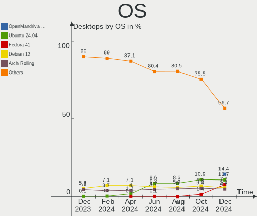
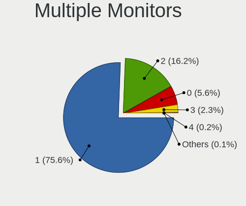
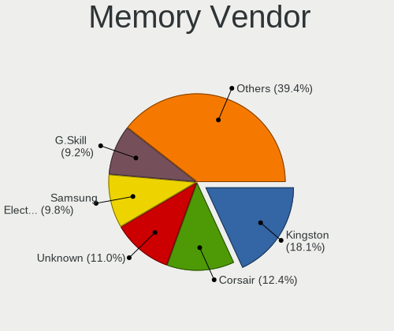
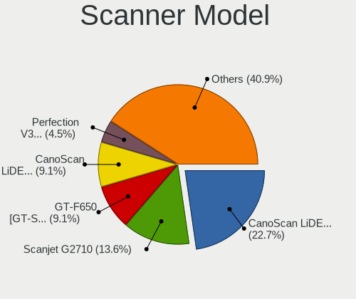

Linux Hardware Trends (Desktop)
-------------------------------

A project to identify most popular hardware characteristics and track their change
over time based on data collected by Linux users at https://Linux-Hardware.org.

Anyone can contribute to the study by uploading probes of their computers by
the [hw-probe](https://github.com/linuxhw/hw-probe) tool:

    sudo -E hw-probe -all -upload

Full-feature report is available here: https://linux-hardware.org/?view=trends&formfactor=desktop

Period: May, 2021.

Contents
--------

- [ OS                       ](#os)
- [ OS Family                ](#os-family)
- [ Kernel                   ](#kernel)
- [ Kernel Family            ](#kernel-family)
- [ Kernel Major Ver.        ](#kernel-major-ver)
- [ Arch                     ](#arch)
- [ DE                       ](#de)
- [ Display Server           ](#display-server)
- [ Display Manager          ](#display-manager)
- [ OS Lang                  ](#os-lang)
- [ Boot Mode                ](#boot-mode)
- [ Filesystem               ](#filesystem)
- [ Part. scheme             ](#part-scheme)
- [ Dual Boot with Linux/BSD ](#dual-boot-with-linux/bsd)
- [ Dual Boot (Win)          ](#dual-boot-win)
- [ Country                  ](#country)
- [ City                     ](#city)
- [ Vendor                   ](#vendor)
- [ Model                    ](#model)
- [ Model Family             ](#model-family)
- [ MFG Year                 ](#mfg-year)
- [ Form Factor              ](#form-factor)
- [ Secure Boot              ](#secure-boot)
- [ Coreboot                 ](#coreboot)
- [ RAM Size                 ](#ram-size)
- [ RAM Used                 ](#ram-used)
- [ Has CD-ROM               ](#has-cd-rom)
- [ Total Drives             ](#total-drives)
- [ Has Ethernet             ](#has-ethernet)
- [ Has WiFi                 ](#has-wifi)
- [ Has Bluetooth            ](#has-bluetooth)
- [ Drive Vendor             ](#drive-vendor)
- [ Drive Model              ](#drive-model)
- [ HDD Vendor               ](#hdd-vendor)
- [ SSD Vendor               ](#ssd-vendor)
- [ Drive Kind               ](#drive-kind)
- [ Drive Connector          ](#drive-connector)
- [ Drive Size               ](#drive-size)
- [ Space Total              ](#space-total)
- [ Space Used               ](#space-used)
- [ Malfunc. Drives          ](#malfunc-drives)
- [ Malfunc. Drive Vendor    ](#malfunc-drive-vendor)
- [ Malfunc. HDD Vendor      ](#malfunc-hdd-vendor)
- [ Malfunc. Drive Kind      ](#malfunc-drive-kind)
- [ Failed Drives            ](#failed-drives)
- [ Failed Drive Vendor      ](#failed-drive-vendor)
- [ Drive Status             ](#drive-status)
- [ Storage Vendor           ](#storage-vendor)
- [ Storage Model            ](#storage-model)
- [ Storage Kind             ](#storage-kind)
- [ CPU Vendor               ](#cpu-vendor)
- [ CPU Model                ](#cpu-model)
- [ CPU Model Family         ](#cpu-model-family)
- [ CPU Cores                ](#cpu-cores)
- [ CPU Sockets              ](#cpu-sockets)
- [ CPU Threads              ](#cpu-threads)
- [ CPU Op-Modes             ](#cpu-op-modes)
- [ CPU Microcode            ](#cpu-microcode)
- [ CPU Microarch            ](#cpu-microarch)
- [ GPU Vendor               ](#gpu-vendor)
- [ GPU Model                ](#gpu-model)
- [ GPU Combo                ](#gpu-combo)
- [ GPU Driver               ](#gpu-driver)
- [ GPU Memory               ](#gpu-memory)
- [ Monitor Vendor           ](#monitor-vendor)
- [ Monitor Model            ](#monitor-model)
- [ Monitor Resolution       ](#monitor-resolution)
- [ Monitor Diagonal         ](#monitor-diagonal)
- [ Monitor Width            ](#monitor-width)
- [ Aspect Ratio             ](#aspect-ratio)
- [ Monitor Area             ](#monitor-area)
- [ Pixel Density            ](#pixel-density)
- [ Multiple Monitors        ](#multiple-monitors)
- [ Net Controller Vendor    ](#net-controller-vendor)
- [ Net Controller Model     ](#net-controller-model)
- [ Wireless Vendor          ](#wireless-vendor)
- [ Wireless Model           ](#wireless-model)
- [ Ethernet Vendor          ](#ethernet-vendor)
- [ Ethernet Model           ](#ethernet-model)
- [ Net Controller Kind      ](#net-controller-kind)
- [ Used Controller          ](#used-controller)
- [ NICs                     ](#nics)
- [ IPv6                     ](#ipv6)
- [ Memory Vendor            ](#memory-vendor)
- [ Memory Model             ](#memory-model)
- [ Memory Kind              ](#memory-kind)
- [ Memory Form Factor       ](#memory-form-factor)
- [ Memory Size              ](#memory-size)
- [ Memory Speed             ](#memory-speed)
- [ Sound Vendor             ](#sound-vendor)
- [ Sound Model              ](#sound-model)
- [ Camera Vendor            ](#camera-vendor)
- [ Camera Model             ](#camera-model)
- [ Fingerprint Vendor       ](#fingerprint-vendor)
- [ Fingerprint Model        ](#fingerprint-model)
- [ Chipcard Vendor          ](#chipcard-vendor)
- [ Chipcard Model           ](#chipcard-model)
- [ Printer Vendor           ](#printer-vendor)
- [ Printer Model            ](#printer-model)
- [ Scanner Vendor           ](#scanner-vendor)
- [ Scanner Model            ](#scanner-model)
- [ Bluetooth Vendor         ](#bluetooth-vendor)
- [ Bluetooth Model          ](#bluetooth-model)
- [ Unsupported Devices      ](#unsupported-devices)
- [ Unsupported Device Types ](#unsupported-device-types)

OS
--

Installed operating systems

| Name                | Desktops | Percent |
|---------------------|----------|---------|
| Ubuntu 20.04        | 382      | 18.73%  |
| OpenMandriva 4.2    | 205      | 10.05%  |
| Mint 20.1           | 161      | 7.89%   |
| Fedora 34           | 92       | 4.51%   |
| OpenMandriva 4.50   | 90       | 4.41%   |
| Pop!_OS 20.10       | 79       | 3.87%   |
| Ubuntu 21.04        | 76       | 3.73%   |
| ROSA R11.1          | 62       | 3.04%   |
| BlackPanther 18.1   | 55       | 2.7%    |
| KDE neon 20.04      | 52       | 2.55%   |
| Ubuntu 20.10        | 47       | 2.3%    |
| Ubuntu 18.04        | 47       | 2.3%    |
| Arch                | 41       | 2.01%   |
| Debian 10           | 38       | 1.86%   |
| Manjaro             | 34       | 1.67%   |
| Xubuntu 20.04       | 32       | 1.57%   |
| Arch Rolling        | 29       | 1.42%   |
| Manjaro 21.0.5      | 28       | 1.37%   |
| Kubuntu 20.04       | 28       | 1.37%   |
| Fedora 33           | 21       | 1.03%   |
| Pop!_OS 20.04       | 20       | 0.98%   |
| Debian              | 20       | 0.98%   |
| ArcoLinux Rolling   | 19       | 0.93%   |
| Zorin 15            | 18       | 0.88%   |
| Mint 20             | 18       | 0.88%   |
| Mint 19.3           | 16       | 0.78%   |
| Manjaro 21.0.4      | 16       | 0.78%   |
| LMDE 4              | 16       | 0.78%   |
| Gentoo              | 12       | 0.59%   |
| Kubuntu 21.04       | 11       | 0.54%   |
| ROSA R11            | 9        | 0.44%   |
| openSUSE Leap-15.2  | 9        | 0.44%   |
| Lubuntu 20.04       | 9        | 0.44%   |
| Gentoo 2.7          | 9        | 0.44%   |
| Endless 3.9.4       | 9        | 0.44%   |
| Zorin 16            | 8        | 0.39%   |
| Xubuntu 18.04       | 8        | 0.39%   |
| ROSA R12            | 8        | 0.39%   |
| Debian 11           | 8        | 0.39%   |
| Ubuntu 16.04        | 7        | 0.34%   |
| Manjaro 21.0.3      | 6        | 0.29%   |
| Xubuntu 20.10       | 5        | 0.25%   |
| Ubuntu MATE 21.04   | 5        | 0.25%   |
| Ubuntu MATE 20.04   | 5        | 0.25%   |
| Slackware 14.2      | 5        | 0.25%   |
| Kali 2021.1         | 5        | 0.25%   |
| Debian Testing      | 5        | 0.25%   |
| CentOS 8            | 5        | 0.25%   |
| CentOS 7            | 5        | 0.25%   |
| Solus 4.2           | 4        | 0.2%    |
| RHEL 8.4            | 4        | 0.2%    |
| Kali 2021.2         | 4        | 0.2%    |
| Garuda Soaring      | 4        | 0.2%    |
| Debian 9            | 4        | 0.2%    |
| Xubuntu 21.04       | 3        | 0.15%   |
| Ubuntu Budgie 21.04 | 3        | 0.15%   |
| Mint 19.1           | 3        | 0.15%   |
| Lubuntu 21.04       | 3        | 0.15%   |
| ClearOS 7.9.1       | 3        | 0.15%   |
| Ubuntu MATE 20.10   | 2        | 0.1%    |

OS Family
---------

OS without a version

| Name          | Desktops | Percent |
|---------------|----------|---------|
| Ubuntu        | 567      | 27.79%  |
| OpenMandriva  | 297      | 14.56%  |
| Mint          | 201      | 9.85%   |
| Fedora        | 116      | 5.69%   |
| Pop!_OS       | 99       | 4.85%   |
| Manjaro       | 84       | 4.12%   |
| ROSA          | 81       | 3.97%   |
| Debian        | 78       | 3.82%   |
| Arch          | 70       | 3.43%   |
| BlackPanther  | 57       | 2.79%   |
| KDE neon      | 52       | 2.55%   |
| Xubuntu       | 51       | 2.5%    |
| Kubuntu       | 43       | 2.11%   |
| Zorin         | 27       | 1.32%   |
| openSUSE      | 27       | 1.32%   |
| Gentoo        | 21       | 1.03%   |
| ArcoLinux     | 20       | 0.98%   |
| LMDE          | 16       | 0.78%   |
| Ubuntu MATE   | 14       | 0.69%   |
| Lubuntu       | 13       | 0.64%   |
| CentOS        | 11       | 0.54%   |
| Kali          | 9        | 0.44%   |
| Endless       | 9        | 0.44%   |
| RHEL          | 6        | 0.29%   |
| Garuda        | 6        | 0.29%   |
| Clear Linux   | 6        | 0.29%   |
| Ubuntu Budgie | 5        | 0.25%   |
| Slackware     | 5        | 0.25%   |
| ClearOS       | 5        | 0.25%   |
| Solus         | 4        | 0.2%    |
| EndeavourOS   | 4        | 0.2%    |
| Reborn OS     | 3        | 0.15%   |
| Elementary    | 3        | 0.15%   |
| ALT Linux     | 3        | 0.15%   |
| Siduction     | 2        | 0.1%    |
| RED           | 2        | 0.1%    |
| Parrot        | 2        | 0.1%    |
| NixOS         | 2        | 0.1%    |
| MX            | 2        | 0.1%    |
| Xero          | 1        | 0.05%   |
| Void          | 1        | 0.05%   |
| Sparky        | 1        | 0.05%   |
| Serbian       | 1        | 0.05%   |
| Rocky         | 1        | 0.05%   |
| Redcore       | 1        | 0.05%   |
| Q4OS          | 1        | 0.05%   |
| Peppermint    | 1        | 0.05%   |
| Oracle Linux  | 1        | 0.05%   |
| HamoniKR      | 1        | 0.05%   |
| Gooroom       | 1        | 0.05%   |
| GNOME OS      | 1        | 0.05%   |
| Funtoo        | 1        | 0.05%   |
| Devuan        | 1        | 0.05%   |
| Deepin        | 1        | 0.05%   |
| Artix         | 1        | 0.05%   |
| Arch32        | 1        | 0.05%   |

Kernel
------

Version of the Linux kernel

| Version                             | Desktops | Percent |
|-------------------------------------|----------|---------|
| 5.8.0-53-generic                    | 194      | 9.51%   |
| 5.10.14-desktop-1omv4002            | 193      | 9.46%   |
| 5.4.0-73-generic                    | 186      | 9.12%   |
| 5.8.0-50-generic                    | 145      | 7.11%   |
| 5.4.0-72-generic                    | 128      | 6.27%   |
| 5.12.4-desktop-1omv4050             | 88       | 4.31%   |
| 5.11.0-7614-generic                 | 76       | 3.73%   |
| 5.11.0-17-generic                   | 49       | 2.4%    |
| 5.6.14-desktop-2bP                  | 43       | 2.11%   |
| 5.11.0-16-generic                   | 36       | 1.76%   |
| 4.19.0-16-amd64                     | 36       | 1.76%   |
| 5.8.0-43-generic                    | 22       | 1.08%   |
| 5.4.32-generic-2rosa-x86_64         | 22       | 1.08%   |
| 5.10.36-2-MANJARO                   | 22       | 1.08%   |
| 5.4.83-generic-2rosa-x86_64         | 16       | 0.78%   |
| 5.10.0-2-amd64                      | 16       | 0.78%   |
| 5.11.17-300.fc34.x86_64             | 15       | 0.74%   |
| 5.11.16-arch1-1                     | 15       | 0.74%   |
| 5.10.34-1-MANJARO                   | 15       | 0.74%   |
| 4.15.0-142-generic                  | 15       | 0.74%   |
| 5.8.0-54-generic                    | 14       | 0.69%   |
| 5.11.0-7612-generic                 | 14       | 0.69%   |
| 5.10.0-6-amd64                      | 14       | 0.69%   |
| 5.11.20-300.fc34.x86_64             | 13       | 0.64%   |
| 5.11.19-300.fc34.x86_64             | 13       | 0.64%   |
| 5.4.0-58-generic                    | 12       | 0.59%   |
| 5.12.4-arch1-2                      | 12       | 0.59%   |
| 5.11.18-300.fc34.x86_64             | 12       | 0.59%   |
| 4.18.16-desktop-1bP                 | 12       | 0.59%   |
| 5.11.16-300.fc34.x86_64             | 11       | 0.54%   |
| 5.11.12-desktop-1omv4002            | 11       | 0.54%   |
| 4.15.0-desktop-122.124.1rosa-x86_64 | 11       | 0.54%   |
| 5.4.0-70-generic                    | 10       | 0.49%   |
| 5.10.32-1-MANJARO                   | 10       | 0.49%   |
| 4.15.0-143-generic                  | 10       | 0.49%   |
| 5.8.0-14-generic                    | 9        | 0.44%   |
| 5.12.7-300.fc34.x86_64              | 9        | 0.44%   |
| 5.12.2-1-MANJARO                    | 9        | 0.44%   |
| 5.12.6-arch1-1                      | 8        | 0.39%   |
| 5.12.6-300.fc34.x86_64              | 8        | 0.39%   |
| 5.12.3-arch1-1                      | 8        | 0.39%   |
| 5.12.1-arch1-1                      | 8        | 0.39%   |
| 5.10.27-gentoo                      | 8        | 0.39%   |
| 5.4.0-72-lowlatency                 | 7        | 0.34%   |
| 5.4.0-67-generic                    | 7        | 0.34%   |
| 5.11.0-18-generic                   | 7        | 0.34%   |
| 5.10.0-kali7-amd64                  | 7        | 0.34%   |
| 4.15.0-desktop-45.1rosa-x86_64      | 7        | 0.34%   |
| 3.10.0-1160.25.1.el7.x86_64         | 7        | 0.34%   |
| 5.8.0-7642-generic                  | 6        | 0.29%   |
| 5.4.32-generic-2rosa-i586           | 6        | 0.29%   |
| 5.4.0-42-generic                    | 6        | 0.29%   |
| 5.4.0-26-generic                    | 6        | 0.29%   |
| 5.11.18-1-MANJARO                   | 6        | 0.29%   |
| 5.11.12-300.fc34.x86_64             | 6        | 0.29%   |
| 5.8.0-52-generic                    | 5        | 0.25%   |
| 5.12.5-arch1-1                      | 5        | 0.25%   |
| 5.12.4-zen1-2-zen                   | 5        | 0.25%   |
| 5.11.17-200.fc33.x86_64             | 5        | 0.25%   |
| 5.11.16-zen1-1-zen                  | 5        | 0.25%   |

Kernel Family
-------------

Linux kernel without a distro release

| Version | Desktops | Percent |
|---------|----------|---------|
| 5.8.0   | 426      | 20.88%  |
| 5.4.0   | 393      | 19.26%  |
| 5.10.14 | 193      | 9.46%   |
| 5.11.0  | 187      | 9.17%   |
| 5.12.4  | 113      | 5.54%   |
| 4.15.0  | 57       | 2.79%   |
| 5.10.0  | 49       | 2.4%    |
| 4.19.0  | 47       | 2.3%    |
| 5.11.16 | 45       | 2.21%   |
| 5.6.14  | 43       | 2.11%   |
| 5.4.32  | 28       | 1.37%   |
| 5.10.36 | 26       | 1.27%   |
| 5.12.6  | 23       | 1.13%   |
| 5.11.17 | 22       | 1.08%   |
| 5.12.2  | 21       | 1.03%   |
| 5.11.18 | 21       | 1.03%   |
| 5.4.83  | 20       | 0.98%   |
| 5.11.19 | 20       | 0.98%   |
| 5.12.1  | 19       | 0.93%   |
| 5.10.34 | 19       | 0.93%   |
| 5.12.5  | 18       | 0.88%   |
| 5.11.12 | 18       | 0.88%   |
| 5.11.20 | 17       | 0.83%   |
| 4.18.0  | 14       | 0.69%   |
| 5.12.7  | 13       | 0.64%   |
| 5.12.3  | 13       | 0.64%   |
| 4.18.16 | 12       | 0.59%   |
| 5.12.0  | 11       | 0.54%   |
| 5.10.32 | 11       | 0.54%   |
| 5.10.27 | 10       | 0.49%   |
| 5.3.18  | 9        | 0.44%   |
| 3.10.0  | 8        | 0.39%   |
| 5.0.0   | 7        | 0.34%   |
| 5.11.21 | 6        | 0.29%   |
| 5.10.35 | 6        | 0.29%   |
| 5.9.16  | 5        | 0.25%   |
| 5.13.0  | 5        | 0.25%   |
| 5.12.8  | 5        | 0.25%   |
| 5.10.33 | 5        | 0.25%   |
| 5.3.0   | 4        | 0.2%    |
| 5.7.0   | 3        | 0.15%   |
| 5.11.10 | 3        | 0.15%   |
| 5.10.37 | 3        | 0.15%   |
| 5.10.28 | 3        | 0.15%   |
| 5.10.19 | 3        | 0.15%   |
| 4.9.20  | 3        | 0.15%   |
| 4.4.0   | 3        | 0.15%   |
| 4.10.0  | 3        | 0.15%   |
| 5.5.12  | 2        | 0.1%    |
| 5.4.118 | 2        | 0.1%    |
| 5.4.114 | 2        | 0.1%    |
| 5.4.106 | 2        | 0.1%    |
| 5.11.8  | 2        | 0.1%    |
| 5.11.15 | 2        | 0.1%    |
| 4.9.0   | 2        | 0.1%    |
| 5.9.13  | 1        | 0.05%   |
| 5.9.1   | 1        | 0.05%   |
| 5.7.1   | 1        | 0.05%   |
| 5.6.0   | 1        | 0.05%   |
| 5.5.19  | 1        | 0.05%   |

Kernel Major Ver.
-----------------

Linux kernel major version

| Version | Desktops | Percent |
|---------|----------|---------|
| 5.4     | 454      | 22.25%  |
| 5.8     | 426      | 20.88%  |
| 5.11    | 346      | 16.96%  |
| 5.10    | 336      | 16.47%  |
| 5.12    | 236      | 11.57%  |
| 4.15    | 57       | 2.79%   |
| 4.19    | 48       | 2.35%   |
| 5.6     | 44       | 2.16%   |
| 4.18    | 26       | 1.27%   |
| 5.3     | 13       | 0.64%   |
| 5.0     | 8        | 0.39%   |
| 3.10    | 8        | 0.39%   |
| 5.9     | 7        | 0.34%   |
| 4.9     | 6        | 0.29%   |
| 5.13    | 5        | 0.25%   |
| 4.4     | 5        | 0.25%   |
| 5.7     | 4        | 0.2%    |
| 5.5     | 3        | 0.15%   |
| 4.10    | 3        | 0.15%   |
| 5.1     | 1        | 0.05%   |
| 4.12    | 1        | 0.05%   |
| 4.1     | 1        | 0.05%   |
| 3.2     | 1        | 0.05%   |
| 3.13    | 1        | 0.05%   |

Arch
----

OS architecture (x86_64, i586, etc.)

| Name   | Desktops | Percent |
|--------|----------|---------|
| x86_64 | 1988     | 97.45%  |
| i686   | 50       | 2.45%   |
| armv7l | 1        | 0.05%   |
| armv6l | 1        | 0.05%   |

DE
--

Desktop Environment

| Name              | Desktops | Percent |
|-------------------|----------|---------|
| GNOME             | 786      | 38.53%  |
| KDE5              | 483      | 23.68%  |
| X-Cinnamon        | 176      | 8.63%   |
| XFCE              | 143      | 7.01%   |
| KDE               | 133      | 6.52%   |
| Unknown           | 118      | 5.78%   |
| KDE4              | 48       | 2.35%   |
| MATE              | 47       | 2.3%    |
| LXQt              | 23       | 1.13%   |
| Cinnamon          | 18       | 0.88%   |
| i3                | 14       | 0.69%   |
| Unity             | 12       | 0.59%   |
| Budgie            | 7        | 0.34%   |
| LXDE              | 6        | 0.29%   |
| Deepin            | 5        | 0.25%   |
| Pantheon          | 3        | 0.15%   |
| Openbox           | 3        | 0.15%   |
| GNOME Flashback   | 3        | 0.15%   |
| GNOME Classic     | 3        | 0.15%   |
| xmonad            | 2        | 0.1%    |
| Yaru:ubuntu:GNOME | 1        | 0.05%   |
| trinity           | 1        | 0.05%   |
| sway              | 1        | 0.05%   |
| qtile             | 1        | 0.05%   |
| GNUstep           | 1        | 0.05%   |
| fvwm              | 1        | 0.05%   |
| enlightenment     | 1        | 0.05%   |

Display Server
--------------

X11 or Wayland

| Name        | Desktops | Percent |
|-------------|----------|---------|
| X11         | 1766     | 86.57%  |
| Wayland     | 172      | 8.43%   |
| Unknown     | 64       | 3.14%   |
| Tty         | 37       | 1.81%   |
| Unspecified | 1        | 0.05%   |

Display Manager
---------------

SDDM, LightDM, etc.

| Name    | Desktops | Percent |
|---------|----------|---------|
| Unknown | 1141     | 55.93%  |
| SDDM    | 494      | 24.22%  |
| GDM     | 189      | 9.26%   |
| TDM     | 117      | 5.74%   |
| KDM     | 48       | 2.35%   |
| LightDM | 41       | 2.01%   |
| XDM     | 7        | 0.34%   |
| SLiM    | 1        | 0.05%   |
| NODM    | 1        | 0.05%   |
| GDM3    | 1        | 0.05%   |

OS Lang
-------

Language

| Lang    | Desktops | Percent |
|---------|----------|---------|
| en_US   | 783      | 38.38%  |
| de_DE   | 162      | 7.94%   |
| ru_RU   | 152      | 7.45%   |
| en_GB   | 120      | 5.88%   |
| pt_BR   | 112      | 5.49%   |
| fr_FR   | 95       | 4.66%   |
| Unknown | 89       | 4.36%   |
| en_CA   | 49       | 2.4%    |
| it_IT   | 48       | 2.35%   |
| en_AU   | 42       | 2.06%   |
| es_ES   | 37       | 1.81%   |
| pl_PL   | 36       | 1.76%   |
| C       | 25       | 1.23%   |
| es_AR   | 21       | 1.03%   |
| nl_NL   | 19       | 0.93%   |
| es_MX   | 18       | 0.88%   |
| en_IN   | 16       | 0.78%   |
| de_AT   | 12       | 0.59%   |
| tr_TR   | 11       | 0.54%   |
| sv_SE   | 11       | 0.54%   |
| hu_HU   | 10       | 0.49%   |
| cs_CZ   | 10       | 0.49%   |
| en_ZA   | 9        | 0.44%   |
| en_IE   | 9        | 0.44%   |
| zh_CN   | 8        | 0.39%   |
| ro_RO   | 8        | 0.39%   |
| nl_BE   | 7        | 0.34%   |
| fr_CA   | 7        | 0.34%   |
| uk_UA   | 6        | 0.29%   |
| sk_SK   | 6        | 0.29%   |
| zh_TW   | 5        | 0.25%   |
| pt_PT   | 5        | 0.25%   |
| ja_JP   | 5        | 0.25%   |
| fr_BE   | 5        | 0.25%   |
| es_CL   | 5        | 0.25%   |
| de_CH   | 5        | 0.25%   |
| ru_UA   | 4        | 0.2%    |
| POSIX   | 4        | 0.2%    |
| fr_CH   | 4        | 0.2%    |
| es_CO   | 4        | 0.2%    |
| da_DK   | 4        | 0.2%    |
| bg_BG   | 4        | 0.2%    |
| nb_NO   | 3        | 0.15%   |
| ko_KR   | 3        | 0.15%   |
| fi_FI   | 3        | 0.15%   |
| en_NZ   | 3        | 0.15%   |
| en_IL   | 3        | 0.15%   |
| en_DK   | 3        | 0.15%   |
| ca_ES   | 3        | 0.15%   |
| id_ID   | 2        | 0.1%    |
| es_VE   | 2        | 0.1%    |
| es_US   | 2        | 0.1%    |
| es_PE   | 2        | 0.1%    |
| en_PH   | 2        | 0.1%    |
| en_HK   | 2        | 0.1%    |
| el_GR   | 2        | 0.1%    |
| sr_RS   | 1        | 0.05%   |
| nl_AW   | 1        | 0.05%   |
| lt_LT   | 1        | 0.05%   |
| es_UY   | 1        | 0.05%   |

Boot Mode
---------

EFI or BIOS

| Mode | Desktops | Percent |
|------|----------|---------|
| BIOS | 1224     | 60%     |
| EFI  | 816      | 40%     |

Filesystem
----------

Type of filesystem

| Type                | Desktops | Percent |
|---------------------|----------|---------|
| Ext4                | 1453     | 71.23%  |
| Overlay             | 342      | 16.76%  |
| Btrfs               | 155      | 7.6%    |
| Xfs                 | 44       | 2.16%   |
| Zfs                 | 21       | 1.03%   |
| Ext2                | 6        | 0.29%   |
| F2fs                | 5        | 0.25%   |
| Ext3                | 5        | 0.25%   |
| Aufs                | 3        | 0.15%   |
| Tmpfs               | 2        | 0.1%    |
| Rootfs              | 2        | 0.1%    |
| Jfs                 | 1        | 0.05%   |
| Fuse.fuse-overlayfs | 1        | 0.05%   |

Part. scheme
------------

Scheme of partitioning

| Type    | Desktops | Percent |
|---------|----------|---------|
| Unknown | 1074     | 52.65%  |
| GPT     | 622      | 30.49%  |
| MBR     | 344      | 16.86%  |

Dual Boot with Linux/BSD
------------------------

Hosting more than one Linux/BSD

| Dual boot | Desktops | Percent |
|-----------|----------|---------|
| No        | 1550     | 75.98%  |
| Yes       | 490      | 24.02%  |

Dual Boot (Win)
---------------

Hosting Linux and Windows

| Dual boot | Desktops | Percent |
|-----------|----------|---------|
| No        | 1307     | 64.07%  |
| Yes       | 733      | 35.93%  |

Country
-------

Geographic location (country)

| Country                | Desktops | Percent |
|------------------------|----------|---------|
| USA                    | 359      | 17.6%   |
| Germany                | 221      | 10.83%  |
| Russia                 | 170      | 8.33%   |
| Brazil                 | 139      | 6.81%   |
| France                 | 104      | 5.1%    |
| UK                     | 95       | 4.66%   |
| Canada                 | 78       | 3.82%   |
| Italy                  | 60       | 2.94%   |
| Hungary                | 60       | 2.94%   |
| Spain                  | 59       | 2.89%   |
| Australia              | 51       | 2.5%    |
| Poland                 | 49       | 2.4%    |
| Netherlands            | 42       | 2.06%   |
| Sweden                 | 35       | 1.72%   |
| Ukraine                | 30       | 1.47%   |
| Switzerland            | 29       | 1.42%   |
| Argentina              | 29       | 1.42%   |
| India                  | 24       | 1.18%   |
| Austria                | 24       | 1.18%   |
| Turkey                 | 23       | 1.13%   |
| Mexico                 | 21       | 1.03%   |
| Belgium                | 21       | 1.03%   |
| Czechia                | 17       | 0.83%   |
| Finland                | 16       | 0.78%   |
| Romania                | 15       | 0.74%   |
| China                  | 15       | 0.74%   |
| South Africa           | 14       | 0.69%   |
| Slovakia               | 13       | 0.64%   |
| Greece                 | 13       | 0.64%   |
| Bulgaria               | 12       | 0.59%   |
| Indonesia              | 11       | 0.54%   |
| Chile                  | 10       | 0.49%   |
| Portugal               | 9        | 0.44%   |
| Israel                 | 9        | 0.44%   |
| Ireland                | 9        | 0.44%   |
| Denmark                | 9        | 0.44%   |
| Serbia                 | 8        | 0.39%   |
| Japan                  | 8        | 0.39%   |
| Hong Kong              | 7        | 0.34%   |
| Belarus                | 7        | 0.34%   |
| Taiwan                 | 6        | 0.29%   |
| Norway                 | 6        | 0.29%   |
| Colombia               | 6        | 0.29%   |
| Philippines            | 5        | 0.25%   |
| Malaysia               | 5        | 0.25%   |
| South Korea            | 4        | 0.2%    |
| Puerto Rico            | 4        | 0.2%    |
| Peru                   | 4        | 0.2%    |
| New Zealand            | 4        | 0.2%    |
| Bangladesh             | 4        | 0.2%    |
| Uruguay                | 3        | 0.15%   |
| Morocco                | 3        | 0.15%   |
| Lebanon                | 3        | 0.15%   |
| Croatia                | 3        | 0.15%   |
| Bosnia and Herzegovina | 3        | 0.15%   |
| Algeria                | 3        | 0.15%   |
| Vietnam                | 2        | 0.1%    |
| Venezuela              | 2        | 0.1%    |
| Tunisia                | 2        | 0.1%    |
| Singapore              | 2        | 0.1%    |

City
----

Geographic location (city)

| City              | Desktops | Percent |
|-------------------|----------|---------|
| Moscow            | 33       | 1.62%   |
| Voronezh          | 18       | 0.88%   |
| Sydney            | 16       | 0.78%   |
| São Paulo        | 15       | 0.74%   |
| Warsaw            | 14       | 0.69%   |
| Budapest          | 14       | 0.69%   |
| St Petersburg     | 13       | 0.64%   |
| Toronto           | 12       | 0.59%   |
| Paris             | 12       | 0.59%   |
| Munich            | 12       | 0.59%   |
| London            | 12       | 0.59%   |
| Istanbul          | 11       | 0.54%   |
| Hamburg           | 11       | 0.54%   |
| Vienna            | 10       | 0.49%   |
| Rio de Janeiro    | 9        | 0.44%   |
| Buenos Aires      | 9        | 0.44%   |
| Zurich            | 8        | 0.39%   |
| Rome              | 8        | 0.39%   |
| Novosibirsk       | 8        | 0.39%   |
| Melbourne         | 8        | 0.39%   |
| Madrid            | 8        | 0.39%   |
| Kyiv              | 8        | 0.39%   |
| Frankfurt am Main | 8        | 0.39%   |
| Cologne           | 8        | 0.39%   |
| Berlin            | 8        | 0.39%   |
| Portland          | 7        | 0.34%   |
| Perth             | 7        | 0.34%   |
| Milan             | 7        | 0.34%   |
| Miami             | 7        | 0.34%   |
| Los Angeles       | 7        | 0.34%   |
| Helsinki          | 7        | 0.34%   |
| Sofia             | 6        | 0.29%   |
| Prague            | 6        | 0.29%   |
| Montreal          | 6        | 0.29%   |
| Mexico City       | 6        | 0.29%   |
| Dublin            | 6        | 0.29%   |
| Dresden           | 6        | 0.29%   |
| Dallas            | 6        | 0.29%   |
| Belo Horizonte    | 6        | 0.29%   |
| Amsterdam         | 6        | 0.29%   |
| Wroclaw           | 5        | 0.25%   |
| Stuttgart         | 5        | 0.25%   |
| Saratov           | 5        | 0.25%   |
| Santiago          | 5        | 0.25%   |
| Queens            | 5        | 0.25%   |
| Nizhniy Novgorod  | 5        | 0.25%   |
| Essen             | 5        | 0.25%   |
| Curitiba          | 5        | 0.25%   |
| Chipping Norton   | 5        | 0.25%   |
| Barcelona         | 5        | 0.25%   |
| Yekaterinburg     | 4        | 0.2%    |
| San Jose          | 4        | 0.2%    |
| San Antonio       | 4        | 0.2%    |
| Rostov-on-Don     | 4        | 0.2%    |
| Poznan            | 4        | 0.2%    |
| Leipzig           | 4        | 0.2%    |
| Johannesburg      | 4        | 0.2%    |
| Graz              | 4        | 0.2%    |
| Chennai           | 4        | 0.2%    |
| Cape Town         | 4        | 0.2%    |

Vendor
------

Motherboard manufacturer

| Name                | Desktops | Percent |
|---------------------|----------|---------|
| ASUSTek Computer    | 552      | 27.06%  |
| Gigabyte Technology | 353      | 17.3%   |
| MSI                 | 231      | 11.32%  |
| ASRock              | 209      | 10.25%  |
| Hewlett-Packard     | 161      | 7.89%   |
| Dell                | 151      | 7.4%    |
| Lenovo              | 59       | 2.89%   |
| Intel               | 53       | 2.6%    |
| Acer                | 28       | 1.37%   |
| Unknown             | 24       | 1.18%   |
| Medion              | 21       | 1.03%   |
| Biostar             | 21       | 1.03%   |
| Pegatron            | 20       | 0.98%   |
| ECS                 | 19       | 0.93%   |
| Fujitsu             | 17       | 0.83%   |
| Foxconn             | 17       | 0.83%   |
| Huanan              | 11       | 0.54%   |
| Shuttle             | 8        | 0.39%   |
| Apple               | 7        | 0.34%   |
| PCWare              | 5        | 0.25%   |
| Fujitsu Siemens     | 4        | 0.2%    |
| Alienware           | 4        | 0.2%    |
| Packard Bell        | 3        | 0.15%   |
| Itautec             | 3        | 0.15%   |
| eMachines           | 3        | 0.15%   |
| SYWZ                | 2        | 0.1%    |
| System76            | 2        | 0.1%    |
| Semp Toshiba        | 2        | 0.1%    |
| Sapphire            | 2        | 0.1%    |
| HPE                 | 2        | 0.1%    |
| Google              | 2        | 0.1%    |
| Gateway             | 2        | 0.1%    |
| ZOTAC               | 1        | 0.05%   |
| XFX                 | 1        | 0.05%   |
| Wistron             | 1        | 0.05%   |
| TYAN Computer       | 1        | 0.05%   |
| Supermicro          | 1        | 0.05%   |
| Soyo                | 1        | 0.05%   |
| Seco                | 1        | 0.05%   |
| Samsung Electronics | 1        | 0.05%   |
| QDI                 | 1        | 0.05%   |
| Qbex                | 1        | 0.05%   |
| Positivo            | 1        | 0.05%   |
| PERTOSA             | 1        | 0.05%   |
| OEM_MB              | 1        | 0.05%   |
| OEM                 | 1        | 0.05%   |
| NCR                 | 1        | 0.05%   |
| Minix               | 1        | 0.05%   |
| MAXSUN              | 1        | 0.05%   |
| LORD ELECTRONICS    | 1        | 0.05%   |
| Lanix               | 1        | 0.05%   |
| Inventec            | 1        | 0.05%   |
| IBM                 | 1        | 0.05%   |
| Huanghe             | 1        | 0.05%   |
| HOUTER              | 1        | 0.05%   |
| HC                  | 1        | 0.05%   |
| HARDKERNEL          | 1        | 0.05%   |
| faytech             | 1        | 0.05%   |
| EVGA                | 1        | 0.05%   |
| essentielb          | 1        | 0.05%   |

Model
-----

Motherboard model

| Name                        | Desktops | Percent |
|-----------------------------|----------|---------|
| ASUS All Series             | 47       | 2.3%    |
| Unknown                     | 24       | 1.18%   |
| MSI MS-7C02                 | 15       | 0.74%   |
| MSI MS-7B86                 | 15       | 0.74%   |
| ASUS TUF GAMING X570-PLUS   | 15       | 0.74%   |
| Gigabyte B450M DS3H         | 14       | 0.69%   |
| ASUS PRIME A320M-K          | 13       | 0.64%   |
| MSI MS-7C37                 | 11       | 0.54%   |
| Dell OptiPlex 9020          | 10       | 0.49%   |
| Gigabyte A320M-S2H          | 9        | 0.44%   |
| Dell OptiPlex 3010          | 9        | 0.44%   |
| Gigabyte B450 AORUS M       | 8        | 0.39%   |
| ASUS M5A99FX PRO R2.0       | 8        | 0.39%   |
| ASRock B450M Pro4           | 8        | 0.39%   |
| Intel H61                   | 7        | 0.34%   |
| Dell OptiPlex 790           | 7        | 0.34%   |
| ASUS M5A97 R2.0             | 7        | 0.34%   |
| ASRock H61M-VG4             | 7        | 0.34%   |
| MSI MS-7A38                 | 6        | 0.29%   |
| MSI MS-7817                 | 6        | 0.29%   |
| MSI MS-7721                 | 6        | 0.29%   |
| Gigabyte B75M-D3H           | 6        | 0.29%   |
| Dell OptiPlex 990           | 6        | 0.29%   |
| Dell OptiPlex 780           | 6        | 0.29%   |
| ASUS PRIME X570-P           | 6        | 0.29%   |
| ASUS M5A78L-M/USB3          | 6        | 0.29%   |
| MSI MS-7C91                 | 5        | 0.25%   |
| MSI MS-7B98                 | 5        | 0.25%   |
| MSI MS-7B89                 | 5        | 0.25%   |
| MSI MS-7A39                 | 5        | 0.25%   |
| MSI MS-7693                 | 5        | 0.25%   |
| HP Compaq Elite 8300 SFF    | 5        | 0.25%   |
| HP Compaq 8200 Elite SFF PC | 5        | 0.25%   |
| Gigabyte H61M-S1            | 5        | 0.25%   |
| Gigabyte GA-78LMT-USB3 6.0  | 5        | 0.25%   |
| Gigabyte B450 AORUS ELITE   | 5        | 0.25%   |
| Gigabyte A320M-H            | 5        | 0.25%   |
| Dell OptiPlex 7010          | 5        | 0.25%   |
| Dell OptiPlex 3020          | 5        | 0.25%   |
| ASUS TUF GAMING B550-PLUS   | 5        | 0.25%   |
| ASUS PRIME X470-PRO         | 5        | 0.25%   |
| ASUS PRIME B450M-A          | 5        | 0.25%   |
| ASUS PRIME B450-PLUS        | 5        | 0.25%   |
| ASUS P8Z77-V LX             | 5        | 0.25%   |
| ASUS M5A97 LE R2.0          | 5        | 0.25%   |
| ASUS M5A78L-M LX3           | 5        | 0.25%   |
| MSI MS-7C75                 | 4        | 0.2%    |
| MSI MS-7C52                 | 4        | 0.2%    |
| MSI MS-7B79                 | 4        | 0.2%    |
| MSI MS-7A70                 | 4        | 0.2%    |
| MSI MS-7A40                 | 4        | 0.2%    |
| MSI MS-7996                 | 4        | 0.2%    |
| MSI MS-7816                 | 4        | 0.2%    |
| MSI MS-7758                 | 4        | 0.2%    |
| Intel H81                   | 4        | 0.2%    |
| HP ProDesk 600 G1 SFF       | 4        | 0.2%    |
| HP EliteDesk 800 G1 SFF     | 4        | 0.2%    |
| HP Compaq Pro 6300 SFF      | 4        | 0.2%    |
| Gigabyte Z97-HD3            | 4        | 0.2%    |
| Gigabyte TRX40 AORUS MASTER | 4        | 0.2%    |

Model Family
------------

Motherboard model prefix

| Name                   | Desktops | Percent |
|------------------------|----------|---------|
| ASUS PRIME             | 93       | 4.56%   |
| Dell OptiPlex          | 83       | 4.07%   |
| ASUS ROG               | 61       | 2.99%   |
| HP Compaq              | 56       | 2.75%   |
| ASUS All               | 47       | 2.3%    |
| ASUS TUF               | 43       | 2.11%   |
| Lenovo ThinkCentre     | 38       | 1.86%   |
| Gigabyte B450M         | 26       | 1.27%   |
| Unknown                | 24       | 1.18%   |
| HP EliteDesk           | 22       | 1.08%   |
| Dell Inspiron          | 22       | 1.08%   |
| ASUS M5A78L-M          | 19       | 0.93%   |
| Gigabyte B450          | 18       | 0.88%   |
| Dell Precision         | 17       | 0.83%   |
| ASRock B450M           | 17       | 0.83%   |
| MSI MS-7C02            | 15       | 0.74%   |
| MSI MS-7B86            | 15       | 0.74%   |
| HP ProDesk             | 15       | 0.74%   |
| ASUS M5A97             | 15       | 0.74%   |
| Acer Aspire            | 14       | 0.69%   |
| Gigabyte X570          | 13       | 0.64%   |
| Fujitsu ESPRIMO        | 13       | 0.64%   |
| Dell Vostro            | 13       | 0.64%   |
| ASUS P8Z77-V           | 12       | 0.59%   |
| MSI MS-7C37            | 11       | 0.54%   |
| Gigabyte GA-78LMT-USB3 | 11       | 0.54%   |
| Gigabyte A320M-S2H     | 11       | 0.54%   |
| HP Pavilion            | 10       | 0.49%   |
| ASUS Maximus           | 9        | 0.44%   |
| Acer Veriton           | 9        | 0.44%   |
| Lenovo IdeaCentre      | 8        | 0.39%   |
| Intel H61              | 8        | 0.39%   |
| Gigabyte Z390          | 8        | 0.39%   |
| ASUS M5A99FX           | 8        | 0.39%   |
| ASRock B450            | 8        | 0.39%   |
| ASUS P8H61-M           | 7        | 0.34%   |
| ASUS P5KPL-AM          | 7        | 0.34%   |
| ASRock H61M-VG4        | 7        | 0.34%   |
| MSI MS-7A38            | 6        | 0.29%   |
| MSI MS-7817            | 6        | 0.29%   |
| MSI MS-7721            | 6        | 0.29%   |
| Gigabyte B75M-D3H      | 6        | 0.29%   |
| ASRock X570            | 6        | 0.29%   |
| ASRock X370            | 6        | 0.29%   |
| ASRock A320M-HDV       | 6        | 0.29%   |
| MSI MS-7C91            | 5        | 0.25%   |
| MSI MS-7B98            | 5        | 0.25%   |
| MSI MS-7B89            | 5        | 0.25%   |
| MSI MS-7A39            | 5        | 0.25%   |
| MSI MS-7693            | 5        | 0.25%   |
| Gigabyte TRX40         | 5        | 0.25%   |
| Gigabyte H61M-S1       | 5        | 0.25%   |
| Gigabyte B550          | 5        | 0.25%   |
| Gigabyte A320M-H       | 5        | 0.25%   |
| Dell XPS               | 5        | 0.25%   |
| ASUS STRIX             | 5        | 0.25%   |
| ASUS Rampage           | 5        | 0.25%   |
| ASRock Z77             | 5        | 0.25%   |
| MSI MS-7C75            | 4        | 0.2%    |
| MSI MS-7C52            | 4        | 0.2%    |

MFG Year
--------

Motherboard manufacture year

| Year    | Desktops | Percent |
|---------|----------|---------|
| 2020    | 296      | 14.51%  |
| 2019    | 255      | 12.5%   |
| 2018    | 180      | 8.82%   |
| 2014    | 164      | 8.04%   |
| 2021    | 156      | 7.65%   |
| 2013    | 142      | 6.96%   |
| 2012    | 133      | 6.52%   |
| 2011    | 124      | 6.08%   |
| 2015    | 118      | 5.78%   |
| 2010    | 97       | 4.75%   |
| 2009    | 94       | 4.61%   |
| 2016    | 87       | 4.26%   |
| 2017    | 65       | 3.19%   |
| 2008    | 57       | 2.79%   |
| 2007    | 41       | 2.01%   |
| 2006    | 14       | 0.69%   |
| 2005    | 8        | 0.39%   |
| 2004    | 4        | 0.2%    |
| 2003    | 3        | 0.15%   |
| Unknown | 2        | 0.1%    |

Form Factor
-----------

Physical design of the computer

| Name    | Desktops | Percent |
|---------|----------|---------|
| Desktop | 2040     | 100%    |

Secure Boot
-----------

Enabled or disabled

| State    | Desktops | Percent |
|----------|----------|---------|
| Disabled | 1999     | 97.99%  |
| Enabled  | 41       | 2.01%   |

Coreboot
--------

Have coreboot on board

| Used | Desktops | Percent |
|------|----------|---------|
| No   | 2038     | 99.9%   |
| Yes  | 2        | 0.1%    |

RAM Size
--------

Total RAM memory

| Size in GB      | Desktops | Percent |
|-----------------|----------|---------|
| 16.01-24.0      | 504      | 24.71%  |
| 8.01-16.0       | 426      | 20.88%  |
| 3.01-4.0        | 310      | 15.2%   |
| 4.01-8.0        | 306      | 15%     |
| 32.01-64.0      | 264      | 12.94%  |
| 64.01-256.0     | 83       | 4.07%   |
| 1.01-2.0        | 59       | 2.89%   |
| 24.01-32.0      | 46       | 2.25%   |
| 2.01-3.0        | 32       | 1.57%   |
| 0.51-1.0        | 6        | 0.29%   |
| More than 256.0 | 2        | 0.1%    |
| 0.01-0.5        | 2        | 0.1%    |

RAM Used
--------

Used RAM memory

| Used GB     | Desktops | Percent |
|-------------|----------|---------|
| 1.01-2.0    | 761      | 37.3%   |
| 2.01-3.0    | 422      | 20.69%  |
| 4.01-8.0    | 281      | 13.77%  |
| 3.01-4.0    | 218      | 10.69%  |
| 0.51-1.0    | 179      | 8.77%   |
| 8.01-16.0   | 87       | 4.26%   |
| 0.01-0.5    | 58       | 2.84%   |
| 16.01-24.0  | 18       | 0.88%   |
| 24.01-32.0  | 8        | 0.39%   |
| 32.01-64.0  | 5        | 0.25%   |
| Unknown     | 2        | 0.1%    |
| 64.01-256.0 | 1        | 0.05%   |

Has CD-ROM
----------

Has CD-ROM on board

| Presented | Desktops | Percent |
|-----------|----------|---------|
| No        | 1059     | 51.91%  |
| Yes       | 981      | 48.09%  |

Total Drives
------------

Number of drives on board

| Drives | Desktops | Percent |
|--------|----------|---------|
| 1      | 769      | 37.7%   |
| 2      | 571      | 27.99%  |
| 3      | 314      | 15.39%  |
| 4      | 184      | 9.02%   |
| 5      | 93       | 4.56%   |
| 6      | 45       | 2.21%   |
| 7      | 21       | 1.03%   |
| 0      | 19       | 0.93%   |
| 8      | 10       | 0.49%   |
| 9      | 5        | 0.25%   |
| 12     | 3        | 0.15%   |
| 11     | 2        | 0.1%    |
| 21     | 1        | 0.05%   |
| 14     | 1        | 0.05%   |
| 13     | 1        | 0.05%   |
| 10     | 1        | 0.05%   |

Has Ethernet
------------

Has Ethernet on board

| Presented | Desktops | Percent |
|-----------|----------|---------|
| Yes       | 2018     | 98.92%  |
| No        | 22       | 1.08%   |

Has WiFi
--------

Has WiFi module

| Presented | Desktops | Percent |
|-----------|----------|---------|
| No        | 1208     | 59.22%  |
| Yes       | 832      | 40.78%  |

Has Bluetooth
-------------

Has Bluetooth module

| Presented | Desktops | Percent |
|-----------|----------|---------|
| No        | 1461     | 71.62%  |
| Yes       | 579      | 28.38%  |

Drive Vendor
------------

Hard drive vendors

| Vendor                    | Desktops | Drives | Percent |
|---------------------------|----------|--------|---------|
| WDC                       | 778      | 1067   | 20.85%  |
| Seagate                   | 724      | 974    | 19.4%   |
| Samsung Electronics       | 542      | 762    | 14.52%  |
| Kingston                  | 225      | 244    | 6.03%   |
| Toshiba                   | 209      | 237    | 5.6%    |
| Hitachi                   | 151      | 172    | 4.05%   |
| Sandisk                   | 149      | 163    | 3.99%   |
| Crucial                   | 148      | 162    | 3.97%   |
| A-DATA Technology         | 64       | 69     | 1.71%   |
| Intel                     | 58       | 62     | 1.55%   |
| Phison                    | 50       | 60     | 1.34%   |
| Unknown                   | 43       | 51     | 1.15%   |
| China                     | 41       | 44     | 1.1%    |
| HGST                      | 35       | 50     | 0.94%   |
| Silicon Motion            | 28       | 29     | 0.75%   |
| OCZ                       | 28       | 31     | 0.75%   |
| SPCC                      | 25       | 26     | 0.67%   |
| PNY                       | 25       | 28     | 0.67%   |
| Maxtor                    | 25       | 25     | 0.67%   |
| Corsair                   | 20       | 21     | 0.54%   |
| SK Hynix                  | 18       | 18     | 0.48%   |
| Micron/Crucial Technology | 18       | 19     | 0.48%   |
| Intenso                   | 18       | 18     | 0.48%   |
| Patriot                   | 16       | 17     | 0.43%   |
| XPG                       | 15       | 17     | 0.4%    |
| Micron Technology         | 15       | 18     | 0.4%    |
| Apacer                    | 14       | 14     | 0.38%   |
| GOODRAM                   | 13       | 14     | 0.35%   |
| Gigabyte Technology       | 13       | 14     | 0.35%   |
| Transcend                 | 11       | 11     | 0.29%   |
| Team                      | 10       | 12     | 0.27%   |
| Lexar                     | 9        | 9      | 0.24%   |
| PLEXTOR                   | 7        | 8      | 0.19%   |
| KingSpec                  | 7        | 7      | 0.19%   |
| Fujitsu                   | 7        | 7      | 0.19%   |
| EMTEC                     | 7        | 7      | 0.19%   |
| WD MediaMax               | 6        | 7      | 0.16%   |
| SABRENT                   | 6        | 6      | 0.16%   |
| Verbatim                  | 5        | 5      | 0.13%   |
| Mushkin                   | 5        | 5      | 0.13%   |
| LITEON                    | 5        | 5      | 0.13%   |
| KingDian                  | 5        | 6      | 0.13%   |
| JMicron                   | 5        | 5      | 0.13%   |
| Hewlett-Packard           | 5        | 7      | 0.13%   |
| ASMT                      | 5        | 6      | 0.13%   |
| Vaseky                    | 4        | 4      | 0.11%   |
| TO Exter                  | 4        | 4      | 0.11%   |
| T-FORCE                   | 4        | 5      | 0.11%   |
| Realtek Semiconductor     | 4        | 4      | 0.11%   |
| Phison Electronics        | 4        | 4      | 0.11%   |
| LITEONIT                  | 4        | 4      | 0.11%   |
| XrayDisk                  | 3        | 3      | 0.08%   |
| TCSUNBOW                  | 3        | 3      | 0.08%   |
| Netac                     | 3        | 3      | 0.08%   |
| DREVO                     | 3        | 3      | 0.08%   |
| Apple                     | 3        | 3      | 0.08%   |
| USB                       | 2        | 2      | 0.05%   |
| Union Memory (Shenzhen)   | 2        | 5      | 0.05%   |
| Smartbuy                  | 2        | 2      | 0.05%   |
| SMART                     | 2        | 2      | 0.05%   |

Drive Model
-----------

Hard drive models

| Model                              | Desktops | Percent |
|------------------------------------|----------|---------|
| Seagate ST500DM002-1BD142 500GB    | 58       | 1.34%   |
| Seagate ST2000DM008-2FR102 2TB     | 49       | 1.13%   |
| Samsung SSD 860 EVO 500GB          | 45       | 1.04%   |
| Toshiba DT01ACA100 1TB             | 44       | 1.01%   |
| Seagate ST1000DM010-2EP102 1TB     | 42       | 0.97%   |
| Kingston SA400S37240G 240GB SSD    | 42       | 0.97%   |
| Kingston SA400S37120G 120GB SSD    | 36       | 0.83%   |
| Samsung SSD 850 EVO 250GB          | 32       | 0.74%   |
| WDC WD10EZEX-08WN4A0 1TB           | 31       | 0.71%   |
| Samsung NVMe SSD Drive 1TB         | 30       | 0.69%   |
| Seagate ST1000DM003-1CH162 1TB     | 29       | 0.67%   |
| Samsung SSD 850 EVO 500GB          | 27       | 0.62%   |
| Samsung NVMe SSD Drive 500GB       | 27       | 0.62%   |
| Seagate ST2000DM001-1ER164 2TB     | 26       | 0.6%    |
| Samsung SSD 860 EVO 1TB            | 26       | 0.6%    |
| Kingston SV300S37A120G 120GB SSD   | 26       | 0.6%    |
| Seagate ST1000DM003-1ER162 1TB     | 24       | 0.55%   |
| Crucial CT500MX500SSD1 500GB       | 22       | 0.51%   |
| Seagate ST31000524AS 1TB           | 21       | 0.48%   |
| Seagate ST4000DM004-2CV104 4TB     | 20       | 0.46%   |
| Sandisk NVMe SSD Drive 500GB       | 20       | 0.46%   |
| Crucial CT240BX500SSD1 240GB       | 20       | 0.46%   |
| Toshiba HDWD110 1TB                | 19       | 0.44%   |
| Crucial CT1000MX500SSD1 1TB        | 19       | 0.44%   |
| Seagate ST2000DM001-1CH164 2TB     | 18       | 0.41%   |
| Samsung NVMe SSD Drive 512GB       | 18       | 0.41%   |
| Kingston SA400S37480G 480GB SSD    | 18       | 0.41%   |
| WDC WD20EZRZ-00Z5HB0 2TB           | 17       | 0.39%   |
| Toshiba DT01ACA200 2TB             | 17       | 0.39%   |
| Seagate ST3500418AS 500GB          | 17       | 0.39%   |
| Samsung SSD 860 EVO 250GB          | 17       | 0.39%   |
| Samsung SSD 840 EVO 250GB          | 17       | 0.39%   |
| Samsung NVMe SSD Drive 250GB       | 17       | 0.39%   |
| WDC WD10EZEX-00BN5A0 1TB           | 16       | 0.37%   |
| Unknown SD/MMC/MS PRO 8GB          | 16       | 0.37%   |
| Seagate ST2000DM006-2DM164 2TB     | 16       | 0.37%   |
| WDC WDS240G2G0A-00JH30 240GB SSD   | 15       | 0.35%   |
| Samsung SSD 970 EVO Plus 500GB     | 15       | 0.35%   |
| Samsung SSD 970 EVO 500GB          | 15       | 0.35%   |
| WDC WD20EZRX-00D8PB0 2TB           | 14       | 0.32%   |
| WDC WD10EARS-00Y5B1 1TB            | 14       | 0.32%   |
| Toshiba DT01ACA050 500GB           | 14       | 0.32%   |
| Seagate ST3500413AS 500GB          | 14       | 0.32%   |
| WDC WDS500G2B0A-00SM50 500GB SSD   | 13       | 0.3%    |
| Seagate ST4000VN008-2DR166 4TB     | 13       | 0.3%    |
| Seagate Expansion 2TB              | 13       | 0.3%    |
| Sandisk NVMe SSD Drive 1TB         | 13       | 0.3%    |
| Samsung SSD 850 EVO 1TB            | 13       | 0.3%    |
| Samsung SSD 840 EVO 120GB          | 13       | 0.3%    |
| WDC WD40EZRZ-00GXCB0 4TB           | 12       | 0.28%   |
| Seagate ST3160815AS 160GB          | 12       | 0.28%   |
| Seagate ST1000LM024 HN-M101MBB 1TB | 12       | 0.28%   |
| Samsung SSD 970 EVO 1TB            | 12       | 0.28%   |
| Samsung SSD 860 QVO 1TB            | 12       | 0.28%   |
| Hitachi HDS721050CLA362 500GB      | 12       | 0.28%   |
| Hitachi HDS721010CLA332 1TB        | 12       | 0.28%   |
| WDC WD5000AAKX-60U6AA0 500GB       | 11       | 0.25%   |
| WDC WD10EZEX-00WN4A0 1TB           | 11       | 0.25%   |
| Toshiba MQ01ABD100 1TB             | 11       | 0.25%   |
| Seagate ST1000DM003-1SB102 1TB     | 11       | 0.25%   |

HDD Vendor
----------

Hard disk drive vendors

| Vendor              | Desktops | Drives | Percent |
|---------------------|----------|--------|---------|
| Seagate             | 709      | 944    | 36.57%  |
| WDC                 | 698      | 936    | 36%     |
| Toshiba             | 182      | 204    | 9.39%   |
| Hitachi             | 151      | 172    | 7.79%   |
| Samsung Electronics | 114      | 131    | 5.88%   |
| HGST                | 35       | 50     | 1.81%   |
| MAXTOR              | 23       | 23     | 1.19%   |
| Fujitsu             | 7        | 7      | 0.36%   |
| WD MediaMax         | 4        | 5      | 0.21%   |
| Intenso             | 4        | 4      | 0.21%   |
| USB                 | 2        | 2      | 0.1%    |
| HPE                 | 2        | 3      | 0.1%    |
| Apple               | 2        | 2      | 0.1%    |
| Unknown             | 1        | 1      | 0.05%   |
| Synology            | 1        | 4      | 0.05%   |
| QUANTUM             | 1        | 1      | 0.05%   |
| Magnetic Data       | 1        | 1      | 0.05%   |
| JMicron             | 1        | 1      | 0.05%   |
| ASMT                | 1        | 2      | 0.05%   |

SSD Vendor
----------

Solid state drive vendors

| Vendor              | Desktops | Drives | Percent |
|---------------------|----------|--------|---------|
| Samsung Electronics | 312      | 402    | 23.74%  |
| Kingston            | 186      | 200    | 14.16%  |
| Crucial             | 131      | 142    | 9.97%   |
| SanDisk             | 106      | 117    | 8.07%   |
| WDC                 | 91       | 95     | 6.93%   |
| A-DATA Technology   | 56       | 59     | 4.26%   |
| China               | 41       | 44     | 3.12%   |
| OCZ                 | 28       | 31     | 2.13%   |
| Intel               | 28       | 28     | 2.13%   |
| Toshiba             | 26       | 27     | 1.98%   |
| PNY                 | 23       | 26     | 1.75%   |
| SPCC                | 22       | 23     | 1.67%   |
| Patriot             | 15       | 16     | 1.14%   |
| Apacer              | 14       | 14     | 1.07%   |
| GOODRAM             | 13       | 14     | 0.99%   |
| Corsair             | 13       | 13     | 0.99%   |
| Intenso             | 12       | 12     | 0.91%   |
| Transcend           | 11       | 11     | 0.84%   |
| SK Hynix            | 11       | 11     | 0.84%   |
| Gigabyte Technology | 11       | 12     | 0.84%   |
| Unknown             | 9        | 10     | 0.68%   |
| Team                | 9        | 11     | 0.68%   |
| Micron Technology   | 9        | 11     | 0.68%   |
| Lexar               | 9        | 9      | 0.68%   |
| Seagate             | 8        | 8      | 0.61%   |
| KingSpec            | 7        | 7      | 0.53%   |
| SABRENT             | 6        | 6      | 0.46%   |
| PLEXTOR             | 6        | 7      | 0.46%   |
| Verbatim            | 5        | 5      | 0.38%   |
| LITEON              | 5        | 5      | 0.38%   |
| KingDian            | 5        | 6      | 0.38%   |
| EMTEC               | 5        | 5      | 0.38%   |
| TO Exter            | 4        | 4      | 0.3%    |
| Mushkin             | 4        | 4      | 0.3%    |
| LITEONIT            | 4        | 4      | 0.3%    |
| Hewlett-Packard     | 4        | 4      | 0.3%    |
| TCSUNBOW            | 3        | 3      | 0.23%   |
| T-FORCE             | 3        | 3      | 0.23%   |
| DREVO               | 3        | 3      | 0.23%   |
| ASMT                | 3        | 3      | 0.23%   |
| Vaseky              | 2        | 2      | 0.15%   |
| Smartbuy            | 2        | 2      | 0.15%   |
| OCZ-VERTEX3         | 2        | 2      | 0.15%   |
| Netac               | 2        | 2      | 0.15%   |
| Maxtor              | 2        | 2      | 0.15%   |
| Leven               | 2        | 2      | 0.15%   |
| KIOXIA-EXCERIA      | 2        | 2      | 0.15%   |
| KINGBANK            | 2        | 2      | 0.15%   |
| JMicron             | 2        | 2      | 0.15%   |
| Integral            | 2        | 2      | 0.15%   |
| Hoodisk             | 2        | 2      | 0.15%   |
| DEPO                | 2        | 2      | 0.15%   |
| AMD                 | 2        | 6      | 0.15%   |
| Zheino              | 1        | 1      | 0.08%   |
| Yeyian              | 1        | 1      | 0.08%   |
| XrayDisk            | 1        | 1      | 0.08%   |
| VENO                | 1        | 1      | 0.08%   |
| USB30               | 1        | 2      | 0.08%   |
| UNIC2               | 1        | 1      | 0.08%   |
| TSA                 | 1        | 1      | 0.08%   |

Drive Kind
----------

HDD or SSD

| Kind    | Desktops | Drives | Percent |
|---------|----------|--------|---------|
| HDD     | 1502     | 2493   | 47.99%  |
| SSD     | 1088     | 1474   | 34.76%  |
| NVMe    | 459      | 611    | 14.66%  |
| Unknown | 73       | 94     | 2.33%   |
| MMC     | 8        | 9      | 0.26%   |

Drive Connector
---------------

SATA, SAS, NVMe, etc.

| Type | Desktops | Drives | Percent |
|------|----------|--------|---------|
| SATA | 1904     | 3877   | 76.04%  |
| NVMe | 459      | 611    | 18.33%  |
| SAS  | 133      | 184    | 5.31%   |
| MMC  | 8        | 9      | 0.32%   |

Drive Size
----------

Size of hard drive

| Size in TB | Desktops | Drives | Percent |
|------------|----------|--------|---------|
| 0.01-0.5   | 1436     | 2120   | 50.85%  |
| 0.51-1.0   | 763      | 971    | 27.02%  |
| 1.01-2.0   | 333      | 420    | 11.79%  |
| 3.01-4.0   | 118      | 169    | 4.18%   |
| 4.01-10.0  | 82       | 131    | 2.9%    |
| 2.01-3.0   | 74       | 101    | 2.62%   |
| 10.01-20.0 | 17       | 54     | 0.6%    |
| 20.01-50.0 | 1        | 1      | 0.04%   |

Space Total
-----------

Amount of disk space available on the file system

| Size in GB     | Desktops | Percent |
|----------------|----------|---------|
| 101-250        | 425      | 20.83%  |
| 251-500        | 339      | 16.62%  |
| 501-1000       | 246      | 12.06%  |
| More than 3000 | 213      | 10.44%  |
| 1-20           | 204      | 10%     |
| 1001-2000      | 186      | 9.12%   |
| Unknown        | 149      | 7.3%    |
| 2001-3000      | 113      | 5.54%   |
| 51-100         | 97       | 4.75%   |
| 21-50          | 68       | 3.33%   |

Space Used
----------

Amount of used disk space

| Used GB        | Desktops | Percent |
|----------------|----------|---------|
| 1-20           | 708      | 34.71%  |
| 21-50          | 285      | 13.97%  |
| 101-250        | 207      | 10.15%  |
| 51-100         | 171      | 8.38%   |
| Unknown        | 149      | 7.3%    |
| 251-500        | 146      | 7.16%   |
| 501-1000       | 126      | 6.18%   |
| 1001-2000      | 121      | 5.93%   |
| More than 3000 | 87       | 4.26%   |
| 2001-3000      | 40       | 1.96%   |

Malfunc. Drives
---------------

Drive models with a malfunction

| Model                                 | Desktops | Drives | Percent |
|---------------------------------------|----------|--------|---------|
| Seagate ST500DM002-1BD142 500GB       | 14       | 15     | 4.32%   |
| Kingston SV300S37A120G 120GB SSD      | 7        | 7      | 2.16%   |
| Seagate ST3500418AS 500GB             | 6        | 6      | 1.85%   |
| Hitachi HDS721050CLA362 500GB         | 6        | 6      | 1.85%   |
| Seagate ST31000524AS 1TB              | 5        | 5      | 1.54%   |
| Seagate ST1000LM024 HN-M101MBB 1TB    | 4        | 4      | 1.23%   |
| WDC WD5000AAKX-22ERMA0 500GB          | 3        | 4      | 0.93%   |
| WDC WD5000AAKX-001CA0 500GB           | 3        | 3      | 0.93%   |
| WDC WD20EARX-00PASB0 2TB              | 3        | 3      | 0.93%   |
| WDC WD10EZEX-00BN5A0 1TB              | 3        | 4      | 0.93%   |
| WDC WD10EARS-00Y5B1 1TB               | 3        | 3      | 0.93%   |
| WDC WD10EALS-00Z8A0 1TB               | 3        | 3      | 0.93%   |
| Seagate ST500LT012-9WS142 500GB       | 3        | 3      | 0.93%   |
| Seagate ST1000DM003-1CH162 1TB        | 3        | 3      | 0.93%   |
| OCZ VERTEX3 120GB SSD                 | 3        | 3      | 0.93%   |
| Hitachi HDS722020ALA330 2TB           | 3        | 4      | 0.93%   |
| WDC WDS240G2G0A-00JH30 240GB SSD      | 2        | 2      | 0.62%   |
| WDC WD6400AAKS-65A7B0 640GB           | 2        | 2      | 0.62%   |
| WDC WD5000AAKX-00ERMA0 500GB          | 2        | 2      | 0.62%   |
| WDC WD40EFRX-68WT0N0 4TB              | 2        | 8      | 0.62%   |
| WDC WD3200AVVS-63L2B0 320GB           | 2        | 2      | 0.62%   |
| WDC WD3200AAKX-001CA0 320GB           | 2        | 2      | 0.62%   |
| WDC WD20PURZ-85GU6Y0 2TB              | 2        | 2      | 0.62%   |
| WDC WD15EARS-00Z5B1 1TB               | 2        | 2      | 0.62%   |
| WDC WD10EZEX-08WN4A0 1TB              | 2        | 2      | 0.62%   |
| WDC WD10EFRX-68FYTN0 1TB              | 2        | 2      | 0.62%   |
| WD MediaMax WL1500GSA6454G 1TB        | 2        | 2      | 0.62%   |
| Toshiba MQ01ABD100 1TB                | 2        | 2      | 0.62%   |
| Seagate ST9500325AS 500GB             | 2        | 2      | 0.62%   |
| Seagate ST500LM012 HN-M500MBB 500GB   | 2        | 2      | 0.62%   |
| Seagate ST3320418AS 320GB             | 2        | 2      | 0.62%   |
| Seagate ST3320413AS 320GB             | 2        | 2      | 0.62%   |
| Seagate ST3250310AS 250GB             | 2        | 2      | 0.62%   |
| Seagate ST32000542AS 2TB              | 2        | 2      | 0.62%   |
| Seagate ST1000DM010-2EP102 1TB        | 2        | 2      | 0.62%   |
| Samsung Electronics SSD 970 EVO 500GB | 2        | 2      | 0.62%   |
| Samsung Electronics HD502HJ 500GB     | 2        | 2      | 0.62%   |
| Samsung Electronics HD103SJ 1TB       | 2        | 2      | 0.62%   |
| Maxtor 6Y080L0 81GB                   | 2        | 2      | 0.62%   |
| Hitachi HDS721616PLA380 160GB         | 2        | 2      | 0.62%   |
| Hitachi HDS721010CLA330 1TB           | 2        | 2      | 0.62%   |
| Crucial CT240M500SSD1 240GB           | 2        | 2      | 0.62%   |
| WDC WDS120G2G0A-00JH30 120GB SSD      | 1        | 1      | 0.31%   |
| WDC WD800JD-55MUA1 80GB               | 1        | 1      | 0.31%   |
| WDC WD6400AAKS-22A7B2 640GB           | 1        | 1      | 0.31%   |
| WDC WD5003ABYZ-011FA0 500GB           | 1        | 1      | 0.31%   |
| WDC WD5002ABYS-01B1B0 500GB           | 1        | 1      | 0.31%   |
| WDC WD5000LPVX-28V0TT1 500GB          | 1        | 1      | 0.31%   |
| WDC WD5000AVVS-63ZWB0 500GB           | 1        | 1      | 0.31%   |
| WDC WD5000AAKX-75U6AA0 500GB          | 1        | 1      | 0.31%   |
| WDC WD5000AAKX-753CA1 500GB           | 1        | 1      | 0.31%   |
| WDC WD5000AAKX-003CA0 500GB           | 1        | 1      | 0.31%   |
| WDC WD5000AAKS-75V0A0 500GB           | 1        | 1      | 0.31%   |
| WDC WD5000AAKS-65A7B0 500GB           | 1        | 1      | 0.31%   |
| WDC WD5000AAKS-55V0A0 500GB           | 1        | 1      | 0.31%   |
| WDC WD5000AAKS-22TMA0 500GB           | 1        | 1      | 0.31%   |
| WDC WD5000AAKS-00UU3A0 500GB          | 1        | 1      | 0.31%   |
| WDC WD40PURZ-85AKKY0 4TB              | 1        | 2      | 0.31%   |
| WDC WD40EZRZ-00GXCB0 4TB              | 1        | 1      | 0.31%   |
| WDC WD40EFRX-68N32N0 4TB              | 1        | 1      | 0.31%   |

Malfunc. Drive Vendor
---------------------

Vendors of faulty drives

| Vendor              | Desktops | Drives | Percent |
|---------------------|----------|--------|---------|
| WDC                 | 98       | 113    | 31.31%  |
| Seagate             | 86       | 92     | 27.48%  |
| Hitachi             | 33       | 37     | 10.54%  |
| Samsung Electronics | 25       | 26     | 7.99%   |
| Kingston            | 14       | 14     | 4.47%   |
| Toshiba             | 10       | 10     | 3.19%   |
| Maxtor              | 7        | 7      | 2.24%   |
| OCZ                 | 6        | 6      | 1.92%   |
| Intel               | 5        | 5      | 1.6%    |
| SanDisk             | 3        | 3      | 0.96%   |
| HGST                | 3        | 3      | 0.96%   |
| WD MediaMax         | 2        | 2      | 0.64%   |
| Crucial             | 2        | 2      | 0.64%   |
| China               | 2        | 2      | 0.64%   |
| A-DATA Technology   | 2        | 2      | 0.64%   |
| Unknown             | 1        | 1      | 0.32%   |
| SPCC                | 1        | 1      | 0.32%   |
| SK Hynix            | 1        | 1      | 0.32%   |
| PLEXTOR             | 1        | 1      | 0.32%   |
| OCZ-VERTEX3         | 1        | 1      | 0.32%   |
| Micron Technology   | 1        | 1      | 0.32%   |
| LITEONIT            | 1        | 1      | 0.32%   |
| LITEON              | 1        | 1      | 0.32%   |
| Leven               | 1        | 1      | 0.32%   |
| LDLC                | 1        | 1      | 0.32%   |
| Hewlett-Packard     | 1        | 1      | 0.32%   |
| DRVEO               | 1        | 1      | 0.32%   |
| DEPO                | 1        | 1      | 0.32%   |
| Corsair             | 1        | 1      | 0.32%   |
| BAITITON            | 1        | 1      | 0.32%   |

Malfunc. HDD Vendor
-------------------

Vendors of faulty HDD drives

| Vendor              | Desktops | Drives | Percent |
|---------------------|----------|--------|---------|
| WDC                 | 95       | 110    | 37.11%  |
| Seagate             | 86       | 92     | 33.59%  |
| Hitachi             | 33       | 37     | 12.89%  |
| Samsung Electronics | 20       | 21     | 7.81%   |
| Toshiba             | 10       | 10     | 3.91%   |
| Maxtor              | 7        | 7      | 2.73%   |
| HGST                | 3        | 3      | 1.17%   |
| WD MediaMax         | 2        | 2      | 0.78%   |

Malfunc. Drive Kind
-------------------

Kinds of faulty drives

| Kind | Desktops | Drives | Percent |
|------|----------|--------|---------|
| HDD  | 233      | 282    | 80.62%  |
| SSD  | 49       | 50     | 16.96%  |
| NVMe | 7        | 7      | 2.42%   |

Failed Drives
-------------

Failed drive models

| Model                             | Desktops | Drives | Percent |
|-----------------------------------|----------|--------|---------|
| WDC WD800JD-00LSA0 80GB           | 1        | 1      | 12.5%   |
| WDC WD10JPVT-75A1YT0 1TB          | 1        | 1      | 12.5%   |
| Seagate ST3500418AS 500GB         | 1        | 1      | 12.5%   |
| Seagate ST31500341AS 1TB          | 1        | 1      | 12.5%   |
| Samsung Electronics HD502HJ 500GB | 1        | 1      | 12.5%   |
| Samsung Electronics HD501LJ 500GB | 1        | 1      | 12.5%   |
| Samsung Electronics HD322GJ 320GB | 1        | 1      | 12.5%   |
| Samsung Electronics HD204UI 2TB   | 1        | 1      | 12.5%   |

Failed Drive Vendor
-------------------

Failed drive vendors

| Vendor              | Desktops | Drives | Percent |
|---------------------|----------|--------|---------|
| Samsung Electronics | 4        | 4      | 50%     |
| WDC                 | 2        | 2      | 25%     |
| Seagate             | 2        | 2      | 25%     |

Drive Status
------------

Number of failed and malfunc. drives

| Status   | Desktops | Drives | Percent |
|----------|----------|--------|---------|
| Detected | 1138     | 2564   | 49.87%  |
| Works    | 860      | 1770   | 37.69%  |
| Malfunc  | 276      | 339    | 12.09%  |
| Failed   | 8        | 8      | 0.35%   |

Storage Vendor
--------------

Storage controller vendors

| Vendor                           | Desktops | Percent |
|----------------------------------|----------|---------|
| Intel                            | 1252     | 44.22%  |
| AMD                              | 709      | 25.04%  |
| Samsung Electronics              | 189      | 6.68%   |
| ASMedia Technology               | 95       | 3.36%   |
| Marvell Technology Group         | 73       | 2.58%   |
| Sandisk                          | 71       | 2.51%   |
| Phison Electronics               | 69       | 2.44%   |
| Nvidia                           | 64       | 2.26%   |
| JMicron Technology               | 62       | 2.19%   |
| Kingston Technology Company      | 43       | 1.52%   |
| Micron/Crucial Technology        | 34       | 1.2%    |
| Silicon Motion                   | 33       | 1.17%   |
| ADATA Technology                 | 20       | 0.71%   |
| VIA Technologies                 | 18       | 0.64%   |
| Silicon Image                    | 11       | 0.39%   |
| LSI Logic / Symbios Logic        | 11       | 0.39%   |
| Broadcom / LSI                   | 10       | 0.35%   |
| Seagate Technology               | 8        | 0.28%   |
| Realtek Semiconductor            | 8        | 0.28%   |
| SK Hynix                         | 7        | 0.25%   |
| Micron Technology                | 7        | 0.25%   |
| Toshiba America Info Systems     | 6        | 0.21%   |
| Silicon Integrated Systems [SiS] | 5        | 0.18%   |
| ULi Electronics                  | 3        | 0.11%   |
| Adaptec                          | 3        | 0.11%   |
| Union Memory (Shenzhen)          | 2        | 0.07%   |
| Promise Technology               | 2        | 0.07%   |
| Lite-On Technology               | 2        | 0.07%   |
| Lite-On IT Corp. / Plextor       | 2        | 0.07%   |
| KIOXIA                           | 2        | 0.07%   |
| Yangtze Memory Technologies      | 1        | 0.04%   |
| Unknown                          | 1        | 0.04%   |
| Shenzhen Longsys Electronics     | 1        | 0.04%   |
| OCZ Technology Group             | 1        | 0.04%   |
| Lenovo                           | 1        | 0.04%   |
| Integrated Technology Express    | 1        | 0.04%   |
| HighPoint Technologies           | 1        | 0.04%   |
| Hefei DATANG Storage Technology  | 1        | 0.04%   |
| Advanced System Products         | 1        | 0.04%   |
| 3ware                            | 1        | 0.04%   |

Storage Model
-------------

Storage controller models

| Model                                                                                   | Desktops | Percent |
|-----------------------------------------------------------------------------------------|----------|---------|
| AMD FCH SATA Controller [AHCI mode]                                                     | 433      | 11.81%  |
| AMD 400 Series Chipset SATA Controller                                                  | 188      | 5.13%   |
| Intel 8 Series/C220 Series Chipset Family 6-port SATA Controller 1 [AHCI mode]          | 150      | 4.09%   |
| Intel 6 Series/C200 Series Chipset Family 6 port Desktop SATA AHCI Controller           | 131      | 3.57%   |
| Samsung NVMe SSD Controller SM981/PM981/PM983                                           | 127      | 3.47%   |
| Intel Q170/Q150/B150/H170/H110/Z170/CM236 Chipset SATA Controller [AHCI Mode]           | 108      | 2.95%   |
| AMD SB7x0/SB8x0/SB9x0 IDE Controller                                                    | 106      | 2.89%   |
| Intel NM10/ICH7 Family SATA Controller [IDE mode]                                       | 103      | 2.81%   |
| ASMedia ASM1062 Serial ATA Controller                                                   | 93       | 2.54%   |
| AMD SB7x0/SB8x0/SB9x0 SATA Controller [AHCI mode]                                       | 92       | 2.51%   |
| Intel 82801G (ICH7 Family) IDE Controller                                               | 82       | 2.24%   |
| Intel 7 Series/C210 Series Chipset Family 6-port SATA Controller [AHCI mode]            | 79       | 2.16%   |
| Intel 200 Series PCH SATA controller [AHCI mode]                                        | 78       | 2.13%   |
| Intel SATA Controller [RAID mode]                                                       | 75       | 2.05%   |
| AMD SB7x0/SB8x0/SB9x0 SATA Controller [IDE mode]                                        | 71       | 1.94%   |
| Intel Cannon Lake PCH SATA AHCI Controller                                              | 67       | 1.83%   |
| AMD FCH SATA Controller D                                                               | 56       | 1.53%   |
| Intel 6 Series/C200 Series Chipset Family Desktop SATA Controller (IDE mode, ports 4-5) | 54       | 1.47%   |
| Intel 6 Series/C200 Series Chipset Family Desktop SATA Controller (IDE mode, ports 0-3) | 54       | 1.47%   |
| AMD Starship/Matisse Chipset SATA Controller [AHCI mode]                                | 54       | 1.47%   |
| JMicron JMB363 SATA/IDE Controller                                                      | 42       | 1.15%   |
| Phison E12 NVMe Controller                                                              | 40       | 1.09%   |
| Intel 9 Series Chipset Family SATA Controller [AHCI Mode]                               | 35       | 0.95%   |
| AMD 300 Series Chipset SATA Controller                                                  | 33       | 0.9%    |
| Samsung NVMe SSD Controller SM961/PM961/SM963                                           | 32       | 0.87%   |
| Nvidia MCP61 SATA Controller                                                            | 32       | 0.87%   |
| Kingston Company A2000 NVMe SSD                                                         | 32       | 0.87%   |
| Nvidia MCP61 IDE                                                                        | 29       | 0.79%   |
| Sandisk WD Blue SN550 NVMe SSD                                                          | 28       | 0.76%   |
| Silicon Motion SM2263EN/SM2263XT SSD Controller                                         | 26       | 0.71%   |
| Intel Comet Lake SATA AHCI Controller                                                   | 25       | 0.68%   |
| Samsung NVMe SSD Controller PM9A1/PM9A3/980PRO                                          | 24       | 0.65%   |
| Intel 82801JI (ICH10 Family) SATA AHCI Controller                                       | 23       | 0.63%   |
| Intel 82801I (ICH9 Family) 2 port SATA Controller [IDE mode]                            | 22       | 0.6%    |
| AMD FCH IDE Controller                                                                  | 22       | 0.6%    |
| Intel C600/X79 series chipset 6-Port SATA AHCI Controller                               | 21       | 0.57%   |
| Intel 5 Series/3400 Series Chipset 6 port SATA AHCI Controller                          | 21       | 0.57%   |
| Intel 4 Series Chipset PT IDER Controller                                               | 21       | 0.57%   |
| Intel C610/X99 series chipset 6-Port SATA Controller [AHCI mode]                        | 19       | 0.52%   |
| Intel 82801JI (ICH10 Family) 4 port SATA IDE Controller #1                              | 19       | 0.52%   |
| Intel 82801JI (ICH10 Family) 2 port SATA IDE Controller #2                              | 19       | 0.52%   |
| Phison E16 PCIe4 NVMe Controller                                                        | 18       | 0.49%   |
| Intel 82801IR/IO/IH (ICH9R/DO/DH) 4 port SATA Controller [IDE mode]                     | 18       | 0.49%   |
| AMD X370 Series Chipset SATA Controller                                                 | 18       | 0.49%   |
| Intel 400 Series Chipset Family SATA AHCI Controller                                    | 17       | 0.46%   |
| ADATA XPG SX8200 Pro PCIe Gen3x4 M.2 2280 Solid State Drive                             | 17       | 0.46%   |
| Sandisk WD Black 2018/SN750 / PC SN720 NVMe SSD                                         | 16       | 0.44%   |
| Intel SSD 660P Series                                                                   | 16       | 0.44%   |
| Intel C610/X99 series chipset sSATA Controller [AHCI mode]                              | 16       | 0.44%   |
| Intel 7 Series/C210 Series Chipset Family 4-port SATA Controller [IDE mode]             | 16       | 0.44%   |
| Intel 7 Series/C210 Series Chipset Family 2-port SATA Controller [IDE mode]             | 16       | 0.44%   |
| Intel Atom Processor E3800 Series SATA AHCI Controller                                  | 15       | 0.41%   |
| Intel 5 Series/3400 Series Chipset 4 port SATA IDE Controller                           | 15       | 0.41%   |
| Intel 5 Series/3400 Series Chipset 2 port SATA IDE Controller                           | 15       | 0.41%   |
| AMD FCH SATA Controller [IDE mode]                                                      | 15       | 0.41%   |
| Sandisk WD Black SN750 / PC SN730 NVMe SSD                                              | 14       | 0.38%   |
| Intel 82801H (ICH8 Family) 4 port SATA Controller [IDE mode]                            | 14       | 0.38%   |
| Intel 500 Series Chipset Family SATA AHCI Controller                                    | 14       | 0.38%   |
| Micron/Crucial P1 NVMe PCIe SSD                                                         | 13       | 0.35%   |
| Marvell Group 88SE9172 SATA 6Gb/s Controller                                            | 13       | 0.35%   |

Storage Kind
------------

Kind of storage controller (IDE, SATA, NVMe, SAS, ...)

| Kind | Desktops | Percent |
|------|----------|---------|
| SATA | 1596     | 57.53%  |
| IDE  | 558      | 20.12%  |
| NVMe | 463      | 16.69%  |
| RAID | 124      | 4.47%   |
| SAS  | 24       | 0.87%   |
| SCSI | 9        | 0.32%   |

CPU Vendor
----------

Processor vendors

| Vendor  | Desktops | Percent |
|---------|----------|---------|
| Intel   | 1266     | 62.06%  |
| AMD     | 772      | 37.84%  |
| ARM     | 1        | 0.05%   |
| Unknown | 1        | 0.05%   |

CPU Model
---------

Processor models

| Model                                       | Desktops | Percent |
|---------------------------------------------|----------|---------|
| AMD Ryzen 7 3700X 8-Core Processor          | 54       | 2.65%   |
| AMD Ryzen 5 3600 6-Core Processor           | 54       | 2.65%   |
| AMD Ryzen 5 2600 Six-Core Processor         | 27       | 1.32%   |
| Intel Core i5-2400 CPU @ 3.10GHz            | 26       | 1.27%   |
| AMD FX-8350 Eight-Core Processor            | 25       | 1.23%   |
| Intel Core i5-3470 CPU @ 3.20GHz            | 24       | 1.18%   |
| AMD Ryzen 5 1600 Six-Core Processor         | 24       | 1.18%   |
| AMD Ryzen 9 3900X 12-Core Processor         | 22       | 1.08%   |
| AMD Ryzen 3 2200G with Radeon Vega Graphics | 22       | 1.08%   |
| Intel Core i7-2600 CPU @ 3.40GHz            | 20       | 0.98%   |
| Intel Core i5-4590 CPU @ 3.30GHz            | 20       | 0.98%   |
| Intel Core i5-6500 CPU @ 3.20GHz            | 19       | 0.93%   |
| Intel Core i3-2120 CPU @ 3.30GHz            | 19       | 0.93%   |
| Intel Core 2 Duo CPU E8400 @ 3.00GHz        | 19       | 0.93%   |
| AMD Ryzen 5 3400G with Radeon Vega Graphics | 19       | 0.93%   |
| AMD Ryzen 3 3200G with Radeon Vega Graphics | 19       | 0.93%   |
| AMD FX-6300 Six-Core Processor              | 19       | 0.93%   |
| Intel Core i7-4790 CPU @ 3.60GHz            | 18       | 0.88%   |
| Intel Core i5-2500K CPU @ 3.30GHz           | 18       | 0.88%   |
| Intel Core i7-4770 CPU @ 3.40GHz            | 17       | 0.83%   |
| Intel Core i7-4790K CPU @ 4.00GHz           | 16       | 0.78%   |
| Intel Core i7-6700K CPU @ 4.00GHz           | 15       | 0.74%   |
| Intel Core i7-3770 CPU @ 3.40GHz            | 15       | 0.74%   |
| Intel Core i5-6400 CPU @ 2.70GHz            | 15       | 0.74%   |
| Intel Core i5-2500 CPU @ 3.30GHz            | 15       | 0.74%   |
| Intel Core i3-2100 CPU @ 3.10GHz            | 15       | 0.74%   |
| Intel Core 2 Quad CPU Q6600 @ 2.40GHz       | 14       | 0.69%   |
| AMD Ryzen 7 2700X Eight-Core Processor      | 14       | 0.69%   |
| AMD Ryzen 5 2400G with Radeon Vega Graphics | 14       | 0.69%   |
| Intel Core i5-8400 CPU @ 2.80GHz            | 13       | 0.64%   |
| Intel Core i5-4460 CPU @ 3.20GHz            | 13       | 0.64%   |
| Intel Core i3-4130 CPU @ 3.40GHz            | 13       | 0.64%   |
| Intel Core i3-3220 CPU @ 3.30GHz            | 13       | 0.64%   |
| AMD Ryzen 5 5600X 6-Core Processor          | 13       | 0.64%   |
| AMD Ryzen 5 3600X 6-Core Processor          | 13       | 0.64%   |
| AMD Ryzen 5 2600X Six-Core Processor        | 13       | 0.64%   |
| Intel Core i7-3770K CPU @ 3.50GHz           | 12       | 0.59%   |
| Intel Core i5-4570 CPU @ 3.20GHz            | 12       | 0.59%   |
| Intel Core i3-4160 CPU @ 3.60GHz            | 12       | 0.59%   |
| Intel Core i7-9700 CPU @ 3.00GHz            | 11       | 0.54%   |
| Intel Core i7-6700 CPU @ 3.40GHz            | 11       | 0.54%   |
| Intel Core i3-8100 CPU @ 3.60GHz            | 11       | 0.54%   |
| Intel Core 2 Duo CPU E7500 @ 2.93GHz        | 11       | 0.54%   |
| Intel Pentium Dual-Core CPU E5300 @ 2.60GHz | 10       | 0.49%   |
| Intel Celeron CPU J1900 @ 1.99GHz           | 10       | 0.49%   |
| AMD Ryzen 7 5800X 8-Core Processor          | 10       | 0.49%   |
| AMD FX-4300 Quad-Core Processor             | 10       | 0.49%   |
| Intel Core i7-9700K CPU @ 3.60GHz           | 9        | 0.44%   |
| Intel Core i7-8700K CPU @ 3.70GHz           | 9        | 0.44%   |
| Intel Core i7-8700 CPU @ 3.20GHz            | 9        | 0.44%   |
| Intel Core i7-7700 CPU @ 3.60GHz            | 9        | 0.44%   |
| Intel Core i5-3570 CPU @ 3.40GHz            | 9        | 0.44%   |
| Intel Core i5-3330 CPU @ 3.00GHz            | 9        | 0.44%   |
| Intel Core i5 CPU 750 @ 2.67GHz             | 9        | 0.44%   |
| AMD Ryzen 7 2700 Eight-Core Processor       | 9        | 0.44%   |
| AMD Phenom II X4 955 Processor              | 9        | 0.44%   |
| AMD Athlon II X2 250 Processor              | 9        | 0.44%   |
| Intel Pentium Dual CPU E2200 @ 2.20GHz      | 8        | 0.39%   |
| Intel Pentium CPU G4400 @ 3.30GHz           | 8        | 0.39%   |
| Intel Core i7-4770K CPU @ 3.50GHz           | 8        | 0.39%   |

CPU Model Family
----------------

Processor model prefix

| Model                   | Desktops | Percent |
|-------------------------|----------|---------|
| Intel Core i5           | 350      | 17.16%  |
| Intel Core i7           | 271      | 13.28%  |
| AMD Ryzen 5             | 191      | 9.36%   |
| Intel Core i3           | 163      | 7.99%   |
| AMD Ryzen 7             | 111      | 5.44%   |
| Intel Xeon              | 95       | 4.66%   |
| AMD FX                  | 89       | 4.36%   |
| Intel Core 2 Duo        | 67       | 3.28%   |
| Intel Celeron           | 64       | 3.14%   |
| Intel Pentium           | 57       | 2.79%   |
| AMD Ryzen 3             | 54       | 2.65%   |
| Intel Core 2 Quad       | 48       | 2.35%   |
| AMD Ryzen 9             | 43       | 2.11%   |
| Intel Pentium Dual-Core | 33       | 1.62%   |
| AMD A8                  | 33       | 1.62%   |
| Intel Core i9           | 29       | 1.42%   |
| AMD Phenom II X4        | 28       | 1.37%   |
| AMD Athlon II X2        | 26       | 1.27%   |
| AMD Athlon 64 X2        | 26       | 1.27%   |
| AMD A10                 | 21       | 1.03%   |
| Intel Core 2            | 17       | 0.83%   |
| Intel Pentium Dual      | 16       | 0.78%   |
| AMD A6                  | 16       | 0.78%   |
| AMD A4                  | 16       | 0.78%   |
| Intel Pentium 4         | 15       | 0.74%   |
| AMD Athlon              | 14       | 0.69%   |
| Other                   | 13       | 0.64%   |
| Intel Atom              | 12       | 0.59%   |
| AMD Ryzen Threadripper  | 11       | 0.54%   |
| AMD Phenom II X6        | 11       | 0.54%   |
| AMD Sempron             | 10       | 0.49%   |
| AMD Athlon II X4        | 10       | 0.49%   |
| Intel Pentium D         | 8        | 0.39%   |
| AMD Ryzen 5 PRO         | 8        | 0.39%   |
| Intel Pentium Gold      | 7        | 0.34%   |
| AMD Phenom              | 7        | 0.34%   |
| AMD Athlon X4           | 6        | 0.29%   |
| AMD Athlon Dual Core    | 6        | 0.29%   |
| AMD Athlon 64           | 5        | 0.25%   |
| Intel Genuine           | 4        | 0.2%    |
| AMD GX                  | 4        | 0.2%    |
| AMD Ryzen 3 PRO         | 3        | 0.15%   |
| AMD E1                  | 3        | 0.15%   |
| AMD Athlon II X3        | 3        | 0.15%   |
| AMD Turion II Neo       | 2        | 0.1%    |
| Intel Pentium Silver    | 1        | 0.05%   |
| Intel Core 2 Extreme    | 1        | 0.05%   |
| ARM Allwinner           | 1        | 0.05%   |
| AMD Ryzen Embedded      | 1        | 0.05%   |
| AMD Ryzen 7 PRO         | 1        | 0.05%   |
| AMD Phenom II X3        | 1        | 0.05%   |
| AMD Opteron             | 1        | 0.05%   |
| AMD G                   | 1        | 0.05%   |
| AMD EPYC                | 1        | 0.05%   |
| AMD E2                  | 1        | 0.05%   |
| AMD E                   | 1        | 0.05%   |
| AMD Dual Core Opteron   | 1        | 0.05%   |
| AMD Athlon II           | 1        | 0.05%   |
| AMD A12                 | 1        | 0.05%   |

CPU Cores
---------

Number of processor cores

| Number  | Desktops | Percent |
|---------|----------|---------|
| 4       | 831      | 40.74%  |
| 2       | 541      | 26.52%  |
| 6       | 294      | 14.41%  |
| 8       | 175      | 8.58%   |
| 1       | 73       | 3.58%   |
| 12      | 39       | 1.91%   |
| 3       | 30       | 1.47%   |
| 16      | 21       | 1.03%   |
| 10      | 21       | 1.03%   |
| 24      | 7        | 0.34%   |
| 32      | 4        | 0.2%    |
| Unknown | 2        | 0.1%    |
| 14      | 1        | 0.05%   |
| 5       | 1        | 0.05%   |

CPU Sockets
-----------

Number of sockets

| Number  | Desktops | Percent |
|---------|----------|---------|
| 1       | 2019     | 98.97%  |
| 2       | 20       | 0.98%   |
| Unknown | 1        | 0.05%   |

CPU Threads
-----------

Threads per core (Hyper-Threading)

| Number  | Desktops | Percent |
|---------|----------|---------|
| 2       | 1093     | 53.58%  |
| 1       | 945      | 46.32%  |
| Unknown | 2        | 0.1%    |

CPU Op-Modes
------------

CPU Operation Modes (32-bit, 64-bit)

| Op mode        | Desktops | Percent |
|----------------|----------|---------|
| 32-bit, 64-bit | 2028     | 99.41%  |
| 32-bit         | 10       | 0.49%   |
| Unknown        | 2        | 0.1%    |

CPU Microcode
-------------

Microcode number

| Number     | Desktops | Percent |
|------------|----------|---------|
| Unknown    | 429      | 21.03%  |
| 0x306c3    | 178      | 8.73%   |
| 0x206a7    | 125      | 6.13%   |
| 0x306a9    | 109      | 5.34%   |
| 0x08701021 | 94       | 4.61%   |
| 0x1067a    | 84       | 4.12%   |
| 0x506e3    | 80       | 3.92%   |
| 0x0800820d | 54       | 2.65%   |
| 0x906ea    | 49       | 2.4%    |
| 0x06000852 | 45       | 2.21%   |
| 0x906e9    | 42       | 2.06%   |
| 0x010000c8 | 42       | 2.06%   |
| 0x08108109 | 31       | 1.52%   |
| 0x08701013 | 30       | 1.47%   |
| 0x06001119 | 29       | 1.42%   |
| 0xa0655    | 28       | 1.37%   |
| 0x0a201009 | 27       | 1.32%   |
| 0x10676    | 24       | 1.18%   |
| 0x906ed    | 23       | 1.13%   |
| 0x6fd      | 22       | 1.08%   |
| 0x08001138 | 22       | 1.08%   |
| 0x06003106 | 22       | 1.08%   |
| 0x206d7    | 21       | 1.03%   |
| 0x6fb      | 20       | 0.98%   |
| 0x106e5    | 20       | 0.98%   |
| 0xa0653    | 18       | 0.88%   |
| 0x08101016 | 17       | 0.83%   |
| 0x906eb    | 16       | 0.78%   |
| 0x306f2    | 15       | 0.74%   |
| 0x206c2    | 14       | 0.69%   |
| 0x20655    | 12       | 0.59%   |
| 0x0810100b | 12       | 0.59%   |
| 0x0600063e | 12       | 0.59%   |
| 0x08001137 | 11       | 0.54%   |
| 0x010000db | 10       | 0.49%   |
| 0x6f6      | 9        | 0.44%   |
| 0x30678    | 9        | 0.44%   |
| 0x106a5    | 9        | 0.44%   |
| 0x0600611a | 8        | 0.39%   |
| 0x906ec    | 7        | 0.34%   |
| 0x6f2      | 7        | 0.34%   |
| 0x08600106 | 7        | 0.34%   |
| 0x0700010f | 7        | 0.34%   |
| 0x306e4    | 6        | 0.29%   |
| 0x20652    | 6        | 0.29%   |
| 0x03000027 | 6        | 0.29%   |
| 0x010000dc | 6        | 0.29%   |
| 0x406c4    | 5        | 0.25%   |
| 0x30679    | 5        | 0.25%   |
| 0x10677    | 5        | 0.25%   |
| 0x08001129 | 5        | 0.25%   |
| 0x0600081c | 5        | 0.25%   |
| 0x010000c7 | 5        | 0.25%   |
| 0xf65      | 4        | 0.2%    |
| 0xf43      | 4        | 0.2%    |
| 0xa0671    | 4        | 0.2%    |
| 0x706a8    | 4        | 0.2%    |
| 0x706a1    | 4        | 0.2%    |
| 0x406f1    | 4        | 0.2%    |
| 0x30661    | 4        | 0.2%    |

CPU Microarch
-------------

Microarchitecture

| Name          | Desktops | Percent |
|---------------|----------|---------|
| Haswell       | 230      | 11.27%  |
| Zen 2         | 184      | 9.02%   |
| SandyBridge   | 178      | 8.73%   |
| KabyLake      | 178      | 8.73%   |
| IvyBridge     | 148      | 7.25%   |
| Penryn        | 133      | 6.52%   |
| Zen+          | 120      | 5.88%   |
| Piledriver    | 112      | 5.49%   |
| Skylake       | 108      | 5.29%   |
| K10           | 97       | 4.75%   |
| Zen           | 91       | 4.46%   |
| Core          | 70       | 3.43%   |
| CometLake     | 57       | 2.79%   |
| K8 Hammer     | 46       | 2.25%   |
| Zen 3         | 37       | 1.81%   |
| Nehalem       | 36       | 1.76%   |
| Westmere      | 35       | 1.72%   |
| NetBurst      | 27       | 1.32%   |
| Steamroller   | 25       | 1.23%   |
| Silvermont    | 24       | 1.18%   |
| Bulldozer     | 17       | 0.83%   |
| Excavator     | 14       | 0.69%   |
| Goldmont plus | 12       | 0.59%   |
| Jaguar        | 11       | 0.54%   |
| K10 Llano     | 10       | 0.49%   |
| Bonnell       | 10       | 0.49%   |
| Unknown       | 7        | 0.34%   |
| Goldmont      | 6        | 0.29%   |
| Broadwell     | 6        | 0.29%   |
| Bobcat        | 4        | 0.2%    |
| Puma          | 3        | 0.15%   |
| Icelake       | 3        | 0.15%   |
| K6            | 1        | 0.05%   |

GPU Vendor
----------

Vendors of graphics cards

| Vendor                           | Desktops | Percent |
|----------------------------------|----------|---------|
| Nvidia                           | 822      | 37.97%  |
| AMD                              | 686      | 31.69%  |
| Intel                            | 640      | 29.56%  |
| VIA Technologies                 | 5        | 0.23%   |
| Matrox Electronics Systems       | 5        | 0.23%   |
| Silicon Integrated Systems [SiS] | 3        | 0.14%   |
| ASPEED Technology                | 3        | 0.14%   |
| Silicon Motion                   | 1        | 0.05%   |

GPU Model
---------

Graphics card models

| Model                                                                       | Desktops | Percent |
|-----------------------------------------------------------------------------|----------|---------|
| AMD Ellesmere [Radeon RX 470/480/570/570X/580/580X/590]                     | 111      | 5.03%   |
| Intel Xeon E3-1200 v3/4th Gen Core Processor Integrated Graphics Controller | 101      | 4.58%   |
| Intel 2nd Generation Core Processor Family Integrated Graphics Controller   | 83       | 3.76%   |
| Intel Xeon E3-1200 v2/3rd Gen Core processor Graphics Controller            | 79       | 3.58%   |
| Nvidia GK208B [GeForce GT 710]                                              | 74       | 3.35%   |
| Intel CometLake-S GT2 [UHD Graphics 630]                                    | 61       | 2.76%   |
| Nvidia GP107 [GeForce GTX 1050 Ti]                                          | 46       | 2.08%   |
| Intel HD Graphics 530                                                       | 44       | 1.99%   |
| Nvidia GP106 [GeForce GTX 1060 6GB]                                         | 42       | 1.9%    |
| AMD Picasso                                                                 | 39       | 1.77%   |
| Nvidia GT218 [GeForce 210]                                                  | 38       | 1.72%   |
| Intel 4 Series Chipset Integrated Graphics Controller                       | 36       | 1.63%   |
| AMD Raven Ridge [Radeon Vega Series / Radeon Vega Mobile Series]            | 35       | 1.59%   |
| Nvidia GM206 [GeForce GTX 960]                                              | 28       | 1.27%   |
| Intel 4th Generation Core Processor Family Integrated Graphics Controller   | 28       | 1.27%   |
| AMD Navi 10 [Radeon RX 5600 OEM/5600 XT / 5700/5700 XT]                     | 28       | 1.27%   |
| Nvidia GP108 [GeForce GT 1030]                                              | 27       | 1.22%   |
| Intel 82G33/G31 Express Integrated Graphics Controller                      | 27       | 1.22%   |
| AMD Cedar [Radeon HD 5000/6000/7350/8350 Series]                            | 27       | 1.22%   |
| Intel CoffeeLake-S GT2 [UHD Graphics 630]                                   | 24       | 1.09%   |
| Nvidia GK208B [GeForce GT 730]                                              | 22       | 1%      |
| Nvidia GM204 [GeForce GTX 970]                                              | 21       | 0.95%   |
| Nvidia GM107 [GeForce GTX 750 Ti]                                           | 21       | 0.95%   |
| Intel HD Graphics 630                                                       | 20       | 0.91%   |
| AMD Lexa PRO [Radeon 540/540X/550/550X / RX 540X/550/550X]                  | 20       | 0.91%   |
| Nvidia TU117 [GeForce GTX 1650]                                             | 19       | 0.86%   |
| Nvidia GP107 [GeForce GTX 1050]                                             | 18       | 0.82%   |
| AMD Navi 14 [Radeon RX 5500/5500M / Pro 5500M]                              | 18       | 0.82%   |
| Intel Atom Processor Z36xxx/Z37xxx Series Graphics & Display                | 17       | 0.77%   |
| AMD Kaveri [Radeon R7 Graphics]                                             | 17       | 0.77%   |
| AMD Baffin [Radeon RX 550 640SP / RX 560/560X]                              | 17       | 0.77%   |
| Nvidia GP104 [GeForce GTX 1070]                                             | 16       | 0.72%   |
| AMD Caicos [Radeon HD 6450/7450/8450 / R5 230 OEM]                          | 16       | 0.72%   |
| Nvidia TU116 [GeForce GTX 1660 SUPER]                                       | 15       | 0.68%   |
| Nvidia GF108 [GeForce GT 730]                                               | 15       | 0.68%   |
| AMD RS780L [Radeon 3000]                                                    | 14       | 0.63%   |
| Nvidia TU116 [GeForce GTX 1660]                                             | 13       | 0.59%   |
| Nvidia GP106 [GeForce GTX 1060 3GB]                                         | 13       | 0.59%   |
| Nvidia GP104 [GeForce GTX 1080]                                             | 13       | 0.59%   |
| Nvidia GP102 [GeForce GTX 1080 Ti]                                          | 13       | 0.59%   |
| Nvidia GF119 [GeForce GT 610]                                               | 12       | 0.54%   |
| Intel 82945G/GZ Integrated Graphics Controller                              | 12       | 0.54%   |
| AMD Navi 21 [Radeon RX 6800/6800 XT / 6900 XT]                              | 12       | 0.54%   |
| Nvidia TU106 [GeForce RTX 2060 Rev. A]                                      | 11       | 0.5%    |
| Nvidia GF116 [GeForce GTX 550 Ti]                                           | 11       | 0.5%    |
| Intel GeminiLake [UHD Graphics 600]                                         | 11       | 0.5%    |
| Intel Core Processor Integrated Graphics Controller                         | 11       | 0.5%    |
| AMD RS880 [Radeon HD 4250]                                                  | 11       | 0.5%    |
| AMD Renoir                                                                  | 11       | 0.5%    |
| AMD Baffin [Radeon RX 460/560D / Pro 450/455/460/555/555X/560/560X]         | 11       | 0.5%    |
| Nvidia TU104 [GeForce RTX 2070 SUPER]                                       | 10       | 0.45%   |
| AMD RV620 LE [Radeon HD 3450]                                               | 10       | 0.45%   |
| Nvidia TU116 [GeForce GTX 1660 Ti]                                          | 9        | 0.41%   |
| Nvidia TU116 [GeForce GTX 1650 SUPER]                                       | 9        | 0.41%   |
| Nvidia TU106 [GeForce RTX 2060 SUPER]                                       | 9        | 0.41%   |
| Nvidia GK104 [GeForce GTX 670]                                              | 9        | 0.41%   |
| Intel HD Graphics 510                                                       | 9        | 0.41%   |
| AMD Vega 10 XL/XT [Radeon RX Vega 56/64]                                    | 9        | 0.41%   |
| AMD Trinity 2 [Radeon HD 7480D]                                             | 8        | 0.36%   |
| AMD Tahiti XT [Radeon HD 7970/8970 OEM / R9 280X]                           | 8        | 0.36%   |

GPU Combo
---------

Combinations of graphics cards

| Name                 | Desktops | Percent |
|----------------------|----------|---------|
| 1 x Nvidia           | 763      | 37.4%   |
| 1 x AMD              | 620      | 30.39%  |
| 1 x Intel            | 537      | 26.32%  |
| Intel + Nvidia       | 26       | 1.27%   |
| 2 x AMD              | 25       | 1.23%   |
| Intel + AMD          | 19       | 0.93%   |
| AMD + Nvidia         | 16       | 0.78%   |
| 2 x Nvidia           | 11       | 0.54%   |
| 1 x VIA              | 5        | 0.25%   |
| 1 x Matrox           | 5        | 0.25%   |
| Other                | 4        | 0.2%    |
| 1 x SiS              | 3        | 0.15%   |
| 1 x ASPEED           | 3        | 0.15%   |
| 2 x AMD + 1 x Nvidia | 1        | 0.05%   |
| 1 x Silicon Motion   | 1        | 0.05%   |
| Intel + 2 x Nvidia   | 1        | 0.05%   |

GPU Driver
----------

Free vs proprietary

| Driver      | Desktops | Percent |
|-------------|----------|---------|
| Free        | 1501     | 73.58%  |
| Proprietary | 438      | 21.47%  |
| Unknown     | 101      | 4.95%   |

GPU Memory
----------

Total video memory

| Size in GB | Desktops | Percent |
|------------|----------|---------|
| Unknown    | 840      | 41.18%  |
| 1.01-2.0   | 287      | 14.07%  |
| 0.51-1.0   | 229      | 11.23%  |
| 0.01-0.5   | 193      | 9.46%   |
| 3.01-4.0   | 183      | 8.97%   |
| 7.01-8.0   | 163      | 7.99%   |
| 5.01-6.0   | 74       | 3.63%   |
| 8.01-16.0  | 39       | 1.91%   |
| 2.01-3.0   | 30       | 1.47%   |
| 4.01-5.0   | 1        | 0.05%   |
| 16.01-24.0 | 1        | 0.05%   |

Monitor Vendor
--------------

Monitor vendors

| Vendor               | Desktops | Percent |
|----------------------|----------|---------|
| Samsung Electronics  | 351      | 17.19%  |
| Dell                 | 224      | 10.97%  |
| Goldstar             | 219      | 10.72%  |
| Acer                 | 178      | 8.72%   |
| Hewlett-Packard      | 136      | 6.66%   |
| Ancor Communications | 111      | 5.44%   |
| Philips              | 98       | 4.8%    |
| BenQ                 | 93       | 4.55%   |
| AOC                  | 93       | 4.55%   |
| ViewSonic            | 47       | 2.3%    |
| Iiyama               | 34       | 1.67%   |
| Unknown              | 32       | 1.57%   |
| Lenovo               | 30       | 1.47%   |
| Sony                 | 29       | 1.42%   |
| ASUSTek Computer     | 26       | 1.27%   |
| LG Electronics       | 19       | 0.93%   |
| NEC Computers        | 17       | 0.83%   |
| Fujitsu Siemens      | 15       | 0.73%   |
| Eizo                 | 15       | 0.73%   |
| MSI                  | 11       | 0.54%   |
| Medion               | 11       | 0.54%   |
| Idek Iiyama          | 9        | 0.44%   |
| HannStar             | 9        | 0.44%   |
| Vizio                | 8        | 0.39%   |
| Panasonic            | 8        | 0.39%   |
| Toshiba              | 7        | 0.34%   |
| Sharp                | 7        | 0.34%   |
| Sceptre Tech         | 7        | 0.34%   |
| AUS                  | 7        | 0.34%   |
| OEM                  | 6        | 0.29%   |
| Apple                | 6        | 0.29%   |
| ONN                  | 5        | 0.24%   |
| Gigabyte Technology  | 5        | 0.24%   |
| Belinea              | 5        | 0.24%   |
| ___                  | 4        | 0.2%    |
| RTK                  | 4        | 0.2%    |
| Insignia             | 4        | 0.2%    |
| Hyundai ImageQuest   | 4        | 0.2%    |
| Denver               | 4        | 0.2%    |
| Viotek               | 3        | 0.15%   |
| Vestel Elektronik    | 3        | 0.15%   |
| SKY                  | 3        | 0.15%   |
| MStar                | 3        | 0.15%   |
| Haier                | 3        | 0.15%   |
| eMachines            | 3        | 0.15%   |
| Westinghouse         | 2        | 0.1%    |
| Vestel               | 2        | 0.1%    |
| Unknown (XXX)        | 2        | 0.1%    |
| STD                  | 2        | 0.1%    |
| Seiki                | 2        | 0.1%    |
| S2-Tek               | 2        | 0.1%    |
| Planar               | 2        | 0.1%    |
| Plain Tree Systems   | 2        | 0.1%    |
| Pixio                | 2        | 0.1%    |
| Packard Bell         | 2        | 0.1%    |
| MiTAC                | 2        | 0.1%    |
| LG Display           | 2        | 0.1%    |
| Lenovo Group Limited | 2        | 0.1%    |
| KTC                  | 2        | 0.1%    |
| ITE                  | 2        | 0.1%    |

Monitor Model
-------------

Monitor models

| Model                                                                  | Desktops | Percent |
|------------------------------------------------------------------------|----------|---------|
| Goldstar LG ULTRAWIDE GSM59F1 1920x1080 580x240mm 24.7-inch            | 17       | 0.8%    |
| Goldstar FULL HD GSM5B55 1920x1080 480x270mm 21.7-inch                 | 11       | 0.52%   |
| Dell U2412M DELA07A 1920x1200 518x324mm 24.1-inch                      | 9        | 0.42%   |
| Dell U2412M DELA07B 1920x1200 518x324mm 24.1-inch                      | 8        | 0.37%   |
| Goldstar IPS FULLHD GSM5AB8 1920x1080 480x270mm 21.7-inch              | 7        | 0.33%   |
| Goldstar HD GSM5ACB 1366x768 410x230mm 18.5-inch                       | 7        | 0.33%   |
| Goldstar HDR 4K GSM7707 3840x2160 600x340mm 27.2-inch                  | 6        | 0.28%   |
| BenQ GW2480 BNQ78E7 1920x1080 527x296mm 23.8-inch                      | 6        | 0.28%   |
| AOC 2260WG5 AOC2260 1920x1080 477x268mm 21.5-inch                      | 6        | 0.28%   |
| Ancor Communications VE247 ACI2493 1920x1080 531x299mm 24.0-inch       | 6        | 0.28%   |
| Ancor Communications ASUS VS247 ACI249A 1920x1080 521x293mm 23.5-inch  | 6        | 0.28%   |
| Samsung Electronics S22F350 SAM0D1A 1920x1080 480x270mm 21.7-inch      | 5        | 0.23%   |
| Samsung Electronics C24F390 SAM0D2C 1920x1080 520x290mm 23.4-inch      | 5        | 0.23%   |
| Philips PHL 243V7 PHLC155 1920x1080 530x300mm 24.0-inch                | 5        | 0.23%   |
| OEM 32W_LCD_TV OEM3700 1920x1080                                       | 5        | 0.23%   |
| Goldstar W2043 GSM4E9D 1600x900 443x249mm 20.0-inch                    | 5        | 0.23%   |
| Goldstar IPS FULLHD GSM5AB6 1920x1080 480x270mm 21.7-inch              | 5        | 0.23%   |
| Dell U2312HM DEL4072 1920x1080 510x290mm 23.1-inch                     | 5        | 0.23%   |
| Dell P2317H DEL40F4 1920x1080 509x286mm 23.0-inch                      | 5        | 0.23%   |
| AOC 1970W AOC1970 1366x768 410x230mm 18.5-inch                         | 5        | 0.23%   |
| Ancor Communications VG248 ACI24A4 1920x1080 530x300mm 24.0-inch       | 5        | 0.23%   |
| Acer V226HQL ACR032D 1920x1080 477x268mm 21.5-inch                     | 5        | 0.23%   |
| Samsung Electronics S24F350 SAM0D20 1920x1080 521x293mm 23.5-inch      | 4        | 0.19%   |
| Samsung Electronics S22F350 SAM0D1B 1920x1080 477x268mm 21.5-inch      | 4        | 0.19%   |
| Samsung Electronics S22D300 SAM0B3F 1920x1080 477x268mm 21.5-inch      | 4        | 0.19%   |
| Samsung Electronics C32F391 SAM0D34 1920x1080 698x393mm 31.5-inch      | 4        | 0.19%   |
| Samsung Electronics C27R504 SAM0F9D 1920x1080 598x336mm 27.0-inch      | 4        | 0.19%   |
| Panasonic TV MEIA296 1920x1080 1280x720mm 57.8-inch                    | 4        | 0.19%   |
| ONN ONA18HO015 ONN0101 1920x1080 698x393mm 31.5-inch                   | 4        | 0.19%   |
| MSI Optix MAG27CQ MSI1462 2560x1440 597x336mm 27.0-inch                | 4        | 0.19%   |
| Goldstar LG FULL HD GSM5AB9 1680x1050 480x270mm 21.7-inch              | 4        | 0.19%   |
| Dell P2214H DELA098 1920x1080 480x270mm 21.7-inch                      | 4        | 0.19%   |
| Dell 1909W DELA03D 1440x900 408x255mm 18.9-inch                        | 4        | 0.19%   |
| Dell 1907FP DEL4015 1280x1024 376x301mm 19.0-inch                      | 4        | 0.19%   |
| BenQ GL2450H BNQ78A7 1920x1080 530x300mm 24.0-inch                     | 4        | 0.19%   |
| AOC 2460 AOC2460 1920x1080 531x299mm 24.0-inch                         | 4        | 0.19%   |
| Ancor Communications ASUS VN247 ACI24C3 1920x1080 520x290mm 23.4-inch  | 4        | 0.19%   |
| Vestel Elektronik 50UHD_LCD_TV VES3700 3840x2160 1872x1053mm 84.6-inch | 3        | 0.14%   |
| Samsung Electronics U32R59x SAM0F96 3840x2160 697x392mm 31.5-inch      | 3        | 0.14%   |
| Samsung Electronics U28E590 SAM0C4D 3840x2160 607x345mm 27.5-inch      | 3        | 0.14%   |
| Samsung Electronics SyncMaster SAM03C2 1680x1050 459x296mm 21.5-inch   | 3        | 0.14%   |
| Samsung Electronics SyncMaster SAM02AD 1440x900 410x257mm 19.1-inch    | 3        | 0.14%   |
| Samsung Electronics S27R35x SAM1053 1920x1080 598x336mm 27.0-inch      | 3        | 0.14%   |
| Samsung Electronics S24F350 SAM0D21 1680x1050 520x290mm 23.4-inch      | 3        | 0.14%   |
| Samsung Electronics S24D330 SAM0D92 1920x1080 531x299mm 24.0-inch      | 3        | 0.14%   |
| Samsung Electronics S19B150 SAM08A2 1366x768 410x230mm 18.5-inch       | 3        | 0.14%   |
| Samsung Electronics LCD Monitor SyncMaster                             | 3        | 0.14%   |
| Samsung Electronics LCD Monitor SAM0E33 1920x1080 1210x680mm 54.6-inch | 3        | 0.14%   |
| Samsung Electronics LCD Monitor SAM0C26 1920x1080 1209x680mm 54.6-inch | 3        | 0.14%   |
| Samsung Electronics LCD Monitor SAM0B30 1920x1080 890x500mm 40.2-inch  | 3        | 0.14%   |
| Samsung Electronics LCD Monitor SAM0A7A 1920x1080 1060x626mm 48.5-inch | 3        | 0.14%   |
| Samsung Electronics LCD Monitor SAM0902 1920x1080 1020x570mm 46.0-inch | 3        | 0.14%   |
| Philips PHL 276E9Q PHLC17B 1920x1080 598x336mm 27.0-inch               | 3        | 0.14%   |
| Philips PHL 273V7 PHLC156 1920x1080 598x336mm 27.0-inch                | 3        | 0.14%   |
| Philips PHL 246E9Q PHLC17C 1920x1080 527x296mm 23.8-inch               | 3        | 0.14%   |
| Philips PHL 244E5 PHLC0C0 1920x1080 530x300mm 24.0-inch                | 3        | 0.14%   |
| Philips PHL 223V5 PHLC0CF 1920x1080 480x270mm 21.7-inch                | 3        | 0.14%   |
| Philips LCD Monitor PHILIPS FTV 1920x1080                              | 3        | 0.14%   |
| Philips FTV PHL04C3 1920x1080 1440x810mm 65.0-inch                     | 3        | 0.14%   |
| MStar TV_MONITOR MST0030 1440x900 1150x650mm 52.0-inch                 | 3        | 0.14%   |

Monitor Resolution
------------------

Monitor screen resolution

| Resolution         | Desktops | Percent |
|--------------------|----------|---------|
| 1920x1080 (FHD)    | 936      | 46.73%  |
| 1280x1024 (SXGA)   | 142      | 7.09%   |
| 3840x2160 (4K)     | 130      | 6.49%   |
| 2560x1440 (QHD)    | 116      | 5.79%   |
| 1680x1050 (WSXGA+) | 97       | 4.84%   |
| 1366x768 (WXGA)    | 94       | 4.69%   |
| 1440x900 (WXGA+)   | 85       | 4.24%   |
| 1600x900 (HD+)     | 72       | 3.59%   |
| 1920x1200 (WUXGA)  | 58       | 2.9%    |
| Unknown            | 47       | 2.35%   |
| 2560x1080          | 39       | 1.95%   |
| 3440x1440          | 32       | 1.6%    |
| 1360x768           | 32       | 1.6%    |
| 3840x1080          | 20       | 1%      |
| 1024x768 (XGA)     | 16       | 0.8%    |
| 1920x540           | 15       | 0.75%   |
| 1600x1200          | 11       | 0.55%   |
| 1280x720 (HD)      | 8        | 0.4%    |
| 2560x1600          | 6        | 0.3%    |
| 4480x1440          | 5        | 0.25%   |
| 1280x960           | 5        | 0.25%   |
| 3840x1200          | 3        | 0.15%   |
| 3200x1080          | 3        | 0.15%   |
| 2288x1287          | 3        | 0.15%   |
| 3600x1080          | 2        | 0.1%    |
| 3360x1050          | 2        | 0.1%    |
| 7680x2160          | 1        | 0.05%   |
| 7680x1440          | 1        | 0.05%   |
| 6400x2160          | 1        | 0.05%   |
| 6400x1440          | 1        | 0.05%   |
| 5760x1200          | 1        | 0.05%   |
| 5360x1440          | 1        | 0.05%   |
| 5120x1440          | 1        | 0.05%   |
| 4480x1441          | 1        | 0.05%   |
| 4240x1440          | 1        | 0.05%   |
| 4096x2160          | 1        | 0.05%   |
| 3840x1600          | 1        | 0.05%   |
| 3520x1080          | 1        | 0.05%   |
| 3360x1200          | 1        | 0.05%   |
| 3360x1080          | 1        | 0.05%   |
| 3280x1080          | 1        | 0.05%   |
| 3200x1204          | 1        | 0.05%   |
| 2960x1050          | 1        | 0.05%   |
| 2880x1800          | 1        | 0.05%   |
| 2646x1024          | 1        | 0.05%   |
| 2384x768           | 1        | 0.05%   |
| 2048x1536          | 1        | 0.05%   |
| 1400x1050          | 1        | 0.05%   |
| 1280x768           | 1        | 0.05%   |
| 1152x864           | 1        | 0.05%   |

Monitor Diagonal
----------------

Diagonal size in inches

| Inches  | Desktops | Percent |
|---------|----------|---------|
| 23      | 261      | 12.94%  |
| 24      | 255      | 12.64%  |
| 21      | 236      | 11.7%   |
| 27      | 235      | 11.65%  |
| Unknown | 194      | 9.62%   |
| 19      | 155      | 7.68%   |
| 18      | 110      | 5.45%   |
| 22      | 76       | 3.77%   |
| 17      | 69       | 3.42%   |
| 31      | 62       | 3.07%   |
| 20      | 59       | 2.93%   |
| 34      | 55       | 2.73%   |
| 32      | 27       | 1.34%   |
| 72      | 24       | 1.19%   |
| 15      | 23       | 1.14%   |
| 84      | 16       | 0.79%   |
| 40      | 16       | 0.79%   |
| 54      | 15       | 0.74%   |
| 25      | 14       | 0.69%   |
| 28      | 12       | 0.59%   |
| 46      | 8        | 0.4%    |
| 26      | 8        | 0.4%    |
| 65      | 7        | 0.35%   |
| 48      | 7        | 0.35%   |
| 49      | 6        | 0.3%    |
| 42      | 6        | 0.3%    |
| 14      | 6        | 0.3%    |
| 43      | 5        | 0.25%   |
| 16      | 5        | 0.25%   |
| 55      | 4        | 0.2%    |
| 52      | 4        | 0.2%    |
| 37      | 4        | 0.2%    |
| 29      | 4        | 0.2%    |
| 41      | 3        | 0.15%   |
| 35      | 3        | 0.15%   |
| 30      | 3        | 0.15%   |
| 64      | 2        | 0.1%    |
| 50      | 2        | 0.1%    |
| 47      | 2        | 0.1%    |
| 39      | 2        | 0.1%    |
| 36      | 2        | 0.1%    |
| 33      | 2        | 0.1%    |
| 13      | 2        | 0.1%    |
| 142     | 1        | 0.05%   |
| 80      | 1        | 0.05%   |
| 59      | 1        | 0.05%   |
| 44      | 1        | 0.05%   |
| 12      | 1        | 0.05%   |
| 11      | 1        | 0.05%   |

Monitor Width
-------------

Physical width

| Width in mm    | Desktops | Percent |
|----------------|----------|---------|
| 501-600        | 700      | 35.66%  |
| 401-500        | 544      | 27.71%  |
| Unknown        | 194      | 9.88%   |
| 601-700        | 107      | 5.45%   |
| 351-400        | 94       | 4.79%   |
| 301-350        | 91       | 4.64%   |
| 701-800        | 86       | 4.38%   |
| 1001-1500      | 57       | 2.9%    |
| 1501-2000      | 41       | 2.09%   |
| 801-900        | 25       | 1.27%   |
| 901-1000       | 15       | 0.76%   |
| 201-300        | 8        | 0.41%   |
| More than 2000 | 1        | 0.05%   |

Aspect Ratio
------------

Proportional relationship between the width and the height

| Ratio   | Desktops | Percent |
|---------|----------|---------|
| 16/9    | 1228     | 64.46%  |
| 16/10   | 234      | 12.28%  |
| Unknown | 172      | 9.03%   |
| 5/4     | 141      | 7.4%    |
| 21/9    | 65       | 3.41%   |
| 4/3     | 36       | 1.89%   |
| 3/2     | 13       | 0.68%   |
| 32/9    | 9        | 0.47%   |
| 6/5     | 5        | 0.26%   |
| 1.96    | 1        | 0.05%   |
| 1.00    | 1        | 0.05%   |

Monitor Area
------------

Area in inch²

| Area in inch² | Desktops | Percent |
|----------------|----------|---------|
| 201-250        | 652      | 32.96%  |
| 151-200        | 300      | 15.17%  |
| 301-350        | 240      | 12.13%  |
| Unknown        | 194      | 9.81%   |
| 351-500        | 157      | 7.94%   |
| 141-150        | 148      | 7.48%   |
| 251-300        | 104      | 5.26%   |
| More than 1000 | 82       | 4.15%   |
| 501-1000       | 58       | 2.93%   |
| 101-110        | 26       | 1.31%   |
| 131-140        | 7        | 0.35%   |
| 81-90          | 2        | 0.1%    |
| 71-80          | 2        | 0.1%    |
| 121-130        | 2        | 0.1%    |
| 111-120        | 2        | 0.1%    |
| 51-60          | 1        | 0.05%   |
| 91-100         | 1        | 0.05%   |

Pixel Density
-------------

Pixels per inch

| Density | Desktops | Percent |
|---------|----------|---------|
| 51-100  | 1183     | 61.97%  |
| 101-120 | 346      | 18.12%  |
| Unknown | 194      | 10.16%  |
| 1-50    | 89       | 4.66%   |
| 121-160 | 68       | 3.56%   |
| 161-240 | 29       | 1.52%   |

Multiple Monitors
-----------------

Total monitors connected

| Total | Desktops | Percent |
|-------|----------|---------|
| 1     | 1604     | 78.63%  |
| 2     | 277      | 13.58%  |
| 0     | 125      | 6.13%   |
| 3     | 31       | 1.52%   |
| 4     | 2        | 0.1%    |
| 6     | 1        | 0.05%   |

Net Controller Vendor
---------------------

Controller vendors

| Vendor                                 | Desktops | Percent |
|----------------------------------------|----------|---------|
| Realtek Semiconductor                  | 1308     | 46.4%   |
| Intel                                  | 752      | 26.68%  |
| Qualcomm Atheros                       | 186      | 6.6%    |
| Broadcom                               | 78       | 2.77%   |
| Ralink Technology                      | 70       | 2.48%   |
| Nvidia                                 | 52       | 1.84%   |
| TP-Link                                | 34       | 1.21%   |
| Ralink                                 | 33       | 1.17%   |
| Marvell Technology Group               | 28       | 0.99%   |
| Qualcomm Atheros Communications        | 25       | 0.89%   |
| D-Link System                          | 20       | 0.71%   |
| Broadcom Limited                       | 20       | 0.71%   |
| Samsung Electronics                    | 17       | 0.6%    |
| D-Link                                 | 17       | 0.6%    |
| Microsoft                              | 16       | 0.57%   |
| NetGear                                | 10       | 0.35%   |
| ASUSTek Computer                       | 10       | 0.35%   |
| Aquantia                               | 10       | 0.35%   |
| Xiaomi                                 | 9        | 0.32%   |
| IMC Networks                           | 9        | 0.32%   |
| Edimax Technology                      | 9        | 0.32%   |
| VIA Technologies                       | 8        | 0.28%   |
| Huawei Technologies                    | 6        | 0.21%   |
| Motorola PCS                           | 5        | 0.18%   |
| Mellanox Technologies                  | 5        | 0.18%   |
| AVM                                    | 5        | 0.18%   |
| ASIX Electronics                       | 5        | 0.18%   |
| Silicon Integrated Systems [SiS]       | 4        | 0.14%   |
| Linksys                                | 4        | 0.14%   |
| Motorola                               | 3        | 0.11%   |
| MediaTek                               | 3        | 0.11%   |
| Belkin Components                      | 3        | 0.11%   |
| Sony Ericsson Mobile Communications AB | 2        | 0.07%   |
| Mercucys                               | 2        | 0.07%   |
| InterBiometrics                        | 2        | 0.07%   |
| Google                                 | 2        | 0.07%   |
| Arduino SA                             | 2        | 0.07%   |
| Apple                                  | 2        | 0.07%   |
| AMD                                    | 2        | 0.07%   |
| 3Com                                   | 2        | 0.07%   |
| ZyXEL Communications                   | 1        | 0.04%   |
| ZyDAS                                  | 1        | 0.04%   |
| ZTE WCDMA Technologies MSM             | 1        | 0.04%   |
| ZEPHYR                                 | 1        | 0.04%   |
| Xilinx                                 | 1        | 0.04%   |
| Wilocity                               | 1        | 0.04%   |
| Wacom                                  | 1        | 0.04%   |
| ULi Electronics                        | 1        | 0.04%   |
| TRENDnet                               | 1        | 0.04%   |
| T & A Mobile Phones                    | 1        | 0.04%   |
| Standard Microsystems                  | 1        | 0.04%   |
| Spreadtrum Communications              | 1        | 0.04%   |
| Solarflare Communications              | 1        | 0.04%   |
| SEGGER                                 | 1        | 0.04%   |
| Qualcomm                               | 1        | 0.04%   |
| QLogic                                 | 1        | 0.04%   |
| OPPO Electronics                       | 1        | 0.04%   |
| Oculus VR                              | 1        | 0.04%   |
| Microchip Technology                   | 1        | 0.04%   |
| Micro Star International               | 1        | 0.04%   |

Net Controller Model
--------------------

Controller models

| Model                                                             | Desktops | Percent |
|-------------------------------------------------------------------|----------|---------|
| Realtek RTL8111/8168/8411 PCI Express Gigabit Ethernet Controller | 1085     | 34.26%  |
| Intel Wi-Fi 6 AX200                                               | 106      | 3.35%   |
| Intel I211 Gigabit Network Connection                             | 106      | 3.35%   |
| Intel Ethernet Connection (2) I219-V                              | 90       | 2.84%   |
| Intel 82579LM Gigabit Network Connection (Lewisville)             | 78       | 2.46%   |
| Realtek RTL8125 2.5GbE Controller                                 | 60       | 1.89%   |
| Realtek RTL810xE PCI Express Fast Ethernet controller             | 59       | 1.86%   |
| Intel Ethernet Connection I217-LM                                 | 47       | 1.48%   |
| Intel Dual Band Wireless-AC 3168NGW [Stone Peak]                  | 39       | 1.23%   |
| Intel Ethernet Connection (7) I219-V                              | 36       | 1.14%   |
| Realtek RTL8188EUS 802.11n Wireless Network Adapter               | 32       | 1.01%   |
| Ralink MT7601U Wireless Adapter                                   | 31       | 0.98%   |
| Nvidia MCP61 Ethernet                                             | 29       | 0.92%   |
| Intel 82579V Gigabit Network Connection                           | 27       | 0.85%   |
| Intel Wireless-AC 9260                                            | 25       | 0.79%   |
| Intel Ethernet Controller I225-V                                  | 24       | 0.76%   |
| Intel Ethernet Connection (2) I218-V                              | 24       | 0.76%   |
| Qualcomm Atheros AR9485 Wireless Network Adapter                  | 23       | 0.73%   |
| Intel Ethernet Connection (2) I219-LM                             | 23       | 0.73%   |
| Intel 82574L Gigabit Network Connection                           | 23       | 0.73%   |
| Intel 82567LM-3 Gigabit Network Connection                        | 22       | 0.69%   |
| Intel Wireless 7260                                               | 21       | 0.66%   |
| Realtek RTL88x2bu [AC1200 Techkey]                                | 20       | 0.63%   |
| Qualcomm Atheros AR9271 802.11n                                   | 20       | 0.63%   |
| Realtek RTL-8100/8101L/8139 PCI Fast Ethernet Adapter             | 18       | 0.57%   |
| Intel Ethernet Connection I217-V                                  | 17       | 0.54%   |
| Qualcomm Atheros AR8151 v2.0 Gigabit Ethernet                     | 16       | 0.51%   |
| Intel Cannon Lake PCH CNVi WiFi                                   | 16       | 0.51%   |
| Realtek RTL8821CE 802.11ac PCIe Wireless Network Adapter          | 15       | 0.47%   |
| Qualcomm Atheros Killer E220x Gigabit Ethernet Controller         | 15       | 0.47%   |
| Marvell Group 88E8056 PCI-E Gigabit Ethernet Controller           | 15       | 0.47%   |
| Broadcom BCM4360 802.11ac Wireless Network Adapter                | 15       | 0.47%   |
| Realtek RTL8169 PCI Gigabit Ethernet Controller                   | 13       | 0.41%   |
| Realtek 802.11ac NIC                                              | 13       | 0.41%   |
| Ralink RT5370 Wireless Adapter                                    | 13       | 0.41%   |
| Qualcomm Atheros AR9227 Wireless Network Adapter                  | 13       | 0.41%   |
| Samsung Galaxy series, misc. (tethering mode)                     | 12       | 0.38%   |
| Realtek RTL8192EE PCIe Wireless Network Adapter                   | 12       | 0.38%   |
| Qualcomm Atheros QCA6174 802.11ac Wireless Network Adapter        | 12       | 0.38%   |
| Qualcomm Atheros AR93xx Wireless Network Adapter                  | 12       | 0.38%   |
| Intel Wireless 7265                                               | 12       | 0.38%   |
| Intel Comet Lake PCH CNVi WiFi                                    | 12       | 0.38%   |
| Realtek RTL8188CUS 802.11n WLAN Adapter                           | 11       | 0.35%   |
| Ralink RT2870/RT3070 Wireless Adapter                             | 11       | 0.35%   |
| Qualcomm Atheros AR8121/AR8113/AR8114 Gigabit or Fast Ethernet    | 11       | 0.35%   |
| Intel I210 Gigabit Network Connection                             | 11       | 0.35%   |
| Intel 82566DM-2 Gigabit Network Connection                        | 11       | 0.35%   |
| Realtek RTL8822BE 802.11a/b/g/n/ac WiFi adapter                   | 10       | 0.32%   |
| Realtek RTL8153 Gigabit Ethernet Adapter                          | 10       | 0.32%   |
| Qualcomm Atheros AR9287 Wireless Network Adapter (PCI-Express)    | 10       | 0.32%   |
| Microsoft Xbox 360 Wireless Adapter                               | 10       | 0.32%   |
| Realtek RTL8812AE 802.11ac PCIe Wireless Network Adapter          | 9        | 0.28%   |
| Realtek RTL8192CU 802.11n WLAN Adapter                            | 9        | 0.28%   |
| Qualcomm Atheros QCA8171 Gigabit Ethernet                         | 9        | 0.28%   |
| Qualcomm Atheros Killer E2400 Gigabit Ethernet Controller         | 9        | 0.28%   |
| Intel Wireless 8265 / 8275                                        | 9        | 0.28%   |
| Broadcom NetXtreme BCM5761 Gigabit Ethernet PCIe                  | 9        | 0.28%   |
| TP-Link TL-WN823N v2/v3 [Realtek RTL8192EU]                       | 8        | 0.25%   |
| Realtek RTL8821AE 802.11ac PCIe Wireless Network Adapter          | 8        | 0.25%   |
| Realtek RTL8192CE PCIe Wireless Network Adapter                   | 8        | 0.25%   |

Wireless Vendor
---------------

Wireless vendors

| Vendor                          | Desktops | Percent |
|---------------------------------|----------|---------|
| Intel                           | 281      | 31.36%  |
| Realtek Semiconductor           | 210      | 23.44%  |
| Qualcomm Atheros                | 97       | 10.83%  |
| Ralink Technology               | 70       | 7.81%   |
| Broadcom                        | 36       | 4.02%   |
| TP-Link                         | 34       | 3.79%   |
| Ralink                          | 33       | 3.68%   |
| Qualcomm Atheros Communications | 25       | 2.79%   |
| Microsoft                       | 16       | 1.79%   |
| D-Link                          | 15       | 1.67%   |
| D-Link System                   | 11       | 1.23%   |
| NetGear                         | 10       | 1.12%   |
| ASUSTek Computer                | 10       | 1.12%   |
| IMC Networks                    | 9        | 1%      |
| Edimax Technology               | 9        | 1%      |
| Broadcom Limited                | 6        | 0.67%   |
| AVM                             | 5        | 0.56%   |
| Linksys                         | 4        | 0.45%   |
| Mercucys                        | 2        | 0.22%   |
| Belkin Components               | 2        | 0.22%   |
| ZyXEL Communications            | 1        | 0.11%   |
| ZyDAS                           | 1        | 0.11%   |
| Wilocity                        | 1        | 0.11%   |
| Wacom                           | 1        | 0.11%   |
| TRENDnet                        | 1        | 0.11%   |
| Micro Star International        | 1        | 0.11%   |
| MediaTek                        | 1        | 0.11%   |
| Marvell Technology Group        | 1        | 0.11%   |
| Intersil                        | 1        | 0.11%   |
| BUFFALO                         | 1        | 0.11%   |
| Accton Technology               | 1        | 0.11%   |

Wireless Model
--------------

Wireless models

| Model                                                          | Desktops | Percent |
|----------------------------------------------------------------|----------|---------|
| Intel Wi-Fi 6 AX200                                            | 106      | 11.7%   |
| Intel Dual Band Wireless-AC 3168NGW [Stone Peak]               | 39       | 4.3%    |
| Realtek RTL8188EUS 802.11n Wireless Network Adapter            | 32       | 3.53%   |
| Ralink MT7601U Wireless Adapter                                | 31       | 3.42%   |
| Intel Wireless-AC 9260                                         | 25       | 2.76%   |
| Qualcomm Atheros AR9485 Wireless Network Adapter               | 23       | 2.54%   |
| Intel Wireless 7260                                            | 21       | 2.32%   |
| Realtek RTL88x2bu [AC1200 Techkey]                             | 20       | 2.21%   |
| Qualcomm Atheros AR9271 802.11n                                | 20       | 2.21%   |
| Intel Cannon Lake PCH CNVi WiFi                                | 16       | 1.77%   |
| Realtek RTL8821CE 802.11ac PCIe Wireless Network Adapter       | 15       | 1.66%   |
| Broadcom BCM4360 802.11ac Wireless Network Adapter             | 15       | 1.66%   |
| Realtek 802.11ac NIC                                           | 13       | 1.43%   |
| Ralink RT5370 Wireless Adapter                                 | 13       | 1.43%   |
| Qualcomm Atheros AR9227 Wireless Network Adapter               | 13       | 1.43%   |
| Realtek RTL8192EE PCIe Wireless Network Adapter                | 12       | 1.32%   |
| Qualcomm Atheros QCA6174 802.11ac Wireless Network Adapter     | 12       | 1.32%   |
| Qualcomm Atheros AR93xx Wireless Network Adapter               | 12       | 1.32%   |
| Intel Wireless 7265                                            | 12       | 1.32%   |
| Intel Comet Lake PCH CNVi WiFi                                 | 12       | 1.32%   |
| Realtek RTL8188CUS 802.11n WLAN Adapter                        | 11       | 1.21%   |
| Ralink RT2870/RT3070 Wireless Adapter                          | 11       | 1.21%   |
| Realtek RTL8822BE 802.11a/b/g/n/ac WiFi adapter                | 10       | 1.1%    |
| Qualcomm Atheros AR9287 Wireless Network Adapter (PCI-Express) | 10       | 1.1%    |
| Microsoft Xbox 360 Wireless Adapter                            | 10       | 1.1%    |
| Realtek RTL8812AE 802.11ac PCIe Wireless Network Adapter       | 9        | 0.99%   |
| Realtek RTL8192CU 802.11n WLAN Adapter                         | 9        | 0.99%   |
| Intel Wireless 8265 / 8275                                     | 9        | 0.99%   |
| TP-Link TL-WN823N v2/v3 [Realtek RTL8192EU]                    | 8        | 0.88%   |
| Realtek RTL8821AE 802.11ac PCIe Wireless Network Adapter       | 8        | 0.88%   |
| Realtek RTL8192CE PCIe Wireless Network Adapter                | 8        | 0.88%   |
| Intel Wireless 3165                                            | 8        | 0.88%   |
| Realtek 802.11n                                                | 7        | 0.77%   |
| Ralink RT3090 Wireless 802.11n 1T/1R PCIe                      | 7        | 0.77%   |
| Qualcomm Atheros QCA9565 / AR9565 Wireless Network Adapter     | 7        | 0.77%   |
| Intel Wireless 8260                                            | 7        | 0.77%   |
| Broadcom BCM4352 802.11ac Wireless Network Adapter             | 7        | 0.77%   |
| Realtek RTL8812AU 802.11a/b/g/n/ac 2T2R DB WLAN Adapter        | 6        | 0.66%   |
| Realtek RTL8723BE PCIe Wireless Network Adapter                | 6        | 0.66%   |
| IMC Networks Mediao 802.11n WLAN [Realtek RTL8191SU]           | 6        | 0.66%   |
| TP-Link TL-WN722N v2/v3 [Realtek RTL8188EUS]                   | 5        | 0.55%   |
| TP-Link 802.11ac WLAN Adapter                                  | 5        | 0.55%   |
| Realtek RTL8192EU 802.11b/g/n WLAN Adapter                     | 5        | 0.55%   |
| Realtek RTL8188SU 802.11n WLAN Adapter                         | 5        | 0.55%   |
| Realtek RTL8188EE Wireless Network Adapter                     | 5        | 0.55%   |
| Microsoft XBOX ACC                                             | 5        | 0.55%   |
| TP-Link Archer T3U [Realtek RTL8812BU]                         | 4        | 0.44%   |
| Realtek RTL8191SU 802.11n WLAN Adapter                         | 4        | 0.44%   |
| Realtek RTL8188CE 802.11b/g/n WiFi Adapter                     | 4        | 0.44%   |
| Ralink RT5572 Wireless Adapter                                 | 4        | 0.44%   |
| Ralink RT5392 PCIe Wireless Network Adapter                    | 4        | 0.44%   |
| Ralink RT2561/RT61 802.11g PCI                                 | 4        | 0.44%   |
| Qualcomm Atheros AR9462 Wireless Network Adapter               | 4        | 0.44%   |
| Intel Centrino Wireless-N 2230                                 | 4        | 0.44%   |
| TP-Link TL-WN822N Version 4 RTL8192EU                          | 3        | 0.33%   |
| TP-Link Archer T4U ver.3                                       | 3        | 0.33%   |
| TP-Link AC600 wireless Realtek RTL8811AU [Archer T2U Nano]     | 3        | 0.33%   |
| Realtek RTL8191SEvB Wireless LAN Controller                    | 3        | 0.33%   |
| Realtek RTL8187B Wireless 802.11g 54Mbps Network Adapter       | 3        | 0.33%   |
| Realtek RTL8187 Wireless Adapter                               | 3        | 0.33%   |

Ethernet Vendor
---------------

Ethernet vendors

| Vendor                                 | Desktops | Percent |
|----------------------------------------|----------|---------|
| Realtek Semiconductor                  | 1240     | 56.91%  |
| Intel                                  | 603      | 27.67%  |
| Qualcomm Atheros                       | 97       | 4.45%   |
| Nvidia                                 | 52       | 2.39%   |
| Broadcom                               | 43       | 1.97%   |
| Marvell Technology Group               | 27       | 1.24%   |
| Samsung Electronics                    | 17       | 0.78%   |
| Broadcom Limited                       | 14       | 0.64%   |
| Aquantia                               | 10       | 0.46%   |
| Xiaomi                                 | 9        | 0.41%   |
| D-Link System                          | 9        | 0.41%   |
| VIA Technologies                       | 7        | 0.32%   |
| ASIX Electronics                       | 5        | 0.23%   |
| Silicon Integrated Systems [SiS]       | 4        | 0.18%   |
| Huawei Technologies                    | 4        | 0.18%   |
| Motorola PCS                           | 3        | 0.14%   |
| Mellanox Technologies                  | 3        | 0.14%   |
| Sony Ericsson Mobile Communications AB | 2        | 0.09%   |
| MediaTek                               | 2        | 0.09%   |
| Google                                 | 2        | 0.09%   |
| D-Link                                 | 2        | 0.09%   |
| Apple                                  | 2        | 0.09%   |
| 3Com                                   | 2        | 0.09%   |
| ZTE WCDMA Technologies MSM             | 1        | 0.05%   |
| ULi Electronics                        | 1        | 0.05%   |
| T & A Mobile Phones                    | 1        | 0.05%   |
| Standard Microsystems                  | 1        | 0.05%   |
| Spreadtrum Communications              | 1        | 0.05%   |
| Solarflare Communications              | 1        | 0.05%   |
| Qualcomm                               | 1        | 0.05%   |
| QLogic                                 | 1        | 0.05%   |
| OPPO Electronics                       | 1        | 0.05%   |
| LG Electronics                         | 1        | 0.05%   |
| JMicron Technology                     | 1        | 0.05%   |
| ICS Advent                             | 1        | 0.05%   |
| HTC (High Tech Computer)               | 1        | 0.05%   |
| HMD Global                             | 1        | 0.05%   |
| Foxconn / Hon Hai                      | 1        | 0.05%   |
| Emulex                                 | 1        | 0.05%   |
| DisplayLink                            | 1        | 0.05%   |
| Davicom Semiconductor                  | 1        | 0.05%   |
| Belkin Components                      | 1        | 0.05%   |
| AMD                                    | 1        | 0.05%   |

Ethernet Model
--------------

Ethernet models

| Model                                                             | Desktops | Percent |
|-------------------------------------------------------------------|----------|---------|
| Realtek RTL8111/8168/8411 PCI Express Gigabit Ethernet Controller | 1085     | 48.59%  |
| Intel I211 Gigabit Network Connection                             | 106      | 4.75%   |
| Intel Ethernet Connection (2) I219-V                              | 90       | 4.03%   |
| Intel 82579LM Gigabit Network Connection (Lewisville)             | 78       | 3.49%   |
| Realtek RTL8125 2.5GbE Controller                                 | 60       | 2.69%   |
| Realtek RTL810xE PCI Express Fast Ethernet controller             | 59       | 2.64%   |
| Intel Ethernet Connection I217-LM                                 | 47       | 2.1%    |
| Intel Ethernet Connection (7) I219-V                              | 36       | 1.61%   |
| Nvidia MCP61 Ethernet                                             | 29       | 1.3%    |
| Intel 82579V Gigabit Network Connection                           | 27       | 1.21%   |
| Intel Ethernet Controller I225-V                                  | 24       | 1.07%   |
| Intel Ethernet Connection (2) I218-V                              | 24       | 1.07%   |
| Intel Ethernet Connection (2) I219-LM                             | 23       | 1.03%   |
| Intel 82574L Gigabit Network Connection                           | 23       | 1.03%   |
| Intel 82567LM-3 Gigabit Network Connection                        | 22       | 0.99%   |
| Realtek RTL-8100/8101L/8139 PCI Fast Ethernet Adapter             | 18       | 0.81%   |
| Intel Ethernet Connection I217-V                                  | 17       | 0.76%   |
| Qualcomm Atheros AR8151 v2.0 Gigabit Ethernet                     | 16       | 0.72%   |
| Qualcomm Atheros Killer E220x Gigabit Ethernet Controller         | 15       | 0.67%   |
| Marvell Group 88E8056 PCI-E Gigabit Ethernet Controller           | 15       | 0.67%   |
| Realtek RTL8169 PCI Gigabit Ethernet Controller                   | 13       | 0.58%   |
| Samsung Galaxy series, misc. (tethering mode)                     | 12       | 0.54%   |
| Qualcomm Atheros AR8121/AR8113/AR8114 Gigabit or Fast Ethernet    | 11       | 0.49%   |
| Intel I210 Gigabit Network Connection                             | 11       | 0.49%   |
| Intel 82566DM-2 Gigabit Network Connection                        | 11       | 0.49%   |
| Realtek RTL8153 Gigabit Ethernet Adapter                          | 10       | 0.45%   |
| Qualcomm Atheros QCA8171 Gigabit Ethernet                         | 9        | 0.4%    |
| Qualcomm Atheros Killer E2400 Gigabit Ethernet Controller         | 9        | 0.4%    |
| Broadcom NetXtreme BCM5761 Gigabit Ethernet PCIe                  | 9        | 0.4%    |
| Qualcomm Atheros AR8161 Gigabit Ethernet                          | 8        | 0.36%   |
| Intel Ethernet Connection (7) I219-LM                             | 8        | 0.36%   |
| Broadcom NetLink BCM57781 Gigabit Ethernet PCIe                   | 8        | 0.36%   |
| Xiaomi Mi/Redmi series (RNDIS)                                    | 7        | 0.31%   |
| Qualcomm Atheros Attansic L1 Gigabit Ethernet                     | 7        | 0.31%   |
| Intel Ethernet Connection (12) I219-V                             | 7        | 0.31%   |
| D-Link System DGE-528T Gigabit Ethernet Adapter                   | 7        | 0.31%   |
| VIA VT6102/VT6103 [Rhine-II]                                      | 6        | 0.27%   |
| Realtek RTL-8110SC/8169SC Gigabit Ethernet                        | 6        | 0.27%   |
| Qualcomm Atheros Killer E2500 Gigabit Ethernet Controller         | 6        | 0.27%   |
| Qualcomm Atheros AR8152 v2.0 Fast Ethernet                        | 6        | 0.27%   |
| Marvell Group 88E8001 Gigabit Ethernet Controller                 | 6        | 0.27%   |
| Intel Ethernet Connection (11) I219-V                             | 6        | 0.27%   |
| Intel 82578DC Gigabit Network Connection                          | 6        | 0.27%   |
| Intel 82562V-2 10/100 Network Connection                          | 6        | 0.27%   |
| Aquantia AQC111 NBase-T/IEEE 802.3bz Ethernet Controller [AQtion] | 6        | 0.27%   |
| Samsung GT-I9070 (network tethering, USB debugging enabled)       | 5        | 0.22%   |
| Nvidia MCP77 Ethernet                                             | 5        | 0.22%   |
| Marvell Group 88E8053 PCI-E Gigabit Ethernet Controller           | 5        | 0.22%   |
| Intel I350 Gigabit Network Connection                             | 5        | 0.22%   |
| Intel Ethernet Connection (2) I218-LM                             | 5        | 0.22%   |
| Intel 82578DM Gigabit Network Connection                          | 5        | 0.22%   |
| Broadcom Limited NetXtreme BCM5761 Gigabit Ethernet PCIe          | 5        | 0.22%   |
| Broadcom Limited NetXtreme BCM5754 Gigabit Ethernet PCI Express   | 5        | 0.22%   |
| Qualcomm Atheros Attansic L2 Fast Ethernet                        | 4        | 0.18%   |
| Nvidia MCP73 Ethernet                                             | 4        | 0.18%   |
| Nvidia MCP55 Ethernet                                             | 4        | 0.18%   |
| Intel NM10/ICH7 Family LAN Controller                             | 4        | 0.18%   |
| Intel Ethernet Connection (5) I219-LM                             | 4        | 0.18%   |
| Intel Ethernet Connection (14) I219-V                             | 4        | 0.18%   |
| Intel 82571EB/82571GB Gigabit Ethernet Controller (Copper)        | 4        | 0.18%   |

Net Controller Kind
-------------------

Ethernet, WiFi or modem

| Kind     | Desktops | Percent |
|----------|----------|---------|
| Ethernet | 2018     | 70.14%  |
| WiFi     | 832      | 28.92%  |
| Modem    | 20       | 0.7%    |
| Unknown  | 7        | 0.24%   |

Used Controller
---------------

Currently used network controller

| Kind     | Desktops | Percent |
|----------|----------|---------|
| Ethernet | 1761     | 76.47%  |
| WiFi     | 541      | 23.49%  |
| Unknown  | 1        | 0.04%   |

NICs
----

Total network controllers on board

| Total | Desktops | Percent |
|-------|----------|---------|
| 1     | 1358     | 66.57%  |
| 2     | 574      | 28.14%  |
| 3     | 76       | 3.73%   |
| 0     | 18       | 0.88%   |
| 4     | 7        | 0.34%   |
| 5     | 5        | 0.25%   |
| 21    | 1        | 0.05%   |
| 6     | 1        | 0.05%   |

IPv6
----

IPv6 vs IPv4

| Used | Desktops | Percent |
|------|----------|---------|
| No   | 1472     | 72.16%  |
| Yes  | 568      | 27.84%  |

Memory Vendor
-------------

Memory module vendors

| Vendor              | Desktops | Percent |
|---------------------|----------|---------|
| Unknown             | 249      | 19.67%  |
| Kingston            | 230      | 18.17%  |
| Corsair             | 152      | 12.01%  |
| Samsung Electronics | 123      | 9.72%   |
| G.Skill             | 98       | 7.74%   |
| Crucial             | 91       | 7.19%   |
| SK Hynix            | 79       | 6.24%   |
| Micron Technology   | 47       | 3.71%   |
| A-DATA Technology   | 29       | 2.29%   |
| Team                | 24       | 1.9%    |
| Patriot             | 19       | 1.5%    |
| Nanya Technology    | 16       | 1.26%   |
| Ramaxel Technology  | 10       | 0.79%   |
| Elpida              | 9        | 0.71%   |
| AMD                 | 7        | 0.55%   |
| GOODRAM             | 5        | 0.39%   |
| Apacer              | 5        | 0.39%   |
| SMART               | 4        | 0.32%   |
| Unifosa             | 3        | 0.24%   |
| Transcend           | 3        | 0.24%   |
| Sesame              | 3        | 0.24%   |
| Kingmax             | 3        | 0.24%   |
| Unknown (ABCD)      | 2        | 0.16%   |
| Thermaltake         | 2        | 0.16%   |
| Teikon              | 2        | 0.16%   |
| Silicon Power       | 2        | 0.16%   |
| Ramos Technology    | 2        | 0.16%   |
| PNY                 | 2        | 0.16%   |
| OCZ                 | 2        | 0.16%   |
| HPE                 | 2        | 0.16%   |
| H                   | 2        | 0.16%   |
| Goldkey             | 2        | 0.16%   |
| GeIL                | 2        | 0.16%   |
| Carry               | 2        | 0.16%   |
| Wilk Elektronik     | 1        | 0.08%   |
| Vaseky              | 1        | 0.08%   |
| V-Color             | 1        | 0.08%   |
| Unknown (F785)      | 1        | 0.08%   |
| Unknown (AB)        | 1        | 0.08%   |
| Unknown (0x0702)    | 1        | 0.08%   |
| Unknown (09D5)      | 1        | 0.08%   |
| Unknown (0000FFFF)  | 1        | 0.08%   |
| Undefi              | 1        | 0.08%   |
| Toshiba             | 1        | 0.08%   |
| TIMETEC             | 1        | 0.08%   |
| TECMAR              | 1        | 0.08%   |
| TakeMS              | 1        | 0.08%   |
| SGS/Thomson         | 1        | 0.08%   |
| SanDisk             | 1        | 0.08%   |
| S                   | 1        | 0.08%   |
| RZX                 | 1        | 0.08%   |
| Reboto              | 1        | 0.08%   |
| Qumo                | 1        | 0.08%   |
| Qimonda             | 1        | 0.08%   |
| OLOY                | 1        | 0.08%   |
| Mushkin             | 1        | 0.08%   |
| Multilaser          | 1        | 0.08%   |
| MemoWise            | 1        | 0.08%   |
| Klevv               | 1        | 0.08%   |
| KETECH              | 1        | 0.08%   |

Memory Model
------------

Memory module models

| Model                                                    | Desktops | Percent |
|----------------------------------------------------------|----------|---------|
| Corsair RAM CMK16GX4M2B3200C16 8GB DIMM DDR4 3600MT/s    | 16       | 1.14%   |
| Unknown RAM Module 4GB DIMM 1333MT/s                     | 13       | 0.92%   |
| Corsair RAM CMK16GX4M2B3000C15 8GB DIMM DDR4 3466MT/s    | 12       | 0.85%   |
| Unknown RAM Module 2048MB DIMM SDRAM                     | 10       | 0.71%   |
| Team RAM TEAMGROUP-UD4-3200 8GB DIMM DDR4 3200MT/s       | 9        | 0.64%   |
| Kingston RAM KHX1600C10D3/8G 8GB DIMM DDR3 1867MT/s      | 9        | 0.64%   |
| Unknown RAM Module 2GB DIMM SDRAM                        | 8        | 0.57%   |
| Unknown RAM Module 2GB DIMM DDR2 800MT/s                 | 8        | 0.57%   |
| Unknown RAM Module 2048MB DIMM DDR2 800MT/s              | 8        | 0.57%   |
| Kingston RAM KHX3200C16D4/8GX 8GB DIMM DDR4 3533MT/s     | 8        | 0.57%   |
| Kingston RAM KHX1866C10D3/8G 8GB DIMM DDR3 2133MT/s      | 8        | 0.57%   |
| Unknown RAM Module 4GB DIMM 1600MT/s                     | 7        | 0.5%    |
| Unknown RAM Module 2048MB DIMM 1333MT/s                  | 7        | 0.5%    |
| Unknown RAM Module 1024MB DIMM SDRAM                     | 7        | 0.5%    |
| G.Skill RAM F4-3000C16-8GISB 8GB DIMM DDR4 3200MT/s      | 7        | 0.5%    |
| Unknown RAM Module 4096MB DIMM DDR3 1333MT/s             | 6        | 0.43%   |
| Unknown RAM Module 4096MB DIMM 1333MT/s                  | 6        | 0.43%   |
| Unknown RAM Module 2048MB DIMM 800MT/s                   | 6        | 0.43%   |
| Samsung RAM M378B5273CH0-CH9 4GB DIMM DDR3 1867MT/s      | 6        | 0.43%   |
| Kingston RAM KHX2666C16/8G 8GB DIMM DDR4 3200MT/s        | 6        | 0.43%   |
| Kingston RAM KHX2400C15/8G 8192MB DIMM DDR4 2933MT/s     | 6        | 0.43%   |
| Kingston RAM KHX2133C14/8G 8GB DIMM DDR4 2400MT/s        | 6        | 0.43%   |
| Kingston RAM KHX1600C9D3/4GX 4096MB DIMM DDR3 2400MT/s   | 6        | 0.43%   |
| Kingston RAM 99U5584-005.A00LF 4096MB DIMM DDR3 1600MT/s | 6        | 0.43%   |
| Unknown RAM Module 4GB DIMM 1066MT/s                     | 5        | 0.35%   |
| Unknown RAM Module 4096MB DIMM 1600MT/s                  | 5        | 0.35%   |
| Unknown RAM Module 2GB DIMM DDR3 1333MT/s                | 5        | 0.35%   |
| Unknown RAM Module 2GB DIMM 1333MT/s                     | 5        | 0.35%   |
| Unknown RAM Module 1GB DIMM DDR2 800MT/s                 | 5        | 0.35%   |
| Samsung RAM M378B5673FH0-CH9 2GB DIMM SDRAM 1600MT/s     | 5        | 0.35%   |
| Samsung RAM M378B5173QH0-CK0 4GB DIMM DDR3 1866MT/s      | 5        | 0.35%   |
| Micron RAM 8JTF51264AZ-1G6E1 4GB DIMM DDR3 1600MT/s      | 5        | 0.35%   |
| Corsair RAM CMK32GX4M2B3200C16 16GB DIMM DDR4 3400MT/s   | 5        | 0.35%   |
| Unknown RAM Module 512MB DIMM SDRAM                      | 4        | 0.28%   |
| Unknown RAM Module 2GB DIMM DDR2 667MT/s                 | 4        | 0.28%   |
| Unknown RAM Module 1GB DIMM SDRAM                        | 4        | 0.28%   |
| Team RAM TEAMGROUP-UD4-3600 16384MB DIMM DDR4 3600MT/s   | 4        | 0.28%   |
| Team RAM TEAMGROUP-UD4-3000 8GB DIMM DDR4 3000MT/s       | 4        | 0.28%   |
| SK Hynix RAM HMT451U6BFR8C-PB 4GB DIMM DDR3 1600MT/s     | 4        | 0.28%   |
| SK Hynix RAM HMT451U6AFR8C-PB 4GB DIMM DDR3 1600MT/s     | 4        | 0.28%   |
| SK Hynix RAM HMT351U6CFR8C-PB 4096MB DIMM DDR3 1800MT/s  | 4        | 0.28%   |
| SK Hynix RAM HMT125U6TFR8C-H9 2GB DIMM DDR3 1333MT/s     | 4        | 0.28%   |
| Samsung RAM M471A5244CB0-CRC 4GB SODIMM DDR4 2667MT/s    | 4        | 0.28%   |
| Samsung RAM M378B5273DH0-CH9 4096MB DIMM DDR3 2133MT/s   | 4        | 0.28%   |
| Samsung RAM M378B5173EB0-CK0 4GB DIMM DDR3 1600MT/s      | 4        | 0.28%   |
| Samsung RAM M378B5173DB0-CK0 4GB DIMM DDR3 1600MT/s      | 4        | 0.28%   |
| Samsung RAM M378A1K43CB2-CTD 8GB DIMM DDR4 3200MT/s      | 4        | 0.28%   |
| Kingston RAM KHX3200C16D4/16GX 16GB DIMM DDR4 3600MT/s   | 4        | 0.28%   |
| Kingston RAM KHX2666C16/16G 16GB DIMM DDR4 3200MT/s      | 4        | 0.28%   |
| Kingston RAM 99U5471-020.A00LF 4GB DIMM DDR3 1600MT/s    | 4        | 0.28%   |
| Kingston RAM 9905471-017.A00LF 4GB DIMM DDR3 1333MT/s    | 4        | 0.28%   |
| G.Skill RAM F4-3200C16-8GVKB 8GB DIMM DDR4 3200MT/s      | 4        | 0.28%   |
| Crucial RAM CT102464BD160B.C16 8GB DIMM DDR3 1600MT/s    | 4        | 0.28%   |
| Corsair RAM CMZ16GX3M2A1600C10 8GB DIMM DDR3 1600MT/s    | 4        | 0.28%   |
| Corsair RAM CML8GX3M2A1600C9 4GB DIMM DDR3 1867MT/s      | 4        | 0.28%   |
| Corsair RAM CMK16GX4M2A2400C14 8GB DIMM DDR4 2800MT/s    | 4        | 0.28%   |
| A-DATA RAM DDR4 3200 8GB DIMM DDR4 3200MT/s              | 4        | 0.28%   |
| A-DATA RAM DDR4 3000 16GB DIMM DDR4 3200MT/s             | 4        | 0.28%   |
| Unknown RAM Module 8GB DIMM DDR3 1600MT/s                | 3        | 0.21%   |
| Unknown RAM Module 8GB DIMM 1333MT/s                     | 3        | 0.21%   |

Memory Kind
-----------

Memory module kinds

| Kind    | Desktops | Percent |
|---------|----------|---------|
| DDR4    | 463      | 42.32%  |
| DDR3    | 394      | 36.01%  |
| Unknown | 94       | 8.59%   |
| DDR2    | 69       | 6.31%   |
| SDRAM   | 49       | 4.48%   |
| DDR     | 18       | 1.65%   |
| LPDDR4  | 3        | 0.27%   |
| DRAM    | 3        | 0.27%   |
| LPDDR3  | 1        | 0.09%   |

Memory Form Factor
------------------

Physical design of the memory module

| Name    | Desktops | Percent |
|---------|----------|---------|
| DIMM    | 1023     | 94.55%  |
| SODIMM  | 54       | 4.99%   |
| RIMM    | 3        | 0.28%   |
| FB-DIMM | 1        | 0.09%   |
| Unknown | 1        | 0.09%   |

Memory Size
-----------

Memory module size

| Size  | Desktops | Percent |
|-------|----------|---------|
| 8192  | 402      | 32.82%  |
| 4096  | 352      | 28.73%  |
| 2048  | 202      | 16.49%  |
| 16384 | 140      | 11.43%  |
| 1024  | 73       | 5.96%   |
| 32768 | 37       | 3.02%   |
| 512   | 14       | 1.14%   |
| 256   | 3        | 0.24%   |
| 3072  | 1        | 0.08%   |
| 128   | 1        | 0.08%   |

Memory Speed
------------

Memory module speed

| Speed   | Desktops | Percent |
|---------|----------|---------|
| 1600    | 228      | 18.77%  |
| 1333    | 168      | 13.83%  |
| 3200    | 113      | 9.3%    |
| 2400    | 93       | 7.65%   |
| 3600    | 67       | 5.51%   |
| 2133    | 67       | 5.51%   |
| 800     | 63       | 5.19%   |
| 2667    | 57       | 4.69%   |
| Unknown | 44       | 3.62%   |
| 667     | 36       | 2.96%   |
| 1867    | 30       | 2.47%   |
| 2666    | 25       | 2.06%   |
| 3000    | 24       | 1.98%   |
| 2933    | 24       | 1.98%   |
| 1866    | 16       | 1.32%   |
| 1066    | 16       | 1.32%   |
| 400     | 14       | 1.15%   |
| 3466    | 13       | 1.07%   |
| 1067    | 12       | 0.99%   |
| 2800    | 10       | 0.82%   |
| 3533    | 9        | 0.74%   |
| 3400    | 8        | 0.66%   |
| 533     | 8        | 0.66%   |
| 3733    | 7        | 0.58%   |
| 1800    | 6        | 0.49%   |
| 3800    | 5        | 0.41%   |
| 2048    | 5        | 0.41%   |
| 2000    | 5        | 0.41%   |
| 333     | 4        | 0.33%   |
| 3500    | 3        | 0.25%   |
| 3151    | 3        | 0.25%   |
| 1400    | 3        | 0.25%   |
| 49926   | 2        | 0.16%   |
| 3334    | 2        | 0.16%   |
| 3007    | 2        | 0.16%   |
| 2200    | 2        | 0.16%   |
| 2134    | 2        | 0.16%   |
| 1639    | 2        | 0.16%   |
| 1334    | 2        | 0.16%   |
| 200     | 2        | 0.16%   |
| 65535   | 1        | 0.08%   |
| 52217   | 1        | 0.08%   |
| 4400    | 1        | 0.08%   |
| 4333    | 1        | 0.08%   |
| 4133    | 1        | 0.08%   |
| 4000    | 1        | 0.08%   |
| 3333    | 1        | 0.08%   |
| 3100    | 1        | 0.08%   |
| 3066    | 1        | 0.08%   |
| 2465    | 1        | 0.08%   |
| 2448    | 1        | 0.08%   |
| 1200    | 1        | 0.08%   |
| 266     | 1        | 0.08%   |

Sound Vendor
------------

Sound card vendors

| Vendor                               | Desktops | Percent |
|--------------------------------------|----------|---------|
| Intel                                | 1206     | 36.5%   |
| AMD                                  | 917      | 27.75%  |
| Nvidia                               | 777      | 23.52%  |
| C-Media Electronics                  | 77       | 2.33%   |
| Creative Labs                        | 42       | 1.27%   |
| Logitech                             | 25       | 0.76%   |
| Plantronics                          | 14       | 0.42%   |
| Generalplus Technology               | 14       | 0.42%   |
| VIA Technologies                     | 13       | 0.39%   |
| Kingston Technology                  | 12       | 0.36%   |
| Texas Instruments                    | 11       | 0.33%   |
| JMTek                                | 11       | 0.33%   |
| Creative Technology                  | 11       | 0.33%   |
| SteelSeries ApS                      | 10       | 0.3%    |
| Razer USA                            | 8        | 0.24%   |
| Focusrite-Novation                   | 8        | 0.24%   |
| Samson Technologies                  | 7        | 0.21%   |
| Giga-Byte Technology                 | 7        | 0.21%   |
| Blue Microphones                     | 7        | 0.21%   |
| ASUSTek Computer                     | 7        | 0.21%   |
| Sennheiser Communications            | 6        | 0.18%   |
| Tenx Technology                      | 5        | 0.15%   |
| Silicon Integrated Systems [SiS]     | 5        | 0.15%   |
| GN Netcom                            | 5        | 0.15%   |
| Corsair                              | 5        | 0.15%   |
| Syntek                               | 4        | 0.12%   |
| RODE Microphones                     | 4        | 0.12%   |
| Ensoniq                              | 4        | 0.12%   |
| BEHRINGER International              | 4        | 0.12%   |
| Yamaha                               | 3        | 0.09%   |
| XMOS                                 | 3        | 0.09%   |
| ULi Electronics                      | 3        | 0.09%   |
| TerraTec Electronic                  | 3        | 0.09%   |
| SAVITECH                             | 3        | 0.09%   |
| Numark                               | 3        | 0.09%   |
| M-Audio                              | 3        | 0.09%   |
| Valve Software                       | 2        | 0.06%   |
| Thesycon Systemsoftware & Consulting | 2        | 0.06%   |
| Sony                                 | 2        | 0.06%   |
| Guillemot                            | 2        | 0.06%   |
| FiiO Electronics Technology          | 2        | 0.06%   |
| Dell                                 | 2        | 0.06%   |
| Asahi Kasei Microsystems             | 2        | 0.06%   |
| AKAI Professional M.I.               | 2        | 0.06%   |
| Unknown                              | 1        | 0.03%   |
| Turtle Beach                         | 1        | 0.03%   |
| Trust                                | 1        | 0.03%   |
| Studiologic                          | 1        | 0.03%   |
| SHARKOON Technologies                | 1        | 0.03%   |
| ROCCAT                               | 1        | 0.03%   |
| Razer                                | 1        | 0.03%   |
| Pro-Ject                             | 1        | 0.03%   |
| PreSonus Audio Electronics           | 1        | 0.03%   |
| Panasonic (Matsushita)               | 1        | 0.03%   |
| Nordic Semiconductor ASA             | 1        | 0.03%   |
| Microsoft                            | 1        | 0.03%   |
| Megawin Technology                   | 1        | 0.03%   |
| Medeli Electronics                   | 1        | 0.03%   |
| Mark of the Unicorn                  | 1        | 0.03%   |
| MAG Technology                       | 1        | 0.03%   |

Sound Model
-----------

Sound card models

| Model                                                                             | Desktops | Percent |
|-----------------------------------------------------------------------------------|----------|---------|
| AMD Starship/Matisse HD Audio Controller                                          | 203      | 5.27%   |
| Intel 6 Series/C200 Series Chipset Family High Definition Audio Controller        | 190      | 4.93%   |
| AMD SBx00 Azalia (Intel HDA)                                                      | 165      | 4.28%   |
| Intel 8 Series/C220 Series Chipset High Definition Audio Controller               | 159      | 4.12%   |
| AMD Family 17h (Models 00h-0fh) HD Audio Controller                               | 119      | 3.09%   |
| Intel Xeon E3-1200 v3/4th Gen Core Processor HD Audio Controller                  | 116      | 3.01%   |
| Intel 100 Series/C230 Series Chipset Family HD Audio Controller                   | 113      | 2.93%   |
| AMD Ellesmere HDMI Audio [Radeon RX 470/480 / 570/580/590]                        | 111      | 2.88%   |
| Intel NM10/ICH7 Family High Definition Audio Controller                           | 106      | 2.75%   |
| AMD Family 17h (Models 10h-1fh) HD Audio Controller                               | 100      | 2.59%   |
| Nvidia GK208 HDMI/DP Audio Controller                                             | 98       | 2.54%   |
| Intel 7 Series/C216 Chipset Family High Definition Audio Controller               | 98       | 2.54%   |
| AMD FCH Azalia Controller                                                         | 90       | 2.33%   |
| Intel 200 Series PCH HD Audio                                                     | 85       | 2.2%    |
| Intel Cannon Lake PCH cAVS                                                        | 73       | 1.89%   |
| AMD Raven/Raven2/Fenghuang HDMI/DP Audio Controller                               | 73       | 1.89%   |
| Nvidia GP107GL High Definition Audio Controller                                   | 66       | 1.71%   |
| Nvidia GP106 High Definition Audio Controller                                     | 54       | 1.4%    |
| AMD Baffin HDMI/DP Audio [Radeon RX 550 640SP / RX 560/560X]                      | 53       | 1.37%   |
| Nvidia High Definition Audio Controller                                           | 49       | 1.27%   |
| AMD Navi 10 HDMI Audio                                                            | 47       | 1.22%   |
| Nvidia TU116 High Definition Audio Controller                                     | 46       | 1.19%   |
| AMD Oland/Hainan/Cape Verde/Pitcairn HDMI Audio [Radeon HD 7000 Series]           | 46       | 1.19%   |
| Intel 82801JI (ICH10 Family) HD Audio Controller                                  | 44       | 1.14%   |
| Intel 5 Series/3400 Series Chipset High Definition Audio                          | 39       | 1.01%   |
| Nvidia GP104 High Definition Audio Controller                                     | 38       | 0.99%   |
| Nvidia GF108 High Definition Audio Controller                                     | 38       | 0.99%   |
| Intel 9 Series Chipset Family HD Audio Controller                                 | 38       | 0.99%   |
| Nvidia GM206 High Definition Audio Controller                                     | 32       | 0.83%   |
| Intel 82801I (ICH9 Family) HD Audio Controller                                    | 32       | 0.83%   |
| Nvidia TU106 High Definition Audio Controller                                     | 31       | 0.8%    |
| AMD Cedar HDMI Audio [Radeon HD 5400/6300/7300 Series]                            | 31       | 0.8%    |
| Nvidia MCP61 High Definition Audio                                                | 30       | 0.78%   |
| Intel C600/X79 series chipset High Definition Audio Controller                    | 29       | 0.75%   |
| Nvidia GP108 High Definition Audio Controller                                     | 27       | 0.7%    |
| Intel Comet Lake PCH cAVS                                                         | 27       | 0.7%    |
| AMD Caicos HDMI Audio [Radeon HD 6450 / 7450/8450/8490 OEM / R5 230/235/235X OEM] | 27       | 0.7%    |
| Nvidia GM107 High Definition Audio Controller [GeForce 940MX]                     | 26       | 0.67%   |
| Nvidia GK104 HDMI Audio Controller                                                | 26       | 0.67%   |
| Intel C610/X99 series chipset HD Audio Controller                                 | 26       | 0.67%   |
| Nvidia GM204 High Definition Audio Controller                                     | 25       | 0.65%   |
| Intel 82801JD/DO (ICH10 Family) HD Audio Controller                               | 25       | 0.65%   |
| AMD Trinity HDMI Audio Controller                                                 | 24       | 0.62%   |
| Nvidia GF119 HDMI Audio Controller                                                | 23       | 0.6%    |
| Nvidia GF116 High Definition Audio Controller                                     | 22       | 0.57%   |
| Intel Comet Lake PCH-V Smart Sound Technology Audio Controller                    | 22       | 0.57%   |
| Nvidia TU104 HD Audio Controller                                                  | 21       | 0.54%   |
| Nvidia GK107 HDMI Audio Controller                                                | 20       | 0.52%   |
| Nvidia TU107 GeForce GTX 1650 High Definition Audio Controller                    | 19       | 0.49%   |
| AMD Kabini HDMI/DP Audio                                                          | 19       | 0.49%   |
| Intel 82801H (ICH8 Family) HD Audio Controller                                    | 18       | 0.47%   |
| AMD Kaveri HDMI/DP Audio Controller                                               | 17       | 0.44%   |
| Intel Atom Processor Z36xxx/Z37xxx Series High Definition Audio Controller        | 16       | 0.42%   |
| AMD Juniper HDMI Audio [Radeon HD 5700 Series]                                    | 16       | 0.42%   |
| AMD Turks HDMI Audio [Radeon HD 6500/6600 / 6700M Series]                         | 15       | 0.39%   |
| AMD Navi 21 HDMI Audio [Radeon RX 6800/6800 XT / 6900 XT]                         | 15       | 0.39%   |
| Generalplus Technology USB Audio Device                                           | 14       | 0.36%   |
| AMD RV710/730 HDMI Audio [Radeon HD 4000 series]                                  | 14       | 0.36%   |
| AMD Family 15h (Models 60h-6fh) Audio Controller                                  | 14       | 0.36%   |
| Nvidia GP102 HDMI Audio Controller                                                | 13       | 0.34%   |

Camera Vendor
-------------

Camera device vendors

| Vendor                                 | Desktops | Percent |
|----------------------------------------|----------|---------|
| Logitech                               | 129      | 36.13%  |
| Microdia                               | 31       | 8.68%   |
| Microsoft                              | 23       | 6.44%   |
| Sunplus Innovation Technology          | 13       | 3.64%   |
| Z-Star Microelectronics                | 11       | 3.08%   |
| Chicony Electronics                    | 11       | 3.08%   |
| Samsung Electronics                    | 9        | 2.52%   |
| Generalplus Technology                 | 9        | 2.52%   |
| Apple                                  | 9        | 2.52%   |
| GEMBIRD                                | 8        | 2.24%   |
| MACROSILICON                           | 7        | 1.96%   |
| KYE Systems (Mouse Systems)            | 6        | 1.68%   |
| Jieli Technology                       | 6        | 1.68%   |
| Cubeternet                             | 6        | 1.68%   |
| Creative Technology                    | 6        | 1.68%   |
| ARC International                      | 6        | 1.68%   |
| Realtek Semiconductor                  | 5        | 1.4%    |
| PC-LM1E                                | 4        | 1.12%   |
| AVerMedia Technologies                 | 4        | 1.12%   |
| Alcor Micro                            | 4        | 1.12%   |
| Unknown                                | 3        | 0.84%   |
| Pixart Imaging                         | 3        | 0.84%   |
| Huawei Technologies                    | 3        | 0.84%   |
| Hewlett-Packard                        | 3        | 0.84%   |
| Arkmicro Technologies                  | 3        | 0.84%   |
| Trust                                  | 2        | 0.56%   |
| Syntek                                 | 2        | 0.56%   |
| Sonix Technology                       | 2        | 0.56%   |
| SiGma Micro                            | 2        | 0.56%   |
| Razer USA                              | 2        | 0.56%   |
| Lenovo                                 | 2        | 0.56%   |
| IMC Networks                           | 2        | 0.56%   |
| Guillemot                              | 2        | 0.56%   |
| eMPIA Technology                       | 2        | 0.56%   |
| Cheng Uei Precision Industry (Foxlink) | 2        | 0.56%   |
| Aveo Technology                        | 2        | 0.56%   |
| Xiongmai                               | 1        | 0.28%   |
| Valve Software                         | 1        | 0.28%   |
| SHENZHEN EMEET TECHNOLOGY              | 1        | 0.28%   |
| Service & Quality Technology           | 1        | 0.28%   |
| Philips (or NXP)                       | 1        | 0.28%   |
| OmniVision Technologies                | 1        | 0.28%   |
| Novatek Microelectronics               | 1        | 0.28%   |
| Linux Foundation                       | 1        | 0.28%   |
| LG Electronics                         | 1        | 0.28%   |
| Intel                                  | 1        | 0.28%   |
| Huddly                                 | 1        | 0.28%   |
| Google                                 | 1        | 0.28%   |
| Asuscom Network                        | 1        | 0.28%   |

Camera Model
------------

Camera device models

| Model                                                                | Desktops | Percent |
|----------------------------------------------------------------------|----------|---------|
| Logitech Webcam C270                                                 | 36       | 10.06%  |
| Logitech HD Pro Webcam C920                                          | 18       | 5.03%   |
| Logitech Webcam C310                                                 | 13       | 3.63%   |
| Microsoft LifeCam HD-3000                                            | 11       | 3.07%   |
| Microdia Webcam Vitade AF                                            | 10       | 2.79%   |
| Z-Star Venus USB2.0 Camera                                           | 8        | 2.23%   |
| Sunplus Full HD webcam                                               | 8        | 2.23%   |
| Samsung Galaxy A5 (MTP)                                              | 8        | 2.23%   |
| Logitech HD Webcam C525                                              | 8        | 2.23%   |
| Apple iPhone 5/5C/5S/6/SE                                            | 8        | 2.23%   |
| MACROSILICON USB Video                                               | 7        | 1.96%   |
| Microdia Camera                                                      | 6        | 1.68%   |
| Logitech Webcam C170                                                 | 6        | 1.68%   |
| Logitech HD Webcam C910                                              | 6        | 1.68%   |
| Jieli USB PHY 2.0                                                    | 6        | 1.68%   |
| ARC International Camera                                             | 6        | 1.68%   |
| Logitech C922 Pro Stream Webcam                                      | 5        | 1.4%    |
| Generalplus GENERAL WEBCAM                                           | 5        | 1.4%    |
| GEMBIRD USB2.0 PC CAMERA                                             | 5        | 1.4%    |
| PC-LM1E PC-LM1E                                                      | 4        | 1.12%   |
| Microdia Sonix USB 2.0 Camera                                        | 4        | 1.12%   |
| AVerMedia Live Streamer CAM 313                                      | 4        | 1.12%   |
| Alcor Micro USB 2.0 PC Camera                                        | 4        | 1.12%   |
| Sunplus FHD Camera Microphone                                        | 3        | 0.84%   |
| Realtek Full HD webcam                                               | 3        | 0.84%   |
| Pixart Imaging GE 1.3 MP MiniCam Pro                                 | 3        | 0.84%   |
| Microsoft LifeCam VX-2000                                            | 3        | 0.84%   |
| Microdia Integrated Camera                                           | 3        | 0.84%   |
| Microdia AQIRYS PHASE 1080p Webcam                                   | 3        | 0.84%   |
| Logitech Webcam C930e                                                | 3        | 0.84%   |
| Logitech Webcam C300                                                 | 3        | 0.84%   |
| Logitech Webcam C250                                                 | 3        | 0.84%   |
| Logitech QuickCam Pro 9000                                           | 3        | 0.84%   |
| Logitech HD Webcam C615                                              | 3        | 0.84%   |
| Logitech C930c                                                       | 3        | 0.84%   |
| Huawei HiCamera                                                      | 3        | 0.84%   |
| GEMBIRD Generic UVC 1.00 camera [AppoTech AX2311]                    | 3        | 0.84%   |
| Unknown HD camera                                                    | 2        | 0.56%   |
| SiGma Micro WebCam SiGma Micro                                       | 2        | 0.56%   |
| Razer USA Gaming Webcam [Kiyo]                                       | 2        | 0.56%   |
| Microsoft Microsoft LifeCam Cinema                                 | 2        | 0.56%   |
| Microsoft LifeCam VX-800                                             | 2        | 0.56%   |
| Microsoft LifeCam HD-5000                                            | 2        | 0.56%   |
| Microdia USB 2.0 Camera                                              | 2        | 0.56%   |
| Logitech StreamCam                                                   | 2        | 0.56%   |
| Logitech HD Webcam C510                                              | 2        | 0.56%   |
| Logitech BRIO                                                        | 2        | 0.56%   |
| Lenovo FHD Webcam                                                    | 2        | 0.56%   |
| Generalplus 808 Camera #9 (web-cam mode)                             | 2        | 0.56%   |
| Cubeternet USB2.0 Camera                                             | 2        | 0.56%   |
| Cubeternet GL-UPC822 UVC WebCam                                      | 2        | 0.56%   |
| Creative Live! Cam Sync HD [VF0770]                                  | 2        | 0.56%   |
| Creative Live! Cam Chat HD [VF0700]                                  | 2        | 0.56%   |
| Chicony HP Deluxe Webcam KQ246AA                                     | 2        | 0.56%   |
| Chicony CNF8050 Webcam                                               | 2        | 0.56%   |
| Cheng Uei Precision Industry (Foxlink) HP High Definition 1MP Webcam | 2        | 0.56%   |
| Aveo USB2.0 Camera                                                   | 2        | 0.56%   |
| Arkmicro USB2.0 PC CAMERA                                            | 2        | 0.56%   |
| Z-Star Vimicro USB Camera (Altair)                                   | 1        | 0.28%   |
| Z-Star Lenovo USB 2.0 UVC Camera                                     | 1        | 0.28%   |

Fingerprint Vendor
------------------

Fingerprint sensor vendors

| Vendor    | Desktops | Percent |
|-----------|----------|---------|
| Upek      | 2        | 66.67%  |
| AuthenTec | 1        | 33.33%  |

Fingerprint Model
-----------------

Fingerprint sensor models

| Model                                                  | Desktops | Percent |
|--------------------------------------------------------|----------|---------|
| Upek Biometric Touchchip/Touchstrip Fingerprint Sensor | 2        | 66.67%  |
| AuthenTec AES2550 Fingerprint Sensor                   | 1        | 33.33%  |

Chipcard Vendor
---------------

Chipcard module vendors

| Vendor              | Desktops | Percent |
|---------------------|----------|---------|
| Alcor Micro         | 5        | 41.67%  |
| Cherry              | 2        | 16.67%  |
| OmniKey             | 1        | 8.33%   |
| Clay Logic          | 1        | 8.33%   |
| Chicony Electronics | 1        | 8.33%   |
| ARDS                | 1        | 8.33%   |
| Aktiv               | 1        | 8.33%   |

Chipcard Model
--------------

Chipcard module models

| Model                                                | Desktops | Percent |
|------------------------------------------------------|----------|---------|
| Alcor Micro AU9540 Smartcard Reader                  | 4        | 33.33%  |
| Cherry SmartCard Reader Keyboard KC 1000 SC          | 2        | 16.67%  |
| OmniKey CardMan 3121                                 | 1        | 8.33%   |
| Clay Logic Nitrokey Start                            | 1        | 8.33%   |
| Chicony Electronics HP Skylab USB Smartcard Keyboard | 1        | 8.33%   |
| ARDS JaCarta                                         | 1        | 8.33%   |
| Alcor Micro Watchdata W 1981                         | 1        | 8.33%   |
| Aktiv Rutoken lite                                   | 1        | 8.33%   |

Printer Vendor
--------------

Printer device vendors

| Vendor              | Desktops | Percent |
|---------------------|----------|---------|
| Hewlett-Packard     | 58       | 47.54%  |
| Brother Industries  | 22       | 18.03%  |
| Canon               | 14       | 11.48%  |
| Seiko Epson         | 9        | 7.38%   |
| Samsung Electronics | 8        | 6.56%   |
| Kyocera             | 3        | 2.46%   |
| Xerox               | 2        | 1.64%   |
| Prolific Technology | 2        | 1.64%   |
| Dymo-CoStar         | 2        | 1.64%   |
| Dell                | 1        | 0.82%   |
| Apple               | 1        | 0.82%   |

Printer Model
-------------

Printer device models

| Model                                                 | Desktops | Percent |
|-------------------------------------------------------|----------|---------|
| HP LaserJet 1020                                      | 5        | 4%      |
| HP LaserJet M14-M17                                   | 4        | 3.2%    |
| HP LaserJet P1005                                     | 3        | 2.4%    |
| Seiko Epson L1300 Series                              | 2        | 1.6%    |
| Prolific PL2305 Parallel Port                         | 2        | 1.6%    |
| HP OfficeJet 6950                                     | 2        | 1.6%    |
| HP LaserJet P1006                                     | 2        | 1.6%    |
| HP ENVY 4520 series                                   | 2        | 1.6%    |
| HP DeskJet F4100 Printer series                       | 2        | 1.6%    |
| HP DeskJet 3630 series                                | 2        | 1.6%    |
| HP Deskjet 3520 series                                | 2        | 1.6%    |
| HP DeskJet 2620 All-in-One Printer                    | 2        | 1.6%    |
| HP DeskJet 2130 series                                | 2        | 1.6%    |
| Brother HL-2030 Laser Printer                         | 2        | 1.6%    |
| Xerox Phaser 6180N                                    | 1        | 0.8%    |
| Xerox Phaser 3140 and 3155                            | 1        | 0.8%    |
| Seiko Epson XP-243 245 247 Series                     | 1        | 0.8%    |
| Seiko Epson XP-230 Series                             | 1        | 0.8%    |
| Seiko Epson Printer                                   | 1        | 0.8%    |
| Seiko Epson L395 Series                               | 1        | 0.8%    |
| Seiko Epson L3150 Series                              | 1        | 0.8%    |
| Seiko Epson L300 Series                               | 1        | 0.8%    |
| Seiko Epson L120 Series                               | 1        | 0.8%    |
| Seiko Epson AL-M310DN                                 | 1        | 0.8%    |
| Samsung SCX-4600 Series                               | 1        | 0.8%    |
| Samsung ML-2250 Series                                | 1        | 0.8%    |
| Samsung ML-216x Series Laser Printer                  | 1        | 0.8%    |
| Samsung ML-1740 Printer                               | 1        | 0.8%    |
| Samsung ML-1660 Series                                | 1        | 0.8%    |
| Samsung M2070 Series                                  | 1        | 0.8%    |
| Samsung CLX-3180 Series                               | 1        | 0.8%    |
| Samsung C48x Series Color Laser Multifunction Printer | 1        | 0.8%    |
| Kyocera FS-1100                                       | 1        | 0.8%    |
| Kyocera FS-1020D Printer                              | 1        | 0.8%    |
| Kyocera ECOSYS P5021cdn                               | 1        | 0.8%    |
| HP PSC-1315/PSC-1317                                  | 1        | 0.8%    |
| HP Officejet Pro 8100                                 | 1        | 0.8%    |
| HP OfficeJet Pro 6960                                 | 1        | 0.8%    |
| HP OfficeJet Pro 69                                   | 1        | 0.8%    |
| HP Officejet 6600                                     | 1        | 0.8%    |
| HP Officejet 4630 series                              | 1        | 0.8%    |
| HP Officejet 4620 series                              | 1        | 0.8%    |
| HP OfficeJet 3830 series                              | 1        | 0.8%    |
| HP Officejet 2620 series                              | 1        | 0.8%    |
| HP LaserJet P2035                                     | 1        | 0.8%    |
| HP LaserJet P2015 series                              | 1        | 0.8%    |
| HP LaserJet P1102                                     | 1        | 0.8%    |
| HP LaserJet 400 colorMFP M475dn                       | 1        | 0.8%    |
| HP LaserJet 2420                                      | 1        | 0.8%    |
| HP LaserJet 1022                                      | 1        | 0.8%    |
| HP LaserJet 1018                                      | 1        | 0.8%    |
| HP ENVY Pro 6400 series                               | 1        | 0.8%    |
| HP ENVY Photo 6200 series                             | 1        | 0.8%    |
| HP DeskJet Plus 4100 series                           | 1        | 0.8%    |
| HP Deskjet F2280 series                               | 1        | 0.8%    |
| HP DeskJet F2100 Printer series                       | 1        | 0.8%    |
| HP Deskjet D1600 series                               | 1        | 0.8%    |
| HP DeskJet 990c                                       | 1        | 0.8%    |
| HP DeskJet 970c/970cse                                | 1        | 0.8%    |
| HP DeskJet 6940 series                                | 1        | 0.8%    |

Scanner Vendor
--------------

Scanner device vendors

| Vendor          | Desktops | Percent |
|-----------------|----------|---------|
| Canon           | 29       | 74.36%  |
| Seiko Epson     | 6        | 15.38%  |
| Mustek Systems  | 2        | 5.13%   |
| Hewlett-Packard | 1        | 2.56%   |
| AGFA-Gevaert NV | 1        | 2.56%   |

Scanner Model
-------------

Scanner device models

| Model                                                   | Desktops | Percent |
|---------------------------------------------------------|----------|---------|
| Canon CanoScan LIDE 25                                  | 5        | 12.82%  |
| Canon CanoScan LiDE 210                                 | 4        | 10.26%  |
| Canon CanoScan LiDE 50/LiDE 35/LiDE 40                  | 3        | 7.69%   |
| Canon CanoScan LiDE 220                                 | 3        | 7.69%   |
| Canon CanoScan LiDE 120                                 | 3        | 7.69%   |
| Canon CanoScan LiDE 110                                 | 3        | 7.69%   |
| Seiko Epson GT-X770 [Perfection V500]                   | 1        | 2.56%   |
| Seiko Epson GT-F730 [GT-S630/Perfection V33/V330 Photo] | 1        | 2.56%   |
| Seiko Epson GT-F720 [GT-S620/Perfection V30/V300 Photo] | 1        | 2.56%   |
| Seiko Epson GT-F600 [Perfection 4180]                   | 1        | 2.56%   |
| Seiko Epson GT-9300UF [Perfection 2400 PHOTO]           | 1        | 2.56%   |
| Seiko Epson GT-7700U [Perfection 1240U]                 | 1        | 2.56%   |
| Mustek Systems ScanExpress 1200 CU Plus                 | 1        | 2.56%   |
| Mustek Systems BearPaw 2400 CU Plus                     | 1        | 2.56%   |
| HP ScanJet 4500C/5550C                                  | 1        | 2.56%   |
| Canon CanoScan N1240U/LiDE 30                           | 1        | 2.56%   |
| Canon CanoScan LiDE 90                                  | 1        | 2.56%   |
| Canon CanoScan LiDE 700F                                | 1        | 2.56%   |
| Canon CanoScan LiDE 60                                  | 1        | 2.56%   |
| Canon CanoScan LiDE 100                                 | 1        | 2.56%   |
| Canon CanoScan 5600F                                    | 1        | 2.56%   |
| Canon CanoScan 4400F                                    | 1        | 2.56%   |
| Canon CanoScan                                          | 1        | 2.56%   |
| AGFA-Gevaert NV SnapScan Touch                          | 1        | 2.56%   |

Bluetooth Vendor
----------------

Controller vendors

| Vendor                          | Desktops | Percent |
|---------------------------------|----------|---------|
| Intel                           | 252      | 43.15%  |
| Cambridge Silicon Radio         | 151      | 25.86%  |
| ASUSTek Computer                | 47       | 8.05%   |
| Realtek Semiconductor           | 45       | 7.71%   |
| Broadcom                        | 30       | 5.14%   |
| Qualcomm Atheros Communications | 20       | 3.42%   |
| Apple                           | 12       | 2.05%   |
| IMC Networks                    | 8        | 1.37%   |
| Integrated System Solution      | 3        | 0.51%   |
| Ralink                          | 2        | 0.34%   |
| Lite-On Technology              | 2        | 0.34%   |
| Dynex                           | 2        | 0.34%   |
| Belkin Components               | 2        | 0.34%   |
| Realtek                         | 1        | 0.17%   |
| Primax Electronics              | 1        | 0.17%   |
| Micro Star International        | 1        | 0.17%   |
| Logitech                        | 1        | 0.17%   |
| HTC (High Tech Computer)        | 1        | 0.17%   |
| Foxconn / Hon Hai               | 1        | 0.17%   |
| Edimax Technology               | 1        | 0.17%   |
| Conwise Technology              | 1        | 0.17%   |

Bluetooth Model
---------------

Controller models

| Model                                                                | Desktops | Percent |
|----------------------------------------------------------------------|----------|---------|
| Cambridge Silicon Radio Bluetooth Dongle (HCI mode)                  | 151      | 25.86%  |
| Intel AX200 Bluetooth                                                | 93       | 15.92%  |
| Realtek Bluetooth Radio                                              | 41       | 7.02%   |
| Intel Bluetooth Device                                               | 39       | 6.68%   |
| Intel Wireless-AC 3168 Bluetooth                                     | 37       | 6.34%   |
| Intel Bluetooth wireless interface                                   | 34       | 5.82%   |
| Intel Wireless-AC 9260 Bluetooth Adapter                             | 26       | 4.45%   |
| ASUS Broadcom BCM20702A0 Bluetooth                                   | 23       | 3.94%   |
| Intel Bluetooth 9460/9560 Jefferson Peak (JfP)                       | 19       | 3.25%   |
| Broadcom BCM20702A0 Bluetooth 4.0                                    | 15       | 2.57%   |
| Qualcomm Atheros  Bluetooth Device                                   | 7        | 1.2%    |
| ASUS Qualcomm Bluetooth 4.1                                          | 7        | 1.2%    |
| ASUS Bluetooth Radio                                                 | 7        | 1.2%    |
| Apple Bluetooth USB Host Controller                                  | 6        | 1.03%   |
| Qualcomm Atheros AR9462 Bluetooth                                    | 5        | 0.86%   |
| Intel Centrino Bluetooth Wireless Transceiver                        | 4        | 0.68%   |
| Broadcom BCM2045 Bluetooth                                           | 4        | 0.68%   |
| Realtek RTL8821A Bluetooth                                           | 3        | 0.51%   |
| Qualcomm Atheros Bluetooth USB Host Controller                       | 3        | 0.51%   |
| Qualcomm Atheros AR3011 Bluetooth                                    | 3        | 0.51%   |
| IMC Networks BCM20702A0                                              | 3        | 0.51%   |
| ASUS BCM20702A0                                                      | 3        | 0.51%   |
| ASUS ASUS USB-BT500                                                  | 3        | 0.51%   |
| Apple Built-in Bluetooth 2.0+EDR HCI                                 | 3        | 0.51%   |
| Ralink RT3290 Bluetooth                                              | 2        | 0.34%   |
| Integrated System Solution Bluetooth Device                          | 2        | 0.34%   |
| IMC Networks Bluetooth Radio                                         | 2        | 0.34%   |
| IMC Networks Bluetooth Device                                        | 2        | 0.34%   |
| Dynex Bluetooth 4.0 Adapter [Broadcom, 1.12, BCM20702A0]             | 2        | 0.34%   |
| Broadcom HP Portable Bumble Bee                                      | 2        | 0.34%   |
| Belkin Components Bluetooth Mini Dongle                              | 2        | 0.34%   |
| ASUS Bluetooth Device                                                | 2        | 0.34%   |
| Apple Bluetooth HCI                                                  | 2        | 0.34%   |
| Realtek RTL8723B Bluetooth                                           | 1        | 0.17%   |
| Realtek Bluetooth Radio                                              | 1        | 0.17%   |
| Qualcomm Atheros Bluetooth                                           | 1        | 0.17%   |
| Qualcomm Atheros AR3012 Bluetooth 4.0                                | 1        | 0.17%   |
| Primax Rocketfish RF-FLBTAD Bluetooth Adapter                        | 1        | 0.17%   |
| Micro Star International Bluetooth Device                            | 1        | 0.17%   |
| Logitech BT Mini-Receiver (HCI mode)                                 | 1        | 0.17%   |
| Lite-On Bluetooth Device                                             | 1        | 0.17%   |
| Lite-On Atheros AR3012 Bluetooth                                     | 1        | 0.17%   |
| Integrated System Solution KY-BT100 Bluetooth Adapter                | 1        | 0.17%   |
| IMC Networks Bluetooth Module                                        | 1        | 0.17%   |
| HTC (High Tech Computer) Vive Hub Bluetooth 4.1 (Broadcom BCM920703) | 1        | 0.17%   |
| Foxconn / Hon Hai Bluetooth Device                                   | 1        | 0.17%   |
| Edimax Bluetooth Adapter                                             | 1        | 0.17%   |
| Conwise CW6622                                                       | 1        | 0.17%   |
| Broadcom HP Bluetooth Module                                         | 1        | 0.17%   |
| Broadcom Bluetooth Device                                            | 1        | 0.17%   |
| Broadcom BCM92046DG-CL1ROM Bluetooth 2.1 UHE Dongle                  | 1        | 0.17%   |
| Broadcom BCM92046DG-CL1ROM Bluetooth 2.1 Adapter                     | 1        | 0.17%   |
| Broadcom BCM92045B3 ROM                                              | 1        | 0.17%   |
| Broadcom BCM43142A0 Bluetooth 4.0                                    | 1        | 0.17%   |
| Broadcom BCM20702A0                                                  | 1        | 0.17%   |
| Broadcom BCM2035 Bluetooth dongle                                    | 1        | 0.17%   |
| Broadcom ANYCOM Blue USB-UHE 200/250                                 | 1        | 0.17%   |
| ASUS Broadcom BCM20702 Single-Chip Bluetooth 4.0 + LE                | 1        | 0.17%   |
| ASUS Bluetooth Adapter                                               | 1        | 0.17%   |
| Apple Bluetooth Host Controller                                      | 1        | 0.17%   |

Unsupported Devices
-------------------

Total unsupported devices on board

| Total | Desktops | Percent |
|-------|----------|---------|
| 0     | 1745     | 85.54%  |
| 1     | 249      | 12.21%  |
| 2     | 37       | 1.81%   |
| 3     | 6        | 0.29%   |
| 5     | 3        | 0.15%   |

Unsupported Device Types
------------------------

Types of unsupported devices

| Type                     | Desktops | Percent |
|--------------------------|----------|---------|
| Graphics card            | 118      | 35.54%  |
| Net/wireless             | 87       | 26.2%   |
| Unassigned class         | 29       | 8.73%   |
| Communication controller | 21       | 6.33%   |
| Sound                    | 17       | 5.12%   |
| Multimedia controller    | 12       | 3.61%   |
| Bluetooth                | 8        | 2.41%   |
| Chipcard                 | 7        | 2.11%   |
| Camera                   | 5        | 1.51%   |
| Storage/raid             | 4        | 1.2%    |
| Net/ethernet             | 4        | 1.2%    |
| Modem                    | 4        | 1.2%    |
| Fingerprint reader       | 3        | 0.9%    |
| Dvb card                 | 3        | 0.9%    |
| Card reader              | 3        | 0.9%    |
| Network                  | 2        | 0.6%    |
| Firewire controller      | 2        | 0.6%    |
| Unclassified device      | 1        | 0.3%    |
| Storage/ide              | 1        | 0.3%    |
| Storage                  | 1        | 0.3%    |

