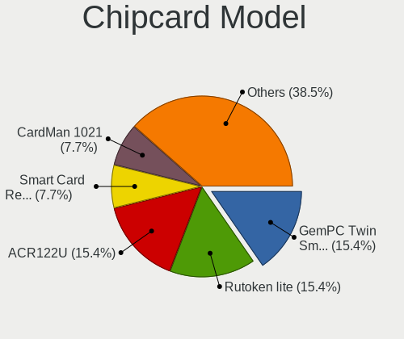

Linux - Hardware Trends (Desktops)
----------------------------------

A project to identify most popular hardware characteristics and track their change
over time based on data collected by Linux users at https://Linux-Hardware.org.

Anyone can contribute to this report by the [hw-probe](https://github.com/linuxhw/hw-probe) tool:

    sudo -E hw-probe -all -upload

This report is for one last month. Overall report since the beginning of time: [TestDays](https://github.com/linuxhw/TestDays)

Period: Nov, 2023.

Contents
--------

* [ System ](#system)
  - [ OS                       ](#os)
  - [ OS Family                ](#os-family)
  - [ Kernel                   ](#kernel)
  - [ Kernel Family            ](#kernel-family)
  - [ Kernel Major Ver.        ](#kernel-major-ver)
  - [ Arch                     ](#arch)
  - [ DE                       ](#de)
  - [ Display Server           ](#display-server)
  - [ Display Manager          ](#display-manager)
  - [ OS Lang                  ](#os-lang)
  - [ Boot Mode                ](#boot-mode)
  - [ Filesystem               ](#filesystem)
  - [ Part. scheme             ](#part-scheme)
  - [ Dual Boot with Linux/BSD ](#dual-boot-with-linuxbsd)
  - [ Dual Boot (Win)          ](#dual-boot-win)

* [ Board ](#board)
  - [ Vendor                   ](#vendor)
  - [ Model                    ](#model)
  - [ Model Family             ](#model-family)
  - [ MFG Year                 ](#mfg-year)
  - [ Form Factor              ](#form-factor)
  - [ Secure Boot              ](#secure-boot)
  - [ Coreboot                 ](#coreboot)
  - [ RAM Size                 ](#ram-size)
  - [ RAM Used                 ](#ram-used)
  - [ Total Drives             ](#total-drives)
  - [ Has CD-ROM               ](#has-cd-rom)
  - [ Has Ethernet             ](#has-ethernet)
  - [ Has WiFi                 ](#has-wifi)
  - [ Has Bluetooth            ](#has-bluetooth)

* [ Location ](#location)
  - [ Country                  ](#country)
  - [ City                     ](#city)

* [ Drives ](#drives)
  - [ Drive Vendor             ](#drive-vendor)
  - [ Drive Model              ](#drive-model)
  - [ HDD Vendor               ](#hdd-vendor)
  - [ SSD Vendor               ](#ssd-vendor)
  - [ Drive Kind               ](#drive-kind)
  - [ Drive Connector          ](#drive-connector)
  - [ Drive Size               ](#drive-size)
  - [ Space Total              ](#space-total)
  - [ Space Used               ](#space-used)
  - [ Malfunc. Drives          ](#malfunc-drives)
  - [ Malfunc. Drive Vendor    ](#malfunc-drive-vendor)
  - [ Malfunc. HDD Vendor      ](#malfunc-hdd-vendor)
  - [ Malfunc. Drive Kind      ](#malfunc-drive-kind)
  - [ Failed Drives            ](#failed-drives)
  - [ Failed Drive Vendor      ](#failed-drive-vendor)
  - [ Drive Status             ](#drive-status)

* [ Storage controller ](#storage-controller)
  - [ Storage Vendor           ](#storage-vendor)
  - [ Storage Model            ](#storage-model)
  - [ Storage Kind             ](#storage-kind)

* [ Processor ](#processor)
  - [ CPU Vendor               ](#cpu-vendor)
  - [ CPU Model                ](#cpu-model)
  - [ CPU Model Family         ](#cpu-model-family)
  - [ CPU Cores                ](#cpu-cores)
  - [ CPU Sockets              ](#cpu-sockets)
  - [ CPU Threads              ](#cpu-threads)
  - [ CPU Op-Modes             ](#cpu-op-modes)
  - [ CPU Microcode            ](#cpu-microcode)
  - [ CPU Microarch            ](#cpu-microarch)

* [ Graphics ](#graphics)
  - [ GPU Vendor               ](#gpu-vendor)
  - [ GPU Model                ](#gpu-model)
  - [ GPU Combo                ](#gpu-combo)
  - [ GPU Driver               ](#gpu-driver)
  - [ GPU Memory               ](#gpu-memory)

* [ Monitor ](#monitor)
  - [ Monitor Vendor           ](#monitor-vendor)
  - [ Monitor Model            ](#monitor-model)
  - [ Monitor Resolution       ](#monitor-resolution)
  - [ Monitor Diagonal         ](#monitor-diagonal)
  - [ Monitor Width            ](#monitor-width)
  - [ Aspect Ratio             ](#aspect-ratio)
  - [ Monitor Area             ](#monitor-area)
  - [ Pixel Density            ](#pixel-density)
  - [ Multiple Monitors        ](#multiple-monitors)

* [ Network ](#network)
  - [ Net Controller Vendor    ](#net-controller-vendor)
  - [ Net Controller Model     ](#net-controller-model)
  - [ Wireless Vendor          ](#wireless-vendor)
  - [ Wireless Model           ](#wireless-model)
  - [ Ethernet Vendor          ](#ethernet-vendor)
  - [ Ethernet Model           ](#ethernet-model)
  - [ Net Controller Kind      ](#net-controller-kind)
  - [ Used Controller          ](#used-controller)
  - [ NICs                     ](#nics)
  - [ IPv6                     ](#ipv6)

* [ Bluetooth ](#bluetooth)
  - [ Bluetooth Vendor         ](#bluetooth-vendor)
  - [ Bluetooth Model          ](#bluetooth-model)

* [ Sound ](#sound)
  - [ Sound Vendor             ](#sound-vendor)
  - [ Sound Model              ](#sound-model)

* [ Memory ](#memory)
  - [ Memory Vendor            ](#memory-vendor)
  - [ Memory Model             ](#memory-model)
  - [ Memory Kind              ](#memory-kind)
  - [ Memory Form Factor       ](#memory-form-factor)
  - [ Memory Size              ](#memory-size)
  - [ Memory Speed             ](#memory-speed)

* [ Printers & scanners ](#printers--scanners)
  - [ Printer Vendor           ](#printer-vendor)
  - [ Printer Model            ](#printer-model)
  - [ Scanner Vendor           ](#scanner-vendor)
  - [ Scanner Model            ](#scanner-model)

* [ Camera ](#camera)
  - [ Camera Vendor            ](#camera-vendor)
  - [ Camera Model             ](#camera-model)

* [ Security ](#security)
  - [ Fingerprint Vendor       ](#fingerprint-vendor)
  - [ Fingerprint Model        ](#fingerprint-model)
  - [ Chipcard Vendor          ](#chipcard-vendor)
  - [ Chipcard Model           ](#chipcard-model)

* [ Unsupported ](#unsupported)
  - [ Unsupported Devices      ](#unsupported-devices)
  - [ Unsupported Device Types ](#unsupported-device-types)

System
------

OS
--

Installed operating systems

| Name                         | Desktops | Percent |
|------------------------------|----------|---------|
| Ubuntu 22.04                 | 286      | 12.25%  |
| Linux Mint 21.2              | 189      | 8.09%   |
| Debian 12                    | 139      | 5.95%   |
| Fedora 39                    | 125      | 5.35%   |
| Arch Rolling                 | 113      | 4.84%   |
| OpenMandriva 5.0             | 110      | 4.71%   |
| OpenMandriva 23.08           | 97       | 4.15%   |
| Ubuntu 23.10                 | 79       | 3.38%   |
| ROSA 12.4                    | 72       | 3.08%   |
| Pop!_OS 22.04                | 71       | 3.04%   |
| Fedora 38                    | 55       | 2.36%   |
| Ubuntu 20.04                 | 46       | 1.97%   |
| Zorin 16                     | 45       | 1.93%   |
| ArcoLinux Rolling            | 45       | 1.93%   |
| OpenMandriva 23.11           | 39       | 1.67%   |
| openSUSE Tumbleweed-XXXXXXXX | 33       | 1.41%   |
| BlackPanther 18.1            | 33       | 1.41%   |
| Debian 11                    | 32       | 1.37%   |
| Kubuntu 22.04                | 30       | 1.28%   |
| Manjaro                      | 28       | 1.2%    |
| Kubuntu 23.10                | 26       | 1.11%   |
| Nobara 38                    | 25       | 1.07%   |
| KDE neon 22.04               | 25       | 1.07%   |
| Gentoo 2.14                  | 25       | 1.07%   |
| EndeavourOS Rolling          | 23       | 0.99%   |
| Ubuntu 23.04                 | 22       | 0.94%   |
| Red OS 7.3                   | 20       | 0.86%   |
| LMDE 6                       | 18       | 0.77%   |
| ChimeraOS 44-1               | 18       | 0.77%   |
| Linux Mint 20.3              | 17       | 0.73%   |
| Debian                       | 17       | 0.73%   |
| openSUSE Leap-15.5           | 16       | 0.69%   |
| Linux Mint 21.1              | 14       | 0.6%    |
| Xero Rolling                 | 13       | 0.56%   |
| OpenMandriva 4.3             | 13       | 0.56%   |
| OpenMandriva 23.03           | 13       | 0.56%   |
| Elementary 7.1               | 13       | 0.56%   |
| ROSA 12                      | 12       | 0.51%   |
| Xubuntu 22.04                | 11       | 0.47%   |
| Manjaro 23.1.0               | 11       | 0.47%   |

OS Family
---------

OS without a version

| Name          | Desktops | Percent |
|---------------|----------|---------|
| Ubuntu        | 452      | 19.36%  |
| OpenMandriva  | 302      | 12.93%  |
| Linux Mint    | 239      | 10.24%  |
| Debian        | 191      | 8.18%   |
| Fedora        | 183      | 7.84%   |
| Arch          | 113      | 4.84%   |
| ROSA          | 96       | 4.11%   |
| Pop!_OS       | 71       | 3.04%   |
| Kubuntu       | 60       | 2.57%   |
| openSUSE      | 53       | 2.27%   |
| Zorin         | 47       | 2.01%   |
| Manjaro       | 46       | 1.97%   |
| ArcoLinux     | 45       | 1.93%   |
| BlackPanther  | 41       | 1.76%   |
| Xubuntu       | 29       | 1.24%   |
| Nobara        | 27       | 1.16%   |
| KDE neon      | 25       | 1.07%   |
| Gentoo        | 25       | 1.07%   |
| Red OS        | 23       | 0.99%   |
| EndeavourOS   | 23       | 0.99%   |
| ALT Linux     | 22       | 0.94%   |
| LMDE          | 21       | 0.9%    |
| ChimeraOS     | 18       | 0.77%   |
| Elementary    | 15       | 0.64%   |
| Kali          | 14       | 0.6%    |
| Xero          | 13       | 0.56%   |
| Ubuntu MATE   | 12       | 0.51%   |
| NixOS         | 12       | 0.51%   |
| MX            | 10       | 0.43%   |
| Garuda Linux  | 9        | 0.39%   |
| SteamOS       | 7        | 0.3%    |
| Rocky Linux   | 6        | 0.26%   |
| BigLinux      | 6        | 0.26%   |
| Alpine        | 5        | 0.21%   |
| Ubuntu Budgie | 4        | 0.17%   |
| Lubuntu       | 4        | 0.17%   |
| Atz           | 4        | 0.17%   |
| Void Linux    | 3        | 0.13%   |
| Ubuntu Unity  | 3        | 0.13%   |
| Parrot        | 3        | 0.13%   |

Kernel
------

Version of the Linux kernel

| Version                           | Desktops | Percent |
|-----------------------------------|----------|---------|
| 6.2.0-36-generic                  | 233      | 9.98%   |
| 5.15.0-88-generic                 | 153      | 6.55%   |
| 6.6.2-desktop-1omv2390            | 120      | 5.14%   |
| 6.1.0-13-amd64                    | 106      | 4.54%   |
| 6.4.11-desktop-1omv2390           | 91       | 3.9%    |
| 5.15.0-89-generic                 | 89       | 3.81%   |
| 6.5.0-10-generic                  | 74       | 3.17%   |
| 6.2.0-37-generic                  | 69       | 2.96%   |
| 6.5.6-76060506-generic            | 57       | 2.44%   |
| 6.6.1-arch1-1                     | 51       | 2.18%   |
| 6.5.11-300.fc39.x86_64            | 47       | 2.01%   |
| 6.1.58-generic-1rosa2021.1-x86_64 | 42       | 1.8%    |
| 6.5.9-arch2-1                     | 40       | 1.71%   |
| 6.5.12-300.fc39.x86_64            | 33       | 1.41%   |
| 6.6.2-arch1-1                     | 32       | 1.37%   |
| 6.5.0-13-generic                  | 26       | 1.11%   |
| 6.1.20-generic-2rosa2021.1-x86_64 | 22       | 0.94%   |
| 5.4.0-166-generic                 | 22       | 0.94%   |
| 5.15.0-87-generic                 | 19       | 0.81%   |
| 5.10.0-26-amd64                   | 19       | 0.81%   |
| 6.6.1-zen1-1-zen                  | 18       | 0.77%   |
| 6.5.6-chos1-chimeraos-1           | 18       | 0.77%   |
| 6.1.0-4-amd64                     | 18       | 0.77%   |
| 6.5.8-200.fc38.x86_64             | 17       | 0.73%   |
| 5.6.14-desktop-2bP                | 17       | 0.73%   |
| 6.5.9-1-default                   | 16       | 0.69%   |
| 5.19.0-38-generic                 | 16       | 0.69%   |
| 6.5.10-300.fc39.x86_64            | 15       | 0.64%   |
| 6.5.10-200.fc38.x86_64            | 15       | 0.64%   |
| 6.2.0-35-generic                  | 14       | 0.6%    |
| 5.15.0-76-generic                 | 14       | 0.6%    |
| 6.6.0-desktop-1omv2390            | 13       | 0.56%   |
| 6.4.8-desktop-2omv2390            | 13       | 0.56%   |
| 6.2.6-desktop-1omv2390            | 13       | 0.56%   |
| 6.2.0-26-generic                  | 13       | 0.56%   |
| 6.5.6-300.fc39.x86_64             | 12       | 0.51%   |
| 6.5.0-4-amd64                     | 12       | 0.51%   |
| 6.6.2-1-default                   | 11       | 0.47%   |
| 6.5.5-1-MANJARO                   | 11       | 0.47%   |
| 5.14.21-150500.55.36-default      | 11       | 0.47%   |

Kernel Family
-------------

Linux kernel without a distro release

| Version | Desktops | Percent |
|---------|----------|---------|
| 6.2.0   | 353      | 15.12%  |
| 5.15.0  | 324      | 13.88%  |
| 6.6.2   | 184      | 7.88%   |
| 6.1.0   | 156      | 6.68%   |
| 6.5.0   | 150      | 6.42%   |
| 6.6.1   | 102      | 4.37%   |
| 6.5.9   | 99       | 4.24%   |
| 6.4.11  | 91       | 3.9%    |
| 6.5.6   | 87       | 3.73%   |
| 6.5.11  | 63       | 2.7%    |
| 6.1.58  | 46       | 1.97%   |
| 5.4.0   | 43       | 1.84%   |
| 6.5.10  | 41       | 1.76%   |
| 6.6.0   | 39       | 1.67%   |
| 6.5.12  | 39       | 1.67%   |
| 5.19.0  | 29       | 1.24%   |
| 5.10.0  | 26       | 1.11%   |
| 6.5.8   | 25       | 1.07%   |
| 6.5.5   | 25       | 1.07%   |
| 6.1.20  | 22       | 0.94%   |
| 5.6.14  | 17       | 0.73%   |
| 5.14.21 | 17       | 0.73%   |
| 6.2.16  | 15       | 0.64%   |
| 6.4.8   | 14       | 0.6%    |
| 6.2.6   | 14       | 0.6%    |
| 6.1.57  | 14       | 0.6%    |
| 6.1.62  | 13       | 0.56%   |
| 4.15.0  | 13       | 0.56%   |
| 6.5.7   | 12       | 0.51%   |
| 6.1.52  | 12       | 0.51%   |
| 6.5.4   | 11       | 0.47%   |
| 6.1.61  | 11       | 0.47%   |
| 6.5.3   | 9        | 0.39%   |
| 6.4.10  | 9        | 0.39%   |
| 6.1.60  | 9        | 0.39%   |
| 5.16.7  | 7        | 0.3%    |
| 5.15.85 | 7        | 0.3%    |
| 5.14.0  | 7        | 0.3%    |
| 4.18.16 | 7        | 0.3%    |
| 6.7.0   | 6        | 0.26%   |

Kernel Major Ver.
-----------------

Linux kernel major version

| Version | Desktops | Percent |
|---------|----------|---------|
| 6.5     | 565      | 24.2%   |
| 6.2     | 384      | 16.45%  |
| 5.15    | 361      | 15.46%  |
| 6.6     | 331      | 14.18%  |
| 6.1     | 310      | 13.28%  |
| 6.4     | 127      | 5.44%   |
| 5.10    | 55       | 2.36%   |
| 5.4     | 46       | 1.97%   |
| 5.19    | 30       | 1.28%   |
| 5.14    | 24       | 1.03%   |
| 6.3     | 23       | 0.99%   |
| 5.6     | 17       | 0.73%   |
| 5.16    | 13       | 0.56%   |
| 4.15    | 13       | 0.56%   |
| 4.18    | 10       | 0.43%   |
| 6.7     | 6        | 0.26%   |
| 6.0     | 4        | 0.17%   |
| 5.8     | 3        | 0.13%   |
| 5.11    | 2        | 0.09%   |
| 4.9     | 2        | 0.09%   |
| 4.8     | 2        | 0.09%   |
| 3.10    | 2        | 0.09%   |
| 5.3     | 1        | 0.04%   |
| 5.13    | 1        | 0.04%   |
| 5.0     | 1        | 0.04%   |
| 4.20    | 1        | 0.04%   |
| 3.16    | 1        | 0.04%   |

Arch
----

OS architecture (x86_64, i586, etc.)

| Name        | Desktops | Percent |
|-------------|----------|---------|
| x86_64      | 2321     | 99.4%   |
| i686        | 10       | 0.43%   |
| loongarch64 | 2        | 0.09%   |
| e2k         | 1        | 0.04%   |
| armv7l      | 1        | 0.04%   |

DE
--

Desktop Environment

| Name                    | Desktops | Percent |
|-------------------------|----------|---------|
| GNOME                   | 804      | 34.43%  |
| KDE5                    | 743      | 31.82%  |
| X-Cinnamon              | 209      | 8.95%   |
| Unknown                 | 158      | 6.77%   |
| XFCE                    | 156      | 6.68%   |
| MATE                    | 85       | 3.64%   |
| LXQt                    | 41       | 1.76%   |
| Cinnamon                | 37       | 1.58%   |
| i3                      | 16       | 0.69%   |
| Pantheon                | 15       | 0.64%   |
| Hyprland                | 12       | 0.51%   |
| Budgie                  | 10       | 0.43%   |
| sway                    | 6        | 0.26%   |
| KDE                     | 5        | 0.21%   |
| LXDE                    | 4        | 0.17%   |
| KDE4                    | 4        | 0.17%   |
| GNOME Flashback         | 4        | 0.17%   |
| Deepin                  | 4        | 0.17%   |
| Unity                   | 3        | 0.13%   |
| openbox                 | 2        | 0.09%   |
| DDE                     | 2        | 0.09%   |
| X-Generic               | 1        | 0.04%   |
| wlroots                 | 1        | 0.04%   |
| Wayfire:wayfire:wlroots | 1        | 0.04%   |
| Trinity                 | 1        | 0.04%   |
| none+awesome            | 1        | 0.04%   |
| lightdm-xsession        | 1        | 0.04%   |
| LeftWM                  | 1        | 0.04%   |
| KDE6                    | 1        | 0.04%   |
| GNOME Classic           | 1        | 0.04%   |
| Enlightenment           | 1        | 0.04%   |
| e16-session             | 1        | 0.04%   |
| dwm                     | 1        | 0.04%   |
| chadwm                  | 1        | 0.04%   |
| BunsenLabs              | 1        | 0.04%   |
| bspwm                   | 1        | 0.04%   |

Display Server
--------------

X11 or Wayland

| Name    | Desktops | Percent |
|---------|----------|---------|
| X11     | 1323     | 56.66%  |
| Wayland | 814      | 34.86%  |
| Tty     | 116      | 4.97%   |
| Unknown | 82       | 3.51%   |

Display Manager
---------------

SDDM, LightDM, etc.

| Name    | Desktops | Percent |
|---------|----------|---------|
| Unknown | 809      | 34.65%  |
| SDDM    | 639      | 27.37%  |
| GDM3    | 401      | 17.17%  |
| LightDM | 297      | 12.72%  |
| GDM     | 174      | 7.45%   |
| LY-DM   | 4        | 0.17%   |
| KDM     | 4        | 0.17%   |
| LXDM    | 3        | 0.13%   |
| NODM    | 2        | 0.09%   |
| WDM     | 1        | 0.04%   |
| LDM     | 1        | 0.04%   |

OS Lang
-------

Language

| Lang    | Desktops | Percent |
|---------|----------|---------|
| en_US   | 958      | 41.03%  |
| ru_RU   | 225      | 9.64%   |
| de_DE   | 201      | 8.61%   |
| en_GB   | 110      | 4.71%   |
| it_IT   | 96       | 4.11%   |
| fr_FR   | 93       | 3.98%   |
| pt_BR   | 87       | 3.73%   |
| Unknown | 68       | 2.91%   |
| C       | 60       | 2.57%   |
| es_ES   | 51       | 2.18%   |
| en_AU   | 48       | 2.06%   |
| pl_PL   | 46       | 1.97%   |
| en_CA   | 44       | 1.88%   |
| es_AR   | 16       | 0.69%   |
| es_MX   | 13       | 0.56%   |
| en_IN   | 13       | 0.56%   |
| hu_HU   | 12       | 0.51%   |
| zh_CN   | 11       | 0.47%   |
| pt_PT   | 11       | 0.47%   |
| nl_NL   | 10       | 0.43%   |
| ja_JP   | 9        | 0.39%   |
| en_ZA   | 9        | 0.39%   |
| fr_BE   | 8        | 0.34%   |
| fi_FI   | 7        | 0.3%    |
| es_VE   | 7        | 0.3%    |
| de_AT   | 7        | 0.3%    |
| da_DK   | 7        | 0.3%    |
| zh_TW   | 6        | 0.26%   |
| sk_SK   | 6        | 0.26%   |
| es_CO   | 6        | 0.26%   |
| en_NZ   | 6        | 0.26%   |
| en_IE   | 6        | 0.26%   |
| en_HK   | 6        | 0.26%   |
| de_CH   | 6        | 0.26%   |
| cs_CZ   | 5        | 0.21%   |
| tr_TR   | 4        | 0.17%   |
| ko_KR   | 4        | 0.17%   |
| fr_CA   | 4        | 0.17%   |
| sv_SE   | 3        | 0.13%   |
| sl_SI   | 3        | 0.13%   |

Boot Mode
---------

EFI or BIOS

| Mode | Desktops | Percent |
|------|----------|---------|
| BIOS | 1175     | 50.32%  |
| EFI  | 1160     | 49.68%  |

Filesystem
----------

Type of filesystem

| Type     | Desktops | Percent |
|----------|----------|---------|
| Ext4     | 1292     | 55.33%  |
| Btrfs    | 394      | 16.87%  |
| Tmpfs    | 339      | 14.52%  |
| Overlay  | 232      | 9.94%   |
| Xfs      | 40       | 1.71%   |
| F2fs     | 14       | 0.6%    |
| Zfs      | 11       | 0.47%   |
| Ext3     | 3        | 0.13%   |
| Ext2     | 3        | 0.13%   |
| Aufs     | 2        | 0.09%   |
| XXXXX    | 1        | 0.04%   |
| Rootfs   | 1        | 0.04%   |
| Reiserfs | 1        | 0.04%   |
| Fake     | 1        | 0.04%   |
| Unknown  | 1        | 0.04%   |

Part. scheme
------------

Scheme of partitioning

| Type    | Desktops | Percent |
|---------|----------|---------|
| GPT     | 1347     | 57.69%  |
| Unknown | 682      | 29.21%  |
| MBR     | 306      | 13.1%   |

Dual Boot with Linux/BSD
------------------------

Hosting more than one Linux/BSD

| Dual boot | Desktops | Percent |
|-----------|----------|---------|
| No        | 1807     | 77.39%  |
| Yes       | 528      | 22.61%  |

Dual Boot (Win)
---------------

Hosting Linux and Windows

| Dual boot | Desktops | Percent |
|-----------|----------|---------|
| No        | 1598     | 68.44%  |
| Yes       | 737      | 31.56%  |

Board
-----

Vendor
------

Motherboard manufacturer

| Name                                 | Desktops | Percent |
|--------------------------------------|----------|---------|
| ASUSTek Computer                     | 576      | 24.67%  |
| Gigabyte Technology                  | 395      | 16.92%  |
| MSI                                  | 292      | 12.51%  |
| ASRock                               | 200      | 8.57%   |
| Dell                                 | 195      | 8.35%   |
| Hewlett-Packard                      | 187      | 8.01%   |
| Lenovo                               | 76       | 3.25%   |
| Intel                                | 52       | 2.23%   |
| Unknown                              | 41       | 1.76%   |
| Acer                                 | 34       | 1.46%   |
| Fujitsu                              | 32       | 1.37%   |
| AZW                                  | 20       | 0.86%   |
| Pegatron                             | 18       | 0.77%   |
| Supermicro                           | 17       | 0.73%   |
| Foxconn                              | 17       | 0.73%   |
| Medion                               | 13       | 0.56%   |
| ECS                                  | 13       | 0.56%   |
| Shenzhen Meigao Electronic Equipment | 11       | 0.47%   |
| Apple                                | 10       | 0.43%   |
| Biostar                              | 9        | 0.39%   |
| Huanan                               | 8        | 0.34%   |
| BESSTAR Tech                         | 7        | 0.3%    |
| Inventec                             | 6        | 0.26%   |
| Shuttle                              | 5        | 0.21%   |
| MACHINIST                            | 5        | 0.21%   |
| eMachines                            | 5        | 0.21%   |
| Positivo                             | 4        | 0.17%   |
| HC Technology.                       | 4        | 0.17%   |
| Gateway                              | 4        | 0.17%   |
| AMI                                  | 4        | 0.17%   |
| Alienware                            | 4        | 0.17%   |
| Semp Toshiba                         | 3        | 0.13%   |
| NZXT                                 | 3        | 0.13%   |
| Google                               | 3        | 0.13%   |
| Red Hat                              | 2        | 0.09%   |
| ONDA                                 | 2        | 0.09%   |
| MouseComputer                        | 2        | 0.09%   |
| Minix                                | 2        | 0.09%   |
| Loongson                             | 2        | 0.09%   |
| HPE                                  | 2        | 0.09%   |

Model
-----

Motherboard model

| Name                               | Desktops | Percent |
|------------------------------------|----------|---------|
| Unknown                            | 41       | 1.76%   |
| ASUS All Series                    | 39       | 1.67%   |
| MSI MS-7C91                        | 15       | 0.64%   |
| MSI MS-7C37                        | 13       | 0.56%   |
| MSI MS-7C56                        | 12       | 0.51%   |
| Gigabyte B450M DS3H                | 11       | 0.47%   |
| ASUS TUF Gaming X570-PLUS          | 11       | 0.47%   |
| ASUS PRIME A320M-K                 | 11       | 0.47%   |
| MSI MS-7C52                        | 9        | 0.39%   |
| MSI MS-7B86                        | 9        | 0.39%   |
| MSI MS-7B79                        | 9        | 0.39%   |
| MSI MS-7721                        | 9        | 0.39%   |
| Dell OptiPlex 780                  | 9        | 0.39%   |
| MSI MS-7C95                        | 8        | 0.34%   |
| MSI MS-7B89                        | 8        | 0.34%   |
| Gigabyte A320M-S2H                 | 8        | 0.34%   |
| Dell OptiPlex 3020                 | 8        | 0.34%   |
| MSI MS-7D75                        | 7        | 0.3%    |
| MSI MS-7C02                        | 7        | 0.3%    |
| Intel SKYBAY                       | 7        | 0.3%    |
| Intel H61                          | 7        | 0.3%    |
| HP Compaq 8200 Elite SFF PC        | 7        | 0.3%    |
| Dell OptiPlex 790                  | 7        | 0.3%    |
| Dell OptiPlex 7040                 | 7        | 0.3%    |
| Dell OptiPlex 3060                 | 7        | 0.3%    |
| AZW MINI S                         | 7        | 0.3%    |
| ASUS TUF Gaming B550M-PLUS         | 7        | 0.3%    |
| ASUS TUF B450M-PLUS GAMING         | 7        | 0.3%    |
| ASUS ROG STRIX X670E-E GAMING WIFI | 7        | 0.3%    |
| ASUS ROG STRIX B450-F GAMING       | 7        | 0.3%    |
| ASUS PRIME X570-PRO                | 7        | 0.3%    |
| ASUS M5A97 R2.0                    | 7        | 0.3%    |
| Intel X99                          | 6        | 0.26%   |
| HP EliteDesk 800 G2 SFF            | 6        | 0.26%   |
| HP Compaq Pro 6300 SFF             | 6        | 0.26%   |
| Gigabyte H61M-S1                   | 6        | 0.26%   |
| Gigabyte B550I AORUS PRO AX        | 6        | 0.26%   |
| Dell OptiPlex 990                  | 6        | 0.26%   |
| Dell OptiPlex 9020                 | 6        | 0.26%   |
| Dell OptiPlex 7010                 | 6        | 0.26%   |

Model Family
------------

Motherboard model prefix

| Name                | Desktops | Percent |
|---------------------|----------|---------|
| ASUS PRIME          | 134      | 5.74%   |
| Dell OptiPlex       | 118      | 5.05%   |
| ASUS ROG            | 103      | 4.41%   |
| ASUS TUF            | 81       | 3.47%   |
| HP Compaq           | 47       | 2.01%   |
| Lenovo ThinkCentre  | 43       | 1.84%   |
| Unknown             | 41       | 1.76%   |
| ASUS All            | 39       | 1.67%   |
| HP EliteDesk        | 37       | 1.58%   |
| Dell Precision      | 27       | 1.16%   |
| Fujitsu ESPRIMO     | 25       | 1.07%   |
| Gigabyte X570       | 23       | 0.99%   |
| Gigabyte B450M      | 22       | 0.94%   |
| Dell Inspiron       | 21       | 0.9%    |
| HP ProDesk          | 18       | 0.77%   |
| Gigabyte B550M      | 18       | 0.77%   |
| ASRock B450         | 17       | 0.73%   |
| Gigabyte B550       | 16       | 0.69%   |
| Acer Aspire         | 16       | 0.69%   |
| MSI MS-7C91         | 15       | 0.64%   |
| Dell XPS            | 15       | 0.64%   |
| Lenovo IdeaCentre   | 14       | 0.6%    |
| MSI MS-7C37         | 13       | 0.56%   |
| Gigabyte B450       | 13       | 0.56%   |
| MSI MS-7C56         | 12       | 0.51%   |
| HP Pavilion         | 12       | 0.51%   |
| ASUS M5A97          | 12       | 0.51%   |
| Gigabyte A320M-S2H  | 10       | 0.43%   |
| Dell Vostro         | 10       | 0.43%   |
| ASRock X570         | 10       | 0.43%   |
| ASRock B550M        | 10       | 0.43%   |
| ASRock B450M        | 10       | 0.43%   |
| MSI MS-7C52         | 9        | 0.39%   |
| MSI MS-7B86         | 9        | 0.39%   |
| MSI MS-7B79         | 9        | 0.39%   |
| MSI MS-7721         | 9        | 0.39%   |
| Lenovo ThinkStation | 9        | 0.39%   |
| Intel H61           | 9        | 0.39%   |
| HP ProLiant         | 9        | 0.39%   |
| Gigabyte Z390       | 9        | 0.39%   |

MFG Year
--------

Motherboard manufacture year

| Year    | Desktops | Percent |
|---------|----------|---------|
| 2020    | 246      | 10.54%  |
| 2018    | 229      | 9.81%   |
| 2022    | 190      | 8.14%   |
| 2019    | 183      | 7.84%   |
| 2012    | 182      | 7.79%   |
| 2021    | 174      | 7.45%   |
| 2017    | 156      | 6.68%   |
| 2013    | 152      | 6.51%   |
| 2014    | 135      | 5.78%   |
| 2011    | 126      | 5.4%    |
| 2023    | 109      | 4.67%   |
| 2015    | 102      | 4.37%   |
| 2010    | 98       | 4.2%    |
| 2016    | 78       | 3.34%   |
| 2009    | 69       | 2.96%   |
| 2008    | 46       | 1.97%   |
| 2007    | 36       | 1.54%   |
| 2006    | 14       | 0.6%    |
| Unknown | 5        | 0.21%   |
| 2005    | 3        | 0.13%   |
| 2004    | 1        | 0.04%   |
| 2001    | 1        | 0.04%   |

Form Factor
-----------

Physical design of the computer

| Name    | Desktops | Percent |
|---------|----------|---------|
| Desktop | 2335     | 100%    |

Secure Boot
-----------

Enabled or disabled

| State    | Desktops | Percent |
|----------|----------|---------|
| Disabled | 2263     | 96.92%  |
| Enabled  | 72       | 3.08%   |

Coreboot
--------

Have coreboot on board

| Used | Desktops | Percent |
|------|----------|---------|
| No   | 2332     | 99.87%  |
| Yes  | 3        | 0.13%   |

RAM Size
--------

Total RAM memory

| Size in GB      | Desktops | Percent |
|-----------------|----------|---------|
| 16.01-24.0      | 574      | 24.58%  |
| 32.01-64.0      | 481      | 20.6%   |
| 4.01-8.0        | 364      | 15.59%  |
| 8.01-16.0       | 349      | 14.95%  |
| 3.01-4.0        | 219      | 9.38%   |
| 64.01-256.0     | 219      | 9.38%   |
| 24.01-32.0      | 87       | 3.73%   |
| 1.01-2.0        | 18       | 0.77%   |
| 2.01-3.0        | 14       | 0.6%    |
| More than 256.0 | 7        | 0.3%    |
| 0.51-1.0        | 3        | 0.13%   |

RAM Used
--------

Used RAM memory

| Used GB     | Desktops | Percent |
|-------------|----------|---------|
| 1.01-2.0    | 612      | 26.21%  |
| 2.01-3.0    | 542      | 23.21%  |
| 4.01-8.0    | 474      | 20.3%   |
| 3.01-4.0    | 339      | 14.52%  |
| 8.01-16.0   | 149      | 6.38%   |
| 0.51-1.0    | 123      | 5.27%   |
| 16.01-24.0  | 41       | 1.76%   |
| 0.01-0.5    | 27       | 1.16%   |
| 24.01-32.0  | 14       | 0.6%    |
| 32.01-64.0  | 10       | 0.43%   |
| 64.01-256.0 | 3        | 0.13%   |
| Unknown     | 1        | 0.04%   |

Total Drives
------------

Number of drives on board

| Drives | Desktops | Percent |
|--------|----------|---------|
| 1      | 851      | 36.45%  |
| 2      | 634      | 27.15%  |
| 3      | 383      | 16.4%   |
| 4      | 215      | 9.21%   |
| 5      | 109      | 4.67%   |
| 6      | 61       | 2.61%   |
| 7      | 24       | 1.03%   |
| 0      | 21       | 0.9%    |
| 8      | 14       | 0.6%    |
| 9      | 11       | 0.47%   |
| 11     | 3        | 0.13%   |
| 10     | 3        | 0.13%   |
| 12     | 2        | 0.09%   |
| 31     | 1        | 0.04%   |
| 27     | 1        | 0.04%   |
| 14     | 1        | 0.04%   |
| 13     | 1        | 0.04%   |

Has CD-ROM
----------

Has CD-ROM on board

| Presented | Desktops | Percent |
|-----------|----------|---------|
| No        | 1484     | 63.55%  |
| Yes       | 851      | 36.45%  |

Has Ethernet
------------

Has Ethernet on board

| Presented | Desktops | Percent |
|-----------|----------|---------|
| Yes       | 2308     | 98.84%  |
| No        | 27       | 1.16%   |

Has WiFi
--------

Has WiFi module

| Presented | Desktops | Percent |
|-----------|----------|---------|
| No        | 1205     | 51.61%  |
| Yes       | 1130     | 48.39%  |

Has Bluetooth
-------------

Has Bluetooth module

| Presented | Desktops | Percent |
|-----------|----------|---------|
| No        | 1372     | 58.76%  |
| Yes       | 963      | 41.24%  |

Location
--------

Country
-------

Geographic location (country)

| Country      | Desktops | Percent |
|--------------|----------|---------|
| USA          | 456      | 19.53%  |
| Russia       | 271      | 11.61%  |
| Germany      | 252      | 10.79%  |
| Italy        | 125      | 5.35%   |
| Brazil       | 114      | 4.88%   |
| France       | 101      | 4.33%   |
| UK           | 97       | 4.15%   |
| Spain        | 70       | 3%      |
| Canada       | 68       | 2.91%   |
| Poland       | 66       | 2.83%   |
| Australia    | 58       | 2.48%   |
| Hungary      | 56       | 2.4%    |
| Mexico       | 30       | 1.28%   |
| Netherlands  | 29       | 1.24%   |
| China        | 28       | 1.2%    |
| Sweden       | 27       | 1.16%   |
| Belgium      | 26       | 1.11%   |
| Argentina    | 24       | 1.03%   |
| Switzerland  | 22       | 0.94%   |
| India        | 21       | 0.9%    |
| Austria      | 20       | 0.86%   |
| Portugal     | 19       | 0.81%   |
| Greece       | 18       | 0.77%   |
| South Africa | 15       | 0.64%   |
| Finland      | 15       | 0.64%   |
| Slovakia     | 14       | 0.6%    |
| Romania      | 14       | 0.6%    |
| Norway       | 14       | 0.6%    |
| Turkey       | 13       | 0.56%   |
| Japan        | 13       | 0.56%   |
| Denmark      | 13       | 0.56%   |
| Serbia       | 12       | 0.51%   |
| Taiwan       | 11       | 0.47%   |
| Hong Kong    | 11       | 0.47%   |
| New Zealand  | 9        | 0.39%   |
| Ireland      | 9        | 0.39%   |
| Czechia      | 9        | 0.39%   |
| Colombia     | 9        | 0.39%   |
| Venezuela    | 7        | 0.3%    |
| Thailand     | 7        | 0.3%    |

City
----

Geographic location (city)

| City              | Desktops | Percent |
|-------------------|----------|---------|
| Moscow            | 70       | 3%      |
| Sydney            | 30       | 1.28%   |
| St Petersburg     | 28       | 1.2%    |
| Voronezh          | 22       | 0.94%   |
| Berlin            | 21       | 0.9%    |
| Rome              | 19       | 0.81%   |
| Warsaw            | 17       | 0.73%   |
| Paris             | 17       | 0.73%   |
| Budapest          | 15       | 0.64%   |
| Rio de Janeiro    | 14       | 0.6%    |
| Milan             | 12       | 0.51%   |
| Melbourne         | 12       | 0.51%   |
| Hamburg           | 12       | 0.51%   |
| Krakow            | 11       | 0.47%   |
| Central           | 11       | 0.47%   |
| Barcelona         | 11       | 0.47%   |
| Vienna            | 10       | 0.43%   |
| Athens            | 10       | 0.43%   |
| Toronto           | 9        | 0.39%   |
| Tijuana           | 9        | 0.39%   |
| Portland          | 9        | 0.39%   |
| Stockholm         | 8        | 0.34%   |
| Sao Paulo         | 8        | 0.34%   |
| Novy Urengoy      | 8        | 0.34%   |
| Novosibirsk       | 8        | 0.34%   |
| Madrid            | 8        | 0.34%   |
| Krasnodar         | 8        | 0.34%   |
| Beijing           | 8        | 0.34%   |
| Yekaterinburg     | 7        | 0.3%    |
| Cologne           | 7        | 0.3%    |
| Brussels          | 7        | 0.3%    |
| Brisbane          | 7        | 0.3%    |
| Valencia          | 6        | 0.26%   |
| Seattle           | 6        | 0.26%   |
| Rostov-on-Don     | 6        | 0.26%   |
| Los Angeles       | 6        | 0.26%   |
| Johannesburg      | 6        | 0.26%   |
| Frankfurt am Main | 6        | 0.26%   |
| Düsseldorf       | 6        | 0.26%   |
| Bengaluru         | 6        | 0.26%   |

Drives
------

Drive Vendor
------------

Hard drive vendors

| Vendor                      | Desktops | Drives | Percent |
|-----------------------------|----------|--------|---------|
| Samsung Electronics         | 679      | 991    | 15.39%  |
| WDC                         | 676      | 950    | 15.32%  |
| Seagate                     | 640      | 855    | 14.51%  |
| Kingston                    | 284      | 331    | 6.44%   |
| SanDisk                     | 251      | 287    | 5.69%   |
| Toshiba                     | 217      | 274    | 4.92%   |
| Crucial                     | 208      | 248    | 4.71%   |
| Hitachi                     | 102      | 118    | 2.31%   |
| China                       | 75       | 88     | 1.7%    |
| A-DATA Technology           | 73       | 82     | 1.65%   |
| Intel                       | 68       | 92     | 1.54%   |
| Phison Electronics          | 67       | 72     | 1.52%   |
| Micron/Crucial Technology   | 63       | 69     | 1.43%   |
| Unknown                     | 58       | 78     | 1.31%   |
| HGST                        | 50       | 60     | 1.13%   |
| PNY                         | 42       | 50     | 0.95%   |
| Kingston Technology Company | 38       | 40     | 0.86%   |
| SPCC                        | 35       | 39     | 0.79%   |
| Patriot                     | 33       | 35     | 0.75%   |
| SK hynix                    | 32       | 32     | 0.73%   |
| Silicon Motion              | 32       | 33     | 0.73%   |
| Micron Technology           | 30       | 30     | 0.68%   |
| MAXIO Technology (Hangzhou) | 29       | 30     | 0.66%   |
| Intenso                     | 29       | 31     | 0.66%   |
| ADATA Technology            | 27       | 31     | 0.61%   |
| GOODRAM                     | 26       | 29     | 0.59%   |
| Apacer                      | 23       | 24     | 0.52%   |
| Unknown                     | 22       | 23     | 0.5%    |
| Realtek Semiconductor       | 20       | 22     | 0.45%   |
| JMicron Technology          | 18       | 18     | 0.41%   |
| Transcend                   | 16       | 16     | 0.36%   |
| Fanxiang                    | 16       | 19     | 0.36%   |
| OCZ                         | 15       | 15     | 0.34%   |
| Netac                       | 15       | 17     | 0.34%   |
| Gigabyte Technology         | 15       | 15     | 0.34%   |
| Team                        | 14       | 15     | 0.32%   |
| Maxtor                      | 14       | 14     | 0.32%   |
| KIOXIA                      | 14       | 14     | 0.32%   |
| Hewlett-Packard             | 14       | 18     | 0.32%   |
| Lexar                       | 12       | 15     | 0.27%   |

Drive Model
-----------

Hard drive models

| Model                                                           | Desktops | Percent |
|-----------------------------------------------------------------|----------|---------|
| Samsung NVMe SSD Controller SM981/PM981/PM983 250GB             | 112      | 2.17%   |
| Kingston SA400S37240G 240GB SSD                                 | 68       | 1.32%   |
| Samsung NVMe SSD Controller PM9A1/PM9A3/980PRO 2TB              | 64       | 1.24%   |
| Kingston SA400S37480G 480GB SSD                                 | 54       | 1.05%   |
| Toshiba DT01ACA100 1TB                                          | 53       | 1.03%   |
| Seagate ST500DM002-1BD142 500GB                                 | 49       | 0.95%   |
| Seagate ST2000DM008-2FR102 2TB                                  | 47       | 0.91%   |
| Seagate ST1000DM010-2EP102 1TB                                  | 44       | 0.85%   |
| Samsung SSD 850 EVO 250GB                                       | 43       | 0.83%   |
| Micron/Crucial P2 NVMe PCIe SSD 1TB                             | 37       | 0.72%   |
| Crucial CT1000MX500SSD1 1TB                                     | 37       | 0.72%   |
| Samsung SSD 980 1TB                                             | 36       | 0.7%    |
| Samsung SSD 860 EVO 500GB                                       | 36       | 0.7%    |
| Crucial CT500MX500SSD1 500GB                                    | 34       | 0.66%   |
| WDC WD10EZEX-08WN4A0 1TB                                        | 32       | 0.62%   |
| Samsung SSD 860 EVO 1TB                                         | 31       | 0.6%    |
| Kingston SA400S37120G 120GB SSD                                 | 30       | 0.58%   |
| Seagate ST4000DM004-2CV104 4TB                                  | 27       | 0.52%   |
| Samsung SSD 850 EVO 500GB                                       | 27       | 0.52%   |
| Silicon Motion SM2263EN/SM2263XT SSD Controller 256GB           | 25       | 0.48%   |
| Seagate ST2000DM006-2DM164 2TB                                  | 23       | 0.45%   |
| Phison E12 NVMe Controller 512GB                                | 23       | 0.45%   |
| Seagate ST2000DM001-1ER164 2TB                                  | 22       | 0.43%   |
| Samsung SSD 870 EVO 1TB                                         | 22       | 0.43%   |
| Unknown                                                         | 22       | 0.43%   |
| Samsung SSD 860 EVO 250GB                                       | 21       | 0.41%   |
| Samsung SSD 870 QVO 1TB                                         | 20       | 0.39%   |
| Samsung NVMe SSD Controller SM961/PM961/SM963 256GB             | 20       | 0.39%   |
| ADATA XPG SX8200 Pro PCIe Gen3x4 M.2 2280 Solid State Drive 1TB | 20       | 0.39%   |
| Toshiba HDWD110 1TB                                             | 19       | 0.37%   |
| Samsung SSD 870 EVO 500GB                                       | 19       | 0.37%   |
| MAXIO (Hangzhou) NVMe SSD Controller MAP1202 1024GB             | 18       | 0.35%   |
| Crucial CT480BX500SSD1 480GB                                    | 18       | 0.35%   |
| Toshiba DT01ACA050 500GB                                        | 17       | 0.33%   |
| Seagate ST3500418AS 500GB                                       | 17       | 0.33%   |
| Seagate ST1000DM003-1CH162 1TB                                  | 17       | 0.33%   |
| Samsung SSD 990 PRO 2TB                                         | 17       | 0.33%   |
| Crucial CT240BX500SSD1 240GB                                    | 17       | 0.33%   |
| WDC WDS500G2B0A-00SM50 500GB SSD                                | 15       | 0.29%   |
| WDC WD20EZRZ-00Z5HB0 2TB                                        | 15       | 0.29%   |

HDD Vendor
----------

Hard disk drive vendors

| Vendor              | Desktops | Drives | Percent |
|---------------------|----------|--------|---------|
| Seagate             | 624      | 836    | 36.07%  |
| WDC                 | 591      | 808    | 34.16%  |
| Toshiba             | 197      | 253    | 11.39%  |
| Hitachi             | 102      | 118    | 5.9%    |
| Samsung Electronics | 82       | 93     | 4.74%   |
| HGST                | 50       | 60     | 2.89%   |
| Unknown             | 17       | 17     | 0.98%   |
| Maxtor              | 12       | 12     | 0.69%   |
| Fujitsu             | 10       | 10     | 0.58%   |
| Apple               | 5        | 5      | 0.29%   |
| ExcelStor           | 4        | 4      | 0.23%   |
| WD MediaMax         | 3        | 3      | 0.17%   |
| TO Exter            | 3        | 3      | 0.17%   |
| Intenso             | 3        | 3      | 0.17%   |
| Hewlett-Packard     | 3        | 3      | 0.17%   |
| Unknown             | 3        | 4      | 0.17%   |
| USB3.0              | 2        | 2      | 0.12%   |
| StoreJet            | 2        | 2      | 0.12%   |
| Inateck             | 2        | 2      | 0.12%   |
| HGST HTS            | 2        | 2      | 0.12%   |
| ASMT                | 2        | 2      | 0.12%   |
| USB                 | 1        | 1      | 0.06%   |
| TDAS                | 1        | 3      | 0.06%   |
| SABRENT             | 1        | 1      | 0.06%   |
| Mobius              | 1        | 2      | 0.06%   |
| JMicron Technology  | 1        | 1      | 0.06%   |
| IB-377U3            | 1        | 1      | 0.06%   |
| HPQ                 | 1        | 1      | 0.06%   |
| External            | 1        | 2      | 0.06%   |
| CIRAGO              | 1        | 1      | 0.06%   |
| ASMedia             | 1        | 1      | 0.06%   |
| ACASIS              | 1        | 2      | 0.06%   |

SSD Vendor
----------

Solid state drive vendors

| Vendor              | Desktops | Drives | Percent |
|---------------------|----------|--------|---------|
| Samsung Electronics | 357      | 471    | 22.33%  |
| Kingston            | 224      | 250    | 14.01%  |
| Crucial             | 178      | 203    | 11.13%  |
| WDC                 | 106      | 110    | 6.63%   |
| SanDisk             | 97       | 108    | 6.07%   |
| China               | 74       | 86     | 4.63%   |
| A-DATA Technology   | 54       | 57     | 3.38%   |
| PNY                 | 42       | 50     | 2.63%   |
| Intel               | 31       | 49     | 1.94%   |
| Patriot             | 30       | 32     | 1.88%   |
| SPCC                | 29       | 32     | 1.81%   |
| GOODRAM             | 25       | 28     | 1.56%   |
| Intenso             | 23       | 25     | 1.44%   |
| Apacer              | 21       | 22     | 1.31%   |
| OCZ                 | 15       | 15     | 0.94%   |
| Micron Technology   | 15       | 15     | 0.94%   |
| Team                | 13       | 14     | 0.81%   |
| Transcend           | 12       | 12     | 0.75%   |
| Toshiba             | 12       | 12     | 0.75%   |
| Fanxiang            | 12       | 15     | 0.75%   |
| Netac               | 9        | 10     | 0.56%   |
| LITEON              | 9        | 9      | 0.56%   |
| JMicron Technology  | 9        | 9      | 0.56%   |
| Gigabyte Technology | 9        | 9      | 0.56%   |
| Unknown             | 9        | 9      | 0.56%   |
| XrayDisk            | 8        | 8      | 0.5%    |
| Corsair             | 8        | 8      | 0.5%    |
| SK hynix            | 7        | 7      | 0.44%   |
| Lexar               | 7        | 8      | 0.44%   |
| KingSpec            | 6        | 6      | 0.38%   |
| Hewlett-Packard     | 6        | 7      | 0.38%   |
| AMD                 | 6        | 6      | 0.38%   |
| Plextor             | 5        | 5      | 0.31%   |
| ASMT                | 5        | 5      | 0.31%   |
| T-FORCE             | 4        | 4      | 0.25%   |
| Mushkin             | 4        | 4      | 0.25%   |
| Leven               | 4        | 9      | 0.25%   |
| Emtec               | 4        | 4      | 0.25%   |
| Verbatim            | 3        | 3      | 0.19%   |
| Timetec             | 3        | 4      | 0.19%   |

Drive Kind
----------

HDD or SSD

| Kind    | Desktops | Drives | Percent |
|---------|----------|--------|---------|
| HDD     | 1351     | 2258   | 36.28%  |
| SSD     | 1294     | 1850   | 34.75%  |
| NVMe    | 980      | 1335   | 26.32%  |
| Unknown | 87       | 110    | 2.34%   |
| MMC     | 12       | 14     | 0.32%   |

Drive Connector
---------------

SATA, SAS, NVMe, etc.

| Type | Desktops | Drives | Percent |
|------|----------|--------|---------|
| SATA | 1958     | 3965   | 62.22%  |
| NVMe | 974      | 1322   | 30.95%  |
| SAS  | 203      | 266    | 6.45%   |
| MMC  | 12       | 14     | 0.38%   |

Drive Size
----------

Size of hard drive

| Size in TB | Desktops | Drives | Percent |
|------------|----------|--------|---------|
| 0.01-0.5   | 1352     | 1899   | 45.74%  |
| 0.51-1.0   | 864      | 1147   | 29.23%  |
| 1.01-2.0   | 354      | 487    | 11.98%  |
| 3.01-4.0   | 166      | 251    | 5.62%   |
| 2.01-3.0   | 100      | 120    | 3.38%   |
| 4.01-10.0  | 92       | 160    | 3.11%   |
| 10.01-20.0 | 26       | 41     | 0.88%   |
| 20.01-50.0 | 2        | 3      | 0.07%   |

Space Total
-----------

Amount of disk space available on the file system

| Size in GB     | Desktops | Percent |
|----------------|----------|---------|
| 101-250        | 395      | 16.92%  |
| 251-500        | 390      | 16.7%   |
| More than 3000 | 377      | 16.15%  |
| 501-1000       | 361      | 15.46%  |
| 1001-2000      | 266      | 11.39%  |
| 1-20           | 161      | 6.9%    |
| 2001-3000      | 139      | 5.95%   |
| Unknown        | 111      | 4.75%   |
| 51-100         | 84       | 3.6%    |
| 21-50          | 51       | 2.18%   |

Space Used
----------

Amount of used disk space

| Used GB        | Desktops | Percent |
|----------------|----------|---------|
| 1-20           | 605      | 25.91%  |
| 21-50          | 321      | 13.75%  |
| 101-250        | 289      | 12.38%  |
| 51-100         | 224      | 9.59%   |
| 501-1000       | 209      | 8.95%   |
| 251-500        | 206      | 8.82%   |
| 1001-2000      | 160      | 6.85%   |
| More than 3000 | 140      | 6%      |
| Unknown        | 111      | 4.75%   |
| 2001-3000      | 65       | 2.78%   |
| 0              | 5        | 0.21%   |

Malfunc. Drives
---------------

Drive models with a malfunction

| Model                              | Desktops | Drives | Percent |
|------------------------------------|----------|--------|---------|
| Seagate ST500DM002-1BD142 500GB    | 12       | 12     | 3.05%   |
| Seagate ST3500418AS 500GB          | 7        | 8      | 1.78%   |
| Toshiba DT01ACA100 1TB             | 6        | 6      | 1.52%   |
| Seagate ST1000DM010-2EP102 1TB     | 6        | 6      | 1.52%   |
| WDC WD20EARS-00MVWB0 2TB           | 5        | 5      | 1.27%   |
| Toshiba DT01ACA050 500GB           | 4        | 4      | 1.02%   |
| Seagate ST9250315AS 250GB          | 4        | 4      | 1.02%   |
| Seagate ST1000LM024 HN-M101MBB 1TB | 4        | 4      | 1.02%   |
| WDC WD5000AAKX-60U6AA0 500GB       | 3        | 3      | 0.76%   |
| WDC WD5000AAKX-001CA0 500GB        | 3        | 3      | 0.76%   |
| WDC WD20EZRZ-00Z5HB0 2TB           | 3        | 3      | 0.76%   |
| WDC WD20EARX-00PASB0 2TB           | 3        | 3      | 0.76%   |
| WDC WD10JPVX-22JC3T0 1TB           | 3        | 3      | 0.76%   |
| WDC WD10EARS-00Y5B1 1TB            | 3        | 3      | 0.76%   |
| Seagate ST3250620AS 250GB          | 3        | 3      | 0.76%   |
| Seagate ST3250410AS 250GB          | 3        | 3      | 0.76%   |
| Samsung Electronics HD103UJ 1TB    | 3        | 4      | 0.76%   |
| Samsung Electronics HD103SI 1TB    | 3        | 3      | 0.76%   |
| Kingston SV300S37A120G 120GB SSD   | 3        | 3      | 0.76%   |
| Kingston SA400S37480G 480GB SSD    | 3        | 3      | 0.76%   |
| Kingston SA400S37120G 120GB SSD    | 3        | 3      | 0.76%   |
| Intel SSDSC2BB800G7 800GB          | 3        | 3      | 0.76%   |
| Hitachi HDS721010CLA332 1TB        | 3        | 3      | 0.76%   |
| A-DATA Technology SU630 240GB SSD  | 3        | 3      | 0.76%   |
| WDC WDS120G2G0A-00JH30 120GB SSD   | 2        | 2      | 0.51%   |
| WDC WD5000BEVT-22A0RT0 500GB       | 2        | 2      | 0.51%   |
| WDC WD5000AAKX-08U6AA0 500GB       | 2        | 2      | 0.51%   |
| WDC WD40PURZ-85TTDY0 4TB           | 2        | 3      | 0.51%   |
| WDC WD15EADS-22P8B0 1TB            | 2        | 2      | 0.51%   |
| WDC WD10EZEX-08WN4A0 1TB           | 2        | 2      | 0.51%   |
| Seagate ST500LT012-1DG142 500GB    | 2        | 2      | 0.51%   |
| Seagate ST500LM021-1KJ152 500GB    | 2        | 2      | 0.51%   |
| Seagate ST500DM009-2F110A 500GB    | 2        | 2      | 0.51%   |
| Seagate ST500DM002-1BC142 500GB    | 2        | 2      | 0.51%   |
| Seagate ST4000DM004-2CV104 4TB     | 2        | 3      | 0.51%   |
| Seagate ST4000DM000-1F2168 4TB     | 2        | 2      | 0.51%   |
| Seagate ST3500413AS 500GB          | 2        | 2      | 0.51%   |
| Seagate ST33000651NS 3TB           | 2        | 2      | 0.51%   |
| Seagate ST3250318AS 250GB          | 2        | 2      | 0.51%   |
| Seagate ST31000528AS 1TB           | 2        | 2      | 0.51%   |

Malfunc. Drive Vendor
---------------------

Vendors of faulty drives

| Vendor                | Desktops | Drives | Percent |
|-----------------------|----------|--------|---------|
| Seagate               | 107      | 118    | 28.23%  |
| WDC                   | 91       | 105    | 24.01%  |
| Samsung Electronics   | 36       | 47     | 9.5%    |
| Hitachi               | 25       | 27     | 6.6%    |
| Toshiba               | 15       | 16     | 3.96%   |
| Kingston              | 13       | 13     | 3.43%   |
| Intel                 | 13       | 18     | 3.43%   |
| SanDisk               | 11       | 11     | 2.9%    |
| A-DATA Technology     | 10       | 10     | 2.64%   |
| Crucial               | 7        | 8      | 1.85%   |
| Maxtor                | 6        | 6      | 1.58%   |
| China                 | 5        | 5      | 1.32%   |
| HGST                  | 4        | 4      | 1.06%   |
| WD MediaMax           | 3        | 3      | 0.79%   |
| Corsair               | 3        | 3      | 0.79%   |
| XrayDisk              | 2        | 2      | 0.53%   |
| Unknown               | 2        | 2      | 0.53%   |
| Realtek Semiconductor | 2        | 2      | 0.53%   |
| Fujitsu               | 2        | 2      | 0.53%   |
| Apple                 | 2        | 2      | 0.53%   |
| Transcend             | 1        | 1      | 0.26%   |
| StoreJet              | 1        | 1      | 0.26%   |
| SSSTC                 | 1        | 1      | 0.26%   |
| SK hynix              | 1        | 1      | 0.26%   |
| Silicon Motion        | 1        | 1      | 0.26%   |
| Ramsta                | 1        | 1      | 0.26%   |
| RADIUM                | 1        | 1      | 0.26%   |
| Plextor               | 1        | 1      | 0.26%   |
| Patriot               | 1        | 1      | 0.26%   |
| OCZ                   | 1        | 1      | 0.26%   |
| Netac                 | 1        | 1      | 0.26%   |
| Micron Technology     | 1        | 1      | 0.26%   |
| Intenso               | 1        | 1      | 0.26%   |
| HANCHU                | 1        | 1      | 0.26%   |
| GLOWAY                | 1        | 1      | 0.26%   |
| ExcelStor             | 1        | 1      | 0.26%   |
| Drevo                 | 1        | 1      | 0.26%   |
| ASMedia               | 1        | 1      | 0.26%   |
| ADATA Technology      | 1        | 1      | 0.26%   |
| Unknown               | 1        | 1      | 0.26%   |

Malfunc. HDD Vendor
-------------------

Vendors of faulty HDD drives

| Vendor              | Desktops | Drives | Percent |
|---------------------|----------|--------|---------|
| Seagate             | 107      | 118    | 38.91%  |
| WDC                 | 85       | 99     | 30.91%  |
| Hitachi             | 25       | 27     | 9.09%   |
| Samsung Electronics | 20       | 22     | 7.27%   |
| Toshiba             | 15       | 16     | 5.45%   |
| Maxtor              | 6        | 6      | 2.18%   |
| HGST                | 4        | 4      | 1.45%   |
| WD MediaMax         | 3        | 3      | 1.09%   |
| Unknown             | 2        | 2      | 0.73%   |
| Fujitsu             | 2        | 2      | 0.73%   |
| Apple               | 2        | 2      | 0.73%   |
| StoreJet            | 1        | 1      | 0.36%   |
| ExcelStor           | 1        | 1      | 0.36%   |
| ASMedia             | 1        | 1      | 0.36%   |
| Unknown             | 1        | 1      | 0.36%   |

Malfunc. Drive Kind
-------------------

Kinds of faulty drives

| Kind | Desktops | Drives | Percent |
|------|----------|--------|---------|
| HDD  | 250      | 305    | 70.82%  |
| SSD  | 88       | 104    | 24.93%  |
| NVMe | 15       | 15     | 4.25%   |

Failed Drives
-------------

Failed drive models

| Model                                       | Desktops | Drives | Percent |
|---------------------------------------------|----------|--------|---------|
| SK hynix BC501 NVMe Solid State Drive 512GB | 1        | 1      | 14.29%  |
| Samsung Electronics SSD 980 1TB             | 1        | 1      | 14.29%  |
| Samsung Electronics HD103SJ 1TB             | 1        | 1      | 14.29%  |
| Mushkin MKNSSDEC120GB                       | 1        | 1      | 14.29%  |
| Hitachi HUS724040ALE640 4TB                 | 1        | 1      | 14.29%  |
| Hitachi HDS721010DLE630 1TB                 | 1        | 2      | 14.29%  |
| HGST HTS541010A9E680 1TB                    | 1        | 1      | 14.29%  |

Failed Drive Vendor
-------------------

Failed drive vendors

| Vendor              | Desktops | Drives | Percent |
|---------------------|----------|--------|---------|
| Samsung Electronics | 2        | 2      | 28.57%  |
| Hitachi             | 2        | 3      | 28.57%  |
| SK hynix            | 1        | 1      | 14.29%  |
| Mushkin             | 1        | 1      | 14.29%  |
| HGST                | 1        | 1      | 14.29%  |

Drive Status
------------

Number of failed and malfunc. drives

| Status   | Desktops | Drives | Percent |
|----------|----------|--------|---------|
| Works    | 1184     | 2647   | 43.97%  |
| Detected | 1164     | 2488   | 43.22%  |
| Malfunc  | 338      | 424    | 12.55%  |
| Failed   | 7        | 8      | 0.26%   |

Storage controller
------------------

Storage Vendor
--------------

Storage controller vendors

| Vendor                       | Desktops | Percent |
|------------------------------|----------|---------|
| Intel                        | 1419     | 38.33%  |
| AMD                          | 859      | 23.2%   |
| Samsung Electronics          | 340      | 9.18%   |
| SanDisk                      | 189      | 5.11%   |
| ASMedia Technology           | 132      | 3.57%   |
| Kingston Technology Company  | 109      | 2.94%   |
| Micron/Crucial Technology    | 97       | 2.62%   |
| Phison Electronics           | 92       | 2.49%   |
| ADATA Technology             | 48       | 1.3%    |
| Silicon Motion               | 46       | 1.24%   |
| Marvell Technology Group     | 44       | 1.19%   |
| MAXIO Technology (Hangzhou)  | 43       | 1.16%   |
| JMicron Technology           | 43       | 1.16%   |
| Realtek Semiconductor        | 30       | 0.81%   |
| Nvidia                       | 27       | 0.73%   |
| SK hynix                     | 25       | 0.68%   |
| KIOXIA                       | 17       | 0.46%   |
| Broadcom / LSI               | 17       | 0.46%   |
| Micron Technology            | 16       | 0.43%   |
| Shenzhen Longsys Electronics | 14       | 0.38%   |
| VIA Technologies             | 12       | 0.32%   |
| Adaptec                      | 10       | 0.27%   |
| LSI Logic / Symbios Logic    | 9        | 0.24%   |
| Toshiba America Info Systems | 8        | 0.22%   |
| Yangtze Memory Technologies  | 5        | 0.14%   |
| Silicon Image                | 5        | 0.14%   |
| Solidigm                     | 4        | 0.11%   |
| Seagate Technology           | 4        | 0.11%   |
| Netac Technology             | 4        | 0.11%   |
| Lite-On Technology           | 4        | 0.11%   |
| INNOGRIT                     | 4        | 0.11%   |
| Nextorage                    | 3        | 0.08%   |
| Biwin Storage Technology     | 3        | 0.08%   |
| Transcend                    | 2        | 0.05%   |
| OCZ Technology Group         | 2        | 0.05%   |
| Loongson Technology          | 2        | 0.05%   |
| Hosin Global Electronics     | 2        | 0.05%   |
| Zhaoxin                      | 1        | 0.03%   |
| Union Memory (Shenzhen)      | 1        | 0.03%   |
| ULi Electronics              | 1        | 0.03%   |

Storage Model
-------------

Storage controller models

| Model                                                                                   | Desktops | Percent |
|-----------------------------------------------------------------------------------------|----------|---------|
| AMD FCH SATA Controller [AHCI mode]                                                     | 478      | 10.91%  |
| AMD 500 Series Chipset SATA Controller                                                  | 187      | 4.27%   |
| Intel 8 Series/C220 Series Chipset Family 6-port SATA Controller 1 [AHCI mode]          | 172      | 3.93%   |
| AMD 400 Series Chipset SATA Controller                                                  | 168      | 3.84%   |
| Samsung NVMe SSD Controller SM981/PM981/PM983                                           | 166      | 3.79%   |
| Intel Q170/Q150/B150/H170/H110/Z170/CM236 Chipset SATA Controller [AHCI Mode]           | 128      | 2.92%   |
| ASMedia ASM1062 Serial ATA Controller                                                   | 114      | 2.6%    |
| Intel 6 Series/C200 Series Chipset Family 6 port Desktop SATA AHCI Controller           | 110      | 2.51%   |
| Intel 200 Series PCH SATA controller [AHCI mode]                                        | 101      | 2.31%   |
| Samsung NVMe SSD Controller PM9A1/PM9A3/980PRO                                          | 86       | 1.96%   |
| Intel 7 Series/C210 Series Chipset Family 6-port SATA Controller [AHCI mode]            | 80       | 1.83%   |
| Intel Cannon Lake PCH SATA AHCI Controller                                              | 76       | 1.74%   |
| AMD SB7x0/SB8x0/SB9x0 IDE Controller                                                    | 73       | 1.67%   |
| Intel SATA Controller [RAID mode]                                                       | 65       | 1.48%   |
| AMD SB7x0/SB8x0/SB9x0 SATA Controller [AHCI mode]                                       | 63       | 1.44%   |
| Intel NM10/ICH7 Family SATA Controller [IDE mode]                                       | 61       | 1.39%   |
| Intel 500 Series Chipset Family SATA AHCI Controller                                    | 61       | 1.39%   |
| Samsung NVMe SSD Controller 980 (DRAM-less)                                             | 60       | 1.37%   |
| Micron/Crucial P2 [Nick P2] / P3 / P3 Plus NVMe PCIe SSD (DRAM-less)                    | 59       | 1.35%   |
| Intel Alder Lake-S PCH SATA Controller [AHCI Mode]                                      | 59       | 1.35%   |
| AMD SB7x0/SB8x0/SB9x0 SATA Controller [IDE mode]                                        | 53       | 1.21%   |
| Intel 6 Series/C200 Series Chipset Family Desktop SATA Controller (IDE mode, ports 4-5) | 51       | 1.16%   |
| Intel 6 Series/C200 Series Chipset Family Desktop SATA Controller (IDE mode, ports 0-3) | 51       | 1.16%   |
| Intel 700 Series Chipset Family SATA AHCI Controller                                    | 48       | 1.1%    |
| AMD FCH SATA Controller D                                                               | 47       | 1.07%   |
| Intel 82801G (ICH7 Family) IDE Controller                                               | 41       | 0.94%   |
| Silicon Motion SM2263EN/SM2263XT (DRAM-less) NVMe SSD Controllers                       | 39       | 0.89%   |
| Intel Comet Lake SATA AHCI Controller                                                   | 38       | 0.87%   |
| SanDisk Ultra 3D / WD Blue SN570 NVMe SSD (DRAM-less)                                   | 37       | 0.84%   |
| Intel 9 Series Chipset Family SATA Controller [AHCI Mode]                               | 34       | 0.78%   |
| Phison E12 NVMe Controller                                                              | 33       | 0.75%   |
| ADATA XPG SX8200 Pro PCIe Gen3x4 M.2 2280 Solid State Drive                             | 31       | 0.71%   |
| MAXIO (Hangzhou) NVMe SSD Controller MAP1202                                            | 30       | 0.68%   |
| Intel C610/X99 series chipset 6-Port SATA Controller [AHCI mode]                        | 30       | 0.68%   |
| AMD 300 Series Chipset SATA Controller                                                  | 30       | 0.68%   |
| Kingston Company KC3000/FURY Renegade NVMe SSD E18                                      | 29       | 0.66%   |
| SanDisk WD Black SN770 / PC SN740 256GB / PC SN560 (DRAM-less) NVMe SSD                 | 27       | 0.62%   |
| Samsung NVMe SSD Controller SM961/PM961/SM963                                           | 27       | 0.62%   |
| Samsung NVMe SSD Controller S4LV008[Pascal]                                             | 27       | 0.62%   |
| SanDisk Extreme Pro / WD Black SN750 / PC SN730 / Red SN700 NVMe SSD                    | 26       | 0.59%   |

Storage Kind
------------

Kind of storage controller (IDE, SATA, NVMe, SAS, ...)

| Kind | Desktops | Percent |
|------|----------|---------|
| SATA | 2002     | 56.83%  |
| NVMe | 975      | 27.68%  |
| IDE  | 361      | 10.25%  |
| RAID | 148      | 4.2%    |
| SAS  | 29       | 0.82%   |
| SCSI | 8        | 0.23%   |

Processor
---------

CPU Vendor
----------

Processor vendors

| Vendor       | Desktops | Percent |
|--------------|----------|---------|
| Intel        | 1433     | 61.37%  |
| AMD          | 895      | 38.33%  |
| Loongson     | 2        | 0.09%   |
| CentaurHauls | 2        | 0.09%   |
| iSH          | 1        | 0.04%   |
| EL2S4        | 1        | 0.04%   |
| ARM          | 1        | 0.04%   |

CPU Model
---------

Processor models

| Model                                       | Desktops | Percent |
|---------------------------------------------|----------|---------|
| AMD Ryzen 5 3600 6-Core Processor           | 53       | 2.27%   |
| AMD Ryzen 5 5600G with Radeon Graphics      | 44       | 1.88%   |
| AMD Ryzen 5 5600X 6-Core Processor          | 41       | 1.76%   |
| AMD Ryzen 9 5900X 12-Core Processor         | 34       | 1.46%   |
| Intel Core i5-3470 CPU @ 3.20GHz            | 31       | 1.33%   |
| AMD Ryzen 7 3700X 8-Core Processor          | 30       | 1.28%   |
| Intel Core i7-4790 CPU @ 3.60GHz            | 27       | 1.16%   |
| AMD Ryzen 7 5800X 8-Core Processor          | 26       | 1.11%   |
| Intel Core i5-2400 CPU @ 3.10GHz            | 24       | 1.03%   |
| AMD Ryzen 7 5700G with Radeon Graphics      | 23       | 0.99%   |
| Intel Core i7-6700 CPU @ 3.40GHz            | 22       | 0.94%   |
| Intel Core i7-3770 CPU @ 3.40GHz            | 22       | 0.94%   |
| Intel Core i7-2600 CPU @ 3.40GHz            | 22       | 0.94%   |
| Intel Core i5-6500 CPU @ 3.20GHz            | 20       | 0.86%   |
| AMD Ryzen 9 3900X 12-Core Processor         | 20       | 0.86%   |
| AMD Ryzen 9 5950X 16-Core Processor         | 19       | 0.81%   |
| AMD Ryzen 7 5700X 8-Core Processor          | 19       | 0.81%   |
| AMD Ryzen 5 3400G with Radeon Vega Graphics | 19       | 0.81%   |
| AMD Ryzen 5 2600 Six-Core Processor         | 19       | 0.81%   |
| Intel Core i5-4570 CPU @ 3.20GHz            | 18       | 0.77%   |
| Intel Core i3-2120 CPU @ 3.30GHz            | 18       | 0.77%   |
| Intel Core 2 Duo CPU E8400 @ 3.00GHz        | 18       | 0.77%   |
| AMD Ryzen 7 2700X Eight-Core Processor      | 18       | 0.77%   |
| AMD Ryzen 9 7950X 16-Core Processor         | 17       | 0.73%   |
| AMD Ryzen 5 5500                            | 17       | 0.73%   |
| Intel Core i7-8700 CPU @ 3.20GHz            | 16       | 0.69%   |
| AMD Ryzen 9 7900X 12-Core Processor         | 16       | 0.69%   |
| AMD Ryzen 3 3200G with Radeon Vega Graphics | 16       | 0.69%   |
| Intel Core i5-8400 CPU @ 2.80GHz            | 15       | 0.64%   |
| Intel Core i5-7500 CPU @ 3.40GHz            | 15       | 0.64%   |
| AMD FX-6300 Six-Core Processor              | 15       | 0.64%   |
| Intel Core i7-6700K CPU @ 4.00GHz           | 14       | 0.6%    |
| Intel Core i5-6400 CPU @ 2.70GHz            | 14       | 0.6%    |
| Intel Core i5-10400F CPU @ 2.90GHz          | 14       | 0.6%    |
| Intel Core i5-10400 CPU @ 2.90GHz           | 14       | 0.6%    |
| Intel Core i3-3220 CPU @ 3.30GHz            | 14       | 0.6%    |
| Intel N100                                  | 13       | 0.56%   |
| Intel Core i7-4790K CPU @ 4.00GHz           | 13       | 0.56%   |
| AMD Ryzen 7 5800X3D 8-Core Processor        | 13       | 0.56%   |
| AMD FX-8350 Eight-Core Processor            | 13       | 0.56%   |

CPU Model Family
----------------

Processor model prefix

| Model                   | Desktops | Percent |
|-------------------------|----------|---------|
| Intel Core i5           | 404      | 17.3%   |
| Intel Core i7           | 278      | 11.91%  |
| AMD Ryzen 5             | 271      | 11.61%  |
| AMD Ryzen 7             | 193      | 8.27%   |
| Other                   | 178      | 7.62%   |
| Intel Core i3           | 155      | 6.64%   |
| AMD Ryzen 9             | 132      | 5.65%   |
| Intel Xeon              | 124      | 5.31%   |
| Intel Celeron           | 62       | 2.66%   |
| AMD FX                  | 59       | 2.53%   |
| Intel Core 2 Duo        | 57       | 2.44%   |
| Intel Pentium           | 50       | 2.14%   |
| AMD Ryzen 3             | 43       | 1.84%   |
| Intel Core i9           | 37       | 1.58%   |
| Intel Core 2 Quad       | 26       | 1.11%   |
| AMD A10                 | 22       | 0.94%   |
| Intel Pentium Dual-Core | 21       | 0.9%    |
| AMD Phenom II X4        | 20       | 0.86%   |
| AMD A8                  | 17       | 0.73%   |
| AMD Ryzen 5 PRO         | 14       | 0.6%    |
| AMD A6                  | 14       | 0.6%    |
| Intel Atom              | 13       | 0.56%   |
| AMD Athlon II X2        | 13       | 0.56%   |
| AMD Athlon 64 X2        | 12       | 0.51%   |
| AMD A4                  | 9        | 0.39%   |
| AMD Athlon II X4        | 8        | 0.34%   |
| Intel Pentium Gold      | 7        | 0.3%    |
| Intel Core 2            | 7        | 0.3%    |
| AMD Phenom II X6        | 7        | 0.3%    |
| AMD Ryzen Threadripper  | 6        | 0.26%   |
| AMD Phenom II X2        | 6        | 0.26%   |
| AMD Phenom              | 6        | 0.26%   |
| AMD Athlon              | 6        | 0.26%   |
| Intel Pentium D         | 5        | 0.21%   |
| AMD Ryzen 7 PRO         | 5        | 0.21%   |
| AMD G                   | 5        | 0.21%   |
| AMD Athlon X4           | 5        | 0.21%   |
| Intel Pentium Silver    | 4        | 0.17%   |
| Intel Pentium Dual      | 4        | 0.17%   |
| Intel Genuine           | 4        | 0.17%   |

CPU Cores
---------

Number of processor cores

| Number  | Desktops | Percent |
|---------|----------|---------|
| 4       | 807      | 34.56%  |
| 2       | 450      | 19.27%  |
| 6       | 438      | 18.76%  |
| 8       | 301      | 12.89%  |
| 12      | 113      | 4.84%   |
| 16      | 92       | 3.94%   |
| 10      | 32       | 1.37%   |
| 1       | 25       | 1.07%   |
| 3       | 23       | 0.99%   |
| 24      | 18       | 0.77%   |
| 14      | 17       | 0.73%   |
| 28      | 5        | 0.21%   |
| 18      | 5        | 0.21%   |
| 20      | 4        | 0.17%   |
| 36      | 2        | 0.09%   |
| 32      | 2        | 0.09%   |
| Unknown | 1        | 0.04%   |

CPU Sockets
-----------

Number of sockets

| Number  | Desktops | Percent |
|---------|----------|---------|
| 1       | 2282     | 97.73%  |
| 2       | 49       | 2.1%    |
| 4       | 2        | 0.09%   |
| 6       | 1        | 0.04%   |
| Unknown | 1        | 0.04%   |

CPU Threads
-----------

Threads per core (Hyper-Threading)

| Number  | Desktops | Percent |
|---------|----------|---------|
| 2       | 1509     | 64.63%  |
| 1       | 825      | 35.33%  |
| Unknown | 1        | 0.04%   |

CPU Op-Modes
------------

CPU Operation Modes (32-bit, 64-bit)

| Op mode        | Desktops | Percent |
|----------------|----------|---------|
| 32-bit, 64-bit | 2329     | 99.74%  |
| Unknown        | 5        | 0.21%   |
| 32-bit         | 1        | 0.04%   |

CPU Microcode
-------------

Microcode number

| Number     | Desktops | Percent |
|------------|----------|---------|
| Unknown    | 1181     | 50.58%  |
| 0x306c3    | 74       | 3.17%   |
| 0x306a9    | 54       | 2.31%   |
| 0x08701021 | 54       | 2.31%   |
| 0x206a7    | 44       | 1.88%   |
| 0x0a20120a | 43       | 1.84%   |
| 0x08701030 | 41       | 1.76%   |
| 0x0a601203 | 39       | 1.67%   |
| 0x0800820d | 37       | 1.58%   |
| 0x1067a    | 36       | 1.54%   |
| 0x0a50000d | 36       | 1.54%   |
| 0x906e9    | 35       | 1.5%    |
| 0x506e3    | 32       | 1.37%   |
| 0x08108109 | 29       | 1.24%   |
| 0x06000852 | 25       | 1.07%   |
| 0x010000c8 | 22       | 0.94%   |
| 0x906ea    | 21       | 0.9%    |
| 0x0a50000c | 21       | 0.9%    |
| 0xa0655    | 20       | 0.86%   |
| 0x06001119 | 17       | 0.73%   |
| 0x0a201025 | 16       | 0.69%   |
| 0x06003106 | 16       | 0.69%   |
| 0x0a601206 | 15       | 0.64%   |
| 0x0a201016 | 15       | 0.64%   |
| 0xa0653    | 14       | 0.6%    |
| 0xa0671    | 13       | 0.56%   |
| 0x0a20102b | 13       | 0.56%   |
| 0x08600106 | 12       | 0.51%   |
| 0x08001138 | 12       | 0.51%   |
| 0x406f1    | 11       | 0.47%   |
| 0xb0671    | 10       | 0.43%   |
| 0x90672    | 10       | 0.43%   |
| 0x306f2    | 10       | 0.43%   |
| 0x0a20120e | 10       | 0.43%   |
| 0x08701013 | 10       | 0.43%   |
| 0x0810100b | 10       | 0.43%   |
| 0x06000822 | 9        | 0.39%   |
| 0x0a50000f | 8        | 0.34%   |
| 0x08101016 | 8        | 0.34%   |
| 0x0600611a | 8        | 0.34%   |

CPU Microarch
-------------

Microarchitecture

| Name             | Desktops | Percent |
|------------------|----------|---------|
| Zen 3            | 255      | 10.92%  |
| Haswell          | 243      | 10.41%  |
| KabyLake         | 208      | 8.91%   |
| Zen 2            | 165      | 7.07%   |
| Unknown          | 154      | 6.6%    |
| SandyBridge      | 150      | 6.42%   |
| IvyBridge        | 146      | 6.25%   |
| Skylake          | 136      | 5.82%   |
| Zen+             | 106      | 4.54%   |
| Penryn           | 92       | 3.94%   |
| CometLake        | 92       | 3.94%   |
| Piledriver       | 74       | 3.17%   |
| Alderlake Hybrid | 73       | 3.13%   |
| K10              | 63       | 2.7%    |
| Zen              | 57       | 2.44%   |
| Core             | 38       | 1.63%   |
| Westmere         | 36       | 1.54%   |
| Icelake          | 29       | 1.24%   |
| Nehalem          | 28       | 1.2%    |
| Steamroller      | 25       | 1.07%   |
| Broadwell        | 24       | 1.03%   |
| Excavator        | 18       | 0.77%   |
| K8 Hammer        | 14       | 0.6%    |
| Goldmont plus    | 13       | 0.56%   |
| Silvermont       | 12       | 0.51%   |
| Gracemont        | 12       | 0.51%   |
| Tremont          | 11       | 0.47%   |
| NetBurst         | 9        | 0.39%   |
| Bulldozer        | 9        | 0.39%   |
| Bonnell          | 9        | 0.39%   |
| Bobcat           | 8        | 0.34%   |
| TigerLake        | 7        | 0.3%    |
| Jaguar           | 7        | 0.3%    |
| Goldmont         | 6        | 0.26%   |
| K10 Llano        | 5        | 0.21%   |
| Puma             | 1        | 0.04%   |

Graphics
--------

GPU Vendor
----------

Vendors of graphics cards

| Vendor                     | Desktops | Percent |
|----------------------------|----------|---------|
| Nvidia                     | 901      | 36.05%  |
| AMD                        | 814      | 32.57%  |
| Intel                      | 742      | 29.69%  |
| ASPEED Technology          | 17       | 0.68%   |
| Matrox Electronics Systems | 13       | 0.52%   |
| ATI Technologies           | 4        | 0.16%   |
| Red Hat                    | 2        | 0.08%   |
| Loongson Technology        | 2        | 0.08%   |
| Zhaoxin                    | 1        | 0.04%   |
| VIA Technologies           | 1        | 0.04%   |
| Silicon Motion             | 1        | 0.04%   |
| S3 Graphics                | 1        | 0.04%   |

GPU Model
---------

Graphics card models

| Model                                                                       | Desktops | Percent |
|-----------------------------------------------------------------------------|----------|---------|
| Intel Xeon E3-1200 v3/4th Gen Core Processor Integrated Graphics Controller | 115      | 4.46%   |
| AMD Ellesmere [Radeon RX 470/480/570/570X/580/580X/590]                     | 90       | 3.49%   |
| Intel 2nd Generation Core Processor Family Integrated Graphics Controller   | 75       | 2.91%   |
| Intel HD Graphics 530                                                       | 67       | 2.6%    |
| Intel Xeon E3-1200 v2/3rd Gen Core processor Graphics Controller            | 64       | 2.48%   |
| Intel CoffeeLake-S GT2 [UHD Graphics 630]                                   | 58       | 2.25%   |
| AMD Cezanne [Radeon Vega Series / Radeon Vega Mobile Series]                | 58       | 2.25%   |
| AMD Raphael                                                                 | 56       | 2.17%   |
| Nvidia GK208B [GeForce GT 710]                                              | 47       | 1.82%   |
| AMD Navi 23 [Radeon RX 6600/6600 XT/6600M]                                  | 47       | 1.82%   |
| Nvidia GP107 [GeForce GTX 1050 Ti]                                          | 39       | 1.51%   |
| Intel HD Graphics 630                                                       | 39       | 1.51%   |
| Intel 4 Series Chipset Integrated Graphics Controller                       | 38       | 1.47%   |
| Nvidia GA106 [GeForce RTX 3060 Lite Hash Rate]                              | 36       | 1.4%    |
| Intel CometLake-S GT2 [UHD Graphics 630]                                    | 35       | 1.36%   |
| AMD Picasso/Raven 2 [Radeon Vega Series / Radeon Vega Mobile Series]        | 35       | 1.36%   |
| Nvidia GP106 [GeForce GTX 1060 6GB]                                         | 34       | 1.32%   |
| AMD Navi 22 [Radeon RX 6700/6700 XT/6750 XT / 6800M/6850M XT]               | 33       | 1.28%   |
| AMD Navi 31 [Radeon RX 7900 XT/7900 XTX]                                    | 29       | 1.13%   |
| Nvidia GP108 [GeForce GT 1030]                                              | 27       | 1.05%   |
| AMD Navi 21 [Radeon RX 6800/6800 XT / 6900 XT]                              | 26       | 1.01%   |
| Nvidia GP104 [GeForce GTX 1070]                                             | 25       | 0.97%   |
| Nvidia GK208B [GeForce GT 730]                                              | 22       | 0.85%   |
| AMD Renoir [Radeon RX Vega 6 (Ryzen 4000/5000 Mobile Series)]               | 22       | 0.85%   |
| Nvidia TU116 [GeForce GTX 1660 SUPER]                                       | 21       | 0.81%   |
| Intel Alder Lake-N [UHD Graphics]                                           | 21       | 0.81%   |
| AMD Raven Ridge [Radeon Vega Series / Radeon Vega Mobile Series]            | 21       | 0.81%   |
| AMD Navi 24 [Radeon RX 6400/6500 XT/6500M]                                  | 21       | 0.81%   |
| AMD Navi 10 [Radeon RX 5600 OEM/5600 XT / 5700/5700 XT]                     | 21       | 0.81%   |
| AMD Cedar [Radeon HD 5000/6000/7350/8350 Series]                            | 21       | 0.81%   |
| Nvidia GT218 [GeForce 210]                                                  | 20       | 0.78%   |
| AMD Lexa PRO [Radeon 540/540X/550/550X / RX 540X/550/550X]                  | 20       | 0.78%   |
| Nvidia TU117 [GeForce GTX 1650]                                             | 19       | 0.74%   |
| Nvidia GM107 [GeForce GTX 750 Ti]                                           | 19       | 0.74%   |
| Intel Raptor Lake-S GT1 [UHD Graphics 770]                                  | 18       | 0.7%    |
| Intel IvyBridge GT2 [HD Graphics 4000]                                      | 18       | 0.7%    |
| Nvidia GM206 [GeForce GTX 960]                                              | 17       | 0.66%   |
| Intel 4th Generation Core Processor Family Integrated Graphics Controller   | 17       | 0.66%   |
| ASPEED Technology ASPEED Graphics Family                                    | 17       | 0.66%   |
| Nvidia AD102 [GeForce RTX 4090]                                             | 16       | 0.62%   |

GPU Combo
---------

Combinations of graphics cards

| Name                    | Desktops | Percent |
|-------------------------|----------|---------|
| 1 x Nvidia              | 795      | 34.05%  |
| 1 x AMD                 | 701      | 30.02%  |
| 1 x Intel               | 612      | 26.21%  |
| 2 x AMD                 | 53       | 2.27%   |
| Intel + Nvidia          | 51       | 2.18%   |
| AMD + Nvidia            | 36       | 1.54%   |
| Intel + AMD             | 21       | 0.9%    |
| 1 x ASPEED              | 16       | 0.69%   |
| 2 x Nvidia              | 14       | 0.6%    |
| 1 x Matrox              | 11       | 0.47%   |
| 2 x Intel               | 10       | 0.43%   |
| Other                   | 3        | 0.13%   |
| 1 x Red Hat             | 2        | 0.09%   |
| 3 x AMD                 | 1        | 0.04%   |
| 1 x Zhaoxin             | 1        | 0.04%   |
| 1 x Silicon Motion      | 1        | 0.04%   |
| Nvidia + Matrox         | 1        | 0.04%   |
| Nvidia + ASPEED         | 1        | 0.04%   |
| 1 x Loongson Technology | 1        | 0.04%   |
| Intel + S3 Graphics     | 1        | 0.04%   |
| AMD + 2 x Nvidia        | 1        | 0.04%   |
| AMD + VIA               | 1        | 0.04%   |
| AMD + Matrox            | 1        | 0.04%   |

GPU Driver
----------

Free vs proprietary

| Driver      | Desktops | Percent |
|-------------|----------|---------|
| Free        | 1670     | 71.52%  |
| Proprietary | 519      | 22.23%  |
| Unknown     | 146      | 6.25%   |

GPU Memory
----------

Total video memory

| Size in GB | Desktops | Percent |
|------------|----------|---------|
| Unknown    | 1153     | 49.38%  |
| 1.01-2.0   | 215      | 9.21%   |
| 7.01-8.0   | 207      | 8.87%   |
| 3.01-4.0   | 173      | 7.41%   |
| 0.01-0.5   | 157      | 6.72%   |
| 0.51-1.0   | 156      | 6.68%   |
| 8.01-16.0  | 145      | 6.21%   |
| 5.01-6.0   | 72       | 3.08%   |
| 16.01-24.0 | 41       | 1.76%   |
| 2.01-3.0   | 14       | 0.6%    |
| 32.01-64.0 | 1        | 0.04%   |
| 4.01-5.0   | 1        | 0.04%   |

Monitor
-------

Monitor Vendor
--------------

Monitor vendors

| Vendor               | Desktops | Percent |
|----------------------|----------|---------|
| Samsung Electronics  | 405      | 16.89%  |
| Dell                 | 270      | 11.26%  |
| Goldstar             | 255      | 10.63%  |
| Acer                 | 174      | 7.26%   |
| Hewlett-Packard      | 158      | 6.59%   |
| Philips              | 135      | 5.63%   |
| AOC                  | 106      | 4.42%   |
| BenQ                 | 100      | 4.17%   |
| Ancor Communications | 90       | 3.75%   |
| ASUSTek Computer     | 53       | 2.21%   |
| Lenovo               | 52       | 2.17%   |
| ViewSonic            | 42       | 1.75%   |
| Iiyama               | 34       | 1.42%   |
| MSI                  | 32       | 1.33%   |
| Unknown              | 28       | 1.17%   |
| Sony                 | 25       | 1.04%   |
| Gigabyte Technology  | 19       | 0.79%   |
| Fujitsu Siemens      | 19       | 0.79%   |
| Sceptre Tech         | 18       | 0.75%   |
| NEC Computers        | 17       | 0.71%   |
| LG Electronics       | 16       | 0.67%   |
| Unknown              | 16       | 0.67%   |
| Eizo                 | 14       | 0.58%   |
| Vizio                | 10       | 0.42%   |
| HannStar             | 10       | 0.42%   |
| Medion               | 9        | 0.38%   |
| HKC                  | 8        | 0.33%   |
| Hitachi              | 8        | 0.33%   |
| RTK                  | 7        | 0.29%   |
| Insignia             | 7        | 0.29%   |
| Mi                   | 6        | 0.25%   |
| JRY                  | 6        | 0.25%   |
| Denver               | 6        | 0.25%   |
| Xiaomi               | 5        | 0.21%   |
| Valve                | 5        | 0.21%   |
| Toshiba              | 5        | 0.21%   |
| TCT                  | 5        | 0.21%   |
| Packard Bell         | 5        | 0.21%   |
| Huion                | 5        | 0.21%   |
| HUAWEI               | 5        | 0.21%   |

Monitor Model
-------------

Monitor models

| Model                                                                 | Desktops | Percent |
|-----------------------------------------------------------------------|----------|---------|
| Unknown LCD Monitor FFFF 2288x1287 2550x2550mm 142.0-inch             | 19       | 0.76%   |
| Unknown                                                               | 16       | 0.64%   |
| Goldstar FULL HD GSM5B55 1920x1080 480x270mm 21.7-inch                | 13       | 0.52%   |
| AOC 27V2G5 AOC2702 1920x1080 598x336mm 27.0-inch                      | 13       | 0.52%   |
| Samsung Electronics U28E590 SAM0C4D 3840x2160 610x350mm 27.7-inch     | 12       | 0.48%   |
| Goldstar ULTRAWIDE GSM59F1 2560x1080 798x334mm 34.1-inch              | 12       | 0.48%   |
| Samsung Electronics C24F390 SAM0D2C 1920x1080 521x293mm 23.5-inch     | 11       | 0.44%   |
| Goldstar LG TV SSCR2 GSMC0C8 3840x2160                                | 11       | 0.44%   |
| Philips PHL 243V7 PHLC155 1920x1080 527x296mm 23.8-inch               | 10       | 0.4%    |
| Goldstar HDR 4K GSM7707 3840x2160 600x340mm 27.2-inch                 | 10       | 0.4%    |
| Samsung Electronics LF24T35 SAM707D 1920x1080 528x297mm 23.9-inch     | 9        | 0.36%   |
| Philips PHL 243V5 PHLC0D1 1920x1080 521x293mm 23.5-inch               | 9        | 0.36%   |
| Ancor Communications ASUS VS228 ACI22FD 1920x1080 480x270mm 21.7-inch | 9        | 0.36%   |
| Samsung Electronics C27F390 SAM0D32 1920x1080 598x336mm 27.0-inch     | 8        | 0.32%   |
| Philips PHL 273V7 PHLC156 1920x1080 598x336mm 27.0-inch               | 7        | 0.28%   |
| Goldstar HDR WFHD GSM7714 2560x1080 798x334mm 34.1-inch               | 7        | 0.28%   |
| Dell P2419H DELD0DA 1920x1080 527x296mm 23.8-inch                     | 7        | 0.28%   |
| AOC 24G2W1G4 AOC2402 1920x1080 527x296mm 23.8-inch                    | 7        | 0.28%   |
| Ancor Communications ASUS VS247 ACI249A 1920x1080 521x293mm 23.5-inch | 7        | 0.28%   |
| Philips PHL 223V5 PHLC0CF 1920x1080 477x268mm 21.5-inch               | 6        | 0.24%   |
| JRY HDMI JRY1330 1920x1080 293x165mm 13.2-inch                        | 6        | 0.24%   |
| BenQ GW2780 BNQ78E6 1920x1080 598x336mm 27.0-inch                     | 6        | 0.24%   |
| ASUSTek Computer VA27EHE AUS27D2 1920x1080 598x336mm 27.0-inch        | 6        | 0.24%   |
| AOC Q3279WG5B AOC3279 2560x1440 725x428mm 33.1-inch                   | 6        | 0.24%   |
| AOC 24B1W AOC2401 1920x1080 521x293mm 23.5-inch                       | 6        | 0.24%   |
| Acer G276HL ACR0300 1920x1080 600x340mm 27.2-inch                     | 6        | 0.24%   |
| Valve Index HMD VLV91A8                                               | 5        | 0.2%    |
| TCT DP1080P60 TCT0270 2560x1600 520x290mm 23.4-inch                   | 5        | 0.2%    |
| Samsung Electronics S24D330 SAM0D92 1920x1080 531x299mm 24.0-inch     | 5        | 0.2%    |
| Hitachi HDMI HEC0030 1920x1080 580x330mm 26.3-inch                    | 5        | 0.2%    |
| Goldstar LG Ultra HD GSM5B09 3840x2160 600x340mm 27.2-inch            | 5        | 0.2%    |
| Goldstar LG IPS FULLHD GSM5AB8 1920x1080 480x270mm 21.7-inch          | 5        | 0.2%    |
| Dell U2412M DELA07B 1920x1200 518x324mm 24.1-inch                     | 5        | 0.2%    |
| Dell S2721DGF DEL41D9 2560x1440 597x336mm 27.0-inch                   | 5        | 0.2%    |
| BenQ GW2270 BNQ78DB 1920x1080 476x268mm 21.5-inch                     | 5        | 0.2%    |
| Ancor Communications ASUS VP228 ACI22C3 1920x1080 476x268mm 21.5-inch | 5        | 0.2%    |
| Xiaomi Woieyeks-4K XMD009A 2880x1800 480x270mm 21.7-inch              | 4        | 0.16%   |
| Vestel Elektronik 32W_LCD_TV VES3700 1920x1080 706x398mm 31.9-inch    | 4        | 0.16%   |
| Sceptre Tech Sceptre F24 SPT09AB 1920x1080 520x320mm 24.0-inch        | 4        | 0.16%   |
| Samsung Electronics S27F350 SAM0D22 1920x1080 598x336mm 27.0-inch     | 4        | 0.16%   |

Monitor Resolution
------------------

Monitor screen resolution

| Resolution         | Desktops | Percent |
|--------------------|----------|---------|
| 1920x1080 (FHD)    | 1099     | 47.33%  |
| 3840x2160 (4K)     | 271      | 11.67%  |
| 2560x1440 (QHD)    | 224      | 9.65%   |
| 1280x1024 (SXGA)   | 133      | 5.73%   |
| 1680x1050 (WSXGA+) | 93       | 4.01%   |
| 1600x900 (HD+)     | 68       | 2.93%   |
| 1440x900 (WXGA+)   | 57       | 2.45%   |
| 1366x768 (WXGA)    | 57       | 2.45%   |
| 3440x1440          | 56       | 2.41%   |
| 1920x1200 (WUXGA)  | 48       | 2.07%   |
| 2560x1080          | 46       | 1.98%   |
| Unknown            | 30       | 1.29%   |
| 1360x768           | 29       | 1.25%   |
| 3840x1080          | 21       | 0.9%    |
| 2288x1287          | 20       | 0.86%   |
| 1024x768 (XGA)     | 12       | 0.52%   |
| 1600x1200          | 9        | 0.39%   |
| 2560x1600          | 7        | 0.3%    |
| 2048x1152          | 5        | 0.22%   |
| 1920x540           | 5        | 0.22%   |
| 4480x1440          | 4        | 0.17%   |
| 1280x720 (HD)      | 4        | 0.17%   |
| 5120x1440          | 3        | 0.13%   |
| 3840x1200          | 3        | 0.13%   |
| 1280x800 (WXGA)    | 3        | 0.13%   |
| 3840x1600          | 2        | 0.09%   |
| 3360x1080          | 2        | 0.09%   |
| 1280x960           | 2        | 0.09%   |
| 8320x2160          | 1        | 0.04%   |
| 5760x2160          | 1        | 0.04%   |
| 4800x1080          | 1        | 0.04%   |
| 3520x1080          | 1        | 0.04%   |
| 3360x1050          | 1        | 0.04%   |
| 3200x1080          | 1        | 0.04%   |
| 2580x1440          | 1        | 0.04%   |
| 2160x1200          | 1        | 0.04%   |
| 1400x1050          | 1        | 0.04%   |

Monitor Diagonal
----------------

Diagonal size in inches

| Inches  | Desktops | Percent |
|---------|----------|---------|
| 27      | 409      | 17.11%  |
| 24      | 343      | 14.35%  |
| 23      | 273      | 11.42%  |
| 21      | 259      | 10.83%  |
| Unknown | 130      | 5.44%   |
| 19      | 129      | 5.4%    |
| 31      | 128      | 5.35%   |
| 34      | 86       | 3.6%    |
| 22      | 77       | 3.22%   |
| 20      | 71       | 2.97%   |
| 18      | 59       | 2.47%   |
| 17      | 59       | 2.47%   |
| 84      | 39       | 1.63%   |
| 72      | 32       | 1.34%   |
| 32      | 29       | 1.21%   |
| 54      | 25       | 1.05%   |
| 15      | 24       | 1%      |
| 40      | 22       | 0.92%   |
| 142     | 19       | 0.79%   |
| 26      | 18       | 0.75%   |
| 48      | 17       | 0.71%   |
| 25      | 16       | 0.67%   |
| 28      | 15       | 0.63%   |
| 42      | 11       | 0.46%   |
| 13      | 10       | 0.42%   |
| 65      | 9        | 0.38%   |
| 49      | 7        | 0.29%   |
| 29      | 7        | 0.29%   |
| 52      | 6        | 0.25%   |
| 46      | 6        | 0.25%   |
| 43      | 6        | 0.25%   |
| 33      | 6        | 0.25%   |
| 37      | 5        | 0.21%   |
| 38      | 4        | 0.17%   |
| 36      | 4        | 0.17%   |
| 16      | 4        | 0.17%   |
| 60      | 3        | 0.13%   |
| 47      | 3        | 0.13%   |
| 35      | 3        | 0.13%   |
| 74      | 2        | 0.08%   |

Monitor Width
-------------

Physical width

| Width in mm    | Desktops | Percent |
|----------------|----------|---------|
| 501-600        | 947      | 40.8%   |
| 401-500        | 517      | 22.27%  |
| 601-700        | 197      | 8.49%   |
| Unknown        | 130      | 5.6%    |
| 701-800        | 123      | 5.3%    |
| 1001-1500      | 82       | 3.53%   |
| 351-400        | 80       | 3.45%   |
| 301-350        | 80       | 3.45%   |
| 1501-2000      | 76       | 3.27%   |
| 801-900        | 33       | 1.42%   |
| More than 2000 | 20       | 0.86%   |
| 901-1000       | 20       | 0.86%   |
| 201-300        | 15       | 0.65%   |
| 101-200        | 1        | 0.04%   |

Aspect Ratio
------------

Proportional relationship between the width and the height

| Ratio   | Desktops | Percent |
|---------|----------|---------|
| 16/9    | 1552     | 70.48%  |
| 16/10   | 237      | 10.76%  |
| 5/4     | 126      | 5.72%   |
| Unknown | 106      | 4.81%   |
| 21/9    | 100      | 4.54%   |
| 4/3     | 32       | 1.45%   |
| 1.00    | 19       | 0.86%   |
| 32/9    | 18       | 0.82%   |
| 6/5     | 4        | 0.18%   |
| 3/2     | 3        | 0.14%   |
| 3.20    | 2        | 0.09%   |
| 1.96    | 2        | 0.09%   |
| 0.56    | 1        | 0.05%   |

Monitor Area
------------

Area in inch²

| Area in inch² | Desktops | Percent |
|----------------|----------|---------|
| 201-250        | 750      | 32%     |
| 301-350        | 423      | 18.05%  |
| 151-200        | 277      | 11.82%  |
| 351-500        | 257      | 10.96%  |
| More than 1000 | 144      | 6.14%   |
| Unknown        | 130      | 5.55%   |
| 251-300        | 129      | 5.5%    |
| 141-150        | 102      | 4.35%   |
| 501-1000       | 85       | 3.63%   |
| 101-110        | 26       | 1.11%   |
| 71-80          | 9        | 0.38%   |
| 131-140        | 4        | 0.17%   |
| 81-90          | 3        | 0.13%   |
| 111-120        | 2        | 0.09%   |
| 51-60          | 1        | 0.04%   |
| 1-40           | 1        | 0.04%   |
| 121-130        | 1        | 0.04%   |

Pixel Density
-------------

Pixels per inch

| Density       | Desktops | Percent |
|---------------|----------|---------|
| 51-100        | 1400     | 61.95%  |
| 101-120       | 451      | 19.96%  |
| Unknown       | 130      | 5.75%   |
| 121-160       | 126      | 5.58%   |
| 1-50          | 107      | 4.73%   |
| 161-240       | 45       | 1.99%   |
| More than 240 | 1        | 0.04%   |

Multiple Monitors
-----------------

Total monitors connected

| Total | Desktops | Percent |
|-------|----------|---------|
| 1     | 1774     | 75.97%  |
| 2     | 338      | 14.48%  |
| 0     | 173      | 7.41%   |
| 3     | 44       | 1.88%   |
| 4     | 6        | 0.26%   |

Network
-------

Net Controller Vendor
---------------------

Controller vendors

| Vendor                          | Desktops | Percent |
|---------------------------------|----------|---------|
| Realtek Semiconductor           | 1533     | 45.33%  |
| Intel                           | 1058     | 31.28%  |
| Qualcomm Atheros                | 162      | 4.79%   |
| Broadcom                        | 94       | 2.78%   |
| MediaTek                        | 91       | 2.69%   |
| TP-Link                         | 75       | 2.22%   |
| Ralink Technology               | 47       | 1.39%   |
| Ralink                          | 33       | 0.98%   |
| Microsoft                       | 27       | 0.8%    |
| Aquantia                        | 22       | 0.65%   |
| Nvidia                          | 20       | 0.59%   |
| Qualcomm Atheros Communications | 19       | 0.56%   |
| D-Link System                   | 16       | 0.47%   |
| NetGear                         | 14       | 0.41%   |
| Marvell Technology Group        | 13       | 0.38%   |
| D-Link                          | 13       | 0.38%   |
| Broadcom Limited                | 13       | 0.38%   |
| ASUSTek Computer                | 12       | 0.35%   |
| Samsung Electronics             | 10       | 0.3%    |
| ASIX Electronics                | 10       | 0.3%    |
| Xiaomi                          | 8        | 0.24%   |
| Linksys                         | 7        | 0.21%   |
| QinHeng Electronics             | 6        | 0.18%   |
| Google                          | 6        | 0.18%   |
| Edimax Technology               | 6        | 0.18%   |
| Huawei Technologies             | 4        | 0.12%   |
| OPPO Electronics                | 3        | 0.09%   |
| Motorola PCS                    | 3        | 0.09%   |
| Mellanox Technologies           | 3        | 0.09%   |
| IMC Networks                    | 3        | 0.09%   |
| DisplayLink                     | 3        | 0.09%   |
| AVM                             | 3        | 0.09%   |
| ZyXEL Communications            | 2        | 0.06%   |
| ICS Advent                      | 2        | 0.06%   |
| Holtek Semiconductor            | 2        | 0.06%   |
| Conexant Systems                | 2        | 0.06%   |
| Belkin Components               | 2        | 0.06%   |
| ZyDAS                           | 1        | 0.03%   |
| ZTE WCDMA Technologies MSM      | 1        | 0.03%   |
| Wilocity                        | 1        | 0.03%   |

Net Controller Model
--------------------

Controller models

| Model                                                             | Desktops | Percent |
|-------------------------------------------------------------------|----------|---------|
| Realtek RTL8111/8168/8411 PCI Express Gigabit Ethernet Controller | 1148     | 29.81%  |
| Realtek RTL8125 2.5GbE Controller                                 | 220      | 5.71%   |
| Intel I211 Gigabit Network Connection                             | 115      | 2.99%   |
| Intel Wi-Fi 6 AX200                                               | 110      | 2.86%   |
| Intel Ethernet Controller I225-V                                  | 106      | 2.75%   |
| Intel Ethernet Connection (2) I219-V                              | 84       | 2.18%   |
| Intel 82579LM Gigabit Network Connection (Lewisville)             | 78       | 2.03%   |
| Intel Wi-Fi 6 AX210/AX211/AX411 160MHz                            | 76       | 1.97%   |
| Intel Ethernet Connection I217-LM                                 | 54       | 1.4%    |
| Realtek RTL810xE PCI Express Fast Ethernet controller             | 43       | 1.12%   |
| Intel Dual Band Wireless-AC 3168NGW [Stone Peak]                  | 41       | 1.06%   |
| Intel Ethernet Connection (2) I219-LM                             | 39       | 1.01%   |
| MediaTek MT7921K (RZ608) Wi-Fi 6E 80MHz                           | 38       | 0.99%   |
| Realtek RTL8821CE 802.11ac PCIe Wireless Network Adapter          | 32       | 0.83%   |
| Intel Ethernet Connection (7) I219-V                              | 32       | 0.83%   |
| Realtek RTL88x2bu [AC1200 Techkey]                                | 31       | 0.8%    |
| Intel 700 Series Chipset Family Wi-Fi                             | 31       | 0.8%    |
| MediaTek MT7922 802.11ax PCI Express Wireless Network Adapter     | 30       | 0.78%   |
| Intel Wireless 7265                                               | 30       | 0.78%   |
| Intel 82579V Gigabit Network Connection                           | 29       | 0.75%   |
| Realtek RTL8153 Gigabit Ethernet Adapter                          | 27       | 0.7%    |
| Intel Ethernet Controller I226-V                                  | 27       | 0.7%    |
| Realtek RTL8188EUS 802.11n Wireless Network Adapter               | 26       | 0.68%   |
| Realtek 802.11ac NIC                                              | 26       | 0.68%   |
| Intel 82574L Gigabit Network Connection                           | 26       | 0.68%   |
| Intel Ethernet Connection (2) I218-V                              | 24       | 0.62%   |
| Ralink MT7601U Wireless Adapter                                   | 23       | 0.6%    |
| Intel 82567LM-3 Gigabit Network Connection                        | 22       | 0.57%   |
| Qualcomm Atheros AR9485 Wireless Network Adapter                  | 21       | 0.55%   |
| Intel Wireless-AC 9260                                            | 21       | 0.55%   |
| Intel I210 Gigabit Network Connection                             | 20       | 0.52%   |
| Realtek RTL8852BE PCIe 802.11ax Wireless Network Controller       | 19       | 0.49%   |
| Intel I350 Gigabit Network Connection                             | 19       | 0.49%   |
| Intel Comet Lake PCH CNVi WiFi                                    | 19       | 0.49%   |
| Intel Cannon Lake PCH CNVi WiFi                                   | 19       | 0.49%   |
| Qualcomm Atheros AR9271 802.11n                                   | 18       | 0.47%   |
| Intel Ethernet Connection I217-V                                  | 18       | 0.47%   |
| Broadcom BCM4360 802.11ac Dual Band Wireless Network Adapter      | 18       | 0.47%   |
| Microsoft XBOX ACC                                                | 17       | 0.44%   |
| Intel Ethernet Connection (17) I219-V                             | 16       | 0.42%   |

Wireless Vendor
---------------

Wireless vendors

| Vendor                                | Desktops | Percent |
|---------------------------------------|----------|---------|
| Intel                                 | 432      | 36.15%  |
| Realtek Semiconductor                 | 262      | 21.92%  |
| Qualcomm Atheros                      | 91       | 7.62%   |
| MediaTek                              | 85       | 7.11%   |
| TP-Link                               | 75       | 6.28%   |
| Broadcom                              | 49       | 4.1%    |
| Ralink Technology                     | 47       | 3.93%   |
| Ralink                                | 33       | 2.76%   |
| Microsoft                             | 25       | 2.09%   |
| Qualcomm Atheros Communications       | 19       | 1.59%   |
| NetGear                               | 14       | 1.17%   |
| D-Link                                | 12       | 1%      |
| ASUSTek Computer                      | 11       | 0.92%   |
| Linksys                               | 7        | 0.59%   |
| Edimax Technology                     | 6        | 0.5%    |
| D-Link System                         | 6        | 0.5%    |
| IMC Networks                          | 3        | 0.25%   |
| AVM                                   | 3        | 0.25%   |
| ZyXEL Communications                  | 2        | 0.17%   |
| Broadcom Limited                      | 2        | 0.17%   |
| Belkin Components                     | 2        | 0.17%   |
| ZyDAS                                 | 1        | 0.08%   |
| Xiaomi                                | 1        | 0.08%   |
| Wilocity                              | 1        | 0.08%   |
| Texas Instruments                     | 1        | 0.08%   |
| Micro Star International              | 1        | 0.08%   |
| Marvell Technology Group              | 1        | 0.08%   |
| Logitec                               | 1        | 0.08%   |
| BUFFALO                               | 1        | 0.08%   |
| 802.11g Adapter [Linksys WUSB54GC v3] | 1        | 0.08%   |

Wireless Model
--------------

Wireless models

| Model                                                         | Desktops | Percent |
|---------------------------------------------------------------|----------|---------|
| Intel Wi-Fi 6 AX200                                           | 110      | 9.13%   |
| Intel Wi-Fi 6 AX210/AX211/AX411 160MHz                        | 76       | 6.31%   |
| Intel Dual Band Wireless-AC 3168NGW [Stone Peak]              | 41       | 3.4%    |
| MediaTek MT7921K (RZ608) Wi-Fi 6E 80MHz                       | 38       | 3.15%   |
| Realtek RTL8821CE 802.11ac PCIe Wireless Network Adapter      | 32       | 2.66%   |
| Realtek RTL88x2bu [AC1200 Techkey]                            | 31       | 2.57%   |
| MediaTek MT7922 802.11ax PCI Express Wireless Network Adapter | 30       | 2.49%   |
| Intel Wireless 7265                                           | 30       | 2.49%   |
| Intel 700 Series Chipset Family Wi-Fi                         | 30       | 2.49%   |
| Realtek RTL8188EUS 802.11n Wireless Network Adapter           | 26       | 2.16%   |
| Realtek 802.11ac NIC                                          | 26       | 2.16%   |
| Ralink MT7601U Wireless Adapter                               | 23       | 1.91%   |
| Qualcomm Atheros AR9485 Wireless Network Adapter              | 21       | 1.74%   |
| Intel Wireless-AC 9260                                        | 21       | 1.74%   |
| Intel Comet Lake PCH CNVi WiFi                                | 19       | 1.58%   |
| Intel Cannon Lake PCH CNVi WiFi                               | 19       | 1.58%   |
| Qualcomm Atheros AR9271 802.11n                               | 18       | 1.49%   |
| Broadcom BCM4360 802.11ac Dual Band Wireless Network Adapter  | 18       | 1.49%   |
| Microsoft XBOX ACC                                            | 17       | 1.41%   |
| TP-Link TL-WN823N v2/v3 [Realtek RTL8192EU]                   | 14       | 1.16%   |
| Realtek RTL8852BE PCIe 802.11ax Wireless Network Controller   | 14       | 1.16%   |
| Qualcomm Atheros QCA9565 / AR9565 Wireless Network Adapter    | 14       | 1.16%   |
| Intel Alder Lake-S PCH CNVi WiFi                              | 14       | 1.16%   |
| TP-Link Archer T2U PLUS [RTL8821AU]                           | 13       | 1.08%   |
| Qualcomm Atheros AR93xx Wireless Network Adapter              | 13       | 1.08%   |
| Intel Tiger Lake PCH CNVi WiFi                                | 12       | 1%      |
| Realtek RTL8812AE 802.11ac PCIe Wireless Network Adapter      | 11       | 0.91%   |
| Realtek RTL8192EU 802.11b/g/n WLAN Adapter                    | 11       | 0.91%   |
| Ralink RT5370 Wireless Adapter                                | 11       | 0.91%   |
| Intel Wireless 3165                                           | 11       | 0.91%   |
| Realtek RTL8192CU 802.11n WLAN Adapter                        | 10       | 0.83%   |
| Realtek RTL8188EE Wireless Network Adapter                    | 10       | 0.83%   |
| Qualcomm Atheros QCA9377 802.11ac Wireless Network Adapter    | 10       | 0.83%   |
| Qualcomm Atheros QCA6174 802.11ac Wireless Network Adapter    | 10       | 0.83%   |
| Intel Wireless 8265 / 8275                                    | 10       | 0.83%   |
| Intel Wireless 7260                                           | 10       | 0.83%   |
| Intel CNVi: Wi-Fi                                             | 10       | 0.83%   |
| Realtek RTL8821AE 802.11ac PCIe Wireless Network Adapter      | 9        | 0.75%   |
| MediaTek MT7921 802.11ax PCI Express Wireless Network Adapter | 9        | 0.75%   |
| TP-Link Archer T3U [Realtek RTL8812BU]                        | 8        | 0.66%   |

Ethernet Vendor
---------------

Ethernet vendors

| Vendor                           | Desktops | Percent |
|----------------------------------|----------|---------|
| Realtek Semiconductor            | 1439     | 57.1%   |
| Intel                            | 814      | 32.3%   |
| Qualcomm Atheros                 | 75       | 2.98%   |
| Broadcom                         | 47       | 1.87%   |
| Aquantia                         | 22       | 0.87%   |
| Nvidia                           | 20       | 0.79%   |
| Marvell Technology Group         | 12       | 0.48%   |
| Broadcom Limited                 | 11       | 0.44%   |
| D-Link System                    | 10       | 0.4%    |
| ASIX Electronics                 | 10       | 0.4%    |
| Xiaomi                           | 7        | 0.28%   |
| Samsung Electronics              | 7        | 0.28%   |
| MediaTek                         | 6        | 0.24%   |
| Google                           | 6        | 0.24%   |
| Huawei Technologies              | 4        | 0.16%   |
| OPPO Electronics                 | 3        | 0.12%   |
| Mellanox Technologies            | 3        | 0.12%   |
| DisplayLink                      | 3        | 0.12%   |
| Motorola PCS                     | 2        | 0.08%   |
| Microsoft                        | 2        | 0.08%   |
| ICS Advent                       | 2        | 0.08%   |
| ZTE WCDMA Technologies MSM       | 1        | 0.04%   |
| VIA Technologies                 | 1        | 0.04%   |
| T & A Mobile Phones              | 1        | 0.04%   |
| Spreadtrum Communications        | 1        | 0.04%   |
| Solarflare Communications        | 1        | 0.04%   |
| Silicon Integrated Systems [SiS] | 1        | 0.04%   |
| Qualcomm                         | 1        | 0.04%   |
| QNAP System                      | 1        | 0.04%   |
| QinHeng Electronics              | 1        | 0.04%   |
| Microchip Technology             | 1        | 0.04%   |
| Lenovo                           | 1        | 0.04%   |
| HMD Global                       | 1        | 0.04%   |
| D-Link                           | 1        | 0.04%   |
| ASUSTek Computer                 | 1        | 0.04%   |
| American Megatrends              | 1        | 0.04%   |

Ethernet Model
--------------

Ethernet models

| Model                                                               | Desktops | Percent |
|---------------------------------------------------------------------|----------|---------|
| Realtek RTL8111/8168/8411 PCI Express Gigabit Ethernet Controller   | 1148     | 43.88%  |
| Realtek RTL8125 2.5GbE Controller                                   | 220      | 8.41%   |
| Intel I211 Gigabit Network Connection                               | 115      | 4.4%    |
| Intel Ethernet Controller I225-V                                    | 106      | 4.05%   |
| Intel Ethernet Connection (2) I219-V                                | 84       | 3.21%   |
| Intel 82579LM Gigabit Network Connection (Lewisville)               | 78       | 2.98%   |
| Intel Ethernet Connection I217-LM                                   | 54       | 2.06%   |
| Realtek RTL810xE PCI Express Fast Ethernet controller               | 43       | 1.64%   |
| Intel Ethernet Connection (2) I219-LM                               | 39       | 1.49%   |
| Intel Ethernet Connection (7) I219-V                                | 32       | 1.22%   |
| Intel 82579V Gigabit Network Connection                             | 29       | 1.11%   |
| Realtek RTL8153 Gigabit Ethernet Adapter                            | 27       | 1.03%   |
| Intel Ethernet Controller I226-V                                    | 27       | 1.03%   |
| Intel 82574L Gigabit Network Connection                             | 26       | 0.99%   |
| Intel Ethernet Connection (2) I218-V                                | 24       | 0.92%   |
| Intel 82567LM-3 Gigabit Network Connection                          | 22       | 0.84%   |
| Intel I210 Gigabit Network Connection                               | 20       | 0.76%   |
| Intel I350 Gigabit Network Connection                               | 19       | 0.73%   |
| Intel Ethernet Connection I217-V                                    | 18       | 0.69%   |
| Intel Ethernet Connection (17) I219-V                               | 16       | 0.61%   |
| Intel Ethernet Connection (7) I219-LM                               | 15       | 0.57%   |
| Qualcomm Atheros Killer E220x Gigabit Ethernet Controller           | 14       | 0.54%   |
| Qualcomm Atheros AR8151 v2.0 Gigabit Ethernet                       | 12       | 0.46%   |
| Intel Ethernet Connection (14) I219-V                               | 12       | 0.46%   |
| Nvidia MCP61 Ethernet                                               | 10       | 0.38%   |
| Aquantia AQC107 NBase-T/IEEE 802.3bz Ethernet Controller [AQtion]   | 10       | 0.38%   |
| Realtek Killer E3000 2.5GbE Controller                              | 9        | 0.34%   |
| Intel Ethernet Connection (5) I219-LM                               | 9        | 0.34%   |
| Aquantia AQC113CS NBase-T/IEEE 802.3bz Ethernet Controller [AQtion] | 9        | 0.34%   |
| Intel 82599ES 10-Gigabit SFI/SFP+ Network Connection                | 8        | 0.31%   |
| ASIX AX88179 Gigabit Ethernet                                       | 8        | 0.31%   |
| Samsung Galaxy series, misc. (tethering mode)                       | 7        | 0.27%   |
| Realtek RTL8169 PCI Gigabit Ethernet Controller                     | 7        | 0.27%   |
| Realtek RTL-8100/8101L/8139 PCI Fast Ethernet Adapter               | 7        | 0.27%   |
| Qualcomm Atheros Killer E2500 Gigabit Ethernet Controller           | 7        | 0.27%   |
| Qualcomm Atheros AR8152 v2.0 Fast Ethernet                          | 7        | 0.27%   |
| Qualcomm Atheros AR8131 Gigabit Ethernet                            | 7        | 0.27%   |
| Intel Ethernet Connection (17) I219-LM                              | 7        | 0.27%   |
| Intel 82578DM Gigabit Network Connection                            | 7        | 0.27%   |
| Intel 82578DC Gigabit Network Connection                            | 7        | 0.27%   |

Net Controller Kind
-------------------

Ethernet, WiFi or modem

| Kind     | Desktops | Percent |
|----------|----------|---------|
| Ethernet | 2308     | 66.61%  |
| WiFi     | 1127     | 32.53%  |
| Modem    | 21       | 0.61%   |
| Unknown  | 9        | 0.26%   |

Used Controller
---------------

Currently used network controller

| Kind     | Desktops | Percent |
|----------|----------|---------|
| Ethernet | 1804     | 75.83%  |
| WiFi     | 575      | 24.17%  |

NICs
----

Total network controllers on board

| Total | Desktops | Percent |
|-------|----------|---------|
| 1     | 1350     | 57.82%  |
| 2     | 802      | 34.35%  |
| 3     | 124      | 5.31%   |
| 4     | 23       | 0.99%   |
| 0     | 18       | 0.77%   |
| 5     | 13       | 0.56%   |
| 6     | 2        | 0.09%   |
| 11    | 1        | 0.04%   |
| 10    | 1        | 0.04%   |
| 7     | 1        | 0.04%   |

IPv6
----

IPv6 vs IPv4

| Used | Desktops | Percent |
|------|----------|---------|
| No   | 1618     | 69.29%  |
| Yes  | 717      | 30.71%  |

Bluetooth
---------

Bluetooth Vendor
----------------

Controller vendors

| Vendor                          | Desktops | Percent |
|---------------------------------|----------|---------|
| Intel                           | 416      | 42.15%  |
| Cambridge Silicon Radio         | 154      | 15.6%   |
| Realtek Semiconductor           | 99       | 10.03%  |
| ASUSTek Computer                | 65       | 6.59%   |
| MediaTek                        | 61       | 6.18%   |
| IMC Networks                    | 35       | 3.55%   |
| Qualcomm Atheros Communications | 32       | 3.24%   |
| TP-Link                         | 27       | 2.74%   |
| Broadcom                        | 26       | 2.63%   |
| Apple                           | 15       | 1.52%   |
| Foxconn / Hon Hai               | 12       | 1.22%   |
| Realtek                         | 6        | 0.61%   |
| Lite-On Technology              | 5        | 0.51%   |
| Integrated System Solution      | 5        | 0.51%   |
| Actions                         | 5        | 0.51%   |
| Edimax Technology               | 4        | 0.41%   |
| Dell                            | 4        | 0.41%   |
| Ralink                          | 3        | 0.3%    |
| Dynex                           | 3        | 0.3%    |
| Hewlett-Packard                 | 2        | 0.2%    |
| Motorola PCS                    | 1        | 0.1%    |
| Micro Star International        | 1        | 0.1%    |
| Marvell Semiconductor           | 1        | 0.1%    |
| Kensington                      | 1        | 0.1%    |
| HTC (High Tech Computer)        | 1        | 0.1%    |
| BUFFALO                         | 1        | 0.1%    |
| Belkin Components               | 1        | 0.1%    |
| Unknown                         | 1        | 0.1%    |

Bluetooth Model
---------------

Controller models

| Model                                                    | Desktops | Percent |
|----------------------------------------------------------|----------|---------|
| Cambridge Silicon Radio Bluetooth Dongle (HCI mode)      | 154      | 15.57%  |
| Intel AX200 Bluetooth                                    | 100      | 10.11%  |
| Realtek Bluetooth Radio                                  | 76       | 7.68%   |
| Intel Bluetooth wireless interface                       | 74       | 7.48%   |
| Intel AX210 Bluetooth                                    | 72       | 7.28%   |
| MediaTek Wireless_Device                                 | 61       | 6.17%   |
| Intel AX201 Bluetooth                                    | 55       | 5.56%   |
| Intel Wireless-AC 3168 Bluetooth                         | 41       | 4.15%   |
| Intel Bluetooth Device                                   | 29       | 2.93%   |
| TP-Link TP-Cdj+ UB5A Adapter                             | 27       | 2.73%   |
| Intel Bluetooth 9460/9560 Jefferson Peak (JfP)           | 24       | 2.43%   |
| IMC Networks Bluetooth Radio                             | 24       | 2.43%   |
| ASUS ASUS USB-BT500                                      | 21       | 2.12%   |
| Intel Wireless-AC 9260 Bluetooth Adapter                 | 20       | 2.02%   |
| ASUS Broadcom BCM20702A0 Bluetooth                       | 18       | 1.82%   |
| Qualcomm Atheros  Bluetooth Device                       | 13       | 1.31%   |
| Broadcom BCM20702A0 Bluetooth 4.0                        | 11       | 1.11%   |
| IMC Networks Wireless_Device                             | 10       | 1.01%   |
| Realtek  Bluetooth 4.2 Adapter                           | 9        | 0.91%   |
| Foxconn / Hon Hai Wireless_Device                        | 9        | 0.91%   |
| Apple Bluetooth Host Controller                          | 8        | 0.81%   |
| Qualcomm Atheros AR9462 Bluetooth                        | 7        | 0.71%   |
| Apple Built-in Bluetooth 2.0+EDR HCI                     | 7        | 0.71%   |
| Realtek Bluetooth Radio                                  | 6        | 0.61%   |
| ASUS Qualcomm Bluetooth 4.1                              | 6        | 0.61%   |
| ASUS Bluetooth Radio                                     | 6        | 0.61%   |
| ASUS BCM20702A0                                          | 6        | 0.61%   |
| Realtek Bluetooth 5.1 Radio                              | 5        | 0.51%   |
| Qualcomm Atheros Bluetooth USB Host Controller           | 5        | 0.51%   |
| Qualcomm Atheros AR3011 Bluetooth                        | 5        | 0.51%   |
| Actions general adapter                                  | 5        | 0.51%   |
| Realtek 802.11ac WLAN Adapter                            | 4        | 0.4%    |
| Realtek Bluetooth 5.3 Radio                              | 3        | 0.3%    |
| Ralink RT3290 Bluetooth                                  | 3        | 0.3%    |
| Intel Centrino Bluetooth Wireless Transceiver            | 3        | 0.3%    |
| Integrated System Solution Bluetooth Device              | 3        | 0.3%    |
| Edimax Bluetooth Adapter                                 | 3        | 0.3%    |
| Dynex Bluetooth 4.0 Adapter [Broadcom, 1.12, BCM20702A0] | 3        | 0.3%    |
| Dell BT Mini-Receiver                                    | 3        | 0.3%    |
| ASUS Bluetooth Adapter                                   | 3        | 0.3%    |

Sound
-----

Sound Vendor
------------

Sound card vendors

| Vendor                                       | Desktops | Percent |
|----------------------------------------------|----------|---------|
| Intel                                        | 1353     | 34.38%  |
| AMD                                          | 1076     | 27.34%  |
| Nvidia                                       | 860      | 21.85%  |
| C-Media Electronics                          | 92       | 2.34%   |
| Logitech                                     | 42       | 1.07%   |
| Creative Labs                                | 42       | 1.07%   |
| ASUSTek Computer                             | 39       | 0.99%   |
| Micro Star International                     | 26       | 0.66%   |
| Kingston Technology                          | 23       | 0.58%   |
| SteelSeries ApS                              | 22       | 0.56%   |
| Generalplus Technology                       | 20       | 0.51%   |
| Texas Instruments                            | 19       | 0.48%   |
| JMTek                                        | 18       | 0.46%   |
| Razer USA                                    | 17       | 0.43%   |
| Focusrite-Novation                           | 15       | 0.38%   |
| Creative Technology                          | 15       | 0.38%   |
| GN Netcom                                    | 12       | 0.3%    |
| DSEA A/S                                     | 10       | 0.25%   |
| Corsair                                      | 10       | 0.25%   |
| Zoran Co. Personal Media Division (Nogatech) | 9        | 0.23%   |
| Plantronics                                  | 9        | 0.23%   |
| Blue Microphones                             | 9        | 0.23%   |
| Thesycon Systemsoftware & Consulting         | 8        | 0.2%    |
| Realtek Semiconductor                        | 8        | 0.2%    |
| KTMicro                                      | 8        | 0.2%    |
| Sony                                         | 7        | 0.18%   |
| Hewlett-Packard                              | 7        | 0.18%   |
| BR25                                         | 7        | 0.18%   |
| Valve Software                               | 6        | 0.15%   |
| RODE Microphones                             | 6        | 0.15%   |
| Dell                                         | 6        | 0.15%   |
| Astro Gaming                                 | 6        | 0.15%   |
| ASRock                                       | 5        | 0.13%   |
| VIA Technologies                             | 4        | 0.1%    |
| M-Audio                                      | 4        | 0.1%    |
| GYROCOM C&C                                  | 4        | 0.1%    |
| fifine Microphones                           | 4        | 0.1%    |
| DCMT Technology                              | 4        | 0.1%    |
| Cambridge Silicon Radio                      | 4        | 0.1%    |
| Native Instruments                           | 3        | 0.08%   |

Sound Model
-----------

Sound card models

| Model                                                                      | Desktops | Percent |
|----------------------------------------------------------------------------|----------|---------|
| AMD Starship/Matisse HD Audio Controller                                   | 285      | 6.05%   |
| AMD Family 17h/19h HD Audio Controller                                     | 249      | 5.29%   |
| Intel 8 Series/C220 Series Chipset High Definition Audio Controller        | 182      | 3.87%   |
| Intel 6 Series/C200 Series Chipset Family High Definition Audio Controller | 159      | 3.38%   |
| AMD Navi 21/23 HDMI/DP Audio Controller                                    | 137      | 2.91%   |
| Intel 100 Series/C230 Series Chipset Family HD Audio Controller            | 133      | 2.82%   |
| AMD Renoir Radeon High Definition Audio Controller                         | 124      | 2.63%   |
| Intel Xeon E3-1200 v3/4th Gen Core Processor HD Audio Controller           | 121      | 2.57%   |
| AMD SBx00 Azalia (Intel HDA)                                               | 115      | 2.44%   |
| Intel 200 Series PCH HD Audio                                              | 110      | 2.34%   |
| AMD Ellesmere HDMI Audio [Radeon RX 470/480 / 570/580/590]                 | 106      | 2.25%   |
| Intel 7 Series/C216 Chipset Family High Definition Audio Controller        | 105      | 2.23%   |
| AMD Family 17h (Models 00h-0fh) HD Audio Controller                        | 91       | 1.93%   |
| Intel Cannon Lake PCH cAVS                                                 | 79       | 1.68%   |
| Nvidia GK208 HDMI/DP Audio Controller                                      | 78       | 1.66%   |
| AMD Rembrandt Radeon High Definition Audio Controller                      | 66       | 1.4%    |
| AMD FCH Azalia Controller                                                  | 63       | 1.34%   |
| Intel NM10/ICH7 Family High Definition Audio Controller                    | 61       | 1.3%    |
| Nvidia TU116 High Definition Audio Controller                              | 59       | 1.25%   |
| Intel Alder Lake-S HD Audio Controller                                     | 59       | 1.25%   |
| Nvidia GP107GL High Definition Audio Controller                            | 58       | 1.23%   |
| Nvidia GA104 High Definition Audio Controller                              | 58       | 1.23%   |
| AMD Raven/Raven2/Fenghuang HDMI/DP Audio Controller                        | 56       | 1.19%   |
| AMD Oland/Hainan/Cape Verde/Pitcairn HDMI Audio [Radeon HD 7000 Series]    | 53       | 1.13%   |
| Nvidia GA106 High Definition Audio Controller                              | 50       | 1.06%   |
| Nvidia GM107 High Definition Audio Controller [GeForce 940MX]              | 48       | 1.02%   |
| Nvidia GP104 High Definition Audio Controller                              | 47       | 1%      |
| AMD Navi 31 HDMI/DP Audio                                                  | 47       | 1%      |
| Nvidia GP106 High Definition Audio Controller                              | 44       | 0.93%   |
| Nvidia GA102 High Definition Audio Controller                              | 44       | 0.93%   |
| Intel 700 Series Chipset Family Precise Touch and Stylus Port #1           | 44       | 0.93%   |
| AMD Baffin HDMI/DP Audio [Radeon RX 550 640SP / RX 560/560X]               | 43       | 0.91%   |
| Intel 82801JI (ICH10 Family) HD Audio Controller                           | 41       | 0.87%   |
| Intel Comet Lake PCH cAVS                                                  | 38       | 0.81%   |
| Intel 5 Series/3400 Series Chipset High Definition Audio                   | 36       | 0.76%   |
| Intel 9 Series Chipset Family HD Audio Controller                          | 34       | 0.72%   |
| Nvidia Audio device                                                        | 33       | 0.7%    |
| Intel Smart Sound Technology (SST) Audio Controller                        | 33       | 0.7%    |
| Nvidia TU106 High Definition Audio Controller                              | 32       | 0.68%   |
| Intel Tiger Lake-H HD Audio Controller                                     | 32       | 0.68%   |

Memory
------

Memory Vendor
-------------

Memory module vendors

| Vendor                                  | Desktops | Percent |
|-----------------------------------------|----------|---------|
| Kingston                                | 277      | 17.45%  |
| Corsair                                 | 213      | 13.42%  |
| Unknown                                 | 163      | 10.27%  |
| Samsung Electronics                     | 163      | 10.27%  |
| G.Skill                                 | 139      | 8.76%   |
| Crucial                                 | 134      | 8.44%   |
| SK hynix                                | 111      | 6.99%   |
| Micron Technology                       | 76       | 4.79%   |
| Unknown                                 | 39       | 2.46%   |
| A-DATA Technology                       | 37       | 2.33%   |
| Team                                    | 27       | 1.7%    |
| Patriot                                 | 21       | 1.32%   |
| Nanya Technology                        | 16       | 1.01%   |
| Ramaxel Technology                      | 13       | 0.82%   |
| Transcend                               | 10       | 0.63%   |
| GOODRAM                                 | 7        | 0.44%   |
| Apacer                                  | 7        | 0.44%   |
| AMD                                     | 7        | 0.44%   |
| Kingmax                                 | 6        | 0.38%   |
| Unknown (ABCD)                          | 5        | 0.32%   |
| Lexar                                   | 5        | 0.32%   |
| Hewlett-Packard                         | 5        | 0.32%   |
| Timetec                                 | 4        | 0.25%   |
| Atermiter                               | 4        | 0.25%   |
| Unifosa                                 | 3        | 0.19%   |
| Silicon Power                           | 3        | 0.19%   |
| PNY                                     | 3        | 0.19%   |
| Patriot Memory (PDP Systems)            | 3        | 0.19%   |
| KLEVV                                   | 3        | 0.19%   |
| KingSpec                                | 3        | 0.19%   |
| Juhor                                   | 3        | 0.19%   |
| GeIL                                    | 3        | 0.19%   |
| Elpida                                  | 3        | 0.19%   |
| ASint Technology                        | 3        | 0.19%   |
| Unknown (AB)                            | 2        | 0.13%   |
| Unknown (89F7)                          | 2        | 0.13%   |
| Unknown (0x0DD5)                        | 2        | 0.13%   |
| Unknown (0x0B92)                        | 2        | 0.13%   |
| Smart                                   | 2        | 0.13%   |
| Silicon Power Computer & Communications | 2        | 0.13%   |

Memory Model
------------

Memory module models

| Model                                                             | Desktops | Percent |
|-------------------------------------------------------------------|----------|---------|
| Unknown                                                           | 39       | 2.23%   |
| Corsair RAM CMK16GX4M2B3200C16 8GB DIMM DDR4 3600MT/s             | 19       | 1.09%   |
| Corsair RAM CMK32GX4M2E3200C16 16GB DIMM DDR4 3534MT/s            | 14       | 0.8%    |
| Unknown RAM Module 2GB DIMM DDR2 800MT/s                          | 13       | 0.74%   |
| Kingston RAM KHX3200C16D4/8GX 8GB DIMM DDR4 3733MT/s              | 12       | 0.69%   |
| Corsair RAM CMK16GX4M2B3000C15 8GB DIMM DDR4 3533MT/s             | 11       | 0.63%   |
| Unknown RAM Module 4GB DIMM DDR3 1333MT/s                         | 10       | 0.57%   |
| Unknown RAM Module 8GB DIMM DDR3 1600MT/s                         | 9        | 0.51%   |
| Kingston RAM KF3200C16D4/8GX 8GB DIMM DDR4 3600MT/s               | 9        | 0.51%   |
| Unknown RAM Module 4GB DIMM 1333MT/s                              | 8        | 0.46%   |
| SK hynix RAM HMT351U6CFR8C-PB 4GB DIMM DDR3 1800MT/s              | 8        | 0.46%   |
| Kingston RAM KF3200C16D4/32GX 32GB DIMM DDR4 3933MT/s             | 8        | 0.46%   |
| Kingston RAM KF3200C16D4/16GX 16GB DIMM DDR4 3200MT/s             | 8        | 0.46%   |
| G.Skill RAM F4-3200C16-16GVK 16GB DIMM DDR4 3600MT/s              | 8        | 0.46%   |
| G.Skill RAM F4-3000C16-8GISB 8192MB DIMM DDR4 3200MT/s            | 8        | 0.46%   |
| Crucial RAM BLS8G3D1609DS1S00. 8GB DIMM DDR3 1800MT/s             | 8        | 0.46%   |
| Unknown RAM Module 2GB DIMM 667MT/s                               | 7        | 0.4%    |
| Kingston RAM KHX3200C16D4/16GX 16GB DIMM DDR4 3600MT/s            | 7        | 0.4%    |
| Kingston RAM KHX2400C15/8G 8GB DIMM DDR4 3400MT/s                 | 7        | 0.4%    |
| Kingston RAM KHX1866C10D3/8G 8GB DIMM DDR3 2133MT/s               | 7        | 0.4%    |
| G.Skill RAM F3-12800CL10-8GBXL 8GB DIMM DDR3 1600MT/s             | 7        | 0.4%    |
| Corsair RAM CMK16GX4M2D3600C18 8GB DIMM DDR4 3600MT/s             | 7        | 0.4%    |
| Unknown RAM Module 4GB DIMM 400MT/s                               | 6        | 0.34%   |
| Unknown RAM Module 2GB DIMM SDRAM                                 | 6        | 0.34%   |
| Unknown RAM Module 2GB DIMM 1333MT/s                              | 6        | 0.34%   |
| Team RAM TEAMGROUP-UD4-3200 8GB DIMM DDR4 3733MT/s                | 6        | 0.34%   |
| Samsung RAM M378B5673FH0-CH9 2GB DIMM DDR3 1600MT/s               | 6        | 0.34%   |
| Patriot RAM 3200 C16 Series 16GB DIMM DDR4 3600MT/s               | 6        | 0.34%   |
| Kingston RAM KHX2666C16/8G 8GB DIMM DDR4 3466MT/s                 | 6        | 0.34%   |
| Kingston RAM 99U5584-005.A00LF 4GB DIMM DDR3 1600MT/s             | 6        | 0.34%   |
| Kingston RAM 99U5471-012.A00LF 4GB DIMM DDR3 1600MT/s             | 6        | 0.34%   |
| G.Skill RAM F5-6000J3040G32G 32GB DIMM DDR5 6000MT/s              | 6        | 0.34%   |
| G.Skill RAM F4-3200C16-8GIS 8192MB DIMM DDR4 3200MT/s             | 6        | 0.34%   |
| Unknown RAM Module 8GB DIMM 1600MT/s                              | 5        | 0.29%   |
| Unknown RAM Module 4GB DIMM 1600MT/s                              | 5        | 0.29%   |
| Unknown RAM Module 2GB DIMM DDR3 1333MT/s                         | 5        | 0.29%   |
| Unknown RAM Module 1GB DIMM 667MT/s                               | 5        | 0.29%   |
| Unknown (ABCD) RAM 123456789012345678 1536MB DIMM LPDDR4 2400MT/s | 5        | 0.29%   |
| Team RAM TEAMGROUP-UD4-3200 16GB DIMM DDR4 3800MT/s               | 5        | 0.29%   |
| SK hynix RAM HMT41GU6BFR8A-PB 8GB DIMM DDR3 2000MT/s              | 5        | 0.29%   |

Memory Kind
-----------

Memory module kinds

| Kind    | Desktops | Percent |
|---------|----------|---------|
| DDR4    | 728      | 52.07%  |
| DDR3    | 396      | 28.33%  |
| DDR5    | 86       | 6.15%   |
| Unknown | 70       | 5.01%   |
| SDRAM   | 47       | 3.36%   |
| DDR2    | 44       | 3.15%   |
| LPDDR4  | 9        | 0.64%   |
| DDR     | 8        | 0.57%   |
| LPDDR5  | 3        | 0.21%   |
| DRAM    | 3        | 0.21%   |
| RAM     | 2        | 0.14%   |
| LPDDR3  | 2        | 0.14%   |

Memory Form Factor
------------------

Physical design of the memory module

| Name         | Desktops | Percent |
|--------------|----------|---------|
| DIMM         | 1249     | 90.77%  |
| SODIMM       | 118      | 8.58%   |
| Row Of Chips | 7        | 0.51%   |
| RIMM         | 1        | 0.07%   |
| FB-DIMM      | 1        | 0.07%   |

Memory Size
-----------

Memory module size

| Size  | Desktops | Percent |
|-------|----------|---------|
| 8192  | 546      | 35.92%  |
| 4096  | 332      | 21.84%  |
| 16384 | 300      | 19.74%  |
| 2048  | 165      | 10.86%  |
| 32768 | 128      | 8.42%   |
| 1024  | 37       | 2.43%   |
| 512   | 4        | 0.26%   |
| 49152 | 3        | 0.2%    |
| 65536 | 2        | 0.13%   |
| 3072  | 2        | 0.13%   |
| 12536 | 1        | 0.07%   |

Memory Speed
------------

Memory module speed

| Speed   | Desktops | Percent |
|---------|----------|---------|
| 1600    | 234      | 14.93%  |
| 3200    | 174      | 11.1%   |
| 1333    | 135      | 8.62%   |
| 3600    | 113      | 7.21%   |
| 2667    | 110      | 7.02%   |
| 2400    | 102      | 6.51%   |
| 2133    | 76       | 4.85%   |
| 3733    | 36       | 2.3%    |
| 2666    | 36       | 2.3%    |
| 4800    | 32       | 2.04%   |
| 800     | 32       | 2.04%   |
| 667     | 31       | 1.98%   |
| 1867    | 29       | 1.85%   |
| 3800    | 24       | 1.53%   |
| 3400    | 24       | 1.53%   |
| 2933    | 24       | 1.53%   |
| 1866    | 24       | 1.53%   |
| 1800    | 24       | 1.53%   |
| 3000    | 20       | 1.28%   |
| 6000    | 19       | 1.21%   |
| Unknown | 19       | 1.21%   |
| 5600    | 16       | 1.02%   |
| 1066    | 15       | 0.96%   |
| 3534    | 14       | 0.89%   |
| 3533    | 13       | 0.83%   |
| 1067    | 12       | 0.77%   |
| 3666    | 11       | 0.7%    |
| 6400    | 10       | 0.64%   |
| 2800    | 10       | 0.64%   |
| 400     | 10       | 0.64%   |
| 3866    | 9        | 0.57%   |
| 3933    | 8        | 0.51%   |
| 2000    | 7        | 0.45%   |
| 5200    | 6        | 0.38%   |
| 3466    | 6        | 0.38%   |
| 3100    | 5        | 0.32%   |
| 3066    | 5        | 0.32%   |
| 2200    | 5        | 0.32%   |
| 1334    | 5        | 0.32%   |
| 4000    | 4        | 0.26%   |

Printers & scanners
-------------------

Printer Vendor
--------------

Printer device vendors

| Vendor                | Desktops | Percent |
|-----------------------|----------|---------|
| Hewlett-Packard       | 39       | 35.78%  |
| Brother Industries    | 19       | 17.43%  |
| Canon                 | 15       | 13.76%  |
| Samsung Electronics   | 12       | 11.01%  |
| Seiko Epson           | 9        | 8.26%   |
| Pantum                | 3        | 2.75%   |
| Ricoh                 | 2        | 1.83%   |
| Prolific Technology   | 2        | 1.83%   |
| Dymo-CoStar           | 2        | 1.83%   |
| Xerox                 | 1        | 0.92%   |
| STMicroelectronics    | 1        | 0.92%   |
| QinHeng Electronics   | 1        | 0.92%   |
| Lexmark International | 1        | 0.92%   |
| Kyocera               | 1        | 0.92%   |
| Apple                 | 1        | 0.92%   |

Printer Model
-------------

Printer device models

| Model                                                 | Desktops | Percent |
|-------------------------------------------------------|----------|---------|
| Seiko Epson L3150 Series                              | 2        | 1.82%   |
| Samsung ML-1640 Series Laser Printer                  | 2        | 1.82%   |
| Samsung M2070 Series                                  | 2        | 1.82%   |
| Samsung M2020 Series                                  | 2        | 1.82%   |
| Prolific PL2305 Parallel Port                         | 2        | 1.82%   |
| HP OfficeJet 3830 series                              | 2        | 1.82%   |
| HP LaserJet M14-M17                                   | 2        | 1.82%   |
| HP ENVY 5540 series                                   | 2        | 1.82%   |
| HP DeskJet 2700 series                                | 2        | 1.82%   |
| HP DeskJet 2620 All-in-One Printer                    | 2        | 1.82%   |
| HP Color LaserJet CP1215                              | 2        | 1.82%   |
| Canon PIXMA MG2500 Series                             | 2        | 1.82%   |
| Canon iP4200                                          | 2        | 1.82%   |
| Brother Printer                                       | 2        | 1.82%   |
| Brother MFC-7360N                                     | 2        | 1.82%   |
| Xerox WorkCentre 6015N/NI                             | 1        | 0.91%   |
| STMicroelectronics USB Printer P                      | 1        | 0.91%   |
| Seiko Epson L6270 Series                              | 1        | 0.91%   |
| Seiko Epson L365 Series                               | 1        | 0.91%   |
| Seiko Epson L3210 Series                              | 1        | 0.91%   |
| Seiko Epson ET-3760 Series                            | 1        | 0.91%   |
| Seiko Epson ET-2820 Series                            | 1        | 0.91%   |
| Seiko Epson ET-2810 Series                            | 1        | 0.91%   |
| Seiko Epson AL-M310DN                                 | 1        | 0.91%   |
| Samsung SCX-4200 series                               | 1        | 0.91%   |
| Samsung SCX-4100 Scanner                              | 1        | 0.91%   |
| Samsung ML-2010P Mono Laser Printer                   | 1        | 0.91%   |
| Samsung M267x 287x Series                             | 1        | 0.91%   |
| Samsung CLP-310 Color Laser Printer                   | 1        | 0.91%   |
| Samsung C48x Series Color Laser Multifunction Printer | 1        | 0.91%   |
| Ricoh SP 211SU                                        | 1        | 0.91%   |
| Ricoh Aficio SP 3510DN                                | 1        | 0.91%   |
| QinHeng CH340S                                        | 1        | 0.91%   |
| Pantum P2200W series                                  | 1        | 0.91%   |
| Pantum M6500W series                                  | 1        | 0.91%   |
| Pantum M6500 series                                   | 1        | 0.91%   |
| Lexmark International Laser Printer                   | 1        | 0.91%   |
| Kyocera FS-1135MFP                                    | 1        | 0.91%   |
| HP OfficeJet 6950                                     | 1        | 0.91%   |
| HP LaserJet Pro M428-M429                             | 1        | 0.91%   |

Scanner Vendor
--------------

Scanner device vendors

| Vendor           | Desktops | Percent |
|------------------|----------|---------|
| Canon            | 12       | 60%     |
| Seiko Epson      | 3        | 15%     |
| Hewlett-Packard  | 3        | 15%     |
| UMAX             | 1        | 5%      |
| Salix Technology | 1        | 5%      |

Scanner Model
-------------

Scanner device models

| Model                                       | Desktops | Percent |
|---------------------------------------------|----------|---------|
| Canon CanoScan LiDE 110                     | 3        | 15%     |
| Seiko Epson GT-X820 [Perfection V600 Photo] | 2        | 10%     |
| Canon CanoScan LiDE 50/LiDE 35/LiDE 40      | 2        | 10%     |
| Canon CanoScan LiDE 220                     | 2        | 10%     |
| UMAX Astra 2200/2200SU                      | 1        | 5%      |
| Seiko Epson GT-X770 [Perfection V500]       | 1        | 5%      |
| Salix USB Scanner.                          | 1        | 5%      |
| HP ScanJet G4010                            | 1        | 5%      |
| HP ScanJet 82x0C                            | 1        | 5%      |
| HP Scanjet 200                              | 1        | 5%      |
| Canon CanoScan N670U/N676U/LiDE 20          | 1        | 5%      |
| Canon CanoScan N650U/N656U                  | 1        | 5%      |
| Canon CanoScan LIDE 25                      | 1        | 5%      |
| Canon CanoScan LiDE 210                     | 1        | 5%      |
| Canon CanoScan LiDE 120                     | 1        | 5%      |

Camera
------

Camera Vendor
-------------

Camera device vendors

| Vendor                                 | Desktops | Percent |
|----------------------------------------|----------|---------|
| Logitech                               | 134      | 31.53%  |
| Microdia                               | 48       | 11.29%  |
| Microsoft                              | 24       | 5.65%   |
| Sunplus Innovation Technology          | 23       | 5.41%   |
| Realtek Semiconductor                  | 15       | 3.53%   |
| Creative Technology                    | 12       | 2.82%   |
| Chicony Electronics                    | 11       | 2.59%   |
| ARC International                      | 11       | 2.59%   |
| Z-Star Microelectronics                | 10       | 2.35%   |
| Apple                                  | 9        | 2.12%   |
| Samsung Electronics                    | 8        | 1.88%   |
| MacroSilicon                           | 8        | 1.88%   |
| Trust                                  | 7        | 1.65%   |
| Razer USA                              | 7        | 1.65%   |
| KYE Systems (Mouse Systems)            | 7        | 1.65%   |
| GEMBIRD                                | 7        | 1.65%   |
| Valve Software                         | 6        | 1.41%   |
| Jieli Technology                       | 5        | 1.18%   |
| HDR webcam                             | 4        | 0.94%   |
| Genesys Logic                          | 4        | 0.94%   |
| Generalplus Technology                 | 4        | 0.94%   |
| WaveRider Communications               | 3        | 0.71%   |
| SunplusIT                              | 3        | 0.71%   |
| Hewlett-Packard                        | 3        | 0.71%   |
| Cheng Uei Precision Industry (Foxlink) | 3        | 0.71%   |
| Xiaomi                                 | 2        | 0.47%   |
| Sunplus IT                             | 2        | 0.47%   |
| Sony Ericsson Mobile Communications AB | 2        | 0.47%   |
| Sonix Technology                       | 2        | 0.47%   |
| Netchip Technology                     | 2        | 0.47%   |
| Linux Foundation                       | 2        | 0.47%   |
| lihappe8                               | 2        | 0.47%   |
| eMeet                                  | 2        | 0.47%   |
| Aveo Technology                        | 2        | 0.47%   |
| Alcor Micro                            | 2        | 0.47%   |
| A4Tech                                 | 2        | 0.47%   |
| YT-221117-J                            | 1        | 0.24%   |
| YGTek                                  | 1        | 0.24%   |
| webcamvendor                           | 1        | 0.24%   |
| vivo                                   | 1        | 0.24%   |

Camera Model
------------

Camera device models

| Model                                   | Desktops | Percent |
|-----------------------------------------|----------|---------|
| Logitech Webcam C270                    | 26       | 6.1%    |
| Logitech HD Pro Webcam C920             | 24       | 5.63%   |
| Logitech C922 Pro Stream Webcam         | 15       | 3.52%   |
| Microdia Camera                         | 12       | 2.82%   |
| Microsoft LifeCam HD-3000               | 11       | 2.58%   |
| Logitech C920 PRO HD Webcam             | 11       | 2.58%   |
| ARC International Camera                | 11       | 2.58%   |
| Logitech HD Webcam C615                 | 10       | 2.35%   |
| Apple iPhone 5/5C/5S/6/SE/7/8/X/XR      | 9        | 2.11%   |
| Samsung Galaxy series, misc. (MTP mode) | 8        | 1.88%   |
| Microdia Webcam Vitade AF               | 7        | 1.64%   |
| Valve Software 3D Camera                | 6        | 1.41%   |
| Microdia USB Camera                     | 6        | 1.41%   |
| Microdia USB 2.0 Camera                 | 6        | 1.41%   |
| MacroSilicon USB Video                  | 6        | 1.41%   |
| Logitech Webcam C930e                   | 6        | 1.41%   |
| Sunplus HD 720P webcam                  | 5        | 1.17%   |
| Sunplus FHD Camera Microphone           | 5        | 1.17%   |
| Razer USA Gaming Webcam [Kiyo]          | 5        | 1.17%   |
| Microdia Integrated Camera              | 5        | 1.17%   |
| Logitech Logitech Webcam C925e          | 5        | 1.17%   |
| Jieli USB PHY 2.0                       | 5        | 1.17%   |
| Realtek USB Camera                      | 4        | 0.94%   |
| Microsoft LifeCam Cinema                | 4        | 0.94%   |
| Microdia Sonix USB 2.0 Camera           | 4        | 0.94%   |
| Logitech BRIO Ultra HD Webcam           | 4        | 0.94%   |
| HDR webcam HDR webcam                   | 4        | 0.94%   |
| GEMBIRD USB2.0 PC CAMERA                | 4        | 0.94%   |
| Creative Live! Cam Sync 1080p           | 4        | 0.94%   |
| WaveRider USB 2.0 Camera                | 3        | 0.7%    |
| Trust Full HD Webcam                    | 3        | 0.7%    |
| SunplusIT USB Camera                    | 3        | 0.7%    |
| Sunplus WEBCAM ESSENTIELB W1            | 3        | 0.7%    |
| Realtek FULL HD 1080P Webcam            | 3        | 0.7%    |
| Logitech Webcam C210                    | 3        | 0.7%    |
| Logitech QuickCam Pro 9000              | 3        | 0.7%    |
| Logitech HD Webcam C525                 | 3        | 0.7%    |
| Logitech CrystalCam                     | 3        | 0.7%    |
| Logitech BRIO 4K Stream Edition         | 3        | 0.7%    |
| Generalplus GENERAL WEBCAM              | 3        | 0.7%    |

Security
--------

Fingerprint Vendor
------------------

Fingerprint sensor vendors

| Vendor                     | Desktops | Percent |
|----------------------------|----------|---------|
| STMicroelectronics         | 1        | 16.67%  |
| Shenzhen Goodix Technology | 1        | 16.67%  |
| Microsoft                  | 1        | 16.67%  |
| LighTuning Technology      | 1        | 16.67%  |
| Dell                       | 1        | 16.67%  |
| AuthenTec                  | 1        | 16.67%  |

Fingerprint Model
-----------------

Fingerprint sensor models

| Model                                          | Desktops | Percent |
|------------------------------------------------|----------|---------|
| STMicroelectronics Fingerprint Reader          | 1        | 16.67%  |
| Shenzhen Goodix  Fingerprint Device            | 1        | 16.67%  |
| Microsoft Fingerprint Reader                   | 1        | 16.67%  |
| LighTuning Fingerprint Sensor                  | 1        | 16.67%  |
| Dell MS819 Wired Mouse With Fingerprint Reader | 1        | 16.67%  |
| AuthenTec AES2501 Fingerprint Sensor           | 1        | 16.67%  |

Chipcard Vendor
---------------

Chipcard module vendors

| Vendor                | Desktops | Percent |
|-----------------------|----------|---------|
| SCM Microsystems      | 2        | 18.18%  |
| OmniKey               | 2        | 18.18%  |
| Alcor Micro           | 2        | 18.18%  |
| Aktiv                 | 2        | 18.18%  |
| Realtek Semiconductor | 1        | 9.09%   |
| Gemalto (was Gemplus) | 1        | 9.09%   |
| Bit4id                | 1        | 9.09%   |

Chipcard Model
--------------

Chipcard module models

| Model                                                  | Desktops | Percent |
|--------------------------------------------------------|----------|---------|
| OmniKey CardMan 3121 (HID Technologies)                | 2        | 18.18%  |
| Aktiv Rutoken lite                                     | 2        | 18.18%  |
| SCM Microsystems SCR331-LC1 / SCR3310 SmartCard Reader | 1        | 9.09%   |
| SCM Microsystems Identiv SmartOS Reader                | 1        | 9.09%   |
| Realtek Semiconductor Smart Card Reader Interface      | 1        | 9.09%   |
| Gemalto (was Gemplus) GemPC Key SmartCard Reader       | 1        | 9.09%   |
| Bit4id miniLector-s                                    | 1        | 9.09%   |
| Alcor Micro Watchdata W 1981                           | 1        | 9.09%   |
| Alcor Micro AU9540 Smartcard Reader                    | 1        | 9.09%   |

Unsupported
-----------

Unsupported Devices
-------------------

Total unsupported devices on board

| Total | Desktops | Percent |
|-------|----------|---------|
| 0     | 1917     | 82.1%   |
| 1     | 347      | 14.86%  |
| 2     | 37       | 1.58%   |
| 4     | 17       | 0.73%   |
| 3     | 14       | 0.6%    |
| 5     | 2        | 0.09%   |
| 6     | 1        | 0.04%   |

Unsupported Device Types
------------------------

Types of unsupported devices

| Type                     | Desktops | Percent |
|--------------------------|----------|---------|
| Graphics card            | 211      | 41.54%  |
| Net/wireless             | 108      | 21.26%  |
| Communication controller | 47       | 9.25%   |
| Unassigned class         | 43       | 8.46%   |
| Bluetooth                | 19       | 3.74%   |
| Multimedia controller    | 16       | 3.15%   |
| Sound                    | 14       | 2.76%   |
| Storage/raid             | 11       | 2.17%   |
| Network                  | 8        | 1.57%   |
| Chipcard                 | 8        | 1.57%   |
| Net/ethernet             | 7        | 1.38%   |
| Fingerprint reader       | 4        | 0.79%   |
| Camera                   | 4        | 0.79%   |
| Card reader              | 3        | 0.59%   |
| Storage/ide              | 2        | 0.39%   |
| Modem                    | 2        | 0.39%   |
| Firewire controller      | 1        | 0.2%    |

