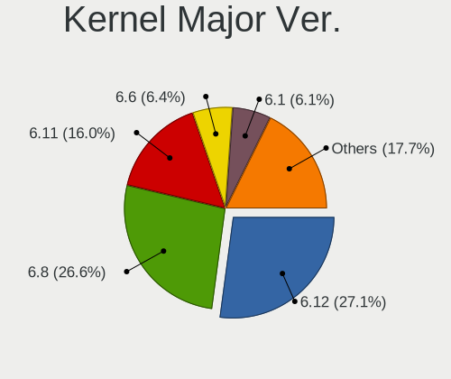
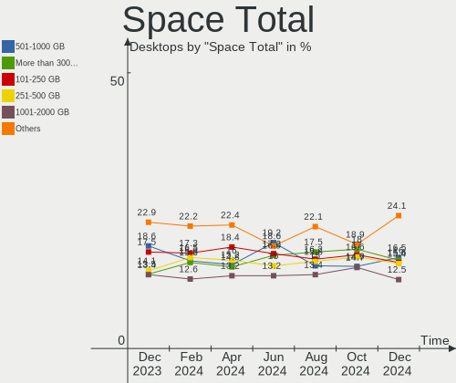
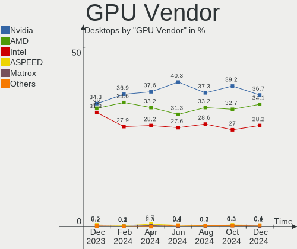

Linux Hardware Trends (Desktop)
-------------------------------

A project to identify most popular hardware characteristics and track their change
over time based on data collected by Linux users at https://Linux-Hardware.org.

Anyone can contribute to the study by uploading probes of their computers by
the [hw-probe](https://github.com/linuxhw/hw-probe) tool:

    sudo hw-probe -all -upload

Full-feature report is available here: https://linux-hardware.org/?view=trends&formfactor=desktop

Period: Mar, 2020.

Contents
--------

- [ OS                       ](#os)
- [ OS Family                ](#os-family)
- [ Kernel                   ](#kernel)
- [ Kernel Family            ](#kernel-family)
- [ Kernel Major Ver.        ](#kernel-major-ver)
- [ Arch                     ](#arch)
- [ DE                       ](#de)
- [ Display Server           ](#display-server)
- [ OS Lang                  ](#os-lang)
- [ Boot Mode                ](#boot-mode)
- [ Filesystem               ](#filesystem)
- [ Dual Boot with Linux     ](#dual-boot-with-linux)
- [ Dual Boot (Win)          ](#dual-boot-win)
- [ Country                  ](#country)
- [ City                     ](#city)
- [ Vendor                   ](#vendor)
- [ Model                    ](#model)
- [ Model Family             ](#model-family)
- [ MFG Year                 ](#mfg-year)
- [ Form Factor              ](#form-factor)
- [ Secure Boot              ](#secure-boot)
- [ Coreboot                 ](#coreboot)
- [ RAM Size                 ](#ram-size)
- [ RAM Used                 ](#ram-used)
- [ Drive Vendor             ](#drive-vendor)
- [ Drive Model              ](#drive-model)
- [ Drive Kind               ](#drive-kind)
- [ Drive Connector          ](#drive-connector)
- [ Drive Size               ](#drive-size)
- [ Space Total              ](#space-total)
- [ Space Used               ](#space-used)
- [ Malfunc. Drives          ](#malfunc-drives)
- [ Malfunc. Drive Vendor    ](#malfunc-drive-vendor)
- [ Malfunc. Drive Kind      ](#malfunc-drive-kind)
- [ Failed Drives            ](#failed-drives)
- [ Failed Drive Vendor      ](#failed-drive-vendor)
- [ Drive Status             ](#drive-status)
- [ Storage Vendor           ](#storage-vendor)
- [ Storage Model            ](#storage-model)
- [ Storage Kind             ](#storage-kind)
- [ CPU Vendor               ](#cpu-vendor)
- [ CPU Model                ](#cpu-model)
- [ CPU Model Family         ](#cpu-model-family)
- [ CPU Cores                ](#cpu-cores)
- [ CPU Sockets              ](#cpu-sockets)
- [ CPU Threads              ](#cpu-threads)
- [ CPU Op-Modes             ](#cpu-op-modes)
- [ CPU Microarch            ](#cpu-microarch)
- [ CPU Microcode            ](#cpu-microcode)
- [ GPU Vendor               ](#gpu-vendor)
- [ GPU Model                ](#gpu-model)
- [ GPU Combo                ](#gpu-combo)
- [ GPU Driver               ](#gpu-driver)
- [ GPU Memory               ](#gpu-memory)
- [ Monitor Vendor           ](#monitor-vendor)
- [ Monitor Model            ](#monitor-model)
- [ Monitor Resolution       ](#monitor-resolution)
- [ Monitor Diagonal         ](#monitor-diagonal)
- [ Monitor Width            ](#monitor-width)
- [ Aspect Ratio             ](#aspect-ratio)
- [ Monitor Area             ](#monitor-area)
- [ Pixel Density            ](#pixel-density)
- [ Multiple Monitors        ](#multiple-monitors)
- [ Net Controller Vendor    ](#net-controller-vendor)
- [ Net Controller Model     ](#net-controller-model)
- [ Net Controller Kind      ](#net-controller-kind)
- [ Used Controller          ](#used-controller)
- [ NICs                     ](#nics)
- [ Unsupported Devices      ](#unsupported-devices)
- [ Unsupported Device Types ](#unsupported-device-types)

OS
--

Installed operating systems

| Name               | Computers | Percent |
|--------------------|-----------|---------|
| Ubuntu 18.04       | 399       | 28.16%  |
| Ubuntu 19.10       | 185       | 13.06%  |
| ROSA R11           | 164       | 11.57%  |
| BlackPanther 18.1  | 102       | 7.2%    |
| Mint 19.3          | 72        | 5.08%   |
| Fedora 31          | 60        | 4.23%   |
| Endless 3.7.8      | 43        | 3.03%   |
| Zorin 15           | 34        | 2.4%    |
| Ubuntu 16.04       | 28        | 1.98%   |
| Manjaro            | 25        | 1.76%   |
| Ubuntu 20.04       | 23        | 1.62%   |
| Arch               | 20        | 1.41%   |
| Debian 10          | 18        | 1.27%   |
| Ubuntu 19.04       | 17        | 1.2%    |
| Manjaro 19.0.2     | 15        | 1.06%   |
| KDE neon 18.04     | 15        | 1.06%   |
| ROSA R10           | 9         | 0.64%   |
| BlackPanther 16.2  | 8         | 0.56%   |
| Arch Rolling       | 7         | 0.49%   |
| ROSA R8.1          | 6         | 0.42%   |
| Mint 19.2          | 6         | 0.42%   |
| Mageia 7           | 6         | 0.42%   |
| Elementary 5.1.2   | 6         | 0.42%   |
| Debian Testing     | 6         | 0.42%   |
| Peppermint 10      | 5         | 0.35%   |
| MX 20              | 5         | 0.35%   |
| Mint 4             | 5         | 0.35%   |
| Mint 18.3          | 5         | 0.35%   |
| Kali 2020.1        | 5         | 0.35%   |
| Endless 3.7.7      | 5         | 0.35%   |
| Pop!_OS 19.10      | 4         | 0.28%   |
| Fedora 30          | 4         | 0.28%   |
| Solus 4.1          | 3         | 0.21%   |
| RED X4             | 3         | 0.21%   |
| Reborn OS          | 3         | 0.21%   |
| openSUSE Leap-15.1 | 3         | 0.21%   |
| Mint 19.1          | 3         | 0.21%   |
| Mint 19            | 3         | 0.21%   |
| Manjaro 19.0.1     | 3         | 0.21%   |
| Gentoo 2.6         | 3         | 0.21%   |
| Gentoo             | 3         | 0.21%   |
| Deepin             | 3         | 0.21%   |
| ClearOS 7          | 3         | 0.21%   |
| Clear Linux 32510  | 3         | 0.21%   |
| Clear Linux 32480  | 3         | 0.21%   |
| CentOS 8           | 3         | 0.21%   |
| CentOS 7           | 3         | 0.21%   |
| Zorin 12           | 2         | 0.14%   |
| QTS 4.4.1          | 2         | 0.14%   |
| Peppermint 9       | 2         | 0.14%   |
| MX 19              | 2         | 0.14%   |
| Gentoo 2.7         | 2         | 0.14%   |
| Fedora 32          | 2         | 0.14%   |
| Endless 3.7.6      | 2         | 0.14%   |
| Endless 3.3.20     | 2         | 0.14%   |
| Debian Unstable    | 2         | 0.14%   |
| Debian             | 2         | 0.14%   |
| ClearOS 7.7.2      | 2         | 0.14%   |
| Clear Linux 32600  | 2         | 0.14%   |
| Ubuntu 18.10       | 1         | 0.07%   |

OS Family
---------

OS without a version

| Name         | Computers | Percent |
|--------------|-----------|---------|
| Ubuntu       | 655       | 46.22%  |
| ROSA         | 182       | 12.84%  |
| BlackPanther | 110       | 7.76%   |
| Mint         | 94        | 6.63%   |
| Fedora       | 69        | 4.87%   |
| Endless      | 54        | 3.81%   |
| Manjaro      | 44        | 3.11%   |
| Zorin        | 36        | 2.54%   |
| Debian       | 30        | 2.12%   |
| Arch         | 27        | 1.91%   |
| KDE neon     | 15        | 1.06%   |
| Clear Linux  | 12        | 0.85%   |
| openSUSE     | 8         | 0.56%   |
| Gentoo       | 8         | 0.56%   |
| Peppermint   | 7         | 0.49%   |
| MX           | 7         | 0.49%   |
| CentOS       | 7         | 0.49%   |
| Mageia       | 6         | 0.42%   |
| Elementary   | 6         | 0.42%   |
| Kali         | 5         | 0.35%   |
| ClearOS      | 5         | 0.35%   |
| Pop!_OS      | 4         | 0.28%   |
| Deepin       | 4         | 0.28%   |
| Solus        | 3         | 0.21%   |
| Reborn OS    | 3         | 0.21%   |
| ArcoLinux    | 3         | 0.21%   |
| RED          | 2         | 0.14%   |
| QTS          | 2         | 0.14%   |
| Sparky       | 1         | 0.07%   |
| Rockstor     | 1         | 0.07%   |
| RHEL         | 1         | 0.07%   |
| Generic      | 1         | 0.07%   |
| Ctlos        | 1         | 0.07%   |
| BuildRoot    | 1         | 0.07%   |
| ArchLabs     | 1         | 0.07%   |
| Arch32       | 1         | 0.07%   |
| ALT Linux    | 1         | 0.07%   |

Kernel
------

Version of the Linux kernel

| Version                          | Computers | Percent |
|----------------------------------|-----------|---------|
| 5.3.0-40-generic                 | 265       | 18.7%   |
| 5.3.0-42-generic                 | 205       | 14.47%  |
| 4.18.16-desktop-1bP              | 91        | 6.42%   |
| 5.3.0-28-generic                 | 87        | 6.14%   |
| 4.15.0-91-generic                | 77        | 5.43%   |
| 4.15.0-desktop-68.5rosa-x86_64   | 67        | 4.73%   |
| 4.15.0-88-generic                | 56        | 3.95%   |
| 4.15.0-desktop-45.1rosa-x86_64   | 41        | 2.89%   |
| 4.9.155-nrj-desktop-1rosa-x86_64 | 16        | 1.13%   |
| 4.19.0-8-amd64                   | 16        | 1.13%   |
| 5.3.0-18-generic                 | 14        | 0.99%   |
| 5.5.7-200.fc31.x86_64            | 13        | 0.92%   |
| 5.0.0-32-generic                 | 13        | 0.92%   |
| 5.5.10-200.fc31.x86_64           | 12        | 0.85%   |
| 4.15.0-desktop-45.1rosa-i586     | 12        | 0.85%   |
| 5.4.0-18-generic                 | 11        | 0.78%   |
| 5.0.0-38-generic                 | 11        | 0.78%   |
| 4.15.0-desktop-68.5rosa-i586     | 11        | 0.78%   |
| 5.5.8-200.fc31.x86_64            | 10        | 0.71%   |
| 5.1.15-desktop-1bP               | 10        | 0.71%   |
| 5.5.6-201.fc31.x86_64            | 9         | 0.64%   |
| 5.3.0-45-generic                 | 9         | 0.64%   |
| 5.0.0-23-generic                 | 9         | 0.64%   |
| 5.3.0-42-lowlatency              | 8         | 0.56%   |
| 4.9.60-nrj-desktop-1rosa-x86_64  | 8         | 0.56%   |
| 4.19.0-6-amd64                   | 8         | 0.56%   |
| 5.5.8-arch1-1                    | 7         | 0.49%   |
| 5.4.23-1-MANJARO                 | 7         | 0.49%   |
| 5.4.0-4-amd64                    | 7         | 0.49%   |
| 5.4.0-14-generic                 | 7         | 0.49%   |
| 4.9.20-desktop-pae-1bP           | 7         | 0.49%   |
| 5.4.24-1-MANJARO                 | 6         | 0.42%   |
| 5.3.0-40-lowlatency              | 6         | 0.42%   |
| 4.15.0-20-generic                | 6         | 0.42%   |
| 5.5.6-914.native                 | 5         | 0.35%   |
| 5.5.11-200.fc31.x86_64           | 5         | 0.35%   |
| 5.5.8-1-MANJARO                  | 4         | 0.28%   |
| 5.5.7-arch1-1                    | 4         | 0.28%   |
| 5.5.7-1-MANJARO                  | 4         | 0.28%   |
| 5.4.22-1-MANJARO                 | 4         | 0.28%   |
| 5.3.0-7629-generic               | 4         | 0.28%   |
| 4.15.0-88-lowlatency             | 4         | 0.28%   |
| 4.15.0-45-generic                | 4         | 0.28%   |
| 5.5.9-desktop-1.mga7             | 3         | 0.21%   |
| 5.5.9-arch1-2                    | 3         | 0.21%   |
| 5.5.6-1-MANJARO                  | 3         | 0.21%   |
| 5.5.11-arch1-1                   | 3         | 0.21%   |
| 5.5.10-arch1-1                   | 3         | 0.21%   |
| 5.4.15-nrj-desktop-1rosa-x86_64  | 3         | 0.21%   |
| 5.3.7-301.fc31.x86_64            | 3         | 0.21%   |
| 4.9.155-nrj-desktop-1rosa-i586   | 3         | 0.21%   |
| 4.4.0-176-generic                | 3         | 0.21%   |
| 4.18.0-147.5.1.el8_1.x86_64      | 3         | 0.21%   |
| 4.15.0-30deepin-generic          | 3         | 0.21%   |
| 4.15.0-29-generic                | 3         | 0.21%   |
| 3.10.0-1062.18.1.el7.x86_64      | 3         | 0.21%   |
| 5.6.0-2-MANJARO                  | 2         | 0.14%   |
| 5.5.9-zen1-2-zen                 | 2         | 0.14%   |
| 5.5.9-gentoo                     | 2         | 0.14%   |
| 5.5.9-918.native                 | 2         | 0.14%   |

Kernel Family
-------------

Linux kernel without a distro release

| Version  | Computers | Percent |
|----------|-----------|---------|
| 5.3.0    | 608       | 42.91%  |
| 4.15.0   | 308       | 21.74%  |
| 4.18.16  | 91        | 6.42%   |
| 5.0.0    | 42        | 2.96%   |
| 5.4.0    | 38        | 2.68%   |
| 5.5.8    | 29        | 2.05%   |
| 5.5.7    | 29        | 2.05%   |
| 5.5.6    | 25        | 1.76%   |
| 4.19.0   | 25        | 1.76%   |
| 4.9.155  | 19        | 1.34%   |
| 5.5.10   | 16        | 1.13%   |
| 5.5.9    | 15        | 1.06%   |
| 5.1.15   | 11        | 0.78%   |
| 5.5.11   | 10        | 0.71%   |
| 5.6.0    | 9         | 0.64%   |
| 5.4.23   | 9         | 0.64%   |
| 4.9.60   | 9         | 0.64%   |
| 4.9.20   | 9         | 0.64%   |
| 4.18.0   | 9         | 0.64%   |
| 3.10.0   | 9         | 0.64%   |
| 5.4.24   | 8         | 0.56%   |
| 4.4.0    | 7         | 0.49%   |
| 5.3.18   | 5         | 0.35%   |
| 5.5.13   | 4         | 0.28%   |
| 5.4.27   | 4         | 0.28%   |
| 5.4.22   | 4         | 0.28%   |
| 4.12.14  | 4         | 0.28%   |
| 5.5.4    | 3         | 0.21%   |
| 5.4.28   | 3         | 0.21%   |
| 5.4.15   | 3         | 0.21%   |
| 5.3.7    | 3         | 0.21%   |
| 4.9.0    | 3         | 0.21%   |
| 5.5.5    | 2         | 0.14%   |
| 5.5.0    | 2         | 0.14%   |
| 5.4.18   | 2         | 0.14%   |
| 5.4.17   | 2         | 0.14%   |
| 4.9.9    | 2         | 0.14%   |
| 4.9.124  | 2         | 0.14%   |
| 4.19.97  | 2         | 0.14%   |
| 4.19.112 | 2         | 0.14%   |
| 4.14.24  | 2         | 0.14%   |
| 4.13.0   | 2         | 0.14%   |
| 4.10.0   | 2         | 0.14%   |
| 4.1.38   | 2         | 0.14%   |
| 5.5.3    | 1         | 0.07%   |
| 5.5.2    | 1         | 0.07%   |
| 5.4.26   | 1         | 0.07%   |
| 5.4.25   | 1         | 0.07%   |
| 5.4.21   | 1         | 0.07%   |
| 5.4.20   | 1         | 0.07%   |
| 5.4.19   | 1         | 0.07%   |
| 5.4.13   | 1         | 0.07%   |
| 5.4.12   | 1         | 0.07%   |
| 5.4.10   | 1         | 0.07%   |
| 5.3.6    | 1         | 0.07%   |
| 5.2.7    | 1         | 0.07%   |
| 5.2.0    | 1         | 0.07%   |
| 5.0.7    | 1         | 0.07%   |
| 5.0.21   | 1         | 0.07%   |
| 4.7.0    | 1         | 0.07%   |

Kernel Major Ver.
-----------------

Linux kernel major version

| Version | Computers | Percent |
|---------|-----------|---------|
| 5.3     | 617       | 43.54%  |
| 4.15    | 308       | 21.74%  |
| 5.5     | 137       | 9.67%   |
| 4.18    | 101       | 7.13%   |
| 5.4     | 81        | 5.72%   |
| 5.0     | 44        | 3.11%   |
| 4.9     | 44        | 3.11%   |
| 4.19    | 32        | 2.26%   |
| 5.1     | 11        | 0.78%   |
| 5.6     | 9         | 0.64%   |
| 3.10    | 9         | 0.64%   |
| 4.4     | 7         | 0.49%   |
| 4.12    | 4         | 0.28%   |
| 4.1     | 3         | 0.21%   |
| 5.2     | 2         | 0.14%   |
| 4.14    | 2         | 0.14%   |
| 4.13    | 2         | 0.14%   |
| 4.10    | 2         | 0.14%   |
| 4.7     | 1         | 0.07%   |
| 4.16    | 1         | 0.07%   |

Arch
----

OS architecture (x86_64, i586, etc.)

| Name   | Computers | Percent |
|--------|-----------|---------|
| x86_64 | 1317      | 92.94%  |
| i686   | 100       | 7.06%   |

DE
--

Desktop Environment

| Name            | Computers | Percent |
|-----------------|-----------|---------|
| GNOME           | 637       | 44.95%  |
| KDE5            | 202       | 14.26%  |
| XFCE            | 129       | 9.1%    |
| KDE4            | 109       | 7.69%   |
| X-Cinnamon      | 77        | 5.43%   |
| Unknown         | 75        | 5.29%   |
| KDE             | 64        | 4.52%   |
| MATE            | 28        | 1.98%   |
| Unity           | 21        | 1.48%   |
| LXQt            | 17        | 1.2%    |
| LXDE            | 12        | 0.85%   |
| Cinnamon        | 12        | 0.85%   |
| Budgie          | 11        | 0.78%   |
| GNOME Flashback | 8         | 0.56%   |
| Pantheon        | 6         | 0.42%   |
| Deepin          | 4         | 0.28%   |
| GNOME Classic   | 3         | 0.21%   |
| ubuntustudio    | 1         | 0.07%   |
| i3              | 1         | 0.07%   |

Display Server
--------------

X11 or Wayland

| Name    | Computers | Percent |
|---------|-----------|---------|
| X11     | 1307      | 92.24%  |
| Wayland | 64        | 4.52%   |
| Unknown | 34        | 2.4%    |
| Tty     | 11        | 0.78%   |
| Web     | 1         | 0.07%   |

OS Lang
-------

Language

| Lang        | Computers | Percent |
|-------------|-----------|---------|
| en_US       | 355       | 25.05%  |
| Unknown     | 212       | 14.96%  |
| ru_RU       | 142       | 10.02%  |
| de_DE       | 95        | 6.7%    |
| pt_BR       | 65        | 4.59%   |
| it_IT       | 60        | 4.23%   |
| en_GB       | 54        | 3.81%   |
| en_US.utf8  | 40        | 2.82%   |
| en_CA       | 35        | 2.47%   |
| fr_FR       | 34        | 2.4%    |
| es_ES       | 29        | 2.05%   |
| en_AU       | 29        | 2.05%   |
| pl_PL       | 24        | 1.69%   |
| nl_NL       | 18        | 1.27%   |
| C           | 17        | 1.2%    |
| es_AR       | 11        | 0.78%   |
| cs_CZ       | 10        | 0.71%   |
| pt_PT       | 9         | 0.64%   |
| en_IN       | 9         | 0.64%   |
| ru_UA       | 8         | 0.56%   |
| hu_HU       | 8         | 0.56%   |
| sv_SE       | 7         | 0.49%   |
| en_PH       | 7         | 0.49%   |
| uk_UA       | 6         | 0.42%   |
| tr_TR       | 6         | 0.42%   |
| en_NZ       | 6         | 0.42%   |
| fi_FI       | 5         | 0.35%   |
| es_MX       | 5         | 0.35%   |
| el_GR       | 5         | 0.35%   |
| C           | 5         | 0.35%   |
| zh_TW       | 4         | 0.28%   |
| ro_RO       | 4         | 0.28%   |
| nl_BE       | 4         | 0.28%   |
| es_ES.utf8  | 4         | 0.28%   |
| en_ZA       | 4         | 0.28%   |
| de_CH       | 4         | 0.28%   |
| bg_BG       | 4         | 0.28%   |
| sk_SK       | 3         | 0.21%   |
| ko_KR       | 3         | 0.21%   |
| ja_JP       | 3         | 0.21%   |
| fr_CA       | 3         | 0.21%   |
| es_PE       | 3         | 0.21%   |
| en_GB.utf8  | 3         | 0.21%   |
| en_CA.utf8  | 3         | 0.21%   |
| ca_ES       | 3         | 0.21%   |
| zh_CN       | 2         | 0.14%   |
| ru_RU.utf8  | 2         | 0.14%   |
| nl_BE.utf8  | 2         | 0.14%   |
| hr_HR       | 2         | 0.14%   |
| fr_CH       | 2         | 0.14%   |
| fa_IR       | 2         | 0.14%   |
| es_VE       | 2         | 0.14%   |
| es_UY       | 2         | 0.14%   |
| es_CO       | 2         | 0.14%   |
| en_SG       | 2         | 0.14%   |
| en_IL       | 2         | 0.14%   |
| en_IE       | 2         | 0.14%   |
| de_AT       | 2         | 0.14%   |
| sr_RS       | 1         | 0.07%   |
| ru_RU.UTF_8 | 1         | 0.07%   |

Boot Mode
---------

EFI or BIOS

| Mode | Computers | Percent |
|------|-----------|---------|
| BIOS | 995       | 70.22%  |
| EFI  | 422       | 29.78%  |

Filesystem
----------

Type of filesystem

| Type     | Computers | Percent |
|----------|-----------|---------|
| Ext4     | 1269      | 89.56%  |
| Overlay  | 50        | 3.53%   |
| Btrfs    | 43        | 3.03%   |
| Xfs      | 30        | 2.12%   |
| Tmpfs    | 7         | 0.49%   |
| Ext3     | 7         | 0.49%   |
| Zfs      | 4         | 0.28%   |
| F2fs     | 3         | 0.21%   |
| Ext2     | 2         | 0.14%   |
| Reiserfs | 1         | 0.07%   |
| Unknown  | 1         | 0.07%   |

Dual Boot with Linux
--------------------

Hosting more than one Linux

| Dual boot | Computers | Percent |
|-----------|-----------|---------|
| No        | 1184      | 83.56%  |
| Yes       | 233       | 16.44%  |

Dual Boot (Win)
---------------

Hosting Linux and Windows

| Dual boot | Computers | Percent |
|-----------|-----------|---------|
| No        | 906       | 63.94%  |
| Yes       | 511       | 36.06%  |

Country
-------

Geographic location (country)

| Country                | Computers | Percent |
|------------------------|-----------|---------|
| USA                    | 240       | 16.94%  |
| Russia                 | 195       | 13.76%  |
| Germany                | 127       | 8.96%   |
| Hungary                | 92        | 6.49%   |
| Brazil                 | 77        | 5.43%   |
| Italy                  | 70        | 4.94%   |
| Canada                 | 52        | 3.67%   |
| UK                     | 51        | 3.6%    |
| France                 | 39        | 2.75%   |
| Spain                  | 38        | 2.68%   |
| Poland                 | 35        | 2.47%   |
| Australia              | 34        | 2.4%    |
| Ukraine                | 33        | 2.33%   |
| Netherlands            | 25        | 1.76%   |
| Czech Republic         | 16        | 1.13%   |
| Belgium                | 16        | 1.13%   |
| Romania                | 15        | 1.06%   |
| India                  | 12        | 0.85%   |
| Portugal               | 11        | 0.78%   |
| Mexico                 | 11        | 0.78%   |
| Argentina              | 11        | 0.78%   |
| Turkey                 | 10        | 0.71%   |
| Sweden                 | 10        | 0.71%   |
| Switzerland            | 9         | 0.64%   |
| Philippines            | 9         | 0.64%   |
| Finland                | 9         | 0.64%   |
| Bulgaria               | 9         | 0.64%   |
| Iran                   | 8         | 0.56%   |
| Taiwan                 | 7         | 0.49%   |
| Slovakia               | 7         | 0.49%   |
| Norway                 | 7         | 0.49%   |
| Israel                 | 7         | 0.49%   |
| Greece                 | 7         | 0.49%   |
| New Zealand            | 6         | 0.42%   |
| Korea, Republic of     | 6         | 0.42%   |
| Ireland                | 6         | 0.42%   |
| South Africa           | 5         | 0.35%   |
| Peru                   | 5         | 0.35%   |
| Estonia                | 5         | 0.35%   |
| Denmark                | 5         | 0.35%   |
| Colombia               | 5         | 0.35%   |
| Singapore              | 4         | 0.28%   |
| Serbia                 | 4         | 0.28%   |
| Puerto Rico            | 4         | 0.28%   |
| Dominican Republic     | 4         | 0.28%   |
| China                  | 4         | 0.28%   |
| Austria                | 4         | 0.28%   |
| Venezuela              | 3         | 0.21%   |
| Tunisia                | 3         | 0.21%   |
| Kazakhstan             | 3         | 0.21%   |
| Japan                  | 3         | 0.21%   |
| Croatia                | 3         | 0.21%   |
| Uruguay                | 2         | 0.14%   |
| Moldova, Republic of   | 2         | 0.14%   |
| Lithuania              | 2         | 0.14%   |
| Latvia                 | 2         | 0.14%   |
| Bosnia and Herzegovina | 2         | 0.14%   |
| Belarus                | 2         | 0.14%   |
| Bangladesh             | 2         | 0.14%   |
| Armenia                | 2         | 0.14%   |

City
----

Geographic location (city)

| City             | Computers | Percent |
|------------------|-----------|---------|
| Moscow           | 34        | 2.4%    |
| Budapest         | 19        | 1.34%   |
| St Petersburg    | 16        | 1.13%   |
| Novosibirsk      | 9         | 0.64%   |
| Krasnodar        | 9         | 0.64%   |
| Ekaterinburg     | 9         | 0.64%   |
| Berlin           | 9         | 0.64%   |
| São Paulo       | 8         | 0.56%   |
| Seattle          | 8         | 0.56%   |
| Hornsby          | 8         | 0.56%   |
| Warsaw           | 7         | 0.49%   |
| Samara           | 7         | 0.49%   |
| Barcelona        | 7         | 0.49%   |
| Toronto          | 6         | 0.42%   |
| Tehran           | 6         | 0.42%   |
| Rome             | 6         | 0.42%   |
| Montreal         | 6         | 0.42%   |
| Prague           | 5         | 0.35%   |
| Oshawa           | 5         | 0.35%   |
| Odesa            | 5         | 0.35%   |
| Nizhniy Novgorod | 5         | 0.35%   |
| Munich           | 5         | 0.35%   |
| Miskolc          | 5         | 0.35%   |
| Mexico City      | 5         | 0.35%   |
| Istanbul         | 5         | 0.35%   |
| Eger             | 5         | 0.35%   |
| Curitiba         | 5         | 0.35%   |
| Chiusi           | 5         | 0.35%   |
| Brisbane         | 5         | 0.35%   |
| Athens           | 5         | 0.35%   |
| Wahroonga        | 4         | 0.28%   |
| Tallinn          | 4         | 0.28%   |
| Stuttgart        | 4         | 0.28%   |
| Sofia            | 4         | 0.28%   |
| Singapore        | 4         | 0.28%   |
| Padova           | 4         | 0.28%   |
| New York         | 4         | 0.28%   |
| Milan            | 4         | 0.28%   |
| Miami            | 4         | 0.28%   |
| Madrid           | 4         | 0.28%   |
| Lviv             | 4         | 0.28%   |
| Kyiv             | 4         | 0.28%   |
| Kharkiv          | 4         | 0.28%   |
| Helsinki         | 4         | 0.28%   |
| Hamburg          | 4         | 0.28%   |
| Garbsen          | 4         | 0.28%   |
| Chicago          | 4         | 0.28%   |
| Campinas         | 4         | 0.28%   |
| Brasília        | 4         | 0.28%   |
| Bologna          | 4         | 0.28%   |
| Adelaide         | 4         | 0.28%   |
| Zagreb           | 3         | 0.21%   |
| Taipei           | 3         | 0.21%   |
| Taguig           | 3         | 0.21%   |
| Szombathely      | 3         | 0.21%   |
| Sydney           | 3         | 0.21%   |
| Spokane          | 3         | 0.21%   |
| San Jose         | 3         | 0.21%   |
| San Diego        | 3         | 0.21%   |
| Rio de Janeiro   | 3         | 0.21%   |

Vendor
------

Motherboard manufacturer

| Name                | Computers | Percent |
|---------------------|-----------|---------|
| ASUSTek Computer    | 379       | 26.75%  |
| Gigabyte Technology | 265       | 18.7%   |
| MSI                 | 153       | 10.8%   |
| ASRock              | 147       | 10.37%  |
| Dell                | 118       | 8.33%   |
| Hewlett-Packard     | 92        | 6.49%   |
| Acer                | 35        | 2.47%   |
| Lenovo              | 33        | 2.33%   |
| Intel               | 23        | 1.62%   |
| Unknown             | 19        | 1.34%   |
| Fujitsu             | 18        | 1.27%   |
| Foxconn             | 15        | 1.06%   |
| ECS                 | 15        | 1.06%   |
| Biostar             | 13        | 0.92%   |
| Pegatron            | 11        | 0.78%   |
| Packard Bell        | 8         | 0.56%   |
| AAEON               | 5         | 0.35%   |
| Positivo            | 4         | 0.28%   |
| Medion              | 4         | 0.28%   |
| Gateway             | 4         | 0.28%   |
| Fujitsu Siemens     | 4         | 0.28%   |
| Alienware           | 4         | 0.28%   |
| ABIT                | 4         | 0.28%   |
| Shuttle             | 3         | 0.21%   |
| IBM                 | 3         | 0.21%   |
| Supermicro          | 2         | 0.14%   |
| PCWare              | 2         | 0.14%   |
| Huanan              | 2         | 0.14%   |
| Google              | 2         | 0.14%   |
| AMI                 | 2         | 0.14%   |
| ZOTAC               | 1         | 0.07%   |
| XFX                 | 1         | 0.07%   |
| Wistron             | 1         | 0.07%   |
| WinFast             | 1         | 0.07%   |
| VS Company          | 1         | 0.07%   |
| Vorke               | 1         | 0.07%   |
| Quanta              | 1         | 0.07%   |
| QDI                 | 1         | 0.07%   |
| PCChips             | 1         | 0.07%   |
| Onda technology     | 1         | 0.07%   |
| OKI Brasil          | 1         | 0.07%   |
| OEM_MB              | 1         | 0.07%   |
| Notebook            | 1         | 0.07%   |
| NEC Computers       | 1         | 0.07%   |
| Megaware            | 1         | 0.07%   |
| MEGA                | 1         | 0.07%   |
| Login Informatica   | 1         | 0.07%   |
| langchao            | 1         | 0.07%   |
| IP3 Tech            | 1         | 0.07%   |
| IntegralTech        | 1         | 0.07%   |
| iEi                 | 1         | 0.07%   |
| EAGLE EYE NETWORKS  | 1         | 0.07%   |
| Digiboard           | 1         | 0.07%   |
| DATA MODUL          | 1         | 0.07%   |
| congatec            | 1         | 0.07%   |
| BESSTAR Tech        | 1         | 0.07%   |
| Apple               | 1         | 0.07%   |
| AMD                 | 1         | 0.07%   |

Model
-----

Motherboard model

| Name                             | Computers | Percent |
|----------------------------------|-----------|---------|
| ASUS All Series                  | 32        | 2.26%   |
| Unknown                          | 19        | 1.34%   |
| Gigabyte G31M-ES2L               | 12        | 0.85%   |
| MSI MS-7C02                      | 8         | 0.56%   |
| Gigabyte B450M DS3H              | 8         | 0.56%   |
| ASUS M5A97 R2.0                  | 8         | 0.56%   |
| ASUS M5A78L-M/USB3               | 8         | 0.56%   |
| Gigabyte 970A-DS3P               | 7         | 0.49%   |
| Dell Precision WorkStation T3500 | 7         | 0.49%   |
| MSI MS-7B79                      | 6         | 0.42%   |
| Gigabyte B450 I AORUS PRO WIFI   | 6         | 0.42%   |
| Dell OptiPlex 7010               | 6         | 0.42%   |
| Dell OptiPlex 3020               | 6         | 0.42%   |
| ASUS M5A78L-M PLUS/USB3          | 6         | 0.42%   |
| MSI MS-7A74                      | 5         | 0.35%   |
| MSI MS-7A38                      | 5         | 0.35%   |
| MSI MS-7693                      | 5         | 0.35%   |
| MSI MS-7309                      | 5         | 0.35%   |
| HP Compaq Elite 8300 SFF         | 5         | 0.35%   |
| Dell OptiPlex 9020               | 5         | 0.35%   |
| Dell OptiPlex 790                | 5         | 0.35%   |
| Dell OptiPlex 745                | 5         | 0.35%   |
| Dell OptiPlex 390                | 5         | 0.35%   |
| ASRock N68C-S UCC                | 5         | 0.35%   |
| AAEON MF-001                     | 5         | 0.35%   |
| MSI MS-7C37                      | 4         | 0.28%   |
| MSI MS-7B86                      | 4         | 0.28%   |
| HP Z600 Workstation              | 4         | 0.28%   |
| Fujitsu ESPRIMO P2560            | 4         | 0.28%   |
| Dell PowerEdge T30               | 4         | 0.28%   |
| Dell OptiPlex GX620              | 4         | 0.28%   |
| Dell OptiPlex 780                | 4         | 0.28%   |
| Dell OptiPlex 760                | 4         | 0.28%   |
| ASUS PRIME B450M-A               | 4         | 0.28%   |
| ASUS PRIME B350M-A               | 4         | 0.28%   |
| ASUS PRIME B350-PLUS             | 4         | 0.28%   |
| ASUS PRIME A320M-K               | 4         | 0.28%   |
| ASUS P5G41T-M LX                 | 4         | 0.28%   |
| ASRock X570 Phantom Gaming 4     | 4         | 0.28%   |
| ASRock H61M-DGS                  | 4         | 0.28%   |
| ASRock G41M-VS3                  | 4         | 0.28%   |
| ASRock B450M Pro4                | 4         | 0.28%   |
| ASRock AB350M Pro4               | 4         | 0.28%   |
| MSI MS-7817                      | 3         | 0.21%   |
| MSI MS-7808                      | 3         | 0.21%   |
| MSI MS-7721                      | 3         | 0.21%   |
| MSI MS-7592                      | 3         | 0.21%   |
| MSI MS-7253                      | 3         | 0.21%   |
| HP Z400 Workstation              | 3         | 0.21%   |
| HP Compaq 8200 Elite CMT PC      | 3         | 0.21%   |
| HP Compaq 8100 Elite SFF PC      | 3         | 0.21%   |
| Gigabyte M61PME-S2P              | 3         | 0.21%   |
| Gigabyte H77N-WIFI               | 3         | 0.21%   |
| Gigabyte H61M-S1                 | 3         | 0.21%   |
| Gigabyte GA-MA780G-UD3H          | 3         | 0.21%   |
| Gigabyte AB350-Gaming            | 3         | 0.21%   |
| Dell OptiPlex 380                | 3         | 0.21%   |
| Dell Inspiron 660                | 3         | 0.21%   |
| ASUS SABERTOOTH 990FX R2.0       | 3         | 0.21%   |
| ASUS ROG CROSSHAIR VII HERO      | 3         | 0.21%   |

Model Family
------------

Motherboard model prefix

| Name                  | Computers | Percent |
|-----------------------|-----------|---------|
| Dell OptiPlex         | 63        | 4.45%   |
| ASUS PRIME            | 44        | 3.11%   |
| HP Compaq             | 43        | 3.03%   |
| ASUS All              | 32        | 2.26%   |
| ASUS ROG              | 28        | 1.98%   |
| Acer Aspire           | 26        | 1.83%   |
| Lenovo ThinkCentre    | 24        | 1.69%   |
| Unknown               | 19        | 1.34%   |
| Dell Precision        | 18        | 1.27%   |
| ASUS M5A78L-M         | 18        | 1.27%   |
| Fujitsu ESPRIMO       | 17        | 1.2%    |
| Dell Inspiron         | 16        | 1.13%   |
| Gigabyte B450         | 13        | 0.92%   |
| Gigabyte G31M-ES2L    | 12        | 0.85%   |
| ASUS M5A97            | 12        | 0.85%   |
| ASUS P8H61-M          | 11        | 0.78%   |
| ASRock X570           | 11        | 0.78%   |
| Gigabyte X570         | 10        | 0.71%   |
| ASUS TUF              | 10        | 0.71%   |
| Gigabyte B450M        | 9         | 0.64%   |
| MSI MS-7C02           | 8         | 0.56%   |
| Gigabyte 970A-DS3P    | 7         | 0.49%   |
| ASUS SABERTOOTH       | 7         | 0.49%   |
| ASUS P5G41T-M         | 7         | 0.49%   |
| Acer Veriton          | 7         | 0.49%   |
| Packard Bell imedia   | 6         | 0.42%   |
| MSI MS-7B79           | 6         | 0.42%   |
| HP ProDesk            | 6         | 0.42%   |
| HP EliteDesk          | 6         | 0.42%   |
| Dell XPS              | 6         | 0.42%   |
| ASUS P8Z77-V          | 6         | 0.42%   |
| ASRock N68C-S         | 6         | 0.42%   |
| MSI MS-7A74           | 5         | 0.35%   |
| MSI MS-7A38           | 5         | 0.35%   |
| MSI MS-7693           | 5         | 0.35%   |
| MSI MS-7309           | 5         | 0.35%   |
| Dell PowerEdge        | 5         | 0.35%   |
| ASUS P5K              | 5         | 0.35%   |
| ASUS Maximus          | 5         | 0.35%   |
| ASUS M2N68-AM         | 5         | 0.35%   |
| ASRock B450M          | 5         | 0.35%   |
| AAEON MF-001          | 5         | 0.35%   |
| MSI MS-7C37           | 4         | 0.28%   |
| MSI MS-7B86           | 4         | 0.28%   |
| HP Z600               | 4         | 0.28%   |
| Gigabyte Z390         | 4         | 0.28%   |
| Gigabyte H61M-DS2     | 4         | 0.28%   |
| Gigabyte AB350-Gaming | 4         | 0.28%   |
| ASUS M4A87TD          | 4         | 0.28%   |
| ASUS Crosshair        | 4         | 0.28%   |
| ASRock Z77            | 4         | 0.28%   |
| ASRock H61M-DGS       | 4         | 0.28%   |
| ASRock G41M-VS3       | 4         | 0.28%   |
| ASRock AB350M         | 4         | 0.28%   |
| MSI MS-7817           | 3         | 0.21%   |
| MSI MS-7808           | 3         | 0.21%   |
| MSI MS-7721           | 3         | 0.21%   |
| MSI MS-7592           | 3         | 0.21%   |
| MSI MS-7253           | 3         | 0.21%   |
| MSI Compaq            | 3         | 0.21%   |

MFG Year
--------

Motherboard manufacture year

| Year    | Computers | Percent |
|---------|-----------|---------|
| 2019    | 232       | 16.37%  |
| 2010    | 136       | 9.6%    |
| 2012    | 117       | 8.26%   |
| 2018    | 116       | 8.19%   |
| 2013    | 108       | 7.62%   |
| 2011    | 107       | 7.55%   |
| 2009    | 99        | 6.99%   |
| 2014    | 98        | 6.92%   |
| 2016    | 76        | 5.36%   |
| 2015    | 73        | 5.15%   |
| 2008    | 70        | 4.94%   |
| 2017    | 67        | 4.73%   |
| 2007    | 56        | 3.95%   |
| 2006    | 25        | 1.76%   |
| 2005    | 16        | 1.13%   |
| 2020    | 9         | 0.64%   |
| 2004    | 7         | 0.49%   |
| 2003    | 2         | 0.14%   |
| Unknown | 2         | 0.14%   |
| 2001    | 1         | 0.07%   |

Form Factor
-----------

Physical design of the computer

| Name    | Computers | Percent |
|---------|-----------|---------|
| Desktop | 1417      | 100%    |

Secure Boot
-----------

Enabled or disabled

| State    | Computers | Percent |
|----------|-----------|---------|
| Disabled | 1394      | 98.38%  |
| Enabled  | 23        | 1.62%   |

Coreboot
--------

Have coreboot on board

| Used | Computers | Percent |
|------|-----------|---------|
| No   | 1415      | 99.86%  |
| Yes  | 2         | 0.14%   |

RAM Size
--------

Total RAM memory

| Size in GB      | Computers | Percent |
|-----------------|-----------|---------|
| 3.01-4.0        | 328       | 23.15%  |
| 16.01-24.0      | 307       | 21.67%  |
| 8.01-16.0       | 288       | 20.32%  |
| 4.01-8.0        | 200       | 14.11%  |
| 32.01-64.0      | 97        | 6.85%   |
| 1.01-2.0        | 96        | 6.77%   |
| 2.01-3.0        | 32        | 2.26%   |
| 24.01-32.0      | 27        | 1.91%   |
| 64.01-256.0     | 27        | 1.91%   |
| 0.01-1.0        | 14        | 0.99%   |
| More than 256.0 | 1         | 0.07%   |

RAM Used
--------

Used RAM memory

| Used GB    | Computers | Percent |
|------------|-----------|---------|
| 1.01-2.0   | 609       | 42.98%  |
| 2.01-3.0   | 313       | 22.09%  |
| 0.01-1.0   | 214       | 15.1%   |
| 4.01-8.0   | 124       | 8.75%   |
| 3.01-4.0   | 111       | 7.83%   |
| 8.01-16.0  | 37        | 2.61%   |
| 16.01-24.0 | 7         | 0.49%   |
| 32.01-64.0 | 1         | 0.07%   |
| 24.01-32.0 | 1         | 0.07%   |

Drive Vendor
------------

Hard drive vendors

| Vendor              | Computers | Drives | Percent |
|---------------------|-----------|--------|---------|
| Seagate             | 528       | 643    | 23.45%  |
| WDC                 | 510       | 642    | 22.65%  |
| Samsung Electronics | 310       | 357    | 13.77%  |
| Toshiba             | 129       | 137    | 5.73%   |
| Kingston            | 122       | 134    | 5.42%   |
| Hitachi             | 116       | 126    | 5.15%   |
| Crucial             | 69        | 85     | 3.06%   |
| SanDisk             | 65        | 73     | 2.89%   |
| Maxtor              | 41        | 43     | 1.82%   |
| A-DATA Technology   | 36        | 39     | 1.6%    |
| Intel               | 27        | 27     | 1.2%    |
| OCZ                 | 22        | 22     | 0.98%   |
| SPCC                | 21        | 21     | 0.93%   |
| Unknown             | 17        | 19     | 0.75%   |
| Transcend           | 16        | 17     | 0.71%   |
| Patriot             | 16        | 17     | 0.71%   |
| HGST                | 15        | 19     | 0.67%   |
| China               | 14        | 14     | 0.62%   |
| PNY                 | 10        | 11     | 0.44%   |
| PLEXTOR             | 10        | 11     | 0.44%   |
| Generic             | 10        | 10     | 0.44%   |
| Corsair             | 9         | 10     | 0.4%    |
| Intenso             | 8         | 8      | 0.36%   |
| Hewlett-Packard     | 7         | 7      | 0.31%   |
| GOODRAM             | 7         | 7      | 0.31%   |
| Micron Technology   | 6         | 6      | 0.27%   |
| Gigabyte Technology | 5         | 5      | 0.22%   |
| Team                | 4         | 5      | 0.18%   |
| SK Hynix            | 4         | 4      | 0.18%   |
| KingDian            | 4         | 4      | 0.18%   |
| HL-DT-ST            | 4         | 3      | 0.18%   |
| Fujitsu             | 4         | 4      | 0.18%   |
| Dogfish             | 4         | 4      | 0.18%   |
| Apacer              | 4         | 4      | 0.18%   |
| Zheino              | 3         | 3      | 0.13%   |
| XPG                 | 3         | 3      | 0.13%   |
| Phison              | 3         | 3      | 0.13%   |
| JMicron             | 3         | 3      | 0.13%   |
| HUAWEI              | 3         | 3      | 0.13%   |
| AMD                 | 3         | 3      | 0.13%   |
| Vi550               | 2         | 2      | 0.09%   |
| TCSUNBOW            | 2         | 2      | 0.09%   |
| SABRENT             | 2         | 2      | 0.09%   |
| Mushkin             | 2         | 2      | 0.09%   |
| LITEONIT            | 2         | 2      | 0.09%   |
| Lexar               | 2         | 2      | 0.09%   |
| Emtec               | 2         | 2      | 0.09%   |
| ZTE                 | 1         | 1      | 0.04%   |
| WDC WD64            | 1         | 1      | 0.04%   |
| WDC WD50            | 1         | 1      | 0.04%   |
| WDC WD30            | 1         | 1      | 0.04%   |
| USB30               | 1         | 1      | 0.04%   |
| USB3.0              | 1         | 1      | 0.04%   |
| USB                 | 1         | 1      | 0.04%   |
| T-FORCE             | 1         | 1      | 0.04%   |
| Smartbuy            | 1         | 1      | 0.04%   |
| Silicon Motion      | 1         | 1      | 0.04%   |
| SATAFIRM            | 1         | 1      | 0.04%   |
| Radeon              | 1         | 1      | 0.04%   |
| PIONEER             | 1         | 1      | 0.04%   |

Drive Model
-----------

Hard drive models

| Model                        | Computers | Percent |
|------------------------------|-----------|---------|
| ST500DM002-1BD142 500GB      | 45        | 1.74%   |
| DT01ACA100 1TB               | 40        | 1.55%   |
| WD10EZEX-08WN4A0 1TB         | 35        | 1.36%   |
| SSD 850 EVO 250GB            | 29        | 1.12%   |
| SA400S37120G 120GB SSD       | 29        | 1.12%   |
| ST1000DM010-2EP102 1TB       | 25        | 0.97%   |
| ST1000DM003-1CH162 1TB       | 25        | 0.97%   |
| SA400S37240G 240GB SSD       | 22        | 0.85%   |
| ST3500418AS 500GB            | 21        | 0.81%   |
| SSD 860 EVO 500GB            | 20        | 0.77%   |
| ST31000528AS 1TB             | 19        | 0.74%   |
| SV300S37A120G 120GB SSD      | 18        | 0.7%    |
| SSD 860 EVO 250GB            | 18        | 0.7%    |
| ST2000DM001-1ER164 2TB       | 17        | 0.66%   |
| SSD 850 EVO 500GB            | 17        | 0.66%   |
| ST2000DM008-2FR102 2TB       | 15        | 0.58%   |
| CT500MX500SSD1 500GB         | 15        | 0.58%   |
| ST3160815AS 160GB            | 14        | 0.54%   |
| SDSSDA240G 240GB             | 14        | 0.54%   |
| WD20EZRZ-00Z5HB0 2TB         | 13        | 0.5%    |
| WD20EFRX-68EUZN0 2TB         | 13        | 0.5%    |
| ST2000DM006-2DM164 2TB       | 13        | 0.5%    |
| ST1000DM003-1ER162 1TB       | 13        | 0.5%    |
| DT01ACA050 500GB             | 13        | 0.5%    |
| WD10EZEX-00BN5A0 1TB         | 12        | 0.46%   |
| SSD 860 EVO 1TB              | 12        | 0.46%   |
| HDWD110 1TB                  | 12        | 0.46%   |
| HD161HJ 160GB                | 12        | 0.46%   |
| WDS240G2G0A-00JH30 240GB SSD | 11        | 0.43%   |
| HD502HJ 500GB                | 11        | 0.43%   |
| HD103SJ 1TB                  | 11        | 0.43%   |
| WDS120G2G0A-00JH30 120GB SSD | 10        | 0.39%   |
| WD20EARX-00PASB0 2TB         | 10        | 0.39%   |
| ST3160318AS 160GB            | 10        | 0.39%   |
| ST2000DM001-1CH164 2TB       | 10        | 0.39%   |
| ST1000DM003-9YN162 1TB       | 10        | 0.39%   |
| SSD 840 EVO 250GB            | 10        | 0.39%   |
| SD/MMC/MS PRO 16GB           | 10        | 0.39%   |
| WD10EZEX-22MFCA0 1TB         | 9         | 0.35%   |
| WD10EARS-00Y5B1 1TB          | 9         | 0.35%   |
| SV300S37A240G 240GB SSD      | 9         | 0.35%   |
| ST380815AS 80GB              | 9         | 0.35%   |
| ST3500413AS 500GB            | 9         | 0.35%   |
| HDS721010CLA332 1TB          | 9         | 0.35%   |
| Expansion 1TB                | 9         | 0.35%   |
| CT1000MX500SSD1 1TB          | 9         | 0.35%   |
| WD10EZEX-08M2NA0 1TB         | 8         | 0.31%   |
| ST1000LM024 HN-M101MBB 1TB   | 8         | 0.31%   |
| ST1000DM003-1SB102 1TB       | 8         | 0.31%   |
| SSD 850 PRO 256GB            | 8         | 0.31%   |
| HDT721010SLA360 1TB          | 8         | 0.31%   |
| WD10EZEX-00WN4A0 1TB         | 7         | 0.27%   |
| WD10EADS-00M2B0 1TB          | 7         | 0.27%   |
| SUV400S37240G 240GB SSD      | 7         | 0.27%   |
| ST3320418AS 320GB            | 7         | 0.27%   |
| ST3250310AS 250GB            | 7         | 0.27%   |
| SSD 860 QVO 1TB              | 7         | 0.27%   |
| SDSSDA120G 120GB             | 7         | 0.27%   |
| HDS721616PLA380 164GB        | 7         | 0.27%   |
| HD322HJ 320GB                | 7         | 0.27%   |

Drive Kind
----------

HDD or SSD

| Kind    | Computers | Drives | Percent |
|---------|-----------|--------|---------|
| HDD     | 1136      | 1678   | 60.49%  |
| SSD     | 635       | 824    | 33.81%  |
| Unknown | 49        | 51     | 2.61%   |
| NVMe    | 48        | 56     | 2.56%   |
| MMC     | 10        | 11     | 0.53%   |

Drive Connector
---------------

SATA, SAS, NVMe, etc.

| Type | Computers | Drives | Percent |
|------|-----------|--------|---------|
| SATA | 1354      | 2446   | 90.57%  |
| SAS  | 83        | 107    | 5.55%   |
| NVMe | 48        | 56     | 3.21%   |
| MMC  | 10        | 11     | 0.67%   |

Drive Size
----------

Size of hard drive

| Size in TB | Computers | Drives | Percent |
|------------|-----------|--------|---------|
| 0.01-0.5   | 1104      | 1570   | 56.33%  |
| 0.51-1.0   | 530       | 661    | 27.04%  |
| 1.01-2.0   | 198       | 229    | 10.1%   |
| 3.01-4.0   | 58        | 71     | 2.96%   |
| 2.01-3.0   | 48        | 61     | 2.45%   |
| 4.01-10.0  | 20        | 25     | 1.02%   |
| 10.01-20.0 | 1         | 2      | 0.05%   |
| Unknown    | 1         | 1      | 0.05%   |

Space Total
-----------

Amount of disk space available on the file system

| Size in GB     | Computers | Percent |
|----------------|-----------|---------|
| 101-250        | 360       | 25.41%  |
| 251-500        | 263       | 18.56%  |
| 501-1000       | 225       | 15.88%  |
| 1001-2000      | 129       | 9.1%    |
| 51-100         | 127       | 8.96%   |
| More than 3000 | 93        | 6.56%   |
| 21-50          | 73        | 5.15%   |
| 2001-3000      | 59        | 4.16%   |
| 1-20           | 54        | 3.81%   |
| Unknown        | 34        | 2.4%    |

Space Used
----------

Amount of used disk space

| Used GB        | Computers | Percent |
|----------------|-----------|---------|
| 1-20           | 606       | 42.77%  |
| 21-50          | 195       | 13.76%  |
| 101-250        | 153       | 10.8%   |
| 51-100         | 114       | 8.05%   |
| 251-500        | 102       | 7.2%    |
| 501-1000       | 83        | 5.86%   |
| 1001-2000      | 77        | 5.43%   |
| More than 3000 | 37        | 2.61%   |
| Unknown        | 34        | 2.4%    |
| 2001-3000      | 16        | 1.13%   |

Malfunc. Drives
---------------

Drive models with a malfunction

| Model                    | Computers | Drives | Percent |
|--------------------------|-----------|--------|---------|
| ST500DM002-1BD142 500GB  | 11        | 11     | 5.56%   |
| ST3500418AS 500GB        | 4         | 4      | 2.02%   |
| WD10EZEX-75WN4A0 1TB     | 3         | 3      | 1.52%   |
| WD10EADS-00M2B0 1TB      | 3         | 3      | 1.52%   |
| ST3250310AS 250GB        | 3         | 3      | 1.52%   |
| HDT721010SLA360 1TB      | 3         | 3      | 1.52%   |
| HDS721010CLA332 1TB      | 3         | 3      | 1.52%   |
| WD3200AAKS-00L9A0 320GB  | 2         | 2      | 1.01%   |
| WD3200AAJS-00L7A0 320GB  | 2         | 2      | 1.01%   |
| WD1600BEVT-22A23T0 160GB | 2         | 2      | 1.01%   |
| WD10EZEX-00RKKA0 1TB     | 2         | 2      | 1.01%   |
| WD10EZEX-00BN5A0 1TB     | 2         | 2      | 1.01%   |
| ST380817AS 80GB          | 2         | 2      | 1.01%   |
| ST380811AS 80GB          | 2         | 2      | 1.01%   |
| ST340016A 40GB           | 2         | 2      | 1.01%   |
| ST3160815AS 160GB        | 2         | 2      | 1.01%   |
| ST3160318AS 160GB        | 2         | 2      | 1.01%   |
| ST3160023AS 160GB        | 2         | 2      | 1.01%   |
| ST1000DM003-1ER162 1TB   | 2         | 2      | 1.01%   |
| SP0812C 80GB             | 2         | 2      | 1.01%   |
| HDP725050GLA360 500GB    | 2         | 2      | 1.01%   |
| HD502IJ 500GB            | 2         | 2      | 1.01%   |
| HD322GJ 320GB            | 2         | 2      | 1.01%   |
| HD080HJ 80GB             | 2         | 2      | 1.01%   |
| WD6400AAVS-00G9B1 640GB  | 1         | 1      | 0.51%   |
| WD6400AAKS-22A7B2 640GB  | 1         | 1      | 0.51%   |
| WD5000AVDS-63U7B1 500GB  | 1         | 1      | 0.51%   |
| WD5000AAKX-60U6AA0 500GB | 1         | 1      | 0.51%   |
| WD5000AAKX-08U6AA0 500GB | 1         | 1      | 0.51%   |
| WD5000AAKX-083CA1 500GB  | 1         | 1      | 0.51%   |
| WD5000AAKX-00ERMA0 500GB | 1         | 1      | 0.51%   |
| WD5000AAKX-003CA0 500GB  | 1         | 1      | 0.51%   |
| WD5000AAKX-001CA0 500GB  | 1         | 1      | 0.51%   |
| WD5000AAKS-22A7B0 500GB  | 1         | 1      | 0.51%   |
| WD5000AAKS-00E4A0 500GB  | 1         | 1      | 0.51%   |
| WD360GD-00FLA2 37GB      | 1         | 1      | 0.51%   |
| WD3200BPVT-22ZEST0 320GB | 1         | 1      | 0.51%   |
| WD3200AAKX-00ERMA0 320GB | 1         | 1      | 0.51%   |
| WD3200AAKS-75L9A0 320GB  | 1         | 1      | 0.51%   |
| WD3200AAKS-00UU3A0 320GB | 1         | 1      | 0.51%   |
| WD3200AAJS-60Z0A0 320GB  | 1         | 1      | 0.51%   |
| WD3200AAJS-00B4A0 320GB  | 1         | 1      | 0.51%   |
| WD30EFRX-68EUZN0 3TB     | 1         | 1      | 0.51%   |
| WD2500AAKX-753CA1 250GB  | 1         | 1      | 0.51%   |
| WD2500AAKX-00ERMA0 250GB | 1         | 1      | 0.51%   |
| WD20PURZ-85GU6Y0 2TB     | 1         | 1      | 0.51%   |
| WD20EZRZ-00Z5HB0 2TB     | 1         | 1      | 0.51%   |
| WD20EARS-60MVWB0 2TB     | 1         | 1      | 0.51%   |
| WD20EARS-00J2GB0 2TB     | 1         | 1      | 0.51%   |
| WD2003FZEX-00Z4SA0 2TB   | 1         | 1      | 0.51%   |
| WD2000JB-00GVA0 200GB    | 1         | 1      | 0.51%   |
| WD1600AAJB-00J3A0 160GB  | 1         | 1      | 0.51%   |
| WD1600AABS-61PRA0 160GB  | 1         | 1      | 0.51%   |
| WD15EVDS-63V9B1 1TB      | 1         | 1      | 0.51%   |
| WD15EARS-00MVWB0 1TB     | 1         | 1      | 0.51%   |
| WD1200JD-55HBB0 120GB    | 1         | 1      | 0.51%   |
| WD10PURX-64E5EY0 1TB     | 1         | 1      | 0.51%   |
| WD10EZRX-00A8LB0 1TB     | 1         | 1      | 0.51%   |
| WD10EZEX-35WN4A0 1TB     | 1         | 1      | 0.51%   |
| WD10EZEX-00UD2A0 1TB     | 1         | 1      | 0.51%   |

Malfunc. Drive Vendor
---------------------

Vendors of faulty drives

| Vendor              | Computers | Drives | Percent |
|---------------------|-----------|--------|---------|
| Seagate             | 57        | 63     | 30.81%  |
| WDC                 | 53        | 58     | 28.65%  |
| Samsung Electronics | 22        | 22     | 11.89%  |
| Hitachi             | 16        | 18     | 8.65%   |
| Maxtor              | 7         | 7      | 3.78%   |
| Toshiba             | 6         | 6      | 3.24%   |
| A-DATA Technology   | 4         | 4      | 2.16%   |
| OCZ                 | 3         | 3      | 1.62%   |
| Crucial             | 3         | 3      | 1.62%   |
| Kingston            | 2         | 2      | 1.08%   |
| Intel               | 2         | 2      | 1.08%   |
| SPCC                | 1         | 1      | 0.54%   |
| SK Hynix            | 1         | 1      | 0.54%   |
| Silicon Motion      | 1         | 1      | 0.54%   |
| PLEXTOR             | 1         | 1      | 0.54%   |
| OCZ-VERTEX3         | 1         | 1      | 0.54%   |
| IBM/Hitachi         | 1         | 1      | 0.54%   |
| HYPERDISK           | 1         | 1      | 0.54%   |
| HGST                | 1         | 1      | 0.54%   |
| Corsair             | 1         | 1      | 0.54%   |
| AMD                 | 1         | 1      | 0.54%   |

Malfunc. Drive Kind
-------------------

Kinds of faulty drives

| Kind | Computers | Drives | Percent |
|------|-----------|--------|---------|
| HDD  | 148       | 175    | 86.55%  |
| SSD  | 21        | 21     | 12.28%  |
| NVMe | 2         | 2      | 1.17%   |

Failed Drives
-------------

Failed drive models

| Model                   | Computers | Drives | Percent |
|-------------------------|-----------|--------|---------|
| WD1600AAJS-65WAA0 160GB | 1         | 1      | 14.29%  |
| ST500DM002-1BD142 500GB | 1         | 1      | 14.29%  |
| ST380815AS 80GB         | 1         | 1      | 14.29%  |
| ST3160815AS 160GB       | 1         | 1      | 14.29%  |
| MZVLB1T0HALR-00000 1TB  | 1         | 2      | 14.29%  |
| HD321HJ 320GB           | 1         | 1      | 14.29%  |
| GB1000EAFJL 1TB         | 1         | 1      | 14.29%  |

Failed Drive Vendor
-------------------

Failed drive vendors

| Vendor              | Computers | Drives | Percent |
|---------------------|-----------|--------|---------|
| Seagate             | 3         | 3      | 42.86%  |
| Samsung Electronics | 2         | 3      | 28.57%  |
| WDC                 | 1         | 1      | 14.29%  |
| Hewlett-Packard     | 1         | 1      | 14.29%  |

Drive Status
------------

Number of failed and malfunc. drives

| Status   | Computers | Drives | Percent |
|----------|-----------|--------|---------|
| Detected | 932       | 1744   | 62.09%  |
| Works    | 393       | 670    | 26.18%  |
| Malfunc  | 169       | 198    | 11.26%  |
| Failed   | 7         | 8      | 0.47%   |

Storage Vendor
--------------

Storage controller vendors

| Vendor                           | Computers | Percent |
|----------------------------------|-----------|---------|
| Intel                            | 899       | 49.67%  |
| AMD                              | 406       | 22.43%  |
| Nvidia                           | 90        | 4.97%   |
| JMicron Technology               | 81        | 4.48%   |
| Samsung Electronics              | 71        | 3.92%   |
| ASMedia Technology               | 59        | 3.26%   |
| Marvell Technology Group         | 54        | 2.98%   |
| Phison Electronics               | 26        | 1.44%   |
| VIA Technologies                 | 18        | 0.99%   |
| Silicon Motion                   | 18        | 0.99%   |
| Sandisk                          | 17        | 0.94%   |
| ADATA Technology                 | 11        | 0.61%   |
| LSI Logic / Symbios Logic        | 8         | 0.44%   |
| Kingston Technology Company      | 8         | 0.44%   |
| Silicon Image                    | 6         | 0.33%   |
| Toshiba America Info Systems     | 5         | 0.28%   |
| Realtek Semiconductor            | 5         | 0.28%   |
| Micron/Crucial Technology        | 5         | 0.28%   |
| Adaptec                          | 5         | 0.28%   |
| Integrated Technology Express    | 4         | 0.22%   |
| Lite-On IT Corp. / Plextor       | 3         | 0.17%   |
| HighPoint Technologies           | 3         | 0.17%   |
| Silicon Integrated Systems [SiS] | 2         | 0.11%   |
| Hewlett-Packard                  | 2         | 0.11%   |
| ULi Electronics                  | 1         | 0.06%   |
| OCZ Technology Group             | 1         | 0.06%   |
| Lite-On Technology               | 1         | 0.06%   |
| Broadcom / LSI                   | 1         | 0.06%   |

Storage Model
-------------

Storage controller models

| Model                                                                             | Computers | Percent |
|-----------------------------------------------------------------------------------|-----------|---------|
| FCH SATA Controller [AHCI mode]                                                   | 218       | 8.79%   |
| NM10/ICH7 Family SATA Controller [IDE mode]                                       | 118       | 4.76%   |
| SB7x0/SB8x0/SB9x0 IDE Controller                                                  | 109       | 4.4%    |
| 8 Series/C220 Series Chipset Family 6-port SATA Controller 1 [AHCI mode]          | 96        | 3.87%   |
| 82801G (ICH7 Family) IDE Controller                                               | 81        | 3.27%   |
| 400 Series Chipset SATA Controller                                                | 81        | 3.27%   |
| SB7x0/SB8x0/SB9x0 SATA Controller [IDE mode]                                      | 79        | 3.19%   |
| SB7x0/SB8x0/SB9x0 SATA Controller [AHCI mode]                                     | 70        | 2.82%   |
| Q170/Q150/B150/H170/H110/Z170/CM236 Chipset SATA Controller [AHCI Mode]           | 69        | 2.78%   |
| 7 Series/C210 Series Chipset Family 6-port SATA Controller [AHCI mode]            | 67        | 2.7%    |
| 6 Series/C200 Series Chipset Family 6 port Desktop SATA AHCI Controller           | 67        | 2.7%    |
| 200 Series PCH SATA controller [AHCI mode]                                        | 57        | 2.3%    |
| MCP61 SATA Controller                                                             | 55        | 2.22%   |
| ASM1062 Serial ATA Controller                                                     | 54        | 2.18%   |
| SATA Controller [RAID mode]                                                       | 51        | 2.06%   |
| 6 Series/C200 Series Chipset Family Desktop SATA Controller (IDE mode, ports 4-5) | 51        | 2.06%   |
| 6 Series/C200 Series Chipset Family Desktop SATA Controller (IDE mode, ports 0-3) | 51        | 2.06%   |
| NVMe SSD Controller SM981/PM981/PM983                                             | 50        | 2.02%   |
| JMB363 SATA/IDE Controller                                                        | 49        | 1.98%   |
| MCP61 IDE                                                                         | 48        | 1.94%   |
| Cannon Lake PCH SATA AHCI Controller                                              | 44        | 1.77%   |
| 82801JI (ICH10 Family) 4 port SATA IDE Controller #1                              | 34        | 1.37%   |
| 82801JI (ICH10 Family) 2 port SATA IDE Controller #2                              | 31        | 1.25%   |
| 82801JI (ICH10 Family) SATA AHCI Controller                                       | 30        | 1.21%   |
| Non-Volatile memory controller                                                    | 28        | 1.13%   |
| 300 Series Chipset SATA Controller                                                | 28        | 1.13%   |
| 5 Series/3400 Series Chipset 6 port SATA AHCI Controller                          | 25        | 1.01%   |
| JMB368 IDE controller                                                             | 24        | 0.97%   |
| 82801I (ICH9 Family) 2 port SATA Controller [IDE mode]                            | 22        | 0.89%   |
| 9 Series Chipset Family SATA Controller [AHCI Mode]                               | 20        | 0.81%   |
| FCH IDE Controller                                                                | 19        | 0.77%   |
| FCH SATA Controller D                                                             | 17        | 0.69%   |
| 4 Series Chipset PT IDER Controller                                               | 16        | 0.65%   |
| FCH SATA Controller [IDE mode]                                                    | 15        | 0.61%   |
| E12 NVMe Controller                                                               | 15        | 0.61%   |
| NVMe SSD Controller SM961/PM961                                                   | 14        | 0.56%   |
| 82801H (ICH8 Family) 4 port SATA Controller [IDE mode]                            | 13        | 0.52%   |
| 82801EB/ER (ICH5/ICH5R) IDE Controller                                            | 13        | 0.52%   |
| 5 Series/3400 Series Chipset 4 port SATA IDE Controller                           | 13        | 0.52%   |
| X370 Series Chipset SATA Controller                                               | 12        | 0.48%   |
| VT82C586A/B/VT82C686/A/B/VT823x/A/C PIPC Bus Master IDE                           | 12        | 0.48%   |
| Atom Processor E3800 Series SATA AHCI Controller                                  | 12        | 0.48%   |
| 82801IR/IO/IH (ICH9R/DO/DH) 4 port SATA Controller [IDE mode]                     | 12        | 0.48%   |
| 5 Series/3400 Series Chipset 2 port SATA IDE Controller                           | 12        | 0.48%   |
| XPG SX8200 Pro PCIe Gen3x4 M.2 2280 Solid State Drive                             | 11        | 0.44%   |
| WD Black 2018/PC SN720 NVMe SSD                                                   | 11        | 0.44%   |
| 82801HR/HO/HH (ICH8R/DO/DH) 2 port SATA Controller [IDE mode]                     | 11        | 0.44%   |
| 82801IB (ICH9) 2 port SATA Controller [IDE mode]                                  | 10        | 0.4%    |
| SSD 660P Series                                                                   | 9         | 0.36%   |
| SB600 Non-Raid-5 SATA                                                             | 9         | 0.36%   |
| SB600 IDE                                                                         | 9         | 0.36%   |
| 88SE9172 SATA 6Gb/s Controller                                                    | 9         | 0.36%   |
| 88SE6111/6121 SATA II / PATA Controller                                           | 9         | 0.36%   |
| 82801JD/DO (ICH10 Family) SATA AHCI Controller                                    | 9         | 0.36%   |
| 82801IR/IO/IH (ICH9R/DO/DH) 6 port SATA Controller [AHCI mode]                    | 9         | 0.36%   |
| 82801JD/DO (ICH10 Family) 4-port SATA IDE Controller                              | 8         | 0.32%   |
| 82801JD/DO (ICH10 Family) 2-port SATA IDE Controller                              | 8         | 0.32%   |
| 82801FB/FBM/FR/FW/FRW (ICH6 Family) IDE Controller                                | 8         | 0.32%   |
| NVMe SSD Controller SM951/PM951                                                   | 7         | 0.28%   |
| MCP78S [GeForce 8200] IDE                                                         | 7         | 0.28%   |

Storage Kind
------------

Kind of storage controller (IDE, SATA, NVMe, SAS, ...)

| Kind | Computers | Percent |
|------|-----------|---------|
| SATA | 961       | 52.6%   |
| IDE  | 595       | 32.57%  |
| NVMe | 174       | 9.52%   |
| RAID | 84        | 4.6%    |
| SCSI | 8         | 0.44%   |
| SAS  | 5         | 0.27%   |

CPU Vendor
----------

Processor vendors

| Vendor | Computers | Percent |
|--------|-----------|---------|
| Intel  | 926       | 65.35%  |
| AMD    | 491       | 34.65%  |

CPU Model
---------

Processor models

| Model                                       | Computers | Percent |
|---------------------------------------------|-----------|---------|
| AMD Ryzen 7 2700X Eight-Core Processor      | 23        | 1.62%   |
| Intel Core 2 Duo CPU E8400 @ 3.00GHz        | 22        | 1.55%   |
| Intel Core i3-3220 CPU @ 3.30GHz            | 19        | 1.34%   |
| Intel Core i5-3470 CPU @ 3.20GHz            | 18        | 1.27%   |
| Intel Core i7-6700K CPU @ 4.00GHz           | 17        | 1.2%    |
| Intel Core i5-2400 CPU @ 3.10GHz            | 17        | 1.2%    |
| Intel Core i7-3770 CPU @ 3.40GHz            | 16        | 1.13%   |
| AMD FX-6300 Six-Core Processor              | 16        | 1.13%   |
| AMD Ryzen 5 1600 Six-Core Processor         | 15        | 1.06%   |
| Intel Core i5-8400 CPU @ 2.80GHz            | 14        | 0.99%   |
| AMD Ryzen 5 2600 Six-Core Processor         | 14        | 0.99%   |
| Intel Pentium 4 CPU 3.00GHz                 | 13        | 0.92%   |
| Intel Core i7-4790K CPU @ 4.00GHz           | 13        | 0.92%   |
| Intel Core i5-4570 CPU @ 3.20GHz            | 13        | 0.92%   |
| AMD Ryzen 5 3600 6-Core Processor           | 13        | 0.92%   |
| AMD FX-8350 Eight-Core Processor            | 13        | 0.92%   |
| Intel Core i5 CPU 650 @ 3.20GHz             | 12        | 0.85%   |
| Intel Core 2 Duo CPU E7500 @ 2.93GHz        | 12        | 0.85%   |
| AMD Ryzen 7 2700 Eight-Core Processor       | 12        | 0.85%   |
| AMD Ryzen 5 2600X Six-Core Processor        | 12        | 0.85%   |
| Intel Pentium Dual-Core CPU E5300 @ 2.60GHz | 11        | 0.78%   |
| Intel Core i7-8700K CPU @ 3.70GHz           | 11        | 0.78%   |
| Intel Core i7-4790 CPU @ 3.60GHz            | 11        | 0.78%   |
| AMD Phenom II X4 955 Processor              | 11        | 0.78%   |
| Intel Core i5-4460 CPU @ 3.20GHz            | 10        | 0.71%   |
| Intel Core 2 Quad CPU Q6600 @ 2.40GHz       | 10        | 0.71%   |
| AMD Athlon II X2 250 Processor              | 10        | 0.71%   |
| Intel Core i7-8700 CPU @ 3.20GHz            | 9         | 0.64%   |
| Intel Core i7-2600 CPU @ 3.40GHz            | 9         | 0.64%   |
| Intel Core i5-7500 CPU @ 3.40GHz            | 9         | 0.64%   |
| Intel Core i5-3570K CPU @ 3.40GHz           | 9         | 0.64%   |
| Intel Core i3-2120 CPU @ 3.30GHz            | 9         | 0.64%   |
| Intel Core i3-2100 CPU @ 3.10GHz            | 9         | 0.64%   |
| AMD Ryzen 7 3700X 8-Core Processor          | 9         | 0.64%   |
| AMD Athlon 64 X2 Dual Core Processor 5000+  | 9         | 0.64%   |
| Intel Pentium Dual-Core CPU E5700 @ 3.00GHz | 8         | 0.56%   |
| Intel Pentium Dual-Core CPU E5400 @ 2.70GHz | 8         | 0.56%   |
| Intel Core i5-4590 CPU @ 3.30GHz            | 8         | 0.56%   |
| Intel Core 2 Quad CPU Q8300 @ 2.50GHz       | 8         | 0.56%   |
| Intel Atom x5-Z8350 CPU @ 1.44GHz           | 8         | 0.56%   |
| AMD Athlon 64 X2 Dual Core Processor 5200+  | 8         | 0.56%   |
| Intel Pentium Dual-Core CPU E5200 @ 2.50GHz | 7         | 0.49%   |
| Intel Pentium Dual CPU E2180 @ 2.00GHz      | 7         | 0.49%   |
| Intel Core i5-6400 CPU @ 2.70GHz            | 7         | 0.49%   |
| Intel Core 2 Duo CPU E8500 @ 3.16GHz        | 7         | 0.49%   |
| Intel Celeron CPU J1900 @ 1.99GHz           | 7         | 0.49%   |
| AMD Ryzen 9 3900X 12-Core Processor         | 7         | 0.49%   |
| AMD Ryzen 3 3200G with Radeon Vega Graphics | 7         | 0.49%   |
| AMD Ryzen 3 2200G with Radeon Vega Graphics | 7         | 0.49%   |
| AMD FX-6100 Six-Core Processor              | 7         | 0.49%   |
| AMD A4-6300 APU with Radeon HD Graphics     | 7         | 0.49%   |
| Intel Pentium Gold G5400 CPU @ 3.70GHz      | 6         | 0.42%   |
| Intel Pentium D CPU 3.40GHz                 | 6         | 0.42%   |
| Intel Pentium CPU G4400 @ 3.30GHz           | 6         | 0.42%   |
| Intel Pentium 4 CPU 2.80GHz                 | 6         | 0.42%   |
| Intel Core i7-6700 CPU @ 3.40GHz            | 6         | 0.42%   |
| Intel Core i7-4770 CPU @ 3.40GHz            | 6         | 0.42%   |
| Intel Core i7-2600K CPU @ 3.40GHz           | 6         | 0.42%   |
| Intel Core i5-9400 CPU @ 2.90GHz            | 6         | 0.42%   |
| Intel Core i5-6500 CPU @ 3.20GHz            | 6         | 0.42%   |

CPU Model Family
----------------

Processor model prefix

| Model                   | Computers | Percent |
|-------------------------|-----------|---------|
| Intel Core i5           | 231       | 16.3%   |
| Intel Core i7           | 157       | 11.08%  |
| Intel Core i3           | 95        | 6.7%    |
| AMD Ryzen 5             | 78        | 5.5%    |
| Intel Core 2 Duo        | 76        | 5.36%   |
| AMD FX                  | 70        | 4.94%   |
| Intel Xeon              | 67        | 4.73%   |
| AMD Ryzen 7             | 62        | 4.38%   |
| Intel Celeron           | 57        | 4.02%   |
| Intel Pentium Dual-Core | 53        | 3.74%   |
| Intel Core 2 Quad       | 46        | 3.25%   |
| Intel Pentium           | 42        | 2.96%   |
| AMD Athlon 64 X2        | 40        | 2.82%   |
| Intel Pentium 4         | 31        | 2.19%   |
| AMD Phenom II X4        | 28        | 1.98%   |
| AMD Athlon II X2        | 27        | 1.91%   |
| Intel Core 2            | 22        | 1.55%   |
| AMD A8                  | 17        | 1.2%    |
| AMD Ryzen 3             | 16        | 1.13%   |
| Intel Atom              | 15        | 1.06%   |
| Intel Pentium Dual      | 13        | 0.92%   |
| AMD Athlon II X4        | 13        | 0.92%   |
| AMD A4                  | 13        | 0.92%   |
| AMD A10                 | 13        | 0.92%   |
| AMD Phenom II X2        | 11        | 0.78%   |
| AMD Phenom              | 11        | 0.78%   |
| AMD Sempron             | 10        | 0.71%   |
| AMD Ryzen 9             | 10        | 0.71%   |
| Intel Pentium D         | 9         | 0.64%   |
| AMD Athlon 64           | 9         | 0.64%   |
| AMD Phenom II X6        | 8         | 0.56%   |
| AMD Athlon X4           | 8         | 0.56%   |
| AMD A6                  | 8         | 0.56%   |
| AMD Athlon II X3        | 7         | 0.49%   |
| Intel Pentium Gold      | 6         | 0.42%   |
| AMD Ryzen Threadripper  | 6         | 0.42%   |
| Other                   | 5         | 0.35%   |
| Intel Core i9           | 4         | 0.28%   |
| AMD Athlon              | 4         | 0.28%   |
| AMD GX                  | 2         | 0.14%   |
| AMD E1                  | 2         | 0.14%   |
| AMD E                   | 2         | 0.14%   |
| AMD Athlon X2           | 2         | 0.14%   |
| AMD Athlon Dual Core    | 2         | 0.14%   |
| Intel Pentium Silver    | 1         | 0.07%   |
| Intel Genuine           | 1         | 0.07%   |
| AMD Ryzen 5 PRO         | 1         | 0.07%   |
| AMD Ryzen 3 PRO         | 1         | 0.07%   |
| AMD Phenom II X3        | 1         | 0.07%   |
| AMD G                   | 1         | 0.07%   |
| AMD Dual Core Opteron   | 1         | 0.07%   |
| AMD Athlon XP           | 1         | 0.07%   |
| AMD Athlon II Neo       | 1         | 0.07%   |

CPU Cores
---------

Number of processor cores

| Number  | Computers | Percent |
|---------|-----------|---------|
| 4       | 536       | 37.83%  |
| 2       | 503       | 35.5%   |
| 6       | 142       | 10.02%  |
| 8       | 83        | 5.86%   |
| 1       | 83        | 5.86%   |
| 3       | 40        | 2.82%   |
| 12      | 16        | 1.13%   |
| 16      | 7         | 0.49%   |
| 10      | 2         | 0.14%   |
| 32      | 1         | 0.07%   |
| 24      | 1         | 0.07%   |
| 18      | 1         | 0.07%   |
| 5       | 1         | 0.07%   |
| Unknown | 1         | 0.07%   |

CPU Sockets
-----------

Number of sockets

| Number  | Computers | Percent |
|---------|-----------|---------|
| 1       | 1400      | 98.8%   |
| 2       | 16        | 1.13%   |
| Unknown | 1         | 0.07%   |

CPU Threads
-----------

Threads per core (Hyper-Threading)

| Number  | Computers | Percent |
|---------|-----------|---------|
| 1       | 798       | 56.32%  |
| 2       | 618       | 43.61%  |
| Unknown | 1         | 0.07%   |

CPU Op-Modes
------------

CPU Operation Modes (32-bit, 64-bit)

| Op mode        | Computers | Percent |
|----------------|-----------|---------|
| 32-bit, 64-bit | 1397      | 98.59%  |
| 32-bit         | 19        | 1.34%   |
| Unknown        | 1         | 0.07%   |

CPU Microarch
-------------

Microarchitecture

| Name          | Computers | Percent |
|---------------|-----------|---------|
| Core          | 211       | 14.89%  |
| Skylake       | 177       | 12.49%  |
| Haswell       | 129       | 9.1%    |
| IvyBridge     | 112       | 7.9%    |
| K10           | 110       | 7.76%   |
| SandyBridge   | 91        | 6.42%   |
| Zen+          | 79        | 5.58%   |
| Piledriver    | 75        | 5.29%   |
| K8 Hammer     | 59        | 4.16%   |
| Zen           | 54        | 3.81%   |
| NetBurst      | 48        | 3.39%   |
| Westmere      | 45        | 3.18%   |
| Zen 2         | 44        | 3.11%   |
| Nehalem       | 34        | 2.4%    |
| Silvermont    | 24        | 1.69%   |
| Steamroller   | 20        | 1.41%   |
| Bulldozer     | 19        | 1.34%   |
| Penryn        | 18        | 1.27%   |
| KabyLake      | 17        | 1.2%    |
| K10 Llano     | 9         | 0.64%   |
| Excavator     | 7         | 0.49%   |
| Goldmont      | 6         | 0.42%   |
| Bonnell       | 6         | 0.42%   |
| Unknown       | 5         | 0.35%   |
| Puma          | 4         | 0.28%   |
| Goldmont plus | 4         | 0.28%   |
| Bobcat        | 4         | 0.28%   |
| Broadwell     | 3         | 0.21%   |
| K6            | 2         | 0.14%   |
| Jaguar        | 1         | 0.07%   |

CPU Microcode
-------------

Microcode number

| Number     | Computers | Percent |
|------------|-----------|---------|
| Unknown    | 190       | 13.41%  |
| 0x1067a    | 124       | 8.75%   |
| 0x306c3    | 106       | 7.48%   |
| 0x306a9    | 94        | 6.63%   |
| 0x206a7    | 80        | 5.65%   |
| 0x506e3    | 55        | 3.88%   |
| 0x010000c8 | 53        | 3.74%   |
| 0x906ea    | 48        | 3.39%   |
| 0x06000852 | 46        | 3.25%   |
| 0x0800820d | 45        | 3.18%   |
| 0x906e9    | 36        | 2.54%   |
| 0x08701013 | 31        | 2.19%   |
| 0x6fb      | 25        | 1.76%   |
| 0x06001119 | 25        | 1.76%   |
| 0x6fd      | 20        | 1.41%   |
| 0x010000db | 20        | 1.41%   |
| 0x20655    | 16        | 1.13%   |
| 0x06003106 | 16        | 1.13%   |
| 0x0600063e | 16        | 1.13%   |
| 0x206c2    | 15        | 1.06%   |
| 0x10676    | 15        | 1.06%   |
| 0x08001138 | 15        | 1.06%   |
| 0x106e5    | 14        | 0.99%   |
| 0x08001137 | 14        | 0.99%   |
| 0x906ed    | 13        | 0.92%   |
| 0x6f6      | 13        | 0.92%   |
| 0x106a5    | 13        | 0.92%   |
| 0x906eb    | 10        | 0.71%   |
| 0x6f2      | 10        | 0.71%   |
| 0x20652    | 10        | 0.71%   |
| 0xf43      | 9         | 0.64%   |
| 0x08108109 | 9         | 0.64%   |
| 0x0810100b | 9         | 0.64%   |
| 0x0800820b | 9         | 0.64%   |
| 0x03000027 | 9         | 0.64%   |
| 0x010000dc | 9         | 0.64%   |
| 0x406c4    | 8         | 0.56%   |
| 0x306e4    | 8         | 0.56%   |
| 0x30678    | 8         | 0.56%   |
| 0x306f2    | 7         | 0.49%   |
| 0x08001129 | 7         | 0.49%   |
| 0xf65      | 6         | 0.42%   |
| 0xf49      | 6         | 0.42%   |
| 0xf41      | 6         | 0.42%   |
| 0x01000083 | 6         | 0.42%   |
| 0xf64      | 5         | 0.35%   |
| 0x506c9    | 5         | 0.35%   |
| 0x206d7    | 5         | 0.35%   |
| 0x08101016 | 5         | 0.35%   |
| 0xf34      | 4         | 0.28%   |
| 0x30673    | 4         | 0.28%   |
| 0x0800820c | 4         | 0.28%   |
| 0x0600611a | 4         | 0.28%   |
| 0xf29      | 3         | 0.21%   |
| 0x906ec    | 3         | 0.21%   |
| 0x806e9    | 3         | 0.21%   |
| 0x706a1    | 3         | 0.21%   |
| 0x50654    | 3         | 0.21%   |
| 0x40651    | 3         | 0.21%   |
| 0x106c2    | 3         | 0.21%   |

GPU Vendor
----------

Vendors of graphics cards

| Vendor                           | Computers | Percent |
|----------------------------------|-----------|---------|
| Nvidia                           | 635       | 42.5%   |
| AMD                              | 440       | 29.45%  |
| Intel                            | 411       | 27.51%  |
| VIA Technologies                 | 2         | 0.13%   |
| Matrox Electronics Systems       | 2         | 0.13%   |
| ASPEED Technology                | 2         | 0.13%   |
| Silicon Integrated Systems [SiS] | 1         | 0.07%   |
| ATI Technologies                 | 1         | 0.07%   |

GPU Model
---------

Graphics card models

| Model                                                                              | Computers | Percent |
|------------------------------------------------------------------------------------|-----------|---------|
| Ellesmere [Radeon RX 470/480/570/570X/580/580X/590]                                | 70        | 4.59%   |
| Xeon E3-1200 v2/3rd Gen Core processor Graphics Controller                         | 63        | 4.13%   |
| Xeon E3-1200 v3/4th Gen Core Processor Integrated Graphics Controller              | 59        | 3.87%   |
| 2nd Generation Core Processor Family Integrated Graphics Controller                | 45        | 2.95%   |
| 4 Series Chipset Integrated Graphics Controller                                    | 40        | 2.62%   |
| GK208B [GeForce GT 710]                                                            | 30        | 1.97%   |
| GT218 [GeForce 210]                                                                | 25        | 1.64%   |
| GP107 [GeForce GTX 1050 Ti]                                                        | 25        | 1.64%   |
| GP106 [GeForce GTX 1060 6GB]                                                       | 24        | 1.57%   |
| Caicos [Radeon HD 6450/7450/8450 / R5 230 OEM]                                     | 22        | 1.44%   |
| 82G33/G31 Express Integrated Graphics Controller                                   | 20        | 1.31%   |
| Navi 10 [Radeon RX 5600 OEM/5600 XT / 5700/5700 XT]                                | 19        | 1.25%   |
| HD Graphics 530                                                                    | 19        | 1.25%   |
| Cedar [Radeon HD 5000/6000/7350/8350 Series]                                       | 18        | 1.18%   |
| UHD Graphics 630 (Desktop)                                                         | 17        | 1.12%   |
| GM107 [GeForce GTX 750 Ti]                                                         | 17        | 1.12%   |
| RS780L [Radeon 3000]                                                               | 16        | 1.05%   |
| GP108 [GeForce GT 1030]                                                            | 16        | 1.05%   |
| GP106 [GeForce GTX 1060 3GB]                                                       | 16        | 1.05%   |
| 82945G/GZ Integrated Graphics Controller                                           | 16        | 1.05%   |
| GP107 [GeForce GTX 1050]                                                           | 15        | 0.98%   |
| GP104 [GeForce GTX 1080]                                                           | 15        | 0.98%   |
| GM206 [GeForce GTX 960]                                                            | 14        | 0.92%   |
| GK208B [GeForce GT 730]                                                            | 14        | 0.92%   |
| Raven Ridge [Radeon Vega Series / Radeon Vega Mobile Series]                       | 13        | 0.85%   |
| GF119 [GeForce GT 610]                                                             | 13        | 0.85%   |
| C61 [GeForce 6150SE nForce 430]                                                    | 13        | 0.85%   |
| Baffin [Radeon RX 460/560D / Pro 450/455/460/555/555X/560/560X]                    | 13        | 0.85%   |
| Kaveri [Radeon R7 Graphics]                                                        | 12        | 0.79%   |
| GM204 [GeForce GTX 970]                                                            | 12        | 0.79%   |
| GF116 [GeForce GTX 550 Ti]                                                         | 12        | 0.79%   |
| G94 [GeForce 9600 GT]                                                              | 12        | 0.79%   |
| Atom Processor Z36xxx/Z37xxx Series Graphics & Display                             | 12        | 0.79%   |
| HD Graphics 630                                                                    | 11        | 0.72%   |
| GP104 [GeForce GTX 1070]                                                           | 11        | 0.72%   |
| Core Processor Integrated Graphics Controller                                      | 11        | 0.72%   |
| Atom/Celeron/Pentium Processor x5-E8000/J3xxx/N3xxx Integrated Graphics Controller | 11        | 0.72%   |
| UHD Graphics 630 (Desktop 9 Series)                                                | 10        | 0.66%   |
| GM107 [GeForce GTX 750]                                                            | 10        | 0.66%   |
| C61 [GeForce 7025 / nForce 630a]                                                   | 10        | 0.66%   |
| GF119 [GeForce GT 520]                                                             | 9         | 0.59%   |
| GF108 [GeForce GT 630]                                                             | 9         | 0.59%   |
| Picasso                                                                            | 8         | 0.52%   |
| G96C [GeForce 9500 GT]                                                             | 8         | 0.52%   |
| Turks PRO [Radeon HD 6570/7570/8550]                                               | 7         | 0.46%   |
| TU117 [GeForce GTX 1650]                                                           | 7         | 0.46%   |
| TU116 [GeForce GTX 1660]                                                           | 7         | 0.46%   |
| RV770 [Radeon HD 4850]                                                             | 7         | 0.46%   |
| Pitcairn PRO [Radeon HD 7850 / R7 265 / R9 270 1024SP]                             | 7         | 0.46%   |
| Baffin [Radeon RX 550 640SP / RX 560/560X]                                         | 7         | 0.46%   |
| Oland PRO [Radeon R7 240/340]                                                      | 6         | 0.39%   |
| HD Graphics 500                                                                    | 6         | 0.39%   |
| GT218 [GeForce 8400 GS Rev. 3]                                                     | 6         | 0.39%   |
| GK106 [GeForce GTX 660]                                                            | 6         | 0.39%   |
| GF106 [GeForce GTS 450]                                                            | 6         | 0.39%   |
| Curacao PRO [Radeon R7 370 / R9 270/370 OEM]                                       | 6         | 0.39%   |
| Cape Verde XT [Radeon HD 7770/8760 / R7 250X]                                      | 6         | 0.39%   |
| 82865G Integrated Graphics Controller                                              | 6         | 0.39%   |
| 4th Generation Core Processor Family Integrated Graphics Controller                | 6         | 0.39%   |
| Vega 10 XL/XT [Radeon RX Vega 56/64]                                               | 5         | 0.33%   |

GPU Combo
---------

Combinations of graphics cards

| Name                      | Computers | Percent |
|---------------------------|-----------|---------|
| 1 x Nvidia                | 601       | 42.41%  |
| 1 x AMD                   | 399       | 28.16%  |
| 1 x Intel                 | 351       | 24.77%  |
| 2 x AMD                   | 19        | 1.34%   |
| Intel + Nvidia            | 13        | 0.92%   |
| Intel + AMD               | 9         | 0.64%   |
| 2 x Nvidia                | 8         | 0.56%   |
| AMD + Nvidia              | 8         | 0.56%   |
| 1 x VIA                   | 2         | 0.14%   |
| 1 x Matrox                | 2         | 0.14%   |
| Other                     | 1         | 0.07%   |
| 3 x AMD                   | 1         | 0.07%   |
| 1 x ASPEED                | 1         | 0.07%   |
| AMD + SiS                 | 1         | 0.07%   |
| AMD + Nvidia + 1 x ASPEED | 1         | 0.07%   |

GPU Driver
----------

Free vs proprietary

| Driver      | Computers | Percent |
|-------------|-----------|---------|
| Free        | 1049      | 74.03%  |
| Proprietary | 312       | 22.02%  |
| Unknown     | 56        | 3.95%   |

GPU Memory
----------

Total video memory

| Size in GB | Computers | Percent |
|------------|-----------|---------|
| Unknown    | 402       | 28.37%  |
| 1.01-2.0   | 257       | 18.14%  |
| 0.51-1.0   | 248       | 17.5%   |
| 0.01-0.5   | 236       | 16.65%  |
| 7.01-8.0   | 101       | 7.13%   |
| 3.01-4.0   | 100       | 7.06%   |
| 5.01-6.0   | 40        | 2.82%   |
| 2.01-3.0   | 24        | 1.69%   |
| 8.01-16.0  | 9         | 0.64%   |

Monitor Vendor
--------------

Monitor vendors

| Vendor                  | Computers | Percent |
|-------------------------|-----------|---------|
| Samsung Electronics     | 255       | 17.83%  |
| Goldstar                | 164       | 11.47%  |
| Dell                    | 150       | 10.49%  |
| Acer                    | 112       | 7.83%   |
| Hewlett-Packard         | 79        | 5.52%   |
| Ancor Communications    | 75        | 5.24%   |
| BenQ                    | 74        | 5.17%   |
| Philips                 | 68        | 4.76%   |
| AOC                     | 62        | 4.34%   |
| ViewSonic               | 41        | 2.87%   |
| LG Electronics          | 33        | 2.31%   |
| Unknown                 | 24        | 1.68%   |
| Sony                    | 17        | 1.19%   |
| Iiyama                  | 16        | 1.12%   |
| Panasonic               | 10        | 0.7%    |
| HannStar                | 10        | 0.7%    |
| ASUSTek Computer        | 10        | 0.7%    |
| NEC Computers           | 9         | 0.63%   |
| Medion                  | 8         | 0.56%   |
| Lenovo                  | 8         | 0.56%   |
| Fujitsu Siemens         | 8         | 0.56%   |
| Eizo                    | 8         | 0.56%   |
| Vestel Elektronik       | 7         | 0.49%   |
| Toshiba                 | 7         | 0.49%   |
| Sharp                   | 7         | 0.49%   |
| Insignia                | 6         | 0.42%   |
| Idek Iiyama             | 6         | 0.42%   |
| VIZ                     | 5         | 0.35%   |
| MStar                   | 5         | 0.35%   |
| KTC                     | 5         | 0.35%   |
| Apple                   | 5         | 0.35%   |
| Vizio                   | 4         | 0.28%   |
| Plain Tree Systems      | 4         | 0.28%   |
| Hitachi                 | 4         | 0.28%   |
| ___                     | 3         | 0.21%   |
| Sceptre Tech            | 3         | 0.21%   |
| Sanyo                   | 3         | 0.21%   |
| IBM                     | 3         | 0.21%   |
| HPN                     | 3         | 0.21%   |
| HKC                     | 3         | 0.21%   |
| HannStar Display        | 3         | 0.21%   |
| Gateway                 | 3         | 0.21%   |
| Chi Mei Optoelectronics | 3         | 0.21%   |
| Belinea                 | 3         | 0.21%   |
| AUS                     | 3         | 0.21%   |
| Xiaomi                  | 2         | 0.14%   |
| Westinghouse            | 2         | 0.14%   |
| Unknown (AAA)           | 2         | 0.14%   |
| Tech Concepts           | 2         | 0.14%   |
| SNC                     | 2         | 0.14%   |
| RTK                     | 2         | 0.14%   |
| ONN                     | 2         | 0.14%   |
| ONKYO                   | 2         | 0.14%   |
| Nvidia                  | 2         | 0.14%   |
| MSI                     | 2         | 0.14%   |
| Mitac                   | 2         | 0.14%   |
| Hyundai ImageQuest      | 2         | 0.14%   |
| Gericom                 | 2         | 0.14%   |
| GBT                     | 2         | 0.14%   |
| Envision Peripherals    | 2         | 0.14%   |

Monitor Model
-------------

Monitor models

| Model                                                | Computers | Percent |
|------------------------------------------------------|-----------|---------|
| 50UHD_LCD_TV VES3700 3840x2160 1872x1053mm 84.6-inch | 7         | 0.47%   |
| SyncMaster SAM01F9 1280x1024 376x301mm 19.0-inch     | 6         | 0.4%    |
| ASUS VS229 ACI22C2 1920x1080 477x268mm 21.5-inch     | 6         | 0.4%    |
| VA2226w-3 VSC2051 1680x1050 495x291mm 22.6-inch      | 5         | 0.33%   |
| Ultra HD GSM5B09 3840x2160 600x340mm 27.2-inch       | 5         | 0.33%   |
| PHL 276E8V PHLC18F 3840x2160 597x336mm 27.0-inch     | 5         | 0.33%   |
| LG ULTRAWIDE GSM59F1 1920x1080 580x240mm 24.7-inch   | 5         | 0.33%   |
| LCD Monitor SAMSUNG 1920x1080                        | 5         | 0.33%   |
| HDMI SHP0FFB 1920x1080 820x460mm 37.0-inch           | 5         | 0.33%   |
| 190SW PHL086D 1440x900 408x255mm 18.9-inch           | 5         | 0.33%   |
| W1942 GSM4B6F 1440x900 408x255mm 18.9-inch           | 4         | 0.27%   |
| W1934 GSM4B7A 1440x900 410x260mm 19.1-inch           | 4         | 0.27%   |
| U2412M DELA07A 1920x1200 518x324mm 24.1-inch         | 4         | 0.27%   |
| TV MEIA296 1920x1080 1280x720mm 57.8-inch            | 4         | 0.27%   |
| S24F350 SAM0D20 1920x1080 521x293mm 23.5-inch        | 4         | 0.27%   |
| PHL 243V5 PHLC0D1 1920x1080 521x293mm 23.5-inch      | 4         | 0.27%   |
| L1919S GSM4AF0 1280x1024 376x301mm 19.0-inch         | 4         | 0.27%   |
| IPS FULLHD GSM5AB8 1920x1080 480x270mm 21.7-inch     | 4         | 0.27%   |
| C24F390 SAM0D2C 1920x1080 520x290mm 23.4-inch        | 4         | 0.27%   |
| ASUS VS247 ACI249A 1920x1080 521x293mm 23.5-inch     | 4         | 0.27%   |
| 1905FP DEL400C 1280x1024 376x301mm 19.0-inch         | 4         | 0.27%   |
| W1943 GSM4BAD 1024x768 410x230mm 18.5-inch           | 3         | 0.2%    |
| VS248 ACI2498 1920x1080 531x299mm 24.0-inch          | 3         | 0.2%    |
| TV_MONITOR MST0030 1440x900 1150x650mm 52.0-inch     | 3         | 0.2%    |
| SyncMaster SAM01D3 1440x900 410x260mm 19.1-inch      | 3         | 0.2%    |
| SyncMaster SAM01B7 1280x1024 338x270mm 17.0-inch     | 3         | 0.2%    |
| P2414H DELA09A 1920x1080 527x297mm 23.8-inch         | 3         | 0.2%    |
| P2314H DEL4099 1920x1080 510x290mm 23.1-inch         | 3         | 0.2%    |
| MP59G GSM5B34 1920x1080 480x270mm 21.7-inch          | 3         | 0.2%    |
| MD30999PE MED89C4 1440x900 410x256mm 19.0-inch       | 3         | 0.2%    |
| LCDTV16 ___0101 1600x1200 1600x900mm 72.3-inch       | 3         | 0.2%    |
| LCD Monitor TV 1920x1080                             | 3         | 0.2%    |
| LCD Monitor SyncMaster                               | 3         | 0.2%    |
| LCD Monitor SAMSUNG                                  | 3         | 0.2%    |
| LCD Monitor SAM0F14 3840x2160 1872x1053mm 84.6-inch  | 3         | 0.2%    |
| LCD Monitor SAM07BA 1920x1080 890x500mm 40.2-inch    | 3         | 0.2%    |
| LCD Monitor SAM03D4 1920x1080                        | 3         | 0.2%    |
| L2251p Wide LEN0A0C 1680x1050 474x296mm 22.0-inch    | 3         | 0.2%    |
| L222W GSM5664 1680x1050 474x296mm 22.0-inch          | 3         | 0.2%    |
| L203WT GSM4E3E 1680x1050 434x270mm 20.1-inch         | 3         | 0.2%    |
| K242HL ACR03E3 1920x1080 531x299mm 24.0-inch         | 3         | 0.2%    |
| HDR 4K GSM7707 3840x2160 600x340mm 27.2-inch         | 3         | 0.2%    |
| HD GSM5ACB 1366x768 410x230mm 18.5-inch              | 3         | 0.2%    |
| GL2450 BNQ78A5 1920x1080 531x298mm 24.0-inch         | 3         | 0.2%    |
| E2411 GSM583B 1920x1080 477x268mm 21.5-inch          | 3         | 0.2%    |
| ASUS VP278 ACI27C8 1920x1080 598x336mm 27.0-inch     | 3         | 0.2%    |
| AL1916 ACRAD63 1280x1024 376x301mm 19.0-inch         | 3         | 0.2%    |
| 1905FP DEL400D 1280x1024 376x301mm 19.0-inch         | 3         | 0.2%    |
| X223W ACR0009 1680x1050 473x296mm 22.0-inch          | 2         | 0.13%   |
| X222W ACRAD98 1680x1050 474x296mm 22.0-inch          | 2         | 0.13%   |
| W2243 GSM56FE 1920x1080 477x269mm 21.6-inch          | 2         | 0.13%   |
| W2241 GSM56B3 1680x1050 474x296mm 22.0-inch          | 2         | 0.13%   |
| W2234 GSM56B8 1680x1050 474x296mm 22.0-inch          | 2         | 0.13%   |
| W2043 GSM4E9D 1600x900 443x249mm 20.0-inch           | 2         | 0.13%   |
| VG289 AUS28BA 3840x2160 620x340mm 27.8-inch          | 2         | 0.13%   |
| VG271U ACR06D7 2560x1440 597x336mm 27.0-inch         | 2         | 0.13%   |
| VG248 ACI24A4 1920x1080 530x300mm 24.0-inch          | 2         | 0.13%   |
| VG240Y ACR06BF 1920x1080 530x300mm 24.0-inch         | 2         | 0.13%   |
| VE248 ACI2494 1920x1080 531x299mm 24.0-inch          | 2         | 0.13%   |
| VA326 AUS32FA 1920x1080 698x393mm 31.5-inch          | 2         | 0.13%   |

Monitor Resolution
------------------

Monitor screen resolution

| Resolution         | Computers | Percent |
|--------------------|-----------|---------|
| 1920x1080 (FHD)    | 616       | 43.63%  |
| 1280x1024 (SXGA)   | 173       | 12.25%  |
| 1680x1050 (WSXGA+) | 110       | 7.79%   |
| 1440x900 (WXGA+)   | 68        | 4.82%   |
| 3840x2160 (4K)     | 62        | 4.39%   |
| 1366x768 (WXGA)    | 57        | 4.04%   |
| Unknown            | 54        | 3.82%   |
| 2560x1440 (QHD)    | 47        | 3.33%   |
| 1920x1200 (WUXGA)  | 37        | 2.62%   |
| 1600x900 (HD+)     | 34        | 2.41%   |
| 1360x768           | 31        | 2.2%    |
| 1024x768 (XGA)     | 21        | 1.49%   |
| 3840x1080          | 11        | 0.78%   |
| 2560x1080          | 11        | 0.78%   |
| 3440x1440          | 8         | 0.57%   |
| 1920x540           | 6         | 0.42%   |
| 1280x720 (HD)      | 6         | 0.42%   |
| 5760x2160          | 5         | 0.35%   |
| 1600x1200          | 5         | 0.35%   |
| 7680x2160          | 3         | 0.21%   |
| 3840x1200          | 3         | 0.21%   |
| 3600x1080          | 3         | 0.21%   |
| 2560x1024          | 3         | 0.21%   |
| 2048x1152          | 3         | 0.21%   |
| 1400x1050          | 3         | 0.21%   |
| 6400x2160          | 2         | 0.14%   |
| 2560x1600          | 2         | 0.14%   |
| 1360x765           | 2         | 0.14%   |
| 1152x864           | 2         | 0.14%   |
| 7696x2160          | 1         | 0.07%   |
| 7680x1440          | 1         | 0.07%   |
| 6400x1440          | 1         | 0.07%   |
| 5760x1080          | 1         | 0.07%   |
| 5520x2160          | 1         | 0.07%   |
| 5120x1440          | 1         | 0.07%   |
| 4640x1050          | 1         | 0.07%   |
| 4480x1440          | 1         | 0.07%   |
| 3840x1600          | 1         | 0.07%   |
| 3840x1024          | 1         | 0.07%   |
| 3360x1050          | 1         | 0.07%   |
| 3286x1080          | 1         | 0.07%   |
| 3280x1200          | 1         | 0.07%   |
| 3200x1200          | 1         | 0.07%   |
| 3200x1080          | 1         | 0.07%   |
| 2960x1050          | 1         | 0.07%   |
| 2880x1200          | 1         | 0.07%   |
| 2800x900           | 1         | 0.07%   |
| 2732x768           | 1         | 0.07%   |
| 2304x1024          | 1         | 0.07%   |
| 2048x1536          | 1         | 0.07%   |
| 1280x960           | 1         | 0.07%   |
| 1280x800 (WXGA)    | 1         | 0.07%   |
| 1220x686           | 1         | 0.07%   |

Monitor Diagonal
----------------

Diagonal size in inches

| Inches  | Computers | Percent |
|---------|-----------|---------|
| Unknown | 220       | 15.59%  |
| 23      | 185       | 13.11%  |
| 21      | 163       | 11.55%  |
| 19      | 132       | 9.36%   |
| 24      | 122       | 8.65%   |
| 27      | 120       | 8.5%    |
| 18      | 90        | 6.38%   |
| 17      | 73        | 5.17%   |
| 22      | 69        | 4.89%   |
| 20      | 47        | 3.33%   |
| 15      | 32        | 2.27%   |
| 31      | 24        | 1.7%    |
| 40      | 14        | 0.99%   |
| 84      | 12        | 0.85%   |
| 32      | 10        | 0.71%   |
| 72      | 9         | 0.64%   |
| 26      | 9         | 0.64%   |
| 25      | 9         | 0.64%   |
| 34      | 8         | 0.57%   |
| 57      | 7         | 0.5%    |
| 52      | 7         | 0.5%    |
| 37      | 6         | 0.43%   |
| 28      | 5         | 0.35%   |
| 42      | 4         | 0.28%   |
| 39      | 4         | 0.28%   |
| 29      | 4         | 0.28%   |
| 14      | 4         | 0.28%   |
| 43      | 3         | 0.21%   |
| 13      | 3         | 0.21%   |
| 54      | 2         | 0.14%   |
| 47      | 2         | 0.14%   |
| 44      | 2         | 0.14%   |
| 33      | 2         | 0.14%   |
| 65      | 1         | 0.07%   |
| 64      | 1         | 0.07%   |
| 55      | 1         | 0.07%   |
| 50      | 1         | 0.07%   |
| 48      | 1         | 0.07%   |
| 41      | 1         | 0.07%   |
| 36      | 1         | 0.07%   |
| 16      | 1         | 0.07%   |

Monitor Width
-------------

Physical width

| Width in mm | Computers | Percent |
|-------------|-----------|---------|
| 501-600     | 402       | 29.17%  |
| 401-500     | 399       | 28.96%  |
| Unknown     | 220       | 15.97%  |
| 351-400     | 102       | 7.4%    |
| 301-350     | 102       | 7.4%    |
| 601-700     | 46        | 3.34%   |
| 801-900     | 24        | 1.74%   |
| 1001-1500   | 23        | 1.67%   |
| 701-800     | 22        | 1.6%    |
| 1501-2000   | 21        | 1.52%   |
| 901-1000    | 10        | 0.73%   |
| 201-300     | 7         | 0.51%   |

Aspect Ratio
------------

Proportional relationship between the width and the height

| Ratio   | Computers | Percent |
|---------|-----------|---------|
| 16/9    | 726       | 53.9%   |
| Unknown | 203       | 15.07%  |
| 16/10   | 193       | 14.33%  |
| 5/4     | 163       | 12.1%   |
| 4/3     | 38        | 2.82%   |
| 21/9    | 13        | 0.97%   |
| 3/2     | 6         | 0.45%   |
| 32/9    | 4         | 0.3%    |
| 1.00    | 1         | 0.07%   |

Monitor Area
------------

Area in inch²

| Area in inch² | Computers | Percent |
|----------------|-----------|---------|
| 201-250        | 366       | 26.27%  |
| 151-200        | 338       | 24.26%  |
| Unknown        | 220       | 15.79%  |
| 301-350        | 124       | 8.9%    |
| 141-150        | 117       | 8.4%    |
| 251-300        | 59        | 4.24%   |
| 351-500        | 48        | 3.45%   |
| More than 1000 | 42        | 3.02%   |
| 501-1000       | 37        | 2.66%   |
| 101-110        | 29        | 2.08%   |
| 111-120        | 6         | 0.43%   |
| 81-90          | 2         | 0.14%   |
| 121-130        | 2         | 0.14%   |
| 71-80          | 1         | 0.07%   |
| 131-140        | 1         | 0.07%   |
| 91-100         | 1         | 0.07%   |

Pixel Density
-------------

Pixels per inch

| Density | Computers | Percent |
|---------|-----------|---------|
| 51-100  | 817       | 61.02%  |
| Unknown | 220       | 16.43%  |
| 101-120 | 219       | 16.36%  |
| 1-50    | 41        | 3.06%   |
| 161-240 | 22        | 1.64%   |
| 121-160 | 20        | 1.49%   |

Multiple Monitors
-----------------

Total monitors connected

| Total | Computers | Percent |
|-------|-----------|---------|
| 1     | 1178      | 83.13%  |
| 2     | 170       | 12%     |
| 0     | 53        | 3.74%   |
| 3     | 14        | 0.99%   |
| 5     | 1         | 0.07%   |
| 4     | 1         | 0.07%   |

Net Controller Vendor
---------------------

Controller vendors

| Vendor                                            | Computers | Percent |
|---------------------------------------------------|-----------|---------|
| Intel                                             | 227       | 56.61%  |
| Nvidia                                            | 64        | 15.96%  |
| Realtek Semiconductor                             | 14        | 3.49%   |
| Huawei Technologies                               | 13        | 3.24%   |
| VIA Technologies                                  | 12        | 2.99%   |
| Samsung Electronics                               | 9         | 2.24%   |
| MediaTek                                          | 7         | 1.75%   |
| Edimax Technology                                 | 5         | 1.25%   |
| D-Link                                            | 4         | 1%      |
| ASIX Electronics                                  | 4         | 1%      |
| Arduino SA                                        | 4         | 1%      |
| Microchip Technology                              | 3         | 0.75%   |
| Android                                           | 3         | 0.75%   |
| ZTE WCDMA Technologies MSM                        | 2         | 0.5%    |
| Wacom                                             | 2         | 0.5%    |
| Sony Ericsson Mobile Communications AB            | 2         | 0.5%    |
| HTC (High Tech Computer)                          | 2         | 0.5%    |
| DisplayLink                                       | 2         | 0.5%    |
| Broadcom Inc. and subsidiaries                    | 2         | 0.5%    |
| Westell                                           | 1         | 0.25%   |
| Trendchip Technologies                            | 1         | 0.25%   |
| TP-Link                                           | 1         | 0.25%   |
| T & A Mobile Phones                               | 1         | 0.25%   |
| STMicroelectronics                                | 1         | 0.25%   |
| SparkFun                                          | 1         | 0.25%   |
| Sigma Designs                                     | 1         | 0.25%   |
| Qualcomm                                          | 1         | 0.25%   |
| PLX Technology                                    | 1         | 0.25%   |
| Novatel Wireless                                  | 1         | 0.25%   |
| NetGear                                           | 1         | 0.25%   |
| Mellanox Technologies                             | 1         | 0.25%   |
| Macronix [MXIC]                                   | 1         | 0.25%   |
| Kyocera                                           | 1         | 0.25%   |
| Kontron (Industrial Computer Source / ICS Advent) | 1         | 0.25%   |
| Intellon                                          | 1         | 0.25%   |
| Input Club                                        | 1         | 0.25%   |
| ASUSTek Computer                                  | 1         | 0.25%   |
| Apple                                             | 1         | 0.25%   |
| AMD                                               | 1         | 0.25%   |

Net Controller Model
--------------------

Controller models

| Model                                                              | Computers | Percent |
|--------------------------------------------------------------------|-----------|---------|
| I211 Gigabit Network Connection                                    | 75        | 17.73%  |
| MCP61 Ethernet                                                     | 50        | 11.82%  |
| 82579LM Gigabit Network Connection (Lewisville)                    | 45        | 10.64%  |
| 82579V Gigabit Network Connection                                  | 22        | 5.2%    |
| Wi-Fi 6 AX200                                                      | 20        | 4.73%   |
| 82567LM-3 Gigabit Network Connection                               | 20        | 4.73%   |
| VT6102/VT6103 [Rhine-II]                                           | 11        | 2.6%    |
| 82574L Gigabit Network Connection                                  | 10        | 2.36%   |
| 82578DM Gigabit Network Connection                                 | 8         | 1.89%   |
| I210 Gigabit Network Connection                                    | 7         | 1.65%   |
| 82567V-2 Gigabit Network Connection                                | 7         | 1.65%   |
| 82566DM-2 Gigabit Network Connection                               | 7         | 1.65%   |
| RTL8153 Gigabit Ethernet Adapter                                   | 6         | 1.42%   |
| MCP55 Ethernet                                                     | 6         | 1.42%   |
| DLI-TL20                                                           | 6         | 1.42%   |
| CK804 Ethernet Controller                                          | 6         | 1.42%   |
| RTL8187 Wireless LAN Adapter                                       | 5         | 1.18%   |
| GT-I9500 [Galaxy S4] / GT-I9250 [Galaxy Nexus] (network tethering) | 5         | 1.18%   |
| 82578DC Gigabit Network Connection                                 | 5         | 1.18%   |
| GT-I9070 (network tethering, USB debugging enabled)                | 4         | 0.95%   |
| E398 LTE/UMTS/GSM Modem/Networkcard                                | 4         | 0.95%   |
| 82562V-2 10/100 Network Connection                                 | 4         | 0.95%   |
| Wireless 8265 / 8275                                               | 3         | 0.71%   |
| SDM636-MTP _SN:5F93851E                                            | 3         | 0.71%   |
| Power Ice Evo                                                      | 3         | 0.71%   |
| Network controller                                                 | 3         | 0.71%   |
| CPH1717                                                            | 3         | 0.71%   |
| AC1200 MU-MIMO USB2.0 Adapter                                      | 3         | 0.71%   |
| 82583V Gigabit Network Connection                                  | 3         | 0.71%   |
| 82566DM Gigabit Network Connection                                 | 3         | 0.71%   |
| Wireless adapter for Bamboo tablets                                | 2         | 0.47%   |
| Uno R3 (CDC ACM)                                                   | 2         | 0.47%   |
| RTL8125 2.5GbE Controller                                          | 2         | 0.47%   |
| MT65xx Android Phone                                               | 2         | 0.47%   |
| E353/E3131 34GB                                                    | 2         | 0.47%   |
| DWA-140 RangeBooster N Adapter(rev.B3) [Ralink RT5372]             | 2         | 0.47%   |
| AX88772                                                            | 2         | 0.47%   |
| Android                                                            | 2         | 0.47%   |
| 82575EB Gigabit Network Connection                                 | 2         | 0.47%   |
| 82567LF-2 Gigabit Network Connection                               | 2         | 0.47%   |
| ZTE Mobile Broadband Station                                       | 1         | 0.24%   |
| WireSpeed Dual Connect Modem                                       | 1         | 0.24%   |
| Wi-Fi                                                              | 1         | 0.24%   |
| VT6105/VT6106S [Rhine-III]                                         | 1         | 0.24%   |
| USB Device                                                         | 1         | 0.24%   |
| USB 3.0 5K Graphic Docking                                         | 1         | 0.24%   |
| Uno (CDC ACM)                                                      | 1         | 0.24%   |
| TrueRNG                                                            | 1         | 0.24%   |
| STM32F407                                                          | 1         | 0.24%   |
| RTL8811AU AC600 USB                                                | 1         | 0.24%   |
| RTL8153 TP-Link UE300 USB 10/100/1000 LAN                          | 1         | 0.24%   |
| RTL8152 Fast Ethernet Adapter                                      | 1         | 0.24%   |
| Pro Micro                                                          | 1         | 0.24%   |
| Plugable USB3-3900DHE                                              | 1         | 0.24%   |
| NM10/ICH7 Family LAN Controller                                    | 1         | 0.24%   |
| MX987x5                                                            | 1         | 0.24%   |
| MT26448 [ConnectX EN 10GigE, PCIe 2.0 5GT/s]                       | 1         | 0.24%   |
| MiFi 8800L                                                         | 1         | 0.24%   |
| MicroLink dLAN                                                     | 1         | 0.24%   |
| Mega 2560 R3 (CDC ACM)                                             | 1         | 0.24%   |

Net Controller Kind
-------------------

Ethernet, WiFi or modem

| Kind     | Computers | Percent |
|----------|-----------|---------|
| Ethernet | 343       | 84.07%  |
| WiFi     | 42        | 10.29%  |
| Modem    | 19        | 4.66%   |
| Unknown  | 4         | 0.98%   |

Used Controller
---------------

Currently used network controller

| Kind     | Computers | Percent |
|----------|-----------|---------|
| Ethernet | 236       | 90.42%  |
| WiFi     | 25        | 9.58%   |

NICs
----

Total network controllers on board

| Total | Computers | Percent |
|-------|-----------|---------|
| 1     | 1013      | 71.49%  |
| 2     | 325       | 22.94%  |
| 3     | 51        | 3.6%    |
| 0     | 17        | 1.2%    |
| 5     | 6         | 0.42%   |
| 6     | 2         | 0.14%   |
| 4     | 2         | 0.14%   |
| 18    | 1         | 0.07%   |

Unsupported Devices
-------------------

Total unsupported devices on board

| Total | Computers | Percent |
|-------|-----------|---------|
| 0     | 1212      | 85.53%  |
| 1     | 175       | 12.35%  |
| 2     | 27        | 1.91%   |
| 3     | 3         | 0.21%   |

Unsupported Device Types
------------------------

Types of unsupported devices

| Type                     | Computers | Percent |
|--------------------------|-----------|---------|
| Graphics card            | 77        | 33.48%  |
| Net/wireless             | 50        | 21.74%  |
| Communication controller | 21        | 9.13%   |
| Multimedia controller    | 16        | 6.96%   |
| Unassigned class         | 14        | 6.09%   |
| Network                  | 9         | 3.91%   |
| Sound                    | 8         | 3.48%   |
| Chipcard                 | 8         | 3.48%   |
| Net/ethernet             | 5         | 2.17%   |
| Storage/raid             | 4         | 1.74%   |
| Card reader              | 4         | 1.74%   |
| Camera                   | 4         | 1.74%   |
| Bluetooth                | 3         | 1.3%    |
| Fingerprint reader       | 2         | 0.87%   |
| Dvb card                 | 2         | 0.87%   |
| Storage/ata              | 1         | 0.43%   |
| Modem                    | 1         | 0.43%   |
| Firewire controller      | 1         | 0.43%   |

