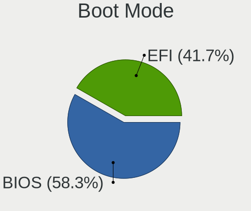
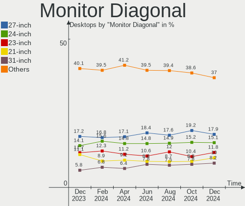
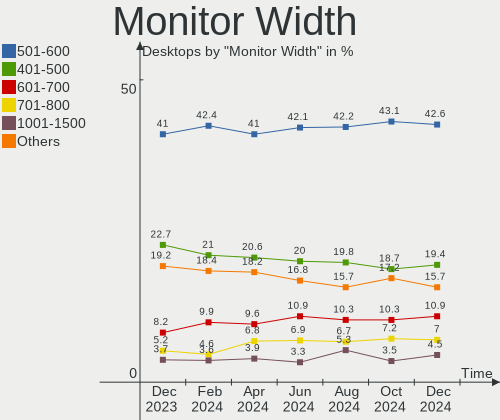
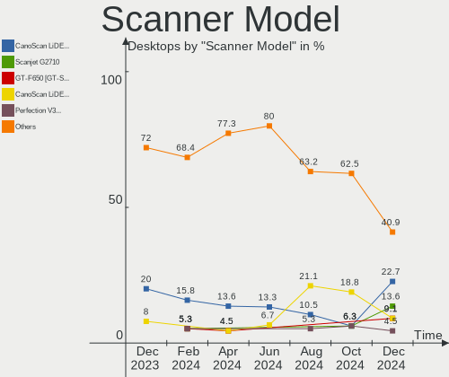

Linux Hardware Trends (Desktop)
-------------------------------

A project to identify most popular hardware characteristics and track their change
over time based on data collected by Linux users at https://Linux-Hardware.org.

Anyone can contribute to the study by uploading probes of their computers by
the [hw-probe](https://github.com/linuxhw/hw-probe) tool:

    sudo -E hw-probe -all -upload

Full-feature report is available here: https://linux-hardware.org/?view=trends&formfactor=desktop

Period: Sep, 2020.

Contents
--------

- [ OS                       ](#os)
- [ OS Family                ](#os-family)
- [ Kernel                   ](#kernel)
- [ Kernel Family            ](#kernel-family)
- [ Kernel Major Ver.        ](#kernel-major-ver)
- [ Arch                     ](#arch)
- [ DE                       ](#de)
- [ Display Server           ](#display-server)
- [ Display Manager          ](#display-manager)
- [ OS Lang                  ](#os-lang)
- [ Boot Mode                ](#boot-mode)
- [ Filesystem               ](#filesystem)
- [ Part. scheme             ](#part-scheme)
- [ Dual Boot with Linux/BSD ](#dual-boot-with-linux/bsd)
- [ Dual Boot (Win)          ](#dual-boot-win)
- [ Country                  ](#country)
- [ City                     ](#city)
- [ Vendor                   ](#vendor)
- [ Model                    ](#model)
- [ Model Family             ](#model-family)
- [ MFG Year                 ](#mfg-year)
- [ Form Factor              ](#form-factor)
- [ Secure Boot              ](#secure-boot)
- [ Coreboot                 ](#coreboot)
- [ RAM Size                 ](#ram-size)
- [ RAM Used                 ](#ram-used)
- [ Has CD-ROM               ](#has-cd-rom)
- [ Total Drives             ](#total-drives)
- [ Has Ethernet             ](#has-ethernet)
- [ Drive Vendor             ](#drive-vendor)
- [ HDD Vendor               ](#hdd-vendor)
- [ SSD Vendor               ](#ssd-vendor)
- [ Drive Model              ](#drive-model)
- [ Drive Kind               ](#drive-kind)
- [ Drive Connector          ](#drive-connector)
- [ Drive Size               ](#drive-size)
- [ Space Total              ](#space-total)
- [ Space Used               ](#space-used)
- [ Malfunc. Drives          ](#malfunc-drives)
- [ Malfunc. Drive Vendor    ](#malfunc-drive-vendor)
- [ Malfunc. HDD Vendor      ](#malfunc-hdd-vendor)
- [ Malfunc. Drive Kind      ](#malfunc-drive-kind)
- [ Failed Drives            ](#failed-drives)
- [ Failed Drive Vendor      ](#failed-drive-vendor)
- [ Drive Status             ](#drive-status)
- [ Storage Vendor           ](#storage-vendor)
- [ Storage Model            ](#storage-model)
- [ Storage Kind             ](#storage-kind)
- [ CPU Vendor               ](#cpu-vendor)
- [ CPU Model                ](#cpu-model)
- [ CPU Model Family         ](#cpu-model-family)
- [ CPU Cores                ](#cpu-cores)
- [ CPU Sockets              ](#cpu-sockets)
- [ CPU Threads              ](#cpu-threads)
- [ CPU Op-Modes             ](#cpu-op-modes)
- [ CPU Microcode            ](#cpu-microcode)
- [ CPU Microarch            ](#cpu-microarch)
- [ GPU Vendor               ](#gpu-vendor)
- [ GPU Model                ](#gpu-model)
- [ GPU Combo                ](#gpu-combo)
- [ GPU Driver               ](#gpu-driver)
- [ GPU Memory               ](#gpu-memory)
- [ Monitor Vendor           ](#monitor-vendor)
- [ Monitor Model            ](#monitor-model)
- [ Monitor Resolution       ](#monitor-resolution)
- [ Monitor Diagonal         ](#monitor-diagonal)
- [ Monitor Width            ](#monitor-width)
- [ Aspect Ratio             ](#aspect-ratio)
- [ Monitor Area             ](#monitor-area)
- [ Pixel Density            ](#pixel-density)
- [ Multiple Monitors        ](#multiple-monitors)
- [ Net Controller Vendor    ](#net-controller-vendor)
- [ Net Controller Model     ](#net-controller-model)
- [ Wireless Vendor          ](#wireless-vendor)
- [ Wireless Model           ](#wireless-model)
- [ Ethernet Vendor          ](#ethernet-vendor)
- [ Ethernet Model           ](#ethernet-model)
- [ Net Controller Kind      ](#net-controller-kind)
- [ Used Controller          ](#used-controller)
- [ NICs                     ](#nics)
- [ Memory Vendor            ](#memory-vendor)
- [ Memory Model             ](#memory-model)
- [ Memory Kind              ](#memory-kind)
- [ Memory Form Factor       ](#memory-form-factor)
- [ Memory Size              ](#memory-size)
- [ Memory Speed             ](#memory-speed)
- [ Sound Vendor             ](#sound-vendor)
- [ Sound Model              ](#sound-model)
- [ Camera Vendor            ](#camera-vendor)
- [ Camera Model             ](#camera-model)
- [ Fingerprint Vendor       ](#fingerprint-vendor)
- [ Fingerprint Model        ](#fingerprint-model)
- [ Chipcard Vendor          ](#chipcard-vendor)
- [ Chipcard Model           ](#chipcard-model)
- [ Printer Vendor           ](#printer-vendor)
- [ Printer Model            ](#printer-model)
- [ Scanner Vendor           ](#scanner-vendor)
- [ Scanner Model            ](#scanner-model)
- [ Bluetooth Vendor         ](#bluetooth-vendor)
- [ Bluetooth Model          ](#bluetooth-model)
- [ Unsupported Devices      ](#unsupported-devices)
- [ Unsupported Device Types ](#unsupported-device-types)

OS
--

Installed operating systems

| Name                | Desktops | Percent |
|---------------------|----------|---------|
| Ubuntu 20.04        | 698      | 32.34%  |
| Ubuntu 18.04        | 160      | 7.41%   |
| Arch Rolling        | 134      | 6.21%   |
| Fedora 32           | 126      | 5.84%   |
| Manjaro 20.1        | 113      | 5.24%   |
| Pop!_OS 20.04       | 97       | 4.49%   |
| Mint 20             | 97       | 4.49%   |
| BlackPanther 18.1   | 84       | 3.89%   |
| ROSA R11.1          | 71       | 3.29%   |
| Arch                | 63       | 2.92%   |
| Manjaro             | 46       | 2.13%   |
| Debian 10           | 35       | 1.62%   |
| Zorin 15            | 29       | 1.34%   |
| ROSA R11            | 27       | 1.25%   |
| Mint 19.3           | 25       | 1.16%   |
| Ubuntu 16.04        | 24       | 1.11%   |
| KDE neon 20.04      | 22       | 1.02%   |
| Gentoo              | 18       | 0.83%   |
| Endless 3.8.6       | 15       | 0.7%    |
| Debian Testing      | 13       | 0.6%    |
| Gentoo 2.7          | 12       | 0.56%   |
| Ubuntu 20.10        | 11       | 0.51%   |
| Debian Unstable     | 10       | 0.46%   |
| openSUSE 15.2       | 9        | 0.42%   |
| EndeavourOS Rolling | 8        | 0.37%   |
| ArcoLinux Rolling   | 8        | 0.37%   |
| Solus 4.1           | 7        | 0.32%   |
| ROSA R8.1           | 7        | 0.32%   |
| ROSA R10            | 7        | 0.32%   |
| Fedora 31           | 7        | 0.32%   |
| Elementary 5.1.7    | 7        | 0.32%   |
| Ubuntu 19.10        | 6        | 0.28%   |
| ROSA 2019.05        | 6        | 0.28%   |
| openSUSE Leap-15.2  | 6        | 0.28%   |
| CentOS 7            | 6        | 0.28%   |
| Kali 2020.3         | 5        | 0.23%   |
| ClearOS 7           | 5        | 0.23%   |
| CentOS 8            | 5        | 0.23%   |
| Zorin 12            | 4        | 0.19%   |
| Reborn OS           | 4        | 0.19%   |
| Peppermint 10       | 4        | 0.19%   |
| Mint 19.1           | 4        | 0.19%   |
| LMDE 4              | 4        | 0.19%   |
| Deepin 20           | 4        | 0.19%   |
| RED X4              | 3        | 0.14%   |
| openSUSE 20200826   | 3        | 0.14%   |
| Mageia 7            | 3        | 0.14%   |
| Gentoo 2.6          | 3        | 0.14%   |
| Fedora 33           | 3        | 0.14%   |
| EndeavourOS         | 3        | 0.14%   |
| Debian              | 3        | 0.14%   |
| Chrome OS           | 3        | 0.14%   |
| Void                | 2        | 0.09%   |
| Ubuntu              | 2        | 0.09%   |
| RHEL 8.2            | 2        | 0.09%   |
| openSUSE 20200925   | 2        | 0.09%   |
| openSUSE 20200902   | 2        | 0.09%   |
| openSUSE 20200901   | 2        | 0.09%   |
| Mint 18.3           | 2        | 0.09%   |
| Garuda              | 2        | 0.09%   |

OS Family
---------

OS without a version

| Name         | Desktops | Percent |
|--------------|----------|---------|
| Ubuntu       | 903      | 41.84%  |
| Arch         | 197      | 9.13%   |
| Manjaro      | 159      | 7.37%   |
| Fedora       | 137      | 6.35%   |
| Mint         | 132      | 6.12%   |
| ROSA         | 118      | 5.47%   |
| Pop!_OS      | 97       | 4.49%   |
| BlackPanther | 86       | 3.99%   |
| Debian       | 63       | 2.92%   |
| Gentoo       | 35       | 1.62%   |
| openSUSE     | 34       | 1.58%   |
| Zorin        | 33       | 1.53%   |
| KDE neon     | 23       | 1.07%   |
| Endless      | 20       | 0.93%   |
| CentOS       | 12       | 0.56%   |
| EndeavourOS  | 11       | 0.51%   |
| ArcoLinux    | 9        | 0.42%   |
| Solus        | 7        | 0.32%   |
| Elementary   | 7        | 0.32%   |
| ClearOS      | 7        | 0.32%   |
| Reborn OS    | 5        | 0.23%   |
| Peppermint   | 5        | 0.23%   |
| Kali         | 5        | 0.23%   |
| Deepin       | 5        | 0.23%   |
| Clear Linux  | 5        | 0.23%   |
| LMDE         | 4        | 0.19%   |
| Void         | 3        | 0.14%   |
| RED          | 3        | 0.14%   |
| Mageia       | 3        | 0.14%   |
| Garuda       | 3        | 0.14%   |
| Chrome OS    | 3        | 0.14%   |
| RHEL         | 2        | 0.09%   |
| MX           | 2        | 0.09%   |
| E-On         | 2        | 0.09%   |
| Artix        | 2        | 0.09%   |
| Sparky       | 1        | 0.05%   |
| SkiffOS      | 1        | 0.05%   |
| Salient OS   | 1        | 0.05%   |
| Rockstor     | 1        | 0.05%   |
| PCLinuxOS    | 1        | 0.05%   |
| Parrot       | 1        | 0.05%   |
| NST          | 1        | 0.05%   |
| No1          | 1        | 0.05%   |
| NixOS        | 1        | 0.05%   |
| Makulu       | 1        | 0.05%   |
| KaOS         | 1        | 0.05%   |
| Devuan       | 1        | 0.05%   |
| Aosc-os      | 1        | 0.05%   |
| antergos     | 1        | 0.05%   |
| Android      | 1        | 0.05%   |
| ALT Linux    | 1        | 0.05%   |

Kernel
------

Version of the Linux kernel

| Version                           | Desktops | Percent |
|-----------------------------------|----------|---------|
| 5.4.0-47-generic                  | 316      | 14.64%  |
| 5.4.0-48-generic                  | 215      | 9.96%   |
| 5.4.0-45-generic                  | 198      | 9.18%   |
| 5.4.0-42-generic                  | 136      | 6.3%    |
| 4.18.16-desktop-1bP               | 84       | 3.89%   |
| 5.4.0-7642-generic                | 75       | 3.48%   |
| 5.8.6-1-MANJARO                   | 65       | 3.01%   |
| 5.8.5-arch1-1                     | 42       | 1.95%   |
| 5.8.4-200.fc32.x86_64             | 34       | 1.58%   |
| 4.15.0-desktop-94.1rosa-x86_64    | 33       | 1.53%   |
| 4.15.0-117-generic                | 31       | 1.44%   |
| 4.15.0-desktop-45.1rosa-x86_64    | 25       | 1.16%   |
| 5.8.3-2-MANJARO                   | 24       | 1.11%   |
| 4.15.0-118-generic                | 24       | 1.11%   |
| 5.8.10-arch1-1                    | 23       | 1.07%   |
| 4.19.0-10-amd64                   | 19       | 0.88%   |
| 5.8.7-arch1-1                     | 18       | 0.83%   |
| 5.8.12-arch1-1                    | 17       | 0.79%   |
| 5.8.11-200.fc32.x86_64            | 17       | 0.79%   |
| 5.8.10-200.fc32.x86_64            | 17       | 0.79%   |
| 5.8.6-201.fc32.x86_64             | 15       | 0.7%    |
| 5.4.0-26-generic                  | 14       | 0.65%   |
| 5.4.0-49-generic                  | 13       | 0.6%    |
| 4.15.0-115-generic                | 13       | 0.6%    |
| 5.8.8-arch1-1                     | 12       | 0.56%   |
| 5.7.17-2-MANJARO                  | 12       | 0.56%   |
| 5.8.9-200.fc32.x86_64             | 11       | 0.51%   |
| 5.8.11-arch1-1                    | 11       | 0.51%   |
| 5.7.19-2-MANJARO                  | 10       | 0.46%   |
| 5.7.0-3-amd64                     | 10       | 0.46%   |
| 5.4.40-generic-1rosa-x86_64       | 10       | 0.46%   |
| 5.4.0-47-lowlatency               | 10       | 0.46%   |
| 4.15.0-112-generic                | 10       | 0.46%   |
| 5.8.12-zen1-1-zen                 | 9        | 0.42%   |
| 5.4.60-2-MANJARO                  | 9        | 0.42%   |
| 4.9.155-nrj-desktop-1rosa-x86_64  | 9        | 0.42%   |
| 5.8.5-zen1-1-zen                  | 8        | 0.37%   |
| 5.4.64-1-MANJARO                  | 8        | 0.37%   |
| 5.3.18-lp152.41-default           | 8        | 0.37%   |
| 5.3.18-lp152.36-default           | 8        | 0.37%   |
| 4.4.0-189-generic                 | 8        | 0.37%   |
| 3.10.0-1127.19.1.el7.x86_64       | 8        | 0.37%   |
| 5.8.7-200.fc32.x86_64             | 7        | 0.32%   |
| 5.8.5-8-tkg-pds                   | 7        | 0.32%   |
| 5.8.10-zen1-1-zen                 | 7        | 0.32%   |
| 5.8.0-1-amd64                     | 7        | 0.32%   |
| 5.4.0-48-lowlatency               | 7        | 0.32%   |
| 5.4.0-46-generic                  | 7        | 0.32%   |
| 5.8.8-200.fc32.x86_64             | 6        | 0.28%   |
| 5.8.4-1-default                   | 6        | 0.28%   |
| 5.8.11-zen1-1-zen                 | 6        | 0.28%   |
| 5.8.0-18-generic                  | 6        | 0.28%   |
| 5.4.60-nickel-2rosa2019.05-x86_64 | 6        | 0.28%   |
| 5.4.32-generic-2rosa-x86_64       | 6        | 0.28%   |
| 5.4.0-7634-generic                | 6        | 0.28%   |
| 5.9.0-1-MANJARO                   | 5        | 0.23%   |
| 5.6.19-158.current                | 5        | 0.23%   |
| 5.4.0-40-generic                  | 5        | 0.23%   |
| 4.9.60-nrj-desktop-1rosa-x86_64   | 5        | 0.23%   |
| 4.15.0-desktop-94.1rosa-i586      | 5        | 0.23%   |

Kernel Family
-------------

Linux kernel without a distro release

| Version | Desktops | Percent |
|---------|----------|---------|
| 5.4.0   | 1022     | 47.36%  |
| 4.15.0  | 168      | 7.78%   |
| 5.8.6   | 86       | 3.99%   |
| 4.18.16 | 84       | 3.89%   |
| 5.8.5   | 77       | 3.57%   |
| 5.8.10  | 69       | 3.2%    |
| 5.8.11  | 47       | 2.18%   |
| 5.8.4   | 42       | 1.95%   |
| 5.8.12  | 41       | 1.9%    |
| 5.8.3   | 34       | 1.58%   |
| 5.8.7   | 32       | 1.48%   |
| 5.8.0   | 30       | 1.39%   |
| 5.8.8   | 27       | 1.25%   |
| 4.19.0  | 27       | 1.25%   |
| 5.8.9   | 26       | 1.2%    |
| 5.7.0   | 22       | 1.02%   |
| 5.4.60  | 22       | 1.02%   |
| 5.7.19  | 19       | 0.88%   |
| 5.7.17  | 18       | 0.83%   |
| 5.3.18  | 17       | 0.79%   |
| 5.3.0   | 17       | 0.79%   |
| 5.9.0   | 15       | 0.7%    |
| 3.10.0  | 13       | 0.6%    |
| 4.4.0   | 12       | 0.56%   |
| 5.4.40  | 11       | 0.51%   |
| 4.9.155 | 11       | 0.51%   |
| 5.6.0   | 10       | 0.46%   |
| 5.4.64  | 9        | 0.42%   |
| 5.4.32  | 8        | 0.37%   |
| 4.18.0  | 8        | 0.37%   |
| 5.7.16  | 7        | 0.32%   |
| 5.4.61  | 7        | 0.32%   |
| 5.0.0   | 7        | 0.32%   |
| 5.8.1   | 6        | 0.28%   |
| 5.7.15  | 6        | 0.28%   |
| 5.6.19  | 6        | 0.28%   |
| 4.9.60  | 6        | 0.28%   |
| 5.7.13  | 4        | 0.19%   |
| 5.6.15  | 4        | 0.19%   |
| 5.4.66  | 4        | 0.19%   |
| 5.4.65  | 4        | 0.19%   |
| 5.4.50  | 4        | 0.19%   |
| 4.1.38  | 4        | 0.19%   |
| 5.7.12  | 3        | 0.14%   |
| 5.7.10  | 3        | 0.14%   |
| 5.6.6   | 3        | 0.14%   |
| 5.4.48  | 3        | 0.14%   |
| 5.4.25  | 3        | 0.14%   |
| 5.8.2   | 2        | 0.09%   |
| 5.7.9   | 2        | 0.09%   |
| 5.7.14  | 2        | 0.09%   |
| 5.4.55  | 2        | 0.09%   |
| 5.4.44  | 2        | 0.09%   |
| 4.9.20  | 2        | 0.09%   |
| 4.9.0   | 2        | 0.09%   |
| 5.7.8   | 1        | 0.05%   |
| 5.7.7   | 1        | 0.05%   |
| 5.7.2   | 1        | 0.05%   |
| 5.7.11  | 1        | 0.05%   |
| 5.6.13  | 1        | 0.05%   |

Kernel Major Ver.
-----------------

Linux kernel major version

| Version | Desktops | Percent |
|---------|----------|---------|
| 5.4     | 1109     | 51.39%  |
| 5.8     | 519      | 24.05%  |
| 4.15    | 169      | 7.83%   |
| 4.18    | 93       | 4.31%   |
| 5.7     | 90       | 4.17%   |
| 5.3     | 35       | 1.62%   |
| 4.19    | 32       | 1.48%   |
| 5.6     | 25       | 1.16%   |
| 4.9     | 22       | 1.02%   |
| 5.9     | 15       | 0.7%    |
| 3.10    | 13       | 0.6%    |
| 4.4     | 12       | 0.56%   |
| 5.0     | 8        | 0.37%   |
| 4.1     | 4        | 0.19%   |
| 5.5     | 2        | 0.09%   |
| 4.13    | 2        | 0.09%   |
| 5.1     | 1        | 0.05%   |
| 4.8     | 1        | 0.05%   |
| 4.2     | 1        | 0.05%   |
| 4.17    | 1        | 0.05%   |
| 4.14    | 1        | 0.05%   |
| 4.12    | 1        | 0.05%   |
| 3.13    | 1        | 0.05%   |
| 2.6     | 1        | 0.05%   |

Arch
----

OS architecture (x86_64, i586, etc.)

| Name   | Desktops | Percent |
|--------|----------|---------|
| x86_64 | 2098     | 97.22%  |
| i686   | 58       | 2.69%   |
| ppc    | 2        | 0.09%   |

DE
--

Desktop Environment

| Name            | Desktops | Percent |
|-----------------|----------|---------|
| GNOME           | 992      | 45.97%  |
| KDE5            | 316      | 14.64%  |
| XFCE            | 186      | 8.62%   |
| Unknown         | 131      | 6.07%   |
| KDE             | 115      | 5.33%   |
| KDE4            | 91       | 4.22%   |
| X-Cinnamon      | 84       | 3.89%   |
| MATE            | 60       | 2.78%   |
| Cinnamon        | 50       | 2.32%   |
| Unity           | 29       | 1.34%   |
| Budgie          | 23       | 1.07%   |
| LXQt            | 15       | 0.7%    |
| LXDE            | 14       | 0.65%   |
| i3              | 14       | 0.65%   |
| Deepin          | 13       | 0.6%    |
| GNOME Flashback | 8        | 0.37%   |
| Pantheon        | 7        | 0.32%   |
| Openbox         | 3        | 0.14%   |
| GNOME Classic   | 2        | 0.09%   |
| bspwm           | 2        | 0.09%   |
| sway            | 1        | 0.05%   |
| ICEWM           | 1        | 0.05%   |
| awesome         | 1        | 0.05%   |

Display Server
--------------

X11 or Wayland

| Name        | Desktops | Percent |
|-------------|----------|---------|
| X11         | 1921     | 89.02%  |
| Wayland     | 116      | 5.38%   |
| Tty         | 77       | 3.57%   |
| Unknown     | 42       | 1.95%   |
| Web         | 1        | 0.05%   |
| Unspecified | 1        | 0.05%   |

Display Manager
---------------

SDDM, LightDM, etc.

| Name    | Desktops | Percent |
|---------|----------|---------|
| Unknown | 1249     | 57.88%  |
| SDDM    | 310      | 14.37%  |
| GDM     | 236      | 10.94%  |
| TDM     | 184      | 8.53%   |
| KDM     | 92       | 4.26%   |
| LightDM | 74       | 3.43%   |
| XDM     | 5        | 0.23%   |
| SLiM    | 3        | 0.14%   |
| LXDM    | 2        | 0.09%   |
| GDM3    | 2        | 0.09%   |
| Ly      | 1        | 0.05%   |

OS Lang
-------

Language

| Lang       | Desktops | Percent |
|------------|----------|---------|
| en_US      | 804      | 37.26%  |
| de_DE      | 166      | 7.69%   |
| Unknown    | 161      | 7.46%   |
| en_GB      | 128      | 5.93%   |
| pt_BR      | 114      | 5.28%   |
| ru_RU      | 102      | 4.73%   |
| fr_FR      | 57       | 2.64%   |
| en_CA      | 51       | 2.36%   |
| en_AU      | 50       | 2.32%   |
| en_US.utf8 | 49       | 2.27%   |
| es_ES      | 48       | 2.22%   |
| it_IT      | 47       | 2.18%   |
| pl_PL      | 30       | 1.39%   |
| en_IN      | 30       | 1.39%   |
| C          | 24       | 1.11%   |
| es_AR      | 23       | 1.07%   |
| nl_NL      | 17       | 0.79%   |
| C          | 11       | 0.51%   |
| ja_JP      | 10       | 0.46%   |
| en_ZA      | 10       | 0.46%   |
| cs_CZ      | 9        | 0.42%   |
| sv_SE      | 8        | 0.37%   |
| hu_HU      | 8        | 0.37%   |
| es_MX      | 8        | 0.37%   |
| es_CO      | 8        | 0.37%   |
| en_IE      | 8        | 0.37%   |
| de_DE.utf8 | 8        | 0.37%   |
| de_AT      | 8        | 0.37%   |
| pt_BR.utf8 | 7        | 0.32%   |
| fi_FI      | 7        | 0.32%   |
| ru_UA      | 6        | 0.28%   |
| ro_RO      | 6        | 0.28%   |
| pt_PT      | 6        | 0.28%   |
| en_GB.utf8 | 6        | 0.28%   |
| de_CH      | 6        | 0.28%   |
| nl_BE      | 5        | 0.23%   |
| nb_NO      | 5        | 0.23%   |
| en_NZ      | 5        | 0.23%   |
| zh_TW      | 4        | 0.19%   |
| POSIX      | 4        | 0.19%   |
| fr_CA      | 4        | 0.19%   |
| en_IL      | 4        | 0.19%   |
| C.UTF8     | 4        | 0.19%   |
| uk_UA      | 3        | 0.14%   |
| ru_RU.utf8 | 3        | 0.14%   |
| lt_LT      | 3        | 0.14%   |
| hr_HR      | 3        | 0.14%   |
| es_MX.utf8 | 3        | 0.14%   |
| es_ES.utf8 | 3        | 0.14%   |
| en_HK      | 3        | 0.14%   |
| bg_BG      | 3        | 0.14%   |
| zh_CN      | 2        | 0.09%   |
| tr_TR      | 2        | 0.09%   |
| ko_KR      | 2        | 0.09%   |
| it_IT.utf8 | 2        | 0.09%   |
| fr_FR.utf8 | 2        | 0.09%   |
| fr_BE      | 2        | 0.09%   |
| es_EC      | 2        | 0.09%   |
| es_CL      | 2        | 0.09%   |
| en_SG      | 2        | 0.09%   |

Boot Mode
---------

EFI or BIOS

| Mode | Desktops | Percent |
|------|----------|---------|
| BIOS | 1205     | 55.84%  |
| EFI  | 953      | 44.16%  |

Filesystem
----------

Type of filesystem

| Type     | Desktops | Percent |
|----------|----------|---------|
| Ext4     | 1828     | 84.71%  |
| Btrfs    | 115      | 5.33%   |
| Overlay  | 107      | 4.96%   |
| Xfs      | 64       | 2.97%   |
| Zfs      | 20       | 0.93%   |
| F2fs     | 7        | 0.32%   |
| Ext3     | 5        | 0.23%   |
| Ext2     | 4        | 0.19%   |
| Reiserfs | 3        | 0.14%   |
| Jfs      | 2        | 0.09%   |
| Unknown  | 2        | 0.09%   |
| Aufs     | 1        | 0.05%   |

Part. scheme
------------

Scheme of partitioning

| Type    | Desktops | Percent |
|---------|----------|---------|
| Unknown | 1181     | 54.73%  |
| GPT     | 695      | 32.21%  |
| MBR     | 282      | 13.07%  |

Dual Boot with Linux/BSD
------------------------

Hosting more than one Linux/BSD

| Dual boot | Desktops | Percent |
|-----------|----------|---------|
| No        | 1754     | 81.28%  |
| Yes       | 404      | 18.72%  |

Dual Boot (Win)
---------------

Hosting Linux and Windows

| Dual boot | Desktops | Percent |
|-----------|----------|---------|
| No        | 1347     | 62.42%  |
| Yes       | 811      | 37.58%  |

Country
-------

Geographic location (country)

| Country                | Desktops | Percent |
|------------------------|----------|---------|
| USA                    | 475      | 22.01%  |
| Germany                | 226      | 10.47%  |
| Brazil                 | 162      | 7.51%   |
| Russia                 | 149      | 6.9%    |
| UK                     | 96       | 4.45%   |
| France                 | 73       | 3.38%   |
| Spain                  | 72       | 3.34%   |
| Canada                 | 70       | 3.24%   |
| Italy                  | 65       | 3.01%   |
| Hungary                | 65       | 3.01%   |
| Australia              | 58       | 2.69%   |
| Netherlands            | 47       | 2.18%   |
| Poland                 | 46       | 2.13%   |
| India                  | 40       | 1.85%   |
| Argentina              | 34       | 1.58%   |
| Finland                | 31       | 1.44%   |
| Sweden                 | 27       | 1.25%   |
| Belgium                | 27       | 1.25%   |
| Switzerland            | 26       | 1.2%    |
| Ukraine                | 24       | 1.11%   |
| Austria                | 20       | 0.93%   |
| Mexico                 | 18       | 0.83%   |
| South Africa           | 17       | 0.79%   |
| Romania                | 17       | 0.79%   |
| Norway                 | 17       | 0.79%   |
| Czech Republic         | 15       | 0.7%    |
| Portugal               | 14       | 0.65%   |
| Greece                 | 13       | 0.6%    |
| Japan                  | 12       | 0.56%   |
| Colombia               | 11       | 0.51%   |
| Israel                 | 9        | 0.42%   |
| Indonesia              | 9        | 0.42%   |
| Serbia                 | 8        | 0.37%   |
| Turkey                 | 7        | 0.32%   |
| Taiwan                 | 7        | 0.32%   |
| New Zealand            | 7        | 0.32%   |
| Korea, Republic of     | 7        | 0.32%   |
| Thailand               | 6        | 0.28%   |
| Slovakia               | 6        | 0.28%   |
| Estonia                | 6        | 0.28%   |
| Denmark                | 6        | 0.28%   |
| Bulgaria               | 6        | 0.28%   |
| Belarus                | 6        | 0.28%   |
| Philippines            | 5        | 0.23%   |
| Lithuania              | 5        | 0.23%   |
| Croatia                | 5        | 0.23%   |
| China                  | 5        | 0.23%   |
| Singapore              | 4        | 0.19%   |
| Ireland                | 4        | 0.19%   |
| Iran                   | 4        | 0.19%   |
| Hong Kong              | 4        | 0.19%   |
| Egypt                  | 4        | 0.19%   |
| Ecuador                | 4        | 0.19%   |
| Chile                  | 4        | 0.19%   |
| Venezuela              | 3        | 0.14%   |
| Puerto Rico            | 3        | 0.14%   |
| Peru                   | 3        | 0.14%   |
| Iceland                | 3        | 0.14%   |
| Bosnia and Herzegovina | 3        | 0.14%   |
| Algeria                | 3        | 0.14%   |

City
----

Geographic location (city)

| City              | Desktops | Percent |
|-------------------|----------|---------|
| Moscow            | 33       | 1.53%   |
| São Paulo        | 30       | 1.39%   |
| Berlin            | 19       | 0.88%   |
| Helsinki          | 17       | 0.79%   |
| St Petersburg     | 16       | 0.74%   |
| Budapest          | 15       | 0.7%    |
| Toronto           | 13       | 0.6%    |
| Hamburg           | 13       | 0.6%    |
| Madrid            | 12       | 0.56%   |
| Paris             | 11       | 0.51%   |
| Frankfurt am Main | 11       | 0.51%   |
| Zurich            | 10       | 0.46%   |
| Warsaw            | 10       | 0.46%   |
| Milan             | 10       | 0.46%   |
| Amsterdam         | 10       | 0.46%   |
| Rio de Janeiro    | 9        | 0.42%   |
| Itatiba           | 9        | 0.42%   |
| Brisbane          | 9        | 0.42%   |
| Wahroonga         | 8        | 0.37%   |
| Vienna            | 8        | 0.37%   |
| Sydney            | 8        | 0.37%   |
| Chicago           | 8        | 0.37%   |
| Buenos Aires      | 8        | 0.37%   |
| Barcelona         | 8        | 0.37%   |
| Tucson            | 7        | 0.32%   |
| Rome              | 7        | 0.32%   |
| Montreal          | 7        | 0.32%   |
| London            | 7        | 0.32%   |
| Karlsruhe         | 7        | 0.32%   |
| Dallas            | 7        | 0.32%   |
| Athens            | 7        | 0.32%   |
| Stuttgart         | 6        | 0.28%   |
| San Jose          | 6        | 0.28%   |
| Novosibirsk       | 6        | 0.28%   |
| New York          | 6        | 0.28%   |
| Melbourne         | 6        | 0.28%   |
| Kansas City       | 6        | 0.28%   |
| Eger              | 6        | 0.28%   |
| Düsseldorf       | 6        | 0.28%   |
| Auckland          | 6        | 0.28%   |
| Wrocław          | 5        | 0.23%   |
| Vancouver         | 5        | 0.23%   |
| Valencia          | 5        | 0.23%   |
| Turin             | 5        | 0.23%   |
| Tel Aviv          | 5        | 0.23%   |
| San Diego         | 5        | 0.23%   |
| Samara            | 5        | 0.23%   |
| Salt Lake City    | 5        | 0.23%   |
| Pretoria          | 5        | 0.23%   |
| Phoenix           | 5        | 0.23%   |
| Omsk              | 5        | 0.23%   |
| Malmo             | 5        | 0.23%   |
| Kharkiv           | 5        | 0.23%   |
| Irkutsk           | 5        | 0.23%   |
| Hyderabad         | 5        | 0.23%   |
| Curitiba          | 5        | 0.23%   |
| Cape Town         | 5        | 0.23%   |
| Bucharest         | 5        | 0.23%   |
| Bogotá           | 5        | 0.23%   |
| Belo Horizonte    | 5        | 0.23%   |

Vendor
------

Motherboard manufacturer

| Name                | Desktops | Percent |
|---------------------|----------|---------|
| ASUSTek Computer    | 592      | 27.43%  |
| Gigabyte Technology | 369      | 17.1%   |
| MSI                 | 292      | 13.53%  |
| ASRock              | 237      | 10.98%  |
| Dell                | 152      | 7.04%   |
| Hewlett-Packard     | 122      | 5.65%   |
| Intel               | 59       | 2.73%   |
| Lenovo              | 56       | 2.59%   |
| Acer                | 45       | 2.09%   |
| Unknown             | 30       | 1.39%   |
| Foxconn             | 26       | 1.2%    |
| Biostar             | 23       | 1.07%   |
| ECS                 | 19       | 0.88%   |
| Fujitsu             | 18       | 0.83%   |
| Pegatron            | 17       | 0.79%   |
| Medion              | 14       | 0.65%   |
| Fujitsu Siemens     | 10       | 0.46%   |
| Positivo            | 7        | 0.32%   |
| Shuttle             | 6        | 0.28%   |
| Packard Bell        | 5        | 0.23%   |
| Supermicro          | 4        | 0.19%   |
| OEM                 | 4        | 0.19%   |
| eMachines           | 4        | 0.19%   |
| PCWare              | 3        | 0.14%   |
| Megaware            | 3        | 0.14%   |
| Huanan              | 3        | 0.14%   |
| Gateway             | 3        | 0.14%   |
| ASRockRack          | 3        | 0.14%   |
| WeiBu               | 2        | 0.09%   |
| Lanix               | 2        | 0.09%   |
| Google              | 2        | 0.09%   |
| AZW                 | 2        | 0.09%   |
| AOpen               | 2        | 0.09%   |
| ABIT                | 2        | 0.09%   |
| Zenith              | 1        | 0.05%   |
| WinFast             | 1        | 0.05%   |
| TYAN Computer       | 1        | 0.05%   |
| TEKNOSERVICE        | 1        | 0.05%   |
| T-bao               | 1        | 0.05%   |
| System76            | 1        | 0.05%   |
| SiS Technology      | 1        | 0.05%   |
| Samsung Electronics | 1        | 0.05%   |
| RBQ                 | 1        | 0.05%   |
| Phitronics          | 1        | 0.05%   |
| Penguin Computing   | 1        | 0.05%   |
| PCSMART             | 1        | 0.05%   |
| Nexcom              | 1        | 0.05%   |
| Minix               | 1        | 0.05%   |
| Koloe               | 1        | 0.05%   |
| ECS-USA             | 1        | 0.05%   |
| DIEBOLD             | 1        | 0.05%   |
| DEPO Computers      | 1        | 0.05%   |
| AMD                 | 1        | 0.05%   |
| AEWIN Net Work      | 1        | 0.05%   |

Model
-----

Motherboard model

| Name                             | Desktops | Percent |
|----------------------------------|----------|---------|
| ASUS All Series                  | 70       | 3.24%   |
| Unknown                          | 31       | 1.44%   |
| MSI MS-7C02                      | 19       | 0.88%   |
| ASUS TUF GAMING X570-PLUS        | 18       | 0.83%   |
| MSI MS-7A38                      | 16       | 0.74%   |
| ASUS PRIME X470-PRO              | 15       | 0.7%    |
| Gigabyte B450M DS3H              | 14       | 0.65%   |
| MSI MS-7B86                      | 13       | 0.6%    |
| ASUS PRIME B350-PLUS             | 12       | 0.56%   |
| MSI MS-7B89                      | 11       | 0.51%   |
| ASRock B450M Pro4                | 11       | 0.51%   |
| MSI MS-7B79                      | 10       | 0.46%   |
| Gigabyte X570 AORUS ELITE        | 10       | 0.46%   |
| Dell OptiPlex 7010               | 10       | 0.46%   |
| ASUS PRIME B450M-A               | 10       | 0.46%   |
| MSI MS-7C37                      | 9        | 0.42%   |
| MSI MS-7B85                      | 9        | 0.42%   |
| MSI MS-7A34                      | 9        | 0.42%   |
| MSI MS-7817                      | 9        | 0.42%   |
| Gigabyte X470 AORUS ULTRA GAMING | 9        | 0.42%   |
| Dell OptiPlex 3010               | 9        | 0.42%   |
| ASUS PRIME X370-PRO              | 9        | 0.42%   |
| Gigabyte 970A-DS3P               | 8        | 0.37%   |
| ASUS ROG STRIX X570-E GAMING     | 8        | 0.37%   |
| ASUS ROG STRIX B450-F GAMING     | 8        | 0.37%   |
| ASUS PRIME A320M-K               | 8        | 0.37%   |
| ASUS M5A97 R2.0                  | 8        | 0.37%   |
| Dell OptiPlex 790                | 7        | 0.32%   |
| Dell OptiPlex 780                | 7        | 0.32%   |
| ASUS TUF B450-PLUS GAMING        | 7        | 0.32%   |
| MSI MS-7821                      | 6        | 0.28%   |
| MSI MS-7721                      | 6        | 0.28%   |
| MSI MS-7693                      | 6        | 0.28%   |
| Gigabyte X570 AORUS PRO          | 6        | 0.28%   |
| Gigabyte B450 AORUS ELITE        | 6        | 0.28%   |
| ASUS ROG STRIX X470-F GAMING     | 6        | 0.28%   |
| ASRock X470 Taichi               | 6        | 0.28%   |
| ASRock B450M Steel Legend        | 6        | 0.28%   |
| MSI MS-7A32                      | 5        | 0.23%   |
| MSI MS-7885                      | 5        | 0.23%   |
| Intel HCL Desktop                | 5        | 0.23%   |
| Intel H61                        | 5        | 0.23%   |
| HP Compaq Elite 8300 SFF         | 5        | 0.23%   |
| Gigabyte X570 AORUS MASTER       | 5        | 0.23%   |
| Gigabyte H61M-S1                 | 5        | 0.23%   |
| Gigabyte GA-78LMT-USB3 R2        | 5        | 0.23%   |
| Gigabyte B450 AORUS PRO          | 5        | 0.23%   |
| Gigabyte A320M-S2H               | 5        | 0.23%   |
| Dell OptiPlex 755                | 5        | 0.23%   |
| Dell OptiPlex 390                | 5        | 0.23%   |
| ASUS Z170-A                      | 5        | 0.23%   |
| ASUS SABERTOOTH 990FX R2.0       | 5        | 0.23%   |
| ASUS ROG STRIX B350-F GAMING     | 5        | 0.23%   |
| ASUS ROG CROSSHAIR VII HERO      | 5        | 0.23%   |
| ASUS PRIME X570-PRO              | 5        | 0.23%   |
| ASUS PRIME H310M-R R2.0          | 5        | 0.23%   |
| ASUS P5K                         | 5        | 0.23%   |
| ASRock X570 Taichi               | 5        | 0.23%   |
| ASRock A320M-HD                  | 5        | 0.23%   |
| MSI MS-7C84                      | 4        | 0.19%   |

Model Family
------------

Motherboard model prefix

| Name                   | Desktops | Percent |
|------------------------|----------|---------|
| ASUS PRIME             | 109      | 5.05%   |
| Dell OptiPlex          | 92       | 4.26%   |
| ASUS All               | 70       | 3.24%   |
| ASUS ROG               | 67       | 3.1%    |
| HP Compaq              | 56       | 2.59%   |
| ASUS TUF               | 47       | 2.18%   |
| Gigabyte X570          | 35       | 1.62%   |
| Lenovo ThinkCentre     | 32       | 1.48%   |
| Unknown                | 31       | 1.44%   |
| Acer Aspire            | 24       | 1.11%   |
| Gigabyte B450          | 20       | 0.93%   |
| MSI MS-7C02            | 19       | 0.88%   |
| ASRock X570            | 19       | 0.88%   |
| ASRock B450M           | 19       | 0.88%   |
| Gigabyte B450M         | 18       | 0.83%   |
| ASUS M5A78L-M          | 17       | 0.79%   |
| MSI MS-7A38            | 16       | 0.74%   |
| Dell Precision         | 16       | 0.74%   |
| Dell XPS               | 15       | 0.7%    |
| ASUS Maximus           | 15       | 0.7%    |
| HP EliteDesk           | 14       | 0.65%   |
| Dell Inspiron          | 14       | 0.65%   |
| MSI MS-7B86            | 13       | 0.6%    |
| ASUS M5A97             | 13       | 0.6%    |
| ASRock X470            | 13       | 0.6%    |
| Acer Veriton           | 12       | 0.56%   |
| MSI MS-7B89            | 11       | 0.51%   |
| HP ProDesk             | 11       | 0.51%   |
| Fujitsu ESPRIMO        | 11       | 0.51%   |
| MSI MS-7B79            | 10       | 0.46%   |
| MSI MS-7C37            | 9        | 0.42%   |
| MSI MS-7B85            | 9        | 0.42%   |
| MSI MS-7A34            | 9        | 0.42%   |
| MSI MS-7817            | 9        | 0.42%   |
| HP Pavilion            | 9        | 0.42%   |
| Gigabyte X470          | 9        | 0.42%   |
| Gigabyte 970A-DS3P     | 9        | 0.42%   |
| ASUS P8H61-M           | 9        | 0.42%   |
| Gigabyte Z390          | 8        | 0.37%   |
| ASUS STRIX             | 8        | 0.37%   |
| ASUS SABERTOOTH        | 8        | 0.37%   |
| ASUS P8Z77-V           | 8        | 0.37%   |
| Lenovo ThinkStation    | 7        | 0.32%   |
| ASUS P5K               | 7        | 0.32%   |
| ASRock Z170            | 7        | 0.32%   |
| ASRock 970             | 7        | 0.32%   |
| MSI MS-7821            | 6        | 0.28%   |
| MSI MS-7721            | 6        | 0.28%   |
| MSI MS-7693            | 6        | 0.28%   |
| Gigabyte Z370          | 6        | 0.28%   |
| Gigabyte GA-78LMT-USB3 | 6        | 0.28%   |
| Gigabyte A320M-S2H     | 6        | 0.28%   |
| Dell Studio            | 6        | 0.28%   |
| ASUS P9X79             | 6        | 0.28%   |
| ASRock B450            | 6        | 0.28%   |
| ASRock AB350           | 6        | 0.28%   |
| MSI MS-7A32            | 5        | 0.23%   |
| MSI MS-7885            | 5        | 0.23%   |
| Intel HCL              | 5        | 0.23%   |
| Intel H61              | 5        | 0.23%   |

MFG Year
--------

Motherboard manufacture year

| Year    | Desktops | Percent |
|---------|----------|---------|
| 2019    | 376      | 17.42%  |
| 2020    | 300      | 13.9%   |
| 2018    | 231      | 10.7%   |
| 2013    | 170      | 7.88%   |
| 2012    | 147      | 6.81%   |
| 2014    | 132      | 6.12%   |
| 2011    | 115      | 5.33%   |
| 2010    | 115      | 5.33%   |
| 2015    | 114      | 5.28%   |
| 2016    | 111      | 5.14%   |
| 2009    | 105      | 4.87%   |
| 2017    | 86       | 3.99%   |
| 2008    | 66       | 3.06%   |
| 2007    | 58       | 2.69%   |
| 2006    | 12       | 0.56%   |
| 2005    | 10       | 0.46%   |
| Unknown | 5        | 0.23%   |
| 2004    | 4        | 0.19%   |
| 2003    | 1        | 0.05%   |

Form Factor
-----------

Physical design of the computer

| Name    | Desktops | Percent |
|---------|----------|---------|
| Desktop | 2158     | 100%    |

Secure Boot
-----------

Enabled or disabled

| State    | Desktops | Percent |
|----------|----------|---------|
| Disabled | 2121     | 98.29%  |
| Enabled  | 37       | 1.71%   |

Coreboot
--------

Have coreboot on board

| Used | Desktops | Percent |
|------|----------|---------|
| No   | 2154     | 99.81%  |
| Yes  | 4        | 0.19%   |

RAM Size
--------

Total RAM memory

| Size in GB      | Desktops | Percent |
|-----------------|----------|---------|
| 16.01-24.0      | 598      | 27.71%  |
| 8.01-16.0       | 391      | 18.12%  |
| 32.01-64.0      | 336      | 15.57%  |
| 3.01-4.0        | 329      | 15.25%  |
| 4.01-8.0        | 253      | 11.72%  |
| 64.01-256.0     | 85       | 3.94%   |
| 1.01-2.0        | 81       | 3.75%   |
| 24.01-32.0      | 48       | 2.22%   |
| 2.01-3.0        | 23       | 1.07%   |
| 0.01-1.0        | 11       | 0.51%   |
| More than 256.0 | 3        | 0.14%   |

RAM Used
--------

Used RAM memory

| Used GB    | Desktops | Percent |
|------------|----------|---------|
| 1.01-2.0   | 610      | 28.27%  |
| 2.01-3.0   | 449      | 20.81%  |
| 4.01-8.0   | 394      | 18.26%  |
| 0.01-1.0   | 263      | 12.19%  |
| 3.01-4.0   | 242      | 11.21%  |
| 8.01-16.0  | 145      | 6.72%   |
| 16.01-24.0 | 36       | 1.67%   |
| 24.01-32.0 | 9        | 0.42%   |
| 32.01-64.0 | 8        | 0.37%   |
| Unknown    | 2        | 0.09%   |

Has CD-ROM
----------

Has CD-ROM on board

| Presented | Desktops | Percent |
|-----------|----------|---------|
| No        | 1180     | 54.68%  |
| Yes       | 978      | 45.32%  |

Total Drives
------------

Number of drives on board

| Drives | Desktops | Percent |
|--------|----------|---------|
| 1      | 779      | 36.1%   |
| 2      | 608      | 28.17%  |
| 3      | 357      | 16.54%  |
| 4      | 207      | 9.59%   |
| 5      | 103      | 4.77%   |
| 6      | 40       | 1.85%   |
| 7      | 28       | 1.3%    |
| 0      | 17       | 0.79%   |
| 8      | 10       | 0.46%   |
| 10     | 4        | 0.19%   |
| 11     | 2        | 0.09%   |
| 25     | 1        | 0.05%   |
| 13     | 1        | 0.05%   |
| 12     | 1        | 0.05%   |

Has Ethernet
------------

Has Ethernet on board

| Presented | Desktops | Percent |
|-----------|----------|---------|
| Yes       | 2137     | 99.03%  |
| No        | 21       | 0.97%   |

Drive Vendor
------------

Hard drive vendors

| Vendor                    | Desktops | Drives  | Percent |
|---------------------------|----------|---------|---------|
| WDC                       | 821      | 1116    | 20.7%   |
| Seagate                   | 816      | 1088    | 20.57%  |
| Samsung Electronics       | 639      | 875     | 16.11%  |
| Kingston                  | 244      | 274     | 6.15%   |
| Toshiba                   | 215      | 248     | 5.42%   |
| Hitachi                   | 162      | 186     | 4.08%   |
| Crucial                   | 161      | 181     | 4.06%   |
| SanDisk                   | 152      | 167     | 3.83%   |
| Intel                     | 75       | 86      | 1.89%   |
| A-DATA Technology         | 67       | 75      | 1.69%   |
| Phison                    | 64       | 75      | 1.61%   |
| HGST                      | 48       | 79      | 1.21%   |
| Unknown                   | 39       | 39      | 0.98%   |
| MAXTOR                    | 31       | 32      | 0.78%   |
| OCZ                       | 27       | 31      | 0.68%   |
| Corsair                   | 24       | 27      | 0.6%    |
| China                     | 24       | 28      | 0.6%    |
| SPCC                      | 23       | 23      | 0.58%   |
| Transcend                 | 22       | 22      | 0.55%   |
| PNY                       | 19       | 21      | 0.48%   |
| Silicon Motion            | 18       | 21      | 0.45%   |
| SK Hynix                  | 17       | 17      | 0.43%   |
| Patriot                   | 16       | 16      | 0.4%    |
| Micron Technology         | 14       | 18      | 0.35%   |
| Fujitsu                   | 14       | 14      | 0.35%   |
| Micron/Crucial Technology | 12       | 13      | 0.3%    |
| Hewlett-Packard           | 12       | 12      | 0.3%    |
| Intenso                   | 11       | 12      | 0.28%   |
| GOODRAM                   | 10       | 11      | 0.25%   |
| Gigabyte Technology       | 10       | 10      | 0.25%   |
| Mushkin                   | 9        | 9       | 0.23%   |
| Apacer                    | 9        | 10      | 0.23%   |
| XPG                       | 8        | 8       | 0.2%    |
| PLEXTOR                   | 6        | 6       | 0.15%   |
| Realtek Semiconductor     | 5        | 5       | 0.13%   |
| LITEON                    | 5        | 5       | 0.13%   |
| Lexar                     | 5        | 5       | 0.13%   |
| KingSpec                  | 5        | 5       | 0.13%   |
| JMicron                   | 5        | 4       | 0.13%   |
| ASMT                      | 5        | 5       | 0.13%   |
| Apple                     | 5        | 5       | 0.13%   |
| SABRENT                   | 4        | 4       | 0.1%    |
| LITEONIT                  | 4        | 4       | 0.1%    |
| TO Exter                  | 3        | 3       | 0.08%   |
| Team                      | 3        | 4       | 0.08%   |
| Phison Electronics        | 3        | 3       | 0.08%   |
| HL-DT-ST                  | 3        | Unknown | 0.08%   |
| WD MediaMax               | 2        | 2       | 0.05%   |
| Pioneer                   | 2        | 4       | 0.05%   |
| Msft                      | 2        | 4       | 0.05%   |
| Lite-On                   | 2        | 2       | 0.05%   |
| KingFast                  | 2        | 2       | 0.05%   |
| KingDian                  | 2        | 2       | 0.05%   |
| KESU                      | 2        | 2       | 0.05%   |
| HS-SSD-C100               | 2        | 2       | 0.05%   |
| Hikvision                 | 2        | 2       | 0.05%   |
| e2e4                      | 2        | 2       | 0.05%   |
| BRAVEEAGLE                | 2        | 2       | 0.05%   |
| ASMedia                   | 2        | 2       | 0.05%   |
| Zheino                    | 1        | 1       | 0.03%   |

HDD Vendor
----------

Hard disk drive vendors

| Vendor              | Desktops | Drives | Percent |
|---------------------|----------|--------|---------|
| Seagate             | 803      | 1056   | 37.23%  |
| WDC                 | 743      | 987    | 34.45%  |
| Toshiba             | 194      | 218    | 8.99%   |
| Hitachi             | 162      | 186    | 7.51%   |
| Samsung Electronics | 136      | 150    | 6.31%   |
| HGST                | 48       | 79     | 2.23%   |
| MAXTOR              | 30       | 31     | 1.39%   |
| Fujitsu             | 12       | 12     | 0.56%   |
| Hewlett-Packard     | 5        | 5      | 0.23%   |
| Apple               | 4        | 4      | 0.19%   |
| TO Exter            | 3        | 3      | 0.14%   |
| ASMT                | 3        | 3      | 0.14%   |
| Msft                | 2        | 4      | 0.09%   |
| KESU                | 2        | 2      | 0.09%   |
| Intenso             | 2        | 2      | 0.09%   |
| MARVELL             | 1        | 1      | 0.05%   |
| Lenovo              | 1        | 1      | 0.05%   |
| LaCie               | 1        | 1      | 0.05%   |
| JMicron             | 1        | 1      | 0.05%   |
| IBM/Hitachi         | 1        | 1      | 0.05%   |
| ExcelStor           | 1        | 1      | 0.05%   |
| ASMT109x            | 1        | 1      | 0.05%   |
| asmedia             | 1        | 1      | 0.05%   |

SSD Vendor
----------

Solid state drive vendors

| Vendor              | Desktops | Drives | Percent |
|---------------------|----------|--------|---------|
| Samsung Electronics | 365      | 461    | 26.86%  |
| Kingston            | 221      | 246    | 16.26%  |
| Crucial             | 155      | 175    | 11.41%  |
| SanDisk             | 130      | 142    | 9.57%   |
| WDC                 | 101      | 105    | 7.43%   |
| A-DATA Technology   | 51       | 55     | 3.75%   |
| Intel               | 37       | 43     | 2.72%   |
| OCZ                 | 27       | 31     | 1.99%   |
| China               | 24       | 28     | 1.77%   |
| Transcend           | 20       | 20     | 1.47%   |
| SPCC                | 20       | 20     | 1.47%   |
| Toshiba             | 17       | 25     | 1.25%   |
| PNY                 | 17       | 19     | 1.25%   |
| Micron Technology   | 14       | 18     | 1.03%   |
| Patriot             | 13       | 13     | 0.96%   |
| Corsair             | 13       | 14     | 0.96%   |
| GOODRAM             | 10       | 11     | 0.74%   |
| Apacer              | 9        | 10     | 0.66%   |
| SK Hynix            | 8        | 8      | 0.59%   |
| Mushkin             | 8        | 8      | 0.59%   |
| Intenso             | 8        | 9      | 0.59%   |
| Gigabyte Technology | 7        | 7      | 0.52%   |
| Unknown             | 6        | 8      | 0.44%   |
| LITEON              | 5        | 5      | 0.37%   |
| Lexar               | 5        | 5      | 0.37%   |
| KingSpec            | 5        | 5      | 0.37%   |
| Hewlett-Packard     | 5        | 5      | 0.37%   |
| Seagate             | 4        | 4      | 0.29%   |
| SABRENT             | 4        | 4      | 0.29%   |
| PLEXTOR             | 4        | 4      | 0.29%   |
| LITEONIT            | 4        | 4      | 0.29%   |
| Team                | 3        | 4      | 0.22%   |
| KingDian            | 2        | 2      | 0.15%   |
| Fujitsu             | 2        | 2      | 0.15%   |
| e2e4                | 2        | 2      | 0.15%   |
| BRAVEEAGLE          | 2        | 2      | 0.15%   |
| ASMT                | 2        | 2      | 0.15%   |
| WDC WDS             | 1        | 1      | 0.07%   |
| Verbatim            | 1        | 1      | 0.07%   |
| USB30               | 1        | 1      | 0.07%   |
| TCSUNBOW            | 1        | 1      | 0.07%   |
| T-FORCE             | 1        | 1      | 0.07%   |
| Super Talent        | 1        | 1      | 0.07%   |
| Smartbuy            | 1        | 1      | 0.07%   |
| SATA3               | 1        | 1      | 0.07%   |
| Pioneer             | 1        | 3      | 0.07%   |
| Phison              | 1        | 1      | 0.07%   |
| Netac               | 1        | 1      | 0.07%   |
| MG                  | 1        | 1      | 0.07%   |
| Maxtor              | 1        | 1      | 0.07%   |
| LIO-ORG             | 1        | 2      | 0.07%   |
| KLEVV               | 1        | 1      | 0.07%   |
| Kingrich            | 1        | 1      | 0.07%   |
| KINGMAX             | 1        | 1      | 0.07%   |
| KingFast            | 1        | 1      | 0.07%   |
| KINGBANK            | 1        | 1      | 0.07%   |
| JMicron             | 1        | 1      | 0.07%   |
| InnoDisk            | 1        | 1      | 0.07%   |
| HyperX              | 1        | 1      | 0.07%   |
| Hoodisk             | 1        | 1      | 0.07%   |

Drive Model
-----------

Hard drive models

| Model                        | Desktops | Percent |
|------------------------------|----------|---------|
| ST1000DM010-2EP102 1TB       | 63       | 1.36%   |
| NVMe SSD Drive 500GB         | 62       | 1.34%   |
| ST500DM002-1BD142 500GB      | 54       | 1.17%   |
| SSD 860 EVO 500GB            | 54       | 1.17%   |
| SA400S37240G 240GB SSD       | 52       | 1.12%   |
| NVMe SSD Drive 1TB           | 50       | 1.08%   |
| SSD 850 EVO 500GB            | 48       | 1.04%   |
| SSD 850 EVO 250GB            | 47       | 1.02%   |
| WD10EZEX-08WN4A0 1TB         | 45       | 0.97%   |
| SA400S37120G 120GB SSD       | 43       | 0.93%   |
| SSD 860 EVO 1TB              | 40       | 0.86%   |
| NVMe SSD Drive 512GB         | 38       | 0.82%   |
| DT01ACA100 1TB               | 37       | 0.8%    |
| ST1000DM003-1ER162 1TB       | 35       | 0.76%   |
| ST1000DM003-1CH162 1TB       | 32       | 0.69%   |
| HDWD110 1TB                  | 29       | 0.63%   |
| SV300S37A120G 120GB SSD      | 28       | 0.61%   |
| ST2000DM008-2FR102 2TB       | 27       | 0.58%   |
| SSD 970 EVO Plus 500GB       | 27       | 0.58%   |
| SSD 970 EVO 500GB            | 27       | 0.58%   |
| ST4000DM004-2CV104 4TB       | 26       | 0.56%   |
| ST2000DM006-2DM164 2TB       | 26       | 0.56%   |
| ST2000DM001-1ER164 2TB       | 26       | 0.56%   |
| NVMe SSD Drive 256GB         | 26       | 0.56%   |
| CT500MX500SSD1 500GB         | 26       | 0.56%   |
| WD10EZEX-00BN5A0 1TB         | 25       | 0.54%   |
| ST3500418AS 500GB            | 25       | 0.54%   |
| SSD 860 EVO 250GB            | 25       | 0.54%   |
| NVMe SSD Drive 250GB         | 23       | 0.5%    |
| WD20EZRZ-00Z5HB0 2TB         | 22       | 0.48%   |
| SA400S37480G 480GB SSD       | 21       | 0.45%   |
| ST2000DM001-1CH164 2TB       | 20       | 0.43%   |
| CT1000MX500SSD1 1TB          | 20       | 0.43%   |
| SSD 860 QVO 1TB              | 19       | 0.41%   |
| NVMe SSD Drive 1024GB        | 19       | 0.41%   |
| DT01ACA200 2TB               | 18       | 0.39%   |
| SSD 850 PRO 256GB            | 16       | 0.35%   |
| Expansion 1TB                | 16       | 0.35%   |
| WD10EARS-00Y5B1 1TB          | 15       | 0.32%   |
| ST31000524AS 1TB             | 15       | 0.32%   |
| ST1000DM003-9YN162 1TB       | 15       | 0.32%   |
| SSD 970 EVO Plus 1TB         | 15       | 0.32%   |
| SSD 960 EVO 250GB            | 15       | 0.32%   |
| SSD 850 EVO 1TB              | 15       | 0.32%   |
| SSD 840 EVO 250GB            | 15       | 0.32%   |
| Expansion Desk 6TB           | 15       | 0.32%   |
| WD1002FAEX-00Z3A0 1TB        | 14       | 0.3%    |
| ST3160815AS 160GB            | 14       | 0.3%    |
| SSD 850 EVO 120GB            | 14       | 0.3%    |
| CT240BX500SSD1 240GB         | 14       | 0.3%    |
| WDS500G2B0A-00SM50 500GB SSD | 13       | 0.28%   |
| WD20EZRX-00D8PB0 2TB         | 13       | 0.28%   |
| ST4000DM000-1F2168 4TB       | 13       | 0.28%   |
| ST3500413AS 500GB            | 13       | 0.28%   |
| SSD PLUS 240GB               | 13       | 0.28%   |
| HDWD130 3TB                  | 13       | 0.28%   |
| HDS721010CLA332 1TB          | 13       | 0.28%   |
| HD502HJ 500GB                | 13       | 0.28%   |
| HD103SJ 1TB                  | 13       | 0.28%   |
| DT01ACA300 3TB               | 13       | 0.28%   |

Drive Kind
----------

HDD or SSD

| Kind    | Desktops | Drives | Percent |
|---------|----------|--------|---------|
| HDD     | 1654     | 2750   | 49.85%  |
| SSD     | 1101     | 1559   | 33.18%  |
| NVMe    | 478      | 591    | 14.41%  |
| Unknown | 82       | 84     | 2.47%   |
| MMC     | 3        | 4      | 0.09%   |

Drive Connector
---------------

SATA, SAS, NVMe, etc.

| Type | Desktops | Drives | Percent |
|------|----------|--------|---------|
| SATA | 2018     | 4201   | 76.44%  |
| NVMe | 478      | 591    | 18.11%  |
| SAS  | 141      | 192    | 5.34%   |
| MMC  | 3        | 4      | 0.11%   |

Drive Size
----------

Size of hard drive

| Size in TB | Desktops | Drives | Percent |
|------------|----------|--------|---------|
| 0.01-0.5   | 1638     | 2519   | 48.4%   |
| 0.51-1.0   | 1039     | 1452   | 30.7%   |
| 1.01-2.0   | 373      | 505    | 11.02%  |
| 2.01-3.0   | 119      | 163    | 3.52%   |
| 3.01-4.0   | 118      | 162    | 3.49%   |
| 4.01-10.0  | 91       | 174    | 2.69%   |
| 10.01-20.0 | 6        | 13     | 0.18%   |

Space Total
-----------

Amount of disk space available on the file system

| Size in GB     | Desktops | Percent |
|----------------|----------|---------|
| 101-250        | 419      | 19.42%  |
| 251-500        | 376      | 17.42%  |
| 501-1000       | 343      | 15.89%  |
| 1001-2000      | 280      | 12.97%  |
| More than 3000 | 242      | 11.21%  |
| 2001-3000      | 155      | 7.18%   |
| Unknown        | 110      | 5.1%    |
| 51-100         | 104      | 4.82%   |
| 1-20           | 86       | 3.99%   |
| 21-50          | 43       | 1.99%   |

Space Used
----------

Amount of used disk space

| Used GB        | Desktops | Percent |
|----------------|----------|---------|
| 1-20           | 607      | 28.13%  |
| 21-50          | 276      | 12.79%  |
| 101-250        | 240      | 11.12%  |
| 251-500        | 212      | 9.82%   |
| 501-1000       | 204      | 9.45%   |
| 51-100         | 178      | 8.25%   |
| 1001-2000      | 159      | 7.37%   |
| Unknown        | 110      | 5.1%    |
| More than 3000 | 101      | 4.68%   |
| 2001-3000      | 70       | 3.24%   |
| 0              | 1        | 0.05%   |

Malfunc. Drives
---------------

Drive models with a malfunction

| Model                        | Desktops | Drives | Percent |
|------------------------------|----------|--------|---------|
| ST500DM002-1BD142 500GB      | 13       | 13     | 4%      |
| WD10EARS-00Y5B1 1TB          | 5        | 5      | 1.54%   |
| ST3500418AS 500GB            | 5        | 5      | 1.54%   |
| ST31000524AS 1TB             | 4        | 4      | 1.23%   |
| ST1000DM003-9YN162 1TB       | 4        | 4      | 1.23%   |
| HD103UJ 1TB                  | 4        | 5      | 1.23%   |
| WD5000AAKX-001CA0 500GB      | 3        | 3      | 0.92%   |
| WD5000AADS-00S9B0 500GB      | 3        | 3      | 0.92%   |
| WD20EARS-00MVWB0 2TB         | 3        | 3      | 0.92%   |
| ST3160815AS 160GB            | 3        | 3      | 0.92%   |
| ST2000DM001-1ER164 2TB       | 3        | 3      | 0.92%   |
| ST1000DM003-1CH162 1TB       | 3        | 4      | 0.92%   |
| HD501LJ 500GB                | 3        | 3      | 0.92%   |
| CT525MX300SSD1 528GB         | 3        | 3      | 0.92%   |
| WD5000AAKX-75U6AA0 500GB     | 2        | 2      | 0.62%   |
| WD5000AADS-56S9B1 500GB      | 2        | 2      | 0.62%   |
| WD3200AAKS-00L9A0 320GB      | 2        | 2      | 0.62%   |
| WD3200AAJS-00L7A0 320GB      | 2        | 2      | 0.62%   |
| WD20EZRZ-00Z5HB0 2TB         | 2        | 2      | 0.62%   |
| WD20EZRX-00DC0B0 2TB         | 2        | 3      | 0.62%   |
| WD10JPCX-24UE4T0 1TB         | 2        | 2      | 0.62%   |
| WD10EZRX-00A8LB0 1TB         | 2        | 2      | 0.62%   |
| WD10EZEX-08WN4A0 1TB         | 2        | 2      | 0.62%   |
| WD10EZEX-00BN5A0 1TB         | 2        | 2      | 0.62%   |
| WD10EADS-00M2B0 1TB          | 2        | 2      | 0.62%   |
| VERTEX4 256GB SSD            | 2        | 2      | 0.62%   |
| SV300S37A120G 120GB SSD      | 2        | 2      | 0.62%   |
| ST9250315AS 250GB            | 2        | 2      | 0.62%   |
| ST500LT012-9WS142 500GB      | 2        | 2      | 0.62%   |
| ST3750525AS 752GB            | 2        | 2      | 0.62%   |
| ST3500830AS 500GB            | 2        | 2      | 0.62%   |
| ST3500630AS 500GB            | 2        | 2      | 0.62%   |
| ST3500410AS 500GB            | 2        | 2      | 0.62%   |
| ST3500320NS 500GB            | 2        | 2      | 0.62%   |
| ST3500320AS 500GB            | 2        | 2      | 0.62%   |
| ST3500312CS 499GB            | 2        | 2      | 0.62%   |
| ST3400620AS 400GB            | 2        | 2      | 0.62%   |
| ST3320418AS 320GB            | 2        | 2      | 0.62%   |
| ST3250410AS 250GB            | 2        | 2      | 0.62%   |
| ST3250310AS 250GB            | 2        | 2      | 0.62%   |
| ST31500341AS 1TB             | 2        | 2      | 0.62%   |
| ST2000DM001-9YN164 2TB       | 2        | 2      | 0.62%   |
| SSDSC2CT120A3 120GB          | 2        | 2      | 0.62%   |
| SSD 960 PRO 512GB            | 2        | 2      | 0.62%   |
| SSD 960 EVO 250GB            | 2        | 2      | 0.62%   |
| SDSSDA120G 120GB             | 2        | 2      | 0.62%   |
| SA400S37120G 120GB SSD       | 2        | 2      | 0.62%   |
| MQ01ABD100 1TB               | 2        | 2      | 0.62%   |
| MK2552GSX 250GB              | 2        | 2      | 0.62%   |
| HTS727550A9E364 500GB        | 2        | 2      | 0.62%   |
| HDS721050CLA362 500GB        | 2        | 2      | 0.62%   |
| HDS721050CLA360 500GB        | 2        | 2      | 0.62%   |
| HDS721010CLA332 1TB          | 2        | 2      | 0.62%   |
| HD502HJ 500GB                | 2        | 2      | 0.62%   |
| HD103SJ 1TB                  | 2        | 3      | 0.62%   |
| DT01ACA100 1TB               | 2        | 2      | 0.62%   |
| DT01ACA050 500GB             | 2        | 2      | 0.62%   |
| 1100_MTFDDAK512TBN 512GB SSD | 2        | 4      | 0.62%   |
| WD7500BPVT-60HXZT1 752GB     | 1        | 1      | 0.31%   |
| WD7500AAKS-00RBA0 752GB      | 1        | 1      | 0.31%   |

Malfunc. Drive Vendor
---------------------

Vendors of faulty drives

| Vendor              | Desktops | Drives | Percent |
|---------------------|----------|--------|---------|
| Seagate             | 92       | 97     | 29.39%  |
| WDC                 | 90       | 102    | 28.75%  |
| Samsung Electronics | 31       | 35     | 9.9%    |
| Hitachi             | 18       | 19     | 5.75%   |
| Toshiba             | 16       | 17     | 5.11%   |
| Kingston            | 8        | 8      | 2.56%   |
| SanDisk             | 7        | 8      | 2.24%   |
| OCZ                 | 7        | 7      | 2.24%   |
| Intel               | 7        | 7      | 2.24%   |
| Crucial             | 7        | 8      | 2.24%   |
| Maxtor              | 5        | 5      | 1.6%    |
| A-DATA Technology   | 4        | 4      | 1.28%   |
| SPCC                | 3        | 3      | 0.96%   |
| SK Hynix            | 3        | 3      | 0.96%   |
| Micron Technology   | 3        | 5      | 0.96%   |
| Corsair             | 2        | 2      | 0.64%   |
| Apacer              | 2        | 2      | 0.64%   |
| PNY                 | 1        | 1      | 0.32%   |
| PLEXTOR             | 1        | 1      | 0.32%   |
| Patriot             | 1        | 1      | 0.32%   |
| Kingrich            | 1        | 1      | 0.32%   |
| IBM/Hitachi         | 1        | 1      | 0.32%   |
| HGST                | 1        | 1      | 0.32%   |
| China               | 1        | 1      | 0.32%   |
| ASMT                | 1        | 1      | 0.32%   |

Malfunc. HDD Vendor
-------------------

Vendors of faulty HDD drives

| Vendor              | Desktops | Drives | Percent |
|---------------------|----------|--------|---------|
| Seagate             | 92       | 97     | 37.4%   |
| WDC                 | 90       | 102    | 36.59%  |
| Samsung Electronics | 22       | 26     | 8.94%   |
| Hitachi             | 18       | 19     | 7.32%   |
| Toshiba             | 16       | 17     | 6.5%    |
| MAXTOR              | 5        | 5      | 2.03%   |
| IBM/Hitachi         | 1        | 1      | 0.41%   |
| HGST                | 1        | 1      | 0.41%   |
| ASMT                | 1        | 1      | 0.41%   |

Malfunc. Drive Kind
-------------------

Kinds of faulty drives

| Kind | Desktops | Drives | Percent |
|------|----------|--------|---------|
| HDD  | 227      | 269    | 77.21%  |
| SSD  | 57       | 61     | 19.39%  |
| NVMe | 10       | 10     | 3.4%    |

Failed Drives
-------------

Failed drive models

| Model                   | Desktops | Drives | Percent |
|-------------------------|----------|--------|---------|
| WD800BB-55JKC0 80GB     | 1        | 1      | 14.29%  |
| WD30EZRS-00J99B0 3TB    | 1        | 1      | 14.29%  |
| WD1600AAJS-75M0A0 160GB | 1        | 1      | 14.29%  |
| WD10EAVS-00D7B1 1TB     | 1        | 1      | 14.29%  |
| TS128GMTE850 128GB      | 1        | 1      | 14.29%  |
| SV300S37A120G 120GB SSD | 1        | 1      | 14.29%  |
| ST3500418AS 500GB       | 1        | 1      | 14.29%  |

Failed Drive Vendor
-------------------

Failed drive vendors

| Vendor    | Desktops | Drives | Percent |
|-----------|----------|--------|---------|
| WDC       | 4        | 4      | 57.14%  |
| Transcend | 1        | 1      | 14.29%  |
| Seagate   | 1        | 1      | 14.29%  |
| Kingston  | 1        | 1      | 14.29%  |

Drive Status
------------

Number of failed and malfunc. drives

| Status   | Desktops | Drives | Percent |
|----------|----------|--------|---------|
| Detected | 1271     | 2707   | 52.63%  |
| Works    | 854      | 1934   | 35.36%  |
| Malfunc  | 283      | 340    | 11.72%  |
| Failed   | 7        | 7      | 0.29%   |

Storage Vendor
--------------

Storage controller vendors

| Vendor                           | Desktops | Percent |
|----------------------------------|----------|---------|
| Intel                            | 1248     | 42.59%  |
| AMD                              | 835      | 28.5%   |
| Samsung Electronics              | 226      | 7.71%   |
| ASMedia Technology               | 118      | 4.03%   |
| Phison Electronics               | 86       | 2.94%   |
| Nvidia                           | 76       | 2.59%   |
| JMicron Technology               | 61       | 2.08%   |
| Marvell Technology Group         | 60       | 2.05%   |
| Sandisk                          | 42       | 1.43%   |
| Silicon Motion                   | 27       | 0.92%   |
| Kingston Technology Company      | 26       | 0.89%   |
| ADATA Technology                 | 24       | 0.82%   |
| Micron/Crucial Technology        | 18       | 0.61%   |
| VIA Technologies                 | 13       | 0.44%   |
| Realtek Semiconductor            | 11       | 0.38%   |
| LSI Logic / Symbios Logic        | 10       | 0.34%   |
| SK Hynix                         | 8        | 0.27%   |
| Silicon Integrated Systems [SiS] | 6        | 0.2%    |
| Silicon Image                    | 6        | 0.2%    |
| Adaptec                          | 6        | 0.2%    |
| Toshiba America Info Systems     | 5        | 0.17%   |
| Lite-On Technology               | 4        | 0.14%   |
| Broadcom / LSI                   | 4        | 0.14%   |
| 3ware                            | 3        | 0.1%    |
| Seagate Technology               | 2        | 0.07%   |
| Union Memory (Shenzhen)          | 1        | 0.03%   |
| Tekram Technology                | 1        | 0.03%   |
| Promise Technology               | 1        | 0.03%   |
| OCZ Technology Group             | 1        | 0.03%   |
| Integrated Technology Express    | 1        | 0.03%   |

Storage Model
-------------

Storage controller models

| Model                                                                             | Desktops | Percent |
|-----------------------------------------------------------------------------------|----------|---------|
| FCH SATA Controller [AHCI mode]                                                   | 596      | 15.2%   |
| 400 Series Chipset SATA Controller                                                | 238      | 6.07%   |
| NVMe SSD Controller SM981/PM981/PM983                                             | 171      | 4.36%   |
| 8 Series/C220 Series Chipset Family 6-port SATA Controller 1 [AHCI mode]          | 145      | 3.7%    |
| SB7x0/SB8x0/SB9x0 IDE Controller                                                  | 124      | 3.16%   |
| 6 Series/C200 Series Chipset Family 6 port Desktop SATA AHCI Controller           | 119      | 3.03%   |
| NM10/ICH7 Family SATA Controller [IDE mode]                                       | 117      | 2.98%   |
| ASM1062 Serial ATA Controller                                                     | 113      | 2.88%   |
| SB7x0/SB8x0/SB9x0 SATA Controller [AHCI mode]                                     | 103      | 2.63%   |
| 200 Series PCH SATA controller [AHCI mode]                                        | 101      | 2.58%   |
| Q170/Q150/B150/H170/H110/Z170/CM236 Chipset SATA Controller [AHCI Mode]           | 98       | 2.5%    |
| 82801G (ICH7 Family) IDE Controller                                               | 96       | 2.45%   |
| 7 Series/C210 Series Chipset Family 6-port SATA Controller [AHCI mode]            | 91       | 2.32%   |
| SB7x0/SB8x0/SB9x0 SATA Controller [IDE mode]                                      | 85       | 2.17%   |
| 300 Series Chipset SATA Controller                                                | 69       | 1.76%   |
| Cannon Lake PCH SATA AHCI Controller                                              | 68       | 1.73%   |
| SATA Controller [RAID mode]                                                       | 67       | 1.71%   |
| Non-Volatile memory controller                                                    | 56       | 1.43%   |
| 9 Series Chipset Family SATA Controller [AHCI Mode]                               | 52       | 1.33%   |
| NVMe SSD Controller SM961/PM961                                                   | 51       | 1.3%    |
| E12 NVMe Controller                                                               | 50       | 1.27%   |
| 6 Series/C200 Series Chipset Family Desktop SATA Controller (IDE mode, ports 4-5) | 49       | 1.25%   |
| 6 Series/C200 Series Chipset Family Desktop SATA Controller (IDE mode, ports 0-3) | 49       | 1.25%   |
| MCP61 SATA Controller                                                             | 48       | 1.22%   |
| SATA controller                                                                   | 40       | 1.02%   |
| MCP61 IDE                                                                         | 40       | 1.02%   |
| FCH SATA Controller D                                                             | 40       | 1.02%   |
| 82801I (ICH9 Family) 2 port SATA Controller [IDE mode]                            | 37       | 0.94%   |
| JMB363 SATA/IDE Controller                                                        | 35       | 0.89%   |
| X370 Series Chipset SATA Controller                                               | 31       | 0.79%   |
| C610/X99 series chipset 6-Port SATA Controller [AHCI mode]                        | 26       | 0.66%   |
| SSD 660P Series                                                                   | 25       | 0.64%   |
| E16 PCIe4 NVMe Controller                                                         | 25       | 0.64%   |
| C610/X99 series chipset sSATA Controller [AHCI mode]                              | 25       | 0.64%   |
| 4 Series Chipset PT IDER Controller                                               | 25       | 0.64%   |
| XPG SX8200 Pro PCIe Gen3x4 M.2 2280 Solid State Drive                             | 24       | 0.61%   |
| 82801IR/IO/IH (ICH9R/DO/DH) 4 port SATA Controller [IDE mode]                     | 23       | 0.59%   |
| 82801JI (ICH10 Family) SATA AHCI Controller                                       | 22       | 0.56%   |
| A2000, M.2, 500GB                                                                 | 21       | 0.54%   |
| FCH IDE Controller                                                                | 20       | 0.51%   |
| 5 Series/3400 Series Chipset 6 port SATA AHCI Controller                          | 20       | 0.51%   |
| C600/X79 series chipset 6-Port SATA AHCI Controller                               | 19       | 0.48%   |
| 82801JI (ICH10 Family) 4 port SATA IDE Controller #1                              | 18       | 0.46%   |
| 82801JI (ICH10 Family) 2 port SATA IDE Controller #2                              | 18       | 0.46%   |
| 7 Series/C210 Series Chipset Family 4-port SATA Controller [IDE mode]             | 18       | 0.46%   |
| 7 Series/C210 Series Chipset Family 2-port SATA Controller [IDE mode]             | 18       | 0.46%   |
| P1 NVMe PCIe SSD                                                                  | 16       | 0.41%   |
| JMB368 IDE controller                                                             | 16       | 0.41%   |
| 82Q35 Express PT IDER Controller                                                  | 16       | 0.41%   |
| 82801JD/DO (ICH10 Family) SATA AHCI Controller                                    | 15       | 0.38%   |
| 82801IB (ICH9) 2 port SATA Controller [IDE mode]                                  | 14       | 0.36%   |
| 5 Series/3400 Series Chipset 4 port SATA IDE Controller                           | 14       | 0.36%   |
| 400 Series Chipset Family SATA AHCI Controller                                    | 13       | 0.33%   |
| SM2262/SM2262EN SSD Controller                                                    | 12       | 0.31%   |
| 82801H (ICH8 Family) 4 port SATA Controller [IDE mode]                            | 12       | 0.31%   |
| Realtek Non-Volatile memory controller                                            | 11       | 0.28%   |
| NM10/ICH7 Family SATA Controller [AHCI mode]                                      | 11       | 0.28%   |
| 88SE9172 SATA 6Gb/s Controller                                                    | 11       | 0.28%   |
| X399 Series Chipset SATA Controller                                               | 10       | 0.25%   |
| FCH SATA Controller [IDE mode]                                                    | 10       | 0.25%   |

Storage Kind
------------

Kind of storage controller (IDE, SATA, NVMe, SAS, ...)

| Kind | Desktops | Percent |
|------|----------|---------|
| SATA | 1711     | 58.76%  |
| IDE  | 600      | 20.6%   |
| NVMe | 481      | 16.52%  |
| RAID | 101      | 3.47%   |
| SCSI | 10       | 0.34%   |
| SAS  | 9        | 0.31%   |

CPU Vendor
----------

Processor vendors

| Vendor       | Desktops | Percent |
|--------------|----------|---------|
| Intel        | 1254     | 58.11%  |
| AMD          | 901      | 41.75%  |
| PowerMac3,6  | 1        | 0.05%   |
| PowerMac10,2 | 1        | 0.05%   |
| Unknown      | 1        | 0.05%   |

CPU Model
---------

Processor models

| Model                                       | Desktops | Percent |
|---------------------------------------------|----------|---------|
| AMD Ryzen 5 3600 6-Core Processor           | 75       | 3.48%   |
| AMD Ryzen 7 3700X 8-Core Processor          | 60       | 2.78%   |
| AMD Ryzen 5 2600 Six-Core Processor         | 49       | 2.27%   |
| AMD Ryzen 9 3900X 12-Core Processor         | 35       | 1.62%   |
| AMD Ryzen 7 2700X Eight-Core Processor      | 35       | 1.62%   |
| Intel Core i7-6700K CPU @ 4.00GHz           | 33       | 1.53%   |
| Intel Core i5-3470 CPU @ 3.20GHz            | 33       | 1.53%   |
| AMD Ryzen 5 1600 Six-Core Processor         | 32       | 1.48%   |
| AMD Ryzen 5 2600X Six-Core Processor        | 29       | 1.34%   |
| Intel Core 2 Duo CPU E8400 @ 3.00GHz        | 27       | 1.25%   |
| AMD Ryzen 5 3600X 6-Core Processor          | 27       | 1.25%   |
| Intel Core i5-2400 CPU @ 3.10GHz            | 26       | 1.2%    |
| AMD FX-8350 Eight-Core Processor            | 25       | 1.16%   |
| Intel Core i7-4790K CPU @ 4.00GHz           | 23       | 1.07%   |
| AMD FX-6300 Six-Core Processor              | 22       | 1.02%   |
| Intel Core i7-3770 CPU @ 3.40GHz            | 20       | 0.93%   |
| Intel Core i7-2600 CPU @ 3.40GHz            | 19       | 0.88%   |
| Intel Core 2 Quad CPU Q6600 @ 2.40GHz       | 19       | 0.88%   |
| Intel Core i3-3220 CPU @ 3.30GHz            | 18       | 0.83%   |
| AMD Ryzen 7 3800X 8-Core Processor          | 18       | 0.83%   |
| AMD Ryzen 7 1700 Eight-Core Processor       | 18       | 0.83%   |
| Intel Core i7-4790 CPU @ 3.60GHz            | 17       | 0.79%   |
| Intel Core i7-8700K CPU @ 3.70GHz           | 16       | 0.74%   |
| Intel Core i3-2120 CPU @ 3.30GHz            | 16       | 0.74%   |
| Intel Core i7-7700K CPU @ 4.20GHz           | 15       | 0.7%    |
| AMD Ryzen 7 2700 Eight-Core Processor       | 15       | 0.7%    |
| AMD Phenom II X4 955 Processor              | 15       | 0.7%    |
| Intel Core i5-8400 CPU @ 2.80GHz            | 14       | 0.65%   |
| AMD Ryzen 5 3400G with Radeon Vega Graphics | 14       | 0.65%   |
| AMD Ryzen 3 2200G with Radeon Vega Graphics | 14       | 0.65%   |
| Intel Core i7-8700 CPU @ 3.20GHz            | 13       | 0.6%    |
| Intel Core i7-6700 CPU @ 3.40GHz            | 13       | 0.6%    |
| Intel Core i7-4770 CPU @ 3.40GHz            | 13       | 0.6%    |
| Intel Core i5-4570 CPU @ 3.20GHz            | 13       | 0.6%    |
| Intel Core i3-2100 CPU @ 3.10GHz            | 13       | 0.6%    |
| AMD Ryzen 9 3950X 16-Core Processor         | 13       | 0.6%    |
| AMD Ryzen 7 1700X Eight-Core Processor      | 13       | 0.6%    |
| Intel Core i7-3770K CPU @ 3.50GHz           | 12       | 0.56%   |
| Intel Core i5-4460 CPU @ 3.20GHz            | 12       | 0.56%   |
| Intel Core 2 Quad CPU Q9400 @ 2.66GHz       | 12       | 0.56%   |
| Intel Core 2 Duo CPU E7500 @ 2.93GHz        | 12       | 0.56%   |
| Intel Pentium 4 CPU 3.00GHz                 | 11       | 0.51%   |
| Intel Core i7-5820K CPU @ 3.30GHz           | 11       | 0.51%   |
| Intel Core i5-6500 CPU @ 3.20GHz            | 11       | 0.51%   |
| Intel Core i5-3570K CPU @ 3.40GHz           | 11       | 0.51%   |
| Intel Core i3-4130 CPU @ 3.40GHz            | 11       | 0.51%   |
| AMD Ryzen 5 2400G with Radeon Vega Graphics | 11       | 0.51%   |
| Intel Pentium Dual CPU E2180 @ 2.00GHz      | 10       | 0.46%   |
| Intel Core i5-7500 CPU @ 3.40GHz            | 10       | 0.46%   |
| Intel Core i5-4670 CPU @ 3.40GHz            | 10       | 0.46%   |
| Intel Core i5-4440 CPU @ 3.10GHz            | 10       | 0.46%   |
| AMD Ryzen 9 3900XT 12-Core Processor        | 10       | 0.46%   |
| AMD Ryzen 3 3200G with Radeon Vega Graphics | 10       | 0.46%   |
| AMD FX-8320 Eight-Core Processor            | 10       | 0.46%   |
| Intel Core i5-7400 CPU @ 3.00GHz            | 9        | 0.42%   |
| Intel Core i5-2500 CPU @ 3.30GHz            | 9        | 0.42%   |
| Intel Core i3-8100 CPU @ 3.60GHz            | 9        | 0.42%   |
| AMD Athlon II X2 250 Processor              | 9        | 0.42%   |
| Intel Pentium Dual-Core CPU E5200 @ 2.50GHz | 8        | 0.37%   |
| Intel Core i9-9900K CPU @ 3.60GHz           | 8        | 0.37%   |

CPU Model Family
----------------

Processor model prefix

| Model                   | Desktops | Percent |
|-------------------------|----------|---------|
| Intel Core i5           | 327      | 15.15%  |
| Intel Core i7           | 303      | 14.04%  |
| AMD Ryzen 5             | 260      | 12.05%  |
| AMD Ryzen 7             | 166      | 7.69%   |
| Intel Core i3           | 148      | 6.86%   |
| AMD FX                  | 96       | 4.45%   |
| Intel Xeon              | 90       | 4.17%   |
| Intel Core 2 Duo        | 84       | 3.89%   |
| AMD Ryzen 9             | 58       | 2.69%   |
| Intel Core 2 Quad       | 56       | 2.59%   |
| Intel Celeron           | 49       | 2.27%   |
| Intel Pentium           | 48       | 2.22%   |
| Intel Pentium Dual-Core | 37       | 1.71%   |
| AMD Phenom II X4        | 34       | 1.58%   |
| AMD Ryzen 3             | 31       | 1.44%   |
| AMD Athlon II X2        | 30       | 1.39%   |
| AMD A10                 | 25       | 1.16%   |
| AMD A8                  | 23       | 1.07%   |
| AMD Athlon 64 X2        | 22       | 1.02%   |
| AMD Ryzen Threadripper  | 21       | 0.97%   |
| Intel Pentium Dual      | 20       | 0.93%   |
| Intel Pentium 4         | 20       | 0.93%   |
| Intel Core i9           | 18       | 0.83%   |
| AMD Athlon II X4        | 17       | 0.79%   |
| AMD Athlon              | 15       | 0.7%    |
| AMD Phenom II X6        | 13       | 0.6%    |
| AMD A6                  | 13       | 0.6%    |
| Intel Core 2            | 12       | 0.56%   |
| Intel Atom              | 12       | 0.56%   |
| Intel Pentium D         | 11       | 0.51%   |
| AMD A4                  | 11       | 0.51%   |
| Other                   | 7        | 0.32%   |
| Intel Pentium Silver    | 7        | 0.32%   |
| AMD Sempron             | 7        | 0.32%   |
| AMD Athlon X4           | 7        | 0.32%   |
| AMD Athlon II X3        | 6        | 0.28%   |
| AMD Athlon 64           | 6        | 0.28%   |
| Intel Genuine           | 5        | 0.23%   |
| AMD Ryzen 7 PRO         | 5        | 0.23%   |
| AMD Phenom II X2        | 5        | 0.23%   |
| Intel Pentium Gold      | 4        | 0.19%   |
| AMD Ryzen 5 PRO         | 3        | 0.14%   |
| AMD Phenom II X3        | 3        | 0.14%   |
| AMD E1                  | 3        | 0.14%   |
| AMD Athlon Dual Core    | 3        | 0.14%   |
| Intel Core 2 Extreme    | 2        | 0.09%   |
| AMD Phenom              | 2        | 0.09%   |
| AMD Opteron             | 2        | 0.09%   |
| AMD EPYC                | 2        | 0.09%   |
| AMD E                   | 2        | 0.09%   |
| Intel Celeron M         | 1        | 0.05%   |
| AMD Turion II Neo       | 1        | 0.05%   |
| AMD PRO A8              | 1        | 0.05%   |
| AMD PRO A10             | 1        | 0.05%   |
| AMD G                   | 1        | 0.05%   |
| AMD E2                  | 1        | 0.05%   |
| AMD C-60                | 1        | 0.05%   |

CPU Cores
---------

Number of processor cores

| Number | Desktops | Percent |
|--------|----------|---------|
| 4      | 815      | 37.77%  |
| 2      | 555      | 25.72%  |
| 6      | 361      | 16.73%  |
| 8      | 217      | 10.06%  |
| 1      | 67       | 3.1%    |
| 12     | 55       | 2.55%   |
| 3      | 39       | 1.81%   |
| 16     | 24       | 1.11%   |
| 32     | 7        | 0.32%   |
| 24     | 7        | 0.32%   |
| 10     | 6        | 0.28%   |
| 5      | 2        | 0.09%   |
| 28     | 1        | 0.05%   |
| 22     | 1        | 0.05%   |
| 18     | 1        | 0.05%   |

CPU Sockets
-----------

Number of sockets

| Number | Desktops | Percent |
|--------|----------|---------|
| 1      | 2135     | 98.93%  |
| 2      | 23       | 1.07%   |

CPU Threads
-----------

Threads per core (Hyper-Threading)

| Number | Desktops | Percent |
|--------|----------|---------|
| 2      | 1242     | 57.55%  |
| 1      | 916      | 42.45%  |

CPU Op-Modes
------------

CPU Operation Modes (32-bit, 64-bit)

| Op mode        | Desktops | Percent |
|----------------|----------|---------|
| 32-bit, 64-bit | 2151     | 99.68%  |
| 32-bit         | 7        | 0.32%   |

CPU Microcode
-------------

Microcode number

| Number     | Desktops | Percent |
|------------|----------|---------|
| Unknown    | 297      | 13.76%  |
| 0x306c3    | 179      | 8.29%   |
| 0x306a9    | 135      | 6.26%   |
| 0x08701021 | 128      | 5.93%   |
| 0x206a7    | 127      | 5.89%   |
| 0x0800820d | 111      | 5.14%   |
| 0x1067a    | 105      | 4.87%   |
| 0x08701013 | 91       | 4.22%   |
| 0x506e3    | 80       | 3.71%   |
| 0x906ea    | 65       | 3.01%   |
| 0x06000852 | 62       | 2.87%   |
| 0x906e9    | 57       | 2.64%   |
| 0x010000c8 | 52       | 2.41%   |
| 0x08001138 | 41       | 1.9%    |
| 0x6fd      | 33       | 1.53%   |
| 0x06001119 | 31       | 1.44%   |
| 0x6fb      | 29       | 1.34%   |
| 0x08108109 | 23       | 1.07%   |
| 0x06003106 | 22       | 1.02%   |
| 0x306f2    | 21       | 0.97%   |
| 0x010000db | 20       | 0.93%   |
| 0x10676    | 19       | 0.88%   |
| 0x906eb    | 18       | 0.83%   |
| 0x08001137 | 18       | 0.83%   |
| 0x906ed    | 15       | 0.7%    |
| 0x0600063e | 15       | 0.7%    |
| 0x206d7    | 13       | 0.6%    |
| 0x20655    | 13       | 0.6%    |
| 0x08001129 | 13       | 0.6%    |
| 0x906ec    | 12       | 0.56%   |
| 0x206c2    | 12       | 0.56%   |
| 0x106e5    | 12       | 0.56%   |
| 0x010000dc | 12       | 0.56%   |
| 0x20652    | 11       | 0.51%   |
| 0x106a5    | 11       | 0.51%   |
| 0x706a1    | 10       | 0.46%   |
| 0x0810100b | 10       | 0.46%   |
| 0x08101016 | 9        | 0.42%   |
| 0x306e4    | 8        | 0.37%   |
| 0x30678    | 8        | 0.37%   |
| 0x0600611a | 8        | 0.37%   |
| 0xf43      | 7        | 0.32%   |
| 0xa0655    | 7        | 0.32%   |
| 0x6f6      | 7        | 0.32%   |
| 0x6f2      | 6        | 0.28%   |
| 0x406f1    | 6        | 0.28%   |
| 0x106ca    | 6        | 0.28%   |
| 0x10677    | 6        | 0.28%   |
| 0x08301039 | 6        | 0.28%   |
| 0x03000027 | 6        | 0.28%   |
| 0x010000c7 | 6        | 0.28%   |
| 0x50654    | 5        | 0.23%   |
| 0x106c2    | 5        | 0.23%   |
| 0x0700010f | 5        | 0.23%   |
| 0xf49      | 4        | 0.19%   |
| 0xf47      | 4        | 0.19%   |
| 0xf41      | 4        | 0.19%   |
| 0x08301025 | 4        | 0.19%   |
| 0x0800820b | 4        | 0.19%   |
| 0x08008206 | 4        | 0.19%   |

CPU Microarch
-------------

Microarchitecture

| Name          | Desktops | Percent |
|---------------|----------|---------|
| Skylake       | 282      | 13.07%  |
| Zen 2         | 264      | 12.23%  |
| Haswell       | 234      | 10.84%  |
| Core          | 218      | 10.1%   |
| Zen+          | 165      | 7.65%   |
| IvyBridge     | 162      | 7.51%   |
| SandyBridge   | 158      | 7.32%   |
| K10           | 121      | 5.61%   |
| Zen           | 120      | 5.56%   |
| Piledriver    | 114      | 5.28%   |
| Westmere      | 39       | 1.81%   |
| K8 Hammer     | 36       | 1.67%   |
| NetBurst      | 34       | 1.58%   |
| KabyLake      | 29       | 1.34%   |
| Steamroller   | 28       | 1.3%    |
| Nehalem       | 26       | 1.2%    |
| Bulldozer     | 19       | 0.88%   |
| Penryn        | 18       | 0.83%   |
| Silvermont    | 14       | 0.65%   |
| Excavator     | 13       | 0.6%    |
| Bonnell       | 12       | 0.56%   |
| Broadwell     | 11       | 0.51%   |
| Goldmont plus | 10       | 0.46%   |
| Jaguar        | 8        | 0.37%   |
| K10 Llano     | 6        | 0.28%   |
| Bobcat        | 5        | 0.23%   |
| Goldmont      | 4        | 0.19%   |
| CometLake     | 4        | 0.19%   |
| Puma          | 2        | 0.09%   |
| Unknown       | 2        | 0.09%   |

GPU Vendor
----------

Vendors of graphics cards

| Vendor                                       | Desktops | Percent |
|----------------------------------------------|----------|---------|
| Nvidia                                       | 934      | 41.25%  |
| AMD                                          | 740      | 32.69%  |
| Intel                                        | 562      | 24.82%  |
| ASPEED Technology                            | 8        | 0.35%   |
| VIA Technologies                             | 5        | 0.22%   |
| Matrox Electronics Systems                   | 5        | 0.22%   |
| XGI Technology (eXtreme Graphics Innovation) | 3        | 0.13%   |
| Silicon Integrated Systems [SiS]             | 3        | 0.13%   |
| Silicon Motion                               | 2        | 0.09%   |
| ATI Technologies                             | 2        | 0.09%   |

GPU Model
---------

Graphics card models

| Model                                                                 | Desktops | Percent |
|-----------------------------------------------------------------------|----------|---------|
| Ellesmere [Radeon RX 470/480/570/570X/580/580X/590]                   | 154      | 6.64%   |
| Navi 10 [Radeon RX 5600 OEM/5600 XT / 5700/5700 XT]                   | 103      | 4.44%   |
| Xeon E3-1200 v3/4th Gen Core Processor Integrated Graphics Controller | 79       | 3.41%   |
| 2nd Generation Core Processor Family Integrated Graphics Controller   | 79       | 3.41%   |
| Xeon E3-1200 v2/3rd Gen Core processor Graphics Controller            | 75       | 3.23%   |
| GP107 [GeForce GTX 1050 Ti]                                           | 61       | 2.63%   |
| GK208B [GeForce GT 710]                                               | 45       | 1.94%   |
| 4 Series Chipset Integrated Graphics Controller                       | 45       | 1.94%   |
| GP106 [GeForce GTX 1060 6GB]                                          | 44       | 1.9%    |
| GM204 [GeForce GTX 970]                                               | 43       | 1.85%   |
| GP104 [GeForce GTX 1070]                                              | 40       | 1.72%   |
| GP102 [GeForce GTX 1080 Ti]                                           | 32       | 1.38%   |
| GP104 [GeForce GTX 1080]                                              | 31       | 1.34%   |
| HD Graphics 530                                                       | 30       | 1.29%   |
| GT218 [GeForce 210]                                                   | 27       | 1.16%   |
| HD Graphics 630                                                       | 26       | 1.12%   |
| Vega 10 XL/XT [Radeon RX Vega 56/64]                                  | 25       | 1.08%   |
| GP106 [GeForce GTX 1060 3GB]                                          | 25       | 1.08%   |
| 82G33/G31 Express Integrated Graphics Controller                      | 24       | 1.03%   |
| UHD Graphics 630 (Desktop)                                            | 23       | 0.99%   |
| Cedar [Radeon HD 5000/6000/7350/8350 Series]                          | 23       | 0.99%   |
| TU104 [GeForce RTX 2070 SUPER]                                        | 22       | 0.95%   |
| 82945G/GZ Integrated Graphics Controller                              | 22       | 0.95%   |
| 4th Generation Core Processor Family Integrated Graphics Controller   | 22       | 0.95%   |
| Raven Ridge [Radeon Vega Series / Radeon Vega Mobile Series]          | 21       | 0.91%   |
| GP108 [GeForce GT 1030]                                               | 21       | 0.91%   |
| Picasso                                                               | 20       | 0.86%   |
| Kaveri [Radeon R7 Graphics]                                           | 19       | 0.82%   |
| GP107 [GeForce GTX 1050]                                              | 18       | 0.78%   |
| RS780L [Radeon 3000]                                                  | 17       | 0.73%   |
| GM107 [GeForce GTX 750 Ti]                                            | 17       | 0.73%   |
| TU116 [GeForce GTX 1660]                                              | 16       | 0.69%   |
| Baffin [Radeon RX 550 640SP / RX 560/560X]                            | 16       | 0.69%   |
| Navi 14 [Radeon RX 5500/5500M / Pro 5500M]                            | 15       | 0.65%   |
| Lexa PRO [Radeon 540/540X/550/550X / RX 540X/550/550X]                | 15       | 0.65%   |
| GM206 [GeForce GTX 960]                                               | 15       | 0.65%   |
| Core Processor Integrated Graphics Controller                         | 15       | 0.65%   |
| TU116 [GeForce GTX 1660 SUPER]                                        | 14       | 0.6%    |
| TU106 [GeForce RTX 2060 Rev. A]                                       | 14       | 0.6%    |
| Baffin [Radeon RX 460/560D / Pro 450/455/460/555/555X/560/560X]       | 14       | 0.6%    |
| GF119 [GeForce GT 610]                                                | 13       | 0.56%   |
| C61 [GeForce 6150SE nForce 430]                                       | 13       | 0.56%   |
| Oland PRO [Radeon R7 240/340]                                         | 12       | 0.52%   |
| Hawaii PRO [Radeon R9 290/390]                                        | 12       | 0.52%   |
| GM204 [GeForce GTX 980]                                               | 12       | 0.52%   |
| GF116 [GeForce GTX 550 Ti]                                            | 12       | 0.52%   |
| TU117 [GeForce GTX 1650]                                              | 11       | 0.47%   |
| TU106 [GeForce RTX 2060 SUPER]                                        | 11       | 0.47%   |
| GP104 [GeForce GTX 1070 Ti]                                           | 11       | 0.47%   |
| GK107 [GeForce GTX 650]                                               | 11       | 0.47%   |
| GK106 [GeForce GTX 660]                                               | 11       | 0.47%   |
| UHD Graphics 605                                                      | 10       | 0.43%   |
| TU116 [GeForce GTX 1650 SUPER]                                        | 10       | 0.43%   |
| TU106 [GeForce RTX 2070]                                              | 10       | 0.43%   |
| G96C [GeForce 9500 GT]                                                | 10       | 0.43%   |
| Cape Verde XT [Radeon HD 7770/8760 / R7 250X]                         | 10       | 0.43%   |
| 82Q35 Express Integrated Graphics Controller                          | 10       | 0.43%   |
| UHD Graphics 630 (Desktop 9 Series)                                   | 9        | 0.39%   |
| Turks PRO [Radeon HD 6570/7570/8550]                                  | 9        | 0.39%   |
| TU116 [GeForce GTX 1660 Ti]                                           | 9        | 0.39%   |

GPU Combo
---------

Combinations of graphics cards

| Name                     | Desktops | Percent |
|--------------------------|----------|---------|
| 1 x Nvidia               | 870      | 40.32%  |
| 1 x AMD                  | 680      | 31.51%  |
| 1 x Intel                | 487      | 22.57%  |
| 2 x AMD                  | 28       | 1.3%    |
| Intel + Nvidia           | 19       | 0.88%   |
| AMD + Nvidia             | 17       | 0.79%   |
| 2 x Nvidia               | 16       | 0.74%   |
| Intel + AMD              | 8        | 0.37%   |
| 1 x ASPEED               | 7        | 0.32%   |
| 1 x VIA                  | 5        | 0.23%   |
| 1 x Matrox               | 5        | 0.23%   |
| 1 x SiS                  | 3        | 0.14%   |
| Other                    | 2        | 0.09%   |
| 1 x Silicon Motion       | 2        | 0.09%   |
| 4 x Nvidia               | 1        | 0.05%   |
| 3 x Nvidia               | 1        | 0.05%   |
| 1 x XGI                  | 1        | 0.05%   |
| Nvidia + XGI             | 1        | 0.05%   |
| Nvidia + ASPEED          | 1        | 0.05%   |
| Intel + 5 x AMD + Nvidia | 1        | 0.05%   |
| Intel + 2 x Nvidia       | 1        | 0.05%   |
| AMD + 2 x Nvidia         | 1        | 0.05%   |
| AMD + XGI                | 1        | 0.05%   |

GPU Driver
----------

Free vs proprietary

| Driver      | Desktops | Percent |
|-------------|----------|---------|
| Free        | 1442     | 66.82%  |
| Proprietary | 640      | 29.66%  |
| Unknown     | 76       | 3.52%   |

GPU Memory
----------

Total video memory

| Size in GB | Desktops | Percent |
|------------|----------|---------|
| Unknown    | 664      | 30.77%  |
| 7.01-8.0   | 331      | 15.34%  |
| 1.01-2.0   | 277      | 12.84%  |
| 0.51-1.0   | 264      | 12.23%  |
| 3.01-4.0   | 223      | 10.33%  |
| 0.01-0.5   | 212      | 9.82%   |
| 5.01-6.0   | 108      | 5%      |
| 8.01-16.0  | 42       | 1.95%   |
| 2.01-3.0   | 35       | 1.62%   |
| 4.01-5.0   | 1        | 0.05%   |
| 16.01-24.0 | 1        | 0.05%   |

Monitor Vendor
--------------

Monitor vendors

| Vendor               | Desktops | Percent |
|----------------------|----------|---------|
| Samsung Electronics  | 375      | 16.01%  |
| Dell                 | 279      | 11.91%  |
| Goldstar             | 229      | 9.78%   |
| Acer                 | 207      | 8.84%   |
| Ancor Communications | 155      | 6.62%   |
| AOC                  | 145      | 6.19%   |
| Hewlett-Packard      | 140      | 5.98%   |
| BenQ                 | 112      | 4.78%   |
| Philips              | 94       | 4.01%   |
| ViewSonic            | 54       | 2.31%   |
| LG Electronics       | 50       | 2.13%   |
| Unknown              | 42       | 1.79%   |
| Iiyama               | 37       | 1.58%   |
| ASUSTek Computer     | 34       | 1.45%   |
| Lenovo               | 27       | 1.15%   |
| Sony                 | 26       | 1.11%   |
| Fujitsu Siemens      | 18       | 0.77%   |
| Vizio                | 16       | 0.68%   |
| NEC Computers        | 13       | 0.56%   |
| Sceptre Tech         | 12       | 0.51%   |
| Medion               | 12       | 0.51%   |
| Panasonic            | 11       | 0.47%   |
| MSI                  | 11       | 0.47%   |
| HannStar             | 11       | 0.47%   |
| Eizo                 | 8        | 0.34%   |
| Vestel Elektronik    | 6        | 0.26%   |
| SHARP                | 6        | 0.26%   |
| Sanyo                | 6        | 0.26%   |
| MStar                | 6        | 0.26%   |
| Idek Iiyama          | 6        | 0.26%   |
| HKC                  | 6        | 0.26%   |
| ___                  | 5        | 0.21%   |
| Toshiba              | 5        | 0.21%   |
| IBM                  | 5        | 0.21%   |
| CVT                  | 5        | 0.21%   |
| Belinea              | 5        | 0.21%   |
| VIZ                  | 4        | 0.17%   |
| Tech Concepts        | 4        | 0.17%   |
| Plain Tree Systems   | 4        | 0.17%   |
| OEM                  | 4        | 0.17%   |
| Insignia             | 4        | 0.17%   |
| HPN                  | 4        | 0.17%   |
| Hitachi              | 4        | 0.17%   |
| HannStar Display     | 4        | 0.17%   |
| FUS                  | 4        | 0.17%   |
| DENON                | 4        | 0.17%   |
| Sceptre              | 3        | 0.13%   |
| Onkyo                | 3        | 0.13%   |
| LG Display           | 3        | 0.13%   |
| Lenovo Group Limited | 3        | 0.13%   |
| KTC                  | 3        | 0.13%   |
| Impression           | 3        | 0.13%   |
| WAM                  | 2        | 0.09%   |
| VLV                  | 2        | 0.09%   |
| Viotek               | 2        | 0.09%   |
| VIE                  | 2        | 0.09%   |
| TCL                  | 2        | 0.09%   |
| Sun                  | 2        | 0.09%   |
| Planar               | 2        | 0.09%   |
| Packard Bell         | 2        | 0.09%   |

Monitor Model
-------------

Monitor models

| Model                                                | Desktops | Percent |
|------------------------------------------------------|----------|---------|
| LG ULTRAWIDE GSM59F1 1920x1080 580x240mm 24.7-inch   | 20       | 0.8%    |
| 1708FP DEL4023 1280x1024 338x270mm 17.0-inch         | 19       | 0.76%   |
| ASUS VS228 ACI22FD 1920x1080 476x268mm 21.5-inch     | 12       | 0.48%   |
| 27GL850 GSM5B7F 2560x1440 597x336mm 27.0-inch        | 11       | 0.44%   |
| IPS FULLHD GSM5AB8 1920x1080 480x270mm 21.7-inch     | 8        | 0.32%   |
| C24F390 SAM0D2C 1920x1080 520x290mm 23.4-inch        | 8        | 0.32%   |
| ASUS VX279 ACI27E4 1920x1080 598x336mm 27.0-inch     | 8        | 0.32%   |
| ASUS VS247 ACI249A 1920x1080 521x293mm 23.5-inch     | 8        | 0.32%   |
| S22F350 SAM0D1A 1920x1080 480x270mm 21.7-inch        | 7        | 0.28%   |
| FULL HD GSM5B55 1920x1080 480x270mm 21.7-inch        | 7        | 0.28%   |
| E248W-1920 SPT099D 1920x1080 443x249mm 20.0-inch     | 7        | 0.28%   |
| 24B1W AOC2401 1920x1080 521x293mm 23.5-inch          | 7        | 0.28%   |
| W1943 GSM4BAD 1024x768 410x230mm 18.5-inch           | 6        | 0.24%   |
| VE248 ACI2494 1920x1080 531x299mm 24.0-inch          | 6        | 0.24%   |
| Ultra HD GSM5B09 3840x2160 600x340mm 27.2-inch       | 6        | 0.24%   |
| U2412M DELA07A 1920x1200 518x324mm 24.1-inch         | 6        | 0.24%   |
| ROG PG279Q ACI27EC 2560x1440 598x336mm 27.0-inch     | 6        | 0.24%   |
| PHL 223V5 PHLC0CF 1920x1080 480x270mm 21.7-inch      | 6        | 0.24%   |
| C27F390 SAM0D32 1920x1080 600x340mm 27.2-inch        | 6        | 0.24%   |
| 50UHD_LCD_TV VES3700 3840x2160 1872x1053mm 84.6-inch | 6        | 0.24%   |
| 2460 AOC2460 1920x1080 531x299mm 24.0-inch           | 6        | 0.24%   |
| 2436 AOC2436 1920x1080 521x293mm 23.5-inch           | 6        | 0.24%   |
| VG248 ACI24A4 1920x1080 530x300mm 24.0-inch          | 5        | 0.2%    |
| U2515H DELD06F 2560x1440 553x311mm 25.0-inch         | 5        | 0.2%    |
| U2412M DELA07B 1920x1200 518x324mm 24.1-inch         | 5        | 0.2%    |
| TV_MONITOR MST0030 1440x900 1150x650mm 52.0-inch     | 5        | 0.2%    |
| SyncMaster SAM036F 1440x900 428x255mm 19.6-inch      | 5        | 0.2%    |
| S24F350 SAM0D20 1920x1080 521x293mm 23.5-inch        | 5        | 0.2%    |
| LCD Monitor SyncMaster 1920x1080                     | 5        | 0.2%    |
| LCD Monitor SyncMaster 1680x1050                     | 5        | 0.2%    |
| LCD Monitor SyncMaster                               | 5        | 0.2%    |
| LCD Monitor LG ULTRAWIDE 2560x1080                   | 5        | 0.2%    |
| IPS FULLHD GSM5AB6 1920x1080 480x270mm 21.7-inch     | 5        | 0.2%    |
| HDR 4K GSM7707 3840x2160 600x340mm 27.2-inch         | 5        | 0.2%    |
| GW2765 BNQ78D6 1920x1080 600x340mm 27.2-inch         | 5        | 0.2%    |
| GL2450H BNQ78A7 1920x1080 530x300mm 24.0-inch        | 5        | 0.2%    |
| ASUS MG279 ACI27A7 2560x1440 597x336mm 27.0-inch     | 5        | 0.2%    |
| 27GL650F GSM5B71 1920x1080 530x300mm 24.0-inch       | 5        | 0.2%    |
| 24V2W1G5 AOC2402 1920x1080 527x296mm 23.8-inch       | 5        | 0.2%    |
| 24f HPN3545 1920x1080 527x296mm 23.8-inch            | 5        | 0.2%    |
| 2470W AOC2470 1920x1080 521x293mm 23.5-inch          | 5        | 0.2%    |
| 2460G5 AOC246A 1920x1080 531x299mm 24.0-inch         | 5        | 0.2%    |
| 2269WM AOC2269 1920x1080 477x268mm 21.5-inch         | 5        | 0.2%    |
| 1970W AOC1970 1366x768 410x230mm 18.5-inch           | 5        | 0.2%    |
| XF270HU ACR0549 2560x1440 597x336mm 27.0-inch        | 4        | 0.16%   |
| VZ249 AUS24CC 1920x1080 527x296mm 23.8-inch          | 4        | 0.16%   |
| VS248 ACI2498 1920x1080 531x299mm 24.0-inch          | 4        | 0.16%   |
| VE247 ACI2493 1920x1080 531x299mm 24.0-inch          | 4        | 0.16%   |
| VE228 ACI22FA 1920x1080 477x268mm 21.5-inch          | 4        | 0.16%   |
| ULTRAWIDE GSM5AFB 2560x1080 798x334mm 34.1-inch      | 4        | 0.16%   |
| U34G2G4R3 AOC3402 3440x1440 797x334mm 34.0-inch      | 4        | 0.16%   |
| SyncMaster SAM034D 1280x1024 376x301mm 19.0-inch     | 4        | 0.16%   |
| SE198WFP DELF003 1440x900 408x255mm 18.9-inch        | 4        | 0.16%   |
| S2719DGF DELD0E6 2560x1440 597x336mm 27.0-inch       | 4        | 0.16%   |
| S2415H DELA0B5 1920x1080 527x296mm 23.8-inch         | 4        | 0.16%   |
| S230HL ACR0280 1920x1080 509x286mm 23.0-inch         | 4        | 0.16%   |
| Q3279WG5B AOC3279 2560x1440 725x428mm 33.1-inch      | 4        | 0.16%   |
| PHL 246E9Q PHLC17C 1920x1080 527x296mm 23.8-inch     | 4        | 0.16%   |
| P235H ACR00D0 1920x1080 510x287mm 23.0-inch          | 4        | 0.16%   |
| P2317H DEL40F4 1920x1080 509x286mm 23.0-inch         | 4        | 0.16%   |

Monitor Resolution
------------------

Monitor screen resolution

| Resolution         | Desktops | Percent |
|--------------------|----------|---------|
| 1920x1080 (FHD)    | 1015     | 44.56%  |
| 1280x1024 (SXGA)   | 197      | 8.65%   |
| 2560x1440 (QHD)    | 157      | 6.89%   |
| 3840x2160 (4K)     | 110      | 4.83%   |
| 1680x1050 (WSXGA+) | 107      | 4.7%    |
| 1366x768 (WXGA)    | 99       | 4.35%   |
| Unknown            | 80       | 3.51%   |
| 1920x1200 (WUXGA)  | 71       | 3.12%   |
| 1440x900 (WXGA+)   | 71       | 3.12%   |
| 1600x900 (HD+)     | 69       | 3.03%   |
| 1360x768           | 57       | 2.5%    |
| 2560x1080          | 43       | 1.89%   |
| 3440x1440          | 41       | 1.8%    |
| 3840x1080          | 33       | 1.45%   |
| 1024x768 (XGA)     | 21       | 0.92%   |
| 1920x540           | 12       | 0.53%   |
| 1280x720 (HD)      | 8        | 0.35%   |
| 3840x1200          | 7        | 0.31%   |
| 3600x1080          | 7        | 0.31%   |
| 1600x1200          | 6        | 0.26%   |
| 3200x1080          | 5        | 0.22%   |
| 2560x1600          | 5        | 0.22%   |
| 2048x1152          | 5        | 0.22%   |
| 3840x1600          | 4        | 0.18%   |
| 1280x800 (WXGA)    | 4        | 0.18%   |
| 6400x1080          | 3        | 0.13%   |
| 3520x1080          | 3        | 0.13%   |
| 3360x1080          | 3        | 0.13%   |
| 3286x1080          | 3        | 0.13%   |
| 4480x1440          | 2        | 0.09%   |
| 4480x1080          | 2        | 0.09%   |
| 3200x1200          | 2        | 0.09%   |
| 2160x1200          | 2        | 0.09%   |
| 9840x3840          | 1        | 0.04%   |
| 8320x2160          | 1        | 0.04%   |
| 7680x2160          | 1        | 0.04%   |
| 720x576            | 1        | 0.04%   |
| 6400x2160          | 1        | 0.04%   |
| 6400x1440          | 1        | 0.04%   |
| 5760x2160          | 1        | 0.04%   |
| 5280x2160          | 1        | 0.04%   |
| 5280x1080          | 1        | 0.04%   |
| 5120x1200          | 1        | 0.04%   |
| 4880x1080          | 1        | 0.04%   |
| 3600x1200          | 1        | 0.04%   |
| 3360x1050          | 1        | 0.04%   |
| 2880x900           | 1        | 0.04%   |
| 2880x1800          | 1        | 0.04%   |
| 2880x1440          | 1        | 0.04%   |
| 2288x1287          | 1        | 0.04%   |
| 1920x2160          | 1        | 0.04%   |
| 1818x1022          | 1        | 0.04%   |
| 1400x1050          | 1        | 0.04%   |
| 1368x769           | 1        | 0.04%   |
| 1280x960           | 1        | 0.04%   |
| 1280x768           | 1        | 0.04%   |
| 1152x864           | 1        | 0.04%   |

Monitor Diagonal
----------------

Diagonal size in inches

| Inches  | Desktops | Percent |
|---------|----------|---------|
| 23      | 330      | 14.34%  |
| Unknown | 324      | 14.08%  |
| 27      | 279      | 12.13%  |
| 21      | 279      | 12.13%  |
| 24      | 244      | 10.6%   |
| 19      | 148      | 6.43%   |
| 18      | 116      | 5.04%   |
| 17      | 99       | 4.3%    |
| 20      | 61       | 2.65%   |
| 31      | 58       | 2.52%   |
| 22      | 58       | 2.52%   |
| 34      | 39       | 1.69%   |
| 15      | 35       | 1.52%   |
| 32      | 29       | 1.26%   |
| 29      | 25       | 1.09%   |
| 72      | 22       | 0.96%   |
| 25      | 20       | 0.87%   |
| 26      | 18       | 0.78%   |
| 40      | 16       | 0.7%    |
| 33      | 9        | 0.39%   |
| 16      | 8        | 0.35%   |
| 54      | 7        | 0.3%    |
| 37      | 7        | 0.3%    |
| 65      | 6        | 0.26%   |
| 48      | 6        | 0.26%   |
| 42      | 6        | 0.26%   |
| 84      | 5        | 0.22%   |
| 46      | 5        | 0.22%   |
| 43      | 5        | 0.22%   |
| 39      | 4        | 0.17%   |
| 13      | 4        | 0.17%   |
| 49      | 3        | 0.13%   |
| 28      | 3        | 0.13%   |
| 14      | 3        | 0.13%   |
| 55      | 2        | 0.09%   |
| 52      | 2        | 0.09%   |
| 50      | 2        | 0.09%   |
| 47      | 2        | 0.09%   |
| 36      | 2        | 0.09%   |
| 35      | 2        | 0.09%   |
| 12      | 2        | 0.09%   |
| 142     | 1        | 0.04%   |
| 97      | 1        | 0.04%   |
| 64      | 1        | 0.04%   |
| 60      | 1        | 0.04%   |
| 38      | 1        | 0.04%   |
| 30      | 1        | 0.04%   |

Monitor Width
-------------

Physical width

| Width in mm    | Desktops | Percent |
|----------------|----------|---------|
| 501-600        | 787      | 35.58%  |
| 401-500        | 553      | 25%     |
| Unknown        | 324      | 14.65%  |
| 301-350        | 130      | 5.88%   |
| 601-700        | 113      | 5.11%   |
| 351-400        | 109      | 4.93%   |
| 701-800        | 79       | 3.57%   |
| 1001-1500      | 38       | 1.72%   |
| 801-900        | 30       | 1.36%   |
| 1501-2000      | 27       | 1.22%   |
| 201-300        | 10       | 0.45%   |
| 901-1000       | 10       | 0.45%   |
| More than 2000 | 2        | 0.09%   |

Aspect Ratio
------------

Proportional relationship between the width and the height

| Ratio   | Desktops | Percent |
|---------|----------|---------|
| 16/9    | 1277     | 60.58%  |
| Unknown | 288      | 13.66%  |
| 16/10   | 232      | 11.01%  |
| 5/4     | 179      | 8.49%   |
| 21/9    | 70       | 3.32%   |
| 4/3     | 34       | 1.61%   |
| 32/9    | 12       | 0.57%   |
| 3/2     | 5        | 0.24%   |
| 6/5     | 4        | 0.19%   |
| 1.96    | 2        | 0.09%   |
| 3.20    | 1        | 0.05%   |
| 2.00    | 1        | 0.05%   |
| 1.00    | 1        | 0.05%   |
| 0.80    | 1        | 0.05%   |
| 0.57    | 1        | 0.05%   |

Monitor Area
------------

Area in inch²

| Area in inch² | Desktops | Percent |
|----------------|----------|---------|
| 201-250        | 599      | 26.5%   |
| 151-200        | 433      | 19.16%  |
| Unknown        | 324      | 14.34%  |
| 301-350        | 309      | 13.67%  |
| 141-150        | 164      | 7.26%   |
| 351-500        | 142      | 6.28%   |
| 251-300        | 122      | 5.4%    |
| More than 1000 | 54       | 2.39%   |
| 501-1000       | 53       | 2.35%   |
| 101-110        | 30       | 1.33%   |
| 131-140        | 9        | 0.4%    |
| 111-120        | 6        | 0.27%   |
| 121-130        | 5        | 0.22%   |
| 91-100         | 5        | 0.22%   |
| 81-90          | 3        | 0.13%   |
| 71-80          | 2        | 0.09%   |

Pixel Density
-------------

Pixels per inch

| Density | Desktops | Percent |
|---------|----------|---------|
| 51-100  | 1204     | 55.92%  |
| 101-120 | 459      | 21.32%  |
| Unknown | 324      | 15.05%  |
| 1-50    | 63       | 2.93%   |
| 121-160 | 62       | 2.88%   |
| 161-240 | 41       | 1.9%    |

Multiple Monitors
-----------------

Total monitors connected

| Total | Desktops | Percent |
|-------|----------|---------|
| 1     | 1613     | 74.75%  |
| 2     | 393      | 18.21%  |
| 0     | 96       | 4.45%   |
| 3     | 49       | 2.27%   |
| 4     | 7        | 0.32%   |

Net Controller Vendor
---------------------

Controller vendors

| Vendor                                 | Desktops | Percent |
|----------------------------------------|----------|---------|
| Realtek Semiconductor                  | 1254     | 41.9%   |
| Intel                                  | 872      | 29.13%  |
| Qualcomm Atheros                       | 203      | 6.78%   |
| Broadcom Inc. and subsidiaries         | 91       | 3.04%   |
| Ralink Technology                      | 71       | 2.37%   |
| Nvidia                                 | 64       | 2.14%   |
| TP-Link                                | 41       | 1.37%   |
| Ralink                                 | 33       | 1.1%    |
| Microsoft                              | 33       | 1.1%    |
| Broadcom Limited                       | 26       | 0.87%   |
| D-Link System                          | 21       | 0.7%    |
| D-Link                                 | 20       | 0.67%   |
| Marvell Technology Group               | 19       | 0.63%   |
| Aquantia                               | 18       | 0.6%    |
| Qualcomm Atheros Communications        | 17       | 0.57%   |
| NetGear                                | 17       | 0.57%   |
| Samsung Electronics                    | 13       | 0.43%   |
| Huawei Technologies                    | 11       | 0.37%   |
| ASIX Electronics                       | 11       | 0.37%   |
| ASUSTek Computer                       | 10       | 0.33%   |
| VIA Technologies                       | 9        | 0.3%    |
| MediaTek                               | 8        | 0.27%   |
| Linksys                                | 8        | 0.27%   |
| Xiaomi                                 | 7        | 0.23%   |
| Edimax Technology                      | 7        | 0.23%   |
| Belkin Components                      | 7        | 0.23%   |
| IMC Networks                           | 6        | 0.2%    |
| Microchip Technology                   | 5        | 0.17%   |
| Mellanox Technologies                  | 5        | 0.17%   |
| Foxconn / Hon Hai                      | 5        | 0.17%   |
| Broadcom                               | 5        | 0.17%   |
| Silicon Integrated Systems [SiS]       | 4        | 0.13%   |
| Gemtek                                 | 4        | 0.13%   |
| AVM                                    | 4        | 0.13%   |
| ZyXEL Communications                   | 3        | 0.1%    |
| Unknown                                | 3        | 0.1%    |
| Qualcomm                               | 3        | 0.1%    |
| Input Club                             | 3        | 0.1%    |
| Apple                                  | 3        | 0.1%    |
| ZTE WCDMA Technologies MSM             | 2        | 0.07%   |
| Xilinx                                 | 2        | 0.07%   |
| Wilocity                               | 2        | 0.07%   |
| OPPO                                   | 2        | 0.07%   |
| OpenMoko                               | 2        | 0.07%   |
| OnePlus                                | 2        | 0.07%   |
| Motorola PCS                           | 2        | 0.07%   |
| Motorola                               | 2        | 0.07%   |
| JMicron Technology                     | 2        | 0.07%   |
| Guillemot                              | 2        | 0.07%   |
| DisplayLink                            | 2        | 0.07%   |
| ZyDAS                                  | 1        | 0.03%   |
| vivo                                   | 1        | 0.03%   |
| T & A Mobile Phones                    | 1        | 0.03%   |
| Sundance Technology Inc / IC Plus      | 1        | 0.03%   |
| STMicroelectronics                     | 1        | 0.03%   |
| Sony Ericsson Mobile Communications AB | 1        | 0.03%   |
| Sitecom Europe                         | 1        | 0.03%   |
| Sega                                   | 1        | 0.03%   |
| Realtek                                | 1        | 0.03%   |
| Pulse-Eight                            | 1        | 0.03%   |

Net Controller Model
--------------------

Controller models

| Model                                                     | Desktops | Percent |
|-----------------------------------------------------------|----------|---------|
| RTL8111/8168/8411 PCI Express Gigabit Ethernet Controller | 1049     | 31.29%  |
| I211 Gigabit Network Connection                           | 236      | 7.04%   |
| Ethernet Connection (2) I219-V                            | 100      | 2.98%   |
| Wi-Fi 6 AX200                                             | 92       | 2.74%   |
| 82579LM Gigabit Network Connection (Lewisville)           | 82       | 2.45%   |
| RTL810xE PCI Express Fast Ethernet controller             | 51       | 1.52%   |
| Ethernet Connection (2) I218-V                            | 50       | 1.49%   |
| Dual Band Wireless-AC 3168NGW [Stone Peak]                | 48       | 1.43%   |
| MCP61 Ethernet                                            | 42       | 1.25%   |
| RTL8125 2.5GbE Controller                                 | 41       | 1.22%   |
| Ethernet Connection (7) I219-V                            | 41       | 1.22%   |
| Wireless-AC 9260                                          | 33       | 0.98%   |
| MT7601U Wireless Adapter                                  | 31       | 0.92%   |
| Ethernet Connection I217-LM                               | 31       | 0.92%   |
| 82579V Gigabit Network Connection                         | 30       | 0.89%   |
| Ethernet Connection I217-V                                | 29       | 0.86%   |
| RTL8188EUS 802.11n Wireless Network Adapter               | 28       | 0.84%   |
| 82567LM-3 Gigabit Network Connection                      | 25       | 0.75%   |
| RTL-8100/8101L/8139 PCI Fast Ethernet Adapter             | 24       | 0.72%   |
| Killer E220x Gigabit Ethernet Controller                  | 24       | 0.72%   |
| 82574L Gigabit Network Connection                         | 22       | 0.66%   |
| Wireless 7260                                             | 21       | 0.63%   |
| Wireless-AC 9560 [Jefferson Peak]                         | 19       | 0.57%   |
| AR8151 v2.0 Gigabit Ethernet                              | 19       | 0.57%   |
| Xbox 360 Wireless Adapter                                 | 18       | 0.54%   |
| 82566DM-2 Gigabit Network Connection                      | 18       | 0.54%   |
| RTL8153 Gigabit Ethernet Adapter                          | 17       | 0.51%   |
| Ethernet Connection (2) I219-LM                           | 17       | 0.51%   |
| BCM4360 802.11ac Wireless Network Adapter                 | 17       | 0.51%   |
| 802.11ac NIC                                              | 17       | 0.51%   |
| USB3.0 802.11ac 1200M Adapter                             | 15       | 0.45%   |
| QCA6174 802.11ac Wireless Network Adapter                 | 15       | 0.45%   |
| AR93xx Wireless Network Adapter                           | 15       | 0.45%   |
| AQC107 NBase-T/IEEE 802.3bz Ethernet Controller [AQtion]  | 15       | 0.45%   |
| 802.11n                                                   | 15       | 0.45%   |
| Wireless 8260                                             | 14       | 0.42%   |
| AR9271 802.11n                                            | 14       | 0.42%   |
| RTL8169 PCI Gigabit Ethernet Controller                   | 13       | 0.39%   |
| RT5370 Wireless Adapter                                   | 13       | 0.39%   |
| I210 Gigabit Network Connection                           | 13       | 0.39%   |
| AR9485 Wireless Network Adapter                           | 13       | 0.39%   |
| Wireless 3165                                             | 12       | 0.36%   |
| BCM4352 802.11ac Wireless Network Adapter                 | 12       | 0.36%   |
| AR8161 Gigabit Ethernet                                   | 12       | 0.36%   |
| 802.11ac WLAN Adapter                                     | 12       | 0.36%   |
| RTL8821CE 802.11ac PCIe Wireless Network Adapter          | 11       | 0.33%   |
| RTL8188CUS 802.11n WLAN Adapter                           | 11       | 0.33%   |
| Ethernet Connection (7) I219-LM                           | 11       | 0.33%   |
| Attansic L1 Gigabit Ethernet                              | 11       | 0.33%   |
| TL WN823N RTL8192EU                                       | 10       | 0.3%    |
| RTL8822BE 802.11a/b/g/n/ac WiFi adapter                   | 10       | 0.3%    |
| RTL8192CU 802.11n WLAN Adapter                            | 10       | 0.3%    |
| NetXtreme BCM5761 Gigabit Ethernet PCIe                   | 10       | 0.3%    |
| NetXtreme BCM5754 Gigabit Ethernet PCI Express            | 10       | 0.3%    |
| Killer E2400 Gigabit Ethernet Controller                  | 10       | 0.3%    |
| Wireless XBox Controller Dongle                           | 9        | 0.27%   |
| RTL8188EE Wireless Network Adapter                        | 9        | 0.27%   |
| RT2870/RT3070 Wireless Adapter                            | 9        | 0.27%   |
| Killer E2500 Gigabit Ethernet Controller                  | 9        | 0.27%   |
| AR9287 Wireless Network Adapter (PCI-Express)             | 9        | 0.27%   |

Wireless Vendor
---------------

Wireless vendors

| Vendor                          | Desktops | Percent |
|---------------------------------|----------|---------|
| Intel                           | 268      | 29.65%  |
| Realtek Semiconductor           | 186      | 20.58%  |
| Qualcomm Atheros                | 97       | 10.73%  |
| Ralink Technology               | 71       | 7.85%   |
| Broadcom Inc. and subsidiaries  | 41       | 4.54%   |
| TP-Link                         | 39       | 4.31%   |
| Ralink                          | 33       | 3.65%   |
| Microsoft                       | 33       | 3.65%   |
| D-Link                          | 20       | 2.21%   |
| Qualcomm Atheros Communications | 17       | 1.88%   |
| NetGear                         | 17       | 1.88%   |
| D-Link System                   | 13       | 1.44%   |
| ASUSTek Computer                | 10       | 1.11%   |
| Linksys                         | 8        | 0.88%   |
| Edimax Technology               | 7        | 0.77%   |
| Belkin Components               | 7        | 0.77%   |
| IMC Networks                    | 6        | 0.66%   |
| Broadcom Limited                | 6        | 0.66%   |
| Gemtek                          | 4        | 0.44%   |
| AVM                             | 4        | 0.44%   |
| ZyXEL Communications            | 3        | 0.33%   |
| Wilocity                        | 2        | 0.22%   |
| MediaTek                        | 2        | 0.22%   |
| Guillemot                       | 2        | 0.22%   |
| ZyDAS                           | 1        | 0.11%   |
| Sitecom Europe                  | 1        | 0.11%   |
| Realtek                         | 1        | 0.11%   |
| Philips (or NXP)                | 1        | 0.11%   |
| Intersil                        | 1        | 0.11%   |
| Fujitsu Siemens Computers       | 1        | 0.11%   |
| BUFFALO                         | 1        | 0.11%   |
| Broadcom                        | 1        | 0.11%   |

Wireless Model
--------------

Wireless models

| Model                                                                   | Desktops | Percent |
|-------------------------------------------------------------------------|----------|---------|
| Wi-Fi 6 AX200                                                           | 92       | 10.11%  |
| Dual Band Wireless-AC 3168NGW [Stone Peak]                              | 48       | 5.27%   |
| Wireless-AC 9260                                                        | 33       | 3.63%   |
| MT7601U Wireless Adapter                                                | 31       | 3.41%   |
| RTL8188EUS 802.11n Wireless Network Adapter                             | 28       | 3.08%   |
| Wireless 7260                                                           | 21       | 2.31%   |
| Wireless-AC 9560 [Jefferson Peak]                                       | 19       | 2.09%   |
| Xbox 360 Wireless Adapter                                               | 18       | 1.98%   |
| BCM4360 802.11ac Wireless Network Adapter                               | 17       | 1.87%   |
| 802.11ac NIC                                                            | 17       | 1.87%   |
| USB3.0 802.11ac 1200M Adapter                                           | 15       | 1.65%   |
| QCA6174 802.11ac Wireless Network Adapter                               | 15       | 1.65%   |
| AR93xx Wireless Network Adapter                                         | 15       | 1.65%   |
| 802.11n                                                                 | 15       | 1.65%   |
| Wireless 8260                                                           | 14       | 1.54%   |
| AR9271 802.11n                                                          | 14       | 1.54%   |
| RT5370 Wireless Adapter                                                 | 13       | 1.43%   |
| AR9485 Wireless Network Adapter                                         | 13       | 1.43%   |
| Wireless 3165                                                           | 12       | 1.32%   |
| BCM4352 802.11ac Wireless Network Adapter                               | 12       | 1.32%   |
| 802.11ac WLAN Adapter                                                   | 12       | 1.32%   |
| RTL8821CE 802.11ac PCIe Wireless Network Adapter                        | 11       | 1.21%   |
| RTL8188CUS 802.11n WLAN Adapter                                         | 11       | 1.21%   |
| TL WN823N RTL8192EU                                                     | 10       | 1.1%    |
| RTL8822BE 802.11a/b/g/n/ac WiFi adapter                                 | 10       | 1.1%    |
| RTL8192CU 802.11n WLAN Adapter                                          | 10       | 1.1%    |
| Wireless XBox Controller Dongle                                         | 9        | 0.99%   |
| RTL8188EE Wireless Network Adapter                                      | 9        | 0.99%   |
| RT2870/RT3070 Wireless Adapter                                          | 9        | 0.99%   |
| AR9287 Wireless Network Adapter (PCI-Express)                           | 9        | 0.99%   |
| Wireless 8265 / 8275                                                    | 8        | 0.88%   |
| RTL8192EE PCIe Wireless Network Adapter                                 | 8        | 0.88%   |
| AR9462 Wireless Network Adapter                                         | 8        | 0.88%   |
| RTL8188CE 802.11b/g/n WiFi Adapter                                      | 7        | 0.77%   |
| RTL-8185 IEEE 802.11a/b/g Wireless LAN Controller                       | 7        | 0.77%   |
| RT5372 Wireless Adapter                                                 | 7        | 0.77%   |
| RT3090 Wireless 802.11n 1T/1R PCIe                                      | 7        | 0.77%   |
| AR9227 Wireless Network Adapter                                         | 7        | 0.77%   |
| XBOX ACC                                                                | 6        | 0.66%   |
| Wireless 7265                                                           | 6        | 0.66%   |
| TL-WN722N v2                                                            | 6        | 0.66%   |
| RTL8821AE 802.11ac PCIe Wireless Network Adapter                        | 6        | 0.66%   |
| Network controller                                                      | 6        | 0.66%   |
| 802.11n WLAN Adapter                                                    | 6        | 0.66%   |
| QCA9377 802.11ac Wireless Network Adapter                               | 5        | 0.55%   |
| Mediao 802.11n WLAN [Realtek RTL8191SU]                                 | 5        | 0.55%   |
| WUBR-177G [Ralink RT2571W]                                              | 4        | 0.44%   |
| Wireless N Nano USB Adapter                                             | 4        | 0.44%   |
| WG111v3 54 Mbps Wireless [realtek RTL8187B]                             | 4        | 0.44%   |
| TL-WN821N Version 5 RTL8192EU                                           | 4        | 0.44%   |
| RTL8812AE 802.11ac PCIe Wireless Network Adapter                        | 4        | 0.44%   |
| RTL8192EU 802.11b/g/n WLAN Adapter                                      | 4        | 0.44%   |
| RTL8192CE PCIe Wireless Network Adapter                                 | 4        | 0.44%   |
| RTL8191SU 802.11n WLAN Adapter                                          | 4        | 0.44%   |
| RTL8187 Wireless Adapter                                                | 4        | 0.44%   |
| RT5572 Wireless Adapter                                                 | 4        | 0.44%   |
| RT5390R 802.11bgn PCIe Wireless Network Adapter                         | 4        | 0.44%   |
| RT2790 Wireless 802.11n 1T/2R PCIe                                      | 4        | 0.44%   |
| QCA9565 / AR9565 Wireless Network Adapter                               | 4        | 0.44%   |
| F7D2101 802.11n Surf & Share Wireless Adapter v1000 [Realtek RTL8192SU] | 4        | 0.44%   |

Ethernet Vendor
---------------

Ethernet vendors

| Vendor                                 | Desktops | Percent |
|----------------------------------------|----------|---------|
| Realtek Semiconductor                  | 1178     | 50.47%  |
| Intel                                  | 766      | 32.82%  |
| Qualcomm Atheros                       | 115      | 4.93%   |
| Nvidia                                 | 64       | 2.74%   |
| Broadcom Inc. and subsidiaries         | 52       | 2.23%   |
| Broadcom Limited                       | 20       | 0.86%   |
| Marvell Technology Group               | 19       | 0.81%   |
| Aquantia                               | 18       | 0.77%   |
| Samsung Electronics                    | 13       | 0.56%   |
| ASIX Electronics                       | 11       | 0.47%   |
| VIA Technologies                       | 9        | 0.39%   |
| Huawei Technologies                    | 8        | 0.34%   |
| D-Link System                          | 8        | 0.34%   |
| Xiaomi                                 | 7        | 0.3%    |
| MediaTek                               | 6        | 0.26%   |
| Mellanox Technologies                  | 5        | 0.21%   |
| Silicon Integrated Systems [SiS]       | 4        | 0.17%   |
| Broadcom                               | 4        | 0.17%   |
| Apple                                  | 3        | 0.13%   |
| ZTE WCDMA Technologies MSM             | 2        | 0.09%   |
| TP-Link                                | 2        | 0.09%   |
| OPPO                                   | 2        | 0.09%   |
| OnePlus                                | 2        | 0.09%   |
| Motorola PCS                           | 2        | 0.09%   |
| JMicron Technology                     | 2        | 0.09%   |
| DisplayLink                            | 2        | 0.09%   |
| Sundance Technology Inc / IC Plus      | 1        | 0.04%   |
| Sony Ericsson Mobile Communications AB | 1        | 0.04%   |
| Netchip Technology                     | 1        | 0.04%   |
| HTC (High Tech Computer)               | 1        | 0.04%   |
| Hangzhou Silan Microelectronics        | 1        | 0.04%   |
| Davicom Semiconductor                  | 1        | 0.04%   |
| American Megatrends                    | 1        | 0.04%   |
| ADMtek                                 | 1        | 0.04%   |
| Accton Technology                      | 1        | 0.04%   |
| 3Com                                   | 1        | 0.04%   |

Ethernet Model
--------------

Ethernet models

| Model                                                                   | Desktops | Percent |
|-------------------------------------------------------------------------|----------|---------|
| RTL8111/8168/8411 PCI Express Gigabit Ethernet Controller               | 1049     | 43.64%  |
| I211 Gigabit Network Connection                                         | 236      | 9.82%   |
| Ethernet Connection (2) I219-V                                          | 100      | 4.16%   |
| 82579LM Gigabit Network Connection (Lewisville)                         | 82       | 3.41%   |
| RTL810xE PCI Express Fast Ethernet controller                           | 51       | 2.12%   |
| Ethernet Connection (2) I218-V                                          | 50       | 2.08%   |
| MCP61 Ethernet                                                          | 42       | 1.75%   |
| Ethernet Connection (7) I219-V                                          | 41       | 1.71%   |
| RTL8125 2.5GbE Controller                                               | 40       | 1.66%   |
| Ethernet Connection I217-LM                                             | 31       | 1.29%   |
| 82579V Gigabit Network Connection                                       | 30       | 1.25%   |
| Ethernet Connection I217-V                                              | 29       | 1.21%   |
| 82567LM-3 Gigabit Network Connection                                    | 25       | 1.04%   |
| RTL-8100/8101L/8139 PCI Fast Ethernet Adapter                           | 24       | 1%      |
| Killer E220x Gigabit Ethernet Controller                                | 24       | 1%      |
| 82574L Gigabit Network Connection                                       | 22       | 0.92%   |
| AR8151 v2.0 Gigabit Ethernet                                            | 19       | 0.79%   |
| 82566DM-2 Gigabit Network Connection                                    | 18       | 0.75%   |
| RTL8153 Gigabit Ethernet Adapter                                        | 17       | 0.71%   |
| Ethernet Connection (2) I219-LM                                         | 17       | 0.71%   |
| AQC107 NBase-T/IEEE 802.3bz Ethernet Controller [AQtion]                | 15       | 0.62%   |
| RTL8169 PCI Gigabit Ethernet Controller                                 | 13       | 0.54%   |
| I210 Gigabit Network Connection                                         | 13       | 0.54%   |
| AR8161 Gigabit Ethernet                                                 | 12       | 0.5%    |
| Ethernet Connection (7) I219-LM                                         | 11       | 0.46%   |
| Attansic L1 Gigabit Ethernet                                            | 11       | 0.46%   |
| NetXtreme BCM5761 Gigabit Ethernet PCIe                                 | 10       | 0.42%   |
| NetXtreme BCM5754 Gigabit Ethernet PCI Express                          | 10       | 0.42%   |
| Killer E2400 Gigabit Ethernet Controller                                | 10       | 0.42%   |
| Killer E2500 Gigabit Ethernet Controller                                | 9        | 0.37%   |
| AR8121/AR8113/AR8114 Gigabit or Fast Ethernet                           | 9        | 0.37%   |
| 88E8056 PCI-E Gigabit Ethernet Controller                               | 9        | 0.37%   |
| QCA8171 Gigabit Ethernet                                                | 8        | 0.33%   |
| NetLink BCM57788 Gigabit Ethernet PCIe                                  | 8        | 0.33%   |
| Galaxy series, misc. (tethering mode)                                   | 8        | 0.33%   |
| Ethernet Controller I225-V                                              | 8        | 0.33%   |
| AX88179 Gigabit Ethernet                                                | 8        | 0.33%   |
| VT6102/VT6103 [Rhine-II]                                                | 7        | 0.29%   |
| NetXtreme BCM5764M Gigabit Ethernet PCIe                                | 7        | 0.29%   |
| FIG-LX1                                                                 | 7        | 0.29%   |
| 82578DM Gigabit Network Connection                                      | 7        | 0.29%   |
| NetXtreme BCM5751 Gigabit Ethernet PCI Express                          | 6        | 0.25%   |
| Attansic L2 Fast Ethernet                                               | 6        | 0.25%   |
| 82571EB/82571GB Gigabit Ethernet Controller D0/D1 (copper applications) | 6        | 0.25%   |
| 82566DC-2 Gigabit Network Connection                                    | 6        | 0.25%   |
| RTL-8110SC/8169SC Gigabit Ethernet                                      | 5        | 0.21%   |
| NetXtreme BCM5755 Gigabit Ethernet PCI Express                          | 5        | 0.21%   |
| NetLink BCM5787 Gigabit Ethernet PCI Express                            | 5        | 0.21%   |
| NetLink BCM57781 Gigabit Ethernet PCIe                                  | 5        | 0.21%   |
| Mi/Redmi series (RNDIS)                                                 | 5        | 0.21%   |
| MCP73 Ethernet                                                          | 5        | 0.21%   |
| GT-I9070 (network tethering, USB debugging enabled)                     | 5        | 0.21%   |
| DGE-528T Gigabit Ethernet Adapter                                       | 5        | 0.21%   |
| 82578DC Gigabit Network Connection                                      | 5        | 0.21%   |
| NetLink BCM5784M Gigabit Ethernet PCIe                                  | 4        | 0.17%   |
| MCP77 Ethernet                                                          | 4        | 0.17%   |
| MCP51 Ethernet Controller                                               | 4        | 0.17%   |
| I350 Gigabit Network Connection                                         | 4        | 0.17%   |
| AR8131 Gigabit Ethernet                                                 | 4        | 0.17%   |
| 88E8053 PCI-E Gigabit Ethernet Controller                               | 4        | 0.17%   |

Net Controller Kind
-------------------

Ethernet, WiFi or modem

| Kind     | Desktops | Percent |
|----------|----------|---------|
| Ethernet | 2136     | 70.33%  |
| WiFi     | 863      | 28.42%  |
| Modem    | 23       | 0.76%   |
| Unknown  | 15       | 0.49%   |

Used Controller
---------------

Currently used network controller

| Kind     | Desktops | Percent |
|----------|----------|---------|
| Ethernet | 1838     | 76.62%  |
| WiFi     | 556      | 23.18%  |
| Unknown  | 5        | 0.21%   |

NICs
----

Total network controllers on board

| Total | Desktops | Percent |
|-------|----------|---------|
| 1     | 1465     | 67.89%  |
| 2     | 558      | 25.86%  |
| 3     | 92       | 4.26%   |
| 0     | 23       | 1.07%   |
| 4     | 13       | 0.6%    |
| 5     | 5        | 0.23%   |
| 8     | 1        | 0.05%   |
| 6     | 1        | 0.05%   |

Memory Vendor
-------------

Memory module vendors

| Vendor                     | Desktops | Percent |
|----------------------------|----------|---------|
| Kingston                   | 227      | 17.8%   |
| Corsair                    | 222      | 17.41%  |
| Unknown                    | 202      | 15.84%  |
| G.Skill                    | 158      | 12.39%  |
| Crucial                    | 103      | 8.08%   |
| Samsung Electronics        | 88       | 6.9%    |
| SK Hynix                   | 70       | 5.49%   |
| Micron Technology          | 50       | 3.92%   |
| Patriot                    | 19       | 1.49%   |
| Nanya Technology           | 17       | 1.33%   |
| A-DATA Technology          | 15       | 1.18%   |
| Team                       | 12       | 0.94%   |
| Elpida                     | 9        | 0.71%   |
| Transcend                  | 7        | 0.55%   |
| GOODRAM                    | 6        | 0.47%   |
| AMD                        | 6        | 0.47%   |
| Kingmax                    | 5        | 0.39%   |
| G Skill                    | 5        | 0.39%   |
| SMART                      | 4        | 0.31%   |
| Ramaxel Technology         | 4        | 0.31%   |
| Qimonda                    | 4        | 0.31%   |
| Apacer                     | 4        | 0.31%   |
| Unknown (8ABA)             | 3        | 0.24%   |
| PNY                        | 3        | 0.24%   |
| Unknown (ABCD)             | 2        | 0.16%   |
| Unifosa                    | 2        | 0.16%   |
| Silicon Power              | 2        | 0.16%   |
| ASint Technology           | 2        | 0.16%   |
| Unknown (8A45)             | 1        | 0.08%   |
| Unknown (09B0)             | 1        | 0.08%   |
| Unknown (00FFFFFFFFFFFFFF) | 1        | 0.08%   |
| Unknown (0000CE020000)     | 1        | 0.08%   |
| Toshiba                    | 1        | 0.08%   |
| TakeMS                     | 1        | 0.08%   |
| Swissbit                   | 1        | 0.08%   |
| Smart Modular              | 1        | 0.08%   |
| Sesame                     | 1        | 0.08%   |
| Reboto                     | 1        | 0.08%   |
| Ramos Technology           | 1        | 0.08%   |
| Qumo                       | 1        | 0.08%   |
| OLOY                       | 1        | 0.08%   |
| Neo Forza                  | 1        | 0.08%   |
| Mushkin                    | 1        | 0.08%   |
| Micron_Technolog           | 1        | 0.08%   |
| KLEVV                      | 1        | 0.08%   |
| Kingmax Semiconductor      | 1        | 0.08%   |
| ISD Technology Limited     | 1        | 0.08%   |
| Hewlett-Packard            | 1        | 0.08%   |
| H                          | 1        | 0.08%   |
| Goldkey                    | 1        | 0.08%   |
| Golden Empire              | 1        | 0.08%   |
| CSX                        | 1        | 0.08%   |

Memory Model
------------

Memory module models

| Model                                             | Desktops | Percent |
|---------------------------------------------------|----------|---------|
| RAM CMK16GX4M2B3000C15 8192MB DIMM DDR4 3466MT/s  | 26       | 1.87%   |
| RAM CMK16GX4M2B3200C16 8192MB DIMM DDR4 3266MT/s  | 25       | 1.8%    |
| RAM Module 2048MB DIMM DDR2 800MT/s               | 20       | 1.44%   |
| RAM Module 4096MB DIMM 1333MT/s                   | 17       | 1.22%   |
| RAM F4-3200C16-8GVKB 8192MB DIMM DDR4 3200MT/s    | 14       | 1.01%   |
| RAM CMK32GX4M2B3200C16 16384MB DIMM DDR4 3400MT/s | 14       | 1.01%   |
| RAM KHX2400C15/8G 8192MB DIMM DDR4 2933MT/s       | 13       | 0.94%   |
| RAM Module 4096MB DIMM DDR3 1333MT/s              | 11       | 0.79%   |
| RAM Module 2048MB DIMM 1333MHz                    | 11       | 0.79%   |
| RAM KHX1866C10D3/8G 8192MB DIMM DDR3 1904MT/s     | 11       | 0.79%   |
| RAM F4-3200C16-16GVK 16GB DIMM DDR4 3600MT/s      | 11       | 0.79%   |
| RAM Module 8192MB DIMM 1333MT/s                   | 10       | 0.72%   |
| RAM KHX2666C16/8G 8GB DIMM DDR4 2800MT/s          | 10       | 0.72%   |
| RAM KHX1600C9D3/4GX 4096MB DIMM DDR3 2400MT/s     | 10       | 0.72%   |
| RAM F4-3000C16-8GISB 8192MB DIMM DDR4 3200MT/s    | 10       | 0.72%   |
| RAM Module 4096MB DIMM DDR3 1600MT/s              | 9        | 0.65%   |
| RAM Module 2048MB DIMM DDR2 667MT/s               | 9        | 0.65%   |
| RAM KHX3200C16D4/8GX 8192MB DIMM DDR4 3333MT/s    | 9        | 0.65%   |
| RAM CMK16GX4M2A2666C16 8192MB DIMM DDR4 3200MT/s  | 9        | 0.65%   |
| RAM Module 8192MB DIMM DDR3 1333MT/s              | 8        | 0.58%   |
| RAM Module 1024MB DIMM SDRAM                      | 7        | 0.5%    |
| RAM KHX1600C10D3/8G 4096MB DIMM DDR3 1867MT/s     | 7        | 0.5%    |
| RAM Module 8192MB DIMM DDR3 1600MT/s              | 6        | 0.43%   |
| RAM Module 4096MB DIMM 400MT/s                    | 6        | 0.43%   |
| RAM Module 2048MB SODIMM 800MT/s                  | 6        | 0.43%   |
| RAM Module 2048MB DIMM SDRAM                      | 6        | 0.43%   |
| RAM Module 2048MB DIMM DDR3 1333MT/s              | 6        | 0.43%   |
| RAM Module 2048MB DIMM 667MT/s                    | 6        | 0.43%   |
| RAM M378B1G73QH0-CK0 8192MB DIMM DDR3 1600MT/s    | 6        | 0.43%   |
| RAM KHX3200C16D4/16GX 16384MB DIMM DDR4 3200MT/s  | 6        | 0.43%   |
| RAM KHX2133C14D4/8G 8192MB DIMM DDR4 2667MT/s     | 6        | 0.43%   |
| RAM F4-3200C14-8GFX 8192MB DIMM DDR4 3733MT/s     | 6        | 0.43%   |
| RAM Module 4096MB DIMM 1066MT/s                   | 5        | 0.36%   |
| RAM Module 1024MB DIMM DDR2 800MT/s               | 5        | 0.36%   |
| RAM M378B5173QH0-CK0 4096MB DIMM DDR3 1866MT/s    | 5        | 0.36%   |
| RAM M378B1G73EB0-YK0 8GB DIMM DDR3 1600MT/s       | 5        | 0.36%   |
| RAM KHX2400C15D4/4G 4096MB DIMM DDR4 2400MT/s     | 5        | 0.36%   |
| RAM CMZ8GX3M2A1600C9 4096MB DIMM DDR3 1600MT/s    | 5        | 0.36%   |
| RAM BLS8G4D30AESBK.M8FE 8192MB DIMM DDR4 3600MT/s | 5        | 0.36%   |
| RAM 3200 C16 Series 16384MB DIMM DDR4 3200MT/s    | 5        | 0.36%   |
| RAM Module 8192MB DIMM 1600MT/s                   | 4        | 0.29%   |
| RAM Module 4096MB DIMM DDR3 800MT/s               | 4        | 0.29%   |
| RAM Module 4096MB DIMM 667MT/s                    | 4        | 0.29%   |
| RAM Module 16GB DIMM DDR4 2666MT/s                | 4        | 0.29%   |
| RAM Module 1024MB SODIMM DDR2 667MT/s             | 4        | 0.29%   |
| RAM Module 1024MB DIMM 800MT/s                    | 4        | 0.29%   |
| RAM Module 1024MB DIMM                            | 4        | 0.29%   |
| RAM M378B5773DH0-CH9 2048MB DIMM DDR3 1333MT/s    | 4        | 0.29%   |
| RAM KHX2133C14D4/4G 4096MB DIMM DDR4 2933MT/s     | 4        | 0.29%   |
| RAM KHX1600C10D3/8GX 8192MB DIMM DDR3 1600MT/s    | 4        | 0.29%   |
| RAM KHX1600C10D3/4G 4096MB DIMM DDR3 1866MT/s     | 4        | 0.29%   |
| RAM HYMP125U64CP8-S6 2048MB DIMM DDR2 49926MT/s   | 4        | 0.29%   |
| RAM HMT351U6CFR8C-PB 4096MB DIMM DDR3 1800MT/s    | 4        | 0.29%   |
| RAM F4-3600C16-16GVKC 16384MB DIMM DDR4 3600MT/s  | 4        | 0.29%   |
| RAM F4-3200C16-8GIS 8GB DIMM DDR4 3200MT/s        | 4        | 0.29%   |
| RAM F4-3200C16-16GTZR 16384MB DIMM DDR4 3200MT/s  | 4        | 0.29%   |
| RAM F4-2666C15-8GVR 8192MB DIMM DDR4 2800MT/s     | 4        | 0.29%   |
| RAM CT8G4DFS824A.C8FDD1 8192MB DIMM DDR4 2667MT/s | 4        | 0.29%   |
| RAM CMW32GX4M2C3200C16 16384MB DIMM DDR4 3200MT/s | 4        | 0.29%   |
| RAM CMV8GX4M1A2400C16 8192MB DIMM DDR4 2400MT/s   | 4        | 0.29%   |

Memory Kind
-----------

Memory module kinds

| Kind    | Desktops | Percent |
|---------|----------|---------|
| DDR4    | 583      | 51.55%  |
| DDR3    | 345      | 30.5%   |
| DDR2    | 83       | 7.34%   |
| Unknown | 81       | 7.16%   |
| SDRAM   | 27       | 2.39%   |
| DDR     | 12       | 1.06%   |

Memory Form Factor
------------------

Physical design of the memory module

| Name    | Desktops | Percent |
|---------|----------|---------|
| DIMM    | 1078     | 94.98%  |
| SODIMM  | 51       | 4.49%   |
| RIMM    | 3        | 0.26%   |
| FB-DIMM | 2        | 0.18%   |
| Chip    | 1        | 0.09%   |

Memory Size
-----------

Memory module size

| Size  | Desktops | Percent |
|-------|----------|---------|
| 8192  | 489      | 39.37%  |
| 4096  | 268      | 21.58%  |
| 2048  | 160      | 12.88%  |
| 16384 | 144      | 11.59%  |
| 1024  | 63       | 5.07%   |
| 8000  | 43       | 3.46%   |
| 16000 | 34       | 2.74%   |
| 32000 | 13       | 1.05%   |
| 512   | 10       | 0.81%   |
| 4000  | 8        | 0.64%   |
| 2000  | 8        | 0.64%   |
| 256   | 2        | 0.16%   |

Memory Speed
------------

Memory module speed

| Speed   | Desktops | Percent |
|---------|----------|---------|
| 2133    | 217      | 18.33%  |
| 1333    | 188      | 15.88%  |
| 1600    | 161      | 13.6%   |
| 2400    | 126      | 10.64%  |
| 3200    | 101      | 8.53%   |
| 800     | 82       | 6.93%   |
| 667     | 54       | 4.56%   |
| 2666    | 41       | 3.46%   |
| 2667    | 34       | 2.87%   |
| Unknown | 30       | 2.53%   |
| 3000    | 27       | 2.28%   |
| 3600    | 25       | 2.11%   |
| 1066    | 21       | 1.77%   |
| 1067    | 11       | 0.93%   |
| 400     | 8        | 0.68%   |
| 1867    | 6        | 0.51%   |
| 533     | 6        | 0.51%   |
| 2800    | 5        | 0.42%   |
| 3800    | 3        | 0.25%   |
| 3533    | 3        | 0.25%   |
| 3133    | 3        | 0.25%   |
| 2999    | 3        | 0.25%   |
| 2933    | 3        | 0.25%   |
| 1866    | 3        | 0.25%   |
| 3400    | 2        | 0.17%   |
| 2134    | 2        | 0.17%   |
| 1800    | 2        | 0.17%   |
| 266     | 2        | 0.17%   |
| 4266    | 1        | 0.08%   |
| 4133    | 1        | 0.08%   |
| 4000    | 1        | 0.08%   |
| 3733    | 1        | 0.08%   |
| 3466    | 1        | 0.08%   |
| 3333    | 1        | 0.08%   |
| 2934    | 1        | 0.08%   |
| 2187    | 1        | 0.08%   |
| 1400    | 1        | 0.08%   |
| 1331    | 1        | 0.08%   |
| 1200    | 1        | 0.08%   |
| 933     | 1        | 0.08%   |
| 333     | 1        | 0.08%   |
| 166     | 1        | 0.08%   |
| 133     | 1        | 0.08%   |

Sound Vendor
------------

Sound card vendors

| Vendor                                          | Desktops | Percent |
|-------------------------------------------------|----------|---------|
| Intel                                           | 1176     | 32.09%  |
| AMD                                             | 1028     | 28.05%  |
| Nvidia                                          | 870      | 23.74%  |
| C-Media Electronics                             | 122      | 3.33%   |
| Logitech                                        | 63       | 1.72%   |
| Creative Labs                                   | 60       | 1.64%   |
| Corsair                                         | 26       | 0.71%   |
| Kingston Technology                             | 23       | 0.63%   |
| Texas Instruments                               | 19       | 0.52%   |
| Blue Microphones                                | 18       | 0.49%   |
| JMTek                                           | 16       | 0.44%   |
| Creative Technology                             | 15       | 0.41%   |
| VIA Technologies                                | 14       | 0.38%   |
| SteelSeries ApS                                 | 12       | 0.33%   |
| Razer USA                                       | 9        | 0.25%   |
| Focusrite-Novation                              | 9        | 0.25%   |
| XMOS                                            | 8        | 0.22%   |
| GN Netcom                                       | 8        | 0.22%   |
| GYROCOM C&C                                     | 7        | 0.19%   |
| Generalplus Technology                          | 7        | 0.19%   |
| Valve Software                                  | 6        | 0.16%   |
| Turtle Beach                                    | 6        | 0.16%   |
| Sony                                            | 6        | 0.16%   |
| Silicon Integrated Systems [SiS]                | 6        | 0.16%   |
| ASUSTek Computer                                | 6        | 0.16%   |
| Sennheiser Communications                       | 5        | 0.14%   |
| Samson Technologies                             | 5        | 0.14%   |
| RODE Microphones                                | 5        | 0.14%   |
| Realtek Semiconductor                           | 5        | 0.14%   |
| Plantronics                                     | 5        | 0.14%   |
| M-Audio                                         | 5        | 0.14%   |
| Licensed by Sony Computer Entertainment America | 4        | 0.11%   |
| GuangZhou FiiO Electronics                      | 4        | 0.11%   |
| BEHRINGER International                         | 4        | 0.11%   |
| Audio-Technica                                  | 4        | 0.11%   |
| Unknown                                         | 3        | 0.08%   |
| Tenx Technology                                 | 3        | 0.08%   |
| Micro Star International                        | 3        | 0.08%   |
| Lenovo                                          | 3        | 0.08%   |
| Giga-Byte Technology                            | 3        | 0.08%   |
| Cambridge Silicon Radio                         | 3        | 0.08%   |
| Cambridge Audio                                 | 3        | 0.08%   |
| Bose                                            | 3        | 0.08%   |
| Schiit Audio                                    | 2        | 0.05%   |
| SAVITECH                                        | 2        | 0.05%   |
| Native Instruments                              | 2        | 0.05%   |
| Micronas                                        | 2        | 0.05%   |
| Hewlett-Packard                                 | 2        | 0.05%   |
| Harman                                          | 2        | 0.05%   |
| Dell                                            | 2        | 0.05%   |
| Cooler Master                                   | 2        | 0.05%   |
| Audioengine                                     | 2        | 0.05%   |
| ATI Technologies                                | 2        | 0.05%   |
| Asahi Kasei Microsystems                        | 2        | 0.05%   |
| Antlion Audio                                   | 2        | 0.05%   |
| ZOOM                                            | 1        | 0.03%   |
| Yamaha                                          | 1        | 0.03%   |
| Trust                                           | 1        | 0.03%   |
| Thesycon Systemsoftware & Consulting            | 1        | 0.03%   |
| TEAC                                            | 1        | 0.03%   |

Sound Model
-----------

Sound card models

| Model                                                                         | Desktops | Percent |
|-------------------------------------------------------------------------------|----------|---------|
| Starship/Matisse HD Audio Controller                                          | 247      | 5.79%   |
| Family 17h (Models 00h-0fh) HD Audio Controller                               | 221      | 5.18%   |
| SBx00 Azalia (Intel HDA)                                                      | 184      | 4.31%   |
| 6 Series/C200 Series Chipset Family High Definition Audio Controller          | 177      | 4.15%   |
| Ellesmere HDMI Audio [Radeon RX 470/480 / 570/580/590]                        | 153      | 3.58%   |
| 8 Series/C220 Series Chipset High Definition Audio Controller                 | 147      | 3.44%   |
| Navi 10 HDMI Audio                                                            | 120      | 2.81%   |
| NM10/ICH7 Family High Definition Audio Controller                             | 118      | 2.76%   |
| 7 Series/C216 Chipset Family High Definition Audio Controller                 | 113      | 2.65%   |
| 200 Series PCH HD Audio                                                       | 108      | 2.53%   |
| 100 Series/C230 Series Chipset Family HD Audio Controller                     | 99       | 2.32%   |
| Xeon E3-1200 v3/4th Gen Core Processor HD Audio Controller                    | 94       | 2.2%    |
| GP104 High Definition Audio Controller                                        | 85       | 1.99%   |
| GP107GL High Definition Audio Controller                                      | 82       | 1.92%   |
| FCH Azalia Controller                                                         | 80       | 1.87%   |
| Cannon Lake PCH cAVS                                                          | 70       | 1.64%   |
| Oland/Hainan/Cape Verde/Pitcairn HDMI Audio [Radeon HD 7000 Series]           | 69       | 1.62%   |
| GP106 High Definition Audio Controller                                        | 66       | 1.55%   |
| GK208 HDMI/DP Audio Controller                                                | 60       | 1.41%   |
| Family 17h (Models 10h-1fh) HD Audio Controller                               | 59       | 1.38%   |
| GM204 High Definition Audio Controller                                        | 55       | 1.29%   |
| 9 Series Chipset Family HD Audio Controller                                   | 51       | 1.19%   |
| TU116 High Definition Audio Controller                                        | 50       | 1.17%   |
| 82801I (ICH9 Family) HD Audio Controller                                      | 49       | 1.15%   |
| MCP61 High Definition Audio                                                   | 46       | 1.08%   |
| Baffin HDMI/DP Audio [Radeon RX 550 640SP / RX 560/560X]                      | 46       | 1.08%   |
| High Definition Audio Controller                                              | 45       | 1.05%   |
| 82801JI (ICH10 Family) HD Audio Controller                                    | 43       | 1.01%   |
| TU106 High Definition Audio Controller                                        | 41       | 0.96%   |
| TU104 HD Audio Controller                                                     | 41       | 0.96%   |
| Raven/Raven2/Fenghuang HDMI/DP Audio Controller                               | 41       | 0.96%   |
| 5 Series/3400 Series Chipset High Definition Audio                            | 38       | 0.89%   |
| GP102 HDMI Audio Controller                                                   | 33       | 0.77%   |
| C610/X99 series chipset HD Audio Controller                                   | 33       | 0.77%   |
| GM107 High Definition Audio Controller [GeForce 940MX]                        | 30       | 0.7%    |
| GF108 High Definition Audio Controller                                        | 29       | 0.68%   |
| 82801JD/DO (ICH10 Family) HD Audio Controller                                 | 29       | 0.68%   |
| GF119 HDMI Audio Controller                                                   | 28       | 0.66%   |
| Cedar HDMI Audio [Radeon HD 5400/6300/7300 Series]                            | 27       | 0.63%   |
| Vega 10 HDMI Audio [Radeon Vega 56/64]                                        | 25       | 0.59%   |
| GK107 HDMI Audio Controller                                                   | 25       | 0.59%   |
| USB Audio Device                                                              | 22       | 0.52%   |
| GM206 High Definition Audio Controller                                        | 22       | 0.52%   |
| GK104 HDMI Audio Controller                                                   | 22       | 0.52%   |
| USB AUDIO                                                                     | 21       | 0.49%   |
| GP108 High Definition Audio Controller                                        | 21       | 0.49%   |
| Blue Snowball                                                                 | 21       | 0.49%   |
| GK106 HDMI Audio Controller                                                   | 19       | 0.45%   |
| CMI8788 [Oxygen HD Audio]                                                     | 19       | 0.45%   |
| Trinity HDMI Audio Controller                                                 | 18       | 0.42%   |
| RV710/730 HDMI Audio [Radeon HD 4000 series]                                  | 18       | 0.42%   |
| Kaveri HDMI/DP Audio Controller                                               | 18       | 0.42%   |
| GF116 High Definition Audio Controller                                        | 18       | 0.42%   |
| Caicos HDMI Audio [Radeon HD 6450 / 7450/8450/8490 OEM / R5 230/235/235X OEM] | 17       | 0.4%    |
| C600/X79 series chipset High Definition Audio Controller                      | 17       | 0.4%    |
| Turks HDMI Audio [Radeon HD 6500/6600 / 6700M Series]                         | 16       | 0.37%   |
| Sound Core3D [Sound Blaster Recon3D / Z-Series]                               | 16       | 0.37%   |
| Hawaii HDMI Audio [Radeon R9 290/290X / 390/390X]                             | 16       | 0.37%   |
| Kabini HDMI/DP Audio                                                          | 15       | 0.35%   |
| HyperX 7.1 Audio                                                              | 15       | 0.35%   |

Camera Vendor
-------------

Camera device vendors

| Vendor                                           | Desktops | Percent |
|--------------------------------------------------|----------|---------|
| Logitech                                         | 169      | 44.95%  |
| Microsoft                                        | 38       | 10.11%  |
| Microdia                                         | 19       | 5.05%   |
| Samsung Electronics                              | 13       | 3.46%   |
| Z-Star Microelectronics                          | 12       | 3.19%   |
| Apple                                            | 12       | 3.19%   |
| Chicony Electronics                              | 10       | 2.66%   |
| KYE Systems (Mouse Systems)                      | 8        | 2.13%   |
| GEMBIRD                                          | 7        | 1.86%   |
| Cubeternet                                       | 7        | 1.86%   |
| Valve Software                                   | 6        | 1.6%    |
| Huawei Technologies                              | 6        | 1.6%    |
| Hewlett-Packard                                  | 6        | 1.6%    |
| Generalplus Technology                           | 5        | 1.33%   |
| Creative Technology                              | 5        | 1.33%   |
| Arkmicro Technologies                            | 4        | 1.06%   |
| Sunplus IT                                       | 3        | 0.8%    |
| Realtek Semiconductor                            | 3        | 0.8%    |
| Pixart Imaging                                   | 3        | 0.8%    |
| Intel                                            | 3        | 0.8%    |
| ARC International                                | 3        | 0.8%    |
| Unknown                                          | 2        | 0.53%   |
| Sunplus Innovation Technology                    | 2        | 0.53%   |
| SHENZHEN Fullhan                                 | 2        | 0.53%   |
| Razer USA                                        | 2        | 0.53%   |
| MacroSilicon                                     | 2        | 0.53%   |
| LG Electronics                                   | 2        | 0.53%   |
| Jieli Technology                                 | 2        | 0.53%   |
| Aveo Technology                                  | 2        | 0.53%   |
| Alcor Micro                                      | 2        | 0.53%   |
| USB3.0 HD Audio Capture                          | 1        | 0.27%   |
| Trust                                            | 1        | 0.27%   |
| Sunplus Technology                               | 1        | 0.27%   |
| Solid Year                                       | 1        | 0.27%   |
| Silicon Motion                                   | 1        | 0.27%   |
| Quanta                                           | 1        | 0.27%   |
| Philips (or NXP)                                 | 1        | 0.27%   |
| OmniVision Technologies, Inc.538-7725-09.10.28.1 | 1        | 0.27%   |
| Novatel Wireless                                 | 1        | 0.27%   |
| Nokia Mobile Phones                              | 1        | 0.27%   |
| MACROSIL                                         | 1        | 0.27%   |
| Jeilin Technology                                | 1        | 0.27%   |
| Guillemot                                        | 1        | 0.27%   |
| GoPro                                            | 1        | 0.27%   |
| Google                                           | 1        | 0.27%   |
| Asuscom Network                                  | 1        | 0.27%   |

Camera Model
------------

Camera device models

| Model                                       | Desktops | Percent |
|---------------------------------------------|----------|---------|
| HD Pro Webcam C920                          | 45       | 11.87%  |
| Webcam C270                                 | 37       | 9.76%   |
| Webcam C310                                 | 15       | 3.96%   |
| Galaxy series, misc. (MTP mode)             | 13       | 3.43%   |
| USB2.0 PC CAMERA                            | 10       | 2.64%   |
| iPhone5/5C/5S/6                             | 10       | 2.64%   |
| Camera                                      | 10       | 2.64%   |
| LifeCam Cinema                              | 9        | 2.37%   |
| HD Webcam C525                              | 9        | 2.37%   |
| HD Webcam C615                              | 8        | 2.11%   |
| Venus USB2.0 Camera                         | 7        | 1.85%   |
| LifeCam HD-3000                             | 7        | 1.85%   |
| UVC Camera                                  | 6        | 1.58%   |
| 3D Camera                                   | 6        | 1.58%   |
| LifeCam VX-2000                             | 5        | 1.32%   |
| HD Webcam C510                              | 5        | 1.32%   |
| 808 Camera #9 (web-cam mode)                | 5        | 1.32%   |
| Webcam Pro 9000                             | 4        | 1.06%   |
| Webcam C930e                                | 4        | 1.06%   |
| Webcam C170                                 | 4        | 1.06%   |
| USB Live camera                             | 4        | 1.06%   |
| HD Webcam C910                              | 4        | 1.06%   |
| FULL HD 1080P Webcam                        | 4        | 1.06%   |
| BRIO                                        | 4        | 1.06%   |
| Webcam HD 4310                              | 3        | 0.79%   |
| USB2.0 Camera                               | 3        | 0.79%   |
| USB 2.0 HD1080P PC Camera                   | 3        | 0.79%   |
| Sonix USB 2.0 Camera                        | 3        | 0.79%   |
| LifeCam Studio                              | 3        | 0.79%   |
| LifeCam HD-5000                             | 3        | 0.79%   |
| GL-UPC822 UVC WebCam                        | 3        | 0.79%   |
| AUKEY PC-LM1 USB Camera                     | 3        | 0.79%   |
| Xbox NUI Camera                             | 2        | 0.53%   |
| Webcam HD 2300                              | 2        | 0.53%   |
| Webcam C925e                                | 2        | 0.53%   |
| Webcam C600                                 | 2        | 0.53%   |
| Webcam C250                                 | 2        | 0.53%   |
| Webcam C200                                 | 2        | 0.53%   |
| Webcam B500                                 | 2        | 0.53%   |
| webcam                                      | 2        | 0.53%   |
| USB Video                                   | 2        | 0.53%   |
| USB PHY 2.0                                 | 2        | 0.53%   |
| USB 2.0 Camera                              | 2        | 0.53%   |
| StreamCam                                   | 2        | 0.53%   |
| RealSense Camera SR300                      | 2        | 0.53%   |
| QuickCam Pro 9000                           | 2        | 0.53%   |
| Live! Cam Sync HD [VF0770]                  | 2        | 0.53%   |
| Live! Cam Chat HD [VF0700]                  | 2        | 0.53%   |
| LifeCam VX-800                              | 2        | 0.53%   |
| LifeCam VX-7000 (UVC-compliant)             | 2        | 0.53%   |
| HP Webcam                                   | 2        | 0.53%   |
| G2/G3 Android Phone [MTP/PTP/Download mode] | 2        | 0.53%   |
| Full HD webcam                              | 2        | 0.53%   |
| Defender G-Lens 2577 HD720p Camera          | 2        | 0.53%   |
| CNF7042                                     | 2        | 0.53%   |
| C930c                                       | 2        | 0.53%   |
| C922 Pro Stream Webcam                      | 2        | 0.53%   |
| B525 HD Webcam                              | 2        | 0.53%   |
| A4 TECH USB2.0 PC Camera J                  | 2        | 0.53%   |
| A4 TECH USB2.0 PC Camera E                  | 2        | 0.53%   |

Fingerprint Vendor
------------------

Fingerprint sensor vendors

| Vendor              | Desktops | Percent |
|---------------------|----------|---------|
| Validity Sensors    | 2        | 25%     |
| Synaptics           | 2        | 25%     |
| AuthenTec           | 2        | 25%     |
| Futronic Technology | 1        | 12.5%   |
| DigitalPersona      | 1        | 12.5%   |

Fingerprint Model
-----------------

Fingerprint sensor models

| Model                                       | Desktops | Percent |
|---------------------------------------------|----------|---------|
| Synaptics WBDI Fingerprint Reader - USB 052 | 2        | 25%     |
| Synaptics VFS7552 Touch Fingerprint Sensor  | 2        | 25%     |
| FS81 Fingerprint Scanner Module             | 1        | 12.5%   |
| Fingerprint Sensor                          | 1        | 12.5%   |
| Fingerprint Reader                          | 1        | 12.5%   |
| AES1600                                     | 1        | 12.5%   |

Chipcard Vendor
---------------

Chipcard module vendors

| Vendor                            | Desktops | Percent |
|-----------------------------------|----------|---------|
| Alcor Micro                       | 5        | 21.74%  |
| SCM Microsystems                  | 4        | 17.39%  |
| Gemalto (was Gemplus)             | 3        | 13.04%  |
| VASCO Data Security International | 1        | 4.35%   |
| Realtek Semiconductor             | 1        | 4.35%   |
| OmniKey                           | 1        | 4.35%   |
| Giesecke & Devrient               | 1        | 4.35%   |
| Fujitsu Siemens Computers         | 1        | 4.35%   |
| Clay Logic                        | 1        | 4.35%   |
| Chicony Electronics               | 1        | 4.35%   |
| bit4id                            | 1        | 4.35%   |
| Aladdin Knowledge Systems         | 1        | 4.35%   |
| Advanced Card Systems             | 1        | 4.35%   |
| ActivCard                         | 1        | 4.35%   |

Chipcard Model
--------------

Chipcard module models

| Model                                     | Desktops | Percent |
|-------------------------------------------|----------|---------|
| GemPC Twin SmartCard Reader               | 3        | 13.04%  |
| AU9540 Smartcard Reader                   | 3        | 13.04%  |
| Watchdata W 1981                          | 2        | 8.7%    |
| SCR331 SmartCard Reader                   | 2        | 8.7%    |
| USB Reader V3                             | 1        | 4.35%   |
| Token JC                                  | 1        | 4.35%   |
| StarSign CUT S                            | 1        | 4.35%   |
| SmartCard Reader 2A                       | 1        | 4.35%   |
| Smart Card Reader Interface               | 1        | 4.35%   |
| SCR3340 - ExpressCard54 Smart Card Reader | 1        | 4.35%   |
| SCR331-LC1 / SCR3310 SmartCard Reader     | 1        | 4.35%   |
| Nitrokey Pro                              | 1        | 4.35%   |
| miniLector-EVO                            | 1        | 4.35%   |
| HP Skylab USB Smartcard Keyboard          | 1        | 4.35%   |
| Digipass 905 SmartCard Reader             | 1        | 4.35%   |
| CardMan 3121                              | 1        | 4.35%   |
| ACR122U                                   | 1        | 4.35%   |

Printer Vendor
--------------

Printer device vendors

| Vendor                | Desktops | Percent |
|-----------------------|----------|---------|
| Hewlett-Packard       | 41       | 35.65%  |
| Brother Industries    | 31       | 26.96%  |
| Canon                 | 17       | 14.78%  |
| Samsung Electronics   | 13       | 11.3%   |
| Seiko Epson           | 8        | 6.96%   |
| Xerox                 | 2        | 1.74%   |
| Prolific Technology   | 1        | 0.87%   |
| Oki Data              | 1        | 0.87%   |
| Lexmark International | 1        | 0.87%   |

Printer Model
-------------

Printer device models

| Model                         | Desktops | Percent |
|-------------------------------|----------|---------|
| Printer                       | 6        | 5.22%   |
| MF4010 series                 | 4        | 3.48%   |
| PIXMA MG2500 Series           | 3        | 2.61%   |
| DeskJet 3630 series           | 3        | 2.61%   |
| DeskJet 2130 series           | 3        | 2.61%   |
| Officejet 2620 series         | 2        | 1.74%   |
| MFC-J470DW                    | 2        | 1.74%   |
| M267x 287x Series             | 2        | 1.74%   |
| LaserJet Professional P 1102w | 2        | 1.74%   |
| HL-2270DW Laser Printer       | 2        | 1.74%   |
| Deskjet 3050 J610 series      | 2        | 1.74%   |
| Deskjet 2050 J510             | 2        | 1.74%   |
| DeskJet 1110 series           | 2        | 1.74%   |
| DCP-L2540DW                   | 2        | 1.74%   |
| XP-205 207 Series             | 1        | 0.87%   |
| USB Device                    | 1        | 0.87%   |
| TS5300 series                 | 1        | 0.87%   |
| TS3100 series                 | 1        | 0.87%   |
| SCX-4200 series               | 1        | 0.87%   |
| QL-800 P-touch Label Printer  | 1        | 0.87%   |
| QL-570 P-touch Label Printer  | 1        | 0.87%   |
| PL2305 Parallel Port          | 1        | 0.87%   |
| PIXMA MX490 Series            | 1        | 0.87%   |
| PIXMA MX360                   | 1        | 0.87%   |
| PIXMA MX340                   | 1        | 0.87%   |
| PhotoSmart 130                | 1        | 0.87%   |
| Phaser 3260                   | 1        | 0.87%   |
| Phaser 3250                   | 1        | 0.87%   |
| OfficeJet Pro 8020 series     | 1        | 0.87%   |
| OfficeJet Pro 6960            | 1        | 0.87%   |
| Officejet Pro 6230            | 1        | 0.87%   |
| OfficeJet 5200 series         | 1        | 0.87%   |
| Officejet 4620 series         | 1        | 0.87%   |
| ML-2540 Series Laser Printer  | 1        | 0.87%   |
| ML-2250 Series                | 1        | 0.87%   |
| ML-2010P Mono Laser Printer   | 1        | 0.87%   |
| ML-1660 Series                | 1        | 0.87%   |
| ML-1640 Series Laser Printer  | 1        | 0.87%   |
| ML-1630 Series                | 1        | 0.87%   |
| MFC-J285DW                    | 1        | 0.87%   |
| MFC-9325CW                    | 1        | 0.87%   |
| MF240 Series V4               | 1        | 0.87%   |
| M301x Series                  | 1        | 0.87%   |
| Lexmark MS312dn               | 1        | 0.87%   |
| LBP6230/6240                  | 1        | 0.87%   |
| LBP2900                       | 1        | 0.87%   |
| LaserJet P2055 series         | 1        | 0.87%   |
| LaserJet P2015 series         | 1        | 0.87%   |
| LaserJet P1006                | 1        | 0.87%   |
| LaserJet M101-M106            | 1        | 0.87%   |
| LaserJet 1200                 | 1        | 0.87%   |
| LaserJet 1020                 | 1        | 0.87%   |
| LaserJet 1018                 | 1        | 0.87%   |
| L805 Series                   | 1        | 0.87%   |
| L6160 Series                  | 1        | 0.87%   |
| L380 Series                   | 1        | 0.87%   |
| L3100 Series                  | 1        | 0.87%   |
| L3060 Series                  | 1        | 0.87%   |
| iP7200 series                 | 1        | 0.87%   |
| i560                          | 1        | 0.87%   |

Scanner Vendor
--------------

Scanner device vendors

| Vendor          | Desktops | Percent |
|-----------------|----------|---------|
| Canon           | 10       | 55.56%  |
| Seiko Epson     | 5        | 27.78%  |
| Hewlett-Packard | 2        | 11.11%  |
| Syscan          | 1        | 5.56%   |

Scanner Model
-------------

Scanner device models

| Model                                             | Desktops | Percent |
|---------------------------------------------------|----------|---------|
| CanoScan LiDE 220                                 | 2        | 11.11%  |
| CanoScan LiDE 120                                 | 2        | 11.11%  |
| TravelScan 460/464                                | 1        | 5.56%   |
| Scanner                                           | 1        | 5.56%   |
| ScanJet 7650                                      | 1        | 5.56%   |
| ScanJet 3570c                                     | 1        | 5.56%   |
| GT-F720 [GT-S620/Perfection V30/V300 Photo]       | 1        | 5.56%   |
| GT-F650 [GT-S600/Perfection V10/V100]             | 1        | 5.56%   |
| GT-8700/GT-8700F [Perfection 1640SU/1640SU PHOTO] | 1        | 5.56%   |
| CC-570L [Stylus CX3100/CX3200]                    | 1        | 5.56%   |
| CanoScan N670U/N676U/LiDE 20                      | 1        | 5.56%   |
| CanoScan N650U/N656U                              | 1        | 5.56%   |
| CanoScan N1240U/LiDE 30                           | 1        | 5.56%   |
| CanoScan LiDE 210                                 | 1        | 5.56%   |
| CanoScan LiDE 100                                 | 1        | 5.56%   |
| CanoScan 4400F                                    | 1        | 5.56%   |

Bluetooth Vendor
----------------

Controller vendors

| Vendor                          | Desktops | Percent |
|---------------------------------|----------|---------|
| Intel                           | 251      | 42.69%  |
| Cambridge Silicon Radio         | 169      | 28.74%  |
| ASUSTek Computer                | 58       | 9.86%   |
| Broadcom                        | 33       | 5.61%   |
| Qualcomm Atheros Communications | 22       | 3.74%   |
| Realtek Semiconductor           | 14       | 2.38%   |
| HTC (High Tech Computer)        | 7        | 1.19%   |
| Belkin Components               | 7        | 1.19%   |
| Integrated System Solution      | 5        | 0.85%   |
| IMC Networks                    | 5        | 0.85%   |
| Apple                           | 4        | 0.68%   |
| Logitech                        | 2        | 0.34%   |
| Lite-On Technology              | 2        | 0.34%   |
| Hewlett-Packard                 | 2        | 0.34%   |
| Dynex                           | 2        | 0.34%   |
| Dell                            | 2        | 0.34%   |
| Conwise Technology              | 2        | 0.34%   |
| Unknown                         | 1        | 0.17%   |

Bluetooth Model
---------------

Controller models

| Model                                            | Desktops | Percent |
|--------------------------------------------------|----------|---------|
| Bluetooth Device                                 | 219      | 37.31%  |
| Bluetooth Dongle (HCI mode)                      | 169      | 28.79%  |
| Wireless-AC 3168 Bluetooth                       | 47       | 8.01%   |
| Bluetooth Radio                                  | 26       | 4.43%   |
| Broadcom BCM20702A0 Bluetooth                    | 21       | 3.58%   |
| BCM20702A0 Bluetooth 4.0                         | 17       | 2.9%    |
| BCM20702A0                                       | 15       | 2.56%   |
| Qualcomm Atheros Bluetooth Device                | 14       | 2.39%   |
| Qualcomm Bluetooth 4.1                           | 8        | 1.36%   |
| BCM920703 Bluetooth 4.1                          | 7        | 1.19%   |
| Bluetooth USB Host Controller                    | 6        | 1.02%   |
| F8T065BF Mini Bluetooth 4.0 Adapter              | 5        | 0.85%   |
| Broadcom BCM20702 Single-Chip Bluetooth 4.0 + LE | 5        | 0.85%   |
| AR3011 Bluetooth                                 | 4        | 0.68%   |
| CW6622                                           | 2        | 0.34%   |
| BT Mini-Receiver (HCI mode)                      | 2        | 0.34%   |
| Bluetooth Device with trace filter               | 2        | 0.34%   |
| Bluetooth 3.0 Device                             | 2        | 0.34%   |
| Bluetooth 2.0 Interface [Broadcom BCM2045]       | 2        | 0.34%   |
| BCM920702 Bluetooth 4.0 Zero Touch Dongle        | 2        | 0.34%   |
| Wireless 365 Bluetooth                           | 1        | 0.17%   |
| NB-290                                           | 1        | 0.17%   |
| KY-BT100 Bluetooth Adapter                       | 1        | 0.17%   |
| BT Mini-Receiver                                 | 1        | 0.17%   |
| Bluetooth Controller                             | 1        | 0.17%   |
| BCM92046DG-CL1ROM Bluetooth 2.1 Adapter          | 1        | 0.17%   |
| BCM43142A0 Bluetooth Device                      | 1        | 0.17%   |
| BCM43142 Bluetooth 4.0                           | 1        | 0.17%   |
| BCM20702A0 Bluetooth                             | 1        | 0.17%   |
| BCM2035 Bluetooth dongle                         | 1        | 0.17%   |
| AR3012 Bluetooth 4.0                             | 1        | 0.17%   |
| ANYCOM Blue USB-UHE 200/250                      | 1        | 0.17%   |

Unsupported Devices
-------------------

Total unsupported devices on board

| Total | Desktops | Percent |
|-------|----------|---------|
| 0     | 1859     | 86.14%  |
| 1     | 257      | 11.91%  |
| 2     | 33       | 1.53%   |
| 3     | 5        | 0.23%   |
| 5     | 2        | 0.09%   |
| 4     | 2        | 0.09%   |

Unsupported Device Types
------------------------

Types of unsupported devices

| Type                     | Desktops | Percent |
|--------------------------|----------|---------|
| Graphics card            | 110      | 32.54%  |
| Net/wireless             | 86       | 25.44%  |
| Unassigned class         | 38       | 11.24%  |
| Communication controller | 35       | 10.36%  |
| Chipcard                 | 11       | 3.25%   |
| Multimedia controller    | 9        | 2.66%   |
| Sound                    | 8        | 2.37%   |
| Network                  | 8        | 2.37%   |
| Fingerprint reader       | 7        | 2.07%   |
| Camera                   | 7        | 2.07%   |
| Net/ethernet             | 3        | 0.89%   |
| Bluetooth                | 3        | 0.89%   |
| Storage/nvme             | 2        | 0.59%   |
| Modem                    | 2        | 0.59%   |
| Firewire controller      | 2        | 0.59%   |
| Dvb card                 | 2        | 0.59%   |
| Card reader              | 2        | 0.59%   |
| Storage/raid             | 1        | 0.3%    |
| Storage/ide              | 1        | 0.3%    |
| Storage/ata              | 1        | 0.3%    |

