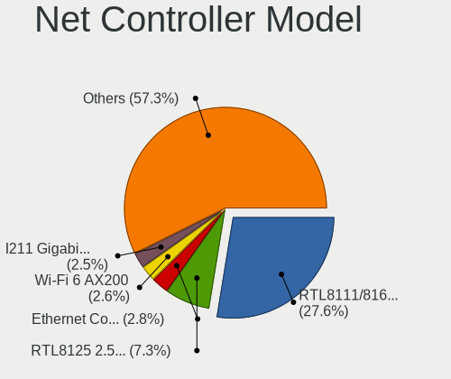
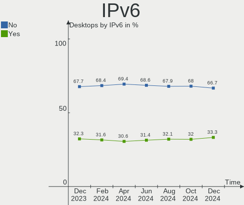

Linux Hardware Trends (Desktop)
-------------------------------

A project to identify most popular hardware characteristics and track their change
over time based on data collected by Linux users at https://Linux-Hardware.org.

Anyone can contribute to the study by uploading probes of their computers by
the [hw-probe](https://github.com/linuxhw/hw-probe) tool:

    sudo -E hw-probe -all -upload

Full-feature report is available here: https://linux-hardware.org/?view=trends&formfactor=desktop

Period: Jun, 2021.

Contents
--------

- [ OS                       ](#os)
- [ OS Family                ](#os-family)
- [ Kernel                   ](#kernel)
- [ Kernel Family            ](#kernel-family)
- [ Kernel Major Ver.        ](#kernel-major-ver)
- [ Arch                     ](#arch)
- [ DE                       ](#de)
- [ Display Server           ](#display-server)
- [ Display Manager          ](#display-manager)
- [ OS Lang                  ](#os-lang)
- [ Boot Mode                ](#boot-mode)
- [ Filesystem               ](#filesystem)
- [ Part. scheme             ](#part-scheme)
- [ Dual Boot with Linux/BSD ](#dual-boot-with-linux/bsd)
- [ Dual Boot (Win)          ](#dual-boot-win)
- [ Country                  ](#country)
- [ City                     ](#city)
- [ Vendor                   ](#vendor)
- [ Model                    ](#model)
- [ Model Family             ](#model-family)
- [ MFG Year                 ](#mfg-year)
- [ Form Factor              ](#form-factor)
- [ Secure Boot              ](#secure-boot)
- [ Coreboot                 ](#coreboot)
- [ RAM Size                 ](#ram-size)
- [ RAM Used                 ](#ram-used)
- [ Has CD-ROM               ](#has-cd-rom)
- [ Total Drives             ](#total-drives)
- [ Has Ethernet             ](#has-ethernet)
- [ Has WiFi                 ](#has-wifi)
- [ Has Bluetooth            ](#has-bluetooth)
- [ Drive Vendor             ](#drive-vendor)
- [ Drive Model              ](#drive-model)
- [ HDD Vendor               ](#hdd-vendor)
- [ SSD Vendor               ](#ssd-vendor)
- [ Drive Kind               ](#drive-kind)
- [ Drive Connector          ](#drive-connector)
- [ Drive Size               ](#drive-size)
- [ Space Total              ](#space-total)
- [ Space Used               ](#space-used)
- [ Malfunc. Drives          ](#malfunc-drives)
- [ Malfunc. Drive Vendor    ](#malfunc-drive-vendor)
- [ Malfunc. HDD Vendor      ](#malfunc-hdd-vendor)
- [ Malfunc. Drive Kind      ](#malfunc-drive-kind)
- [ Failed Drives            ](#failed-drives)
- [ Failed Drive Vendor      ](#failed-drive-vendor)
- [ Drive Status             ](#drive-status)
- [ Storage Vendor           ](#storage-vendor)
- [ Storage Model            ](#storage-model)
- [ Storage Kind             ](#storage-kind)
- [ CPU Vendor               ](#cpu-vendor)
- [ CPU Model                ](#cpu-model)
- [ CPU Model Family         ](#cpu-model-family)
- [ CPU Cores                ](#cpu-cores)
- [ CPU Sockets              ](#cpu-sockets)
- [ CPU Threads              ](#cpu-threads)
- [ CPU Op-Modes             ](#cpu-op-modes)
- [ CPU Microcode            ](#cpu-microcode)
- [ CPU Microarch            ](#cpu-microarch)
- [ GPU Vendor               ](#gpu-vendor)
- [ GPU Model                ](#gpu-model)
- [ GPU Combo                ](#gpu-combo)
- [ GPU Driver               ](#gpu-driver)
- [ GPU Memory               ](#gpu-memory)
- [ Monitor Vendor           ](#monitor-vendor)
- [ Monitor Model            ](#monitor-model)
- [ Monitor Resolution       ](#monitor-resolution)
- [ Monitor Diagonal         ](#monitor-diagonal)
- [ Monitor Width            ](#monitor-width)
- [ Aspect Ratio             ](#aspect-ratio)
- [ Monitor Area             ](#monitor-area)
- [ Pixel Density            ](#pixel-density)
- [ Multiple Monitors        ](#multiple-monitors)
- [ Net Controller Vendor    ](#net-controller-vendor)
- [ Net Controller Model     ](#net-controller-model)
- [ Wireless Vendor          ](#wireless-vendor)
- [ Wireless Model           ](#wireless-model)
- [ Ethernet Vendor          ](#ethernet-vendor)
- [ Ethernet Model           ](#ethernet-model)
- [ Net Controller Kind      ](#net-controller-kind)
- [ Used Controller          ](#used-controller)
- [ NICs                     ](#nics)
- [ IPv6                     ](#ipv6)
- [ Memory Vendor            ](#memory-vendor)
- [ Memory Model             ](#memory-model)
- [ Memory Kind              ](#memory-kind)
- [ Memory Form Factor       ](#memory-form-factor)
- [ Memory Size              ](#memory-size)
- [ Memory Speed             ](#memory-speed)
- [ Sound Vendor             ](#sound-vendor)
- [ Sound Model              ](#sound-model)
- [ Camera Vendor            ](#camera-vendor)
- [ Camera Model             ](#camera-model)
- [ Fingerprint Vendor       ](#fingerprint-vendor)
- [ Fingerprint Model        ](#fingerprint-model)
- [ Chipcard Vendor          ](#chipcard-vendor)
- [ Chipcard Model           ](#chipcard-model)
- [ Printer Vendor           ](#printer-vendor)
- [ Printer Model            ](#printer-model)
- [ Scanner Vendor           ](#scanner-vendor)
- [ Scanner Model            ](#scanner-model)
- [ Bluetooth Vendor         ](#bluetooth-vendor)
- [ Bluetooth Model          ](#bluetooth-model)
- [ Unsupported Devices      ](#unsupported-devices)
- [ Unsupported Device Types ](#unsupported-device-types)

OS
--

Installed operating systems

| Name                         | Desktops | Percent |
|------------------------------|----------|---------|
| Ubuntu 20.04                 | 296      | 18.29%  |
| OpenMandriva 4.2             | 130      | 8.03%   |
| Mint 20.1                    | 117      | 7.23%   |
| Ubuntu 21.04                 | 101      | 6.24%   |
| Fedora 34                    | 87       | 5.38%   |
| Pop!_OS 20.10                | 78       | 4.82%   |
| BlackPanther 18.1            | 60       | 3.71%   |
| ROSA R11.1                   | 52       | 3.21%   |
| Debian 10                    | 41       | 2.53%   |
| Ubuntu 18.04                 | 37       | 2.29%   |
| KDE neon 20.04               | 35       | 2.16%   |
| Manjaro                      | 31       | 1.92%   |
| Arch                         | 31       | 1.92%   |
| Xubuntu 20.04                | 30       | 1.85%   |
| Arch Rolling                 | 28       | 1.73%   |
| OpenMandriva 4.50            | 26       | 1.61%   |
| Kubuntu 20.04                | 23       | 1.42%   |
| Debian 11                    | 23       | 1.42%   |
| Mint 19.3                    | 22       | 1.36%   |
| ArcoLinux Rolling            | 22       | 1.36%   |
| Ubuntu 20.10                 | 21       | 1.3%    |
| Debian                       | 21       | 1.3%    |
| Zorin 15                     | 17       | 1.05%   |
| Mint 20                      | 15       | 0.93%   |
| Manjaro 21.0.7               | 12       | 0.74%   |
| Endless 3.9.4                | 12       | 0.74%   |
| Fedora 33                    | 11       | 0.68%   |
| Pop!_OS 20.04                | 10       | 0.62%   |
| Kubuntu 21.04                | 10       | 0.62%   |
| Ubuntu MATE 20.04            | 9        | 0.56%   |
| Zorin 16                     | 8        | 0.49%   |
| Gentoo 2.7                   | 8        | 0.49%   |
| ROSA R11                     | 7        | 0.43%   |
| Pop!_OS 21.04                | 7        | 0.43%   |
| Manjaro 21.0.5               | 7        | 0.43%   |
| Manjaro 21.0.6               | 6        | 0.37%   |
| Kali 2021.2                  | 6        | 0.37%   |
| openSUSE Leap-15.3           | 5        | 0.31%   |
| Mint 19.2                    | 5        | 0.31%   |
| LMDE 4                       | 5        | 0.31%   |
| ALT Linux 9.1                | 5        | 0.31%   |
| Xubuntu 21.04                | 4        | 0.25%   |
| Ubuntu 16.04                 | 4        | 0.25%   |
| Gentoo                       | 4        | 0.25%   |
| Garuda                       | 4        | 0.25%   |
| EndeavourOS Rolling          | 4        | 0.25%   |
| Xubuntu 18.04                | 3        | 0.19%   |
| Ubuntu Budgie 21.04          | 3        | 0.19%   |
| Solus 4.2                    | 3        | 0.19%   |
| Slackware 14.2               | 3        | 0.19%   |
| ROSA R12                     | 3        | 0.19%   |
| RHEL 8.4                     | 3        | 0.19%   |
| openSUSE 20210606            | 3        | 0.19%   |
| Garuda Soaring               | 3        | 0.19%   |
| UOS 20                       | 2        | 0.12%   |
| Siduction 11                 | 2        | 0.12%   |
| RED X3                       | 2        | 0.12%   |
| openSUSE Tumbleweed-20210621 | 2        | 0.12%   |
| Mint 20.2                    | 2        | 0.12%   |
| Makulu 2021                  | 2        | 0.12%   |

OS Family
---------

OS without a version

| Name          | Desktops | Percent |
|---------------|----------|---------|
| Ubuntu        | 461      | 28.49%  |
| Mint          | 164      | 10.14%  |
| OpenMandriva  | 156      | 9.64%   |
| Fedora        | 104      | 6.43%   |
| Pop!_OS       | 95       | 5.87%   |
| Debian        | 92       | 5.69%   |
| ROSA          | 63       | 3.89%   |
| BlackPanther  | 60       | 3.71%   |
| Arch          | 59       | 3.65%   |
| Manjaro       | 56       | 3.46%   |
| Xubuntu       | 38       | 2.35%   |
| Kubuntu       | 36       | 2.22%   |
| KDE neon      | 35       | 2.16%   |
| Zorin         | 26       | 1.61%   |
| ArcoLinux     | 23       | 1.42%   |
| openSUSE      | 21       | 1.3%    |
| Gentoo        | 13       | 0.8%    |
| Endless       | 12       | 0.74%   |
| Ubuntu MATE   | 11       | 0.68%   |
| Kali          | 7        | 0.43%   |
| Garuda        | 7        | 0.43%   |
| Clear Linux   | 7        | 0.43%   |
| Lubuntu       | 6        | 0.37%   |
| LMDE          | 5        | 0.31%   |
| ALT Linux     | 5        | 0.31%   |
| Ubuntu Budgie | 4        | 0.25%   |
| EndeavourOS   | 4        | 0.25%   |
| Deepin        | 4        | 0.25%   |
| CentOS        | 4        | 0.25%   |
| Solus         | 3        | 0.19%   |
| Slackware     | 3        | 0.19%   |
| RHEL          | 3        | 0.19%   |
| RED           | 3        | 0.19%   |
| Siduction     | 2        | 0.12%   |
| NixOS         | 2        | 0.12%   |
| Makulu        | 2        | 0.12%   |
| Elementary    | 2        | 0.12%   |
| ClearOS       | 2        | 0.12%   |
| Artix         | 2        | 0.12%   |
| WindowsFX     | 1        | 0.06%   |
| Void          | 1        | 0.06%   |
| SLES          | 1        | 0.06%   |
| Redcore       | 1        | 0.06%   |
| Red OS        | 1        | 0.06%   |
| Q4OS          | 1        | 0.06%   |
| Peppermint    | 1        | 0.06%   |
| Pear OS       | 1        | 0.06%   |
| Pardus        | 1        | 0.06%   |
| MX            | 1        | 0.06%   |
| Mageia        | 1        | 0.06%   |
| Gooroom       | 1        | 0.06%   |
| Ecp-veil      | 1        | 0.06%   |
| Devuan        | 1        | 0.06%   |
| antergos      | 1        | 0.06%   |
| AlmaLinux     | 1        | 0.06%   |

Kernel
------

Version of the Linux kernel

| Version                             | Desktops | Percent |
|-------------------------------------|----------|---------|
| 5.4.0-74-generic                    | 184      | 11.37%  |
| 5.8.0-55-generic                    | 162      | 10.01%  |
| 5.10.14-desktop-1omv4002            | 122      | 7.54%   |
| 5.11.0-7614-generic                 | 87       | 5.38%   |
| 5.11.0-18-generic                   | 75       | 4.64%   |
| 5.8.0-59-generic                    | 51       | 3.15%   |
| 5.8.0-53-generic                    | 48       | 2.97%   |
| 5.6.14-desktop-2bP                  | 41       | 2.53%   |
| 5.4.0-77-generic                    | 37       | 2.29%   |
| 5.4.0-73-generic                    | 31       | 1.92%   |
| 5.12.8-300.fc34.x86_64              | 24       | 1.48%   |
| 5.11.0-22-generic                   | 24       | 1.48%   |
| 5.12.4-desktop-1omv4050             | 23       | 1.42%   |
| 5.10.0-2-amd64                      | 21       | 1.3%    |
| 4.18.16-desktop-1bP                 | 19       | 1.17%   |
| 5.10.42-1-MANJARO                   | 18       | 1.11%   |
| 5.4.83-generic-2rosa-x86_64         | 17       | 1.05%   |
| 5.8.0-43-generic                    | 16       | 0.99%   |
| 5.12.9-300.fc34.x86_64              | 16       | 0.99%   |
| 5.10.0-7-amd64                      | 16       | 0.99%   |
| 4.19.0-16-amd64                     | 15       | 0.93%   |
| 5.12.9-arch1-1                      | 14       | 0.87%   |
| 5.8.0-14-generic                    | 12       | 0.74%   |
| 5.12.12-300.fc34.x86_64             | 12       | 0.74%   |
| 5.4.32-generic-2rosa-x86_64         | 11       | 0.68%   |
| 5.12.11-300.fc34.x86_64             | 11       | 0.68%   |
| 5.12.8-arch1-1                      | 10       | 0.62%   |
| 5.10.36-2-MANJARO                   | 9        | 0.56%   |
| 5.4.0-58-generic                    | 8        | 0.49%   |
| 5.12.12-arch1-1                     | 8        | 0.49%   |
| 5.11.12-desktop-1omv4002            | 8        | 0.49%   |
| 4.15.0-desktop-122.124.1rosa-x86_64 | 8        | 0.49%   |
| 5.12.8-200.fc33.x86_64              | 7        | 0.43%   |
| 5.12.7-300.fc34.x86_64              | 7        | 0.43%   |
| 5.12.2-1-MANJARO                    | 7        | 0.43%   |
| 5.12.10-arch1-1                     | 7        | 0.43%   |
| 5.12.10-300.fc34.x86_64             | 7        | 0.43%   |
| 5.4.83-generic-2rosa-i586           | 6        | 0.37%   |
| 5.4.0-72-generic                    | 6        | 0.37%   |
| 5.4.0-42-generic                    | 6        | 0.37%   |
| 5.4.0-26-generic                    | 6        | 0.37%   |
| 5.12.9-zen1-1-zen                   | 6        | 0.37%   |
| 5.12.9-1-default                    | 6        | 0.37%   |
| 4.15.0-desktop-45.1rosa-x86_64      | 6        | 0.37%   |
| 5.8.0-50-generic                    | 5        | 0.31%   |
| 5.8.0-48-generic                    | 5        | 0.31%   |
| 5.4.0-74-lowlatency                 | 5        | 0.31%   |
| 5.12.13-arch1-2                     | 5        | 0.31%   |
| 5.10.41-1-MANJARO                   | 5        | 0.31%   |
| 4.19.0-17-amd64                     | 5        | 0.31%   |
| 4.15.0-144-generic                  | 5        | 0.31%   |
| 5.4.65-1-pve                        | 4        | 0.25%   |
| 5.4.119-1-pve                       | 4        | 0.25%   |
| 5.12.11-arch1-1                     | 4        | 0.25%   |
| 5.12.10-zen1-1-zen                  | 4        | 0.25%   |
| 5.11.0-23-generic                   | 4        | 0.25%   |
| 5.11.0-16-generic                   | 4        | 0.25%   |
| 5.10.0-kali8-amd64                  | 4        | 0.25%   |
| 5.10.0-0.bpo.5-amd64                | 4        | 0.25%   |
| 4.18.0-305.el8.x86_64               | 4        | 0.25%   |

Kernel Family
-------------

Linux kernel without a distro release

| Version | Desktops | Percent |
|---------|----------|---------|
| 5.8.0   | 317      | 19.59%  |
| 5.4.0   | 301      | 18.6%   |
| 5.11.0  | 213      | 13.16%  |
| 5.10.14 | 122      | 7.54%   |
| 5.10.0  | 55       | 3.4%    |
| 5.12.8  | 51       | 3.15%   |
| 5.12.9  | 50       | 3.09%   |
| 4.15.0  | 43       | 2.66%   |
| 5.6.14  | 41       | 2.53%   |
| 5.12.12 | 32       | 1.98%   |
| 5.12.4  | 29       | 1.79%   |
| 4.19.0  | 27       | 1.67%   |
| 5.12.10 | 24       | 1.48%   |
| 5.4.83  | 23       | 1.42%   |
| 5.12.13 | 22       | 1.36%   |
| 5.10.42 | 21       | 1.3%    |
| 5.12.11 | 20       | 1.24%   |
| 4.18.16 | 19       | 1.17%   |
| 5.12.7  | 15       | 0.93%   |
| 5.4.32  | 14       | 0.87%   |
| 5.11.12 | 11       | 0.68%   |
| 5.13.0  | 10       | 0.62%   |
| 5.12.2  | 9        | 0.56%   |
| 5.10.36 | 9        | 0.56%   |
| 4.18.0  | 8        | 0.49%   |
| 5.10.27 | 7        | 0.43%   |
| 5.3.18  | 6        | 0.37%   |
| 5.12.6  | 5        | 0.31%   |
| 5.10.41 | 5        | 0.31%   |
| 5.0.0   | 5        | 0.31%   |
| 5.4.65  | 4        | 0.25%   |
| 5.4.119 | 4        | 0.25%   |
| 5.3.0   | 4        | 0.25%   |
| 5.11.22 | 4        | 0.25%   |
| 5.10.45 | 4        | 0.25%   |
| 5.10.29 | 4        | 0.25%   |
| 4.15.18 | 4        | 0.25%   |
| 5.6.0   | 3        | 0.19%   |
| 5.4.114 | 3        | 0.19%   |
| 5.11.11 | 3        | 0.19%   |
| 3.10.0  | 3        | 0.19%   |
| 5.9.16  | 2        | 0.12%   |
| 5.9.0   | 2        | 0.12%   |
| 5.8.18  | 2        | 0.12%   |
| 5.12.5  | 2        | 0.12%   |
| 5.11.21 | 2        | 0.12%   |
| 5.11.19 | 2        | 0.12%   |
| 5.11.17 | 2        | 0.12%   |
| 5.11.16 | 2        | 0.12%   |
| 5.10.44 | 2        | 0.12%   |
| 5.10.43 | 2        | 0.12%   |
| 5.10.40 | 2        | 0.12%   |
| 5.10.35 | 2        | 0.12%   |
| 5.10.31 | 2        | 0.12%   |
| 5.0.21  | 2        | 0.12%   |
| 4.9.155 | 2        | 0.12%   |
| 5.9.12  | 1        | 0.06%   |
| 5.9.1   | 1        | 0.06%   |
| 5.8.9   | 1        | 0.06%   |
| 5.7.1   | 1        | 0.06%   |

Kernel Major Ver.
-----------------

Linux kernel major version

| Version | Desktops | Percent |
|---------|----------|---------|
| 5.4     | 360      | 22.25%  |
| 5.8     | 320      | 19.78%  |
| 5.12    | 262      | 16.19%  |
| 5.11    | 241      | 14.89%  |
| 5.10    | 240      | 14.83%  |
| 4.15    | 47       | 2.9%    |
| 5.6     | 44       | 2.72%   |
| 4.19    | 28       | 1.73%   |
| 4.18    | 27       | 1.67%   |
| 5.3     | 11       | 0.68%   |
| 5.13    | 10       | 0.62%   |
| 5.0     | 7        | 0.43%   |
| 5.9     | 6        | 0.37%   |
| 4.9     | 5        | 0.31%   |
| 3.10    | 3        | 0.19%   |
| 4.14    | 2        | 0.12%   |
| 5.7     | 1        | 0.06%   |
| 5.2     | 1        | 0.06%   |
| 4.13    | 1        | 0.06%   |
| 4.10    | 1        | 0.06%   |
| Unknown | 1        | 0.06%   |

Arch
----

OS architecture (x86_64, i586, etc.)

| Name   | Desktops | Percent |
|--------|----------|---------|
| x86_64 | 1590     | 98.27%  |
| i686   | 27       | 1.67%   |
| mips64 | 1        | 0.06%   |

DE
--

Desktop Environment

| Name            | Desktops | Percent |
|-----------------|----------|---------|
| GNOME           | 662      | 40.91%  |
| KDE5            | 308      | 19.04%  |
| X-Cinnamon      | 130      | 8.03%   |
| Unknown         | 123      | 7.6%    |
| XFCE            | 110      | 6.8%    |
| KDE             | 110      | 6.8%    |
| MATE            | 47       | 2.9%    |
| KDE4            | 34       | 2.1%    |
| Cinnamon        | 23       | 1.42%   |
| LXQt            | 12       | 0.74%   |
| Unity           | 9        | 0.56%   |
| i3              | 8        | 0.49%   |
| Budgie          | 8        | 0.49%   |
| Deepin          | 6        | 0.37%   |
| LXDE            | 4        | 0.25%   |
| sway            | 3        | 0.19%   |
| qtile           | 3        | 0.19%   |
| Pantheon        | 3        | 0.19%   |
| bspwm           | 3        | 0.19%   |
| awesome         | 3        | 0.19%   |
| GNOME Flashback | 2        | 0.12%   |
| xmonad          | 1        | 0.06%   |
| trinity         | 1        | 0.06%   |
| sway:Unity      | 1        | 0.06%   |
| Lubuntu         | 1        | 0.06%   |
| herbstluftwm    | 1        | 0.06%   |
| Enlightenment   | 1        | 0.06%   |
| dwm             | 1        | 0.06%   |

Display Server
--------------

X11 or Wayland

| Name        | Desktops | Percent |
|-------------|----------|---------|
| X11         | 1359     | 83.99%  |
| Wayland     | 145      | 8.96%   |
| Unknown     | 59       | 3.65%   |
| Tty         | 54       | 3.34%   |
| Unspecified | 1        | 0.06%   |

Display Manager
---------------

SDDM, LightDM, etc.

| Name    | Desktops | Percent |
|---------|----------|---------|
| Unknown | 952      | 58.84%  |
| SDDM    | 332      | 20.52%  |
| GDM     | 149      | 9.21%   |
| TDM     | 105      | 6.49%   |
| LightDM | 37       | 2.29%   |
| KDM     | 34       | 2.1%    |
| XDM     | 4        | 0.25%   |
| Ly      | 3        | 0.19%   |
| LXDM    | 1        | 0.06%   |
| GDM3    | 1        | 0.06%   |

OS Lang
-------

Language

| Lang    | Desktops | Percent |
|---------|----------|---------|
| en_US   | 627      | 38.75%  |
| ru_RU   | 125      | 7.73%   |
| de_DE   | 120      | 7.42%   |
| en_GB   | 86       | 5.32%   |
| Unknown | 86       | 5.32%   |
| pt_BR   | 81       | 5.01%   |
| fr_FR   | 74       | 4.57%   |
| pl_PL   | 35       | 2.16%   |
| it_IT   | 33       | 2.04%   |
| en_CA   | 32       | 1.98%   |
| en_AU   | 32       | 1.98%   |
| es_ES   | 30       | 1.85%   |
| en_IN   | 20       | 1.24%   |
| C       | 19       | 1.17%   |
| nl_NL   | 16       | 0.99%   |
| es_AR   | 15       | 0.93%   |
| zh_CN   | 11       | 0.68%   |
| fr_BE   | 10       | 0.62%   |
| cs_CZ   | 10       | 0.62%   |
| sv_SE   | 9        | 0.56%   |
| pt_PT   | 8        | 0.49%   |
| ja_JP   | 8        | 0.49%   |
| zh_TW   | 7        | 0.43%   |
| es_MX   | 7        | 0.43%   |
| en_ZA   | 7        | 0.43%   |
| en_NZ   | 7        | 0.43%   |
| ru_UA   | 6        | 0.37%   |
| nl_BE   | 6        | 0.37%   |
| hu_HU   | 6        | 0.37%   |
| sk_SK   | 5        | 0.31%   |
| de_AT   | 5        | 0.31%   |
| tr_TR   | 4        | 0.25%   |
| fr_CA   | 4        | 0.25%   |
| es_VE   | 4        | 0.25%   |
| es_CL   | 4        | 0.25%   |
| en_IL   | 4        | 0.25%   |
| de_CH   | 4        | 0.25%   |
| uk_UA   | 3        | 0.19%   |
| ro_RO   | 3        | 0.19%   |
| en_PH   | 3        | 0.19%   |
| sr_RS   | 2        | 0.12%   |
| sl_SI   | 2        | 0.12%   |
| nb_NO   | 2        | 0.12%   |
| ko_KR   | 2        | 0.12%   |
| fr_CH   | 2        | 0.12%   |
| es_PA   | 2        | 0.12%   |
| es_EC   | 2        | 0.12%   |
| en_IE   | 2        | 0.12%   |
| en_HK   | 2        | 0.12%   |
| en_DK   | 2        | 0.12%   |
| en_DE   | 2        | 0.12%   |
| da_DK   | 2        | 0.12%   |
| zh_HK   | 1        | 0.06%   |
| si_LK   | 1        | 0.06%   |
| POSIX   | 1        | 0.06%   |
| is_IS   | 1        | 0.06%   |
| fi_FI   | 1        | 0.06%   |
| es_US   | 1        | 0.06%   |
| es_PE   | 1        | 0.06%   |
| es_HN   | 1        | 0.06%   |

Boot Mode
---------

EFI or BIOS

| Mode | Desktops | Percent |
|------|----------|---------|
| BIOS | 1006     | 62.18%  |
| EFI  | 612      | 37.82%  |

Filesystem
----------

Type of filesystem

| Type    | Desktops | Percent |
|---------|----------|---------|
| Ext4    | 1173     | 72.5%   |
| Overlay | 236      | 14.59%  |
| Btrfs   | 135      | 8.34%   |
| Xfs     | 30       | 1.85%   |
| Zfs     | 29       | 1.79%   |
| Ext3    | 4        | 0.25%   |
| Ext2    | 4        | 0.25%   |
| F2fs    | 3        | 0.19%   |
| Unknown | 2        | 0.12%   |
| XXXfs   | 1        | 0.06%   |
| Tmpfs   | 1        | 0.06%   |

Part. scheme
------------

Scheme of partitioning

| Type    | Desktops | Percent |
|---------|----------|---------|
| Unknown | 876      | 54.14%  |
| GPT     | 461      | 28.49%  |
| MBR     | 281      | 17.37%  |

Dual Boot with Linux/BSD
------------------------

Hosting more than one Linux/BSD

| Dual boot | Desktops | Percent |
|-----------|----------|---------|
| No        | 1276     | 78.86%  |
| Yes       | 342      | 21.14%  |

Dual Boot (Win)
---------------

Hosting Linux and Windows

| Dual boot | Desktops | Percent |
|-----------|----------|---------|
| No        | 1034     | 63.91%  |
| Yes       | 584      | 36.09%  |

Country
-------

Geographic location (country)

| Country             | Desktops | Percent |
|---------------------|----------|---------|
| USA                 | 284      | 17.55%  |
| Germany             | 156      | 9.64%   |
| Russia              | 145      | 8.96%   |
| Brazil              | 115      | 7.11%   |
| France              | 88       | 5.44%   |
| UK                  | 74       | 4.57%   |
| Canada              | 50       | 3.09%   |
| Poland              | 49       | 3.03%   |
| Italy               | 48       | 2.97%   |
| Hungary             | 46       | 2.84%   |
| Australia           | 42       | 2.6%    |
| Spain               | 38       | 2.35%   |
| Netherlands         | 36       | 2.22%   |
| Argentina           | 27       | 1.67%   |
| Belgium             | 26       | 1.61%   |
| Ukraine             | 24       | 1.48%   |
| India               | 24       | 1.48%   |
| Sweden              | 22       | 1.36%   |
| Switzerland         | 15       | 0.93%   |
| Mexico              | 15       | 0.93%   |
| Japan               | 15       | 0.93%   |
| Austria             | 13       | 0.8%    |
| Slovakia            | 12       | 0.74%   |
| Czechia             | 12       | 0.74%   |
| Romania             | 11       | 0.68%   |
| New Zealand         | 11       | 0.68%   |
| China               | 11       | 0.68%   |
| Turkey              | 10       | 0.62%   |
| Taiwan              | 9        | 0.56%   |
| Portugal            | 9        | 0.56%   |
| Norway              | 9        | 0.56%   |
| Belarus             | 9        | 0.56%   |
| South Africa        | 8        | 0.49%   |
| Finland             | 8        | 0.49%   |
| Chile               | 8        | 0.49%   |
| Venezuela           | 7        | 0.43%   |
| Serbia              | 7        | 0.43%   |
| Greece              | 7        | 0.43%   |
| Vietnam             | 6        | 0.37%   |
| Israel              | 6        | 0.37%   |
| Indonesia           | 6        | 0.37%   |
| Bulgaria            | 6        | 0.37%   |
| Ireland             | 5        | 0.31%   |
| Iran                | 5        | 0.31%   |
| Hong Kong           | 5        | 0.31%   |
| Philippines         | 4        | 0.25%   |
| Malaysia            | 4        | 0.25%   |
| Denmark             | 4        | 0.25%   |
| Thailand            | 3        | 0.19%   |
| South Korea         | 3        | 0.19%   |
| Panama              | 3        | 0.19%   |
| Egypt               | 3        | 0.19%   |
| Bangladesh          | 3        | 0.19%   |
| Trinidad and Tobago | 2        | 0.12%   |
| Slovenia            | 2        | 0.12%   |
| Saudi Arabia        | 2        | 0.12%   |
| Puerto Rico         | 2        | 0.12%   |
| Lithuania           | 2        | 0.12%   |
| Kuwait              | 2        | 0.12%   |
| Kazakhstan          | 2        | 0.12%   |

City
----

Geographic location (city)

| City              | Desktops | Percent |
|-------------------|----------|---------|
| St Petersburg     | 23       | 1.42%   |
| Voronezh          | 21       | 1.3%    |
| Moscow            | 20       | 1.24%   |
| Sydney            | 17       | 1.05%   |
| Berlin            | 14       | 0.87%   |
| São Paulo        | 13       | 0.8%    |
| Paris             | 13       | 0.8%    |
| Budapest          | 12       | 0.74%   |
| Rio de Janeiro    | 11       | 0.68%   |
| London            | 11       | 0.68%   |
| Warsaw            | 10       | 0.62%   |
| Hamburg           | 8        | 0.49%   |
| Buenos Aires      | 8        | 0.49%   |
| Munich            | 7        | 0.43%   |
| Milan             | 7        | 0.43%   |
| Melbourne         | 7        | 0.43%   |
| Kyiv              | 7        | 0.43%   |
| Vienna            | 6        | 0.37%   |
| Minsk             | 6        | 0.37%   |
| Düsseldorf       | 6        | 0.37%   |
| Dallas            | 6        | 0.37%   |
| Curitiba          | 6        | 0.37%   |
| Zurich            | 5        | 0.31%   |
| Santiago          | 5        | 0.31%   |
| Portland          | 5        | 0.31%   |
| Los Angeles       | 5        | 0.31%   |
| Krakow            | 5        | 0.31%   |
| Istanbul          | 5        | 0.31%   |
| Frankfurt am Main | 5        | 0.31%   |
| Chicago           | 5        | 0.31%   |
| Brisbane          | 5        | 0.31%   |
| Belgrade          | 5        | 0.31%   |
| Toulouse          | 4        | 0.25%   |
| Toronto           | 4        | 0.25%   |
| Tel Aviv          | 4        | 0.25%   |
| Rostov-on-Don     | 4        | 0.25%   |
| Pflugerville      | 4        | 0.25%   |
| Novosibirsk       | 4        | 0.25%   |
| New Taipei        | 4        | 0.25%   |
| Mumbai            | 4        | 0.25%   |
| Miami             | 4        | 0.25%   |
| Madrid            | 4        | 0.25%   |
| Lodz              | 4        | 0.25%   |
| Lelystad          | 4        | 0.25%   |
| Bucyrus           | 4        | 0.25%   |
| Wroclaw           | 3        | 0.19%   |
| Vancouver         | 3        | 0.19%   |
| Valencia          | 3        | 0.19%   |
| The Hague         | 3        | 0.19%   |
| Tehran            | 3        | 0.19%   |
| Tauranga          | 3        | 0.19%   |
| Stockport         | 3        | 0.19%   |
| Sofia             | 3        | 0.19%   |
| Seattle           | 3        | 0.19%   |
| Saratov           | 3        | 0.19%   |
| Sacramento        | 3        | 0.19%   |
| Rosario           | 3        | 0.19%   |
| Prague            | 3        | 0.19%   |
| Porto Alegre      | 3        | 0.19%   |
| Phoenix           | 3        | 0.19%   |

Vendor
------

Motherboard manufacturer

| Name                                        | Desktops | Percent |
|---------------------------------------------|----------|---------|
| ASUSTek Computer                            | 426      | 26.33%  |
| Gigabyte Technology                         | 295      | 18.23%  |
| MSI                                         | 183      | 11.31%  |
| ASRock                                      | 170      | 10.51%  |
| Hewlett-Packard                             | 122      | 7.54%   |
| Dell                                        | 119      | 7.35%   |
| Lenovo                                      | 49       | 3.03%   |
| Intel                                       | 44       | 2.72%   |
| Acer                                        | 21       | 1.3%    |
| Pegatron                                    | 20       | 1.24%   |
| Unknown                                     | 20       | 1.24%   |
| Biostar                                     | 17       | 1.05%   |
| ECS                                         | 14       | 0.87%   |
| Foxconn                                     | 12       | 0.74%   |
| Fujitsu                                     | 11       | 0.68%   |
| Medion                                      | 8        | 0.49%   |
| Gateway                                     | 7        | 0.43%   |
| PCWare                                      | 5        | 0.31%   |
| Huanan                                      | 5        | 0.31%   |
| Fujitsu Siemens                             | 5        | 0.31%   |
| Apple                                       | 5        | 0.31%   |
| Packard Bell                                | 4        | 0.25%   |
| ASRockRack                                  | 4        | 0.25%   |
| Supermicro                                  | 3        | 0.19%   |
| Positivo                                    | 3        | 0.19%   |
| OEM                                         | 3        | 0.19%   |
| eMachines                                   | 3        | 0.19%   |
| Alienware                                   | 3        | 0.19%   |
| Shuttle                                     | 2        | 0.12%   |
| Semp Toshiba                                | 2        | 0.12%   |
| Philco                                      | 2        | 0.12%   |
| IBM                                         | 2        | 0.12%   |
| Wistron                                     | 1        | 0.06%   |
| WB                                          | 1        | 0.06%   |
| TYAN Computer                               | 1        | 0.06%   |
| TSINGHUA TONGFANG COMPUTER                  | 1        | 0.06%   |
| SYWZ                                        | 1        | 0.06%   |
| QTQD                                        | 1        | 0.06%   |
| QIYIDA                                      | 1        | 0.06%   |
| ONDA                                        | 1        | 0.06%   |
| NF-M2S                                      | 1        | 0.06%   |
| NEC Computers                               | 1        | 0.06%   |
| Loongson                                    | 1        | 0.06%   |
| LattePanda                                  | 1        | 0.06%   |
| langchao                                    | 1        | 0.06%   |
| Kraftway                                    | 1        | 0.06%   |
| KLLISRE                                     | 1        | 0.06%   |
| JINGSHA                                     | 1        | 0.06%   |
| Itautec                                     | 1        | 0.06%   |
| Inventec                                    | 1        | 0.06%   |
| Huanghe                                     | 1        | 0.06%   |
| HC                                          | 1        | 0.06%   |
| HARDKERNEL                                  | 1        | 0.06%   |
| EVGA                                        | 1        | 0.06%   |
| DEPO Computers                              | 1        | 0.06%   |
| Colorful Yu Gong Technology And Development | 1        | 0.06%   |
| Chuwi                                       | 1        | 0.06%   |
| BESSTAR Tech                                | 1        | 0.06%   |
| BCM Advanced Research                       | 1        | 0.06%   |
| AMD                                         | 1        | 0.06%   |

Model
-----

Motherboard model

| Name                             | Desktops | Percent |
|----------------------------------|----------|---------|
| ASUS All Series                  | 43       | 2.66%   |
| Unknown                          | 22       | 1.36%   |
| ASUS PRIME A320M-K               | 12       | 0.74%   |
| MSI MS-7C37                      | 11       | 0.68%   |
| ASUS TUF GAMING X570-PLUS        | 11       | 0.68%   |
| ASUS ROG STRIX X570-E GAMING     | 9        | 0.56%   |
| ASRock B450M Pro4                | 9        | 0.56%   |
| Gigabyte X570 I AORUS PRO WIFI   | 7        | 0.43%   |
| Dell OptiPlex 7010               | 7        | 0.43%   |
| ASRock B450 Pro4                 | 7        | 0.43%   |
| MSI MS-7B89                      | 6        | 0.37%   |
| MSI MS-7B86                      | 6        | 0.37%   |
| HP Compaq Pro 6300 SFF           | 6        | 0.37%   |
| Gigabyte B450M DS3H              | 6        | 0.37%   |
| Dell Precision T3600             | 6        | 0.37%   |
| Dell OptiPlex 990                | 6        | 0.37%   |
| ASUS ROG STRIX B550-F GAMING     | 6        | 0.37%   |
| MSI MS-7C84                      | 5        | 0.31%   |
| MSI MS-7C02                      | 5        | 0.31%   |
| MSI MS-7817                      | 5        | 0.31%   |
| MSI MS-7816                      | 5        | 0.31%   |
| MSI MS-7693                      | 5        | 0.31%   |
| HP EliteDesk 800 G1 SFF          | 5        | 0.31%   |
| Gigabyte A320M-S2H               | 5        | 0.31%   |
| Dell OptiPlex 9020               | 5        | 0.31%   |
| Dell OptiPlex 390                | 5        | 0.31%   |
| ASUS ROG STRIX B450-F GAMING     | 5        | 0.31%   |
| ASUS M5A97 R2.0                  | 5        | 0.31%   |
| ASUS M5A78L-M/USB3               | 5        | 0.31%   |
| ASRock X300M-STX                 | 5        | 0.31%   |
| MSI MS-7D09                      | 4        | 0.25%   |
| MSI MS-7C94                      | 4        | 0.25%   |
| MSI MS-7C91                      | 4        | 0.25%   |
| MSI MS-7C52                      | 4        | 0.25%   |
| MSI MS-7B98                      | 4        | 0.25%   |
| MSI MS-7B79                      | 4        | 0.25%   |
| MSI MS-7758                      | 4        | 0.25%   |
| Intel H61                        | 4        | 0.25%   |
| HP Compaq Elite 8300 CMT         | 4        | 0.25%   |
| Gigabyte X570 AORUS MASTER       | 4        | 0.25%   |
| Gigabyte X570 AORUS ELITE        | 4        | 0.25%   |
| Gigabyte X470 AORUS ULTRA GAMING | 4        | 0.25%   |
| Gigabyte GA-870A-UD3             | 4        | 0.25%   |
| Gigabyte GA-78LMT-USB3 6.0       | 4        | 0.25%   |
| Dell OptiPlex 790                | 4        | 0.25%   |
| Dell OptiPlex 760                | 4        | 0.25%   |
| ASUS TUF GAMING B550M-PLUS       | 4        | 0.25%   |
| ASUS ROG STRIX X570-F GAMING     | 4        | 0.25%   |
| ASUS PRIME Z370-A                | 4        | 0.25%   |
| ASUS PRIME B450M-A               | 4        | 0.25%   |
| ASUS P8B75-M                     | 4        | 0.25%   |
| MSI MS-7C56                      | 3        | 0.19%   |
| MSI MS-7B93                      | 3        | 0.19%   |
| MSI MS-7A38                      | 3        | 0.19%   |
| MSI MS-7A34                      | 3        | 0.19%   |
| MSI MS-7A32                      | 3        | 0.19%   |
| MSI MS-7918                      | 3        | 0.19%   |
| MSI MS-7850                      | 3        | 0.19%   |
| MSI MS-7721                      | 3        | 0.19%   |
| HP EliteDesk 800 G2 DM 65W       | 3        | 0.19%   |

Model Family
------------

Motherboard model prefix

| Name                   | Desktops | Percent |
|------------------------|----------|---------|
| ASUS PRIME             | 88       | 5.44%   |
| Dell OptiPlex          | 62       | 3.83%   |
| ASUS ROG               | 50       | 3.09%   |
| ASUS All               | 43       | 2.66%   |
| HP Compaq              | 41       | 2.53%   |
| ASUS TUF               | 33       | 2.04%   |
| Lenovo ThinkCentre     | 30       | 1.85%   |
| Dell Precision         | 27       | 1.67%   |
| Gigabyte X570          | 22       | 1.36%   |
| Unknown                | 22       | 1.36%   |
| HP EliteDesk           | 18       | 1.11%   |
| Acer Aspire            | 15       | 0.93%   |
| ASUS M5A78L-M          | 14       | 0.87%   |
| ASRock B450M           | 14       | 0.87%   |
| MSI MS-7C37            | 11       | 0.68%   |
| Dell Inspiron          | 11       | 0.68%   |
| ASRock B450            | 10       | 0.62%   |
| Gigabyte B450M         | 9        | 0.56%   |
| ASUS M5A97             | 9        | 0.56%   |
| Gigabyte B450          | 8        | 0.49%   |
| Fujitsu ESPRIMO        | 8        | 0.49%   |
| Dell Vostro            | 8        | 0.49%   |
| ASUS P8Z77-V           | 8        | 0.49%   |
| ASUS P8B75-M           | 8        | 0.49%   |
| HP ProDesk             | 7        | 0.43%   |
| Gigabyte A320M-S2H     | 7        | 0.43%   |
| ASUS P5G41T-M          | 7        | 0.43%   |
| ASUS Maximus           | 7        | 0.43%   |
| MSI MS-7B89            | 6        | 0.37%   |
| MSI MS-7B86            | 6        | 0.37%   |
| Lenovo IdeaCentre      | 6        | 0.37%   |
| HP Pavilion            | 6        | 0.37%   |
| Gigabyte GA-78LMT-USB3 | 6        | 0.37%   |
| Dell XPS               | 6        | 0.37%   |
| ASUS P8H61-M           | 6        | 0.37%   |
| MSI MS-7C84            | 5        | 0.31%   |
| MSI MS-7C02            | 5        | 0.31%   |
| MSI MS-7817            | 5        | 0.31%   |
| MSI MS-7816            | 5        | 0.31%   |
| MSI MS-7693            | 5        | 0.31%   |
| HP ProLiant            | 5        | 0.31%   |
| Gigabyte H61M-DS2      | 5        | 0.31%   |
| Gigabyte B550M         | 5        | 0.31%   |
| ASUS STRIX             | 5        | 0.31%   |
| ASRock X470            | 5        | 0.31%   |
| ASRock X300M-STX       | 5        | 0.31%   |
| ASRock B550            | 5        | 0.31%   |
| MSI MS-7D09            | 4        | 0.25%   |
| MSI MS-7C94            | 4        | 0.25%   |
| MSI MS-7C91            | 4        | 0.25%   |
| MSI MS-7C52            | 4        | 0.25%   |
| MSI MS-7B98            | 4        | 0.25%   |
| MSI MS-7B79            | 4        | 0.25%   |
| MSI MS-7758            | 4        | 0.25%   |
| Lenovo ThinkStation    | 4        | 0.25%   |
| Intel H61              | 4        | 0.25%   |
| HP OMEN                | 4        | 0.25%   |
| HP 290                 | 4        | 0.25%   |
| Gigabyte Z370          | 4        | 0.25%   |
| Gigabyte X470          | 4        | 0.25%   |

MFG Year
--------

Motherboard manufacture year

| Year | Desktops | Percent |
|------|----------|---------|
| 2020 | 218      | 13.47%  |
| 2019 | 184      | 11.37%  |
| 2021 | 163      | 10.07%  |
| 2018 | 131      | 8.1%    |
| 2014 | 121      | 7.48%   |
| 2010 | 105      | 6.49%   |
| 2012 | 99       | 6.12%   |
| 2013 | 98       | 6.06%   |
| 2015 | 95       | 5.87%   |
| 2011 | 87       | 5.38%   |
| 2009 | 76       | 4.7%    |
| 2016 | 71       | 4.39%   |
| 2017 | 63       | 3.89%   |
| 2008 | 51       | 3.15%   |
| 2007 | 29       | 1.79%   |
| 2006 | 18       | 1.11%   |
| 2005 | 5        | 0.31%   |
| 2004 | 2        | 0.12%   |
| 2003 | 2        | 0.12%   |

Form Factor
-----------

Physical design of the computer

| Name    | Desktops | Percent |
|---------|----------|---------|
| Desktop | 1618     | 100%    |

Secure Boot
-----------

Enabled or disabled

| State    | Desktops | Percent |
|----------|----------|---------|
| Disabled | 1591     | 98.33%  |
| Enabled  | 27       | 1.67%   |

Coreboot
--------

Have coreboot on board

| Used | Desktops | Percent |
|------|----------|---------|
| No   | 1618     | 100%    |

RAM Size
--------

Total RAM memory

| Size in GB      | Desktops | Percent |
|-----------------|----------|---------|
| 16.01-24.0      | 384      | 23.73%  |
| 8.01-16.0       | 305      | 18.85%  |
| 3.01-4.0        | 261      | 16.13%  |
| 32.01-64.0      | 242      | 14.96%  |
| 4.01-8.0        | 239      | 14.77%  |
| 64.01-256.0     | 80       | 4.94%   |
| 1.01-2.0        | 46       | 2.84%   |
| 24.01-32.0      | 40       | 2.47%   |
| 2.01-3.0        | 14       | 0.87%   |
| 0.51-1.0        | 5        | 0.31%   |
| More than 256.0 | 2        | 0.12%   |

RAM Used
--------

Used RAM memory

| Used GB     | Desktops | Percent |
|-------------|----------|---------|
| 1.01-2.0    | 578      | 35.72%  |
| 2.01-3.0    | 332      | 20.52%  |
| 4.01-8.0    | 215      | 13.29%  |
| 3.01-4.0    | 175      | 10.82%  |
| 0.51-1.0    | 139      | 8.59%   |
| 8.01-16.0   | 81       | 5.01%   |
| 0.01-0.5    | 61       | 3.77%   |
| 16.01-24.0  | 21       | 1.3%    |
| 24.01-32.0  | 9        | 0.56%   |
| 32.01-64.0  | 6        | 0.37%   |
| 64.01-256.0 | 1        | 0.06%   |

Has CD-ROM
----------

Has CD-ROM on board

| Presented | Desktops | Percent |
|-----------|----------|---------|
| No        | 819      | 50.62%  |
| Yes       | 799      | 49.38%  |

Total Drives
------------

Number of drives on board

| Drives | Desktops | Percent |
|--------|----------|---------|
| 1      | 621      | 38.38%  |
| 2      | 431      | 26.64%  |
| 3      | 273      | 16.87%  |
| 4      | 140      | 8.65%   |
| 5      | 69       | 4.26%   |
| 6      | 31       | 1.92%   |
| 0      | 18       | 1.11%   |
| 7      | 15       | 0.93%   |
| 8      | 10       | 0.62%   |
| 9      | 5        | 0.31%   |
| 13     | 2        | 0.12%   |
| 11     | 2        | 0.12%   |
| 17     | 1        | 0.06%   |

Has Ethernet
------------

Has Ethernet on board

| Presented | Desktops | Percent |
|-----------|----------|---------|
| Yes       | 1597     | 98.7%   |
| No        | 21       | 1.3%    |

Has WiFi
--------

Has WiFi module

| Presented | Desktops | Percent |
|-----------|----------|---------|
| No        | 992      | 61.31%  |
| Yes       | 626      | 38.69%  |

Has Bluetooth
-------------

Has Bluetooth module

| Presented | Desktops | Percent |
|-----------|----------|---------|
| No        | 1146     | 70.83%  |
| Yes       | 472      | 29.17%  |

Drive Vendor
------------

Hard drive vendors

| Vendor                    | Desktops | Drives | Percent |
|---------------------------|----------|--------|---------|
| WDC                       | 569      | 789    | 19.5%   |
| Seagate                   | 551      | 733    | 18.88%  |
| Samsung Electronics       | 457      | 638    | 15.66%  |
| Toshiba                   | 185      | 214    | 6.34%   |
| Kingston                  | 181      | 199    | 6.2%    |
| Crucial                   | 139      | 156    | 4.76%   |
| SanDisk                   | 133      | 156    | 4.56%   |
| Hitachi                   | 86       | 97     | 2.95%   |
| Intel                     | 53       | 65     | 1.82%   |
| A-DATA Technology         | 46       | 52     | 1.58%   |
| Phison                    | 40       | 47     | 1.37%   |
| Unknown                   | 29       | 33     | 0.99%   |
| Maxtor                    | 29       | 29     | 0.99%   |
| China                     | 28       | 30     | 0.96%   |
| PNY                       | 21       | 23     | 0.72%   |
| HGST                      | 21       | 24     | 0.72%   |
| SK Hynix                  | 20       | 23     | 0.69%   |
| SPCC                      | 18       | 19     | 0.62%   |
| XPG                       | 17       | 17     | 0.58%   |
| Silicon Motion            | 15       | 16     | 0.51%   |
| Patriot                   | 14       | 14     | 0.48%   |
| Corsair                   | 14       | 17     | 0.48%   |
| Micron Technology         | 13       | 13     | 0.45%   |
| OCZ                       | 12       | 12     | 0.41%   |
| Hewlett-Packard           | 12       | 13     | 0.41%   |
| Gigabyte Technology       | 12       | 13     | 0.41%   |
| Realtek Semiconductor     | 11       | 12     | 0.38%   |
| Micron/Crucial Technology | 11       | 12     | 0.38%   |
| Intenso                   | 11       | 12     | 0.38%   |
| GOODRAM                   | 9        | 10     | 0.31%   |
| Transcend                 | 8        | 8      | 0.27%   |
| Apacer                    | 8        | 9      | 0.27%   |
| Mushkin                   | 7        | 7      | 0.24%   |
| SABRENT                   | 6        | 6      | 0.21%   |
| Fujitsu                   | 6        | 6      | 0.21%   |
| PLEXTOR                   | 5        | 6      | 0.17%   |
| JMicron                   | 5        | 5      | 0.17%   |
| ASMT                      | 5        | 5      | 0.17%   |
| Netac                     | 4        | 4      | 0.14%   |
| KIOXIA-EXCERIA            | 4        | 4      | 0.14%   |
| KingSpec                  | 4        | 4      | 0.14%   |
| KingDian                  | 4        | 4      | 0.14%   |
| Verbatim                  | 3        | 3      | 0.1%    |
| Team                      | 3        | 3      | 0.1%    |
| LITEON                    | 3        | 3      | 0.1%    |
| Lexar                     | 3        | 3      | 0.1%    |
| Hoodisk                   | 3        | 3      | 0.1%    |
| EMTEC                     | 3        | 3      | 0.1%    |
| ASMedia                   | 3        | 3      | 0.1%    |
| WD MediaMax               | 2        | 3      | 0.07%   |
| Synology                  | 2        | 5      | 0.07%   |
| Phison Electronics        | 2        | 2      | 0.07%   |
| LITEONIT                  | 2        | 2      | 0.07%   |
| Lite-On                   | 2        | 2      | 0.07%   |
| Kingchuxing               | 2        | 2      | 0.07%   |
| FOXLINE                   | 2        | 2      | 0.07%   |
| FORESEE                   | 2        | 2      | 0.07%   |
| External                  | 2        | 3      | 0.07%   |
| Dogfish                   | 2        | 2      | 0.07%   |
| AMD                       | 2        | 11     | 0.07%   |

Drive Model
-----------

Hard drive models

| Model                            | Desktops | Percent |
|----------------------------------|----------|---------|
| Kingston SA400S37240G 240GB SSD  | 45       | 1.32%   |
| Seagate ST500DM002-1BD142 500GB  | 42       | 1.23%   |
| Toshiba DT01ACA100 1TB           | 39       | 1.15%   |
| Samsung SSD 850 EVO 250GB        | 36       | 1.06%   |
| Seagate ST2000DM008-2FR102 2TB   | 34       | 1%      |
| Seagate ST1000DM010-2EP102 1TB   | 32       | 0.94%   |
| Samsung SSD 860 EVO 500GB        | 30       | 0.88%   |
| Samsung SSD 860 EVO 1TB          | 30       | 0.88%   |
| Crucial CT240BX500SSD1 240GB     | 30       | 0.88%   |
| Samsung NVMe SSD Drive 500GB     | 29       | 0.85%   |
| Samsung SSD 860 EVO 250GB        | 25       | 0.73%   |
| Kingston SV300S37A120G 120GB SSD | 25       | 0.73%   |
| WDC WD10EZEX-08WN4A0 1TB         | 23       | 0.68%   |
| Toshiba DT01ACA050 500GB         | 23       | 0.68%   |
| Seagate ST4000DM004-2CV104 4TB   | 23       | 0.68%   |
| Samsung NVMe SSD Drive 1TB       | 23       | 0.68%   |
| Kingston SA400S37120G 120GB SSD  | 21       | 0.62%   |
| Crucial CT500MX500SSD1 500GB     | 20       | 0.59%   |
| Toshiba HDWD110 1TB              | 18       | 0.53%   |
| Toshiba DT01ACA200 2TB           | 16       | 0.47%   |
| Seagate ST3500418AS 500GB        | 16       | 0.47%   |
| Seagate ST2000DM001-1CH164 2TB   | 16       | 0.47%   |
| Kingston SA400S37480G 480GB SSD  | 16       | 0.47%   |
| Toshiba HDWD120 2TB              | 15       | 0.44%   |
| Seagate ST2000DM006-2DM164 2TB   | 15       | 0.44%   |
| Seagate ST1000DM003-1SB102 1TB   | 15       | 0.44%   |
| Seagate ST1000DM003-1ER162 1TB   | 15       | 0.44%   |
| Seagate ST1000DM003-1CH162 1TB   | 15       | 0.44%   |
| Samsung SSD 850 EVO 500GB        | 15       | 0.44%   |
| Samsung NVMe SSD Drive 250GB     | 15       | 0.44%   |
| WDC WD20EZRZ-00Z5HB0 2TB         | 14       | 0.41%   |
| Seagate ST2000DM001-1ER164 2TB   | 14       | 0.41%   |
| Seagate Expansion Desk 2TB       | 14       | 0.41%   |
| Sandisk NVMe SSD Drive 500GB     | 14       | 0.41%   |
| WDC WD10EZEX-00BN5A0 1TB         | 13       | 0.38%   |
| Unknown SD/MMC/MS PRO 128GB      | 13       | 0.38%   |
| WDC WD10EZEX-08M2NA0 1TB         | 12       | 0.35%   |
| SanDisk SDSSDA240G 240GB         | 12       | 0.35%   |
| Sandisk NVMe SSD Drive 1TB       | 12       | 0.35%   |
| Samsung SSD 970 EVO Plus 500GB   | 12       | 0.35%   |
| Samsung SSD 970 EVO Plus 1TB     | 12       | 0.35%   |
| Crucial CT1000MX500SSD1 1TB      | 12       | 0.35%   |
| WDC WDS500G2B0A-00SM50 500GB SSD | 11       | 0.32%   |
| Seagate ST31000524AS 1TB         | 11       | 0.32%   |
| Seagate ST2000DL003-9VT166 2TB   | 11       | 0.32%   |
| SanDisk SDSSDA120G 120GB         | 11       | 0.32%   |
| Samsung SSD 840 EVO 120GB        | 11       | 0.32%   |
| WDC WDS240G2G0A-00JH30 240GB SSD | 10       | 0.29%   |
| WDC WD10EZEX-00WN4A0 1TB         | 10       | 0.29%   |
| WDC WD10EARS-00Y5B1 1TB          | 10       | 0.29%   |
| Seagate ST3000DM001-1ER166 3TB   | 10       | 0.29%   |
| Samsung SSD 970 EVO 1TB          | 10       | 0.29%   |
| Samsung SSD 860 EVO 2TB          | 10       | 0.29%   |
| Samsung SSD 840 EVO 250GB        | 10       | 0.29%   |
| Kingston SUV400S37240G 240GB SSD | 10       | 0.29%   |
| WDC WD30EFRX-68EUZN0 3TB         | 9        | 0.26%   |
| Seagate ST6000DM003-2CY186 6TB   | 9        | 0.26%   |
| Seagate ST3160815AS 160GB        | 9        | 0.26%   |
| SanDisk SSD PLUS 480GB           | 9        | 0.26%   |
| Samsung SSD 970 EVO 500GB        | 9        | 0.26%   |

HDD Vendor
----------

Hard disk drive vendors

| Vendor              | Desktops | Drives | Percent |
|---------------------|----------|--------|---------|
| Seagate             | 537      | 700    | 36.58%  |
| WDC                 | 513      | 687    | 34.95%  |
| Toshiba             | 167      | 191    | 11.38%  |
| Samsung Electronics | 92       | 110    | 6.27%   |
| Hitachi             | 86       | 97     | 5.86%   |
| Maxtor              | 26       | 26     | 1.77%   |
| HGST                | 21       | 24     | 1.43%   |
| Fujitsu             | 6        | 6      | 0.41%   |
| Hewlett-Packard     | 4        | 4      | 0.27%   |
| Intenso             | 3        | 3      | 0.2%    |
| WD MediaMax         | 2        | 3      | 0.14%   |
| Synology            | 2        | 5      | 0.14%   |
| QUANTUM             | 1        | 1      | 0.07%   |
| PHD 3.0             | 1        | 1      | 0.07%   |
| MDT                 | 1        | 1      | 0.07%   |
| Lenovo              | 1        | 1      | 0.07%   |
| LaCie               | 1        | 1      | 0.07%   |
| Emphase             | 1        | 1      | 0.07%   |
| ASMT109x            | 1        | 1      | 0.07%   |
| ASMT                | 1        | 1      | 0.07%   |
| asmedia             | 1        | 1      | 0.07%   |

SSD Vendor
----------

Solid state drive vendors

| Vendor              | Desktops | Drives | Percent |
|---------------------|----------|--------|---------|
| Samsung Electronics | 271      | 343    | 25.86%  |
| Kingston            | 156      | 171    | 14.89%  |
| Crucial             | 126      | 141    | 12.02%  |
| SanDisk             | 97       | 108    | 9.26%   |
| WDC                 | 71       | 75     | 6.77%   |
| A-DATA Technology   | 40       | 46     | 3.82%   |
| China               | 28       | 30     | 2.67%   |
| Intel               | 23       | 24     | 2.19%   |
| PNY                 | 20       | 20     | 1.91%   |
| Toshiba             | 14       | 14     | 1.34%   |
| SPCC                | 14       | 14     | 1.34%   |
| Patriot             | 14       | 14     | 1.34%   |
| OCZ                 | 12       | 12     | 1.15%   |
| Micron Technology   | 10       | 10     | 0.95%   |
| GOODRAM             | 9        | 10     | 0.86%   |
| SK Hynix            | 7        | 8      | 0.67%   |
| Mushkin             | 7        | 7      | 0.67%   |
| Corsair             | 7        | 9      | 0.67%   |
| Apacer              | 7        | 8      | 0.67%   |
| Transcend           | 6        | 6      | 0.57%   |
| SABRENT             | 6        | 6      | 0.57%   |
| Unknown             | 5        | 5      | 0.48%   |
| Seagate             | 5        | 8      | 0.48%   |
| PLEXTOR             | 5        | 6      | 0.48%   |
| Intenso             | 5        | 6      | 0.48%   |
| Hewlett-Packard     | 5        | 6      | 0.48%   |
| Gigabyte Technology | 5        | 5      | 0.48%   |
| KingSpec            | 4        | 4      | 0.38%   |
| Verbatim            | 3        | 3      | 0.29%   |
| Team                | 3        | 3      | 0.29%   |
| Netac               | 3        | 3      | 0.29%   |
| Maxtor              | 3        | 3      | 0.29%   |
| LITEON              | 3        | 3      | 0.29%   |
| Lexar               | 3        | 3      | 0.29%   |
| KIOXIA-EXCERIA      | 3        | 3      | 0.29%   |
| Hoodisk             | 3        | 3      | 0.29%   |
| ASMT                | 3        | 3      | 0.29%   |
| LITEONIT            | 2        | 2      | 0.19%   |
| KingDian            | 2        | 2      | 0.19%   |
| FOXLINE             | 2        | 2      | 0.19%   |
| EMTEC               | 2        | 2      | 0.19%   |
| Dogfish             | 2        | 2      | 0.19%   |
| ASMedia             | 2        | 2      | 0.19%   |
| Zozt                | 1        | 3      | 0.1%    |
| Zheino              | 1        | 1      | 0.1%    |
| VIEW                | 1        | 1      | 0.1%    |
| VENO                | 1        | 1      | 0.1%    |
| TO Exter            | 1        | 1      | 0.1%    |
| TCSUNBOW            | 1        | 1      | 0.1%    |
| T-FORCE             | 1        | 1      | 0.1%    |
| Super Talent        | 1        | 1      | 0.1%    |
| StoreJet            | 1        | 1      | 0.1%    |
| Radeon              | 1        | 1      | 0.1%    |
| QUMO                | 1        | 1      | 0.1%    |
| PNY USB             | 1        | 1      | 0.1%    |
| OWC                 | 1        | 3      | 0.1%    |
| ORTIAL              | 1        | 1      | 0.1%    |
| OCZ-VERTEX          | 1        | 1      | 0.1%    |
| MG                  | 1        | 1      | 0.1%    |
| Lite-On             | 1        | 1      | 0.1%    |

Drive Kind
----------

HDD or SSD

| Kind    | Desktops | Drives | Percent |
|---------|----------|--------|---------|
| HDD     | 1155     | 1865   | 46.31%  |
| SSD     | 874      | 1190   | 35.04%  |
| NVMe    | 409      | 546    | 16.4%   |
| Unknown | 52       | 66     | 2.09%   |
| MMC     | 4        | 4      | 0.16%   |

Drive Connector
---------------

SATA, SAS, NVMe, etc.

| Type | Desktops | Drives | Percent |
|------|----------|--------|---------|
| SATA | 1491     | 2989   | 74.44%  |
| NVMe | 405      | 540    | 20.22%  |
| SAS  | 103      | 138    | 5.14%   |
| MMC  | 4        | 4      | 0.2%    |

Drive Size
----------

Size of hard drive

| Size in TB | Desktops | Drives | Percent |
|------------|----------|--------|---------|
| 0.01-0.5   | 1115     | 1600   | 50.29%  |
| 0.51-1.0   | 585      | 751    | 26.39%  |
| 1.01-2.0   | 281      | 354    | 12.67%  |
| 3.01-4.0   | 99       | 135    | 4.47%   |
| 2.01-3.0   | 75       | 96     | 3.38%   |
| 4.01-10.0  | 52       | 92     | 2.35%   |
| 10.01-20.0 | 10       | 27     | 0.45%   |

Space Total
-----------

Amount of disk space available on the file system

| Size in GB     | Desktops | Percent |
|----------------|----------|---------|
| 101-250        | 325      | 20.09%  |
| 251-500        | 272      | 16.81%  |
| 501-1000       | 230      | 14.22%  |
| More than 3000 | 165      | 10.2%   |
| 1001-2000      | 155      | 9.58%   |
| Unknown        | 151      | 9.33%   |
| 1-20           | 109      | 6.74%   |
| 2001-3000      | 90       | 5.56%   |
| 51-100         | 75       | 4.64%   |
| 21-50          | 46       | 2.84%   |

Space Used
----------

Amount of used disk space

| Used GB        | Desktops | Percent |
|----------------|----------|---------|
| 1-20           | 502      | 31.03%  |
| 21-50          | 204      | 12.61%  |
| 101-250        | 194      | 11.99%  |
| Unknown        | 151      | 9.33%   |
| 51-100         | 145      | 8.96%   |
| 251-500        | 120      | 7.42%   |
| 501-1000       | 110      | 6.8%    |
| 1001-2000      | 92       | 5.69%   |
| More than 3000 | 56       | 3.46%   |
| 2001-3000      | 44       | 2.72%   |

Malfunc. Drives
---------------

Drive models with a malfunction

| Model                              | Desktops | Drives | Percent |
|------------------------------------|----------|--------|---------|
| Seagate ST500DM002-1BD142 500GB    | 12       | 13     | 5.11%   |
| Seagate ST3250410AS 250GB          | 5        | 5      | 2.13%   |
| Toshiba DT01ACA100 1TB             | 4        | 4      | 1.7%    |
| Seagate ST3500418AS 500GB          | 4        | 4      | 1.7%    |
| Seagate ST31000524AS 1TB           | 4        | 4      | 1.7%    |
| SanDisk SSD PLUS 480GB             | 3        | 3      | 1.28%   |
| WDC WD5000BEVT-75A0RT0 500GB       | 2        | 2      | 0.85%   |
| WDC WD5000AVDS-63U7B1 500GB        | 2        | 2      | 0.85%   |
| WDC WD5000AAKX-07U6AA0 500GB       | 2        | 2      | 0.85%   |
| WDC WD5000AADS-00S9B0 500GB        | 2        | 2      | 0.85%   |
| WDC WD3200AAJS-00L7A0 320GB        | 2        | 2      | 0.85%   |
| WDC WD10EARX-00N0YB0 1TB           | 2        | 2      | 0.85%   |
| WDC WD10EARS-00Y5B1 1TB            | 2        | 2      | 0.85%   |
| WDC WD10EARS-00MVWB0 1TB           | 2        | 2      | 0.85%   |
| Toshiba DT01ACA200 2TB             | 2        | 2      | 0.85%   |
| Toshiba DT01ACA050 500GB           | 2        | 2      | 0.85%   |
| Seagate ST500LT012-9WS142 500GB    | 2        | 2      | 0.85%   |
| Seagate ST3160815AS 160GB          | 2        | 2      | 0.85%   |
| Seagate ST2000DM001-1CH164 2TB     | 2        | 2      | 0.85%   |
| Seagate ST2000DL003-9VT166 2TB     | 2        | 2      | 0.85%   |
| Seagate ST1000LM024 HN-M101MBB 1TB | 2        | 2      | 0.85%   |
| Seagate ST1000DM003-9YN162 1TB     | 2        | 2      | 0.85%   |
| Samsung Electronics HD502HJ 500GB  | 2        | 2      | 0.85%   |
| Samsung Electronics HD501LJ 500GB  | 2        | 3      | 0.85%   |
| Samsung Electronics HD322HJ 320GB  | 2        | 2      | 0.85%   |
| Samsung Electronics HD250HJ 250GB  | 2        | 2      | 0.85%   |
| Samsung Electronics HD103UJ 1TB    | 2        | 3      | 0.85%   |
| Maxtor 6L160M0 164GB               | 2        | 2      | 0.85%   |
| WDC WD800JD-75MSA3 80GB            | 1        | 1      | 0.43%   |
| WDC WD7500AADS-00M2B0 752GB        | 1        | 1      | 0.43%   |
| WDC WD7500AACS-00ZJB0 752GB        | 1        | 1      | 0.43%   |
| WDC WD740GD-00FLA0 74GB            | 1        | 1      | 0.43%   |
| WDC WD6400AACS-00D6B1 640GB        | 1        | 1      | 0.43%   |
| WDC WD60EFRX-68L0BN1 6TB           | 1        | 2      | 0.43%   |
| WDC WD5002ABYS-01B1B0 500GB        | 1        | 1      | 0.43%   |
| WDC WD5001ABYS-01YNA0 500GB        | 1        | 1      | 0.43%   |
| WDC WD5000LPVX-80V0TT0 500GB       | 1        | 1      | 0.43%   |
| WDC WD5000BPKX-60HPJT0 500GB       | 1        | 1      | 0.43%   |
| WDC WD5000BEVT-22ZAT0 500GB        | 1        | 1      | 0.43%   |
| WDC WD5000BEVT-22A0RT0 500GB       | 1        | 1      | 0.43%   |
| WDC WD5000AZRX-00L4HB0 500GB       | 1        | 1      | 0.43%   |
| WDC WD5000AZRX-00A8LB0 500GB       | 1        | 1      | 0.43%   |
| WDC WD5000AAVS-00ZTB0 500GB        | 1        | 1      | 0.43%   |
| WDC WD5000AAKX-75U6AA0 500GB       | 1        | 1      | 0.43%   |
| WDC WD5000AAKX-603CA0 500GB        | 1        | 1      | 0.43%   |
| WDC WD5000AAKX-00U6AA0 500GB       | 1        | 1      | 0.43%   |
| WDC WD5000AAKX-001CA0 500GB        | 1        | 1      | 0.43%   |
| WDC WD5000AAKS-22A7B0 500GB        | 1        | 1      | 0.43%   |
| WDC WD5000AAKS-00V6A0 500GB        | 1        | 1      | 0.43%   |
| WDC WD5000AAKS-00V1A0 500GB        | 1        | 1      | 0.43%   |
| WDC WD40PURZ-85AKKY0 4TB           | 1        | 1      | 0.43%   |
| WDC WD40EFRX-68WT0N0 4TB           | 1        | 2      | 0.43%   |
| WDC WD3200BEKT-75PVMT1 320GB       | 1        | 1      | 0.43%   |
| WDC WD3200AVBS-63TAA0 320GB        | 1        | 1      | 0.43%   |
| WDC WD3200AAJS-56B4A0 320GB        | 1        | 2      | 0.43%   |
| WDC WD3200AAJS-08L7A0 320GB        | 1        | 1      | 0.43%   |
| WDC WD30EZRX-00DC0B0 3TB           | 1        | 2      | 0.43%   |
| WDC WD30EZRX-00D8PB0 3TB           | 1        | 1      | 0.43%   |
| WDC WD3009FYPX-09AAMB0 3TB         | 1        | 1      | 0.43%   |
| WDC WD2500JB-00REA0 250GB          | 1        | 1      | 0.43%   |

Malfunc. Drive Vendor
---------------------

Vendors of faulty drives

| Vendor              | Desktops | Drives | Percent |
|---------------------|----------|--------|---------|
| WDC                 | 66       | 77     | 29.6%   |
| Seagate             | 63       | 67     | 28.25%  |
| Samsung Electronics | 22       | 26     | 9.87%   |
| Hitachi             | 15       | 16     | 6.73%   |
| Toshiba             | 14       | 15     | 6.28%   |
| Maxtor              | 8        | 8      | 3.59%   |
| Intel               | 8        | 9      | 3.59%   |
| SanDisk             | 7        | 8      | 3.14%   |
| OCZ                 | 3        | 3      | 1.35%   |
| Kingston            | 3        | 4      | 1.35%   |
| Crucial             | 3        | 3      | 1.35%   |
| A-DATA Technology   | 3        | 3      | 1.35%   |
| HGST                | 2        | 2      | 0.9%    |
| SPCC                | 1        | 1      | 0.45%   |
| Micron Technology   | 1        | 1      | 0.45%   |
| LITEON              | 1        | 1      | 0.45%   |
| Kingmax             | 1        | 1      | 0.45%   |
| Fujitsu             | 1        | 1      | 0.45%   |
| AMD                 | 1        | 2      | 0.45%   |

Malfunc. HDD Vendor
-------------------

Vendors of faulty HDD drives

| Vendor              | Desktops | Drives | Percent |
|---------------------|----------|--------|---------|
| WDC                 | 66       | 77     | 34.74%  |
| Seagate             | 63       | 67     | 33.16%  |
| Samsung Electronics | 21       | 25     | 11.05%  |
| Hitachi             | 15       | 16     | 7.89%   |
| Toshiba             | 14       | 15     | 7.37%   |
| Maxtor              | 8        | 8      | 4.21%   |
| HGST                | 2        | 2      | 1.05%   |
| Fujitsu             | 1        | 1      | 0.53%   |

Malfunc. Drive Kind
-------------------

Kinds of faulty drives

| Kind | Desktops | Drives | Percent |
|------|----------|--------|---------|
| HDD  | 170      | 211    | 84.16%  |
| SSD  | 29       | 33     | 14.36%  |
| NVMe | 3        | 4      | 1.49%   |

Failed Drives
-------------

Failed drive models

| Model                           | Desktops | Drives | Percent |
|---------------------------------|----------|--------|---------|
| WDC WD800JD-75MSA3 80GB         | 1        | 1      | 20%     |
| Seagate ST500DM002-1BC142 500GB | 1        | 1      | 20%     |
| Mushkin MKNSSDCR120GB-7         | 1        | 1      | 20%     |
| Hitachi HDS721010DLE630 1TB     | 1        | 2      | 20%     |
| Crucial CT1000P1SSD8 1TB        | 1        | 1      | 20%     |

Failed Drive Vendor
-------------------

Failed drive vendors

| Vendor  | Desktops | Drives | Percent |
|---------|----------|--------|---------|
| WDC     | 1        | 1      | 20%     |
| Seagate | 1        | 1      | 20%     |
| Mushkin | 1        | 1      | 20%     |
| Hitachi | 1        | 2      | 20%     |
| Crucial | 1        | 1      | 20%     |

Drive Status
------------

Number of failed and malfunc. drives

| Status   | Desktops | Drives | Percent |
|----------|----------|--------|---------|
| Detected | 924      | 2059   | 51.94%  |
| Works    | 652      | 1358   | 36.65%  |
| Malfunc  | 198      | 248    | 11.13%  |
| Failed   | 5        | 6      | 0.28%   |

Storage Vendor
--------------

Storage controller vendors

| Vendor                           | Desktops | Percent |
|----------------------------------|----------|---------|
| Intel                            | 998      | 44.1%   |
| AMD                              | 565      | 24.97%  |
| Samsung Electronics              | 158      | 6.98%   |
| ASMedia Technology               | 78       | 3.45%   |
| Sandisk                          | 66       | 2.92%   |
| Phison Electronics               | 59       | 2.61%   |
| Nvidia                           | 53       | 2.34%   |
| Marvell Technology Group         | 46       | 2.03%   |
| JMicron Technology               | 43       | 1.9%    |
| Kingston Technology Company      | 27       | 1.19%   |
| Micron/Crucial Technology        | 25       | 1.1%    |
| Silicon Motion                   | 21       | 0.93%   |
| ADATA Technology                 | 20       | 0.88%   |
| VIA Technologies                 | 15       | 0.66%   |
| Realtek Semiconductor            | 15       | 0.66%   |
| SK Hynix                         | 13       | 0.57%   |
| Toshiba America Info Systems     | 8        | 0.35%   |
| Silicon Image                    | 8        | 0.35%   |
| LSI Logic / Symbios Logic        | 8        | 0.35%   |
| Broadcom / LSI                   | 7        | 0.31%   |
| Seagate Technology               | 6        | 0.27%   |
| Micron Technology                | 4        | 0.18%   |
| Hewlett-Packard                  | 4        | 0.18%   |
| Silicon Integrated Systems [SiS] | 2        | 0.09%   |
| Integrated Technology Express    | 2        | 0.09%   |
| Yangtze Memory Technologies      | 1        | 0.04%   |
| Unknown                          | 1        | 0.04%   |
| ULi Electronics                  | 1        | 0.04%   |
| Solid State Storage Technology   | 1        | 0.04%   |
| Shenzhen Longsys Electronics     | 1        | 0.04%   |
| Loongson Technology              | 1        | 0.04%   |
| Lite-On Technology               | 1        | 0.04%   |
| Lite-On IT Corp. / Plextor       | 1        | 0.04%   |
| KIOXIA                           | 1        | 0.04%   |
| Hefei DATANG Storage Technology  | 1        | 0.04%   |
| Advanced System Products         | 1        | 0.04%   |
| Adaptec                          | 1        | 0.04%   |

Storage Model
-------------

Storage controller models

| Model                                                                                   | Desktops | Percent |
|-----------------------------------------------------------------------------------------|----------|---------|
| AMD FCH SATA Controller [AHCI mode]                                                     | 355      | 12.12%  |
| AMD 400 Series Chipset SATA Controller                                                  | 123      | 4.2%    |
| Intel 8 Series/C220 Series Chipset Family 6-port SATA Controller 1 [AHCI mode]          | 119      | 4.06%   |
| Samsung NVMe SSD Controller SM981/PM981/PM983                                           | 104      | 3.55%   |
| Intel NM10/ICH7 Family SATA Controller [IDE mode]                                       | 93       | 3.18%   |
| AMD SB7x0/SB8x0/SB9x0 IDE Controller                                                    | 93       | 3.18%   |
| Intel 200 Series PCH SATA controller [AHCI mode]                                        | 80       | 2.73%   |
| Intel 6 Series/C200 Series Chipset Family 6 port Desktop SATA AHCI Controller           | 77       | 2.63%   |
| ASMedia ASM1062 Serial ATA Controller                                                   | 77       | 2.63%   |
| Intel Q170/Q150/B150/H170/H110/Z170/CM236 Chipset SATA Controller [AHCI Mode]           | 76       | 2.59%   |
| Intel 82801G (ICH7 Family) IDE Controller                                               | 71       | 2.42%   |
| AMD SB7x0/SB8x0/SB9x0 SATA Controller [AHCI mode]                                       | 67       | 2.29%   |
| AMD SB7x0/SB8x0/SB9x0 SATA Controller [IDE mode]                                        | 64       | 2.19%   |
| Intel SATA Controller [RAID mode]                                                       | 60       | 2.05%   |
| Intel 7 Series/C210 Series Chipset Family 6-port SATA Controller [AHCI mode]            | 57       | 1.95%   |
| Intel Cannon Lake PCH SATA AHCI Controller                                              | 53       | 1.81%   |
| AMD Starship/Matisse Chipset SATA Controller [AHCI mode]                                | 48       | 1.64%   |
| AMD FCH SATA Controller D                                                               | 39       | 1.33%   |
| Intel 9 Series Chipset Family SATA Controller [AHCI Mode]                               | 37       | 1.26%   |
| Intel 6 Series/C200 Series Chipset Family Desktop SATA Controller (IDE mode, ports 4-5) | 33       | 1.13%   |
| Intel 6 Series/C200 Series Chipset Family Desktop SATA Controller (IDE mode, ports 0-3) | 33       | 1.13%   |
| AMD 300 Series Chipset SATA Controller                                                  | 30       | 1.02%   |
| Samsung NVMe SSD Controller SM961/PM961/SM963                                           | 28       | 0.96%   |
| Sandisk WD Blue SN550 NVMe SSD                                                          | 27       | 0.92%   |
| Phison E12 NVMe Controller                                                              | 27       | 0.92%   |
| Nvidia MCP61 SATA Controller                                                            | 26       | 0.89%   |
| Phison E16 PCIe4 NVMe Controller                                                        | 23       | 0.79%   |
| JMicron JMB363 SATA/IDE Controller                                                      | 23       | 0.79%   |
| Intel C600/X79 series chipset 6-Port SATA AHCI Controller                               | 23       | 0.79%   |
| Kingston Company A2000 NVMe SSD                                                         | 22       | 0.75%   |
| Intel 500 Series Chipset Family SATA AHCI Controller                                    | 22       | 0.75%   |
| Nvidia MCP61 IDE                                                                        | 21       | 0.72%   |
| Intel 5 Series/3400 Series Chipset 4 port SATA IDE Controller                           | 20       | 0.68%   |
| Intel 4 Series Chipset PT IDER Controller                                               | 20       | 0.68%   |
| ADATA XPG SX8200 Pro PCIe Gen3x4 M.2 2280 Solid State Drive                             | 20       | 0.68%   |
| Samsung NVMe SSD Controller PM9A1/PM9A3/980PRO                                          | 19       | 0.65%   |
| Intel 7 Series/C210 Series Chipset Family 4-port SATA Controller [IDE mode]             | 19       | 0.65%   |
| Intel 7 Series/C210 Series Chipset Family 2-port SATA Controller [IDE mode]             | 19       | 0.65%   |
| Intel 400 Series Chipset Family SATA AHCI Controller                                    | 19       | 0.65%   |
| Silicon Motion SM2263EN/SM2263XT SSD Controller                                         | 18       | 0.61%   |
| Intel Comet Lake SATA AHCI Controller                                                   | 18       | 0.61%   |
| Intel 82801JI (ICH10 Family) SATA AHCI Controller                                       | 18       | 0.61%   |
| AMD FCH IDE Controller                                                                  | 17       | 0.58%   |
| Intel 82801I (ICH9 Family) 2 port SATA Controller [IDE mode]                            | 16       | 0.55%   |
| Sandisk WD Black 2018/SN750 / PC SN720 NVMe SSD                                         | 15       | 0.51%   |
| Intel 5 Series/3400 Series Chipset 2 port SATA IDE Controller                           | 15       | 0.51%   |
| Marvell Group 88SE9172 SATA 6Gb/s Controller                                            | 14       | 0.48%   |
| Intel 82801JI (ICH10 Family) 4 port SATA IDE Controller #1                              | 14       | 0.48%   |
| Intel 82801JI (ICH10 Family) 2 port SATA IDE Controller #2                              | 14       | 0.48%   |
| Sandisk WD Black SN750 / PC SN730 NVMe SSD                                              | 13       | 0.44%   |
| JMicron JMB368 IDE controller                                                           | 13       | 0.44%   |
| Intel SSD 660P Series                                                                   | 13       | 0.44%   |
| Intel C602 chipset 4-Port SATA Storage Control Unit                                     | 13       | 0.44%   |
| Intel 82801IR/IO/IH (ICH9R/DO/DH) 4 port SATA Controller [IDE mode]                     | 13       | 0.44%   |
| AMD X370 Series Chipset SATA Controller                                                 | 13       | 0.44%   |
| Intel C610/X99 series chipset sSATA Controller [AHCI mode]                              | 12       | 0.41%   |
| Intel 82801JD/DO (ICH10 Family) SATA AHCI Controller                                    | 12       | 0.41%   |
| VIA VT6415 PATA IDE Host Controller                                                     | 11       | 0.38%   |
| Intel C610/X99 series chipset 6-Port SATA Controller [AHCI mode]                        | 11       | 0.38%   |
| Intel C600/X79 series chipset SATA RAID Controller                                      | 11       | 0.38%   |

Storage Kind
------------

Kind of storage controller (IDE, SATA, NVMe, SAS, ...)

| Kind | Desktops | Percent |
|------|----------|---------|
| SATA | 1261     | 55.94%  |
| IDE  | 457      | 20.28%  |
| NVMe | 406      | 18.01%  |
| RAID | 104      | 4.61%   |
| SAS  | 18       | 0.8%    |
| SCSI | 8        | 0.35%   |

CPU Vendor
----------

Processor vendors

| Vendor  | Desktops | Percent |
|---------|----------|---------|
| Intel   | 1006     | 62.18%  |
| AMD     | 611      | 37.76%  |
| Unknown | 1        | 0.06%   |

CPU Model
---------

Processor models

| Model                                       | Desktops | Percent |
|---------------------------------------------|----------|---------|
| AMD Ryzen 7 3700X 8-Core Processor          | 39       | 2.41%   |
| AMD Ryzen 5 3600 6-Core Processor           | 34       | 2.1%    |
| Intel Core 2 Duo CPU E8400 @ 3.00GHz        | 25       | 1.55%   |
| AMD Ryzen 7 2700X Eight-Core Processor      | 24       | 1.48%   |
| AMD Ryzen 9 3900X 12-Core Processor         | 23       | 1.42%   |
| AMD Ryzen 5 1600 Six-Core Processor         | 21       | 1.3%    |
| Intel Core i3-3220 CPU @ 3.30GHz            | 18       | 1.11%   |
| Intel Core i5-4460 CPU @ 3.20GHz            | 17       | 1.05%   |
| Intel Core i5-2400 CPU @ 3.10GHz            | 17       | 1.05%   |
| AMD Ryzen 5 3400G with Radeon Vega Graphics | 17       | 1.05%   |
| Intel Core i7-6700K CPU @ 4.00GHz           | 16       | 0.99%   |
| Intel Core i7-3770 CPU @ 3.40GHz            | 16       | 0.99%   |
| Intel Core i7-7700K CPU @ 4.20GHz           | 15       | 0.93%   |
| Intel Core i7-4790K CPU @ 4.00GHz           | 15       | 0.93%   |
| Intel Core i3-2120 CPU @ 3.30GHz            | 15       | 0.93%   |
| AMD Ryzen 3 3200G with Radeon Vega Graphics | 15       | 0.93%   |
| Intel Core i7-4790 CPU @ 3.60GHz            | 14       | 0.87%   |
| Intel Core i5-3470 CPU @ 3.20GHz            | 14       | 0.87%   |
| AMD Athlon II X2 250 Processor              | 14       | 0.87%   |
| Intel Core i5-7400 CPU @ 3.00GHz            | 13       | 0.8%    |
| AMD Ryzen 5 5600X 6-Core Processor          | 13       | 0.8%    |
| AMD FX-6300 Six-Core Processor              | 13       | 0.8%    |
| Intel Core i5-8400 CPU @ 2.80GHz            | 12       | 0.74%   |
| Intel Core i5-4590 CPU @ 3.30GHz            | 12       | 0.74%   |
| AMD Ryzen 5 2600 Six-Core Processor         | 12       | 0.74%   |
| Intel Core i7-4770 CPU @ 3.40GHz            | 11       | 0.68%   |
| Intel Core i5-6500 CPU @ 3.20GHz            | 11       | 0.68%   |
| Intel Core i5-3570 CPU @ 3.40GHz            | 11       | 0.68%   |
| AMD Ryzen 9 5950X 16-Core Processor         | 11       | 0.68%   |
| AMD Ryzen 9 5900X 12-Core Processor         | 11       | 0.68%   |
| AMD Ryzen 7 5800X 8-Core Processor          | 11       | 0.68%   |
| AMD Ryzen 5 2600X Six-Core Processor        | 11       | 0.68%   |
| AMD Ryzen 3 2200G with Radeon Vega Graphics | 11       | 0.68%   |
| Intel Pentium Dual-Core CPU E5400 @ 2.70GHz | 10       | 0.62%   |
| Intel Core i9-9900K CPU @ 3.60GHz           | 10       | 0.62%   |
| Intel Core i7-2600 CPU @ 3.40GHz            | 10       | 0.62%   |
| Intel Core 2 Quad CPU Q6600 @ 2.40GHz       | 10       | 0.62%   |
| Intel Core 2 Duo CPU E7500 @ 2.93GHz        | 10       | 0.62%   |
| AMD FX-8350 Eight-Core Processor            | 10       | 0.62%   |
| Intel Core i7-10700K CPU @ 3.80GHz          | 9        | 0.56%   |
| AMD Ryzen 7 3800X 8-Core Processor          | 9        | 0.56%   |
| Intel Core i7-8700K CPU @ 3.70GHz           | 8        | 0.49%   |
| Intel Core i7-2600K CPU @ 3.40GHz           | 8        | 0.49%   |
| Intel Core i5-6600 CPU @ 3.30GHz            | 8        | 0.49%   |
| Intel Core i5-2500K CPU @ 3.30GHz           | 8        | 0.49%   |
| Intel Core i3-2100 CPU @ 3.10GHz            | 8        | 0.49%   |
| AMD Ryzen 7 1700 Eight-Core Processor       | 8        | 0.49%   |
| Intel Core i7-7700 CPU @ 3.60GHz            | 7        | 0.43%   |
| Intel Core i7-6700 CPU @ 3.40GHz            | 7        | 0.43%   |
| Intel Core i5-9400F CPU @ 2.90GHz           | 7        | 0.43%   |
| Intel Core i5-6400 CPU @ 2.70GHz            | 7        | 0.43%   |
| Intel Core i5-4690 CPU @ 3.50GHz            | 7        | 0.43%   |
| Intel Core i5-4570 CPU @ 3.20GHz            | 7        | 0.43%   |
| Intel Core i5-4440 CPU @ 3.10GHz            | 7        | 0.43%   |
| Intel Core i3-4130 CPU @ 3.40GHz            | 7        | 0.43%   |
| Intel Core 2 CPU 6600 @ 2.40GHz             | 7        | 0.43%   |
| AMD Ryzen 7 2700 Eight-Core Processor       | 7        | 0.43%   |
| AMD Phenom II X4 965 Processor              | 7        | 0.43%   |
| Intel Core i7-9700K CPU @ 3.60GHz           | 6        | 0.37%   |
| Intel Core i7-9700 CPU @ 3.00GHz            | 6        | 0.37%   |

CPU Model Family
----------------

Processor model prefix

| Model                   | Desktops | Percent |
|-------------------------|----------|---------|
| Intel Core i5           | 279      | 17.24%  |
| Intel Core i7           | 204      | 12.61%  |
| AMD Ryzen 5             | 130      | 8.03%   |
| Intel Core i3           | 113      | 6.98%   |
| AMD Ryzen 7             | 106      | 6.55%   |
| Intel Xeon              | 90       | 5.56%   |
| Intel Core 2 Duo        | 66       | 4.08%   |
| AMD FX                  | 57       | 3.52%   |
| AMD Ryzen 9             | 48       | 2.97%   |
| Intel Celeron           | 47       | 2.9%    |
| Intel Pentium           | 38       | 2.35%   |
| AMD Ryzen 3             | 38       | 2.35%   |
| Intel Pentium Dual-Core | 36       | 2.22%   |
| Intel Core 2 Quad       | 33       | 2.04%   |
| AMD Athlon II X2        | 32       | 1.98%   |
| AMD Phenom II X4        | 24       | 1.48%   |
| AMD A8                  | 24       | 1.48%   |
| Intel Core i9           | 23       | 1.42%   |
| AMD Athlon 64 X2        | 22       | 1.36%   |
| Intel Core 2            | 21       | 1.3%    |
| Other                   | 17       | 1.05%   |
| AMD A6                  | 13       | 0.8%    |
| AMD A4                  | 12       | 0.74%   |
| AMD A10                 | 12       | 0.74%   |
| Intel Pentium Dual      | 11       | 0.68%   |
| Intel Pentium 4         | 10       | 0.62%   |
| AMD Phenom II X6        | 10       | 0.62%   |
| AMD Athlon II X4        | 10       | 0.62%   |
| AMD Phenom              | 9        | 0.56%   |
| AMD Ryzen Threadripper  | 8        | 0.49%   |
| Intel Pentium Gold      | 7        | 0.43%   |
| AMD Athlon              | 7        | 0.43%   |
| AMD Athlon X4           | 5        | 0.31%   |
| Intel Pentium D         | 4        | 0.25%   |
| Intel Genuine           | 4        | 0.25%   |
| Intel Atom              | 4        | 0.25%   |
| AMD Ryzen 7 PRO         | 4        | 0.25%   |
| AMD Ryzen 5 PRO         | 4        | 0.25%   |
| AMD Ryzen 3 PRO         | 4        | 0.25%   |
| AMD E2                  | 4        | 0.25%   |
| AMD E1                  | 4        | 0.25%   |
| AMD Sempron             | 3        | 0.19%   |
| AMD Phenom II X2        | 3        | 0.19%   |
| AMD Phenom II X3        | 2        | 0.12%   |
| AMD E                   | 2        | 0.12%   |
| AMD Athlon II X3        | 2        | 0.12%   |
| AMD Athlon 64           | 2        | 0.12%   |
| Intel Xeon Bronze       | 1        | 0.06%   |
| Intel Core m3           | 1        | 0.06%   |
| Intel Core 2 Extreme    | 1        | 0.06%   |
| Intel Celeron D         | 1        | 0.06%   |
| AMD PRO A8              | 1        | 0.06%   |
| AMD PRO A10             | 1        | 0.06%   |
| AMD GX                  | 1        | 0.06%   |
| AMD C-50                | 1        | 0.06%   |
| AMD Athlon II Neo       | 1        | 0.06%   |
| AMD Athlon Dual Core    | 1        | 0.06%   |

CPU Cores
---------

Number of processor cores

| Number | Desktops | Percent |
|--------|----------|---------|
| 4      | 614      | 37.95%  |
| 2      | 449      | 27.75%  |
| 6      | 212      | 13.1%   |
| 8      | 183      | 11.31%  |
| 1      | 45       | 2.78%   |
| 12     | 42       | 2.6%    |
| 3      | 29       | 1.79%   |
| 16     | 20       | 1.24%   |
| 10     | 12       | 0.74%   |
| 24     | 5        | 0.31%   |
| 20     | 3        | 0.19%   |
| 28     | 2        | 0.12%   |
| 64     | 1        | 0.06%   |
| 32     | 1        | 0.06%   |

CPU Sockets
-----------

Number of sockets

| Number | Desktops | Percent |
|--------|----------|---------|
| 1      | 1591     | 98.33%  |
| 2      | 26       | 1.61%   |
| 4      | 1        | 0.06%   |

CPU Threads
-----------

Threads per core (Hyper-Threading)

| Number | Desktops | Percent |
|--------|----------|---------|
| 2      | 855      | 52.84%  |
| 1      | 763      | 47.16%  |

CPU Op-Modes
------------

CPU Operation Modes (32-bit, 64-bit)

| Op mode        | Desktops | Percent |
|----------------|----------|---------|
| 32-bit, 64-bit | 1612     | 99.63%  |
| 32-bit         | 5        | 0.31%   |
| Unknown        | 1        | 0.06%   |

CPU Microcode
-------------

Microcode number

| Number     | Desktops | Percent |
|------------|----------|---------|
| Unknown    | 360      | 22.25%  |
| 0x306c3    | 132      | 8.16%   |
| 0x1067a    | 81       | 5.01%   |
| 0x206a7    | 79       | 4.88%   |
| 0x306a9    | 76       | 4.7%    |
| 0x08701021 | 65       | 4.02%   |
| 0x506e3    | 55       | 3.4%    |
| 0x0800820d | 45       | 2.78%   |
| 0x906ea    | 40       | 2.47%   |
| 0x010000c8 | 39       | 2.41%   |
| 0x906e9    | 36       | 2.22%   |
| 0x0a201009 | 29       | 1.79%   |
| 0x06001119 | 28       | 1.73%   |
| 0x06000852 | 27       | 1.67%   |
| 0xa0655    | 26       | 1.61%   |
| 0x08108109 | 26       | 1.61%   |
| 0x08701013 | 23       | 1.42%   |
| 0x906ed    | 21       | 1.3%    |
| 0x6fb      | 21       | 1.3%    |
| 0x6fd      | 19       | 1.17%   |
| 0x206d7    | 17       | 1.05%   |
| 0xa0653    | 16       | 0.99%   |
| 0x6f6      | 15       | 0.93%   |
| 0x08101016 | 14       | 0.87%   |
| 0x906eb    | 12       | 0.74%   |
| 0x106e5    | 12       | 0.74%   |
| 0x10676    | 12       | 0.74%   |
| 0x08001138 | 12       | 0.74%   |
| 0x306f2    | 11       | 0.68%   |
| 0x20652    | 11       | 0.68%   |
| 0xa0671    | 10       | 0.62%   |
| 0x106a5    | 10       | 0.62%   |
| 0x0600611a | 8        | 0.49%   |
| 0x0600063e | 8        | 0.49%   |
| 0x010000c7 | 8        | 0.49%   |
| 0x406f1    | 7        | 0.43%   |
| 0x306e4    | 7        | 0.43%   |
| 0x20655    | 7        | 0.43%   |
| 0x06003106 | 7        | 0.43%   |
| 0x010000db | 7        | 0.43%   |
| 0x906ec    | 6        | 0.37%   |
| 0x10677    | 6        | 0.37%   |
| 0x08001137 | 6        | 0.37%   |
| 0x706a1    | 5        | 0.31%   |
| 0x6f2      | 5        | 0.31%   |
| 0x206c2    | 5        | 0.31%   |
| 0x08600106 | 5        | 0.31%   |
| 0x03000027 | 5        | 0.31%   |
| 0x01000083 | 5        | 0.31%   |
| 0xf65      | 4        | 0.25%   |
| 0x0a201016 | 4        | 0.25%   |
| 0x08108102 | 4        | 0.25%   |
| 0x0800820b | 4        | 0.25%   |
| 0x07030105 | 4        | 0.25%   |
| 0x0700010f | 4        | 0.25%   |
| 0x05000119 | 4        | 0.25%   |
| 0x010000dc | 4        | 0.25%   |
| 0x01000095 | 4        | 0.25%   |
| 0xf49      | 3        | 0.19%   |
| 0xf43      | 3        | 0.19%   |

CPU Microarch
-------------

Microarchitecture

| Name          | Desktops | Percent |
|---------------|----------|---------|
| Haswell       | 181      | 11.19%  |
| KabyLake      | 157      | 9.7%    |
| Zen 2         | 132      | 8.16%   |
| SandyBridge   | 123      | 7.6%    |
| Penryn        | 120      | 7.42%   |
| Zen+          | 105      | 6.49%   |
| IvyBridge     | 103      | 6.37%   |
| K10           | 95       | 5.87%   |
| Skylake       | 84       | 5.19%   |
| Piledriver    | 81       | 5.01%   |
| Core          | 73       | 4.51%   |
| Zen           | 63       | 3.89%   |
| CometLake     | 55       | 3.4%    |
| Zen 3         | 46       | 2.84%   |
| K8 Hammer     | 26       | 1.61%   |
| Westmere      | 25       | 1.55%   |
| Nehalem       | 25       | 1.55%   |
| NetBurst      | 17       | 1.05%   |
| Excavator     | 14       | 0.87%   |
| Bulldozer     | 13       | 0.8%    |
| Steamroller   | 12       | 0.74%   |
| Unknown       | 10       | 0.62%   |
| Broadwell     | 9        | 0.56%   |
| Silvermont    | 8        | 0.49%   |
| Goldmont plus | 8        | 0.49%   |
| K10 Llano     | 7        | 0.43%   |
| Jaguar        | 6        | 0.37%   |
| Bobcat        | 6        | 0.37%   |
| Puma          | 4        | 0.25%   |
| Icelake       | 4        | 0.25%   |
| Bonnell       | 4        | 0.25%   |
| Goldmont      | 2        | 0.12%   |

GPU Vendor
----------

Vendors of graphics cards

| Vendor                                       | Desktops | Percent |
|----------------------------------------------|----------|---------|
| Nvidia                                       | 710      | 41.28%  |
| AMD                                          | 514      | 29.88%  |
| Intel                                        | 481      | 27.97%  |
| ATI Technologies                             | 3        | 0.17%   |
| ASPEED Technology                            | 3        | 0.17%   |
| VIA Technologies                             | 2        | 0.12%   |
| Silicon Integrated Systems [SiS]             | 2        | 0.12%   |
| Matrox Electronics Systems                   | 2        | 0.12%   |
| XGI Technology (eXtreme Graphics Innovation) | 1        | 0.06%   |
| Trident Microsystems                         | 1        | 0.06%   |
| Loongson Technology                          | 1        | 0.06%   |

GPU Model
---------

Graphics card models

| Model                                                                       | Desktops | Percent |
|-----------------------------------------------------------------------------|----------|---------|
| AMD Ellesmere [Radeon RX 470/480/570/570X/580/580X/590]                     | 93       | 5.29%   |
| Intel Xeon E3-1200 v3/4th Gen Core Processor Integrated Graphics Controller | 83       | 4.72%   |
| Intel CometLake-S GT2 [UHD Graphics 630]                                    | 56       | 3.19%   |
| Nvidia GK208B [GeForce GT 710]                                              | 55       | 3.13%   |
| Intel Xeon E3-1200 v2/3rd Gen Core processor Graphics Controller            | 51       | 2.9%    |
| Intel 2nd Generation Core Processor Family Integrated Graphics Controller   | 51       | 2.9%    |
| Intel 4 Series Chipset Integrated Graphics Controller                       | 38       | 2.16%   |
| Nvidia GP107 [GeForce GTX 1050 Ti]                                          | 32       | 1.82%   |
| Nvidia GP106 [GeForce GTX 1060 6GB]                                         | 32       | 1.82%   |
| AMD Picasso                                                                 | 32       | 1.82%   |
| Intel HD Graphics 530                                                       | 29       | 1.65%   |
| Nvidia GT218 [GeForce 210]                                                  | 24       | 1.37%   |
| Intel CoffeeLake-S GT2 [UHD Graphics 630]                                   | 24       | 1.37%   |
| AMD Navi 10 [Radeon RX 5600 OEM/5600 XT / 5700/5700 XT]                     | 24       | 1.37%   |
| Nvidia GK208B [GeForce GT 730]                                              | 22       | 1.25%   |
| Nvidia GM206 [GeForce GTX 960]                                              | 21       | 1.19%   |
| Intel HD Graphics 630                                                       | 21       | 1.19%   |
| Nvidia GP104 [GeForce GTX 1070]                                             | 18       | 1.02%   |
| Nvidia GM107 [GeForce GTX 750 Ti]                                           | 18       | 1.02%   |
| AMD Raven Ridge [Radeon Vega Series / Radeon Vega Mobile Series]            | 18       | 1.02%   |
| Nvidia TU117 [GeForce GTX 1650]                                             | 17       | 0.97%   |
| Intel 4th Generation Core Processor Family Integrated Graphics Controller   | 17       | 0.97%   |
| AMD Cedar [Radeon HD 5000/6000/7350/8350 Series]                            | 17       | 0.97%   |
| Nvidia GM204 [GeForce GTX 970]                                              | 15       | 0.85%   |
| Intel 82G33/G31 Express Integrated Graphics Controller                      | 15       | 0.85%   |
| AMD Lexa PRO [Radeon 540/540X/550/550X / RX 540X/550/550X]                  | 15       | 0.85%   |
| Nvidia GP106 [GeForce GTX 1060 3GB]                                         | 14       | 0.8%    |
| AMD Caicos [Radeon HD 6450/7450/8450 / R5 230 OEM]                          | 14       | 0.8%    |
| Nvidia GP108 [GeForce GT 1030]                                              | 13       | 0.74%   |
| Nvidia GP102 [GeForce GTX 1080 Ti]                                          | 13       | 0.74%   |
| Nvidia GF116 [GeForce GTX 550 Ti]                                           | 13       | 0.74%   |
| Nvidia TU116 [GeForce GTX 1660 SUPER]                                       | 12       | 0.68%   |
| Nvidia TU104 [GeForce RTX 2070 SUPER]                                       | 11       | 0.63%   |
| Nvidia TU116 [GeForce GTX 1650 SUPER]                                       | 10       | 0.57%   |
| Nvidia GK107 [GeForce GTX 650]                                              | 10       | 0.57%   |
| Nvidia GK104 [GeForce GTX 760]                                              | 10       | 0.57%   |
| Nvidia GA104 [GeForce RTX 3070]                                             | 10       | 0.57%   |
| Intel 82945G/GZ Integrated Graphics Controller                              | 10       | 0.57%   |
| AMD Vega 10 XL/XT [Radeon RX Vega 56/64]                                    | 10       | 0.57%   |
| AMD Baffin [Radeon RX 460/560D / Pro 450/455/460/555/555X/560/560X]         | 10       | 0.57%   |
| Nvidia TU116 [GeForce GTX 1660]                                             | 9        | 0.51%   |
| Nvidia GP104 [GeForce GTX 1080]                                             | 9        | 0.51%   |
| Nvidia GF119 [GeForce GT 610]                                               | 9        | 0.51%   |
| Nvidia GF108 [GeForce GT 630]                                               | 9        | 0.51%   |
| AMD RS780L [Radeon 3000]                                                    | 9        | 0.51%   |
| AMD Navi 21 [Radeon RX 6800/6800 XT / 6900 XT]                              | 9        | 0.51%   |
| Nvidia TU104 [GeForce RTX 2080 SUPER]                                       | 8        | 0.46%   |
| Nvidia GP107 [GeForce GTX 1050]                                             | 8        | 0.46%   |
| Nvidia GM107 [GeForce GTX 750]                                              | 8        | 0.46%   |
| Nvidia GF108 [GeForce GT 440]                                               | 8        | 0.46%   |
| Nvidia GA102 [GeForce RTX 3090]                                             | 8        | 0.46%   |
| Nvidia G96C [GeForce 9500 GT]                                               | 8        | 0.46%   |
| Intel GeminiLake [UHD Graphics 600]                                         | 8        | 0.46%   |
| AMD Renoir                                                                  | 8        | 0.46%   |
| Nvidia TU106 [GeForce RTX 2070]                                             | 7        | 0.4%    |
| Nvidia TU106 [GeForce RTX 2060 Rev. A]                                      | 7        | 0.4%    |
| Nvidia G84 [GeForce 8600 GT]                                                | 7        | 0.4%    |
| Intel HD Graphics 510                                                       | 7        | 0.4%    |
| Intel Core Processor Integrated Graphics Controller                         | 7        | 0.4%    |
| Intel Comet Lake UHD Graphics                                               | 7        | 0.4%    |

GPU Combo
---------

Combinations of graphics cards

| Name                     | Desktops | Percent |
|--------------------------|----------|---------|
| 1 x Nvidia               | 654      | 40.42%  |
| 1 x AMD                  | 468      | 28.92%  |
| 1 x Intel                | 398      | 24.6%   |
| Intel + Nvidia           | 31       | 1.92%   |
| 2 x AMD                  | 22       | 1.36%   |
| AMD + Nvidia             | 12       | 0.74%   |
| 2 x Nvidia               | 9        | 0.56%   |
| Intel + AMD              | 9        | 0.56%   |
| 1 x ASPEED               | 3        | 0.19%   |
| 1 x VIA                  | 2        | 0.12%   |
| 1 x SiS                  | 2        | 0.12%   |
| 1 x Matrox               | 2        | 0.12%   |
| Other                    | 1        | 0.06%   |
| 1 x XGI                  | 1        | 0.06%   |
| 1 x Trident Microsystems | 1        | 0.06%   |
| 1 x Loongson Technology  | 1        | 0.06%   |
| Intel + 2 x AMD          | 1        | 0.06%   |
| Intel + AMD + 1 x Nvidia | 1        | 0.06%   |

GPU Driver
----------

Free vs proprietary

| Driver      | Desktops | Percent |
|-------------|----------|---------|
| Free        | 1133     | 70.02%  |
| Proprietary | 399      | 24.66%  |
| Unknown     | 86       | 5.32%   |

GPU Memory
----------

Total video memory

| Size in GB | Desktops | Percent |
|------------|----------|---------|
| Unknown    | 655      | 40.48%  |
| 1.01-2.0   | 221      | 13.66%  |
| 0.51-1.0   | 214      | 13.23%  |
| 0.01-0.5   | 144      | 8.9%    |
| 7.01-8.0   | 138      | 8.53%   |
| 3.01-4.0   | 130      | 8.03%   |
| 5.01-6.0   | 65       | 4.02%   |
| 8.01-16.0  | 25       | 1.55%   |
| 2.01-3.0   | 18       | 1.11%   |
| 16.01-24.0 | 7        | 0.43%   |
| 4.01-5.0   | 1        | 0.06%   |

Monitor Vendor
--------------

Monitor vendors

| Vendor               | Desktops | Percent |
|----------------------|----------|---------|
| Samsung Electronics  | 278      | 16.48%  |
| Goldstar             | 214      | 12.69%  |
| Dell                 | 195      | 11.56%  |
| Acer                 | 125      | 7.41%   |
| Hewlett-Packard      | 116      | 6.88%   |
| BenQ                 | 90       | 5.33%   |
| AOC                  | 71       | 4.21%   |
| Ancor Communications | 71       | 4.21%   |
| Philips              | 65       | 3.85%   |
| Iiyama               | 39       | 2.31%   |
| Lenovo               | 34       | 2.02%   |
| ViewSonic            | 33       | 1.96%   |
| Unknown              | 27       | 1.6%    |
| ASUSTek Computer     | 26       | 1.54%   |
| LG Electronics       | 24       | 1.42%   |
| Sony                 | 18       | 1.07%   |
| NEC Computers        | 17       | 1.01%   |
| Vizio                | 14       | 0.83%   |
| Sceptre Tech         | 12       | 0.71%   |
| Fujitsu Siemens      | 9        | 0.53%   |
| Eizo                 | 9        | 0.53%   |
| Vestel Elektronik    | 7        | 0.41%   |
| Panasonic            | 7        | 0.41%   |
| Medion               | 7        | 0.41%   |
| AUS                  | 7        | 0.41%   |
| ___                  | 6        | 0.36%   |
| MStar                | 6        | 0.36%   |
| Hitachi              | 5        | 0.3%    |
| HannStar             | 5        | 0.3%    |
| Toshiba              | 4        | 0.24%   |
| Lenovo Group Limited | 4        | 0.24%   |
| Idek Iiyama          | 4        | 0.24%   |
| Hyundai ImageQuest   | 4        | 0.24%   |
| HKC                  | 4        | 0.24%   |
| CHR                  | 4        | 0.24%   |
| Belinea              | 4        | 0.24%   |
| VIZ                  | 3        | 0.18%   |
| Vestel               | 3        | 0.18%   |
| SAC                  | 3        | 0.18%   |
| Packard Bell         | 3        | 0.18%   |
| ONN                  | 3        | 0.18%   |
| Gigabyte Technology  | 3        | 0.18%   |
| eMachines            | 3        | 0.18%   |
| Apple                | 3        | 0.18%   |
| Westinghouse         | 2        | 0.12%   |
| Viotek               | 2        | 0.12%   |
| Videoseven           | 2        | 0.12%   |
| Sharp                | 2        | 0.12%   |
| Plain Tree Systems   | 2        | 0.12%   |
| OEM                  | 2        | 0.12%   |
| NCS                  | 2        | 0.12%   |
| MSI                  | 2        | 0.12%   |
| MiTAC                | 2        | 0.12%   |
| KTC                  | 2        | 0.12%   |
| JRY                  | 2        | 0.12%   |
| Insignia             | 2        | 0.12%   |
| DENON                | 2        | 0.12%   |
| Daewoo               | 2        | 0.12%   |
| Compal               | 2        | 0.12%   |
| CHD                  | 2        | 0.12%   |

Monitor Model
-------------

Monitor models

| Model                                                                   | Desktops | Percent |
|-------------------------------------------------------------------------|----------|---------|
| Goldstar LG ULTRAWIDE GSM59F1 1920x1080 580x240mm 24.7-inch             | 14       | 0.79%   |
| Goldstar FULL HD GSM5B55 1920x1080 480x270mm 21.7-inch                  | 9        | 0.5%    |
| Vestel Elektronik 50UHD_LCD_TV VES3700 3840x2160 1872x1053mm 84.6-inch  | 7        | 0.39%   |
| Samsung Electronics S24F350 SAM0D20 1920x1080 521x293mm 23.5-inch       | 7        | 0.39%   |
| Goldstar IPS FULLHD GSM5AB8 1920x1080 480x270mm 21.7-inch               | 7        | 0.39%   |
| Samsung Electronics U28E590 SAM0C4D 3840x2160 607x345mm 27.5-inch       | 6        | 0.34%   |
| Samsung Electronics C27F390 SAM0D32 1920x1080 600x340mm 27.2-inch       | 6        | 0.34%   |
| Goldstar IPS FULLHD GSM5AB6 1920x1080 480x270mm 21.7-inch               | 6        | 0.34%   |
| Dell U2412M DELA07B 1920x1200 518x324mm 24.1-inch                       | 6        | 0.34%   |
| Dell U2412M DELA07A 1920x1200 518x324mm 24.1-inch                       | 6        | 0.34%   |
| Panasonic TV MEIA296 1920x1080 1280x720mm 57.8-inch                     | 5        | 0.28%   |
| Goldstar HDR 4K GSM7707 3840x2160 600x340mm 27.2-inch                   | 5        | 0.28%   |
| Goldstar 27GL850 GSM5B7F 2560x1440 597x336mm 27.0-inch                  | 5        | 0.28%   |
| BenQ GW2480 BNQ78E7 1920x1080 527x296mm 23.8-inch                       | 5        | 0.28%   |
| AOC 27G2G4 AOC2702 1920x1080 598x336mm 27.0-inch                        | 5        | 0.28%   |
| ___ LCDTV16 ___0101 1600x1200 1600x900mm 72.3-inch                      | 4        | 0.22%   |
| Samsung Electronics U28D590 SAM0B81 3840x2160 608x345mm 27.5-inch       | 4        | 0.22%   |
| Samsung Electronics SyncMaster SAM03E5 1680x1050 470x300mm 22.0-inch    | 4        | 0.22%   |
| Philips PHL 243V5 PHLC0D1 1920x1080 521x293mm 23.5-inch                 | 4        | 0.22%   |
| Goldstar W1943 GSM4BAD 1024x768 410x230mm 18.5-inch                     | 4        | 0.22%   |
| Goldstar Ultra HD GSM5B09 3840x2160 600x340mm 27.2-inch                 | 4        | 0.22%   |
| Goldstar LG FULL HD GSM5AB9 1680x1050 480x270mm 21.7-inch               | 4        | 0.22%   |
| Goldstar L1750SQ GSM43E8 1280x1024 338x270mm 17.0-inch                  | 4        | 0.22%   |
| Dell SE2717H/HX DELD0A1 1920x1080 600x340mm 27.2-inch                   | 4        | 0.22%   |
| BenQ GW2270 BNQ78DB 1920x1080 476x268mm 21.5-inch                       | 4        | 0.22%   |
| BenQ GL2460 BNQ78CE 1920x1080 531x299mm 24.0-inch                       | 4        | 0.22%   |
| AOC 2790 AOC2790 1920x1080 598x336mm 27.0-inch                          | 4        | 0.22%   |
| Ancor Communications VE247 ACI2493 1920x1080 531x299mm 24.0-inch        | 4        | 0.22%   |
| Acer G246HL ACR02FF 1920x1080 531x299mm 24.0-inch                       | 4        | 0.22%   |
| Unknown LCD TV 0101 1920x1080 1600x900mm 72.3-inch                      | 3        | 0.17%   |
| Unknown LCD Monitor SAMSUNG 1920x1080                                   | 3        | 0.17%   |
| Samsung Electronics U28E590 SAM0C4E 3840x2160 608x345mm 27.5-inch       | 3        | 0.17%   |
| Samsung Electronics S22F350 SAM0D1A 1920x1080 480x270mm 21.7-inch       | 3        | 0.17%   |
| Samsung Electronics S22D300 SAM0B3F 1920x1080 477x268mm 21.5-inch       | 3        | 0.17%   |
| Samsung Electronics LCD Monitor SAM7017 3840x2160 1872x1053mm 84.6-inch | 3        | 0.17%   |
| Samsung Electronics LCD Monitor SAM0A7C 1920x1080 700x390mm 31.5-inch   | 3        | 0.17%   |
| Samsung Electronics C24F390 SAM0D2C 1920x1080 520x290mm 23.4-inch       | 3        | 0.17%   |
| Philips PHL 323E7 PHLC121 1920x1080 700x390mm 31.5-inch                 | 3        | 0.17%   |
| Philips PHL 273V7 PHLC156 1920x1080 598x336mm 27.0-inch                 | 3        | 0.17%   |
| ONN ONA18HO015 ONN0101 1920x1080 698x393mm 31.5-inch                    | 3        | 0.17%   |
| MStar TV_MONITOR MST0030 1440x900 1150x650mm 52.0-inch                  | 3        | 0.17%   |
| Lenovo LEN T22i-10 LEN61A9 1920x1080 476x268mm 21.5-inch                | 3        | 0.17%   |
| Iiyama PLE2483H IVM6113 1920x1080 531x299mm 24.0-inch                   | 3        | 0.17%   |
| Hitachi HDMI HEC0030 4096x2160 1150x650mm 52.0-inch                     | 3        | 0.17%   |
| Hewlett-Packard 27fw HPN354A 1920x1080 598x336mm 27.0-inch              | 3        | 0.17%   |
| Hewlett-Packard 22cwa HWP3183 1920x1080 476x268mm 21.5-inch             | 3        | 0.17%   |
| Hewlett-Packard 2009 HWP2828 1600x900 443x250mm 20.0-inch               | 3        | 0.17%   |
| Goldstar W2442 GSM56D9 1680x1050 530x300mm 24.0-inch                    | 3        | 0.17%   |
| Goldstar W1934 GSM4B7A 1440x900 410x260mm 19.1-inch                     | 3        | 0.17%   |
| Goldstar W1642C GSM3E89 1366x768 344x194mm 15.5-inch                    | 3        | 0.17%   |
| Goldstar ULTRAWIDE GSM76F9 2560x1080 531x298mm 24.0-inch                | 3        | 0.17%   |
| Goldstar MP59G GSM5B35 1920x1080 480x270mm 21.7-inch                    | 3        | 0.17%   |
| Goldstar L194W GSM4B6A 1440x900 410x260mm 19.1-inch                     | 3        | 0.17%   |
| Goldstar L1918S GSM4B31 1280x1024 376x301mm 19.0-inch                   | 3        | 0.17%   |
| Goldstar IPS235 GSM587E 1920x1080 510x290mm 23.1-inch                   | 3        | 0.17%   |
| Goldstar HD GSM5ACD 1366x768 410x230mm 18.5-inch                        | 3        | 0.17%   |
| Dell U2720Q DEL41B3 3840x2160 597x336mm 27.0-inch                       | 3        | 0.17%   |
| Dell U2311H DELA05F 1920x1080 509x286mm 23.0-inch                       | 3        | 0.17%   |
| Dell P2717H DEL40F5 1920x1080 598x336mm 27.0-inch                       | 3        | 0.17%   |
| Dell P2417H DELA0DC 1920x1080 527x296mm 23.8-inch                       | 3        | 0.17%   |

Monitor Resolution
------------------

Monitor screen resolution

| Resolution         | Desktops | Percent |
|--------------------|----------|---------|
| 1920x1080 (FHD)    | 767      | 46.63%  |
| 1280x1024 (SXGA)   | 133      | 8.09%   |
| 3840x2160 (4K)     | 132      | 8.02%   |
| 2560x1440 (QHD)    | 92       | 5.59%   |
| 1680x1050 (WSXGA+) | 79       | 4.8%    |
| 1440x900 (WXGA+)   | 64       | 3.89%   |
| 1366x768 (WXGA)    | 63       | 3.83%   |
| 1600x900 (HD+)     | 51       | 3.1%    |
| 1920x1200 (WUXGA)  | 45       | 2.74%   |
| Unknown            | 39       | 2.37%   |
| 2560x1080          | 32       | 1.95%   |
| 3440x1440          | 24       | 1.46%   |
| 1360x768           | 24       | 1.46%   |
| 3840x1080          | 17       | 1.03%   |
| 1024x768 (XGA)     | 14       | 0.85%   |
| 1600x1200          | 13       | 0.79%   |
| 1280x720 (HD)      | 7        | 0.43%   |
| 1920x540           | 6        | 0.36%   |
| 2560x1600          | 4        | 0.24%   |
| 5120x1440          | 3        | 0.18%   |
| 3840x1600          | 3        | 0.18%   |
| 1152x864           | 3        | 0.18%   |
| 5760x1080          | 2        | 0.12%   |
| 3840x1200          | 2        | 0.12%   |
| 2288x1287          | 2        | 0.12%   |
| 2048x1152          | 2        | 0.12%   |
| 1400x1050          | 2        | 0.12%   |
| 7680x2160          | 1        | 0.06%   |
| 7280x2160          | 1        | 0.06%   |
| 7120x1080          | 1        | 0.06%   |
| 640x480            | 1        | 0.06%   |
| 6400x2160          | 1        | 0.06%   |
| 5760x1200          | 1        | 0.06%   |
| 5440x1080          | 1        | 0.06%   |
| 5120x1080          | 1        | 0.06%   |
| 4640x1080          | 1        | 0.06%   |
| 4480x1080          | 1        | 0.06%   |
| 3640x1920          | 1        | 0.06%   |
| 3600x1200          | 1        | 0.06%   |
| 3520x1080          | 1        | 0.06%   |
| 3360x1080          | 1        | 0.06%   |
| 3286x1080          | 1        | 0.06%   |
| 3200x900           | 1        | 0.06%   |
| 2880x1620          | 1        | 0.06%   |
| 2640x1024          | 1        | 0.06%   |
| 1826x1027          | 1        | 0.06%   |
| 1280x800 (WXGA)    | 1        | 0.06%   |

Monitor Diagonal
----------------

Diagonal size in inches

| Inches  | Desktops | Percent |
|---------|----------|---------|
| 27      | 218      | 13.07%  |
| 24      | 216      | 12.95%  |
| 23      | 212      | 12.71%  |
| 21      | 187      | 11.21%  |
| Unknown | 180      | 10.79%  |
| 19      | 100      | 6%      |
| 18      | 74       | 4.44%   |
| 17      | 64       | 3.84%   |
| 31      | 61       | 3.66%   |
| 20      | 61       | 3.66%   |
| 22      | 54       | 3.24%   |
| 34      | 47       | 2.82%   |
| 15      | 30       | 1.8%    |
| 84      | 29       | 1.74%   |
| 40      | 19       | 1.14%   |
| 25      | 13       | 0.78%   |
| 72      | 12       | 0.72%   |
| 32      | 10       | 0.6%    |
| 26      | 7        | 0.42%   |
| 48      | 6        | 0.36%   |
| 14      | 6        | 0.36%   |
| 52      | 5        | 0.3%    |
| 16      | 5        | 0.3%    |
| 42      | 4        | 0.24%   |
| 37      | 4        | 0.24%   |
| 13      | 4        | 0.24%   |
| 54      | 3        | 0.18%   |
| 49      | 3        | 0.18%   |
| 39      | 3        | 0.18%   |
| 29      | 3        | 0.18%   |
| 28      | 3        | 0.18%   |
| 12      | 3        | 0.18%   |
| 43      | 2        | 0.12%   |
| 41      | 2        | 0.12%   |
| 33      | 2        | 0.12%   |
| 11      | 2        | 0.12%   |
| 142     | 1        | 0.06%   |
| 74      | 1        | 0.06%   |
| 65      | 1        | 0.06%   |
| 64      | 1        | 0.06%   |
| 61      | 1        | 0.06%   |
| 57      | 1        | 0.06%   |
| 55      | 1        | 0.06%   |
| 50      | 1        | 0.06%   |
| 46      | 1        | 0.06%   |
| 36      | 1        | 0.06%   |
| 35      | 1        | 0.06%   |
| 30      | 1        | 0.06%   |
| 8       | 1        | 0.06%   |
| 7       | 1        | 0.06%   |

Monitor Width
-------------

Physical width

| Width in mm    | Desktops | Percent |
|----------------|----------|---------|
| 501-600        | 595      | 36.84%  |
| 401-500        | 408      | 25.26%  |
| Unknown        | 180      | 11.15%  |
| 601-700        | 95       | 5.88%   |
| 301-350        | 94       | 5.82%   |
| 351-400        | 66       | 4.09%   |
| 701-800        | 59       | 3.65%   |
| 1501-2000      | 42       | 2.6%    |
| 801-900        | 27       | 1.67%   |
| 1001-1500      | 24       | 1.49%   |
| 201-300        | 14       | 0.87%   |
| 901-1000       | 8        | 0.5%    |
| 101-200        | 2        | 0.12%   |
| More than 2000 | 1        | 0.06%   |

Aspect Ratio
------------

Proportional relationship between the width and the height

| Ratio   | Desktops | Percent |
|---------|----------|---------|
| 16/9    | 969      | 63.13%  |
| 16/10   | 181      | 11.79%  |
| Unknown | 155      | 10.1%   |
| 5/4     | 110      | 7.17%   |
| 21/9    | 52       | 3.39%   |
| 4/3     | 41       | 2.67%   |
| 6/5     | 11       | 0.72%   |
| 3/2     | 8        | 0.52%   |
| 32/9    | 5        | 0.33%   |
| 1.00    | 2        | 0.13%   |
| 1.96    | 1        | 0.07%   |

Monitor Area
------------

Area in inch²

| Area in inch² | Desktops | Percent |
|----------------|----------|---------|
| 201-250        | 541      | 32.91%  |
| 151-200        | 225      | 13.69%  |
| 301-350        | 221      | 13.44%  |
| Unknown        | 180      | 10.95%  |
| 351-500        | 124      | 7.54%   |
| 141-150        | 112      | 6.81%   |
| 251-300        | 83       | 5.05%   |
| More than 1000 | 63       | 3.83%   |
| 501-1000       | 39       | 2.37%   |
| 101-110        | 25       | 1.52%   |
| 111-120        | 9        | 0.55%   |
| 131-140        | 7        | 0.43%   |
| 81-90          | 4        | 0.24%   |
| 71-80          | 3        | 0.18%   |
| 51-60          | 2        | 0.12%   |
| 1-40           | 2        | 0.12%   |
| 121-130        | 2        | 0.12%   |
| 61-70          | 1        | 0.06%   |
| 91-100         | 1        | 0.06%   |

Pixel Density
-------------

Pixels per inch

| Density       | Desktops | Percent |
|---------------|----------|---------|
| 51-100        | 960      | 61.3%   |
| 101-120       | 281      | 17.94%  |
| Unknown       | 180      | 11.49%  |
| 121-160       | 53       | 3.38%   |
| 1-50          | 49       | 3.13%   |
| 161-240       | 42       | 2.68%   |
| More than 240 | 1        | 0.06%   |

Multiple Monitors
-----------------

Total monitors connected

| Total | Desktops | Percent |
|-------|----------|---------|
| 1     | 1201     | 74.23%  |
| 2     | 276      | 17.06%  |
| 0     | 105      | 6.49%   |
| 3     | 31       | 1.92%   |
| 4     | 5        | 0.31%   |

Net Controller Vendor
---------------------

Controller vendors

| Vendor                                 | Desktops | Percent |
|----------------------------------------|----------|---------|
| Realtek Semiconductor                  | 989      | 44.49%  |
| Intel                                  | 639      | 28.74%  |
| Qualcomm Atheros                       | 149      | 6.7%    |
| Ralink Technology                      | 48       | 2.16%   |
| Broadcom                               | 48       | 2.16%   |
| Nvidia                                 | 44       | 1.98%   |
| Ralink                                 | 30       | 1.35%   |
| TP-Link                                | 29       | 1.3%    |
| Broadcom Limited                       | 23       | 1.03%   |
| Microsoft                              | 18       | 0.81%   |
| Marvell Technology Group               | 18       | 0.81%   |
| Qualcomm Atheros Communications        | 15       | 0.67%   |
| NetGear                                | 15       | 0.67%   |
| D-Link System                          | 15       | 0.67%   |
| D-Link                                 | 11       | 0.49%   |
| Samsung Electronics                    | 10       | 0.45%   |
| ASUSTek Computer                       | 10       | 0.45%   |
| Aquantia                               | 9        | 0.4%    |
| Xiaomi                                 | 8        | 0.36%   |
| Huawei Technologies                    | 8        | 0.36%   |
| VIA Technologies                       | 6        | 0.27%   |
| Edimax Technology                      | 5        | 0.22%   |
| MediaTek                               | 4        | 0.18%   |
| Linksys                                | 4        | 0.18%   |
| ASIX Electronics                       | 4        | 0.18%   |
| ZTE WCDMA Technologies MSM             | 3        | 0.13%   |
| Sundance Technology Inc / IC Plus      | 3        | 0.13%   |
| JMicron Technology                     | 3        | 0.13%   |
| IMC Networks                           | 3        | 0.13%   |
| Accton Technology                      | 3        | 0.13%   |
| Silicon Integrated Systems [SiS]       | 2        | 0.09%   |
| Motorola PCS                           | 2        | 0.09%   |
| Mellanox Technologies                  | 2        | 0.09%   |
| Google                                 | 2        | 0.09%   |
| BUFFALO                                | 2        | 0.09%   |
| Belkin Components                      | 2        | 0.09%   |
| AVM                                    | 2        | 0.09%   |
| Arduino SA                             | 2        | 0.09%   |
| ZyDAS                                  | 1        | 0.04%   |
| Texas Instruments                      | 1        | 0.04%   |
| STMicroelectronics                     | 1        | 0.04%   |
| Sony Ericsson Mobile Communications AB | 1        | 0.04%   |
| Sitecom Europe                         | 1        | 0.04%   |
| SEGGER                                 | 1        | 0.04%   |
| Seeed Technology                       | 1        | 0.04%   |
| Qualcomm                               | 1        | 0.04%   |
| QLogic                                 | 1        | 0.04%   |
| PEAK-System Technik                    | 1        | 0.04%   |
| OPPO Electronics                       | 1        | 0.04%   |
| NetXen Incorporated                    | 1        | 0.04%   |
| National Semiconductor                 | 1        | 0.04%   |
| Microchip Technology                   | 1        | 0.04%   |
| Micro Star International               | 1        | 0.04%   |
| Mercucys                               | 1        | 0.04%   |
| MCS                                    | 1        | 0.04%   |
| LSI                                    | 1        | 0.04%   |
| Loongson Technology                    | 1        | 0.04%   |
| ICS Advent                             | 1        | 0.04%   |
| HTC (High Tech Computer)               | 1        | 0.04%   |
| Holtek Semiconductor                   | 1        | 0.04%   |

Net Controller Model
--------------------

Controller models

| Model                                                             | Desktops | Percent |
|-------------------------------------------------------------------|----------|---------|
| Realtek RTL8111/8168/8411 PCI Express Gigabit Ethernet Controller | 813      | 32.51%  |
| Intel I211 Gigabit Network Connection                             | 109      | 4.36%   |
| Intel Wi-Fi 6 AX200                                               | 95       | 3.8%    |
| Intel Ethernet Connection (2) I219-V                              | 81       | 3.24%   |
| Intel 82579LM Gigabit Network Connection (Lewisville)             | 64       | 2.56%   |
| Realtek RTL8125 2.5GbE Controller                                 | 57       | 2.28%   |
| Intel Ethernet Connection I217-LM                                 | 37       | 1.48%   |
| Realtek RTL810xE PCI Express Fast Ethernet controller             | 33       | 1.32%   |
| Intel Dual Band Wireless-AC 3168NGW [Stone Peak]                  | 32       | 1.28%   |
| Intel Wireless-AC 9260                                            | 29       | 1.16%   |
| Intel Ethernet Connection (7) I219-V                              | 28       | 1.12%   |
| Realtek RTL-8100/8101L/8139 PCI Fast Ethernet Adapter             | 26       | 1.04%   |
| Nvidia MCP61 Ethernet                                             | 24       | 0.96%   |
| Ralink MT7601U Wireless Adapter                                   | 22       | 0.88%   |
| Intel Ethernet Controller I225-V                                  | 22       | 0.88%   |
| Intel Ethernet Connection (2) I218-V                              | 22       | 0.88%   |
| Intel 82567LM-3 Gigabit Network Connection                        | 22       | 0.88%   |
| Qualcomm Atheros Killer E220x Gigabit Ethernet Controller         | 21       | 0.84%   |
| Realtek RTL8188EUS 802.11n Wireless Network Adapter               | 20       | 0.8%    |
| Intel 82579V Gigabit Network Connection                           | 20       | 0.8%    |
| Intel Ethernet Connection I217-V                                  | 16       | 0.64%   |
| Realtek 802.11ac NIC                                              | 15       | 0.6%    |
| Qualcomm Atheros AR9271 802.11n                                   | 15       | 0.6%    |
| Intel I210 Gigabit Network Connection                             | 14       | 0.56%   |
| Intel Ethernet Connection (2) I219-LM                             | 13       | 0.52%   |
| Intel Comet Lake PCH CNVi WiFi                                    | 13       | 0.52%   |
| Qualcomm Atheros AR8161 Gigabit Ethernet                          | 12       | 0.48%   |
| Microsoft Xbox 360 Wireless Adapter                               | 12       | 0.48%   |
| Intel Cannon Lake PCH CNVi WiFi                                   | 12       | 0.48%   |
| Intel 82574L Gigabit Network Connection                           | 12       | 0.48%   |
| Realtek RTL88x2bu [AC1200 Techkey]                                | 11       | 0.44%   |
| Realtek RTL8821CE 802.11ac PCIe Wireless Network Adapter          | 11       | 0.44%   |
| Realtek RTL8169 PCI Gigabit Ethernet Controller                   | 10       | 0.4%    |
| Qualcomm Atheros Killer E2500 Gigabit Ethernet Controller         | 10       | 0.4%    |
| Realtek RTL8188CUS 802.11n WLAN Adapter                           | 9        | 0.36%   |
| Ralink RT5370 Wireless Adapter                                    | 9        | 0.36%   |
| Qualcomm Atheros QCA6174 802.11ac Wireless Network Adapter        | 9        | 0.36%   |
| Qualcomm Atheros AR93xx Wireless Network Adapter                  | 9        | 0.36%   |
| Qualcomm Atheros AR8152 v2.0 Fast Ethernet                        | 9        | 0.36%   |
| Intel Ethernet Connection (12) I219-V                             | 9        | 0.36%   |
| Xiaomi Mi/Redmi series (RNDIS)                                    | 8        | 0.32%   |
| Realtek RTL8812AE 802.11ac PCIe Wireless Network Adapter          | 8        | 0.32%   |
| Realtek RTL8192CU 802.11n WLAN Adapter                            | 8        | 0.32%   |
| Ralink RT3090 Wireless 802.11n 1T/1R PCIe                         | 8        | 0.32%   |
| Qualcomm Atheros QCA9377 802.11ac Wireless Network Adapter        | 8        | 0.32%   |
| Qualcomm Atheros AR9485 Wireless Network Adapter                  | 8        | 0.32%   |
| Samsung Galaxy series, misc. (tethering mode)                     | 7        | 0.28%   |
| Realtek RTL8822BE 802.11a/b/g/n/ac WiFi adapter                   | 7        | 0.28%   |
| Realtek RTL8188FTV 802.11b/g/n 1T1R 2.4G WLAN Adapter             | 7        | 0.28%   |
| Qualcomm Atheros Killer E2400 Gigabit Ethernet Controller         | 7        | 0.28%   |
| Marvell Group 88E8056 PCI-E Gigabit Ethernet Controller           | 7        | 0.28%   |
| Intel Wireless 3165                                               | 7        | 0.28%   |
| Intel 82578DC Gigabit Network Connection                          | 7        | 0.28%   |
| Intel 82566DM-2 Gigabit Network Connection                        | 7        | 0.28%   |
| Aquantia AQC107 NBase-T/IEEE 802.3bz Ethernet Controller [AQtion] | 7        | 0.28%   |
| Realtek RTL8192EU 802.11b/g/n WLAN Adapter                        | 6        | 0.24%   |
| Realtek RTL8192EE PCIe Wireless Network Adapter                   | 6        | 0.24%   |
| Realtek RTL8153 Gigabit Ethernet Adapter                          | 6        | 0.24%   |
| Qualcomm Atheros AR9227 Wireless Network Adapter                  | 6        | 0.24%   |
| Qualcomm Atheros AR8151 v2.0 Gigabit Ethernet                     | 6        | 0.24%   |

Wireless Vendor
---------------

Wireless vendors

| Vendor                          | Desktops | Percent |
|---------------------------------|----------|---------|
| Intel                           | 223      | 33.58%  |
| Realtek Semiconductor           | 146      | 21.99%  |
| Qualcomm Atheros                | 67       | 10.09%  |
| Ralink Technology               | 48       | 7.23%   |
| Ralink                          | 30       | 4.52%   |
| TP-Link                         | 27       | 4.07%   |
| Microsoft                       | 18       | 2.71%   |
| Broadcom                        | 18       | 2.71%   |
| Qualcomm Atheros Communications | 15       | 2.26%   |
| NetGear                         | 14       | 2.11%   |
| D-Link System                   | 11       | 1.66%   |
| D-Link                          | 11       | 1.66%   |
| ASUSTek Computer                | 10       | 1.51%   |
| Edimax Technology               | 5        | 0.75%   |
| Linksys                         | 4        | 0.6%    |
| IMC Networks                    | 3        | 0.45%   |
| BUFFALO                         | 2        | 0.3%    |
| Broadcom Limited                | 2        | 0.3%    |
| Belkin Components               | 2        | 0.3%    |
| AVM                             | 2        | 0.3%    |
| ZyDAS                           | 1        | 0.15%   |
| Sitecom Europe                  | 1        | 0.15%   |
| Micro Star International        | 1        | 0.15%   |
| Mercucys                        | 1        | 0.15%   |
| Gemtek                          | 1        | 0.15%   |
| Accton Technology               | 1        | 0.15%   |

Wireless Model
--------------

Wireless models

| Model                                                          | Desktops | Percent |
|----------------------------------------------------------------|----------|---------|
| Intel Wi-Fi 6 AX200                                            | 95       | 14.22%  |
| Intel Dual Band Wireless-AC 3168NGW [Stone Peak]               | 32       | 4.79%   |
| Intel Wireless-AC 9260                                         | 29       | 4.34%   |
| Ralink MT7601U Wireless Adapter                                | 22       | 3.29%   |
| Realtek RTL8188EUS 802.11n Wireless Network Adapter            | 20       | 2.99%   |
| Realtek 802.11ac NIC                                           | 15       | 2.25%   |
| Qualcomm Atheros AR9271 802.11n                                | 15       | 2.25%   |
| Intel Comet Lake PCH CNVi WiFi                                 | 13       | 1.95%   |
| Microsoft Xbox 360 Wireless Adapter                            | 12       | 1.8%    |
| Intel Cannon Lake PCH CNVi WiFi                                | 12       | 1.8%    |
| Realtek RTL88x2bu [AC1200 Techkey]                             | 11       | 1.65%   |
| Realtek RTL8821CE 802.11ac PCIe Wireless Network Adapter       | 11       | 1.65%   |
| Realtek RTL8188CUS 802.11n WLAN Adapter                        | 9        | 1.35%   |
| Ralink RT5370 Wireless Adapter                                 | 9        | 1.35%   |
| Qualcomm Atheros QCA6174 802.11ac Wireless Network Adapter     | 9        | 1.35%   |
| Qualcomm Atheros AR93xx Wireless Network Adapter               | 9        | 1.35%   |
| Realtek RTL8812AE 802.11ac PCIe Wireless Network Adapter       | 8        | 1.2%    |
| Realtek RTL8192CU 802.11n WLAN Adapter                         | 8        | 1.2%    |
| Ralink RT3090 Wireless 802.11n 1T/1R PCIe                      | 8        | 1.2%    |
| Qualcomm Atheros QCA9377 802.11ac Wireless Network Adapter     | 8        | 1.2%    |
| Qualcomm Atheros AR9485 Wireless Network Adapter               | 8        | 1.2%    |
| Realtek RTL8822BE 802.11a/b/g/n/ac WiFi adapter                | 7        | 1.05%   |
| Realtek RTL8188FTV 802.11b/g/n 1T1R 2.4G WLAN Adapter          | 7        | 1.05%   |
| Intel Wireless 3165                                            | 7        | 1.05%   |
| Realtek RTL8192EU 802.11b/g/n WLAN Adapter                     | 6        | 0.9%    |
| Realtek RTL8192EE PCIe Wireless Network Adapter                | 6        | 0.9%    |
| Qualcomm Atheros AR9227 Wireless Network Adapter               | 6        | 0.9%    |
| Intel Wireless 8260                                            | 6        | 0.9%    |
| Intel Wi-Fi 6 AX210/AX211/AX411 160MHz                         | 6        | 0.9%    |
| Broadcom BCM4360 802.11ac Wireless Network Adapter             | 6        | 0.9%    |
| TP-Link TL-WN722N v2                                           | 5        | 0.75%   |
| Realtek RTL8192CE PCIe Wireless Network Adapter                | 5        | 0.75%   |
| Ralink RT2561/RT61 802.11g PCI                                 | 5        | 0.75%   |
| Qualcomm Atheros QCA9565 / AR9565 Wireless Network Adapter     | 5        | 0.75%   |
| Qualcomm Atheros AR5212/5213/2414 Wireless Network Adapter     | 5        | 0.75%   |
| Microsoft XBOX ACC                                             | 5        | 0.75%   |
| Intel Wireless 8265 / 8275                                     | 5        | 0.75%   |
| TP-Link Archer T2U PLUS [RTL8821AU]                            | 4        | 0.6%    |
| TP-Link AC600 wireless Realtek RTL8811AU [Archer T2U Nano]     | 4        | 0.6%    |
| Realtek RTL8191SU 802.11n WLAN Adapter                         | 4        | 0.6%    |
| Realtek RTL-8185 IEEE 802.11a/b/g Wireless LAN Controller      | 4        | 0.6%    |
| Ralink MT7610U ("Archer T2U" 2.4G+5G WLAN Adapter              | 4        | 0.6%    |
| Qualcomm Atheros AR928X Wireless Network Adapter (PCI-Express) | 4        | 0.6%    |
| Qualcomm Atheros AR9287 Wireless Network Adapter (PCI-Express) | 4        | 0.6%    |
| Intel Wireless 7260                                            | 4        | 0.6%    |
| Edimax EW-7811Un 802.11n Wireless Adapter [Realtek RTL8188CUS] | 4        | 0.6%    |
| TP-Link TL-WN822N Version 4 RTL8192EU                          | 3        | 0.45%   |
| TP-Link Archer T4U ver.3                                       | 3        | 0.45%   |
| TP-Link 802.11ac WLAN Adapter                                  | 3        | 0.45%   |
| Realtek RTL8812AU 802.11a/b/g/n/ac 2T2R DB WLAN Adapter        | 3        | 0.45%   |
| Realtek RTL8811AU 802.11a/b/g/n/ac WLAN Adapter                | 3        | 0.45%   |
| Realtek RTL8188EE Wireless Network Adapter                     | 3        | 0.45%   |
| Realtek RTL8188CE 802.11b/g/n WiFi Adapter                     | 3        | 0.45%   |
| Realtek RTL8187 Wireless Adapter                               | 3        | 0.45%   |
| Ralink RT5572 Wireless Adapter                                 | 3        | 0.45%   |
| Ralink RT2870/RT3070 Wireless Adapter                          | 3        | 0.45%   |
| Ralink RT2501/RT2573 Wireless Adapter                          | 3        | 0.45%   |
| Ralink RT5392 PCIe Wireless Network Adapter                    | 3        | 0.45%   |
| Ralink RT5390 Wireless 802.11n 1T/1R PCIe                      | 3        | 0.45%   |
| NetGear WNA3100(v1) Wireless-N 300 [Broadcom BCM43231]         | 3        | 0.45%   |

Ethernet Vendor
---------------

Ethernet vendors

| Vendor                            | Desktops | Percent |
|-----------------------------------|----------|---------|
| Realtek Semiconductor             | 935      | 53.52%  |
| Intel                             | 530      | 30.34%  |
| Qualcomm Atheros                  | 88       | 5.04%   |
| Nvidia                            | 44       | 2.52%   |
| Broadcom                          | 31       | 1.77%   |
| Broadcom Limited                  | 21       | 1.2%    |
| Marvell Technology Group          | 18       | 1.03%   |
| Samsung Electronics               | 10       | 0.57%   |
| Aquantia                          | 9        | 0.52%   |
| Xiaomi                            | 8        | 0.46%   |
| VIA Technologies                  | 5        | 0.29%   |
| Huawei Technologies               | 5        | 0.29%   |
| MediaTek                          | 4        | 0.23%   |
| D-Link System                     | 4        | 0.23%   |
| ASIX Electronics                  | 4        | 0.23%   |
| Sundance Technology Inc / IC Plus | 3        | 0.17%   |
| JMicron Technology                | 3        | 0.17%   |
| ZTE WCDMA Technologies MSM        | 2        | 0.11%   |
| TP-Link                           | 2        | 0.11%   |
| Motorola PCS                      | 2        | 0.11%   |
| Accton Technology                 | 2        | 0.11%   |
| Silicon Integrated Systems [SiS]  | 1        | 0.06%   |
| Qualcomm                          | 1        | 0.06%   |
| QLogic                            | 1        | 0.06%   |
| OPPO Electronics                  | 1        | 0.06%   |
| NetXen Incorporated               | 1        | 0.06%   |
| NetGear                           | 1        | 0.06%   |
| National Semiconductor            | 1        | 0.06%   |
| Loongson Technology               | 1        | 0.06%   |
| ICS Advent                        | 1        | 0.06%   |
| HTC (High Tech Computer)          | 1        | 0.06%   |
| HMD Global                        | 1        | 0.06%   |
| Google                            | 1        | 0.06%   |
| Emulex                            | 1        | 0.06%   |
| DisplayLink                       | 1        | 0.06%   |
| Apple                             | 1        | 0.06%   |
| American Megatrends               | 1        | 0.06%   |
| 3Com                              | 1        | 0.06%   |

Ethernet Model
--------------

Ethernet models

| Model                                                                         | Desktops | Percent |
|-------------------------------------------------------------------------------|----------|---------|
| Realtek RTL8111/8168/8411 PCI Express Gigabit Ethernet Controller             | 813      | 45.02%  |
| Intel I211 Gigabit Network Connection                                         | 109      | 6.04%   |
| Intel Ethernet Connection (2) I219-V                                          | 81       | 4.49%   |
| Intel 82579LM Gigabit Network Connection (Lewisville)                         | 64       | 3.54%   |
| Realtek RTL8125 2.5GbE Controller                                             | 57       | 3.16%   |
| Intel Ethernet Connection I217-LM                                             | 37       | 2.05%   |
| Realtek RTL810xE PCI Express Fast Ethernet controller                         | 33       | 1.83%   |
| Intel Ethernet Connection (7) I219-V                                          | 28       | 1.55%   |
| Realtek RTL-8100/8101L/8139 PCI Fast Ethernet Adapter                         | 26       | 1.44%   |
| Nvidia MCP61 Ethernet                                                         | 24       | 1.33%   |
| Intel Ethernet Controller I225-V                                              | 22       | 1.22%   |
| Intel Ethernet Connection (2) I218-V                                          | 22       | 1.22%   |
| Intel 82567LM-3 Gigabit Network Connection                                    | 22       | 1.22%   |
| Qualcomm Atheros Killer E220x Gigabit Ethernet Controller                     | 21       | 1.16%   |
| Intel 82579V Gigabit Network Connection                                       | 19       | 1.05%   |
| Intel Ethernet Connection I217-V                                              | 16       | 0.89%   |
| Intel I210 Gigabit Network Connection                                         | 14       | 0.78%   |
| Intel Ethernet Connection (2) I219-LM                                         | 13       | 0.72%   |
| Qualcomm Atheros AR8161 Gigabit Ethernet                                      | 12       | 0.66%   |
| Intel 82574L Gigabit Network Connection                                       | 12       | 0.66%   |
| Realtek RTL8169 PCI Gigabit Ethernet Controller                               | 10       | 0.55%   |
| Qualcomm Atheros Killer E2500 Gigabit Ethernet Controller                     | 10       | 0.55%   |
| Qualcomm Atheros AR8152 v2.0 Fast Ethernet                                    | 9        | 0.5%    |
| Intel Ethernet Connection (12) I219-V                                         | 9        | 0.5%    |
| Xiaomi Mi/Redmi series (RNDIS)                                                | 8        | 0.44%   |
| Samsung Galaxy series, misc. (tethering mode)                                 | 7        | 0.39%   |
| Qualcomm Atheros Killer E2400 Gigabit Ethernet Controller                     | 7        | 0.39%   |
| Marvell Group 88E8056 PCI-E Gigabit Ethernet Controller                       | 7        | 0.39%   |
| Intel 82578DC Gigabit Network Connection                                      | 7        | 0.39%   |
| Intel 82566DM-2 Gigabit Network Connection                                    | 7        | 0.39%   |
| Aquantia AQC107 NBase-T/IEEE 802.3bz Ethernet Controller [AQtion]             | 7        | 0.39%   |
| Realtek RTL8153 Gigabit Ethernet Adapter                                      | 6        | 0.33%   |
| Qualcomm Atheros AR8151 v2.0 Gigabit Ethernet                                 | 6        | 0.33%   |
| Qualcomm Atheros AR8121/AR8113/AR8114 Gigabit or Fast Ethernet                | 6        | 0.33%   |
| Nvidia MCP77 Ethernet                                                         | 6        | 0.33%   |
| Intel Ethernet Connection (7) I219-LM                                         | 6        | 0.33%   |
| Qualcomm Atheros Attansic L2 Fast Ethernet                                    | 5        | 0.28%   |
| Marvell Group 88E8001 Gigabit Ethernet Controller                             | 5        | 0.28%   |
| Intel Ethernet Connection (14) I219-V                                         | 5        | 0.28%   |
| Intel 82576 Gigabit Network Connection                                        | 5        | 0.28%   |
| Intel 82571EB/82571GB Gigabit Ethernet Controller D0/D1 (copper applications) | 5        | 0.28%   |
| Broadcom Limited NetXtreme BCM5755 Gigabit Ethernet PCI Express               | 5        | 0.28%   |
| Qualcomm Atheros AR8131 Gigabit Ethernet                                      | 4        | 0.22%   |
| Nvidia MCP73 Ethernet                                                         | 4        | 0.22%   |
| Marvell Group 88E8053 PCI-E Gigabit Ethernet Controller                       | 4        | 0.22%   |
| Intel Ethernet Connection (2) I218-LM                                         | 4        | 0.22%   |
| Intel Ethernet Connection (11) I219-V                                         | 4        | 0.22%   |
| Intel 80003ES2LAN Gigabit Ethernet Controller (Copper)                        | 4        | 0.22%   |
| Broadcom NetXtreme BCM5761 Gigabit Ethernet PCIe                              | 4        | 0.22%   |
| Broadcom NetXtreme BCM5754 Gigabit Ethernet PCI Express                       | 4        | 0.22%   |
| Broadcom NetLink BCM57788 Gigabit Ethernet PCIe                               | 4        | 0.22%   |
| Broadcom Limited NetXtreme BCM5761 Gigabit Ethernet PCIe                      | 4        | 0.22%   |
| Samsung GT-I9070 (network tethering, USB debugging enabled)                   | 3        | 0.17%   |
| Realtek Killer E2600 Gigabit Ethernet Controller                              | 3        | 0.17%   |
| Nvidia CK804 Ethernet Controller                                              | 3        | 0.17%   |
| MediaTek WP6                                                                  | 3        | 0.17%   |
| Marvell Group 88E8057 PCI-E Gigabit Ethernet Controller                       | 3        | 0.17%   |
| Intel NM10/ICH7 Family LAN Controller                                         | 3        | 0.17%   |
| Intel Ethernet Connection (5) I219-LM                                         | 3        | 0.17%   |
| Intel Ethernet Connection (11) I219-LM                                        | 3        | 0.17%   |

Net Controller Kind
-------------------

Ethernet, WiFi or modem

| Kind     | Desktops | Percent |
|----------|----------|---------|
| Ethernet | 1596     | 70.96%  |
| WiFi     | 626      | 27.83%  |
| Modem    | 20       | 0.89%   |
| Unknown  | 7        | 0.31%   |

Used Controller
---------------

Currently used network controller

| Kind     | Desktops | Percent |
|----------|----------|---------|
| Ethernet | 1394     | 76.38%  |
| WiFi     | 430      | 23.56%  |
| Unknown  | 1        | 0.05%   |

NICs
----

Total network controllers on board

| Total | Desktops | Percent |
|-------|----------|---------|
| 1     | 1096     | 67.74%  |
| 2     | 430      | 26.58%  |
| 3     | 68       | 4.2%    |
| 0     | 11       | 0.68%   |
| 4     | 8        | 0.49%   |
| 5     | 3        | 0.19%   |
| 9     | 1        | 0.06%   |
| 8     | 1        | 0.06%   |

IPv6
----

IPv6 vs IPv4

| Used | Desktops | Percent |
|------|----------|---------|
| No   | 1173     | 72.5%   |
| Yes  | 445      | 27.5%   |

Memory Vendor
-------------

Memory module vendors

| Vendor              | Desktops | Percent |
|---------------------|----------|---------|
| Unknown             | 191      | 19.94%  |
| Kingston            | 169      | 17.64%  |
| Corsair             | 109      | 11.38%  |
| Samsung Electronics | 83       | 8.66%   |
| Crucial             | 78       | 8.14%   |
| G.Skill             | 76       | 7.93%   |
| SK Hynix            | 71       | 7.41%   |
| Micron Technology   | 35       | 3.65%   |
| Patriot             | 20       | 2.09%   |
| A-DATA Technology   | 18       | 1.88%   |
| Team                | 16       | 1.67%   |
| Transcend           | 9        | 0.94%   |
| Nanya Technology    | 9        | 0.94%   |
| GOODRAM             | 8        | 0.84%   |
| Smart               | 7        | 0.73%   |
| Elpida              | 6        | 0.63%   |
| Ramaxel Technology  | 4        | 0.42%   |
| Apacer              | 4        | 0.42%   |
| AMD                 | 4        | 0.42%   |
| Unknown (ABCD)      | 3        | 0.31%   |
| Silicon Power       | 3        | 0.31%   |
| Kingmax             | 3        | 0.31%   |
| Unknown (0x8551)    | 2        | 0.21%   |
| Neo Forza           | 2        | 0.21%   |
| Innodisk            | 2        | 0.21%   |
| H                   | 2        | 0.21%   |
| GeIL                | 2        | 0.21%   |
| Exceleram           | 2        | 0.21%   |
| CSX                 | 2        | 0.21%   |
| Unknown (89D0)      | 1        | 0.1%    |
| Unknown (0x0416)    | 1        | 0.1%    |
| Unknown (0x0205)    | 1        | 0.1%    |
| Unknown (08C8)      | 1        | 0.1%    |
| Undefined-000B      | 1        | 0.1%    |
| TIMETEC             | 1        | 0.1%    |
| TakeMS              | 1        | 0.1%    |
| Qumo                | 1        | 0.1%    |
| Qimonda             | 1        | 0.1%    |
| Mushkin             | 1        | 0.1%    |
| Macronix            | 1        | 0.1%    |
| M                   | 1        | 0.1%    |
| Lexar               | 1        | 0.1%    |
| Klevv               | 1        | 0.1%    |
| HEXON               | 1        | 0.1%    |
| Foxline             | 1        | 0.1%    |
| AENEON              | 1        | 0.1%    |
| 48spaces            | 1        | 0.1%    |

Memory Model
------------

Memory module models

| Model                                                        | Desktops | Percent |
|--------------------------------------------------------------|----------|---------|
| Unknown RAM Module 2048MB DIMM 800MT/s                       | 10       | 0.93%   |
| G.Skill RAM F4-3200C16-16GVK 16384MB DIMM DDR4 3600MT/s      | 10       | 0.93%   |
| Unknown RAM Module 2GB DIMM 800MT/s                          | 9        | 0.84%   |
| Unknown RAM Module 2048MB DIMM SDRAM                         | 9        | 0.84%   |
| Corsair RAM CMK16GX4M2B3200C16 8GB DIMM DDR4 3600MT/s        | 9        | 0.84%   |
| Unknown RAM Module 2048MB DIMM DDR2 800MT/s                  | 7        | 0.65%   |
| Unknown RAM Module 2048MB DIMM 1333MT/s                      | 7        | 0.65%   |
| Kingston RAM KHX3200C16D4/8GX 8192MB DIMM DDR4 3533MT/s      | 7        | 0.65%   |
| Unknown RAM Module 4GB DIMM 1333MT/s                         | 6        | 0.56%   |
| Unknown RAM Module 4096MB DIMM 1333MT/s                      | 6        | 0.56%   |
| SK Hynix RAM HMT351U6CFR8C-PB 4096MB DIMM DDR3 1800MT/s      | 6        | 0.56%   |
| Samsung RAM M378B5173DB0-CK0 4096MB DIMM DDR3 1600MT/s       | 6        | 0.56%   |
| Kingston RAM KHX3200C16D4/16GX 16GB DIMM DDR4 3600MT/s       | 6        | 0.56%   |
| Kingston RAM KHX1600C10D3/8G 8GB DIMM DDR3 1867MT/s          | 6        | 0.56%   |
| G.Skill RAM F4-3200C16-8GVKB 8GB DIMM DDR4 3200MT/s          | 6        | 0.56%   |
| Crucial RAM BLS8G3D1609DS1S00. 8192MB DIMM DDR3 1600MT/s     | 6        | 0.56%   |
| Corsair RAM CMK32GX4M2B3200C16 16GB DIMM DDR4 3400MT/s       | 6        | 0.56%   |
| Unknown RAM Module 2GB DIMM 667MT/s                          | 5        | 0.47%   |
| Unknown RAM Module 1024MB DIMM SDRAM                         | 5        | 0.47%   |
| Kingston RAM KHX1600C9D3/4GX 4096MB DIMM DDR3 2400MT/s       | 5        | 0.47%   |
| Kingston RAM 99U5584-005.A00LF 4096MB DIMM DDR3 1600MT/s     | 5        | 0.47%   |
| Kingston RAM 99U5471-054.A00LF 8GB DIMM DDR3 1600MT/s        | 5        | 0.47%   |
| A-DATA RAM DDR4 3200 8192MB DIMM DDR4 3200MT/s               | 5        | 0.47%   |
| Unknown RAM Module 8GB DIMM 1600MT/s                         | 4        | 0.37%   |
| Unknown RAM Module 4GB DIMM DDR3 1600MT/s                    | 4        | 0.37%   |
| Unknown RAM Module 4GB DIMM DDR3 1333MT/s                    | 4        | 0.37%   |
| Unknown RAM Module 2GB DIMM SDRAM                            | 4        | 0.37%   |
| Unknown RAM Module 2GB DIMM DDR2 667MT/s                     | 4        | 0.37%   |
| SK Hynix RAM HMT351U6EFR8C-PB 4096MB DIMM DDR3 1800MT/s      | 4        | 0.37%   |
| SK Hynix RAM HMT351U6CFR8C-H9 4096MB DIMM DDR3 1600MT/s      | 4        | 0.37%   |
| SK Hynix RAM HMT112U6TFR8C-H9 1024MB DIMM DDR3 1333MT/s      | 4        | 0.37%   |
| Samsung RAM M378B1G73QH0-CK0 8GB DIMM DDR3 1600MT/s          | 4        | 0.37%   |
| Samsung RAM M378B1G73DB0-CK0 8GB DIMM DDR3 2133MT/s          | 4        | 0.37%   |
| Patriot RAM 3200 C16 Series 8192MB DIMM DDR4 3200MT/s        | 4        | 0.37%   |
| Kingston RAM KHX2400C15D4/4G 4096MB DIMM DDR4 3151MT/s       | 4        | 0.37%   |
| Kingston RAM KHX1866C10D3/8G 8GB DIMM DDR3 2133MT/s          | 4        | 0.37%   |
| Kingston RAM KHX1866C10D3/4G 4GB DIMM DDR3 1866MT/s          | 4        | 0.37%   |
| Kingston RAM KHX1600C10D3/8GX 8192MB DIMM DDR3 1600MT/s      | 4        | 0.37%   |
| G.Skill RAM F4-3000C16-8GISB 8192MB DIMM DDR4 3200MT/s       | 4        | 0.37%   |
| Crucial RAM CT51264BA160BJ.M8F 4096MB DIMM DDR3 1600MT/s     | 4        | 0.37%   |
| Corsair RAM CMZ16GX3M2A1600C10 8GB DIMM DDR3 1600MT/s        | 4        | 0.37%   |
| Corsair RAM CMK8GX4M1A2400C16 8192MB DIMM DDR4 2800MT/s      | 4        | 0.37%   |
| Corsair RAM CMK16GX4M2B3000C15 8GB DIMM DDR4 3466MT/s        | 4        | 0.37%   |
| Unknown RAM Module 4GB DIMM 1600MT/s                         | 3        | 0.28%   |
| Unknown RAM Module 4GB DIMM 1066MT/s                         | 3        | 0.28%   |
| Unknown RAM Module 4096MB DIMM SDRAM                         | 3        | 0.28%   |
| Unknown RAM Module 2GB DIMM DDR2 800MT/s                     | 3        | 0.28%   |
| Unknown RAM Module 2GB DIMM 1333MT/s                         | 3        | 0.28%   |
| Unknown RAM Module 2048MB DIMM DDR3 1333MT/s                 | 3        | 0.28%   |
| Unknown RAM Module 1GB DIMM SDRAM                            | 3        | 0.28%   |
| Unknown (ABCD) RAM 123456789012345678 4GB DIMM DDR4 2400MT/s | 3        | 0.28%   |
| Team RAM TEAMGROUP-UD4-3600 8192MB DIMM DDR4 3600MT/s        | 3        | 0.28%   |
| Team RAM TEAMGROUP-UD4-3200 16384MB DIMM DDR4 3200MT/s       | 3        | 0.28%   |
| SK Hynix RAM HYMP125U64CP8-S6 2GB DIMM DDR2 49926MT/s        | 3        | 0.28%   |
| Samsung RAM M378B5773CH0-CH9 2048MB DIMM DDR3 1867MT/s       | 3        | 0.28%   |
| Samsung RAM M378B5273DH0-CH9 4GB DIMM DDR3 2133MT/s          | 3        | 0.28%   |
| Samsung RAM M378A1K43CB2-CTD 8GB DIMM DDR4 3200MT/s          | 3        | 0.28%   |
| Samsung RAM M378A1K43BB1-CPB 8192MB DIMM DDR4 2133MT/s       | 3        | 0.28%   |
| Micron RAM 16JTF51264AZ-1G6M1 4096MB DIMM DDR3 1600MT/s      | 3        | 0.28%   |
| Kingston RAM KHX2666C16/8G 8GB DIMM DDR4 3200MT/s            | 3        | 0.28%   |

Memory Kind
-----------

Memory module kinds

| Kind    | Desktops | Percent |
|---------|----------|---------|
| DDR4    | 370      | 43.27%  |
| DDR3    | 296      | 34.62%  |
| Unknown | 78       | 9.12%   |
| DDR2    | 56       | 6.55%   |
| SDRAM   | 39       | 4.56%   |
| DDR     | 12       | 1.4%    |
| LPDDR4  | 3        | 0.35%   |
| DRAM    | 1        | 0.12%   |

Memory Form Factor
------------------

Physical design of the memory module

| Name    | Desktops | Percent |
|---------|----------|---------|
| DIMM    | 807      | 95.39%  |
| SODIMM  | 31       | 3.66%   |
| FB-DIMM | 5        | 0.59%   |
| RIMM    | 3        | 0.35%   |

Memory Size
-----------

Memory module size

| Size  | Desktops | Percent |
|-------|----------|---------|
| 8192  | 307      | 32.66%  |
| 4096  | 243      | 25.85%  |
| 2048  | 171      | 18.19%  |
| 16384 | 128      | 13.62%  |
| 1024  | 48       | 5.11%   |
| 32768 | 35       | 3.72%   |
| 512   | 5        | 0.53%   |
| 256   | 2        | 0.21%   |
| 65536 | 1        | 0.11%   |

Memory Speed
------------

Memory module speed

| Speed   | Desktops | Percent |
|---------|----------|---------|
| 1600    | 180      | 19.23%  |
| 1333    | 117      | 12.5%   |
| 3200    | 90       | 9.62%   |
| 2400    | 67       | 7.16%   |
| 3600    | 52       | 5.56%   |
| 2133    | 52       | 5.56%   |
| 800     | 49       | 5.24%   |
| 2667    | 43       | 4.59%   |
| 667     | 35       | 3.74%   |
| Unknown | 33       | 3.53%   |
| 3000    | 21       | 2.24%   |
| 2666    | 20       | 2.14%   |
| 1066    | 18       | 1.92%   |
| 1867    | 15       | 1.6%    |
| 1800    | 12       | 1.28%   |
| 2933    | 11       | 1.18%   |
| 3733    | 10       | 1.07%   |
| 1866    | 9        | 0.96%   |
| 3400    | 8        | 0.85%   |
| 400     | 8        | 0.85%   |
| 3533    | 7        | 0.75%   |
| 2800    | 7        | 0.75%   |
| 3466    | 6        | 0.64%   |
| 2000    | 6        | 0.64%   |
| 49926   | 4        | 0.43%   |
| 3333    | 4        | 0.43%   |
| 3151    | 4        | 0.43%   |
| 1400    | 4        | 0.43%   |
| 3100    | 3        | 0.32%   |
| 1067    | 3        | 0.32%   |
| 533     | 3        | 0.32%   |
| 333     | 3        | 0.32%   |
| 3666    | 2        | 0.21%   |
| 3020    | 2        | 0.21%   |
| 2733    | 2        | 0.21%   |
| 2465    | 2        | 0.21%   |
| 2200    | 2        | 0.21%   |
| 2134    | 2        | 0.21%   |
| 2048    | 2        | 0.21%   |
| 266     | 2        | 0.21%   |
| 57535   | 1        | 0.11%   |
| 4199    | 1        | 0.11%   |
| 4133    | 1        | 0.11%   |
| 4000    | 1        | 0.11%   |
| 3800    | 1        | 0.11%   |
| 3500    | 1        | 0.11%   |
| 3334    | 1        | 0.11%   |
| 3266    | 1        | 0.11%   |
| 3066    | 1        | 0.11%   |
| 3007    | 1        | 0.11%   |
| 2473    | 1        | 0.11%   |
| 2448    | 1        | 0.11%   |
| 2132    | 1        | 0.11%   |
| 1639    | 1        | 0.11%   |
| 1334    | 1        | 0.11%   |
| 133     | 1        | 0.11%   |

Sound Vendor
------------

Sound card vendors

| Vendor                               | Desktops | Percent |
|--------------------------------------|----------|---------|
| Intel                                | 961      | 35.74%  |
| AMD                                  | 714      | 26.55%  |
| Nvidia                               | 659      | 24.51%  |
| C-Media Electronics                  | 58       | 2.16%   |
| Creative Labs                        | 38       | 1.41%   |
| Logitech                             | 30       | 1.12%   |
| Texas Instruments                    | 13       | 0.48%   |
| Kingston Technology                  | 12       | 0.45%   |
| JMTek                                | 12       | 0.45%   |
| Creative Technology                  | 10       | 0.37%   |
| Corsair                              | 10       | 0.37%   |
| SteelSeries ApS                      | 9        | 0.33%   |
| Razer USA                            | 9        | 0.33%   |
| Generalplus Technology               | 8        | 0.3%    |
| Samson Technologies                  | 6        | 0.22%   |
| Tenx Technology                      | 5        | 0.19%   |
| Realtek Semiconductor                | 5        | 0.19%   |
| Plantronics                          | 5        | 0.19%   |
| GN Netcom                            | 5        | 0.19%   |
| Focusrite-Novation                   | 5        | 0.19%   |
| Ensoniq                              | 5        | 0.19%   |
| Dell                                 | 5        | 0.19%   |
| ASUSTek Computer                     | 5        | 0.19%   |
| VIA Technologies                     | 4        | 0.15%   |
| Schiit Audio                         | 4        | 0.15%   |
| RODE Microphones                     | 4        | 0.15%   |
| M-Audio                              | 4        | 0.15%   |
| Blue Microphones                     | 4        | 0.15%   |
| Sony                                 | 3        | 0.11%   |
| SAVITECH                             | 3        | 0.11%   |
| Medeli Electronics                   | 3        | 0.11%   |
| ATI Technologies                     | 3        | 0.11%   |
| Unknown                              | 2        | 0.07%   |
| Turtle Beach                         | 2        | 0.07%   |
| Thesycon Systemsoftware & Consulting | 2        | 0.07%   |
| Silicon Integrated Systems [SiS]     | 2        | 0.07%   |
| Shure                                | 2        | 0.07%   |
| Micro Star International             | 2        | 0.07%   |
| GYROCOM C&C                          | 2        | 0.07%   |
| FiiO Electronics Technology          | 2        | 0.07%   |
| Elan Microelectronics                | 2        | 0.07%   |
| EGO SYStems                          | 2        | 0.07%   |
| Asahi Kasei Microsystems             | 2        | 0.07%   |
| Apple                                | 2        | 0.07%   |
| AlfaPlus Semiconductor               | 2        | 0.07%   |
| ZOOM                                 | 1        | 0.04%   |
| Yamaha                               | 1        | 0.04%   |
| XMOS                                 | 1        | 0.04%   |
| Xilinx                               | 1        | 0.04%   |
| www.hirestech.com 2010 REV 1.4       | 1        | 0.04%   |
| WinChipHead                          | 1        | 0.04%   |
| Valve Software                       | 1        | 0.04%   |
| ULi Electronics                      | 1        | 0.04%   |
| Syntek                               | 1        | 0.04%   |
| Shenzhen Riitek Technology           | 1        | 0.04%   |
| Sennheiser Communications            | 1        | 0.04%   |
| Roland                               | 1        | 0.04%   |
| PreSonus Audio Electronics           | 1        | 0.04%   |
| Pixart Imaging                       | 1        | 0.04%   |
| Pioneer                              | 1        | 0.04%   |

Sound Model
-----------

Sound card models

| Model                                                                             | Desktops | Percent |
|-----------------------------------------------------------------------------------|----------|---------|
| AMD Starship/Matisse HD Audio Controller                                          | 164      | 5.27%   |
| AMD SBx00 Azalia (Intel HDA)                                                      | 134      | 4.31%   |
| Intel 8 Series/C220 Series Chipset High Definition Audio Controller               | 123      | 3.95%   |
| Intel 6 Series/C200 Series Chipset Family High Definition Audio Controller        | 113      | 3.63%   |
| Intel NM10/ICH7 Family High Definition Audio Controller                           | 98       | 3.15%   |
| AMD Family 17h (Models 00h-0fh) HD Audio Controller                               | 98       | 3.15%   |
| Intel Xeon E3-1200 v3/4th Gen Core Processor HD Audio Controller                  | 93       | 2.99%   |
| AMD Ellesmere HDMI Audio [Radeon RX 470/480 / 570/580/590]                        | 93       | 2.99%   |
| Intel 200 Series PCH HD Audio                                                     | 91       | 2.93%   |
| Intel 7 Series/C216 Chipset Family High Definition Audio Controller               | 82       | 2.64%   |
| Nvidia GK208 HDMI/DP Audio Controller                                             | 79       | 2.54%   |
| Intel 100 Series/C230 Series Chipset Family HD Audio Controller                   | 79       | 2.54%   |
| AMD Family 17h (Models 10h-1fh) HD Audio Controller                               | 65       | 2.09%   |
| AMD FCH Azalia Controller                                                         | 63       | 2.03%   |
| Intel Cannon Lake PCH cAVS                                                        | 56       | 1.8%    |
| AMD Raven/Raven2/Fenghuang HDMI/DP Audio Controller                               | 49       | 1.58%   |
| Nvidia GP106 High Definition Audio Controller                                     | 48       | 1.54%   |
| Nvidia GP107GL High Definition Audio Controller                                   | 45       | 1.45%   |
| AMD Oland/Hainan/Cape Verde/Pitcairn HDMI Audio [Radeon HD 7000 Series]           | 41       | 1.32%   |
| Intel 9 Series Chipset Family HD Audio Controller                                 | 40       | 1.29%   |
| Nvidia TU116 High Definition Audio Controller                                     | 38       | 1.22%   |
| Nvidia GP104 High Definition Audio Controller                                     | 37       | 1.19%   |
| AMD Baffin HDMI/DP Audio [Radeon RX 550 640SP / RX 560/560X]                      | 35       | 1.13%   |
| Nvidia GM107 High Definition Audio Controller [GeForce 940MX]                     | 34       | 1.09%   |
| Nvidia High Definition Audio Controller                                           | 33       | 1.06%   |
| Intel 5 Series/3400 Series Chipset High Definition Audio                          | 33       | 1.06%   |
| Intel 82801JI (ICH10 Family) HD Audio Controller                                  | 30       | 0.96%   |
| AMD Navi 10 HDMI Audio                                                            | 28       | 0.9%    |
| Nvidia GK107 HDMI Audio Controller                                                | 27       | 0.87%   |
| Intel C600/X79 series chipset High Definition Audio Controller                    | 27       | 0.87%   |
| Intel 82801I (ICH9 Family) HD Audio Controller                                    | 26       | 0.84%   |
| Nvidia TU104 HD Audio Controller                                                  | 25       | 0.8%    |
| Nvidia GF108 High Definition Audio Controller                                     | 25       | 0.8%    |
| Nvidia MCP61 High Definition Audio                                                | 24       | 0.77%   |
| AMD Caicos HDMI Audio [Radeon HD 6450 / 7450/8450/8490 OEM / R5 230/235/235X OEM] | 24       | 0.77%   |
| Nvidia TU106 High Definition Audio Controller                                     | 23       | 0.74%   |
| Intel 82801JD/DO (ICH10 Family) HD Audio Controller                               | 23       | 0.74%   |
| AMD Cedar HDMI Audio [Radeon HD 5400/6300/7300 Series]                            | 23       | 0.74%   |
| Nvidia GM206 High Definition Audio Controller                                     | 22       | 0.71%   |
| Nvidia GM204 High Definition Audio Controller                                     | 22       | 0.71%   |
| Nvidia GK104 HDMI Audio Controller                                                | 21       | 0.68%   |
| Intel Comet Lake PCH-V Smart Sound Technology Audio Controller                    | 21       | 0.68%   |
| Nvidia GF119 HDMI Audio Controller                                                | 20       | 0.64%   |
| Intel Comet Lake PCH cAVS                                                         | 19       | 0.61%   |
| Intel C610/X99 series chipset HD Audio Controller                                 | 19       | 0.61%   |
| AMD Trinity HDMI Audio Controller                                                 | 18       | 0.58%   |
| Nvidia TU107 GeForce GTX 1650 High Definition Audio Controller                    | 17       | 0.55%   |
| Nvidia GF116 High Definition Audio Controller                                     | 16       | 0.51%   |
| Intel Audio device                                                                | 16       | 0.51%   |
| AMD Navi 21 HDMI Audio [Radeon RX 6800/6800 XT / 6900 XT]                         | 15       | 0.48%   |
| Nvidia GA102 High Definition Audio Controller                                     | 14       | 0.45%   |
| AMD Kabini HDMI/DP Audio                                                          | 14       | 0.45%   |
| Nvidia GP108 High Definition Audio Controller                                     | 13       | 0.42%   |
| Nvidia GP102 HDMI Audio Controller                                                | 13       | 0.42%   |
| AMD Family 15h (Models 60h-6fh) Audio Controller                                  | 13       | 0.42%   |
| Nvidia GA104 High Definition Audio Controller                                     | 12       | 0.39%   |
| AMD RS880 HDMI Audio [Radeon HD 4200 Series]                                      | 12       | 0.39%   |
| AMD Redwood HDMI Audio [Radeon HD 5000 Series]                                    | 12       | 0.39%   |
| Intel 82801H (ICH8 Family) HD Audio Controller                                    | 11       | 0.35%   |
| AMD Vega 10 HDMI Audio [Radeon Vega 56/64]                                        | 10       | 0.32%   |

Camera Vendor
-------------

Camera device vendors

| Vendor                                 | Desktops | Percent |
|----------------------------------------|----------|---------|
| Logitech                               | 118      | 38.06%  |
| Microdia                               | 25       | 8.06%   |
| Microsoft                              | 22       | 7.1%    |
| Creative Technology                    | 12       | 3.87%   |
| Sunplus Innovation Technology          | 11       | 3.55%   |
| Samsung Electronics                    | 9        | 2.9%    |
| ARC International                      | 9        | 2.9%    |
| Apple                                  | 9        | 2.9%    |
| Z-Star Microelectronics                | 7        | 2.26%   |
| Generalplus Technology                 | 7        | 2.26%   |
| GEMBIRD                                | 7        | 2.26%   |
| Chicony Electronics                    | 5        | 1.61%   |
| MACROSILICON                           | 4        | 1.29%   |
| Jieli Technology                       | 4        | 1.29%   |
| Huawei Technologies                    | 4        | 1.29%   |
| Hewlett-Packard                        | 4        | 1.29%   |
| Unknown                                | 3        | 0.97%   |
| Realtek Semiconductor                  | 3        | 0.97%   |
| LG Electronics                         | 3        | 0.97%   |
| KYE Systems (Mouse Systems)            | 3        | 0.97%   |
| Alcor Micro                            | 3        | 0.97%   |
| Trust                                  | 2        | 0.65%   |
| Sonix Technology                       | 2        | 0.65%   |
| Razer USA                              | 2        | 0.65%   |
| Lenovo                                 | 2        | 0.65%   |
| HD WEBCAM                              | 2        | 0.65%   |
| Genesys Logic                          | 2        | 0.65%   |
| Cheng Uei Precision Industry (Foxlink) | 2        | 0.65%   |
| AVerMedia Technologies                 | 2        | 0.65%   |
| Aveo Technology                        | 2        | 0.65%   |
| A4Tech                                 | 2        | 0.65%   |
| Xiongmai                               | 1        | 0.32%   |
| WaveRider Communications               | 1        | 0.32%   |
| Valve Software                         | 1        | 0.32%   |
| Tobii Technology AB                    | 1        | 0.32%   |
| Teslong Camera                         | 1        | 0.32%   |
| Sunplus IT                             | 1        | 0.32%   |
| SHENZHEN EMEET TECHNOLOGY              | 1        | 0.32%   |
| Sanyo Electric                         | 1        | 0.32%   |
| Philips (or NXP)                       | 1        | 0.32%   |
| Nintendo                               | 1        | 0.32%   |
| Magic Control Technology               | 1        | 0.32%   |
| IMC Networks                           | 1        | 0.32%   |
| IDS Imaging Development Systems        | 1        | 0.32%   |
| Guillemot                              | 1        | 0.32%   |
| GenesysLogic Technology                | 1        | 0.32%   |
| Cubeternet                             | 1        | 0.32%   |
| Arkmicro Technologies                  | 1        | 0.32%   |
| 4K USB CAMERA                          | 1        | 0.32%   |

Camera Model
------------

Camera device models

| Model                                    | Desktops | Percent |
|------------------------------------------|----------|---------|
| Logitech Webcam C270                     | 28       | 9%      |
| Logitech HD Pro Webcam C920              | 20       | 6.43%   |
| Microsoft LifeCam HD-3000                | 11       | 3.54%   |
| Samsung Galaxy A5 (MTP)                  | 9        | 2.89%   |
| Logitech HD Webcam C525                  | 9        | 2.89%   |
| ARC International Camera                 | 9        | 2.89%   |
| Microdia Webcam Vitade AF                | 8        | 2.57%   |
| GEMBIRD USB2.0 PC CAMERA                 | 7        | 2.25%   |
| Apple iPhone 5/5C/5S/6/SE                | 7        | 2.25%   |
| Microdia Camera                          | 6        | 1.93%   |
| Logitech Webcam C170                     | 6        | 1.93%   |
| Logitech C922 Pro Stream Webcam          | 6        | 1.93%   |
| Sunplus FHD Camera Microphone            | 5        | 1.61%   |
| Microdia USB 2.0 Camera                  | 5        | 1.61%   |
| Logitech Webcam C925e                    | 5        | 1.61%   |
| Creative Live! Cam Chat HD [VF0700]      | 5        | 1.61%   |
| Sunplus Full HD webcam                   | 4        | 1.29%   |
| Microsoft LifeCam Cinema                 | 4        | 1.29%   |
| Logitech Webcam C310                     | 4        | 1.29%   |
| Logitech HD Webcam C615                  | 4        | 1.29%   |
| Jieli USB PHY 2.0                        | 4        | 1.29%   |
| Huawei HiCamera                          | 4        | 1.29%   |
| Generalplus GENERAL WEBCAM               | 4        | 1.29%   |
| Creative Live! Cam Sync 1080p            | 4        | 1.29%   |
| Z-Star Venus USB2.0 Camera               | 3        | 0.96%   |
| Microdia Laptop_Integrated_Webcam_FHD    | 3        | 0.96%   |
| MACROSILICON USB Video                   | 3        | 0.96%   |
| Logitech Webcam Pro 9000                 | 3        | 0.96%   |
| Logitech Webcam C930e                    | 3        | 0.96%   |
| Logitech QuickCam Pro 9000               | 3        | 0.96%   |
| Logitech B525 HD Webcam                  | 3        | 0.96%   |
| Z-Star UVC USB2.0 Camera                 | 2        | 0.64%   |
| Unknown HD camera                        | 2        | 0.64%   |
| Realtek FULL HD 1080P Webcam             | 2        | 0.64%   |
| Razer USA Gaming Webcam [Kiyo]           | 2        | 0.64%   |
| Microsoft LifeCam VX-2000                | 2        | 0.64%   |
| Microsoft LifeCam HD-5000                | 2        | 0.64%   |
| Microdia USB camera                      | 2        | 0.64%   |
| Logitech Webcam C600                     | 2        | 0.64%   |
| Logitech Webcam C300                     | 2        | 0.64%   |
| Logitech Webcam C250                     | 2        | 0.64%   |
| Logitech StreamCam                       | 2        | 0.64%   |
| Logitech QuickCam Communicate MP/S5500   | 2        | 0.64%   |
| Logitech HD Webcam C910                  | 2        | 0.64%   |
| Logitech BRIO Ultra HD Webcam            | 2        | 0.64%   |
| Lenovo 500 RGB Camera                    | 2        | 0.64%   |
| HP HD-4110 Webcam                        | 2        | 0.64%   |
| HD WEBCAM HD WEBCAM                      | 2        | 0.64%   |
| Genesys Logic USB2.0 UVC PC Camera       | 2        | 0.64%   |
| Generalplus 808 Camera #9 (web-cam mode) | 2        | 0.64%   |
| Apple iSight in LED Cinema Display       | 2        | 0.64%   |
| Alcor Micro USB 2.0 PC Camera            | 2        | 0.64%   |
| A4Tech HD 720P PC Camera                 | 2        | 0.64%   |
| Z-Star Integrated Camera                 | 1        | 0.32%   |
| Z-Star Full HD 1080P PC Camera           | 1        | 0.32%   |
| Xiongmai web camera                      | 1        | 0.32%   |
| WaveRider USB Live camera                | 1        | 0.32%   |
| Valve Software 3D Camera                 | 1        | 0.32%   |
| Unknown Integrated RGB Camera            | 1        | 0.32%   |
| Trust USB Camera                         | 1        | 0.32%   |

Fingerprint Vendor
------------------

Fingerprint sensor vendors

| Vendor                | Desktops | Percent |
|-----------------------|----------|---------|
| Elan Microelectronics | 1        | 50%     |
| DigitalPersona        | 1        | 50%     |

Fingerprint Model
-----------------

Fingerprint sensor models

| Model                                       | Desktops | Percent |
|---------------------------------------------|----------|---------|
| Elan fingerprint sensor [FeinTech FPS00200] | 1        | 50%     |
| DigitalPersona Fingerprint Reader           | 1        | 50%     |

Chipcard Vendor
---------------

Chipcard module vendors

| Vendor                | Desktops | Percent |
|-----------------------|----------|---------|
| Alcor Micro           | 2        | 28.57%  |
| Realtek Semiconductor | 1        | 14.29%  |
| Chicony Electronics   | 1        | 14.29%  |
| Cherry                | 1        | 14.29%  |
| BIT4ID                | 1        | 14.29%  |
| Aktiv                 | 1        | 14.29%  |

Chipcard Model
--------------

Chipcard module models

| Model                                                | Desktops | Percent |
|------------------------------------------------------|----------|---------|
| Alcor Micro AU9540 Smartcard Reader                  | 2        | 28.57%  |
| Realtek Semiconductor Smart Card Reader Interface    | 1        | 14.29%  |
| Chicony Electronics HP Skylab USB Smartcard Keyboard | 1        | 14.29%  |
| Cherry SmartCard Reader Keyboard KC 1000 SC          | 1        | 14.29%  |
| BIT4ID miniLector EVO                                | 1        | 14.29%  |
| Aktiv KAZTOKEN                                       | 1        | 14.29%  |

Printer Vendor
--------------

Printer device vendors

| Vendor                | Desktops | Percent |
|-----------------------|----------|---------|
| Hewlett-Packard       | 37       | 42.05%  |
| Brother Industries    | 18       | 20.45%  |
| Samsung Electronics   | 10       | 11.36%  |
| Canon                 | 10       | 11.36%  |
| Seiko Epson           | 5        | 5.68%   |
| WinChipHead           | 1        | 1.14%   |
| Prolific Technology   | 1        | 1.14%   |
| Pantum                | 1        | 1.14%   |
| Oki Data              | 1        | 1.14%   |
| Lexmark International | 1        | 1.14%   |
| Kyocera               | 1        | 1.14%   |
| Datamax-O'Neil        | 1        | 1.14%   |
| Bixolon               | 1        | 1.14%   |

Printer Model
-------------

Printer device models

| Model                                      | Desktops | Percent |
|--------------------------------------------|----------|---------|
| Samsung M2020 Series                       | 3        | 3.37%   |
| HP LaserJet P1005                          | 3        | 3.37%   |
| HP LaserJet 1018                           | 3        | 3.37%   |
| Seiko Epson L3150 Series                   | 2        | 2.25%   |
| HP LaserJet Professional P1102w            | 2        | 2.25%   |
| HP LaserJet Professional P 1102w           | 2        | 2.25%   |
| HP LaserJet M14-M17                        | 2        | 2.25%   |
| HP ENVY 5000 series                        | 2        | 2.25%   |
| HP DeskJet 2700 series                     | 2        | 2.25%   |
| Canon LiDE 400                             | 2        | 2.25%   |
| Brother MFC-J450DW                         | 2        | 2.25%   |
| Brother HL-L2350DW series                  | 2        | 2.25%   |
| WinChipHead CH34x printer adapter cable    | 1        | 1.12%   |
| Seiko Epson ET-3750 Series                 | 1        | 1.12%   |
| Seiko Epson ET-2720 Series                 | 1        | 1.12%   |
| Seiko Epson AL-M310DN                      | 1        | 1.12%   |
| Samsung Xerox Phaser 3117 Laser Printer    | 1        | 1.12%   |
| Samsung SCX-4650 4x21S Series              | 1        | 1.12%   |
| Samsung SCX-3400 Series                    | 1        | 1.12%   |
| Samsung ML-1865W Series                    | 1        | 1.12%   |
| Samsung ML-1660 Series                     | 1        | 1.12%   |
| Samsung M301x Series                       | 1        | 1.12%   |
| Samsung M288x Series                       | 1        | 1.12%   |
| Prolific PL2305 Parallel Port              | 1        | 1.12%   |
| Pantum P2500W series                       | 1        | 1.12%   |
| Oki Data USB Device                        | 1        | 1.12%   |
| Lexmark International InkJet Color Printer | 1        | 1.12%   |
| Kyocera FS-3920DN                          | 1        | 1.12%   |
| HP PSC-1315/PSC-1317                       | 1        | 1.12%   |
| HP OfficeJet Pro 8020 series               | 1        | 1.12%   |
| HP OfficeJet Pro 69                        | 1        | 1.12%   |
| HP Officejet 6600                          | 1        | 1.12%   |
| HP LaserJet Pro M404-M405                  | 1        | 1.12%   |
| HP LaserJet Pro M118-M119                  | 1        | 1.12%   |
| HP LaserJet 400 M401a                      | 1        | 1.12%   |
| HP LaserJet 1200                           | 1        | 1.12%   |
| HP LaserJet 1020                           | 1        | 1.12%   |
| HP LaserJet 1012                           | 1        | 1.12%   |
| HP ENVY Photo 6200 series                  | 1        | 1.12%   |
| HP ENVY 4500 series                        | 1        | 1.12%   |
| HP Deskjet F4500 series                    | 1        | 1.12%   |
| HP DeskJet F4100 Printer series            | 1        | 1.12%   |
| HP Deskjet F2280 series                    | 1        | 1.12%   |
| HP DeskJet 970c/970cse                     | 1        | 1.12%   |
| HP DeskJet 930c                            | 1        | 1.12%   |
| HP DeskJet 5550                            | 1        | 1.12%   |
| HP DeskJet 3630 series                     | 1        | 1.12%   |
| HP Deskjet 3050 J610 series                | 1        | 1.12%   |
| HP Color LaserJet Pro M453-4               | 1        | 1.12%   |
| Datamax-O'Neil Datamax E-4304              | 1        | 1.12%   |
| Canon TS6300 series                        | 1        | 1.12%   |
| Canon TS3100 series                        | 1        | 1.12%   |
| Canon PIXMA MX920 Series                   | 1        | 1.12%   |
| Canon PIXMA MP280                          | 1        | 1.12%   |
| Canon PIXMA MG3600 Series                  | 1        | 1.12%   |
| Canon MF4410                               | 1        | 1.12%   |
| Canon LBP810                               | 1        | 1.12%   |
| Canon LBP6200                              | 1        | 1.12%   |
| Canon iP7200 series                        | 1        | 1.12%   |
| Brother MFC-L2710DW series                 | 1        | 1.12%   |

Scanner Vendor
--------------

Scanner device vendors

| Vendor             | Desktops | Percent |
|--------------------|----------|---------|
| Canon              | 11       | 73.33%  |
| UMAX               | 1        | 6.67%   |
| Ultima Electronics | 1        | 6.67%   |
| Seiko Epson        | 1        | 6.67%   |
| Mustek Systems     | 1        | 6.67%   |

Scanner Model
-------------

Scanner device models

| Model                                                                                 | Desktops | Percent |
|---------------------------------------------------------------------------------------|----------|---------|
| Canon CanoScan LiDE 210                                                               | 3        | 20%     |
| Canon CanoScan N1240U/LiDE 30                                                         | 2        | 13.33%  |
| UMAX Astra 4400/4450                                                                  | 1        | 6.67%   |
| Ultima Artec Ultima 2000 (GT6801 based)/Lifetec LT9385/ScanMagic 1200 UB Plus Scanner | 1        | 6.67%   |
| Seiko Epson GT-8300UF [Perfection 1660 PHOTO]                                         | 1        | 6.67%   |
| Mustek Systems BearPaw 2448 CU Pro                                                    | 1        | 6.67%   |
| Canon CanoScan N670U/N676U/LiDE 20                                                    | 1        | 6.67%   |
| Canon CanoScan LiDE 220                                                               | 1        | 6.67%   |
| Canon CanoScan LiDE 120                                                               | 1        | 6.67%   |
| Canon CanoScan LiDE 110                                                               | 1        | 6.67%   |
| Canon CanoScan 4400F                                                                  | 1        | 6.67%   |
| Canon CanoScan                                                                        | 1        | 6.67%   |

Bluetooth Vendor
----------------

Controller vendors

| Vendor                          | Desktops | Percent |
|---------------------------------|----------|---------|
| Intel                           | 212      | 43.89%  |
| Cambridge Silicon Radio         | 131      | 27.12%  |
| Realtek Semiconductor           | 43       | 8.9%    |
| ASUSTek Computer                | 35       | 7.25%   |
| Broadcom                        | 28       | 5.8%    |
| Qualcomm Atheros Communications | 16       | 3.31%   |
| IMC Networks                    | 4        | 0.83%   |
| Apple                           | 4        | 0.83%   |
| Integrated System Solution      | 3        | 0.62%   |
| Dynex                           | 2        | 0.41%   |
| Micro Star International        | 1        | 0.21%   |
| Logitech                        | 1        | 0.21%   |
| Lite-On Technology              | 1        | 0.21%   |
| Foxconn / Hon Hai               | 1        | 0.21%   |
| Belkin Components               | 1        | 0.21%   |

Bluetooth Model
---------------

Controller models

| Model                                                    | Desktops | Percent |
|----------------------------------------------------------|----------|---------|
| Cambridge Silicon Radio Bluetooth Dongle (HCI mode)      | 131      | 27.07%  |
| Intel AX200 Bluetooth                                    | 89       | 18.39%  |
| Realtek Bluetooth Radio                                  | 40       | 8.26%   |
| Intel Wireless-AC 3168 Bluetooth                         | 31       | 6.4%    |
| Intel Wireless-AC 9260 Bluetooth Adapter                 | 30       | 6.2%    |
| Intel Bluetooth wireless interface                       | 28       | 5.79%   |
| Intel Bluetooth Device                                   | 20       | 4.13%   |
| Broadcom BCM20702A0 Bluetooth 4.0                        | 19       | 3.93%   |
| ASUS Broadcom BCM20702A0 Bluetooth                       | 16       | 3.31%   |
| Intel Bluetooth 9460/9560 Jefferson Peak (JfP)           | 14       | 2.89%   |
| Qualcomm Atheros  Bluetooth Device                       | 8        | 1.65%   |
| ASUS Qualcomm Bluetooth 4.1                              | 5        | 1.03%   |
| ASUS Bluetooth Radio                                     | 5        | 1.03%   |
| IMC Networks Bluetooth Device                            | 4        | 0.83%   |
| Broadcom Bluetooth 3.0 Dongle                            | 3        | 0.62%   |
| Broadcom BCM2045 Bluetooth                               | 3        | 0.62%   |
| ASUS Broadcom BCM20702 Single-Chip Bluetooth 4.0 + LE    | 3        | 0.62%   |
| ASUS BCM20702A0                                          | 3        | 0.62%   |
| Realtek  Bluetooth 4.2 Adapter                           | 2        | 0.41%   |
| Qualcomm Atheros QCA61x4 Bluetooth 4.0                   | 2        | 0.41%   |
| Qualcomm Atheros AR3011 Bluetooth                        | 2        | 0.41%   |
| Integrated System Solution KY-BT100 Bluetooth Adapter    | 2        | 0.41%   |
| Dynex Bluetooth 4.0 Adapter [Broadcom, 1.12, BCM20702A0] | 2        | 0.41%   |
| Broadcom Bluetooth 2.0+eDR dongle                        | 2        | 0.41%   |
| ASUS ASUS USB-BT500                                      | 2        | 0.41%   |
| Apple Bluetooth HCI                                      | 2        | 0.41%   |
| Realtek RTL8723B Bluetooth                               | 1        | 0.21%   |
| Qualcomm Atheros Bluetooth USB Host Controller           | 1        | 0.21%   |
| Qualcomm Atheros Bluetooth                               | 1        | 0.21%   |
| Qualcomm Atheros AR9462 Bluetooth                        | 1        | 0.21%   |
| Qualcomm Atheros AR3012 Bluetooth 4.0                    | 1        | 0.21%   |
| Micro Star International Bluetooth Device                | 1        | 0.21%   |
| Logitech BT Mini-Receiver (HCI mode)                     | 1        | 0.21%   |
| Lite-On Bluetooth Device                                 | 1        | 0.21%   |
| Intel Centrino Bluetooth Wireless Transceiver            | 1        | 0.21%   |
| Integrated System Solution Bluetooth Device              | 1        | 0.21%   |
| Foxconn / Hon Hai Bluetooth Device                       | 1        | 0.21%   |
| Broadcom BCM92045B3 ROM                                  | 1        | 0.21%   |
| Belkin Components Bluetooth Mini Dongle                  | 1        | 0.21%   |
| ASUS Bluetooth Adapter                                   | 1        | 0.21%   |
| Apple Built-in Bluetooth 2.0+EDR HCI                     | 1        | 0.21%   |
| Apple Bluetooth HCI MacBookPro (HID mode)                | 1        | 0.21%   |

Unsupported Devices
-------------------

Total unsupported devices on board

| Total | Desktops | Percent |
|-------|----------|---------|
| 0     | 1378     | 85.17%  |
| 1     | 210      | 12.98%  |
| 2     | 24       | 1.48%   |
| 7     | 3        | 0.19%   |
| 3     | 2        | 0.12%   |
| 6     | 1        | 0.06%   |

Unsupported Device Types
------------------------

Types of unsupported devices

| Type                     | Desktops | Percent |
|--------------------------|----------|---------|
| Graphics card            | 109      | 39.64%  |
| Net/wireless             | 61       | 22.18%  |
| Unassigned class         | 24       | 8.73%   |
| Communication controller | 18       | 6.55%   |
| Sound                    | 13       | 4.73%   |
| Camera                   | 8        | 2.91%   |
| Multimedia controller    | 7        | 2.55%   |
| Card reader              | 5        | 1.82%   |
| Bluetooth                | 5        | 1.82%   |
| Storage/ide              | 4        | 1.45%   |
| Network                  | 4        | 1.45%   |
| Modem                    | 3        | 1.09%   |
| Chipcard                 | 3        | 1.09%   |
| Tv card                  | 2        | 0.73%   |
| Storage/raid             | 2        | 0.73%   |
| Fingerprint reader       | 2        | 0.73%   |
| Dvb card                 | 2        | 0.73%   |
| Storage/ata              | 1        | 0.36%   |
| Net/ethernet             | 1        | 0.36%   |
| Firewire controller      | 1        | 0.36%   |

