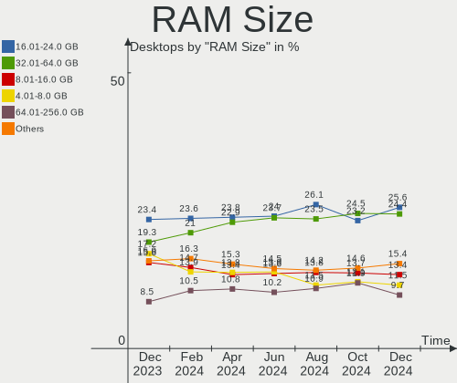
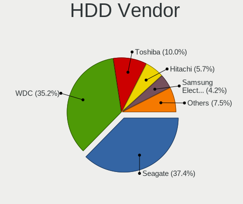
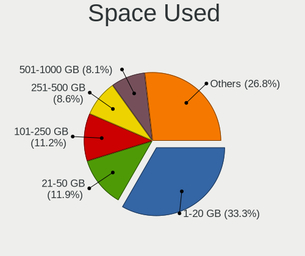
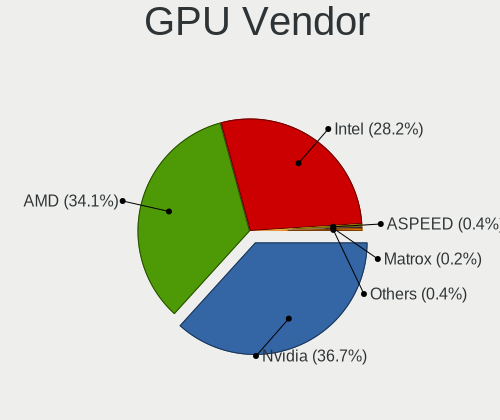
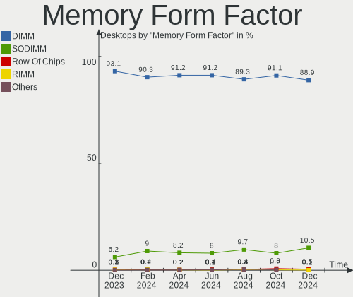
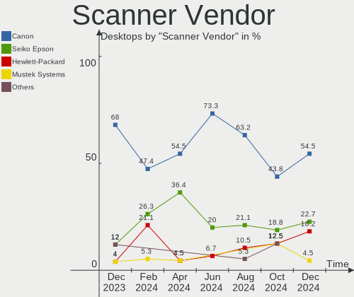

Linux - Hardware Trends (Desktops)
----------------------------------

A project to identify most popular hardware characteristics and track their change
over time based on data collected by Linux users at https://Linux-Hardware.org.

Anyone can contribute to this report by the [hw-probe](https://github.com/linuxhw/hw-probe) tool:

    sudo -E hw-probe -all -upload

This report is for one last month. Overall report since the beginning of time: [TestDays](https://github.com/linuxhw/TestDays)

Period: Apr, 2024.

Contents
--------

* [ System ](#system)
  - [ OS                       ](#os)
  - [ OS Family                ](#os-family)
  - [ Kernel                   ](#kernel)
  - [ Kernel Family            ](#kernel-family)
  - [ Kernel Major Ver.        ](#kernel-major-ver)
  - [ Arch                     ](#arch)
  - [ DE                       ](#de)
  - [ Display Server           ](#display-server)
  - [ Display Manager          ](#display-manager)
  - [ OS Lang                  ](#os-lang)
  - [ Boot Mode                ](#boot-mode)
  - [ Filesystem               ](#filesystem)
  - [ Part. scheme             ](#part-scheme)
  - [ Dual Boot with Linux/BSD ](#dual-boot-with-linuxbsd)
  - [ Dual Boot (Win)          ](#dual-boot-win)

* [ Board ](#board)
  - [ Vendor                   ](#vendor)
  - [ Model                    ](#model)
  - [ Model Family             ](#model-family)
  - [ MFG Year                 ](#mfg-year)
  - [ Form Factor              ](#form-factor)
  - [ Secure Boot              ](#secure-boot)
  - [ Coreboot                 ](#coreboot)
  - [ RAM Size                 ](#ram-size)
  - [ RAM Used                 ](#ram-used)
  - [ Total Drives             ](#total-drives)
  - [ Has CD-ROM               ](#has-cd-rom)
  - [ Has Ethernet             ](#has-ethernet)
  - [ Has WiFi                 ](#has-wifi)
  - [ Has Bluetooth            ](#has-bluetooth)

* [ Location ](#location)
  - [ Country                  ](#country)
  - [ City                     ](#city)

* [ Drives ](#drives)
  - [ Drive Vendor             ](#drive-vendor)
  - [ Drive Model              ](#drive-model)
  - [ HDD Vendor               ](#hdd-vendor)
  - [ SSD Vendor               ](#ssd-vendor)
  - [ Drive Kind               ](#drive-kind)
  - [ Drive Connector          ](#drive-connector)
  - [ Drive Size               ](#drive-size)
  - [ Space Total              ](#space-total)
  - [ Space Used               ](#space-used)
  - [ Malfunc. Drives          ](#malfunc-drives)
  - [ Malfunc. Drive Vendor    ](#malfunc-drive-vendor)
  - [ Malfunc. HDD Vendor      ](#malfunc-hdd-vendor)
  - [ Malfunc. Drive Kind      ](#malfunc-drive-kind)
  - [ Failed Drives            ](#failed-drives)
  - [ Failed Drive Vendor      ](#failed-drive-vendor)
  - [ Drive Status             ](#drive-status)

* [ Storage controller ](#storage-controller)
  - [ Storage Vendor           ](#storage-vendor)
  - [ Storage Model            ](#storage-model)
  - [ Storage Kind             ](#storage-kind)

* [ Processor ](#processor)
  - [ CPU Vendor               ](#cpu-vendor)
  - [ CPU Model                ](#cpu-model)
  - [ CPU Model Family         ](#cpu-model-family)
  - [ CPU Cores                ](#cpu-cores)
  - [ CPU Sockets              ](#cpu-sockets)
  - [ CPU Threads              ](#cpu-threads)
  - [ CPU Op-Modes             ](#cpu-op-modes)
  - [ CPU Microcode            ](#cpu-microcode)
  - [ CPU Microarch            ](#cpu-microarch)

* [ Graphics ](#graphics)
  - [ GPU Vendor               ](#gpu-vendor)
  - [ GPU Model                ](#gpu-model)
  - [ GPU Combo                ](#gpu-combo)
  - [ GPU Driver               ](#gpu-driver)
  - [ GPU Memory               ](#gpu-memory)

* [ Monitor ](#monitor)
  - [ Monitor Vendor           ](#monitor-vendor)
  - [ Monitor Model            ](#monitor-model)
  - [ Monitor Resolution       ](#monitor-resolution)
  - [ Monitor Diagonal         ](#monitor-diagonal)
  - [ Monitor Width            ](#monitor-width)
  - [ Aspect Ratio             ](#aspect-ratio)
  - [ Monitor Area             ](#monitor-area)
  - [ Pixel Density            ](#pixel-density)
  - [ Multiple Monitors        ](#multiple-monitors)

* [ Network ](#network)
  - [ Net Controller Vendor    ](#net-controller-vendor)
  - [ Net Controller Model     ](#net-controller-model)
  - [ Wireless Vendor          ](#wireless-vendor)
  - [ Wireless Model           ](#wireless-model)
  - [ Ethernet Vendor          ](#ethernet-vendor)
  - [ Ethernet Model           ](#ethernet-model)
  - [ Net Controller Kind      ](#net-controller-kind)
  - [ Used Controller          ](#used-controller)
  - [ NICs                     ](#nics)
  - [ IPv6                     ](#ipv6)

* [ Bluetooth ](#bluetooth)
  - [ Bluetooth Vendor         ](#bluetooth-vendor)
  - [ Bluetooth Model          ](#bluetooth-model)

* [ Sound ](#sound)
  - [ Sound Vendor             ](#sound-vendor)
  - [ Sound Model              ](#sound-model)

* [ Memory ](#memory)
  - [ Memory Vendor            ](#memory-vendor)
  - [ Memory Model             ](#memory-model)
  - [ Memory Kind              ](#memory-kind)
  - [ Memory Form Factor       ](#memory-form-factor)
  - [ Memory Size              ](#memory-size)
  - [ Memory Speed             ](#memory-speed)

* [ Printers & scanners ](#printers--scanners)
  - [ Printer Vendor           ](#printer-vendor)
  - [ Printer Model            ](#printer-model)
  - [ Scanner Vendor           ](#scanner-vendor)
  - [ Scanner Model            ](#scanner-model)

* [ Camera ](#camera)
  - [ Camera Vendor            ](#camera-vendor)
  - [ Camera Model             ](#camera-model)

* [ Security ](#security)
  - [ Fingerprint Vendor       ](#fingerprint-vendor)
  - [ Fingerprint Model        ](#fingerprint-model)
  - [ Chipcard Vendor          ](#chipcard-vendor)
  - [ Chipcard Model           ](#chipcard-model)

* [ Unsupported ](#unsupported)
  - [ Unsupported Devices      ](#unsupported-devices)
  - [ Unsupported Device Types ](#unsupported-device-types)

System
------

OS
--

Installed operating systems

| Name                         | Desktops | Percent |
|------------------------------|----------|---------|
| Ubuntu 22.04                 | 264      | 12.58%  |
| Fedora 39                    | 162      | 7.72%   |
| Debian 12                    | 150      | 7.15%   |
| ROSA 12.5                    | 111      | 5.29%   |
| Linux Mint 21.3              | 105      | 5%      |
| Fedora 40                    | 86       | 4.1%    |
| Arch Rolling                 | 83       | 3.95%   |
| OpenMandriva 23.08           | 70       | 3.33%   |
| Ubuntu 23.10                 | 66       | 3.14%   |
| Pop!_OS 22.04                | 64       | 3.05%   |
| ArcoLinux Rolling            | 62       | 2.95%   |
| Zorin 17                     | 58       | 2.76%   |
| OpenMandriva 5.0             | 45       | 2.14%   |
| Ubuntu 24.04                 | 36       | 1.72%   |
| Ubuntu 20.04                 | 36       | 1.72%   |
| KDE neon 22.04               | 36       | 1.72%   |
| BlackPanther 18.1            | 35       | 1.67%   |
| Manjaro                      | 32       | 1.52%   |
| Nobara 39                    | 30       | 1.43%   |
| Kubuntu 22.04                | 24       | 1.14%   |
| openSUSE Tumbleweed-XXXXXXXX | 21       | 1%      |
| Manjaro 23.1.4               | 19       | 0.91%   |
| Linux Mint 21.2              | 19       | 0.91%   |
| EndeavourOS Rolling          | 18       | 0.86%   |
| Xubuntu 22.04                | 17       | 0.81%   |
| openSUSE Leap-15.5           | 17       | 0.81%   |
| Debian 11                    | 17       | 0.81%   |
| Kubuntu 23.10                | 16       | 0.76%   |
| Elementary 7.1               | 16       | 0.76%   |
| LMDE 6                       | 14       | 0.67%   |
| Kali 2024.1                  | 14       | 0.67%   |
| Gentoo 2.14                  | 13       | 0.62%   |
| Linux Mint 20.3              | 12       | 0.57%   |
| Garuda Linux Soaring         | 12       | 0.57%   |
| Dts-distro 1.2.21            | 11       | 0.52%   |
| Kubuntu 24.04                | 10       | 0.48%   |
| Zorin 16                     | 9        | 0.43%   |
| OpenMandriva 4.3             | 8        | 0.38%   |
| NixOS 23.11                  | 8        | 0.38%   |
| MX 23                        | 8        | 0.38%   |

OS Family
---------

OS without a version

| Name          | Desktops | Percent |
|---------------|----------|---------|
| Ubuntu        | 414      | 19.72%  |
| Fedora        | 260      | 12.39%  |
| Debian        | 178      | 8.48%   |
| OpenMandriva  | 157      | 7.48%   |
| Linux Mint    | 151      | 7.19%   |
| ROSA          | 141      | 6.72%   |
| Arch          | 83       | 3.95%   |
| Zorin         | 68       | 3.24%   |
| Pop!_OS       | 65       | 3.1%    |
| ArcoLinux     | 63       | 3%      |
| Kubuntu       | 53       | 2.53%   |
| Manjaro       | 52       | 2.48%   |
| openSUSE      | 40       | 1.91%   |
| BlackPanther  | 40       | 1.91%   |
| KDE neon      | 36       | 1.72%   |
| Nobara        | 31       | 1.48%   |
| Xubuntu       | 28       | 1.33%   |
| EndeavourOS   | 18       | 0.86%   |
| LMDE          | 16       | 0.76%   |
| Garuda Linux  | 16       | 0.76%   |
| Elementary    | 16       | 0.76%   |
| Gentoo        | 15       | 0.71%   |
| Kali          | 14       | 0.67%   |
| NixOS         | 13       | 0.62%   |
| Ubuntu MATE   | 11       | 0.52%   |
| Lubuntu       | 11       | 0.52%   |
| Dts-distro    | 11       | 0.52%   |
| MX            | 10       | 0.48%   |
| ALT Linux     | 8        | 0.38%   |
| RHEL          | 6        | 0.29%   |
| SteamOS       | 5        | 0.24%   |
| ChimeraOS     | 5        | 0.24%   |
| Alpine        | 5        | 0.24%   |
| Xero          | 4        | 0.19%   |
| BigLinux      | 4        | 0.19%   |
| Ubuntu Studio | 3        | 0.14%   |
| Redcore       | 3        | 0.14%   |
| Red OS        | 3        | 0.14%   |
| Oracle Linux  | 3        | 0.14%   |
| AlmaLinux     | 3        | 0.14%   |

Kernel
------

Version of the Linux kernel

| Version                             | Desktops | Percent |
|-------------------------------------|----------|---------|
| 6.5.0-26-generic                    | 150      | 7.15%   |
| 6.5.0-27-generic                    | 149      | 7.1%    |
| 6.5.0-28-generic                    | 132      | 6.29%   |
| 6.6.21-generic-8rosa2021.1-x86_64   | 69       | 3.29%   |
| 6.4.11-desktop-1omv2390             | 65       | 3.1%    |
| 6.8.7-300.fc40.x86_64               | 57       | 2.72%   |
| 5.15.0-101-generic                  | 56       | 2.67%   |
| 6.6.2-desktop-1omv2390              | 55       | 2.62%   |
| 5.15.0-102-generic                  | 55       | 2.62%   |
| 6.8.0-76060800daily20240311-generic | 54       | 2.57%   |
| 6.1.0-20-amd64                      | 52       | 2.48%   |
| 6.1.0-18-amd64                      | 42       | 2%      |
| 5.15.0-105-generic                  | 41       | 1.95%   |
| 6.8.0-31-generic                    | 32       | 1.52%   |
| 6.8.7-arch1-1                       | 30       | 1.43%   |
| 6.8.4-200.fc39.x86_64               | 28       | 1.33%   |
| 6.7.11-200.fc39.x86_64              | 28       | 1.33%   |
| 6.1.0-4-amd64                       | 28       | 1.33%   |
| 6.8.6-200.fc39.x86_64               | 27       | 1.29%   |
| 6.8.5-201.fc39.x86_64               | 22       | 1.05%   |
| 6.8.2-arch2-1                       | 21       | 1%      |
| 6.1.81-generic-2rosa2021.1-x86_64   | 20       | 0.95%   |
| 6.5.6-300.fc39.x86_64               | 19       | 0.91%   |
| 6.8.2-zen2-1-zen                    | 18       | 0.86%   |
| 6.8.5-arch1-1                       | 16       | 0.76%   |
| 5.14.21-150500.55.52-default        | 16       | 0.76%   |
| 6.6.26-1-MANJARO                    | 15       | 0.71%   |
| 6.8.7-200.fc39.x86_64               | 13       | 0.62%   |
| 5.15.85-desktop-1bP                 | 13       | 0.62%   |
| 6.8.4-arch1-1                       | 12       | 0.57%   |
| 6.8.2-300.fc40.x86_64               | 12       | 0.57%   |
| 5.15.0-91-generic                   | 12       | 0.57%   |
| 4.18.16-desktop-1bP                 | 12       | 0.57%   |
| 6.8.7-zen1-1-zen                    | 11       | 0.52%   |
| 6.6.9-amd64                         | 11       | 0.52%   |
| 6.5.0-18-generic                    | 11       | 0.52%   |
| 5.15.36-yocto-standard              | 11       | 0.52%   |
| 5.15.0-97-generic                   | 11       | 0.52%   |
| 6.8.5-201.fsync.fc39.x86_64         | 10       | 0.48%   |
| 6.7.9-arch1-1                       | 10       | 0.48%   |

Kernel Family
-------------

Linux kernel without a distro release

| Version | Desktops | Percent |
|---------|----------|---------|
| 6.5.0   | 485      | 23.11%  |
| 5.15.0  | 211      | 10.05%  |
| 6.8.7   | 151      | 7.19%   |
| 6.1.0   | 151      | 7.19%   |
| 6.8.0   | 101      | 4.81%   |
| 6.8.5   | 78       | 3.72%   |
| 6.6.21  | 78       | 3.72%   |
| 6.4.11  | 65       | 3.1%    |
| 6.8.4   | 64       | 3.05%   |
| 6.8.2   | 59       | 2.81%   |
| 6.6.2   | 55       | 2.62%   |
| 6.8.6   | 42       | 2%      |
| 6.7.11  | 30       | 1.43%   |
| 5.4.0   | 24       | 1.14%   |
| 6.7.9   | 23       | 1.1%    |
| 6.1.81  | 20       | 0.95%   |
| 6.5.6   | 19       | 0.91%   |
| 6.6.26  | 18       | 0.86%   |
| 5.14.21 | 18       | 0.86%   |
| 6.6.10  | 15       | 0.71%   |
| 6.7.12  | 14       | 0.67%   |
| 6.2.0   | 13       | 0.62%   |
| 5.15.85 | 13       | 0.62%   |
| 5.10.0  | 13       | 0.62%   |
| 6.8.1   | 12       | 0.57%   |
| 6.7.6   | 12       | 0.57%   |
| 6.6.9   | 12       | 0.57%   |
| 6.6.25  | 12       | 0.57%   |
| 4.18.16 | 12       | 0.57%   |
| 6.7.10  | 11       | 0.52%   |
| 6.6.13  | 11       | 0.52%   |
| 6.5.13  | 11       | 0.52%   |
| 5.15.36 | 11       | 0.52%   |
| 4.15.0  | 10       | 0.48%   |
| 5.6.14  | 9        | 0.43%   |
| 5.14.0  | 8        | 0.38%   |
| 6.9.0   | 7        | 0.33%   |
| 6.6.15  | 7        | 0.33%   |
| 5.19.0  | 7        | 0.33%   |
| 5.16.7  | 7        | 0.33%   |

Kernel Major Ver.
-----------------

Linux kernel major version

| Version | Desktops | Percent |
|---------|----------|---------|
| 6.5     | 524      | 24.96%  |
| 6.8     | 514      | 24.49%  |
| 5.15    | 249      | 11.86%  |
| 6.6     | 242      | 11.53%  |
| 6.1     | 210      | 10%     |
| 6.7     | 103      | 4.91%   |
| 6.4     | 72       | 3.43%   |
| 5.4     | 29       | 1.38%   |
| 5.10    | 27       | 1.29%   |
| 5.14    | 26       | 1.24%   |
| 6.2     | 23       | 1.1%    |
| 4.18    | 14       | 0.67%   |
| 4.15    | 11       | 0.52%   |
| 6.3     | 10       | 0.48%   |
| 5.6     | 9        | 0.43%   |
| 5.19    | 8        | 0.38%   |
| 6.9     | 7        | 0.33%   |
| 5.16    | 7        | 0.33%   |
| 5.11    | 4        | 0.19%   |
| 4.19    | 3        | 0.14%   |
| 5.3     | 1        | 0.05%   |
| 5.18    | 1        | 0.05%   |
| 5.17    | 1        | 0.05%   |
| 5.13    | 1        | 0.05%   |
| 5.0     | 1        | 0.05%   |
| 4.9     | 1        | 0.05%   |
| 3.2     | 1        | 0.05%   |

Arch
----

OS architecture (x86_64, i586, etc.)

| Name    | Desktops | Percent |
|---------|----------|---------|
| x86_64  | 2087     | 99.43%  |
| i686    | 10       | 0.48%   |
| mips    | 1        | 0.05%   |
| aarch64 | 1        | 0.05%   |

DE
--

Desktop Environment

| Name             | Desktops | Percent |
|------------------|----------|---------|
| GNOME            | 807      | 38.45%  |
| KDE5             | 455      | 21.68%  |
| Unknown          | 186      | 8.86%   |
| KDE6             | 162      | 7.72%   |
| X-Cinnamon       | 150      | 7.15%   |
| XFCE             | 132      | 6.29%   |
| MATE             | 46       | 2.19%   |
| LXQt             | 37       | 1.76%   |
| Cinnamon         | 26       | 1.24%   |
| Hyprland         | 19       | 0.91%   |
| Pantheon         | 16       | 0.76%   |
| KDE4             | 10       | 0.48%   |
| KDE              | 10       | 0.48%   |
| GNOME Flashback  | 8        | 0.38%   |
| i3               | 6        | 0.29%   |
| LXDE             | 4        | 0.19%   |
| GNOME Classic    | 4        | 0.19%   |
| Budgie           | 3        | 0.14%   |
| xmonad           | 2        | 0.1%    |
| icewm            | 2        | 0.1%    |
| fly              | 2        | 0.1%    |
| Deepin           | 2        | 0.1%    |
| bspwm            | 2        | 0.1%    |
| Unity            | 1        | 0.05%   |
| qtile            | 1        | 0.05%   |
| pika:GNOME       | 1        | 0.05%   |
| lightdm-xsession | 1        | 0.05%   |
| GNOME-Classic    | 1        | 0.05%   |
| Endless:GNOME    | 1        | 0.05%   |
| chadwm           | 1        | 0.05%   |
| BunsenLabs       | 1        | 0.05%   |

Display Server
--------------

X11 or Wayland

| Name    | Desktops | Percent |
|---------|----------|---------|
| X11     | 991      | 47.21%  |
| Wayland | 911      | 43.4%   |
| Unknown | 104      | 4.95%   |
| Tty     | 93       | 4.43%   |

Display Manager
---------------

SDDM, LightDM, etc.

| Name    | Desktops | Percent |
|---------|----------|---------|
| Unknown | 823      | 39.21%  |
| SDDM    | 506      | 24.11%  |
| GDM3    | 368      | 17.53%  |
| LightDM | 257      | 12.24%  |
| GDM     | 131      | 6.24%   |
| KDM     | 7        | 0.33%   |
| SLiM    | 3        | 0.14%   |
| XDM     | 1        | 0.05%   |
| SLIMSKI | 1        | 0.05%   |
| LY-DM   | 1        | 0.05%   |
| GREETD  | 1        | 0.05%   |

OS Lang
-------

Language

| Lang    | Desktops | Percent |
|---------|----------|---------|
| en_US   | 778      | 37.07%  |
| ru_RU   | 242      | 11.53%  |
| de_DE   | 150      | 7.15%   |
| pt_BR   | 99       | 4.72%   |
| it_IT   | 94       | 4.48%   |
| fr_FR   | 92       | 4.38%   |
| en_GB   | 92       | 4.38%   |
| Unknown | 82       | 3.91%   |
| C       | 53       | 2.53%   |
| es_ES   | 48       | 2.29%   |
| pl_PL   | 41       | 1.95%   |
| en_AU   | 41       | 1.95%   |
| en_CA   | 36       | 1.72%   |
| nl_NL   | 22       | 1.05%   |
| cs_CZ   | 14       | 0.67%   |
| tr_TR   | 13       | 0.62%   |
| hu_HU   | 13       | 0.62%   |
| es_AR   | 13       | 0.62%   |
| de_AT   | 12       | 0.57%   |
| en_IN   | 11       | 0.52%   |
| es_MX   | 10       | 0.48%   |
| zh_CN   | 9        | 0.43%   |
| pt_PT   | 7        | 0.33%   |
| fr_CA   | 7        | 0.33%   |
| nl_BE   | 6        | 0.29%   |
| en_ZA   | 6        | 0.29%   |
| en_IE   | 6        | 0.29%   |
| de_CH   | 6        | 0.29%   |
| ja_JP   | 5        | 0.24%   |
| fr_BE   | 5        | 0.24%   |
| es_VE   | 5        | 0.24%   |
| es_CL   | 5        | 0.24%   |
| zh_TW   | 4        | 0.19%   |
| fi_FI   | 4        | 0.19%   |
| es_CO   | 4        | 0.19%   |
| en_DK   | 4        | 0.19%   |
| el_GR   | 4        | 0.19%   |
| C.UTF8  | 4        | 0.19%   |
| bg_BG   | 4        | 0.19%   |
| sv_SE   | 3        | 0.14%   |

Boot Mode
---------

EFI or BIOS

| Mode | Desktops | Percent |
|------|----------|---------|
| BIOS | 1195     | 56.93%  |
| EFI  | 904      | 43.07%  |

Filesystem
----------

Type of filesystem

| Type    | Desktops | Percent |
|---------|----------|---------|
| Ext4    | 1202     | 57.27%  |
| Btrfs   | 407      | 19.39%  |
| Tmpfs   | 270      | 12.86%  |
| Overlay | 144      | 6.86%   |
| Xfs     | 40       | 1.91%   |
| Zfs     | 16       | 0.76%   |
| F2fs    | 10       | 0.48%   |
| Ext3    | 3        | 0.14%   |
| XXXXXXX | 2        | 0.1%    |
| Unknown | 2        | 0.1%    |
| XXX     | 1        | 0.05%   |
| Rootfs  | 1        | 0.05%   |
| Ext2    | 1        | 0.05%   |

Part. scheme
------------

Scheme of partitioning

| Type    | Desktops | Percent |
|---------|----------|---------|
| GPT     | 1162     | 55.36%  |
| Unknown | 678      | 32.3%   |
| MBR     | 259      | 12.34%  |

Dual Boot with Linux/BSD
------------------------

Hosting more than one Linux/BSD

| Dual boot | Desktops | Percent |
|-----------|----------|---------|
| No        | 1669     | 79.51%  |
| Yes       | 430      | 20.49%  |

Dual Boot (Win)
---------------

Hosting Linux and Windows

| Dual boot | Desktops | Percent |
|-----------|----------|---------|
| No        | 1446     | 68.89%  |
| Yes       | 653      | 31.11%  |

Board
-----

Vendor
------

Motherboard manufacturer

| Name                                 | Desktops | Percent |
|--------------------------------------|----------|---------|
| ASUSTek Computer                     | 545      | 25.96%  |
| Gigabyte Technology                  | 365      | 17.39%  |
| MSI                                  | 277      | 13.2%   |
| ASRock                               | 190      | 9.05%   |
| Dell                                 | 157      | 7.48%   |
| Hewlett-Packard                      | 146      | 6.96%   |
| Lenovo                               | 62       | 2.95%   |
| Intel                                | 48       | 2.29%   |
| Unknown                              | 34       | 1.62%   |
| Fujitsu                              | 24       | 1.14%   |
| Biostar                              | 23       | 1.1%    |
| Acer                                 | 23       | 1.1%    |
| Pegatron                             | 18       | 0.86%   |
| Supermicro                           | 15       | 0.71%   |
| AZW                                  | 15       | 0.71%   |
| Shenzhen Meigao Electronic Equipment | 13       | 0.62%   |
| Medion                               | 8        | 0.38%   |
| ECS                                  | 8        | 0.38%   |
| Huanan                               | 7        | 0.33%   |
| Foxconn                              | 7        | 0.33%   |
| Apple                                | 7        | 0.33%   |
| Packard Bell                         | 6        | 0.29%   |
| AMI                                  | 6        | 0.29%   |
| MACHINIST                            | 5        | 0.24%   |
| Alienware                            | 5        | 0.24%   |
| Positivo                             | 4        | 0.19%   |
| MAXSUN                               | 4        | 0.19%   |
| GEEKOM                               | 4        | 0.19%   |
| PCWare                               | 3        | 0.14%   |
| Itautec                              | 3        | 0.14%   |
| BESSTAR Tech                         | 3        | 0.14%   |
| STGAUBRON                            | 2        | 0.1%    |
| Semp Toshiba                         | 2        | 0.1%    |
| NZXT                                 | 2        | 0.1%    |
| NCR                                  | 2        | 0.1%    |
| Minix                                | 2        | 0.1%    |
| Hardkernel                           | 2        | 0.1%    |
| EVGA                                 | 2        | 0.1%    |
| eMachines                            | 2        | 0.1%    |
| Colorful Technology                  | 2        | 0.1%    |

Model
-----

Motherboard model

| Name                              | Desktops | Percent |
|-----------------------------------|----------|---------|
| Unknown                           | 37       | 1.76%   |
| ASUS All Series                   | 33       | 1.57%   |
| MSI MS-7C56                       | 16       | 0.76%   |
| ASUS PRIME A320M-K                | 13       | 0.62%   |
| Dell OptiPlex 7010                | 12       | 0.57%   |
| MSI MS-7C95                       | 10       | 0.48%   |
| MSI MS-7C91                       | 10       | 0.48%   |
| MSI MS-7D25                       | 9        | 0.43%   |
| Lenovo ThinkCentre M79 10JAS05300 | 9        | 0.43%   |
| ASUS TUF Gaming B550-PLUS         | 9        | 0.43%   |
| ASUS M5A97 R2.0                   | 9        | 0.43%   |
| MSI MS-7E06                       | 8        | 0.38%   |
| MSI MS-7C37                       | 8        | 0.38%   |
| Intel X99                         | 8        | 0.38%   |
| Dell OptiPlex 7040                | 8        | 0.38%   |
| MSI MS-7C02                       | 7        | 0.33%   |
| MSI MS-7B86                       | 7        | 0.33%   |
| ASUS TUF Gaming X570-PLUS         | 7        | 0.33%   |
| ASUS ROG STRIX B450-F GAMING      | 7        | 0.33%   |
| MSI MS-7C52                       | 6        | 0.29%   |
| MSI MS-7A38                       | 6        | 0.29%   |
| Intel H61                         | 6        | 0.29%   |
| HP ProDesk 600 G1 SFF             | 6        | 0.29%   |
| Gigabyte TRX40 AORUS MASTER       | 6        | 0.29%   |
| Gigabyte B75M-D3H                 | 6        | 0.29%   |
| Gigabyte B450M GAMING             | 6        | 0.29%   |
| Gigabyte B450M DS3H               | 6        | 0.29%   |
| Dell OptiPlex 790                 | 6        | 0.29%   |
| Dell OptiPlex 3050                | 6        | 0.29%   |
| AZW MINI S                        | 6        | 0.29%   |
| ASUS ROG STRIX X570-E GAMING      | 6        | 0.29%   |
| ASRock TRX40 Creator              | 6        | 0.29%   |
| Supermicro SYS-6018R-TDW          | 5        | 0.24%   |
| MSI MS-7D91                       | 5        | 0.24%   |
| MSI MS-7B89                       | 5        | 0.24%   |
| MSI MS-7817                       | 5        | 0.24%   |
| Gigabyte Z790 AORUS ELITE AX      | 5        | 0.24%   |
| Gigabyte Z390 UD                  | 5        | 0.24%   |
| Dell OptiPlex 9020                | 5        | 0.24%   |
| Dell OptiPlex 9010                | 5        | 0.24%   |

Model Family
------------

Motherboard model prefix

| Name                | Desktops | Percent |
|---------------------|----------|---------|
| ASUS PRIME          | 125      | 5.96%   |
| Dell OptiPlex       | 100      | 4.76%   |
| ASUS ROG            | 86       | 4.1%    |
| ASUS TUF            | 76       | 3.62%   |
| Unknown             | 37       | 1.76%   |
| Lenovo ThinkCentre  | 33       | 1.57%   |
| HP Compaq           | 33       | 1.57%   |
| ASUS All            | 33       | 1.57%   |
| HP EliteDesk        | 25       | 1.19%   |
| Gigabyte X570       | 22       | 1.05%   |
| Gigabyte B450M      | 21       | 1%      |
| Dell Precision      | 20       | 0.95%   |
| HP ProDesk          | 18       | 0.86%   |
| MSI MS-7C56         | 16       | 0.76%   |
| Gigabyte Z790       | 16       | 0.76%   |
| ASUS M5A97          | 16       | 0.76%   |
| Gigabyte Z390       | 15       | 0.71%   |
| Lenovo ThinkStation | 13       | 0.62%   |
| Fujitsu ESPRIMO     | 12       | 0.57%   |
| Dell Inspiron       | 12       | 0.57%   |
| ASRock B450M        | 12       | 0.57%   |
| Acer Aspire         | 12       | 0.57%   |
| Gigabyte B550       | 11       | 0.52%   |
| MSI MS-7C95         | 10       | 0.48%   |
| MSI MS-7C91         | 10       | 0.48%   |
| Gigabyte B550M      | 10       | 0.48%   |
| ASUS PRO            | 10       | 0.48%   |
| ASRock X570         | 10       | 0.48%   |
| MSI MS-7D25         | 9        | 0.43%   |
| Intel X99           | 9        | 0.43%   |
| Dell Vostro         | 9        | 0.43%   |
| MSI MS-7E06         | 8        | 0.38%   |
| MSI MS-7C37         | 8        | 0.38%   |
| HP Pavilion         | 8        | 0.38%   |
| HP OMEN             | 8        | 0.38%   |
| Gigabyte TRX40      | 8        | 0.38%   |
| Gigabyte A520M      | 8        | 0.38%   |
| Dell XPS            | 8        | 0.38%   |
| ASRock B550         | 8        | 0.38%   |
| ASRock B450         | 8        | 0.38%   |

MFG Year
--------

Motherboard manufacture year

| Year    | Desktops | Percent |
|---------|----------|---------|
| 2020    | 219      | 10.43%  |
| 2022    | 186      | 8.86%   |
| 2018    | 184      | 8.77%   |
| 2021    | 162      | 7.72%   |
| 2019    | 161      | 7.67%   |
| 2023    | 156      | 7.43%   |
| 2012    | 155      | 7.38%   |
| 2013    | 134      | 6.38%   |
| 2017    | 111      | 5.29%   |
| 2014    | 105      | 5%      |
| 2011    | 96       | 4.57%   |
| 2016    | 89       | 4.24%   |
| 2009    | 75       | 3.57%   |
| 2010    | 73       | 3.48%   |
| 2015    | 71       | 3.38%   |
| 2008    | 53       | 2.53%   |
| 2024    | 25       | 1.19%   |
| 2007    | 19       | 0.91%   |
| 2006    | 15       | 0.71%   |
| 2005    | 4        | 0.19%   |
| Unknown | 2        | 0.1%    |
| 2004    | 1        | 0.05%   |
| 2003    | 1        | 0.05%   |
| 2002    | 1        | 0.05%   |
| 2000    | 1        | 0.05%   |

Form Factor
-----------

Physical design of the computer

| Name    | Desktops | Percent |
|---------|----------|---------|
| Desktop | 2099     | 100%    |

Secure Boot
-----------

Enabled or disabled

| State    | Desktops | Percent |
|----------|----------|---------|
| Disabled | 2040     | 97.19%  |
| Enabled  | 59       | 2.81%   |

Coreboot
--------

Have coreboot on board

| Used | Desktops | Percent |
|------|----------|---------|
| No   | 2096     | 99.86%  |
| Yes  | 3        | 0.14%   |

RAM Size
--------

Total RAM memory

| Size in GB      | Desktops | Percent |
|-----------------|----------|---------|
| 16.01-24.0      | 500      | 23.82%  |
| 32.01-64.0      | 479      | 22.82%  |
| 4.01-8.0        | 291      | 13.86%  |
| 8.01-16.0       | 281      | 13.39%  |
| 64.01-256.0     | 226      | 10.77%  |
| 3.01-4.0        | 180      | 8.58%   |
| 24.01-32.0      | 81       | 3.86%   |
| 1.01-2.0        | 28       | 1.33%   |
| More than 256.0 | 16       | 0.76%   |
| 2.01-3.0        | 10       | 0.48%   |
| 0.51-1.0        | 3        | 0.14%   |
| 0.01-0.5        | 2        | 0.1%    |
| Unknown         | 2        | 0.1%    |

RAM Used
--------

Used RAM memory

| Used GB     | Desktops | Percent |
|-------------|----------|---------|
| 1.01-2.0    | 533      | 25.39%  |
| 2.01-3.0    | 459      | 21.87%  |
| 4.01-8.0    | 428      | 20.39%  |
| 3.01-4.0    | 307      | 14.63%  |
| 8.01-16.0   | 141      | 6.72%   |
| 0.51-1.0    | 135      | 6.43%   |
| 0.01-0.5    | 27       | 1.29%   |
| 16.01-24.0  | 25       | 1.19%   |
| 64.01-256.0 | 15       | 0.71%   |
| 32.01-64.0  | 13       | 0.62%   |
| 24.01-32.0  | 12       | 0.57%   |
| Unknown     | 3        | 0.14%   |
| 0           | 1        | 0.05%   |

Total Drives
------------

Number of drives on board

| Drives | Desktops | Percent |
|--------|----------|---------|
| 1      | 720      | 34.3%   |
| 2      | 579      | 27.58%  |
| 3      | 388      | 18.48%  |
| 4      | 200      | 9.53%   |
| 5      | 91       | 4.34%   |
| 6      | 45       | 2.14%   |
| 7      | 23       | 1.1%    |
| 0      | 17       | 0.81%   |
| 9      | 10       | 0.48%   |
| 8      | 9        | 0.43%   |
| 13     | 8        | 0.38%   |
| 10     | 4        | 0.19%   |
| 14     | 2        | 0.1%    |
| 12     | 2        | 0.1%    |
| 21     | 1        | 0.05%   |

Has CD-ROM
----------

Has CD-ROM on board

| Presented | Desktops | Percent |
|-----------|----------|---------|
| No        | 1370     | 65.27%  |
| Yes       | 729      | 34.73%  |

Has Ethernet
------------

Has Ethernet on board

| Presented | Desktops | Percent |
|-----------|----------|---------|
| Yes       | 2086     | 99.38%  |
| No        | 13       | 0.62%   |

Has WiFi
--------

Has WiFi module

| Presented | Desktops | Percent |
|-----------|----------|---------|
| No        | 1062     | 50.6%   |
| Yes       | 1037     | 49.4%   |

Has Bluetooth
-------------

Has Bluetooth module

| Presented | Desktops | Percent |
|-----------|----------|---------|
| No        | 1222     | 58.22%  |
| Yes       | 877      | 41.78%  |

Location
--------

Country
-------

Geographic location (country)

| Country      | Desktops | Percent |
|--------------|----------|---------|
| USA          | 369      | 17.58%  |
| Russia       | 272      | 12.96%  |
| Germany      | 186      | 8.86%   |
| Brazil       | 132      | 6.29%   |
| Italy        | 109      | 5.19%   |
| France       | 101      | 4.81%   |
| UK           | 81       | 3.86%   |
| Canada       | 66       | 3.14%   |
| Spain        | 64       | 3.05%   |
| Poland       | 60       | 2.86%   |
| Hungary      | 50       | 2.38%   |
| Australia    | 50       | 2.38%   |
| Netherlands  | 35       | 1.67%   |
| Austria      | 33       | 1.57%   |
| Argentina    | 22       | 1.05%   |
| Turkey       | 21       | 1%      |
| Czechia      | 21       | 1%      |
| Belgium      | 21       | 1%      |
| Sweden       | 20       | 0.95%   |
| India        | 19       | 0.91%   |
| Switzerland  | 18       | 0.86%   |
| Portugal     | 18       | 0.86%   |
| Norway       | 18       | 0.86%   |
| Greece       | 18       | 0.86%   |
| Mexico       | 16       | 0.76%   |
| Romania      | 14       | 0.67%   |
| Finland      | 14       | 0.67%   |
| China        | 13       | 0.62%   |
| Bulgaria     | 13       | 0.62%   |
| Serbia       | 12       | 0.57%   |
| Denmark      | 12       | 0.57%   |
| South Africa | 11       | 0.52%   |
| Malaysia     | 10       | 0.48%   |
| Japan        | 9        | 0.43%   |
| Colombia     | 8        | 0.38%   |
| Uruguay      | 7        | 0.33%   |
| Ireland      | 7        | 0.33%   |
| Croatia      | 7        | 0.33%   |
| Chile        | 7        | 0.33%   |
| Taiwan       | 6        | 0.29%   |

City
----

Geographic location (city)

| City           | Desktops | Percent |
|----------------|----------|---------|
| Moscow         | 68       | 3.24%   |
| Voronezh       | 31       | 1.48%   |
| Sydney         | 27       | 1.29%   |
| St Petersburg  | 23       | 1.1%    |
| Sao Paulo      | 20       | 0.95%   |
| Vienna         | 15       | 0.71%   |
| Terrassa       | 15       | 0.71%   |
| Rome           | 14       | 0.67%   |
| Budapest       | 13       | 0.62%   |
| Berlin         | 13       | 0.62%   |
| Warsaw         | 12       | 0.57%   |
| Hamburg        | 11       | 0.52%   |
| Amsterdam      | 11       | 0.52%   |
| Paris          | 10       | 0.48%   |
| New York       | 10       | 0.48%   |
| Rio de Janeiro | 9        | 0.43%   |
| Munich         | 9        | 0.43%   |
| Milan          | 9        | 0.43%   |
| Toronto        | 8        | 0.38%   |
| Sofia          | 8        | 0.38%   |
| Melbourne      | 8        | 0.38%   |
| Madrid         | 8        | 0.38%   |
| Helsinki       | 8        | 0.38%   |
| Prague         | 7        | 0.33%   |
| Perth          | 7        | 0.33%   |
| Los Angeles    | 7        | 0.33%   |
| Istanbul       | 7        | 0.33%   |
| Athens         | 7        | 0.33%   |
| Singapore      | 6        | 0.29%   |
| Poznan         | 6        | 0.29%   |
| Novosibirsk    | 6        | 0.29%   |
| Montevideo     | 6        | 0.29%   |
| Kuala Lumpur   | 6        | 0.29%   |
| Johannesburg   | 6        | 0.29%   |
| Denver         | 6        | 0.29%   |
| Chicago        | 6        | 0.29%   |
| Chelyabinsk    | 6        | 0.29%   |
| Belgrade       | 6        | 0.29%   |
| Yekaterinburg  | 5        | 0.24%   |
| Stockholm      | 5        | 0.24%   |

Drives
------

Drive Vendor
------------

Hard drive vendors

| Vendor                       | Desktops | Drives | Percent |
|------------------------------|----------|--------|---------|
| WDC                          | 646      | 857    | 15.94%  |
| Samsung Electronics          | 582      | 824    | 14.36%  |
| Seagate                      | 579      | 773    | 14.29%  |
| Kingston                     | 251      | 311    | 6.19%   |
| Sandisk                      | 235      | 277    | 5.8%    |
| Crucial                      | 193      | 276    | 4.76%   |
| Toshiba                      | 188      | 220    | 4.64%   |
| Hitachi                      | 88       | 101    | 2.17%   |
| Phison Electronics           | 71       | 80     | 1.75%   |
| China                        | 67       | 74     | 1.65%   |
| Intel                        | 64       | 73     | 1.58%   |
| Micron/Crucial Technology    | 56       | 63     | 1.38%   |
| Kingston Technology Company  | 52       | 55     | 1.28%   |
| A-DATA Technology            | 51       | 56     | 1.26%   |
| Unknown                      | 47       | 58     | 1.16%   |
| Silicon Motion               | 40       | 44     | 0.99%   |
| Micron Technology            | 40       | 45     | 0.99%   |
| Intenso                      | 37       | 40     | 0.91%   |
| HGST                         | 37       | 46     | 0.91%   |
| PNY                          | 36       | 44     | 0.89%   |
| SK hynix                     | 34       | 35     | 0.84%   |
| SPCC                         | 31       | 32     | 0.77%   |
| MAXIO Technology (Hangzhou)  | 27       | 28     | 0.67%   |
| ADATA Technology             | 27       | 33     | 0.67%   |
| Unknown                      | 24       | 24     | 0.59%   |
| Realtek Semiconductor        | 22       | 23     | 0.54%   |
| Patriot                      | 22       | 27     | 0.54%   |
| Lexar                        | 22       | 25     | 0.54%   |
| Shenzhen Longsys Electronics | 18       | 19     | 0.44%   |
| Team                         | 17       | 19     | 0.42%   |
| Phison                       | 17       | 60     | 0.42%   |
| OCZ                          | 17       | 19     | 0.42%   |
| Maxtor                       | 17       | 18     | 0.42%   |
| Apacer                       | 17       | 17     | 0.42%   |
| KingSpec                     | 16       | 17     | 0.39%   |
| Corsair                      | 16       | 19     | 0.39%   |
| Gigabyte Technology          | 14       | 16     | 0.35%   |
| GOODRAM                      | 13       | 22     | 0.32%   |
| Netac                        | 11       | 11     | 0.27%   |
| Hewlett-Packard              | 11       | 11     | 0.27%   |

Drive Model
-----------

Hard drive models

| Model                                                 | Desktops | Percent |
|-------------------------------------------------------|----------|---------|
| Samsung NVMe SSD Controller SM981/PM981/PM983 1TB     | 79       | 1.7%    |
| Samsung NVMe SSD Controller PM9A1/PM9A3/980PRO 1TB    | 57       | 1.23%   |
| Kingston SA400S37240G 240GB SSD                       | 53       | 1.14%   |
| Seagate ST500DM002-1BD142 500GB                       | 50       | 1.08%   |
| Seagate ST1000DM010-2EP102 1TB                        | 47       | 1.01%   |
| Kingston SA400S37480G 480GB SSD                       | 44       | 0.95%   |
| Seagate ST2000DM008-2FR102 2TB                        | 35       | 0.75%   |
| WDC WD10EZEX-08WN4A0 1TB                              | 32       | 0.69%   |
| Toshiba DT01ACA100 1TB                                | 31       | 0.67%   |
| Silicon Motion SM2263EN/SM2263XT SSD Controller 256GB | 31       | 0.67%   |
| Samsung SSD 860 EVO 500GB                             | 30       | 0.65%   |
| Samsung SSD 850 EVO 500GB                             | 30       | 0.65%   |
| Crucial CT500MX500SSD1 500GB                          | 30       | 0.65%   |
| Phison E12 NVMe Controller 2TB                        | 29       | 0.62%   |
| Micron/Crucial P2 NVMe PCIe SSD 4TB                   | 28       | 0.6%    |
| Crucial CT1000MX500SSD1 1TB                           | 28       | 0.6%    |
| Samsung SSD 980 1TB                                   | 26       | 0.56%   |
| Toshiba HDWD110 1TB                                   | 24       | 0.52%   |
| Samsung SSD 850 EVO 250GB                             | 24       | 0.52%   |
| Unknown                                               | 24       | 0.52%   |
| Seagate ST4000DM004-2CV104 4TB                        | 22       | 0.47%   |
| Sandisk WD Blue SN550 NVMe SSD 2TB                    | 22       | 0.47%   |
| Samsung SSD 990 PRO 2TB                               | 21       | 0.45%   |
| Crucial CT480BX500SSD1 480GB                          | 21       | 0.45%   |
| Samsung SSD 860 EVO 1TB                               | 20       | 0.43%   |
| Kingston SA400S37120G 120GB SSD                       | 20       | 0.43%   |
| Unknown SD/MMC/MS PRO 128GB                           | 19       | 0.41%   |
| Toshiba DT01ACA050 500GB                              | 19       | 0.41%   |
| Kingston Company SNV2S1000G 1TB                       | 18       | 0.39%   |
| Samsung SSD 870 EVO 500GB                             | 17       | 0.37%   |
| Kingston SV300S37A120G 120GB SSD                      | 17       | 0.37%   |
| Seagate ST1000DM003-1CH162 1TB                        | 16       | 0.34%   |
| Samsung NVMe SSD Controller SM961/PM961/SM963 1TB     | 16       | 0.34%   |
| Seagate ST3500418AS 500GB                             | 15       | 0.32%   |
| Seagate ST31000528AS 1TB                              | 15       | 0.32%   |
| Seagate ST1000DM003-1ER162 1TB                        | 15       | 0.32%   |
| Samsung SSD 980 500GB                                 | 15       | 0.32%   |
| Crucial CT2000MX500SSD1 2TB                           | 15       | 0.32%   |
| Crucial CT1000BX500SSD1 1TB                           | 15       | 0.32%   |
| WDC WD10EZEX-00BN5A0 1TB                              | 14       | 0.3%    |

HDD Vendor
----------

Hard disk drive vendors

| Vendor              | Desktops | Drives | Percent |
|---------------------|----------|--------|---------|
| WDC                 | 567      | 742    | 36.21%  |
| Seagate             | 566      | 754    | 36.14%  |
| Toshiba             | 171      | 201    | 10.92%  |
| Hitachi             | 88       | 101    | 5.62%   |
| Samsung Electronics | 58       | 62     | 3.7%    |
| HGST                | 36       | 45     | 2.3%    |
| Unknown             | 19       | 19     | 1.21%   |
| Maxtor              | 15       | 16     | 0.96%   |
| SABRENT             | 6        | 6      | 0.38%   |
| Apple               | 6        | 6      | 0.38%   |
| JMicron Technology  | 5        | 5      | 0.32%   |
| Hewlett-Packard     | 4        | 4      | 0.26%   |
| Fujitsu             | 4        | 6      | 0.26%   |
| ASMT                | 3        | 4      | 0.19%   |
| TO Exter            | 2        | 2      | 0.13%   |
| QUANTUM             | 2        | 2      | 0.13%   |
| Intenso             | 2        | 2      | 0.13%   |
| ExcelStor           | 2        | 2      | 0.13%   |
| WD MediaMax         | 1        | 1      | 0.06%   |
| SSK                 | 1        | 1      | 0.06%   |
| MSFT                | 1        | 1      | 0.06%   |
| MARVELL             | 1        | 2      | 0.06%   |
| Lenovo              | 1        | 2      | 0.06%   |
| Initio              | 1        | 1      | 0.06%   |
| HPE                 | 1        | 1      | 0.06%   |
| HGST HTS            | 1        | 1      | 0.06%   |
| Config              | 1        | 1      | 0.06%   |
| ACASIS              | 1        | 1      | 0.06%   |

SSD Vendor
----------

Solid state drive vendors

| Vendor              | Desktops | Drives | Percent |
|---------------------|----------|--------|---------|
| Samsung Electronics | 287      | 353    | 20.4%   |
| Kingston            | 204      | 234    | 14.5%   |
| Crucial             | 169      | 200    | 12.01%  |
| SanDisk             | 93       | 102    | 6.61%   |
| WDC                 | 83       | 91     | 5.9%    |
| China               | 64       | 71     | 4.55%   |
| A-DATA Technology   | 46       | 49     | 3.27%   |
| Intel               | 38       | 41     | 2.7%    |
| Intenso             | 29       | 32     | 2.06%   |
| SPCC                | 26       | 27     | 1.85%   |
| PNY                 | 22       | 27     | 1.56%   |
| Patriot             | 20       | 25     | 1.42%   |
| Micron Technology   | 18       | 23     | 1.28%   |
| OCZ                 | 17       | 19     | 1.21%   |
| KingSpec            | 16       | 17     | 1.14%   |
| Lexar               | 14       | 15     | 1%      |
| Apacer              | 12       | 12     | 0.85%   |
| Unknown             | 12       | 12     | 0.85%   |
| Toshiba             | 11       | 11     | 0.78%   |
| GOODRAM             | 11       | 13     | 0.78%   |
| Transcend           | 10       | 11     | 0.71%   |
| Team                | 10       | 11     | 0.71%   |
| Gigabyte Technology | 10       | 12     | 0.71%   |
| SK hynix            | 9        | 9      | 0.64%   |
| Corsair             | 9        | 10     | 0.64%   |
| Netac               | 7        | 7      | 0.5%    |
| AGI                 | 6        | 6      | 0.43%   |
| Smartbuy            | 5        | 6      | 0.36%   |
| Seagate             | 5        | 6      | 0.36%   |
| Plextor             | 5        | 5      | 0.36%   |
| LITEON              | 5        | 6      | 0.36%   |
| Fanxiang            | 5        | 5      | 0.36%   |
| Verbatim            | 4        | 7      | 0.28%   |
| LITEONIT            | 4        | 4      | 0.28%   |
| KingDian            | 4        | 4      | 0.28%   |
| AMD                 | 4        | 4      | 0.28%   |
| USB3.0              | 3        | 3      | 0.21%   |
| Neo                 | 3        | 3      | 0.21%   |
| KIOXIA-EXCERIA      | 3        | 3      | 0.21%   |
| Hewlett-Packard     | 3        | 3      | 0.21%   |

Drive Kind
----------

HDD or SSD

| Kind    | Desktops | Drives | Percent |
|---------|----------|--------|---------|
| HDD     | 1221     | 1991   | 36.39%  |
| SSD     | 1133     | 1604   | 33.77%  |
| NVMe    | 911      | 1412   | 27.15%  |
| Unknown | 77       | 95     | 2.3%    |
| MMC     | 13       | 15     | 0.39%   |

Drive Connector
---------------

SATA, SAS, NVMe, etc.

| Type | Desktops | Drives | Percent |
|------|----------|--------|---------|
| SATA | 1742     | 3481   | 61.64%  |
| NVMe | 909      | 1400   | 32.17%  |
| SAS  | 162      | 221    | 5.73%   |
| MMC  | 13       | 15     | 0.46%   |

Drive Size
----------

Size of hard drive

| Size in TB | Desktops | Drives | Percent |
|------------|----------|--------|---------|
| 0.01-0.5   | 1206     | 1759   | 47.15%  |
| 0.51-1.0   | 733      | 965    | 28.66%  |
| 1.01-2.0   | 302      | 392    | 11.81%  |
| 3.01-4.0   | 136      | 207    | 5.32%   |
| 4.01-10.0  | 82       | 123    | 3.21%   |
| 2.01-3.0   | 68       | 98     | 2.66%   |
| 10.01-20.0 | 31       | 51     | 1.21%   |

Space Total
-----------

Amount of disk space available on the file system

| Size in GB     | Desktops | Percent |
|----------------|----------|---------|
| 101-250        | 388      | 18.48%  |
| 251-500        | 336      | 16.01%  |
| 501-1000       | 319      | 15.2%   |
| More than 3000 | 310      | 14.77%  |
| 1001-2000      | 277      | 13.2%   |
| Unknown        | 130      | 6.19%   |
| 2001-3000      | 112      | 5.34%   |
| 1-20           | 112      | 5.34%   |
| 51-100         | 80       | 3.81%   |
| 21-50          | 34       | 1.62%   |
| 0              | 1        | 0.05%   |

Space Used
----------

Amount of used disk space

| Used GB        | Desktops | Percent |
|----------------|----------|---------|
| 1-20           | 546      | 26.01%  |
| 21-50          | 319      | 15.2%   |
| 101-250        | 256      | 12.2%   |
| 51-100         | 207      | 9.86%   |
| 251-500        | 172      | 8.19%   |
| 501-1000       | 168      | 8%      |
| Unknown        | 130      | 6.19%   |
| 1001-2000      | 124      | 5.91%   |
| More than 3000 | 117      | 5.57%   |
| 2001-3000      | 55       | 2.62%   |
| 0              | 5        | 0.24%   |

Malfunc. Drives
---------------

Drive models with a malfunction

| Model                                 | Desktops | Drives | Percent |
|---------------------------------------|----------|--------|---------|
| Seagate ST500DM002-1BD142 500GB       | 10       | 10     | 3.28%   |
| Seagate ST3500418AS 500GB             | 4        | 4      | 1.31%   |
| Samsung Electronics SSD 980 1TB       | 4        | 4      | 1.31%   |
| WDC WD5000AAKX-22ERMA0 500GB          | 3        | 3      | 0.98%   |
| WDC WD30EFRX-68EUZN0 3TB              | 3        | 3      | 0.98%   |
| WDC WD10EARS-00Y5B1 1TB               | 3        | 3      | 0.98%   |
| Toshiba MQ01ABD100 1TB                | 3        | 3      | 0.98%   |
| Toshiba DT01ACA100 1TB                | 3        | 4      | 0.98%   |
| Seagate ST31000524AS 1TB              | 3        | 3      | 0.98%   |
| Seagate ST2000DM008-2FR102 2TB        | 3        | 3      | 0.98%   |
| Seagate ST2000DM001-1CH164 2TB        | 3        | 3      | 0.98%   |
| Seagate ST1000DM003-1CH162 1TB        | 3        | 3      | 0.98%   |
| SanDisk SSD PLUS 480GB                | 3        | 3      | 0.98%   |
| Hitachi HDP725050GLA360 500GB         | 3        | 3      | 0.98%   |
| WDC WD6004FZWX-00BKVA0 6TB            | 2        | 2      | 0.66%   |
| WDC WD5000AAKX-603CA0 500GB           | 2        | 2      | 0.66%   |
| WDC WD5000AAKS-00V1A0 500GB           | 2        | 2      | 0.66%   |
| WDC WD10PURX-64E5EY0 1TB              | 2        | 2      | 0.66%   |
| Toshiba MQ01ABD050 500GB              | 2        | 2      | 0.66%   |
| Toshiba HDWD110 1TB                   | 2        | 2      | 0.66%   |
| Seagate ST500LM012 HN-M500MBB 500GB   | 2        | 2      | 0.66%   |
| Seagate ST3750528AS 752GB             | 2        | 2      | 0.66%   |
| Seagate ST3500413AS 500GB             | 2        | 2      | 0.66%   |
| Seagate ST3500312CS 500GB             | 2        | 2      | 0.66%   |
| Seagate ST3160318AS 160GB             | 2        | 2      | 0.66%   |
| Seagate ST3000DM008-2DM166 3TB        | 2        | 2      | 0.66%   |
| Seagate ST2000DL003-9VT166 2TB        | 2        | 2      | 0.66%   |
| Seagate ST1000DX001-1NS162 1TB        | 2        | 2      | 0.66%   |
| Seagate ST1000DM010-2EP102 1TB        | 2        | 2      | 0.66%   |
| Samsung Electronics SSD 970 EVO 500GB | 2        | 2      | 0.66%   |
| Samsung Electronics SSD 870 EVO 1TB   | 2        | 2      | 0.66%   |
| Samsung Electronics SSD 840 EVO 250GB | 2        | 2      | 0.66%   |
| Samsung Electronics HD103UJ 1TB       | 2        | 3      | 0.66%   |
| Maxtor STM3160215AS 160GB             | 2        | 2      | 0.66%   |
| Intel SSDSC2CT120A3 120GB             | 2        | 2      | 0.66%   |
| Hitachi HDT721010SLA360 1TB           | 2        | 2      | 0.66%   |
| HGST HTS541010A9E680 1TB              | 2        | 2      | 0.66%   |
| WDC WDS100T2B0C-00PXH0 1TB            | 1        | 1      | 0.33%   |
| WDC WD800JD-00MSA1 80GB               | 1        | 1      | 0.33%   |
| WDC WD800AAJS-00B4A0 80GB             | 1        | 1      | 0.33%   |

Malfunc. Drive Vendor
---------------------

Vendors of faulty drives

| Vendor                | Desktops | Drives | Percent |
|-----------------------|----------|--------|---------|
| WDC                   | 85       | 91     | 28.81%  |
| Seagate               | 76       | 83     | 25.76%  |
| Samsung Electronics   | 28       | 30     | 9.49%   |
| Toshiba               | 21       | 22     | 7.12%   |
| Hitachi               | 18       | 19     | 6.1%    |
| Kingston              | 9        | 9      | 3.05%   |
| Intel                 | 7        | 7      | 2.37%   |
| SanDisk               | 5        | 5      | 1.69%   |
| Maxtor                | 5        | 5      | 1.69%   |
| Crucial               | 5        | 5      | 1.69%   |
| HGST                  | 4        | 4      | 1.36%   |
| A-DATA Technology     | 4        | 4      | 1.36%   |
| China                 | 3        | 3      | 1.02%   |
| Transcend             | 2        | 2      | 0.68%   |
| OCZ                   | 2        | 2      | 0.68%   |
| Neo                   | 2        | 2      | 0.68%   |
| Micron Technology     | 2        | 2      | 0.68%   |
| Fujitsu               | 2        | 2      | 0.68%   |
| Apacer                | 2        | 2      | 0.68%   |
| walram                | 1        | 1      | 0.34%   |
| SPCC                  | 1        | 2      | 0.34%   |
| Smartbuy              | 1        | 1      | 0.34%   |
| Silicon Motion        | 1        | 1      | 0.34%   |
| Realtek Semiconductor | 1        | 1      | 0.34%   |
| Qumo                  | 1        | 1      | 0.34%   |
| Plextor               | 1        | 1      | 0.34%   |
| Phison Electronics    | 1        | 1      | 0.34%   |
| Mushkin               | 1        | 1      | 0.34%   |
| LDLC                  | 1        | 1      | 0.34%   |
| KingSpec              | 1        | 1      | 0.34%   |
| KINGCOMP              | 1        | 1      | 0.34%   |
| Apple                 | 1        | 1      | 0.34%   |

Malfunc. HDD Vendor
-------------------

Vendors of faulty HDD drives

| Vendor              | Desktops | Drives | Percent |
|---------------------|----------|--------|---------|
| WDC                 | 81       | 87     | 37.16%  |
| Seagate             | 76       | 83     | 34.86%  |
| Toshiba             | 21       | 22     | 9.63%   |
| Hitachi             | 18       | 19     | 8.26%   |
| Samsung Electronics | 11       | 12     | 5.05%   |
| Maxtor              | 5        | 5      | 2.29%   |
| HGST                | 4        | 4      | 1.83%   |
| Fujitsu             | 1        | 1      | 0.46%   |
| Apple               | 1        | 1      | 0.46%   |

Malfunc. Drive Kind
-------------------

Kinds of faulty drives

| Kind | Desktops | Drives | Percent |
|------|----------|--------|---------|
| HDD  | 196      | 234    | 71.53%  |
| SSD  | 62       | 63     | 22.63%  |
| NVMe | 16       | 16     | 5.84%   |

Failed Drives
-------------

Failed drive models

| Model                             | Desktops | Drives | Percent |
|-----------------------------------|----------|--------|---------|
| WDC WD10JPVX-75JC3T0 1TB          | 1        | 1      | 20%     |
| Seagate ST500LT012-1DG142 500GB   | 1        | 1      | 20%     |
| Hitachi HDS721010DLE630 1TB       | 1        | 2      | 20%     |
| Hitachi HDS721010CLA332 1TB       | 1        | 1      | 20%     |
| ExcelStor Technology J8160S 160GB | 1        | 1      | 20%     |

Failed Drive Vendor
-------------------

Failed drive vendors

| Vendor    | Desktops | Drives | Percent |
|-----------|----------|--------|---------|
| Hitachi   | 2        | 3      | 40%     |
| WDC       | 1        | 1      | 20%     |
| Seagate   | 1        | 1      | 20%     |
| ExcelStor | 1        | 1      | 20%     |

Drive Status
------------

Number of failed and malfunc. drives

| Status   | Desktops | Drives | Percent |
|----------|----------|--------|---------|
| Detected | 1065     | 2441   | 44.65%  |
| Works    | 1057     | 2357   | 44.32%  |
| Malfunc  | 258      | 313    | 10.82%  |
| Failed   | 5        | 6      | 0.21%   |

Storage controller
------------------

Storage Vendor
--------------

Storage controller vendors

| Vendor                         | Desktops | Percent |
|--------------------------------|----------|---------|
| Intel                          | 1251     | 36.6%   |
| AMD                            | 782      | 22.88%  |
| Samsung Electronics            | 311      | 9.1%    |
| SanDisk                        | 166      | 4.86%   |
| ASMedia Technology             | 127      | 3.72%   |
| Phison Electronics             | 122      | 3.57%   |
| Kingston Technology Company    | 105      | 3.07%   |
| Micron/Crucial Technology      | 84       | 2.46%   |
| JMicron Technology             | 51       | 1.49%   |
| Silicon Motion                 | 50       | 1.46%   |
| Marvell Technology Group       | 43       | 1.26%   |
| MAXIO Technology (Hangzhou)    | 40       | 1.17%   |
| Nvidia                         | 35       | 1.02%   |
| ADATA Technology               | 33       | 0.97%   |
| Realtek Semiconductor          | 26       | 0.76%   |
| Micron Technology              | 26       | 0.76%   |
| SK hynix                       | 25       | 0.73%   |
| Shenzhen Longsys Electronics   | 24       | 0.7%    |
| Broadcom / LSI                 | 10       | 0.29%   |
| KIOXIA                         | 9        | 0.26%   |
| VIA Technologies               | 8        | 0.23%   |
| Toshiba America Info Systems   | 8        | 0.23%   |
| Lite-On Technology             | 7        | 0.2%    |
| HighPoint Technologies         | 7        | 0.2%    |
| Silicon Image                  | 6        | 0.18%   |
| LSI Logic / Symbios Logic      | 6        | 0.18%   |
| Hosin Global Electronics       | 6        | 0.18%   |
| Biwin Storage Technology       | 6        | 0.18%   |
| Adaptec                        | 6        | 0.18%   |
| Seagate Technology             | 5        | 0.15%   |
| INNOGRIT                       | 5        | 0.15%   |
| Solidigm                       | 4        | 0.12%   |
| Yangtze Memory Technologies    | 2        | 0.06%   |
| Union Memory (Shenzhen)        | 2        | 0.06%   |
| Solid State Storage Technology | 2        | 0.06%   |
| Promise Technology             | 2        | 0.06%   |
| Netac Technology               | 2        | 0.06%   |
| Integrated Technology Express  | 2        | 0.06%   |
| Hewlett-Packard                | 2        | 0.06%   |
| Artop Electronic               | 2        | 0.06%   |

Storage Model
-------------

Storage controller models

| Model                                                                                   | Desktops | Percent |
|-----------------------------------------------------------------------------------------|----------|---------|
| AMD FCH SATA Controller [AHCI mode]                                                     | 333      | 8.25%   |
| AMD 500 Series Chipset SATA Controller                                                  | 159      | 3.94%   |
| AMD 400 Series Chipset SATA Controller                                                  | 143      | 3.54%   |
| Intel 8 Series/C220 Series Chipset Family 6-port SATA Controller 1 [AHCI mode]          | 131      | 3.25%   |
| Samsung NVMe SSD Controller SM981/PM981/PM983                                           | 114      | 2.83%   |
| ASMedia ASM1061/ASM1062 Serial ATA Controller                                           | 112      | 2.78%   |
| AMD 600 Series Chipset SATA Controller                                                  | 100      | 2.48%   |
| Samsung NVMe SSD Controller PM9A1/PM9A3/980PRO                                          | 91       | 2.26%   |
| Intel 200 Series PCH SATA controller [AHCI mode]                                        | 90       | 2.23%   |
| Intel SATA Controller [RAID mode]                                                       | 84       | 2.08%   |
| Intel Raptor Lake SATA AHCI Controller                                                  | 82       | 2.03%   |
| Intel 6 Series/C200 Series Chipset Family 6 port Desktop SATA AHCI Controller           | 82       | 2.03%   |
| Intel 7 Series/C210 Series Chipset Family 6-port SATA Controller [AHCI mode]            | 79       | 1.96%   |
| Intel Q170/Q150/B150/H170/H110/Z170/CM236 Chipset SATA Controller [AHCI Mode]           | 78       | 1.93%   |
| Intel Alder Lake-S PCH SATA Controller [AHCI Mode]                                      | 74       | 1.83%   |
| Intel Cannon Lake PCH SATA AHCI Controller                                              | 70       | 1.73%   |
| AMD SB7x0/SB8x0/SB9x0 IDE Controller                                                    | 66       | 1.64%   |
| AMD SB7x0/SB8x0/SB9x0 SATA Controller [AHCI mode]                                       | 64       | 1.59%   |
| Phison E12 NVMe Controller                                                              | 56       | 1.39%   |
| Samsung NVMe SSD Controller 980 (DRAM-less)                                             | 50       | 1.24%   |
| Intel 500 Series Chipset Family SATA AHCI Controller                                    | 49       | 1.21%   |
| Samsung NVMe SSD Controller S4LV008[Pascal]                                             | 45       | 1.12%   |
| Micron/Crucial P2 [Nick P2] / P3 / P3 Plus NVMe PCIe SSD (DRAM-less)                    | 45       | 1.12%   |
| AMD SB7x0/SB8x0/SB9x0 SATA Controller [IDE mode]                                        | 44       | 1.09%   |
| Silicon Motion SM2263EN/SM2263XT (DRAM-less) NVMe SSD Controllers                       | 43       | 1.07%   |
| Intel NM10/ICH7 Family SATA Controller [IDE mode]                                       | 43       | 1.07%   |
| AMD FCH SATA Controller D                                                               | 38       | 0.94%   |
| Intel 6 Series/C200 Series Chipset Family Desktop SATA Controller (IDE mode, ports 4-5) | 35       | 0.87%   |
| Intel 6 Series/C200 Series Chipset Family Desktop SATA Controller (IDE mode, ports 0-3) | 35       | 0.87%   |
| Intel 82801G (ICH7 Family) IDE Controller                                               | 34       | 0.84%   |
| Intel C610/X99 series chipset 6-Port SATA Controller [AHCI mode]                        | 33       | 0.82%   |
| SanDisk Ultra 3D / WD Blue SN550 NVMe SSD                                               | 32       | 0.79%   |
| Intel Volume Management Device NVMe RAID Controller                                     | 32       | 0.79%   |
| Intel C610/X99 series chipset sSATA Controller [AHCI mode]                              | 31       | 0.77%   |
| SanDisk WD Black SN770 / PC SN740 256GB / PC SN560 (DRAM-less) NVMe SSD                 | 30       | 0.74%   |
| MAXIO (Hangzhou) NVMe SSD Controller MAP1202 (DRAM-less)                                | 29       | 0.72%   |
| Kingston Company NV2 NVMe SSD SM2267XT (DRAM-less)                                      | 27       | 0.67%   |
| Intel 9 Series Chipset Family SATA Controller [AHCI Mode]                               | 27       | 0.67%   |
| AMD 300 Series Chipset SATA Controller                                                  | 26       | 0.64%   |
| Sandisk WD Black SN850X NVMe SSD                                                        | 25       | 0.62%   |

Storage Kind
------------

Kind of storage controller (IDE, SATA, NVMe, SAS, ...)

| Kind | Desktops | Percent |
|------|----------|---------|
| SATA | 1792     | 55.6%   |
| NVMe | 910      | 28.23%  |
| IDE  | 322      | 9.99%   |
| RAID | 176      | 5.46%   |
| SAS  | 17       | 0.53%   |
| SCSI | 6        | 0.19%   |

Processor
---------

CPU Vendor
----------

Processor vendors

| Vendor | Desktops | Percent |
|--------|----------|---------|
| Intel  | 1273     | 60.65%  |
| AMD    | 824      | 39.26%  |
| MIPS   | 1        | 0.05%   |
| ARM    | 1        | 0.05%   |

CPU Model
---------

Processor models

| Model                                          | Desktops | Percent |
|------------------------------------------------|----------|---------|
| AMD Ryzen 5 3600 6-Core Processor              | 39       | 1.86%   |
| AMD Ryzen 5 5600G with Radeon Graphics         | 33       | 1.57%   |
| AMD Ryzen 5 5600X 6-Core Processor             | 31       | 1.48%   |
| AMD Ryzen 7 5700G with Radeon Graphics         | 30       | 1.43%   |
| AMD Ryzen 9 5950X 16-Core Processor            | 28       | 1.33%   |
| Intel Core i5-3470 CPU @ 3.20GHz               | 26       | 1.24%   |
| AMD Ryzen 7 5800X 8-Core Processor             | 25       | 1.19%   |
| AMD Ryzen 9 5900X 12-Core Processor            | 24       | 1.14%   |
| Intel Core i7-3770 CPU @ 3.40GHz               | 22       | 1.05%   |
| AMD Ryzen 5 2600 Six-Core Processor            | 21       | 1%      |
| Intel Core i7-6700 CPU @ 3.40GHz               | 20       | 0.95%   |
| Intel N100                                     | 17       | 0.81%   |
| Intel Core i5-2400 CPU @ 3.10GHz               | 17       | 0.81%   |
| AMD Ryzen 7 7800X3D 8-Core Processor           | 16       | 0.76%   |
| Intel Core i5-9400 CPU @ 2.90GHz               | 15       | 0.71%   |
| Intel Core i5-4590 CPU @ 3.30GHz               | 15       | 0.71%   |
| AMD Ryzen 7 5700X 8-Core Processor             | 15       | 0.71%   |
| AMD Ryzen 7 3800X 8-Core Processor             | 15       | 0.71%   |
| AMD Ryzen 7 2700X Eight-Core Processor         | 15       | 0.71%   |
| Intel Core i7-7700K CPU @ 4.20GHz              | 14       | 0.67%   |
| Intel Core i7-2600 CPU @ 3.40GHz               | 14       | 0.67%   |
| Intel Core i5-4570 CPU @ 3.20GHz               | 14       | 0.67%   |
| Intel Core i5-4460 CPU @ 3.20GHz               | 14       | 0.67%   |
| Intel Core 2 Duo CPU E8400 @ 3.00GHz           | 14       | 0.67%   |
| AMD Ryzen 7 3700X 8-Core Processor             | 14       | 0.67%   |
| Intel Core i5-6500 CPU @ 3.20GHz               | 13       | 0.62%   |
| AMD Ryzen Threadripper 3990X 64-Core Processor | 13       | 0.62%   |
| AMD Ryzen 9 7950X 16-Core Processor            | 13       | 0.62%   |
| AMD Ryzen 9 3900X 12-Core Processor            | 13       | 0.62%   |
| AMD Ryzen 5 5500                               | 13       | 0.62%   |
| Intel Core i7-8700 CPU @ 3.20GHz               | 12       | 0.57%   |
| Intel Core i3-6100 CPU @ 3.70GHz               | 12       | 0.57%   |
| AMD Ryzen 5 7600 6-Core Processor              | 12       | 0.57%   |
| Intel Core i7-4790 CPU @ 3.60GHz               | 11       | 0.52%   |
| Intel 12th Gen Core i5-12600K                  | 11       | 0.52%   |
| Intel 12th Gen Core i5-12400                   | 11       | 0.52%   |
| AMD Ryzen 7 7700X 8-Core Processor             | 11       | 0.52%   |
| AMD Ryzen 5 5600 6-Core Processor              | 11       | 0.52%   |
| AMD FX-6300 Six-Core Processor                 | 11       | 0.52%   |
| Intel Core i7-9700K CPU @ 3.60GHz              | 10       | 0.48%   |

CPU Model Family
----------------

Processor model prefix

| Model                   | Desktops | Percent |
|-------------------------|----------|---------|
| Intel Core i5           | 322      | 15.34%  |
| Intel Core i7           | 243      | 11.58%  |
| AMD Ryzen 5             | 231      | 11.01%  |
| Other                   | 209      | 9.96%   |
| AMD Ryzen 7             | 187      | 8.91%   |
| Intel Core i3           | 130      | 6.19%   |
| AMD Ryzen 9             | 121      | 5.76%   |
| Intel Xeon              | 115      | 5.48%   |
| Intel Celeron           | 55       | 2.62%   |
| AMD FX                  | 53       | 2.53%   |
| Intel Core 2 Duo        | 41       | 1.95%   |
| Intel Core i9           | 35       | 1.67%   |
| Intel Pentium           | 33       | 1.57%   |
| Intel Core 2 Quad       | 25       | 1.19%   |
| AMD Ryzen Threadripper  | 25       | 1.19%   |
| AMD Ryzen 3             | 23       | 1.1%    |
| AMD A8                  | 23       | 1.1%    |
| Intel Pentium Dual-Core | 22       | 1.05%   |
| AMD Phenom II X4        | 20       | 0.95%   |
| AMD Athlon II X2        | 16       | 0.76%   |
| AMD A10                 | 16       | 0.76%   |
| AMD A6                  | 13       | 0.62%   |
| Intel Pentium Gold      | 12       | 0.57%   |
| Intel Atom              | 11       | 0.52%   |
| AMD Athlon 64 X2        | 11       | 0.52%   |
| AMD Ryzen 5 PRO         | 9        | 0.43%   |
| AMD PRO A8              | 9        | 0.43%   |
| AMD A4                  | 8        | 0.38%   |
| AMD Athlon II X4        | 7        | 0.33%   |
| AMD Phenom II X6        | 6        | 0.29%   |
| Intel Pentium 4         | 5        | 0.24%   |
| Intel Core 2            | 5        | 0.24%   |
| AMD Phenom II X2        | 5        | 0.24%   |
| AMD Athlon II X3        | 5        | 0.24%   |
| Intel Pentium D         | 4        | 0.19%   |
| Intel Genuine           | 4        | 0.19%   |
| AMD GX                  | 4        | 0.19%   |
| AMD Athlon X4           | 4        | 0.19%   |
| Intel Pentium Dual      | 3        | 0.14%   |
| AMD Sempron             | 3        | 0.14%   |

CPU Cores
---------

Number of processor cores

| Number  | Desktops | Percent |
|---------|----------|---------|
| 4       | 671      | 31.97%  |
| 6       | 384      | 18.29%  |
| 2       | 381      | 18.15%  |
| 8       | 279      | 13.29%  |
| 12      | 102      | 4.86%   |
| 16      | 88       | 4.19%   |
| 10      | 36       | 1.72%   |
| 1       | 32       | 1.52%   |
| 24      | 31       | 1.48%   |
| 14      | 30       | 1.43%   |
| 3       | 20       | 0.95%   |
| 64      | 13       | 0.62%   |
| 20      | 13       | 0.62%   |
| 28      | 6        | 0.29%   |
| 18      | 5        | 0.24%   |
| 32      | 3        | 0.14%   |
| Unknown | 2        | 0.1%    |
| 40      | 1        | 0.05%   |
| 22      | 1        | 0.05%   |
| 5       | 1        | 0.05%   |

CPU Sockets
-----------

Number of sockets

| Number | Desktops | Percent |
|--------|----------|---------|
| 1      | 2067     | 98.48%  |
| 2      | 32       | 1.52%   |

CPU Threads
-----------

Threads per core (Hyper-Threading)

| Number  | Desktops | Percent |
|---------|----------|---------|
| 2       | 1403     | 66.84%  |
| 1       | 694      | 33.06%  |
| Unknown | 2        | 0.1%    |

CPU Op-Modes
------------

CPU Operation Modes (32-bit, 64-bit)

| Op mode        | Desktops | Percent |
|----------------|----------|---------|
| 32-bit, 64-bit | 2087     | 99.43%  |
| Unknown        | 7        | 0.33%   |
| 32-bit         | 5        | 0.24%   |

CPU Microcode
-------------

Microcode number

| Number     | Desktops | Percent |
|------------|----------|---------|
| Unknown    | 1429     | 68.08%  |
| 0x306c3    | 31       | 1.48%   |
| 0x206a7    | 31       | 1.48%   |
| 0x306a9    | 29       | 1.38%   |
| 0x0a601206 | 26       | 1.24%   |
| 0x06003106 | 21       | 1%      |
| 0x906ea    | 20       | 0.95%   |
| 0x1067a    | 20       | 0.95%   |
| 0x08701021 | 19       | 0.91%   |
| 0x010000c8 | 19       | 0.91%   |
| 0x0800820d | 18       | 0.86%   |
| 0xb0671    | 17       | 0.81%   |
| 0x0a50000d | 16       | 0.76%   |
| 0x506e3    | 15       | 0.71%   |
| 0x90672    | 14       | 0.67%   |
| 0x0a20120a | 14       | 0.67%   |
| 0x08701030 | 14       | 0.67%   |
| 0x06001119 | 14       | 0.67%   |
| 0x906e9    | 13       | 0.62%   |
| 0x0830107a | 12       | 0.57%   |
| 0x08001138 | 12       | 0.57%   |
| 0x06000852 | 12       | 0.57%   |
| 0x0a20120e | 10       | 0.48%   |
| 0xb06e0    | 9        | 0.43%   |
| 0x90675    | 9        | 0.43%   |
| 0x0a50000c | 9        | 0.43%   |
| 0x08101016 | 9        | 0.43%   |
| 0x406f1    | 8        | 0.38%   |
| 0x0a50000f | 8        | 0.38%   |
| 0xa0653    | 7        | 0.33%   |
| 0x306f2    | 7        | 0.33%   |
| 0x0a601203 | 7        | 0.33%   |
| 0x0a201016 | 6        | 0.29%   |
| 0x0a201009 | 6        | 0.29%   |
| 0x08108109 | 6        | 0.29%   |
| 0x0600611a | 6        | 0.29%   |
| 0xa0671    | 5        | 0.24%   |
| 0x906c0    | 5        | 0.24%   |
| 0x6fd      | 5        | 0.24%   |
| 0x0a20102b | 5        | 0.24%   |

CPU Microarch
-------------

Microarchitecture

| Name             | Desktops | Percent |
|------------------|----------|---------|
| Zen 3            | 224      | 10.67%  |
| Unknown          | 223      | 10.62%  |
| Haswell          | 201      | 9.58%   |
| KabyLake         | 191      | 9.1%    |
| Zen 2            | 144      | 6.86%   |
| IvyBridge        | 131      | 6.24%   |
| SandyBridge      | 110      | 5.24%   |
| Skylake          | 99       | 4.72%   |
| Alderlake Hybrid | 90       | 4.29%   |
| Penryn           | 78       | 3.72%   |
| Zen+             | 70       | 3.33%   |
| Piledriver       | 69       | 3.29%   |
| K10              | 64       | 3.05%   |
| CometLake        | 60       | 2.86%   |
| Zen              | 48       | 2.29%   |
| Core             | 32       | 1.52%   |
| Steamroller      | 31       | 1.48%   |
| Nehalem          | 29       | 1.38%   |
| Westmere         | 27       | 1.29%   |
| Broadwell        | 26       | 1.24%   |
| Icelake          | 23       | 1.1%    |
| Excavator        | 17       | 0.81%   |
| K8 Hammer        | 15       | 0.71%   |
| Gracemont        | 13       | 0.62%   |
| Goldmont plus    | 13       | 0.62%   |
| Silvermont       | 10       | 0.48%   |
| Bulldozer        | 10       | 0.48%   |
| NetBurst         | 9        | 0.43%   |
| Tremont          | 8        | 0.38%   |
| K10 Llano        | 7        | 0.33%   |
| Jaguar           | 7        | 0.33%   |
| Goldmont         | 6        | 0.29%   |
| Bonnell          | 6        | 0.29%   |
| TigerLake        | 3        | 0.14%   |
| P6               | 3        | 0.14%   |
| Bobcat           | 2        | 0.1%    |

Graphics
--------

GPU Vendor
----------

Vendors of graphics cards

| Vendor                           | Desktops | Percent |
|----------------------------------|----------|---------|
| Nvidia                           | 851      | 37.59%  |
| AMD                              | 750      | 33.13%  |
| Intel                            | 641      | 28.31%  |
| ASPEED Technology                | 15       | 0.66%   |
| Matrox Electronics Systems       | 6        | 0.27%   |
| Silicon Integrated Systems [SiS] | 1        | 0.04%   |

GPU Model
---------

Graphics card models

| Model                                                                       | Desktops | Percent |
|-----------------------------------------------------------------------------|----------|---------|
| Intel Xeon E3-1200 v3/4th Gen Core Processor Integrated Graphics Controller | 83       | 3.54%   |
| AMD Raphael                                                                 | 76       | 3.24%   |
| Intel CoffeeLake-S GT2 [UHD Graphics 630]                                   | 64       | 2.73%   |
| AMD Ellesmere [Radeon RX 470/480/570/570X/580/580X/590]                     | 61       | 2.6%    |
| Intel 2nd Generation Core Processor Family Integrated Graphics Controller   | 51       | 2.17%   |
| AMD Cezanne [Radeon Vega Series / Radeon Vega Mobile Series]                | 50       | 2.13%   |
| Nvidia GK208B [GeForce GT 710]                                              | 44       | 1.88%   |
| Intel Xeon E3-1200 v2/3rd Gen Core processor Graphics Controller            | 43       | 1.83%   |
| AMD Navi 23 [Radeon RX 6600/6600 XT/6600M]                                  | 42       | 1.79%   |
| Nvidia GA106 [GeForce RTX 3060 Lite Hash Rate]                              | 41       | 1.75%   |
| Intel HD Graphics 530                                                       | 40       | 1.71%   |
| Intel 4 Series Chipset Integrated Graphics Controller                       | 36       | 1.54%   |
| Nvidia GP107 [GeForce GTX 1050 Ti]                                          | 34       | 1.45%   |
| Intel HD Graphics 630                                                       | 34       | 1.45%   |
| Nvidia GP108 [GeForce GT 1030]                                              | 32       | 1.36%   |
| AMD Navi 10 [Radeon RX 5600 OEM/5600 XT / 5700/5700 XT]                     | 32       | 1.36%   |
| AMD Navi 31 [Radeon RX 7900 XT/7900 XTX/7900M]                              | 30       | 1.28%   |
| AMD Navi 22 [Radeon RX 6700/6700 XT/6750 XT / 6800M/6850M XT]               | 29       | 1.24%   |
| Intel Raptor Lake-S GT1 [UHD Graphics 770]                                  | 26       | 1.11%   |
| Nvidia AD102 [GeForce RTX 4090]                                             | 25       | 1.07%   |
| Intel AlderLake-S GT1                                                       | 25       | 1.07%   |
| Intel Alder Lake-N [UHD Graphics]                                           | 25       | 1.07%   |
| AMD Navi 32 [Radeon RX 7700 XT / 7800 XT]                                   | 25       | 1.07%   |
| AMD Lexa PRO [Radeon 540/540X/550/550X / RX 540X/550/550X]                  | 25       | 1.07%   |
| AMD Kaveri [Radeon R7 Graphics]                                             | 24       | 1.02%   |
| Nvidia GM107 [GeForce GTX 750 Ti]                                           | 22       | 0.94%   |
| Nvidia TU117 [GeForce GTX 1650]                                             | 21       | 0.9%    |
| Intel IvyBridge GT2 [HD Graphics 4000]                                      | 21       | 0.9%    |
| AMD Cedar [Radeon HD 5000/6000/7350/8350 Series]                            | 21       | 0.9%    |
| Nvidia GP106 [GeForce GTX 1060 6GB]                                         | 20       | 0.85%   |
| Nvidia GF119 [GeForce GT 610]                                               | 20       | 0.85%   |
| Intel 4th Generation Core Processor Family Integrated Graphics Controller   | 20       | 0.85%   |
| Intel CometLake-S GT2 [UHD Graphics 630]                                    | 19       | 0.81%   |
| AMD Renoir [Radeon RX Vega 6 (Ryzen 4000/5000 Mobile Series)]               | 19       | 0.81%   |
| Nvidia TU116 [GeForce GTX 1660 SUPER]                                       | 18       | 0.77%   |
| AMD Navi 21 [Radeon RX 6800/6800 XT / 6900 XT]                              | 18       | 0.77%   |
| AMD Caicos [Radeon HD 6450/7450/8450 / R5 230 OEM]                          | 18       | 0.77%   |
| Nvidia GK208B [GeForce GT 730]                                              | 17       | 0.72%   |
| Nvidia GP106 [GeForce GTX 1060 3GB]                                         | 16       | 0.68%   |
| Nvidia GP104 [GeForce GTX 1070]                                             | 16       | 0.68%   |

GPU Combo
---------

Combinations of graphics cards

| Name                 | Desktops | Percent |
|----------------------|----------|---------|
| 1 x Nvidia           | 747      | 35.59%  |
| 1 x AMD              | 617      | 29.39%  |
| 1 x Intel            | 516      | 24.58%  |
| 2 x AMD              | 65       | 3.1%    |
| Intel + Nvidia       | 47       | 2.24%   |
| AMD + Nvidia         | 43       | 2.05%   |
| Intel + AMD          | 19       | 0.91%   |
| 1 x ASPEED           | 12       | 0.57%   |
| 2 x Nvidia           | 7        | 0.33%   |
| 2 x Intel            | 6        | 0.29%   |
| 1 x Matrox           | 5        | 0.24%   |
| Other                | 4        | 0.19%   |
| Nvidia + ASPEED      | 3        | 0.14%   |
| 3 x AMD              | 2        | 0.1%    |
| AMD + 2 x Nvidia     | 2        | 0.1%    |
| 2 x AMD + 1 x Nvidia | 1        | 0.05%   |
| 1 x SiS              | 1        | 0.05%   |
| Intel + 2 x Nvidia   | 1        | 0.05%   |
| Intel + Matrox       | 1        | 0.05%   |

GPU Driver
----------

Free vs proprietary

| Driver      | Desktops | Percent |
|-------------|----------|---------|
| Free        | 1476     | 70.32%  |
| Proprietary | 466      | 22.2%   |
| Unknown     | 157      | 7.48%   |

GPU Memory
----------

Total video memory

| Size in GB | Desktops | Percent |
|------------|----------|---------|
| Unknown    | 1150     | 54.79%  |
| 7.01-8.0   | 173      | 8.24%   |
| 1.01-2.0   | 156      | 7.43%   |
| 0.51-1.0   | 142      | 6.77%   |
| 8.01-16.0  | 133      | 6.34%   |
| 3.01-4.0   | 124      | 5.91%   |
| 0.01-0.5   | 121      | 5.76%   |
| 5.01-6.0   | 47       | 2.24%   |
| 16.01-24.0 | 38       | 1.81%   |
| 2.01-3.0   | 13       | 0.62%   |
| 4.01-5.0   | 2        | 0.1%    |

Monitor
-------

Monitor Vendor
--------------

Monitor vendors

| Vendor               | Desktops | Percent |
|----------------------|----------|---------|
| Samsung Electronics  | 329      | 15.25%  |
| Goldstar             | 271      | 12.56%  |
| Dell                 | 232      | 10.76%  |
| Acer                 | 159      | 7.37%   |
| Hewlett-Packard      | 135      | 6.26%   |
| AOC                  | 120      | 5.56%   |
| Philips              | 105      | 4.87%   |
| BenQ                 | 80       | 3.71%   |
| Ancor Communications | 72       | 3.34%   |
| ASUSTek Computer     | 53       | 2.46%   |
| ViewSonic            | 44       | 2.04%   |
| Lenovo               | 39       | 1.81%   |
| Iiyama               | 35       | 1.62%   |
| Unknown              | 34       | 1.58%   |
| MSI                  | 23       | 1.07%   |
| Sony                 | 21       | 0.97%   |
| Mi                   | 18       | 0.83%   |
| Fujitsu Siemens      | 15       | 0.7%    |
| Sceptre Tech         | 13       | 0.6%    |
| NEC Computers        | 13       | 0.6%    |
| Unknown              | 13       | 0.6%    |
| LG Electronics       | 12       | 0.56%   |
| HUAWEI               | 12       | 0.56%   |
| Gigabyte Technology  | 11       | 0.51%   |
| Eizo                 | 10       | 0.46%   |
| Denver               | 10       | 0.46%   |
| Toshiba              | 9        | 0.42%   |
| Insignia             | 9        | 0.42%   |
| HKC                  | 9        | 0.42%   |
| HannStar             | 9        | 0.42%   |
| Panasonic            | 8        | 0.37%   |
| Unknown (XXX)        | 7        | 0.32%   |
| Hitachi              | 7        | 0.32%   |
| RTK                  | 6        | 0.28%   |
| Medion               | 6        | 0.28%   |
| ___                  | 5        | 0.23%   |
| Vestel Elektronik    | 5        | 0.23%   |
| MStar                | 5        | 0.23%   |
| CHD                  | 5        | 0.23%   |
| JRY                  | 4        | 0.19%   |

Monitor Model
-------------

Monitor models

| Model                                                                 | Desktops | Percent |
|-----------------------------------------------------------------------|----------|---------|
| Unknown LCD Monitor FFFF 2288x1287 2550x2550mm 142.0-inch             | 29       | 1.28%   |
| Goldstar FULL HD GSM5B55 1920x1080 480x270mm 21.7-inch                | 13       | 0.57%   |
| Unknown                                                               | 13       | 0.57%   |
| AOC 27G2G3 AOC2702 1920x1080 598x336mm 27.0-inch                      | 12       | 0.53%   |
| Goldstar TV SSCR2 GSMC0C8 3840x2160                                   | 11       | 0.49%   |
| Goldstar HDR 4K GSM7707 3840x2160 600x340mm 27.2-inch                 | 10       | 0.44%   |
| Samsung Electronics C27F390 SAM0D32 1920x1080 598x336mm 27.0-inch     | 9        | 0.4%    |
| Goldstar ULTRAWIDE GSM59F1 2560x1080 673x284mm 28.8-inch              | 9        | 0.4%    |
| Goldstar IPS FULLHD GSM5AB8 1920x1080 480x270mm 21.7-inch             | 8        | 0.35%   |
| AOC 24B1W1G5 AOC2401 1920x1080 527x296mm 23.8-inch                    | 8        | 0.35%   |
| Philips PHL 243V7 PHLC155 1920x1080 527x296mm 23.8-inch               | 7        | 0.31%   |
| Goldstar ULTRAGEAR GSM5BD3 2560x1440 697x392mm 31.5-inch              | 7        | 0.31%   |
| Goldstar Ultra HD GSM5B09 3840x2160 600x340mm 27.2-inch               | 7        | 0.31%   |
| Goldstar HDR WFHD GSM7714 2560x1080 798x334mm 34.1-inch               | 7        | 0.31%   |
| Dell U2412M DELA07A 1920x1200 518x324mm 24.1-inch                     | 7        | 0.31%   |
| Ancor Communications ASUS VS247 ACI249A 1920x1080 521x293mm 23.5-inch | 7        | 0.31%   |
| Samsung Electronics S24F350 SAM0D20 1920x1080 521x293mm 23.5-inch     | 6        | 0.27%   |
| Samsung Electronics LF27T35 SAM707F 1920x1080 598x337mm 27.0-inch     | 6        | 0.27%   |
| Mi Monitor XMI3444 3440x1440 797x334mm 34.0-inch                      | 6        | 0.27%   |
| Goldstar HDR 4K GSM7706 3840x2160 600x340mm 27.2-inch                 | 6        | 0.27%   |
| Dell U2412M DELA07B 1920x1200 518x324mm 24.1-inch                     | 6        | 0.27%   |
| AOC Q32G2WG3 AOC3202 2560x1440 697x392mm 31.5-inch                    | 6        | 0.27%   |
| AOC 24B2W1 AOC2402 1920x1080 527x296mm 23.8-inch                      | 6        | 0.27%   |
| Vestel Elektronik 22W_LCD_TV VES3700 1920x540                         | 5        | 0.22%   |
| Sceptre Tech Sceptre F24 SPT09AB 1920x1080 530x290mm 23.8-inch        | 5        | 0.22%   |
| Samsung Electronics S24D330 SAM0D92 1920x1080 531x299mm 24.0-inch     | 5        | 0.22%   |
| Samsung Electronics C24F390 SAM0D2C 1920x1080 521x293mm 23.5-inch     | 5        | 0.22%   |
| MStar TV MST0030 1920x1080 708x398mm 32.0-inch                        | 5        | 0.22%   |
| Goldstar HDR 4K GSM7750 3840x2160 697x392mm 31.5-inch                 | 5        | 0.22%   |
| Goldstar HDR 4K GSM774F 3840x2160 697x392mm 31.5-inch                 | 5        | 0.22%   |
| Goldstar FHD GSM5BC9 1920x1080 480x270mm 21.7-inch                    | 5        | 0.22%   |
| Denver LM27-E230C LHCFFFF 1920x1080 598x336mm 27.0-inch               | 5        | 0.22%   |
| BenQ GW2480 BNQ78E7 1920x1080 527x296mm 23.8-inch                     | 5        | 0.22%   |
| BenQ GL2460 BNQ78CE 1920x1080 531x299mm 24.0-inch                     | 5        | 0.22%   |
| AOC Q3279WG5B AOC3279 2560x1440 725x428mm 33.1-inch                   | 5        | 0.22%   |
| AOC Q27P1B AOC2701 2560x1440 597x336mm 27.0-inch                      | 5        | 0.22%   |
| Ancor Communications VE247 ACI2493 1920x1080 531x299mm 24.0-inch      | 5        | 0.22%   |
| Unknown (XXX) Beyond TV XXX2851 3840x2160 1209x680mm 54.6-inch        | 4        | 0.18%   |
| Samsung Electronics U28E590 SAM0C4D 3840x2160 607x345mm 27.5-inch     | 4        | 0.18%   |
| Samsung Electronics U28E590 SAM0C4C 3840x2160 608x345mm 27.5-inch     | 4        | 0.18%   |

Monitor Resolution
------------------

Monitor screen resolution

| Resolution         | Desktops | Percent |
|--------------------|----------|---------|
| 1920x1080 (FHD)    | 951      | 45.61%  |
| 3840x2160 (4K)     | 288      | 13.81%  |
| 2560x1440 (QHD)    | 197      | 9.45%   |
| 1280x1024 (SXGA)   | 100      | 4.8%    |
| 3440x1440          | 77       | 3.69%   |
| 1440x900 (WXGA+)   | 71       | 3.41%   |
| 1366x768 (WXGA)    | 68       | 3.26%   |
| 1680x1050 (WSXGA+) | 58       | 2.78%   |
| 1920x1200 (WUXGA)  | 48       | 2.3%    |
| 1600x900 (HD+)     | 47       | 2.25%   |
| 2560x1080          | 36       | 1.73%   |
| 2288x1287          | 30       | 1.44%   |
| 1360x768           | 25       | 1.2%    |
| Unknown            | 13       | 0.62%   |
| 3840x1080          | 12       | 0.58%   |
| 1024x768 (XGA)     | 12       | 0.58%   |
| 1920x540           | 11       | 0.53%   |
| 1600x1200          | 9        | 0.43%   |
| 2560x1600          | 4        | 0.19%   |
| 3840x1600          | 3        | 0.14%   |
| 1280x960           | 3        | 0.14%   |
| 1280x720 (HD)      | 3        | 0.14%   |
| 6400x2160          | 2        | 0.1%    |
| 3840x1200          | 2        | 0.1%    |
| 1280x768           | 2        | 0.1%    |
| 8960x2160          | 1        | 0.05%   |
| 800x1280           | 1        | 0.05%   |
| 7680x2160          | 1        | 0.05%   |
| 5560x2000          | 1        | 0.05%   |
| 5206x1080          | 1        | 0.05%   |
| 5120x1440          | 1        | 0.05%   |
| 504x315            | 1        | 0.05%   |
| 480x1920           | 1        | 0.05%   |
| 3840x2560          | 1        | 0.05%   |
| 2560x2880          | 1        | 0.05%   |
| 2048x1152          | 1        | 0.05%   |
| 1360x765           | 1        | 0.05%   |
| 1280x800 (WXGA)    | 1        | 0.05%   |

Monitor Diagonal
----------------

Diagonal size in inches

| Inches  | Desktops | Percent |
|---------|----------|---------|
| 27      | 361      | 16.89%  |
| 24      | 315      | 14.74%  |
| 23      | 246      | 11.51%  |
| 21      | 215      | 10.06%  |
| 19      | 131      | 6.13%   |
| 31      | 125      | 5.85%   |
| 34      | 102      | 4.77%   |
| Unknown | 84       | 3.93%   |
| 18      | 73       | 3.42%   |
| 20      | 50       | 2.34%   |
| 22      | 45       | 2.11%   |
| 17      | 44       | 2.06%   |
| 84      | 35       | 1.64%   |
| 142     | 29       | 1.36%   |
| 72      | 29       | 1.36%   |
| 32      | 29       | 1.36%   |
| 15      | 23       | 1.08%   |
| 54      | 22       | 1.03%   |
| 40      | 21       | 0.98%   |
| 26      | 16       | 0.75%   |
| 28      | 15       | 0.7%    |
| 48      | 12       | 0.56%   |
| 52      | 11       | 0.51%   |
| 25      | 11       | 0.51%   |
| 49      | 9        | 0.42%   |
| 29      | 8        | 0.37%   |
| 47      | 6        | 0.28%   |
| 37      | 6        | 0.28%   |
| 65      | 5        | 0.23%   |
| 46      | 5        | 0.23%   |
| 43      | 5        | 0.23%   |
| 39      | 5        | 0.23%   |
| 36      | 5        | 0.23%   |
| 33      | 5        | 0.23%   |
| 42      | 4        | 0.19%   |
| 38      | 4        | 0.19%   |
| 16      | 4        | 0.19%   |
| 59      | 3        | 0.14%   |
| 14      | 3        | 0.14%   |
| 35      | 2        | 0.09%   |

Monitor Width
-------------

Physical width

| Width in mm    | Desktops | Percent |
|----------------|----------|---------|
| 501-600        | 846      | 40.97%  |
| 401-500        | 443      | 21.45%  |
| 601-700        | 187      | 9.06%   |
| 701-800        | 137      | 6.63%   |
| Unknown        | 84       | 4.07%   |
| 1001-1500      | 79       | 3.83%   |
| 351-400        | 73       | 3.54%   |
| 1501-2000      | 67       | 3.24%   |
| 301-350        | 63       | 3.05%   |
| 801-900        | 39       | 1.89%   |
| More than 2000 | 29       | 1.4%    |
| 201-300        | 8        | 0.39%   |
| 901-1000       | 8        | 0.39%   |
| 101-200        | 2        | 0.1%    |

Aspect Ratio
------------

Proportional relationship between the width and the height

| Ratio   | Desktops | Percent |
|---------|----------|---------|
| 16/9    | 1409     | 71.38%  |
| 16/10   | 200      | 10.13%  |
| 21/9    | 113      | 5.72%   |
| 5/4     | 103      | 5.22%   |
| Unknown | 59       | 2.99%   |
| 4/3     | 30       | 1.52%   |
| 1.00    | 29       | 1.47%   |
| 32/9    | 17       | 0.86%   |
| 3/2     | 6        | 0.3%    |
| 6/5     | 3        | 0.15%   |
| 3.20    | 2        | 0.1%    |
| 2.00    | 1        | 0.05%   |
| 0.89    | 1        | 0.05%   |
| 0.25    | 1        | 0.05%   |

Monitor Area
------------

Area in inch

| Area in inch | Desktops | Percent |
|----------------|----------|---------|
| 201-250        | 637      | 30.35%  |
| 301-350        | 376      | 17.91%  |
| 351-500        | 275      | 13.1%   |
| 151-200        | 251      | 11.96%  |
| More than 1000 | 146      | 6.96%   |
| 251-300        | 119      | 5.67%   |
| 141-150        | 95       | 4.53%   |
| Unknown        | 84       | 4%      |
| 501-1000       | 75       | 3.57%   |
| 101-110        | 23       | 1.1%    |
| 131-140        | 4        | 0.19%   |
| 111-120        | 4        | 0.19%   |
| 81-90          | 2        | 0.1%    |
| 71-80          | 2        | 0.1%    |
| 1-40           | 2        | 0.1%    |
| 91-100         | 2        | 0.1%    |
| 51-60          | 1        | 0.05%   |
| 121-130        | 1        | 0.05%   |

Pixel Density
-------------

Pixels per inch

| Density       | Desktops | Percent |
|---------------|----------|---------|
| 51-100        | 1258     | 62.4%   |
| 101-120       | 406      | 20.14%  |
| 121-160       | 113      | 5.61%   |
| 1-50          | 110      | 5.46%   |
| Unknown       | 84       | 4.17%   |
| 161-240       | 44       | 2.18%   |
| More than 240 | 1        | 0.05%   |

Multiple Monitors
-----------------

Total monitors connected

| Total | Desktops | Percent |
|-------|----------|---------|
| 1     | 1533     | 73.03%  |
| 2     | 333      | 15.86%  |
| 0     | 177      | 8.43%   |
| 3     | 49       | 2.33%   |
| 4     | 7        | 0.33%   |

Network
-------

Net Controller Vendor
---------------------

Controller vendors

| Vendor                          | Desktops | Percent |
|---------------------------------|----------|---------|
| Realtek Semiconductor           | 1387     | 46%     |
| Intel                           | 916      | 30.38%  |
| Qualcomm Atheros                | 130      | 4.31%   |
| MediaTek                        | 100      | 3.32%   |
| Broadcom                        | 75       | 2.49%   |
| TP-Link                         | 64       | 2.12%   |
| Ralink Technology               | 40       | 1.33%   |
| Aquantia                        | 39       | 1.29%   |
| Nvidia                          | 28       | 0.93%   |
| Ralink                          | 18       | 0.6%    |
| Microsoft                       | 17       | 0.56%   |
| Broadcom Limited                | 17       | 0.56%   |
| Samsung Electronics             | 16       | 0.53%   |
| ASUSTek Computer                | 15       | 0.5%    |
| Qualcomm Atheros Communications | 14       | 0.46%   |
| NetGear                         | 13       | 0.43%   |
| Marvell Technology Group        | 12       | 0.4%    |
| ASIX Electronics                | 8        | 0.27%   |
| Xiaomi                          | 7        | 0.23%   |
| Mellanox Technologies           | 7        | 0.23%   |
| D-Link                          | 7        | 0.23%   |
| AVM                             | 5        | 0.17%   |
| QinHeng Electronics             | 4        | 0.13%   |
| Mercucys                        | 4        | 0.13%   |
| Linksys                         | 4        | 0.13%   |
| ZTE WCDMA Technologies MSM      | 3        | 0.1%    |
| VIA Technologies                | 3        | 0.1%    |
| Qualcomm Technologies           | 3        | 0.1%    |
| Motorola PCS                    | 3        | 0.1%    |
| Huawei Technologies             | 3        | 0.1%    |
| Edimax Technology               | 3        | 0.1%    |
| DisplayLink                     | 3        | 0.1%    |
| D-Link System                   | 3        | 0.1%    |
| ZyXEL Communications            | 2        | 0.07%   |
| ZTopInc                         | 2        | 0.07%   |
| U-Blox                          | 2        | 0.07%   |
| IMC Networks                    | 2        | 0.07%   |
| Google                          | 2        | 0.07%   |
| Arduino SA                      | 2        | 0.07%   |
| 3Com                            | 2        | 0.07%   |

Net Controller Model
--------------------

Controller models

| Model                                                                          | Desktops | Percent |
|--------------------------------------------------------------------------------|----------|---------|
| Realtek RTL8111/8168/8211/8411 PCI Express Gigabit Ethernet Controller         | 996      | 28.41%  |
| Realtek RTL8125 2.5GbE Controller                                              | 235      | 6.7%    |
| Intel Ethernet Controller I225-V                                               | 118      | 3.37%   |
| Intel I211 Gigabit Network Connection                                          | 102      | 2.91%   |
| Intel Wi-Fi 6 AX200                                                            | 98       | 2.8%    |
| Intel 82579LM Gigabit Network Connection (Lewisville)                          | 69       | 1.97%   |
| Intel Wi-Fi 6E(802.11ax) AX210/AX1675* 2x2 [Typhoon Peak]                      | 68       | 1.94%   |
| Intel Ethernet Connection (2) I219-V                                           | 60       | 1.71%   |
| Intel Ethernet Connection I217-LM                                              | 49       | 1.4%    |
| Intel Raptor Lake-S PCH CNVi WiFi                                              | 46       | 1.31%   |
| MediaTek MT7922 802.11ax PCI Express Wireless Network Adapter                  | 43       | 1.23%   |
| Realtek RTL8821CE 802.11ac PCIe Wireless Network Adapter                       | 38       | 1.08%   |
| Intel Dual Band Wireless-AC 3168NGW [Stone Peak]                               | 38       | 1.08%   |
| Intel Ethernet Connection (7) I219-V                                           | 35       | 1%      |
| Realtek RTL810xE PCI Express Fast Ethernet controller                          | 34       | 0.97%   |
| Intel Ethernet Controller I226-V                                               | 31       | 0.88%   |
| Realtek 802.11ac NIC                                                           | 30       | 0.86%   |
| Intel Ethernet Connection (2) I219-LM                                          | 30       | 0.86%   |
| Realtek RTL8188EUS 802.11n Wireless Network Adapter                            | 29       | 0.83%   |
| Intel Alder Lake-S PCH CNVi WiFi                                               | 29       | 0.83%   |
| MediaTek MT7921K (RZ608) Wi-Fi 6E 80MHz                                        | 27       | 0.77%   |
| Intel I210 Gigabit Network Connection                                          | 25       | 0.71%   |
| Aquantia AQtion AQC107 NBase-T/IEEE 802.3an Ethernet Controller [Atlantic 10G] | 24       | 0.68%   |
| Broadcom BCM4360 802.11ac Dual Band Wireless Network Adapter                   | 22       | 0.63%   |
| Intel Ethernet Connection (2) I218-V                                           | 21       | 0.6%    |
| Realtek RTL88x2bu [AC1200 Techkey]                                             | 20       | 0.57%   |
| Ralink MT7601U Wireless Adapter                                                | 20       | 0.57%   |
| Realtek RTL8852BE PCIe 802.11ax Wireless Network Controller                    | 19       | 0.54%   |
| Intel 82579V Gigabit Network Connection                                        | 19       | 0.54%   |
| Realtek RTL8153 Gigabit Ethernet Adapter                                       | 18       | 0.51%   |
| Intel Wireless 7260                                                            | 18       | 0.51%   |
| Intel 82574L Gigabit Network Connection                                        | 18       | 0.51%   |
| Intel 82567LM-3 Gigabit Network Connection                                     | 18       | 0.51%   |
| Intel Wi-Fi 5(802.11ac) Wireless-AC 9x6x [Thunder Peak]                        | 17       | 0.48%   |
| Realtek Killer E3000 2.5GbE Controller                                         | 16       | 0.46%   |
| Realtek RTL8188FTV 802.11b/g/n 1T1R 2.4G WLAN Adapter                          | 15       | 0.43%   |
| Intel Ethernet Connection (14) I219-V                                          | 15       | 0.43%   |
| Intel Cannon Lake PCH CNVi WiFi                                                | 15       | 0.43%   |
| TP-Link TL-WN823N v2/v3 [Realtek RTL8192EU]                                    | 14       | 0.4%    |
| MediaTek MT7921 802.11ax PCI Express Wireless Network Adapter                  | 14       | 0.4%    |

Wireless Vendor
---------------

Wireless vendors

| Vendor                          | Desktops | Percent |
|---------------------------------|----------|---------|
| Intel                           | 398      | 36.38%  |
| Realtek Semiconductor           | 273      | 24.95%  |
| MediaTek                        | 93       | 8.5%    |
| Qualcomm Atheros                | 65       | 5.94%   |
| TP-Link                         | 63       | 5.76%   |
| Ralink Technology               | 40       | 3.66%   |
| Broadcom                        | 39       | 3.56%   |
| Ralink                          | 18       | 1.65%   |
| Microsoft                       | 17       | 1.55%   |
| Qualcomm Atheros Communications | 14       | 1.28%   |
| ASUSTek Computer                | 14       | 1.28%   |
| NetGear                         | 13       | 1.19%   |
| D-Link                          | 6        | 0.55%   |
| Broadcom Limited                | 6        | 0.55%   |
| AVM                             | 5        | 0.46%   |
| Mercucys                        | 4        | 0.37%   |
| Linksys                         | 4        | 0.37%   |
| Qualcomm Technologies           | 3        | 0.27%   |
| Edimax Technology               | 3        | 0.27%   |
| D-Link System                   | 3        | 0.27%   |
| ZyXEL Communications            | 2        | 0.18%   |
| ZTopInc                         | 2        | 0.18%   |
| IMC Networks                    | 2        | 0.18%   |
| Z-Com                           | 1        | 0.09%   |
| Wilocity                        | 1        | 0.09%   |
| Tenda                           | 1        | 0.09%   |
| Sierra Wireless                 | 1        | 0.09%   |
| Marvell Technology Group        | 1        | 0.09%   |
| BUFFALO                         | 1        | 0.09%   |
| Belkin Components               | 1        | 0.09%   |

Wireless Model
--------------

Wireless models

| Model                                                         | Desktops | Percent |
|---------------------------------------------------------------|----------|---------|
| Intel Wi-Fi 6 AX200                                           | 98       | 8.86%   |
| Intel Wi-Fi 6E(802.11ax) AX210/AX1675* 2x2 [Typhoon Peak]     | 68       | 6.15%   |
| Intel Raptor Lake-S PCH CNVi WiFi                             | 46       | 4.16%   |
| MediaTek MT7922 802.11ax PCI Express Wireless Network Adapter | 43       | 3.89%   |
| Realtek RTL8821CE 802.11ac PCIe Wireless Network Adapter      | 38       | 3.44%   |
| Intel Dual Band Wireless-AC 3168NGW [Stone Peak]              | 38       | 3.44%   |
| Realtek 802.11ac NIC                                          | 30       | 2.71%   |
| Realtek RTL8188EUS 802.11n Wireless Network Adapter           | 29       | 2.62%   |
| Intel Alder Lake-S PCH CNVi WiFi                              | 29       | 2.62%   |
| MediaTek MT7921K (RZ608) Wi-Fi 6E 80MHz                       | 27       | 2.44%   |
| Broadcom BCM4360 802.11ac Dual Band Wireless Network Adapter  | 22       | 1.99%   |
| Realtek RTL88x2bu [AC1200 Techkey]                            | 20       | 1.81%   |
| Ralink MT7601U Wireless Adapter                               | 20       | 1.81%   |
| Realtek RTL8852BE PCIe 802.11ax Wireless Network Controller   | 19       | 1.72%   |
| Intel Wireless 7260                                           | 18       | 1.63%   |
| Intel Wi-Fi 5(802.11ac) Wireless-AC 9x6x [Thunder Peak]       | 17       | 1.54%   |
| Realtek RTL8188FTV 802.11b/g/n 1T1R 2.4G WLAN Adapter         | 15       | 1.36%   |
| Intel Cannon Lake PCH CNVi WiFi                               | 15       | 1.36%   |
| TP-Link TL-WN823N v2/v3 [Realtek RTL8192EU]                   | 14       | 1.27%   |
| MediaTek MT7921 802.11ax PCI Express Wireless Network Adapter | 14       | 1.27%   |
| Microsoft XBOX ACC                                            | 13       | 1.18%   |
| Qualcomm Atheros QCA6174 802.11ac Wireless Network Adapter    | 11       | 0.99%   |
| Intel Wireless 3165                                           | 11       | 0.99%   |
| Realtek RTL8821AE 802.11ac PCIe Wireless Network Adapter      | 10       | 0.9%    |
| Realtek RTL8192EE PCIe Wireless Network Adapter               | 10       | 0.9%    |
| Realtek RTL8192CU 802.11n WLAN Adapter                        | 10       | 0.9%    |
| Realtek RTL8188CUS 802.11n WLAN Adapter                       | 10       | 0.9%    |
| Qualcomm Atheros AR9271 802.11n                               | 10       | 0.9%    |
| Qualcomm Atheros AR9485 Wireless Network Adapter              | 10       | 0.9%    |
| Intel Wireless 7265                                           | 10       | 0.9%    |
| TP-Link TL-WN722N v2/v3 [Realtek RTL8188EUS]                  | 9        | 0.81%   |
| TP-Link 802.11ac NIC                                          | 9        | 0.81%   |
| Realtek RTL8822BE 802.11a/b/g/n/ac WiFi adapter               | 9        | 0.81%   |
| Realtek RTL8812AE 802.11ac PCIe Wireless Network Adapter      | 9        | 0.81%   |
| Realtek RTL8192EU 802.11b/g/n WLAN Adapter                    | 9        | 0.81%   |
| Ralink RT2870/RT3070 Wireless Adapter                         | 9        | 0.81%   |
| Qualcomm Atheros AR9227 Wireless Network Adapter              | 9        | 0.81%   |
| Realtek RTL8852CE PCIe 802.11ax Wireless Network Controller   | 8        | 0.72%   |
| Intel CNVi: Wi-Fi                                             | 8        | 0.72%   |
| Broadcom BCM4352 802.11ac Dual Band Wireless Network Adapter  | 8        | 0.72%   |

Ethernet Vendor
---------------

Ethernet vendors

| Vendor                           | Desktops | Percent |
|----------------------------------|----------|---------|
| Realtek Semiconductor            | 1300     | 56.97%  |
| Intel                            | 709      | 31.07%  |
| Qualcomm Atheros                 | 70       | 3.07%   |
| Broadcom                         | 41       | 1.8%    |
| Aquantia                         | 39       | 1.71%   |
| Nvidia                           | 28       | 1.23%   |
| Samsung Electronics              | 16       | 0.7%    |
| Marvell Technology Group         | 11       | 0.48%   |
| Broadcom Limited                 | 11       | 0.48%   |
| ASIX Electronics                 | 8        | 0.35%   |
| Xiaomi                           | 7        | 0.31%   |
| Mellanox Technologies            | 7        | 0.31%   |
| MediaTek                         | 5        | 0.22%   |
| VIA Technologies                 | 3        | 0.13%   |
| Motorola PCS                     | 3        | 0.13%   |
| DisplayLink                      | 3        | 0.13%   |
| ZTE WCDMA Technologies MSM       | 2        | 0.09%   |
| Huawei Technologies              | 2        | 0.09%   |
| Google                           | 2        | 0.09%   |
| 3Com                             | 2        | 0.09%   |
| vivo                             | 1        | 0.04%   |
| TP-Link                          | 1        | 0.04%   |
| Tehuti Networks                  | 1        | 0.04%   |
| Solarflare Communications        | 1        | 0.04%   |
| Silicon Integrated Systems [SiS] | 1        | 0.04%   |
| Qualcomm                         | 1        | 0.04%   |
| Panini                           | 1        | 0.04%   |
| Hangzhou Silan Microelectronics  | 1        | 0.04%   |
| Davicom Semiconductor            | 1        | 0.04%   |
| D-Link                           | 1        | 0.04%   |
| ASUSTek Computer                 | 1        | 0.04%   |
| ADMtek                           | 1        | 0.04%   |
| Accton Technology                | 1        | 0.04%   |

Ethernet Model
--------------

Ethernet models

| Model                                                                           | Desktops | Percent |
|---------------------------------------------------------------------------------|----------|---------|
| Realtek RTL8111/8168/8211/8411 PCI Express Gigabit Ethernet Controller          | 996      | 41.95%  |
| Realtek RTL8125 2.5GbE Controller                                               | 235      | 9.9%    |
| Intel Ethernet Controller I225-V                                                | 118      | 4.97%   |
| Intel I211 Gigabit Network Connection                                           | 102      | 4.3%    |
| Intel 82579LM Gigabit Network Connection (Lewisville)                           | 69       | 2.91%   |
| Intel Ethernet Connection (2) I219-V                                            | 60       | 2.53%   |
| Intel Ethernet Connection I217-LM                                               | 49       | 2.06%   |
| Intel Ethernet Connection (7) I219-V                                            | 35       | 1.47%   |
| Realtek RTL810xE PCI Express Fast Ethernet controller                           | 34       | 1.43%   |
| Intel Ethernet Controller I226-V                                                | 31       | 1.31%   |
| Intel Ethernet Connection (2) I219-LM                                           | 30       | 1.26%   |
| Intel I210 Gigabit Network Connection                                           | 25       | 1.05%   |
| Aquantia AQtion AQC107 NBase-T/IEEE 802.3an Ethernet Controller [Atlantic 10G]  | 24       | 1.01%   |
| Intel Ethernet Connection (2) I218-V                                            | 21       | 0.88%   |
| Intel 82579V Gigabit Network Connection                                         | 19       | 0.8%    |
| Realtek RTL8153 Gigabit Ethernet Adapter                                        | 18       | 0.76%   |
| Intel 82574L Gigabit Network Connection                                         | 18       | 0.76%   |
| Intel 82567LM-3 Gigabit Network Connection                                      | 18       | 0.76%   |
| Realtek Killer E3000 2.5GbE Controller                                          | 16       | 0.67%   |
| Intel Ethernet Connection (14) I219-V                                           | 15       | 0.63%   |
| Nvidia MCP61 Ethernet                                                           | 13       | 0.55%   |
| Intel Ethernet Connection (7) I219-LM                                           | 12       | 0.51%   |
| Aquantia AQtion AQC113CS NBase-T/IEEE 802.3an Ethernet Controller [Antigua 10G] | 12       | 0.51%   |
| Realtek RTL8169 PCI Gigabit Ethernet Controller                                 | 11       | 0.46%   |
| Realtek RTL-8100/8101L/8139 PCI Fast Ethernet Adapter                           | 11       | 0.46%   |
| Qualcomm Atheros AR8151 v2.0 Gigabit Ethernet                                   | 11       | 0.46%   |
| Intel Ethernet Connection I217-V                                                | 11       | 0.46%   |
| Qualcomm Atheros Killer E220x Gigabit Ethernet Controller                       | 10       | 0.42%   |
| Intel Ethernet Connection (5) I219-LM                                           | 10       | 0.42%   |
| Samsung GT-I9070 (network tethering, USB debugging enabled)                     | 9        | 0.38%   |
| Realtek RTL8111/8168/8411 PCI Express Gigabit Ethernet Controller               | 9        | 0.38%   |
| Qualcomm Atheros AR8161 Gigabit Ethernet                                        | 9        | 0.38%   |
| Qualcomm Atheros AR8121/AR8113/AR8114 Gigabit or Fast Ethernet                  | 9        | 0.38%   |
| Intel I350 Gigabit Network Connection                                           | 8        | 0.34%   |
| Intel Ethernet Connection (17) I219-V                                           | 8        | 0.34%   |
| Broadcom NetXtreme BCM5762 Gigabit Ethernet PCIe                                | 8        | 0.34%   |
| Samsung Galaxy series, misc. (tethering mode)                                   | 7        | 0.29%   |
| Qualcomm Atheros Killer E2500 Gigabit Ethernet Controller                       | 7        | 0.29%   |
| Intel Ethernet Connection (11) I219-V                                           | 7        | 0.29%   |
| ASIX AX88179 Gigabit Ethernet                                                   | 7        | 0.29%   |

Net Controller Kind
-------------------

Ethernet, WiFi or modem

| Kind     | Desktops | Percent |
|----------|----------|---------|
| Ethernet | 2086     | 66.31%  |
| WiFi     | 1036     | 32.93%  |
| Modem    | 19       | 0.6%    |
| Unknown  | 5        | 0.16%   |

Used Controller
---------------

Currently used network controller

| Kind     | Desktops | Percent |
|----------|----------|---------|
| Ethernet | 1637     | 75.16%  |
| WiFi     | 541      | 24.84%  |

NICs
----

Total network controllers on board

| Total | Desktops | Percent |
|-------|----------|---------|
| 1     | 1183     | 56.36%  |
| 2     | 753      | 35.87%  |
| 3     | 112      | 5.34%   |
| 4     | 20       | 0.95%   |
| 5     | 14       | 0.67%   |
| 0     | 12       | 0.57%   |
| 6     | 3        | 0.14%   |
| 7     | 2        | 0.1%    |

IPv6
----

IPv6 vs IPv4

| Used | Desktops | Percent |
|------|----------|---------|
| No   | 1458     | 69.46%  |
| Yes  | 641      | 30.54%  |

Bluetooth
---------

Bluetooth Vendor
----------------

Controller vendors

| Vendor                          | Desktops | Percent |
|---------------------------------|----------|---------|
| Intel                           | 381      | 42.15%  |
| Cambridge Silicon Radio         | 134      | 14.82%  |
| Realtek Semiconductor           | 106      | 11.73%  |
| MediaTek                        | 62       | 6.86%   |
| ASUSTek Computer                | 53       | 5.86%   |
| IMC Networks                    | 36       | 3.98%   |
| TP-Link                         | 23       | 2.54%   |
| Broadcom                        | 22       | 2.43%   |
| Qualcomm Atheros Communications | 20       | 2.21%   |
| Foxconn / Hon Hai               | 18       | 1.99%   |
| Apple                           | 16       | 1.77%   |
| Unknown                         | 8        | 0.88%   |
| Actions                         | 5        | 0.55%   |
| Lite-On Technology              | 3        | 0.33%   |
| Integrated System Solution      | 3        | 0.33%   |
| Edimax Technology               | 3        | 0.33%   |
| SiW                             | 2        | 0.22%   |
| Realtek                         | 2        | 0.22%   |
| Logitech                        | 2        | 0.22%   |
| Qcom                            | 1        | 0.11%   |
| National Semiconductor          | 1        | 0.11%   |
| Hewlett-Packard                 | 1        | 0.11%   |
| Dynex                           | 1        | 0.11%   |
| Dell                            | 1        | 0.11%   |

Bluetooth Model
---------------

Controller models

| Model                                                 | Desktops | Percent |
|-------------------------------------------------------|----------|---------|
| Cambridge Silicon Radio Bluetooth Dongle (HCI mode)   | 134      | 14.82%  |
| Intel AX200 Bluetooth                                 | 95       | 10.51%  |
| Realtek Bluetooth Radio                               | 79       | 8.74%   |
| Intel AX210 Bluetooth                                 | 66       | 7.3%    |
| MediaTek Wireless_Device                              | 61       | 6.75%   |
| Intel AX211 Bluetooth                                 | 48       | 5.31%   |
| Intel AX201 Bluetooth                                 | 45       | 4.98%   |
| Intel Wireless-AC 3168 Bluetooth                      | 38       | 4.2%    |
| Intel Bluetooth wireless interface                    | 37       | 4.09%   |
| TP-Link UB500 Adapter                                 | 23       | 2.54%   |
| Intel Bluetooth 9460/9560 Jefferson Peak (JfP)        | 19       | 2.1%    |
| Intel Wireless-AC 9260 Bluetooth Adapter              | 17       | 1.88%   |
| IMC Networks Bluetooth Radio                          | 17       | 1.88%   |
| IMC Networks Wireless_Device                          | 16       | 1.77%   |
| Intel Bluetooth Device                                | 15       | 1.66%   |
| ASUS ASUS USB-BT500                                   | 15       | 1.66%   |
| Broadcom BCM20702A0 Bluetooth 4.0                     | 14       | 1.55%   |
| Foxconn / Hon Hai Wireless_Device                     | 12       | 1.33%   |
| ASUS Broadcom BCM20702A0 Bluetooth                    | 12       | 1.33%   |
| Apple Bluetooth Host Controller                       | 12       | 1.33%   |
| Realtek Bluetooth 5.3 Radio                           | 11       | 1.22%   |
| ASUS Bluetooth Radio                                  | 10       | 1.11%   |
| Realtek  Bluetooth 4.2 Adapter                        | 9        | 1%      |
| Unknown                                               | 8        | 0.88%   |
| Qualcomm Atheros  Bluetooth Device                    | 6        | 0.66%   |
| Foxconn / Hon Hai Bluetooth Device                    | 6        | 0.66%   |
| Qualcomm Atheros AR9462 Bluetooth                     | 5        | 0.55%   |
| ASUS Qualcomm Bluetooth 4.1                           | 5        | 0.55%   |
| Actions general adapter                               | 5        | 0.55%   |
| ASUS BCM20702A0                                       | 4        | 0.44%   |
| Realtek 802.11ac WLAN Adapter                         | 3        | 0.33%   |
| Qualcomm Atheros QCA61x4 Bluetooth 4.0                | 3        | 0.33%   |
| Qualcomm Atheros Bluetooth USB Host Controller        | 3        | 0.33%   |
| Qualcomm Atheros AR3011 Bluetooth                     | 3        | 0.33%   |
| ASUS Broadcom BCM20702 Single-Chip Bluetooth 4.0 + LE | 3        | 0.33%   |
| SiW SiW                                               | 2        | 0.22%   |
| Realtek RTL8822BE Bluetooth 4.2 Adapter               | 2        | 0.22%   |
| Realtek RTL8821A Bluetooth                            | 2        | 0.22%   |
| Realtek Bluetooth Radio                               | 2        | 0.22%   |
| Logitech BT Mini-Receiver (HCI mode)                  | 2        | 0.22%   |

Sound
-----

Sound Vendor
------------

Sound card vendors

| Vendor                                       | Desktops | Percent |
|----------------------------------------------|----------|---------|
| Intel                                        | 1207     | 33.15%  |
| AMD                                          | 980      | 26.92%  |
| Nvidia                                       | 829      | 22.77%  |
| C-Media Electronics                          | 87       | 2.39%   |
| Creative Labs                                | 51       | 1.4%    |
| Logitech                                     | 37       | 1.02%   |
| ASUSTek Computer                             | 31       | 0.85%   |
| Micro Star International                     | 27       | 0.74%   |
| Razer USA                                    | 25       | 0.69%   |
| Kingston Technology                          | 23       | 0.63%   |
| Texas Instruments                            | 21       | 0.58%   |
| Focusrite-Novation                           | 19       | 0.52%   |
| JMTek                                        | 18       | 0.49%   |
| Generalplus Technology                       | 16       | 0.44%   |
| Hewlett-Packard                              | 15       | 0.41%   |
| Zoran Co. Personal Media Division (Nogatech) | 12       | 0.33%   |
| Creative Technology                          | 12       | 0.33%   |
| GN Netcom                                    | 10       | 0.27%   |
| Giga-Byte Technology                         | 10       | 0.27%   |
| SteelSeries ApS                              | 9        | 0.25%   |
| ASRock                                       | 9        | 0.25%   |
| Corsair                                      | 7        | 0.19%   |
| Tenx Technology                              | 6        | 0.16%   |
| Samson Technologies                          | 6        | 0.16%   |
| Plantronics                                  | 6        | 0.16%   |
| Dell                                         | 6        | 0.16%   |
| SAVITECH                                     | 5        | 0.14%   |
| Realtek Semiconductor                        | 5        | 0.14%   |
| KTMicro                                      | 5        | 0.14%   |
| Elgato Systems                               | 5        | 0.14%   |
| Blue Microphones                             | 5        | 0.14%   |
| Audio-Technica                               | 5        | 0.14%   |
| VIA Technologies                             | 4        | 0.11%   |
| Trust                                        | 4        | 0.11%   |
| FIFINE Microphones                           | 4        | 0.11%   |
| Ensoniq                                      | 4        | 0.11%   |
| BR25                                         | 4        | 0.11%   |
| BEHRINGER International                      | 4        | 0.11%   |
| XMOS                                         | 3        | 0.08%   |
| Valve Software                               | 3        | 0.08%   |

Sound Model
-----------

Sound card models

| Model                                                                      | Desktops | Percent |
|----------------------------------------------------------------------------|----------|---------|
| AMD Starship/Matisse HD Audio Controller                                   | 248      | 5.72%   |
| AMD Family 17h/19h HD Audio Controller                                     | 232      | 5.35%   |
| Intel 8 Series/C220 Series Chipset High Definition Audio Controller        | 143      | 3.3%    |
| AMD Navi 21/23 HDMI/DP Audio Controller                                    | 121      | 2.79%   |
| Intel 6 Series/C200 Series Chipset Family High Definition Audio Controller | 120      | 2.77%   |
| Intel 200 Series PCH HD Audio                                              | 113      | 2.6%    |
| AMD SBx00 Azalia (Intel HDA)                                               | 106      | 2.44%   |
| Intel 7 Series/C216 Chipset Family High Definition Audio Controller        | 100      | 2.3%    |
| AMD Renoir Radeon High Definition Audio Controller                         | 100      | 2.3%    |
| Intel Xeon E3-1200 v3/4th Gen Core Processor HD Audio Controller           | 98       | 2.26%   |
| AMD Rembrandt Radeon High Definition Audio Controller                      | 91       | 2.1%    |
| Intel 100 Series/C230 Series Chipset Family HD Audio Controller            | 84       | 1.94%   |
| Intel Raptor Lake High Definition Audio Controller                         | 81       | 1.87%   |
| AMD Ellesmere HDMI Audio [Radeon RX 470/480 / 570/580/590]                 | 78       | 1.8%    |
| AMD Family 17h (Models 00h-0fh) HD Audio Controller                        | 76       | 1.75%   |
| Intel Cannon Lake PCH cAVS                                                 | 75       | 1.73%   |
| Intel Alder Lake-S HD Audio Controller                                     | 72       | 1.66%   |
| AMD FCH Azalia Controller                                                  | 69       | 1.59%   |
| Nvidia GK208 HDMI/DP Audio Controller                                      | 63       | 1.45%   |
| AMD Navi 31 HDMI/DP Audio                                                  | 61       | 1.41%   |
| Nvidia GA106 High Definition Audio Controller                              | 59       | 1.36%   |
| Nvidia Audio device                                                        | 57       | 1.31%   |
| Nvidia GA104 High Definition Audio Controller                              | 54       | 1.24%   |
| Nvidia GP107GL High Definition Audio Controller                            | 52       | 1.2%    |
| AMD Baffin HDMI/DP Audio [Radeon RX 550 640SP / RX 560/560X]               | 48       | 1.11%   |
| AMD Oland/Hainan/Cape Verde/Pitcairn HDMI Audio [Radeon HD 7000 Series]    | 45       | 1.04%   |
| Intel NM10/ICH7 Family High Definition Audio Controller                    | 44       | 1.01%   |
| Nvidia TU116 High Definition Audio Controller                              | 43       | 0.99%   |
| Nvidia GA102 High Definition Audio Controller                              | 42       | 0.97%   |
| Intel 82801JI (ICH10 Family) HD Audio Controller                           | 42       | 0.97%   |
| AMD Navi 10 HDMI Audio                                                     | 41       | 0.94%   |
| Nvidia GP106 High Definition Audio Controller                              | 40       | 0.92%   |
| Nvidia GM107 High Definition Audio Controller [GeForce 940MX]              | 37       | 0.85%   |
| Intel C610/X99 series chipset HD Audio Controller                          | 36       | 0.83%   |
| Nvidia GP108 High Definition Audio Controller                              | 31       | 0.71%   |
| Nvidia GP104 High Definition Audio Controller                              | 31       | 0.71%   |
| Nvidia GF119 HDMI Audio Controller                                         | 30       | 0.69%   |
| Intel Tiger Lake-H HD Audio Controller                                     | 30       | 0.69%   |
| Nvidia TU106 High Definition Audio Controller                              | 29       | 0.67%   |
| Intel 9 Series Chipset Family HD Audio Controller                          | 29       | 0.67%   |

Memory
------

Memory Vendor
-------------

Memory module vendors

| Vendor                                  | Desktops | Percent |
|-----------------------------------------|----------|---------|
| Kingston                                | 236      | 16.97%  |
| Corsair                                 | 196      | 14.09%  |
| Unknown                                 | 156      | 11.21%  |
| Samsung Electronics                     | 136      | 9.78%   |
| G.Skill                                 | 107      | 7.69%   |
| Crucial                                 | 101      | 7.26%   |
| SK hynix                                | 97       | 6.97%   |
| Micron Technology                       | 56       | 4.03%   |
| Unknown                                 | 41       | 2.95%   |
| A-DATA Technology                       | 38       | 2.73%   |
| Team                                    | 23       | 1.65%   |
| AMD                                     | 19       | 1.37%   |
| Patriot                                 | 13       | 0.93%   |
| Nanya Technology                        | 11       | 0.79%   |
| Unknown (ABCD)                          | 10       | 0.72%   |
| GOODRAM                                 | 10       | 0.72%   |
| Smart                                   | 7        | 0.5%    |
| GeIL                                    | 7        | 0.5%    |
| Apacer                                  | 7        | 0.5%    |
| Elpida                                  | 6        | 0.43%   |
| Kllisre                                 | 5        | 0.36%   |
| Kingmax                                 | 5        | 0.36%   |
| Unknown (0x0B45)                        | 4        | 0.29%   |
| Transcend                               | 4        | 0.29%   |
| Ramaxel Technology                      | 4        | 0.29%   |
| Patriot Memory                          | 4        | 0.29%   |
| Atermiter                               | 4        | 0.29%   |
| Silicon Power Computer & Communications | 3        | 0.22%   |
| PNY                                     | 3        | 0.22%   |
| Patriot Memory (PDP Systems)            | 3        | 0.22%   |
| Neo Forza                               | 3        | 0.22%   |
| Lexar Co Limited                        | 3        | 0.22%   |
| KLEVV                                   | 3        | 0.22%   |
| Juhor                                   | 3        | 0.22%   |
| Wilk Elektronik                         | 2        | 0.14%   |
| Unknown (0x0E9D)                        | 2        | 0.14%   |
| Unknown (0x0DD5)                        | 2        | 0.14%   |
| Unifosa                                 | 2        | 0.14%   |
| Mushkin                                 | 2        | 0.14%   |
| Multilaser                              | 2        | 0.14%   |

Memory Model
------------

Memory module models

| Model                                                        | Desktops | Percent |
|--------------------------------------------------------------|----------|---------|
| Unknown                                                      | 41       | 2.69%   |
| Corsair RAM CMK16GX4M2B3200C16 8GB DIMM DDR4 3600MT/s        | 15       | 0.98%   |
| Unknown RAM Module 4GB DIMM 1333MT/s                         | 13       | 0.85%   |
| Unknown RAM Module 2GB DIMM SDRAM                            | 12       | 0.79%   |
| Corsair RAM CMK64GX4M2E3200C16 32GB DIMM DDR4 3600MT/s       | 12       | 0.79%   |
| Corsair RAM CMK16GX4M2B3000C15 8GB DIMM DDR4 3600MT/s        | 12       | 0.79%   |
| Kingston RAM KF3200C16D4/8GX 8192MB DIMM DDR4 3600MT/s       | 11       | 0.72%   |
| Corsair RAM CMK32GX4M2E3200C16 16GB DIMM DDR4 3534MT/s       | 11       | 0.72%   |
| Unknown RAM Module 8GB DIMM DDR3 1600MT/s                    | 10       | 0.66%   |
| Unknown (ABCD) RAM 123456789012345678 4GB DIMM DDR4 2400MT/s | 10       | 0.66%   |
| Unknown RAM Module 2GB DIMM 1333MT/s                         | 9        | 0.59%   |
| Unknown RAM Module 2GB DIMM DDR2 800MT/s                     | 8        | 0.53%   |
| Kingston RAM KHX2400C15/8G 8GB DIMM DDR4 3400MT/s            | 8        | 0.53%   |
| Samsung RAM Module 2GB DIMM DDR3 1333MT/s                    | 7        | 0.46%   |
| Micron RAM 8JTF51264AZ-1G6E1 4GB DIMM DDR3 1600MT/s          | 7        | 0.46%   |
| Kingston RAM KHX3200C16D4/8GX 8GB DIMM DDR4 3733MT/s         | 7        | 0.46%   |
| Kingston RAM KHX2666C16/8G 8GB DIMM DDR4 3466MT/s            | 7        | 0.46%   |
| Kingston RAM KHX1600C10D3/8G 8GB DIMM DDR3 1648MT/s          | 7        | 0.46%   |
| Kingston RAM KF3200C16D4/32GX 32GB DIMM DDR4 3933MT/s        | 7        | 0.46%   |
| G.Skill RAM F5-6000J3636F16G 16GB DIMM DDR5 6400MT/s         | 7        | 0.46%   |
| Corsair RAM CMZ8GX3M2A1600C9 4GB DIMM DDR3 1800MT/s          | 7        | 0.46%   |
| Corsair RAM CMK32GX4M2B3200C16 16GB DIMM DDR4 3800MT/s       | 7        | 0.46%   |
| Corsair RAM CMK16GX4M2E3200C16 8GB DIMM DDR4 3200MT/s        | 7        | 0.46%   |
| A-DATA RAM DDR4 3200 8GB DIMM DDR4 3600MT/s                  | 7        | 0.46%   |
| Unknown RAM Module 4GB DIMM DDR3 1600MT/s                    | 6        | 0.39%   |
| Unknown RAM Module 4GB DIMM DDR3 1333MT/s                    | 6        | 0.39%   |
| Unknown RAM Module 2GB DIMM DDR2 667MT/s                     | 6        | 0.39%   |
| SK hynix RAM HMT425U6AFR6C-PB 2GB DIMM DDR3 1600MT/s         | 6        | 0.39%   |
| Kingston RAM KHX3200C16D4/16GX 16GB DIMM DDR4 3600MT/s       | 6        | 0.39%   |
| Kingston RAM KHX1600C9D3/4GX 4GB DIMM DDR3 1600MT/s          | 6        | 0.39%   |
| Kingston RAM ACR256X64D3U16C11G 2GB DIMM DDR3 1600MT/s       | 6        | 0.39%   |
| G.Skill RAM F4-3200C16-8GVKB 8GB DIMM DDR4 3866MT/s          | 6        | 0.39%   |
| G.Skill RAM F4-3200C16-16GVK 16GB DIMM DDR4 3600MT/s         | 6        | 0.39%   |
| Unknown RAM Module 4GB DIMM SDRAM                            | 5        | 0.33%   |
| Unknown RAM Module 2GB DIMM DDR3 1333MT/s                    | 5        | 0.33%   |
| Unknown RAM Module 2GB DIMM 667MT/s                          | 5        | 0.33%   |
| Team RAM TEAMGROUP-UD4-3200 16GB DIMM DDR4 3733MT/s          | 5        | 0.33%   |
| SK hynix RAM HMT351U6EFR8C-PB 4GB DIMM DDR3 1600MT/s         | 5        | 0.33%   |
| Kingston RAM KF3600C16D4/16GX 16GB DIMM DDR4 3800MT/s        | 5        | 0.33%   |
| G.Skill RAM F4-3200C16-8GIS 8GB DIMM DDR4 3200MT/s           | 5        | 0.33%   |

Memory Kind
-----------

Memory module kinds

| Kind    | Desktops | Percent |
|---------|----------|---------|
| DDR4    | 601      | 49.02%  |
| DDR3    | 310      | 25.29%  |
| DDR5    | 135      | 11.01%  |
| Unknown | 55       | 4.49%   |
| DDR2    | 46       | 3.75%   |
| SDRAM   | 37       | 3.02%   |
| DRAM    | 14       | 1.14%   |
| DDR     | 14       | 1.14%   |
| LPDDR4  | 12       | 0.98%   |
| LPDDR5  | 1        | 0.08%   |
| LPDDR3  | 1        | 0.08%   |

Memory Form Factor
------------------

Physical design of the memory module

| Name         | Desktops | Percent |
|--------------|----------|---------|
| DIMM         | 1104     | 91.32%  |
| SODIMM       | 98       | 8.11%   |
| Row Of Chips | 3        | 0.25%   |
| RIMM         | 2        | 0.17%   |
| FB-DIMM      | 1        | 0.08%   |
| Unknown      | 1        | 0.08%   |

Memory Size
-----------

Memory module size

| Size  | Desktops | Percent |
|-------|----------|---------|
| 8192  | 428      | 32.3%   |
| 16384 | 321      | 24.23%  |
| 4096  | 240      | 18.11%  |
| 2048  | 143      | 10.79%  |
| 32768 | 141      | 10.64%  |
| 1024  | 32       | 2.42%   |
| 49152 | 6        | 0.45%   |
| 512   | 6        | 0.45%   |
| 24576 | 3        | 0.23%   |
| 65536 | 2        | 0.15%   |
| 3072  | 1        | 0.08%   |
| 256   | 1        | 0.08%   |
| 16    | 1        | 0.08%   |

Memory Speed
------------

Memory module speed

| Speed   | Desktops | Percent |
|---------|----------|---------|
| 1600    | 208      | 15.24%  |
| 3200    | 135      | 9.89%   |
| 3600    | 116      | 8.5%    |
| 1333    | 111      | 8.13%   |
| 2400    | 91       | 6.67%   |
| 2667    | 87       | 6.37%   |
| 4800    | 49       | 3.59%   |
| 2133    | 44       | 3.22%   |
| 800     | 37       | 2.71%   |
| 3800    | 29       | 2.12%   |
| 3733    | 29       | 2.12%   |
| 5600    | 28       | 2.05%   |
| 3000    | 27       | 1.98%   |
| 2666    | 25       | 1.83%   |
| 6000    | 24       | 1.76%   |
| Unknown | 24       | 1.76%   |
| 3400    | 23       | 1.68%   |
| 1867    | 22       | 1.61%   |
| 667     | 22       | 1.61%   |
| 1866    | 18       | 1.32%   |
| 1800    | 17       | 1.25%   |
| 6400    | 16       | 1.17%   |
| 5200    | 12       | 0.88%   |
| 3534    | 11       | 0.81%   |
| 1066    | 11       | 0.81%   |
| 3866    | 10       | 0.73%   |
| 3466    | 9        | 0.66%   |
| 3666    | 8        | 0.59%   |
| 2933    | 8        | 0.59%   |
| 1067    | 8        | 0.59%   |
| 3933    | 7        | 0.51%   |
| 3266    | 7        | 0.51%   |
| 2800    | 7        | 0.51%   |
| 4000    | 6        | 0.44%   |
| 2000    | 5        | 0.37%   |
| 1334    | 5        | 0.37%   |
| 400     | 5        | 0.37%   |
| 333     | 5        | 0.37%   |
| 3066    | 4        | 0.29%   |
| 2465    | 4        | 0.29%   |

Printers & scanners
-------------------

Printer Vendor
--------------

Printer device vendors

| Vendor                   | Desktops | Percent |
|--------------------------|----------|---------|
| Hewlett-Packard          | 37       | 33.64%  |
| Brother Industries       | 23       | 20.91%  |
| Canon                    | 16       | 14.55%  |
| Seiko Epson              | 11       | 10%     |
| Samsung Electronics      | 9        | 8.18%   |
| Prolific Technology      | 4        | 3.64%   |
| Xerox                    | 2        | 1.82%   |
| Lexmark International    | 2        | 1.82%   |
| Zhuhai Poskey Technology | 1        | 0.91%   |
| Pantum                   | 1        | 0.91%   |
| NXP Semiconductors       | 1        | 0.91%   |
| Dymo-CoStar              | 1        | 0.91%   |
| Dell                     | 1        | 0.91%   |
| Custom Engineering SPA   | 1        | 0.91%   |

Printer Model
-------------

Printer device models

| Model                                                  | Desktops | Percent |
|--------------------------------------------------------|----------|---------|
| Seiko Epson ET-2710 Series                             | 4        | 3.64%   |
| Prolific PL2305 Parallel Port                          | 4        | 3.64%   |
| HP LaserJet 1020                                       | 3        | 2.73%   |
| HP DeskJet 2600 series                                 | 3        | 2.73%   |
| Brother HL-L2320D series                               | 3        | 2.73%   |
| Samsung ML-2010P Mono Laser Printer                    | 2        | 1.82%   |
| Samsung M2070 Series                                   | 2        | 1.82%   |
| HP LaserJet 1010                                       | 2        | 1.82%   |
| HP Laser 107w                                          | 2        | 1.82%   |
| HP HP LaserJet M14-M17                                 | 2        | 1.82%   |
| Canon LiDE 300                                         | 2        | 1.82%   |
| Brother MFC-L2710DW series                             | 2        | 1.82%   |
| Brother HL-1210W series                                | 2        | 1.82%   |
| Brother DCP-9020CDW                                    | 2        | 1.82%   |
| Zhuhai Poskey DT426B                                   | 1        | 0.91%   |
| Xerox Phaser 3260                                      | 1        | 0.91%   |
| Xerox Phaser 3010                                      | 1        | 0.91%   |
| Seiko Epson XP-2100 Series                             | 1        | 0.91%   |
| Seiko Epson XP-15000 Series                            | 1        | 0.91%   |
| Seiko Epson WF-2870 Series                             | 1        | 0.91%   |
| Seiko Epson ME Office 600F/Stylus Office BX300F/TX300F | 1        | 0.91%   |
| Seiko Epson L210 Series                                | 1        | 0.91%   |
| Seiko Epson ET-4800 Series                             | 1        | 0.91%   |
| Seiko Epson ET-2820 Series                             | 1        | 0.91%   |
| Samsung SCX-4200 series                                | 1        | 0.91%   |
| Samsung SCX-3200 Series                                | 1        | 0.91%   |
| Samsung ML-1660 Series                                 | 1        | 0.91%   |
| Samsung M2020 Series                                   | 1        | 0.91%   |
| Samsung C43x Series                                    | 1        | 0.91%   |
| Pantum P2500W-series                                   | 1        | 0.91%   |
| NXP Semiconductors Printer-80                          | 1        | 0.91%   |
| Lexmark International MS710                            | 1        | 0.91%   |
| Lexmark International E120                             | 1        | 0.91%   |
| HP Smart Tank Plus 550 series                          | 1        | 0.91%   |
| HP Smart Tank 510 series                               | 1        | 0.91%   |
| HP PSC-1315/PSC-1317                                   | 1        | 0.91%   |
| HP Printing Support                                    | 1        | 0.91%   |
| HP PhotoSmart 7150                                     | 1        | 0.91%   |
| HP OfficeJet Pro 7730 series                           | 1        | 0.91%   |
| HP OfficeJet 5200 series                               | 1        | 0.91%   |

Scanner Vendor
--------------

Scanner device vendors

| Vendor          | Desktops | Percent |
|-----------------|----------|---------|
| Canon           | 12       | 54.55%  |
| Seiko Epson     | 8        | 36.36%  |
| Mustek Systems  | 1        | 4.55%   |
| Hewlett-Packard | 1        | 4.55%   |

Scanner Model
-------------

Scanner device models

| Model                                                   | Desktops | Percent |
|---------------------------------------------------------|----------|---------|
| Canon CanoScan LiDE 210                                 | 3        | 13.64%  |
| Canon CanoScan LiDE 120                                 | 3        | 13.64%  |
| Seiko Epson GT-X820 [Perfection V600 Photo]             | 2        | 9.09%   |
| Canon CanoScan LiDE 110                                 | 2        | 9.09%   |
| Seiko Epson GT-F730 [GT-S630/Perfection V33/V330 Photo] | 1        | 4.55%   |
| Seiko Epson GT-F650 [GT-S600/Perfection V10/V100]       | 1        | 4.55%   |
| Seiko Epson GT-9300UF [Perfection 2400 PHOTO]           | 1        | 4.55%   |
| Seiko Epson GT-8400UF [Perfection 1670/1670 PHOTO]      | 1        | 4.55%   |
| Seiko Epson GT-7400U [Perfection 1270]                  | 1        | 4.55%   |
| Seiko Epson GT-6600U [Perfection 610]                   | 1        | 4.55%   |
| Mustek Systems ScanExpress 1200 UB                      | 1        | 4.55%   |
| HP ScanJet 82x0C                                        | 1        | 4.55%   |
| Canon CanoScan LiDE 60                                  | 1        | 4.55%   |
| Canon CanoScan LiDE 500F                                | 1        | 4.55%   |
| Canon CanoScan LIDE 25                                  | 1        | 4.55%   |
| Canon CanoScan LiDE 220                                 | 1        | 4.55%   |

Camera
------

Camera Vendor
-------------

Camera device vendors

| Vendor                        | Desktops | Percent |
|-------------------------------|----------|---------|
| Logitech                      | 131      | 33.42%  |
| Microdia                      | 37       | 9.44%   |
| Sunplus Innovation Technology | 24       | 6.12%   |
| Microsoft                     | 18       | 4.59%   |
| Generalplus Technology        | 17       | 4.34%   |
| Samsung Electronics           | 14       | 3.57%   |
| Realtek Semiconductor         | 10       | 2.55%   |
| ARC International             | 10       | 2.55%   |
| KYE Systems (Mouse Systems)   | 6        | 1.53%   |
| GEMBIRD                       | 6        | 1.53%   |
| Creative Technology           | 6        | 1.53%   |
| Chicony Electronics           | 6        | 1.53%   |
| Apple                         | 6        | 1.53%   |
| 2M UVC CAMERA                 | 6        | 1.53%   |
| Z-Star Microelectronics       | 5        | 1.28%   |
| Razer USA                     | 5        | 1.28%   |
| AVerMedia Technologies        | 5        | 1.28%   |
| Trust                         | 4        | 1.02%   |
| MacroSilicon                  | 4        | 1.02%   |
| Jieli Technology              | 4        | 1.02%   |
| eMeet                         | 4        | 1.02%   |
| Valve Software                | 3        | 0.77%   |
| Guillemot                     | 3        | 0.77%   |
| Cubeternet                    | 3        | 0.77%   |
| Aveo Technology               | 3        | 0.77%   |
| Arkmicro Technologies         | 3        | 0.77%   |
| Alcor Micro                   | 3        | 0.77%   |
| WaveRider Communications      | 2        | 0.51%   |
| ValueHD                       | 2        | 0.51%   |
| Sunplus IT                    | 2        | 0.51%   |
| OmniVision Technologies       | 2        | 0.51%   |
| Lenovo                        | 2        | 0.51%   |
| Huawei Technologies           | 2        | 0.51%   |
| Elgato Systems                | 2        | 0.51%   |
| Xiongmai                      | 1        | 0.26%   |
| webcamvendor                  | 1        | 0.26%   |
| Web Camera                    | 1        | 0.26%   |
| USB3.0 HD Audio Capture       | 1        | 0.26%   |
| Unknown                       | 1        | 0.26%   |
| Tobii Technology AB           | 1        | 0.26%   |

Camera Model
------------

Camera device models

| Model                                             | Desktops | Percent |
|---------------------------------------------------|----------|---------|
| Logitech Webcam C270                              | 29       | 7.36%   |
| Logitech C922 Pro Stream Webcam                   | 19       | 4.82%   |
| Samsung Galaxy series, misc. (MTP mode)           | 14       | 3.55%   |
| Logitech HD Pro Webcam C920                       | 14       | 3.55%   |
| Microdia USB 2.0 Camera                           | 10       | 2.54%   |
| ARC International Camera                          | 10       | 2.54%   |
| Sunplus PC Camera                                 | 9        | 2.28%   |
| Microdia Webcam Vitade AF                         | 9        | 2.28%   |
| Microsoft LifeCam HD-3000                         | 8        | 2.03%   |
| Microdia Camera                                   | 8        | 2.03%   |
| Logitech HD Webcam C525                           | 8        | 2.03%   |
| Generalplus CAMERA - UVC                          | 8        | 2.03%   |
| Sunplus Full HD webcam                            | 7        | 1.78%   |
| Logitech Webcam C310                              | 6        | 1.52%   |
| 2M UVC CAMERA NexiGo N60 FHD Webcam               | 6        | 1.52%   |
| Microdia Integrated Camera                        | 5        | 1.27%   |
| Logitech Webcam C930e                             | 5        | 1.27%   |
| Logitech HD Webcam C615                           | 5        | 1.27%   |
| Logitech C920 PRO HD Webcam                       | 5        | 1.27%   |
| Logitech BRIO Ultra HD Webcam                     | 5        | 1.27%   |
| Generalplus 808 Camera                            | 5        | 1.27%   |
| Apple iPhone 5/5C/5S/6/SE/7/8/X                   | 5        | 1.27%   |
| Logitech QuickCam E 3500                          | 4        | 1.02%   |
| Logitech Logitech Webcam C160                     | 4        | 1.02%   |
| Valve Software 3D Camera                          | 3        | 0.76%   |
| Realtek USB Camera                                | 3        | 0.76%   |
| Microsoft LifeCam Cinema                          | 3        | 0.76%   |
| MacroSilicon MiraBox Capture                      | 3        | 0.76%   |
| Logitech StreamCam                                | 3        | 0.76%   |
| Logitech Logi Webcam C920e                        | 3        | 0.76%   |
| KYE Systems (Mouse Systems) FaceCam 1000X         | 3        | 0.76%   |
| Jieli USB PHY 2.0                                 | 3        | 0.76%   |
| Generalplus GENERAL WEBCAM                        | 3        | 0.76%   |
| GEMBIRD USB2.0 PC CAMERA                          | 3        | 0.76%   |
| GEMBIRD Generic UVC 1.00 camera [AppoTech AX2311] | 3        | 0.76%   |
| Cubeternet USB2.0 Camera                          | 3        | 0.76%   |
| Arkmicro USB2.0 PC CAMERA                         | 3        | 0.76%   |
| Z-Star Vimicro USB Camera (Altair)                | 2        | 0.51%   |
| Z-Star Venus USB2.0 Camera                        | 2        | 0.51%   |
| Sunplus IT 1080P Webcam                           | 2        | 0.51%   |

Security
--------

Fingerprint Vendor
------------------

Fingerprint sensor vendors

| Vendor                     | Desktops | Percent |
|----------------------------|----------|---------|
| Dell                       | 2        | 40%     |
| Synaptics                  | 1        | 20%     |
| Shenzhen Goodix Technology | 1        | 20%     |
| LighTuning Technology      | 1        | 20%     |

Fingerprint Model
-----------------

Fingerprint sensor models

| Model                                                     | Desktops | Percent |
|-----------------------------------------------------------|----------|---------|
| Dell MS819 Dell Wired Mouse With Fingerprint Reader       | 2        | 40%     |
| Synaptics  FS7604 Touch Fingerprint Sensor with PurePrint | 1        | 20%     |
| Shenzhen Goodix  Fingerprint Device                       | 1        | 20%     |
| LighTuning Fingerprint Sensor                             | 1        | 20%     |

Chipcard Vendor
---------------

Chipcard module vendors

| Vendor                    | Desktops | Percent |
|---------------------------|----------|---------|
| Alcor Micro               | 5        | 26.32%  |
| Gemalto (was Gemplus)     | 3        | 15.79%  |
| SCM Microsystems          | 2        | 10.53%  |
| Chicony Electronics       | 2        | 10.53%  |
| CHERRY                    | 2        | 10.53%  |
| Aladdin Knowledge Systems | 2        | 10.53%  |
| Reiner SCT Kartensysteme  | 1        | 5.26%   |
| Realtek Semiconductor     | 1        | 5.26%   |
| Fujitsu Siemens Computers | 1        | 5.26%   |

Chipcard Model
--------------

Chipcard module models

| Model                                                                      | Desktops | Percent |
|----------------------------------------------------------------------------|----------|---------|
| Alcor Micro AU9540 Smartcard Reader                                        | 4        | 21.05%  |
| Chicony Electronics HP Skylab USB Smartcard Keyboard                       | 2        | 10.53%  |
| CHERRY SmartCard Reader Keyboard KC 1000 SC                                | 2        | 10.53%  |
| Aladdin Knowledge Systems Token JC                                         | 2        | 10.53%  |
| SCM Microsystems SCR331-LC1 / SCR3310 SmartCard Reader                     | 1        | 5.26%   |
| SCM Microsystems Identiv SmartOS Reader                                    | 1        | 5.26%   |
| Reiner SCT Kartensysteme cyberJack RFID basis contactless smartcard reader | 1        | 5.26%   |
| Realtek Semiconductor Smart Card Reader Interface                          | 1        | 5.26%   |
| Gemalto (was Gemplus) GemPC Twin SmartCard Reader                          | 1        | 5.26%   |
| Gemalto (was Gemplus) GemPC Key SmartCard Reader                           | 1        | 5.26%   |
| Gemalto (was Gemplus) eToken 5110+ FIPS                                    | 1        | 5.26%   |
| Fujitsu Siemens Computers SmartCard Reader 2A                              | 1        | 5.26%   |
| Alcor Micro Watchdata W 1981                                               | 1        | 5.26%   |

Unsupported
-----------

Unsupported Devices
-------------------

Total unsupported devices on board

| Total | Desktops | Percent |
|-------|----------|---------|
| 0     | 1729     | 82.37%  |
| 1     | 291      | 13.86%  |
| 2     | 51       | 2.43%   |
| 4     | 13       | 0.62%   |
| 3     | 8        | 0.38%   |
| 5     | 5        | 0.24%   |
| 8     | 1        | 0.05%   |
| 6     | 1        | 0.05%   |

Unsupported Device Types
------------------------

Types of unsupported devices

| Type                     | Desktops | Percent |
|--------------------------|----------|---------|
| Graphics card            | 201      | 42.95%  |
| Net/wireless             | 85       | 18.16%  |
| Unassigned class         | 51       | 10.9%   |
| Communication controller | 37       | 7.91%   |
| Multimedia controller    | 17       | 3.63%   |
| Storage/raid             | 16       | 3.42%   |
| Bluetooth                | 16       | 3.42%   |
| Sound                    | 12       | 2.56%   |
| Chipcard                 | 11       | 2.35%   |
| Net/ethernet             | 5        | 1.07%   |
| Camera                   | 4        | 0.85%   |
| Network                  | 3        | 0.64%   |
| Firewire controller      | 2        | 0.43%   |
| Fingerprint reader       | 2        | 0.43%   |
| Card reader              | 2        | 0.43%   |
| Video                    | 1        | 0.21%   |
| Storage/ide              | 1        | 0.21%   |
| Storage/ata              | 1        | 0.21%   |
| Dvb card                 | 1        | 0.21%   |

