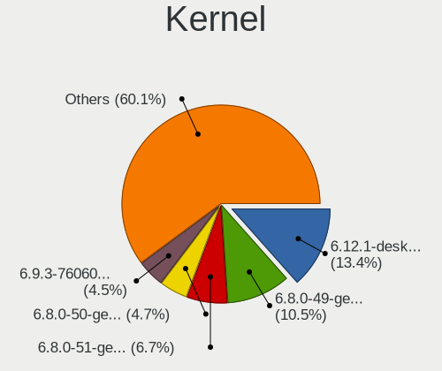
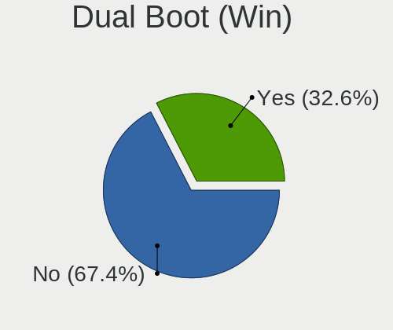
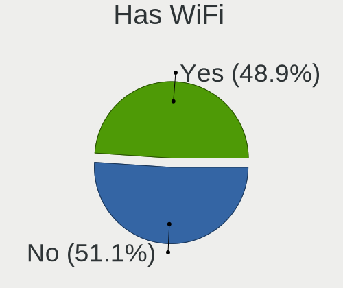
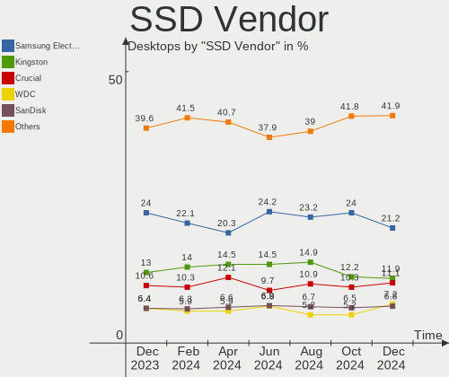
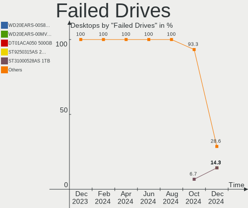

Linux Hardware Trends (Desktops)
--------------------------------

A project to identify most popular hardware characteristics and track their change
over time based on data collected by Linux users at https://Linux-Hardware.org.

Anyone can contribute to this report by the [hw-probe](https://github.com/linuxhw/hw-probe) tool:

    sudo -E hw-probe -all -upload

Full-feature report is available here: https://linux-hardware.org/?view=trends

Period: Dec, 2021.

Contents
--------

* [ System ](#system)
  - [ OS                       ](#os)
  - [ OS Family                ](#os-family)
  - [ Kernel                   ](#kernel)
  - [ Kernel Family            ](#kernel-family)
  - [ Kernel Major Ver.        ](#kernel-major-ver)
  - [ Arch                     ](#arch)
  - [ DE                       ](#de)
  - [ Display Server           ](#display-server)
  - [ Display Manager          ](#display-manager)
  - [ OS Lang                  ](#os-lang)
  - [ Boot Mode                ](#boot-mode)
  - [ Filesystem               ](#filesystem)
  - [ Part. scheme             ](#part-scheme)
  - [ Dual Boot with Linux/BSD ](#dual-boot-with-linuxbsd)
  - [ Dual Boot (Win)          ](#dual-boot-win)

* [ Board ](#board)
  - [ Vendor                   ](#vendor)
  - [ Model                    ](#model)
  - [ Model Family             ](#model-family)
  - [ MFG Year                 ](#mfg-year)
  - [ Form Factor              ](#form-factor)
  - [ Secure Boot              ](#secure-boot)
  - [ Coreboot                 ](#coreboot)
  - [ RAM Size                 ](#ram-size)
  - [ RAM Used                 ](#ram-used)
  - [ Total Drives             ](#total-drives)
  - [ Has CD-ROM               ](#has-cd-rom)
  - [ Has Ethernet             ](#has-ethernet)
  - [ Has WiFi                 ](#has-wifi)
  - [ Has Bluetooth            ](#has-bluetooth)

* [ Location ](#location)
  - [ Country                  ](#country)
  - [ City                     ](#city)

* [ Drives ](#drives)
  - [ Drive Vendor             ](#drive-vendor)
  - [ Drive Model              ](#drive-model)
  - [ HDD Vendor               ](#hdd-vendor)
  - [ SSD Vendor               ](#ssd-vendor)
  - [ Drive Kind               ](#drive-kind)
  - [ Drive Connector          ](#drive-connector)
  - [ Drive Size               ](#drive-size)
  - [ Space Total              ](#space-total)
  - [ Space Used               ](#space-used)
  - [ Malfunc. Drives          ](#malfunc-drives)
  - [ Malfunc. Drive Vendor    ](#malfunc-drive-vendor)
  - [ Malfunc. HDD Vendor      ](#malfunc-hdd-vendor)
  - [ Malfunc. Drive Kind      ](#malfunc-drive-kind)
  - [ Failed Drives            ](#failed-drives)
  - [ Failed Drive Vendor      ](#failed-drive-vendor)
  - [ Drive Status             ](#drive-status)

* [ Storage controller ](#storage-controller)
  - [ Storage Vendor           ](#storage-vendor)
  - [ Storage Model            ](#storage-model)
  - [ Storage Kind             ](#storage-kind)

* [ Processor ](#processor)
  - [ CPU Vendor               ](#cpu-vendor)
  - [ CPU Model                ](#cpu-model)
  - [ CPU Model Family         ](#cpu-model-family)
  - [ CPU Cores                ](#cpu-cores)
  - [ CPU Sockets              ](#cpu-sockets)
  - [ CPU Threads              ](#cpu-threads)
  - [ CPU Op-Modes             ](#cpu-op-modes)
  - [ CPU Microcode            ](#cpu-microcode)
  - [ CPU Microarch            ](#cpu-microarch)

* [ Graphics ](#graphics)
  - [ GPU Vendor               ](#gpu-vendor)
  - [ GPU Model                ](#gpu-model)
  - [ GPU Combo                ](#gpu-combo)
  - [ GPU Driver               ](#gpu-driver)
  - [ GPU Memory               ](#gpu-memory)

* [ Monitor ](#monitor)
  - [ Monitor Vendor           ](#monitor-vendor)
  - [ Monitor Model            ](#monitor-model)
  - [ Monitor Resolution       ](#monitor-resolution)
  - [ Monitor Diagonal         ](#monitor-diagonal)
  - [ Monitor Width            ](#monitor-width)
  - [ Aspect Ratio             ](#aspect-ratio)
  - [ Monitor Area             ](#monitor-area)
  - [ Pixel Density            ](#pixel-density)
  - [ Multiple Monitors        ](#multiple-monitors)

* [ Network ](#network)
  - [ Net Controller Vendor    ](#net-controller-vendor)
  - [ Net Controller Model     ](#net-controller-model)
  - [ Wireless Vendor          ](#wireless-vendor)
  - [ Wireless Model           ](#wireless-model)
  - [ Ethernet Vendor          ](#ethernet-vendor)
  - [ Ethernet Model           ](#ethernet-model)
  - [ Net Controller Kind      ](#net-controller-kind)
  - [ Used Controller          ](#used-controller)
  - [ NICs                     ](#nics)
  - [ IPv6                     ](#ipv6)

* [ Bluetooth ](#bluetooth)
  - [ Bluetooth Vendor         ](#bluetooth-vendor)
  - [ Bluetooth Model          ](#bluetooth-model)

* [ Sound ](#sound)
  - [ Sound Vendor             ](#sound-vendor)
  - [ Sound Model              ](#sound-model)

* [ Memory ](#memory)
  - [ Memory Vendor            ](#memory-vendor)
  - [ Memory Model             ](#memory-model)
  - [ Memory Kind              ](#memory-kind)
  - [ Memory Form Factor       ](#memory-form-factor)
  - [ Memory Size              ](#memory-size)
  - [ Memory Speed             ](#memory-speed)

* [ Printers & scanners ](#printers--scanners)
  - [ Printer Vendor           ](#printer-vendor)
  - [ Printer Model            ](#printer-model)
  - [ Scanner Vendor           ](#scanner-vendor)
  - [ Scanner Model            ](#scanner-model)

* [ Camera ](#camera)
  - [ Camera Vendor            ](#camera-vendor)
  - [ Camera Model             ](#camera-model)

* [ Security ](#security)
  - [ Fingerprint Vendor       ](#fingerprint-vendor)
  - [ Fingerprint Model        ](#fingerprint-model)
  - [ Chipcard Vendor          ](#chipcard-vendor)
  - [ Chipcard Model           ](#chipcard-model)

* [ Unsupported ](#unsupported)
  - [ Unsupported Devices      ](#unsupported-devices)
  - [ Unsupported Device Types ](#unsupported-device-types)

System
------

OS
--

Installed operating systems

| Name                | Desktops | Percent |
|---------------------|----------|---------|
| Ubuntu 20.04        | 348      | 18.5%   |
| Linux Mint 20.2     | 158      | 8.4%    |
| Ubuntu 21.10        | 112      | 5.95%   |
| Debian 11           | 105      | 5.58%   |
| OpenMandriva 4.2    | 86       | 4.57%   |
| ArcoLinux Rolling   | 82       | 4.36%   |
| Zorin 16            | 78       | 4.15%   |
| Fedora 35           | 72       | 3.83%   |
| Pop!_OS 21.10       | 66       | 3.51%   |
| Pop!_OS 21.04       | 50       | 2.66%   |
| KDE neon 20.04      | 44       | 2.34%   |
| ROSA 12.1           | 39       | 2.07%   |
| Arch Rolling        | 35       | 1.86%   |
| Manjaro             | 32       | 1.7%    |
| BlackPanther 18.1   | 32       | 1.7%    |
| Xubuntu 20.04       | 30       | 1.59%   |
| Ubuntu 18.04        | 27       | 1.44%   |
| ROSA R11.1          | 24       | 1.28%   |
| Manjaro 21.2.0      | 22       | 1.17%   |
| Arch                | 19       | 1.01%   |
| OpenMandriva 4.50   | 18       | 0.96%   |
| EndeavourOS Rolling | 17       | 0.9%    |
| Kubuntu 21.10       | 16       | 0.85%   |
| Elementary 6        | 15       | 0.8%    |
| Ubuntu 21.04        | 14       | 0.74%   |
| Kubuntu 20.04       | 13       | 0.69%   |
| Elementary 6.1      | 13       | 0.69%   |
| Pop!_OS 20.04       | 12       | 0.64%   |
| Manjaro 21.2rc      | 12       | 0.64%   |
| LinuxFX 11          | 12       | 0.64%   |
| Linux Mint 19.3     | 12       | 0.64%   |
| Fedora 34           | 12       | 0.64%   |
| Linux Mint 20.1     | 10       | 0.53%   |
| Kali 2021.4         | 10       | 0.53%   |
| Gentoo 2.7          | 8        | 0.43%   |
| Zorin 15            | 6        | 0.32%   |
| Xubuntu 21.10       | 6        | 0.32%   |
| ROSA 12             | 6        | 0.32%   |
| openSUSE Leap-15.3  | 6        | 0.32%   |
| Linux Mint 20.3     | 6        | 0.32%   |
| Garuda              | 6        | 0.32%   |
| Ubuntu Budgie 21.10 | 5        | 0.27%   |
| Linux Mint 20       | 5        | 0.27%   |
| Gentoo 2.8          | 5        | 0.27%   |
| Endless 4.0.2       | 5        | 0.27%   |
| Debian Unstable     | 5        | 0.27%   |
| CentOS 7            | 5        | 0.27%   |
| Ubuntu 20.10        | 4        | 0.21%   |
| openSUSE Leap-15.2  | 4        | 0.21%   |
| Debian Testing      | 4        | 0.21%   |
| ClearOS 7           | 4        | 0.21%   |
| CentOS 8            | 4        | 0.21%   |
| ALT Linux 10.0      | 4        | 0.21%   |
| Ubuntu MATE 20.04   | 3        | 0.16%   |
| Ubuntu Budgie 20.04 | 3        | 0.16%   |
| Ubuntu 22.04        | 3        | 0.16%   |
| Lubuntu 20.04       | 3        | 0.16%   |
| Lubuntu 18.04       | 3        | 0.16%   |
| LMDE 4              | 3        | 0.16%   |
| Linux Mint 19.2     | 3        | 0.16%   |

OS Family
---------

OS without a version

| Name           | Desktops | Percent |
|----------------|----------|---------|
| Ubuntu         | 512      | 27.21%  |
| Linux Mint     | 196      | 10.41%  |
| Pop!_OS        | 128      | 6.8%    |
| Debian         | 120      | 6.38%   |
| OpenMandriva   | 104      | 5.53%   |
| Fedora         | 86       | 4.57%   |
| Zorin          | 84       | 4.46%   |
| ArcoLinux      | 82       | 4.36%   |
| ROSA           | 72       | 3.83%   |
| Manjaro        | 69       | 3.67%   |
| Arch           | 55       | 2.92%   |
| KDE neon       | 45       | 2.39%   |
| Xubuntu        | 41       | 2.18%   |
| Kubuntu        | 35       | 1.86%   |
| BlackPanther   | 32       | 1.7%    |
| Elementary     | 29       | 1.54%   |
| openSUSE       | 23       | 1.22%   |
| EndeavourOS    | 20       | 1.06%   |
| Gentoo         | 15       | 0.8%    |
| LinuxFX        | 13       | 0.69%   |
| Endless        | 13       | 0.69%   |
| Lubuntu        | 11       | 0.58%   |
| Kali           | 10       | 0.53%   |
| Ubuntu Budgie  | 9        | 0.48%   |
| Garuda         | 9        | 0.48%   |
| CentOS         | 9        | 0.48%   |
| Ubuntu MATE    | 8        | 0.43%   |
| ALT Linux      | 7        | 0.37%   |
| Mageia         | 4        | 0.21%   |
| ClearOS        | 4        | 0.21%   |
| LMDE           | 3        | 0.16%   |
| Deepin         | 3        | 0.16%   |
| Xero           | 2        | 0.11%   |
| Solus          | 2        | 0.11%   |
| NixOS          | 2        | 0.11%   |
| MX             | 2        | 0.11%   |
| Devuan         | 2        | 0.11%   |
| Clear Linux    | 2        | 0.11%   |
| Slackware      | 1        | 0.05%   |
| Siduction      | 1        | 0.05%   |
| Rocky Linux    | 1        | 0.05%   |
| RHEL           | 1        | 0.05%   |
| RELS           | 1        | 0.05%   |
| RED            | 1        | 0.05%   |
| Reborn OS      | 1        | 0.05%   |
| PureOS         | 1        | 0.05%   |
| Peppermint     | 1        | 0.05%   |
| Parrot         | 1        | 0.05%   |
| MocaccinoOS    | 1        | 0.05%   |
| Linux Lite     | 1        | 0.05%   |
| Kaisen         | 1        | 0.05%   |
| Drauger OS     | 1        | 0.05%   |
| Bluestar Linux | 1        | 0.05%   |
| Archman        | 1        | 0.05%   |
| Archcraft      | 1        | 0.05%   |
| Anita          | 1        | 0.05%   |
| Alpine         | 1        | 0.05%   |

Kernel
------

Version of the Linux kernel

| Version                            | Desktops | Percent |
|------------------------------------|----------|---------|
| 5.11.0-41-generic                  | 244      | 12.96%  |
| 5.4.0-91-generic                   | 213      | 11.32%  |
| 5.11.0-43-generic                  | 171      | 9.09%   |
| 5.13.0-22-generic                  | 119      | 6.32%   |
| 5.10.14-desktop-1omv4002           | 81       | 4.3%    |
| 5.15.5-76051505-generic            | 78       | 4.14%   |
| 5.15.7-arch1-1                     | 47       | 2.5%    |
| 5.10.74-generic-2rosa2021.1-x86_64 | 40       | 2.13%   |
| 5.10.0-7-amd64                     | 35       | 1.86%   |
| 5.10.0-9-amd64                     | 34       | 1.81%   |
| 5.15.8-76051508-generic            | 31       | 1.65%   |
| 5.15.6-200.fc35.x86_64             | 28       | 1.49%   |
| 5.11.0-40-generic                  | 26       | 1.38%   |
| 5.6.14-desktop-2bP                 | 24       | 1.28%   |
| 5.10.0-10-amd64                    | 20       | 1.06%   |
| 5.15.10-arch1-1                    | 19       | 1.01%   |
| 5.11.0-27-generic                  | 16       | 0.85%   |
| 5.15.6-arch2-1                     | 15       | 0.8%    |
| 5.13.0-19-generic                  | 15       | 0.8%    |
| 5.15.7-zen1-1-zen                  | 14       | 0.74%   |
| 5.4.0-90-generic                   | 13       | 0.69%   |
| 5.15.0-2-amd64                     | 13       | 0.69%   |
| 5.15.8-200.fc35.x86_64             | 12       | 0.64%   |
| 5.15.7-1-MANJARO                   | 11       | 0.58%   |
| 5.13.0-23-generic                  | 11       | 0.58%   |
| 4.15.0-163-generic                 | 11       | 0.58%   |
| 5.4.83-generic-2rosa-x86_64        | 10       | 0.53%   |
| 5.15.6-2-MANJARO                   | 10       | 0.53%   |
| 5.14.0-kali4-amd64                 | 10       | 0.53%   |
| 5.13.19-2-MANJARO                  | 10       | 0.53%   |
| 5.13.0-7620-generic                | 10       | 0.53%   |
| 5.11.0-35-generic                  | 9        | 0.48%   |
| 5.10.84-1-lts                      | 9        | 0.48%   |
| 5.15.11-arch2-1                    | 8        | 0.43%   |
| 5.13.0-22-lowlatency               | 8        | 0.43%   |
| 5.12.4-desktop-1omv4050            | 8        | 0.43%   |
| 4.18.16-desktop-1bP                | 8        | 0.43%   |
| 5.4.0-74-generic                   | 7        | 0.37%   |
| 5.11.0-42-generic                  | 7        | 0.37%   |
| 5.10.84-1-MANJARO                  | 7        | 0.37%   |
| 5.4.0-91-lowlatency                | 6        | 0.32%   |
| 5.15.2-2-MANJARO                   | 6        | 0.32%   |
| 5.14.7-desktop-1omv4050            | 6        | 0.32%   |
| 5.14.10-300.fc35.x86_64            | 6        | 0.32%   |
| 5.13.0-21-generic                  | 6        | 0.32%   |
| 5.10.88-2-lts                      | 6        | 0.32%   |
| 3.10.0-1160.49.1.el7.x86_64        | 6        | 0.32%   |
| 5.3.18-59.37-default               | 5        | 0.27%   |
| 5.15.8-arch1-1                     | 5        | 0.27%   |
| 5.15.8-100.fc34.x86_64             | 5        | 0.27%   |
| 5.15.8-1-default                   | 5        | 0.27%   |
| 5.15.6-zen2-1-zen                  | 5        | 0.27%   |
| 5.15.5-200.fc35.x86_64             | 5        | 0.27%   |
| 5.15.11-zen1-1-zen                 | 5        | 0.27%   |
| 5.15.11-200.fc35.x86_64            | 5        | 0.27%   |
| 5.15.10-200.fc35.x86_64            | 5        | 0.27%   |
| 5.11.12-desktop-1omv4002           | 5        | 0.27%   |
| 5.11.0-44-generic                  | 5        | 0.27%   |
| 5.11.0-38-generic                  | 5        | 0.27%   |
| 5.10.79-1-MANJARO                  | 5        | 0.27%   |

Kernel Family
-------------

Linux kernel without a distro release

| Version | Desktops | Percent |
|---------|----------|---------|
| 5.11.0  | 502      | 26.67%  |
| 5.4.0   | 270      | 14.35%  |
| 5.13.0  | 176      | 9.35%   |
| 5.15.5  | 100      | 5.31%   |
| 5.10.0  | 94       | 4.99%   |
| 5.15.7  | 83       | 4.41%   |
| 5.10.14 | 81       | 4.3%    |
| 5.15.6  | 75       | 3.99%   |
| 5.15.8  | 62       | 3.29%   |
| 5.10.74 | 40       | 2.13%   |
| 5.15.10 | 36       | 1.91%   |
| 4.15.0  | 33       | 1.75%   |
| 5.6.14  | 24       | 1.28%   |
| 5.15.11 | 23       | 1.22%   |
| 5.14.0  | 20       | 1.06%   |
| 5.15.0  | 18       | 0.96%   |
| 5.13.19 | 17       | 0.9%    |
| 5.10.84 | 17       | 0.9%    |
| 5.4.83  | 13       | 0.69%   |
| 5.3.18  | 10       | 0.53%   |
| 3.10.0  | 10       | 0.53%   |
| 5.8.0   | 9        | 0.48%   |
| 5.15.2  | 9        | 0.48%   |
| 5.12.4  | 8        | 0.43%   |
| 4.18.16 | 8        | 0.43%   |
| 5.14.21 | 7        | 0.37%   |
| 5.10.88 | 7        | 0.37%   |
| 5.15.12 | 6        | 0.32%   |
| 5.14.7  | 6        | 0.32%   |
| 5.14.10 | 6        | 0.32%   |
| 5.10.83 | 6        | 0.32%   |
| 4.18.0  | 6        | 0.32%   |
| 5.16.0  | 5        | 0.27%   |
| 5.14.18 | 5        | 0.27%   |
| 5.14.14 | 5        | 0.27%   |
| 5.11.12 | 5        | 0.27%   |
| 5.10.79 | 5        | 0.27%   |
| 5.10.76 | 5        | 0.27%   |
| 5.10.71 | 5        | 0.27%   |
| 4.19.0  | 5        | 0.27%   |
| 5.4.32  | 3        | 0.16%   |
| 5.15.4  | 3        | 0.16%   |
| 5.10.81 | 3        | 0.16%   |
| 5.5.19  | 2        | 0.11%   |
| 5.15.3  | 2        | 0.11%   |
| 5.14.2  | 2        | 0.11%   |
| 5.14.17 | 2        | 0.11%   |
| 5.14.16 | 2        | 0.11%   |
| 5.13.13 | 2        | 0.11%   |
| 5.10.82 | 2        | 0.11%   |
| 5.10.60 | 2        | 0.11%   |
| 5.0.0   | 2        | 0.11%   |
| 4.9.155 | 2        | 0.11%   |
| 4.4.0   | 2        | 0.11%   |
| 6.0.0   | 1        | 0.05%   |
| 5.9.16  | 1        | 0.05%   |
| 5.6.17  | 1        | 0.05%   |
| 5.5.12  | 1        | 0.05%   |
| 5.4.91  | 1        | 0.05%   |
| 5.4.6   | 1        | 0.05%   |

Kernel Major Ver.
-----------------

Linux kernel major version

| Version | Desktops | Percent |
|---------|----------|---------|
| 5.11    | 509      | 27.05%  |
| 5.15    | 418      | 22.21%  |
| 5.4     | 290      | 15.41%  |
| 5.10    | 279      | 14.82%  |
| 5.13    | 196      | 10.41%  |
| 5.14    | 58       | 3.08%   |
| 4.15    | 33       | 1.75%   |
| 5.6     | 25       | 1.33%   |
| 4.18    | 14       | 0.74%   |
| 5.3     | 11       | 0.58%   |
| 3.10    | 10       | 0.53%   |
| 5.8     | 9        | 0.48%   |
| 5.12    | 8        | 0.43%   |
| 5.16    | 5        | 0.27%   |
| 4.19    | 5        | 0.27%   |
| 5.5     | 3        | 0.16%   |
| 5.0     | 2        | 0.11%   |
| 4.9     | 2        | 0.11%   |
| 4.4     | 2        | 0.11%   |
| 6.0     | 1        | 0.05%   |
| 5.9     | 1        | 0.05%   |
| 5.1     | 1        | 0.05%   |

Arch
----

OS architecture (x86_64, i586, etc.)

| Name   | Desktops | Percent |
|--------|----------|---------|
| x86_64 | 1857     | 98.67%  |
| i686   | 24       | 1.28%   |
| e2k    | 1        | 0.05%   |

DE
--

Desktop Environment

| Name             | Desktops | Percent |
|------------------|----------|---------|
| GNOME            | 820      | 43.57%  |
| KDE5             | 446      | 23.7%   |
| X-Cinnamon       | 159      | 8.45%   |
| XFCE             | 141      | 7.49%   |
| Unknown          | 105      | 5.58%   |
| MATE             | 50       | 2.66%   |
| Pantheon         | 30       | 1.59%   |
| Cinnamon         | 21       | 1.12%   |
| KDE4             | 17       | 0.9%    |
| LXQt             | 12       | 0.64%   |
| Budgie           | 12       | 0.64%   |
| Unity            | 9        | 0.48%   |
| LXDE             | 9        | 0.48%   |
| LeftWM           | 6        | 0.32%   |
| KDE              | 6        | 0.32%   |
| i3               | 6        | 0.32%   |
| Deepin           | 6        | 0.32%   |
| xmonad           | 4        | 0.21%   |
| awesome          | 4        | 0.21%   |
| qtile            | 3        | 0.16%   |
| openbox          | 3        | 0.16%   |
| lightdm-xsession | 3        | 0.16%   |
| GNOME Classic    | 3        | 0.16%   |
| xinitrc          | 1        | 0.05%   |
| UKUI             | 1        | 0.05%   |
| trinity          | 1        | 0.05%   |
| ICEWM            | 1        | 0.05%   |
| GNOME Flashback  | 1        | 0.05%   |
| Cutefish         | 1        | 0.05%   |
| bspwm            | 1        | 0.05%   |

Display Server
--------------

X11 or Wayland

| Name        | Desktops | Percent |
|-------------|----------|---------|
| X11         | 1550     | 82.36%  |
| Wayland     | 210      | 11.16%  |
| Tty         | 60       | 3.19%   |
| Unknown     | 59       | 3.13%   |
| Web         | 2        | 0.11%   |
| Unspecified | 1        | 0.05%   |

Display Manager
---------------

SDDM, LightDM, etc.

| Name    | Desktops | Percent |
|---------|----------|---------|
| Unknown | 643      | 34.17%  |
| GDM3    | 374      | 19.87%  |
| SDDM    | 368      | 19.55%  |
| LightDM | 254      | 13.5%   |
| GDM     | 216      | 11.48%  |
| KDM     | 16       | 0.85%   |
| XDM     | 3        | 0.16%   |
| SLiM    | 3        | 0.16%   |
| Ly      | 2        | 0.11%   |
| NODM    | 1        | 0.05%   |
| MDM     | 1        | 0.05%   |
| LXDM    | 1        | 0.05%   |

OS Lang
-------

Language

| Lang        | Desktops | Percent |
|-------------|----------|---------|
| en_US       | 709      | 37.67%  |
| de_DE       | 196      | 10.41%  |
| ru_RU       | 172      | 9.14%   |
| fr_FR       | 91       | 4.84%   |
| en_GB       | 85       | 4.52%   |
| pt_BR       | 76       | 4.04%   |
| pl_PL       | 47       | 2.5%    |
| en_AU       | 47       | 2.5%    |
| Unknown     | 47       | 2.5%    |
| es_ES       | 39       | 2.07%   |
| en_CA       | 34       | 1.81%   |
| it_IT       | 33       | 1.75%   |
| en_IN       | 31       | 1.65%   |
| hu_HU       | 22       | 1.17%   |
| nl_NL       | 21       | 1.12%   |
| C           | 18       | 0.96%   |
| ru_UA       | 15       | 0.8%    |
| es_AR       | 14       | 0.74%   |
| de_AT       | 12       | 0.64%   |
| zh_CN       | 11       | 0.58%   |
| de_CH       | 11       | 0.58%   |
| cs_CZ       | 11       | 0.58%   |
| sv_SE       | 9        | 0.48%   |
| es_MX       | 9        | 0.48%   |
| pt_PT       | 8        | 0.43%   |
| zh_TW       | 7        | 0.37%   |
| nl_BE       | 6        | 0.32%   |
| ja_JP       | 6        | 0.32%   |
| en_NZ       | 6        | 0.32%   |
| en_ZA       | 5        | 0.27%   |
| en_IE       | 5        | 0.27%   |
| el_GR       | 5        | 0.27%   |
| da_DK       | 5        | 0.27%   |
| uk_UA       | 4        | 0.21%   |
| fr_BE       | 4        | 0.21%   |
| fi_FI       | 4        | 0.21%   |
| en_SG       | 4        | 0.21%   |
| tr_TR       | 3        | 0.16%   |
| sl_SI       | 3        | 0.16%   |
| sk_SK       | 3        | 0.16%   |
| ro_RO       | 3        | 0.16%   |
| fr_CH       | 3        | 0.16%   |
| en_HK       | 3        | 0.16%   |
| POSIX       | 2        | 0.11%   |
| hr_HR       | 2        | 0.11%   |
| es_VE       | 2        | 0.11%   |
| es_US       | 2        | 0.11%   |
| es_CO       | 2        | 0.11%   |
| wbp_AU      | 1        | 0.05%   |
| vi_VN       | 1        | 0.05%   |
| th_TH       | 1        | 0.05%   |
| sr_RS@latin | 1        | 0.05%   |
| sr_RS       | 1        | 0.05%   |
| nb_NO       | 1        | 0.05%   |
| ja_JP.utf-8 | 1        | 0.05%   |
| id_ID       | 1        | 0.05%   |
| fr_CA       | 1        | 0.05%   |
| et_EE       | 1        | 0.05%   |
| es_UY       | 1        | 0.05%   |
| es_GT       | 1        | 0.05%   |

Boot Mode
---------

EFI or BIOS

| Mode | Desktops | Percent |
|------|----------|---------|
| BIOS | 1144     | 60.79%  |
| EFI  | 738      | 39.21%  |

Filesystem
----------

Type of filesystem

| Type     | Desktops | Percent |
|----------|----------|---------|
| Ext4     | 1472     | 78.21%  |
| Overlay  | 179      | 9.51%   |
| Btrfs    | 158      | 8.4%    |
| Xfs      | 34       | 1.81%   |
| Zfs      | 16       | 0.85%   |
| Ext2     | 6        | 0.32%   |
| F2fs     | 5        | 0.27%   |
| Ext3     | 5        | 0.27%   |
| Unknown  | 2        | 0.11%   |
| XXXXX    | 1        | 0.05%   |
| XXXX     | 1        | 0.05%   |
| Tmpfs    | 1        | 0.05%   |
| Rootfs   | 1        | 0.05%   |
| Reiserfs | 1        | 0.05%   |

Part. scheme
------------

Scheme of partitioning

| Type    | Desktops | Percent |
|---------|----------|---------|
| Unknown | 1039     | 55.21%  |
| GPT     | 556      | 29.54%  |
| MBR     | 287      | 15.25%  |

Dual Boot with Linux/BSD
------------------------

Hosting more than one Linux/BSD

| Dual boot | Desktops | Percent |
|-----------|----------|---------|
| No        | 1557     | 82.73%  |
| Yes       | 325      | 17.27%  |

Dual Boot (Win)
---------------

Hosting Linux and Windows

| Dual boot | Desktops | Percent |
|-----------|----------|---------|
| No        | 1224     | 65.04%  |
| Yes       | 658      | 34.96%  |

Board
-----

Vendor
------

Motherboard manufacturer

| Name                       | Desktops | Percent |
|----------------------------|----------|---------|
| ASUSTek Computer           | 496      | 26.35%  |
| Gigabyte Technology        | 344      | 18.28%  |
| MSI                        | 206      | 10.95%  |
| ASRock                     | 181      | 9.62%   |
| Dell                       | 162      | 8.61%   |
| Hewlett-Packard            | 123      | 6.54%   |
| Lenovo                     | 61       | 3.24%   |
| Intel                      | 43       | 2.28%   |
| Acer                       | 39       | 2.07%   |
| Unknown                    | 25       | 1.33%   |
| Pegatron                   | 24       | 1.28%   |
| Biostar                    | 20       | 1.06%   |
| Foxconn                    | 19       | 1.01%   |
| Fujitsu                    | 14       | 0.74%   |
| Huanan                     | 12       | 0.64%   |
| ECS                        | 12       | 0.64%   |
| Medion                     | 10       | 0.53%   |
| Apple                      | 10       | 0.53%   |
| Positivo                   | 6        | 0.32%   |
| Supermicro                 | 5        | 0.27%   |
| Packard Bell               | 5        | 0.27%   |
| Shuttle                    | 4        | 0.21%   |
| EVGA                       | 4        | 0.21%   |
| ASRockRack                 | 4        | 0.21%   |
| Gateway                    | 3        | 0.16%   |
| Fujitsu Siemens            | 3        | 0.16%   |
| AZW                        | 3        | 0.16%   |
| XFX                        | 2        | 0.11%   |
| System76                   | 2        | 0.11%   |
| Samsung Electronics        | 2        | 0.11%   |
| OEM                        | 2        | 0.11%   |
| eMachines                  | 2        | 0.11%   |
| DFI                        | 2        | 0.11%   |
| AMI                        | 2        | 0.11%   |
| ABIT                       | 2        | 0.11%   |
| ZOTAC                      | 1        | 0.05%   |
| TYAN Computer              | 1        | 0.05%   |
| TSINGHUA TONGFANG COMPUTER | 1        | 0.05%   |
| SYWZ                       | 1        | 0.05%   |
| SeeedStudio                | 1        | 0.05%   |
| RKM                        | 1        | 0.05%   |
| Quanta                     | 1        | 0.05%   |
| QIYIDA                     | 1        | 0.05%   |
| MiTAC                      | 1        | 0.05%   |
| Megaware                   | 1        | 0.05%   |
| Login Informatica          | 1        | 0.05%   |
| LattePanda                 | 1        | 0.05%   |
| JINGSHA                    | 1        | 0.05%   |
| JGINYUE                    | 1        | 0.05%   |
| Itautec                    | 1        | 0.05%   |
| INTELBRAS                  | 1        | 0.05%   |
| HPE                        | 1        | 0.05%   |
| Google                     | 1        | 0.05%   |
| GALAX                      | 1        | 0.05%   |
| EPoX Computer              | 1        | 0.05%   |
| Colorful Technology        | 1        | 0.05%   |
| Cisco Systems              | 1        | 0.05%   |
| Chuwi                      | 1        | 0.05%   |
| BESSTAR Tech               | 1        | 0.05%   |
| ASUSTeK_COMPUTER_INC.      | 1        | 0.05%   |

Model
-----

Motherboard model

| Name                             | Desktops | Percent |
|----------------------------------|----------|---------|
| ASUS All Series                  | 46       | 2.44%   |
| Unknown                          | 26       | 1.38%   |
| Dell OptiPlex 7010               | 14       | 0.74%   |
| ASUS PRIME A320M-K               | 11       | 0.58%   |
| MSI MS-7B79                      | 10       | 0.53%   |
| Dell OptiPlex 790                | 10       | 0.53%   |
| MSI MS-7C02                      | 8        | 0.43%   |
| MSI MS-7B86                      | 8        | 0.43%   |
| ASUS TUF GAMING X570-PLUS        | 8        | 0.43%   |
| ASUS ROG STRIX B550-F GAMING     | 8        | 0.43%   |
| ASUS PRIME B450M-A               | 8        | 0.43%   |
| MSI MS-7C91                      | 7        | 0.37%   |
| MSI MS-7C37                      | 7        | 0.37%   |
| MSI MS-7817                      | 7        | 0.37%   |
| Gigabyte 970A-DS3P               | 7        | 0.37%   |
| Dell OptiPlex 3020               | 7        | 0.37%   |
| Gigabyte B450M DS3H              | 6        | 0.32%   |
| Dell OptiPlex 9010               | 6        | 0.32%   |
| ASUS TUF GAMING B550M-PLUS       | 6        | 0.32%   |
| ASUS ROG STRIX X570-E GAMING     | 6        | 0.32%   |
| ASUS P8Z77-V LX                  | 6        | 0.32%   |
| ASUS M5A78L-M/USB3               | 6        | 0.32%   |
| ASRock H470M-HVS                 | 6        | 0.32%   |
| ASRock B450M Pro4                | 6        | 0.32%   |
| HP EliteDesk 800 G1 SFF          | 5        | 0.27%   |
| Gigabyte X570 AORUS ELITE        | 5        | 0.27%   |
| Gigabyte X470 AORUS ULTRA GAMING | 5        | 0.27%   |
| Gigabyte B75M-D3H                | 5        | 0.27%   |
| Gigabyte B450 AORUS M            | 5        | 0.27%   |
| Fujitsu ESPRIMO P720             | 5        | 0.27%   |
| Dell OptiPlex 990                | 5        | 0.27%   |
| Dell OptiPlex 9020               | 5        | 0.27%   |
| Dell OptiPlex 755                | 5        | 0.27%   |
| Dell OptiPlex 3010               | 5        | 0.27%   |
| ASUS TUF GAMING X570-PRO         | 5        | 0.27%   |
| ASUS TUF GAMING B550-PLUS        | 5        | 0.27%   |
| ASUS ROG STRIX B450-F GAMING     | 5        | 0.27%   |
| ASUS CROSSHAIR VI HERO           | 5        | 0.27%   |
| Apple MacPro5,1                  | 5        | 0.27%   |
| MSI MS-7C52                      | 4        | 0.21%   |
| MSI MS-7A33                      | 4        | 0.21%   |
| MSI MS-7721                      | 4        | 0.21%   |
| HP Compaq 8200 Elite SFF PC      | 4        | 0.21%   |
| Gigabyte X570 AORUS ELITE WIFI   | 4        | 0.21%   |
| Gigabyte GA-78LMT-S2P            | 4        | 0.21%   |
| Gigabyte B550M DS3H              | 4        | 0.21%   |
| Gigabyte B450M S2H               | 4        | 0.21%   |
| Gigabyte B450 AORUS ELITE        | 4        | 0.21%   |
| Dell OptiPlex 760                | 4        | 0.21%   |
| Dell Inspiron 3847               | 4        | 0.21%   |
| ASUS Z170 PRO GAMING             | 4        | 0.21%   |
| ASUS PRIME X470-PRO              | 4        | 0.21%   |
| ASUS PRIME B350M-A               | 4        | 0.21%   |
| ASUS H61M-K                      | 4        | 0.21%   |
| ASRock M3A770DE                  | 4        | 0.21%   |
| ASRock B450M Steel Legend        | 4        | 0.21%   |
| MSI MS-7C95                      | 3        | 0.16%   |
| MSI MS-7C84                      | 3        | 0.16%   |
| MSI MS-7C75                      | 3        | 0.16%   |
| MSI MS-7C56                      | 3        | 0.16%   |

Model Family
------------

Motherboard model prefix

| Name                   | Desktops | Percent |
|------------------------|----------|---------|
| Dell OptiPlex          | 97       | 5.15%   |
| ASUS PRIME             | 81       | 4.3%    |
| ASUS ROG               | 73       | 3.88%   |
| ASUS TUF               | 47       | 2.5%    |
| ASUS All               | 46       | 2.44%   |
| Lenovo ThinkCentre     | 37       | 1.97%   |
| HP Compaq              | 36       | 1.91%   |
| Acer Aspire            | 28       | 1.49%   |
| Unknown                | 26       | 1.38%   |
| Gigabyte X570          | 23       | 1.22%   |
| Dell Precision         | 21       | 1.12%   |
| Dell Inspiron          | 16       | 0.85%   |
| HP ProDesk             | 15       | 0.8%    |
| Gigabyte B450          | 15       | 0.8%    |
| Gigabyte B450M         | 14       | 0.74%   |
| ASUS M5A78L-M          | 14       | 0.74%   |
| Gigabyte B550          | 13       | 0.69%   |
| ASRock B450M           | 13       | 0.69%   |
| HP EliteDesk           | 11       | 0.58%   |
| Dell Vostro            | 11       | 0.58%   |
| ASUS SABERTOOTH        | 11       | 0.58%   |
| MSI MS-7B79            | 10       | 0.53%   |
| Gigabyte Z390          | 10       | 0.53%   |
| Fujitsu ESPRIMO        | 10       | 0.53%   |
| ASUS P8H61-M           | 10       | 0.53%   |
| Gigabyte 970A-DS3P     | 9        | 0.48%   |
| ASUS P8Z77-V           | 9        | 0.48%   |
| MSI MS-7C02            | 8        | 0.43%   |
| MSI MS-7B86            | 8        | 0.43%   |
| HP Pavilion            | 8        | 0.43%   |
| ASUS P5G41T-M          | 8        | 0.43%   |
| ASUS M5A97             | 8        | 0.43%   |
| MSI MS-7C91            | 7        | 0.37%   |
| MSI MS-7C37            | 7        | 0.37%   |
| MSI MS-7817            | 7        | 0.37%   |
| Lenovo IdeaCentre      | 7        | 0.37%   |
| Gigabyte X470          | 7        | 0.37%   |
| Gigabyte B550M         | 7        | 0.37%   |
| Lenovo ThinkStation    | 6        | 0.32%   |
| Dell XPS               | 6        | 0.32%   |
| ASUS PRO               | 6        | 0.32%   |
| ASUS CROSSHAIR         | 6        | 0.32%   |
| ASRock X370            | 6        | 0.32%   |
| ASRock H470M-HVS       | 6        | 0.32%   |
| Acer Veriton           | 6        | 0.32%   |
| HP OMEN                | 5        | 0.27%   |
| Gigabyte GA-78LMT-USB3 | 5        | 0.27%   |
| Gigabyte B75M-D3H      | 5        | 0.27%   |
| Foxconn Pro            | 5        | 0.27%   |
| Dell PowerEdge         | 5        | 0.27%   |
| ASUS STRIX             | 5        | 0.27%   |
| ASUS Rampage           | 5        | 0.27%   |
| ASRock Z87             | 5        | 0.27%   |
| Apple MacPro5          | 5        | 0.27%   |
| Packard Bell IMEDIA    | 4        | 0.21%   |
| MSI MS-7C52            | 4        | 0.21%   |
| MSI MS-7A33            | 4        | 0.21%   |
| MSI MS-7721            | 4        | 0.21%   |
| Huanan X79             | 4        | 0.21%   |
| Gigabyte Z690          | 4        | 0.21%   |

MFG Year
--------

Motherboard manufacture year

| Year    | Desktops | Percent |
|---------|----------|---------|
| 2021    | 332      | 17.64%  |
| 2020    | 192      | 10.2%   |
| 2019    | 177      | 9.4%    |
| 2018    | 161      | 8.55%   |
| 2014    | 131      | 6.96%   |
| 2013    | 129      | 6.85%   |
| 2015    | 114      | 6.06%   |
| 2012    | 113      | 6%      |
| 2010    | 110      | 5.84%   |
| 2011    | 101      | 5.37%   |
| 2016    | 79       | 4.2%    |
| 2009    | 69       | 3.67%   |
| 2008    | 55       | 2.92%   |
| 2017    | 49       | 2.6%    |
| 2007    | 36       | 1.91%   |
| 2006    | 23       | 1.22%   |
| 2005    | 6        | 0.32%   |
| 2004    | 2        | 0.11%   |
| 2003    | 1        | 0.05%   |
| 1906    | 1        | 0.05%   |
| Unknown | 1        | 0.05%   |

Form Factor
-----------

Physical design of the computer

| Name    | Desktops | Percent |
|---------|----------|---------|
| Desktop | 1882     | 100%    |

Secure Boot
-----------

Enabled or disabled

| State    | Desktops | Percent |
|----------|----------|---------|
| Disabled | 1843     | 97.93%  |
| Enabled  | 39       | 2.07%   |

Coreboot
--------

Have coreboot on board

| Used | Desktops | Percent |
|------|----------|---------|
| No   | 1881     | 99.95%  |
| Yes  | 1        | 0.05%   |

RAM Size
--------

Total RAM memory

| Size in GB      | Desktops | Percent |
|-----------------|----------|---------|
| 16.01-24.0      | 483      | 25.66%  |
| 8.01-16.0       | 350      | 18.6%   |
| 32.01-64.0      | 292      | 15.52%  |
| 4.01-8.0        | 282      | 14.98%  |
| 3.01-4.0        | 269      | 14.29%  |
| 64.01-256.0     | 95       | 5.05%   |
| 1.01-2.0        | 47       | 2.5%    |
| 24.01-32.0      | 28       | 1.49%   |
| 2.01-3.0        | 25       | 1.33%   |
| 0.51-1.0        | 7        | 0.37%   |
| More than 256.0 | 3        | 0.16%   |
| 0.01-0.5        | 1        | 0.05%   |

RAM Used
--------

Used RAM memory

| Used GB     | Desktops | Percent |
|-------------|----------|---------|
| 1.01-2.0    | 675      | 35.87%  |
| 2.01-3.0    | 426      | 22.64%  |
| 4.01-8.0    | 255      | 13.55%  |
| 3.01-4.0    | 222      | 11.8%   |
| 0.51-1.0    | 159      | 8.45%   |
| 8.01-16.0   | 81       | 4.3%    |
| 0.01-0.5    | 40       | 2.13%   |
| 16.01-24.0  | 16       | 0.85%   |
| 24.01-32.0  | 4        | 0.21%   |
| 32.01-64.0  | 3        | 0.16%   |
| 64.01-256.0 | 1        | 0.05%   |

Total Drives
------------

Number of drives on board

| Drives | Desktops | Percent |
|--------|----------|---------|
| 1      | 718      | 38.15%  |
| 2      | 525      | 27.9%   |
| 3      | 278      | 14.77%  |
| 4      | 180      | 9.56%   |
| 5      | 94       | 4.99%   |
| 6      | 46       | 2.44%   |
| 7      | 14       | 0.74%   |
| 0      | 8        | 0.43%   |
| 9      | 7        | 0.37%   |
| 8      | 6        | 0.32%   |
| 10     | 2        | 0.11%   |
| 21     | 1        | 0.05%   |
| 17     | 1        | 0.05%   |
| 14     | 1        | 0.05%   |
| 11     | 1        | 0.05%   |

Has CD-ROM
----------

Has CD-ROM on board

| Presented | Desktops | Percent |
|-----------|----------|---------|
| No        | 1031     | 54.78%  |
| Yes       | 851      | 45.22%  |

Has Ethernet
------------

Has Ethernet on board

| Presented | Desktops | Percent |
|-----------|----------|---------|
| Yes       | 1866     | 99.15%  |
| No        | 16       | 0.85%   |

Has WiFi
--------

Has WiFi module

| Presented | Desktops | Percent |
|-----------|----------|---------|
| No        | 1087     | 57.76%  |
| Yes       | 795      | 42.24%  |

Has Bluetooth
-------------

Has Bluetooth module

| Presented | Desktops | Percent |
|-----------|----------|---------|
| No        | 1312     | 69.71%  |
| Yes       | 570      | 30.29%  |

Location
--------

Country
-------

Geographic location (country)

| Country      | Desktops | Percent |
|--------------|----------|---------|
| USA          | 362      | 19.23%  |
| Germany      | 227      | 12.06%  |
| Russia       | 180      | 9.56%   |
| France       | 96       | 5.1%    |
| Brazil       | 93       | 4.94%   |
| UK           | 81       | 4.3%    |
| Poland       | 56       | 2.98%   |
| Hungary      | 56       | 2.98%   |
| Australia    | 51       | 2.71%   |
| Canada       | 48       | 2.55%   |
| India        | 41       | 2.18%   |
| Netherlands  | 40       | 2.13%   |
| Italy        | 40       | 2.13%   |
| Spain        | 39       | 2.07%   |
| Ukraine      | 36       | 1.91%   |
| Switzerland  | 26       | 1.38%   |
| Belgium      | 23       | 1.22%   |
| Mexico       | 21       | 1.12%   |
| Austria      | 19       | 1.01%   |
| Sweden       | 18       | 0.96%   |
| Greece       | 17       | 0.9%    |
| Argentina    | 16       | 0.85%   |
| Romania      | 15       | 0.8%    |
| China        | 13       | 0.69%   |
| Czechia      | 12       | 0.64%   |
| Serbia       | 11       | 0.58%   |
| Portugal     | 11       | 0.58%   |
| Denmark      | 11       | 0.58%   |
| Japan        | 10       | 0.53%   |
| Finland      | 10       | 0.53%   |
| South Africa | 9        | 0.48%   |
| Croatia      | 9        | 0.48%   |
| Turkey       | 8        | 0.43%   |
| New Zealand  | 8        | 0.43%   |
| Bulgaria     | 8        | 0.43%   |
| Belarus      | 8        | 0.43%   |
| Thailand     | 7        | 0.37%   |
| Taiwan       | 7        | 0.37%   |
| Singapore    | 7        | 0.37%   |
| Norway       | 7        | 0.37%   |
| Hong Kong    | 7        | 0.37%   |
| Saudi Arabia | 6        | 0.32%   |
| Bangladesh   | 6        | 0.32%   |
| Slovakia     | 5        | 0.27%   |
| Moldova      | 5        | 0.27%   |
| Ireland      | 5        | 0.27%   |
| Vietnam      | 4        | 0.21%   |
| Slovenia     | 4        | 0.21%   |
| Morocco      | 4        | 0.21%   |
| Israel       | 4        | 0.21%   |
| Estonia      | 4        | 0.21%   |
| Colombia     | 4        | 0.21%   |
| Venezuela    | 3        | 0.16%   |
| Pakistan     | 3        | 0.16%   |
| Malaysia     | 3        | 0.16%   |
| Indonesia    | 3        | 0.16%   |
| Costa Rica   | 3        | 0.16%   |
| Chile        | 3        | 0.16%   |
| Uzbekistan   | 2        | 0.11%   |
| Sri Lanka    | 2        | 0.11%   |

City
----

Geographic location (city)

| City              | Desktops | Percent |
|-------------------|----------|---------|
| Voronezh          | 36       | 1.91%   |
| Moscow            | 28       | 1.49%   |
| Sydney            | 26       | 1.38%   |
| Berlin            | 21       | 1.12%   |
| St Petersburg     | 15       | 0.8%    |
| S??o Paulo        | 14       | 0.74%   |
| Warsaw            | 13       | 0.69%   |
| Budapest          | 13       | 0.69%   |
| Vienna            | 10       | 0.53%   |
| Paris             | 9        | 0.48%   |
| Hamburg           | 9        | 0.48%   |
| Cleveland         | 9        | 0.48%   |
| Barcelona         | 9        | 0.48%   |
| Athens            | 9        | 0.48%   |
| Melbourne         | 8        | 0.43%   |
| Singapore         | 7        | 0.37%   |
| Seattle           | 7        | 0.37%   |
| Rio de Janeiro    | 7        | 0.37%   |
| Madrid            | 7        | 0.37%   |
| Kyiv              | 7        | 0.37%   |
| Belgrade          | 7        | 0.37%   |
| Zagreb            | 6        | 0.32%   |
| Milan             | 6        | 0.32%   |
| Miami             | 6        | 0.32%   |
| Frankfurt am Main | 6        | 0.32%   |
| Dallas            | 6        | 0.32%   |
| Bengaluru         | 6        | 0.32%   |
| The Hague         | 5        | 0.27%   |
| Stockholm         | 5        | 0.27%   |
| Reutlingen        | 5        | 0.27%   |
| Novosibirsk       | 5        | 0.27%   |
| London            | 5        | 0.27%   |
| Hanover           | 5        | 0.27%   |
| Dhaka             | 5        | 0.27%   |
| Denver            | 5        | 0.27%   |
| Curitiba          | 5        | 0.27%   |
| Cape Town         | 5        | 0.27%   |
| Brisbane          | 5        | 0.27%   |
| Amsterdam         | 5        | 0.27%   |
| Zurich            | 4        | 0.21%   |
| Vancouver         | 4        | 0.21%   |
| Turin             | 4        | 0.21%   |
| Stuttgart         | 4        | 0.21%   |
| Sofia             | 4        | 0.21%   |
| Rostov-on-Don     | 4        | 0.21%   |
| New York          | 4        | 0.21%   |
| Montreal          | 4        | 0.21%   |
| Minsk             | 4        | 0.21%   |
| Manchester        | 4        | 0.21%   |
| Jacksonville      | 4        | 0.21%   |
| Hamilton          | 4        | 0.21%   |
| Chennai           | 4        | 0.21%   |
| Central           | 4        | 0.21%   |
| Buenos Aires      | 4        | 0.21%   |
| Brussels          | 4        | 0.21%   |
| Yekaterinburg     | 3        | 0.16%   |
| Wuppertal         | 3        | 0.16%   |
| Wuhan             | 3        | 0.16%   |
| Wolverhampton     | 3        | 0.16%   |
| Toronto           | 3        | 0.16%   |

Drives
------

Drive Vendor
------------

Hard drive vendors

| Vendor                    | Desktops | Drives | Percent |
|---------------------------|----------|--------|---------|
| WDC                       | 683      | 908    | 19.68%  |
| Seagate                   | 658      | 881    | 18.96%  |
| Samsung Electronics       | 534      | 775    | 15.38%  |
| Kingston                  | 214      | 233    | 6.17%   |
| Toshiba                   | 182      | 205    | 5.24%   |
| Crucial                   | 142      | 159    | 4.09%   |
| SanDisk                   | 141      | 159    | 4.06%   |
| Hitachi                   | 116      | 131    | 3.34%   |
| A-DATA Technology         | 76       | 83     | 2.19%   |
| Intel                     | 49       | 55     | 1.41%   |
| Phison                    | 47       | 63     | 1.35%   |
| China                     | 30       | 36     | 0.86%   |
| Unknown                   | 29       | 39     | 0.84%   |
| MAXTOR                    | 29       | 31     | 0.84%   |
| Patriot                   | 27       | 28     | 0.78%   |
| OCZ                       | 26       | 27     | 0.75%   |
| HGST                      | 26       | 34     | 0.75%   |
| SPCC                      | 25       | 26     | 0.72%   |
| Silicon Motion            | 23       | 24     | 0.66%   |
| PNY                       | 22       | 25     | 0.63%   |
| Micron Technology         | 20       | 23     | 0.58%   |
| GOODRAM                   | 20       | 24     | 0.58%   |
| Intenso                   | 19       | 21     | 0.55%   |
| Apacer                    | 19       | 19     | 0.55%   |
| XPG                       | 18       | 19     | 0.52%   |
| SK Hynix                  | 18       | 21     | 0.52%   |
| Corsair                   | 17       | 20     | 0.49%   |
| Netac                     | 16       | 16     | 0.46%   |
| Transcend                 | 15       | 15     | 0.43%   |
| Hewlett-Packard           | 13       | 14     | 0.37%   |
| Unknown                   | 12       | 12     | 0.35%   |
| Micron/Crucial Technology | 11       | 11     | 0.32%   |
| JMicron                   | 11       | 11     | 0.32%   |
| Gigabyte Technology       | 10       | 10     | 0.29%   |
| KingSpec                  | 8        | 8      | 0.23%   |
| Team                      | 6        | 6      | 0.17%   |
| Mushkin                   | 6        | 6      | 0.17%   |
| ASMT                      | 6        | 8      | 0.17%   |
| PLEXTOR                   | 5        | 5      | 0.14%   |
| Phison Electronics        | 5        | 5      | 0.14%   |
| Lexar                     | 5        | 5      | 0.14%   |
| KingFast                  | 5        | 6      | 0.14%   |
| Fujitsu                   | 5        | 5      | 0.14%   |
| SABRENT                   | 4        | 4      | 0.12%   |
| Realtek Semiconductor     | 4        | 4      | 0.12%   |
| LITEONIT                  | 4        | 4      | 0.12%   |
| FOXLINE                   | 4        | 4      | 0.12%   |
| Xinhaike                  | 3        | 3      | 0.09%   |
| TO Exter                  | 3        | 3      | 0.09%   |
| Lite-On                   | 3        | 3      | 0.09%   |
| Kston                     | 3        | 3      | 0.09%   |
| KLEVV                     | 3        | 3      | 0.09%   |
| KIOXIA                    | 3        | 3      | 0.09%   |
| WD MediaMax               | 2        | 2      | 0.06%   |
| Vaseky                    | 2        | 2      | 0.06%   |
| OWC                       | 2        | 2      | 0.06%   |
| NGFF                      | 2        | 2      | 0.06%   |
| LITEON                    | 2        | 2      | 0.06%   |
| Leven                     | 2        | 2      | 0.06%   |
| KingDian                  | 2        | 2      | 0.06%   |

Drive Model
-----------

Hard drive models

| Model                            | Desktops | Percent |
|----------------------------------|----------|---------|
| Seagate ST2000DM008-2FR102 2TB   | 54       | 1.34%   |
| Seagate ST1000DM010-2EP102 1TB   | 53       | 1.31%   |
| Samsung SSD 850 EVO 250GB        | 48       | 1.19%   |
| Seagate ST500DM002-1BD142 500GB  | 41       | 1.01%   |
| Samsung SSD 860 EVO 500GB        | 40       | 0.99%   |
| Samsung SSD 860 EVO 1TB          | 39       | 0.96%   |
| Kingston SA400S37240G 240GB SSD  | 38       | 0.94%   |
| Samsung NVMe SSD Drive 1TB       | 36       | 0.89%   |
| Samsung NVMe SSD Drive 500GB     | 35       | 0.87%   |
| Toshiba DT01ACA100 1TB           | 33       | 0.82%   |
| Seagate ST1000DM003-1ER162 1TB   | 30       | 0.74%   |
| Seagate ST1000DM003-1CH162 1TB   | 28       | 0.69%   |
| Kingston SA400S37480G 480GB SSD  | 26       | 0.64%   |
| Kingston SA400S37120G 120GB SSD  | 26       | 0.64%   |
| Crucial CT500MX500SSD1 500GB     | 26       | 0.64%   |
| WDC WD10EZEX-08WN4A0 1TB         | 25       | 0.62%   |
| Samsung SSD 860 EVO 250GB        | 25       | 0.62%   |
| Kingston SV300S37A120G 120GB SSD | 25       | 0.62%   |
| Toshiba HDWD110 1TB              | 24       | 0.59%   |
| Samsung SSD 850 EVO 500GB        | 23       | 0.57%   |
| Seagate ST3500418AS 500GB        | 22       | 0.54%   |
| Toshiba DT01ACA050 500GB         | 20       | 0.49%   |
| Seagate ST4000DM004-2CV104 4TB   | 20       | 0.49%   |
| Samsung NVMe SSD Drive 250GB     | 20       | 0.49%   |
| Crucial CT240BX500SSD1 240GB     | 20       | 0.49%   |
| Seagate ST3500413AS 500GB        | 18       | 0.45%   |
| Sandisk NVMe SSD Drive 500GB     | 18       | 0.45%   |
| Crucial CT1000MX500SSD1 1TB      | 18       | 0.45%   |
| Samsung SSD 840 EVO 250GB        | 17       | 0.42%   |
| WDC WDS500G2B0A-00SM50 500GB SSD | 16       | 0.4%    |
| Seagate ST2000DM001-1ER164 2TB   | 16       | 0.4%    |
| Samsung SSD 970 EVO Plus 500GB   | 16       | 0.4%    |
| Samsung SSD 870 EVO 1TB          | 15       | 0.37%   |
| Samsung HD103SJ 1TB              | 15       | 0.37%   |
| WDC WD10EZEX-00BN5A0 1TB         | 14       | 0.35%   |
| Unknown SD/MMC/MS PRO 7GB        | 13       | 0.32%   |
| Seagate ST31000528AS 1TB         | 13       | 0.32%   |
| Seagate ST31000524AS 1TB         | 13       | 0.32%   |
| Seagate Expansion 1TB            | 13       | 0.32%   |
| SanDisk SSD PLUS 240GB           | 13       | 0.32%   |
| Samsung SSD 870 QVO 1TB          | 13       | 0.32%   |
| WDC WDS240G2G0B-00EPW0 240GB SSD | 12       | 0.3%    |
| Toshiba MQ01ABD100 1TB           | 12       | 0.3%    |
| Seagate ST2000DM001-1CH164 2TB   | 12       | 0.3%    |
| Samsung SSD 970 EVO 1TB          | 12       | 0.3%    |
| Unknown                          | 12       | 0.3%    |
| WDC WDS240G2G0A-00JH30 240GB SSD | 11       | 0.27%   |
| WDC WD20EZRZ-00Z5HB0 2TB         | 11       | 0.27%   |
| Toshiba DT01ACA200 2TB           | 11       | 0.27%   |
| Seagate ST1000DM003-1SB102 1TB   | 11       | 0.27%   |
| Seagate Expansion Desk 5TB       | 11       | 0.27%   |
| Samsung SSD 970 EVO 500GB        | 11       | 0.27%   |
| Crucial CT480BX500SSD1 480GB     | 11       | 0.27%   |
| WDC WDS120G2G0A-00JH30 120GB SSD | 10       | 0.25%   |
| WDC WD5000AAKX-001CA0 500GB      | 10       | 0.25%   |
| WDC WD30EFRX-68EUZN0 3TB         | 10       | 0.25%   |
| WDC WD1002FAEX-00Z3A0 1TB        | 10       | 0.25%   |
| Toshiba DT01ACA300 3TB           | 10       | 0.25%   |
| Seagate ST4000DM000-1F2168 4TB   | 10       | 0.25%   |
| Seagate ST3250318AS 250GB        | 10       | 0.25%   |

HDD Vendor
----------

Hard disk drive vendors

| Vendor              | Desktops | Drives | Percent |
|---------------------|----------|--------|---------|
| Seagate             | 639      | 842    | 37.46%  |
| WDC                 | 585      | 773    | 34.29%  |
| Toshiba             | 169      | 189    | 9.91%   |
| Hitachi             | 116      | 131    | 6.8%    |
| Samsung Electronics | 99       | 117    | 5.8%    |
| HGST                | 26       | 34     | 1.52%   |
| MAXTOR              | 25       | 27     | 1.47%   |
| Unknown             | 13       | 13     | 0.76%   |
| Fujitsu             | 5        | 5      | 0.29%   |
| SABRENT             | 4        | 4      | 0.23%   |
| Hewlett-Packard     | 4        | 5      | 0.23%   |
| TO Exter            | 3        | 3      | 0.18%   |
| ASMT                | 2        | 3      | 0.12%   |
| Unknown             | 2        | 2      | 0.12%   |
| WD MediaMax         | 1        | 1      | 0.06%   |
| USB3.0              | 1        | 1      | 0.06%   |
| SATAFIRM            | 1        | 1      | 0.06%   |
| RSH-319             | 1        | 1      | 0.06%   |
| QUANTUM             | 1        | 1      | 0.06%   |
| Maxone              | 1        | 1      | 0.06%   |
| Magnetic Data       | 1        | 1      | 0.06%   |
| LIO-ORG             | 1        | 1      | 0.06%   |
| LaCie               | 1        | 1      | 0.06%   |
| JMicron             | 1        | 1      | 0.06%   |
| External            | 1        | 1      | 0.06%   |
| ASMT109x            | 1        | 1      | 0.06%   |
| asmedia             | 1        | 2      | 0.06%   |
| Apple               | 1        | 1      | 0.06%   |

SSD Vendor
----------

Solid state drive vendors

| Vendor              | Desktops | Drives | Percent |
|---------------------|----------|--------|---------|
| Samsung Electronics | 302      | 386    | 23.54%  |
| Kingston            | 178      | 192    | 13.87%  |
| Crucial             | 131      | 148    | 10.21%  |
| SanDisk             | 106      | 116    | 8.26%   |
| WDC                 | 91       | 95     | 7.09%   |
| A-DATA Technology   | 61       | 65     | 4.75%   |
| China               | 30       | 36     | 2.34%   |
| Intel               | 27       | 32     | 2.1%    |
| Patriot             | 26       | 27     | 2.03%   |
| OCZ                 | 26       | 27     | 2.03%   |
| SPCC                | 22       | 23     | 1.71%   |
| PNY                 | 20       | 23     | 1.56%   |
| GOODRAM             | 19       | 19     | 1.48%   |
| Micron Technology   | 18       | 20     | 1.4%    |
| Apacer              | 18       | 18     | 1.4%    |
| Netac               | 16       | 16     | 1.25%   |
| Transcend           | 15       | 15     | 1.17%   |
| Intenso             | 15       | 17     | 1.17%   |
| Toshiba             | 13       | 13     | 1.01%   |
| Hewlett-Packard     | 9        | 9      | 0.7%    |
| KingSpec            | 8        | 8      | 0.62%   |
| SK Hynix            | 7        | 7      | 0.55%   |
| Gigabyte Technology | 7        | 7      | 0.55%   |
| Team                | 6        | 6      | 0.47%   |
| JMicron             | 6        | 6      | 0.47%   |
| Corsair             | 6        | 8      | 0.47%   |
| Seagate             | 5        | 5      | 0.39%   |
| Lexar               | 5        | 5      | 0.39%   |
| Unknown             | 5        | 5      | 0.39%   |
| PLEXTOR             | 4        | 4      | 0.31%   |
| Mushkin             | 4        | 4      | 0.31%   |
| MAXTOR              | 4        | 4      | 0.31%   |
| LITEONIT            | 4        | 4      | 0.31%   |
| FOXLINE             | 4        | 4      | 0.31%   |
| Xinhaike            | 3        | 3      | 0.23%   |
| ASMT                | 3        | 4      | 0.23%   |
| Vaseky              | 2        | 2      | 0.16%   |
| Unknown             | 2        | 2      | 0.16%   |
| NGFF                | 2        | 2      | 0.16%   |
| KLEVV               | 2        | 2      | 0.16%   |
| KingFast            | 2        | 3      | 0.16%   |
| KingDian            | 2        | 2      | 0.16%   |
| Emtec               | 2        | 2      | 0.16%   |
| Dogfish             | 2        | 2      | 0.16%   |
| Colorful            | 2        | 2      | 0.16%   |
| Biostar             | 2        | 2      | 0.16%   |
| 1TB                 | 2        | 2      | 0.16%   |
| ZHITAI              | 1        | 1      | 0.08%   |
| walram              | 1        | 1      | 0.08%   |
| VERICO              | 1        | 1      | 0.08%   |
| Verbatim            | 1        | 1      | 0.08%   |
| V-GeN               | 1        | 2      | 0.08%   |
| TSA                 | 1        | 1      | 0.08%   |
| T-FORCE             | 1        | 1      | 0.08%   |
| SMI                 | 1        | 1      | 0.08%   |
| ShanDianZhe         | 1        | 1      | 0.08%   |
| Pioneer             | 1        | 1      | 0.08%   |
| PHISON              | 1        | 1      | 0.08%   |
| OWC                 | 1        | 1      | 0.08%   |
| LITEON              | 1        | 1      | 0.08%   |

Drive Kind
----------

HDD or SSD

| Kind    | Desktops | Drives | Percent |
|---------|----------|--------|---------|
| HDD     | 1318     | 2163   | 45.23%  |
| SSD     | 1046     | 1442   | 35.9%   |
| NVMe    | 483      | 651    | 16.58%  |
| Unknown | 58       | 72     | 1.99%   |
| MMC     | 9        | 10     | 0.31%   |

Drive Connector
---------------

SATA, SAS, NVMe, etc.

| Type | Desktops | Drives | Percent |
|------|----------|--------|---------|
| SATA | 1752     | 3513   | 73.71%  |
| NVMe | 483      | 651    | 20.32%  |
| SAS  | 133      | 164    | 5.6%    |
| MMC  | 9        | 10     | 0.38%   |

Drive Size
----------

Size of hard drive

| Size in TB | Desktops | Drives | Percent |
|------------|----------|--------|---------|
| 0.01-0.5   | 1324     | 1900   | 51.08%  |
| 0.51-1.0   | 712      | 950    | 27.47%  |
| 1.01-2.0   | 295      | 362    | 11.38%  |
| 3.01-4.0   | 111      | 159    | 4.28%   |
| 2.01-3.0   | 81       | 118    | 3.13%   |
| 4.01-10.0  | 56       | 93     | 2.16%   |
| 10.01-20.0 | 13       | 23     | 0.5%    |

Space Total
-----------

Amount of disk space available on the file system

| Size in GB     | Desktops | Percent |
|----------------|----------|---------|
| 101-250        | 422      | 22.42%  |
| 251-500        | 309      | 16.42%  |
| 501-1000       | 278      | 14.77%  |
| 1001-2000      | 220      | 11.69%  |
| More than 3000 | 205      | 10.89%  |
| Unknown        | 114      | 6.06%   |
| 51-100         | 98       | 5.21%   |
| 2001-3000      | 93       | 4.94%   |
| 1-20           | 92       | 4.89%   |
| 21-50          | 51       | 2.71%   |

Space Used
----------

Amount of used disk space

| Used GB        | Desktops | Percent |
|----------------|----------|---------|
| 1-20           | 575      | 30.55%  |
| 21-50          | 274      | 14.56%  |
| 101-250        | 203      | 10.79%  |
| 51-100         | 197      | 10.47%  |
| 251-500        | 154      | 8.18%   |
| 501-1000       | 133      | 7.07%   |
| Unknown        | 114      | 6.06%   |
| 1001-2000      | 106      | 5.63%   |
| More than 3000 | 80       | 4.25%   |
| 2001-3000      | 46       | 2.44%   |

Malfunc. Drives
---------------

Drive models with a malfunction

| Model                                 | Desktops | Drives | Percent |
|---------------------------------------|----------|--------|---------|
| Seagate ST500DM002-1BD142 500GB       | 6        | 7      | 2.02%   |
| Seagate ST31000528AS 1TB              | 5        | 5      | 1.68%   |
| Seagate ST31000524AS 1TB              | 5        | 5      | 1.68%   |
| WDC WD5000AAKX-001CA0 500GB           | 4        | 4      | 1.35%   |
| WDC WD10EARS-00Y5B1 1TB               | 4        | 4      | 1.35%   |
| WDC WD10EZEX-60ZF5A0 1TB              | 3        | 3      | 1.01%   |
| WDC WD10EZEX-00BN5A0 1TB              | 3        | 3      | 1.01%   |
| WDC WD1002FAEX-00Z3A0 1TB             | 3        | 3      | 1.01%   |
| Toshiba DT01ACA100 1TB                | 3        | 3      | 1.01%   |
| Seagate ST31500341AS 1TB              | 3        | 4      | 1.01%   |
| Seagate ST2000DM008-2FR102 2TB        | 3        | 5      | 1.01%   |
| Seagate ST1000DM010-2EP102 1TB        | 3        | 3      | 1.01%   |
| Samsung Electronics HD103SJ 1TB       | 3        | 3      | 1.01%   |
| Hitachi HDP725050GLA360 500GB         | 3        | 3      | 1.01%   |
| WDC WD5000AAKX-00ERMA0 500GB          | 2        | 2      | 0.67%   |
| WDC WD5000AADS-00S9B0 500GB           | 2        | 2      | 0.67%   |
| WDC WD2500BEVT-60ZCT1 250GB           | 2        | 2      | 0.67%   |
| WDC WD2500AAKX-753CA1 250GB           | 2        | 2      | 0.67%   |
| WDC WD2500AAKX-603CA0 250GB           | 2        | 2      | 0.67%   |
| WDC WD20EARX-00PASB0 2TB              | 2        | 2      | 0.67%   |
| WDC WD20EARS-00MVWB0 2TB              | 2        | 2      | 0.67%   |
| WDC WD10EZEX-08WN4A0 1TB              | 2        | 2      | 0.67%   |
| WDC WD10EADS-65M2B0 1TB               | 2        | 2      | 0.67%   |
| Toshiba MQ01ABD100 1TB                | 2        | 2      | 0.67%   |
| Toshiba DT01ACA050 500GB              | 2        | 3      | 0.67%   |
| Seagate ST9320325AS 320GB             | 2        | 2      | 0.67%   |
| Seagate ST4000DM000-1F2168 4TB        | 2        | 2      | 0.67%   |
| Seagate ST380811AS 80GB               | 2        | 2      | 0.67%   |
| Seagate ST3500418AS 500GB             | 2        | 2      | 0.67%   |
| Seagate ST3500320AS 500GB             | 2        | 2      | 0.67%   |
| Seagate ST3500312CS 500GB             | 2        | 2      | 0.67%   |
| Seagate ST3250318AS 250GB             | 2        | 2      | 0.67%   |
| Seagate ST3250310AS 250GB             | 2        | 2      | 0.67%   |
| Seagate ST1000DM003-1CH162 1TB        | 2        | 2      | 0.67%   |
| SanDisk SSD PLUS 240GB                | 2        | 2      | 0.67%   |
| Samsung Electronics SSD 870 EVO 500GB | 2        | 2      | 0.67%   |
| Samsung Electronics SSD 870 EVO 1TB   | 2        | 2      | 0.67%   |
| Samsung Electronics SP2504C 250GB     | 2        | 2      | 0.67%   |
| Samsung Electronics HD642JJ 640GB     | 2        | 2      | 0.67%   |
| Samsung Electronics HD502HJ 500GB     | 2        | 2      | 0.67%   |
| Samsung Electronics HD322HJ 320GB     | 2        | 2      | 0.67%   |
| Samsung Electronics HD161HJ 160GB     | 2        | 2      | 0.67%   |
| Samsung Electronics HD103UJ 1TB       | 2        | 3      | 0.67%   |
| MAXTOR STM3250310AS 250GB             | 2        | 2      | 0.67%   |
| Kingston SV300S37A120G 120GB SSD      | 2        | 2      | 0.67%   |
| Intel SSDSC2CT120A3 120GB             | 2        | 2      | 0.67%   |
| Hitachi HUA723020ALA640 2TB           | 2        | 2      | 0.67%   |
| Hitachi HDS721050CLA362 500GB         | 2        | 2      | 0.67%   |
| Crucial CT525MX300SSD1 528GB          | 2        | 2      | 0.67%   |
| A-DATA Technology SU630 240GB SSD     | 2        | 2      | 0.67%   |
| WDC WDS500G2B0A-00SM50 500GB SSD      | 1        | 1      | 0.34%   |
| WDC WDS240G2G0A-00JH30 240GB SSD      | 1        | 1      | 0.34%   |
| WDC WD800JD-60MSA1 80GB               | 1        | 1      | 0.34%   |
| WDC WD800BD-22MRA1 80GB               | 1        | 1      | 0.34%   |
| WDC WD800BB-00JHC0 80GB               | 1        | 1      | 0.34%   |
| WDC WD5003ABYX-18WERA0 500GB          | 1        | 2      | 0.34%   |
| WDC WD5002ABYS-01B1B0 500GB           | 1        | 1      | 0.34%   |
| WDC WD5000LPVX-00V0TT0 500GB          | 1        | 1      | 0.34%   |
| WDC WD5000BPVT-80HXZT1 500GB          | 1        | 1      | 0.34%   |
| WDC WD5000BPKT-80PK4T0 500GB          | 1        | 1      | 0.34%   |

Malfunc. Drive Vendor
---------------------

Vendors of faulty drives

| Vendor              | Desktops | Drives | Percent |
|---------------------|----------|--------|---------|
| WDC                 | 84       | 90     | 29.58%  |
| Seagate             | 71       | 80     | 25%     |
| Samsung Electronics | 33       | 41     | 11.62%  |
| Hitachi             | 23       | 24     | 8.1%    |
| Toshiba             | 10       | 11     | 3.52%   |
| MAXTOR              | 10       | 10     | 3.52%   |
| SanDisk             | 7        | 7      | 2.46%   |
| Intel               | 7        | 7      | 2.46%   |
| Kingston            | 6        | 6      | 2.11%   |
| A-DATA Technology   | 6        | 6      | 2.11%   |
| HGST                | 3        | 3      | 1.06%   |
| Hewlett-Packard     | 3        | 3      | 1.06%   |
| SPCC                | 2        | 2      | 0.7%    |
| OCZ                 | 2        | 2      | 0.7%    |
| Micron Technology   | 2        | 2      | 0.7%    |
| Intenso             | 2        | 2      | 0.7%    |
| Crucial             | 2        | 2      | 0.7%    |
| ASMT                | 2        | 4      | 0.7%    |
| Transcend           | 1        | 1      | 0.35%   |
| SK Hynix            | 1        | 1      | 0.35%   |
| PLEXTOR             | 1        | 1      | 0.35%   |
| Phison              | 1        | 1      | 0.35%   |
| LITEON              | 1        | 1      | 0.35%   |
| GOODRAM             | 1        | 1      | 0.35%   |
| Fujitsu             | 1        | 1      | 0.35%   |
| Corsair             | 1        | 1      | 0.35%   |
| Unknown             | 1        | 1      | 0.35%   |

Malfunc. HDD Vendor
-------------------

Vendors of faulty HDD drives

| Vendor              | Desktops | Drives | Percent |
|---------------------|----------|--------|---------|
| WDC                 | 82       | 88     | 35.96%  |
| Seagate             | 71       | 80     | 31.14%  |
| Samsung Electronics | 24       | 28     | 10.53%  |
| Hitachi             | 23       | 24     | 10.09%  |
| Toshiba             | 10       | 11     | 4.39%   |
| MAXTOR              | 10       | 10     | 4.39%   |
| HGST                | 3        | 3      | 1.32%   |
| Hewlett-Packard     | 2        | 2      | 0.88%   |
| Fujitsu             | 1        | 1      | 0.44%   |
| ASMT                | 1        | 2      | 0.44%   |
| Unknown             | 1        | 1      | 0.44%   |

Malfunc. Drive Kind
-------------------

Kinds of faulty drives

| Kind | Desktops | Drives | Percent |
|------|----------|--------|---------|
| HDD  | 201      | 250    | 78.21%  |
| SSD  | 49       | 54     | 19.07%  |
| NVMe | 7        | 7      | 2.72%   |

Failed Drives
-------------

Failed drive models

| Model                       | Desktops | Drives | Percent |
|-----------------------------|----------|--------|---------|
| Hitachi HUA722010CLA330 1TB | 1        | 1      | 100%    |

Failed Drive Vendor
-------------------

Failed drive vendors

| Vendor  | Desktops | Drives | Percent |
|---------|----------|--------|---------|
| Hitachi | 1        | 1      | 100%    |

Drive Status
------------

Number of failed and malfunc. drives

| Status   | Desktops | Drives | Percent |
|----------|----------|--------|---------|
| Detected | 1107     | 2413   | 52.69%  |
| Works    | 742      | 1613   | 35.32%  |
| Malfunc  | 251      | 311    | 11.95%  |
| Failed   | 1        | 1      | 0.05%   |

Storage controller
------------------

Storage Vendor
--------------

Storage controller vendors

| Vendor                           | Desktops | Percent |
|----------------------------------|----------|---------|
| Intel                            | 1194     | 45.18%  |
| AMD                              | 622      | 23.53%  |
| Samsung Electronics              | 212      | 8.02%   |
| ASMedia Technology               | 85       | 3.22%   |
| Sandisk                          | 73       | 2.76%   |
| Phison Electronics               | 72       | 2.72%   |
| Marvell Technology Group         | 58       | 2.19%   |
| JMicron Technology               | 55       | 2.08%   |
| Nvidia                           | 52       | 1.97%   |
| Kingston Technology Company      | 41       | 1.55%   |
| Silicon Motion                   | 31       | 1.17%   |
| ADATA Technology                 | 25       | 0.95%   |
| Micron/Crucial Technology        | 18       | 0.68%   |
| VIA Technologies                 | 14       | 0.53%   |
| SK Hynix                         | 13       | 0.49%   |
| Seagate Technology               | 13       | 0.49%   |
| Realtek Semiconductor            | 10       | 0.38%   |
| LSI Logic / Symbios Logic        | 9        | 0.34%   |
| Micron Technology                | 8        | 0.3%    |
| Broadcom / LSI                   | 8        | 0.3%    |
| Lite-On Technology               | 5        | 0.19%   |
| Toshiba America Info Systems     | 4        | 0.15%   |
| Silicon Image                    | 4        | 0.15%   |
| Adaptec                          | 3        | 0.11%   |
| Promise Technology               | 2        | 0.08%   |
| KIOXIA                           | 2        | 0.08%   |
| Unknown                          | 1        | 0.04%   |
| Solid State Storage Technology   | 1        | 0.04%   |
| Silicon Integrated Systems [SiS] | 1        | 0.04%   |
| Shenzhen Longsys Electronics     | 1        | 0.04%   |
| MCST                             | 1        | 0.04%   |
| MAXIO Technology (Hangzhou)      | 1        | 0.04%   |
| Lite-On IT Corp. / Plextor       | 1        | 0.04%   |
| Integrated Technology Express    | 1        | 0.04%   |
| HighPoint Technologies           | 1        | 0.04%   |
| Hewlett-Packard                  | 1        | 0.04%   |

Storage Model
-------------

Storage controller models

| Model                                                                                   | Desktops | Percent |
|-----------------------------------------------------------------------------------------|----------|---------|
| AMD FCH SATA Controller [AHCI mode]                                                     | 344      | 10.32%  |
| AMD 400 Series Chipset SATA Controller                                                  | 156      | 4.68%   |
| Intel 8 Series/C220 Series Chipset Family 6-port SATA Controller 1 [AHCI mode]          | 147      | 4.41%   |
| Samsung NVMe SSD Controller SM981/PM981/PM983                                           | 128      | 3.84%   |
| Intel 6 Series/C200 Series Chipset Family 6 port Desktop SATA AHCI Controller           | 100      | 3%      |
| Intel NM10/ICH7 Family SATA Controller [IDE mode]                                       | 99       | 2.97%   |
| Intel Q170/Q150/B150/H170/H110/Z170/CM236 Chipset SATA Controller [AHCI Mode]           | 88       | 2.64%   |
| AMD SB7x0/SB8x0/SB9x0 IDE Controller                                                    | 87       | 2.61%   |
| AMD Starship/Matisse Chipset SATA Controller [AHCI mode]                                | 83       | 2.49%   |
| ASMedia ASM1062 Serial ATA Controller                                                   | 79       | 2.37%   |
| Intel 82801G (ICH7 Family) IDE Controller                                               | 75       | 2.25%   |
| AMD SB7x0/SB8x0/SB9x0 SATA Controller [AHCI mode]                                       | 73       | 2.19%   |
| Intel 7 Series/C210 Series Chipset Family 6-port SATA Controller [AHCI mode]            | 72       | 2.16%   |
| Intel 200 Series PCH SATA controller [AHCI mode]                                        | 71       | 2.13%   |
| AMD SB7x0/SB8x0/SB9x0 SATA Controller [IDE mode]                                        | 68       | 2.04%   |
| Intel SATA Controller [RAID mode]                                                       | 65       | 1.95%   |
| Intel Cannon Lake PCH SATA AHCI Controller                                              | 65       | 1.95%   |
| Intel 6 Series/C200 Series Chipset Family Desktop SATA Controller (IDE mode, ports 4-5) | 47       | 1.41%   |
| Intel 6 Series/C200 Series Chipset Family Desktop SATA Controller (IDE mode, ports 0-3) | 47       | 1.41%   |
| Intel 500 Series Chipset Family SATA AHCI Controller                                    | 41       | 1.23%   |
| Phison E12 NVMe Controller                                                              | 39       | 1.17%   |
| Intel 9 Series Chipset Family SATA Controller [AHCI Mode]                               | 37       | 1.11%   |
| Samsung NVMe SSD Controller SM961/PM961/SM963                                           | 32       | 0.96%   |
| Samsung NVMe SSD Controller 980                                                         | 31       | 0.93%   |
| Nvidia MCP61 SATA Controller                                                            | 31       | 0.93%   |
| Samsung NVMe SSD Controller PM9A1/PM9A3/980PRO                                          | 30       | 0.9%    |
| AMD FCH SATA Controller D                                                               | 30       | 0.9%    |
| Nvidia MCP61 IDE                                                                        | 27       | 0.81%   |
| JMicron JMB363 SATA/IDE Controller                                                      | 26       | 0.78%   |
| Intel C600/X79 series chipset 6-Port SATA AHCI Controller                               | 26       | 0.78%   |
| AMD 300 Series Chipset SATA Controller                                                  | 25       | 0.75%   |
| ADATA XPG SX8200 Pro PCIe Gen3x4 M.2 2280 Solid State Drive                             | 25       | 0.75%   |
| Intel 82801I (ICH9 Family) 2 port SATA Controller [IDE mode]                            | 24       | 0.72%   |
| Silicon Motion SM2263EN/SM2263XT SSD Controller                                         | 23       | 0.69%   |
| Intel Comet Lake SATA AHCI Controller                                                   | 23       | 0.69%   |
| Intel 82801JI (ICH10 Family) SATA AHCI Controller                                       | 23       | 0.69%   |
| Intel 82801JI (ICH10 Family) 4 port SATA IDE Controller #1                              | 22       | 0.66%   |
| AMD X370 Series Chipset SATA Controller                                                 | 22       | 0.66%   |
| Kingston Company A2000 NVMe SSD                                                         | 21       | 0.63%   |
| Sandisk WD Blue SN550 NVMe SSD                                                          | 20       | 0.6%    |
| Phison E16 PCIe4 NVMe Controller                                                        | 19       | 0.57%   |
| Intel 5 Series/3400 Series Chipset 6 port SATA AHCI Controller                          | 19       | 0.57%   |
| Sandisk WD Black SN750 / PC SN730 NVMe SSD                                              | 18       | 0.54%   |
| Intel 82801JI (ICH10 Family) 2 port SATA IDE Controller #2                              | 18       | 0.54%   |
| Intel 82801IR/IO/IH (ICH9R/DO/DH) 4 port SATA Controller [IDE mode]                     | 18       | 0.54%   |
| Intel 400 Series Chipset Family SATA AHCI Controller                                    | 18       | 0.54%   |
| Intel 7 Series/C210 Series Chipset Family 4-port SATA Controller [IDE mode]             | 17       | 0.51%   |
| Intel 7 Series/C210 Series Chipset Family 2-port SATA Controller [IDE mode]             | 17       | 0.51%   |
| Intel 82801H (ICH8 Family) 4 port SATA Controller [IDE mode]                            | 14       | 0.42%   |
| Intel 600 Series Chipset Family SATA AHCI Controller                                    | 14       | 0.42%   |
| Intel 5 Series/3400 Series Chipset 4 port SATA IDE Controller                           | 14       | 0.42%   |
| Intel 5 Series/3400 Series Chipset 2 port SATA IDE Controller                           | 14       | 0.42%   |
| Sandisk WD PC SN810 / Black SN850 NVMe SSD                                              | 13       | 0.39%   |
| Marvell Group 88SE9172 SATA 6Gb/s Controller                                            | 13       | 0.39%   |
| JMicron JMB368 IDE controller                                                           | 13       | 0.39%   |
| Intel SSD 660P Series                                                                   | 13       | 0.39%   |
| Intel 82801IR/IO/IH (ICH9R/DO/DH) 6 port SATA Controller [AHCI mode]                    | 13       | 0.39%   |
| AMD FCH IDE Controller                                                                  | 13       | 0.39%   |
| Intel Celeron/Pentium Silver Processor SATA Controller                                  | 11       | 0.33%   |
| Intel C610/X99 series chipset 6-Port SATA Controller [AHCI mode]                        | 11       | 0.33%   |

Storage Kind
------------

Kind of storage controller (IDE, SATA, NVMe, SAS, ...)

| Kind | Desktops | Percent |
|------|----------|---------|
| SATA | 1479     | 57.26%  |
| IDE  | 490      | 18.97%  |
| NVMe | 485      | 18.78%  |
| RAID | 106      | 4.1%    |
| SAS  | 16       | 0.62%   |
| SCSI | 7        | 0.27%   |

Processor
---------

CPU Vendor
----------

Processor vendors

| Vendor       | Desktops | Percent |
|--------------|----------|---------|
| Intel        | 1210     | 64.29%  |
| AMD          | 670      | 35.6%   |
| E8C/EATX     | 1        | 0.05%   |
| CentaurHauls | 1        | 0.05%   |

CPU Model
---------

Processor models

| Model                                       | Desktops | Percent |
|---------------------------------------------|----------|---------|
| AMD Ryzen 7 3700X 8-Core Processor          | 38       | 2.02%   |
| AMD Ryzen 5 3600 6-Core Processor           | 38       | 2.02%   |
| Intel Core i5-3470 CPU @ 3.20GHz            | 27       | 1.43%   |
| AMD Ryzen 5 2600 Six-Core Processor         | 24       | 1.28%   |
| AMD Ryzen 5 5600X 6-Core Processor          | 23       | 1.22%   |
| Intel Core 2 Duo CPU E8400 @ 3.00GHz        | 22       | 1.17%   |
| Intel Core i3-3220 CPU @ 3.30GHz            | 21       | 1.12%   |
| AMD Ryzen 9 3900X 12-Core Processor         | 20       | 1.06%   |
| AMD Ryzen 9 5900X 12-Core Processor         | 19       | 1.01%   |
| AMD FX-8350 Eight-Core Processor            | 18       | 0.96%   |
| Intel Core i7-3770 CPU @ 3.40GHz            | 17       | 0.9%    |
| Intel Core i5-2400 CPU @ 3.10GHz            | 17       | 0.9%    |
| Intel Core i3-4130 CPU @ 3.40GHz            | 17       | 0.9%    |
| AMD Ryzen 7 5800X 8-Core Processor          | 17       | 0.9%    |
| AMD Ryzen 5 1600 Six-Core Processor         | 17       | 0.9%    |
| Intel Core i5-6500 CPU @ 3.20GHz            | 16       | 0.85%   |
| Intel Core i5-4590 CPU @ 3.30GHz            | 15       | 0.8%    |
| Intel Core 2 Quad CPU Q6600 @ 2.40GHz       | 15       | 0.8%    |
| Intel Core i7-6700 CPU @ 3.40GHz            | 14       | 0.74%   |
| Intel Core i7-4790K CPU @ 4.00GHz           | 14       | 0.74%   |
| Intel Core i7-2600 CPU @ 3.40GHz            | 14       | 0.74%   |
| Intel Core i3-2120 CPU @ 3.30GHz            | 14       | 0.74%   |
| AMD Ryzen 7 2700X Eight-Core Processor      | 14       | 0.74%   |
| AMD Ryzen 7 2700 Eight-Core Processor       | 14       | 0.74%   |
| Intel Core i7-6700K CPU @ 4.00GHz           | 13       | 0.69%   |
| Intel Core i7-4790 CPU @ 3.60GHz            | 13       | 0.69%   |
| Intel Core i7-4770 CPU @ 3.40GHz            | 13       | 0.69%   |
| Intel Core i3-2100 CPU @ 3.10GHz            | 13       | 0.69%   |
| AMD FX-6300 Six-Core Processor              | 13       | 0.69%   |
| Intel Core i5-2500 CPU @ 3.30GHz            | 12       | 0.64%   |
| Intel Core i5-10400 CPU @ 2.90GHz           | 12       | 0.64%   |
| Intel Core i3-4160 CPU @ 3.60GHz            | 12       | 0.64%   |
| AMD Ryzen 9 5950X 16-Core Processor         | 12       | 0.64%   |
| AMD Ryzen 5 5600G with Radeon Graphics      | 12       | 0.64%   |
| AMD Ryzen 5 3600X 6-Core Processor          | 12       | 0.64%   |
| AMD Ryzen 3 2200G with Radeon Vega Graphics | 12       | 0.64%   |
| Intel Core i5-9400F CPU @ 2.90GHz           | 11       | 0.58%   |
| Intel Core i5-4460 CPU @ 3.20GHz            | 11       | 0.58%   |
| AMD Ryzen 7 3800X 8-Core Processor          | 11       | 0.58%   |
| AMD Ryzen 7 1700 Eight-Core Processor       | 11       | 0.58%   |
| Intel Core i7-7700 CPU @ 3.60GHz            | 10       | 0.53%   |
| Intel Core i5-4440 CPU @ 3.10GHz            | 10       | 0.53%   |
| Intel Core i5-3570 CPU @ 3.40GHz            | 10       | 0.53%   |
| Intel Core i5-2500K CPU @ 3.30GHz           | 10       | 0.53%   |
| Intel Core i3-8100 CPU @ 3.60GHz            | 10       | 0.53%   |
| AMD Ryzen 5 3400G with Radeon Vega Graphics | 10       | 0.53%   |
| AMD Ryzen 5 2400G with Radeon Vega Graphics | 10       | 0.53%   |
| AMD Ryzen 3 3200G with Radeon Vega Graphics | 10       | 0.53%   |
| AMD Phenom II X4 965 Processor              | 10       | 0.53%   |
| Intel Core i9-9900K CPU @ 3.60GHz           | 9        | 0.48%   |
| Intel Core i7-8700 CPU @ 3.20GHz            | 9        | 0.48%   |
| Intel Core i7-7700K CPU @ 4.20GHz           | 9        | 0.48%   |
| Intel Core i7-10700 CPU @ 2.90GHz           | 9        | 0.48%   |
| Intel Core i5-9400 CPU @ 2.90GHz            | 9        | 0.48%   |
| Intel Core i5-8400 CPU @ 2.80GHz            | 9        | 0.48%   |
| Intel Core i5-4570 CPU @ 3.20GHz            | 9        | 0.48%   |
| Intel Core 2 Duo CPU E7500 @ 2.93GHz        | 9        | 0.48%   |
| AMD Ryzen 7 5700G with Radeon Graphics      | 9        | 0.48%   |
| AMD FX-8320 Eight-Core Processor            | 9        | 0.48%   |
| Intel Core i7-3770K CPU @ 3.50GHz           | 8        | 0.43%   |

CPU Model Family
----------------

Processor model prefix

| Model                   | Desktops | Percent |
|-------------------------|----------|---------|
| Intel Core i5           | 339      | 18.01%  |
| Intel Core i7           | 231      | 12.27%  |
| Intel Core i3           | 170      | 9.03%   |
| AMD Ryzen 5             | 166      | 8.82%   |
| AMD Ryzen 7             | 123      | 6.54%   |
| Intel Xeon              | 91       | 4.84%   |
| Intel Core 2 Duo        | 82       | 4.36%   |
| AMD FX                  | 71       | 3.77%   |
| AMD Ryzen 9             | 59       | 3.13%   |
| Intel Pentium           | 53       | 2.82%   |
| Other                   | 51       | 2.71%   |
| Intel Celeron           | 46       | 2.44%   |
| Intel Core 2 Quad       | 37       | 1.97%   |
| AMD Ryzen 3             | 30       | 1.59%   |
| AMD Athlon II X2        | 29       | 1.54%   |
| AMD Phenom II X4        | 24       | 1.28%   |
| Intel Pentium Dual-Core | 23       | 1.22%   |
| AMD A8                  | 23       | 1.22%   |
| Intel Pentium Dual      | 20       | 1.06%   |
| AMD Athlon 64 X2        | 18       | 0.96%   |
| Intel Core 2            | 17       | 0.9%    |
| Intel Core i9           | 16       | 0.85%   |
| AMD Ryzen Threadripper  | 16       | 0.85%   |
| Intel Pentium 4         | 14       | 0.74%   |
| AMD Athlon              | 14       | 0.74%   |
| AMD Athlon II X4        | 12       | 0.64%   |
| AMD A6                  | 12       | 0.64%   |
| Intel Atom              | 8        | 0.43%   |
| AMD Athlon II X3        | 8        | 0.43%   |
| AMD A10                 | 8        | 0.43%   |
| Intel Pentium D         | 7        | 0.37%   |
| AMD Phenom II X6        | 6        | 0.32%   |
| AMD E1                  | 6        | 0.32%   |
| AMD Ryzen 5 PRO         | 5        | 0.27%   |
| AMD A4                  | 5        | 0.27%   |
| Intel Pentium Gold      | 4        | 0.21%   |
| AMD Ryzen 7 PRO         | 4        | 0.21%   |
| AMD Sempron             | 3        | 0.16%   |
| AMD Phenom II X2        | 3        | 0.16%   |
| AMD Phenom              | 3        | 0.16%   |
| AMD Athlon 64           | 3        | 0.16%   |
| Intel Pentium Silver    | 2        | 0.11%   |
| Intel Genuine           | 2        | 0.11%   |
| AMD GX                  | 2        | 0.11%   |
| AMD E2                  | 2        | 0.11%   |
| AMD E                   | 2        | 0.11%   |
| AMD Athlon X4           | 2        | 0.11%   |
| Intel Core m3           | 1        | 0.05%   |
| Intel Core 2 Extreme    | 1        | 0.05%   |
| Intel Celeron M         | 1        | 0.05%   |
| Intel Celeron D         | 1        | 0.05%   |
| CentaurHauls VIA C7     | 1        | 0.05%   |
| AMD Phenom II X3        | 1        | 0.05%   |
| AMD G                   | 1        | 0.05%   |
| AMD EPYC                | 1        | 0.05%   |
| AMD Athlon XP           | 1        | 0.05%   |
| AMD Athlon X2           | 1        | 0.05%   |

CPU Cores
---------

Number of processor cores

| Number | Desktops | Percent |
|--------|----------|---------|
| 4      | 704      | 37.41%  |
| 2      | 502      | 26.67%  |
| 6      | 277      | 14.72%  |
| 8      | 207      | 11%     |
| 12     | 55       | 2.92%   |
| 1      | 45       | 2.39%   |
| 16     | 38       | 2.02%   |
| 3      | 30       | 1.59%   |
| 10     | 12       | 0.64%   |
| 32     | 5        | 0.27%   |
| 24     | 5        | 0.27%   |
| 14     | 2        | 0.11%   |

CPU Sockets
-----------

Number of sockets

| Number | Desktops | Percent |
|--------|----------|---------|
| 1      | 1852     | 98.41%  |
| 2      | 30       | 1.59%   |

CPU Threads
-----------

Threads per core (Hyper-Threading)

| Number | Desktops | Percent |
|--------|----------|---------|
| 2      | 1039     | 55.21%  |
| 1      | 843      | 44.79%  |

CPU Op-Modes
------------

CPU Operation Modes (32-bit, 64-bit)

| Op mode        | Desktops | Percent |
|----------------|----------|---------|
| 32-bit, 64-bit | 1876     | 99.68%  |
| 32-bit         | 5        | 0.27%   |
| Unknown        | 1        | 0.05%   |

CPU Microcode
-------------

Microcode number

| Number     | Desktops | Percent |
|------------|----------|---------|
| Unknown    | 435      | 23.11%  |
| 0x306c3    | 151      | 8.02%   |
| 0x306a9    | 104      | 5.53%   |
| 0x206a7    | 91       | 4.84%   |
| 0x1067a    | 79       | 4.2%    |
| 0x08701021 | 78       | 4.14%   |
| 0x506e3    | 59       | 3.13%   |
| 0x0800820d | 47       | 2.5%    |
| 0x06000852 | 40       | 2.13%   |
| 0x906e9    | 39       | 2.07%   |
| 0x906ea    | 38       | 2.02%   |
| 0x010000c8 | 35       | 1.86%   |
| 0x0a201016 | 34       | 1.81%   |
| 0x6fd      | 29       | 1.54%   |
| 0xa0655    | 26       | 1.38%   |
| 0xa0671    | 25       | 1.33%   |
| 0xa0653    | 22       | 1.17%   |
| 0x906ed    | 22       | 1.17%   |
| 0x6fb      | 22       | 1.17%   |
| 0x08701013 | 21       | 1.12%   |
| 0x906eb    | 20       | 1.06%   |
| 0x10676    | 20       | 1.06%   |
| 0x0a201009 | 17       | 0.9%    |
| 0x08108109 | 17       | 0.9%    |
| 0x106a5    | 16       | 0.85%   |
| 0x08001138 | 16       | 0.85%   |
| 0x0a50000c | 15       | 0.8%    |
| 0x08101016 | 15       | 0.8%    |
| 0x20655    | 14       | 0.74%   |
| 0x06001119 | 14       | 0.74%   |
| 0x08001137 | 13       | 0.69%   |
| 0x010000db | 13       | 0.69%   |
| 0x90672    | 12       | 0.64%   |
| 0x206d7    | 12       | 0.64%   |
| 0x306e4    | 11       | 0.58%   |
| 0x106e5    | 11       | 0.58%   |
| 0x206c2    | 9        | 0.48%   |
| 0x0810100b | 9        | 0.48%   |
| 0x06003106 | 9        | 0.48%   |
| 0x0600063e | 9        | 0.48%   |
| 0x010000c7 | 9        | 0.48%   |
| 0x6f2      | 8        | 0.43%   |
| 0x406c3    | 8        | 0.43%   |
| 0x306f2    | 8        | 0.43%   |
| 0x20652    | 8        | 0.43%   |
| 0x706a8    | 7        | 0.37%   |
| 0x6f6      | 6        | 0.32%   |
| 0x406c4    | 6        | 0.32%   |
| 0x0700010f | 6        | 0.32%   |
| 0x03000027 | 6        | 0.32%   |
| 0x010000dc | 6        | 0.32%   |
| 0xf43      | 5        | 0.27%   |
| 0x906ec    | 5        | 0.27%   |
| 0x30678    | 5        | 0.27%   |
| 0x08600106 | 5        | 0.27%   |
| 0x06000822 | 5        | 0.27%   |
| 0xf49      | 4        | 0.21%   |
| 0x406f1    | 4        | 0.21%   |
| 0x0600611a | 4        | 0.21%   |
| 0x05000119 | 4        | 0.21%   |

CPU Microarch
-------------

Microarchitecture

| Name             | Desktops | Percent |
|------------------|----------|---------|
| Haswell          | 218      | 11.58%  |
| KabyLake         | 167      | 8.87%   |
| IvyBridge        | 153      | 8.13%   |
| Zen 2            | 144      | 7.65%   |
| SandyBridge      | 138      | 7.33%   |
| Penryn           | 120      | 6.38%   |
| Zen+             | 94       | 4.99%   |
| Zen 3            | 94       | 4.99%   |
| Skylake          | 87       | 4.62%   |
| K10              | 87       | 4.62%   |
| Zen              | 81       | 4.3%    |
| Piledriver       | 78       | 4.14%   |
| Core             | 76       | 4.04%   |
| CometLake        | 63       | 3.35%   |
| Nehalem          | 36       | 1.91%   |
| Westmere         | 35       | 1.86%   |
| Unknown          | 26       | 1.38%   |
| NetBurst         | 25       | 1.33%   |
| K8 Hammer        | 24       | 1.28%   |
| Silvermont       | 21       | 1.12%   |
| Steamroller      | 13       | 0.69%   |
| Icelake          | 13       | 0.69%   |
| Bulldozer        | 13       | 0.69%   |
| Excavator        | 12       | 0.64%   |
| Goldmont plus    | 11       | 0.58%   |
| Jaguar           | 10       | 0.53%   |
| Bobcat           | 8        | 0.43%   |
| K10 Llano        | 7        | 0.37%   |
| Alderlake Hybrid | 7        | 0.37%   |
| Broadwell        | 6        | 0.32%   |
| Puma             | 4        | 0.21%   |
| Goldmont         | 4        | 0.21%   |
| Bonnell          | 3        | 0.16%   |
| Tremont          | 2        | 0.11%   |
| P6               | 1        | 0.05%   |
| K6               | 1        | 0.05%   |

Graphics
--------

GPU Vendor
----------

Vendors of graphics cards

| Vendor                                       | Desktops | Percent |
|----------------------------------------------|----------|---------|
| Nvidia                                       | 810      | 40.56%  |
| Intel                                        | 601      | 30.1%   |
| AMD                                          | 567      | 28.39%  |
| ASPEED Technology                            | 6        | 0.3%    |
| Matrox Electronics Systems                   | 5        | 0.25%   |
| ATI Technologies                             | 3        | 0.15%   |
| XGI Technology (eXtreme Graphics Innovation) | 1        | 0.05%   |
| VIA Technologies                             | 1        | 0.05%   |
| Silicon Motion                               | 1        | 0.05%   |
| Silicon Integrated Systems [SiS]             | 1        | 0.05%   |
| S3 Graphics                                  | 1        | 0.05%   |

GPU Model
---------

Graphics card models

| Model                                                                                    | Desktops | Percent |
|------------------------------------------------------------------------------------------|----------|---------|
| Intel Xeon E3-1200 v3/4th Gen Core Processor Integrated Graphics Controller              | 96       | 4.72%   |
| AMD Ellesmere [Radeon RX 470/480/570/570X/580/580X/590]                                  | 73       | 3.59%   |
| Nvidia GK208B [GeForce GT 710]                                                           | 69       | 3.39%   |
| Intel Xeon E3-1200 v2/3rd Gen Core processor Graphics Controller                         | 62       | 3.05%   |
| Intel 2nd Generation Core Processor Family Integrated Graphics Controller                | 55       | 2.7%    |
| Intel CoffeeLake-S GT2 [UHD Graphics 630]                                                | 45       | 2.21%   |
| Intel HD Graphics 530                                                                    | 43       | 2.11%   |
| Nvidia GP107 [GeForce GTX 1050 Ti]                                                       | 40       | 1.96%   |
| Intel 4 Series Chipset Integrated Graphics Controller                                    | 37       | 1.82%   |
| Intel 4th Generation Core Processor Family Integrated Graphics Controller                | 32       | 1.57%   |
| Nvidia GP108 [GeForce GT 1030]                                                           | 31       | 1.52%   |
| AMD Cedar [Radeon HD 5000/6000/7350/8350 Series]                                         | 30       | 1.47%   |
| Intel CometLake-S GT2 [UHD Graphics 630]                                                 | 29       | 1.42%   |
| Nvidia TU117 [GeForce GTX 1650]                                                          | 27       | 1.33%   |
| Nvidia GP106 [GeForce GTX 1060 6GB]                                                      | 25       | 1.23%   |
| AMD Navi 10 [Radeon RX 5600 OEM/5600 XT / 5700/5700 XT]                                  | 24       | 1.18%   |
| Nvidia GT218 [GeForce 210]                                                               | 23       | 1.13%   |
| Nvidia GM204 [GeForce GTX 970]                                                           | 23       | 1.13%   |
| Intel HD Graphics 630                                                                    | 23       | 1.13%   |
| Intel 82G33/G31 Express Integrated Graphics Controller                                   | 23       | 1.13%   |
| AMD Raven Ridge [Radeon Vega Series / Radeon Vega Mobile Series]                         | 23       | 1.13%   |
| Nvidia GP104 [GeForce GTX 1080]                                                          | 21       | 1.03%   |
| AMD Picasso/Raven 2 [Radeon Vega Series / Radeon Vega Mobile Series]                     | 21       | 1.03%   |
| AMD Cezanne                                                                              | 21       | 1.03%   |
| Nvidia TU106 [GeForce RTX 2060 Rev. A]                                                   | 20       | 0.98%   |
| Nvidia GM107 [GeForce GTX 750 Ti]                                                        | 19       | 0.93%   |
| Nvidia GP104 [GeForce GTX 1070]                                                          | 17       | 0.83%   |
| Nvidia TU116 [GeForce GTX 1660 SUPER]                                                    | 15       | 0.74%   |
| Nvidia GM206 [GeForce GTX 960]                                                           | 15       | 0.74%   |
| Intel Atom/Celeron/Pentium Processor x5-E8000/J3xxx/N3xxx Integrated Graphics Controller | 15       | 0.74%   |
| AMD Navi 21 [Radeon RX 6800/6800 XT / 6900 XT]                                           | 14       | 0.69%   |
| Nvidia GP106 [GeForce GTX 1060 3GB]                                                      | 13       | 0.64%   |
| Nvidia GF108 [GeForce GT 630]                                                            | 13       | 0.64%   |
| AMD Navi 14 [Radeon RX 5500/5500M / Pro 5500M]                                           | 13       | 0.64%   |
| AMD Baffin [Radeon RX 550 640SP / RX 560/560X]                                           | 13       | 0.64%   |
| Nvidia GK208B [GeForce GT 730]                                                           | 12       | 0.59%   |
| Nvidia GF119 [GeForce GT 610]                                                            | 12       | 0.59%   |
| Nvidia GF108 [GeForce GT 730]                                                            | 12       | 0.59%   |
| Intel AlderLake-S GT1                                                                    | 12       | 0.59%   |
| AMD RS780L [Radeon 3000]                                                                 | 12       | 0.59%   |
| Nvidia GP102 [GeForce GTX 1080 Ti]                                                       | 11       | 0.54%   |
| AMD Juniper XT [Radeon HD 5770]                                                          | 11       | 0.54%   |
| Nvidia GK106 [GeForce GTX 660]                                                           | 10       | 0.49%   |
| Nvidia G96C [GeForce 9500 GT]                                                            | 10       | 0.49%   |
| Intel RocketLake-S GT1 [UHD Graphics 750]                                                | 10       | 0.49%   |
| Intel IvyBridge GT2 [HD Graphics 4000]                                                   | 10       | 0.49%   |
| Intel Core Processor Integrated Graphics Controller                                      | 10       | 0.49%   |
| AMD Turks XT [Radeon HD 6670/7670]                                                       | 10       | 0.49%   |
| AMD Lexa PRO [Radeon 540/540X/550/550X / RX 540X/550/550X]                               | 10       | 0.49%   |
| AMD Hawaii PRO [Radeon R9 290/390]                                                       | 10       | 0.49%   |
| Nvidia TU104 [GeForce RTX 2070 SUPER]                                                    | 9        | 0.44%   |
| Nvidia GM206 [GeForce GTX 950]                                                           | 9        | 0.44%   |
| Nvidia GK107 [GeForce GTX 650]                                                           | 9        | 0.44%   |
| Intel GeminiLake [UHD Graphics 600]                                                      | 9        | 0.44%   |
| Intel 82Q963/Q965 Integrated Graphics Controller                                         | 9        | 0.44%   |
| Intel 82945G/GZ Integrated Graphics Controller                                           | 9        | 0.44%   |
| AMD Vega 10 XL/XT [Radeon RX Vega 56/64]                                                 | 9        | 0.44%   |
| AMD Redwood XT [Radeon HD 5670/5690/5730]                                                | 9        | 0.44%   |
| Nvidia TU116 [GeForce GTX 1660]                                                          | 8        | 0.39%   |
| Nvidia TU116 [GeForce GTX 1660 Ti]                                                       | 8        | 0.39%   |

GPU Combo
---------

Combinations of graphics cards

| Name               | Desktops | Percent |
|--------------------|----------|---------|
| 1 x Nvidia         | 743      | 39.48%  |
| 1 x AMD            | 516      | 27.42%  |
| 1 x Intel          | 507      | 26.94%  |
| Intel + Nvidia     | 32       | 1.7%    |
| 2 x AMD            | 23       | 1.22%   |
| AMD + Nvidia       | 14       | 0.74%   |
| 2 x Nvidia         | 12       | 0.64%   |
| Intel + AMD        | 12       | 0.64%   |
| 1 x Matrox         | 5        | 0.27%   |
| 1 x ASPEED         | 5        | 0.27%   |
| Other              | 3        | 0.16%   |
| 4 x Nvidia         | 1        | 0.05%   |
| 2 x Intel          | 1        | 0.05%   |
| 1 x XGI            | 1        | 0.05%   |
| 1 x VIA            | 1        | 0.05%   |
| 1 x SiS            | 1        | 0.05%   |
| 1 x Silicon Motion | 1        | 0.05%   |
| 1 x S3 Graphics    | 1        | 0.05%   |
| Nvidia + ASPEED    | 1        | 0.05%   |
| Intel + 2 x Nvidia | 1        | 0.05%   |
| AMD + 2 x Nvidia   | 1        | 0.05%   |

GPU Driver
----------

Free vs proprietary

| Driver      | Desktops | Percent |
|-------------|----------|---------|
| Free        | 1312     | 69.71%  |
| Proprietary | 438      | 23.27%  |
| Unknown     | 132      | 7.01%   |

GPU Memory
----------

Total video memory

| Size in GB | Desktops | Percent |
|------------|----------|---------|
| Unknown    | 855      | 45.43%  |
| 1.01-2.0   | 231      | 12.27%  |
| 0.51-1.0   | 199      | 10.57%  |
| 0.01-0.5   | 178      | 9.46%   |
| 7.01-8.0   | 154      | 8.18%   |
| 3.01-4.0   | 134      | 7.12%   |
| 5.01-6.0   | 59       | 3.13%   |
| 8.01-16.0  | 42       | 2.23%   |
| 2.01-3.0   | 24       | 1.28%   |
| 16.01-24.0 | 5        | 0.27%   |
| 4.01-5.0   | 1        | 0.05%   |

Monitor
-------

Monitor Vendor
--------------

Monitor vendors

| Vendor               | Desktops | Percent |
|----------------------|----------|---------|
| Samsung Electronics  | 325      | 17.25%  |
| Dell                 | 229      | 12.15%  |
| Goldstar             | 191      | 10.14%  |
| Acer                 | 141      | 7.48%   |
| Hewlett-Packard      | 132      | 7.01%   |
| AOC                  | 94       | 4.99%   |
| Ancor Communications | 92       | 4.88%   |
| BenQ                 | 90       | 4.78%   |
| Philips              | 75       | 3.98%   |
| ViewSonic            | 43       | 2.28%   |
| Iiyama               | 34       | 1.8%    |
| ASUSTek Computer     | 33       | 1.75%   |
| Lenovo               | 32       | 1.7%    |
| Sony                 | 25       | 1.33%   |
| LG Electronics       | 21       | 1.11%   |
| NEC Computers        | 18       | 0.96%   |
| Fujitsu Siemens      | 17       | 0.9%    |
| Unknown              | 15       | 0.8%    |
| Eizo                 | 14       | 0.74%   |
| Vizio                | 13       | 0.69%   |
| Medion               | 13       | 0.69%   |
| MSI                  | 10       | 0.53%   |
| Unknown              | 10       | 0.53%   |
| Gigabyte Technology  | 9        | 0.48%   |
| HPN                  | 8        | 0.42%   |
| HannStar             | 8        | 0.42%   |
| Denver               | 7        | 0.37%   |
| Toshiba              | 6        | 0.32%   |
| Sceptre Tech         | 6        | 0.32%   |
| Packard Bell         | 6        | 0.32%   |
| Panasonic            | 5        | 0.27%   |
| KTC                  | 5        | 0.27%   |
| Xiaomi               | 4        | 0.21%   |
| Vestel Elektronik    | 4        | 0.21%   |
| Unknown (XXX)        | 4        | 0.21%   |
| MStar                | 4        | 0.21%   |
| IBM                  | 4        | 0.21%   |
| DENON                | 4        | 0.21%   |
| Westinghouse         | 3        | 0.16%   |
| SKY                  | 3        | 0.16%   |
| Seiki                | 3        | 0.16%   |
| Idek Iiyama          | 3        | 0.16%   |
| Gateway              | 3        | 0.16%   |
| FUS                  | 3        | 0.16%   |
| Belinea              | 3        | 0.16%   |
| AUS                  | 3        | 0.16%   |
| ___                  | 2        | 0.11%   |
| VIZ                  | 2        | 0.11%   |
| Tech Concepts        | 2        | 0.11%   |
| Sharp                | 2        | 0.11%   |
| SAC                  | 2        | 0.11%   |
| RS                   | 2        | 0.11%   |
| PVT                  | 2        | 0.11%   |
| PRISM+               | 2        | 0.11%   |
| Plain Tree Systems   | 2        | 0.11%   |
| Pixio                | 2        | 0.11%   |
| OEM                  | 2        | 0.11%   |
| MiTAC                | 2        | 0.11%   |
| Mi                   | 2        | 0.11%   |
| Lenovo Group Limited | 2        | 0.11%   |

Monitor Model
-------------

Monitor models

| Model                                                                  | Desktops | Percent |
|------------------------------------------------------------------------|----------|---------|
| Samsung Electronics C27F390 SAM0D32 1920x1080 600x340mm 27.2-inch      | 14       | 0.7%    |
| Goldstar FULL HD GSM5B55 1920x1080 480x270mm 21.7-inch                 | 14       | 0.7%    |
| Unknown                                                                | 10       | 0.5%    |
| Goldstar HDR 4K GSM7707 3840x2160 600x340mm 27.2-inch                  | 9        | 0.45%   |
| AOC 27G2G4 AOC2702 1920x1080 598x336mm 27.0-inch                       | 9        | 0.45%   |
| Goldstar LG ULTRAWIDE GSM59F1 1920x1080 580x240mm 24.7-inch            | 8        | 0.4%    |
| Goldstar IPS FULLHD GSM5AB8 1920x1080 480x270mm 21.7-inch              | 8        | 0.4%    |
| Samsung Electronics S24F350 SAM0D20 1920x1080 521x293mm 23.5-inch      | 7        | 0.35%   |
| AOC 24V2W1G5 AOC2402 1920x1080 527x296mm 23.8-inch                     | 7        | 0.35%   |
| Samsung Electronics C24F390 SAM0D2C 1920x1080 520x290mm 23.4-inch      | 6        | 0.3%    |
| Goldstar Ultra HD GSM5B09 3840x2160 600x340mm 27.2-inch                | 6        | 0.3%    |
| Ancor Communications ROG PG279Q ACI27EC 2560x1440 598x336mm 27.0-inch  | 6        | 0.3%    |
| Samsung Electronics SyncMaster SAM011E 1280x1024 338x270mm 17.0-inch   | 5        | 0.25%   |
| Philips PHL 243V7 PHLC155 1920x1080 530x300mm 24.0-inch                | 5        | 0.25%   |
| Goldstar HDR WFHD GSM7714 2560x1080 798x334mm 34.1-inch                | 5        | 0.25%   |
| Goldstar HD GSM5ACB 1366x768 410x230mm 18.5-inch                       | 5        | 0.25%   |
| BenQ GW2480 BNQ78E7 1920x1080 527x296mm 23.8-inch                      | 5        | 0.25%   |
| Ancor Communications ASUS VN247 ACI24C3 1920x1080 520x290mm 23.4-inch  | 5        | 0.25%   |
| Vestel Elektronik 50UHD_LCD_TV VES3700 3840x2160 1872x1053mm 84.6-inch | 4        | 0.2%    |
| Samsung Electronics U28E590 SAM0C4D 3840x2160 607x345mm 27.5-inch      | 4        | 0.2%    |
| Samsung Electronics C49HG9x SAM0E5E 3840x1080 1196x336mm 48.9-inch     | 4        | 0.2%    |
| Philips PHL 223V5 PHLC0CF 1920x1080 480x270mm 21.7-inch                | 4        | 0.2%    |
| MSI Optix MAG27CQ MSI1462 2560x1440 597x336mm 27.0-inch                | 4        | 0.2%    |
| Hewlett-Packard 27fw HPN354A 1920x1080 598x336mm 27.0-inch             | 4        | 0.2%    |
| Dell U2415 DELA0BA 1920x1080 518x324mm 24.1-inch                       | 4        | 0.2%    |
| Dell U2412M DELA07A 1920x1200 518x324mm 24.1-inch                      | 4        | 0.2%    |
| Dell U2312HM DEL4072 1920x1080 510x290mm 23.1-inch                     | 4        | 0.2%    |
| Dell S2721DGF DEL41D9 2560x1440 597x336mm 27.0-inch                    | 4        | 0.2%    |
| ASUSTek Computer VP278 AUS27AE 1920x1080 598x336mm 27.0-inch           | 4        | 0.2%    |
| ASUSTek Computer VG245 AUS24A1 1920x1080 531x299mm 24.0-inch           | 4        | 0.2%    |
| AOC 27E1 AOC2701 1920x1080 598x336mm 27.0-inch                         | 4        | 0.2%    |
| Ancor Communications PA248 ACI24B1 1920x1080 550x350mm 25.7-inch       | 4        | 0.2%    |
| Ancor Communications ASUS VS228 ACI22FD 1920x1080 476x268mm 21.5-inch  | 4        | 0.2%    |
| Acer K272HL ACR0523 1920x1080 600x340mm 27.2-inch                      | 4        | 0.2%    |
| Xiaomi Mi TV XMD004A 1440x900 708x398mm 32.0-inch                      | 3        | 0.15%   |
| Toshiba TV TSB0206 1920x1080 886x498mm 40.0-inch                       | 3        | 0.15%   |
| Samsung Electronics U32J59x SAM0F35 3840x2160 697x392mm 31.5-inch      | 3        | 0.15%   |
| Samsung Electronics SyncMaster SAM01E1 1280x1024 376x301mm 19.0-inch   | 3        | 0.15%   |
| Samsung Electronics SyncMaster SAM011F 1280x1024 376x301mm 19.0-inch   | 3        | 0.15%   |
| Samsung Electronics SMB2230N SAM0635 1920x1080 477x268mm 21.5-inch     | 3        | 0.15%   |
| Samsung Electronics SMB1930N SAM0632 1366x768 410x230mm 18.5-inch      | 3        | 0.15%   |
| Samsung Electronics S24D300 SAM0B43 1920x1080 531x299mm 24.0-inch      | 3        | 0.15%   |
| Samsung Electronics S22B300 SAM08AC 1680x1050 480x270mm 21.7-inch      | 3        | 0.15%   |
| Samsung Electronics S22B300 SAM08AA 1920x1080 477x268mm 21.5-inch      | 3        | 0.15%   |
| Samsung Electronics LCD Monitor SAM0C3C 1920x1080 700x390mm 31.5-inch  | 3        | 0.15%   |
| Samsung Electronics C32F391 SAM0D34 1920x1080 698x393mm 31.5-inch      | 3        | 0.15%   |
| MStar TV_MONITOR MST0030 1440x900 1150x650mm 52.0-inch                 | 3        | 0.15%   |
| Goldstar W2234 GSM56B8 1680x1050 474x296mm 22.0-inch                   | 3        | 0.15%   |
| Goldstar MP59G GSM5B34 1920x1080 480x270mm 21.7-inch                   | 3        | 0.15%   |
| Goldstar LG ULTRAWIDE GSM59F2 1920x1080 800x340mm 34.2-inch            | 3        | 0.15%   |
| Goldstar LG FULL HD GSM5AB9 1680x1050 480x270mm 21.7-inch              | 3        | 0.15%   |
| Goldstar IPS FULLHD GSM5AB6 1920x1080 480x270mm 21.7-inch              | 3        | 0.15%   |
| Goldstar HDR 4K GSM7750 3840x2160 697x392mm 31.5-inch                  | 3        | 0.15%   |
| Goldstar HDR 4K GSM7706 3840x2160 600x340mm 27.2-inch                  | 3        | 0.15%   |
| Goldstar 27GL850 GSM5B7F 2560x1440 597x336mm 27.0-inch                 | 3        | 0.15%   |
| Goldstar 20EN33 GSM4EE1 1600x900 443x249mm 20.0-inch                   | 3        | 0.15%   |
| Gigabyte Technology M27Q GBT270D 2560x1440 596x335mm 26.9-inch         | 3        | 0.15%   |
| Dell U2718Q DELA0EC 3840x2160 609x349mm 27.6-inch                      | 3        | 0.15%   |
| Dell U2711 DELA057 2560x1440 597x336mm 27.0-inch                       | 3        | 0.15%   |
| Dell SE2717H/HX DELD0A1 1920x1080 600x340mm 27.2-inch                  | 3        | 0.15%   |

Monitor Resolution
------------------

Monitor screen resolution

| Resolution         | Desktops | Percent |
|--------------------|----------|---------|
| 1920x1080 (FHD)    | 806      | 43.61%  |
| 1280x1024 (SXGA)   | 163      | 8.82%   |
| 3840x2160 (4K)     | 159      | 8.6%    |
| 2560x1440 (QHD)    | 138      | 7.47%   |
| 1680x1050 (WSXGA+) | 99       | 5.36%   |
| 1366x768 (WXGA)    | 76       | 4.11%   |
| 1440x900 (WXGA+)   | 64       | 3.46%   |
| 1600x900 (HD+)     | 52       | 2.81%   |
| 1920x1200 (WUXGA)  | 48       | 2.6%    |
| Unknown            | 46       | 2.49%   |
| 3440x1440          | 31       | 1.68%   |
| 3840x1080          | 29       | 1.57%   |
| 2560x1080          | 27       | 1.46%   |
| 1360x768           | 27       | 1.46%   |
| 1024x768 (XGA)     | 12       | 0.65%   |
| 1920x540           | 10       | 0.54%   |
| 1600x1200          | 7        | 0.38%   |
| 1280x720 (HD)      | 7        | 0.38%   |
| 3840x1600          | 5        | 0.27%   |
| 2560x1600          | 4        | 0.22%   |
| 7680x2160          | 3        | 0.16%   |
| 4480x1440          | 3        | 0.16%   |
| 2048x1152          | 3        | 0.16%   |
| 3200x1080          | 2        | 0.11%   |
| 8960x2160          | 1        | 0.05%   |
| 640x480            | 1        | 0.05%   |
| 6400x2160          | 1        | 0.05%   |
| 6400x1440          | 1        | 0.05%   |
| 5760x2160          | 1        | 0.05%   |
| 5760x1080          | 1        | 0.05%   |
| 5280x1200          | 1        | 0.05%   |
| 5120x2160          | 1        | 0.05%   |
| 5120x1080          | 1        | 0.05%   |
| 5040x1050          | 1        | 0.05%   |
| 4800x900           | 1        | 0.05%   |
| 3840x1440          | 1        | 0.05%   |
| 3600x1080          | 1        | 0.05%   |
| 3360x1080          | 1        | 0.05%   |
| 2960x1050          | 1        | 0.05%   |
| 2944x1080          | 1        | 0.05%   |
| 2880x1800          | 1        | 0.05%   |
| 2880x1700          | 1        | 0.05%   |
| 2880x1024          | 1        | 0.05%   |
| 2656x1494          | 1        | 0.05%   |
| 2560x1024          | 1        | 0.05%   |
| 2288x1287          | 1        | 0.05%   |
| 2160x1200          | 1        | 0.05%   |
| 1400x1050          | 1        | 0.05%   |
| 1360x765           | 1        | 0.05%   |
| 1280x960           | 1        | 0.05%   |
| 1152x864           | 1        | 0.05%   |

Monitor Diagonal
----------------

Diagonal size in inches

| Inches  | Desktops | Percent |
|---------|----------|---------|
| 27      | 290      | 15.46%  |
| 24      | 224      | 11.94%  |
| 23      | 217      | 11.57%  |
| 21      | 208      | 11.09%  |
| Unknown | 172      | 9.17%   |
| 19      | 138      | 7.36%   |
| 31      | 76       | 4.05%   |
| 22      | 76       | 4.05%   |
| 18      | 76       | 4.05%   |
| 17      | 74       | 3.94%   |
| 20      | 58       | 3.09%   |
| 34      | 52       | 2.77%   |
| 15      | 21       | 1.12%   |
| 72      | 20       | 1.07%   |
| 32      | 20       | 1.07%   |
| 84      | 14       | 0.75%   |
| 54      | 14       | 0.75%   |
| 40      | 13       | 0.69%   |
| 25      | 11       | 0.59%   |
| 26      | 10       | 0.53%   |
| 49      | 8        | 0.43%   |
| 48      | 8        | 0.43%   |
| 65      | 7        | 0.37%   |
| 43      | 6        | 0.32%   |
| 55      | 5        | 0.27%   |
| 52      | 5        | 0.27%   |
| 37      | 5        | 0.27%   |
| 28      | 5        | 0.27%   |
| 14      | 4        | 0.21%   |
| 74      | 3        | 0.16%   |
| 42      | 3        | 0.16%   |
| 39      | 3        | 0.16%   |
| 36      | 3        | 0.16%   |
| 29      | 3        | 0.16%   |
| 16      | 3        | 0.16%   |
| 60      | 2        | 0.11%   |
| 46      | 2        | 0.11%   |
| 35      | 2        | 0.11%   |
| 33      | 2        | 0.11%   |
| 142     | 1        | 0.05%   |
| 95      | 1        | 0.05%   |
| 75      | 1        | 0.05%   |
| 69      | 1        | 0.05%   |
| 64      | 1        | 0.05%   |
| 63      | 1        | 0.05%   |
| 50      | 1        | 0.05%   |
| 47      | 1        | 0.05%   |
| 41      | 1        | 0.05%   |
| 38      | 1        | 0.05%   |
| 12      | 1        | 0.05%   |
| 11      | 1        | 0.05%   |
| 10      | 1        | 0.05%   |

Monitor Width
-------------

Physical width

| Width in mm    | Desktops | Percent |
|----------------|----------|---------|
| 501-600        | 676      | 37.06%  |
| 401-500        | 459      | 25.16%  |
| Unknown        | 172      | 9.43%   |
| 601-700        | 114      | 6.25%   |
| 351-400        | 99       | 5.43%   |
| 301-350        | 91       | 4.99%   |
| 701-800        | 77       | 4.22%   |
| 1001-1500      | 55       | 3.02%   |
| 1501-2000      | 40       | 2.19%   |
| 801-900        | 24       | 1.32%   |
| 901-1000       | 10       | 0.55%   |
| 201-300        | 6        | 0.33%   |
| More than 2000 | 1        | 0.05%   |

Aspect Ratio
------------

Proportional relationship between the width and the height

| Ratio   | Desktops | Percent |
|---------|----------|---------|
| 16/9    | 1099     | 63.09%  |
| 16/10   | 212      | 12.17%  |
| Unknown | 160      | 9.18%   |
| 5/4     | 150      | 8.61%   |
| 21/9    | 61       | 3.5%    |
| 4/3     | 29       | 1.66%   |
| 32/9    | 12       | 0.69%   |
| 3/2     | 9        | 0.52%   |
| 6/5     | 8        | 0.46%   |
| 1.00    | 2        | 0.11%   |

Monitor Area
------------

Area in inch

| Area in inch | Desktops | Percent |
|----------------|----------|---------|
| 201-250        | 578      | 31.36%  |
| 301-350        | 297      | 16.12%  |
| 151-200        | 263      | 14.27%  |
| Unknown        | 172      | 9.33%   |
| 351-500        | 156      | 8.46%   |
| 141-150        | 124      | 6.73%   |
| 251-300        | 86       | 4.67%   |
| More than 1000 | 82       | 4.45%   |
| 501-1000       | 49       | 2.66%   |
| 101-110        | 18       | 0.98%   |
| 111-120        | 5        | 0.27%   |
| 131-140        | 4        | 0.22%   |
| 121-130        | 3        | 0.16%   |
| 91-100         | 2        | 0.11%   |
| 81-90          | 1        | 0.05%   |
| 71-80          | 1        | 0.05%   |
| 51-60          | 1        | 0.05%   |
| 41-50          | 1        | 0.05%   |

Pixel Density
-------------

Pixels per inch

| Density       | Desktops | Percent |
|---------------|----------|---------|
| 51-100        | 1097     | 61.66%  |
| 101-120       | 319      | 17.93%  |
| Unknown       | 172      | 9.67%   |
| 1-50          | 87       | 4.89%   |
| 121-160       | 70       | 3.93%   |
| 161-240       | 32       | 1.8%    |
| More than 240 | 2        | 0.11%   |

Multiple Monitors
-----------------

Total monitors connected

| Total | Desktops | Percent |
|-------|----------|---------|
| 1     | 1428     | 75.88%  |
| 2     | 268      | 14.24%  |
| 0     | 146      | 7.76%   |
| 3     | 37       | 1.97%   |
| 4     | 3        | 0.16%   |

Network
-------

Net Controller Vendor
---------------------

Controller vendors

| Vendor                            | Desktops | Percent |
|-----------------------------------|----------|---------|
| Realtek Semiconductor             | 1165     | 44.47%  |
| Intel                             | 744      | 28.4%   |
| Qualcomm Atheros                  | 156      | 5.95%   |
| Broadcom                          | 75       | 2.86%   |
| Ralink Technology                 | 72       | 2.75%   |
| TP-Link                           | 52       | 1.98%   |
| Nvidia                            | 44       | 1.68%   |
| Ralink                            | 31       | 1.18%   |
| Microsoft                         | 21       | 0.8%    |
| Marvell Technology Group          | 21       | 0.8%    |
| Qualcomm Atheros Communications   | 20       | 0.76%   |
| D-Link                            | 16       | 0.61%   |
| Broadcom Limited                  | 16       | 0.61%   |
| NetGear                           | 13       | 0.5%    |
| Aquantia                          | 13       | 0.5%    |
| Xiaomi                            | 12       | 0.46%   |
| Huawei Technologies               | 12       | 0.46%   |
| MediaTek                          | 10       | 0.38%   |
| ASUSTek Computer                  | 10       | 0.38%   |
| D-Link System                     | 9        | 0.34%   |
| VIA Technologies                  | 8        | 0.31%   |
| IMC Networks                      | 6        | 0.23%   |
| Edimax Technology                 | 6        | 0.23%   |
| AVM                               | 6        | 0.23%   |
| Samsung Electronics               | 5        | 0.19%   |
| Linksys                           | 4        | 0.15%   |
| DisplayLink                       | 4        | 0.15%   |
| Belkin Components                 | 4        | 0.15%   |
| ZTE WCDMA Technologies MSM        | 3        | 0.11%   |
| Qualcomm                          | 3        | 0.11%   |
| Microchip Technology              | 3        | 0.11%   |
| Mellanox Technologies             | 3        | 0.11%   |
| Google                            | 3        | 0.11%   |
| ASIX Electronics                  | 3        | 0.11%   |
| ZyXEL Communications              | 2        | 0.08%   |
| Wilocity                          | 2        | 0.08%   |
| U-Blox                            | 2        | 0.08%   |
| Sitecom Europe                    | 2        | 0.08%   |
| Sagem                             | 2        | 0.08%   |
| OnePlus                           | 2        | 0.08%   |
| Motorola PCS                      | 2        | 0.08%   |
| InterBiometrics                   | 2        | 0.08%   |
| Dresden Elektronik                | 2        | 0.08%   |
| 3Com                              | 2        | 0.08%   |
| Ultimarc                          | 1        | 0.04%   |
| TOMTOM                            | 1        | 0.04%   |
| Sundance Technology Inc / IC Plus | 1        | 0.04%   |
| Spreadtrum Communications         | 1        | 0.04%   |
| Silicon Integrated Systems [SiS]  | 1        | 0.04%   |
| Seeed Technology                  | 1        | 0.04%   |
| Research In Motion                | 1        | 0.04%   |
| Pulse-Eight                       | 1        | 0.04%   |
| Pioneer DJ                        | 1        | 0.04%   |
| OPPO Electronics                  | 1        | 0.04%   |
| Oculus VR                         | 1        | 0.04%   |
| NetXen Incorporated               | 1        | 0.04%   |
| Motorola                          | 1        | 0.04%   |
| Mercucys                          | 1        | 0.04%   |
| MCST                              | 1        | 0.04%   |
| Lenovo                            | 1        | 0.04%   |

Net Controller Model
--------------------

Controller models

| Model                                                             | Desktops | Percent |
|-------------------------------------------------------------------|----------|---------|
| Realtek RTL8111/8168/8411 PCI Express Gigabit Ethernet Controller | 935      | 31.56%  |
| Intel I211 Gigabit Network Connection                             | 125      | 4.22%   |
| Intel Wi-Fi 6 AX200                                               | 95       | 3.21%   |
| Realtek RTL8125 2.5GbE Controller                                 | 89       | 3%      |
| Intel 82579LM Gigabit Network Connection (Lewisville)             | 78       | 2.63%   |
| Intel Ethernet Connection (2) I219-V                              | 64       | 2.16%   |
| Realtek RTL810xE PCI Express Fast Ethernet controller             | 58       | 1.96%   |
| Intel Ethernet Controller I225-V                                  | 51       | 1.72%   |
| Intel Ethernet Connection I217-LM                                 | 42       | 1.42%   |
| Intel Dual Band Wireless-AC 3168NGW [Stone Peak]                  | 38       | 1.28%   |
| Intel Ethernet Connection (7) I219-V                              | 37       | 1.25%   |
| Intel Wireless-AC 9260                                            | 30       | 1.01%   |
| Intel 82579V Gigabit Network Connection                           | 30       | 1.01%   |
| Ralink MT7601U Wireless Adapter                                   | 29       | 0.98%   |
| Nvidia MCP61 Ethernet                                             | 27       | 0.91%   |
| Realtek RTL8188EUS 802.11n Wireless Network Adapter               | 25       | 0.84%   |
| Intel Ethernet Connection I217-V                                  | 24       | 0.81%   |
| Intel Ethernet Connection (2) I218-V                              | 24       | 0.81%   |
| Realtek 802.11ac NIC                                              | 22       | 0.74%   |
| Intel 82574L Gigabit Network Connection                           | 22       | 0.74%   |
| Intel Ethernet Connection (2) I219-LM                             | 19       | 0.64%   |
| Realtek RTL88x2bu [AC1200 Techkey]                                | 18       | 0.61%   |
| Intel Cannon Lake PCH CNVi WiFi                                   | 18       | 0.61%   |
| Qualcomm Atheros AR9485 Wireless Network Adapter                  | 17       | 0.57%   |
| Realtek RTL-8100/8101L/8139 PCI Fast Ethernet Adapter             | 16       | 0.54%   |
| Qualcomm Atheros AR9271 802.11n                                   | 16       | 0.54%   |
| Ralink RT5370 Wireless Adapter                                    | 15       | 0.51%   |
| Ralink RT2870/RT3070 Wireless Adapter                             | 15       | 0.51%   |
| Marvell Group 88E8056 PCI-E Gigabit Ethernet Controller           | 15       | 0.51%   |
| Intel I210 Gigabit Network Connection                             | 15       | 0.51%   |
| Qualcomm Atheros Killer E220x Gigabit Ethernet Controller         | 14       | 0.47%   |
| Qualcomm Atheros AR8161 Gigabit Ethernet                          | 14       | 0.47%   |
| Realtek RTL8821CE 802.11ac PCIe Wireless Network Adapter          | 12       | 0.4%    |
| Realtek RTL8153 Gigabit Ethernet Adapter                          | 12       | 0.4%    |
| Intel 82567LM-3 Gigabit Network Connection                        | 12       | 0.4%    |
| Realtek RTL8192EE PCIe Wireless Network Adapter                   | 11       | 0.37%   |
| Qualcomm Atheros QCA9565 / AR9565 Wireless Network Adapter        | 11       | 0.37%   |
| Qualcomm Atheros AR8151 v2.0 Gigabit Ethernet                     | 11       | 0.37%   |
| Intel Wireless 7265                                               | 11       | 0.37%   |
| Intel Wireless 7260                                               | 11       | 0.37%   |
| Intel Wi-Fi 6 AX210/AX211/AX411 160MHz                            | 11       | 0.37%   |
| Intel 600 Series Chipset Family Wireless-AC 9560                  | 11       | 0.37%   |
| Broadcom BCM4360 802.11ac Wireless Network Adapter                | 11       | 0.37%   |
| Broadcom BCM4352 802.11ac Wireless Network Adapter                | 11       | 0.37%   |
| Xiaomi Mi/Redmi series (RNDIS)                                    | 10       | 0.34%   |
| TP-Link TL-WN823N v2/v3 [Realtek RTL8192EU]                       | 10       | 0.34%   |
| Realtek RTL8188CUS 802.11n WLAN Adapter                           | 10       | 0.34%   |
| Ralink RT3090 Wireless 802.11n 1T/1R PCIe                         | 10       | 0.34%   |
| Qualcomm Atheros AR8121/AR8113/AR8114 Gigabit or Fast Ethernet    | 10       | 0.34%   |
| Microsoft Xbox 360 Wireless Adapter                               | 10       | 0.34%   |
| Intel 82566DM-2 Gigabit Network Connection                        | 10       | 0.34%   |
| TP-Link AC600 wireless Realtek RTL8811AU [Archer T2U Nano]        | 9        | 0.3%    |
| Qualcomm Atheros AR93xx Wireless Network Adapter                  | 9        | 0.3%    |
| Intel Wireless 3165                                               | 9        | 0.3%    |
| Realtek RTL8822CE 802.11ac PCIe Wireless Network Adapter          | 8        | 0.27%   |
| Realtek RTL8192CU 802.11n WLAN Adapter                            | 8        | 0.27%   |
| Qualcomm Atheros QCA6174 802.11ac Wireless Network Adapter        | 8        | 0.27%   |
| Qualcomm Atheros AR9227 Wireless Network Adapter                  | 8        | 0.27%   |
| Intel Wireless 8260                                               | 8        | 0.27%   |
| Broadcom NetXtreme BCM5754 Gigabit Ethernet PCI Express           | 8        | 0.27%   |

Wireless Vendor
---------------

Wireless vendors

| Vendor                                | Desktops | Percent |
|---------------------------------------|----------|---------|
| Intel                                 | 271      | 31.7%   |
| Realtek Semiconductor                 | 184      | 21.52%  |
| Qualcomm Atheros                      | 80       | 9.36%   |
| Ralink Technology                     | 72       | 8.42%   |
| TP-Link                               | 50       | 5.85%   |
| Broadcom                              | 34       | 3.98%   |
| Ralink                                | 31       | 3.63%   |
| Microsoft                             | 21       | 2.46%   |
| Qualcomm Atheros Communications       | 20       | 2.34%   |
| D-Link                                | 15       | 1.75%   |
| NetGear                               | 13       | 1.52%   |
| ASUSTek Computer                      | 9        | 1.05%   |
| MediaTek                              | 7        | 0.82%   |
| D-Link System                         | 7        | 0.82%   |
| IMC Networks                          | 6        | 0.7%    |
| Edimax Technology                     | 6        | 0.7%    |
| AVM                                   | 6        | 0.7%    |
| Linksys                               | 4        | 0.47%   |
| Belkin Components                     | 4        | 0.47%   |
| ZyXEL Communications                  | 2        | 0.23%   |
| Wilocity                              | 2        | 0.23%   |
| Sitecom Europe                        | 2        | 0.23%   |
| Sagem                                 | 2        | 0.23%   |
| Broadcom Limited                      | 2        | 0.23%   |
| VIA Technologies                      | 1        | 0.12%   |
| Mercucys                              | 1        | 0.12%   |
| Fiberline                             | 1        | 0.12%   |
| Elecom                                | 1        | 0.12%   |
| 802.11g Adapter [Linksys WUSB54GC v3] | 1        | 0.12%   |

Wireless Model
--------------

Wireless models

| Model                                                                                         | Desktops | Percent |
|-----------------------------------------------------------------------------------------------|----------|---------|
| Intel Wi-Fi 6 AX200                                                                           | 95       | 11.03%  |
| Intel Dual Band Wireless-AC 3168NGW [Stone Peak]                                              | 38       | 4.41%   |
| Intel Wireless-AC 9260                                                                        | 30       | 3.48%   |
| Ralink MT7601U Wireless Adapter                                                               | 29       | 3.37%   |
| Realtek RTL8188EUS 802.11n Wireless Network Adapter                                           | 25       | 2.9%    |
| Realtek 802.11ac NIC                                                                          | 22       | 2.56%   |
| Realtek RTL88x2bu [AC1200 Techkey]                                                            | 18       | 2.09%   |
| Intel Cannon Lake PCH CNVi WiFi                                                               | 18       | 2.09%   |
| Qualcomm Atheros AR9485 Wireless Network Adapter                                              | 17       | 1.97%   |
| Qualcomm Atheros AR9271 802.11n                                                               | 16       | 1.86%   |
| Ralink RT5370 Wireless Adapter                                                                | 15       | 1.74%   |
| Ralink RT2870/RT3070 Wireless Adapter                                                         | 15       | 1.74%   |
| Realtek RTL8821CE 802.11ac PCIe Wireless Network Adapter                                      | 12       | 1.39%   |
| Realtek RTL8192EE PCIe Wireless Network Adapter                                               | 11       | 1.28%   |
| Qualcomm Atheros QCA9565 / AR9565 Wireless Network Adapter                                    | 11       | 1.28%   |
| Intel Wireless 7265                                                                           | 11       | 1.28%   |
| Intel Wireless 7260                                                                           | 11       | 1.28%   |
| Intel Wi-Fi 6 AX210/AX211/AX411 160MHz                                                        | 11       | 1.28%   |
| Intel 600 Series Chipset Family Wireless-AC 9560                                              | 11       | 1.28%   |
| Broadcom BCM4360 802.11ac Wireless Network Adapter                                            | 11       | 1.28%   |
| Broadcom BCM4352 802.11ac Wireless Network Adapter                                            | 11       | 1.28%   |
| TP-Link TL-WN823N v2/v3 [Realtek RTL8192EU]                                                   | 10       | 1.16%   |
| Realtek RTL8188CUS 802.11n WLAN Adapter                                                       | 10       | 1.16%   |
| Ralink RT3090 Wireless 802.11n 1T/1R PCIe                                                     | 10       | 1.16%   |
| Microsoft Xbox 360 Wireless Adapter                                                           | 10       | 1.16%   |
| TP-Link AC600 wireless Realtek RTL8811AU [Archer T2U Nano]                                    | 9        | 1.05%   |
| Qualcomm Atheros AR93xx Wireless Network Adapter                                              | 9        | 1.05%   |
| Intel Wireless 3165                                                                           | 9        | 1.05%   |
| Realtek RTL8822CE 802.11ac PCIe Wireless Network Adapter                                      | 8        | 0.93%   |
| Realtek RTL8192CU 802.11n WLAN Adapter                                                        | 8        | 0.93%   |
| Qualcomm Atheros QCA6174 802.11ac Wireless Network Adapter                                    | 8        | 0.93%   |
| Qualcomm Atheros AR9227 Wireless Network Adapter                                              | 8        | 0.93%   |
| Intel Wireless 8260                                                                           | 8        | 0.93%   |
| TP-Link TL-WN722N v2/v3 [Realtek RTL8188EUS]                                                  | 7        | 0.81%   |
| Realtek RTL8188FTV 802.11b/g/n 1T1R 2.4G WLAN Adapter                                         | 7        | 0.81%   |
| Realtek RTL8822BE 802.11a/b/g/n/ac WiFi adapter                                               | 6        | 0.7%    |
| Realtek RTL8192CE PCIe Wireless Network Adapter                                               | 6        | 0.7%    |
| Ralink MT7610U ("Archer T2U" 2.4G+5G WLAN Adapter                                             | 6        | 0.7%    |
| Microsoft Wireless XBox Controller Dongle                                                     | 6        | 0.7%    |
| Intel Tiger Lake PCH CNVi WiFi                                                                | 6        | 0.7%    |
| Intel Comet Lake PCH CNVi WiFi                                                                | 6        | 0.7%    |
| Realtek RTL8821AE 802.11ac PCIe Wireless Network Adapter                                      | 5        | 0.58%   |
| Realtek RTL8723BE PCIe Wireless Network Adapter                                               | 5        | 0.58%   |
| Realtek RTL8188EE Wireless Network Adapter                                                    | 5        | 0.58%   |
| Realtek RTL8187 Wireless Adapter                                                              | 5        | 0.58%   |
| Qualcomm Atheros AR9462 Wireless Network Adapter                                              | 5        | 0.58%   |
| Qualcomm Atheros AR9287 Wireless Network Adapter (PCI-Express)                                | 5        | 0.58%   |
| Microsoft XBOX ACC                                                                            | 5        | 0.58%   |
| Intel Wireless 8265 / 8275                                                                    | 5        | 0.58%   |
| IMC Networks Mediao 802.11n WLAN [Realtek RTL8191SU]                                          | 5        | 0.58%   |
| TP-Link Archer T3U [Realtek RTL8812BU]                                                        | 4        | 0.46%   |
| TP-Link Archer T2U PLUS [RTL8821AU]                                                           | 4        | 0.46%   |
| Realtek RTL8812AU 802.11a/b/g/n/ac 2T2R DB WLAN Adapter                                       | 4        | 0.46%   |
| Realtek RTL8811AU 802.11a/b/g/n/ac WLAN Adapter                                               | 4        | 0.46%   |
| Realtek RTL8192EU 802.11b/g/n WLAN Adapter                                                    | 4        | 0.46%   |
| Realtek Realtek 8812AU/8821AU 802.11ac WLAN Adapter [USB Wireless Dual-Band Adapter 2.4/5Ghz] | 4        | 0.46%   |
| Ralink RT5372 Wireless Adapter                                                                | 4        | 0.46%   |
| NetGear A6210                                                                                 | 4        | 0.46%   |
| MediaTek MT7612U 802.11a/b/g/n/ac Wireless Adapter                                            | 4        | 0.46%   |
| Edimax EW-7811Un 802.11n Wireless Adapter [Realtek RTL8188CUS]                                | 4        | 0.46%   |

Ethernet Vendor
---------------

Ethernet vendors

| Vendor                            | Desktops | Percent |
|-----------------------------------|----------|---------|
| Realtek Semiconductor             | 1104     | 54.49%  |
| Intel                             | 630      | 31.1%   |
| Qualcomm Atheros                  | 80       | 3.95%   |
| Nvidia                            | 44       | 2.17%   |
| Broadcom                          | 42       | 2.07%   |
| Marvell Technology Group          | 21       | 1.04%   |
| Broadcom Limited                  | 14       | 0.69%   |
| Aquantia                          | 13       | 0.64%   |
| Xiaomi                            | 12       | 0.59%   |
| Huawei Technologies               | 10       | 0.49%   |
| VIA Technologies                  | 7        | 0.35%   |
| Samsung Electronics               | 5        | 0.25%   |
| DisplayLink                       | 4        | 0.2%    |
| Qualcomm                          | 3        | 0.15%   |
| Mellanox Technologies             | 3        | 0.15%   |
| ASIX Electronics                  | 3        | 0.15%   |
| ZTE WCDMA Technologies MSM        | 2        | 0.1%    |
| TP-Link                           | 2        | 0.1%    |
| OnePlus                           | 2        | 0.1%    |
| MediaTek                          | 2        | 0.1%    |
| Google                            | 2        | 0.1%    |
| D-Link System                     | 2        | 0.1%    |
| 3Com                              | 2        | 0.1%    |
| Sundance Technology Inc / IC Plus | 1        | 0.05%   |
| Spreadtrum Communications         | 1        | 0.05%   |
| Silicon Integrated Systems [SiS]  | 1        | 0.05%   |
| Research In Motion                | 1        | 0.05%   |
| Pioneer DJ                        | 1        | 0.05%   |
| OPPO Electronics                  | 1        | 0.05%   |
| NetXen Incorporated               | 1        | 0.05%   |
| Motorola PCS                      | 1        | 0.05%   |
| Microchip Technology              | 1        | 0.05%   |
| MCST                              | 1        | 0.05%   |
| Lenovo                            | 1        | 0.05%   |
| HMD Global                        | 1        | 0.05%   |
| Hangzhou Silan Microelectronics   | 1        | 0.05%   |
| Gemtek                            | 1        | 0.05%   |
| GCT Semiconductor                 | 1        | 0.05%   |
| D-Link                            | 1        | 0.05%   |
| ASUSTek Computer                  | 1        | 0.05%   |

Ethernet Model
--------------

Ethernet models

| Model                                                             | Desktops | Percent |
|-------------------------------------------------------------------|----------|---------|
| Realtek RTL8111/8168/8411 PCI Express Gigabit Ethernet Controller | 935      | 45%     |
| Intel I211 Gigabit Network Connection                             | 125      | 6.02%   |
| Realtek RTL8125 2.5GbE Controller                                 | 89       | 4.28%   |
| Intel 82579LM Gigabit Network Connection (Lewisville)             | 78       | 3.75%   |
| Intel Ethernet Connection (2) I219-V                              | 64       | 3.08%   |
| Realtek RTL810xE PCI Express Fast Ethernet controller             | 58       | 2.79%   |
| Intel Ethernet Controller I225-V                                  | 51       | 2.45%   |
| Intel Ethernet Connection I217-LM                                 | 42       | 2.02%   |
| Intel Ethernet Connection (7) I219-V                              | 37       | 1.78%   |
| Intel 82579V Gigabit Network Connection                           | 30       | 1.44%   |
| Nvidia MCP61 Ethernet                                             | 27       | 1.3%    |
| Intel Ethernet Connection I217-V                                  | 24       | 1.15%   |
| Intel Ethernet Connection (2) I218-V                              | 24       | 1.15%   |
| Intel 82574L Gigabit Network Connection                           | 22       | 1.06%   |
| Intel Ethernet Connection (2) I219-LM                             | 19       | 0.91%   |
| Realtek RTL-8100/8101L/8139 PCI Fast Ethernet Adapter             | 16       | 0.77%   |
| Marvell Group 88E8056 PCI-E Gigabit Ethernet Controller           | 15       | 0.72%   |
| Intel I210 Gigabit Network Connection                             | 15       | 0.72%   |
| Qualcomm Atheros Killer E220x Gigabit Ethernet Controller         | 14       | 0.67%   |
| Qualcomm Atheros AR8161 Gigabit Ethernet                          | 14       | 0.67%   |
| Realtek RTL8153 Gigabit Ethernet Adapter                          | 12       | 0.58%   |
| Intel 82567LM-3 Gigabit Network Connection                        | 12       | 0.58%   |
| Qualcomm Atheros AR8151 v2.0 Gigabit Ethernet                     | 11       | 0.53%   |
| Xiaomi Mi/Redmi series (RNDIS)                                    | 10       | 0.48%   |
| Qualcomm Atheros AR8121/AR8113/AR8114 Gigabit or Fast Ethernet    | 10       | 0.48%   |
| Intel 82566DM-2 Gigabit Network Connection                        | 10       | 0.48%   |
| Broadcom NetXtreme BCM5754 Gigabit Ethernet PCI Express           | 8        | 0.38%   |
| Aquantia AQC107 NBase-T/IEEE 802.3bz Ethernet Controller [AQtion] | 8        | 0.38%   |
| Qualcomm Atheros QCA8171 Gigabit Ethernet                         | 7        | 0.34%   |
| Intel Ethernet Connection (14) I219-V                             | 7        | 0.34%   |
| Realtek RTL8169 PCI Gigabit Ethernet Controller                   | 6        | 0.29%   |
| Intel Ethernet Connection (12) I219-V                             | 6        | 0.29%   |
| Intel 82578DM Gigabit Network Connection                          | 6        | 0.29%   |
| Huawei ELE-AL00                                                   | 6        | 0.29%   |
| Broadcom NetXtreme BCM5761 Gigabit Ethernet PCIe                  | 6        | 0.29%   |
| Broadcom Limited NetXtreme BCM5751 Gigabit Ethernet PCI Express   | 6        | 0.29%   |
| Qualcomm Atheros Attansic L1 Gigabit Ethernet                     | 5        | 0.24%   |
| Nvidia MCP77 Ethernet                                             | 5        | 0.24%   |
| Intel I350 Gigabit Network Connection                             | 5        | 0.24%   |
| Intel Ethernet Connection (7) I219-LM                             | 5        | 0.24%   |
| Intel Ethernet Connection (11) I219-V                             | 5        | 0.24%   |
| Intel 82567V-2 Gigabit Network Connection                         | 5        | 0.24%   |
| Intel 82566DM Gigabit Network Connection                          | 5        | 0.24%   |
| Intel 82562V-2 10/100 Network Connection                          | 5        | 0.24%   |
| VIA VT6102/VT6103 [Rhine-II]                                      | 4        | 0.19%   |
| Realtek Killer E2600 Gigabit Ethernet Controller                  | 4        | 0.19%   |
| Qualcomm Atheros Killer E2500 Gigabit Ethernet Controller         | 4        | 0.19%   |
| Qualcomm Atheros Killer E2400 Gigabit Ethernet Controller         | 4        | 0.19%   |
| Qualcomm Atheros AR8152 v2.0 Fast Ethernet                        | 4        | 0.19%   |
| Qualcomm Atheros AR8131 Gigabit Ethernet                          | 4        | 0.19%   |
| Nvidia MCP51 Ethernet Controller                                  | 4        | 0.19%   |
| Intel NM10/ICH7 Family LAN Controller                             | 4        | 0.19%   |
| Intel Ethernet Connection (14) I219-LM                            | 4        | 0.19%   |
| Intel 82578DC Gigabit Network Connection                          | 4        | 0.19%   |
| Intel 82566DC Gigabit Network Connection                          | 4        | 0.19%   |
| Huawei E353/E3131                                                 | 4        | 0.19%   |
| Broadcom NetXtreme BCM5764M Gigabit Ethernet PCIe                 | 4        | 0.19%   |
| Broadcom NetXtreme BCM5755 Gigabit Ethernet PCI Express           | 4        | 0.19%   |
| Broadcom Limited NetXtreme BCM5755 Gigabit Ethernet PCI Express   | 4        | 0.19%   |
| VIA VT6105/VT6106S [Rhine-III]                                    | 3        | 0.14%   |

Net Controller Kind
-------------------

Ethernet, WiFi or modem

| Kind     | Desktops | Percent |
|----------|----------|---------|
| Ethernet | 1864     | 69.53%  |
| WiFi     | 793      | 29.58%  |
| Modem    | 20       | 0.75%   |
| Unknown  | 4        | 0.15%   |

Used Controller
---------------

Currently used network controller

| Kind     | Desktops | Percent |
|----------|----------|---------|
| Ethernet | 1737     | 74.42%  |
| WiFi     | 595      | 25.49%  |
| Unknown  | 2        | 0.09%   |

NICs
----

Total network controllers on board

| Total | Desktops | Percent |
|-------|----------|---------|
| 1     | 1269     | 67.43%  |
| 2     | 493      | 26.2%   |
| 3     | 80       | 4.25%   |
| 4     | 16       | 0.85%   |
| 0     | 15       | 0.8%    |
| 5     | 4        | 0.21%   |
| 6     | 3        | 0.16%   |
| 13    | 1        | 0.05%   |
| 8     | 1        | 0.05%   |

IPv6
----

IPv6 vs IPv4

| Used | Desktops | Percent |
|------|----------|---------|
| No   | 1356     | 72.05%  |
| Yes  | 526      | 27.95%  |

Bluetooth
---------

Bluetooth Vendor
----------------

Controller vendors

| Vendor                          | Desktops | Percent |
|---------------------------------|----------|---------|
| Intel                           | 248      | 42.25%  |
| Cambridge Silicon Radio         | 132      | 22.49%  |
| Realtek Semiconductor           | 51       | 8.69%   |
| ASUSTek Computer                | 44       | 7.5%    |
| Broadcom                        | 43       | 7.33%   |
| Qualcomm Atheros Communications | 14       | 2.39%   |
| Apple                           | 12       | 2.04%   |
| IMC Networks                    | 8        | 1.36%   |
| Edimax Technology               | 6        | 1.02%   |
| HTC (High Tech Computer)        | 5        | 0.85%   |
| Lite-On Technology              | 4        | 0.68%   |
| Dynex                           | 4        | 0.68%   |
| TP-Link                         | 2        | 0.34%   |
| Sitecom Europe                  | 2        | 0.34%   |
| Hewlett-Packard                 | 2        | 0.34%   |
| Conwise Technology              | 2        | 0.34%   |
| Belkin Components               | 2        | 0.34%   |
| SINO WEALTH                     | 1        | 0.17%   |
| Realtek                         | 1        | 0.17%   |
| Ralink                          | 1        | 0.17%   |
| MediaTek                        | 1        | 0.17%   |
| Dell                            | 1        | 0.17%   |
| AVM                             | 1        | 0.17%   |

Bluetooth Model
---------------

Controller models

| Model                                                                | Desktops | Percent |
|----------------------------------------------------------------------|----------|---------|
| Cambridge Silicon Radio Bluetooth Dongle (HCI mode)                  | 132      | 22.49%  |
| Intel AX200 Bluetooth                                                | 84       | 14.31%  |
| Intel Bluetooth Device                                               | 62       | 10.56%  |
| Realtek Bluetooth Radio                                              | 41       | 6.98%   |
| Intel Wireless-AC 3168 Bluetooth                                     | 38       | 6.47%   |
| Broadcom BCM20702A0 Bluetooth 4.0                                    | 32       | 5.45%   |
| Intel Bluetooth wireless interface                                   | 31       | 5.28%   |
| Intel Wireless-AC 9260 Bluetooth Adapter                             | 30       | 5.11%   |
| ASUS Broadcom BCM20702A0 Bluetooth                                   | 14       | 2.39%   |
| ASUS ASUS USB-BT500                                                  | 9        | 1.53%   |
| Qualcomm Atheros  Bluetooth Device                                   | 8        | 1.36%   |
| Realtek  Bluetooth 4.2 Adapter                                       | 7        | 1.19%   |
| Apple Bluetooth USB Host Controller                                  | 7        | 1.19%   |
| ASUS BCM20702A0                                                      | 6        | 1.02%   |
| IMC Networks Bluetooth Radio                                         | 5        | 0.85%   |
| HTC (High Tech Computer) Vive Hub Bluetooth 4.1 (Broadcom BCM920703) | 5        | 0.85%   |
| ASUS Bluetooth Radio                                                 | 5        | 0.85%   |
| Qualcomm Atheros AR9462 Bluetooth                                    | 4        | 0.68%   |
| Lite-On Bluetooth Device                                             | 4        | 0.68%   |
| Edimax Bluetooth Adapter                                             | 4        | 0.68%   |
| Dynex Bluetooth 4.0 Adapter [Broadcom, 1.12, BCM20702A0]             | 4        | 0.68%   |
| ASUS Qualcomm Bluetooth 4.1                                          | 4        | 0.68%   |
| Apple Built-in Bluetooth 2.0+EDR HCI                                 | 4        | 0.68%   |
| ASUS Bluetooth Adapter                                               | 3        | 0.51%   |
| TP-Link UB500 Adapter                                                | 2        | 0.34%   |
| Realtek RTL8723B Bluetooth                                           | 2        | 0.34%   |
| Intel Centrino Bluetooth Wireless Transceiver                        | 2        | 0.34%   |
| Conwise CW6622                                                       | 2        | 0.34%   |
| Broadcom HP Bluetooth Module                                         | 2        | 0.34%   |
| Broadcom BCM92046DG-CL1ROM Bluetooth 2.1 Adapter                     | 2        | 0.34%   |
| Broadcom BCM43142A0 Bluetooth Device                                 | 2        | 0.34%   |
| ASUS Bluetooth Device                                                | 2        | 0.34%   |
| Sitecom Europe Sitecom bluetooth2.0 class 2 dongle CN-512            | 1        | 0.17%   |
| Sitecom Europe Sitecom bluetooth2.0 class 1 dongle CN-521            | 1        | 0.17%   |
| SINO WEALTH RK Bluetooth Keyboar                                     | 1        | 0.17%   |
| Realtek 802.11n WLAN Adapter                                         | 1        | 0.17%   |
| Realtek Bluetooth Radio                                              | 1        | 0.17%   |
| Ralink RT3290 Bluetooth                                              | 1        | 0.17%   |
| Qualcomm Atheros Bluetooth USB Host Controller                       | 1        | 0.17%   |
| Qualcomm Atheros AR3011 Bluetooth                                    | 1        | 0.17%   |
| MediaTek Wireless_Device                                             | 1        | 0.17%   |
| Intel Centrino Advanced-N 6230 Bluetooth adapter                     | 1        | 0.17%   |
| IMC Networks Bluetooth Module                                        | 1        | 0.17%   |
| IMC Networks Bluetooth Device                                        | 1        | 0.17%   |
| IMC Networks BCM20702A0                                              | 1        | 0.17%   |
| HP Bluetooth 2.0 Interface [Broadcom BCM2045]                        | 1        | 0.17%   |
| HP Atheros AR9285 Malbec Bluetooth Adapter                           | 1        | 0.17%   |
| Edimax Wi-Fi AC600 Bluetooth4.0 USB Adapter                          | 1        | 0.17%   |
| Edimax EW-7611ULB 802.11b/g/n and Bluetooth 4.0 Adapter              | 1        | 0.17%   |
| Dell BT Mini-Receiver                                                | 1        | 0.17%   |
| Broadcom Bluetooth Device                                            | 1        | 0.17%   |
| Broadcom Bluetooth 2.0+eDR dongle                                    | 1        | 0.17%   |
| Broadcom BCM92045B3 ROM                                              | 1        | 0.17%   |
| Broadcom BCM43142A0 Bluetooth 4.0                                    | 1        | 0.17%   |
| Broadcom BCM2045 Bluetooth                                           | 1        | 0.17%   |
| Belkin Components F8T065BF Mini Bluetooth 4.0 Adapter                | 1        | 0.17%   |
| Belkin Components Bluetooth Device with trace filter                 | 1        | 0.17%   |
| AVM BlueFRITZ! Bluetooth Stick                                       | 1        | 0.17%   |
| ASUS Broadcom BCM20702 Single-Chip Bluetooth 4.0 + LE                | 1        | 0.17%   |
| Apple Bluetooth HCI                                                  | 1        | 0.17%   |

Sound
-----

Sound Vendor
------------

Sound card vendors

| Vendor                                          | Desktops | Percent |
|-------------------------------------------------|----------|---------|
| Intel                                           | 1144     | 36.34%  |
| AMD                                             | 802      | 25.48%  |
| Nvidia                                          | 761      | 24.17%  |
| C-Media Electronics                             | 75       | 2.38%   |
| Creative Labs                                   | 46       | 1.46%   |
| Logitech                                        | 31       | 0.98%   |
| Texas Instruments                               | 19       | 0.6%    |
| VIA Technologies                                | 18       | 0.57%   |
| Generalplus Technology                          | 16       | 0.51%   |
| Kingston Technology                             | 14       | 0.44%   |
| JMTek                                           | 13       | 0.41%   |
| GN Netcom                                       | 12       | 0.38%   |
| Focusrite-Novation                              | 12       | 0.38%   |
| SteelSeries ApS                                 | 11       | 0.35%   |
| Corsair                                         | 11       | 0.35%   |
| Creative Technology                             | 9        | 0.29%   |
| ASUSTek Computer                                | 9        | 0.29%   |
| Sennheiser Communications                       | 7        | 0.22%   |
| SAVITECH                                        | 6        | 0.19%   |
| Razer USA                                       | 6        | 0.19%   |
| Giga-Byte Technology                            | 6        | 0.19%   |
| Blue Microphones                                | 6        | 0.19%   |
| Tenx Technology                                 | 5        | 0.16%   |
| Sony                                            | 5        | 0.16%   |
| PreSonus Audio Electronics                      | 5        | 0.16%   |
| Plantronics                                     | 5        | 0.16%   |
| Cambridge Silicon Radio                         | 5        | 0.16%   |
| Samson Technologies                             | 4        | 0.13%   |
| RODE Microphones                                | 4        | 0.13%   |
| XMOS                                            | 3        | 0.1%    |
| Thesycon Systemsoftware & Consulting            | 3        | 0.1%    |
| Realtek Semiconductor                           | 3        | 0.1%    |
| No brand                                        | 3        | 0.1%    |
| Microsoft                                       | 3        | 0.1%    |
| M-Audio                                         | 3        | 0.1%    |
| Google                                          | 3        | 0.1%    |
| Dell                                            | 3        | 0.1%    |
| BEHRINGER International                         | 3        | 0.1%    |
| Audio-Technica                                  | 3        | 0.1%    |
| ATI Technologies                                | 3        | 0.1%    |
| Unknown                                         | 2        | 0.06%   |
| TerraTec Electronic                             | 2        | 0.06%   |
| Micro Star International                        | 2        | 0.06%   |
| Licensed by Sony Computer Entertainment America | 2        | 0.06%   |
| Audient                                         | 2        | 0.06%   |
| Arturia                                         | 2        | 0.06%   |
| Zoran Co. Personal Media Division (Nogatech)    | 1        | 0.03%   |
| Yamaha                                          | 1        | 0.03%   |
| Valve Software                                  | 1        | 0.03%   |
| ThrustMaster                                    | 1        | 0.03%   |
| TEAC                                            | 1        | 0.03%   |
| Swissonic                                       | 1        | 0.03%   |
| Silicon Labs                                    | 1        | 0.03%   |
| Silicon Integrated Systems [SiS]                | 1        | 0.03%   |
| Schiit Audio                                    | 1        | 0.03%   |
| Promethean Limited                              | 1        | 0.03%   |
| Project                                         | 1        | 0.03%   |
| Philips (or NXP)                                | 1        | 0.03%   |
| Oculus                                          | 1        | 0.03%   |
| NEC Computers                                   | 1        | 0.03%   |

Sound Model
-----------

Sound card models

| Model                                                                             | Desktops | Percent |
|-----------------------------------------------------------------------------------|----------|---------|
| AMD Starship/Matisse HD Audio Controller                                          | 199      | 5.5%    |
| Intel 8 Series/C220 Series Chipset High Definition Audio Controller               | 162      | 4.48%   |
| Intel 6 Series/C200 Series Chipset Family High Definition Audio Controller        | 152      | 4.2%    |
| AMD SBx00 Azalia (Intel HDA)                                                      | 136      | 3.76%   |
| Intel Xeon E3-1200 v3/4th Gen Core Processor HD Audio Controller                  | 108      | 2.99%   |
| AMD Family 17h (Models 00h-0fh) HD Audio Controller                               | 107      | 2.96%   |
| Intel 7 Series/C216 Chipset Family High Definition Audio Controller               | 100      | 2.77%   |
| Intel NM10/ICH7 Family High Definition Audio Controller                           | 97       | 2.68%   |
| Intel 100 Series/C230 Series Chipset Family HD Audio Controller                   | 93       | 2.57%   |
| Nvidia GK208 HDMI/DP Audio Controller                                             | 85       | 2.35%   |
| AMD Family 17h (Models 10h-1fh) HD Audio Controller                               | 84       | 2.32%   |
| AMD Ellesmere HDMI Audio [Radeon RX 470/480 / 570/580/590]                        | 74       | 2.05%   |
| Intel 200 Series PCH HD Audio                                                     | 71       | 1.96%   |
| Intel Cannon Lake PCH cAVS                                                        | 70       | 1.94%   |
| AMD Oland/Hainan/Cape Verde/Pitcairn HDMI Audio [Radeon HD 7000 Series]           | 58       | 1.6%    |
| AMD FCH Azalia Controller                                                         | 54       | 1.49%   |
| Nvidia GP107GL High Definition Audio Controller                                   | 52       | 1.44%   |
| Intel 82801JI (ICH10 Family) HD Audio Controller                                  | 49       | 1.36%   |
| Nvidia GP104 High Definition Audio Controller                                     | 44       | 1.22%   |
| AMD Raven/Raven2/Fenghuang HDMI/DP Audio Controller                               | 43       | 1.19%   |
| Nvidia TU116 High Definition Audio Controller                                     | 41       | 1.13%   |
| Nvidia GP106 High Definition Audio Controller                                     | 40       | 1.11%   |
| Nvidia GF108 High Definition Audio Controller                                     | 40       | 1.11%   |
| Intel 82801I (ICH9 Family) HD Audio Controller                                    | 40       | 1.11%   |
| Nvidia High Definition Audio Controller                                           | 38       | 1.05%   |
| AMD Navi 10 HDMI Audio                                                            | 38       | 1.05%   |
| Intel 5 Series/3400 Series Chipset High Definition Audio                          | 37       | 1.02%   |
| Intel 9 Series Chipset Family HD Audio Controller                                 | 36       | 1%      |
| Nvidia TU106 High Definition Audio Controller                                     | 32       | 0.88%   |
| Nvidia GP108 High Definition Audio Controller                                     | 31       | 0.86%   |
| AMD Cedar HDMI Audio [Radeon HD 5400/6300/7300 Series]                            | 31       | 0.86%   |
| AMD Baffin HDMI/DP Audio [Radeon RX 550 640SP / RX 560/560X]                      | 31       | 0.86%   |
| Nvidia MCP61 High Definition Audio                                                | 30       | 0.83%   |
| Intel C600/X79 series chipset High Definition Audio Controller                    | 30       | 0.83%   |
| AMD Navi 21 HDMI Audio [Radeon RX 6800/6800 XT / 6900 XT]                         | 30       | 0.83%   |
| Nvidia GM204 High Definition Audio Controller                                     | 29       | 0.8%    |
| AMD Renoir Radeon High Definition Audio Controller                                | 29       | 0.8%    |
| Nvidia TU107 GeForce GTX 1650 High Definition Audio Controller                    | 27       | 0.75%   |
| Nvidia GM107 High Definition Audio Controller [GeForce 940MX]                     | 27       | 0.75%   |
| Intel Tiger Lake-H HD Audio Controller                                            | 25       | 0.69%   |
| Intel Comet Lake PCH-V cAVS                                                       | 24       | 0.66%   |
| Intel Comet Lake PCH cAVS                                                         | 24       | 0.66%   |
| Nvidia TU104 HD Audio Controller                                                  | 23       | 0.64%   |
| Nvidia GM206 High Definition Audio Controller                                     | 23       | 0.64%   |
| Nvidia GK107 HDMI Audio Controller                                                | 22       | 0.61%   |
| Creative Labs Sound Core3D [Sound Blaster Recon3D / Z-Series]                     | 22       | 0.61%   |
| Nvidia GK104 HDMI Audio Controller                                                | 21       | 0.58%   |
| Nvidia GF119 HDMI Audio Controller                                                | 21       | 0.58%   |
| Nvidia GK106 HDMI Audio Controller                                                | 19       | 0.53%   |
| Nvidia GA102 High Definition Audio Controller                                     | 18       | 0.5%    |
| Intel 82801H (ICH8 Family) HD Audio Controller                                    | 18       | 0.5%    |
| Intel Audio device                                                                | 17       | 0.47%   |
| Generalplus Technology USB Audio Device                                           | 16       | 0.44%   |
| Nvidia GF116 High Definition Audio Controller                                     | 15       | 0.41%   |
| Nvidia GA104 High Definition Audio Controller                                     | 15       | 0.41%   |
| AMD Turks HDMI Audio [Radeon HD 6500/6600 / 6700M Series]                         | 15       | 0.41%   |
| AMD RV710/730 HDMI Audio [Radeon HD 4000 series]                                  | 15       | 0.41%   |
| AMD Kabini HDMI/DP Audio                                                          | 15       | 0.41%   |
| AMD Hawaii HDMI Audio [Radeon R9 290/290X / 390/390X]                             | 15       | 0.41%   |
| AMD Caicos HDMI Audio [Radeon HD 6450 / 7450/8450/8490 OEM / R5 230/235/235X OEM] | 15       | 0.41%   |

Memory
------

Memory Vendor
-------------

Memory module vendors

| Vendor                         | Desktops | Percent |
|--------------------------------|----------|---------|
| Kingston                       | 192      | 17.91%  |
| Unknown                        | 169      | 15.76%  |
| Corsair                        | 131      | 12.22%  |
| G.Skill                        | 113      | 10.54%  |
| Crucial                        | 89       | 8.3%    |
| Samsung Electronics            | 88       | 8.21%   |
| SK Hynix                       | 70       | 6.53%   |
| Micron Technology              | 39       | 3.64%   |
| A-DATA Technology              | 21       | 1.96%   |
| Patriot                        | 20       | 1.87%   |
| Team                           | 13       | 1.21%   |
| AMD                            | 13       | 1.21%   |
| Unknown                        | 13       | 1.21%   |
| Nanya Technology               | 10       | 0.93%   |
| Transcend                      | 9        | 0.84%   |
| Ramaxel Technology             | 8        | 0.75%   |
| Hikvision                      | 7        | 0.65%   |
| GOODRAM                        | 7        | 0.65%   |
| GEIL                           | 6        | 0.56%   |
| Apacer                         | 5        | 0.47%   |
| Kingmax                        | 4        | 0.37%   |
| Elpida                         | 4        | 0.37%   |
| Atermiter                      | 3        | 0.28%   |
| Wilk Elektronik                | 2        | 0.19%   |
| Unknown (ABCD)                 | 2        | 0.19%   |
| Smart                          | 2        | 0.19%   |
| Foxline                        | 2        | 0.19%   |
| 48spaces                       | 2        | 0.19%   |
| Wilk                           | 1        | 0.09%   |
| Uroad                          | 1        | 0.09%   |
| Unknown (0x0C97)               | 1        | 0.09%   |
| UMAX                           | 1        | 0.09%   |
| Toshiba                        | 1        | 0.09%   |
| TOP MEDIA                      | 1        | 0.09%   |
| TIMETEC                        | 1        | 0.09%   |
| TakeMS                         | 1        | 0.09%   |
| Super Talent                   | 1        | 0.09%   |
| Strontium                      | 1        | 0.09%   |
| Silicon Power                  | 1        | 0.09%   |
| Reboto                         | 1        | 0.09%   |
| Qimonda                        | 1        | 0.09%   |
| Puskill                        | 1        | 0.09%   |
| pqi                            | 1        | 0.09%   |
| PNY                            | 1        | 0.09%   |
| OLOy                           | 1        | 0.09%   |
| Neo Forza                      | 1        | 0.09%   |
| MKF_SMBIOS_TYPE17_MANUFACTURER | 1        | 0.09%   |
| Lexar Co Limited               | 1        | 0.09%   |
| Kllisre                        | 1        | 0.09%   |
| HPE                            | 1        | 0.09%   |
| Goldkey                        | 1        | 0.09%   |
| Essencore Limited              | 1        | 0.09%   |
| Axiom                          | 1        | 0.09%   |
| ATP                            | 1        | 0.09%   |
| ASint Technology               | 1        | 0.09%   |
| Aeneon                         | 1        | 0.09%   |

Memory Model
------------

Memory module models

| Model                                                     | Desktops | Percent |
|-----------------------------------------------------------|----------|---------|
| Unknown RAM Module 2GB DIMM SDRAM                         | 16       | 1.36%   |
| Corsair RAM CMK16GX4M2B3200C16 8GB DIMM DDR4 3600MT/s     | 13       | 1.1%    |
| Unknown                                                   | 13       | 1.1%    |
| Kingston RAM KHX2666C16/8G 8GB DIMM DDR4 3200MT/s         | 11       | 0.93%   |
| G.Skill RAM F4-3200C16-16GVK 16GB DIMM DDR4 3600MT/s      | 11       | 0.93%   |
| Kingston RAM KHX1866C10D3/8G 8GB DIMM DDR3 1867MT/s       | 10       | 0.85%   |
| Unknown RAM Module 4096MB DIMM 1333MT/s                   | 9        | 0.76%   |
| Corsair RAM CMK16GX4M2B3000C15 8GB DIMM DDR4 3466MT/s     | 9        | 0.76%   |
| Unknown RAM Module 2048MB DIMM 1333MT/s                   | 8        | 0.68%   |
| Kingston RAM KHX3200C16D4/16GX 16GB DIMM DDR4 3600MT/s    | 8        | 0.68%   |
| Unknown RAM Module 4GB DIMM 1333MT/s                      | 7        | 0.59%   |
| Unknown RAM Module 2GB DIMM 800MT/s                       | 7        | 0.59%   |
| Kingston RAM KHX3200C16D4/8GX 8192MB DIMM DDR4 3533MT/s   | 7        | 0.59%   |
| G.Skill RAM F4-3600C16-16GVKC 16GB DIMM DDR4 3866MT/s     | 7        | 0.59%   |
| Unknown RAM Module 2048MB DIMM DDR2 800MT/s               | 6        | 0.51%   |
| Unknown RAM Module 1GB DIMM SDRAM                         | 6        | 0.51%   |
| Hikvision RAM HKED4161DAA1D0MA1 16GB DIMM DDR4 2667MT/s   | 6        | 0.51%   |
| G.Skill RAM F4-3200C16-8GTZR 8GB DIMM DDR4 3200MT/s       | 6        | 0.51%   |
| G.Skill RAM F4-3200C16-8GIS 8192MB DIMM DDR4 3200MT/s     | 6        | 0.51%   |
| Unknown RAM Module 4GB DIMM DDR3 1600MT/s                 | 5        | 0.42%   |
| Unknown RAM Module 2GB DIMM DDR2 800MT/s                  | 5        | 0.42%   |
| Unknown RAM Module 2048MB DIMM 400MT/s                    | 5        | 0.42%   |
| SK Hynix RAM HMT351U6CFR8C-PB 4GB DIMM DDR3 1800MT/s      | 5        | 0.42%   |
| Samsung RAM M378B5673FH0-CH9 2GB DIMM DDR3 1600MT/s       | 5        | 0.42%   |
| Kingston RAM 99U5471-020.A00LF 4096MB DIMM DDR3 1600MT/s  | 5        | 0.42%   |
| G.Skill RAM F4-3200C16-8GVKB 8GB DIMM DDR4 3200MT/s       | 5        | 0.42%   |
| G.Skill RAM F4-3000C16-8GISB 8GB DIMM DDR4 3200MT/s       | 5        | 0.42%   |
| Unknown RAM Module 4096MB DIMM DDR3 1333MT/s              | 4        | 0.34%   |
| Unknown RAM Module 2GB DIMM                               | 4        | 0.34%   |
| Unknown RAM Module 2048MB DIMM 800MT/s                    | 4        | 0.34%   |
| Unknown RAM Module 1GB DIMM 667MT/s                       | 4        | 0.34%   |
| Unknown RAM Module 1GB DIMM                               | 4        | 0.34%   |
| SK Hynix RAM HMT451U6AFR8C-PB 4GB DIMM DDR3 1600MT/s      | 4        | 0.34%   |
| SK Hynix RAM HMT325U6CFR8C-PB 2GB DIMM DDR3 1600MT/s      | 4        | 0.34%   |
| Samsung RAM M378B5773QB0-CK0 2GB DIMM DDR3 1600MT/s       | 4        | 0.34%   |
| Samsung RAM M378B5773DH0-CH9 2GB DIMM DDR3 1333MT/s       | 4        | 0.34%   |
| Micron RAM 8JTF51264AZ-1G6E1 4GB DIMM DDR3 1600MT/s       | 4        | 0.34%   |
| Kingston RAM KHX2400C15/8G 8GB DIMM DDR4 2933MT/s         | 4        | 0.34%   |
| Kingston RAM KHX1600C9D3/4GX 4GB DIMM DDR3 2400MT/s       | 4        | 0.34%   |
| Kingston RAM KHX1600C10D3/4G 4096MB DIMM DDR3 1866MT/s    | 4        | 0.34%   |
| Kingston RAM KF3200C16D4/8GX 8GB DIMM DDR4 3200MT/s       | 4        | 0.34%   |
| Kingston RAM 99U5471-054.A00LF 8192MB DIMM DDR3 1600MT/s  | 4        | 0.34%   |
| G.Skill RAM F4-3600C18-32GVK 32GB DIMM DDR4 3600MT/s      | 4        | 0.34%   |
| G.Skill RAM F4-3600C16-16GTZNC 16384MB DIMM DDR4 3600MT/s | 4        | 0.34%   |
| G.Skill RAM F4-3200C14-8GFX 8GB DIMM DDR4 3733MT/s        | 4        | 0.34%   |
| Crucial RAM BL8G36C16U4B.M8FE1 8GB DIMM DDR4 3733MT/s     | 4        | 0.34%   |
| Corsair RAM CMK32GX4M2D3600C18 16GB DIMM DDR4 3600MT/s    | 4        | 0.34%   |
| Corsair RAM CMK16GX4M2A2400C16 8GB DIMM DDR4 2933MT/s     | 4        | 0.34%   |
| A-DATA RAM DDR4 3200 8GB DIMM DDR4 3200MT/s               | 4        | 0.34%   |
| Unknown RAM Module 8GB DIMM DDR3 1600MT/s                 | 3        | 0.25%   |
| Unknown RAM Module 4GB DIMM DDR3 1333MT/s                 | 3        | 0.25%   |
| Unknown RAM Module 4GB DIMM 667MT/s                       | 3        | 0.25%   |
| Unknown RAM Module 4GB DIMM 1600MT/s                      | 3        | 0.25%   |
| Unknown RAM Module 2GB DIMM DDR2 333MT/s                  | 3        | 0.25%   |
| Unknown RAM Module 2GB DIMM 667MT/s                       | 3        | 0.25%   |
| Unknown RAM Module 2GB DIMM 1333MT/s                      | 3        | 0.25%   |
| Unknown RAM Module 1GB DIMM DDR2 667MT/s                  | 3        | 0.25%   |
| Team RAM TEAMGROUP-UD4-3200 16384MB DIMM DDR4 3200MT/s    | 3        | 0.25%   |
| SK Hynix RAM HMT451U6BFR8A-PB 4GB DIMM DDR3 1600MT/s      | 3        | 0.25%   |
| SK Hynix RAM HMT351U6CFR8C-H9 4GB DIMM DDR3 1600MT/s      | 3        | 0.25%   |

Memory Kind
-----------

Memory module kinds

| Kind    | Desktops | Percent |
|---------|----------|---------|
| DDR4    | 442      | 47.12%  |
| DDR3    | 308      | 32.84%  |
| Unknown | 78       | 8.32%   |
| DDR2    | 57       | 6.08%   |
| SDRAM   | 41       | 4.37%   |
| DDR     | 10       | 1.07%   |
| LPDDR4  | 2        | 0.21%   |

Memory Form Factor
------------------

Physical design of the memory module

| Name    | Desktops | Percent |
|---------|----------|---------|
| DIMM    | 890      | 96.22%  |
| SODIMM  | 33       | 3.57%   |
| RIMM    | 1        | 0.11%   |
| FB-DIMM | 1        | 0.11%   |

Memory Size
-----------

Memory module size

| Size  | Desktops | Percent |
|-------|----------|---------|
| 8192  | 358      | 35%     |
| 4096  | 228      | 22.29%  |
| 2048  | 178      | 17.4%   |
| 16384 | 162      | 15.84%  |
| 1024  | 50       | 4.89%   |
| 32768 | 33       | 3.23%   |
| 512   | 9        | 0.88%   |
| 256   | 2        | 0.2%    |
| 128   | 1        | 0.1%    |
| 64    | 1        | 0.1%    |
| 16    | 1        | 0.1%    |

Memory Speed
------------

Memory module speed

| Speed   | Desktops | Percent |
|---------|----------|---------|
| 1600    | 186      | 18.08%  |
| 3200    | 120      | 11.66%  |
| 1333    | 120      | 11.66%  |
| 3600    | 82       | 7.97%   |
| 2400    | 67       | 6.51%   |
| 2667    | 58       | 5.64%   |
| 2133    | 53       | 5.15%   |
| 800     | 50       | 4.86%   |
| 667     | 36       | 3.5%    |
| Unknown | 34       | 3.3%    |
| 2666    | 26       | 2.53%   |
| 1867    | 15       | 1.46%   |
| 3000    | 14       | 1.36%   |
| 3733    | 13       | 1.26%   |
| 2933    | 12       | 1.17%   |
| 3466    | 11       | 1.07%   |
| 1800    | 11       | 1.07%   |
| 400     | 11       | 1.07%   |
| 1066    | 10       | 0.97%   |
| 1866    | 8        | 0.78%   |
| 3866    | 7        | 0.68%   |
| 3533    | 7        | 0.68%   |
| 333     | 7        | 0.68%   |
| 3400    | 6        | 0.58%   |
| 1067    | 6        | 0.58%   |
| 2800    | 5        | 0.49%   |
| 3800    | 3        | 0.29%   |
| 3266    | 3        | 0.29%   |
| 3066    | 3        | 0.29%   |
| 533     | 3        | 0.29%   |
| 4800    | 2        | 0.19%   |
| 4333    | 2        | 0.19%   |
| 3100    | 2        | 0.19%   |
| 3067    | 2        | 0.19%   |
| 2934    | 2        | 0.19%   |
| 2733    | 2        | 0.19%   |
| 2200    | 2        | 0.19%   |
| 1400    | 2        | 0.19%   |
| 1334    | 2        | 0.19%   |
| 266     | 2        | 0.19%   |
| 52217   | 1        | 0.1%    |
| 49926   | 1        | 0.1%    |
| 43889   | 1        | 0.1%    |
| 33859   | 1        | 0.1%    |
| 20306   | 1        | 0.1%    |
| 4133    | 1        | 0.1%    |
| 4000    | 1        | 0.1%    |
| 3666    | 1        | 0.1%    |
| 3500    | 1        | 0.1%    |
| 3333    | 1        | 0.1%    |
| 3007    | 1        | 0.1%    |
| 2473    | 1        | 0.1%    |
| 2465    | 1        | 0.1%    |
| 2448    | 1        | 0.1%    |
| 2197    | 1        | 0.1%    |
| 2134    | 1        | 0.1%    |
| 2048    | 1        | 0.1%    |
| 1639    | 1        | 0.1%    |
| 1419    | 1        | 0.1%    |
| 1033    | 1        | 0.1%    |

Printers & scanners
-------------------

Printer Vendor
--------------

Printer device vendors

| Vendor              | Desktops | Percent |
|---------------------|----------|---------|
| Hewlett-Packard     | 29       | 30.85%  |
| Brother Industries  | 19       | 20.21%  |
| Canon               | 13       | 13.83%  |
| Samsung Electronics | 11       | 11.7%   |
| Seiko Epson         | 9        | 9.57%   |
| Zebra               | 4        | 4.26%   |
| Prolific Technology | 2        | 2.13%   |
| QinHeng Electronics | 1        | 1.06%   |
| Pantum              | 1        | 1.06%   |
| Oki Data            | 1        | 1.06%   |
| NXP Semiconductors  | 1        | 1.06%   |
| Kyocera             | 1        | 1.06%   |
| Fuji Xerox          | 1        | 1.06%   |
| Dymo-CoStar         | 1        | 1.06%   |

Printer Model
-------------

Printer device models

| Model                                                      | Desktops | Percent |
|------------------------------------------------------------|----------|---------|
| HP OfficeJet 5200 series                                   | 4        | 4.26%   |
| Brother HL-1110 series                                     | 3        | 3.19%   |
| Zebra ZTC ZP 500 (ZPL)                                     | 2        | 2.13%   |
| Seiko Epson L3150 Series                                   | 2        | 2.13%   |
| Seiko Epson ET-4750 [WorkForce ET-4750 EcoTank All-in-One] | 2        | 2.13%   |
| Samsung M2020 Series                                       | 2        | 2.13%   |
| Prolific PL2305 Parallel Port                              | 2        | 2.13%   |
| HP OfficeJet 4650 series                                   | 2        | 2.13%   |
| HP LaserJet M14-M17                                        | 2        | 2.13%   |
| HP ENVY 5540 series                                        | 2        | 2.13%   |
| HP DeskJet 2130 series                                     | 2        | 2.13%   |
| Canon TR4500 series                                        | 2        | 2.13%   |
| Canon iP7200 series                                        | 2        | 2.13%   |
| Brother Printer                                            | 2        | 2.13%   |
| Brother HL-5370DW series                                   | 2        | 2.13%   |
| Zebra ZTC LP2844-Z-200dpi                                  | 1        | 1.06%   |
| Zebra ZP 450 Printer                                       | 1        | 1.06%   |
| Seiko Epson WF-2530 Series                                 | 1        | 1.06%   |
| Seiko Epson Printer                                        | 1        | 1.06%   |
| Seiko Epson ME 320/330 Series [Stylus SX125]               | 1        | 1.06%   |
| Seiko Epson L375 Series                                    | 1        | 1.06%   |
| Seiko Epson L132 Series                                    | 1        | 1.06%   |
| Samsung SCX-4200 series                                    | 1        | 1.06%   |
| Samsung SCX-3400 Series                                    | 1        | 1.06%   |
| Samsung SCX-3200 Series                                    | 1        | 1.06%   |
| Samsung ML-2010P Mono Laser Printer                        | 1        | 1.06%   |
| Samsung ML-1640 Series Laser Printer                       | 1        | 1.06%   |
| Samsung M332x 382x 402x Series                             | 1        | 1.06%   |
| Samsung CLX-3170 Series                                    | 1        | 1.06%   |
| Samsung CLP-680 Series                                     | 1        | 1.06%   |
| Samsung C48x Series Color Laser Multifunction Printer      | 1        | 1.06%   |
| QinHeng CH340S                                             | 1        | 1.06%   |
| Pantum BM5100FDW series                                    | 1        | 1.06%   |
| Oki Data USB Device                                        | 1        | 1.06%   |
| NXP Semiconductors Printer-80                              | 1        | 1.06%   |
| Kyocera ECOSYS M5521cdw                                    | 1        | 1.06%   |
| HP Printing Support                                        | 1        | 1.06%   |
| HP OfficeJet Pro 9010 series                               | 1        | 1.06%   |
| HP OfficeJet Pro 69                                        | 1        | 1.06%   |
| HP Officejet 4500 G510n-z                                  | 1        | 1.06%   |
| HP LaserJet P2035                                          | 1        | 1.06%   |
| HP LaserJet M203-M206                                      | 1        | 1.06%   |
| HP LaserJet M101-M106                                      | 1        | 1.06%   |
| HP LaserJet 400 M401n                                      | 1        | 1.06%   |
| HP LaserJet 400 colorMFP M475dn                            | 1        | 1.06%   |
| HP LaserJet 1018                                           | 1        | 1.06%   |
| HP ENVY Photo 7800 series                                  | 1        | 1.06%   |
| HP ENVY 6000 series                                        | 1        | 1.06%   |
| HP ENVY 4500 series                                        | 1        | 1.06%   |
| HP DeskJet Plus 4100 series                                | 1        | 1.06%   |
| HP DeskJet F2492 All-in-One                                | 1        | 1.06%   |
| HP DeskJet 3700 series                                     | 1        | 1.06%   |
| HP DeskJet 2700 series                                     | 1        | 1.06%   |
| Fuji Xerox DocuPrint CM315/318 z                           | 1        | 1.06%   |
| Dymo-CoStar LabelWriter 450                                | 1        | 1.06%   |
| Canon TS5100 series                                        | 1        | 1.06%   |
| Canon PIXMA MX720 Series                                   | 1        | 1.06%   |
| Canon PIXMA MX410                                          | 1        | 1.06%   |
| Canon MG5700 series                                        | 1        | 1.06%   |
| Canon MF4010 series                                        | 1        | 1.06%   |

Scanner Vendor
--------------

Scanner device vendors

| Vendor                      | Desktops | Percent |
|-----------------------------|----------|---------|
| Canon                       | 15       | 57.69%  |
| Seiko Epson                 | 5        | 19.23%  |
| Hewlett-Packard             | 4        | 15.38%  |
| AGFA-Gevaert NV             | 1        | 3.85%   |
| Acer Peripherals (now BenQ) | 1        | 3.85%   |

Scanner Model
-------------

Scanner device models

| Model                                                   | Desktops | Percent |
|---------------------------------------------------------|----------|---------|
| Canon CanoScan LIDE 25                                  | 4        | 15.38%  |
| Canon CanoScan LiDE 210                                 | 2        | 7.69%   |
| Canon CanoScan 9000F Mark II                            | 2        | 7.69%   |
| Seiko Epson Scanner                                     | 1        | 3.85%   |
| Seiko Epson GT-X770 [Perfection V500]                   | 1        | 3.85%   |
| Seiko Epson GT-F730 [GT-S630/Perfection V33/V330 Photo] | 1        | 3.85%   |
| Seiko Epson GT-F720 [GT-S620/Perfection V30/V300 Photo] | 1        | 3.85%   |
| Seiko Epson GT-8400UF [Perfection 1670/1670 PHOTO]      | 1        | 3.85%   |
| HP ScanJet G3010                                        | 1        | 3.85%   |
| HP ScanJet 4070 PhotoSmart                              | 1        | 3.85%   |
| HP ScanJet 2200c                                        | 1        | 3.85%   |
| HP PSC 1200                                             | 1        | 3.85%   |
| Canon CanoScan N1240U/LiDE 30                           | 1        | 3.85%   |
| Canon CanoScan LiDE 60                                  | 1        | 3.85%   |
| Canon CanoScan LiDE 50/LiDE 35/LiDE 40                  | 1        | 3.85%   |
| Canon CanoScan LiDE 220                                 | 1        | 3.85%   |
| Canon CanoScan LiDE 120                                 | 1        | 3.85%   |
| Canon CanoScan LiDE 110                                 | 1        | 3.85%   |
| Canon CanoScan LiDE 100                                 | 1        | 3.85%   |
| AGFA-Gevaert NV SnapScan 1212U                          | 1        | 3.85%   |
| Acer Peripherals (now BenQ) S2W 3300U/4300U             | 1        | 3.85%   |

Camera
------

Camera Vendor
-------------

Camera device vendors

| Vendor                                 | Desktops | Percent |
|----------------------------------------|----------|---------|
| Logitech                               | 141      | 41.35%  |
| Microdia                               | 35       | 10.26%  |
| Microsoft                              | 16       | 4.69%   |
| Generalplus Technology                 | 14       | 4.11%   |
| Sunplus Innovation Technology          | 12       | 3.52%   |
| Samsung Electronics                    | 10       | 2.93%   |
| KYE Systems (Mouse Systems)            | 8        | 2.35%   |
| Cubeternet                             | 8        | 2.35%   |
| Chicony Electronics                    | 8        | 2.35%   |
| Apple                                  | 8        | 2.35%   |
| Z-Star Microelectronics                | 7        | 2.05%   |
| Realtek Semiconductor                  | 7        | 2.05%   |
| GEMBIRD                                | 6        | 1.76%   |
| Creative Technology                    | 6        | 1.76%   |
| Hewlett-Packard                        | 4        | 1.17%   |
| ARC International                      | 4        | 1.17%   |
| Trust                                  | 3        | 0.88%   |
| MACROSILICON                           | 3        | 0.88%   |
| Jieli Technology                       | 3        | 0.88%   |
| HD WEBCAM                              | 3        | 0.88%   |
| Genesys Logic                          | 3        | 0.88%   |
| YGTek                                  | 2        | 0.59%   |
| Xiongmai                               | 2        | 0.59%   |
| Razer USA                              | 2        | 0.59%   |
| AVerMedia Technologies                 | 2        | 0.59%   |
| Aveo Technology                        | 2        | 0.59%   |
| Arkmicro Technologies                  | 2        | 0.59%   |
| Xiaomi                                 | 1        | 0.29%   |
| Valve Software                         | 1        | 0.29%   |
| TP                                     | 1        | 0.29%   |
| Sony                                   | 1        | 0.29%   |
| SJ-180517-N                            | 1        | 0.29%   |
| Ruision                                | 1        | 0.29%   |
| Micro Star International               | 1        | 0.29%   |
| LG Electronics                         | 1        | 0.29%   |
| Lenovo                                 | 1        | 0.29%   |
| Leap Motion                            | 1        | 0.29%   |
| IMC Networks                           | 1        | 0.29%   |
| Huawei Technologies                    | 1        | 0.29%   |
| HTC (High Tech Computer)               | 1        | 0.29%   |
| HopeWin                                | 1        | 0.29%   |
| HD USB Camera                          | 1        | 0.29%   |
| Guillemot                              | 1        | 0.29%   |
| e-con Systems                          | 1        | 0.29%   |
| Cheng Uei Precision Industry (Foxlink) | 1        | 0.29%   |
| A4Tech                                 | 1        | 0.29%   |
| Unknown                                | 1        | 0.29%   |

Camera Model
------------

Camera device models

| Model                                             | Desktops | Percent |
|---------------------------------------------------|----------|---------|
| Logitech Webcam C270                              | 32       | 9.38%   |
| Logitech HD Pro Webcam C920                       | 26       | 7.62%   |
| Microdia USB 2.0 Camera                           | 13       | 3.81%   |
| Generalplus GENERAL WEBCAM                        | 11       | 3.23%   |
| Samsung Galaxy A5 (MTP)                           | 10       | 2.93%   |
| Logitech C922 Pro Stream Webcam                   | 9        | 2.64%   |
| Microdia Webcam Vitade AF                         | 8        | 2.35%   |
| Logitech Webcam C310                              | 8        | 2.35%   |
| Logitech HD Webcam C525                           | 8        | 2.35%   |
| Apple iPhone 5/5C/5S/6/SE                         | 7        | 2.05%   |
| Microsoft LifeCam HD-3000                         | 6        | 1.76%   |
| Logitech BRIO                                     | 6        | 1.76%   |
| Microsoft LifeCam VX-2000                         | 5        | 1.47%   |
| Logitech Webcam C930e                             | 5        | 1.47%   |
| Sunplus Depstech webcam MIC                       | 4        | 1.17%   |
| Realtek Full HD Webcam                            | 4        | 1.17%   |
| Microdia Camera                                   | 4        | 1.17%   |
| Logitech HD Webcam C910                           | 4        | 1.17%   |
| KYE Systems (Mouse Systems) Genius Webcam         | 4        | 1.17%   |
| Cubeternet WebCam                                 | 4        | 1.17%   |
| ARC International Camera                          | 4        | 1.17%   |
| Sunplus Full HD webcam                            | 3        | 0.88%   |
| Microdia Integrated Camera                        | 3        | 0.88%   |
| Logitech Webcam C170                              | 3        | 0.88%   |
| Logitech HD Webcam C615                           | 3        | 0.88%   |
| Jieli USB PHY 2.0                                 | 3        | 0.88%   |
| HD WEBCAM HD WEBCAM                               | 3        | 0.88%   |
| GEMBIRD USB2.0 PC CAMERA                          | 3        | 0.88%   |
| GEMBIRD Generic UVC 1.00 camera [AppoTech AX2311] | 3        | 0.88%   |
| Cubeternet GL-UPC822 UVC WebCam                   | 3        | 0.88%   |
| Z-Star Venus USB2.0 Camera                        | 2        | 0.59%   |
| Z-Star Integrated Camera                          | 2        | 0.59%   |
| YGTek Webcam                                      | 2        | 0.59%   |
| Xiongmai web camera                               | 2        | 0.59%   |
| Trust ZET USB WEBCAM                              | 2        | 0.59%   |
| Sunplus HD 720P webcam                            | 2        | 0.59%   |
| Razer USA Gaming Webcam [Kiyo]                    | 2        | 0.59%   |
| Microsoft Microsoft? LifeCam Studio              | 2        | 0.59%   |
| Microdia Sonix USB 2.0 Camera                     | 2        | 0.59%   |
| MacroSilicon USB Video                            | 2        | 0.59%   |
| Logitech Webcam Pro 9000                          | 2        | 0.59%   |
| Logitech Webcam C925e                             | 2        | 0.59%   |
| Logitech Webcam C250                              | 2        | 0.59%   |
| Logitech Webcam C210                              | 2        | 0.59%   |
| Logitech Webcam C200                              | 2        | 0.59%   |
| Logitech Webcam C110                              | 2        | 0.59%   |
| Logitech StreamCam                                | 2        | 0.59%   |
| Logitech Logitech Webcam C160                     | 2        | 0.59%   |
| Logitech HD Webcam C510                           | 2        | 0.59%   |
| Logitech C930c                                    | 2        | 0.59%   |
| Logitech C505e HD Webcam                          | 2        | 0.59%   |
| Logitech BRIO 4K Stream Edition                   | 2        | 0.59%   |
| Logitech B525 HD Webcam                           | 2        | 0.59%   |
| Genesys Logic Camera                              | 2        | 0.59%   |
| Generalplus 808 Camera                            | 2        | 0.59%   |
| Creative Live! Cam Sync HD [VF0770]               | 2        | 0.59%   |
| Creative Live! Cam Chat HD [VF0700]               | 2        | 0.59%   |
| Chicony CNF8050 Webcam                            | 2        | 0.59%   |
| AVerMedia Live Streamer CAM 313                   | 2        | 0.59%   |
| Arkmicro Acme CA04                                | 2        | 0.59%   |

Security
--------

Fingerprint Vendor
------------------

Fingerprint sensor vendors

| Vendor                | Desktops | Percent |
|-----------------------|----------|---------|
| Elan Microelectronics | 1        | 50%     |
| DigitalPersona        | 1        | 50%     |

Fingerprint Model
-----------------

Fingerprint sensor models

| Model                                       | Desktops | Percent |
|---------------------------------------------|----------|---------|
| Elan fingerprint sensor [FeinTech FPS00200] | 1        | 50%     |
| DigitalPersona Fingerprint Reader           | 1        | 50%     |

Chipcard Vendor
---------------

Chipcard module vendors

| Vendor                    | Desktops | Percent |
|---------------------------|----------|---------|
| SCM Microsystems          | 5        | 31.25%  |
| Gemalto (was Gemplus)     | 4        | 25%     |
| Realtek Semiconductor     | 1        | 6.25%   |
| OmniKey                   | 1        | 6.25%   |
| Microchip Technology      | 1        | 6.25%   |
| Giesecke & Devrient       | 1        | 6.25%   |
| Fujitsu Siemens Computers | 1        | 6.25%   |
| Alcor Micro               | 1        | 6.25%   |
| Advanced Card Systems     | 1        | 6.25%   |

Chipcard Model
--------------

Chipcard module models

| Model                                             | Desktops | Percent |
|---------------------------------------------------|----------|---------|
| Gemalto (was Gemplus) GemPC Twin SmartCard Reader | 4        | 25%     |
| SCM Microsystems SCR335 SmartCard Reader          | 3        | 18.75%  |
| SCM Microsystems SCR3500 A Contact Reader         | 2        | 12.5%   |
| Realtek Semiconductor Smart Card Reader Interface | 1        | 6.25%   |
| OmniKey CardMan 1021                              | 1        | 6.25%   |
| Microchip Technology SMSC USX101x Reader          | 1        | 6.25%   |
| Giesecke & Devrient StarSign CUT                  | 1        | 6.25%   |
| Fujitsu Siemens Computers SmartCard Reader 2A     | 1        | 6.25%   |
| Alcor Micro AU9540 Smartcard Reader               | 1        | 6.25%   |
| Advanced Card Systems ACR38 SmartCard Reader      | 1        | 6.25%   |

Unsupported
-----------

Unsupported Devices
-------------------

Total unsupported devices on board

| Total | Desktops | Percent |
|-------|----------|---------|
| 0     | 1554     | 82.57%  |
| 1     | 277      | 14.72%  |
| 2     | 34       | 1.81%   |
| 4     | 8        | 0.43%   |
| 5     | 4        | 0.21%   |
| 3     | 4        | 0.21%   |
| 6     | 1        | 0.05%   |

Unsupported Device Types
------------------------

Types of unsupported devices

| Type                     | Desktops | Percent |
|--------------------------|----------|---------|
| Graphics card            | 163      | 42.34%  |
| Net/wireless             | 87       | 22.6%   |
| Communication controller | 36       | 9.35%   |
| Unassigned class         | 19       | 4.94%   |
| Bluetooth                | 14       | 3.64%   |
| Sound                    | 13       | 3.38%   |
| Chipcard                 | 13       | 3.38%   |
| Multimedia controller    | 10       | 2.6%    |
| Net/ethernet             | 5        | 1.3%    |
| Card reader              | 5        | 1.3%    |
| Camera                   | 5        | 1.3%    |
| Dvb card                 | 4        | 1.04%   |
| Network                  | 3        | 0.78%   |
| Storage/raid             | 2        | 0.52%   |
| Fingerprint reader       | 2        | 0.52%   |
| Tv card                  | 1        | 0.26%   |
| Storage/nvme             | 1        | 0.26%   |
| Modem                    | 1        | 0.26%   |
| Firewire controller      | 1        | 0.26%   |

