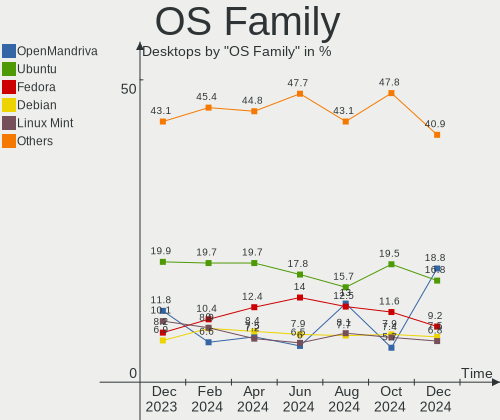
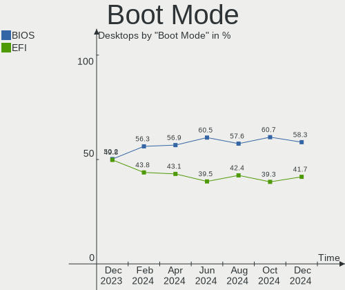
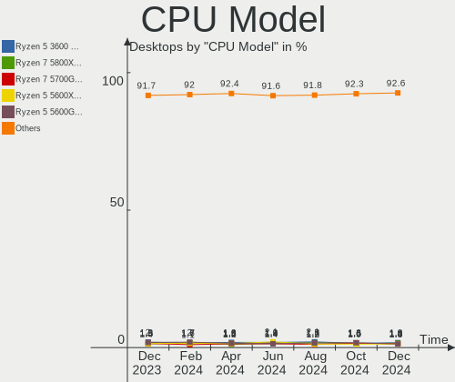
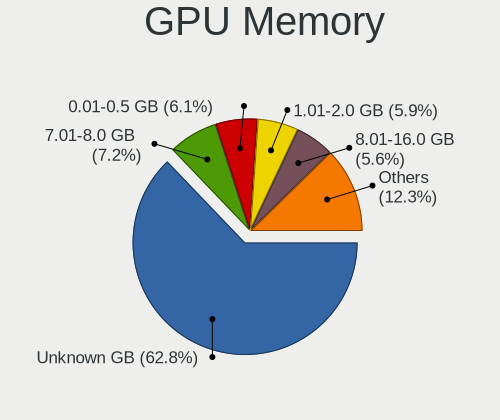
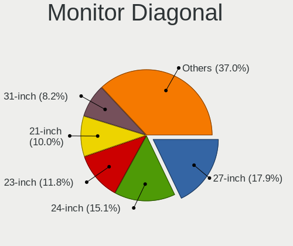
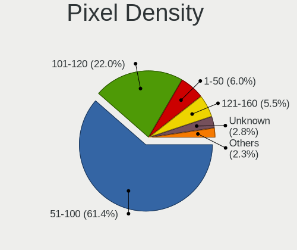
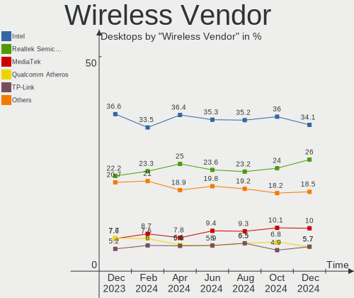
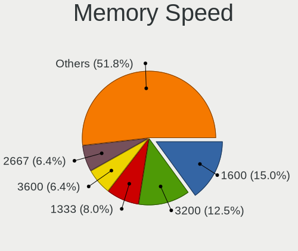

Linux Hardware Trends (Desktop)
-------------------------------

A project to identify most popular hardware characteristics and track their change
over time based on data collected by Linux users at https://Linux-Hardware.org.

Anyone can contribute to the study by uploading probes of their computers by
the [hw-probe](https://github.com/linuxhw/hw-probe) tool:

    sudo -E hw-probe -all -upload

Full-feature report is available here: https://linux-hardware.org/?view=trends&formfactor=desktop

Period: Apr, 2021.

Contents
--------

- [ OS                       ](#os)
- [ OS Family                ](#os-family)
- [ Kernel                   ](#kernel)
- [ Kernel Family            ](#kernel-family)
- [ Kernel Major Ver.        ](#kernel-major-ver)
- [ Arch                     ](#arch)
- [ DE                       ](#de)
- [ Display Server           ](#display-server)
- [ Display Manager          ](#display-manager)
- [ OS Lang                  ](#os-lang)
- [ Boot Mode                ](#boot-mode)
- [ Filesystem               ](#filesystem)
- [ Part. scheme             ](#part-scheme)
- [ Dual Boot with Linux/BSD ](#dual-boot-with-linux/bsd)
- [ Dual Boot (Win)          ](#dual-boot-win)
- [ Country                  ](#country)
- [ City                     ](#city)
- [ Vendor                   ](#vendor)
- [ Model                    ](#model)
- [ Model Family             ](#model-family)
- [ MFG Year                 ](#mfg-year)
- [ Form Factor              ](#form-factor)
- [ Secure Boot              ](#secure-boot)
- [ Coreboot                 ](#coreboot)
- [ RAM Size                 ](#ram-size)
- [ RAM Used                 ](#ram-used)
- [ Has CD-ROM               ](#has-cd-rom)
- [ Total Drives             ](#total-drives)
- [ Has Ethernet             ](#has-ethernet)
- [ Has WiFi                 ](#has-wifi)
- [ Has Bluetooth            ](#has-bluetooth)
- [ Drive Vendor             ](#drive-vendor)
- [ Drive Model              ](#drive-model)
- [ HDD Vendor               ](#hdd-vendor)
- [ SSD Vendor               ](#ssd-vendor)
- [ Drive Kind               ](#drive-kind)
- [ Drive Connector          ](#drive-connector)
- [ Drive Size               ](#drive-size)
- [ Space Total              ](#space-total)
- [ Space Used               ](#space-used)
- [ Malfunc. Drives          ](#malfunc-drives)
- [ Malfunc. Drive Vendor    ](#malfunc-drive-vendor)
- [ Malfunc. HDD Vendor      ](#malfunc-hdd-vendor)
- [ Malfunc. Drive Kind      ](#malfunc-drive-kind)
- [ Failed Drives            ](#failed-drives)
- [ Failed Drive Vendor      ](#failed-drive-vendor)
- [ Drive Status             ](#drive-status)
- [ Storage Vendor           ](#storage-vendor)
- [ Storage Model            ](#storage-model)
- [ Storage Kind             ](#storage-kind)
- [ CPU Vendor               ](#cpu-vendor)
- [ CPU Model                ](#cpu-model)
- [ CPU Model Family         ](#cpu-model-family)
- [ CPU Cores                ](#cpu-cores)
- [ CPU Sockets              ](#cpu-sockets)
- [ CPU Threads              ](#cpu-threads)
- [ CPU Op-Modes             ](#cpu-op-modes)
- [ CPU Microcode            ](#cpu-microcode)
- [ CPU Microarch            ](#cpu-microarch)
- [ GPU Vendor               ](#gpu-vendor)
- [ GPU Model                ](#gpu-model)
- [ GPU Combo                ](#gpu-combo)
- [ GPU Driver               ](#gpu-driver)
- [ GPU Memory               ](#gpu-memory)
- [ Monitor Vendor           ](#monitor-vendor)
- [ Monitor Model            ](#monitor-model)
- [ Monitor Resolution       ](#monitor-resolution)
- [ Monitor Diagonal         ](#monitor-diagonal)
- [ Monitor Width            ](#monitor-width)
- [ Aspect Ratio             ](#aspect-ratio)
- [ Monitor Area             ](#monitor-area)
- [ Pixel Density            ](#pixel-density)
- [ Multiple Monitors        ](#multiple-monitors)
- [ Net Controller Vendor    ](#net-controller-vendor)
- [ Net Controller Model     ](#net-controller-model)
- [ Wireless Vendor          ](#wireless-vendor)
- [ Wireless Model           ](#wireless-model)
- [ Ethernet Vendor          ](#ethernet-vendor)
- [ Ethernet Model           ](#ethernet-model)
- [ Net Controller Kind      ](#net-controller-kind)
- [ Used Controller          ](#used-controller)
- [ NICs                     ](#nics)
- [ IPv6                     ](#ipv6)
- [ Memory Vendor            ](#memory-vendor)
- [ Memory Model             ](#memory-model)
- [ Memory Kind              ](#memory-kind)
- [ Memory Form Factor       ](#memory-form-factor)
- [ Memory Size              ](#memory-size)
- [ Memory Speed             ](#memory-speed)
- [ Sound Vendor             ](#sound-vendor)
- [ Sound Model              ](#sound-model)
- [ Camera Vendor            ](#camera-vendor)
- [ Camera Model             ](#camera-model)
- [ Fingerprint Vendor       ](#fingerprint-vendor)
- [ Fingerprint Model        ](#fingerprint-model)
- [ Chipcard Vendor          ](#chipcard-vendor)
- [ Chipcard Model           ](#chipcard-model)
- [ Printer Vendor           ](#printer-vendor)
- [ Printer Model            ](#printer-model)
- [ Scanner Vendor           ](#scanner-vendor)
- [ Scanner Model            ](#scanner-model)
- [ Bluetooth Vendor         ](#bluetooth-vendor)
- [ Bluetooth Model          ](#bluetooth-model)
- [ Unsupported Devices      ](#unsupported-devices)
- [ Unsupported Device Types ](#unsupported-device-types)

OS
--

Installed operating systems

| Name                | Desktops | Percent |
|---------------------|----------|---------|
| Ubuntu 20.04        | 394      | 19.46%  |
| OpenMandriva 4.2    | 185      | 9.14%   |
| Mint 20.1           | 145      | 7.16%   |
| Ubuntu 20.10        | 85       | 4.2%    |
| ROSA R11.1          | 84       | 4.15%   |
| Pop!_OS 20.10       | 77       | 3.8%    |
| KDE neon 20.04      | 75       | 3.7%    |
| BlackPanther 18.1   | 75       | 3.7%    |
| Fedora 33           | 62       | 3.06%   |
| Ubuntu 18.04        | 60       | 2.96%   |
| Fedora 34           | 49       | 2.42%   |
| Xubuntu 20.04       | 40       | 1.98%   |
| Debian 10           | 39       | 1.93%   |
| Arch                | 36       | 1.78%   |
| Manjaro             | 33       | 1.63%   |
| Kubuntu 20.04       | 32       | 1.58%   |
| Ubuntu 21.04        | 31       | 1.53%   |
| Mint 19.3           | 28       | 1.38%   |
| Arch Rolling        | 25       | 1.23%   |
| ArcoLinux Rolling   | 23       | 1.14%   |
| Zorin 15            | 21       | 1.04%   |
| Mint 20             | 21       | 1.04%   |
| Debian              | 21       | 1.04%   |
| Pop!_OS 20.04       | 20       | 0.99%   |
| Manjaro 21.0        | 16       | 0.79%   |
| LMDE 4              | 15       | 0.74%   |
| Manjaro 21.0.1      | 14       | 0.69%   |
| Gentoo              | 14       | 0.69%   |
| ROSA R11            | 13       | 0.64%   |
| Manjaro 21.0.2      | 13       | 0.64%   |
| ROSA R12            | 10       | 0.49%   |
| Endless 3.9.3       | 10       | 0.49%   |
| openSUSE Leap-15.2  | 9        | 0.44%   |
| Kubuntu 20.10       | 9        | 0.44%   |
| Kali 2021.1         | 9        | 0.44%   |
| Mageia 8            | 8        | 0.4%    |
| Lubuntu 20.04       | 8        | 0.4%    |
| Fedora 32           | 8        | 0.4%    |
| Debian Testing      | 7        | 0.35%   |
| Mint 19.1           | 6        | 0.3%    |
| Manjaro 21.0.3      | 6        | 0.3%    |
| EndeavourOS         | 6        | 0.3%    |
| Zorin 16            | 5        | 0.25%   |
| Xubuntu 18.04       | 5        | 0.25%   |
| Ubuntu 16.04        | 5        | 0.25%   |
| Gentoo 2.7          | 5        | 0.25%   |
| EndeavourOS Rolling | 5        | 0.25%   |
| Elementary 5.1.7    | 5        | 0.25%   |
| Clear Linux 34500   | 5        | 0.25%   |
| Xubuntu 20.10       | 4        | 0.2%    |
| Ubuntu MATE 20.04   | 4        | 0.2%    |
| Ubuntu MATE 20.10   | 3        | 0.15%   |
| Ubuntu Budgie 20.10 | 3        | 0.15%   |
| Ubuntu Budgie 20.04 | 3        | 0.15%   |
| RELS 7.3            | 3        | 0.15%   |
| PCLinuxOS 2021      | 3        | 0.15%   |
| Mint 18.3           | 3        | 0.15%   |
| Kubuntu 21.04       | 3        | 0.15%   |
| Debian Unstable     | 3        | 0.15%   |
| Debian 9            | 3        | 0.15%   |

OS Family
---------

OS without a version

| Name          | Desktops | Percent |
|---------------|----------|---------|
| Ubuntu        | 578      | 28.54%  |
| Mint          | 206      | 10.17%  |
| OpenMandriva  | 188      | 9.28%   |
| Fedora        | 121      | 5.98%   |
| ROSA          | 111      | 5.48%   |
| Pop!_OS       | 99       | 4.89%   |
| Manjaro       | 83       | 4.1%    |
| Debian        | 79       | 3.9%    |
| KDE neon      | 76       | 3.75%   |
| BlackPanther  | 76       | 3.75%   |
| Arch          | 61       | 3.01%   |
| Xubuntu       | 52       | 2.57%   |
| Kubuntu       | 47       | 2.32%   |
| Zorin         | 27       | 1.33%   |
| ArcoLinux     | 24       | 1.19%   |
| openSUSE      | 21       | 1.04%   |
| Gentoo        | 19       | 0.94%   |
| LMDE          | 15       | 0.74%   |
| Endless       | 14       | 0.69%   |
| Lubuntu       | 11       | 0.54%   |
| Kali          | 11       | 0.54%   |
| EndeavourOS   | 11       | 0.54%   |
| Ubuntu MATE   | 10       | 0.49%   |
| Clear Linux   | 10       | 0.49%   |
| Mageia        | 8        | 0.4%    |
| Ubuntu Budgie | 6        | 0.3%    |
| Elementary    | 5        | 0.25%   |
| Devuan        | 5        | 0.25%   |
| CentOS        | 5        | 0.25%   |
| ClearOS       | 4        | 0.2%    |
| Artix         | 4        | 0.2%    |
| RELS          | 3        | 0.15%   |
| Red OS        | 3        | 0.15%   |
| PCLinuxOS     | 3        | 0.15%   |
| MX            | 3        | 0.15%   |
| Solus         | 2        | 0.1%    |
| RED           | 2        | 0.1%    |
| Parrot        | 2        | 0.1%    |
| Garuda        | 2        | 0.1%    |
| Deepin        | 2        | 0.1%    |
| Xero          | 1        | 0.05%   |
| Void          | 1        | 0.05%   |
| Regataos      | 1        | 0.05%   |
| Redcore       | 1        | 0.05%   |
| Reborn OS     | 1        | 0.05%   |
| PureOS        | 1        | 0.05%   |
| Peppermint    | 1        | 0.05%   |
| Obarun        | 1        | 0.05%   |
| Neon          | 1        | 0.05%   |
| Makulu        | 1        | 0.05%   |
| GNOME OS      | 1        | 0.05%   |
| BunsenLabs    | 1        | 0.05%   |
| BlackArch     | 1        | 0.05%   |
| BigLinux      | 1        | 0.05%   |
| ALT Linux     | 1        | 0.05%   |
| Alpine        | 1        | 0.05%   |

Kernel
------

Version of the Linux kernel

| Version                             | Desktops | Percent |
|-------------------------------------|----------|---------|
| 5.8.0-48-generic                    | 192      | 9.48%   |
| 5.10.14-desktop-1omv4002            | 182      | 8.99%   |
| 5.4.0-70-generic                    | 172      | 8.49%   |
| 5.8.0-50-generic                    | 157      | 7.75%   |
| 5.4.0-72-generic                    | 155      | 7.65%   |
| 5.11.0-7612-generic                 | 64       | 3.16%   |
| 5.8.0-49-generic                    | 50       | 2.47%   |
| 5.6.14-desktop-2bP                  | 43       | 2.12%   |
| 5.4.0-71-generic                    | 39       | 1.93%   |
| 4.18.16-desktop-1bP                 | 32       | 1.58%   |
| 5.4.32-generic-2rosa-x86_64         | 31       | 1.53%   |
| 4.19.0-16-amd64                     | 30       | 1.48%   |
| 5.11.0-16-generic                   | 25       | 1.23%   |
| 5.11.11-200.fc33.x86_64             | 22       | 1.09%   |
| 5.11.11-arch1-1                     | 18       | 0.89%   |
| 5.11.15-arch1-2                     | 17       | 0.84%   |
| 5.8.0-43-generic                    | 16       | 0.79%   |
| 5.11.0-7614-generic                 | 16       | 0.79%   |
| 5.10.0-2-amd64                      | 16       | 0.79%   |
| 5.4.83-generic-2rosa-x86_64         | 15       | 0.74%   |
| 5.11.16-300.fc34.x86_64             | 14       | 0.69%   |
| 4.15.0-desktop-122.124.1rosa-x86_64 | 14       | 0.69%   |
| 4.15.0-140-generic                  | 14       | 0.69%   |
| 5.8.0-14-generic                    | 13       | 0.64%   |
| 5.4.0-58-generic                    | 13       | 0.64%   |
| 5.11.14-200.fc33.x86_64             | 12       | 0.59%   |
| 5.11.11-300.fc34.x86_64             | 12       | 0.59%   |
| 5.9.16-1-MANJARO                    | 11       | 0.54%   |
| 4.15.0-desktop-45.1rosa-x86_64      | 11       | 0.54%   |
| 5.8.0-7642-generic                  | 10       | 0.49%   |
| 5.4.0-70-lowlatency                 | 10       | 0.49%   |
| 5.4.0-66-generic                    | 10       | 0.49%   |
| 5.11.10-1-MANJARO                   | 10       | 0.49%   |
| 5.10.23-1-MANJARO                   | 10       | 0.49%   |
| 5.10.0-5-amd64                      | 10       | 0.49%   |
| 4.15.0-142-generic                  | 10       | 0.49%   |
| 5.11.6-1-MANJARO                    | 9        | 0.44%   |
| 5.11.16-arch1-1                     | 9        | 0.44%   |
| 5.8.0-45-generic                    | 8        | 0.4%    |
| 5.11.15-200.fc33.x86_64             | 8        | 0.4%    |
| 5.11.12-300.fc34.x86_64             | 8        | 0.4%    |
| 5.8.0-44-generic                    | 7        | 0.35%   |
| 5.11.16-zen1-1-zen                  | 7        | 0.35%   |
| 5.11.14-1-MANJARO                   | 7        | 0.35%   |
| 5.11.13-arch1-1                     | 7        | 0.35%   |
| 5.10.30-1-MANJARO                   | 7        | 0.35%   |
| 5.10.27-desktop-1.mga8              | 7        | 0.35%   |
| 5.8.0-48-lowlatency                 | 6        | 0.3%    |
| 5.4.32-generic-2rosa-i586           | 6        | 0.3%    |
| 5.11.0-13-generic                   | 6        | 0.3%    |
| 5.10.27-1-lts                       | 6        | 0.3%    |
| 5.10.26-1-MANJARO                   | 6        | 0.3%    |
| 5.10.19-1032.native                 | 6        | 0.3%    |
| 5.10.0-6-amd64                      | 6        | 0.3%    |
| 4.15.0-desktop-45.1rosa-i586        | 6        | 0.3%    |
| 3.10.0-1160.21.1.el7.x86_64         | 6        | 0.3%    |
| 5.8.0-25-generic                    | 5        | 0.25%   |
| 5.4.106-1-pve                       | 5        | 0.25%   |
| 5.4.0-65-generic                    | 5        | 0.25%   |
| 5.4.0-42-generic                    | 5        | 0.25%   |

Kernel Family
-------------

Linux kernel without a distro release

| Version | Desktops | Percent |
|---------|----------|---------|
| 5.8.0   | 477      | 23.56%  |
| 5.4.0   | 449      | 22.17%  |
| 5.10.14 | 182      | 8.99%   |
| 5.11.0  | 123      | 6.07%   |
| 4.15.0  | 78       | 3.85%   |
| 5.11.11 | 72       | 3.56%   |
| 5.10.0  | 55       | 2.72%   |
| 5.11.16 | 46       | 2.27%   |
| 5.6.14  | 44       | 2.17%   |
| 4.19.0  | 43       | 2.12%   |
| 5.4.32  | 37       | 1.83%   |
| 5.11.15 | 37       | 1.83%   |
| 4.18.16 | 32       | 1.58%   |
| 5.11.14 | 29       | 1.43%   |
| 5.11.12 | 25       | 1.23%   |
| 5.11.10 | 23       | 1.14%   |
| 5.4.83  | 21       | 1.04%   |
| 5.10.27 | 21       | 1.04%   |
| 5.11.13 | 17       | 0.84%   |
| 5.11.6  | 15       | 0.74%   |
| 5.9.16  | 12       | 0.59%   |
| 5.10.23 | 11       | 0.54%   |
| 5.10.30 | 10       | 0.49%   |
| 5.3.18  | 9        | 0.44%   |
| 3.10.0  | 9        | 0.44%   |
| 5.3.0   | 8        | 0.4%    |
| 5.12.0  | 8        | 0.4%    |
| 5.10.26 | 8        | 0.4%    |
| 5.10.19 | 8        | 0.4%    |
| 5.10.32 | 6        | 0.3%    |
| 4.9.0   | 6        | 0.3%    |
| 5.4.106 | 5        | 0.25%   |
| 5.10.25 | 5        | 0.25%   |
| 5.9.0   | 4        | 0.2%    |
| 5.4.97  | 4        | 0.2%    |
| 5.11.8  | 4        | 0.2%    |
| 5.10.28 | 4        | 0.2%    |
| 5.4.108 | 3        | 0.15%   |
| 5.10.29 | 3        | 0.15%   |
| 5.10.22 | 3        | 0.15%   |
| 5.10.18 | 3        | 0.15%   |
| 5.0.0   | 3        | 0.15%   |
| 4.18.0  | 3        | 0.15%   |
| 5.9.1   | 2        | 0.1%    |
| 5.8.18  | 2        | 0.1%    |
| 5.4.105 | 2        | 0.1%    |
| 5.11.9  | 2        | 0.1%    |
| 5.11.3  | 2        | 0.1%    |
| 5.10.33 | 2        | 0.1%    |
| 5.10.31 | 2        | 0.1%    |
| 4.9.20  | 2        | 0.1%    |
| 4.9.155 | 2        | 0.1%    |
| 5.9.3   | 1        | 0.05%   |
| 5.9.14  | 1        | 0.05%   |
| 5.9.12  | 1        | 0.05%   |
| 5.8.15  | 1        | 0.05%   |
| 5.8.14  | 1        | 0.05%   |
| 5.7.15  | 1        | 0.05%   |
| 5.7.10  | 1        | 0.05%   |
| 5.7.0   | 1        | 0.05%   |

Kernel Major Ver.
-----------------

Linux kernel major version

| Version | Desktops | Percent |
|---------|----------|---------|
| 5.4     | 530      | 26.17%  |
| 5.8     | 481      | 23.75%  |
| 5.11    | 397      | 19.6%   |
| 5.10    | 326      | 16.1%   |
| 4.15    | 79       | 3.9%    |
| 5.6     | 47       | 2.32%   |
| 4.19    | 44       | 2.17%   |
| 4.18    | 35       | 1.73%   |
| 5.9     | 21       | 1.04%   |
| 5.3     | 17       | 0.84%   |
| 4.9     | 14       | 0.69%   |
| 3.10    | 9        | 0.44%   |
| 5.12    | 8        | 0.4%    |
| 5.7     | 3        | 0.15%   |
| 5.5     | 3        | 0.15%   |
| 5.0     | 3        | 0.15%   |
| 5.2     | 2        | 0.1%    |
| 4.4     | 1        | 0.05%   |
| 4.2     | 1        | 0.05%   |
| 4.17    | 1        | 0.05%   |
| 4.10    | 1        | 0.05%   |
| 3.13    | 1        | 0.05%   |
| Unknown | 1        | 0.05%   |

Arch
----

OS architecture (x86_64, i586, etc.)

| Name     | Desktops | Percent |
|----------|----------|---------|
| x86_64   | 1969     | 97.23%  |
| i686     | 54       | 2.67%   |
| armv7l   | 1        | 0.05%   |
| armv5tel | 1        | 0.05%   |

DE
--

Desktop Environment

| Name             | Desktops | Percent |
|------------------|----------|---------|
| GNOME            | 786      | 38.81%  |
| KDE5             | 414      | 20.44%  |
| X-Cinnamon       | 176      | 8.69%   |
| KDE              | 152      | 7.51%   |
| Unknown          | 139      | 6.86%   |
| XFCE             | 136      | 6.72%   |
| KDE4             | 67       | 3.31%   |
| MATE             | 56       | 2.77%   |
| LXQt             | 16       | 0.79%   |
| Cinnamon         | 16       | 0.79%   |
| Budgie           | 12       | 0.59%   |
| Unity            | 9        | 0.44%   |
| LXDE             | 8        | 0.4%    |
| i3               | 8        | 0.4%    |
| Pantheon         | 5        | 0.25%   |
| awesome          | 5        | 0.25%   |
| GNOME Flashback  | 3        | 0.15%   |
| dwm              | 2        | 0.1%    |
| Deepin           | 2        | 0.1%    |
| bspwm            | 2        | 0.1%    |
| xmonad           | 1        | 0.05%   |
| sway             | 1        | 0.05%   |
| openbox          | 1        | 0.05%   |
| lightdm-xsession | 1        | 0.05%   |
| ICEWM            | 1        | 0.05%   |
| i3-with-shmlog   | 1        | 0.05%   |
| GNUstep          | 1        | 0.05%   |
| GNOME Classic    | 1        | 0.05%   |
| fluxbox          | 1        | 0.05%   |
| enlightenment    | 1        | 0.05%   |
| default          | 1        | 0.05%   |

Display Server
--------------

X11 or Wayland

| Name        | Desktops | Percent |
|-------------|----------|---------|
| X11         | 1783     | 88.05%  |
| Wayland     | 130      | 6.42%   |
| Unknown     | 70       | 3.46%   |
| Tty         | 41       | 2.02%   |
| Unspecified | 1        | 0.05%   |

Display Manager
---------------

SDDM, LightDM, etc.

| Name    | Desktops | Percent |
|---------|----------|---------|
| Unknown | 1173     | 57.93%  |
| SDDM    | 424      | 20.94%  |
| GDM     | 175      | 8.64%   |
| TDM     | 131      | 6.47%   |
| KDM     | 68       | 3.36%   |
| LightDM | 41       | 2.02%   |
| XDM     | 6        | 0.3%    |
| SLiM    | 2        | 0.1%    |
| LXDM    | 2        | 0.1%    |
| MDM     | 1        | 0.05%   |
| Ly      | 1        | 0.05%   |
| GDM3    | 1        | 0.05%   |

OS Lang
-------

Language

| Lang    | Desktops | Percent |
|---------|----------|---------|
| en_US   | 707      | 34.91%  |
| ru_RU   | 185      | 9.14%   |
| de_DE   | 174      | 8.59%   |
| Unknown | 114      | 5.63%   |
| fr_FR   | 112      | 5.53%   |
| pt_BR   | 106      | 5.23%   |
| en_GB   | 96       | 4.74%   |
| pl_PL   | 55       | 2.72%   |
| es_ES   | 51       | 2.52%   |
| en_CA   | 47       | 2.32%   |
| it_IT   | 43       | 2.12%   |
| en_AU   | 35       | 1.73%   |
| C       | 23       | 1.14%   |
| nl_NL   | 16       | 0.79%   |
| hu_HU   | 15       | 0.74%   |
| en_IN   | 15       | 0.74%   |
| es_AR   | 14       | 0.69%   |
| sv_SE   | 10       | 0.49%   |
| pt_PT   | 10       | 0.49%   |
| nl_BE   | 10       | 0.49%   |
| de_AT   | 10       | 0.49%   |
| cs_CZ   | 10       | 0.49%   |
| ro_RO   | 9        | 0.44%   |
| ja_JP   | 9        | 0.44%   |
| es_MX   | 8        | 0.4%    |
| fr_BE   | 7        | 0.35%   |
| fi_FI   | 7        | 0.35%   |
| ru_UA   | 6        | 0.3%    |
| ko_KR   | 6        | 0.3%    |
| es_CO   | 6        | 0.3%    |
| en_IE   | 6        | 0.3%    |
| el_GR   | 6        | 0.3%    |
| de_CH   | 6        | 0.3%    |
| es_CL   | 5        | 0.25%   |
| en_NZ   | 5        | 0.25%   |
| en_IL   | 5        | 0.25%   |
| fr_CA   | 4        | 0.2%    |
| en_ZA   | 4        | 0.2%    |
| da_DK   | 4        | 0.2%    |
| ca_ES   | 4        | 0.2%    |
| zh_TW   | 3        | 0.15%   |
| uk_UA   | 3        | 0.15%   |
| tr_TR   | 3        | 0.15%   |
| sk_SK   | 3        | 0.15%   |
| es_VE   | 3        | 0.15%   |
| es_UY   | 3        | 0.15%   |
| es_PE   | 3        | 0.15%   |
| es_CU   | 3        | 0.15%   |
| C.UTF8  | 3        | 0.15%   |
| sl_SI   | 2        | 0.1%    |
| nb_NO   | 2        | 0.1%    |
| fr_CH   | 2        | 0.1%    |
| eu_ES   | 2        | 0.1%    |
| en_SG   | 2        | 0.1%    |
| en_PH   | 2        | 0.1%    |
| bg_BG   | 2        | 0.1%    |
| zh_CN   | 1        | 0.05%   |
| vi_VN   | 1        | 0.05%   |
| th_TH   | 1        | 0.05%   |
| sr_RS   | 1        | 0.05%   |

Boot Mode
---------

EFI or BIOS

| Mode | Desktops | Percent |
|------|----------|---------|
| BIOS | 1298     | 64.1%   |
| EFI  | 727      | 35.9%   |

Filesystem
----------

Type of filesystem

| Type     | Desktops | Percent |
|----------|----------|---------|
| Ext4     | 1549     | 76.49%  |
| Overlay  | 270      | 13.33%  |
| Btrfs    | 139      | 6.86%   |
| Xfs      | 39       | 1.93%   |
| Zfs      | 10       | 0.49%   |
| F2fs     | 7        | 0.35%   |
| Ext3     | 6        | 0.3%    |
| Unknown  | 2        | 0.1%    |
| XXXXXXX  | 1        | 0.05%   |
| Reiserfs | 1        | 0.05%   |
| Ext2     | 1        | 0.05%   |

Part. scheme
------------

Scheme of partitioning

| Type    | Desktops | Percent |
|---------|----------|---------|
| Unknown | 1114     | 55.01%  |
| GPT     | 530      | 26.17%  |
| MBR     | 381      | 18.81%  |

Dual Boot with Linux/BSD
------------------------

Hosting more than one Linux/BSD

| Dual boot | Desktops | Percent |
|-----------|----------|---------|
| No        | 1596     | 78.81%  |
| Yes       | 429      | 21.19%  |

Dual Boot (Win)
---------------

Hosting Linux and Windows

| Dual boot | Desktops | Percent |
|-----------|----------|---------|
| No        | 1326     | 65.48%  |
| Yes       | 699      | 34.52%  |

Country
-------

Geographic location (country)

| Country             | Desktops | Percent |
|---------------------|----------|---------|
| USA                 | 331      | 16.35%  |
| Germany             | 227      | 11.21%  |
| Russia              | 224      | 11.06%  |
| Brazil              | 135      | 6.67%   |
| France              | 122      | 6.02%   |
| UK                  | 83       | 4.1%    |
| Poland              | 75       | 3.7%    |
| Hungary             | 72       | 3.56%   |
| Spain               | 67       | 3.31%   |
| Canada              | 63       | 3.11%   |
| Italy               | 58       | 2.86%   |
| Australia           | 42       | 2.07%   |
| Netherlands         | 40       | 1.98%   |
| Ukraine             | 33       | 1.63%   |
| Belgium             | 29       | 1.43%   |
| India               | 26       | 1.28%   |
| Austria             | 22       | 1.09%   |
| Sweden              | 21       | 1.04%   |
| Czechia             | 21       | 1.04%   |
| Argentina           | 21       | 1.04%   |
| Switzerland         | 19       | 0.94%   |
| Romania             | 14       | 0.69%   |
| Portugal            | 12       | 0.59%   |
| Greece              | 12       | 0.59%   |
| Turkey              | 11       | 0.54%   |
| Mexico              | 11       | 0.54%   |
| Finland             | 11       | 0.54%   |
| New Zealand         | 10       | 0.49%   |
| Japan               | 10       | 0.49%   |
| Israel              | 10       | 0.49%   |
| Norway              | 9        | 0.44%   |
| Denmark             | 9        | 0.44%   |
| Colombia            | 9        | 0.44%   |
| Bulgaria            | 9        | 0.44%   |
| Indonesia           | 8        | 0.4%    |
| Chile               | 8        | 0.4%    |
| Belarus             | 7        | 0.35%   |
| Vietnam             | 6        | 0.3%    |
| South Korea         | 6        | 0.3%    |
| Slovenia            | 6        | 0.3%    |
| Slovakia            | 6        | 0.3%    |
| Pakistan            | 6        | 0.3%    |
| Peru                | 5        | 0.25%   |
| Lithuania           | 5        | 0.25%   |
| Ireland             | 5        | 0.25%   |
| Uruguay             | 4        | 0.2%    |
| Taiwan              | 4        | 0.2%    |
| South Africa        | 4        | 0.2%    |
| Singapore           | 4        | 0.2%    |
| Serbia              | 4        | 0.2%    |
| Malaysia            | 4        | 0.2%    |
| Iran                | 4        | 0.2%    |
| Egypt               | 4        | 0.2%    |
| China               | 4        | 0.2%    |
| Venezuela           | 3        | 0.15%   |
| Philippines         | 3        | 0.15%   |
| Croatia             | 3        | 0.15%   |
| Costa Rica          | 3        | 0.15%   |
| Algeria             | 3        | 0.15%   |
| Trinidad and Tobago | 2        | 0.1%    |

City
----

Geographic location (city)

| City             | Desktops | Percent |
|------------------|----------|---------|
| Moscow           | 42       | 2.07%   |
| St Petersburg    | 24       | 1.19%   |
| São Paulo       | 23       | 1.14%   |
| Budapest         | 20       | 0.99%   |
| Berlin           | 19       | 0.94%   |
| Voronezh         | 18       | 0.89%   |
| Warsaw           | 17       | 0.84%   |
| Vienna           | 14       | 0.69%   |
| Hamburg          | 14       | 0.69%   |
| Montreal         | 13       | 0.64%   |
| London           | 10       | 0.49%   |
| Chipping Norton  | 10       | 0.49%   |
| Athens           | 10       | 0.49%   |
| Paris            | 9        | 0.44%   |
| Kyiv             | 9        | 0.44%   |
| Rostov-on-Don    | 8        | 0.4%    |
| Novosibirsk      | 8        | 0.4%    |
| Yekaterinburg    | 7        | 0.35%   |
| Milan            | 7        | 0.35%   |
| Madrid           | 7        | 0.35%   |
| Wroclaw          | 6        | 0.3%    |
| Tel Aviv         | 6        | 0.3%    |
| Sydney           | 6        | 0.3%    |
| Rome             | 6        | 0.3%    |
| Prague           | 6        | 0.3%    |
| Krakow           | 6        | 0.3%    |
| Cologne          | 6        | 0.3%    |
| Brisbane         | 6        | 0.3%    |
| Zurich           | 5        | 0.25%   |
| Toronto          | 5        | 0.25%   |
| Szekszárd       | 5        | 0.25%   |
| Rio de Janeiro   | 5        | 0.25%   |
| Lisbon           | 5        | 0.25%   |
| Leipzig          | 5        | 0.25%   |
| Lahore           | 5        | 0.25%   |
| Istanbul         | 5        | 0.25%   |
| Gdansk           | 5        | 0.25%   |
| Essen            | 5        | 0.25%   |
| Brussels         | 5        | 0.25%   |
| Barcelona        | 5        | 0.25%   |
| Amsterdam        | 5        | 0.25%   |
| Turin            | 4        | 0.2%    |
| Springfield      | 4        | 0.2%    |
| Sofia            | 4        | 0.2%    |
| Singapore        | 4        | 0.2%    |
| Seattle          | 4        | 0.2%    |
| Rochester        | 4        | 0.2%    |
| Portland         | 4        | 0.2%    |
| Perm             | 4        | 0.2%    |
| Nizhniy Novgorod | 4        | 0.2%    |
| Munich           | 4        | 0.2%    |
| Montevideo       | 4        | 0.2%    |
| Minsk            | 4        | 0.2%    |
| Miami            | 4        | 0.2%    |
| Hanover          | 4        | 0.2%    |
| Dublin           | 4        | 0.2%    |
| Denver           | 4        | 0.2%    |
| Chennai          | 4        | 0.2%    |
| Campinas         | 4        | 0.2%    |
| Calgary          | 4        | 0.2%    |

Vendor
------

Motherboard manufacturer

| Name                                   | Desktops | Percent |
|----------------------------------------|----------|---------|
| ASUSTek Computer                       | 527      | 26.02%  |
| Gigabyte Technology                    | 367      | 18.12%  |
| MSI                                    | 230      | 11.36%  |
| ASRock                                 | 216      | 10.67%  |
| Dell                                   | 161      | 7.95%   |
| Hewlett-Packard                        | 125      | 6.17%   |
| Lenovo                                 | 77       | 3.8%    |
| Intel                                  | 50       | 2.47%   |
| Acer                                   | 38       | 1.88%   |
| Pegatron                               | 29       | 1.43%   |
| Unknown                                | 29       | 1.43%   |
| Fujitsu                                | 19       | 0.94%   |
| ECS                                    | 18       | 0.89%   |
| Biostar                                | 16       | 0.79%   |
| Foxconn                                | 15       | 0.74%   |
| Medion                                 | 14       | 0.69%   |
| Huanan                                 | 7        | 0.35%   |
| Positivo                               | 6        | 0.3%    |
| Packard Bell                           | 6        | 0.3%    |
| Fujitsu Siemens                        | 6        | 0.3%    |
| Supermicro                             | 4        | 0.2%    |
| Apple                                  | 4        | 0.2%    |
| Gateway                                | 3        | 0.15%   |
| AMI                                    | 3        | 0.15%   |
| System76                               | 2        | 0.1%    |
| Shuttle                                | 2        | 0.1%    |
| Semp Toshiba                           | 2        | 0.1%    |
| PCWare                                 | 2        | 0.1%    |
| IBM                                    | 2        | 0.1%    |
| Google                                 | 2        | 0.1%    |
| eMachines                              | 2        | 0.1%    |
| Desenvolvido para Positivo Informatica | 2        | 0.1%    |
| BESSTAR Tech                           | 2        | 0.1%    |
| ASRockRack                             | 2        | 0.1%    |
| AMD                                    | 2        | 0.1%    |
| Alienware                              | 2        | 0.1%    |
| ZOTAC                                  | 1        | 0.05%   |
| Wortmann AG                            | 1        | 0.05%   |
| Wistron                                | 1        | 0.05%   |
| Varian Medical Systems                 | 1        | 0.05%   |
| TUXEDO                                 | 1        | 0.05%   |
| TONK                                   | 1        | 0.05%   |
| TECHNOPC                               | 1        | 0.05%   |
| Sun Microsystems                       | 1        | 0.05%   |
| Sapphire                               | 1        | 0.05%   |
| Quanta                                 | 1        | 0.05%   |
| Pyramid                                | 1        | 0.05%   |
| PCChips                                | 1        | 0.05%   |
| PC Engines                             | 1        | 0.05%   |
| OEM_MB                                 | 1        | 0.05%   |
| OEM                                    | 1        | 0.05%   |
| NEC Computers                          | 1        | 0.05%   |
| LattePanda                             | 1        | 0.05%   |
| Kraftway                               | 1        | 0.05%   |
| Koloe                                  | 1        | 0.05%   |
| Inventec                               | 1        | 0.05%   |
| HC                                     | 1        | 0.05%   |
| ELSKY                                  | 1        | 0.05%   |
| DFI                                    | 1        | 0.05%   |
| DEPO Computers                         | 1        | 0.05%   |

Model
-----

Motherboard model

| Name                             | Desktops | Percent |
|----------------------------------|----------|---------|
| ASUS All Series                  | 44       | 2.17%   |
| Unknown                          | 30       | 1.48%   |
| Gigabyte B450M DS3H              | 14       | 0.69%   |
| ASUS PRIME A320M-K               | 14       | 0.69%   |
| Dell OptiPlex 7010               | 12       | 0.59%   |
| ASUS ROG STRIX B450-F GAMING     | 11       | 0.54%   |
| Gigabyte A320M-S2H               | 10       | 0.49%   |
| ASUS TUF GAMING X570-PLUS        | 10       | 0.49%   |
| MSI MS-7C91                      | 8        | 0.4%    |
| MSI MS-7C37                      | 8        | 0.4%    |
| MSI MS-7C02                      | 8        | 0.4%    |
| HP Compaq Pro 6300 SFF           | 8        | 0.4%    |
| Dell OptiPlex 9020               | 8        | 0.4%    |
| MSI MS-7A34                      | 7        | 0.35%   |
| MSI MS-7817                      | 7        | 0.35%   |
| MSI MS-7693                      | 7        | 0.35%   |
| Gigabyte GA-78LMT-USB3 6.0       | 7        | 0.35%   |
| Dell OptiPlex 790                | 7        | 0.35%   |
| Dell OptiPlex 755                | 7        | 0.35%   |
| Dell OptiPlex 390                | 7        | 0.35%   |
| ASRock A320M-HDV R4.0            | 7        | 0.35%   |
| MSI MS-7B89                      | 6        | 0.3%    |
| MSI MS-7A38                      | 6        | 0.3%    |
| Dell OptiPlex 990                | 6        | 0.3%    |
| Dell OptiPlex 780                | 6        | 0.3%    |
| Dell OptiPlex 760                | 6        | 0.3%    |
| Dell OptiPlex 3020               | 6        | 0.3%    |
| ASUS ROG STRIX X570-E GAMING     | 6        | 0.3%    |
| ASUS PRIME B450M-A               | 6        | 0.3%    |
| ASRock AB350 Pro4                | 6        | 0.3%    |
| MSI MS-7C84                      | 5        | 0.25%   |
| MSI MS-7C35                      | 5        | 0.25%   |
| MSI MS-7B86                      | 5        | 0.25%   |
| MSI MS-7B79                      | 5        | 0.25%   |
| Gigabyte B75M-D3H                | 5        | 0.25%   |
| Gigabyte B450 AORUS M            | 5        | 0.25%   |
| ASUS P8Z77-V PRO                 | 5        | 0.25%   |
| ASUS P5Q DELUXE                  | 5        | 0.25%   |
| ASUS M5A78L-M/USB3               | 5        | 0.25%   |
| ASUS M5A78L-M LX3                | 5        | 0.25%   |
| ASRock B450M Steel Legend        | 5        | 0.25%   |
| ASRock B450 Pro4                 | 5        | 0.25%   |
| MSI MS-7C95                      | 4        | 0.2%    |
| MSI MS-7C52                      | 4        | 0.2%    |
| MSI MS-7996                      | 4        | 0.2%    |
| MSI MS-7917                      | 4        | 0.2%    |
| MSI MS-7641                      | 4        | 0.2%    |
| Intel B75                        | 4        | 0.2%    |
| HP Z400 Workstation              | 4        | 0.2%    |
| HP Compaq Elite 8300 SFF         | 4        | 0.2%    |
| HP Compaq 8200 Elite CMT PC      | 4        | 0.2%    |
| Gigabyte G41M-ES2L               | 4        | 0.2%    |
| Gigabyte B450 AORUS PRO          | 4        | 0.2%    |
| Dell Precision WorkStation T3500 | 4        | 0.2%    |
| Dell OptiPlex 9010               | 4        | 0.2%    |
| Dell OptiPlex 3010               | 4        | 0.2%    |
| ASUS SABERTOOTH 990FX R2.0       | 4        | 0.2%    |
| ASUS ROG STRIX B450-I GAMING     | 4        | 0.2%    |
| ASUS PRIME X570-PRO              | 4        | 0.2%    |
| ASUS PRIME X370-PRO              | 4        | 0.2%    |

Model Family
------------

Motherboard model prefix

| Name                   | Desktops | Percent |
|------------------------|----------|---------|
| Dell OptiPlex          | 100      | 4.94%   |
| ASUS PRIME             | 96       | 4.74%   |
| ASUS ROG               | 55       | 2.72%   |
| HP Compaq              | 51       | 2.52%   |
| Lenovo ThinkCentre     | 45       | 2.22%   |
| ASUS All               | 44       | 2.17%   |
| ASUS TUF               | 33       | 1.63%   |
| Unknown                | 30       | 1.48%   |
| Acer Aspire            | 26       | 1.28%   |
| Dell Precision         | 24       | 1.19%   |
| Gigabyte B450M         | 23       | 1.14%   |
| ASUS M5A78L-M          | 21       | 1.04%   |
| Gigabyte B450          | 16       | 0.79%   |
| Fujitsu ESPRIMO        | 16       | 0.79%   |
| Gigabyte X570          | 14       | 0.69%   |
| Dell Inspiron          | 14       | 0.69%   |
| ASUS P8H61-M           | 14       | 0.69%   |
| Gigabyte A320M-S2H     | 13       | 0.64%   |
| Lenovo IdeaCentre      | 12       | 0.59%   |
| Gigabyte GA-78LMT-USB3 | 12       | 0.59%   |
| Gigabyte B550          | 12       | 0.59%   |
| Dell Vostro            | 11       | 0.54%   |
| ASRock B450M           | 11       | 0.54%   |
| ASRock B450            | 11       | 0.54%   |
| HP ProDesk             | 10       | 0.49%   |
| ASUS P5Q               | 10       | 0.49%   |
| HP EliteDesk           | 9        | 0.44%   |
| Gigabyte Z390          | 9        | 0.44%   |
| ASUS P8P67             | 9        | 0.44%   |
| MSI MS-7C91            | 8        | 0.4%    |
| MSI MS-7C37            | 8        | 0.4%    |
| MSI MS-7C02            | 8        | 0.4%    |
| HP Pavilion            | 8        | 0.4%    |
| ASUS P8Z77-V           | 8        | 0.4%    |
| ASUS P5KPL-AM          | 8        | 0.4%    |
| ASUS M5A97             | 8        | 0.4%    |
| ASRock AB350           | 8        | 0.4%    |
| ASRock A320M-HDV       | 8        | 0.4%    |
| MSI MS-7A34            | 7        | 0.35%   |
| MSI MS-7817            | 7        | 0.35%   |
| MSI MS-7693            | 7        | 0.35%   |
| ASRock X570            | 7        | 0.35%   |
| ASRock B550            | 7        | 0.35%   |
| Acer Veriton           | 7        | 0.35%   |
| MSI MS-7B89            | 6        | 0.3%    |
| MSI MS-7A38            | 6        | 0.3%    |
| Lenovo ThinkStation    | 6        | 0.3%    |
| Gigabyte B550M         | 6        | 0.3%    |
| ASUS Maximus           | 6        | 0.3%    |
| MSI MS-7C84            | 5        | 0.25%   |
| MSI MS-7C35            | 5        | 0.25%   |
| MSI MS-7B86            | 5        | 0.25%   |
| MSI MS-7B79            | 5        | 0.25%   |
| Gigabyte X399          | 5        | 0.25%   |
| Gigabyte B75M-D3H      | 5        | 0.25%   |
| ASUS SABERTOOTH        | 5        | 0.25%   |
| ASUS M5A99X            | 5        | 0.25%   |
| ASUS M5A78L            | 5        | 0.25%   |
| ASRock B550M           | 5        | 0.25%   |
| ASRock 990FX           | 5        | 0.25%   |

MFG Year
--------

Motherboard manufacture year

| Year    | Desktops | Percent |
|---------|----------|---------|
| 2020    | 290      | 14.32%  |
| 2019    | 216      | 10.67%  |
| 2018    | 183      | 9.04%   |
| 2013    | 157      | 7.75%   |
| 2014    | 146      | 7.21%   |
| 2012    | 135      | 6.67%   |
| 2010    | 132      | 6.52%   |
| 2011    | 123      | 6.07%   |
| 2021    | 116      | 5.73%   |
| 2015    | 112      | 5.53%   |
| 2009    | 106      | 5.23%   |
| 2016    | 103      | 5.09%   |
| 2008    | 62       | 3.06%   |
| 2017    | 60       | 2.96%   |
| 2007    | 46       | 2.27%   |
| 2006    | 19       | 0.94%   |
| 2005    | 9        | 0.44%   |
| Unknown | 6        | 0.3%    |
| 2004    | 2        | 0.1%    |
| 2003    | 1        | 0.05%   |
| 2002    | 1        | 0.05%   |

Form Factor
-----------

Physical design of the computer

| Name    | Desktops | Percent |
|---------|----------|---------|
| Desktop | 2025     | 100%    |

Secure Boot
-----------

Enabled or disabled

| State    | Desktops | Percent |
|----------|----------|---------|
| Disabled | 1992     | 98.37%  |
| Enabled  | 33       | 1.63%   |

Coreboot
--------

Have coreboot on board

| Used | Desktops | Percent |
|------|----------|---------|
| No   | 2022     | 99.85%  |
| Yes  | 3        | 0.15%   |

RAM Size
--------

Total RAM memory

| Size in GB      | Desktops | Percent |
|-----------------|----------|---------|
| 16.01-24.0      | 451      | 22.27%  |
| 8.01-16.0       | 445      | 21.98%  |
| 3.01-4.0        | 384      | 18.96%  |
| 4.01-8.0        | 267      | 13.19%  |
| 32.01-64.0      | 253      | 12.49%  |
| 64.01-256.0     | 71       | 3.51%   |
| 1.01-2.0        | 70       | 3.46%   |
| 24.01-32.0      | 43       | 2.12%   |
| 2.01-3.0        | 27       | 1.33%   |
| 0.51-1.0        | 11       | 0.54%   |
| 0.01-0.5        | 2        | 0.1%    |
| More than 256.0 | 1        | 0.05%   |

RAM Used
--------

Used RAM memory

| Used GB     | Desktops | Percent |
|-------------|----------|---------|
| 1.01-2.0    | 740      | 36.54%  |
| 2.01-3.0    | 428      | 21.14%  |
| 4.01-8.0    | 267      | 13.19%  |
| 3.01-4.0    | 227      | 11.21%  |
| 0.51-1.0    | 192      | 9.48%   |
| 0.01-0.5    | 75       | 3.7%    |
| 8.01-16.0   | 69       | 3.41%   |
| 16.01-24.0  | 14       | 0.69%   |
| 32.01-64.0  | 8        | 0.4%    |
| 24.01-32.0  | 3        | 0.15%   |
| 64.01-256.0 | 1        | 0.05%   |
| Unknown     | 1        | 0.05%   |

Has CD-ROM
----------

Has CD-ROM on board

| Presented | Desktops | Percent |
|-----------|----------|---------|
| No        | 1047     | 51.7%   |
| Yes       | 978      | 48.3%   |

Total Drives
------------

Number of drives on board

| Drives | Desktops | Percent |
|--------|----------|---------|
| 1      | 773      | 38.17%  |
| 2      | 588      | 29.04%  |
| 3      | 304      | 15.01%  |
| 4      | 174      | 8.59%   |
| 5      | 90       | 4.44%   |
| 6      | 45       | 2.22%   |
| 0      | 22       | 1.09%   |
| 7      | 16       | 0.79%   |
| 9      | 5        | 0.25%   |
| 8      | 4        | 0.2%    |
| 23     | 1        | 0.05%   |
| 16     | 1        | 0.05%   |
| 14     | 1        | 0.05%   |
| 12     | 1        | 0.05%   |

Has Ethernet
------------

Has Ethernet on board

| Presented | Desktops | Percent |
|-----------|----------|---------|
| Yes       | 2008     | 99.16%  |
| No        | 17       | 0.84%   |

Has WiFi
--------

Has WiFi module

| Presented | Desktops | Percent |
|-----------|----------|---------|
| No        | 1184     | 58.47%  |
| Yes       | 841      | 41.53%  |

Has Bluetooth
-------------

Has Bluetooth module

| Presented | Desktops | Percent |
|-----------|----------|---------|
| No        | 1462     | 72.2%   |
| Yes       | 563      | 27.8%   |

Drive Vendor
------------

Hard drive vendors

| Vendor                    | Desktops | Drives | Percent |
|---------------------------|----------|--------|---------|
| WDC                       | 755      | 1030   | 21.12%  |
| Seagate                   | 708      | 919    | 19.81%  |
| Samsung Electronics       | 521      | 743    | 14.58%  |
| Kingston                  | 218      | 249    | 6.1%    |
| Toshiba                   | 186      | 206    | 5.2%    |
| Crucial                   | 153      | 177    | 4.28%   |
| Hitachi                   | 148      | 162    | 4.14%   |
| SanDisk                   | 124      | 135    | 3.47%   |
| A-DATA Technology         | 54       | 60     | 1.51%   |
| Phison                    | 45       | 60     | 1.26%   |
| Intel                     | 41       | 50     | 1.15%   |
| Unknown                   | 39       | 47     | 1.09%   |
| MAXTOR                    | 39       | 42     | 1.09%   |
| PNY                       | 35       | 39     | 0.98%   |
| HGST                      | 29       | 31     | 0.81%   |
| China                     | 29       | 30     | 0.81%   |
| SPCC                      | 24       | 26     | 0.67%   |
| XPG                       | 21       | 22     | 0.59%   |
| OCZ                       | 21       | 25     | 0.59%   |
| GOODRAM                   | 20       | 21     | 0.56%   |
| Silicon Motion            | 18       | 27     | 0.5%    |
| Corsair                   | 18       | 19     | 0.5%    |
| Patriot                   | 17       | 18     | 0.48%   |
| Micron/Crucial Technology | 15       | 17     | 0.42%   |
| Micron Technology         | 15       | 15     | 0.42%   |
| SK Hynix                  | 14       | 14     | 0.39%   |
| Apacer                    | 14       | 14     | 0.39%   |
| Transcend                 | 12       | 12     | 0.34%   |
| Intenso                   | 11       | 11     | 0.31%   |
| Hewlett-Packard           | 11       | 12     | 0.31%   |
| KingDian                  | 9        | 9      | 0.25%   |
| LITEON                    | 8        | 8      | 0.22%   |
| KingSpec                  | 8        | 8      | 0.22%   |
| JMicron                   | 8        | 8      | 0.22%   |
| Fujitsu                   | 8        | 8      | 0.22%   |
| ASMT                      | 8        | 10     | 0.22%   |
| Team                      | 7        | 8      | 0.2%    |
| PLEXTOR                   | 7        | 8      | 0.2%    |
| Gigabyte Technology       | 7        | 10     | 0.2%    |
| Lexar                     | 6        | 6      | 0.17%   |
| Mushkin                   | 5        | 5      | 0.14%   |
| LaCie                     | 5        | 5      | 0.14%   |
| AMD                       | 5        | 5      | 0.14%   |
| XrayDisk                  | 4        | 4      | 0.11%   |
| Smartbuy                  | 4        | 5      | 0.11%   |
| Sabrent                   | 4        | 5      | 0.11%   |
| Realtek Semiconductor     | 4        | 4      | 0.11%   |
| Phison Electronics        | 4        | 5      | 0.11%   |
| LITEONIT                  | 4        | 4      | 0.11%   |
| DREVO                     | 4        | 4      | 0.11%   |
| PNY USB                   | 3        | 3      | 0.08%   |
| OWC                       | 3        | 3      | 0.08%   |
| KIOXIA-EXCERIA            | 3        | 3      | 0.08%   |
| HUAWEI                    | 3        | 3      | 0.08%   |
| FORESEE                   | 3        | 3      | 0.08%   |
| ExcelStor                 | 3        | 3      | 0.08%   |
| Asmedia                   | 3        | 3      | 0.08%   |
| Apple                     | 3        | 3      | 0.08%   |
| WD MediaMax               | 2        | 3      | 0.06%   |
| Verbatim                  | 2        | 2      | 0.06%   |

Drive Model
-----------

Hard drive models

| Model                               | Desktops | Percent |
|-------------------------------------|----------|---------|
| Seagate ST500DM002-1BD142 500GB     | 65       | 1.56%   |
| Seagate ST1000DM010-2EP102 1TB      | 54       | 1.29%   |
| Samsung SSD 860 EVO 500GB           | 47       | 1.12%   |
| WDC WD10EZEX-08WN4A0 1TB            | 45       | 1.08%   |
| Kingston SA400S37120G 120GB SSD     | 44       | 1.05%   |
| Kingston SA400S37240G 240GB SSD     | 42       | 1.01%   |
| Samsung SSD 850 EVO 250GB           | 41       | 0.98%   |
| Toshiba DT01ACA100 1TB              | 39       | 0.93%   |
| Samsung NVMe SSD Drive 500GB        | 38       | 0.91%   |
| Seagate ST2000DM008-2FR102 2TB      | 31       | 0.74%   |
| Samsung NVMe SSD Drive 1TB          | 28       | 0.67%   |
| Samsung SSD 850 EVO 500GB           | 27       | 0.65%   |
| Kingston SV300S37A120G 120GB SSD    | 27       | 0.65%   |
| Seagate ST1000DM003-1ER162 1TB      | 26       | 0.62%   |
| Seagate ST3500418AS 500GB           | 25       | 0.6%    |
| Samsung SSD 860 EVO 1TB             | 25       | 0.6%    |
| WDC WDS240G2G0A-00JH30 240GB SSD    | 23       | 0.55%   |
| Seagate ST4000DM004-2CV104 4TB      | 23       | 0.55%   |
| Seagate ST1000DM003-1CH162 1TB      | 23       | 0.55%   |
| Samsung SSD 860 EVO 250GB           | 23       | 0.55%   |
| Crucial CT240BX500SSD1 240GB        | 21       | 0.5%    |
| Toshiba HDWD110 1TB                 | 20       | 0.48%   |
| Kingston SA400S37480G 480GB SSD     | 18       | 0.43%   |
| WDC WD20EZRZ-00Z5HB0 2TB            | 17       | 0.41%   |
| WDC WD10EZEX-00BN5A0 1TB            | 17       | 0.41%   |
| Toshiba DT01ACA050 500GB            | 17       | 0.41%   |
| Samsung NVMe SSD Drive 250GB        | 17       | 0.41%   |
| Crucial CT500MX500SSD1 500GB        | 17       | 0.41%   |
| Seagate ST2000DM001-1ER164 2TB      | 16       | 0.38%   |
| Kingston SUV400S37240G 240GB SSD    | 16       | 0.38%   |
| Crucial CT1000MX500SSD1 1TB         | 16       | 0.38%   |
| Seagate ST2000DM006-2DM164 2TB      | 15       | 0.36%   |
| Samsung SSD 970 EVO Plus 1TB        | 15       | 0.36%   |
| WDC WD10EZEX-22MFCA0 1TB            | 14       | 0.34%   |
| Seagate ST3500413AS 500GB           | 14       | 0.34%   |
| Seagate ST3160815AS 160GB           | 14       | 0.34%   |
| Seagate ST31000524AS 1TB            | 14       | 0.34%   |
| Seagate ST1000DM003-1SB102 1TB      | 14       | 0.34%   |
| Samsung SSD 970 EVO 1TB             | 14       | 0.34%   |
| Samsung SSD 840 EVO 250GB           | 14       | 0.34%   |
| WDC WDS500G2B0A-00SM50 500GB SSD    | 13       | 0.31%   |
| WDC WD20EARX-00PASB0 2TB            | 13       | 0.31%   |
| SanDisk SDSSDA120G 120GB            | 13       | 0.31%   |
| Seagate ST250DM000-1BD141 250GB     | 12       | 0.29%   |
| Seagate ST2000DM001-1CH164 2TB      | 12       | 0.29%   |
| SanDisk SSD PLUS 240GB              | 12       | 0.29%   |
| Samsung SSD 970 EVO Plus 500GB      | 12       | 0.29%   |
| Samsung SSD 840 EVO 120GB           | 12       | 0.29%   |
| Crucial CT480BX500SSD1 480GB        | 12       | 0.29%   |
| WDC WD1003FZEX-00MK2A0 1TB          | 11       | 0.26%   |
| Unknown SD/MMC/MS PRO 32GB          | 11       | 0.26%   |
| Seagate ST2000DX002-2DV164 2TB      | 11       | 0.26%   |
| Sandisk NVMe SSD Drive 500GB        | 11       | 0.26%   |
| Samsung HD103SJ 1TB                 | 11       | 0.26%   |
| Kingston SV300S37A240G 240GB SSD    | 11       | 0.26%   |
| WDC WDS100T2B0A-00SM50 1TB SSD      | 10       | 0.24%   |
| WDC WD10EZEX-00WN4A0 1TB            | 10       | 0.24%   |
| WDC WD10EARS-00Y5B1 1TB             | 10       | 0.24%   |
| Toshiba DT01ACA200 2TB              | 10       | 0.24%   |
| Seagate ST500LM012 HN-M500MBB 500GB | 10       | 0.24%   |

HDD Vendor
----------

Hard disk drive vendors

| Vendor              | Desktops | Drives | Percent |
|---------------------|----------|--------|---------|
| Seagate             | 696      | 895    | 36.63%  |
| WDC                 | 668      | 882    | 35.16%  |
| Toshiba             | 162      | 180    | 8.53%   |
| Hitachi             | 148      | 162    | 7.79%   |
| Samsung Electronics | 119      | 140    | 6.26%   |
| MAXTOR              | 38       | 41     | 2%      |
| HGST                | 29       | 31     | 1.53%   |
| Fujitsu             | 8        | 8      | 0.42%   |
| ASMT                | 7        | 9      | 0.37%   |
| Unknown             | 2        | 2      | 0.11%   |
| TO Exter            | 2        | 2      | 0.11%   |
| Sabrent             | 2        | 3      | 0.11%   |
| Intenso             | 2        | 2      | 0.11%   |
| Hewlett-Packard     | 2        | 3      | 0.11%   |
| ExcelStor           | 2        | 2      | 0.11%   |
| Asmedia             | 2        | 2      | 0.11%   |
| Apple               | 2        | 2      | 0.11%   |
| WD MediaMax         | 1        | 2      | 0.05%   |
| SYNOLOGY            | 1        | 1      | 0.05%   |
| Maxone              | 1        | 1      | 0.05%   |
| LaCie               | 1        | 1      | 0.05%   |
| KESU                | 1        | 1      | 0.05%   |
| JMicron             | 1        | 1      | 0.05%   |
| IBM/Hitachi         | 1        | 1      | 0.05%   |
| China               | 1        | 1      | 0.05%   |
| ASMT109x            | 1        | 1      | 0.05%   |

SSD Vendor
----------

Solid state drive vendors

| Vendor              | Desktops | Drives | Percent |
|---------------------|----------|--------|---------|
| Samsung Electronics | 308      | 385    | 24.06%  |
| Kingston            | 190      | 213    | 14.84%  |
| Crucial             | 141      | 162    | 11.02%  |
| SanDisk             | 106      | 111    | 8.28%   |
| WDC                 | 103      | 117    | 8.05%   |
| A-DATA Technology   | 48       | 52     | 3.75%   |
| PNY                 | 33       | 37     | 2.58%   |
| Intel               | 28       | 31     | 2.19%   |
| China               | 27       | 28     | 2.11%   |
| SPCC                | 21       | 23     | 1.64%   |
| OCZ                 | 21       | 25     | 1.64%   |
| GOODRAM             | 20       | 21     | 1.56%   |
| Toshiba             | 17       | 18     | 1.33%   |
| Patriot             | 16       | 17     | 1.25%   |
| Apacer              | 12       | 12     | 0.94%   |
| Transcend           | 11       | 11     | 0.86%   |
| Micron Technology   | 11       | 11     | 0.86%   |
| KingDian            | 9        | 9      | 0.7%    |
| Corsair             | 9        | 9      | 0.7%    |
| KingSpec            | 8        | 8      | 0.63%   |
| LITEON              | 7        | 7      | 0.55%   |
| Intenso             | 7        | 7      | 0.55%   |
| Hewlett-Packard     | 7        | 7      | 0.55%   |
| Unknown             | 6        | 7      | 0.47%   |
| Team                | 6        | 7      | 0.47%   |
| SK Hynix            | 6        | 6      | 0.47%   |
| Lexar               | 6        | 6      | 0.47%   |
| Mushkin             | 5        | 5      | 0.39%   |
| AMD                 | 5        | 5      | 0.39%   |
| Smartbuy            | 4        | 5      | 0.31%   |
| Seagate             | 4        | 4      | 0.31%   |
| PLEXTOR             | 4        | 5      | 0.31%   |
| LITEONIT            | 4        | 4      | 0.31%   |
| Gigabyte Technology | 4        | 4      | 0.31%   |
| DREVO               | 4        | 4      | 0.31%   |
| PNY USB             | 3        | 3      | 0.23%   |
| OWC                 | 3        | 3      | 0.23%   |
| KIOXIA-EXCERIA      | 3        | 3      | 0.23%   |
| FORESEE             | 3        | 3      | 0.23%   |
| XrayDisk            | 2        | 2      | 0.16%   |
| Verbatim            | 2        | 2      | 0.16%   |
| SABRENT             | 2        | 2      | 0.16%   |
| Netac               | 2        | 2      | 0.16%   |
| JMicron             | 2        | 2      | 0.16%   |
| Hoodisk             | 2        | 2      | 0.16%   |
| Hajaan              | 2        | 2      | 0.16%   |
| FOXLINE             | 2        | 2      | 0.16%   |
| Colorful            | 2        | 2      | 0.16%   |
| XPG                 | 1        | 1      | 0.08%   |
| Vaseky              | 1        | 1      | 0.08%   |
| USB30               | 1        | 1      | 0.08%   |
| Unknown (CF)        | 1        | 1      | 0.08%   |
| THU                 | 1        | 1      | 0.08%   |
| TCSUNBOW            | 1        | 1      | 0.08%   |
| ROG                 | 1        | 1      | 0.08%   |
| Radeon              | 1        | 1      | 0.08%   |
| PALIT               | 1        | 1      | 0.08%   |
| OCZ-REVODRIVE       | 1        | 4      | 0.08%   |
| MyDigitalSSD        | 1        | 1      | 0.08%   |
| Maxtor              | 1        | 1      | 0.08%   |

Drive Kind
----------

HDD or SSD

| Kind    | Desktops | Drives | Percent |
|---------|----------|--------|---------|
| HDD     | 1479     | 2376   | 48.6%   |
| SSD     | 1071     | 1448   | 35.2%   |
| NVMe    | 416      | 556    | 13.67%  |
| Unknown | 66       | 77     | 2.17%   |
| MMC     | 11       | 11     | 0.36%   |

Drive Connector
---------------

SATA, SAS, NVMe, etc.

| Type | Desktops | Drives | Percent |
|------|----------|--------|---------|
| SATA | 1888     | 3745   | 77.5%   |
| NVMe | 415      | 554    | 17.04%  |
| SAS  | 122      | 158    | 5.01%   |
| MMC  | 11       | 11     | 0.45%   |

Drive Size
----------

Size of hard drive

| Size in TB | Desktops | Drives | Percent |
|------------|----------|--------|---------|
| 0.01-0.5   | 1482     | 2187   | 54.07%  |
| 0.51-1.0   | 726      | 937    | 26.49%  |
| 1.01-2.0   | 283      | 360    | 10.32%  |
| 3.01-4.0   | 112      | 147    | 4.09%   |
| 2.01-3.0   | 76       | 97     | 2.77%   |
| 4.01-10.0  | 57       | 78     | 2.08%   |
| 10.01-20.0 | 4        | 17     | 0.15%   |
| 0          | 1        | 1      | 0.04%   |

Space Total
-----------

Amount of disk space available on the file system

| Size in GB     | Desktops | Percent |
|----------------|----------|---------|
| 101-250        | 444      | 21.93%  |
| 251-500        | 346      | 17.09%  |
| 501-1000       | 301      | 14.86%  |
| 1001-2000      | 202      | 9.98%   |
| More than 3000 | 168      | 8.3%    |
| Unknown        | 160      | 7.9%    |
| 1-20           | 145      | 7.16%   |
| 2001-3000      | 106      | 5.23%   |
| 51-100         | 105      | 5.19%   |
| 21-50          | 48       | 2.37%   |

Space Used
----------

Amount of used disk space

| Used GB        | Desktops | Percent |
|----------------|----------|---------|
| 1-20           | 695      | 34.32%  |
| 21-50          | 244      | 12.05%  |
| 101-250        | 223      | 11.01%  |
| 51-100         | 179      | 8.84%   |
| 251-500        | 172      | 8.49%   |
| Unknown        | 160      | 7.9%    |
| 501-1000       | 143      | 7.06%   |
| 1001-2000      | 119      | 5.88%   |
| More than 3000 | 51       | 2.52%   |
| 2001-3000      | 39       | 1.93%   |

Malfunc. Drives
---------------

Drive models with a malfunction

| Model                              | Desktops | Drives | Percent |
|------------------------------------|----------|--------|---------|
| Seagate ST500DM002-1BD142 500GB    | 15       | 16     | 4.24%   |
| Seagate ST3500418AS 500GB          | 5        | 5      | 1.41%   |
| Seagate ST3160815AS 160GB          | 5        | 5      | 1.41%   |
| WDC WD20EARX-00PASB0 2TB           | 4        | 4      | 1.13%   |
| Seagate ST3250310AS 250GB          | 4        | 4      | 1.13%   |
| Seagate ST31000524AS 1TB           | 4        | 4      | 1.13%   |
| Samsung Electronics HD501LJ 500GB  | 4        | 4      | 1.13%   |
| WDC WD6400AAKS-22A7B2 640GB        | 3        | 3      | 0.85%   |
| WDC WD5000AAKX-003CA0 500GB        | 3        | 3      | 0.85%   |
| Toshiba DT01ACA200 2TB             | 3        | 3      | 0.85%   |
| Seagate ST31500341AS 1TB           | 3        | 3      | 0.85%   |
| Seagate ST1000DX001-1CM162 1TB     | 3        | 3      | 0.85%   |
| Samsung Electronics HD502HI 500GB  | 3        | 4      | 0.85%   |
| WDC WD5000AAKX-00ERMA0 500GB       | 2        | 2      | 0.56%   |
| WDC WD5000AAKS-00V6A0 500GB        | 2        | 2      | 0.56%   |
| WDC WD5000AAKS-00D2B0 500GB        | 2        | 2      | 0.56%   |
| WDC WD40EFRX-68N32N0 4TB           | 2        | 2      | 0.56%   |
| WDC WD30EZRX-00DC0B0 3TB           | 2        | 2      | 0.56%   |
| WDC WD10EZEX-60ZF5A0 1TB           | 2        | 2      | 0.56%   |
| WDC WD10EZEX-00RKKA0 1TB           | 2        | 2      | 0.56%   |
| WDC WD10EZEX-00MFCA0 1TB           | 2        | 2      | 0.56%   |
| WDC WD10EARS-00Y5B1 1TB            | 2        | 2      | 0.56%   |
| WDC WD10EARS-00MVWB0 1TB           | 2        | 2      | 0.56%   |
| WDC WD10EADS-22M2B0 1TB            | 2        | 2      | 0.56%   |
| WDC WD10EADS-00M2B0 1TB            | 2        | 2      | 0.56%   |
| WDC WD1003FZEX-00MK2A0 1TB         | 2        | 3      | 0.56%   |
| Toshiba DT01ACA300 3TB             | 2        | 2      | 0.56%   |
| Seagate ST3750330NS 752GB          | 2        | 2      | 0.56%   |
| Seagate ST3320418AS 320GB          | 2        | 2      | 0.56%   |
| Seagate ST3250820AS 250GB          | 2        | 3      | 0.56%   |
| Seagate ST3160318AS 160GB          | 2        | 2      | 0.56%   |
| Seagate ST31000528AS 1TB           | 2        | 2      | 0.56%   |
| Seagate ST2000DM008-2FR1           | 2        | 2      | 0.56%   |
| Seagate ST1500DL003-9VT16L 1TB     | 2        | 2      | 0.56%   |
| Seagate ST1000LM024 HN-M101MBB 1TB | 2        | 2      | 0.56%   |
| Seagate ST1000DM003-9YN162 1TB     | 2        | 2      | 0.56%   |
| Seagate ST1000DM003-1CH162 1TB     | 2        | 2      | 0.56%   |
| Samsung Electronics HM160HI 160GB  | 2        | 2      | 0.56%   |
| Samsung Electronics HD502IJ 500GB  | 2        | 2      | 0.56%   |
| Samsung Electronics HD502HJ 500GB  | 2        | 2      | 0.56%   |
| Samsung Electronics HD322GJ 320GB  | 2        | 2      | 0.56%   |
| Samsung Electronics HD160JJ 160GB  | 2        | 2      | 0.56%   |
| Samsung Electronics HD103UJ 1TB    | 2        | 3      | 0.56%   |
| Samsung Electronics HD103SI 1TB    | 2        | 2      | 0.56%   |
| Kingston SV300S37A120G 120GB SSD   | 2        | 2      | 0.56%   |
| Hitachi HTS541612J9SA00 120GB      | 2        | 2      | 0.56%   |
| Hitachi HDT722516DLA380 164GB      | 2        | 2      | 0.56%   |
| Hitachi HDS721616PLA380 164GB      | 2        | 2      | 0.56%   |
| Crucial CT120M500SSD1 120GB        | 2        | 2      | 0.56%   |
| WDC WDS500G1B0A-00H9H0 500GB SSD   | 1        | 1      | 0.28%   |
| WDC WDS480G2G0A-00JH30 480GB SSD   | 1        | 1      | 0.28%   |
| WDC WDS250G1B0A-00H9H0 250GB SSD   | 1        | 1      | 0.28%   |
| WDC WDS240G2G0A-00JH30 240GB SSD   | 1        | 1      | 0.28%   |
| WDC WDS100T2B0A-00SM50 1TB SSD     | 1        | 1      | 0.28%   |
| WDC WD800JD-55MUA1 80GB            | 1        | 1      | 0.28%   |
| WDC WD800JD-00HKA0 80GB            | 1        | 1      | 0.28%   |
| WDC WD800JB-00JJC0 80GB            | 1        | 1      | 0.28%   |
| WDC WD800BB-00FRA0 80GB            | 1        | 1      | 0.28%   |
| WDC WD7500AAKS-00RBA0 752GB        | 1        | 1      | 0.28%   |
| WDC WD6400AAKS-07A7B0 640GB        | 1        | 1      | 0.28%   |

Malfunc. Drive Vendor
---------------------

Vendors of faulty drives

| Vendor              | Desktops | Drives | Percent |
|---------------------|----------|--------|---------|
| Seagate             | 108      | 115    | 32.14%  |
| WDC                 | 101      | 114    | 30.06%  |
| Samsung Electronics | 32       | 39     | 9.52%   |
| Hitachi             | 27       | 27     | 8.04%   |
| Toshiba             | 16       | 16     | 4.76%   |
| Maxtor              | 9        | 9      | 2.68%   |
| Kingston            | 7        | 7      | 2.08%   |
| Crucial             | 6        | 6      | 1.79%   |
| SanDisk             | 4        | 4      | 1.19%   |
| China               | 4        | 4      | 1.19%   |
| Intel               | 3        | 3      | 0.89%   |
| Fujitsu             | 3        | 3      | 0.89%   |
| SPCC                | 2        | 2      | 0.6%    |
| SK Hynix            | 2        | 2      | 0.6%    |
| OCZ                 | 2        | 2      | 0.6%    |
| HGST                | 2        | 2      | 0.6%    |
| A-DATA Technology   | 2        | 2      | 0.6%    |
| Unknown             | 1        | 1      | 0.3%    |
| Silicon Motion      | 1        | 1      | 0.3%    |
| Micron Technology   | 1        | 1      | 0.3%    |
| KingDian            | 1        | 1      | 0.3%    |
| Colorful            | 1        | 1      | 0.3%    |
| ASMT                | 1        | 1      | 0.3%    |

Malfunc. HDD Vendor
-------------------

Vendors of faulty HDD drives

| Vendor              | Desktops | Drives | Percent |
|---------------------|----------|--------|---------|
| Seagate             | 108      | 115    | 37.11%  |
| WDC                 | 96       | 109    | 32.99%  |
| Samsung Electronics | 27       | 34     | 9.28%   |
| Hitachi             | 27       | 27     | 9.28%   |
| Toshiba             | 16       | 16     | 5.5%    |
| MAXTOR              | 9        | 9      | 3.09%   |
| Fujitsu             | 3        | 3      | 1.03%   |
| HGST                | 2        | 2      | 0.69%   |
| Unknown             | 1        | 1      | 0.34%   |
| China               | 1        | 1      | 0.34%   |
| ASMT                | 1        | 1      | 0.34%   |

Malfunc. Drive Kind
-------------------

Kinds of faulty drives

| Kind | Desktops | Drives | Percent |
|------|----------|--------|---------|
| HDD  | 253      | 318    | 84.9%   |
| SSD  | 43       | 43     | 14.43%  |
| NVMe | 2        | 2      | 0.67%   |

Failed Drives
-------------

Failed drive models

| Model                           | Desktops | Drives | Percent |
|---------------------------------|----------|--------|---------|
| Hitachi HDS721010DLE630 1TB     | 2        | 3      | 28.57%  |
| WDC WD5000BEVT-60ZAT1 500GB     | 1        | 1      | 14.29%  |
| WDC WD1600JB-00REA0 160GB       | 1        | 1      | 14.29%  |
| Seagate ST3500830AS 500GB       | 1        | 1      | 14.29%  |
| Hitachi HDS721010CLA332 1TB     | 1        | 1      | 14.29%  |
| Hewlett-Packard SSD EX900 250GB | 1        | 1      | 14.29%  |

Failed Drive Vendor
-------------------

Failed drive vendors

| Vendor          | Desktops | Drives | Percent |
|-----------------|----------|--------|---------|
| Hitachi         | 3        | 4      | 42.86%  |
| WDC             | 2        | 2      | 28.57%  |
| Seagate         | 1        | 1      | 14.29%  |
| Hewlett-Packard | 1        | 1      | 14.29%  |

Drive Status
------------

Number of failed and malfunc. drives

| Status   | Desktops | Drives | Percent |
|----------|----------|--------|---------|
| Detected | 1144     | 2465   | 51.3%   |
| Works    | 794      | 1632   | 35.61%  |
| Malfunc  | 285      | 363    | 12.78%  |
| Failed   | 7        | 8      | 0.31%   |

Storage Vendor
--------------

Storage controller vendors

| Vendor                           | Desktops | Percent |
|----------------------------------|----------|---------|
| Intel                            | 1243     | 45.2%   |
| AMD                              | 684      | 24.87%  |
| Samsung Electronics              | 171      | 6.22%   |
| ASMedia Technology               | 93       | 3.38%   |
| Marvell Technology Group         | 78       | 2.84%   |
| Nvidia                           | 71       | 2.58%   |
| Phison Electronics               | 66       | 2.4%    |
| JMicron Technology               | 66       | 2.4%    |
| Sandisk                          | 48       | 1.75%   |
| Kingston Technology Company      | 33       | 1.2%    |
| Micron/Crucial Technology        | 28       | 1.02%   |
| Silicon Motion                   | 25       | 0.91%   |
| ADATA Technology                 | 25       | 0.91%   |
| VIA Technologies                 | 22       | 0.8%    |
| Silicon Image                    | 14       | 0.51%   |
| Broadcom / LSI                   | 12       | 0.44%   |
| LSI Logic / Symbios Logic        | 9        | 0.33%   |
| Toshiba America Info Systems     | 8        | 0.29%   |
| SK Hynix                         | 8        | 0.29%   |
| Realtek Semiconductor            | 7        | 0.25%   |
| Seagate Technology               | 6        | 0.22%   |
| Lite-On Technology               | 6        | 0.22%   |
| Silicon Integrated Systems [SiS] | 5        | 0.18%   |
| Micron Technology                | 4        | 0.15%   |
| Adaptec                          | 4        | 0.15%   |
| Hewlett-Packard                  | 3        | 0.11%   |
| Shenzhen Longsys Electronics     | 2        | 0.07%   |
| Integrated Technology Express    | 2        | 0.07%   |
| Union Memory (Shenzhen)          | 1        | 0.04%   |
| ULi Electronics                  | 1        | 0.04%   |
| Solid State Storage Technology   | 1        | 0.04%   |
| Promise Technology               | 1        | 0.04%   |
| OCZ Technology Group             | 1        | 0.04%   |
| KIOXIA                           | 1        | 0.04%   |
| Broadcom                         | 1        | 0.04%   |

Storage Model
-------------

Storage controller models

| Model                                                                                   | Desktops | Percent |
|-----------------------------------------------------------------------------------------|----------|---------|
| AMD FCH SATA Controller [AHCI mode]                                                     | 398      | 11.05%  |
| AMD 400 Series Chipset SATA Controller                                                  | 155      | 4.3%    |
| Intel 8 Series/C220 Series Chipset Family 6-port SATA Controller 1 [AHCI mode]          | 150      | 4.16%   |
| Samsung NVMe SSD Controller SM981/PM981/PM983                                           | 129      | 3.58%   |
| Intel NM10/ICH7 Family SATA Controller [IDE mode]                                       | 117      | 3.25%   |
| Intel 6 Series/C200 Series Chipset Family 6 port Desktop SATA AHCI Controller           | 110      | 3.05%   |
| AMD SB7x0/SB8x0/SB9x0 IDE Controller                                                    | 108      | 3%      |
| Intel 200 Series PCH SATA controller [AHCI mode]                                        | 92       | 2.55%   |
| ASMedia ASM1062 Serial ATA Controller                                                   | 91       | 2.53%   |
| AMD SB7x0/SB8x0/SB9x0 SATA Controller [AHCI mode]                                       | 88       | 2.44%   |
| Intel 82801G (ICH7 Family) IDE Controller                                               | 87       | 2.42%   |
| Intel Q170/Q150/B150/H170/H110/Z170/CM236 Chipset SATA Controller [AHCI Mode]           | 82       | 2.28%   |
| Intel 7 Series/C210 Series Chipset Family 6-port SATA Controller [AHCI mode]            | 81       | 2.25%   |
| Intel SATA Controller [RAID mode]                                                       | 77       | 2.14%   |
| AMD SB7x0/SB8x0/SB9x0 SATA Controller [IDE mode]                                        | 74       | 2.05%   |
| AMD Starship/Matisse Chipset SATA Controller [AHCI mode]                                | 66       | 1.83%   |
| Intel Cannon Lake PCH SATA AHCI Controller                                              | 62       | 1.72%   |
| Intel 6 Series/C200 Series Chipset Family Desktop SATA Controller (IDE mode, ports 4-5) | 60       | 1.67%   |
| Intel 6 Series/C200 Series Chipset Family Desktop SATA Controller (IDE mode, ports 0-3) | 60       | 1.67%   |
| AMD FCH SATA Controller D                                                               | 45       | 1.25%   |
| AMD 300 Series Chipset SATA Controller                                                  | 45       | 1.25%   |
| Nvidia MCP61 SATA Controller                                                            | 40       | 1.11%   |
| Intel 9 Series Chipset Family SATA Controller [AHCI Mode]                               | 40       | 1.11%   |
| Phison E12 NVMe Controller                                                              | 34       | 0.94%   |
| Nvidia MCP61 IDE                                                                        | 34       | 0.94%   |
| JMicron JMB363 SATA/IDE Controller                                                      | 31       | 0.86%   |
| Intel 82801I (ICH9 Family) 2 port SATA Controller [IDE mode]                            | 29       | 0.81%   |
| Intel 82801JI (ICH10 Family) 2 port SATA IDE Controller #2                              | 28       | 0.78%   |
| Kingston Company A2000 NVMe SSD                                                         | 27       | 0.75%   |
| Intel 82801JI (ICH10 Family) 4 port SATA IDE Controller #1                              | 27       | 0.75%   |
| Intel 4 Series Chipset PT IDER Controller                                               | 27       | 0.75%   |
| Intel 82801JI (ICH10 Family) SATA AHCI Controller                                       | 26       | 0.72%   |
| AMD X370 Series Chipset SATA Controller                                                 | 25       | 0.69%   |
| Samsung NVMe SSD Controller SM961/PM961/SM963                                           | 23       | 0.64%   |
| Intel 7 Series/C210 Series Chipset Family 4-port SATA Controller [IDE mode]             | 23       | 0.64%   |
| Intel 7 Series/C210 Series Chipset Family 2-port SATA Controller [IDE mode]             | 23       | 0.64%   |
| Intel 400 Series Chipset Family SATA AHCI Controller                                    | 23       | 0.64%   |
| ADATA XPG SX8200 Pro PCIe Gen3x4 M.2 2280 Solid State Drive                             | 23       | 0.64%   |
| JMicron JMB368 IDE controller                                                           | 22       | 0.61%   |
| AMD FCH IDE Controller                                                                  | 22       | 0.61%   |
| Intel C600/X79 series chipset 6-Port SATA AHCI Controller                               | 21       | 0.58%   |
| Intel 5 Series/3400 Series Chipset 4 port SATA IDE Controller                           | 21       | 0.58%   |
| Silicon Motion SM2263EN/SM2263XT SSD Controller                                         | 20       | 0.56%   |
| Phison E16 PCIe4 NVMe Controller                                                        | 20       | 0.56%   |
| Intel 5 Series/3400 Series Chipset 6 port SATA AHCI Controller                          | 20       | 0.56%   |
| Intel 5 Series/3400 Series Chipset 2 port SATA IDE Controller                           | 20       | 0.56%   |
| Samsung NVMe SSD Controller PM9A1/980PRO                                                | 19       | 0.53%   |
| Marvell Group 88SE9172 SATA 6Gb/s Controller                                            | 19       | 0.53%   |
| Marvell Group 88SE6111/6121 SATA II / PATA Controller                                   | 19       | 0.53%   |
| Intel 82801JD/DO (ICH10 Family) SATA AHCI Controller                                    | 17       | 0.47%   |
| Sandisk WD Blue SN550 NVMe SSD                                                          | 16       | 0.44%   |
| Intel Comet Lake SATA AHCI Controller                                                   | 16       | 0.44%   |
| Intel 82801IR/IO/IH (ICH9R/DO/DH) 6 port SATA Controller [AHCI mode]                    | 16       | 0.44%   |
| Sandisk WD Black 2018/SN750 / PC SN720 NVMe SSD                                         | 15       | 0.42%   |
| Micron/Crucial Non-Volatile memory controller                                           | 15       | 0.42%   |
| Intel 82801IB (ICH9) 2 port SATA Controller [IDE mode]                                  | 15       | 0.42%   |
| Sandisk WD Black SN750 / PC SN730 NVMe SSD                                              | 14       | 0.39%   |
| Intel 82801IR/IO/IH (ICH9R/DO/DH) 4 port SATA Controller [IDE mode]                     | 14       | 0.39%   |
| JMicron JMB362 SATA Controller                                                          | 13       | 0.36%   |
| Intel 82Q35 Express PT IDER Controller                                                  | 13       | 0.36%   |

Storage Kind
------------

Kind of storage controller (IDE, SATA, NVMe, SAS, ...)

| Kind | Desktops | Percent |
|------|----------|---------|
| SATA | 1535     | 56.48%  |
| IDE  | 617      | 22.7%   |
| NVMe | 415      | 15.27%  |
| RAID | 124      | 4.56%   |
| SAS  | 15       | 0.55%   |
| SCSI | 12       | 0.44%   |

CPU Vendor
----------

Processor vendors

| Vendor                | Desktops | Percent |
|-----------------------|----------|---------|
| Intel                 | 1271     | 62.77%  |
| AMD                   | 751      | 37.09%  |
| Marvell Semiconductor | 2        | 0.1%    |
| CentaurHauls          | 1        | 0.05%   |

CPU Model
---------

Processor models

| Model                                       | Desktops | Percent |
|---------------------------------------------|----------|---------|
| AMD Ryzen 5 3600 6-Core Processor           | 56       | 2.77%   |
| Intel Core 2 Duo CPU E8400 @ 3.00GHz        | 36       | 1.78%   |
| AMD Ryzen 7 3700X 8-Core Processor          | 34       | 1.68%   |
| Intel Core i7-2600 CPU @ 3.40GHz            | 28       | 1.38%   |
| Intel Core i5-3470 CPU @ 3.20GHz            | 27       | 1.33%   |
| Intel Core 2 Quad CPU Q6600 @ 2.40GHz       | 25       | 1.23%   |
| AMD Ryzen 9 3900X 12-Core Processor         | 25       | 1.23%   |
| AMD Ryzen 5 2600 Six-Core Processor         | 25       | 1.23%   |
| Intel Core i7-4790 CPU @ 3.60GHz            | 24       | 1.19%   |
| AMD Ryzen 5 1600 Six-Core Processor         | 24       | 1.19%   |
| AMD FX-8350 Eight-Core Processor            | 24       | 1.19%   |
| AMD Ryzen 5 3400G with Radeon Vega Graphics | 23       | 1.14%   |
| Intel Core i5-2400 CPU @ 3.10GHz            | 19       | 0.94%   |
| Intel Core i3-2120 CPU @ 3.30GHz            | 19       | 0.94%   |
| AMD Ryzen 5 5600X 6-Core Processor          | 19       | 0.94%   |
| Intel Core i3-2100 CPU @ 3.10GHz            | 18       | 0.89%   |
| AMD FX-6300 Six-Core Processor              | 18       | 0.89%   |
| Intel Core i5-4590 CPU @ 3.30GHz            | 17       | 0.84%   |
| Intel Core i7-8700 CPU @ 3.20GHz            | 15       | 0.74%   |
| Intel Core i7-4790K CPU @ 4.00GHz           | 15       | 0.74%   |
| Intel Core i7-3770 CPU @ 3.40GHz            | 14       | 0.69%   |
| Intel Core i5-4460 CPU @ 3.20GHz            | 14       | 0.69%   |
| Intel Core i3-3220 CPU @ 3.30GHz            | 14       | 0.69%   |
| AMD Ryzen 7 2700X Eight-Core Processor      | 14       | 0.69%   |
| AMD Ryzen 5 2400G with Radeon Vega Graphics | 14       | 0.69%   |
| AMD Ryzen 3 2200G with Radeon Vega Graphics | 14       | 0.69%   |
| AMD Ryzen 7 5800X 8-Core Processor          | 13       | 0.64%   |
| AMD FX-4300 Quad-Core Processor             | 13       | 0.64%   |
| Intel Core i7-7700K CPU @ 4.20GHz           | 12       | 0.59%   |
| Intel Core i5 CPU 650 @ 3.20GHz             | 12       | 0.59%   |
| Intel Core i5-9400F CPU @ 2.90GHz           | 11       | 0.54%   |
| Intel Core i5-6500 CPU @ 3.20GHz            | 11       | 0.54%   |
| Intel Core i5-4570 CPU @ 3.20GHz            | 11       | 0.54%   |
| Intel Core i5-2500K CPU @ 3.30GHz           | 11       | 0.54%   |
| Intel Core i5-2500 CPU @ 3.30GHz            | 11       | 0.54%   |
| Intel Core i5-10400 CPU @ 2.90GHz           | 11       | 0.54%   |
| Intel Core 2 Duo CPU E7500 @ 2.93GHz        | 11       | 0.54%   |
| AMD Ryzen 7 2700 Eight-Core Processor       | 11       | 0.54%   |
| Intel Core i7-8700K CPU @ 3.70GHz           | 10       | 0.49%   |
| Intel Core i7-6700K CPU @ 4.00GHz           | 10       | 0.49%   |
| Intel Core i7-6700 CPU @ 3.40GHz            | 10       | 0.49%   |
| Intel Core i7-4770 CPU @ 3.40GHz            | 10       | 0.49%   |
| Intel Core i5-3570 CPU @ 3.40GHz            | 10       | 0.49%   |
| AMD Ryzen 5 2600X Six-Core Processor        | 10       | 0.49%   |
| Intel Pentium Dual-Core CPU E5700 @ 3.00GHz | 9        | 0.44%   |
| Intel Core i5-6400 CPU @ 2.70GHz            | 9        | 0.44%   |
| Intel Core i5-4440 CPU @ 3.10GHz            | 9        | 0.44%   |
| Intel Core i3-8100 CPU @ 3.60GHz            | 9        | 0.44%   |
| Intel Core i3-4150 CPU @ 3.50GHz            | 9        | 0.44%   |
| Intel Core i3-10100 CPU @ 3.60GHz           | 9        | 0.44%   |
| Intel Core 2 Quad CPU Q9550 @ 2.83GHz       | 9        | 0.44%   |
| Intel Core 2 Duo CPU E6550 @ 2.33GHz        | 9        | 0.44%   |
| AMD Ryzen 9 5900X 12-Core Processor         | 9        | 0.44%   |
| AMD Ryzen 7 1700X Eight-Core Processor      | 9        | 0.44%   |
| AMD Ryzen 7 1700 Eight-Core Processor       | 9        | 0.44%   |
| AMD Athlon II X2 250 Processor              | 9        | 0.44%   |
| Intel Pentium Dual-Core CPU E5400 @ 2.70GHz | 8        | 0.4%    |
| Intel Core i9-9900K CPU @ 3.60GHz           | 8        | 0.4%    |
| Intel Core i7-9700K CPU @ 3.60GHz           | 8        | 0.4%    |
| Intel Core i7-9700 CPU @ 3.00GHz            | 8        | 0.4%    |

CPU Model Family
----------------

Processor model prefix

| Model                   | Desktops | Percent |
|-------------------------|----------|---------|
| Intel Core i5           | 356      | 17.58%  |
| Intel Core i7           | 247      | 12.2%   |
| AMD Ryzen 5             | 199      | 9.83%   |
| Intel Core i3           | 160      | 7.9%    |
| AMD Ryzen 7             | 104      | 5.14%   |
| Intel Xeon              | 91       | 4.49%   |
| Intel Core 2 Duo        | 91       | 4.49%   |
| AMD FX                  | 89       | 4.4%    |
| Intel Core 2 Quad       | 68       | 3.36%   |
| Intel Celeron           | 62       | 3.06%   |
| Intel Pentium           | 53       | 2.62%   |
| AMD Ryzen 9             | 48       | 2.37%   |
| Intel Pentium Dual-Core | 39       | 1.93%   |
| AMD Ryzen 3             | 34       | 1.68%   |
| AMD Athlon II X2        | 31       | 1.53%   |
| AMD Athlon 64 X2        | 23       | 1.14%   |
| AMD A8                  | 22       | 1.09%   |
| AMD Phenom II X4        | 21       | 1.04%   |
| Intel Pentium Dual      | 20       | 0.99%   |
| AMD A10                 | 19       | 0.94%   |
| AMD Athlon II X4        | 18       | 0.89%   |
| AMD A4                  | 18       | 0.89%   |
| Intel Core 2            | 17       | 0.84%   |
| Intel Pentium 4         | 16       | 0.79%   |
| Intel Core i9           | 15       | 0.74%   |
| AMD Ryzen Threadripper  | 14       | 0.69%   |
| Other                   | 13       | 0.64%   |
| AMD Athlon              | 13       | 0.64%   |
| Intel Atom              | 12       | 0.59%   |
| AMD Phenom II X6        | 10       | 0.49%   |
| AMD E                   | 10       | 0.49%   |
| AMD Phenom              | 9        | 0.44%   |
| AMD Athlon 64           | 9        | 0.44%   |
| AMD A6                  | 9        | 0.44%   |
| AMD Ryzen 5 PRO         | 8        | 0.4%    |
| AMD Athlon II X3        | 7        | 0.35%   |
| Intel Pentium Gold      | 6        | 0.3%    |
| AMD Sempron             | 5        | 0.25%   |
| AMD Ryzen 7 PRO         | 5        | 0.25%   |
| AMD GX                  | 5        | 0.25%   |
| Intel Pentium D         | 4        | 0.2%    |
| AMD Phenom II X2        | 3        | 0.15%   |
| AMD Athlon X4           | 3        | 0.15%   |
| Intel Xeon Bronze       | 2        | 0.1%    |
| Intel Genuine           | 2        | 0.1%    |
| AMD E1                  | 2        | 0.1%    |
| AMD Athlon Dual Core    | 2        | 0.1%    |
| Intel Pentium Silver    | 1        | 0.05%   |
| Intel Pentium III       | 1        | 0.05%   |
| Intel Core m3           | 1        | 0.05%   |
| Intel Celeron D         | 1        | 0.05%   |
| CentaurHauls VIA C7     | 1        | 0.05%   |
| AMD Ryzen 3 PRO         | 1        | 0.05%   |
| AMD Quad-Core Opteron   | 1        | 0.05%   |
| AMD Phenom II X3        | 1        | 0.05%   |
| AMD Embedded            | 1        | 0.05%   |
| AMD E2                  | 1        | 0.05%   |
| AMD Athlon II           | 1        | 0.05%   |

CPU Cores
---------

Number of processor cores

| Number | Desktops | Percent |
|--------|----------|---------|
| 4      | 802      | 39.6%   |
| 2      | 585      | 28.89%  |
| 6      | 295      | 14.57%  |
| 8      | 162      | 8%      |
| 1      | 66       | 3.26%   |
| 12     | 49       | 2.42%   |
| 3      | 33       | 1.63%   |
| 16     | 21       | 1.04%   |
| 10     | 6        | 0.3%    |
| 24     | 3        | 0.15%   |
| 64     | 1        | 0.05%   |
| 32     | 1        | 0.05%   |
| 18     | 1        | 0.05%   |

CPU Sockets
-----------

Number of sockets

| Number | Desktops | Percent |
|--------|----------|---------|
| 1      | 2006     | 99.06%  |
| 2      | 19       | 0.94%   |

CPU Threads
-----------

Threads per core (Hyper-Threading)

| Number | Desktops | Percent |
|--------|----------|---------|
| 2      | 1054     | 52.05%  |
| 1      | 971      | 47.95%  |

CPU Op-Modes
------------

CPU Operation Modes (32-bit, 64-bit)

| Op mode        | Desktops | Percent |
|----------------|----------|---------|
| 32-bit, 64-bit | 2010     | 99.26%  |
| 32-bit         | 11       | 0.54%   |
| Unknown        | 4        | 0.2%    |

CPU Microcode
-------------

Microcode number

| Number     | Desktops | Percent |
|------------|----------|---------|
| Unknown    | 418      | 20.64%  |
| 0x306c3    | 160      | 7.9%    |
| 0x206a7    | 130      | 6.42%   |
| 0x306a9    | 114      | 5.63%   |
| 0x1067a    | 110      | 5.43%   |
| 0x08701021 | 95       | 4.69%   |
| 0x506e3    | 68       | 3.36%   |
| 0x906ea    | 58       | 2.86%   |
| 0x06000852 | 51       | 2.52%   |
| 0x0800820d | 46       | 2.27%   |
| 0x906e9    | 40       | 1.98%   |
| 0x6fb      | 38       | 1.88%   |
| 0x010000c8 | 37       | 1.83%   |
| 0x06001119 | 36       | 1.78%   |
| 0x6fd      | 31       | 1.53%   |
| 0x0a201009 | 31       | 1.53%   |
| 0x08108109 | 28       | 1.38%   |
| 0x906ed    | 25       | 1.23%   |
| 0xa0653    | 23       | 1.14%   |
| 0x08001138 | 22       | 1.09%   |
| 0x10676    | 21       | 1.04%   |
| 0x08701013 | 21       | 1.04%   |
| 0x08001137 | 19       | 0.94%   |
| 0x08101016 | 17       | 0.84%   |
| 0x906eb    | 16       | 0.79%   |
| 0x20652    | 16       | 0.79%   |
| 0x106e5    | 14       | 0.69%   |
| 0x106a5    | 14       | 0.69%   |
| 0xa0655    | 13       | 0.64%   |
| 0x206d7    | 13       | 0.64%   |
| 0x010000db | 12       | 0.59%   |
| 0x206c2    | 11       | 0.54%   |
| 0x10677    | 11       | 0.54%   |
| 0x6f6      | 10       | 0.49%   |
| 0x306f2    | 10       | 0.49%   |
| 0x30678    | 9        | 0.44%   |
| 0x20655    | 9        | 0.44%   |
| 0x010000dc | 9        | 0.44%   |
| 0x0810100b | 8        | 0.4%    |
| 0x06003106 | 8        | 0.4%    |
| 0x010000c7 | 8        | 0.4%    |
| 0x906ec    | 7        | 0.35%   |
| 0x6f2      | 7        | 0.35%   |
| 0x306e4    | 6        | 0.3%    |
| 0x08600103 | 6        | 0.3%    |
| 0x08001126 | 6        | 0.3%    |
| 0x0700010f | 6        | 0.3%    |
| 0x0600611a | 6        | 0.3%    |
| 0x0600063e | 6        | 0.3%    |
| 0x06000822 | 5        | 0.25%   |
| 0x05000119 | 5        | 0.25%   |
| 0x01000083 | 5        | 0.25%   |
| 0xf49      | 4        | 0.2%    |
| 0xa0671    | 4        | 0.2%    |
| 0x706a1    | 4        | 0.2%    |
| 0x406c4    | 4        | 0.2%    |
| 0x40651    | 4        | 0.2%    |
| 0x106ca    | 4        | 0.2%    |
| 0x03000027 | 4        | 0.2%    |
| 0xf64      | 3        | 0.15%   |

CPU Microarch
-------------

Microarchitecture

| Name          | Desktops | Percent |
|---------------|----------|---------|
| Haswell       | 219      | 10.81%  |
| KabyLake      | 181      | 8.94%   |
| SandyBridge   | 180      | 8.89%   |
| Zen 2         | 166      | 8.2%    |
| Penryn        | 163      | 8.05%   |
| IvyBridge     | 146      | 7.21%   |
| Piledriver    | 118      | 5.83%   |
| Zen+          | 110      | 5.43%   |
| K10           | 105      | 5.19%   |
| Zen           | 99       | 4.89%   |
| Core          | 96       | 4.74%   |
| Skylake       | 86       | 4.25%   |
| Zen 3         | 47       | 2.32%   |
| CometLake     | 47       | 2.32%   |
| Westmere      | 41       | 2.02%   |
| Nehalem       | 37       | 1.83%   |
| K8 Hammer     | 37       | 1.83%   |
| NetBurst      | 24       | 1.19%   |
| Silvermont    | 19       | 0.94%   |
| Steamroller   | 15       | 0.74%   |
| Excavator     | 12       | 0.59%   |
| Bulldozer     | 12       | 0.59%   |
| Bobcat        | 11       | 0.54%   |
| Jaguar        | 8        | 0.4%    |
| Bonnell       | 8        | 0.4%    |
| Unknown       | 8        | 0.4%    |
| K10 Llano     | 7        | 0.35%   |
| Goldmont plus | 7        | 0.35%   |
| Broadwell     | 6        | 0.3%    |
| Puma          | 4        | 0.2%    |
| Goldmont      | 4        | 0.2%    |
| P6            | 1        | 0.05%   |
| Icelake       | 1        | 0.05%   |

GPU Vendor
----------

Vendors of graphics cards

| Vendor                           | Desktops | Percent |
|----------------------------------|----------|---------|
| Nvidia                           | 877      | 41.02%  |
| AMD                              | 646      | 30.22%  |
| Intel                            | 596      | 27.88%  |
| Matrox Electronics Systems       | 8        | 0.37%   |
| VIA Technologies                 | 4        | 0.19%   |
| Silicon Integrated Systems [SiS] | 3        | 0.14%   |
| ASPEED Technology                | 3        | 0.14%   |
| ATI Technologies                 | 1        | 0.05%   |

GPU Model
---------

Graphics card models

| Model                                                                       | Desktops | Percent |
|-----------------------------------------------------------------------------|----------|---------|
| Intel Xeon E3-1200 v3/4th Gen Core Processor Integrated Graphics Controller | 101      | 4.62%   |
| AMD Ellesmere [Radeon RX 470/480/570/570X/580/580X/590]                     | 98       | 4.48%   |
| Intel 2nd Generation Core Processor Family Integrated Graphics Controller   | 80       | 3.66%   |
| Intel Xeon E3-1200 v2/3rd Gen Core processor Graphics Controller            | 73       | 3.34%   |
| Nvidia GK208B [GeForce GT 710]                                              | 65       | 2.97%   |
| Intel CometLake-S GT2 [UHD Graphics 630]                                    | 54       | 2.47%   |
| Nvidia GP107 [GeForce GTX 1050 Ti]                                          | 53       | 2.42%   |
| Intel 4 Series Chipset Integrated Graphics Controller                       | 49       | 2.24%   |
| AMD Cedar [Radeon HD 5000/6000/7350/8350 Series]                            | 34       | 1.55%   |
| AMD Raven Ridge [Radeon Vega Series / Radeon Vega Mobile Series]            | 31       | 1.42%   |
| AMD Picasso                                                                 | 31       | 1.42%   |
| Nvidia GP106 [GeForce GTX 1060 6GB]                                         | 30       | 1.37%   |
| Nvidia GT218 [GeForce 210]                                                  | 29       | 1.33%   |
| AMD Navi 10 [Radeon RX 5600 OEM/5600 XT / 5700/5700 XT]                     | 29       | 1.33%   |
| Nvidia GM206 [GeForce GTX 960]                                              | 27       | 1.23%   |
| Intel HD Graphics 530                                                       | 27       | 1.23%   |
| Intel CoffeeLake-S GT2 [UHD Graphics 630]                                   | 27       | 1.23%   |
| Intel 4th Generation Core Processor Family Integrated Graphics Controller   | 23       | 1.05%   |
| Nvidia GP108 [GeForce GT 1030]                                              | 21       | 0.96%   |
| Nvidia GM107 [GeForce GTX 750 Ti]                                           | 21       | 0.96%   |
| Intel HD Graphics 630                                                       | 21       | 0.96%   |
| Nvidia GM204 [GeForce GTX 970]                                              | 20       | 0.91%   |
| Nvidia GP104 [GeForce GTX 1070]                                             | 19       | 0.87%   |
| AMD Caicos [Radeon HD 6450/7450/8450 / R5 230 OEM]                          | 18       | 0.82%   |
| Nvidia GP104 [GeForce GTX 1080]                                             | 17       | 0.78%   |
| Nvidia GK208B [GeForce GT 730]                                              | 17       | 0.78%   |
| Nvidia GF119 [GeForce GT 610]                                               | 17       | 0.78%   |
| AMD RS780L [Radeon 3000]                                                    | 17       | 0.78%   |
| Nvidia TU116 [GeForce GTX 1660 SUPER]                                       | 16       | 0.73%   |
| Intel 82G33/G31 Express Integrated Graphics Controller                      | 16       | 0.73%   |
| AMD Oland PRO [Radeon R7 240/340]                                           | 16       | 0.73%   |
| AMD Lexa PRO [Radeon 540/540X/550/550X / RX 540X/550/550X]                  | 16       | 0.73%   |
| Nvidia GP102 [GeForce GTX 1080 Ti]                                          | 14       | 0.64%   |
| Intel Core Processor Integrated Graphics Controller                         | 14       | 0.64%   |
| Nvidia TU116 [GeForce GTX 1650 SUPER]                                       | 13       | 0.59%   |
| Nvidia G94 [GeForce 9600 GT]                                                | 13       | 0.59%   |
| AMD Juniper XT [Radeon HD 5770]                                             | 13       | 0.59%   |
| Nvidia GP107 [GeForce GTX 1050]                                             | 12       | 0.55%   |
| Nvidia GP106 [GeForce GTX 1060 3GB]                                         | 12       | 0.55%   |
| Intel 82945G/GZ Integrated Graphics Controller                              | 12       | 0.55%   |
| AMD Navi 21 [Radeon RX 6800/6800 XT / 6900 XT]                              | 12       | 0.55%   |
| AMD Baffin [Radeon RX 550 640SP / RX 560/560X]                              | 12       | 0.55%   |
| AMD Baffin [Radeon RX 460/560D / Pro 450/455/460/555/555X/560/560X]         | 12       | 0.55%   |
| Nvidia TU117 [GeForce GTX 1650]                                             | 11       | 0.5%    |
| Nvidia GM107 [GeForce GTX 750]                                              | 11       | 0.5%    |
| Nvidia GK107 [GeForce GTX 650]                                              | 11       | 0.5%    |
| Nvidia GK104 [GeForce GTX 760]                                              | 11       | 0.5%    |
| Nvidia GF116 [GeForce GTX 550 Ti]                                           | 11       | 0.5%    |
| Nvidia GF108 [GeForce GT 630]                                               | 11       | 0.5%    |
| Intel Atom Processor Z36xxx/Z37xxx Series Graphics & Display                | 11       | 0.5%    |
| Nvidia G96C [GeForce 9500 GT]                                               | 10       | 0.46%   |
| Intel 82Q35 Express Integrated Graphics Controller                          | 10       | 0.46%   |
| AMD Turks PRO [Radeon HD 6570/7570/8550 / R5 230]                           | 10       | 0.46%   |
| Nvidia GF108 [GeForce GT 730]                                               | 9        | 0.41%   |
| Nvidia GF108 [GeForce GT 430]                                               | 9        | 0.41%   |
| Nvidia C61 [GeForce 7025 / nForce 630a]                                     | 9        | 0.41%   |
| AMD Vega 10 XL/XT [Radeon RX Vega 56/64]                                    | 9        | 0.41%   |
| Nvidia TU116 [GeForce GTX 1660]                                             | 8        | 0.37%   |
| Nvidia TU106 [GeForce RTX 2070]                                             | 8        | 0.37%   |
| Nvidia TU106 [GeForce RTX 2060 SUPER]                                       | 8        | 0.37%   |

GPU Combo
---------

Combinations of graphics cards

| Name                     | Desktops | Percent |
|--------------------------|----------|---------|
| 1 x Nvidia               | 811      | 40.05%  |
| 1 x AMD                  | 584      | 28.84%  |
| 1 x Intel                | 501      | 24.74%  |
| 2 x AMD                  | 32       | 1.58%   |
| Intel + Nvidia           | 32       | 1.58%   |
| AMD + Nvidia             | 15       | 0.74%   |
| Intel + AMD              | 12       | 0.59%   |
| 2 x Nvidia               | 10       | 0.49%   |
| 1 x Matrox               | 6        | 0.3%    |
| Other                    | 5        | 0.25%   |
| 1 x VIA                  | 4        | 0.2%    |
| 1 x SiS                  | 3        | 0.15%   |
| Intel + 2 x Nvidia       | 3        | 0.15%   |
| 1 x ASPEED               | 2        | 0.1%    |
| 3 x AMD                  | 1        | 0.05%   |
| Nvidia + Matrox          | 1        | 0.05%   |
| Nvidia + ASPEED          | 1        | 0.05%   |
| Intel + AMD + 1 x Nvidia | 1        | 0.05%   |
| AMD + Matrox             | 1        | 0.05%   |

GPU Driver
----------

Free vs proprietary

| Driver      | Desktops | Percent |
|-------------|----------|---------|
| Free        | 1427     | 70.47%  |
| Proprietary | 475      | 23.46%  |
| Unknown     | 123      | 6.07%   |

GPU Memory
----------

Total video memory

| Size in GB | Desktops | Percent |
|------------|----------|---------|
| Unknown    | 817      | 40.35%  |
| 1.01-2.0   | 283      | 13.98%  |
| 0.51-1.0   | 281      | 13.88%  |
| 0.01-0.5   | 201      | 9.93%   |
| 3.01-4.0   | 169      | 8.35%   |
| 7.01-8.0   | 143      | 7.06%   |
| 5.01-6.0   | 69       | 3.41%   |
| 8.01-16.0  | 35       | 1.73%   |
| 2.01-3.0   | 22       | 1.09%   |
| 16.01-24.0 | 3        | 0.15%   |
| 4.01-5.0   | 2        | 0.1%    |

Monitor Vendor
--------------

Monitor vendors

| Vendor               | Desktops | Percent |
|----------------------|----------|---------|
| Samsung Electronics  | 356      | 17.35%  |
| Goldstar             | 232      | 11.31%  |
| Dell                 | 191      | 9.31%   |
| Acer                 | 154      | 7.5%    |
| Hewlett-Packard      | 134      | 6.53%   |
| Philips              | 112      | 5.46%   |
| AOC                  | 110      | 5.36%   |
| BenQ                 | 109      | 5.31%   |
| Ancor Communications | 91       | 4.43%   |
| ViewSonic            | 43       | 2.1%    |
| Iiyama               | 39       | 1.9%    |
| LG Electronics       | 38       | 1.85%   |
| Unknown              | 35       | 1.71%   |
| Sony                 | 28       | 1.36%   |
| ASUSTek Computer     | 24       | 1.17%   |
| NEC Computers        | 23       | 1.12%   |
| Lenovo               | 21       | 1.02%   |
| Eizo                 | 20       | 0.97%   |
| HannStar             | 18       | 0.88%   |
| Fujitsu Siemens      | 17       | 0.83%   |
| Vizio                | 12       | 0.58%   |
| Sceptre Tech         | 11       | 0.54%   |
| Medion               | 11       | 0.54%   |
| Toshiba              | 10       | 0.49%   |
| Panasonic            | 10       | 0.49%   |
| MSI                  | 9        | 0.44%   |
| Sharp                | 8        | 0.39%   |
| Idek Iiyama          | 7        | 0.34%   |
| Hitachi              | 7        | 0.34%   |
| Vestel Elektronik    | 6        | 0.29%   |
| Insignia             | 6        | 0.29%   |
| Lenovo Group Limited | 5        | 0.24%   |
| Belinea              | 5        | 0.24%   |
| Packard Bell         | 4        | 0.19%   |
| ONN                  | 4        | 0.19%   |
| Microstep            | 4        | 0.19%   |
| Gigabyte Technology  | 4        | 0.19%   |
| eMachines            | 4        | 0.19%   |
| AUS                  | 4        | 0.19%   |
| AU Optronics         | 4        | 0.19%   |
| Positivo             | 3        | 0.15%   |
| OEM                  | 3        | 0.15%   |
| Hyundai ImageQuest   | 3        | 0.15%   |
| HPN                  | 3        | 0.15%   |
| HKC                  | 3        | 0.15%   |
| Gateway              | 3        | 0.15%   |
| CVT                  | 3        | 0.15%   |
| ___                  | 2        | 0.1%    |
| Viotek               | 2        | 0.1%    |
| Unknown (XXX)        | 2        | 0.1%    |
| SKY                  | 2        | 0.1%    |
| RCA                  | 2        | 0.1%    |
| Plain Tree Systems   | 2        | 0.1%    |
| Pixio                | 2        | 0.1%    |
| NXG                  | 2        | 0.1%    |
| MStar                | 2        | 0.1%    |
| KTC                  | 2        | 0.1%    |
| Envision             | 2        | 0.1%    |
| EMI                  | 2        | 0.1%    |
| Element              | 2        | 0.1%    |

Monitor Model
-------------

Monitor models

| Model                                                                  | Desktops | Percent |
|------------------------------------------------------------------------|----------|---------|
| Goldstar FULL HD GSM5B55 1920x1080 480x270mm 21.7-inch                 | 15       | 0.69%   |
| Samsung Electronics C27F390 SAM0D32 1920x1080 600x340mm 27.2-inch      | 11       | 0.51%   |
| Goldstar LG ULTRAWIDE GSM59F1 1920x1080 580x240mm 24.7-inch            | 8        | 0.37%   |
| Samsung Electronics S24F350 SAM0D20 1920x1080 521x293mm 23.5-inch      | 7        | 0.32%   |
| Samsung Electronics S24D330 SAM0D92 1920x1080 531x299mm 24.0-inch      | 7        | 0.32%   |
| Philips PHL 243V7 PHLC155 1920x1080 530x300mm 24.0-inch                | 7        | 0.32%   |
| Goldstar HDR 4K GSM7707 3840x2160 600x340mm 27.2-inch                  | 7        | 0.32%   |
| Goldstar 27GL850 GSM5B7F 2560x1440 597x336mm 27.0-inch                 | 7        | 0.32%   |
| AOC 2369M AOC2369 1920x1080 509x286mm 23.0-inch                        | 7        | 0.32%   |
| Vestel Elektronik 50UHD_LCD_TV VES3700 3840x2160 1872x1053mm 84.6-inch | 6        | 0.28%   |
| Samsung Electronics S22F350 SAM0D1A 1920x1080 480x270mm 21.7-inch      | 6        | 0.28%   |
| Hewlett-Packard 27fw HPN354A 1920x1080 598x336mm 27.0-inch             | 6        | 0.28%   |
| Goldstar IPS FULLHD GSM5AB8 1920x1080 480x270mm 21.7-inch              | 6        | 0.28%   |
| Dell U2412M DELA07A 1920x1200 518x324mm 24.1-inch                      | 6        | 0.28%   |
| AOC 2460 AOC2460 1920x1080 531x299mm 24.0-inch                         | 6        | 0.28%   |
| Samsung Electronics C24F390 SAM0D2C 1920x1080 520x290mm 23.4-inch      | 5        | 0.23%   |
| Hewlett-Packard w1907 HWP26A2 1440x900 408x255mm 18.9-inch             | 5        | 0.23%   |
| Goldstar Ultra HD GSM5B09 3840x2160 600x340mm 27.2-inch                | 5        | 0.23%   |
| Goldstar HDR WFHD GSM7714 2560x1080 798x334mm 34.1-inch                | 5        | 0.23%   |
| AOC 27G2G4 AOC2702 1920x1080 598x336mm 27.0-inch                       | 5        | 0.23%   |
| Ancor Communications ASUS VS247 ACI249A 1920x1080 521x293mm 23.5-inch  | 5        | 0.23%   |
| Vizio D32h-F0 VIZ1028 1366x768 698x392mm 31.5-inch                     | 4        | 0.19%   |
| Unknown LCD Monitor SAMSUNG                                            | 4        | 0.19%   |
| Samsung Electronics U28E590 SAM0C4D 3840x2160 607x345mm 27.5-inch      | 4        | 0.19%   |
| Samsung Electronics SyncMaster SAM036F 1440x900 428x255mm 19.6-inch    | 4        | 0.19%   |
| Samsung Electronics SyncMaster SAM027F 1680x1050 474x296mm 22.0-inch   | 4        | 0.19%   |
| Samsung Electronics LCD Monitor SAM0C39 1920x1080 1050x590mm 47.4-inch | 4        | 0.19%   |
| Philips 196VL PHLC07F 1366x768 409x230mm 18.5-inch                     | 4        | 0.19%   |
| ONN ONA18HO015 ONN0101 1920x1080 698x393mm 31.5-inch                   | 4        | 0.19%   |
| MSI Optix MAG27CQ MSI1462 2560x1440 597x336mm 27.0-inch                | 4        | 0.19%   |
| Hewlett-Packard LE1901w HWP2842 1440x900 410x256mm 19.0-inch           | 4        | 0.19%   |
| Goldstar Ultra HD GSM5B08 3840x2160 600x340mm 27.2-inch                | 4        | 0.19%   |
| Goldstar HDR 4K GSM7706 3840x2160 600x340mm 27.2-inch                  | 4        | 0.19%   |
| Goldstar FULL HD GSM5B54 1920x1080 480x270mm 21.7-inch                 | 4        | 0.19%   |
| Goldstar 2D FHD LG TV GSM59C6 1920x1080 509x286mm 23.0-inch            | 4        | 0.19%   |
| Dell SE2416H DELD082 1920x1080 527x296mm 23.8-inch                     | 4        | 0.19%   |
| BenQ ZOWIE XL LCD BNQ7F31 1920x1080 531x298mm 24.0-inch                | 4        | 0.19%   |
| BenQ RL2455 BNQ7F1C 1920x1080 531x298mm 24.0-inch                      | 4        | 0.19%   |
| BenQ GW2270 BNQ78DB 1920x1080 476x268mm 21.5-inch                      | 4        | 0.19%   |
| BenQ EW277HDR BNQ7948 1920x1080 598x336mm 27.0-inch                    | 4        | 0.19%   |
| AOC 2770 AOC2770 1920x1080 598x336mm 27.0-inch                         | 4        | 0.19%   |
| AOC 2270W AOC2270 1920x1080 477x268mm 21.5-inch                        | 4        | 0.19%   |
| Ancor Communications ASUS VE278 ACI27F6 1920x1080 598x336mm 27.0-inch  | 4        | 0.19%   |
| Acer SB220Q ACR06AB 1920x1080 476x268mm 21.5-inch                      | 4        | 0.19%   |
| Unknown LCD Monitor SAMSUNG 1920x1080                                  | 3        | 0.14%   |
| Toshiba TV TSB0108 1920x1080 890x500mm 40.2-inch                       | 3        | 0.14%   |
| Sceptre Tech Sceptre C24 SPT09AB 1920x1080 530x300mm 24.0-inch         | 3        | 0.14%   |
| Samsung Electronics SyncMaster SAM05CD 1920x1080                       | 3        | 0.14%   |
| Samsung Electronics SyncMaster SAM03E4 1680x1050 474x296mm 22.0-inch   | 3        | 0.14%   |
| Samsung Electronics SMB1930N SAM0632 1366x768 410x230mm 18.5-inch      | 3        | 0.14%   |
| Samsung Electronics S24R35x SAM100E 1920x1080 530x300mm 24.0-inch      | 3        | 0.14%   |
| Samsung Electronics S24F350 SAM0D21 1680x1050 520x290mm 23.4-inch      | 3        | 0.14%   |
| Samsung Electronics S24D390 SAM0B65 1920x1080 520x290mm 23.4-inch      | 3        | 0.14%   |
| Samsung Electronics S24D300 SAM0B43 1920x1080 531x299mm 24.0-inch      | 3        | 0.14%   |
| Samsung Electronics LCD Monitor SyncMaster 1680x1050                   | 3        | 0.14%   |
| Samsung Electronics LCD Monitor SyncMaster                             | 3        | 0.14%   |
| Samsung Electronics LCD Monitor C27F390 1920x1080                      | 3        | 0.14%   |
| Philips PHL 276E9Q PHLC17B 1920x1080 598x336mm 27.0-inch               | 3        | 0.14%   |
| Philips PHL 275E1 PHLC20C 2560x1440 597x336mm 27.0-inch                | 3        | 0.14%   |
| Philips PHL 243V5 PHLC0D1 1920x1080 521x293mm 23.5-inch                | 3        | 0.14%   |

Monitor Resolution
------------------

Monitor screen resolution

| Resolution         | Desktops | Percent |
|--------------------|----------|---------|
| 1920x1080 (FHD)    | 888      | 44.2%   |
| 1280x1024 (SXGA)   | 197      | 9.81%   |
| 3840x2160 (4K)     | 143      | 7.12%   |
| 2560x1440 (QHD)    | 116      | 5.77%   |
| 1680x1050 (WSXGA+) | 104      | 5.18%   |
| 1366x768 (WXGA)    | 91       | 4.53%   |
| 1440x900 (WXGA+)   | 86       | 4.28%   |
| Unknown            | 62       | 3.09%   |
| 1920x1200 (WUXGA)  | 53       | 2.64%   |
| 1600x900 (HD+)     | 53       | 2.64%   |
| 1360x768           | 39       | 1.94%   |
| 2560x1080          | 30       | 1.49%   |
| 3440x1440          | 20       | 1%      |
| 1024x768 (XGA)     | 16       | 0.8%    |
| 3840x1080          | 14       | 0.7%    |
| 1920x540           | 13       | 0.65%   |
| 1600x1200          | 9        | 0.45%   |
| 1280x720 (HD)      | 9        | 0.45%   |
| 4480x1440          | 6        | 0.3%    |
| 5760x1080          | 4        | 0.2%    |
| 3600x1080          | 4        | 0.2%    |
| 5760x2160          | 3        | 0.15%   |
| 3840x1600          | 3        | 0.15%   |
| 3520x1080          | 3        | 0.15%   |
| 2560x1600          | 3        | 0.15%   |
| 7680x2160          | 2        | 0.1%    |
| 7680x1440          | 2        | 0.1%    |
| 6400x2160          | 2        | 0.1%    |
| 5120x1440          | 2        | 0.1%    |
| 2288x1287          | 2        | 0.1%    |
| 1280x800 (WXGA)    | 2        | 0.1%    |
| 8246x2160          | 1        | 0.05%   |
| 7920x1440          | 1        | 0.05%   |
| 5760x1600          | 1        | 0.05%   |
| 5760x1200          | 1        | 0.05%   |
| 5360x1440          | 1        | 0.05%   |
| 5120x1080          | 1        | 0.05%   |
| 4240x1440          | 1        | 0.05%   |
| 4000x1440          | 1        | 0.05%   |
| 3926x1440          | 1        | 0.05%   |
| 3920x1440          | 1        | 0.05%   |
| 3840x1200          | 1        | 0.05%   |
| 3840x1024          | 1        | 0.05%   |
| 3360x1080          | 1        | 0.05%   |
| 3360x1050          | 1        | 0.05%   |
| 3280x1080          | 1        | 0.05%   |
| 3200x900           | 1        | 0.05%   |
| 2720x768           | 1        | 0.05%   |
| 2720x1024          | 1        | 0.05%   |
| 2646x768           | 1        | 0.05%   |
| 2646x1024          | 1        | 0.05%   |
| 2384x768           | 1        | 0.05%   |
| 2160x1200          | 1        | 0.05%   |
| 2048x1080          | 1        | 0.05%   |
| 1844x1037          | 1        | 0.05%   |
| 1820x1023          | 1        | 0.05%   |
| 1400x1050          | 1        | 0.05%   |
| 1280x960           | 1        | 0.05%   |
| 1152x864           | 1        | 0.05%   |

Monitor Diagonal
----------------

Diagonal size in inches

| Inches  | Desktops | Percent |
|---------|----------|---------|
| 27      | 250      | 12.32%  |
| 21      | 245      | 12.07%  |
| 23      | 244      | 12.03%  |
| Unknown | 242      | 11.93%  |
| 24      | 233      | 11.48%  |
| 19      | 185      | 9.12%   |
| 18      | 91       | 4.48%   |
| 17      | 78       | 3.84%   |
| 31      | 73       | 3.6%    |
| 20      | 71       | 3.5%    |
| 22      | 61       | 3.01%   |
| 34      | 44       | 2.17%   |
| 15      | 35       | 1.72%   |
| 84      | 23       | 1.13%   |
| 72      | 21       | 1.03%   |
| 32      | 17       | 0.84%   |
| 40      | 13       | 0.64%   |
| 25      | 12       | 0.59%   |
| 54      | 11       | 0.54%   |
| 26      | 9        | 0.44%   |
| 49      | 8        | 0.39%   |
| 16      | 7        | 0.34%   |
| 37      | 6        | 0.3%    |
| 43      | 5        | 0.25%   |
| 47      | 4        | 0.2%    |
| 42      | 4        | 0.2%    |
| 28      | 4        | 0.2%    |
| 52      | 3        | 0.15%   |
| 48      | 3        | 0.15%   |
| 36      | 3        | 0.15%   |
| 33      | 3        | 0.15%   |
| 29      | 3        | 0.15%   |
| 55      | 2        | 0.1%    |
| 46      | 2        | 0.1%    |
| 14      | 2        | 0.1%    |
| 13      | 2        | 0.1%    |
| 74      | 1        | 0.05%   |
| 69      | 1        | 0.05%   |
| 61      | 1        | 0.05%   |
| 50      | 1        | 0.05%   |
| 44      | 1        | 0.05%   |
| 41      | 1        | 0.05%   |
| 39      | 1        | 0.05%   |
| 38      | 1        | 0.05%   |
| 35      | 1        | 0.05%   |
| 12      | 1        | 0.05%   |

Monitor Width
-------------

Physical width

| Width in mm | Desktops | Percent |
|-------------|----------|---------|
| 501-600     | 666      | 33.65%  |
| 401-500     | 532      | 26.88%  |
| Unknown     | 242      | 12.23%  |
| 351-400     | 124      | 6.27%   |
| 601-700     | 117      | 5.91%   |
| 301-350     | 112      | 5.66%   |
| 701-800     | 67       | 3.39%   |
| 1501-2000   | 46       | 2.32%   |
| 1001-1500   | 36       | 1.82%   |
| 801-900     | 22       | 1.11%   |
| 901-1000    | 10       | 0.51%   |
| 201-300     | 5        | 0.25%   |

Aspect Ratio
------------

Proportional relationship between the width and the height

| Ratio   | Desktops | Percent |
|---------|----------|---------|
| 16/9    | 1179     | 61.82%  |
| 16/10   | 221      | 11.59%  |
| Unknown | 202      | 10.59%  |
| 5/4     | 188      | 9.86%   |
| 21/9    | 49       | 2.57%   |
| 4/3     | 35       | 1.84%   |
| 3/2     | 13       | 0.68%   |
| 32/9    | 11       | 0.58%   |
| 6/5     | 6        | 0.31%   |
| 1.96    | 2        | 0.1%    |
| 3.76    | 1        | 0.05%   |

Monitor Area
------------

Area in inch²

| Area in inch² | Desktops | Percent |
|----------------|----------|---------|
| 201-250        | 622      | 31.19%  |
| 151-200        | 343      | 17.2%   |
| 301-350        | 254      | 12.74%  |
| Unknown        | 242      | 12.14%  |
| 351-500        | 143      | 7.17%   |
| 141-150        | 143      | 7.17%   |
| 251-300        | 82       | 4.11%   |
| More than 1000 | 67       | 3.36%   |
| 501-1000       | 48       | 2.41%   |
| 101-110        | 28       | 1.4%    |
| 111-120        | 11       | 0.55%   |
| 131-140        | 6        | 0.3%    |
| 91-100         | 2        | 0.1%    |
| 81-90          | 1        | 0.05%   |
| 71-80          | 1        | 0.05%   |
| 121-130        | 1        | 0.05%   |

Pixel Density
-------------

Pixels per inch

| Density | Desktops | Percent |
|---------|----------|---------|
| 51-100  | 1168     | 61.02%  |
| 101-120 | 342      | 17.87%  |
| Unknown | 242      | 12.64%  |
| 1-50    | 70       | 3.66%   |
| 121-160 | 60       | 3.13%   |
| 161-240 | 32       | 1.67%   |

Multiple Monitors
-----------------

Total monitors connected

| Total | Desktops | Percent |
|-------|----------|---------|
| 1     | 1596     | 78.81%  |
| 2     | 273      | 13.48%  |
| 0     | 117      | 5.78%   |
| 3     | 36       | 1.78%   |
| 5     | 2        | 0.1%    |
| 4     | 1        | 0.05%   |

Net Controller Vendor
---------------------

Controller vendors

| Vendor                                | Desktops | Percent |
|---------------------------------------|----------|---------|
| Realtek Semiconductor                 | 1267     | 44.61%  |
| Intel                                 | 734      | 25.85%  |
| Qualcomm Atheros                      | 226      | 7.96%   |
| Broadcom                              | 79       | 2.78%   |
| Ralink Technology                     | 71       | 2.5%    |
| Nvidia                                | 59       | 2.08%   |
| TP-Link                               | 43       | 1.51%   |
| Ralink                                | 35       | 1.23%   |
| Broadcom Limited                      | 24       | 0.85%   |
| Marvell Technology Group              | 22       | 0.77%   |
| Qualcomm Atheros Communications       | 20       | 0.7%    |
| D-Link System                         | 18       | 0.63%   |
| D-Link                                | 17       | 0.6%    |
| NetGear                               | 15       | 0.53%   |
| Samsung Electronics                   | 14       | 0.49%   |
| Microsoft                             | 13       | 0.46%   |
| Aquantia                              | 12       | 0.42%   |
| VIA Technologies                      | 11       | 0.39%   |
| MediaTek                              | 11       | 0.39%   |
| ASUSTek Computer                      | 10       | 0.35%   |
| Huawei Technologies                   | 9        | 0.32%   |
| Xiaomi                                | 8        | 0.28%   |
| ASIX Electronics                      | 8        | 0.28%   |
| IMC Networks                          | 6        | 0.21%   |
| Motorola PCS                          | 5        | 0.18%   |
| Linksys                               | 5        | 0.18%   |
| Edimax Technology                     | 5        | 0.18%   |
| Belkin Components                     | 5        | 0.18%   |
| Silicon Integrated Systems [SiS]      | 4        | 0.14%   |
| Qualcomm                              | 3        | 0.11%   |
| InterBiometrics                       | 3        | 0.11%   |
| HMD Global                            | 3        | 0.11%   |
| Gemtek                                | 3        | 0.11%   |
| DisplayLink                           | 3        | 0.11%   |
| AVM                                   | 3        | 0.11%   |
| 3Com                                  | 3        | 0.11%   |
| Texas Instruments                     | 2        | 0.07%   |
| Sundance Technology Inc / IC Plus     | 2        | 0.07%   |
| Sitecom Europe                        | 2        | 0.07%   |
| SEGGER                                | 2        | 0.07%   |
| OPPO Electronics                      | 2        | 0.07%   |
| Oculus VR                             | 2        | 0.07%   |
| NetXen Incorporated                   | 2        | 0.07%   |
| Microchip Technology                  | 2        | 0.07%   |
| Mercucys                              | 2        | 0.07%   |
| JMicron Technology                    | 2        | 0.07%   |
| BUFFALO                               | 2        | 0.07%   |
| Accton Technology                     | 2        | 0.07%   |
| 802.11g Adapter [Linksys WUSB54GC v3] | 2        | 0.07%   |
| ZyXEL Communications                  | 1        | 0.04%   |
| ZTE WCDMA Technologies MSM            | 1        | 0.04%   |
| Winbond Electronics                   | 1        | 0.04%   |
| Wilocity                              | 1        | 0.04%   |
| Uniden                                | 1        | 0.04%   |
| U.S. Robotics                         | 1        | 0.04%   |
| TRENDnet                              | 1        | 0.04%   |
| Tehuti Networks                       | 1        | 0.04%   |
| Smart Link                            | 1        | 0.04%   |
| Sigma Designs                         | 1        | 0.04%   |
| Pulse-Eight                           | 1        | 0.04%   |

Net Controller Model
--------------------

Controller models

| Model                                                             | Desktops | Percent |
|-------------------------------------------------------------------|----------|---------|
| Realtek RTL8111/8168/8411 PCI Express Gigabit Ethernet Controller | 1018     | 32%     |
| Intel I211 Gigabit Network Connection                             | 115      | 3.62%   |
| Intel Wi-Fi 6 AX200                                               | 105      | 3.3%    |
| Intel 82579LM Gigabit Network Connection (Lewisville)             | 90       | 2.83%   |
| Intel Ethernet Connection (2) I219-V                              | 81       | 2.55%   |
| Realtek RTL8125 2.5GbE Controller                                 | 61       | 1.92%   |
| Realtek RTL810xE PCI Express Fast Ethernet controller             | 51       | 1.6%    |
| Realtek RTL-8100/8101L/8139 PCI Fast Ethernet Adapter             | 40       | 1.26%   |
| Intel Ethernet Connection (7) I219-V                              | 36       | 1.13%   |
| Intel 82579V Gigabit Network Connection                           | 35       | 1.1%    |
| Nvidia MCP61 Ethernet                                             | 33       | 1.04%   |
| Realtek RTL8188EUS 802.11n Wireless Network Adapter               | 32       | 1.01%   |
| Intel Ethernet Connection I217-LM                                 | 31       | 0.97%   |
| Ralink MT7601U Wireless Adapter                                   | 29       | 0.91%   |
| Intel Ethernet Connection I217-V                                  | 28       | 0.88%   |
| Intel Dual Band Wireless-AC 3168NGW [Stone Peak]                  | 28       | 0.88%   |
| Intel 82567LM-3 Gigabit Network Connection                        | 28       | 0.88%   |
| Intel Wireless-AC 9260                                            | 26       | 0.82%   |
| Qualcomm Atheros AR8121/AR8113/AR8114 Gigabit or Fast Ethernet    | 22       | 0.69%   |
| Intel 82574L Gigabit Network Connection                           | 20       | 0.63%   |
| Qualcomm Atheros AR9485 Wireless Network Adapter                  | 19       | 0.6%    |
| Realtek RTL88x2bu [AC1200 Techkey]                                | 18       | 0.57%   |
| Intel Ethernet Connection (2) I218-V                              | 18       | 0.57%   |
| Qualcomm Atheros Killer E220x Gigabit Ethernet Controller         | 17       | 0.53%   |
| Qualcomm Atheros AR9271 802.11n                                   | 17       | 0.53%   |
| Marvell Group 88E8056 PCI-E Gigabit Ethernet Controller           | 17       | 0.53%   |
| Intel Wireless-AC 9560 [Jefferson Peak]                           | 17       | 0.53%   |
| Intel Ethernet Controller I225-V                                  | 17       | 0.53%   |
| Intel 82566DM-2 Gigabit Network Connection                        | 17       | 0.53%   |
| Qualcomm Atheros QCA8171 Gigabit Ethernet                         | 16       | 0.5%    |
| Realtek RTL8821CE 802.11ac PCIe Wireless Network Adapter          | 14       | 0.44%   |
| Realtek RTL8169 PCI Gigabit Ethernet Controller                   | 14       | 0.44%   |
| Broadcom NetXtreme BCM5761 Gigabit Ethernet PCIe                  | 14       | 0.44%   |
| Samsung Galaxy series, misc. (tethering mode)                     | 13       | 0.41%   |
| Realtek RTL8153 Gigabit Ethernet Adapter                          | 13       | 0.41%   |
| Qualcomm Atheros AR9462 Wireless Network Adapter                  | 13       | 0.41%   |
| Intel Wireless 7260                                               | 13       | 0.41%   |
| Realtek RTL8822BE 802.11a/b/g/n/ac WiFi adapter                   | 12       | 0.38%   |
| Ralink RT5370 Wireless Adapter                                    | 12       | 0.38%   |
| Qualcomm Atheros AR93xx Wireless Network Adapter                  | 12       | 0.38%   |
| Intel I210 Gigabit Network Connection                             | 12       | 0.38%   |
| Intel Ethernet Connection (2) I219-LM                             | 12       | 0.38%   |
| Realtek RTL8192CU 802.11n WLAN Adapter                            | 11       | 0.35%   |
| Realtek 802.11ac NIC                                              | 11       | 0.35%   |
| Ralink RT2870/RT3070 Wireless Adapter                             | 11       | 0.35%   |
| Qualcomm Atheros QCA6174 802.11ac Wireless Network Adapter        | 11       | 0.35%   |
| Qualcomm Atheros AR9285 Wireless Network Adapter (PCI-Express)    | 11       | 0.35%   |
| Qualcomm Atheros AR8152 v2.0 Fast Ethernet                        | 11       | 0.35%   |
| Nvidia MCP77 Ethernet                                             | 11       | 0.35%   |
| TP-Link TL-WN823N v2/v3 [Realtek RTL8192EU]                       | 10       | 0.31%   |
| Realtek RTL8192EE PCIe Wireless Network Adapter                   | 10       | 0.31%   |
| Realtek RTL-8185 IEEE 802.11a/b/g Wireless LAN Controller         | 10       | 0.31%   |
| Qualcomm Atheros AR9287 Wireless Network Adapter (PCI-Express)    | 10       | 0.31%   |
| Qualcomm Atheros AR8161 Gigabit Ethernet                          | 10       | 0.31%   |
| Qualcomm Atheros AR8131 Gigabit Ethernet                          | 10       | 0.31%   |
| Intel 82578DM Gigabit Network Connection                          | 10       | 0.31%   |
| Broadcom BCM4360 802.11ac Wireless Network Adapter                | 10       | 0.31%   |
| Realtek RTL8192EU 802.11b/g/n WLAN Adapter                        | 9        | 0.28%   |
| Realtek RTL8188FTV 802.11b/g/n 1T1R 2.4G WLAN Adapter             | 9        | 0.28%   |
| Realtek RTL8188CE 802.11b/g/n WiFi Adapter                        | 9        | 0.28%   |

Wireless Vendor
---------------

Wireless vendors

| Vendor                                | Desktops | Percent |
|---------------------------------------|----------|---------|
| Intel                                 | 243      | 27.27%  |
| Realtek Semiconductor                 | 210      | 23.57%  |
| Qualcomm Atheros                      | 121      | 13.58%  |
| Ralink Technology                     | 71       | 7.97%   |
| TP-Link                               | 42       | 4.71%   |
| Ralink                                | 35       | 3.93%   |
| Broadcom                              | 28       | 3.14%   |
| Qualcomm Atheros Communications       | 20       | 2.24%   |
| D-Link                                | 16       | 1.8%    |
| NetGear                               | 15       | 1.68%   |
| Microsoft                             | 13       | 1.46%   |
| D-Link System                         | 10       | 1.12%   |
| ASUSTek Computer                      | 10       | 1.12%   |
| Broadcom Limited                      | 8        | 0.9%    |
| IMC Networks                          | 6        | 0.67%   |
| Linksys                               | 5        | 0.56%   |
| Edimax Technology                     | 5        | 0.56%   |
| Belkin Components                     | 5        | 0.56%   |
| MediaTek                              | 4        | 0.45%   |
| AVM                                   | 3        | 0.34%   |
| Texas Instruments                     | 2        | 0.22%   |
| Sitecom Europe                        | 2        | 0.22%   |
| Mercucys                              | 2        | 0.22%   |
| BUFFALO                               | 2        | 0.22%   |
| 802.11g Adapter [Linksys WUSB54GC v3] | 2        | 0.22%   |
| ZyXEL Communications                  | 1        | 0.11%   |
| Wilocity                              | 1        | 0.11%   |
| TRENDnet                              | 1        | 0.11%   |
| PLANEX                                | 1        | 0.11%   |
| Panasonic (Matsushita)                | 1        | 0.11%   |
| Micro Star International              | 1        | 0.11%   |
| Hawking Technologies                  | 1        | 0.11%   |
| Guillemot                             | 1        | 0.11%   |
| Gemtek                                | 1        | 0.11%   |
| Accton Technology                     | 1        | 0.11%   |
| AboCom Systems                        | 1        | 0.11%   |

Wireless Model
--------------

Wireless models

| Model                                                                  | Desktops | Percent |
|------------------------------------------------------------------------|----------|---------|
| Intel Wi-Fi 6 AX200                                                    | 105      | 11.62%  |
| Realtek RTL8188EUS 802.11n Wireless Network Adapter                    | 32       | 3.54%   |
| Ralink MT7601U Wireless Adapter                                        | 29       | 3.21%   |
| Intel Dual Band Wireless-AC 3168NGW [Stone Peak]                       | 28       | 3.1%    |
| Intel Wireless-AC 9260                                                 | 26       | 2.88%   |
| Qualcomm Atheros AR9485 Wireless Network Adapter                       | 19       | 2.1%    |
| Realtek RTL88x2bu [AC1200 Techkey]                                     | 18       | 1.99%   |
| Qualcomm Atheros AR9271 802.11n                                        | 17       | 1.88%   |
| Intel Wireless-AC 9560 [Jefferson Peak]                                | 17       | 1.88%   |
| Realtek RTL8821CE 802.11ac PCIe Wireless Network Adapter               | 14       | 1.55%   |
| Qualcomm Atheros AR9462 Wireless Network Adapter                       | 13       | 1.44%   |
| Intel Wireless 7260                                                    | 13       | 1.44%   |
| Realtek RTL8822BE 802.11a/b/g/n/ac WiFi adapter                        | 12       | 1.33%   |
| Ralink RT5370 Wireless Adapter                                         | 12       | 1.33%   |
| Qualcomm Atheros AR93xx Wireless Network Adapter                       | 12       | 1.33%   |
| Realtek RTL8192CU 802.11n WLAN Adapter                                 | 11       | 1.22%   |
| Realtek 802.11ac NIC                                                   | 11       | 1.22%   |
| Ralink RT2870/RT3070 Wireless Adapter                                  | 11       | 1.22%   |
| Qualcomm Atheros QCA6174 802.11ac Wireless Network Adapter             | 11       | 1.22%   |
| Qualcomm Atheros AR9285 Wireless Network Adapter (PCI-Express)         | 11       | 1.22%   |
| TP-Link TL-WN823N v2/v3 [Realtek RTL8192EU]                            | 10       | 1.11%   |
| Realtek RTL8192EE PCIe Wireless Network Adapter                        | 10       | 1.11%   |
| Realtek RTL-8185 IEEE 802.11a/b/g Wireless LAN Controller              | 10       | 1.11%   |
| Qualcomm Atheros AR9287 Wireless Network Adapter (PCI-Express)         | 10       | 1.11%   |
| Broadcom BCM4360 802.11ac Wireless Network Adapter                     | 10       | 1.11%   |
| Realtek RTL8192EU 802.11b/g/n WLAN Adapter                             | 9        | 1%      |
| Realtek RTL8188FTV 802.11b/g/n 1T1R 2.4G WLAN Adapter                  | 9        | 1%      |
| Realtek RTL8188CE 802.11b/g/n WiFi Adapter                             | 9        | 1%      |
| Ralink RT3090 Wireless 802.11n 1T/1R PCIe                              | 9        | 1%      |
| Microsoft Xbox 360 Wireless Adapter                                    | 9        | 1%      |
| Intel Wireless 8260                                                    | 9        | 1%      |
| Intel Wireless 3165                                                    | 9        | 1%      |
| TP-Link TL-WN722N v2                                                   | 8        | 0.88%   |
| Realtek RTL8812AE 802.11ac PCIe Wireless Network Adapter               | 8        | 0.88%   |
| Realtek RTL8192CE PCIe Wireless Network Adapter                        | 8        | 0.88%   |
| Intel Wireless 7265                                                    | 8        | 0.88%   |
| Intel Comet Lake PCH CNVi WiFi                                         | 8        | 0.88%   |
| Realtek RTL8821AE 802.11ac PCIe Wireless Network Adapter               | 7        | 0.77%   |
| Realtek RTL8188CUS 802.11n WLAN Adapter                                | 7        | 0.77%   |
| Qualcomm Atheros QCA9377 802.11ac Wireless Network Adapter             | 7        | 0.77%   |
| Qualcomm Atheros AR928X Wireless Network Adapter (PCI-Express)         | 7        | 0.77%   |
| Qualcomm Atheros AR9227 Wireless Network Adapter                       | 7        | 0.77%   |
| Qualcomm Atheros AR5212/5213/2414 Wireless Network Adapter             | 7        | 0.77%   |
| Realtek RTL8811AU 802.11a/b/g/n/ac WLAN Adapter                        | 6        | 0.66%   |
| Ralink RT2561/RT61 rev B 802.11g                                       | 6        | 0.66%   |
| Ralink RT2561/RT61 802.11g PCI                                         | 6        | 0.66%   |
| NetGear A6210                                                          | 6        | 0.66%   |
| TP-Link TL-WN822N Version 4 RTL8192EU                                  | 5        | 0.55%   |
| TP-Link TL-WN821N v5/v6 [RTL8192EU]                                    | 5        | 0.55%   |
| Realtek RTL8191SU 802.11n WLAN Adapter                                 | 5        | 0.55%   |
| Realtek RTL8188EE Wireless Network Adapter                             | 5        | 0.55%   |
| Ralink MT7610U ("Archer T2U" 2.4G+5G WLAN Adapter                      | 5        | 0.55%   |
| Qualcomm Atheros QCA9565 / AR9565 Wireless Network Adapter             | 5        | 0.55%   |
| Intel Wireless 8265 / 8275                                             | 5        | 0.55%   |
| Broadcom BCM4352 802.11ac Wireless Network Adapter                     | 5        | 0.55%   |
| TP-Link AC600 wireless Realtek RTL8811AU [Archer T2U Nano]             | 4        | 0.44%   |
| Qualcomm Atheros AR5416 Wireless Network Adapter [AR5008 802.11(a)bgn] | 4        | 0.44%   |
| IMC Networks AW-NU222 802.11bgn Wireless Module [Ralink RT2770+RT2720] | 4        | 0.44%   |
| Edimax EW-7811Un 802.11n Wireless Adapter [Realtek RTL8188CUS]         | 4        | 0.44%   |
| D-Link Wireless N Nano USB Adapter                                     | 4        | 0.44%   |

Ethernet Vendor
---------------

Ethernet vendors

| Vendor                            | Desktops | Percent |
|-----------------------------------|----------|---------|
| Realtek Semiconductor             | 1182     | 54.47%  |
| Intel                             | 609      | 28.06%  |
| Qualcomm Atheros                  | 117      | 5.39%   |
| Nvidia                            | 59       | 2.72%   |
| Broadcom                          | 52       | 2.4%    |
| Marvell Technology Group          | 22       | 1.01%   |
| Broadcom Limited                  | 16       | 0.74%   |
| Samsung Electronics               | 14       | 0.65%   |
| Aquantia                          | 12       | 0.55%   |
| VIA Technologies                  | 11       | 0.51%   |
| Xiaomi                            | 8        | 0.37%   |
| D-Link System                     | 8        | 0.37%   |
| ASIX Electronics                  | 8        | 0.37%   |
| MediaTek                          | 7        | 0.32%   |
| Silicon Integrated Systems [SiS]  | 4        | 0.18%   |
| Huawei Technologies               | 4        | 0.18%   |
| Qualcomm                          | 3        | 0.14%   |
| HMD Global                        | 3        | 0.14%   |
| DisplayLink                       | 3        | 0.14%   |
| 3Com                              | 3        | 0.14%   |
| TP-Link                           | 2        | 0.09%   |
| Sundance Technology Inc / IC Plus | 2        | 0.09%   |
| OPPO Electronics                  | 2        | 0.09%   |
| NetXen Incorporated               | 2        | 0.09%   |
| JMicron Technology                | 2        | 0.09%   |
| Gemtek                            | 2        | 0.09%   |
| ZTE WCDMA Technologies MSM        | 1        | 0.05%   |
| Tehuti Networks                   | 1        | 0.05%   |
| OnePlus Technology (Shenzhen)     | 1        | 0.05%   |
| Motorola PCS                      | 1        | 0.05%   |
| Mellanox Technologies             | 1        | 0.05%   |
| HTC (High Tech Computer)          | 1        | 0.05%   |
| Google                            | 1        | 0.05%   |
| GCT Semiconductor                 | 1        | 0.05%   |
| Digitech Systems                  | 1        | 0.05%   |
| D-Link                            | 1        | 0.05%   |
| Apple                             | 1        | 0.05%   |
| American Megatrends               | 1        | 0.05%   |
| Accton Technology                 | 1        | 0.05%   |

Ethernet Model
--------------

Ethernet models

| Model                                                             | Desktops | Percent |
|-------------------------------------------------------------------|----------|---------|
| Realtek RTL8111/8168/8411 PCI Express Gigabit Ethernet Controller | 1018     | 45.45%  |
| Intel I211 Gigabit Network Connection                             | 115      | 5.13%   |
| Intel 82579LM Gigabit Network Connection (Lewisville)             | 90       | 4.02%   |
| Intel Ethernet Connection (2) I219-V                              | 81       | 3.62%   |
| Realtek RTL8125 2.5GbE Controller                                 | 61       | 2.72%   |
| Realtek RTL810xE PCI Express Fast Ethernet controller             | 51       | 2.28%   |
| Realtek RTL-8100/8101L/8139 PCI Fast Ethernet Adapter             | 40       | 1.79%   |
| Intel Ethernet Connection (7) I219-V                              | 36       | 1.61%   |
| Intel 82579V Gigabit Network Connection                           | 35       | 1.56%   |
| Nvidia MCP61 Ethernet                                             | 33       | 1.47%   |
| Intel Ethernet Connection I217-LM                                 | 31       | 1.38%   |
| Intel Ethernet Connection I217-V                                  | 28       | 1.25%   |
| Intel 82567LM-3 Gigabit Network Connection                        | 28       | 1.25%   |
| Qualcomm Atheros AR8121/AR8113/AR8114 Gigabit or Fast Ethernet    | 22       | 0.98%   |
| Intel 82574L Gigabit Network Connection                           | 20       | 0.89%   |
| Intel Ethernet Connection (2) I218-V                              | 18       | 0.8%    |
| Qualcomm Atheros Killer E220x Gigabit Ethernet Controller         | 17       | 0.76%   |
| Marvell Group 88E8056 PCI-E Gigabit Ethernet Controller           | 17       | 0.76%   |
| Intel Ethernet Controller I225-V                                  | 17       | 0.76%   |
| Intel 82566DM-2 Gigabit Network Connection                        | 17       | 0.76%   |
| Qualcomm Atheros QCA8171 Gigabit Ethernet                         | 16       | 0.71%   |
| Realtek RTL8169 PCI Gigabit Ethernet Controller                   | 14       | 0.63%   |
| Broadcom NetXtreme BCM5761 Gigabit Ethernet PCIe                  | 14       | 0.63%   |
| Samsung Galaxy series, misc. (tethering mode)                     | 13       | 0.58%   |
| Realtek RTL8153 Gigabit Ethernet Adapter                          | 13       | 0.58%   |
| Intel I210 Gigabit Network Connection                             | 12       | 0.54%   |
| Intel Ethernet Connection (2) I219-LM                             | 12       | 0.54%   |
| Qualcomm Atheros AR8152 v2.0 Fast Ethernet                        | 11       | 0.49%   |
| Nvidia MCP77 Ethernet                                             | 11       | 0.49%   |
| Qualcomm Atheros AR8161 Gigabit Ethernet                          | 10       | 0.45%   |
| Qualcomm Atheros AR8131 Gigabit Ethernet                          | 10       | 0.45%   |
| Intel 82578DM Gigabit Network Connection                          | 10       | 0.45%   |
| Intel Ethernet Connection (7) I219-LM                             | 9        | 0.4%    |
| Aquantia AQC107 NBase-T/IEEE 802.3bz Ethernet Controller [AQtion] | 9        | 0.4%    |
| VIA VT6102/VT6103 [Rhine-II]                                      | 8        | 0.36%   |
| Qualcomm Atheros AR8151 v2.0 Gigabit Ethernet                     | 8        | 0.36%   |
| Realtek RTL-8110SC/8169SC Gigabit Ethernet                        | 7        | 0.31%   |
| MediaTek GS100                                                    | 7        | 0.31%   |
| Intel Ethernet Connection (12) I219-V                             | 7        | 0.31%   |
| Intel 82557/8/9/0/1 Ethernet Pro 100                              | 7        | 0.31%   |
| Xiaomi Mi/Redmi series (RNDIS)                                    | 6        | 0.27%   |
| Qualcomm Atheros Killer E2500 Gigabit Ethernet Controller         | 6        | 0.27%   |
| Qualcomm Atheros Attansic L1 Gigabit Ethernet                     | 6        | 0.27%   |
| Intel 82578DC Gigabit Network Connection                          | 6        | 0.27%   |
| Broadcom NetXtreme BCM5764M Gigabit Ethernet PCIe                 | 6        | 0.27%   |
| Qualcomm Atheros Attansic L2 Fast Ethernet                        | 5        | 0.22%   |
| Marvell Group 88E8001 Gigabit Ethernet Controller                 | 5        | 0.22%   |
| Intel Ethernet Connection (14) I219-V                             | 5        | 0.22%   |
| Broadcom NetLink BCM57781 Gigabit Ethernet PCIe                   | 5        | 0.22%   |
| ASIX AX88179 Gigabit Ethernet                                     | 5        | 0.22%   |
| Silicon Integrated Systems [SiS] 191 Gigabit Ethernet Adapter     | 4        | 0.18%   |
| Qualcomm Atheros Killer E2400 Gigabit Ethernet Controller         | 4        | 0.18%   |
| Nvidia MCP73 Ethernet                                             | 4        | 0.18%   |
| Intel I350 Gigabit Network Connection                             | 4        | 0.18%   |
| Intel Ethernet Connection (2) I218-LM                             | 4        | 0.18%   |
| Intel Ethernet Connection (11) I219-V                             | 4        | 0.18%   |
| Intel 82599ES 10-Gigabit SFI/SFP+ Network Connection              | 4        | 0.18%   |
| Broadcom NetXtreme BCM5755 Gigabit Ethernet PCI Express           | 4        | 0.18%   |
| Broadcom NetXtreme BCM5754 Gigabit Ethernet PCI Express           | 4        | 0.18%   |
| VIA VT6105/VT6106S [Rhine-III]                                    | 3        | 0.13%   |

Net Controller Kind
-------------------

Ethernet, WiFi or modem

| Kind     | Desktops | Percent |
|----------|----------|---------|
| Ethernet | 2008     | 69.6%   |
| WiFi     | 841      | 29.15%  |
| Modem    | 27       | 0.94%   |
| Unknown  | 9        | 0.31%   |

Used Controller
---------------

Currently used network controller

| Kind     | Desktops | Percent |
|----------|----------|---------|
| Ethernet | 1727     | 75.05%  |
| WiFi     | 573      | 24.9%   |
| Unknown  | 1        | 0.04%   |

NICs
----

Total network controllers on board

| Total | Desktops | Percent |
|-------|----------|---------|
| 1     | 1352     | 66.77%  |
| 2     | 561      | 27.7%   |
| 3     | 81       | 4%      |
| 0     | 14       | 0.69%   |
| 4     | 11       | 0.54%   |
| 5     | 4        | 0.2%    |
| 7     | 1        | 0.05%   |
| 6     | 1        | 0.05%   |

IPv6
----

IPv6 vs IPv4

| Used | Desktops | Percent |
|------|----------|---------|
| No   | 1513     | 74.72%  |
| Yes  | 512      | 25.28%  |

Memory Vendor
-------------

Memory module vendors

| Vendor                  | Desktops | Percent |
|-------------------------|----------|---------|
| Unknown                 | 260      | 21.74%  |
| Kingston                | 212      | 17.73%  |
| Corsair                 | 130      | 10.87%  |
| Samsung Electronics     | 109      | 9.11%   |
| Crucial                 | 106      | 8.86%   |
| G.Skill                 | 87       | 7.27%   |
| SK Hynix                | 76       | 6.35%   |
| Micron Technology       | 43       | 3.6%    |
| A-DATA Technology       | 25       | 2.09%   |
| Team                    | 17       | 1.42%   |
| Patriot                 | 17       | 1.42%   |
| Nanya Technology        | 11       | 0.92%   |
| GOODRAM                 | 9        | 0.75%   |
| AMD                     | 9        | 0.75%   |
| Elpida                  | 8        | 0.67%   |
| Ramaxel Technology      | 6        | 0.5%    |
| Qimonda                 | 6        | 0.5%    |
| Transcend               | 5        | 0.42%   |
| Apacer                  | 5        | 0.42%   |
| CSX                     | 4        | 0.33%   |
| Toshiba                 | 3        | 0.25%   |
| Silicon Power           | 3        | 0.25%   |
| Unifosa                 | 2        | 0.17%   |
| S                       | 2        | 0.17%   |
| Qumo                    | 2        | 0.17%   |
| Neo Forza               | 2        | 0.17%   |
| Foxline                 | 2        | 0.17%   |
| Unknown (0x8551)        | 1        | 0.08%   |
| Unknown (09DF)          | 1        | 0.08%   |
| Unknown (090D)          | 1        | 0.08%   |
| Unknown (07FB)          | 1        | 0.08%   |
| Unknown (02B5)          | 1        | 0.08%   |
| Unknown (00C2)          | 1        | 0.08%   |
| Unknown (000000000CE80) | 1        | 0.08%   |
| Toshiba-0098            | 1        | 0.08%   |
| Thermaltake             | 1        | 0.08%   |
| Teikon                  | 1        | 0.08%   |
| Smart                   | 1        | 0.08%   |
| SHARETRONIC             | 1        | 0.08%   |
| Reboto                  | 1        | 0.08%   |
| PUSKILL                 | 1        | 0.08%   |
| PNY                     | 1        | 0.08%   |
| PLEXHD                  | 1        | 0.08%   |
| Nanya Technol           | 1        | 0.08%   |
| Multilaser              | 1        | 0.08%   |
| MCI Computer            | 1        | 0.08%   |
| Kreton                  | 1        | 0.08%   |
| Kllisre                 | 1        | 0.08%   |
| Klevv                   | 1        | 0.08%   |
| Kingmax Semiconductor   | 1        | 0.08%   |
| Kingmax                 | 1        | 0.08%   |
| Infineon                | 1        | 0.08%   |
| Hitachi                 | 1        | 0.08%   |
| Goldkey                 | 1        | 0.08%   |
| Gigabyte Technology     | 1        | 0.08%   |
| GEIL                    | 1        | 0.08%   |
| Exceleram               | 1        | 0.08%   |
| Dynet                   | 1        | 0.08%   |
| Carry                   | 1        | 0.08%   |
| ATP                     | 1        | 0.08%   |

Memory Model
------------

Memory module models

| Model                                                    | Desktops | Percent |
|----------------------------------------------------------|----------|---------|
| Corsair RAM CMK16GX4M2B3200C16 8GB DIMM DDR4 3266MT/s    | 20       | 1.5%    |
| Unknown RAM Module 2048MB DIMM DDR2 800MT/s              | 15       | 1.13%   |
| Unknown RAM Module 2048MB DIMM 800MT/s                   | 12       | 0.9%    |
| Kingston RAM KHX1600C10D3/8G 4096MB DIMM DDR3 1867MT/s   | 10       | 0.75%   |
| Unknown RAM Module 4GB DIMM DDR3 1333MT/s                | 9        | 0.68%   |
| Unknown RAM Module 2048MB DIMM SDRAM                     | 9        | 0.68%   |
| Kingston RAM KHX3200C16D4/8GX 8GB DIMM DDR4 3533MT/s     | 9        | 0.68%   |
| Kingston RAM KHX2666C16/8G 8GB DIMM DDR4 3200MT/s        | 9        | 0.68%   |
| Unknown RAM Module 2GB DIMM 1333MT/s                     | 8        | 0.6%    |
| Kingston RAM KHX1866C10D3/8G 8GB DIMM DDR3 2133MT/s      | 8        | 0.6%    |
| Unknown RAM Module 4096MB DIMM 1333MT/s                  | 7        | 0.53%   |
| Kingston RAM KHX1600C9D3/4GX 4096MB DIMM DDR3 2400MT/s   | 7        | 0.53%   |
| G.Skill RAM F4-3200C16-8GVKB 8GB DIMM DDR4 3200MT/s      | 7        | 0.53%   |
| G.Skill RAM F4-3200C16-16GVK 16GB DIMM DDR4 3600MT/s     | 7        | 0.53%   |
| Corsair RAM CMK16GX4M2B3000C15 8192MB DIMM DDR4 3466MT/s | 7        | 0.53%   |
| Unknown RAM Module 8192MB DIMM DDR3 1333MT/s             | 6        | 0.45%   |
| Unknown RAM Module 2GB DIMM DDR2 800MT/s                 | 6        | 0.45%   |
| Samsung RAM M378B5273DH0-CH9 4GB DIMM DDR3 2133MT/s      | 6        | 0.45%   |
| Crucial RAM CT8G4DFS8266.M8FD 8192MB DIMM DDR4 2667MT/s  | 6        | 0.45%   |
| Corsair RAM CMK8GX4M1A2400C16 8192MB DIMM DDR4 2800MT/s  | 6        | 0.45%   |
| Unknown RAM Module 4GB DIMM 1333MT/s                     | 5        | 0.38%   |
| Unknown RAM Module 4096MB DIMM DDR3 1333MT/s             | 5        | 0.38%   |
| Unknown RAM Module 4096MB DIMM 1600MT/s                  | 5        | 0.38%   |
| Unknown RAM Module 2GB DIMM 800MT/s                      | 5        | 0.38%   |
| Unknown RAM Module 2048MB DIMM 1333MT/s                  | 5        | 0.38%   |
| Unknown RAM Module 1GB DIMM SDRAM                        | 5        | 0.38%   |
| Unknown RAM Module 1024MB DIMM DDR2 667MT/s              | 5        | 0.38%   |
| SK Hynix RAM HMT351U6CFR8C-PB 4096MB DIMM DDR3 1800MT/s  | 5        | 0.38%   |
| Samsung RAM M378B5173QH0-CK0 4GB DIMM DDR3 1866MT/s      | 5        | 0.38%   |
| Samsung RAM M378A1K43CB2-CTD 8GB DIMM DDR4 3200MT/s      | 5        | 0.38%   |
| Patriot RAM 3200 C16 Series 8GB DIMM DDR4 3200MT/s       | 5        | 0.38%   |
| Micron RAM 8JTF51264AZ-1G6E1 4GB DIMM DDR3 1600MT/s      | 5        | 0.38%   |
| Kingston RAM KHX2400C15/8G 8192MB DIMM DDR4 2933MT/s     | 5        | 0.38%   |
| Kingston RAM KHX1866C10D3/4G 4096MB DIMM DDR3 1866MT/s   | 5        | 0.38%   |
| Kingston RAM 99U5474-028.A00LF 4GB DIMM DDR3 1600MT/s    | 5        | 0.38%   |
| Unknown RAM Module 4GB DIMM 1600MT/s                     | 4        | 0.3%    |
| Unknown RAM Module 4096MB DIMM DDR3 1600MT/s             | 4        | 0.3%    |
| Unknown RAM Module 2GB DIMM DDR2                         | 4        | 0.3%    |
| Unknown RAM Module 2GB DIMM 1066MT/s                     | 4        | 0.3%    |
| Unknown RAM Module 2048MB DIMM DDR2 667MT/s              | 4        | 0.3%    |
| Unknown RAM Module 2048MB DIMM 400MT/s                   | 4        | 0.3%    |
| Unknown RAM Module 1024MB DIMM DDR2 800MT/s              | 4        | 0.3%    |
| Team RAM TEAMGROUP-UD4-3000 8192MB DIMM DDR4 3000MT/s    | 4        | 0.3%    |
| SK Hynix RAM HMT325U6CFR8C-H9 2048MB DIMM DDR3 1600MT/s  | 4        | 0.3%    |
| Samsung RAM M378B5773DH0-CH9 2048MB DIMM DDR3 1333MT/s   | 4        | 0.3%    |
| Samsung RAM M378B5673FH0-CH9 2048MB DIMM DDR3 1600MT/s   | 4        | 0.3%    |
| Samsung RAM M378A5244CB0-CTD 4096MB DIMM DDR4 3334MT/s   | 4        | 0.3%    |
| Kingston RAM KHX1600C10D3/8GX 8192MB DIMM DDR3 1600MT/s  | 4        | 0.3%    |
| Kingston RAM KHX1600C10D3/4G 4GB DIMM DDR3 1866MT/s      | 4        | 0.3%    |
| Kingston RAM 9905403-559.A00LF 8192MB DIMM DDR3 1600MT/s | 4        | 0.3%    |
| G.Skill RAM F4-3200C16-16GIS 16GB DIMM DDR4 3200MT/s     | 4        | 0.3%    |
| G.Skill RAM F4-3000C16-8GISB 8GB DIMM DDR4 3200MT/s      | 4        | 0.3%    |
| Crucial RAM CT102464BD160B.C16 8GB DIMM DDR3 1600MT/s    | 4        | 0.3%    |
| Crucial RAM BLS8G3D1609DS1S00. 8192MB DIMM DDR3 1600MT/s | 4        | 0.3%    |
| Crucial RAM BLS4G3D1609DS1S00. 4GB DIMM 1600MT/s         | 4        | 0.3%    |
| Unknown RAM Module 8GB DIMM DDR3 1333MT/s                | 3        | 0.23%   |
| Unknown RAM Module 8GB DIMM 1600MT/s                     | 3        | 0.23%   |
| Unknown RAM Module 8GB DIMM 1333MT/s                     | 3        | 0.23%   |
| Unknown RAM Module 8192MB DIMM DDR3 1600MT/s             | 3        | 0.23%   |
| Unknown RAM Module 4096MB DIMM SDRAM 1066MT/s            | 3        | 0.23%   |

Memory Kind
-----------

Memory module kinds

| Kind    | Desktops | Percent |
|---------|----------|---------|
| DDR4    | 421      | 39.91%  |
| DDR3    | 388      | 36.78%  |
| Unknown | 97       | 9.19%   |
| DDR2    | 81       | 7.68%   |
| SDRAM   | 45       | 4.27%   |
| DDR     | 22       | 2.09%   |
| DRAM    | 1        | 0.09%   |

Memory Form Factor
------------------

Physical design of the memory module

| Name    | Desktops | Percent |
|---------|----------|---------|
| DIMM    | 998      | 95.78%  |
| SODIMM  | 42       | 4.03%   |
| RIMM    | 1        | 0.1%    |
| FB-DIMM | 1        | 0.1%    |

Memory Size
-----------

Memory module size

| Size  | Desktops | Percent |
|-------|----------|---------|
| 8192  | 384      | 33.22%  |
| 4096  | 297      | 25.69%  |
| 2048  | 225      | 19.46%  |
| 16384 | 138      | 11.94%  |
| 1024  | 68       | 5.88%   |
| 32768 | 20       | 1.73%   |
| 512   | 16       | 1.38%   |
| 256   | 5        | 0.43%   |
| 16    | 2        | 0.17%   |
| 65536 | 1        | 0.09%   |

Memory Speed
------------

Memory module speed

| Speed   | Desktops | Percent |
|---------|----------|---------|
| 1600    | 201      | 17.22%  |
| 1333    | 178      | 15.25%  |
| 3200    | 103      | 8.83%   |
| 2400    | 78       | 6.68%   |
| 800     | 78       | 6.68%   |
| 2133    | 64       | 5.48%   |
| 667     | 50       | 4.28%   |
| 2667    | 49       | 4.2%    |
| 3600    | 40       | 3.43%   |
| Unknown | 37       | 3.17%   |
| 2933    | 23       | 1.97%   |
| 2666    | 23       | 1.97%   |
| 1867    | 23       | 1.97%   |
| 3000    | 22       | 1.89%   |
| 3266    | 20       | 1.71%   |
| 1066    | 17       | 1.46%   |
| 1866    | 15       | 1.29%   |
| 400     | 14       | 1.2%    |
| 1067    | 12       | 1.03%   |
| 3533    | 9        | 0.77%   |
| 3466    | 9        | 0.77%   |
| 1800    | 9        | 0.77%   |
| 2800    | 8        | 0.69%   |
| 3334    | 6        | 0.51%   |
| 3733    | 5        | 0.43%   |
| 3400    | 5        | 0.43%   |
| 3066    | 5        | 0.43%   |
| 533     | 5        | 0.43%   |
| 3800    | 4        | 0.34%   |
| 3666    | 4        | 0.34%   |
| 2048    | 4        | 0.34%   |
| 2000    | 4        | 0.34%   |
| 333     | 4        | 0.34%   |
| 4333    | 3        | 0.26%   |
| 3500    | 3        | 0.26%   |
| 2733    | 3        | 0.26%   |
| 2200    | 3        | 0.26%   |
| 1648    | 3        | 0.26%   |
| 1639    | 3        | 0.26%   |
| 4000    | 2        | 0.17%   |
| 3100    | 2        | 0.17%   |
| 2465    | 2        | 0.17%   |
| 200     | 2        | 0.17%   |
| 49926   | 1        | 0.09%   |
| 41632   | 1        | 0.09%   |
| 3333    | 1        | 0.09%   |
| 3007    | 1        | 0.09%   |
| 2802    | 1        | 0.09%   |
| 2448    | 1        | 0.09%   |
| 2176    | 1        | 0.09%   |
| 2134    | 1        | 0.09%   |
| 1400    | 1        | 0.09%   |
| 1332    | 1        | 0.09%   |
| 933     | 1        | 0.09%   |
| 266     | 1        | 0.09%   |
| 66      | 1        | 0.09%   |

Sound Vendor
------------

Sound card vendors

| Vendor                                          | Desktops | Percent |
|-------------------------------------------------|----------|---------|
| Intel                                           | 1199     | 36.06%  |
| AMD                                             | 891      | 26.8%   |
| Nvidia                                          | 806      | 24.24%  |
| C-Media Electronics                             | 84       | 2.53%   |
| Creative Labs                                   | 54       | 1.62%   |
| Logitech                                        | 34       | 1.02%   |
| Texas Instruments                               | 17       | 0.51%   |
| VIA Technologies                                | 16       | 0.48%   |
| Kingston Technology                             | 14       | 0.42%   |
| Generalplus Technology                          | 13       | 0.39%   |
| Razer USA                                       | 12       | 0.36%   |
| JMTek                                           | 11       | 0.33%   |
| Plantronics                                     | 9        | 0.27%   |
| Focusrite-Novation                              | 7        | 0.21%   |
| Creative Technology                             | 7        | 0.21%   |
| Samson Technologies                             | 6        | 0.18%   |
| GN Netcom                                       | 6        | 0.18%   |
| Corsair                                         | 6        | 0.18%   |
| Blue Microphones                                | 6        | 0.18%   |
| SteelSeries ApS                                 | 5        | 0.15%   |
| Sennheiser Communications                       | 5        | 0.15%   |
| M-Audio                                         | 5        | 0.15%   |
| ASUSTek Computer                                | 5        | 0.15%   |
| Asahi Kasei Microsystems                        | 5        | 0.15%   |
| Yamaha                                          | 4        | 0.12%   |
| XMOS                                            | 4        | 0.12%   |
| Silicon Integrated Systems [SiS]                | 4        | 0.12%   |
| Dell                                            | 4        | 0.12%   |
| Tenx Technology                                 | 3        | 0.09%   |
| SAVITECH                                        | 3        | 0.09%   |
| RODE Microphones                                | 3        | 0.09%   |
| Astro Gaming                                    | 3        | 0.09%   |
| ZOOM                                            | 2        | 0.06%   |
| Valve Software                                  | 2        | 0.06%   |
| Unknown                                         | 2        | 0.06%   |
| Turtle Beach                                    | 2        | 0.06%   |
| Syntek                                          | 2        | 0.06%   |
| PreSonus Audio Electronics                      | 2        | 0.06%   |
| Panasonic (Matsushita)                          | 2        | 0.06%   |
| ONN                                             | 2        | 0.06%   |
| Microdia                                        | 2        | 0.06%   |
| Licensed by Sony Computer Entertainment America | 2        | 0.06%   |
| GYROCOM C&C                                     | 2        | 0.06%   |
| Giga-Byte Technology                            | 2        | 0.06%   |
| Fry's Electronics                               | 2        | 0.06%   |
| Ensoniq                                         | 2        | 0.06%   |
| Cambridge Silicon Radio                         | 2        | 0.06%   |
| Bose                                            | 2        | 0.06%   |
| BEHRINGER International                         | 2        | 0.06%   |
| Alesis                                          | 2        | 0.06%   |
| AKAI Professional M.I.                          | 2        | 0.06%   |
| ULi Electronics                                 | 1        | 0.03%   |
| Trust                                           | 1        | 0.03%   |
| Superlux digit                                  | 1        | 0.03%   |
| Shenzhen Riitek Technology                      | 1        | 0.03%   |
| Schiit Audio                                    | 1        | 0.03%   |
| RME                                             | 1        | 0.03%   |
| Realtek Semiconductor                           | 1        | 0.03%   |
| QinHeng Electronics                             | 1        | 0.03%   |
| PLEXTOR                                         | 1        | 0.03%   |

Sound Model
-----------

Sound card models

| Model                                                                             | Desktops | Percent |
|-----------------------------------------------------------------------------------|----------|---------|
| AMD Starship/Matisse HD Audio Controller                                          | 198      | 5.13%   |
| Intel 6 Series/C200 Series Chipset Family High Definition Audio Controller        | 174      | 4.51%   |
| AMD SBx00 Azalia (Intel HDA)                                                      | 166      | 4.3%    |
| Intel 8 Series/C220 Series Chipset High Definition Audio Controller               | 157      | 4.07%   |
| AMD Family 17h (Models 00h-0fh) HD Audio Controller                               | 127      | 3.29%   |
| Intel Xeon E3-1200 v3/4th Gen Core Processor HD Audio Controller                  | 116      | 3.01%   |
| Intel NM10/ICH7 Family High Definition Audio Controller                           | 115      | 2.98%   |
| Intel 7 Series/C216 Chipset Family High Definition Audio Controller               | 115      | 2.98%   |
| Intel 200 Series PCH HD Audio                                                     | 99       | 2.57%   |
| AMD Ellesmere HDMI Audio [Radeon RX 470/480 / 570/580/590]                        | 99       | 2.57%   |
| Nvidia GK208 HDMI/DP Audio Controller                                             | 90       | 2.33%   |
| Intel 100 Series/C230 Series Chipset Family HD Audio Controller                   | 82       | 2.13%   |
| AMD Family 17h (Models 10h-1fh) HD Audio Controller                               | 82       | 2.13%   |
| AMD FCH Azalia Controller                                                         | 72       | 1.87%   |
| Intel Cannon Lake PCH cAVS                                                        | 71       | 1.84%   |
| Nvidia GP107GL High Definition Audio Controller                                   | 69       | 1.79%   |
| AMD Raven/Raven2/Fenghuang HDMI/DP Audio Controller                               | 62       | 1.61%   |
| Intel 82801JI (ICH10 Family) HD Audio Controller                                  | 57       | 1.48%   |
| AMD Oland/Hainan/Cape Verde/Pitcairn HDMI Audio [Radeon HD 7000 Series]           | 56       | 1.45%   |
| Intel 82801I (ICH9 Family) HD Audio Controller                                    | 52       | 1.35%   |
| Nvidia GP106 High Definition Audio Controller                                     | 47       | 1.22%   |
| Nvidia GP104 High Definition Audio Controller                                     | 47       | 1.22%   |
| Nvidia TU116 High Definition Audio Controller                                     | 46       | 1.19%   |
| Nvidia GF108 High Definition Audio Controller                                     | 46       | 1.19%   |
| Nvidia High Definition Audio Controller                                           | 45       | 1.17%   |
| Intel 5 Series/3400 Series Chipset High Definition Audio                          | 45       | 1.17%   |
| AMD Baffin HDMI/DP Audio [Radeon RX 550 640SP / RX 560/560X]                      | 41       | 1.06%   |
| Nvidia MCP61 High Definition Audio                                                | 40       | 1.04%   |
| Intel 9 Series Chipset Family HD Audio Controller                                 | 40       | 1.04%   |
| Nvidia GM107 High Definition Audio Controller [GeForce 940MX]                     | 39       | 1.01%   |
| AMD Navi 10 HDMI Audio                                                            | 36       | 0.93%   |
| AMD Cedar HDMI Audio [Radeon HD 5400/6300/7300 Series]                            | 36       | 0.93%   |
| Nvidia GM206 High Definition Audio Controller                                     | 32       | 0.83%   |
| Nvidia GF119 HDMI Audio Controller                                                | 32       | 0.83%   |
| Intel 82801JD/DO (ICH10 Family) HD Audio Controller                               | 31       | 0.8%    |
| Nvidia TU106 High Definition Audio Controller                                     | 29       | 0.75%   |
| Nvidia GK107 HDMI Audio Controller                                                | 29       | 0.75%   |
| AMD Caicos HDMI Audio [Radeon HD 6450 / 7450/8450/8490 OEM / R5 230/235/235X OEM] | 29       | 0.75%   |
| Nvidia GM204 High Definition Audio Controller                                     | 25       | 0.65%   |
| Intel C600/X79 series chipset High Definition Audio Controller                    | 25       | 0.65%   |
| Nvidia TU104 HD Audio Controller                                                  | 24       | 0.62%   |
| Intel Comet Lake PCH-V Smart Sound Technology Audio Controller                    | 23       | 0.6%    |
| Nvidia GP108 High Definition Audio Controller                                     | 21       | 0.54%   |
| AMD Trinity HDMI Audio Controller                                                 | 21       | 0.54%   |
| AMD Juniper HDMI Audio [Radeon HD 5700 Series]                                    | 21       | 0.54%   |
| Nvidia GF116 High Definition Audio Controller                                     | 20       | 0.52%   |
| Nvidia GK104 HDMI Audio Controller                                                | 19       | 0.49%   |
| Intel Comet Lake PCH cAVS                                                         | 19       | 0.49%   |
| AMD Turks HDMI Audio [Radeon HD 6500/6600 / 6700M Series]                         | 19       | 0.49%   |
| Intel C610/X99 series chipset HD Audio Controller                                 | 15       | 0.39%   |
| AMD RV710/730 HDMI Audio [Radeon HD 4000 series]                                  | 15       | 0.39%   |
| AMD Kabini HDMI/DP Audio                                                          | 15       | 0.39%   |
| Nvidia GP102 HDMI Audio Controller                                                | 14       | 0.36%   |
| C-Media Electronics USB Audio Device                                              | 14       | 0.36%   |
| AMD Navi 21 HDMI Audio [Radeon RX 6800/6800 XT / 6900 XT]                         | 14       | 0.36%   |
| Nvidia GK106 HDMI Audio Controller                                                | 13       | 0.34%   |
| Generalplus Technology USB Audio Device                                           | 13       | 0.34%   |
| C-Media Electronics CMI8738/CMI8768 PCI Audio                                     | 13       | 0.34%   |
| Texas Instruments PCM2902 Audio Codec                                             | 12       | 0.31%   |
| Intel 82801H (ICH8 Family) HD Audio Controller                                    | 12       | 0.31%   |

Camera Vendor
-------------

Camera device vendors

| Vendor                                 | Desktops | Percent |
|----------------------------------------|----------|---------|
| Logitech                               | 129      | 35.93%  |
| Microdia                               | 27       | 7.52%   |
| Microsoft                              | 23       | 6.41%   |
| Samsung Electronics                    | 15       | 4.18%   |
| Z-Star Microelectronics                | 12       | 3.34%   |
| KYE Systems (Mouse Systems)            | 11       | 3.06%   |
| Sunplus Innovation Technology          | 10       | 2.79%   |
| Chicony Electronics                    | 10       | 2.79%   |
| Generalplus Technology                 | 9        | 2.51%   |
| Creative Technology                    | 9        | 2.51%   |
| ARC International                      | 9        | 2.51%   |
| Sonix Technology                       | 6        | 1.67%   |
| Jieli Technology                       | 6        | 1.67%   |
| Apple                                  | 6        | 1.67%   |
| Alcor Micro                            | 6        | 1.67%   |
| Trust                                  | 5        | 1.39%   |
| Realtek Semiconductor                  | 5        | 1.39%   |
| Huawei Technologies                    | 5        | 1.39%   |
| GEMBIRD                                | 5        | 1.39%   |
| Aveo Technology                        | 5        | 1.39%   |
| Arkmicro Technologies                  | 4        | 1.11%   |
| A4Tech                                 | 4        | 1.11%   |
| MacroSilicon                           | 3        | 0.84%   |
| IMC Networks                           | 3        | 0.84%   |
| Genesys Logic                          | 3        | 0.84%   |
| Cubeternet                             | 3        | 0.84%   |
| WCM_USB                                | 2        | 0.56%   |
| Valve Software                         | 2        | 0.56%   |
| Unknown                                | 2        | 0.56%   |
| Pixart Imaging                         | 2        | 0.56%   |
| LG Electronics                         | 2        | 0.56%   |
| Hewlett-Packard                        | 2        | 0.56%   |
| AVerMedia Technologies                 | 2        | 0.56%   |
| Xiongmai                               | 1        | 0.28%   |
| Sweex                                  | 1        | 0.28%   |
| Suyin                                  | 1        | 0.28%   |
| SunplusIT                              | 1        | 0.28%   |
| SiGma Micro                            | 1        | 0.28%   |
| SHENZHEN EMEET TECHNOLOGY              | 1        | 0.28%   |
| Razer USA                              | 1        | 0.28%   |
| Novatek Microelectronics               | 1        | 0.28%   |
| MediaTek                               | 1        | 0.28%   |
| HD WEBCAM                              | 1        | 0.28%   |
| Cheng Uei Precision Industry (Foxlink) | 1        | 0.28%   |
| Asuscom Network                        | 1        | 0.28%   |

Camera Model
------------

Camera device models

| Model                                             | Desktops | Percent |
|---------------------------------------------------|----------|---------|
| Logitech Webcam C270                              | 32       | 8.91%   |
| Logitech HD Pro Webcam C920                       | 20       | 5.57%   |
| Samsung Galaxy A5 (MTP)                           | 15       | 4.18%   |
| Logitech Webcam C310                              | 11       | 3.06%   |
| Logitech C922 Pro Stream Webcam                   | 11       | 3.06%   |
| Microdia Webcam Vitade AF                         | 10       | 2.79%   |
| Logitech HD Webcam C525                           | 10       | 2.79%   |
| Generalplus GENERAL WEBCAM                        | 9        | 2.51%   |
| ARC International Camera                          | 9        | 2.51%   |
| Microsoft LifeCam HD-3000                         | 7        | 1.95%   |
| Jieli USB PHY 2.0                                 | 6        | 1.67%   |
| Alcor Micro USB 2.0 PC Camera                     | 6        | 1.67%   |
| Microsoft LifeCam Cinema                          | 5        | 1.39%   |
| Microdia Camera                                   | 5        | 1.39%   |
| Logitech Webcam C170                              | 5        | 1.39%   |
| Logitech BRIO                                     | 5        | 1.39%   |
| Huawei HiCamera                                   | 5        | 1.39%   |
| Apple iPhone 5/5C/5S/6/SE                         | 5        | 1.39%   |
| Z-Star Venus USB2.0 Camera                        | 4        | 1.11%   |
| Trust Webcam                                      | 4        | 1.11%   |
| Microdia Integrated Camera                        | 4        | 1.11%   |
| Logitech HD Webcam C615                           | 4        | 1.11%   |
| KYE Systems (Mouse Systems) Genius Webcam         | 4        | 1.11%   |
| Sunplus papalook AF 925                           | 3        | 0.84%   |
| Sunplus HD 720P webcam                            | 3        | 0.84%   |
| Realtek FULL HD 1080P Webcam                      | 3        | 0.84%   |
| Microsoft LifeCam VX-2000                         | 3        | 0.84%   |
| Microdia USB Camera                               | 3        | 0.84%   |
| Microdia Sonix USB 2.0 Camera                     | 3        | 0.84%   |
| Logitech Webcam C930e                             | 3        | 0.84%   |
| Logitech Webcam C250                              | 3        | 0.84%   |
| Logitech StreamCam                                | 3        | 0.84%   |
| Logitech QuickCam Pro 9000                        | 3        | 0.84%   |
| IMC Networks XHC Camera                           | 3        | 0.84%   |
| GEMBIRD Generic UVC 1.00 camera [AppoTech AX2311] | 3        | 0.84%   |
| Cubeternet USB2.0 Camera                          | 3        | 0.84%   |
| Creative Live! Cam Sync HD [VF0770]               | 3        | 0.84%   |
| Z-Star Integrated Camera                          | 2        | 0.56%   |
| Z-Star Altair USB2.0 Camera                       | 2        | 0.56%   |
| Z-Star A4 TECH USB2.0 PC Camera J                 | 2        | 0.56%   |
| Z-Star A4 TECH HD PC Camera                       | 2        | 0.56%   |
| WCM_USB WEB CAM                                   | 2        | 0.56%   |
| Valve Software 3D Camera                          | 2        | 0.56%   |
| Sonix USB Camera                                  | 2        | 0.56%   |
| Sonix USB 2.0 Camera                              | 2        | 0.56%   |
| Pixart Imaging GE 1.3 MP MiniCam Pro              | 2        | 0.56%   |
| Microsoft Microsoft LifeCam Cinema              | 2        | 0.56%   |
| Microsoft LifeCam VX-5000                         | 2        | 0.56%   |
| MacroSilicon USB Video                            | 2        | 0.56%   |
| Logitech Webcam Pro 9000                          | 2        | 0.56%   |
| Logitech Webcam C920-C                            | 2        | 0.56%   |
| Logitech Webcam B500                              | 2        | 0.56%   |
| Logitech B525 HD Webcam                           | 2        | 0.56%   |
| KYE Systems (Mouse Systems) FaceCam 1000X         | 2        | 0.56%   |
| Genesys Logic Camera                              | 2        | 0.56%   |
| GEMBIRD USB2.0 PC CAMERA                          | 2        | 0.56%   |
| Creative Live! Cam Chat HD [VF0700]               | 2        | 0.56%   |
| Chicony HP 720p HD Monitor Webcam                 | 2        | 0.56%   |
| Aveo UVC camera (Bresser microscope)              | 2        | 0.56%   |
| Aveo Camera                                       | 2        | 0.56%   |

Fingerprint Vendor
------------------

Fingerprint sensor vendors

| Vendor                     | Desktops | Percent |
|----------------------------|----------|---------|
| Validity Sensors           | 2        | 28.57%  |
| Synaptics                  | 2        | 28.57%  |
| Shenzhen Goodix Technology | 2        | 28.57%  |
| LighTuning Technology      | 1        | 14.29%  |

Fingerprint Model
-----------------

Fingerprint sensor models

| Model                                                       | Desktops | Percent |
|-------------------------------------------------------------|----------|---------|
| Shenzhen Goodix  Fingerprint Device                         | 2        | 28.57%  |
| Validity Sensors VFS101 Fingerprint Reader                  | 1        | 14.29%  |
| Validity Sensors Synaptics VFS7552 Touch Fingerprint Sensor | 1        | 14.29%  |
| Synaptics WBDI Device                                       | 1        | 14.29%  |
| Synaptics  WBDI Fingerprint Reader - USB 052                | 1        | 14.29%  |
| LighTuning EgisTec Touch Fingerprint Sensor                 | 1        | 14.29%  |

Chipcard Vendor
---------------

Chipcard module vendors

| Vendor                    | Desktops | Percent |
|---------------------------|----------|---------|
| Alcor Micro               | 2        | 14.29%  |
| Aladdin Knowledge Systems | 2        | 14.29%  |
| Advanced Card Systems     | 2        | 14.29%  |
| Realtek Semiconductor     | 1        | 7.14%   |
| OmniKey                   | 1        | 7.14%   |
| HID Global                | 1        | 7.14%   |
| Hewlett-Packard           | 1        | 7.14%   |
| Gemalto (was Gemplus)     | 1        | 7.14%   |
| Chicony Electronics       | 1        | 7.14%   |
| BIT4ID                    | 1        | 7.14%   |
| Aktiv                     | 1        | 7.14%   |

Chipcard Model
--------------

Chipcard module models

| Model                                                | Desktops | Percent |
|------------------------------------------------------|----------|---------|
| Aladdin Knowledge Systems Token JC                   | 2        | 14.29%  |
| Advanced Card Systems ACR38 SmartCard Reader         | 2        | 14.29%  |
| Realtek Semiconductor Smart Card Reader Interface    | 1        | 7.14%   |
| OmniKey CardMan 3021 / 3121                          | 1        | 7.14%   |
| HID Global USB Reader V3                             | 1        | 7.14%   |
| Hewlett-Packard SC Keyboard - Apollo (Liteon)        | 1        | 7.14%   |
| Gemalto (was Gemplus) GemPC Twin SmartCard Reader    | 1        | 7.14%   |
| Chicony Electronics HP Skylab USB Smartcard Keyboard | 1        | 7.14%   |
| BIT4ID miniLector EVO                                | 1        | 7.14%   |
| Alcor Micro Watchdata W 1981                         | 1        | 7.14%   |
| Alcor Micro AU9540 Smartcard Reader                  | 1        | 7.14%   |
| Aktiv Rutoken lite                                   | 1        | 7.14%   |

Printer Vendor
--------------

Printer device vendors

| Vendor                 | Desktops | Percent |
|------------------------|----------|---------|
| Hewlett-Packard        | 42       | 36.52%  |
| Brother Industries     | 26       | 22.61%  |
| Canon                  | 17       | 14.78%  |
| Seiko Epson            | 9        | 7.83%   |
| Samsung Electronics    | 7        | 6.09%   |
| QinHeng Electronics    | 3        | 2.61%   |
| Ricoh                  | 2        | 1.74%   |
| Pantum                 | 2        | 1.74%   |
| Xerox                  | 1        | 0.87%   |
| Prolific Technology    | 1        | 0.87%   |
| Panasonic (Matsushita) | 1        | 0.87%   |
| Lexmark International  | 1        | 0.87%   |
| GODEX INTERNATIONAL    | 1        | 0.87%   |
| Dymo-CoStar            | 1        | 0.87%   |
| Apple                  | 1        | 0.87%   |

Printer Model
-------------

Printer device models

| Model                                        | Desktops | Percent |
|----------------------------------------------|----------|---------|
| HP LaserJet 1020                             | 4        | 3.48%   |
| QinHeng CH340S                               | 3        | 2.61%   |
| HP OfficeJet 6950                            | 3        | 2.61%   |
| HP OfficeJet 5200 series                     | 2        | 1.74%   |
| HP LaserJet M14-M17                          | 2        | 1.74%   |
| Canon PIXMA MP270 All-In-One Printer         | 2        | 1.74%   |
| Canon PIXMA MG3600 Series                    | 2        | 1.74%   |
| Canon PIXMA MG2500 Series                    | 2        | 1.74%   |
| Brother Printer                              | 2        | 1.74%   |
| Brother MFC-L2710DW series                   | 2        | 1.74%   |
| Brother HL-2130 series                       | 2        | 1.74%   |
| Xerox Phaser 6000B                           | 1        | 0.87%   |
| Seiko Epson Printer                          | 1        | 0.87%   |
| Seiko Epson ME 320/330 Series [Stylus SX125] | 1        | 0.87%   |
| Seiko Epson L805 Series                      | 1        | 0.87%   |
| Seiko Epson L555 Series                      | 1        | 0.87%   |
| Seiko Epson L355 Series                      | 1        | 0.87%   |
| Seiko Epson L120 Series                      | 1        | 0.87%   |
| Seiko Epson L110 Series                      | 1        | 0.87%   |
| Seiko Epson ET-3750 Series                   | 1        | 0.87%   |
| Seiko Epson AL-M310DN                        | 1        | 0.87%   |
| Samsung ML-2010P Mono Laser Printer          | 1        | 0.87%   |
| Samsung ML-1865                              | 1        | 0.87%   |
| Samsung ML-1660 Series                       | 1        | 0.87%   |
| Samsung ML-1640 Series Laser Printer         | 1        | 0.87%   |
| Samsung M267x 287x Series                    | 1        | 0.87%   |
| Samsung M2020 Series                         | 1        | 0.87%   |
| Samsung C43x Series                          | 1        | 0.87%   |
| Ricoh SP 150w                                | 1        | 0.87%   |
| Ricoh Printing Support                       | 1        | 0.87%   |
| Prolific PL2305 Parallel Port                | 1        | 0.87%   |
| Pantum P2500W series                         | 1        | 0.87%   |
| Pantum M6500 series                          | 1        | 0.87%   |
| Panasonic (Matsushita) KX-MB1500CX           | 1        | 0.87%   |
| Lexmark International Lexmark CS410dn        | 1        | 0.87%   |
| HP Smart Tank Plus 650 series                | 1        | 0.87%   |
| HP OfficeJet Pro 7730 series                 | 1        | 0.87%   |
| HP OfficeJet 6960                            | 1        | 0.87%   |
| HP Officejet 4630 series                     | 1        | 0.87%   |
| HP Officejet 4620 series                     | 1        | 0.87%   |
| HP OfficeJet 3830 series                     | 1        | 0.87%   |
| HP Neverstop Laser 100x                      | 1        | 0.87%   |
| HP LaserJet Professional P1566               | 1        | 0.87%   |
| HP LaserJet Professional P1102w              | 1        | 0.87%   |
| HP LaserJet Professional P 1102w             | 1        | 0.87%   |
| HP LaserJet CP 1025                          | 1        | 0.87%   |
| HP LaserJet 400 M401dn                       | 1        | 0.87%   |
| HP LaserJet 3050                             | 1        | 0.87%   |
| HP LaserJet 2300d                            | 1        | 0.87%   |
| HP LaserJet 1300                             | 1        | 0.87%   |
| HP LaserJet 1018                             | 1        | 0.87%   |
| HP ENVY 4510 series                          | 1        | 0.87%   |
| HP ENVY 4500 series                          | 1        | 0.87%   |
| HP DeskJet Plus 4100 series                  | 1        | 0.87%   |
| HP DeskJet F4200 series                      | 1        | 0.87%   |
| HP DeskJet F4100 Printer series              | 1        | 0.87%   |
| HP DeskJet F2100 Printer series              | 1        | 0.87%   |
| HP DeskJet 5550                              | 1        | 0.87%   |
| HP DeskJet 3630 series                       | 1        | 0.87%   |
| HP Deskjet 3050 J610 series                  | 1        | 0.87%   |

Scanner Vendor
--------------

Scanner device vendors

| Vendor             | Desktops | Percent |
|--------------------|----------|---------|
| Canon              | 20       | 68.97%  |
| Seiko Epson        | 5        | 17.24%  |
| Hewlett-Packard    | 3        | 10.34%  |
| Ultima Electronics | 1        | 3.45%   |

Scanner Model
-------------

Scanner device models

| Model                                                   | Desktops | Percent |
|---------------------------------------------------------|----------|---------|
| Canon CanoScan LiDE 110                                 | 4        | 13.79%  |
| Canon CanoScan N670U/N676U/LiDE 20                      | 3        | 10.34%  |
| Canon CanoScan LiDE 210                                 | 3        | 10.34%  |
| Seiko Epson GT-F520/GT-F570 [Perfection 3590 PHOTO]     | 2        | 6.9%    |
| Canon CanoScan LiDE 120                                 | 2        | 6.9%    |
| Ultima Artec E+ 48U                                     | 1        | 3.45%   |
| Seiko Epson Scanner                                     | 1        | 3.45%   |
| Seiko Epson GT-F730 [GT-S630/Perfection V33/V330 Photo] | 1        | 3.45%   |
| Seiko Epson GT-7200U [Perfection 1250/1250 PHOTO]       | 1        | 3.45%   |
| HP ScanJet G4050                                        | 1        | 3.45%   |
| HP ScanJet 3970c                                        | 1        | 3.45%   |
| HP ScanJet 3400cse                                      | 1        | 3.45%   |
| Canon CanoScan N1240U/LiDE 30                           | 1        | 3.45%   |
| Canon CanoScan LiDE 700F                                | 1        | 3.45%   |
| Canon CanoScan LIDE 25                                  | 1        | 3.45%   |
| Canon CanoScan LiDE 220                                 | 1        | 3.45%   |
| Canon CanoScan LiDE 200                                 | 1        | 3.45%   |
| Canon CanoScan LiDE 100                                 | 1        | 3.45%   |
| Canon CanoScan 8000F                                    | 1        | 3.45%   |
| Canon CanoScan                                          | 1        | 3.45%   |

Bluetooth Vendor
----------------

Controller vendors

| Vendor                          | Desktops | Percent |
|---------------------------------|----------|---------|
| Intel                           | 222      | 38.54%  |
| Cambridge Silicon Radio         | 159      | 27.6%   |
| ASUSTek Computer                | 44       | 7.64%   |
| Realtek Semiconductor           | 42       | 7.29%   |
| Broadcom                        | 36       | 6.25%   |
| Qualcomm Atheros Communications | 30       | 5.21%   |
| IMC Networks                    | 12       | 2.08%   |
| Apple                           | 7        | 1.22%   |
| Belkin Components               | 4        | 0.69%   |
| Lite-On Technology              | 3        | 0.52%   |
| Dynex                           | 3        | 0.52%   |
| Micro Star International        | 2        | 0.35%   |
| Integrated System Solution      | 2        | 0.35%   |
| HTC (High Tech Computer)        | 2        | 0.35%   |
| Hewlett-Packard                 | 2        | 0.35%   |
| Toshiba                         | 1        | 0.17%   |
| Microsoft                       | 1        | 0.17%   |
| Fujitsu                         | 1        | 0.17%   |
| Foxconn / Hon Hai               | 1        | 0.17%   |
| Dell                            | 1        | 0.17%   |
| D-Link System                   | 1        | 0.17%   |

Bluetooth Model
---------------

Controller models

| Model                                                                | Desktops | Percent |
|----------------------------------------------------------------------|----------|---------|
| Cambridge Silicon Radio Bluetooth Dongle (HCI mode)                  | 159      | 27.51%  |
| Intel Bluetooth Device                                               | 130      | 22.49%  |
| Realtek Bluetooth Radio                                              | 31       | 5.36%   |
| Intel Wireless-AC 9260 Bluetooth Adapter                             | 28       | 4.84%   |
| Intel Wireless-AC 3168 Bluetooth                                     | 27       | 4.67%   |
| Broadcom BCM20702A0 Bluetooth 4.0                                    | 25       | 4.33%   |
| Intel Bluetooth 9460/9560 Jefferson Peak (JfP)                       | 21       | 3.63%   |
| ASUS Broadcom BCM20702A0 Bluetooth                                   | 18       | 3.11%   |
| Intel Bluetooth wireless interface                                   | 16       | 2.77%   |
| Qualcomm Atheros  Bluetooth Device                                   | 14       | 2.42%   |
| Qualcomm Atheros AR3011 Bluetooth                                    | 10       | 1.73%   |
| ASUS Bluetooth Radio                                                 | 10       | 1.73%   |
| Realtek  Bluetooth 4.2 Adapter                                       | 7        | 1.21%   |
| IMC Networks Bluetooth Radio                                         | 6        | 1.04%   |
| ASUS Bluetooth Adapter                                               | 5        | 0.87%   |
| ASUS BCM20702A0                                                      | 4        | 0.69%   |
| Realtek RTL8821A Bluetooth                                           | 3        | 0.52%   |
| Qualcomm Atheros QCA61x4 Bluetooth 4.0                               | 3        | 0.52%   |
| Lite-On Bluetooth Device                                             | 3        | 0.52%   |
| IMC Networks Bluetooth Device                                        | 3        | 0.52%   |
| Dynex Bluetooth 4.0 Adapter [Broadcom, 1.12, BCM20702A0]             | 3        | 0.52%   |
| ASUS Qualcomm Bluetooth 4.1                                          | 3        | 0.52%   |
| ASUS Bluetooth Device                                                | 3        | 0.52%   |
| Apple Bluetooth USB Host Controller                                  | 3        | 0.52%   |
| Qualcomm Atheros AR3012 Bluetooth 4.0                                | 2        | 0.35%   |
| Micro Star International Bluetooth Device                            | 2        | 0.35%   |
| Integrated System Solution Bluetooth Device                          | 2        | 0.35%   |
| IMC Networks Bluetooth Module                                        | 2        | 0.35%   |
| HTC (High Tech Computer) Vive Hub Bluetooth 4.1 (Broadcom BCM920703) | 2        | 0.35%   |
| Broadcom HP Portable Bumble Bee                                      | 2        | 0.35%   |
| Broadcom BCM92046DG-CL1ROM Bluetooth 2.1 Adapter                     | 2        | 0.35%   |
| Broadcom BCM2045 Bluetooth                                           | 2        | 0.35%   |
| Belkin Components F8T065BF Mini Bluetooth 4.0 Adapter                | 2        | 0.35%   |
| ASUS As}ueUSB-BT500                                                  | 2        | 0.35%   |
| Apple Built-in Bluetooth 2.0+EDR HCI                                 | 2        | 0.35%   |
| Apple Bluetooth HCI                                                  | 2        | 0.35%   |
| Toshiba Atheros AR3012 Bluetooth                                     | 1        | 0.17%   |
| Realtek RTL8723B Bluetooth                                           | 1        | 0.17%   |
| Qualcomm Atheros Bluetooth USB Host Controller                       | 1        | 0.17%   |
| Microsoft Wireless Transceiver for Bluetooth 2.0                     | 1        | 0.17%   |
| Intel Centrino Advanced-N 6230 Bluetooth adapter                     | 1        | 0.17%   |
| IMC Networks Bluetooth                                               | 1        | 0.17%   |
| HP Bluetooth Adapter                                                 | 1        | 0.17%   |
| HP Bluetooth 2.0 Interface [Broadcom BCM2045]                        | 1        | 0.17%   |
| Fujitsu Bluetooth Device                                             | 1        | 0.17%   |
| Foxconn / Hon Hai Bluetooth Device                                   | 1        | 0.17%   |
| Dell BT Mini-Receiver                                                | 1        | 0.17%   |
| D-Link System DBT-122 Bluetooth                                      | 1        | 0.17%   |
| Broadcom HP Bluethunder                                              | 1        | 0.17%   |
| Broadcom Bluetooth 3.0 USB Dongle                                    | 1        | 0.17%   |
| Broadcom BCM92045B3 ROM                                              | 1        | 0.17%   |
| Broadcom BCM43142A0 Bluetooth Device                                 | 1        | 0.17%   |
| Broadcom BCM2035 Bluetooth dongle                                    | 1        | 0.17%   |
| Belkin Components Bluetooth Mini Dongle                              | 1        | 0.17%   |
| Belkin Components Bluetooth Device with trace filter                 | 1        | 0.17%   |

Unsupported Devices
-------------------

Total unsupported devices on board

| Total | Desktops | Percent |
|-------|----------|---------|
| 0     | 1727     | 85.28%  |
| 1     | 256      | 12.64%  |
| 2     | 37       | 1.83%   |
| 3     | 3        | 0.15%   |
| 7     | 1        | 0.05%   |
| 4     | 1        | 0.05%   |

Unsupported Device Types
------------------------

Types of unsupported devices

| Type                     | Desktops | Percent |
|--------------------------|----------|---------|
| Graphics card            | 145      | 43.41%  |
| Net/wireless             | 69       | 20.66%  |
| Communication controller | 21       | 6.29%   |
| Unassigned class         | 18       | 5.39%   |
| Multimedia controller    | 16       | 4.79%   |
| Sound                    | 14       | 4.19%   |
| Camera                   | 8        | 2.4%    |
| Network                  | 7        | 2.1%    |
| Chipcard                 | 6        | 1.8%    |
| Modem                    | 5        | 1.5%    |
| Fingerprint reader       | 5        | 1.5%    |
| Storage/ide              | 4        | 1.2%    |
| Bluetooth                | 4        | 1.2%    |
| Dvb card                 | 3        | 0.9%    |
| Card reader              | 3        | 0.9%    |
| Storage/raid             | 2        | 0.6%    |
| Net/ethernet             | 2        | 0.6%    |
| Storage                  | 1        | 0.3%    |
| Firewire controller      | 1        | 0.3%    |

