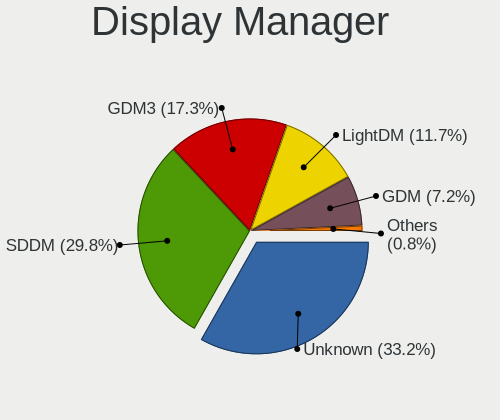
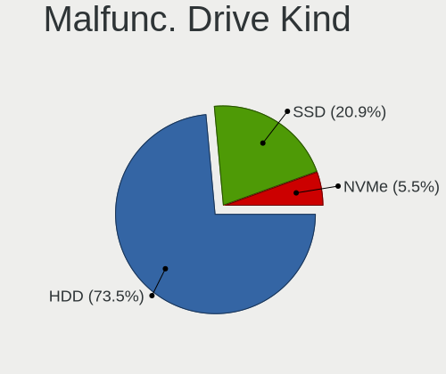
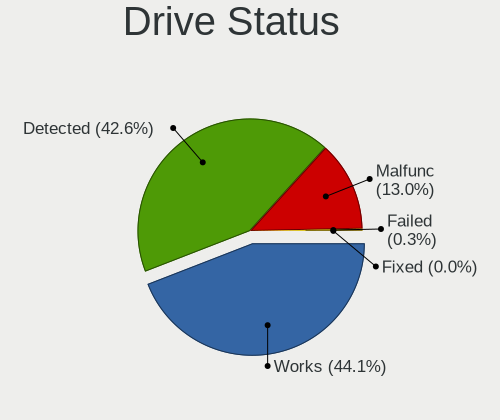

Linux Hardware Trends (Desktops)
--------------------------------

A project to identify most popular hardware characteristics and track their change
over time based on data collected by Linux users at https://Linux-Hardware.org.

Anyone can contribute to this report by the [hw-probe](https://github.com/linuxhw/hw-probe) tool:

    sudo -E hw-probe -all -upload

Full-feature report is available here: https://linux-hardware.org/?view=trends

Period: Nov, 2021.

Contents
--------

* [ System ](#system)
  - [ OS                       ](#os)
  - [ OS Family                ](#os-family)
  - [ Kernel                   ](#kernel)
  - [ Kernel Family            ](#kernel-family)
  - [ Kernel Major Ver.        ](#kernel-major-ver)
  - [ Arch                     ](#arch)
  - [ DE                       ](#de)
  - [ Display Server           ](#display-server)
  - [ Display Manager          ](#display-manager)
  - [ OS Lang                  ](#os-lang)
  - [ Boot Mode                ](#boot-mode)
  - [ Filesystem               ](#filesystem)
  - [ Part. scheme             ](#part-scheme)
  - [ Dual Boot with Linux/BSD ](#dual-boot-with-linuxbsd)
  - [ Dual Boot (Win)          ](#dual-boot-win)

* [ Board ](#board)
  - [ Vendor                   ](#vendor)
  - [ Model                    ](#model)
  - [ Model Family             ](#model-family)
  - [ MFG Year                 ](#mfg-year)
  - [ Form Factor              ](#form-factor)
  - [ Secure Boot              ](#secure-boot)
  - [ Coreboot                 ](#coreboot)
  - [ RAM Size                 ](#ram-size)
  - [ RAM Used                 ](#ram-used)
  - [ Total Drives             ](#total-drives)
  - [ Has CD-ROM               ](#has-cd-rom)
  - [ Has Ethernet             ](#has-ethernet)
  - [ Has WiFi                 ](#has-wifi)
  - [ Has Bluetooth            ](#has-bluetooth)

* [ Location ](#location)
  - [ Country                  ](#country)
  - [ City                     ](#city)

* [ Drives ](#drives)
  - [ Drive Vendor             ](#drive-vendor)
  - [ Drive Model              ](#drive-model)
  - [ HDD Vendor               ](#hdd-vendor)
  - [ SSD Vendor               ](#ssd-vendor)
  - [ Drive Kind               ](#drive-kind)
  - [ Drive Connector          ](#drive-connector)
  - [ Drive Size               ](#drive-size)
  - [ Space Total              ](#space-total)
  - [ Space Used               ](#space-used)
  - [ Malfunc. Drives          ](#malfunc-drives)
  - [ Malfunc. Drive Vendor    ](#malfunc-drive-vendor)
  - [ Malfunc. HDD Vendor      ](#malfunc-hdd-vendor)
  - [ Malfunc. Drive Kind      ](#malfunc-drive-kind)
  - [ Failed Drives            ](#failed-drives)
  - [ Failed Drive Vendor      ](#failed-drive-vendor)
  - [ Drive Status             ](#drive-status)

* [ Storage controller ](#storage-controller)
  - [ Storage Vendor           ](#storage-vendor)
  - [ Storage Model            ](#storage-model)
  - [ Storage Kind             ](#storage-kind)

* [ Processor ](#processor)
  - [ CPU Vendor               ](#cpu-vendor)
  - [ CPU Model                ](#cpu-model)
  - [ CPU Model Family         ](#cpu-model-family)
  - [ CPU Cores                ](#cpu-cores)
  - [ CPU Sockets              ](#cpu-sockets)
  - [ CPU Threads              ](#cpu-threads)
  - [ CPU Op-Modes             ](#cpu-op-modes)
  - [ CPU Microcode            ](#cpu-microcode)
  - [ CPU Microarch            ](#cpu-microarch)

* [ Graphics ](#graphics)
  - [ GPU Vendor               ](#gpu-vendor)
  - [ GPU Model                ](#gpu-model)
  - [ GPU Combo                ](#gpu-combo)
  - [ GPU Driver               ](#gpu-driver)
  - [ GPU Memory               ](#gpu-memory)

* [ Monitor ](#monitor)
  - [ Monitor Vendor           ](#monitor-vendor)
  - [ Monitor Model            ](#monitor-model)
  - [ Monitor Resolution       ](#monitor-resolution)
  - [ Monitor Diagonal         ](#monitor-diagonal)
  - [ Monitor Width            ](#monitor-width)
  - [ Aspect Ratio             ](#aspect-ratio)
  - [ Monitor Area             ](#monitor-area)
  - [ Pixel Density            ](#pixel-density)
  - [ Multiple Monitors        ](#multiple-monitors)

* [ Network ](#network)
  - [ Net Controller Vendor    ](#net-controller-vendor)
  - [ Net Controller Model     ](#net-controller-model)
  - [ Wireless Vendor          ](#wireless-vendor)
  - [ Wireless Model           ](#wireless-model)
  - [ Ethernet Vendor          ](#ethernet-vendor)
  - [ Ethernet Model           ](#ethernet-model)
  - [ Net Controller Kind      ](#net-controller-kind)
  - [ Used Controller          ](#used-controller)
  - [ NICs                     ](#nics)
  - [ IPv6                     ](#ipv6)

* [ Bluetooth ](#bluetooth)
  - [ Bluetooth Vendor         ](#bluetooth-vendor)
  - [ Bluetooth Model          ](#bluetooth-model)

* [ Sound ](#sound)
  - [ Sound Vendor             ](#sound-vendor)
  - [ Sound Model              ](#sound-model)

* [ Memory ](#memory)
  - [ Memory Vendor            ](#memory-vendor)
  - [ Memory Model             ](#memory-model)
  - [ Memory Kind              ](#memory-kind)
  - [ Memory Form Factor       ](#memory-form-factor)
  - [ Memory Size              ](#memory-size)
  - [ Memory Speed             ](#memory-speed)

* [ Printers & scanners ](#printers--scanners)
  - [ Printer Vendor           ](#printer-vendor)
  - [ Printer Model            ](#printer-model)
  - [ Scanner Vendor           ](#scanner-vendor)
  - [ Scanner Model            ](#scanner-model)

* [ Camera ](#camera)
  - [ Camera Vendor            ](#camera-vendor)
  - [ Camera Model             ](#camera-model)

* [ Security ](#security)
  - [ Fingerprint Vendor       ](#fingerprint-vendor)
  - [ Fingerprint Model        ](#fingerprint-model)
  - [ Chipcard Vendor          ](#chipcard-vendor)
  - [ Chipcard Model           ](#chipcard-model)

* [ Unsupported ](#unsupported)
  - [ Unsupported Devices      ](#unsupported-devices)
  - [ Unsupported Device Types ](#unsupported-device-types)

System
------

OS
--

Installed operating systems

| Name                | Desktops | Percent |
|---------------------|----------|---------|
| Ubuntu 20.04        | 370      | 17.78%  |
| Linux Mint 20.2     | 172      | 8.27%   |
| Pop!_OS 21.04       | 162      | 7.78%   |
| Ubuntu 21.10        | 128      | 6.15%   |
| Debian 11           | 127      | 6.1%    |
| OpenMandriva 4.2    | 106      | 5.09%   |
| Fedora 35           | 89       | 4.28%   |
| Zorin 16            | 77       | 3.7%    |
| ArcoLinux Rolling   | 46       | 2.21%   |
| KDE neon 20.04      | 40       | 1.92%   |
| Manjaro             | 38       | 1.83%   |
| ROSA R11.1          | 37       | 1.78%   |
| BlackPanther 18.1   | 37       | 1.78%   |
| Ubuntu 21.04        | 36       | 1.73%   |
| Arch Rolling        | 35       | 1.68%   |
| ROSA 12             | 31       | 1.49%   |
| Ubuntu 18.04        | 28       | 1.35%   |
| Arch                | 28       | 1.35%   |
| ROSA 12.1           | 27       | 1.3%    |
| Fedora 34           | 25       | 1.2%    |
| Xubuntu 20.04       | 23       | 1.11%   |
| Manjaro 21.1.6      | 22       | 1.06%   |
| Linux Mint 19.3     | 19       | 0.91%   |
| Elementary 6        | 19       | 0.91%   |
| Manjaro 21.2.0      | 16       | 0.77%   |
| Pop!_OS 20.04       | 14       | 0.67%   |
| OpenMandriva 4.50   | 14       | 0.67%   |
| Gentoo 2.7          | 14       | 0.67%   |
| Kubuntu 20.04       | 13       | 0.62%   |
| Ubuntu MATE 20.04   | 12       | 0.58%   |
| Linux Mint 20       | 12       | 0.58%   |
| Linux Mint 20.1     | 10       | 0.48%   |
| Xubuntu 18.04       | 9        | 0.43%   |
| Kubuntu 21.10       | 9        | 0.43%   |
| Zorin 15            | 8        | 0.38%   |
| Lubuntu 20.04       | 7        | 0.34%   |
| EndeavourOS Rolling | 7        | 0.34%   |
| Debian Testing      | 7        | 0.34%   |
| CentOS 8            | 7        | 0.34%   |
| openSUSE Leap-15.3  | 6        | 0.29%   |
| Gentoo 2.8          | 6        | 0.29%   |
| Fedora 33           | 6        | 0.29%   |
| Debian Unstable     | 6        | 0.29%   |
| openSUSE Leap-15.2  | 5        | 0.24%   |
| Kubuntu 18.04       | 5        | 0.24%   |
| Kali 2021.3         | 5        | 0.24%   |
| Debian 10           | 5        | 0.24%   |
| CentOS 7            | 5        | 0.24%   |
| Ubuntu 22.04        | 4        | 0.19%   |
| Ubuntu 20.10        | 4        | 0.19%   |
| Solus 4.3           | 4        | 0.19%   |
| LinuxFX 11          | 4        | 0.19%   |
| Linux Mint 19.2     | 4        | 0.19%   |
| Endless 3.9.5       | 4        | 0.19%   |
| Elementary 5.1.7    | 4        | 0.19%   |
| Xubuntu 21.10       | 3        | 0.14%   |
| Ubuntu MATE 21.10   | 3        | 0.14%   |
| Ubuntu Budgie 21.10 | 3        | 0.14%   |
| Ubuntu 16.04        | 3        | 0.14%   |
| Parrot 4.11         | 3        | 0.14%   |

OS Family
---------

OS without a version

| Name          | Desktops | Percent |
|---------------|----------|---------|
| Ubuntu        | 575      | 27.63%  |
| Linux Mint    | 220      | 10.57%  |
| Pop!_OS       | 179      | 8.6%    |
| Debian        | 145      | 6.97%   |
| OpenMandriva  | 120      | 5.77%   |
| Fedora        | 120      | 5.77%   |
| ROSA          | 96       | 4.61%   |
| Zorin         | 85       | 4.08%   |
| Manjaro       | 77       | 3.7%    |
| Arch          | 63       | 3.03%   |
| ArcoLinux     | 46       | 2.21%   |
| KDE neon      | 40       | 1.92%   |
| Xubuntu       | 38       | 1.83%   |
| BlackPanther  | 37       | 1.78%   |
| Kubuntu       | 31       | 1.49%   |
| openSUSE      | 30       | 1.44%   |
| Elementary    | 23       | 1.11%   |
| Gentoo        | 22       | 1.06%   |
| Ubuntu MATE   | 18       | 0.86%   |
| CentOS        | 13       | 0.62%   |
| Lubuntu       | 12       | 0.58%   |
| Clear Linux   | 9        | 0.43%   |
| EndeavourOS   | 8        | 0.38%   |
| Kali          | 7        | 0.34%   |
| Endless       | 7        | 0.34%   |
| Ubuntu Budgie | 4        | 0.19%   |
| Solus         | 4        | 0.19%   |
| LinuxFX       | 4        | 0.19%   |
| Garuda        | 4        | 0.19%   |
| Xero          | 3        | 0.14%   |
| Rocky Linux   | 3        | 0.14%   |
| Peppermint    | 3        | 0.14%   |
| Parrot        | 3        | 0.14%   |
| MX            | 3        | 0.14%   |
| Mageia        | 3        | 0.14%   |
| LMDE          | 3        | 0.14%   |
| Slackware     | 2        | 0.1%    |
| RHEL          | 2        | 0.1%    |
| Red OS        | 2        | 0.1%    |
| Artix         | 2        | 0.1%    |
| ALT Linux     | 2        | 0.1%    |
| XCP-ng        | 1        | 0.05%   |
| Void          | 1        | 0.05%   |
| Siduction     | 1        | 0.05%   |
| Q4OS          | 1        | 0.05%   |
| PureOS        | 1        | 0.05%   |
| PCLinuxOS     | 1        | 0.05%   |
| NixOS         | 1        | 0.05%   |
| Neon          | 1        | 0.05%   |
| Makulu        | 1        | 0.05%   |
| Kaisen        | 1        | 0.05%   |
| GNOME OS      | 1        | 0.05%   |
| Funtoo        | 1        | 0.05%   |
| BuildRoot     | 1        | 0.05%   |

Kernel
------

Version of the Linux kernel

| Version                             | Desktops | Percent |
|-------------------------------------|----------|---------|
| 5.11.0-40-generic                   | 287      | 13.79%  |
| 5.4.0-90-generic                    | 165      | 7.93%   |
| 5.11.0-38-generic                   | 156      | 7.5%    |
| 5.13.0-7620-generic                 | 155      | 7.45%   |
| 5.10.14-desktop-1omv4002            | 103      | 4.95%   |
| 5.13.0-21-generic                   | 95       | 4.57%   |
| 5.4.0-89-generic                    | 73       | 3.51%   |
| 5.10.0-9-amd64                      | 56       | 2.69%   |
| 5.10.0-7-amd64                      | 53       | 2.55%   |
| 5.13.0-20-generic                   | 37       | 1.78%   |
| 5.10.74-generic-2rosa2021.1-x86_64  | 30       | 1.44%   |
| 5.10.71-generic-1rosa2021.1-x86_64  | 28       | 1.35%   |
| 5.6.14-desktop-2bP                  | 25       | 1.2%    |
| 5.13.19-2-MANJARO                   | 24       | 1.15%   |
| 5.11.0-27-generic                   | 22       | 1.06%   |
| 5.14.18-300.fc35.x86_64             | 20       | 0.96%   |
| 5.15.4-arch1-1                      | 17       | 0.82%   |
| 5.14.16-arch1-1                     | 17       | 0.82%   |
| 5.14.16-301.fc35.x86_64             | 17       | 0.82%   |
| 5.13.0-19-generic                   | 17       | 0.82%   |
| 4.15.0-162-generic                  | 17       | 0.82%   |
| 5.4.0-74-generic                    | 16       | 0.77%   |
| 5.15.2-2-MANJARO                    | 16       | 0.77%   |
| 5.14.17-301.fc35.x86_64             | 15       | 0.72%   |
| 5.14.14-300.fc35.x86_64             | 13       | 0.62%   |
| 5.13.0-7614-generic                 | 13       | 0.62%   |
| 5.11.0-41-generic                   | 13       | 0.62%   |
| 5.4.83-generic-2rosa-x86_64         | 12       | 0.58%   |
| 5.4.0-91-generic                    | 12       | 0.58%   |
| 4.18.16-desktop-1bP                 | 12       | 0.58%   |
| 5.15.2-arch1-1                      | 11       | 0.53%   |
| 5.14.15-300.fc35.x86_64             | 11       | 0.53%   |
| 5.14.14-200.fc34.x86_64             | 9        | 0.43%   |
| 5.11.0-37-generic                   | 9        | 0.43%   |
| 5.10.79-1-MANJARO                   | 9        | 0.43%   |
| 5.15.2-zen1-1-zen                   | 8        | 0.38%   |
| 5.14.10-1-MANJARO                   | 8        | 0.38%   |
| 5.10.70-1-MANJARO                   | 8        | 0.38%   |
| 5.15.4-zen1-1-zen                   | 7        | 0.34%   |
| 5.15.3-arch1-1                      | 7        | 0.34%   |
| 5.14.16-201.fc34.x86_64             | 7        | 0.34%   |
| 5.14.14-1-default                   | 7        | 0.34%   |
| 5.13.0-22-generic                   | 7        | 0.34%   |
| 4.19.0-18-amd64                     | 7        | 0.34%   |
| 4.15.0-desktop-122.124.1rosa-x86_64 | 7        | 0.34%   |
| 5.4.0-90-lowlatency                 | 6        | 0.29%   |
| 5.4.0-88-generic                    | 6        | 0.29%   |
| 5.14.15-arch1-1                     | 6        | 0.29%   |
| 5.12.4-desktop-1omv4050             | 6        | 0.29%   |
| 4.18.0-348.2.1.el8_5.x86_64         | 6        | 0.29%   |
| 5.8.0-14-generic                    | 5        | 0.24%   |
| 5.4.32-generic-2rosa-i586           | 5        | 0.24%   |
| 5.14.7-desktop-1omv4050             | 5        | 0.24%   |
| 5.14.14-arch1-1                     | 5        | 0.24%   |
| 5.13.13-1070.native                 | 5        | 0.24%   |
| 4.4.0-210-generic                   | 5        | 0.24%   |
| 4.15.0-161-generic                  | 5        | 0.24%   |
| 5.8.0-63-generic                    | 4        | 0.19%   |
| 5.4.0-58-generic                    | 4        | 0.19%   |
| 5.3.18-lp152.95-default             | 4        | 0.19%   |

Kernel Family
-------------

Linux kernel without a distro release

| Version | Desktops | Percent |
|---------|----------|---------|
| 5.11.0  | 509      | 24.46%  |
| 5.13.0  | 326      | 15.67%  |
| 5.4.0   | 309      | 14.85%  |
| 5.10.0  | 121      | 5.81%   |
| 5.10.14 | 103      | 4.95%   |
| 5.14.16 | 52       | 2.5%    |
| 5.15.2  | 50       | 2.4%    |
| 5.14.14 | 47       | 2.26%   |
| 4.15.0  | 45       | 2.16%   |
| 5.15.4  | 33       | 1.59%   |
| 5.10.74 | 31       | 1.49%   |
| 5.14.18 | 29       | 1.39%   |
| 5.10.71 | 28       | 1.35%   |
| 5.13.19 | 27       | 1.3%    |
| 5.6.14  | 25       | 1.2%    |
| 5.14.0  | 24       | 1.15%   |
| 5.8.0   | 23       | 1.11%   |
| 5.14.15 | 23       | 1.11%   |
| 5.14.17 | 18       | 0.86%   |
| 5.15.0  | 17       | 0.82%   |
| 5.4.83  | 15       | 0.72%   |
| 5.15.3  | 15       | 0.72%   |
| 5.14.10 | 12       | 0.58%   |
| 4.18.16 | 12       | 0.58%   |
| 5.3.18  | 11       | 0.53%   |
| 5.10.79 | 11       | 0.53%   |
| 4.18.0  | 11       | 0.53%   |
| 5.15.1  | 10       | 0.48%   |
| 5.10.70 | 10       | 0.48%   |
| 4.19.0  | 10       | 0.48%   |
| 5.15.5  | 8        | 0.38%   |
| 5.10.76 | 7        | 0.34%   |
| 5.4.32  | 6        | 0.29%   |
| 5.13.13 | 6        | 0.29%   |
| 5.12.4  | 6        | 0.29%   |
| 3.10.0  | 6        | 0.29%   |
| 5.14.7  | 5        | 0.24%   |
| 4.4.0   | 5        | 0.24%   |
| 5.16.0  | 4        | 0.19%   |
| 5.11.22 | 4        | 0.19%   |
| 5.13.12 | 3        | 0.14%   |
| 5.11.12 | 3        | 0.14%   |
| 5.10.78 | 3        | 0.14%   |
| 4.9.155 | 3        | 0.14%   |
| 5.6.0   | 2        | 0.1%    |
| 5.5.19  | 2        | 0.1%    |
| 5.14.9  | 2        | 0.1%    |
| 5.14.20 | 2        | 0.1%    |
| 5.13.18 | 2        | 0.1%    |
| 5.11.15 | 2        | 0.1%    |
| 5.10.82 | 2        | 0.1%    |
| 5.10.81 | 2        | 0.1%    |
| 5.10.28 | 2        | 0.1%    |
| 5.0.0   | 2        | 0.1%    |
| 5.9.0   | 1        | 0.05%   |
| 5.7.19  | 1        | 0.05%   |
| 5.6.7   | 1        | 0.05%   |
| 5.6.4   | 1        | 0.05%   |
| 5.5.7   | 1        | 0.05%   |
| 5.4.72  | 1        | 0.05%   |

Kernel Major Ver.
-----------------

Linux kernel major version

| Version | Desktops | Percent |
|---------|----------|---------|
| 5.11    | 520      | 24.99%  |
| 5.13    | 365      | 17.54%  |
| 5.4     | 334      | 16.05%  |
| 5.10    | 328      | 15.76%  |
| 5.14    | 222      | 10.67%  |
| 5.15    | 133      | 6.39%   |
| 4.15    | 45       | 2.16%   |
| 5.6     | 29       | 1.39%   |
| 5.8     | 23       | 1.11%   |
| 4.18    | 23       | 1.11%   |
| 5.3     | 12       | 0.58%   |
| 4.19    | 11       | 0.53%   |
| 5.12    | 8        | 0.38%   |
| 3.10    | 6        | 0.29%   |
| 4.4     | 5        | 0.24%   |
| 5.16    | 4        | 0.19%   |
| 4.9     | 4        | 0.19%   |
| 5.5     | 3        | 0.14%   |
| 5.0     | 2        | 0.1%    |
| 5.9     | 1        | 0.05%   |
| 5.7     | 1        | 0.05%   |
| 2.6     | 1        | 0.05%   |
| Unknown | 1        | 0.05%   |

Arch
----

OS architecture (x86_64, i586, etc.)

| Name   | Desktops | Percent |
|--------|----------|---------|
| x86_64 | 2051     | 98.56%  |
| i686   | 30       | 1.44%   |

DE
--

Desktop Environment

| Name             | Desktops | Percent |
|------------------|----------|---------|
| GNOME            | 940      | 45.17%  |
| KDE5             | 434      | 20.86%  |
| X-Cinnamon       | 183      | 8.79%   |
| Unknown          | 168      | 8.07%   |
| XFCE             | 121      | 5.81%   |
| MATE             | 62       | 2.98%   |
| Cinnamon         | 31       | 1.49%   |
| KDE4             | 27       | 1.3%    |
| Pantheon         | 22       | 1.06%   |
| LXQt             | 21       | 1.01%   |
| LXDE             | 11       | 0.53%   |
| Budgie           | 9        | 0.43%   |
| i3               | 8        | 0.38%   |
| Unity            | 6        | 0.29%   |
| KDE              | 6        | 0.29%   |
| GNOME Classic    | 5        | 0.24%   |
| lightdm-xsession | 4        | 0.19%   |
| awesome          | 4        | 0.19%   |
| xmonad           | 3        | 0.14%   |
| GNOME Flashback  | 3        | 0.14%   |
| sway             | 2        | 0.1%    |
| qtile            | 2        | 0.1%    |
| LeftWM           | 2        | 0.1%    |
| dusk             | 2        | 0.1%    |
| bspwm            | 2        | 0.1%    |
| trinity          | 1        | 0.05%   |
| DWM              | 1        | 0.05%   |
| 03WindowMaker    | 1        | 0.05%   |

Display Server
--------------

X11 or Wayland

| Name    | Desktops | Percent |
|---------|----------|---------|
| X11     | 1649     | 79.24%  |
| Wayland | 269      | 12.93%  |
| Unknown | 98       | 4.71%   |
| Tty     | 65       | 3.12%   |

Display Manager
---------------

SDDM, LightDM, etc.

| Name    | Desktops | Percent |
|---------|----------|---------|
| Unknown | 734      | 35.27%  |
| GDM3    | 422      | 20.28%  |
| SDDM    | 338      | 16.24%  |
| GDM     | 276      | 13.26%  |
| LightDM | 274      | 13.17%  |
| KDM     | 27       | 1.3%    |
| XDM     | 5        | 0.24%   |
| SLiM    | 3        | 0.14%   |
| TDM     | 1        | 0.05%   |
| LXDM    | 1        | 0.05%   |

OS Lang
-------

Language

| Lang    | Desktops | Percent |
|---------|----------|---------|
| en_US   | 757      | 36.38%  |
| de_DE   | 213      | 10.24%  |
| ru_RU   | 212      | 10.19%  |
| en_GB   | 113      | 5.43%   |
| fr_FR   | 99       | 4.76%   |
| pt_BR   | 86       | 4.13%   |
| en_CA   | 67       | 3.22%   |
| Unknown | 58       | 2.79%   |
| it_IT   | 46       | 2.21%   |
| en_AU   | 40       | 1.92%   |
| pl_PL   | 36       | 1.73%   |
| es_ES   | 36       | 1.73%   |
| nl_NL   | 22       | 1.06%   |
| C       | 22       | 1.06%   |
| en_IN   | 20       | 0.96%   |
| en_ZA   | 14       | 0.67%   |
| hu_HU   | 13       | 0.62%   |
| de_CH   | 13       | 0.62%   |
| fr_CA   | 12       | 0.58%   |
| es_AR   | 12       | 0.58%   |
| zh_CN   | 10       | 0.48%   |
| fi_FI   | 10       | 0.48%   |
| ru_UA   | 9        | 0.43%   |
| ja_JP   | 9        | 0.43%   |
| de_AT   | 9        | 0.43%   |
| es_MX   | 8        | 0.38%   |
| en_IL   | 8        | 0.38%   |
| el_GR   | 8        | 0.38%   |
| cs_CZ   | 7        | 0.34%   |
| pt_PT   | 6        | 0.29%   |
| POSIX   | 5        | 0.24%   |
| nl_BE   | 5        | 0.24%   |
| nb_NO   | 5        | 0.24%   |
| fr_BE   | 5        | 0.24%   |
| uk_UA   | 4        | 0.19%   |
| tr_TR   | 4        | 0.19%   |
| sv_SE   | 4        | 0.19%   |
| sk_SK   | 4        | 0.19%   |
| hr_HR   | 4        | 0.19%   |
| fr_CH   | 4        | 0.19%   |
| es_PE   | 4        | 0.19%   |
| zh_TW   | 3        | 0.14%   |
| sl_SI   | 3        | 0.14%   |
| es_US   | 3        | 0.14%   |
| es_CL   | 3        | 0.14%   |
| ca_ES   | 3        | 0.14%   |
| bg_BG   | 3        | 0.14%   |
| ar_SA   | 3        | 0.14%   |
| th_TH   | 2        | 0.1%    |
| sr_RS   | 2        | 0.1%    |
| he_IL   | 2        | 0.1%    |
| es_CR   | 2        | 0.1%    |
| es_CO   | 2        | 0.1%    |
| en_SG   | 2        | 0.1%    |
| en_PH   | 2        | 0.1%    |
| en_NZ   | 2        | 0.1%    |
| en_DK   | 2        | 0.1%    |
| da_DK   | 2        | 0.1%    |
| ro_RO   | 1        | 0.05%   |
| it_CH   | 1        | 0.05%   |

Boot Mode
---------

EFI or BIOS

| Mode | Desktops | Percent |
|------|----------|---------|
| BIOS | 1304     | 62.66%  |
| EFI  | 777      | 37.34%  |

Filesystem
----------

Type of filesystem

| Type    | Desktops | Percent |
|---------|----------|---------|
| Ext4    | 1603     | 77.03%  |
| Overlay | 231      | 11.1%   |
| Btrfs   | 180      | 8.65%   |
| Xfs     | 31       | 1.49%   |
| Zfs     | 18       | 0.86%   |
| F2fs    | 6        | 0.29%   |
| Ext2    | 5        | 0.24%   |
| Ext3    | 4        | 0.19%   |
| Rootfs  | 2        | 0.1%    |
| Unknown | 1        | 0.05%   |

Part. scheme
------------

Scheme of partitioning

| Type    | Desktops | Percent |
|---------|----------|---------|
| Unknown | 1154     | 55.45%  |
| GPT     | 604      | 29.02%  |
| MBR     | 323      | 15.52%  |

Dual Boot with Linux/BSD
------------------------

Hosting more than one Linux/BSD

| Dual boot | Desktops | Percent |
|-----------|----------|---------|
| No        | 1688     | 81.11%  |
| Yes       | 393      | 18.89%  |

Dual Boot (Win)
---------------

Hosting Linux and Windows

| Dual boot | Desktops | Percent |
|-----------|----------|---------|
| No        | 1379     | 66.27%  |
| Yes       | 702      | 33.73%  |

Board
-----

Vendor
------

Motherboard manufacturer

| Name                           | Desktops | Percent |
|--------------------------------|----------|---------|
| ASUSTek Computer               | 571      | 27.44%  |
| Gigabyte Technology            | 356      | 17.11%  |
| MSI                            | 254      | 12.21%  |
| ASRock                         | 216      | 10.38%  |
| Dell                           | 177      | 8.51%   |
| Hewlett-Packard                | 142      | 6.82%   |
| Lenovo                         | 62       | 2.98%   |
| Intel                          | 34       | 1.63%   |
| Acer                           | 31       | 1.49%   |
| Fujitsu                        | 22       | 1.06%   |
| Pegatron                       | 20       | 0.96%   |
| Medion                         | 19       | 0.91%   |
| ECS                            | 19       | 0.91%   |
| Biostar                        | 15       | 0.72%   |
| Unknown                        | 15       | 0.72%   |
| Foxconn                        | 14       | 0.67%   |
| Apple                          | 10       | 0.48%   |
| Huanan                         | 9        | 0.43%   |
| Shuttle                        | 8        | 0.38%   |
| Supermicro                     | 6        | 0.29%   |
| Positivo                       | 5        | 0.24%   |
| OEM                            | 5        | 0.24%   |
| Gateway                        | 4        | 0.19%   |
| Fujitsu Siemens                | 4        | 0.19%   |
| EVGA                           | 4        | 0.19%   |
| Alienware                      | 4        | 0.19%   |
| MouseComputer                  | 3        | 0.14%   |
| Minix                          | 3        | 0.14%   |
| System76                       | 2        | 0.1%    |
| Semp Toshiba                   | 2        | 0.1%    |
| Packard Bell                   | 2        | 0.1%    |
| LattePanda                     | 2        | 0.1%    |
| IBM                            | 2        | 0.1%    |
| HPE                            | 2        | 0.1%    |
| Google                         | 2        | 0.1%    |
| Aquarius                       | 2        | 0.1%    |
| ABIT                           | 2        | 0.1%    |
| ZOTAC                          | 1        | 0.05%   |
| SZMZ                           | 1        | 0.05%   |
| SUPoX COMPUTER                 | 1        | 0.05%   |
| SixForOne                      | 1        | 0.05%   |
| SIMPC                          | 1        | 0.05%   |
| Shanghai Zhaoxin Semiconductor | 1        | 0.05%   |
| Seeed Studio                   | 1        | 0.05%   |
| Seco                           | 1        | 0.05%   |
| Protectli                      | 1        | 0.05%   |
| PCWare                         | 1        | 0.05%   |
| NEC Computers                  | 1        | 0.05%   |
| NCR                            | 1        | 0.05%   |
| Megaware                       | 1        | 0.05%   |
| MEGA                           | 1        | 0.05%   |
| JGINYUE                        | 1        | 0.05%   |
| Itautec                        | 1        | 0.05%   |
| INTELBRAS                      | 1        | 0.05%   |
| HOUTER                         | 1        | 0.05%   |
| HC                             | 1        | 0.05%   |
| FIRICH                         | 1        | 0.05%   |
| Emaxx Technology.              | 1        | 0.05%   |
| Datto                          | 1        | 0.05%   |
| Daten Tecnologia               | 1        | 0.05%   |

Model
-----

Motherboard model

| Name                         | Desktops | Percent |
|------------------------------|----------|---------|
| ASUS All Series              | 61       | 2.93%   |
| ASRock H470M-HVS             | 20       | 0.96%   |
| Dell OptiPlex 7010           | 19       | 0.91%   |
| Unknown                      | 18       | 0.86%   |
| Dell OptiPlex 9020           | 15       | 0.72%   |
| ASUS TUF GAMING X570-PLUS    | 14       | 0.67%   |
| MSI MS-7C02                  | 13       | 0.62%   |
| Gigabyte B450M DS3H          | 13       | 0.62%   |
| MSI MS-7C37                  | 9        | 0.43%   |
| Gigabyte 970A-DS3P           | 9        | 0.43%   |
| ASUS TUF GAMING B550-PLUS    | 9        | 0.43%   |
| ASUS ROG STRIX B550-F GAMING | 9        | 0.43%   |
| ASRock B450M Pro4            | 9        | 0.43%   |
| MSI MS-7C52                  | 8        | 0.38%   |
| MSI MS-7B79                  | 8        | 0.38%   |
| Dell OptiPlex 780            | 8        | 0.38%   |
| ASUS ROG STRIX X570-E GAMING | 8        | 0.38%   |
| ASUS ROG STRIX B450-F GAMING | 8        | 0.38%   |
| ASUS P8H61-M LX3 R2.0        | 8        | 0.38%   |
| MSI MS-7B89                  | 7        | 0.34%   |
| MSI MS-7817                  | 7        | 0.34%   |
| MSI MS-7693                  | 7        | 0.34%   |
| Intel H61                    | 7        | 0.34%   |
| Dell OptiPlex 390            | 7        | 0.34%   |
| Dell OptiPlex 3020           | 7        | 0.34%   |
| MSI MS-7A38                  | 6        | 0.29%   |
| HP EliteDesk 800 G1 SFF      | 6        | 0.29%   |
| Gigabyte B550M DS3H          | 6        | 0.29%   |
| Dell OptiPlex 790            | 6        | 0.29%   |
| ASUS M5A78L-M/USB3           | 6        | 0.29%   |
| ASRock A320M-HDV R4.0        | 6        | 0.29%   |
| MSI MS-7C94                  | 5        | 0.24%   |
| MSI MS-7C35                  | 5        | 0.24%   |
| MSI MS-7A34                  | 5        | 0.24%   |
| MSI MS-7641                  | 5        | 0.24%   |
| HP EliteDesk 800 G1 TWR      | 5        | 0.24%   |
| HP Compaq Pro 6300 SFF       | 5        | 0.24%   |
| Gigabyte X570 AORUS MASTER   | 5        | 0.24%   |
| Dell OptiPlex 9010           | 5        | 0.24%   |
| ASUS SABERTOOTH 990FX R2.0   | 5        | 0.24%   |
| ASUS PRIME Z390-A            | 5        | 0.24%   |
| ASUS PRIME X570-P            | 5        | 0.24%   |
| ASUS PRIME A320M-K           | 5        | 0.24%   |
| ASUS P8Z77-V LX              | 5        | 0.24%   |
| ASUS P8Z77-V                 | 5        | 0.24%   |
| ASUS M5A97 R2.0              | 5        | 0.24%   |
| ASUS M5A97 LE R2.0           | 5        | 0.24%   |
| ASUS M5A78L-M PLUS/USB3      | 5        | 0.24%   |
| ASUS M2N                     | 5        | 0.24%   |
| ASUS CROSSHAIR VI HERO       | 5        | 0.24%   |
| ASRock B450M Steel Legend    | 5        | 0.24%   |
| MSI MS-7D25                  | 4        | 0.19%   |
| MSI MS-7C91                  | 4        | 0.19%   |
| MSI MS-7B98                  | 4        | 0.19%   |
| MSI MS-7B85                  | 4        | 0.19%   |
| MSI MS-7821                  | 4        | 0.19%   |
| MSI MS-7758                  | 4        | 0.19%   |
| MSI MS-7721                  | 4        | 0.19%   |
| HP Z800 Workstation          | 4        | 0.19%   |
| HP Z400 Workstation          | 4        | 0.19%   |

Model Family
------------

Motherboard model prefix

| Name                   | Desktops | Percent |
|------------------------|----------|---------|
| Dell OptiPlex          | 108      | 5.19%   |
| ASUS PRIME             | 91       | 4.37%   |
| ASUS ROG               | 72       | 3.46%   |
| ASUS All               | 61       | 2.93%   |
| HP Compaq              | 52       | 2.5%    |
| ASUS TUF               | 44       | 2.11%   |
| Lenovo ThinkCentre     | 30       | 1.44%   |
| HP EliteDesk           | 28       | 1.35%   |
| Dell Precision         | 25       | 1.2%    |
| Gigabyte B450M         | 24       | 1.15%   |
| ASUS M5A78L-M          | 22       | 1.06%   |
| Acer Aspire            | 22       | 1.06%   |
| ASUS P8Z77-V           | 21       | 1.01%   |
| ASRock H470M-HVS       | 20       | 0.96%   |
| ASRock B450M           | 18       | 0.86%   |
| Unknown                | 18       | 0.86%   |
| Gigabyte X570          | 16       | 0.77%   |
| Dell Inspiron          | 16       | 0.77%   |
| ASUS M5A97             | 16       | 0.77%   |
| ASUS P8H61-M           | 15       | 0.72%   |
| ASRock X570            | 15       | 0.72%   |
| Fujitsu ESPRIMO        | 14       | 0.67%   |
| MSI MS-7C02            | 13       | 0.62%   |
| Gigabyte B550M         | 12       | 0.58%   |
| Lenovo IdeaCentre      | 11       | 0.53%   |
| HP Pavilion            | 10       | 0.48%   |
| Gigabyte B550          | 10       | 0.48%   |
| Gigabyte B450          | 10       | 0.48%   |
| MSI MS-7C37            | 9        | 0.43%   |
| Gigabyte 970A-DS3P     | 9        | 0.43%   |
| ASUS SABERTOOTH        | 9        | 0.43%   |
| MSI MS-7C52            | 8        | 0.38%   |
| MSI MS-7B79            | 8        | 0.38%   |
| Lenovo ThinkStation    | 8        | 0.38%   |
| HP ProDesk             | 8        | 0.38%   |
| Dell XPS               | 8        | 0.38%   |
| ASRock B450            | 8        | 0.38%   |
| MSI MS-7B89            | 7        | 0.34%   |
| MSI MS-7817            | 7        | 0.34%   |
| MSI MS-7693            | 7        | 0.34%   |
| Intel H61              | 7        | 0.34%   |
| Gigabyte Z390          | 7        | 0.34%   |
| Gigabyte B560M         | 7        | 0.34%   |
| ASRock A320M-HDV       | 7        | 0.34%   |
| MSI MS-7A38            | 6        | 0.29%   |
| HP ProLiant            | 6        | 0.29%   |
| Gigabyte GA-78LMT-USB3 | 6        | 0.29%   |
| Dell Vostro            | 6        | 0.29%   |
| MSI MS-7C94            | 5        | 0.24%   |
| MSI MS-7C35            | 5        | 0.24%   |
| MSI MS-7A34            | 5        | 0.24%   |
| MSI MS-7641            | 5        | 0.24%   |
| Gigabyte Z270X-Gaming  | 5        | 0.24%   |
| Gigabyte X470          | 5        | 0.24%   |
| Gigabyte B365M         | 5        | 0.24%   |
| ASUS Rampage           | 5        | 0.24%   |
| ASUS P8P67             | 5        | 0.24%   |
| ASUS P8H67-M           | 5        | 0.24%   |
| ASUS Maximus           | 5        | 0.24%   |
| ASUS M2N               | 5        | 0.24%   |

MFG Year
--------

Motherboard manufacture year

| Year | Desktops | Percent |
|------|----------|---------|
| 2021 | 350      | 16.82%  |
| 2020 | 229      | 11%     |
| 2019 | 181      | 8.7%    |
| 2018 | 164      | 7.88%   |
| 2013 | 160      | 7.69%   |
| 2012 | 137      | 6.58%   |
| 2014 | 132      | 6.34%   |
| 2015 | 127      | 6.1%    |
| 2010 | 120      | 5.77%   |
| 2011 | 116      | 5.57%   |
| 2016 | 89       | 4.28%   |
| 2009 | 88       | 4.23%   |
| 2017 | 60       | 2.88%   |
| 2008 | 54       | 2.59%   |
| 2007 | 43       | 2.07%   |
| 2006 | 18       | 0.86%   |
| 2005 | 10       | 0.48%   |
| 2004 | 2        | 0.1%    |
| 2002 | 1        | 0.05%   |

Form Factor
-----------

Physical design of the computer

| Name    | Desktops | Percent |
|---------|----------|---------|
| Desktop | 2081     | 100%    |

Secure Boot
-----------

Enabled or disabled

| State    | Desktops | Percent |
|----------|----------|---------|
| Disabled | 2022     | 97.16%  |
| Enabled  | 59       | 2.84%   |

Coreboot
--------

Have coreboot on board

| Used | Desktops | Percent |
|------|----------|---------|
| No   | 2078     | 99.86%  |
| Yes  | 3        | 0.14%   |

RAM Size
--------

Total RAM memory

| Size in GB      | Desktops | Percent |
|-----------------|----------|---------|
| 16.01-24.0      | 524      | 25.18%  |
| 8.01-16.0       | 390      | 18.74%  |
| 32.01-64.0      | 333      | 16%     |
| 3.01-4.0        | 309      | 14.85%  |
| 4.01-8.0        | 295      | 14.18%  |
| 64.01-256.0     | 100      | 4.81%   |
| 1.01-2.0        | 55       | 2.64%   |
| 24.01-32.0      | 48       | 2.31%   |
| 2.01-3.0        | 22       | 1.06%   |
| 0.51-1.0        | 3        | 0.14%   |
| More than 256.0 | 1        | 0.05%   |
| Unknown         | 1        | 0.05%   |

RAM Used
--------

Used RAM memory

| Used GB     | Desktops | Percent |
|-------------|----------|---------|
| 1.01-2.0    | 754      | 36.23%  |
| 2.01-3.0    | 462      | 22.2%   |
| 4.01-8.0    | 290      | 13.94%  |
| 3.01-4.0    | 209      | 10.04%  |
| 0.51-1.0    | 198      | 9.51%   |
| 8.01-16.0   | 90       | 4.32%   |
| 0.01-0.5    | 47       | 2.26%   |
| 16.01-24.0  | 19       | 0.91%   |
| 32.01-64.0  | 5        | 0.24%   |
| 24.01-32.0  | 3        | 0.14%   |
| 64.01-256.0 | 2        | 0.1%    |
| Unknown     | 2        | 0.1%    |

Total Drives
------------

Number of drives on board

| Drives  | Desktops | Percent |
|---------|----------|---------|
| 1       | 801      | 38.49%  |
| 2       | 582      | 27.97%  |
| 3       | 335      | 16.1%   |
| 4       | 166      | 7.98%   |
| 5       | 88       | 4.23%   |
| 6       | 46       | 2.21%   |
| 7       | 22       | 1.06%   |
| 0       | 11       | 0.53%   |
| 8       | 9        | 0.43%   |
| 9       | 6        | 0.29%   |
| 11      | 5        | 0.24%   |
| 10      | 3        | 0.14%   |
| 12      | 2        | 0.1%    |
| 71      | 1        | 0.05%   |
| 22      | 1        | 0.05%   |
| 15      | 1        | 0.05%   |
| 13      | 1        | 0.05%   |
| Unknown | 1        | 0.05%   |

Has CD-ROM
----------

Has CD-ROM on board

| Presented | Desktops | Percent |
|-----------|----------|---------|
| No        | 1084     | 52.09%  |
| Yes       | 997      | 47.91%  |

Has Ethernet
------------

Has Ethernet on board

| Presented | Desktops | Percent |
|-----------|----------|---------|
| Yes       | 2063     | 99.14%  |
| No        | 18       | 0.86%   |

Has WiFi
--------

Has WiFi module

| Presented | Desktops | Percent |
|-----------|----------|---------|
| No        | 1218     | 58.53%  |
| Yes       | 863      | 41.47%  |

Has Bluetooth
-------------

Has Bluetooth module

| Presented | Desktops | Percent |
|-----------|----------|---------|
| No        | 1444     | 69.39%  |
| Yes       | 637      | 30.61%  |

Location
--------

Country
-------

Geographic location (country)

| Country      | Desktops | Percent |
|--------------|----------|---------|
| USA          | 404      | 19.41%  |
| Germany      | 258      | 12.4%   |
| Russia       | 225      | 10.81%  |
| France       | 118      | 5.67%   |
| Brazil       | 107      | 5.14%   |
| Canada       | 96       | 4.61%   |
| UK           | 78       | 3.75%   |
| Italy        | 55       | 2.64%   |
| Hungary      | 53       | 2.55%   |
| Poland       | 50       | 2.4%    |
| Spain        | 45       | 2.16%   |
| Australia    | 43       | 2.07%   |
| Netherlands  | 38       | 1.83%   |
| Ukraine      | 35       | 1.68%   |
| India        | 28       | 1.35%   |
| Switzerland  | 26       | 1.25%   |
| Finland      | 24       | 1.15%   |
| Argentina    | 21       | 1.01%   |
| Greece       | 20       | 0.96%   |
| Belgium      | 20       | 0.96%   |
| Austria      | 18       | 0.86%   |
| South Africa | 17       | 0.82%   |
| Mexico       | 16       | 0.77%   |
| Czechia      | 16       | 0.77%   |
| Norway       | 15       | 0.72%   |
| China        | 15       | 0.72%   |
| Japan        | 13       | 0.62%   |
| Israel       | 11       | 0.53%   |
| Sweden       | 10       | 0.48%   |
| Slovakia     | 10       | 0.48%   |
| Portugal     | 9        | 0.43%   |
| Turkey       | 8        | 0.38%   |
| Romania      | 8        | 0.38%   |
| Denmark      | 7        | 0.34%   |
| Slovenia     | 6        | 0.29%   |
| Peru         | 6        | 0.29%   |
| Pakistan     | 6        | 0.29%   |
| Indonesia    | 6        | 0.29%   |
| Hong Kong    | 6        | 0.29%   |
| Colombia     | 6        | 0.29%   |
| Chile        | 6        | 0.29%   |
| Bulgaria     | 6        | 0.29%   |
| Belarus      | 6        | 0.29%   |
| Philippines  | 5        | 0.24%   |
| New Zealand  | 5        | 0.24%   |
| Iran         | 5        | 0.24%   |
| Bangladesh   | 5        | 0.24%   |
| Thailand     | 4        | 0.19%   |
| Taiwan       | 4        | 0.19%   |
| Singapore    | 4        | 0.19%   |
| Serbia       | 4        | 0.19%   |
| Puerto Rico  | 4        | 0.19%   |
| Morocco      | 4        | 0.19%   |
| Malaysia     | 4        | 0.19%   |
| Cyprus       | 4        | 0.19%   |
| Croatia      | 4        | 0.19%   |
| Vietnam      | 3        | 0.14%   |
| Saudi Arabia | 3        | 0.14%   |
| Luxembourg   | 3        | 0.14%   |
| Lithuania    | 3        | 0.14%   |

City
----

Geographic location (city)

| City              | Desktops | Percent |
|-------------------|----------|---------|
| Voronezh          | 54       | 2.59%   |
| Moscow            | 44       | 2.11%   |
| Berlin            | 27       | 1.3%    |
| St Petersburg     | 17       | 0.82%   |
| Athens            | 16       | 0.77%   |
| Sydney            | 15       | 0.72%   |
| S??o Paulo        | 15       | 0.72%   |
| Warsaw            | 14       | 0.67%   |
| Paris             | 11       | 0.53%   |
| Montreal          | 11       | 0.53%   |
| Kyiv              | 11       | 0.53%   |
| Amsterdam         | 11       | 0.53%   |
| Zurich            | 10       | 0.48%   |
| Madrid            | 10       | 0.48%   |
| Helsinki          | 10       | 0.48%   |
| Vienna            | 9        | 0.43%   |
| Samara            | 9        | 0.43%   |
| New York          | 9        | 0.43%   |
| London            | 9        | 0.43%   |
| Cleveland         | 9        | 0.43%   |
| Rio de Janeiro    | 8        | 0.38%   |
| Melbourne         | 8        | 0.38%   |
| Hamburg           | 8        | 0.38%   |
| Budapest          | 8        | 0.38%   |
| Novosibirsk       | 7        | 0.34%   |
| Munich            | 7        | 0.34%   |
| Vancouver         | 6        | 0.29%   |
| Stuttgart         | 6        | 0.29%   |
| Oslo              | 6        | 0.29%   |
| Milan             | 6        | 0.29%   |
| Lima              | 6        | 0.29%   |
| Kazan?ˆ™          | 6        | 0.29%   |
| Frankfurt am Main | 6        | 0.29%   |
| Curitiba          | 6        | 0.29%   |
| Bras?­lia         | 6        | 0.29%   |
| Yekaterinburg     | 5        | 0.24%   |
| Springfield       | 5        | 0.24%   |
| Perth             | 5        | 0.24%   |
| Manchester        | 5        | 0.24%   |
| Los Angeles       | 5        | 0.24%   |
| Las Vegas         | 5        | 0.24%   |
| Lahore            | 5        | 0.24%   |
| Houston           | 5        | 0.24%   |
| Haifa             | 5        | 0.24%   |
| Essen             | 5        | 0.24%   |
| Cologne           | 5        | 0.24%   |
| Chelyabinsk       | 5        | 0.24%   |
| Barcelona         | 5        | 0.24%   |
| Ufa               | 4        | 0.19%   |
| Tel Aviv          | 4        | 0.19%   |
| Singapore         | 4        | 0.19%   |
| San Francisco     | 4        | 0.19%   |
| Rome              | 4        | 0.19%   |
| Portland          | 4        | 0.19%   |
| Phoenix           | 4        | 0.19%   |
| Perm              | 4        | 0.19%   |
| Minsk             | 4        | 0.19%   |
| Miami             | 4        | 0.19%   |
| Medell?­n         | 4        | 0.19%   |
| Marseille         | 4        | 0.19%   |

Drives
------

Drive Vendor
------------

Hard drive vendors

| Vendor                      | Desktops | Drives | Percent |
|-----------------------------|----------|--------|---------|
| WDC                         | 765      | 1057   | 20.22%  |
| Seagate                     | 733      | 1081   | 19.38%  |
| Samsung Electronics         | 574      | 792    | 15.17%  |
| Kingston                    | 216      | 234    | 5.71%   |
| Toshiba                     | 209      | 235    | 5.52%   |
| SanDisk                     | 152      | 173    | 4.02%   |
| Crucial                     | 149      | 175    | 3.94%   |
| Hitachi                     | 115      | 133    | 3.04%   |
| A-DATA Technology           | 73       | 79     | 1.93%   |
| Intel                       | 68       | 77     | 1.8%    |
| HGST                        | 40       | 106    | 1.06%   |
| Unknown                     | 36       | 51     | 0.95%   |
| Phison                      | 34       | 39     | 0.9%    |
| PNY                         | 31       | 37     | 0.82%   |
| China                       | 31       | 32     | 0.82%   |
| SPCC                        | 28       | 28     | 0.74%   |
| Intenso                     | 28       | 33     | 0.74%   |
| Silicon Motion              | 26       | 27     | 0.69%   |
| Corsair                     | 26       | 28     | 0.69%   |
| Netac                       | 25       | 25     | 0.66%   |
| Micron/Crucial Technology   | 23       | 24     | 0.61%   |
| MAXTOR                      | 23       | 24     | 0.61%   |
| Patriot                     | 18       | 20     | 0.48%   |
| XPG                         | 16       | 18     | 0.42%   |
| SK Hynix                    | 16       | 19     | 0.42%   |
| Hewlett-Packard             | 16       | 20     | 0.42%   |
| GOODRAM                     | 16       | 17     | 0.42%   |
| OCZ                         | 15       | 15     | 0.4%    |
| Micron Technology           | 12       | 15     | 0.32%   |
| Team                        | 11       | 13     | 0.29%   |
| Lexar                       | 11       | 11     | 0.29%   |
| Transcend                   | 10       | 10     | 0.26%   |
| KingSpec                    | 10       | 10     | 0.26%   |
| Unknown                     | 10       | 11     | 0.26%   |
| JMicron                     | 9        | 9      | 0.24%   |
| Realtek Semiconductor       | 8        | 9      | 0.21%   |
| PLEXTOR                     | 8        | 8      | 0.21%   |
| Gigabyte Technology         | 8        | 9      | 0.21%   |
| ASMT                        | 8        | 12     | 0.21%   |
| Apacer                      | 8        | 8      | 0.21%   |
| Fujitsu                     | 6        | 6      | 0.16%   |
| SABRENT                     | 5        | 5      | 0.13%   |
| Mushkin                     | 5        | 5      | 0.13%   |
| LITEONIT                    | 5        | 5      | 0.13%   |
| LITEON                      | 5        | 6      | 0.13%   |
| LaCie                       | 4        | 4      | 0.11%   |
| KIOXIA                      | 4        | 4      | 0.11%   |
| Verbatim                    | 3        | 3      | 0.08%   |
| T-FORCE                     | 3        | 3      | 0.08%   |
| Phison Electronics          | 3        | 3      | 0.08%   |
| Leven                       | 3        | 3      | 0.08%   |
| LDLC                        | 3        | 4      | 0.08%   |
| KIOXIA-EXCERIA              | 3        | 3      | 0.08%   |
| HS-SSD-C100                 | 3        | 3      | 0.08%   |
| Hoodisk                     | 3        | 3      | 0.08%   |
| External                    | 3        | 3      | 0.08%   |
| Apple                       | 3        | 3      | 0.08%   |
| Yangtze Memory Technologies | 2        | 2      | 0.05%   |
| TO Exter                    | 2        | 2      | 0.05%   |
| sobetter                    | 2        | 2      | 0.05%   |

Drive Model
-----------

Hard drive models

| Model                                  | Desktops | Percent |
|----------------------------------------|----------|---------|
| Kingston SA400S37240G 240GB SSD        | 56       | 1.26%   |
| Seagate ST2000DM008-2FR102 2TB         | 52       | 1.17%   |
| Seagate ST1000DM010-2EP102 1TB         | 50       | 1.12%   |
| Seagate ST500DM002-1BD142 500GB        | 48       | 1.08%   |
| Samsung NVMe SSD Drive 500GB           | 48       | 1.08%   |
| Samsung SSD 860 EVO 500GB              | 35       | 0.79%   |
| Toshiba HDWD110 1TB                    | 32       | 0.72%   |
| Seagate ST1000DM003-1ER162 1TB         | 31       | 0.7%    |
| Samsung SSD 850 EVO 250GB              | 30       | 0.67%   |
| Kingston SV300S37A120G 120GB SSD       | 30       | 0.67%   |
| Kingston SA400S37120G 120GB SSD        | 30       | 0.67%   |
| Crucial CT500MX500SSD1 500GB           | 30       | 0.67%   |
| WDC WD10EZEX-08WN4A0 1TB               | 29       | 0.65%   |
| Samsung SSD 860 EVO 1TB                | 29       | 0.65%   |
| Samsung SSD 850 EVO 500GB              | 29       | 0.65%   |
| Toshiba DT01ACA100 1TB                 | 28       | 0.63%   |
| Seagate ST3500418AS 500GB              | 27       | 0.61%   |
| Seagate ST1000DM003-1CH162 1TB         | 26       | 0.58%   |
| Samsung SSD 860 EVO 250GB              | 25       | 0.56%   |
| Toshiba DT01ACA050 500GB               | 24       | 0.54%   |
| Samsung NVMe SSD Drive 1TB             | 23       | 0.52%   |
| Seagate ST4000DM004-2CV104 4TB         | 22       | 0.49%   |
| Seagate ST31000528AS 1TB               | 21       | 0.47%   |
| Seagate ST2000DM006-2DM164 2TB         | 21       | 0.47%   |
| Kingston SA400S37480G 480GB SSD        | 21       | 0.47%   |
| Crucial CT240BX500SSD1 240GB           | 21       | 0.47%   |
| WDC WDS500G2B0A-00SM50 500GB SSD       | 20       | 0.45%   |
| Netac SSD 240GB                        | 20       | 0.45%   |
| Toshiba DT01ACA200 2TB                 | 19       | 0.43%   |
| Seagate ST2000DM001-1ER164 2TB         | 19       | 0.43%   |
| Sandisk NVMe SSD Drive 500GB           | 18       | 0.4%    |
| Samsung SM963 2.5" NVMe PCIe SSD 250GB | 18       | 0.4%    |
| Seagate ST2000DM001-1CH164 2TB         | 17       | 0.38%   |
| Seagate Expansion 1TB                  | 17       | 0.38%   |
| Sandisk NVMe SSD Drive 1TB             | 16       | 0.36%   |
| Samsung SSD 970 EVO Plus 1TB           | 16       | 0.36%   |
| Samsung SSD 870 QVO 1TB                | 16       | 0.36%   |
| WDC WD10EZEX-00BN5A0 1TB               | 15       | 0.34%   |
| Seagate ST3500413AS 500GB              | 15       | 0.34%   |
| Samsung SSD 970 EVO Plus 500GB         | 15       | 0.34%   |
| Crucial CT480BX500SSD1 480GB           | 15       | 0.34%   |
| WDC WD10EARS-00Y5B1 1TB                | 14       | 0.31%   |
| Seagate ST250DM000-1BD141 250GB        | 14       | 0.31%   |
| Seagate ST31000524AS 1TB               | 13       | 0.29%   |
| WDC WDS100T2B0A-00SM50 1TB SSD         | 12       | 0.27%   |
| WDC WD5000AAKX-60U6AA0 500GB           | 12       | 0.27%   |
| WDC WD5000AAKX-001CA0 500GB            | 12       | 0.27%   |
| WDC WD40EZRZ-00GXCB0 4TB               | 12       | 0.27%   |
| Unknown SD/MMC/MS PRO 394GB            | 12       | 0.27%   |
| Toshiba DT01ACA300 3TB                 | 12       | 0.27%   |
| Seagate ST1000DM003-1SB102 1TB         | 12       | 0.27%   |
| Seagate Expansion Desk 8TB             | 12       | 0.27%   |
| Samsung SSD 850 EVO 1TB                | 12       | 0.27%   |
| Samsung SSD 840 EVO 250GB              | 12       | 0.27%   |
| Samsung SSD 840 EVO 120GB              | 12       | 0.27%   |
| Micron/Crucial NVMe SSD Drive 1TB      | 12       | 0.27%   |
| WDC WD1002FAEX-00Z3A0 1TB              | 11       | 0.25%   |
| Samsung SSD 860 QVO 1TB                | 11       | 0.25%   |
| PNY CS900 120GB SSD                    | 11       | 0.25%   |
| Crucial CT1000MX500SSD1 1TB            | 11       | 0.25%   |

HDD Vendor
----------

Hard disk drive vendors

| Vendor              | Desktops | Drives | Percent |
|---------------------|----------|--------|---------|
| Seagate             | 720      | 1053   | 36.98%  |
| WDC                 | 680      | 910    | 34.93%  |
| Toshiba             | 191      | 210    | 9.81%   |
| Samsung Electronics | 120      | 137    | 6.16%   |
| Hitachi             | 115      | 133    | 5.91%   |
| HGST                | 40       | 59     | 2.05%   |
| MAXTOR              | 21       | 22     | 1.08%   |
| Unknown             | 14       | 19     | 0.72%   |
| Hewlett-Packard     | 7        | 10     | 0.36%   |
| Fujitsu             | 6        | 6      | 0.31%   |
| ASMT                | 6        | 10     | 0.31%   |
| Intenso             | 5        | 6      | 0.26%   |
| LaCie               | 3        | 3      | 0.15%   |
| External            | 3        | 3      | 0.15%   |
| TO Exter            | 2        | 2      | 0.1%    |
| ExcelStor           | 2        | 2      | 0.1%    |
| Apple               | 2        | 2      | 0.1%    |
| USB 3.0             | 1        | 2      | 0.05%   |
| USB                 | 1        | 1      | 0.05%   |
| StoreJet            | 1        | 1      | 0.05%   |
| MARVELL             | 1        | 1      | 0.05%   |
| LIO-ORG             | 1        | 1      | 0.05%   |
| Lenovo              | 1        | 2      | 0.05%   |
| KESU                | 1        | 1      | 0.05%   |
| HGST HTS            | 1        | 1      | 0.05%   |
| ASMedia             | 1        | 1      | 0.05%   |
| Unknown             | 1        | 1      | 0.05%   |

SSD Vendor
----------

Solid state drive vendors

| Vendor              | Desktops | Drives | Percent |
|---------------------|----------|--------|---------|
| Samsung Electronics | 315      | 391    | 23.53%  |
| Kingston            | 186      | 203    | 13.89%  |
| Crucial             | 128      | 149    | 9.56%   |
| SanDisk             | 108      | 127    | 8.07%   |
| WDC                 | 100      | 112    | 7.47%   |
| A-DATA Technology   | 58       | 63     | 4.33%   |
| Intel               | 47       | 50     | 3.51%   |
| China               | 31       | 32     | 2.32%   |
| PNY                 | 29       | 34     | 2.17%   |
| Netac               | 23       | 23     | 1.72%   |
| SPCC                | 22       | 22     | 1.64%   |
| Intenso             | 19       | 21     | 1.42%   |
| Corsair             | 17       | 19     | 1.27%   |
| Patriot             | 16       | 18     | 1.19%   |
| GOODRAM             | 16       | 17     | 1.19%   |
| OCZ                 | 15       | 15     | 1.12%   |
| Toshiba             | 14       | 14     | 1.05%   |
| Lexar               | 11       | 11     | 0.82%   |
| Transcend           | 9        | 9      | 0.67%   |
| Team                | 9        | 9      | 0.67%   |
| SK Hynix            | 9        | 9      | 0.67%   |
| KingSpec            | 9        | 9      | 0.67%   |
| Micron Technology   | 8        | 9      | 0.6%    |
| Apacer              | 8        | 8      | 0.6%    |
| Seagate             | 7        | 7      | 0.52%   |
| PLEXTOR             | 7        | 7      | 0.52%   |
| Hewlett-Packard     | 7        | 7      | 0.52%   |
| Gigabyte Technology | 6        | 6      | 0.45%   |
| Unknown             | 5        | 5      | 0.37%   |
| Mushkin             | 5        | 5      | 0.37%   |
| LITEONIT            | 5        | 5      | 0.37%   |
| JMicron             | 4        | 4      | 0.3%    |
| Unknown             | 4        | 4      | 0.3%    |
| Verbatim            | 3        | 3      | 0.22%   |
| LITEON              | 3        | 4      | 0.22%   |
| Leven               | 3        | 3      | 0.22%   |
| Hoodisk             | 3        | 3      | 0.22%   |
| Smartbuy            | 2        | 2      | 0.15%   |
| Pioneer             | 2        | 2      | 0.15%   |
| Palit               | 2        | 2      | 0.15%   |
| OWC                 | 2        | 2      | 0.15%   |
| MAXTOR              | 2        | 2      | 0.15%   |
| LDLC                | 2        | 2      | 0.15%   |
| KIOXIA-EXCERIA      | 2        | 2      | 0.15%   |
| Kingmax             | 2        | 2      | 0.15%   |
| KingDian            | 2        | 2      | 0.15%   |
| Hajaan              | 2        | 2      | 0.15%   |
| GALAX               | 2        | 2      | 0.15%   |
| EMTEC               | 2        | 2      | 0.15%   |
| AMD                 | 2        | 2      | 0.15%   |
| ADATA SU            | 2        | 2      | 0.15%   |
| 2-Power             | 2        | 2      | 0.15%   |
| Zheino              | 1        | 1      | 0.07%   |
| XUM                 | 1        | 1      | 0.07%   |
| XPG                 | 1        | 2      | 0.07%   |
| TWINMOS             | 1        | 1      | 0.07%   |
| Teclast             | 1        | 1      | 0.07%   |
| TCSUNBOW            | 1        | 1      | 0.07%   |
| T-FORCE             | 1        | 1      | 0.07%   |
| SuperSSpeed         | 1        | 1      | 0.07%   |

Drive Kind
----------

HDD or SSD

| Kind    | Desktops | Drives | Percent |
|---------|----------|--------|---------|
| HDD     | 1505     | 2599   | 47.1%   |
| SSD     | 1114     | 1510   | 34.87%  |
| NVMe    | 496      | 649    | 15.52%  |
| Unknown | 72       | 137    | 2.25%   |
| MMC     | 8        | 8      | 0.25%   |

Drive Connector
---------------

SATA, SAS, NVMe, etc.

| Type | Desktops | Drives | Percent |
|------|----------|--------|---------|
| SATA | 1934     | 3895   | 74.53%  |
| NVMe | 495      | 643    | 19.08%  |
| SAS  | 158      | 357    | 6.09%   |
| MMC  | 8        | 8      | 0.31%   |

Drive Size
----------

Size of hard drive

| Size in TB | Desktops | Drives | Percent |
|------------|----------|--------|---------|
| 0.01-0.5   | 1460     | 2110   | 50.98%  |
| 0.51-1.0   | 779      | 1027   | 27.2%   |
| 1.01-2.0   | 334      | 419    | 11.66%  |
| 3.01-4.0   | 135      | 257    | 4.71%   |
| 2.01-3.0   | 77       | 122    | 2.69%   |
| 4.01-10.0  | 64       | 143    | 2.23%   |
| 10.01-20.0 | 15       | 31     | 0.52%   |

Space Total
-----------

Amount of disk space available on the file system

| Size in GB     | Desktops | Percent |
|----------------|----------|---------|
| 101-250        | 443      | 21.29%  |
| 251-500        | 322      | 15.47%  |
| 501-1000       | 311      | 14.94%  |
| 1001-2000      | 240      | 11.53%  |
| More than 3000 | 230      | 11.05%  |
| Unknown        | 155      | 7.45%   |
| 2001-3000      | 118      | 5.67%   |
| 1-20           | 105      | 5.05%   |
| 51-100         | 100      | 4.81%   |
| 21-50          | 57       | 2.74%   |

Space Used
----------

Amount of used disk space

| Used GB        | Desktops | Percent |
|----------------|----------|---------|
| 1-20           | 604      | 29.02%  |
| 21-50          | 296      | 14.22%  |
| 101-250        | 236      | 11.34%  |
| 51-100         | 220      | 10.57%  |
| 501-1000       | 158      | 7.59%   |
| Unknown        | 155      | 7.45%   |
| 251-500        | 147      | 7.06%   |
| 1001-2000      | 127      | 6.1%    |
| More than 3000 | 86       | 4.13%   |
| 2001-3000      | 51       | 2.45%   |
| 0              | 1        | 0.05%   |

Malfunc. Drives
---------------

Drive models with a malfunction

| Model                               | Desktops | Drives | Percent |
|-------------------------------------|----------|--------|---------|
| Seagate ST500DM002-1BD142 500GB     | 15       | 15     | 5.08%   |
| Seagate ST3500418AS 500GB           | 5        | 5      | 1.69%   |
| Kingston SV300S37A120G 120GB SSD    | 5        | 5      | 1.69%   |
| WDC WD5000AAKX-001CA0 500GB         | 4        | 4      | 1.36%   |
| Seagate ST31500341AS 1TB            | 4        | 6      | 1.36%   |
| Seagate ST31000528AS 1TB            | 4        | 4      | 1.36%   |
| Seagate ST1000DM003-9YN162 1TB      | 4        | 4      | 1.36%   |
| WDC WD5000AAKX-60U6AA0 500GB        | 3        | 3      | 1.02%   |
| WDC WD5000AAKX-00ERMA0 500GB        | 3        | 3      | 1.02%   |
| Seagate ST3320620AS 320GB           | 3        | 5      | 1.02%   |
| Seagate ST3250310AS 250GB           | 3        | 3      | 1.02%   |
| Seagate ST250DM000-1BD141 250GB     | 3        | 3      | 1.02%   |
| Seagate ST2000DM001-9YN164 2TB      | 3        | 3      | 1.02%   |
| MAXTOR STM3250310AS 250GB           | 3        | 3      | 1.02%   |
| WDC WD5000AAKX-08U6AA0 500GB        | 2        | 2      | 0.68%   |
| WDC WD40EFRX-68N32N0 4TB            | 2        | 5      | 0.68%   |
| WDC WD30EZRX-00DC0B0 3TB            | 2        | 3      | 0.68%   |
| WDC WD2500HHTZ-04N21V0 250GB        | 2        | 2      | 0.68%   |
| WDC WD20EZRZ-00Z5HB0 2TB            | 2        | 2      | 0.68%   |
| WDC WD10EARX-00N0YB0 1TB            | 2        | 2      | 0.68%   |
| WDC WD10EARS-00Y5B1 1TB             | 2        | 2      | 0.68%   |
| WDC WD10EADS-00M2B0 1TB             | 2        | 2      | 0.68%   |
| WDC WD10EADS-00L5B1 1TB             | 2        | 2      | 0.68%   |
| WDC WD1003FZEX-00MK2A0 1TB          | 2        | 2      | 0.68%   |
| WDC WD1002FAEX-00Z3A0 1TB           | 2        | 2      | 0.68%   |
| Toshiba MQ01ABD100 1TB              | 2        | 2      | 0.68%   |
| Toshiba MK3261GSYN 320GB            | 2        | 2      | 0.68%   |
| Toshiba DT01ACA100 1TB              | 2        | 2      | 0.68%   |
| Seagate ST9250315AS 250GB           | 2        | 2      | 0.68%   |
| Seagate ST500LM012 HN-M500MBB 500GB | 2        | 2      | 0.68%   |
| Seagate ST500DM002-1BC142 500GB     | 2        | 2      | 0.68%   |
| Seagate ST31000524AS 1TB            | 2        | 2      | 0.68%   |
| Seagate ST2000VM003-1ET164 2TB      | 2        | 2      | 0.68%   |
| Seagate ST2000DM008-2FR102 2TB      | 2        | 2      | 0.68%   |
| Seagate ST2000DM001-1CH164 2TB      | 2        | 2      | 0.68%   |
| Seagate ST1000DM003-1ER162 1TB      | 2        | 2      | 0.68%   |
| Seagate ST1000DM003-1CH162 1TB      | 2        | 2      | 0.68%   |
| Samsung Electronics SP2504C 250GB   | 2        | 2      | 0.68%   |
| Samsung Electronics HD501LJ 500GB   | 2        | 3      | 0.68%   |
| Hitachi HDP725025GLA380 250GB       | 2        | 2      | 0.68%   |
| HGST HTS725050A7E630 500GB          | 2        | 2      | 0.68%   |
| WDC WDS500G2B0B-00YS70 500GB SSD    | 1        | 1      | 0.34%   |
| WDC WDS120G2G0B-00EPW0 120GB SSD    | 1        | 1      | 0.34%   |
| WDC WD800AAJS-75M0A0 80GB           | 1        | 1      | 0.34%   |
| WDC WD6400AADS-00M2B0 640GB         | 1        | 1      | 0.34%   |
| WDC WD5003ABYX-18WERA0 500GB        | 1        | 2      | 0.34%   |
| WDC WD5002ABYS-01B1B0 500GB         | 1        | 1      | 0.34%   |
| WDC WD5001AALS-00L3B2 500GB         | 1        | 1      | 0.34%   |
| WDC WD5000LPVX-80V0TT0 500GB        | 1        | 1      | 0.34%   |
| WDC WD5000AAKX-603CA0 500GB         | 1        | 1      | 0.34%   |
| WDC WD5000AAKX-221CA1 500GB         | 1        | 1      | 0.34%   |
| WDC WD5000AAKX-083CA1 500GB         | 1        | 1      | 0.34%   |
| WDC WD5000AAKS-75A7B0 500GB         | 1        | 1      | 0.34%   |
| WDC WD5000AAKS-65YGA0 500GB         | 1        | 1      | 0.34%   |
| WDC WD5000AAKS-08V0A0 500GB         | 1        | 1      | 0.34%   |
| WDC WD5000AAKS-00UU3A0 500GB        | 1        | 1      | 0.34%   |
| WDC WD5000AACS-00ZUB0 500GB         | 1        | 1      | 0.34%   |
| WDC WD40EFRX-68WT0N0 4TB            | 1        | 1      | 0.34%   |
| WDC WD40EFAX-68JH4N1 4TB            | 1        | 2      | 0.34%   |
| WDC WD3200BEVT-75ZCT1 320GB         | 1        | 1      | 0.34%   |

Malfunc. Drive Vendor
---------------------

Vendors of faulty drives

| Vendor              | Desktops | Drives | Percent |
|---------------------|----------|--------|---------|
| Seagate             | 99       | 115    | 35.36%  |
| WDC                 | 80       | 91     | 28.57%  |
| Samsung Electronics | 23       | 24     | 8.21%   |
| Toshiba             | 12       | 13     | 4.29%   |
| Hitachi             | 11       | 13     | 3.93%   |
| Kingston            | 9        | 9      | 3.21%   |
| MAXTOR              | 8        | 8      | 2.86%   |
| SanDisk             | 7        | 8      | 2.5%    |
| Intel               | 5        | 5      | 1.79%   |
| HGST                | 5        | 5      | 1.79%   |
| Hewlett-Packard     | 3        | 3      | 1.07%   |
| PLEXTOR             | 2        | 2      | 0.71%   |
| Crucial             | 2        | 2      | 0.71%   |
| Corsair             | 2        | 2      | 0.71%   |
| A-DATA Technology   | 2        | 2      | 0.71%   |
| SK Hynix            | 1        | 1      | 0.36%   |
| ORICO               | 1        | 1      | 0.36%   |
| OCZ                 | 1        | 1      | 0.36%   |
| Micron Technology   | 1        | 1      | 0.36%   |
| Kingmax             | 1        | 1      | 0.36%   |
| Intenso             | 1        | 1      | 0.36%   |
| Fujitsu             | 1        | 1      | 0.36%   |
| ExcelStor           | 1        | 1      | 0.36%   |
| ASMT                | 1        | 1      | 0.36%   |
| Unknown             | 1        | 1      | 0.36%   |

Malfunc. HDD Vendor
-------------------

Vendors of faulty HDD drives

| Vendor              | Desktops | Drives | Percent |
|---------------------|----------|--------|---------|
| Seagate             | 99       | 115    | 41.77%  |
| WDC                 | 79       | 89     | 33.33%  |
| Samsung Electronics | 17       | 18     | 7.17%   |
| Toshiba             | 12       | 13     | 5.06%   |
| Hitachi             | 11       | 13     | 4.64%   |
| MAXTOR              | 8        | 8      | 3.38%   |
| HGST                | 5        | 5      | 2.11%   |
| Hewlett-Packard     | 2        | 2      | 0.84%   |
| Fujitsu             | 1        | 1      | 0.42%   |
| ExcelStor           | 1        | 1      | 0.42%   |
| ASMT                | 1        | 1      | 0.42%   |
| Unknown             | 1        | 1      | 0.42%   |

Malfunc. Drive Kind
-------------------

Kinds of faulty drives

| Kind | Desktops | Drives | Percent |
|------|----------|--------|---------|
| HDD  | 218      | 267    | 83.21%  |
| SSD  | 38       | 39     | 14.5%   |
| NVMe | 6        | 6      | 2.29%   |

Failed Drives
-------------

Failed drive models

| Model                             | Desktops | Drives | Percent |
|-----------------------------------|----------|--------|---------|
| WDC WD4000FYYZ-01UL1B2 4TB        | 1        | 1      | 25%     |
| Toshiba DT01ACA200 2TB            | 1        | 1      | 25%     |
| Seagate ST31000524AS 1TB          | 1        | 1      | 25%     |
| Samsung Electronics HD252HJ 250GB | 1        | 1      | 25%     |

Failed Drive Vendor
-------------------

Failed drive vendors

| Vendor              | Desktops | Drives | Percent |
|---------------------|----------|--------|---------|
| WDC                 | 1        | 1      | 25%     |
| Toshiba             | 1        | 1      | 25%     |
| Seagate             | 1        | 1      | 25%     |
| Samsung Electronics | 1        | 1      | 25%     |

Drive Status
------------

Number of failed and malfunc. drives

| Status   | Desktops | Drives | Percent |
|----------|----------|--------|---------|
| Detected | 1214     | 2812   | 52.74%  |
| Works    | 832      | 1775   | 36.14%  |
| Malfunc  | 252      | 312    | 10.95%  |
| Failed   | 4        | 4      | 0.17%   |

Storage controller
------------------

Storage Vendor
--------------

Storage controller vendors

| Vendor                           | Desktops | Percent |
|----------------------------------|----------|---------|
| Intel                            | 1325     | 45.63%  |
| AMD                              | 688      | 23.69%  |
| Samsung Electronics              | 216      | 7.44%   |
| ASMedia Technology               | 106      | 3.65%   |
| Sandisk                          | 75       | 2.58%   |
| JMicron Technology               | 66       | 2.27%   |
| Nvidia                           | 59       | 2.03%   |
| Marvell Technology Group         | 59       | 2.03%   |
| Phison Electronics               | 54       | 1.86%   |
| Micron/Crucial Technology        | 46       | 1.58%   |
| Silicon Motion                   | 33       | 1.14%   |
| Kingston Technology Company      | 31       | 1.07%   |
| LSI Logic / Symbios Logic        | 20       | 0.69%   |
| ADATA Technology                 | 20       | 0.69%   |
| Realtek Semiconductor            | 19       | 0.65%   |
| VIA Technologies                 | 14       | 0.48%   |
| Broadcom / LSI                   | 11       | 0.38%   |
| Toshiba America Info Systems     | 9        | 0.31%   |
| Silicon Image                    | 8        | 0.28%   |
| SK Hynix                         | 7        | 0.24%   |
| KIOXIA                           | 5        | 0.17%   |
| Adaptec                          | 5        | 0.17%   |
| Seagate Technology               | 4        | 0.14%   |
| Micron Technology                | 4        | 0.14%   |
| Lite-On Technology               | 4        | 0.14%   |
| Yangtze Memory Technologies      | 2        | 0.07%   |
| MAXIO Technology (Hangzhou)      | 2        | 0.07%   |
| Integrated Technology Express    | 2        | 0.07%   |
| HighPoint Technologies           | 2        | 0.07%   |
| Zhaoxin                          | 1        | 0.03%   |
| Unknown                          | 1        | 0.03%   |
| Solid State Storage Technology   | 1        | 0.03%   |
| Silicon Integrated Systems [SiS] | 1        | 0.03%   |
| Shenzhen Longsys Electronics     | 1        | 0.03%   |
| Lite-On IT Corp. / Plextor       | 1        | 0.03%   |
| Hewlett-Packard                  | 1        | 0.03%   |
| Biwin Storage Technology         | 1        | 0.03%   |

Storage Model
-------------

Storage controller models

| Model                                                                                   | Desktops | Percent |
|-----------------------------------------------------------------------------------------|----------|---------|
| AMD FCH SATA Controller [AHCI mode]                                                     | 377      | 10.29%  |
| Intel 8 Series/C220 Series Chipset Family 6-port SATA Controller 1 [AHCI mode]          | 169      | 4.61%   |
| AMD 400 Series Chipset SATA Controller                                                  | 155      | 4.23%   |
| Samsung NVMe SSD Controller SM981/PM981/PM983                                           | 140      | 3.82%   |
| AMD SB7x0/SB8x0/SB9x0 IDE Controller                                                    | 110      | 3%      |
| Intel NM10/ICH7 Family SATA Controller [IDE mode]                                       | 108      | 2.95%   |
| Intel 6 Series/C200 Series Chipset Family 6 port Desktop SATA AHCI Controller           | 101      | 2.76%   |
| ASMedia ASM1062 Serial ATA Controller                                                   | 99       | 2.7%    |
| Intel 7 Series/C210 Series Chipset Family 6-port SATA Controller [AHCI mode]            | 98       | 2.68%   |
| AMD SB7x0/SB8x0/SB9x0 SATA Controller [AHCI mode]                                       | 94       | 2.57%   |
| Intel Q170/Q150/B150/H170/H110/Z170/CM236 Chipset SATA Controller [AHCI Mode]           | 91       | 2.48%   |
| Intel 200 Series PCH SATA controller [AHCI mode]                                        | 88       | 2.4%    |
| AMD Starship/Matisse Chipset SATA Controller [AHCI mode]                                | 81       | 2.21%   |
| Intel SATA Controller [RAID mode]                                                       | 77       | 2.1%    |
| Intel 82801G (ICH7 Family) IDE Controller                                               | 77       | 2.1%    |
| AMD SB7x0/SB8x0/SB9x0 SATA Controller [IDE mode]                                        | 71       | 1.94%   |
| Intel Cannon Lake PCH SATA AHCI Controller                                              | 64       | 1.75%   |
| Intel 6 Series/C200 Series Chipset Family Desktop SATA Controller (IDE mode, ports 4-5) | 62       | 1.69%   |
| Intel 6 Series/C200 Series Chipset Family Desktop SATA Controller (IDE mode, ports 0-3) | 62       | 1.69%   |
| Intel 500 Series Chipset Family SATA AHCI Controller                                    | 52       | 1.42%   |
| Intel Comet Lake SATA AHCI Controller                                                   | 43       | 1.17%   |
| Samsung NVMe SSD Controller PM9A1/PM9A3/980PRO                                          | 38       | 1.04%   |
| Intel 9 Series Chipset Family SATA Controller [AHCI Mode]                               | 38       | 1.04%   |
| Nvidia MCP61 SATA Controller                                                            | 32       | 0.87%   |
| Samsung NVMe SSD Controller SM961/PM961/SM963                                           | 31       | 0.85%   |
| AMD FCH SATA Controller D                                                               | 31       | 0.85%   |
| Sandisk WD Blue SN550 NVMe SSD                                                          | 29       | 0.79%   |
| JMicron JMB363 SATA/IDE Controller                                                      | 28       | 0.76%   |
| AMD 300 Series Chipset SATA Controller                                                  | 28       | 0.76%   |
| Phison E12 NVMe Controller                                                              | 26       | 0.71%   |
| Intel 82801JI (ICH10 Family) SATA AHCI Controller                                       | 25       | 0.68%   |
| Silicon Motion SM2263EN/SM2263XT SSD Controller                                         | 24       | 0.66%   |
| Nvidia MCP61 IDE                                                                        | 24       | 0.66%   |
| Intel 5 Series/3400 Series Chipset 6 port SATA AHCI Controller                          | 24       | 0.66%   |
| Intel 82801JI (ICH10 Family) 2 port SATA IDE Controller #2                              | 23       | 0.63%   |
| AMD FCH IDE Controller                                                                  | 23       | 0.63%   |
| Samsung NVMe SSD Controller 980                                                         | 22       | 0.6%    |
| Intel 82801JI (ICH10 Family) 4 port SATA IDE Controller #1                              | 22       | 0.6%    |
| JMicron JMB368 IDE controller                                                           | 21       | 0.57%   |
| Intel 400 Series Chipset Family SATA AHCI Controller                                    | 21       | 0.57%   |
| Intel 4 Series Chipset PT IDER Controller                                               | 21       | 0.57%   |
| Micron/Crucial P2 NVMe PCIe SSD                                                         | 20       | 0.55%   |
| Kingston Company A2000 NVMe SSD                                                         | 20       | 0.55%   |
| Phison E16 PCIe4 NVMe Controller                                                        | 19       | 0.52%   |
| ADATA XPG SX8200 Pro PCIe Gen3x4 M.2 2280 Solid State Drive                             | 19       | 0.52%   |
| Intel C600/X79 series chipset 6-Port SATA AHCI Controller                               | 18       | 0.49%   |
| Intel 5 Series/3400 Series Chipset 4 port SATA IDE Controller                           | 18       | 0.49%   |
| Sandisk WD Black SN750 / PC SN730 NVMe SSD                                              | 17       | 0.46%   |
| Intel 5 Series/3400 Series Chipset 2 port SATA IDE Controller                           | 17       | 0.46%   |
| AMD X370 Series Chipset SATA Controller                                                 | 17       | 0.46%   |
| Intel SSD 660P Series                                                                   | 15       | 0.41%   |
| Intel C610/X99 series chipset 6-Port SATA Controller [AHCI mode]                        | 14       | 0.38%   |
| Intel 7 Series/C210 Series Chipset Family 4-port SATA Controller [IDE mode]             | 14       | 0.38%   |
| Intel 7 Series/C210 Series Chipset Family 2-port SATA Controller [IDE mode]             | 14       | 0.38%   |
| Intel 631xESB/632xESB IDE Controller                                                    | 14       | 0.38%   |
| Sandisk WD PC SN810 / Black SN850 NVMe SSD                                              | 13       | 0.35%   |
| Realtek Realtek Non-Volatile memory controller                                          | 13       | 0.35%   |
| JMicron JMB362 SATA Controller                                                          | 13       | 0.35%   |
| Intel 82801JD/DO (ICH10 Family) SATA AHCI Controller                                    | 13       | 0.35%   |
| Intel 82801I (ICH9 Family) 2 port SATA Controller [IDE mode]                            | 13       | 0.35%   |

Storage Kind
------------

Kind of storage controller (IDE, SATA, NVMe, SAS, ...)

| Kind | Desktops | Percent |
|------|----------|---------|
| SATA | 1654     | 57.47%  |
| IDE  | 553      | 19.21%  |
| NVMe | 496      | 17.23%  |
| RAID | 136      | 4.73%   |
| SAS  | 26       | 0.9%    |
| SCSI | 13       | 0.45%   |

Processor
---------

CPU Vendor
----------

Processor vendors

| Vendor       | Desktops | Percent |
|--------------|----------|---------|
| Intel        | 1337     | 64.25%  |
| AMD          | 743      | 35.7%   |
| CentaurHauls | 1        | 0.05%   |

CPU Model
---------

Processor models

| Model                                       | Desktops | Percent |
|---------------------------------------------|----------|---------|
| AMD Ryzen 5 3600 6-Core Processor           | 56       | 2.69%   |
| AMD Ryzen 7 3700X 8-Core Processor          | 38       | 1.83%   |
| AMD Ryzen 5 5600X 6-Core Processor          | 29       | 1.39%   |
| Intel Core i5-3470 CPU @ 3.20GHz            | 26       | 1.25%   |
| Intel Core i7-3770 CPU @ 3.40GHz            | 25       | 1.2%    |
| Intel Core i7-10700 CPU @ 2.90GHz           | 25       | 1.2%    |
| Intel Core i3-2120 CPU @ 3.30GHz            | 24       | 1.15%   |
| Intel Core 2 Duo CPU E8400 @ 3.00GHz        | 23       | 1.11%   |
| Intel Core i7-4790 CPU @ 3.60GHz            | 22       | 1.06%   |
| Intel Core i5-6500 CPU @ 3.20GHz            | 22       | 1.06%   |
| Intel Core i5-2400 CPU @ 3.10GHz            | 22       | 1.06%   |
| AMD Ryzen 9 5900X 12-Core Processor         | 22       | 1.06%   |
| AMD Ryzen 7 2700X Eight-Core Processor      | 22       | 1.06%   |
| Intel Core i7-4770 CPU @ 3.40GHz            | 21       | 1.01%   |
| Intel Core i7-2600 CPU @ 3.40GHz            | 19       | 0.91%   |
| Intel Core i3-3220 CPU @ 3.30GHz            | 18       | 0.86%   |
| AMD Ryzen 9 5950X 16-Core Processor         | 17       | 0.82%   |
| AMD FX-8350 Eight-Core Processor            | 17       | 0.82%   |
| AMD FX-6300 Six-Core Processor              | 17       | 0.82%   |
| Intel Core i7-4770K CPU @ 3.50GHz           | 16       | 0.77%   |
| Intel Core i5-4460 CPU @ 3.20GHz            | 15       | 0.72%   |
| AMD Ryzen 9 3900X 12-Core Processor         | 15       | 0.72%   |
| AMD Ryzen 5 2600 Six-Core Processor         | 15       | 0.72%   |
| Intel Core i5-9400F CPU @ 2.90GHz           | 14       | 0.67%   |
| Intel Core i5-8400 CPU @ 2.80GHz            | 14       | 0.67%   |
| Intel Core i5-4570 CPU @ 3.20GHz            | 14       | 0.67%   |
| Intel Core i5 CPU 650 @ 3.20GHz             | 14       | 0.67%   |
| AMD Ryzen 7 5800X 8-Core Processor          | 14       | 0.67%   |
| Intel Core i7-8700 CPU @ 3.20GHz            | 13       | 0.62%   |
| Intel Core i7-3770K CPU @ 3.50GHz           | 13       | 0.62%   |
| AMD Ryzen 5 3600X 6-Core Processor          | 13       | 0.62%   |
| AMD Ryzen 5 3400G with Radeon Vega Graphics | 13       | 0.62%   |
| AMD Ryzen 3 2200G with Radeon Vega Graphics | 13       | 0.62%   |
| Intel Core i5-7400 CPU @ 3.00GHz            | 12       | 0.58%   |
| Intel Core i5-3570 CPU @ 3.40GHz            | 12       | 0.58%   |
| Intel Core i5-2500 CPU @ 3.30GHz            | 12       | 0.58%   |
| Intel Core i3-4130 CPU @ 3.40GHz            | 12       | 0.58%   |
| Intel Core 2 Quad CPU Q6600 @ 2.40GHz       | 12       | 0.58%   |
| AMD Ryzen 7 2700 Eight-Core Processor       | 12       | 0.58%   |
| AMD Ryzen 5 5600G with Radeon Graphics      | 12       | 0.58%   |
| Intel Core i7-8700K CPU @ 3.70GHz           | 11       | 0.53%   |
| Intel Core i7-6700K CPU @ 4.00GHz           | 11       | 0.53%   |
| Intel Core i7-2600K CPU @ 3.40GHz           | 11       | 0.53%   |
| Intel Core i3-10100 CPU @ 3.60GHz           | 11       | 0.53%   |
| AMD Ryzen 5 2600X Six-Core Processor        | 11       | 0.53%   |
| AMD Ryzen 5 1600 Six-Core Processor         | 11       | 0.53%   |
| Intel Pentium CPU G3420 @ 3.20GHz           | 10       | 0.48%   |
| Intel Core i7-7700K CPU @ 4.20GHz           | 10       | 0.48%   |
| Intel Core i5-6600K CPU @ 3.50GHz           | 10       | 0.48%   |
| Intel Core i5-4590 CPU @ 3.30GHz            | 10       | 0.48%   |
| Intel Core 2 Duo CPU E7500 @ 2.93GHz        | 10       | 0.48%   |
| Intel Pentium 4 CPU 3.00GHz                 | 9        | 0.43%   |
| Intel Core i9-9900K CPU @ 3.60GHz           | 9        | 0.43%   |
| Intel Core i7-9700K CPU @ 3.60GHz           | 9        | 0.43%   |
| Intel Core i5-6400 CPU @ 2.70GHz            | 9        | 0.43%   |
| Intel Core 2 Quad CPU Q8300 @ 2.50GHz       | 9        | 0.43%   |
| AMD Ryzen 5 2400G with Radeon Vega Graphics | 9        | 0.43%   |
| AMD Ryzen 3 3200G with Radeon Vega Graphics | 9        | 0.43%   |
| Intel Pentium Dual-Core CPU E5300 @ 2.60GHz | 8        | 0.38%   |
| Intel Core i7-6700 CPU @ 3.40GHz            | 8        | 0.38%   |

CPU Model Family
----------------

Processor model prefix

| Model                   | Desktops | Percent |
|-------------------------|----------|---------|
| Intel Core i5           | 371      | 17.83%  |
| Intel Core i7           | 289      | 13.89%  |
| AMD Ryzen 5             | 180      | 8.65%   |
| Intel Core i3           | 145      | 6.97%   |
| AMD Ryzen 7             | 121      | 5.81%   |
| Intel Xeon              | 104      | 5%      |
| AMD FX                  | 82       | 3.94%   |
| Intel Pentium           | 69       | 3.32%   |
| Intel Core 2 Duo        | 68       | 3.27%   |
| AMD Ryzen 9             | 62       | 2.98%   |
| Intel Celeron           | 53       | 2.55%   |
| Intel Core 2 Quad       | 52       | 2.5%    |
| Other                   | 47       | 2.26%   |
| Intel Pentium Dual-Core | 40       | 1.92%   |
| AMD Ryzen 3             | 28       | 1.35%   |
| AMD Phenom II X4        | 27       | 1.3%    |
| AMD A10                 | 27       | 1.3%    |
| Intel Core i9           | 25       | 1.2%    |
| AMD Athlon II X4        | 23       | 1.11%   |
| AMD Athlon 64 X2        | 23       | 1.11%   |
| AMD A8                  | 22       | 1.06%   |
| AMD Athlon II X2        | 21       | 1.01%   |
| Intel Pentium 4         | 16       | 0.77%   |
| AMD Ryzen Threadripper  | 14       | 0.67%   |
| AMD Athlon              | 14       | 0.67%   |
| Intel Core 2            | 13       | 0.62%   |
| AMD A4                  | 13       | 0.62%   |
| Intel Atom              | 12       | 0.58%   |
| Intel Pentium Dual      | 11       | 0.53%   |
| Intel Pentium D         | 11       | 0.53%   |
| AMD A6                  | 11       | 0.53%   |
| AMD Phenom II X6        | 9        | 0.43%   |
| AMD Phenom              | 9        | 0.43%   |
| Intel Pentium Gold      | 7        | 0.34%   |
| AMD E1                  | 7        | 0.34%   |
| AMD E                   | 6        | 0.29%   |
| AMD Athlon X4           | 6        | 0.29%   |
| AMD Athlon 64           | 6        | 0.29%   |
| AMD Sempron             | 5        | 0.24%   |
| AMD Ryzen 5 PRO         | 4        | 0.19%   |
| AMD Phenom II X2        | 4        | 0.19%   |
| Intel Pentium Silver    | 3        | 0.14%   |
| Intel Genuine           | 2        | 0.1%    |
| Intel Core 2 Extreme    | 2        | 0.1%    |
| AMD Turion II Neo       | 2        | 0.1%    |
| AMD Ryzen 7 PRO         | 2        | 0.1%    |
| AMD Ryzen 3 PRO         | 2        | 0.1%    |
| AMD Athlon II X3        | 2        | 0.1%    |
| AMD Athlon Dual Core    | 2        | 0.1%    |
| Intel Core m3           | 1        | 0.05%   |
| AMD Ryzen Embedded      | 1        | 0.05%   |
| AMD PRO A10             | 1        | 0.05%   |
| AMD Phenom II X3        | 1        | 0.05%   |
| AMD Opteron             | 1        | 0.05%   |
| AMD GX                  | 1        | 0.05%   |
| AMD Athlon X2           | 1        | 0.05%   |

CPU Cores
---------

Number of processor cores

| Number | Desktops | Percent |
|--------|----------|---------|
| 4      | 793      | 38.11%  |
| 2      | 555      | 26.67%  |
| 6      | 310      | 14.9%   |
| 8      | 219      | 10.52%  |
| 12     | 56       | 2.69%   |
| 1      | 45       | 2.16%   |
| 16     | 36       | 1.73%   |
| 3      | 32       | 1.54%   |
| 10     | 19       | 0.91%   |
| 24     | 6        | 0.29%   |
| 32     | 3        | 0.14%   |
| 64     | 2        | 0.1%    |
| 20     | 2        | 0.1%    |
| 40     | 1        | 0.05%   |
| 28     | 1        | 0.05%   |
| 14     | 1        | 0.05%   |

CPU Sockets
-----------

Number of sockets

| Number | Desktops | Percent |
|--------|----------|---------|
| 1      | 2050     | 98.51%  |
| 2      | 31       | 1.49%   |

CPU Threads
-----------

Threads per core (Hyper-Threading)

| Number | Desktops | Percent |
|--------|----------|---------|
| 2      | 1156     | 55.55%  |
| 1      | 924      | 44.4%   |
| 8      | 1        | 0.05%   |

CPU Op-Modes
------------

CPU Operation Modes (32-bit, 64-bit)

| Op mode        | Desktops | Percent |
|----------------|----------|---------|
| 32-bit, 64-bit | 2078     | 99.86%  |
| 32-bit         | 3        | 0.14%   |

CPU Microcode
-------------

Microcode number

| Number     | Desktops | Percent |
|------------|----------|---------|
| Unknown    | 509      | 24.46%  |
| 0x306c3    | 172      | 8.27%   |
| 0x206a7    | 118      | 5.67%   |
| 0x306a9    | 115      | 5.53%   |
| 0x1067a    | 93       | 4.47%   |
| 0x08701021 | 77       | 3.7%    |
| 0x506e3    | 66       | 3.17%   |
| 0x906ea    | 58       | 2.79%   |
| 0xa0655    | 46       | 2.21%   |
| 0x0800820d | 41       | 1.97%   |
| 0x010000c8 | 41       | 1.97%   |
| 0x06000852 | 40       | 1.92%   |
| 0x906e9    | 35       | 1.68%   |
| 0x0a201016 | 33       | 1.59%   |
| 0x06001119 | 32       | 1.54%   |
| 0xa0671    | 27       | 1.3%    |
| 0xa0653    | 24       | 1.15%   |
| 0x0a201009 | 23       | 1.11%   |
| 0x906ed    | 22       | 1.06%   |
| 0x6fd      | 17       | 0.82%   |
| 0x08701013 | 17       | 0.82%   |
| 0x08108109 | 16       | 0.77%   |
| 0x010000db | 16       | 0.77%   |
| 0x6fb      | 15       | 0.72%   |
| 0x106e5    | 15       | 0.72%   |
| 0x0810100b | 15       | 0.72%   |
| 0x306f2    | 14       | 0.67%   |
| 0x10676    | 14       | 0.67%   |
| 0x0a50000c | 14       | 0.67%   |
| 0x08001138 | 13       | 0.62%   |
| 0x20655    | 12       | 0.58%   |
| 0x106a5    | 12       | 0.58%   |
| 0x206d7    | 11       | 0.53%   |
| 0x0600063e | 11       | 0.53%   |
| 0x206c2    | 10       | 0.48%   |
| 0x20652    | 10       | 0.48%   |
| 0x10677    | 10       | 0.48%   |
| 0x08101016 | 10       | 0.48%   |
| 0x08001137 | 10       | 0.48%   |
| 0x6f6      | 9        | 0.43%   |
| 0x0600611a | 9        | 0.43%   |
| 0x06003106 | 9        | 0.43%   |
| 0x010000dc | 9        | 0.43%   |
| 0x08301039 | 8        | 0.38%   |
| 0x906eb    | 7        | 0.34%   |
| 0x90672    | 7        | 0.34%   |
| 0x03000027 | 7        | 0.34%   |
| 0xf43      | 6        | 0.29%   |
| 0x6f2      | 6        | 0.29%   |
| 0x406c4    | 6        | 0.29%   |
| 0x306e4    | 6        | 0.29%   |
| 0x0700010f | 6        | 0.29%   |
| 0xf65      | 5        | 0.24%   |
| 0x906ec    | 5        | 0.24%   |
| 0x506c9    | 5        | 0.24%   |
| 0x50654    | 5        | 0.24%   |
| 0x30678    | 5        | 0.24%   |
| 0x010000c7 | 5        | 0.24%   |
| 0x01000083 | 5        | 0.24%   |
| 0xf49      | 4        | 0.19%   |

CPU Microarch
-------------

Microarchitecture

| Name             | Desktops | Percent |
|------------------|----------|---------|
| Haswell          | 240      | 11.53%  |
| KabyLake         | 180      | 8.65%   |
| IvyBridge        | 160      | 7.69%   |
| SandyBridge      | 158      | 7.59%   |
| Zen 2            | 155      | 7.45%   |
| Penryn           | 148      | 7.11%   |
| Zen 3            | 103      | 4.95%   |
| K10              | 103      | 4.95%   |
| Piledriver       | 100      | 4.81%   |
| Zen+             | 95       | 4.57%   |
| CometLake        | 91       | 4.37%   |
| Skylake          | 90       | 4.32%   |
| Zen              | 73       | 3.51%   |
| Core             | 63       | 3.03%   |
| Westmere         | 42       | 2.02%   |
| Nehalem          | 40       | 1.92%   |
| K8 Hammer        | 34       | 1.63%   |
| NetBurst         | 29       | 1.39%   |
| Unknown          | 26       | 1.25%   |
| Silvermont       | 18       | 0.86%   |
| Steamroller      | 17       | 0.82%   |
| Excavator        | 17       | 0.82%   |
| Bulldozer        | 17       | 0.82%   |
| Icelake          | 14       | 0.67%   |
| Broadwell        | 11       | 0.53%   |
| Bonnell          | 10       | 0.48%   |
| K10 Llano        | 9        | 0.43%   |
| Jaguar           | 9        | 0.43%   |
| Goldmont         | 7        | 0.34%   |
| Goldmont plus    | 6        | 0.29%   |
| Bobcat           | 6        | 0.29%   |
| Alderlake Hybrid | 5        | 0.24%   |
| Puma             | 4        | 0.19%   |
| TigerLake        | 1        | 0.05%   |

Graphics
--------

GPU Vendor
----------

Vendors of graphics cards

| Vendor                           | Desktops | Percent |
|----------------------------------|----------|---------|
| Nvidia                           | 908      | 41.22%  |
| AMD                              | 665      | 30.19%  |
| Intel                            | 616      | 27.96%  |
| Matrox Electronics Systems       | 5        | 0.23%   |
| ASPEED Technology                | 4        | 0.18%   |
| VIA Technologies                 | 2        | 0.09%   |
| Zhaoxin                          | 1        | 0.05%   |
| Silicon Integrated Systems [SiS] | 1        | 0.05%   |
| ATI Technologies                 | 1        | 0.05%   |

GPU Model
---------

Graphics card models

| Model                                                                                    | Desktops | Percent |
|------------------------------------------------------------------------------------------|----------|---------|
| Intel Xeon E3-1200 v3/4th Gen Core Processor Integrated Graphics Controller              | 108      | 4.8%    |
| AMD Ellesmere [Radeon RX 470/480/570/570X/580/580X/590]                                  | 96       | 4.27%   |
| Intel 2nd Generation Core Processor Family Integrated Graphics Controller                | 81       | 3.6%    |
| Nvidia GK208B [GeForce GT 710]                                                           | 62       | 2.76%   |
| Intel Xeon E3-1200 v2/3rd Gen Core processor Graphics Controller                         | 58       | 2.58%   |
| Nvidia GP107 [GeForce GTX 1050 Ti]                                                       | 56       | 2.49%   |
| Intel CoffeeLake-S GT2 [UHD Graphics 630]                                                | 51       | 2.27%   |
| Intel 4 Series Chipset Integrated Graphics Controller                                    | 43       | 1.91%   |
| Intel HD Graphics 530                                                                    | 39       | 1.73%   |
| Nvidia GP108 [GeForce GT 1030]                                                           | 36       | 1.6%    |
| AMD Navi 10 [Radeon RX 5600 OEM/5600 XT / 5700/5700 XT]                                  | 36       | 1.6%    |
| AMD Cedar [Radeon HD 5000/6000/7350/8350 Series]                                         | 36       | 1.6%    |
| Nvidia TU106 [GeForce RTX 2060 Rev. A]                                                   | 35       | 1.56%   |
| Intel CometLake-S GT2 [UHD Graphics 630]                                                 | 31       | 1.38%   |
| Nvidia GM107 [GeForce GTX 750 Ti]                                                        | 30       | 1.33%   |
| Nvidia GP106 [GeForce GTX 1060 6GB]                                                      | 27       | 1.2%    |
| AMD Picasso/Raven 2 [Radeon Vega Series / Radeon Vega Mobile Series]                     | 25       | 1.11%   |
| Nvidia GP104 [GeForce GTX 1080]                                                          | 24       | 1.07%   |
| AMD Raven Ridge [Radeon Vega Series / Radeon Vega Mobile Series]                         | 24       | 1.07%   |
| Nvidia GP104 [GeForce GTX 1070]                                                          | 23       | 1.02%   |
| Nvidia GK208B [GeForce GT 730]                                                           | 22       | 0.98%   |
| Nvidia GT218 [GeForce 210]                                                               | 20       | 0.89%   |
| Intel HD Graphics 630                                                                    | 19       | 0.84%   |
| Intel 4th Generation Core Processor Family Integrated Graphics Controller                | 19       | 0.84%   |
| Intel 82G33/G31 Express Integrated Graphics Controller                                   | 18       | 0.8%    |
| AMD RS780L [Radeon 3000]                                                                 | 18       | 0.8%    |
| AMD Caicos [Radeon HD 6450/7450/8450 / R5 230 OEM]                                       | 18       | 0.8%    |
| AMD Cezanne                                                                              | 17       | 0.76%   |
| Nvidia GP102 [GeForce GTX 1080 Ti]                                                       | 15       | 0.67%   |
| AMD Baffin [Radeon RX 550 640SP / RX 560/560X]                                           | 15       | 0.67%   |
| Nvidia GM206 [GeForce GTX 960]                                                           | 14       | 0.62%   |
| Nvidia GF119 [GeForce GT 610]                                                            | 14       | 0.62%   |
| Intel IvyBridge GT2 [HD Graphics 4000]                                                   | 14       | 0.62%   |
| Nvidia TU116 [GeForce GTX 1660 SUPER]                                                    | 13       | 0.58%   |
| Nvidia GP107 [GeForce GTX 1050]                                                          | 13       | 0.58%   |
| Nvidia GM204 [GeForce GTX 970]                                                           | 13       | 0.58%   |
| Nvidia GF116 [GeForce GTX 550 Ti]                                                        | 13       | 0.58%   |
| Nvidia GF108 [GeForce GT 630]                                                            | 13       | 0.58%   |
| Intel Core Processor Integrated Graphics Controller                                      | 13       | 0.58%   |
| Intel 82945G/GZ Integrated Graphics Controller                                           | 13       | 0.58%   |
| AMD Lexa PRO [Radeon 540/540X/550/550X / RX 540X/550/550X]                               | 13       | 0.58%   |
| Nvidia TU117 [GeForce GTX 1650]                                                          | 12       | 0.53%   |
| AMD RV710 [Radeon HD 4350/4550]                                                          | 12       | 0.53%   |
| AMD Juniper XT [Radeon HD 5770]                                                          | 12       | 0.53%   |
| Nvidia GP106 [GeForce GTX 1060 3GB]                                                      | 11       | 0.49%   |
| AMD Navi 21 [Radeon RX 6800/6800 XT / 6900 XT]                                           | 11       | 0.49%   |
| Nvidia TU116 [GeForce GTX 1660]                                                          | 10       | 0.44%   |
| Nvidia TU106 [GeForce RTX 2070]                                                          | 10       | 0.44%   |
| Nvidia GK107 [GeForce GTX 650]                                                           | 10       | 0.44%   |
| Nvidia GF108 [GeForce GT 730]                                                            | 10       | 0.44%   |
| AMD Vega 10 XL/XT [Radeon RX Vega 56/64]                                                 | 10       | 0.44%   |
| AMD Navi 22 [Radeon RX 6700/6700 XT / 6800M]                                             | 10       | 0.44%   |
| AMD Kaveri [Radeon R7 Graphics]                                                          | 10       | 0.44%   |
| Nvidia TU116 [GeForce GTX 1650 SUPER]                                                    | 9        | 0.4%    |
| Nvidia TU104 [GeForce RTX 2070 SUPER]                                                    | 9        | 0.4%    |
| Nvidia GK106 [GeForce GTX 660]                                                           | 9        | 0.4%    |
| Intel Atom/Celeron/Pentium Processor x5-E8000/J3xxx/N3xxx Integrated Graphics Controller | 9        | 0.4%    |
| Intel Atom Processor Z36xxx/Z37xxx Series Graphics & Display                             | 9        | 0.4%    |
| AMD Tonga PRO [Radeon R9 285/380]                                                        | 9        | 0.4%    |
| AMD Hawaii PRO [Radeon R9 290/390]                                                       | 9        | 0.4%    |

GPU Combo
---------

Combinations of graphics cards

| Name                              | Desktops | Percent |
|-----------------------------------|----------|---------|
| 1 x Nvidia                        | 837      | 40.22%  |
| 1 x AMD                           | 607      | 29.17%  |
| 1 x Intel                         | 520      | 24.99%  |
| Intel + Nvidia                    | 37       | 1.78%   |
| 2 x AMD                           | 25       | 1.2%    |
| AMD + Nvidia                      | 13       | 0.62%   |
| 2 x Nvidia                        | 11       | 0.53%   |
| Intel + AMD                       | 10       | 0.48%   |
| 1 x Matrox                        | 4        | 0.19%   |
| Other                             | 3        | 0.14%   |
| 1 x VIA                           | 2        | 0.1%    |
| Intel + 2 x Nvidia                | 2        | 0.1%    |
| 1 x ASPEED                        | 2        | 0.1%    |
| 5 x AMD                           | 1        | 0.05%   |
| 3 x Nvidia                        | 1        | 0.05%   |
| 2 x Intel                         | 1        | 0.05%   |
| 2 x AMD + 1 x Nvidia + 1 x ASPEED | 1        | 0.05%   |
| 1 x Zhaoxin                       | 1        | 0.05%   |
| 1 x SiS                           | 1        | 0.05%   |
| AMD + Matrox                      | 1        | 0.05%   |
| AMD + ASPEED                      | 1        | 0.05%   |

GPU Driver
----------

Free vs proprietary

| Driver      | Desktops | Percent |
|-------------|----------|---------|
| Free        | 1418     | 68.14%  |
| Proprietary | 509      | 24.46%  |
| Unknown     | 154      | 7.4%    |

GPU Memory
----------

Total video memory

| Size in GB | Desktops | Percent |
|------------|----------|---------|
| Unknown    | 888      | 42.67%  |
| 1.01-2.0   | 278      | 13.36%  |
| 0.51-1.0   | 233      | 11.2%   |
| 0.01-0.5   | 205      | 9.85%   |
| 7.01-8.0   | 179      | 8.6%    |
| 3.01-4.0   | 153      | 7.35%   |
| 5.01-6.0   | 73       | 3.51%   |
| 8.01-16.0  | 51       | 2.45%   |
| 2.01-3.0   | 16       | 0.77%   |
| 16.01-24.0 | 4        | 0.19%   |
| 24.01-32.0 | 1        | 0.05%   |

Monitor
-------

Monitor Vendor
--------------

Monitor vendors

| Vendor               | Desktops | Percent |
|----------------------|----------|---------|
| Samsung Electronics  | 360      | 17.31%  |
| Goldstar             | 234      | 11.25%  |
| Dell                 | 220      | 10.58%  |
| Acer                 | 152      | 7.31%   |
| Hewlett-Packard      | 130      | 6.25%   |
| AOC                  | 108      | 5.19%   |
| BenQ                 | 104      | 5%      |
| Ancor Communications | 101      | 4.86%   |
| Philips              | 99       | 4.76%   |
| ViewSonic            | 57       | 2.74%   |
| Iiyama               | 39       | 1.88%   |
| ASUSTek Computer     | 31       | 1.49%   |
| Sony                 | 23       | 1.11%   |
| LG Electronics       | 23       | 1.11%   |
| Lenovo               | 21       | 1.01%   |
| NEC Computers        | 18       | 0.87%   |
| Eizo                 | 18       | 0.87%   |
| Toshiba              | 16       | 0.77%   |
| Sceptre Tech         | 16       | 0.77%   |
| Medion               | 15       | 0.72%   |
| Unknown              | 14       | 0.67%   |
| Vizio                | 12       | 0.58%   |
| HannStar             | 10       | 0.48%   |
| Packard Bell         | 9        | 0.43%   |
| Fujitsu Siemens      | 9        | 0.43%   |
| Unknown              | 9        | 0.43%   |
| Gigabyte Technology  | 8        | 0.38%   |
| Belinea              | 7        | 0.34%   |
| AUS                  | 7        | 0.34%   |
| Panasonic            | 6        | 0.29%   |
| ONN                  | 6        | 0.29%   |
| Grundig              | 6        | 0.29%   |
| Westinghouse         | 5        | 0.24%   |
| Insignia             | 5        | 0.24%   |
| Idek Iiyama          | 5        | 0.24%   |
| Compaq Computer      | 5        | 0.24%   |
| Sharp                | 4        | 0.19%   |
| MSI                  | 4        | 0.19%   |
| IOD                  | 4        | 0.19%   |
| HKC                  | 4        | 0.19%   |
| FUS                  | 4        | 0.19%   |
| Apple                | 4        | 0.19%   |
| ___                  | 3        | 0.14%   |
| VIE                  | 3        | 0.14%   |
| Plain Tree Systems   | 3        | 0.14%   |
| MStar                | 3        | 0.14%   |
| Microstep            | 3        | 0.14%   |
| Mi                   | 3        | 0.14%   |
| Lite-On              | 3        | 0.14%   |
| KTC                  | 3        | 0.14%   |
| HVR                  | 3        | 0.14%   |
| Hitachi              | 3        | 0.14%   |
| Haier                | 3        | 0.14%   |
| Gateway              | 3        | 0.14%   |
| Element              | 3        | 0.14%   |
| CVT                  | 3        | 0.14%   |
| CTV                  | 3        | 0.14%   |
| Vestel Elektronik    | 2        | 0.1%    |
| Vestel               | 2        | 0.1%    |
| Valve                | 2        | 0.1%    |

Monitor Model
-------------

Monitor models

| Model                                                                  | Desktops | Percent |
|------------------------------------------------------------------------|----------|---------|
| Goldstar FULL HD GSM5B55 1920x1080 480x270mm 21.7-inch                 | 18       | 0.82%   |
| Goldstar LG ULTRAWIDE GSM59F1 1920x1080 580x240mm 24.7-inch            | 12       | 0.55%   |
| Samsung Electronics C27F390 SAM0D32 1920x1080 600x340mm 27.2-inch      | 9        | 0.41%   |
| Samsung Electronics C24F390 SAM0D2C 1920x1080 520x290mm 23.4-inch      | 9        | 0.41%   |
| Unknown                                                                | 9        | 0.41%   |
| Samsung Electronics S24F350 SAM0D20 1920x1080 521x293mm 23.5-inch      | 8        | 0.36%   |
| Goldstar HDR 4K GSM7707 3840x2160 600x340mm 27.2-inch                  | 8        | 0.36%   |
| Samsung Electronics U28E590 SAM0C4D 3840x2160 607x345mm 27.5-inch      | 6        | 0.27%   |
| Samsung Electronics S24D300 SAM0B43 1920x1080 531x299mm 24.0-inch      | 6        | 0.27%   |
| Philips PHL 243V5 PHLC0D1 1920x1080 521x293mm 23.5-inch                | 6        | 0.27%   |
| Grundig G2 1080p dig GRU4448 1920x1080 1600x900mm 72.3-inch            | 6        | 0.27%   |
| Goldstar IPS FULLHD GSM5AB8 1920x1080 480x270mm 21.7-inch              | 6        | 0.27%   |
| Goldstar HD GSM5ACB 1366x768 410x230mm 18.5-inch                       | 6        | 0.27%   |
| AOC 24V2W1G5 AOC2402 1920x1080 527x296mm 23.8-inch                     | 6        | 0.27%   |
| Ancor Communications ASUS VS228 ACI22FD 1920x1080 476x268mm 21.5-inch  | 6        | 0.27%   |
| Samsung Electronics SyncMaster SAM036E 1280x1024 376x301mm 19.0-inch   | 5        | 0.23%   |
| Philips PHL 223V5 PHLC0CF 1920x1080 480x270mm 21.7-inch                | 5        | 0.23%   |
| ONN ONA18HO015 ONN0101 1920x1080 698x393mm 31.5-inch                   | 5        | 0.23%   |
| Goldstar W2243 GSM56FE 1920x1080 477x269mm 21.6-inch                   | 5        | 0.23%   |
| Goldstar W1943 GSM4BAD 1024x768 410x230mm 18.5-inch                    | 5        | 0.23%   |
| Goldstar HDR 4K GSM7706 3840x2160 600x340mm 27.2-inch                  | 5        | 0.23%   |
| BenQ GW2270 BNQ78DB 1920x1080 476x268mm 21.5-inch                      | 5        | 0.23%   |
| BenQ GL2460 BNQ78CE 1920x1080 531x299mm 24.0-inch                      | 5        | 0.23%   |
| AOC e2752Vq AOC2752 1920x1080 598x336mm 27.0-inch                      | 5        | 0.23%   |
| AOC 2270W AOC2270 1920x1080 477x268mm 21.5-inch                        | 5        | 0.23%   |
| Ancor Communications VS248 ACI2498 1920x1080 531x299mm 24.0-inch       | 5        | 0.23%   |
| Ancor Communications ASUS VS247 ACI249A 1920x1080 521x293mm 23.5-inch  | 5        | 0.23%   |
| Toshiba TV TSB0206 1920x1080 886x498mm 40.0-inch                       | 4        | 0.18%   |
| Samsung Electronics SMB1930N SAM0632 1366x768 410x230mm 18.5-inch      | 4        | 0.18%   |
| Samsung Electronics LCD Monitor SAM0B60 1920x1080 1060x590mm 47.8-inch | 4        | 0.18%   |
| Philips PHL 193V5 PHLC0CD 1366x768 410x230mm 18.5-inch                 | 4        | 0.18%   |
| Philips 170S PHL0839 1280x1024 338x270mm 17.0-inch                     | 4        | 0.18%   |
| Iiyama PL2792H IVM664F 1920x1080 598x336mm 27.0-inch                   | 4        | 0.18%   |
| Hewlett-Packard w2207 HWP26A9 1680x1050 473x296mm 22.0-inch            | 4        | 0.18%   |
| Hewlett-Packard 27es HWP3325 1920x1080 600x340mm 27.2-inch             | 4        | 0.18%   |
| Goldstar ULTRAWIDE GSM76F9 2560x1080 531x298mm 24.0-inch               | 4        | 0.18%   |
| Goldstar Ultra HD GSM5B09 3840x2160 600x340mm 27.2-inch                | 4        | 0.18%   |
| Gigabyte Technology G27Q GBT2709 2560x1440 598x336mm 27.0-inch         | 4        | 0.18%   |
| Dell U2417H DEL40E8 1920x1080 527x296mm 23.8-inch                      | 4        | 0.18%   |
| Dell P2419H DELD0D9 1920x1080 527x296mm 23.8-inch                      | 4        | 0.18%   |
| ASUSTek Computer VP278 AUS27AE 1920x1080 598x336mm 27.0-inch           | 4        | 0.18%   |
| ASUSTek Computer VG245 AUS24A1 1920x1080 531x299mm 24.0-inch           | 4        | 0.18%   |
| AOC 2460 AOC2460 1920x1080 531x299mm 24.0-inch                         | 4        | 0.18%   |
| AOC 2436 AOC2436 1920x1080 521x293mm 23.5-inch                         | 4        | 0.18%   |
| Ancor Communications VG248 ACI24A4 1920x1080 530x300mm 24.0-inch       | 4        | 0.18%   |
| Ancor Communications ASUS VP228 ACI22C3 1920x1080 480x270mm 21.7-inch  | 4        | 0.18%   |
| Ancor Communications ASUS PB277 ACI27B5 2560x1440 600x340mm 27.2-inch  | 4        | 0.18%   |
| Acer G246HL ACR02FF 1920x1080 531x299mm 24.0-inch                      | 4        | 0.18%   |
| Sceptre Tech E248W-1920 SPT099D 1920x1080 443x249mm 20.0-inch          | 3        | 0.14%   |
| Samsung Electronics U28E590 SAM0C4C 3840x2160 608x345mm 27.5-inch      | 3        | 0.14%   |
| Samsung Electronics SyncMaster SAM04D5 1920x540                        | 3        | 0.14%   |
| Samsung Electronics SyncMaster SAM0304 1680x1050 494x320mm 23.2-inch   | 3        | 0.14%   |
| Samsung Electronics SyncMaster SAM027F 1680x1050 474x296mm 22.0-inch   | 3        | 0.14%   |
| Samsung Electronics SyncMaster SAM011F 1280x1024 376x301mm 19.0-inch   | 3        | 0.14%   |
| Samsung Electronics SMB2230N SAM0635 1920x1080 477x268mm 21.5-inch     | 3        | 0.14%   |
| Samsung Electronics S24D332 SAM0F5E 1920x1080 531x299mm 24.0-inch      | 3        | 0.14%   |
| Samsung Electronics S22D300 SAM0B3F 1920x1080 477x268mm 21.5-inch      | 3        | 0.14%   |
| Samsung Electronics S22C350 SAM0A32 1920x1080 477x268mm 21.5-inch      | 3        | 0.14%   |
| Samsung Electronics LF27T450F SAM7099 1920x1080 597x336mm 27.0-inch    | 3        | 0.14%   |
| Samsung Electronics LCD Monitor U28E590 3840x2160                      | 3        | 0.14%   |

Monitor Resolution
------------------

Monitor screen resolution

| Resolution         | Desktops | Percent |
|--------------------|----------|---------|
| 1920x1080 (FHD)    | 913      | 44.71%  |
| 1280x1024 (SXGA)   | 170      | 8.33%   |
| 3840x2160 (4K)     | 165      | 8.08%   |
| 2560x1440 (QHD)    | 143      | 7%      |
| 1680x1050 (WSXGA+) | 119      | 5.83%   |
| 1366x768 (WXGA)    | 78       | 3.82%   |
| Unknown            | 65       | 3.18%   |
| 1600x900 (HD+)     | 60       | 2.94%   |
| 1440x900 (WXGA+)   | 59       | 2.89%   |
| 1920x1200 (WUXGA)  | 54       | 2.64%   |
| 3840x1080          | 35       | 1.71%   |
| 2560x1080          | 34       | 1.67%   |
| 1360x768           | 33       | 1.62%   |
| 3440x1440          | 22       | 1.08%   |
| 1024x768 (XGA)     | 14       | 0.69%   |
| 1920x540           | 11       | 0.54%   |
| 4480x1440          | 8        | 0.39%   |
| 3600x1080          | 7        | 0.34%   |
| 1600x1200          | 6        | 0.29%   |
| 1280x720 (HD)      | 6        | 0.29%   |
| 2560x1600          | 5        | 0.24%   |
| 3840x1600          | 4        | 0.2%    |
| 3200x1080          | 3        | 0.15%   |
| 2160x1200          | 3        | 0.15%   |
| 5120x1440          | 2        | 0.1%    |
| 3520x1080          | 2        | 0.1%    |
| 3360x1080          | 2        | 0.1%    |
| 2288x1287          | 2        | 0.1%    |
| 1280x960           | 2        | 0.1%    |
| 7680x2160          | 1        | 0.05%   |
| 6720x1440          | 1        | 0.05%   |
| 5760x2160          | 1        | 0.05%   |
| 5360x1440          | 1        | 0.05%   |
| 4480x1080          | 1        | 0.05%   |
| 4240x1440          | 1        | 0.05%   |
| 3840x1440          | 1        | 0.05%   |
| 3840x1200          | 1        | 0.05%   |
| 3780x2160          | 1        | 0.05%   |
| 3360x1050          | 1        | 0.05%   |
| 3200x900           | 1        | 0.05%   |
| 2960x1050          | 1        | 0.05%   |
| 2048x1536          | 1        | 0.05%   |
| 1280x768           | 1        | 0.05%   |
| 1152x864           | 1        | 0.05%   |

Monitor Diagonal
----------------

Diagonal size in inches

| Inches  | Desktops | Percent |
|---------|----------|---------|
| 27      | 303      | 14.79%  |
| 24      | 268      | 13.09%  |
| 23      | 231      | 11.28%  |
| 21      | 226      | 11.04%  |
| Unknown | 215      | 10.5%   |
| 19      | 135      | 6.59%   |
| 18      | 88       | 4.3%    |
| 17      | 87       | 4.25%   |
| 22      | 84       | 4.1%    |
| 31      | 71       | 3.47%   |
| 20      | 64       | 3.13%   |
| 34      | 44       | 2.15%   |
| 72      | 23       | 1.12%   |
| 15      | 23       | 1.12%   |
| 84      | 21       | 1.03%   |
| 54      | 16       | 0.78%   |
| 32      | 16       | 0.78%   |
| 25      | 14       | 0.68%   |
| 26      | 11       | 0.54%   |
| 40      | 8        | 0.39%   |
| 28      | 8        | 0.39%   |
| 65      | 6        | 0.29%   |
| 52      | 6        | 0.29%   |
| 37      | 6        | 0.29%   |
| 29      | 6        | 0.29%   |
| 49      | 5        | 0.24%   |
| 48      | 5        | 0.24%   |
| 46      | 5        | 0.24%   |
| 33      | 5        | 0.24%   |
| 74      | 4        | 0.2%    |
| 42      | 4        | 0.2%    |
| 38      | 4        | 0.2%    |
| 39      | 3        | 0.15%   |
| 36      | 3        | 0.15%   |
| 30      | 3        | 0.15%   |
| 16      | 3        | 0.15%   |
| 14      | 3        | 0.15%   |
| 13      | 3        | 0.15%   |
| 142     | 2        | 0.1%    |
| 64      | 2        | 0.1%    |
| 47      | 2        | 0.1%    |
| 35      | 2        | 0.1%    |
| 75      | 1        | 0.05%   |
| 63      | 1        | 0.05%   |
| 60      | 1        | 0.05%   |
| 55      | 1        | 0.05%   |
| 50      | 1        | 0.05%   |
| 44      | 1        | 0.05%   |
| 43      | 1        | 0.05%   |
| 41      | 1        | 0.05%   |
| 12      | 1        | 0.05%   |
| 11      | 1        | 0.05%   |

Monitor Width
-------------

Physical width

| Width in mm    | Desktops | Percent |
|----------------|----------|---------|
| 501-600        | 731      | 36.84%  |
| 401-500        | 505      | 25.45%  |
| Unknown        | 215      | 10.84%  |
| 601-700        | 125      | 6.3%    |
| 301-350        | 105      | 5.29%   |
| 351-400        | 98       | 4.94%   |
| 701-800        | 68       | 3.43%   |
| 1001-1500      | 51       | 2.57%   |
| 1501-2000      | 48       | 2.42%   |
| 801-900        | 22       | 1.11%   |
| 901-1000       | 8        | 0.4%    |
| 201-300        | 6        | 0.3%    |
| More than 2000 | 2        | 0.1%    |

Aspect Ratio
------------

Proportional relationship between the width and the height

| Ratio   | Desktops | Percent |
|---------|----------|---------|
| 16/9    | 1216     | 63.4%   |
| 16/10   | 221      | 11.52%  |
| Unknown | 194      | 10.11%  |
| 5/4     | 157      | 8.19%   |
| 21/9    | 58       | 3.02%   |
| 4/3     | 29       | 1.51%   |
| 3/2     | 19       | 0.99%   |
| 6/5     | 11       | 0.57%   |
| 32/9    | 10       | 0.52%   |
| 1.00    | 3        | 0.16%   |

Monitor Area
------------

Area in inch²

| Area in inch² | Desktops | Percent |
|----------------|----------|---------|
| 201-250        | 653      | 32.44%  |
| 301-350        | 309      | 15.35%  |
| 151-200        | 271      | 13.46%  |
| Unknown        | 215      | 10.68%  |
| 351-500        | 152      | 7.55%   |
| 141-150        | 149      | 7.4%    |
| 251-300        | 95       | 4.72%   |
| More than 1000 | 87       | 4.32%   |
| 501-1000       | 43       | 2.14%   |
| 101-110        | 20       | 0.99%   |
| 111-120        | 5        | 0.25%   |
| 131-140        | 4        | 0.2%    |
| 121-130        | 3        | 0.15%   |
| 81-90          | 2        | 0.1%    |
| 71-80          | 2        | 0.1%    |
| 91-100         | 2        | 0.1%    |
| 51-60          | 1        | 0.05%   |

Pixel Density
-------------

Pixels per inch

| Density | Desktops | Percent |
|---------|----------|---------|
| 51-100  | 1194     | 61.55%  |
| 101-120 | 347      | 17.89%  |
| Unknown | 215      | 11.08%  |
| 1-50    | 85       | 4.38%   |
| 121-160 | 61       | 3.14%   |
| 161-240 | 38       | 1.96%   |

Multiple Monitors
-----------------

Total monitors connected

| Total | Desktops | Percent |
|-------|----------|---------|
| 1     | 1555     | 74.72%  |
| 2     | 304      | 14.61%  |
| 0     | 178      | 8.55%   |
| 3     | 40       | 1.92%   |
| 4     | 3        | 0.14%   |
| 5     | 1        | 0.05%   |

Network
-------

Net Controller Vendor
---------------------

Controller vendors

| Vendor                                | Desktops | Percent |
|---------------------------------------|----------|---------|
| Realtek Semiconductor                 | 1286     | 44.16%  |
| Intel                                 | 839      | 28.81%  |
| Qualcomm Atheros                      | 194      | 6.66%   |
| Broadcom                              | 97       | 3.33%   |
| Ralink Technology                     | 71       | 2.44%   |
| TP-Link                               | 51       | 1.75%   |
| Nvidia                                | 46       | 1.58%   |
| Ralink                                | 33       | 1.13%   |
| Marvell Technology Group              | 22       | 0.76%   |
| NetGear                               | 19       | 0.65%   |
| Microsoft                             | 19       | 0.65%   |
| Broadcom Limited                      | 18       | 0.62%   |
| Aquantia                              | 15       | 0.52%   |
| Qualcomm Atheros Communications       | 13       | 0.45%   |
| ASUSTek Computer                      | 13       | 0.45%   |
| VIA Technologies                      | 11       | 0.38%   |
| D-Link                                | 11       | 0.38%   |
| D-Link System                         | 10       | 0.34%   |
| Samsung Electronics                   | 9        | 0.31%   |
| ASIX Electronics                      | 9        | 0.31%   |
| Xiaomi                                | 8        | 0.27%   |
| IMC Networks                          | 8        | 0.27%   |
| MediaTek                              | 6        | 0.21%   |
| Micro Star International              | 5        | 0.17%   |
| Edimax Technology                     | 5        | 0.17%   |
| DisplayLink                           | 5        | 0.17%   |
| AVM                                   | 5        | 0.17%   |
| 3Com                                  | 5        | 0.17%   |
| Qualcomm                              | 4        | 0.14%   |
| InterBiometrics                       | 4        | 0.14%   |
| ICS Advent                            | 4        | 0.14%   |
| Huawei Technologies                   | 4        | 0.14%   |
| OPPO Electronics                      | 3        | 0.1%    |
| Mellanox Technologies                 | 3        | 0.1%    |
| Google                                | 3        | 0.1%    |
| Gemtek                                | 3        | 0.1%    |
| Belkin Components                     | 3        | 0.1%    |
| Arduino SA                            | 3        | 0.1%    |
| 802.11g Adapter [Linksys WUSB54GC v3] | 3        | 0.1%    |
| ZyDAS                                 | 2        | 0.07%   |
| Wilocity                              | 2        | 0.07%   |
| STMicroelectronics                    | 2        | 0.07%   |
| Sitecom Europe                        | 2        | 0.07%   |
| Motorola PCS                          | 2        | 0.07%   |
| Microchip Technology                  | 2        | 0.07%   |
| Linksys                               | 2        | 0.07%   |
| Exar                                  | 2        | 0.07%   |
| Accton Technology                     | 2        | 0.07%   |
| Van Ooijen Technische Informatica     | 1        | 0.03%   |
| U-Blox                                | 1        | 0.03%   |
| Texas Instruments                     | 1        | 0.03%   |
| Tehuti Networks                       | 1        | 0.03%   |
| Sundance Technology Inc / IC Plus     | 1        | 0.03%   |
| Silicon Integrated Systems [SiS]      | 1        | 0.03%   |
| Senao                                 | 1        | 0.03%   |
| Seeed Technology                      | 1        | 0.03%   |
| ROCCAT                                | 1        | 0.03%   |
| PLANEX                                | 1        | 0.03%   |
| Philips (or NXP)                      | 1        | 0.03%   |
| Panasonic (Matsushita)                | 1        | 0.03%   |

Net Controller Model
--------------------

Controller models

| Model                                                             | Desktops | Percent |
|-------------------------------------------------------------------|----------|---------|
| Realtek RTL8111/8168/8411 PCI Express Gigabit Ethernet Controller | 1017     | 31.3%   |
| Intel I211 Gigabit Network Connection                             | 126      | 3.88%   |
| Intel Wi-Fi 6 AX200                                               | 118      | 3.63%   |
| Realtek RTL8125 2.5GbE Controller                                 | 97       | 2.99%   |
| Intel 82579LM Gigabit Network Connection (Lewisville)             | 90       | 2.77%   |
| Intel Ethernet Connection (2) I219-V                              | 63       | 1.94%   |
| Intel Ethernet Connection I217-LM                                 | 48       | 1.48%   |
| Intel 82579V Gigabit Network Connection                           | 45       | 1.39%   |
| Intel Ethernet Connection (7) I219-V                              | 44       | 1.35%   |
| Realtek RTL810xE PCI Express Fast Ethernet controller             | 43       | 1.32%   |
| Intel Ethernet Controller I225-V                                  | 37       | 1.14%   |
| Realtek 802.11ac NIC                                              | 35       | 1.08%   |
| Ralink MT7601U Wireless Adapter                                   | 34       | 1.05%   |
| Intel Dual Band Wireless-AC 3168NGW [Stone Peak]                  | 30       | 0.92%   |
| Nvidia MCP61 Ethernet                                             | 29       | 0.89%   |
| Intel Ethernet Connection I217-V                                  | 29       | 0.89%   |
| Intel Wireless-AC 9260                                            | 28       | 0.86%   |
| Realtek RTL-8100/8101L/8139 PCI Fast Ethernet Adapter             | 27       | 0.83%   |
| Qualcomm Atheros AR9485 Wireless Network Adapter                  | 26       | 0.8%    |
| Intel 82567LM-3 Gigabit Network Connection                        | 25       | 0.77%   |
| Intel 82574L Gigabit Network Connection                           | 24       | 0.74%   |
| Intel Ethernet Connection (2) I218-V                              | 23       | 0.71%   |
| Intel Wi-Fi 6 AX210/AX211/AX411 160MHz                            | 22       | 0.68%   |
| Intel Ethernet Connection (2) I219-LM                             | 21       | 0.65%   |
| Realtek RTL8188EUS 802.11n Wireless Network Adapter               | 20       | 0.62%   |
| Realtek RTL8153 Gigabit Ethernet Adapter                          | 20       | 0.62%   |
| Qualcomm Atheros Killer E220x Gigabit Ethernet Controller         | 20       | 0.62%   |
| Intel Cannon Lake PCH CNVi WiFi                                   | 17       | 0.52%   |
| Broadcom BCM4360 802.11ac Wireless Network Adapter                | 17       | 0.52%   |
| Realtek RTL88x2bu [AC1200 Techkey]                                | 15       | 0.46%   |
| Qualcomm Atheros AR8151 v2.0 Gigabit Ethernet                     | 15       | 0.46%   |
| Realtek RTL8821CE 802.11ac PCIe Wireless Network Adapter          | 14       | 0.43%   |
| Ralink RT5370 Wireless Adapter                                    | 13       | 0.4%    |
| Intel Wireless 7260                                               | 13       | 0.4%    |
| Intel I210 Gigabit Network Connection                             | 13       | 0.4%    |
| TP-Link TL-WN722N v2/v3 [Realtek RTL8188EUS]                      | 12       | 0.37%   |
| Qualcomm Atheros AR93xx Wireless Network Adapter                  | 12       | 0.37%   |
| Intel Wireless 7265                                               | 12       | 0.37%   |
| Intel 82578DM Gigabit Network Connection                          | 12       | 0.37%   |
| Realtek RTL8192EE PCIe Wireless Network Adapter                   | 11       | 0.34%   |
| Realtek RTL-8110SC/8169SC Gigabit Ethernet                        | 11       | 0.34%   |
| Qualcomm Atheros AR9271 802.11n                                   | 11       | 0.34%   |
| Qualcomm Atheros AR8121/AR8113/AR8114 Gigabit or Fast Ethernet    | 11       | 0.34%   |
| Intel Ethernet Connection (14) I219-V                             | 11       | 0.34%   |
| Broadcom NetXtreme BCM5761 Gigabit Ethernet PCIe                  | 11       | 0.34%   |
| Qualcomm Atheros AR9287 Wireless Network Adapter (PCI-Express)    | 10       | 0.31%   |
| Qualcomm Atheros AR8161 Gigabit Ethernet                          | 10       | 0.31%   |
| Intel Ethernet Connection (11) I219-V                             | 10       | 0.31%   |
| Broadcom BCM4352 802.11ac Wireless Network Adapter                | 10       | 0.31%   |
| Realtek RTL8188FTV 802.11b/g/n 1T1R 2.4G WLAN Adapter             | 9        | 0.28%   |
| Qualcomm Atheros QCA8171 Gigabit Ethernet                         | 9        | 0.28%   |
| Qualcomm Atheros QCA6174 802.11ac Wireless Network Adapter        | 9        | 0.28%   |
| Qualcomm Atheros Attansic L1 Gigabit Ethernet                     | 9        | 0.28%   |
| Intel Ethernet Connection (7) I219-LM                             | 9        | 0.28%   |
| Aquantia AQC107 NBase-T/IEEE 802.3bz Ethernet Controller [AQtion] | 9        | 0.28%   |
| Xiaomi Mi/Redmi series (RNDIS)                                    | 8        | 0.25%   |
| Realtek RTL8821AE 802.11ac PCIe Wireless Network Adapter          | 8        | 0.25%   |
| Realtek RTL8192CU 802.11n WLAN Adapter                            | 8        | 0.25%   |
| Realtek RTL8188CUS 802.11n WLAN Adapter                           | 8        | 0.25%   |
| Microsoft Xbox 360 Wireless Adapter                               | 8        | 0.25%   |

Wireless Vendor
---------------

Wireless vendors

| Vendor                                | Desktops | Percent |
|---------------------------------------|----------|---------|
| Intel                                 | 290      | 31.8%   |
| Realtek Semiconductor                 | 204      | 22.37%  |
| Qualcomm Atheros                      | 93       | 10.2%   |
| Ralink Technology                     | 71       | 7.79%   |
| TP-Link                               | 49       | 5.37%   |
| Broadcom                              | 41       | 4.5%    |
| Ralink                                | 33       | 3.62%   |
| NetGear                               | 17       | 1.86%   |
| Microsoft                             | 17       | 1.86%   |
| Qualcomm Atheros Communications       | 13       | 1.43%   |
| ASUSTek Computer                      | 13       | 1.43%   |
| D-Link                                | 11       | 1.21%   |
| IMC Networks                          | 8        | 0.88%   |
| Broadcom Limited                      | 7        | 0.77%   |
| Micro Star International              | 5        | 0.55%   |
| Edimax Technology                     | 5        | 0.55%   |
| AVM                                   | 5        | 0.55%   |
| MediaTek                              | 3        | 0.33%   |
| Gemtek                                | 3        | 0.33%   |
| D-Link System                         | 3        | 0.33%   |
| Belkin Components                     | 3        | 0.33%   |
| 802.11g Adapter [Linksys WUSB54GC v3] | 3        | 0.33%   |
| ZyDAS                                 | 2        | 0.22%   |
| Wilocity                              | 2        | 0.22%   |
| Sitecom Europe                        | 2        | 0.22%   |
| Linksys                               | 2        | 0.22%   |
| VIA Technologies                      | 1        | 0.11%   |
| Senao                                 | 1        | 0.11%   |
| PLANEX                                | 1        | 0.11%   |
| Philips (or NXP)                      | 1        | 0.11%   |
| Panasonic (Matsushita)                | 1        | 0.11%   |
| Marvell Technology Group              | 1        | 0.11%   |
| AboCom Systems                        | 1        | 0.11%   |

Wireless Model
--------------

Wireless models

| Model                                                                      | Desktops | Percent |
|----------------------------------------------------------------------------|----------|---------|
| Intel Wi-Fi 6 AX200                                                        | 118      | 12.83%  |
| Realtek 802.11ac NIC                                                       | 35       | 3.8%    |
| Ralink MT7601U Wireless Adapter                                            | 34       | 3.7%    |
| Intel Dual Band Wireless-AC 3168NGW [Stone Peak]                           | 30       | 3.26%   |
| Intel Wireless-AC 9260                                                     | 28       | 3.04%   |
| Qualcomm Atheros AR9485 Wireless Network Adapter                           | 26       | 2.83%   |
| Intel Wi-Fi 6 AX210/AX211/AX411 160MHz                                     | 22       | 2.39%   |
| Realtek RTL8188EUS 802.11n Wireless Network Adapter                        | 20       | 2.17%   |
| Intel Cannon Lake PCH CNVi WiFi                                            | 17       | 1.85%   |
| Broadcom BCM4360 802.11ac Wireless Network Adapter                         | 17       | 1.85%   |
| Realtek RTL88x2bu [AC1200 Techkey]                                         | 15       | 1.63%   |
| Realtek RTL8821CE 802.11ac PCIe Wireless Network Adapter                   | 14       | 1.52%   |
| Ralink RT5370 Wireless Adapter                                             | 13       | 1.41%   |
| Intel Wireless 7260                                                        | 13       | 1.41%   |
| TP-Link TL-WN722N v2/v3 [Realtek RTL8188EUS]                               | 12       | 1.3%    |
| Qualcomm Atheros AR93xx Wireless Network Adapter                           | 12       | 1.3%    |
| Intel Wireless 7265                                                        | 12       | 1.3%    |
| Realtek RTL8192EE PCIe Wireless Network Adapter                            | 11       | 1.2%    |
| Qualcomm Atheros AR9271 802.11n                                            | 11       | 1.2%    |
| Qualcomm Atheros AR9287 Wireless Network Adapter (PCI-Express)             | 10       | 1.09%   |
| Broadcom BCM4352 802.11ac Wireless Network Adapter                         | 10       | 1.09%   |
| Realtek RTL8188FTV 802.11b/g/n 1T1R 2.4G WLAN Adapter                      | 9        | 0.98%   |
| Qualcomm Atheros QCA6174 802.11ac Wireless Network Adapter                 | 9        | 0.98%   |
| Realtek RTL8821AE 802.11ac PCIe Wireless Network Adapter                   | 8        | 0.87%   |
| Realtek RTL8192CU 802.11n WLAN Adapter                                     | 8        | 0.87%   |
| Realtek RTL8188CUS 802.11n WLAN Adapter                                    | 8        | 0.87%   |
| Microsoft Xbox 360 Wireless Adapter                                        | 8        | 0.87%   |
| Intel Wireless 8260                                                        | 8        | 0.87%   |
| Intel Tiger Lake PCH CNVi WiFi                                             | 8        | 0.87%   |
| Intel Comet Lake PCH CNVi WiFi                                             | 8        | 0.87%   |
| IMC Networks Mediao 802.11n WLAN [Realtek RTL8191SU]                       | 8        | 0.87%   |
| TP-Link AC600 wireless Realtek RTL8811AU [Archer T2U Nano]                 | 7        | 0.76%   |
| Realtek RTL8822BE 802.11a/b/g/n/ac WiFi adapter                            | 7        | 0.76%   |
| Realtek RTL8188CE 802.11b/g/n WiFi Adapter                                 | 7        | 0.76%   |
| Ralink RT5372 Wireless Adapter                                             | 7        | 0.76%   |
| Ralink RT2870/RT3070 Wireless Adapter                                      | 7        | 0.76%   |
| Ralink RT3090 Wireless 802.11n 1T/1R PCIe                                  | 7        | 0.76%   |
| Qualcomm Atheros QCA9565 / AR9565 Wireless Network Adapter                 | 7        | 0.76%   |
| Qualcomm Atheros AR9462 Wireless Network Adapter                           | 7        | 0.76%   |
| Qualcomm Atheros AR9227 Wireless Network Adapter                           | 7        | 0.76%   |
| Microsoft XBOX ACC                                                         | 7        | 0.76%   |
| Realtek RTL8822CE 802.11ac PCIe Wireless Network Adapter                   | 6        | 0.65%   |
| Realtek RTL8812AE 802.11ac PCIe Wireless Network Adapter                   | 6        | 0.65%   |
| Realtek RTL8192EU 802.11b/g/n WLAN Adapter                                 | 6        | 0.65%   |
| NetGear A6210                                                              | 6        | 0.65%   |
| Realtek RTL8812AU 802.11a/b/g/n/ac 2T2R DB WLAN Adapter                    | 5        | 0.54%   |
| Realtek RTL8192CE PCIe Wireless Network Adapter                            | 5        | 0.54%   |
| Micro Star International MS-3871 802.11bgn Wireless Module [Ralink RT8070] | 5        | 0.54%   |
| Intel Wireless 8265 / 8275                                                 | 5        | 0.54%   |
| Broadcom BCM43228 802.11a/b/g/n                                            | 5        | 0.54%   |
| TP-Link TL-WN822N Version 4 RTL8192EU                                      | 4        | 0.43%   |
| TP-Link TL WN823N RTL8192EU                                                | 4        | 0.43%   |
| TP-Link Archer T3U [Realtek RTL8812BU]                                     | 4        | 0.43%   |
| TP-Link Archer T2U PLUS [RTL8821AU]                                        | 4        | 0.43%   |
| TP-Link 802.11ac WLAN Adapter                                              | 4        | 0.43%   |
| Realtek RTL8191SU 802.11n WLAN Adapter                                     | 4        | 0.43%   |
| Realtek RTL8188EE Wireless Network Adapter                                 | 4        | 0.43%   |
| Realtek RTL-8185 IEEE 802.11a/b/g Wireless LAN Controller                  | 4        | 0.43%   |
| Ralink MT7610U ("Archer T2U" 2.4G+5G WLAN Adapter                          | 4        | 0.43%   |
| Ralink RT2790 Wireless 802.11n 1T/2R PCIe                                  | 4        | 0.43%   |

Ethernet Vendor
---------------

Ethernet vendors

| Vendor                            | Desktops | Percent |
|-----------------------------------|----------|---------|
| Realtek Semiconductor             | 1198     | 53.75%  |
| Intel                             | 683      | 30.64%  |
| Qualcomm Atheros                  | 106      | 4.76%   |
| Broadcom                          | 59       | 2.65%   |
| Nvidia                            | 46       | 2.06%   |
| Marvell Technology Group          | 21       | 0.94%   |
| Aquantia                          | 15       | 0.67%   |
| Broadcom Limited                  | 11       | 0.49%   |
| VIA Technologies                  | 10       | 0.45%   |
| Samsung Electronics               | 9        | 0.4%    |
| ASIX Electronics                  | 9        | 0.4%    |
| Xiaomi                            | 8        | 0.36%   |
| D-Link System                     | 7        | 0.31%   |
| DisplayLink                       | 5        | 0.22%   |
| 3Com                              | 5        | 0.22%   |
| Qualcomm                          | 4        | 0.18%   |
| ICS Advent                        | 4        | 0.18%   |
| MediaTek                          | 3        | 0.13%   |
| TP-Link                           | 2        | 0.09%   |
| OPPO Electronics                  | 2        | 0.09%   |
| NetGear                           | 2        | 0.09%   |
| Microsoft                         | 2        | 0.09%   |
| Mellanox Technologies             | 2        | 0.09%   |
| Huawei Technologies               | 2        | 0.09%   |
| Accton Technology                 | 2        | 0.09%   |
| Tehuti Networks                   | 1        | 0.04%   |
| Sundance Technology Inc / IC Plus | 1        | 0.04%   |
| Silicon Integrated Systems [SiS]  | 1        | 0.04%   |
| OnePlus Technology (Shenzhen)     | 1        | 0.04%   |
| Netchip Technology                | 1        | 0.04%   |
| National Semiconductor            | 1        | 0.04%   |
| Motorola PCS                      | 1        | 0.04%   |
| Microchip Technology              | 1        | 0.04%   |
| Lenovo                            | 1        | 0.04%   |
| JMicron Technology                | 1        | 0.04%   |
| HMD Global                        | 1        | 0.04%   |
| Google                            | 1        | 0.04%   |

Ethernet Model
--------------

Ethernet models

| Model                                                             | Desktops | Percent |
|-------------------------------------------------------------------|----------|---------|
| Realtek RTL8111/8168/8411 PCI Express Gigabit Ethernet Controller | 1017     | 44.24%  |
| Intel I211 Gigabit Network Connection                             | 126      | 5.48%   |
| Realtek RTL8125 2.5GbE Controller                                 | 97       | 4.22%   |
| Intel 82579LM Gigabit Network Connection (Lewisville)             | 90       | 3.91%   |
| Intel Ethernet Connection (2) I219-V                              | 63       | 2.74%   |
| Intel Ethernet Connection I217-LM                                 | 48       | 2.09%   |
| Intel 82579V Gigabit Network Connection                           | 45       | 1.96%   |
| Intel Ethernet Connection (7) I219-V                              | 44       | 1.91%   |
| Realtek RTL810xE PCI Express Fast Ethernet controller             | 43       | 1.87%   |
| Intel Ethernet Controller I225-V                                  | 37       | 1.61%   |
| Nvidia MCP61 Ethernet                                             | 29       | 1.26%   |
| Intel Ethernet Connection I217-V                                  | 29       | 1.26%   |
| Realtek RTL-8100/8101L/8139 PCI Fast Ethernet Adapter             | 27       | 1.17%   |
| Intel 82567LM-3 Gigabit Network Connection                        | 25       | 1.09%   |
| Intel 82574L Gigabit Network Connection                           | 24       | 1.04%   |
| Intel Ethernet Connection (2) I218-V                              | 23       | 1%      |
| Intel Ethernet Connection (2) I219-LM                             | 21       | 0.91%   |
| Realtek RTL8153 Gigabit Ethernet Adapter                          | 20       | 0.87%   |
| Qualcomm Atheros Killer E220x Gigabit Ethernet Controller         | 20       | 0.87%   |
| Qualcomm Atheros AR8151 v2.0 Gigabit Ethernet                     | 15       | 0.65%   |
| Intel I210 Gigabit Network Connection                             | 13       | 0.57%   |
| Intel 82578DM Gigabit Network Connection                          | 12       | 0.52%   |
| Realtek RTL-8110SC/8169SC Gigabit Ethernet                        | 11       | 0.48%   |
| Qualcomm Atheros AR8121/AR8113/AR8114 Gigabit or Fast Ethernet    | 11       | 0.48%   |
| Intel Ethernet Connection (14) I219-V                             | 11       | 0.48%   |
| Broadcom NetXtreme BCM5761 Gigabit Ethernet PCIe                  | 11       | 0.48%   |
| Qualcomm Atheros AR8161 Gigabit Ethernet                          | 10       | 0.43%   |
| Intel Ethernet Connection (11) I219-V                             | 10       | 0.43%   |
| Qualcomm Atheros QCA8171 Gigabit Ethernet                         | 9        | 0.39%   |
| Qualcomm Atheros Attansic L1 Gigabit Ethernet                     | 9        | 0.39%   |
| Intel Ethernet Connection (7) I219-LM                             | 9        | 0.39%   |
| Aquantia AQC107 NBase-T/IEEE 802.3bz Ethernet Controller [AQtion] | 9        | 0.39%   |
| Xiaomi Mi/Redmi series (RNDIS)                                    | 8        | 0.35%   |
| Marvell Group 88E8056 PCI-E Gigabit Ethernet Controller           | 8        | 0.35%   |
| Intel 82566DM-2 Gigabit Network Connection                        | 8        | 0.35%   |
| Broadcom NetXtreme BCM5764M Gigabit Ethernet PCIe                 | 8        | 0.35%   |
| Broadcom NetXtreme BCM5755 Gigabit Ethernet PCI Express           | 8        | 0.35%   |
| Realtek RTL8169 PCI Gigabit Ethernet Controller                   | 7        | 0.3%    |
| Qualcomm Atheros Killer E2500 Gigabit Ethernet Controller         | 7        | 0.3%    |
| Qualcomm Atheros Killer E2400 Gigabit Ethernet Controller         | 7        | 0.3%    |
| ASIX AX88179 Gigabit Ethernet                                     | 7        | 0.3%    |
| VIA VT6102/VT6103 [Rhine-II]                                      | 6        | 0.26%   |
| Samsung Galaxy series, misc. (tethering mode)                     | 6        | 0.26%   |
| Intel Ethernet Connection (12) I219-V                             | 6        | 0.26%   |
| Intel 82599ES 10-Gigabit SFI/SFP+ Network Connection              | 6        | 0.26%   |
| Intel 82566DM Gigabit Network Connection                          | 6        | 0.26%   |
| Intel 80003ES2LAN Gigabit Ethernet Controller (Copper)            | 6        | 0.26%   |
| Broadcom NetXtreme BCM5751 Gigabit Ethernet PCI Express           | 6        | 0.26%   |
| Qualcomm Atheros Attansic L2 Fast Ethernet                        | 5        | 0.22%   |
| Qualcomm Atheros AR8152 v2.0 Fast Ethernet                        | 5        | 0.22%   |
| Qualcomm Atheros AR8131 Gigabit Ethernet                          | 5        | 0.22%   |
| Nvidia MCP55 Ethernet                                             | 5        | 0.22%   |
| Marvell Group 88E8057 PCI-E Gigabit Ethernet Controller           | 5        | 0.22%   |
| Broadcom NetLink BCM57788 Gigabit Ethernet PCIe                   | 5        | 0.22%   |
| VIA VT6105/VT6106S [Rhine-III]                                    | 4        | 0.17%   |
| Nvidia MCP77 Ethernet                                             | 4        | 0.17%   |
| Intel I350 Gigabit Network Connection                             | 4        | 0.17%   |
| Intel 82567V-2 Gigabit Network Connection                         | 4        | 0.17%   |
| D-Link System DGE-528T Gigabit Ethernet Adapter                   | 4        | 0.17%   |
| Broadcom NetXtreme BCM5754 Gigabit Ethernet PCI Express           | 4        | 0.17%   |

Net Controller Kind
-------------------

Ethernet, WiFi or modem

| Kind     | Desktops | Percent |
|----------|----------|---------|
| Ethernet | 2063     | 69.81%  |
| WiFi     | 863      | 29.2%   |
| Modem    | 20       | 0.68%   |
| Unknown  | 9        | 0.3%    |

Used Controller
---------------

Currently used network controller

| Kind     | Desktops | Percent |
|----------|----------|---------|
| Ethernet | 1799     | 74.25%  |
| WiFi     | 622      | 25.67%  |
| Unknown  | 2        | 0.08%   |

NICs
----

Total network controllers on board

| Total | Desktops | Percent |
|-------|----------|---------|
| 1     | 1377     | 66.17%  |
| 2     | 597      | 28.69%  |
| 3     | 72       | 3.46%   |
| 0     | 18       | 0.86%   |
| 4     | 11       | 0.53%   |
| 5     | 3        | 0.14%   |
| 6     | 2        | 0.1%    |
| 7     | 1        | 0.05%   |

IPv6
----

IPv6 vs IPv4

| Used | Desktops | Percent |
|------|----------|---------|
| No   | 1484     | 71.31%  |
| Yes  | 597      | 28.69%  |

Bluetooth
---------

Bluetooth Vendor
----------------

Controller vendors

| Vendor                          | Desktops | Percent |
|---------------------------------|----------|---------|
| Intel                           | 260      | 39.94%  |
| Cambridge Silicon Radio         | 188      | 28.88%  |
| Realtek Semiconductor           | 50       | 7.68%   |
| ASUSTek Computer                | 36       | 5.53%   |
| Broadcom                        | 30       | 4.61%   |
| Qualcomm Atheros Communications | 26       | 3.99%   |
| IMC Networks                    | 15       | 2.3%    |
| Apple                           | 8        | 1.23%   |
| Integrated System Solution      | 6        | 0.92%   |
| Belkin Components               | 6        | 0.92%   |
| Micro Star International        | 5        | 0.77%   |
| HTC (High Tech Computer)        | 4        | 0.61%   |
| Dell                            | 4        | 0.61%   |
| Lite-On Technology              | 3        | 0.46%   |
| Edimax Technology               | 3        | 0.46%   |
| TP-Link                         | 1        | 0.15%   |
| SINO WEALTH                     | 1        | 0.15%   |
| National Semiconductor          | 1        | 0.15%   |
| Mobile Action Technology        | 1        | 0.15%   |
| Hewlett-Packard                 | 1        | 0.15%   |
| Foxconn / Hon Hai               | 1        | 0.15%   |
| Conwise Technology              | 1        | 0.15%   |

Bluetooth Model
---------------

Controller models

| Model                                                                | Desktops | Percent |
|----------------------------------------------------------------------|----------|---------|
| Cambridge Silicon Radio Bluetooth Dongle (HCI mode)                  | 188      | 28.83%  |
| Intel AX200 Bluetooth                                                | 106      | 16.26%  |
| Realtek Bluetooth Radio                                              | 40       | 6.13%   |
| Intel Bluetooth wireless interface                                   | 35       | 5.37%   |
| Intel Wireless-AC 3168 Bluetooth                                     | 30       | 4.6%    |
| Intel Wireless-AC 9260 Bluetooth Adapter                             | 28       | 4.29%   |
| Intel Bluetooth Device                                               | 22       | 3.37%   |
| Intel Bluetooth 9460/9560 Jefferson Peak (JfP)                       | 20       | 3.07%   |
| Intel AX210 Bluetooth                                                | 19       | 2.91%   |
| Broadcom BCM20702A0 Bluetooth 4.0                                    | 15       | 2.3%    |
| ASUS Broadcom BCM20702A0 Bluetooth                                   | 12       | 1.84%   |
| IMC Networks Bluetooth Radio                                         | 11       | 1.69%   |
| Qualcomm Atheros AR3011 Bluetooth                                    | 8        | 1.23%   |
| Realtek  Bluetooth 4.2 Adapter                                       | 7        | 1.07%   |
| Qualcomm Atheros  Bluetooth Device                                   | 7        | 1.07%   |
| ASUS Bluetooth Adapter                                               | 6        | 0.92%   |
| Micro Star International Bluetooth Device                            | 5        | 0.77%   |
| ASUS Bluetooth Radio                                                 | 5        | 0.77%   |
| Qualcomm Atheros QCA61x4 Bluetooth 4.0                               | 4        | 0.61%   |
| HTC (High Tech Computer) Vive Hub Bluetooth 4.1 (Broadcom BCM920703) | 4        | 0.61%   |
| Broadcom BCM2045 Bluetooth                                           | 4        | 0.61%   |
| ASUS BCM20702A0                                                      | 4        | 0.61%   |
| Apple Bluetooth USB Host Controller                                  | 4        | 0.61%   |
| Qualcomm Atheros Bluetooth USB Host Controller                       | 3        | 0.46%   |
| Qualcomm Atheros AR9462 Bluetooth                                    | 3        | 0.46%   |
| Lite-On Bluetooth Device                                             | 3        | 0.46%   |
| Integrated System Solution KY-BT100 Bluetooth Adapter                | 3        | 0.46%   |
| Integrated System Solution Bluetooth Device                          | 3        | 0.46%   |
| Belkin Components F8T065BF Mini Bluetooth 4.0 Adapter                | 3        | 0.46%   |
| ASUS Qualcomm Bluetooth 4.1                                          | 3        | 0.46%   |
| ASUS ASUS USB-BT500                                                  | 3        | 0.46%   |
| Apple Built-in Bluetooth 2.0+EDR HCI                                 | 3        | 0.46%   |
| IMC Networks BCM20702A0                                              | 2        | 0.31%   |
| Edimax Bluetooth Adapter                                             | 2        | 0.31%   |
| Dell BT Mini-Receiver                                                | 2        | 0.31%   |
| Dell Broadcom BCM20702A0 Bluetooth                                   | 2        | 0.31%   |
| Belkin Components Bluetooth Mini Dongle                              | 2        | 0.31%   |
| ASUS Broadcom BCM20702 Single-Chip Bluetooth 4.0 + LE                | 2        | 0.31%   |
| ASUS Bluetooth Device                                                | 2        | 0.31%   |
| TP-Link UB500 Adapter                                                | 1        | 0.15%   |
| SINO WEALTH RK Bluetooth Keyboar                                     | 1        | 0.15%   |
| Realtek RTL8822BE Bluetooth 4.2 Adapter                              | 1        | 0.15%   |
| Realtek RTL8821A Bluetooth                                           | 1        | 0.15%   |
| Realtek 802.11n WLAN Adapter                                         | 1        | 0.15%   |
| Qualcomm Atheros AR3012 Bluetooth 4.0                                | 1        | 0.15%   |
| National Bluetooth Dongle                                            | 1        | 0.15%   |
| Mobile Action MA-730/MA-730G Bluetooth Adapter                       | 1        | 0.15%   |
| IMC Networks Bluetooth Module                                        | 1        | 0.15%   |
| IMC Networks Bluetooth Device                                        | 1        | 0.15%   |
| HP Bluetooth 2.0 Interface [Broadcom BCM2045]                        | 1        | 0.15%   |
| Foxconn / Hon Hai Bluetooth Device                                   | 1        | 0.15%   |
| Edimax EW-7611ULB 802.11b/g/n and Bluetooth 4.0 Adapter              | 1        | 0.15%   |
| Conwise CW6622                                                       | 1        | 0.15%   |
| Broadcom HP Portable Bumble Bee                                      | 1        | 0.15%   |
| Broadcom HP Bluethunder                                              | 1        | 0.15%   |
| Broadcom Bluetooth 3.0 Dongle                                        | 1        | 0.15%   |
| Broadcom Bluetooth 2.0+eDR dongle                                    | 1        | 0.15%   |
| Broadcom BCM92046DG-CL1ROM Bluetooth 2.1 UHE Dongle                  | 1        | 0.15%   |
| Broadcom BCM92046DG-CL1ROM Bluetooth 2.1 Adapter                     | 1        | 0.15%   |
| Broadcom BCM92045B3 ROM                                              | 1        | 0.15%   |

Sound
-----

Sound Vendor
------------

Sound card vendors

| Vendor                                          | Desktops | Percent |
|-------------------------------------------------|----------|---------|
| Intel                                           | 1266     | 36.04%  |
| AMD                                             | 918      | 26.13%  |
| Nvidia                                          | 859      | 24.45%  |
| C-Media Electronics                             | 76       | 2.16%   |
| Creative Labs                                   | 55       | 1.57%   |
| Logitech                                        | 43       | 1.22%   |
| ASUSTek Computer                                | 20       | 0.57%   |
| Texas Instruments                               | 14       | 0.4%    |
| Kingston Technology                             | 13       | 0.37%   |
| Generalplus Technology                          | 13       | 0.37%   |
| Corsair                                         | 13       | 0.37%   |
| VIA Technologies                                | 11       | 0.31%   |
| Razer USA                                       | 11       | 0.31%   |
| JMTek                                           | 11       | 0.31%   |
| Creative Technology                             | 10       | 0.28%   |
| SteelSeries ApS                                 | 9        | 0.26%   |
| Focusrite-Novation                              | 9        | 0.26%   |
| Plantronics                                     | 8        | 0.23%   |
| GN Netcom                                       | 8        | 0.23%   |
| Blue Microphones                                | 8        | 0.23%   |
| Tenx Technology                                 | 7        | 0.2%    |
| Sennheiser Communications                       | 7        | 0.2%    |
| SAVITECH                                        | 6        | 0.17%   |
| Thesycon Systemsoftware & Consulting            | 5        | 0.14%   |
| Sony                                            | 5        | 0.14%   |
| Ensoniq                                         | 4        | 0.11%   |
| Valve Software                                  | 3        | 0.09%   |
| Unknown                                         | 3        | 0.09%   |
| Turtle Beach                                    | 3        | 0.09%   |
| Samson Technologies                             | 3        | 0.09%   |
| Realtek Semiconductor                           | 3        | 0.09%   |
| M-Audio                                         | 3        | 0.09%   |
| GYROCOM C&C                                     | 3        | 0.09%   |
| Cooler Master                                   | 3        | 0.09%   |
| Audio-Technica                                  | 3        | 0.09%   |
| Yamaha                                          | 2        | 0.06%   |
| XMOS                                            | 2        | 0.06%   |
| RODE Microphones                                | 2        | 0.06%   |
| ROCCAT                                          | 2        | 0.06%   |
| Oculus VR                                       | 2        | 0.06%   |
| Micro Star International                        | 2        | 0.06%   |
| Meizu                                           | 2        | 0.06%   |
| Licensed by Sony Computer Entertainment America | 2        | 0.06%   |
| Giga-Byte Technology                            | 2        | 0.06%   |
| EVGA                                            | 2        | 0.06%   |
| Elgato Systems                                  | 2        | 0.06%   |
| Bose                                            | 2        | 0.06%   |
| BEHRINGER International                         | 2        | 0.06%   |
| Astro Gaming                                    | 2        | 0.06%   |
| Apple                                           | 2        | 0.06%   |
| Afatech                                         | 2        | 0.06%   |
| Zhaoxin                                         | 1        | 0.03%   |
| www.hirestech.com 2010 REV 1.4                  | 1        | 0.03%   |
| Winbond Electronics                             | 1        | 0.03%   |
| TerraTec Electronic                             | 1        | 0.03%   |
| szmy-power                                      | 1        | 0.03%   |
| Syntek                                          | 1        | 0.03%   |
| SM900 Microphone                                | 1        | 0.03%   |
| Silicon Integrated Systems [SiS]                | 1        | 0.03%   |
| Shure                                           | 1        | 0.03%   |

Sound Model
-----------

Sound card models

| Model                                                                             | Desktops | Percent |
|-----------------------------------------------------------------------------------|----------|---------|
| AMD Starship/Matisse HD Audio Controller                                          | 221      | 5.46%   |
| Intel 8 Series/C220 Series Chipset High Definition Audio Controller               | 182      | 4.5%    |
| Intel 6 Series/C200 Series Chipset Family High Definition Audio Controller        | 166      | 4.1%    |
| AMD SBx00 Azalia (Intel HDA)                                                      | 163      | 4.03%   |
| Intel 7 Series/C216 Chipset Family High Definition Audio Controller               | 120      | 2.97%   |
| Intel Xeon E3-1200 v3/4th Gen Core Processor HD Audio Controller                  | 117      | 2.89%   |
| Intel NM10/ICH7 Family High Definition Audio Controller                           | 108      | 2.67%   |
| AMD Family 17h (Models 00h-0fh) HD Audio Controller                               | 102      | 2.52%   |
| AMD Ellesmere HDMI Audio [Radeon RX 470/480 / 570/580/590]                        | 97       | 2.4%    |
| Intel 100 Series/C230 Series Chipset Family HD Audio Controller                   | 92       | 2.27%   |
| Intel 200 Series PCH HD Audio                                                     | 91       | 2.25%   |
| Nvidia GK208 HDMI/DP Audio Controller                                             | 89       | 2.2%    |
| AMD Family 17h (Models 10h-1fh) HD Audio Controller                               | 87       | 2.15%   |
| Nvidia GP107GL High Definition Audio Controller                                   | 78       | 1.93%   |
| AMD FCH Azalia Controller                                                         | 76       | 1.88%   |
| Intel Cannon Lake PCH cAVS                                                        | 66       | 1.63%   |
| Nvidia TU106 High Definition Audio Controller                                     | 60       | 1.48%   |
| Nvidia GP104 High Definition Audio Controller                                     | 58       | 1.43%   |
| Intel 82801JI (ICH10 Family) HD Audio Controller                                  | 56       | 1.38%   |
| AMD Oland/Hainan/Cape Verde/Pitcairn HDMI Audio [Radeon HD 7000 Series]           | 56       | 1.38%   |
| AMD Raven/Raven2/Fenghuang HDMI/DP Audio Controller                               | 48       | 1.19%   |
| Nvidia GM107 High Definition Audio Controller [GeForce 940MX]                     | 45       | 1.11%   |
| Intel 5 Series/3400 Series Chipset High Definition Audio                          | 44       | 1.09%   |
| Intel Comet Lake PCH cAVS                                                         | 43       | 1.06%   |
| AMD Navi 10 HDMI Audio                                                            | 42       | 1.04%   |
| Nvidia GP106 High Definition Audio Controller                                     | 41       | 1.01%   |
| AMD Cedar HDMI Audio [Radeon HD 5400/6300/7300 Series]                            | 41       | 1.01%   |
| Nvidia TU116 High Definition Audio Controller                                     | 40       | 0.99%   |
| Nvidia High Definition Audio Controller                                           | 39       | 0.96%   |
| Intel 9 Series Chipset Family HD Audio Controller                                 | 39       | 0.96%   |
| AMD Baffin HDMI/DP Audio [Radeon RX 550 640SP / RX 560/560X]                      | 39       | 0.96%   |
| Nvidia GP108 High Definition Audio Controller                                     | 36       | 0.89%   |
| Nvidia GF108 High Definition Audio Controller                                     | 36       | 0.89%   |
| Nvidia MCP61 High Definition Audio                                                | 32       | 0.79%   |
| Nvidia GF119 HDMI Audio Controller                                                | 30       | 0.74%   |
| Intel Tiger Lake-H HD Audio Controller                                            | 29       | 0.72%   |
| AMD Navi 21 HDMI Audio [Radeon RX 6800/6800 XT / 6900 XT]                         | 28       | 0.69%   |
| AMD Caicos HDMI Audio [Radeon HD 6450 / 7450/8450/8490 OEM / R5 230/235/235X OEM] | 28       | 0.69%   |
| Nvidia GK104 HDMI Audio Controller                                                | 27       | 0.67%   |
| Intel 82801JD/DO (ICH10 Family) HD Audio Controller                               | 27       | 0.67%   |
| Intel 82801I (ICH9 Family) HD Audio Controller                                    | 27       | 0.67%   |
| AMD Renoir Radeon High Definition Audio Controller                                | 27       | 0.67%   |
| Nvidia GK107 HDMI Audio Controller                                                | 24       | 0.59%   |
| Intel Comet Lake PCH-V cAVS                                                       | 24       | 0.59%   |
| Intel Audio device                                                                | 23       | 0.57%   |
| Nvidia TU104 HD Audio Controller                                                  | 22       | 0.54%   |
| Intel C600/X79 series chipset High Definition Audio Controller                    | 22       | 0.54%   |
| AMD Trinity HDMI Audio Controller                                                 | 22       | 0.54%   |
| Nvidia GA102 High Definition Audio Controller                                     | 21       | 0.52%   |
| Nvidia GM206 High Definition Audio Controller                                     | 20       | 0.49%   |
| Intel C610/X99 series chipset HD Audio Controller                                 | 20       | 0.49%   |
| AMD Kabini HDMI/DP Audio                                                          | 20       | 0.49%   |
| Nvidia GP102 HDMI Audio Controller                                                | 18       | 0.45%   |
| AMD Turks HDMI Audio [Radeon HD 6500/6600 / 6700M Series]                         | 18       | 0.45%   |
| Intel 82801H (ICH8 Family) HD Audio Controller                                    | 17       | 0.42%   |
| AMD RV710/730 HDMI Audio [Radeon HD 4000 series]                                  | 17       | 0.42%   |
| Nvidia GF116 High Definition Audio Controller                                     | 16       | 0.4%    |
| C-Media Electronics CMI8788 [Oxygen HD Audio]                                     | 16       | 0.4%    |
| Nvidia GA104 High Definition Audio Controller                                     | 15       | 0.37%   |
| Creative Labs Sound Core3D [Sound Blaster Recon3D / Z-Series]                     | 15       | 0.37%   |

Memory
------

Memory Vendor
-------------

Memory module vendors

| Vendor              | Desktops | Percent |
|---------------------|----------|---------|
| Kingston            | 224      | 18.24%  |
| Unknown             | 189      | 15.39%  |
| Corsair             | 134      | 10.91%  |
| G.Skill             | 112      | 9.12%   |
| Crucial             | 107      | 8.71%   |
| Samsung Electronics | 101      | 8.22%   |
| SK Hynix            | 84       | 6.84%   |
| Micron Technology   | 47       | 3.83%   |
| Patriot             | 29       | 2.36%   |
| Nanya Technology    | 21       | 1.71%   |
| Hikvision           | 20       | 1.63%   |
| A-DATA Technology   | 20       | 1.63%   |
| Team                | 17       | 1.38%   |
| Unknown             | 17       | 1.38%   |
| Elpida              | 11       | 0.9%    |
| Ramaxel Technology  | 9        | 0.73%   |
| AMD                 | 9        | 0.73%   |
| Transcend           | 7        | 0.57%   |
| Smart               | 7        | 0.57%   |
| GOODRAM             | 5        | 0.41%   |
| GeIL                | 5        | 0.41%   |
| Kingmax             | 4        | 0.33%   |
| PNY                 | 3        | 0.24%   |
| Atermiter           | 3        | 0.24%   |
| Unknown (ABCD)      | 2        | 0.16%   |
| Unifosa             | 2        | 0.16%   |
| Silicon Power       | 2        | 0.16%   |
| Neo Forza           | 2        | 0.16%   |
| Multilaser          | 2        | 0.16%   |
| Kllisre             | 2        | 0.16%   |
| Wilk Elektronik     | 1        | 0.08%   |
| Wilk                | 1        | 0.08%   |
| Veineda             | 1        | 0.08%   |
| V-GeN               | 1        | 0.08%   |
| Unknown (836D)      | 1        | 0.08%   |
| Unknown (0x8551)    | 1        | 0.08%   |
| TIMETEC             | 1        | 0.08%   |
| Teikon              | 1        | 0.08%   |
| TakeMS              | 1        | 0.08%   |
| Reboto              | 1        | 0.08%   |
| Qumo                | 1        | 0.08%   |
| Qimonda             | 1        | 0.08%   |
| PLEXHD              | 1        | 0.08%   |
| Patriot Memory      | 1        | 0.08%   |
| OCZ                 | 1        | 0.08%   |
| Lexar Co Limited    | 1        | 0.08%   |
| Kreton              | 1        | 0.08%   |
| Juhor               | 1        | 0.08%   |
| J&A Information     | 1        | 0.08%   |
| HPE                 | 1        | 0.08%   |
| Hewlett-Packard     | 1        | 0.08%   |
| Goldkey             | 1        | 0.08%   |
| Goldenmars          | 1        | 0.08%   |
| Gigabyte Technology | 1        | 0.08%   |
| Foxline             | 1        | 0.08%   |
| F7852C80            | 1        | 0.08%   |
| Exceleram           | 1        | 0.08%   |
| EVGA                | 1        | 0.08%   |
| CSX                 | 1        | 0.08%   |
| Avant               | 1        | 0.08%   |

Memory Model
------------

Memory module models

| Model                                                    | Desktops | Percent |
|----------------------------------------------------------|----------|---------|
| Hikvision RAM HKED4161DAA1D0MA1 16GB DIMM DDR4 2667MT/s  | 20       | 1.49%   |
| Unknown                                                  | 17       | 1.27%   |
| Corsair RAM CMK16GX4M2B3200C16 8GB DIMM DDR4 3600MT/s    | 13       | 0.97%   |
| Unknown RAM Module 4GB DIMM 1333MT/s                     | 10       | 0.75%   |
| Samsung RAM M378B5173DB0-CK0 4GB DIMM DDR3 1600MT/s      | 10       | 0.75%   |
| G.Skill RAM F4-3200C16-8GVKB 8GB DIMM DDR4 3200MT/s      | 10       | 0.75%   |
| Kingston RAM KHX3200C16D4/8GX 8GB DIMM DDR4 3533MT/s     | 9        | 0.67%   |
| Kingston RAM KHX1600C9D3/4GX 4096MB DIMM DDR3 2400MT/s   | 9        | 0.67%   |
| G.Skill RAM F4-3000C16-8GISB 8GB DIMM DDR4 3200MT/s      | 9        | 0.67%   |
| Corsair RAM CMK32GX4M2B3200C16 16GB DIMM DDR4 3400MT/s   | 9        | 0.67%   |
| Corsair RAM CMK16GX4M2B3000C15 8GB DIMM DDR4 3466MT/s    | 9        | 0.67%   |
| Unknown RAM Module 2GB DIMM SDRAM                        | 8        | 0.6%    |
| Unknown RAM Module 2GB DIMM DDR2 800MT/s                 | 8        | 0.6%    |
| Unknown RAM Module 2GB DIMM 800MT/s                      | 8        | 0.6%    |
| Kingston RAM KHX1866C10D3/8G 8GB DIMM DDR3 1867MT/s      | 8        | 0.6%    |
| Unknown RAM Module 4GB DIMM DDR3 1333MT/s                | 7        | 0.52%   |
| Kingston RAM KHX2666C16/8G 8192MB DIMM DDR4 3200MT/s     | 7        | 0.52%   |
| Kingston RAM 99U5474-013.A00LF 2GB DIMM DDR3 1600MT/s    | 7        | 0.52%   |
| G.Skill RAM F4-3200C16-16GVK 16GB DIMM DDR4 3600MT/s     | 7        | 0.52%   |
| Crucial RAM BLS8G3D1609DS1S00. 8192MB DIMM DDR3 1600MT/s | 7        | 0.52%   |
| Corsair RAM CMK32GX4M2D3600C18 16GB DIMM DDR4 3600MT/s   | 7        | 0.52%   |
| Unknown RAM Module 2GB DIMM 1333MT/s                     | 6        | 0.45%   |
| Unknown RAM Module 2048MB DIMM DDR2 800MT/s              | 6        | 0.45%   |
| Patriot RAM PSD34G160081 4GB DIMM DDR3 1600MT/s          | 6        | 0.45%   |
| Kingston RAM KHX3200C16D4/16GX 16GB DIMM DDR4 3600MT/s   | 6        | 0.45%   |
| Kingston RAM KHX1866C10D3/4G 4GB DIMM DDR3               | 6        | 0.45%   |
| Kingston RAM KHX1600C10D3/8G 8192MB DIMM DDR3 1867MT/s   | 6        | 0.45%   |
| Kingston RAM 99U5584-010.A00LF 4GB DIMM DDR3 1600MT/s    | 6        | 0.45%   |
| Unknown RAM Module 2048MB DIMM SDRAM                     | 5        | 0.37%   |
| Unknown RAM Module 1GB DIMM SDRAM                        | 5        | 0.37%   |
| Kingston RAM KHX2400C15/8G 8GB DIMM DDR4 2933MT/s        | 5        | 0.37%   |
| Kingston RAM KHX2133C14D4/4G 4GB DIMM DDR4 2933MT/s      | 5        | 0.37%   |
| Kingston RAM KF3200C16D4/16GX 16GB DIMM DDR4 3200MT/s    | 5        | 0.37%   |
| Kingston RAM 99U5471-012.A00LF 4096MB DIMM DDR3 1600MT/s | 5        | 0.37%   |
| G.Skill RAM F4-3600C16-16GTZNC 16GB DIMM DDR4 3600MT/s   | 5        | 0.37%   |
| Crucial RAM CT102464BA160B.C16 8GB DIMM DDR3 1600MT/s    | 5        | 0.37%   |
| Corsair RAM CMK32GX4M2E3200C16 16GB DIMM DDR4 3200MT/s   | 5        | 0.37%   |
| Corsair RAM CMK16GX4M2A2666C16 8GB DIMM DDR4 3200MT/s    | 5        | 0.37%   |
| A-DATA RAM DDR4 3200 8GB DIMM DDR4 3200MT/s              | 5        | 0.37%   |
| Unknown RAM Module 8GB DIMM DDR3 1333MT/s                | 4        | 0.3%    |
| Unknown RAM Module 8192MB DIMM DDR3 1600MT/s             | 4        | 0.3%    |
| Unknown RAM Module 4GB DIMM DDR3 1600MT/s                | 4        | 0.3%    |
| Unknown RAM Module 4GB DIMM                              | 4        | 0.3%    |
| Unknown RAM Module 2GB DIMM DDR2 667MT/s                 | 4        | 0.3%    |
| Unknown RAM Module 1GB DIMM DDR2 667MT/s                 | 4        | 0.3%    |
| Unknown RAM Module 1024MB DIMM SDRAM                     | 4        | 0.3%    |
| Team RAM TEAMGROUP-UD4-3200 8192MB DIMM DDR4 3200MT/s    | 4        | 0.3%    |
| SK Hynix RAM HMT451U6AFR8C-PB 4GB DIMM DDR3 1600MT/s     | 4        | 0.3%    |
| SK Hynix RAM HMT351U6EFR8C-PB 4096MB DIMM DDR3 1800MT/s  | 4        | 0.3%    |
| Samsung RAM M393A2G40DB0-CPB 16GB DIMM DDR4 2133MT/s     | 4        | 0.3%    |
| Samsung RAM M378B5773DH0-CH9 2048MB DIMM DDR3 1333MT/s   | 4        | 0.3%    |
| Samsung RAM M378B5773CH0-CH9 2048MB DIMM DDR3 1867MT/s   | 4        | 0.3%    |
| Samsung RAM M378B5673EH1-CH9 2048MB DIMM DDR3 1333MT/s   | 4        | 0.3%    |
| Samsung RAM M378B5173QH0-CK0 4GB DIMM DDR3 1866MT/s      | 4        | 0.3%    |
| Samsung RAM M378A4G43MB1-CTD 32GB DIMM DDR4 2667MT/s     | 4        | 0.3%    |
| Patriot RAM 3200 C16 Series 8GB DIMM DDR4 3200MT/s       | 4        | 0.3%    |
| Nanya RAM NT2GC64B88G0NF-CG 2048MB DIMM DDR3 1333MT/s    | 4        | 0.3%    |
| Kingston RAM KHX1600C9D3/8GX 8GB DIMM DDR3 1600MT/s      | 4        | 0.3%    |
| Kingston RAM KHX1600C10D3/4G 4096MB DIMM DDR3 1866MT/s   | 4        | 0.3%    |
| Kingston RAM KF3200C16D4/8GX 8GB DIMM DDR4 3200MT/s      | 4        | 0.3%    |

Memory Kind
-----------

Memory module kinds

| Kind    | Desktops | Percent |
|---------|----------|---------|
| DDR4    | 499      | 46.25%  |
| DDR3    | 379      | 35.13%  |
| Unknown | 73       | 6.77%   |
| DDR2    | 69       | 6.39%   |
| SDRAM   | 45       | 4.17%   |
| DDR     | 12       | 1.11%   |
| LPDDR4  | 2        | 0.19%   |

Memory Form Factor
------------------

Physical design of the memory module

| Name    | Desktops | Percent |
|---------|----------|---------|
| DIMM    | 1017     | 95.05%  |
| SODIMM  | 46       | 4.3%    |
| FB-DIMM | 4        | 0.37%   |
| RIMM    | 2        | 0.19%   |
| Chip    | 1        | 0.09%   |

Memory Size
-----------

Memory module size

| Size  | Desktops | Percent |
|-------|----------|---------|
| 8192  | 389      | 33.25%  |
| 4096  | 282      | 24.1%   |
| 16384 | 212      | 18.12%  |
| 2048  | 194      | 16.58%  |
| 1024  | 46       | 3.93%   |
| 32768 | 40       | 3.42%   |
| 512   | 7        | 0.6%    |

Memory Speed
------------

Memory module speed

| Speed   | Desktops | Percent |
|---------|----------|---------|
| 1600    | 221      | 18.71%  |
| 1333    | 144      | 12.19%  |
| 3200    | 137      | 11.6%   |
| 2667    | 80       | 6.77%   |
| 2400    | 74       | 6.27%   |
| 3600    | 69       | 5.84%   |
| 2133    | 66       | 5.59%   |
| 800     | 56       | 4.74%   |
| Unknown | 34       | 2.88%   |
| 667     | 29       | 2.46%   |
| 2666    | 27       | 2.29%   |
| 1867    | 26       | 2.2%    |
| 2933    | 23       | 1.95%   |
| 1066    | 18       | 1.52%   |
| 3000    | 16       | 1.35%   |
| 1866    | 13       | 1.1%    |
| 3400    | 12       | 1.02%   |
| 400     | 11       | 0.93%   |
| 3466    | 10       | 0.85%   |
| 3533    | 9        | 0.76%   |
| 1800    | 9        | 0.76%   |
| 3733    | 8        | 0.68%   |
| 3800    | 7        | 0.59%   |
| 1067    | 7        | 0.59%   |
| 533     | 6        | 0.51%   |
| 2800    | 5        | 0.42%   |
| 2048    | 5        | 0.42%   |
| 3100    | 4        | 0.34%   |
| 1334    | 4        | 0.34%   |
| 4199    | 3        | 0.25%   |
| 3666    | 3        | 0.25%   |
| 3500    | 3        | 0.25%   |
| 3334    | 3        | 0.25%   |
| 3266    | 3        | 0.25%   |
| 3007    | 3        | 0.25%   |
| 1400    | 3        | 0.25%   |
| 4333    | 2        | 0.17%   |
| 3866    | 2        | 0.17%   |
| 3067    | 2        | 0.17%   |
| 2934    | 2        | 0.17%   |
| 2866    | 2        | 0.17%   |
| 2465    | 2        | 0.17%   |
| 2000    | 2        | 0.17%   |
| 1648    | 2        | 0.17%   |
| 1639    | 2        | 0.17%   |
| 333     | 2        | 0.17%   |
| 49926   | 1        | 0.08%   |
| 4400    | 1        | 0.08%   |
| 4000    | 1        | 0.08%   |
| 3333    | 1        | 0.08%   |
| 2747    | 1        | 0.08%   |
| 2733    | 1        | 0.08%   |
| 2132    | 1        | 0.08%   |
| 1024    | 1        | 0.08%   |
| 975     | 1        | 0.08%   |
| 200     | 1        | 0.08%   |

Printers & scanners
-------------------

Printer Vendor
--------------

Printer device vendors

| Vendor                | Desktops | Percent |
|-----------------------|----------|---------|
| Hewlett-Packard       | 43       | 37.07%  |
| Brother Industries    | 28       | 24.14%  |
| Canon                 | 18       | 15.52%  |
| Samsung Electronics   | 11       | 9.48%   |
| Seiko Epson           | 4        | 3.45%   |
| QinHeng Electronics   | 4        | 3.45%   |
| Prolific Technology   | 2        | 1.72%   |
| STMicroelectronics    | 1        | 0.86%   |
| Star Micronics        | 1        | 0.86%   |
| Pantum                | 1        | 0.86%   |
| Lexmark International | 1        | 0.86%   |
| Kyocera               | 1        | 0.86%   |
| Dymo-CoStar           | 1        | 0.86%   |

Printer Model
-------------

Printer device models

| Model                                                      | Desktops | Percent |
|------------------------------------------------------------|----------|---------|
| QinHeng CH340S                                             | 4        | 3.45%   |
| Brother Printer                                            | 4        | 3.45%   |
| Samsung SCX-3400 Series                                    | 3        | 2.59%   |
| HP LaserJet M14-M17                                        | 3        | 2.59%   |
| Canon PIXMA MP495                                          | 3        | 2.59%   |
| Samsung ML-216x Series Laser Printer                       | 2        | 1.72%   |
| Prolific PL2305 Parallel Port                              | 2        | 1.72%   |
| HP OfficeJet 5200 series                                   | 2        | 1.72%   |
| HP LaserJet P1005                                          | 2        | 1.72%   |
| HP LaserJet M101-M106                                      | 2        | 1.72%   |
| HP ENVY Photo 6200 series                                  | 2        | 1.72%   |
| HP DeskJet 3700 series                                     | 2        | 1.72%   |
| Canon TR4500 series                                        | 2        | 1.72%   |
| Brother HL-L2380DW                                         | 2        | 1.72%   |
| Brother DCP-7030                                           | 2        | 1.72%   |
| STMicroelectronics JRSVC Printer                           | 1        | 0.86%   |
| Star Micronics IP1000 Printer USB001                       | 1        | 0.86%   |
| Seiko Epson XP-2100 Series                                 | 1        | 0.86%   |
| Seiko Epson Printer                                        | 1        | 0.86%   |
| Seiko Epson L4150 Series                                   | 1        | 0.86%   |
| Seiko Epson ET-4750 [WorkForce ET-4750 EcoTank All-in-One] | 1        | 0.86%   |
| Samsung SCX-483x 5x3x Series                               | 1        | 0.86%   |
| Samsung SCX-4200 series                                    | 1        | 0.86%   |
| Samsung ML-2010P Mono Laser Printer                        | 1        | 0.86%   |
| Samsung ML-1865W Series                                    | 1        | 0.86%   |
| Samsung ML-1865                                            | 1        | 0.86%   |
| Samsung M337x 387x 407x Series                             | 1        | 0.86%   |
| Pantum M6500 series                                        | 1        | 0.86%   |
| Lexmark International InkJet Color Printer                 | 1        | 0.86%   |
| Kyocera FS-1030D printer                                   | 1        | 0.86%   |
| HP Officejet Pro 6230                                      | 1        | 0.86%   |
| HP Officejet J4680                                         | 1        | 0.86%   |
| HP Officejet 7110 series                                   | 1        | 0.86%   |
| HP OfficeJet 6960                                          | 1        | 0.86%   |
| HP OfficeJet 6950                                          | 1        | 0.86%   |
| HP LaserJet Pro M201dw                                     | 1        | 0.86%   |
| HP LaserJet P2055 series                                   | 1        | 0.86%   |
| HP LaserJet P2015 series                                   | 1        | 0.86%   |
| HP LaserJet CM1415fnw                                      | 1        | 0.86%   |
| HP LaserJet 1018                                           | 1        | 0.86%   |
| HP LaserJet 1012                                           | 1        | 0.86%   |
| HP EWS UPD                                                 | 1        | 0.86%   |
| HP ENVY 5540 series                                        | 1        | 0.86%   |
| HP ENVY 5000 series                                        | 1        | 0.86%   |
| HP ENVY 4520 series                                        | 1        | 0.86%   |
| HP Deskjet F4500 series                                    | 1        | 0.86%   |
| HP Deskjet F2280 series                                    | 1        | 0.86%   |
| HP DeskJet D2300                                           | 1        | 0.86%   |
| HP DeskJet D1360                                           | 1        | 0.86%   |
| HP DeskJet 6940 series                                     | 1        | 0.86%   |
| HP DeskJet 5550                                            | 1        | 0.86%   |
| HP Deskjet 4640 series                                     | 1        | 0.86%   |
| HP DeskJet 3940                                            | 1        | 0.86%   |
| HP Deskjet 3510 series                                     | 1        | 0.86%   |
| HP Deskjet 3050 J610 series                                | 1        | 0.86%   |
| HP DeskJet 2700 series                                     | 1        | 0.86%   |
| HP DeskJet 2620 All-in-One Printer                         | 1        | 0.86%   |
| HP Deskjet 2540 series                                     | 1        | 0.86%   |
| HP DeskJet 2130 series                                     | 1        | 0.86%   |
| HP Deskjet 2050 J510                                       | 1        | 0.86%   |

Scanner Vendor
--------------

Scanner device vendors

| Vendor          | Desktops | Percent |
|-----------------|----------|---------|
| Canon           | 20       | 62.5%   |
| Seiko Epson     | 5        | 15.63%  |
| Hewlett-Packard | 5        | 15.63%  |
| Mustek Systems  | 1        | 3.13%   |
| Fujitsu         | 1        | 3.13%   |

Scanner Model
-------------

Scanner device models

| Model                                                    | Desktops | Percent |
|----------------------------------------------------------|----------|---------|
| Canon CanoScan LIDE 25                                   | 5        | 15.63%  |
| Canon CanoScan N1240U/LiDE 30                            | 2        | 6.25%   |
| Canon CanoScan LiDE 200                                  | 2        | 6.25%   |
| Canon CanoScan LiDE 120                                  | 2        | 6.25%   |
| Canon CanoScan LiDE 110                                  | 2        | 6.25%   |
| Seiko Epson GT-X820 [Perfection V600 Photo]              | 1        | 3.13%   |
| Seiko Epson GT-X770 [Perfection V500]                    | 1        | 3.13%   |
| Seiko Epson GT-F500/GT-F550 [Perfection 2480/2580 PHOTO] | 1        | 3.13%   |
| Seiko Epson GT-9300UF [Perfection 2400 PHOTO]            | 1        | 3.13%   |
| Seiko Epson GT-8400UF [Perfection 1670/1670 PHOTO]       | 1        | 3.13%   |
| Mustek Systems BearPaw 1200 CU Plus                      | 1        | 3.13%   |
| HP Scanjet N6010                                         | 1        | 3.13%   |
| HP ScanJet 4370                                          | 1        | 3.13%   |
| HP ScanJet 2400c                                         | 1        | 3.13%   |
| HP ScanJet 2200c                                         | 1        | 3.13%   |
| HP PSC 1200                                              | 1        | 3.13%   |
| Fujitsu ScanSnap SV600                                   | 1        | 3.13%   |
| Canon CanoScan N670U/N676U/LiDE 20                       | 1        | 3.13%   |
| Canon CanoScan LiDE 50/LiDE 35/LiDE 40                   | 1        | 3.13%   |
| Canon CanoScan LiDE 220                                  | 1        | 3.13%   |
| Canon CanoScan LiDE 210                                  | 1        | 3.13%   |
| Canon CanoScan 8800F                                     | 1        | 3.13%   |
| Canon CanoScan 4400F                                     | 1        | 3.13%   |
| Canon CanoScan                                           | 1        | 3.13%   |

Camera
------

Camera Vendor
-------------

Camera device vendors

| Vendor                        | Desktops | Percent |
|-------------------------------|----------|---------|
| Logitech                      | 167      | 41.65%  |
| Microdia                      | 44       | 10.97%  |
| Microsoft                     | 25       | 6.23%   |
| Samsung Electronics           | 16       | 3.99%   |
| Sunplus Innovation Technology | 15       | 3.74%   |
| Generalplus Technology        | 13       | 3.24%   |
| Z-Star Microelectronics       | 8        | 2%      |
| ARC International             | 7        | 1.75%   |
| Apple                         | 7        | 1.75%   |
| KYE Systems (Mouse Systems)   | 6        | 1.5%    |
| Cubeternet                    | 6        | 1.5%    |
| Aveo Technology               | 6        | 1.5%    |
| Hewlett-Packard               | 5        | 1.25%   |
| Genesys Logic                 | 5        | 1.25%   |
| Creative Technology           | 5        | 1.25%   |
| Chicony Electronics           | 5        | 1.25%   |
| Realtek Semiconductor         | 4        | 1%      |
| Razer USA                     | 4        | 1%      |
| Jieli Technology              | 4        | 1%      |
| GEMBIRD                       | 4        | 1%      |
| Valve Software                | 3        | 0.75%   |
| Lenovo                        | 3        | 0.75%   |
| Arkmicro Technologies         | 3        | 0.75%   |
| WaveRider Communications      | 2        | 0.5%    |
| IMC Networks                  | 2        | 0.5%    |
| Huawei Technologies           | 2        | 0.5%    |
| Guillemot                     | 2        | 0.5%    |
| Google                        | 2        | 0.5%    |
| Xiaomi                        | 1        | 0.25%   |
| WCM_USB                       | 1        | 0.25%   |
| Suyin                         | 1        | 0.25%   |
| Sunplus IT                    | 1        | 0.25%   |
| Spreadtrum Communications     | 1        | 0.25%   |
| Sonix Technology              | 1        | 0.25%   |
| PrehKeyTec                    | 1        | 0.25%   |
| Philips (or NXP)              | 1        | 0.25%   |
| OmniVision Technologies       | 1        | 0.25%   |
| Novatek Microelectronics      | 1        | 0.25%   |
| Motorola PCS                  | 1        | 0.25%   |
| Mimaki Engineering            | 1        | 0.25%   |
| Magic Control Technology      | 1        | 0.25%   |
| MACROSILICON                  | 1        | 0.25%   |
| MACROSIL                      | 1        | 0.25%   |
| Lite-On Technology            | 1        | 0.25%   |
| LG Electronics                | 1        | 0.25%   |
| iPassion Technology           | 1        | 0.25%   |
| Intel                         | 1        | 0.25%   |
| HD WEBCAM                     | 1        | 0.25%   |
| GenesysLogic Technology       | 1        | 0.25%   |
| Fujitsu                       | 1        | 0.25%   |
| Dynex                         | 1        | 0.25%   |
| ALi                           | 1        | 0.25%   |
| Alcor Micro                   | 1        | 0.25%   |
| A4Tech                        | 1        | 0.25%   |

Camera Model
------------

Camera device models

| Model                                             | Desktops | Percent |
|---------------------------------------------------|----------|---------|
| Logitech Webcam C270                              | 62       | 15.46%  |
| Logitech HD Pro Webcam C920                       | 25       | 6.23%   |
| Samsung Galaxy A5 (MTP)                           | 15       | 3.74%   |
| Microdia Webcam Vitade AF                         | 15       | 3.74%   |
| Generalplus GENERAL WEBCAM                        | 12       | 2.99%   |
| Microsoft LifeCam HD-3000                         | 10       | 2.49%   |
| Microdia Camera                                   | 8        | 2%      |
| Logitech HD Webcam C525                           | 8        | 2%      |
| Logitech BRIO Ultra HD Webcam                     | 8        | 2%      |
| ARC International Camera                          | 7        | 1.75%   |
| Sunplus FHD Camera Microphone                     | 6        | 1.5%    |
| Logitech Webcam C310                              | 6        | 1.5%    |
| Logitech HD Webcam C615                           | 6        | 1.5%    |
| Microdia USB Live camera                          | 5        | 1.25%   |
| Microdia USB 2.0 Camera                           | 5        | 1.25%   |
| Logitech Webcam C930e                             | 5        | 1.25%   |
| Genesys Logic USB2.0 UVC PC Camera                | 5        | 1.25%   |
| Creative Live! Cam Chat HD [VF0700]               | 5        | 1.25%   |
| Apple iPhone 5/5C/5S/6/SE                         | 5        | 1.25%   |
| Microdia Sonix USB 2.0 Camera                     | 4        | 1%      |
| Logitech StreamCam                                | 4        | 1%      |
| Logitech HD Webcam C910                           | 4        | 1%      |
| Jieli USB PHY 2.0                                 | 4        | 1%      |
| Z-Star Venus USB2.0 Camera                        | 3        | 0.75%   |
| Valve Software 3D Camera                          | 3        | 0.75%   |
| Sunplus FULL HD webcam                            | 3        | 0.75%   |
| Razer USA Gaming Webcam [Kiyo]                    | 3        | 0.75%   |
| Microsoft LifeCam Cinema                          | 3        | 0.75%   |
| Logitech Webcam C925e                             | 3        | 0.75%   |
| Logitech Webcam C300                              | 3        | 0.75%   |
| Logitech Webcam C210                              | 3        | 0.75%   |
| Logitech Webcam C170                              | 3        | 0.75%   |
| Logitech QuickCam Pro 9000                        | 3        | 0.75%   |
| Logitech C922 Pro Stream Webcam                   | 3        | 0.75%   |
| Cubeternet GL-UPC822 UVC WebCam                   | 3        | 0.75%   |
| Chicony HP High Definition 1MP Webcam             | 3        | 0.75%   |
| Aveo USB2.0 Camera                                | 3        | 0.75%   |
| Arkmicro USB2.0 PC CAMERA                         | 3        | 0.75%   |
| Z-Star A4 TECH USB2.0 PC Camera J                 | 2        | 0.5%    |
| Z-Star A4 TECH USB2.0 PC Camera E                 | 2        | 0.5%    |
| WaveRider USB 2.0 Camera                          | 2        | 0.5%    |
| Sunplus HD 720P webcam                            | 2        | 0.5%    |
| Realtek WEB CAMERA M9 Pro                         | 2        | 0.5%    |
| Realtek USB Camera                                | 2        | 0.5%    |
| Microsoft Xbox NUI Camera                         | 2        | 0.5%    |
| Microsoft LifeCam VX-500 [1357]                   | 2        | 0.5%    |
| Microsoft LifeCam VX-2000                         | 2        | 0.5%    |
| Microdia PC Microscope camera                     | 2        | 0.5%    |
| Microdia Integrated Camera                        | 2        | 0.5%    |
| Logitech QuickCam Communicate MP/S5500            | 2        | 0.5%    |
| Logitech HD Webcam C510                           | 2        | 0.5%    |
| Logitech HD Webcam B910                           | 2        | 0.5%    |
| Logitech B525 HD Webcam                           | 2        | 0.5%    |
| Lenovo 500 RGB Camera                             | 2        | 0.5%    |
| KYE Systems (Mouse Systems) Genius FaceCam 320    | 2        | 0.5%    |
| IMC Networks USB 2.0 Camera                       | 2        | 0.5%    |
| Huawei HiCamera                                   | 2        | 0.5%    |
| Guillemot Hercules HD Sunset                      | 2        | 0.5%    |
| Google Nexus/Pixel Device (MTP + debug)           | 2        | 0.5%    |
| GEMBIRD Generic UVC 1.00 camera [AppoTech AX2311] | 2        | 0.5%    |

Security
--------

Fingerprint Vendor
------------------

Fingerprint sensor vendors

| Vendor                     | Desktops | Percent |
|----------------------------|----------|---------|
| Validity Sensors           | 1        | 33.33%  |
| Shenzhen Goodix Technology | 1        | 33.33%  |
| DigitalPersona             | 1        | 33.33%  |

Fingerprint Model
-----------------

Fingerprint sensor models

| Model                                        | Desktops | Percent |
|----------------------------------------------|----------|---------|
| Validity Sensors VFS 5011 fingerprint sensor | 1        | 33.33%  |
| Shenzhen Goodix  Fingerprint Device          | 1        | 33.33%  |
| DigitalPersona Fingerprint Reader            | 1        | 33.33%  |

Chipcard Vendor
---------------

Chipcard module vendors

| Vendor                   | Desktops | Percent |
|--------------------------|----------|---------|
| SCM Microsystems         | 3        | 18.75%  |
| Hewlett-Packard          | 3        | 18.75%  |
| Gemalto (was Gemplus)    | 3        | 18.75%  |
| Advanced Card Systems    | 2        | 12.5%   |
| Reiner SCT Kartensysteme | 1        | 6.25%   |
| OmniKey                  | 1        | 6.25%   |
| Cherry                   | 1        | 6.25%   |
| Alcor Micro              | 1        | 6.25%   |
| Aktiv                    | 1        | 6.25%   |

Chipcard Model
--------------

Chipcard module models

| Model                                                  | Desktops | Percent |
|--------------------------------------------------------|----------|---------|
| Hewlett-Packard SC Keyboard - Apollo (Liteon)          | 3        | 18.75%  |
| Gemalto (was Gemplus) GemPC Twin SmartCard Reader      | 3        | 18.75%  |
| SCM Microsystems SCR331-LC1 / SCR3310 SmartCard Reader | 2        | 12.5%   |
| Advanced Card Systems ACR38 SmartCard Reader           | 2        | 12.5%   |
| SCM Microsystems SCR335 SmartCard Reader               | 1        | 6.25%   |
| Reiner SCT Kartensysteme cyberJack e-com/pinpad        | 1        | 6.25%   |
| OmniKey CardMan 3021 / 3121                            | 1        | 6.25%   |
| Cherry SmartCard Reader Keyboard KC 1000 SC            | 1        | 6.25%   |
| Alcor Micro Watchdata W 1981                           | 1        | 6.25%   |
| Aktiv Rutoken lite                                     | 1        | 6.25%   |

Unsupported
-----------

Unsupported Devices
-------------------

Total unsupported devices on board

| Total | Desktops | Percent |
|-------|----------|---------|
| 0     | 1723     | 82.8%   |
| 1     | 315      | 15.14%  |
| 2     | 27       | 1.3%    |
| 3     | 10       | 0.48%   |
| 4     | 6        | 0.29%   |

Unsupported Device Types
------------------------

Types of unsupported devices

| Type                     | Desktops | Percent |
|--------------------------|----------|---------|
| Graphics card            | 179      | 44.2%   |
| Net/wireless             | 82       | 20.25%  |
| Communication controller | 38       | 9.38%   |
| Unassigned class         | 24       | 5.93%   |
| Sound                    | 15       | 3.7%    |
| Camera                   | 14       | 3.46%   |
| Multimedia controller    | 11       | 2.72%   |
| Net/ethernet             | 8        | 1.98%   |
| Network                  | 7        | 1.73%   |
| Chipcard                 | 6        | 1.48%   |
| Bluetooth                | 5        | 1.23%   |
| Card reader              | 4        | 0.99%   |
| Storage/raid             | 3        | 0.74%   |
| Storage/ide              | 2        | 0.49%   |
| Firewire controller      | 2        | 0.49%   |
| Fingerprint reader       | 2        | 0.49%   |
| Storage/nvme             | 1        | 0.25%   |
| Storage                  | 1        | 0.25%   |
| Dvb card                 | 1        | 0.25%   |

