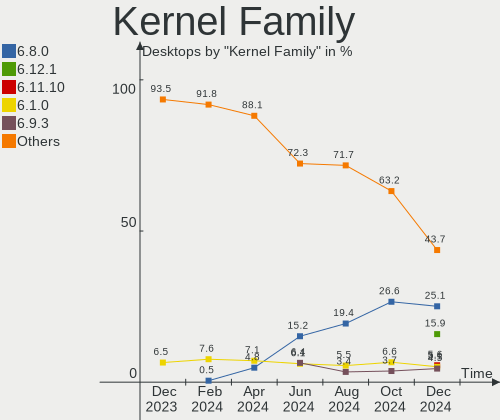
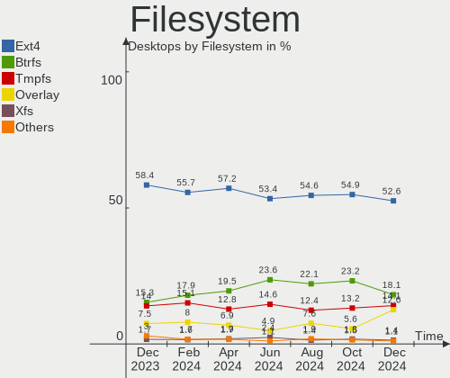
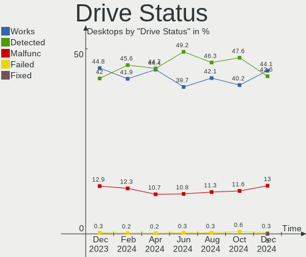
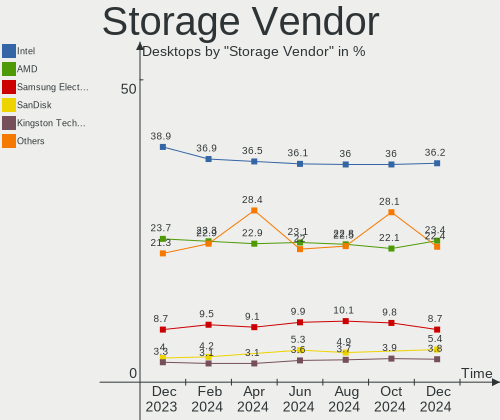
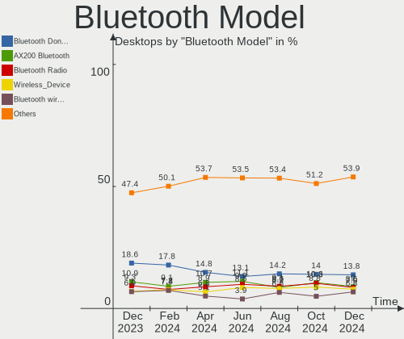

Linux - Hardware Trends (Desktops)
----------------------------------

A project to identify most popular hardware characteristics and track their change
over time based on data collected by Linux users at https://Linux-Hardware.org.

Anyone can contribute to this report by the [hw-probe](https://github.com/linuxhw/hw-probe) tool:

    sudo -E hw-probe -all -upload

This report is for one last month. Overall report since the beginning of time: [TestDays](https://github.com/linuxhw/TestDays)

Period: Mar, 2023.

Contents
--------

* [ System ](#system)
  - [ OS                       ](#os)
  - [ OS Family                ](#os-family)
  - [ Kernel                   ](#kernel)
  - [ Kernel Family            ](#kernel-family)
  - [ Kernel Major Ver.        ](#kernel-major-ver)
  - [ Arch                     ](#arch)
  - [ DE                       ](#de)
  - [ Display Server           ](#display-server)
  - [ Display Manager          ](#display-manager)
  - [ OS Lang                  ](#os-lang)
  - [ Boot Mode                ](#boot-mode)
  - [ Filesystem               ](#filesystem)
  - [ Part. scheme             ](#part-scheme)
  - [ Dual Boot with Linux/BSD ](#dual-boot-with-linuxbsd)
  - [ Dual Boot (Win)          ](#dual-boot-win)

* [ Board ](#board)
  - [ Vendor                   ](#vendor)
  - [ Model                    ](#model)
  - [ Model Family             ](#model-family)
  - [ MFG Year                 ](#mfg-year)
  - [ Form Factor              ](#form-factor)
  - [ Secure Boot              ](#secure-boot)
  - [ Coreboot                 ](#coreboot)
  - [ RAM Size                 ](#ram-size)
  - [ RAM Used                 ](#ram-used)
  - [ Total Drives             ](#total-drives)
  - [ Has CD-ROM               ](#has-cd-rom)
  - [ Has Ethernet             ](#has-ethernet)
  - [ Has WiFi                 ](#has-wifi)
  - [ Has Bluetooth            ](#has-bluetooth)

* [ Location ](#location)
  - [ Country                  ](#country)
  - [ City                     ](#city)

* [ Drives ](#drives)
  - [ Drive Vendor             ](#drive-vendor)
  - [ Drive Model              ](#drive-model)
  - [ HDD Vendor               ](#hdd-vendor)
  - [ SSD Vendor               ](#ssd-vendor)
  - [ Drive Kind               ](#drive-kind)
  - [ Drive Connector          ](#drive-connector)
  - [ Drive Size               ](#drive-size)
  - [ Space Total              ](#space-total)
  - [ Space Used               ](#space-used)
  - [ Malfunc. Drives          ](#malfunc-drives)
  - [ Malfunc. Drive Vendor    ](#malfunc-drive-vendor)
  - [ Malfunc. HDD Vendor      ](#malfunc-hdd-vendor)
  - [ Malfunc. Drive Kind      ](#malfunc-drive-kind)
  - [ Failed Drives            ](#failed-drives)
  - [ Failed Drive Vendor      ](#failed-drive-vendor)
  - [ Drive Status             ](#drive-status)

* [ Storage controller ](#storage-controller)
  - [ Storage Vendor           ](#storage-vendor)
  - [ Storage Model            ](#storage-model)
  - [ Storage Kind             ](#storage-kind)

* [ Processor ](#processor)
  - [ CPU Vendor               ](#cpu-vendor)
  - [ CPU Model                ](#cpu-model)
  - [ CPU Model Family         ](#cpu-model-family)
  - [ CPU Cores                ](#cpu-cores)
  - [ CPU Sockets              ](#cpu-sockets)
  - [ CPU Threads              ](#cpu-threads)
  - [ CPU Op-Modes             ](#cpu-op-modes)
  - [ CPU Microcode            ](#cpu-microcode)
  - [ CPU Microarch            ](#cpu-microarch)

* [ Graphics ](#graphics)
  - [ GPU Vendor               ](#gpu-vendor)
  - [ GPU Model                ](#gpu-model)
  - [ GPU Combo                ](#gpu-combo)
  - [ GPU Driver               ](#gpu-driver)
  - [ GPU Memory               ](#gpu-memory)

* [ Monitor ](#monitor)
  - [ Monitor Vendor           ](#monitor-vendor)
  - [ Monitor Model            ](#monitor-model)
  - [ Monitor Resolution       ](#monitor-resolution)
  - [ Monitor Diagonal         ](#monitor-diagonal)
  - [ Monitor Width            ](#monitor-width)
  - [ Aspect Ratio             ](#aspect-ratio)
  - [ Monitor Area             ](#monitor-area)
  - [ Pixel Density            ](#pixel-density)
  - [ Multiple Monitors        ](#multiple-monitors)

* [ Network ](#network)
  - [ Net Controller Vendor    ](#net-controller-vendor)
  - [ Net Controller Model     ](#net-controller-model)
  - [ Wireless Vendor          ](#wireless-vendor)
  - [ Wireless Model           ](#wireless-model)
  - [ Ethernet Vendor          ](#ethernet-vendor)
  - [ Ethernet Model           ](#ethernet-model)
  - [ Net Controller Kind      ](#net-controller-kind)
  - [ Used Controller          ](#used-controller)
  - [ NICs                     ](#nics)
  - [ IPv6                     ](#ipv6)

* [ Bluetooth ](#bluetooth)
  - [ Bluetooth Vendor         ](#bluetooth-vendor)
  - [ Bluetooth Model          ](#bluetooth-model)

* [ Sound ](#sound)
  - [ Sound Vendor             ](#sound-vendor)
  - [ Sound Model              ](#sound-model)

* [ Memory ](#memory)
  - [ Memory Vendor            ](#memory-vendor)
  - [ Memory Model             ](#memory-model)
  - [ Memory Kind              ](#memory-kind)
  - [ Memory Form Factor       ](#memory-form-factor)
  - [ Memory Size              ](#memory-size)
  - [ Memory Speed             ](#memory-speed)

* [ Printers & scanners ](#printers--scanners)
  - [ Printer Vendor           ](#printer-vendor)
  - [ Printer Model            ](#printer-model)
  - [ Scanner Vendor           ](#scanner-vendor)
  - [ Scanner Model            ](#scanner-model)

* [ Camera ](#camera)
  - [ Camera Vendor            ](#camera-vendor)
  - [ Camera Model             ](#camera-model)

* [ Security ](#security)
  - [ Fingerprint Vendor       ](#fingerprint-vendor)
  - [ Fingerprint Model        ](#fingerprint-model)
  - [ Chipcard Vendor          ](#chipcard-vendor)
  - [ Chipcard Model           ](#chipcard-model)

* [ Unsupported ](#unsupported)
  - [ Unsupported Devices      ](#unsupported-devices)
  - [ Unsupported Device Types ](#unsupported-device-types)

System
------

OS
--

Installed operating systems

| Name                         | Desktops | Percent |
|------------------------------|----------|---------|
| Ubuntu 22.04                 | 337      | 13.9%   |
| Linux Mint 21.1              | 175      | 7.22%   |
| OpenMandriva 23.03           | 172      | 7.09%   |
| Debian 11                    | 130      | 5.36%   |
| Fedora 37                    | 128      | 5.28%   |
| OpenMandriva 23.01           | 126      | 5.2%    |
| ROSA 12.3                    | 105      | 4.33%   |
| Pop!_OS 22.04                | 93       | 3.84%   |
| Ubuntu 22.10                 | 89       | 3.67%   |
| Arch Rolling                 | 80       | 3.3%    |
| Zorin 16                     | 68       | 2.8%    |
| Ubuntu 20.04                 | 53       | 2.19%   |
| Manjaro                      | 48       | 1.98%   |
| OpenMandriva 4.3             | 47       | 1.94%   |
| ArcoLinux Rolling            | 41       | 1.69%   |
| Linux Mint 20.3              | 40       | 1.65%   |
| KDE neon 22.04               | 33       | 1.36%   |
| Nobara 37                    | 28       | 1.15%   |
| Kubuntu 22.04                | 28       | 1.15%   |
| Gentoo 2.13                  | 26       | 1.07%   |
| openSUSE Tumbleweed-XXXXXXXX | 24       | 0.99%   |
| Debian                       | 23       | 0.95%   |
| Kubuntu 22.10                | 22       | 0.91%   |
| Xubuntu 22.04                | 19       | 0.78%   |
| ROSA 12.4                    | 19       | 0.78%   |
| BlackPanther 18.1            | 19       | 0.78%   |
| OpenMandriva 4.2             | 17       | 0.7%    |
| Kali 2023.1                  | 17       | 0.7%    |
| EndeavourOS Rolling          | 17       | 0.7%    |
| Linux Mint 21                | 16       | 0.66%   |
| Fedora 38                    | 15       | 0.62%   |
| Ubuntu 18.04                 | 14       | 0.58%   |
| LMDE 5                       | 14       | 0.58%   |
| Ubuntu MATE 22.04            | 13       | 0.54%   |
| SteamOS 3.4                  | 12       | 0.49%   |
| Red OS 7.3                   | 10       | 0.41%   |
| Manjaro 22.0.4               | 10       | 0.41%   |
| Lubuntu 22.04                | 10       | 0.41%   |
| Debian 12                    | 10       | 0.41%   |
| MX 21                        | 9        | 0.37%   |

OS Family
---------

OS without a version

| Name         | Desktops | Percent |
|--------------|----------|---------|
| Ubuntu       | 498      | 20.54%  |
| OpenMandriva | 370      | 15.26%  |
| Linux Mint   | 247      | 10.19%  |
| Debian       | 170      | 7.01%   |
| Fedora       | 155      | 6.39%   |
| ROSA         | 139      | 5.73%   |
| Pop!_OS      | 95       | 3.92%   |
| Arch         | 80       | 3.3%    |
| Zorin        | 74       | 3.05%   |
| Manjaro      | 67       | 2.76%   |
| Kubuntu      | 59       | 2.43%   |
| ArcoLinux    | 41       | 1.69%   |
| openSUSE     | 36       | 1.48%   |
| KDE neon     | 33       | 1.36%   |
| Xubuntu      | 32       | 1.32%   |
| Nobara       | 30       | 1.24%   |
| Gentoo       | 29       | 1.2%    |
| Red OS       | 21       | 0.87%   |
| BlackPanther | 20       | 0.82%   |
| Kali         | 18       | 0.74%   |
| EndeavourOS  | 17       | 0.7%    |
| Ubuntu MATE  | 15       | 0.62%   |
| Lubuntu      | 15       | 0.62%   |
| LMDE         | 14       | 0.58%   |
| SteamOS      | 13       | 0.54%   |
| Elementary   | 11       | 0.45%   |
| ALT Linux    | 10       | 0.41%   |
| MX           | 9        | 0.37%   |
| Ubuntu Unity | 7        | 0.29%   |
| Endless      | 7        | 0.29%   |
| CentOS       | 7        | 0.29%   |
| Clear Linux  | 6        | 0.25%   |
| TUXEDO OS    | 5        | 0.21%   |
| Rocky Linux  | 5        | 0.21%   |
| Garuda Linux | 5        | 0.21%   |
| ChimeraOS    | 5        | 0.21%   |
| Siduction    | 4        | 0.16%   |
| RHEL         | 4        | 0.16%   |
| Mageia       | 4        | 0.16%   |
| Xero         | 3        | 0.12%   |

Kernel
------

Version of the Linux kernel

| Version                             | Desktops | Percent |
|-------------------------------------|----------|---------|
| 5.19.0-35-generic                   | 334      | 13.77%  |
| 5.15.0-67-generic                   | 258      | 10.64%  |
| 6.2.6-desktop-1omv2390              | 141      | 5.81%   |
| 6.1.1-desktop-1omv2290              | 123      | 5.07%   |
| 5.10.0-21-amd64                     | 73       | 3.01%   |
| 5.19.0-38-generic                   | 61       | 2.52%   |
| 5.4.0-144-generic                   | 59       | 2.43%   |
| 5.19.0-32-generic                   | 48       | 1.98%   |
| 5.15.0-60-generic                   | 42       | 1.73%   |
| 5.15.79-generic-1rosa2021.1-x86_64  | 39       | 1.61%   |
| 5.15.75-generic-1rosa2021.1-x86_64  | 36       | 1.48%   |
| 6.1.18-200.fc37.x86_64              | 34       | 1.4%    |
| 6.2.0-76060200-generic              | 33       | 1.36%   |
| 5.16.7-desktop-1omv4003             | 31       | 1.28%   |
| 5.15.0-69-generic                   | 31       | 1.28%   |
| 6.1.12-1-MANJARO                    | 29       | 1.2%    |
| 6.1.14-200.fc37.x86_64              | 25       | 1.03%   |
| 6.2.8-arch1-1                       | 23       | 0.95%   |
| 5.15.0-56-generic                   | 23       | 0.95%   |
| 6.2.7-200.fc37.x86_64               | 21       | 0.87%   |
| 6.2.6-76060206-generic              | 21       | 0.87%   |
| 6.1.11-76060111-generic             | 20       | 0.82%   |
| 6.2.2-desktop-1omv2390              | 19       | 0.78%   |
| 6.2.2-arch1-1                       | 19       | 0.78%   |
| 6.1.15-200.fc37.x86_64              | 17       | 0.7%    |
| 6.1.14-201.fsync.fc37.x86_64        | 16       | 0.66%   |
| 6.1.0-kali5-amd64                   | 15       | 0.62%   |
| 5.16.13-desktop-1omv4003            | 15       | 0.62%   |
| 6.2.6-arch1-1                       | 14       | 0.58%   |
| 6.2.1-arch1-1                       | 14       | 0.58%   |
| 6.1.0-6-amd64                       | 14       | 0.58%   |
| 6.0.12-76060006-generic             | 14       | 0.58%   |
| 5.4.0-139-generic                   | 13       | 0.54%   |
| 5.10.14-desktop-1omv4002            | 13       | 0.54%   |
| 6.1.20-generic-2rosa2021.1-x86_64   | 11       | 0.45%   |
| 6.1.19-1-MANJARO                    | 11       | 0.45%   |
| 5.10.155-generic-1rosa2021.1-x86_64 | 11       | 0.45%   |
| 5.13.0-valve21.3-1-neptune          | 10       | 0.41%   |
| 4.18.16-desktop-1bP                 | 10       | 0.41%   |
| 6.2.6-201.fsync.fc37.x86_64         | 9        | 0.37%   |

Kernel Family
-------------

Linux kernel without a distro release

| Version  | Desktops | Percent |
|----------|----------|---------|
| 5.19.0   | 478      | 19.71%  |
| 5.15.0   | 395      | 16.29%  |
| 6.2.6    | 218      | 8.99%   |
| 6.1.1    | 124      | 5.11%   |
| 5.10.0   | 100      | 4.12%   |
| 5.4.0    | 85       | 3.51%   |
| 6.2.2    | 71       | 2.93%   |
| 6.1.0    | 58       | 2.39%   |
| 6.1.12   | 55       | 2.27%   |
| 6.1.14   | 52       | 2.14%   |
| 6.2.8    | 49       | 2.02%   |
| 6.2.7    | 49       | 2.02%   |
| 6.2.0    | 41       | 1.69%   |
| 5.15.79  | 40       | 1.65%   |
| 6.2.1    | 39       | 1.61%   |
| 5.15.75  | 38       | 1.57%   |
| 6.1.18   | 37       | 1.53%   |
| 6.1.11   | 33       | 1.36%   |
| 5.16.7   | 31       | 1.28%   |
| 6.0.12   | 22       | 0.91%   |
| 6.1.15   | 20       | 0.82%   |
| 6.0.0    | 20       | 0.82%   |
| 6.1.20   | 18       | 0.74%   |
| 5.13.0   | 17       | 0.7%    |
| 5.16.13  | 16       | 0.66%   |
| 6.1.19   | 15       | 0.62%   |
| 5.10.14  | 13       | 0.54%   |
| 4.15.0   | 13       | 0.54%   |
| 5.10.155 | 11       | 0.45%   |
| 5.15.87  | 10       | 0.41%   |
| 5.15.102 | 10       | 0.41%   |
| 4.18.16  | 10       | 0.41%   |
| 6.2.5    | 9        | 0.37%   |
| 6.1.13   | 9        | 0.37%   |
| 5.6.14   | 9        | 0.37%   |
| 5.14.0   | 9        | 0.37%   |
| 5.15.85  | 8        | 0.33%   |
| 6.1.21   | 7        | 0.29%   |
| 5.14.21  | 7        | 0.29%   |
| 5.15.94  | 6        | 0.25%   |

Kernel Major Ver.
-----------------

Linux kernel major version

| Version | Desktops | Percent |
|---------|----------|---------|
| 5.15    | 543      | 22.39%  |
| 5.19    | 485      | 20%     |
| 6.2     | 483      | 19.92%  |
| 6.1     | 445      | 18.35%  |
| 5.10    | 142      | 5.86%   |
| 5.4     | 88       | 3.63%   |
| 6.0     | 60       | 2.47%   |
| 5.16    | 50       | 2.06%   |
| 5.14    | 23       | 0.95%   |
| 5.13    | 20       | 0.82%   |
| 4.18    | 15       | 0.62%   |
| 4.15    | 13       | 0.54%   |
| 5.11    | 10       | 0.41%   |
| 5.6     | 9        | 0.37%   |
| 5.18    | 9        | 0.37%   |
| 5.17    | 6        | 0.25%   |
| 4.19    | 6        | 0.25%   |
| 3.10    | 4        | 0.16%   |
| 5.8     | 3        | 0.12%   |
| 6.3     | 2        | 0.08%   |
| 5.9     | 2        | 0.08%   |
| 5.15.96 | 2        | 0.08%   |
| 4.9     | 2        | 0.08%   |
| 5.0     | 1        | 0.04%   |
| 4.7     | 1        | 0.04%   |
| 4.4     | 1        | 0.04%   |

Arch
----

OS architecture (x86_64, i586, etc.)

| Name    | Desktops | Percent |
|---------|----------|---------|
| x86_64  | 2402     | 99.05%  |
| i686    | 21       | 0.87%   |
| ppc64   | 1        | 0.04%   |
| aarch64 | 1        | 0.04%   |

DE
--

Desktop Environment

| Name              | Desktops | Percent |
|-------------------|----------|---------|
| GNOME             | 947      | 39.05%  |
| KDE5              | 743      | 30.64%  |
| X-Cinnamon        | 204      | 8.41%   |
| XFCE              | 146      | 6.02%   |
| Unknown           | 141      | 5.81%   |
| MATE              | 75       | 3.09%   |
| LXQt              | 40       | 1.65%   |
| Cinnamon          | 29       | 1.2%    |
| Pantheon          | 12       | 0.49%   |
| LXDE              | 11       | 0.45%   |
| i3                | 11       | 0.45%   |
| KDE               | 8        | 0.33%   |
| Hyprland          | 8        | 0.33%   |
| Unity             | 7        | 0.29%   |
| Openbox           | 6        | 0.25%   |
| KDE4              | 6        | 0.25%   |
| GNOME Classic     | 5        | 0.21%   |
| Budgie            | 5        | 0.21%   |
| bspwm             | 5        | 0.21%   |
| qtile             | 3        | 0.12%   |
| ICEWM             | 2        | 0.08%   |
| GNOME Flashback   | 2        | 0.08%   |
| Yaru:ubuntu:GNOME | 1        | 0.04%   |
| xmonad            | 1        | 0.04%   |
| Trinity           | 1        | 0.04%   |
| sway              | 1        | 0.04%   |
| lightdm-xsession  | 1        | 0.04%   |
| LeftWM            | 1        | 0.04%   |
| GNUstep           | 1        | 0.04%   |
| Enlightenment     | 1        | 0.04%   |
| Deepin            | 1        | 0.04%   |

Display Server
--------------

X11 or Wayland

| Name    | Desktops | Percent |
|---------|----------|---------|
| X11     | 1645     | 67.84%  |
| Wayland | 619      | 25.53%  |
| Tty     | 99       | 4.08%   |
| Unknown | 61       | 2.52%   |
| Web     | 1        | 0.04%   |

Display Manager
---------------

SDDM, LightDM, etc.

| Name    | Desktops | Percent |
|---------|----------|---------|
| Unknown | 832      | 34.31%  |
| SDDM    | 624      | 25.73%  |
| GDM3    | 443      | 18.27%  |
| LightDM | 271      | 11.18%  |
| GDM     | 232      | 9.57%   |
| LXDM    | 5        | 0.21%   |
| KDM     | 5        | 0.21%   |
| XDM     | 4        | 0.16%   |
| SLiM    | 3        | 0.12%   |
| GREETD  | 3        | 0.12%   |
| NODM    | 2        | 0.08%   |
| TDM     | 1        | 0.04%   |

OS Lang
-------

Language

| Lang    | Desktops | Percent |
|---------|----------|---------|
| en_US   | 941      | 38.8%   |
| de_DE   | 275      | 11.34%  |
| ru_RU   | 264      | 10.89%  |
| en_GB   | 110      | 4.54%   |
| fr_FR   | 97       | 4%      |
| pt_BR   | 94       | 3.88%   |
| it_IT   | 72       | 2.97%   |
| Unknown | 54       | 2.23%   |
| en_CA   | 51       | 2.1%    |
| es_ES   | 46       | 1.9%    |
| en_AU   | 43       | 1.77%   |
| pl_PL   | 40       | 1.65%   |
| C       | 35       | 1.44%   |
| nl_NL   | 25       | 1.03%   |
| en_IN   | 15       | 0.62%   |
| de_AT   | 14       | 0.58%   |
| hu_HU   | 13       | 0.54%   |
| es_MX   | 13       | 0.54%   |
| ja_jp   | 11       | 0.45%   |
| fi_FI   | 11       | 0.45%   |
| es_AR   | 11       | 0.45%   |
| en_ZA   | 10       | 0.41%   |
| de_CH   | 10       | 0.41%   |
| pt_PT   | 9        | 0.37%   |
| es_CO   | 9        | 0.37%   |
| cs_CZ   | 9        | 0.37%   |
| en_IE   | 8        | 0.33%   |
| sv_SE   | 7        | 0.29%   |
| es_CL   | 7        | 0.29%   |
| en_NZ   | 7        | 0.29%   |
| zh_TW   | 6        | 0.25%   |
| nl_BE   | 6        | 0.25%   |
| C.UTF8  | 6        | 0.25%   |
| zh_CN   | 5        | 0.21%   |
| fr_CA   | 5        | 0.21%   |
| es_VE   | 5        | 0.21%   |
| el_GR   | 5        | 0.21%   |
| tr_TR   | 4        | 0.16%   |
| sk_SK   | 4        | 0.16%   |
| ko_KR   | 4        | 0.16%   |

Boot Mode
---------

EFI or BIOS

| Mode | Desktops | Percent |
|------|----------|---------|
| BIOS | 1269     | 52.33%  |
| EFI  | 1156     | 47.67%  |

Filesystem
----------

Type of filesystem

| Type    | Desktops | Percent |
|---------|----------|---------|
| Ext4    | 1754     | 72.33%  |
| Btrfs   | 323      | 13.32%  |
| Overlay | 242      | 9.98%   |
| Xfs     | 51       | 2.1%    |
| Zfs     | 30       | 1.24%   |
| F2fs    | 9        | 0.37%   |
| Ext3    | 7        | 0.29%   |
| Tmpfs   | 3        | 0.12%   |
| Unknown | 3        | 0.12%   |
| Ext2    | 2        | 0.08%   |
| XXXXXXX | 1        | 0.04%   |

Part. scheme
------------

Scheme of partitioning

| Type    | Desktops | Percent |
|---------|----------|---------|
| GPT     | 1324     | 54.6%   |
| Unknown | 710      | 29.28%  |
| MBR     | 391      | 16.12%  |

Dual Boot with Linux/BSD
------------------------

Hosting more than one Linux/BSD

| Dual boot | Desktops | Percent |
|-----------|----------|---------|
| No        | 1874     | 77.28%  |
| Yes       | 551      | 22.72%  |

Dual Boot (Win)
---------------

Hosting Linux and Windows

| Dual boot | Desktops | Percent |
|-----------|----------|---------|
| No        | 1630     | 67.22%  |
| Yes       | 795      | 32.78%  |

Board
-----

Vendor
------

Motherboard manufacturer

| Name                                 | Desktops | Percent |
|--------------------------------------|----------|---------|
| ASUSTek Computer                     | 602      | 24.82%  |
| Gigabyte Technology                  | 427      | 17.61%  |
| MSI                                  | 292      | 12.04%  |
| ASRock                               | 204      | 8.41%   |
| Hewlett-Packard                      | 194      | 8%      |
| Dell                                 | 180      | 7.42%   |
| Lenovo                               | 91       | 3.75%   |
| Intel                                | 62       | 2.56%   |
| Acer                                 | 43       | 1.77%   |
| Fujitsu                              | 34       | 1.4%    |
| Unknown                              | 30       | 1.24%   |
| Pegatron                             | 20       | 0.82%   |
| Foxconn                              | 19       | 0.78%   |
| Biostar                              | 19       | 0.78%   |
| AZW                                  | 17       | 0.7%    |
| Medion                               | 14       | 0.58%   |
| ECS                                  | 12       | 0.49%   |
| Packard Bell                         | 11       | 0.45%   |
| Huanan                               | 11       | 0.45%   |
| Supermicro                           | 10       | 0.41%   |
| ASRockRack                           | 9        | 0.37%   |
| Shuttle                              | 6        | 0.25%   |
| MACHINIST                            | 6        | 0.25%   |
| BESSTAR Tech                         | 6        | 0.25%   |
| Positivo                             | 5        | 0.21%   |
| Fujitsu Siemens                      | 5        | 0.21%   |
| Apple                                | 5        | 0.21%   |
| Shenzhen Meigao Electronic Equipment | 4        | 0.16%   |
| PCWare                               | 4        | 0.16%   |
| Inventec                             | 4        | 0.16%   |
| Gateway                              | 4        | 0.16%   |
| EPoX Computer                        | 4        | 0.16%   |
| AMI                                  | 4        | 0.16%   |
| ZOTAC                                | 3        | 0.12%   |
| Wistron                              | 3        | 0.12%   |
| Win element                          | 3        | 0.12%   |
| Techvision                           | 3        | 0.12%   |
| OEM                                  | 3        | 0.12%   |
| HPE                                  | 3        | 0.12%   |
| QIYIDA                               | 2        | 0.08%   |

Model
-----

Motherboard model

| Name                             | Desktops | Percent |
|----------------------------------|----------|---------|
| ASUS All Series                  | 45       | 1.86%   |
| Unknown                          | 34       | 1.4%    |
| MSI MS-7C56                      | 14       | 0.58%   |
| MSI MS-7C02                      | 14       | 0.58%   |
| Dell OptiPlex 9020               | 13       | 0.54%   |
| MSI MS-7C37                      | 12       | 0.49%   |
| Gigabyte A320M-S2H               | 12       | 0.49%   |
| ASUS PRIME A320M-K               | 12       | 0.49%   |
| MSI MS-7C91                      | 11       | 0.45%   |
| Dell OptiPlex 780                | 11       | 0.45%   |
| ASUS TUF Gaming X570-PLUS        | 11       | 0.45%   |
| ASUS ROG STRIX B550-F GAMING     | 11       | 0.45%   |
| MSI MS-7B86                      | 10       | 0.41%   |
| MSI MS-7721                      | 10       | 0.41%   |
| Dell OptiPlex 7010               | 10       | 0.41%   |
| ASUS TUF Gaming B550M-PLUS       | 9        | 0.37%   |
| Dell OptiPlex 3050               | 8        | 0.33%   |
| Dell OptiPlex 3020               | 8        | 0.33%   |
| ASUS PRIME B450M-A               | 8        | 0.33%   |
| MSI MS-7B79                      | 7        | 0.29%   |
| MSI MS-7A38                      | 7        | 0.29%   |
| MSI MS-7817                      | 7        | 0.29%   |
| HP Z440 Workstation              | 7        | 0.29%   |
| HP Compaq Elite 8300 SFF         | 7        | 0.29%   |
| Gigabyte X470 AORUS ULTRA GAMING | 7        | 0.29%   |
| Gigabyte B550 AORUS ELITE V2     | 7        | 0.29%   |
| Gigabyte B450M DS3H              | 7        | 0.29%   |
| Dell OptiPlex 3010               | 7        | 0.29%   |
| AZW U59                          | 7        | 0.29%   |
| ASUS TUF Gaming B550-PLUS        | 7        | 0.29%   |
| ASUS ROG STRIX B450-F GAMING     | 7        | 0.29%   |
| MSI MS-7C95                      | 6        | 0.25%   |
| MSI MS-7C52                      | 6        | 0.25%   |
| MSI MS-7B89                      | 6        | 0.25%   |
| MSI MS-7A34                      | 6        | 0.25%   |
| MSI MS-7693                      | 6        | 0.25%   |
| Intel H61                        | 6        | 0.25%   |
| HP EliteDesk 800 G1 SFF          | 6        | 0.25%   |
| HP Compaq Pro 6300 SFF           | 6        | 0.25%   |
| Gigabyte H410M H V3              | 6        | 0.25%   |

Model Family
------------

Motherboard model prefix

| Name                | Desktops | Percent |
|---------------------|----------|---------|
| ASUS PRIME          | 143      | 5.9%    |
| Dell OptiPlex       | 115      | 4.74%   |
| ASUS ROG            | 95       | 3.92%   |
| HP Compaq           | 62       | 2.56%   |
| ASUS TUF            | 62       | 2.56%   |
| Lenovo ThinkCentre  | 51       | 2.1%    |
| ASUS All            | 45       | 1.86%   |
| Unknown             | 34       | 1.4%    |
| HP EliteDesk        | 30       | 1.24%   |
| Fujitsu ESPRIMO     | 26       | 1.07%   |
| Dell Precision      | 26       | 1.07%   |
| Gigabyte B550       | 25       | 1.03%   |
| Acer Aspire         | 23       | 0.95%   |
| Gigabyte B450M      | 22       | 0.91%   |
| HP ProDesk          | 20       | 0.82%   |
| Gigabyte X570       | 17       | 0.7%    |
| ASUS M5A78L-M       | 17       | 0.7%    |
| HP Pavilion         | 16       | 0.66%   |
| Gigabyte A320M-S2H  | 15       | 0.62%   |
| Dell Inspiron       | 15       | 0.62%   |
| MSI MS-7C56         | 14       | 0.58%   |
| MSI MS-7C02         | 14       | 0.58%   |
| MSI MS-7C37         | 12       | 0.49%   |
| Lenovo IdeaCentre   | 12       | 0.49%   |
| Gigabyte B450       | 12       | 0.49%   |
| ASUS SABERTOOTH     | 12       | 0.49%   |
| MSI MS-7C91         | 11       | 0.45%   |
| Gigabyte B550M      | 11       | 0.45%   |
| Dell Vostro         | 11       | 0.45%   |
| Acer Veriton        | 11       | 0.45%   |
| MSI MS-7B86         | 10       | 0.41%   |
| MSI MS-7721         | 10       | 0.41%   |
| Lenovo ThinkStation | 10       | 0.41%   |
| ASUS P8Z77-V        | 10       | 0.41%   |
| ASUS M5A97          | 10       | 0.41%   |
| ASRock B450M        | 10       | 0.41%   |
| Gigabyte X470       | 9        | 0.37%   |
| ASRock X570         | 9        | 0.37%   |
| Packard Bell IMEDIA | 8        | 0.33%   |
| Gigabyte Z390       | 8        | 0.33%   |

MFG Year
--------

Motherboard manufacture year

| Year    | Desktops | Percent |
|---------|----------|---------|
| 2020    | 239      | 9.86%   |
| 2018    | 239      | 9.86%   |
| 2012    | 214      | 8.82%   |
| 2019    | 189      | 7.79%   |
| 2021    | 182      | 7.51%   |
| 2022    | 177      | 7.3%    |
| 2013    | 176      | 7.26%   |
| 2017    | 150      | 6.19%   |
| 2011    | 139      | 5.73%   |
| 2014    | 130      | 5.36%   |
| 2010    | 111      | 4.58%   |
| 2009    | 108      | 4.45%   |
| 2015    | 105      | 4.33%   |
| 2016    | 92       | 3.79%   |
| 2008    | 54       | 2.23%   |
| 2007    | 54       | 2.23%   |
| 2006    | 31       | 1.28%   |
| 2023    | 18       | 0.74%   |
| 2005    | 6        | 0.25%   |
| Unknown | 6        | 0.25%   |
| 2004    | 3        | 0.12%   |
| 2003    | 1        | 0.04%   |
| 2002    | 1        | 0.04%   |

Form Factor
-----------

Physical design of the computer

| Name    | Desktops | Percent |
|---------|----------|---------|
| Desktop | 2425     | 100%    |

Secure Boot
-----------

Enabled or disabled

| State    | Desktops | Percent |
|----------|----------|---------|
| Disabled | 2351     | 96.95%  |
| Enabled  | 74       | 3.05%   |

Coreboot
--------

Have coreboot on board

| Used | Desktops | Percent |
|------|----------|---------|
| No   | 2422     | 99.88%  |
| Yes  | 3        | 0.12%   |

RAM Size
--------

Total RAM memory

| Size in GB      | Desktops | Percent |
|-----------------|----------|---------|
| 16.01-24.0      | 585      | 24.12%  |
| 32.01-64.0      | 465      | 19.18%  |
| 8.01-16.0       | 411      | 16.95%  |
| 4.01-8.0        | 379      | 15.63%  |
| 3.01-4.0        | 253      | 10.43%  |
| 64.01-256.0     | 164      | 6.76%   |
| 24.01-32.0      | 88       | 3.63%   |
| 1.01-2.0        | 35       | 1.44%   |
| 2.01-3.0        | 33       | 1.36%   |
| More than 256.0 | 6        | 0.25%   |
| 0.51-1.0        | 4        | 0.16%   |
| 0.01-0.5        | 2        | 0.08%   |

RAM Used
--------

Used RAM memory

| Used GB         | Desktops | Percent |
|-----------------|----------|---------|
| 1.01-2.0        | 762      | 31.42%  |
| 2.01-3.0        | 568      | 23.42%  |
| 4.01-8.0        | 442      | 18.23%  |
| 3.01-4.0        | 293      | 12.08%  |
| 8.01-16.0       | 132      | 5.44%   |
| 0.51-1.0        | 131      | 5.4%    |
| 0.01-0.5        | 32       | 1.32%   |
| 16.01-24.0      | 26       | 1.07%   |
| 32.01-64.0      | 20       | 0.82%   |
| 24.01-32.0      | 12       | 0.49%   |
| 64.01-256.0     | 5        | 0.21%   |
| More than 256.0 | 1        | 0.04%   |
| 0               | 1        | 0.04%   |

Total Drives
------------

Number of drives on board

| Drives | Desktops | Percent |
|--------|----------|---------|
| 1      | 913      | 37.65%  |
| 2      | 676      | 27.88%  |
| 3      | 379      | 15.63%  |
| 4      | 225      | 9.28%   |
| 5      | 108      | 4.45%   |
| 6      | 49       | 2.02%   |
| 8      | 18       | 0.74%   |
| 7      | 18       | 0.74%   |
| 0      | 15       | 0.62%   |
| 9      | 7        | 0.29%   |
| 10     | 5        | 0.21%   |
| 13     | 3        | 0.12%   |
| 14     | 2        | 0.08%   |
| 12     | 2        | 0.08%   |
| 11     | 2        | 0.08%   |
| 29     | 1        | 0.04%   |
| 25     | 1        | 0.04%   |
| 22     | 1        | 0.04%   |

Has CD-ROM
----------

Has CD-ROM on board

| Presented | Desktops | Percent |
|-----------|----------|---------|
| No        | 1395     | 57.53%  |
| Yes       | 1030     | 42.47%  |

Has Ethernet
------------

Has Ethernet on board

| Presented | Desktops | Percent |
|-----------|----------|---------|
| Yes       | 2406     | 99.22%  |
| No        | 19       | 0.78%   |

Has WiFi
--------

Has WiFi module

| Presented | Desktops | Percent |
|-----------|----------|---------|
| No        | 1299     | 53.57%  |
| Yes       | 1126     | 46.43%  |

Has Bluetooth
-------------

Has Bluetooth module

| Presented | Desktops | Percent |
|-----------|----------|---------|
| No        | 1561     | 64.37%  |
| Yes       | 864      | 35.63%  |

Location
--------

Country
-------

Geographic location (country)

| Country      | Desktops | Percent |
|--------------|----------|---------|
| USA          | 470      | 19.38%  |
| Germany      | 337      | 13.9%   |
| Russia       | 278      | 11.46%  |
| Brazil       | 121      | 4.99%   |
| France       | 110      | 4.54%   |
| UK           | 92       | 3.79%   |
| Italy        | 90       | 3.71%   |
| Canada       | 81       | 3.34%   |
| Poland       | 70       | 2.89%   |
| Spain        | 60       | 2.47%   |
| Australia    | 53       | 2.19%   |
| Netherlands  | 47       | 1.94%   |
| Finland      | 32       | 1.32%   |
| Hungary      | 31       | 1.28%   |
| India        | 27       | 1.11%   |
| Austria      | 27       | 1.11%   |
| Sweden       | 26       | 1.07%   |
| Belgium      | 22       | 0.91%   |
| Switzerland  | 20       | 0.82%   |
| Japan        | 19       | 0.78%   |
| Colombia     | 19       | 0.78%   |
| Mexico       | 16       | 0.66%   |
| Denmark      | 16       | 0.66%   |
| Argentina    | 16       | 0.66%   |
| Slovakia     | 14       | 0.58%   |
| Portugal     | 14       | 0.58%   |
| Norway       | 14       | 0.58%   |
| Czechia      | 14       | 0.58%   |
| Bulgaria     | 14       | 0.58%   |
| South Africa | 13       | 0.54%   |
| China        | 13       | 0.54%   |
| Ukraine      | 12       | 0.49%   |
| Thailand     | 12       | 0.49%   |
| Taiwan       | 12       | 0.49%   |
| Romania      | 11       | 0.45%   |
| Greece       | 11       | 0.45%   |
| Belarus      | 11       | 0.45%   |
| Malaysia     | 10       | 0.41%   |
| New Zealand  | 9        | 0.37%   |
| Chile        | 9        | 0.37%   |

City
----

Geographic location (city)

| City              | Desktops | Percent |
|-------------------|----------|---------|
| Moscow            | 63       | 2.6%    |
| Berlin            | 27       | 1.11%   |
| Voronezh          | 21       | 0.87%   |
| Sydney            | 18       | 0.74%   |
| Vienna            | 16       | 0.66%   |
| Warsaw            | 15       | 0.62%   |
| St Petersburg     | 15       | 0.62%   |
| Helsinki          | 13       | 0.54%   |
| Samara            | 12       | 0.49%   |
| Madrid            | 12       | 0.49%   |
| London            | 12       | 0.49%   |
| Hamburg           | 12       | 0.49%   |
| Munich            | 11       | 0.45%   |
| Rio de Janeiro    | 10       | 0.41%   |
| Melbourne         | 10       | 0.41%   |
| Krasnodar         | 10       | 0.41%   |
| Brisbane          | 10       | 0.41%   |
| Sao Paulo         | 9        | 0.37%   |
| Rome              | 9        | 0.37%   |
| Bogotá           | 9        | 0.37%   |
| Paris             | 8        | 0.33%   |
| Novosibirsk       | 8        | 0.33%   |
| Milan             | 8        | 0.33%   |
| Frankfurt am Main | 8        | 0.33%   |
| Chelyabinsk       | 8        | 0.33%   |
| Budapest          | 8        | 0.33%   |
| Amsterdam         | 8        | 0.33%   |
| Yekaterinburg     | 7        | 0.29%   |
| Stockholm         | 7        | 0.29%   |
| Singapore         | 7        | 0.29%   |
| Nizhniy Novgorod  | 7        | 0.29%   |
| Montreal          | 7        | 0.29%   |
| Dublin            | 7        | 0.29%   |
| Wroclaw           | 6        | 0.25%   |
| Ufa               | 6        | 0.25%   |
| Tallinn           | 6        | 0.25%   |
| Perth             | 6        | 0.25%   |
| Oklahoma City     | 6        | 0.25%   |
| Milano            | 6        | 0.25%   |
| Los Angeles       | 6        | 0.25%   |

Drives
------

Drive Vendor
------------

Hard drive vendors

| Vendor                      | Desktops | Drives | Percent |
|-----------------------------|----------|--------|---------|
| WDC                         | 789      | 1084   | 17.37%  |
| Seagate                     | 725      | 980    | 15.96%  |
| Samsung Electronics         | 692      | 965    | 15.23%  |
| Kingston                    | 269      | 297    | 5.92%   |
| Sandisk                     | 238      | 283    | 5.24%   |
| Crucial                     | 232      | 267    | 5.11%   |
| Toshiba                     | 222      | 268    | 4.89%   |
| Hitachi                     | 127      | 144    | 2.8%    |
| China                       | 73       | 86     | 1.61%   |
| Intel                       | 69       | 73     | 1.52%   |
| A-DATA Technology           | 65       | 68     | 1.43%   |
| Phison Electronics          | 54       | 62     | 1.19%   |
| HGST                        | 53       | 63     | 1.17%   |
| Micron/Crucial Technology   | 41       | 46     | 0.9%    |
| PNY                         | 40       | 48     | 0.88%   |
| Unknown                     | 38       | 53     | 0.84%   |
| SPCC                        | 37       | 41     | 0.81%   |
| SK hynix                    | 35       | 35     | 0.77%   |
| Silicon Motion              | 30       | 34     | 0.66%   |
| Kingston Technology Company | 28       | 28     | 0.62%   |
| Intenso                     | 27       | 30     | 0.59%   |
| Patriot                     | 24       | 24     | 0.53%   |
| GOODRAM                     | 24       | 27     | 0.53%   |
| Apacer                      | 24       | 24     | 0.53%   |
| Corsair                     | 23       | 26     | 0.51%   |
| Maxtor                      | 22       | 22     | 0.48%   |
| Micron Technology           | 20       | 21     | 0.44%   |
| OCZ                         | 19       | 23     | 0.42%   |
| Unknown                     | 19       | 19     | 0.42%   |
| Transcend                   | 18       | 19     | 0.4%    |
| Realtek Semiconductor       | 18       | 20     | 0.4%    |
| ADATA Technology            | 18       | 20     | 0.4%    |
| Hewlett-Packard             | 17       | 44     | 0.37%   |
| Team                        | 15       | 16     | 0.33%   |
| Netac                       | 15       | 15     | 0.33%   |
| KingSpec                    | 15       | 15     | 0.33%   |
| XrayDisk                    | 13       | 13     | 0.29%   |
| Lexar                       | 13       | 13     | 0.29%   |
| JMicron Technology          | 13       | 13     | 0.29%   |
| Phison                      | 12       | 12     | 0.26%   |

Drive Model
-----------

Hard drive models

| Model                                                  | Desktops | Percent |
|--------------------------------------------------------|----------|---------|
| Samsung NVMe SSD Controller SM981/PM981/PM983 250GB    | 101      | 1.93%   |
| Kingston SA400S37240G 240GB SSD                        | 66       | 1.26%   |
| Seagate ST1000DM010-2EP102 1TB                         | 59       | 1.12%   |
| Seagate ST500DM002-1BD142 500GB                        | 55       | 1.05%   |
| Samsung NVMe SSD Controller PM9A1/PM9A3/980PRO 1TB     | 47       | 0.9%    |
| Seagate ST2000DM008-2FR102 2TB                         | 44       | 0.84%   |
| Samsung SSD 860 EVO 500GB                              | 43       | 0.82%   |
| Samsung SSD 850 EVO 500GB                              | 39       | 0.74%   |
| Samsung SSD 850 EVO 250GB                              | 39       | 0.74%   |
| WDC WD10EZEX-08WN4A0 1TB                               | 37       | 0.71%   |
| Toshiba DT01ACA100 1TB                                 | 36       | 0.69%   |
| Kingston SA400S37480G 480GB SSD                        | 35       | 0.67%   |
| Kingston SA400S37120G 120GB SSD                        | 34       | 0.65%   |
| Crucial CT1000MX500SSD1 1TB                            | 34       | 0.65%   |
| Crucial CT500MX500SSD1 500GB                           | 33       | 0.63%   |
| Seagate ST1000DM003-1CH162 1TB                         | 30       | 0.57%   |
| Seagate ST2000DM001-1ER164 2TB                         | 28       | 0.53%   |
| Samsung SSD 860 EVO 1TB                                | 27       | 0.51%   |
| Micron/Crucial P2 NVMe PCIe SSD 1TB                    | 27       | 0.51%   |
| Samsung SSD 860 EVO 250GB                              | 26       | 0.5%    |
| Crucial CT240BX500SSD1 240GB                           | 24       | 0.46%   |
| Seagate ST4000DM004-2CV104 4TB                         | 22       | 0.42%   |
| Samsung SSD 980 1TB                                    | 22       | 0.42%   |
| Toshiba DT01ACA050 500GB                               | 21       | 0.4%    |
| Samsung SSD 970 EVO Plus 1TB                           | 21       | 0.4%    |
| Phison E12 NVMe Controller 256GB                       | 21       | 0.4%    |
| WDC WDS240G2G0A-00JH30 240GB SSD                       | 20       | 0.38%   |
| Seagate ST3500418AS 500GB                              | 20       | 0.38%   |
| WDC WDS500G2B0A-00SM50 500GB SSD                       | 19       | 0.36%   |
| Seagate ST1000DM003-1SB102 1TB                         | 19       | 0.36%   |
| Unknown                                                | 19       | 0.36%   |
| Kingston SV300S37A120G 120GB SSD                       | 18       | 0.34%   |
| Toshiba HDWD110 1TB                                    | 17       | 0.32%   |
| Toshiba DT01ACA200 2TB                                 | 17       | 0.32%   |
| Silicon Motion SM2263EN/SM2263XT SSD Controller 1024GB | 17       | 0.32%   |
| Seagate ST1000DM003-1ER162 1TB                         | 17       | 0.32%   |
| Samsung SSD 870 EVO 1TB                                | 17       | 0.32%   |
| Seagate ST2000DM006-2DM164 2TB                         | 16       | 0.3%    |
| SanDisk SSD PLUS 480GB                                 | 16       | 0.3%    |
| Samsung SSD 980 500GB                                  | 16       | 0.3%    |

HDD Vendor
----------

Hard disk drive vendors

| Vendor              | Desktops | Drives | Percent |
|---------------------|----------|--------|---------|
| Seagate             | 712      | 959    | 36.48%  |
| WDC                 | 675      | 928    | 34.58%  |
| Toshiba             | 195      | 233    | 9.99%   |
| Hitachi             | 127      | 144    | 6.51%   |
| Samsung Electronics | 101      | 114    | 5.17%   |
| HGST                | 52       | 62     | 2.66%   |
| Maxtor              | 20       | 20     | 1.02%   |
| Unknown             | 15       | 15     | 0.77%   |
| Fujitsu             | 10       | 11     | 0.51%   |
| SABRENT             | 6        | 6      | 0.31%   |
| Hewlett-Packard     | 6        | 7      | 0.31%   |
| ASMT                | 6        | 6      | 0.31%   |
| Intenso             | 4        | 4      | 0.2%    |
| QUANTUM             | 3        | 3      | 0.15%   |
| QNAP                | 2        | 6      | 0.1%    |
| LaCie               | 2        | 2      | 0.1%    |
| IET                 | 2        | 2      | 0.1%    |
| ASMedia             | 2        | 2      | 0.1%    |
| Apple               | 2        | 2      | 0.1%    |
| USB3.0              | 1        | 1      | 0.05%   |
| T-CREATE            | 1        | 1      | 0.05%   |
| Super Talent        | 1        | 1      | 0.05%   |
| SD                  | 1        | 1      | 0.05%   |
| PHD 3.0             | 1        | 1      | 0.05%   |
| JMicron Technology  | 1        | 1      | 0.05%   |
| IBM/Hitachi         | 1        | 1      | 0.05%   |
| HGST HTS            | 1        | 1      | 0.05%   |
| H/W                 | 1        | 3      | 0.05%   |
| External            | 1        | 1      | 0.05%   |

SSD Vendor
----------

Solid state drive vendors

| Vendor              | Desktops | Drives | Percent |
|---------------------|----------|--------|---------|
| Samsung Electronics | 377      | 469    | 22.26%  |
| Kingston            | 216      | 235    | 12.75%  |
| Crucial             | 211      | 235    | 12.46%  |
| SanDisk             | 119      | 135    | 7.02%   |
| WDC                 | 113      | 124    | 6.67%   |
| China               | 72       | 84     | 4.25%   |
| A-DATA Technology   | 53       | 56     | 3.13%   |
| PNY                 | 34       | 40     | 2.01%   |
| Intel               | 32       | 34     | 1.89%   |
| SPCC                | 30       | 32     | 1.77%   |
| Apacer              | 23       | 23     | 1.36%   |
| GOODRAM             | 22       | 22     | 1.3%    |
| Patriot             | 21       | 21     | 1.24%   |
| OCZ                 | 19       | 23     | 1.12%   |
| Toshiba             | 18       | 20     | 1.06%   |
| Intenso             | 17       | 20     | 1%      |
| Transcend           | 16       | 17     | 0.94%   |
| Micron Technology   | 14       | 15     | 0.83%   |
| KingSpec            | 14       | 14     | 0.83%   |
| Team                | 13       | 14     | 0.77%   |
| Corsair             | 13       | 14     | 0.77%   |
| Netac               | 11       | 11     | 0.65%   |
| XrayDisk            | 10       | 10     | 0.59%   |
| SK hynix            | 9        | 9      | 0.53%   |
| Lexar               | 9        | 9      | 0.53%   |
| JMicron Technology  | 9        | 9      | 0.53%   |
| Fanxiang            | 9        | 10     | 0.53%   |
| Unknown             | 9        | 9      | 0.53%   |
| LITEON              | 8        | 8      | 0.47%   |
| Plextor             | 7        | 7      | 0.41%   |
| Gigabyte Technology | 7        | 8      | 0.41%   |
| KingFast            | 6        | 6      | 0.35%   |
| Verbatim            | 5        | 5      | 0.3%    |
| Seagate             | 5        | 5      | 0.3%    |
| Leven               | 5        | 5      | 0.3%    |
| KIOXIA-EXCERIA      | 5        | 5      | 0.3%    |
| Hewlett-Packard     | 5        | 8      | 0.3%    |
| Mushkin             | 4        | 4      | 0.24%   |
| LITEONIT            | 4        | 4      | 0.24%   |
| KingDian            | 4        | 4      | 0.24%   |

Drive Kind
----------

HDD or SSD

| Kind    | Desktops | Drives | Percent |
|---------|----------|--------|---------|
| HDD     | 1518     | 2538   | 40.07%  |
| SSD     | 1364     | 1904   | 36.01%  |
| NVMe    | 818      | 1101   | 21.59%  |
| Unknown | 77       | 124    | 2.03%   |
| MMC     | 11       | 11     | 0.29%   |

Drive Connector
---------------

SATA, SAS, NVMe, etc.

| Type | Desktops | Drives | Percent |
|------|----------|--------|---------|
| SATA | 2135     | 4302   | 67.97%  |
| NVMe | 815      | 1095   | 25.95%  |
| SAS  | 180      | 270    | 5.73%   |
| MMC  | 11       | 11     | 0.35%   |

Drive Size
----------

Size of hard drive

| Size in TB      | Desktops | Drives | Percent |
|-----------------|----------|--------|---------|
| 0.01-0.5        | 1546     | 2288   | 49.24%  |
| 0.51-1.0        | 898      | 1158   | 28.6%   |
| 1.01-2.0        | 374      | 483    | 11.91%  |
| 3.01-4.0        | 129      | 183    | 4.11%   |
| 4.01-10.0       | 98       | 163    | 3.12%   |
| 2.01-3.0        | 76       | 114    | 2.42%   |
| 10.01-20.0      | 18       | 52     | 0.57%   |
| More than 100.0 | 1        | 1      | 0.03%   |

Space Total
-----------

Amount of disk space available on the file system

| Size in GB     | Desktops | Percent |
|----------------|----------|---------|
| 101-250        | 475      | 19.59%  |
| 251-500        | 418      | 17.24%  |
| 501-1000       | 376      | 15.51%  |
| 1001-2000      | 296      | 12.21%  |
| More than 3000 | 252      | 10.39%  |
| 1-20           | 168      | 6.93%   |
| 2001-3000      | 140      | 5.77%   |
| Unknown        | 126      | 5.2%    |
| 51-100         | 114      | 4.7%    |
| 21-50          | 60       | 2.47%   |

Space Used
----------

Amount of used disk space

| Used GB        | Desktops | Percent |
|----------------|----------|---------|
| 1-20           | 740      | 30.52%  |
| 21-50          | 361      | 14.89%  |
| 101-250        | 270      | 11.13%  |
| 51-100         | 238      | 9.81%   |
| 501-1000       | 203      | 8.37%   |
| 251-500        | 201      | 8.29%   |
| 1001-2000      | 134      | 5.53%   |
| Unknown        | 126      | 5.2%    |
| More than 3000 | 92       | 3.79%   |
| 2001-3000      | 59       | 2.43%   |
| 0              | 1        | 0.04%   |

Malfunc. Drives
---------------

Drive models with a malfunction

| Model                             | Desktops | Drives | Percent |
|-----------------------------------|----------|--------|---------|
| Seagate ST500DM002-1BD142 500GB   | 18       | 21     | 3.92%   |
| Seagate ST3500418AS 500GB         | 8        | 8      | 1.74%   |
| Seagate ST1000DM003-1CH162 1TB    | 7        | 7      | 1.53%   |
| Toshiba DT01ACA100 1TB            | 6        | 6      | 1.31%   |
| SanDisk SSD PLUS 480GB            | 5        | 6      | 1.09%   |
| WDC WD5000AAKX-75U6AA0 500GB      | 4        | 4      | 0.87%   |
| WDC WD20EARX-00PASB0 2TB          | 4        | 4      | 0.87%   |
| Seagate ST1000DM010-2EP102 1TB    | 4        | 4      | 0.87%   |
| WDC WD5000AAKX-00ERMA0 500GB      | 3        | 3      | 0.65%   |
| WDC WD10EZEX-22MFCA0 1TB          | 3        | 3      | 0.65%   |
| Toshiba MK2555GSXF 250GB          | 3        | 3      | 0.65%   |
| Seagate ST500DM002-1BC142 500GB   | 3        | 3      | 0.65%   |
| Seagate ST3500413AS 500GB         | 3        | 3      | 0.65%   |
| Seagate ST3320613AS 320GB         | 3        | 3      | 0.65%   |
| Seagate ST3250410AS 250GB         | 3        | 3      | 0.65%   |
| Seagate ST250DM000-1BD141 250GB   | 3        | 3      | 0.65%   |
| Seagate ST1000DM003-9YN162 1TB    | 3        | 3      | 0.65%   |
| Seagate ST1000DM003-1ER162 1TB    | 3        | 3      | 0.65%   |
| Samsung Electronics HD322HJ 320GB | 3        | 3      | 0.65%   |
| Kingston SV300S37A120G 120GB SSD  | 3        | 3      | 0.65%   |
| Hitachi HDS721010CLA332 1TB       | 3        | 3      | 0.65%   |
| WDC WDS240G2G0A-00JH30 240GB SSD  | 2        | 2      | 0.44%   |
| WDC WDS120G2G0A-00JH30 120GB SSD  | 2        | 2      | 0.44%   |
| WDC WD6400AAKS-00E4A0 640GB       | 2        | 2      | 0.44%   |
| WDC WD5001AALS-00L3B2 500GB       | 2        | 2      | 0.44%   |
| WDC WD5000AVDS-63U7B1 500GB       | 2        | 2      | 0.44%   |
| WDC WD5000AAKX-08U6AA0 500GB      | 2        | 2      | 0.44%   |
| WDC WD40EFRX-68WT0N0 4TB          | 2        | 3      | 0.44%   |
| WDC WD3200AAJS-22RYA0 320GB       | 2        | 2      | 0.44%   |
| WDC WD3200AAJS-08L7A0 320GB       | 2        | 2      | 0.44%   |
| WDC WD3200AAJS-00L7A0 320GB       | 2        | 2      | 0.44%   |
| WDC WD30EZRX-00MMMB0 3TB          | 2        | 3      | 0.44%   |
| WDC WD30EFRX-68EUZN0 3TB          | 2        | 3      | 0.44%   |
| WDC WD20EARS-00MVWB0 2TB          | 2        | 2      | 0.44%   |
| WDC WD10EZEX-00BN5A0 1TB          | 2        | 2      | 0.44%   |
| WDC WD10EARS-00Y5B1 1TB           | 2        | 2      | 0.44%   |
| WDC WD10EALX-009BA0 1TB           | 2        | 2      | 0.44%   |
| WDC WD1000DHTZ-04N21V0 1TB        | 2        | 4      | 0.44%   |
| Toshiba MQ01ABD050 500GB          | 2        | 2      | 0.44%   |
| Toshiba MK6465GSX 640GB           | 2        | 2      | 0.44%   |

Malfunc. Drive Vendor
---------------------

Vendors of faulty drives

| Vendor              | Desktops | Drives | Percent |
|---------------------|----------|--------|---------|
| Seagate             | 139      | 163    | 31.81%  |
| WDC                 | 113      | 127    | 25.86%  |
| Samsung Electronics | 31       | 32     | 7.09%   |
| Hitachi             | 29       | 30     | 6.64%   |
| Toshiba             | 25       | 25     | 5.72%   |
| Kingston            | 12       | 12     | 2.75%   |
| Crucial             | 11       | 12     | 2.52%   |
| Intel               | 10       | 11     | 2.29%   |
| SanDisk             | 8        | 9      | 1.83%   |
| Maxtor              | 7        | 7      | 1.6%    |
| HGST                | 4        | 4      | 0.92%   |
| Hewlett-Packard     | 4        | 4      | 0.92%   |
| Corsair             | 4        | 4      | 0.92%   |
| China               | 4        | 4      | 0.92%   |
| Transcend           | 3        | 3      | 0.69%   |
| Netac               | 3        | 3      | 0.69%   |
| KingSpec            | 3        | 3      | 0.69%   |
| Team                | 2        | 2      | 0.46%   |
| SK hynix            | 2        | 2      | 0.46%   |
| OCZ                 | 2        | 2      | 0.46%   |
| A-DATA Technology   | 2        | 2      | 0.46%   |
| XSTAR               | 1        | 1      | 0.23%   |
| XrayDisk            | 1        | 1      | 0.23%   |
| XPG                 | 1        | 1      | 0.23%   |
| Teclast             | 1        | 1      | 0.23%   |
| Qumo                | 1        | 1      | 0.23%   |
| QUANTUM             | 1        | 1      | 0.23%   |
| Neo                 | 1        | 1      | 0.23%   |
| Mushkin             | 1        | 1      | 0.23%   |
| Micron Technology   | 1        | 1      | 0.23%   |
| LaCie               | 1        | 1      | 0.23%   |
| KLEVV               | 1        | 1      | 0.23%   |
| KingFast            | 1        | 1      | 0.23%   |
| Intenso             | 1        | 1      | 0.23%   |
| IBM/Hitachi         | 1        | 1      | 0.23%   |
| GSemi               | 1        | 1      | 0.23%   |
| Fujitsu             | 1        | 1      | 0.23%   |
| Drevo               | 1        | 1      | 0.23%   |
| ASMedia             | 1        | 1      | 0.23%   |
| AFOX                | 1        | 1      | 0.23%   |

Malfunc. HDD Vendor
-------------------

Vendors of faulty HDD drives

| Vendor              | Desktops | Drives | Percent |
|---------------------|----------|--------|---------|
| Seagate             | 139      | 163    | 41.87%  |
| WDC                 | 106      | 119    | 31.93%  |
| Hitachi             | 29       | 30     | 8.73%   |
| Toshiba             | 25       | 25     | 7.53%   |
| Samsung Electronics | 15       | 15     | 4.52%   |
| Maxtor              | 7        | 7      | 2.11%   |
| HGST                | 4        | 4      | 1.2%    |
| Hewlett-Packard     | 2        | 2      | 0.6%    |
| QUANTUM             | 1        | 1      | 0.3%    |
| LaCie               | 1        | 1      | 0.3%    |
| IBM/Hitachi         | 1        | 1      | 0.3%    |
| Fujitsu             | 1        | 1      | 0.3%    |
| ASMedia             | 1        | 1      | 0.3%    |

Malfunc. Drive Kind
-------------------

Kinds of faulty drives

| Kind | Desktops | Drives | Percent |
|------|----------|--------|---------|
| HDD  | 299      | 370    | 73.83%  |
| SSD  | 87       | 91     | 21.48%  |
| NVMe | 19       | 19     | 4.69%   |

Failed Drives
-------------

Failed drive models

| Model                                            | Desktops | Drives | Percent |
|--------------------------------------------------|----------|--------|---------|
| WDC WD3200AAJS-22VWA0 320GB                      | 1        | 1      | 14.29%  |
| Toshiba DT01ACA100 1TB                           | 1        | 1      | 14.29%  |
| Samsung Electronics SSD 960 EVO 250GB            | 1        | 1      | 14.29%  |
| Samsung Electronics MZNTY128HDHP-00000 128GB SSD | 1        | 1      | 14.29%  |
| Samsung Electronics HD753LJ 752GB                | 1        | 1      | 14.29%  |
| Samsung Electronics HD252HJ 250GB                | 1        | 1      | 14.29%  |
| Samsung Electronics HD103UJ 1TB                  | 1        | 1      | 14.29%  |

Failed Drive Vendor
-------------------

Failed drive vendors

| Vendor              | Desktops | Drives | Percent |
|---------------------|----------|--------|---------|
| Samsung Electronics | 5        | 5      | 71.43%  |
| WDC                 | 1        | 1      | 14.29%  |
| Toshiba             | 1        | 1      | 14.29%  |

Drive Status
------------

Number of failed and malfunc. drives

| Status   | Desktops | Drives | Percent |
|----------|----------|--------|---------|
| Works    | 1247     | 2623   | 44.63%  |
| Detected | 1160     | 2568   | 41.52%  |
| Malfunc  | 380      | 480    | 13.6%   |
| Failed   | 7        | 7      | 0.25%   |

Storage controller
------------------

Storage Vendor
--------------

Storage controller vendors

| Vendor                        | Desktops | Percent |
|-------------------------------|----------|---------|
| Intel                         | 1481     | 40.54%  |
| AMD                           | 874      | 23.93%  |
| Samsung Electronics           | 316      | 8.65%   |
| SanDisk                       | 149      | 4.08%   |
| ASMedia Technology            | 120      | 3.28%   |
| Phison Electronics            | 98       | 2.68%   |
| Kingston Technology Company   | 83       | 2.27%   |
| JMicron Technology            | 74       | 2.03%   |
| Micron/Crucial Technology     | 69       | 1.89%   |
| Marvell Technology Group      | 69       | 1.89%   |
| Silicon Motion                | 49       | 1.34%   |
| Nvidia                        | 48       | 1.31%   |
| ADATA Technology              | 34       | 0.93%   |
| Realtek Semiconductor         | 26       | 0.71%   |
| SK hynix                      | 22       | 0.6%    |
| Broadcom / LSI                | 19       | 0.52%   |
| MAXIO Technology (Hangzhou)   | 17       | 0.47%   |
| VIA Technologies              | 15       | 0.41%   |
| LSI Logic / Symbios Logic     | 15       | 0.41%   |
| Toshiba America Info Systems  | 11       | 0.3%    |
| KIOXIA                        | 11       | 0.3%    |
| Silicon Image                 | 10       | 0.27%   |
| Seagate Technology            | 6        | 0.16%   |
| Micron Technology             | 6        | 0.16%   |
| Adaptec                       | 6        | 0.16%   |
| Shenzhen Longsys Electronics  | 4        | 0.11%   |
| Lite-On Technology            | 3        | 0.08%   |
| Promise Technology            | 2        | 0.05%   |
| Netac Technology              | 2        | 0.05%   |
| Integrated Technology Express | 2        | 0.05%   |
| Hewlett-Packard               | 2        | 0.05%   |
| Union Memory (Shenzhen)       | 1        | 0.03%   |
| ULi Electronics               | 1        | 0.03%   |
| Transcend                     | 1        | 0.03%   |
| TenaFe                        | 1        | 0.03%   |
| OCZ Technology Group          | 1        | 0.03%   |
| INNOGRIT                      | 1        | 0.03%   |
| IBM                           | 1        | 0.03%   |
| Future Domain                 | 1        | 0.03%   |
| Biwin Storage Technology      | 1        | 0.03%   |

Storage Model
-------------

Storage controller models

| Model                                                                                   | Desktops | Percent |
|-----------------------------------------------------------------------------------------|----------|---------|
| AMD FCH SATA Controller [AHCI mode]                                                     | 490      | 10.97%  |
| AMD 400 Series Chipset SATA Controller                                                  | 173      | 3.87%   |
| Intel 8 Series/C220 Series Chipset Family 6-port SATA Controller 1 [AHCI mode]          | 172      | 3.85%   |
| Samsung NVMe SSD Controller SM981/PM981/PM983                                           | 167      | 3.74%   |
| AMD 500 Series Chipset SATA Controller                                                  | 162      | 3.63%   |
| Intel 200 Series PCH SATA controller [AHCI mode]                                        | 127      | 2.84%   |
| Intel 6 Series/C200 Series Chipset Family 6 port Desktop SATA AHCI Controller           | 110      | 2.46%   |
| Intel 7 Series/C210 Series Chipset Family 6-port SATA Controller [AHCI mode]            | 107      | 2.39%   |
| ASMedia ASM1062 Serial ATA Controller                                                   | 106      | 2.37%   |
| Intel Q170/Q150/B150/H170/H110/Z170/CM236 Chipset SATA Controller [AHCI Mode]           | 101      | 2.26%   |
| AMD SB7x0/SB8x0/SB9x0 IDE Controller                                                    | 89       | 1.99%   |
| Intel NM10/ICH7 Family SATA Controller [IDE mode]                                       | 87       | 1.95%   |
| Samsung NVMe SSD Controller PM9A1/PM9A3/980PRO                                          | 83       | 1.86%   |
| Intel Cannon Lake PCH SATA AHCI Controller                                              | 83       | 1.86%   |
| AMD SB7x0/SB8x0/SB9x0 SATA Controller [AHCI mode]                                       | 78       | 1.75%   |
| Intel SATA Controller [RAID mode]                                                       | 71       | 1.59%   |
| Intel 82801G (ICH7 Family) IDE Controller                                               | 68       | 1.52%   |
| Intel Alder Lake-S PCH SATA Controller [AHCI Mode]                                      | 63       | 1.41%   |
| AMD SB7x0/SB8x0/SB9x0 SATA Controller [IDE mode]                                        | 62       | 1.39%   |
| Intel 500 Series Chipset Family SATA AHCI Controller                                    | 58       | 1.3%    |
| AMD FCH SATA Controller D                                                               | 53       | 1.19%   |
| JMicron JMB363 SATA/IDE Controller                                                      | 47       | 1.05%   |
| Samsung NVMe SSD Controller 980                                                         | 46       | 1.03%   |
| Micron/Crucial P2 NVMe PCIe SSD                                                         | 46       | 1.03%   |
| Intel 6 Series/C200 Series Chipset Family Desktop SATA Controller (IDE mode, ports 4-5) | 45       | 1.01%   |
| Intel 6 Series/C200 Series Chipset Family Desktop SATA Controller (IDE mode, ports 0-3) | 44       | 0.98%   |
| AMD 300 Series Chipset SATA Controller                                                  | 43       | 0.96%   |
| Phison E12 NVMe Controller                                                              | 41       | 0.92%   |
| Silicon Motion SM2263EN/SM2263XT SSD Controller                                         | 39       | 0.87%   |
| Intel 9 Series Chipset Family SATA Controller [AHCI Mode]                               | 34       | 0.76%   |
| Intel 5 Series/3400 Series Chipset 4 port SATA IDE Controller                           | 33       | 0.74%   |
| Intel 5 Series/3400 Series Chipset 2 port SATA IDE Controller                           | 32       | 0.72%   |
| Samsung NVMe SSD Controller SM961/PM961/SM963                                           | 30       | 0.67%   |
| Intel C600/X79 series chipset 6-Port SATA AHCI Controller                               | 30       | 0.67%   |
| Intel 82801I (ICH9 Family) 2 port SATA Controller [IDE mode]                            | 28       | 0.63%   |
| Kingston Company Company Non-Volatile memory controller                                 | 27       | 0.6%    |
| Intel Volume Management Device NVMe RAID Controller                                     | 27       | 0.6%    |
| SanDisk WD Blue SN550 NVMe SSD                                                          | 26       | 0.58%   |
| Kingston Company A2000 NVMe SSD                                                         | 26       | 0.58%   |
| ADATA XPG SX8200 Pro PCIe Gen3x4 M.2 2280 Solid State Drive                             | 26       | 0.58%   |

Storage Kind
------------

Kind of storage controller (IDE, SATA, NVMe, SAS, ...)

| Kind | Desktops | Percent |
|------|----------|---------|
| SATA | 2010     | 57.02%  |
| NVMe | 817      | 23.18%  |
| IDE  | 489      | 13.87%  |
| RAID | 164      | 4.65%   |
| SAS  | 39       | 1.11%   |
| SCSI | 6        | 0.17%   |

Processor
---------

CPU Vendor
----------

Processor vendors

| Vendor            | Desktops | Percent |
|-------------------|----------|---------|
| Intel             | 1495     | 61.65%  |
| AMD               | 928      | 38.27%  |
| CHRP IBM,8233-E8B | 1        | 0.04%   |
| Unknown           | 1        | 0.04%   |

CPU Model
---------

Processor models

| Model                                       | Desktops | Percent |
|---------------------------------------------|----------|---------|
| AMD Ryzen 5 3600 6-Core Processor           | 60       | 2.47%   |
| AMD Ryzen 5 5600G with Radeon Graphics      | 50       | 2.06%   |
| Intel Core i7-3770 CPU @ 3.40GHz            | 35       | 1.44%   |
| AMD Ryzen 7 3700X 8-Core Processor          | 30       | 1.24%   |
| AMD Ryzen 5 5600X 6-Core Processor          | 29       | 1.2%    |
| Intel Core i7-4790 CPU @ 3.60GHz            | 27       | 1.11%   |
| AMD Ryzen 7 5700G with Radeon Graphics      | 27       | 1.11%   |
| Intel Core i5-6500 CPU @ 3.20GHz            | 26       | 1.07%   |
| AMD Ryzen 7 2700X Eight-Core Processor      | 26       | 1.07%   |
| Intel Core i5-3470 CPU @ 3.20GHz            | 25       | 1.03%   |
| AMD Ryzen 9 5900X 12-Core Processor         | 24       | 0.99%   |
| Intel Core 2 Duo CPU E8400 @ 3.00GHz        | 23       | 0.95%   |
| AMD Ryzen 5 2600 Six-Core Processor         | 23       | 0.95%   |
| Intel Core i7-2600 CPU @ 3.40GHz            | 21       | 0.87%   |
| AMD Ryzen 7 5800X 8-Core Processor          | 21       | 0.87%   |
| Intel Core i7-8700 CPU @ 3.20GHz            | 20       | 0.82%   |
| Intel Core i5-2400 CPU @ 3.10GHz            | 20       | 0.82%   |
| Intel Core 2 Quad CPU Q6600 @ 2.40GHz       | 20       | 0.82%   |
| AMD Ryzen 9 7950X 16-Core Processor         | 19       | 0.78%   |
| AMD Ryzen 5 1600 Six-Core Processor         | 19       | 0.78%   |
| Intel Core i5-4590 CPU @ 3.30GHz            | 17       | 0.7%    |
| Intel Core i3-2120 CPU @ 3.30GHz            | 17       | 0.7%    |
| Intel Celeron N5105 @ 2.00GHz               | 16       | 0.66%   |
| Intel Core i3-8100 CPU @ 3.60GHz            | 15       | 0.62%   |
| AMD Ryzen 9 3900X 12-Core Processor         | 15       | 0.62%   |
| AMD FX-8350 Eight-Core Processor            | 15       | 0.62%   |
| Intel Core i7-6700 CPU @ 3.40GHz            | 14       | 0.58%   |
| Intel Core i5-8400 CPU @ 2.80GHz            | 14       | 0.58%   |
| Intel Core i5-4570 CPU @ 3.20GHz            | 13       | 0.54%   |
| Intel Core i3-3220 CPU @ 3.30GHz            | 13       | 0.54%   |
| Intel Core i3-10100 CPU @ 3.60GHz           | 13       | 0.54%   |
| AMD Ryzen 9 5950X 16-Core Processor         | 13       | 0.54%   |
| AMD Ryzen 5 2400G with Radeon Vega Graphics | 13       | 0.54%   |
| Intel Core i7-9700 CPU @ 3.00GHz            | 12       | 0.49%   |
| Intel Core i7-7700 CPU @ 3.60GHz            | 12       | 0.49%   |
| Intel Core i7-4790K CPU @ 4.00GHz           | 12       | 0.49%   |
| Intel Core i5-7400 CPU @ 3.00GHz            | 12       | 0.49%   |
| Intel Core i5-4460 CPU @ 3.20GHz            | 12       | 0.49%   |
| Intel Core 2 Duo CPU E7500 @ 2.93GHz        | 12       | 0.49%   |
| AMD Ryzen 9 7900X 12-Core Processor         | 12       | 0.49%   |

CPU Model Family
----------------

Processor model prefix

| Model                   | Desktops | Percent |
|-------------------------|----------|---------|
| Intel Core i5           | 374      | 15.42%  |
| Intel Core i7           | 308      | 12.7%   |
| AMD Ryzen 5             | 275      | 11.34%  |
| Intel Core i3           | 191      | 7.88%   |
| AMD Ryzen 7             | 178      | 7.34%   |
| Intel Xeon              | 138      | 5.69%   |
| Other                   | 118      | 4.87%   |
| AMD Ryzen 9             | 114      | 4.7%    |
| AMD FX                  | 79       | 3.26%   |
| Intel Celeron           | 76       | 3.13%   |
| Intel Core 2 Duo        | 72       | 2.97%   |
| Intel Pentium           | 55       | 2.27%   |
| Intel Core 2 Quad       | 51       | 2.1%    |
| AMD Ryzen 3             | 30       | 1.24%   |
| AMD A8                  | 29       | 1.2%    |
| Intel Pentium Dual-Core | 28       | 1.15%   |
| AMD A10                 | 24       | 0.99%   |
| AMD Athlon 64 X2        | 23       | 0.95%   |
| Intel Core i9           | 20       | 0.82%   |
| AMD Phenom II X6        | 16       | 0.66%   |
| AMD Phenom II X4        | 16       | 0.66%   |
| Intel Atom              | 15       | 0.62%   |
| AMD Ryzen Threadripper  | 13       | 0.54%   |
| AMD Athlon II X2        | 13       | 0.54%   |
| AMD A4                  | 13       | 0.54%   |
| Intel Core 2            | 12       | 0.49%   |
| AMD Athlon II X4        | 12       | 0.49%   |
| AMD Athlon              | 12       | 0.49%   |
| AMD A6                  | 11       | 0.45%   |
| Intel Pentium Dual      | 10       | 0.41%   |
| AMD Ryzen 5 PRO         | 10       | 0.41%   |
| AMD Athlon X4           | 9        | 0.37%   |
| Intel Pentium 4         | 8        | 0.33%   |
| Intel Pentium Gold      | 7        | 0.29%   |
| Intel Pentium D         | 7        | 0.29%   |
| Intel Pentium Silver    | 5        | 0.21%   |
| AMD Phenom              | 5        | 0.21%   |
| Intel Genuine           | 4        | 0.16%   |
| AMD Sempron             | 4        | 0.16%   |
| AMD Phenom II X2        | 4        | 0.16%   |

CPU Cores
---------

Number of processor cores

| Number | Desktops | Percent |
|--------|----------|---------|
| 4      | 872      | 35.96%  |
| 2      | 541      | 22.31%  |
| 6      | 434      | 17.9%   |
| 8      | 282      | 11.63%  |
| 12     | 94       | 3.88%   |
| 16     | 74       | 3.05%   |
| 1      | 50       | 2.06%   |
| 3      | 30       | 1.24%   |
| 10     | 18       | 0.74%   |
| 14     | 10       | 0.41%   |
| 24     | 9        | 0.37%   |
| 20     | 4        | 0.16%   |
| 64     | 3        | 0.12%   |
| 44     | 2        | 0.08%   |
| 32     | 1        | 0.04%   |
| 28     | 1        | 0.04%   |

CPU Sockets
-----------

Number of sockets

| Number | Desktops | Percent |
|--------|----------|---------|
| 1      | 2391     | 98.6%   |
| 2      | 32       | 1.32%   |
| 16     | 1        | 0.04%   |
| 0      | 1        | 0.04%   |

CPU Threads
-----------

Threads per core (Hyper-Threading)

| Number | Desktops | Percent |
|--------|----------|---------|
| 2      | 1504     | 62.02%  |
| 1      | 916      | 37.77%  |
| 8      | 2        | 0.08%   |
| 4      | 2        | 0.08%   |
| 12     | 1        | 0.04%   |

CPU Op-Modes
------------

CPU Operation Modes (32-bit, 64-bit)

| Op mode        | Desktops | Percent |
|----------------|----------|---------|
| 32-bit, 64-bit | 2415     | 99.59%  |
| 32-bit         | 6        | 0.25%   |
| Unknown        | 4        | 0.16%   |

CPU Microcode
-------------

Microcode number

| Number     | Desktops | Percent |
|------------|----------|---------|
| Unknown    | 891      | 36.74%  |
| 0x306c3    | 117      | 4.82%   |
| 0x306a9    | 92       | 3.79%   |
| 0x206a7    | 80       | 3.3%    |
| 0x08701021 | 75       | 3.09%   |
| 0x1067a    | 62       | 2.56%   |
| 0x506e3    | 57       | 2.35%   |
| 0x0800820d | 48       | 1.98%   |
| 0x0a601203 | 47       | 1.94%   |
| 0x0a50000d | 45       | 1.86%   |
| 0x906ea    | 44       | 1.81%   |
| 0x906e9    | 37       | 1.53%   |
| 0xa0653    | 27       | 1.11%   |
| 0x0a20120a | 27       | 1.11%   |
| 0x0a50000c | 26       | 1.07%   |
| 0x0a201016 | 26       | 1.07%   |
| 0x90672    | 24       | 0.99%   |
| 0x06001119 | 23       | 0.95%   |
| 0x306f2    | 22       | 0.91%   |
| 0x906c0    | 21       | 0.87%   |
| 0x6fb      | 20       | 0.82%   |
| 0x010000c8 | 20       | 0.82%   |
| 0x08701013 | 19       | 0.78%   |
| 0x906ed    | 18       | 0.74%   |
| 0x906eb    | 18       | 0.74%   |
| 0x106e5    | 18       | 0.74%   |
| 0x08108109 | 18       | 0.74%   |
| 0x06000852 | 18       | 0.74%   |
| 0xa0671    | 17       | 0.7%    |
| 0x08001138 | 17       | 0.7%    |
| 0x08101016 | 15       | 0.62%   |
| 0x6fd      | 14       | 0.58%   |
| 0x06003106 | 14       | 0.58%   |
| 0xa0655    | 13       | 0.54%   |
| 0x406f1    | 13       | 0.54%   |
| 0x206d7    | 13       | 0.54%   |
| 0x08001137 | 13       | 0.54%   |
| 0xb0671    | 12       | 0.49%   |
| 0x08600106 | 12       | 0.49%   |
| 0x20655    | 11       | 0.45%   |

CPU Microarch
-------------

Microarchitecture

| Name             | Desktops | Percent |
|------------------|----------|---------|
| Haswell          | 257      | 10.6%   |
| KabyLake         | 236      | 9.73%   |
| Zen 3            | 212      | 8.74%   |
| IvyBridge        | 176      | 7.26%   |
| Zen 2            | 172      | 7.09%   |
| SandyBridge      | 148      | 6.1%    |
| Penryn           | 124      | 5.11%   |
| Unknown          | 120      | 4.95%   |
| Skylake          | 109      | 4.49%   |
| Piledriver       | 105      | 4.33%   |
| Zen+             | 97       | 4%      |
| Zen              | 84       | 3.46%   |
| K10              | 73       | 3.01%   |
| CometLake        | 70       | 2.89%   |
| Core             | 67       | 2.76%   |
| Alderlake Hybrid | 48       | 1.98%   |
| Westmere         | 45       | 1.86%   |
| Nehalem          | 41       | 1.69%   |
| K8 Hammer        | 27       | 1.11%   |
| Steamroller      | 26       | 1.07%   |
| Tremont          | 25       | 1.03%   |
| Icelake          | 21       | 0.87%   |
| Excavator        | 19       | 0.78%   |
| Broadwell        | 19       | 0.78%   |
| NetBurst         | 16       | 0.66%   |
| Bonnell          | 14       | 0.58%   |
| Silvermont       | 13       | 0.54%   |
| Bulldozer        | 13       | 0.54%   |
| Goldmont plus    | 10       | 0.41%   |
| Bobcat           | 10       | 0.41%   |
| K10 Llano        | 8        | 0.33%   |
| Goldmont         | 7        | 0.29%   |
| Jaguar           | 6        | 0.25%   |
| Puma             | 3        | 0.12%   |
| TigerLake        | 2        | 0.08%   |
| P6               | 1        | 0.04%   |
| K6               | 1        | 0.04%   |

Graphics
--------

GPU Vendor
----------

Vendors of graphics cards

| Vendor                     | Desktops | Percent |
|----------------------------|----------|---------|
| Nvidia                     | 979      | 37.84%  |
| AMD                        | 830      | 32.08%  |
| Intel                      | 749      | 28.95%  |
| ASPEED Technology          | 14       | 0.54%   |
| Matrox Electronics Systems | 12       | 0.46%   |
| ATI Technologies           | 2        | 0.08%   |
| VIA Technologies           | 1        | 0.04%   |

GPU Model
---------

Graphics card models

| Model                                                                       | Desktops | Percent |
|-----------------------------------------------------------------------------|----------|---------|
| AMD Ellesmere [Radeon RX 470/480/570/570X/580/580X/590]                     | 107      | 4.02%   |
| Intel Xeon E3-1200 v3/4th Gen Core Processor Integrated Graphics Controller | 104      | 3.91%   |
| AMD Cezanne [Radeon Vega Series / Radeon Vega Mobile Series]                | 68       | 2.55%   |
| Intel 2nd Generation Core Processor Family Integrated Graphics Controller   | 67       | 2.52%   |
| Intel CoffeeLake-S GT2 [UHD Graphics 630]                                   | 64       | 2.4%    |
| Intel Xeon E3-1200 v2/3rd Gen Core processor Graphics Controller            | 59       | 2.22%   |
| Intel HD Graphics 530                                                       | 57       | 2.14%   |
| Nvidia GK208B [GeForce GT 710]                                              | 52       | 1.95%   |
| Intel 4 Series Chipset Integrated Graphics Controller                       | 52       | 1.95%   |
| AMD Raphael                                                                 | 47       | 1.76%   |
| Nvidia GP107 [GeForce GTX 1050 Ti]                                          | 44       | 1.65%   |
| Nvidia GP106 [GeForce GTX 1060 6GB]                                         | 40       | 1.5%    |
| AMD Navi 10 [Radeon RX 5600 OEM/5600 XT / 5700/5700 XT]                     | 38       | 1.43%   |
| Nvidia GP108 [GeForce GT 1030]                                              | 36       | 1.35%   |
| AMD Navi 23 [Radeon RX 6600/6600 XT/6600M]                                  | 34       | 1.28%   |
| Intel HD Graphics 630                                                       | 33       | 1.24%   |
| AMD Lexa PRO [Radeon 540/540X/550/550X / RX 540X/550/550X]                  | 29       | 1.09%   |
| Nvidia GT218 [GeForce 210]                                                  | 28       | 1.05%   |
| Nvidia GK208B [GeForce GT 730]                                              | 28       | 1.05%   |
| Nvidia GA106 [GeForce RTX 3060 Lite Hash Rate]                              | 28       | 1.05%   |
| Nvidia GM107 [GeForce GTX 750 Ti]                                           | 27       | 1.01%   |
| Intel JasperLake [UHD Graphics]                                             | 27       | 1.01%   |
| Intel 4th Generation Core Processor Family Integrated Graphics Controller   | 27       | 1.01%   |
| AMD Navi 22 [Radeon RX 6700/6700 XT/6750 XT / 6800M/6850M XT]               | 27       | 1.01%   |
| Intel IvyBridge GT2 [HD Graphics 4000]                                      | 26       | 0.98%   |
| Intel CometLake-S GT2 [UHD Graphics 630]                                    | 24       | 0.9%    |
| AMD Raven Ridge [Radeon Vega Series / Radeon Vega Mobile Series]            | 24       | 0.9%    |
| Nvidia GM206 [GeForce GTX 960]                                              | 23       | 0.86%   |
| AMD Picasso/Raven 2 [Radeon Vega Series / Radeon Vega Mobile Series]        | 23       | 0.86%   |
| AMD Navi 21 [Radeon RX 6800/6800 XT / 6900 XT]                              | 23       | 0.86%   |
| Nvidia TU117 [GeForce GTX 1650]                                             | 22       | 0.83%   |
| Nvidia GP104 [GeForce GTX 1080]                                             | 22       | 0.83%   |
| AMD Navi 24 [Radeon RX 6400/6500 XT/6500M]                                  | 21       | 0.79%   |
| AMD Cedar [Radeon HD 5000/6000/7350/8350 Series]                            | 20       | 0.75%   |
| Nvidia GA104 [GeForce RTX 3060 Ti Lite Hash Rate]                           | 18       | 0.68%   |
| Nvidia GP107 [GeForce GTX 1050]                                             | 16       | 0.6%    |
| Nvidia GF119 [GeForce GT 610]                                               | 16       | 0.6%    |
| Intel Core Processor Integrated Graphics Controller                         | 16       | 0.6%    |
| AMD Caicos [Radeon HD 6450/7450/8450 / R5 230 OEM]                          | 16       | 0.6%    |
| Nvidia TU116 [GeForce GTX 1660 SUPER]                                       | 15       | 0.56%   |

GPU Combo
---------

Combinations of graphics cards

| Name                     | Desktops | Percent |
|--------------------------|----------|---------|
| 1 x Nvidia               | 873      | 36%     |
| 1 x AMD                  | 713      | 29.4%   |
| 1 x Intel                | 634      | 26.14%  |
| 2 x AMD                  | 56       | 2.31%   |
| Intel + Nvidia           | 45       | 1.86%   |
| AMD + Nvidia             | 37       | 1.53%   |
| Intel + AMD              | 16       | 0.66%   |
| 2 x Nvidia               | 13       | 0.54%   |
| 1 x Matrox               | 9        | 0.37%   |
| 1 x ASPEED               | 8        | 0.33%   |
| 2 x Intel                | 6        | 0.25%   |
| Nvidia + ASPEED          | 5        | 0.21%   |
| AMD + Matrox             | 3        | 0.12%   |
| Other                    | 2        | 0.08%   |
| 3 x AMD                  | 1        | 0.04%   |
| 2 x AMD + 1 x ASPEED     | 1        | 0.04%   |
| 1 x VIA                  | 1        | 0.04%   |
| Intel + 2 x Nvidia       | 1        | 0.04%   |
| Intel + AMD + 1 x Nvidia | 1        | 0.04%   |

GPU Driver
----------

Free vs proprietary

| Driver      | Desktops | Percent |
|-------------|----------|---------|
| Free        | 1781     | 73.44%  |
| Proprietary | 530      | 21.86%  |
| Unknown     | 114      | 4.7%    |

GPU Memory
----------

Total video memory

| Size in GB | Desktops | Percent |
|------------|----------|---------|
| Unknown    | 1174     | 48.41%  |
| 1.01-2.0   | 232      | 9.57%   |
| 0.51-1.0   | 218      | 8.99%   |
| 7.01-8.0   | 201      | 8.29%   |
| 0.01-0.5   | 193      | 7.96%   |
| 3.01-4.0   | 181      | 7.46%   |
| 8.01-16.0  | 107      | 4.41%   |
| 5.01-6.0   | 73       | 3.01%   |
| 2.01-3.0   | 26       | 1.07%   |
| 16.01-24.0 | 18       | 0.74%   |
| 4.01-5.0   | 2        | 0.08%   |

Monitor
-------

Monitor Vendor
--------------

Monitor vendors

| Vendor               | Desktops | Percent |
|----------------------|----------|---------|
| Samsung Electronics  | 389      | 16.24%  |
| Dell                 | 245      | 10.23%  |
| Goldstar             | 241      | 10.06%  |
| Acer                 | 165      | 6.89%   |
| Hewlett-Packard      | 160      | 6.68%   |
| BenQ                 | 143      | 5.97%   |
| AOC                  | 121      | 5.05%   |
| Philips              | 96       | 4.01%   |
| Ancor Communications | 94       | 3.92%   |
| ASUSTek Computer     | 66       | 2.75%   |
| Iiyama               | 58       | 2.42%   |
| ViewSonic            | 47       | 1.96%   |
| Lenovo               | 36       | 1.5%    |
| LG Electronics       | 31       | 1.29%   |
| Sony                 | 28       | 1.17%   |
| Unknown              | 25       | 1.04%   |
| Unknown              | 22       | 0.92%   |
| MSI                  | 20       | 0.83%   |
| Fujitsu Siemens      | 19       | 0.79%   |
| Gigabyte Technology  | 18       | 0.75%   |
| NEC Computers        | 17       | 0.71%   |
| Vizio                | 15       | 0.63%   |
| Eizo                 | 15       | 0.63%   |
| Medion               | 13       | 0.54%   |
| Sceptre Tech         | 11       | 0.46%   |
| Insignia             | 11       | 0.46%   |
| Hitachi              | 10       | 0.42%   |
| HannStar             | 10       | 0.42%   |
| Toshiba              | 9        | 0.38%   |
| Idek Iiyama          | 8        | 0.33%   |
| HUAWEI               | 7        | 0.29%   |
| Sharp                | 6        | 0.25%   |
| Panasonic            | 6        | 0.25%   |
| Mi                   | 6        | 0.25%   |
| Lenovo Group Limited | 6        | 0.25%   |
| GDH                  | 6        | 0.25%   |
| AOpen                | 6        | 0.25%   |
| RTK                  | 5        | 0.21%   |
| KTC                  | 5        | 0.21%   |
| CHD                  | 5        | 0.21%   |

Monitor Model
-------------

Monitor models

| Model                                                                 | Desktops | Percent |
|-----------------------------------------------------------------------|----------|---------|
| Unknown                                                               | 25       | 1%      |
| AOC 27B2G5 AOC2702 1920x1080 598x336mm 27.0-inch                      | 16       | 0.64%   |
| Goldstar FULL HD GSM5B55 1920x1080 480x270mm 21.7-inch                | 14       | 0.56%   |
| Samsung Electronics S24F350 SAM0D20 1920x1080 521x293mm 23.5-inch     | 9        | 0.36%   |
| Samsung Electronics C24F390 SAM0D2C 1920x1080 521x293mm 23.5-inch     | 9        | 0.36%   |
| Goldstar HDR 4K GSM7707 3840x2160 600x340mm 27.2-inch                 | 9        | 0.36%   |
| BenQ GW2270 BNQ78DB 1920x1080 476x268mm 21.5-inch                     | 9        | 0.36%   |
| Philips PHL 243V7 PHLC155 1920x1080 527x296mm 23.8-inch               | 8        | 0.32%   |
| Goldstar Ultra HD GSM5B09 3840x2160 600x340mm 27.2-inch               | 8        | 0.32%   |
| AOC 24G2W1G5 AOC2402 1920x1080 527x296mm 23.8-inch                    | 8        | 0.32%   |
| Unknown LCD Monitor FFFF 2288x1287 2550x2550mm 142.0-inch             | 7        | 0.28%   |
| BenQ GW2780 BNQ78E6 1920x1080 598x336mm 27.0-inch                     | 7        | 0.28%   |
| Samsung Electronics C27F390 SAM0D32 1920x1080 598x336mm 27.0-inch     | 6        | 0.24%   |
| Goldstar IPS FULLHD GSM5AB8 1920x1080 480x270mm 21.7-inch             | 6        | 0.24%   |
| Gigabyte Technology M27Q GBT270D 2560x1440 596x335mm 26.9-inch        | 6        | 0.24%   |
| AOC 2460G5 AOC2460 1920x1080 531x299mm 24.0-inch                      | 6        | 0.24%   |
| Ancor Communications VS248 ACI2498 1920x1080 531x299mm 24.0-inch      | 6        | 0.24%   |
| Acer K242HL ACR03E3 1920x1080 531x299mm 24.0-inch                     | 6        | 0.24%   |
| Samsung Electronics S22F350 SAM0D1A 1920x1080 477x268mm 21.5-inch     | 5        | 0.2%    |
| Samsung Electronics LC27G5xT SAM707A 2560x1440 698x393mm 31.5-inch    | 5        | 0.2%    |
| MSI Optix G241VC MSI1462 1920x1080 521x294mm 23.6-inch                | 5        | 0.2%    |
| Goldstar ULTRAWIDE GSM59F1 2560x1080 673x284mm 28.8-inch              | 5        | 0.2%    |
| Goldstar TV SSCR2 GSMC0C8 3840x2160                                   | 5        | 0.2%    |
| Goldstar HDR 4K GSM7750 3840x2160 697x392mm 31.5-inch                 | 5        | 0.2%    |
| Goldstar HDR 4K GSM7706 3840x2160 600x340mm 27.2-inch                 | 5        | 0.2%    |
| GDH TV PHILCO GDH0030 1920x540                                        | 5        | 0.2%    |
| BenQ GW2480 BNQ78E7 1920x1080 527x296mm 23.8-inch                     | 5        | 0.2%    |
| Ancor Communications ASUS VS228 ACI22FD 1920x1080 476x268mm 21.5-inch | 5        | 0.2%    |
| Samsung Electronics LC32G5xT SAM7088 2560x1440 698x393mm 31.5-inch    | 4        | 0.16%   |
| Samsung Electronics LC24RG50 SAM0F91 1920x1080 532x304mm 24.1-inch    | 4        | 0.16%   |
| Philips PHL 276E8V PHLC18F 3840x2160 597x336mm 27.0-inch              | 4        | 0.16%   |
| Iiyama PL2730H IVM663A 1920x1080 598x336mm 27.0-inch                  | 4        | 0.16%   |
| HUAWEI ZQE-CBA HWV6A25 3440x1440 797x334mm 34.0-inch                  | 4        | 0.16%   |
| Hitachi HISENSE HEC002F 3840x2160 1872x1053mm 84.6-inch               | 4        | 0.16%   |
| Goldstar IPS FULLHD GSM5AB6 1920x1080 480x270mm 21.7-inch             | 4        | 0.16%   |
| Dell U2312HM DEL4073 1920x1080 510x287mm 23.0-inch                    | 4        | 0.16%   |
| Dell S2721QS DELA198 3840x2160 597x336mm 27.0-inch                    | 4        | 0.16%   |
| BenQ PD3200U BNQ8025 3840x2160 708x399mm 32.0-inch                    | 4        | 0.16%   |
| BenQ GL2760 BNQ78D5 1920x1080 598x336mm 27.0-inch                     | 4        | 0.16%   |
| BenQ GL2460 BNQ78CE 1920x1080 531x299mm 24.0-inch                     | 4        | 0.16%   |

Monitor Resolution
------------------

Monitor screen resolution

| Resolution         | Desktops | Percent |
|--------------------|----------|---------|
| 1920x1080 (FHD)    | 1055     | 44.86%  |
| 3840x2160 (4K)     | 268      | 11.39%  |
| 2560x1440 (QHD)    | 206      | 8.76%   |
| 1280x1024 (SXGA)   | 122      | 5.19%   |
| 1680x1050 (WSXGA+) | 109      | 4.63%   |
| 3440x1440          | 72       | 3.06%   |
| 1920x1200 (WUXGA)  | 71       | 3.02%   |
| 1440x900 (WXGA+)   | 64       | 2.72%   |
| Unknown            | 64       | 2.72%   |
| 1366x768 (WXGA)    | 62       | 2.64%   |
| 1600x900 (HD+)     | 58       | 2.47%   |
| 2560x1080          | 31       | 1.32%   |
| 1360x768           | 28       | 1.19%   |
| 3840x1080          | 25       | 1.06%   |
| 1920x540           | 17       | 0.72%   |
| 1600x1200          | 9        | 0.38%   |
| 2288x1287          | 8        | 0.34%   |
| 1024x768 (XGA)     | 8        | 0.34%   |
| 1280x720 (HD)      | 6        | 0.26%   |
| 3840x1600          | 5        | 0.21%   |
| 2560x1600          | 5        | 0.21%   |
| 5760x2160          | 3        | 0.13%   |
| 5760x1080          | 3        | 0.13%   |
| 5120x1440          | 3        | 0.13%   |
| 3200x1080          | 3        | 0.13%   |
| 1280x960           | 3        | 0.13%   |
| 1280x800 (WXGA)    | 3        | 0.13%   |
| 6160x1440          | 2        | 0.09%   |
| 4480x1440          | 2        | 0.09%   |
| 4480x1080          | 2        | 0.09%   |
| 3840x1200          | 2        | 0.09%   |
| 3286x1080          | 2        | 0.09%   |
| 3280x1080          | 2        | 0.09%   |
| 2048x1152          | 2        | 0.09%   |
| 1280x768           | 2        | 0.09%   |
| 7680x1440          | 1        | 0.04%   |
| 7680x1080          | 1        | 0.04%   |
| 7360x1200          | 1        | 0.04%   |
| 7280x2160          | 1        | 0.04%   |
| 7280x1440          | 1        | 0.04%   |

Monitor Diagonal
----------------

Diagonal size in inches

| Inches  | Desktops | Percent |
|---------|----------|---------|
| 27      | 373      | 15.85%  |
| 24      | 308      | 13.09%  |
| 23      | 276      | 11.73%  |
| 21      | 249      | 10.58%  |
| Unknown | 229      | 9.73%   |
| 19      | 121      | 5.14%   |
| 31      | 118      | 5.01%   |
| 22      | 76       | 3.23%   |
| 34      | 74       | 3.14%   |
| 18      | 69       | 2.93%   |
| 20      | 65       | 2.76%   |
| 17      | 59       | 2.51%   |
| 32      | 36       | 1.53%   |
| 84      | 35       | 1.49%   |
| 72      | 31       | 1.32%   |
| 15      | 24       | 1.02%   |
| 40      | 23       | 0.98%   |
| 54      | 16       | 0.68%   |
| 25      | 15       | 0.64%   |
| 48      | 13       | 0.55%   |
| 29      | 12       | 0.51%   |
| 28      | 12       | 0.51%   |
| 52      | 11       | 0.47%   |
| 42      | 9        | 0.38%   |
| 35      | 8        | 0.34%   |
| 26      | 8        | 0.34%   |
| 142     | 7        | 0.3%    |
| 49      | 7        | 0.3%    |
| 47      | 6        | 0.25%   |
| 36      | 6        | 0.25%   |
| 37      | 5        | 0.21%   |
| 74      | 4        | 0.17%   |
| 65      | 4        | 0.17%   |
| 46      | 4        | 0.17%   |
| 38      | 4        | 0.17%   |
| 16      | 4        | 0.17%   |
| 12      | 4        | 0.17%   |
| 69      | 3        | 0.13%   |
| 50      | 3        | 0.13%   |
| 43      | 3        | 0.13%   |

Monitor Width
-------------

Physical width

| Width in mm    | Desktops | Percent |
|----------------|----------|---------|
| 501-600        | 902      | 39.22%  |
| 401-500        | 512      | 22.26%  |
| Unknown        | 229      | 9.96%   |
| 601-700        | 172      | 7.48%   |
| 701-800        | 118      | 5.13%   |
| 301-350        | 82       | 3.57%   |
| 1501-2000      | 75       | 3.26%   |
| 1001-1500      | 71       | 3.09%   |
| 351-400        | 68       | 2.96%   |
| 801-900        | 41       | 1.78%   |
| 901-1000       | 15       | 0.65%   |
| More than 2000 | 8        | 0.35%   |
| 201-300        | 6        | 0.26%   |
| 101-200        | 1        | 0.04%   |

Aspect Ratio
------------

Proportional relationship between the width and the height

| Ratio   | Desktops | Percent |
|---------|----------|---------|
| 16/9    | 1447     | 65.56%  |
| 16/10   | 277      | 12.55%  |
| Unknown | 207      | 9.38%   |
| 5/4     | 119      | 5.39%   |
| 21/9    | 96       | 4.35%   |
| 4/3     | 25       | 1.13%   |
| 32/9    | 13       | 0.59%   |
| 3/2     | 8        | 0.36%   |
| 1.00    | 7        | 0.32%   |
| 1.96    | 5        | 0.23%   |
| 6/5     | 1        | 0.05%   |
| 11/10   | 1        | 0.05%   |
| 0.56    | 1        | 0.05%   |

Monitor Area
------------

Area in inch²

| Area in inch² | Desktops | Percent |
|----------------|----------|---------|
| 201-250        | 701      | 30.2%   |
| 301-350        | 384      | 16.54%  |
| 151-200        | 273      | 11.76%  |
| 351-500        | 246      | 10.6%   |
| Unknown        | 229      | 9.87%   |
| 251-300        | 135      | 5.82%   |
| More than 1000 | 129      | 5.56%   |
| 141-150        | 110      | 4.74%   |
| 501-1000       | 79       | 3.4%    |
| 101-110        | 17       | 0.73%   |
| 111-120        | 7        | 0.3%    |
| 71-80          | 4        | 0.17%   |
| 91-100         | 3        | 0.13%   |
| 131-140        | 2        | 0.09%   |
| 1-40           | 1        | 0.04%   |
| 121-130        | 1        | 0.04%   |

Pixel Density
-------------

Pixels per inch

| Density       | Desktops | Percent |
|---------------|----------|---------|
| 51-100        | 1331     | 58.97%  |
| 101-120       | 444      | 19.67%  |
| Unknown       | 229      | 10.15%  |
| 1-50          | 105      | 4.65%   |
| 121-160       | 93       | 4.12%   |
| 161-240       | 54       | 2.39%   |
| More than 240 | 1        | 0.04%   |

Multiple Monitors
-----------------

Total monitors connected

| Total | Desktops | Percent |
|-------|----------|---------|
| 1     | 1867     | 76.99%  |
| 2     | 338      | 13.94%  |
| 0     | 183      | 7.55%   |
| 3     | 36       | 1.48%   |
| 4     | 1        | 0.04%   |

Network
-------

Net Controller Vendor
---------------------

Controller vendors

| Vendor                          | Desktops | Percent |
|---------------------------------|----------|---------|
| Realtek Semiconductor           | 1539     | 44.49%  |
| Intel                           | 1071     | 30.96%  |
| Qualcomm Atheros                | 166      | 4.8%    |
| Broadcom                        | 83       | 2.4%    |
| Ralink Technology               | 80       | 2.31%   |
| MediaTek                        | 73       | 2.11%   |
| TP-Link                         | 59       | 1.71%   |
| Nvidia                          | 36       | 1.04%   |
| Ralink                          | 33       | 0.95%   |
| D-Link                          | 27       | 0.78%   |
| Aquantia                        | 24       | 0.69%   |
| Broadcom Limited                | 22       | 0.64%   |
| NetGear                         | 20       | 0.58%   |
| Marvell Technology Group        | 20       | 0.58%   |
| Qualcomm Atheros Communications | 18       | 0.52%   |
| D-Link System                   | 18       | 0.52%   |
| Microsoft                       | 17       | 0.49%   |
| Samsung Electronics             | 16       | 0.46%   |
| ASUSTek Computer                | 11       | 0.32%   |
| Xiaomi                          | 10       | 0.29%   |
| Linksys                         | 9        | 0.26%   |
| Huawei Technologies             | 9        | 0.26%   |
| ASIX Electronics                | 8        | 0.23%   |
| Belkin Components               | 7        | 0.2%    |
| VIA Technologies                | 6        | 0.17%   |
| Mellanox Technologies           | 5        | 0.14%   |
| Texas Instruments               | 4        | 0.12%   |
| Motorola PCS                    | 4        | 0.12%   |
| Google                          | 4        | 0.12%   |
| Edimax Technology               | 4        | 0.12%   |
| AVM                             | 4        | 0.12%   |
| Tenda                           | 3        | 0.09%   |
| Qualcomm                        | 3        | 0.09%   |
| JMicron Technology              | 3        | 0.09%   |
| OPPO Electronics                | 2        | 0.06%   |
| LG Electronics                  | 2        | 0.06%   |
| IMC Networks                    | 2        | 0.06%   |
| ICS Advent                      | 2        | 0.06%   |
| American Megatrends             | 2        | 0.06%   |
| ZyDAS                           | 1        | 0.03%   |

Net Controller Model
--------------------

Controller models

| Model                                                             | Desktops | Percent |
|-------------------------------------------------------------------|----------|---------|
| Realtek RTL8111/8168/8411 PCI Express Gigabit Ethernet Controller | 1181     | 30.01%  |
| Realtek RTL8125 2.5GbE Controller                                 | 192      | 4.88%   |
| Intel Wi-Fi 6 AX200                                               | 132      | 3.35%   |
| Intel Ethernet Controller I225-V                                  | 113      | 2.87%   |
| Intel I211 Gigabit Network Connection                             | 111      | 2.82%   |
| Intel 82579LM Gigabit Network Connection (Lewisville)             | 99       | 2.52%   |
| Intel Ethernet Connection (2) I219-V                              | 82       | 2.08%   |
| Intel Ethernet Connection I217-LM                                 | 62       | 1.58%   |
| Intel Wi-Fi 6 AX210/AX211/AX411 160MHz                            | 52       | 1.32%   |
| Realtek RTL810xE PCI Express Fast Ethernet controller             | 48       | 1.22%   |
| Intel Ethernet Connection (7) I219-V                              | 42       | 1.07%   |
| Intel Dual Band Wireless-AC 3168NGW [Stone Peak]                  | 41       | 1.04%   |
| Realtek 802.11ac NIC                                              | 37       | 0.94%   |
| Intel 82579V Gigabit Network Connection                           | 37       | 0.94%   |
| Realtek RTL8188EUS 802.11n Wireless Network Adapter               | 34       | 0.86%   |
| Ralink MT7601U Wireless Adapter                                   | 34       | 0.86%   |
| Realtek RTL88x2bu [AC1200 Techkey]                                | 31       | 0.79%   |
| Realtek RTL8821CE 802.11ac PCIe Wireless Network Adapter          | 31       | 0.79%   |
| MediaTek MT7921K (RZ608) Wi-Fi 6E 80MHz                           | 29       | 0.74%   |
| Intel 82567LM-3 Gigabit Network Connection                        | 29       | 0.74%   |
| MediaTek MT7922 802.11ax PCI Express Wireless Network Adapter     | 28       | 0.71%   |
| Intel Ethernet Connection I217-V                                  | 28       | 0.71%   |
| Intel Wireless 3165                                               | 26       | 0.66%   |
| Intel Wireless 7265                                               | 25       | 0.64%   |
| Intel 82574L Gigabit Network Connection                           | 23       | 0.58%   |
| Intel Wireless-AC 9260                                            | 21       | 0.53%   |
| Intel Ethernet Connection (2) I218-V                              | 21       | 0.53%   |
| Realtek RTL8153 Gigabit Ethernet Adapter                          | 19       | 0.48%   |
| Intel Ethernet Connection (2) I219-LM                             | 19       | 0.48%   |
| Intel Alder Lake-S PCH CNVi WiFi                                  | 19       | 0.48%   |
| Qualcomm Atheros AR9485 Wireless Network Adapter                  | 18       | 0.46%   |
| Nvidia MCP61 Ethernet                                             | 18       | 0.46%   |
| Realtek RTL8192EE PCIe Wireless Network Adapter                   | 17       | 0.43%   |
| Realtek RTL-8100/8101L/8139 PCI Fast Ethernet Adapter             | 17       | 0.43%   |
| Qualcomm Atheros AR8151 v2.0 Gigabit Ethernet                     | 17       | 0.43%   |
| Realtek RTL8192EU 802.11b/g/n WLAN Adapter                        | 16       | 0.41%   |
| Intel Wireless 7260                                               | 16       | 0.41%   |
| Intel I210 Gigabit Network Connection                             | 16       | 0.41%   |
| Intel Ethernet Connection (14) I219-V                             | 15       | 0.38%   |
| Intel Cannon Lake PCH CNVi WiFi                                   | 15       | 0.38%   |

Wireless Vendor
---------------

Wireless vendors

| Vendor                                | Desktops | Percent |
|---------------------------------------|----------|---------|
| Intel                                 | 413      | 34.62%  |
| Realtek Semiconductor                 | 281      | 23.55%  |
| Qualcomm Atheros                      | 84       | 7.04%   |
| Ralink Technology                     | 80       | 6.71%   |
| MediaTek                              | 71       | 5.95%   |
| TP-Link                               | 58       | 4.86%   |
| Ralink                                | 33       | 2.77%   |
| Broadcom                              | 33       | 2.77%   |
| D-Link                                | 24       | 2.01%   |
| NetGear                               | 20       | 1.68%   |
| Qualcomm Atheros Communications       | 18       | 1.51%   |
| Microsoft                             | 16       | 1.34%   |
| ASUSTek Computer                      | 11       | 0.92%   |
| D-Link System                         | 9        | 0.75%   |
| Linksys                               | 8        | 0.67%   |
| Belkin Components                     | 7        | 0.59%   |
| Broadcom Limited                      | 5        | 0.42%   |
| Edimax Technology                     | 4        | 0.34%   |
| AVM                                   | 4        | 0.34%   |
| Tenda                                 | 3        | 0.25%   |
| IMC Networks                          | 2        | 0.17%   |
| ZyDAS                                 | 1        | 0.08%   |
| Wacom                                 | 1        | 0.08%   |
| Senao                                 | 1        | 0.08%   |
| Philips (or NXP)                      | 1        | 0.08%   |
| Micro Star International              | 1        | 0.08%   |
| Marvell Technology Group              | 1        | 0.08%   |
| Gemtek                                | 1        | 0.08%   |
| BUFFALO                               | 1        | 0.08%   |
| 802.11g Adapter [Linksys WUSB54GC v3] | 1        | 0.08%   |

Wireless Model
--------------

Wireless models

| Model                                                          | Desktops | Percent |
|----------------------------------------------------------------|----------|---------|
| Intel Wi-Fi 6 AX200                                            | 132      | 10.92%  |
| Intel Wi-Fi 6 AX210/AX211/AX411 160MHz                         | 52       | 4.3%    |
| Intel Dual Band Wireless-AC 3168NGW [Stone Peak]               | 41       | 3.39%   |
| Realtek 802.11ac NIC                                           | 37       | 3.06%   |
| Realtek RTL8188EUS 802.11n Wireless Network Adapter            | 34       | 2.81%   |
| Ralink MT7601U Wireless Adapter                                | 34       | 2.81%   |
| Realtek RTL88x2bu [AC1200 Techkey]                             | 31       | 2.56%   |
| Realtek RTL8821CE 802.11ac PCIe Wireless Network Adapter       | 31       | 2.56%   |
| MediaTek MT7921K (RZ608) Wi-Fi 6E 80MHz                        | 29       | 2.4%    |
| MediaTek MT7922 802.11ax PCI Express Wireless Network Adapter  | 28       | 2.32%   |
| Intel Wireless 3165                                            | 26       | 2.15%   |
| Intel Wireless 7265                                            | 25       | 2.07%   |
| Intel Wireless-AC 9260                                         | 21       | 1.74%   |
| Intel Alder Lake-S PCH CNVi WiFi                               | 19       | 1.57%   |
| Qualcomm Atheros AR9485 Wireless Network Adapter               | 18       | 1.49%   |
| Realtek RTL8192EE PCIe Wireless Network Adapter                | 17       | 1.41%   |
| Realtek RTL8192EU 802.11b/g/n WLAN Adapter                     | 16       | 1.32%   |
| Intel Wireless 7260                                            | 16       | 1.32%   |
| Intel Cannon Lake PCH CNVi WiFi                                | 15       | 1.24%   |
| Ralink RT5370 Wireless Adapter                                 | 13       | 1.08%   |
| Ralink RT2870/RT3070 Wireless Adapter                          | 13       | 1.08%   |
| Qualcomm Atheros AR9271 802.11n                                | 13       | 1.08%   |
| Realtek RTL8821AE 802.11ac PCIe Wireless Network Adapter       | 12       | 0.99%   |
| Qualcomm Atheros AR93xx Wireless Network Adapter               | 12       | 0.99%   |
| MediaTek MT7921 802.11ax PCI Express Wireless Network Adapter  | 11       | 0.91%   |
| Intel 700 Series Chipset Family Wi-Fi                          | 11       | 0.91%   |
| Realtek RTL8812AE 802.11ac PCIe Wireless Network Adapter       | 10       | 0.83%   |
| Qualcomm Atheros AR9287 Wireless Network Adapter (PCI-Express) | 10       | 0.83%   |
| Intel Wireless 8260                                            | 10       | 0.83%   |
| Intel Comet Lake PCH CNVi WiFi                                 | 10       | 0.83%   |
| Broadcom BCM4360 802.11ac Wireless Network Adapter             | 10       | 0.83%   |
| TP-Link Archer T2U PLUS [RTL8821AU]                            | 9        | 0.74%   |
| TP-Link 802.11ac NIC                                           | 9        | 0.74%   |
| Realtek RTL8192CU 802.11n WLAN Adapter                         | 9        | 0.74%   |
| Microsoft XBOX ACC                                             | 9        | 0.74%   |
| TP-Link TL-WN823N v2/v3 [Realtek RTL8192EU]                    | 8        | 0.66%   |
| TP-Link TL-WN722N v2/v3 [Realtek RTL8188EUS]                   | 8        | 0.66%   |
| Realtek RTL8192CE PCIe Wireless Network Adapter                | 8        | 0.66%   |
| Realtek RTL8188FTV 802.11b/g/n 1T1R 2.4G WLAN Adapter          | 8        | 0.66%   |
| Qualcomm Atheros QCA9377 802.11ac Wireless Network Adapter     | 8        | 0.66%   |

Ethernet Vendor
---------------

Ethernet vendors

| Vendor                            | Desktops | Percent |
|-----------------------------------|----------|---------|
| Realtek Semiconductor             | 1439     | 55.13%  |
| Intel                             | 840      | 32.18%  |
| Qualcomm Atheros                  | 88       | 3.37%   |
| Broadcom                          | 50       | 1.92%   |
| Nvidia                            | 36       | 1.38%   |
| Aquantia                          | 24       | 0.92%   |
| Marvell Technology Group          | 19       | 0.73%   |
| Broadcom Limited                  | 17       | 0.65%   |
| Samsung Electronics               | 16       | 0.61%   |
| Xiaomi                            | 10       | 0.38%   |
| D-Link System                     | 9        | 0.34%   |
| Huawei Technologies               | 8        | 0.31%   |
| ASIX Electronics                  | 8        | 0.31%   |
| VIA Technologies                  | 6        | 0.23%   |
| Google                            | 4        | 0.15%   |
| Qualcomm                          | 3        | 0.11%   |
| Mellanox Technologies             | 3        | 0.11%   |
| JMicron Technology                | 3        | 0.11%   |
| D-Link                            | 3        | 0.11%   |
| OPPO Electronics                  | 2        | 0.08%   |
| Motorola PCS                      | 2        | 0.08%   |
| MediaTek                          | 2        | 0.08%   |
| ICS Advent                        | 2        | 0.08%   |
| American Megatrends               | 2        | 0.08%   |
| ZTE WCDMA Technologies MSM        | 1        | 0.04%   |
| Vimtron Electronics               | 1        | 0.04%   |
| TP-Link                           | 1        | 0.04%   |
| SysKonnect                        | 1        | 0.04%   |
| Sundance Technology Inc / IC Plus | 1        | 0.04%   |
| QLogic                            | 1        | 0.04%   |
| Microsoft                         | 1        | 0.04%   |
| Linksys                           | 1        | 0.04%   |
| LG Electronics                    | 1        | 0.04%   |
| IBM                               | 1        | 0.04%   |
| HMD Global                        | 1        | 0.04%   |
| Hewlett-Packard                   | 1        | 0.04%   |
| DisplayLink                       | 1        | 0.04%   |
| Accton Technology                 | 1        | 0.04%   |

Ethernet Model
--------------

Ethernet models

| Model                                                             | Desktops | Percent |
|-------------------------------------------------------------------|----------|---------|
| Realtek RTL8111/8168/8411 PCI Express Gigabit Ethernet Controller | 1181     | 43.71%  |
| Realtek RTL8125 2.5GbE Controller                                 | 192      | 7.11%   |
| Intel Ethernet Controller I225-V                                  | 113      | 4.18%   |
| Intel I211 Gigabit Network Connection                             | 111      | 4.11%   |
| Intel 82579LM Gigabit Network Connection (Lewisville)             | 99       | 3.66%   |
| Intel Ethernet Connection (2) I219-V                              | 82       | 3.03%   |
| Intel Ethernet Connection I217-LM                                 | 62       | 2.29%   |
| Realtek RTL810xE PCI Express Fast Ethernet controller             | 48       | 1.78%   |
| Intel Ethernet Connection (7) I219-V                              | 42       | 1.55%   |
| Intel 82579V Gigabit Network Connection                           | 37       | 1.37%   |
| Intel 82567LM-3 Gigabit Network Connection                        | 29       | 1.07%   |
| Intel Ethernet Connection I217-V                                  | 28       | 1.04%   |
| Intel 82574L Gigabit Network Connection                           | 23       | 0.85%   |
| Intel Ethernet Connection (2) I218-V                              | 21       | 0.78%   |
| Realtek RTL8153 Gigabit Ethernet Adapter                          | 19       | 0.7%    |
| Intel Ethernet Connection (2) I219-LM                             | 19       | 0.7%    |
| Nvidia MCP61 Ethernet                                             | 18       | 0.67%   |
| Realtek RTL-8100/8101L/8139 PCI Fast Ethernet Adapter             | 17       | 0.63%   |
| Qualcomm Atheros AR8151 v2.0 Gigabit Ethernet                     | 17       | 0.63%   |
| Intel I210 Gigabit Network Connection                             | 16       | 0.59%   |
| Intel Ethernet Connection (14) I219-V                             | 15       | 0.56%   |
| Realtek RTL8169 PCI Gigabit Ethernet Controller                   | 14       | 0.52%   |
| Aquantia AQC107 NBase-T/IEEE 802.3bz Ethernet Controller [AQtion] | 14       | 0.52%   |
| Qualcomm Atheros Killer E220x Gigabit Ethernet Controller         | 13       | 0.48%   |
| Intel 82566DM-2 Gigabit Network Connection                        | 13       | 0.48%   |
| Intel Ethernet Connection (2) I218-LM                             | 12       | 0.44%   |
| Intel 82578DC Gigabit Network Connection                          | 12       | 0.44%   |
| Intel I350 Gigabit Network Connection                             | 11       | 0.41%   |
| Intel Ethernet Connection (7) I219-LM                             | 11       | 0.41%   |
| Xiaomi Mi/Redmi series (RNDIS)                                    | 10       | 0.37%   |
| Samsung Galaxy series, misc. (tethering mode)                     | 10       | 0.37%   |
| Qualcomm Atheros AR8161 Gigabit Ethernet                          | 10       | 0.37%   |
| Intel Ethernet Controller X550                                    | 10       | 0.37%   |
| Intel Ethernet Connection (5) I219-LM                             | 10       | 0.37%   |
| Intel Ethernet Connection (17) I219-V                             | 10       | 0.37%   |
| Qualcomm Atheros Attansic L1 Gigabit Ethernet                     | 9        | 0.33%   |
| Intel 82578DM Gigabit Network Connection                          | 9        | 0.33%   |
| Marvell Group 88E8056 PCI-E Gigabit Ethernet Controller           | 8        | 0.3%    |
| ASIX AX88179 Gigabit Ethernet                                     | 8        | 0.3%    |
| Qualcomm Atheros AR8121/AR8113/AR8114 Gigabit or Fast Ethernet    | 7        | 0.26%   |

Net Controller Kind
-------------------

Ethernet, WiFi or modem

| Kind     | Desktops | Percent |
|----------|----------|---------|
| Ethernet | 2406     | 67.68%  |
| WiFi     | 1124     | 31.62%  |
| Modem    | 18       | 0.51%   |
| Unknown  | 7        | 0.2%    |

Used Controller
---------------

Currently used network controller

| Kind     | Desktops | Percent |
|----------|----------|---------|
| Ethernet | 1902     | 76.57%  |
| WiFi     | 582      | 23.43%  |

NICs
----

Total network controllers on board

| Total | Desktops | Percent |
|-------|----------|---------|
| 1     | 1456     | 60.04%  |
| 2     | 820      | 33.81%  |
| 3     | 102      | 4.21%   |
| 4     | 16       | 0.66%   |
| 0     | 15       | 0.62%   |
| 5     | 8        | 0.33%   |
| 6     | 6        | 0.25%   |
| 8     | 1        | 0.04%   |
| 7     | 1        | 0.04%   |

IPv6
----

IPv6 vs IPv4

| Used | Desktops | Percent |
|------|----------|---------|
| No   | 1683     | 69.4%   |
| Yes  | 742      | 30.6%   |

Bluetooth
---------

Bluetooth Vendor
----------------

Controller vendors

| Vendor                          | Desktops | Percent |
|---------------------------------|----------|---------|
| Intel                           | 383      | 42.89%  |
| Cambridge Silicon Radio         | 191      | 21.39%  |
| Realtek Semiconductor           | 90       | 10.08%  |
| MediaTek                        | 47       | 5.26%   |
| ASUSTek Computer                | 44       | 4.93%   |
| IMC Networks                    | 24       | 2.69%   |
| TP-Link                         | 22       | 2.46%   |
| Qualcomm Atheros Communications | 19       | 2.13%   |
| Broadcom                        | 19       | 2.13%   |
| Foxconn / Hon Hai               | 10       | 1.12%   |
| Apple                           | 9        | 1.01%   |
| Lite-On Technology              | 5        | 0.56%   |
| Integrated System Solution      | 4        | 0.45%   |
| Edimax Technology               | 4        | 0.45%   |
| Belkin Components               | 4        | 0.45%   |
| Dynex                           | 3        | 0.34%   |
| Actions                         | 3        | 0.34%   |
| Realtek                         | 2        | 0.22%   |
| Ralink                          | 2        | 0.22%   |
| Toshiba                         | 1        | 0.11%   |
| SINO WEALTH                     | 1        | 0.11%   |
| Primax Electronics              | 1        | 0.11%   |
| Plugable                        | 1        | 0.11%   |
| Motorola PCS                    | 1        | 0.11%   |
| Micro Star International        | 1        | 0.11%   |
| D-Link System                   | 1        | 0.11%   |
| Accel Semiconductor             | 1        | 0.11%   |

Bluetooth Model
---------------

Controller models

| Model                                                    | Desktops | Percent |
|----------------------------------------------------------|----------|---------|
| Cambridge Silicon Radio Bluetooth Dongle (HCI mode)      | 191      | 21.36%  |
| Intel AX200 Bluetooth                                    | 120      | 13.42%  |
| Intel Bluetooth wireless interface                       | 77       | 8.61%   |
| Realtek Bluetooth Radio                                  | 67       | 7.49%   |
| Intel AX210 Bluetooth                                    | 50       | 5.59%   |
| MediaTek Wireless_Device                                 | 47       | 5.26%   |
| Intel Wireless-AC 3168 Bluetooth                         | 39       | 4.36%   |
| Intel AX201 Bluetooth                                    | 39       | 4.36%   |
| TP-Link UB500 Adapter                                    | 22       | 2.46%   |
| Intel Wireless-AC 9260 Bluetooth Adapter                 | 21       | 2.35%   |
| Intel Bluetooth 9460/9560 Jefferson Peak (JfP)           | 19       | 2.13%   |
| ASUS ASUS USB-BT500                                      | 17       | 1.9%    |
| Realtek  Bluetooth 4.2 Adapter                           | 13       | 1.45%   |
| Intel Bluetooth Device                                   | 12       | 1.34%   |
| IMC Networks Bluetooth Radio                             | 11       | 1.23%   |
| Broadcom BCM20702A0 Bluetooth 4.0                        | 10       | 1.12%   |
| ASUS Broadcom BCM20702A0 Bluetooth                       | 10       | 1.12%   |
| Qualcomm Atheros  Bluetooth Device                       | 9        | 1.01%   |
| Foxconn / Hon Hai Wireless_Device                        | 9        | 1.01%   |
| IMC Networks Wireless_Device                             | 8        | 0.89%   |
| ASUS BCM20702A0                                          | 7        | 0.78%   |
| Intel Centrino Bluetooth Wireless Transceiver            | 6        | 0.67%   |
| Realtek RTL8821A Bluetooth                               | 5        | 0.56%   |
| Realtek Bluetooth 5.1 Radio                              | 5        | 0.56%   |
| Qualcomm Atheros Bluetooth USB Host Controller           | 4        | 0.45%   |
| Qualcomm Atheros AR3011 Bluetooth                        | 4        | 0.45%   |
| Edimax Bluetooth Adapter                                 | 4        | 0.45%   |
| ASUS Qualcomm Bluetooth 4.1                              | 4        | 0.45%   |
| ASUS Bluetooth Radio                                     | 4        | 0.45%   |
| Lite-On Bluetooth Device                                 | 3        | 0.34%   |
| Dynex Bluetooth 4.0 Adapter [Broadcom, 1.12, BCM20702A0] | 3        | 0.34%   |
| Broadcom BCM43142 Bluetooth 4.0                          | 3        | 0.34%   |
| Apple Bluetooth USB Host Controller                      | 3        | 0.34%   |
| Apple Bluetooth Host Controller                          | 3        | 0.34%   |
| Actions general adapter                                  | 3        | 0.34%   |
| Realtek Bluetooth Radio                                  | 2        | 0.22%   |
| Ralink RT3290 Bluetooth                                  | 2        | 0.22%   |
| Integrated System Solution KY-BT100 Bluetooth Adapter    | 2        | 0.22%   |
| Integrated System Solution Bluetooth Device              | 2        | 0.22%   |
| IMC Networks Bluetooth Device                            | 2        | 0.22%   |

Sound
-----

Sound Vendor
------------

Sound card vendors

| Vendor                               | Desktops | Percent |
|--------------------------------------|----------|---------|
| Intel                                | 1423     | 34.56%  |
| AMD                                  | 1108     | 26.91%  |
| Nvidia                               | 928      | 22.54%  |
| C-Media Electronics                  | 108      | 2.62%   |
| Creative Labs                        | 58       | 1.41%   |
| ASUSTek Computer                     | 39       | 0.95%   |
| Logitech                             | 33       | 0.8%    |
| Texas Instruments                    | 28       | 0.68%   |
| JMTek                                | 28       | 0.68%   |
| Micro Star International             | 21       | 0.51%   |
| Razer USA                            | 16       | 0.39%   |
| Kingston Technology                  | 16       | 0.39%   |
| Focusrite-Novation                   | 16       | 0.39%   |
| KTMicro                              | 15       | 0.36%   |
| Creative Technology                  | 15       | 0.36%   |
| Corsair                              | 14       | 0.34%   |
| SteelSeries ApS                      | 13       | 0.32%   |
| Generalplus Technology               | 13       | 0.32%   |
| VIA Technologies                     | 11       | 0.27%   |
| GN Netcom                            | 10       | 0.24%   |
| Realtek Semiconductor                | 9        | 0.22%   |
| Plantronics                          | 8        | 0.19%   |
| RODE Microphones                     | 7        | 0.17%   |
| Giga-Byte Technology                 | 7        | 0.17%   |
| XMOS                                 | 6        | 0.15%   |
| Sony                                 | 6        | 0.15%   |
| Tenx Technology                      | 5        | 0.12%   |
| M-Audio                              | 5        | 0.12%   |
| GYROCOM C&C                          | 5        | 0.12%   |
| Dell                                 | 5        | 0.12%   |
| Blue Microphones                     | 5        | 0.12%   |
| Thesycon Systemsoftware & Consulting | 4        | 0.1%    |
| Sennheiser Communications            | 4        | 0.1%    |
| Samson Technologies                  | 4        | 0.1%    |
| Medeli Electronics                   | 4        | 0.1%    |
| Cambridge Silicon Radio              | 4        | 0.1%    |
| Audio-Technica                       | 4        | 0.1%    |
| Valve Software                       | 3        | 0.07%   |
| Huawei Technologies                  | 3        | 0.07%   |
| Harman International                 | 3        | 0.07%   |

Sound Model
-----------

Sound card models

| Model                                                                      | Desktops | Percent |
|----------------------------------------------------------------------------|----------|---------|
| AMD Starship/Matisse HD Audio Controller                                   | 261      | 5.38%   |
| AMD Family 17h/19h HD Audio Controller                                     | 222      | 4.58%   |
| Intel 8 Series/C220 Series Chipset High Definition Audio Controller        | 187      | 3.86%   |
| Intel 6 Series/C200 Series Chipset Family High Definition Audio Controller | 151      | 3.12%   |
| AMD SBx00 Azalia (Intel HDA)                                               | 138      | 2.85%   |
| Intel 200 Series PCH HD Audio                                              | 134      | 2.76%   |
| Intel 7 Series/C216 Chipset Family High Definition Audio Controller        | 130      | 2.68%   |
| Intel Xeon E3-1200 v3/4th Gen Core Processor HD Audio Controller           | 122      | 2.52%   |
| AMD Ellesmere HDMI Audio [Radeon RX 470/480 / 570/580/590]                 | 121      | 2.5%    |
| AMD Family 17h (Models 00h-0fh) HD Audio Controller                        | 116      | 2.39%   |
| AMD Navi 21/23 HDMI/DP Audio Controller                                    | 115      | 2.37%   |
| AMD Renoir Radeon High Definition Audio Controller                         | 113      | 2.33%   |
| Intel 100 Series/C230 Series Chipset Family HD Audio Controller            | 103      | 2.13%   |
| Intel NM10/ICH7 Family High Definition Audio Controller                    | 93       | 1.92%   |
| Nvidia GK208 HDMI/DP Audio Controller                                      | 86       | 1.77%   |
| AMD FCH Azalia Controller                                                  | 83       | 1.71%   |
| Intel Cannon Lake PCH cAVS                                                 | 81       | 1.67%   |
| Nvidia GP107GL High Definition Audio Controller                            | 69       | 1.42%   |
| Intel Alder Lake-S HD Audio Controller                                     | 59       | 1.22%   |
| Nvidia GA104 High Definition Audio Controller                              | 58       | 1.2%    |
| Intel 5 Series/3400 Series Chipset High Definition Audio                   | 58       | 1.2%    |
| Nvidia GP106 High Definition Audio Controller                              | 56       | 1.16%   |
| AMD Baffin HDMI/DP Audio [Radeon RX 550 640SP / RX 560/560X]               | 54       | 1.11%   |
| AMD Rembrandt Radeon High Definition Audio Controller                      | 53       | 1.09%   |
| AMD Oland/Hainan/Cape Verde/Pitcairn HDMI Audio [Radeon HD 7000 Series]    | 51       | 1.05%   |
| AMD Navi 10 HDMI Audio                                                     | 51       | 1.05%   |
| AMD Raven/Raven2/Fenghuang HDMI/DP Audio Controller                        | 47       | 0.97%   |
| Nvidia High Definition Audio Controller                                    | 46       | 0.95%   |
| Nvidia GM107 High Definition Audio Controller [GeForce 940MX]              | 46       | 0.95%   |
| Nvidia TU116 High Definition Audio Controller                              | 45       | 0.93%   |
| Nvidia GP104 High Definition Audio Controller                              | 45       | 0.93%   |
| Nvidia GA106 High Definition Audio Controller                              | 45       | 0.93%   |
| Nvidia GA102 High Definition Audio Controller                              | 45       | 0.93%   |
| Nvidia GF108 High Definition Audio Controller                              | 41       | 0.85%   |
| Intel 82801JI (ICH10 Family) HD Audio Controller                           | 40       | 0.83%   |
| Intel C610/X99 series chipset HD Audio Controller                          | 38       | 0.78%   |
| Intel 82801I (ICH9 Family) HD Audio Controller                             | 38       | 0.78%   |
| Nvidia GP108 High Definition Audio Controller                              | 36       | 0.74%   |
| Intel 9 Series Chipset Family HD Audio Controller                          | 34       | 0.7%    |
| Nvidia GF119 HDMI Audio Controller                                         | 33       | 0.68%   |

Memory
------

Memory Vendor
-------------

Memory module vendors

| Vendor                             | Desktops | Percent |
|------------------------------------|----------|---------|
| Kingston                           | 258      | 15.66%  |
| Unknown                            | 226      | 13.72%  |
| Corsair                            | 191      | 11.6%   |
| Samsung Electronics                | 171      | 10.38%  |
| Crucial                            | 148      | 8.99%   |
| G.Skill                            | 133      | 8.08%   |
| SK hynix                           | 116      | 7.04%   |
| Micron Technology                  | 79       | 4.8%    |
| A-DATA Technology                  | 45       | 2.73%   |
| Unknown                            | 30       | 1.82%   |
| Patriot                            | 29       | 1.76%   |
| Team                               | 24       | 1.46%   |
| Ramaxel Technology                 | 16       | 0.97%   |
| AMD                                | 16       | 0.97%   |
| Nanya Technology                   | 14       | 0.85%   |
| Elpida                             | 13       | 0.79%   |
| Unknown (ABCD)                     | 11       | 0.67%   |
| GOODRAM                            | 10       | 0.61%   |
| Apacer                             | 10       | 0.61%   |
| Unifosa                            | 6        | 0.36%   |
| GeIL                               | 6        | 0.36%   |
| Transcend                          | 5        | 0.3%    |
| Smart                              | 5        | 0.3%    |
| Silicon Power                      | 5        | 0.3%    |
| Atermiter                          | 5        | 0.3%    |
| PNY                                | 4        | 0.24%   |
| Qumo                               | 3        | 0.18%   |
| Neo Forza                          | 3        | 0.18%   |
| Golden Empire                      | 3        | 0.18%   |
| Avant                              | 3        | 0.18%   |
| Unknown (0x5846)                   | 2        | 0.12%   |
| Ramos Technology                   | 2        | 0.12%   |
| Qimonda                            | 2        | 0.12%   |
| KLEVV                              | 2        | 0.12%   |
| Kingmax                            | 2        | 0.12%   |
| Kimtigo Semiconductor (HK) Limited | 2        | 0.12%   |
| Juhor                              | 2        | 0.12%   |
| Goldkey                            | 2        | 0.12%   |
| Foxline                            | 2        | 0.12%   |
| Wilk Elektronik                    | 1        | 0.06%   |

Memory Model
------------

Memory module models

| Model                                                        | Desktops | Percent |
|--------------------------------------------------------------|----------|---------|
| Unknown                                                      | 30       | 1.66%   |
| Corsair RAM CMK16GX4M2B3200C16 8GB DIMM DDR4 3600MT/s        | 16       | 0.89%   |
| A-DATA RAM DDR4 3200 8GB DIMM DDR4 3400MT/s                  | 16       | 0.89%   |
| Unknown RAM Module 4GB DIMM 1333MT/s                         | 14       | 0.77%   |
| Unknown RAM Module 2GB DIMM DDR2 800MT/s                     | 14       | 0.77%   |
| Corsair RAM CMK16GX4M2B3000C15 8GB DIMM DDR4 3200MT/s        | 14       | 0.77%   |
| Unknown RAM Module 2GB DIMM SDRAM                            | 12       | 0.66%   |
| Unknown RAM Module 2GB DIMM 1333MT/s                         | 12       | 0.66%   |
| Unknown RAM Module 4GB DIMM DDR3 1333MT/s                    | 11       | 0.61%   |
| Unknown (ABCD) RAM 123456789012345678 1GB DIMM DDR3 2400MT/s | 11       | 0.61%   |
| G.Skill RAM F4-3200C16-16GVK 16GB DIMM DDR4 3600MT/s         | 10       | 0.55%   |
| Unknown RAM Module 2GB DIMM 800MT/s                          | 9        | 0.5%    |
| Team RAM TEAMGROUP-UD4-3200 8GB DIMM DDR4 3800MT/s           | 9        | 0.5%    |
| SK hynix RAM HMT351U6CFR8C-PB 4GB DIMM DDR3 1800MT/s         | 8        | 0.44%   |
| Samsung RAM M378B5773DH0-CH9 2GB DIMM DDR3 1333MT/s          | 8        | 0.44%   |
| Samsung RAM M378B5173QH0-CK0 4GB DIMM DDR3 1600MT/s          | 8        | 0.44%   |
| Patriot RAM 3200 C16 Series 16GB DIMM DDR4 3266MT/s          | 8        | 0.44%   |
| Kingston RAM KHX3200C16D4/16GX 16GB DIMM DDR4 3600MT/s       | 8        | 0.44%   |
| Kingston RAM KF3200C16D4/8GX 8GB DIMM DDR4 3600MT/s          | 8        | 0.44%   |
| G.Skill RAM F4-3200C16-8GVKB 8GB DIMM DDR4 3866MT/s          | 8        | 0.44%   |
| G.Skill RAM F4-3200C16-16GIS 16GB DIMM DDR4 3600MT/s         | 8        | 0.44%   |
| Corsair RAM CMK16GX4M2D3600C18 8GB DIMM DDR4                 | 8        | 0.44%   |
| Unknown RAM Module 2GB DIMM DDR2 667MT/s                     | 7        | 0.39%   |
| Unknown RAM Module 1GB DIMM SDRAM                            | 7        | 0.39%   |
| SK hynix RAM HMT451U6BFR8C-PB 4GB DIMM DDR3 1600MT/s         | 7        | 0.39%   |
| Samsung RAM M378A1K43CB2-CTD 8GB DIMM DDR4 3266MT/s          | 7        | 0.39%   |
| Kingston RAM KHX1600C10D3/8G 8GB DIMM DDR3 1600MT/s          | 7        | 0.39%   |
| Corsair RAM CMK64GX4M2E3200C16 32GB DIMM DDR4 3200MT/s       | 7        | 0.39%   |
| Corsair RAM CMK16GX4M2A2666C16 8GB DIMM DDR4 3400MT/s        | 7        | 0.39%   |
| Unknown RAM Module 8GB DIMM DDR3 1600MT/s                    | 6        | 0.33%   |
| Unknown RAM Module 4GB DIMM 400MT/s                          | 6        | 0.33%   |
| Kingston RAM KHX3200C16D4/8GX 8GB DIMM DDR4 3600MT/s         | 6        | 0.33%   |
| Kingston RAM KHX2666C16/8G 8GB DIMM DDR4 3466MT/s            | 6        | 0.33%   |
| Kingston RAM 99U5471-054.A00LF 8GB DIMM DDR3 1600MT/s        | 6        | 0.33%   |
| G.Skill RAM F5-6000J3636F16G 16GB DIMM DDR5 6400MT/s         | 6        | 0.33%   |
| G.Skill RAM F4-3600C16-16GVKC 16GB DIMM DDR4 3866MT/s        | 6        | 0.33%   |
| G.Skill RAM F4-3200C16-8GIS 8GB DIMM DDR4 3200MT/s           | 6        | 0.33%   |
| Corsair RAM CMK32GX4M2B3200C16 16GB DIMM DDR4 3400MT/s       | 6        | 0.33%   |
| Unknown RAM Module 4GB DIMM DDR3 1600MT/s                    | 5        | 0.28%   |
| Unknown RAM DDR4 NB 8G 2666 8GB SODIMM DDR4 2667MT/s         | 5        | 0.28%   |

Memory Kind
-----------

Memory module kinds

| Kind    | Desktops | Percent |
|---------|----------|---------|
| DDR4    | 704      | 48.09%  |
| DDR3    | 444      | 30.33%  |
| Unknown | 90       | 6.15%   |
| SDRAM   | 71       | 4.85%   |
| DDR2    | 61       | 4.17%   |
| DDR5    | 58       | 3.96%   |
| DDR     | 17       | 1.16%   |
| LPDDR4  | 16       | 1.09%   |
| LPDDR3  | 2        | 0.14%   |
| DRAM    | 1        | 0.07%   |

Memory Form Factor
------------------

Physical design of the memory module

| Name         | Desktops | Percent |
|--------------|----------|---------|
| DIMM         | 1311     | 91.23%  |
| SODIMM       | 113      | 7.86%   |
| Row Of Chips | 6        | 0.42%   |
| RIMM         | 6        | 0.42%   |
| FB-DIMM      | 1        | 0.07%   |

Memory Size
-----------

Memory module size

| Size  | Desktops | Percent |
|-------|----------|---------|
| 8192  | 574      | 36.24%  |
| 4096  | 344      | 21.72%  |
| 16384 | 266      | 16.79%  |
| 2048  | 213      | 13.45%  |
| 32768 | 117      | 7.39%   |
| 1024  | 58       | 3.66%   |
| 512   | 11       | 0.69%   |
| 65536 | 1        | 0.06%   |

Memory Speed
------------

Memory module speed

| Speed   | Desktops | Percent |
|---------|----------|---------|
| 1600    | 261      | 16.07%  |
| 1333    | 182      | 11.21%  |
| 2400    | 127      | 7.82%   |
| 3200    | 125      | 7.7%    |
| 3600    | 113      | 6.96%   |
| 2667    | 110      | 6.77%   |
| 2133    | 74       | 4.56%   |
| 800     | 54       | 3.33%   |
| 3400    | 47       | 2.89%   |
| 4800    | 40       | 2.46%   |
| Unknown | 38       | 2.34%   |
| 667     | 37       | 2.28%   |
| 3000    | 29       | 1.79%   |
| 3466    | 27       | 1.66%   |
| 2666    | 27       | 1.66%   |
| 1867    | 24       | 1.48%   |
| 1866    | 22       | 1.35%   |
| 3800    | 19       | 1.17%   |
| 3733    | 19       | 1.17%   |
| 3266    | 17       | 1.05%   |
| 2933    | 16       | 0.99%   |
| 1800    | 15       | 0.92%   |
| 1066    | 15       | 0.92%   |
| 3866    | 14       | 0.86%   |
| 400     | 14       | 0.86%   |
| 3666    | 13       | 0.8%    |
| 1067    | 12       | 0.74%   |
| 6400    | 8        | 0.49%   |
| 2800    | 7        | 0.43%   |
| 3100    | 6        | 0.37%   |
| 3066    | 6        | 0.37%   |
| 2733    | 6        | 0.37%   |
| 5200    | 5        | 0.31%   |
| 3534    | 5        | 0.31%   |
| 2000    | 5        | 0.31%   |
| 1334    | 5        | 0.31%   |
| 533     | 5        | 0.31%   |
| 333     | 5        | 0.31%   |
| 6000    | 4        | 0.25%   |
| 3500    | 4        | 0.25%   |

Printers & scanners
-------------------

Printer Vendor
--------------

Printer device vendors

| Vendor                | Desktops | Percent |
|-----------------------|----------|---------|
| Hewlett-Packard       | 45       | 31.25%  |
| Brother Industries    | 27       | 18.75%  |
| Canon                 | 23       | 15.97%  |
| Samsung Electronics   | 14       | 9.72%   |
| Seiko Epson           | 13       | 9.03%   |
| Lexmark International | 5        | 3.47%   |
| Dymo-CoStar           | 5        | 3.47%   |
| Prolific Technology   | 2        | 1.39%   |
| Zebra                 | 1        | 0.69%   |
| Xerox                 | 1        | 0.69%   |
| STMicroelectronics    | 1        | 0.69%   |
| QinHeng Electronics   | 1        | 0.69%   |
| Printer               | 1        | 0.69%   |
| Oki Data              | 1        | 0.69%   |
| Konica Minolta        | 1        | 0.69%   |
| Dell                  | 1        | 0.69%   |
| Citizen               | 1        | 0.69%   |
| Apple                 | 1        | 0.69%   |

Printer Model
-------------

Printer device models

| Model                                                      | Desktops | Percent |
|------------------------------------------------------------|----------|---------|
| HP LaserJet 1018                                           | 3        | 2.08%   |
| HP LaserJet 1012                                           | 3        | 2.08%   |
| HP DeskJet 5650c                                           | 3        | 2.08%   |
| HP DeskJet 2600 series                                     | 3        | 2.08%   |
| HP DeskJet 2130 series                                     | 3        | 2.08%   |
| Seiko Epson WF-3520 Series                                 | 2        | 1.39%   |
| Samsung SCX-4200 series                                    | 2        | 1.39%   |
| Samsung M2070 Series                                       | 2        | 1.39%   |
| Samsung M2020 Series                                       | 2        | 1.39%   |
| Prolific PL2305 Parallel Port                              | 2        | 1.39%   |
| HP ENVY 4520 series                                        | 2        | 1.39%   |
| Dymo-CoStar LabelWriter 400                                | 2        | 1.39%   |
| Canon TS5100 series                                        | 2        | 1.39%   |
| Canon PIXMA MG2500 Series                                  | 2        | 1.39%   |
| Canon LiDE 400                                             | 2        | 1.39%   |
| Brother HL-L2320D series                                   | 2        | 1.39%   |
| Brother HL-3140CW series                                   | 2        | 1.39%   |
| Brother HL-2270DW Laser Printer                            | 2        | 1.39%   |
| Zebra Printer                                              | 1        | 0.69%   |
| Xerox WorkCentre 6015N/NI                                  | 1        | 0.69%   |
| STMicroelectronics LED badge -- mini LED display -- 11x44  | 1        | 0.69%   |
| Seiko Epson XP-7100 Series                                 | 1        | 0.69%   |
| Seiko Epson XP-4100 Series                                 | 1        | 0.69%   |
| Seiko Epson XP-2150 Series                                 | 1        | 0.69%   |
| Seiko Epson XP-2100 Series                                 | 1        | 0.69%   |
| Seiko Epson WP-4020 Series                                 | 1        | 0.69%   |
| Seiko Epson WF-2860 Series                                 | 1        | 0.69%   |
| Seiko Epson L3110 Series                                   | 1        | 0.69%   |
| Seiko Epson L210 Series                                    | 1        | 0.69%   |
| Seiko Epson ET-4750 [WorkForce ET-4750 EcoTank All-in-One] | 1        | 0.69%   |
| Seiko Epson ET-2820 Series                                 | 1        | 0.69%   |
| Seiko Epson ET-2710 Series                                 | 1        | 0.69%   |
| Samsung SCX-4x26 Series                                    | 1        | 0.69%   |
| Samsung ML-2510 Series                                     | 1        | 0.69%   |
| Samsung ML-1710 Printer                                    | 1        | 0.69%   |
| Samsung ML-1660 Series                                     | 1        | 0.69%   |
| Samsung ML-1610 Mono Laser Printer                         | 1        | 0.69%   |
| Samsung M332x 382x 402x Series                             | 1        | 0.69%   |
| Samsung M267x 287x Series                                  | 1        | 0.69%   |
| Samsung C460 Series                                        | 1        | 0.69%   |

Scanner Vendor
--------------

Scanner device vendors

| Vendor                      | Desktops | Percent |
|-----------------------------|----------|---------|
| Seiko Epson                 | 9        | 33.33%  |
| Canon                       | 8        | 29.63%  |
| Hewlett-Packard             | 7        | 25.93%  |
| Acer Peripherals (now BenQ) | 2        | 7.41%   |
| Salix Technology            | 1        | 3.7%    |

Scanner Model
-------------

Scanner device models

| Model                                                         | Desktops | Percent |
|---------------------------------------------------------------|----------|---------|
| Canon CanoScan LiDE 210                                       | 3        | 11.11%  |
| Canon CanoScan LiDE 100                                       | 3        | 11.11%  |
| Seiko Epson GT-X770 [Perfection V500]                         | 2        | 7.41%   |
| Seiko Epson GT-F650 [GT-S600/Perfection V10/V100]             | 1        | 3.7%    |
| Seiko Epson GT-F500/GT-F550 [Perfection 2480/2580 PHOTO]      | 1        | 3.7%    |
| Seiko Epson GT-8700/GT-8700F [Perfection 1640SU/1640SU PHOTO] | 1        | 3.7%    |
| Seiko Epson GT-8400UF [Perfection 1670/1670 PHOTO]            | 1        | 3.7%    |
| Seiko Epson GT-7700U [Perfection 1240U]                       | 1        | 3.7%    |
| Seiko Epson GT-6600U [Perfection 610]                         | 1        | 3.7%    |
| Seiko Epson ES-D200 [GT-S50]                                  | 1        | 3.7%    |
| Salix USB Scanner.                                            | 1        | 3.7%    |
| HP ScanJet G4010                                              | 1        | 3.7%    |
| HP ScanJet 4300c                                              | 1        | 3.7%    |
| HP ScanJet 3970c                                              | 1        | 3.7%    |
| HP ScanJet 3800c                                              | 1        | 3.7%    |
| HP ScanJet 3670                                               | 1        | 3.7%    |
| HP ScanJet 3400cse                                            | 1        | 3.7%    |
| HP Scanjet 300                                                | 1        | 3.7%    |
| Canon CanoScan N670U/N676U/LiDE 20                            | 1        | 3.7%    |
| Canon CanoScan 9000F Mark II                                  | 1        | 3.7%    |
| Acer Peripherals (now BenQ) S2W 3300U/4300U                   | 1        | 3.7%    |
| Acer Peripherals (now BenQ) Prisa 1240UT                      | 1        | 3.7%    |

Camera
------

Camera Vendor
-------------

Camera device vendors

| Vendor                                 | Desktops | Percent |
|----------------------------------------|----------|---------|
| Logitech                               | 180      | 40.45%  |
| Microdia                               | 32       | 7.19%   |
| Microsoft                              | 30       | 6.74%   |
| Sunplus Innovation Technology          | 17       | 3.82%   |
| Realtek Semiconductor                  | 13       | 2.92%   |
| Generalplus Technology                 | 13       | 2.92%   |
| Apple                                  | 13       | 2.92%   |
| Samsung Electronics                    | 12       | 2.7%    |
| Z-Star Microelectronics                | 11       | 2.47%   |
| Cubeternet                             | 10       | 2.25%   |
| KYE Systems (Mouse Systems)            | 7        | 1.57%   |
| SunplusIT                              | 6        | 1.35%   |
| MacroSilicon                           | 6        | 1.35%   |
| Chicony Electronics                    | 6        | 1.35%   |
| ARC International                      | 6        | 1.35%   |
| Jieli Technology                       | 4        | 0.9%    |
| Hewlett-Packard                        | 4        | 0.9%    |
| GEMBIRD                                | 4        | 0.9%    |
| Creative Technology                    | 4        | 0.9%    |
| Aveo Technology                        | 4        | 0.9%    |
| Trust                                  | 3        | 0.67%   |
| Razer USA                              | 3        | 0.67%   |
| Anker PowerConf C200                   | 3        | 0.67%   |
| webcam                                 | 2        | 0.45%   |
| WaveRider Communications               | 2        | 0.45%   |
| Valve Software                         | 2        | 0.45%   |
| Sony Ericsson Mobile Communications AB | 2        | 0.45%   |
| Sonix Technology                       | 2        | 0.45%   |
| Philips (or NXP)                       | 2        | 0.45%   |
| LG Electronics                         | 2        | 0.45%   |
| Lenovo                                 | 2        | 0.45%   |
| Hopewin Electronic Material            | 2        | 0.45%   |
| GenesysLogic Technology                | 2        | 0.45%   |
| eMeet-200611                           | 2        | 0.45%   |
| AVerMedia Technologies                 | 2        | 0.45%   |
| ANYKA                                  | 2        | 0.45%   |
| Alcor Micro                            | 2        | 0.45%   |
| A4Tech                                 | 2        | 0.45%   |
| YGTek                                  | 1        | 0.22%   |
| Xiaomi                                 | 1        | 0.22%   |

Camera Model
------------

Camera device models

| Model                                                               | Desktops | Percent |
|---------------------------------------------------------------------|----------|---------|
| Logitech Webcam C270                                                | 49       | 10.99%  |
| Logitech HD Pro Webcam C920                                         | 24       | 5.38%   |
| Logitech C922 Pro Stream Webcam                                     | 14       | 3.14%   |
| Samsung Galaxy A5 (MTP)                                             | 12       | 2.69%   |
| Apple iPhone 5/5C/5S/6/SE/7/8/X                                     | 12       | 2.69%   |
| Microsoft LifeCam HD-3000                                           | 11       | 2.47%   |
| Microdia USB 2.0 Camera                                             | 9        | 2.02%   |
| Logitech Webcam C310                                                | 9        | 2.02%   |
| Logitech HD Webcam C615                                             | 9        | 2.02%   |
| Microdia Webcam Vitade AF                                           | 8        | 1.79%   |
| Logitech HD Webcam C525                                             | 8        | 1.79%   |
| Microdia Camera                                                     | 7        | 1.57%   |
| Logitech BRIO Ultra HD Webcam                                       | 7        | 1.57%   |
| Generalplus 808 Camera #9 (web-cam mode)                            | 7        | 1.57%   |
| Z-Star Venus USB2.0 Camera                                          | 6        | 1.35%   |
| Microsoft LifeCam Cinema                                            | 6        | 1.35%   |
| MacroSilicon USB Video                                              | 6        | 1.35%   |
| Logitech Webcam C925e                                               | 6        | 1.35%   |
| Logitech C920 PRO HD Webcam                                         | 6        | 1.35%   |
| Generalplus GENERAL WEBCAM                                          | 6        | 1.35%   |
| ARC International Camera                                            | 6        | 1.35%   |
| Sunplus NexiGo N930AF FHD Webcam                                    | 5        | 1.12%   |
| Logitech Webcam C930e                                               | 5        | 1.12%   |
| Sunplus WEMISS CM-A1                                                | 4        | 0.9%    |
| Realtek FULL HD 1080P Webcam                                        | 4        | 0.9%    |
| Jieli USB PHY 2.0                                                   | 4        | 0.9%    |
| GEMBIRD USB2.0 PC CAMERA                                            | 4        | 0.9%    |
| Cubeternet GL-UPC822 UVC WebCam                                     | 4        | 0.9%    |
| SunplusIT USB Camera                                                | 3        | 0.67%   |
| SunplusIT USB 2.0 Camera                                            | 3        | 0.67%   |
| Sunplus Full HD webcam                                              | 3        | 0.67%   |
| Realtek USB Camera                                                  | 3        | 0.67%   |
| Razer USA Gaming Webcam [Kiyo]                                      | 3        | 0.67%   |
| Logitech Webcam C210                                                | 3        | 0.67%   |
| Logitech Webcam B500                                                | 3        | 0.67%   |
| Logitech BRIO 4K Stream Edition                                     | 3        | 0.67%   |
| Cubeternet WebCam                                                   | 3        | 0.67%   |
| Cubeternet EtronTech CMOS based eSP570 WebCam [Onyx Titanium TC101] | 3        | 0.67%   |
| Aveo USB2.0 Camera                                                  | 3        | 0.67%   |
| Anker PowerConf C200 Anker PowerConf C200                           | 3        | 0.67%   |

Security
--------

Fingerprint Vendor
------------------

Fingerprint sensor vendors

| Vendor                | Desktops | Percent |
|-----------------------|----------|---------|
| LighTuning Technology | 3        | 30%     |
| Elan Microelectronics | 2        | 20%     |
| Synaptics             | 1        | 10%     |
| STMicroelectronics    | 1        | 10%     |
| Microsoft             | 1        | 10%     |
| DigitalPersona        | 1        | 10%     |
| AuthenTec             | 1        | 10%     |

Fingerprint Model
-----------------

Fingerprint sensor models

| Model                                        | Desktops | Percent |
|----------------------------------------------|----------|---------|
| LighTuning Fingerprint Sensor                | 3        | 30%     |
| Elan fingerprint sensor [FeinTech FPS00200]  | 2        | 20%     |
| Synaptics  WBDI Fingerprint Reader - USB 052 | 1        | 10%     |
| STMicroelectronics Fingerprint Reader        | 1        | 10%     |
| Microsoft Fingerprint Reader                 | 1        | 10%     |
| DigitalPersona Fingerprint Reader            | 1        | 10%     |
| AuthenTec AES1600                            | 1        | 10%     |

Chipcard Vendor
---------------

Chipcard module vendors

| Vendor                    | Desktops | Percent |
|---------------------------|----------|---------|
| Yubico.com                | 2        | 16.67%  |
| Gemalto (was Gemplus)     | 2        | 16.67%  |
| Alcor Micro               | 2        | 16.67%  |
| Aladdin Knowledge Systems | 2        | 16.67%  |
| SCM Microsystems          | 1        | 8.33%   |
| Reiner SCT Kartensysteme  | 1        | 8.33%   |
| Realtek Semiconductor     | 1        | 8.33%   |
| Bit4id                    | 1        | 8.33%   |

Chipcard Model
--------------

Chipcard module models

| Model                                                                      | Desktops | Percent |
|----------------------------------------------------------------------------|----------|---------|
| Gemalto (was Gemplus) GemPC Twin SmartCard Reader                          | 2        | 16.67%  |
| Alcor Micro AU9540 Smartcard Reader                                        | 2        | 16.67%  |
| Aladdin Knowledge Systems Token JC                                         | 2        | 16.67%  |
| Yubico.com Yubikey 4/5 U2F+CCID                                            | 1        | 8.33%   |
| Yubico.com Yubikey 4/5 CCID                                                | 1        | 8.33%   |
| SCM Microsystems SCR333 SmartCard Reader                                   | 1        | 8.33%   |
| Reiner SCT Kartensysteme cyberJack RFID basis contactless smartcard reader | 1        | 8.33%   |
| Realtek Semiconductor Smart Card Reader Interface                          | 1        | 8.33%   |
| Bit4id miniLector-s                                                        | 1        | 8.33%   |

Unsupported
-----------

Unsupported Devices
-------------------

Total unsupported devices on board

| Total | Desktops | Percent |
|-------|----------|---------|
| 0     | 2020     | 83.3%   |
| 1     | 337      | 13.9%   |
| 2     | 49       | 2.02%   |
| 3     | 11       | 0.45%   |
| 4     | 3        | 0.12%   |
| 7     | 2        | 0.08%   |
| 5     | 2        | 0.08%   |
| 8     | 1        | 0.04%   |

Unsupported Device Types
------------------------

Types of unsupported devices

| Type                     | Desktops | Percent |
|--------------------------|----------|---------|
| Graphics card            | 176      | 37.45%  |
| Net/wireless             | 102      | 21.7%   |
| Unassigned class         | 44       | 9.36%   |
| Communication controller | 43       | 9.15%   |
| Sound                    | 19       | 4.04%   |
| Multimedia controller    | 15       | 3.19%   |
| Bluetooth                | 13       | 2.77%   |
| Camera                   | 11       | 2.34%   |
| Net/ethernet             | 8        | 1.7%    |
| Fingerprint reader       | 8        | 1.7%    |
| Storage/raid             | 7        | 1.49%   |
| Chipcard                 | 7        | 1.49%   |
| Network                  | 5        | 1.06%   |
| Storage/nvme             | 2        | 0.43%   |
| Storage/ide              | 2        | 0.43%   |
| Modem                    | 2        | 0.43%   |
| Dvb card                 | 2        | 0.43%   |
| Storage/ata              | 1        | 0.21%   |
| Storage                  | 1        | 0.21%   |
| Firewire controller      | 1        | 0.21%   |
| Card reader              | 1        | 0.21%   |

