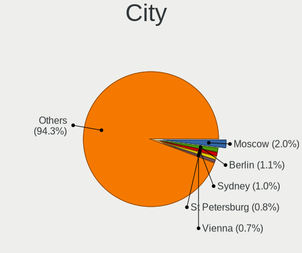
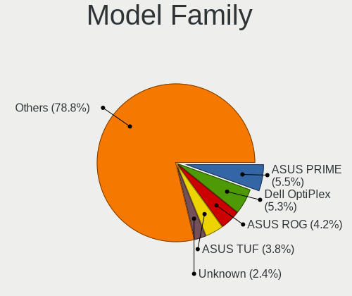
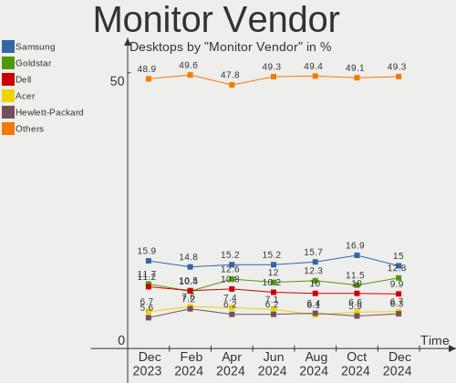
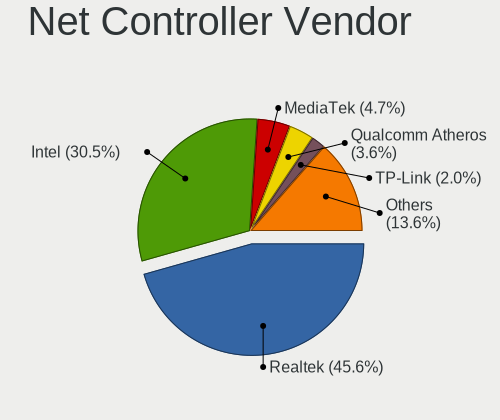
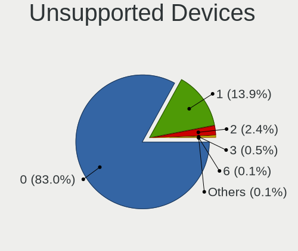

Linux Hardware Trends (Desktop)
-------------------------------

A project to identify most popular hardware characteristics and track their change
over time based on data collected by Linux users at https://Linux-Hardware.org.

Anyone can contribute to the study by uploading probes of their computers by
the [hw-probe](https://github.com/linuxhw/hw-probe) tool:

    sudo hw-probe -all -upload

Full-feature report is available here: https://linux-hardware.org/?view=trends&formfactor=desktop

Period: Jan, 2020.

Contents
--------

- [ OS                       ](#os)
- [ OS Family                ](#os-family)
- [ Kernel                   ](#kernel)
- [ Kernel Family            ](#kernel-family)
- [ Kernel Major Ver.        ](#kernel-major-ver)
- [ Arch                     ](#arch)
- [ DE                       ](#de)
- [ Display Server           ](#display-server)
- [ OS Lang                  ](#os-lang)
- [ Boot Mode                ](#boot-mode)
- [ Filesystem               ](#filesystem)
- [ Dual Boot with Linux     ](#dual-boot-with-linux)
- [ Dual Boot (Win)          ](#dual-boot-win)
- [ Country                  ](#country)
- [ City                     ](#city)
- [ Vendor                   ](#vendor)
- [ Model                    ](#model)
- [ Model Family             ](#model-family)
- [ MFG Year                 ](#mfg-year)
- [ Form Factor              ](#form-factor)
- [ Secure Boot              ](#secure-boot)
- [ Coreboot                 ](#coreboot)
- [ RAM Size                 ](#ram-size)
- [ RAM Used                 ](#ram-used)
- [ Drive Vendor             ](#drive-vendor)
- [ Drive Model              ](#drive-model)
- [ Drive Kind               ](#drive-kind)
- [ Drive Connector          ](#drive-connector)
- [ Drive Size               ](#drive-size)
- [ Space Total              ](#space-total)
- [ Space Used               ](#space-used)
- [ Malfunc. Drives          ](#malfunc-drives)
- [ Malfunc. Drive Vendor    ](#malfunc-drive-vendor)
- [ Malfunc. Drive Kind      ](#malfunc-drive-kind)
- [ Failed Drives            ](#failed-drives)
- [ Failed Drive Vendor      ](#failed-drive-vendor)
- [ Drive Status             ](#drive-status)
- [ CPU Vendor               ](#cpu-vendor)
- [ CPU Model                ](#cpu-model)
- [ CPU Model Family         ](#cpu-model-family)
- [ CPU Cores                ](#cpu-cores)
- [ CPU Sockets              ](#cpu-sockets)
- [ CPU Threads              ](#cpu-threads)
- [ CPU Op-Modes             ](#cpu-op-modes)
- [ CPU Microarch            ](#cpu-microarch)
- [ CPU Microcode            ](#cpu-microcode)
- [ GPU Vendor               ](#gpu-vendor)
- [ GPU Model                ](#gpu-model)
- [ GPU Combo                ](#gpu-combo)
- [ GPU Driver               ](#gpu-driver)
- [ GPU Memory               ](#gpu-memory)
- [ Monitor Vendor           ](#monitor-vendor)
- [ Monitor Model            ](#monitor-model)
- [ Monitor Resolution       ](#monitor-resolution)
- [ Monitor Diagonal         ](#monitor-diagonal)
- [ Monitor Width            ](#monitor-width)
- [ Aspect Ratio             ](#aspect-ratio)
- [ Monitor Area             ](#monitor-area)
- [ Pixel Density            ](#pixel-density)
- [ Multiple Monitors        ](#multiple-monitors)
- [ Net Controller Vendor    ](#net-controller-vendor)
- [ Net Controller Model     ](#net-controller-model)
- [ Net Controller Kind      ](#net-controller-kind)
- [ Used Controller          ](#used-controller)
- [ NICs                     ](#nics)
- [ Unsupported Devices      ](#unsupported-devices)
- [ Unsupported Device Types ](#unsupported-device-types)

OS
--

Installed operating systems

| Name                         | Computers | Percent |
|------------------------------|-----------|---------|
| Ubuntu 18.04                 | 299       | 23.64%  |
| ROSA R11                     | 170       | 13.44%  |
| Ubuntu 19.10                 | 135       | 10.67%  |
| BlackPanther 18.1            | 110       | 8.7%    |
| Mint 19.3                    | 76        | 6.01%   |
| Fedora 31                    | 66        | 5.22%   |
| Arch                         | 33        | 2.61%   |
| Manjaro 18.1.5               | 27        | 2.13%   |
| Arch Rolling                 | 27        | 2.13%   |
| Zorin 15                     | 22        | 1.74%   |
| BlackPanther 16.2            | 21        | 1.66%   |
| Debian 10                    | 17        | 1.34%   |
| Ubuntu 19.04                 | 16        | 1.26%   |
| Ubuntu 16.04                 | 16        | 1.26%   |
| Manjaro                      | 16        | 1.26%   |
| KDE neon 18.04               | 14        | 1.11%   |
| Endless 3.7.6                | 13        | 1.03%   |
| Mint 19.1                    | 12        | 0.95%   |
| Ubuntu 20.04                 | 10        | 0.79%   |
| ROSA R10                     | 10        | 0.79%   |
| Mint 19.2                    | 10        | 0.79%   |
| ROSA R8.1                    | 8         | 0.63%   |
| Elementary 5.1               | 7         | 0.55%   |
| MX 19                        | 6         | 0.47%   |
| Gentoo                       | 6         | 0.47%   |
| ClearOS 7                    | 6         | 0.47%   |
| RHEL 8.1                     | 5         | 0.4%    |
| Mint 19                      | 5         | 0.4%    |
| Mint 18.3                    | 5         | 0.4%    |
| CentOS 8                     | 5         | 0.4%    |
| CentOS 7                     | 5         | 0.4%    |
| RED X4                       | 4         | 0.32%   |
| Peppermint 10                | 4         | 0.32%   |
| Fedora 32                    | 4         | 0.32%   |
| Debian 9                     | 4         | 0.32%   |
| Debian                       | 4         | 0.32%   |
| Ubuntu 18.10                 | 3         | 0.24%   |
| Fedora 30                    | 3         | 0.24%   |
| Endless 3.7.5                | 3         | 0.24%   |
| Debian Unstable              | 3         | 0.24%   |
| ClearOS 7.7.2                | 3         | 0.24%   |
| Zorin 12                     | 2         | 0.16%   |
| RED OS 7.2                   | 2         | 0.16%   |
| openSUSE Tumbleweed-20200117 | 2         | 0.16%   |
| Kali 2019.4                  | 2         | 0.16%   |
| Clear Linux 32160            | 2         | 0.16%   |
| Void Rolling                 | 1         | 0.08%   |
| Void                         | 1         | 0.08%   |
| Ubuntu 17.10                 | 1         | 0.08%   |
| Slackware 14.2               | 1         | 0.08%   |
| ROSA R9                      | 1         | 0.08%   |
| Reborn OS                    | 1         | 0.08%   |
| Pop!_OS 19.10                | 1         | 0.08%   |
| Parrot 4.7                   | 1         | 0.08%   |
| openSUSE Tumbleweed-20200128 | 1         | 0.08%   |
| openSUSE Tumbleweed-20200123 | 1         | 0.08%   |
| openSUSE Tumbleweed-20200122 | 1         | 0.08%   |
| openSUSE Tumbleweed-20200107 | 1         | 0.08%   |
| openSUSE Tumbleweed-20200106 | 1         | 0.08%   |
| openSUSE Tumbleweed-20200101 | 1         | 0.08%   |

OS Family
---------

OS without a version

| Name         | Computers | Percent |
|--------------|-----------|---------|
| Ubuntu       | 480       | 37.94%  |
| ROSA         | 193       | 15.26%  |
| BlackPanther | 131       | 10.36%  |
| Mint         | 108       | 8.54%   |
| Fedora       | 74        | 5.85%   |
| Arch         | 60        | 4.74%   |
| Manjaro      | 46        | 3.64%   |
| Debian       | 30        | 2.37%   |
| Zorin        | 24        | 1.9%    |
| Endless      | 17        | 1.34%   |
| openSUSE     | 14        | 1.11%   |
| KDE neon     | 14        | 1.11%   |
| CentOS       | 11        | 0.87%   |
| ClearOS      | 9         | 0.71%   |
| Clear Linux  | 8         | 0.63%   |
| Gentoo       | 7         | 0.55%   |
| Elementary   | 7         | 0.55%   |
| MX           | 6         | 0.47%   |
| RHEL         | 5         | 0.4%    |
| Peppermint   | 4         | 0.32%   |
| Kali         | 3         | 0.24%   |
| Void         | 2         | 0.16%   |
| RED OS       | 2         | 0.16%   |
| Arcolinux    | 2         | 0.16%   |
| Slackware    | 1         | 0.08%   |
| Reborn OS    | 1         | 0.08%   |
| Pop!_OS      | 1         | 0.08%   |
| Parrot       | 1         | 0.08%   |
| Mageia       | 1         | 0.08%   |
| Generic      | 1         | 0.08%   |
| Duzeru       | 1         | 0.08%   |
| Chrome OS    | 1         | 0.08%   |

Kernel
------

Version of the Linux kernel

| Version                          | Computers | Percent |
|----------------------------------|-----------|---------|
| 5.3.0-26-generic                 | 162       | 12.81%  |
| 5.0.0-37-generic                 | 141       | 11.15%  |
| 4.18.16-desktop-1bP              | 102       | 8.06%   |
| 4.15.0-74-generic                | 84        | 6.64%   |
| 4.15.0-desktop-68.5rosa-x86_64   | 59        | 4.66%   |
| 4.15.0-desktop-45.1rosa-x86_64   | 54        | 4.27%   |
| 4.15.0-72-generic                | 41        | 3.24%   |
| 5.3.0-24-generic                 | 30        | 2.37%   |
| 4.9.20-desktop-pae-1bP           | 20        | 1.58%   |
| 5.3.0-28-generic                 | 19        | 1.5%    |
| 5.3.0-29-generic                 | 18        | 1.42%   |
| 5.0.0-23-generic                 | 17        | 1.34%   |
| 5.3.0-23-generic                 | 16        | 1.26%   |
| 5.4.12-200.fc31.x86_64           | 15        | 1.19%   |
| 5.3.16-300.fc31.x86_64           | 15        | 1.19%   |
| 4.15.0-desktop-45.1rosa-i586     | 14        | 1.11%   |
| 5.4.6-2-MANJARO                  | 13        | 1.03%   |
| 5.4.13-arch1-1                   | 12        | 0.95%   |
| 5.3.0-18-generic                 | 11        | 0.87%   |
| 5.4.13-3-MANJARO                 | 10        | 0.79%   |
| 4.9.155-nrj-desktop-1rosa-x86_64 | 10        | 0.79%   |
| 4.15.0-desktop-68.5rosa-i586     | 10        | 0.79%   |
| 3.10.0-1062.9.1.el7.x86_64       | 10        | 0.79%   |
| 4.19.0-6-amd64                   | 9         | 0.71%   |
| 5.4.8-200.fc31.x86_64            | 8         | 0.63%   |
| 5.4.14-arch1-1                   | 8         | 0.63%   |
| 5.4.10-200.fc31.x86_64           | 8         | 0.63%   |
| 4.9.60-nrj-desktop-1rosa-x86_64  | 8         | 0.63%   |
| 4.15.0-76-generic                | 8         | 0.63%   |
| 5.4.13-201.fc31.x86_64           | 7         | 0.55%   |
| 5.1.15-desktop-1bP               | 7         | 0.55%   |
| 5.0.0-32-generic                 | 7         | 0.55%   |
| 5.0.0-38-generic                 | 6         | 0.47%   |
| 4.9.155-nrj-desktop-1rosa-i586   | 6         | 0.47%   |
| 4.18.0-147.3.1.el8_1.x86_64      | 6         | 0.47%   |
| 4.15.0-74-lowlatency             | 6         | 0.47%   |
| 4.15.0-66-generic                | 6         | 0.47%   |
| 4.15.0-54-generic                | 6         | 0.47%   |
| 5.4.7-arch1-1                    | 5         | 0.4%    |
| 5.4.7-200.fc31.x86_64            | 5         | 0.4%    |
| 5.4.14-2-MANJARO                 | 5         | 0.4%    |
| 5.4.12-1-MANJARO                 | 5         | 0.4%    |
| 5.4.15-arch1-1                   | 4         | 0.32%   |
| 5.4.10-1-default                 | 4         | 0.32%   |
| 5.3.7-301.fc31.x86_64            | 4         | 0.32%   |
| 5.3.0-7625-generic               | 4         | 0.32%   |
| 4.9.60-nrj-desktop-1rosa-i586    | 4         | 0.32%   |
| 4.9.0-11-amd64                   | 4         | 0.32%   |
| 4.4.0-171-generic                | 4         | 0.32%   |
| 4.15.0-70-generic                | 4         | 0.32%   |
| 5.4.8-arch1-1                    | 3         | 0.24%   |
| 5.4.13-zen1-1-zen                | 3         | 0.24%   |
| 5.4.12-zen1-1-zen                | 3         | 0.24%   |
| 5.4.12-arch1-1                   | 3         | 0.24%   |
| 5.4.10-arch1-1                   | 3         | 0.24%   |
| 5.4.0-desktop-9.1rosa-x86_64     | 3         | 0.24%   |
| 5.4.0-9-generic                  | 3         | 0.24%   |
| 5.4.0-3-amd64                    | 3         | 0.24%   |
| 5.3.18-nrj-desktop-1rosa-x86_64  | 3         | 0.24%   |
| 5.3.12-2-default                 | 3         | 0.24%   |

Kernel Family
-------------

Linux kernel without a distro release

| Version  | Computers | Percent |
|----------|-----------|---------|
| 4.15.0   | 314       | 24.82%  |
| 5.3.0    | 276       | 21.82%  |
| 5.0.0    | 177       | 13.99%  |
| 4.18.16  | 102       | 8.06%   |
| 5.4.13   | 37        | 2.92%   |
| 5.4.12   | 31        | 2.45%   |
| 5.4.0    | 24        | 1.9%    |
| 4.9.20   | 21        | 1.66%   |
| 5.4.6    | 19        | 1.5%    |
| 5.4.10   | 19        | 1.5%    |
| 5.4.14   | 16        | 1.26%   |
| 4.9.155  | 16        | 1.26%   |
| 4.18.0   | 16        | 1.26%   |
| 5.4.8    | 15        | 1.19%   |
| 5.4.7    | 15        | 1.19%   |
| 5.3.16   | 15        | 1.19%   |
| 3.10.0   | 14        | 1.11%   |
| 5.5.0    | 13        | 1.03%   |
| 4.9.60   | 12        | 0.95%   |
| 4.19.0   | 10        | 0.79%   |
| 5.4.15   | 8         | 0.63%   |
| 5.1.15   | 8         | 0.63%   |
| 4.4.0    | 8         | 0.63%   |
| 4.9.0    | 6         | 0.47%   |
| 5.3.7    | 5         | 0.4%    |
| 5.3.12   | 5         | 0.4%    |
| 5.3.13   | 4         | 0.32%   |
| 4.19.91  | 4         | 0.32%   |
| 4.1.38   | 4         | 0.32%   |
| 5.3.18   | 3         | 0.24%   |
| 5.2.0    | 3         | 0.24%   |
| 5.4.11   | 2         | 0.16%   |
| 5.3.9    | 2         | 0.16%   |
| 5.3.11   | 2         | 0.16%   |
| 5.2.21   | 2         | 0.16%   |
| 4.9.9    | 2         | 0.16%   |
| 4.19.98  | 2         | 0.16%   |
| 4.19.97  | 2         | 0.16%   |
| 4.19.93  | 2         | 0.16%   |
| 4.19.92  | 2         | 0.16%   |
| 4.14.160 | 2         | 0.16%   |
| 4.13.0   | 2         | 0.16%   |
| 4.10.0   | 2         | 0.16%   |
| 5.4.5    | 1         | 0.08%   |
| 5.4.2    | 1         | 0.08%   |
| 5.3.6    | 1         | 0.08%   |
| 5.3.15   | 1         | 0.08%   |
| 5.3.14   | 1         | 0.08%   |
| 5.2.9    | 1         | 0.08%   |
| 5.1.2    | 1         | 0.08%   |
| 5.1.16   | 1         | 0.08%   |
| 5.0.18   | 1         | 0.08%   |
| 5.0.17   | 1         | 0.08%   |
| 4.19.88  | 1         | 0.08%   |
| 4.19.86  | 1         | 0.08%   |
| 4.19.79  | 1         | 0.08%   |
| 4.19.67  | 1         | 0.08%   |
| 4.19.65  | 1         | 0.08%   |
| 4.19.56  | 1         | 0.08%   |
| 4.18.20  | 1         | 0.08%   |

Kernel Major Ver.
-----------------

Linux kernel major version

| Version | Computers | Percent |
|---------|-----------|---------|
| 5.3     | 315       | 24.9%   |
| 4.15    | 315       | 24.9%   |
| 5.4     | 188       | 14.86%  |
| 5.0     | 179       | 14.15%  |
| 4.18    | 119       | 9.41%   |
| 4.9     | 57        | 4.51%   |
| 4.19    | 28        | 2.21%   |
| 3.10    | 14        | 1.11%   |
| 5.5     | 13        | 1.03%   |
| 5.1     | 10        | 0.79%   |
| 4.4     | 8         | 0.63%   |
| 5.2     | 6         | 0.47%   |
| 4.1     | 4         | 0.32%   |
| 4.14    | 3         | 0.24%   |
| 4.13    | 2         | 0.16%   |
| 4.10    | 2         | 0.16%   |
| 4.16    | 1         | 0.08%   |
| 4.12    | 1         | 0.08%   |

Arch
----

OS architecture (x86_64, i586, etc.)

| Name    | Computers | Percent |
|---------|-----------|---------|
| x86_64  | 1165      | 92.09%  |
| i686    | 99        | 7.83%   |
| ppc64le | 1         | 0.08%   |

DE
--

Desktop Environment

| Name                      | Computers | Percent |
|---------------------------|-----------|---------|
| GNOME                     | 427       | 33.75%  |
| KDE5                      | 335       | 26.48%  |
| Unknown                   | 170       | 13.44%  |
| XFCE                      | 105       | 8.3%    |
| X-Cinnamon                | 70        | 5.53%   |
| KDE                       | 51        | 4.03%   |
| MATE                      | 30        | 2.37%   |
| Cinnamon                  | 18        | 1.42%   |
| Unity                     | 17        | 1.34%   |
| LXQt                      | 9         | 0.71%   |
| Pantheon                  | 7         | 0.55%   |
| LXDE                      | 7         | 0.55%   |
| Budgie                    | 7         | 0.55%   |
| GNOME-Classic:GNOME       | 3         | 0.24%   |
| GNOME Flashback           | 3         | 0.24%   |
| Enlightenment             | 2         | 0.16%   |
| openbox                   | 1         | 0.08%   |
| i3                        | 1         | 0.08%   |
| Deepin                    | 1         | 0.08%   |
| communitheme:ubuntu:GNOME | 1         | 0.08%   |

Display Server
--------------

X11 or Wayland

| Name    | Computers | Percent |
|---------|-----------|---------|
| Unknown | 630       | 49.8%   |
| X11     | 593       | 46.88%  |
| Wayland | 33        | 2.61%   |
| Tty     | 9         | 0.71%   |

OS Lang
-------

Language

| Lang       | Computers | Percent |
|------------|-----------|---------|
| Unknown    | 443       | 35.02%  |
| en_US      | 296       | 23.4%   |
| de_DE      | 83        | 6.56%   |
| en_GB      | 56        | 4.43%   |
| ru_RU      | 34        | 2.69%   |
| pt_BR      | 33        | 2.61%   |
| it_IT      | 28        | 2.21%   |
| fr_FR      | 25        | 1.98%   |
| es_ES      | 22        | 1.74%   |
| en_CA      | 21        | 1.66%   |
| gl_ES      | 16        | 1.26%   |
| C          | 16        | 1.26%   |
| pl_PL      | 15        | 1.19%   |
| en_US.utf8 | 15        | 1.19%   |
| en_AU      | 15        | 1.19%   |
| nl_NL      | 13        | 1.03%   |
| pt_PT      | 9         | 0.71%   |
| hu_HU      | 8         | 0.63%   |
| en_IN      | 8         | 0.63%   |
| cs_CZ      | 6         | 0.47%   |
| sv_SE      | 5         | 0.4%    |
| ja_JP      | 5         | 0.4%    |
| fr_CA      | 5         | 0.4%    |
| zh_CN      | 4         | 0.32%   |
| fi_FI      | 4         | 0.32%   |
| en_ZA      | 4         | 0.32%   |
| de_AT      | 4         | 0.32%   |
| es_MX      | 3         | 0.24%   |
| en_PH      | 3         | 0.24%   |
| en_NZ      | 3         | 0.24%   |
| en_GB.utf8 | 3         | 0.24%   |
| el_GR      | 3         | 0.24%   |
| zh_HK      | 2         | 0.16%   |
| uk_UA      | 2         | 0.16%   |
| tr_TR      | 2         | 0.16%   |
| sk_SK      | 2         | 0.16%   |
| ru_UA      | 2         | 0.16%   |
| pt_BR.utf8 | 2         | 0.16%   |
| nl_BE      | 2         | 0.16%   |
| es_PE      | 2         | 0.16%   |
| es_GT      | 2         | 0.16%   |
| es_AR      | 2         | 0.16%   |
| en_SG      | 2         | 0.16%   |
| en_IL      | 2         | 0.16%   |
| en_IE      | 2         | 0.16%   |
| en_HK      | 2         | 0.16%   |
| de_CH      | 2         | 0.16%   |
| ca_ES      | 2         | 0.16%   |
| zh_TW      | 1         | 0.08%   |
| sv_SE.utf8 | 1         | 0.08%   |
| sv_FI      | 1         | 0.08%   |
| sr_RS      | 1         | 0.08%   |
| sl_SI      | 1         | 0.08%   |
| ro_RO      | 1         | 0.08%   |
| POSIX      | 1         | 0.08%   |
| nb_NO      | 1         | 0.08%   |
| mni_IN     | 1         | 0.08%   |
| hr_HR      | 1         | 0.08%   |
| fr_LU      | 1         | 0.08%   |
| fr_CH      | 1         | 0.08%   |

Boot Mode
---------

EFI or BIOS

| Mode | Computers | Percent |
|------|-----------|---------|
| BIOS | 865       | 68.38%  |
| EFI  | 400       | 31.62%  |

Filesystem
----------

Type of filesystem

| Type    | Computers | Percent |
|---------|-----------|---------|
| Ext4    | 1103      | 87.19%  |
| Btrfs   | 42        | 3.32%   |
| Xfs     | 39        | 3.08%   |
| Overlay | 35        | 2.77%   |
| Ext3    | 32        | 2.53%   |
| Zfs     | 4         | 0.32%   |
| F2fs    | 4         | 0.32%   |
| Unknown | 4         | 0.32%   |
| Jfs     | 1         | 0.08%   |
| Ext2    | 1         | 0.08%   |

Dual Boot with Linux
--------------------

Hosting more than one Linux

| Dual boot | Computers | Percent |
|-----------|-----------|---------|
| No        | 1044      | 82.53%  |
| Yes       | 221       | 17.47%  |

Dual Boot (Win)
---------------

Hosting Linux and Windows

| Dual boot | Computers | Percent |
|-----------|-----------|---------|
| No        | 774       | 61.19%  |
| Yes       | 491       | 38.81%  |

Country
-------

Geographic location (country)

| Country             | Computers | Percent |
|---------------------|-----------|---------|
| Russia              | 205       | 16.21%  |
| USA                 | 196       | 15.49%  |
| Germany             | 121       | 9.57%   |
| Hungary             | 119       | 9.41%   |
| UK                  | 53        | 4.19%   |
| Spain               | 47        | 3.72%   |
| Brazil              | 42        | 3.32%   |
| Canada              | 40        | 3.16%   |
| Italy               | 38        | 3%      |
| France              | 37        | 2.92%   |
| Netherlands         | 29        | 2.29%   |
| Poland              | 28        | 2.21%   |
| Ukraine             | 27        | 2.13%   |
| Australia           | 27        | 2.13%   |
| India               | 14        | 1.11%   |
| Sweden              | 13        | 1.03%   |
| Romania             | 13        | 1.03%   |
| Switzerland         | 12        | 0.95%   |
| Czech Republic      | 12        | 0.95%   |
| Finland             | 11        | 0.87%   |
| Austria             | 11        | 0.87%   |
| Belarus             | 8         | 0.63%   |
| Turkey              | 7         | 0.55%   |
| Taiwan              | 7         | 0.55%   |
| South Africa        | 7         | 0.55%   |
| Serbia              | 7         | 0.55%   |
| Portugal            | 7         | 0.55%   |
| New Zealand         | 7         | 0.55%   |
| Slovakia            | 6         | 0.47%   |
| Japan               | 6         | 0.47%   |
| Greece              | 6         | 0.47%   |
| Thailand            | 5         | 0.4%    |
| China               | 5         | 0.4%    |
| Belgium             | 5         | 0.4%    |
| Philippines         | 4         | 0.32%   |
| Lithuania           | 4         | 0.32%   |
| Israel              | 4         | 0.32%   |
| Hong Kong           | 4         | 0.32%   |
| Denmark             | 4         | 0.32%   |
| Slovenia            | 3         | 0.24%   |
| Peru                | 3         | 0.24%   |
| Mexico              | 3         | 0.24%   |
| Latvia              | 3         | 0.24%   |
| Kazakhstan          | 3         | 0.24%   |
| Croatia             | 3         | 0.24%   |
| Bulgaria            | 3         | 0.24%   |
| Argentina           | 3         | 0.24%   |
| Trinidad and Tobago | 2         | 0.16%   |
| Singapore           | 2         | 0.16%   |
| Pakistan            | 2         | 0.16%   |
| Luxembourg          | 2         | 0.16%   |
| Indonesia           | 2         | 0.16%   |
| Guatemala           | 2         | 0.16%   |
| Estonia             | 2         | 0.16%   |
| Egypt               | 2         | 0.16%   |
| Cyprus              | 2         | 0.16%   |
| Colombia            | 2         | 0.16%   |
| Algeria             | 2         | 0.16%   |
| Vietnam             | 1         | 0.08%   |
| Venezuela           | 1         | 0.08%   |

City
----

Geographic location (city)

| City              | Computers | Percent |
|-------------------|-----------|---------|
| Budapest          | 28        | 2.21%   |
| Ourense           | 22        | 1.74%   |
| Moscow            | 22        | 1.74%   |
| St Petersburg     | 18        | 1.42%   |
| Eger              | 16        | 1.26%   |
| Yekaterinburg     | 9         | 0.71%   |
| Rostov-on-Don     | 9         | 0.71%   |
| Berlin            | 7         | 0.55%   |
| Wahroonga         | 6         | 0.47%   |
| Munich            | 6         | 0.47%   |
| Miskolc           | 6         | 0.47%   |
| Kyiv              | 6         | 0.47%   |
| Zurich            | 5         | 0.4%    |
| Vienna            | 5         | 0.4%    |
| Toronto           | 5         | 0.4%    |
| Stockholm         | 5         | 0.4%    |
| Novosibirsk       | 5         | 0.4%    |
| Minsk             | 5         | 0.4%    |
| Kazan’          | 5         | 0.4%    |
| Frankfurt am Main | 5         | 0.4%    |
| Szeged            | 4         | 0.32%   |
| Prague            | 4         | 0.32%   |
| Perm              | 4         | 0.32%   |
| Ottawa            | 4         | 0.32%   |
| Mumbai            | 4         | 0.32%   |
| Montreal          | 4         | 0.32%   |
| Milan             | 4         | 0.32%   |
| Miami             | 4         | 0.32%   |
| Leipzig           | 4         | 0.32%   |
| Irkutsk           | 4         | 0.32%   |
| Hornsby           | 4         | 0.32%   |
| Helsinki          | 4         | 0.32%   |
| Győr             | 4         | 0.32%   |
| Bucharest         | 4         | 0.32%   |
| Bratislava        | 4         | 0.32%   |
| Athens            | 4         | 0.32%   |
| Warsaw            | 3         | 0.24%   |
| Voronezh          | 3         | 0.24%   |
| Vilnius           | 3         | 0.24%   |
| Ufa               | 3         | 0.24%   |
| Tyumen            | 3         | 0.24%   |
| Turin             | 3         | 0.24%   |
| Tula              | 3         | 0.24%   |
| Taipei            | 3         | 0.24%   |
| São Paulo        | 3         | 0.24%   |
| Stuttgart         | 3         | 0.24%   |
| Sevastopol        | 3         | 0.24%   |
| Samara            | 3         | 0.24%   |
| Riga              | 3         | 0.24%   |
| Paris             | 3         | 0.24%   |
| Papillion         | 3         | 0.24%   |
| Oryol             | 3         | 0.24%   |
| Manila            | 3         | 0.24%   |
| Lima              | 3         | 0.24%   |
| Krasnoyarsk       | 3         | 0.24%   |
| Krasnodar         | 3         | 0.24%   |
| Khabarovsk        | 3         | 0.24%   |
| Kaluga            | 3         | 0.24%   |
| Johannesburg      | 3         | 0.24%   |
| Izhevsk           | 3         | 0.24%   |

Vendor
------

Motherboard manufacturer

| Name                | Computers | Percent |
|---------------------|-----------|---------|
| ASUSTek Computer    | 327       | 25.85%  |
| Gigabyte Technology | 230       | 18.18%  |
| MSI                 | 139       | 10.99%  |
| ASRock              | 131       | 10.36%  |
| Dell                | 109       | 8.62%   |
| Hewlett-Packard     | 70        | 5.53%   |
| Lenovo              | 53        | 4.19%   |
| Intel               | 34        | 2.69%   |
| Acer                | 22        | 1.74%   |
| Foxconn             | 16        | 1.26%   |
| ECS                 | 14        | 1.11%   |
| Medion              | 13        | 1.03%   |
| Biostar             | 11        | 0.87%   |
| Fujitsu             | 10        | 0.79%   |
| Fujitsu Siemens     | 9         | 0.71%   |
| Pegatron            | 8         | 0.63%   |
| Unknown             | 8         | 0.63%   |
| Supermicro          | 7         | 0.55%   |
| WinFast             | 5         | 0.4%    |
| Gateway             | 4         | 0.32%   |
| eMachines           | 4         | 0.32%   |
| Packard Bell        | 3         | 0.24%   |
| AMI                 | 3         | 0.24%   |
| XFX                 | 2         | 0.16%   |
| Positivo            | 2         | 0.16%   |
| Huanan              | 2         | 0.16%   |
| HARDKERNEL          | 2         | 0.16%   |
| AAEON               | 2         | 0.16%   |
| ZOTAC               | 1         | 0.08%   |
| Wistron             | 1         | 0.08%   |
| SiS Technology      | 1         | 0.08%   |
| Shuttle             | 1         | 0.08%   |
| Semp Toshiba        | 1         | 0.08%   |
| Seco                | 1         | 0.08%   |
| Sapphire Tech       | 1         | 0.08%   |
| Sapphire            | 1         | 0.08%   |
| PCWare              | 1         | 0.08%   |
| Onda Technology     | 1         | 0.08%   |
| OEM                 | 1         | 0.08%   |
| NF531M              | 1         | 0.08%   |
| mp                  | 1         | 0.08%   |
| Maxtang             | 1         | 0.08%   |
| JW Technology       | 1         | 0.08%   |
| IBM                 | 1         | 0.08%   |
| Hewleet-Packard     | 1         | 0.08%   |
| Google              | 1         | 0.08%   |
| EPoX Computer       | 1         | 0.08%   |
| Digiboard           | 1         | 0.08%   |
| Colorful Technology | 1         | 0.08%   |
| ASRockRack          | 1         | 0.08%   |
| AOpen               | 1         | 0.08%   |
| AMD                 | 1         | 0.08%   |
| Alienware           | 1         | 0.08%   |

Model
-----

Motherboard model

| Name                       | Computers | Percent |
|----------------------------|-----------|---------|
| All Series                 | 38        | 3%      |
| ThinkCentre E73 10DR0033SP | 22        | 1.74%   |
| OptiPlex 7010              | 11        | 0.87%   |
| M5A78L-M/USB3              | 10        | 0.79%   |
| OptiPlex 3020              | 9         | 0.71%   |
| Unknown                    | 9         | 0.71%   |
| MS-7C02                    | 7         | 0.55%   |
| MS-7693                    | 7         | 0.55%   |
| H61M-S1                    | 7         | 0.55%   |
| PRIME B350-PLUS            | 6         | 0.47%   |
| OptiPlex 780               | 6         | 0.47%   |
| OptiPlex 760               | 6         | 0.47%   |
| OptiPlex 755               | 6         | 0.47%   |
| MS-7A38                    | 6         | 0.47%   |
| 970A-DS3P                  | 6         | 0.47%   |
| PRIME X470-PRO             | 5         | 0.4%    |
| PRIME H310M-R R2.0         | 5         | 0.4%    |
| G41M-VS3                   | 5         | 0.4%    |
| G31M-ES2L                  | 5         | 0.4%    |
| XPS 8700                   | 4         | 0.32%   |
| X399 Taichi                | 4         | 0.32%   |
| ROG STRIX B450-F GAMING    | 4         | 0.32%   |
| PRIME Z270-A               | 4         | 0.32%   |
| P7P55D                     | 4         | 0.32%   |
| OptiPlex 790               | 4         | 0.32%   |
| MS-7C37                    | 4         | 0.32%   |
| MS-7A34                    | 4         | 0.32%   |
| MS-7816                    | 4         | 0.32%   |
| Compaq Elite 8300 CMT      | 4         | 0.32%   |
| A320M-S2H V2               | 4         | 0.32%   |
| Z170 PRO GAMING            | 3         | 0.24%   |
| XPS 8500                   | 3         | 0.24%   |
| X570 AORUS PRO             | 3         | 0.24%   |
| TUF GAMING X570-PLUS       | 3         | 0.24%   |
| SABERTOOTH 990FX R2.0      | 3         | 0.24%   |
| PRIME X370-PRO             | 3         | 0.24%   |
| PRIME H310M-K              | 3         | 0.24%   |
| Precision WorkStation 490  | 3         | 0.24%   |
| P9X79 DELUXE               | 3         | 0.24%   |
| P7H55-M PRO                | 3         | 0.24%   |
| P5KPL-AM SE                | 3         | 0.24%   |
| P35-DS3L                   | 3         | 0.24%   |
| OptiPlex 390               | 3         | 0.24%   |
| MS-7B89                    | 3         | 0.24%   |
| MS-7B86                    | 3         | 0.24%   |
| MS-7A39                    | 3         | 0.24%   |
| MS-7A37                    | 3         | 0.24%   |
| MS-7821                    | 3         | 0.24%   |
| MS-7817                    | 3         | 0.24%   |
| MS-7786                    | 3         | 0.24%   |
| MS-7721                    | 3         | 0.24%   |
| MS-7519                    | 3         | 0.24%   |
| M5A97 R2.0                 | 3         | 0.24%   |
| M5A97 LE R2.0              | 3         | 0.24%   |
| M5A97 EVO R2.0             | 3         | 0.24%   |
| M5A78L-M PLUS/USB3         | 3         | 0.24%   |
| M5A78L-M LX3               | 3         | 0.24%   |
| M4A78T-E                   | 3         | 0.24%   |
| G31M-GS                    | 3         | 0.24%   |
| EliteDesk 800 G1 SFF       | 3         | 0.24%   |

Model Family
------------

Motherboard model prefix

| Name                    | Computers | Percent |
|-------------------------|-----------|---------|
| Dell OptiPlex           | 65        | 5.14%   |
| ASUS PRIME              | 44        | 3.48%   |
| Lenovo ThinkCentre      | 42        | 3.32%   |
| ASUS All                | 38        | 3%      |
| HP Compaq               | 31        | 2.45%   |
| ASUS ROG                | 21        | 1.66%   |
| ASUS M5A78L-M           | 19        | 1.5%    |
| Acer Aspire             | 18        | 1.42%   |
| ASUS M5A97              | 14        | 1.11%   |
| Dell Precision          | 12        | 0.95%   |
| Dell XPS                | 10        | 0.79%   |
| Dell Inspiron           | 10        | 0.79%   |
| ASUS P5KPL-AM           | 9         | 0.71%   |
| Unknown                 | 9         | 0.71%   |
| Dell Vostro             | 8         | 0.63%   |
| MSI MS-7C02             | 7         | 0.55%   |
| MSI MS-7693             | 7         | 0.55%   |
| HP ProDesk              | 7         | 0.55%   |
| HP EliteDesk            | 7         | 0.55%   |
| Gigabyte X570           | 7         | 0.55%   |
| Gigabyte H61M-S1        | 7         | 0.55%   |
| ASUS TUF                | 7         | 0.55%   |
| MSI MS-7A38             | 6         | 0.47%   |
| Gigabyte Z390           | 6         | 0.47%   |
| Gigabyte GA-78LMT-USB3  | 6         | 0.47%   |
| Gigabyte 970A-DS3P      | 6         | 0.47%   |
| Fujitsu Siemens ESPRIMO | 6         | 0.47%   |
| ASUS P8H61-M            | 6         | 0.47%   |
| Gigabyte G31M-ES2L      | 5         | 0.4%    |
| Gigabyte A320M-S2H      | 5         | 0.4%    |
| Fujitsu ESPRIMO         | 5         | 0.4%    |
| ASUS SABERTOOTH         | 5         | 0.4%    |
| ASUS Maximus            | 5         | 0.4%    |
| ASRock X399             | 5         | 0.4%    |
| ASRock G41M-VS3         | 5         | 0.4%    |
| MSI MS-7C37             | 4         | 0.32%   |
| MSI MS-7A34             | 4         | 0.32%   |
| MSI MS-7816             | 4         | 0.32%   |
| Lenovo ThinkStation     | 4         | 0.32%   |
| HP Pavilion             | 4         | 0.32%   |
| Gigabyte AB350M-DS3H    | 4         | 0.32%   |
| ASUS P8Z77-V            | 4         | 0.32%   |
| ASUS P8Z68-V            | 4         | 0.32%   |
| ASUS P7P55D             | 4         | 0.32%   |
| ASUS P7H55-M            | 4         | 0.32%   |
| ASUS P5Q                | 4         | 0.32%   |
| ASRock B450M            | 4         | 0.32%   |
| ASRock 970              | 4         | 0.32%   |
| MSI MS-7B89             | 3         | 0.24%   |
| MSI MS-7B86             | 3         | 0.24%   |
| MSI MS-7A39             | 3         | 0.24%   |
| MSI MS-7A37             | 3         | 0.24%   |
| MSI MS-7821             | 3         | 0.24%   |
| MSI MS-7817             | 3         | 0.24%   |
| MSI MS-7786             | 3         | 0.24%   |
| MSI MS-7721             | 3         | 0.24%   |
| MSI MS-7519             | 3         | 0.24%   |
| Intel DQ35JO            | 3         | 0.24%   |
| Intel DG31PR            | 3         | 0.24%   |
| Gigabyte Z170X-Gaming   | 3         | 0.24%   |

MFG Year
--------

Motherboard manufacture year

| Year    | Computers | Percent |
|---------|-----------|---------|
| 2019    | 192       | 15.18%  |
| 2018    | 134       | 10.59%  |
| 2014    | 127       | 10.04%  |
| 2012    | 103       | 8.14%   |
| 2013    | 96        | 7.59%   |
| 2011    | 91        | 7.19%   |
| 2010    | 89        | 7.04%   |
| 2009    | 88        | 6.96%   |
| 2015    | 82        | 6.48%   |
| 2016    | 69        | 5.45%   |
| 2008    | 62        | 4.9%    |
| 2017    | 50        | 3.95%   |
| 2007    | 34        | 2.69%   |
| 2006    | 24        | 1.9%    |
| 2005    | 17        | 1.34%   |
| 2004    | 3         | 0.24%   |
| 2003    | 2         | 0.16%   |
| 2001    | 1         | 0.08%   |
| Unknown | 1         | 0.08%   |

Form Factor
-----------

Physical design of the computer

| Name    | Computers | Percent |
|---------|-----------|---------|
| Desktop | 1265      | 100%    |

Secure Boot
-----------

Enabled or disabled

| State    | Computers | Percent |
|----------|-----------|---------|
| Disabled | 857       | 67.75%  |
| Unknown  | 384       | 30.36%  |
| Enabled  | 24        | 1.9%    |

Coreboot
--------

Have coreboot on board

| Used | Computers | Percent |
|------|-----------|---------|
| No   | 1264      | 99.92%  |
| Yes  | 1         | 0.08%   |

RAM Size
--------

Total RAM memory

| Size in GB  | Computers | Percent |
|-------------|-----------|---------|
| 16.01-24.0  | 289       | 22.85%  |
| 8.01-16.0   | 268       | 21.19%  |
| 3.01-4.0    | 262       | 20.71%  |
| 4.01-8.0    | 155       | 12.25%  |
| 32.01-64.0  | 106       | 8.38%   |
| 1.01-2.0    | 91        | 7.19%   |
| 64.01-256.0 | 30        | 2.37%   |
| 2.01-3.0    | 28        | 2.21%   |
| 24.01-32.0  | 24        | 1.9%    |
| 0.01-1.0    | 9         | 0.71%   |
| Unknown     | 3         | 0.24%   |

RAM Used
--------

Used RAM memory

| Used GB     | Computers | Percent |
|-------------|-----------|---------|
| 1.01-2.0    | 481       | 38.02%  |
| 0.01-1.0    | 247       | 19.53%  |
| 2.01-3.0    | 238       | 18.81%  |
| 4.01-8.0    | 128       | 10.12%  |
| 3.01-4.0    | 111       | 8.77%   |
| 8.01-16.0   | 40        | 3.16%   |
| 16.01-24.0  | 12        | 0.95%   |
| 24.01-32.0  | 4         | 0.32%   |
| Unknown     | 3         | 0.24%   |
| 64.01-256.0 | 1         | 0.08%   |

Drive Vendor
------------

Hard drive vendors

| Vendor              | Computers | Drives | Percent |
|---------------------|-----------|--------|---------|
| WDC                 | 477       | 608    | 22.59%  |
| Seagate             | 465       | 564    | 22.02%  |
| Samsung Electronics | 286       | 360    | 13.54%  |
| Toshiba             | 130       | 142    | 6.16%   |
| Kingston            | 122       | 136    | 5.78%   |
| Hitachi             | 112       | 121    | 5.3%    |
| Crucial             | 78        | 82     | 3.69%   |
| SanDisk             | 59        | 63     | 2.79%   |
| Intel               | 46        | 49     | 2.18%   |
| MAXTOR              | 34        | 36     | 1.61%   |
| A-DATA Technology   | 32        | 34     | 1.52%   |
| HGST                | 22        | 26     | 1.04%   |
| PLEXTOR             | 16        | 18     | 0.76%   |
| OCZ                 | 15        | 15     | 0.71%   |
| Corsair             | 14        | 15     | 0.66%   |
| Intenso             | 12        | 12     | 0.57%   |
| Generic             | 12        | 12     | 0.57%   |
| China               | 11        | 11     | 0.52%   |
| Transcend           | 10        | 10     | 0.47%   |
| Patriot             | 9         | 10     | 0.43%   |
| KingDian            | 9         | 9      | 0.43%   |
| SPCC                | 8         | 8      | 0.38%   |
| PNY                 | 8         | 10     | 0.38%   |
| Unknown             | 7         | 9      | 0.33%   |
| SK Hynix            | 7         | 7      | 0.33%   |
| Hewlett-Packard     | 6         | 6      | 0.28%   |
| GOODRAM             | 6         | 6      | 0.28%   |
| Fujitsu             | 6         | 6      | 0.28%   |
| Team                | 4         | 4      | 0.19%   |
| Phison              | 4         | 4      | 0.19%   |
| Micron Technology   | 4         | 4      | 0.19%   |
| KingSpec            | 4         | 4      | 0.19%   |
| Gigabyte Technology | 4         | 4      | 0.19%   |
| Apple               | 4         | 5      | 0.19%   |
| Apacer              | 4         | 4      | 0.19%   |
| Smartbuy            | 3         | 3      | 0.14%   |
| Mushkin             | 3         | 3      | 0.14%   |
| ASMT                | 3         | 3      | 0.14%   |
| AMD                 | 3         | 3      | 0.14%   |
| USB3.0              | 2         | 2      | 0.09%   |
| MARVELL             | 2         | 2      | 0.09%   |
| LITEONIT            | 2         | 2      | 0.09%   |
| LaCie               | 2         | 2      | 0.09%   |
| JMicron             | 2         | 2      | 0.09%   |
| Drevo               | 2         | 2      | 0.09%   |
| DOGFISH             | 2         | 2      | 0.09%   |
| Zheino              | 1         | 1      | 0.05%   |
| XPG                 | 1         | 1      | 0.05%   |
| WDC WD25            | 1         | 1      | 0.05%   |
| WD MediaMax         | 1         | 1      | 0.05%   |
| USB30               | 1         | 3      | 0.05%   |
| USB                 | 1         | 1      | 0.05%   |
| TAISU               | 1         | 1      | 0.05%   |
| StoreJet            | 1         | 1      | 0.05%   |
| SMART               | 1         | 1      | 0.05%   |
| Silicon Motion      | 1         | 1      | 0.05%   |
| SDLFNDAR            | 1         | 1      | 0.05%   |
| OWC                 | 1         | 1      | 0.05%   |
| OCZ-VERTEX3         | 1         | 1      | 0.05%   |
| OCZ-VERTEX2         | 1         | 1      | 0.05%   |

Drive Model
-----------

Hard drive models

| Model                        | Computers | Percent |
|------------------------------|-----------|---------|
| ST500DM002-1BD142 500GB      | 66        | 2.67%   |
| DT01ACA100 1TB               | 29        | 1.17%   |
| WD10EZEX-08WN4A0 1TB         | 23        | 0.93%   |
| SA400S37240G 240GB SSD       | 23        | 0.93%   |
| ST1000DM010-2EP102 1TB       | 22        | 0.89%   |
| SSD 850 EVO 500GB            | 22        | 0.89%   |
| SSD 850 EVO 250GB            | 22        | 0.89%   |
| ST3500418AS 500GB            | 20        | 0.81%   |
| SSD 860 EVO 500GB            | 20        | 0.81%   |
| SSD 860 EVO 250GB            | 20        | 0.81%   |
| WD5000AAKX-08U6AA0 500GB     | 19        | 0.77%   |
| SV300S37A120G 120GB SSD      | 19        | 0.77%   |
| ST1000DM003-1CH162 1TB       | 18        | 0.73%   |
| SSD 860 EVO 1TB              | 18        | 0.73%   |
| SA400S37120G 120GB SSD       | 17        | 0.69%   |
| DT01ACA200 2TB               | 16        | 0.65%   |
| WD10EZEX-00BN5A0 1TB         | 15        | 0.61%   |
| ST2000DM001-1CH164 2TB       | 15        | 0.61%   |
| ST380815AS 80GB              | 13        | 0.53%   |
| DT01ACA050 500GB             | 13        | 0.53%   |
| SV300S37A240G 240GB SSD      | 12        | 0.49%   |
| ST1000DM003-1ER162 1TB       | 12        | 0.49%   |
| SD/MMC/MS PRO 31GB           | 12        | 0.49%   |
| WD5000AAKX-001CA0 500GB      | 10        | 0.4%    |
| WD30EFRX-68EUZN0 3TB         | 10        | 0.4%    |
| WD20EFRX-68EUZN0 2TB         | 10        | 0.4%    |
| ST4000DM004-2CV104 4TB       | 10        | 0.4%    |
| ST3250310AS 250GB            | 10        | 0.4%    |
| ST3160815AS 160GB            | 10        | 0.4%    |
| ST2000DM001-1ER164 2TB       | 10        | 0.4%    |
| ST1000DM003-9YN162 1TB       | 10        | 0.4%    |
| CT500MX500SSD1 500GB         | 10        | 0.4%    |
| WD10EARS-00Y5B1 1TB          | 9         | 0.36%   |
| ST31000528AS 1TB             | 9         | 0.36%   |
| ST31000524AS 1TB             | 9         | 0.36%   |
| SSD 840 EVO 250GB            | 9         | 0.36%   |
| HDWD130 3TB                  | 9         | 0.36%   |
| HDWD110 1TB                  | 9         | 0.36%   |
| HD103SJ 1TB                  | 9         | 0.36%   |
| WDS240G2G0A-00JH30 240GB SSD | 8         | 0.32%   |
| WD5000AZRX-00A8LB0 500GB     | 8         | 0.32%   |
| WD10EZEX-08M2NA0 1TB         | 8         | 0.32%   |
| ST3250318AS 250GB            | 8         | 0.32%   |
| ST1000DM003-1SB10C 1TB       | 8         | 0.32%   |
| SSD 850 PRO 256GB            | 8         | 0.32%   |
| SSD 120GB                    | 8         | 0.32%   |
| HD322HJ 320GB                | 8         | 0.32%   |
| HD204UI 2TB                  | 8         | 0.32%   |
| WD5000AADS-00S9B0 500GB      | 7         | 0.28%   |
| SUV400S37120G 120GB SSD      | 7         | 0.28%   |
| ST3000DM008-2DM166 3TB       | 7         | 0.28%   |
| ST250DM000-1BD141 250GB      | 7         | 0.28%   |
| ST2000DX002-2DV164 2TB       | 7         | 0.28%   |
| SSD 850 250GB                | 7         | 0.28%   |
| SSD 840 Series 250GB         | 7         | 0.28%   |
| SSD 840 PRO Series 256GB     | 7         | 0.28%   |
| SDSSDA120G 120GB             | 7         | 0.28%   |
| SA400S37480G 480GB SSD       | 7         | 0.28%   |
| HDT722525DLA380 250GB        | 7         | 0.28%   |
| HD103UJ 1TB                  | 7         | 0.28%   |

Drive Kind
----------

HDD or SSD

| Kind    | Computers | Drives | Percent |
|---------|-----------|--------|---------|
| HDD     | 1006      | 1574   | 58.42%  |
| SSD     | 594       | 773    | 34.49%  |
| NVMe    | 71        | 79     | 4.12%   |
| Unknown | 46        | 48     | 2.67%   |
| MMC     | 5         | 7      | 0.29%   |

Drive Connector
---------------

SATA, SAS, NVMe, etc.

| Type | Computers | Drives | Percent |
|------|-----------|--------|---------|
| SATA | 1224      | 2326   | 89.67%  |
| NVMe | 71        | 79     | 5.2%    |
| SAS  | 65        | 69     | 4.76%   |
| MMC  | 5         | 7      | 0.37%   |

Drive Size
----------

Size of hard drive

| Size in TB | Computers | Drives | Percent |
|------------|-----------|--------|---------|
| 0.01-0.5   | 1025      | 1514   | 56.69%  |
| 0.51-1.0   | 474       | 599    | 26.22%  |
| 1.01-2.0   | 173       | 211    | 9.57%   |
| 2.01-3.0   | 63        | 74     | 3.48%   |
| 3.01-4.0   | 47        | 53     | 2.6%    |
| 4.01-10.0  | 22        | 26     | 1.22%   |
| 10.01-20.0 | 3         | 3      | 0.17%   |
| Unknown    | 1         | 1      | 0.06%   |

Space Total
-----------

Amount of disk space available on the file system

| Size in GB     | Computers | Percent |
|----------------|-----------|---------|
| 101-250        | 338       | 26.72%  |
| 251-500        | 223       | 17.63%  |
| 501-1000       | 166       | 13.12%  |
| More than 3000 | 115       | 9.09%   |
| 51-100         | 105       | 8.3%    |
| 1001-2000      | 103       | 8.14%   |
| 2001-3000      | 70        | 5.53%   |
| 21-50          | 58        | 4.58%   |
| 1-20           | 52        | 4.11%   |
| Unknown        | 35        | 2.77%   |

Space Used
----------

Amount of used disk space

| Used GB        | Computers | Percent |
|----------------|-----------|---------|
| 1-20           | 504       | 39.84%  |
| 21-50          | 173       | 13.68%  |
| 101-250        | 131       | 10.36%  |
| 251-500        | 94        | 7.43%   |
| 51-100         | 94        | 7.43%   |
| 501-1000       | 89        | 7.04%   |
| 1001-2000      | 67        | 5.3%    |
| More than 3000 | 52        | 4.11%   |
| Unknown        | 35        | 2.77%   |
| 2001-3000      | 26        | 2.06%   |

Malfunc. Drives
---------------

Drive models with a malfunction

| Model                    | Computers | Drives | Percent |
|--------------------------|-----------|--------|---------|
| ST500DM002-1BD142 500GB  | 8         | 8      | 3.83%   |
| WD5000AAKX-001CA0 500GB  | 4         | 4      | 1.91%   |
| ST1000DM003-9YN162 1TB   | 4         | 4      | 1.91%   |
| WD10EZEX-00RKKA0 1TB     | 3         | 3      | 1.44%   |
| WD6400AAKS-22A7B0 640GB  | 2         | 2      | 0.96%   |
| WD5000AADS-00S9B0 500GB  | 2         | 2      | 0.96%   |
| WD30EFRX-68EUZN0 3TB     | 2         | 2      | 0.96%   |
| WD10EARS-00Y5B1 1TB      | 2         | 2      | 0.96%   |
| STM3500418AS 500GB       | 2         | 2      | 0.96%   |
| ST3500418AS 500GB        | 2         | 2      | 0.96%   |
| ST3250318AS 250GB        | 2         | 2      | 0.96%   |
| ST3250310AS 250GB        | 2         | 2      | 0.96%   |
| ST31500341AS 1TB         | 2         | 2      | 0.96%   |
| ST31000528AS 1TB         | 2         | 2      | 0.96%   |
| ST1000DM003-1CH162 1TB   | 2         | 2      | 0.96%   |
| SP1614C 160GB            | 2         | 2      | 0.96%   |
| HTS542512K9SA00 120GB    | 2         | 2      | 0.96%   |
| HDT722525DLA380 250GB    | 2         | 2      | 0.96%   |
| HDS721050CLA660 500GB    | 2         | 2      | 0.96%   |
| HDS721032CLA362 320GB    | 2         | 2      | 0.96%   |
| HDP725050GLA360 500GB    | 2         | 2      | 0.96%   |
| HDP725025GLA380 250GB    | 2         | 2      | 0.96%   |
| HD501LJ 500GB            | 2         | 2      | 0.96%   |
| HD103UJ 1TB              | 2         | 2      | 0.96%   |
| 6Y080M0 80GB             | 2         | 2      | 0.96%   |
| WD800JD-75MSA3 80GB      | 1         | 1      | 0.48%   |
| WD800JD-00HKA0 80GB      | 1         | 1      | 0.48%   |
| WD800JB-00JJC0 80GB      | 1         | 1      | 0.48%   |
| WD800JB-00JJA0 80GB      | 1         | 1      | 0.48%   |
| WD6400AAKS-75A7B2 640GB  | 1         | 1      | 0.48%   |
| WD6400AAKS-2 640GB       | 1         | 1      | 0.48%   |
| WD5003ABYZ-011FA0 500GB  | 1         | 1      | 0.48%   |
| WD5001AALS-00L3B2 500GB  | 1         | 1      | 0.48%   |
| WD5000AZDX-00SC2B0 500GB | 1         | 1      | 0.48%   |
| WD5000AVVS-63M8B0 500GB  | 1         | 1      | 0.48%   |
| WD5000AVCS-632DY1 500GB  | 1         | 1      | 0.48%   |
| WD5000AAKX-22ERMA0 500GB | 1         | 1      | 0.48%   |
| WD5000AAKX-083CA1 500GB  | 1         | 1      | 0.48%   |
| WD5000AAKS-7 500GB       | 1         | 1      | 0.48%   |
| WD5000AAKS-60WWPA0 500GB | 1         | 1      | 0.48%   |
| WD5000AAKS-00UU3A0 500GB | 1         | 1      | 0.48%   |
| WD5000AAKS-00A7B2 500GB  | 1         | 1      | 0.48%   |
| WD5000AAKS-007AA0 500GB  | 1         | 1      | 0.48%   |
| WD5000AAJS-00YFA0 500GB  | 1         | 1      | 0.48%   |
| WD5000AADS-00M2B0 500GB  | 1         | 1      | 0.48%   |
| WD40EFRX-68W 4TB         | 1         | 1      | 0.48%   |
| WD3200AVVS-63L2B0 320GB  | 1         | 1      | 0.48%   |
| WD3200AVVS-56L2B0 320GB  | 1         | 1      | 0.48%   |
| WD3200AAKS-75L9A0 320GB  | 1         | 1      | 0.48%   |
| WD3200AAKS-22L6A0 320GB  | 1         | 1      | 0.48%   |
| WD3200AAJS-56M0A0 320GB  | 1         | 1      | 0.48%   |
| WD3200AAJS-5 320GB       | 1         | 1      | 0.48%   |
| WD3200AAJS-00L7A0 320GB  | 1         | 1      | 0.48%   |
| WD3200AADS-00S9B0 320GB  | 1         | 1      | 0.48%   |
| WD30EZRX-00MMMB0 3TB     | 1         | 1      | 0.48%   |
| WD2500JB-00REA0 250GB    | 1         | 1      | 0.48%   |
| WD2500BEVT-24A23T0 250GB | 1         | 1      | 0.48%   |
| WD2500AVJS-63B6A0 250GB  | 1         | 1      | 0.48%   |
| WD2500AAJS-22VTA0 250GB  | 1         | 1      | 0.48%   |
| WD20EZRZ-00Z 2TB         | 1         | 1      | 0.48%   |

Malfunc. Drive Vendor
---------------------

Vendors of faulty drives

| Vendor              | Computers | Drives | Percent |
|---------------------|-----------|--------|---------|
| WDC                 | 62        | 69     | 31.96%  |
| Seagate             | 57        | 63     | 29.38%  |
| Hitachi             | 26        | 28     | 13.4%   |
| Samsung Electronics | 20        | 21     | 10.31%  |
| MAXTOR              | 7         | 7      | 3.61%   |
| Crucial             | 4         | 4      | 2.06%   |
| HGST                | 3         | 3      | 1.55%   |
| Corsair             | 3         | 3      | 1.55%   |
| Toshiba             | 2         | 2      | 1.03%   |
| SK Hynix            | 1         | 1      | 0.52%   |
| SanDisk             | 1         | 1      | 0.52%   |
| OCZ                 | 1         | 1      | 0.52%   |
| Kingston            | 1         | 1      | 0.52%   |
| KINGMAX             | 1         | 1      | 0.52%   |
| KingDian            | 1         | 1      | 0.52%   |
| Intel               | 1         | 1      | 0.52%   |
| Hewlett-Packard     | 1         | 1      | 0.52%   |
| EK60HYXTFY176       | 1         | 1      | 0.52%   |
| A-DATA Technology   | 1         | 1      | 0.52%   |

Malfunc. Drive Kind
-------------------

Kinds of faulty drives

| Kind | Computers | Drives | Percent |
|------|-----------|--------|---------|
| HDD  | 159       | 191    | 89.33%  |
| SSD  | 17        | 17     | 9.55%   |
| NVMe | 2         | 2      | 1.12%   |

Failed Drives
-------------

Failed drive models

| Model                    | Computers | Drives | Percent |
|--------------------------|-----------|--------|---------|
| WD3200BEVT-80A0RT0 320GB | 1         | 1      | 14.29%  |
| WD15EARS-00MVWB0 1TB     | 1         | 1      | 14.29%  |
| ST3320418AS 320GB        | 1         | 1      | 14.29%  |
| ST31000524AS 1TB         | 1         | 1      | 14.29%  |
| MQ01ABD050 500GB         | 1         | 1      | 14.29%  |
| MK5065GSX 500GB          | 1         | 1      | 14.29%  |
| HD252HJ 250GB            | 1         | 1      | 14.29%  |

Failed Drive Vendor
-------------------

Failed drive vendors

| Vendor              | Computers | Drives | Percent |
|---------------------|-----------|--------|---------|
| WDC                 | 2         | 2      | 28.57%  |
| Toshiba             | 2         | 2      | 28.57%  |
| Seagate             | 2         | 2      | 28.57%  |
| Samsung Electronics | 1         | 1      | 14.29%  |

Drive Status
------------

Number of failed and malfunc. drives

| Status   | Computers | Drives | Percent |
|----------|-----------|--------|---------|
| Detected | 733       | 1376   | 53.19%  |
| Works    | 463       | 888    | 33.6%   |
| Malfunc  | 175       | 210    | 12.7%   |
| Failed   | 7         | 7      | 0.51%   |

CPU Vendor
----------

Processor vendors

| Vendor                   | Computers | Percent |
|--------------------------|-----------|---------|
| Intel                    | 850       | 67.19%  |
| AMD                      | 413       | 32.65%  |
| PowerNV C1P9S01 REV 1.01 | 1         | 0.08%   |
| CentaurHauls             | 1         | 0.08%   |

CPU Model
---------

Processor models

| Model                                       | Computers | Percent |
|---------------------------------------------|-----------|---------|
| Intel Core 2 Duo CPU E8400 @ 3.00GHz        | 28        | 2.21%   |
| Intel Core i3-4150 CPU @ 3.50GHz            | 24        | 1.9%    |
| AMD FX-8350 Eight-Core Processor            | 18        | 1.42%   |
| Intel Core i5-4460 CPU @ 3.20GHz            | 16        | 1.26%   |
| Intel Core i5-3470 CPU @ 3.20GHz            | 16        | 1.26%   |
| AMD Ryzen 7 3700X 8-Core Processor          | 15        | 1.19%   |
| Intel Core i7-3770 CPU @ 3.40GHz            | 14        | 1.11%   |
| Intel Core i3-3220 CPU @ 3.30GHz            | 14        | 1.11%   |
| Intel Core 2 Duo CPU E7500 @ 2.93GHz        | 13        | 1.03%   |
| AMD FX-6300 Six-Core Processor              | 13        | 1.03%   |
| Intel Core i3-4160 CPU @ 3.60GHz            | 12        | 0.95%   |
| AMD Ryzen 7 2700X Eight-Core Processor      | 12        | 0.95%   |
| AMD Ryzen 5 2600 Six-Core Processor         | 12        | 0.95%   |
| AMD Ryzen 5 2400G with Radeon Vega Graphics | 12        | 0.95%   |
| Intel Core i7-4770K CPU @ 3.50GHz           | 11        | 0.87%   |
| AMD Ryzen 5 3600 6-Core Processor           | 11        | 0.87%   |
| Intel Core i7-4770 CPU @ 3.40GHz            | 10        | 0.79%   |
| Intel Core 2 Quad CPU Q6600 @ 2.40GHz       | 10        | 0.79%   |
| AMD Ryzen 7 1700 Eight-Core Processor       | 10        | 0.79%   |
| AMD FX-4300 Quad-Core Processor             | 10        | 0.79%   |
| Intel Pentium Dual-Core CPU E5400 @ 2.70GHz | 9         | 0.71%   |
| Intel Core i5-2400 CPU @ 3.10GHz            | 9         | 0.71%   |
| Intel Core i3-2120 CPU @ 3.30GHz            | 9         | 0.71%   |
| AMD Ryzen 3 2200G with Radeon Vega Graphics | 9         | 0.71%   |
| Intel Pentium Gold G5400 CPU @ 3.70GHz      | 8         | 0.63%   |
| Intel Core i7-4790 CPU @ 3.60GHz            | 8         | 0.63%   |
| Intel Core 2 Quad CPU Q8200 @ 2.33GHz       | 8         | 0.63%   |
| Intel Core i7-8700K CPU @ 3.70GHz           | 7         | 0.55%   |
| Intel Core i7-8700 CPU @ 3.20GHz            | 7         | 0.55%   |
| Intel Core i7-6700K CPU @ 4.00GHz           | 7         | 0.55%   |
| Intel Core i7-6700 CPU @ 3.40GHz            | 7         | 0.55%   |
| Intel Core i7-3770K CPU @ 3.50GHz           | 7         | 0.55%   |
| Intel Core i7-2600 CPU @ 3.40GHz            | 7         | 0.55%   |
| Intel Core i5-6600K CPU @ 3.50GHz           | 7         | 0.55%   |
| Intel Core i5-6400 CPU @ 2.70GHz            | 7         | 0.55%   |
| Intel Core i5-4670K CPU @ 3.40GHz           | 7         | 0.55%   |
| Intel Core i5-2320 CPU @ 3.00GHz            | 7         | 0.55%   |
| Intel Core i5 CPU 650 @ 3.20GHz             | 7         | 0.55%   |
| AMD Ryzen 5 2600X Six-Core Processor        | 7         | 0.55%   |
| AMD Ryzen 5 1600 Six-Core Processor         | 7         | 0.55%   |
| AMD Ryzen 3 1200 Quad-Core Processor        | 7         | 0.55%   |
| AMD FX-8320 Eight-Core Processor            | 7         | 0.55%   |
| Intel Pentium CPU G4560 @ 3.50GHz           | 6         | 0.47%   |
| Intel Core i9-9900K CPU @ 3.60GHz           | 6         | 0.47%   |
| Intel Core i7-7700K CPU @ 4.20GHz           | 6         | 0.47%   |
| Intel Core i7-4790K CPU @ 4.00GHz           | 6         | 0.47%   |
| Intel Core i7-2600K CPU @ 3.40GHz           | 6         | 0.47%   |
| Intel Core i5-2500 CPU @ 3.30GHz            | 6         | 0.47%   |
| Intel Core i5 CPU 750 @ 2.67GHz             | 6         | 0.47%   |
| Intel Core 2 Duo CPU E7400 @ 2.80GHz        | 6         | 0.47%   |
| Intel Celeron CPU J1900 @ 1.99GHz           | 6         | 0.47%   |
| AMD Ryzen 7 1700X Eight-Core Processor      | 6         | 0.47%   |
| AMD Ryzen 5 3400G with Radeon Vega Graphics | 6         | 0.47%   |
| AMD FX-6100 Six-Core Processor              | 6         | 0.47%   |
| AMD Athlon II X2 250 Processor              | 6         | 0.47%   |
| Intel Pentium Dual-Core CPU E5200 @ 2.50GHz | 5         | 0.4%    |
| Intel Pentium Dual CPU E2200 @ 2.20GHz      | 5         | 0.4%    |
| Intel Pentium CPU G840 @ 2.80GHz            | 5         | 0.4%    |
| Intel Pentium CPU G4400 @ 3.30GHz           | 5         | 0.4%    |
| Intel Pentium 4 CPU 3.00GHz                 | 5         | 0.4%    |

CPU Model Family
----------------

Processor model prefix

| Model                   | Computers | Percent |
|-------------------------|-----------|---------|
| Intel Core i5           | 193       | 15.26%  |
| Intel Core i7           | 145       | 11.46%  |
| Intel Core i3           | 118       | 9.33%   |
| Intel Core 2 Duo        | 82        | 6.48%   |
| AMD FX                  | 74        | 5.85%   |
| AMD Ryzen 5             | 66        | 5.22%   |
| Intel Pentium           | 54        | 4.27%   |
| AMD Ryzen 7             | 54        | 4.27%   |
| Intel Xeon              | 51        | 4.03%   |
| Intel Celeron           | 45        | 3.56%   |
| Intel Pentium Dual-Core | 36        | 2.85%   |
| Intel Core 2 Quad       | 35        | 2.77%   |
| AMD Athlon 64 X2        | 23        | 1.82%   |
| AMD Phenom II X4        | 20        | 1.58%   |
| AMD A8                  | 20        | 1.58%   |
| Intel Pentium 4         | 18        | 1.42%   |
| AMD Ryzen 3             | 17        | 1.34%   |
| Intel Core 2            | 14        | 1.11%   |
| Intel Atom              | 14        | 1.11%   |
| AMD Athlon II X2        | 14        | 1.11%   |
| AMD A10                 | 14        | 1.11%   |
| Intel Pentium Dual      | 11        | 0.87%   |
| Intel Pentium D         | 10        | 0.79%   |
| Intel Core i9           | 10        | 0.79%   |
| AMD Sempron             | 10        | 0.79%   |
| AMD Athlon II X4        | 10        | 0.79%   |
| AMD A4                  | 9         | 0.71%   |
| Intel Pentium Gold      | 8         | 0.63%   |
| AMD Ryzen Threadripper  | 8         | 0.63%   |
| AMD Phenom II X2        | 8         | 0.63%   |
| AMD Athlon X4           | 8         | 0.63%   |
| AMD Ryzen 9             | 7         | 0.55%   |
| AMD Phenom              | 7         | 0.55%   |
| AMD Athlon 64           | 7         | 0.55%   |
| AMD A6                  | 7         | 0.55%   |
| AMD Athlon              | 6         | 0.47%   |
| Intel Genuine           | 5         | 0.4%    |
| AMD Phenom II X6        | 4         | 0.32%   |
| Other                   | 3         | 0.24%   |
| AMD E1                  | 3         | 0.24%   |
| AMD E                   | 3         | 0.24%   |
| AMD Athlon II X3        | 3         | 0.24%   |
| AMD Athlon Dual Core    | 3         | 0.24%   |
| AMD Ryzen Embedded      | 2         | 0.16%   |
| AMD Phenom II X3        | 2         | 0.16%   |
| Intel Pentium Silver    | 1         | 0.08%   |
| CentaurHauls VIA C7     | 1         | 0.08%   |
| AMD E2                  | 1         | 0.08%   |
| AMD Athlon X2           | 1         | 0.08%   |

CPU Cores
---------

Number of processor cores

| Number  | Computers | Percent |
|---------|-----------|---------|
| 4       | 491       | 38.81%  |
| 2       | 475       | 37.55%  |
| 6       | 101       | 7.98%   |
| 8       | 75        | 5.93%   |
| 1       | 67        | 5.3%    |
| 3       | 31        | 2.45%   |
| 16      | 11        | 0.87%   |
| 12      | 11        | 0.87%   |
| 32      | 1         | 0.08%   |
| 10      | 1         | 0.08%   |
| Unknown | 1         | 0.08%   |

CPU Sockets
-----------

Number of sockets

| Number  | Computers | Percent |
|---------|-----------|---------|
| 1       | 1254      | 99.13%  |
| 2       | 10        | 0.79%   |
| Unknown | 1         | 0.08%   |

CPU Threads
-----------

Threads per core (Hyper-Threading)

| Number  | Computers | Percent |
|---------|-----------|---------|
| 1       | 670       | 52.96%  |
| 2       | 593       | 46.88%  |
| 4       | 1         | 0.08%   |
| Unknown | 1         | 0.08%   |

CPU Op-Modes
------------

CPU Operation Modes (32-bit, 64-bit)

| Op mode        | Computers | Percent |
|----------------|-----------|---------|
| 32-bit, 64-bit | 1240      | 98.02%  |
| 32-bit         | 15        | 1.19%   |
| Unknown        | 10        | 0.79%   |

CPU Microarch
-------------

Microarchitecture

| Name          | Computers | Percent |
|---------------|-----------|---------|
| Core          | 191       | 15.1%   |
| Haswell       | 162       | 12.81%  |
| Skylake       | 142       | 11.23%  |
| SandyBridge   | 108       | 8.54%   |
| Piledriver    | 87        | 6.88%   |
| IvyBridge     | 84        | 6.64%   |
| K10           | 72        | 5.69%   |
| Zen           | 69        | 5.45%   |
| Zen+          | 46        | 3.64%   |
| K8 Hammer     | 41        | 3.24%   |
| Zen 2         | 40        | 3.16%   |
| NetBurst      | 33        | 2.61%   |
| Westmere      | 29        | 2.29%   |
| Nehalem       | 27        | 2.13%   |
| Silvermont    | 20        | 1.58%   |
| KabyLake      | 20        | 1.58%   |
| Bulldozer     | 15        | 1.19%   |
| Penryn        | 13        | 1.03%   |
| Steamroller   | 12        | 0.95%   |
| Bonnell       | 10        | 0.79%   |
| Unknown       | 9         | 0.71%   |
| K10 Llano     | 8         | 0.63%   |
| Excavator     | 8         | 0.63%   |
| Goldmont plus | 5         | 0.4%    |
| Bobcat        | 5         | 0.4%    |
| Jaguar        | 4         | 0.32%   |
| Puma          | 2         | 0.16%   |
| Broadwell     | 2         | 0.16%   |
| Goldmont      | 1         | 0.08%   |

CPU Microcode
-------------

Microcode number

| Number     | Computers | Percent |
|------------|-----------|---------|
| Unknown    | 148       | 11.7%   |
| 0x306c3    | 138       | 10.91%  |
| 0x1067a    | 101       | 7.98%   |
| 0x206a7    | 85        | 6.72%   |
| 0x306a9    | 76        | 6.01%   |
| 0x06000852 | 52        | 4.11%   |
| 0x506e3    | 42        | 3.32%   |
| 0x906ea    | 35        | 2.77%   |
| 0x08701013 | 35        | 2.77%   |
| 0x906e9    | 34        | 2.69%   |
| 0x010000c8 | 34        | 2.69%   |
| 0x06001119 | 27        | 2.13%   |
| 0x0800820d | 25        | 1.98%   |
| 0x6fb      | 24        | 1.9%    |
| 0x106e5    | 21        | 1.66%   |
| 0x6fd      | 18        | 1.42%   |
| 0x10676    | 17        | 1.34%   |
| 0x08001138 | 17        | 1.34%   |
| 0x206d7    | 15        | 1.19%   |
| 0x08001137 | 15        | 1.19%   |
| 0x20655    | 14        | 1.11%   |
| 0x06003106 | 12        | 0.95%   |
| 0x0600063e | 11        | 0.87%   |
| 0x906eb    | 10        | 0.79%   |
| 0x6f2      | 10        | 0.79%   |
| 0x0810100b | 10        | 0.79%   |
| 0x0800820b | 10        | 0.79%   |
| 0x010000db | 9         | 0.71%   |
| 0xf49      | 8         | 0.63%   |
| 0x906ec    | 8         | 0.63%   |
| 0x106ca    | 8         | 0.63%   |
| 0x6f6      | 7         | 0.55%   |
| 0x306f2    | 7         | 0.55%   |
| 0x206c2    | 7         | 0.55%   |
| 0x20652    | 7         | 0.55%   |
| 0x10677    | 7         | 0.55%   |
| 0x03000027 | 7         | 0.55%   |
| 0x906ed    | 6         | 0.47%   |
| 0x406c4    | 6         | 0.47%   |
| 0x30678    | 6         | 0.47%   |
| 0x08108109 | 6         | 0.47%   |
| 0x08101016 | 6         | 0.47%   |
| 0x0600611a | 6         | 0.47%   |
| 0xf41      | 5         | 0.4%    |
| 0xf29      | 5         | 0.4%    |
| 0x08001129 | 5         | 0.4%    |
| 0x010000dc | 5         | 0.4%    |
| 0x01000095 | 5         | 0.4%    |
| 0xf47      | 4         | 0.32%   |
| 0x706a1    | 4         | 0.32%   |
| 0x50654    | 4         | 0.32%   |
| 0x30673    | 4         | 0.32%   |
| 0x106a5    | 4         | 0.32%   |
| 0x10661    | 4         | 0.32%   |
| 0x0700010f | 4         | 0.32%   |
| 0x01000083 | 4         | 0.32%   |
| 0xf43      | 3         | 0.24%   |
| 0x306e4    | 3         | 0.24%   |
| 0x08101013 | 3         | 0.24%   |
| 0x0600084f | 3         | 0.24%   |

GPU Vendor
----------

Vendors of graphics cards

| Vendor                           | Computers | Percent |
|----------------------------------|-----------|---------|
| Nvidia                           | 489       | 37.07%  |
| AMD                              | 434       | 32.9%   |
| Intel                            | 380       | 28.81%  |
| Matrox Electronics Systems       | 8         | 0.61%   |
| ASPEED Technology                | 3         | 0.23%   |
| VIA Technologies                 | 2         | 0.15%   |
| Silicon Integrated Systems [SiS] | 2         | 0.15%   |
| Silicon Motion                   | 1         | 0.08%   |

GPU Model
---------

Graphics card models

| Model                                                                              | Computers | Percent |
|------------------------------------------------------------------------------------|-----------|---------|
| Ellesmere [Radeon RX 470/480/570/570X/580/580X/590]                                | 71        | 5.25%   |
| Xeon E3-1200 v3/4th Gen Core Processor Integrated Graphics Controller              | 51        | 3.77%   |
| 2nd Generation Core Processor Family Integrated Graphics Controller                | 45        | 3.33%   |
| Xeon E3-1200 v2/3rd Gen Core processor Graphics Controller                         | 39        | 2.88%   |
| 4th Generation Core Processor Family Integrated Graphics Controller                | 39        | 2.88%   |
| 4 Series Chipset Integrated Graphics Controller                                    | 35        | 2.59%   |
| GP107 [GeForce GTX 1050 Ti]                                                        | 30        | 2.22%   |
| GT218 [GeForce 210]                                                                | 22        | 1.63%   |
| Raven Ridge [Radeon Vega Series / Radeon Vega Mobile Series]                       | 21        | 1.55%   |
| Caicos [Radeon HD 6450/7450/8450 / R5 230 OEM]                                     | 21        | 1.55%   |
| HD Graphics 530                                                                    | 20        | 1.48%   |
| GK208B [GeForce GT 710]                                                            | 20        | 1.48%   |
| 82G33/G31 Express Integrated Graphics Controller                                   | 20        | 1.48%   |
| GP108 [GeForce GT 1030]                                                            | 18        | 1.33%   |
| GP106 [GeForce GTX 1060 6GB]                                                       | 18        | 1.33%   |
| Cedar [Radeon HD 5000/6000/7350/8350 Series]                                       | 18        | 1.33%   |
| GP107 [GeForce GTX 1050]                                                           | 17        | 1.26%   |
| GP104 [GeForce GTX 1070]                                                           | 16        | 1.18%   |
| RS780L [Radeon 3000]                                                               | 14        | 1.03%   |
| Navi 10 [Radeon RX 5600 OEM/5600 XT / 5700/5700 XT]                                | 14        | 1.03%   |
| UHD Graphics 630 (Desktop)                                                         | 13        | 0.96%   |
| Oland PRO [Radeon R7 240/340]                                                      | 13        | 0.96%   |
| GM204 [GeForce GTX 970]                                                            | 13        | 0.96%   |
| GP102 [GeForce GTX 1080 Ti]                                                        | 12        | 0.89%   |
| GF119 [GeForce GT 610]                                                             | 12        | 0.89%   |
| GF108 [GeForce GT 730]                                                             | 12        | 0.89%   |
| HD Graphics 630                                                                    | 11        | 0.81%   |
| GF108 [GeForce GT 430]                                                             | 11        | 0.81%   |
| Atom Processor Z36xxx/Z37xxx Series Graphics & Display                             | 11        | 0.81%   |
| Vega 10 XL/XT [Radeon RX Vega 56/64]                                               | 10        | 0.74%   |
| Cape Verde XT [Radeon HD 7770/8760 / R7 250X]                                      | 10        | 0.74%   |
| 82945G/GZ Integrated Graphics Controller                                           | 10        | 0.74%   |
| Lexa PRO [Radeon 540/540X/550/550X / RX 540X/550/550X]                             | 9         | 0.67%   |
| GP104 [GeForce GTX 1080]                                                           | 9         | 0.67%   |
| GM107 [GeForce GTX 750 Ti]                                                         | 9         | 0.67%   |
| Baffin [Radeon RX 460/560D / Pro 450/455/460/555/555X/560/560X]                    | 9         | 0.67%   |
| GM206 [GeForce GTX 960]                                                            | 8         | 0.59%   |
| GF108 [GeForce GT 630]                                                             | 8         | 0.59%   |
| G94 [GeForce 9600 GT]                                                              | 8         | 0.59%   |
| Core Processor Integrated Graphics Controller                                      | 8         | 0.59%   |
| Atom/Celeron/Pentium Processor x5-E8000/J3xxx/N3xxx Integrated Graphics Controller | 8         | 0.59%   |
| 82Q35 Express Integrated Graphics Controller                                       | 8         | 0.59%   |
| UHD Graphics 630 (Desktop 9 Series)                                                | 7         | 0.52%   |
| GP106 [GeForce GTX 1060 3GB]                                                       | 7         | 0.52%   |
| GK208B [GeForce GT 730]                                                            | 7         | 0.52%   |
| Curacao PRO [Radeon R7 370 / R9 270/370 OEM]                                       | 7         | 0.52%   |
| Baffin [Radeon RX 550 640SP / RX 560/560X]                                         | 7         | 0.52%   |
| Atom Processor D4xx/D5xx/N4xx/N5xx Integrated Graphics Controller                  | 7         | 0.52%   |
| Picasso                                                                            | 6         | 0.44%   |
| HD Graphics 510                                                                    | 6         | 0.44%   |
| GM204 [GeForce GTX 980]                                                            | 6         | 0.44%   |
| GK107 [GeForce GTX 650]                                                            | 6         | 0.44%   |
| GK107 [GeForce GT 640]                                                             | 6         | 0.44%   |
| GF119 [GeForce GT 520]                                                             | 6         | 0.44%   |
| GF108 [GeForce GT 440]                                                             | 6         | 0.44%   |
| G96C [GeForce 9500 GT]                                                             | 6         | 0.44%   |
| G84 [GeForce 8600 GT]                                                              | 6         | 0.44%   |
| 82Q963/Q965 Integrated Graphics Controller                                         | 6         | 0.44%   |
| Vega 20 [Radeon VII]                                                               | 5         | 0.37%   |
| UHD Graphics 605                                                                   | 5         | 0.37%   |

GPU Combo
---------

Combinations of graphics cards

| Name                   | Computers | Percent |
|------------------------|-----------|---------|
| 1 x Nvidia             | 458       | 36.21%  |
| 1 x AMD                | 394       | 31.15%  |
| 1 x Intel              | 337       | 26.64%  |
| 2 x AMD                | 18        | 1.42%   |
| Intel + Nvidia         | 13        | 1.03%   |
| Intel + AMD            | 12        | 0.95%   |
| 2 x Nvidia             | 8         | 0.63%   |
| 1 x Matrox             | 8         | 0.63%   |
| AMD + Nvidia           | 7         | 0.55%   |
| 1 x VIA                | 2         | 0.16%   |
| 1 x SiS                | 2         | 0.16%   |
| 1 x ASPEED             | 2         | 0.16%   |
| 3 x AMD                | 1         | 0.08%   |
| 1 x Silicon Motion     | 1         | 0.08%   |
| 1 x Intel + 3 x Nvidia | 1         | 0.08%   |
| AMD + ASPEED           | 1         | 0.08%   |

GPU Driver
----------

Free vs proprietary

| Driver      | Computers | Percent |
|-------------|-----------|---------|
| Free        | 956       | 75.57%  |
| Proprietary | 245       | 19.37%  |
| Unknown     | 64        | 5.06%   |

GPU Memory
----------

Total video memory

| Size in GB | Computers | Percent |
|------------|-----------|---------|
| Unknown    | 360       | 28.46%  |
| 1.01-2.0   | 244       | 19.29%  |
| 0.01-0.5   | 200       | 15.81%  |
| 0.51-1.0   | 194       | 15.34%  |
| 3.01-4.0   | 107       | 8.46%   |
| 7.01-8.0   | 94        | 7.43%   |
| 5.01-6.0   | 30        | 2.37%   |
| 2.01-3.0   | 18        | 1.42%   |
| 8.01-16.0  | 18        | 1.42%   |

Monitor Vendor
--------------

Monitor vendors

| Vendor                  | Computers | Percent |
|-------------------------|-----------|---------|
| Samsung Electronics     | 230       | 18.11%  |
| Dell                    | 153       | 12.05%  |
| Goldstar                | 142       | 11.18%  |
| Acer                    | 111       | 8.74%   |
| BenQ                    | 68        | 5.35%   |
| Hewlett-Packard         | 66        | 5.2%    |
| Ancor Communications    | 66        | 5.2%    |
| Philips                 | 57        | 4.49%   |
| AOC                     | 51        | 4.02%   |
| ViewSonic               | 35        | 2.76%   |
| LG Electronics          | 23        | 1.81%   |
| Unknown                 | 19        | 1.5%    |
| Iiyama                  | 16        | 1.26%   |
| Lenovo                  | 13        | 1.02%   |
| Fujitsu Siemens         | 12        | 0.94%   |
| Eizo                    | 12        | 0.94%   |
| Sony                    | 11        | 0.87%   |
| HKC                     | 10        | 0.79%   |
| Vizio                   | 8         | 0.63%   |
| NEC Computers           | 8         | 0.63%   |
| Medion                  | 8         | 0.63%   |
| ASUSTek Computer        | 8         | 0.63%   |
| Sceptre Tech            | 6         | 0.47%   |
| Panasonic               | 6         | 0.47%   |
| HannStar                | 6         | 0.47%   |
| RTK                     | 4         | 0.31%   |
| MStar                   | 4         | 0.31%   |
| Toshiba                 | 3         | 0.24%   |
| Plain Tree Systems      | 3         | 0.24%   |
| Packard Bell            | 3         | 0.24%   |
| Insignia                | 3         | 0.24%   |
| HannStar Display        | 3         | 0.24%   |
| GDH                     | 3         | 0.24%   |
| Envision Peripherals    | 3         | 0.24%   |
| CVT                     | 3         | 0.24%   |
| Chi Mei Optoelectronics | 3         | 0.24%   |
| Belinea                 | 3         | 0.24%   |
| Arnos Instruments       | 3         | 0.24%   |
| ___                     | 2         | 0.16%   |
| Vestel                  | 2         | 0.16%   |
| Sharp                   | 2         | 0.16%   |
| MSI                     | 2         | 0.16%   |
| LLL                     | 2         | 0.16%   |
| LG Display              | 2         | 0.16%   |
| Lenovo Group Limited    | 2         | 0.16%   |
| KTC                     | 2         | 0.16%   |
| Idek Iiyama             | 2         | 0.16%   |
| HPN                     | 2         | 0.16%   |
| Grundig                 | 2         | 0.16%   |
| FUS                     | 2         | 0.16%   |
| Envision                | 2         | 0.16%   |
| ZTY                     | 1         | 0.08%   |
| Yuraku                  | 1         | 0.08%   |
| Yakumo                  | 1         | 0.08%   |
| Xiaomi                  | 1         | 0.08%   |
| Westinghouse            | 1         | 0.08%   |
| Wacom                   | 1         | 0.08%   |
| VIZ                     | 1         | 0.08%   |
| Videoseven              | 1         | 0.08%   |
| TRL/RIC                 | 1         | 0.08%   |

Monitor Model
-------------

Monitor models

| Model                                                       | Computers | Percent |
|-------------------------------------------------------------|-----------|---------|
| 2270W AOC2270 1920x1080 477x268mm 21.5-inch                 | 11        | 0.84%   |
| Checksum: 0x8a (valid) HKC1850 1360x768 304x228mm 15.0-inch | 8         | 0.61%   |
| S19B150 SAM08A2 1366x768 410x230mm 18.5-inch                | 7         | 0.53%   |
| IPS FULLHD GSM5AB8 1920x1080 480x270mm 21.7-inch            | 7         | 0.53%   |
| LCD Monitor SAMSUNG 1920x1080                               | 6         | 0.46%   |
| U2412M DELA07B 1920x1200 518x324mm 24.1-inch                | 5         | 0.38%   |
| SyncMaster SAM03D0 1440x900 410x257mm 19.1-inch             | 5         | 0.38%   |
| PHL 243V7 PHLC155 1920x1080 530x300mm 24.0-inch             | 5         | 0.38%   |
| LG ULTRAWIDE GSM59F1 1920x1080 580x240mm 24.7-inch          | 5         | 0.38%   |
| W1934 GSM4B7A 1440x900 410x260mm 19.1-inch                  | 4         | 0.3%    |
| U2515H DELD06F 2560x1440 553x311mm 25.0-inch                | 4         | 0.3%    |
| TV_MONITOR MST0030 1440x900 1150x650mm 52.0-inch            | 4         | 0.3%    |
| SyncMaster SAM03E5 1680x1050 470x300mm 22.0-inch            | 4         | 0.3%    |
| SyncMaster SAM027F 1680x1050 474x296mm 22.0-inch            | 4         | 0.3%    |
| SyncMaster SAM01E1 1280x1024 376x301mm 19.0-inch            | 4         | 0.3%    |
| SE2717H/HX DELD0A1 1920x1080 600x340mm 27.2-inch            | 4         | 0.3%    |
| LCD Monitor SyncMaster 1920x1080                            | 4         | 0.3%    |
| GL2450H BNQ78A7 1920x1080 530x300mm 24.0-inch               | 4         | 0.3%    |
| FULL HD GSM5B55 1920x1080 480x270mm 21.7-inch               | 4         | 0.3%    |
| C24F390 SAM0D2C 1920x1080 520x290mm 23.4-inch               | 4         | 0.3%    |
| ZOWIE XL LCD BNQ7F3F 1920x1080 530x300mm 24.0-inch          | 3         | 0.23%   |
| W2243 GSM56FE 1920x1080 477x269mm 21.6-inch                 | 3         | 0.23%   |
| w2207 HWP26A8 1680x1050 473x296mm 22.0-inch                 | 3         | 0.23%   |
| W1943 GSM4BAD 1024x768 410x230mm 18.5-inch                  | 3         | 0.23%   |
| VE228 ACI22FA 1920x1080 477x268mm 21.5-inch                 | 3         | 0.23%   |
| VA926 Series VSC7D20 1280x1024 376x301mm 19.0-inch          | 3         | 0.23%   |
| V223HQ ACR0070 1920x1080 477x268mm 21.5-inch                | 3         | 0.23%   |
| Ultra HD GSM5B09 3840x2160 600x340mm 27.2-inch              | 3         | 0.23%   |
| U2515H DELD070 2560x1440 553x311mm 25.0-inch                | 3         | 0.23%   |
| U2312HM DEL4073 1920x1080 510x287mm 23.0-inch               | 3         | 0.23%   |
| S27F350 SAM0D22 1920x1080 598x336mm 27.0-inch               | 3         | 0.23%   |
| S22D300 SAM0B3E 1920x1080 477x268mm 21.5-inch               | 3         | 0.23%   |
| P193WA ACR000C 1440x900 410x256mm 19.0-inch                 | 3         | 0.23%   |
| MP59G GSM5B34 1920x1080 480x270mm 21.7-inch                 | 3         | 0.23%   |
| LCD Monitor SAM07C0 1920x1080 700x390mm 31.5-inch           | 3         | 0.23%   |
| L1752S GSM4432 1280x1024 338x270mm 17.0-inch                | 3         | 0.23%   |
| HD GSM5ACB 1366x768 410x230mm 18.5-inch                     | 3         | 0.23%   |
| G2420HD BNQ7840 1920x1080 530x300mm 24.0-inch               | 3         | 0.23%   |
| FULL HD GSM5B54 1920x1080 480x270mm 21.7-inch               | 3         | 0.23%   |
| E177FP DELA023 1280x1024 338x270mm 17.0-inch                | 3         | 0.23%   |
| ASUS VS228 ACI22FD 1920x1080 476x268mm 21.5-inch            | 3         | 0.23%   |
| ASUS MG279 ACI27A7 2560x1440 597x336mm 27.0-inch            | 3         | 0.23%   |
| 1707FP DEL4012 1280x1024 338x270mm 17.0-inch                | 3         | 0.23%   |
| X223W ACR0050 1680x1050 474x296mm 22.0-inch                 | 2         | 0.15%   |
| X223HQ ACR0098 1920x1080 470x270mm 21.3-inch                | 2         | 0.15%   |
| X222W ACRAD98 1680x1050 474x296mm 22.0-inch                 | 2         | 0.15%   |
| W2343 GSM5701 1920x1080 510x290mm 23.1-inch                 | 2         | 0.15%   |
| W2071d HWP299E 1600x900 443x249mm 20.0-inch                 | 2         | 0.15%   |
| W1941 GSM4B91 1360x768 406x229mm 18.4-inch                  | 2         | 0.15%   |
| VX2757 VSCF931 1920x1080 598x336mm 27.0-inch                | 2         | 0.15%   |
| VS278 ACI27A1 1920x1080 598x336mm 27.0-inch                 | 2         | 0.15%   |
| VS248 ACI2498 1920x1080 531x299mm 24.0-inch                 | 2         | 0.15%   |
| VE247 ACI2493 1920x1080 531x299mm 24.0-inch                 | 2         | 0.15%   |
| V226HQL ACR0335 1920x1080 477x268mm 21.5-inch               | 2         | 0.15%   |
| V206HQL ACR0334 1280x1024 430x240mm 19.4-inch               | 2         | 0.15%   |
| V193W ACR001A 1440x900 410x256mm 19.0-inch                  | 2         | 0.15%   |
| ULTRAWIDE GSM76FA 2560x1080 798x334mm 34.1-inch             | 2         | 0.15%   |
| U2713HM DEL407E 2560x1440 597x336mm 27.0-inch               | 2         | 0.15%   |
| U2515H DELD06E 1920x1080 550x310mm 24.9-inch                | 2         | 0.15%   |
| U2417H DEL40E8 1920x1080 527x296mm 23.8-inch                | 2         | 0.15%   |

Monitor Resolution
------------------

Monitor screen resolution

| Resolution         | Computers | Percent |
|--------------------|-----------|---------|
| 1920x1080 (FHD)    | 535       | 43.04%  |
| 1280x1024 (SXGA)   | 154       | 12.39%  |
| 1680x1050 (WSXGA+) | 91        | 7.32%   |
| 1440x900 (WXGA+)   | 64        | 5.15%   |
| 2560x1440 (QHD)    | 55        | 4.42%   |
| 1366x768 (WXGA)    | 53        | 4.26%   |
| 1600x900 (HD+)     | 46        | 3.7%    |
| 1920x1200 (WUXGA)  | 42        | 3.38%   |
| 3840x2160 (4K)     | 41        | 3.3%    |
| 1360x768           | 37        | 2.98%   |
| Unknown            | 30        | 2.41%   |
| 1024x768 (XGA)     | 23        | 1.85%   |
| 2560x1080          | 13        | 1.05%   |
| 3840x1080          | 10        | 0.8%    |
| 1600x1200          | 8         | 0.64%   |
| 1920x540           | 6         | 0.48%   |
| 1280x720 (HD)      | 5         | 0.4%    |
| 2048x1152          | 4         | 0.32%   |
| 5120x1440          | 3         | 0.24%   |
| 3440x1440          | 3         | 0.24%   |
| 3840x1200          | 2         | 0.16%   |
| 1400x1050          | 2         | 0.16%   |
| 7680x2160          | 1         | 0.08%   |
| 5888x1600          | 1         | 0.08%   |
| 5760x2160          | 1         | 0.08%   |
| 5760x1080          | 1         | 0.08%   |
| 4006x1080          | 1         | 0.08%   |
| 3600x1200          | 1         | 0.08%   |
| 3520x1200          | 1         | 0.08%   |
| 3286x1080          | 1         | 0.08%   |
| 3280x1080          | 1         | 0.08%   |
| 3200x1800 (QHD+)   | 1         | 0.08%   |
| 3120x1050          | 1         | 0.08%   |
| 2880x1800          | 1         | 0.08%   |
| 2800x900           | 1         | 0.08%   |
| 2704x1050          | 1         | 0.08%   |
| 1800x1440          | 1         | 0.08%   |
| 1280x960           | 1         | 0.08%   |

Monitor Diagonal
----------------

Diagonal size in inches

| Inches  | Computers | Percent |
|---------|-----------|---------|
| 21      | 185       | 14.78%  |
| 23      | 151       | 12.06%  |
| Unknown | 146       | 11.66%  |
| 19      | 124       | 9.9%    |
| 27      | 104       | 8.31%   |
| 24      | 103       | 8.23%   |
| 18      | 76        | 6.07%   |
| 17      | 76        | 6.07%   |
| 22      | 58        | 4.63%   |
| 20      | 48        | 3.83%   |
| 15      | 33        | 2.64%   |
| 31      | 30        | 2.4%    |
| 32      | 16        | 1.28%   |
| 25      | 12        | 0.96%   |
| 40      | 11        | 0.88%   |
| 72      | 8         | 0.64%   |
| 34      | 7         | 0.56%   |
| 46      | 6         | 0.48%   |
| 28      | 6         | 0.48%   |
| 26      | 6         | 0.48%   |
| 13      | 6         | 0.48%   |
| 39      | 5         | 0.4%    |
| 54      | 4         | 0.32%   |
| 42      | 4         | 0.32%   |
| 12      | 4         | 0.32%   |
| 33      | 3         | 0.24%   |
| 29      | 3         | 0.24%   |
| 65      | 2         | 0.16%   |
| 48      | 2         | 0.16%   |
| 43      | 2         | 0.16%   |
| 37      | 2         | 0.16%   |
| 14      | 2         | 0.16%   |
| 60      | 1         | 0.08%   |
| 55      | 1         | 0.08%   |
| 50      | 1         | 0.08%   |
| 49      | 1         | 0.08%   |
| 36      | 1         | 0.08%   |
| 35      | 1         | 0.08%   |
| 16      | 1         | 0.08%   |

Monitor Width
-------------

Physical width

| Width in mm | Computers | Percent |
|-------------|-----------|---------|
| 401-500     | 407       | 33.31%  |
| 501-600     | 350       | 28.64%  |
| Unknown     | 146       | 11.95%  |
| 301-350     | 108       | 8.84%   |
| 351-400     | 75        | 6.14%   |
| 601-700     | 47        | 3.85%   |
| 701-800     | 26        | 2.13%   |
| 801-900     | 20        | 1.64%   |
| 1001-1500   | 18        | 1.47%   |
| 201-300     | 11        | 0.9%    |
| 1501-2000   | 8         | 0.65%   |
| 901-1000    | 6         | 0.49%   |

Aspect Ratio
------------

Proportional relationship between the width and the height

| Ratio   | Computers | Percent |
|---------|-----------|---------|
| 16/9    | 670       | 55.83%  |
| 16/10   | 183       | 15.25%  |
| 5/4     | 138       | 11.5%   |
| Unknown | 133       | 11.08%  |
| 4/3     | 47        | 3.92%   |
| 21/9    | 13        | 1.08%   |
| 3/2     | 7         | 0.58%   |
| 32/9    | 6         | 0.5%    |
| 6/5     | 3         | 0.25%   |

Monitor Area
------------

Area in inch²

| Area in inch² | Computers | Percent |
|----------------|-----------|---------|
| 151-200        | 320       | 25.91%  |
| 201-250        | 316       | 25.59%  |
| Unknown        | 146       | 11.82%  |
| 141-150        | 127       | 10.28%  |
| 301-350        | 104       | 8.42%   |
| 251-300        | 65        | 5.26%   |
| 351-500        | 60        | 4.86%   |
| 501-1000       | 34        | 2.75%   |
| 101-110        | 31        | 2.51%   |
| More than 1000 | 17        | 1.38%   |
| 71-80          | 6         | 0.49%   |
| 111-120        | 3         | 0.24%   |
| 131-140        | 2         | 0.16%   |
| 91-100         | 2         | 0.16%   |
| 81-90          | 1         | 0.08%   |
| 61-70          | 1         | 0.08%   |

Pixel Density
-------------

Pixels per inch

| Density       | Computers | Percent |
|---------------|-----------|---------|
| 51-100        | 734       | 61.27%  |
| 101-120       | 249       | 20.78%  |
| Unknown       | 146       | 12.19%  |
| 1-50          | 28        | 2.34%   |
| 161-240       | 20        | 1.67%   |
| 121-160       | 20        | 1.67%   |
| More than 240 | 1         | 0.08%   |

Multiple Monitors
-----------------

Total monitors connected

| Total | Computers | Percent |
|-------|-----------|---------|
| 1     | 1034      | 81.74%  |
| 2     | 155       | 12.25%  |
| 0     | 58        | 4.58%   |
| 3     | 17        | 1.34%   |
| 5     | 1         | 0.08%   |

Net Controller Vendor
---------------------

Controller vendors

| Vendor                                            | Computers | Percent |
|---------------------------------------------------|-----------|---------|
| Intel                                             | 236       | 68.41%  |
| Nvidia                                            | 40        | 11.59%  |
| Samsung Electronics                               | 11        | 3.19%   |
| Huawei Technologies                               | 7         | 2.03%   |
| Realtek Semiconductor                             | 6         | 1.74%   |
| VIA Technologies                                  | 5         | 1.45%   |
| ASIX Electronics                                  | 4         | 1.16%   |
| NetGear                                           | 3         | 0.87%   |
| MediaTek                                          | 3         | 0.87%   |
| Android                                           | 3         | 0.87%   |
| ZTE WCDMA Technologies MSM                        | 2         | 0.58%   |
| Edimax Technology                                 | 2         | 0.58%   |
| D-Link                                            | 2         | 0.58%   |
| Broadcom Inc. and subsidiaries                    | 2         | 0.58%   |
| Arduino SA                                        | 2         | 0.58%   |
| Westell                                           | 1         | 0.29%   |
| Spreadtrum Communications                         | 1         | 0.29%   |
| Sony Ericsson Mobile Communications AB            | 1         | 0.29%   |
| Sigma Designs                                     | 1         | 0.29%   |
| Prusa Research (prusa3d.com)                      | 1         | 0.29%   |
| Motorola PCS                                      | 1         | 0.29%   |
| Linksys                                           | 1         | 0.29%   |
| LG Electronics                                    | 1         | 0.29%   |
| Kontron (Industrial Computer Source / ICS Advent) | 1         | 0.29%   |
| Intersil                                          | 1         | 0.29%   |
| Google                                            | 1         | 0.29%   |
| Gemtek                                            | 1         | 0.29%   |
| GCT Semiconductor                                 | 1         | 0.29%   |
| Emulex                                            | 1         | 0.29%   |
| D-Link System                                     | 1         | 0.29%   |
| Broadcom Limited                                  | 1         | 0.29%   |
| 3Com                                              | 1         | 0.29%   |

Net Controller Model
--------------------

Controller models

| Model                                                              | Computers | Percent |
|--------------------------------------------------------------------|-----------|---------|
| I211 Gigabit Network Connection                                    | 68        | 18.99%  |
| 82579LM Gigabit Network Connection (Lewisville)                    | 46        | 12.85%  |
| 82579V Gigabit Network Connection                                  | 28        | 7.82%   |
| MCP61 Ethernet                                                     | 27        | 7.54%   |
| 82567LM-3 Gigabit Network Connection                               | 21        | 5.87%   |
| 82574L Gigabit Network Connection                                  | 18        | 5.03%   |
| 82566DM-2 Gigabit Network Connection                               | 17        | 4.75%   |
| Wi-Fi 6 AX200                                                      | 13        | 3.63%   |
| GT-I9500 [Galaxy S4] / GT-I9250 [Galaxy Nexus] (network tethering) | 5         | 1.4%    |
| CK804 Ethernet Controller                                          | 5         | 1.4%    |
| 82578DM Gigabit Network Connection                                 | 5         | 1.4%    |
| 82566DM Gigabit Network Connection                                 | 5         | 1.4%    |
| I210 Gigabit Network Connection                                    | 4         | 1.12%   |
| GT-I9070 (network tethering, USB debugging enabled)                | 4         | 1.12%   |
| AX88179 Gigabit Ethernet                                           | 4         | 1.12%   |
| 82578DC Gigabit Network Connection                                 | 4         | 1.12%   |
| Wireless 8265 / 8275                                               | 3         | 0.84%   |
| RTL8187 Wireless LAN Adapter                                       | 3         | 0.84%   |
| Power Ice Evo                                                      | 3         | 0.84%   |
| NM10/ICH7 Family LAN Controller                                    | 3         | 0.84%   |
| MCP55 Ethernet                                                     | 3         | 0.84%   |
| MCP51 Ethernet Controller                                          | 3         | 0.84%   |
| E398 LTE/UMTS/GSM Modem/Networkcard                                | 3         | 0.84%   |
| VT6105/VT6106S [Rhine-III]                                         | 2         | 0.56%   |
| VT6102/VT6103 [Rhine-II]                                           | 2         | 0.56%   |
| SDM636-MTP _SN:5F93851E                                            | 2         | 0.56%   |
| Network controller                                                 | 2         | 0.56%   |
| I350 Gigabit Network Connection                                    | 2         | 0.56%   |
| E2530 Phone (Samsung Kies mode)                                    | 2         | 0.56%   |
| DLI-TL20                                                           | 2         | 0.56%   |
| CK8S Ethernet Controller                                           | 2         | 0.56%   |
| Android                                                            | 2         | 0.56%   |
| A6210                                                              | 2         | 0.56%   |
| 82566DC-2 Gigabit Network Connection                               | 2         | 0.56%   |
| 82562V-2 10/100 Network Connection                                 | 2         | 0.56%   |
| ZTE Mobile Broadband Station                                       | 1         | 0.28%   |
| WLTUBA-107 [Yota 4G LTE]                                           | 1         | 0.28%   |
| WireSpeed Dual Connect Modem                                       | 1         | 0.28%   |
| Wireless Gigabit 17265 Device Driver                               | 1         | 0.28%   |
| Wi-Fi                                                              | 1         | 0.28%   |
| WG111v2 54 Mbps Wireless [RealTek RTL8187L]                        | 1         | 0.28%   |
| Uno R3 (CDC ACM)                                                   | 1         | 0.28%   |
| Uno (CDC ACM)                                                      | 1         | 0.28%   |
| RTL8811AU AC600 USB                                                | 1         | 0.28%   |
| RTL8723BU 802.11n WLAN Adapter                                     | 1         | 0.28%   |
| RTL8153 Gigabit Ethernet Adapter                                   | 1         | 0.28%   |
| RTL8125 2.5GbE Controller                                          | 1         | 0.28%   |
| Original Prusa i3 MK2                                              | 1         | 0.28%   |
| OneConnect OCe10100/OCe10102 Series 10 GbE                         | 1         | 0.28%   |
| Nexus 4/5/7/10 (tether)                                            | 1         | 0.28%   |
| Moto G (4)                                                         | 1         | 0.28%   |
| LU150 LTE Modem [Yota LU150]                                       | 1         | 0.28%   |
| ISL3886 [Prism Javelin/Prism Xbow]                                 | 1         | 0.28%   |
| Gigabit Ethernet Adapter                                           | 1         | 0.28%   |
| G2 Android Phone [tethering mode]                                  | 1         | 0.28%   |
| Fly Era Nano 3                                                     | 1         | 0.28%   |
| F3311                                                              | 1         | 0.28%   |
| E353/E3131 34GB                                                    | 1         | 0.28%   |
| E180v                                                              | 1         | 0.28%   |
| DWA-140 RangeBooster N Adapter(rev.B2) [Ralink RT3072]             | 1         | 0.28%   |

Net Controller Kind
-------------------

Ethernet, WiFi or modem

| Kind     | Computers | Percent |
|----------|-----------|---------|
| Ethernet | 300       | 87.21%  |
| WiFi     | 34        | 9.88%   |
| Modem    | 8         | 2.33%   |
| Unknown  | 2         | 0.58%   |

Used Controller
---------------

Currently used network controller

| Kind     | Computers | Percent |
|----------|-----------|---------|
| Ethernet | 219       | 94.81%  |
| WiFi     | 12        | 5.19%   |

NICs
----

Total network controllers on board

| Total | Computers | Percent |
|-------|-----------|---------|
| 1     | 937       | 74.07%  |
| 2     | 269       | 21.26%  |
| 3     | 42        | 3.32%   |
| 0     | 9         | 0.71%   |
| 4     | 5         | 0.4%    |
| 5     | 2         | 0.16%   |
| 6     | 1         | 0.08%   |

Unsupported Devices
-------------------

Total unsupported devices on board

| Total | Computers | Percent |
|-------|-----------|---------|
| 0     | 1103      | 87.19%  |
| 1     | 147       | 11.62%  |
| 2     | 13        | 1.03%   |
| 3     | 2         | 0.16%   |

Unsupported Device Types
------------------------

Types of unsupported devices

| Type                     | Computers | Percent |
|--------------------------|-----------|---------|
| Graphics card            | 83        | 48.26%  |
| Net/wireless             | 32        | 18.6%   |
| Communication controller | 10        | 5.81%   |
| Unassigned class         | 9         | 5.23%   |
| Sound                    | 9         | 5.23%   |
| Chipcard                 | 7         | 4.07%   |
| Network                  | 6         | 3.49%   |
| Multimedia controller    | 4         | 2.33%   |
| Camera                   | 3         | 1.74%   |
| Bluetooth                | 3         | 1.74%   |
| Card reader              | 2         | 1.16%   |
| Video                    | 1         | 0.58%   |
| Storage                  | 1         | 0.58%   |
| Fingerprint reader       | 1         | 0.58%   |
| Dvb card                 | 1         | 0.58%   |

