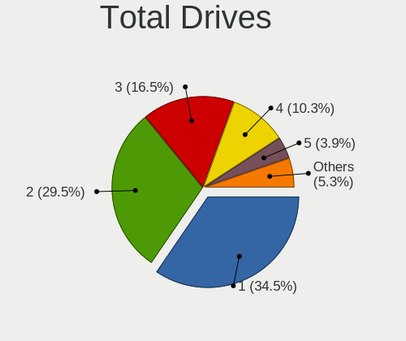
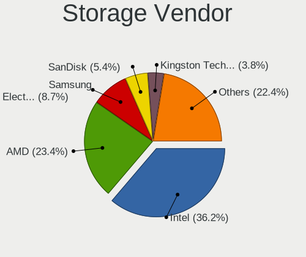
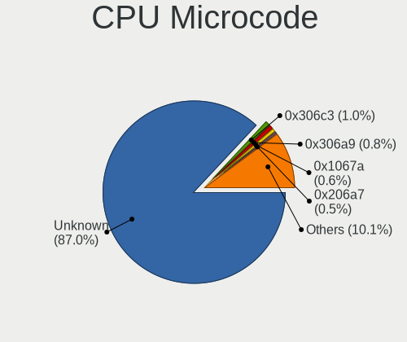
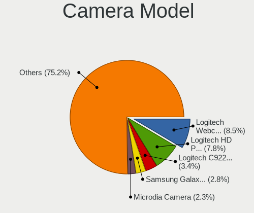

Linux - Hardware Trends (Desktops)
----------------------------------

A project to identify most popular hardware characteristics and track their change
over time based on data collected by Linux users at https://Linux-Hardware.org.

Anyone can contribute to this report by the [hw-probe](https://github.com/linuxhw/hw-probe) tool:

    sudo -E hw-probe -all -upload

This report is for one last month. Overall report since the beginning of time: [TestCoverage](https://github.com/linuxhw/TestCoverage)

Period: Dec, 2022.

Contents
--------

* [ System ](#system)
  - [ OS                       ](#os)
  - [ OS Family                ](#os-family)
  - [ Kernel                   ](#kernel)
  - [ Kernel Family            ](#kernel-family)
  - [ Kernel Major Ver.        ](#kernel-major-ver)
  - [ Arch                     ](#arch)
  - [ DE                       ](#de)
  - [ Display Server           ](#display-server)
  - [ Display Manager          ](#display-manager)
  - [ OS Lang                  ](#os-lang)
  - [ Boot Mode                ](#boot-mode)
  - [ Filesystem               ](#filesystem)
  - [ Part. scheme             ](#part-scheme)
  - [ Dual Boot with Linux/BSD ](#dual-boot-with-linuxbsd)
  - [ Dual Boot (Win)          ](#dual-boot-win)

* [ Board ](#board)
  - [ Vendor                   ](#vendor)
  - [ Model                    ](#model)
  - [ Model Family             ](#model-family)
  - [ MFG Year                 ](#mfg-year)
  - [ Form Factor              ](#form-factor)
  - [ Secure Boot              ](#secure-boot)
  - [ Coreboot                 ](#coreboot)
  - [ RAM Size                 ](#ram-size)
  - [ RAM Used                 ](#ram-used)
  - [ Total Drives             ](#total-drives)
  - [ Has CD-ROM               ](#has-cd-rom)
  - [ Has Ethernet             ](#has-ethernet)
  - [ Has WiFi                 ](#has-wifi)
  - [ Has Bluetooth            ](#has-bluetooth)

* [ Location ](#location)
  - [ Country                  ](#country)
  - [ City                     ](#city)

* [ Drives ](#drives)
  - [ Drive Vendor             ](#drive-vendor)
  - [ Drive Model              ](#drive-model)
  - [ HDD Vendor               ](#hdd-vendor)
  - [ SSD Vendor               ](#ssd-vendor)
  - [ Drive Kind               ](#drive-kind)
  - [ Drive Connector          ](#drive-connector)
  - [ Drive Size               ](#drive-size)
  - [ Space Total              ](#space-total)
  - [ Space Used               ](#space-used)
  - [ Malfunc. Drives          ](#malfunc-drives)
  - [ Malfunc. Drive Vendor    ](#malfunc-drive-vendor)
  - [ Malfunc. HDD Vendor      ](#malfunc-hdd-vendor)
  - [ Malfunc. Drive Kind      ](#malfunc-drive-kind)
  - [ Failed Drives            ](#failed-drives)
  - [ Failed Drive Vendor      ](#failed-drive-vendor)
  - [ Drive Status             ](#drive-status)

* [ Storage controller ](#storage-controller)
  - [ Storage Vendor           ](#storage-vendor)
  - [ Storage Model            ](#storage-model)
  - [ Storage Kind             ](#storage-kind)

* [ Processor ](#processor)
  - [ CPU Vendor               ](#cpu-vendor)
  - [ CPU Model                ](#cpu-model)
  - [ CPU Model Family         ](#cpu-model-family)
  - [ CPU Cores                ](#cpu-cores)
  - [ CPU Sockets              ](#cpu-sockets)
  - [ CPU Threads              ](#cpu-threads)
  - [ CPU Op-Modes             ](#cpu-op-modes)
  - [ CPU Microcode            ](#cpu-microcode)
  - [ CPU Microarch            ](#cpu-microarch)

* [ Graphics ](#graphics)
  - [ GPU Vendor               ](#gpu-vendor)
  - [ GPU Model                ](#gpu-model)
  - [ GPU Combo                ](#gpu-combo)
  - [ GPU Driver               ](#gpu-driver)
  - [ GPU Memory               ](#gpu-memory)

* [ Monitor ](#monitor)
  - [ Monitor Vendor           ](#monitor-vendor)
  - [ Monitor Model            ](#monitor-model)
  - [ Monitor Resolution       ](#monitor-resolution)
  - [ Monitor Diagonal         ](#monitor-diagonal)
  - [ Monitor Width            ](#monitor-width)
  - [ Aspect Ratio             ](#aspect-ratio)
  - [ Monitor Area             ](#monitor-area)
  - [ Pixel Density            ](#pixel-density)
  - [ Multiple Monitors        ](#multiple-monitors)

* [ Network ](#network)
  - [ Net Controller Vendor    ](#net-controller-vendor)
  - [ Net Controller Model     ](#net-controller-model)
  - [ Wireless Vendor          ](#wireless-vendor)
  - [ Wireless Model           ](#wireless-model)
  - [ Ethernet Vendor          ](#ethernet-vendor)
  - [ Ethernet Model           ](#ethernet-model)
  - [ Net Controller Kind      ](#net-controller-kind)
  - [ Used Controller          ](#used-controller)
  - [ NICs                     ](#nics)
  - [ IPv6                     ](#ipv6)

* [ Bluetooth ](#bluetooth)
  - [ Bluetooth Vendor         ](#bluetooth-vendor)
  - [ Bluetooth Model          ](#bluetooth-model)

* [ Sound ](#sound)
  - [ Sound Vendor             ](#sound-vendor)
  - [ Sound Model              ](#sound-model)

* [ Memory ](#memory)
  - [ Memory Vendor            ](#memory-vendor)
  - [ Memory Model             ](#memory-model)
  - [ Memory Kind              ](#memory-kind)
  - [ Memory Form Factor       ](#memory-form-factor)
  - [ Memory Size              ](#memory-size)
  - [ Memory Speed             ](#memory-speed)

* [ Printers & scanners ](#printers--scanners)
  - [ Printer Vendor           ](#printer-vendor)
  - [ Printer Model            ](#printer-model)
  - [ Scanner Vendor           ](#scanner-vendor)
  - [ Scanner Model            ](#scanner-model)

* [ Camera ](#camera)
  - [ Camera Vendor            ](#camera-vendor)
  - [ Camera Model             ](#camera-model)

* [ Security ](#security)
  - [ Fingerprint Vendor       ](#fingerprint-vendor)
  - [ Fingerprint Model        ](#fingerprint-model)
  - [ Chipcard Vendor          ](#chipcard-vendor)
  - [ Chipcard Model           ](#chipcard-model)

* [ Unsupported ](#unsupported)
  - [ Unsupported Devices      ](#unsupported-devices)
  - [ Unsupported Device Types ](#unsupported-device-types)

System
------

OS
--

Installed operating systems

| Name                         | Desktops | Percent |
|------------------------------|----------|---------|
| Ubuntu 22.04                 | 312      | 15.49%  |
| Fedora 37                    | 135      | 6.7%    |
| ROSA 12.3                    | 129      | 6.41%   |
| Debian 11                    | 107      | 5.31%   |
| Pop!_OS 22.04                | 94       | 4.67%   |
| OpenMandriva 4.3             | 91       | 4.52%   |
| Linux Mint 21                | 84       | 4.17%   |
| Ubuntu 22.10                 | 83       | 4.12%   |
| Zorin 16                     | 71       | 3.53%   |
| Ubuntu 20.04                 | 68       | 3.38%   |
| Arch Rolling                 | 63       | 3.13%   |
| Linux Mint 20.3              | 42       | 2.09%   |
| Linux Mint 21.1              | 39       | 1.94%   |
| KDE neon 22.04               | 35       | 1.74%   |
| openSUSE Tumbleweed-XXXXXXXX | 34       | 1.69%   |
| OpenMandriva 22.12           | 30       | 1.49%   |
| Manjaro                      | 30       | 1.49%   |
| OpenMandriva 4.50            | 28       | 1.39%   |
| Gentoo 2.9                   | 27       | 1.34%   |
| Manjaro 22.0.0               | 25       | 1.24%   |
| Kubuntu 22.04                | 21       | 1.04%   |
| Xubuntu 22.04                | 18       | 0.89%   |
| Debian                       | 18       | 0.89%   |
| ArcoLinux Rolling            | 18       | 0.89%   |
| Ubuntu 18.04                 | 17       | 0.84%   |
| Nobara 36                    | 17       | 0.84%   |
| Fedora 36                    | 16       | 0.79%   |
| Ubuntu MATE 22.04            | 12       | 0.6%    |
| ROSA R11.1                   | 12       | 0.6%    |
| Kali 2022.4                  | 12       | 0.6%    |
| Elementary 6.1               | 12       | 0.6%    |
| Kubuntu 22.10                | 11       | 0.55%   |
| EndeavourOS Rolling          | 11       | 0.55%   |
| BlackPanther 18.1            | 11       | 0.55%   |
| Xubuntu 20.04                | 10       | 0.5%    |
| ROSA 12.2                    | 10       | 0.5%    |
| LMDE 5                       | 10       | 0.5%    |
| Red OS 7.3.2                 | 7        | 0.35%   |
| OpenMandriva 4.2             | 7        | 0.35%   |
| MX 21                        | 7        | 0.35%   |

OS Family
---------

OS without a version

| Name          | Desktops | Percent |
|---------------|----------|---------|
| Ubuntu        | 490      | 24.33%  |
| Linux Mint    | 188      | 9.33%   |
| OpenMandriva  | 160      | 7.94%   |
| Fedora        | 158      | 7.85%   |
| ROSA          | 155      | 7.7%    |
| Debian        | 135      | 6.7%    |
| Pop!_OS       | 98       | 4.87%   |
| Zorin         | 74       | 3.67%   |
| Arch          | 63       | 3.13%   |
| Manjaro       | 60       | 2.98%   |
| Kubuntu       | 42       | 2.09%   |
| openSUSE      | 41       | 2.04%   |
| KDE neon      | 37       | 1.84%   |
| Xubuntu       | 32       | 1.59%   |
| Gentoo        | 27       | 1.34%   |
| ArcoLinux     | 21       | 1.04%   |
| Ubuntu MATE   | 19       | 0.94%   |
| Nobara        | 17       | 0.84%   |
| Kali          | 14       | 0.7%    |
| Elementary    | 14       | 0.7%    |
| Red OS        | 13       | 0.65%   |
| EndeavourOS   | 11       | 0.55%   |
| BlackPanther  | 11       | 0.55%   |
| LMDE          | 10       | 0.5%    |
| Garuda Linux  | 8        | 0.4%    |
| MX            | 7        | 0.35%   |
| Lubuntu       | 7        | 0.35%   |
| CentOS        | 7        | 0.35%   |
| Ubuntu Unity  | 6        | 0.3%    |
| Ubuntu Budgie | 6        | 0.3%    |
| SteamOS       | 6        | 0.3%    |
| Endless       | 5        | 0.25%   |
| ALT Linux     | 5        | 0.25%   |
| Ubuntu Studio | 4        | 0.2%    |
| Slackware     | 4        | 0.2%    |
| Rocky Linux   | 4        | 0.2%    |
| NixOS         | 3        | 0.15%   |
| Linux Lite    | 3        | 0.15%   |
| Void Linux    | 2        | 0.1%    |
| Solus         | 2        | 0.1%    |

Kernel
------

Version of the Linux kernel

| Version                             | Desktops | Percent |
|-------------------------------------|----------|---------|
| 5.15.0-56-generic                   | 512      | 25.42%  |
| 5.16.7-desktop-1omv4003             | 83       | 4.12%   |
| 5.19.0-26-generic                   | 71       | 3.53%   |
| 6.0.6-76060006-generic              | 65       | 3.23%   |
| 5.4.0-135-generic                   | 57       | 2.83%   |
| 5.15.79-generic-1rosa2021.1-x86_64  | 48       | 2.38%   |
| 5.10.0-19-amd64                     | 46       | 2.28%   |
| 6.0.12-300.fc37.x86_64              | 43       | 2.14%   |
| 5.15.0-53-generic                   | 40       | 1.99%   |
| 5.15.75-generic-1rosa2021.1-x86_64  | 37       | 1.84%   |
| 6.0.11-300.fc37.x86_64              | 30       | 1.49%   |
| 5.15.0-43-generic                   | 30       | 1.49%   |
| 6.0.10-desktop-2omv22090            | 29       | 1.44%   |
| 6.0.12-arch1-1                      | 24       | 1.19%   |
| 5.10.0-20-amd64                     | 24       | 1.19%   |
| 6.0.12-76060006-generic             | 22       | 1.09%   |
| 6.0.10-300.fc37.x86_64              | 19       | 0.94%   |
| 5.19.12-desktop-2omv4090            | 19       | 0.94%   |
| 6.0.15-300.fc37.x86_64              | 18       | 0.89%   |
| 5.15.0-57-generic                   | 18       | 0.89%   |
| 5.10.155-generic-1rosa2021.1-x86_64 | 16       | 0.79%   |
| 6.0.10-201.fc36.x86_64              | 14       | 0.7%    |
| 5.15.0-41-generic                   | 14       | 0.7%    |
| 6.1.1-arch1-1                       | 13       | 0.65%   |
| 6.0.11-arch1-1                      | 13       | 0.65%   |
| 5.19.0-23-generic                   | 12       | 0.6%    |
| 6.0.10-1-default                    | 11       | 0.55%   |
| 5.10.0-7-amd64                      | 11       | 0.55%   |
| 6.0.12-1-default                    | 10       | 0.5%    |
| 5.15.0-52-generic                   | 10       | 0.5%    |
| 4.15.0-200-generic                  | 10       | 0.5%    |
| 6.0.10-arch2-1                      | 9        | 0.45%   |
| 5.4.0-132-generic                   | 9        | 0.45%   |
| 5.19.0-21-generic                   | 9        | 0.45%   |
| 6.0.14-300.fc37.x86_64              | 8        | 0.4%    |
| 6.0.0-6-amd64                       | 8        | 0.4%    |
| 5.17.11-generic-2rosa2021.1-x86_64  | 8        | 0.4%    |
| 5.16.13-desktop-1omv4003            | 8        | 0.4%    |
| 5.15.81-1-MANJARO                   | 8        | 0.4%    |
| 5.15.78-1-MANJARO                   | 8        | 0.4%    |

Kernel Family
-------------

Linux kernel without a distro release

| Version  | Desktops | Percent |
|----------|----------|---------|
| 5.15.0   | 659      | 32.72%  |
| 6.0.12   | 117      | 5.81%   |
| 5.19.0   | 112      | 5.56%   |
| 5.10.0   | 103      | 5.11%   |
| 6.0.10   | 95       | 4.72%   |
| 5.4.0    | 94       | 4.67%   |
| 5.16.7   | 83       | 4.12%   |
| 6.0.11   | 68       | 3.38%   |
| 6.0.6    | 65       | 3.23%   |
| 6.0.0    | 50       | 2.48%   |
| 5.15.79  | 49       | 2.43%   |
| 5.15.75  | 45       | 2.23%   |
| 4.15.0   | 32       | 1.59%   |
| 6.1.1    | 28       | 1.39%   |
| 6.1.0    | 27       | 1.34%   |
| 6.0.15   | 22       | 1.09%   |
| 5.19.12  | 20       | 0.99%   |
| 6.0.9    | 17       | 0.84%   |
| 6.0.8    | 16       | 0.79%   |
| 5.11.0   | 16       | 0.79%   |
| 5.10.155 | 16       | 0.79%   |
| 5.14.0   | 12       | 0.6%    |
| 6.0.14   | 11       | 0.55%   |
| 5.15.78  | 10       | 0.5%    |
| 5.13.0   | 10       | 0.5%    |
| 6.0.7    | 9        | 0.45%   |
| 5.16.13  | 9        | 0.45%   |
| 5.15.81  | 9        | 0.45%   |
| 5.15.80  | 9        | 0.45%   |
| 6.0.13   | 8        | 0.4%    |
| 5.17.11  | 8        | 0.4%    |
| 5.15.85  | 8        | 0.4%    |
| 5.15.83  | 8        | 0.4%    |
| 5.15.77  | 8        | 0.4%    |
| 5.15.74  | 8        | 0.4%    |
| 5.19.17  | 7        | 0.35%   |
| 5.10.74  | 7        | 0.35%   |
| 5.19.5   | 6        | 0.3%    |
| 5.15.72  | 6        | 0.3%    |
| 4.19.0   | 6        | 0.3%    |

Kernel Major Ver.
-----------------

Linux kernel major version

| Version | Desktops | Percent |
|---------|----------|---------|
| 5.15    | 834      | 41.41%  |
| 6.0     | 486      | 24.13%  |
| 5.19    | 156      | 7.75%   |
| 5.10    | 144      | 7.15%   |
| 5.4     | 101      | 5.01%   |
| 5.16    | 97       | 4.82%   |
| 6.1     | 55       | 2.73%   |
| 4.15    | 33       | 1.64%   |
| 5.11    | 19       | 0.94%   |
| 5.14    | 16       | 0.79%   |
| 5.17    | 14       | 0.7%    |
| 5.18    | 13       | 0.65%   |
| 5.13    | 10       | 0.5%    |
| 4.18    | 9        | 0.45%   |
| 4.19    | 8        | 0.4%    |
| 5.6     | 5        | 0.25%   |
| 3.10    | 5        | 0.25%   |
| 5.8     | 2        | 0.1%    |
| 5.3     | 2        | 0.1%    |
| 6.2     | 1        | 0.05%   |
| 5.0     | 1        | 0.05%   |
| 4.9     | 1        | 0.05%   |
| 4.4     | 1        | 0.05%   |
| 4.10    | 1        | 0.05%   |

Arch
----

OS architecture (x86_64, i586, etc.)

| Name     | Desktops | Percent |
|----------|----------|---------|
| x86_64   | 1994     | 99.01%  |
| i686     | 17       | 0.84%   |
| riscv64  | 1        | 0.05%   |
| e2k      | 1        | 0.05%   |
| armv5tel | 1        | 0.05%   |

DE
--

Desktop Environment

| Name                   | Desktops | Percent |
|------------------------|----------|---------|
| GNOME                  | 862      | 42.8%   |
| KDE5                   | 529      | 26.27%  |
| X-Cinnamon             | 168      | 8.34%   |
| XFCE                   | 148      | 7.35%   |
| Unknown                | 105      | 5.21%   |
| MATE                   | 60       | 2.98%   |
| LXQt                   | 27       | 1.34%   |
| Cinnamon               | 22       | 1.09%   |
| Pantheon               | 14       | 0.7%    |
| LXDE                   | 11       | 0.55%   |
| KDE4                   | 10       | 0.5%    |
| i3                     | 9        | 0.45%   |
| Budgie                 | 9        | 0.45%   |
| Unity                  | 5        | 0.25%   |
| sway                   | 4        | 0.2%    |
| GNOME Classic          | 4        | 0.2%    |
| GNOME Flashback        | 3        | 0.15%   |
| awesome                | 3        | 0.15%   |
| Trinity                | 2        | 0.1%    |
| qtile                  | 2        | 0.1%    |
| LeftWM                 | 2        | 0.1%    |
| Hyprland               | 2        | 0.1%    |
| dwm                    | 2        | 0.1%    |
| bspwm                  | 2        | 0.1%    |
| X-Generic              | 1        | 0.05%   |
| openbox                | 1        | 0.05%   |
| lightdm-xsession       | 1        | 0.05%   |
| KDE                    | 1        | 0.05%   |
| graphite:Wayfire:GNOME | 1        | 0.05%   |
| Enlightenment          | 1        | 0.05%   |
| Deepin                 | 1        | 0.05%   |
| chadwm                 | 1        | 0.05%   |
| BunsenLabs             | 1        | 0.05%   |

Display Server
--------------

X11 or Wayland

| Name    | Desktops | Percent |
|---------|----------|---------|
| X11     | 1366     | 67.83%  |
| Wayland | 517      | 25.67%  |
| Tty     | 76       | 3.77%   |
| Unknown | 53       | 2.63%   |
| Web     | 2        | 0.1%    |

Display Manager
---------------

SDDM, LightDM, etc.

| Name    | Desktops | Percent |
|---------|----------|---------|
| Unknown | 681      | 33.81%  |
| GDM3    | 456      | 22.64%  |
| SDDM    | 413      | 20.51%  |
| LightDM | 264      | 13.11%  |
| GDM     | 176      | 8.74%   |
| KDM     | 11       | 0.55%   |
| XDM     | 5        | 0.25%   |
| LXDM    | 3        | 0.15%   |
| WDM     | 1        | 0.05%   |
| TDM     | 1        | 0.05%   |
| SLiM    | 1        | 0.05%   |
| GREETD  | 1        | 0.05%   |
| FLY-DM  | 1        | 0.05%   |

OS Lang
-------

Language

| Lang    | Desktops | Percent |
|---------|----------|---------|
| en_US   | 806      | 40.02%  |
| ru_RU   | 250      | 12.41%  |
| de_DE   | 152      | 7.55%   |
| en_GB   | 93       | 4.62%   |
| fr_FR   | 90       | 4.47%   |
| pt_BR   | 71       | 3.53%   |
| it_IT   | 69       | 3.43%   |
| C       | 43       | 2.14%   |
| en_CA   | 41       | 2.04%   |
| Unknown | 40       | 1.99%   |
| es_ES   | 35       | 1.74%   |
| pl_PL   | 33       | 1.64%   |
| en_AU   | 33       | 1.64%   |
| nl_NL   | 17       | 0.84%   |
| pt_PT   | 14       | 0.7%    |
| cs_CZ   | 14       | 0.7%    |
| hu_HU   | 13       | 0.65%   |
| es_MX   | 12       | 0.6%    |
| de_AT   | 12       | 0.6%    |
| es_AR   | 11       | 0.55%   |
| en_ZA   | 11       | 0.55%   |
| en_IN   | 11       | 0.55%   |
| ja_JP   | 9        | 0.45%   |
| en_SG   | 9        | 0.45%   |
| zh_CN   | 7        | 0.35%   |
| sv_SE   | 7        | 0.35%   |
| fi_FI   | 7        | 0.35%   |
| POSIX   | 5        | 0.25%   |
| fr_BE   | 5        | 0.25%   |
| es_CO   | 5        | 0.25%   |
| en_NZ   | 5        | 0.25%   |
| tr_TR   | 4        | 0.2%    |
| sr_RS   | 4        | 0.2%    |
| sk_SK   | 4        | 0.2%    |
| ro_RO   | 4        | 0.2%    |
| nl_BE   | 4        | 0.2%    |
| en_PH   | 4        | 0.2%    |
| en_IE   | 4        | 0.2%    |
| el_GR   | 4        | 0.2%    |
| da_DK   | 4        | 0.2%    |

Boot Mode
---------

EFI or BIOS

| Mode | Desktops | Percent |
|------|----------|---------|
| BIOS | 1149     | 57.05%  |
| EFI  | 865      | 42.95%  |

Filesystem
----------

Type of filesystem

| Type     | Desktops | Percent |
|----------|----------|---------|
| Ext4     | 1477     | 73.34%  |
| Btrfs    | 259      | 12.86%  |
| Overlay  | 195      | 9.68%   |
| Xfs      | 35       | 1.74%   |
| Zfs      | 28       | 1.39%   |
| F2fs     | 8        | 0.4%    |
| Ext3     | 3        | 0.15%   |
| Ext2     | 3        | 0.15%   |
| Tmpfs    | 2        | 0.1%    |
| XXXXXXX  | 1        | 0.05%   |
| Rootfs   | 1        | 0.05%   |
| Reiserfs | 1        | 0.05%   |
| Aufs     | 1        | 0.05%   |

Part. scheme
------------

Scheme of partitioning

| Type    | Desktops | Percent |
|---------|----------|---------|
| GPT     | 1090     | 54.12%  |
| Unknown | 580      | 28.8%   |
| MBR     | 344      | 17.08%  |

Dual Boot with Linux/BSD
------------------------

Hosting more than one Linux/BSD

| Dual boot | Desktops | Percent |
|-----------|----------|---------|
| No        | 1608     | 79.84%  |
| Yes       | 406      | 20.16%  |

Dual Boot (Win)
---------------

Hosting Linux and Windows

| Dual boot | Desktops | Percent |
|-----------|----------|---------|
| No        | 1325     | 65.79%  |
| Yes       | 689      | 34.21%  |

Board
-----

Vendor
------

Motherboard manufacturer

| Name                | Desktops | Percent |
|---------------------|----------|---------|
| ASUSTek Computer    | 567      | 28.15%  |
| Gigabyte Technology | 349      | 17.33%  |
| MSI                 | 249      | 12.36%  |
| Dell                | 180      | 8.94%   |
| ASRock              | 175      | 8.69%   |
| Hewlett-Packard     | 139      | 6.9%    |
| Lenovo              | 66       | 3.28%   |
| Intel               | 49       | 2.43%   |
| Acer                | 32       | 1.59%   |
| Fujitsu             | 21       | 1.04%   |
| Unknown             | 20       | 0.99%   |
| Biostar             | 17       | 0.84%   |
| Pegatron            | 14       | 0.7%    |
| Foxconn             | 11       | 0.55%   |
| BESSTAR Tech        | 9        | 0.45%   |
| ECS                 | 8        | 0.4%    |
| AZW                 | 8        | 0.4%    |
| Apple               | 7        | 0.35%   |
| Supermicro          | 6        | 0.3%    |
| Medion              | 6        | 0.3%    |
| Huanan              | 6        | 0.3%    |
| PCWare              | 5        | 0.25%   |
| Alienware           | 4        | 0.2%    |
| System76            | 3        | 0.15%   |
| Shuttle             | 3        | 0.15%   |
| MACHINIST           | 3        | 0.15%   |
| ZOTAC               | 2        | 0.1%    |
| Positivo            | 2        | 0.1%    |
| PERTOSA             | 2        | 0.1%    |
| Packard Bell        | 2        | 0.1%    |
| NCR                 | 2        | 0.1%    |
| MiTAC               | 2        | 0.1%    |
| MAXSUN              | 2        | 0.1%    |
| Google              | 2        | 0.1%    |
| Gateway             | 2        | 0.1%    |
| eMachines           | 2        | 0.1%    |
| Aquarius            | 2        | 0.1%    |
| AMI                 | 2        | 0.1%    |
| VXL                 | 1        | 0.05%   |
| SiYW                | 1        | 0.05%   |

Model
-----

Motherboard model

| Name                            | Desktops | Percent |
|---------------------------------|----------|---------|
| ASUS All Series                 | 37       | 1.84%   |
| Unknown                         | 21       | 1.04%   |
| ASUS TUF Gaming X570-PLUS       | 15       | 0.74%   |
| ASUS PRIME A320M-K              | 13       | 0.65%   |
| MSI MS-7C91                     | 12       | 0.6%    |
| MSI MS-7C56                     | 12       | 0.6%    |
| Dell OptiPlex 7010              | 12       | 0.6%    |
| Dell OptiPlex 3010              | 9        | 0.45%   |
| ASUS ROG STRIX B550-F GAMING    | 9        | 0.45%   |
| ASUS PRIME B450M-A              | 9        | 0.45%   |
| Dell OptiPlex 790               | 8        | 0.4%    |
| Dell OptiPlex 3020              | 8        | 0.4%    |
| ASUS ROG STRIX B450-F GAMING    | 8        | 0.4%    |
| Gigabyte B450M DS3H             | 7        | 0.35%   |
| ASUS PRIME B550M-A              | 7        | 0.35%   |
| ASUS PRIME B450-PLUS            | 7        | 0.35%   |
| ASUS M5A97 R2.0                 | 7        | 0.35%   |
| MSI MS-7C37                     | 6        | 0.3%    |
| MSI MS-7C02                     | 6        | 0.3%    |
| MSI MS-7B86                     | 6        | 0.3%    |
| MSI MS-7B79                     | 6        | 0.3%    |
| MSI MS-7817                     | 6        | 0.3%    |
| Intel X99                       | 6        | 0.3%    |
| HP ProDesk 600 G1 SFF           | 6        | 0.3%    |
| Gigabyte B550M DS3H             | 6        | 0.3%    |
| Gigabyte A320M-H                | 6        | 0.3%    |
| Gigabyte 970A-DS3P              | 6        | 0.3%    |
| Dell OptiPlex 380               | 6        | 0.3%    |
| ASUS TUF Gaming B550-PLUS       | 6        | 0.3%    |
| ASUS PRIME B450M-K              | 6        | 0.3%    |
| MSI MS-7A38                     | 5        | 0.25%   |
| MSI MS-7A34                     | 5        | 0.25%   |
| MSI MS-7721                     | 5        | 0.25%   |
| HP Compaq Pro 6300 SFF          | 5        | 0.25%   |
| Gigabyte B85M-D3H               | 5        | 0.25%   |
| Gigabyte B550 AORUS ELITE AX V2 | 5        | 0.25%   |
| Gigabyte 970A-UD3P              | 5        | 0.25%   |
| Dell OptiPlex 990               | 5        | 0.25%   |
| Dell OptiPlex 9020              | 5        | 0.25%   |
| Dell OptiPlex 3050              | 5        | 0.25%   |

Model Family
------------

Motherboard model prefix

| Name                   | Desktops | Percent |
|------------------------|----------|---------|
| ASUS PRIME             | 136      | 6.75%   |
| Dell OptiPlex          | 98       | 4.87%   |
| ASUS ROG               | 96       | 4.77%   |
| ASUS TUF               | 53       | 2.63%   |
| Lenovo ThinkCentre     | 41       | 2.04%   |
| ASUS All               | 37       | 1.84%   |
| HP Compaq              | 31       | 1.54%   |
| Dell Precision         | 27       | 1.34%   |
| Dell Inspiron          | 25       | 1.24%   |
| HP EliteDesk           | 22       | 1.09%   |
| Acer Aspire            | 22       | 1.09%   |
| Unknown                | 21       | 1.04%   |
| Gigabyte B550          | 17       | 0.84%   |
| HP Pavilion            | 16       | 0.79%   |
| HP ProDesk             | 14       | 0.7%    |
| Gigabyte B450          | 14       | 0.7%    |
| ASUS M5A78L-M          | 14       | 0.7%    |
| Gigabyte X570          | 13       | 0.65%   |
| Fujitsu ESPRIMO        | 13       | 0.65%   |
| Dell Vostro            | 13       | 0.65%   |
| MSI MS-7C91            | 12       | 0.6%    |
| MSI MS-7C56            | 12       | 0.6%    |
| Gigabyte B450M         | 12       | 0.6%    |
| Gigabyte B550M         | 11       | 0.55%   |
| Dell XPS               | 11       | 0.55%   |
| ASUS P8Z77-V           | 11       | 0.55%   |
| ASUS M5A97             | 11       | 0.55%   |
| HP ProLiant            | 10       | 0.5%    |
| ASRock X570            | 10       | 0.5%    |
| ASUS P5K               | 9        | 0.45%   |
| Gigabyte Z690          | 8        | 0.4%    |
| ASRock B450            | 8        | 0.4%    |
| Intel X99              | 7        | 0.35%   |
| Gigabyte GA-78LMT-USB3 | 7        | 0.35%   |
| ASUS P8H61-M           | 7        | 0.35%   |
| Acer Veriton           | 7        | 0.35%   |
| MSI MS-7C37            | 6        | 0.3%    |
| MSI MS-7C02            | 6        | 0.3%    |
| MSI MS-7B86            | 6        | 0.3%    |
| MSI MS-7B79            | 6        | 0.3%    |

MFG Year
--------

Motherboard manufacture year

| Year    | Desktops | Percent |
|---------|----------|---------|
| 2018    | 207      | 10.28%  |
| 2020    | 177      | 8.79%   |
| 2012    | 174      | 8.64%   |
| 2021    | 161      | 7.99%   |
| 2019    | 161      | 7.99%   |
| 2013    | 161      | 7.99%   |
| 2017    | 145      | 7.2%    |
| 2022    | 127      | 6.31%   |
| 2011    | 116      | 5.76%   |
| 2014    | 110      | 5.46%   |
| 2010    | 106      | 5.26%   |
| 2015    | 92       | 4.57%   |
| 2009    | 91       | 4.52%   |
| 2016    | 75       | 3.72%   |
| 2008    | 47       | 2.33%   |
| 2007    | 36       | 1.79%   |
| 2006    | 15       | 0.74%   |
| 2005    | 7        | 0.35%   |
| Unknown | 3        | 0.15%   |
| 2004    | 2        | 0.1%    |
| 2002    | 1        | 0.05%   |

Form Factor
-----------

Physical design of the computer

| Name    | Desktops | Percent |
|---------|----------|---------|
| Desktop | 2014     | 100%    |

Secure Boot
-----------

Enabled or disabled

| State    | Desktops | Percent |
|----------|----------|---------|
| Disabled | 1965     | 97.57%  |
| Enabled  | 49       | 2.43%   |

Coreboot
--------

Have coreboot on board

| Used | Desktops | Percent |
|------|----------|---------|
| No   | 2012     | 99.9%   |
| Yes  | 2        | 0.1%    |

RAM Size
--------

Total RAM memory

| Size in GB      | Desktops | Percent |
|-----------------|----------|---------|
| 16.01-24.0      | 538      | 26.71%  |
| 32.01-64.0      | 362      | 17.97%  |
| 8.01-16.0       | 350      | 17.38%  |
| 4.01-8.0        | 276      | 13.7%   |
| 3.01-4.0        | 227      | 11.27%  |
| 64.01-256.0     | 129      | 6.41%   |
| 24.01-32.0      | 67       | 3.33%   |
| 1.01-2.0        | 41       | 2.04%   |
| 2.01-3.0        | 14       | 0.7%    |
| More than 256.0 | 4        | 0.2%    |
| 0.51-1.0        | 4        | 0.2%    |
| 0.01-0.5        | 2        | 0.1%    |

RAM Used
--------

Used RAM memory

| Used GB     | Desktops | Percent |
|-------------|----------|---------|
| 1.01-2.0    | 601      | 29.84%  |
| 2.01-3.0    | 472      | 23.44%  |
| 4.01-8.0    | 352      | 17.48%  |
| 3.01-4.0    | 273      | 13.56%  |
| 0.51-1.0    | 145      | 7.2%    |
| 8.01-16.0   | 109      | 5.41%   |
| 16.01-24.0  | 29       | 1.44%   |
| 0.01-0.5    | 19       | 0.94%   |
| 32.01-64.0  | 7        | 0.35%   |
| 24.01-32.0  | 5        | 0.25%   |
| 64.01-256.0 | 1        | 0.05%   |
| 0           | 1        | 0.05%   |

Total Drives
------------

Number of drives on board

| Drives | Desktops | Percent |
|--------|----------|---------|
| 1      | 724      | 35.95%  |
| 2      | 590      | 29.29%  |
| 3      | 297      | 14.75%  |
| 4      | 204      | 10.13%  |
| 5      | 97       | 4.82%   |
| 6      | 40       | 1.99%   |
| 7      | 22       | 1.09%   |
| 8      | 12       | 0.6%    |
| 0      | 9        | 0.45%   |
| 9      | 7        | 0.35%   |
| 10     | 3        | 0.15%   |
| 12     | 2        | 0.1%    |
| 11     | 2        | 0.1%    |
| 23     | 1        | 0.05%   |
| 21     | 1        | 0.05%   |
| 20     | 1        | 0.05%   |
| 18     | 1        | 0.05%   |
| 13     | 1        | 0.05%   |

Has CD-ROM
----------

Has CD-ROM on board

| Presented | Desktops | Percent |
|-----------|----------|---------|
| No        | 1197     | 59.43%  |
| Yes       | 817      | 40.57%  |

Has Ethernet
------------

Has Ethernet on board

| Presented | Desktops | Percent |
|-----------|----------|---------|
| Yes       | 1987     | 98.66%  |
| No        | 27       | 1.34%   |

Has WiFi
--------

Has WiFi module

| Presented | Desktops | Percent |
|-----------|----------|---------|
| No        | 1099     | 54.57%  |
| Yes       | 915      | 45.43%  |

Has Bluetooth
-------------

Has Bluetooth module

| Presented | Desktops | Percent |
|-----------|----------|---------|
| No        | 1266     | 62.86%  |
| Yes       | 748      | 37.14%  |

Location
--------

Country
-------

Geographic location (country)

| Country      | Desktops | Percent |
|--------------|----------|---------|
| USA          | 400      | 19.86%  |
| Russia       | 282      | 14%     |
| Germany      | 213      | 10.58%  |
| France       | 107      | 5.31%   |
| Italy        | 92       | 4.57%   |
| Brazil       | 88       | 4.37%   |
| UK           | 74       | 3.67%   |
| Canada       | 72       | 3.57%   |
| Poland       | 47       | 2.33%   |
| Spain        | 45       | 2.23%   |
| Australia    | 40       | 1.99%   |
| Netherlands  | 36       | 1.79%   |
| Hungary      | 33       | 1.64%   |
| Portugal     | 22       | 1.09%   |
| Austria      | 21       | 1.04%   |
| Greece       | 20       | 0.99%   |
| Czechia      | 19       | 0.94%   |
| Romania      | 17       | 0.84%   |
| Belgium      | 17       | 0.84%   |
| Sweden       | 16       | 0.79%   |
| Mexico       | 16       | 0.79%   |
| Finland      | 16       | 0.79%   |
| Switzerland  | 15       | 0.74%   |
| Japan        | 15       | 0.74%   |
| Serbia       | 14       | 0.7%    |
| Indonesia    | 14       | 0.7%    |
| India        | 14       | 0.7%    |
| Argentina    | 14       | 0.7%    |
| Norway       | 13       | 0.65%   |
| South Africa | 12       | 0.6%    |
| Belarus      | 12       | 0.6%    |
| Singapore    | 11       | 0.55%   |
| Denmark      | 11       | 0.55%   |
| Bulgaria     | 11       | 0.55%   |
| China        | 10       | 0.5%    |
| Turkey       | 9        | 0.45%   |
| Ukraine      | 8        | 0.4%    |
| Slovakia     | 8        | 0.4%    |
| New Zealand  | 8        | 0.4%    |
| Thailand     | 7        | 0.35%   |

City
----

Geographic location (city)

| City             | Desktops | Percent |
|------------------|----------|---------|
| Moscow           | 58       | 2.88%   |
| St Petersburg    | 20       | 0.99%   |
| Voronezh         | 17       | 0.84%   |
| Berlin           | 17       | 0.84%   |
| Milan            | 16       | 0.79%   |
| Sydney           | 15       | 0.74%   |
| Vienna           | 13       | 0.65%   |
| Seattle          | 12       | 0.6%    |
| Krasnodar        | 12       | 0.6%    |
| Hamburg          | 12       | 0.6%    |
| Warsaw           | 11       | 0.55%   |
| Novosibirsk      | 11       | 0.55%   |
| Munich           | 11       | 0.55%   |
| London           | 11       | 0.55%   |
| Sao Paulo        | 10       | 0.5%    |
| Melbourne        | 10       | 0.5%    |
| Budapest         | 10       | 0.5%    |
| Amsterdam        | 10       | 0.5%    |
| Rome             | 9        | 0.45%   |
| Paris            | 9        | 0.45%   |
| Toronto          | 8        | 0.4%    |
| Nizhniy Novgorod | 8        | 0.4%    |
| Brisbane         | 8        | 0.4%    |
| Volgograd        | 7        | 0.35%   |
| Yekaterinburg    | 6        | 0.3%    |
| Sofia            | 6        | 0.3%    |
| Singapore        | 6        | 0.3%    |
| Saarbrücken     | 6        | 0.3%    |
| Rio de Janeiro   | 6        | 0.3%    |
| New York         | 6        | 0.3%    |
| Minsk            | 6        | 0.3%    |
| Madrid           | 6        | 0.3%    |
| Dublin           | 6        | 0.3%    |
| Belgrade         | 6        | 0.3%    |
| Rostov-on-Don    | 5        | 0.25%   |
| Prague           | 5        | 0.25%   |
| Miami            | 5        | 0.25%   |
| Lyon             | 5        | 0.25%   |
| Los Angeles      | 5        | 0.25%   |
| Lisbon           | 5        | 0.25%   |

Drives
------

Drive Vendor
------------

Hard drive vendors

| Vendor                      | Desktops | Drives | Percent |
|-----------------------------|----------|--------|---------|
| WDC                         | 673      | 932    | 17.49%  |
| Seagate                     | 660      | 884    | 17.15%  |
| Samsung Electronics         | 599      | 830    | 15.56%  |
| Kingston                    | 249      | 278    | 6.47%   |
| Toshiba                     | 202      | 240    | 5.25%   |
| Sandisk                     | 182      | 212    | 4.73%   |
| Crucial                     | 174      | 203    | 4.52%   |
| Hitachi                     | 114      | 134    | 2.96%   |
| A-DATA Technology           | 71       | 73     | 1.84%   |
| Intel                       | 62       | 72     | 1.61%   |
| Phison Electronics          | 54       | 61     | 1.4%    |
| China                       | 50       | 54     | 1.3%    |
| Unknown                     | 42       | 55     | 1.09%   |
| HGST                        | 38       | 52     | 0.99%   |
| SPCC                        | 30       | 32     | 0.78%   |
| Silicon Motion              | 29       | 30     | 0.75%   |
| Micron/Crucial Technology   | 28       | 29     | 0.73%   |
| Intenso                     | 26       | 27     | 0.68%   |
| SK hynix                    | 25       | 29     | 0.65%   |
| Apacer                      | 25       | 26     | 0.65%   |
| PNY                         | 24       | 26     | 0.62%   |
| Kingston Technology Company | 22       | 23     | 0.57%   |
| Patriot                     | 19       | 19     | 0.49%   |
| Maxtor                      | 19       | 20     | 0.49%   |
| Corsair                     | 19       | 24     | 0.49%   |
| Unknown                     | 19       | 22     | 0.49%   |
| ADATA Technology            | 18       | 21     | 0.47%   |
| Phison                      | 16       | 18     | 0.42%   |
| GOODRAM                     | 16       | 16     | 0.42%   |
| Hewlett-Packard             | 15       | 16     | 0.39%   |
| AMD                         | 14       | 15     | 0.36%   |
| Team                        | 13       | 14     | 0.34%   |
| Realtek Semiconductor       | 13       | 13     | 0.34%   |
| OCZ                         | 13       | 14     | 0.34%   |
| Micron Technology           | 13       | 13     | 0.34%   |
| Transcend                   | 12       | 12     | 0.31%   |
| Gigabyte Technology         | 12       | 13     | 0.31%   |
| KIOXIA                      | 11       | 11     | 0.29%   |
| JMicron Technology          | 11       | 11     | 0.29%   |
| Netac                       | 8        | 10     | 0.21%   |

Drive Model
-----------

Hard drive models

| Model                                                           | Desktops | Percent |
|-----------------------------------------------------------------|----------|---------|
| Samsung NVMe SSD Controller SM981/PM981/PM983 500GB             | 97       | 2.18%   |
| Kingston SA400S37240G 240GB SSD                                 | 77       | 1.73%   |
| Samsung NVMe SSD Controller PM9A1/PM9A3/980PRO 2TB              | 53       | 1.19%   |
| Seagate ST1000DM010-2EP102 1TB                                  | 52       | 1.17%   |
| Seagate ST500DM002-1BD142 500GB                                 | 51       | 1.15%   |
| Seagate ST2000DM008-2FR102 2TB                                  | 41       | 0.92%   |
| WDC WD10EZEX-08WN4A0 1TB                                        | 36       | 0.81%   |
| Samsung SSD 860 EVO 500GB                                       | 36       | 0.81%   |
| Samsung SSD 850 EVO 250GB                                       | 34       | 0.76%   |
| Toshiba DT01ACA100 1TB                                          | 32       | 0.72%   |
| Kingston SA400S37480G 480GB SSD                                 | 30       | 0.67%   |
| Kingston SA400S37120G 120GB SSD                                 | 29       | 0.65%   |
| Samsung SSD 860 EVO 1TB                                         | 27       | 0.61%   |
| Crucial CT1000MX500SSD1 1TB                                     | 26       | 0.58%   |
| Samsung SSD 850 EVO 500GB                                       | 24       | 0.54%   |
| Seagate ST1000DM003-1CH162 1TB                                  | 23       | 0.52%   |
| Seagate ST2000DM006-2DM164 2TB                                  | 22       | 0.49%   |
| Phison E12 NVMe Controller 1TB                                  | 22       | 0.49%   |
| Crucial CT240BX500SSD1 240GB                                    | 22       | 0.49%   |
| Seagate ST4000DM004-2CV104 4TB                                  | 21       | 0.47%   |
| Unknown SD/MMC/MS PRO 64GB                                      | 20       | 0.45%   |
| Toshiba HDWD110 1TB                                             | 20       | 0.45%   |
| Phison E16 PCIe4 NVMe Controller 512GB                          | 20       | 0.45%   |
| Seagate ST1000DM003-1ER162 1TB                                  | 19       | 0.43%   |
| Samsung SSD 870 EVO 500GB                                       | 19       | 0.43%   |
| Crucial CT500MX500SSD1 500GB                                    | 19       | 0.43%   |
| Unknown                                                         | 19       | 0.43%   |
| Samsung SSD 860 EVO 250GB                                       | 18       | 0.4%    |
| Samsung NVMe SSD Controller SM961/PM961/SM963 256GB             | 18       | 0.4%    |
| WDC WD30EFRX-68EUZN0 3TB                                        | 17       | 0.38%   |
| Toshiba DT01ACA050 500GB                                        | 17       | 0.38%   |
| Seagate ST3500418AS 500GB                                       | 17       | 0.38%   |
| Micron/Crucial P2 NVMe PCIe SSD 500GB                           | 17       | 0.38%   |
| Toshiba DT01ACA200 2TB                                          | 16       | 0.36%   |
| Silicon Motion SM2263EN/SM2263XT SSD Controller 1024GB          | 16       | 0.36%   |
| Seagate Expansion Desk 5TB                                      | 16       | 0.36%   |
| ADATA XPG SX8200 Pro PCIe Gen3x4 M.2 2280 Solid State Drive 1TB | 16       | 0.36%   |
| Seagate ST2000DM001-1ER164 2TB                                  | 15       | 0.34%   |
| Samsung SSD 980 PRO 1TB                                         | 15       | 0.34%   |
| Samsung SSD 980 1TB                                             | 15       | 0.34%   |

HDD Vendor
----------

Hard disk drive vendors

| Vendor              | Desktops | Drives | Percent |
|---------------------|----------|--------|---------|
| Seagate             | 644      | 856    | 37.05%  |
| WDC                 | 600      | 816    | 34.52%  |
| Toshiba             | 182      | 213    | 10.47%  |
| Hitachi             | 114      | 134    | 6.56%   |
| Samsung Electronics | 88       | 98     | 5.06%   |
| HGST                | 37       | 50     | 2.13%   |
| Unknown             | 22       | 23     | 1.27%   |
| Maxtor              | 19       | 20     | 1.09%   |
| Intenso             | 6        | 6      | 0.35%   |
| USB3.0              | 5        | 5      | 0.29%   |
| ASMT                | 4        | 5      | 0.23%   |
| Hewlett-Packard     | 3        | 3      | 0.17%   |
| WD MediaMax         | 1        | 1      | 0.06%   |
| USB 3.0             | 1        | 1      | 0.06%   |
| SABRENT             | 1        | 1      | 0.06%   |
| RSH-339             | 1        | 1      | 0.06%   |
| QEMU                | 1        | 1      | 0.06%   |
| Pioneer             | 1        | 1      | 0.06%   |
| PHD 3.0             | 1        | 1      | 0.06%   |
| JMicron Technology  | 1        | 1      | 0.06%   |
| HPE                 | 1        | 1      | 0.06%   |
| Fujitsu             | 1        | 1      | 0.06%   |
| ASMedia             | 1        | 1      | 0.06%   |
| Apple               | 1        | 1      | 0.06%   |
| AFAYA               | 1        | 1      | 0.06%   |
| Unknown             | 1        | 2      | 0.06%   |

SSD Vendor
----------

Solid state drive vendors

| Vendor              | Desktops | Drives | Percent |
|---------------------|----------|--------|---------|
| Samsung Electronics | 302      | 374    | 21.81%  |
| Kingston            | 201      | 225    | 14.51%  |
| Crucial             | 158      | 185    | 11.41%  |
| SanDisk             | 108      | 119    | 7.8%    |
| WDC                 | 83       | 87     | 5.99%   |
| A-DATA Technology   | 64       | 66     | 4.62%   |
| China               | 50       | 54     | 3.61%   |
| Intel               | 30       | 33     | 2.17%   |
| SPCC                | 25       | 26     | 1.81%   |
| PNY                 | 24       | 26     | 1.73%   |
| Apacer              | 22       | 23     | 1.59%   |
| Toshiba             | 17       | 17     | 1.23%   |
| Patriot             | 17       | 17     | 1.23%   |
| Intenso             | 17       | 18     | 1.23%   |
| GOODRAM             | 16       | 16     | 1.16%   |
| OCZ                 | 13       | 14     | 0.94%   |
| Team                | 12       | 13     | 0.87%   |
| Unknown             | 12       | 14     | 0.87%   |
| Transcend           | 10       | 10     | 0.72%   |
| SK hynix            | 10       | 10     | 0.72%   |
| Corsair             | 10       | 12     | 0.72%   |
| AMD                 | 10       | 10     | 0.72%   |
| Hewlett-Packard     | 9        | 10     | 0.65%   |
| Micron Technology   | 8        | 8      | 0.58%   |
| Gigabyte Technology | 8        | 9      | 0.58%   |
| KingSpec            | 7        | 7      | 0.51%   |
| JMicron Technology  | 7        | 7      | 0.51%   |
| TO Exter            | 6        | 6      | 0.43%   |
| Plextor             | 6        | 6      | 0.43%   |
| Netac               | 6        | 7      | 0.43%   |
| Verbatim            | 5        | 5      | 0.36%   |
| Seagate             | 5        | 5      | 0.36%   |
| LITEON              | 5        | 5      | 0.36%   |
| KingFast            | 5        | 5      | 0.36%   |
| Mushkin             | 4        | 4      | 0.29%   |
| XrayDisk            | 3        | 3      | 0.22%   |
| Unknown             | 3        | 3      | 0.22%   |
| NGFF                | 3        | 3      | 0.22%   |
| Lexar               | 3        | 3      | 0.22%   |
| KingDian            | 3        | 3      | 0.22%   |

Drive Kind
----------

HDD or SSD

| Kind    | Desktops | Drives | Percent |
|---------|----------|--------|---------|
| HDD     | 1335     | 2244   | 41.36%  |
| SSD     | 1113     | 1559   | 34.48%  |
| NVMe    | 704      | 914    | 21.81%  |
| Unknown | 70       | 89     | 2.17%   |
| MMC     | 6        | 7      | 0.19%   |

Drive Connector
---------------

SATA, SAS, NVMe, etc.

| Type | Desktops | Drives | Percent |
|------|----------|--------|---------|
| SATA | 1784     | 3641   | 67.04%  |
| NVMe | 700      | 906    | 26.31%  |
| SAS  | 171      | 259    | 6.43%   |
| MMC  | 6        | 7      | 0.23%   |

Drive Size
----------

Size of hard drive

| Size in TB | Desktops | Drives | Percent |
|------------|----------|--------|---------|
| 0.01-0.5   | 1308     | 1891   | 48.48%  |
| 0.51-1.0   | 726      | 982    | 26.91%  |
| 1.01-2.0   | 322      | 406    | 11.93%  |
| 3.01-4.0   | 133      | 184    | 4.93%   |
| 4.01-10.0  | 105      | 162    | 3.89%   |
| 2.01-3.0   | 84       | 132    | 3.11%   |
| 10.01-20.0 | 19       | 45     | 0.7%    |
| 0          | 1        | 1      | 0.04%   |

Space Total
-----------

Amount of disk space available on the file system

| Size in GB     | Desktops | Percent |
|----------------|----------|---------|
| 101-250        | 413      | 20.51%  |
| 251-500        | 344      | 17.08%  |
| 501-1000       | 300      | 14.9%   |
| More than 3000 | 261      | 12.96%  |
| 1001-2000      | 224      | 11.12%  |
| 1-20           | 150      | 7.45%   |
| 2001-3000      | 97       | 4.82%   |
| 51-100         | 93       | 4.62%   |
| Unknown        | 88       | 4.37%   |
| 21-50          | 44       | 2.18%   |

Space Used
----------

Amount of used disk space

| Used GB        | Desktops | Percent |
|----------------|----------|---------|
| 1-20           | 607      | 30.14%  |
| 21-50          | 273      | 13.56%  |
| 101-250        | 248      | 12.31%  |
| 51-100         | 207      | 10.28%  |
| 251-500        | 158      | 7.85%   |
| 501-1000       | 157      | 7.8%    |
| 1001-2000      | 127      | 6.31%   |
| More than 3000 | 92       | 4.57%   |
| Unknown        | 88       | 4.37%   |
| 2001-3000      | 55       | 2.73%   |
| 0              | 2        | 0.1%    |

Malfunc. Drives
---------------

Drive models with a malfunction

| Model                                                     | Desktops | Drives | Percent |
|-----------------------------------------------------------|----------|--------|---------|
| Seagate ST500DM002-1BD142 500GB                           | 10       | 13     | 3.07%   |
| Seagate ST3320613AS 320GB                                 | 4        | 4      | 1.23%   |
| Seagate ST1000DM010-2EP102 1TB                            | 4        | 4      | 1.23%   |
| Seagate ST1000DM003-9YN162 1TB                            | 4        | 4      | 1.23%   |
| WDC WDS240G2G0A-00JH30 240GB SSD                          | 3        | 3      | 0.92%   |
| WDC WD5000AAKX-60U6AA0 500GB                              | 3        | 3      | 0.92%   |
| WDC WD2500AAKX-00ERMA0 250GB                              | 3        | 3      | 0.92%   |
| WDC WD20EARX-00PASB0 2TB                                  | 3        | 3      | 0.92%   |
| Seagate ST3500418AS 500GB                                 | 3        | 3      | 0.92%   |
| Seagate ST1000DM003-1ER162 1TB                            | 3        | 3      | 0.92%   |
| SanDisk SSD PLUS 240GB                                    | 3        | 3      | 0.92%   |
| Samsung Electronics HD103SI 1TB                           | 3        | 3      | 0.92%   |
| Hitachi HDS721616PLA380 160GB                             | 3        | 3      | 0.92%   |
| WDC WD800JD-08LSA0 80GB                                   | 2        | 2      | 0.61%   |
| WDC WD6400AAKS-65A7B0 640GB                               | 2        | 2      | 0.61%   |
| WDC WD5000AAKX-22ERMA0 500GB                              | 2        | 2      | 0.61%   |
| WDC WD5000AAKX-001CA0 500GB                               | 2        | 3      | 0.61%   |
| WDC WD5000AADS-00S9B0 500GB                               | 2        | 2      | 0.61%   |
| WDC WD40PURX-64GVNY0 4TB                                  | 2        | 2      | 0.61%   |
| WDC WD3200AAKS-00L9A0 320GB                               | 2        | 2      | 0.61%   |
| WDC WD30EFRX-68AX9N0 3TB                                  | 2        | 2      | 0.61%   |
| WDC WD1600AAJS-75M0A0 160GB                               | 2        | 2      | 0.61%   |
| WDC WD1002FAEX-00Z3A0 1TB                                 | 2        | 2      | 0.61%   |
| Seagate ST9500325AS 500GB                                 | 2        | 2      | 0.61%   |
| Seagate ST500LM021-1KJ152 500GB                           | 2        | 2      | 0.61%   |
| Seagate ST5000LM000-2AN170 5TB                            | 2        | 3      | 0.61%   |
| Seagate ST3500413AS 500GB                                 | 2        | 2      | 0.61%   |
| Seagate ST3250318AS 250GB                                 | 2        | 2      | 0.61%   |
| Seagate ST2000DM006-2DM164 2TB                            | 2        | 2      | 0.61%   |
| Seagate ST2000DM001-1ER164 2TB                            | 2        | 2      | 0.61%   |
| Samsung Electronics HD753LJ 752GB                         | 2        | 2      | 0.61%   |
| Samsung Electronics HD322HJ 320GB                         | 2        | 2      | 0.61%   |
| Samsung Electronics HD154UI 1TB                           | 2        | 2      | 0.61%   |
| Realtek Semiconductor RTS5763DL NVMe SSD Controller 512GB | 2        | 2      | 0.61%   |
| Kingston SV300S37A120G 120GB SSD                          | 2        | 2      | 0.61%   |
| Kingston SA400S37120G 120GB SSD                           | 2        | 2      | 0.61%   |
| Intel SSDSC2CW120A3 120GB                                 | 2        | 2      | 0.61%   |
| Hitachi HTS541612J9SA00 120GB                             | 2        | 2      | 0.61%   |
| Hitachi HDS721680PLA380 80GB                              | 2        | 2      | 0.61%   |
| Hitachi HDP725025GLA380 250GB                             | 2        | 2      | 0.61%   |

Malfunc. Drive Vendor
---------------------

Vendors of faulty drives

| Vendor                | Desktops | Drives | Percent |
|-----------------------|----------|--------|---------|
| WDC                   | 91       | 103    | 29.17%  |
| Seagate               | 84       | 93     | 26.92%  |
| Samsung Electronics   | 31       | 33     | 9.94%   |
| Hitachi               | 21       | 22     | 6.73%   |
| Toshiba               | 11       | 11     | 3.53%   |
| Kingston              | 8        | 8      | 2.56%   |
| Intel                 | 8        | 8      | 2.56%   |
| Crucial               | 7        | 7      | 2.24%   |
| A-DATA Technology     | 7        | 7      | 2.24%   |
| SanDisk               | 6        | 6      | 1.92%   |
| Maxtor                | 5        | 6      | 1.6%    |
| HGST                  | 5        | 11     | 1.6%    |
| Corsair               | 3        | 3      | 0.96%   |
| SK hynix              | 2        | 2      | 0.64%   |
| Realtek Semiconductor | 2        | 2      | 0.64%   |
| Intenso               | 2        | 2      | 0.64%   |
| Unknown               | 2        | 2      | 0.64%   |
| XrayDisk              | 1        | 1      | 0.32%   |
| XPG                   | 1        | 1      | 0.32%   |
| USB3.0                | 1        | 1      | 0.32%   |
| SPCC                  | 1        | 1      | 0.32%   |
| Patriot               | 1        | 1      | 0.32%   |
| OCZ-VERTEX3           | 1        | 1      | 0.32%   |
| Neo                   | 1        | 1      | 0.32%   |
| Micron Technology     | 1        | 1      | 0.32%   |
| GLOWAY                | 1        | 1      | 0.32%   |
| Espada                | 1        | 1      | 0.32%   |
| Drevo                 | 1        | 1      | 0.32%   |
| Dogfish               | 1        | 1      | 0.32%   |
| CT1000P1              | 1        | 2      | 0.32%   |
| China                 | 1        | 1      | 0.32%   |
| ASMT                  | 1        | 1      | 0.32%   |
| Apacer                | 1        | 1      | 0.32%   |
| AMD                   | 1        | 1      | 0.32%   |

Malfunc. HDD Vendor
-------------------

Vendors of faulty HDD drives

| Vendor              | Desktops | Drives | Percent |
|---------------------|----------|--------|---------|
| WDC                 | 86       | 97     | 37.23%  |
| Seagate             | 84       | 93     | 36.36%  |
| Hitachi             | 21       | 22     | 9.09%   |
| Samsung Electronics | 18       | 19     | 7.79%   |
| Toshiba             | 10       | 10     | 4.33%   |
| Maxtor              | 5        | 6      | 2.16%   |
| HGST                | 5        | 11     | 2.16%   |
| USB3.0              | 1        | 1      | 0.43%   |
| ASMT                | 1        | 1      | 0.43%   |

Malfunc. Drive Kind
-------------------

Kinds of faulty drives

| Kind | Desktops | Drives | Percent |
|------|----------|--------|---------|
| HDD  | 212      | 260    | 72.35%  |
| SSD  | 69       | 70     | 23.55%  |
| NVMe | 12       | 14     | 4.1%    |

Failed Drives
-------------

Failed drive models

| Model                             | Desktops | Drives | Percent |
|-----------------------------------|----------|--------|---------|
| Samsung Electronics SSD 980 1TB   | 2        | 2      | 13.33%  |
| WDC WD800JB-00FMA0 80GB           | 1        | 1      | 6.67%   |
| WDC WD7501AALS-00J7B0 752GB       | 1        | 1      | 6.67%   |
| WDC WD20EARS-00J99B0 2TB          | 1        | 1      | 6.67%   |
| Toshiba MQ01ABD050 500GB          | 1        | 1      | 6.67%   |
| Toshiba MG03ACA300 3TB            | 1        | 1      | 6.67%   |
| Toshiba DT01ACA100 1TB            | 1        | 1      | 6.67%   |
| SPCC M.2 PCIe SSD 2TB             | 1        | 1      | 6.67%   |
| Seagate ST3500418AS 500GB         | 1        | 1      | 6.67%   |
| Seagate ST3500410AS 500GB         | 1        | 1      | 6.67%   |
| Seagate ST3250820AS 250GB         | 1        | 1      | 6.67%   |
| Seagate ST31500341AS 1TB          | 1        | 1      | 6.67%   |
| Samsung Electronics HD503HI 500GB | 1        | 1      | 6.67%   |
| HGST HTS545050A7E380 500GB        | 1        | 1      | 6.67%   |

Failed Drive Vendor
-------------------

Failed drive vendors

| Vendor              | Desktops | Drives | Percent |
|---------------------|----------|--------|---------|
| WDC                 | 3        | 3      | 21.43%  |
| Toshiba             | 3        | 3      | 21.43%  |
| Seagate             | 3        | 4      | 21.43%  |
| Samsung Electronics | 3        | 3      | 21.43%  |
| SPCC                | 1        | 1      | 7.14%   |
| HGST                | 1        | 1      | 7.14%   |

Drive Status
------------

Number of failed and malfunc. drives

| Status   | Desktops | Drives | Percent |
|----------|----------|--------|---------|
| Detected | 1072     | 2449   | 46.89%  |
| Works    | 926      | 2005   | 40.51%  |
| Malfunc  | 275      | 344    | 12.03%  |
| Failed   | 13       | 15     | 0.57%   |

Storage controller
------------------

Storage Vendor
--------------

Storage controller vendors

| Vendor                           | Desktops | Percent |
|----------------------------------|----------|---------|
| Intel                            | 1197     | 39.56%  |
| AMD                              | 760      | 25.12%  |
| Samsung Electronics              | 293      | 9.68%   |
| SanDisk                          | 105      | 3.47%   |
| ASMedia Technology               | 103      | 3.4%    |
| Phison Electronics               | 85       | 2.81%   |
| Kingston Technology Company      | 68       | 2.25%   |
| JMicron Technology               | 58       | 1.92%   |
| Marvell Technology Group         | 51       | 1.69%   |
| Nvidia                           | 48       | 1.59%   |
| Micron/Crucial Technology        | 45       | 1.49%   |
| Silicon Motion                   | 43       | 1.42%   |
| Realtek Semiconductor            | 21       | 0.69%   |
| ADATA Technology                 | 21       | 0.69%   |
| SK hynix                         | 14       | 0.46%   |
| VIA Technologies                 | 13       | 0.43%   |
| KIOXIA                           | 13       | 0.43%   |
| Broadcom / LSI                   | 12       | 0.4%    |
| Toshiba America Info Systems     | 10       | 0.33%   |
| MAXIO Technology (Hangzhou)      | 9        | 0.3%    |
| LSI Logic / Symbios Logic        | 9        | 0.3%    |
| Silicon Image                    | 7        | 0.23%   |
| Adaptec                          | 7        | 0.23%   |
| Seagate Technology               | 6        | 0.2%    |
| Micron Technology                | 6        | 0.2%    |
| Integrated Technology Express    | 3        | 0.1%    |
| Hewlett-Packard                  | 3        | 0.1%    |
| ULi Electronics                  | 2        | 0.07%   |
| Netac Technology                 | 2        | 0.07%   |
| INNOGRIT                         | 2        | 0.07%   |
| Biwin Storage Technology         | 2        | 0.07%   |
| Solid State Storage Technology   | 1        | 0.03%   |
| Silicon Integrated Systems [SiS] | 1        | 0.03%   |
| Red Hat                          | 1        | 0.03%   |
| MCST                             | 1        | 0.03%   |
| Lite-On Technology               | 1        | 0.03%   |
| Beijing Starblaze Technology     | 1        | 0.03%   |
| Apple                            | 1        | 0.03%   |
| Unknown                          | 1        | 0.03%   |

Storage Model
-------------

Storage controller models

| Model                                                                                   | Desktops | Percent |
|-----------------------------------------------------------------------------------------|----------|---------|
| AMD FCH SATA Controller [AHCI mode]                                                     | 387      | 10.43%  |
| Samsung NVMe SSD Controller SM981/PM981/PM983                                           | 152      | 4.1%    |
| AMD 400 Series Chipset SATA Controller                                                  | 152      | 4.1%    |
| Intel 8 Series/C220 Series Chipset Family 6-port SATA Controller 1 [AHCI mode]          | 141      | 3.8%    |
| AMD 500 Series Chipset SATA Controller                                                  | 128      | 3.45%   |
| ASMedia ASM1062 Serial ATA Controller                                                   | 92       | 2.48%   |
| AMD SB7x0/SB8x0/SB9x0 IDE Controller                                                    | 90       | 2.43%   |
| Samsung NVMe SSD Controller PM9A1/PM9A3/980PRO                                          | 88       | 2.37%   |
| Intel Q170/Q150/B150/H170/H110/Z170/CM236 Chipset SATA Controller [AHCI Mode]           | 88       | 2.37%   |
| Intel 6 Series/C200 Series Chipset Family 6 port Desktop SATA AHCI Controller           | 88       | 2.37%   |
| Intel 200 Series PCH SATA controller [AHCI mode]                                        | 87       | 2.35%   |
| Intel 7 Series/C210 Series Chipset Family 6-port SATA Controller [AHCI mode]            | 76       | 2.05%   |
| AMD SB7x0/SB8x0/SB9x0 SATA Controller [AHCI mode]                                       | 69       | 1.86%   |
| Intel SATA Controller [RAID mode]                                                       | 67       | 1.81%   |
| AMD SB7x0/SB8x0/SB9x0 SATA Controller [IDE mode]                                        | 65       | 1.75%   |
| Intel Alder Lake-S PCH SATA Controller [AHCI Mode]                                      | 61       | 1.64%   |
| Intel NM10/ICH7 Family SATA Controller [IDE mode]                                       | 58       | 1.56%   |
| Intel Cannon Lake PCH SATA AHCI Controller                                              | 54       | 1.46%   |
| Intel 500 Series Chipset Family SATA AHCI Controller                                    | 51       | 1.38%   |
| Intel 6 Series/C200 Series Chipset Family Desktop SATA Controller (IDE mode, ports 4-5) | 45       | 1.21%   |
| Intel 6 Series/C200 Series Chipset Family Desktop SATA Controller (IDE mode, ports 0-3) | 45       | 1.21%   |
| AMD FCH SATA Controller D                                                               | 45       | 1.21%   |
| SanDisk Non-Volatile memory controller                                                  | 41       | 1.11%   |
| Intel 82801G (ICH7 Family) IDE Controller                                               | 41       | 1.11%   |
| AMD SATA controller                                                                     | 41       | 1.11%   |
| JMicron JMB363 SATA/IDE Controller                                                      | 40       | 1.08%   |
| Samsung NVMe SSD Controller 980                                                         | 36       | 0.97%   |
| Phison E12 NVMe Controller                                                              | 35       | 0.94%   |
| AMD 300 Series Chipset SATA Controller                                                  | 35       | 0.94%   |
| Intel Volume Management Device NVMe RAID Controller                                     | 32       | 0.86%   |
| Intel 9 Series Chipset Family SATA Controller [AHCI Mode]                               | 32       | 0.86%   |
| Kingston Company Company Non-Volatile memory controller                                 | 31       | 0.84%   |
| Silicon Motion SM2263EN/SM2263XT SSD Controller                                         | 30       | 0.81%   |
| Phison E16 PCIe4 NVMe Controller                                                        | 28       | 0.75%   |
| Intel 82801JI (ICH10 Family) SATA AHCI Controller                                       | 28       | 0.75%   |
| Micron/Crucial P2 NVMe PCIe SSD                                                         | 26       | 0.7%    |
| Samsung NVMe SSD Controller SM961/PM961/SM963                                           | 25       | 0.67%   |
| Intel 5 Series/3400 Series Chipset 4 port SATA IDE Controller                           | 24       | 0.65%   |
| Intel 5 Series/3400 Series Chipset 2 port SATA IDE Controller                           | 23       | 0.62%   |
| Nvidia MCP61 SATA Controller                                                            | 22       | 0.59%   |

Storage Kind
------------

Kind of storage controller (IDE, SATA, NVMe, SAS, ...)

| Kind | Desktops | Percent |
|------|----------|---------|
| SATA | 1671     | 56.38%  |
| NVMe | 700      | 23.62%  |
| IDE  | 412      | 13.9%   |
| RAID | 147      | 4.96%   |
| SAS  | 24       | 0.81%   |
| SCSI | 10       | 0.34%   |

Processor
---------

CPU Vendor
----------

Processor vendors

| Vendor                | Desktops | Percent |
|-----------------------|----------|---------|
| Intel                 | 1199     | 59.53%  |
| AMD                   | 811      | 40.27%  |
| sifive,u74-mc         | 1        | 0.05%   |
| Marvell Semiconductor | 1        | 0.05%   |
| Elbrus-MCST           | 1        | 0.05%   |
| CentaurHauls          | 1        | 0.05%   |

CPU Model
---------

Processor models

| Model                                       | Desktops | Percent |
|---------------------------------------------|----------|---------|
| AMD Ryzen 5 3600 6-Core Processor           | 49       | 2.43%   |
| AMD Ryzen 5 5600G with Radeon Graphics      | 33       | 1.64%   |
| AMD Ryzen 5 5600X 6-Core Processor          | 30       | 1.49%   |
| AMD Ryzen 9 5900X 12-Core Processor         | 28       | 1.39%   |
| AMD Ryzen 5 2600 Six-Core Processor         | 26       | 1.29%   |
| AMD Ryzen 7 3700X 8-Core Processor          | 24       | 1.19%   |
| AMD Ryzen 9 3900X 12-Core Processor         | 21       | 1.04%   |
| Intel Core i5-2400 CPU @ 3.10GHz            | 20       | 0.99%   |
| AMD Ryzen 7 5800X 8-Core Processor          | 20       | 0.99%   |
| Intel Core i3-2120 CPU @ 3.30GHz            | 19       | 0.94%   |
| AMD Ryzen 9 7950X 16-Core Processor         | 19       | 0.94%   |
| AMD Ryzen 9 5950X 16-Core Processor         | 19       | 0.94%   |
| Intel Core i5-3470 CPU @ 3.20GHz            | 18       | 0.89%   |
| Intel Core i7-3770 CPU @ 3.40GHz            | 17       | 0.84%   |
| Intel Core i3-2100 CPU @ 3.10GHz            | 17       | 0.84%   |
| AMD Ryzen 7 5700G with Radeon Graphics      | 17       | 0.84%   |
| Intel Core i7-6700 CPU @ 3.40GHz            | 16       | 0.79%   |
| Intel Core i5-6500 CPU @ 3.20GHz            | 16       | 0.79%   |
| AMD Ryzen 5 1600 Six-Core Processor         | 16       | 0.79%   |
| Intel Core i7-6700K CPU @ 4.00GHz           | 15       | 0.74%   |
| Intel Core i7-4790 CPU @ 3.60GHz            | 15       | 0.74%   |
| AMD FX-6300 Six-Core Processor              | 15       | 0.74%   |
| Intel Core i5-4570 CPU @ 3.20GHz            | 14       | 0.7%    |
| Intel Core i5-10400 CPU @ 2.90GHz           | 14       | 0.7%    |
| Intel Core i3-3220 CPU @ 3.30GHz            | 14       | 0.7%    |
| AMD Ryzen 7 2700X Eight-Core Processor      | 14       | 0.7%    |
| Intel Core i5-7400 CPU @ 3.00GHz            | 13       | 0.65%   |
| Intel Core i5-4590 CPU @ 3.30GHz            | 13       | 0.65%   |
| Intel 12th Gen Core i9-12900K               | 13       | 0.65%   |
| AMD Ryzen 5 3400G with Radeon Vega Graphics | 13       | 0.65%   |
| AMD Ryzen 3 3200G with Radeon Vega Graphics | 13       | 0.65%   |
| Intel Core i7-4790K CPU @ 4.00GHz           | 12       | 0.6%    |
| Intel Core i7-2600 CPU @ 3.40GHz            | 11       | 0.55%   |
| Intel Core i5-9600K CPU @ 3.70GHz           | 11       | 0.55%   |
| Intel Core i5-3570K CPU @ 3.40GHz           | 11       | 0.55%   |
| Intel Core 2 Quad CPU Q6600 @ 2.40GHz       | 11       | 0.55%   |
| AMD Ryzen 7 1700 Eight-Core Processor       | 11       | 0.55%   |
| Intel Core i5-9400F CPU @ 2.90GHz           | 10       | 0.5%    |
| Intel Core i5-4460 CPU @ 3.20GHz            | 10       | 0.5%    |
| Intel Core i3-4170 CPU @ 3.70GHz            | 10       | 0.5%    |

CPU Model Family
----------------

Processor model prefix

| Model                   | Desktops | Percent |
|-------------------------|----------|---------|
| Intel Core i5           | 338      | 16.78%  |
| AMD Ryzen 5             | 238      | 11.82%  |
| Intel Core i7           | 221      | 10.97%  |
| Intel Core i3           | 157      | 7.8%    |
| AMD Ryzen 7             | 142      | 7.05%   |
| Intel Xeon              | 108      | 5.36%   |
| Other                   | 106      | 5.26%   |
| AMD Ryzen 9             | 103      | 5.11%   |
| AMD FX                  | 77       | 3.82%   |
| Intel Celeron           | 56       | 2.78%   |
| Intel Pentium           | 46       | 2.28%   |
| Intel Core 2 Duo        | 45       | 2.23%   |
| AMD Ryzen 3             | 34       | 1.69%   |
| Intel Core 2 Quad       | 33       | 1.64%   |
| Intel Pentium Dual-Core | 28       | 1.39%   |
| AMD Athlon II X2        | 26       | 1.29%   |
| AMD A10                 | 21       | 1.04%   |
| Intel Atom              | 16       | 0.79%   |
| AMD Phenom II X4        | 15       | 0.74%   |
| AMD Athlon 64 X2        | 15       | 0.74%   |
| AMD A8                  | 14       | 0.7%    |
| AMD A4                  | 14       | 0.7%    |
| Intel Core i9           | 13       | 0.65%   |
| AMD Athlon II X4        | 13       | 0.65%   |
| AMD A6                  | 13       | 0.65%   |
| Intel Pentium Gold      | 11       | 0.55%   |
| AMD Ryzen Threadripper  | 10       | 0.5%    |
| AMD Phenom              | 10       | 0.5%    |
| AMD Phenom II X6        | 9        | 0.45%   |
| AMD Athlon II X3        | 9        | 0.45%   |
| Intel Core 2            | 7        | 0.35%   |
| AMD Athlon              | 7        | 0.35%   |
| Intel Genuine           | 6        | 0.3%    |
| AMD Ryzen 7 PRO         | 6        | 0.3%    |
| Intel Pentium 4         | 5        | 0.25%   |
| AMD Sempron             | 5        | 0.25%   |
| AMD Ryzen 5 PRO         | 5        | 0.25%   |
| Intel Pentium D         | 4        | 0.2%    |
| AMD PRO A10             | 3        | 0.15%   |
| Intel Pentium Silver    | 2        | 0.1%    |

CPU Cores
---------

Number of processor cores

| Number  | Desktops | Percent |
|---------|----------|---------|
| 4       | 692      | 34.36%  |
| 2       | 451      | 22.39%  |
| 6       | 353      | 17.53%  |
| 8       | 232      | 11.52%  |
| 12      | 91       | 4.52%   |
| 16      | 65       | 3.23%   |
| 1       | 45       | 2.23%   |
| 3       | 36       | 1.79%   |
| 10      | 22       | 1.09%   |
| 24      | 14       | 0.7%    |
| 14      | 5        | 0.25%   |
| 32      | 2        | 0.1%    |
| 28      | 2        | 0.1%    |
| 18      | 2        | 0.1%    |
| 40      | 1        | 0.05%   |
| Unknown | 1        | 0.05%   |

CPU Sockets
-----------

Number of sockets

| Number  | Desktops | Percent |
|---------|----------|---------|
| 1       | 1983     | 98.46%  |
| 2       | 29       | 1.44%   |
| 4       | 1        | 0.05%   |
| Unknown | 1        | 0.05%   |

CPU Threads
-----------

Threads per core (Hyper-Threading)

| Number  | Desktops | Percent |
|---------|----------|---------|
| 2       | 1237     | 61.42%  |
| 1       | 775      | 38.48%  |
| 6       | 1        | 0.05%   |
| Unknown | 1        | 0.05%   |

CPU Op-Modes
------------

CPU Operation Modes (32-bit, 64-bit)

| Op mode        | Desktops | Percent |
|----------------|----------|---------|
| 32-bit, 64-bit | 2007     | 99.65%  |
| Unknown        | 4        | 0.2%    |
| 32-bit         | 3        | 0.15%   |

CPU Microcode
-------------

Microcode number

| Number     | Desktops | Percent |
|------------|----------|---------|
| Unknown    | 590      | 29.29%  |
| 0x306c3    | 119      | 5.91%   |
| 0x306a9    | 92       | 4.57%   |
| 0x206a7    | 80       | 3.97%   |
| 0x08701021 | 68       | 3.38%   |
| 0x1067a    | 60       | 2.98%   |
| 0x506e3    | 59       | 2.93%   |
| 0x906ea    | 47       | 2.33%   |
| 0x0800820d | 40       | 1.99%   |
| 0x906e9    | 35       | 1.74%   |
| 0x90672    | 31       | 1.54%   |
| 0xa0653    | 28       | 1.39%   |
| 0x0a601203 | 28       | 1.39%   |
| 0x010000c8 | 28       | 1.39%   |
| 0x0a201016 | 27       | 1.34%   |
| 0x0a50000d | 26       | 1.29%   |
| 0x0a20120a | 26       | 1.29%   |
| 0x0a50000c | 23       | 1.14%   |
| 0x06001119 | 23       | 1.14%   |
| 0xa0671    | 22       | 1.09%   |
| 0x08108109 | 22       | 1.09%   |
| 0x06000852 | 22       | 1.09%   |
| 0xa0655    | 21       | 1.04%   |
| 0x306f2    | 20       | 0.99%   |
| 0x6fb      | 18       | 0.89%   |
| 0x206d7    | 17       | 0.84%   |
| 0x08001138 | 17       | 0.84%   |
| 0x906ed    | 16       | 0.79%   |
| 0x08701013 | 16       | 0.79%   |
| 0x06000822 | 16       | 0.79%   |
| 0x106e5    | 14       | 0.7%    |
| 0x10676    | 12       | 0.6%    |
| 0x0a201205 | 12       | 0.6%    |
| 0x06003106 | 12       | 0.6%    |
| 0x206c2    | 11       | 0.55%   |
| 0x20655    | 11       | 0.55%   |
| 0x90675    | 10       | 0.5%    |
| 0x50654    | 10       | 0.5%    |
| 0x08101016 | 10       | 0.5%    |
| 0x0600063e | 10       | 0.5%    |

CPU Microarch
-------------

Microarchitecture

| Name             | Desktops | Percent |
|------------------|----------|---------|
| Haswell          | 206      | 10.23%  |
| Zen 3            | 184      | 9.14%   |
| KabyLake         | 172      | 8.54%   |
| Zen 2            | 153      | 7.6%    |
| SandyBridge      | 140      | 6.95%   |
| IvyBridge        | 125      | 6.21%   |
| Skylake          | 104      | 5.16%   |
| Zen+             | 101      | 5.01%   |
| Piledriver       | 92       | 4.57%   |
| Penryn           | 89       | 4.42%   |
| K10              | 88       | 4.37%   |
| Unknown          | 88       | 4.37%   |
| Zen              | 66       | 3.28%   |
| CometLake        | 63       | 3.13%   |
| Westmere         | 47       | 2.33%   |
| Core             | 41       | 2.04%   |
| Alderlake Hybrid | 41       | 2.04%   |
| Nehalem          | 33       | 1.64%   |
| Icelake          | 20       | 0.99%   |
| K8 Hammer        | 19       | 0.94%   |
| Steamroller      | 18       | 0.89%   |
| Bulldozer        | 17       | 0.84%   |
| Silvermont       | 15       | 0.74%   |
| Bonnell          | 14       | 0.7%    |
| NetBurst         | 13       | 0.65%   |
| Broadwell        | 11       | 0.55%   |
| Excavator        | 10       | 0.5%    |
| K10 Llano        | 8        | 0.4%    |
| Goldmont plus    | 8        | 0.4%    |
| Tremont          | 7        | 0.35%   |
| Goldmont         | 7        | 0.35%   |
| Jaguar           | 6        | 0.3%    |
| Puma             | 4        | 0.2%    |
| Bobcat           | 4        | 0.2%    |

Graphics
--------

GPU Vendor
----------

Vendors of graphics cards

| Vendor                     | Desktops | Percent |
|----------------------------|----------|---------|
| Nvidia                     | 819      | 38.32%  |
| AMD                        | 696      | 32.57%  |
| Intel                      | 604      | 28.26%  |
| Matrox Electronics Systems | 7        | 0.33%   |
| ASPEED Technology          | 7        | 0.33%   |
| VIA Technologies           | 1        | 0.05%   |
| Red Hat                    | 1        | 0.05%   |
| Conexant Systems           | 1        | 0.05%   |
| ATI Technologies           | 1        | 0.05%   |

GPU Model
---------

Graphics card models

| Model                                                                       | Desktops | Percent |
|-----------------------------------------------------------------------------|----------|---------|
| AMD Ellesmere [Radeon RX 470/480/570/570X/580/580X/590]                     | 96       | 4.38%   |
| Intel Xeon E3-1200 v3/4th Gen Core Processor Integrated Graphics Controller | 88       | 4.01%   |
| Intel 2nd Generation Core Processor Family Integrated Graphics Controller   | 69       | 3.14%   |
| Intel Xeon E3-1200 v2/3rd Gen Core processor Graphics Controller            | 53       | 2.42%   |
| Intel HD Graphics 530                                                       | 51       | 2.32%   |
| Nvidia GP107 [GeForce GTX 1050 Ti]                                          | 46       | 2.1%    |
| Nvidia GK208B [GeForce GT 710]                                              | 46       | 2.1%    |
| Intel CoffeeLake-S GT2 [UHD Graphics 630]                                   | 42       | 1.91%   |
| AMD Cezanne [Radeon Vega Series / Radeon Vega Mobile Series]                | 42       | 1.91%   |
| AMD Raphael                                                                 | 38       | 1.73%   |
| Intel 4 Series Chipset Integrated Graphics Controller                       | 34       | 1.55%   |
| AMD Navi 22 [Radeon RX 6700/6700 XT/6750 XT / 6800M]                        | 34       | 1.55%   |
| AMD Navi 23 [Radeon RX 6600/6600 XT/6600M]                                  | 33       | 1.5%    |
| AMD Picasso/Raven 2 [Radeon Vega Series / Radeon Vega Mobile Series]        | 30       | 1.37%   |
| Intel CometLake-S GT2 [UHD Graphics 630]                                    | 29       | 1.32%   |
| AMD Navi 10 [Radeon RX 5600 OEM/5600 XT / 5700/5700 XT]                     | 29       | 1.32%   |
| Nvidia GP108 [GeForce GT 1030]                                              | 28       | 1.28%   |
| Intel HD Graphics 630                                                       | 27       | 1.23%   |
| Nvidia GP106 [GeForce GTX 1060 6GB]                                         | 24       | 1.09%   |
| Nvidia GP104 [GeForce GTX 1070]                                             | 24       | 1.09%   |
| Nvidia GA106 [GeForce RTX 3060 Lite Hash Rate]                              | 22       | 1%      |
| Intel AlderLake-S GT1                                                       | 22       | 1%      |
| Intel 4th Generation Core Processor Family Integrated Graphics Controller   | 22       | 1%      |
| Nvidia GT218 [GeForce 210]                                                  | 21       | 0.96%   |
| Nvidia GP104 [GeForce GTX 1080]                                             | 21       | 0.96%   |
| AMD Navi 21 [Radeon RX 6800/6800 XT / 6900 XT]                              | 21       | 0.96%   |
| AMD Lexa PRO [Radeon 540/540X/550/550X / RX 540X/550/550X]                  | 21       | 0.96%   |
| AMD Cedar [Radeon HD 5000/6000/7350/8350 Series]                            | 20       | 0.91%   |
| AMD Caicos [Radeon HD 6450/7450/8450 / R5 230 OEM]                          | 20       | 0.91%   |
| Nvidia TU117 [GeForce GTX 1650]                                             | 18       | 0.82%   |
| Intel IvyBridge GT2 [HD Graphics 4000]                                      | 17       | 0.77%   |
| Nvidia GP107 [GeForce GTX 1050]                                             | 16       | 0.73%   |
| Nvidia GA104 [GeForce RTX 3060 Ti Lite Hash Rate]                           | 16       | 0.73%   |
| Intel Core Processor Integrated Graphics Controller                         | 16       | 0.73%   |
| Nvidia TU116 [GeForce GTX 1660]                                             | 15       | 0.68%   |
| Nvidia GM206 [GeForce GTX 960]                                              | 15       | 0.68%   |
| Nvidia GM107 [GeForce GTX 750 Ti]                                           | 15       | 0.68%   |
| Nvidia GK208B [GeForce GT 730]                                              | 15       | 0.68%   |
| AMD Renoir                                                                  | 15       | 0.68%   |
| AMD Raven Ridge [Radeon Vega Series / Radeon Vega Mobile Series]            | 15       | 0.68%   |

GPU Combo
---------

Combinations of graphics cards

| Name                     | Desktops | Percent |
|--------------------------|----------|---------|
| 1 x Nvidia               | 743      | 36.89%  |
| 1 x AMD                  | 603      | 29.94%  |
| 1 x Intel                | 511      | 25.37%  |
| 2 x AMD                  | 44       | 2.18%   |
| Intel + Nvidia           | 31       | 1.54%   |
| AMD + Nvidia             | 30       | 1.49%   |
| Intel + AMD              | 15       | 0.74%   |
| 2 x Nvidia               | 9        | 0.45%   |
| Other                    | 6        | 0.3%    |
| 1 x Matrox               | 6        | 0.3%    |
| 2 x Intel                | 5        | 0.25%   |
| 1 x ASPEED               | 5        | 0.25%   |
| Nvidia + ASPEED          | 2        | 0.1%    |
| 1 x VIA                  | 1        | 0.05%   |
| 1 x Red Hat              | 1        | 0.05%   |
| Nvidia + Matrox          | 1        | 0.05%   |
| Intel + Conexant Systems | 1        | 0.05%   |

GPU Driver
----------

Free vs proprietary

| Driver      | Desktops | Percent |
|-------------|----------|---------|
| Free        | 1470     | 72.99%  |
| Proprietary | 435      | 21.6%   |
| Unknown     | 109      | 5.41%   |

GPU Memory
----------

Total video memory

| Size in GB | Desktops | Percent |
|------------|----------|---------|
| Unknown    | 994      | 49.35%  |
| 1.01-2.0   | 214      | 10.63%  |
| 7.01-8.0   | 188      | 9.33%   |
| 0.51-1.0   | 165      | 8.19%   |
| 0.01-0.5   | 141      | 7%      |
| 3.01-4.0   | 139      | 6.9%    |
| 8.01-16.0  | 87       | 4.32%   |
| 5.01-6.0   | 60       | 2.98%   |
| 2.01-3.0   | 17       | 0.84%   |
| 16.01-24.0 | 8        | 0.4%    |
| 24.01-32.0 | 1        | 0.05%   |

Monitor
-------

Monitor Vendor
--------------

Monitor vendors

| Vendor               | Desktops | Percent |
|----------------------|----------|---------|
| Samsung Electronics  | 352      | 17.07%  |
| Dell                 | 221      | 10.72%  |
| Goldstar             | 212      | 10.28%  |
| Acer                 | 160      | 7.76%   |
| Hewlett-Packard      | 144      | 6.98%   |
| BenQ                 | 109      | 5.29%   |
| AOC                  | 95       | 4.61%   |
| Philips              | 88       | 4.27%   |
| Ancor Communications | 87       | 4.22%   |
| ASUSTek Computer     | 52       | 2.52%   |
| ViewSonic            | 45       | 2.18%   |
| Iiyama               | 41       | 1.99%   |
| Lenovo               | 34       | 1.65%   |
| Sony                 | 28       | 1.36%   |
| MSI                  | 22       | 1.07%   |
| NEC Computers        | 20       | 0.97%   |
| LG Electronics       | 18       | 0.87%   |
| Eizo                 | 17       | 0.82%   |
| Gigabyte Technology  | 15       | 0.73%   |
| Vizio                | 14       | 0.68%   |
| Unknown              | 13       | 0.63%   |
| Unknown              | 12       | 0.58%   |
| Sceptre Tech         | 10       | 0.48%   |
| Medion               | 10       | 0.48%   |
| Fujitsu Siemens      | 10       | 0.48%   |
| SKY                  | 7        | 0.34%   |
| Mi                   | 5        | 0.24%   |
| HannStar             | 5        | 0.24%   |
| Belinea              | 5        | 0.24%   |
| ___                  | 4        | 0.19%   |
| Vestel Elektronik    | 4        | 0.19%   |
| Toshiba              | 4        | 0.19%   |
| Pixio                | 4        | 0.19%   |
| Panasonic            | 4        | 0.19%   |
| Packard Bell         | 4        | 0.19%   |
| IPS                  | 4        | 0.19%   |
| Insignia             | 4        | 0.19%   |
| HUAWEI               | 4        | 0.19%   |
| Gateway              | 4        | 0.19%   |
| DENON                | 4        | 0.19%   |

Monitor Model
-------------

Monitor models

| Model                                                                 | Desktops | Percent |
|-----------------------------------------------------------------------|----------|---------|
| Unknown                                                               | 12       | 0.55%   |
| Goldstar FULL HD GSM5B55 1920x1080 480x270mm 21.7-inch                | 11       | 0.51%   |
| Samsung Electronics U28E590 SAM0C4D 3840x2160 607x345mm 27.5-inch     | 9        | 0.41%   |
| Samsung Electronics C24F390 SAM0D2C 1920x1080 521x293mm 23.5-inch     | 9        | 0.41%   |
| Goldstar ULTRAWIDE GSM59F1 2560x1080 798x334mm 34.1-inch              | 9        | 0.41%   |
| Goldstar HDR 4K GSM7707 3840x2160 600x340mm 27.2-inch                 | 9        | 0.41%   |
| AOC 27V2G5 AOC2702 1920x1080 598x336mm 27.0-inch                      | 9        | 0.41%   |
| Goldstar HDR WFHD GSM7714 2560x1080 798x334mm 34.1-inch               | 8        | 0.37%   |
| Dell U2412M DELA07B 1920x1200 518x324mm 24.1-inch                     | 8        | 0.37%   |
| BenQ GW2270 BNQ78DB 1920x1080 480x270mm 21.7-inch                     | 8        | 0.37%   |
| AOC 24G2W1G5 AOC2402 1920x1080 527x296mm 23.8-inch                    | 7        | 0.32%   |
| Ancor Communications ASUS VS228 ACI22FD 1920x1080 476x268mm 21.5-inch | 7        | 0.32%   |
| Samsung Electronics S24F350 SAM0D20 1920x1080 520x290mm 23.4-inch     | 6        | 0.28%   |
| Samsung Electronics C27F390 SAM0D32 1920x1080 598x336mm 27.0-inch     | 6        | 0.28%   |
| Goldstar TV SSCR2 GSMC0C8 3840x2160                                   | 6        | 0.28%   |
| Goldstar IPS FULLHD GSM5AB8 1920x1080 480x270mm 21.7-inch             | 6        | 0.28%   |
| Dell U2412M DELA07A 1920x1200 518x324mm 24.1-inch                     | 6        | 0.28%   |
| BenQ GL2450H BNQ78A7 1920x1080 531x298mm 24.0-inch                    | 6        | 0.28%   |
| Ancor Communications VS248 ACI2498 1920x1080 531x299mm 24.0-inch      | 6        | 0.28%   |
| Unknown LCD Monitor FFFF 2288x1287 2550x2550mm 142.0-inch             | 5        | 0.23%   |
| Samsung Electronics U28E590 SAM0C4E 3840x2160 608x345mm 27.5-inch     | 5        | 0.23%   |
| Samsung Electronics S24D330 SAM0D92 1920x1080 531x299mm 24.0-inch     | 5        | 0.23%   |
| Philips PHL 273V7 PHLC156 1920x1080 598x336mm 27.0-inch               | 5        | 0.23%   |
| Philips PHL 243V7 PHLC155 1920x1080 527x296mm 23.8-inch               | 5        | 0.23%   |
| Philips PHL 223V5 PHLC0CF 1920x1080 477x268mm 21.5-inch               | 5        | 0.23%   |
| Goldstar ULTRAWIDE GSM76F9 2560x1080 531x298mm 24.0-inch              | 5        | 0.23%   |
| Goldstar HD GSM5ACB 1366x768 410x230mm 18.5-inch                      | 5        | 0.23%   |
| BenQ GW2780 BNQ78E6 1920x1080 600x340mm 27.2-inch                     | 5        | 0.23%   |
| Acer K272HL ACR0523 1920x1080 598x336mm 27.0-inch                     | 5        | 0.23%   |
| Vizio E241i-B1 VIZ1005 1920x1080 521x293mm 23.5-inch                  | 4        | 0.18%   |
| Vestel Elektronik 40UHD_LCD_TV VES3700 3840x2160 890x500mm 40.2-inch  | 4        | 0.18%   |
| Philips PHL 276E8V PHLC18F 3840x2160 600x340mm 27.2-inch              | 4        | 0.18%   |
| Hewlett-Packard w2007 HWP26A6 1680x1050 433x271mm 20.1-inch           | 4        | 0.18%   |
| Hewlett-Packard 24f HPN3545 1920x1080 527x296mm 23.8-inch             | 4        | 0.18%   |
| Dell U2415 DELA0BA 1920x1200 520x320mm 24.0-inch                      | 4        | 0.18%   |
| Dell P2419H DELD0D9 1920x1080 527x296mm 23.8-inch                     | 4        | 0.18%   |
| BenQ GW2750H BNQ78C3 1920x1080 598x336mm 27.0-inch                    | 4        | 0.18%   |
| ASUSTek Computer VA24E AUS24D1 1920x1080 530x300mm 24.0-inch          | 4        | 0.18%   |
| AOC Q3279WG5B AOC3279 2560x1440 725x428mm 33.1-inch                   | 4        | 0.18%   |
| Ancor Communications ASUS VN247 ACI24C3 1920x1080 521x293mm 23.5-inch | 4        | 0.18%   |

Monitor Resolution
------------------

Monitor screen resolution

| Resolution         | Desktops | Percent |
|--------------------|----------|---------|
| 1920x1080 (FHD)    | 942      | 47.01%  |
| 3840x2160 (4K)     | 218      | 10.88%  |
| 2560x1440 (QHD)    | 164      | 8.18%   |
| 1280x1024 (SXGA)   | 120      | 5.99%   |
| 1680x1050 (WSXGA+) | 103      | 5.14%   |
| 1920x1200 (WUXGA)  | 60       | 2.99%   |
| 1600x900 (HD+)     | 59       | 2.94%   |
| 1366x768 (WXGA)    | 58       | 2.89%   |
| 1440x900 (WXGA+)   | 52       | 2.59%   |
| 3440x1440          | 41       | 2.05%   |
| 2560x1080          | 34       | 1.7%    |
| Unknown            | 30       | 1.5%    |
| 1360x768           | 26       | 1.3%    |
| 3840x1080          | 20       | 1%      |
| 1600x1200          | 13       | 0.65%   |
| 1920x540           | 9        | 0.45%   |
| 2288x1287          | 8        | 0.4%    |
| 1024x768 (XGA)     | 7        | 0.35%   |
| 2560x1600          | 5        | 0.25%   |
| 5760x1080          | 3        | 0.15%   |
| 3840x1200          | 3        | 0.15%   |
| 3200x1080          | 3        | 0.15%   |
| 2048x1152          | 3        | 0.15%   |
| 1280x720 (HD)      | 3        | 0.15%   |
| 3840x1600          | 2        | 0.1%    |
| 7680x4320          | 1        | 0.05%   |
| 7680x2160          | 1        | 0.05%   |
| 5520x1080          | 1        | 0.05%   |
| 5120x1440          | 1        | 0.05%   |
| 5120x1080          | 1        | 0.05%   |
| 480x1920           | 1        | 0.05%   |
| 4480x1440          | 1        | 0.05%   |
| 4480x1080          | 1        | 0.05%   |
| 3600x1080          | 1        | 0.05%   |
| 3520x1080          | 1        | 0.05%   |
| 3280x1080          | 1        | 0.05%   |
| 3120x1600          | 1        | 0.05%   |
| 2944x1280          | 1        | 0.05%   |
| 2880x1600          | 1        | 0.05%   |
| 2160x1200          | 1        | 0.05%   |

Monitor Diagonal
----------------

Diagonal size in inches

| Inches  | Desktops | Percent |
|---------|----------|---------|
| 27      | 346      | 16.89%  |
| 24      | 280      | 13.67%  |
| 23      | 262      | 12.79%  |
| 21      | 230      | 11.22%  |
| Unknown | 119      | 5.81%   |
| 31      | 113      | 5.51%   |
| 19      | 111      | 5.42%   |
| 20      | 84       | 4.1%    |
| 34      | 68       | 3.32%   |
| 18      | 66       | 3.22%   |
| 22      | 65       | 3.17%   |
| 17      | 56       | 2.73%   |
| 84      | 24       | 1.17%   |
| 72      | 21       | 1.02%   |
| 32      | 21       | 1.02%   |
| 15      | 20       | 0.98%   |
| 25      | 18       | 0.88%   |
| 28      | 14       | 0.68%   |
| 54      | 12       | 0.59%   |
| 40      | 12       | 0.59%   |
| 48      | 10       | 0.49%   |
| 26      | 9        | 0.44%   |
| 42      | 7        | 0.34%   |
| 49      | 6        | 0.29%   |
| 142     | 5        | 0.24%   |
| 52      | 5        | 0.24%   |
| 39      | 5        | 0.24%   |
| 33      | 5        | 0.24%   |
| 60      | 4        | 0.2%    |
| 43      | 4        | 0.2%    |
| 37      | 4        | 0.2%    |
| 36      | 4        | 0.2%    |
| 29      | 4        | 0.2%    |
| 16      | 4        | 0.2%    |
| 12      | 4        | 0.2%    |
| 65      | 3        | 0.15%   |
| 46      | 3        | 0.15%   |
| 14      | 3        | 0.15%   |
| 69      | 2        | 0.1%    |
| 57      | 2        | 0.1%    |

Monitor Width
-------------

Physical width

| Width in mm    | Desktops | Percent |
|----------------|----------|---------|
| 501-600        | 814      | 41.24%  |
| 401-500        | 478      | 24.21%  |
| 601-700        | 170      | 8.61%   |
| Unknown        | 119      | 6.03%   |
| 701-800        | 99       | 5.02%   |
| 351-400        | 74       | 3.75%   |
| 301-350        | 74       | 3.75%   |
| 1001-1500      | 53       | 2.68%   |
| 1501-2000      | 48       | 2.43%   |
| 801-900        | 22       | 1.11%   |
| 901-1000       | 11       | 0.56%   |
| 201-300        | 6        | 0.3%    |
| More than 2000 | 5        | 0.25%   |
| 101-200        | 1        | 0.05%   |

Aspect Ratio
------------

Proportional relationship between the width and the height

| Ratio   | Desktops | Percent |
|---------|----------|---------|
| 16/9    | 1313     | 69.29%  |
| 16/10   | 226      | 11.93%  |
| 5/4     | 116      | 6.12%   |
| Unknown | 95       | 5.01%   |
| 21/9    | 76       | 4.01%   |
| 4/3     | 33       | 1.74%   |
| 32/9    | 15       | 0.79%   |
| 3/2     | 7        | 0.37%   |
| 6/5     | 6        | 0.32%   |
| 1.00    | 5        | 0.26%   |
| 3.20    | 1        | 0.05%   |
| 1.96    | 1        | 0.05%   |
| 0.25    | 1        | 0.05%   |

Monitor Area
------------

Area in inch²

| Area in inch² | Desktops | Percent |
|----------------|----------|---------|
| 201-250        | 648      | 32.16%  |
| 301-350        | 353      | 17.52%  |
| 151-200        | 274      | 13.6%   |
| 351-500        | 217      | 10.77%  |
| 251-300        | 125      | 6.2%    |
| Unknown        | 119      | 5.91%   |
| 141-150        | 101      | 5.01%   |
| More than 1000 | 88       | 4.37%   |
| 501-1000       | 54       | 2.68%   |
| 101-110        | 18       | 0.89%   |
| 131-140        | 5        | 0.25%   |
| 111-120        | 5        | 0.25%   |
| 71-80          | 4        | 0.2%    |
| 121-130        | 2        | 0.1%    |
| 81-90          | 1        | 0.05%   |
| 1-40           | 1        | 0.05%   |

Pixel Density
-------------

Pixels per inch

| Density       | Desktops | Percent |
|---------------|----------|---------|
| 51-100        | 1216     | 63.17%  |
| 101-120       | 368      | 19.12%  |
| Unknown       | 119      | 6.18%   |
| 121-160       | 95       | 4.94%   |
| 1-50          | 78       | 4.05%   |
| 161-240       | 48       | 2.49%   |
| More than 240 | 1        | 0.05%   |

Multiple Monitors
-----------------

Total monitors connected

| Total | Desktops | Percent |
|-------|----------|---------|
| 1     | 1506     | 74.78%  |
| 2     | 308      | 15.29%  |
| 0     | 152      | 7.55%   |
| 3     | 45       | 2.23%   |
| 4     | 3        | 0.15%   |

Network
-------

Net Controller Vendor
---------------------

Controller vendors

| Vendor                          | Desktops | Percent |
|---------------------------------|----------|---------|
| Realtek Semiconductor           | 1282     | 44.76%  |
| Intel                           | 846      | 29.54%  |
| Qualcomm Atheros                | 151      | 5.27%   |
| Broadcom                        | 90       | 3.14%   |
| MediaTek                        | 64       | 2.23%   |
| Ralink Technology               | 56       | 1.96%   |
| TP-Link                         | 54       | 1.89%   |
| Nvidia                          | 37       | 1.29%   |
| Ralink                          | 31       | 1.08%   |
| NetGear                         | 16       | 0.56%   |
| Marvell Technology Group        | 16       | 0.56%   |
| Aquantia                        | 15       | 0.52%   |
| Samsung Electronics             | 14       | 0.49%   |
| Broadcom Limited                | 13       | 0.45%   |
| ASUSTek Computer                | 13       | 0.45%   |
| Microsoft                       | 11       | 0.38%   |
| Edimax Technology               | 10       | 0.35%   |
| Qualcomm Atheros Communications | 9        | 0.31%   |
| D-Link System                   | 9        | 0.31%   |
| ASIX Electronics                | 9        | 0.31%   |
| Xiaomi                          | 7        | 0.24%   |
| D-Link                          | 7        | 0.24%   |
| DisplayLink                     | 6        | 0.21%   |
| Belkin Components               | 6        | 0.21%   |
| VIA Technologies                | 5        | 0.17%   |
| OPPO Electronics                | 5        | 0.17%   |
| InterBiometrics                 | 4        | 0.14%   |
| IMC Networks                    | 4        | 0.14%   |
| Qualcomm                        | 3        | 0.1%    |
| Mellanox Technologies           | 3        | 0.1%    |
| Linksys                         | 3        | 0.1%    |
| JMicron Technology              | 3        | 0.1%    |
| Google                          | 3        | 0.1%    |
| Sigma Designs                   | 2        | 0.07%   |
| QLogic                          | 2        | 0.07%   |
| OnePlus Technology (Shenzhen)   | 2        | 0.07%   |
| Motorola PCS                    | 2        | 0.07%   |
| Microchip Technology            | 2        | 0.07%   |
| Mercucys                        | 2        | 0.07%   |
| Manta                           | 2        | 0.07%   |

Net Controller Model
--------------------

Controller models

| Model                                                             | Desktops | Percent |
|-------------------------------------------------------------------|----------|---------|
| Realtek RTL8111/8168/8411 PCI Express Gigabit Ethernet Controller | 1025     | 31.48%  |
| Realtek RTL8125 2.5GbE Controller                                 | 141      | 4.33%   |
| Intel I211 Gigabit Network Connection                             | 118      | 3.62%   |
| Intel Wi-Fi 6 AX200                                               | 117      | 3.59%   |
| Intel Ethernet Controller I225-V                                  | 98       | 3.01%   |
| Intel Ethernet Connection (2) I219-V                              | 77       | 2.36%   |
| Intel 82579LM Gigabit Network Connection (Lewisville)             | 66       | 2.03%   |
| Intel Ethernet Connection I217-LM                                 | 52       | 1.6%    |
| Intel Wi-Fi 6 AX210/AX211/AX411 160MHz                            | 40       | 1.23%   |
| Intel Dual Band Wireless-AC 3168NGW [Stone Peak]                  | 37       | 1.14%   |
| Intel Ethernet Connection (7) I219-V                              | 36       | 1.11%   |
| Realtek RTL810xE PCI Express Fast Ethernet controller             | 29       | 0.89%   |
| MediaTek MT7921K (RZ608) Wi-Fi 6E 80MHz                           | 29       | 0.89%   |
| Ralink MT7601U Wireless Adapter                                   | 28       | 0.86%   |
| Intel 82574L Gigabit Network Connection                           | 28       | 0.86%   |
| Intel Wireless-AC 9260                                            | 25       | 0.77%   |
| Intel Alder Lake-S PCH CNVi WiFi                                  | 25       | 0.77%   |
| Realtek 802.11ac NIC                                              | 24       | 0.74%   |
| MediaTek MT7922 802.11ax PCI Express Wireless Network Adapter     | 24       | 0.74%   |
| Intel 82579V Gigabit Network Connection                           | 23       | 0.71%   |
| Realtek RTL8153 Gigabit Ethernet Adapter                          | 22       | 0.68%   |
| Realtek RTL8821CE 802.11ac PCIe Wireless Network Adapter          | 21       | 0.64%   |
| Realtek RTL-8100/8101L/8139 PCI Fast Ethernet Adapter             | 21       | 0.64%   |
| Qualcomm Atheros AR9485 Wireless Network Adapter                  | 21       | 0.64%   |
| Intel Wireless 3165                                               | 21       | 0.64%   |
| Realtek RTL88x2bu [AC1200 Techkey]                                | 20       | 0.61%   |
| Realtek RTL8188EUS 802.11n Wireless Network Adapter               | 19       | 0.58%   |
| Nvidia MCP61 Ethernet                                             | 17       | 0.52%   |
| Intel Ethernet Connection (2) I218-V                              | 17       | 0.52%   |
| Intel Wireless 7265                                               | 16       | 0.49%   |
| Intel Ethernet Connection I217-V                                  | 14       | 0.43%   |
| Intel 82567LM-3 Gigabit Network Connection                        | 14       | 0.43%   |
| Broadcom BCM4360 802.11ac Wireless Network Adapter                | 14       | 0.43%   |
| TP-Link TL-WN823N v2/v3 [Realtek RTL8192EU]                       | 13       | 0.4%    |
| Realtek RTL8192EE PCIe Wireless Network Adapter                   | 13       | 0.4%    |
| Qualcomm Atheros AR8151 v2.0 Gigabit Ethernet                     | 13       | 0.4%    |
| Intel Ethernet Connection (2) I219-LM                             | 13       | 0.4%    |
| Qualcomm Atheros Killer E220x Gigabit Ethernet Controller         | 12       | 0.37%   |
| Intel Tiger Lake PCH CNVi WiFi                                    | 11       | 0.34%   |
| Intel I210 Gigabit Network Connection                             | 11       | 0.34%   |

Wireless Vendor
---------------

Wireless vendors

| Vendor                          | Desktops | Percent |
|---------------------------------|----------|---------|
| Intel                           | 343      | 35.43%  |
| Realtek Semiconductor           | 190      | 19.63%  |
| Qualcomm Atheros                | 96       | 9.92%   |
| MediaTek                        | 61       | 6.3%    |
| Ralink Technology               | 56       | 5.79%   |
| TP-Link                         | 52       | 5.37%   |
| Broadcom                        | 34       | 3.51%   |
| Ralink                          | 31       | 3.2%    |
| NetGear                         | 16       | 1.65%   |
| ASUSTek Computer                | 13       | 1.34%   |
| Microsoft                       | 11       | 1.14%   |
| Edimax Technology               | 10       | 1.03%   |
| Qualcomm Atheros Communications | 9        | 0.93%   |
| D-Link                          | 6        | 0.62%   |
| Belkin Components               | 6        | 0.62%   |
| Broadcom Limited                | 5        | 0.52%   |
| IMC Networks                    | 4        | 0.41%   |
| D-Link System                   | 4        | 0.41%   |
| Linksys                         | 3        | 0.31%   |
| Mercucys                        | 2        | 0.21%   |
| ZyXEL Communications            | 1        | 0.1%    |
| Z-Com                           | 1        | 0.1%    |
| VIA Technologies                | 1        | 0.1%    |
| TRENDnet                        | 1        | 0.1%    |
| Sweex                           | 1        | 0.1%    |
| Sitecom Europe                  | 1        | 0.1%    |
| Senao                           | 1        | 0.1%    |
| Sagem                           | 1        | 0.1%    |
| PLANEX                          | 1        | 0.1%    |
| Micro Star International        | 1        | 0.1%    |
| LG Electronics                  | 1        | 0.1%    |
| Gemtek                          | 1        | 0.1%    |
| Elecom                          | 1        | 0.1%    |
| Belkin                          | 1        | 0.1%    |
| Accton Technology               | 1        | 0.1%    |
| AboCom Systems                  | 1        | 0.1%    |

Wireless Model
--------------

Wireless models

| Model                                                         | Desktops | Percent |
|---------------------------------------------------------------|----------|---------|
| Intel Wi-Fi 6 AX200                                           | 117      | 11.95%  |
| Intel Wi-Fi 6 AX210/AX211/AX411 160MHz                        | 40       | 4.09%   |
| Intel Dual Band Wireless-AC 3168NGW [Stone Peak]              | 37       | 3.78%   |
| MediaTek MT7921K (RZ608) Wi-Fi 6E 80MHz                       | 29       | 2.96%   |
| Ralink MT7601U Wireless Adapter                               | 28       | 2.86%   |
| Intel Wireless-AC 9260                                        | 25       | 2.55%   |
| Intel Alder Lake-S PCH CNVi WiFi                              | 25       | 2.55%   |
| Realtek 802.11ac NIC                                          | 24       | 2.45%   |
| MediaTek MT7922 802.11ax PCI Express Wireless Network Adapter | 24       | 2.45%   |
| Realtek RTL8821CE 802.11ac PCIe Wireless Network Adapter      | 21       | 2.15%   |
| Qualcomm Atheros AR9485 Wireless Network Adapter              | 21       | 2.15%   |
| Intel Wireless 3165                                           | 21       | 2.15%   |
| Realtek RTL88x2bu [AC1200 Techkey]                            | 20       | 2.04%   |
| Realtek RTL8188EUS 802.11n Wireless Network Adapter           | 19       | 1.94%   |
| Intel Wireless 7265                                           | 16       | 1.63%   |
| Broadcom BCM4360 802.11ac Wireless Network Adapter            | 14       | 1.43%   |
| TP-Link TL-WN823N v2/v3 [Realtek RTL8192EU]                   | 13       | 1.33%   |
| Realtek RTL8192EE PCIe Wireless Network Adapter               | 13       | 1.33%   |
| Intel Tiger Lake PCH CNVi WiFi                                | 11       | 1.12%   |
| Qualcomm Atheros QCA9565 / AR9565 Wireless Network Adapter    | 10       | 1.02%   |
| Intel Wireless 7260                                           | 10       | 1.02%   |
| Realtek RTL8192CE PCIe Wireless Network Adapter               | 9        | 0.92%   |
| Ralink RT2561/RT61 802.11g PCI                                | 9        | 0.92%   |
| Qualcomm Atheros AR9462 Wireless Network Adapter              | 9        | 0.92%   |
| Qualcomm Atheros AR93xx Wireless Network Adapter              | 9        | 0.92%   |
| Intel Cannon Lake PCH CNVi WiFi                               | 9        | 0.92%   |
| Realtek RTL8822CE 802.11ac PCIe Wireless Network Adapter      | 8        | 0.82%   |
| Realtek RTL8822BE 802.11a/b/g/n/ac WiFi adapter               | 8        | 0.82%   |
| Realtek RTL8188FTV 802.11b/g/n 1T1R 2.4G WLAN Adapter         | 8        | 0.82%   |
| Qualcomm Atheros QCA9377 802.11ac Wireless Network Adapter    | 8        | 0.82%   |
| Qualcomm Atheros AR9271 802.11n                               | 8        | 0.82%   |
| Intel Comet Lake PCH CNVi WiFi                                | 8        | 0.82%   |
| TP-Link 802.11ac WLAN Adapter                                 | 7        | 0.72%   |
| Realtek RTL8188EE Wireless Network Adapter                    | 7        | 0.72%   |
| Realtek 802.11ac+Bluetooth 5.0 Adapter                        | 7        | 0.72%   |
| Ralink RT5370 Wireless Adapter                                | 7        | 0.72%   |
| Qualcomm Atheros AR9227 Wireless Network Adapter              | 7        | 0.72%   |
| Microsoft XBOX ACC                                            | 7        | 0.72%   |
| TP-Link Archer T2U PLUS [RTL8821AU]                           | 6        | 0.61%   |
| Realtek RTL8812AU 802.11a/b/g/n/ac 2T2R DB WLAN Adapter       | 6        | 0.61%   |

Ethernet Vendor
---------------

Ethernet vendors

| Vendor                        | Desktops | Percent |
|-------------------------------|----------|---------|
| Realtek Semiconductor         | 1226     | 56.5%   |
| Intel                         | 658      | 30.32%  |
| Qualcomm Atheros              | 62       | 2.86%   |
| Broadcom                      | 56       | 2.58%   |
| Nvidia                        | 37       | 1.71%   |
| Marvell Technology Group      | 16       | 0.74%   |
| Aquantia                      | 15       | 0.69%   |
| Samsung Electronics           | 14       | 0.65%   |
| ASIX Electronics              | 9        | 0.41%   |
| Broadcom Limited              | 8        | 0.37%   |
| Xiaomi                        | 7        | 0.32%   |
| DisplayLink                   | 6        | 0.28%   |
| OPPO Electronics              | 5        | 0.23%   |
| D-Link System                 | 5        | 0.23%   |
| VIA Technologies              | 4        | 0.18%   |
| Qualcomm                      | 3        | 0.14%   |
| Mellanox Technologies         | 3        | 0.14%   |
| MediaTek                      | 3        | 0.14%   |
| JMicron Technology            | 3        | 0.14%   |
| Google                        | 3        | 0.14%   |
| TP-Link                       | 2        | 0.09%   |
| QLogic                        | 2        | 0.09%   |
| OnePlus Technology (Shenzhen) | 2        | 0.09%   |
| Motorola PCS                  | 2        | 0.09%   |
| ICS Advent                    | 2        | 0.09%   |
| HTC (High Tech Computer)      | 2        | 0.09%   |
| Apple                         | 2        | 0.09%   |
| ZTE WCDMA Technologies MSM    | 1        | 0.05%   |
| vivo                          | 1        | 0.05%   |
| T & A Mobile Phones           | 1        | 0.05%   |
| Spreadtrum Communications     | 1        | 0.05%   |
| MosChip Semiconductor         | 1        | 0.05%   |
| MCST                          | 1        | 0.05%   |
| Lenovo                        | 1        | 0.05%   |
| Huawei Technologies           | 1        | 0.05%   |
| Foxconn / Hon Hai             | 1        | 0.05%   |
| Davicom Semiconductor         | 1        | 0.05%   |
| D-Link                        | 1        | 0.05%   |
| Chelsio Communications        | 1        | 0.05%   |
| 3Com                          | 1        | 0.05%   |

Ethernet Model
--------------

Ethernet models

| Model                                                               | Desktops | Percent |
|---------------------------------------------------------------------|----------|---------|
| Realtek RTL8111/8168/8411 PCI Express Gigabit Ethernet Controller   | 1025     | 45.54%  |
| Realtek RTL8125 2.5GbE Controller                                   | 141      | 6.26%   |
| Intel I211 Gigabit Network Connection                               | 118      | 5.24%   |
| Intel Ethernet Controller I225-V                                    | 98       | 4.35%   |
| Intel Ethernet Connection (2) I219-V                                | 77       | 3.42%   |
| Intel 82579LM Gigabit Network Connection (Lewisville)               | 66       | 2.93%   |
| Intel Ethernet Connection I217-LM                                   | 52       | 2.31%   |
| Intel Ethernet Connection (7) I219-V                                | 36       | 1.6%    |
| Realtek RTL810xE PCI Express Fast Ethernet controller               | 29       | 1.29%   |
| Intel 82574L Gigabit Network Connection                             | 28       | 1.24%   |
| Intel 82579V Gigabit Network Connection                             | 23       | 1.02%   |
| Realtek RTL8153 Gigabit Ethernet Adapter                            | 22       | 0.98%   |
| Realtek RTL-8100/8101L/8139 PCI Fast Ethernet Adapter               | 21       | 0.93%   |
| Nvidia MCP61 Ethernet                                               | 17       | 0.76%   |
| Intel Ethernet Connection (2) I218-V                                | 17       | 0.76%   |
| Intel Ethernet Connection I217-V                                    | 14       | 0.62%   |
| Intel 82567LM-3 Gigabit Network Connection                          | 14       | 0.62%   |
| Qualcomm Atheros AR8151 v2.0 Gigabit Ethernet                       | 13       | 0.58%   |
| Intel Ethernet Connection (2) I219-LM                               | 13       | 0.58%   |
| Qualcomm Atheros Killer E220x Gigabit Ethernet Controller           | 12       | 0.53%   |
| Intel I210 Gigabit Network Connection                               | 11       | 0.49%   |
| Intel Ethernet Connection (14) I219-V                               | 11       | 0.49%   |
| Intel Ethernet Connection (17) I219-V                               | 10       | 0.44%   |
| Samsung Galaxy series, misc. (tethering mode)                       | 8        | 0.36%   |
| Realtek RTL-8110SC/8169SC Gigabit Ethernet                          | 8        | 0.36%   |
| Nvidia MCP77 Ethernet                                               | 8        | 0.36%   |
| Intel Ethernet Connection (7) I219-LM                               | 8        | 0.36%   |
| Intel 82578DC Gigabit Network Connection                            | 8        | 0.36%   |
| Broadcom NetXtreme BCM5761 Gigabit Ethernet PCIe                    | 8        | 0.36%   |
| Xiaomi Mi/Redmi series (RNDIS)                                      | 7        | 0.31%   |
| Samsung GT-I9070 (network tethering, USB debugging enabled)         | 6        | 0.27%   |
| Realtek Killer E3000 2.5GbE Controller                              | 6        | 0.27%   |
| Qualcomm Atheros QCA8171 Gigabit Ethernet                           | 6        | 0.27%   |
| Qualcomm Atheros Killer E2400 Gigabit Ethernet Controller           | 6        | 0.27%   |
| Qualcomm Atheros Attansic L1 Gigabit Ethernet                       | 6        | 0.27%   |
| Qualcomm Atheros AR8121/AR8113/AR8114 Gigabit or Fast Ethernet      | 6        | 0.27%   |
| Intel 82578DM Gigabit Network Connection                            | 6        | 0.27%   |
| Broadcom NetLink BCM57780 Gigabit Ethernet PCIe                     | 6        | 0.27%   |
| ASIX AX88179 Gigabit Ethernet                                       | 6        | 0.27%   |
| Aquantia AQC113CS NBase-T/IEEE 802.3bz Ethernet Controller [AQtion] | 6        | 0.27%   |

Net Controller Kind
-------------------

Ethernet, WiFi or modem

| Kind     | Desktops | Percent |
|----------|----------|---------|
| Ethernet | 1986     | 67.92%  |
| WiFi     | 914      | 31.26%  |
| Modem    | 18       | 0.62%   |
| Unknown  | 6        | 0.21%   |

Used Controller
---------------

Currently used network controller

| Kind     | Desktops | Percent |
|----------|----------|---------|
| Ethernet | 1590     | 76.96%  |
| WiFi     | 475      | 22.99%  |
| Unknown  | 1        | 0.05%   |

NICs
----

Total network controllers on board

| Total | Desktops | Percent |
|-------|----------|---------|
| 1     | 1193     | 59.24%  |
| 2     | 684      | 33.96%  |
| 3     | 98       | 4.87%   |
| 0     | 23       | 1.14%   |
| 4     | 10       | 0.5%    |
| 5     | 5        | 0.25%   |
| 6     | 1        | 0.05%   |

IPv6
----

IPv6 vs IPv4

| Used | Desktops | Percent |
|------|----------|---------|
| No   | 1439     | 71.45%  |
| Yes  | 575      | 28.55%  |

Bluetooth
---------

Bluetooth Vendor
----------------

Controller vendors

| Vendor                          | Desktops | Percent |
|---------------------------------|----------|---------|
| Intel                           | 318      | 41.57%  |
| Cambridge Silicon Radio         | 162      | 21.18%  |
| Realtek Semiconductor           | 67       | 8.76%   |
| MediaTek                        | 37       | 4.84%   |
| Broadcom                        | 36       | 4.71%   |
| ASUSTek Computer                | 36       | 4.71%   |
| Qualcomm Atheros Communications | 25       | 3.27%   |
| TP-Link                         | 18       | 2.35%   |
| IMC Networks                    | 11       | 1.44%   |
| Apple                           | 11       | 1.44%   |
| Lite-On Technology              | 10       | 1.31%   |
| Foxconn / Hon Hai               | 10       | 1.31%   |
| Integrated System Solution      | 4        | 0.52%   |
| Belkin Components               | 4        | 0.52%   |
| Realtek                         | 2        | 0.26%   |
| HTC (High Tech Computer)        | 2        | 0.26%   |
| Edimax Technology               | 2        | 0.26%   |
| Actions                         | 2        | 0.26%   |
| Toshiba                         | 1        | 0.13%   |
| SINO WEALTH                     | 1        | 0.13%   |
| Motorola PCS                    | 1        | 0.13%   |
| Micro Star International        | 1        | 0.13%   |
| Logitech                        | 1        | 0.13%   |
| Hewlett-Packard                 | 1        | 0.13%   |
| Dynex                           | 1        | 0.13%   |
| Conwise Technology              | 1        | 0.13%   |

Bluetooth Model
---------------

Controller models

| Model                                                                | Desktops | Percent |
|----------------------------------------------------------------------|----------|---------|
| Cambridge Silicon Radio Bluetooth Dongle (HCI mode)                  | 162      | 21.12%  |
| Intel AX200 Bluetooth                                                | 106      | 13.82%  |
| Realtek Bluetooth Radio                                              | 54       | 7.04%   |
| Intel Bluetooth wireless interface                                   | 51       | 6.65%   |
| MediaTek Wireless_Device                                             | 37       | 4.82%   |
| Intel AX210 Bluetooth                                                | 37       | 4.82%   |
| Intel AX201 Bluetooth                                                | 36       | 4.69%   |
| Intel Wireless-AC 3168 Bluetooth                                     | 35       | 4.56%   |
| Intel Wireless-AC 9260 Bluetooth Adapter                             | 25       | 3.26%   |
| Broadcom BCM20702A0 Bluetooth 4.0                                    | 23       | 3%      |
| TP-Link UB500 Adapter                                                | 18       | 2.35%   |
| Intel Bluetooth Device                                               | 13       | 1.69%   |
| ASUS Bluetooth Device                                                | 13       | 1.69%   |
| Intel Bluetooth 9460/9560 Jefferson Peak (JfP)                       | 11       | 1.43%   |
| ASUS Broadcom BCM20702A0 Bluetooth                                   | 10       | 1.3%    |
| Realtek  Bluetooth 4.2 Adapter                                       | 9        | 1.17%   |
| Foxconn / Hon Hai Wireless_Device                                    | 9        | 1.17%   |
| Qualcomm Atheros  Bluetooth Device                                   | 8        | 1.04%   |
| Qualcomm Atheros AR9462 Bluetooth                                    | 7        | 0.91%   |
| ASUS Bluetooth Radio                                                 | 7        | 0.91%   |
| Intel Centrino Bluetooth Wireless Transceiver                        | 6        | 0.78%   |
| Lite-On Bluetooth Device                                             | 5        | 0.65%   |
| IMC Networks Bluetooth Radio                                         | 5        | 0.65%   |
| Apple Built-in Bluetooth 2.0+EDR HCI                                 | 5        | 0.65%   |
| Apple Bluetooth USB Host Controller                                  | 5        | 0.65%   |
| Qualcomm Atheros Bluetooth USB Host Controller                       | 4        | 0.52%   |
| Lite-On Qualcomm Atheros QCA9377 Bluetooth                           | 4        | 0.52%   |
| Broadcom BCM2045 Bluetooth                                           | 4        | 0.52%   |
| Qualcomm Atheros QCA61x4 Bluetooth 4.0                               | 3        | 0.39%   |
| Qualcomm Atheros AR3011 Bluetooth                                    | 3        | 0.39%   |
| IMC Networks Wireless_Device                                         | 3        | 0.39%   |
| ASUS Broadcom BCM20702 Single-Chip Bluetooth 4.0 + LE                | 3        | 0.39%   |
| Realtek RTL8821A Bluetooth                                           | 2        | 0.26%   |
| Realtek Bluetooth 5.1 Radio                                          | 2        | 0.26%   |
| Realtek Bluetooth Radio                                              | 2        | 0.26%   |
| Integrated System Solution KY-BT100 Bluetooth Adapter                | 2        | 0.26%   |
| Integrated System Solution Bluetooth Device                          | 2        | 0.26%   |
| HTC (High Tech Computer) Vive Hub Bluetooth 4.1 (Broadcom BCM920703) | 2        | 0.26%   |
| Edimax Bluetooth Adapter                                             | 2        | 0.26%   |
| Broadcom HP Bluethunder                                              | 2        | 0.26%   |

Sound
-----

Sound Vendor
------------

Sound card vendors

| Vendor                               | Desktops | Percent |
|--------------------------------------|----------|---------|
| Intel                                | 1141     | 33.01%  |
| AMD                                  | 962      | 27.83%  |
| Nvidia                               | 798      | 23.08%  |
| C-Media Electronics                  | 100      | 2.89%   |
| Creative Labs                        | 39       | 1.13%   |
| ASUSTek Computer                     | 34       | 0.98%   |
| Logitech                             | 32       | 0.93%   |
| Kingston Technology                  | 23       | 0.67%   |
| Texas Instruments                    | 18       | 0.52%   |
| JMTek                                | 17       | 0.49%   |
| Razer USA                            | 15       | 0.43%   |
| SteelSeries ApS                      | 14       | 0.4%    |
| Micro Star International             | 13       | 0.38%   |
| Focusrite-Novation                   | 13       | 0.38%   |
| Corsair                              | 13       | 0.38%   |
| GN Netcom                            | 12       | 0.35%   |
| Giga-Byte Technology                 | 12       | 0.35%   |
| VIA Technologies                     | 10       | 0.29%   |
| KTMicro                              | 8        | 0.23%   |
| Generalplus Technology               | 8        | 0.23%   |
| Creative Technology                  | 8        | 0.23%   |
| Sony                                 | 7        | 0.2%    |
| Plantronics                          | 7        | 0.2%    |
| Trust                                | 5        | 0.14%   |
| Samson Technologies                  | 5        | 0.14%   |
| Thesycon Systemsoftware & Consulting | 4        | 0.12%   |
| Tenx Technology                      | 4        | 0.12%   |
| RODE Microphones                     | 4        | 0.12%   |
| Native Instruments                   | 4        | 0.12%   |
| FiiO Electronics Technology          | 4        | 0.12%   |
| BR25                                 | 4        | 0.12%   |
| BEHRINGER International              | 4        | 0.12%   |
| Yamaha                               | 3        | 0.09%   |
| Realtek Semiconductor                | 3        | 0.09%   |
| ONN                                  | 3        | 0.09%   |
| M-Audio                              | 3        | 0.09%   |
| Blue Microphones                     | 3        | 0.09%   |
| Barco Display Systems                | 3        | 0.09%   |
| Audio-Technica                       | 3        | 0.09%   |
| Astro Gaming                         | 3        | 0.09%   |

Sound Model
-----------

Sound card models

| Model                                                                      | Desktops | Percent |
|----------------------------------------------------------------------------|----------|---------|
| AMD Starship/Matisse HD Audio Controller                                   | 247      | 6.1%    |
| AMD Family 17h/19h HD Audio Controller                                     | 155      | 3.83%   |
| Intel 8 Series/C220 Series Chipset High Definition Audio Controller        | 149      | 3.68%   |
| Intel 6 Series/C200 Series Chipset Family High Definition Audio Controller | 136      | 3.36%   |
| AMD SBx00 Azalia (Intel HDA)                                               | 132      | 3.26%   |
| AMD Family 17h (Models 00h-0fh) HD Audio Controller                        | 113      | 2.79%   |
| AMD Navi 21/23 HDMI/DP Audio Controller                                    | 110      | 2.72%   |
| Intel Xeon E3-1200 v3/4th Gen Core Processor HD Audio Controller           | 102      | 2.52%   |
| AMD Ellesmere HDMI Audio [Radeon RX 470/480 / 570/580/590]                 | 99       | 2.45%   |
| Intel 200 Series PCH HD Audio                                              | 98       | 2.42%   |
| Intel 7 Series/C216 Chipset Family High Definition Audio Controller        | 95       | 2.35%   |
| Intel 100 Series/C230 Series Chipset Family HD Audio Controller            | 95       | 2.35%   |
| AMD Renoir Radeon High Definition Audio Controller                         | 77       | 1.9%    |
| Nvidia GK208 HDMI/DP Audio Controller                                      | 69       | 1.7%    |
| AMD FCH Azalia Controller                                                  | 68       | 1.68%   |
| Nvidia GP107GL High Definition Audio Controller                            | 67       | 1.65%   |
| Intel NM10/ICH7 Family High Definition Audio Controller                    | 65       | 1.61%   |
| Intel Cannon Lake PCH cAVS                                                 | 61       | 1.51%   |
| Intel Alder Lake-S HD Audio Controller                                     | 61       | 1.51%   |
| Nvidia GP104 High Definition Audio Controller                              | 51       | 1.26%   |
| Nvidia TU116 High Definition Audio Controller                              | 48       | 1.19%   |
| Nvidia GA104 High Definition Audio Controller                              | 48       | 1.19%   |
| Intel 82801JI (ICH10 Family) HD Audio Controller                           | 47       | 1.16%   |
| Intel 5 Series/3400 Series Chipset High Definition Audio                   | 44       | 1.09%   |
| AMD Raven/Raven2/Fenghuang HDMI/DP Audio Controller                        | 43       | 1.06%   |
| AMD Baffin HDMI/DP Audio [Radeon RX 550 640SP / RX 560/560X]               | 41       | 1.01%   |
| Intel Audio device                                                         | 40       | 0.99%   |
| AMD Navi 10 HDMI Audio                                                     | 40       | 0.99%   |
| Nvidia GP106 High Definition Audio Controller                              | 39       | 0.96%   |
| AMD Rembrandt Radeon High Definition Audio Controller                      | 38       | 0.94%   |
| Nvidia GF108 High Definition Audio Controller                              | 37       | 0.91%   |
| Nvidia High Definition Audio Controller                                    | 36       | 0.89%   |
| Nvidia GM107 High Definition Audio Controller [GeForce 940MX]              | 35       | 0.86%   |
| Nvidia TU106 High Definition Audio Controller                              | 33       | 0.82%   |
| AMD Oland/Hainan/Cape Verde/Pitcairn HDMI Audio [Radeon HD 7000 Series]    | 32       | 0.79%   |
| Nvidia GA106 High Definition Audio Controller                              | 31       | 0.77%   |
| Nvidia GA102 High Definition Audio Controller                              | 30       | 0.74%   |
| Intel 9 Series Chipset Family HD Audio Controller                          | 29       | 0.72%   |
| Nvidia GP108 High Definition Audio Controller                              | 28       | 0.69%   |
| Intel 82801I (ICH9 Family) HD Audio Controller                             | 27       | 0.67%   |

Memory
------

Memory Vendor
-------------

Memory module vendors

| Vendor                       | Desktops | Percent |
|------------------------------|----------|---------|
| Kingston                     | 228      | 17.84%  |
| Unknown                      | 189      | 14.79%  |
| Corsair                      | 154      | 12.05%  |
| Samsung Electronics          | 125      | 9.78%   |
| Crucial                      | 116      | 9.08%   |
| SK hynix                     | 85       | 6.65%   |
| G.Skill                      | 79       | 6.18%   |
| Micron Technology            | 50       | 3.91%   |
| A-DATA Technology            | 36       | 2.82%   |
| Unknown                      | 33       | 2.58%   |
| Patriot                      | 24       | 1.88%   |
| Team                         | 16       | 1.25%   |
| Nanya Technology             | 15       | 1.17%   |
| AMD                          | 14       | 1.1%    |
| Ramaxel Technology           | 9        | 0.7%    |
| Elpida                       | 8        | 0.63%   |
| GOODRAM                      | 7        | 0.55%   |
| Apacer                       | 6        | 0.47%   |
| Silicon Power                | 5        | 0.39%   |
| Unknown (ABCD)               | 4        | 0.31%   |
| PNY                          | 4        | 0.31%   |
| Foxline                      | 4        | 0.31%   |
| Unifosa                      | 3        | 0.23%   |
| Transcend                    | 3        | 0.23%   |
| Qumo                         | 3        | 0.23%   |
| Patriot Memory               | 3        | 0.23%   |
| Neo Forza                    | 3        | 0.23%   |
| Kllisre                      | 3        | 0.23%   |
| KingSpec                     | 3        | 0.23%   |
| Hikvision                    | 3        | 0.23%   |
| Avant                        | 3        | 0.23%   |
| Atermiter                    | 3        | 0.23%   |
| Unknown (89F7)               | 2        | 0.16%   |
| Unknown (0x0DD5)             | 2        | 0.16%   |
| Super Talent                 | 2        | 0.16%   |
| Smart                        | 2        | 0.16%   |
| Patriot Memory (PDP Systems) | 2        | 0.16%   |
| Kingmax                      | 2        | 0.16%   |
| Hewlett-Packard              | 2        | 0.16%   |
| ZION                         | 1        | 0.08%   |

Memory Model
------------

Memory module models

| Model                                                  | Desktops | Percent |
|--------------------------------------------------------|----------|---------|
| Unknown                                                | 33       | 2.36%   |
| Corsair RAM CMK16GX4M2B3200C16 8GB DIMM DDR4 3600MT/s  | 17       | 1.22%   |
| Kingston RAM KHX3200C16D4/8GX 8GB DIMM DDR4 3600MT/s   | 11       | 0.79%   |
| A-DATA RAM DDR4 3200 16GB DIMM DDR4 3400MT/s           | 11       | 0.79%   |
| Unknown RAM Module 4GB DIMM DDR3 1333MT/s              | 10       | 0.72%   |
| Unknown RAM Module 2GB DIMM DDR2 800MT/s               | 10       | 0.72%   |
| Corsair RAM CMK16GX4M2B3000C15 8GB DIMM DDR4 3200MT/s  | 10       | 0.72%   |
| Unknown RAM Module 2GB DIMM 800MT/s                    | 9        | 0.64%   |
| Kingston RAM KHX2666C16/8G 8GB DIMM DDR4 3466MT/s      | 9        | 0.64%   |
| Samsung RAM M378B5173QH0-CK0 4GB DIMM DDR3 1600MT/s    | 8        | 0.57%   |
| Corsair RAM CMK32GX4M2D3600C18 16GB DIMM DDR4 3600MT/s | 8        | 0.57%   |
| Unknown RAM Module 8GB DIMM DDR3 1333MT/s              | 7        | 0.5%    |
| Kingston RAM KF3200C16D4/8GX 8GB DIMM DDR4 3600MT/s    | 7        | 0.5%    |
| Unknown RAM Module 4GB DIMM 1333MT/s                   | 6        | 0.43%   |
| Unknown RAM Module 2GB DIMM 1333MT/s                   | 6        | 0.43%   |
| SK hynix RAM HMT351U6CFR8C-H9 4GB DIMM DDR3 1600MT/s   | 6        | 0.43%   |
| Samsung RAM M378B5273DH0-CH9 4096MB DIMM DDR3 2133MT/s | 6        | 0.43%   |
| Unknown RAM Module 8GB DIMM 1333MT/s                   | 5        | 0.36%   |
| SK hynix RAM HMT41GS6BFR8A-PB 8GB SODIMM DDR3 1600MT/s | 5        | 0.36%   |
| Samsung RAM M378B1G73EB0-YK0 8GB DIMM DDR3 1600MT/s    | 5        | 0.36%   |
| Samsung RAM M378A1K43BB2-CRC 8GB DIMM DDR4 3400MT/s    | 5        | 0.36%   |
| Patriot RAM 3200 C16 Series 16GB DIMM DDR4 3200MT/s    | 5        | 0.36%   |
| Micron RAM 8JTF51264AZ-1G6E1 4GB DIMM DDR3 1600MT/s    | 5        | 0.36%   |
| Kingston RAM KHX1600C9D3/4GX 4GB DIMM DDR3 2400MT/s    | 5        | 0.36%   |
| Kingston RAM KHX1600C10D3/8G 8192MB DIMM DDR3 1600MT/s | 5        | 0.36%   |
| Kingston RAM KF3200C16D4/16GX 16GB DIMM DDR4 3200MT/s  | 5        | 0.36%   |
| Kingston RAM 99U5584-005.A00LF 4GB DIMM DDR3 1600MT/s  | 5        | 0.36%   |
| G.Skill RAM F4-3200C16-8GVKB 8GB DIMM DDR4 3866MT/s    | 5        | 0.36%   |
| G.Skill RAM F4-3200C16-16GVK 16GB DIMM DDR4 3600MT/s   | 5        | 0.36%   |
| G.Skill RAM F4-3000C16-8GISB 8GB DIMM DDR4 3200MT/s    | 5        | 0.36%   |
| Crucial RAM BL8G32C16U4W.M8FE 8GB DIMM DDR4 3600MT/s   | 5        | 0.36%   |
| Corsair RAM CMW16GX4M2C3200C16 8GB DIMM DDR4 3733MT/s  | 5        | 0.36%   |
| Unknown RAM Module 8GB DIMM DDR4 2133MT/s              | 4        | 0.29%   |
| Unknown RAM Module 4GB DIMM DDR3 1600MT/s              | 4        | 0.29%   |
| Unknown RAM Module 4GB DIMM DDR3 1066MT/s              | 4        | 0.29%   |
| Unknown RAM Module 4GB DIMM 1600MT/s                   | 4        | 0.29%   |
| Unknown RAM Module 2GB DIMM SDRAM                      | 4        | 0.29%   |
| Unknown RAM Module 2GB DIMM DDR2 667MT/s               | 4        | 0.29%   |
| Unknown RAM Module 2GB DIMM DDR 1333MT/s               | 4        | 0.29%   |
| Unknown RAM Module 1GB DIMM 800MT/s                    | 4        | 0.29%   |

Memory Kind
-----------

Memory module kinds

| Kind    | Desktops | Percent |
|---------|----------|---------|
| DDR4    | 541      | 47.54%  |
| DDR3    | 353      | 31.02%  |
| Unknown | 69       | 6.06%   |
| DDR2    | 62       | 5.45%   |
| DDR5    | 50       | 4.39%   |
| SDRAM   | 36       | 3.16%   |
| DDR     | 19       | 1.67%   |
| LPDDR4  | 6        | 0.53%   |
| RAM     | 1        | 0.09%   |
| DRAM    | 1        | 0.09%   |

Memory Form Factor
------------------

Physical design of the memory module

| Name         | Desktops | Percent |
|--------------|----------|---------|
| DIMM         | 1037     | 92.59%  |
| SODIMM       | 76       | 6.79%   |
| FB-DIMM      | 3        | 0.27%   |
| Row Of Chips | 2        | 0.18%   |
| RIMM         | 2        | 0.18%   |

Memory Size
-----------

Memory module size

| Size  | Desktops | Percent |
|-------|----------|---------|
| 8192  | 463      | 37.92%  |
| 4096  | 271      | 22.19%  |
| 16384 | 199      | 16.3%   |
| 2048  | 155      | 12.69%  |
| 32768 | 79       | 6.47%   |
| 1024  | 45       | 3.69%   |
| 256   | 4        | 0.33%   |
| 512   | 3        | 0.25%   |
| 65536 | 1        | 0.08%   |
| 6144  | 1        | 0.08%   |

Memory Speed
------------

Memory module speed

| Speed   | Desktops | Percent |
|---------|----------|---------|
| 1600    | 213      | 17.08%  |
| 3200    | 135      | 10.83%  |
| 1333    | 135      | 10.83%  |
| 3600    | 101      | 8.1%    |
| 2400    | 73       | 5.85%   |
| 2667    | 64       | 5.13%   |
| 2133    | 62       | 4.97%   |
| 800     | 60       | 4.81%   |
| 4800    | 35       | 2.81%   |
| 3400    | 30       | 2.41%   |
| 1866    | 28       | 2.25%   |
| 667     | 28       | 2.25%   |
| 3466    | 24       | 1.92%   |
| 3000    | 21       | 1.68%   |
| 2666    | 21       | 1.68%   |
| 1066    | 21       | 1.68%   |
| 3733    | 19       | 1.52%   |
| 1867    | 18       | 1.44%   |
| Unknown | 17       | 1.36%   |
| 400     | 14       | 1.12%   |
| 3800    | 13       | 1.04%   |
| 2933    | 8        | 0.64%   |
| 1800    | 8        | 0.64%   |
| 5200    | 6        | 0.48%   |
| 533     | 6        | 0.48%   |
| 5600    | 5        | 0.4%    |
| 3866    | 5        | 0.4%    |
| 1334    | 5        | 0.4%    |
| 6000    | 4        | 0.32%   |
| 3666    | 4        | 0.32%   |
| 3333    | 4        | 0.32%   |
| 2800    | 4        | 0.32%   |
| 2000    | 4        | 0.32%   |
| 49926   | 3        | 0.24%   |
| 3500    | 3        | 0.24%   |
| 3334    | 3        | 0.24%   |
| 3066    | 3        | 0.24%   |
| 2934    | 3        | 0.24%   |
| 1639    | 3        | 0.24%   |
| 1067    | 3        | 0.24%   |

Printers & scanners
-------------------

Printer Vendor
--------------

Printer device vendors

| Vendor                | Desktops | Percent |
|-----------------------|----------|---------|
| Hewlett-Packard       | 31       | 29.52%  |
| Canon                 | 25       | 23.81%  |
| Brother Industries    | 14       | 13.33%  |
| Samsung Electronics   | 13       | 12.38%  |
| Seiko Epson           | 9        | 8.57%   |
| Pantum                | 3        | 2.86%   |
| Prolific Technology   | 2        | 1.9%    |
| Lexmark International | 2        | 1.9%    |
| Dymo-CoStar           | 2        | 1.9%    |
| Ricoh                 | 1        | 0.95%   |
| Graphtec America      | 1        | 0.95%   |
| Citizen               | 1        | 0.95%   |
| Apple                 | 1        | 0.95%   |

Printer Model
-------------

Printer device models

| Model                                   | Desktops | Percent |
|-----------------------------------------|----------|---------|
| Canon TS5100 series                     | 3        | 2.83%   |
| Seiko Epson L3150 Series                | 2        | 1.89%   |
| Samsung M2070 Series                    | 2        | 1.89%   |
| Samsung M2020 Series                    | 2        | 1.89%   |
| Prolific PL2305 Parallel Port           | 2        | 1.89%   |
| Canon PIXMA MX920 Series                | 2        | 1.89%   |
| Canon MF4800 Series                     | 2        | 1.89%   |
| Canon MF4410                            | 2        | 1.89%   |
| Canon LiDE 400                          | 2        | 1.89%   |
| Brother MFC-7460DN                      | 2        | 1.89%   |
| Seiko Epson XP-3100 Series              | 1        | 0.94%   |
| Seiko Epson XP-2100 Series              | 1        | 0.94%   |
| Seiko Epson WF-7310 Series              | 1        | 0.94%   |
| Seiko Epson L365 Series                 | 1        | 0.94%   |
| Seiko Epson L355 Series                 | 1        | 0.94%   |
| Seiko Epson L220 Series                 | 1        | 0.94%   |
| Seiko Epson L1250 Series                | 1        | 0.94%   |
| Samsung Xerox Phaser 3117 Laser Printer | 1        | 0.94%   |
| Samsung SF-760 Series                   | 1        | 0.94%   |
| Samsung SCX-3400 Series                 | 1        | 0.94%   |
| Samsung ML-2855 Series                  | 1        | 0.94%   |
| Samsung ML-191x/ML-252x Laser Printer   | 1        | 0.94%   |
| Samsung ML-1640 Series Laser Printer    | 1        | 0.94%   |
| Samsung CLX-3180 Series                 | 1        | 0.94%   |
| Samsung C48x Series                     | 1        | 0.94%   |
| Samsung C460 Series                     | 1        | 0.94%   |
| Ricoh SP 150                            | 1        | 0.94%   |
| Pantum P2510 series                     | 1        | 0.94%   |
| Pantum M6550NW series                   | 1        | 0.94%   |
| Pantum BM5100ADN series                 | 1        | 0.94%   |
| Lexmark International B2236dw           | 1        | 0.94%   |
| Lexmark International 2600 Series       | 1        | 0.94%   |
| HP OfficeJet Pro 8020 series            | 1        | 0.94%   |
| HP Officejet J4500 series               | 1        | 0.94%   |
| HP OfficeJet 8010 series                | 1        | 0.94%   |
| HP Officejet 7110 series                | 1        | 0.94%   |
| HP OfficeJet 4650 series                | 1        | 0.94%   |
| HP Officejet 4620 series                | 1        | 0.94%   |
| HP LaserJet Professional P1102w         | 1        | 0.94%   |
| HP LaserJet Pro M12w                    | 1        | 0.94%   |

Scanner Vendor
--------------

Scanner device vendors

| Vendor                      | Desktops | Percent |
|-----------------------------|----------|---------|
| Canon                       | 12       | 50%     |
| Seiko Epson                 | 7        | 29.17%  |
| Hewlett-Packard             | 3        | 12.5%   |
| Mustek Systems              | 1        | 4.17%   |
| Acer Peripherals (now BenQ) | 1        | 4.17%   |

Scanner Model
-------------

Scanner device models

| Model                                                    | Desktops | Percent |
|----------------------------------------------------------|----------|---------|
| Canon CanoScan LiDE 210                                  | 3        | 12.5%   |
| Canon CanoScan LiDE 120                                  | 3        | 12.5%   |
| Seiko Epson GT-X820 [Perfection V600 Photo]              | 1        | 4.17%   |
| Seiko Epson GT-F650 [GT-S600/Perfection V10/V100]        | 1        | 4.17%   |
| Seiko Epson GT-F500/GT-F550 [Perfection 2480/2580 PHOTO] | 1        | 4.17%   |
| Seiko Epson GT-7700U [Perfection 1240U]                  | 1        | 4.17%   |
| Seiko Epson GT-7600UF [Perfection 1200U/1200U Photo]     | 1        | 4.17%   |
| Seiko Epson GT-7300U [Perfection 1260/1260 PHOTO]        | 1        | 4.17%   |
| Seiko Epson GT-6600U [Perfection 610]                    | 1        | 4.17%   |
| Mustek Systems ScanExpress 1200 UB                       | 1        | 4.17%   |
| HP ScanJet G4010                                         | 1        | 4.17%   |
| HP ScanJet 5200c                                         | 1        | 4.17%   |
| HP ScanJet 3970c                                         | 1        | 4.17%   |
| Canon CanoScan LiDE 60                                   | 1        | 4.17%   |
| Canon CanoScan LiDE 50/LiDE 35/LiDE 40                   | 1        | 4.17%   |
| Canon CanoScan LIDE 25                                   | 1        | 4.17%   |
| Canon CanoScan LiDE 220                                  | 1        | 4.17%   |
| Canon CanoScan LiDE 110                                  | 1        | 4.17%   |
| Canon CanoScan 9000F Mark II                             | 1        | 4.17%   |
| Acer Peripherals (now BenQ) Benq 5560                    | 1        | 4.17%   |

Camera
------

Camera Vendor
-------------

Camera device vendors

| Vendor                        | Desktops | Percent |
|-------------------------------|----------|---------|
| Logitech                      | 140      | 36.27%  |
| Microdia                      | 42       | 10.88%  |
| Microsoft                     | 27       | 6.99%   |
| Sunplus Innovation Technology | 16       | 4.15%   |
| Generalplus Technology        | 12       | 3.11%   |
| Samsung Electronics           | 11       | 2.85%   |
| Chicony Electronics           | 11       | 2.85%   |
| Apple                         | 11       | 2.85%   |
| KYE Systems (Mouse Systems)   | 10       | 2.59%   |
| Realtek Semiconductor         | 9        | 2.33%   |
| ARC International             | 7        | 1.81%   |
| Z-Star Microelectronics       | 6        | 1.55%   |
| Hewlett-Packard               | 5        | 1.3%    |
| Cubeternet                    | 5        | 1.3%    |
| Trust                         | 4        | 1.04%   |
| Huawei Technologies           | 4        | 1.04%   |
| Creative Technology           | 4        | 1.04%   |
| Aveo Technology               | 4        | 1.04%   |
| SunplusIT                     | 3        | 0.78%   |
| HD 2MP WEBCAM                 | 3        | 0.78%   |
| Guillemot                     | 3        | 0.78%   |
| Unknown                       | 2        | 0.52%   |
| Sonix Technology              | 2        | 0.52%   |
| Razer USA                     | 2        | 0.52%   |
| Philips (or NXP)              | 2        | 0.52%   |
| MacroSilicon                  | 2        | 0.52%   |
| Lenovo                        | 2        | 0.52%   |
| Jieli Technology              | 2        | 0.52%   |
| Google                        | 2        | 0.52%   |
| Genesys Logic                 | 2        | 0.52%   |
| GEMBIRD                       | 2        | 0.52%   |
| Anker PowerConf C200          | 2        | 0.52%   |
| Alcor Micro                   | 2        | 0.52%   |
| A4Tech                        | 2        | 0.52%   |
| Xiongmai                      | 1        | 0.26%   |
| Xiaomi                        | 1        | 0.26%   |
| WaveRider Communications      | 1        | 0.26%   |
| USB3.0 HD Audio Capture       | 1        | 0.26%   |
| Tobii Technology AB           | 1        | 0.26%   |
| Sunplus IT                    | 1        | 0.26%   |

Camera Model
------------

Camera device models

| Model                                    | Desktops | Percent |
|------------------------------------------|----------|---------|
| Logitech Webcam C270                     | 36       | 9.33%   |
| Logitech HD Pro Webcam C920              | 19       | 4.92%   |
| Microdia Webcam Vitade AF                | 13       | 3.37%   |
| Logitech C922 Pro Stream Webcam          | 13       | 3.37%   |
| Samsung Galaxy A5 (MTP)                  | 11       | 2.85%   |
| Microsoft LifeCam HD-3000                | 11       | 2.85%   |
| Apple iPhone5/5C/5S/6                    | 11       | 2.85%   |
| Logitech HD Webcam C615                  | 10       | 2.59%   |
| Microdia USB 2.0 Camera                  | 9        | 2.33%   |
| Logitech Webcam C310                     | 9        | 2.33%   |
| Microdia Camera                          | 8        | 2.07%   |
| Logitech HD Webcam C525                  | 7        | 1.81%   |
| Generalplus GENERAL WEBCAM               | 7        | 1.81%   |
| ARC International Camera                 | 7        | 1.81%   |
| Realtek Full HD webcam                   | 5        | 1.3%    |
| Logitech Webcam C930e                    | 5        | 1.3%    |
| Logitech HD Webcam C510                  | 5        | 1.3%    |
| Logitech BRIO Ultra HD Webcam            | 5        | 1.3%    |
| Sunplus SPCA2650 AV Camera               | 4        | 1.04%   |
| Microsoft LifeCam Studio                 | 4        | 1.04%   |
| Microdia Sonix USB 2.0 Camera            | 4        | 1.04%   |
| Logitech Webcam C170                     | 4        | 1.04%   |
| Logitech C920 PRO HD Webcam              | 4        | 1.04%   |
| Huawei UVC Camera                        | 4        | 1.04%   |
| Sunplus NexiGo N930AF FHD Webcam         | 3        | 0.78%   |
| Sunplus HD 720P webcam                   | 3        | 0.78%   |
| Sunplus Full HD webcam                   | 3        | 0.78%   |
| Microdia Integrated Camera               | 3        | 0.78%   |
| Logitech Webcam C925e                    | 3        | 0.78%   |
| Logitech Webcam C250                     | 3        | 0.78%   |
| Logitech Logi 4K Stream Edition          | 3        | 0.78%   |
| Logitech HD Webcam C910                  | 3        | 0.78%   |
| HD 2MP WEBCAM HD 2MP WEBCAM              | 3        | 0.78%   |
| Generalplus 808 Camera #9 (web-cam mode) | 3        | 0.78%   |
| Chicony HP High Definition 1MP Webcam    | 3        | 0.78%   |
| Z-Star Venus USB2.0 Camera               | 2        | 0.52%   |
| Unknown HD camera                        | 2        | 0.52%   |
| SunplusIT USB Camera                     | 2        | 0.52%   |
| Razer USA Gaming Webcam [Kiyo]           | 2        | 0.52%   |
| Microsoft Microsoft LifeCam Cinema     | 2        | 0.52%   |

Security
--------

Fingerprint Vendor
------------------

Fingerprint sensor vendors

| Vendor    | Desktops | Percent |
|-----------|----------|---------|
| Microsoft | 1        | 100%    |

Fingerprint Model
-----------------

Fingerprint sensor models

| Model                        | Desktops | Percent |
|------------------------------|----------|---------|
| Microsoft Fingerprint Reader | 1        | 100%    |

Chipcard Vendor
---------------

Chipcard module vendors

| Vendor                            | Desktops | Percent |
|-----------------------------------|----------|---------|
| Yubico.com                        | 2        | 11.76%  |
| SCM Microsystems                  | 2        | 11.76%  |
| Gemalto (was Gemplus)             | 2        | 11.76%  |
| Alcor Micro                       | 2        | 11.76%  |
| VASCO Data Security International | 1        | 5.88%   |
| Reiner SCT Kartensysteme          | 1        | 5.88%   |
| Realtek Semiconductor             | 1        | 5.88%   |
| Precise Biometrics                | 1        | 5.88%   |
| Lenovo                            | 1        | 5.88%   |
| Feitian Technologies              | 1        | 5.88%   |
| Chicony Electronics               | 1        | 5.88%   |
| Aktiv                             | 1        | 5.88%   |
| Advanced Card Systems             | 1        | 5.88%   |

Chipcard Model
--------------

Chipcard module models

| Model                                                      | Desktops | Percent |
|------------------------------------------------------------|----------|---------|
| SCM Microsystems SCR331-LC1 / SCR3310 SmartCard Reader     | 2        | 11.76%  |
| Gemalto (was Gemplus) GemPC Twin SmartCard Reader          | 2        | 11.76%  |
| Yubico.com Yubikey 4/5 U2F+CCID                            | 1        | 5.88%   |
| Yubico.com Yubikey 4/5 CCID                                | 1        | 5.88%   |
| VASCO Data Security International DIGIPASS 920             | 1        | 5.88%   |
| Reiner SCT Kartensysteme cyberJack one                     | 1        | 5.88%   |
| Realtek Semiconductor Smart Card Reader Interface          | 1        | 5.88%   |
| Precise Biometrics 200 MC FingerPrint and SmartCard Reader | 1        | 5.88%   |
| Lenovo Smartcard Keyboard                                  | 1        | 5.88%   |
| Feitian Technologies SCR301                                | 1        | 5.88%   |
| Chicony Electronics HP Skylab USB Smartcard Keyboard       | 1        | 5.88%   |
| Alcor Micro Watchdata W 1981                               | 1        | 5.88%   |
| Alcor Micro AU9540 Smartcard Reader                        | 1        | 5.88%   |
| Aktiv Rutoken lite                                         | 1        | 5.88%   |
| Advanced Card Systems ACR38 SmartCard Reader               | 1        | 5.88%   |

Unsupported
-----------

Unsupported Devices
-------------------

Total unsupported devices on board

| Total | Desktops | Percent |
|-------|----------|---------|
| 0     | 1656     | 82.22%  |
| 1     | 301      | 14.95%  |
| 2     | 35       | 1.74%   |
| 3     | 12       | 0.6%    |
| 5     | 5        | 0.25%   |
| 6     | 2        | 0.1%    |
| 4     | 2        | 0.1%    |
| 7     | 1        | 0.05%   |

Unsupported Device Types
------------------------

Types of unsupported devices

| Type                     | Desktops | Percent |
|--------------------------|----------|---------|
| Graphics card            | 147      | 34.51%  |
| Net/wireless             | 100      | 23.47%  |
| Communication controller | 35       | 8.22%   |
| Unassigned class         | 29       | 6.81%   |
| Sound                    | 18       | 4.23%   |
| Multimedia controller    | 15       | 3.52%   |
| Camera                   | 14       | 3.29%   |
| Bluetooth                | 13       | 3.05%   |
| Storage/raid             | 10       | 2.35%   |
| Chipcard                 | 10       | 2.35%   |
| Network                  | 9        | 2.11%   |
| Net/ethernet             | 8        | 1.88%   |
| Tv card                  | 4        | 0.94%   |
| Card reader              | 4        | 0.94%   |
| Modem                    | 3        | 0.7%    |
| Storage/ide              | 2        | 0.47%   |
| Storage/ata              | 2        | 0.47%   |
| Dvb card                 | 2        | 0.47%   |
| Fingerprint reader       | 1        | 0.23%   |

