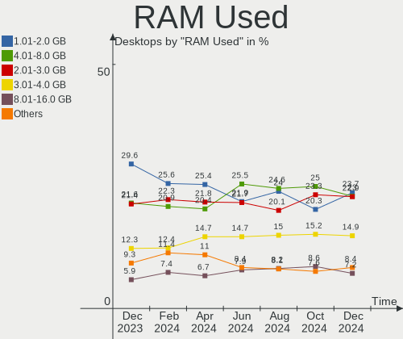
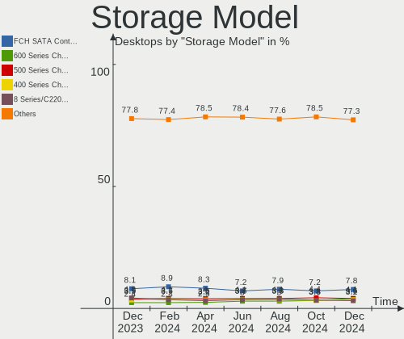
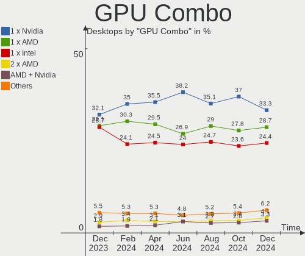
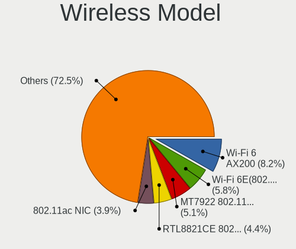
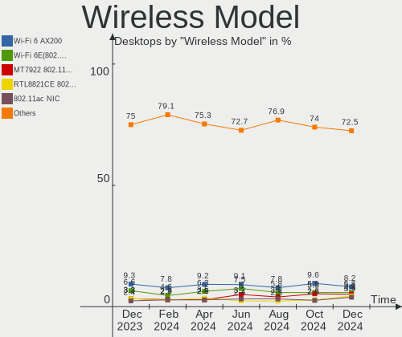
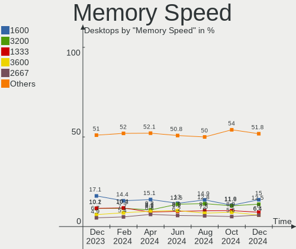
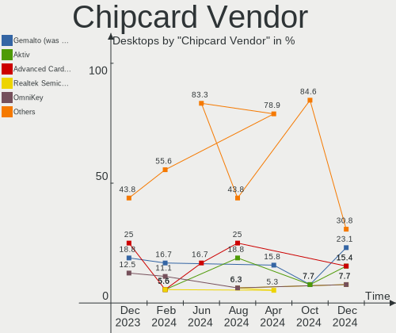

Linux - Hardware Trends (Desktops)
----------------------------------

A project to identify most popular hardware characteristics and track their change
over time based on data collected by Linux users at https://Linux-Hardware.org.

Anyone can contribute to this report by the [hw-probe](https://github.com/linuxhw/hw-probe) tool:

    sudo -E hw-probe -all -upload

This report is for one last month. Overall report since the beginning of time: [TestDays](https://github.com/linuxhw/TestDays)

Period: Jul, 2023.

Contents
--------

* [ System ](#system)
  - [ OS                       ](#os)
  - [ OS Family                ](#os-family)
  - [ Kernel                   ](#kernel)
  - [ Kernel Family            ](#kernel-family)
  - [ Kernel Major Ver.        ](#kernel-major-ver)
  - [ Arch                     ](#arch)
  - [ DE                       ](#de)
  - [ Display Server           ](#display-server)
  - [ Display Manager          ](#display-manager)
  - [ OS Lang                  ](#os-lang)
  - [ Boot Mode                ](#boot-mode)
  - [ Filesystem               ](#filesystem)
  - [ Part. scheme             ](#part-scheme)
  - [ Dual Boot with Linux/BSD ](#dual-boot-with-linuxbsd)
  - [ Dual Boot (Win)          ](#dual-boot-win)

* [ Board ](#board)
  - [ Vendor                   ](#vendor)
  - [ Model                    ](#model)
  - [ Model Family             ](#model-family)
  - [ MFG Year                 ](#mfg-year)
  - [ Form Factor              ](#form-factor)
  - [ Secure Boot              ](#secure-boot)
  - [ Coreboot                 ](#coreboot)
  - [ RAM Size                 ](#ram-size)
  - [ RAM Used                 ](#ram-used)
  - [ Total Drives             ](#total-drives)
  - [ Has CD-ROM               ](#has-cd-rom)
  - [ Has Ethernet             ](#has-ethernet)
  - [ Has WiFi                 ](#has-wifi)
  - [ Has Bluetooth            ](#has-bluetooth)

* [ Location ](#location)
  - [ Country                  ](#country)
  - [ City                     ](#city)

* [ Drives ](#drives)
  - [ Drive Vendor             ](#drive-vendor)
  - [ Drive Model              ](#drive-model)
  - [ HDD Vendor               ](#hdd-vendor)
  - [ SSD Vendor               ](#ssd-vendor)
  - [ Drive Kind               ](#drive-kind)
  - [ Drive Connector          ](#drive-connector)
  - [ Drive Size               ](#drive-size)
  - [ Space Total              ](#space-total)
  - [ Space Used               ](#space-used)
  - [ Malfunc. Drives          ](#malfunc-drives)
  - [ Malfunc. Drive Vendor    ](#malfunc-drive-vendor)
  - [ Malfunc. HDD Vendor      ](#malfunc-hdd-vendor)
  - [ Malfunc. Drive Kind      ](#malfunc-drive-kind)
  - [ Failed Drives            ](#failed-drives)
  - [ Failed Drive Vendor      ](#failed-drive-vendor)
  - [ Drive Status             ](#drive-status)

* [ Storage controller ](#storage-controller)
  - [ Storage Vendor           ](#storage-vendor)
  - [ Storage Model            ](#storage-model)
  - [ Storage Kind             ](#storage-kind)

* [ Processor ](#processor)
  - [ CPU Vendor               ](#cpu-vendor)
  - [ CPU Model                ](#cpu-model)
  - [ CPU Model Family         ](#cpu-model-family)
  - [ CPU Cores                ](#cpu-cores)
  - [ CPU Sockets              ](#cpu-sockets)
  - [ CPU Threads              ](#cpu-threads)
  - [ CPU Op-Modes             ](#cpu-op-modes)
  - [ CPU Microcode            ](#cpu-microcode)
  - [ CPU Microarch            ](#cpu-microarch)

* [ Graphics ](#graphics)
  - [ GPU Vendor               ](#gpu-vendor)
  - [ GPU Model                ](#gpu-model)
  - [ GPU Combo                ](#gpu-combo)
  - [ GPU Driver               ](#gpu-driver)
  - [ GPU Memory               ](#gpu-memory)

* [ Monitor ](#monitor)
  - [ Monitor Vendor           ](#monitor-vendor)
  - [ Monitor Model            ](#monitor-model)
  - [ Monitor Resolution       ](#monitor-resolution)
  - [ Monitor Diagonal         ](#monitor-diagonal)
  - [ Monitor Width            ](#monitor-width)
  - [ Aspect Ratio             ](#aspect-ratio)
  - [ Monitor Area             ](#monitor-area)
  - [ Pixel Density            ](#pixel-density)
  - [ Multiple Monitors        ](#multiple-monitors)

* [ Network ](#network)
  - [ Net Controller Vendor    ](#net-controller-vendor)
  - [ Net Controller Model     ](#net-controller-model)
  - [ Wireless Vendor          ](#wireless-vendor)
  - [ Wireless Model           ](#wireless-model)
  - [ Ethernet Vendor          ](#ethernet-vendor)
  - [ Ethernet Model           ](#ethernet-model)
  - [ Net Controller Kind      ](#net-controller-kind)
  - [ Used Controller          ](#used-controller)
  - [ NICs                     ](#nics)
  - [ IPv6                     ](#ipv6)

* [ Bluetooth ](#bluetooth)
  - [ Bluetooth Vendor         ](#bluetooth-vendor)
  - [ Bluetooth Model          ](#bluetooth-model)

* [ Sound ](#sound)
  - [ Sound Vendor             ](#sound-vendor)
  - [ Sound Model              ](#sound-model)

* [ Memory ](#memory)
  - [ Memory Vendor            ](#memory-vendor)
  - [ Memory Model             ](#memory-model)
  - [ Memory Kind              ](#memory-kind)
  - [ Memory Form Factor       ](#memory-form-factor)
  - [ Memory Size              ](#memory-size)
  - [ Memory Speed             ](#memory-speed)

* [ Printers & scanners ](#printers--scanners)
  - [ Printer Vendor           ](#printer-vendor)
  - [ Printer Model            ](#printer-model)
  - [ Scanner Vendor           ](#scanner-vendor)
  - [ Scanner Model            ](#scanner-model)

* [ Camera ](#camera)
  - [ Camera Vendor            ](#camera-vendor)
  - [ Camera Model             ](#camera-model)

* [ Security ](#security)
  - [ Fingerprint Vendor       ](#fingerprint-vendor)
  - [ Fingerprint Model        ](#fingerprint-model)
  - [ Chipcard Vendor          ](#chipcard-vendor)
  - [ Chipcard Model           ](#chipcard-model)

* [ Unsupported ](#unsupported)
  - [ Unsupported Devices      ](#unsupported-devices)
  - [ Unsupported Device Types ](#unsupported-device-types)

System
------

OS
--

Installed operating systems

| Name                         | Desktops | Percent |
|------------------------------|----------|---------|
| Ubuntu 22.04                 | 254      | 12.97%  |
| Fedora 38                    | 155      | 7.91%   |
| Debian 12                    | 117      | 5.97%   |
| Linux Mint 21.1              | 116      | 5.92%   |
| Arch Rolling                 | 86       | 4.39%   |
| Ubuntu 23.04                 | 74       | 3.78%   |
| ROSA 12.4                    | 68       | 3.47%   |
| Pop!_OS 22.04                | 65       | 3.32%   |
| ArcoLinux Rolling            | 62       | 3.16%   |
| OpenMandriva 23.03           | 61       | 3.11%   |
| Linux Mint 21.2              | 61       | 3.11%   |
| Zorin 16                     | 59       | 3.01%   |
| Debian 11                    | 56       | 2.86%   |
| Ubuntu 20.04                 | 43       | 2.19%   |
| OpenMandriva 23.07           | 41       | 2.09%   |
| Manjaro                      | 33       | 1.68%   |
| Gentoo 2.13                  | 27       | 1.38%   |
| Nobara 38                    | 26       | 1.33%   |
| Linux Mint 20.3              | 26       | 1.33%   |
| Kubuntu 23.04                | 24       | 1.23%   |
| Kubuntu 22.04                | 24       | 1.23%   |
| BlackPanther 18.1            | 23       | 1.17%   |
| openSUSE Tumbleweed-XXXXXXXX | 20       | 1.02%   |
| OpenMandriva 4.3             | 19       | 0.97%   |
| Kali 2023.2                  | 18       | 0.92%   |
| Debian                       | 18       | 0.92%   |
| openSUSE Leap-15.5           | 17       | 0.87%   |
| Ubuntu 22.10                 | 16       | 0.82%   |
| Xero Rolling                 | 15       | 0.77%   |
| OpenMandriva 23.06           | 15       | 0.77%   |
| Xubuntu 20.04                | 14       | 0.71%   |
| KDE neon 22.04               | 13       | 0.66%   |
| EndeavourOS Rolling          | 13       | 0.66%   |
| Ubuntu 18.04                 | 12       | 0.61%   |
| Manjaro 23.0.0               | 10       | 0.51%   |
| Fedora 37                    | 10       | 0.51%   |
| Xubuntu 22.04                | 9        | 0.46%   |
| Garuda Linux Soaring         | 9        | 0.46%   |
| Xubuntu 23.04                | 8        | 0.41%   |
| Lubuntu 22.04                | 8        | 0.41%   |

OS Family
---------

OS without a version

| Name          | Desktops | Percent |
|---------------|----------|---------|
| Ubuntu        | 404      | 20.62%  |
| Linux Mint    | 217      | 11.08%  |
| Debian        | 193      | 9.85%   |
| Fedora        | 168      | 8.58%   |
| OpenMandriva  | 153      | 7.81%   |
| Arch          | 86       | 4.39%   |
| ROSA          | 75       | 3.83%   |
| Pop!_OS       | 66       | 3.37%   |
| ArcoLinux     | 64       | 3.27%   |
| Zorin         | 61       | 3.11%   |
| Kubuntu       | 52       | 2.65%   |
| Manjaro       | 44       | 2.25%   |
| openSUSE      | 43       | 2.19%   |
| Xubuntu       | 33       | 1.68%   |
| Gentoo        | 32       | 1.63%   |
| Nobara        | 30       | 1.53%   |
| BlackPanther  | 27       | 1.38%   |
| Kali          | 18       | 0.92%   |
| Xero          | 15       | 0.77%   |
| Lubuntu       | 14       | 0.71%   |
| KDE neon      | 13       | 0.66%   |
| Garuda Linux  | 13       | 0.66%   |
| EndeavourOS   | 13       | 0.66%   |
| ChimeraOS     | 9        | 0.46%   |
| Ubuntu MATE   | 8        | 0.41%   |
| NixOS         | 8        | 0.41%   |
| LMDE          | 8        | 0.41%   |
| Elementary    | 8        | 0.41%   |
| MX            | 6        | 0.31%   |
| CentOS        | 5        | 0.26%   |
| CachyOS       | 5        | 0.26%   |
| blendOS       | 4        | 0.2%    |
| ALT Linux     | 4        | 0.2%    |
| Void Linux    | 3        | 0.15%   |
| Rocky Linux   | 3        | 0.15%   |
| Endless       | 3        | 0.15%   |
| AlmaLinux     | 3        | 0.15%   |
| Ubuntu Unity  | 2        | 0.1%    |
| Ubuntu Studio | 2        | 0.1%    |
| Ubuntu Budgie | 2        | 0.1%    |

Kernel
------

Version of the Linux kernel

| Version                           | Desktops | Percent |
|-----------------------------------|----------|---------|
| 5.15.0-76-generic                 | 207      | 10.57%  |
| 5.19.0-46-generic                 | 198      | 10.11%  |
| 6.2.6-desktop-1omv2390            | 66       | 3.37%   |
| 6.2.6-76060206-generic            | 63       | 3.22%   |
| 5.15.0-78-generic                 | 58       | 2.96%   |
| 6.3.5-desktop-3omv2390            | 49       | 2.5%    |
| 6.1.0-10-amd64                    | 47       | 2.4%    |
| 6.2.0-25-generic                  | 41       | 2.09%   |
| 6.1.0-4-amd64                     | 41       | 2.09%   |
| 6.3.8-200.fc38.x86_64             | 40       | 2.04%   |
| 6.2.0-24-generic                  | 39       | 1.99%   |
| 6.3.12-200.fc38.x86_64            | 38       | 1.94%   |
| 5.19.0-50-generic                 | 38       | 1.94%   |
| 5.10.0-23-amd64                   | 34       | 1.74%   |
| 6.1.20-generic-2rosa2021.1-x86_64 | 31       | 1.58%   |
| 6.3.11-200.fc38.x86_64            | 30       | 1.53%   |
| 5.4.0-153-generic                 | 28       | 1.43%   |
| 6.3.9-arch1-1                     | 21       | 1.07%   |
| 6.1.38-generic-1rosa2021.1-x86_64 | 20       | 1.02%   |
| 6.1.0-9-amd64                     | 20       | 1.02%   |
| 6.4.3-arch1-2                     | 19       | 0.97%   |
| 5.6.14-desktop-2bP                | 17       | 0.87%   |
| 6.4.2-arch1-1                     | 16       | 0.82%   |
| 5.15.0-75-generic                 | 16       | 0.82%   |
| 6.4.4-200.fc38.x86_64             | 15       | 0.77%   |
| 6.4.3-arch1-1                     | 15       | 0.77%   |
| 6.3.12-204.fsync.fc38.x86_64      | 14       | 0.71%   |
| 6.2.0-26-generic                  | 14       | 0.71%   |
| 5.19.0-32-generic                 | 13       | 0.66%   |
| 5.15.0-56-generic                 | 13       | 0.66%   |
| 5.16.7-desktop-1omv4003           | 12       | 0.61%   |
| 6.4.4-arch1-1                     | 11       | 0.56%   |
| 6.2.9-300.fc38.x86_64             | 11       | 0.56%   |
| 6.4.6-200.fc38.x86_64             | 10       | 0.51%   |
| 6.4.1-arch1-1                     | 10       | 0.51%   |
| 5.14.21-150500.53-default         | 10       | 0.51%   |
| 6.4.1-arch2-1                     | 9        | 0.46%   |
| 6.3.9-1-default                   | 9        | 0.46%   |
| 5.4.0-156-generic                 | 9        | 0.46%   |
| 6.4.3-zen1-2-zen                  | 8        | 0.41%   |

Kernel Family
-------------

Linux kernel without a distro release

| Version  | Desktops | Percent |
|----------|----------|---------|
| 5.15.0   | 339      | 17.3%   |
| 5.19.0   | 272      | 13.88%  |
| 6.2.6    | 131      | 6.69%   |
| 6.1.0    | 129      | 6.58%   |
| 6.2.0    | 109      | 5.56%   |
| 6.4.3    | 68       | 3.47%   |
| 6.3.12   | 67       | 3.42%   |
| 5.4.0    | 60       | 3.06%   |
| 6.3.8    | 53       | 2.71%   |
| 6.3.5    | 52       | 2.65%   |
| 6.3.9    | 51       | 2.6%    |
| 6.4.4    | 49       | 2.5%    |
| 5.10.0   | 46       | 2.35%   |
| 6.4.2    | 42       | 2.14%   |
| 6.1.38   | 38       | 1.94%   |
| 6.4.1    | 36       | 1.84%   |
| 6.1.20   | 31       | 1.58%   |
| 6.3.11   | 30       | 1.53%   |
| 6.4.6    | 22       | 1.12%   |
| 6.3.0    | 22       | 1.12%   |
| 5.14.21  | 18       | 0.92%   |
| 6.1.31   | 17       | 0.87%   |
| 5.6.14   | 17       | 0.87%   |
| 6.4.0    | 16       | 0.82%   |
| 6.3.10   | 12       | 0.61%   |
| 5.16.7   | 12       | 0.61%   |
| 6.4.7    | 11       | 0.56%   |
| 6.2.9    | 11       | 0.56%   |
| 6.2.16   | 11       | 0.56%   |
| 6.1.1    | 7        | 0.36%   |
| 5.16.13  | 7        | 0.36%   |
| 5.15.117 | 7        | 0.36%   |
| 5.10.14  | 7        | 0.36%   |
| 6.1.39   | 6        | 0.31%   |
| 5.14.0   | 6        | 0.31%   |
| 5.11.0   | 6        | 0.31%   |
| 4.15.0   | 6        | 0.31%   |
| 6.3.3    | 5        | 0.26%   |
| 6.1.41   | 5        | 0.26%   |
| 6.0.0    | 5        | 0.26%   |

Kernel Major Ver.
-----------------

Linux kernel major version

| Version | Desktops | Percent |
|---------|----------|---------|
| 5.15    | 370      | 18.89%  |
| 6.3     | 301      | 15.36%  |
| 6.2     | 277      | 14.14%  |
| 5.19    | 273      | 13.94%  |
| 6.4     | 248      | 12.66%  |
| 6.1     | 247      | 12.61%  |
| 5.10    | 68       | 3.47%   |
| 5.4     | 61       | 3.11%   |
| 5.14    | 24       | 1.23%   |
| 5.16    | 21       | 1.07%   |
| 5.6     | 17       | 0.87%   |
| 6.0     | 10       | 0.51%   |
| 4.18    | 9        | 0.46%   |
| 5.11    | 6        | 0.31%   |
| 4.15    | 6        | 0.31%   |
| 5.17    | 5        | 0.26%   |
| 6.5     | 3        | 0.15%   |
| 4.19    | 3        | 0.15%   |
| 5.8     | 2        | 0.1%    |
| 5.13    | 2        | 0.1%    |
| 4.4     | 2        | 0.1%    |
| 3.10    | 2        | 0.1%    |
| 5.9     | 1        | 0.05%   |
| 2.6     | 1        | 0.05%   |

Arch
----

OS architecture (x86_64, i586, etc.)

| Name        | Desktops | Percent |
|-------------|----------|---------|
| x86_64      | 1945     | 99.29%  |
| i686        | 12       | 0.61%   |
| riscv64     | 1        | 0.05%   |
| loongarch64 | 1        | 0.05%   |

DE
--

Desktop Environment

| Name             | Desktops | Percent |
|------------------|----------|---------|
| GNOME            | 780      | 39.82%  |
| KDE5             | 515      | 26.29%  |
| X-Cinnamon       | 185      | 9.44%   |
| XFCE             | 160      | 8.17%   |
| Unknown          | 140      | 7.15%   |
| MATE             | 53       | 2.71%   |
| Cinnamon         | 26       | 1.33%   |
| LXQt             | 25       | 1.28%   |
| GNOME Classic    | 10       | 0.51%   |
| Pantheon         | 8        | 0.41%   |
| LXDE             | 8        | 0.41%   |
| Hyprland         | 8        | 0.41%   |
| i3               | 7        | 0.36%   |
| sway             | 5        | 0.26%   |
| Budgie           | 5        | 0.26%   |
| GNOME Flashback  | 4        | 0.2%    |
| Deepin           | 3        | 0.15%   |
| chadwm           | 3        | 0.15%   |
| Unity            | 2        | 0.1%    |
| KDE              | 2        | 0.1%    |
| Trinity          | 1        | 0.05%   |
| openbox          | 1        | 0.05%   |
| none+awesome     | 1        | 0.05%   |
| Lubuntu          | 1        | 0.05%   |
| lightdm-xsession | 1        | 0.05%   |
| KDE4             | 1        | 0.05%   |
| GNOME-Classic    | 1        | 0.05%   |
| dwm              | 1        | 0.05%   |
| Cutefish         | 1        | 0.05%   |
| awesome          | 1        | 0.05%   |

Display Server
--------------

X11 or Wayland

| Name    | Desktops | Percent |
|---------|----------|---------|
| X11     | 1236     | 63.09%  |
| Wayland | 556      | 28.38%  |
| Unknown | 93       | 4.75%   |
| Tty     | 74       | 3.78%   |

Display Manager
---------------

SDDM, LightDM, etc.

| Name    | Desktops | Percent |
|---------|----------|---------|
| Unknown | 753      | 38.44%  |
| SDDM    | 447      | 22.82%  |
| GDM3    | 355      | 18.12%  |
| LightDM | 254      | 12.97%  |
| GDM     | 139      | 7.1%    |
| XDM     | 3        | 0.15%   |
| LY-DM   | 3        | 0.15%   |
| WDM     | 1        | 0.05%   |
| TDM     | 1        | 0.05%   |
| NODM    | 1        | 0.05%   |
| Ly      | 1        | 0.05%   |
| LXDM    | 1        | 0.05%   |

OS Lang
-------

Language

| Lang    | Desktops | Percent |
|---------|----------|---------|
| en_US   | 807      | 41.19%  |
| ru_RU   | 170      | 8.68%   |
| de_DE   | 170      | 8.68%   |
| en_GB   | 107      | 5.46%   |
| pt_BR   | 103      | 5.26%   |
| fr_FR   | 73       | 3.73%   |
| Unknown | 49       | 2.5%    |
| it_IT   | 44       | 2.25%   |
| pl_PL   | 39       | 1.99%   |
| es_ES   | 39       | 1.99%   |
| C       | 38       | 1.94%   |
| en_AU   | 36       | 1.84%   |
| en_CA   | 34       | 1.74%   |
| es_MX   | 23       | 1.17%   |
| en_IN   | 19       | 0.97%   |
| cs_CZ   | 16       | 0.82%   |
| nl_NL   | 15       | 0.77%   |
| en_ZA   | 12       | 0.61%   |
| zh_CN   | 11       | 0.56%   |
| es_AR   | 10       | 0.51%   |
| hu_HU   | 8        | 0.41%   |
| de_AT   | 8        | 0.41%   |
| nl_BE   | 7        | 0.36%   |
| fi_FI   | 7        | 0.36%   |
| tr_TR   | 6        | 0.31%   |
| pt_PT   | 6        | 0.31%   |
| ja_JP   | 5        | 0.26%   |
| es_VE   | 5        | 0.26%   |
| da_DK   | 5        | 0.26%   |
| sv_SE   | 4        | 0.2%    |
| es_UY   | 4        | 0.2%    |
| es_CL   | 4        | 0.2%    |
| en_PH   | 4        | 0.2%    |
| en_NZ   | 4        | 0.2%    |
| en_IE   | 4        | 0.2%    |
| de_CH   | 4        | 0.2%    |
| C.UTF8  | 4        | 0.2%    |
| zh_TW   | 3        | 0.15%   |
| fr_BE   | 3        | 0.15%   |
| es_CO   | 3        | 0.15%   |

Boot Mode
---------

EFI or BIOS

| Mode | Desktops | Percent |
|------|----------|---------|
| BIOS | 1011     | 51.61%  |
| EFI  | 948      | 48.39%  |

Filesystem
----------

Type of filesystem

| Type     | Desktops | Percent |
|----------|----------|---------|
| Ext4     | 1125     | 57.43%  |
| Btrfs    | 339      | 17.3%   |
| Tmpfs    | 262      | 13.37%  |
| Overlay  | 161      | 8.22%   |
| Xfs      | 46       | 2.35%   |
| Zfs      | 17       | 0.87%   |
| F2fs     | 5        | 0.26%   |
| Jfs      | 2        | 0.1%    |
| XXXX     | 1        | 0.05%   |
| Reiserfs | 1        | 0.05%   |

Part. scheme
------------

Scheme of partitioning

| Type    | Desktops | Percent |
|---------|----------|---------|
| GPT     | 1054     | 53.8%   |
| Unknown | 632      | 32.26%  |
| MBR     | 273      | 13.94%  |

Dual Boot with Linux/BSD
------------------------

Hosting more than one Linux/BSD

| Dual boot | Desktops | Percent |
|-----------|----------|---------|
| No        | 1582     | 80.76%  |
| Yes       | 377      | 19.24%  |

Dual Boot (Win)
---------------

Hosting Linux and Windows

| Dual boot | Desktops | Percent |
|-----------|----------|---------|
| No        | 1369     | 69.88%  |
| Yes       | 590      | 30.12%  |

Board
-----

Vendor
------

Motherboard manufacturer

| Name                                 | Desktops | Percent |
|--------------------------------------|----------|---------|
| ASUSTek Computer                     | 452      | 23.07%  |
| Gigabyte Technology                  | 342      | 17.46%  |
| MSI                                  | 269      | 13.73%  |
| ASRock                               | 189      | 9.65%   |
| Dell                                 | 154      | 7.86%   |
| Hewlett-Packard                      | 133      | 6.79%   |
| Lenovo                               | 72       | 3.68%   |
| Unknown                              | 47       | 2.4%    |
| Intel                                | 42       | 2.14%   |
| Acer                                 | 25       | 1.28%   |
| Fujitsu                              | 21       | 1.07%   |
| Biostar                              | 18       | 0.92%   |
| Pegatron                             | 13       | 0.66%   |
| Apple                                | 13       | 0.66%   |
| ECS                                  | 12       | 0.61%   |
| Foxconn                              | 11       | 0.56%   |
| AZW                                  | 11       | 0.56%   |
| Shenzhen Meigao Electronic Equipment | 10       | 0.51%   |
| Huanan                               | 9        | 0.46%   |
| Positivo                             | 8        | 0.41%   |
| Medion                               | 8        | 0.41%   |
| MACHINIST                            | 6        | 0.31%   |
| Supermicro                           | 5        | 0.26%   |
| Gateway                              | 5        | 0.26%   |
| ASRockRack                           | 5        | 0.26%   |
| Alienware                            | 5        | 0.26%   |
| Google                               | 4        | 0.2%    |
| PCWare                               | 3        | 0.15%   |
| System76                             | 2        | 0.1%    |
| OEM                                  | 2        | 0.1%    |
| IceWhale Technology                  | 2        | 0.1%    |
| Fujitsu Siemens                      | 2        | 0.1%    |
| Daten Tecnologia                     | 2        | 0.1%    |
| Cincoze                              | 2        | 0.1%    |
| BESSTAR Tech                         | 2        | 0.1%    |
| AMI                                  | 2        | 0.1%    |
| Acidanthera                          | 2        | 0.1%    |
| AAEON                                | 2        | 0.1%    |
| Wortmann AG                          | 1        | 0.05%   |
| Win Element                          | 1        | 0.05%   |

Model
-----

Motherboard model

| Name                         | Desktops | Percent |
|------------------------------|----------|---------|
| Unknown                      | 49       | 2.5%    |
| ASUS All Series              | 40       | 2.04%   |
| ASRock H470M-HVS             | 20       | 1.02%   |
| Dell OptiPlex 7010           | 12       | 0.61%   |
| ASUS PRIME A320M-K           | 11       | 0.56%   |
| Dell OptiPlex 9020           | 10       | 0.51%   |
| MSI MS-7C91                  | 9        | 0.46%   |
| MSI MS-7C56                  | 9        | 0.46%   |
| Gigabyte H81M-S2V            | 9        | 0.46%   |
| ASRock B450M Pro4            | 9        | 0.46%   |
| MSI MS-7C37                  | 8        | 0.41%   |
| MSI MS-7C02                  | 8        | 0.41%   |
| Gigabyte A320M-S2H V2        | 8        | 0.41%   |
| ASUS TUF Gaming X570-PLUS    | 8        | 0.41%   |
| ASUS ROG STRIX B550-F GAMING | 8        | 0.41%   |
| ASUS PRIME X570-P            | 8        | 0.41%   |
| ASUS PRIME X370-PRO          | 8        | 0.41%   |
| MSI MS-7D75                  | 7        | 0.36%   |
| MSI MS-7D25                  | 7        | 0.36%   |
| MSI MS-7C52                  | 7        | 0.36%   |
| Dell OptiPlex 3020           | 7        | 0.36%   |
| MSI MS-7817                  | 6        | 0.31%   |
| Gigabyte B650 AORUS ELITE AX | 6        | 0.31%   |
| Gigabyte A320M-S2H           | 6        | 0.31%   |
| Dell OptiPlex 790            | 6        | 0.31%   |
| ASUS PRIME B450-PLUS         | 6        | 0.31%   |
| ASUS M5A78L-M/USB3           | 6        | 0.31%   |
| Apple MacPro5,1              | 6        | 0.31%   |
| MSI MS-7C95                  | 5        | 0.26%   |
| MSI MS-7A38                  | 5        | 0.26%   |
| Intel H61                    | 5        | 0.26%   |
| HP Z800 Workstation          | 5        | 0.26%   |
| Gigabyte B450M DS3H V2       | 5        | 0.26%   |
| Gigabyte B450M DS3H          | 5        | 0.26%   |
| Gigabyte 970A-DS3P           | 5        | 0.26%   |
| Dell OptiPlex 9010           | 5        | 0.26%   |
| Dell OptiPlex 7050           | 5        | 0.26%   |
| Dell OptiPlex 7040           | 5        | 0.26%   |
| Dell OptiPlex 7020           | 5        | 0.26%   |
| Dell OptiPlex 380            | 5        | 0.26%   |

Model Family
------------

Motherboard model prefix

| Name               | Desktops | Percent |
|--------------------|----------|---------|
| ASUS PRIME         | 115      | 5.87%   |
| Dell OptiPlex      | 101      | 5.16%   |
| ASUS ROG           | 83       | 4.24%   |
| ASUS TUF           | 52       | 2.65%   |
| Lenovo ThinkCentre | 49       | 2.5%    |
| Unknown            | 49       | 2.5%    |
| HP Compaq          | 41       | 2.09%   |
| ASUS All           | 40       | 2.04%   |
| Dell Precision     | 20       | 1.02%   |
| ASRock H470M-HVS   | 20       | 1.02%   |
| HP EliteDesk       | 19       | 0.97%   |
| HP ProDesk         | 16       | 0.82%   |
| Gigabyte B550      | 16       | 0.82%   |
| Gigabyte B450M     | 16       | 0.82%   |
| Fujitsu ESPRIMO    | 16       | 0.82%   |
| Dell Inspiron      | 16       | 0.82%   |
| ASUS M5A78L-M      | 16       | 0.82%   |
| ASRock B450M       | 16       | 0.82%   |
| Gigabyte X570      | 15       | 0.77%   |
| Gigabyte A320M-S2H | 14       | 0.71%   |
| ASRock X570        | 14       | 0.71%   |
| Gigabyte B550M     | 12       | 0.61%   |
| Acer Aspire        | 12       | 0.61%   |
| Gigabyte B450      | 10       | 0.51%   |
| MSI MS-7C91        | 9        | 0.46%   |
| MSI MS-7C56        | 9        | 0.46%   |
| Lenovo IdeaCentre  | 9        | 0.46%   |
| Gigabyte H81M-S2V  | 9        | 0.46%   |
| Acer Veriton       | 9        | 0.46%   |
| MSI MS-7C37        | 8        | 0.41%   |
| MSI MS-7C02        | 8        | 0.41%   |
| Gigabyte Z390      | 8        | 0.41%   |
| Gigabyte B650      | 8        | 0.41%   |
| ASRock B450        | 8        | 0.41%   |
| MSI MS-7D75        | 7        | 0.36%   |
| MSI MS-7D25        | 7        | 0.36%   |
| MSI MS-7C52        | 7        | 0.36%   |
| HP Pavilion        | 7        | 0.36%   |
| ASUS P8Z77-V       | 7        | 0.36%   |
| MSI MS-7817        | 6        | 0.31%   |

MFG Year
--------

Motherboard manufacture year

| Year    | Desktops | Percent |
|---------|----------|---------|
| 2018    | 216      | 11.03%  |
| 2020    | 180      | 9.19%   |
| 2021    | 176      | 8.98%   |
| 2022    | 175      | 8.93%   |
| 2013    | 141      | 7.2%    |
| 2012    | 130      | 6.64%   |
| 2019    | 127      | 6.48%   |
| 2017    | 126      | 6.43%   |
| 2014    | 111      | 5.67%   |
| 2011    | 108      | 5.51%   |
| 2015    | 89       | 4.54%   |
| 2010    | 79       | 4.03%   |
| 2009    | 76       | 3.88%   |
| 2016    | 71       | 3.62%   |
| 2023    | 64       | 3.27%   |
| 2008    | 36       | 1.84%   |
| 2007    | 34       | 1.74%   |
| 2006    | 8        | 0.41%   |
| 2005    | 4        | 0.2%    |
| 2004    | 3        | 0.15%   |
| 2002    | 2        | 0.1%    |
| Unknown | 2        | 0.1%    |
| 2003    | 1        | 0.05%   |

Form Factor
-----------

Physical design of the computer

| Name    | Desktops | Percent |
|---------|----------|---------|
| Desktop | 1959     | 100%    |

Secure Boot
-----------

Enabled or disabled

| State    | Desktops | Percent |
|----------|----------|---------|
| Disabled | 1900     | 96.99%  |
| Enabled  | 59       | 3.01%   |

Coreboot
--------

Have coreboot on board

| Used | Desktops | Percent |
|------|----------|---------|
| No   | 1955     | 99.8%   |
| Yes  | 4        | 0.2%    |

RAM Size
--------

Total RAM memory

| Size in GB      | Desktops | Percent |
|-----------------|----------|---------|
| 16.01-24.0      | 484      | 24.71%  |
| 32.01-64.0      | 393      | 20.06%  |
| 4.01-8.0        | 294      | 15.01%  |
| 8.01-16.0       | 289      | 14.75%  |
| 3.01-4.0        | 191      | 9.75%   |
| 64.01-256.0     | 165      | 8.42%   |
| 24.01-32.0      | 88       | 4.49%   |
| 1.01-2.0        | 25       | 1.28%   |
| 2.01-3.0        | 19       | 0.97%   |
| 0.51-1.0        | 6        | 0.31%   |
| More than 256.0 | 5        | 0.26%   |

RAM Used
--------

Used RAM memory

| Used GB     | Desktops | Percent |
|-------------|----------|---------|
| 1.01-2.0    | 514      | 26.24%  |
| 2.01-3.0    | 463      | 23.63%  |
| 4.01-8.0    | 401      | 20.47%  |
| 3.01-4.0    | 271      | 13.83%  |
| 8.01-16.0   | 118      | 6.02%   |
| 0.51-1.0    | 115      | 5.87%   |
| 0.01-0.5    | 34       | 1.74%   |
| 16.01-24.0  | 23       | 1.17%   |
| 24.01-32.0  | 10       | 0.51%   |
| 32.01-64.0  | 8        | 0.41%   |
| 64.01-256.0 | 1        | 0.05%   |
| Unknown     | 1        | 0.05%   |

Total Drives
------------

Number of drives on board

| Drives | Desktops | Percent |
|--------|----------|---------|
| 1      | 716      | 36.55%  |
| 2      | 537      | 27.41%  |
| 3      | 317      | 16.18%  |
| 4      | 190      | 9.7%    |
| 5      | 95       | 4.85%   |
| 6      | 48       | 2.45%   |
| 7      | 25       | 1.28%   |
| 0      | 11       | 0.56%   |
| 8      | 6        | 0.31%   |
| 9      | 3        | 0.15%   |
| 12     | 2        | 0.1%    |
| 11     | 2        | 0.1%    |
| 10     | 2        | 0.1%    |
| 27     | 1        | 0.05%   |
| 26     | 1        | 0.05%   |
| 19     | 1        | 0.05%   |
| 14     | 1        | 0.05%   |
| 13     | 1        | 0.05%   |

Has CD-ROM
----------

Has CD-ROM on board

| Presented | Desktops | Percent |
|-----------|----------|---------|
| No        | 1216     | 62.07%  |
| Yes       | 743      | 37.93%  |

Has Ethernet
------------

Has Ethernet on board

| Presented | Desktops | Percent |
|-----------|----------|---------|
| Yes       | 1941     | 99.08%  |
| No        | 18       | 0.92%   |

Has WiFi
--------

Has WiFi module

| Presented | Desktops | Percent |
|-----------|----------|---------|
| No        | 1059     | 54.06%  |
| Yes       | 900      | 45.94%  |

Has Bluetooth
-------------

Has Bluetooth module

| Presented | Desktops | Percent |
|-----------|----------|---------|
| No        | 1218     | 62.17%  |
| Yes       | 741      | 37.83%  |

Location
--------

Country
-------

Geographic location (country)

| Country      | Desktops | Percent |
|--------------|----------|---------|
| USA          | 389      | 19.86%  |
| Germany      | 219      | 11.18%  |
| Russia       | 195      | 9.95%   |
| Brazil       | 138      | 7.04%   |
| UK           | 87       | 4.44%   |
| France       | 86       | 4.39%   |
| Italy        | 64       | 3.27%   |
| Canada       | 59       | 3.01%   |
| Poland       | 53       | 2.71%   |
| Australia    | 47       | 2.4%    |
| Netherlands  | 46       | 2.35%   |
| Spain        | 39       | 1.99%   |
| Hungary      | 36       | 1.84%   |
| Mexico       | 33       | 1.68%   |
| India        | 27       | 1.38%   |
| Sweden       | 25       | 1.28%   |
| Czechia      | 24       | 1.23%   |
| Belgium      | 23       | 1.17%   |
| Finland      | 21       | 1.07%   |
| Austria      | 21       | 1.07%   |
| South Africa | 18       | 0.92%   |
| Argentina    | 18       | 0.92%   |
| Japan        | 13       | 0.66%   |
| Switzerland  | 12       | 0.61%   |
| Norway       | 12       | 0.61%   |
| China        | 12       | 0.61%   |
| Turkey       | 11       | 0.56%   |
| Taiwan       | 10       | 0.51%   |
| Romania      | 10       | 0.51%   |
| Denmark      | 10       | 0.51%   |
| Chile        | 10       | 0.51%   |
| Singapore    | 8        | 0.41%   |
| Malaysia     | 8        | 0.41%   |
| Indonesia    | 8        | 0.41%   |
| Saudi Arabia | 7        | 0.36%   |
| Philippines  | 7        | 0.36%   |
| New Zealand  | 7        | 0.36%   |
| Colombia     | 7        | 0.36%   |
| Venezuela    | 6        | 0.31%   |
| Portugal     | 6        | 0.31%   |

City
----

Geographic location (city)

| City           | Desktops | Percent |
|----------------|----------|---------|
| Voronezh       | 51       | 2.6%    |
| Moscow         | 31       | 1.58%   |
| Sydney         | 23       | 1.17%   |
| Berlin         | 19       | 0.97%   |
| Warsaw         | 17       | 0.87%   |
| St Petersburg  | 16       | 0.82%   |
| Helsinki       | 13       | 0.66%   |
| Rio de Janeiro | 11       | 0.56%   |
| Madrid         | 11       | 0.56%   |
| Vienna         | 10       | 0.51%   |
| Sao Paulo      | 10       | 0.51%   |
| Paris          | 10       | 0.51%   |
| Seattle        | 9        | 0.46%   |
| Singapore      | 8        | 0.41%   |
| Prague         | 8        | 0.41%   |
| Hamburg        | 8        | 0.41%   |
| Melbourne      | 7        | 0.36%   |
| Chicago        | 7        | 0.36%   |
| Budapest       | 7        | 0.36%   |
| Brisbane       | 7        | 0.36%   |
| San Francisco  | 6        | 0.31%   |
| Rostov-on-Don  | 6        | 0.31%   |
| Porto Alegre   | 6        | 0.31%   |
| Munich         | 6        | 0.31%   |
| Milan          | 6        | 0.31%   |
| Mexico City    | 6        | 0.31%   |
| Krakow         | 6        | 0.31%   |
| Dresden        | 6        | 0.31%   |
| Cape Town      | 6        | 0.31%   |
| Brasília      | 6        | 0.31%   |
| Atlanta        | 6        | 0.31%   |
| Amsterdam      | 6        | 0.31%   |
| Ufa            | 5        | 0.26%   |
| San José      | 5        | 0.26%   |
| Samara         | 5        | 0.26%   |
| Phoenix        | 5        | 0.26%   |
| Montevideo     | 5        | 0.26%   |
| Milano         | 5        | 0.26%   |
| Manchester     | 5        | 0.26%   |
| Los Angeles    | 5        | 0.26%   |

Drives
------

Drive Vendor
------------

Hard drive vendors

| Vendor                      | Desktops | Drives | Percent |
|-----------------------------|----------|--------|---------|
| Seagate                     | 586      | 769    | 15.78%  |
| WDC                         | 585      | 892    | 15.75%  |
| Samsung Electronics         | 567      | 827    | 15.27%  |
| Kingston                    | 227      | 254    | 6.11%   |
| Sandisk                     | 211      | 241    | 5.68%   |
| Toshiba                     | 183      | 215    | 4.93%   |
| Crucial                     | 164      | 185    | 4.42%   |
| Hitachi                     | 101      | 134    | 2.72%   |
| Intel                       | 66       | 80     | 1.78%   |
| Phison Electronics          | 55       | 62     | 1.48%   |
| Micron/Crucial Technology   | 55       | 58     | 1.48%   |
| China                       | 53       | 56     | 1.43%   |
| A-DATA Technology           | 53       | 59     | 1.43%   |
| Silicon Motion              | 42       | 45     | 1.13%   |
| Kingston Technology Company | 35       | 39     | 0.94%   |
| HGST                        | 34       | 41     | 0.92%   |
| Netac                       | 30       | 31     | 0.81%   |
| SPCC                        | 29       | 33     | 0.78%   |
| PNY                         | 29       | 32     | 0.78%   |
| Unknown                     | 27       | 38     | 0.73%   |
| SK hynix                    | 24       | 27     | 0.65%   |
| Unknown                     | 24       | 25     | 0.65%   |
| Maxtor                      | 23       | 24     | 0.62%   |
| ADATA Technology            | 23       | 23     | 0.62%   |
| Patriot                     | 22       | 23     | 0.59%   |
| Intenso                     | 22       | 25     | 0.59%   |
| Micron Technology           | 21       | 21     | 0.57%   |
| OCZ                         | 19       | 22     | 0.51%   |
| GOODRAM                     | 18       | 20     | 0.48%   |
| Team                        | 17       | 18     | 0.46%   |
| Realtek Semiconductor       | 16       | 17     | 0.43%   |
| MAXIO Technology (Hangzhou) | 16       | 17     | 0.43%   |
| Transcend                   | 15       | 15     | 0.4%    |
| Corsair                     | 15       | 15     | 0.4%    |
| JMicron Technology          | 14       | 14     | 0.38%   |
| Phison                      | 12       | 14     | 0.32%   |
| ASMT                        | 10       | 13     | 0.27%   |
| Hewlett-Packard             | 9        | 14     | 0.24%   |
| Gigabyte Technology         | 9        | 10     | 0.24%   |
| Apple                       | 9        | 9      | 0.24%   |

Drive Model
-----------

Hard drive models

| Model                                                              | Desktops | Percent |
|--------------------------------------------------------------------|----------|---------|
| Samsung NVMe SSD Controller SM981/PM981/PM983 500GB                | 96       | 2.21%   |
| Samsung NVMe SSD Controller PM9A1/PM9A3/980PRO 1TB                 | 56       | 1.29%   |
| Seagate ST1000DM010-2EP102 1TB                                     | 52       | 1.19%   |
| Kingston SA400S37240G 240GB SSD                                    | 50       | 1.15%   |
| Kingston SA400S37480G 480GB SSD                                    | 39       | 0.9%    |
| Toshiba HDWD110 1TB                                                | 38       | 0.87%   |
| Seagate ST500DM002-1BD142 500GB                                    | 36       | 0.83%   |
| Micron/Crucial P2 NVMe PCIe SSD 1TB                                | 34       | 0.78%   |
| Seagate ST1000DM003-1ER162 1TB                                     | 32       | 0.74%   |
| Seagate ST2000DM008-2FR102 2TB                                     | 31       | 0.71%   |
| Samsung SSD 860 EVO 500GB                                          | 30       | 0.69%   |
| Toshiba DT01ACA100 1TB                                             | 29       | 0.67%   |
| Samsung SSD 850 EVO 500GB                                          | 29       | 0.67%   |
| WDC WD10EZEX-08WN4A0 1TB                                           | 28       | 0.64%   |
| Samsung SSD 980 1TB                                                | 28       | 0.64%   |
| Samsung SSD 860 EVO 1TB                                            | 28       | 0.64%   |
| Silicon Motion SM2263EN/SM2263XT SSD Controller 500GB              | 26       | 0.6%    |
| Phison E12 NVMe Controller 2TB                                     | 26       | 0.6%    |
| Crucial CT240BX500SSD1 240GB                                       | 25       | 0.57%   |
| Samsung SSD 870 EVO 500GB                                          | 24       | 0.55%   |
| Crucial CT1000MX500SSD1 1TB                                        | 24       | 0.55%   |
| Unknown                                                            | 24       | 0.55%   |
| Samsung SSD 850 EVO 250GB                                          | 23       | 0.53%   |
| Samsung NVMe SSD Controller SM961/PM961/SM963 256GB                | 23       | 0.53%   |
| Kingston SA400S37120G 120GB SSD                                    | 21       | 0.48%   |
| Seagate ST1000DM003-1CH162 1TB                                     | 20       | 0.46%   |
| Netac SSD 240GB                                                    | 20       | 0.46%   |
| Seagate ST4000DM004-2CV104 4TB                                     | 18       | 0.41%   |
| Crucial CT500MX500SSD1 500GB                                       | 18       | 0.41%   |
| Seagate ST1000DM003-1SB102 1TB                                     | 17       | 0.39%   |
| Samsung SSD 870 QVO 1TB                                            | 17       | 0.39%   |
| WDC WDS500G2B0A-00SM50 500GB SSD                                   | 16       | 0.37%   |
| WDC WDS240G2G0A-00JH30 240GB SSD                                   | 16       | 0.37%   |
| Seagate ST3500418AS 500GB                                          | 16       | 0.37%   |
| Kingston SV300S37A120G 120GB SSD                                   | 16       | 0.37%   |
| ADATA XPG SX8200 Pro PCIe Gen3x4 M.2 2280 Solid State Drive 1024GB | 16       | 0.37%   |
| Toshiba DT01ACA050 500GB                                           | 15       | 0.34%   |
| Seagate ST2000DM006-2DM164 2TB                                     | 15       | 0.34%   |
| Sandisk WD Blue SN550 NVMe SSD 250GB                               | 15       | 0.34%   |
| Samsung SSD 870 EVO 1TB                                            | 15       | 0.34%   |

HDD Vendor
----------

Hard disk drive vendors

| Vendor              | Desktops | Drives | Percent |
|---------------------|----------|--------|---------|
| Seagate             | 575      | 745    | 37.22%  |
| WDC                 | 492      | 763    | 31.84%  |
| Toshiba             | 168      | 196    | 10.87%  |
| Hitachi             | 101      | 134    | 6.54%   |
| Samsung Electronics | 86       | 100    | 5.57%   |
| HGST                | 34       | 41     | 2.2%    |
| Maxtor              | 23       | 24     | 1.49%   |
| Unknown             | 8        | 8      | 0.52%   |
| ASMT                | 8        | 10     | 0.52%   |
| JMicron Technology  | 7        | 7      | 0.45%   |
| Apple               | 6        | 6      | 0.39%   |
| Hewlett-Packard     | 5        | 10     | 0.32%   |
| Fujitsu             | 5        | 5      | 0.32%   |
| Intenso             | 4        | 4      | 0.26%   |
| MaxDigital          | 3        | 3      | 0.19%   |
| LaCie               | 3        | 3      | 0.19%   |
| Unknown             | 3        | 3      | 0.19%   |
| PHD 3.0             | 2        | 2      | 0.13%   |
| SSK                 | 1        | 1      | 0.06%   |
| SABRENT             | 1        | 1      | 0.06%   |
| QUANTUM             | 1        | 1      | 0.06%   |
| MDT                 | 1        | 1      | 0.06%   |
| Initio              | 1        | 1      | 0.06%   |
| Inateck             | 1        | 1      | 0.06%   |
| IBM/Hitachi         | 1        | 1      | 0.06%   |
| IBM                 | 1        | 1      | 0.06%   |
| HPE                 | 1        | 1      | 0.06%   |
| H/W                 | 1        | 3      | 0.06%   |
| External            | 1        | 1      | 0.06%   |
| China               | 1        | 1      | 0.06%   |

SSD Vendor
----------

Solid state drive vendors

| Vendor              | Desktops | Drives | Percent |
|---------------------|----------|--------|---------|
| Samsung Electronics | 301      | 374    | 22.46%  |
| Kingston            | 176      | 196    | 13.13%  |
| Crucial             | 144      | 161    | 10.75%  |
| WDC                 | 109      | 116    | 8.13%   |
| SanDisk             | 92       | 100    | 6.87%   |
| China               | 51       | 54     | 3.81%   |
| A-DATA Technology   | 49       | 53     | 3.66%   |
| Intel               | 30       | 38     | 2.24%   |
| PNY                 | 28       | 31     | 2.09%   |
| Netac               | 25       | 26     | 1.87%   |
| SPCC                | 23       | 27     | 1.72%   |
| Patriot             | 19       | 20     | 1.42%   |
| OCZ                 | 19       | 22     | 1.42%   |
| GOODRAM             | 18       | 20     | 1.34%   |
| Team                | 17       | 17     | 1.27%   |
| Transcend           | 15       | 15     | 1.12%   |
| Intenso             | 15       | 17     | 1.12%   |
| Micron Technology   | 14       | 14     | 1.04%   |
| Toshiba             | 11       | 11     | 0.82%   |
| SK hynix            | 8        | 8      | 0.6%    |
| KingSpec            | 8        | 12     | 0.6%    |
| Gigabyte Technology | 8        | 9      | 0.6%    |
| Unknown             | 8        | 8      | 0.6%    |
| Verbatim            | 7        | 8      | 0.52%   |
| Corsair             | 7        | 7      | 0.52%   |
| Plextor             | 6        | 6      | 0.45%   |
| LITEONIT            | 6        | 6      | 0.45%   |
| Mushkin             | 5        | 5      | 0.37%   |
| Lexar               | 5        | 5      | 0.37%   |
| Apacer              | 5        | 5      | 0.37%   |
| AMD                 | 5        | 5      | 0.37%   |
| Hewlett-Packard     | 4        | 4      | 0.3%    |
| Fanxiang            | 4        | 4      | 0.3%    |
| Acer                | 4        | 4      | 0.3%    |
| XrayDisk            | 3        | 3      | 0.22%   |
| Vaseky              | 3        | 3      | 0.22%   |
| T-FORCE             | 3        | 3      | 0.22%   |
| Seagate             | 3        | 3      | 0.22%   |
| NGFF                | 3        | 3      | 0.22%   |
| Leven               | 3        | 3      | 0.22%   |

Drive Kind
----------

HDD or SSD

| Kind    | Desktops | Drives | Percent |
|---------|----------|--------|---------|
| HDD     | 1185     | 2078   | 37.91%  |
| SSD     | 1103     | 1507   | 35.28%  |
| NVMe    | 755      | 1031   | 24.15%  |
| Unknown | 67       | 82     | 2.14%   |
| MMC     | 16       | 16     | 0.51%   |

Drive Connector
---------------

SATA, SAS, NVMe, etc.

| Type | Desktops | Drives | Percent |
|------|----------|--------|---------|
| SATA | 1709     | 3432   | 64.91%  |
| NVMe | 752      | 1026   | 28.56%  |
| SAS  | 156      | 240    | 5.92%   |
| MMC  | 16       | 16     | 0.61%   |

Drive Size
----------

Size of hard drive

| Size in TB | Desktops | Drives | Percent |
|------------|----------|--------|---------|
| 0.01-0.5   | 1173     | 1683   | 46.04%  |
| 0.51-1.0   | 748      | 965    | 29.36%  |
| 1.01-2.0   | 299      | 412    | 11.73%  |
| 3.01-4.0   | 137      | 210    | 5.38%   |
| 4.01-10.0  | 98       | 178    | 3.85%   |
| 2.01-3.0   | 68       | 104    | 2.67%   |
| 10.01-20.0 | 23       | 31     | 0.9%    |
| 20.01-50.0 | 1        | 1      | 0.04%   |
| 0          | 1        | 1      | 0.04%   |

Space Total
-----------

Amount of disk space available on the file system

| Size in GB     | Desktops | Percent |
|----------------|----------|---------|
| 101-250        | 368      | 18.79%  |
| 501-1000       | 339      | 17.3%   |
| 251-500        | 302      | 15.42%  |
| More than 3000 | 287      | 14.65%  |
| 1001-2000      | 240      | 12.25%  |
| Unknown        | 115      | 5.87%   |
| 2001-3000      | 108      | 5.51%   |
| 1-20           | 94       | 4.8%    |
| 51-100         | 66       | 3.37%   |
| 21-50          | 39       | 1.99%   |
| 0              | 1        | 0.05%   |

Space Used
----------

Amount of used disk space

| Used GB        | Desktops | Percent |
|----------------|----------|---------|
| 1-20           | 505      | 25.78%  |
| 21-50          | 287      | 14.65%  |
| 101-250        | 251      | 12.81%  |
| 51-100         | 186      | 9.49%   |
| 251-500        | 169      | 8.63%   |
| 501-1000       | 152      | 7.76%   |
| 1001-2000      | 132      | 6.74%   |
| Unknown        | 115      | 5.87%   |
| More than 3000 | 111      | 5.67%   |
| 2001-3000      | 50       | 2.55%   |
| 0              | 1        | 0.05%   |

Malfunc. Drives
---------------

Drive models with a malfunction

| Model                                                           | Desktops | Drives | Percent |
|-----------------------------------------------------------------|----------|--------|---------|
| Seagate ST500DM002-1BD142 500GB                                 | 8        | 8      | 2.41%   |
| Seagate ST3500418AS 500GB                                       | 6        | 6      | 1.81%   |
| WDC WD30EFRX-68EUZN0 3TB                                        | 4        | 4      | 1.2%    |
| Seagate ST1000DM010-2EP102 1TB                                  | 4        | 4      | 1.2%    |
| Seagate ST1000DM003-1SB102 1TB                                  | 4        | 4      | 1.2%    |
| WDC WD20EARS-00MVWB0 2TB                                        | 3        | 3      | 0.9%    |
| WDC WD10EARS-00Y5B1 1TB                                         | 3        | 3      | 0.9%    |
| Toshiba MQ01ABD100 1TB                                          | 3        | 3      | 0.9%    |
| Toshiba DT01ACA100 1TB                                          | 3        | 4      | 0.9%    |
| Samsung Electronics HD501LJ 500GB                               | 3        | 4      | 0.9%    |
| Samsung Electronics HD322HJ 320GB                               | 3        | 3      | 0.9%    |
| Kingston SV300S37A120G 120GB SSD                                | 3        | 3      | 0.9%    |
| Crucial CT240M500SSD1 240GB                                     | 3        | 3      | 0.9%    |
| WDC WD5000AAKX-22ERMA0 500GB                                    | 2        | 2      | 0.6%    |
| WDC WD5000AAKX-08U6AA0 500GB                                    | 2        | 2      | 0.6%    |
| WDC WD20EFRX-68EUZN0 2TB                                        | 2        | 3      | 0.6%    |
| WDC WD20EARS-00J2GB0 2TB                                        | 2        | 2      | 0.6%    |
| WDC WD10EZEX-08WN4A0 1TB                                        | 2        | 2      | 0.6%    |
| WDC WD1003FZEX-00K3CA0 1TB                                      | 2        | 2      | 0.6%    |
| Toshiba DT01ACA050 500GB                                        | 2        | 2      | 0.6%    |
| Seagate ST3500413AS 500GB                                       | 2        | 3      | 0.6%    |
| Seagate ST3000DM001-1CH166 3TB                                  | 2        | 2      | 0.6%    |
| Seagate ST2000DM001-1ER164 2TB                                  | 2        | 2      | 0.6%    |
| Seagate ST2000DM001-1CH164 2TB                                  | 2        | 2      | 0.6%    |
| Seagate ST1000LM035-1RK172 1TB                                  | 2        | 2      | 0.6%    |
| Seagate ST1000DM003-1CH162 1TB                                  | 2        | 2      | 0.6%    |
| Samsung Electronics SSD 870 EVO 250GB                           | 2        | 2      | 0.6%    |
| Samsung Electronics SSD 870 EVO 1TB                             | 2        | 2      | 0.6%    |
| Samsung Electronics SSD 850 EVO 250GB                           | 2        | 3      | 0.6%    |
| Samsung Electronics NVMe SSD Controller SM981/PM981/PM983 500GB | 2        | 3      | 0.6%    |
| Samsung Electronics HM321HI 320GB                               | 2        | 2      | 0.6%    |
| Samsung Electronics HD503HI 500GB                               | 2        | 3      | 0.6%    |
| Samsung Electronics HD103SI 1TB                                 | 2        | 2      | 0.6%    |
| Realtek Semiconductor RTS5763DL NVMe SSD Controller 1TB         | 2        | 2      | 0.6%    |
| Kingston SA400S37480G 480GB SSD                                 | 2        | 2      | 0.6%    |
| Intel SSDPEKKW512G7 512GB                                       | 2        | 2      | 0.6%    |
| Hitachi HUA722010CLA330 1TB                                     | 2        | 2      | 0.6%    |
| Hitachi HDS722020ALA330 2TB                                     | 2        | 2      | 0.6%    |
| Hitachi HDS721010CLA332 1TB                                     | 2        | 2      | 0.6%    |
| HGST HTS541010A9E680 1TB                                        | 2        | 2      | 0.6%    |

Malfunc. Drive Vendor
---------------------

Vendors of faulty drives

| Vendor                | Desktops | Drives | Percent |
|-----------------------|----------|--------|---------|
| WDC                   | 90       | 118    | 28.3%   |
| Seagate               | 68       | 74     | 21.38%  |
| Samsung Electronics   | 43       | 49     | 13.52%  |
| Hitachi               | 17       | 17     | 5.35%   |
| Toshiba               | 16       | 17     | 5.03%   |
| Intel                 | 13       | 13     | 4.09%   |
| Kingston              | 9        | 10     | 2.83%   |
| SanDisk               | 7        | 7      | 2.2%    |
| Maxtor                | 7        | 7      | 2.2%    |
| Crucial               | 6        | 6      | 1.89%   |
| OCZ                   | 3        | 3      | 0.94%   |
| HGST                  | 3        | 3      | 0.94%   |
| China                 | 3        | 3      | 0.94%   |
| SPCC                  | 2        | 2      | 0.63%   |
| SK hynix              | 2        | 2      | 0.63%   |
| Realtek Semiconductor | 2        | 2      | 0.63%   |
| Micron Technology     | 2        | 2      | 0.63%   |
| Fujitsu               | 2        | 2      | 0.63%   |
| Corsair               | 2        | 2      | 0.63%   |
| A-DATA Technology     | 2        | 2      | 0.63%   |
| Transcend             | 1        | 1      | 0.31%   |
| TO Exter              | 1        | 1      | 0.31%   |
| tecmiyo               | 1        | 1      | 0.31%   |
| PNY                   | 1        | 1      | 0.31%   |
| Plextor               | 1        | 1      | 0.31%   |
| Netac                 | 1        | 1      | 0.31%   |
| MDT                   | 1        | 1      | 0.31%   |
| LITEONIT              | 1        | 1      | 0.31%   |
| LITEON                | 1        | 1      | 0.31%   |
| KingSpec              | 1        | 1      | 0.31%   |
| Intenso               | 1        | 1      | 0.31%   |
| IBM/Hitachi           | 1        | 1      | 0.31%   |
| IBM                   | 1        | 1      | 0.31%   |
| Hewlett-Packard       | 1        | 1      | 0.31%   |
| ExeGate               | 1        | 1      | 0.31%   |
| ASMT                  | 1        | 2      | 0.31%   |
| Apple                 | 1        | 1      | 0.31%   |
| ADATA Technology      | 1        | 1      | 0.31%   |
| Unknown               | 1        | 1      | 0.31%   |

Malfunc. HDD Vendor
-------------------

Vendors of faulty HDD drives

| Vendor              | Desktops | Drives | Percent |
|---------------------|----------|--------|---------|
| WDC                 | 86       | 114    | 37.72%  |
| Seagate             | 68       | 74     | 29.82%  |
| Samsung Electronics | 24       | 26     | 10.53%  |
| Hitachi             | 17       | 17     | 7.46%   |
| Toshiba             | 16       | 17     | 7.02%   |
| Maxtor              | 7        | 7      | 3.07%   |
| HGST                | 3        | 3      | 1.32%   |
| Fujitsu             | 2        | 2      | 0.88%   |
| MDT                 | 1        | 1      | 0.44%   |
| IBM/Hitachi         | 1        | 1      | 0.44%   |
| IBM                 | 1        | 1      | 0.44%   |
| Hewlett-Packard     | 1        | 1      | 0.44%   |
| Apple               | 1        | 1      | 0.44%   |

Malfunc. Drive Kind
-------------------

Kinds of faulty drives

| Kind | Desktops | Drives | Percent |
|------|----------|--------|---------|
| HDD  | 204      | 265    | 69.62%  |
| SSD  | 70       | 75     | 23.89%  |
| NVMe | 19       | 21     | 6.48%   |

Failed Drives
-------------

Failed drive models

| Model                              | Desktops | Drives | Percent |
|------------------------------------|----------|--------|---------|
| Seagate ST31000528AS 1TB           | 1        | 1      | 16.67%  |
| Seagate ST1000LM024 HN-M101MBB 1TB | 1        | 1      | 16.67%  |
| Samsung Electronics HM641JI 640GB  | 1        | 1      | 16.67%  |
| Samsung Electronics HD502HJ 500GB  | 1        | 1      | 16.67%  |
| Samsung Electronics HD103UJ 1TB    | 1        | 1      | 16.67%  |
| Apple HDD HTS541010A9E662 1TB      | 1        | 1      | 16.67%  |

Failed Drive Vendor
-------------------

Failed drive vendors

| Vendor              | Desktops | Drives | Percent |
|---------------------|----------|--------|---------|
| Samsung Electronics | 3        | 3      | 50%     |
| Seagate             | 2        | 2      | 33.33%  |
| Apple               | 1        | 1      | 16.67%  |

Drive Status
------------

Number of failed and malfunc. drives

| Status   | Desktops | Drives | Percent |
|----------|----------|--------|---------|
| Detected | 1005     | 2253   | 44.81%  |
| Works    | 958      | 2094   | 42.71%  |
| Malfunc  | 274      | 361    | 12.22%  |
| Failed   | 6        | 6      | 0.27%   |

Storage controller
------------------

Storage Vendor
--------------

Storage controller vendors

| Vendor                           | Desktops | Percent |
|----------------------------------|----------|---------|
| Intel                            | 1214     | 39.93%  |
| AMD                              | 697      | 22.93%  |
| Samsung Electronics              | 280      | 9.21%   |
| SanDisk                          | 137      | 4.51%   |
| ASMedia Technology               | 110      | 3.62%   |
| Kingston Technology Company      | 90       | 2.96%   |
| Phison Electronics               | 77       | 2.53%   |
| Micron/Crucial Technology        | 77       | 2.53%   |
| Silicon Motion                   | 48       | 1.58%   |
| JMicron Technology               | 46       | 1.51%   |
| Marvell Technology Group         | 37       | 1.22%   |
| ADATA Technology                 | 31       | 1.02%   |
| Nvidia                           | 25       | 0.82%   |
| MAXIO Technology (Hangzhou)      | 22       | 0.72%   |
| Realtek Semiconductor            | 21       | 0.69%   |
| SK hynix                         | 16       | 0.53%   |
| Broadcom / LSI                   | 13       | 0.43%   |
| LSI Logic / Symbios Logic        | 11       | 0.36%   |
| VIA Technologies                 | 10       | 0.33%   |
| Seagate Technology               | 10       | 0.33%   |
| Silicon Image                    | 8        | 0.26%   |
| Micron Technology                | 8        | 0.26%   |
| Toshiba America Info Systems     | 7        | 0.23%   |
| INNOGRIT                         | 6        | 0.2%    |
| KIOXIA                           | 5        | 0.16%   |
| Yangtze Memory Technologies      | 4        | 0.13%   |
| Shenzhen Longsys Electronics     | 4        | 0.13%   |
| Netac Technology                 | 4        | 0.13%   |
| Adaptec                          | 3        | 0.1%    |
| HighPoint Technologies           | 2        | 0.07%   |
| Biwin Storage Technology         | 2        | 0.07%   |
| Union Memory (Shenzhen)          | 1        | 0.03%   |
| ULi Electronics                  | 1        | 0.03%   |
| Toshiba                          | 1        | 0.03%   |
| Swissbit                         | 1        | 0.03%   |
| Solidigm                         | 1        | 0.03%   |
| Solid State Storage Technology   | 1        | 0.03%   |
| Silicon Integrated Systems [SiS] | 1        | 0.03%   |
| Radian Memory Systems            | 1        | 0.03%   |
| Loongson Technology              | 1        | 0.03%   |

Storage Model
-------------

Storage controller models

| Model                                                                                   | Desktops | Percent |
|-----------------------------------------------------------------------------------------|----------|---------|
| AMD FCH SATA Controller [AHCI mode]                                                     | 406      | 11.22%  |
| Intel 8 Series/C220 Series Chipset Family 6-port SATA Controller 1 [AHCI mode]          | 150      | 4.14%   |
| AMD 400 Series Chipset SATA Controller                                                  | 145      | 4.01%   |
| Samsung NVMe SSD Controller SM981/PM981/PM983                                           | 134      | 3.7%    |
| AMD 500 Series Chipset SATA Controller                                                  | 115      | 3.18%   |
| Intel Q170/Q150/B150/H170/H110/Z170/CM236 Chipset SATA Controller [AHCI Mode]           | 95       | 2.63%   |
| ASMedia ASM1062 Serial ATA Controller                                                   | 95       | 2.63%   |
| Intel 6 Series/C200 Series Chipset Family 6 port Desktop SATA AHCI Controller           | 84       | 2.32%   |
| Intel 200 Series PCH SATA controller [AHCI mode]                                        | 84       | 2.32%   |
| Samsung NVMe SSD Controller PM9A1/PM9A3/980PRO                                          | 82       | 2.27%   |
| AMD SB7x0/SB8x0/SB9x0 IDE Controller                                                    | 74       | 2.04%   |
| Intel SATA Controller [RAID mode]                                                       | 73       | 2.02%   |
| Intel 7 Series/C210 Series Chipset Family 6-port SATA Controller [AHCI mode]            | 71       | 1.96%   |
| Intel NM10/ICH7 Family SATA Controller [IDE mode]                                       | 58       | 1.6%    |
| Intel Cannon Lake PCH SATA AHCI Controller                                              | 53       | 1.46%   |
| Intel Alder Lake-S PCH SATA Controller [AHCI Mode]                                      | 49       | 1.35%   |
| AMD SB7x0/SB8x0/SB9x0 SATA Controller [IDE mode]                                        | 49       | 1.35%   |
| Micron/Crucial P2 [Nick P2] / P3 / P3 Plus NVMe PCIe SSD (DRAM-less)                    | 47       | 1.3%    |
| Intel 500 Series Chipset Family SATA AHCI Controller                                    | 47       | 1.3%    |
| Intel Comet Lake SATA AHCI Controller                                                   | 45       | 1.24%   |
| AMD SB7x0/SB8x0/SB9x0 SATA Controller [AHCI mode]                                       | 44       | 1.22%   |
| Silicon Motion SM2263EN/SM2263XT (DRAM-less) NVMe SSD Controllers                       | 41       | 1.13%   |
| AMD FCH SATA Controller D                                                               | 41       | 1.13%   |
| Samsung NVMe SSD Controller 980                                                         | 40       | 1.11%   |
| Intel 82801G (ICH7 Family) IDE Controller                                               | 38       | 1.05%   |
| Phison E12 NVMe Controller                                                              | 34       | 0.94%   |
| Intel 6 Series/C200 Series Chipset Family Desktop SATA Controller (IDE mode, ports 4-5) | 32       | 0.88%   |
| Intel 6 Series/C200 Series Chipset Family Desktop SATA Controller (IDE mode, ports 0-3) | 32       | 0.88%   |
| AMD 300 Series Chipset SATA Controller                                                  | 31       | 0.86%   |
| Kingston Company Company Non-Volatile memory controller                                 | 30       | 0.83%   |
| Intel 9 Series Chipset Family SATA Controller [AHCI Mode]                               | 29       | 0.8%    |
| SanDisk WD Black SN770 / PC SN740 256GB / PC SN560 (DRAM-less) NVMe SSD                 | 28       | 0.77%   |
| Samsung NVMe SSD Controller SM961/PM961/SM963                                           | 28       | 0.77%   |
| JMicron JMB363 SATA/IDE Controller                                                      | 24       | 0.66%   |
| SanDisk WD Blue SN550 NVMe SSD                                                          | 23       | 0.64%   |
| Intel 700 Series Chipset Family SATA AHCI Controller                                    | 23       | 0.64%   |
| Sandisk Western Digital WD Black SN850X NVMe SSD                                        | 21       | 0.58%   |
| AMD X370 Series Chipset SATA Controller                                                 | 21       | 0.58%   |
| ADATA XPG SX8200 Pro PCIe Gen3x4 M.2 2280 Solid State Drive                             | 21       | 0.58%   |
| Intel 82801JI (ICH10 Family) SATA AHCI Controller                                       | 20       | 0.55%   |

Storage Kind
------------

Kind of storage controller (IDE, SATA, NVMe, SAS, ...)

| Kind | Desktops | Percent |
|------|----------|---------|
| SATA | 1652     | 56.97%  |
| NVMe | 753      | 25.97%  |
| IDE  | 328      | 11.31%  |
| RAID | 138      | 4.76%   |
| SAS  | 19       | 0.66%   |
| SCSI | 10       | 0.34%   |

Processor
---------

CPU Vendor
----------

Processor vendors

| Vendor        | Desktops | Percent |
|---------------|----------|---------|
| Intel         | 1219     | 62.23%  |
| AMD           | 738      | 37.67%  |
| sifive,u74-mc | 1        | 0.05%   |
| Loongson      | 1        | 0.05%   |

CPU Model
---------

Processor models

| Model                                       | Desktops | Percent |
|---------------------------------------------|----------|---------|
| AMD Ryzen 5 3600 6-Core Processor           | 34       | 1.74%   |
| AMD Ryzen 5 5600G with Radeon Graphics      | 33       | 1.68%   |
| AMD Ryzen 5 5600X 6-Core Processor          | 26       | 1.33%   |
| AMD Ryzen 9 5900X 12-Core Processor         | 24       | 1.23%   |
| AMD Ryzen 9 3900X 12-Core Processor         | 24       | 1.23%   |
| AMD Ryzen 7 5800X 8-Core Processor          | 24       | 1.23%   |
| AMD Ryzen 7 3700X 8-Core Processor          | 24       | 1.23%   |
| Intel Core i5-3470 CPU @ 3.20GHz            | 23       | 1.17%   |
| Intel Core i7-3770 CPU @ 3.40GHz            | 22       | 1.12%   |
| Intel Core i7-10700 CPU @ 2.90GHz           | 22       | 1.12%   |
| AMD Ryzen 7 5700G with Radeon Graphics      | 22       | 1.12%   |
| AMD Ryzen 3 2200G with Radeon Vega Graphics | 21       | 1.07%   |
| Intel Core i7-4790 CPU @ 3.60GHz            | 20       | 1.02%   |
| Intel Core i5-6500 CPU @ 3.20GHz            | 20       | 1.02%   |
| Intel Core i7-4770 CPU @ 3.40GHz            | 19       | 0.97%   |
| AMD Ryzen 9 5950X 16-Core Processor         | 18       | 0.92%   |
| AMD Ryzen 7 7700X 8-Core Processor          | 18       | 0.92%   |
| Intel Core i7-2600 CPU @ 3.40GHz            | 16       | 0.82%   |
| Intel Core i5-4590 CPU @ 3.30GHz            | 16       | 0.82%   |
| Intel Core i3-4130 CPU @ 3.40GHz            | 16       | 0.82%   |
| AMD Ryzen 5 3400G with Radeon Vega Graphics | 16       | 0.82%   |
| AMD Ryzen 5 2600 Six-Core Processor         | 15       | 0.77%   |
| Intel Core 2 Duo CPU E7500 @ 2.93GHz        | 14       | 0.71%   |
| AMD Ryzen 3 3200G with Radeon Vega Graphics | 14       | 0.71%   |
| Intel Core i5-4460 CPU @ 3.20GHz            | 13       | 0.66%   |
| Intel Core i5-3570 CPU @ 3.40GHz            | 13       | 0.66%   |
| Intel Core i5 CPU 650 @ 3.20GHz             | 13       | 0.66%   |
| Intel Core 2 Duo CPU E8400 @ 3.00GHz        | 13       | 0.66%   |
| AMD Ryzen 9 7950X 16-Core Processor         | 13       | 0.66%   |
| AMD Ryzen 9 7900X 12-Core Processor         | 13       | 0.66%   |
| AMD FX-6300 Six-Core Processor              | 13       | 0.66%   |
| AMD Ryzen 7 5700X 8-Core Processor          | 12       | 0.61%   |
| AMD Ryzen 7 2700X Eight-Core Processor      | 12       | 0.61%   |
| AMD Ryzen 5 1600 Six-Core Processor         | 12       | 0.61%   |
| Intel Core i7-7700K CPU @ 4.20GHz           | 11       | 0.56%   |
| Intel Core i5-8400 CPU @ 2.80GHz            | 11       | 0.56%   |
| Intel Core i5-2400 CPU @ 3.10GHz            | 11       | 0.56%   |
| Intel Core i5-10400 CPU @ 2.90GHz           | 11       | 0.56%   |
| Intel Core i3-4160 CPU @ 3.60GHz            | 11       | 0.56%   |
| Intel Core i3-3220 CPU @ 3.30GHz            | 11       | 0.56%   |

CPU Model Family
----------------

Processor model prefix

| Model                   | Desktops | Percent |
|-------------------------|----------|---------|
| Intel Core i5           | 319      | 16.28%  |
| Intel Core i7           | 245      | 12.51%  |
| AMD Ryzen 5             | 198      | 10.11%  |
| AMD Ryzen 7             | 166      | 8.47%   |
| Intel Core i3           | 148      | 7.55%   |
| Other                   | 129      | 6.58%   |
| AMD Ryzen 9             | 123      | 6.28%   |
| Intel Xeon              | 120      | 6.13%   |
| Intel Celeron           | 66       | 3.37%   |
| Intel Core 2 Duo        | 53       | 2.71%   |
| AMD FX                  | 48       | 2.45%   |
| Intel Pentium           | 42       | 2.14%   |
| AMD Ryzen 3             | 42       | 2.14%   |
| Intel Core 2 Quad       | 29       | 1.48%   |
| Intel Core i9           | 22       | 1.12%   |
| AMD Phenom II X4        | 21       | 1.07%   |
| Intel Pentium Dual-Core | 15       | 0.77%   |
| AMD A10                 | 15       | 0.77%   |
| AMD Athlon              | 13       | 0.66%   |
| Intel Atom              | 12       | 0.61%   |
| AMD Athlon II X2        | 12       | 0.61%   |
| AMD Ryzen Threadripper  | 10       | 0.51%   |
| AMD Athlon 64 X2        | 10       | 0.51%   |
| AMD A8                  | 10       | 0.51%   |
| AMD Ryzen 5 PRO         | 9        | 0.46%   |
| AMD A6                  | 9        | 0.46%   |
| AMD Phenom II X6        | 7        | 0.36%   |
| AMD A4                  | 7        | 0.36%   |
| Intel Pentium Gold      | 5        | 0.26%   |
| Intel Pentium 4         | 5        | 0.26%   |
| Intel Core 2            | 5        | 0.26%   |
| Intel Pentium Dual      | 4        | 0.2%    |
| Intel Pentium D         | 4        | 0.2%    |
| AMD Athlon X4           | 4        | 0.2%    |
| AMD Athlon II X4        | 4        | 0.2%    |
| AMD Athlon 64           | 4        | 0.2%    |
| AMD Sempron             | 3        | 0.15%   |
| AMD Phenom II X2        | 3        | 0.15%   |
| AMD Athlon II X3        | 3        | 0.15%   |
| Intel Genuine           | 2        | 0.1%    |

CPU Cores
---------

Number of processor cores

| Number  | Desktops | Percent |
|---------|----------|---------|
| 4       | 699      | 35.68%  |
| 2       | 391      | 19.96%  |
| 6       | 313      | 15.98%  |
| 8       | 271      | 13.83%  |
| 12      | 98       | 5%      |
| 16      | 66       | 3.37%   |
| 1       | 32       | 1.63%   |
| 10      | 28       | 1.43%   |
| 3       | 18       | 0.92%   |
| 14      | 17       | 0.87%   |
| 24      | 13       | 0.66%   |
| 32      | 4        | 0.2%    |
| 18      | 4        | 0.2%    |
| 28      | 3        | 0.15%   |
| 20      | 1        | 0.05%   |
| Unknown | 1        | 0.05%   |

CPU Sockets
-----------

Number of sockets

| Number  | Desktops | Percent |
|---------|----------|---------|
| 1       | 1932     | 98.62%  |
| 2       | 26       | 1.33%   |
| Unknown | 1        | 0.05%   |

CPU Threads
-----------

Threads per core (Hyper-Threading)

| Number  | Desktops | Percent |
|---------|----------|---------|
| 2       | 1243     | 63.45%  |
| 1       | 715      | 36.5%   |
| Unknown | 1        | 0.05%   |

CPU Op-Modes
------------

CPU Operation Modes (32-bit, 64-bit)

| Op mode        | Desktops | Percent |
|----------------|----------|---------|
| 32-bit, 64-bit | 1951     | 99.59%  |
| 32-bit         | 5        | 0.26%   |
| Unknown        | 3        | 0.15%   |

CPU Microcode
-------------

Microcode number

| Number     | Desktops | Percent |
|------------|----------|---------|
| Unknown    | 873      | 44.56%  |
| 0x306c3    | 94       | 4.8%    |
| 0x0a601203 | 60       | 3.06%   |
| 0x306a9    | 54       | 2.76%   |
| 0x08701021 | 50       | 2.55%   |
| 0x206a7    | 46       | 2.35%   |
| 0x1067a    | 44       | 2.25%   |
| 0x506e3    | 38       | 1.94%   |
| 0x0a50000d | 38       | 1.94%   |
| 0x0a20120a | 34       | 1.74%   |
| 0x08108109 | 32       | 1.63%   |
| 0xa0655    | 31       | 1.58%   |
| 0x0800820d | 29       | 1.48%   |
| 0x906e9    | 25       | 1.28%   |
| 0x08701030 | 21       | 1.07%   |
| 0xa0653    | 18       | 0.92%   |
| 0x010000c8 | 18       | 0.92%   |
| 0x08001138 | 17       | 0.87%   |
| 0x906ea    | 16       | 0.82%   |
| 0x0a50000c | 16       | 0.82%   |
| 0x0a201025 | 16       | 0.82%   |
| 0x08101016 | 15       | 0.77%   |
| 0x06001119 | 14       | 0.71%   |
| 0x06000852 | 13       | 0.66%   |
| 0xb0671    | 11       | 0.56%   |
| 0x0a201016 | 11       | 0.56%   |
| 0x906ed    | 10       | 0.51%   |
| 0x906eb    | 10       | 0.51%   |
| 0x20655    | 10       | 0.51%   |
| 0x10676    | 10       | 0.51%   |
| 0x0a201205 | 10       | 0.51%   |
| 0x06003106 | 10       | 0.51%   |
| 0x90672    | 9        | 0.46%   |
| 0x6fb      | 9        | 0.46%   |
| 0x106a5    | 9        | 0.46%   |
| 0xa0671    | 8        | 0.41%   |
| 0x906c0    | 8        | 0.41%   |
| 0x6fd      | 8        | 0.41%   |
| 0x206d7    | 8        | 0.41%   |
| 0x08701013 | 8        | 0.41%   |

CPU Microarch
-------------

Microarchitecture

| Name             | Desktops | Percent |
|------------------|----------|---------|
| Haswell          | 220      | 11.23%  |
| Zen 3            | 187      | 9.55%   |
| KabyLake         | 170      | 8.68%   |
| Unknown          | 143      | 7.3%    |
| IvyBridge        | 137      | 6.99%   |
| Zen 2            | 134      | 6.84%   |
| Skylake          | 99       | 5.05%   |
| SandyBridge      | 99       | 5.05%   |
| Zen+             | 87       | 4.44%   |
| Penryn           | 86       | 4.39%   |
| CometLake        | 82       | 4.19%   |
| Zen              | 67       | 3.42%   |
| Piledriver       | 58       | 2.96%   |
| K10              | 52       | 2.65%   |
| Alderlake Hybrid | 44       | 2.25%   |
| Westmere         | 40       | 2.04%   |
| Core             | 36       | 1.84%   |
| Nehalem          | 33       | 1.68%   |
| K8 Hammer        | 19       | 0.97%   |
| Icelake          | 19       | 0.97%   |
| Broadwell        | 19       | 0.97%   |
| Silvermont       | 18       | 0.92%   |
| Tremont          | 17       | 0.87%   |
| Steamroller      | 16       | 0.82%   |
| Goldmont         | 12       | 0.61%   |
| NetBurst         | 9        | 0.46%   |
| Excavator        | 8        | 0.41%   |
| Bulldozer        | 8        | 0.41%   |
| Jaguar           | 7        | 0.36%   |
| Gracemont        | 7        | 0.36%   |
| Goldmont plus    | 7        | 0.36%   |
| Bonnell          | 7        | 0.36%   |
| K10 Llano        | 5        | 0.26%   |
| TigerLake        | 3        | 0.15%   |
| Bobcat           | 2        | 0.1%    |
| P6               | 1        | 0.05%   |
| K6               | 1        | 0.05%   |

Graphics
--------

GPU Vendor
----------

Vendors of graphics cards

| Vendor                                       | Desktops | Percent |
|----------------------------------------------|----------|---------|
| Nvidia                                       | 771      | 36.23%  |
| AMD                                          | 698      | 32.8%   |
| Intel                                        | 643      | 30.22%  |
| Matrox Electronics Systems                   | 6        | 0.28%   |
| ASPEED Technology                            | 6        | 0.28%   |
| XGI Technology (eXtreme Graphics Innovation) | 1        | 0.05%   |
| VIA Technologies                             | 1        | 0.05%   |
| NVidia / SGS Thomson (Joint Venture)         | 1        | 0.05%   |
| Loongson Technology                          | 1        | 0.05%   |

GPU Model
---------

Graphics card models

| Model                                                                       | Desktops | Percent |
|-----------------------------------------------------------------------------|----------|---------|
| Intel Xeon E3-1200 v3/4th Gen Core Processor Integrated Graphics Controller | 92       | 4.19%   |
| AMD Ellesmere [Radeon RX 470/480/570/570X/580/580X/590]                     | 90       | 4.09%   |
| AMD Raphael                                                                 | 67       | 3.05%   |
| AMD Cezanne [Radeon Vega Series / Radeon Vega Mobile Series]                | 55       | 2.5%    |
| Intel HD Graphics 530                                                       | 51       | 2.32%   |
| Intel Xeon E3-1200 v2/3rd Gen Core processor Graphics Controller            | 50       | 2.27%   |
| Intel 2nd Generation Core Processor Family Integrated Graphics Controller   | 46       | 2.09%   |
| Intel HD Graphics 630                                                       | 45       | 2.05%   |
| Nvidia GP107 [GeForce GTX 1050 Ti]                                          | 41       | 1.87%   |
| Intel CoffeeLake-S GT2 [UHD Graphics 630]                                   | 38       | 1.73%   |
| Intel 4 Series Chipset Integrated Graphics Controller                       | 38       | 1.73%   |
| AMD Picasso/Raven 2 [Radeon Vega Series / Radeon Vega Mobile Series]        | 37       | 1.68%   |
| Nvidia TU106 [GeForce RTX 2060 Rev. A]                                      | 34       | 1.55%   |
| AMD Navi 23 [Radeon RX 6600/6600 XT/6600M]                                  | 34       | 1.55%   |
| Intel 4th Generation Core Processor Family Integrated Graphics Controller   | 32       | 1.46%   |
| Nvidia GK208B [GeForce GT 710]                                              | 31       | 1.41%   |
| Nvidia GP108 [GeForce GT 1030]                                              | 30       | 1.36%   |
| AMD Raven Ridge [Radeon Vega Series / Radeon Vega Mobile Series]            | 30       | 1.36%   |
| AMD Navi 22 [Radeon RX 6700/6700 XT/6750 XT / 6800M/6850M XT]               | 29       | 1.32%   |
| AMD Navi 21 [Radeon RX 6800/6800 XT / 6900 XT]                              | 28       | 1.27%   |
| Nvidia GA106 [GeForce RTX 3060 Lite Hash Rate]                              | 26       | 1.18%   |
| AMD Navi 10 [Radeon RX 5600 OEM/5600 XT / 5700/5700 XT]                     | 24       | 1.09%   |
| Nvidia GP104 [GeForce GTX 1070]                                             | 20       | 0.91%   |
| Intel CometLake-S GT2 [UHD Graphics 630]                                    | 20       | 0.91%   |
| AMD Cedar [Radeon HD 5000/6000/7350/8350 Series]                            | 20       | 0.91%   |
| Nvidia GA104 [GeForce RTX 3060 Ti Lite Hash Rate]                           | 19       | 0.86%   |
| Nvidia TU116 [GeForce GTX 1660 SUPER]                                       | 18       | 0.82%   |
| Nvidia GP106 [GeForce GTX 1060 6GB]                                         | 18       | 0.82%   |
| Nvidia GF108 [GeForce GT 730]                                               | 18       | 0.82%   |
| Intel Raptor Lake-S GT1 [UHD Graphics 770]                                  | 18       | 0.82%   |
| AMD Navi 31 [Radeon RX 7900 XT/7900 XTX]                                    | 18       | 0.82%   |
| Intel IvyBridge GT2 [HD Graphics 4000]                                      | 17       | 0.77%   |
| Nvidia GK208B [GeForce GT 730]                                              | 16       | 0.73%   |
| Intel JasperLake [UHD Graphics]                                             | 16       | 0.73%   |
| Intel AlderLake-S GT1                                                       | 16       | 0.73%   |
| Nvidia GP107 [GeForce GTX 1050]                                             | 15       | 0.68%   |
| Nvidia GP104 [GeForce GTX 1080]                                             | 15       | 0.68%   |
| Nvidia AD102 [GeForce RTX 4090]                                             | 15       | 0.68%   |
| Intel Core Processor Integrated Graphics Controller                         | 15       | 0.68%   |
| Nvidia GM107 [GeForce GTX 750 Ti]                                           | 14       | 0.64%   |

GPU Combo
---------

Combinations of graphics cards

| Name                                     | Desktops | Percent |
|------------------------------------------|----------|---------|
| 1 x Nvidia                               | 651      | 33.23%  |
| 1 x AMD                                  | 566      | 28.89%  |
| 1 x Intel                                | 529      | 27%     |
| 2 x AMD                                  | 58       | 2.96%   |
| Intel + Nvidia                           | 49       | 2.5%    |
| AMD + Nvidia                             | 49       | 2.5%    |
| Intel + AMD                              | 17       | 0.87%   |
| 2 x Nvidia                               | 12       | 0.61%   |
| 1 x Matrox                               | 5        | 0.26%   |
| Other                                    | 4        | 0.2%    |
| 2 x Intel                                | 4        | 0.2%    |
| 1 x ASPEED                               | 4        | 0.2%    |
| Nvidia + ASPEED                          | 2        | 0.1%    |
| 1 x XGI                                  | 1        | 0.05%   |
| 1 x VIA                                  | 1        | 0.05%   |
| 1 x NVidia / SGS Thomson (Joint Venture) | 1        | 0.05%   |
| Nvidia + Matrox                          | 1        | 0.05%   |
| 1 x Loongson Technology                  | 1        | 0.05%   |
| Intel + 2 x AMD                          | 1        | 0.05%   |
| Intel + AMD + 3 x Nvidia                 | 1        | 0.05%   |
| Intel + AMD + 1 x Nvidia                 | 1        | 0.05%   |
| AMD + 2 x Nvidia                         | 1        | 0.05%   |

GPU Driver
----------

Free vs proprietary

| Driver      | Desktops | Percent |
|-------------|----------|---------|
| Free        | 1401     | 71.52%  |
| Proprietary | 448      | 22.87%  |
| Unknown     | 110      | 5.62%   |

GPU Memory
----------

Total video memory

| Size in GB | Desktops | Percent |
|------------|----------|---------|
| Unknown    | 1007     | 51.4%   |
| 1.01-2.0   | 192      | 9.8%    |
| 7.01-8.0   | 191      | 9.75%   |
| 0.51-1.0   | 128      | 6.53%   |
| 0.01-0.5   | 125      | 6.38%   |
| 3.01-4.0   | 123      | 6.28%   |
| 8.01-16.0  | 94       | 4.8%    |
| 5.01-6.0   | 58       | 2.96%   |
| 16.01-24.0 | 24       | 1.23%   |
| 2.01-3.0   | 14       | 0.71%   |
| 4.01-5.0   | 2        | 0.1%    |
| 32.01-64.0 | 1        | 0.05%   |

Monitor
-------

Monitor Vendor
--------------

Monitor vendors

| Vendor               | Desktops | Percent |
|----------------------|----------|---------|
| Samsung Electronics  | 327      | 16.13%  |
| Goldstar             | 232      | 11.45%  |
| Dell                 | 219      | 10.8%   |
| Acer                 | 139      | 6.86%   |
| Hewlett-Packard      | 127      | 6.27%   |
| AOC                  | 111      | 5.48%   |
| BenQ                 | 100      | 4.93%   |
| Philips              | 84       | 4.14%   |
| Ancor Communications | 76       | 3.75%   |
| Iiyama               | 56       | 2.76%   |
| ASUSTek Computer     | 49       | 2.42%   |
| Lenovo               | 40       | 1.97%   |
| ViewSonic            | 38       | 1.87%   |
| Sony                 | 24       | 1.18%   |
| Unknown              | 20       | 0.99%   |
| MSI                  | 19       | 0.94%   |
| LG Electronics       | 18       | 0.89%   |
| Gigabyte Technology  | 18       | 0.89%   |
| Sceptre Tech         | 17       | 0.84%   |
| Packard Bell         | 13       | 0.64%   |
| Eizo                 | 13       | 0.64%   |
| HannStar             | 12       | 0.59%   |
| Fujitsu Siemens      | 12       | 0.59%   |
| Unknown              | 10       | 0.49%   |
| PKB                  | 9        | 0.44%   |
| Vizio                | 8        | 0.39%   |
| Vestel Elektronik    | 7        | 0.35%   |
| Panasonic            | 6        | 0.3%    |
| NEC Computers        | 6        | 0.3%    |
| HUAWEI               | 6        | 0.3%    |
| RTK                  | 5        | 0.25%   |
| Plain Tree Systems   | 5        | 0.25%   |
| Mi                   | 5        | 0.25%   |
| ITE                  | 5        | 0.25%   |
| Hitachi              | 5        | 0.25%   |
| Toshiba              | 4        | 0.2%    |
| Sharp                | 4        | 0.2%    |
| Onkyo                | 4        | 0.2%    |
| HKC                  | 4        | 0.2%    |
| CHR                  | 4        | 0.2%    |

Monitor Model
-------------

Monitor models

| Model                                                                 | Desktops | Percent |
|-----------------------------------------------------------------------|----------|---------|
| Goldstar FULL HD GSM5B55 1920x1080 480x270mm 21.7-inch                | 15       | 0.7%    |
| Samsung Electronics C27F390 SAM0D32 1920x1080 598x336mm 27.0-inch     | 14       | 0.66%   |
| Goldstar ULTRAWIDE GSM59F1 2560x1080 673x284mm 28.8-inch              | 12       | 0.56%   |
| AOC Q27G2SG4 AOC2702 2560x1440 597x336mm 27.0-inch                    | 11       | 0.52%   |
| Samsung Electronics C24F390 SAM0D2C 1920x1080 521x293mm 23.5-inch     | 10       | 0.47%   |
| Goldstar LG IPS FULLHD GSM5AB8 1920x1080 480x270mm 21.7-inch          | 10       | 0.47%   |
| Unknown                                                               | 10       | 0.47%   |
| PKB LCD Monitor Viseo223DX 1920x1080                                  | 9        | 0.42%   |
| Packard Bell Viseo223DX PKB0385 1920x1080 477x268mm 21.5-inch         | 9        | 0.42%   |
| Samsung Electronics S24F350 SAM0D20 1920x1080 521x293mm 23.5-inch     | 8        | 0.38%   |
| Dell U2412M DELA07A 1920x1200 518x324mm 24.1-inch                     | 8        | 0.38%   |
| AOC 24B2W1 AOC2402 1920x1080 527x296mm 23.8-inch                      | 8        | 0.38%   |
| Vestel Elektronik 42 FHD_LCD-TV VES3700 1920x540                      | 7        | 0.33%   |
| Unknown LCD Monitor FFFF 2288x1287 2550x2550mm 142.0-inch             | 7        | 0.33%   |
| Goldstar HDR 4K GSM7707 3840x2160 600x340mm 27.2-inch                 | 7        | 0.33%   |
| BenQ GW2270 BNQ78DB 1920x1080 476x268mm 21.5-inch                     | 6        | 0.28%   |
| BenQ GL2460 BNQ78CE 1920x1080 531x299mm 24.0-inch                     | 6        | 0.28%   |
| AOC Q3279WG5B AOC3279 2560x1440 725x428mm 33.1-inch                   | 6        | 0.28%   |
| Samsung Electronics U28E590 SAM0C4D 3840x2160 607x345mm 27.5-inch     | 5        | 0.23%   |
| Samsung Electronics LCD Monitor SAM0C3C 1366x768 609x347mm 27.6-inch  | 5        | 0.23%   |
| Samsung Electronics LCD Monitor SAM0C39 1920x1080 885x498mm 40.0-inch | 5        | 0.23%   |
| Philips PHL 223V5 PHLC0CF 1920x1080 477x268mm 21.5-inch               | 5        | 0.23%   |
| Goldstar ULTRAWIDE GSM76F9 2560x1080 531x298mm 24.0-inch              | 5        | 0.23%   |
| Goldstar Ultra HD GSM5B09 3840x2160 600x340mm 27.2-inch               | 5        | 0.23%   |
| Goldstar LG HDR WFHD GSM7714 2560x1080 800x340mm 34.2-inch            | 5        | 0.23%   |
| Goldstar HDR 4K GSM7706 3840x2160 600x340mm 27.2-inch                 | 5        | 0.23%   |
| BenQ GL2450H BNQ78A7 1920x1080 531x298mm 24.0-inch                    | 5        | 0.23%   |
| AOC 2270W AOC2270 1920x1080 477x268mm 21.5-inch                       | 5        | 0.23%   |
| Ancor Communications VG248 ACI24A4 1920x1080 531x299mm 24.0-inch      | 5        | 0.23%   |
| Ancor Communications ASUS VS228 ACI22FD 1920x1080 476x268mm 21.5-inch | 5        | 0.23%   |
| Samsung Electronics S24D330 SAM0D92 1920x1080 531x299mm 24.0-inch     | 4        | 0.19%   |
| Samsung Electronics LU28R55 SAM1015 3840x2160 632x360mm 28.6-inch     | 4        | 0.19%   |
| Philips PHL 276E8V PHLC18F 3840x2160 597x336mm 27.0-inch              | 4        | 0.19%   |
| Hewlett-Packard 24fw HPN3545 1920x1080 527x296mm 23.8-inch            | 4        | 0.19%   |
| Goldstar ULTRAGEAR GSM5BD3 2560x1440 697x392mm 31.5-inch              | 4        | 0.19%   |
| Goldstar FULL HD GSM5B54 1920x1080 480x270mm 21.7-inch                | 4        | 0.19%   |
| Goldstar 2D HD TV GSM59CA 1366x768 509x286mm 23.0-inch                | 4        | 0.19%   |
| Dell U2412M DELA07B 1920x1200 518x324mm 24.1-inch                     | 4        | 0.19%   |
| Dell SE2717H/HX DELD0A1 1920x1080 598x336mm 27.0-inch                 | 4        | 0.19%   |
| Dell S3220DGF DELD0F4 2560x1440 697x392mm 31.5-inch                   | 4        | 0.19%   |

Monitor Resolution
------------------

Monitor screen resolution

| Resolution         | Desktops | Percent |
|--------------------|----------|---------|
| 1920x1080 (FHD)    | 916      | 46.59%  |
| 3840x2160 (4K)     | 220      | 11.19%  |
| 2560x1440 (QHD)    | 197      | 10.02%  |
| 1280x1024 (SXGA)   | 98       | 4.98%   |
| 1366x768 (WXGA)    | 68       | 3.46%   |
| 1680x1050 (WSXGA+) | 61       | 3.1%    |
| 1440x900 (WXGA+)   | 59       | 3%      |
| 1600x900 (HD+)     | 54       | 2.75%   |
| 1920x1200 (WUXGA)  | 53       | 2.7%    |
| 3440x1440          | 46       | 2.34%   |
| 2560x1080          | 35       | 1.78%   |
| Unknown            | 31       | 1.58%   |
| 1360x768           | 24       | 1.22%   |
| 3840x1080          | 15       | 0.76%   |
| 1024x768 (XGA)     | 12       | 0.61%   |
| 1920x540           | 11       | 0.56%   |
| 2560x1600          | 10       | 0.51%   |
| 2288x1287          | 8        | 0.41%   |
| 1600x1200          | 7        | 0.36%   |
| 1280x720 (HD)      | 7        | 0.36%   |
| 3840x1600          | 6        | 0.31%   |
| 4480x1440          | 5        | 0.25%   |
| 7680x2160          | 3        | 0.15%   |
| 2048x1152          | 2        | 0.1%    |
| 1280x800 (WXGA)    | 2        | 0.1%    |
| 800x480            | 1        | 0.05%   |
| 7360x1200          | 1        | 0.05%   |
| 7120x2160          | 1        | 0.05%   |
| 6000x1440          | 1        | 0.05%   |
| 5760x2160          | 1        | 0.05%   |
| 5520x1080          | 1        | 0.05%   |
| 5120x1440          | 1        | 0.05%   |
| 4800x1080          | 1        | 0.05%   |
| 3840x1200          | 1        | 0.05%   |
| 3600x1080          | 1        | 0.05%   |
| 2720x768           | 1        | 0.05%   |
| 2580x1440          | 1        | 0.05%   |
| 2560x1024          | 1        | 0.05%   |
| 1280x960           | 1        | 0.05%   |
| 1280x768           | 1        | 0.05%   |

Monitor Diagonal
----------------

Diagonal size in inches

| Inches  | Desktops | Percent |
|---------|----------|---------|
| 27      | 344      | 17.07%  |
| 24      | 304      | 15.09%  |
| 21      | 226      | 11.22%  |
| 23      | 224      | 11.12%  |
| Unknown | 131      | 6.5%    |
| 31      | 113      | 5.61%   |
| 19      | 109      | 5.41%   |
| 34      | 72       | 3.57%   |
| 20      | 63       | 3.13%   |
| 18      | 62       | 3.08%   |
| 17      | 50       | 2.48%   |
| 22      | 45       | 2.23%   |
| 15      | 30       | 1.49%   |
| 84      | 29       | 1.44%   |
| 40      | 22       | 1.09%   |
| 32      | 18       | 0.89%   |
| 72      | 17       | 0.84%   |
| 54      | 13       | 0.65%   |
| 29      | 11       | 0.55%   |
| 25      | 10       | 0.5%    |
| 28      | 9        | 0.45%   |
| 26      | 9        | 0.45%   |
| 47      | 8        | 0.4%    |
| 142     | 7        | 0.35%   |
| 52      | 7        | 0.35%   |
| 49      | 7        | 0.35%   |
| 46      | 7        | 0.35%   |
| 33      | 6        | 0.3%    |
| 65      | 5        | 0.25%   |
| 43      | 5        | 0.25%   |
| 42      | 5        | 0.25%   |
| 39      | 5        | 0.25%   |
| 37      | 5        | 0.25%   |
| 13      | 5        | 0.25%   |
| 48      | 4        | 0.2%    |
| 35      | 4        | 0.2%    |
| 14      | 4        | 0.2%    |
| 60      | 3        | 0.15%   |
| 16      | 3        | 0.15%   |
| 12      | 3        | 0.15%   |

Monitor Width
-------------

Physical width

| Width in mm    | Desktops | Percent |
|----------------|----------|---------|
| 501-600        | 787      | 40.48%  |
| 401-500        | 447      | 22.99%  |
| 601-700        | 169      | 8.69%   |
| Unknown        | 131      | 6.74%   |
| 701-800        | 96       | 4.94%   |
| 301-350        | 73       | 3.76%   |
| 351-400        | 68       | 3.5%    |
| 1001-1500      | 57       | 2.93%   |
| 1501-2000      | 52       | 2.67%   |
| 801-900        | 39       | 2.01%   |
| 201-300        | 10       | 0.51%   |
| 901-1000       | 8        | 0.41%   |
| More than 2000 | 7        | 0.36%   |

Aspect Ratio
------------

Proportional relationship between the width and the height

| Ratio   | Desktops | Percent |
|---------|----------|---------|
| 16/9    | 1302     | 70.72%  |
| 16/10   | 194      | 10.54%  |
| Unknown | 103      | 5.59%   |
| 5/4     | 97       | 5.27%   |
| 21/9    | 83       | 4.51%   |
| 4/3     | 30       | 1.63%   |
| 32/9    | 13       | 0.71%   |
| 1.00    | 9        | 0.49%   |
| 3/2     | 6        | 0.33%   |
| 6/5     | 2        | 0.11%   |
| 3.20    | 1        | 0.05%   |
| 2.12    | 1        | 0.05%   |

Monitor Area
------------

Area in inch²

| Area in inch² | Desktops | Percent |
|----------------|----------|---------|
| 201-250        | 615      | 31.09%  |
| 301-350        | 347      | 17.54%  |
| 151-200        | 241      | 12.18%  |
| 351-500        | 230      | 11.63%  |
| Unknown        | 131      | 6.62%   |
| 251-300        | 114      | 5.76%   |
| More than 1000 | 93       | 4.7%    |
| 141-150        | 91       | 4.6%    |
| 501-1000       | 64       | 3.24%   |
| 101-110        | 29       | 1.47%   |
| 71-80          | 5        | 0.25%   |
| 121-130        | 5        | 0.25%   |
| 111-120        | 5        | 0.25%   |
| 81-90          | 4        | 0.2%    |
| 131-140        | 4        | 0.2%    |

Pixel Density
-------------

Pixels per inch

| Density       | Desktops | Percent |
|---------------|----------|---------|
| 51-100        | 1126     | 59.58%  |
| 101-120       | 401      | 21.22%  |
| Unknown       | 131      | 6.93%   |
| 121-160       | 94       | 4.97%   |
| 1-50          | 87       | 4.6%    |
| 161-240       | 49       | 2.59%   |
| More than 240 | 2        | 0.11%   |

Multiple Monitors
-----------------

Total monitors connected

| Total | Desktops | Percent |
|-------|----------|---------|
| 1     | 1430     | 73%     |
| 2     | 324      | 16.54%  |
| 0     | 154      | 7.86%   |
| 3     | 47       | 2.4%    |
| 4     | 4        | 0.2%    |

Network
-------

Net Controller Vendor
---------------------

Controller vendors

| Vendor                          | Desktops | Percent |
|---------------------------------|----------|---------|
| Realtek Semiconductor           | 1203     | 42.83%  |
| Intel                           | 889      | 31.65%  |
| Qualcomm Atheros                | 142      | 5.06%   |
| MediaTek                        | 95       | 3.38%   |
| Broadcom                        | 76       | 2.71%   |
| TP-Link                         | 55       | 1.96%   |
| Ralink Technology               | 52       | 1.85%   |
| Ralink                          | 24       | 0.85%   |
| Aquantia                        | 22       | 0.78%   |
| Nvidia                          | 19       | 0.68%   |
| NetGear                         | 19       | 0.68%   |
| Samsung Electronics             | 18       | 0.64%   |
| ASIX Electronics                | 14       | 0.5%    |
| Marvell Technology Group        | 12       | 0.43%   |
| Xiaomi                          | 11       | 0.39%   |
| Microsoft                       | 11       | 0.39%   |
| Qualcomm Atheros Communications | 10       | 0.36%   |
| Mellanox Technologies           | 9        | 0.32%   |
| D-Link System                   | 9        | 0.32%   |
| D-Link                          | 8        | 0.28%   |
| ASUSTek Computer                | 8        | 0.28%   |
| STMicroelectronics              | 6        | 0.21%   |
| Huawei Technologies             | 6        | 0.21%   |
| Qualcomm                        | 5        | 0.18%   |
| Linksys                         | 5        | 0.18%   |
| AVM                             | 5        | 0.18%   |
| 3Com                            | 5        | 0.18%   |
| VIA Technologies                | 4        | 0.14%   |
| Broadcom Limited                | 4        | 0.14%   |
| Sigma Designs                   | 3        | 0.11%   |
| OPPO Electronics                | 3        | 0.11%   |
| Motorola PCS                    | 3        | 0.11%   |
| Google                          | 3        | 0.11%   |
| Texas Instruments               | 2        | 0.07%   |
| QinHeng Electronics             | 2        | 0.07%   |
| InterBiometrics                 | 2        | 0.07%   |
| IMC Networks                    | 2        | 0.07%   |
| ICS Advent                      | 2        | 0.07%   |
| DisplayLink                     | 2        | 0.07%   |
| Belkin Components               | 2        | 0.07%   |

Net Controller Model
--------------------

Controller models

| Model                                                             | Desktops | Percent |
|-------------------------------------------------------------------|----------|---------|
| Realtek RTL8111/8168/8411 PCI Express Gigabit Ethernet Controller | 908      | 28.25%  |
| Realtek RTL8125 2.5GbE Controller                                 | 169      | 5.26%   |
| Intel I211 Gigabit Network Connection                             | 128      | 3.98%   |
| Intel Ethernet Controller I225-V                                  | 97       | 3.02%   |
| Intel Wi-Fi 6 AX200                                               | 88       | 2.74%   |
| Intel 82579LM Gigabit Network Connection (Lewisville)             | 73       | 2.27%   |
| Intel Ethernet Connection (2) I219-V                              | 71       | 2.21%   |
| Intel Wi-Fi 6 AX210/AX211/AX411 160MHz                            | 53       | 1.65%   |
| Intel Ethernet Connection I217-LM                                 | 53       | 1.65%   |
| MediaTek MT7922 802.11ax PCI Express Wireless Network Adapter     | 47       | 1.46%   |
| MediaTek MT7921K (RZ608) Wi-Fi 6E 80MHz                           | 41       | 1.28%   |
| Intel Dual Band Wireless-AC 3168NGW [Stone Peak]                  | 37       | 1.15%   |
| Realtek RTL810xE PCI Express Fast Ethernet controller             | 34       | 1.06%   |
| Ralink MT7601U Wireless Adapter                                   | 30       | 0.93%   |
| Intel Wireless-AC 9260                                            | 29       | 0.9%    |
| Intel Ethernet Connection (7) I219-V                              | 28       | 0.87%   |
| Intel Ethernet Connection (2) I219-LM                             | 26       | 0.81%   |
| Realtek 802.11ac NIC                                              | 25       | 0.78%   |
| Intel 82579V Gigabit Network Connection                           | 25       | 0.78%   |
| Intel 82567LM-3 Gigabit Network Connection                        | 23       | 0.72%   |
| Realtek RTL88x2bu [AC1200 Techkey]                                | 21       | 0.65%   |
| Realtek RTL8821CE 802.11ac PCIe Wireless Network Adapter          | 21       | 0.65%   |
| Realtek RTL8188EUS 802.11n Wireless Network Adapter               | 21       | 0.65%   |
| Intel Ethernet Connection (2) I218-V                              | 21       | 0.65%   |
| Qualcomm Atheros Killer E220x Gigabit Ethernet Controller         | 20       | 0.62%   |
| Realtek RTL8153 Gigabit Ethernet Adapter                          | 19       | 0.59%   |
| Intel I210 Gigabit Network Connection                             | 19       | 0.59%   |
| Intel Alder Lake-S PCH CNVi WiFi                                  | 19       | 0.59%   |
| Intel 82574L Gigabit Network Connection                           | 19       | 0.59%   |
| Intel Ethernet Connection I217-V                                  | 17       | 0.53%   |
| Intel Wireless 3165                                               | 16       | 0.5%    |
| Intel 700 Series Chipset Family Wi-Fi                             | 16       | 0.5%    |
| Aquantia AQC107 NBase-T/IEEE 802.3bz Ethernet Controller [AQtion] | 15       | 0.47%   |
| TP-Link TL-WN823N v2/v3 [Realtek RTL8192EU]                       | 14       | 0.44%   |
| Qualcomm Atheros AR9485 Wireless Network Adapter                  | 14       | 0.44%   |
| Qualcomm Atheros AR8151 v2.0 Gigabit Ethernet                     | 14       | 0.44%   |
| Intel Wireless 7260                                               | 14       | 0.44%   |
| Broadcom BCM4360 802.11ac Wireless Network Adapter                | 14       | 0.44%   |
| Realtek RTL-8100/8101L/8139 PCI Fast Ethernet Adapter             | 13       | 0.4%    |
| Intel Wireless 7265                                               | 13       | 0.4%    |

Wireless Vendor
---------------

Wireless vendors

| Vendor                          | Desktops | Percent |
|---------------------------------|----------|---------|
| Intel                           | 351      | 36.91%  |
| Realtek Semiconductor           | 193      | 20.29%  |
| MediaTek                        | 94       | 9.88%   |
| Qualcomm Atheros                | 63       | 6.62%   |
| TP-Link                         | 53       | 5.57%   |
| Ralink Technology               | 52       | 5.47%   |
| Broadcom                        | 32       | 3.36%   |
| Ralink                          | 24       | 2.52%   |
| NetGear                         | 18       | 1.89%   |
| Microsoft                       | 11       | 1.16%   |
| Qualcomm Atheros Communications | 10       | 1.05%   |
| ASUSTek Computer                | 8        | 0.84%   |
| D-Link                          | 7        | 0.74%   |
| Linksys                         | 5        | 0.53%   |
| D-Link System                   | 5        | 0.53%   |
| AVM                             | 5        | 0.53%   |
| Broadcom Limited                | 3        | 0.32%   |
| IMC Networks                    | 2        | 0.21%   |
| Belkin Components               | 2        | 0.21%   |
| ZyDAS                           | 1        | 0.11%   |
| Xiaomi                          | 1        | 0.11%   |
| Wilocity                        | 1        | 0.11%   |
| TRENDnet                        | 1        | 0.11%   |
| Sierra Wireless                 | 1        | 0.11%   |
| Samsung Electronics             | 1        | 0.11%   |
| Philips (or NXP)                | 1        | 0.11%   |
| Micro Star International        | 1        | 0.11%   |
| LG Electronics                  | 1        | 0.11%   |
| Elecom                          | 1        | 0.11%   |
| Edimax Technology               | 1        | 0.11%   |
| Dell                            | 1        | 0.11%   |
| BUFFALO                         | 1        | 0.11%   |

Wireless Model
--------------

Wireless models

| Model                                                         | Desktops | Percent |
|---------------------------------------------------------------|----------|---------|
| Intel Wi-Fi 6 AX200                                           | 88       | 9.17%   |
| Intel Wi-Fi 6 AX210/AX211/AX411 160MHz                        | 53       | 5.52%   |
| MediaTek MT7922 802.11ax PCI Express Wireless Network Adapter | 47       | 4.9%    |
| MediaTek MT7921K (RZ608) Wi-Fi 6E 80MHz                       | 41       | 4.27%   |
| Intel Dual Band Wireless-AC 3168NGW [Stone Peak]              | 37       | 3.85%   |
| Ralink MT7601U Wireless Adapter                               | 30       | 3.13%   |
| Intel Wireless-AC 9260                                        | 29       | 3.02%   |
| Realtek 802.11ac NIC                                          | 25       | 2.6%    |
| Realtek RTL88x2bu [AC1200 Techkey]                            | 21       | 2.19%   |
| Realtek RTL8821CE 802.11ac PCIe Wireless Network Adapter      | 21       | 2.19%   |
| Realtek RTL8188EUS 802.11n Wireless Network Adapter           | 21       | 2.19%   |
| Intel Alder Lake-S PCH CNVi WiFi                              | 19       | 1.98%   |
| Intel Wireless 3165                                           | 16       | 1.67%   |
| Intel 700 Series Chipset Family Wi-Fi                         | 16       | 1.67%   |
| TP-Link TL-WN823N v2/v3 [Realtek RTL8192EU]                   | 14       | 1.46%   |
| Qualcomm Atheros AR9485 Wireless Network Adapter              | 14       | 1.46%   |
| Intel Wireless 7260                                           | 14       | 1.46%   |
| Broadcom BCM4360 802.11ac Wireless Network Adapter            | 14       | 1.46%   |
| Intel Wireless 7265                                           | 13       | 1.35%   |
| Intel Comet Lake PCH CNVi WiFi                                | 12       | 1.25%   |
| Realtek RTL8192EU 802.11b/g/n WLAN Adapter                    | 10       | 1.04%   |
| Realtek RTL8192EE PCIe Wireless Network Adapter               | 9        | 0.94%   |
| Ralink RT5370 Wireless Adapter                                | 9        | 0.94%   |
| Qualcomm Atheros AR9271 802.11n                               | 9        | 0.94%   |
| Intel Tiger Lake PCH CNVi WiFi                                | 9        | 0.94%   |
| TP-Link Archer T2U PLUS [RTL8821AU]                           | 8        | 0.83%   |
| Realtek RTL8852BE PCIe 802.11ax Wireless Network Controller   | 8        | 0.83%   |
| Intel Wireless 8260                                           | 8        | 0.83%   |
| TP-Link Archer T4U ver.3                                      | 7        | 0.73%   |
| Qualcomm Atheros QCA9565 / AR9565 Wireless Network Adapter    | 7        | 0.73%   |
| Qualcomm Atheros AR9227 Wireless Network Adapter              | 7        | 0.73%   |
| Intel Cannon Lake PCH CNVi WiFi                               | 7        | 0.73%   |
| Qualcomm Atheros AR9462 Wireless Network Adapter              | 6        | 0.63%   |
| Microsoft Xbox Wireless Adapter for Windows                   | 6        | 0.63%   |
| TP-Link TL-WN722N v2/v3 [Realtek RTL8188EUS]                  | 5        | 0.52%   |
| Realtek RTL8822CE 802.11ac PCIe Wireless Network Adapter      | 5        | 0.52%   |
| Realtek RTL8822BE 802.11a/b/g/n/ac WiFi adapter               | 5        | 0.52%   |
| Realtek RTL8723BU 802.11b/g/n WLAN Adapter                    | 5        | 0.52%   |
| Realtek RTL8192CE PCIe Wireless Network Adapter               | 5        | 0.52%   |
| Realtek RTL8188FTV 802.11b/g/n 1T1R 2.4G WLAN Adapter         | 5        | 0.52%   |

Ethernet Vendor
---------------

Ethernet vendors

| Vendor                           | Desktops | Percent |
|----------------------------------|----------|---------|
| Realtek Semiconductor            | 1136     | 53.21%  |
| Intel                            | 714      | 33.44%  |
| Qualcomm Atheros                 | 86       | 4.03%   |
| Broadcom                         | 49       | 2.3%    |
| Aquantia                         | 22       | 1.03%   |
| Nvidia                           | 19       | 0.89%   |
| ASIX Electronics                 | 14       | 0.66%   |
| Marvell Technology Group         | 12       | 0.56%   |
| Samsung Electronics              | 11       | 0.52%   |
| Xiaomi                           | 10       | 0.47%   |
| Mellanox Technologies            | 8        | 0.37%   |
| Qualcomm                         | 5        | 0.23%   |
| Huawei Technologies              | 5        | 0.23%   |
| 3Com                             | 5        | 0.23%   |
| D-Link System                    | 4        | 0.19%   |
| VIA Technologies                 | 3        | 0.14%   |
| OPPO Electronics                 | 3        | 0.14%   |
| Google                           | 3        | 0.14%   |
| TP-Link                          | 2        | 0.09%   |
| Motorola PCS                     | 2        | 0.09%   |
| ICS Advent                       | 2        | 0.09%   |
| DisplayLink                      | 2        | 0.09%   |
| American Megatrends              | 2        | 0.09%   |
| ZTE WCDMA Technologies MSM       | 1        | 0.05%   |
| Xilinx                           | 1        | 0.05%   |
| Tehuti Networks                  | 1        | 0.05%   |
| T & A Mobile Phones              | 1        | 0.05%   |
| Silicon Integrated Systems [SiS] | 1        | 0.05%   |
| NetXen Incorporated              | 1        | 0.05%   |
| NetGear                          | 1        | 0.05%   |
| MediaTek                         | 1        | 0.05%   |
| Magic Control Technology         | 1        | 0.05%   |
| Loongson Technology              | 1        | 0.05%   |
| Emulex                           | 1        | 0.05%   |
| D-Link                           | 1        | 0.05%   |
| Compal Electronics               | 1        | 0.05%   |
| Chelsio Communications           | 1        | 0.05%   |
| Broadcom Limited                 | 1        | 0.05%   |
| Apple                            | 1        | 0.05%   |

Ethernet Model
--------------

Ethernet models

| Model                                                             | Desktops | Percent |
|-------------------------------------------------------------------|----------|---------|
| Realtek RTL8111/8168/8411 PCI Express Gigabit Ethernet Controller | 908      | 40.96%  |
| Realtek RTL8125 2.5GbE Controller                                 | 169      | 7.62%   |
| Intel I211 Gigabit Network Connection                             | 128      | 5.77%   |
| Intel Ethernet Controller I225-V                                  | 97       | 4.38%   |
| Intel 82579LM Gigabit Network Connection (Lewisville)             | 73       | 3.29%   |
| Intel Ethernet Connection (2) I219-V                              | 71       | 3.2%    |
| Intel Ethernet Connection I217-LM                                 | 53       | 2.39%   |
| Realtek RTL810xE PCI Express Fast Ethernet controller             | 34       | 1.53%   |
| Intel Ethernet Connection (7) I219-V                              | 28       | 1.26%   |
| Intel Ethernet Connection (2) I219-LM                             | 26       | 1.17%   |
| Intel 82579V Gigabit Network Connection                           | 25       | 1.13%   |
| Intel 82567LM-3 Gigabit Network Connection                        | 23       | 1.04%   |
| Intel Ethernet Connection (2) I218-V                              | 21       | 0.95%   |
| Qualcomm Atheros Killer E220x Gigabit Ethernet Controller         | 20       | 0.9%    |
| Realtek RTL8153 Gigabit Ethernet Adapter                          | 19       | 0.86%   |
| Intel I210 Gigabit Network Connection                             | 19       | 0.86%   |
| Intel 82574L Gigabit Network Connection                           | 19       | 0.86%   |
| Intel Ethernet Connection I217-V                                  | 17       | 0.77%   |
| Aquantia AQC107 NBase-T/IEEE 802.3bz Ethernet Controller [AQtion] | 15       | 0.68%   |
| Qualcomm Atheros AR8151 v2.0 Gigabit Ethernet                     | 14       | 0.63%   |
| Realtek RTL-8100/8101L/8139 PCI Fast Ethernet Adapter             | 13       | 0.59%   |
| Intel Ethernet Controller I226-V                                  | 12       | 0.54%   |
| Samsung Galaxy series, misc. (tethering mode)                     | 11       | 0.5%    |
| Nvidia MCP61 Ethernet                                             | 11       | 0.5%    |
| Broadcom NetXtreme BCM5761 Gigabit Ethernet PCIe                  | 11       | 0.5%    |
| Intel Ethernet Connection (11) I219-V                             | 10       | 0.45%   |
| ASIX AX88179 Gigabit Ethernet                                     | 10       | 0.45%   |
| Realtek RTL8169 PCI Gigabit Ethernet Controller                   | 9        | 0.41%   |
| Qualcomm Atheros QCA8171 Gigabit Ethernet                         | 9        | 0.41%   |
| Qualcomm Atheros Killer E2500 Gigabit Ethernet Controller         | 9        | 0.41%   |
| Qualcomm Atheros AR8161 Gigabit Ethernet                          | 9        | 0.41%   |
| Intel Ethernet Connection (2) I218-LM                             | 9        | 0.41%   |
| Intel 82578DM Gigabit Network Connection                          | 9        | 0.41%   |
| Intel Ethernet Connection (7) I219-LM                             | 8        | 0.36%   |
| Intel Ethernet Connection (14) I219-V                             | 8        | 0.36%   |
| Intel 82566DM-2 Gigabit Network Connection                        | 8        | 0.36%   |
| Intel Ethernet Connection (5) I219-LM                             | 7        | 0.32%   |
| Realtek RTL-8110SC/8169SC Gigabit Ethernet                        | 6        | 0.27%   |
| Intel Ethernet Connection (17) I219-V                             | 6        | 0.27%   |
| Broadcom NetXtreme BCM5764M Gigabit Ethernet PCIe                 | 6        | 0.27%   |

Net Controller Kind
-------------------

Ethernet, WiFi or modem

| Kind     | Desktops | Percent |
|----------|----------|---------|
| Ethernet | 1941     | 67.54%  |
| WiFi     | 897      | 31.21%  |
| Modem    | 33       | 1.15%   |
| Unknown  | 3        | 0.1%    |

Used Controller
---------------

Currently used network controller

| Kind     | Desktops | Percent |
|----------|----------|---------|
| Ethernet | 1557     | 76.78%  |
| WiFi     | 469      | 23.13%  |
| Modem    | 1        | 0.05%   |
| Unknown  | 1        | 0.05%   |

NICs
----

Total network controllers on board

| Total | Desktops | Percent |
|-------|----------|---------|
| 1     | 1146     | 58.5%   |
| 2     | 669      | 34.15%  |
| 3     | 103      | 5.26%   |
| 4     | 14       | 0.71%   |
| 0     | 14       | 0.71%   |
| 5     | 8        | 0.41%   |
| 9     | 2        | 0.1%    |
| 8     | 2        | 0.1%    |
| 12    | 1        | 0.05%   |

IPv6
----

IPv6 vs IPv4

| Used | Desktops | Percent |
|------|----------|---------|
| No   | 1372     | 70.04%  |
| Yes  | 587      | 29.96%  |

Bluetooth
---------

Bluetooth Vendor
----------------

Controller vendors

| Vendor                          | Desktops | Percent |
|---------------------------------|----------|---------|
| Intel                           | 332      | 43.4%   |
| Cambridge Silicon Radio         | 131      | 17.12%  |
| Realtek Semiconductor           | 70       | 9.15%   |
| MediaTek                        | 68       | 8.89%   |
| ASUSTek Computer                | 35       | 4.58%   |
| Broadcom                        | 25       | 3.27%   |
| TP-Link                         | 20       | 2.61%   |
| Qualcomm Atheros Communications | 20       | 2.61%   |
| Apple                           | 16       | 2.09%   |
| Foxconn / Hon Hai               | 11       | 1.44%   |
| IMC Networks                    | 10       | 1.31%   |
| Lite-On Technology              | 3        | 0.39%   |
| Integrated System Solution      | 3        | 0.39%   |
| Dynex                           | 3        | 0.39%   |
| Belkin Components               | 3        | 0.39%   |
| Actions                         | 3        | 0.39%   |
| Realtek                         | 2        | 0.26%   |
| Primax Electronics              | 2        | 0.26%   |
| Edimax Technology               | 2        | 0.26%   |
| Micro Star International        | 1        | 0.13%   |
| HTC (High Tech Computer)        | 1        | 0.13%   |
| Hewlett-Packard                 | 1        | 0.13%   |
| Fujitsu                         | 1        | 0.13%   |
| Creative Technology             | 1        | 0.13%   |
| Unknown                         | 1        | 0.13%   |

Bluetooth Model
---------------

Controller models

| Model                                                    | Desktops | Percent |
|----------------------------------------------------------|----------|---------|
| Cambridge Silicon Radio Bluetooth Dongle (HCI mode)      | 131      | 17.12%  |
| Intel AX200 Bluetooth                                    | 83       | 10.85%  |
| MediaTek Wireless_Device                                 | 68       | 8.89%   |
| Realtek Bluetooth Radio                                  | 58       | 7.58%   |
| Intel Bluetooth wireless interface                       | 53       | 6.93%   |
| Intel AX210 Bluetooth                                    | 50       | 6.54%   |
| Intel Wireless-AC 3168 Bluetooth                         | 37       | 4.84%   |
| Intel AX201 Bluetooth                                    | 37       | 4.84%   |
| Intel Wireless-AC 9260 Bluetooth Adapter                 | 29       | 3.79%   |
| Intel Bluetooth Device                                   | 27       | 3.53%   |
| TP-Link UB500 Adapter                                    | 20       | 2.61%   |
| Broadcom BCM20702A0 Bluetooth 4.0                        | 14       | 1.83%   |
| Intel Bluetooth 9460/9560 Jefferson Peak (JfP)           | 11       | 1.44%   |
| Foxconn / Hon Hai Wireless_Device                        | 11       | 1.44%   |
| ASUS ASUS USB-BT500                                      | 11       | 1.44%   |
| Realtek Bluetooth 5.1 Radio                              | 7        | 0.92%   |
| IMC Networks Bluetooth Radio                             | 7        | 0.92%   |
| ASUS Broadcom BCM20702A0 Bluetooth                       | 7        | 0.92%   |
| Apple Bluetooth USB Host Controller                      | 7        | 0.92%   |
| Qualcomm Atheros  Bluetooth Device                       | 6        | 0.78%   |
| Apple Built-in Bluetooth 2.0+EDR HCI                     | 6        | 0.78%   |
| Qualcomm Atheros AR9462 Bluetooth                        | 5        | 0.65%   |
| Intel Centrino Bluetooth Wireless Transceiver            | 5        | 0.65%   |
| ASUS Bluetooth Radio                                     | 5        | 0.65%   |
| Qualcomm Atheros Bluetooth USB Host Controller           | 4        | 0.52%   |
| Broadcom BCM2045 Bluetooth                               | 4        | 0.52%   |
| ASUS Broadcom BCM20702 Single-Chip Bluetooth 4.0 + LE    | 4        | 0.52%   |
| Realtek  Bluetooth 4.2 Adapter                           | 3        | 0.39%   |
| Qualcomm Atheros AR3011 Bluetooth                        | 3        | 0.39%   |
| Lite-On Bluetooth Device                                 | 3        | 0.39%   |
| IMC Networks Wireless_Device                             | 3        | 0.39%   |
| Dynex Bluetooth 4.0 Adapter [Broadcom, 1.12, BCM20702A0] | 3        | 0.39%   |
| ASUS BCM20702A0                                          | 3        | 0.39%   |
| Apple Bluetooth HCI                                      | 3        | 0.39%   |
| Actions general adapter                                  | 3        | 0.39%   |
| Realtek Bluetooth Radio                                  | 2        | 0.26%   |
| Primax Rocketfish RF-FLBTAD Bluetooth Adapter            | 2        | 0.26%   |
| Integrated System Solution KY-BT100 Bluetooth Adapter    | 2        | 0.26%   |
| Edimax Bluetooth Adapter                                 | 2        | 0.26%   |
| Belkin Components F8T065BF Mini Bluetooth 4.0 Adapter    | 2        | 0.26%   |

Sound
-----

Sound Vendor
------------

Sound card vendors

| Vendor                                       | Desktops | Percent |
|----------------------------------------------|----------|---------|
| Intel                                        | 1167     | 34.63%  |
| AMD                                          | 888      | 26.35%  |
| Nvidia                                       | 740      | 21.96%  |
| C-Media Electronics                          | 89       | 2.64%   |
| Logitech                                     | 42       | 1.25%   |
| ASUSTek Computer                             | 33       | 0.98%   |
| Micro Star International                     | 28       | 0.83%   |
| Texas Instruments                            | 26       | 0.77%   |
| Kingston Technology                          | 22       | 0.65%   |
| Creative Labs                                | 22       | 0.65%   |
| JMTek                                        | 19       | 0.56%   |
| Razer USA                                    | 18       | 0.53%   |
| Generalplus Technology                       | 16       | 0.47%   |
| SteelSeries ApS                              | 15       | 0.45%   |
| Creative Technology                          | 13       | 0.39%   |
| Focusrite-Novation                           | 11       | 0.33%   |
| Zoran Co. Personal Media Division (Nogatech) | 10       | 0.3%    |
| Corsair                                      | 10       | 0.3%    |
| VIA Technologies                             | 8        | 0.24%   |
| RODE Microphones                             | 7        | 0.21%   |
| Plantronics                                  | 7        | 0.21%   |
| KTMicro                                      | 7        | 0.21%   |
| Jieli Technology                             | 7        | 0.21%   |
| GN Netcom                                    | 7        | 0.21%   |
| BEHRINGER International                      | 6        | 0.18%   |
| Sony                                         | 5        | 0.15%   |
| Medeli Electronics                           | 5        | 0.15%   |
| DSEA A/S                                     | 5        | 0.15%   |
| Dell                                         | 5        | 0.15%   |
| Yamaha                                       | 4        | 0.12%   |
| Native Instruments                           | 4        | 0.12%   |
| Giga-Byte Technology                         | 4        | 0.12%   |
| Tenx Technology                              | 3        | 0.09%   |
| Schiit Audio                                 | 3        | 0.09%   |
| SAVITECH                                     | 3        | 0.09%   |
| Samson Technologies                          | 3        | 0.09%   |
| ROCCAT                                       | 3        | 0.09%   |
| Realtek Semiconductor                        | 3        | 0.09%   |
| Elgato Systems                               | 3        | 0.09%   |
| Cambridge Silicon Radio                      | 3        | 0.09%   |

Sound Model
-----------

Sound card models

| Model                                                                      | Desktops | Percent |
|----------------------------------------------------------------------------|----------|---------|
| AMD Family 17h/19h HD Audio Controller                                     | 232      | 5.77%   |
| AMD Starship/Matisse HD Audio Controller                                   | 219      | 5.45%   |
| Intel 8 Series/C220 Series Chipset High Definition Audio Controller        | 169      | 4.2%    |
| Intel Xeon E3-1200 v3/4th Gen Core Processor HD Audio Controller           | 118      | 2.93%   |
| Intel 6 Series/C200 Series Chipset Family High Definition Audio Controller | 117      | 2.91%   |
| AMD Navi 21/23 HDMI/DP Audio Controller                                    | 114      | 2.83%   |
| AMD Ellesmere HDMI Audio [Radeon RX 470/480 / 570/580/590]                 | 102      | 2.54%   |
| Intel 200 Series PCH HD Audio                                              | 93       | 2.31%   |
| Intel 100 Series/C230 Series Chipset Family HD Audio Controller            | 93       | 2.31%   |
| AMD SBx00 Azalia (Intel HDA)                                               | 90       | 2.24%   |
| Intel 7 Series/C216 Chipset Family High Definition Audio Controller        | 89       | 2.21%   |
| AMD Renoir Radeon High Definition Audio Controller                         | 86       | 2.14%   |
| AMD Family 17h (Models 00h-0fh) HD Audio Controller                        | 74       | 1.84%   |
| AMD Rembrandt Radeon High Definition Audio Controller                      | 73       | 1.82%   |
| AMD Raven/Raven2/Fenghuang HDMI/DP Audio Controller                        | 67       | 1.67%   |
| Nvidia GP107GL High Definition Audio Controller                            | 61       | 1.52%   |
| Intel Cannon Lake PCH cAVS                                                 | 59       | 1.47%   |
| Intel NM10/ICH7 Family High Definition Audio Controller                    | 57       | 1.42%   |
| Nvidia TU106 High Definition Audio Controller                              | 51       | 1.27%   |
| Nvidia GK208 HDMI/DP Audio Controller                                      | 50       | 1.24%   |
| AMD FCH Azalia Controller                                                  | 50       | 1.24%   |
| Intel Alder Lake-S HD Audio Controller                                     | 49       | 1.22%   |
| Nvidia GA104 High Definition Audio Controller                              | 45       | 1.12%   |
| Intel Comet Lake PCH cAVS                                                  | 44       | 1.09%   |
| Nvidia GP104 High Definition Audio Controller                              | 41       | 1.02%   |
| Nvidia TU116 High Definition Audio Controller                              | 39       | 0.97%   |
| Intel 82801JI (ICH10 Family) HD Audio Controller                           | 38       | 0.94%   |
| Intel 5 Series/3400 Series Chipset High Definition Audio                   | 38       | 0.94%   |
| Nvidia GA102 High Definition Audio Controller                              | 37       | 0.92%   |
| AMD Oland/Hainan/Cape Verde/Pitcairn HDMI Audio [Radeon HD 7000 Series]    | 36       | 0.9%    |
| AMD Navi 10 HDMI Audio                                                     | 35       | 0.87%   |
| Nvidia GF108 High Definition Audio Controller                              | 34       | 0.85%   |
| Nvidia GA106 High Definition Audio Controller                              | 34       | 0.85%   |
| Nvidia GP106 High Definition Audio Controller                              | 32       | 0.8%    |
| Nvidia GM107 High Definition Audio Controller [GeForce 940MX]              | 31       | 0.77%   |
| Nvidia GP108 High Definition Audio Controller                              | 30       | 0.75%   |
| Intel C610/X99 series chipset HD Audio Controller                          | 30       | 0.75%   |
| Nvidia High Definition Audio Controller                                    | 28       | 0.7%    |
| Micro Star International USB Audio                                         | 28       | 0.7%    |
| Intel Tiger Lake-H HD Audio Controller                                     | 27       | 0.67%   |

Memory
------

Memory Vendor
-------------

Memory module vendors

| Vendor                       | Desktops | Percent |
|------------------------------|----------|---------|
| Kingston                     | 212      | 16.97%  |
| Corsair                      | 160      | 12.81%  |
| Unknown                      | 129      | 10.33%  |
| Samsung Electronics          | 122      | 9.77%   |
| G.Skill                      | 109      | 8.73%   |
| SK hynix                     | 104      | 8.33%   |
| Crucial                      | 97       | 7.77%   |
| Micron Technology            | 59       | 4.72%   |
| A-DATA Technology            | 33       | 2.64%   |
| Patriot                      | 24       | 1.92%   |
| Unknown                      | 20       | 1.6%    |
| Team                         | 19       | 1.52%   |
| Hikvision                    | 18       | 1.44%   |
| Nanya Technology             | 15       | 1.2%    |
| Unknown (ABCD)               | 12       | 0.96%   |
| AMD                          | 10       | 0.8%    |
| Ramaxel Technology           | 9        | 0.72%   |
| GOODRAM                      | 7        | 0.56%   |
| PNY                          | 5        | 0.4%    |
| Patriot Memory (PDP Systems) | 5        | 0.4%    |
| Kingmax                      | 5        | 0.4%    |
| Elpida                       | 5        | 0.4%    |
| Transcend                    | 4        | 0.32%   |
| Avant                        | 4        | 0.32%   |
| Apacer                       | 4        | 0.32%   |
| Smart                        | 3        | 0.24%   |
| Qumo                         | 3        | 0.24%   |
| Mushkin                      | 3        | 0.24%   |
| Unknown (AB)                 | 2        | 0.16%   |
| Unknown (0x5846)             | 2        | 0.16%   |
| Kllisre                      | 2        | 0.16%   |
| Juhor                        | 2        | 0.16%   |
| Innodisk                     | 2        | 0.16%   |
| GLOWAY                       | 2        | 0.16%   |
| GeIL                         | 2        | 0.16%   |
| Atermiter                    | 2        | 0.16%   |
| Wodposit                     | 1        | 0.08%   |
| Wilk                         | 1        | 0.08%   |
| V-Color                      | 1        | 0.08%   |
| Unknown (8AF1)               | 1        | 0.08%   |

Memory Model
------------

Memory module models

| Model                                                             | Desktops | Percent |
|-------------------------------------------------------------------|----------|---------|
| Unknown                                                           | 20       | 1.47%   |
| Hikvision RAM HKED4161DAA1D0MA1 16GB DIMM DDR4 2667MT/s           | 18       | 1.32%   |
| Corsair RAM CMK16GX4M2B3200C16 8GB DIMM DDR4 3600MT/s             | 14       | 1.03%   |
| Unknown (ABCD) RAM 123456789012345678 1536MB DIMM LPDDR4 2400MT/s | 12       | 0.88%   |
| Kingston RAM KHX1600C9D3/4GX 4GB DIMM DDR3 1600MT/s               | 11       | 0.81%   |
| Corsair RAM CMK16GX4M2B3000C15 8GB DIMM DDR4 3533MT/s             | 11       | 0.81%   |
| Unknown RAM Module 4GB DIMM DDR3 1333MT/s                         | 9        | 0.66%   |
| Unknown RAM Module 2GB DIMM SDRAM                                 | 9        | 0.66%   |
| Kingston RAM KHX1600C10D3/8G 8GB DIMM DDR3 1600MT/s               | 9        | 0.66%   |
| G.Skill RAM F5-6000J3636F16G 16GB DIMM DDR5 6400MT/s              | 9        | 0.66%   |
| Samsung RAM M378B5173QH0-CK0 4GB DIMM DDR3 1600MT/s               | 7        | 0.51%   |
| A-DATA RAM DDR4 3200 16GB DIMM DDR4 3600MT/s                      | 7        | 0.51%   |
| Unknown RAM Module 4GB DIMM 1333MT/s                              | 6        | 0.44%   |
| Team RAM TEAMGROUP-UD4-3200 16GB DIMM DDR4 3733MT/s               | 6        | 0.44%   |
| Samsung RAM M378B5173DB0-CK0 4GB DIMM DDR3 1600MT/s               | 6        | 0.44%   |
| Samsung RAM M378A1K43CB2-CTD 8GB DIMM DDR4 3266MT/s               | 6        | 0.44%   |
| Micron RAM 8JTF51264AZ-1G6E1 4GB DIMM DDR3 1600MT/s               | 6        | 0.44%   |
| G.Skill RAM F4-3200C16-16GVK 16GB DIMM DDR4 3600MT/s              | 6        | 0.44%   |
| Corsair RAM CMK32GX4M2E3200C16 16GB DIMM DDR4 3534MT/s            | 6        | 0.44%   |
| Unknown RAM Module 4GB DIMM SDRAM                                 | 5        | 0.37%   |
| Unknown RAM Module 2GB DIMM DDR2 800MT/s                          | 5        | 0.37%   |
| SK hynix RAM HMT351U6EFR8C-PB 4GB DIMM DDR3 1800MT/s              | 5        | 0.37%   |
| SK hynix RAM HMT125U6TFR8C-H9 2GB DIMM DDR3 1333MT/s              | 5        | 0.37%   |
| Kingston RAM KHX3200C16D4/8GX 8GB DIMM DDR4 3600MT/s              | 5        | 0.37%   |
| Kingston RAM KHX2400C15/8G 8GB DIMM DDR4 3400MT/s                 | 5        | 0.37%   |
| Kingston RAM KF3200C16D4/8GX 8GB DIMM DDR4 3600MT/s               | 5        | 0.37%   |
| G.Skill RAM F5-6400J3239G16G 16GB DIMM DDR5 6400MT/s              | 5        | 0.37%   |
| G.Skill RAM F4-3200C16-8GVKB 8GB DIMM DDR4 3866MT/s               | 5        | 0.37%   |
| Corsair RAM CMZ8GX3M2A1600C9 4GB DIMM DDR3 1800MT/s               | 5        | 0.37%   |
| Corsair RAM CMK8GX4M1A2400C14 8GB DIMM DDR4 2800MT/s              | 5        | 0.37%   |
| Corsair RAM CMK32GX4M2B3200C16 16384MB DIMM DDR4 3400MT/s         | 5        | 0.37%   |
| Corsair RAM CMK16GX4M2E3200C16 8GB DIMM DDR4 3200MT/s             | 5        | 0.37%   |
| Unknown RAM Module 2GB DIMM DDR2 667MT/s                          | 4        | 0.29%   |
| Unknown RAM Module 2048MB DIMM 800MT/s                            | 4        | 0.29%   |
| Unknown RAM Module 1GB DIMM SDRAM                                 | 4        | 0.29%   |
| Team RAM TEAMGROUP-UD4-3200 8GB DIMM DDR4 3800MT/s                | 4        | 0.29%   |
| SK hynix RAM HMT41GS6BFR8A-PB 8GB SODIMM DDR3 1600MT/s            | 4        | 0.29%   |
| SK hynix RAM HMA451U6AFR8N-TF 4GB DIMM DDR4 2133MT/s              | 4        | 0.29%   |
| Samsung RAM M471B5173QH0-YK0 4096MB SODIMM DDR3 1600MT/s          | 4        | 0.29%   |
| Samsung RAM M378B1G73EB0-CK0 8GB DIMM DDR3 1600MT/s               | 4        | 0.29%   |

Memory Kind
-----------

Memory module kinds

| Kind         | Desktops | Percent |
|--------------|----------|---------|
| DDR4         | 550      | 48.89%  |
| DDR3         | 321      | 28.53%  |
| DDR5         | 79       | 7.02%   |
| Unknown      | 59       | 5.24%   |
| DDR2         | 45       | 4%      |
| SDRAM        | 41       | 3.64%   |
| LPDDR4       | 18       | 1.6%    |
| DDR          | 7        | 0.62%   |
| LPDDR5       | 3        | 0.27%   |
| LPDDR3       | 1        | 0.09%   |
| DDR2 FB-DIMM | 1        | 0.09%   |

Memory Form Factor
------------------

Physical design of the memory module

| Name         | Desktops | Percent |
|--------------|----------|---------|
| DIMM         | 1000     | 89.85%  |
| SODIMM       | 99       | 8.89%   |
| Row Of Chips | 9        | 0.81%   |
| RIMM         | 3        | 0.27%   |
| FB-DIMM      | 2        | 0.18%   |

Memory Size
-----------

Memory module size

| Size  | Desktops | Percent |
|-------|----------|---------|
| 8192  | 416      | 34.21%  |
| 16384 | 260      | 21.38%  |
| 4096  | 259      | 21.3%   |
| 2048  | 135      | 11.1%   |
| 32768 | 95       | 7.81%   |
| 1024  | 37       | 3.04%   |
| 512   | 10       | 0.82%   |
| 65536 | 2        | 0.16%   |
| 49152 | 1        | 0.08%   |
| 256   | 1        | 0.08%   |

Memory Speed
------------

Memory module speed

| Speed   | Desktops | Percent |
|---------|----------|---------|
| 1600    | 174      | 14.02%  |
| 3200    | 123      | 9.91%   |
| 1333    | 117      | 9.43%   |
| 2400    | 95       | 7.66%   |
| 2667    | 90       | 7.25%   |
| 3600    | 82       | 6.61%   |
| 2133    | 53       | 4.27%   |
| 800     | 39       | 3.14%   |
| 4800    | 38       | 3.06%   |
| Unknown | 29       | 2.34%   |
| 667     | 27       | 2.18%   |
| 1866    | 26       | 2.1%    |
| 3733    | 23       | 1.85%   |
| 1867    | 21       | 1.69%   |
| 6400    | 19       | 1.53%   |
| 2933    | 17       | 1.37%   |
| 3400    | 16       | 1.29%   |
| 3000    | 16       | 1.29%   |
| 2666    | 16       | 1.29%   |
| 1800    | 16       | 1.29%   |
| 3800    | 15       | 1.21%   |
| 3266    | 13       | 1.05%   |
| 3533    | 12       | 0.97%   |
| 2800    | 12       | 0.97%   |
| 1066    | 10       | 0.81%   |
| 5200    | 9        | 0.73%   |
| 1067    | 8        | 0.64%   |
| 6000    | 7        | 0.56%   |
| 3866    | 7        | 0.56%   |
| 3666    | 7        | 0.56%   |
| 3534    | 6        | 0.48%   |
| 533     | 6        | 0.48%   |
| 5600    | 5        | 0.4%    |
| 3466    | 5        | 0.4%    |
| 2048    | 5        | 0.4%    |
| 1648    | 5        | 0.4%    |
| 1334    | 5        | 0.4%    |
| 400     | 5        | 0.4%    |
| 3333    | 4        | 0.32%   |
| 3100    | 4        | 0.32%   |

Printers & scanners
-------------------

Printer Vendor
--------------

Printer device vendors

| Vendor                | Desktops | Percent |
|-----------------------|----------|---------|
| Hewlett-Packard       | 21       | 27.27%  |
| Canon                 | 15       | 19.48%  |
| Brother Industries    | 12       | 15.58%  |
| Samsung Electronics   | 10       | 12.99%  |
| Seiko Epson           | 9        | 11.69%  |
| Prolific Technology   | 2        | 2.6%    |
| Zebra                 | 1        | 1.3%    |
| Xerox                 | 1        | 1.3%    |
| Ricoh                 | 1        | 1.3%    |
| Philips (or NXP)      | 1        | 1.3%    |
| Lexmark International | 1        | 1.3%    |
| Kyocera               | 1        | 1.3%    |
| Dymo-CoStar           | 1        | 1.3%    |
| Dell                  | 1        | 1.3%    |

Printer Model
-------------

Printer device models

| Model                                  | Desktops | Percent |
|----------------------------------------|----------|---------|
| Samsung M2070 Series                   | 4        | 5.13%   |
| HP DeskJet 3700 series                 | 3        | 3.85%   |
| Samsung M2020 Series                   | 2        | 2.56%   |
| Prolific PL2305 Parallel Port          | 2        | 2.56%   |
| HP LaserJet M203-M206                  | 2        | 2.56%   |
| HP DeskJet 2130 series                 | 2        | 2.56%   |
| Canon TS700 series                     | 2        | 2.56%   |
| Zebra ZTC GX430t                       | 1        | 1.28%   |
| Xerox Phaser 3260                      | 1        | 1.28%   |
| Seiko Epson XP-4200 Series             | 1        | 1.28%   |
| Seiko Epson WF-4830 Series             | 1        | 1.28%   |
| Seiko Epson WF-2840 Series             | 1        | 1.28%   |
| Seiko Epson Stylus NX230/SX235W Series | 1        | 1.28%   |
| Seiko Epson L805 Series                | 1        | 1.28%   |
| Seiko Epson L365 Series                | 1        | 1.28%   |
| Seiko Epson L3250 Series               | 1        | 1.28%   |
| Seiko Epson ET-8550 Series             | 1        | 1.28%   |
| Seiko Epson ET-2820 Series             | 1        | 1.28%   |
| Samsung SCX-3200 Series                | 1        | 1.28%   |
| Samsung ML-371x Series                 | 1        | 1.28%   |
| Samsung ML-1630W Series                | 1        | 1.28%   |
| Samsung C460 Series                    | 1        | 1.28%   |
| Ricoh SP 112SU                         | 1        | 1.28%   |
| Philips (or NXP) USB Printer           | 1        | 1.28%   |
| Lexmark International MC3326adwe       | 1        | 1.28%   |
| Kyocera FS-1300D                       | 1        | 1.28%   |
| HP OfficeJet Pro 8020 series           | 1        | 1.28%   |
| HP Officejet 4500 G510n-z              | 1        | 1.28%   |
| HP Officejet 4500 G510a-f              | 1        | 1.28%   |
| HP LaserJet Pro M201dw                 | 1        | 1.28%   |
| HP LaserJet P3010 Series               | 1        | 1.28%   |
| HP LaserJet M14-M17                    | 1        | 1.28%   |
| HP LaserJet 1200                       | 1        | 1.28%   |
| HP LaserJet 1010                       | 1        | 1.28%   |
| HP Laser 107w                          | 1        | 1.28%   |
| HP ENVY Photo 7800 series              | 1        | 1.28%   |
| HP ENVY 6400 series                    | 1        | 1.28%   |
| HP ENVY 5540 series                    | 1        | 1.28%   |
| HP DeskJet F300 series                 | 1        | 1.28%   |
| HP DeskJet 3630 series                 | 1        | 1.28%   |

Scanner Vendor
--------------

Scanner device vendors

| Vendor           | Desktops | Percent |
|------------------|----------|---------|
| Canon            | 10       | 52.63%  |
| Seiko Epson      | 3        | 15.79%  |
| Hewlett-Packard  | 3        | 15.79%  |
| Salix Technology | 1        | 5.26%   |
| Plustek          | 1        | 5.26%   |
| Mustek Systems   | 1        | 5.26%   |

Scanner Model
-------------

Scanner device models

| Model                                                    | Desktops | Percent |
|----------------------------------------------------------|----------|---------|
| Canon CanoScan LiDE 50/LiDE 35/LiDE 40                   | 2        | 10.53%  |
| Canon CanoScan LiDE 210                                  | 2        | 10.53%  |
| Seiko Epson GT-F500/GT-F550 [Perfection 2480/2580 PHOTO] | 1        | 5.26%   |
| Seiko Epson GT-9400UF [Perfection 3170]                  | 1        | 5.26%   |
| Seiko Epson GT-7200U [Perfection 1250/1250 PHOTO]        | 1        | 5.26%   |
| Salix USB Scanner.                                       | 1        | 5.26%   |
| Plustek 600dpi USB Scanner                               | 1        | 5.26%   |
| Mustek Systems ScanExpress 1200 UB                       | 1        | 5.26%   |
| HP ScanJet 82x0C                                         | 1        | 5.26%   |
| HP ScanJet 2400c                                         | 1        | 5.26%   |
| HP ScanJet 2200c                                         | 1        | 5.26%   |
| Canon CanoScan N670U/N676U/LiDE 20                       | 1        | 5.26%   |
| Canon CanoScan N1240U/LiDE 30                            | 1        | 5.26%   |
| Canon CanoScan LiDE 220                                  | 1        | 5.26%   |
| Canon CanoScan LiDE 200                                  | 1        | 5.26%   |
| Canon CanoScan LiDE 100                                  | 1        | 5.26%   |
| Canon CanoScan 3000/3000F/3000ex                         | 1        | 5.26%   |

Camera
------

Camera Vendor
-------------

Camera device vendors

| Vendor                                 | Desktops | Percent |
|----------------------------------------|----------|---------|
| Logitech                               | 121      | 39.03%  |
| Microdia                               | 31       | 10%     |
| Sunplus Innovation Technology          | 20       | 6.45%   |
| Microsoft                              | 20       | 6.45%   |
| Apple                                  | 9        | 2.9%    |
| Samsung Electronics                    | 6        | 1.94%   |
| Generalplus Technology                 | 6        | 1.94%   |
| Creative Technology                    | 6        | 1.94%   |
| Z-Star Microelectronics                | 5        | 1.61%   |
| KYE Systems (Mouse Systems)            | 5        | 1.61%   |
| Chicony Electronics                    | 5        | 1.61%   |
| MacroSilicon                           | 4        | 1.29%   |
| Jieli Technology                       | 4        | 1.29%   |
| Hewlett-Packard                        | 4        | 1.29%   |
| ARC International                      | 4        | 1.29%   |
| Realtek Semiconductor                  | 3        | 0.97%   |
| Razer USA                              | 3        | 0.97%   |
| AVerMedia Technologies                 | 3        | 0.97%   |
| 2M UVC CAMERA                          | 3        | 0.97%   |
| YT-221117-J                            | 2        | 0.65%   |
| Trust                                  | 2        | 0.65%   |
| Tobii Technology AB                    | 2        | 0.65%   |
| Suyin                                  | 2        | 0.65%   |
| LG Electronics                         | 2        | 0.65%   |
| GEMBIRD                                | 2        | 0.65%   |
| Cubeternet                             | 2        | 0.65%   |
| Cheng Uei Precision Industry (Foxlink) | 2        | 0.65%   |
| Arkmicro Technologies                  | 2        | 0.65%   |
| A4Tech                                 | 2        | 0.65%   |
| YGTek                                  | 1        | 0.32%   |
| Y Media                                | 1        | 0.32%   |
| WCM_USB                                | 1        | 0.32%   |
| WaveRider Communications               | 1        | 0.32%   |
| Valve Software                         | 1        | 0.32%   |
| Unknown                                | 1        | 0.32%   |
| Sonix Technology                       | 1        | 0.32%   |
| SN0002                                 | 1        | 0.32%   |
| SHENZHEN AONI ELECTRONIC               | 1        | 0.32%   |
| Ruision                                | 1        | 0.32%   |
| Pixart Imaging                         | 1        | 0.32%   |

Camera Model
------------

Camera device models

| Model                                                 | Desktops | Percent |
|-------------------------------------------------------|----------|---------|
| Logitech Webcam C270                                  | 25       | 8.01%   |
| Logitech HD Pro Webcam C920                           | 17       | 5.45%   |
| Logitech C922 Pro Stream Webcam                       | 13       | 4.17%   |
| Microdia USB 2.0 Camera                               | 12       | 3.85%   |
| Logitech BRIO Ultra HD Webcam                         | 10       | 3.21%   |
| Logitech C920 PRO HD Webcam                           | 9        | 2.88%   |
| Microsoft LifeCam HD-3000                             | 7        | 2.24%   |
| Apple iPhone 5/5C/5S/6/SE/7/8/X                       | 7        | 2.24%   |
| Samsung Galaxy series, misc. (MTP mode)               | 6        | 1.92%   |
| Microdia Webcam Vitade AF                             | 6        | 1.92%   |
| Logitech HD Webcam C525                               | 6        | 1.92%   |
| Logitech Webcam C925e                                 | 5        | 1.6%    |
| Logitech StreamCam                                    | 5        | 1.6%    |
| Logitech HD Webcam C615                               | 5        | 1.6%    |
| Sunplus 1080P Webcam                                  | 4        | 1.28%   |
| KYE Systems (Mouse Systems) PC-LM1E Camera            | 4        | 1.28%   |
| Jieli USB PHY 2.0                                     | 4        | 1.28%   |
| ARC International Camera                              | 4        | 1.28%   |
| Sunplus HD 720P webcam                                | 3        | 0.96%   |
| Sunplus FULL HD webcam                                | 3        | 0.96%   |
| Microdia Sonix USB 2.0 Camera                         | 3        | 0.96%   |
| Microdia Integrated Camera                            | 3        | 0.96%   |
| MacroSilicon USB Video                                | 3        | 0.96%   |
| Logitech Webcam C930e                                 | 3        | 0.96%   |
| Logitech Webcam C170                                  | 3        | 0.96%   |
| Logitech HD Webcam C910                               | 3        | 0.96%   |
| Generalplus GENERAL WEBCAM                            | 3        | 0.96%   |
| 2M UVC CAMERA Web Camera                              | 3        | 0.96%   |
| YT-221117-J USB2.0 Camera                             | 2        | 0.64%   |
| Tobii AB EyeChip                                      | 2        | 0.64%   |
| Razer USA Razer Kiyo Pro                              | 2        | 0.64%   |
| Microsoft Xbox NUI Camera                             | 2        | 0.64%   |
| Microsoft Microsoft LifeCam Cinema                  | 2        | 0.64%   |
| Microsoft LifeCam Studio                              | 2        | 0.64%   |
| Microdia Front camera                                 | 2        | 0.64%   |
| Microdia Camera                                       | 2        | 0.64%   |
| Logitech Webcam Pro 9000                              | 2        | 0.64%   |
| Logitech Webcam C250                                  | 2        | 0.64%   |
| LG LM-X420xxx/G2/G3 Android Phone (MTP/download mode) | 2        | 0.64%   |
| Generalplus 808 Camera #9 (web-cam mode)              | 2        | 0.64%   |

Security
--------

Fingerprint Vendor
------------------

Fingerprint sensor vendors

| Vendor         | Desktops | Percent |
|----------------|----------|---------|
| Upek           | 1        | 20%     |
| Synaptics      | 1        | 20%     |
| Microsoft      | 1        | 20%     |
| DigitalPersona | 1        | 20%     |
| AuthenTec      | 1        | 20%     |

Fingerprint Model
-----------------

Fingerprint sensor models

| Model                                        | Desktops | Percent |
|----------------------------------------------|----------|---------|
| Upek TCS1C EIM/STM32 Fingerprint sensor      | 1        | 20%     |
| Synaptics  WBDI Fingerprint Reader - USB 052 | 1        | 20%     |
| Microsoft Fingerprint Reader                 | 1        | 20%     |
| DigitalPersona Fingerprint Reader            | 1        | 20%     |
| AuthenTec AES2501 Fingerprint Sensor         | 1        | 20%     |

Chipcard Vendor
---------------

Chipcard module vendors

| Vendor                | Desktops | Percent |
|-----------------------|----------|---------|
| SCM Microsystems      | 3        | 27.27%  |
| Realtek Semiconductor | 2        | 18.18%  |
| OmniKey               | 2        | 18.18%  |
| Yubico.com            | 1        | 9.09%   |
| Jing-Mold Enterprise  | 1        | 9.09%   |
| Gemalto (was Gemplus) | 1        | 9.09%   |
| Alcor Micro           | 1        | 9.09%   |

Chipcard Model
--------------

Chipcard module models

| Model                                                             | Desktops | Percent |
|-------------------------------------------------------------------|----------|---------|
| SCM Microsystems SCR331-LC1 / SCR3310 SmartCard Reader            | 2        | 18.18%  |
| Realtek Semiconductor Smart Card Reader Interface                 | 2        | 18.18%  |
| Yubico.com Yubikey 4/5 U2F+CCID                                   | 1        | 9.09%   |
| SCM Microsystems Identiv SmartOS Reader                           | 1        | 9.09%   |
| OmniKey CardMan Smart@Link                                        | 1        | 9.09%   |
| OmniKey CardMan 3121 (HID Technologies)                           | 1        | 9.09%   |
| Jing-Mold Enterprise HP USB Business Slim Smartcard CCID Keyboard | 1        | 9.09%   |
| Gemalto (was Gemplus) GemPC Twin SmartCard Reader                 | 1        | 9.09%   |
| Alcor Micro AU9540 Smartcard Reader                               | 1        | 9.09%   |

Unsupported
-----------

Unsupported Devices
-------------------

Total unsupported devices on board

| Total | Desktops | Percent |
|-------|----------|---------|
| 0     | 1614     | 82.39%  |
| 1     | 286      | 14.6%   |
| 2     | 45       | 2.3%    |
| 3     | 8        | 0.41%   |
| 4     | 4        | 0.2%    |
| 5     | 2        | 0.1%    |

Unsupported Device Types
------------------------

Types of unsupported devices

| Type                     | Desktops | Percent |
|--------------------------|----------|---------|
| Graphics card            | 159      | 40.05%  |
| Net/wireless             | 80       | 20.15%  |
| Communication controller | 42       | 10.58%  |
| Unassigned class         | 35       | 8.82%   |
| Sound                    | 18       | 4.53%   |
| Multimedia controller    | 12       | 3.02%   |
| Bluetooth                | 9        | 2.27%   |
| Net/ethernet             | 8        | 2.02%   |
| Chipcard                 | 7        | 1.76%   |
| Storage/raid             | 5        | 1.26%   |
| Fingerprint reader       | 5        | 1.26%   |
| Network                  | 4        | 1.01%   |
| Storage/ide              | 3        | 0.76%   |
| Card reader              | 3        | 0.76%   |
| Firewire controller      | 2        | 0.5%    |
| Camera                   | 2        | 0.5%    |
| Storage/nvme             | 1        | 0.25%   |
| Storage/ata              | 1        | 0.25%   |
| Modem                    | 1        | 0.25%   |

