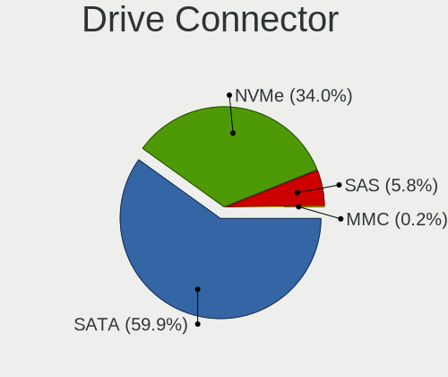
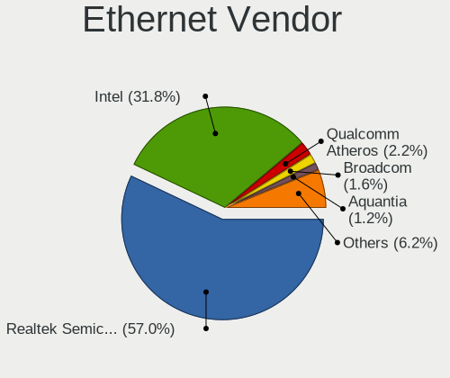
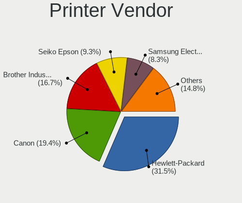
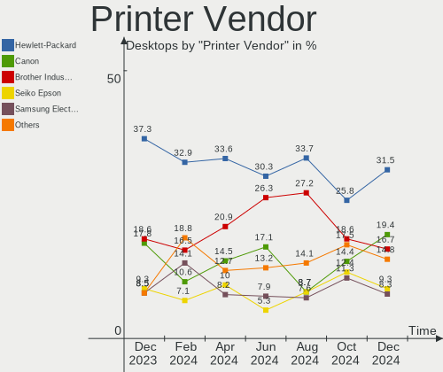

Linux - Hardware Trends (Desktops)
----------------------------------

A project to identify most popular hardware characteristics and track their change
over time based on data collected by Linux users at https://Linux-Hardware.org.

Anyone can contribute to this report by the [hw-probe](https://github.com/linuxhw/hw-probe) tool:

    sudo -E hw-probe -all -upload

This report is for one last month. Overall report since the beginning of time: [TestCoverage](https://github.com/linuxhw/TestCoverage)

Period: Aug, 2022.

Contents
--------

* [ System ](#system)
  - [ OS                       ](#os)
  - [ OS Family                ](#os-family)
  - [ Kernel                   ](#kernel)
  - [ Kernel Family            ](#kernel-family)
  - [ Kernel Major Ver.        ](#kernel-major-ver)
  - [ Arch                     ](#arch)
  - [ DE                       ](#de)
  - [ Display Server           ](#display-server)
  - [ Display Manager          ](#display-manager)
  - [ OS Lang                  ](#os-lang)
  - [ Boot Mode                ](#boot-mode)
  - [ Filesystem               ](#filesystem)
  - [ Part. scheme             ](#part-scheme)
  - [ Dual Boot with Linux/BSD ](#dual-boot-with-linuxbsd)
  - [ Dual Boot (Win)          ](#dual-boot-win)

* [ Board ](#board)
  - [ Vendor                   ](#vendor)
  - [ Model                    ](#model)
  - [ Model Family             ](#model-family)
  - [ MFG Year                 ](#mfg-year)
  - [ Form Factor              ](#form-factor)
  - [ Secure Boot              ](#secure-boot)
  - [ Coreboot                 ](#coreboot)
  - [ RAM Size                 ](#ram-size)
  - [ RAM Used                 ](#ram-used)
  - [ Total Drives             ](#total-drives)
  - [ Has CD-ROM               ](#has-cd-rom)
  - [ Has Ethernet             ](#has-ethernet)
  - [ Has WiFi                 ](#has-wifi)
  - [ Has Bluetooth            ](#has-bluetooth)

* [ Location ](#location)
  - [ Country                  ](#country)
  - [ City                     ](#city)

* [ Drives ](#drives)
  - [ Drive Vendor             ](#drive-vendor)
  - [ Drive Model              ](#drive-model)
  - [ HDD Vendor               ](#hdd-vendor)
  - [ SSD Vendor               ](#ssd-vendor)
  - [ Drive Kind               ](#drive-kind)
  - [ Drive Connector          ](#drive-connector)
  - [ Drive Size               ](#drive-size)
  - [ Space Total              ](#space-total)
  - [ Space Used               ](#space-used)
  - [ Malfunc. Drives          ](#malfunc-drives)
  - [ Malfunc. Drive Vendor    ](#malfunc-drive-vendor)
  - [ Malfunc. HDD Vendor      ](#malfunc-hdd-vendor)
  - [ Malfunc. Drive Kind      ](#malfunc-drive-kind)
  - [ Failed Drives            ](#failed-drives)
  - [ Failed Drive Vendor      ](#failed-drive-vendor)
  - [ Drive Status             ](#drive-status)

* [ Storage controller ](#storage-controller)
  - [ Storage Vendor           ](#storage-vendor)
  - [ Storage Model            ](#storage-model)
  - [ Storage Kind             ](#storage-kind)

* [ Processor ](#processor)
  - [ CPU Vendor               ](#cpu-vendor)
  - [ CPU Model                ](#cpu-model)
  - [ CPU Model Family         ](#cpu-model-family)
  - [ CPU Cores                ](#cpu-cores)
  - [ CPU Sockets              ](#cpu-sockets)
  - [ CPU Threads              ](#cpu-threads)
  - [ CPU Op-Modes             ](#cpu-op-modes)
  - [ CPU Microcode            ](#cpu-microcode)
  - [ CPU Microarch            ](#cpu-microarch)

* [ Graphics ](#graphics)
  - [ GPU Vendor               ](#gpu-vendor)
  - [ GPU Model                ](#gpu-model)
  - [ GPU Combo                ](#gpu-combo)
  - [ GPU Driver               ](#gpu-driver)
  - [ GPU Memory               ](#gpu-memory)

* [ Monitor ](#monitor)
  - [ Monitor Vendor           ](#monitor-vendor)
  - [ Monitor Model            ](#monitor-model)
  - [ Monitor Resolution       ](#monitor-resolution)
  - [ Monitor Diagonal         ](#monitor-diagonal)
  - [ Monitor Width            ](#monitor-width)
  - [ Aspect Ratio             ](#aspect-ratio)
  - [ Monitor Area             ](#monitor-area)
  - [ Pixel Density            ](#pixel-density)
  - [ Multiple Monitors        ](#multiple-monitors)

* [ Network ](#network)
  - [ Net Controller Vendor    ](#net-controller-vendor)
  - [ Net Controller Model     ](#net-controller-model)
  - [ Wireless Vendor          ](#wireless-vendor)
  - [ Wireless Model           ](#wireless-model)
  - [ Ethernet Vendor          ](#ethernet-vendor)
  - [ Ethernet Model           ](#ethernet-model)
  - [ Net Controller Kind      ](#net-controller-kind)
  - [ Used Controller          ](#used-controller)
  - [ NICs                     ](#nics)
  - [ IPv6                     ](#ipv6)

* [ Bluetooth ](#bluetooth)
  - [ Bluetooth Vendor         ](#bluetooth-vendor)
  - [ Bluetooth Model          ](#bluetooth-model)

* [ Sound ](#sound)
  - [ Sound Vendor             ](#sound-vendor)
  - [ Sound Model              ](#sound-model)

* [ Memory ](#memory)
  - [ Memory Vendor            ](#memory-vendor)
  - [ Memory Model             ](#memory-model)
  - [ Memory Kind              ](#memory-kind)
  - [ Memory Form Factor       ](#memory-form-factor)
  - [ Memory Size              ](#memory-size)
  - [ Memory Speed             ](#memory-speed)

* [ Printers & scanners ](#printers--scanners)
  - [ Printer Vendor           ](#printer-vendor)
  - [ Printer Model            ](#printer-model)
  - [ Scanner Vendor           ](#scanner-vendor)
  - [ Scanner Model            ](#scanner-model)

* [ Camera ](#camera)
  - [ Camera Vendor            ](#camera-vendor)
  - [ Camera Model             ](#camera-model)

* [ Security ](#security)
  - [ Fingerprint Vendor       ](#fingerprint-vendor)
  - [ Fingerprint Model        ](#fingerprint-model)
  - [ Chipcard Vendor          ](#chipcard-vendor)
  - [ Chipcard Model           ](#chipcard-model)

* [ Unsupported ](#unsupported)
  - [ Unsupported Devices      ](#unsupported-devices)
  - [ Unsupported Device Types ](#unsupported-device-types)

System
------

OS
--

Installed operating systems

| Name                         | Desktops | Percent |
|------------------------------|----------|---------|
| Ubuntu 22.04                 | 234      | 14.17%  |
| OpenMandriva 4.3             | 135      | 8.18%   |
| Debian 11                    | 107      | 6.48%   |
| Ubuntu 20.04                 | 106      | 6.42%   |
| Fedora 36                    | 105      | 6.36%   |
| ROSA 12.2                    | 98       | 5.94%   |
| Linux Mint 20.3              | 75       | 4.54%   |
| Pop!_OS 22.04                | 69       | 4.18%   |
| Zorin 16                     | 59       | 3.57%   |
| Linux Mint 21                | 54       | 3.27%   |
| KDE neon 20.04               | 39       | 2.36%   |
| OpenMandriva 4.90            | 34       | 2.06%   |
| Manjaro                      | 32       | 1.94%   |
| Arch Rolling                 | 30       | 1.82%   |
| Arch                         | 30       | 1.82%   |
| Kubuntu 22.04                | 23       | 1.39%   |
| Nobara 36                    | 22       | 1.33%   |
| Gentoo 2.8                   | 18       | 1.09%   |
| ArcoLinux Rolling            | 16       | 0.97%   |
| Xubuntu 20.04                | 15       | 0.91%   |
| Xubuntu 22.04                | 14       | 0.85%   |
| Manjaro 21.3.6               | 14       | 0.85%   |
| openSUSE Tumbleweed-XXXXXXXX | 13       | 0.79%   |
| Elementary 6.1               | 13       | 0.79%   |
| ROSA R11.1                   | 12       | 0.73%   |
| Kali 2022.3                  | 12       | 0.73%   |
| Ubuntu 18.04                 | 11       | 0.67%   |
| OpenMandriva 4.2             | 10       | 0.61%   |
| SteamOS 3.3                  | 9        | 0.55%   |
| Manjaro 21.3.7               | 9        | 0.55%   |
| Linux Mint 20.2              | 8        | 0.48%   |
| Kubuntu 20.04                | 8        | 0.48%   |
| Debian Unstable              | 8        | 0.48%   |
| Debian Testing               | 8        | 0.48%   |
| Lubuntu 22.04                | 7        | 0.42%   |
| Ubuntu MATE 22.04            | 6        | 0.36%   |
| Debian 10                    | 6        | 0.36%   |
| BlackPanther 18.1            | 6        | 0.36%   |
| LMDE 5                       | 5        | 0.3%    |
| Fedora 35                    | 5        | 0.3%    |
| Ubuntu MATE 20.04            | 4        | 0.24%   |
| Ubuntu Budgie 22.04          | 4        | 0.24%   |
| openSUSE Leap-15.4           | 4        | 0.24%   |
| Linux Mint 19.3              | 4        | 0.24%   |
| Garuda Linux Soaring         | 4        | 0.24%   |
| EndeavourOS Rolling          | 4        | 0.24%   |
| Xubuntu 18.04                | 3        | 0.18%   |
| Xero Rolling                 | 3        | 0.18%   |
| Ubuntu 21.10                 | 3        | 0.18%   |
| Ubuntu 20.10                 | 3        | 0.18%   |
| ROSA 12.1                    | 3        | 0.18%   |
| org.kde.Platform 5.15-21.08  | 3        | 0.18%   |
| Linux Mint 20.1              | 3        | 0.18%   |
| Linux Mint 20                | 3        | 0.18%   |
| Linux Mint 19.1              | 3        | 0.18%   |
| KDE neon 22.04               | 3        | 0.18%   |
| Garuda Linux                 | 3        | 0.18%   |
| Endless 4.0.4                | 3        | 0.18%   |
| CentOS 7                     | 3        | 0.18%   |
| ArcoLinux                    | 3        | 0.18%   |

OS Family
---------

OS without a version

| Name              | Desktops | Percent |
|-------------------|----------|---------|
| Ubuntu            | 363      | 21.99%  |
| OpenMandriva      | 179      | 10.84%  |
| Linux Mint        | 151      | 9.15%   |
| Debian            | 132      | 8%      |
| ROSA              | 116      | 7.03%   |
| Fedora            | 115      | 6.97%   |
| Pop!_OS           | 72       | 4.36%   |
| Zorin             | 60       | 3.63%   |
| Arch              | 60       | 3.63%   |
| Manjaro           | 56       | 3.39%   |
| KDE neon          | 42       | 2.54%   |
| Kubuntu           | 35       | 2.12%   |
| Xubuntu           | 32       | 1.94%   |
| Nobara            | 22       | 1.33%   |
| openSUSE          | 19       | 1.15%   |
| ArcoLinux         | 19       | 1.15%   |
| Gentoo            | 18       | 1.09%   |
| Elementary        | 15       | 0.91%   |
| Kali              | 13       | 0.79%   |
| SteamOS           | 11       | 0.67%   |
| Ubuntu MATE       | 10       | 0.61%   |
| Lubuntu           | 10       | 0.61%   |
| Endless           | 8        | 0.48%   |
| Garuda Linux      | 7        | 0.42%   |
| Ubuntu Budgie     | 6        | 0.36%   |
| EndeavourOS       | 6        | 0.36%   |
| Clear Linux       | 6        | 0.36%   |
| BlackPanther      | 6        | 0.36%   |
| LMDE              | 5        | 0.3%    |
| Xero              | 4        | 0.24%   |
| Red OS            | 4        | 0.24%   |
| CentOS            | 4        | 0.24%   |
| Slackware         | 3        | 0.18%   |
| Rocky Linux       | 3        | 0.18%   |
| org.kde.Platform  | 3        | 0.18%   |
| LinuxFX           | 3        | 0.18%   |
| ALT Linux         | 3        | 0.18%   |
| Void Linux        | 2        | 0.12%   |
| Ubuntu Studio     | 2        | 0.12%   |
| Artix             | 2        | 0.12%   |
| Ultramarine Linux | 1        | 0.06%   |
| Trisquel          | 1        | 0.06%   |
| Sparky            | 1        | 0.06%   |
| Solus             | 1        | 0.06%   |
| Siduction         | 1        | 0.06%   |
| RHEL              | 1        | 0.06%   |
| Peppermint        | 1        | 0.06%   |
| Pear OS           | 1        | 0.06%   |
| Parrot            | 1        | 0.06%   |
| NixOS             | 1        | 0.06%   |
| MX                | 1        | 0.06%   |
| Lilidog           | 1        | 0.06%   |
| GNOME OS          | 1        | 0.06%   |
| Feren OS          | 1        | 0.06%   |
| Devuan            | 1        | 0.06%   |
| ClearOS           | 1        | 0.06%   |
| BunsenLabs        | 1        | 0.06%   |
| BuildRoot         | 1        | 0.06%   |
| Bottlerocket      | 1        | 0.06%   |
| BigLinux          | 1        | 0.06%   |

Kernel
------

Version of the Linux kernel

| Version                                      | Desktops | Percent |
|----------------------------------------------|----------|---------|
| 5.15.0-46-generic                            | 292      | 17.69%  |
| 5.15.0-43-generic                            | 145      | 8.78%   |
| 5.16.7-desktop-1omv4003                      | 129      | 7.81%   |
| 5.4.0-124-generic                            | 46       | 2.79%   |
| 5.4.0-122-generic                            | 45       | 2.73%   |
| 5.18.10-76051810-generic                     | 45       | 2.73%   |
| 5.15.0-41-generic                            | 43       | 2.6%    |
| 5.10.74-generic-2rosa2021.1-x86_64           | 42       | 2.54%   |
| 5.10.0-16-amd64                              | 41       | 2.48%   |
| 5.10.118-generic-2rosa2021.1-x86_64          | 39       | 2.36%   |
| 5.18.16-200.fc36.x86_64                      | 31       | 1.88%   |
| 5.18.12-desktop-3omv4090                     | 30       | 1.82%   |
| 5.10.0-7-amd64                               | 25       | 1.51%   |
| 5.19.0-76051900-generic                      | 22       | 1.33%   |
| 5.10.0-17-amd64                              | 22       | 1.33%   |
| 5.18.16-arch1-1                              | 20       | 1.21%   |
| 5.18.18-200.fc36.x86_64                      | 19       | 1.15%   |
| 5.15.0-47-generic                            | 18       | 1.09%   |
| 5.18.13-200.fc36.x86_64                      | 17       | 1.03%   |
| 5.15.0-25-generic                            | 14       | 0.85%   |
| 5.15.60-1-MANJARO                            | 13       | 0.79%   |
| 5.19.3-arch1-1                               | 12       | 0.73%   |
| 5.18.0-kali5-amd64                           | 12       | 0.73%   |
| 5.4.0-125-generic                            | 11       | 0.67%   |
| 5.10.14-desktop-1omv4002                     | 10       | 0.61%   |
| 5.19.1-3-MANJARO                             | 9        | 0.55%   |
| 5.15.0-46-lowlatency                         | 9        | 0.55%   |
| 5.19.2-arch1-1                               | 8        | 0.48%   |
| 5.18.19-200.fc36.x86_64                      | 8        | 0.48%   |
| 5.18.17-200.fc36.x86_64                      | 8        | 0.48%   |
| 5.18.15-200.fc36.x86_64                      | 8        | 0.48%   |
| 5.15.59-1-MANJARO                            | 8        | 0.48%   |
| 5.18.0-0.bpo.1-amd64                         | 7        | 0.42%   |
| 5.15.43-generic-2rosa2021.1-x86_64           | 7        | 0.42%   |
| 5.11.0-35-generic                            | 7        | 0.42%   |
| 5.19.1-arch2-1                               | 6        | 0.36%   |
| 5.18.13-201.fsync.fc36.x86_64                | 6        | 0.36%   |
| 5.18.0-4-amd64                               | 6        | 0.36%   |
| 5.18.0-3-amd64                               | 6        | 0.36%   |
| 5.16.13-desktop-1omv4003                     | 6        | 0.36%   |
| 5.15.59-2-lts                                | 6        | 0.36%   |
| 5.13.0-52-generic                            | 6        | 0.36%   |
| 4.15.0-desktop-122.124.1rosa-x86_64          | 6        | 0.36%   |
| 5.4.0-91-generic                             | 5        | 0.3%    |
| 5.13.0-valve22-1-neptune-02213-gb68995364335 | 5        | 0.3%    |
| 4.15.0-191-generic                           | 5        | 0.3%    |
| 5.19.4-arch1-1                               | 4        | 0.24%   |
| 5.19.4-200.fc36.x86_64                       | 4        | 0.24%   |
| 5.18.17-201.fsync.fc36.x86_64                | 4        | 0.24%   |
| 5.18.16-zen1-1-zen                           | 4        | 0.24%   |
| 5.18.16-201.fsync.fc36.x86_64                | 4        | 0.24%   |
| 5.18.15-1-default                            | 4        | 0.24%   |
| 5.18.14-1-MANJARO                            | 4        | 0.24%   |
| 5.17.5-300.fc36.x86_64                       | 4        | 0.24%   |
| 5.15.0-45-generic                            | 4        | 0.24%   |
| 5.6.14-desktop-2bP                           | 3        | 0.18%   |
| 5.19.3-zen1-1-zen                            | 3        | 0.18%   |
| 5.19.1-zen1-1-zen                            | 3        | 0.18%   |
| 5.19.1-1-default                             | 3        | 0.18%   |
| 5.19.0-2-MANJARO                             | 3        | 0.18%   |

Kernel Family
-------------

Linux kernel without a distro release

| Version  | Desktops | Percent |
|----------|----------|---------|
| 5.15.0   | 547      | 33.13%  |
| 5.16.7   | 129      | 7.81%   |
| 5.4.0    | 122      | 7.39%   |
| 5.10.0   | 97       | 5.88%   |
| 5.18.16  | 70       | 4.24%   |
| 5.18.10  | 46       | 2.79%   |
| 5.10.74  | 45       | 2.73%   |
| 5.19.0   | 42       | 2.54%   |
| 5.10.118 | 40       | 2.42%   |
| 5.18.0   | 39       | 2.36%   |
| 5.18.12  | 35       | 2.12%   |
| 5.13.0   | 29       | 1.76%   |
| 5.19.1   | 27       | 1.64%   |
| 5.18.15  | 25       | 1.51%   |
| 5.18.13  | 23       | 1.39%   |
| 5.18.18  | 22       | 1.33%   |
| 5.19.2   | 19       | 1.15%   |
| 4.15.0   | 18       | 1.09%   |
| 5.19.3   | 17       | 1.03%   |
| 5.15.59  | 17       | 1.03%   |
| 5.11.0   | 17       | 1.03%   |
| 5.15.60  | 15       | 0.91%   |
| 5.18.17  | 14       | 0.85%   |
| 5.19.4   | 13       | 0.79%   |
| 5.18.19  | 12       | 0.73%   |
| 5.10.14  | 10       | 0.61%   |
| 5.17.5   | 8        | 0.48%   |
| 5.15.43  | 8        | 0.48%   |
| 5.16.13  | 7        | 0.42%   |
| 5.15.52  | 7        | 0.42%   |
| 5.14.0   | 7        | 0.42%   |
| 4.19.0   | 7        | 0.42%   |
| 5.18.14  | 6        | 0.36%   |
| 5.15.53  | 5        | 0.3%    |
| 5.15.39  | 5        | 0.3%    |
| 5.8.0    | 4        | 0.24%   |
| 5.18.9   | 4        | 0.24%   |
| 5.17.15  | 4        | 0.24%   |
| 5.15.57  | 4        | 0.24%   |
| 5.15.35  | 4        | 0.24%   |
| 5.14.21  | 4        | 0.24%   |
| 5.6.14   | 3        | 0.18%   |
| 5.4.32   | 3        | 0.18%   |
| 5.19.5   | 3        | 0.18%   |
| 5.18.11  | 3        | 0.18%   |
| 5.17.11  | 3        | 0.18%   |
| 5.16.0   | 3        | 0.18%   |
| 5.15.50  | 3        | 0.18%   |
| 4.18.16  | 3        | 0.18%   |
| 3.10.0   | 3        | 0.18%   |
| 5.4.83   | 2        | 0.12%   |
| 5.3.18   | 2        | 0.12%   |
| 5.18.5   | 2        | 0.12%   |
| 5.17.12  | 2        | 0.12%   |
| 5.17.0   | 2        | 0.12%   |
| 5.15.30  | 2        | 0.12%   |
| 4.4.0    | 2        | 0.12%   |
| 6.0.0    | 1        | 0.06%   |
| 5.6.13   | 1        | 0.06%   |
| 5.4.182  | 1        | 0.06%   |

Kernel Major Ver.
-----------------

Linux kernel major version

| Version | Desktops | Percent |
|---------|----------|---------|
| 5.15    | 626      | 37.92%  |
| 5.18    | 303      | 18.35%  |
| 5.10    | 198      | 11.99%  |
| 5.16    | 142      | 8.6%    |
| 5.4     | 128      | 7.75%   |
| 5.19    | 121      | 7.33%   |
| 5.13    | 30       | 1.82%   |
| 5.17    | 21       | 1.27%   |
| 5.11    | 18       | 1.09%   |
| 4.15    | 18       | 1.09%   |
| 5.14    | 12       | 0.73%   |
| 4.19    | 9        | 0.55%   |
| 5.8     | 4        | 0.24%   |
| 5.6     | 4        | 0.24%   |
| 4.18    | 4        | 0.24%   |
| 5.3     | 3        | 0.18%   |
| 3.10    | 3        | 0.18%   |
| 4.9     | 2        | 0.12%   |
| 4.4     | 2        | 0.12%   |
| 6.0     | 1        | 0.06%   |
| 4.14    | 1        | 0.06%   |
| 3.4     | 1        | 0.06%   |

Arch
----

OS architecture (x86_64, i586, etc.)

| Name     | Desktops | Percent |
|----------|----------|---------|
| x86_64   | 1630     | 98.73%  |
| i686     | 14       | 0.85%   |
| riscv64  | 3        | 0.18%   |
| sh4a     | 1        | 0.06%   |
| ppc64    | 1        | 0.06%   |
| e2k      | 1        | 0.06%   |
| armv5tel | 1        | 0.06%   |

DE
--

Desktop Environment

| Name             | Desktops | Percent |
|------------------|----------|---------|
| GNOME            | 685      | 41.49%  |
| KDE5             | 477      | 28.89%  |
| X-Cinnamon       | 117      | 7.09%   |
| Unknown          | 105      | 6.36%   |
| XFCE             | 99       | 6%      |
| MATE             | 53       | 3.21%   |
| LXQt             | 24       | 1.45%   |
| Cinnamon         | 22       | 1.33%   |
| Pantheon         | 15       | 0.91%   |
| KDE4             | 9        | 0.55%   |
| i3               | 9        | 0.55%   |
| Budgie           | 7        | 0.42%   |
| awesome          | 4        | 0.24%   |
| qtile            | 3        | 0.18%   |
| LXDE             | 3        | 0.18%   |
| Deepin           | 3        | 0.18%   |
| Unity            | 2        | 0.12%   |
| lightdm-xsession | 2        | 0.12%   |
| GNOME Flashback  | 2        | 0.12%   |
| GNOME Classic    | 2        | 0.12%   |
| sway             | 1        | 0.06%   |
| LeftWM           | 1        | 0.06%   |
| KDE              | 1        | 0.06%   |
| icewm            | 1        | 0.06%   |
| i3-with-shmlog   | 1        | 0.06%   |
| herbstluftwm     | 1        | 0.06%   |
| Enlightenment    | 1        | 0.06%   |
| bspwm            | 1        | 0.06%   |

Display Server
--------------

X11 or Wayland

| Name    | Desktops | Percent |
|---------|----------|---------|
| X11     | 1177     | 71.29%  |
| Wayland | 352      | 21.32%  |
| Tty     | 73       | 4.42%   |
| Unknown | 49       | 2.97%   |

Display Manager
---------------

SDDM, LightDM, etc.

| Name    | Desktops | Percent |
|---------|----------|---------|
| Unknown | 601      | 36.4%   |
| SDDM    | 361      | 21.87%  |
| GDM3    | 304      | 18.41%  |
| LightDM | 212      | 12.84%  |
| GDM     | 159      | 9.63%   |
| KDM     | 9        | 0.55%   |
| XDM     | 4        | 0.24%   |
| SLiM    | 1        | 0.06%   |

OS Lang
-------

Language

| Lang    | Desktops | Percent |
|---------|----------|---------|
| en_US   | 688      | 41.67%  |
| ru_RU   | 193      | 11.69%  |
| de_DE   | 121      | 7.33%   |
| fr_FR   | 96       | 5.81%   |
| en_GB   | 82       | 4.97%   |
| pt_BR   | 62       | 3.76%   |
| en_AU   | 37       | 2.24%   |
| es_ES   | 27       | 1.64%   |
| it_IT   | 26       | 1.57%   |
| Unknown | 24       | 1.45%   |
| C       | 23       | 1.39%   |
| pl_PL   | 22       | 1.33%   |
| en_CA   | 22       | 1.33%   |
| nl_NL   | 17       | 1.03%   |
| en_IN   | 14       | 0.85%   |
| zh_CN   | 12       | 0.73%   |
| cs_CZ   | 11       | 0.67%   |
| pt_PT   | 9        | 0.55%   |
| en_NZ   | 9        | 0.55%   |
| fi_FI   | 7        | 0.42%   |
| es_CL   | 7        | 0.42%   |
| es_AR   | 7        | 0.42%   |
| de_CH   | 7        | 0.42%   |
| sv_SE   | 6        | 0.36%   |
| ja_JP   | 6        | 0.36%   |
| fr_CA   | 6        | 0.36%   |
| es_VE   | 6        | 0.36%   |
| nl_BE   | 5        | 0.3%    |
| es_PE   | 5        | 0.3%    |
| es_MX   | 5        | 0.3%    |
| en_ZA   | 5        | 0.3%    |
| de_AT   | 5        | 0.3%    |
| fr_BE   | 4        | 0.24%   |
| es_UY   | 4        | 0.24%   |
| es_CO   | 4        | 0.24%   |
| el_GR   | 4        | 0.24%   |
| Default | 4        | 0.24%   |
| tr_TR   | 3        | 0.18%   |
| sk_SK   | 3        | 0.18%   |
| ro_RO   | 3        | 0.18%   |
| nb_NO   | 3        | 0.18%   |
| ko_KR   | 3        | 0.18%   |
| en_PH   | 3        | 0.18%   |
| en_AG   | 3        | 0.18%   |
| da_DK   | 3        | 0.18%   |
| POSIX   | 2        | 0.12%   |
| hu_HU   | 2        | 0.12%   |
| fr_CH   | 2        | 0.12%   |
| es_US   | 2        | 0.12%   |
| es_GT   | 2        | 0.12%   |
| es_CR   | 2        | 0.12%   |
| en_SG   | 2        | 0.12%   |
| en_IL   | 2        | 0.12%   |
| en_IE   | 2        | 0.12%   |
| en_DK   | 2        | 0.12%   |
| zh_TW   | 1        | 0.06%   |
| uk_UA   | 1        | 0.06%   |
| sr_RS   | 1        | 0.06%   |
| ru_UA   | 1        | 0.06%   |
| nn_NO   | 1        | 0.06%   |

Boot Mode
---------

EFI or BIOS

| Mode | Desktops | Percent |
|------|----------|---------|
| BIOS | 958      | 58.03%  |
| EFI  | 693      | 41.97%  |

Filesystem
----------

Type of filesystem

| Type    | Desktops | Percent |
|---------|----------|---------|
| Ext4    | 1179     | 71.41%  |
| Overlay | 217      | 13.14%  |
| Btrfs   | 203      | 12.3%   |
| Xfs     | 26       | 1.57%   |
| Zfs     | 9        | 0.55%   |
| F2fs    | 7        | 0.42%   |
| Ext2    | 4        | 0.24%   |
| Ext3    | 3        | 0.18%   |
| Tmpfs   | 2        | 0.12%   |
| Rootfs  | 1        | 0.06%   |

Part. scheme
------------

Scheme of partitioning

| Type    | Desktops | Percent |
|---------|----------|---------|
| Unknown | 804      | 48.7%   |
| GPT     | 608      | 36.83%  |
| MBR     | 239      | 14.48%  |

Dual Boot with Linux/BSD
------------------------

Hosting more than one Linux/BSD

| Dual boot | Desktops | Percent |
|-----------|----------|---------|
| No        | 1283     | 77.71%  |
| Yes       | 368      | 22.29%  |

Dual Boot (Win)
---------------

Hosting Linux and Windows

| Dual boot | Desktops | Percent |
|-----------|----------|---------|
| No        | 1104     | 66.87%  |
| Yes       | 547      | 33.13%  |

Board
-----

Vendor
------

Motherboard manufacturer

| Name                      | Desktops | Percent |
|---------------------------|----------|---------|
| ASUSTek Computer          | 436      | 26.41%  |
| Gigabyte Technology       | 287      | 17.38%  |
| MSI                       | 220      | 13.33%  |
| ASRock                    | 160      | 9.69%   |
| Hewlett-Packard           | 130      | 7.87%   |
| Dell                      | 117      | 7.09%   |
| Lenovo                    | 58       | 3.51%   |
| Intel                     | 32       | 1.94%   |
| Foxconn                   | 25       | 1.51%   |
| Acer                      | 21       | 1.27%   |
| Unknown                   | 19       | 1.15%   |
| Biostar                   | 15       | 0.91%   |
| ECS                       | 13       | 0.79%   |
| Pegatron                  | 12       | 0.73%   |
| Fujitsu                   | 9        | 0.55%   |
| Supermicro                | 6        | 0.36%   |
| OEM                       | 6        | 0.36%   |
| BESSTAR Tech              | 6        | 0.36%   |
| MACHINIST                 | 5        | 0.3%    |
| Huanan                    | 5        | 0.3%    |
| AZW                       | 5        | 0.3%    |
| Alienware                 | 5        | 0.3%    |
| Packard Bell              | 4        | 0.24%   |
| Protectli                 | 3        | 0.18%   |
| PCWare                    | 3        | 0.18%   |
| eMachines                 | 3        | 0.18%   |
| Vorke                     | 2        | 0.12%   |
| System76                  | 2        | 0.12%   |
| Shuttle                   | 2        | 0.12%   |
| Positivo                  | 2        | 0.12%   |
| Medion                    | 2        | 0.12%   |
| LattePanda                | 2        | 0.12%   |
| JGINYUE                   | 2        | 0.12%   |
| WIPRO                     | 1        | 0.06%   |
| win element               | 1        | 0.06%   |
| VS Company                | 1        | 0.06%   |
| SZMZ                      | 1        | 0.06%   |
| Standard                  | 1        | 0.06%   |
| Soyo                      | 1        | 0.06%   |
| SHARKBAY                  | 1        | 0.06%   |
| Semp Toshiba              | 1        | 0.06%   |
| retsamarret               | 1        | 0.06%   |
| QIYIDA                    | 1        | 0.06%   |
| OEM_MB                    | 1        | 0.06%   |
| Nvidia                    | 1        | 0.06%   |
| NCR                       | 1        | 0.06%   |
| MP                        | 1        | 0.06%   |
| MAXSUN                    | 1        | 0.06%   |
| LORD ELECTRONICS          | 1        | 0.06%   |
| KupiDeshego Edition       | 1        | 0.06%   |
| Koloe                     | 1        | 0.06%   |
| ICP / iEi                 | 1        | 0.06%   |
| IBASE Technology          | 1        | 0.06%   |
| Google                    | 1        | 0.06%   |
| GMKtec                    | 1        | 0.06%   |
| Gateway                   | 1        | 0.06%   |
| Fujitsu Siemens           | 1        | 0.06%   |
| DNI                       | 1        | 0.06%   |
| ASRockRack                | 1        | 0.06%   |
| Arquimedes Automacao Inf. | 1        | 0.06%   |

Model
-----

Motherboard model

| Name                         | Desktops | Percent |
|------------------------------|----------|---------|
| ASUS All Series              | 39       | 2.36%   |
| Unknown                      | 22       | 1.33%   |
| MSI MS-7C37                  | 16       | 0.97%   |
| ASUS TUF Gaming X570-PLUS    | 16       | 0.97%   |
| Dell OptiPlex 7010           | 12       | 0.73%   |
| MSI MS-7C02                  | 11       | 0.67%   |
| MSI MS-7C91                  | 8        | 0.48%   |
| Gigabyte B550M DS3H          | 8        | 0.48%   |
| Dell OptiPlex 780            | 7        | 0.42%   |
| ASUS PRIME X570-P            | 7        | 0.42%   |
| ASUS PRIME B450M-A II        | 7        | 0.42%   |
| MSI MS-7D54                  | 6        | 0.36%   |
| MSI MS-7C56                  | 6        | 0.36%   |
| MSI MS-7C52                  | 6        | 0.36%   |
| MSI MS-7B86                  | 6        | 0.36%   |
| MSI MS-7817                  | 6        | 0.36%   |
| HP ProDesk 600 G1 SFF        | 6        | 0.36%   |
| ASUS ROG STRIX X570-E GAMING | 6        | 0.36%   |
| ASUS ROG STRIX B550-F GAMING | 6        | 0.36%   |
| ASUS PRIME B450M-A           | 6        | 0.36%   |
| ASRock B450M Pro4            | 6        | 0.36%   |
| MSI MS-7C94                  | 5        | 0.3%    |
| MSI MS-7721                  | 5        | 0.3%    |
| Gigabyte B450M DS3H          | 5        | 0.3%    |
| ASUS TUF Gaming B550-PLUS    | 5        | 0.3%    |
| ASUS ROG STRIX B450-F GAMING | 5        | 0.3%    |
| ASUS PRIME Z390-A            | 5        | 0.3%    |
| ASUS PRIME A320M-K           | 5        | 0.3%    |
| ASUS M5A78L-M/USB3           | 5        | 0.3%    |
| ASRock G41M-VS3              | 5        | 0.3%    |
| ASRock B550M Pro4            | 5        | 0.3%    |
| MSI MS-7996                  | 4        | 0.24%   |
| MSI MS-7917                  | 4        | 0.24%   |
| MSI MS-7693                  | 4        | 0.24%   |
| Intel H61                    | 4        | 0.24%   |
| HP EliteDesk 800 G2 SFF      | 4        | 0.24%   |
| HP EliteDesk 800 G1 SFF      | 4        | 0.24%   |
| HP Compaq Pro 6300 SFF       | 4        | 0.24%   |
| Gigabyte GA-78LMT-USB3 6.0   | 4        | 0.24%   |
| Gigabyte B550 GAMING X V2    | 4        | 0.24%   |
| Gigabyte A320M-S2H           | 4        | 0.24%   |
| Dell OptiPlex 790            | 4        | 0.24%   |
| Dell OptiPlex 3010           | 4        | 0.24%   |
| ASUS Z170 PRO GAMING         | 4        | 0.24%   |
| ASUS TUF Gaming B550M-PLUS   | 4        | 0.24%   |
| ASUS PRIME B550M-A           | 4        | 0.24%   |
| ASRock B550M-ITX/ac          | 4        | 0.24%   |
| ASRock B450M-HDV R4.0        | 4        | 0.24%   |
| ASRock B450 Pro4             | 4        | 0.24%   |
| OEM Intel H81                | 3        | 0.18%   |
| MSI MS-7D42                  | 3        | 0.18%   |
| MSI MS-7D22                  | 3        | 0.18%   |
| MSI MS-7D09                  | 3        | 0.18%   |
| MSI MS-7B85                  | 3        | 0.18%   |
| MSI MS-7B51                  | 3        | 0.18%   |
| MSI MS-7A33                  | 3        | 0.18%   |
| MSI MS-7971                  | 3        | 0.18%   |
| MSI MS-7758                  | 3        | 0.18%   |
| MSI MS-7641                  | 3        | 0.18%   |
| Intel X99                    | 3        | 0.18%   |

Model Family
------------

Motherboard model prefix

| Name                   | Desktops | Percent |
|------------------------|----------|---------|
| ASUS PRIME             | 84       | 5.09%   |
| Dell OptiPlex          | 71       | 4.3%    |
| ASUS ROG               | 59       | 3.57%   |
| ASUS TUF               | 51       | 3.09%   |
| ASUS All               | 39       | 2.36%   |
| HP Compaq              | 37       | 2.24%   |
| Lenovo ThinkCentre     | 36       | 2.18%   |
| HP EliteDesk           | 24       | 1.45%   |
| Unknown                | 22       | 1.33%   |
| HP ProDesk             | 19       | 1.15%   |
| Gigabyte B450          | 17       | 1.03%   |
| MSI MS-7C37            | 16       | 0.97%   |
| Gigabyte B550          | 16       | 0.97%   |
| Gigabyte B550M         | 14       | 0.85%   |
| Dell Inspiron          | 14       | 0.85%   |
| Dell Precision         | 13       | 0.79%   |
| Acer Aspire            | 13       | 0.79%   |
| Gigabyte B450M         | 12       | 0.73%   |
| MSI MS-7C02            | 11       | 0.67%   |
| Gigabyte X570          | 11       | 0.67%   |
| ASRock B450M           | 11       | 0.67%   |
| Dell XPS               | 9        | 0.55%   |
| ASUS M5A78L-M          | 9        | 0.55%   |
| MSI MS-7C91            | 8        | 0.48%   |
| Lenovo ThinkStation    | 8        | 0.48%   |
| Lenovo IdeaCentre      | 7        | 0.42%   |
| Fujitsu ESPRIMO        | 7        | 0.42%   |
| ASUS SABERTOOTH        | 7        | 0.42%   |
| ASUS Pro               | 7        | 0.42%   |
| ASUS P8H61-M           | 7        | 0.42%   |
| MSI MS-7D54            | 6        | 0.36%   |
| MSI MS-7C56            | 6        | 0.36%   |
| MSI MS-7C52            | 6        | 0.36%   |
| MSI MS-7B86            | 6        | 0.36%   |
| MSI MS-7817            | 6        | 0.36%   |
| HP Pavilion            | 6        | 0.36%   |
| Gigabyte Z390          | 6        | 0.36%   |
| Gigabyte GA-78LMT-USB3 | 6        | 0.36%   |
| Gigabyte A320M-S2H     | 6        | 0.36%   |
| ASUS M5A97             | 6        | 0.36%   |
| ASRock B450            | 6        | 0.36%   |
| MSI MS-7C94            | 5        | 0.3%    |
| MSI MS-7721            | 5        | 0.3%    |
| Dell Vostro            | 5        | 0.3%    |
| ASUS ProArt            | 5        | 0.3%    |
| ASRock X370            | 5        | 0.3%    |
| ASRock G41M-VS3        | 5        | 0.3%    |
| ASRock B550M           | 5        | 0.3%    |
| Acer Predator          | 5        | 0.3%    |
| MSI MS-7996            | 4        | 0.24%   |
| MSI MS-7917            | 4        | 0.24%   |
| MSI MS-7693            | 4        | 0.24%   |
| Intel H61              | 4        | 0.24%   |
| Gigabyte B365M         | 4        | 0.24%   |
| Foxconn PRO            | 4        | 0.24%   |
| ASUS Z170              | 4        | 0.24%   |
| ASUS P8Z77-V           | 4        | 0.24%   |
| ASUS P8H77-V           | 4        | 0.24%   |
| ASUS Maximus           | 4        | 0.24%   |
| ASRock X470            | 4        | 0.24%   |

MFG Year
--------

Motherboard manufacture year

| Year    | Desktops | Percent |
|---------|----------|---------|
| 2020    | 185      | 11.21%  |
| 2018    | 180      | 10.9%   |
| 2019    | 152      | 9.21%   |
| 2013    | 142      | 8.6%    |
| 2012    | 139      | 8.42%   |
| 2021    | 114      | 6.9%    |
| 2014    | 108      | 6.54%   |
| 2011    | 98       | 5.94%   |
| 2017    | 85       | 5.15%   |
| 2015    | 82       | 4.97%   |
| 2010    | 79       | 4.78%   |
| 2016    | 64       | 3.88%   |
| 2009    | 62       | 3.76%   |
| 2008    | 53       | 3.21%   |
| 2007    | 43       | 2.6%    |
| 2022    | 41       | 2.48%   |
| 2006    | 14       | 0.85%   |
| Unknown | 7        | 0.42%   |
| 2004    | 2        | 0.12%   |
| 2003    | 1        | 0.06%   |

Form Factor
-----------

Physical design of the computer

| Name    | Desktops | Percent |
|---------|----------|---------|
| Desktop | 1651     | 100%    |

Secure Boot
-----------

Enabled or disabled

| State    | Desktops | Percent |
|----------|----------|---------|
| Disabled | 1612     | 97.64%  |
| Enabled  | 39       | 2.36%   |

Coreboot
--------

Have coreboot on board

| Used | Desktops | Percent |
|------|----------|---------|
| No   | 1649     | 99.88%  |
| Yes  | 2        | 0.12%   |

RAM Size
--------

Total RAM memory

| Size in GB      | Desktops | Percent |
|-----------------|----------|---------|
| 16.01-24.0      | 443      | 26.83%  |
| 8.01-16.0       | 322      | 19.5%   |
| 32.01-64.0      | 269      | 16.29%  |
| 4.01-8.0        | 228      | 13.81%  |
| 3.01-4.0        | 191      | 11.57%  |
| 64.01-256.0     | 93       | 5.63%   |
| 1.01-2.0        | 42       | 2.54%   |
| 24.01-32.0      | 39       | 2.36%   |
| 2.01-3.0        | 14       | 0.85%   |
| More than 256.0 | 4        | 0.24%   |
| 0.51-1.0        | 4        | 0.24%   |
| 0.01-0.5        | 1        | 0.06%   |
| Unknown         | 1        | 0.06%   |

RAM Used
--------

Used RAM memory

| Used GB     | Desktops | Percent |
|-------------|----------|---------|
| 1.01-2.0    | 559      | 33.86%  |
| 2.01-3.0    | 350      | 21.2%   |
| 4.01-8.0    | 256      | 15.51%  |
| 3.01-4.0    | 210      | 12.72%  |
| 0.51-1.0    | 132      | 8%      |
| 8.01-16.0   | 96       | 5.81%   |
| 0.01-0.5    | 21       | 1.27%   |
| 16.01-24.0  | 14       | 0.85%   |
| 32.01-64.0  | 5        | 0.3%    |
| 24.01-32.0  | 5        | 0.3%    |
| Unknown     | 2        | 0.12%   |
| 64.01-256.0 | 1        | 0.06%   |

Total Drives
------------

Number of drives on board

| Drives | Desktops | Percent |
|--------|----------|---------|
| 1      | 596      | 36.1%   |
| 2      | 502      | 30.41%  |
| 3      | 264      | 15.99%  |
| 4      | 132      | 8%      |
| 5      | 70       | 4.24%   |
| 6      | 55       | 3.33%   |
| 7      | 13       | 0.79%   |
| 0      | 10       | 0.61%   |
| 9      | 5        | 0.3%    |
| 12     | 2        | 0.12%   |
| 11     | 1        | 0.06%   |
| 8      | 1        | 0.06%   |

Has CD-ROM
----------

Has CD-ROM on board

| Presented | Desktops | Percent |
|-----------|----------|---------|
| No        | 961      | 58.21%  |
| Yes       | 690      | 41.79%  |

Has Ethernet
------------

Has Ethernet on board

| Presented | Desktops | Percent |
|-----------|----------|---------|
| Yes       | 1636     | 99.09%  |
| No        | 15       | 0.91%   |

Has WiFi
--------

Has WiFi module

| Presented | Desktops | Percent |
|-----------|----------|---------|
| No        | 913      | 55.3%   |
| Yes       | 738      | 44.7%   |

Has Bluetooth
-------------

Has Bluetooth module

| Presented | Desktops | Percent |
|-----------|----------|---------|
| No        | 1069     | 64.75%  |
| Yes       | 582      | 35.25%  |

Location
--------

Country
-------

Geographic location (country)

| Country      | Desktops | Percent |
|--------------|----------|---------|
| USA          | 347      | 21.02%  |
| Russia       | 205      | 12.42%  |
| Germany      | 158      | 9.57%   |
| France       | 102      | 6.18%   |
| Brazil       | 82       | 4.97%   |
| UK           | 63       | 3.82%   |
| Australia    | 46       | 2.79%   |
| Italy        | 40       | 2.42%   |
| Poland       | 39       | 2.36%   |
| Canada       | 39       | 2.36%   |
| Netherlands  | 32       | 1.94%   |
| Spain        | 27       | 1.64%   |
| India        | 22       | 1.33%   |
| Finland      | 21       | 1.27%   |
| Switzerland  | 20       | 1.21%   |
| Belgium      | 19       | 1.15%   |
| Sweden       | 18       | 1.09%   |
| Austria      | 18       | 1.09%   |
| Mexico       | 16       | 0.97%   |
| Czechia      | 15       | 0.91%   |
| Hungary      | 14       | 0.85%   |
| Argentina    | 14       | 0.85%   |
| Portugal     | 13       | 0.79%   |
| China        | 13       | 0.79%   |
| South Africa | 12       | 0.73%   |
| Japan        | 12       | 0.73%   |
| Romania      | 11       | 0.67%   |
| Greece       | 11       | 0.67%   |
| Norway       | 10       | 0.61%   |
| New Zealand  | 10       | 0.61%   |
| Denmark      | 9        | 0.55%   |
| Colombia     | 9        | 0.55%   |
| Chile        | 9        | 0.55%   |
| Venezuela    | 8        | 0.48%   |
| Indonesia    | 8        | 0.48%   |
| Turkey       | 7        | 0.42%   |
| Thailand     | 7        | 0.42%   |
| Taiwan       | 7        | 0.42%   |
| Slovakia     | 7        | 0.42%   |
| Bulgaria     | 7        | 0.42%   |
| Vietnam      | 6        | 0.36%   |
| Uruguay      | 6        | 0.36%   |
| Ukraine      | 6        | 0.36%   |
| Peru         | 6        | 0.36%   |
| Serbia       | 5        | 0.3%    |
| Philippines  | 5        | 0.3%    |
| Malaysia     | 5        | 0.3%    |
| Hong Kong    | 5        | 0.3%    |
| Belarus      | 5        | 0.3%    |
| South Korea  | 4        | 0.24%   |
| Slovenia     | 4        | 0.24%   |
| Iran         | 4        | 0.24%   |
| Singapore    | 3        | 0.18%   |
| Kenya        | 3        | 0.18%   |
| Israel       | 3        | 0.18%   |
| Ireland      | 3        | 0.18%   |
| Estonia      | 3        | 0.18%   |
| Egypt        | 3        | 0.18%   |
| Tanzania     | 2        | 0.12%   |
| Saudi Arabia | 2        | 0.12%   |

City
----

Geographic location (city)

| City                | Desktops | Percent |
|---------------------|----------|---------|
| Moscow              | 43       | 2.6%    |
| Berlin              | 26       | 1.57%   |
| Voronezh            | 25       | 1.51%   |
| Helsinki            | 12       | 0.73%   |
| Paris               | 11       | 0.67%   |
| Sydney              | 10       | 0.61%   |
| St Petersburg       | 10       | 0.61%   |
| Amsterdam           | 10       | 0.61%   |
| Vienna              | 9        | 0.55%   |
| Dallas              | 9        | 0.55%   |
| Warsaw              | 7        | 0.42%   |
| Hamburg             | 7        | 0.42%   |
| Budapest            | 7        | 0.42%   |
| Brisbane            | 7        | 0.42%   |
| Brasília           | 7        | 0.42%   |
| Athens              | 7        | 0.42%   |
| Sofia               | 6        | 0.36%   |
| Samara              | 6        | 0.36%   |
| Rostov-on-Don       | 6        | 0.36%   |
| Portland            | 6        | 0.36%   |
| Novosibirsk         | 6        | 0.36%   |
| Montevideo          | 6        | 0.36%   |
| Melbourne           | 6        | 0.36%   |
| Bogotá             | 6        | 0.36%   |
| Auckland            | 6        | 0.36%   |
| Yekaterinburg       | 5        | 0.3%    |
| Santiago            | 5        | 0.3%    |
| San Jose            | 5        | 0.3%    |
| Rio de Janeiro      | 5        | 0.3%    |
| Prague              | 5        | 0.3%    |
| Munich              | 5        | 0.3%    |
| Miami               | 5        | 0.3%    |
| Manchester          | 5        | 0.3%    |
| Frankfurt am Main   | 5        | 0.3%    |
| Chicago             | 5        | 0.3%    |
| Central             | 5        | 0.3%    |
| Caracas             | 5        | 0.3%    |
| Belgrade            | 5        | 0.3%    |
| Atlanta             | 5        | 0.3%    |
| Wroclaw             | 4        | 0.24%   |
| Toronto             | 4        | 0.24%   |
| Stavropol           | 4        | 0.24%   |
| Seattle             | 4        | 0.24%   |
| Sao Paulo           | 4        | 0.24%   |
| San Antonio         | 4        | 0.24%   |
| Perth               | 4        | 0.24%   |
| Perm                | 4        | 0.24%   |
| Omsk                | 4        | 0.24%   |
| Nizhniy Novgorod    | 4        | 0.24%   |
| Monistrol-sur-Loire | 4        | 0.24%   |
| Madrid              | 4        | 0.24%   |
| Lisbon              | 4        | 0.24%   |
| Lima                | 4        | 0.24%   |
| Lancaster           | 4        | 0.24%   |
| Krasnodar           | 4        | 0.24%   |
| Krakow              | 4        | 0.24%   |
| Kansas City         | 4        | 0.24%   |
| Istanbul            | 4        | 0.24%   |
| Ho Chi Minh City    | 4        | 0.24%   |
| Copenhagen          | 4        | 0.24%   |

Drives
------

Drive Vendor
------------

Hard drive vendors

| Vendor                      | Desktops | Drives | Percent |
|-----------------------------|----------|--------|---------|
| WDC                         | 572      | 765    | 18.93%  |
| Seagate                     | 536      | 704    | 17.74%  |
| Samsung Electronics         | 438      | 624    | 14.5%   |
| Kingston                    | 170      | 190    | 5.63%   |
| Toshiba                     | 167      | 203    | 5.53%   |
| Crucial                     | 144      | 178    | 4.77%   |
| SanDisk                     | 134      | 149    | 4.44%   |
| Hitachi                     | 93       | 110    | 3.08%   |
| A-DATA Technology           | 56       | 62     | 1.85%   |
| Intel                       | 48       | 50     | 1.59%   |
| China                       | 46       | 55     | 1.52%   |
| Phison                      | 36       | 40     | 1.19%   |
| Unknown                     | 35       | 50     | 1.16%   |
| PNY                         | 28       | 31     | 0.93%   |
| SPCC                        | 27       | 28     | 0.89%   |
| HGST                        | 27       | 36     | 0.89%   |
| SK hynix                    | 23       | 25     | 0.76%   |
| Silicon Motion              | 19       | 21     | 0.63%   |
| Micron/Crucial Technology   | 19       | 19     | 0.63%   |
| Maxtor                      | 19       | 20     | 0.63%   |
| Unknown                     | 19       | 19     | 0.63%   |
| Patriot                     | 18       | 18     | 0.6%    |
| OCZ                         | 18       | 20     | 0.6%    |
| GOODRAM                     | 16       | 16     | 0.53%   |
| Micron Technology           | 15       | 16     | 0.5%    |
| Apacer                      | 15       | 15     | 0.5%    |
| Intenso                     | 13       | 16     | 0.43%   |
| Team                        | 12       | 13     | 0.4%    |
| Corsair                     | 12       | 13     | 0.4%    |
| XPG                         | 11       | 12     | 0.36%   |
| Transcend                   | 11       | 11     | 0.36%   |
| Hewlett-Packard             | 9        | 10     | 0.3%    |
| Gigabyte Technology         | 9        | 9      | 0.3%    |
| Plextor                     | 8        | 8      | 0.26%   |
| KIOXIA                      | 7        | 7      | 0.23%   |
| Netac                       | 6        | 6      | 0.2%    |
| KingSpec                    | 6        | 6      | 0.2%    |
| KingFast                    | 6        | 6      | 0.2%    |
| JMicron Technology          | 6        | 6      | 0.2%    |
| AMD                         | 6        | 6      | 0.2%    |
| Realtek Semiconductor       | 5        | 5      | 0.17%   |
| Phison Electronics          | 5        | 7      | 0.17%   |
| MAXIO Technology (Hangzhou) | 5        | 5      | 0.17%   |
| HS-SSD-C100                 | 5        | 5      | 0.17%   |
| Emtec                       | 5        | 5      | 0.17%   |
| Mushkin                     | 4        | 4      | 0.13%   |
| LITEON                      | 4        | 4      | 0.13%   |
| KIOXIA-EXCERIA              | 4        | 4      | 0.13%   |
| ADATA Technology            | 4        | 4      | 0.13%   |
| WALRAM                      | 3        | 3      | 0.1%    |
| Verbatim                    | 3        | 3      | 0.1%    |
| USB3.0                      | 3        | 3      | 0.1%    |
| Smartbuy                    | 3        | 3      | 0.1%    |
| NGFF                        | 3        | 3      | 0.1%    |
| LITEONIT                    | 3        | 3      | 0.1%    |
| Leven                       | 3        | 3      | 0.1%    |
| Kingchuxing                 | 3        | 3      | 0.1%    |
| Fujitsu                     | 3        | 3      | 0.1%    |
| Apple                       | 3        | 3      | 0.1%    |
| Zheino                      | 2        | 2      | 0.07%   |

Drive Model
-----------

Hard drive models

| Model                                             | Desktops | Percent |
|---------------------------------------------------|----------|---------|
| Seagate ST500DM002-1BD142 500GB                   | 49       | 1.39%   |
| Seagate ST1000DM010-2EP102 1TB                    | 39       | 1.11%   |
| Samsung SSD 860 EVO 500GB                         | 34       | 0.97%   |
| Samsung NVMe SSD Drive 1TB                        | 34       | 0.97%   |
| Seagate ST2000DM008-2FR102 2TB                    | 33       | 0.94%   |
| Kingston SA400S37240G 240GB SSD                   | 33       | 0.94%   |
| WDC WD10EZEX-08WN4A0 1TB                          | 27       | 0.77%   |
| SanDisk NVMe SSD Drive 1TB                        | 27       | 0.77%   |
| Samsung SSD 860 EVO 1TB                           | 27       | 0.77%   |
| Kingston SA400S37120G 120GB SSD                   | 27       | 0.77%   |
| Samsung SSD 850 EVO 500GB                         | 26       | 0.74%   |
| Samsung NVMe SSD Drive 500GB                      | 26       | 0.74%   |
| Crucial CT1000MX500SSD1 1TB                       | 26       | 0.74%   |
| WDC WDS500G2B0A-00SM50 500GB SSD                  | 25       | 0.71%   |
| Toshiba DT01ACA050 500GB                          | 23       | 0.65%   |
| Samsung SSD 850 EVO 250GB                         | 23       | 0.65%   |
| Toshiba DT01ACA100 1TB                            | 22       | 0.62%   |
| Crucial CT500MX500SSD1 500GB                      | 21       | 0.6%    |
| Seagate ST1000DM003-1SB102 1TB                    | 19       | 0.54%   |
| Samsung SSD 970 EVO Plus 500GB                    | 19       | 0.54%   |
| Unknown                                           | 19       | 0.54%   |
| Seagate ST1000DM003-1CH162 1TB                    | 18       | 0.51%   |
| Toshiba HDWD110 1TB                               | 17       | 0.48%   |
| Crucial CT240BX500SSD1 240GB                      | 17       | 0.48%   |
| Kingston SA400S37480G 480GB SSD                   | 16       | 0.45%   |
| Seagate ST2000DM001-1ER164 2TB                    | 15       | 0.43%   |
| Toshiba DT01ACA200 2TB                            | 14       | 0.4%    |
| Seagate ST1000DM003-1ER162 1TB                    | 14       | 0.4%    |
| SanDisk NVMe SSD Drive 500GB                      | 14       | 0.4%    |
| Crucial CT480BX500SSD1 480GB                      | 14       | 0.4%    |
| Seagate ST3500418AS 500GB                         | 13       | 0.37%   |
| Seagate ST2000DM006-2DM164 2TB                    | 13       | 0.37%   |
| WDC WDS240G2G0A-00JH30 240GB SSD                  | 12       | 0.34%   |
| WDC WD10EZEX-00BN5A0 1TB                          | 12       | 0.34%   |
| Unknown SD/MMC/MS PRO 128GB                       | 12       | 0.34%   |
| Samsung SSD 970 EVO 500GB                         | 12       | 0.34%   |
| Samsung SSD 870 QVO 1TB                           | 12       | 0.34%   |
| Samsung SSD 860 EVO 250GB                         | 12       | 0.34%   |
| Samsung HD103SJ 1TB                               | 12       | 0.34%   |
| WDC WD40EZRZ-00GXCB0 4TB                          | 11       | 0.31%   |
| WDC WD10EZEX-08M2NA0 1TB                          | 11       | 0.31%   |
| Seagate ST31000528AS 1TB                          | 11       | 0.31%   |
| Seagate Expansion 500GB                           | 11       | 0.31%   |
| SanDisk SSD PLUS 240GB                            | 11       | 0.31%   |
| Samsung SSD 870 EVO 1TB                           | 11       | 0.31%   |
| Samsung NVMe SSD Drive 250GB                      | 11       | 0.31%   |
| Samsung NVMe SSD Controller SM981/PM981/PM983 1TB | 11       | 0.31%   |
| Micron/Crucial NVMe SSD Drive 1TB                 | 11       | 0.31%   |
| Kingston SV300S37A120G 120GB SSD                  | 11       | 0.31%   |
| WDC WD20EZRZ-00Z5HB0 2TB                          | 10       | 0.28%   |
| Samsung SSD 970 EVO Plus 1TB                      | 10       | 0.28%   |
| Samsung SSD 840 EVO 250GB                         | 10       | 0.28%   |
| Samsung NVMe SSD Drive 2TB                        | 10       | 0.28%   |
| WDC WD20EARS-00MVWB0 2TB                          | 9        | 0.26%   |
| Unknown SD/MMC 16GB                               | 9        | 0.26%   |
| Unknown M.S./M.S.Pro/HG 16GB                      | 9        | 0.26%   |
| SPCC Solid State Disk 128GB                       | 9        | 0.26%   |
| Seagate ST4000DM004-2CV104 4TB                    | 9        | 0.26%   |
| Seagate ST250DM000-1BD141 250GB                   | 9        | 0.26%   |
| Seagate ST1000LM024 HN-M101MBB 1TB                | 9        | 0.26%   |

HDD Vendor
----------

Hard disk drive vendors

| Vendor              | Desktops | Drives | Percent |
|---------------------|----------|--------|---------|
| Seagate             | 524      | 682    | 37.06%  |
| WDC                 | 495      | 646    | 35.01%  |
| Toshiba             | 142      | 175    | 10.04%  |
| Hitachi             | 93       | 110    | 6.58%   |
| Samsung Electronics | 71       | 84     | 5.02%   |
| HGST                | 27       | 36     | 1.91%   |
| Maxtor              | 18       | 19     | 1.27%   |
| Unknown             | 13       | 16     | 0.92%   |
| Hewlett-Packard     | 4        | 5      | 0.28%   |
| USB3.0              | 3        | 3      | 0.21%   |
| Fujitsu             | 3        | 3      | 0.21%   |
| SABRENT             | 2        | 2      | 0.14%   |
| Intenso             | 2        | 2      | 0.14%   |
| ExcelStor           | 2        | 2      | 0.14%   |
| ASMT                | 2        | 3      | 0.14%   |
| Apple               | 2        | 2      | 0.14%   |
| WD MediaMax         | 1        | 1      | 0.07%   |
| USB                 | 1        | 1      | 0.07%   |
| TANDBERG            | 1        | 1      | 0.07%   |
| Synology            | 1        | 1      | 0.07%   |
| Storeva             | 1        | 1      | 0.07%   |
| StoreJet            | 1        | 1      | 0.07%   |
| RSH-339             | 1        | 1      | 0.07%   |
| RSH-319             | 1        | 1      | 0.07%   |
| Magnetic Data       | 1        | 1      | 0.07%   |
| DAS                 | 1        | 3      | 0.07%   |
| Unknown             | 1        | 1      | 0.07%   |

SSD Vendor
----------

Solid state drive vendors

| Vendor              | Desktops | Drives | Percent |
|---------------------|----------|--------|---------|
| Samsung Electronics | 243      | 301    | 22.29%  |
| Kingston            | 137      | 146    | 12.57%  |
| Crucial             | 132      | 162    | 12.11%  |
| WDC                 | 87       | 92     | 7.98%   |
| SanDisk             | 72       | 81     | 6.61%   |
| China               | 45       | 54     | 4.13%   |
| A-DATA Technology   | 44       | 46     | 4.04%   |
| PNY                 | 26       | 29     | 2.39%   |
| SPCC                | 24       | 25     | 2.2%    |
| Intel               | 22       | 22     | 2.02%   |
| OCZ                 | 17       | 18     | 1.56%   |
| Toshiba             | 15       | 15     | 1.38%   |
| Patriot             | 15       | 15     | 1.38%   |
| GOODRAM             | 15       | 15     | 1.38%   |
| Apacer              | 14       | 14     | 1.28%   |
| Unknown             | 12       | 12     | 1.1%    |
| Micron Technology   | 10       | 10     | 0.92%   |
| Intenso             | 10       | 12     | 0.92%   |
| Transcend           | 9        | 9      | 0.83%   |
| Team                | 9        | 10     | 0.83%   |
| SK hynix            | 8        | 8      | 0.73%   |
| Plextor             | 7        | 7      | 0.64%   |
| Seagate             | 6        | 6      | 0.55%   |
| Netac               | 6        | 6      | 0.55%   |
| KingSpec            | 6        | 6      | 0.55%   |
| Gigabyte Technology | 6        | 6      | 0.55%   |
| LITEON              | 4        | 4      | 0.37%   |
| KIOXIA-EXCERIA      | 4        | 4      | 0.37%   |
| Emtec               | 4        | 4      | 0.37%   |
| Corsair             | 4        | 4      | 0.37%   |
| AMD                 | 4        | 4      | 0.37%   |
| Verbatim            | 3        | 3      | 0.28%   |
| Smartbuy            | 3        | 3      | 0.28%   |
| NGFF                | 3        | 3      | 0.28%   |
| Mushkin             | 3        | 3      | 0.28%   |
| LITEONIT            | 3        | 3      | 0.28%   |
| Leven               | 3        | 3      | 0.28%   |
| KingFast            | 3        | 3      | 0.28%   |
| XUM                 | 2        | 2      | 0.18%   |
| XrayDisk            | 2        | 2      | 0.18%   |
| OCZ-VERTEX3         | 2        | 2      | 0.18%   |
| KingDian            | 2        | 3      | 0.18%   |
| JMicron Technology  | 2        | 2      | 0.18%   |
| Hoodisk             | 2        | 2      | 0.18%   |
| FORESEE             | 2        | 2      | 0.18%   |
| ADATA SU            | 2        | 2      | 0.18%   |
| Acer                | 2        | 2      | 0.18%   |
| YS                  | 1        | 1      | 0.09%   |
| XSTAR               | 1        | 1      | 0.09%   |
| Wintec              | 1        | 1      | 0.09%   |
| WDC WDBN            | 1        | 1      | 0.09%   |
| WALRAM              | 1        | 1      | 0.09%   |
| UNIC2               | 1        | 1      | 0.09%   |
| TO Exter            | 1        | 1      | 0.09%   |
| T-FORCE             | 1        | 1      | 0.09%   |
| T-CREATE            | 1        | 1      | 0.09%   |
| S3+                 | 1        | 1      | 0.09%   |
| Phison              | 1        | 1      | 0.09%   |
| Palit               | 1        | 1      | 0.09%   |
| ORTIAL              | 1        | 1      | 0.09%   |

Drive Kind
----------

HDD or SSD

| Kind    | Desktops | Drives | Percent |
|---------|----------|--------|---------|
| HDD     | 1102     | 1803   | 42.8%   |
| SSD     | 901      | 1221   | 34.99%  |
| NVMe    | 499      | 648    | 19.38%  |
| Unknown | 61       | 75     | 2.37%   |
| MMC     | 12       | 14     | 0.47%   |

Drive Connector
---------------

SATA, SAS, NVMe, etc.

| Type | Desktops | Drives | Percent |
|------|----------|--------|---------|
| SATA | 1480     | 2950   | 69.94%  |
| NVMe | 497      | 645    | 23.49%  |
| SAS  | 127      | 152    | 6%      |
| MMC  | 12       | 14     | 0.57%   |

Drive Size
----------

Size of hard drive

| Size in TB      | Desktops | Drives | Percent |
|-----------------|----------|--------|---------|
| 0.01-0.5        | 1093     | 1601   | 50.11%  |
| 0.51-1.0        | 603      | 769    | 27.65%  |
| 1.01-2.0        | 250      | 314    | 11.46%  |
| 3.01-4.0        | 96       | 118    | 4.4%    |
| 4.01-10.0       | 66       | 103    | 3.03%   |
| 2.01-3.0        | 57       | 77     | 2.61%   |
| 10.01-20.0      | 15       | 41     | 0.69%   |
| More than 100.0 | 1        | 1      | 0.05%   |

Space Total
-----------

Amount of disk space available on the file system

| Size in GB     | Desktops | Percent |
|----------------|----------|---------|
| 101-250        | 317      | 19.2%   |
| 251-500        | 285      | 17.26%  |
| 501-1000       | 271      | 16.41%  |
| More than 3000 | 178      | 10.78%  |
| 1001-2000      | 175      | 10.6%   |
| 1-20           | 149      | 9.02%   |
| 51-100         | 84       | 5.09%   |
| 2001-3000      | 82       | 4.97%   |
| Unknown        | 80       | 4.85%   |
| 21-50          | 30       | 1.82%   |

Space Used
----------

Amount of used disk space

| Used GB        | Desktops | Percent |
|----------------|----------|---------|
| 1-20           | 555      | 33.62%  |
| 21-50          | 217      | 13.14%  |
| 101-250        | 158      | 9.57%   |
| 251-500        | 153      | 9.27%   |
| 51-100         | 152      | 9.21%   |
| 501-1000       | 131      | 7.93%   |
| 1001-2000      | 89       | 5.39%   |
| Unknown        | 80       | 4.85%   |
| More than 3000 | 76       | 4.6%    |
| 2001-3000      | 40       | 2.42%   |

Malfunc. Drives
---------------

Drive models with a malfunction

| Model                                 | Desktops | Drives | Percent |
|---------------------------------------|----------|--------|---------|
| Seagate ST500DM002-1BD142 500GB       | 13       | 15     | 4.56%   |
| WDC WDS240G2G0A-00JH30 240GB SSD      | 4        | 5      | 1.4%    |
| WDC WD5000AAKX-001CA0 500GB           | 4        | 4      | 1.4%    |
| Samsung Electronics SSD 870 EVO 1TB   | 4        | 4      | 1.4%    |
| Hitachi HDT725032VLA360 320GB         | 4        | 4      | 1.4%    |
| WDC WD20EARS-00MVWB0 2TB              | 3        | 3      | 1.05%   |
| WDC WD10EARS-00Y5B1 1TB               | 3        | 3      | 1.05%   |
| Seagate ST3500413AS 500GB             | 3        | 3      | 1.05%   |
| Seagate ST31000528AS 1TB              | 3        | 3      | 1.05%   |
| Seagate ST1000DM003-9YN162 1TB        | 3        | 3      | 1.05%   |
| Seagate ST1000DM003-1CH162 1TB        | 3        | 5      | 1.05%   |
| Samsung Electronics HD103SJ 1TB       | 3        | 3      | 1.05%   |
| WDC WD5000AADS-00S9B0 500GB           | 2        | 2      | 0.7%    |
| WDC WD20EFRX-68AX9N0 2TB              | 2        | 2      | 0.7%    |
| WDC WD10EZEX-75M2NA0 1TB              | 2        | 2      | 0.7%    |
| WDC WD1003FBYX-01Y7B1 1TB             | 2        | 2      | 0.7%    |
| Toshiba DT01ACA100 1TB                | 2        | 2      | 0.7%    |
| Toshiba DT01ACA050 500GB              | 2        | 3      | 0.7%    |
| Seagate ST9500325AS 500GB             | 2        | 2      | 0.7%    |
| Seagate ST3500414CS 500GB             | 2        | 2      | 0.7%    |
| Seagate ST31000524AS 1TB              | 2        | 2      | 0.7%    |
| Seagate ST31000333AS 1TB              | 2        | 2      | 0.7%    |
| Seagate ST2000DM001-1ER164 2TB        | 2        | 2      | 0.7%    |
| Seagate ST1000DM003-1SB102 1TB        | 2        | 2      | 0.7%    |
| Samsung Electronics SSD 860 EVO 500GB | 2        | 2      | 0.7%    |
| Samsung Electronics HD501LJ 500GB     | 2        | 3      | 0.7%    |
| Kingston SV300S37A60G 64GB SSD        | 2        | 2      | 0.7%    |
| Hitachi HDT721010SLA360 1TB           | 2        | 2      | 0.7%    |
| Hitachi HDS721010DLE630 1TB           | 2        | 2      | 0.7%    |
| Hitachi HDS721010CLA332 1TB           | 2        | 2      | 0.7%    |
| A-DATA Technology SU630 240GB SSD     | 2        | 2      | 0.7%    |
| WDC WDS120G2G0A-00JH30 120GB SSD      | 1        | 1      | 0.35%   |
| WDC WD800JD-60LSA5 80GB               | 1        | 1      | 0.35%   |
| WDC WD8000AARS-00Y5B1 800GB           | 1        | 1      | 0.35%   |
| WDC WD6400BEVT-60A0RT0 640GB          | 1        | 1      | 0.35%   |
| WDC WD6400AAKS-65Z7B0 640GB           | 1        | 1      | 0.35%   |
| WDC WD5000LPVX-22V0TT0 500GB          | 1        | 1      | 0.35%   |
| WDC WD5000LPLX-00ZNTT0 500GB          | 1        | 1      | 0.35%   |
| WDC WD5000BEVT-22A0RT0 500GB          | 1        | 1      | 0.35%   |
| WDC WD5000AVVS-63M8B0 500GB           | 1        | 1      | 0.35%   |
| WDC WD5000AAKX-753CA1 500GB           | 1        | 1      | 0.35%   |
| WDC WD5000AAKX-221CA1 500GB           | 1        | 1      | 0.35%   |
| WDC WD5000AAKX-08U6AA0 500GB          | 1        | 1      | 0.35%   |
| WDC WD5000AAKX-08ERMA0 500GB          | 1        | 1      | 0.35%   |
| WDC WD5000AAKS-00V1A0 500GB           | 1        | 1      | 0.35%   |
| WDC WD5000AAKS-00V0A0 500GB           | 1        | 1      | 0.35%   |
| WDC WD5000AAKS-00UU3A0 500GB          | 1        | 1      | 0.35%   |
| WDC WD5000AAKB-00H8A0 500GB           | 1        | 1      | 0.35%   |
| WDC WD4500HLHX-01JJPV0 450GB          | 1        | 1      | 0.35%   |
| WDC WD40EFRX-68WT0N0 4TB              | 1        | 1      | 0.35%   |
| WDC WD4003FZEX-00Z4SA0 4TB            | 1        | 1      | 0.35%   |
| WDC WD4000FYYZ-01UL1B2 4TB            | 1        | 2      | 0.35%   |
| WDC WD4000AAKS-00YGA0 400GB           | 1        | 1      | 0.35%   |
| WDC WD3200AAKS-61L9A0 320GB           | 1        | 1      | 0.35%   |
| WDC WD3200AAJS-60Z0A0 320GB           | 1        | 1      | 0.35%   |
| WDC WD3200AAJS-60M0A0 320GB           | 1        | 1      | 0.35%   |
| WDC WD3200AAJS-00B4A0 320GB           | 1        | 1      | 0.35%   |
| WDC WD30PURX-64P6ZY0 3TB              | 1        | 1      | 0.35%   |
| WDC WD30EZRZ-00GXCB0 3TB              | 1        | 1      | 0.35%   |
| WDC WD30EFRX-68EUZN0 3TB              | 1        | 1      | 0.35%   |

Malfunc. Drive Vendor
---------------------

Vendors of faulty drives

| Vendor              | Desktops | Drives | Percent |
|---------------------|----------|--------|---------|
| Seagate             | 80       | 96     | 29.3%   |
| WDC                 | 76       | 83     | 27.84%  |
| Samsung Electronics | 33       | 37     | 12.09%  |
| Hitachi             | 21       | 24     | 7.69%   |
| Toshiba             | 12       | 13     | 4.4%    |
| Kingston            | 8        | 8      | 2.93%   |
| Intel               | 8        | 8      | 2.93%   |
| Maxtor              | 4        | 4      | 1.47%   |
| OCZ                 | 3        | 3      | 1.1%    |
| Crucial             | 3        | 3      | 1.1%    |
| China               | 3        | 3      | 1.1%    |
| A-DATA Technology   | 3        | 3      | 1.1%    |
| SanDisk             | 2        | 2      | 0.73%   |
| HGST                | 2        | 2      | 0.73%   |
| GOODRAM             | 2        | 2      | 0.73%   |
| SK hynix            | 1        | 1      | 0.37%   |
| Plextor             | 1        | 1      | 0.37%   |
| NGFF                | 1        | 1      | 0.37%   |
| Netac               | 1        | 1      | 0.37%   |
| LITEONIT            | 1        | 1      | 0.37%   |
| KingSpec            | 1        | 1      | 0.37%   |
| HP Phison           | 1        | 1      | 0.37%   |
| Hewlett-Packard     | 1        | 1      | 0.37%   |
| ExcelStor           | 1        | 1      | 0.37%   |
| DUEX                | 1        | 1      | 0.37%   |
| Corsair             | 1        | 1      | 0.37%   |
| Apacer              | 1        | 1      | 0.37%   |
| Unknown             | 1        | 1      | 0.37%   |

Malfunc. HDD Vendor
-------------------

Vendors of faulty HDD drives

| Vendor              | Desktops | Drives | Percent |
|---------------------|----------|--------|---------|
| Seagate             | 80       | 96     | 37.91%  |
| WDC                 | 72       | 77     | 34.12%  |
| Hitachi             | 21       | 24     | 9.95%   |
| Samsung Electronics | 18       | 19     | 8.53%   |
| Toshiba             | 12       | 13     | 5.69%   |
| Maxtor              | 4        | 4      | 1.9%    |
| HGST                | 2        | 2      | 0.95%   |
| Hewlett-Packard     | 1        | 1      | 0.47%   |
| ExcelStor           | 1        | 1      | 0.47%   |

Malfunc. Drive Kind
-------------------

Kinds of faulty drives

| Kind | Desktops | Drives | Percent |
|------|----------|--------|---------|
| HDD  | 189      | 237    | 75.6%   |
| SSD  | 54       | 60     | 21.6%   |
| NVMe | 7        | 7      | 2.8%    |

Failed Drives
-------------

Failed drive models

| Model                                            | Desktops | Drives | Percent |
|--------------------------------------------------|----------|--------|---------|
| Seagate ST500DM002-1BD142 500GB                  | 2        | 2      | 28.57%  |
| WDC WD20EARS-00MVWB0 2TB                         | 1        | 1      | 14.29%  |
| Seagate ST31000528AS 1TB                         | 1        | 1      | 14.29%  |
| Samsung Electronics SSD 980 1TB                  | 1        | 1      | 14.29%  |
| Samsung Electronics MZ7TY128HDHP-000L1 128GB SSD | 1        | 1      | 14.29%  |
| Samsung Electronics HD103SJ 1TB                  | 1        | 1      | 14.29%  |

Failed Drive Vendor
-------------------

Failed drive vendors

| Vendor              | Desktops | Drives | Percent |
|---------------------|----------|--------|---------|
| Seagate             | 3        | 3      | 42.86%  |
| Samsung Electronics | 3        | 3      | 42.86%  |
| WDC                 | 1        | 1      | 14.29%  |

Drive Status
------------

Number of failed and malfunc. drives

| Status   | Desktops | Drives | Percent |
|----------|----------|--------|---------|
| Detected | 865      | 1887   | 46.48%  |
| Works    | 752      | 1563   | 40.41%  |
| Malfunc  | 237      | 304    | 12.74%  |
| Failed   | 7        | 7      | 0.38%   |

Storage controller
------------------

Storage Vendor
--------------

Storage controller vendors

| Vendor                           | Desktops | Percent |
|----------------------------------|----------|---------|
| Intel                            | 1001     | 41.76%  |
| AMD                              | 594      | 24.78%  |
| Samsung Electronics              | 193      | 8.05%   |
| ASMedia Technology               | 100      | 4.17%   |
| SanDisk                          | 86       | 3.59%   |
| Phison Electronics               | 58       | 2.42%   |
| Nvidia                           | 44       | 1.84%   |
| JMicron Technology               | 44       | 1.84%   |
| Kingston Technology Company      | 39       | 1.63%   |
| Silicon Motion                   | 36       | 1.5%    |
| Micron/Crucial Technology        | 34       | 1.42%   |
| Marvell Technology Group         | 30       | 1.25%   |
| ADATA Technology                 | 19       | 0.79%   |
| SK hynix                         | 15       | 0.63%   |
| VIA Technologies                 | 14       | 0.58%   |
| Toshiba America Info Systems     | 13       | 0.54%   |
| Realtek Semiconductor            | 13       | 0.54%   |
| Silicon Image                    | 8        | 0.33%   |
| LSI Logic / Symbios Logic        | 8        | 0.33%   |
| Seagate Technology               | 7        | 0.29%   |
| Micron Technology                | 6        | 0.25%   |
| MAXIO Technology (Hangzhou)      | 6        | 0.25%   |
| KIOXIA                           | 6        | 0.25%   |
| Broadcom / LSI                   | 4        | 0.17%   |
| Adaptec                          | 4        | 0.17%   |
| Integrated Technology Express    | 3        | 0.13%   |
| Shenzhen Longsys Electronics     | 2        | 0.08%   |
| Unknown                          | 1        | 0.04%   |
| Union Memory (Shenzhen)          | 1        | 0.04%   |
| Silicon Integrated Systems [SiS] | 1        | 0.04%   |
| OCZ Technology Group             | 1        | 0.04%   |
| Netac Technology                 | 1        | 0.04%   |
| MCST                             | 1        | 0.04%   |
| Lite-On Technology               | 1        | 0.04%   |
| HighPoint Technologies           | 1        | 0.04%   |
| Broadcom                         | 1        | 0.04%   |
| Areca Technology                 | 1        | 0.04%   |

Storage Model
-------------

Storage controller models

| Model                                                                                   | Desktops | Percent |
|-----------------------------------------------------------------------------------------|----------|---------|
| AMD FCH SATA Controller [AHCI mode]                                                     | 315      | 10.73%  |
| Intel 8 Series/C220 Series Chipset Family 6-port SATA Controller 1 [AHCI mode]          | 142      | 4.84%   |
| AMD 400 Series Chipset SATA Controller                                                  | 132      | 4.5%    |
| Samsung NVMe SSD Controller SM981/PM981/PM983                                           | 123      | 4.19%   |
| AMD 500 Series Chipset SATA Controller                                                  | 108      | 3.68%   |
| ASMedia ASM1062 Serial ATA Controller                                                   | 94       | 3.2%    |
| Intel Q170/Q150/B150/H170/H110/Z170/CM236 Chipset SATA Controller [AHCI Mode]           | 85       | 2.9%    |
| Intel 6 Series/C200 Series Chipset Family 6 port Desktop SATA AHCI Controller           | 74       | 2.52%   |
| AMD SB7x0/SB8x0/SB9x0 IDE Controller                                                    | 70       | 2.38%   |
| Intel 200 Series PCH SATA controller [AHCI mode]                                        | 66       | 2.25%   |
| Intel SATA Controller [RAID mode]                                                       | 65       | 2.21%   |
| Intel NM10/ICH7 Family SATA Controller [IDE mode]                                       | 65       | 2.21%   |
| Intel 7 Series/C210 Series Chipset Family 6-port SATA Controller [AHCI mode]            | 65       | 2.21%   |
| AMD SB7x0/SB8x0/SB9x0 SATA Controller [AHCI mode]                                       | 62       | 2.11%   |
| Intel 82801G (ICH7 Family) IDE Controller                                               | 51       | 1.74%   |
| Intel Cannon Lake PCH SATA AHCI Controller                                              | 48       | 1.63%   |
| AMD SB7x0/SB8x0/SB9x0 SATA Controller [IDE mode]                                        | 40       | 1.36%   |
| Samsung NVMe SSD Controller PM9A1/PM9A3/980PRO                                          | 37       | 1.26%   |
| Intel 6 Series/C200 Series Chipset Family Desktop SATA Controller (IDE mode, ports 4-5) | 37       | 1.26%   |
| Intel 6 Series/C200 Series Chipset Family Desktop SATA Controller (IDE mode, ports 0-3) | 37       | 1.26%   |
| SanDisk WD Blue SN550 NVMe SSD                                                          | 36       | 1.23%   |
| Intel 9 Series Chipset Family SATA Controller [AHCI Mode]                               | 33       | 1.12%   |
| Phison E12 NVMe Controller                                                              | 31       | 1.06%   |
| AMD FCH SATA Controller D                                                               | 30       | 1.02%   |
| JMicron JMB363 SATA/IDE Controller                                                      | 29       | 0.99%   |
| Samsung NVMe SSD Controller 980                                                         | 27       | 0.92%   |
| Nvidia MCP61 SATA Controller                                                            | 27       | 0.92%   |
| Intel Alder Lake-S PCH SATA Controller [AHCI Mode]                                      | 27       | 0.92%   |
| Silicon Motion SM2263EN/SM2263XT SSD Controller                                         | 26       | 0.89%   |
| Intel 500 Series Chipset Family SATA AHCI Controller                                    | 25       | 0.85%   |
| AMD 300 Series Chipset SATA Controller                                                  | 22       | 0.75%   |
| Nvidia MCP61 IDE                                                                        | 20       | 0.68%   |
| Intel C610/X99 series chipset 6-Port SATA Controller [AHCI mode]                        | 20       | 0.68%   |
| AMD X370 Series Chipset SATA Controller                                                 | 19       | 0.65%   |
| Kingston Company A2000 NVMe SSD                                                         | 17       | 0.58%   |
| ADATA XPG SX8200 Pro PCIe Gen3x4 M.2 2280 Solid State Drive                             | 17       | 0.58%   |
| Intel Comet Lake SATA AHCI Controller                                                   | 16       | 0.54%   |
| Micron/Crucial P2 NVMe PCIe SSD                                                         | 15       | 0.51%   |
| Intel C610/X99 series chipset sSATA Controller [AHCI mode]                              | 15       | 0.51%   |
| Intel 5 Series/3400 Series Chipset 6 port SATA AHCI Controller                          | 15       | 0.51%   |
| SanDisk Non-Volatile memory controller                                                  | 14       | 0.48%   |
| Samsung NVMe SSD Controller SM961/PM961/SM963                                           | 14       | 0.48%   |
| Kingston Company Company Non-Volatile memory controller                                 | 14       | 0.48%   |
| Intel Volume Management Device NVMe RAID Controller                                     | 14       | 0.48%   |
| Intel SSD 660P Series                                                                   | 14       | 0.48%   |
| Intel C600/X79 series chipset 6-Port SATA AHCI Controller                               | 14       | 0.48%   |
| Intel 5 Series/3400 Series Chipset 4 port SATA IDE Controller                           | 13       | 0.44%   |
| Intel 5 Series/3400 Series Chipset 2 port SATA IDE Controller                           | 13       | 0.44%   |
| Intel 400 Series Chipset Family SATA AHCI Controller                                    | 13       | 0.44%   |
| Phison E16 PCIe4 NVMe Controller                                                        | 12       | 0.41%   |
| Intel Celeron/Pentium Silver Processor SATA Controller                                  | 12       | 0.41%   |
| Intel 82801JI (ICH10 Family) 4 port SATA IDE Controller #1                              | 12       | 0.41%   |
| Intel 7 Series/C210 Series Chipset Family 4-port SATA Controller [IDE mode]             | 12       | 0.41%   |
| Intel 7 Series/C210 Series Chipset Family 2-port SATA Controller [IDE mode]             | 12       | 0.41%   |
| Intel 4 Series Chipset PT IDER Controller                                               | 12       | 0.41%   |
| Intel 82801JI (ICH10 Family) 2 port SATA IDE Controller #2                              | 11       | 0.37%   |
| Intel 82801JD/DO (ICH10 Family) SATA AHCI Controller                                    | 11       | 0.37%   |
| Intel 82801IR/IO/IH (ICH9R/DO/DH) 6 port SATA Controller [AHCI mode]                    | 11       | 0.37%   |
| Intel 82801I (ICH9 Family) 2 port SATA Controller [IDE mode]                            | 11       | 0.37%   |
| AMD FCH IDE Controller                                                                  | 11       | 0.37%   |

Storage Kind
------------

Kind of storage controller (IDE, SATA, NVMe, SAS, ...)

| Kind | Desktops | Percent |
|------|----------|---------|
| SATA | 1339     | 57.54%  |
| NVMe | 497      | 21.36%  |
| IDE  | 359      | 15.43%  |
| RAID | 116      | 4.98%   |
| SAS  | 11       | 0.47%   |
| SCSI | 5        | 0.21%   |

Processor
---------

CPU Vendor
----------

Processor vendors

| Vendor                | Desktops | Percent |
|-----------------------|----------|---------|
| Intel                 | 1014     | 61.42%  |
| AMD                   | 630      | 38.16%  |
| Unknown               | 2        | 0.12%   |
| sifive,u74-mc         | 1        | 0.06%   |
| sifive,bullet0        | 1        | 0.06%   |
| PowerMac11,2          | 1        | 0.06%   |
| MBE8C-PC              | 1        | 0.06%   |
| Marvell Semiconductor | 1        | 0.06%   |

CPU Model
---------

Processor models

| Model                                       | Desktops | Percent |
|---------------------------------------------|----------|---------|
| AMD Ryzen 5 3600 6-Core Processor           | 30       | 1.82%   |
| AMD Ryzen 5 5600X 6-Core Processor          | 29       | 1.76%   |
| AMD Ryzen 5 2600 Six-Core Processor         | 26       | 1.57%   |
| Intel Core i5-3470 CPU @ 3.20GHz            | 25       | 1.51%   |
| AMD Ryzen 7 3700X 8-Core Processor          | 24       | 1.45%   |
| Intel Core i7-3770 CPU @ 3.40GHz            | 23       | 1.39%   |
| AMD Ryzen 7 5800X 8-Core Processor          | 22       | 1.33%   |
| AMD Ryzen 9 5950X 16-Core Processor         | 21       | 1.27%   |
| AMD Ryzen 9 3900X 12-Core Processor         | 21       | 1.27%   |
| AMD Ryzen 5 5600G with Radeon Graphics      | 21       | 1.27%   |
| Intel Core i7-4790K CPU @ 4.00GHz           | 20       | 1.21%   |
| AMD Ryzen 9 5900X 12-Core Processor         | 20       | 1.21%   |
| AMD Ryzen 7 5700G with Radeon Graphics      | 19       | 1.15%   |
| Intel Core i7-4790 CPU @ 3.60GHz            | 16       | 0.97%   |
| Intel Core i5-4570 CPU @ 3.20GHz            | 16       | 0.97%   |
| Intel Core i7-4770 CPU @ 3.40GHz            | 15       | 0.91%   |
| AMD FX-8350 Eight-Core Processor            | 15       | 0.91%   |
| Intel Core i5-6500 CPU @ 3.20GHz            | 14       | 0.85%   |
| Intel Core i5-2400 CPU @ 3.10GHz            | 14       | 0.85%   |
| Intel Core i5-10400F CPU @ 2.90GHz          | 13       | 0.79%   |
| Intel Core i7-6700K CPU @ 4.00GHz           | 12       | 0.73%   |
| Intel Core i5-4590 CPU @ 3.30GHz            | 12       | 0.73%   |
| Intel Core 2 Duo CPU E8400 @ 3.00GHz        | 12       | 0.73%   |
| AMD Ryzen 7 2700 Eight-Core Processor       | 12       | 0.73%   |
| AMD Ryzen 5 3400G with Radeon Vega Graphics | 12       | 0.73%   |
| AMD Ryzen 3 2200G with Radeon Vega Graphics | 12       | 0.73%   |
| AMD FX-6300 Six-Core Processor              | 12       | 0.73%   |
| Intel Core i5-9400F CPU @ 2.90GHz           | 11       | 0.67%   |
| Intel Core i5-4460 CPU @ 3.20GHz            | 11       | 0.67%   |
| Intel Core i3-6100 CPU @ 3.70GHz            | 11       | 0.67%   |
| Intel Core i7-8700 CPU @ 3.20GHz            | 10       | 0.61%   |
| AMD Ryzen 7 3800X 8-Core Processor          | 10       | 0.61%   |
| AMD Ryzen 7 2700X Eight-Core Processor      | 10       | 0.61%   |
| AMD Ryzen 3 3200G with Radeon Vega Graphics | 10       | 0.61%   |
| Intel Core i7-7700 CPU @ 3.60GHz            | 9        | 0.55%   |
| Intel Core i7-2600 CPU @ 3.40GHz            | 9        | 0.55%   |
| Intel Core i7 CPU 860 @ 2.80GHz             | 9        | 0.55%   |
| Intel Core i5-7500 CPU @ 3.40GHz            | 9        | 0.55%   |
| Intel Core 2 Quad CPU Q6600 @ 2.40GHz       | 9        | 0.55%   |
| Intel Celeron J4125 CPU @ 2.00GHz           | 9        | 0.55%   |
| AMD Ryzen 5 3600X 6-Core Processor          | 9        | 0.55%   |
| AMD Ryzen 5 1600 Six-Core Processor         | 9        | 0.55%   |
| Intel Core i7-9700K CPU @ 3.60GHz           | 8        | 0.48%   |
| Intel Core i3-4130 CPU @ 3.40GHz            | 8        | 0.48%   |
| Intel Core i3-3220 CPU @ 3.30GHz            | 8        | 0.48%   |
| Intel Core i3-2100 CPU @ 3.10GHz            | 8        | 0.48%   |
| AMD Ryzen 5 2400G with Radeon Vega Graphics | 8        | 0.48%   |
| Intel Pentium Dual-Core CPU E5700 @ 3.00GHz | 7        | 0.42%   |
| Intel Core i7-9700 CPU @ 3.00GHz            | 7        | 0.42%   |
| Intel Core i7-7700K CPU @ 4.20GHz           | 7        | 0.42%   |
| Intel Core i7-6700 CPU @ 3.40GHz            | 7        | 0.42%   |
| Intel Core i5-9400 CPU @ 2.90GHz            | 7        | 0.42%   |
| Intel Core i5-8400 CPU @ 2.80GHz            | 7        | 0.42%   |
| Intel Core i5-4690K CPU @ 3.50GHz           | 7        | 0.42%   |
| Intel Core i5-10400 CPU @ 2.90GHz           | 7        | 0.42%   |
| Intel Core i3-2120 CPU @ 3.30GHz            | 7        | 0.42%   |
| Intel Core 2 Duo CPU E7500 @ 2.93GHz        | 7        | 0.42%   |
| AMD Ryzen 5 PRO 4650G with Radeon Graphics  | 7        | 0.42%   |
| AMD Ryzen 5 2600X Six-Core Processor        | 7        | 0.42%   |
| Intel Pentium Dual-Core CPU E5200 @ 2.50GHz | 6        | 0.36%   |

CPU Model Family
----------------

Processor model prefix

| Model                   | Desktops | Percent |
|-------------------------|----------|---------|
| Intel Core i5           | 289      | 17.5%   |
| Intel Core i7           | 222      | 13.45%  |
| AMD Ryzen 5             | 169      | 10.24%  |
| AMD Ryzen 7             | 117      | 7.09%   |
| Intel Core i3           | 109      | 6.6%    |
| Intel Xeon              | 86       | 5.21%   |
| AMD Ryzen 9             | 69       | 4.18%   |
| AMD FX                  | 61       | 3.69%   |
| Other                   | 52       | 3.15%   |
| Intel Core 2 Duo        | 49       | 2.97%   |
| Intel Pentium           | 47       | 2.85%   |
| Intel Celeron           | 41       | 2.48%   |
| AMD Ryzen 3             | 33       | 2%      |
| Intel Pentium Dual-Core | 29       | 1.76%   |
| Intel Core 2 Quad       | 25       | 1.51%   |
| Intel Core i9           | 21       | 1.27%   |
| AMD Phenom II X4        | 18       | 1.09%   |
| AMD A8                  | 16       | 0.97%   |
| AMD A10                 | 15       | 0.91%   |
| AMD Athlon II X2        | 14       | 0.85%   |
| AMD A4                  | 13       | 0.79%   |
| Intel Pentium Dual      | 12       | 0.73%   |
| AMD Ryzen 5 PRO         | 12       | 0.73%   |
| Intel Atom              | 11       | 0.67%   |
| Intel Core 2            | 10       | 0.61%   |
| AMD Athlon              | 9        | 0.55%   |
| AMD A6                  | 9        | 0.55%   |
| AMD Ryzen Threadripper  | 8        | 0.48%   |
| AMD Athlon 64 X2        | 8        | 0.48%   |
| AMD Phenom II X6        | 6        | 0.36%   |
| AMD Phenom II X2        | 6        | 0.36%   |
| AMD Phenom              | 6        | 0.36%   |
| Intel Pentium Gold      | 5        | 0.3%    |
| Intel Pentium D         | 5        | 0.3%    |
| AMD Athlon X4           | 5        | 0.3%    |
| AMD Athlon II X4        | 5        | 0.3%    |
| Intel Pentium 4         | 4        | 0.24%   |
| Intel Genuine           | 4        | 0.24%   |
| AMD E                   | 4        | 0.24%   |
| AMD Athlon II X3        | 4        | 0.24%   |
| AMD Ryzen 3 PRO         | 3        | 0.18%   |
| AMD PRO A10             | 3        | 0.18%   |
| AMD Athlon 64           | 3        | 0.18%   |
| AMD Sempron             | 2        | 0.12%   |
| Intel Pentium Silver    | 1        | 0.06%   |
| Intel Core m3           | 1        | 0.06%   |
| Intel Core 2 Extreme    | 1        | 0.06%   |
| Intel Celeron D         | 1        | 0.06%   |
| AMD Ryzen 7 PRO         | 1        | 0.06%   |
| AMD PRO A8              | 1        | 0.06%   |
| AMD Phenom II X3        | 1        | 0.06%   |
| AMD Opteron             | 1        | 0.06%   |
| AMD GX                  | 1        | 0.06%   |
| AMD EPYC                | 1        | 0.06%   |
| AMD E1                  | 1        | 0.06%   |
| AMD Athlon II           | 1        | 0.06%   |

CPU Cores
---------

Number of processor cores

| Number  | Desktops | Percent |
|---------|----------|---------|
| 4       | 628      | 38.04%  |
| 2       | 383      | 23.2%   |
| 6       | 280      | 16.96%  |
| 8       | 182      | 11.02%  |
| 12      | 52       | 3.15%   |
| 16      | 39       | 2.36%   |
| 1       | 31       | 1.88%   |
| 3       | 23       | 1.39%   |
| 10      | 17       | 1.03%   |
| 32      | 6        | 0.36%   |
| Unknown | 3        | 0.18%   |
| 24      | 2        | 0.12%   |
| 18      | 2        | 0.12%   |
| 64      | 1        | 0.06%   |
| 28      | 1        | 0.06%   |
| 20      | 1        | 0.06%   |

CPU Sockets
-----------

Number of sockets

| Number  | Desktops | Percent |
|---------|----------|---------|
| 1       | 1635     | 99.03%  |
| 2       | 13       | 0.79%   |
| Unknown | 3        | 0.18%   |

CPU Threads
-----------

Threads per core (Hyper-Threading)

| Number  | Desktops | Percent |
|---------|----------|---------|
| 2       | 978      | 59.24%  |
| 1       | 670      | 40.58%  |
| Unknown | 3        | 0.18%   |

CPU Op-Modes
------------

CPU Operation Modes (32-bit, 64-bit)

| Op mode        | Desktops | Percent |
|----------------|----------|---------|
| 32-bit, 64-bit | 1644     | 99.58%  |
| Unknown        | 6        | 0.36%   |
| 32-bit         | 1        | 0.06%   |

CPU Microcode
-------------

Microcode number

| Number     | Desktops | Percent |
|------------|----------|---------|
| Unknown    | 443      | 26.83%  |
| 0x306c3    | 128      | 7.75%   |
| 0x306a9    | 84       | 5.09%   |
| 0x08701021 | 62       | 3.76%   |
| 0x206a7    | 60       | 3.63%   |
| 0x1067a    | 59       | 3.57%   |
| 0x506e3    | 53       | 3.21%   |
| 0x906ea    | 39       | 2.36%   |
| 0x906e9    | 38       | 2.3%    |
| 0x0800820d | 34       | 2.06%   |
| 0x0a201016 | 32       | 1.94%   |
| 0x06000852 | 29       | 1.76%   |
| 0xa0653    | 24       | 1.45%   |
| 0x906ed    | 21       | 1.27%   |
| 0xa0655    | 19       | 1.15%   |
| 0x0a50000c | 19       | 1.15%   |
| 0x08101016 | 19       | 1.15%   |
| 0x010000c8 | 18       | 1.09%   |
| 0x90672    | 17       | 1.03%   |
| 0x6fd      | 17       | 1.03%   |
| 0x08108109 | 17       | 1.03%   |
| 0x06001119 | 16       | 0.97%   |
| 0x306f2    | 15       | 0.91%   |
| 0x106e5    | 15       | 0.91%   |
| 0x206d7    | 14       | 0.85%   |
| 0x08701013 | 14       | 0.85%   |
| 0x0a50000d | 12       | 0.73%   |
| 0x0a20120a | 12       | 0.73%   |
| 0x08001138 | 12       | 0.73%   |
| 0x06003106 | 12       | 0.73%   |
| 0x6fb      | 11       | 0.67%   |
| 0x10676    | 10       | 0.61%   |
| 0x0a201204 | 10       | 0.61%   |
| 0x0a201009 | 10       | 0.61%   |
| 0x906eb    | 9        | 0.55%   |
| 0x406f1    | 9        | 0.55%   |
| 0x106a5    | 9        | 0.55%   |
| 0x08600106 | 9        | 0.55%   |
| 0xa0671    | 8        | 0.48%   |
| 0x00000000 | 8        | 0.48%   |
| 0x906ec    | 7        | 0.42%   |
| 0x706a8    | 7        | 0.42%   |
| 0x6f6      | 7        | 0.42%   |
| 0x0600611a | 7        | 0.42%   |
| 0x010000db | 7        | 0.42%   |
| 0x506c9    | 6        | 0.36%   |
| 0x206c2    | 6        | 0.36%   |
| 0x0a201205 | 6        | 0.36%   |
| 0x20652    | 5        | 0.3%    |
| 0x0830104d | 5        | 0.3%    |
| 0x0800820b | 5        | 0.3%    |
| 0x0600063e | 5        | 0.3%    |
| 0x010000b6 | 5        | 0.3%    |
| 0x01000095 | 5        | 0.3%    |
| 0x50654    | 4        | 0.24%   |
| 0x406c4    | 4        | 0.24%   |
| 0x30661    | 4        | 0.24%   |
| 0x106ca    | 4        | 0.24%   |
| 0x010000c7 | 4        | 0.24%   |
| 0x90675    | 3        | 0.18%   |

CPU Microarch
-------------

Microarchitecture

| Name             | Desktops | Percent |
|------------------|----------|---------|
| Haswell          | 207      | 12.54%  |
| KabyLake         | 147      | 8.9%    |
| Zen 3            | 145      | 8.78%   |
| Zen 2            | 126      | 7.63%   |
| IvyBridge        | 118      | 7.15%   |
| SandyBridge      | 98       | 5.94%   |
| Zen+             | 93       | 5.63%   |
| Penryn           | 93       | 5.63%   |
| Skylake          | 88       | 5.33%   |
| Piledriver       | 71       | 4.3%    |
| K10              | 66       | 4%      |
| Zen              | 55       | 3.33%   |
| CometLake        | 52       | 3.15%   |
| Core             | 50       | 3.03%   |
| Nehalem          | 30       | 1.82%   |
| Unknown          | 28       | 1.7%    |
| Westmere         | 24       | 1.45%   |
| Steamroller      | 20       | 1.21%   |
| Alderlake Hybrid | 16       | 0.97%   |
| Bulldozer        | 14       | 0.85%   |
| Excavator        | 13       | 0.79%   |
| K8 Hammer        | 12       | 0.73%   |
| Goldmont plus    | 12       | 0.73%   |
| Broadwell        | 11       | 0.67%   |
| NetBurst         | 10       | 0.61%   |
| Bonnell          | 10       | 0.61%   |
| Goldmont         | 9        | 0.55%   |
| Silvermont       | 8        | 0.48%   |
| Icelake          | 8        | 0.48%   |
| Bobcat           | 4        | 0.24%   |
| Puma             | 3        | 0.18%   |
| K10 Llano        | 3        | 0.18%   |
| Jaguar           | 3        | 0.18%   |
| Tremont          | 2        | 0.12%   |
| TigerLake        | 1        | 0.06%   |
| K6               | 1        | 0.06%   |

Graphics
--------

GPU Vendor
----------

Vendors of graphics cards

| Vendor                                       | Desktops | Percent |
|----------------------------------------------|----------|---------|
| Nvidia                                       | 692      | 39.61%  |
| AMD                                          | 550      | 31.48%  |
| Intel                                        | 490      | 28.05%  |
| ASPEED Technology                            | 8        | 0.46%   |
| VIA Technologies                             | 3        | 0.17%   |
| Matrox Electronics Systems                   | 2        | 0.11%   |
| XGI Technology (eXtreme Graphics Innovation) | 1        | 0.06%   |
| S3 Graphics                                  | 1        | 0.06%   |

GPU Model
---------

Graphics card models

| Model                                                                       | Desktops | Percent |
|-----------------------------------------------------------------------------|----------|---------|
| Intel Xeon E3-1200 v3/4th Gen Core Processor Integrated Graphics Controller | 90       | 5.06%   |
| AMD Ellesmere [Radeon RX 470/480/570/570X/580/580X/590]                     | 76       | 4.27%   |
| Intel Xeon E3-1200 v2/3rd Gen Core processor Graphics Controller            | 44       | 2.47%   |
| Nvidia GP107 [GeForce GTX 1050 Ti]                                          | 42       | 2.36%   |
| Intel HD Graphics 530                                                       | 40       | 2.25%   |
| Intel 2nd Generation Core Processor Family Integrated Graphics Controller   | 40       | 2.25%   |
| Intel CoffeeLake-S GT2 [UHD Graphics 630]                                   | 38       | 2.13%   |
| AMD Cezanne                                                                 | 34       | 1.91%   |
| Intel 4 Series Chipset Integrated Graphics Controller                       | 30       | 1.69%   |
| Nvidia GP108 [GeForce GT 1030]                                              | 28       | 1.57%   |
| Intel HD Graphics 630                                                       | 28       | 1.57%   |
| AMD Picasso/Raven 2 [Radeon Vega Series / Radeon Vega Mobile Series]        | 24       | 1.35%   |
| Nvidia GP106 [GeForce GTX 1060 6GB]                                         | 23       | 1.29%   |
| AMD Navi 23 [Radeon RX 6600/6600 XT/6600M]                                  | 23       | 1.29%   |
| AMD Raven Ridge [Radeon Vega Series / Radeon Vega Mobile Series]            | 22       | 1.24%   |
| Nvidia GT218 [GeForce 210]                                                  | 21       | 1.18%   |
| Nvidia GK208B [GeForce GT 730]                                              | 21       | 1.18%   |
| Nvidia GK208B [GeForce GT 710]                                              | 21       | 1.18%   |
| Intel IvyBridge GT2 [HD Graphics 4000]                                      | 21       | 1.18%   |
| AMD Navi 10 [Radeon RX 5600 OEM/5600 XT / 5700/5700 XT]                     | 21       | 1.18%   |
| Intel CometLake-S GT2 [UHD Graphics 630]                                    | 18       | 1.01%   |
| Intel 4th Generation Core Processor Family Integrated Graphics Controller   | 18       | 1.01%   |
| AMD Navi 22 [Radeon RX 6700/6700 XT/6750 XT / 6800M]                        | 18       | 1.01%   |
| Nvidia GM107 [GeForce GTX 750 Ti]                                           | 17       | 0.96%   |
| Nvidia GF119 [GeForce GT 610]                                               | 17       | 0.96%   |
| Intel 82G33/G31 Express Integrated Graphics Controller                      | 17       | 0.96%   |
| AMD Navi 21 [Radeon RX 6800/6800 XT / 6900 XT]                              | 17       | 0.96%   |
| Nvidia TU116 [GeForce GTX 1660 Ti]                                          | 16       | 0.9%    |
| Nvidia GM204 [GeForce GTX 970]                                              | 15       | 0.84%   |
| AMD Lexa PRO [Radeon 540/540X/550/550X / RX 540X/550/550X]                  | 15       | 0.84%   |
| Nvidia TU117 [GeForce GTX 1650]                                             | 14       | 0.79%   |
| Intel AlderLake-S GT1                                                       | 14       | 0.79%   |
| AMD Cedar [Radeon HD 5000/6000/7350/8350 Series]                            | 14       | 0.79%   |
| Nvidia GP106 [GeForce GTX 1060 3GB]                                         | 13       | 0.73%   |
| AMD Caicos [Radeon HD 6450/7450/8450 / R5 230 OEM]                          | 13       | 0.73%   |
| Nvidia GM206 [GeForce GTX 960]                                              | 12       | 0.67%   |
| Nvidia GA106 [GeForce RTX 3060 Lite Hash Rate]                              | 12       | 0.67%   |
| AMD RS780L [Radeon 3000]                                                    | 12       | 0.67%   |
| AMD Kaveri [Radeon R7 Graphics]                                             | 12       | 0.67%   |
| AMD Baffin [Radeon RX 550 640SP / RX 560/560X]                              | 12       | 0.67%   |
| Nvidia GP107 [GeForce GTX 1050]                                             | 11       | 0.62%   |
| Nvidia GP102 [GeForce GTX 1080 Ti]                                          | 11       | 0.62%   |
| Nvidia GF108 [GeForce GT 730]                                               | 11       | 0.62%   |
| Intel GeminiLake [UHD Graphics 600]                                         | 11       | 0.62%   |
| AMD Baffin [Radeon RX 460/560D / Pro 450/455/460/555/555X/560/560X]         | 11       | 0.62%   |
| Nvidia TU106 [GeForce RTX 2060 Rev. A]                                      | 10       | 0.56%   |
| Nvidia GP104 [GeForce GTX 1080]                                             | 10       | 0.56%   |
| Nvidia GK106 [GeForce GTX 660]                                              | 10       | 0.56%   |
| AMD Renoir                                                                  | 10       | 0.56%   |
| AMD Navi 24 [Radeon RX 6400 / 6500 XT]                                      | 10       | 0.56%   |
| AMD Navi 14 [Radeon RX 5500/5500M / Pro 5500M]                              | 10       | 0.56%   |
| Nvidia GP104 [GeForce GTX 1070]                                             | 9        | 0.51%   |
| Nvidia GA104 [GeForce RTX 3060 Ti Lite Hash Rate]                           | 9        | 0.51%   |
| Intel HD Graphics 500                                                       | 9        | 0.51%   |
| Nvidia TU116 [GeForce GTX 1660 SUPER]                                       | 8        | 0.45%   |
| Nvidia TU116 [GeForce GTX 1650 SUPER]                                       | 8        | 0.45%   |
| Nvidia TU104 [GeForce RTX 2060]                                             | 8        | 0.45%   |
| Nvidia GK104 [GeForce GTX 760]                                              | 8        | 0.45%   |
| Nvidia GF116 [GeForce GTX 550 Ti]                                           | 8        | 0.45%   |
| Nvidia GA102 [GeForce RTX 3080 Ti]                                          | 8        | 0.45%   |

GPU Combo
---------

Combinations of graphics cards

| Name                     | Desktops | Percent |
|--------------------------|----------|---------|
| 1 x Nvidia               | 639      | 38.7%   |
| 1 x AMD                  | 500      | 30.28%  |
| 1 x Intel                | 406      | 24.59%  |
| Intel + Nvidia           | 31       | 1.88%   |
| 2 x AMD                  | 22       | 1.33%   |
| Intel + AMD              | 11       | 0.67%   |
| AMD + Nvidia             | 10       | 0.61%   |
| Other                    | 8        | 0.48%   |
| 1 x ASPEED               | 6        | 0.36%   |
| 2 x Nvidia               | 4        | 0.24%   |
| 1 x VIA                  | 3        | 0.18%   |
| Nvidia + ASPEED          | 2        | 0.12%   |
| 1 x Matrox               | 2        | 0.12%   |
| Intel + AMD + 1 x Nvidia | 2        | 0.12%   |
| 2 x Intel                | 1        | 0.06%   |
| 2 x AMD + 3 x Nvidia     | 1        | 0.06%   |
| 1 x XGI                  | 1        | 0.06%   |
| 1 x S3 Graphics          | 1        | 0.06%   |
| Intel + 2 x Nvidia       | 1        | 0.06%   |

GPU Driver
----------

Free vs proprietary

| Driver      | Desktops | Percent |
|-------------|----------|---------|
| Free        | 1170     | 70.87%  |
| Proprietary | 374      | 22.65%  |
| Unknown     | 107      | 6.48%   |

GPU Memory
----------

Total video memory

| Size in GB | Desktops | Percent |
|------------|----------|---------|
| Unknown    | 763      | 46.21%  |
| 1.01-2.0   | 191      | 11.57%  |
| 0.51-1.0   | 156      | 9.45%   |
| 3.01-4.0   | 145      | 8.78%   |
| 7.01-8.0   | 127      | 7.69%   |
| 0.01-0.5   | 125      | 7.57%   |
| 5.01-6.0   | 65       | 3.94%   |
| 8.01-16.0  | 59       | 3.57%   |
| 2.01-3.0   | 11       | 0.67%   |
| 16.01-24.0 | 6        | 0.36%   |
| 32.01-64.0 | 2        | 0.12%   |
| 4.01-5.0   | 1        | 0.06%   |

Monitor
-------

Monitor Vendor
--------------

Monitor vendors

| Vendor               | Desktops | Percent |
|----------------------|----------|---------|
| Samsung Electronics  | 273      | 16.08%  |
| Dell                 | 199      | 11.72%  |
| Goldstar             | 190      | 11.19%  |
| Hewlett-Packard      | 113      | 6.65%   |
| Acer                 | 108      | 6.36%   |
| AOC                  | 98       | 5.77%   |
| Philips              | 85       | 5.01%   |
| BenQ                 | 79       | 4.65%   |
| Ancor Communications | 76       | 4.48%   |
| ViewSonic            | 41       | 2.41%   |
| Iiyama               | 37       | 2.18%   |
| ASUSTek Computer     | 30       | 1.77%   |
| Lenovo               | 29       | 1.71%   |
| Sony                 | 16       | 0.94%   |
| MSI                  | 16       | 0.94%   |
| Unknown              | 15       | 0.88%   |
| Sceptre Tech         | 13       | 0.77%   |
| LG Electronics       | 13       | 0.77%   |
| Eizo                 | 13       | 0.77%   |
| Panasonic            | 12       | 0.71%   |
| Toshiba              | 11       | 0.65%   |
| Vizio                | 9        | 0.53%   |
| Unknown              | 9        | 0.53%   |
| Vestel Elektronik    | 7        | 0.41%   |
| HannStar             | 7        | 0.41%   |
| Gigabyte Technology  | 7        | 0.41%   |
| Fujitsu Siemens      | 7        | 0.41%   |
| RTK                  | 6        | 0.35%   |
| NEC Computers        | 5        | 0.29%   |
| KTC                  | 5        | 0.29%   |
| Hitachi              | 5        | 0.29%   |
| Gateway              | 5        | 0.29%   |
| Belinea              | 5        | 0.29%   |
| Sharp                | 4        | 0.24%   |
| Microstep            | 4        | 0.24%   |
| HKC                  | 4        | 0.24%   |
| Compal               | 4        | 0.24%   |
| Unknown (XXX)        | 3        | 0.18%   |
| Packard Bell         | 3        | 0.18%   |
| NCS                  | 3        | 0.18%   |
| Mitsubishi           | 3        | 0.18%   |
| MiTAC                | 3        | 0.18%   |
| Mi                   | 3        | 0.18%   |
| Elgato               | 3        | 0.18%   |
| AUS                  | 3        | 0.18%   |
| AU Optronics         | 3        | 0.18%   |
| Apple                | 3        | 0.18%   |
| ___                  | 2        | 0.12%   |
| Xiaomi               | 2        | 0.12%   |
| VIZ                  | 2        | 0.12%   |
| TEO                  | 2        | 0.12%   |
| SKY                  | 2        | 0.12%   |
| Positivo             | 2        | 0.12%   |
| Planar               | 2        | 0.12%   |
| PKB                  | 2        | 0.12%   |
| Pixio                | 2        | 0.12%   |
| OEM                  | 2        | 0.12%   |
| Lenovo Group Limited | 2        | 0.12%   |
| Idek Iiyama          | 2        | 0.12%   |
| HUAWEI               | 2        | 0.12%   |

Monitor Model
-------------

Monitor models

| Model                                                                   | Desktops | Percent |
|-------------------------------------------------------------------------|----------|---------|
| Goldstar FULL HD GSM5B55 1920x1080 480x270mm 21.7-inch                  | 12       | 0.67%   |
| Samsung Electronics C27F390 SAM0D32 1920x1080 600x340mm 27.2-inch       | 11       | 0.61%   |
| Unknown                                                                 | 9        | 0.5%    |
| Samsung Electronics C24F390 SAM0D2C 1920x1080 520x290mm 23.4-inch       | 8        | 0.44%   |
| Goldstar LCD Monitor GSM5AB8 1920x1080 480x270mm 21.7-inch              | 8        | 0.44%   |
| Vestel Elektronik 50UHD_LCD_TV VES3700 3840x2160 1872x1053mm 84.6-inch  | 7        | 0.39%   |
| Philips PHL 223V5 PHLC0CF 1920x1080 477x268mm 21.5-inch                 | 7        | 0.39%   |
| AOC 24G2W1G4 AOC2402 1920x1080 527x296mm 23.8-inch                      | 7        | 0.39%   |
| Samsung Electronics S24F350 SAM0D20 1920x1080 521x293mm 23.5-inch       | 6        | 0.33%   |
| Goldstar ULTRAWIDE GSM59F1 2560x1080 673x284mm 28.8-inch                | 6        | 0.33%   |
| BenQ GL2460 BNQ78CE 1920x1080 531x299mm 24.0-inch                       | 6        | 0.33%   |
| Samsung Electronics S34J55x SAM0F72 1720x1440                           | 5        | 0.28%   |
| Samsung Electronics S24D300 SAM0B43 1920x1080 531x299mm 24.0-inch       | 5        | 0.28%   |
| AOC 27G2G4 AOC2702 1920x1080 598x336mm 27.0-inch                        | 5        | 0.28%   |
| AOC 24B1W1 AOC2401 1920x1080 527x296mm 23.8-inch                        | 5        | 0.28%   |
| Ancor Communications ASUS VP228 ACI22C3 1920x1080 476x268mm 21.5-inch   | 5        | 0.28%   |
| Samsung Electronics U28E590 SAM0C4D 3840x2160 607x345mm 27.5-inch       | 4        | 0.22%   |
| Samsung Electronics C27R50x SAM0F9D 1920x1080 598x336mm 27.0-inch       | 4        | 0.22%   |
| Philips FTV PHL01EA 1920x1080 1440x810mm 65.0-inch                      | 4        | 0.22%   |
| Hewlett-Packard 27f HPN354A 1920x1080 598x336mm 27.0-inch               | 4        | 0.22%   |
| Goldstar W1943 GSM4BAD 1360x768 406x229mm 18.4-inch                     | 4        | 0.22%   |
| Goldstar ULTRAGEAR GSM7766 2560x1440 697x392mm 31.5-inch                | 4        | 0.22%   |
| Goldstar MP59G GSM5B34 1920x1080 480x270mm 21.7-inch                    | 4        | 0.22%   |
| Goldstar 27GL850 GSM5B7F 2560x1440 597x336mm 27.0-inch                  | 4        | 0.22%   |
| Dell U2414H DELA0A4 1920x1080 527x296mm 23.8-inch                       | 4        | 0.22%   |
| Dell U2412M DELA07B 1920x1200 518x324mm 24.1-inch                       | 4        | 0.22%   |
| BenQ GW2480 BNQ78E7 1920x1080 527x296mm 23.8-inch                       | 4        | 0.22%   |
| AOC G2460 AOC2460 1920x1080 531x299mm 24.0-inch                         | 4        | 0.22%   |
| AOC D2367 AOC2367 1920x1080 509x286mm 23.0-inch                         | 4        | 0.22%   |
| ViewSonic VX3276-QHD VSCE635 2560x1440 698x393mm 31.5-inch              | 3        | 0.17%   |
| Toshiba 32FHD_LCD_TV TSB3700 1920x1080 700x400mm 31.7-inch              | 3        | 0.17%   |
| Samsung Electronics U28E590 SAM0C4E 3840x2160 610x350mm 27.7-inch       | 3        | 0.17%   |
| Samsung Electronics SyncMaster SAM01B7 1280x1024 338x270mm 17.0-inch    | 3        | 0.17%   |
| Samsung Electronics LCD Monitor SAM0F14 3840x2160 1872x1053mm 84.6-inch | 3        | 0.17%   |
| Samsung Electronics LC24RG50 SAM0F90 1920x1080 532x304mm 24.1-inch      | 3        | 0.17%   |
| Samsung Electronics C49RG9x SAM0F9C 3840x1080 1193x336mm 48.8-inch      | 3        | 0.17%   |
| Samsung Electronics C32F391 SAM0D34 1920x1080 698x393mm 31.5-inch       | 3        | 0.17%   |
| Philips PHL 273V5 PHLC0D2 1920x1080 598x336mm 27.0-inch                 | 3        | 0.17%   |
| Philips PHL 243V7 PHLC155 1920x1080 527x296mm 23.8-inch                 | 3        | 0.17%   |
| Philips PHL 243V5 PHLC0D1 1920x1080 521x293mm 23.5-inch                 | 3        | 0.17%   |
| Philips 197EL PHLC08B 1366x768 410x230mm 18.5-inch                      | 3        | 0.17%   |
| NCS LCD Monitor NCS2275 1920x1080 256x192mm 12.6-inch                   | 3        | 0.17%   |
| MSI Optix G241VC MSI1462 1920x1080 521x294mm 23.6-inch                  | 3        | 0.17%   |
| Lenovo LEN L1711pC LEN13B7 1280x1024 360x300mm 18.4-inch                | 3        | 0.17%   |
| Hewlett-Packard W2072a HWP3000 1600x900 443x249mm 20.0-inch             | 3        | 0.17%   |
| Hewlett-Packard 24f HPN3545 1920x1080 527x296mm 23.8-inch               | 3        | 0.17%   |
| Hewlett-Packard 2310 HWP288F 1920x1080 510x287mm 23.0-inch              | 3        | 0.17%   |
| Hewlett-Packard 2009 HWP2828 1600x900 443x250mm 20.0-inch               | 3        | 0.17%   |
| Goldstar Ultra HD GSM5B09 3840x2160 600x340mm 27.2-inch                 | 3        | 0.17%   |
| Goldstar Ultra HD GSM5B08 3840x2160 600x340mm 27.2-inch                 | 3        | 0.17%   |
| Goldstar HDR WFHD GSM7714 2560x1080 798x334mm 34.1-inch                 | 3        | 0.17%   |
| Goldstar HDR 4K GSM7707 3840x2160 600x340mm 27.2-inch                   | 3        | 0.17%   |
| Goldstar HD GSM5ACB 1366x768 410x230mm 18.5-inch                        | 3        | 0.17%   |
| Goldstar 2D HD TV GSM59CA 1366x768 509x286mm 23.0-inch                  | 3        | 0.17%   |
| Elgato HD60 S+ EGA006A 1920x1080 708x398mm 32.0-inch                    | 3        | 0.17%   |
| Dell U3415W DELA0A7 3440x1440 798x335mm 34.1-inch                       | 3        | 0.17%   |
| Dell P2719H DEL4185 1920x1080 598x336mm 27.0-inch                       | 3        | 0.17%   |
| Dell E177FP DELA023 1280x1024 338x270mm 17.0-inch                       | 3        | 0.17%   |
| BenQ GW2270 BNQ78DB 1920x1080 476x268mm 21.5-inch                       | 3        | 0.17%   |
| BenQ EW277HDR BNQ7948 1920x1080 598x336mm 27.0-inch                     | 3        | 0.17%   |

Monitor Resolution
------------------

Monitor screen resolution

| Resolution         | Desktops | Percent |
|--------------------|----------|---------|
| 1920x1080 (FHD)    | 746      | 44.86%  |
| 3840x2160 (4K)     | 158      | 9.5%    |
| 2560x1440 (QHD)    | 132      | 7.94%   |
| 1280x1024 (SXGA)   | 117      | 7.04%   |
| 1680x1050 (WSXGA+) | 76       | 4.57%   |
| 1366x768 (WXGA)    | 64       | 3.85%   |
| 1440x900 (WXGA+)   | 50       | 3.01%   |
| 1600x900 (HD+)     | 48       | 2.89%   |
| 3440x1440          | 44       | 2.65%   |
| 1920x1200 (WUXGA)  | 39       | 2.35%   |
| Unknown            | 31       | 1.86%   |
| 1360x768           | 30       | 1.8%    |
| 2560x1080          | 29       | 1.74%   |
| 3840x1080          | 19       | 1.14%   |
| 1920x540           | 14       | 0.84%   |
| 1024x768 (XGA)     | 10       | 0.6%    |
| 1280x720 (HD)      | 7        | 0.42%   |
| 3840x1600          | 5        | 0.3%    |
| 2048x1152          | 5        | 0.3%    |
| 1600x1200          | 5        | 0.3%    |
| 2560x1600          | 4        | 0.24%   |
| 3840x1200          | 3        | 0.18%   |
| 5760x2160          | 2        | 0.12%   |
| 5120x1440          | 2        | 0.12%   |
| 3200x1080          | 2        | 0.12%   |
| 2288x1287          | 2        | 0.12%   |
| 1400x1050          | 2        | 0.12%   |
| 7120x1080          | 1        | 0.06%   |
| 6400x1440          | 1        | 0.06%   |
| 6400x1080          | 1        | 0.06%   |
| 5760x1080          | 1        | 0.06%   |
| 5360x1440          | 1        | 0.06%   |
| 4480x1600          | 1        | 0.06%   |
| 4480x1440          | 1        | 0.06%   |
| 4240x1080          | 1        | 0.06%   |
| 3280x1080          | 1        | 0.06%   |
| 2944x1080          | 1        | 0.06%   |
| 2880x1620          | 1        | 0.06%   |
| 1920x800           | 1        | 0.06%   |
| 1920x2160          | 1        | 0.06%   |
| 1440x1440          | 1        | 0.06%   |
| 1280x960           | 1        | 0.06%   |
| 1280x800 (WXGA)    | 1        | 0.06%   |
| 1280x768           | 1        | 0.06%   |

Monitor Diagonal
----------------

Diagonal size in inches

| Inches  | Desktops | Percent |
|---------|----------|---------|
| 23      | 232      | 13.78%  |
| 27      | 229      | 13.61%  |
| 24      | 209      | 12.42%  |
| 21      | 185      | 10.99%  |
| Unknown | 125      | 7.43%   |
| 19      | 107      | 6.36%   |
| 31      | 99       | 5.88%   |
| 18      | 72       | 4.28%   |
| 34      | 59       | 3.51%   |
| 20      | 52       | 3.09%   |
| 17      | 52       | 3.09%   |
| 22      | 47       | 2.79%   |
| 84      | 26       | 1.54%   |
| 15      | 25       | 1.49%   |
| 32      | 22       | 1.31%   |
| 72      | 13       | 0.77%   |
| 25      | 11       | 0.65%   |
| 54      | 9        | 0.53%   |
| 40      | 9        | 0.53%   |
| 65      | 7        | 0.42%   |
| 48      | 7        | 0.42%   |
| 26      | 7        | 0.42%   |
| 52      | 6        | 0.36%   |
| 37      | 6        | 0.36%   |
| 43      | 5        | 0.3%    |
| 39      | 4        | 0.24%   |
| 29      | 4        | 0.24%   |
| 28      | 4        | 0.24%   |
| 13      | 4        | 0.24%   |
| 12      | 4        | 0.24%   |
| 49      | 3        | 0.18%   |
| 47      | 3        | 0.18%   |
| 46      | 3        | 0.18%   |
| 42      | 3        | 0.18%   |
| 35      | 3        | 0.18%   |
| 16      | 3        | 0.18%   |
| 14      | 3        | 0.18%   |
| 142     | 2        | 0.12%   |
| 74      | 2        | 0.12%   |
| 55      | 2        | 0.12%   |
| 50      | 2        | 0.12%   |
| 44      | 2        | 0.12%   |
| 38      | 2        | 0.12%   |
| 36      | 2        | 0.12%   |
| 33      | 2        | 0.12%   |
| 30      | 2        | 0.12%   |
| 69      | 1        | 0.06%   |
| 60      | 1        | 0.06%   |
| 41      | 1        | 0.06%   |

Monitor Width
-------------

Physical width

| Width in mm    | Desktops | Percent |
|----------------|----------|---------|
| 501-600        | 608      | 37.28%  |
| 401-500        | 396      | 24.28%  |
| 601-700        | 141      | 8.65%   |
| Unknown        | 125      | 7.66%   |
| 701-800        | 85       | 5.21%   |
| 301-350        | 84       | 5.15%   |
| 351-400        | 64       | 3.92%   |
| 1001-1500      | 43       | 2.64%   |
| 1501-2000      | 42       | 2.58%   |
| 801-900        | 24       | 1.47%   |
| 901-1000       | 11       | 0.67%   |
| 201-300        | 6        | 0.37%   |
| More than 2000 | 2        | 0.12%   |

Aspect Ratio
------------

Proportional relationship between the width and the height

| Ratio   | Desktops | Percent |
|---------|----------|---------|
| 16/9    | 1056     | 67.43%  |
| 16/10   | 174      | 11.11%  |
| 5/4     | 109      | 6.96%   |
| Unknown | 107      | 6.83%   |
| 21/9    | 72       | 4.6%    |
| 4/3     | 22       | 1.4%    |
| 32/9    | 9        | 0.57%   |
| 3/2     | 8        | 0.51%   |
| 6/5     | 4        | 0.26%   |
| 1.00    | 2        | 0.13%   |
| 11/10   | 1        | 0.06%   |
| 1.96    | 1        | 0.06%   |
| 1.03    | 1        | 0.06%   |

Monitor Area
------------

Area in inch²

| Area in inch² | Desktops | Percent |
|----------------|----------|---------|
| 201-250        | 525      | 32.03%  |
| 301-350        | 236      | 14.4%   |
| 151-200        | 218      | 13.3%   |
| 351-500        | 186      | 11.35%  |
| Unknown        | 125      | 7.63%   |
| 141-150        | 107      | 6.53%   |
| 251-300        | 84       | 5.13%   |
| More than 1000 | 75       | 4.58%   |
| 501-1000       | 43       | 2.62%   |
| 101-110        | 22       | 1.34%   |
| 71-80          | 6        | 0.37%   |
| 81-90          | 5        | 0.31%   |
| 131-140        | 3        | 0.18%   |
| 91-100         | 2        | 0.12%   |
| 121-130        | 1        | 0.06%   |
| 111-120        | 1        | 0.06%   |

Pixel Density
-------------

Pixels per inch

| Density | Desktops | Percent |
|---------|----------|---------|
| 51-100  | 997      | 62.47%  |
| 101-120 | 307      | 19.24%  |
| Unknown | 125      | 7.83%   |
| 121-160 | 72       | 4.51%   |
| 1-50    | 66       | 4.14%   |
| 161-240 | 29       | 1.82%   |

Multiple Monitors
-----------------

Total monitors connected

| Total | Desktops | Percent |
|-------|----------|---------|
| 1     | 1233     | 74.68%  |
| 2     | 275      | 16.66%  |
| 0     | 109      | 6.6%    |
| 3     | 29       | 1.76%   |
| 4     | 5        | 0.3%    |

Network
-------

Net Controller Vendor
---------------------

Controller vendors

| Vendor                                 | Desktops | Percent |
|----------------------------------------|----------|---------|
| Realtek Semiconductor                  | 1054     | 45.02%  |
| Intel                                  | 688      | 29.39%  |
| Qualcomm Atheros                       | 142      | 6.07%   |
| Broadcom                               | 62       | 2.65%   |
| Ralink Technology                      | 49       | 2.09%   |
| TP-Link                                | 42       | 1.79%   |
| Nvidia                                 | 36       | 1.54%   |
| Ralink                                 | 18       | 0.77%   |
| Microsoft                              | 18       | 0.77%   |
| NetGear                                | 17       | 0.73%   |
| Samsung Electronics                    | 15       | 0.64%   |
| Qualcomm Atheros Communications        | 15       | 0.64%   |
| MediaTek                               | 15       | 0.64%   |
| Aquantia                               | 14       | 0.6%    |
| D-Link System                          | 11       | 0.47%   |
| Broadcom Limited                       | 11       | 0.47%   |
| Marvell Technology Group               | 10       | 0.43%   |
| ASIX Electronics                       | 9        | 0.38%   |
| Xiaomi                                 | 7        | 0.3%    |
| Realtek                                | 7        | 0.3%    |
| Huawei Technologies                    | 7        | 0.3%    |
| VIA Technologies                       | 6        | 0.26%   |
| D-Link                                 | 6        | 0.26%   |
| Sundance Technology Inc / IC Plus      | 5        | 0.21%   |
| ASUSTek Computer                       | 5        | 0.21%   |
| Spreadtrum Communications              | 4        | 0.17%   |
| InterBiometrics                        | 4        | 0.17%   |
| Belkin Components                      | 4        | 0.17%   |
| T & A Mobile Phones                    | 3        | 0.13%   |
| Sony Ericsson Mobile Communications AB | 3        | 0.13%   |
| Motorola PCS                           | 3        | 0.13%   |
| IMC Networks                           | 3        | 0.13%   |
| AVM                                    | 3        | 0.13%   |
| Wilocity                               | 2        | 0.09%   |
| U-Blox                                 | 2        | 0.09%   |
| Qualcomm                               | 2        | 0.09%   |
| Mercucys                               | 2        | 0.09%   |
| Mellanox Technologies                  | 2        | 0.09%   |
| Linksys                                | 2        | 0.09%   |
| HMD Global                             | 2        | 0.09%   |
| Exar                                   | 2        | 0.09%   |
| Edimax Technology                      | 2        | 0.09%   |
| Dresden Elektronik                     | 2        | 0.09%   |
| DisplayLink                            | 2        | 0.09%   |
| ZyXEL Communications                   | 1        | 0.04%   |
| ZyDAS                                  | 1        | 0.04%   |
| ZTE WCDMA Technologies MSM             | 1        | 0.04%   |
| TRENDnet                               | 1        | 0.04%   |
| Silicon Integrated Systems [SiS]       | 1        | 0.04%   |
| Provo Craft & Novelty                  | 1        | 0.04%   |
| OPPO Electronics                       | 1        | 0.04%   |
| OpenMoko                               | 1        | 0.04%   |
| OnePlus Technology (Shenzhen)          | 1        | 0.04%   |
| NetXen Incorporated                    | 1        | 0.04%   |
| Microchip Technology                   | 1        | 0.04%   |
| MCST                                   | 1        | 0.04%   |
| Manta                                  | 1        | 0.04%   |
| LeafLabs                               | 1        | 0.04%   |
| JMicron Technology                     | 1        | 0.04%   |
| ICS Advent                             | 1        | 0.04%   |

Net Controller Model
--------------------

Controller models

| Model                                                             | Desktops | Percent |
|-------------------------------------------------------------------|----------|---------|
| Realtek RTL8111/8168/8411 PCI Express Gigabit Ethernet Controller | 823      | 31.08%  |
| Intel Wi-Fi 6 AX200                                               | 96       | 3.63%   |
| Realtek RTL8125 2.5GbE Controller                                 | 92       | 3.47%   |
| Intel I211 Gigabit Network Connection                             | 85       | 3.21%   |
| Intel Ethernet Connection (2) I219-V                              | 58       | 2.19%   |
| Intel 82579LM Gigabit Network Connection (Lewisville)             | 56       | 2.11%   |
| Realtek RTL810xE PCI Express Fast Ethernet controller             | 50       | 1.89%   |
| Intel Ethernet Controller I225-V                                  | 49       | 1.85%   |
| Intel Ethernet Connection I217-LM                                 | 42       | 1.59%   |
| Intel Ethernet Connection (7) I219-V                              | 35       | 1.32%   |
| Intel Wireless-AC 9260                                            | 33       | 1.25%   |
| Intel Dual Band Wireless-AC 3168NGW [Stone Peak]                  | 33       | 1.25%   |
| Realtek RTL8188EUS 802.11n Wireless Network Adapter               | 27       | 1.02%   |
| Intel Ethernet Connection (2) I218-V                              | 24       | 0.91%   |
| Nvidia MCP61 Ethernet                                             | 23       | 0.87%   |
| Intel Wi-Fi 6 AX210/AX211/AX411 160MHz                            | 23       | 0.87%   |
| Realtek 802.11ac NIC                                              | 20       | 0.76%   |
| Ralink MT7601U Wireless Adapter                                   | 20       | 0.76%   |
| Intel Wireless 7265                                               | 20       | 0.76%   |
| Intel Ethernet Connection I217-V                                  | 19       | 0.72%   |
| Realtek RTL88x2bu [AC1200 Techkey]                                | 18       | 0.68%   |
| Realtek RTL8821CE 802.11ac PCIe Wireless Network Adapter          | 17       | 0.64%   |
| Qualcomm Atheros Killer E220x Gigabit Ethernet Controller         | 17       | 0.64%   |
| Intel 82579V Gigabit Network Connection                           | 16       | 0.6%    |
| Intel Ethernet Connection (2) I219-LM                             | 15       | 0.57%   |
| Intel Cannon Lake PCH CNVi WiFi                                   | 15       | 0.57%   |
| Intel 82567LM-3 Gigabit Network Connection                        | 15       | 0.57%   |
| Realtek RTL8188FTV 802.11b/g/n 1T1R 2.4G WLAN Adapter             | 14       | 0.53%   |
| Realtek RTL-8100/8101L/8139 PCI Fast Ethernet Adapter             | 14       | 0.53%   |
| Intel Wireless 3165                                               | 14       | 0.53%   |
| Intel I210 Gigabit Network Connection                             | 14       | 0.53%   |
| Intel 82574L Gigabit Network Connection                           | 14       | 0.53%   |
| Broadcom BCM4360 802.11ac Wireless Network Adapter                | 14       | 0.53%   |
| Qualcomm Atheros AR8151 v2.0 Gigabit Ethernet                     | 13       | 0.49%   |
| Realtek RTL8812AE 802.11ac PCIe Wireless Network Adapter          | 12       | 0.45%   |
| Qualcomm Atheros AR9271 802.11n                                   | 12       | 0.45%   |
| Intel Alder Lake-S PCH CNVi WiFi                                  | 12       | 0.45%   |
| Realtek RTL8153 Gigabit Ethernet Adapter                          | 11       | 0.42%   |
| Microsoft XBOX ACC                                                | 11       | 0.42%   |
| Realtek RTL8821AE 802.11ac PCIe Wireless Network Adapter          | 10       | 0.38%   |
| Intel Wireless 8265 / 8275                                        | 10       | 0.38%   |
| Aquantia AQC107 NBase-T/IEEE 802.3bz Ethernet Controller [AQtion] | 10       | 0.38%   |
| Samsung Galaxy series, misc. (tethering mode)                     | 9        | 0.34%   |
| MediaTek MT7921K (RZ608) Wi-Fi 6E 80MHz                           | 9        | 0.34%   |
| Intel Comet Lake PCH CNVi WiFi                                    | 9        | 0.34%   |
| Realtek RTL8192EE PCIe Wireless Network Adapter                   | 8        | 0.3%    |
| Realtek RTL8169 PCI Gigabit Ethernet Controller                   | 8        | 0.3%    |
| Ralink RT5370 Wireless Adapter                                    | 8        | 0.3%    |
| Qualcomm Atheros AR9485 Wireless Network Adapter                  | 8        | 0.3%    |
| Qualcomm Atheros AR93xx Wireless Network Adapter                  | 8        | 0.3%    |
| Qualcomm Atheros AR9227 Wireless Network Adapter                  | 8        | 0.3%    |
| Qualcomm Atheros AR8152 v2.0 Fast Ethernet                        | 8        | 0.3%    |
| Marvell Group 88E8056 PCI-E Gigabit Ethernet Controller           | 8        | 0.3%    |
| TP-Link TL-WN823N v2/v3 [Realtek RTL8192EU]                       | 7        | 0.26%   |
| Realtek RTL8188EE Wireless Network Adapter                        | 7        | 0.26%   |
| Realtek 802.11ac NIC                                              | 7        | 0.26%   |
| Qualcomm Atheros QCA9565 / AR9565 Wireless Network Adapter        | 7        | 0.26%   |
| Qualcomm Atheros Killer E2500 Gigabit Ethernet Controller         | 7        | 0.26%   |
| Qualcomm Atheros AR8161 Gigabit Ethernet                          | 7        | 0.26%   |
| Qualcomm Atheros AR8121/AR8113/AR8114 Gigabit or Fast Ethernet    | 7        | 0.26%   |

Wireless Vendor
---------------

Wireless vendors

| Vendor                          | Desktops | Percent |
|---------------------------------|----------|---------|
| Intel                           | 294      | 37.22%  |
| Realtek Semiconductor           | 188      | 23.8%   |
| Qualcomm Atheros                | 67       | 8.48%   |
| Ralink Technology               | 49       | 6.2%    |
| TP-Link                         | 40       | 5.06%   |
| Broadcom                        | 23       | 2.91%   |
| Ralink                          | 18       | 2.28%   |
| Microsoft                       | 18       | 2.28%   |
| NetGear                         | 17       | 2.15%   |
| Qualcomm Atheros Communications | 15       | 1.9%    |
| MediaTek                        | 11       | 1.39%   |
| Realtek                         | 7        | 0.89%   |
| D-Link                          | 6        | 0.76%   |
| D-Link System                   | 5        | 0.63%   |
| ASUSTek Computer                | 5        | 0.63%   |
| Broadcom Limited                | 4        | 0.51%   |
| Belkin Components               | 4        | 0.51%   |
| IMC Networks                    | 3        | 0.38%   |
| AVM                             | 3        | 0.38%   |
| Wilocity                        | 2        | 0.25%   |
| Mercucys                        | 2        | 0.25%   |
| Linksys                         | 2        | 0.25%   |
| Edimax Technology               | 2        | 0.25%   |
| ZyXEL Communications            | 1        | 0.13%   |
| ZyDAS                           | 1        | 0.13%   |
| TRENDnet                        | 1        | 0.13%   |
| Gemtek                          | 1        | 0.13%   |
| Dell                            | 1        | 0.13%   |

Wireless Model
--------------

Wireless models

| Model                                                                                         | Desktops | Percent |
|-----------------------------------------------------------------------------------------------|----------|---------|
| Intel Wi-Fi 6 AX200                                                                           | 96       | 12%     |
| Intel Wireless-AC 9260                                                                        | 33       | 4.13%   |
| Intel Dual Band Wireless-AC 3168NGW [Stone Peak]                                              | 33       | 4.13%   |
| Realtek RTL8188EUS 802.11n Wireless Network Adapter                                           | 27       | 3.38%   |
| Intel Wi-Fi 6 AX210/AX211/AX411 160MHz                                                        | 23       | 2.88%   |
| Realtek 802.11ac NIC                                                                          | 20       | 2.5%    |
| Ralink MT7601U Wireless Adapter                                                               | 20       | 2.5%    |
| Intel Wireless 7265                                                                           | 20       | 2.5%    |
| Realtek RTL88x2bu [AC1200 Techkey]                                                            | 18       | 2.25%   |
| Realtek RTL8821CE 802.11ac PCIe Wireless Network Adapter                                      | 17       | 2.13%   |
| Intel Cannon Lake PCH CNVi WiFi                                                               | 15       | 1.88%   |
| Realtek RTL8188FTV 802.11b/g/n 1T1R 2.4G WLAN Adapter                                         | 14       | 1.75%   |
| Intel Wireless 3165                                                                           | 14       | 1.75%   |
| Broadcom BCM4360 802.11ac Wireless Network Adapter                                            | 14       | 1.75%   |
| Realtek RTL8812AE 802.11ac PCIe Wireless Network Adapter                                      | 12       | 1.5%    |
| Qualcomm Atheros AR9271 802.11n                                                               | 12       | 1.5%    |
| Intel Alder Lake-S PCH CNVi WiFi                                                              | 12       | 1.5%    |
| Microsoft XBOX ACC                                                                            | 11       | 1.38%   |
| Realtek RTL8821AE 802.11ac PCIe Wireless Network Adapter                                      | 10       | 1.25%   |
| Intel Wireless 8265 / 8275                                                                    | 10       | 1.25%   |
| MediaTek MT7921K (RZ608) Wi-Fi 6E 80MHz                                                       | 9        | 1.13%   |
| Intel Comet Lake PCH CNVi WiFi                                                                | 9        | 1.13%   |
| Realtek RTL8192EE PCIe Wireless Network Adapter                                               | 8        | 1%      |
| Ralink RT5370 Wireless Adapter                                                                | 8        | 1%      |
| Qualcomm Atheros AR9485 Wireless Network Adapter                                              | 8        | 1%      |
| Qualcomm Atheros AR93xx Wireless Network Adapter                                              | 8        | 1%      |
| Qualcomm Atheros AR9227 Wireless Network Adapter                                              | 8        | 1%      |
| TP-Link TL-WN823N v2/v3 [Realtek RTL8192EU]                                                   | 7        | 0.88%   |
| Realtek RTL8188EE Wireless Network Adapter                                                    | 7        | 0.88%   |
| Realtek 802.11ac NIC                                                                          | 7        | 0.88%   |
| Qualcomm Atheros QCA9565 / AR9565 Wireless Network Adapter                                    | 7        | 0.88%   |
| TP-Link TL-WN722N v2                                                                          | 6        | 0.75%   |
| TP-Link AC600 wireless Realtek RTL8811AU [Archer T2U Nano]                                    | 6        | 0.75%   |
| Realtek RTL8822CE 802.11ac PCIe Wireless Network Adapter                                      | 6        | 0.75%   |
| Realtek RTL8822BE 802.11a/b/g/n/ac WiFi adapter                                               | 6        | 0.75%   |
| Qualcomm Atheros QCA6174 802.11ac Wireless Network Adapter                                    | 6        | 0.75%   |
| Microsoft Xbox 360 Wireless Adapter                                                           | 6        | 0.75%   |
| Realtek RTL8812AU 802.11a/b/g/n/ac 2T2R DB WLAN Adapter                                       | 5        | 0.63%   |
| Realtek RTL8192EU 802.11b/g/n WLAN Adapter                                                    | 5        | 0.63%   |
| Realtek RTL8188CUS 802.11n WLAN Adapter                                                       | 5        | 0.63%   |
| Realtek Realtek 8812AU/8821AU 802.11ac WLAN Adapter [USB Wireless Dual-Band Adapter 2.4/5Ghz] | 5        | 0.63%   |
| Qualcomm Atheros QCA9377 802.11ac Wireless Network Adapter                                    | 5        | 0.63%   |
| NetGear A6210                                                                                 | 5        | 0.63%   |
| Intel Wireless 8260                                                                           | 5        | 0.63%   |
| Intel Wireless 7260                                                                           | 5        | 0.63%   |
| Intel Tiger Lake PCH CNVi WiFi                                                                | 5        | 0.63%   |
| TP-Link TL-WN821N v5/v6 [RTL8192EU]                                                           | 4        | 0.5%    |
| TP-Link Archer T3U [Realtek RTL8812BU]                                                        | 4        | 0.5%    |
| TP-Link 802.11ac WLAN Adapter                                                                 | 4        | 0.5%    |
| Realtek RTL8192CE PCIe Wireless Network Adapter                                               | 4        | 0.5%    |
| Qualcomm Atheros AR9287 Wireless Network Adapter (PCI-Express)                                | 4        | 0.5%    |
| Qualcomm Atheros AR9285 Wireless Network Adapter (PCI-Express)                                | 4        | 0.5%    |
| Qualcomm Atheros AR922X Wireless Network Adapter                                              | 4        | 0.5%    |
| Broadcom BCM43142 802.11b/g/n                                                                 | 4        | 0.5%    |
| TP-Link Archer T4U ver.3                                                                      | 3        | 0.38%   |
| Realtek RTL8814AU 802.11a/b/g/n/ac Wireless Adapter                                           | 3        | 0.38%   |
| Realtek RTL8723BE PCIe Wireless Network Adapter                                               | 3        | 0.38%   |
| Realtek RTL8188ETV Wireless LAN 802.11n Network Adapter                                       | 3        | 0.38%   |
| Realtek RTL8188CE 802.11b/g/n WiFi Adapter                                                    | 3        | 0.38%   |
| Ralink RT5572 Wireless Adapter                                                                | 3        | 0.38%   |

Ethernet Vendor
---------------

Ethernet vendors

| Vendor                                 | Desktops | Percent |
|----------------------------------------|----------|---------|
| Realtek Semiconductor                  | 985      | 55.15%  |
| Intel                                  | 524      | 29.34%  |
| Qualcomm Atheros                       | 82       | 4.59%   |
| Broadcom                               | 39       | 2.18%   |
| Nvidia                                 | 36       | 2.02%   |
| Samsung Electronics                    | 15       | 0.84%   |
| Aquantia                               | 14       | 0.78%   |
| Marvell Technology Group               | 10       | 0.56%   |
| ASIX Electronics                       | 9        | 0.5%    |
| Xiaomi                                 | 7        | 0.39%   |
| Broadcom Limited                       | 7        | 0.39%   |
| VIA Technologies                       | 6        | 0.34%   |
| Huawei Technologies                    | 6        | 0.34%   |
| D-Link System                          | 6        | 0.34%   |
| Sundance Technology Inc / IC Plus      | 5        | 0.28%   |
| Spreadtrum Communications              | 4        | 0.22%   |
| MediaTek                               | 4        | 0.22%   |
| T & A Mobile Phones                    | 3        | 0.17%   |
| Motorola PCS                           | 3        | 0.17%   |
| TP-Link                                | 2        | 0.11%   |
| Sony Ericsson Mobile Communications AB | 2        | 0.11%   |
| Qualcomm                               | 2        | 0.11%   |
| Mellanox Technologies                  | 2        | 0.11%   |
| HMD Global                             | 2        | 0.11%   |
| DisplayLink                            | 2        | 0.11%   |
| Silicon Integrated Systems [SiS]       | 1        | 0.06%   |
| OPPO Electronics                       | 1        | 0.06%   |
| OnePlus Technology (Shenzhen)          | 1        | 0.06%   |
| NetXen Incorporated                    | 1        | 0.06%   |
| MCST                                   | 1        | 0.06%   |
| JMicron Technology                     | 1        | 0.06%   |
| ICS Advent                             | 1        | 0.06%   |
| Google                                 | 1        | 0.06%   |
| Davicom Semiconductor                  | 1        | 0.06%   |

Ethernet Model
--------------

Ethernet models

| Model                                                                      | Desktops | Percent |
|----------------------------------------------------------------------------|----------|---------|
| Realtek RTL8111/8168/8411 PCI Express Gigabit Ethernet Controller          | 823      | 45.05%  |
| Realtek RTL8125 2.5GbE Controller                                          | 92       | 5.04%   |
| Intel I211 Gigabit Network Connection                                      | 85       | 4.65%   |
| Intel Ethernet Connection (2) I219-V                                       | 58       | 3.17%   |
| Intel 82579LM Gigabit Network Connection (Lewisville)                      | 56       | 3.07%   |
| Realtek RTL810xE PCI Express Fast Ethernet controller                      | 50       | 2.74%   |
| Intel Ethernet Controller I225-V                                           | 49       | 2.68%   |
| Intel Ethernet Connection I217-LM                                          | 42       | 2.3%    |
| Intel Ethernet Connection (7) I219-V                                       | 35       | 1.92%   |
| Intel Ethernet Connection (2) I218-V                                       | 24       | 1.31%   |
| Nvidia MCP61 Ethernet                                                      | 23       | 1.26%   |
| Intel Ethernet Connection I217-V                                           | 19       | 1.04%   |
| Qualcomm Atheros Killer E220x Gigabit Ethernet Controller                  | 17       | 0.93%   |
| Intel 82579V Gigabit Network Connection                                    | 16       | 0.88%   |
| Intel Ethernet Connection (2) I219-LM                                      | 15       | 0.82%   |
| Intel 82567LM-3 Gigabit Network Connection                                 | 15       | 0.82%   |
| Realtek RTL-8100/8101L/8139 PCI Fast Ethernet Adapter                      | 14       | 0.77%   |
| Intel I210 Gigabit Network Connection                                      | 14       | 0.77%   |
| Intel 82574L Gigabit Network Connection                                    | 14       | 0.77%   |
| Qualcomm Atheros AR8151 v2.0 Gigabit Ethernet                              | 13       | 0.71%   |
| Realtek RTL8153 Gigabit Ethernet Adapter                                   | 11       | 0.6%    |
| Aquantia AQC107 NBase-T/IEEE 802.3bz Ethernet Controller [AQtion]          | 10       | 0.55%   |
| Samsung Galaxy series, misc. (tethering mode)                              | 9        | 0.49%   |
| Realtek RTL8169 PCI Gigabit Ethernet Controller                            | 8        | 0.44%   |
| Qualcomm Atheros AR8152 v2.0 Fast Ethernet                                 | 8        | 0.44%   |
| Marvell Group 88E8056 PCI-E Gigabit Ethernet Controller                    | 8        | 0.44%   |
| Qualcomm Atheros Killer E2500 Gigabit Ethernet Controller                  | 7        | 0.38%   |
| Qualcomm Atheros AR8161 Gigabit Ethernet                                   | 7        | 0.38%   |
| Qualcomm Atheros AR8121/AR8113/AR8114 Gigabit or Fast Ethernet             | 7        | 0.38%   |
| Broadcom NetXtreme BCM5761 Gigabit Ethernet PCIe                           | 7        | 0.38%   |
| Xiaomi Mi/Redmi series (RNDIS)                                             | 6        | 0.33%   |
| Samsung GT-I9070 (network tethering, USB debugging enabled)                | 6        | 0.33%   |
| Realtek Killer E2600 Gigabit Ethernet Controller                           | 6        | 0.33%   |
| Qualcomm Atheros QCA8171 Gigabit Ethernet                                  | 6        | 0.33%   |
| Qualcomm Atheros AR8131 Gigabit Ethernet                                   | 6        | 0.33%   |
| Intel Ethernet Connection (5) I219-LM                                      | 6        | 0.33%   |
| Intel Ethernet Connection (11) I219-V                                      | 6        | 0.33%   |
| Intel 82566DM-2 Gigabit Network Connection                                 | 6        | 0.33%   |
| Huawei JNY-LX1                                                             | 6        | 0.33%   |
| Broadcom NetXtreme BCM5762 Gigabit Ethernet PCIe                           | 6        | 0.33%   |
| Sundance Inc / IC Plus IC Plus IP100A Integrated 10/100 Ethernet MAC + PHY | 5        | 0.27%   |
| Qualcomm Atheros Killer E2400 Gigabit Ethernet Controller                  | 5        | 0.27%   |
| Intel Ethernet Connection (7) I219-LM                                      | 5        | 0.27%   |
| Intel Ethernet Connection (2) I218-LM                                      | 5        | 0.27%   |
| Intel Ethernet Connection (17) I219-V                                      | 5        | 0.27%   |
| Intel Ethernet Connection (14) I219-V                                      | 5        | 0.27%   |
| Intel 82578DM Gigabit Network Connection                                   | 5        | 0.27%   |
| ASIX AX88179 Gigabit Ethernet                                              | 5        | 0.27%   |
| Spreadtrum Note 6                                                          | 4        | 0.22%   |
| Intel Ethernet Connection (12) I219-V                                      | 4        | 0.22%   |
| Intel Ethernet Connection (10) I219-V                                      | 4        | 0.22%   |
| Intel 82578DC Gigabit Network Connection                                   | 4        | 0.22%   |
| Intel 82573L Gigabit Ethernet Controller                                   | 4        | 0.22%   |
| Broadcom NetXtreme BCM5764M Gigabit Ethernet PCIe                          | 4        | 0.22%   |
| Broadcom NetLink BCM57781 Gigabit Ethernet PCIe                            | 4        | 0.22%   |
| Aquantia AQC113CS NBase-T/IEEE 802.3bz Ethernet Controller [AQtion]        | 4        | 0.22%   |
| VIA VT6105/VT6106S [Rhine-III]                                             | 3        | 0.16%   |
| VIA VT6102/VT6103 [Rhine-II]                                               | 3        | 0.16%   |
| T & A Mobile Phones ALCATEL ONETOUCH PIXI 3 (4)                            | 3        | 0.16%   |
| Realtek RTL-8110SC/8169SC Gigabit Ethernet                                 | 3        | 0.16%   |

Net Controller Kind
-------------------

Ethernet, WiFi or modem

| Kind     | Desktops | Percent |
|----------|----------|---------|
| Ethernet | 1636     | 68.37%  |
| WiFi     | 738      | 30.84%  |
| Modem    | 16       | 0.67%   |
| Unknown  | 3        | 0.13%   |

Used Controller
---------------

Currently used network controller

| Kind     | Desktops | Percent |
|----------|----------|---------|
| Ethernet | 1317     | 77.7%   |
| WiFi     | 377      | 22.24%  |
| Unknown  | 1        | 0.06%   |

NICs
----

Total network controllers on board

| Total | Desktops | Percent |
|-------|----------|---------|
| 1     | 1048     | 63.48%  |
| 2     | 509      | 30.83%  |
| 3     | 60       | 3.63%   |
| 4     | 14       | 0.85%   |
| 0     | 14       | 0.85%   |
| 5     | 5        | 0.3%    |
| 10    | 1        | 0.06%   |

IPv6
----

IPv6 vs IPv4

| Used | Desktops | Percent |
|------|----------|---------|
| No   | 1204     | 72.93%  |
| Yes  | 447      | 27.07%  |

Bluetooth
---------

Bluetooth Vendor
----------------

Controller vendors

| Vendor                          | Desktops | Percent |
|---------------------------------|----------|---------|
| Intel                           | 277      | 46.71%  |
| Cambridge Silicon Radio         | 121      | 20.4%   |
| Realtek Semiconductor           | 47       | 7.93%   |
| ASUSTek Computer                | 42       | 7.08%   |
| Broadcom                        | 40       | 6.75%   |
| Qualcomm Atheros Communications | 18       | 3.04%   |
| IMC Networks                    | 10       | 1.69%   |
| MediaTek                        | 9        | 1.52%   |
| TP-Link                         | 5        | 0.84%   |
| Belkin Components               | 5        | 0.84%   |
| Lite-On Technology              | 4        | 0.67%   |
| Edimax Technology               | 4        | 0.67%   |
| Dell                            | 2        | 0.34%   |
| Apple                           | 2        | 0.34%   |
| SINO WEALTH                     | 1        | 0.17%   |
| Realtek                         | 1        | 0.17%   |
| Ralink                          | 1        | 0.17%   |
| Micro Star International        | 1        | 0.17%   |
| Kensington                      | 1        | 0.17%   |
| Integrated System Solution      | 1        | 0.17%   |
| Dynex                           | 1        | 0.17%   |

Bluetooth Model
---------------

Controller models

| Model                                                    | Desktops | Percent |
|----------------------------------------------------------|----------|---------|
| Cambridge Silicon Radio Bluetooth Dongle (HCI mode)      | 121      | 20.34%  |
| Intel AX200 Bluetooth                                    | 91       | 15.29%  |
| Intel Bluetooth wireless interface                       | 56       | 9.41%   |
| Realtek Bluetooth Radio                                  | 34       | 5.71%   |
| Intel Wireless-AC 9260 Bluetooth Adapter                 | 33       | 5.55%   |
| Intel Wireless-AC 3168 Bluetooth                         | 31       | 5.21%   |
| Intel AX201 Bluetooth                                    | 22       | 3.7%    |
| Broadcom BCM20702A0 Bluetooth 4.0                        | 21       | 3.53%   |
| Intel AX210 Bluetooth                                    | 20       | 3.36%   |
| ASUS Broadcom BCM20702A0 Bluetooth                       | 20       | 3.36%   |
| Intel Bluetooth 9460/9560 Jefferson Peak (JfP)           | 19       | 3.19%   |
| Realtek  Bluetooth 4.2 Adapter                           | 9        | 1.51%   |
| MediaTek Wireless_Device                                 | 9        | 1.51%   |
| IMC Networks Bluetooth Radio                             | 9        | 1.51%   |
| ASUS ASUS USB-BT500                                      | 9        | 1.51%   |
| Qualcomm Atheros  Bluetooth Device                       | 7        | 1.18%   |
| ASUS Bluetooth Radio                                     | 6        | 1.01%   |
| TP-Link UB500 Adapter                                    | 5        | 0.84%   |
| Intel Centrino Bluetooth Wireless Transceiver            | 5        | 0.84%   |
| Broadcom BCM2045 Bluetooth                               | 5        | 0.84%   |
| Qualcomm Atheros AR3011 Bluetooth                        | 4        | 0.67%   |
| Edimax Bluetooth Adapter                                 | 4        | 0.67%   |
| ASUS Bluetooth Device                                    | 4        | 0.67%   |
| Realtek RTL8821A Bluetooth                               | 3        | 0.5%    |
| Qualcomm Atheros AR9462 Bluetooth                        | 3        | 0.5%    |
| Qualcomm Atheros Bluetooth USB Host Controller           | 2        | 0.34%   |
| Qualcomm Atheros AR3012 Bluetooth 4.0                    | 2        | 0.34%   |
| Lite-On Bluetooth Radio                                  | 2        | 0.34%   |
| Intel Bluetooth Device                                   | 2        | 0.34%   |
| Broadcom HP Bluetooth Module                             | 2        | 0.34%   |
| Broadcom Bluetooth 3.0 Dongle                            | 2        | 0.34%   |
| Broadcom BCM43142A0 Bluetooth 4.0                        | 2        | 0.34%   |
| Broadcom BCM2210 Bluetooth                               | 2        | 0.34%   |
| Belkin Components F8T012 Bluetooth Adapter               | 2        | 0.34%   |
| ASUS Qualcomm Bluetooth 4.1                              | 2        | 0.34%   |
| SINO WEALTH RK Bluetooth Keyboar                         | 1        | 0.17%   |
| Realtek RTL8723B Bluetooth                               | 1        | 0.17%   |
| Realtek Bluetooth Radio                                  | 1        | 0.17%   |
| Ralink RT3290 Bluetooth                                  | 1        | 0.17%   |
| Micro Star International Bluetooth Dongle                | 1        | 0.17%   |
| Lite-On Qualcomm Atheros QCA9377 Bluetooth               | 1        | 0.17%   |
| Lite-On Atheros AR3012 Bluetooth                         | 1        | 0.17%   |
| Kensington Bluetooth EDR Dongle                          | 1        | 0.17%   |
| Integrated System Solution KY-BT100 Bluetooth Adapter    | 1        | 0.17%   |
| IMC Networks Bluetooth Module                            | 1        | 0.17%   |
| Dynex Bluetooth 4.0 Adapter [Broadcom, 1.12, BCM20702A0] | 1        | 0.17%   |
| Dell BT Mini-Receiver                                    | 1        | 0.17%   |
| Dell Broadcom BCM20702A0 Bluetooth                       | 1        | 0.17%   |
| Broadcom Bluetooth 2.0+eDR dongle                        | 1        | 0.17%   |
| Broadcom BCM920702 Bluetooth 4.0 Zero Touch Dongle       | 1        | 0.17%   |
| Broadcom BCM92046DG-CL1ROM Bluetooth 2.1 Adapter         | 1        | 0.17%   |
| Broadcom BCM92045B3 ROM                                  | 1        | 0.17%   |
| Broadcom BCM43142A0 Bluetooth Device                     | 1        | 0.17%   |
| Broadcom BCM43142 Bluetooth 4.0                          | 1        | 0.17%   |
| Belkin Components F8T065BF Mini Bluetooth 4.0 Adapter    | 1        | 0.17%   |
| Belkin Components F8T001v2 Bluetooth                     | 1        | 0.17%   |
| Belkin Components Bluetooth Mini Dongle                  | 1        | 0.17%   |
| ASUS Broadcom BCM20702 Single-Chip Bluetooth 4.0 + LE    | 1        | 0.17%   |
| Apple Built-in Bluetooth 2.0+EDR HCI                     | 1        | 0.17%   |
| Apple Bluetooth USB Host Controller                      | 1        | 0.17%   |

Sound
-----

Sound Vendor
------------

Sound card vendors

| Vendor                                       | Desktops | Percent |
|----------------------------------------------|----------|---------|
| Intel                                        | 958      | 34.51%  |
| AMD                                          | 745      | 26.84%  |
| Nvidia                                       | 651      | 23.45%  |
| C-Media Electronics                          | 67       | 2.41%   |
| Creative Labs                                | 38       | 1.37%   |
| Logitech                                     | 26       | 0.94%   |
| Kingston Technology                          | 17       | 0.61%   |
| Texas Instruments                            | 15       | 0.54%   |
| Razer USA                                    | 13       | 0.47%   |
| JMTek                                        | 13       | 0.47%   |
| SteelSeries ApS                              | 12       | 0.43%   |
| GN Netcom                                    | 12       | 0.43%   |
| ASUSTek Computer                             | 12       | 0.43%   |
| Focusrite-Novation                           | 10       | 0.36%   |
| Blue Microphones                             | 10       | 0.36%   |
| Creative Technology                          | 9        | 0.32%   |
| Corsair                                      | 9        | 0.32%   |
| Generalplus Technology                       | 8        | 0.29%   |
| Sennheiser Communications                    | 7        | 0.25%   |
| Micro Star International                     | 7        | 0.25%   |
| VIA Technologies                             | 6        | 0.22%   |
| SAVITECH                                     | 5        | 0.18%   |
| Samson Technologies                          | 5        | 0.18%   |
| RODE Microphones                             | 5        | 0.18%   |
| Realtek Semiconductor                        | 5        | 0.18%   |
| Plantronics                                  | 5        | 0.18%   |
| XMOS                                         | 4        | 0.14%   |
| Microsoft                                    | 4        | 0.14%   |
| BEHRINGER International                      | 4        | 0.14%   |
| Audio-Technica                               | 4        | 0.14%   |
| Valve Software                               | 3        | 0.11%   |
| Unknown                                      | 3        | 0.11%   |
| Thesycon Systemsoftware & Consulting         | 3        | 0.11%   |
| Sony                                         | 3        | 0.11%   |
| M-Audio                                      | 3        | 0.11%   |
| Giga-Byte Technology                         | 3        | 0.11%   |
| Cambridge Silicon Radio                      | 3        | 0.11%   |
| Alesis                                       | 3        | 0.11%   |
| Zoran Co. Personal Media Division (Nogatech) | 2        | 0.07%   |
| Trust                                        | 2        | 0.07%   |
| Shure                                        | 2        | 0.07%   |
| Schiit Audio                                 | 2        | 0.07%   |
| ONN                                          | 2        | 0.07%   |
| Medeli Electronics                           | 2        | 0.07%   |
| KTMicro                                      | 2        | 0.07%   |
| Elgato Systems                               | 2        | 0.07%   |
| EGO SYStems                                  | 2        | 0.07%   |
| Dell                                         | 2        | 0.07%   |
| Cooler Master                                | 2        | 0.07%   |
| Chicony Electronics                          | 2        | 0.07%   |
| Turtle Beach                                 | 1        | 0.04%   |
| Tenx Technology                              | 1        | 0.04%   |
| Syntek                                       | 1        | 0.04%   |
| Solid State System                           | 1        | 0.04%   |
| Silicon Integrated Systems [SiS]             | 1        | 0.04%   |
| Samsung Electronics                          | 1        | 0.04%   |
| ROCCAT                                       | 1        | 0.04%   |
| RME                                          | 1        | 0.04%   |
| RATOC System                                 | 1        | 0.04%   |
| Quanta                                       | 1        | 0.04%   |

Sound Model
-----------

Sound card models

| Model                                                                             | Desktops | Percent |
|-----------------------------------------------------------------------------------|----------|---------|
| AMD Starship/Matisse HD Audio Controller                                          | 201      | 6.14%   |
| Intel 8 Series/C220 Series Chipset High Definition Audio Controller               | 149      | 4.55%   |
| AMD Family 17h/19h HD Audio Controller                                            | 113      | 3.45%   |
| Intel 6 Series/C200 Series Chipset Family High Definition Audio Controller        | 108      | 3.3%    |
| AMD SBx00 Azalia (Intel HDA)                                                      | 101      | 3.09%   |
| Intel Xeon E3-1200 v3/4th Gen Core Processor HD Audio Controller                  | 100      | 3.06%   |
| AMD Family 17h (Models 00h-0fh) HD Audio Controller                               | 89       | 2.72%   |
| Intel 100 Series/C230 Series Chipset Family HD Audio Controller                   | 88       | 2.69%   |
| Intel 7 Series/C216 Chipset Family High Definition Audio Controller               | 82       | 2.51%   |
| Intel 200 Series PCH HD Audio                                                     | 78       | 2.38%   |
| AMD Ellesmere HDMI Audio [Radeon RX 470/480 / 570/580/590]                        | 77       | 2.35%   |
| Intel NM10/ICH7 Family High Definition Audio Controller                           | 70       | 2.14%   |
| AMD Navi 21/23 HDMI/DP Audio Controller                                           | 70       | 2.14%   |
| AMD Renoir Radeon High Definition Audio Controller                                | 57       | 1.74%   |
| AMD FCH Azalia Controller                                                         | 55       | 1.68%   |
| Nvidia GP107GL High Definition Audio Controller                                   | 54       | 1.65%   |
| Intel Cannon Lake PCH cAVS                                                        | 54       | 1.65%   |
| AMD Raven/Raven2/Fenghuang HDMI/DP Audio Controller                               | 46       | 1.41%   |
| Nvidia GK208 HDMI/DP Audio Controller                                             | 43       | 1.31%   |
| Nvidia TU116 High Definition Audio Controller                                     | 42       | 1.28%   |
| AMD Baffin HDMI/DP Audio [Radeon RX 550 640SP / RX 560/560X]                      | 42       | 1.28%   |
| AMD Oland/Hainan/Cape Verde/Pitcairn HDMI Audio [Radeon HD 7000 Series]           | 40       | 1.22%   |
| Nvidia GP106 High Definition Audio Controller                                     | 37       | 1.13%   |
| Intel 9 Series Chipset Family HD Audio Controller                                 | 37       | 1.13%   |
| Intel 5 Series/3400 Series Chipset High Definition Audio                          | 34       | 1.04%   |
| Nvidia High Definition Audio Controller                                           | 33       | 1.01%   |
| Nvidia GA104 High Definition Audio Controller                                     | 31       | 0.95%   |
| AMD Navi 10 HDMI Audio                                                            | 31       | 0.95%   |
| Nvidia GP108 High Definition Audio Controller                                     | 28       | 0.86%   |
| Nvidia GP104 High Definition Audio Controller                                     | 28       | 0.86%   |
| Nvidia GF108 High Definition Audio Controller                                     | 27       | 0.82%   |
| Intel Alder Lake-S HD Audio Controller                                            | 27       | 0.82%   |
| Intel 82801JI (ICH10 Family) HD Audio Controller                                  | 27       | 0.82%   |
| Nvidia GF119 HDMI Audio Controller                                                | 26       | 0.79%   |
| Nvidia TU106 High Definition Audio Controller                                     | 25       | 0.76%   |
| Nvidia MCP61 High Definition Audio                                                | 25       | 0.76%   |
| Nvidia GM107 High Definition Audio Controller [GeForce 940MX]                     | 25       | 0.76%   |
| Nvidia GA102 High Definition Audio Controller                                     | 25       | 0.76%   |
| Nvidia TU104 HD Audio Controller                                                  | 23       | 0.7%    |
| Intel 82801I (ICH9 Family) HD Audio Controller                                    | 23       | 0.7%    |
| Nvidia GM204 High Definition Audio Controller                                     | 22       | 0.67%   |
| Nvidia GK107 HDMI Audio Controller                                                | 21       | 0.64%   |
| Intel Comet Lake PCH cAVS                                                         | 21       | 0.64%   |
| Intel 82801JD/DO (ICH10 Family) HD Audio Controller                               | 20       | 0.61%   |
| AMD Caicos HDMI Audio [Radeon HD 6450 / 7450/8450/8490 OEM / R5 230/235/235X OEM] | 20       | 0.61%   |
| Nvidia GK104 HDMI Audio Controller                                                | 19       | 0.58%   |
| Nvidia GA106 High Definition Audio Controller                                     | 19       | 0.58%   |
| Intel C610/X99 series chipset HD Audio Controller                                 | 19       | 0.58%   |
| Intel Comet Lake PCH-V cAVS                                                       | 18       | 0.55%   |
| Nvidia GM206 High Definition Audio Controller                                     | 17       | 0.52%   |
| Creative Labs Sound Core3D [Sound Blaster Recon3D / Z-Series]                     | 16       | 0.49%   |
| Nvidia TU107 GeForce GTX 1650 High Definition Audio Controller                    | 15       | 0.46%   |
| Intel C600/X79 series chipset High Definition Audio Controller                    | 15       | 0.46%   |
| AMD Cedar HDMI Audio [Radeon HD 5400/6300/7300 Series]                            | 15       | 0.46%   |
| Intel Audio device                                                                | 14       | 0.43%   |
| C-Media Electronics Audio Adapter (Unitek Y-247A)                                 | 14       | 0.43%   |
| AMD Trinity HDMI Audio Controller                                                 | 14       | 0.43%   |
| Intel Tiger Lake-H HD Audio Controller                                            | 13       | 0.4%    |
| AMD Kaveri HDMI/DP Audio Controller                                               | 13       | 0.4%    |
| AMD Juniper HDMI Audio [Radeon HD 5700 Series]                                    | 13       | 0.4%    |

Memory
------

Memory Vendor
-------------

Memory module vendors

| Vendor                     | Desktops | Percent |
|----------------------------|----------|---------|
| Kingston                   | 162      | 15.9%   |
| Unknown                    | 157      | 15.41%  |
| Corsair                    | 122      | 11.97%  |
| Samsung Electronics        | 93       | 9.13%   |
| G.Skill                    | 85       | 8.34%   |
| Crucial                    | 85       | 8.34%   |
| SK hynix                   | 75       | 7.36%   |
| Micron Technology          | 48       | 4.71%   |
| A-DATA Technology          | 30       | 2.94%   |
| Team                       | 19       | 1.86%   |
| Patriot                    | 18       | 1.77%   |
| AMD                        | 10       | 0.98%   |
| Elpida                     | 9        | 0.88%   |
| Unknown (ABCD)             | 7        | 0.69%   |
| Ramaxel Technology         | 7        | 0.69%   |
| Unknown                    | 7        | 0.69%   |
| Smart                      | 6        | 0.59%   |
| Transcend                  | 5        | 0.49%   |
| Apacer                     | 5        | 0.49%   |
| Nanya Technology           | 4        | 0.39%   |
| Kingmax                    | 4        | 0.39%   |
| GOODRAM                    | 4        | 0.39%   |
| PNY                        | 3        | 0.29%   |
| Hewlett-Packard            | 3        | 0.29%   |
| Atermiter                  | 3        | 0.29%   |
| TakeMS                     | 2        | 0.2%    |
| Qumo                       | 2        | 0.2%    |
| Qimonda                    | 2        | 0.2%    |
| Patriot Memory             | 2        | 0.2%    |
| Lexar                      | 2        | 0.2%    |
| Kllisre                    | 2        | 0.2%    |
| GeIL                       | 2        | 0.2%    |
| Avant                      | 2        | 0.2%    |
| V-GeN                      | 1        | 0.1%    |
| Unknown (82B5)             | 1        | 0.1%    |
| Unknown (7F7F7F9400000000) | 1        | 0.1%    |
| Unknown (0x5846)           | 1        | 0.1%    |
| Unknown (0x09EE)           | 1        | 0.1%    |
| Unknown (0x038A)           | 1        | 0.1%    |
| Unifosa                    | 1        | 0.1%    |
| Toshiba                    | 1        | 0.1%    |
| Timetec                    | 1        | 0.1%    |
| Teikon                     | 1        | 0.1%    |
| Silicon Power              | 1        | 0.1%    |
| SGS/Thomson                | 1        | 0.1%    |
| Sesame                     | 1        | 0.1%    |
| S                          | 1        | 0.1%    |
| Ramos Technology           | 1        | 0.1%    |
| PLEXHD                     | 1        | 0.1%    |
| OSCOO                      | 1        | 0.1%    |
| Neo Forza                  | 1        | 0.1%    |
| Multilaser                 | 1        | 0.1%    |
| MLLSE                      | 1        | 0.1%    |
| M                          | 1        | 0.1%    |
| KLEVV                      | 1        | 0.1%    |
| KETECH                     | 1        | 0.1%    |
| Juhor                      | 1        | 0.1%    |
| Innodisk                   | 1        | 0.1%    |
| Hikvision                  | 1        | 0.1%    |
| Goldkey                    | 1        | 0.1%    |

Memory Model
------------

Memory module models

| Model                                                        | Desktops | Percent |
|--------------------------------------------------------------|----------|---------|
| Corsair RAM CMK16GX4M2B3200C16 8GB DIMM DDR4 3600MT/s        | 17       | 1.53%   |
| Unknown RAM Module 2GB DIMM DDR2 800MT/s                     | 11       | 0.99%   |
| Unknown RAM Module 2GB DIMM SDRAM                            | 9        | 0.81%   |
| Kingston RAM KHX3200C16D4/8GX 8GB DIMM DDR4 3600MT/s         | 9        | 0.81%   |
| Kingston RAM KHX2666C16/8G 8GB DIMM DDR4 3466MT/s            | 9        | 0.81%   |
| SK hynix RAM HMT351U6CFR8C-PB 4GB DIMM DDR3 1800MT/s         | 8        | 0.72%   |
| Corsair RAM CMK16GX4M2B3000C15 8GB DIMM DDR4 3000MT/s        | 8        | 0.72%   |
| Unknown RAM Module 4GB DIMM DDR3 1333MT/s                    | 7        | 0.63%   |
| Unknown (ABCD) RAM 123456789012345678 1GB DIMM DDR3 2400MT/s | 7        | 0.63%   |
| Patriot RAM 3200 C16 Series 8GB DIMM DDR4 3200MT/s           | 7        | 0.63%   |
| Kingston RAM KHX1600C10D3/8G 8GB DIMM DDR3 1600MT/s          | 7        | 0.63%   |
| G.Skill RAM F4-3200C16-16GVK 16GB DIMM DDR4 3600MT/s         | 7        | 0.63%   |
| Unknown                                                      | 7        | 0.63%   |
| Unknown RAM Module 4GB DIMM 1333MT/s                         | 6        | 0.54%   |
| Kingston RAM 99U5584-005.A00LF 4GB DIMM DDR3 1600MT/s        | 6        | 0.54%   |
| Unknown RAM Module 4GB DIMM DDR 1333MT/s                     | 5        | 0.45%   |
| Unknown RAM Module 2GB DIMM 800MT/s                          | 5        | 0.45%   |
| Unknown RAM Module 2GB DIMM 400MT/s                          | 5        | 0.45%   |
| Unknown RAM Module 2GB DIMM 1333MT/s                         | 5        | 0.45%   |
| Samsung RAM M378B5773CH0-CH9 2GB DIMM DDR3 1867MT/s          | 5        | 0.45%   |
| Samsung RAM M378B5273DH0-CK0 4GB DIMM DDR3 2200MT/s          | 5        | 0.45%   |
| Samsung RAM M378B5273CH0-CK0 4096MB DIMM DDR3 2000MT/s       | 5        | 0.45%   |
| Micron RAM 8JTF51264AZ-1G6E1 4096MB DIMM DDR3 1600MT/s       | 5        | 0.45%   |
| Kingston RAM KHX3200C16D4/16GX 16GB DIMM DDR4 3600MT/s       | 5        | 0.45%   |
| Corsair RAM CMZ8GX3M2A1600C9 4096MB DIMM DDR3 1600MT/s       | 5        | 0.45%   |
| Corsair RAM CMK32GX4M2E3200C16 16GB DIMM DDR4 3200MT/s       | 5        | 0.45%   |
| Corsair RAM CMK32GX4M2B3200C16 16GB DIMM DDR4 3400MT/s       | 5        | 0.45%   |
| Corsair RAM CMK16GX4M2D3600C18 8GB DIMM DDR4 3600MT/s        | 5        | 0.45%   |
| A-DATA RAM DDR4 3000 8GB DIMM DDR4 3600MT/s                  | 5        | 0.45%   |
| Unknown RAM Module 4GB DIMM 400MT/s                          | 4        | 0.36%   |
| Unknown RAM Module 2GB DIMM DDR2 667MT/s                     | 4        | 0.36%   |
| Unknown RAM Module 1GB DIMM 800MT/s                          | 4        | 0.36%   |
| Team RAM TEAMGROUP-UD3-1600 8GB DIMM DDR3 1600MT/s           | 4        | 0.36%   |
| SK hynix RAM HMT451U6BFR8A-PB 4GB DIMM DDR3 1600MT/s         | 4        | 0.36%   |
| Samsung RAM M471B1G73QH0-YK0 8GB SODIMM DDR3 1600MT/s        | 4        | 0.36%   |
| Samsung RAM M378B5173QH0-CK0 4GB DIMM DDR3 1866MT/s          | 4        | 0.36%   |
| Kingston RAM KHX1600C9D3/4GX 4GB DIMM DDR3 2400MT/s          | 4        | 0.36%   |
| Kingston RAM KF3200C16D4/8GX 8GB DIMM DDR4 3600MT/s          | 4        | 0.36%   |
| Kingston RAM KF3200C16D4/16GX 16GB DIMM DDR4 3200MT/s        | 4        | 0.36%   |
| G.Skill RAM F4-3200C16-8GVKB 8GB DIMM DDR4 3200MT/s          | 4        | 0.36%   |
| G.Skill RAM F4-3000C16-8GISB 8GB DIMM DDR4 3200MT/s          | 4        | 0.36%   |
| Crucial RAM CT51264BA160B.C16F 4GB DIMM DDR3 1600MT/s        | 4        | 0.36%   |
| A-DATA RAM DDR4 3200 8GB DIMM DDR4 3400MT/s                  | 4        | 0.36%   |
| Unknown RAM Module 8GB DIMM 1600MT/s                         | 3        | 0.27%   |
| Unknown RAM Module 4GB DIMM SDRAM                            | 3        | 0.27%   |
| Unknown RAM Module 4GB DIMM 1600MT/s                         | 3        | 0.27%   |
| Unknown RAM Module 4096MB DIMM 1333MT/s                      | 3        | 0.27%   |
| Unknown RAM Module 2GB DIMM DDR3 800MT/s                     | 3        | 0.27%   |
| Unknown RAM Module 2048MB DIMM 800MT/s                       | 3        | 0.27%   |
| Unknown RAM Module 1GB DIMM SDRAM                            | 3        | 0.27%   |
| Team RAM TEAMGROUP-UD4-3600 16GB DIMM DDR4 3600MT/s          | 3        | 0.27%   |
| Team RAM TEAMGROUP-UD4-3200 32GB DIMM DDR4 3200MT/s          | 3        | 0.27%   |
| Team RAM TEAMGROUP-UD4-3200 16GB DIMM DDR4 3733MT/s          | 3        | 0.27%   |
| SK hynix RAM Module 4GB DIMM DDR3 1600MT/s                   | 3        | 0.27%   |
| SK hynix RAM HMT451U6AFR8C-PB 4GB DIMM DDR3                  | 3        | 0.27%   |
| SK hynix RAM HMT125U6TFR8C-H9 2GB DIMM DDR3 1333MT/s         | 3        | 0.27%   |
| SK hynix RAM HMA81GU6AFR8N-UH 8GB DIMM DDR4 2400MT/s         | 3        | 0.27%   |
| Samsung RAM M391B5673FH0-CH9 2048MB DIMM DDR3 1333MT/s       | 3        | 0.27%   |
| Samsung RAM M378B5773DH0-CH9 2GB DIMM DDR3 1333MT/s          | 3        | 0.27%   |
| Samsung RAM M378B5173DB0-CK0 4GB DIMM DDR3 1600MT/s          | 3        | 0.27%   |

Memory Kind
-----------

Memory module kinds

| Kind    | Desktops | Percent |
|---------|----------|---------|
| DDR4    | 434      | 48.01%  |
| DDR3    | 292      | 32.3%   |
| Unknown | 68       | 7.52%   |
| DDR2    | 42       | 4.65%   |
| SDRAM   | 38       | 4.2%    |
| DDR     | 14       | 1.55%   |
| LPDDR4  | 10       | 1.11%   |
| DRAM    | 3        | 0.33%   |
| DDR5    | 2        | 0.22%   |
| LPDDR3  | 1        | 0.11%   |

Memory Form Factor
------------------

Physical design of the memory module

| Name         | Desktops | Percent |
|--------------|----------|---------|
| DIMM         | 839      | 94.7%   |
| SODIMM       | 44       | 4.97%   |
| Row Of Chips | 3        | 0.34%   |

Memory Size
-----------

Memory module size

| Size  | Desktops | Percent |
|-------|----------|---------|
| 8192  | 343      | 35.18%  |
| 4096  | 240      | 24.62%  |
| 16384 | 155      | 15.9%   |
| 2048  | 145      | 14.87%  |
| 32768 | 52       | 5.33%   |
| 1024  | 33       | 3.38%   |
| 512   | 6        | 0.62%   |
| 65536 | 1        | 0.1%    |

Memory Speed
------------

Memory module speed

| Speed   | Desktops | Percent |
|---------|----------|---------|
| 1600    | 171      | 17.15%  |
| 1333    | 112      | 11.23%  |
| 3200    | 110      | 11.03%  |
| 3600    | 95       | 9.53%   |
| 2400    | 70       | 7.02%   |
| 2667    | 46       | 4.61%   |
| 800     | 43       | 4.31%   |
| 2133    | 38       | 3.81%   |
| 667     | 23       | 2.31%   |
| Unknown | 23       | 2.31%   |
| 3466    | 22       | 2.21%   |
| 1867    | 22       | 2.21%   |
| 2666    | 20       | 2.01%   |
| 3000    | 19       | 1.91%   |
| 2933    | 17       | 1.71%   |
| 1800    | 17       | 1.71%   |
| 1066    | 15       | 1.5%    |
| 3400    | 11       | 1.1%    |
| 1866    | 11       | 1.1%    |
| 400     | 10       | 1%      |
| 3733    | 8        | 0.8%    |
| 1067    | 8        | 0.8%    |
| 2800    | 6        | 0.6%    |
| 3800    | 5        | 0.5%    |
| 2200    | 5        | 0.5%    |
| 2000    | 5        | 0.5%    |
| 4800    | 4        | 0.4%    |
| 3266    | 4        | 0.4%    |
| 2733    | 4        | 0.4%    |
| 533     | 4        | 0.4%    |
| 4000    | 3        | 0.3%    |
| 3333    | 3        | 0.3%    |
| 3100    | 3        | 0.3%    |
| 3066    | 3        | 0.3%    |
| 1334    | 3        | 0.3%    |
| 333     | 3        | 0.3%    |
| 3866    | 2        | 0.2%    |
| 3666    | 2        | 0.2%    |
| 3334    | 2        | 0.2%    |
| 3020    | 2        | 0.2%    |
| 2934    | 2        | 0.2%    |
| 2866    | 2        | 0.2%    |
| 2048    | 2        | 0.2%    |
| 50410   | 1        | 0.1%    |
| 49926   | 1        | 0.1%    |
| 41632   | 1        | 0.1%    |
| 6000    | 1        | 0.1%    |
| 5600    | 1        | 0.1%    |
| 5200    | 1        | 0.1%    |
| 4333    | 1        | 0.1%    |
| 4133    | 1        | 0.1%    |
| 4040    | 1        | 0.1%    |
| 3151    | 1        | 0.1%    |
| 3134    | 1        | 0.1%    |
| 3067    | 1        | 0.1%    |
| 2747    | 1        | 0.1%    |
| 2187    | 1        | 0.1%    |
| 2134    | 1        | 0.1%    |
| 266     | 1        | 0.1%    |
| 133     | 1        | 0.1%    |

Printers & scanners
-------------------

Printer Vendor
--------------

Printer device vendors

| Vendor              | Desktops | Percent |
|---------------------|----------|---------|
| Hewlett-Packard     | 29       | 31.52%  |
| Brother Industries  | 19       | 20.65%  |
| Canon               | 16       | 17.39%  |
| Samsung Electronics | 9        | 9.78%   |
| Seiko Epson         | 7        | 7.61%   |
| Prolific Technology | 4        | 4.35%   |
| Kyocera             | 2        | 2.17%   |
| Dymo-CoStar         | 2        | 2.17%   |
| Xerox               | 1        | 1.09%   |
| QinHeng Electronics | 1        | 1.09%   |
| Pantum              | 1        | 1.09%   |
| Datamax-O'Neil      | 1        | 1.09%   |

Printer Model
-------------

Printer device models

| Model                                 | Desktops | Percent |
|---------------------------------------|----------|---------|
| Prolific PL2305 Parallel Port         | 4        | 4.35%   |
| Canon CanoScan LiDE 300               | 3        | 3.26%   |
| Seiko Epson L120 Series               | 2        | 2.17%   |
| Samsung ML-2010P Mono Laser Printer   | 2        | 2.17%   |
| HP LaserJet M14-M17                   | 2        | 2.17%   |
| HP ENVY 4500 series                   | 2        | 2.17%   |
| Dymo-CoStar LabelWriter 450           | 2        | 2.17%   |
| Canon PIXMA MG3600 Series             | 2        | 2.17%   |
| Xerox Phaser 6022                     | 1        | 1.09%   |
| Seiko Epson XP-3150 Series            | 1        | 1.09%   |
| Seiko Epson L3200 Series              | 1        | 1.09%   |
| Seiko Epson L3150 Series              | 1        | 1.09%   |
| Seiko Epson L300 Series               | 1        | 1.09%   |
| Seiko Epson ET-2800 Series            | 1        | 1.09%   |
| Samsung SCX-3400 Series               | 1        | 1.09%   |
| Samsung ML-191x/ML-252x Laser Printer | 1        | 1.09%   |
| Samsung ML-1640 Series Laser Printer  | 1        | 1.09%   |
| Samsung M2070 Series                  | 1        | 1.09%   |
| Samsung M2020 Series                  | 1        | 1.09%   |
| Samsung Composite Device              | 1        | 1.09%   |
| Samsung CLP-310 Color Laser Printer   | 1        | 1.09%   |
| QinHeng CH340S                        | 1        | 1.09%   |
| Pantum P2500W-series                  | 1        | 1.09%   |
| Kyocera ECOSYS P5021cdw               | 1        | 1.09%   |
| Kyocera ECOSYS M5521cdw               | 1        | 1.09%   |
| HP Smart Tank 7000 series             | 1        | 1.09%   |
| HP PhotoSmart 7350                    | 1        | 1.09%   |
| HP Officejet Pro 8630                 | 1        | 1.09%   |
| HP OfficeJet Pro 7730 series          | 1        | 1.09%   |
| HP OfficeJet Pro 69                   | 1        | 1.09%   |
| HP OfficeJet 5600 (USBHUB)            | 1        | 1.09%   |
| HP OfficeJet 5500 series              | 1        | 1.09%   |
| HP Officejet 4500 G510n-z             | 1        | 1.09%   |
| HP LaserJet Pro M148f-M149f           | 1        | 1.09%   |
| HP LaserJet P1102                     | 1        | 1.09%   |
| HP LaserJet P1005                     | 1        | 1.09%   |
| HP LaserJet CM1415fnw                 | 1        | 1.09%   |
| HP LaserJet 4250                      | 1        | 1.09%   |
| HP LaserJet 1320                      | 1        | 1.09%   |
| HP LaserJet 1020                      | 1        | 1.09%   |
| HP LaserJet 1018                      | 1        | 1.09%   |
| HP LaserJet 1010                      | 1        | 1.09%   |
| HP ENVY 6000 series                   | 1        | 1.09%   |
| HP DeskJet F300 series                | 1        | 1.09%   |
| HP DeskJet 3700 series                | 1        | 1.09%   |
| HP Deskjet 3520 series                | 1        | 1.09%   |
| HP Deskjet 3070 B611 series           | 1        | 1.09%   |
| HP DeskJet 2130 series                | 1        | 1.09%   |
| HP DeskJet 1110 series                | 1        | 1.09%   |
| HP Color LaserJet CP1215              | 1        | 1.09%   |
| Datamax-O'Neil Datamax E-4304         | 1        | 1.09%   |
| Canon TS3100 series                   | 1        | 1.09%   |
| Canon TR8500 series                   | 1        | 1.09%   |
| Canon TR4500 series                   | 1        | 1.09%   |
| Canon PIXMA iX6850 Printer            | 1        | 1.09%   |
| Canon PIXMA iP3000x Printer           | 1        | 1.09%   |
| Canon MF4410                          | 1        | 1.09%   |
| Canon LBP3000                         | 1        | 1.09%   |
| Canon LBP2900                         | 1        | 1.09%   |
| Canon imageCLASS D300                 | 1        | 1.09%   |

Scanner Vendor
--------------

Scanner device vendors

| Vendor      | Desktops | Percent |
|-------------|----------|---------|
| Canon       | 11       | 68.75%  |
| Seiko Epson | 5        | 31.25%  |

Scanner Model
-------------

Scanner device models

| Model                                                         | Desktops | Percent |
|---------------------------------------------------------------|----------|---------|
| Canon CanoScan N1240U/LiDE 30                                 | 3        | 18.75%  |
| Canon CanoScan LiDE 100                                       | 2        | 12.5%   |
| Seiko Epson Perfection 660                                    | 1        | 6.25%   |
| Seiko Epson GT-X770 [Perfection V500]                         | 1        | 6.25%   |
| Seiko Epson GT-F720 [GT-S620/Perfection V30/V300 Photo]       | 1        | 6.25%   |
| Seiko Epson GT-8700/GT-8700F [Perfection 1640SU/1640SU PHOTO] | 1        | 6.25%   |
| Seiko Epson GT-8400UF [Perfection 1670/1670 PHOTO]            | 1        | 6.25%   |
| Canon CanoScan N650U/N656U                                    | 1        | 6.25%   |
| Canon CanoScan LiDE 60                                        | 1        | 6.25%   |
| Canon CanoScan LiDE 220                                       | 1        | 6.25%   |
| Canon CanoScan LiDE 210                                       | 1        | 6.25%   |
| Canon CanoScan LiDE 110                                       | 1        | 6.25%   |
| Canon CanoScan 8800F                                          | 1        | 6.25%   |

Camera
------

Camera Vendor
-------------

Camera device vendors

| Vendor                                 | Desktops | Percent |
|----------------------------------------|----------|---------|
| Logitech                               | 106      | 36.3%   |
| Microsoft                              | 31       | 10.62%  |
| Microdia                               | 20       | 6.85%   |
| Sunplus Innovation Technology          | 13       | 4.45%   |
| Z-Star Microelectronics                | 10       | 3.42%   |
| ARC International                      | 9        | 3.08%   |
| Samsung Electronics                    | 7        | 2.4%    |
| KYE Systems (Mouse Systems)            | 7        | 2.4%    |
| Generalplus Technology                 | 7        | 2.4%    |
| Jieli Technology                       | 5        | 1.71%   |
| Apple                                  | 5        | 1.71%   |
| Realtek Semiconductor                  | 4        | 1.37%   |
| MacroSilicon                           | 4        | 1.37%   |
| Hewlett-Packard                        | 4        | 1.37%   |
| GEMBIRD                                | 4        | 1.37%   |
| Cubeternet                             | 4        | 1.37%   |
| Chicony Electronics                    | 4        | 1.37%   |
| webcam                                 | 3        | 1.03%   |
| Valve Software                         | 3        | 1.03%   |
| Huawei Technologies                    | 3        | 1.03%   |
| Guillemot                              | 3        | 1.03%   |
| A4Tech                                 | 3        | 1.03%   |
| Unknown                                | 2        | 0.68%   |
| Trust                                  | 2        | 0.68%   |
| Sonix Technology                       | 2        | 0.68%   |
| Razer USA                              | 2        | 0.68%   |
| Lenovo                                 | 2        | 0.68%   |
| Creative Technology                    | 2        | 0.68%   |
| AVerMedia Technologies                 | 2        | 0.68%   |
| Alcor Micro                            | 2        | 0.68%   |
| YGTek                                  | 1        | 0.34%   |
| Xiongmai                               | 1        | 0.34%   |
| Sunplus Technology                     | 1        | 0.34%   |
| Sony Ericsson Mobile Communications AB | 1        | 0.34%   |
| SN0002                                 | 1        | 0.34%   |
| SHENZHEN EMEET TECHNOLOGY              | 1        | 0.34%   |
| Ruision                                | 1        | 0.34%   |
| Quanta                                 | 1        | 0.34%   |
| Polycom                                | 1        | 0.34%   |
| Panasonic (Matsushita)                 | 1        | 0.34%   |
| Magic Control Technology               | 1        | 0.34%   |
| Google                                 | 1        | 0.34%   |
| Elgato Systems                         | 1        | 0.34%   |
| Dynex                                  | 1        | 0.34%   |
| Asuscom Network                        | 1        | 0.34%   |
| Arkmicro Technologies                  | 1        | 0.34%   |
| Acer                                   | 1        | 0.34%   |

Camera Model
------------

Camera device models

| Model                                      | Desktops | Percent |
|--------------------------------------------|----------|---------|
| Logitech Webcam C270                       | 26       | 8.87%   |
| Logitech HD Pro Webcam C920                | 16       | 5.46%   |
| Logitech C922 Pro Stream Webcam            | 10       | 3.41%   |
| Logitech HD Webcam C615                    | 9        | 3.07%   |
| ARC International Camera                   | 9        | 3.07%   |
| Samsung Galaxy series, misc. (MTP mode)    | 7        | 2.39%   |
| Microsoft LifeCam Cinema                   | 6        | 2.05%   |
| Microdia USB 2.0 Camera                    | 6        | 2.05%   |
| Logitech BRIO Ultra HD Webcam              | 6        | 2.05%   |
| Microsoft LifeCam HD-3000                  | 5        | 1.71%   |
| Logitech Webcam C925e                      | 5        | 1.71%   |
| KYE Systems (Mouse Systems) PC-LM1E Camera | 5        | 1.71%   |
| Jieli USB PHY 2.0                          | 5        | 1.71%   |
| Generalplus GENERAL WEBCAM                 | 5        | 1.71%   |
| Microdia Webcam Vitade AF                  | 4        | 1.37%   |
| Microdia Integrated Camera                 | 4        | 1.37%   |
| MacroSilicon USB Video                     | 4        | 1.37%   |
| Logitech Webcam C310                       | 4        | 1.37%   |
| Apple iPhone 5/5C/5S/6/SE                  | 4        | 1.37%   |
| Z-Star Venus USB2.0 Camera                 | 3        | 1.02%   |
| Z-Star A4 TECH USB2.0 PC Camera E          | 3        | 1.02%   |
| webcam webcam                              | 3        | 1.02%   |
| Valve Software 3D Camera                   | 3        | 1.02%   |
| Sunplus Full HD webcam                     | 3        | 1.02%   |
| Microsoft LifeCam VX-2000                  | 3        | 1.02%   |
| Microdia Camera                            | 3        | 1.02%   |
| Logitech Webcam C170                       | 3        | 1.02%   |
| Logitech StreamCam                         | 3        | 1.02%   |
| Logitech HD Webcam C525                    | 3        | 1.02%   |
| Logitech C920 PRO HD Webcam                | 3        | 1.02%   |
| Huawei UVC Camera                          | 3        | 1.02%   |
| Guillemot Hercules Dualpix Exchange        | 3        | 1.02%   |
| GEMBIRD USB2.0 PC CAMERA                   | 3        | 1.02%   |
| Unknown HD camera                          | 2        | 0.68%   |
| Sunplus HD 720P webcam                     | 2        | 0.68%   |
| Sunplus 5Mega Webcam                       | 2        | 0.68%   |
| Realtek Streaming Webcam                   | 2        | 0.68%   |
| Razer USA Razer Kiyo Pro                   | 2        | 0.68%   |
| Microsoft Xbox NUI Camera                  | 2        | 0.68%   |
| Microsoft Microsoft LifeCam Cinema       | 2        | 0.68%   |
| Microsoft LifeCam VX-800                   | 2        | 0.68%   |
| Microsoft LifeCam VX-5000                  | 2        | 0.68%   |
| Microsoft LifeCam VX-500 [1357]            | 2        | 0.68%   |
| Logitech Webcam C210                       | 2        | 0.68%   |
| Logitech Logitech Webcam C160              | 2        | 0.68%   |
| Logitech CrystalCam                        | 2        | 0.68%   |
| HP Webcam HD-2200                          | 2        | 0.68%   |
| Generalplus 808 Camera #9 (web-cam mode)   | 2        | 0.68%   |
| AVerMedia Live Streamer CAM 313            | 2        | 0.68%   |
| Alcor Micro USB 2.0 PC Camera              | 2        | 0.68%   |
| A4Tech Full HD 720P PC Camera              | 2        | 0.68%   |
| Z-Star Vega USB 2.0 Camera.                | 1        | 0.34%   |
| Z-Star Vega USB 2.0 Camera                 | 1        | 0.34%   |
| Z-Star Lenovo USB 2.0 UVC Camera           | 1        | 0.34%   |
| Z-Star Altair USB2.0 Camera                | 1        | 0.34%   |
| YGTek Webcam                               | 1        | 0.34%   |
| Xiongmai web camera                        | 1        | 0.34%   |
| Trust WB-6250X Webcam                      | 1        | 0.34%   |
| Trust Full HD Webcam                       | 1        | 0.34%   |
| Sunplus General Image Device               | 1        | 0.34%   |

Security
--------

Fingerprint Vendor
------------------

Fingerprint sensor vendors

| Vendor                | Desktops | Percent |
|-----------------------|----------|---------|
| Elan Microelectronics | 2        | 100%    |

Fingerprint Model
-----------------

Fingerprint sensor models

| Model                                       | Desktops | Percent |
|---------------------------------------------|----------|---------|
| Elan fingerprint sensor [FeinTech FPS00200] | 2        | 100%    |

Chipcard Vendor
---------------

Chipcard module vendors

| Vendor                   | Desktops | Percent |
|--------------------------|----------|---------|
| SCM Microsystems         | 3        | 25%     |
| Yubico.com               | 2        | 16.67%  |
| Cherry                   | 2        | 16.67%  |
| Reiner SCT Kartensysteme | 1        | 8.33%   |
| Realtek Semiconductor    | 1        | 8.33%   |
| Gemalto (was Gemplus)    | 1        | 8.33%   |
| Aktiv                    | 1        | 8.33%   |
| Advanced Card Systems    | 1        | 8.33%   |

Chipcard Model
--------------

Chipcard module models

| Model                                                  | Desktops | Percent |
|--------------------------------------------------------|----------|---------|
| SCM Microsystems SCR331-LC1 / SCR3310 SmartCard Reader | 3        | 25%     |
| Cherry SmartCard Reader Keyboard KC 1000 SC            | 2        | 16.67%  |
| Yubico.com Yubikey 4/5 CCID                            | 1        | 8.33%   |
| Yubico.com Yubikey 4 U2F+CCID                          | 1        | 8.33%   |
| Reiner SCT Kartensysteme tanJack USB                   | 1        | 8.33%   |
| Realtek Semiconductor Smart Card Reader Interface      | 1        | 8.33%   |
| Gemalto (was Gemplus) GemPC Twin SmartCard Reader      | 1        | 8.33%   |
| Aktiv Rutoken lite                                     | 1        | 8.33%   |
| Advanced Card Systems ACR38 SmartCard Reader           | 1        | 8.33%   |

Unsupported
-----------

Unsupported Devices
-------------------

Total unsupported devices on board

| Total | Desktops | Percent |
|-------|----------|---------|
| 0     | 1370     | 82.98%  |
| 1     | 239      | 14.48%  |
| 2     | 28       | 1.7%    |
| 4     | 6        | 0.36%   |
| 3     | 5        | 0.3%    |
| 9     | 1        | 0.06%   |
| 6     | 1        | 0.06%   |
| 5     | 1        | 0.06%   |

Unsupported Device Types
------------------------

Types of unsupported devices

| Type                     | Desktops | Percent |
|--------------------------|----------|---------|
| Graphics card            | 117      | 35.56%  |
| Net/wireless             | 81       | 24.62%  |
| Communication controller | 33       | 10.03%  |
| Unassigned class         | 26       | 7.9%    |
| Sound                    | 15       | 4.56%   |
| Multimedia controller    | 12       | 3.65%   |
| Bluetooth                | 12       | 3.65%   |
| Storage/raid             | 5        | 1.52%   |
| Net/ethernet             | 5        | 1.52%   |
| Camera                   | 5        | 1.52%   |
| Chipcard                 | 4        | 1.22%   |
| Dvb card                 | 3        | 0.91%   |
| Storage                  | 2        | 0.61%   |
| Modem                    | 2        | 0.61%   |
| Fingerprint reader       | 2        | 0.61%   |
| Card reader              | 2        | 0.61%   |
| Storage/ide              | 1        | 0.3%    |
| Network                  | 1        | 0.3%    |
| Firewire controller      | 1        | 0.3%    |

