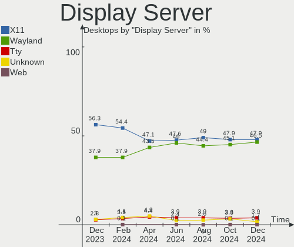
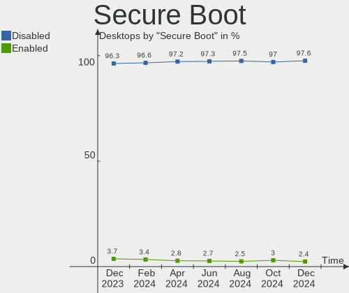
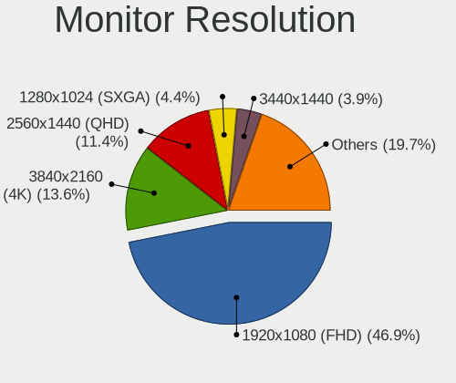

Linux Hardware Trends (Desktop)
-------------------------------

A project to identify most popular hardware characteristics and track their change
over time based on data collected by Linux users at https://Linux-Hardware.org.

Anyone can contribute to the study by uploading probes of their computers by
the [hw-probe](https://github.com/linuxhw/hw-probe) tool:

    sudo hw-probe -all -upload

Full-feature report is available here: https://linux-hardware.org/?view=trends&formfactor=desktop

Period: Apr, 2020.

Contents
--------

- [ OS                       ](#os)
- [ OS Family                ](#os-family)
- [ Kernel                   ](#kernel)
- [ Kernel Family            ](#kernel-family)
- [ Kernel Major Ver.        ](#kernel-major-ver)
- [ Arch                     ](#arch)
- [ DE                       ](#de)
- [ Display Server           ](#display-server)
- [ Display Manager          ](#display-manager)
- [ OS Lang                  ](#os-lang)
- [ Boot Mode                ](#boot-mode)
- [ Filesystem               ](#filesystem)
- [ Dual Boot with Linux/BSD ](#dual-boot-with-linux/bsd)
- [ Dual Boot (Win)          ](#dual-boot-win)
- [ Country                  ](#country)
- [ City                     ](#city)
- [ Vendor                   ](#vendor)
- [ Model                    ](#model)
- [ Model Family             ](#model-family)
- [ MFG Year                 ](#mfg-year)
- [ Form Factor              ](#form-factor)
- [ Secure Boot              ](#secure-boot)
- [ Coreboot                 ](#coreboot)
- [ RAM Size                 ](#ram-size)
- [ RAM Used                 ](#ram-used)
- [ Drive Vendor             ](#drive-vendor)
- [ Drive Model              ](#drive-model)
- [ Drive Kind               ](#drive-kind)
- [ Drive Connector          ](#drive-connector)
- [ Drive Size               ](#drive-size)
- [ Space Total              ](#space-total)
- [ Space Used               ](#space-used)
- [ Malfunc. Drives          ](#malfunc-drives)
- [ Malfunc. Drive Vendor    ](#malfunc-drive-vendor)
- [ Malfunc. Drive Kind      ](#malfunc-drive-kind)
- [ Failed Drives            ](#failed-drives)
- [ Failed Drive Vendor      ](#failed-drive-vendor)
- [ Drive Status             ](#drive-status)
- [ Storage Vendor           ](#storage-vendor)
- [ Storage Model            ](#storage-model)
- [ Storage Kind             ](#storage-kind)
- [ CPU Vendor               ](#cpu-vendor)
- [ CPU Model                ](#cpu-model)
- [ CPU Model Family         ](#cpu-model-family)
- [ CPU Cores                ](#cpu-cores)
- [ CPU Sockets              ](#cpu-sockets)
- [ CPU Threads              ](#cpu-threads)
- [ CPU Op-Modes             ](#cpu-op-modes)
- [ CPU Microarch            ](#cpu-microarch)
- [ CPU Microcode            ](#cpu-microcode)
- [ GPU Vendor               ](#gpu-vendor)
- [ GPU Model                ](#gpu-model)
- [ GPU Combo                ](#gpu-combo)
- [ GPU Driver               ](#gpu-driver)
- [ GPU Memory               ](#gpu-memory)
- [ Monitor Vendor           ](#monitor-vendor)
- [ Monitor Model            ](#monitor-model)
- [ Monitor Resolution       ](#monitor-resolution)
- [ Monitor Diagonal         ](#monitor-diagonal)
- [ Monitor Width            ](#monitor-width)
- [ Aspect Ratio             ](#aspect-ratio)
- [ Monitor Area             ](#monitor-area)
- [ Pixel Density            ](#pixel-density)
- [ Multiple Monitors        ](#multiple-monitors)
- [ Net Controller Vendor    ](#net-controller-vendor)
- [ Net Controller Model     ](#net-controller-model)
- [ Net Controller Kind      ](#net-controller-kind)
- [ Used Controller          ](#used-controller)
- [ NICs                     ](#nics)
- [ Unsupported Devices      ](#unsupported-devices)
- [ Unsupported Device Types ](#unsupported-device-types)

OS
--

Installed operating systems

| Name              | Computers | Percent |
|-------------------|-----------|---------|
| Ubuntu 18.04      | 525       | 27.26%  |
| Ubuntu 20.04      | 322       | 16.72%  |
| Ubuntu 19.10      | 171       | 8.88%   |
| ROSA R11          | 137       | 7.11%   |
| Mint 19.3         | 92        | 4.78%   |
| BlackPanther 18.1 | 67        | 3.48%   |
| Fedora 31         | 59        | 3.06%   |
| Manjaro 20.0      | 36        | 1.87%   |
| Endless 3.7.8     | 35        | 1.82%   |
| Arch              | 35        | 1.82%   |
| ROSA R11.1        | 31        | 1.61%   |
| Ubuntu 16.04      | 27        | 1.4%    |
| Debian 10         | 27        | 1.4%    |
| Manjaro           | 26        | 1.35%   |
| Zorin 15          | 24        | 1.25%   |
| openSUSE 15.1     | 19        | 0.99%   |
| Arch Rolling      | 19        | 0.99%   |
| KDE neon 18.04    | 18        | 0.93%   |
| Manjaro 19.0.2    | 16        | 0.83%   |
| Fedora 32         | 15        | 0.78%   |
| openSUSE 20200405 | 11        | 0.57%   |
| Mint 19.2         | 11        | 0.57%   |
| ROSA R8.1         | 10        | 0.52%   |
| Debian            | 9         | 0.47%   |
| CentOS 8          | 9         | 0.47%   |
| openSUSE 20200407 | 8         | 0.42%   |
| Debian Testing    | 8         | 0.42%   |
| Gentoo            | 7         | 0.36%   |
| Elementary 5.1.3  | 7         | 0.36%   |
| Peppermint 10     | 6         | 0.31%   |
| Mint 19.1         | 6         | 0.31%   |
| Zorin 12          | 5         | 0.26%   |
| Ubuntu 19.04      | 4         | 0.21%   |
| ROSA R10          | 4         | 0.21%   |
| Pop!_OS 20.04     | 4         | 0.21%   |
| MX 20             | 4         | 0.21%   |
| Mint 4            | 4         | 0.21%   |
| Mint 19           | 4         | 0.21%   |
| BlackPanther 16.2 | 4         | 0.21%   |
| Ubuntu 18.10      | 3         | 0.16%   |
| QTS 4.4.2         | 3         | 0.16%   |
| Parrot 4.8        | 3         | 0.16%   |
| openSUSE 20200410 | 3         | 0.16%   |
| Mint 18.3         | 3         | 0.16%   |
| Endless 3.7.6     | 3         | 0.16%   |
| Debian Unstable   | 3         | 0.16%   |
| Debian 9.12       | 3         | 0.16%   |
| Clear Linux 32760 | 3         | 0.16%   |
| CentOS 7          | 3         | 0.16%   |
| Solus 4.1         | 2         | 0.1%    |
| RHEL 8.1          | 2         | 0.1%    |
| Reborn OS         | 2         | 0.1%    |
| Peppermint 9      | 2         | 0.1%    |
| Parrot 4.9        | 2         | 0.1%    |
| openSUSE 20200422 | 2         | 0.1%    |
| openSUSE 20200402 | 2         | 0.1%    |
| openSUSE 15.2     | 2         | 0.1%    |
| MX 18.3           | 2         | 0.1%    |
| Kali 2020.2       | 2         | 0.1%    |
| Fedora 30         | 2         | 0.1%    |

OS Family
---------

OS without a version

| Name         | Computers | Percent |
|--------------|-----------|---------|
| Ubuntu       | 1052      | 54.62%  |
| ROSA         | 182       | 9.45%   |
| Mint         | 121       | 6.28%   |
| Manjaro      | 79        | 4.1%    |
| Fedora       | 77        | 4%      |
| BlackPanther | 71        | 3.69%   |
| openSUSE     | 60        | 3.12%   |
| Arch         | 54        | 2.8%    |
| Debian       | 50        | 2.6%    |
| Endless      | 44        | 2.28%   |
| Zorin        | 29        | 1.51%   |
| KDE neon     | 18        | 0.93%   |
| CentOS       | 12        | 0.62%   |
| Elementary   | 9         | 0.47%   |
| Clear Linux  | 9         | 0.47%   |
| Peppermint   | 8         | 0.42%   |
| Gentoo       | 8         | 0.42%   |
| MX           | 7         | 0.36%   |
| Pop!_OS      | 5         | 0.26%   |
| Parrot       | 5         | 0.26%   |
| ArcoLinux    | 5         | 0.26%   |
| QTS          | 3         | 0.16%   |
| Solus        | 2         | 0.1%    |
| RHEL         | 2         | 0.1%    |
| Reborn OS    | 2         | 0.1%    |
| Kali         | 2         | 0.1%    |
| PCLinuxOS    | 1         | 0.05%   |
| Mageia       | 1         | 0.05%   |
| LinuxFX      | 1         | 0.05%   |
| HamoniKR     | 1         | 0.05%   |
| Funtoo       | 1         | 0.05%   |
| EndeavourOS  | 1         | 0.05%   |
| ClearOS      | 1         | 0.05%   |
| Chrome OS    | 1         | 0.05%   |
| BigLinux     | 1         | 0.05%   |
| ArchLabs     | 1         | 0.05%   |

Kernel
------

Version of the Linux kernel

| Version                          | Computers | Percent |
|----------------------------------|-----------|---------|
| 5.3.0-46-generic                 | 327       | 16.98%  |
| 5.4.0-26-generic                 | 173       | 8.98%   |
| 5.3.0-45-generic                 | 133       | 6.91%   |
| 4.15.0-96-generic                | 108       | 5.61%   |
| 5.3.0-28-generic                 | 73        | 3.79%   |
| 4.18.16-desktop-1bP              | 63        | 3.27%   |
| 4.15.0-91-generic                | 60        | 3.12%   |
| 5.4.0-21-generic                 | 55        | 2.86%   |
| 4.15.0-desktop-45.1rosa-x86_64   | 52        | 2.7%    |
| 4.15.0-88-generic                | 45        | 2.34%   |
| 5.4.0-28-generic                 | 44        | 2.28%   |
| 4.15.0-desktop-68.5rosa-x86_64   | 36        | 1.87%   |
| 4.19.0-8-amd64                   | 23        | 1.19%   |
| 5.3.0-42-generic                 | 22        | 1.14%   |
| 5.4.0-24-generic                 | 21        | 1.09%   |
| 4.15.0-desktop-94.1rosa-x86_64   | 17        | 0.88%   |
| 4.12.14-lp151.28.44-default      | 16        | 0.83%   |
| 5.6.4-arch1-1                    | 14        | 0.73%   |
| 5.6.2-1-default                  | 14        | 0.73%   |
| 5.5.15-200.fc31.x86_64           | 14        | 0.73%   |
| 4.9.155-nrj-desktop-1rosa-x86_64 | 14        | 0.73%   |
| 5.6.0-1-default                  | 13        | 0.67%   |
| 5.4.33-3-MANJARO                 | 13        | 0.67%   |
| 5.0.0-32-generic                 | 13        | 0.67%   |
| 5.5.13-200.fc31.x86_64           | 11        | 0.57%   |
| 5.3.0-18-generic                 | 11        | 0.57%   |
| 5.6.3-arch1-1                    | 10        | 0.52%   |
| 5.3.0-51-generic                 | 10        | 0.52%   |
| 4.15.0-desktop-45.1rosa-i586     | 10        | 0.52%   |
| 5.5.17-200.fc31.x86_64           | 9         | 0.47%   |
| 4.15.0-99-generic                | 9         | 0.47%   |
| 5.6.6-arch1-1                    | 8         | 0.42%   |
| 5.6.5-3-MANJARO                  | 8         | 0.42%   |
| 5.4.32-generic-2rosa-x86_64      | 8         | 0.42%   |
| 5.4.0-25-generic                 | 8         | 0.42%   |
| 4.15.0-54-generic                | 8         | 0.42%   |
| 5.6.7-300.fc32.x86_64            | 7         | 0.36%   |
| 5.5.11-200.fc31.x86_64           | 7         | 0.36%   |
| 5.4.28-1-MANJARO                 | 7         | 0.36%   |
| 5.3.0-48-generic                 | 7         | 0.36%   |
| 5.3.0-47-generic                 | 7         | 0.36%   |
| 5.3.0-46-lowlatency              | 7         | 0.36%   |
| 5.3.0-40-generic                 | 7         | 0.36%   |
| 4.4.0-177-generic                | 7         | 0.36%   |
| 5.6.7-1-MANJARO                  | 6         | 0.31%   |
| 5.6.3-2-MANJARO                  | 6         | 0.31%   |
| 5.4.31-1-MANJARO                 | 6         | 0.31%   |
| 4.15.0-desktop-68.5rosa-i586     | 6         | 0.31%   |
| 5.6.7-arch1-1                    | 5         | 0.26%   |
| 5.6.6-200.fc31.x86_64            | 5         | 0.26%   |
| 5.6.4-1-default                  | 5         | 0.26%   |
| 5.5.16-200.fc31.x86_64           | 5         | 0.26%   |
| 5.5.0-2-amd64                    | 5         | 0.26%   |
| 5.4.35-1-MANJARO                 | 5         | 0.26%   |
| 4.19.0-6-amd64                   | 5         | 0.26%   |
| 4.18.0-25-generic                | 5         | 0.26%   |
| 4.18.0-15-generic                | 5         | 0.26%   |
| 4.18.0-147.5.1.el8_1.x86_64      | 5         | 0.26%   |
| 4.15.0-97-generic                | 5         | 0.26%   |
| 4.15.0-76-generic                | 5         | 0.26%   |

Kernel Family
-------------

Linux kernel without a distro release

| Version  | Computers | Percent |
|----------|-----------|---------|
| 5.3.0    | 619       | 32.14%  |
| 4.15.0   | 410       | 21.29%  |
| 5.4.0    | 332       | 17.24%  |
| 4.18.16  | 63        | 3.27%   |
| 4.19.0   | 33        | 1.71%   |
| 5.6.2    | 27        | 1.4%    |
| 5.0.0    | 27        | 1.4%    |
| 5.6.6    | 24        | 1.25%   |
| 5.6.4    | 23        | 1.19%   |
| 4.18.0   | 22        | 1.14%   |
| 5.6.7    | 21        | 1.09%   |
| 5.6.3    | 21        | 1.09%   |
| 5.5.13   | 21        | 1.09%   |
| 4.12.14  | 21        | 1.09%   |
| 5.6.0    | 19        | 0.99%   |
| 5.4.28   | 19        | 0.99%   |
| 5.5.15   | 17        | 0.88%   |
| 4.9.155  | 17        | 0.88%   |
| 5.4.33   | 16        | 0.83%   |
| 5.5.0    | 14        | 0.73%   |
| 5.6.5    | 13        | 0.67%   |
| 5.4.32   | 10        | 0.52%   |
| 4.4.0    | 10        | 0.52%   |
| 5.5.17   | 9         | 0.47%   |
| 5.5.11   | 9         | 0.47%   |
| 5.4.31   | 9         | 0.47%   |
| 5.5.16   | 7         | 0.36%   |
| 5.4.35   | 6         | 0.31%   |
| 4.9.60   | 5         | 0.26%   |
| 4.9.0    | 5         | 0.26%   |
| 5.5.10   | 4         | 0.21%   |
| 5.1.15   | 4         | 0.21%   |
| 4.9.20   | 4         | 0.21%   |
| 4.1.38   | 4         | 0.21%   |
| 3.10.0   | 4         | 0.21%   |
| 5.5.7    | 3         | 0.16%   |
| 5.5.18   | 3         | 0.16%   |
| 5.4.34   | 3         | 0.16%   |
| 5.3.18   | 3         | 0.16%   |
| 5.5.9    | 2         | 0.1%    |
| 5.5.19   | 2         | 0.1%    |
| 5.5.14   | 2         | 0.1%    |
| 5.4.30   | 2         | 0.1%    |
| 5.4.26   | 2         | 0.1%    |
| 5.4.23   | 2         | 0.1%    |
| 5.3.11   | 2         | 0.1%    |
| 4.19.118 | 2         | 0.1%    |
| 4.14.24  | 2         | 0.1%    |
| 4.14.0   | 2         | 0.1%    |
| 5.7.0    | 1         | 0.05%   |
| 5.6.8    | 1         | 0.05%   |
| 5.6.1    | 1         | 0.05%   |
| 5.5.8    | 1         | 0.05%   |
| 5.5.6    | 1         | 0.05%   |
| 5.5.3    | 1         | 0.05%   |
| 5.5.12   | 1         | 0.05%   |
| 5.4.24   | 1         | 0.05%   |
| 5.4.2    | 1         | 0.05%   |
| 5.4.19   | 1         | 0.05%   |
| 5.4.18   | 1         | 0.05%   |

Kernel Major Ver.
-----------------

Linux kernel major version

| Version | Computers | Percent |
|---------|-----------|---------|
| 5.3     | 627       | 32.55%  |
| 4.15    | 410       | 21.29%  |
| 5.4     | 405       | 21.03%  |
| 5.6     | 150       | 7.79%   |
| 5.5     | 97        | 5.04%   |
| 4.18    | 85        | 4.41%   |
| 4.19    | 38        | 1.97%   |
| 4.9     | 32        | 1.66%   |
| 5.0     | 27        | 1.4%    |
| 4.12    | 21        | 1.09%   |
| 4.4     | 11        | 0.57%   |
| 5.1     | 5         | 0.26%   |
| 4.14    | 5         | 0.26%   |
| 4.1     | 4         | 0.21%   |
| 3.10    | 4         | 0.21%   |
| 5.7     | 1         | 0.05%   |
| 4.8     | 1         | 0.05%   |
| 4.20    | 1         | 0.05%   |
| 4.2     | 1         | 0.05%   |
| 4.16    | 1         | 0.05%   |

Arch
----

OS architecture (x86_64, i586, etc.)

| Name   | Computers | Percent |
|--------|-----------|---------|
| x86_64 | 1824      | 94.7%   |
| i686   | 102       | 5.3%    |

DE
--

Desktop Environment

| Name            | Computers | Percent |
|-----------------|-----------|---------|
| GNOME           | 941       | 48.86%  |
| KDE5            | 225       | 11.68%  |
| XFCE            | 145       | 7.53%   |
| KDE4            | 99        | 5.14%   |
| X-Cinnamon      | 93        | 4.83%   |
| GNUstep         | 88        | 4.57%   |
| Unknown         | 83        | 4.31%   |
| KDE             | 78        | 4.05%   |
| MATE            | 53        | 2.75%   |
| Unity           | 25        | 1.3%    |
| Cinnamon        | 24        | 1.25%   |
| LXDE            | 16        | 0.83%   |
| LXQt            | 13        | 0.67%   |
| Deepin          | 11        | 0.57%   |
| Pantheon        | 9         | 0.47%   |
| GNOME Flashback | 8         | 0.42%   |
| Budgie          | 8         | 0.42%   |
| GNOME Classic   | 4         | 0.21%   |
| openbox         | 1         | 0.05%   |
| i3              | 1         | 0.05%   |
| fluxbox         | 1         | 0.05%   |

Display Server
--------------

X11 or Wayland

| Name        | Computers | Percent |
|-------------|-----------|---------|
| X11         | 1794      | 93.15%  |
| Wayland     | 79        | 4.1%    |
| Unknown     | 30        | 1.56%   |
| Tty         | 21        | 1.09%   |
| Unspecified | 2         | 0.1%    |

Display Manager
---------------

SDDM, LightDM, etc.

| Name    | Computers | Percent |
|---------|-----------|---------|
| Unknown | 1299      | 67.45%  |
| LightDM | 232       | 12.05%  |
| SDDM    | 206       | 10.7%   |
| KDM     | 103       | 5.35%   |
| GDM     | 71        | 3.69%   |
| GDM3    | 11        | 0.57%   |
| XDM     | 4         | 0.21%   |

OS Lang
-------

Language

| Lang       | Computers | Percent |
|------------|-----------|---------|
| en_US      | 524       | 27.21%  |
| Unknown    | 250       | 12.98%  |
| ru_RU      | 173       | 8.98%   |
| de_DE      | 144       | 7.48%   |
| en_GB      | 85        | 4.41%   |
| it_IT      | 73        | 3.79%   |
| pt_BR      | 72        | 3.74%   |
| fr_FR      | 55        | 2.86%   |
| en_CA      | 48        | 2.49%   |
| en_AU      | 47        | 2.44%   |
| es_ES      | 46        | 2.39%   |
| en_US.utf8 | 42        | 2.18%   |
| C          | 34        | 1.77%   |
| pl_PL      | 32        | 1.66%   |
| es_AR      | 19        | 0.99%   |
| nl_NL      | 18        | 0.93%   |
| pt_PT      | 17        | 0.88%   |
| en_IN      | 12        | 0.62%   |
| hu_HU      | 11        | 0.57%   |
| cs_CZ      | 11        | 0.57%   |
| sv_SE      | 10        | 0.52%   |
| POSIX      | 10        | 0.52%   |
| en_ZA      | 10        | 0.52%   |
| el_GR      | 10        | 0.52%   |
| ja_JP      | 9         | 0.47%   |
| fr_CA      | 9         | 0.47%   |
| es_MX      | 8         | 0.42%   |
| de_AT      | 7         | 0.36%   |
| tr_TR      | 5         | 0.26%   |
| ru_UA      | 5         | 0.26%   |
| ru_RU.utf8 | 5         | 0.26%   |
| pt_BR.utf8 | 5         | 0.26%   |
| ko_KR      | 5         | 0.26%   |
| fi_FI      | 5         | 0.26%   |
| es_PE      | 5         | 0.26%   |
| en_NZ      | 5         | 0.26%   |
| en_HK      | 5         | 0.26%   |
| ro_RO      | 4         | 0.21%   |
| fr_BE      | 4         | 0.21%   |
| en_PH      | 4         | 0.21%   |
| ca_ES      | 4         | 0.21%   |
| zh_TW      | 3         | 0.16%   |
| uk_UA      | 3         | 0.16%   |
| sl_SI      | 3         | 0.16%   |
| es_CL      | 3         | 0.16%   |
| en_US      | 3         | 0.16%   |
| en_IE      | 3         | 0.16%   |
| en_GB.utf8 | 3         | 0.16%   |
| de_CH      | 3         | 0.16%   |
| C          | 3         | 0.16%   |
| zh_CN      | 2         | 0.1%    |
| sk_SK      | 2         | 0.1%    |
| ru_UA.utf8 | 2         | 0.1%    |
| nl_BE      | 2         | 0.1%    |
| nb_NO      | 2         | 0.1%    |
| hr_HR      | 2         | 0.1%    |
| fr_CH      | 2         | 0.1%    |
| es_UY      | 2         | 0.1%    |
| es_CO      | 2         | 0.1%    |
| en_IN      | 2         | 0.1%    |

Boot Mode
---------

EFI or BIOS

| Mode | Computers | Percent |
|------|-----------|---------|
| BIOS | 1392      | 72.27%  |
| EFI  | 534       | 27.73%  |

Filesystem
----------

Type of filesystem

| Type    | Computers | Percent |
|---------|-----------|---------|
| Ext4    | 1714      | 88.99%  |
| Btrfs   | 81        | 4.21%   |
| Overlay | 58        | 3.01%   |
| Xfs     | 27        | 1.4%    |
| Zfs     | 21        | 1.09%   |
| Ext2    | 7         | 0.36%   |
| Tmpfs   | 5         | 0.26%   |
| Ext3    | 5         | 0.26%   |
| F2fs    | 3         | 0.16%   |
| Unknown | 3         | 0.16%   |
| Aufs    | 2         | 0.1%    |

Dual Boot with Linux/BSD
------------------------

Hosting more than one Linux/BSD

| Dual boot | Computers | Percent |
|-----------|-----------|---------|
| No        | 1557      | 80.84%  |
| Yes       | 369       | 19.16%  |

Dual Boot (Win)
---------------

Hosting Linux and Windows

| Dual boot | Computers | Percent |
|-----------|-----------|---------|
| No        | 1204      | 62.51%  |
| Yes       | 722       | 37.49%  |

Country
-------

Geographic location (country)

| Country             | Computers | Percent |
|---------------------|-----------|---------|
| USA                 | 318       | 16.51%  |
| Russia              | 233       | 12.1%   |
| Germany             | 178       | 9.24%   |
| Switzerland         | 103       | 5.35%   |
| Brazil              | 85        | 4.41%   |
| Italy               | 84        | 4.36%   |
| UK                  | 79        | 4.1%    |
| Hungary             | 73        | 3.79%   |
| France              | 73        | 3.79%   |
| Canada              | 70        | 3.63%   |
| Spain               | 56        | 2.91%   |
| Australia           | 50        | 2.6%    |
| Poland              | 43        | 2.23%   |
| Netherlands         | 37        | 1.92%   |
| Ukraine             | 31        | 1.61%   |
| Sweden              | 23        | 1.19%   |
| Argentina           | 23        | 1.19%   |
| India               | 19        | 0.99%   |
| Greece              | 18        | 0.93%   |
| Portugal            | 17        | 0.88%   |
| Austria             | 15        | 0.78%   |
| Mexico              | 14        | 0.73%   |
| Czech Republic      | 14        | 0.73%   |
| Belgium             | 14        | 0.73%   |
| Bulgaria            | 13        | 0.67%   |
| South Africa        | 12        | 0.62%   |
| Kyrgyzstan          | 12        | 0.62%   |
| Turkey              | 11        | 0.57%   |
| Serbia              | 11        | 0.57%   |
| Romania             | 9         | 0.47%   |
| Philippines         | 9         | 0.47%   |
| Japan               | 9         | 0.47%   |
| Indonesia           | 9         | 0.47%   |
| Finland             | 9         | 0.47%   |
| Norway              | 8         | 0.42%   |
| New Zealand         | 8         | 0.42%   |
| Korea, Republic of  | 7         | 0.36%   |
| Peru                | 6         | 0.31%   |
| Ireland             | 6         | 0.31%   |
| Hong Kong           | 6         | 0.31%   |
| Taiwan              | 5         | 0.26%   |
| Slovakia            | 5         | 0.26%   |
| Denmark             | 5         | 0.26%   |
| Colombia            | 5         | 0.26%   |
| Thailand            | 4         | 0.21%   |
| Slovenia            | 4         | 0.21%   |
| Malaysia            | 4         | 0.21%   |
| Israel              | 4         | 0.21%   |
| China               | 4         | 0.21%   |
| Belarus             | 4         | 0.21%   |
| Vietnam             | 3         | 0.16%   |
| Uruguay             | 3         | 0.16%   |
| Egypt               | 3         | 0.16%   |
| Cyprus              | 3         | 0.16%   |
| Croatia             | 3         | 0.16%   |
| Chile               | 3         | 0.16%   |
| Algeria             | 3         | 0.16%   |
| Venezuela           | 2         | 0.1%    |
| Uzbekistan          | 2         | 0.1%    |
| Trinidad and Tobago | 2         | 0.1%    |

City
----

Geographic location (city)

| City             | Computers | Percent |
|------------------|-----------|---------|
| Oberglatt        | 54        | 2.8%    |
| Moscow           | 51        | 2.65%   |
| Zurich           | 38        | 1.97%   |
| Budapest         | 18        | 0.93%   |
| Berlin           | 14        | 0.73%   |
| Sydney           | 12        | 0.62%   |
| Bishkek          | 12        | 0.62%   |
| Athens           | 11        | 0.57%   |
| St Petersburg    | 10        | 0.52%   |
| Hamburg          | 10        | 0.52%   |
| Warsaw           | 9         | 0.47%   |
| São Paulo       | 9         | 0.47%   |
| Ekaterinburg     | 9         | 0.47%   |
| Buenos Aires     | 9         | 0.47%   |
| Vienna           | 8         | 0.42%   |
| Rostov-on-Don    | 8         | 0.42%   |
| Rome             | 8         | 0.42%   |
| Montreal         | 8         | 0.42%   |
| Melbourne        | 8         | 0.42%   |
| Madrid           | 8         | 0.42%   |
| Toronto          | 7         | 0.36%   |
| Sofia            | 7         | 0.36%   |
| Paris            | 7         | 0.36%   |
| Omsk             | 7         | 0.36%   |
| Brisbane         | 7         | 0.36%   |
| Amsterdam        | 7         | 0.36%   |
| Novosibirsk      | 6         | 0.31%   |
| Nizhniy Novgorod | 6         | 0.31%   |
| Milan            | 6         | 0.31%   |
| London           | 6         | 0.31%   |
| Hyderabad        | 6         | 0.31%   |
| Helsinki         | 6         | 0.31%   |
| Cologne          | 6         | 0.31%   |
| Chelyabinsk      | 6         | 0.31%   |
| Cape Town        | 6         | 0.31%   |
| Bucharest        | 6         | 0.31%   |
| Barcelona        | 6         | 0.31%   |
| Voronezh         | 5         | 0.26%   |
| Munich           | 5         | 0.26%   |
| Miami            | 5         | 0.26%   |
| Leipzig          | 5         | 0.26%   |
| Kyiv             | 5         | 0.26%   |
| Istanbul         | 5         | 0.26%   |
| Hornsby          | 5         | 0.26%   |
| Győr            | 5         | 0.26%   |
| Dublin           | 5         | 0.26%   |
| Dortmund         | 5         | 0.26%   |
| Denver           | 5         | 0.26%   |
| Central          | 5         | 0.26%   |
| Zaragoza         | 4         | 0.21%   |
| Wrocław         | 4         | 0.21%   |
| Volgograd        | 4         | 0.21%   |
| Ufa              | 4         | 0.21%   |
| Stockholm        | 4         | 0.21%   |
| Porto            | 4         | 0.21%   |
| Phoenix          | 4         | 0.21%   |
| Odesa            | 4         | 0.21%   |
| Lisbon           | 4         | 0.21%   |
| Lima             | 4         | 0.21%   |
| Krasnoyarsk      | 4         | 0.21%   |

Vendor
------

Motherboard manufacturer

| Name                        | Computers | Percent |
|-----------------------------|-----------|---------|
| ASUSTek Computer            | 543       | 28.19%  |
| Gigabyte Technology         | 337       | 17.5%   |
| MSI                         | 198       | 10.28%  |
| ASRock                      | 174       | 9.03%   |
| Dell                        | 152       | 7.89%   |
| Hewlett-Packard             | 98        | 5.09%   |
| Intel                       | 64        | 3.32%   |
| Lenovo                      | 56        | 2.91%   |
| Acer                        | 40        | 2.08%   |
| Fujitsu                     | 38        | 1.97%   |
| Biostar                     | 24        | 1.25%   |
| Unknown                     | 22        | 1.14%   |
| Pegatron                    | 21        | 1.09%   |
| Foxconn                     | 21        | 1.09%   |
| ECS                         | 17        | 0.88%   |
| Medion                      | 14        | 0.73%   |
| Fujitsu Siemens             | 9         | 0.47%   |
| eMachines                   | 9         | 0.47%   |
| DALCO AG Switzerland        | 6         | 0.31%   |
| Shuttle                     | 5         | 0.26%   |
| Packard Bell                | 5         | 0.26%   |
| Apple                       | 5         | 0.26%   |
| Supermicro                  | 4         | 0.21%   |
| Gateway                     | 4         | 0.21%   |
| PCWare                      | 3         | 0.16%   |
| EVGA                        | 3         | 0.16%   |
| ABIT                        | 3         | 0.16%   |
| ZOTAC                       | 2         | 0.1%    |
| TYAN Computer               | 2         | 0.1%    |
| Nvidia                      | 2         | 0.1%    |
| Megaware                    | 2         | 0.1%    |
| Google                      | 2         | 0.1%    |
| ASRockRack                  | 2         | 0.1%    |
| XFX                         | 1         | 0.05%   |
| Wortmann AG                 | 1         | 0.05%   |
| WinFast                     | 1         | 0.05%   |
| WeiBu                       | 1         | 0.05%   |
| VIA Technologies            | 1         | 0.05%   |
| UNITCOM                     | 1         | 0.05%   |
| TriGem Computer             | 1         | 0.05%   |
| System Industrie Electronic | 1         | 0.05%   |
| Sapphire Tech               | 1         | 0.05%   |
| Sapphire                    | 1         | 0.05%   |
| Quanta                      | 1         | 0.05%   |
| PROLINE                     | 1         | 0.05%   |
| Positivo                    | 1         | 0.05%   |
| Point of View               | 1         | 0.05%   |
| Pegatron Computer           | 1         | 0.05%   |
| PCChips                     | 1         | 0.05%   |
| NCR                         | 1         | 0.05%   |
| MouseComputer               | 1         | 0.05%   |
| MINIX                       | 1         | 0.05%   |
| MCJ                         | 1         | 0.05%   |
| Login Informatica           | 1         | 0.05%   |
| Lite-On                     | 1         | 0.05%   |
| Kontron Technology          | 1         | 0.05%   |
| Itautec                     | 1         | 0.05%   |
| IP3                         | 1         | 0.05%   |
| Inventec                    | 1         | 0.05%   |
| IBM                         | 1         | 0.05%   |

Model
-----

Motherboard model

| Name                                  | Computers | Percent |
|---------------------------------------|-----------|---------|
| ASUS All Series                       | 64        | 3.32%   |
| Unknown                               | 22        | 1.14%   |
| Fujitsu CELSIUS_W550                  | 12        | 0.62%   |
| Dell OptiPlex 9020                    | 11        | 0.57%   |
| MSI MS-7C37                           | 10        | 0.52%   |
| Dell OptiPlex 780                     | 10        | 0.52%   |
| MSI MS-7B86                           | 9         | 0.47%   |
| Gigabyte B450M DS3H                   | 9         | 0.47%   |
| Gigabyte 970A-DS3P                    | 9         | 0.47%   |
| ASUS PRIME A320M-K                    | 9         | 0.47%   |
| ASUS PRIME X370-PRO                   | 8         | 0.42%   |
| MSI MS-7B79                           | 7         | 0.36%   |
| MSI MS-7721                           | 7         | 0.36%   |
| Gigabyte G31M-ES2L                    | 7         | 0.36%   |
| Dell OptiPlex 790                     | 7         | 0.36%   |
| Dell OptiPlex 745                     | 7         | 0.36%   |
| MSI MS-7B89                           | 6         | 0.31%   |
| MSI MS-7693                           | 6         | 0.31%   |
| Gigabyte X470 AORUS ULTRA GAMING      | 6         | 0.31%   |
| Gigabyte GA-78LMT-USB3 6.0            | 6         | 0.31%   |
| Dell OptiPlex 990                     | 6         | 0.31%   |
| Dell OptiPlex 755                     | 6         | 0.31%   |
| Dell OptiPlex 390                     | 6         | 0.31%   |
| Dell OptiPlex 3010                    | 6         | 0.31%   |
| DALCO AG Switzerland +41 44 908 38 38 | 6         | 0.31%   |
| ASUS TUF GAMING X570-PLUS             | 6         | 0.31%   |
| ASUS P9X79 WS                         | 6         | 0.31%   |
| ASUS P5KPL-AM SE                      | 6         | 0.31%   |
| ASUS M5A97 R2.0                       | 6         | 0.31%   |
| ASUS M5A78L-M/USB3                    | 6         | 0.31%   |
| ASUS B75M-A                           | 6         | 0.31%   |
| MSI MS-7C02                           | 5         | 0.26%   |
| Intel DP67BA AAG10219-303             | 5         | 0.26%   |
| Gigabyte B75M-D3H                     | 5         | 0.26%   |
| ASUS M5A78L-M PLUS/USB3               | 5         | 0.26%   |
| ASUS H110I-PLUS                       | 5         | 0.26%   |
| ASRock N68C-S UCC                     | 5         | 0.26%   |
| ASRock G31M-GS                        | 5         | 0.26%   |
| ASRock B450M Pro4                     | 5         | 0.26%   |
| MSI MS-7A34                           | 4         | 0.21%   |
| MSI MS-7885                           | 4         | 0.21%   |
| MSI MS-7641                           | 4         | 0.21%   |
| Intel DP55WB AAE64798-207             | 4         | 0.21%   |
| HP Pavilion Desktop 590-p0xxx         | 4         | 0.21%   |
| Gigabyte Z87-HD3                      | 4         | 0.21%   |
| Gigabyte B450 AORUS ELITE             | 4         | 0.21%   |
| Fujitsu CELSIUS W570                  | 4         | 0.21%   |
| Dell Inspiron 530                     | 4         | 0.21%   |
| ASUS ROG STRIX X470-F GAMING          | 4         | 0.21%   |
| ASUS ROG STRIX B350-F GAMING          | 4         | 0.21%   |
| ASUS PRIME Z370-A II                  | 4         | 0.21%   |
| ASUS PRIME X470-PRO                   | 4         | 0.21%   |
| ASUS PRIME H310M-R R2.0               | 4         | 0.21%   |
| ASUS P8Z77-V LX                       | 4         | 0.21%   |
| ASUS P5LD2-X                          | 4         | 0.21%   |
| ASUS P5K                              | 4         | 0.21%   |
| ASUS M5A99X EVO R2.0                  | 4         | 0.21%   |
| ASUS M5A97 LE R2.0                    | 4         | 0.21%   |
| ASUS M5A78L-M LX                      | 4         | 0.21%   |
| ASUS M5A78L LE                        | 4         | 0.21%   |

Model Family
------------

Motherboard model prefix

| Name                     | Computers | Percent |
|--------------------------|-----------|---------|
| Dell OptiPlex            | 93        | 4.83%   |
| ASUS PRIME               | 64        | 3.32%   |
| ASUS All                 | 64        | 3.32%   |
| HP Compaq                | 39        | 2.02%   |
| ASUS ROG                 | 33        | 1.71%   |
| Lenovo ThinkCentre       | 31        | 1.61%   |
| Fujitsu CELSIUS          | 27        | 1.4%    |
| Acer Aspire              | 25        | 1.3%    |
| Unknown                  | 22        | 1.14%   |
| ASUS M5A78L-M            | 21        | 1.09%   |
| ASUS TUF                 | 18        | 0.93%   |
| Dell Precision           | 17        | 0.88%   |
| Dell Inspiron            | 16        | 0.83%   |
| ASUS M5A97               | 15        | 0.78%   |
| ASUS P5KPL-AM            | 13        | 0.67%   |
| Gigabyte Z390            | 12        | 0.62%   |
| Gigabyte B450M           | 11        | 0.57%   |
| Acer Veriton             | 11        | 0.57%   |
| MSI MS-7C37              | 10        | 0.52%   |
| ASUS P8Z77-V             | 10        | 0.52%   |
| MSI MS-7B86              | 9         | 0.47%   |
| HP ProDesk               | 9         | 0.47%   |
| Gigabyte GA-78LMT-USB3   | 9         | 0.47%   |
| Gigabyte 970A-DS3P       | 9         | 0.47%   |
| Fujitsu ESPRIMO          | 9         | 0.47%   |
| Dell Vostro              | 9         | 0.47%   |
| Lenovo IdeaCentre        | 8         | 0.42%   |
| Gigabyte X570            | 8         | 0.42%   |
| Gigabyte X470            | 8         | 0.42%   |
| Gigabyte B450            | 8         | 0.42%   |
| ASUS SABERTOOTH          | 8         | 0.42%   |
| ASUS P8H61-M             | 8         | 0.42%   |
| ASUS Maximus             | 8         | 0.42%   |
| MSI MS-7B79              | 7         | 0.36%   |
| MSI MS-7721              | 7         | 0.36%   |
| Intel DP55WB             | 7         | 0.36%   |
| Gigabyte G31M-ES2L       | 7         | 0.36%   |
| ASUS P8P67               | 7         | 0.36%   |
| ASRock X570              | 7         | 0.36%   |
| MSI MS-7B89              | 6         | 0.31%   |
| MSI MS-7693              | 6         | 0.31%   |
| Lenovo ThinkStation      | 6         | 0.31%   |
| HP EliteDesk             | 6         | 0.31%   |
| Dell XPS                 | 6         | 0.31%   |
| DALCO AG Switzerland +41 | 6         | 0.31%   |
| ASUS P9X79               | 6         | 0.31%   |
| ASUS P8Z68-V             | 6         | 0.31%   |
| ASUS P6T                 | 6         | 0.31%   |
| ASUS P5Q                 | 6         | 0.31%   |
| ASUS P5G41T-M            | 6         | 0.31%   |
| ASUS B75M-A              | 6         | 0.31%   |
| ASRock Z77               | 6         | 0.31%   |
| ASRock B450M             | 6         | 0.31%   |
| MSI MS-7C02              | 5         | 0.26%   |
| Intel DP67BA             | 5         | 0.26%   |
| HP Pavilion              | 5         | 0.26%   |
| Gigabyte B75M-D3H        | 5         | 0.26%   |
| ASUS STRIX               | 5         | 0.26%   |
| ASUS P5K                 | 5         | 0.26%   |
| ASUS M5A99X              | 5         | 0.26%   |

MFG Year
--------

Motherboard manufacture year

| Year | Computers | Percent |
|------|-----------|---------|
| 2019 | 311       | 16.15%  |
| 2018 | 193       | 10.02%  |
| 2010 | 173       | 8.98%   |
| 2012 | 149       | 7.74%   |
| 2011 | 148       | 7.68%   |
| 2013 | 142       | 7.37%   |
| 2014 | 139       | 7.22%   |
| 2015 | 130       | 6.75%   |
| 2009 | 122       | 6.33%   |
| 2008 | 107       | 5.56%   |
| 2016 | 92        | 4.78%   |
| 2017 | 78        | 4.05%   |
| 2007 | 70        | 3.63%   |
| 2006 | 29        | 1.51%   |
| 2020 | 20        | 1.04%   |
| 2005 | 15        | 0.78%   |
| 2004 | 5         | 0.26%   |
| 2001 | 2         | 0.1%    |
| 2003 | 1         | 0.05%   |

Form Factor
-----------

Physical design of the computer

| Name    | Computers | Percent |
|---------|-----------|---------|
| Desktop | 1926      | 100%    |

Secure Boot
-----------

Enabled or disabled

| State    | Computers | Percent |
|----------|-----------|---------|
| Disabled | 1903      | 98.81%  |
| Enabled  | 23        | 1.19%   |

Coreboot
--------

Have coreboot on board

| Used | Computers | Percent |
|------|-----------|---------|
| No   | 1923      | 99.84%  |
| Yes  | 3         | 0.16%   |

RAM Size
--------

Total RAM memory

| Size in GB      | Computers | Percent |
|-----------------|-----------|---------|
| 8.01-16.0       | 440       | 22.85%  |
| 16.01-24.0      | 408       | 21.18%  |
| 3.01-4.0        | 387       | 20.09%  |
| 4.01-8.0        | 269       | 13.97%  |
| 32.01-64.0      | 173       | 8.98%   |
| 1.01-2.0        | 100       | 5.19%   |
| 64.01-256.0     | 64        | 3.32%   |
| 2.01-3.0        | 44        | 2.28%   |
| 24.01-32.0      | 28        | 1.45%   |
| 0.01-1.0        | 12        | 0.62%   |
| More than 256.0 | 1         | 0.05%   |

RAM Used
--------

Used RAM memory

| Used GB     | Computers | Percent |
|-------------|-----------|---------|
| 1.01-2.0    | 787       | 40.86%  |
| 2.01-3.0    | 420       | 21.81%  |
| 0.01-1.0    | 321       | 16.67%  |
| 4.01-8.0    | 175       | 9.09%   |
| 3.01-4.0    | 165       | 8.57%   |
| 8.01-16.0   | 49        | 2.54%   |
| 16.01-24.0  | 4         | 0.21%   |
| 24.01-32.0  | 3         | 0.16%   |
| 32.01-64.0  | 1         | 0.05%   |
| 64.01-256.0 | 1         | 0.05%   |

Drive Vendor
------------

Hard drive vendors

| Vendor              | Computers | Drives | Percent |
|---------------------|-----------|--------|---------|
| Seagate             | 730       | 924    | 23.29%  |
| WDC                 | 721       | 883    | 23%     |
| Samsung Electronics | 420       | 527    | 13.4%   |
| Toshiba             | 199       | 212    | 6.35%   |
| Kingston            | 172       | 191    | 5.49%   |
| Hitachi             | 149       | 163    | 4.75%   |
| Crucial             | 117       | 126    | 3.73%   |
| SanDisk             | 79        | 88     | 2.52%   |
| Intel               | 58        | 61     | 1.85%   |
| A-DATA Technology   | 53        | 55     | 1.69%   |
| MAXTOR              | 38        | 44     | 1.21%   |
| China               | 24        | 25     | 0.77%   |
| HGST                | 23        | 26     | 0.73%   |
| Corsair             | 23        | 25     | 0.73%   |
| Transcend           | 21        | 22     | 0.67%   |
| SPCC                | 21        | 22     | 0.67%   |
| Patriot             | 21        | 22     | 0.67%   |
| OCZ                 | 21        | 21     | 0.67%   |
| Unknown             | 16        | 17     | 0.51%   |
| PNY                 | 16        | 17     | 0.51%   |
| Hewlett-Packard     | 13        | 12     | 0.41%   |
| Generic             | 12        | 12     | 0.38%   |
| PLEXTOR             | 11        | 12     | 0.35%   |
| Micron Technology   | 10        | 10     | 0.32%   |
| Intenso             | 10        | 11     | 0.32%   |
| Fujitsu             | 9         | 9      | 0.29%   |
| JMicron             | 8         | 11     | 0.26%   |
| SK Hynix            | 7         | 7      | 0.22%   |
| KingDian            | 7         | 7      | 0.22%   |
| GOODRAM             | 7         | 7      | 0.22%   |
| Mushkin             | 6         | 6      | 0.19%   |
| Gigabyte Technology | 6         | 6      | 0.19%   |
| ASMT                | 6         | 6      | 0.19%   |
| Team                | 5         | 5      | 0.16%   |
| Phison              | 5         | 6      | 0.16%   |
| LITEON              | 5         | 5      | 0.16%   |
| DREVO               | 5         | 5      | 0.16%   |
| Biostar             | 4         | 4      | 0.13%   |
| Apacer              | 4         | 4      | 0.13%   |
| Smartbuy            | 3         | 3      | 0.1%    |
| LITEONIT            | 3         | 3      | 0.1%    |
| KINGMAX             | 3         | 3      | 0.1%    |
| Apple               | 3         | 3      | 0.1%    |
| AMD                 | 3         | 4      | 0.1%    |
| Zheino              | 2         | 2      | 0.06%   |
| Vaseky              | 2         | 2      | 0.06%   |
| TCSUNBOW            | 2         | 2      | 0.06%   |
| SABRENT             | 2         | 2      | 0.06%   |
| OCZ-VERTEX2         | 2         | 2      | 0.06%   |
| Lexar               | 2         | 2      | 0.06%   |
| KingSpec            | 2         | 2      | 0.06%   |
| HUAWEI              | 2         | 2      | 0.06%   |
| Dogfish             | 2         | 2      | 0.06%   |
| ASMT109x            | 2         | 2      | 0.06%   |
| WDC WDS1            | 1         | 1      | 0.03%   |
| WDC WD50            | 1         | 1      | 0.03%   |
| WDC WD30            | 1         | 1      | 0.03%   |
| WD MediaMax         | 1         | 1      | 0.03%   |
| Vi550               | 1         | 1      | 0.03%   |
| TSA                 | 1         | 1      | 0.03%   |

Drive Model
-----------

Hard drive models

| Model                        | Computers | Percent |
|------------------------------|-----------|---------|
| ST500DM002-1BD142 500GB      | 44        | 1.2%    |
| SSD 850 EVO 250GB            | 41        | 1.12%   |
| SA400S37120G 120GB SSD       | 37        | 1.01%   |
| DT01ACA100 1TB               | 36        | 0.99%   |
| SSD 860 EVO 500GB            | 33        | 0.9%    |
| SA400S37240G 240GB SSD       | 33        | 0.9%    |
| ST2000DM006-2DM164 2TB       | 31        | 0.85%   |
| ST31000528AS 1TB             | 30        | 0.82%   |
| ST1000DM003-1CH162 1TB       | 30        | 0.82%   |
| WD10EZEX-08WN4A0 1TB         | 29        | 0.79%   |
| SV300S37A120G 120GB SSD      | 27        | 0.74%   |
| ST1000DM010-2EP102 1TB       | 27        | 0.74%   |
| ST1000DM003-1ER162 1TB       | 27        | 0.74%   |
| DT01ACA050 500GB             | 27        | 0.74%   |
| ST3500418AS 500GB            | 25        | 0.68%   |
| ST2000DM001-1ER164 2TB       | 24        | 0.66%   |
| ST2000DM008-2FR102 2TB       | 23        | 0.63%   |
| SSD 850 EVO 500GB            | 21        | 0.58%   |
| DT01ACA200 2TB               | 21        | 0.58%   |
| ST1000DM003-9YN162 1TB       | 19        | 0.52%   |
| SSD 860 EVO 250GB            | 19        | 0.52%   |
| HDWD110 1TB                  | 19        | 0.52%   |
| WD5000AAKX-001CA0 500GB      | 18        | 0.49%   |
| SSD 860 EVO 1TB              | 18        | 0.49%   |
| WD10EZEX-00BN5A0 1TB         | 17        | 0.47%   |
| ST3000DM001-1CH166 3TB       | 17        | 0.47%   |
| SA400S37480G 480GB SSD       | 17        | 0.47%   |
| WD20EZRZ-00Z5HB0 2TB         | 16        | 0.44%   |
| ST2000DM001-1CH164 2TB       | 16        | 0.44%   |
| ST1000DM003-1SB102 1TB       | 16        | 0.44%   |
| HD103SJ 1TB                  | 16        | 0.44%   |
| ST3160815AS 160GB            | 14        | 0.38%   |
| ST31000524AS 1TB             | 14        | 0.38%   |
| ST3000DM001-1ER166 3TB       | 14        | 0.38%   |
| HD161HJ 160GB                | 14        | 0.38%   |
| ST380815AS 80GB              | 13        | 0.36%   |
| SDSSDA240G 240GB             | 13        | 0.36%   |
| HDWD120 2TB                  | 13        | 0.36%   |
| CT240BX500SSD1 240GB         | 13        | 0.36%   |
| WDS120G2G0A-00JH30 120GB SSD | 12        | 0.33%   |
| SSD 840 EVO 250GB            | 12        | 0.33%   |
| SD/MMC/MS PRO 64GB           | 12        | 0.33%   |
| Expansion Desk 5TB           | 12        | 0.33%   |
| CT500MX500SSD1 500GB         | 12        | 0.33%   |
| CT250MX500SSD1 250GB         | 12        | 0.33%   |
| CT120BX500SSD1 120GB         | 12        | 0.33%   |
| WDS240G2G0A-00JH30 240GB SSD | 11        | 0.3%    |
| WD10EZEX-22MFCA0 1TB         | 11        | 0.3%    |
| ST3250310AS 250GB            | 11        | 0.3%    |
| SSD 860 QVO 1TB              | 11        | 0.3%    |
| SSD 850 EVO 120GB            | 11        | 0.3%    |
| HDS721010CLA332 1TB          | 11        | 0.3%    |
| HD322HJ 320GB                | 11        | 0.3%    |
| Expansion 1TB                | 11        | 0.3%    |
| WD40EZRZ-00GXCB0 4TB         | 10        | 0.27%   |
| SV300S37A240G 240GB SSD      | 10        | 0.27%   |
| ST3500413AS 500GB            | 10        | 0.27%   |
| ST3160318AS 160GB            | 10        | 0.27%   |
| ST1000LM024 HN-M101MBB 1TB   | 10        | 0.27%   |
| SSD PLUS 240GB               | 10        | 0.27%   |

Drive Kind
----------

HDD or SSD

| Kind    | Computers | Drives | Percent |
|---------|-----------|--------|---------|
| HDD     | 1549      | 2356   | 59.71%  |
| SSD     | 881       | 1154   | 33.96%  |
| NVMe    | 91        | 102    | 3.51%   |
| Unknown | 64        | 69     | 2.47%   |
| MMC     | 9         | 10     | 0.35%   |

Drive Connector
---------------

SATA, SAS, NVMe, etc.

| Type | Computers | Drives | Percent |
|------|-----------|--------|---------|
| SATA | 1843      | 3456   | 90.12%  |
| SAS  | 102       | 123    | 4.99%   |
| NVMe | 91        | 102    | 4.45%   |
| MMC  | 9         | 10     | 0.44%   |

Drive Size
----------

Size of hard drive

| Size in TB | Computers | Drives | Percent |
|------------|-----------|--------|---------|
| 0.01-0.5   | 1481      | 2184   | 54.07%  |
| 0.51-1.0   | 728       | 883    | 26.58%  |
| 1.01-2.0   | 299       | 345    | 10.92%  |
| 2.01-3.0   | 95        | 115    | 3.47%   |
| 3.01-4.0   | 75        | 89     | 2.74%   |
| 4.01-10.0  | 53        | 66     | 1.94%   |
| 10.01-20.0 | 6         | 7      | 0.22%   |
| 0          | 1         | 1      | 0.04%   |
| Unknown    | 1         | 1      | 0.04%   |

Space Total
-----------

Amount of disk space available on the file system

| Size in GB     | Computers | Percent |
|----------------|-----------|---------|
| 101-250        | 481       | 24.97%  |
| 251-500        | 331       | 17.19%  |
| 501-1000       | 279       | 14.49%  |
| 1001-2000      | 210       | 10.9%   |
| 51-100         | 158       | 8.2%    |
| More than 3000 | 153       | 7.94%   |
| 2001-3000      | 105       | 5.45%   |
| 21-50          | 88        | 4.57%   |
| 1-20           | 76        | 3.95%   |
| Unknown        | 45        | 2.34%   |

Space Used
----------

Amount of used disk space

| Used GB        | Computers | Percent |
|----------------|-----------|---------|
| 1-20           | 729       | 37.85%  |
| 21-50          | 281       | 14.59%  |
| 51-100         | 206       | 10.7%   |
| 101-250        | 176       | 9.14%   |
| 251-500        | 144       | 7.48%   |
| 501-1000       | 136       | 7.06%   |
| 1001-2000      | 119       | 6.18%   |
| More than 3000 | 54        | 2.8%    |
| Unknown        | 45        | 2.34%   |
| 2001-3000      | 36        | 1.87%   |

Malfunc. Drives
---------------

Drive models with a malfunction

| Model                        | Computers | Drives | Percent |
|------------------------------|-----------|--------|---------|
| ST500DM002-1BD142 500GB      | 6         | 6      | 2.38%   |
| WD5000AAKX-001CA0 500GB      | 5         | 5      | 1.98%   |
| SV300S37A120G 120GB SSD      | 4         | 4      | 1.59%   |
| ST3500418AS 500GB            | 4         | 4      | 1.59%   |
| ST2000DM001-1CH164 2TB       | 4         | 4      | 1.59%   |
| ST1000DM003-9YN162 1TB       | 4         | 4      | 1.59%   |
| X1 SSD 120GB                 | 3         | 3      | 1.19%   |
| ST3320418AS 320GB            | 3         | 3      | 1.19%   |
| ST31000528AS 1TB             | 3         | 3      | 1.19%   |
| ST1000DM003-1CH162 1TB       | 3         | 3      | 1.19%   |
| SSDSA2M080G2GC 80GB          | 3         | 3      | 1.19%   |
| HDS721050CLA362 500GB        | 3         | 3      | 1.19%   |
| WD5000AADS-00S9B0 500GB      | 2         | 2      | 0.79%   |
| WD3200AAKS-00L9A0 320GB      | 2         | 2      | 0.79%   |
| WD10EZEX-60ZF5A0 1TB         | 2         | 2      | 0.79%   |
| WD10EZEX-08WN4A0 1TB         | 2         | 2      | 0.79%   |
| WD10EZEX-00RKKA0 1TB         | 2         | 2      | 0.79%   |
| WD10EARS-00Y5B1 1TB          | 2         | 2      | 0.79%   |
| WD1003FZEX-00MK2A0 1TB       | 2         | 2      | 0.79%   |
| STM3250310AS 250GB           | 2         | 2      | 0.79%   |
| STM3160215AS 160GB           | 2         | 2      | 0.79%   |
| ST3750525AS 752GB            | 2         | 2      | 0.79%   |
| ST3250620AS 250GB            | 2         | 2      | 0.79%   |
| ST3250318AS 250GB            | 2         | 2      | 0.79%   |
| ST3250310AS 250GB            | 2         | 2      | 0.79%   |
| ST3160811AS 160GB            | 2         | 2      | 0.79%   |
| ST31000524AS 1TB             | 2         | 2      | 0.79%   |
| ST31000333AS 1TB             | 2         | 2      | 0.79%   |
| ST250DM000-1BD141 250GB      | 2         | 2      | 0.79%   |
| Neutron GTX SSD 120GB        | 2         | 2      | 0.79%   |
| HUA722020ALA330 2TB          | 2         | 2      | 0.79%   |
| HTS543232A7A384 320GB        | 2         | 2      | 0.79%   |
| HDS721050DLE630 500GB        | 2         | 2      | 0.79%   |
| HDS721010DLE630 1TB          | 2         | 3      | 0.79%   |
| HD501LJ 500GB                | 2         | 2      | 0.79%   |
| HD322HJ 320GB                | 2         | 2      | 0.79%   |
| HD321KJ 320GB                | 2         | 2      | 0.79%   |
| HD103SJ 1TB                  | 2         | 2      | 0.79%   |
| DT01ACA100 1TB               | 2         | 2      | 0.79%   |
| DT01ACA050 500GB             | 2         | 2      | 0.79%   |
| Wildfire 120GB SSD           | 1         | 1      | 0.4%    |
| WDS240G2G0B-00EPW0 240GB SSD | 1         | 1      | 0.4%    |
| WD800JD-55MUA1 80GB          | 1         | 1      | 0.4%    |
| WD800JB-00JJC0 80GB          | 1         | 1      | 0.4%    |
| WD800BB-56JKC0 80GB          | 1         | 1      | 0.4%    |
| WD800AAJS-60M0A0 80GB        | 1         | 1      | 0.4%    |
| WD800AAJS-00PSA0 80GB        | 1         | 1      | 0.4%    |
| WD7500AAVS-00D7B1 752GB      | 1         | 1      | 0.4%    |
| WD6400AAKS-00A7B0 640GB      | 1         | 1      | 0.4%    |
| WD6400AADS-00M2B0 640GB      | 1         | 1      | 0.4%    |
| WD5002AALX-00J37A0 500GB     | 1         | 1      | 0.4%    |
| WD5000LPVX-60V0TT0 500GB     | 1         | 1      | 0.4%    |
| WD5000AARS-003BB1 500GB      | 1         | 1      | 0.4%    |
| WD5000AAKX-75U6AA0 500GB     | 1         | 1      | 0.4%    |
| WD5000AAKX-753CA1 500GB      | 1         | 1      | 0.4%    |
| WD5000AAKX-603CA0 500GB      | 1         | 1      | 0.4%    |
| WD5000AAKX-00ERMA0 500GB     | 1         | 1      | 0.4%    |
| WD5000AAKS-75V0A0 500GB      | 1         | 1      | 0.4%    |
| WD5000AAKS-65YGA0 500GB      | 1         | 1      | 0.4%    |
| WD400JB-00FMA0 40GB          | 1         | 1      | 0.4%    |

Malfunc. Drive Vendor
---------------------

Vendors of faulty drives

| Vendor              | Computers | Drives | Percent |
|---------------------|-----------|--------|---------|
| Seagate             | 76        | 84     | 33.04%  |
| WDC                 | 58        | 66     | 25.22%  |
| Samsung Electronics | 21        | 23     | 9.13%   |
| Hitachi             | 21        | 25     | 9.13%   |
| Toshiba             | 10        | 10     | 4.35%   |
| Maxtor              | 7         | 7      | 3.04%   |
| Kingston            | 6         | 6      | 2.61%   |
| Intel               | 6         | 6      | 2.61%   |
| Crucial             | 6         | 7      | 2.61%   |
| Corsair             | 5         | 5      | 2.17%   |
| A-DATA Technology   | 5         | 5      | 2.17%   |
| DREVO               | 3         | 3      | 1.3%    |
| Unknown             | 1         | 1      | 0.43%   |
| SuperTalent         | 1         | 1      | 0.43%   |
| SPCC                | 1         | 1      | 0.43%   |
| Patriot             | 1         | 1      | 0.43%   |
| KingDian            | 1         | 1      | 0.43%   |
| Fujitsu             | 1         | 1      | 0.43%   |

Malfunc. Drive Kind
-------------------

Kinds of faulty drives

| Kind | Computers | Drives | Percent |
|------|-----------|--------|---------|
| HDD  | 178       | 209    | 81.65%  |
| SSD  | 35        | 39     | 16.06%  |
| NVMe | 5         | 5      | 2.29%   |

Failed Drives
-------------

Failed drive models

| Model                   | Computers | Drives | Percent |
|-------------------------|-----------|--------|---------|
| WD5000BEVT-00ZAT0 500GB | 1         | 1      | 20%     |
| ST3750525AS 752GB       | 1         | 1      | 20%     |
| ST31000524AS 1TB        | 1         | 1      | 20%     |
| HTS547575A9E384 752GB   | 1         | 1      | 20%     |
| HD204UI 2TB             | 1         | 1      | 20%     |

Failed Drive Vendor
-------------------

Failed drive vendors

| Vendor              | Computers | Drives | Percent |
|---------------------|-----------|--------|---------|
| Seagate             | 2         | 2      | 40%     |
| WDC                 | 1         | 1      | 20%     |
| Samsung Electronics | 1         | 1      | 20%     |
| Hitachi             | 1         | 1      | 20%     |

Drive Status
------------

Number of failed and malfunc. drives

| Status   | Computers | Drives | Percent |
|----------|-----------|--------|---------|
| Detected | 1262      | 2391   | 61.74%  |
| Works    | 565       | 1042   | 27.64%  |
| Malfunc  | 212       | 253    | 10.37%  |
| Failed   | 5         | 5      | 0.24%   |

Storage Vendor
--------------

Storage controller vendors

| Vendor                           | Computers | Percent |
|----------------------------------|-----------|---------|
| Intel                            | 1239      | 48.74%  |
| AMD                              | 554       | 21.79%  |
| Nvidia                           | 120       | 4.72%   |
| Samsung Electronics              | 112       | 4.41%   |
| Marvell Technology Group         | 104       | 4.09%   |
| JMicron Technology               | 104       | 4.09%   |
| ASMedia Technology               | 103       | 4.05%   |
| Phison Electronics               | 37        | 1.46%   |
| VIA Technologies                 | 25        | 0.98%   |
| Silicon Motion                   | 24        | 0.94%   |
| Sandisk                          | 21        | 0.83%   |
| ADATA Technology                 | 14        | 0.55%   |
| Micron/Crucial Technology        | 11        | 0.43%   |
| Kingston Technology Company      | 9         | 0.35%   |
| Toshiba America Info Systems     | 7         | 0.28%   |
| Realtek Semiconductor            | 7         | 0.28%   |
| Broadcom / LSI                   | 7         | 0.28%   |
| Adaptec                          | 7         | 0.28%   |
| Silicon Image                    | 6         | 0.24%   |
| LSI Logic / Symbios Logic        | 5         | 0.2%    |
| Lite-On Technology               | 5         | 0.2%    |
| Integrated Technology Express    | 5         | 0.2%    |
| SK Hynix                         | 4         | 0.16%   |
| Silicon Integrated Systems [SiS] | 4         | 0.16%   |
| Areca Technology                 | 2         | 0.08%   |
| Unknown                          | 1         | 0.04%   |
| Tekram Technology                | 1         | 0.04%   |
| Promise Technology               | 1         | 0.04%   |
| OCZ Technology Group             | 1         | 0.04%   |
| HighPoint Technologies           | 1         | 0.04%   |
| Advanced System Products         | 1         | 0.04%   |

Storage Model
-------------

Storage controller models

| Model                                                                             | Computers | Percent |
|-----------------------------------------------------------------------------------|-----------|---------|
| FCH SATA Controller [AHCI mode]                                                   | 304       | 8.77%   |
| NM10/ICH7 Family SATA Controller [IDE mode]                                       | 154       | 4.44%   |
| SB7x0/SB8x0/SB9x0 IDE Controller                                                  | 143       | 4.12%   |
| 8 Series/C220 Series Chipset Family 6-port SATA Controller 1 [AHCI mode]          | 126       | 3.63%   |
| 82801G (ICH7 Family) IDE Controller                                               | 115       | 3.32%   |
| 400 Series Chipset SATA Controller                                                | 108       | 3.11%   |
| SB7x0/SB8x0/SB9x0 SATA Controller [IDE mode]                                      | 106       | 3.06%   |
| SB7x0/SB8x0/SB9x0 SATA Controller [AHCI mode]                                     | 103       | 2.97%   |
| 6 Series/C200 Series Chipset Family 6 port Desktop SATA AHCI Controller           | 101       | 2.91%   |
| ASM1062 Serial ATA Controller                                                     | 96        | 2.77%   |
| Q170/Q150/B150/H170/H110/Z170/CM236 Chipset SATA Controller [AHCI Mode]           | 95        | 2.74%   |
| 7 Series/C210 Series Chipset Family 6-port SATA Controller [AHCI mode]            | 83        | 2.39%   |
| NVMe SSD Controller SM981/PM981/PM983                                             | 79        | 2.28%   |
| 200 Series PCH SATA controller [AHCI mode]                                        | 74        | 2.13%   |
| Cannon Lake PCH SATA AHCI Controller                                              | 67        | 1.93%   |
| SATA Controller [RAID mode]                                                       | 57        | 1.64%   |
| MCP61 SATA Controller                                                             | 57        | 1.64%   |
| 6 Series/C200 Series Chipset Family Desktop SATA Controller (IDE mode, ports 4-5) | 55        | 1.59%   |
| 6 Series/C200 Series Chipset Family Desktop SATA Controller (IDE mode, ports 0-3) | 55        | 1.59%   |
| JMB363 SATA/IDE Controller                                                        | 47        | 1.36%   |
| MCP61 IDE                                                                         | 40        | 1.15%   |
| 9 Series Chipset Family SATA Controller [AHCI Mode]                               | 40        | 1.15%   |
| Non-Volatile memory controller                                                    | 36        | 1.04%   |
| JMB368 IDE controller                                                             | 36        | 1.04%   |
| 82801I (ICH9 Family) 2 port SATA Controller [IDE mode]                            | 32        | 0.92%   |
| 82801JI (ICH10 Family) SATA AHCI Controller                                       | 30        | 0.87%   |
| 5 Series/3400 Series Chipset 6 port SATA AHCI Controller                          | 30        | 0.87%   |
| 4 Series Chipset PT IDER Controller                                               | 30        | 0.87%   |
| C610/X99 series chipset 6-Port SATA Controller [AHCI mode]                        | 29        | 0.84%   |
| X370 Series Chipset SATA Controller                                               | 28        | 0.81%   |
| NVMe SSD Controller SM961/PM961                                                   | 28        | 0.81%   |
| 5 Series/3400 Series Chipset 4 port SATA IDE Controller                           | 28        | 0.81%   |
| 82801JI (ICH10 Family) 4 port SATA IDE Controller #1                              | 27        | 0.78%   |
| 5 Series/3400 Series Chipset 2 port SATA IDE Controller                           | 27        | 0.78%   |
| 300 Series Chipset SATA Controller                                                | 27        | 0.78%   |
| 82801JI (ICH10 Family) 2 port SATA IDE Controller #2                              | 26        | 0.75%   |
| FCH SATA Controller D                                                             | 25        | 0.72%   |
| E12 NVMe Controller                                                               | 22        | 0.63%   |
| FCH IDE Controller                                                                | 21        | 0.61%   |
| C610/X99 series chipset sSATA Controller [AHCI mode]                              | 21        | 0.61%   |
| 82801IR/IO/IH (ICH9R/DO/DH) 4 port SATA Controller [IDE mode]                     | 21        | 0.61%   |
| 7 Series/C210 Series Chipset Family 4-port SATA Controller [IDE mode]             | 21        | 0.61%   |
| 7 Series/C210 Series Chipset Family 2-port SATA Controller [IDE mode]             | 21        | 0.61%   |
| 88SE9172 SATA 6Gb/s Controller                                                    | 18        | 0.52%   |
| FCH SATA Controller [IDE mode]                                                    | 17        | 0.49%   |
| C600/X79 series chipset 6-Port SATA AHCI Controller                               | 17        | 0.49%   |
| 82801H (ICH8 Family) 4 port SATA Controller [IDE mode]                            | 17        | 0.49%   |
| 82801JD/DO (ICH10 Family) SATA AHCI Controller                                    | 16        | 0.46%   |
| SB600 Non-Raid-5 SATA                                                             | 15        | 0.43%   |
| SB600 IDE                                                                         | 15        | 0.43%   |
| JMB362 SATA Controller                                                            | 15        | 0.43%   |
| 82801JD/DO (ICH10 Family) 4-port SATA IDE Controller                              | 15        | 0.43%   |
| 82801JD/DO (ICH10 Family) 2-port SATA IDE Controller                              | 15        | 0.43%   |
| 82801IR/IO/IH (ICH9R/DO/DH) 6 port SATA Controller [AHCI mode]                    | 15        | 0.43%   |
| 82801HR/HO/HH (ICH8R/DO/DH) 2 port SATA Controller [IDE mode]                     | 15        | 0.43%   |
| XPG SX8200 Pro PCIe Gen3x4 M.2 2280 Solid State Drive                             | 14        | 0.4%    |
| 88SE6111/6121 SATA II / PATA Controller                                           | 14        | 0.4%    |
| VT82C586A/B/VT82C686/A/B/VT823x/A/C PIPC Bus Master IDE                           | 13        | 0.37%   |
| SSD 660P Series                                                                   | 13        | 0.37%   |
| 88SE9128 PCIe SATA 6 Gb/s RAID controller with HyperDuo                           | 13        | 0.37%   |

Storage Kind
------------

Kind of storage controller (IDE, SATA, NVMe, SAS, ...)

| Kind | Computers | Percent |
|------|-----------|---------|
| SATA | 1378      | 54.36%  |
| IDE  | 783       | 30.89%  |
| NVMe | 256       | 10.1%   |
| RAID | 97        | 3.83%   |
| SAS  | 11        | 0.43%   |
| SCSI | 10        | 0.39%   |

CPU Vendor
----------

Processor vendors

| Vendor       | Computers | Percent |
|--------------|-----------|---------|
| Intel        | 1271      | 65.99%  |
| AMD          | 654       | 33.96%  |
| CentaurHauls | 1         | 0.05%   |

CPU Model
---------

Processor models

| Model                                       | Computers | Percent |
|---------------------------------------------|-----------|---------|
| Intel Core 2 Duo CPU E8400 @ 3.00GHz        | 30        | 1.56%   |
| Intel Core i7-3770 CPU @ 3.40GHz            | 27        | 1.4%    |
| Intel Core i5-2400 CPU @ 3.10GHz            | 26        | 1.35%   |
| AMD Ryzen 5 3600 6-Core Processor           | 26        | 1.35%   |
| Intel Core i7-6700 CPU @ 3.40GHz            | 23        | 1.19%   |
| Intel Core i7-4790 CPU @ 3.60GHz            | 23        | 1.19%   |
| Intel Core i7-2600 CPU @ 3.40GHz            | 23        | 1.19%   |
| AMD Ryzen 7 2700X Eight-Core Processor      | 22        | 1.14%   |
| Intel Core 2 Quad CPU Q6600 @ 2.40GHz       | 21        | 1.09%   |
| AMD FX-8350 Eight-Core Processor            | 21        | 1.09%   |
| Intel Core i5-3470 CPU @ 3.20GHz            | 20        | 1.04%   |
| AMD Ryzen 5 2600 Six-Core Processor         | 19        | 0.99%   |
| Intel Core i3-2100 CPU @ 3.10GHz            | 18        | 0.93%   |
| AMD Ryzen 3 2200G with Radeon Vega Graphics | 18        | 0.93%   |
| AMD FX-6300 Six-Core Processor              | 18        | 0.93%   |
| Intel Core i5-8400 CPU @ 2.80GHz            | 17        | 0.88%   |
| Intel Core i5-4590 CPU @ 3.30GHz            | 17        | 0.88%   |
| Intel Core i7-7700K CPU @ 4.20GHz           | 15        | 0.78%   |
| Intel Core i3-2120 CPU @ 3.30GHz            | 14        | 0.73%   |
| Intel Core 2 Duo CPU E7500 @ 2.93GHz        | 14        | 0.73%   |
| AMD Ryzen 7 1700 Eight-Core Processor       | 14        | 0.73%   |
| AMD Ryzen 5 2400G with Radeon Vega Graphics | 14        | 0.73%   |
| Intel Pentium Dual-Core CPU E5200 @ 2.50GHz | 13        | 0.67%   |
| Intel Core i7-2600K CPU @ 3.40GHz           | 13        | 0.67%   |
| AMD Ryzen 9 3900X 12-Core Processor         | 13        | 0.67%   |
| AMD Ryzen 7 3700X 8-Core Processor          | 13        | 0.67%   |
| AMD FX-8320 Eight-Core Processor            | 13        | 0.67%   |
| Intel Pentium Dual CPU E2180 @ 2.00GHz      | 12        | 0.62%   |
| Intel Core i7-6700K CPU @ 4.00GHz           | 12        | 0.62%   |
| AMD Phenom II X4 955 Processor              | 12        | 0.62%   |
| AMD FX-8300 Eight-Core Processor            | 12        | 0.62%   |
| Intel Core i7-9700K CPU @ 3.60GHz           | 11        | 0.57%   |
| Intel Core i7-8700 CPU @ 3.20GHz            | 11        | 0.57%   |
| Intel Core i7-4790K CPU @ 4.00GHz           | 11        | 0.57%   |
| Intel Core i5-7400 CPU @ 3.00GHz            | 11        | 0.57%   |
| Intel Core i5-6500 CPU @ 3.20GHz            | 11        | 0.57%   |
| Intel Core i5-4460 CPU @ 3.20GHz            | 11        | 0.57%   |
| Intel Core i5-3330 CPU @ 3.00GHz            | 11        | 0.57%   |
| Intel Core i5-2500K CPU @ 3.30GHz           | 11        | 0.57%   |
| Intel Core i3-3220 CPU @ 3.30GHz            | 11        | 0.57%   |
| Intel Core i3 CPU 550 @ 3.20GHz             | 11        | 0.57%   |
| Intel Core 2 Duo CPU E8500 @ 3.16GHz        | 11        | 0.57%   |
| AMD Ryzen 7 2700 Eight-Core Processor       | 11        | 0.57%   |
| AMD Ryzen 5 1600 Six-Core Processor         | 11        | 0.57%   |
| Intel Pentium 4 CPU 3.00GHz                 | 10        | 0.52%   |
| Intel Core i7-4770 CPU @ 3.40GHz            | 10        | 0.52%   |
| Intel Core i7 CPU 920 @ 2.67GHz             | 10        | 0.52%   |
| Intel Core i5-9600K CPU @ 3.70GHz           | 10        | 0.52%   |
| Intel Core i5-6400 CPU @ 2.70GHz            | 10        | 0.52%   |
| Intel Core i5-4570 CPU @ 3.20GHz            | 10        | 0.52%   |
| Intel Core i5-3570K CPU @ 3.40GHz           | 10        | 0.52%   |
| Intel Core i5-2500 CPU @ 3.30GHz            | 10        | 0.52%   |
| Intel Pentium Dual-Core CPU E5400 @ 2.70GHz | 9         | 0.47%   |
| Intel Pentium D CPU 2.80GHz                 | 9         | 0.47%   |
| Intel Core i7-8700K CPU @ 3.70GHz           | 9         | 0.47%   |
| Intel Core i5 CPU 760 @ 2.80GHz             | 9         | 0.47%   |
| Intel Core i5 CPU 750 @ 2.67GHz             | 9         | 0.47%   |
| Intel Core i5 CPU 650 @ 3.20GHz             | 9         | 0.47%   |
| Intel Core i3-4130 CPU @ 3.40GHz            | 9         | 0.47%   |
| Intel Core 2 Quad CPU Q9550 @ 2.83GHz       | 9         | 0.47%   |

CPU Model Family
----------------

Processor model prefix

| Model                   | Computers | Percent |
|-------------------------|-----------|---------|
| Intel Core i5           | 322       | 16.72%  |
| Intel Core i7           | 274       | 14.23%  |
| Intel Core i3           | 116       | 6.02%   |
| AMD FX                  | 109       | 5.66%   |
| Intel Core 2 Duo        | 106       | 5.5%    |
| AMD Ryzen 5             | 99        | 5.14%   |
| Intel Xeon              | 97        | 5.04%   |
| AMD Ryzen 7             | 77        | 4%      |
| Intel Core 2 Quad       | 69        | 3.58%   |
| Intel Celeron           | 66        | 3.43%   |
| Intel Pentium Dual-Core | 52        | 2.7%    |
| AMD Phenom II X4        | 41        | 2.13%   |
| AMD Athlon 64 X2        | 41        | 2.13%   |
| Intel Pentium           | 39        | 2.02%   |
| AMD Ryzen 3             | 28        | 1.45%   |
| AMD Athlon II X2        | 28        | 1.45%   |
| Intel Pentium Dual      | 24        | 1.25%   |
| AMD A8                  | 24        | 1.25%   |
| Intel Pentium 4         | 23        | 1.19%   |
| Intel Atom              | 23        | 1.19%   |
| AMD Phenom II X6        | 21        | 1.09%   |
| AMD Athlon II X4        | 21        | 1.09%   |
| AMD A10                 | 21        | 1.09%   |
| Intel Core 2            | 20        | 1.04%   |
| Intel Pentium D         | 18        | 0.93%   |
| AMD Ryzen 9             | 17        | 0.88%   |
| AMD Athlon 64           | 14        | 0.73%   |
| AMD Phenom              | 12        | 0.62%   |
| AMD A6                  | 12        | 0.62%   |
| Intel Core i9           | 10        | 0.52%   |
| AMD Ryzen Threadripper  | 10        | 0.52%   |
| AMD A4                  | 10        | 0.52%   |
| AMD Sempron             | 8         | 0.42%   |
| AMD Quad-Core Opteron   | 8         | 0.42%   |
| AMD Athlon              | 8         | 0.42%   |
| AMD Phenom II X2        | 7         | 0.36%   |
| Intel Genuine           | 6         | 0.31%   |
| AMD E                   | 6         | 0.31%   |
| AMD Athlon X4           | 6         | 0.31%   |
| AMD Athlon II X3        | 6         | 0.31%   |
| AMD Athlon Dual Core    | 6         | 0.31%   |
| Other                   | 4         | 0.21%   |
| Intel Pentium Gold      | 4         | 0.21%   |
| AMD E2                  | 2         | 0.1%    |
| AMD E1                  | 2         | 0.1%    |
| Intel Pentium Silver    | 1         | 0.05%   |
| Intel Celeron D         | 1         | 0.05%   |
| CentaurHauls VIA Eden   | 1         | 0.05%   |
| AMD PRO A10             | 1         | 0.05%   |
| AMD Phenom II X3        | 1         | 0.05%   |
| AMD GX                  | 1         | 0.05%   |
| AMD Embedded            | 1         | 0.05%   |
| AMD Athlon II           | 1         | 0.05%   |
| AMD A12                 | 1         | 0.05%   |

CPU Cores
---------

Number of processor cores

| Number | Computers | Percent |
|--------|-----------|---------|
| 4      | 809       | 42%     |
| 2      | 609       | 31.62%  |
| 6      | 211       | 10.96%  |
| 8      | 128       | 6.65%   |
| 1      | 85        | 4.41%   |
| 3      | 41        | 2.13%   |
| 12     | 20        | 1.04%   |
| 16     | 12        | 0.62%   |
| 10     | 6         | 0.31%   |
| 32     | 3         | 0.16%   |
| 24     | 2         | 0.1%    |

CPU Sockets
-----------

Number of sockets

| Number | Computers | Percent |
|--------|-----------|---------|
| 1      | 1899      | 98.6%   |
| 2      | 27        | 1.4%    |

CPU Threads
-----------

Threads per core (Hyper-Threading)

| Number | Computers | Percent |
|--------|-----------|---------|
| 1      | 1048      | 54.41%  |
| 2      | 878       | 45.59%  |

CPU Op-Modes
------------

CPU Operation Modes (32-bit, 64-bit)

| Op mode        | Computers | Percent |
|----------------|-----------|---------|
| 32-bit, 64-bit | 1911      | 99.22%  |
| 32-bit         | 15        | 0.78%   |

CPU Microarch
-------------

Microarchitecture

| Name          | Computers | Percent |
|---------------|-----------|---------|
| Core          | 284       | 14.75%  |
| Skylake       | 230       | 11.94%  |
| Haswell       | 206       | 10.7%   |
| SandyBridge   | 160       | 8.31%   |
| K10           | 148       | 7.68%   |
| IvyBridge     | 138       | 7.17%   |
| Piledriver    | 123       | 6.39%   |
| Zen+          | 84        | 4.36%   |
| Zen           | 80        | 4.15%   |
| Zen 2         | 70        | 3.63%   |
| K8 Hammer     | 68        | 3.53%   |
| NetBurst      | 48        | 2.49%   |
| Nehalem       | 47        | 2.44%   |
| Westmere      | 43        | 2.23%   |
| KabyLake      | 26        | 1.35%   |
| Bulldozer     | 25        | 1.3%    |
| Penryn        | 22        | 1.14%   |
| Silvermont    | 20        | 1.04%   |
| Bonnell       | 20        | 1.04%   |
| Steamroller   | 16        | 0.83%   |
| Excavator     | 16        | 0.83%   |
| Goldmont plus | 10        | 0.52%   |
| Goldmont      | 9         | 0.47%   |
| K10 Llano     | 8         | 0.42%   |
| Jaguar        | 8         | 0.42%   |
| Broadwell     | 8         | 0.42%   |
| Bobcat        | 5         | 0.26%   |
| Unknown       | 2         | 0.1%    |
| Puma          | 1         | 0.05%   |
| K6            | 1         | 0.05%   |

CPU Microcode
-------------

Microcode number

| Number     | Computers | Percent |
|------------|-----------|---------|
| Unknown    | 238       | 12.36%  |
| 0x306c3    | 163       | 8.46%   |
| 0x1067a    | 138       | 7.17%   |
| 0x206a7    | 136       | 7.06%   |
| 0x306a9    | 122       | 6.33%   |
| 0x06000852 | 69        | 3.58%   |
| 0x506e3    | 67        | 3.48%   |
| 0x010000c8 | 66        | 3.43%   |
| 0x08701013 | 58        | 3.01%   |
| 0x906ea    | 56        | 2.91%   |
| 0x0800820d | 52        | 2.7%    |
| 0x906e9    | 46        | 2.39%   |
| 0x06001119 | 36        | 1.87%   |
| 0x10676    | 34        | 1.77%   |
| 0x6fb      | 33        | 1.71%   |
| 0x6fd      | 32        | 1.66%   |
| 0x106e5    | 30        | 1.56%   |
| 0x906ed    | 26        | 1.35%   |
| 0x306f2    | 25        | 1.3%    |
| 0x010000db | 24        | 1.25%   |
| 0x0600063e | 23        | 1.19%   |
| 0x20655    | 21        | 1.09%   |
| 0x010000dc | 21        | 1.09%   |
| 0x0810100b | 17        | 0.88%   |
| 0x08001138 | 16        | 0.83%   |
| 0x206d7    | 15        | 0.78%   |
| 0x08001137 | 14        | 0.73%   |
| 0x906ec    | 13        | 0.67%   |
| 0x10677    | 13        | 0.67%   |
| 0x106a5    | 12        | 0.62%   |
| 0x01000083 | 12        | 0.62%   |
| 0x08101016 | 11        | 0.57%   |
| 0x06003106 | 11        | 0.57%   |
| 0x706a1    | 10        | 0.52%   |
| 0x30678    | 10        | 0.52%   |
| 0x206c2    | 10        | 0.52%   |
| 0x0800820b | 10        | 0.52%   |
| 0x906eb    | 9         | 0.47%   |
| 0x6f2      | 9         | 0.47%   |
| 0x506c9    | 9         | 0.47%   |
| 0x20652    | 9         | 0.47%   |
| 0x6f6      | 8         | 0.42%   |
| 0x106ca    | 8         | 0.42%   |
| 0x106c2    | 8         | 0.42%   |
| 0x03000027 | 8         | 0.42%   |
| 0xf64      | 7         | 0.36%   |
| 0xf47      | 7         | 0.36%   |
| 0xf41      | 7         | 0.36%   |
| 0x08108109 | 7         | 0.36%   |
| 0x0600611a | 7         | 0.36%   |
| 0xf49      | 6         | 0.31%   |
| 0xf43      | 6         | 0.31%   |
| 0x10661    | 6         | 0.31%   |
| 0x0700010f | 6         | 0.31%   |
| 0x01000095 | 6         | 0.31%   |
| 0xf65      | 5         | 0.26%   |
| 0x08001129 | 5         | 0.26%   |
| 0x06000822 | 5         | 0.26%   |
| 0x010000c7 | 5         | 0.26%   |
| 0x306e4    | 4         | 0.21%   |

GPU Vendor
----------

Vendors of graphics cards

| Vendor                                       | Computers | Percent |
|----------------------------------------------|-----------|---------|
| Nvidia                                       | 849       | 42.05%  |
| AMD                                          | 619       | 30.66%  |
| Intel                                        | 526       | 26.05%  |
| XGI Technology (eXtreme Graphics Innovation) | 9         | 0.45%   |
| ASPEED Technology                            | 6         | 0.3%    |
| VIA Technologies                             | 4         | 0.2%    |
| Silicon Integrated Systems [SiS]             | 2         | 0.1%    |
| S3 Graphics                                  | 2         | 0.1%    |
| Matrox Electronics Systems                   | 2         | 0.1%    |

GPU Model
---------

Graphics card models

| Model                                                                 | Computers | Percent |
|-----------------------------------------------------------------------|-----------|---------|
| Ellesmere [Radeon RX 470/480/570/570X/580/580X/590]                   | 94        | 4.52%   |
| Xeon E3-1200 v2/3rd Gen Core processor Graphics Controller            | 74        | 3.56%   |
| 2nd Generation Core Processor Family Integrated Graphics Controller   | 70        | 3.37%   |
| Xeon E3-1200 v3/4th Gen Core Processor Integrated Graphics Controller | 68        | 3.27%   |
| 4 Series Chipset Integrated Graphics Controller                       | 49        | 2.36%   |
| GT218 [GeForce 210]                                                   | 42        | 2.02%   |
| GK208B [GeForce GT 710]                                               | 41        | 1.97%   |
| Raven Ridge [Radeon Vega Series / Radeon Vega Mobile Series]          | 33        | 1.59%   |
| GP107 [GeForce GTX 1050 Ti]                                           | 32        | 1.54%   |
| 82G33/G31 Express Integrated Graphics Controller                      | 31        | 1.49%   |
| Navi 10 [Radeon RX 5600 OEM/5600 XT / 5700/5700 XT]                   | 27        | 1.3%    |
| HD Graphics 530                                                       | 27        | 1.3%    |
| Caicos [Radeon HD 6450/7450/8450 / R5 230 OEM]                        | 26        | 1.25%   |
| GF119 [GeForce GT 610]                                                | 25        | 1.2%    |
| GP104 [GeForce GTX 1070]                                              | 23        | 1.11%   |
| GP108 [GeForce GT 1030]                                               | 22        | 1.06%   |
| GM204 [GeForce GTX 970]                                               | 22        | 1.06%   |
| UHD Graphics 630 (Desktop)                                            | 21        | 1.01%   |
| 82945G/GZ Integrated Graphics Controller                              | 21        | 1.01%   |
| Cape Verde XT [Radeon HD 7770/8760 / R7 250X]                         | 20        | 0.96%   |
| GP107 [GeForce GTX 1050]                                              | 19        | 0.91%   |
| GP106 [GeForce GTX 1060 6GB]                                          | 19        | 0.91%   |
| GP102 [GeForce GTX 1080 Ti]                                           | 19        | 0.91%   |
| Cedar [Radeon HD 5000/6000/7350/8350 Series]                          | 19        | 0.91%   |
| 4th Generation Core Processor Family Integrated Graphics Controller   | 19        | 0.91%   |
| GM107 [GeForce GTX 750 Ti]                                            | 18        | 0.87%   |
| GK107GL [Quadro K420]                                                 | 17        | 0.82%   |
| GF119 [GeForce GT 520]                                                | 17        | 0.82%   |
| G96C [GeForce 9500 GT]                                                | 17        | 0.82%   |
| RS780L [Radeon 3000]                                                  | 16        | 0.77%   |
| GP104 [GeForce GTX 1080]                                              | 16        | 0.77%   |
| GK208B [GeForce GT 730]                                               | 16        | 0.77%   |
| Core Processor Integrated Graphics Controller                         | 15        | 0.72%   |
| C61 [GeForce 6150SE nForce 430]                                       | 14        | 0.67%   |
| HD Graphics 630                                                       | 13        | 0.63%   |
| GK107 [GeForce GT 640]                                                | 13        | 0.63%   |
| Baffin [Radeon RX 460/560D / Pro 450/455/460/555/555X/560/560X]       | 13        | 0.63%   |
| UHD Graphics 630 (Desktop 9 Series)                                   | 12        | 0.58%   |
| GK107 [GeForce GTX 650]                                               | 12        | 0.58%   |
| GK104 [GeForce GTX 760]                                               | 12        | 0.58%   |
| C61 [GeForce 7025 / nForce 630a]                                      | 12        | 0.58%   |
| Atom Processor Z36xxx/Z37xxx Series Graphics & Display                | 12        | 0.58%   |
| Turks XT [Radeon HD 6670/7670]                                        | 11        | 0.53%   |
| Oland PRO [Radeon R7 240/340]                                         | 11        | 0.53%   |
| GT216 [GeForce GT 220]                                                | 11        | 0.53%   |
| GP106 [GeForce GTX 1060 3GB]                                          | 11        | 0.53%   |
| GM206 [GeForce GTX 960]                                               | 11        | 0.53%   |
| UHD Graphics 605                                                      | 10        | 0.48%   |
| Turks PRO [Radeon HD 6570/7570/8550]                                  | 10        | 0.48%   |
| RS880 [Radeon HD 4250]                                                | 10        | 0.48%   |
| GF108 [GeForce GT 630]                                                | 10        | 0.48%   |
| GF108 [GeForce GT 430]                                                | 10        | 0.48%   |
| Z7/Z9 (XG20 core)                                                     | 9         | 0.43%   |
| Tahiti XT [Radeon HD 7970/8970 OEM / R9 280X]                         | 9         | 0.43%   |
| RV710 [Radeon HD 4350/4550]                                           | 9         | 0.43%   |
| Picasso                                                               | 9         | 0.43%   |
| GP107GL [Quadro P400]                                                 | 9         | 0.43%   |
| GP104 [GeForce GTX 1070 Ti]                                           | 9         | 0.43%   |
| GF116 [GeForce GTX 550 Ti]                                            | 9         | 0.43%   |
| Baffin [Radeon RX 550 640SP / RX 560/560X]                            | 9         | 0.43%   |

GPU Combo
---------

Combinations of graphics cards

| Name                                             | Computers | Percent |
|--------------------------------------------------|-----------|---------|
| 1 x Nvidia                                       | 795       | 41.28%  |
| 1 x AMD                                          | 553       | 28.71%  |
| 1 x Intel                                        | 456       | 23.68%  |
| 2 x AMD                                          | 39        | 2.02%   |
| Intel + Nvidia                                   | 18        | 0.93%   |
| 2 x Nvidia                                       | 14        | 0.73%   |
| Intel + AMD                                      | 11        | 0.57%   |
| AMD + Nvidia                                     | 11        | 0.57%   |
| 1 x XGI Technology (eXtreme Graphics Innovation) | 9         | 0.47%   |
| 1 x VIA                                          | 4         | 0.21%   |
| 1 x ASPEED                                       | 4         | 0.21%   |
| 1 x S3 Graphics                                  | 2         | 0.1%    |
| Nvidia + ASPEED                                  | 2         | 0.1%    |
| 1 x Matrox                                       | 2         | 0.1%    |
| Intel + 2 x Nvidia                               | 2         | 0.1%    |
| Other                                            | 1         | 0.05%   |
| 1 x SiS                                          | 1         | 0.05%   |
| Intel + 2 x AMD                                  | 1         | 0.05%   |
| AMD + SiS                                        | 1         | 0.05%   |

GPU Driver
----------

Free vs proprietary

| Driver      | Computers | Percent |
|-------------|-----------|---------|
| Free        | 1352      | 70.2%   |
| Proprietary | 505       | 26.22%  |
| Unknown     | 69        | 3.58%   |

GPU Memory
----------

Total video memory

| Size in GB | Computers | Percent |
|------------|-----------|---------|
| Unknown    | 539       | 27.99%  |
| 0.51-1.0   | 358       | 18.59%  |
| 1.01-2.0   | 336       | 17.45%  |
| 0.01-0.5   | 297       | 15.42%  |
| 3.01-4.0   | 155       | 8.05%   |
| 7.01-8.0   | 145       | 7.53%   |
| 5.01-6.0   | 35        | 1.82%   |
| 8.01-16.0  | 31        | 1.61%   |
| 2.01-3.0   | 27        | 1.4%    |
| 16.01-24.0 | 3         | 0.16%   |

Monitor Vendor
--------------

Monitor vendors

| Vendor               | Computers | Percent |
|----------------------|-----------|---------|
| Samsung Electronics  | 378       | 19.6%   |
| Goldstar             | 207       | 10.73%  |
| Dell                 | 175       | 9.07%   |
| Acer                 | 140       | 7.26%   |
| Hewlett-Packard      | 124       | 6.43%   |
| BenQ                 | 97        | 5.03%   |
| Philips              | 96        | 4.98%   |
| Ancor Communications | 94        | 4.87%   |
| AOC                  | 83        | 4.3%    |
| Unknown              | 54        | 2.8%    |
| ViewSonic            | 48        | 2.49%   |
| LG Electronics       | 37        | 1.92%   |
| Iiyama               | 36        | 1.87%   |
| Sony                 | 30        | 1.56%   |
| NEC Computers        | 26        | 1.35%   |
| Lenovo               | 21        | 1.09%   |
| Eizo                 | 15        | 0.78%   |
| Sceptre Tech         | 11        | 0.57%   |
| Panasonic            | 11        | 0.57%   |
| Fujitsu Siemens      | 11        | 0.57%   |
| ASUSTek Computer     | 11        | 0.57%   |
| Vizio                | 10        | 0.52%   |
| Medion               | 10        | 0.52%   |
| Apple                | 10        | 0.52%   |
| HannStar             | 9         | 0.47%   |
| Vestel Elektronik    | 8         | 0.41%   |
| Toshiba              | 7         | 0.36%   |
| Idek Iiyama          | 7         | 0.36%   |
| Hitachi              | 7         | 0.36%   |
| ___                  | 5         | 0.26%   |
| Packard Bell         | 5         | 0.26%   |
| Insignia             | 5         | 0.26%   |
| Belinea              | 5         | 0.26%   |
| Plain Tree Systems   | 4         | 0.21%   |
| MStar                | 4         | 0.21%   |
| MSI                  | 4         | 0.21%   |
| Mitac                | 4         | 0.21%   |
| Lenovo Group Limited | 4         | 0.21%   |
| KTC                  | 4         | 0.21%   |
| HKC                  | 4         | 0.21%   |
| DENON                | 4         | 0.21%   |
| HPN                  | 3         | 0.16%   |
| CVT                  | 3         | 0.16%   |
| AUS                  | 3         | 0.16%   |
| Westinghouse         | 2         | 0.1%    |
| VIE                  | 2         | 0.1%    |
| Videoseven           | 2         | 0.1%    |
| Tech Concepts        | 2         | 0.1%    |
| SNC                  | 2         | 0.1%    |
| Sharp                | 2         | 0.1%    |
| Pixio                | 2         | 0.1%    |
| ONN                  | 2         | 0.1%    |
| OEM                  | 2         | 0.1%    |
| Microstep            | 2         | 0.1%    |
| Grundig              | 2         | 0.1%    |
| GDH                  | 2         | 0.1%    |
| Gateway              | 2         | 0.1%    |
| Envision             | 2         | 0.1%    |
| DSGR                 | 2         | 0.1%    |
| CTV                  | 2         | 0.1%    |

Monitor Model
-------------

Monitor models

| Model                                                | Computers | Percent |
|------------------------------------------------------|-----------|---------|
| S27D590 SAM0B48 1920x1080 598x336mm 27.0-inch        | 9         | 0.45%   |
| LG ULTRAWIDE GSM59F1 1920x1080 580x240mm 24.7-inch   | 9         | 0.45%   |
| LCD Monitor SyncMaster 1920x1200                     | 8         | 0.4%    |
| 50UHD_LCD_TV VES3700 3840x2160 1872x1053mm 84.6-inch | 8         | 0.4%    |
| Ultra HD GSM5B09 3840x2160 600x340mm 27.2-inch       | 7         | 0.35%   |
| LCD Monitor SyncMaster 1920x1080                     | 7         | 0.35%   |
| C27F390 SAM0D32 1920x1080 600x340mm 27.2-inch        | 7         | 0.35%   |
| SyncMaster SAM03E5 1680x1050 470x300mm 22.0-inch     | 6         | 0.3%    |
| LCD Monitor PHL 272S4L 2560x1440                     | 6         | 0.3%    |
| FULL HD GSM5B55 1920x1080 480x270mm 21.7-inch        | 6         | 0.3%    |
| W1943 GSM4BAD 1024x768 410x230mm 18.5-inch           | 5         | 0.25%   |
| U2412M DELA07A 1920x1200 518x324mm 24.1-inch         | 5         | 0.25%   |
| LCD Monitor SyncMaster                               | 5         | 0.25%   |
| LCD Monitor SAMSUNG 3840x2160                        | 5         | 0.25%   |
| LCD Monitor LG ULTRAWIDE                             | 5         | 0.25%   |
| LCD Monitor C27F390 1920x1080                        | 5         | 0.25%   |
| GW2270 BNQ78DB 1920x1080 476x268mm 21.5-inch         | 5         | 0.25%   |
| C24F390 SAM0D2C 1920x1080 520x290mm 23.4-inch        | 5         | 0.25%   |
| ASUS VS247 ACI249A 1920x1080 521x293mm 23.5-inch     | 5         | 0.25%   |
| W1934 GSM4B7A 1440x900 410x260mm 19.1-inch           | 4         | 0.2%    |
| SyncMaster SAM010B 1280x1024 338x270mm 17.0-inch     | 4         | 0.2%    |
| PHL 276E8V PHLC18F 3840x2160 597x336mm 27.0-inch     | 4         | 0.2%    |
| LCDTV16 ___0101 1600x1200 1600x900mm 72.3-inch       | 4         | 0.2%    |
| LCD Monitor TV                                       | 4         | 0.2%    |
| LCD Monitor SyncMaster 3840x1080                     | 4         | 0.2%    |
| LCD Monitor SyncMaster 1680x1050                     | 4         | 0.2%    |
| LCD Monitor SAMSUNG 1920x1080                        | 4         | 0.2%    |
| LCD Monitor P2719H 3840x1080                         | 4         | 0.2%    |
| LCD Monitor P2719H                                   | 4         | 0.2%    |
| IPS FULLHD GSM5AB8 1920x1080 480x270mm 21.7-inch     | 4         | 0.2%    |
| HDR 4K GSM7706 3840x2160 600x340mm 27.2-inch         | 4         | 0.2%    |
| GL2460 BNQ78CE 1920x1080 531x299mm 24.0-inch         | 4         | 0.2%    |
| ASUS PB278 ACI27A3 2560x1440 597x336mm 27.0-inch     | 4         | 0.2%    |
| 2270W AOC2270 1920x1080 477x268mm 21.5-inch          | 4         | 0.2%    |
| 2260WG5 AOC2260 1920x1080 477x268mm 21.5-inch        | 4         | 0.2%    |
| ZR24w HWP286A 1920x1200 546x352mm 25.6-inch          | 3         | 0.15%   |
| X223W ACR000D 1680x1050 474x296mm 22.0-inch          | 3         | 0.15%   |
| VS248 ACI2498 1920x1080 531x299mm 24.0-inch          | 3         | 0.15%   |
| VA2246 SERIES VSC6F2E 1920x1080 477x268mm 21.5-inch  | 3         | 0.15%   |
| U28E590 SAM0C4E 3840x2160 608x345mm 27.5-inch        | 3         | 0.15%   |
| U2412M DELA079 1920x1200 518x324mm 24.1-inch         | 3         | 0.15%   |
| TV SNYEE01 1920x1080 1600x900mm 72.3-inch            | 3         | 0.15%   |
| TV MEIA296 1920x1080 1280x720mm 57.8-inch            | 3         | 0.15%   |
| SyncMaster SAM027F 1680x1050 474x296mm 22.0-inch     | 3         | 0.15%   |
| SyncMaster SAM0214 1680x1050 408x306mm 20.1-inch     | 3         | 0.15%   |
| SyncMaster SAM01AE 1600x1200 408x306mm 20.1-inch     | 3         | 0.15%   |
| SyncMaster SAM011E 1280x1024 338x270mm 17.0-inch     | 3         | 0.15%   |
| S22F350 SAM0D1A 1920x1080 480x270mm 21.7-inch        | 3         | 0.15%   |
| S20B300 SAM08A8 1600x900 443x249mm 20.0-inch         | 3         | 0.15%   |
| RL2450H BNQ7F0E 1920x1080 531x298mm 24.0-inch        | 3         | 0.15%   |
| PLB2403WS IVM5601 1920x1200 519x324mm 24.1-inch      | 3         | 0.15%   |
| PHL 243V7 PHLC155 1920x1080 530x300mm 24.0-inch      | 3         | 0.15%   |
| Optix MAG27CQ MSI1462 2560x1440 597x336mm 27.0-inch  | 3         | 0.15%   |
| MP59G GSM5B34 1920x1080 480x270mm 21.7-inch          | 3         | 0.15%   |
| LG FULL HD GSM5AB9 1680x1050 480x270mm 21.7-inch     | 3         | 0.15%   |
| LE1901w HWP2842 1440x900 410x256mm 19.0-inch         | 3         | 0.15%   |
| LCD Monitor U28E590 3840x2160                        | 3         | 0.15%   |
| LCD Monitor SyncMaster 1600x1200                     | 3         | 0.15%   |
| LCD Monitor SMS24A450 1920x1200                      | 3         | 0.15%   |
| LCD Monitor SMS24A450                                | 3         | 0.15%   |

Monitor Resolution
------------------

Monitor screen resolution

| Resolution         | Computers | Percent |
|--------------------|-----------|---------|
| 1920x1080 (FHD)    | 804       | 42.36%  |
| 1280x1024 (SXGA)   | 186       | 9.8%    |
| 1680x1050 (WSXGA+) | 131       | 6.9%    |
| 3840x2160 (4K)     | 87        | 4.58%   |
| 1920x1200 (WUXGA)  | 84        | 4.43%   |
| Unknown            | 79        | 4.16%   |
| 1366x768 (WXGA)    | 75        | 3.95%   |
| 2560x1440 (QHD)    | 74        | 3.9%    |
| 1440x900 (WXGA+)   | 72        | 3.79%   |
| 1600x900 (HD+)     | 59        | 3.11%   |
| 1360x768           | 57        | 3%      |
| 3840x1080          | 27        | 1.42%   |
| 1024x768 (XGA)     | 27        | 1.42%   |
| 1600x1200          | 25        | 1.32%   |
| 2560x1080          | 24        | 1.26%   |
| 1920x540           | 14        | 0.74%   |
| 3840x1200          | 6         | 0.32%   |
| 3440x1440          | 5         | 0.26%   |
| 2048x1152          | 5         | 0.26%   |
| 1280x720 (HD)      | 5         | 0.26%   |
| 3200x1080          | 4         | 0.21%   |
| 5120x1440          | 3         | 0.16%   |
| 4480x1440          | 3         | 0.16%   |
| 3520x1200          | 3         | 0.16%   |
| 6400x2160          | 2         | 0.11%   |
| 5760x2160          | 2         | 0.11%   |
| 3840x1600          | 2         | 0.11%   |
| 3360x1050          | 2         | 0.11%   |
| 2560x1600          | 2         | 0.11%   |
| 2048x1536          | 2         | 0.11%   |
| 1280x800 (WXGA)    | 2         | 0.11%   |
| 7680x1600          | 1         | 0.05%   |
| 6000x1440          | 1         | 0.05%   |
| 5760x1440          | 1         | 0.05%   |
| 5760x1080          | 1         | 0.05%   |
| 5520x1080          | 1         | 0.05%   |
| 5280x1080          | 1         | 0.05%   |
| 3600x1200          | 1         | 0.05%   |
| 3360x2160          | 1         | 0.05%   |
| 3360x1200          | 1         | 0.05%   |
| 3286x1080          | 1         | 0.05%   |
| 3200x1200          | 1         | 0.05%   |
| 3046x1050          | 1         | 0.05%   |
| 2960x1050          | 1         | 0.05%   |
| 2800x900           | 1         | 0.05%   |
| 2704x1050          | 1         | 0.05%   |
| 2646x1024          | 1         | 0.05%   |
| 2304x1024          | 1         | 0.05%   |
| 2160x1200          | 1         | 0.05%   |
| 1920x1446          | 1         | 0.05%   |
| 1418x886           | 1         | 0.05%   |
| 1400x1050          | 1         | 0.05%   |
| 1280x960           | 1         | 0.05%   |
| 1152x864           | 1         | 0.05%   |
| 1080x1920          | 1         | 0.05%   |
| 10240x2160         | 1         | 0.05%   |

Monitor Diagonal
----------------

Diagonal size in inches

| Inches  | Computers | Percent |
|---------|-----------|---------|
| Unknown | 362       | 19.09%  |
| 23      | 221       | 11.66%  |
| 21      | 205       | 10.81%  |
| 27      | 189       | 9.97%   |
| 24      | 155       | 8.18%   |
| 19      | 148       | 7.81%   |
| 18      | 113       | 5.96%   |
| 17      | 88        | 4.64%   |
| 20      | 81        | 4.27%   |
| 22      | 75        | 3.96%   |
| 31      | 43        | 2.27%   |
| 15      | 39        | 2.06%   |
| 32      | 29        | 1.53%   |
| 72      | 24        | 1.27%   |
| 26      | 15        | 0.79%   |
| 40      | 14        | 0.74%   |
| 34      | 13        | 0.69%   |
| 25      | 13        | 0.69%   |
| 28      | 12        | 0.63%   |
| 84      | 10        | 0.53%   |
| 54      | 8         | 0.42%   |
| 42      | 5         | 0.26%   |
| 29      | 5         | 0.26%   |
| 46      | 4         | 0.21%   |
| 43      | 3         | 0.16%   |
| 37      | 3         | 0.16%   |
| 61      | 2         | 0.11%   |
| 14      | 2         | 0.11%   |
| 12      | 2         | 0.11%   |
| 74      | 1         | 0.05%   |
| 65      | 1         | 0.05%   |
| 59      | 1         | 0.05%   |
| 55      | 1         | 0.05%   |
| 50      | 1         | 0.05%   |
| 48      | 1         | 0.05%   |
| 44      | 1         | 0.05%   |
| 39      | 1         | 0.05%   |
| 36      | 1         | 0.05%   |
| 35      | 1         | 0.05%   |
| 33      | 1         | 0.05%   |
| 16      | 1         | 0.05%   |
| 13      | 1         | 0.05%   |

Monitor Width
-------------

Physical width

| Width in mm | Computers | Percent |
|-------------|-----------|---------|
| 501-600     | 552       | 29.58%  |
| 401-500     | 514       | 27.55%  |
| Unknown     | 362       | 19.4%   |
| 301-350     | 117       | 6.27%   |
| 351-400     | 111       | 5.95%   |
| 601-700     | 82        | 4.39%   |
| 701-800     | 42        | 2.25%   |
| 1501-2000   | 35        | 1.88%   |
| 801-900     | 19        | 1.02%   |
| 1001-1500   | 19        | 1.02%   |
| 901-1000    | 9         | 0.48%   |
| 201-300     | 4         | 0.21%   |

Aspect Ratio
------------

Proportional relationship between the width and the height

| Ratio   | Computers | Percent |
|---------|-----------|---------|
| 16/9    | 963       | 52.88%  |
| Unknown | 335       | 18.4%   |
| 16/10   | 253       | 13.89%  |
| 5/4     | 164       | 9.01%   |
| 4/3     | 64        | 3.51%   |
| 21/9    | 25        | 1.37%   |
| 32/9    | 8         | 0.44%   |
| 6/5     | 4         | 0.22%   |
| 3/2     | 4         | 0.22%   |
| 0.56    | 1         | 0.05%   |

Monitor Area
------------

Area in inch²

| Area in inch² | Computers | Percent |
|----------------|-----------|---------|
| 201-250        | 439       | 23.34%  |
| 151-200        | 400       | 21.27%  |
| Unknown        | 362       | 19.25%  |
| 301-350        | 198       | 10.53%  |
| 141-150        | 158       | 8.4%    |
| 251-300        | 102       | 5.42%   |
| 351-500        | 93        | 4.94%   |
| More than 1000 | 50        | 2.66%   |
| 101-110        | 35        | 1.86%   |
| 501-1000       | 30        | 1.59%   |
| 111-120        | 4         | 0.21%   |
| 121-130        | 3         | 0.16%   |
| 71-80          | 2         | 0.11%   |
| 131-140        | 2         | 0.11%   |
| 91-100         | 2         | 0.11%   |
| 81-90          | 1         | 0.05%   |

Pixel Density
-------------

Pixels per inch

| Density | Computers | Percent |
|---------|-----------|---------|
| 51-100  | 1055      | 58.09%  |
| Unknown | 362       | 19.93%  |
| 101-120 | 276       | 15.2%   |
| 1-50    | 53        | 2.92%   |
| 161-240 | 38        | 2.09%   |
| 121-160 | 32        | 1.76%   |

Multiple Monitors
-----------------

Total monitors connected

| Total | Computers | Percent |
|-------|-----------|---------|
| 1     | 1577      | 81.88%  |
| 2     | 233       | 12.1%   |
| 0     | 96        | 4.98%   |
| 3     | 20        | 1.04%   |

Net Controller Vendor
---------------------

Controller vendors

| Vendor                                            | Computers | Percent |
|---------------------------------------------------|-----------|---------|
| Intel                                             | 351       | 63.47%  |
| Nvidia                                            | 80        | 14.47%  |
| Realtek Semiconductor                             | 19        | 3.44%   |
| Samsung Electronics                               | 12        | 2.17%   |
| VIA Technologies                                  | 11        | 1.99%   |
| Huawei Technologies                               | 10        | 1.81%   |
| NetGear                                           | 5         | 0.9%    |
| Motorola PCS                                      | 5         | 0.9%    |
| Edimax Technology                                 | 5         | 0.9%    |
| D-Link System                                     | 5         | 0.9%    |
| D-Link                                            | 5         | 0.9%    |
| Arduino SA                                        | 4         | 0.72%   |
| MediaTek                                          | 3         | 0.54%   |
| Broadcom Inc. and subsidiaries                    | 3         | 0.54%   |
| Unknown                                           | 2         | 0.36%   |
| TP-Link                                           | 2         | 0.36%   |
| Qualcomm                                          | 2         | 0.36%   |
| Microchip Technology                              | 2         | 0.36%   |
| Belkin Components                                 | 2         | 0.36%   |
| Apple                                             | 2         | 0.36%   |
| 3Com                                              | 2         | 0.36%   |
| ZTE WCDMA Technologies MSM                        | 1         | 0.18%   |
| T & A Mobile Phones                               | 1         | 0.18%   |
| STMicroelectronics                                | 1         | 0.18%   |
| Spreadtrum Communications                         | 1         | 0.18%   |
| PLANEX                                            | 1         | 0.18%   |
| Mellanox Technologies                             | 1         | 0.18%   |
| Kontron (Industrial Computer Source / ICS Advent) | 1         | 0.18%   |
| Holtek Semiconductor                              | 1         | 0.18%   |
| Hewlett-Packard                                   | 1         | 0.18%   |
| Google                                            | 1         | 0.18%   |
| Gemtek                                            | 1         | 0.18%   |
| Emulex                                            | 1         | 0.18%   |
| Cypress Semiconductor                             | 1         | 0.18%   |
| Compal Electronics                                | 1         | 0.18%   |
| Broadcom Limited                                  | 1         | 0.18%   |
| Atmel                                             | 1         | 0.18%   |
| ASIX Electronics                                  | 1         | 0.18%   |
| Android                                           | 1         | 0.18%   |
| AMD                                               | 1         | 0.18%   |
| ADMtek                                            | 1         | 0.18%   |
| Accton Technology                                 | 1         | 0.18%   |

Net Controller Model
--------------------

Controller models

| Model                                                              | Computers | Percent |
|--------------------------------------------------------------------|-----------|---------|
| I211 Gigabit Network Connection                                    | 112       | 19.11%  |
| 82579LM Gigabit Network Connection (Lewisville)                    | 61        | 10.41%  |
| MCP61 Ethernet                                                     | 53        | 9.04%   |
| 82579V Gigabit Network Connection                                  | 48        | 8.19%   |
| 82574L Gigabit Network Connection                                  | 33        | 5.63%   |
| 82567LM-3 Gigabit Network Connection                               | 33        | 5.63%   |
| Wi-Fi 6 AX200                                                      | 19        | 3.24%   |
| MCP55 Ethernet                                                     | 11        | 1.88%   |
| 82566DM-2 Gigabit Network Connection                               | 11        | 1.88%   |
| I210 Gigabit Network Connection                                    | 10        | 1.71%   |
| 82562V-2 10/100 Network Connection                                 | 10        | 1.71%   |
| VT6102/VT6103 [Rhine-II]                                           | 9         | 1.54%   |
| GT-I9500 [Galaxy S4] / GT-I9250 [Galaxy Nexus] (network tethering) | 9         | 1.54%   |
| CK804 Ethernet Controller                                          | 9         | 1.54%   |
| RTL8153 Gigabit Ethernet Adapter                                   | 8         | 1.37%   |
| 82578DM Gigabit Network Connection                                 | 7         | 1.19%   |
| 82578DC Gigabit Network Connection                                 | 7         | 1.19%   |
| 82566DC-2 Gigabit Network Connection                               | 7         | 1.19%   |
| MCP51 Ethernet Controller                                          | 6         | 1.02%   |
| RTL8811AU AC600 USB                                                | 5         | 0.85%   |
| Moto G (4)                                                         | 5         | 0.85%   |
| DWA-140 RangeBooster N Adapter(rev.B2) [Ralink RT3072]             | 5         | 0.85%   |
| Wireless 8265 / 8275                                               | 4         | 0.68%   |
| RTL8152 Fast Ethernet Adapter                                      | 4         | 0.68%   |
| NM10/ICH7 Family LAN Controller                                    | 4         | 0.68%   |
| Network controller                                                 | 4         | 0.68%   |
| Uno R3 (CDC ACM)                                                   | 3         | 0.51%   |
| RTL8187 Wireless LAN Adapter                                       | 3         | 0.51%   |
| RTL8125 2.5GbE Controller                                          | 3         | 0.51%   |
| GT-I9070 (network tethering, USB debugging enabled)                | 3         | 0.51%   |
| DWA-140 RangeBooster N Adapter(rev.B3) [Ralink RT5372]             | 3         | 0.51%   |
| A6210                                                              | 3         | 0.51%   |
| 82566DM Gigabit Network Connection                                 | 3         | 0.51%   |
| RTL8153 TP-Link UE300 USB 10/100/1000 LAN                          | 2         | 0.34%   |
| Power Ice Evo                                                      | 2         | 0.34%   |
| I350 Gigabit Network Connection                                    | 2         | 0.34%   |
| HTC Hub Controller                                                 | 2         | 0.34%   |
| F5D5050 100Mbps Ethernet                                           | 2         | 0.34%   |
| E398 LTE/UMTS/GSM Modem/Networkcard                                | 2         | 0.34%   |
| E353/E3131                                                         | 2         | 0.34%   |
| DWA-123 11n Adapter                                                | 2         | 0.34%   |
| DLI-TL20                                                           | 2         | 0.34%   |
| DEXP Ixion X LTE 4.5"                                              | 2         | 0.34%   |
| Centrino Advanced-N 6205 [Taylor Peak]                             | 2         | 0.34%   |
| 82567V-2 Gigabit Network Connection                                | 2         | 0.34%   |
| 82567LF-3 Gigabit Network Connection                               | 2         | 0.34%   |
| 82567LF-2 Gigabit Network Connection                               | 2         | 0.34%   |
| WLTUBA-107 [Yota 4G LTE]                                           | 1         | 0.17%   |
| Wireless-AC 9462                                                   | 1         | 0.17%   |
| WG111v2 54 Mbps Wireless [RealTek RTL8187L]                        | 1         | 0.17%   |
| VT6105/VT6106S [Rhine-III]                                         | 1         | 0.17%   |
| USB-Serial (Dual Channel)                                          | 1         | 0.17%   |
| USB Watchdog                                                       | 1         | 0.17%   |
| The Micro                                                          | 1         | 0.17%   |
| SMC2-1211TX                                                        | 1         | 0.17%   |
| Seeeduino_Cortex_M0+                                               | 1         | 0.17%   |
| SDM636-MTP _SN:5F93851E                                            | 1         | 0.17%   |
| S41                                                                | 1         | 0.17%   |
| PRO/100 VE Network Connection                                      | 1         | 0.17%   |
| OSA Express Network card                                           | 1         | 0.17%   |

Net Controller Kind
-------------------

Ethernet, WiFi or modem

| Kind     | Computers | Percent |
|----------|-----------|---------|
| Ethernet | 470       | 85.61%  |
| WiFi     | 54        | 9.84%   |
| Modem    | 18        | 3.28%   |
| Unknown  | 7         | 1.28%   |

Used Controller
---------------

Currently used network controller

| Kind     | Computers | Percent |
|----------|-----------|---------|
| Ethernet | 331       | 92.98%  |
| WiFi     | 24        | 6.74%   |
| Unknown  | 1         | 0.28%   |

NICs
----

Total network controllers on board

| Total | Computers | Percent |
|-------|-----------|---------|
| 1     | 1376      | 71.44%  |
| 2     | 460       | 23.88%  |
| 3     | 59        | 3.06%   |
| 0     | 20        | 1.04%   |
| 4     | 5         | 0.26%   |
| 6     | 3         | 0.16%   |
| 5     | 3         | 0.16%   |

Unsupported Devices
-------------------

Total unsupported devices on board

| Total | Computers | Percent |
|-------|-----------|---------|
| 0     | 1656      | 85.98%  |
| 1     | 235       | 12.2%   |
| 2     | 25        | 1.3%    |
| 3     | 5         | 0.26%   |
| 4     | 3         | 0.16%   |
| 5     | 2         | 0.1%    |

Unsupported Device Types
------------------------

Types of unsupported devices

| Type                     | Computers | Percent |
|--------------------------|-----------|---------|
| Graphics card            | 96        | 31.07%  |
| Net/wireless             | 71        | 22.98%  |
| Unassigned class         | 35        | 11.33%  |
| Communication controller | 30        | 9.71%   |
| Multimedia controller    | 15        | 4.85%   |
| Sound                    | 11        | 3.56%   |
| Network                  | 10        | 3.24%   |
| Camera                   | 9         | 2.91%   |
| Chipcard                 | 7         | 2.27%   |
| Net/ethernet             | 6         | 1.94%   |
| Storage/ide              | 4         | 1.29%   |
| Fingerprint reader       | 3         | 0.97%   |
| Card reader              | 3         | 0.97%   |
| Unclassified device      | 2         | 0.65%   |
| Tv card                  | 2         | 0.65%   |
| Storage/raid             | 2         | 0.65%   |
| Storage/ata              | 1         | 0.32%   |
| Storage                  | 1         | 0.32%   |
| Dvb card                 | 1         | 0.32%   |

