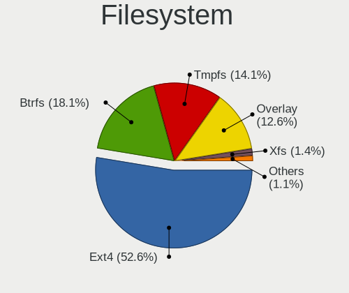
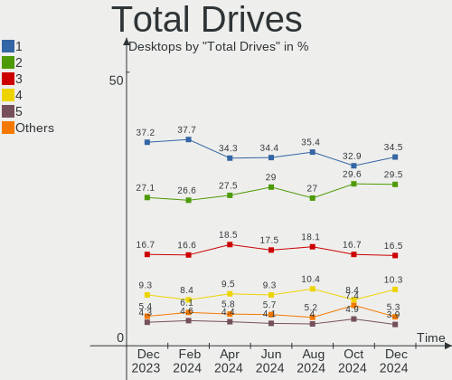
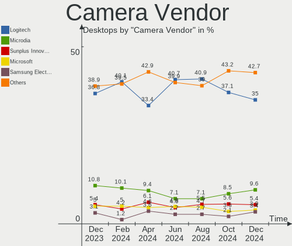

Linux Hardware Trends (Desktop)
-------------------------------

A project to identify most popular hardware characteristics and track their change
over time based on data collected by Linux users at https://Linux-Hardware.org.

Anyone can contribute to the study by uploading probes of their computers by
the [hw-probe](https://github.com/linuxhw/hw-probe) tool:

    sudo -E hw-probe -all -upload

Full-feature report is available here: https://linux-hardware.org/?view=trends&formfactor=desktop

Period: Nov, 2020.

Contents
--------

- [ OS                       ](#os)
- [ OS Family                ](#os-family)
- [ Kernel                   ](#kernel)
- [ Kernel Family            ](#kernel-family)
- [ Kernel Major Ver.        ](#kernel-major-ver)
- [ Arch                     ](#arch)
- [ DE                       ](#de)
- [ Display Server           ](#display-server)
- [ Display Manager          ](#display-manager)
- [ OS Lang                  ](#os-lang)
- [ Boot Mode                ](#boot-mode)
- [ Filesystem               ](#filesystem)
- [ Part. scheme             ](#part-scheme)
- [ Dual Boot with Linux/BSD ](#dual-boot-with-linux/bsd)
- [ Dual Boot (Win)          ](#dual-boot-win)
- [ Country                  ](#country)
- [ City                     ](#city)
- [ Vendor                   ](#vendor)
- [ Model                    ](#model)
- [ Model Family             ](#model-family)
- [ MFG Year                 ](#mfg-year)
- [ Form Factor              ](#form-factor)
- [ Secure Boot              ](#secure-boot)
- [ Coreboot                 ](#coreboot)
- [ RAM Size                 ](#ram-size)
- [ RAM Used                 ](#ram-used)
- [ Has CD-ROM               ](#has-cd-rom)
- [ Total Drives             ](#total-drives)
- [ Has Ethernet             ](#has-ethernet)
- [ Drive Vendor             ](#drive-vendor)
- [ Drive Model              ](#drive-model)
- [ HDD Vendor               ](#hdd-vendor)
- [ SSD Vendor               ](#ssd-vendor)
- [ Drive Kind               ](#drive-kind)
- [ Drive Connector          ](#drive-connector)
- [ Drive Size               ](#drive-size)
- [ Space Total              ](#space-total)
- [ Space Used               ](#space-used)
- [ Malfunc. Drives          ](#malfunc-drives)
- [ Malfunc. Drive Vendor    ](#malfunc-drive-vendor)
- [ Malfunc. HDD Vendor      ](#malfunc-hdd-vendor)
- [ Malfunc. Drive Kind      ](#malfunc-drive-kind)
- [ Failed Drives            ](#failed-drives)
- [ Failed Drive Vendor      ](#failed-drive-vendor)
- [ Drive Status             ](#drive-status)
- [ Storage Vendor           ](#storage-vendor)
- [ Storage Model            ](#storage-model)
- [ Storage Kind             ](#storage-kind)
- [ CPU Vendor               ](#cpu-vendor)
- [ CPU Model                ](#cpu-model)
- [ CPU Model Family         ](#cpu-model-family)
- [ CPU Cores                ](#cpu-cores)
- [ CPU Sockets              ](#cpu-sockets)
- [ CPU Threads              ](#cpu-threads)
- [ CPU Op-Modes             ](#cpu-op-modes)
- [ CPU Microcode            ](#cpu-microcode)
- [ CPU Microarch            ](#cpu-microarch)
- [ GPU Vendor               ](#gpu-vendor)
- [ GPU Model                ](#gpu-model)
- [ GPU Combo                ](#gpu-combo)
- [ GPU Driver               ](#gpu-driver)
- [ GPU Memory               ](#gpu-memory)
- [ Monitor Vendor           ](#monitor-vendor)
- [ Monitor Model            ](#monitor-model)
- [ Monitor Resolution       ](#monitor-resolution)
- [ Monitor Diagonal         ](#monitor-diagonal)
- [ Monitor Width            ](#monitor-width)
- [ Aspect Ratio             ](#aspect-ratio)
- [ Monitor Area             ](#monitor-area)
- [ Pixel Density            ](#pixel-density)
- [ Multiple Monitors        ](#multiple-monitors)
- [ Net Controller Vendor    ](#net-controller-vendor)
- [ Net Controller Model     ](#net-controller-model)
- [ Wireless Vendor          ](#wireless-vendor)
- [ Wireless Model           ](#wireless-model)
- [ Ethernet Vendor          ](#ethernet-vendor)
- [ Ethernet Model           ](#ethernet-model)
- [ Net Controller Kind      ](#net-controller-kind)
- [ Used Controller          ](#used-controller)
- [ NICs                     ](#nics)
- [ Memory Vendor            ](#memory-vendor)
- [ Memory Model             ](#memory-model)
- [ Memory Kind              ](#memory-kind)
- [ Memory Form Factor       ](#memory-form-factor)
- [ Memory Size              ](#memory-size)
- [ Memory Speed             ](#memory-speed)
- [ Sound Vendor             ](#sound-vendor)
- [ Sound Model              ](#sound-model)
- [ Camera Vendor            ](#camera-vendor)
- [ Camera Model             ](#camera-model)
- [ Fingerprint Vendor       ](#fingerprint-vendor)
- [ Fingerprint Model        ](#fingerprint-model)
- [ Chipcard Vendor          ](#chipcard-vendor)
- [ Chipcard Model           ](#chipcard-model)
- [ Printer Vendor           ](#printer-vendor)
- [ Printer Model            ](#printer-model)
- [ Scanner Vendor           ](#scanner-vendor)
- [ Scanner Model            ](#scanner-model)
- [ Bluetooth Vendor         ](#bluetooth-vendor)
- [ Bluetooth Model          ](#bluetooth-model)
- [ Unsupported Devices      ](#unsupported-devices)
- [ Unsupported Device Types ](#unsupported-device-types)

OS
--

Installed operating systems

| Name                         | Desktops | Percent |
|------------------------------|----------|---------|
| Ubuntu 20.04                 | 663      | 31.74%  |
| Ubuntu 20.10                 | 149      | 7.13%   |
| Ubuntu 18.04                 | 142      | 6.8%    |
| Fedora 33                    | 104      | 4.98%   |
| KDE neon 20.04               | 83       | 3.97%   |
| BlackPanther 18.1            | 82       | 3.93%   |
| ROSA R11.1                   | 76       | 3.64%   |
| Mint 20                      | 72       | 3.45%   |
| Pop!_OS 20.10                | 71       | 3.4%    |
| Manjaro                      | 44       | 2.11%   |
| Arch                         | 44       | 2.11%   |
| Manjaro 20.2                 | 42       | 2.01%   |
| ROSA R11                     | 39       | 1.87%   |
| Debian 10                    | 39       | 1.87%   |
| Mint 19.3                    | 34       | 1.63%   |
| Pop!_OS 20.04                | 33       | 1.58%   |
| ArcoLinux Rolling            | 30       | 1.44%   |
| Arch Rolling                 | 21       | 1.01%   |
| Ubuntu 16.04                 | 20       | 0.96%   |
| Debian Testing               | 18       | 0.86%   |
| Fedora 32                    | 16       | 0.77%   |
| Endless 3.9.0                | 16       | 0.77%   |
| Zorin 15                     | 15       | 0.72%   |
| Gentoo                       | 15       | 0.72%   |
| Debian                       | 9        | 0.43%   |
| CentOS 8                     | 9        | 0.43%   |
| ROSA R8.1                    | 8        | 0.38%   |
| Manjaro 20.1.2               | 8        | 0.38%   |
| LMDE 4                       | 7        | 0.34%   |
| Elementary 5.1.7             | 7        | 0.34%   |
| Gentoo 2.7                   | 6        | 0.29%   |
| Endless 3.8.7                | 6        | 0.29%   |
| BlackPanther 16.2            | 6        | 0.29%   |
| Ubuntu 19.10                 | 5        | 0.24%   |
| Peppermint 10                | 5        | 0.24%   |
| Mageia 7                     | 5        | 0.24%   |
| Fedora 31                    | 5        | 0.24%   |
| ROSA R12                     | 4        | 0.19%   |
| ROSA R10                     | 4        | 0.19%   |
| RHEL 8.3                     | 4        | 0.19%   |
| openSUSE 15.2                | 4        | 0.19%   |
| MX 19.3                      | 4        | 0.19%   |
| Kali 2020.4                  | 4        | 0.19%   |
| Garuda Rolling               | 4        | 0.19%   |
| EndeavourOS Rolling          | 4        | 0.19%   |
| ALT Linux 9.1                | 4        | 0.19%   |
| Ubuntu 21.04                 | 3        | 0.14%   |
| Solus 4.1                    | 3        | 0.14%   |
| Reborn OS                    | 3        | 0.14%   |
| Mint 19.1                    | 3        | 0.14%   |
| Artix Rolling                | 3        | 0.14%   |
| ArcoLinux                    | 3        | 0.14%   |
| Zorin 12                     | 2        | 0.1%    |
| WindowsFX 10                 | 2        | 0.1%    |
| Parrot 4.10                  | 2        | 0.1%    |
| openSUSE Tumbleweed-20201111 | 2        | 0.1%    |
| openSUSE Leap-15.2           | 2        | 0.1%    |
| openSUSE Leap-15.1           | 2        | 0.1%    |
| Kali 2020.3                  | 2        | 0.1%    |
| Garuda                       | 2        | 0.1%    |

OS Family
---------

OS without a version

| Name         | Desktops | Percent |
|--------------|----------|---------|
| Ubuntu       | 989      | 47.34%  |
| ROSA         | 132      | 6.32%   |
| Fedora       | 128      | 6.13%   |
| Mint         | 112      | 5.36%   |
| Pop!_OS      | 105      | 5.03%   |
| Manjaro      | 96       | 4.6%    |
| BlackPanther | 88       | 4.21%   |
| KDE neon     | 84       | 4.02%   |
| Debian       | 69       | 3.3%    |
| Arch         | 65       | 3.11%   |
| ArcoLinux    | 34       | 1.63%   |
| Endless      | 22       | 1.05%   |
| Gentoo       | 21       | 1.01%   |
| openSUSE     | 18       | 0.86%   |
| Zorin        | 17       | 0.81%   |
| CentOS       | 11       | 0.53%   |
| Elementary   | 8        | 0.38%   |
| LMDE         | 7        | 0.34%   |
| MX           | 6        | 0.29%   |
| Mageia       | 6        | 0.29%   |
| Kali         | 6        | 0.29%   |
| Garuda       | 6        | 0.29%   |
| ALT Linux    | 6        | 0.29%   |
| Peppermint   | 5        | 0.24%   |
| EndeavourOS  | 5        | 0.24%   |
| RHEL         | 4        | 0.19%   |
| Clear Linux  | 4        | 0.19%   |
| Solus        | 3        | 0.14%   |
| Reborn OS    | 3        | 0.14%   |
| Deepin       | 3        | 0.14%   |
| Artix        | 3        | 0.14%   |
| WindowsFX    | 2        | 0.1%    |
| Parrot       | 2        | 0.1%    |
| ClearOS      | 2        | 0.1%    |
| BunsenLabs   | 2        | 0.1%    |
| Void         | 1        | 0.05%   |
| Slackware    | 1        | 0.05%   |
| SkiffOS      | 1        | 0.05%   |
| Septor       | 1        | 0.05%   |
| Scientific   | 1        | 0.05%   |
| RED OS       | 1        | 0.05%   |
| RED          | 1        | 0.05%   |
| Parabola     | 1        | 0.05%   |
| Nitrux       | 1        | 0.05%   |
| Manualinux   | 1        | 0.05%   |
| LFS          | 1        | 0.05%   |
| Kubuntu      | 1        | 0.05%   |
| Chrome OS    | 1        | 0.05%   |
| ArchLabs     | 1        | 0.05%   |
| antergos     | 1        | 0.05%   |

Kernel
------

Version of the Linux kernel

| Version                             | Desktops | Percent |
|-------------------------------------|----------|---------|
| 5.4.0-52-generic                    | 332      | 15.89%  |
| 5.4.0-54-generic                    | 314      | 15.03%  |
| 5.4.0-53-generic                    | 175      | 8.38%   |
| 4.18.16-desktop-1bP                 | 80       | 3.83%   |
| 5.8.0-29-generic                    | 56       | 2.68%   |
| 5.8.0-26-generic                    | 54       | 2.58%   |
| 5.8.0-7630-generic                  | 48       | 2.3%    |
| 5.8.0-7625-generic                  | 41       | 1.96%   |
| 5.4.0-42-generic                    | 39       | 1.87%   |
| 4.15.0-desktop-45.1rosa-x86_64      | 33       | 1.58%   |
| 4.15.0-desktop-122.124.1rosa-x86_64 | 33       | 1.58%   |
| 5.8.18-300.fc33.x86_64              | 28       | 1.34%   |
| 4.19.0-12-amd64                     | 28       | 1.34%   |
| 5.8.18-1-MANJARO                    | 26       | 1.24%   |
| 5.9.8-200.fc33.x86_64               | 24       | 1.15%   |
| 4.15.0-122-generic                  | 24       | 1.15%   |
| 5.8.0-28-generic                    | 17       | 0.81%   |
| 5.9.3-1-MANJARO                     | 16       | 0.77%   |
| 5.8.0-14-generic                    | 16       | 0.77%   |
| 5.9.9-arch1-1                       | 15       | 0.72%   |
| 5.9.6-arch1-1                       | 15       | 0.72%   |
| 5.4.0-52-lowlatency                 | 15       | 0.72%   |
| 4.15.0-124-generic                  | 15       | 0.72%   |
| 5.9.10-200.fc33.x86_64              | 14       | 0.67%   |
| 5.9.0-1-amd64                       | 13       | 0.62%   |
| 5.8.17-300.fc33.x86_64              | 13       | 0.62%   |
| 5.9.8-arch1-1                       | 12       | 0.57%   |
| 5.8.0-25-generic                    | 12       | 0.57%   |
| 5.4.0-48-generic                    | 12       | 0.57%   |
| 5.8.16-300.fc33.x86_64              | 11       | 0.53%   |
| 5.8.16-2-MANJARO                    | 10       | 0.48%   |
| 5.4.0-51-generic                    | 10       | 0.48%   |
| 5.4.0-26-generic                    | 10       | 0.48%   |
| 4.15.0-123-generic                  | 10       | 0.48%   |
| 5.4.0-7642-generic                  | 9        | 0.43%   |
| 5.9.3-arch1-1                       | 8        | 0.38%   |
| 5.9.10-arch1-1                      | 8        | 0.38%   |
| 5.4.40-generic-1rosa-x86_64         | 8        | 0.38%   |
| 5.9.8-2-MANJARO                     | 7        | 0.34%   |
| 5.4.0-53-lowlatency                 | 7        | 0.34%   |
| 5.0.0-32-generic                    | 7        | 0.34%   |
| 4.15.0-desktop-94.1rosa-x86_64      | 7        | 0.34%   |
| 4.15.0-desktop-45.1rosa-i586        | 7        | 0.34%   |
| 5.9.10-1-MANJARO                    | 6        | 0.29%   |
| 5.8.18-200.fc32.x86_64              | 6        | 0.29%   |
| 5.8.15-301.fc33.x86_64              | 6        | 0.29%   |
| 5.8.0-30-generic                    | 6        | 0.29%   |
| 5.6.0-2-amd64                       | 6        | 0.29%   |
| 5.4.32-generic-2rosa-x86_64         | 6        | 0.29%   |
| 5.4.0-54-lowlatency                 | 6        | 0.29%   |
| 4.18.0-193.28.1.el8_2.x86_64        | 6        | 0.29%   |
| 5.9.2-arch1-1                       | 5        | 0.24%   |
| 5.9.1-1-MANJARO                     | 5        | 0.24%   |
| 5.7.19-desktop-3.mga7               | 5        | 0.24%   |
| 5.4.77-1-lts                        | 5        | 0.24%   |
| 4.9.20-desktop-pae-1bP              | 5        | 0.24%   |
| 4.9.155-nrj-desktop-1rosa-x86_64    | 5        | 0.24%   |
| 5.9.8-zen1-1-zen                    | 4        | 0.19%   |
| 5.9.6-zen1-1-zen                    | 4        | 0.19%   |
| 5.9.4-arch1-1                       | 4        | 0.19%   |

Kernel Family
-------------

Linux kernel without a distro release

| Version  | Desktops | Percent |
|----------|----------|---------|
| 5.4.0    | 951      | 45.52%  |
| 5.8.0    | 269      | 12.88%  |
| 4.15.0   | 163      | 7.8%    |
| 4.18.16  | 80       | 3.83%   |
| 5.8.18   | 66       | 3.16%   |
| 5.9.8    | 63       | 3.02%   |
| 5.9.10   | 38       | 1.82%   |
| 4.19.0   | 37       | 1.77%   |
| 5.9.0    | 30       | 1.44%   |
| 5.9.3    | 27       | 1.29%   |
| 5.9.9    | 25       | 1.2%    |
| 5.8.16   | 25       | 1.2%    |
| 5.9.6    | 24       | 1.15%   |
| 5.9.1    | 20       | 0.96%   |
| 5.8.17   | 18       | 0.86%   |
| 5.3.0    | 16       | 0.77%   |
| 5.9.11   | 15       | 0.72%   |
| 4.18.0   | 14       | 0.67%   |
| 5.4.72   | 12       | 0.57%   |
| 5.0.0    | 11       | 0.53%   |
| 5.9.2    | 10       | 0.48%   |
| 4.4.0    | 10       | 0.48%   |
| 5.8.15   | 9        | 0.43%   |
| 5.4.77   | 9        | 0.43%   |
| 5.4.40   | 9        | 0.43%   |
| 5.10.0   | 8        | 0.38%   |
| 5.6.0    | 7        | 0.34%   |
| 5.4.32   | 7        | 0.34%   |
| 5.9.4    | 6        | 0.29%   |
| 5.7.19   | 6        | 0.29%   |
| 4.9.20   | 6        | 0.29%   |
| 5.4.78   | 5        | 0.24%   |
| 5.3.18   | 5        | 0.24%   |
| 4.9.155  | 5        | 0.24%   |
| 5.8.14   | 4        | 0.19%   |
| 5.8.13   | 4        | 0.19%   |
| 5.4.73   | 4        | 0.19%   |
| 4.9.60   | 4        | 0.19%   |
| 3.10.0   | 4        | 0.19%   |
| 5.9.7    | 3        | 0.14%   |
| 5.7.0    | 3        | 0.14%   |
| 5.6.19   | 3        | 0.14%   |
| 5.4.74   | 3        | 0.14%   |
| 5.4.68   | 3        | 0.14%   |
| 4.1.38   | 3        | 0.14%   |
| 5.8.11   | 2        | 0.1%    |
| 5.6.14   | 2        | 0.1%    |
| 5.4.75   | 2        | 0.1%    |
| 5.4.65   | 2        | 0.1%    |
| 4.19.128 | 2        | 0.1%    |
| 4.12.14  | 2        | 0.1%    |
| 5.9.5    | 1        | 0.05%   |
| 5.8.10   | 1        | 0.05%   |
| 5.7.9    | 1        | 0.05%   |
| 5.7.14   | 1        | 0.05%   |
| 5.7.13   | 1        | 0.05%   |
| 5.6.15   | 1        | 0.05%   |
| 5.6.13   | 1        | 0.05%   |
| 5.6.11   | 1        | 0.05%   |
| 5.5.4    | 1        | 0.05%   |

Kernel Major Ver.
-----------------

Linux kernel major version

| Version | Desktops | Percent |
|---------|----------|---------|
| 5.4     | 1013     | 48.49%  |
| 5.8     | 398      | 19.05%  |
| 5.9     | 262      | 12.54%  |
| 4.15    | 163      | 7.8%    |
| 4.18    | 94       | 4.5%    |
| 4.19    | 44       | 2.11%   |
| 5.3     | 22       | 1.05%   |
| 4.9     | 18       | 0.86%   |
| 5.6     | 15       | 0.72%   |
| 5.7     | 12       | 0.57%   |
| 5.0     | 12       | 0.57%   |
| 4.4     | 11       | 0.53%   |
| 5.10    | 8        | 0.38%   |
| 3.10    | 5        | 0.24%   |
| 4.1     | 3        | 0.14%   |
| 4.12    | 2        | 0.1%    |
| 5.5     | 1        | 0.05%   |
| 4.20    | 1        | 0.05%   |
| 4.2     | 1        | 0.05%   |
| 4.16    | 1        | 0.05%   |
| 4.13    | 1        | 0.05%   |
| 3.13    | 1        | 0.05%   |
| 2.6     | 1        | 0.05%   |

Arch
----

OS architecture (x86_64, i586, etc.)

| Name   | Desktops | Percent |
|--------|----------|---------|
| x86_64 | 2029     | 97.13%  |
| i686   | 60       | 2.87%   |

DE
--

Desktop Environment

| Name             | Desktops | Percent |
|------------------|----------|---------|
| GNOME            | 1017     | 48.68%  |
| KDE5             | 230      | 11.01%  |
| XFCE             | 183      | 8.76%   |
| KDE              | 171      | 8.19%   |
| Unknown          | 107      | 5.12%   |
| X-Cinnamon       | 92       | 4.4%    |
| KDE4             | 85       | 4.07%   |
| MATE             | 49       | 2.35%   |
| Cinnamon         | 30       | 1.44%   |
| LXQt             | 26       | 1.24%   |
| Unity            | 20       | 0.96%   |
| LXDE             | 14       | 0.67%   |
| Deepin           | 12       | 0.57%   |
| i3               | 11       | 0.53%   |
| Budgie           | 10       | 0.48%   |
| GNOME Flashback  | 9        | 0.43%   |
| Pantheon         | 8        | 0.38%   |
| GNOME Classic    | 7        | 0.34%   |
| bspwm            | 2        | 0.1%    |
| awesome          | 2        | 0.1%    |
| xmonad           | 1        | 0.05%   |
| sway             | 1        | 0.05%   |
| qtile            | 1        | 0.05%   |
| lightdm-xsession | 1        | 0.05%   |

Display Server
--------------

X11 or Wayland

| Name        | Desktops | Percent |
|-------------|----------|---------|
| X11         | 1865     | 89.28%  |
| Wayland     | 118      | 5.65%   |
| Unknown     | 59       | 2.82%   |
| Tty         | 44       | 2.11%   |
| Web         | 2        | 0.1%    |
| Unspecified | 1        | 0.05%   |

Display Manager
---------------

SDDM, LightDM, etc.

| Name    | Desktops | Percent |
|---------|----------|---------|
| Unknown | 1375     | 65.82%  |
| SDDM    | 238      | 11.39%  |
| GDM     | 179      | 8.57%   |
| TDM     | 147      | 7.04%   |
| KDM     | 86       | 4.12%   |
| LightDM | 50       | 2.39%   |
| SLiM    | 5        | 0.24%   |
| XDM     | 3        | 0.14%   |
| LXDM    | 2        | 0.1%    |
| NODM    | 1        | 0.05%   |
| Ly      | 1        | 0.05%   |
| LDM     | 1        | 0.05%   |
| GDM3    | 1        | 0.05%   |

OS Lang
-------

Language

| Lang       | Desktops | Percent |
|------------|----------|---------|
| en_US      | 691      | 33.08%  |
| de_DE      | 179      | 8.57%   |
| Unknown    | 158      | 7.56%   |
| ru_RU      | 135      | 6.46%   |
| en_GB      | 112      | 5.36%   |
| fr_FR      | 89       | 4.26%   |
| pt_BR      | 76       | 3.64%   |
| it_IT      | 71       | 3.4%    |
| es_ES      | 51       | 2.44%   |
| pl_PL      | 42       | 2.01%   |
| en_CA      | 41       | 1.96%   |
| en_US.utf8 | 36       | 1.72%   |
| en_AU      | 31       | 1.48%   |
| C          | 25       | 1.2%    |
| en_IN      | 23       | 1.1%    |
| nl_NL      | 20       | 0.96%   |
| es_AR      | 18       | 0.86%   |
| de_DE.utf8 | 17       | 0.81%   |
| cs_CZ      | 17       | 0.81%   |
| ja_JP      | 16       | 0.77%   |
| de_AT      | 14       | 0.67%   |
| hu_HU      | 12       | 0.57%   |
| sv_SE      | 11       | 0.53%   |
| en_ZA      | 9        | 0.43%   |
| es_MX      | 8        | 0.38%   |
| en_NZ      | 8        | 0.38%   |
| uk_UA      | 7        | 0.34%   |
| ru_UA      | 7        | 0.34%   |
| ro_RO      | 7        | 0.34%   |
| es_CO      | 7        | 0.34%   |
| en_GB.utf8 | 7        | 0.34%   |
| fr_BE      | 6        | 0.29%   |
| fi_FI      | 6        | 0.29%   |
| el_GR      | 6        | 0.29%   |
| zh_TW      | 5        | 0.24%   |
| fr_FR.utf8 | 5        | 0.24%   |
| fr_CA      | 5        | 0.24%   |
| de_CH      | 5        | 0.24%   |
| C          | 5        | 0.24%   |
| zh_CN      | 4        | 0.19%   |
| ru_RU.UTF8 | 4        | 0.19%   |
| nl_BE      | 4        | 0.19%   |
| ko_KR      | 4        | 0.19%   |
| pt_PT      | 3        | 0.14%   |
| lt_LT      | 3        | 0.14%   |
| es_VE      | 3        | 0.14%   |
| en_IN      | 3        | 0.14%   |
| da_DK      | 3        | 0.14%   |
| C.UTF8     | 3        | 0.14%   |
| tr_TR      | 2        | 0.1%    |
| sv_SE.utf8 | 2        | 0.1%    |
| sr_RS      | 2        | 0.1%    |
| sl_SI      | 2        | 0.1%    |
| sk_SK      | 2        | 0.1%    |
| pt_PT.utf8 | 2        | 0.1%    |
| pt_BR.utf8 | 2        | 0.1%    |
| it_IT.utf8 | 2        | 0.1%    |
| he_IL      | 2        | 0.1%    |
| fr_CH      | 2        | 0.1%    |
| es_NI      | 2        | 0.1%    |

Boot Mode
---------

EFI or BIOS

| Mode | Desktops | Percent |
|------|----------|---------|
| BIOS | 1380     | 66.06%  |
| EFI  | 709      | 33.94%  |

Filesystem
----------

Type of filesystem

| Type     | Desktops | Percent |
|----------|----------|---------|
| Ext4     | 1785     | 85.45%  |
| Btrfs    | 115      | 5.51%   |
| Overlay  | 106      | 5.07%   |
| Xfs      | 40       | 1.91%   |
| Zfs      | 16       | 0.77%   |
| Ext2     | 8        | 0.38%   |
| F2fs     | 7        | 0.34%   |
| Ext3     | 7        | 0.34%   |
| Unknown  | 2        | 0.1%    |
| Rootfs   | 1        | 0.05%   |
| Reiserfs | 1        | 0.05%   |
| Jfs      | 1        | 0.05%   |

Part. scheme
------------

Scheme of partitioning

| Type    | Desktops | Percent |
|---------|----------|---------|
| Unknown | 1351     | 64.67%  |
| GPT     | 463      | 22.16%  |
| MBR     | 275      | 13.16%  |

Dual Boot with Linux/BSD
------------------------

Hosting more than one Linux/BSD

| Dual boot | Desktops | Percent |
|-----------|----------|---------|
| No        | 1729     | 82.77%  |
| Yes       | 360      | 17.23%  |

Dual Boot (Win)
---------------

Hosting Linux and Windows

| Dual boot | Desktops | Percent |
|-----------|----------|---------|
| No        | 1361     | 65.15%  |
| Yes       | 728      | 34.85%  |

Country
-------

Geographic location (country)

| Country            | Desktops | Percent |
|--------------------|----------|---------|
| USA                | 383      | 18.33%  |
| Germany            | 247      | 11.82%  |
| Russia             | 186      | 8.9%    |
| Italy              | 109      | 5.22%   |
| France             | 104      | 4.98%   |
| Brazil             | 103      | 4.93%   |
| UK                 | 86       | 4.12%   |
| Hungary            | 73       | 3.49%   |
| Spain              | 66       | 3.16%   |
| Canada             | 64       | 3.06%   |
| Poland             | 56       | 2.68%   |
| Netherlands        | 43       | 2.06%   |
| Ukraine            | 36       | 1.72%   |
| Australia          | 31       | 1.48%   |
| India              | 30       | 1.44%   |
| Belgium            | 27       | 1.29%   |
| Austria            | 26       | 1.24%   |
| Romania            | 25       | 1.2%    |
| Greece             | 24       | 1.15%   |
| Argentina          | 23       | 1.1%    |
| Sweden             | 22       | 1.05%   |
| Finland            | 21       | 1.01%   |
| Japan              | 18       | 0.86%   |
| Czech Republic     | 17       | 0.81%   |
| Switzerland        | 16       | 0.77%   |
| Mexico             | 16       | 0.77%   |
| South Africa       | 15       | 0.72%   |
| Serbia             | 14       | 0.67%   |
| New Zealand        | 12       | 0.57%   |
| Israel             | 12       | 0.57%   |
| Indonesia          | 10       | 0.48%   |
| Belarus            | 9        | 0.43%   |
| Norway             | 8        | 0.38%   |
| China              | 8        | 0.38%   |
| Taiwan             | 7        | 0.34%   |
| Slovenia           | 7        | 0.34%   |
| Philippines        | 7        | 0.34%   |
| Lithuania          | 7        | 0.34%   |
| Colombia           | 7        | 0.34%   |
| Portugal           | 6        | 0.29%   |
| Denmark            | 6        | 0.29%   |
| Slovakia           | 5        | 0.24%   |
| Singapore          | 5        | 0.24%   |
| Bulgaria           | 5        | 0.24%   |
| Turkey             | 4        | 0.19%   |
| Puerto Rico        | 4        | 0.19%   |
| Latvia             | 4        | 0.19%   |
| Korea, Republic of | 4        | 0.19%   |
| Iran               | 4        | 0.19%   |
| Hong Kong          | 4        | 0.19%   |
| Unknown            | 4        | 0.19%   |
| Venezuela          | 3        | 0.14%   |
| Ireland            | 3        | 0.14%   |
| Iceland            | 3        | 0.14%   |
| Algeria            | 3        | 0.14%   |
| South Korea        | 2        | 0.1%    |
| Saudi Arabia       | 2        | 0.1%    |
| Nicaragua          | 2        | 0.1%    |
| Morocco            | 2        | 0.1%    |
| Malaysia           | 2        | 0.1%    |

City
----

Geographic location (city)

| City              | Desktops | Percent |
|-------------------|----------|---------|
| Moscow            | 33       | 1.58%   |
| Budapest          | 26       | 1.24%   |
| St Petersburg     | 19       | 0.91%   |
| Parabiago         | 16       | 0.77%   |
| São Paulo        | 15       | 0.72%   |
| Berlin            | 15       | 0.72%   |
| Vienna            | 14       | 0.67%   |
| Athens            | 13       | 0.62%   |
| Paris             | 12       | 0.57%   |
| Helsinki          | 12       | 0.57%   |
| Bucharest         | 12       | 0.57%   |
| Rio de Janeiro    | 10       | 0.48%   |
| Warsaw            | 9        | 0.43%   |
| Madrid            | 9        | 0.43%   |
| London            | 9        | 0.43%   |
| Krasnodar         | 9        | 0.43%   |
| Ekaterinburg      | 9        | 0.43%   |
| Milan             | 8        | 0.38%   |
| Kyiv              | 8        | 0.38%   |
| Hamburg           | 8        | 0.38%   |
| Toronto           | 7        | 0.34%   |
| Thessaloniki      | 7        | 0.34%   |
| Rome              | 7        | 0.34%   |
| Krakow            | 7        | 0.34%   |
| Johannesburg      | 7        | 0.34%   |
| Bogotá           | 7        | 0.34%   |
| Barcelona         | 7        | 0.34%   |
| Wrocław          | 6        | 0.29%   |
| Sydney            | 6        | 0.29%   |
| Seattle           | 6        | 0.29%   |
| Miami             | 6        | 0.29%   |
| Genoa             | 6        | 0.29%   |
| Wahroonga         | 5        | 0.24%   |
| Vancouver         | 5        | 0.24%   |
| Valencia          | 5        | 0.24%   |
| Stuttgart         | 5        | 0.24%   |
| Orlando           | 5        | 0.24%   |
| Nizhniy Novgorod  | 5        | 0.24%   |
| Munich            | 5        | 0.24%   |
| Montreal          | 5        | 0.24%   |
| Minsk             | 5        | 0.24%   |
| Leipzig           | 5        | 0.24%   |
| Jakarta           | 5        | 0.24%   |
| Ivanovo           | 5        | 0.24%   |
| Frankfurt am Main | 5        | 0.24%   |
| Dallas            | 5        | 0.24%   |
| Chicago           | 5        | 0.24%   |
| Charlotte         | 5        | 0.24%   |
| Buenos Aires      | 5        | 0.24%   |
| Amsterdam         | 5        | 0.24%   |
| Łódź           | 4        | 0.19%   |
| Wateringen        | 4        | 0.19%   |
| Voronezh          | 4        | 0.19%   |
| Vladivostok       | 4        | 0.19%   |
| Tel Aviv          | 4        | 0.19%   |
| Singapore         | 4        | 0.19%   |
| Riga              | 4        | 0.19%   |
| Richmond          | 4        | 0.19%   |
| Prague            | 4        | 0.19%   |
| Portland          | 4        | 0.19%   |

Vendor
------

Motherboard manufacturer

| Name                                   | Desktops | Percent |
|----------------------------------------|----------|---------|
| ASUSTek Computer                       | 529      | 25.32%  |
| Gigabyte Technology                    | 425      | 20.34%  |
| MSI                                    | 240      | 11.49%  |
| ASRock                                 | 194      | 9.29%   |
| Dell                                   | 145      | 6.94%   |
| Hewlett-Packard                        | 140      | 6.7%    |
| Lenovo                                 | 72       | 3.45%   |
| Intel                                  | 49       | 2.35%   |
| Acer                                   | 47       | 2.25%   |
| Unknown                                | 36       | 1.72%   |
| Pegatron                               | 22       | 1.05%   |
| Fujitsu                                | 20       | 0.96%   |
| Foxconn                                | 17       | 0.81%   |
| Supermicro                             | 16       | 0.77%   |
| Biostar                                | 15       | 0.72%   |
| Medion                                 | 14       | 0.67%   |
| ECS                                    | 14       | 0.67%   |
| Fujitsu Siemens                        | 8        | 0.38%   |
| Apple                                  | 7        | 0.34%   |
| TYAN Computer                          | 5        | 0.24%   |
| Gateway                                | 5        | 0.24%   |
| Alienware                              | 5        | 0.24%   |
| Positivo                               | 4        | 0.19%   |
| Packard Bell                           | 4        | 0.19%   |
| NEC Computers                          | 4        | 0.19%   |
| Wistron                                | 3        | 0.14%   |
| OEM                                    | 3        | 0.14%   |
| Huanan                                 | 3        | 0.14%   |
| eMachines                              | 3        | 0.14%   |
| Shuttle                                | 2        | 0.1%    |
| PCWare                                 | 2        | 0.1%    |
| Nvidia                                 | 2        | 0.1%    |
| Megaware                               | 2        | 0.1%    |
| Inventec                               | 2        | 0.1%    |
| Colorful Technology                    | 2        | 0.1%    |
| ABIT                                   | 2        | 0.1%    |
| ZOTAC                                  | 1        | 0.05%   |
| SYWZ                                   | 1        | 0.05%   |
| System76                               | 1        | 0.05%   |
| Semp Toshiba                           | 1        | 0.05%   |
| Rockwell Automation/Allen-Bradley      | 1        | 0.05%   |
| Quanta                                 | 1        | 0.05%   |
| PCChips                                | 1        | 0.05%   |
| PC Partner Limited                     | 1        | 0.05%   |
| NEXCOM                                 | 1        | 0.05%   |
| NCR                                    | 1        | 0.05%   |
| Maxtang                                | 1        | 0.05%   |
| LattePanda                             | 1        | 0.05%   |
| Kobian                                 | 1        | 0.05%   |
| J2 Retail Systems                      | 1        | 0.05%   |
| iRU                                    | 1        | 0.05%   |
| INTELBRAS                              | 1        | 0.05%   |
| ICP / iEi                              | 1        | 0.05%   |
| IBM                                    | 1        | 0.05%   |
| HOUTER                                 | 1        | 0.05%   |
| HARDKERNEL                             | 1        | 0.05%   |
| EMAXX TECHNOLOGY                       | 1        | 0.05%   |
| EAGLE EYE NETWORKS                     | 1        | 0.05%   |
| Desenvolvido para Positivo Informatica | 1        | 0.05%   |
| BANGHO                                 | 1        | 0.05%   |

Model
-----

Motherboard model

| Name                           | Desktops | Percent |
|--------------------------------|----------|---------|
| ASUS All Series                | 52       | 2.49%   |
| Unknown                        | 39       | 1.87%   |
| HP EliteDesk 800 G1 SFF        | 14       | 0.67%   |
| MSI MS-7B86                    | 12       | 0.57%   |
| Dell OptiPlex 3020             | 12       | 0.57%   |
| Gigabyte B450M DS3H            | 11       | 0.53%   |
| ASUS TUF GAMING X570-PLUS      | 11       | 0.53%   |
| ASUS PRIME B450M-A             | 10       | 0.48%   |
| ASUS M5A78L-M/USB3             | 10       | 0.48%   |
| MSI MS-7C02                    | 9        | 0.43%   |
| Gigabyte 970A-DS3P             | 9        | 0.43%   |
| MSI MS-7C37                    | 8        | 0.38%   |
| MSI MS-7A38                    | 8        | 0.38%   |
| MSI MS-7817                    | 8        | 0.38%   |
| Dell OptiPlex 7010             | 8        | 0.38%   |
| ASUS PRIME X370-PRO            | 8        | 0.38%   |
| Supermicro H8DM8-2             | 7        | 0.34%   |
| Gigabyte B450M S2H             | 7        | 0.34%   |
| Dell OptiPlex 755              | 7        | 0.34%   |
| ASUS PRIME A320M-K             | 7        | 0.34%   |
| ASUS M5A97 R2.0                | 7        | 0.34%   |
| ASRock B450M Pro4              | 7        | 0.34%   |
| MSI MS-7C91                    | 6        | 0.29%   |
| Gigabyte X570 AORUS ELITE      | 6        | 0.29%   |
| Gigabyte GA-78LMT-S2P          | 6        | 0.29%   |
| Gigabyte A320M-S2H             | 6        | 0.29%   |
| MSI MS-7721                    | 5        | 0.24%   |
| MSI MS-7693                    | 5        | 0.24%   |
| HP Z230 Tower Workstation      | 5        | 0.24%   |
| HP Compaq Elite 8300 SFF       | 5        | 0.24%   |
| HP Compaq 8100 Elite SFF PC    | 5        | 0.24%   |
| Gigabyte H81M-S2H              | 5        | 0.24%   |
| Gigabyte H61M-S1               | 5        | 0.24%   |
| Gigabyte B550 AORUS ELITE      | 5        | 0.24%   |
| Gigabyte B450 AORUS M          | 5        | 0.24%   |
| Gigabyte AB350-Gaming 3        | 5        | 0.24%   |
| Dell OptiPlex 790              | 5        | 0.24%   |
| Dell OptiPlex 745              | 5        | 0.24%   |
| ASUS Z170 PRO GAMING           | 5        | 0.24%   |
| ASUS ROG STRIX X570-E GAMING   | 5        | 0.24%   |
| ASUS ROG STRIX B550-F GAMING   | 5        | 0.24%   |
| ASUS PRIME B450-PLUS           | 5        | 0.24%   |
| ASUS P5KPL-CM                  | 5        | 0.24%   |
| MSI MS-7C84                    | 4        | 0.19%   |
| MSI MS-7C35                    | 4        | 0.19%   |
| MSI MS-7B89                    | 4        | 0.19%   |
| MSI MS-7B79                    | 4        | 0.19%   |
| MSI MS-7996                    | 4        | 0.19%   |
| MSI MS-7758                    | 4        | 0.19%   |
| MSI MS-7599                    | 4        | 0.19%   |
| HP Z440 Workstation            | 4        | 0.19%   |
| HP Compaq 8200 Elite SFF PC    | 4        | 0.19%   |
| HP Compaq 6000 Pro MT PC       | 4        | 0.19%   |
| Gigabyte Z390 UD               | 4        | 0.19%   |
| Gigabyte H61M-S2PV             | 4        | 0.19%   |
| Gigabyte GA-78LMT-USB3 6.0     | 4        | 0.19%   |
| Gigabyte GA-78LMT-USB3         | 4        | 0.19%   |
| Gigabyte B450 I AORUS PRO WIFI | 4        | 0.19%   |
| Gigabyte B450 AORUS PRO WIFI   | 4        | 0.19%   |
| Gigabyte B250M-D3H             | 4        | 0.19%   |

Model Family
------------

Motherboard model prefix

| Name                    | Desktops | Percent |
|-------------------------|----------|---------|
| ASUS PRIME              | 91       | 4.36%   |
| Dell OptiPlex           | 75       | 3.59%   |
| HP Compaq               | 55       | 2.63%   |
| ASUS All                | 52       | 2.49%   |
| Lenovo ThinkCentre      | 48       | 2.3%    |
| ASUS ROG                | 44       | 2.11%   |
| Unknown                 | 39       | 1.87%   |
| Acer Aspire             | 29       | 1.39%   |
| ASUS TUF                | 27       | 1.29%   |
| ASUS M5A78L-M           | 22       | 1.05%   |
| HP EliteDesk            | 21       | 1.01%   |
| Gigabyte X570           | 21       | 1.01%   |
| Dell Inspiron           | 21       | 1.01%   |
| Gigabyte B450M          | 19       | 0.91%   |
| Dell Precision          | 19       | 0.91%   |
| Gigabyte B450           | 16       | 0.77%   |
| Fujitsu ESPRIMO         | 16       | 0.77%   |
| ASUS M5A97              | 16       | 0.77%   |
| ASRock B450             | 13       | 0.62%   |
| Acer Veriton            | 13       | 0.62%   |
| MSI MS-7B86             | 12       | 0.57%   |
| Gigabyte GA-78LMT-USB3  | 11       | 0.53%   |
| ASUS SABERTOOTH         | 11       | 0.53%   |
| ASRock B450M            | 11       | 0.53%   |
| HP ProDesk              | 10       | 0.48%   |
| Gigabyte A320M-S2H      | 10       | 0.48%   |
| Gigabyte 970A-DS3P      | 10       | 0.48%   |
| MSI MS-7C02             | 9        | 0.43%   |
| Lenovo IdeaCentre       | 9        | 0.43%   |
| Gigabyte Z390           | 9        | 0.43%   |
| MSI MS-7C37             | 8        | 0.38%   |
| MSI MS-7A38             | 8        | 0.38%   |
| MSI MS-7817             | 8        | 0.38%   |
| Dell Vostro             | 8        | 0.38%   |
| ASUS P8H61-M            | 8        | 0.38%   |
| ASUS Maximus            | 8        | 0.38%   |
| Supermicro H8DM8-2      | 7        | 0.34%   |
| Gigabyte H310M          | 7        | 0.34%   |
| ASUS P8Z77-V            | 7        | 0.34%   |
| MSI MS-7C91             | 6        | 0.29%   |
| HP Z230                 | 6        | 0.29%   |
| Gigabyte GA-78LMT-S2P   | 6        | 0.29%   |
| Fujitsu Siemens ESPRIMO | 6        | 0.29%   |
| Dell XPS                | 6        | 0.29%   |
| ASUS STRIX              | 6        | 0.29%   |
| ASRock X99              | 6        | 0.29%   |
| MSI MS-7721             | 5        | 0.24%   |
| MSI MS-7693             | 5        | 0.24%   |
| Lenovo ThinkStation     | 5        | 0.24%   |
| HP Pavilion             | 5        | 0.24%   |
| Gigabyte X470           | 5        | 0.24%   |
| Gigabyte TRX40          | 5        | 0.24%   |
| Gigabyte H81M-S2H       | 5        | 0.24%   |
| Gigabyte H61M-S1        | 5        | 0.24%   |
| Gigabyte B550           | 5        | 0.24%   |
| Gigabyte AB350-Gaming   | 5        | 0.24%   |
| Dell Studio             | 5        | 0.24%   |
| ASUS Z170               | 5        | 0.24%   |
| ASUS P9X79              | 5        | 0.24%   |
| ASUS P6T                | 5        | 0.24%   |

MFG Year
--------

Motherboard manufacture year

| Year    | Desktops | Percent |
|---------|----------|---------|
| 2020    | 271      | 12.97%  |
| 2019    | 245      | 11.73%  |
| 2018    | 206      | 9.86%   |
| 2013    | 163      | 7.8%    |
| 2014    | 157      | 7.52%   |
| 2012    | 156      | 7.47%   |
| 2015    | 134      | 6.41%   |
| 2011    | 133      | 6.37%   |
| 2009    | 131      | 6.27%   |
| 2010    | 130      | 6.22%   |
| 2016    | 92       | 4.4%    |
| 2017    | 80       | 3.83%   |
| 2008    | 79       | 3.78%   |
| 2007    | 60       | 2.87%   |
| 2006    | 22       | 1.05%   |
| 2005    | 19       | 0.91%   |
| Unknown | 5        | 0.24%   |
| 2004    | 3        | 0.14%   |
| 2003    | 1        | 0.05%   |
| 2002    | 1        | 0.05%   |
| 2001    | 1        | 0.05%   |

Form Factor
-----------

Physical design of the computer

| Name    | Desktops | Percent |
|---------|----------|---------|
| Desktop | 2089     | 100%    |

Secure Boot
-----------

Enabled or disabled

| State    | Desktops | Percent |
|----------|----------|---------|
| Disabled | 2057     | 98.47%  |
| Enabled  | 32       | 1.53%   |

Coreboot
--------

Have coreboot on board

| Used | Desktops | Percent |
|------|----------|---------|
| No   | 2089     | 100%    |

RAM Size
--------

Total RAM memory

| Size in GB  | Desktops | Percent |
|-------------|----------|---------|
| 16.01-24.0  | 526      | 25.18%  |
| 8.01-16.0   | 428      | 20.49%  |
| 3.01-4.0    | 345      | 16.52%  |
| 4.01-8.0    | 271      | 12.97%  |
| 32.01-64.0  | 237      | 11.35%  |
| 64.01-256.0 | 97       | 4.64%   |
| 1.01-2.0    | 88       | 4.21%   |
| 24.01-32.0  | 55       | 2.63%   |
| 2.01-3.0    | 28       | 1.34%   |
| 0.01-1.0    | 14       | 0.67%   |

RAM Used
--------

Used RAM memory

| Used GB    | Desktops | Percent |
|------------|----------|---------|
| 1.01-2.0   | 799      | 38.25%  |
| 2.01-3.0   | 431      | 20.63%  |
| 4.01-8.0   | 291      | 13.93%  |
| 0.01-1.0   | 247      | 11.82%  |
| 3.01-4.0   | 199      | 9.53%   |
| 8.01-16.0  | 93       | 4.45%   |
| 16.01-24.0 | 15       | 0.72%   |
| 32.01-64.0 | 6        | 0.29%   |
| 24.01-32.0 | 5        | 0.24%   |
| Unknown    | 3        | 0.14%   |

Has CD-ROM
----------

Has CD-ROM on board

| Presented | Desktops | Percent |
|-----------|----------|---------|
| Yes       | 1092     | 52.27%  |
| No        | 997      | 47.73%  |

Total Drives
------------

Number of drives on board

| Drives | Desktops | Percent |
|--------|----------|---------|
| 1      | 814      | 38.97%  |
| 2      | 624      | 29.87%  |
| 3      | 326      | 15.61%  |
| 4      | 172      | 8.23%   |
| 5      | 72       | 3.45%   |
| 6      | 36       | 1.72%   |
| 7      | 18       | 0.86%   |
| 0      | 13       | 0.62%   |
| 9      | 5        | 0.24%   |
| 8      | 5        | 0.24%   |
| 16     | 1        | 0.05%   |
| 13     | 1        | 0.05%   |
| 11     | 1        | 0.05%   |
| 10     | 1        | 0.05%   |

Has Ethernet
------------

Has Ethernet on board

| Presented | Desktops | Percent |
|-----------|----------|---------|
| Yes       | 2067     | 98.95%  |
| No        | 22       | 1.05%   |

Drive Vendor
------------

Hard drive vendors

| Vendor                    | Desktops | Drives | Percent |
|---------------------------|----------|--------|---------|
| Seagate                   | 775      | 996    | 20.72%  |
| WDC                       | 761      | 986    | 20.35%  |
| Samsung Electronics       | 557      | 729    | 14.89%  |
| Kingston                  | 224      | 245    | 5.99%   |
| Toshiba                   | 212      | 237    | 5.67%   |
| Hitachi                   | 158      | 183    | 4.22%   |
| Crucial                   | 151      | 167    | 4.04%   |
| SanDisk                   | 123      | 138    | 3.29%   |
| Intel                     | 69       | 78     | 1.84%   |
| Phison                    | 61       | 68     | 1.63%   |
| A-DATA Technology         | 56       | 61     | 1.5%    |
| Unknown                   | 47       | 50     | 1.26%   |
| OCZ                       | 39       | 40     | 1.04%   |
| Maxtor                    | 33       | 34     | 0.88%   |
| Intenso                   | 33       | 35     | 0.88%   |
| Patriot                   | 32       | 32     | 0.86%   |
| HGST                      | 28       | 39     | 0.75%   |
| PNY                       | 24       | 25     | 0.64%   |
| Transcend                 | 22       | 23     | 0.59%   |
| Corsair                   | 22       | 22     | 0.59%   |
| China                     | 21       | 22     | 0.56%   |
| Micron/Crucial Technology | 20       | 21     | 0.53%   |
| GOODRAM                   | 18       | 18     | 0.48%   |
| XPG                       | 16       | 17     | 0.43%   |
| SPCC                      | 15       | 17     | 0.4%    |
| PLEXTOR                   | 15       | 18     | 0.4%    |
| Silicon Motion            | 13       | 13     | 0.35%   |
| Micron Technology         | 13       | 13     | 0.35%   |
| Team                      | 9        | 9      | 0.24%   |
| SK Hynix                  | 8        | 8      | 0.21%   |
| ASMT                      | 8        | 10     | 0.21%   |
| LITEON                    | 7        | 8      | 0.19%   |
| Apacer                    | 7        | 7      | 0.19%   |
| Gigabyte Technology       | 6        | 6      | 0.16%   |
| Fujitsu                   | 6        | 6      | 0.16%   |
| Realtek Semiconductor     | 5        | 5      | 0.13%   |
| Leven                     | 5        | 5      | 0.13%   |
| KingSpec                  | 5        | 6      | 0.13%   |
| JMicron                   | 5        | 5      | 0.13%   |
| Hewlett-Packard           | 5        | 5      | 0.13%   |
| AMD                       | 5        | 5      | 0.13%   |
| Mushkin                   | 4        | 4      | 0.11%   |
| LITEONIT                  | 4        | 4      | 0.11%   |
| Lexar                     | 4        | 4      | 0.11%   |
| KingDian                  | 4        | 4      | 0.11%   |
| ASMT109x                  | 4        | 4      | 0.11%   |
| WD MediaMax               | 3        | 3      | 0.08%   |
| TCSUNBOW                  | 3        | 3      | 0.08%   |
| SABRENT                   | 3        | 3      | 0.08%   |
| Msft                      | 3        | 7      | 0.08%   |
| SMI                       | 2        | 2      | 0.05%   |
| Netac                     | 2        | 2      | 0.05%   |
| Lite-On                   | 2        | 2      | 0.05%   |
| LDLC                      | 2        | 2      | 0.05%   |
| Kingmax                   | 2        | 2      | 0.05%   |
| KingFast                  | 2        | 2      | 0.05%   |
| InnoLite                  | 2        | 2      | 0.05%   |
| IBM                       | 2        | 2      | 0.05%   |
| HPE                       | 2        | 2      | 0.05%   |
| External                  | 2        | 2      | 0.05%   |

Drive Model
-----------

Hard drive models

| Model                              | Desktops | Percent |
|------------------------------------|----------|---------|
| Seagate ST500DM002-1BD142 500GB    | 64       | 1.47%   |
| WDC WD10EZEX-08WN4A0 1TB           | 54       | 1.24%   |
| Seagate ST1000DM010-2EP102 1TB     | 54       | 1.24%   |
| Samsung SSD 860 EVO 500GB          | 52       | 1.19%   |
| Kingston SA400S37240G 240GB SSD    | 50       | 1.15%   |
| Samsung SSD 850 EVO 250GB          | 49       | 1.12%   |
| Samsung NVMe SSD Drive 500GB       | 40       | 0.92%   |
| Toshiba DT01ACA100 1TB             | 35       | 0.8%    |
| Seagate ST2000DM008-2FR102 2TB     | 35       | 0.8%    |
| Samsung SSD 850 EVO 500GB          | 34       | 0.78%   |
| Kingston SA400S37120G 120GB SSD    | 34       | 0.78%   |
| Seagate ST1000DM003-1CH162 1TB     | 33       | 0.76%   |
| Toshiba DT01ACA050 500GB           | 32       | 0.73%   |
| Seagate ST3500418AS 500GB          | 31       | 0.71%   |
| Kingston SA400S37480G 480GB SSD    | 29       | 0.67%   |
| Seagate ST2000DM001-1ER164 2TB     | 28       | 0.64%   |
| Seagate ST2000DM006-2DM164 2TB     | 27       | 0.62%   |
| Crucial CT500MX500SSD1 500GB       | 27       | 0.62%   |
| Samsung SSD 860 EVO 1TB            | 26       | 0.6%    |
| Seagate ST31000528AS 1TB           | 25       | 0.57%   |
| Kingston SV300S37A120G 120GB SSD   | 25       | 0.57%   |
| Seagate ST1000DM003-1ER162 1TB     | 23       | 0.53%   |
| Samsung SSD 860 EVO 250GB          | 22       | 0.5%    |
| Samsung SSD 840 EVO 250GB          | 22       | 0.5%    |
| WDC WDS240G2G0A-00JH30 240GB SSD   | 21       | 0.48%   |
| Samsung NVMe SSD Drive 1TB         | 21       | 0.48%   |
| Toshiba HDWD110 1TB                | 20       | 0.46%   |
| Samsung SSD 970 EVO Plus 500GB     | 19       | 0.44%   |
| Unknown SD/MMC/MS PRO 128GB        | 18       | 0.41%   |
| Samsung HD103SJ 1TB                | 18       | 0.41%   |
| Hitachi HDS721010CLA332 1TB        | 18       | 0.41%   |
| WDC WD20EARX-00PASB0 2TB           | 17       | 0.39%   |
| Seagate ST1000DM003-1SB102 1TB     | 17       | 0.39%   |
| WDC WD5000AAKX-001CA0 500GB        | 16       | 0.37%   |
| WDC WD10EZEX-00BN5A0 1TB           | 16       | 0.37%   |
| WDC WD10EARS-00Y5B1 1TB            | 16       | 0.37%   |
| Toshiba DT01ACA200 2TB             | 16       | 0.37%   |
| Seagate ST4000DM000-1F2168 4TB     | 16       | 0.37%   |
| Seagate ST8000AS0002-1NA17Z 8TB    | 15       | 0.34%   |
| Seagate ST31000524AS 1TB           | 15       | 0.34%   |
| Seagate ST2000DM001-1CH164 2TB     | 15       | 0.34%   |
| Samsung NVMe SSD Drive 250GB       | 15       | 0.34%   |
| Seagate ST1000LM024 HN-M101MBB 1TB | 14       | 0.32%   |
| Phison NVMe SSD Drive 1TB          | 14       | 0.32%   |
| WDC WD10EZEX-08M2NA0 1TB           | 13       | 0.3%    |
| SanDisk SDSSDA240G 240GB           | 13       | 0.3%    |
| Samsung SSD 860 QVO 1TB            | 13       | 0.3%    |
| Samsung SSD 840 EVO 120GB          | 13       | 0.3%    |
| Crucial CT240BX500SSD1 240GB       | 13       | 0.3%    |
| WDC WD20EZRX-00D8PB0 2TB           | 12       | 0.28%   |
| Toshiba HDWD130 3TB                | 12       | 0.28%   |
| Seagate ST3250318AS 250GB          | 12       | 0.28%   |
| Seagate ST3250310AS 250GB          | 12       | 0.28%   |
| Seagate ST1000DM003-9YN162 1TB     | 12       | 0.28%   |
| Crucial CT480BX500SSD1 480GB       | 12       | 0.28%   |
| Crucial CT120BX500SSD1 120GB       | 12       | 0.28%   |
| WDC WDS100T2B0A-00SM50 1TB SSD     | 11       | 0.25%   |
| WDC WD40EZRZ-00GXCB0 4TB           | 11       | 0.25%   |
| WDC WD20EZRZ-00Z5HB0 2TB           | 11       | 0.25%   |
| WDC WD1003FZEX-00MK2A0 1TB         | 11       | 0.25%   |

HDD Vendor
----------

Hard disk drive vendors

| Vendor              | Desktops | Drives | Percent |
|---------------------|----------|--------|---------|
| Seagate             | 760      | 964    | 37.61%  |
| WDC                 | 685      | 877    | 33.89%  |
| Toshiba             | 190      | 209    | 9.4%    |
| Hitachi             | 158      | 183    | 7.82%   |
| Samsung Electronics | 134      | 148    | 6.63%   |
| Maxtor              | 31       | 32     | 1.53%   |
| HGST                | 28       | 39     | 1.39%   |
| Unknown             | 9        | 9      | 0.45%   |
| Intenso             | 5        | 5      | 0.25%   |
| Fujitsu             | 5        | 5      | 0.25%   |
| ASMT109x            | 4        | 4      | 0.2%    |
| Msft                | 3        | 7      | 0.15%   |
| Hewlett-Packard     | 2        | 2      | 0.1%    |
| WD MediaMax         | 1        | 1      | 0.05%   |
| USB3.0              | 1        | 1      | 0.05%   |
| Unknown (583)       | 1        | 1      | 0.05%   |
| IBM                 | 1        | 1      | 0.05%   |
| ExcelStor           | 1        | 1      | 0.05%   |
| ASMT                | 1        | 1      | 0.05%   |
| Apple               | 1        | 1      | 0.05%   |

SSD Vendor
----------

Solid state drive vendors

| Vendor              | Desktops | Drives | Percent |
|---------------------|----------|--------|---------|
| Samsung Electronics | 327      | 392    | 24.87%  |
| Kingston            | 205      | 220    | 15.59%  |
| Crucial             | 139      | 152    | 10.57%  |
| SanDisk             | 106      | 118    | 8.06%   |
| WDC                 | 86       | 88     | 6.54%   |
| A-DATA Technology   | 46       | 50     | 3.5%    |
| OCZ                 | 39       | 40     | 2.97%   |
| Intel               | 37       | 42     | 2.81%   |
| Patriot             | 30       | 30     | 2.28%   |
| PNY                 | 24       | 24     | 1.83%   |
| Intenso             | 24       | 24     | 1.83%   |
| Toshiba             | 20       | 22     | 1.52%   |
| China               | 20       | 21     | 1.52%   |
| Transcend           | 19       | 20     | 1.44%   |
| GOODRAM             | 18       | 18     | 1.37%   |
| Corsair             | 17       | 17     | 1.29%   |
| SPCC                | 14       | 15     | 1.06%   |
| PLEXTOR             | 13       | 15     | 0.99%   |
| Micron Technology   | 12       | 12     | 0.91%   |
| Team                | 8        | 8      | 0.61%   |
| LITEON              | 7        | 8      | 0.53%   |
| Apacer              | 7        | 7      | 0.53%   |
| Unknown             | 5        | 5      | 0.38%   |
| KingSpec            | 5        | 6      | 0.38%   |
| ASMT                | 5        | 5      | 0.38%   |
| AMD                 | 5        | 5      | 0.38%   |
| Mushkin             | 4        | 4      | 0.3%    |
| LITEONIT            | 4        | 4      | 0.3%    |
| Leven               | 4        | 4      | 0.3%    |
| KingDian            | 4        | 4      | 0.3%    |
| Gigabyte Technology | 4        | 4      | 0.3%    |
| SK Hynix            | 3        | 3      | 0.23%   |
| Seagate             | 3        | 3      | 0.23%   |
| SABRENT             | 3        | 3      | 0.23%   |
| Lexar               | 3        | 3      | 0.23%   |
| TCSUNBOW            | 2        | 2      | 0.15%   |
| SMI                 | 2        | 2      | 0.15%   |
| Netac               | 2        | 2      | 0.15%   |
| Maxtor              | 2        | 2      | 0.15%   |
| Kingmax             | 2        | 2      | 0.15%   |
| InnoLite            | 2        | 2      | 0.15%   |
| Hewlett-Packard     | 2        | 2      | 0.15%   |
| External            | 2        | 2      | 0.15%   |
| DREVO               | 2        | 2      | 0.15%   |
| XrayDisk            | 1        | 1      | 0.08%   |
| V7                  | 1        | 1      | 0.08%   |
| USB30               | 1        | 1      | 0.08%   |
| Teclast             | 1        | 1      | 0.08%   |
| QNIX                | 1        | 1      | 0.08%   |
| OWC                 | 1        | 1      | 0.08%   |
| ORICO               | 1        | 1      | 0.08%   |
| OCZ-VERTEX2         | 1        | 1      | 0.08%   |
| OCZ-VERTEX          | 1        | 1      | 0.08%   |
| MIXZA               | 1        | 1      | 0.08%   |
| MG                  | 1        | 1      | 0.08%   |
| LDLC                | 1        | 1      | 0.08%   |
| KIOXIA-EXCERIA      | 1        | 1      | 0.08%   |
| KIOXIA-E            | 1        | 1      | 0.08%   |
| Integral            | 1        | 1      | 0.08%   |
| HS-SSD-C100         | 1        | 1      | 0.08%   |

Drive Kind
----------

HDD or SSD

| Kind    | Desktops | Drives | Percent |
|---------|----------|--------|---------|
| HDD     | 1570     | 2491   | 50.35%  |
| SSD     | 1076     | 1441   | 34.51%  |
| NVMe    | 383      | 486    | 12.28%  |
| Unknown | 86       | 97     | 2.76%   |
| MMC     | 3        | 4      | 0.1%    |

Drive Connector
---------------

SATA, SAS, NVMe, etc.

| Type | Desktops | Drives | Percent |
|------|----------|--------|---------|
| SATA | 1972     | 3821   | 78.44%  |
| NVMe | 383      | 483    | 15.23%  |
| SAS  | 156      | 211    | 6.21%   |
| MMC  | 3        | 4      | 0.12%   |

Drive Size
----------

Size of hard drive

| Size in TB | Desktops | Drives | Percent |
|------------|----------|--------|---------|
| 0.01-0.5   | 1557     | 2210   | 53.19%  |
| 0.51-1.0   | 802      | 1004   | 27.4%   |
| 1.01-2.0   | 310      | 378    | 10.59%  |
| 3.01-4.0   | 110      | 132    | 3.76%   |
| 2.01-3.0   | 74       | 103    | 2.53%   |
| 4.01-10.0  | 66       | 96     | 2.25%   |
| 10.01-20.0 | 7        | 8      | 0.24%   |
| 20.01-50.0 | 1        | 1      | 0.03%   |

Space Total
-----------

Amount of disk space available on the file system

| Size in GB     | Desktops | Percent |
|----------------|----------|---------|
| 101-250        | 463      | 22.16%  |
| 251-500        | 400      | 19.15%  |
| 501-1000       | 317      | 15.17%  |
| 1001-2000      | 242      | 11.58%  |
| More than 3000 | 206      | 9.86%   |
| 51-100         | 120      | 5.74%   |
| Unknown        | 119      | 5.7%    |
| 2001-3000      | 94       | 4.5%    |
| 21-50          | 64       | 3.06%   |
| 1-20           | 64       | 3.06%   |

Space Used
----------

Amount of used disk space

| Used GB        | Desktops | Percent |
|----------------|----------|---------|
| 1-20           | 684      | 32.74%  |
| 21-50          | 261      | 12.49%  |
| 101-250        | 233      | 11.15%  |
| 51-100         | 199      | 9.53%   |
| 251-500        | 182      | 8.71%   |
| 501-1000       | 169      | 8.09%   |
| Unknown        | 119      | 5.7%    |
| 1001-2000      | 116      | 5.55%   |
| More than 3000 | 85       | 4.07%   |
| 2001-3000      | 41       | 1.96%   |

Malfunc. Drives
---------------

Drive models with a malfunction

| Model                             | Desktops | Drives | Percent |
|-----------------------------------|----------|--------|---------|
| Seagate ST3500418AS 500GB         | 10       | 10     | 3.57%   |
| Seagate ST31000528AS 1TB          | 7        | 7      | 2.5%    |
| Seagate ST500DM002-1BD142 500GB   | 6        | 6      | 2.14%   |
| WDC WD5000AAKX-001CA0 500GB       | 5        | 5      | 1.79%   |
| Unknown MM0500EANCR 500GB         | 4        | 4      | 1.43%   |
| Seagate ST3250318AS 250GB         | 4        | 4      | 1.43%   |
| Seagate ST1000DM003-9YN162 1TB    | 4        | 4      | 1.43%   |
| WDC WD10EARS-00Y5B1 1TB           | 3        | 3      | 1.07%   |
| WDC WD10EADS-00L5B1 1TB           | 3        | 3      | 1.07%   |
| Toshiba DT01ACA050 500GB          | 3        | 4      | 1.07%   |
| Seagate ST4000DM000-1F2168 4TB    | 3        | 3      | 1.07%   |
| Seagate ST3250310AS 250GB         | 3        | 3      | 1.07%   |
| Seagate ST31500341AS 1TB          | 3        | 3      | 1.07%   |
| Seagate ST2000DM001-1ER164 2TB    | 3        | 5      | 1.07%   |
| Seagate ST1000DM003-1ER162 1TB    | 3        | 3      | 1.07%   |
| Maxtor 2B020H1 20GB               | 3        | 3      | 1.07%   |
| Kingston SV300S37A120G 120GB SSD  | 3        | 3      | 1.07%   |
| Hitachi HDS721050CLA362 500GB     | 3        | 3      | 1.07%   |
| Hitachi HDS721010CLA332 1TB       | 3        | 3      | 1.07%   |
| Crucial CT120M500SSD1 120GB       | 3        | 3      | 1.07%   |
| WDC WD5000AAKX-22ERMA0 500GB      | 2        | 2      | 0.71%   |
| WDC WD10EZEX-08WN4A0 1TB          | 2        | 2      | 0.71%   |
| WDC WD10EFRX-68FYTN0 1TB          | 2        | 2      | 0.71%   |
| WDC WD10EACS-22D6B0 1TB           | 2        | 2      | 0.71%   |
| Seagate ST9500530NS 500GB         | 2        | 2      | 0.71%   |
| Seagate ST8000AS0002-1NA17Z 8TB   | 2        | 2      | 0.71%   |
| Seagate ST3320813AS 320GB         | 2        | 2      | 0.71%   |
| Seagate ST3250620AS 250GB         | 2        | 2      | 0.71%   |
| Seagate ST31000524AS 1TB          | 2        | 2      | 0.71%   |
| Seagate ST1000NM0011 1TB          | 2        | 2      | 0.71%   |
| Samsung Electronics HD502HI 500GB | 2        | 2      | 0.71%   |
| Samsung Electronics HD103UJ 1TB   | 2        | 2      | 0.71%   |
| Samsung Electronics HD103SI 1TB   | 2        | 2      | 0.71%   |
| OCZ VERTEX450 128GB SSD           | 2        | 2      | 0.71%   |
| Kingston SA400S37120G 120GB SSD   | 2        | 2      | 0.71%   |
| Hitachi HTS543225L9A300 250GB     | 2        | 2      | 0.71%   |
| Hitachi HDP725050GLA360 500GB     | 2        | 2      | 0.71%   |
| WDC WD7500AYPS-01ZKB0 752GB       | 1        | 1      | 0.36%   |
| WDC WD5002ABYS-01B1B0 500GB       | 1        | 1      | 0.36%   |
| WDC WD5001AALS-00LWTA0 500GB      | 1        | 1      | 0.36%   |
| WDC WD5000BEVT-22ZAT0 500GB       | 1        | 1      | 0.36%   |
| WDC WD5000AZRX-00A8LB0 500GB      | 1        | 1      | 0.36%   |
| WDC WD5000AAKX-75U6AA0 500GB      | 1        | 1      | 0.36%   |
| WDC WD5000AAKX-60U6AA0 500GB      | 1        | 1      | 0.36%   |
| WDC WD5000AAKX-00U6AA0 500GB      | 1        | 1      | 0.36%   |
| WDC WD5000AAKX-00ERMA0 500GB      | 1        | 1      | 0.36%   |
| WDC WD5000AAKX-003CA0 500GB       | 1        | 1      | 0.36%   |
| WDC WD5000AAKS-60WWPA0 500GB      | 1        | 1      | 0.36%   |
| WDC WD5000AAKS-22V1A0 500GB       | 1        | 1      | 0.36%   |
| WDC WD5000AAKS-00TMA0 500GB       | 1        | 1      | 0.36%   |
| WDC WD5000AAKS-00E4A0 500GB       | 1        | 1      | 0.36%   |
| WDC WD5000AAKS-007AA0 500GB       | 1        | 1      | 0.36%   |
| WDC WD5000AADS-00S9B0 500GB       | 1        | 1      | 0.36%   |
| WDC WD4000FYYZ-01UL1B1 4TB        | 1        | 2      | 0.36%   |
| WDC WD3200BPVT-22ZEST0 320GB      | 1        | 1      | 0.36%   |
| WDC WD3200AAKS-75L9A0 320GB       | 1        | 1      | 0.36%   |
| WDC WD3200AAKS-00L9A0 320GB       | 1        | 1      | 0.36%   |
| WDC WD3200AAKS-00B3A0 320GB       | 1        | 1      | 0.36%   |
| WDC WD3200AAJS-00L7A0 320GB       | 1        | 1      | 0.36%   |
| WDC WD30EZRX-00DC0B0 3TB          | 1        | 1      | 0.36%   |

Malfunc. Drive Vendor
---------------------

Vendors of faulty drives

| Vendor              | Desktops | Drives | Percent |
|---------------------|----------|--------|---------|
| Seagate             | 97       | 112    | 36.33%  |
| WDC                 | 66       | 68     | 24.72%  |
| Samsung Electronics | 25       | 25     | 9.36%   |
| Hitachi             | 24       | 24     | 8.99%   |
| Toshiba             | 9        | 13     | 3.37%   |
| Kingston            | 8        | 8      | 3%      |
| Maxtor              | 6        | 6      | 2.25%   |
| Crucial             | 5        | 5      | 1.87%   |
| Unknown             | 4        | 4      | 1.5%    |
| OCZ                 | 4        | 4      | 1.5%    |
| Intel               | 3        | 3      | 1.12%   |
| A-DATA Technology   | 3        | 3      | 1.12%   |
| SPCC                | 2        | 2      | 0.75%   |
| PLEXTOR             | 2        | 2      | 0.75%   |
| Intenso             | 2        | 2      | 0.75%   |
| Fujitsu             | 2        | 2      | 0.75%   |
| WD MediaMax         | 1        | 1      | 0.37%   |
| HGST                | 1        | 1      | 0.37%   |
| Corsair             | 1        | 1      | 0.37%   |
| China               | 1        | 1      | 0.37%   |
| ASMT                | 1        | 1      | 0.37%   |

Malfunc. HDD Vendor
-------------------

Vendors of faulty HDD drives

| Vendor              | Desktops | Drives | Percent |
|---------------------|----------|--------|---------|
| Seagate             | 97       | 112    | 41.63%  |
| WDC                 | 66       | 68     | 28.33%  |
| Hitachi             | 24       | 24     | 10.3%   |
| Samsung Electronics | 22       | 22     | 9.44%   |
| Toshiba             | 9        | 13     | 3.86%   |
| Maxtor              | 6        | 6      | 2.58%   |
| Unknown             | 4        | 4      | 1.72%   |
| Fujitsu             | 2        | 2      | 0.86%   |
| WD MediaMax         | 1        | 1      | 0.43%   |
| HGST                | 1        | 1      | 0.43%   |
| ASMT                | 1        | 1      | 0.43%   |

Malfunc. Drive Kind
-------------------

Kinds of faulty drives

| Kind | Desktops | Drives | Percent |
|------|----------|--------|---------|
| HDD  | 214      | 254    | 86.29%  |
| SSD  | 31       | 31     | 12.5%   |
| NVMe | 3        | 3      | 1.21%   |

Failed Drives
-------------

Failed drive models

| Model                             | Desktops | Drives | Percent |
|-----------------------------------|----------|--------|---------|
| WDC WD3000HLFS-01MZUV0 304GB      | 1        | 1      | 10%     |
| WDC WD2500JS-22NCB1 250GB         | 1        | 1      | 10%     |
| WDC WD2500AAKS-00F0A0 250GB       | 1        | 1      | 10%     |
| Toshiba DT01ACA100 1TB            | 1        | 1      | 10%     |
| Samsung Electronics HD502HJ 500GB | 1        | 1      | 10%     |
| Samsung Electronics HD321HJ 320GB | 1        | 2      | 10%     |
| Samsung Electronics HD252HJ 250GB | 1        | 1      | 10%     |
| Hitachi HDP725040GLA360 400GB     | 1        | 1      | 10%     |
| HGST HTS545050A7E380 500GB        | 1        | 1      | 10%     |
| Crucial CT500P2SSD8 500GB         | 1        | 1      | 10%     |

Failed Drive Vendor
-------------------

Failed drive vendors

| Vendor              | Desktops | Drives | Percent |
|---------------------|----------|--------|---------|
| WDC                 | 3        | 3      | 30%     |
| Samsung Electronics | 3        | 4      | 30%     |
| Toshiba             | 1        | 1      | 10%     |
| Hitachi             | 1        | 1      | 10%     |
| HGST                | 1        | 1      | 10%     |
| Crucial             | 1        | 1      | 10%     |

Drive Status
------------

Number of failed and malfunc. drives

| Status   | Desktops | Drives | Percent |
|----------|----------|--------|---------|
| Detected | 1372     | 2928   | 60.1%   |
| Works    | 662      | 1292   | 29%     |
| Malfunc  | 239      | 288    | 10.47%  |
| Failed   | 10       | 11     | 0.44%   |

Storage Vendor
--------------

Storage controller vendors

| Vendor                           | Desktops | Percent |
|----------------------------------|----------|---------|
| Intel                            | 1279     | 45.21%  |
| AMD                              | 706      | 24.96%  |
| Samsung Electronics              | 159      | 5.62%   |
| ASMedia Technology               | 104      | 3.68%   |
| JMicron Technology               | 94       | 3.32%   |
| Nvidia                           | 84       | 2.97%   |
| Marvell Technology Group         | 81       | 2.86%   |
| Phison Electronics               | 73       | 2.58%   |
| Sandisk                          | 35       | 1.24%   |
| Micron/Crucial Technology        | 29       | 1.03%   |
| VIA Technologies                 | 24       | 0.85%   |
| Silicon Motion                   | 22       | 0.78%   |
| Kingston Technology Company      | 22       | 0.78%   |
| ADATA Technology                 | 20       | 0.71%   |
| Broadcom / LSI                   | 14       | 0.49%   |
| Adaptec                          | 14       | 0.49%   |
| Silicon Image                    | 13       | 0.46%   |
| Realtek Semiconductor            | 8        | 0.28%   |
| LSI Logic / Symbios Logic        | 8        | 0.28%   |
| Toshiba America Info Systems     | 5        | 0.18%   |
| SK Hynix                         | 5        | 0.18%   |
| Seagate Technology               | 5        | 0.18%   |
| Lite-On Technology               | 5        | 0.18%   |
| Silicon Integrated Systems [SiS] | 3        | 0.11%   |
| Broadcom                         | 3        | 0.11%   |
| ULi Electronics                  | 2        | 0.07%   |
| Promise Technology               | 2        | 0.07%   |
| Integrated Technology Express    | 2        | 0.07%   |
| Hewlett-Packard                  | 2        | 0.07%   |
| 3ware                            | 2        | 0.07%   |
| Shenzhen Longsys Electronics     | 1        | 0.04%   |
| Red Hat                          | 1        | 0.04%   |
| Micron Technology                | 1        | 0.04%   |
| Artop Electronic                 | 1        | 0.04%   |

Storage Model
-------------

Storage controller models

| Model                                                                                   | Desktops | Percent |
|-----------------------------------------------------------------------------------------|----------|---------|
| AMD FCH SATA Controller [AHCI mode]                                                     | 416      | 11.12%  |
| Intel 8 Series/C220 Series Chipset Family 6-port SATA Controller 1 [AHCI mode]          | 165      | 4.41%   |
| AMD 400 Series Chipset SATA Controller                                                  | 151      | 4.04%   |
| AMD SB7x0/SB8x0/SB9x0 IDE Controller                                                    | 137      | 3.66%   |
| Samsung Electronics NVMe SSD Controller SM981/PM981/PM983                               | 121      | 3.23%   |
| AMD SB7x0/SB8x0/SB9x0 SATA Controller [AHCI mode]                                       | 119      | 3.18%   |
| Intel NM10/ICH7 Family SATA Controller [IDE mode]                                       | 115      | 3.07%   |
| Intel 6 Series/C200 Series Chipset Family 6 port Desktop SATA AHCI Controller           | 110      | 2.94%   |
| Intel Q170/Q150/B150/H170/H110/Z170/CM236 Chipset SATA Controller [AHCI Mode]           | 101      | 2.7%    |
| ASMedia Technology ASM1062 Serial ATA Controller                                        | 95       | 2.54%   |
| AMD SB7x0/SB8x0/SB9x0 SATA Controller [IDE mode]                                        | 92       | 2.46%   |
| Intel 82801G (ICH7 Family) IDE Controller                                               | 91       | 2.43%   |
| Intel 200 Series PCH SATA controller [AHCI mode]                                        | 89       | 2.38%   |
| Intel 7 Series/C210 Series Chipset Family 6-port SATA Controller [AHCI mode]            | 82       | 2.19%   |
| Intel SATA Controller [RAID mode]                                                       | 66       | 1.76%   |
| Intel Cannon Lake PCH SATA AHCI Controller                                              | 61       | 1.63%   |
| JMicron Technology JMB363 SATA/IDE Controller                                           | 56       | 1.5%    |
| Intel 6 Series/C200 Series Chipset Family Desktop SATA Controller (IDE mode, ports 4-5) | 56       | 1.5%    |
| Intel 6 Series/C200 Series Chipset Family Desktop SATA Controller (IDE mode, ports 0-3) | 56       | 1.5%    |
| AMD SATA controller                                                                     | 43       | 1.15%   |
| Nvidia MCP61 SATA Controller                                                            | 41       | 1.1%    |
| Intel 9 Series Chipset Family SATA Controller [AHCI Mode]                               | 40       | 1.07%   |
| Intel 82801I (ICH9 Family) 2 port SATA Controller [IDE mode]                            | 38       | 1.02%   |
| Phison Electronics E12 NVMe Controller                                                  | 37       | 0.99%   |
| AMD 300 Series Chipset SATA Controller                                                  | 36       | 0.96%   |
| AMD FCH SATA Controller D                                                               | 34       | 0.91%   |
| Nvidia MCP61 IDE                                                                        | 32       | 0.86%   |
| Intel 5 Series/3400 Series Chipset 6 port SATA AHCI Controller                          | 31       | 0.83%   |
| Phison Electronics E16 PCIe4 NVMe Controller                                            | 30       | 0.8%    |
| Intel 82801JI (ICH10 Family) 4 port SATA IDE Controller #1                              | 30       | 0.8%    |
| Intel 82801IR/IO/IH (ICH9R/DO/DH) 4 port SATA Controller [IDE mode]                     | 30       | 0.8%    |
| Samsung Electronics NVMe SSD Controller SM961/PM961                                     | 29       | 0.78%   |
| Intel 82801JI (ICH10 Family) SATA AHCI Controller                                       | 29       | 0.78%   |
| AMD X370 Series Chipset SATA Controller                                                 | 28       | 0.75%   |
| Intel 82801JI (ICH10 Family) 2 port SATA IDE Controller #2                              | 27       | 0.72%   |
| Intel C600/X79 series chipset 6-Port SATA AHCI Controller                               | 25       | 0.67%   |
| AMD FCH IDE Controller                                                                  | 24       | 0.64%   |
| JMicron Technology JMB368 IDE controller                                                | 23       | 0.61%   |
| Intel 5 Series/3400 Series Chipset 4 port SATA IDE Controller                           | 23       | 0.61%   |
| Intel 5 Series/3400 Series Chipset 2 port SATA IDE Controller                           | 22       | 0.59%   |
| Intel 400 Series Chipset Family SATA AHCI Controller                                    | 20       | 0.53%   |
| Intel 4 Series Chipset PT IDER Controller                                               | 20       | 0.53%   |
| ADATA Technology XPG SX8200 Pro PCIe Gen3x4 M.2 2280 Solid State Drive                  | 20       | 0.53%   |
| Marvell Technology Group 88SE9172 SATA 6Gb/s Controller                                 | 18       | 0.48%   |
| Intel C610/X99 series chipset sSATA Controller [AHCI mode]                              | 18       | 0.48%   |
| Intel 82801JD/DO (ICH10 Family) SATA AHCI Controller                                    | 18       | 0.48%   |
| Kingston Technology Company A2000 NVMe SSD                                              | 17       | 0.45%   |
| Silicon Motion Non-Volatile memory controller                                           | 16       | 0.43%   |
| Intel C610/X99 series chipset 6-Port SATA Controller [AHCI mode]                        | 16       | 0.43%   |
| AMD FCH SATA Controller [IDE mode]                                                      | 16       | 0.43%   |
| Sandisk WD Black 2018 / PC SN720 NVMe SSD                                               | 15       | 0.4%    |
| Micron/Crucial Technology P1 NVMe PCIe SSD                                              | 15       | 0.4%    |
| Intel SSD 660P Series                                                                   | 15       | 0.4%    |
| Micron/Crucial Technology Non-Volatile memory controller                                | 14       | 0.37%   |
| Intel 82801IR/IO/IH (ICH9R/DO/DH) 6 port SATA Controller [AHCI mode]                    | 14       | 0.37%   |
| VIA Technologies VT82C586A/B/VT82C686/A/B/VT823x/A/C PIPC Bus Master IDE                | 13       | 0.35%   |
| Intel 82801H (ICH8 Family) 4 port SATA Controller [IDE mode]                            | 13       | 0.35%   |
| Marvell Technology Group 88SE6111/6121 SATA II / PATA Controller                        | 12       | 0.32%   |
| Intel Atom/Celeron/Pentium Processor x5-E8000/J3xxx/N3xxx Series SATA Controller        | 12       | 0.32%   |
| Intel Atom Processor E3800 Series SATA AHCI Controller                                  | 12       | 0.32%   |

Storage Kind
------------

Kind of storage controller (IDE, SATA, NVMe, SAS, ...)

| Kind | Desktops | Percent |
|------|----------|---------|
| SATA | 1589     | 56.49%  |
| IDE  | 680      | 24.17%  |
| NVMe | 383      | 13.62%  |
| RAID | 134      | 4.76%   |
| SAS  | 17       | 0.6%    |
| SCSI | 10       | 0.36%   |

CPU Vendor
----------

Processor vendors

| Vendor | Desktops | Percent |
|--------|----------|---------|
| Intel  | 1300     | 62.23%  |
| AMD    | 789      | 37.77%  |

CPU Model
---------

Processor models

| Model                                       | Desktops | Percent |
|---------------------------------------------|----------|---------|
| AMD Ryzen 5 3600 6-Core Processor           | 44       | 2.11%   |
| AMD Ryzen 7 3700X 8-Core Processor          | 42       | 2.01%   |
| AMD Ryzen 5 3400G with Radeon Vega Graphics | 33       | 1.58%   |
| Intel Core 2 Duo CPU E8400 @ 3.00GHz        | 29       | 1.39%   |
| AMD Ryzen 9 3900X 12-Core Processor         | 29       | 1.39%   |
| AMD FX-8350 Eight-Core Processor            | 28       | 1.34%   |
| Intel Core i5-2400 CPU @ 3.10GHz            | 26       | 1.24%   |
| Intel Core i5-3470 CPU @ 3.20GHz            | 25       | 1.2%    |
| AMD Ryzen 7 2700X Eight-Core Processor      | 24       | 1.15%   |
| Intel Core i5-4570 CPU @ 3.20GHz            | 22       | 1.05%   |
| Intel Core i7-6700K CPU @ 4.00GHz           | 21       | 1.01%   |
| Intel Core i7-4790 CPU @ 3.60GHz            | 21       | 1.01%   |
| Intel Core i7-3770 CPU @ 3.40GHz            | 20       | 0.96%   |
| AMD Ryzen 5 2600 Six-Core Processor         | 20       | 0.96%   |
| Intel Core i7-4770 CPU @ 3.40GHz            | 19       | 0.91%   |
| AMD Ryzen 5 2400G with Radeon Vega Graphics | 19       | 0.91%   |
| AMD FX-6300 Six-Core Processor              | 19       | 0.91%   |
| Intel Core i7-2600 CPU @ 3.40GHz            | 18       | 0.86%   |
| Intel Core i5-4460 CPU @ 3.20GHz            | 17       | 0.81%   |
| Intel Core 2 Quad CPU Q6600 @ 2.40GHz       | 17       | 0.81%   |
| AMD Ryzen 5 1600 Six-Core Processor         | 17       | 0.81%   |
| Intel Core i5 CPU 650 @ 3.20GHz             | 16       | 0.77%   |
| Intel Core i3-2100 CPU @ 3.10GHz            | 16       | 0.77%   |
| Intel Core 2 Duo CPU E7500 @ 2.93GHz        | 16       | 0.77%   |
| Intel Core i5-8400 CPU @ 2.80GHz            | 15       | 0.72%   |
| Intel Core i3-2120 CPU @ 3.30GHz            | 15       | 0.72%   |
| AMD Ryzen 3 3200G with Radeon Vega Graphics | 15       | 0.72%   |
| AMD Ryzen 5 2600X Six-Core Processor        | 14       | 0.67%   |
| Intel Core i7-8700 CPU @ 3.20GHz            | 13       | 0.62%   |
| Intel Core i5-7400 CPU @ 3.00GHz            | 13       | 0.62%   |
| Intel Core i5-4590 CPU @ 3.30GHz            | 13       | 0.62%   |
| Intel Core i9-9900K CPU @ 3.60GHz           | 12       | 0.57%   |
| Intel Core i7-4790K CPU @ 4.00GHz           | 12       | 0.57%   |
| Intel Core i5-6500 CPU @ 3.20GHz            | 12       | 0.57%   |
| Intel Core i3-3220 CPU @ 3.30GHz            | 12       | 0.57%   |
| Intel Core i7-7700K CPU @ 4.20GHz           | 11       | 0.53%   |
| Intel Core i7-6700 CPU @ 3.40GHz            | 11       | 0.53%   |
| Intel Core i7-3770K CPU @ 3.50GHz           | 11       | 0.53%   |
| Intel Core i5-3570 CPU @ 3.40GHz            | 11       | 0.53%   |
| Intel Core i3-8100 CPU @ 3.60GHz            | 11       | 0.53%   |
| Intel Core i3-4160 CPU @ 3.60GHz            | 11       | 0.53%   |
| AMD Six-Core Opteron Processor 8435         | 11       | 0.53%   |
| AMD Ryzen 3 2200G with Radeon Vega Graphics | 11       | 0.53%   |
| AMD Athlon II X2 250 Processor              | 11       | 0.53%   |
| Intel Pentium Dual-Core CPU E5300 @ 2.60GHz | 10       | 0.48%   |
| Intel Core i5-9400F CPU @ 2.90GHz           | 10       | 0.48%   |
| Intel Core i5-2500K CPU @ 3.30GHz           | 10       | 0.48%   |
| Intel Core i3-4130 CPU @ 3.40GHz            | 10       | 0.48%   |
| Intel Core 2 Quad CPU Q8200 @ 2.33GHz       | 10       | 0.48%   |
| AMD Ryzen 7 2700 Eight-Core Processor       | 10       | 0.48%   |
| AMD Ryzen 5 3600X 6-Core Processor          | 10       | 0.48%   |
| AMD Phenom II X4 965 Processor              | 10       | 0.48%   |
| AMD Phenom II X4 955 Processor              | 10       | 0.48%   |
| Intel Core i7-5820K CPU @ 3.30GHz           | 9        | 0.43%   |
| Intel Core i7 CPU 920 @ 2.67GHz             | 9        | 0.43%   |
| Intel Core i7 CPU 860 @ 2.80GHz             | 9        | 0.43%   |
| Intel Core i5-9400 CPU @ 2.90GHz            | 9        | 0.43%   |
| Intel Core i5-7500 CPU @ 3.40GHz            | 9        | 0.43%   |
| Intel Core i5-3570K CPU @ 3.40GHz           | 9        | 0.43%   |
| Intel Core i3-6100 CPU @ 3.70GHz            | 9        | 0.43%   |

CPU Model Family
----------------

Processor model prefix

| Model                   | Desktops | Percent |
|-------------------------|----------|---------|
| Intel Core i5           | 368      | 17.62%  |
| Intel Core i7           | 259      | 12.4%   |
| AMD Ryzen 5             | 178      | 8.52%   |
| Intel Core i3           | 156      | 7.47%   |
| Intel Xeon              | 104      | 4.98%   |
| AMD Ryzen 7             | 104      | 4.98%   |
| AMD FX                  | 100      | 4.79%   |
| Intel Core 2 Duo        | 92       | 4.4%    |
| Intel Core 2 Quad       | 60       | 2.87%   |
| Intel Celeron           | 52       | 2.49%   |
| Intel Pentium           | 48       | 2.3%    |
| Intel Pentium Dual-Core | 46       | 2.2%    |
| AMD Ryzen 9             | 43       | 2.06%   |
| AMD Phenom II X4        | 42       | 2.01%   |
| AMD Athlon II X2        | 35       | 1.68%   |
| AMD Ryzen 3             | 34       | 1.63%   |
| AMD A8                  | 27       | 1.29%   |
| Intel Pentium 4         | 24       | 1.15%   |
| Intel Core 2            | 24       | 1.15%   |
| AMD Athlon 64 X2        | 23       | 1.1%    |
| AMD Ryzen Threadripper  | 21       | 1.01%   |
| AMD A10                 | 20       | 0.96%   |
| Intel Pentium Dual      | 19       | 0.91%   |
| Intel Core i9           | 19       | 0.91%   |
| Intel Pentium D         | 14       | 0.67%   |
| AMD Phenom II X6        | 14       | 0.67%   |
| AMD Athlon II X4        | 14       | 0.67%   |
| AMD Athlon II X3        | 12       | 0.57%   |
| AMD Six-Core Opteron    | 11       | 0.53%   |
| AMD A4                  | 11       | 0.53%   |
| AMD Phenom              | 10       | 0.48%   |
| AMD Athlon 64           | 9        | 0.43%   |
| AMD Sempron             | 8        | 0.38%   |
| AMD Athlon              | 8        | 0.38%   |
| Intel Atom              | 6        | 0.29%   |
| AMD Athlon X4           | 6        | 0.29%   |
| AMD A6                  | 6        | 0.29%   |
| AMD Phenom II X2        | 5        | 0.24%   |
| AMD E1                  | 5        | 0.24%   |
| Other                   | 4        | 0.19%   |
| AMD Ryzen 7 PRO         | 4        | 0.19%   |
| AMD Ryzen 5 PRO         | 4        | 0.19%   |
| AMD E                   | 4        | 0.19%   |
| Intel Pentium Gold      | 3        | 0.14%   |
| AMD Quad-Core Opteron   | 3        | 0.14%   |
| AMD Phenom II X3        | 3        | 0.14%   |
| AMD GX                  | 3        | 0.14%   |
| AMD E2                  | 3        | 0.14%   |
| Intel Pentium Silver    | 2        | 0.1%    |
| Intel Genuine           | 2        | 0.1%    |
| AMD Opteron             | 2        | 0.1%    |
| AMD Athlon X2           | 2        | 0.1%    |
| Intel Core m3           | 1        | 0.05%   |
| Intel Celeron D         | 1        | 0.05%   |
| AMD V160                | 1        | 0.05%   |
| AMD Turion II Neo       | 1        | 0.05%   |
| AMD Turion 64 X2 Mobile | 1        | 0.05%   |
| AMD Ryzen Embedded      | 1        | 0.05%   |
| AMD Ryzen 3 PRO         | 1        | 0.05%   |
| AMD G                   | 1        | 0.05%   |

CPU Cores
---------

Number of processor cores

| Number | Desktops | Percent |
|--------|----------|---------|
| 4      | 873      | 41.79%  |
| 2      | 607      | 29.06%  |
| 6      | 249      | 11.92%  |
| 8      | 156      | 7.47%   |
| 1      | 66       | 3.16%   |
| 12     | 54       | 2.58%   |
| 3      | 42       | 2.01%   |
| 16     | 24       | 1.15%   |
| 10     | 7        | 0.34%   |
| 32     | 5        | 0.24%   |
| 24     | 5        | 0.24%   |
| 64     | 1        | 0.05%   |

CPU Sockets
-----------

Number of sockets

| Number | Desktops | Percent |
|--------|----------|---------|
| 1      | 2051     | 98.18%  |
| 2      | 38       | 1.82%   |

CPU Threads
-----------

Threads per core (Hyper-Threading)

| Number | Desktops | Percent |
|--------|----------|---------|
| 2      | 1073     | 51.36%  |
| 1      | 1016     | 48.64%  |

CPU Op-Modes
------------

CPU Operation Modes (32-bit, 64-bit)

| Op mode        | Desktops | Percent |
|----------------|----------|---------|
| 32-bit, 64-bit | 2076     | 99.38%  |
| 32-bit         | 11       | 0.53%   |
| Unknown        | 2        | 0.1%    |

CPU Microcode
-------------

Microcode number

| Number     | Desktops | Percent |
|------------|----------|---------|
| Unknown    | 469      | 22.45%  |
| 0x306c3    | 177      | 8.47%   |
| 0x1067a    | 112      | 5.36%   |
| 0x306a9    | 111      | 5.31%   |
| 0x206a7    | 101      | 4.83%   |
| 0x08701021 | 82       | 3.93%   |
| 0x506e3    | 77       | 3.69%   |
| 0x0800820d | 58       | 2.78%   |
| 0x06000852 | 57       | 2.73%   |
| 0x010000c8 | 56       | 2.68%   |
| 0x906e9    | 53       | 2.54%   |
| 0x906ea    | 49       | 2.35%   |
| 0x08108109 | 39       | 1.87%   |
| 0x06001119 | 34       | 1.63%   |
| 0x08701013 | 32       | 1.53%   |
| 0x6fd      | 29       | 1.39%   |
| 0x6fb      | 24       | 1.15%   |
| 0x106e5    | 23       | 1.1%    |
| 0x10676    | 21       | 1.01%   |
| 0x106a5    | 18       | 0.86%   |
| 0x010000db | 18       | 0.86%   |
| 0x206d7    | 17       | 0.81%   |
| 0x08101016 | 17       | 0.81%   |
| 0x906eb    | 16       | 0.77%   |
| 0x6f6      | 15       | 0.72%   |
| 0x306f2    | 15       | 0.72%   |
| 0x08001138 | 15       | 0.72%   |
| 0x08001137 | 15       | 0.72%   |
| 0x20655    | 14       | 0.67%   |
| 0x010000dc | 14       | 0.67%   |
| 0x906ed    | 13       | 0.62%   |
| 0x10677    | 12       | 0.57%   |
| 0x0600063e | 11       | 0.53%   |
| 0x206c2    | 10       | 0.48%   |
| 0x20652    | 10       | 0.48%   |
| 0x0810100b | 10       | 0.48%   |
| 0xa0655    | 9        | 0.43%   |
| 0x306e4    | 9        | 0.43%   |
| 0xf65      | 8        | 0.38%   |
| 0x906ec    | 8        | 0.38%   |
| 0x08001129 | 8        | 0.38%   |
| 0x01000083 | 8        | 0.38%   |
| 0xf41      | 7        | 0.34%   |
| 0xa0653    | 7        | 0.34%   |
| 0x6f2      | 7        | 0.34%   |
| 0x406c3    | 7        | 0.34%   |
| 0x0700010f | 7        | 0.34%   |
| 0x06003106 | 7        | 0.34%   |
| 0x010000da | 7        | 0.34%   |
| 0x30678    | 6        | 0.29%   |
| 0x03000027 | 6        | 0.29%   |
| 0xf47      | 5        | 0.24%   |
| 0xf43      | 5        | 0.24%   |
| 0x40651    | 5        | 0.24%   |
| 0x0600611a | 5        | 0.24%   |
| 0x010000c7 | 5        | 0.24%   |
| 0x806ea    | 4        | 0.19%   |
| 0x406f1    | 4        | 0.19%   |
| 0x08301039 | 4        | 0.19%   |
| 0x05000119 | 4        | 0.19%   |

CPU Microarch
-------------

Microarchitecture

| Name          | Desktops | Percent |
|---------------|----------|---------|
| Haswell       | 251      | 12.02%  |
| KabyLake      | 185      | 8.86%   |
| Penryn        | 171      | 8.19%   |
| Zen 2         | 169      | 8.09%   |
| K10           | 157      | 7.52%   |
| SandyBridge   | 152      | 7.28%   |
| IvyBridge     | 149      | 7.13%   |
| Zen+          | 127      | 6.08%   |
| Piledriver    | 124      | 5.94%   |
| Skylake       | 97       | 4.64%   |
| Zen           | 92       | 4.4%    |
| Core          | 91       | 4.36%   |
| Nehalem       | 51       | 2.44%   |
| Westmere      | 45       | 2.15%   |
| NetBurst      | 44       | 2.11%   |
| K8 Hammer     | 41       | 1.96%   |
| Silvermont    | 25       | 1.2%    |
| CometLake     | 21       | 1.01%   |
| Bulldozer     | 16       | 0.77%   |
| Steamroller   | 15       | 0.72%   |
| Excavator     | 13       | 0.62%   |
| Jaguar        | 12       | 0.57%   |
| Bobcat        | 8        | 0.38%   |
| K10 Llano     | 7        | 0.34%   |
| Goldmont plus | 5        | 0.24%   |
| Broadwell     | 5        | 0.24%   |
| Bonnell       | 5        | 0.24%   |
| Unknown       | 5        | 0.24%   |
| Goldmont      | 3        | 0.14%   |
| Puma          | 2        | 0.1%    |
| K6            | 1        | 0.05%   |

GPU Vendor
----------

Vendors of graphics cards

| Vendor                                       | Desktops | Percent |
|----------------------------------------------|----------|---------|
| Nvidia                                       | 918      | 41.86%  |
| AMD                                          | 675      | 30.78%  |
| Intel                                        | 575      | 26.22%  |
| ASPEED Technology                            | 8        | 0.36%   |
| Matrox Electronics Systems                   | 6        | 0.27%   |
| XGI Technology (eXtreme Graphics Innovation) | 4        | 0.18%   |
| Silicon Integrated Systems [SiS]             | 2        | 0.09%   |
| ATI Technologies                             | 2        | 0.09%   |
| S3 Graphics                                  | 1        | 0.05%   |
| Red Hat                                      | 1        | 0.05%   |
| Microsoft                                    | 1        | 0.05%   |

GPU Model
---------

Graphics card models

| Model                                                                                    | Desktops | Percent |
|------------------------------------------------------------------------------------------|----------|---------|
| Intel Xeon E3-1200 v3/4th Gen Core Processor Integrated Graphics Controller              | 103      | 4.59%   |
| AMD Ellesmere [Radeon RX 470/480/570/570X/580/580X/590]                                  | 93       | 4.14%   |
| Intel Xeon E3-1200 v2/3rd Gen Core processor Graphics Controller                         | 74       | 3.3%    |
| Intel 2nd Generation Core Processor Family Integrated Graphics Controller                | 59       | 2.63%   |
| Intel 4 Series Chipset Integrated Graphics Controller                                    | 58       | 2.58%   |
| Nvidia GK208B [GeForce GT 710]                                                           | 57       | 2.54%   |
| Nvidia GP107 [GeForce GTX 1050 Ti]                                                       | 53       | 2.36%   |
| Nvidia GP106 [GeForce GTX 1060 6GB]                                                      | 43       | 1.92%   |
| AMD Navi 10 [Radeon RX 5600 OEM/5600 XT / 5700/5700 XT]                                  | 43       | 1.92%   |
| AMD Picasso                                                                              | 38       | 1.69%   |
| Intel HD Graphics 530                                                                    | 37       | 1.65%   |
| Nvidia GT218 [GeForce 210]                                                               | 33       | 1.47%   |
| Nvidia GP108 [GeForce GT 1030]                                                           | 33       | 1.47%   |
| Intel HD Graphics 630                                                                    | 27       | 1.2%    |
| AMD Cedar [Radeon HD 5000/6000/7350/8350 Series]                                         | 27       | 1.2%    |
| Nvidia GM206 [GeForce GTX 960]                                                           | 25       | 1.11%   |
| Nvidia GP104 [GeForce GTX 1070]                                                          | 24       | 1.07%   |
| Intel 82G33/G31 Express Integrated Graphics Controller                                   | 24       | 1.07%   |
| AMD Raven Ridge [Radeon Vega Series / Radeon Vega Mobile Series]                         | 24       | 1.07%   |
| Nvidia GP106 [GeForce GTX 1060 3GB]                                                      | 22       | 0.98%   |
| Nvidia GM204 [GeForce GTX 970]                                                           | 22       | 0.98%   |
| Nvidia GM107 [GeForce GTX 750 Ti]                                                        | 22       | 0.98%   |
| AMD Caicos [Radeon HD 6450/7450/8450 / R5 230 OEM]                                       | 22       | 0.98%   |
| Nvidia GP104 [GeForce GTX 1080]                                                          | 20       | 0.89%   |
| Nvidia GF119 [GeForce GT 610]                                                            | 18       | 0.8%    |
| Intel UHD Graphics 630 (Desktop)                                                         | 18       | 0.8%    |
| Intel 4th Generation Core Processor Family Integrated Graphics Controller                | 18       | 0.8%    |
| Nvidia TU117 [GeForce GTX 1650]                                                          | 17       | 0.76%   |
| Nvidia GP102 [GeForce GTX 1080 Ti]                                                       | 17       | 0.76%   |
| AMD Vega 10 XL/XT [Radeon RX Vega 56/64]                                                 | 17       | 0.76%   |
| AMD RS780L [Radeon 3000]                                                                 | 17       | 0.76%   |
| Nvidia GP107 [GeForce GTX 1050]                                                          | 15       | 0.67%   |
| AMD Navi 14 [Radeon RX 5500/5500M / Pro 5500M]                                           | 15       | 0.67%   |
| Nvidia GK208B [GeForce GT 730]                                                           | 14       | 0.62%   |
| Nvidia GK107 [GeForce GTX 650]                                                           | 14       | 0.62%   |
| Nvidia GF108 [GeForce GT 730]                                                            | 14       | 0.62%   |
| Intel 82945G/GZ Integrated Graphics Controller                                           | 14       | 0.62%   |
| AMD Oland XT [Radeon HD 8670 / R7 250/350]                                               | 14       | 0.62%   |
| AMD Lexa PRO [Radeon 540/540X/550/550X / RX 540X/550/550X]                               | 14       | 0.62%   |
| Nvidia TU104 [GeForce RTX 2070 SUPER]                                                    | 13       | 0.58%   |
| Nvidia GK106 [GeForce GTX 660]                                                           | 13       | 0.58%   |
| Intel Core Processor Integrated Graphics Controller                                      | 13       | 0.58%   |
| Intel Atom/Celeron/Pentium Processor x5-E8000/J3xxx/N3xxx Integrated Graphics Controller | 13       | 0.58%   |
| AMD Baffin [Radeon RX 550 640SP / RX 560/560X]                                           | 13       | 0.58%   |
| Nvidia TU106 [GeForce RTX 2060 Rev. A]                                                   | 12       | 0.53%   |
| Intel Atom Processor Z36xxx/Z37xxx Series Graphics & Display                             | 12       | 0.53%   |
| AMD Cape Verde XT [Radeon HD 7770/8760 / R7 250X]                                        | 12       | 0.53%   |
| AMD Baffin [Radeon RX 460/560D / Pro 450/455/460/555/555X/560/560X]                      | 12       | 0.53%   |
| Nvidia GF116 [GeForce GTX 550 Ti]                                                        | 11       | 0.49%   |
| AMD Oland PRO [Radeon R7 240/340]                                                        | 11       | 0.49%   |
| Nvidia TU116 [GeForce GTX 1660]                                                          | 10       | 0.45%   |
| Nvidia TU106 [GeForce RTX 2060 SUPER]                                                    | 10       | 0.45%   |
| Nvidia GK104 [GeForce GTX 760]                                                           | 10       | 0.45%   |
| Nvidia GF108 [GeForce GT 630]                                                            | 10       | 0.45%   |
| Nvidia G98 [GeForce 8400 GS Rev. 2]                                                      | 10       | 0.45%   |
| Nvidia G96C [GeForce 9500 GT]                                                            | 10       | 0.45%   |
| Intel UHD Graphics 630 (Desktop 9 Series)                                                | 10       | 0.45%   |
| Intel 8th Gen Core Processor Gaussian Mixture Model                                      | 10       | 0.45%   |
| AMD Hawaii PRO [Radeon R9 290/390]                                                       | 10       | 0.45%   |
| AMD ES1000                                                                               | 10       | 0.45%   |

GPU Combo
---------

Combinations of graphics cards

| Name            | Desktops | Percent |
|-----------------|----------|---------|
| 1 x Nvidia      | 867      | 41.5%   |
| 1 x AMD         | 617      | 29.54%  |
| 1 x Intel       | 491      | 23.5%   |
| 2 x AMD         | 32       | 1.53%   |
| Intel + Nvidia  | 24       | 1.15%   |
| AMD + Nvidia    | 13       | 0.62%   |
| Intel + AMD     | 10       | 0.48%   |
| 2 x Nvidia      | 8        | 0.38%   |
| 1 x ASPEED      | 7        | 0.34%   |
| 1 x XGI         | 4        | 0.19%   |
| 1 x Matrox      | 4        | 0.19%   |
| Other           | 3        | 0.14%   |
| 1 x SiS         | 2        | 0.1%    |
| Nvidia + Matrox | 2        | 0.1%    |
| 1 x S3 Graphics | 1        | 0.05%   |
| 1 x Red Hat     | 1        | 0.05%   |
| Nvidia + ASPEED | 1        | 0.05%   |
| 1 x Microsoft   | 1        | 0.05%   |
| Intel + 2 x AMD | 1        | 0.05%   |

GPU Driver
----------

Free vs proprietary

| Driver      | Desktops | Percent |
|-------------|----------|---------|
| Free        | 1466     | 70.18%  |
| Proprietary | 540      | 25.85%  |
| Unknown     | 83       | 3.97%   |

GPU Memory
----------

Total video memory

| Size in GB | Desktops | Percent |
|------------|----------|---------|
| Unknown    | 786      | 37.63%  |
| 1.01-2.0   | 342      | 16.37%  |
| 0.51-1.0   | 293      | 14.03%  |
| 0.01-0.5   | 209      | 10%     |
| 7.01-8.0   | 161      | 7.71%   |
| 3.01-4.0   | 159      | 7.61%   |
| 5.01-6.0   | 80       | 3.83%   |
| 2.01-3.0   | 29       | 1.39%   |
| 8.01-16.0  | 25       | 1.2%    |
| 4.01-5.0   | 4        | 0.19%   |
| 16.01-24.0 | 1        | 0.05%   |

Monitor Vendor
--------------

Monitor vendors

| Vendor               | Desktops | Percent |
|----------------------|----------|---------|
| Samsung Electronics  | 384      | 17.81%  |
| Dell                 | 233      | 10.81%  |
| Goldstar             | 226      | 10.48%  |
| Acer                 | 189      | 8.77%   |
| Hewlett-Packard      | 117      | 5.43%   |
| Ancor Communications | 116      | 5.38%   |
| BenQ                 | 100      | 4.64%   |
| AOC                  | 98       | 4.55%   |
| Philips              | 92       | 4.27%   |
| ViewSonic            | 48       | 2.23%   |
| Iiyama               | 45       | 2.09%   |
| LG Electronics       | 39       | 1.81%   |
| Unknown              | 37       | 1.72%   |
| Lenovo               | 34       | 1.58%   |
| Sony                 | 32       | 1.48%   |
| Fujitsu Siemens      | 17       | 0.79%   |
| HannStar             | 15       | 0.7%    |
| Eizo                 | 15       | 0.7%    |
| NEC Computers        | 14       | 0.65%   |
| ASUSTek Computer     | 14       | 0.65%   |
| Vizio                | 13       | 0.6%    |
| MSI                  | 12       | 0.56%   |
| Sharp                | 9        | 0.42%   |
| Medion               | 9        | 0.42%   |
| Idek Iiyama          | 9        | 0.42%   |
| Sceptre Tech         | 8        | 0.37%   |
| Belinea              | 8        | 0.37%   |
| Toshiba              | 7        | 0.32%   |
| Panasonic            | 6        | 0.28%   |
| Pixio                | 5        | 0.23%   |
| MStar                | 5        | 0.23%   |
| Insignia             | 5        | 0.23%   |
| HPN                  | 5        | 0.23%   |
| CVT                  | 5        | 0.23%   |
| AU Optronics         | 5        | 0.23%   |
| Vestel Elektronik    | 4        | 0.19%   |
| Packard Bell         | 4        | 0.19%   |
| IOD                  | 4        | 0.19%   |
| Hitachi              | 4        | 0.19%   |
| Gateway              | 4        | 0.19%   |
| ___                  | 3        | 0.14%   |
| VIZ                  | 3        | 0.14%   |
| Viotek               | 3        | 0.14%   |
| Sceptre              | 3        | 0.14%   |
| ONN                  | 3        | 0.14%   |
| Onkyo                | 3        | 0.14%   |
| MiTAC                | 3        | 0.14%   |
| JRY                  | 3        | 0.14%   |
| Haier                | 3        | 0.14%   |
| Gigabyte Technology  | 3        | 0.14%   |
| FUS                  | 3        | 0.14%   |
| eMachines            | 3        | 0.14%   |
| XYK                  | 2        | 0.09%   |
| Xiaomi               | 2        | 0.09%   |
| Vestel               | 2        | 0.09%   |
| TCL                  | 2        | 0.09%   |
| Targa                | 2        | 0.09%   |
| SNC                  | 2        | 0.09%   |
| SKY                  | 2        | 0.09%   |
| RTK                  | 2        | 0.09%   |

Monitor Model
-------------

Monitor models

| Model                                                                  | Desktops | Percent |
|------------------------------------------------------------------------|----------|---------|
| Goldstar IPS FULLHD GSM5AB8 1920x1080 480x270mm 21.7-inch              | 16       | 0.7%    |
| Dell U2412M DELA07A 1920x1200 518x324mm 24.1-inch                      | 13       | 0.57%   |
| Samsung Electronics S24F350 SAM0D20 1920x1080 521x293mm 23.5-inch      | 10       | 0.44%   |
| Goldstar LG ULTRAWIDE GSM59F1 1920x1080 580x240mm 24.7-inch            | 9        | 0.39%   |
| Samsung Electronics C27F390 SAM0D32 1920x1080 600x340mm 27.2-inch      | 7        | 0.31%   |
| Samsung Electronics C24F390 SAM0D2C 1920x1080 520x290mm 23.4-inch      | 7        | 0.31%   |
| Goldstar W1943 GSM4BAD 1024x768 410x230mm 18.5-inch                    | 7        | 0.31%   |
| Philips PHL 223V5 PHLC0CF 1920x1080 480x270mm 21.7-inch                | 6        | 0.26%   |
| LG Electronics LCD Monitor LG TV 1920x1080                             | 6        | 0.26%   |
| Goldstar HDR 4K GSM7707 3840x2160 600x340mm 27.2-inch                  | 6        | 0.26%   |
| Goldstar FULL HD GSM5B55 1920x1080 480x270mm 21.7-inch                 | 6        | 0.26%   |
| Samsung Electronics SyncMaster SAM03E5 1680x1050 470x300mm 22.0-inch   | 5        | 0.22%   |
| Samsung Electronics S20B300 SAM08A8 1600x900 443x249mm 20.0-inch       | 5        | 0.22%   |
| MStar TV_MONITOR MST0030 1440x900 1150x650mm 52.0-inch                 | 5        | 0.22%   |
| Lenovo LT1952p Wide LEN0990 1440x900 408x255mm 18.9-inch               | 5        | 0.22%   |
| Goldstar IPS FULLHD GSM5AB6 1920x1080 480x270mm 21.7-inch              | 5        | 0.22%   |
| Goldstar 32inch FHD GSM76F5 1920x1080 698x392mm 31.5-inch              | 5        | 0.22%   |
| Dell U2412M DELA07B 1920x1200 518x324mm 24.1-inch                      | 5        | 0.22%   |
| AOC 24B1W AOC2401 1920x1080 521x293mm 23.5-inch                        | 5        | 0.22%   |
| Ancor Communications VE248 ACI2494 1920x1080 531x299mm 24.0-inch       | 5        | 0.22%   |
| Ancor Communications ASUS VS247 ACI249A 1920x1080 521x293mm 23.5-inch  | 5        | 0.22%   |
| Ancor Communications ASUS VS228 ACI22FD 1920x1080 476x268mm 21.5-inch  | 5        | 0.22%   |
| Ancor Communications ASUS PB278 ACI27A3 2560x1440 597x336mm 27.0-inch  | 5        | 0.22%   |
| Acer X223W ACR000D 1680x1050 474x296mm 22.0-inch                       | 5        | 0.22%   |
| Vestel Elektronik 50UHD_LCD_TV VES3700 3840x2160 1872x1053mm 84.6-inch | 4        | 0.18%   |
| Unknown LCD Monitor SAMSUNG                                            | 4        | 0.18%   |
| Sceptre Tech E248W-1920 SPT099D 1920x1080 443x249mm 20.0-inch          | 4        | 0.18%   |
| Samsung Electronics U32J59x SAM0F33 3840x2160 697x392mm 31.5-inch      | 4        | 0.18%   |
| Samsung Electronics SyncMaster SAM036F 1440x900 428x255mm 19.6-inch    | 4        | 0.18%   |
| Samsung Electronics SyncMaster SAM01F9 1280x1024 376x301mm 19.0-inch   | 4        | 0.18%   |
| Samsung Electronics SMB2240W SAM0699 1680x1050 459x296mm 21.5-inch     | 4        | 0.18%   |
| Samsung Electronics LCD Monitor SAM07C0 1920x1080 700x390mm 31.5-inch  | 4        | 0.18%   |
| Philips PHL 273V7 PHLC156 1920x1080 598x336mm 27.0-inch                | 4        | 0.18%   |
| Philips FTV PHL01EA 1920x1080 1440x810mm 65.0-inch                     | 4        | 0.18%   |
| MSI MAG241C MSI3EA2 1920x1080 521x293mm 23.5-inch                      | 4        | 0.18%   |
| Iiyama PL2377 IVM561D 1920x1080 510x287mm 23.0-inch                    | 4        | 0.18%   |
| Hewlett-Packard w2007 HWP26A7 1680x1050 433x271mm 20.1-inch            | 4        | 0.18%   |
| Goldstar W2241 GSM56B3 1680x1050 474x296mm 22.0-inch                   | 4        | 0.18%   |
| Goldstar LG ULTRAWIDE GSM59F2 1920x1080 800x340mm 34.2-inch            | 4        | 0.18%   |
| Dell P2415Q DELA0BE 2048x1280 530x300mm 24.0-inch                      | 4        | 0.18%   |
| Dell 2009W DEL4042 1680x1050 433x270mm 20.1-inch                       | 4        | 0.18%   |
| AOC 2460 AOC2460 1920x1080 531x299mm 24.0-inch                         | 4        | 0.18%   |
| Ancor Communications VE228 ACI22FA 1920x1080 477x268mm 21.5-inch       | 4        | 0.18%   |
| Acer V173 ACR0053 1280x1024 338x270mm 17.0-inch                        | 4        | 0.18%   |
| Acer S230HL ACR0280 1920x1080 509x286mm 23.0-inch                      | 4        | 0.18%   |
| Vizio D55-D2 VIZ1004 1920x1080 477x268mm 21.5-inch                     | 3        | 0.13%   |
| Unknown LCD Monitor SAMSUNG 1920x1080                                  | 3        | 0.13%   |
| Samsung Electronics U28E590 SAM0C4D 3840x2160 607x345mm 27.5-inch      | 3        | 0.13%   |
| Samsung Electronics T24D390 SAM0B6C 1920x1080 521x293mm 23.5-inch      | 3        | 0.13%   |
| Samsung Electronics SyncMaster SAM04DE 1920x1080 477x268mm 21.5-inch   | 3        | 0.13%   |
| Samsung Electronics SyncMaster SAM0350 1440x900 428x255mm 19.6-inch    | 3        | 0.13%   |
| Samsung Electronics SyncMaster SAM011F 1280x1024 376x301mm 19.0-inch   | 3        | 0.13%   |
| Samsung Electronics SA300/SA350 SAM078F 1920x1080 477x268mm 21.5-inch  | 3        | 0.13%   |
| Samsung Electronics S24D330 SAM0D92 1920x1080 531x299mm 24.0-inch      | 3        | 0.13%   |
| Samsung Electronics S22F350 SAM0D1A 1920x1080 480x270mm 21.7-inch      | 3        | 0.13%   |
| Samsung Electronics LCD Monitor SyncMaster 1920x1080                   | 3        | 0.13%   |
| Samsung Electronics LCD Monitor SyncMaster                             | 3        | 0.13%   |
| Samsung Electronics LCD Monitor SAM0902 1920x1080 1020x570mm 46.0-inch | 3        | 0.13%   |
| Samsung Electronics C49RG9x SAM0F9C 3840x1080 1190x340mm 48.7-inch     | 3        | 0.13%   |
| Samsung Electronics C32F391 SAM0D34 1920x1080 698x393mm 31.5-inch      | 3        | 0.13%   |

Monitor Resolution
------------------

Monitor screen resolution

| Resolution         | Desktops | Percent |
|--------------------|----------|---------|
| 1920x1080 (FHD)    | 937      | 44.18%  |
| 1280x1024 (SXGA)   | 193      | 9.1%    |
| 1680x1050 (WSXGA+) | 140      | 6.6%    |
| 2560x1440 (QHD)    | 126      | 5.94%   |
| 3840x2160 (4K)     | 125      | 5.89%   |
| 1440x900 (WXGA+)   | 94       | 4.43%   |
| 1366x768 (WXGA)    | 82       | 3.87%   |
| 1920x1200 (WUXGA)  | 78       | 3.68%   |
| 1600x900 (HD+)     | 69       | 3.25%   |
| Unknown            | 53       | 2.5%    |
| 1360x768           | 44       | 2.07%   |
| 1024x768 (XGA)     | 28       | 1.32%   |
| 3440x1440          | 25       | 1.18%   |
| 3840x1080          | 24       | 1.13%   |
| 2560x1080          | 24       | 1.13%   |
| 1920x540           | 8        | 0.38%   |
| 1600x1200          | 8        | 0.38%   |
| 3200x1080          | 5        | 0.24%   |
| 2560x1600          | 5        | 0.24%   |
| 1280x720 (HD)      | 5        | 0.24%   |
| 4480x1440          | 4        | 0.19%   |
| 7680x2160          | 3        | 0.14%   |
| 5760x2160          | 3        | 0.14%   |
| 3840x1600          | 3        | 0.14%   |
| 5760x1080          | 2        | 0.09%   |
| 3840x1200          | 2        | 0.09%   |
| 3600x1080          | 2        | 0.09%   |
| 2048x1152          | 2        | 0.09%   |
| 1400x1050          | 2        | 0.09%   |
| 1280x960           | 2        | 0.09%   |
| 8960x2160          | 1        | 0.05%   |
| 800x480            | 1        | 0.05%   |
| 7680x1440          | 1        | 0.05%   |
| 5520x2160          | 1        | 0.05%   |
| 5440x1080          | 1        | 0.05%   |
| 5360x1440          | 1        | 0.05%   |
| 5120x1440          | 1        | 0.05%   |
| 5120x1080          | 1        | 0.05%   |
| 4880x1080          | 1        | 0.05%   |
| 4864x1080          | 1        | 0.05%   |
| 3520x1080          | 1        | 0.05%   |
| 3360x1080          | 1        | 0.05%   |
| 3286x1080          | 1        | 0.05%   |
| 3200x1204          | 1        | 0.05%   |
| 3040x900           | 1        | 0.05%   |
| 2944x1080          | 1        | 0.05%   |
| 2880x900           | 1        | 0.05%   |
| 2880x1800          | 1        | 0.05%   |
| 2732x768           | 1        | 0.05%   |
| 2288x1287          | 1        | 0.05%   |
| 2160x1200          | 1        | 0.05%   |
| 1820x1023          | 1        | 0.05%   |
| 1152x864           | 1        | 0.05%   |

Monitor Diagonal
----------------

Diagonal size in inches

| Inches  | Desktops | Percent |
|---------|----------|---------|
| Unknown | 268      | 12.51%  |
| 23      | 263      | 12.28%  |
| 27      | 251      | 11.72%  |
| 24      | 240      | 11.2%   |
| 21      | 228      | 10.64%  |
| 19      | 165      | 7.7%    |
| 18      | 93       | 4.34%   |
| 20      | 91       | 4.25%   |
| 17      | 91       | 4.25%   |
| 22      | 90       | 4.2%    |
| 31      | 65       | 3.03%   |
| 15      | 40       | 1.87%   |
| 34      | 37       | 1.73%   |
| 72      | 23       | 1.07%   |
| 32      | 23       | 1.07%   |
| 40      | 20       | 0.93%   |
| 84      | 19       | 0.89%   |
| 25      | 18       | 0.84%   |
| 49      | 10       | 0.47%   |
| 65      | 8        | 0.37%   |
| 48      | 8        | 0.37%   |
| 37      | 8        | 0.37%   |
| 54      | 7        | 0.33%   |
| 52      | 7        | 0.33%   |
| 28      | 7        | 0.33%   |
| 16      | 7        | 0.33%   |
| 47      | 5        | 0.23%   |
| 46      | 5        | 0.23%   |
| 14      | 5        | 0.23%   |
| 43      | 4        | 0.19%   |
| 42      | 4        | 0.19%   |
| 29      | 4        | 0.19%   |
| 26      | 4        | 0.19%   |
| 41      | 3        | 0.14%   |
| 39      | 3        | 0.14%   |
| 35      | 3        | 0.14%   |
| 12      | 3        | 0.14%   |
| 33      | 2        | 0.09%   |
| 142     | 1        | 0.05%   |
| 74      | 1        | 0.05%   |
| 64      | 1        | 0.05%   |
| 60      | 1        | 0.05%   |
| 50      | 1        | 0.05%   |
| 45      | 1        | 0.05%   |
| 38      | 1        | 0.05%   |
| 36      | 1        | 0.05%   |
| 30      | 1        | 0.05%   |
| 13      | 1        | 0.05%   |

Monitor Width
-------------

Physical width

| Width in mm    | Desktops | Percent |
|----------------|----------|---------|
| 501-600        | 688      | 32.93%  |
| 401-500        | 566      | 27.09%  |
| Unknown        | 268      | 12.83%  |
| 301-350        | 132      | 6.32%   |
| 601-700        | 114      | 5.46%   |
| 351-400        | 108      | 5.17%   |
| 701-800        | 63       | 3.02%   |
| 1001-1500      | 54       | 2.58%   |
| 1501-2000      | 43       | 2.06%   |
| 801-900        | 35       | 1.68%   |
| 901-1000       | 11       | 0.53%   |
| 201-300        | 6        | 0.29%   |
| More than 2000 | 1        | 0.05%   |

Aspect Ratio
------------

Proportional relationship between the width and the height

| Ratio   | Desktops | Percent |
|---------|----------|---------|
| 16/9    | 1194     | 59.2%   |
| 16/10   | 279      | 13.83%  |
| Unknown | 241      | 11.95%  |
| 5/4     | 174      | 8.63%   |
| 4/3     | 47       | 2.33%   |
| 21/9    | 45       | 2.23%   |
| 3/2     | 13       | 0.64%   |
| 32/9    | 10       | 0.5%    |
| 6/5     | 8        | 0.4%    |
| 11/10   | 2        | 0.1%    |
| 1.00    | 2        | 0.1%    |
| 2.00    | 1        | 0.05%   |
| 1.96    | 1        | 0.05%   |

Monitor Area
------------

Area in inch²

| Area in inch² | Desktops | Percent |
|----------------|----------|---------|
| 201-250        | 642      | 30.34%  |
| 151-200        | 354      | 16.73%  |
| Unknown        | 268      | 12.67%  |
| 301-350        | 253      | 11.96%  |
| 141-150        | 149      | 7.04%   |
| 351-500        | 138      | 6.52%   |
| 251-300        | 108      | 5.1%    |
| More than 1000 | 79       | 3.73%   |
| 501-1000       | 63       | 2.98%   |
| 101-110        | 34       | 1.61%   |
| 131-140        | 9        | 0.43%   |
| 111-120        | 7        | 0.33%   |
| 91-100         | 4        | 0.19%   |
| 81-90          | 3        | 0.14%   |
| 71-80          | 3        | 0.14%   |
| 121-130        | 2        | 0.09%   |

Pixel Density
-------------

Pixels per inch

| Density | Desktops | Percent |
|---------|----------|---------|
| 51-100  | 1237     | 61.03%  |
| 101-120 | 332      | 16.38%  |
| Unknown | 268      | 13.22%  |
| 1-50    | 85       | 4.19%   |
| 121-160 | 70       | 3.45%   |
| 161-240 | 35       | 1.73%   |

Multiple Monitors
-----------------

Total monitors connected

| Total | Desktops | Percent |
|-------|----------|---------|
| 1     | 1681     | 80.47%  |
| 2     | 272      | 13.02%  |
| 0     | 91       | 4.36%   |
| 3     | 42       | 2.01%   |
| 4     | 3        | 0.14%   |

Net Controller Vendor
---------------------

Controller vendors

| Vendor                                | Desktops | Percent |
|---------------------------------------|----------|---------|
| Realtek Semiconductor                 | 1240     | 43.83%  |
| Intel                                 | 758      | 26.79%  |
| Qualcomm Atheros                      | 198      | 7%      |
| Broadcom Inc. and subsidiaries        | 88       | 3.11%   |
| Nvidia                                | 69       | 2.44%   |
| Ralink Technology                     | 66       | 2.33%   |
| TP-Link                               | 47       | 1.66%   |
| Ralink                                | 35       | 1.24%   |
| Qualcomm Atheros Communications       | 34       | 1.2%    |
| Marvell Technology Group              | 30       | 1.06%   |
| NetGear                               | 19       | 0.67%   |
| Broadcom Limited                      | 19       | 0.67%   |
| D-Link System                         | 18       | 0.64%   |
| VIA Technologies                      | 17       | 0.6%    |
| D-Link                                | 15       | 0.53%   |
| Samsung Electronics                   | 14       | 0.49%   |
| ASUSTek Computer                      | 14       | 0.49%   |
| Aquantia                              | 12       | 0.42%   |
| Microsoft                             | 8        | 0.28%   |
| Huawei Technologies                   | 8        | 0.28%   |
| Motorola PCS                          | 6        | 0.21%   |
| Edimax Technology                     | 6        | 0.21%   |
| Xiaomi                                | 5        | 0.18%   |
| MediaTek                              | 5        | 0.18%   |
| Linksys                               | 5        | 0.18%   |
| IMC Networks                          | 5        | 0.18%   |
| Gemtek                                | 5        | 0.18%   |
| Belkin Components                     | 5        | 0.18%   |
| ASIX Electronics                      | 5        | 0.18%   |
| 3Com                                  | 5        | 0.18%   |
| Broadcom                              | 4        | 0.14%   |
| AVM                                   | 4        | 0.14%   |
| Wilocity                              | 3        | 0.11%   |
| Qualcomm                              | 3        | 0.11%   |
| 802.11g Adapter [Linksys WUSB54GC v3] | 3        | 0.11%   |
| ZyDAS                                 | 2        | 0.07%   |
| ZTE WCDMA Technologies MSM            | 2        | 0.07%   |
| Sitecom Europe                        | 2        | 0.07%   |
| Silicon Integrated Systems [SiS]      | 2        | 0.07%   |
| Microchip Technology                  | 2        | 0.07%   |
| Mellanox Technologies                 | 2        | 0.07%   |
| Accton Technology                     | 2        | 0.07%   |
| ZyXEL Communications                  | 1        | 0.04%   |
| Wacom                                 | 1        | 0.04%   |
| Uniden                                | 1        | 0.04%   |
| ULi Electronics                       | 1        | 0.04%   |
| U.S. Robotics                         | 1        | 0.04%   |
| Texas Instruments                     | 1        | 0.04%   |
| Tehuti Networks                       | 1        | 0.04%   |
| Sundance Technology Inc / IC Plus     | 1        | 0.04%   |
| STMicroelectronics                    | 1        | 0.04%   |
| Spreadtrum Communications             | 1        | 0.04%   |
| SEGGER                                | 1        | 0.04%   |
| QLogic                                | 1        | 0.04%   |
| Philips (or NXP)                      | 1        | 0.04%   |
| OPPO Electronics                      | 1        | 0.04%   |
| OnePlus Technology (Shenzhen)         | 1        | 0.04%   |
| NXP Semiconductors                    | 1        | 0.04%   |
| Netchip Technology                    | 1        | 0.04%   |
| Motorola                              | 1        | 0.04%   |

Net Controller Model
--------------------

Controller models

| Model                                                                         | Desktops | Percent |
|-------------------------------------------------------------------------------|----------|---------|
| Realtek RTL8111/8168/8411 PCI Express Gigabit Ethernet Controller             | 1030     | 32.42%  |
| Intel I211 Gigabit Network Connection                                         | 136      | 4.28%   |
| Intel Ethernet Connection (2) I219-V                                          | 80       | 2.52%   |
| Intel 82579LM Gigabit Network Connection (Lewisville)                         | 78       | 2.46%   |
| Intel Wi-Fi 6 AX200                                                           | 77       | 2.42%   |
| Realtek RTL8125 2.5GbE Controller                                             | 52       | 1.64%   |
| Realtek RTL810xE PCI Express Fast Ethernet controller                         | 45       | 1.42%   |
| Intel Ethernet Connection I217-LM                                             | 45       | 1.42%   |
| Intel Dual Band Wireless-AC 3168NGW [Stone Peak]                              | 40       | 1.26%   |
| Intel 82579V Gigabit Network Connection                                       | 39       | 1.23%   |
| Intel Ethernet Connection (7) I219-V                                          | 37       | 1.16%   |
| Nvidia MCP61 Ethernet                                                         | 35       | 1.1%    |
| Realtek RTL-8100/8101L/8139 PCI Fast Ethernet Adapter                         | 34       | 1.07%   |
| Ralink MT7601U Wireless Adapter                                               | 31       | 0.98%   |
| Intel 82567LM-3 Gigabit Network Connection                                    | 31       | 0.98%   |
| Realtek RTL8188EUS 802.11n Wireless Network Adapter                           | 30       | 0.94%   |
| Qualcomm Atheros AR9271 802.11n                                               | 29       | 0.91%   |
| Intel 82574L Gigabit Network Connection                                       | 28       | 0.88%   |
| Qualcomm Atheros AR8151 v2.0 Gigabit Ethernet                                 | 26       | 0.82%   |
| Intel Ethernet Connection I217-V                                              | 26       | 0.82%   |
| Intel Ethernet Connection (2) I218-V                                          | 26       | 0.82%   |
| Qualcomm Atheros Killer E220x Gigabit Ethernet Controller                     | 24       | 0.76%   |
| Intel Wireless-AC 9260                                                        | 23       | 0.72%   |
| Realtek RTL88x2bu [AC1200 Techkey]                                            | 20       | 0.63%   |
| Qualcomm Atheros AR8121/AR8113/AR8114 Gigabit or Fast Ethernet                | 18       | 0.57%   |
| Realtek RTL8169 PCI Gigabit Ethernet Controller                               | 17       | 0.54%   |
| Qualcomm Atheros AR8161 Gigabit Ethernet                                      | 17       | 0.54%   |
| Intel Wireless-AC 9560 [Jefferson Peak]                                       | 17       | 0.54%   |
| Qualcomm Atheros AR9485 Wireless Network Adapter                              | 16       | 0.5%    |
| TP-Link TL-WN823N v2/v3 [Realtek RTL8192EU]                                   | 15       | 0.47%   |
| Ralink RT2870/RT3070 Wireless Adapter                                         | 14       | 0.44%   |
| Marvell Group 88E8056 PCI-E Gigabit Ethernet Controller                       | 14       | 0.44%   |
| Intel 82566DM-2 Gigabit Network Connection                                    | 14       | 0.44%   |
| Intel 82578DM Gigabit Network Connection                                      | 13       | 0.41%   |
| TP-Link 802.11ac WLAN Adapter                                                 | 12       | 0.38%   |
| Realtek RTL8821CE 802.11ac PCIe Wireless Network Adapter                      | 12       | 0.38%   |
| Qualcomm Atheros AR9227 Wireless Network Adapter                              | 12       | 0.38%   |
| Intel Wireless 7260                                                           | 12       | 0.38%   |
| Intel I210 Gigabit Network Connection                                         | 12       | 0.38%   |
| Realtek 802.11ac NIC                                                          | 11       | 0.35%   |
| Qualcomm Atheros QCA8171 Gigabit Ethernet                                     | 11       | 0.35%   |
| Intel Ethernet Controller I225-V                                              | 11       | 0.35%   |
| VIA VT6102/VT6103 [Rhine-II]                                                  | 10       | 0.31%   |
| Realtek RTL8192EE PCIe Wireless Network Adapter                               | 10       | 0.31%   |
| Realtek RTL8192CE PCIe Wireless Network Adapter                               | 10       | 0.31%   |
| Realtek RTL8188CUS 802.11n WLAN Adapter                                       | 10       | 0.31%   |
| Realtek RTL8153 Gigabit Ethernet Adapter                                      | 10       | 0.31%   |
| Intel Wireless 7265                                                           | 10       | 0.31%   |
| Intel Ethernet Connection (2) I219-LM                                         | 10       | 0.31%   |
| Broadcom Inc. and subsidiaries NetXtreme BCM5754 Gigabit Ethernet PCI Express | 10       | 0.31%   |
| Broadcom Inc. and subsidiaries BCM4360 802.11ac Wireless Network Adapter      | 10       | 0.31%   |
| Samsung Galaxy series, misc. (tethering mode)                                 | 9        | 0.28%   |
| Qualcomm Atheros AR93xx Wireless Network Adapter                              | 9        | 0.28%   |
| Nvidia MCP77 Ethernet                                                         | 9        | 0.28%   |
| Nvidia MCP55 Ethernet                                                         | 9        | 0.28%   |
| Intel Wireless 8260                                                           | 9        | 0.28%   |
| Intel Wireless 3165                                                           | 9        | 0.28%   |
| Intel 82578DC Gigabit Network Connection                                      | 9        | 0.28%   |
| Realtek RTL8192CU 802.11n WLAN Adapter                                        | 8        | 0.25%   |
| Realtek RTL8188FTV 802.11b/g/n 1T1R 2.4G WLAN Adapter                         | 8        | 0.25%   |

Wireless Vendor
---------------

Wireless vendors

| Vendor                                | Desktops | Percent |
|---------------------------------------|----------|---------|
| Intel                                 | 221      | 26.95%  |
| Realtek Semiconductor                 | 189      | 23.05%  |
| Qualcomm Atheros                      | 82       | 10%     |
| Ralink Technology                     | 66       | 8.05%   |
| TP-Link                               | 47       | 5.73%   |
| Ralink                                | 35       | 4.27%   |
| Qualcomm Atheros Communications       | 34       | 4.15%   |
| Broadcom Inc. and subsidiaries        | 26       | 3.17%   |
| NetGear                               | 19       | 2.32%   |
| D-Link                                | 15       | 1.83%   |
| ASUSTek Computer                      | 14       | 1.71%   |
| Microsoft                             | 8        | 0.98%   |
| Broadcom Limited                      | 8        | 0.98%   |
| Edimax Technology                     | 6        | 0.73%   |
| D-Link System                         | 6        | 0.73%   |
| Linksys                               | 5        | 0.61%   |
| IMC Networks                          | 5        | 0.61%   |
| Gemtek                                | 5        | 0.61%   |
| Belkin Components                     | 5        | 0.61%   |
| AVM                                   | 4        | 0.49%   |
| Wilocity                              | 3        | 0.37%   |
| 802.11g Adapter [Linksys WUSB54GC v3] | 3        | 0.37%   |
| ZyDAS                                 | 2        | 0.24%   |
| Sitecom Europe                        | 2        | 0.24%   |
| MediaTek                              | 2        | 0.24%   |
| ZyXEL Communications                  | 1        | 0.12%   |
| Wacom                                 | 1        | 0.12%   |
| VIA Technologies                      | 1        | 0.12%   |
| Philips (or NXP)                      | 1        | 0.12%   |
| Marvell Technology Group              | 1        | 0.12%   |
| Chu Yuen Enterprise                   | 1        | 0.12%   |
| Accton Technology                     | 1        | 0.12%   |
| AboCom Systems                        | 1        | 0.12%   |

Wireless Model
--------------

Wireless models

| Model                                                                    | Desktops | Percent |
|--------------------------------------------------------------------------|----------|---------|
| Intel Wi-Fi 6 AX200                                                      | 77       | 9.29%   |
| Intel Dual Band Wireless-AC 3168NGW [Stone Peak]                         | 40       | 4.83%   |
| Ralink MT7601U Wireless Adapter                                          | 31       | 3.74%   |
| Realtek RTL8188EUS 802.11n Wireless Network Adapter                      | 30       | 3.62%   |
| Qualcomm Atheros AR9271 802.11n                                          | 29       | 3.5%    |
| Intel Wireless-AC 9260                                                   | 23       | 2.77%   |
| Realtek RTL88x2bu [AC1200 Techkey]                                       | 20       | 2.41%   |
| Intel Wireless-AC 9560 [Jefferson Peak]                                  | 17       | 2.05%   |
| Qualcomm Atheros AR9485 Wireless Network Adapter                         | 16       | 1.93%   |
| TP-Link TL-WN823N v2/v3 [Realtek RTL8192EU]                              | 15       | 1.81%   |
| Ralink RT2870/RT3070 Wireless Adapter                                    | 14       | 1.69%   |
| TP-Link 802.11ac WLAN Adapter                                            | 12       | 1.45%   |
| Realtek RTL8821CE 802.11ac PCIe Wireless Network Adapter                 | 12       | 1.45%   |
| Qualcomm Atheros AR9227 Wireless Network Adapter                         | 12       | 1.45%   |
| Intel Wireless 7260                                                      | 12       | 1.45%   |
| Realtek 802.11ac NIC                                                     | 11       | 1.33%   |
| Realtek RTL8192EE PCIe Wireless Network Adapter                          | 10       | 1.21%   |
| Realtek RTL8192CE PCIe Wireless Network Adapter                          | 10       | 1.21%   |
| Realtek RTL8188CUS 802.11n WLAN Adapter                                  | 10       | 1.21%   |
| Intel Wireless 7265                                                      | 10       | 1.21%   |
| Broadcom Inc. and subsidiaries BCM4360 802.11ac Wireless Network Adapter | 10       | 1.21%   |
| Qualcomm Atheros AR93xx Wireless Network Adapter                         | 9        | 1.09%   |
| Intel Wireless 8260                                                      | 9        | 1.09%   |
| Intel Wireless 3165                                                      | 9        | 1.09%   |
| Realtek RTL8192CU 802.11n WLAN Adapter                                   | 8        | 0.97%   |
| Realtek RTL8188FTV 802.11b/g/n 1T1R 2.4G WLAN Adapter                    | 8        | 0.97%   |
| Ralink RT5370 Wireless Adapter                                           | 8        | 0.97%   |
| Qualcomm Atheros QCA6174 802.11ac Wireless Network Adapter               | 8        | 0.97%   |
| Intel Wireless 3160                                                      | 8        | 0.97%   |
| Realtek RTL8821AE 802.11ac PCIe Wireless Network Adapter                 | 7        | 0.84%   |
| Realtek RTL8812AE 802.11ac PCIe Wireless Network Adapter                 | 7        | 0.84%   |
| Realtek RTL8192EU 802.11b/g/n WLAN Adapter                               | 7        | 0.84%   |
| Realtek RTL8191SU 802.11n WLAN Adapter                                   | 7        | 0.84%   |
| Realtek RTL8188EE Wireless Network Adapter                               | 7        | 0.84%   |
| Qualcomm Atheros AR9462 Wireless Network Adapter                         | 7        | 0.84%   |
| Realtek RTL8822BE 802.11a/b/g/n/ac WiFi adapter                          | 6        | 0.72%   |
| Realtek RTL8811AU 802.11a/b/g/n/ac WLAN Adapter                          | 6        | 0.72%   |
| Ralink RT2790 Wireless 802.11n 1T/2R PCIe                                | 6        | 0.72%   |
| Qualcomm Atheros AR9287 Wireless Network Adapter (PCI-Express)           | 6        | 0.72%   |
| Qualcomm Atheros AR9285 Wireless Network Adapter (PCI-Express)           | 6        | 0.72%   |
| TP-Link TL-WN821N Version 5 RTL8192EU                                    | 5        | 0.6%    |
| Ralink RT2561/RT61 802.11g PCI                                           | 5        | 0.6%    |
| Qualcomm Atheros QCA9565 / AR9565 Wireless Network Adapter               | 5        | 0.6%    |
| Qualcomm Atheros QCA9377 802.11ac Wireless Network Adapter               | 5        | 0.6%    |
| Microsoft Xbox 360 Wireless Adapter                                      | 5        | 0.6%    |
| Intel Wireless 8265 / 8275                                               | 5        | 0.6%    |
| Gemtek WUBR-177G [Ralink RT2571W]                                        | 5        | 0.6%    |
| Broadcom Inc. and subsidiaries BCM4352 802.11ac Wireless Network Adapter | 5        | 0.6%    |
| TP-Link TL-WN722N v2/v3 [Realtek RTL8188EUS]                             | 4        | 0.48%   |
| Realtek RTL8812AU 802.11a/b/g/n/ac 2T2R DB WLAN Adapter                  | 4        | 0.48%   |
| Realtek RTL8723BU 802.11b/g/n WLAN Adapter                               | 4        | 0.48%   |
| Ralink RT5390R 802.11bgn PCIe Wireless Network Adapter                   | 4        | 0.48%   |
| Ralink RT5390 Wireless 802.11n 1T/1R PCIe                                | 4        | 0.48%   |
| NetGear WG111v3 54 Mbps Wireless [realtek RTL8187B]                      | 4        | 0.48%   |
| NetGear A6210                                                            | 4        | 0.48%   |
| Intel Comet Lake PCH CNVi WiFi                                           | 4        | 0.48%   |
| Wilocity Wil6200 802.11ad Wireless Network Adapter                       | 3        | 0.36%   |
| Realtek 802.11n WLAN Adapter                                             | 3        | 0.36%   |
| Ralink RT5572 Wireless Adapter                                           | 3        | 0.36%   |
| Ralink RT5372 Wireless Adapter                                           | 3        | 0.36%   |

Ethernet Vendor
---------------

Ethernet vendors

| Vendor                            | Desktops | Percent |
|-----------------------------------|----------|---------|
| Realtek Semiconductor             | 1171     | 52.28%  |
| Intel                             | 661      | 29.51%  |
| Qualcomm Atheros                  | 123      | 5.49%   |
| Nvidia                            | 69       | 3.08%   |
| Broadcom Inc. and subsidiaries    | 64       | 2.86%   |
| Marvell Technology Group          | 29       | 1.29%   |
| VIA Technologies                  | 14       | 0.63%   |
| Samsung Electronics               | 14       | 0.63%   |
| D-Link System                     | 12       | 0.54%   |
| Aquantia                          | 12       | 0.54%   |
| Broadcom Limited                  | 11       | 0.49%   |
| Motorola PCS                      | 6        | 0.27%   |
| Huawei Technologies               | 6        | 0.27%   |
| Xiaomi                            | 5        | 0.22%   |
| ASIX Electronics                  | 5        | 0.22%   |
| 3Com                              | 5        | 0.22%   |
| Broadcom                          | 4        | 0.18%   |
| Qualcomm                          | 3        | 0.13%   |
| MediaTek                          | 3        | 0.13%   |
| ZTE WCDMA Technologies MSM        | 2        | 0.09%   |
| Silicon Integrated Systems [SiS]  | 2        | 0.09%   |
| Mellanox Technologies             | 2        | 0.09%   |
| ULi Electronics                   | 1        | 0.04%   |
| Tehuti Networks                   | 1        | 0.04%   |
| Sundance Technology Inc / IC Plus | 1        | 0.04%   |
| Spreadtrum Communications         | 1        | 0.04%   |
| QLogic                            | 1        | 0.04%   |
| OPPO Electronics                  | 1        | 0.04%   |
| OnePlus Technology (Shenzhen)     | 1        | 0.04%   |
| NetGear                           | 1        | 0.04%   |
| Netchip Technology                | 1        | 0.04%   |
| Lenovo                            | 1        | 0.04%   |
| ICS Advent                        | 1        | 0.04%   |
| HMD Global                        | 1        | 0.04%   |
| Hisense                           | 1        | 0.04%   |
| Google                            | 1        | 0.04%   |
| Compex                            | 1        | 0.04%   |
| ADMtek                            | 1        | 0.04%   |
| Accton Technology                 | 1        | 0.04%   |

Ethernet Model
--------------

Ethernet models

| Model                                                                         | Desktops | Percent |
|-------------------------------------------------------------------------------|----------|---------|
| Realtek RTL8111/8168/8411 PCI Express Gigabit Ethernet Controller             | 1030     | 44.43%  |
| Intel I211 Gigabit Network Connection                                         | 136      | 5.87%   |
| Intel Ethernet Connection (2) I219-V                                          | 80       | 3.45%   |
| Intel 82579LM Gigabit Network Connection (Lewisville)                         | 78       | 3.36%   |
| Realtek RTL8125 2.5GbE Controller                                             | 50       | 2.16%   |
| Realtek RTL810xE PCI Express Fast Ethernet controller                         | 45       | 1.94%   |
| Intel Ethernet Connection I217-LM                                             | 45       | 1.94%   |
| Intel 82579V Gigabit Network Connection                                       | 39       | 1.68%   |
| Intel Ethernet Connection (7) I219-V                                          | 37       | 1.6%    |
| Nvidia MCP61 Ethernet                                                         | 35       | 1.51%   |
| Realtek RTL-8100/8101L/8139 PCI Fast Ethernet Adapter                         | 34       | 1.47%   |
| Intel 82567LM-3 Gigabit Network Connection                                    | 31       | 1.34%   |
| Intel 82574L Gigabit Network Connection                                       | 28       | 1.21%   |
| Qualcomm Atheros AR8151 v2.0 Gigabit Ethernet                                 | 26       | 1.12%   |
| Intel Ethernet Connection I217-V                                              | 26       | 1.12%   |
| Intel Ethernet Connection (2) I218-V                                          | 26       | 1.12%   |
| Qualcomm Atheros Killer E220x Gigabit Ethernet Controller                     | 24       | 1.04%   |
| Qualcomm Atheros AR8121/AR8113/AR8114 Gigabit or Fast Ethernet                | 18       | 0.78%   |
| Realtek RTL8169 PCI Gigabit Ethernet Controller                               | 17       | 0.73%   |
| Qualcomm Atheros AR8161 Gigabit Ethernet                                      | 17       | 0.73%   |
| Marvell Group 88E8056 PCI-E Gigabit Ethernet Controller                       | 14       | 0.6%    |
| Intel 82566DM-2 Gigabit Network Connection                                    | 14       | 0.6%    |
| Intel 82578DM Gigabit Network Connection                                      | 13       | 0.56%   |
| Intel I210 Gigabit Network Connection                                         | 12       | 0.52%   |
| Qualcomm Atheros QCA8171 Gigabit Ethernet                                     | 11       | 0.47%   |
| Intel Ethernet Controller I225-V                                              | 11       | 0.47%   |
| VIA VT6102/VT6103 [Rhine-II]                                                  | 10       | 0.43%   |
| Realtek RTL8153 Gigabit Ethernet Adapter                                      | 10       | 0.43%   |
| Intel Ethernet Connection (2) I219-LM                                         | 10       | 0.43%   |
| Broadcom Inc. and subsidiaries NetXtreme BCM5754 Gigabit Ethernet PCI Express | 10       | 0.43%   |
| Samsung Galaxy series, misc. (tethering mode)                                 | 9        | 0.39%   |
| Nvidia MCP77 Ethernet                                                         | 9        | 0.39%   |
| Nvidia MCP55 Ethernet                                                         | 9        | 0.39%   |
| Intel 82578DC Gigabit Network Connection                                      | 9        | 0.39%   |
| D-Link System DGE-528T Gigabit Ethernet Adapter                               | 8        | 0.35%   |
| Broadcom Inc. and subsidiaries NetXtreme BCM5761 Gigabit Ethernet PCIe        | 8        | 0.35%   |
| Aquantia AQC107 NBase-T/IEEE 802.3bz Ethernet Controller [AQtion]             | 8        | 0.35%   |
| Realtek RTL-8110SC/8169SC Gigabit Ethernet                                    | 7        | 0.3%    |
| Qualcomm Atheros AR8131 Gigabit Ethernet                                      | 7        | 0.3%    |
| Intel Ethernet Connection (2) I218-LM                                         | 7        | 0.3%    |
| Intel 82562V-2 10/100 Network Connection                                      | 7        | 0.3%    |
| Broadcom Inc. and subsidiaries NetLink BCM57780 Gigabit Ethernet PCIe         | 7        | 0.3%    |
| Motorola PCS moto g(7) optimo maxx(XT1955DL)                                  | 6        | 0.26%   |
| Marvell Group 88E8053 PCI-E Gigabit Ethernet Controller                       | 6        | 0.26%   |
| Marvell Group 88E8001 Gigabit Ethernet Controller                             | 6        | 0.26%   |
| Intel NM10/ICH7 Family LAN Controller                                         | 6        | 0.26%   |
| Intel I350 Gigabit Network Connection                                         | 6        | 0.26%   |
| Intel Ethernet Connection (7) I219-LM                                         | 6        | 0.26%   |
| Intel 82599ES 10-Gigabit SFI/SFP+ Network Connection                          | 6        | 0.26%   |
| Intel 82571EB/82571GB Gigabit Ethernet Controller D0/D1 (copper applications) | 6        | 0.26%   |
| Intel 80003ES2LAN Gigabit Ethernet Controller (Copper)                        | 6        | 0.26%   |
| Xiaomi Mi A3                                                                  | 5        | 0.22%   |
| Samsung GT-I9070 (network tethering, USB debugging enabled)                   | 5        | 0.22%   |
| Qualcomm Atheros Killer E2500 Gigabit Ethernet Controller                     | 5        | 0.22%   |
| Qualcomm Atheros Attansic L2 Fast Ethernet                                    | 5        | 0.22%   |
| Nvidia MCP73 Ethernet                                                         | 5        | 0.22%   |
| Intel Ethernet Connection (12) I219-V                                         | 5        | 0.22%   |
| Intel 82566DC-2 Gigabit Network Connection                                    | 5        | 0.22%   |
| Intel 82557/8/9/0/1 Ethernet Pro 100                                          | 5        | 0.22%   |
| Broadcom Inc. and subsidiaries NetXtreme BCM5764M Gigabit Ethernet PCIe       | 5        | 0.22%   |

Net Controller Kind
-------------------

Ethernet, WiFi or modem

| Kind     | Desktops | Percent |
|----------|----------|---------|
| Ethernet | 2067     | 72.17%  |
| WiFi     | 767      | 26.78%  |
| Modem    | 23       | 0.8%    |
| Unknown  | 7        | 0.24%   |

Used Controller
---------------

Currently used network controller

| Kind     | Desktops | Percent |
|----------|----------|---------|
| Ethernet | 1784     | 76.14%  |
| WiFi     | 559      | 23.86%  |

NICs
----

Total network controllers on board

| Total | Desktops | Percent |
|-------|----------|---------|
| 1     | 1434     | 68.65%  |
| 2     | 521      | 24.94%  |
| 3     | 83       | 3.97%   |
| 0     | 21       | 1.01%   |
| 4     | 18       | 0.86%   |
| 5     | 8        | 0.38%   |
| 6     | 3        | 0.14%   |
| 8     | 1        | 0.05%   |

Memory Vendor
-------------

Memory module vendors

| Vendor                  | Desktops | Percent |
|-------------------------|----------|---------|
| Unknown                 | 211      | 21.36%  |
| Kingston                | 194      | 19.64%  |
| Corsair                 | 121      | 12.25%  |
| Samsung Electronics     | 88       | 8.91%   |
| G.Skill                 | 76       | 7.69%   |
| Crucial                 | 74       | 7.49%   |
| SK Hynix                | 64       | 6.48%   |
| Micron Technology       | 29       | 2.94%   |
| A-DATA Technology       | 28       | 2.83%   |
| Team                    | 12       | 1.21%   |
| ELPIDA                  | 12       | 1.21%   |
| Patriot                 | 10       | 1.01%   |
| AMD                     | 7        | 0.71%   |
| Transcend               | 6        | 0.61%   |
| Ramaxel Technology      | 6        | 0.61%   |
| Nanya Technology        | 6        | 0.61%   |
| Silicon Power           | 4        | 0.4%    |
| Kingmax                 | 3        | 0.3%    |
| CSX                     | 3        | 0.3%    |
| Avant                   | 3        | 0.3%    |
| Unifosa                 | 2        | 0.2%    |
| Kllisre                 | 2        | 0.2%    |
| Klevv                   | 2        | 0.2%    |
| Apacer                  | 2        | 0.2%    |
| Wilk Elektronik         | 1        | 0.1%    |
| Uroad                   | 1        | 0.1%    |
| Unknown (ABCD)          | 1        | 0.1%    |
| Unknown (9B)            | 1        | 0.1%    |
| Unknown (02B5)          | 1        | 0.1%    |
| TwinMOS                 | 1        | 0.1%    |
| Smart                   | 1        | 0.1%    |
| SHARETRONIC             | 1        | 0.1%    |
| Reboto                  | 1        | 0.1%    |
| PNY                     | 1        | 0.1%    |
| OCZ                     | 1        | 0.1%    |
| Level One Communication | 1        | 0.1%    |
| Kreton                  | 1        | 0.1%    |
| Kingmax Semiconductor   | 1        | 0.1%    |
| KETECH                  | 1        | 0.1%    |
| Innodisk                | 1        | 0.1%    |
| H                       | 1        | 0.1%    |
| GOODRAM                 | 1        | 0.1%    |
| Goldkey                 | 1        | 0.1%    |
| GeIL                    | 1        | 0.1%    |
| Foxline                 | 1        | 0.1%    |
| AXIOM                   | 1        | 0.1%    |
| 83250000830B            | 1        | 0.1%    |

Memory Model
------------

Memory module models

| Model                                                     | Desktops | Percent |
|-----------------------------------------------------------|----------|---------|
| Unknown RAM Module 4096MB DIMM 1333MT/s                   | 15       | 1.36%   |
| Unknown RAM Module 4096MB DIMM DDR2 266MT/s               | 13       | 1.18%   |
| Unknown RAM Module 2048MB DIMM 1333MT/s                   | 13       | 1.18%   |
| Corsair RAM CMK16GX4M2B3200C16 8192MB DIMM DDR4 3266MT/s  | 13       | 1.18%   |
| Corsair RAM CMK16GX4M2B3000C15 8GB DIMM DDR4 3466MT/s     | 11       | 1%      |
| G.Skill RAM F4-3200C16-16GVK 16384MB DIMM DDR4 3600MT/s   | 10       | 0.9%    |
| Unknown RAM Module 2048MB DIMM DDR2 800MT/s               | 9        | 0.81%   |
| Corsair RAM CMK32GX4M2B3200C16 16GB DIMM DDR4 3400MT/s    | 9        | 0.81%   |
| Unknown RAM Module 4GB DIMM 1333MT/s                      | 8        | 0.72%   |
| Kingston RAM KHX1866C10D3/8G 8GB DIMM DDR3 1904MT/s       | 8        | 0.72%   |
| Unknown RAM Module 2048MB DIMM SDRAM                      | 7        | 0.63%   |
| Unknown RAM Module 2048MB DIMM 800MT/s                    | 7        | 0.63%   |
| Kingston RAM KHX3200C16D4/8GX 8GB DIMM DDR4 3533MT/s      | 7        | 0.63%   |
| Kingston RAM KHX1600C9D3/4GX 4096MB DIMM DDR3 2400MT/s    | 7        | 0.63%   |
| Unknown RAM Module 8192MB DIMM 1333MT/s                   | 6        | 0.54%   |
| Samsung RAM M378B5673FH0-CH9 2GB DIMM DDR2 1600MT/s       | 6        | 0.54%   |
| Kingston RAM KHX2400C15/8G 8GB DIMM DDR4 2933MT/s         | 6        | 0.54%   |
| Kingston RAM KHX1600C10D3/8G 8192MB DIMM DDR3 1867MT/s    | 6        | 0.54%   |
| Samsung RAM M378B5773DH0-CH9 2048MB DIMM DDR3 1333MT/s    | 5        | 0.45%   |
| Kingston RAM KHX3200C16D4/32GX 32GB DIMM DDR4 3200MT/s    | 5        | 0.45%   |
| Kingston RAM KHX2666C16/8G 8192MB DIMM DDR4 2800MT/s      | 5        | 0.45%   |
| G.Skill RAM F4-3000C16-8GISB 8GB DIMM DDR4 3200MT/s       | 5        | 0.45%   |
| Unknown RAM Module 4096MB DIMM DDR3 1333MT/s              | 4        | 0.36%   |
| Unknown RAM Module 2GB DIMM SDRAM                         | 4        | 0.36%   |
| Unknown RAM Module 2GB DIMM DDR2 800MT/s                  | 4        | 0.36%   |
| Unknown RAM Module 2048MB DIMM DDR2 667MT/s               | 4        | 0.36%   |
| Unknown RAM Module 1024MB DIMM                            | 4        | 0.36%   |
| Samsung RAM M378B5173DB0-CK0 4096MB DIMM DDR3 1600MT/s    | 4        | 0.36%   |
| Samsung RAM M378A1K43BB1-CPB 8GB DIMM DDR4 2133MT/s       | 4        | 0.36%   |
| Kingston RAM KHX2666C16/16G 16384MB DIMM DDR4 3200MT/s    | 4        | 0.36%   |
| Kingston RAM KHX1600C10D3/4G 4096MB DIMM DDR3 1866MT/s    | 4        | 0.36%   |
| Kingston RAM 99U5584-005.A00LF 4096MB DIMM DDR3 1600MT/s  | 4        | 0.36%   |
| Kingston RAM 99U5471-020.A00LF 4GB DIMM DDR3 1600MT/s     | 4        | 0.36%   |
| G.Skill RAM F4-3200C16-8GVKB 8192MB DIMM DDR4 3200MT/s    | 4        | 0.36%   |
| G.Skill RAM F4-3200C16-8GIS 8GB DIMM DDR4 3200MT/s        | 4        | 0.36%   |
| G.Skill RAM F4-3000C16-16GISB 16GB DIMM DDR4 3000MT/s     | 4        | 0.36%   |
| Crucial RAM CT102464BD160B.C16 8GB DIMM DDR3 1600MT/s     | 4        | 0.36%   |
| Corsair RAM CMZ8GX3M2A1600C9 4GB DIMM DDR3 1600MT/s       | 4        | 0.36%   |
| Unknown RAM Module 8192MB DIMM DDR3 1600MT/s              | 3        | 0.27%   |
| Unknown RAM Module 512MB DIMM                             | 3        | 0.27%   |
| Unknown RAM Module 4GB DIMM SDRAM                         | 3        | 0.27%   |
| Unknown RAM Module 4096MB DIMM SDRAM                      | 3        | 0.27%   |
| Unknown RAM Module 4096MB DIMM 1600MT/s                   | 3        | 0.27%   |
| Unknown RAM Module 2048MB DIMM SDRAM 800MT/s              | 3        | 0.27%   |
| Unknown RAM Module 2048MB DIMM 400MT/s                    | 3        | 0.27%   |
| Unknown RAM 3000 C16 Series 8192MB DIMM DDR4 2133MT/s     | 3        | 0.27%   |
| SK Hynix RAM HYMP125U64CP8-S6 2048MB DIMM DDR2 49926MT/s  | 3        | 0.27%   |
| SK Hynix RAM HMT351U6CFR8C-PB 4GB DIMM DDR3 1800MT/s      | 3        | 0.27%   |
| SK Hynix RAM HMT151R7BFR4C-H9 4096MB DIMM DDR3 1333MT/s   | 3        | 0.27%   |
| Samsung RAM M378B5673EH1-CH9 2GB DIMM DDR2 1333MT/s       | 3        | 0.27%   |
| Samsung RAM M378B5273CH0-CH9 4GB DIMM DDR3 1867MT/s       | 3        | 0.27%   |
| Samsung RAM M378B5173QH0-CK0 4096MB DIMM DDR3 1866MT/s    | 3        | 0.27%   |
| Kingston RAM KHX3200C16D4/16GX 16384MB DIMM DDR4 3400MT/s | 3        | 0.27%   |
| Kingston RAM KHX2666C15D4/8G 8192MB DIMM DDR4 2667MT/s    | 3        | 0.27%   |
| Kingston RAM KHX2400C15D4/8G 8GB DIMM DDR4 2400MT/s       | 3        | 0.27%   |
| Kingston RAM KHX2133C14D4/8G 8GB DIMM DDR4 2667MT/s       | 3        | 0.27%   |
| Kingston RAM KHX2133C14/8G 8192MB DIMM DDR4 2133MT/s      | 3        | 0.27%   |
| Kingston RAM 99U5471-054.A00LF 8GB DIMM DDR3 1600MT/s     | 3        | 0.27%   |
| Kingston RAM 99U5471-036.A00LF 8192MB DIMM DDR3 1600MT/s  | 3        | 0.27%   |
| Kingston RAM 99U5471-002.A01LF 2GB DIMM DDR3 1333MT/s     | 3        | 0.27%   |

Memory Kind
-----------

Memory module kinds

| Kind    | Desktops | Percent |
|---------|----------|---------|
| DDR4    | 356      | 39.87%  |
| DDR3    | 320      | 35.83%  |
| DDR2    | 84       | 9.41%   |
| Unknown | 82       | 9.18%   |
| SDRAM   | 37       | 4.14%   |
| DDR     | 13       | 1.46%   |
| LPDDR4  | 1        | 0.11%   |

Memory Form Factor
------------------

Physical design of the memory module

| Name   | Desktops | Percent |
|--------|----------|---------|
| DIMM   | 857      | 97.17%  |
| SODIMM | 24       | 2.72%   |
| RIMM   | 1        | 0.11%   |

Memory Size
-----------

Memory module size

| Size  | Desktops | Percent |
|-------|----------|---------|
| 8192  | 338      | 34.74%  |
| 4096  | 252      | 25.9%   |
| 2048  | 173      | 17.78%  |
| 16384 | 122      | 12.54%  |
| 1024  | 52       | 5.34%   |
| 32768 | 22       | 2.26%   |
| 512   | 10       | 1.03%   |
| 1536  | 1        | 0.1%    |
| 256   | 1        | 0.1%    |
| 128   | 1        | 0.1%    |
| 32    | 1        | 0.1%    |

Memory Speed
------------

Memory module speed

| Speed   | Desktops | Percent |
|---------|----------|---------|
| 1600    | 177      | 18.27%  |
| 1333    | 140      | 14.45%  |
| 3200    | 76       | 7.84%   |
| 2400    | 76       | 7.84%   |
| 2133    | 61       | 6.3%    |
| 800     | 58       | 5.99%   |
| 2667    | 46       | 4.75%   |
| Unknown | 34       | 3.51%   |
| 3600    | 29       | 2.99%   |
| 667     | 29       | 2.99%   |
| 3000    | 25       | 2.58%   |
| 1866    | 17       | 1.75%   |
| 1066    | 16       | 1.65%   |
| 266     | 16       | 1.65%   |
| 2666    | 15       | 1.55%   |
| 1867    | 15       | 1.55%   |
| 3400    | 14       | 1.44%   |
| 3266    | 13       | 1.34%   |
| 3466    | 12       | 1.24%   |
| 2933    | 12       | 1.24%   |
| 1067    | 10       | 1.03%   |
| 533     | 10       | 1.03%   |
| 2800    | 9        | 0.93%   |
| 3533    | 8        | 0.83%   |
| 400     | 8        | 0.83%   |
| 1800    | 5        | 0.52%   |
| 49926   | 4        | 0.41%   |
| 333     | 4        | 0.41%   |
| 3066    | 3        | 0.31%   |
| 2000    | 3        | 0.31%   |
| 1334    | 3        | 0.31%   |
| 3733    | 2        | 0.21%   |
| 3333    | 2        | 0.21%   |
| 2134    | 2        | 0.21%   |
| 2048    | 2        | 0.21%   |
| 1639    | 2        | 0.21%   |
| 1400    | 2        | 0.21%   |
| 1332    | 2        | 0.21%   |
| 4133    | 1        | 0.1%    |
| 4000    | 1        | 0.1%    |
| 3666    | 1        | 0.1%    |
| 3500    | 1        | 0.1%    |
| 2465    | 1        | 0.1%    |
| 2200    | 1        | 0.1%    |
| 200     | 1        | 0.1%    |

Sound Vendor
------------

Sound card vendors

| Vendor                                          | Desktops | Percent |
|-------------------------------------------------|----------|---------|
| Intel                                           | 1218     | 35.78%  |
| AMD                                             | 916      | 26.91%  |
| Nvidia                                          | 858      | 25.21%  |
| C-Media Electronics                             | 95       | 2.79%   |
| Creative Labs                                   | 41       | 1.2%    |
| Logitech                                        | 30       | 0.88%   |
| Texas Instruments                               | 16       | 0.47%   |
| VIA Technologies                                | 15       | 0.44%   |
| Creative Technology                             | 15       | 0.44%   |
| Corsair                                         | 12       | 0.35%   |
| Focusrite-Novation                              | 10       | 0.29%   |
| Plantronics                                     | 9        | 0.26%   |
| GN Netcom                                       | 9        | 0.26%   |
| Tenx Technology                                 | 8        | 0.24%   |
| JMTek                                           | 8        | 0.24%   |
| Dell                                            | 8        | 0.24%   |
| Kingston Technology                             | 7        | 0.21%   |
| ASUSTek Computer                                | 7        | 0.21%   |
| Generalplus Technology                          | 6        | 0.18%   |
| BEHRINGER International                         | 6        | 0.18%   |
| M-Audio                                         | 5        | 0.15%   |
| Giga-Byte Technology                            | 5        | 0.15%   |
| Sennheiser Communications                       | 4        | 0.12%   |
| RODE Microphones                                | 4        | 0.12%   |
| Yamaha                                          | 3        | 0.09%   |
| Thesycon Systemsoftware & Consulting            | 3        | 0.09%   |
| Sony                                            | 3        | 0.09%   |
| Silicon Integrated Systems [SiS]                | 3        | 0.09%   |
| Razer USA                                       | 3        | 0.09%   |
| Microsoft                                       | 3        | 0.09%   |
| Hewlett-Packard                                 | 3        | 0.09%   |
| Blue Microphones                                | 3        | 0.09%   |
| XMOS                                            | 2        | 0.06%   |
| Unknown                                         | 2        | 0.06%   |
| ULi Electronics                                 | 2        | 0.06%   |
| TerraTec Electronic                             | 2        | 0.06%   |
| Syntek                                          | 2        | 0.06%   |
| SteelSeries ApS                                 | 2        | 0.06%   |
| Samsung Electronics                             | 2        | 0.06%   |
| Licensed by Sony Computer Entertainment America | 2        | 0.06%   |
| GYROCOM C&C                                     | 2        | 0.06%   |
| AudioQuest                                      | 2        | 0.06%   |
| ATI Technologies                                | 2        | 0.06%   |
| ZOOM                                            | 1        | 0.03%   |
| Turtle Beach                                    | 1        | 0.03%   |
| Trust                                           | 1        | 0.03%   |
| Thomann                                         | 1        | 0.03%   |
| TEAC                                            | 1        | 0.03%   |
| SZSanJing                                       | 1        | 0.03%   |
| STUDIOLOGIC                                     | 1        | 0.03%   |
| SM950T Microphone                               | 1        | 0.03%   |
| SAVITECH                                        | 1        | 0.03%   |
| ROCCAT                                          | 1        | 0.03%   |
| Realtek Semiconductor                           | 1        | 0.03%   |
| RadioShack (Tandy)                              | 1        | 0.03%   |
| PreSonus Audio Electronics                      | 1        | 0.03%   |
| Plustek                                         | 1        | 0.03%   |
| Philips (or NXP)                                | 1        | 0.03%   |
| Onkyo                                           | 1        | 0.03%   |
| Nintendo                                        | 1        | 0.03%   |

Sound Model
-----------

Sound card models

| Model                                                                             | Desktops | Percent |
|-----------------------------------------------------------------------------------|----------|---------|
| AMD SBx00 Azalia (Intel HDA)                                                      | 211      | 5.36%   |
| Intel 8 Series/C220 Series Chipset High Definition Audio Controller               | 176      | 4.47%   |
| Intel 6 Series/C200 Series Chipset Family High Definition Audio Controller        | 171      | 4.34%   |
| AMD Starship/Matisse HD Audio Controller                                          | 164      | 4.17%   |
| AMD Family 17h (Models 00h-0fh) HD Audio Controller                               | 130      | 3.3%    |
| Intel NM10/ICH7 Family High Definition Audio Controller                           | 113      | 2.87%   |
| Intel Xeon E3-1200 v3/4th Gen Core Processor HD Audio Controller                  | 111      | 2.82%   |
| Intel 100 Series/C230 Series Chipset Family HD Audio Controller                   | 101      | 2.57%   |
| Intel 200 Series PCH HD Audio                                                     | 93       | 2.36%   |
| AMD Ellesmere HDMI Audio [Radeon RX 470/480 / 570/580/590]                        | 92       | 2.34%   |
| Intel 7 Series/C216 Chipset Family High Definition Audio Controller               | 88       | 2.24%   |
| AMD Family 17h (Models 10h-1fh) HD Audio Controller                               | 86       | 2.18%   |
| Nvidia GK208 HDMI/DP Audio Controller                                             | 81       | 2.06%   |
| AMD FCH Azalia Controller                                                         | 78       | 1.98%   |
| Nvidia GP107GL High Definition Audio Controller                                   | 70       | 1.78%   |
| Nvidia GP106 High Definition Audio Controller                                     | 69       | 1.75%   |
| Intel Cannon Lake PCH cAVS                                                        | 67       | 1.7%    |
| AMD Raven/Raven2/Fenghuang HDMI/DP Audio Controller                               | 61       | 1.55%   |
| Intel 82801JI (ICH10 Family) HD Audio Controller                                  | 60       | 1.52%   |
| Intel 82801I (ICH9 Family) HD Audio Controller                                    | 58       | 1.47%   |
| AMD Oland/Hainan/Cape Verde/Pitcairn HDMI Audio [Radeon HD 7000 Series]           | 58       | 1.47%   |
| AMD Navi 10 HDMI Audio                                                            | 58       | 1.47%   |
| Nvidia High Definition Audio Controller                                           | 54       | 1.37%   |
| Intel 5 Series/3400 Series Chipset High Definition Audio                          | 52       | 1.32%   |
| Nvidia GP104 High Definition Audio Controller                                     | 48       | 1.22%   |
| Nvidia GF108 High Definition Audio Controller                                     | 46       | 1.17%   |
| Intel 9 Series Chipset Family HD Audio Controller                                 | 43       | 1.09%   |
| Nvidia MCP61 High Definition Audio                                                | 41       | 1.04%   |
| AMD Baffin HDMI/DP Audio [Radeon RX 550 640SP / RX 560/560X]                      | 40       | 1.02%   |
| Nvidia GM107 High Definition Audio Controller [GeForce 940MX]                     | 38       | 0.97%   |
| AMD Cedar HDMI Audio [Radeon HD 5400/6300/7300 Series]                            | 34       | 0.86%   |
| Nvidia GP108 High Definition Audio Controller                                     | 33       | 0.84%   |
| Nvidia GK107 HDMI Audio Controller                                                | 33       | 0.84%   |
| AMD Caicos HDMI Audio [Radeon HD 6450 / 7450/8450/8490 OEM / R5 230/235/235X OEM] | 33       | 0.84%   |
| Nvidia GM206 High Definition Audio Controller                                     | 32       | 0.81%   |
| Nvidia GF119 HDMI Audio Controller                                                | 32       | 0.81%   |
| Intel 82801JD/DO (ICH10 Family) HD Audio Controller                               | 32       | 0.81%   |
| Nvidia TU116 High Definition Audio Controller                                     | 31       | 0.79%   |
| Intel C600/X79 series chipset High Definition Audio Controller                    | 29       | 0.74%   |
| Nvidia TU106 High Definition Audio Controller                                     | 26       | 0.66%   |
| Nvidia TU104 HD Audio Controller                                                  | 26       | 0.66%   |
| Nvidia GM204 High Definition Audio Controller                                     | 25       | 0.64%   |
| Intel C610/X99 series chipset HD Audio Controller                                 | 25       | 0.64%   |
| AMD Trinity HDMI Audio Controller                                                 | 23       | 0.58%   |
| Nvidia GK106 HDMI Audio Controller                                                | 22       | 0.56%   |
| C-Media Electronics CMI8788 [Oxygen HD Audio]                                     | 21       | 0.53%   |
| Nvidia GK104 HDMI Audio Controller                                                | 20       | 0.51%   |
| Nvidia GF116 High Definition Audio Controller                                     | 20       | 0.51%   |
| Nvidia GP102 HDMI Audio Controller                                                | 19       | 0.48%   |
| Intel 82801H (ICH8 Family) HD Audio Controller                                    | 19       | 0.48%   |
| AMD Kabini HDMI/DP Audio                                                          | 19       | 0.48%   |
| AMD Vega 10 HDMI Audio [Radeon Vega 56/64]                                        | 18       | 0.46%   |
| Nvidia TU107 GeForce GTX 1650 High Definition Audio Controller                    | 17       | 0.43%   |
| AMD Turks HDMI Audio [Radeon HD 6500/6600 / 6700M Series]                         | 17       | 0.43%   |
| AMD RV710/730 HDMI Audio [Radeon HD 4000 series]                                  | 16       | 0.41%   |
| C-Media Electronics CM108 Audio Controller                                        | 14       | 0.36%   |
| AMD Juniper HDMI Audio [Radeon HD 5700 Series]                                    | 14       | 0.36%   |
| Nvidia GF106 High Definition Audio Controller                                     | 13       | 0.33%   |
| AMD RS780 HDMI Audio [Radeon 3000/3100 / HD 3200/3300]                            | 13       | 0.33%   |
| AMD Family 15h (Models 60h-6fh) Audio Controller                                  | 13       | 0.33%   |

Camera Vendor
-------------

Camera device vendors

| Vendor                        | Desktops | Percent |
|-------------------------------|----------|---------|
| Logitech                      | 163      | 43.12%  |
| Microsoft                     | 28       | 7.41%   |
| Microdia                      | 26       | 6.88%   |
| Z-Star Microelectronics       | 13       | 3.44%   |
| Samsung Electronics           | 13       | 3.44%   |
| Realtek Semiconductor         | 11       | 2.91%   |
| Sunplus Innovation Technology | 9        | 2.38%   |
| Apple                         | 9        | 2.38%   |
| Cubeternet                    | 8        | 2.12%   |
| Creative Technology           | 7        | 1.85%   |
| Chicony Electronics           | 6        | 1.59%   |
| KYE Systems (Mouse Systems)   | 5        | 1.32%   |
| Jieli Technology              | 5        | 1.32%   |
| Huawei Technologies           | 5        | 1.32%   |
| ARC International             | 5        | 1.32%   |
| IMC Networks                  | 4        | 1.06%   |
| Hewlett-Packard               | 4        | 1.06%   |
| Generalplus Technology        | 4        | 1.06%   |
| GEMBIRD                       | 4        | 1.06%   |
| Alcor Micro                   | 4        | 1.06%   |
| Trust                         | 3        | 0.79%   |
| Pixart Imaging                | 3        | 0.79%   |
| Intel                         | 3        | 0.79%   |
| Acer                          | 3        | 0.79%   |
| Unknown                       | 2        | 0.53%   |
| Sunplus IT                    | 2        | 0.53%   |
| Novatek Microelectronics      | 2        | 0.53%   |
| Linux Foundation              | 2        | 0.53%   |
| lihappe8                      | 2        | 0.53%   |
| LG Electronics                | 2        | 0.53%   |
| Guillemot                     | 2        | 0.53%   |
| Aveo Technology               | 2        | 0.53%   |
| YJXU502S                      | 1        | 0.26%   |
| WaveRider Communications      | 1        | 0.26%   |
| USB3.0 HD Audio Capture       | 1        | 0.26%   |
| TANDBERG                      | 1        | 0.26%   |
| Sweex                         | 1        | 0.26%   |
| SJ-180517-N                   | 1        | 0.26%   |
| SiGma Micro                   | 1        | 0.26%   |
| SHENZHEN EMEET TECHNOLOGY     | 1        | 0.26%   |
| Ruision                       | 1        | 0.26%   |
| Razer USA                     | 1        | 0.26%   |
| Philips (or NXP)              | 1        | 0.26%   |
| OmniVision Technologies       | 1        | 0.26%   |
| MacroSilicon                  | 1        | 0.26%   |
| Google                        | 1        | 0.26%   |
| Genesys Logic                 | 1        | 0.26%   |
| Arkmicro Technologies         | 1        | 0.26%   |
| A4Tech                        | 1        | 0.26%   |

Camera Model
------------

Camera device models

| Model                                       | Desktops | Percent |
|---------------------------------------------|----------|---------|
| Logitech Webcam C270                        | 39       | 10.29%  |
| Logitech HD Pro Webcam C920                 | 20       | 5.28%   |
| Logitech Webcam C310                        | 18       | 4.75%   |
| Samsung Galaxy A5 (MTP)                     | 13       | 3.43%   |
| Microsoft LifeCam HD-3000                   | 11       | 2.9%    |
| Logitech HD Webcam C525                     | 10       | 2.64%   |
| Logitech C922 Pro Stream Webcam             | 9        | 2.37%   |
| Apple iPhone 5/5C/5S/6/SE                   | 9        | 2.37%   |
| Z-Star Venus USB2.0 Camera                  | 8        | 2.11%   |
| Logitech HD Webcam C615                     | 8        | 2.11%   |
| Microdia Webcam Vitade AF                   | 7        | 1.85%   |
| Microdia Camera                             | 6        | 1.58%   |
| Logitech Webcam C930e                       | 5        | 1.32%   |
| Logitech Webcam C200                        | 5        | 1.32%   |
| Logitech Webcam C170                        | 5        | 1.32%   |
| Jieli USB PHY 2.0                           | 5        | 1.32%   |
| Huawei HiCamera                             | 5        | 1.32%   |
| ARC International Camera                    | 5        | 1.32%   |
| Sunplus Full HD webcam                      | 4        | 1.06%   |
| Realtek FULL HD 1080P Webcam                | 4        | 1.06%   |
| Logitech Webcam Pro 9000                    | 4        | 1.06%   |
| Logitech HD Webcam C910                     | 4        | 1.06%   |
| GEMBIRD USB2.0 PC CAMERA                    | 4        | 1.06%   |
| Cubeternet GL-UPC822 UVC WebCam             | 4        | 1.06%   |
| Alcor Micro USB 2.0 PC Camera               | 4        | 1.06%   |
| Realtek Streaming Webcam                    | 3        | 0.79%   |
| Pixart Imaging USB2.0_Camera                | 3        | 0.79%   |
| Microsoft LifeCam HD-5000                   | 3        | 0.79%   |
| Microsoft LifeCam Cinema                    | 3        | 0.79%   |
| Microdia USB 2.0 Camera                     | 3        | 0.79%   |
| Microdia Sonix USB 2.0 Camera               | 3        | 0.79%   |
| Logitech Webcam C250                        | 3        | 0.79%   |
| Logitech QuickCam Pro 9000                  | 3        | 0.79%   |
| KYE Systems (Mouse Systems) PC-LM1E Camera  | 3        | 0.79%   |
| IMC Networks Integrated Camera              | 3        | 0.79%   |
| Generalplus GENERAL WEBCAM                  | 3        | 0.79%   |
| Cubeternet USB2.0 Camera                    | 3        | 0.79%   |
| Z-Star Vega USB 2.0 Camera                  | 2        | 0.53%   |
| Sunplus IT AUKEY PC-LM1 USB Camera          | 2        | 0.53%   |
| Sunplus Aukey-PC-LM1E Camera                | 2        | 0.53%   |
| Novatek HP High Definition 2MP Webcam       | 2        | 0.53%   |
| Microsoft Xbox NUI Camera                   | 2        | 0.53%   |
| Microsoft LifeCam VX-800                    | 2        | 0.53%   |
| Microsoft LifeCam VX-2000                   | 2        | 0.53%   |
| Microdia MSI Starcam Racer                  | 2        | 0.53%   |
| Microdia Integrated Camera                  | 2        | 0.53%   |
| Microdia Defender G-Lens 2577 HD720p Camera | 2        | 0.53%   |
| Logitech Webcam C925e                       | 2        | 0.53%   |
| Logitech Webcam C300                        | 2        | 0.53%   |
| Logitech Webcam C210                        | 2        | 0.53%   |
| Logitech QuickCam Pro 5000                  | 2        | 0.53%   |
| Logitech QuickCam Pro 4000                  | 2        | 0.53%   |
| Logitech QuickCam Communicate MP/S5500      | 2        | 0.53%   |
| Logitech Logitech Webcam C160               | 2        | 0.53%   |
| Logitech HD Webcam B910                     | 2        | 0.53%   |
| lihappe8 USB 2.0 Camera                     | 2        | 0.53%   |
| LG Optimus (Various Models) MTP Mode        | 2        | 0.53%   |
| Intel RealSense 3D Camera (Front F200)      | 2        | 0.53%   |
| HP Webcam HD 2300                           | 2        | 0.53%   |
| Guillemot Hercules HD Twist                 | 2        | 0.53%   |

Fingerprint Vendor
------------------

Fingerprint sensor vendors

| Vendor             | Desktops | Percent |
|--------------------|----------|---------|
| STMicroelectronics | 2        | 50%     |
| Upek               | 1        | 25%     |
| Synaptics          | 1        | 25%     |

Fingerprint Model
-----------------

Fingerprint sensor models

| Model                                        | Desktops | Percent |
|----------------------------------------------|----------|---------|
| STMicroelectronics Fingerprint Reader        | 2        | 50%     |
| Upek TCS1C EIM/STM32 Fingerprint sensor      | 1        | 25%     |
| Synaptics  WBDI Fingerprint Reader - USB 052 | 1        | 25%     |

Chipcard Vendor
---------------

Chipcard module vendors

| Vendor                            | Desktops | Percent |
|-----------------------------------|----------|---------|
| Alcor Micro                       | 4        | 23.53%  |
| SCM Microsystems                  | 2        | 11.76%  |
| Gemalto (was Gemplus)             | 2        | 11.76%  |
| Cherry                            | 2        | 11.76%  |
| VASCO Data Security International | 1        | 5.88%   |
| Reiner SCT Kartensysteme          | 1        | 5.88%   |
| OmniKey                           | 1        | 5.88%   |
| Fujitsu Siemens Computers         | 1        | 5.88%   |
| Chicony Electronics               | 1        | 5.88%   |
| Aladdin Knowledge Systems         | 1        | 5.88%   |
| Advanced Card Systems             | 1        | 5.88%   |

Chipcard Model
--------------

Chipcard module models

| Model                                                           | Desktops | Percent |
|-----------------------------------------------------------------|----------|---------|
| Alcor Micro AU9540 Smartcard Reader                             | 4        | 23.53%  |
| SCM Microsystems SCR335 SmartCard Reader                        | 2        | 11.76%  |
| VASCO Data Security International Digipass 905 SmartCard Reader | 1        | 5.88%   |
| Reiner SCT Kartensysteme tanJack USB                            | 1        | 5.88%   |
| OmniKey CardMan 1021                                            | 1        | 5.88%   |
| Gemalto (was Gemplus) GemPC433-Swap                             | 1        | 5.88%   |
| Gemalto (was Gemplus) GemPC Key SmartCard Reader                | 1        | 5.88%   |
| Fujitsu Siemens Computers SmartCard Reader 2A                   | 1        | 5.88%   |
| Chicony Electronics HP Skylab USB Smartcard Keyboard            | 1        | 5.88%   |
| Cherry SmartTerminal XX44                                       | 1        | 5.88%   |
| Cherry KC 1000 SC                                               | 1        | 5.88%   |
| Aladdin Knowledge Systems Token JC                              | 1        | 5.88%   |
| Advanced Card Systems ACR122U                                   | 1        | 5.88%   |

Printer Vendor
--------------

Printer device vendors

| Vendor                 | Desktops | Percent |
|------------------------|----------|---------|
| Hewlett-Packard        | 42       | 33.87%  |
| Brother Industries     | 22       | 17.74%  |
| Canon                  | 16       | 12.9%   |
| Seiko Epson            | 14       | 11.29%  |
| Samsung Electronics    | 14       | 11.29%  |
| Prolific Technology    | 4        | 3.23%   |
| Lexmark International  | 2        | 1.61%   |
| Fuji Xerox             | 2        | 1.61%   |
| Zebra                  | 1        | 0.81%   |
| Xerox                  | 1        | 0.81%   |
| Ricoh                  | 1        | 0.81%   |
| Pantum                 | 1        | 0.81%   |
| Panasonic (Matsushita) | 1        | 0.81%   |
| Oki Data               | 1        | 0.81%   |
| Kyocera                | 1        | 0.81%   |
| Dymo-CoStar            | 1        | 0.81%   |

Printer Model
-------------

Printer device models

| Model                                                      | Desktops | Percent |
|------------------------------------------------------------|----------|---------|
| Prolific PL2305 Parallel Port                              | 4        | 3.17%   |
| Samsung M2020 Series                                       | 3        | 2.38%   |
| Seiko Epson Printer                                        | 2        | 1.59%   |
| Samsung SCX-4200 series                                    | 2        | 1.59%   |
| HP OfficeJet Pro 8020 series                               | 2        | 1.59%   |
| HP LaserJet 1020                                           | 2        | 1.59%   |
| HP ENVY 5000 series                                        | 2        | 1.59%   |
| HP Deskjet F4500 series                                    | 2        | 1.59%   |
| HP Deskjet 3520 series                                     | 2        | 1.59%   |
| HP Deskjet 3050 J610 series                                | 2        | 1.59%   |
| HP DeskJet 2600 series                                     | 2        | 1.59%   |
| HP Deskjet 2540 series                                     | 2        | 1.59%   |
| Canon LiDE 400                                             | 2        | 1.59%   |
| Canon LiDE 300                                             | 2        | 1.59%   |
| Brother HL-L2340D series                                   | 2        | 1.59%   |
| Brother DCP-J140W                                          | 2        | 1.59%   |
| Brother DCP-7030                                           | 2        | 1.59%   |
| Zebra ZTC S4M-200dpi ZPL                                   | 1        | 0.79%   |
| Xerox Phaser 3140 and 3155                                 | 1        | 0.79%   |
| Seiko Epson XP-225 Series                                  | 1        | 0.79%   |
| Seiko Epson WF-3010 Series                                 | 1        | 0.79%   |
| Seiko Epson ME Office 600F/Stylus Office BX300F/TX300F     | 1        | 0.79%   |
| Seiko Epson L555 Series                                    | 1        | 0.79%   |
| Seiko Epson L4150 Series                                   | 1        | 0.79%   |
| Seiko Epson L395 Series                                    | 1        | 0.79%   |
| Seiko Epson L355 Series                                    | 1        | 0.79%   |
| Seiko Epson L3110 Series                                   | 1        | 0.79%   |
| Seiko Epson L120 Series                                    | 1        | 0.79%   |
| Seiko Epson ET-4750 [WorkForce ET-4750 EcoTank All-in-One] | 1        | 0.79%   |
| Seiko Epson ET-3760 Series                                 | 1        | 0.79%   |
| Seiko Epson AcuLaser CX17NF                                | 1        | 0.79%   |
| Samsung ML-216x Series Laser Printer                       | 1        | 0.79%   |
| Samsung ML-2010P Mono Laser Printer                        | 1        | 0.79%   |
| Samsung ML-1865W Series                                    | 1        | 0.79%   |
| Samsung M301x Series                                       | 1        | 0.79%   |
| Samsung M262x/M282x Xpress Series Laser Printer            | 1        | 0.79%   |
| Samsung M2070 Series                                       | 1        | 0.79%   |
| Samsung CLP-310 Color Laser Printer                        | 1        | 0.79%   |
| Samsung C48x Series                                        | 1        | 0.79%   |
| Samsung C43x Series                                        | 1        | 0.79%   |
| Ricoh SP 150SU                                             | 1        | 0.79%   |
| Pantum M6500 series                                        | 1        | 0.79%   |
| Panasonic (Matsushita) KX-MB1500RU                         | 1        | 0.79%   |
| Oki Data USB Device                                        | 1        | 0.79%   |
| Lexmark International Lexmark MS510dn                      | 1        | 0.79%   |
| Lexmark International Lexmark MS312dn                      | 1        | 0.79%   |
| Kyocera FS-1370DN                                          | 1        | 0.79%   |
| HP PhotoSmart P1000                                        | 1        | 0.79%   |
| HP Officejet Pro L7400                                     | 1        | 0.79%   |
| HP OfficeJet Pro 9020 series                               | 1        | 0.79%   |
| HP OfficeJet Pro 9010 series                               | 1        | 0.79%   |
| HP OfficeJet 6950                                          | 1        | 0.79%   |
| HP Officejet 6600                                          | 1        | 0.79%   |
| HP OfficeJet 5600 (USBHUB)                                 | 1        | 0.79%   |
| HP OfficeJet 5200 series                                   | 1        | 0.79%   |
| HP Officejet 4630 series                                   | 1        | 0.79%   |
| HP OfficeJet 3830 series                                   | 1        | 0.79%   |
| HP LaserJet Pro M12a                                       | 1        | 0.79%   |
| HP LaserJet P1005                                          | 1        | 0.79%   |
| HP LaserJet 3030                                           | 1        | 0.79%   |

Scanner Vendor
--------------

Scanner device vendors

| Vendor          | Desktops | Percent |
|-----------------|----------|---------|
| Canon           | 18       | 69.23%  |
| Seiko Epson     | 5        | 19.23%  |
| Hewlett-Packard | 2        | 7.69%   |
| UMAX            | 1        | 3.85%   |

Scanner Model
-------------

Scanner device models

| Model                                                    | Desktops | Percent |
|----------------------------------------------------------|----------|---------|
| Canon CanoScan LiDE 110                                  | 4        | 15.38%  |
| Canon CanoScan N670U/N676U/LiDE 20                       | 2        | 7.69%   |
| Canon CanoScan N1240U/LiDE 30                            | 2        | 7.69%   |
| Canon CanoScan LiDE 210                                  | 2        | 7.69%   |
| Canon CanoScan LiDE 120                                  | 2        | 7.69%   |
| UMAX Astra 2200/2200SU                                   | 1        | 3.85%   |
| Seiko Epson GT-F720 [GT-S620/Perfection V30/V300 Photo]  | 1        | 3.85%   |
| Seiko Epson GT-F700 [Perfection V350]                    | 1        | 3.85%   |
| Seiko Epson GT-F500/GT-F550 [Perfection 2480/2580 PHOTO] | 1        | 3.85%   |
| Seiko Epson GT-9300UF [Perfection 2400 PHOTO]            | 1        | 3.85%   |
| Seiko Epson GT-6600U [Perfection 610]                    | 1        | 3.85%   |
| HP ScanJet 3400cse                                       | 1        | 3.85%   |
| HP ScanJet 2400c                                         | 1        | 3.85%   |
| Canon CanoScan LiDE 90                                   | 1        | 3.85%   |
| Canon CanoScan LIDE 25                                   | 1        | 3.85%   |
| Canon CanoScan LiDE 220                                  | 1        | 3.85%   |
| Canon CanoScan LiDE 100                                  | 1        | 3.85%   |
| Canon CanoScan 9000F Mark II                             | 1        | 3.85%   |
| Canon CanoScan 4400F                                     | 1        | 3.85%   |

Bluetooth Vendor
----------------

Controller vendors

| Vendor                          | Desktops | Percent |
|---------------------------------|----------|---------|
| Intel                           | 205      | 39.81%  |
| Cambridge Silicon Radio         | 145      | 28.16%  |
| Broadcom                        | 39       | 7.57%   |
| ASUSTek Computer                | 39       | 7.57%   |
| Realtek Semiconductor           | 23       | 4.47%   |
| Qualcomm Atheros Communications | 21       | 4.08%   |
| Apple                           | 8        | 1.55%   |
| IMC Networks                    | 7        | 1.36%   |
| Integrated System Solution      | 6        | 1.17%   |
| Logitech                        | 3        | 0.58%   |
| Conwise Technology              | 3        | 0.58%   |
| Belkin Components               | 3        | 0.58%   |
| Lite-On Technology              | 2        | 0.39%   |
| Dynex                           | 2        | 0.39%   |
| Toshiba                         | 1        | 0.19%   |
| Roper                           | 1        | 0.19%   |
| Ralink                          | 1        | 0.19%   |
| Kensington                      | 1        | 0.19%   |
| HTC (High Tech Computer)        | 1        | 0.19%   |
| Hewlett-Packard                 | 1        | 0.19%   |
| Foxconn / Hon Hai               | 1        | 0.19%   |
| Creative Technology             | 1        | 0.19%   |
| Bluetooth Device                | 1        | 0.19%   |

Bluetooth Model
---------------

Controller models

| Model                                                                | Desktops | Percent |
|----------------------------------------------------------------------|----------|---------|
| Cambridge Silicon Radio Bluetooth Dongle (HCI mode)                  | 145      | 28.16%  |
| Intel AX200 Bluetooth                                                | 71       | 13.79%  |
| Intel Bluetooth wireless interface                                   | 49       | 9.51%   |
| Intel Wireless-AC 3168 Bluetooth                                     | 39       | 7.57%   |
| Intel Wireless-AC 9260 Bluetooth Adapter                             | 23       | 4.47%   |
| Broadcom BCM20702A0 Bluetooth 4.0                                    | 23       | 4.47%   |
| Intel Bluetooth 9460/9560 Jefferson Peak (JfP)                       | 17       | 3.3%    |
| Realtek Bluetooth Radio                                              | 14       | 2.72%   |
| ASUS Broadcom BCM20702A0 Bluetooth                                   | 12       | 2.33%   |
| Qualcomm Atheros  Bluetooth Device                                   | 8        | 1.55%   |
| ASUS Bluetooth Radio                                                 | 8        | 1.55%   |
| Realtek  Bluetooth 4.2 Adapter                                       | 7        | 1.36%   |
| ASUS Bluetooth Adapter                                               | 5        | 0.97%   |
| Qualcomm Atheros Bluetooth USB Host Controller                       | 4        | 0.78%   |
| Qualcomm Atheros AR3011 Bluetooth                                    | 4        | 0.78%   |
| Intel Bluetooth Device                                               | 4        | 0.78%   |
| Integrated System Solution KY-BT100 Bluetooth Adapter                | 4        | 0.78%   |
| ASUS BCM20702A0                                                      | 4        | 0.78%   |
| Qualcomm Atheros AR9462 Bluetooth                                    | 3        | 0.58%   |
| Logitech BT Mini-Receiver (HCI mode)                                 | 3        | 0.58%   |
| IMC Networks Bluetooth Radio                                         | 3        | 0.58%   |
| Conwise CW6622                                                       | 3        | 0.58%   |
| Broadcom BCM92046DG-CL1ROM Bluetooth 2.1 Adapter                     | 3        | 0.58%   |
| Broadcom BCM2045 Bluetooth                                           | 3        | 0.58%   |
| Belkin Components F8T065BF Mini Bluetooth 4.0 Adapter                | 3        | 0.58%   |
| ASUS Broadcom BCM20702 Single-Chip Bluetooth 4.0 + LE                | 3        | 0.58%   |
| ASUS Bluetooth Device                                                | 3        | 0.58%   |
| Apple Bluetooth HCI                                                  | 3        | 0.58%   |
| Lite-On Bluetooth Device                                             | 2        | 0.39%   |
| Intel Centrino Bluetooth Wireless Transceiver                        | 2        | 0.39%   |
| Integrated System Solution Bluetooth Device                          | 2        | 0.39%   |
| IMC Networks Bluetooth Device                                        | 2        | 0.39%   |
| Dynex Bluetooth 4.0 Adapter [Broadcom, 1.12, BCM20702A0]             | 2        | 0.39%   |
| Broadcom Bluetooth 3.0 Device                                        | 2        | 0.39%   |
| ASUS Qualcomm Bluetooth 4.1                                          | 2        | 0.39%   |
| Apple Bluetooth Host Controller                                      | 2        | 0.39%   |
| Toshiba Atheros AR3012 Bluetooth                                     | 1        | 0.19%   |
| Roper Class 1 Bluetooth Dongle                                       | 1        | 0.19%   |
| Realtek RTL8822BE Bluetooth 4.2 Adapter                              | 1        | 0.19%   |
| Realtek RTL8821A Bluetooth                                           | 1        | 0.19%   |
| Ralink RT3290 Bluetooth                                              | 1        | 0.19%   |
| Qualcomm Atheros AR3012 Bluetooth                                    | 1        | 0.19%   |
| Qualcomm Atheros AR3011 Bluetooth (no firmware)                      | 1        | 0.19%   |
| Kensington Bluetooth EDR Dongle                                      | 1        | 0.19%   |
| IMC Networks Bluetooth Module                                        | 1        | 0.19%   |
| IMC Networks BCM20702A0                                              | 1        | 0.19%   |
| HTC (High Tech Computer) Vive Hub Bluetooth 4.1 (Broadcom BCM920703) | 1        | 0.19%   |
| HP Bluetooth 2.0 Interface [Broadcom BCM2045]                        | 1        | 0.19%   |
| Foxconn / Hon Hai BCM43142A0                                         | 1        | 0.19%   |
| Creative Bluetooth Audio W2                                          | 1        | 0.19%   |
| Broadcom HP Bluethunder                                              | 1        | 0.19%   |
| Broadcom Bluetooth Controller                                        | 1        | 0.19%   |
| Broadcom Bluetooth 2.1 Device                                        | 1        | 0.19%   |
| Broadcom Bluetooth 2.0+eDR dongle                                    | 1        | 0.19%   |
| Broadcom BCM920702 Bluetooth 4.0 Zero Touch Dongle                   | 1        | 0.19%   |
| Broadcom BCM43142A0 Bluetooth Device                                 | 1        | 0.19%   |
| Broadcom BCM2035 Bluetooth dongle                                    | 1        | 0.19%   |
| Broadcom 2045 Bluetooth 2.0 USB-UHE Device with trace filter         | 1        | 0.19%   |
| Bluetooth Device Bluetooth Device                                    | 1        | 0.19%   |
| ASUS ASUS USB-BT500                                                  | 1        | 0.19%   |

Unsupported Devices
-------------------

Total unsupported devices on board

| Total | Desktops | Percent |
|-------|----------|---------|
| 0     | 1797     | 86.02%  |
| 1     | 252      | 12.06%  |
| 2     | 33       | 1.58%   |
| 3     | 5        | 0.24%   |
| 6     | 1        | 0.05%   |
| 4     | 1        | 0.05%   |

Unsupported Device Types
------------------------

Types of unsupported devices

| Type                     | Desktops | Percent |
|--------------------------|----------|---------|
| Graphics card            | 105      | 32.11%  |
| Net/wireless             | 75       | 22.94%  |
| Unassigned class         | 29       | 8.87%   |
| Communication controller | 29       | 8.87%   |
| Multimedia controller    | 14       | 4.28%   |
| Network                  | 13       | 3.98%   |
| Chipcard                 | 12       | 3.67%   |
| Sound                    | 10       | 3.06%   |
| Card reader              | 7        | 2.14%   |
| Modem                    | 5        | 1.53%   |
| Firewire controller      | 5        | 1.53%   |
| Camera                   | 5        | 1.53%   |
| Storage/raid             | 4        | 1.22%   |
| Net/ethernet             | 4        | 1.22%   |
| Fingerprint reader       | 4        | 1.22%   |
| Bluetooth                | 3        | 0.92%   |
| Dvb card                 | 2        | 0.61%   |
| Tv card                  | 1        | 0.31%   |

