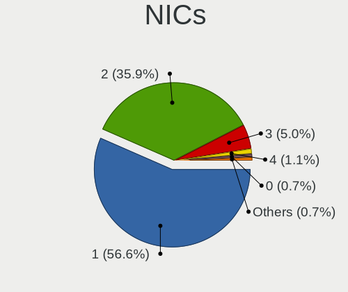
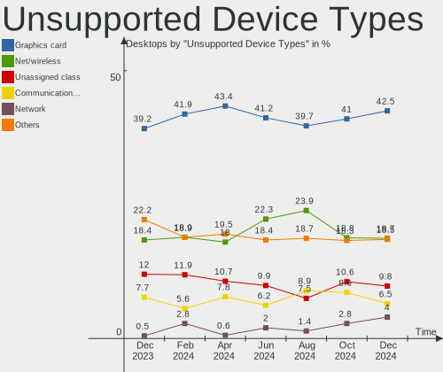

Linux Hardware Trends (Desktop)
-------------------------------

A project to identify most popular hardware characteristics and track their change
over time based on data collected by Linux users at https://Linux-Hardware.org.

Anyone can contribute to the study by uploading probes of their computers by
the [hw-probe](https://github.com/linuxhw/hw-probe) tool:

    sudo -E hw-probe -all -upload

Full-feature report is available here: https://linux-hardware.org/?view=trends&formfactor=desktop

Period: Mar, 2021.

Contents
--------

- [ OS                       ](#os)
- [ OS Family                ](#os-family)
- [ Kernel                   ](#kernel)
- [ Kernel Family            ](#kernel-family)
- [ Kernel Major Ver.        ](#kernel-major-ver)
- [ Arch                     ](#arch)
- [ DE                       ](#de)
- [ Display Server           ](#display-server)
- [ Display Manager          ](#display-manager)
- [ OS Lang                  ](#os-lang)
- [ Boot Mode                ](#boot-mode)
- [ Filesystem               ](#filesystem)
- [ Part. scheme             ](#part-scheme)
- [ Dual Boot with Linux/BSD ](#dual-boot-with-linux/bsd)
- [ Dual Boot (Win)          ](#dual-boot-win)
- [ Country                  ](#country)
- [ City                     ](#city)
- [ Vendor                   ](#vendor)
- [ Model                    ](#model)
- [ Model Family             ](#model-family)
- [ MFG Year                 ](#mfg-year)
- [ Form Factor              ](#form-factor)
- [ Secure Boot              ](#secure-boot)
- [ Coreboot                 ](#coreboot)
- [ RAM Size                 ](#ram-size)
- [ RAM Used                 ](#ram-used)
- [ Has CD-ROM               ](#has-cd-rom)
- [ Total Drives             ](#total-drives)
- [ Has Ethernet             ](#has-ethernet)
- [ Has WiFi                 ](#has-wifi)
- [ Has Bluetooth            ](#has-bluetooth)
- [ Drive Vendor             ](#drive-vendor)
- [ Drive Model              ](#drive-model)
- [ HDD Vendor               ](#hdd-vendor)
- [ SSD Vendor               ](#ssd-vendor)
- [ Drive Kind               ](#drive-kind)
- [ Drive Connector          ](#drive-connector)
- [ Drive Size               ](#drive-size)
- [ Space Total              ](#space-total)
- [ Space Used               ](#space-used)
- [ Malfunc. Drives          ](#malfunc-drives)
- [ Malfunc. Drive Vendor    ](#malfunc-drive-vendor)
- [ Malfunc. HDD Vendor      ](#malfunc-hdd-vendor)
- [ Malfunc. Drive Kind      ](#malfunc-drive-kind)
- [ Failed Drives            ](#failed-drives)
- [ Failed Drive Vendor      ](#failed-drive-vendor)
- [ Drive Status             ](#drive-status)
- [ Storage Vendor           ](#storage-vendor)
- [ Storage Model            ](#storage-model)
- [ Storage Kind             ](#storage-kind)
- [ CPU Vendor               ](#cpu-vendor)
- [ CPU Model                ](#cpu-model)
- [ CPU Model Family         ](#cpu-model-family)
- [ CPU Cores                ](#cpu-cores)
- [ CPU Sockets              ](#cpu-sockets)
- [ CPU Threads              ](#cpu-threads)
- [ CPU Op-Modes             ](#cpu-op-modes)
- [ CPU Microcode            ](#cpu-microcode)
- [ CPU Microarch            ](#cpu-microarch)
- [ GPU Vendor               ](#gpu-vendor)
- [ GPU Model                ](#gpu-model)
- [ GPU Combo                ](#gpu-combo)
- [ GPU Driver               ](#gpu-driver)
- [ GPU Memory               ](#gpu-memory)
- [ Monitor Vendor           ](#monitor-vendor)
- [ Monitor Model            ](#monitor-model)
- [ Monitor Resolution       ](#monitor-resolution)
- [ Monitor Diagonal         ](#monitor-diagonal)
- [ Monitor Width            ](#monitor-width)
- [ Aspect Ratio             ](#aspect-ratio)
- [ Monitor Area             ](#monitor-area)
- [ Pixel Density            ](#pixel-density)
- [ Multiple Monitors        ](#multiple-monitors)
- [ Net Controller Vendor    ](#net-controller-vendor)
- [ Net Controller Model     ](#net-controller-model)
- [ Wireless Vendor          ](#wireless-vendor)
- [ Wireless Model           ](#wireless-model)
- [ Ethernet Vendor          ](#ethernet-vendor)
- [ Ethernet Model           ](#ethernet-model)
- [ Net Controller Kind      ](#net-controller-kind)
- [ Used Controller          ](#used-controller)
- [ NICs                     ](#nics)
- [ IPv6                     ](#ipv6)
- [ Memory Vendor            ](#memory-vendor)
- [ Memory Model             ](#memory-model)
- [ Memory Kind              ](#memory-kind)
- [ Memory Form Factor       ](#memory-form-factor)
- [ Memory Size              ](#memory-size)
- [ Memory Speed             ](#memory-speed)
- [ Sound Vendor             ](#sound-vendor)
- [ Sound Model              ](#sound-model)
- [ Camera Vendor            ](#camera-vendor)
- [ Camera Model             ](#camera-model)
- [ Fingerprint Vendor       ](#fingerprint-vendor)
- [ Fingerprint Model        ](#fingerprint-model)
- [ Chipcard Vendor          ](#chipcard-vendor)
- [ Chipcard Model           ](#chipcard-model)
- [ Printer Vendor           ](#printer-vendor)
- [ Printer Model            ](#printer-model)
- [ Scanner Vendor           ](#scanner-vendor)
- [ Scanner Model            ](#scanner-model)
- [ Bluetooth Vendor         ](#bluetooth-vendor)
- [ Bluetooth Model          ](#bluetooth-model)
- [ Unsupported Devices      ](#unsupported-devices)
- [ Unsupported Device Types ](#unsupported-device-types)

OS
--

Installed operating systems

| Name                | Desktops | Percent |
|---------------------|----------|---------|
| Ubuntu 20.04        | 432      | 18.07%  |
| OpenMandriva 4.2    | 287      | 12%     |
| Mint 20.1           | 164      | 6.86%   |
| Ubuntu 20.10        | 108      | 4.52%   |
| Fedora 33           | 103      | 4.31%   |
| Pop!_OS 20.10       | 100      | 4.18%   |
| BlackPanther 18.1   | 83       | 3.47%   |
| KDE neon 20.04      | 77       | 3.22%   |
| ROSA R11.1          | 69       | 2.89%   |
| Ubuntu 18.04        | 67       | 2.8%    |
| Arch Rolling        | 55       | 2.3%    |
| Debian 10           | 54       | 2.26%   |
| Manjaro             | 52       | 2.17%   |
| Xubuntu 20.04       | 43       | 1.8%    |
| Arch                | 40       | 1.67%   |
| Pop!_OS 20.04       | 38       | 1.59%   |
| Manjaro 20.2.1      | 34       | 1.42%   |
| ROSA R11            | 33       | 1.38%   |
| Mint 19.3           | 33       | 1.38%   |
| Kubuntu 20.04       | 30       | 1.25%   |
| Mint 20             | 25       | 1.05%   |
| ArcoLinux Rolling   | 21       | 0.88%   |
| Endless 3.9.3       | 20       | 0.84%   |
| Zorin 15            | 19       | 0.79%   |
| Manjaro 21.0        | 18       | 0.75%   |
| Ubuntu MATE 20.04   | 15       | 0.63%   |
| openSUSE Leap-15.2  | 15       | 0.63%   |
| Gentoo 2.7          | 14       | 0.59%   |
| Gentoo              | 14       | 0.59%   |
| Fedora 34           | 12       | 0.5%    |
| Debian Testing      | 12       | 0.5%    |
| Mint 19.1           | 11       | 0.46%   |
| Kubuntu 20.10       | 11       | 0.46%   |
| Debian              | 11       | 0.46%   |
| CentOS 8            | 11       | 0.46%   |
| Xubuntu 18.04       | 10       | 0.42%   |
| LMDE 4              | 10       | 0.42%   |
| Ubuntu 16.04        | 9        | 0.38%   |
| Fedora 32           | 9        | 0.38%   |
| Ubuntu 21.04        | 8        | 0.33%   |
| Debian Unstable     | 8        | 0.33%   |
| Xubuntu 20.10       | 7        | 0.29%   |
| Mint 19.2           | 7        | 0.29%   |
| Lubuntu 20.04       | 6        | 0.25%   |
| ROSA R8.1           | 5        | 0.21%   |
| Peppermint 10       | 5        | 0.21%   |
| Mint 18.3           | 5        | 0.21%   |
| CentOS 7            | 5        | 0.21%   |
| ALT Linux 9.1       | 5        | 0.21%   |
| Ubuntu Budgie 20.10 | 4        | 0.17%   |
| Ubuntu Budgie 20.04 | 4        | 0.17%   |
| Lubuntu 20.10       | 4        | 0.17%   |
| Garuda Soaring      | 4        | 0.17%   |
| Ubuntu MATE 20.10   | 3        | 0.13%   |
| Ubuntu 2020         | 3        | 0.13%   |
| ROSA R12            | 3        | 0.13%   |
| ROSA R10            | 3        | 0.13%   |
| Redcore             | 3        | 0.13%   |
| MX 20.05.01         | 3        | 0.13%   |
| Mageia 8            | 3        | 0.13%   |

OS Family
---------

OS without a version

| Name          | Desktops | Percent |
|---------------|----------|---------|
| Ubuntu        | 632      | 26.43%  |
| OpenMandriva  | 287      | 12%     |
| Mint          | 247      | 10.33%  |
| Pop!_OS       | 138      | 5.77%   |
| Fedora        | 131      | 5.48%   |
| ROSA          | 114      | 4.77%   |
| Manjaro       | 106      | 4.43%   |
| Arch          | 95       | 3.97%   |
| Debian        | 87       | 3.64%   |
| BlackPanther  | 86       | 3.6%    |
| KDE neon      | 77       | 3.22%   |
| Xubuntu       | 61       | 2.55%   |
| Kubuntu       | 44       | 1.84%   |
| Gentoo        | 29       | 1.21%   |
| openSUSE      | 28       | 1.17%   |
| ArcoLinux     | 24       | 1%      |
| Zorin         | 21       | 0.88%   |
| Ubuntu MATE   | 21       | 0.88%   |
| Endless       | 21       | 0.88%   |
| CentOS        | 19       | 0.79%   |
| Lubuntu       | 12       | 0.5%    |
| LMDE          | 10       | 0.42%   |
| Ubuntu Budgie | 9        | 0.38%   |
| ALT Linux     | 7        | 0.29%   |
| Peppermint    | 6        | 0.25%   |
| Clear Linux   | 6        | 0.25%   |
| MX            | 5        | 0.21%   |
| Kali          | 5        | 0.21%   |
| Garuda        | 5        | 0.21%   |
| EndeavourOS   | 5        | 0.21%   |
| Reborn OS     | 4        | 0.17%   |
| Mageia        | 4        | 0.17%   |
| Redcore       | 3        | 0.13%   |
| Red OS        | 3        | 0.13%   |
| Elementary    | 3        | 0.13%   |
| Devuan        | 3        | 0.13%   |
| Deepin        | 3        | 0.13%   |
| ClearOS       | 3        | 0.13%   |
| Solus         | 2        | 0.08%   |
| SkiffOS       | 2        | 0.08%   |
| Parrot        | 2        | 0.08%   |
| Chrome OS     | 2        | 0.08%   |
| Void          | 1        | 0.04%   |
| Slackware     | 1        | 0.04%   |
| RHEL          | 1        | 0.04%   |
| RED           | 1        | 0.04%   |
| PureOS        | 1        | 0.04%   |
| PCLinuxOS     | 1        | 0.04%   |
| Oracle Linux  | 1        | 0.04%   |
| NixOS         | 1        | 0.04%   |
| KaOS          | 1        | 0.04%   |
| Jingos        | 1        | 0.04%   |
| IPFire        | 1        | 0.04%   |
| GNOME OS      | 1        | 0.04%   |
| Drauger OS    | 1        | 0.04%   |
| Calculate     | 1        | 0.04%   |
| Boss          | 1        | 0.04%   |
| Artix         | 1        | 0.04%   |
| antiX         | 1        | 0.04%   |
| Alpine        | 1        | 0.04%   |

Kernel
------

Version of the Linux kernel

| Version                             | Desktops | Percent |
|-------------------------------------|----------|---------|
| 5.10.14-desktop-1omv4002            | 284      | 11.88%  |
| 5.8.0-44-generic                    | 235      | 9.83%   |
| 5.4.0-66-generic                    | 231      | 9.66%   |
| 5.8.0-45-generic                    | 125      | 5.23%   |
| 5.4.0-67-generic                    | 123      | 5.14%   |
| 5.8.0-7642-generic                  | 114      | 4.77%   |
| 5.4.0-70-generic                    | 77       | 3.22%   |
| 5.8.0-48-generic                    | 61       | 2.55%   |
| 5.6.14-desktop-2bP                  | 52       | 2.17%   |
| 4.19.0-14-amd64                     | 37       | 1.55%   |
| 5.9.16-1-MANJARO                    | 36       | 1.51%   |
| 4.18.16-desktop-1bP                 | 31       | 1.3%    |
| 5.11.6-arch1-1                      | 27       | 1.13%   |
| 4.15.0-desktop-45.1rosa-x86_64      | 27       | 1.13%   |
| 4.15.0-136-generic                  | 26       | 1.09%   |
| 5.8.0-14-generic                    | 21       | 0.88%   |
| 4.15.0-desktop-122.124.1rosa-x86_64 | 21       | 0.88%   |
| 5.10.19-200.fc33.x86_64             | 20       | 0.84%   |
| 5.4.83-generic-2rosa-x86_64         | 19       | 0.79%   |
| 5.8.0-43-generic                    | 18       | 0.75%   |
| 5.4.0-65-generic                    | 17       | 0.71%   |
| 5.11.2-1-MANJARO                    | 17       | 0.71%   |
| 5.10.23-200.fc33.x86_64             | 16       | 0.67%   |
| 5.10.22-200.fc33.x86_64             | 15       | 0.63%   |
| 5.4.0-58-generic                    | 14       | 0.59%   |
| 5.10.0-4-amd64                      | 14       | 0.59%   |
| 5.8.0-25-generic                    | 12       | 0.5%    |
| 5.4.0-42-generic                    | 12       | 0.5%    |
| 5.11.6-1-MANJARO                    | 12       | 0.5%    |
| 5.11.2-arch1-1                      | 12       | 0.5%    |
| 5.8.0-41-generic                    | 11       | 0.46%   |
| 5.11.7-arch1-1                      | 11       | 0.46%   |
| 5.11.7-200.fc33.x86_64              | 10       | 0.42%   |
| 5.10.0-0.bpo.3-amd64                | 10       | 0.42%   |
| 5.4.32-generic-2rosa-x86_64         | 9        | 0.38%   |
| 5.11.6-zen1-1-zen                   | 9        | 0.38%   |
| 5.10.23-1-MANJARO                   | 9        | 0.38%   |
| 4.18.0-240.15.1.el8_3.x86_64        | 9        | 0.38%   |
| 4.15.0-139-generic                  | 9        | 0.38%   |
| 5.4.0-66-lowlatency                 | 8        | 0.33%   |
| 5.11.4-arch1-1                      | 8        | 0.33%   |
| 4.15.0-137-generic                  | 8        | 0.33%   |
| 5.8.0-7630-generic                  | 7        | 0.29%   |
| 5.8.0-49-generic                    | 7        | 0.29%   |
| 5.4.97-gentoo                       | 7        | 0.29%   |
| 5.4.0-67-lowlatency                 | 7        | 0.29%   |
| 5.4.0-26-generic                    | 7        | 0.29%   |
| 5.3.18-lp152.66-default             | 7        | 0.29%   |
| 5.3.18-lp152.63-default             | 7        | 0.29%   |
| 5.11.5-arch1-1                      | 7        | 0.29%   |
| 5.11.2-zen1-1-zen                   | 7        | 0.29%   |
| 5.10.21-200.fc33.x86_64             | 7        | 0.29%   |
| 4.15.0-desktop-45.1rosa-i586        | 7        | 0.29%   |
| 3.10.0-1160.15.2.el7.x86_64         | 7        | 0.29%   |
| 5.4.105-1-MANJARO                   | 6        | 0.25%   |
| 5.4.0-7634-generic                  | 6        | 0.25%   |
| 5.11.8-200.fc33.x86_64              | 6        | 0.25%   |
| 5.11.6-1-default                    | 6        | 0.25%   |
| 5.11.0-051100-generic               | 6        | 0.25%   |
| 5.4.32-generic-2rosa-i586           | 5        | 0.21%   |

Kernel Family
-------------

Linux kernel without a distro release

| Version | Desktops | Percent |
|---------|----------|---------|
| 5.8.0   | 632      | 26.43%  |
| 5.4.0   | 530      | 22.17%  |
| 5.10.14 | 285      | 11.92%  |
| 4.15.0  | 133      | 5.56%   |
| 5.11.6  | 70       | 2.93%   |
| 5.6.14  | 53       | 2.22%   |
| 4.19.0  | 49       | 2.05%   |
| 5.10.0  | 48       | 2.01%   |
| 5.11.2  | 46       | 1.92%   |
| 5.9.16  | 41       | 1.71%   |
| 5.10.19 | 32       | 1.34%   |
| 4.18.16 | 31       | 1.3%    |
| 5.10.23 | 29       | 1.21%   |
| 5.11.7  | 22       | 0.92%   |
| 5.4.83  | 20       | 0.84%   |
| 5.11.0  | 19       | 0.79%   |
| 5.10.22 | 19       | 0.79%   |
| 5.11.10 | 17       | 0.71%   |
| 4.18.0  | 16       | 0.67%   |
| 5.11.8  | 15       | 0.63%   |
| 5.10.18 | 15       | 0.63%   |
| 5.4.32  | 14       | 0.59%   |
| 5.3.18  | 14       | 0.59%   |
| 5.11.5  | 12       | 0.5%    |
| 5.11.4  | 12       | 0.5%    |
| 5.10.21 | 11       | 0.46%   |
| 3.10.0  | 11       | 0.46%   |
| 5.11.1  | 9        | 0.38%   |
| 5.4.97  | 8        | 0.33%   |
| 5.11.9  | 8        | 0.33%   |
| 5.10.16 | 8        | 0.33%   |
| 5.0.0   | 8        | 0.33%   |
| 5.4.105 | 6        | 0.25%   |
| 5.11.3  | 6        | 0.25%   |
| 5.10.25 | 6        | 0.25%   |
| 4.9.155 | 6        | 0.25%   |
| 4.4.0   | 6        | 0.25%   |
| 5.3.0   | 5        | 0.21%   |
| 5.10.24 | 5        | 0.21%   |
| 5.10.15 | 5        | 0.21%   |
| 5.10.13 | 5        | 0.21%   |
| 5.8.15  | 4        | 0.17%   |
| 5.11.11 | 4        | 0.17%   |
| 5.10.20 | 4        | 0.17%   |
| 4.9.20  | 4        | 0.17%   |
| 4.9.0   | 4        | 0.17%   |
| 5.9.0   | 3        | 0.13%   |
| 5.8.18  | 3        | 0.13%   |
| 5.4.103 | 3        | 0.13%   |
| 5.10.17 | 3        | 0.13%   |
| 5.10.12 | 3        | 0.13%   |
| 4.9.60  | 3        | 0.13%   |
| 4.1.38  | 3        | 0.13%   |
| 5.9.1   | 2        | 0.08%   |
| 5.8.16  | 2        | 0.08%   |
| 5.6.13  | 2        | 0.08%   |
| 5.4.80  | 2        | 0.08%   |
| 5.4.70  | 2        | 0.08%   |
| 5.4.66  | 2        | 0.08%   |
| 5.4.101 | 2        | 0.08%   |

Kernel Major Ver.
-----------------

Linux kernel major version

| Version | Desktops | Percent |
|---------|----------|---------|
| 5.8     | 641      | 26.81%  |
| 5.4     | 599      | 25.05%  |
| 5.10    | 490      | 20.49%  |
| 5.11    | 240      | 10.04%  |
| 4.15    | 133      | 5.56%   |
| 5.6     | 58       | 2.43%   |
| 4.19    | 51       | 2.13%   |
| 5.9     | 49       | 2.05%   |
| 4.18    | 47       | 1.97%   |
| 5.3     | 20       | 0.84%   |
| 4.9     | 18       | 0.75%   |
| 3.10    | 12       | 0.5%    |
| 5.0     | 9        | 0.38%   |
| 4.4     | 7        | 0.29%   |
| 4.14    | 4        | 0.17%   |
| 4.1     | 3        | 0.13%   |
| 5.7     | 2        | 0.08%   |
| 5.12    | 2        | 0.08%   |
| 4.10    | 2        | 0.08%   |
| 5.5     | 1        | 0.04%   |
| 5.2     | 1        | 0.04%   |
| 4.20    | 1        | 0.04%   |
| 4.13    | 1        | 0.04%   |

Arch
----

OS architecture (x86_64, i586, etc.)

| Name    | Desktops | Percent |
|---------|----------|---------|
| x86_64  | 2326     | 97.28%  |
| i686    | 63       | 2.63%   |
| armv7l  | 1        | 0.04%   |
| aarch64 | 1        | 0.04%   |

DE
--

Desktop Environment

| Name            | Desktops | Percent |
|-----------------|----------|---------|
| GNOME           | 868      | 36.3%   |
| KDE5            | 539      | 22.54%  |
| X-Cinnamon      | 193      | 8.07%   |
| XFCE            | 187      | 7.82%   |
| KDE             | 160      | 6.69%   |
| Unknown         | 154      | 6.44%   |
| KDE4            | 73       | 3.05%   |
| MATE            | 70       | 2.93%   |
| Cinnamon        | 31       | 1.3%    |
| Unity           | 21       | 0.88%   |
| LXQt            | 16       | 0.67%   |
| LXDE            | 15       | 0.63%   |
| Budgie          | 13       | 0.54%   |
| i3              | 12       | 0.5%    |
| GNOME Flashback | 9        | 0.38%   |
| Deepin          | 7        | 0.29%   |
| GNOME Classic   | 6        | 0.25%   |
| awesome         | 5        | 0.21%   |
| sway            | 3        | 0.13%   |
| Pantheon        | 3        | 0.13%   |
| bspwm           | 2        | 0.08%   |
| xmonad          | 1        | 0.04%   |
| qtile           | 1        | 0.04%   |
| ICEWM           | 1        | 0.04%   |
| dwm             | 1        | 0.04%   |

Display Server
--------------

X11 or Wayland

| Name        | Desktops | Percent |
|-------------|----------|---------|
| X11         | 2132     | 89.17%  |
| Wayland     | 129      | 5.4%    |
| Unknown     | 72       | 3.01%   |
| Tty         | 56       | 2.34%   |
| Web         | 1        | 0.04%   |
| Unspecified | 1        | 0.04%   |

Display Manager
---------------

SDDM, LightDM, etc.

| Name    | Desktops | Percent |
|---------|----------|---------|
| Unknown | 1328     | 55.54%  |
| SDDM    | 547      | 22.88%  |
| GDM     | 220      | 9.2%    |
| TDM     | 155      | 6.48%   |
| KDM     | 74       | 3.09%   |
| LightDM | 56       | 2.34%   |
| XDM     | 4        | 0.17%   |
| SLiM    | 3        | 0.13%   |
| NODM    | 1        | 0.04%   |
| MDM     | 1        | 0.04%   |
| Ly      | 1        | 0.04%   |
| LXDM    | 1        | 0.04%   |

OS Lang
-------

Language

| Lang        | Desktops | Percent |
|-------------|----------|---------|
| en_US       | 897      | 37.52%  |
| ru_RU       | 221      | 9.24%   |
| de_DE       | 197      | 8.24%   |
| Unknown     | 161      | 6.73%   |
| fr_FR       | 119      | 4.98%   |
| pt_BR       | 117      | 4.89%   |
| en_GB       | 114      | 4.77%   |
| pl_PL       | 63       | 2.63%   |
| en_CA       | 59       | 2.47%   |
| it_IT       | 56       | 2.34%   |
| en_AU       | 41       | 1.71%   |
| es_ES       | 30       | 1.25%   |
| C           | 28       | 1.17%   |
| ru_UA       | 18       | 0.75%   |
| nl_NL       | 18       | 0.75%   |
| pt_PT       | 15       | 0.63%   |
| en_IN       | 12       | 0.5%    |
| cs_CZ       | 12       | 0.5%    |
| sv_SE       | 11       | 0.46%   |
| hu_HU       | 11       | 0.46%   |
| es_MX       | 11       | 0.46%   |
| es_AR       | 10       | 0.42%   |
| uk_UA       | 9        | 0.38%   |
| nl_BE       | 9        | 0.38%   |
| fr_CA       | 9        | 0.38%   |
| de_CH       | 9        | 0.38%   |
| de_AT       | 9        | 0.38%   |
| fr_BE       | 7        | 0.29%   |
| es_CL       | 7        | 0.29%   |
| fi_FI       | 6        | 0.25%   |
| en_NZ       | 6        | 0.25%   |
| sk_SK       | 5        | 0.21%   |
| fr_CH       | 5        | 0.21%   |
| es_CO       | 5        | 0.21%   |
| en_ZA       | 5        | 0.21%   |
| en_HK       | 5        | 0.21%   |
| ja_JP       | 4        | 0.17%   |
| es_VE       | 4        | 0.17%   |
| en_IE       | 4        | 0.17%   |
| el_GR       | 4        | 0.17%   |
| da_DK       | 4        | 0.17%   |
| ro_RO       | 3        | 0.13%   |
| eu_ES       | 3        | 0.13%   |
| es_BO       | 3        | 0.13%   |
| en_IL       | 3        | 0.13%   |
| ca_ES       | 3        | 0.13%   |
| C.UTF8      | 3        | 0.13%   |
| bg_BG       | 3        | 0.13%   |
| lt_LT       | 2        | 0.08%   |
| hr_HR       | 2        | 0.08%   |
| es_PE       | 2        | 0.08%   |
| en_DK       | 2        | 0.08%   |
| be_BY       | 2        | 0.08%   |
| zh_TW       | 1        | 0.04%   |
| zh_CN       | 1        | 0.04%   |
| szl_PL      | 1        | 0.04%   |
| sl_SI       | 1        | 0.04%   |
| ru_RU.UTF_8 | 1        | 0.04%   |
| quc_GT      | 1        | 0.04%   |
| POSIX       | 1        | 0.04%   |

Boot Mode
---------

EFI or BIOS

| Mode | Desktops | Percent |
|------|----------|---------|
| BIOS | 1549     | 64.78%  |
| EFI  | 842      | 35.22%  |

Filesystem
----------

Type of filesystem

| Type    | Desktops | Percent |
|---------|----------|---------|
| Ext4    | 1802     | 75.37%  |
| Overlay | 343      | 14.35%  |
| Btrfs   | 158      | 6.61%   |
| Xfs     | 48       | 2.01%   |
| Zfs     | 22       | 0.92%   |
| Ext3    | 5        | 0.21%   |
| F2fs    | 4        | 0.17%   |
| Unknown | 4        | 0.17%   |
| Ext2    | 3        | 0.13%   |
| Tmpfs   | 2        | 0.08%   |

Part. scheme
------------

Scheme of partitioning

| Type    | Desktops | Percent |
|---------|----------|---------|
| Unknown | 1263     | 52.82%  |
| GPT     | 673      | 28.15%  |
| MBR     | 455      | 19.03%  |

Dual Boot with Linux/BSD
------------------------

Hosting more than one Linux/BSD

| Dual boot | Desktops | Percent |
|-----------|----------|---------|
| No        | 1854     | 77.54%  |
| Yes       | 537      | 22.46%  |

Dual Boot (Win)
---------------

Hosting Linux and Windows

| Dual boot | Desktops | Percent |
|-----------|----------|---------|
| No        | 1556     | 65.08%  |
| Yes       | 835      | 34.92%  |

Country
-------

Geographic location (country)

| Country      | Desktops | Percent |
|--------------|----------|---------|
| USA          | 412      | 17.23%  |
| Russia       | 289      | 12.09%  |
| Germany      | 248      | 10.37%  |
| Brazil       | 151      | 6.32%   |
| France       | 127      | 5.31%   |
| Canada       | 95       | 3.97%   |
| UK           | 91       | 3.81%   |
| Poland       | 84       | 3.51%   |
| Hungary      | 84       | 3.51%   |
| Italy        | 66       | 2.76%   |
| Ukraine      | 60       | 2.51%   |
| Australia    | 47       | 1.97%   |
| Spain        | 42       | 1.76%   |
| Switzerland  | 39       | 1.63%   |
| Netherlands  | 34       | 1.42%   |
| Sweden       | 32       | 1.34%   |
| Belgium      | 30       | 1.25%   |
| Austria      | 26       | 1.09%   |
| Finland      | 25       | 1.05%   |
| India        | 23       | 0.96%   |
| Czechia      | 20       | 0.84%   |
| Mexico       | 18       | 0.75%   |
| Serbia       | 17       | 0.71%   |
| Argentina    | 17       | 0.71%   |
| Bulgaria     | 16       | 0.67%   |
| Portugal     | 15       | 0.63%   |
| Belarus      | 15       | 0.63%   |
| Slovakia     | 13       | 0.54%   |
| Japan        | 13       | 0.54%   |
| Romania      | 12       | 0.5%    |
| New Zealand  | 12       | 0.5%    |
| Israel       | 11       | 0.46%   |
| Greece       | 11       | 0.46%   |
| Norway       | 9        | 0.38%   |
| Lithuania    | 9        | 0.38%   |
| South Africa | 8        | 0.33%   |
| Denmark      | 8        | 0.33%   |
| Iran         | 7        | 0.29%   |
| Hong Kong    | 7        | 0.29%   |
| Colombia     | 7        | 0.29%   |
| Chile        | 7        | 0.29%   |
| Turkey       | 6        | 0.25%   |
| Thailand     | 6        | 0.25%   |
| Latvia       | 6        | 0.25%   |
| Bolivia      | 6        | 0.25%   |
| Venezuela    | 5        | 0.21%   |
| South Korea  | 5        | 0.21%   |
| Indonesia    | 5        | 0.21%   |
| Egypt        | 5        | 0.21%   |
| Croatia      | 5        | 0.21%   |
| Vietnam      | 4        | 0.17%   |
| Morocco      | 4        | 0.17%   |
| Kazakhstan   | 4        | 0.17%   |
| Ireland      | 4        | 0.17%   |
| Estonia      | 4        | 0.17%   |
| Taiwan       | 3        | 0.13%   |
| Slovenia     | 3        | 0.13%   |
| Saudi Arabia | 3        | 0.13%   |
| Puerto Rico  | 3        | 0.13%   |
| Philippines  | 3        | 0.13%   |

City
----

Geographic location (city)

| City              | Desktops | Percent |
|-------------------|----------|---------|
| Moscow            | 60       | 2.51%   |
| Berlin            | 26       | 1.09%   |
| Budapest          | 20       | 0.84%   |
| Vienna            | 18       | 0.75%   |
| Warsaw            | 17       | 0.71%   |
| São Paulo        | 17       | 0.71%   |
| St Petersburg     | 17       | 0.71%   |
| Sydney            | 15       | 0.63%   |
| Helsinki          | 15       | 0.63%   |
| Zurich            | 14       | 0.59%   |
| Hamburg           | 12       | 0.5%    |
| Yekaterinburg     | 11       | 0.46%   |
| Novosibirsk       | 11       | 0.46%   |
| Kyiv              | 11       | 0.46%   |
| Porto Alegre      | 10       | 0.42%   |
| Perth             | 10       | 0.42%   |
| Paris             | 10       | 0.42%   |
| Essen             | 10       | 0.42%   |
| Belgrade          | 10       | 0.42%   |
| Toronto           | 9        | 0.38%   |
| Rostov-on-Don     | 9        | 0.38%   |
| Minsk             | 9        | 0.38%   |
| Voronezh          | 8        | 0.33%   |
| Sofia             | 8        | 0.33%   |
| Milan             | 8        | 0.33%   |
| Browning          | 8        | 0.33%   |
| Rome              | 7        | 0.29%   |
| Munich            | 7        | 0.29%   |
| Madrid            | 7        | 0.29%   |
| Dallas            | 7        | 0.29%   |
| Bratislava        | 7        | 0.29%   |
| Amsterdam         | 7        | 0.29%   |
| Unknown           | 7        | 0.29%   |
| Vilnius           | 6        | 0.25%   |
| Vancouver         | 6        | 0.25%   |
| Tel Aviv          | 6        | 0.25%   |
| Spokane           | 6        | 0.25%   |
| San Jose          | 6        | 0.25%   |
| San Diego         | 6        | 0.25%   |
| Odessa            | 6        | 0.25%   |
| Kharkiv           | 6        | 0.25%   |
| Chicago           | 6        | 0.25%   |
| Chelyabinsk       | 6        | 0.25%   |
| Campinas          | 6        | 0.25%   |
| Brasília         | 6        | 0.25%   |
| Auckland          | 6        | 0.25%   |
| Athens            | 6        | 0.25%   |
| Tehran            | 5        | 0.21%   |
| Stockholm         | 5        | 0.21%   |
| Srednyaya Akhtuba | 5        | 0.21%   |
| Saratov           | 5        | 0.21%   |
| Prague            | 5        | 0.21%   |
| Portland          | 5        | 0.21%   |
| Perm              | 5        | 0.21%   |
| Omsk              | 5        | 0.21%   |
| London            | 5        | 0.21%   |
| Krakow            | 5        | 0.21%   |
| Eugene            | 5        | 0.21%   |
| Debrecen          | 5        | 0.21%   |
| Windsor           | 4        | 0.17%   |

Vendor
------

Motherboard manufacturer

| Name                | Desktops | Percent |
|---------------------|----------|---------|
| ASUSTek Computer    | 606      | 25.35%  |
| Gigabyte Technology | 438      | 18.32%  |
| MSI                 | 272      | 11.38%  |
| ASRock              | 241      | 10.08%  |
| Dell                | 208      | 8.7%    |
| Hewlett-Packard     | 171      | 7.15%   |
| Intel               | 78       | 3.26%   |
| Lenovo              | 70       | 2.93%   |
| Acer                | 53       | 2.22%   |
| Unknown             | 33       | 1.38%   |
| Pegatron            | 25       | 1.05%   |
| ECS                 | 25       | 1.05%   |
| Fujitsu             | 20       | 0.84%   |
| Foxconn             | 16       | 0.67%   |
| Medion              | 15       | 0.63%   |
| Biostar             | 15       | 0.63%   |
| PCWare              | 7        | 0.29%   |
| Huanan              | 7        | 0.29%   |
| Fujitsu Siemens     | 7        | 0.29%   |
| Shuttle             | 5        | 0.21%   |
| Positivo            | 5        | 0.21%   |
| PC Engines          | 4        | 0.17%   |
| Gateway             | 4        | 0.17%   |
| AZW                 | 4        | 0.17%   |
| Supermicro          | 3        | 0.13%   |
| OEM                 | 3        | 0.13%   |
| BESSTAR Tech        | 3        | 0.13%   |
| Alienware           | 3        | 0.13%   |
| AAEON               | 3        | 0.13%   |
| Packard Bell        | 2        | 0.08%   |
| HARDKERNEL          | 2        | 0.08%   |
| EVGA                | 2        | 0.08%   |
| eMachines           | 2        | 0.08%   |
| ZMAX                | 1        | 0.04%   |
| Wortmann AG         | 1        | 0.04%   |
| WinFast             | 1        | 0.04%   |
| Uniwill             | 1        | 0.04%   |
| TPV-INVENTA         | 1        | 0.04%   |
| SYWZ                | 1        | 0.04%   |
| SolidRun            | 1        | 0.04%   |
| Semp Toshiba        | 1        | 0.04%   |
| Seco                | 1        | 0.04%   |
| Sapphire            | 1        | 0.04%   |
| Samsung Electronics | 1        | 0.04%   |
| Quanta              | 1        | 0.04%   |
| PCChips             | 1        | 0.04%   |
| MiTAC               | 1        | 0.04%   |
| Minix               | 1        | 0.04%   |
| MAXSUN              | 1        | 0.04%   |
| LOGIN2              | 1        | 0.04%   |
| langchao            | 1        | 0.04%   |
| Koloe               | 1        | 0.04%   |
| KLLISRE             | 1        | 0.04%   |
| JW Technology       | 1        | 0.04%   |
| Itautec             | 1        | 0.04%   |
| iRU                 | 1        | 0.04%   |
| Inventec            | 1        | 0.04%   |
| IBM                 | 1        | 0.04%   |
| HPE                 | 1        | 0.04%   |
| HOUTER              | 1        | 0.04%   |

Model
-----

Motherboard model

| Name                             | Desktops | Percent |
|----------------------------------|----------|---------|
| ASUS All Series                  | 67       | 2.8%    |
| Unknown                          | 34       | 1.42%   |
| MSI MS-7C37                      | 18       | 0.75%   |
| Dell OptiPlex 7010               | 18       | 0.75%   |
| Dell OptiPlex 9020               | 16       | 0.67%   |
| Gigabyte B450M DS3H              | 14       | 0.59%   |
| Gigabyte 970A-DS3P               | 12       | 0.5%    |
| ASUS PRIME A320M-K               | 11       | 0.46%   |
| MSI MS-7B79                      | 10       | 0.42%   |
| Dell OptiPlex 790                | 10       | 0.42%   |
| Dell OptiPlex 780                | 10       | 0.42%   |
| ASUS M5A97 R2.0                  | 10       | 0.42%   |
| ASRock B450M Pro4                | 10       | 0.42%   |
| MSI MS-7C02                      | 9        | 0.38%   |
| MSI MS-7B86                      | 9        | 0.38%   |
| MSI MS-7693                      | 9        | 0.38%   |
| Gigabyte A320M-S2H V2            | 9        | 0.38%   |
| Dell OptiPlex 990                | 9        | 0.38%   |
| ASUS ROG STRIX B450-F GAMING     | 9        | 0.38%   |
| Dell OptiPlex 9010               | 8        | 0.33%   |
| Dell OptiPlex 760                | 8        | 0.33%   |
| ASUS PRIME B350-PLUS             | 8        | 0.33%   |
| MSI MS-7A38                      | 7        | 0.29%   |
| MSI MS-7721                      | 7        | 0.29%   |
| HP Compaq 8200 Elite SFF PC      | 7        | 0.29%   |
| Gigabyte G31M-ES2L               | 7        | 0.29%   |
| Gigabyte B550I AORUS PRO AX      | 7        | 0.29%   |
| Dell OptiPlex 3010               | 7        | 0.29%   |
| ASUS M5A78L-M/USB3               | 7        | 0.29%   |
| ASRock G31M-S                    | 7        | 0.29%   |
| MSI MS-7B89                      | 6        | 0.25%   |
| Intel H61                        | 6        | 0.25%   |
| HP EliteDesk 800 G1 SFF          | 6        | 0.25%   |
| HP Compaq Pro 6300 SFF           | 6        | 0.25%   |
| Gigabyte X570 AORUS ELITE        | 6        | 0.25%   |
| Gigabyte B450M S2H               | 6        | 0.25%   |
| Gigabyte B450 AORUS M            | 6        | 0.25%   |
| Gigabyte A320M-S2H               | 6        | 0.25%   |
| ASUS SABERTOOTH 990FX R2.0       | 6        | 0.25%   |
| ASUS ROG STRIX X570-E GAMING     | 6        | 0.25%   |
| ASUS M5A78L-M PLUS/USB3          | 6        | 0.25%   |
| MSI MS-7B48                      | 5        | 0.21%   |
| MSI MS-7A40                      | 5        | 0.21%   |
| MSI MS-7817                      | 5        | 0.21%   |
| MSI MS-7592                      | 5        | 0.21%   |
| HP Compaq 6200 Pro MT PC         | 5        | 0.21%   |
| HP Compaq 6005 Pro SFF PC        | 5        | 0.21%   |
| Gigabyte X570 AORUS MASTER       | 5        | 0.21%   |
| Gigabyte X470 AORUS ULTRA GAMING | 5        | 0.21%   |
| Gigabyte H87-HD3                 | 5        | 0.21%   |
| Dell Precision WorkStation T3500 | 5        | 0.21%   |
| Dell OptiPlex 755                | 5        | 0.21%   |
| ASUS TUF GAMING Z490-PLUS        | 5        | 0.21%   |
| ASUS TUF GAMING X570-PLUS        | 5        | 0.21%   |
| ASUS TUF GAMING B550M-PLUS       | 5        | 0.21%   |
| ASUS TUF GAMING B550-PLUS        | 5        | 0.21%   |
| ASUS PRIME B450M-A II            | 5        | 0.21%   |
| ASUS P8Z77-V                     | 5        | 0.21%   |
| ASUS M5A99FX PRO R2.0            | 5        | 0.21%   |
| ASRock X570 Taichi               | 5        | 0.21%   |

Model Family
------------

Motherboard model prefix

| Name                   | Desktops | Percent |
|------------------------|----------|---------|
| Dell OptiPlex          | 133      | 5.56%   |
| ASUS PRIME             | 86       | 3.6%    |
| HP Compaq              | 73       | 3.05%   |
| ASUS All               | 67       | 2.8%    |
| ASUS ROG               | 55       | 2.3%    |
| ASUS TUF               | 42       | 1.76%   |
| Lenovo ThinkCentre     | 41       | 1.71%   |
| Acer Aspire            | 38       | 1.59%   |
| Unknown                | 34       | 1.42%   |
| Dell Precision         | 28       | 1.17%   |
| Gigabyte B450M         | 27       | 1.13%   |
| Gigabyte X570          | 24       | 1%      |
| HP EliteDesk           | 20       | 0.84%   |
| Gigabyte B450          | 20       | 0.84%   |
| ASUS M5A97             | 20       | 0.84%   |
| MSI MS-7C37            | 18       | 0.75%   |
| ASUS M5A78L-M          | 18       | 0.75%   |
| Fujitsu ESPRIMO        | 17       | 0.71%   |
| Dell Inspiron          | 16       | 0.67%   |
| ASRock B450M           | 16       | 0.67%   |
| Gigabyte A320M-S2H     | 15       | 0.63%   |
| Lenovo IdeaCentre      | 14       | 0.59%   |
| HP ProDesk             | 14       | 0.59%   |
| Gigabyte Z390          | 14       | 0.59%   |
| Gigabyte 970A-DS3P     | 12       | 0.5%    |
| ASUS P8Z77-V           | 12       | 0.5%    |
| Gigabyte B550M         | 11       | 0.46%   |
| MSI MS-7B79            | 10       | 0.42%   |
| Gigabyte B550          | 10       | 0.42%   |
| Dell Vostro            | 10       | 0.42%   |
| ASUS P8H61-M           | 10       | 0.42%   |
| ASRock X570            | 10       | 0.42%   |
| MSI MS-7C02            | 9        | 0.38%   |
| MSI MS-7B86            | 9        | 0.38%   |
| MSI MS-7693            | 9        | 0.38%   |
| HP Pavilion            | 9        | 0.38%   |
| ASUS SABERTOOTH        | 9        | 0.38%   |
| ASRock B450            | 9        | 0.38%   |
| Dell XPS               | 8        | 0.33%   |
| MSI MS-7A38            | 7        | 0.29%   |
| MSI MS-7721            | 7        | 0.29%   |
| Intel H61              | 7        | 0.29%   |
| Gigabyte X470          | 7        | 0.29%   |
| Gigabyte GA-78LMT-USB3 | 7        | 0.29%   |
| Gigabyte G31M-ES2L     | 7        | 0.29%   |
| Gigabyte B550I         | 7        | 0.29%   |
| ASUS STRIX             | 7        | 0.29%   |
| ASRock G31M-S          | 7        | 0.29%   |
| Acer Veriton           | 7        | 0.29%   |
| MSI MS-7B89            | 6        | 0.25%   |
| Intel X99              | 6        | 0.25%   |
| ASUS P8Z68-V           | 6        | 0.25%   |
| ASUS P8P67             | 6        | 0.25%   |
| ASUS P6T               | 6        | 0.25%   |
| ASUS Maximus           | 6        | 0.25%   |
| ASRock X470            | 6        | 0.25%   |
| ASRock AB350           | 6        | 0.25%   |
| ASRock A320M-HDV       | 6        | 0.25%   |
| MSI MS-7B48            | 5        | 0.21%   |
| MSI MS-7A40            | 5        | 0.21%   |

MFG Year
--------

Motherboard manufacture year

| Year    | Desktops | Percent |
|---------|----------|---------|
| 2020    | 353      | 14.76%  |
| 2019    | 263      | 11%     |
| 2018    | 235      | 9.83%   |
| 2013    | 178      | 7.44%   |
| 2012    | 174      | 7.28%   |
| 2011    | 159      | 6.65%   |
| 2014    | 158      | 6.61%   |
| 2010    | 151      | 6.32%   |
| 2015    | 133      | 5.56%   |
| 2016    | 111      | 4.64%   |
| 2009    | 110      | 4.6%    |
| 2021    | 95       | 3.97%   |
| 2017    | 86       | 3.6%    |
| 2008    | 80       | 3.35%   |
| 2007    | 58       | 2.43%   |
| 2006    | 25       | 1.05%   |
| 2005    | 12       | 0.5%    |
| 2004    | 4        | 0.17%   |
| Unknown | 4        | 0.17%   |
| 2003    | 2        | 0.08%   |

Form Factor
-----------

Physical design of the computer

| Name    | Desktops | Percent |
|---------|----------|---------|
| Desktop | 2391     | 100%    |

Secure Boot
-----------

Enabled or disabled

| State    | Desktops | Percent |
|----------|----------|---------|
| Disabled | 2345     | 98.08%  |
| Enabled  | 46       | 1.92%   |

Coreboot
--------

Have coreboot on board

| Used | Desktops | Percent |
|------|----------|---------|
| No   | 2386     | 99.79%  |
| Yes  | 5        | 0.21%   |

RAM Size
--------

Total RAM memory

| Size in GB      | Desktops | Percent |
|-----------------|----------|---------|
| 16.01-24.0      | 594      | 24.84%  |
| 8.01-16.0       | 497      | 20.79%  |
| 3.01-4.0        | 414      | 17.31%  |
| 4.01-8.0        | 335      | 14.01%  |
| 32.01-64.0      | 287      | 12%     |
| 1.01-2.0        | 85       | 3.55%   |
| 64.01-256.0     | 84       | 3.51%   |
| 24.01-32.0      | 53       | 2.22%   |
| 2.01-3.0        | 27       | 1.13%   |
| 0.51-1.0        | 13       | 0.54%   |
| More than 256.0 | 2        | 0.08%   |

RAM Used
--------

Used RAM memory

| Used GB     | Desktops | Percent |
|-------------|----------|---------|
| 1.01-2.0    | 969      | 40.53%  |
| 2.01-3.0    | 462      | 19.32%  |
| 4.01-8.0    | 291      | 12.17%  |
| 3.01-4.0    | 252      | 10.54%  |
| 0.51-1.0    | 192      | 8.03%   |
| 8.01-16.0   | 102      | 4.27%   |
| 0.01-0.5    | 79       | 3.3%    |
| 16.01-24.0  | 30       | 1.25%   |
| 24.01-32.0  | 7        | 0.29%   |
| 32.01-64.0  | 5        | 0.21%   |
| 64.01-256.0 | 1        | 0.04%   |
| Unknown     | 1        | 0.04%   |

Has CD-ROM
----------

Has CD-ROM on board

| Presented | Desktops | Percent |
|-----------|----------|---------|
| No        | 1238     | 51.78%  |
| Yes       | 1153     | 48.22%  |

Total Drives
------------

Number of drives on board

| Drives | Desktops | Percent |
|--------|----------|---------|
| 1      | 938      | 39.23%  |
| 2      | 692      | 28.94%  |
| 3      | 370      | 15.47%  |
| 4      | 201      | 8.41%   |
| 5      | 102      | 4.27%   |
| 6      | 40       | 1.67%   |
| 7      | 15       | 0.63%   |
| 0      | 13       | 0.54%   |
| 8      | 9        | 0.38%   |
| 10     | 4        | 0.17%   |
| 11     | 3        | 0.13%   |
| 9      | 3        | 0.13%   |
| 14     | 1        | 0.04%   |

Has Ethernet
------------

Has Ethernet on board

| Presented | Desktops | Percent |
|-----------|----------|---------|
| Yes       | 2366     | 98.95%  |
| No        | 25       | 1.05%   |

Has WiFi
--------

Has WiFi module

| Presented | Desktops | Percent |
|-----------|----------|---------|
| No        | 1464     | 61.23%  |
| Yes       | 927      | 38.77%  |

Has Bluetooth
-------------

Has Bluetooth module

| Presented | Desktops | Percent |
|-----------|----------|---------|
| No        | 1788     | 74.78%  |
| Yes       | 603      | 25.22%  |

Drive Vendor
------------

Hard drive vendors

| Vendor                    | Desktops | Drives | Percent |
|---------------------------|----------|--------|---------|
| WDC                       | 889      | 1181   | 20.98%  |
| Seagate                   | 838      | 1104   | 19.77%  |
| Samsung Electronics       | 634      | 860    | 14.96%  |
| Toshiba                   | 251      | 282    | 5.92%   |
| Kingston                  | 248      | 282    | 5.85%   |
| Crucial                   | 162      | 191    | 3.82%   |
| Hitachi                   | 159      | 174    | 3.75%   |
| SanDisk                   | 141      | 154    | 3.33%   |
| A-DATA Technology         | 73       | 78     | 1.72%   |
| Intel                     | 66       | 75     | 1.56%   |
| Unknown                   | 56       | 69     | 1.32%   |
| HGST                      | 50       | 57     | 1.18%   |
| China                     | 49       | 54     | 1.16%   |
| Phison                    | 44       | 48     | 1.04%   |
| MAXTOR                    | 44       | 48     | 1.04%   |
| SPCC                      | 30       | 34     | 0.71%   |
| PNY                       | 28       | 31     | 0.66%   |
| OCZ                       | 27       | 30     | 0.64%   |
| Patriot                   | 25       | 25     | 0.59%   |
| Intenso                   | 25       | 29     | 0.59%   |
| Corsair                   | 25       | 27     | 0.59%   |
| SK Hynix                  | 20       | 20     | 0.47%   |
| Silicon Motion            | 20       | 21     | 0.47%   |
| Micron Technology         | 19       | 19     | 0.45%   |
| GOODRAM                   | 19       | 22     | 0.45%   |
| Transcend                 | 15       | 16     | 0.35%   |
| PLEXTOR                   | 15       | 18     | 0.35%   |
| Micron/Crucial Technology | 15       | 17     | 0.35%   |
| Apacer                    | 15       | 15     | 0.35%   |
| XPG                       | 14       | 14     | 0.33%   |
| Fujitsu                   | 10       | 10     | 0.24%   |
| JMicron                   | 9        | 13     | 0.21%   |
| LITEON                    | 8        | 8      | 0.19%   |
| Lexar                     | 8        | 8      | 0.19%   |
| Gigabyte Technology       | 8        | 10     | 0.19%   |
| TO Exter                  | 7        | 8      | 0.17%   |
| Team                      | 7        | 7      | 0.17%   |
| LITEONIT                  | 7        | 7      | 0.17%   |
| Hewlett-Packard           | 7        | 7      | 0.17%   |
| ASMT                      | 7        | 8      | 0.17%   |
| Realtek Semiconductor     | 6        | 6      | 0.14%   |
| SABRENT                   | 5        | 5      | 0.12%   |
| KingSpec                  | 5        | 6      | 0.12%   |
| KingFast                  | 5        | 6      | 0.12%   |
| KingDian                  | 5        | 5      | 0.12%   |
| HPE                       | 5        | 5      | 0.12%   |
| WD MediaMax               | 4        | 5      | 0.09%   |
| Verbatim                  | 4        | 4      | 0.09%   |
| KIOXIA                    | 4        | 4      | 0.09%   |
| AMD                       | 4        | 4      | 0.09%   |
| QUANTUM                   | 3        | 3      | 0.07%   |
| Phison Electronics        | 3        | 3      | 0.07%   |
| Mushkin                   | 3        | 3      | 0.07%   |
| External                  | 3        | 3      | 0.07%   |
| ExcelStor                 | 3        | 3      | 0.07%   |
| EMTEC                     | 3        | 3      | 0.07%   |
| Zheino                    | 2        | 2      | 0.05%   |
| Vaseky                    | 2        | 3      | 0.05%   |
| TrekStor                  | 2        | 2      | 0.05%   |
| TCSUNBOW                  | 2        | 2      | 0.05%   |

Drive Model
-----------

Hard drive models

| Model                              | Desktops | Percent |
|------------------------------------|----------|---------|
| Seagate ST1000DM010-2EP102 1TB     | 67       | 1.36%   |
| Seagate ST500DM002-1BD142 500GB    | 62       | 1.26%   |
| Samsung SSD 860 EVO 500GB          | 60       | 1.22%   |
| Toshiba DT01ACA100 1TB             | 58       | 1.17%   |
| WDC WD10EZEX-08WN4A0 1TB           | 54       | 1.09%   |
| Kingston SA400S37240G 240GB SSD    | 54       | 1.09%   |
| Kingston SA400S37120G 120GB SSD    | 51       | 1.03%   |
| Samsung NVMe SSD Drive 500GB       | 41       | 0.83%   |
| Samsung SSD 850 EVO 250GB          | 40       | 0.81%   |
| Samsung SSD 860 EVO 1TB            | 38       | 0.77%   |
| Seagate ST3500418AS 500GB          | 36       | 0.73%   |
| Seagate ST2000DM008-2FR102 2TB     | 32       | 0.65%   |
| Samsung SSD 860 EVO 250GB          | 31       | 0.63%   |
| WDC WDS240G2G0A-00JH30 240GB SSD   | 30       | 0.61%   |
| Toshiba HDWD110 1TB                | 28       | 0.57%   |
| Seagate ST1000DM003-1CH162 1TB     | 27       | 0.55%   |
| Kingston SV300S37A120G 120GB SSD   | 27       | 0.55%   |
| Kingston SA400S37480G 480GB SSD    | 27       | 0.55%   |
| Seagate ST31000524AS 1TB           | 26       | 0.53%   |
| Samsung SSD 850 EVO 500GB          | 26       | 0.53%   |
| Samsung NVMe SSD Drive 1TB         | 26       | 0.53%   |
| Unknown SD/MMC/MS PRO 128GB        | 25       | 0.51%   |
| Crucial CT240BX500SSD1 240GB       | 24       | 0.49%   |
| Toshiba DT01ACA050 500GB           | 23       | 0.47%   |
| Seagate ST2000DM001-1CH164 2TB     | 22       | 0.45%   |
| Crucial CT1000MX500SSD1 1TB        | 22       | 0.45%   |
| WDC WD10EZEX-00WN4A0 1TB           | 21       | 0.43%   |
| Seagate ST1000DM003-1ER162 1TB     | 21       | 0.43%   |
| Seagate Expansion 1TB              | 20       | 0.41%   |
| Crucial CT500MX500SSD1 500GB       | 20       | 0.41%   |
| WDC WD10EZEX-00BN5A0 1TB           | 19       | 0.38%   |
| Samsung SSD 970 EVO Plus 500GB     | 19       | 0.38%   |
| Seagate ST2000DM006-2DM164 2TB     | 18       | 0.36%   |
| Seagate ST2000DM001-1ER164 2TB     | 17       | 0.34%   |
| Seagate ST1000DM003-1SB102 1TB     | 17       | 0.34%   |
| Seagate ST4000DM004-2CV104 4TB     | 16       | 0.32%   |
| WDC WD20EZRZ-00Z5HB0 2TB           | 15       | 0.3%    |
| Toshiba DT01ACA300 3TB             | 15       | 0.3%    |
| Toshiba DT01ACA200 2TB             | 15       | 0.3%    |
| Seagate ST3500413AS 500GB          | 15       | 0.3%    |
| Samsung SSD 840 EVO 250GB          | 15       | 0.3%    |
| WDC WDS500G2B0A-00SM50 500GB SSD   | 14       | 0.28%   |
| Seagate ST8000DM004-2CX188 8TB     | 14       | 0.28%   |
| Seagate Expansion Desk 8TB         | 14       | 0.28%   |
| Samsung SSD 970 EVO Plus 1TB       | 14       | 0.28%   |
| Samsung SSD 970 EVO 1TB            | 14       | 0.28%   |
| Samsung HD103SJ 1TB                | 14       | 0.28%   |
| WDC WD5000AAKX-001CA0 500GB        | 13       | 0.26%   |
| Seagate ST31000528AS 1TB           | 13       | 0.26%   |
| Seagate ST1000LM024 HN-M101MBB 1TB | 13       | 0.26%   |
| Sandisk NVMe SSD Drive 1TB         | 13       | 0.26%   |
| Samsung SSD 970 EVO 500GB          | 13       | 0.26%   |
| WDC WD30EFRX-68EUZN0 3TB           | 12       | 0.24%   |
| Toshiba HDWD130 3TB                | 12       | 0.24%   |
| Sandisk NVMe SSD Drive 500GB       | 12       | 0.24%   |
| Samsung SSD 970 EVO Plus 250GB     | 12       | 0.24%   |
| Samsung SSD 860 QVO 1TB            | 12       | 0.24%   |
| Samsung NVMe SSD Drive 250GB       | 12       | 0.24%   |
| Crucial CT480BX500SSD1 480GB       | 12       | 0.24%   |
| Crucial CT120BX500SSD1 120GB       | 12       | 0.24%   |

HDD Vendor
----------

Hard disk drive vendors

| Vendor              | Desktops | Drives | Percent |
|---------------------|----------|--------|---------|
| Seagate             | 828      | 1083   | 35.94%  |
| WDC                 | 794      | 1041   | 34.46%  |
| Toshiba             | 233      | 262    | 10.11%  |
| Hitachi             | 159      | 174    | 6.9%    |
| Samsung Electronics | 154      | 178    | 6.68%   |
| HGST                | 50       | 57     | 2.17%   |
| MAXTOR              | 41       | 45     | 1.78%   |
| Fujitsu             | 10       | 10     | 0.43%   |
| TO Exter            | 7        | 8      | 0.3%    |
| WD MediaMax         | 3        | 3      | 0.13%   |
| QUANTUM             | 3        | 3      | 0.13%   |
| HPE                 | 3        | 3      | 0.13%   |
| ExcelStor           | 3        | 3      | 0.13%   |
| Unknown             | 2        | 3      | 0.09%   |
| ASMT                | 2        | 2      | 0.09%   |
| USB3.0              | 1        | 1      | 0.04%   |
| USB                 | 1        | 1      | 0.04%   |
| LaCie               | 1        | 1      | 0.04%   |
| JMicron             | 1        | 3      | 0.04%   |
| Intenso             | 1        | 2      | 0.04%   |
| IBM/Hitachi         | 1        | 1      | 0.04%   |
| HGST HTS            | 1        | 1      | 0.04%   |
| Hewlett-Packard     | 1        | 1      | 0.04%   |
| FC-1307             | 1        | 1      | 0.04%   |
| Dell                | 1        | 1      | 0.04%   |
| ASMT109x            | 1        | 1      | 0.04%   |
| Apple               | 1        | 1      | 0.04%   |

SSD Vendor
----------

Solid state drive vendors

| Vendor              | Desktops | Drives | Percent |
|---------------------|----------|--------|---------|
| Samsung Electronics | 350      | 432    | 24.2%   |
| Kingston            | 229      | 258    | 15.84%  |
| Crucial             | 151      | 177    | 10.44%  |
| SanDisk             | 110      | 117    | 7.61%   |
| WDC                 | 105      | 111    | 7.26%   |
| A-DATA Technology   | 59       | 61     | 4.08%   |
| China               | 48       | 53     | 3.32%   |
| Intel               | 34       | 38     | 2.35%   |
| PNY                 | 27       | 30     | 1.87%   |
| OCZ                 | 27       | 30     | 1.87%   |
| SPCC                | 26       | 30     | 1.8%    |
| Patriot             | 24       | 24     | 1.66%   |
| Intenso             | 19       | 20     | 1.31%   |
| GOODRAM             | 19       | 22     | 1.31%   |
| Toshiba             | 16       | 16     | 1.11%   |
| Micron Technology   | 15       | 15     | 1.04%   |
| Corsair             | 15       | 17     | 1.04%   |
| Apacer              | 15       | 15     | 1.04%   |
| Transcend           | 13       | 14     | 0.9%    |
| PLEXTOR             | 12       | 15     | 0.83%   |
| SK Hynix            | 11       | 11     | 0.76%   |
| LITEON              | 8        | 8      | 0.55%   |
| LITEONIT            | 7        | 7      | 0.48%   |
| Seagate             | 6        | 6      | 0.41%   |
| Lexar               | 6        | 6      | 0.41%   |
| Team                | 5        | 5      | 0.35%   |
| KingSpec            | 5        | 6      | 0.35%   |
| KingDian            | 5        | 5      | 0.35%   |
| Verbatim            | 4        | 4      | 0.28%   |
| SABRENT             | 4        | 4      | 0.28%   |
| ASMT                | 4        | 4      | 0.28%   |
| AMD                 | 4        | 4      | 0.28%   |
| Mushkin             | 3        | 3      | 0.21%   |
| Maxtor              | 3        | 3      | 0.21%   |
| JMicron             | 3        | 3      | 0.21%   |
| Hewlett-Packard     | 3        | 3      | 0.21%   |
| Gigabyte Technology | 3        | 3      | 0.21%   |
| External            | 3        | 3      | 0.21%   |
| Vaseky              | 2        | 3      | 0.14%   |
| Unknown             | 2        | 2      | 0.14%   |
| TCSUNBOW            | 2        | 2      | 0.14%   |
| PNY USB             | 2        | 2      | 0.14%   |
| PALIT               | 2        | 2      | 0.14%   |
| OWC                 | 2        | 2      | 0.14%   |
| Kingmax             | 2        | 2      | 0.14%   |
| Hoodisk             | 2        | 2      | 0.14%   |
| Zheino              | 1        | 1      | 0.07%   |
| TSA                 | 1        | 1      | 0.07%   |
| THU                 | 1        | 1      | 0.07%   |
| SSD-S400            | 1        | 1      | 0.07%   |
| Smartbuy            | 1        | 2      | 0.07%   |
| RSH-319             | 1        | 1      | 0.07%   |
| Reeinno             | 1        | 1      | 0.07%   |
| Neo Forza           | 1        | 1      | 0.07%   |
| MyDigitalSSD        | 1        | 1      | 0.07%   |
| Leven               | 1        | 1      | 0.07%   |
| LDLC                | 1        | 2      | 0.07%   |
| KIOXIA-EXCERIA      | 1        | 1      | 0.07%   |
| Kingspeed           | 1        | 1      | 0.07%   |
| Kingrich            | 1        | 1      | 0.07%   |

Drive Kind
----------

HDD or SSD

| Kind    | Desktops | Drives | Percent |
|---------|----------|--------|---------|
| HDD     | 1770     | 2890   | 49.66%  |
| SSD     | 1222     | 1631   | 34.29%  |
| NVMe    | 458      | 575    | 12.85%  |
| Unknown | 102      | 122    | 2.86%   |
| MMC     | 12       | 13     | 0.34%   |

Drive Connector
---------------

SATA, SAS, NVMe, etc.

| Type | Desktops | Drives | Percent |
|------|----------|--------|---------|
| SATA | 2248     | 4440   | 78.27%  |
| NVMe | 458      | 575    | 15.95%  |
| SAS  | 154      | 203    | 5.36%   |
| MMC  | 12       | 13     | 0.42%   |

Drive Size
----------

Size of hard drive

| Size in TB | Desktops | Drives | Percent |
|------------|----------|--------|---------|
| 0.01-0.5   | 1723     | 2529   | 52.93%  |
| 0.51-1.0   | 920      | 1182   | 28.26%  |
| 1.01-2.0   | 322      | 380    | 9.89%   |
| 2.01-3.0   | 106      | 155    | 3.26%   |
| 3.01-4.0   | 97       | 134    | 2.98%   |
| 4.01-10.0  | 77       | 130    | 2.37%   |
| 10.01-20.0 | 10       | 11     | 0.31%   |

Space Total
-----------

Amount of disk space available on the file system

| Size in GB     | Desktops | Percent |
|----------------|----------|---------|
| 101-250        | 515      | 21.54%  |
| 251-500        | 399      | 16.69%  |
| 501-1000       | 341      | 14.26%  |
| 1001-2000      | 257      | 10.75%  |
| More than 3000 | 195      | 8.16%   |
| Unknown        | 189      | 7.9%    |
| 1-20           | 177      | 7.4%    |
| 51-100         | 145      | 6.06%   |
| 2001-3000      | 114      | 4.77%   |
| 21-50          | 59       | 2.47%   |

Space Used
----------

Amount of used disk space

| Used GB        | Desktops | Percent |
|----------------|----------|---------|
| 1-20           | 806      | 33.71%  |
| 21-50          | 323      | 13.51%  |
| 101-250        | 278      | 11.63%  |
| 251-500        | 189      | 7.9%    |
| Unknown        | 189      | 7.9%    |
| 51-100         | 181      | 7.57%   |
| 501-1000       | 179      | 7.49%   |
| 1001-2000      | 128      | 5.35%   |
| More than 3000 | 72       | 3.01%   |
| 2001-3000      | 46       | 1.92%   |

Malfunc. Drives
---------------

Drive models with a malfunction

| Model                               | Desktops | Drives | Percent |
|-------------------------------------|----------|--------|---------|
| Seagate ST500DM002-1BD142 500GB     | 10       | 10     | 2.4%    |
| Seagate ST3500418AS 500GB           | 9        | 9      | 2.16%   |
| Toshiba DT01ACA050 500GB            | 6        | 6      | 1.44%   |
| Toshiba DT01ACA100 1TB              | 5        | 5      | 1.2%    |
| Samsung Electronics HD161HJ 160GB   | 5        | 5      | 1.2%    |
| WDC WD5000AAKX-001CA0 500GB         | 4        | 4      | 0.96%   |
| WDC WD20EZRZ-00Z5HB0 2TB            | 4        | 7      | 0.96%   |
| Seagate ST380011A 80GB              | 4        | 4      | 0.96%   |
| Seagate ST3250310AS 250GB           | 4        | 4      | 0.96%   |
| Seagate ST31000524AS 1TB            | 4        | 4      | 0.96%   |
| Seagate ST250DM000-1BD141 250GB     | 4        | 4      | 0.96%   |
| Seagate ST1000LM024 HN-M101MBB 1TB  | 4        | 4      | 0.96%   |
| Samsung Electronics HD103UJ 1TB     | 4        | 5      | 0.96%   |
| WDC WD800JD-60LSA0 80GB             | 3        | 3      | 0.72%   |
| WDC WD3200AAJS-00L7A0 320GB         | 3        | 3      | 0.72%   |
| WDC WD30EFRX-68EUZN0 3TB            | 3        | 3      | 0.72%   |
| WDC WD2002FAEX-007BA0 2TB           | 3        | 3      | 0.72%   |
| Seagate ST380815AS 80GB             | 3        | 3      | 0.72%   |
| Seagate ST3500413AS 500GB           | 3        | 3      | 0.72%   |
| Seagate ST340016A 40GB              | 3        | 3      | 0.72%   |
| Seagate ST3250820AS 250GB           | 3        | 3      | 0.72%   |
| Seagate ST31000528AS 1TB            | 3        | 3      | 0.72%   |
| Seagate ST1000DM003-1CH162 1TB      | 3        | 4      | 0.72%   |
| Samsung Electronics HD160JJ/ 160GB  | 3        | 3      | 0.72%   |
| Kingston SV300S37A120G 120GB SSD    | 3        | 3      | 0.72%   |
| Kingston SA400S37120G 120GB SSD     | 3        | 3      | 0.72%   |
| HGST HTS545050A7E680 500GB          | 3        | 3      | 0.72%   |
| WDC WDS240G2G0A-00JH30 240GB SSD    | 2        | 2      | 0.48%   |
| WDC WD5002ABYS-01B1B0 500GB         | 2        | 2      | 0.48%   |
| WDC WD5000AAKX-003CA0 500GB         | 2        | 2      | 0.48%   |
| WDC WD3200AAKS-00UU3A0 320GB        | 2        | 2      | 0.48%   |
| WDC WD10EZEX-08WN4A0 1TB            | 2        | 2      | 0.48%   |
| WDC WD10EARS-22Y5B1 1TB             | 2        | 2      | 0.48%   |
| WDC WD10EARS-00Y5B1 1TB             | 2        | 2      | 0.48%   |
| WDC WD10EADS-00L5B1 1TB             | 2        | 2      | 0.48%   |
| WDC WD1002FAEX-00Z3A0 1TB           | 2        | 2      | 0.48%   |
| Toshiba MQ01ABD050 500GB            | 2        | 2      | 0.48%   |
| Toshiba HDWD110 1TB                 | 2        | 3      | 0.48%   |
| Seagate ST750LM022 HN-M750MBB 752GB | 2        | 2      | 0.48%   |
| Seagate ST500NM0011 500GB           | 2        | 2      | 0.48%   |
| Seagate ST500LT012-1DG142 500GB     | 2        | 2      | 0.48%   |
| Seagate ST500LM021-1KJ152 500GB     | 2        | 2      | 0.48%   |
| Seagate ST4000DM000-1F2168 4TB      | 2        | 2      | 0.48%   |
| Seagate ST3750528AS 752GB           | 2        | 2      | 0.48%   |
| Seagate ST3320813AS 320GB           | 2        | 2      | 0.48%   |
| Seagate ST3320620AS 320GB           | 2        | 2      | 0.48%   |
| Seagate ST3320613AS 320GB           | 2        | 2      | 0.48%   |
| Seagate ST3320418AS 320GB           | 2        | 2      | 0.48%   |
| Seagate ST3320413AS 320GB           | 2        | 2      | 0.48%   |
| Seagate ST32000542AS 2TB            | 2        | 2      | 0.48%   |
| Seagate ST3160811AS 160GB           | 2        | 2      | 0.48%   |
| Seagate ST2000DM001-1ER164 2TB      | 2        | 2      | 0.48%   |
| SanDisk SSD PLUS 240GB              | 2        | 2      | 0.48%   |
| Samsung Electronics HD753LJ 752GB   | 2        | 2      | 0.48%   |
| Samsung Electronics HD403LJ 400GB   | 2        | 2      | 0.48%   |
| Samsung Electronics HD252KJ 250GB   | 2        | 2      | 0.48%   |
| Samsung Electronics HD154UI 1TB     | 2        | 2      | 0.48%   |
| Samsung Electronics HD103SJ 1TB     | 2        | 2      | 0.48%   |
| Samsung Electronics HD103SI 1TB     | 2        | 2      | 0.48%   |
| Samsung Electronics HD080HJ/ 80GB   | 2        | 3      | 0.48%   |

Malfunc. Drive Vendor
---------------------

Vendors of faulty drives

| Vendor              | Desktops | Drives | Percent |
|---------------------|----------|--------|---------|
| Seagate             | 129      | 140    | 32.58%  |
| WDC                 | 108      | 120    | 27.27%  |
| Samsung Electronics | 44       | 50     | 11.11%  |
| Toshiba             | 27       | 28     | 6.82%   |
| Hitachi             | 21       | 23     | 5.3%    |
| Kingston            | 12       | 12     | 3.03%   |
| Maxtor              | 8        | 8      | 2.02%   |
| Intel               | 8        | 8      | 2.02%   |
| HGST                | 8        | 8      | 2.02%   |
| SanDisk             | 7        | 7      | 1.77%   |
| Crucial             | 5        | 5      | 1.26%   |
| A-DATA Technology   | 4        | 4      | 1.01%   |
| OCZ                 | 3        | 3      | 0.76%   |
| Fujitsu             | 2        | 2      | 0.51%   |
| SSD-S400            | 1        | 1      | 0.25%   |
| SPCC                | 1        | 1      | 0.25%   |
| SK Hynix            | 1        | 1      | 0.25%   |
| PLEXTOR             | 1        | 1      | 0.25%   |
| Neo Forza           | 1        | 1      | 0.25%   |
| Micron Technology   | 1        | 1      | 0.25%   |
| LITEON              | 1        | 1      | 0.25%   |
| KingDian            | 1        | 1      | 0.25%   |
| China               | 1        | 1      | 0.25%   |
| BIWIN               | 1        | 1      | 0.25%   |

Malfunc. HDD Vendor
-------------------

Vendors of faulty HDD drives

| Vendor              | Desktops | Drives | Percent |
|---------------------|----------|--------|---------|
| Seagate             | 129      | 140    | 38.28%  |
| WDC                 | 105      | 117    | 31.16%  |
| Samsung Electronics | 37       | 43     | 10.98%  |
| Toshiba             | 27       | 28     | 8.01%   |
| Hitachi             | 21       | 23     | 6.23%   |
| Maxtor              | 8        | 8      | 2.37%   |
| HGST                | 8        | 8      | 2.37%   |
| Fujitsu             | 2        | 2      | 0.59%   |

Malfunc. Drive Kind
-------------------

Kinds of faulty drives

| Kind | Desktops | Drives | Percent |
|------|----------|--------|---------|
| HDD  | 300      | 369    | 83.57%  |
| SSD  | 51       | 51     | 14.21%  |
| NVMe | 8        | 8      | 2.23%   |

Failed Drives
-------------

Failed drive models

| Model                             | Desktops | Drives | Percent |
|-----------------------------------|----------|--------|---------|
| WDC WD5000AVDS-63U7B1 500GB       | 1        | 1      | 7.69%   |
| Toshiba MQ01ABF050 500GB          | 1        | 1      | 7.69%   |
| Seagate ST500DM002-1BC142 500GB   | 1        | 1      | 7.69%   |
| Seagate ST3500418AS 500GB         | 1        | 1      | 7.69%   |
| Seagate ST3320418AS 320GB         | 1        | 1      | 7.69%   |
| Seagate ST3250318AS 250GB         | 1        | 1      | 7.69%   |
| Seagate ST32000641AS 2TB          | 1        | 1      | 7.69%   |
| Samsung Electronics HM251JI 250GB | 1        | 1      | 7.69%   |
| Samsung Electronics HD252HJ 250GB | 1        | 1      | 7.69%   |
| Samsung Electronics HD103SJ 1TB   | 1        | 1      | 7.69%   |
| Hitachi HDS721050DLE630 500GB     | 1        | 1      | 7.69%   |
| Hitachi HDS721025CLA382 250GB     | 1        | 1      | 7.69%   |
| A-DATA Technology SP800 32GB SSD  | 1        | 1      | 7.69%   |

Failed Drive Vendor
-------------------

Failed drive vendors

| Vendor              | Desktops | Drives | Percent |
|---------------------|----------|--------|---------|
| Seagate             | 5        | 5      | 38.46%  |
| Samsung Electronics | 3        | 3      | 23.08%  |
| Hitachi             | 2        | 2      | 15.38%  |
| WDC                 | 1        | 1      | 7.69%   |
| Toshiba             | 1        | 1      | 7.69%   |
| A-DATA Technology   | 1        | 1      | 7.69%   |

Drive Status
------------

Number of failed and malfunc. drives

| Status   | Desktops | Drives | Percent |
|----------|----------|--------|---------|
| Detected | 1343     | 2890   | 50.28%  |
| Works    | 966      | 1900   | 36.17%  |
| Malfunc  | 349      | 428    | 13.07%  |
| Failed   | 13       | 13     | 0.49%   |

Storage Vendor
--------------

Storage controller vendors

| Vendor                           | Desktops | Percent |
|----------------------------------|----------|---------|
| Intel                            | 1493     | 46.66%  |
| AMD                              | 814      | 25.44%  |
| Samsung Electronics              | 206      | 6.44%   |
| ASMedia Technology               | 107      | 3.34%   |
| JMicron Technology               | 91       | 2.84%   |
| Marvell Technology Group         | 81       | 2.53%   |
| Nvidia                           | 78       | 2.44%   |
| Phison Electronics               | 67       | 2.09%   |
| Sandisk                          | 53       | 1.66%   |
| Silicon Motion                   | 28       | 0.88%   |
| Micron/Crucial Technology        | 25       | 0.78%   |
| Kingston Technology Company      | 25       | 0.78%   |
| ADATA Technology                 | 25       | 0.78%   |
| VIA Technologies                 | 24       | 0.75%   |
| Silicon Image                    | 12       | 0.38%   |
| Realtek Semiconductor            | 10       | 0.31%   |
| SK Hynix                         | 9        | 0.28%   |
| Broadcom / LSI                   | 9        | 0.28%   |
| Adaptec                          | 8        | 0.25%   |
| Micron Technology                | 5        | 0.16%   |
| KIOXIA                           | 5        | 0.16%   |
| Toshiba America Info Systems     | 4        | 0.13%   |
| LSI Logic / Symbios Logic        | 4        | 0.13%   |
| Lite-On Technology               | 4        | 0.13%   |
| Silicon Integrated Systems [SiS] | 3        | 0.09%   |
| ULi Electronics                  | 2        | 0.06%   |
| Seagate Technology               | 2        | 0.06%   |
| Shenzhen Longsys Electronics     | 1        | 0.03%   |
| Promise Technology               | 1        | 0.03%   |
| Lite-On IT Corp. / Plextor       | 1        | 0.03%   |
| Integrated Technology Express    | 1        | 0.03%   |
| Initio                           | 1        | 0.03%   |
| Areca Technology                 | 1        | 0.03%   |

Storage Model
-------------

Storage controller models

| Model                                                                                   | Desktops | Percent |
|-----------------------------------------------------------------------------------------|----------|---------|
| AMD FCH SATA Controller [AHCI mode]                                                     | 475      | 11.46%  |
| AMD 400 Series Chipset SATA Controller                                                  | 194      | 4.68%   |
| Intel 8 Series/C220 Series Chipset Family 6-port SATA Controller 1 [AHCI mode]          | 174      | 4.2%    |
| Samsung NVMe SSD Controller SM981/PM981/PM983                                           | 154      | 3.72%   |
| Intel 6 Series/C200 Series Chipset Family 6 port Desktop SATA AHCI Controller           | 151      | 3.64%   |
| Intel NM10/ICH7 Family SATA Controller [IDE mode]                                       | 149      | 3.59%   |
| AMD SB7x0/SB8x0/SB9x0 IDE Controller                                                    | 120      | 2.9%    |
| Intel 82801G (ICH7 Family) IDE Controller                                               | 119      | 2.87%   |
| Intel 7 Series/C210 Series Chipset Family 6-port SATA Controller [AHCI mode]            | 114      | 2.75%   |
| AMD SB7x0/SB8x0/SB9x0 SATA Controller [AHCI mode]                                       | 110      | 2.65%   |
| Intel 200 Series PCH SATA controller [AHCI mode]                                        | 109      | 2.63%   |
| Intel Q170/Q150/B150/H170/H110/Z170/CM236 Chipset SATA Controller [AHCI Mode]           | 108      | 2.61%   |
| ASMedia ASM1062 Serial ATA Controller                                                   | 102      | 2.46%   |
| Intel SATA Controller [RAID mode]                                                       | 90       | 2.17%   |
| Intel Cannon Lake PCH SATA AHCI Controller                                              | 90       | 2.17%   |
| AMD SB7x0/SB8x0/SB9x0 SATA Controller [IDE mode]                                        | 90       | 2.17%   |
| AMD Starship/Matisse Chipset SATA Controller [AHCI mode]                                | 74       | 1.79%   |
| Intel 6 Series/C200 Series Chipset Family Desktop SATA Controller (IDE mode, ports 4-5) | 66       | 1.59%   |
| Intel 6 Series/C200 Series Chipset Family Desktop SATA Controller (IDE mode, ports 0-3) | 66       | 1.59%   |
| AMD 300 Series Chipset SATA Controller                                                  | 52       | 1.25%   |
| JMicron JMB363 SATA/IDE Controller                                                      | 47       | 1.13%   |
| Nvidia MCP61 SATA Controller                                                            | 46       | 1.11%   |
| Intel 4 Series Chipset PT IDER Controller                                               | 44       | 1.06%   |
| Nvidia MCP61 IDE                                                                        | 43       | 1.04%   |
| AMD FCH SATA Controller D                                                               | 41       | 0.99%   |
| Samsung NVMe SSD Controller SM961/PM961/SM963                                           | 36       | 0.87%   |
| Intel 9 Series Chipset Family SATA Controller [AHCI Mode]                               | 36       | 0.87%   |
| Phison E12 NVMe Controller                                                              | 34       | 0.82%   |
| Intel 82801JI (ICH10 Family) SATA AHCI Controller                                       | 30       | 0.72%   |
| Intel 82801JI (ICH10 Family) 4 port SATA IDE Controller #1                              | 27       | 0.65%   |
| Intel 82801JD/DO (ICH10 Family) SATA AHCI Controller                                    | 27       | 0.65%   |
| Intel 82801JI (ICH10 Family) 2 port SATA IDE Controller #2                              | 26       | 0.63%   |
| Intel 82801I (ICH9 Family) 2 port SATA Controller [IDE mode]                            | 26       | 0.63%   |
| Phison E16 PCIe4 NVMe Controller                                                        | 25       | 0.6%    |
| JMicron JMB368 IDE controller                                                           | 25       | 0.6%    |
| Intel 5 Series/3400 Series Chipset 6 port SATA AHCI Controller                          | 25       | 0.6%    |
| AMD FCH IDE Controller                                                                  | 25       | 0.6%    |
| ADATA XPG SX8200 Pro PCIe Gen3x4 M.2 2280 Solid State Drive                             | 25       | 0.6%    |
| Silicon Motion SM2263EN/SM2263XT SSD Controller                                         | 21       | 0.51%   |
| AMD FCH SATA Controller [IDE mode]                                                      | 21       | 0.51%   |
| Sandisk WD Blue SN550 NVMe SSD                                                          | 20       | 0.48%   |
| Intel Comet Lake SATA AHCI Controller                                                   | 20       | 0.48%   |
| Intel C600/X79 series chipset 6-Port SATA AHCI Controller                               | 20       | 0.48%   |
| Intel 82801JD/DO (ICH10 Family) 2-port SATA IDE Controller                              | 20       | 0.48%   |
| Kingston Company A2000 NVMe SSD                                                         | 19       | 0.46%   |
| Intel C610/X99 series chipset 6-Port SATA Controller [AHCI mode]                        | 19       | 0.46%   |
| Intel 82801JD/DO (ICH10 Family) 4-port SATA IDE Controller                              | 19       | 0.46%   |
| Intel 82801IR/IO/IH (ICH9R/DO/DH) 4 port SATA Controller [IDE mode]                     | 17       | 0.41%   |
| Marvell Group 88SE9172 SATA 6Gb/s Controller                                            | 16       | 0.39%   |
| Intel SSD 660P Series                                                                   | 16       | 0.39%   |
| Sandisk WD Black SN750 / PC SN730 NVMe SSD                                              | 15       | 0.36%   |
| Samsung NVMe SSD Controller PM9A1/980PRO                                                | 15       | 0.36%   |
| Micron/Crucial P1 NVMe PCIe SSD                                                         | 15       | 0.36%   |
| JMicron JMB362 SATA Controller                                                          | 15       | 0.36%   |
| Intel Celeron/Pentium Silver Processor SATA Controller                                  | 15       | 0.36%   |
| Intel Atom Processor E3800 Series SATA AHCI Controller                                  | 15       | 0.36%   |
| Intel 82801IR/IO/IH (ICH9R/DO/DH) 6 port SATA Controller [AHCI mode]                    | 15       | 0.36%   |
| Intel 5 Series/3400 Series Chipset 4 port SATA IDE Controller                           | 15       | 0.36%   |
| Intel 82801HR/HO/HH (ICH8R/DO/DH) 2 port SATA Controller [IDE mode]                     | 14       | 0.34%   |
| Intel 82801H (ICH8 Family) 4 port SATA Controller [IDE mode]                            | 14       | 0.34%   |

Storage Kind
------------

Kind of storage controller (IDE, SATA, NVMe, SAS, ...)

| Kind | Desktops | Percent |
|------|----------|---------|
| SATA | 1848     | 58.44%  |
| IDE  | 693      | 21.92%  |
| NVMe | 458      | 14.48%  |
| RAID | 142      | 4.49%   |
| SAS  | 13       | 0.41%   |
| SCSI | 8        | 0.25%   |

CPU Vendor
----------

Processor vendors

| Vendor | Desktops | Percent |
|--------|----------|---------|
| Intel  | 1503     | 62.86%  |
| AMD    | 886      | 37.06%  |
| ARM    | 2        | 0.08%   |

CPU Model
---------

Processor models

| Model                                       | Desktops | Percent |
|---------------------------------------------|----------|---------|
| AMD Ryzen 5 3600 6-Core Processor           | 58       | 2.43%   |
| Intel Core i5-3470 CPU @ 3.20GHz            | 44       | 1.84%   |
| AMD Ryzen 7 3700X 8-Core Processor          | 37       | 1.55%   |
| Intel Core 2 Duo CPU E8400 @ 3.00GHz        | 36       | 1.51%   |
| AMD Ryzen 5 2600 Six-Core Processor         | 36       | 1.51%   |
| Intel Core i3-2120 CPU @ 3.30GHz            | 35       | 1.46%   |
| AMD FX-8350 Eight-Core Processor            | 35       | 1.46%   |
| Intel Core i5-2400 CPU @ 3.10GHz            | 33       | 1.38%   |
| AMD Ryzen 7 2700X Eight-Core Processor      | 28       | 1.17%   |
| AMD Ryzen 9 3900X 12-Core Processor         | 27       | 1.13%   |
| Intel Core i7-3770 CPU @ 3.40GHz            | 25       | 1.05%   |
| Intel Core i7-2600 CPU @ 3.40GHz            | 24       | 1%      |
| AMD FX-6300 Six-Core Processor              | 24       | 1%      |
| Intel Core i5-4590 CPU @ 3.30GHz            | 22       | 0.92%   |
| Intel Core i3-2100 CPU @ 3.10GHz            | 22       | 0.92%   |
| AMD Ryzen 7 2700 Eight-Core Processor       | 21       | 0.88%   |
| AMD Ryzen 5 3400G with Radeon Vega Graphics | 21       | 0.88%   |
| Intel Core i7-8700 CPU @ 3.20GHz            | 20       | 0.84%   |
| Intel Core i7-4790 CPU @ 3.60GHz            | 19       | 0.79%   |
| AMD Ryzen 5 5600X 6-Core Processor          | 18       | 0.75%   |
| Intel Core i7-4770 CPU @ 3.40GHz            | 17       | 0.71%   |
| Intel Core i5-7400 CPU @ 3.00GHz            | 17       | 0.71%   |
| Intel Core i5-4570 CPU @ 3.20GHz            | 17       | 0.71%   |
| Intel Core i5-4460 CPU @ 3.20GHz            | 17       | 0.71%   |
| Intel Core 2 Duo CPU E7500 @ 2.93GHz        | 17       | 0.71%   |
| AMD Ryzen 5 3600X 6-Core Processor          | 17       | 0.71%   |
| AMD Ryzen 5 1600 Six-Core Processor         | 17       | 0.71%   |
| Intel Core i7-6700K CPU @ 4.00GHz           | 16       | 0.67%   |
| Intel Core i5-3570K CPU @ 3.40GHz           | 15       | 0.63%   |
| Intel Core i9-9900K CPU @ 3.60GHz           | 14       | 0.59%   |
| Intel Core i7-7700K CPU @ 4.20GHz           | 14       | 0.59%   |
| Intel Core 2 Quad CPU Q6600 @ 2.40GHz       | 14       | 0.59%   |
| AMD Ryzen 5 2600X Six-Core Processor        | 14       | 0.59%   |
| AMD Ryzen 3 3200G with Radeon Vega Graphics | 14       | 0.59%   |
| Intel Core i7-8700K CPU @ 3.70GHz           | 13       | 0.54%   |
| Intel Core i3-3220 CPU @ 3.30GHz            | 13       | 0.54%   |
| AMD Ryzen 3 1200 Quad-Core Processor        | 13       | 0.54%   |
| Intel Core i5-9600K CPU @ 3.70GHz           | 12       | 0.5%    |
| Intel Core i5-6500 CPU @ 3.20GHz            | 12       | 0.5%    |
| Intel Core i3-3240 CPU @ 3.40GHz            | 12       | 0.5%    |
| Intel Core 2 Duo CPU E8500 @ 3.16GHz        | 12       | 0.5%    |
| AMD Ryzen 9 3950X 16-Core Processor         | 12       | 0.5%    |
| Intel Core i5-6600K CPU @ 3.50GHz           | 11       | 0.46%   |
| Intel Core i3-8100 CPU @ 3.60GHz            | 11       | 0.46%   |
| Intel Core i3-7100 CPU @ 3.90GHz            | 11       | 0.46%   |
| Intel Core i3-6100 CPU @ 3.70GHz            | 11       | 0.46%   |
| Intel Core i3-4170 CPU @ 3.70GHz            | 11       | 0.46%   |
| AMD Ryzen 7 5800X 8-Core Processor          | 11       | 0.46%   |
| AMD Ryzen 7 3800X 8-Core Processor          | 11       | 0.46%   |
| AMD Ryzen 3 2200G with Radeon Vega Graphics | 11       | 0.46%   |
| AMD Phenom II X4 955 Processor              | 11       | 0.46%   |
| Intel Pentium Dual-Core CPU E5700 @ 3.00GHz | 10       | 0.42%   |
| Intel Pentium Dual-Core CPU E5300 @ 2.60GHz | 10       | 0.42%   |
| Intel Pentium 4 CPU 3.00GHz                 | 10       | 0.42%   |
| Intel Core i7-4790K CPU @ 4.00GHz           | 10       | 0.42%   |
| Intel Core i5-9400 CPU @ 2.90GHz            | 10       | 0.42%   |
| Intel Core i5-3570 CPU @ 3.40GHz            | 10       | 0.42%   |
| Intel Core i5 CPU 650 @ 3.20GHz             | 10       | 0.42%   |
| Intel Core 2 Quad CPU Q9550 @ 2.83GHz       | 10       | 0.42%   |
| AMD Ryzen 9 5950X 16-Core Processor         | 10       | 0.42%   |

CPU Model Family
----------------

Processor model prefix

| Model                   | Desktops | Percent |
|-------------------------|----------|---------|
| Intel Core i5           | 414      | 17.31%  |
| Intel Core i7           | 289      | 12.09%  |
| AMD Ryzen 5             | 220      | 9.2%    |
| Intel Core i3           | 199      | 8.32%   |
| AMD Ryzen 7             | 121      | 5.06%   |
| Intel Core 2 Duo        | 114      | 4.77%   |
| Intel Xeon              | 108      | 4.52%   |
| AMD FX                  | 108      | 4.52%   |
| Intel Celeron           | 78       | 3.26%   |
| Intel Pentium           | 62       | 2.59%   |
| Intel Pentium Dual-Core | 57       | 2.38%   |
| AMD Ryzen 9             | 55       | 2.3%    |
| Intel Core 2 Quad       | 54       | 2.26%   |
| AMD Ryzen 3             | 49       | 2.05%   |
| AMD Phenom II X4        | 35       | 1.46%   |
| AMD Athlon 64 X2        | 34       | 1.42%   |
| AMD A10                 | 34       | 1.42%   |
| Intel Core i9           | 30       | 1.25%   |
| AMD Athlon II X2        | 28       | 1.17%   |
| Intel Core 2            | 25       | 1.05%   |
| AMD A8                  | 25       | 1.05%   |
| Intel Pentium 4         | 22       | 0.92%   |
| AMD A4                  | 21       | 0.88%   |
| Intel Atom              | 15       | 0.63%   |
| AMD Phenom              | 15       | 0.63%   |
| AMD Athlon              | 14       | 0.59%   |
| Intel Pentium Dual      | 12       | 0.5%    |
| AMD Phenom II X6        | 12       | 0.5%    |
| AMD Athlon II X4        | 12       | 0.5%    |
| AMD A6                  | 12       | 0.5%    |
| Intel Pentium D         | 10       | 0.42%   |
| AMD Ryzen 5 PRO         | 10       | 0.42%   |
| AMD Phenom II X2        | 9        | 0.38%   |
| AMD Athlon X4           | 9        | 0.38%   |
| Intel Pentium Gold      | 8        | 0.33%   |
| AMD Athlon 64           | 8        | 0.33%   |
| AMD Sempron             | 7        | 0.29%   |
| AMD Ryzen Threadripper  | 7        | 0.29%   |
| AMD GX                  | 6        | 0.25%   |
| Other                   | 5        | 0.21%   |
| AMD Ryzen 7 PRO         | 4        | 0.17%   |
| AMD E2                  | 4        | 0.17%   |
| AMD Athlon II X3        | 4        | 0.17%   |
| Intel Core 2 Extreme    | 3        | 0.13%   |
| AMD Ryzen 3 PRO         | 3        | 0.13%   |
| AMD E1                  | 3        | 0.13%   |
| Intel Genuine           | 2        | 0.08%   |
| AMD Opteron             | 2        | 0.08%   |
| AMD E                   | 2        | 0.08%   |
| AMD Athlon X2           | 2        | 0.08%   |
| Intel Pentium Silver    | 1        | 0.04%   |
| AMD Ryzen Embedded      | 1        | 0.04%   |
| AMD PRO A8              | 1        | 0.04%   |
| AMD Phenom II X3        | 1        | 0.04%   |
| AMD Mobile Sempron      | 1        | 0.04%   |
| AMD G                   | 1        | 0.04%   |
| AMD Athlon XP           | 1        | 0.04%   |
| AMD Athlon II           | 1        | 0.04%   |
| AMD Athlon Dual Core    | 1        | 0.04%   |

CPU Cores
---------

Number of processor cores

| Number  | Desktops | Percent |
|---------|----------|---------|
| 4       | 950      | 39.73%  |
| 2       | 721      | 30.15%  |
| 6       | 319      | 13.34%  |
| 8       | 188      | 7.86%   |
| 1       | 71       | 2.97%   |
| 3       | 44       | 1.84%   |
| 12      | 41       | 1.71%   |
| 16      | 31       | 1.3%    |
| 10      | 14       | 0.59%   |
| 32      | 2        | 0.08%   |
| 20      | 2        | 0.08%   |
| 14      | 2        | 0.08%   |
| Unknown | 2        | 0.08%   |
| 64      | 1        | 0.04%   |
| 28      | 1        | 0.04%   |
| 24      | 1        | 0.04%   |
| 18      | 1        | 0.04%   |

CPU Sockets
-----------

Number of sockets

| Number | Desktops | Percent |
|--------|----------|---------|
| 1      | 2367     | 99%     |
| 2      | 23       | 0.96%   |
| 0      | 1        | 0.04%   |

CPU Threads
-----------

Threads per core (Hyper-Threading)

| Number  | Desktops | Percent |
|---------|----------|---------|
| 2       | 1243     | 51.99%  |
| 1       | 1146     | 47.93%  |
| Unknown | 2        | 0.08%   |

CPU Op-Modes
------------

CPU Operation Modes (32-bit, 64-bit)

| Op mode        | Desktops | Percent |
|----------------|----------|---------|
| 32-bit, 64-bit | 2376     | 99.37%  |
| 32-bit         | 12       | 0.5%    |
| Unknown        | 3        | 0.13%   |

CPU Microcode
-------------

Microcode number

| Number     | Desktops | Percent |
|------------|----------|---------|
| Unknown    | 497      | 20.79%  |
| 0x306c3    | 187      | 7.82%   |
| 0x206a7    | 160      | 6.69%   |
| 0x306a9    | 149      | 6.23%   |
| 0x1067a    | 138      | 5.77%   |
| 0x08701021 | 113      | 4.73%   |
| 0x506e3    | 74       | 3.09%   |
| 0x0800820d | 73       | 3.05%   |
| 0x906e9    | 64       | 2.68%   |
| 0x906ea    | 59       | 2.47%   |
| 0x06000852 | 54       | 2.26%   |
| 0x010000c8 | 39       | 1.63%   |
| 0x06001119 | 35       | 1.46%   |
| 0x0a201009 | 33       | 1.38%   |
| 0x10676    | 32       | 1.34%   |
| 0x08108109 | 32       | 1.34%   |
| 0x906ed    | 31       | 1.3%    |
| 0x08701013 | 31       | 1.3%    |
| 0x6fb      | 30       | 1.25%   |
| 0x6fd      | 25       | 1.05%   |
| 0x08001138 | 25       | 1.05%   |
| 0x306f2    | 20       | 0.84%   |
| 0x08101016 | 18       | 0.75%   |
| 0x06003106 | 18       | 0.75%   |
| 0xa0655    | 17       | 0.71%   |
| 0x20655    | 17       | 0.71%   |
| 0x106a5    | 17       | 0.71%   |
| 0x906eb    | 16       | 0.67%   |
| 0x206c2    | 14       | 0.59%   |
| 0x6f6      | 13       | 0.54%   |
| 0x010000db | 13       | 0.54%   |
| 0x206d7    | 12       | 0.5%    |
| 0x106e5    | 12       | 0.5%    |
| 0x306e4    | 11       | 0.46%   |
| 0x30678    | 11       | 0.46%   |
| 0x0600063e | 11       | 0.46%   |
| 0xa0653    | 10       | 0.42%   |
| 0x20652    | 10       | 0.42%   |
| 0x03000027 | 10       | 0.42%   |
| 0x906ec    | 9        | 0.38%   |
| 0x10677    | 9        | 0.38%   |
| 0x0810100b | 9        | 0.38%   |
| 0x08001137 | 9        | 0.38%   |
| 0x706a1    | 8        | 0.33%   |
| 0x6f2      | 8        | 0.33%   |
| 0x08600106 | 8        | 0.33%   |
| 0x010000dc | 8        | 0.33%   |
| 0x010000c7 | 8        | 0.33%   |
| 0x106ca    | 7        | 0.29%   |
| 0x0700010f | 7        | 0.29%   |
| 0x0600611a | 7        | 0.29%   |
| 0xf65      | 6        | 0.25%   |
| 0x08001129 | 6        | 0.25%   |
| 0xf41      | 5        | 0.21%   |
| 0xf29      | 5        | 0.21%   |
| 0x50654    | 5        | 0.21%   |
| 0x30661    | 5        | 0.21%   |
| 0x0600081c | 5        | 0.21%   |
| 0x05000119 | 5        | 0.21%   |
| 0x01000095 | 5        | 0.21%   |

CPU Microarch
-------------

Microarchitecture

| Name            | Desktops | Percent |
|-----------------|----------|---------|
| Haswell         | 256      | 10.71%  |
| KabyLake        | 237      | 9.91%   |
| Penryn          | 203      | 8.49%   |
| SandyBridge     | 200      | 8.36%   |
| Zen 2           | 195      | 8.16%   |
| IvyBridge       | 194      | 8.11%   |
| Zen+            | 154      | 6.44%   |
| Piledriver      | 135      | 5.65%   |
| K10             | 121      | 5.06%   |
| Skylake         | 100      | 4.18%   |
| Core            | 91       | 3.81%   |
| Zen             | 88       | 3.68%   |
| Westmere        | 48       | 2.01%   |
| K8 Hammer       | 48       | 2.01%   |
| Zen 3           | 43       | 1.8%    |
| Nehalem         | 41       | 1.71%   |
| NetBurst        | 38       | 1.59%   |
| CometLake       | 36       | 1.51%   |
| Steamroller     | 25       | 1.05%   |
| Silvermont      | 22       | 0.92%   |
| Bulldozer       | 20       | 0.84%   |
| Goldmont plus   | 15       | 0.63%   |
| Excavator       | 15       | 0.63%   |
| K10 Llano       | 13       | 0.54%   |
| Bonnell         | 12       | 0.5%    |
| Puma            | 11       | 0.46%   |
| Jaguar          | 10       | 0.42%   |
| Bobcat          | 6        | 0.25%   |
| Goldmont        | 5        | 0.21%   |
| Broadwell       | 4        | 0.17%   |
| Unknown         | 3        | 0.13%   |
| K8 & K10 hybrid | 1        | 0.04%   |
| K6              | 1        | 0.04%   |

GPU Vendor
----------

Vendors of graphics cards

| Vendor                           | Desktops | Percent |
|----------------------------------|----------|---------|
| Nvidia                           | 986      | 38.96%  |
| AMD                              | 804      | 31.77%  |
| Intel                            | 728      | 28.76%  |
| Matrox Electronics Systems       | 5        | 0.2%    |
| ASPEED Technology                | 4        | 0.16%   |
| VIA Technologies                 | 2        | 0.08%   |
| Silicon Integrated Systems [SiS] | 1        | 0.04%   |
| S3 Graphics                      | 1        | 0.04%   |

GPU Model
---------

Graphics card models

| Model                                                                       | Desktops | Percent |
|-----------------------------------------------------------------------------|----------|---------|
| AMD Ellesmere [Radeon RX 470/480/570/570X/580/580X/590]                     | 124      | 4.79%   |
| Intel Xeon E3-1200 v3/4th Gen Core Processor Integrated Graphics Controller | 117      | 4.52%   |
| Intel 2nd Generation Core Processor Family Integrated Graphics Controller   | 97       | 3.74%   |
| Intel Xeon E3-1200 v2/3rd Gen Core processor Graphics Controller            | 87       | 3.36%   |
| Intel 4 Series Chipset Integrated Graphics Controller                       | 70       | 2.7%    |
| Nvidia GK208B [GeForce GT 710]                                              | 61       | 2.35%   |
| Nvidia GP107 [GeForce GTX 1050 Ti]                                          | 59       | 2.28%   |
| Intel CometLake-S GT2 [UHD Graphics 630]                                    | 52       | 2.01%   |
| Nvidia GP106 [GeForce GTX 1060 6GB]                                         | 47       | 1.81%   |
| Nvidia GT218 [GeForce 210]                                                  | 45       | 1.74%   |
| Intel HD Graphics 630                                                       | 42       | 1.62%   |
| Intel HD Graphics 530                                                       | 42       | 1.62%   |
| AMD Navi 10 [Radeon RX 5600 OEM/5600 XT / 5700/5700 XT]                     | 39       | 1.51%   |
| AMD Picasso                                                                 | 34       | 1.31%   |
| Intel CoffeeLake-S GT2 [UHD Graphics 630]                                   | 33       | 1.27%   |
| AMD Cedar [Radeon HD 5000/6000/7350/8350 Series]                            | 31       | 1.2%    |
| Nvidia GP108 [GeForce GT 1030]                                              | 30       | 1.16%   |
| AMD Raven Ridge [Radeon Vega Series / Radeon Vega Mobile Series]            | 29       | 1.12%   |
| AMD Lexa PRO [Radeon 540/540X/550/550X / RX 540X/550/550X]                  | 27       | 1.04%   |
| Nvidia GM204 [GeForce GTX 970]                                              | 26       | 1%      |
| Nvidia GM107 [GeForce GTX 750 Ti]                                           | 26       | 1%      |
| Intel 82G33/G31 Express Integrated Graphics Controller                      | 26       | 1%      |
| Nvidia TU117 [GeForce GTX 1650]                                             | 22       | 0.85%   |
| Nvidia GP106 [GeForce GTX 1060 3GB]                                         | 21       | 0.81%   |
| Nvidia GP104 [GeForce GTX 1070]                                             | 21       | 0.81%   |
| Nvidia GF119 [GeForce GT 610]                                               | 21       | 0.81%   |
| AMD Caicos [Radeon HD 6450/7450/8450 / R5 230 OEM]                          | 21       | 0.81%   |
| AMD Baffin [Radeon RX 460/560D / Pro 450/455/460/555/555X/560/560X]         | 21       | 0.81%   |
| AMD Vega 10 XL/XT [Radeon RX Vega 56/64]                                    | 20       | 0.77%   |
| AMD RS780L [Radeon 3000]                                                    | 20       | 0.77%   |
| Intel 4th Generation Core Processor Family Integrated Graphics Controller   | 19       | 0.73%   |
| Nvidia GP107 [GeForce GTX 1050]                                             | 18       | 0.69%   |
| Nvidia GP102 [GeForce GTX 1080 Ti]                                          | 18       | 0.69%   |
| Nvidia GK208B [GeForce GT 730]                                              | 18       | 0.69%   |
| Nvidia GF108 [GeForce GT 630]                                               | 18       | 0.69%   |
| Intel Core Processor Integrated Graphics Controller                         | 18       | 0.69%   |
| Nvidia GP104 [GeForce GTX 1080]                                             | 17       | 0.66%   |
| Nvidia GM206 [GeForce GTX 960]                                              | 17       | 0.66%   |
| Intel Atom Processor Z36xxx/Z37xxx Series Graphics & Display                | 16       | 0.62%   |
| Intel 82945G/GZ Integrated Graphics Controller                              | 16       | 0.62%   |
| AMD Baffin [Radeon RX 550 640SP / RX 560/560X]                              | 16       | 0.62%   |
| Nvidia TU104 [GeForce RTX 2070 SUPER]                                       | 15       | 0.58%   |
| Nvidia TU116 [GeForce GTX 1660 SUPER]                                       | 14       | 0.54%   |
| Nvidia TU116 [GeForce GTX 1650 SUPER]                                       | 14       | 0.54%   |
| Nvidia GK104 [GeForce GTX 760]                                              | 14       | 0.54%   |
| Intel GeminiLake [UHD Graphics 600]                                         | 14       | 0.54%   |
| AMD Kaveri [Radeon R7 Graphics]                                             | 14       | 0.54%   |
| Nvidia TU106 [GeForce RTX 2060 Rev. A]                                      | 13       | 0.5%    |
| Nvidia GF108 [GeForce GT 730]                                               | 13       | 0.5%    |
| Nvidia G84 [GeForce 8600 GT]                                                | 13       | 0.5%    |
| AMD Renoir                                                                  | 13       | 0.5%    |
| AMD Navi 14 [Radeon RX 5500/5500M / Pro 5500M]                              | 13       | 0.5%    |
| Nvidia TU116 [GeForce GTX 1660]                                             | 12       | 0.46%   |
| Nvidia GK107 [GeForce GTX 650]                                              | 12       | 0.46%   |
| AMD Oland PRO [Radeon R7 240/340]                                           | 12       | 0.46%   |
| Nvidia GK106 [GeForce GTX 660]                                              | 11       | 0.42%   |
| AMD RV710 [Radeon HD 4350/4550]                                             | 11       | 0.42%   |
| AMD Redwood XT [Radeon HD 5670/5690/5730]                                   | 11       | 0.42%   |
| Nvidia GT218 [GeForce 8400 GS Rev. 3]                                       | 10       | 0.39%   |
| Nvidia GM107 [GeForce GTX 750]                                              | 10       | 0.39%   |

GPU Combo
---------

Combinations of graphics cards

| Name               | Desktops | Percent |
|--------------------|----------|---------|
| 1 x Nvidia         | 900      | 37.64%  |
| 1 x AMD            | 722      | 30.2%   |
| 1 x Intel          | 615      | 25.72%  |
| Intel + Nvidia     | 40       | 1.67%   |
| 2 x AMD            | 37       | 1.55%   |
| AMD + Nvidia       | 25       | 1.05%   |
| Intel + AMD        | 12       | 0.5%    |
| 2 x Nvidia         | 11       | 0.46%   |
| Other              | 10       | 0.42%   |
| 3 x Nvidia         | 4        | 0.17%   |
| 1 x Matrox         | 4        | 0.17%   |
| 1 x ASPEED         | 3        | 0.13%   |
| 1 x VIA            | 2        | 0.08%   |
| Intel + 2 x Nvidia | 2        | 0.08%   |
| 1 x SiS            | 1        | 0.04%   |
| 1 x S3 Graphics    | 1        | 0.04%   |
| AMD + Matrox       | 1        | 0.04%   |
| AMD + ASPEED       | 1        | 0.04%   |

GPU Driver
----------

Free vs proprietary

| Driver      | Desktops | Percent |
|-------------|----------|---------|
| Free        | 1744     | 72.94%  |
| Proprietary | 543      | 22.71%  |
| Unknown     | 104      | 4.35%   |

GPU Memory
----------

Total video memory

| Size in GB | Desktops | Percent |
|------------|----------|---------|
| Unknown    | 977      | 40.86%  |
| 1.01-2.0   | 358      | 14.97%  |
| 0.51-1.0   | 286      | 11.96%  |
| 0.01-0.5   | 260      | 10.87%  |
| 3.01-4.0   | 203      | 8.49%   |
| 7.01-8.0   | 155      | 6.48%   |
| 5.01-6.0   | 90       | 3.76%   |
| 8.01-16.0  | 34       | 1.42%   |
| 2.01-3.0   | 22       | 0.92%   |
| 16.01-24.0 | 5        | 0.21%   |
| 4.01-5.0   | 1        | 0.04%   |

Monitor Vendor
--------------

Monitor vendors

| Vendor                  | Desktops | Percent |
|-------------------------|----------|---------|
| Samsung Electronics     | 429      | 17.64%  |
| Goldstar                | 281      | 11.55%  |
| Dell                    | 258      | 10.61%  |
| Acer                    | 177      | 7.28%   |
| Hewlett-Packard         | 176      | 7.24%   |
| Philips                 | 137      | 5.63%   |
| BenQ                    | 118      | 4.85%   |
| Ancor Communications    | 115      | 4.73%   |
| AOC                     | 102      | 4.19%   |
| ViewSonic               | 48       | 1.97%   |
| ASUSTek Computer        | 45       | 1.85%   |
| Unknown                 | 42       | 1.73%   |
| Iiyama                  | 42       | 1.73%   |
| LG Electronics          | 38       | 1.56%   |
| Lenovo                  | 31       | 1.27%   |
| Sony                    | 25       | 1.03%   |
| NEC Computers           | 19       | 0.78%   |
| Eizo                    | 15       | 0.62%   |
| HannStar                | 14       | 0.58%   |
| Medion                  | 12       | 0.49%   |
| Fujitsu Siemens         | 12       | 0.49%   |
| Sceptre Tech            | 11       | 0.45%   |
| Panasonic               | 11       | 0.45%   |
| Vizio                   | 10       | 0.41%   |
| Vestel Elektronik       | 8        | 0.33%   |
| Toshiba                 | 8        | 0.33%   |
| MSI                     | 8        | 0.33%   |
| Gateway                 | 7        | 0.29%   |
| HPN                     | 6        | 0.25%   |
| Insignia                | 5        | 0.21%   |
| Gigabyte Technology     | 5        | 0.21%   |
| Belinea                 | 5        | 0.21%   |
| ___                     | 4        | 0.16%   |
| Sharp                   | 4        | 0.16%   |
| Plain Tree Systems      | 4        | 0.16%   |
| Packard Bell            | 4        | 0.16%   |
| MStar                   | 4        | 0.16%   |
| Medion Akoya            | 4        | 0.16%   |
| Lenovo Group Limited    | 4        | 0.16%   |
| Idek Iiyama             | 4        | 0.16%   |
| IBM                     | 4        | 0.16%   |
| Hyundai ImageQuest      | 4        | 0.16%   |
| Hitachi                 | 4        | 0.16%   |
| Chi Mei Optoelectronics | 4        | 0.16%   |
| AUS                     | 4        | 0.16%   |
| Westinghouse            | 3        | 0.12%   |
| Sceptre                 | 3        | 0.12%   |
| ONN                     | 3        | 0.12%   |
| Onkyo                   | 3        | 0.12%   |
| NCS                     | 3        | 0.12%   |
| JRY                     | 3        | 0.12%   |
| ITE                     | 3        | 0.12%   |
| HKC                     | 3        | 0.12%   |
| Envision                | 3        | 0.12%   |
| eMachines               | 3        | 0.12%   |
| Element                 | 3        | 0.12%   |
| DENON                   | 3        | 0.12%   |
| Compaq Computer         | 3        | 0.12%   |
| AGO                     | 3        | 0.12%   |
| Vestel                  | 2        | 0.08%   |

Monitor Model
-------------

Monitor models

| Model                                                                  | Desktops | Percent |
|------------------------------------------------------------------------|----------|---------|
| Goldstar LG ULTRAWIDE GSM59F1 1920x1080 580x240mm 24.7-inch            | 21       | 0.82%   |
| Goldstar FULL HD GSM5B55 1920x1080 480x270mm 21.7-inch                 | 13       | 0.51%   |
| Samsung Electronics C27F390 SAM0D32 1920x1080 600x340mm 27.2-inch      | 11       | 0.43%   |
| Samsung Electronics C24F390 SAM0D2C 1920x1080 520x290mm 23.4-inch      | 9        | 0.35%   |
| Vestel Elektronik 50UHD_LCD_TV VES3700 3840x2160 1872x1053mm 84.6-inch | 8        | 0.31%   |
| Acer V246HQL ACR0424 1920x1080 521x293mm 23.5-inch                     | 8        | 0.31%   |
| Samsung Electronics SyncMaster SAM01E1 1280x1024 376x301mm 19.0-inch   | 7        | 0.27%   |
| Philips PHL 243V5 PHLC0D1 1920x1080 521x293mm 23.5-inch                | 7        | 0.27%   |
| Panasonic TV MEIA296 1920x1080 1280x720mm 57.8-inch                    | 7        | 0.27%   |
| Dell U2412M DELA07A 1920x1200 518x324mm 24.1-inch                      | 7        | 0.27%   |
| Samsung Electronics U28E590 SAM0C4D 3840x2160 607x345mm 27.5-inch      | 6        | 0.24%   |
| Samsung Electronics SyncMaster SAM011E 1280x1024 338x270mm 17.0-inch   | 6        | 0.24%   |
| Samsung Electronics S24F350 SAM0D20 1920x1080 521x293mm 23.5-inch      | 6        | 0.24%   |
| Samsung Electronics C32F391 SAM0D34 1920x1080 698x393mm 31.5-inch      | 6        | 0.24%   |
| Goldstar ULTRAWIDE GSM76FA 2560x1080 798x334mm 34.1-inch               | 6        | 0.24%   |
| Goldstar IPS FULLHD GSM5AB8 1920x1080 480x270mm 21.7-inch              | 6        | 0.24%   |
| Goldstar HDR 4K GSM7707 3840x2160 600x340mm 27.2-inch                  | 6        | 0.24%   |
| BenQ GW2480 BNQ78E7 1920x1080 527x296mm 23.8-inch                      | 6        | 0.24%   |
| Samsung Electronics SyncMaster SAM021B 1400x1050 408x300mm 19.9-inch   | 5        | 0.2%    |
| Samsung Electronics S24R35x SAM100E 1920x1080 530x300mm 24.0-inch      | 5        | 0.2%    |
| Philips PHL 243V7 PHLC155 1920x1080 530x300mm 24.0-inch                | 5        | 0.2%    |
| Philips PHL 223V5 PHLC0CF 1920x1080 480x270mm 21.7-inch                | 5        | 0.2%    |
| Hewlett-Packard w1907 HWP26A2 1440x900 408x255mm 18.9-inch             | 5        | 0.2%    |
| Hewlett-Packard 22w HPN342E 1920x1080 480x270mm 21.7-inch              | 5        | 0.2%    |
| Goldstar Ultra HD GSM5B09 3840x2160 600x340mm 27.2-inch                | 5        | 0.2%    |
| Goldstar 2D HD LG TV GSM59CA 1920x1080 510x290mm 23.1-inch             | 5        | 0.2%    |
| Dell P2414H DELA09B 1920x1080 530x300mm 24.0-inch                      | 5        | 0.2%    |
| BenQ GW2270 BNQ78DB 1920x1080 476x268mm 21.5-inch                      | 5        | 0.2%    |
| BenQ GL2460 BNQ78CE 1920x1080 531x299mm 24.0-inch                      | 5        | 0.2%    |
| AOC 2270W AOC2270 1920x1080 477x268mm 21.5-inch                        | 5        | 0.2%    |
| AOC 2269WM AOC2269 1920x1080 477x268mm 21.5-inch                       | 5        | 0.2%    |
| Ancor Communications VE228 ACI22FA 1920x1080 477x268mm 21.5-inch       | 5        | 0.2%    |
| Ancor Communications ASUS VS228 ACI22FD 1920x1080 476x268mm 21.5-inch  | 5        | 0.2%    |
| Unknown LCD Monitor SAMSUNG 3840x2160                                  | 4        | 0.16%   |
| Unknown LCD Monitor SAMSUNG 1920x1080                                  | 4        | 0.16%   |
| Unknown LCD Monitor FFFF 2288x1287 2550x2550mm 142.0-inch              | 4        | 0.16%   |
| Samsung Electronics SyncMaster SAM036F 1440x900 428x255mm 19.6-inch    | 4        | 0.16%   |
| Samsung Electronics LCD Monitor SAM0C39 1920x1080 1050x590mm 47.4-inch | 4        | 0.16%   |
| Samsung Electronics LCD Monitor SAM0509 1920x1080                      | 4        | 0.16%   |
| Philips PHL 275E1 PHLC20C 2560x1440 597x336mm 27.0-inch                | 4        | 0.16%   |
| Philips PHL 273V7 PHLC156 1920x1080 598x336mm 27.0-inch                | 4        | 0.16%   |
| Philips PHL 246V5 PHLC0C5 1920x1080 530x300mm 24.0-inch                | 4        | 0.16%   |
| Medion Akoya MD20491 MEC5201 1920x1080 521x293mm 23.5-inch             | 4        | 0.16%   |
| Lenovo LEN T24i-10 LEN61CE 1920x1080 527x296mm 23.8-inch               | 4        | 0.16%   |
| Iiyama PLE2483H IVM6113 1920x1080 531x299mm 24.0-inch                  | 4        | 0.16%   |
| Iiyama PL2283H IVM562E 1920x1080 496x292mm 22.7-inch                   | 4        | 0.16%   |
| Goldstar W1934 GSM4B7A 1440x900 410x260mm 19.1-inch                    | 4        | 0.16%   |
| Goldstar IPS FULLHD GSM5AB7 1920x1080 480x270mm 21.7-inch              | 4        | 0.16%   |
| Goldstar IPS FULLHD GSM5AB6 1920x1080 480x270mm 21.7-inch              | 4        | 0.16%   |
| Goldstar FULL HD GSM5B54 1920x1080 480x270mm 21.7-inch                 | 4        | 0.16%   |
| Goldstar 2D FHD LG TV GSM59C6 1920x1080 509x286mm 23.0-inch            | 4        | 0.16%   |
| Dell U2715H DELD065 2560x1440 597x336mm 27.0-inch                      | 4        | 0.16%   |
| Dell U2412M DELA07B 1920x1200 518x324mm 24.1-inch                      | 4        | 0.16%   |
| Dell U2412M DELA079 1920x1200 518x324mm 24.1-inch                      | 4        | 0.16%   |
| Dell 2407WFP DELA017 1680x1050 520x330mm 24.2-inch                     | 4        | 0.16%   |
| BenQ GW2450H BNQ78C1 1920x1080 530x300mm 24.0-inch                     | 4        | 0.16%   |
| BenQ EW3270U BNQ7950 3840x2160 698x393mm 31.5-inch                     | 4        | 0.16%   |
| ASUSTek Computer VP249 AUS24AF 1920x1080 527x296mm 23.8-inch           | 4        | 0.16%   |
| ASUSTek Computer VP247 AUS24CA 1920x1080 521x293mm 23.5-inch           | 4        | 0.16%   |
| ASUSTek Computer VG245 AUS24A1 1920x1080 531x299mm 24.0-inch           | 4        | 0.16%   |

Monitor Resolution
------------------

Monitor screen resolution

| Resolution         | Desktops | Percent |
|--------------------|----------|---------|
| 1920x1080 (FHD)    | 1110     | 46.48%  |
| 1280x1024 (SXGA)   | 212      | 8.88%   |
| 3840x2160 (4K)     | 171      | 7.16%   |
| 1680x1050 (WSXGA+) | 125      | 5.23%   |
| 2560x1440 (QHD)    | 120      | 5.03%   |
| 1440x900 (WXGA+)   | 104      | 4.36%   |
| 1366x768 (WXGA)    | 85       | 3.56%   |
| 1920x1200 (WUXGA)  | 84       | 3.52%   |
| 1600x900 (HD+)     | 64       | 2.68%   |
| Unknown            | 55       | 2.3%    |
| 2560x1080          | 44       | 1.84%   |
| 1360x768           | 42       | 1.76%   |
| 3440x1440          | 31       | 1.3%    |
| 1024x768 (XGA)     | 23       | 0.96%   |
| 3840x1080          | 18       | 0.75%   |
| 1920x540           | 14       | 0.59%   |
| 1600x1200          | 9        | 0.38%   |
| 1280x720 (HD)      | 8        | 0.34%   |
| 2288x1287          | 6        | 0.25%   |
| 1400x1050          | 6        | 0.25%   |
| 1280x960           | 5        | 0.21%   |
| 7680x2160          | 4        | 0.17%   |
| 3840x1200          | 4        | 0.17%   |
| 3200x1080          | 4        | 0.17%   |
| 5760x2160          | 3        | 0.13%   |
| 4480x1440          | 3        | 0.13%   |
| 4480x1080          | 3        | 0.13%   |
| 3600x1080          | 3        | 0.13%   |
| 2560x1600          | 3        | 0.13%   |
| 5760x1080          | 2        | 0.08%   |
| 3520x1080          | 2        | 0.08%   |
| 3360x1080          | 2        | 0.08%   |
| 2966x900           | 2        | 0.08%   |
| 2048x1152          | 2        | 0.08%   |
| 1280x768           | 2        | 0.08%   |
| 1152x864           | 2        | 0.08%   |
| 800x600            | 1        | 0.04%   |
| 7680x1440          | 1        | 0.04%   |
| 7680x1080          | 1        | 0.04%   |
| 5760x1200          | 1        | 0.04%   |
| 5520x2160          | 1        | 0.04%   |
| 5120x1440          | 1        | 0.04%   |
| 5120x1080          | 1        | 0.04%   |
| 4096x2160          | 1        | 0.04%   |
| 3840x1600          | 1        | 0.04%   |
| 3200x900           | 1        | 0.04%   |
| 2160x1200          | 1        | 0.04%   |

Monitor Diagonal
----------------

Diagonal size in inches

| Inches  | Desktops | Percent |
|---------|----------|---------|
| 23      | 327      | 13.55%  |
| 21      | 293      | 12.14%  |
| 24      | 289      | 11.97%  |
| 27      | 277      | 11.47%  |
| Unknown | 240      | 9.94%   |
| 19      | 184      | 7.62%   |
| 18      | 103      | 4.27%   |
| 17      | 102      | 4.23%   |
| 22      | 89       | 3.69%   |
| 20      | 82       | 3.4%    |
| 31      | 80       | 3.31%   |
| 34      | 62       | 2.57%   |
| 15      | 46       | 1.91%   |
| 84      | 34       | 1.41%   |
| 25      | 25       | 1.04%   |
| 72      | 24       | 0.99%   |
| 32      | 23       | 0.95%   |
| 40      | 13       | 0.54%   |
| 52      | 11       | 0.46%   |
| 48      | 9        | 0.37%   |
| 28      | 8        | 0.33%   |
| 16      | 8        | 0.33%   |
| 26      | 7        | 0.29%   |
| 47      | 6        | 0.25%   |
| 46      | 6        | 0.25%   |
| 65      | 5        | 0.21%   |
| 54      | 5        | 0.21%   |
| 49      | 5        | 0.21%   |
| 39      | 5        | 0.21%   |
| 33      | 5        | 0.21%   |
| 142     | 4        | 0.17%   |
| 42      | 4        | 0.17%   |
| 35      | 4        | 0.17%   |
| 14      | 4        | 0.17%   |
| 55      | 3        | 0.12%   |
| 12      | 3        | 0.12%   |
| 60      | 2        | 0.08%   |
| 43      | 2        | 0.08%   |
| 37      | 2        | 0.08%   |
| 36      | 2        | 0.08%   |
| 30      | 2        | 0.08%   |
| 13      | 2        | 0.08%   |
| 95      | 1        | 0.04%   |
| 74      | 1        | 0.04%   |
| 57      | 1        | 0.04%   |
| 44      | 1        | 0.04%   |
| 41      | 1        | 0.04%   |
| 38      | 1        | 0.04%   |
| 29      | 1        | 0.04%   |

Monitor Width
-------------

Physical width

| Width in mm    | Desktops | Percent |
|----------------|----------|---------|
| 501-600        | 858      | 36.26%  |
| 401-500        | 637      | 26.92%  |
| Unknown        | 240      | 10.14%  |
| 301-350        | 146      | 6.17%   |
| 351-400        | 122      | 5.16%   |
| 601-700        | 115      | 4.86%   |
| 701-800        | 90       | 3.8%    |
| 1501-2000      | 59       | 2.49%   |
| 1001-1500      | 54       | 2.28%   |
| 801-900        | 26       | 1.1%    |
| 201-300        | 8        | 0.34%   |
| 901-1000       | 7        | 0.3%    |
| More than 2000 | 4        | 0.17%   |

Aspect Ratio
------------

Proportional relationship between the width and the height

| Ratio   | Desktops | Percent |
|---------|----------|---------|
| 16/9    | 1425     | 62.28%  |
| 16/10   | 294      | 12.85%  |
| Unknown | 206      | 9%      |
| 5/4     | 197      | 8.61%   |
| 21/9    | 70       | 3.06%   |
| 4/3     | 60       | 2.62%   |
| 3/2     | 13       | 0.57%   |
| 32/9    | 10       | 0.44%   |
| 6/5     | 7        | 0.31%   |
| 1.00    | 4        | 0.17%   |
| 3.20    | 1        | 0.04%   |
| 1.96    | 1        | 0.04%   |

Monitor Area
------------

Area in inch²

| Area in inch² | Desktops | Percent |
|----------------|----------|---------|
| 201-250        | 806      | 33.88%  |
| 151-200        | 375      | 15.76%  |
| 301-350        | 280      | 11.77%  |
| Unknown        | 240      | 10.09%  |
| 351-500        | 175      | 7.36%   |
| 141-150        | 168      | 7.06%   |
| 251-300        | 121      | 5.09%   |
| More than 1000 | 97       | 4.08%   |
| 501-1000       | 49       | 2.06%   |
| 101-110        | 37       | 1.56%   |
| 111-120        | 11       | 0.46%   |
| 131-140        | 6        | 0.25%   |
| 121-130        | 6        | 0.25%   |
| 71-80          | 4        | 0.17%   |
| 91-100         | 3        | 0.13%   |
| 81-90          | 1        | 0.04%   |

Pixel Density
-------------

Pixels per inch

| Density | Desktops | Percent |
|---------|----------|---------|
| 51-100  | 1455     | 62.99%  |
| 101-120 | 412      | 17.84%  |
| Unknown | 240      | 10.39%  |
| 1-50    | 92       | 3.98%   |
| 121-160 | 64       | 2.77%   |
| 161-240 | 47       | 2.03%   |

Multiple Monitors
-----------------

Total monitors connected

| Total | Desktops | Percent |
|-------|----------|---------|
| 1     | 1943     | 81.26%  |
| 2     | 311      | 13.01%  |
| 0     | 99       | 4.14%   |
| 3     | 34       | 1.42%   |
| 4     | 3        | 0.13%   |
| 5     | 1        | 0.04%   |

Net Controller Vendor
---------------------

Controller vendors

| Vendor                            | Desktops | Percent |
|-----------------------------------|----------|---------|
| Realtek Semiconductor             | 1461     | 44.76%  |
| Intel                             | 882      | 27.02%  |
| Qualcomm Atheros                  | 238      | 7.29%   |
| Broadcom Inc. and subsidiaries    | 102      | 3.13%   |
| Ralink Technology                 | 75       | 2.3%    |
| Nvidia                            | 66       | 2.02%   |
| TP-Link                           | 54       | 1.65%   |
| Ralink                            | 53       | 1.62%   |
| Qualcomm Atheros Communications   | 31       | 0.95%   |
| Marvell Technology Group          | 29       | 0.89%   |
| Broadcom Limited                  | 22       | 0.67%   |
| NetGear                           | 20       | 0.61%   |
| D-Link                            | 19       | 0.58%   |
| Samsung Electronics               | 15       | 0.46%   |
| D-Link System                     | 15       | 0.46%   |
| Huawei Technologies               | 14       | 0.43%   |
| Xiaomi                            | 11       | 0.34%   |
| VIA Technologies                  | 11       | 0.34%   |
| Aquantia                          | 11       | 0.34%   |
| ASUSTek Computer                  | 10       | 0.31%   |
| Microsoft                         | 9        | 0.28%   |
| Edimax Technology                 | 8        | 0.25%   |
| MediaTek                          | 7        | 0.21%   |
| IMC Networks                      | 6        | 0.18%   |
| DisplayLink                       | 6        | 0.18%   |
| Mellanox Technologies             | 5        | 0.15%   |
| Broadcom                          | 5        | 0.15%   |
| Belkin Components                 | 4        | 0.12%   |
| ASIX Electronics                  | 4        | 0.12%   |
| ZyXEL Communications              | 3        | 0.09%   |
| Texas Instruments                 | 3        | 0.09%   |
| Silicon Integrated Systems [SiS]  | 3        | 0.09%   |
| Motorola PCS                      | 3        | 0.09%   |
| LG Electronics                    | 3        | 0.09%   |
| Arduino SA                        | 3        | 0.09%   |
| 3Com                              | 3        | 0.09%   |
| Sundance Technology Inc / IC Plus | 2        | 0.06%   |
| Sitecom Europe                    | 2        | 0.06%   |
| Qualcomm                          | 2        | 0.06%   |
| Linksys                           | 2        | 0.06%   |
| JMicron Technology                | 2        | 0.06%   |
| Guillemot                         | 2        | 0.06%   |
| Google                            | 2        | 0.06%   |
| Gemtek                            | 2        | 0.06%   |
| AVM                               | 2        | 0.06%   |
| ZyDAS                             | 1        | 0.03%   |
| WiseGroup                         | 1        | 0.03%   |
| Uniden                            | 1        | 0.03%   |
| U-Blox                            | 1        | 0.03%   |
| Tenda                             | 1        | 0.03%   |
| SysKonnect                        | 1        | 0.03%   |
| STMicroelectronics                | 1        | 0.03%   |
| Standard Microsystems [SMC]       | 1        | 0.03%   |
| SparkFun                          | 1        | 0.03%   |
| Sega                              | 1        | 0.03%   |
| QLogic                            | 1        | 0.03%   |
| Pulse-Eight                       | 1        | 0.03%   |
| PEAK-System Technik               | 1        | 0.03%   |
| PCTel                             | 1        | 0.03%   |
| NetXen Incorporated               | 1        | 0.03%   |

Net Controller Model
--------------------

Controller models

| Model                                                                    | Desktops | Percent |
|--------------------------------------------------------------------------|----------|---------|
| Realtek RTL8111/8168/8411 PCI Express Gigabit Ethernet Controller        | 1204     | 33%     |
| Intel I211 Gigabit Network Connection                                    | 138      | 3.78%   |
| Intel 82579LM Gigabit Network Connection (Lewisville)                    | 118      | 3.23%   |
| Intel Wi-Fi 6 AX200                                                      | 104      | 2.85%   |
| Intel Ethernet Connection (2) I219-V                                     | 94       | 2.58%   |
| Realtek RTL8125 2.5GbE Controller                                        | 70       | 1.92%   |
| Realtek RTL810xE PCI Express Fast Ethernet controller                    | 62       | 1.7%    |
| Intel Ethernet Connection (7) I219-V                                     | 53       | 1.45%   |
| Intel Ethernet Connection I217-LM                                        | 50       | 1.37%   |
| Intel 82579V Gigabit Network Connection                                  | 48       | 1.32%   |
| Intel 82567LM-3 Gigabit Network Connection                               | 47       | 1.29%   |
| Nvidia MCP61 Ethernet                                                    | 43       | 1.18%   |
| Intel Dual Band Wireless-AC 3168NGW [Stone Peak]                         | 42       | 1.15%   |
| Ralink MT7601U Wireless Adapter                                          | 36       | 0.99%   |
| Realtek RTL8188EUS 802.11n Wireless Network Adapter                      | 31       | 0.85%   |
| Realtek RTL-8100/8101L/8139 PCI Fast Ethernet Adapter                    | 28       | 0.77%   |
| Intel Wireless-AC 9260                                                   | 27       | 0.74%   |
| Qualcomm Atheros AR9271 802.11n                                          | 26       | 0.71%   |
| Qualcomm Atheros AR9485 Wireless Network Adapter                         | 25       | 0.69%   |
| Intel Ethernet Connection I217-V                                         | 25       | 0.69%   |
| Qualcomm Atheros Killer E220x Gigabit Ethernet Controller                | 24       | 0.66%   |
| Intel I210 Gigabit Network Connection                                    | 24       | 0.66%   |
| Realtek RTL88x2bu [AC1200 Techkey]                                       | 23       | 0.63%   |
| Qualcomm Atheros AR8151 v2.0 Gigabit Ethernet                            | 23       | 0.63%   |
| Intel Ethernet Connection (2) I218-V                                     | 23       | 0.63%   |
| Realtek 802.11ac NIC                                                     | 21       | 0.58%   |
| Intel Ethernet Connection (2) I219-LM                                    | 21       | 0.58%   |
| Intel 82574L Gigabit Network Connection                                  | 20       | 0.55%   |
| Realtek RTL8169 PCI Gigabit Ethernet Controller                          | 19       | 0.52%   |
| Intel Wireless-AC 9560 [Jefferson Peak]                                  | 19       | 0.52%   |
| Marvell Group 88E8056 PCI-E Gigabit Ethernet Controller                  | 18       | 0.49%   |
| Qualcomm Atheros AR8161 Gigabit Ethernet                                 | 17       | 0.47%   |
| Broadcom Inc. and subsidiaries BCM4360 802.11ac Wireless Network Adapter | 17       | 0.47%   |
| Intel Ethernet Controller I225-V                                         | 16       | 0.44%   |
| Ralink RT5370 Wireless Adapter                                           | 15       | 0.41%   |
| Intel Wireless 7260                                                      | 15       | 0.41%   |
| Realtek RTL8821CE 802.11ac PCIe Wireless Network Adapter                 | 13       | 0.36%   |
| Realtek RTL8192CU 802.11n WLAN Adapter                                   | 13       | 0.36%   |
| Realtek RTL8192CE PCIe Wireless Network Adapter                          | 13       | 0.36%   |
| Realtek RTL8188EE Wireless Network Adapter                               | 13       | 0.36%   |
| Realtek RTL8812AE 802.11ac PCIe Wireless Network Adapter                 | 12       | 0.33%   |
| Realtek RTL8153 Gigabit Ethernet Adapter                                 | 12       | 0.33%   |
| Qualcomm Atheros AR93xx Wireless Network Adapter                         | 12       | 0.33%   |
| Qualcomm Atheros AR8121/AR8113/AR8114 Gigabit or Fast Ethernet           | 12       | 0.33%   |
| Intel Wireless 7265                                                      | 12       | 0.33%   |
| TP-Link TL-WN823N v2/v3 [Realtek RTL8192EU]                              | 11       | 0.3%    |
| Realtek RTL8821AE 802.11ac PCIe Wireless Network Adapter                 | 11       | 0.3%    |
| Ralink RT2870/RT3070 Wireless Adapter                                    | 11       | 0.3%    |
| Qualcomm Atheros AR9462 Wireless Network Adapter                         | 11       | 0.3%    |
| Samsung Galaxy series, misc. (tethering mode)                            | 10       | 0.27%   |
| Realtek RTL8192EE PCIe Wireless Network Adapter                          | 10       | 0.27%   |
| Qualcomm Atheros QCA8171 Gigabit Ethernet                                | 10       | 0.27%   |
| Qualcomm Atheros AR8131 Gigabit Ethernet                                 | 10       | 0.27%   |
| Broadcom Inc. and subsidiaries NetXtreme BCM5761 Gigabit Ethernet PCIe   | 10       | 0.27%   |
| TP-Link TL-WN722N v2/v3 [Realtek RTL8188EUS]                             | 9        | 0.25%   |
| Ralink RT3090 Wireless 802.11n 1T/1R PCIe                                | 9        | 0.25%   |
| Qualcomm Atheros QCA9565 / AR9565 Wireless Network Adapter               | 9        | 0.25%   |
| Qualcomm Atheros QCA6174 802.11ac Wireless Network Adapter               | 9        | 0.25%   |
| Qualcomm Atheros AR9227 Wireless Network Adapter                         | 9        | 0.25%   |
| Nvidia MCP77 Ethernet                                                    | 9        | 0.25%   |

Wireless Vendor
---------------

Wireless vendors

| Vendor                          | Desktops | Percent |
|---------------------------------|----------|---------|
| Intel                           | 269      | 27.73%  |
| Realtek Semiconductor           | 229      | 23.61%  |
| Qualcomm Atheros                | 111      | 11.44%  |
| Ralink Technology               | 75       | 7.73%   |
| TP-Link                         | 54       | 5.57%   |
| Ralink                          | 53       | 5.46%   |
| Broadcom Inc. and subsidiaries  | 39       | 4.02%   |
| Qualcomm Atheros Communications | 31       | 3.2%    |
| NetGear                         | 19       | 1.96%   |
| D-Link                          | 16       | 1.65%   |
| ASUSTek Computer                | 10       | 1.03%   |
| Microsoft                       | 9        | 0.93%   |
| D-Link System                   | 9        | 0.93%   |
| Edimax Technology               | 8        | 0.82%   |
| IMC Networks                    | 6        | 0.62%   |
| MediaTek                        | 4        | 0.41%   |
| Broadcom Limited                | 4        | 0.41%   |
| Belkin Components               | 4        | 0.41%   |
| ZyXEL Communications            | 2        | 0.21%   |
| Sitecom Europe                  | 2        | 0.21%   |
| Linksys                         | 2        | 0.21%   |
| Guillemot                       | 2        | 0.21%   |
| Gemtek                          | 2        | 0.21%   |
| AVM                             | 2        | 0.21%   |
| ZyDAS                           | 1        | 0.1%    |
| Texas Instruments               | 1        | 0.1%    |
| Tenda                           | 1        | 0.1%    |
| Micro Star International        | 1        | 0.1%    |
| Mercucys                        | 1        | 0.1%    |
| Elecom                          | 1        | 0.1%    |
| BUFFALO                         | 1        | 0.1%    |
| Broadcom                        | 1        | 0.1%    |

Wireless Model
--------------

Wireless models

| Model                                                                                         | Desktops | Percent |
|-----------------------------------------------------------------------------------------------|----------|---------|
| Intel Wi-Fi 6 AX200                                                                           | 104      | 10.59%  |
| Intel Dual Band Wireless-AC 3168NGW [Stone Peak]                                              | 42       | 4.28%   |
| Ralink MT7601U Wireless Adapter                                                               | 36       | 3.67%   |
| Realtek RTL8188EUS 802.11n Wireless Network Adapter                                           | 31       | 3.16%   |
| Intel Wireless-AC 9260                                                                        | 27       | 2.75%   |
| Qualcomm Atheros AR9271 802.11n                                                               | 26       | 2.65%   |
| Qualcomm Atheros AR9485 Wireless Network Adapter                                              | 25       | 2.55%   |
| Realtek RTL88x2bu [AC1200 Techkey]                                                            | 23       | 2.34%   |
| Realtek 802.11ac NIC                                                                          | 21       | 2.14%   |
| Intel Wireless-AC 9560 [Jefferson Peak]                                                       | 19       | 1.93%   |
| Broadcom Inc. and subsidiaries BCM4360 802.11ac Wireless Network Adapter                      | 17       | 1.73%   |
| Ralink RT5370 Wireless Adapter                                                                | 15       | 1.53%   |
| Intel Wireless 7260                                                                           | 15       | 1.53%   |
| Realtek RTL8821CE 802.11ac PCIe Wireless Network Adapter                                      | 13       | 1.32%   |
| Realtek RTL8192CU 802.11n WLAN Adapter                                                        | 13       | 1.32%   |
| Realtek RTL8192CE PCIe Wireless Network Adapter                                               | 13       | 1.32%   |
| Realtek RTL8188EE Wireless Network Adapter                                                    | 13       | 1.32%   |
| Realtek RTL8812AE 802.11ac PCIe Wireless Network Adapter                                      | 12       | 1.22%   |
| Qualcomm Atheros AR93xx Wireless Network Adapter                                              | 12       | 1.22%   |
| Intel Wireless 7265                                                                           | 12       | 1.22%   |
| TP-Link TL-WN823N v2/v3 [Realtek RTL8192EU]                                                   | 11       | 1.12%   |
| Realtek RTL8821AE 802.11ac PCIe Wireless Network Adapter                                      | 11       | 1.12%   |
| Ralink RT2870/RT3070 Wireless Adapter                                                         | 11       | 1.12%   |
| Qualcomm Atheros AR9462 Wireless Network Adapter                                              | 11       | 1.12%   |
| Realtek RTL8192EE PCIe Wireless Network Adapter                                               | 10       | 1.02%   |
| TP-Link TL-WN722N v2/v3 [Realtek RTL8188EUS]                                                  | 9        | 0.92%   |
| Ralink RT3090 Wireless 802.11n 1T/1R PCIe                                                     | 9        | 0.92%   |
| Qualcomm Atheros QCA9565 / AR9565 Wireless Network Adapter                                    | 9        | 0.92%   |
| Qualcomm Atheros QCA6174 802.11ac Wireless Network Adapter                                    | 9        | 0.92%   |
| Qualcomm Atheros AR9227 Wireless Network Adapter                                              | 9        | 0.92%   |
| Intel Wireless 8260                                                                           | 9        | 0.92%   |
| Realtek RTL8192EU 802.11b/g/n WLAN Adapter                                                    | 8        | 0.81%   |
| Realtek RTL8188CE 802.11b/g/n WiFi Adapter                                                    | 8        | 0.81%   |
| Ralink RT2561/RT61 802.11g PCI                                                                | 8        | 0.81%   |
| Intel Wireless 8265 / 8275                                                                    | 8        | 0.81%   |
| Intel Wireless 3165                                                                           | 8        | 0.81%   |
| TP-Link AC600 wireless Realtek RTL8811AU [Archer T2U Nano]                                    | 7        | 0.71%   |
| Broadcom Inc. and subsidiaries BCM4352 802.11ac Wireless Network Adapter                      | 7        | 0.71%   |
| TP-Link TL-WN821N Version 5 RTL8192EU                                                         | 6        | 0.61%   |
| TP-Link Archer T2U PLUS [RTL8821AU]                                                           | 6        | 0.61%   |
| TP-Link 802.11ac NIC                                                                          | 6        | 0.61%   |
| Realtek RTL8822BE 802.11a/b/g/n/ac WiFi adapter                                               | 6        | 0.61%   |
| Realtek RTL8812AU 802.11a/b/g/n/ac 2T2R DB WLAN Adapter                                       | 6        | 0.61%   |
| Ralink RT5390 Wireless 802.11n 1T/1R PCIe                                                     | 6        | 0.61%   |
| Qualcomm Atheros AR5212/5213/2414 Wireless Network Adapter                                    | 6        | 0.61%   |
| Microsoft Xbox 360 Wireless Adapter                                                           | 6        | 0.61%   |
| Intel Dual Band Wireless-AC 3165 Plus Bluetooth                                               | 6        | 0.61%   |
| Intel Comet Lake PCH CNVi WiFi                                                                | 6        | 0.61%   |
| Broadcom Inc. and subsidiaries BCM43228 802.11a/b/g/n                                         | 6        | 0.61%   |
| Realtek RTL8187B Wireless 802.11g 54Mbps Network Adapter                                      | 5        | 0.51%   |
| Ralink RT2501/RT2573 Wireless Adapter                                                         | 5        | 0.51%   |
| Qualcomm Atheros AR9287 Wireless Network Adapter (PCI-Express)                                | 5        | 0.51%   |
| Qualcomm Atheros AR9285 Wireless Network Adapter (PCI-Express)                                | 5        | 0.51%   |
| NetGear A6100 AC600 DB Wireless Adapter [Realtek RTL8811AU]                                   | 5        | 0.51%   |
| TP-Link TL-WN822N Version 4 RTL8192EU                                                         | 4        | 0.41%   |
| Realtek RTL8811AU 802.11a/b/g/n/ac WLAN Adapter                                               | 4        | 0.41%   |
| Realtek RTL8723BE PCIe Wireless Network Adapter                                               | 4        | 0.41%   |
| Realtek RTL8188CUS 802.11n WLAN Adapter                                                       | 4        | 0.41%   |
| Realtek Realtek 8812AU/8821AU 802.11ac WLAN Adapter [USB Wireless Dual-Band Adapter 2.4/5Ghz] | 4        | 0.41%   |
| Ralink RT5572 Wireless Adapter                                                                | 4        | 0.41%   |

Ethernet Vendor
---------------

Ethernet vendors

| Vendor                            | Desktops | Percent |
|-----------------------------------|----------|---------|
| Realtek Semiconductor             | 1379     | 54.06%  |
| Intel                             | 741      | 29.05%  |
| Qualcomm Atheros                  | 135      | 5.29%   |
| Nvidia                            | 66       | 2.59%   |
| Broadcom Inc. and subsidiaries    | 63       | 2.47%   |
| Marvell Technology Group          | 29       | 1.14%   |
| Broadcom Limited                  | 18       | 0.71%   |
| Samsung Electronics               | 15       | 0.59%   |
| Xiaomi                            | 11       | 0.43%   |
| VIA Technologies                  | 11       | 0.43%   |
| Huawei Technologies               | 11       | 0.43%   |
| Aquantia                          | 11       | 0.43%   |
| DisplayLink                       | 6        | 0.24%   |
| D-Link System                     | 6        | 0.24%   |
| Mellanox Technologies             | 4        | 0.16%   |
| Broadcom                          | 4        | 0.16%   |
| ASIX Electronics                  | 4        | 0.16%   |
| Silicon Integrated Systems [SiS]  | 3        | 0.12%   |
| MediaTek                          | 3        | 0.12%   |
| LG Electronics                    | 3        | 0.12%   |
| D-Link                            | 3        | 0.12%   |
| 3Com                              | 3        | 0.12%   |
| Sundance Technology Inc / IC Plus | 2        | 0.08%   |
| JMicron Technology                | 2        | 0.08%   |
| Google                            | 2        | 0.08%   |
| ZyXEL Communications              | 1        | 0.04%   |
| SysKonnect                        | 1        | 0.04%   |
| Standard Microsystems [SMC]       | 1        | 0.04%   |
| Qualcomm                          | 1        | 0.04%   |
| QLogic                            | 1        | 0.04%   |
| NetXen Incorporated               | 1        | 0.04%   |
| NetGear                           | 1        | 0.04%   |
| Motorola PCS                      | 1        | 0.04%   |
| Lenovo                            | 1        | 0.04%   |
| ICS Advent                        | 1        | 0.04%   |
| HTC (High Tech Computer)          | 1        | 0.04%   |
| Davicom Semiconductor             | 1        | 0.04%   |
| Cisco Systems                     | 1        | 0.04%   |
| Apple                             | 1        | 0.04%   |
| American Megatrends               | 1        | 0.04%   |
| Accton Technology                 | 1        | 0.04%   |

Ethernet Model
--------------

Ethernet models

| Model                                                                         | Desktops | Percent |
|-------------------------------------------------------------------------------|----------|---------|
| Realtek RTL8111/8168/8411 PCI Express Gigabit Ethernet Controller             | 1204     | 45.61%  |
| Intel I211 Gigabit Network Connection                                         | 138      | 5.23%   |
| Intel 82579LM Gigabit Network Connection (Lewisville)                         | 118      | 4.47%   |
| Intel Ethernet Connection (2) I219-V                                          | 94       | 3.56%   |
| Realtek RTL8125 2.5GbE Controller                                             | 70       | 2.65%   |
| Realtek RTL810xE PCI Express Fast Ethernet controller                         | 62       | 2.35%   |
| Intel Ethernet Connection (7) I219-V                                          | 53       | 2.01%   |
| Intel Ethernet Connection I217-LM                                             | 50       | 1.89%   |
| Intel 82579V Gigabit Network Connection                                       | 48       | 1.82%   |
| Intel 82567LM-3 Gigabit Network Connection                                    | 47       | 1.78%   |
| Nvidia MCP61 Ethernet                                                         | 43       | 1.63%   |
| Realtek RTL-8100/8101L/8139 PCI Fast Ethernet Adapter                         | 28       | 1.06%   |
| Intel Ethernet Connection I217-V                                              | 25       | 0.95%   |
| Qualcomm Atheros Killer E220x Gigabit Ethernet Controller                     | 24       | 0.91%   |
| Intel I210 Gigabit Network Connection                                         | 24       | 0.91%   |
| Qualcomm Atheros AR8151 v2.0 Gigabit Ethernet                                 | 23       | 0.87%   |
| Intel Ethernet Connection (2) I218-V                                          | 23       | 0.87%   |
| Intel Ethernet Connection (2) I219-LM                                         | 21       | 0.8%    |
| Intel 82574L Gigabit Network Connection                                       | 20       | 0.76%   |
| Realtek RTL8169 PCI Gigabit Ethernet Controller                               | 19       | 0.72%   |
| Marvell Group 88E8056 PCI-E Gigabit Ethernet Controller                       | 18       | 0.68%   |
| Qualcomm Atheros AR8161 Gigabit Ethernet                                      | 17       | 0.64%   |
| Intel Ethernet Controller I225-V                                              | 16       | 0.61%   |
| Realtek RTL8153 Gigabit Ethernet Adapter                                      | 12       | 0.45%   |
| Qualcomm Atheros AR8121/AR8113/AR8114 Gigabit or Fast Ethernet                | 12       | 0.45%   |
| Samsung Galaxy series, misc. (tethering mode)                                 | 10       | 0.38%   |
| Qualcomm Atheros QCA8171 Gigabit Ethernet                                     | 10       | 0.38%   |
| Qualcomm Atheros AR8131 Gigabit Ethernet                                      | 10       | 0.38%   |
| Broadcom Inc. and subsidiaries NetXtreme BCM5761 Gigabit Ethernet PCIe        | 10       | 0.38%   |
| Nvidia MCP77 Ethernet                                                         | 9        | 0.34%   |
| Intel Ethernet Connection (11) I219-V                                         | 9        | 0.34%   |
| Broadcom Inc. and subsidiaries NetXtreme BCM5754 Gigabit Ethernet PCI Express | 9        | 0.34%   |
| Xiaomi Mi/Redmi series (RNDIS)                                                | 8        | 0.3%    |
| Qualcomm Atheros Attansic L2 Fast Ethernet                                    | 8        | 0.3%    |
| Qualcomm Atheros Attansic L1 Gigabit Ethernet                                 | 8        | 0.3%    |
| Broadcom Inc. and subsidiaries NetXtreme BCM5764M Gigabit Ethernet PCIe       | 8        | 0.3%    |
| VIA VT6102/VT6103 [Rhine-II]                                                  | 7        | 0.27%   |
| Intel Ethernet Connection (5) I219-LM                                         | 7        | 0.27%   |
| Intel 82578DM Gigabit Network Connection                                      | 7        | 0.27%   |
| Intel 82578DC Gigabit Network Connection                                      | 7        | 0.27%   |
| Broadcom Inc. and subsidiaries NetXtreme BCM5755 Gigabit Ethernet PCI Express | 7        | 0.27%   |
| Aquantia AQC107 NBase-T/IEEE 802.3bz Ethernet Controller [AQtion]             | 7        | 0.27%   |
| Realtek RTL-8110SC/8169SC Gigabit Ethernet                                    | 6        | 0.23%   |
| Qualcomm Atheros Killer E2500 Gigabit Ethernet Controller                     | 6        | 0.23%   |
| Qualcomm Atheros Killer E2400 Gigabit Ethernet Controller                     | 6        | 0.23%   |
| Intel 82566DM-2 Gigabit Network Connection                                    | 6        | 0.23%   |
| Intel 82566DC Gigabit Network Connection                                      | 6        | 0.23%   |
| Intel 82562V-2 10/100 Network Connection                                      | 6        | 0.23%   |
| Huawei E353/E3131                                                             | 6        | 0.23%   |
| Broadcom Inc. and subsidiaries NetLink BCM57780 Gigabit Ethernet PCIe         | 6        | 0.23%   |
| Samsung GT-I9070 (network tethering, USB debugging enabled)                   | 5        | 0.19%   |
| Intel Ethernet Connection (7) I219-LM                                         | 5        | 0.19%   |
| Intel Ethernet Connection (2) I218-LM                                         | 5        | 0.19%   |
| Intel 82567LF-3 Gigabit Network Connection                                    | 5        | 0.19%   |
| Huawei FLA-LX3                                                                | 5        | 0.19%   |
| Broadcom Inc. and subsidiaries NetXtreme BCM5751 Gigabit Ethernet PCI Express | 5        | 0.19%   |
| Qualcomm Atheros AR8151 v1.0 Gigabit Ethernet                                 | 4        | 0.15%   |
| Intel NM10/ICH7 Family LAN Controller                                         | 4        | 0.15%   |
| Intel I350 Gigabit Network Connection                                         | 4        | 0.15%   |
| Intel 82575EB Gigabit Network Connection                                      | 4        | 0.15%   |

Net Controller Kind
-------------------

Ethernet, WiFi or modem

| Kind     | Desktops | Percent |
|----------|----------|---------|
| Ethernet | 2365     | 71.3%   |
| WiFi     | 926      | 27.92%  |
| Modem    | 18       | 0.54%   |
| Unknown  | 8        | 0.24%   |

Used Controller
---------------

Currently used network controller

| Kind     | Desktops | Percent |
|----------|----------|---------|
| Ethernet | 2068     | 76.48%  |
| WiFi     | 635      | 23.48%  |
| Unknown  | 1        | 0.04%   |

NICs
----

Total network controllers on board

| Total | Desktops | Percent |
|-------|----------|---------|
| 1     | 1645     | 68.8%   |
| 2     | 605      | 25.3%   |
| 3     | 103      | 4.31%   |
| 0     | 19       | 0.79%   |
| 5     | 9        | 0.38%   |
| 4     | 8        | 0.33%   |
| 10    | 1        | 0.04%   |
| 6     | 1        | 0.04%   |

IPv6
----

IPv6 vs IPv4

| Used | Desktops | Percent |
|------|----------|---------|
| No   | 1818     | 76.04%  |
| Yes  | 573      | 23.96%  |

Memory Vendor
-------------

Memory module vendors

| Vendor                     | Desktops | Percent |
|----------------------------|----------|---------|
| Unknown                    | 323      | 21.97%  |
| Kingston                   | 260      | 17.69%  |
| Corsair                    | 149      | 10.14%  |
| Samsung Electronics        | 146      | 9.93%   |
| Crucial                    | 120      | 8.16%   |
| SK Hynix                   | 113      | 7.69%   |
| G.Skill                    | 96       | 6.53%   |
| Micron Technology          | 67       | 4.56%   |
| Patriot                    | 20       | 1.36%   |
| Nanya Technology           | 17       | 1.16%   |
| A-DATA Technology          | 17       | 1.16%   |
| Ramaxel Technology         | 14       | 0.95%   |
| Team                       | 13       | 0.88%   |
| Elpida                     | 11       | 0.75%   |
| AMD                        | 11       | 0.75%   |
| GOODRAM                    | 9        | 0.61%   |
| GeIL                       | 8        | 0.54%   |
| Unifosa                    | 6        | 0.41%   |
| Unknown (ABCD)             | 5        | 0.34%   |
| Transcend                  | 5        | 0.34%   |
| Qimonda                    | 4        | 0.27%   |
| Goldkey                    | 4        | 0.27%   |
| Kingmax                    | 3        | 0.2%    |
| Apacer                     | 3        | 0.2%    |
| Wilk Elektronik            | 2        | 0.14%   |
| Silicon Power              | 2        | 0.14%   |
| Sesame                     | 2        | 0.14%   |
| PNY                        | 2        | 0.14%   |
| Neo Forza                  | 2        | 0.14%   |
| Kllisre                    | 2        | 0.14%   |
| Foxline                    | 2        | 0.14%   |
| CSX                        | 2        | 0.14%   |
| Avant                      | 2        | 0.14%   |
| atermiter                  | 2        | 0.14%   |
| Unknown (AB)               | 1        | 0.07%   |
| Unknown (7F7F7F7F7FD60000) | 1        | 0.07%   |
| Unknown (09C8)             | 1        | 0.07%   |
| TwinMOS                    | 1        | 0.07%   |
| TeamGroup                  | 1        | 0.07%   |
| Super Talent               | 1        | 0.07%   |
| Smart                      | 1        | 0.07%   |
| SanDisk                    | 1        | 0.07%   |
| Reboto                     | 1        | 0.07%   |
| Qumo                       | 1        | 0.07%   |
| Patriot Memory             | 1        | 0.07%   |
| Panram                     | 1        | 0.07%   |
| OCZ                        | 1        | 0.07%   |
| Multilaser                 | 1        | 0.07%   |
| Kreton                     | 1        | 0.07%   |
| Innodisk                   | 1        | 0.07%   |
| Infineon                   | 1        | 0.07%   |
| High Bridge                | 1        | 0.07%   |
| Hewlett-Packard            | 1        | 0.07%   |
| Golden Empire              | 1        | 0.07%   |
| ASint Technology           | 1        | 0.07%   |
| 8325000080AD               | 1        | 0.07%   |
| 2C080905DF3FF3B0           | 1        | 0.07%   |
| 2C080905DF3FF383           | 1        | 0.07%   |
| 2C080905DF3FF343           | 1        | 0.07%   |
| 2C080905DF3FF327           | 1        | 0.07%   |

Memory Model
------------

Memory module models

| Model                                                          | Desktops | Percent |
|----------------------------------------------------------------|----------|---------|
| Corsair RAM CMK16GX4M2B3000C15 8GB DIMM DDR4 3466MT/s          | 17       | 1.05%   |
| Unknown RAM Module 2GB DIMM DDR2 800MT/s                       | 14       | 0.87%   |
| Kingston RAM KHX2666C16/8G 8192MB DIMM DDR4 3200MT/s           | 14       | 0.87%   |
| Corsair RAM CMK16GX4M2B3200C16 8GB DIMM DDR4 3266MT/s          | 13       | 0.81%   |
| Unknown RAM Module 4096MB DIMM DDR3 1333MT/s                   | 12       | 0.74%   |
| Unknown RAM Module 2GB DIMM 800MT/s                            | 12       | 0.74%   |
| Unknown RAM Module 2048MB DIMM SDRAM                           | 11       | 0.68%   |
| G.Skill RAM F4-3200C16-8GVKB 8GB DIMM DDR4 3200MT/s            | 11       | 0.68%   |
| Unknown RAM Module 4GB DIMM 1333MT/s                           | 10       | 0.62%   |
| Kingston RAM KHX1600C10D3/8G 8192MB DIMM DDR3 1867MT/s         | 10       | 0.62%   |
| Unknown RAM Module 4GB DIMM DDR3 1600MT/s                      | 9        | 0.56%   |
| Unknown RAM Module 2048MB DIMM DDR2 800MT/s                    | 9        | 0.56%   |
| Unknown RAM Module 1024MB DIMM SDRAM                           | 9        | 0.56%   |
| SK Hynix RAM HMT451U6AFR8C-PB 4096MB DIMM DDR3 1600MT/s        | 9        | 0.56%   |
| Unknown RAM Module 2048MB DIMM 800MT/s                         | 8        | 0.5%    |
| Unknown RAM Module 2048MB DIMM 1333MT/s                        | 8        | 0.5%    |
| Kingston RAM KHX1866C10D3/8G 8GB DIMM DDR3 2133MT/s            | 8        | 0.5%    |
| Kingston RAM 99U5584-005.A00LF 4GB DIMM DDR3 1600MT/s          | 8        | 0.5%    |
| G.Skill RAM F4-3200C16-16GVK 16384MB DIMM DDR4 3600MT/s        | 8        | 0.5%    |
| Samsung RAM M378B5773DH0-CH9 2GB DIMM DDR3 1333MT/s            | 7        | 0.43%   |
| Samsung RAM M378B5173QH0-CK0 4096MB DIMM DDR3 1866MT/s         | 7        | 0.43%   |
| Micron RAM 8JTF51264AZ-1G6E1 4GB DIMM DDR3 1600MT/s            | 7        | 0.43%   |
| Kingston RAM KHX1600C9D3/4GX 4GB DIMM DDR3 2400MT/s            | 7        | 0.43%   |
| Unknown RAM Module 4GB DIMM 1600MT/s                           | 6        | 0.37%   |
| Unknown RAM Module 2GB DIMM SDRAM                              | 6        | 0.37%   |
| Unknown RAM Module 2GB DIMM 1333MT/s                           | 6        | 0.37%   |
| SK Hynix RAM HMT351U6EFR8C-PB 4GB DIMM DDR3 1800MT/s           | 6        | 0.37%   |
| Samsung RAM M378B5173DB0-CK0 4GB DIMM DDR3 1600MT/s            | 6        | 0.37%   |
| Kingston RAM KHX3200C16D4/8GX 8GB DIMM DDR4 3533MT/s           | 6        | 0.37%   |
| Kingston RAM KHX2400C15/16G 16384MB DIMM DDR4 3334MT/s         | 6        | 0.37%   |
| Kingston RAM 99U5471-054.A00LF 8GB DIMM DDR3 1600MT/s          | 6        | 0.37%   |
| Crucial RAM BLS8G3D1609DS1S00. 8192MB DIMM DDR3 1600MT/s       | 6        | 0.37%   |
| Corsair RAM CMW32GX4M2C3200C16 16GB DIMM DDR4 3200MT/s         | 6        | 0.37%   |
| Unknown RAM Module 8GB DIMM DDR3 1333MT/s                      | 5        | 0.31%   |
| Unknown RAM Module 4GB DIMM DDR3 1333MT/s                      | 5        | 0.31%   |
| Unknown RAM Module 2GB DIMM 667MT/s                            | 5        | 0.31%   |
| Unknown RAM Module 2048MB DIMM DDR2 667MT/s                    | 5        | 0.31%   |
| Unknown RAM Module 1GB DIMM SDRAM                              | 5        | 0.31%   |
| Unknown RAM Module 1GB DIMM DDR2 800MT/s                       | 5        | 0.31%   |
| Unknown RAM Module 1024MB DIMM 800MT/s                         | 5        | 0.31%   |
| Unknown (ABCD) RAM 123456789012345678 2GB DIMM LPDDR4 2400MT/s | 5        | 0.31%   |
| SK Hynix RAM HMT41GU6MFR8C-PB 8GB DIMM DDR3 1600MT/s           | 5        | 0.31%   |
| SK Hynix RAM HMT351U6CFR8C-PB 4096MB DIMM DDR3 1800MT/s        | 5        | 0.31%   |
| Samsung RAM M378B5773CH0-CH9 2GB DIMM DDR3 1867MT/s            | 5        | 0.31%   |
| Samsung RAM M378B5673FH0-CH9 2048MB DIMM DDR3 1600MT/s         | 5        | 0.31%   |
| Samsung RAM M378B5673FH0-CF8 2GB DIMM DDR3 1067MT/s            | 5        | 0.31%   |
| Samsung RAM M378B5273DH0-CH9 4096MB DIMM 2133MT/s              | 5        | 0.31%   |
| Samsung RAM M378A5244CB0-CRC 4GB DIMM DDR4 2400MT/s            | 5        | 0.31%   |
| Samsung RAM M378A1K43CB2-CTD 8GB DIMM DDR4 3200MT/s            | 5        | 0.31%   |
| Micron RAM 16JTF51264AZ-1G6M1 4GB DIMM DDR3 1600MT/s           | 5        | 0.31%   |
| Kingston RAM KHX2400C15/8G 8GB DIMM DDR4 2933MT/s              | 5        | 0.31%   |
| Kingston RAM KHX1866C10D3/ 4GB DIMM DDR3 1866MT/s              | 5        | 0.31%   |
| Kingston RAM KHX1600C10D3/4G 4096MB DIMM DDR3 1866MT/s         | 5        | 0.31%   |
| Crucial RAM CT51264BA160BJ.C8 4096MB DIMM DDR3 1600MT/s        | 5        | 0.31%   |
| Unknown RAM Module 8192MB DIMM DDR3 1333MT/s                   | 4        | 0.25%   |
| Unknown RAM Module 512MB DIMM SDRAM                            | 4        | 0.25%   |
| Unknown RAM Module 4096MB DIMM 1333MT/s                        | 4        | 0.25%   |
| Unknown RAM Module 2GB DIMM DDR3 1333MT/s                      | 4        | 0.25%   |
| Unknown RAM Module 2GB DIMM DDR2 667MT/s                       | 4        | 0.25%   |
| Unknown RAM Module 2GB DIMM 400MT/s                            | 4        | 0.25%   |

Memory Kind
-----------

Memory module kinds

| Kind    | Desktops | Percent |
|---------|----------|---------|
| DDR4    | 507      | 39.49%  |
| DDR3    | 491      | 38.24%  |
| Unknown | 105      | 8.18%   |
| DDR2    | 98       | 7.63%   |
| SDRAM   | 53       | 4.13%   |
| DDR     | 20       | 1.56%   |
| LPDDR4  | 8        | 0.62%   |
| LPDDR3  | 1        | 0.08%   |
| DRAM    | 1        | 0.08%   |

Memory Form Factor
------------------

Physical design of the memory module

| Name    | Desktops | Percent |
|---------|----------|---------|
| DIMM    | 1208     | 95.12%  |
| SODIMM  | 59       | 4.65%   |
| RIMM    | 2        | 0.16%   |
| FB-DIMM | 1        | 0.08%   |

Memory Size
-----------

Memory module size

| Size  | Desktops | Percent |
|-------|----------|---------|
| 8192  | 482      | 33.94%  |
| 4096  | 377      | 26.55%  |
| 2048  | 267      | 18.8%   |
| 16384 | 167      | 11.76%  |
| 1024  | 76       | 5.35%   |
| 32768 | 30       | 2.11%   |
| 512   | 16       | 1.13%   |
| 256   | 4        | 0.28%   |
| 128   | 1        | 0.07%   |

Memory Speed
------------

Memory module speed

| Speed   | Desktops | Percent |
|---------|----------|---------|
| 1600    | 286      | 20.01%  |
| 1333    | 194      | 13.58%  |
| 3200    | 127      | 8.89%   |
| 2400    | 101      | 7.07%   |
| 800     | 84       | 5.88%   |
| 2133    | 73       | 5.11%   |
| Unknown | 59       | 4.13%   |
| 2667    | 51       | 3.57%   |
| 667     | 50       | 3.5%    |
| 3600    | 48       | 3.36%   |
| 3000    | 29       | 2.03%   |
| 2666    | 29       | 2.03%   |
| 1866    | 29       | 2.03%   |
| 2933    | 25       | 1.75%   |
| 1867    | 24       | 1.68%   |
| 3466    | 20       | 1.4%    |
| 400     | 20       | 1.4%    |
| 1067    | 16       | 1.12%   |
| 1066    | 15       | 1.05%   |
| 1800    | 14       | 0.98%   |
| 3266    | 13       | 0.91%   |
| 3533    | 10       | 0.7%    |
| 3400    | 10       | 0.7%    |
| 3334    | 10       | 0.7%    |
| 533     | 9        | 0.63%   |
| 3800    | 8        | 0.56%   |
| 3066    | 6        | 0.42%   |
| 2048    | 6        | 0.42%   |
| 2000    | 6        | 0.42%   |
| 2134    | 5        | 0.35%   |
| 3733    | 4        | 0.28%   |
| 3500    | 3        | 0.21%   |
| 3333    | 3        | 0.21%   |
| 2800    | 3        | 0.21%   |
| 2200    | 3        | 0.21%   |
| 333     | 3        | 0.21%   |
| 266     | 3        | 0.21%   |
| 49926   | 2        | 0.14%   |
| 4333    | 2        | 0.14%   |
| 3666    | 2        | 0.14%   |
| 3100    | 2        | 0.14%   |
| 2465    | 2        | 0.14%   |
| 1648    | 2        | 0.14%   |
| 1400    | 2        | 0.14%   |
| 55438   | 1        | 0.07%   |
| 5354    | 1        | 0.07%   |
| 4199    | 1        | 0.07%   |
| 4133    | 1        | 0.07%   |
| 4000    | 1        | 0.07%   |
| 3467    | 1        | 0.07%   |
| 3020    | 1        | 0.07%   |
| 3007    | 1        | 0.07%   |
| 2747    | 1        | 0.07%   |
| 2733    | 1        | 0.07%   |
| 2448    | 1        | 0.07%   |
| 2132    | 1        | 0.07%   |
| 1639    | 1        | 0.07%   |
| 1334    | 1        | 0.07%   |
| 956     | 1        | 0.07%   |
| 933     | 1        | 0.07%   |

Sound Vendor
------------

Sound card vendors

| Vendor                                          | Desktops | Percent |
|-------------------------------------------------|----------|---------|
| Intel                                           | 1428     | 36.71%  |
| AMD                                             | 1063     | 27.33%  |
| Nvidia                                          | 903      | 23.21%  |
| C-Media Electronics                             | 95       | 2.44%   |
| Creative Labs                                   | 57       | 1.47%   |
| Logitech                                        | 42       | 1.08%   |
| Texas Instruments                               | 23       | 0.59%   |
| JMTek                                           | 20       | 0.51%   |
| Creative Technology                             | 17       | 0.44%   |
| VIA Technologies                                | 14       | 0.36%   |
| Focusrite-Novation                              | 14       | 0.36%   |
| GN Netcom                                       | 12       | 0.31%   |
| Razer USA                                       | 10       | 0.26%   |
| Kingston Technology                             | 9        | 0.23%   |
| SteelSeries ApS                                 | 8        | 0.21%   |
| Corsair                                         | 8        | 0.21%   |
| Yamaha                                          | 7        | 0.18%   |
| Dell                                            | 7        | 0.18%   |
| Sennheiser Communications                       | 6        | 0.15%   |
| Samson Technologies                             | 6        | 0.15%   |
| Plantronics                                     | 6        | 0.15%   |
| Blue Microphones                                | 6        | 0.15%   |
| BEHRINGER International                         | 6        | 0.15%   |
| SAVITECH                                        | 5        | 0.13%   |
| ASUSTek Computer                                | 5        | 0.13%   |
| Tenx Technology                                 | 4        | 0.1%    |
| GYROCOM C&C                                     | 4        | 0.1%    |
| Generalplus Technology                          | 4        | 0.1%    |
| Ensoniq                                         | 4        | 0.1%    |
| XMOS                                            | 3        | 0.08%   |
| Turtle Beach                                    | 3        | 0.08%   |
| Syntek                                          | 3        | 0.08%   |
| Silicon Integrated Systems [SiS]                | 3        | 0.08%   |
| Realtek Semiconductor                           | 3        | 0.08%   |
| M-Audio                                         | 3        | 0.08%   |
| Cambridge Silicon Radio                         | 3        | 0.08%   |
| Barco Display Systems                           | 3        | 0.08%   |
| AKAI Professional M.I.                          | 3        | 0.08%   |
| ULi Electronics                                 | 2        | 0.05%   |
| RODE Microphones                                | 2        | 0.05%   |
| Nordic Semiconductor ASA                        | 2        | 0.05%   |
| Musical Fidelity                                | 2        | 0.05%   |
| Micronas                                        | 2        | 0.05%   |
| Licensed by Sony Computer Entertainment America | 2        | 0.05%   |
| iCreate Technologies                            | 2        | 0.05%   |
| EGO SYStems                                     | 2        | 0.05%   |
| Bose                                            | 2        | 0.05%   |
| Astro Gaming                                    | 2        | 0.05%   |
| Asahi Kasei Microsystems                        | 2        | 0.05%   |
| ZOOM                                            | 1        | 0.03%   |
| WinChipHead                                     | 1        | 0.03%   |
| Valve Software                                  | 1        | 0.03%   |
| Trust                                           | 1        | 0.03%   |
| TOWA Electronics                                | 1        | 0.03%   |
| Thesycon Systemsoftware & Consulting            | 1        | 0.03%   |
| Textech International                           | 1        | 0.03%   |
| TerraTec Electronic                             | 1        | 0.03%   |
| TEAC                                            | 1        | 0.03%   |
| Sunplus Technology                              | 1        | 0.03%   |
| Sony                                            | 1        | 0.03%   |

Sound Model
-----------

Sound card models

| Model                                                                             | Desktops | Percent |
|-----------------------------------------------------------------------------------|----------|---------|
| Intel 6 Series/C200 Series Chipset Family High Definition Audio Controller        | 222      | 4.92%   |
| AMD Starship/Matisse HD Audio Controller                                          | 218      | 4.83%   |
| AMD SBx00 Azalia (Intel HDA)                                                      | 196      | 4.35%   |
| Intel 8 Series/C220 Series Chipset High Definition Audio Controller               | 186      | 4.13%   |
| AMD Family 17h (Models 00h-0fh) HD Audio Controller                               | 156      | 3.46%   |
| Intel NM10/ICH7 Family High Definition Audio Controller                           | 153      | 3.39%   |
| Intel 7 Series/C216 Chipset Family High Definition Audio Controller               | 133      | 2.95%   |
| Intel Xeon E3-1200 v3/4th Gen Core Processor HD Audio Controller                  | 126      | 2.79%   |
| AMD Ellesmere HDMI Audio [Radeon RX 470/480 / 570/580/590]                        | 124      | 2.75%   |
| Intel 100 Series/C230 Series Chipset Family HD Audio Controller                   | 115      | 2.55%   |
| AMD FCH Azalia Controller                                                         | 110      | 2.44%   |
| Intel 200 Series PCH HD Audio                                                     | 109      | 2.42%   |
| Intel Cannon Lake PCH cAVS                                                        | 96       | 2.13%   |
| Nvidia GK208 HDMI/DP Audio Controller                                             | 89       | 1.97%   |
| AMD Family 17h (Models 10h-1fh) HD Audio Controller                               | 88       | 1.95%   |
| Nvidia GP107GL High Definition Audio Controller                                   | 81       | 1.8%    |
| Nvidia GP106 High Definition Audio Controller                                     | 71       | 1.57%   |
| AMD Baffin HDMI/DP Audio [Radeon RX 550 640SP / RX 560/560X]                      | 69       | 1.53%   |
| Nvidia High Definition Audio Controller                                           | 66       | 1.46%   |
| Intel 82801JI (ICH10 Family) HD Audio Controller                                  | 65       | 1.44%   |
| AMD Raven/Raven2/Fenghuang HDMI/DP Audio Controller                               | 63       | 1.4%    |
| AMD Oland/Hainan/Cape Verde/Pitcairn HDMI Audio [Radeon HD 7000 Series]           | 58       | 1.29%   |
| Nvidia GF108 High Definition Audio Controller                                     | 54       | 1.2%    |
| AMD Navi 10 HDMI Audio                                                            | 52       | 1.15%   |
| Intel 82801JD/DO (ICH10 Family) HD Audio Controller                               | 51       | 1.13%   |
| Nvidia TU116 High Definition Audio Controller                                     | 50       | 1.11%   |
| Intel 5 Series/3400 Series Chipset High Definition Audio                          | 45       | 1%      |
| Nvidia MCP61 High Definition Audio                                                | 44       | 0.98%   |
| Nvidia GM107 High Definition Audio Controller [GeForce 940MX]                     | 44       | 0.98%   |
| Nvidia GP104 High Definition Audio Controller                                     | 42       | 0.93%   |
| Intel 82801I (ICH9 Family) HD Audio Controller                                    | 42       | 0.93%   |
| Intel 9 Series Chipset Family HD Audio Controller                                 | 38       | 0.84%   |
| AMD Caicos HDMI Audio [Radeon HD 6450 / 7450/8450/8490 OEM / R5 230/235/235X OEM] | 38       | 0.84%   |
| Nvidia GF119 HDMI Audio Controller                                                | 34       | 0.75%   |
| AMD Cedar HDMI Audio [Radeon HD 5400/6300/7300 Series]                            | 34       | 0.75%   |
| Nvidia GM204 High Definition Audio Controller                                     | 33       | 0.73%   |
| Nvidia GP108 High Definition Audio Controller                                     | 30       | 0.67%   |
| Nvidia GK104 HDMI Audio Controller                                                | 29       | 0.64%   |
| Nvidia TU106 High Definition Audio Controller                                     | 28       | 0.62%   |
| AMD RV710/730 HDMI Audio [Radeon HD 4000 series]                                  | 28       | 0.62%   |
| Nvidia GK107 HDMI Audio Controller                                                | 26       | 0.58%   |
| AMD Trinity HDMI Audio Controller                                                 | 26       | 0.58%   |
| AMD Kabini HDMI/DP Audio                                                          | 25       | 0.55%   |
| Nvidia TU104 HD Audio Controller                                                  | 24       | 0.53%   |
| Intel C610/X99 series chipset HD Audio Controller                                 | 24       | 0.53%   |
| Intel C600/X79 series chipset High Definition Audio Controller                    | 23       | 0.51%   |
| Nvidia TU107 GeForce GTX 1650 High Definition Audio Controller                    | 22       | 0.49%   |
| Nvidia GK106 HDMI Audio Controller                                                | 22       | 0.49%   |
| AMD Turks HDMI Audio [Radeon HD 6500/6600 / 6700M Series]                         | 22       | 0.49%   |
| Nvidia GM206 High Definition Audio Controller                                     | 21       | 0.47%   |
| AMD Vega 10 HDMI Audio [Radeon Vega 56/64]                                        | 21       | 0.47%   |
| AMD Juniper HDMI Audio [Radeon HD 5700 Series]                                    | 21       | 0.47%   |
| Intel Comet Lake PCH cAVS                                                         | 20       | 0.44%   |
| Intel 82801H (ICH8 Family) HD Audio Controller                                    | 20       | 0.44%   |
| Nvidia GP102 HDMI Audio Controller                                                | 18       | 0.4%    |
| Intel Atom Processor Z36xxx/Z37xxx Series High Definition Audio Controller        | 16       | 0.35%   |
| AMD Redwood HDMI Audio [Radeon HD 5000 Series]                                    | 16       | 0.35%   |
| Creative Labs Sound Core3D [Sound Blaster Recon3D / Z-Series]                     | 15       | 0.33%   |
| AMD RS780 HDMI Audio [Radeon 3000/3100 / HD 3200/3300]                            | 15       | 0.33%   |
| Texas Instruments PCM2902 Audio Codec                                             | 14       | 0.31%   |

Camera Vendor
-------------

Camera device vendors

| Vendor                        | Desktops | Percent |
|-------------------------------|----------|---------|
| Logitech                      | 150      | 36.76%  |
| Microdia                      | 32       | 7.84%   |
| Microsoft                     | 30       | 7.35%   |
| Z-Star Microelectronics       | 16       | 3.92%   |
| Samsung Electronics           | 14       | 3.43%   |
| KYE Systems (Mouse Systems)   | 12       | 2.94%   |
| GEMBIRD                       | 11       | 2.7%    |
| ARC International             | 11       | 2.7%    |
| Realtek Semiconductor         | 10       | 2.45%   |
| Generalplus Technology        | 10       | 2.45%   |
| Chicony Electronics           | 9        | 2.21%   |
| Apple                         | 9        | 2.21%   |
| Hewlett-Packard               | 7        | 1.72%   |
| Alcor Micro                   | 7        | 1.72%   |
| Cubeternet                    | 6        | 1.47%   |
| Creative Technology           | 6        | 1.47%   |
| Sunplus Innovation Technology | 5        | 1.23%   |
| Aveo Technology               | 5        | 1.23%   |
| SHENZHEN Fullhan              | 4        | 0.98%   |
| MacroSilicon                  | 4        | 0.98%   |
| Genesys Logic                 | 4        | 0.98%   |
| AVerMedia Technologies        | 3        | 0.74%   |
| Arkmicro Technologies         | 3        | 0.74%   |
| Unknown                       | 2        | 0.49%   |
| Trust                         | 2        | 0.49%   |
| Sonix Technology              | 2        | 0.49%   |
| Silicon Motion                | 2        | 0.49%   |
| Razer USA                     | 2        | 0.49%   |
| Jieli Technology              | 2        | 0.49%   |
| IMC Networks                  | 2        | 0.49%   |
| Huawei Technologies           | 2        | 0.49%   |
| YGTek                         | 1        | 0.25%   |
| WaveRider Communications      | 1        | 0.25%   |
| Sweex                         | 1        | 0.25%   |
| Suyin                         | 1        | 0.25%   |
| Sunplus Technology            | 1        | 0.25%   |
| STEREOLABS                    | 1        | 0.25%   |
| SHENZHEN EMEET TECHNOLOGY     | 1        | 0.25%   |
| Pixart Imaging                | 1        | 0.25%   |
| OnePlus Technology (Shenzhen) | 1        | 0.25%   |
| OmniVision Technologies       | 1        | 0.25%   |
| Novatek Microelectronics      | 1        | 0.25%   |
| Nintendo                      | 1        | 0.25%   |
| Lite-On Technology            | 1        | 0.25%   |
| LG Electronics                | 1        | 0.25%   |
| Lenovo                        | 1        | 0.25%   |
| Google                        | 1        | 0.25%   |
| Fushicai                      | 1        | 0.25%   |
| eMPIA Technology              | 1        | 0.25%   |
| Elecom                        | 1        | 0.25%   |
| Divio                         | 1        | 0.25%   |
| ASUSTek Computer              | 1        | 0.25%   |
| ANYKA                         | 1        | 0.25%   |
| Acer                          | 1        | 0.25%   |
| A4Tech                        | 1        | 0.25%   |

Camera Model
------------

Camera device models

| Model                                             | Desktops | Percent |
|---------------------------------------------------|----------|---------|
| Logitech Webcam C270                              | 31       | 7.58%   |
| Logitech HD Pro Webcam C920                       | 27       | 6.6%    |
| Samsung Galaxy A5 (MTP)                           | 14       | 3.42%   |
| Logitech HD Webcam C525                           | 12       | 2.93%   |
| Microsoft LifeCam HD-3000                         | 11       | 2.69%   |
| ARC International Camera                          | 11       | 2.69%   |
| Logitech Webcam C170                              | 9        | 2.2%    |
| Apple iPhone 5/5C/5S/6/SE                         | 9        | 2.2%    |
| Logitech Webcam C310                              | 8        | 1.96%   |
| Microdia USB 2.0 Camera                           | 7        | 1.71%   |
| Logitech C922 Pro Stream Webcam                   | 7        | 1.71%   |
| Generalplus GENERAL WEBCAM                        | 7        | 1.71%   |
| Alcor Micro USB 2.0 PC Camera                     | 7        | 1.71%   |
| Microdia Webcam Vitade AF                         | 6        | 1.47%   |
| Microdia Camera                                   | 6        | 1.47%   |
| GEMBIRD Generic UVC 1.00 camera [AppoTech AX2311] | 6        | 1.47%   |
| Z-Star Venus USB2.0 Camera                        | 5        | 1.22%   |
| Microsoft LifeCam Cinema                          | 5        | 1.22%   |
| GEMBIRD USB2.0 PC CAMERA                          | 5        | 1.22%   |
| SHENZHEN Fullhan webcam                           | 4        | 0.98%   |
| Realtek FULL HD 1080P Webcam                      | 4        | 0.98%   |
| Microdia Integrated Camera                        | 4        | 0.98%   |
| Logitech Webcam C930e                             | 4        | 0.98%   |
| Logitech QuickCam Pro 9000                        | 4        | 0.98%   |
| Logitech HD Webcam C910                           | 4        | 0.98%   |
| Logitech HD Webcam C615                           | 4        | 0.98%   |
| Logitech B525 HD Webcam                           | 4        | 0.98%   |
| Z-Star Full HD 1080P PC Camera                    | 3        | 0.73%   |
| Realtek HP 1.0MP High Definition Webcam           | 3        | 0.73%   |
| Microsoft LifeCam VX-2000                         | 3        | 0.73%   |
| Microdia USB Camera                               | 3        | 0.73%   |
| MacroSilicon USB Video                            | 3        | 0.73%   |
| Logitech Webcam C210                              | 3        | 0.73%   |
| Logitech Webcam B500                              | 3        | 0.73%   |
| Logitech HD Webcam C510                           | 3        | 0.73%   |
| KYE Systems (Mouse Systems) FaceCam 1000X         | 3        | 0.73%   |
| KYE Systems (Mouse Systems) AUKEY PC-LM1E Camera  | 3        | 0.73%   |
| HP Webcam HD 2300                                 | 3        | 0.73%   |
| Generalplus 808 Camera #9 (web-cam mode)          | 3        | 0.73%   |
| Cubeternet USB2.0 Camera                          | 3        | 0.73%   |
| Creative Live! Cam Chat HD [VF0700]               | 3        | 0.73%   |
| AVerMedia Live Streamer CAM 313                   | 3        | 0.73%   |
| Z-Star A4 TECH USB2.0 PC Camera J                 | 2        | 0.49%   |
| Sunplus FHD Camera Microphone                     | 2        | 0.49%   |
| Razer USA Gaming Webcam [Kiyo]                    | 2        | 0.49%   |
| Microsoft LifeCam VX-700                          | 2        | 0.49%   |
| Microsoft LifeCam Studio                          | 2        | 0.49%   |
| Microsoft LifeCam HD-5000                         | 2        | 0.49%   |
| Microdia Sonix USB 2.0 Camera                     | 2        | 0.49%   |
| Microdia Defender G-Lens 2577 HD720p Camera       | 2        | 0.49%   |
| Logitech Webcam C925e                             | 2        | 0.49%   |
| Logitech Webcam C600                              | 2        | 0.49%   |
| Logitech Webcam C300                              | 2        | 0.49%   |
| Logitech QuickCam Pro 5000                        | 2        | 0.49%   |
| Logitech QuickCam Communicate MP/S5500            | 2        | 0.49%   |
| Logitech BRIO                                     | 2        | 0.49%   |
| KYE Systems (Mouse Systems) Genius FaceCam 320    | 2        | 0.49%   |
| Jieli USB PHY 2.0                                 | 2        | 0.49%   |
| Huawei UVC Camera                                 | 2        | 0.49%   |
| HP Webcam HD 4310                                 | 2        | 0.49%   |

Fingerprint Vendor
------------------

Fingerprint sensor vendors

| Vendor    | Desktops | Percent |
|-----------|----------|---------|
| AuthenTec | 2        | 100%    |

Fingerprint Model
-----------------

Fingerprint sensor models

| Model                                | Desktops | Percent |
|--------------------------------------|----------|---------|
| AuthenTec AES2501 Fingerprint Sensor | 1        | 50%     |
| AuthenTec AES1600                    | 1        | 50%     |

Chipcard Vendor
---------------

Chipcard module vendors

| Vendor                            | Desktops | Percent |
|-----------------------------------|----------|---------|
| SCM Microsystems                  | 3        | 17.65%  |
| Advanced Card Systems             | 3        | 17.65%  |
| Reiner SCT Kartensysteme          | 2        | 11.76%  |
| BIT4ID                            | 2        | 11.76%  |
| VASCO Data Security International | 1        | 5.88%   |
| OmniKey                           | 1        | 5.88%   |
| Gemalto (was Gemplus)             | 1        | 5.88%   |
| Cherry                            | 1        | 5.88%   |
| Avtor                             | 1        | 5.88%   |
| Aladdin R.D.                      | 1        | 5.88%   |
| Aktiv                             | 1        | 5.88%   |

Chipcard Model
--------------

Chipcard module models

| Model                                                                      | Desktops | Percent |
|----------------------------------------------------------------------------|----------|---------|
| SCM Microsystems SCR331-LC1 / SCR3310 SmartCard Reader                     | 2        | 11.76%  |
| Advanced Card Systems ACR38 SmartCard Reader                               | 2        | 11.76%  |
| VASCO Data Security International Digipass 905 SmartCard Reader            | 1        | 5.88%   |
| SCM Microsystems SCR35xx Smart Card Reader                                 | 1        | 5.88%   |
| Reiner SCT Kartensysteme tanJack USB                                       | 1        | 5.88%   |
| Reiner SCT Kartensysteme cyberJack RFID basis contactless smartcard reader | 1        | 5.88%   |
| OmniKey CardMan 3121                                                       | 1        | 5.88%   |
| Gemalto (was Gemplus) GemPC Key SmartCard Reader                           | 1        | 5.88%   |
| Cherry SmartCard Reader Keyboard KC 1000 SC                                | 1        | 5.88%   |
| BIT4ID miniLector-S                                                        | 1        | 5.88%   |
| BIT4ID miniLector EVO                                                      | 1        | 5.88%   |
| Avtor SecureToken                                                          | 1        | 5.88%   |
| Aladdin R.D. JaCarta                                                       | 1        | 5.88%   |
| Aktiv Rutoken lite                                                         | 1        | 5.88%   |
| Advanced Card Systems ACR122U                                              | 1        | 5.88%   |

Printer Vendor
--------------

Printer device vendors

| Vendor                 | Desktops | Percent |
|------------------------|----------|---------|
| Hewlett-Packard        | 57       | 43.18%  |
| Brother Industries     | 20       | 15.15%  |
| Canon                  | 19       | 14.39%  |
| Samsung Electronics    | 13       | 9.85%   |
| Seiko Epson            | 8        | 6.06%   |
| Xerox                  | 2        | 1.52%   |
| QinHeng Electronics    | 2        | 1.52%   |
| Prolific Technology    | 2        | 1.52%   |
| Dell                   | 2        | 1.52%   |
| Sato                   | 1        | 0.76%   |
| Ricoh                  | 1        | 0.76%   |
| Pantum                 | 1        | 0.76%   |
| Panasonic (Matsushita) | 1        | 0.76%   |
| Lexmark International  | 1        | 0.76%   |
| Kyocera                | 1        | 0.76%   |
| Fuji Xerox             | 1        | 0.76%   |

Printer Model
-------------

Printer device models

| Model                                 | Desktops | Percent |
|---------------------------------------|----------|---------|
| Samsung M2020 Series                  | 4        | 3.03%   |
| HP LaserJet M14-M17                   | 3        | 2.27%   |
| HP LaserJet 1018                      | 3        | 2.27%   |
| HP ENVY 4520 series                   | 3        | 2.27%   |
| Samsung C48x Series                   | 2        | 1.52%   |
| QinHeng CH340S                        | 2        | 1.52%   |
| Prolific PL2305 Parallel Port         | 2        | 1.52%   |
| HP LaserJet 3050                      | 2        | 1.52%   |
| HP LaserJet 200 colorMFP M276n        | 2        | 1.52%   |
| HP LaserJet 1300                      | 2        | 1.52%   |
| HP ENVY 4500 series                   | 2        | 1.52%   |
| HP DeskJet F4200 series               | 2        | 1.52%   |
| HP Deskjet 1050 J410                  | 2        | 1.52%   |
| Canon iP3500 series                   | 2        | 1.52%   |
| Brother Printer                       | 2        | 1.52%   |
| Brother HL-3170CDW series             | 2        | 1.52%   |
| Brother HL-2270DW Laser Printer       | 2        | 1.52%   |
| Brother HL-1110 series                | 2        | 1.52%   |
| Xerox Phaser 3200MFP                  | 1        | 0.76%   |
| Xerox Phaser 3020                     | 1        | 0.76%   |
| Seiko Epson WF-3520 Series            | 1        | 0.76%   |
| Seiko Epson WF-2860 Series            | 1        | 0.76%   |
| Seiko Epson Printer                   | 1        | 0.76%   |
| Seiko Epson L365 Series               | 1        | 0.76%   |
| Seiko Epson L300 Series               | 1        | 0.76%   |
| Seiko Epson L120 Series               | 1        | 0.76%   |
| Seiko Epson ET-3750 Series            | 1        | 0.76%   |
| Seiko Epson AL-M310DN                 | 1        | 0.76%   |
| Sato CG408                            | 1        | 0.76%   |
| Samsung SCX-4300 Series               | 1        | 0.76%   |
| Samsung SCX-4200 series               | 1        | 0.76%   |
| Samsung ML-2250 Series                | 1        | 0.76%   |
| Samsung ML-216x Series Laser Printer  | 1        | 0.76%   |
| Samsung ML-1630 Series                | 1        | 0.76%   |
| Samsung M332x 382x 402x Series        | 1        | 0.76%   |
| Samsung CLP-300 Series                | 1        | 0.76%   |
| Ricoh SP 150SU                        | 1        | 0.76%   |
| Pantum P2500W series                  | 1        | 0.76%   |
| Panasonic (Matsushita) KX-MB2130RU    | 1        | 0.76%   |
| Lexmark International Lexmark MS312dn | 1        | 0.76%   |
| Kyocera FS-1100                       | 1        | 0.76%   |
| HP Smart Tank Plus 550 series         | 1        | 0.76%   |
| HP PSC 1400                           | 1        | 0.76%   |
| HP OfficeJet Pro 69                   | 1        | 0.76%   |
| HP Officejet J4500 series             | 1        | 0.76%   |
| HP OfficeJet 6950                     | 1        | 0.76%   |
| HP Officejet 6600                     | 1        | 0.76%   |
| HP OfficeJet 5200 series              | 1        | 0.76%   |
| HP OfficeJet 4650 series              | 1        | 0.76%   |
| HP Officejet 4630 series              | 1        | 0.76%   |
| HP Officejet 4500 G510n-z             | 1        | 0.76%   |
| HP OfficeJet 3830 series              | 1        | 0.76%   |
| HP LaserJet P2035n                    | 1        | 0.76%   |
| HP LaserJet P2014                     | 1        | 0.76%   |
| HP LaserJet P1102                     | 1        | 0.76%   |
| HP LaserJet P1006                     | 1        | 0.76%   |
| HP LaserJet M101-M106                 | 1        | 0.76%   |
| HP LaserJet 400 M401dn                | 1        | 0.76%   |
| HP LaserJet 1320                      | 1        | 0.76%   |
| HP LaserJet 1200                      | 1        | 0.76%   |

Scanner Vendor
--------------

Scanner device vendors

| Vendor             | Desktops | Percent |
|--------------------|----------|---------|
| Canon              | 23       | 65.71%  |
| Seiko Epson        | 5        | 14.29%  |
| Hewlett-Packard    | 4        | 11.43%  |
| Mustek Systems     | 2        | 5.71%   |
| Ultima Electronics | 1        | 2.86%   |

Scanner Model
-------------

Scanner device models

| Model                                                                                 | Desktops | Percent |
|---------------------------------------------------------------------------------------|----------|---------|
| Canon CanoScan LIDE 25                                                                | 5        | 14.29%  |
| Canon CanoScan LiDE 120                                                               | 5        | 14.29%  |
| Canon CanoScan LiDE 110                                                               | 3        | 8.57%   |
| Seiko Epson GT-7400U [Perfection 1270]                                                | 2        | 5.71%   |
| Canon CanoScan LiDE 700F                                                              | 2        | 5.71%   |
| Canon CanoScan LiDE 220                                                               | 2        | 5.71%   |
| Canon CanoScan LiDE 100                                                               | 2        | 5.71%   |
| Ultima Artec Ultima 2000 (GT6801 based)/Lifetec LT9385/ScanMagic 1200 UB Plus Scanner | 1        | 2.86%   |
| Seiko Epson Perfection 660                                                            | 1        | 2.86%   |
| Seiko Epson GT-F650 [GT-S600/Perfection V10/V100]                                     | 1        | 2.86%   |
| Seiko Epson GT-9300UF [Perfection 2400 PHOTO]                                         | 1        | 2.86%   |
| Mustek Systems ScanExpress 1200 UB                                                    | 1        | 2.86%   |
| Mustek Systems BearPaw 1200 CU Plus                                                   | 1        | 2.86%   |
| HP ScanJet G4010                                                                      | 1        | 2.86%   |
| HP ScanJet 4370                                                                       | 1        | 2.86%   |
| HP ScanJet 3670                                                                       | 1        | 2.86%   |
| HP PSC 1200                                                                           | 1        | 2.86%   |
| Canon CanoScan N670U/N676U/LiDE 20                                                    | 1        | 2.86%   |
| Canon CanoScan N1240U/LiDE 30                                                         | 1        | 2.86%   |
| Canon CanoScan LiDE 70                                                                | 1        | 2.86%   |
| Canon CanoScan LiDE 60                                                                | 1        | 2.86%   |

Bluetooth Vendor
----------------

Controller vendors

| Vendor                          | Desktops | Percent |
|---------------------------------|----------|---------|
| Intel                           | 245      | 39.77%  |
| Cambridge Silicon Radio         | 195      | 31.66%  |
| ASUSTek Computer                | 42       | 6.82%   |
| Broadcom                        | 38       | 6.17%   |
| Realtek Semiconductor           | 31       | 5.03%   |
| Qualcomm Atheros Communications | 24       | 3.9%    |
| IMC Networks                    | 14       | 2.27%   |
| Lite-On Technology              | 5        | 0.81%   |
| Apple                           | 5        | 0.81%   |
| Ralink                          | 3        | 0.49%   |
| Integrated System Solution      | 3        | 0.49%   |
| HTC (High Tech Computer)        | 2        | 0.32%   |
| Foxconn / Hon Hai               | 2        | 0.32%   |
| Dell                            | 2        | 0.32%   |
| Roper                           | 1        | 0.16%   |
| Realtek                         | 1        | 0.16%   |
| Primax Electronics              | 1        | 0.16%   |
| Micro Star International        | 1        | 0.16%   |
| Belkin Components               | 1        | 0.16%   |

Bluetooth Model
---------------

Controller models

| Model                                                                | Desktops | Percent |
|----------------------------------------------------------------------|----------|---------|
| Cambridge Silicon Radio Bluetooth Dongle (HCI mode)                  | 195      | 31.66%  |
| Intel AX200 Bluetooth                                                | 94       | 15.26%  |
| Intel Bluetooth wireless interface                                   | 53       | 8.6%    |
| Intel Bluetooth Device                                               | 50       | 8.12%   |
| Intel Wireless-AC 9260 Bluetooth Adapter                             | 25       | 4.06%   |
| Intel Bluetooth 9460/9560 Jefferson Peak (JfP)                       | 21       | 3.41%   |
| Realtek Bluetooth Radio                                              | 20       | 3.25%   |
| Broadcom BCM20702A0 Bluetooth 4.0                                    | 20       | 3.25%   |
| ASUS Broadcom BCM20702A0 Bluetooth                                   | 12       | 1.95%   |
| Realtek  Bluetooth 4.2 Adapter                                       | 10       | 1.62%   |
| Qualcomm Atheros AR3011 Bluetooth                                    | 10       | 1.62%   |
| Qualcomm Atheros  Bluetooth Device                                   | 9        | 1.46%   |
| IMC Networks Bluetooth Radio                                         | 8        | 1.3%    |
| ASUS Bluetooth Radio                                                 | 7        | 1.14%   |
| ASUS BCM20702A0                                                      | 7        | 1.14%   |
| ASUS Qualcomm Bluetooth 4.1                                          | 6        | 0.97%   |
| Lite-On Bluetooth Device                                             | 5        | 0.81%   |
| ASUS Bluetooth Adapter                                               | 5        | 0.81%   |
| Apple Bluetooth USB Host Controller                                  | 5        | 0.81%   |
| IMC Networks Bluetooth Device                                        | 4        | 0.65%   |
| Broadcom BCM20702A0                                                  | 4        | 0.65%   |
| Ralink RT3290 Bluetooth                                              | 3        | 0.49%   |
| Broadcom HP Portable Bumble Bee                                      | 3        | 0.49%   |
| Qualcomm Atheros Bluetooth USB Host Controller                       | 2        | 0.32%   |
| Qualcomm Atheros AR9462 Bluetooth                                    | 2        | 0.32%   |
| Intel Centrino Bluetooth Wireless Transceiver                        | 2        | 0.32%   |
| Integrated System Solution Bluetooth Device                          | 2        | 0.32%   |
| HTC (High Tech Computer) Vive Hub Bluetooth 4.1 (Broadcom BCM920703) | 2        | 0.32%   |
| Foxconn / Hon Hai Bluetooth USB Host Controller                      | 2        | 0.32%   |
| Dell Wireless 365 Bluetooth                                          | 2        | 0.32%   |
| Broadcom HP Bluethunder                                              | 2        | 0.32%   |
| Broadcom BCM2045 Bluetooth                                           | 2        | 0.32%   |
| ASUS Bluetooth Device                                                | 2        | 0.32%   |
| ASUS ASUS USB-BT500                                                  | 2        | 0.32%   |
| Roper Class 1 Bluetooth Dongle                                       | 1        | 0.16%   |
| Realtek RTL8723B Bluetooth                                           | 1        | 0.16%   |
| Realtek Bluetooth Radio                                              | 1        | 0.16%   |
| Qualcomm Atheros QCA61x4 Bluetooth 4.0                               | 1        | 0.16%   |
| Primax Rocketfish RF-FLBTAD Bluetooth Adapter                        | 1        | 0.16%   |
| Micro Star International Bluetooth Device                            | 1        | 0.16%   |
| Integrated System Solution KY-BT100 Bluetooth Adapter                | 1        | 0.16%   |
| IMC Networks Bluetooth                                               | 1        | 0.16%   |
| IMC Networks 802.11n WLAN Adapter                                    | 1        | 0.16%   |
| Broadcom HP Bluetooth Module                                         | 1        | 0.16%   |
| Broadcom Bluetooth Device                                            | 1        | 0.16%   |
| Broadcom Bluetooth Controller                                        | 1        | 0.16%   |
| Broadcom BCM920702 Bluetooth 4.0 Zero Touch Dongle                   | 1        | 0.16%   |
| Broadcom BCM43142A0 Bluetooth Device                                 | 1        | 0.16%   |
| Broadcom BCM43142 Bluetooth 4.0                                      | 1        | 0.16%   |
| Broadcom BCM2035 Bluetooth dongle                                    | 1        | 0.16%   |
| Belkin Components Bluetooth Mini Dongle                              | 1        | 0.16%   |
| ASUS Broadcom BCM20702 Single-Chip Bluetooth 4.0 + LE                | 1        | 0.16%   |

Unsupported Devices
-------------------

Total unsupported devices on board

| Total | Desktops | Percent |
|-------|----------|---------|
| 0     | 2070     | 86.57%  |
| 1     | 277      | 11.59%  |
| 2     | 32       | 1.34%   |
| 3     | 6        | 0.25%   |
| 4     | 4        | 0.17%   |
| 5     | 2        | 0.08%   |

Unsupported Device Types
------------------------

Types of unsupported devices

| Type                     | Desktops | Percent |
|--------------------------|----------|---------|
| Graphics card            | 131      | 35.79%  |
| Net/wireless             | 89       | 24.32%  |
| Unassigned class         | 30       | 8.2%    |
| Communication controller | 27       | 7.38%   |
| Multimedia controller    | 18       | 4.92%   |
| Sound                    | 14       | 3.83%   |
| Camera                   | 13       | 3.55%   |
| Chipcard                 | 10       | 2.73%   |
| Bluetooth                | 8        | 2.19%   |
| Net/ethernet             | 7        | 1.91%   |
| Modem                    | 5        | 1.37%   |
| Network                  | 4        | 1.09%   |
| Storage/raid             | 2        | 0.55%   |
| Fingerprint reader       | 2        | 0.55%   |
| Dvb card                 | 2        | 0.55%   |
| Video                    | 1        | 0.27%   |
| Storage/ide              | 1        | 0.27%   |
| Storage                  | 1        | 0.27%   |
| Card reader              | 1        | 0.27%   |

